# 上海·2026_届松江区高三数学二模详解-dollar

1. 已知集合 $A = \{ x \mid  x > 0\}$ ，集合 $B = \{  - 1,0,1,2\}$ ，则集合 $A \cap  B =$ ___.

$\{ 1,2\}$

2. 不等式 $\left| {3 - x}\right|  < 1$ 的解集为___.

$- 1 < 3 - x < 1,\;x \in  \left( {2,4}\right)$

3. 已知复数 $z$ 满足 $\left( {1 + i}\right)  \cdot  z = 1 - i$ (其中 $i$ 为虚数单位),则 $z \cdot  \bar{z} =$ ___。

$z = \frac{1 - i}{1 + i} = \frac{\left( {1 - i}\right) \left( {1 - i}\right) }{\left( {1 + i}\right) \left( {1 - i}\right) } =  - i,\bar{z} = i$

$z\bar{z} =  - {i}^{2} = 1$

4. 已知抛物线 ${y}^{2} = {2px}\left( {p > 0}\right)$ 的准线恰好平分圆 ${\left( x + 2\right) }^{2} + {\left( y + 1\right) }^{2} = 1$ 的周长,则该抛物线的焦点坐标为___.

准线过圆心 $\left( {-2, - 1}\right)$ ,焦点 $\left( {2,0}\right)$

5. 若 $\overrightarrow{a}\text{ 、 }\overrightarrow{b}$ 都是单位向量, $\overrightarrow{a} \cdot  \overrightarrow{b} = 0$ ,则向量 $\overrightarrow{b}$ 与 $\overrightarrow{a} - \overrightarrow{b}$ 的夹角大小为___.

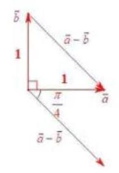

$\left\langle  {\overrightarrow{b},\overrightarrow{a} - \overrightarrow{b}}\right\rangle   = \frac{3\pi }{4}$

6. 已知等比数列 $\left\{  {a}_{n}\right\}$ 的前 $n$ 项和为 ${S}_{n},{a}_{2} = 3,{a}_{5} = {81}$ . 若 ${S}_{n} = {40}$ ,则 $n =$ ___.

${a}_{5} = {a}_{2}{q}^{3},\;{81} = 3{q}^{3},\;q = 3$

${a}_{1} = \frac{{a}_{2}}{q} = \frac{3}{3} = 1,{S}_{n} = \frac{1 - {3}^{n}}{1 - 3} = {40}, n = 4$

7. 已知函数 $y = \left\{  \begin{array}{l} {3}^{x} - a, x \geq  0 \\  b - {\left( \frac{1}{3}\right) }^{x}, x < 0 \end{array}\right.$ 为奇函数,则 $a + b$ 的值为 ___.

$f\left( 0\right)  = {3}^{0} - a = 0,\;a = 1$

$f\left( {-1}\right)  = b - {\left( \frac{1}{3}\right) }^{-1} = b - 3,\;f\left( 1\right)  = 3 - a = 3 - 1 = 2$

$f\left( {-1}\right)  =  - f\left( 1\right) , b - 3 =  - 2, b = 1$

$a + b = 2$ ,经检验满足条件

8. 若 ${\left( 3 - 2x\right) }^{6} = {a}_{0} + {a}_{1}x + {a}_{2}{x}^{2} + \cdots  + {a}_{6}{x}^{6}$ ,则 ${a}_{1} + 2{a}_{2} + 3{a}_{3} + \cdots  + 6{a}_{6} =$

两边求导, $6{\left( 3 - 2x\right) }^{5} \times  \left( {-2}\right)  = {a}_{1} + 2{a}_{2}x + \cdots  + 6{a}_{6}{x}^{5}$

令 $x = 1$ ,得 ${a}_{1} + 2{a}_{2} + \cdots  + 6{a}_{6} =  - {12}$

9. 已知函数 $y = {\log }_{a}\left( {x + 2}\right)  + 1\left( {a > 0}\right.$ 且 $\left. {a \neq  1}\right)$ 的图像过定点 $\left( {s, t}\right)$ ,正实数 $m\text{ 、 }n$ 满足 ${nt} - {ms} = 1$ ，则 $\frac{1}{m} + \frac{3}{n}$ 的最小值为 ___.

令 $x + 2 = 1, x =  - 1$ ,代入函数,得 $y = 1$

$\therefore$ 定点为 $\left( {-1,1}\right)$ ,即 $s =  - 1, t = 1$

$\therefore n + m = 1$

$\frac{1}{m} + \frac{3}{n} = 1 \times  \left( {\frac{1}{m} + \frac{3}{n}}\right)  = \left( {m + n}\right) \left( {\frac{1}{m} + \frac{3}{n}}\right)  = 1 + \frac{3m}{n} + \frac{n}{m} + 3 \geq  4 + 2\sqrt{3}$ (可取等)

10. 在四棱柱 ${ABCD} - {A}_{1}{B}_{1}{C}_{1}{D}_{1}$ 中,底面 ${ABCD}$ 为平行四边形, $\left| \overrightarrow{A{A}_{1}}\right|  = 2$ ,异面直线 $A{A}_{1}$ 与 ${BD}$ 的夹角为 $\arccos \frac{2}{5},\overrightarrow{AD} \cdot  \overrightarrow{D{C}_{1}} - \overrightarrow{AB} \cdot  \overrightarrow{B{C}_{1}} = 4$ ,则 $\left| \overrightarrow{B{D}_{1}}\right|  =$ ___。

以 $\overrightarrow{A{A}_{1}}\text{ 、 }\overrightarrow{AB}\text{ 、 }\overrightarrow{AD}$ 为基底

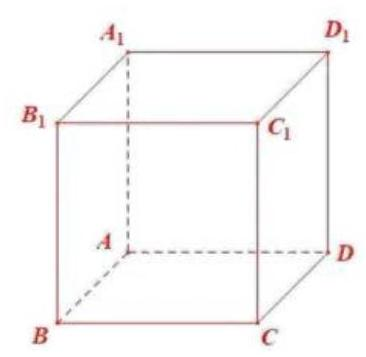

$\overrightarrow{AD} \cdot  \overrightarrow{D{C}_{1}} - \overrightarrow{AB} \cdot  \overrightarrow{B{C}_{1}} = \overrightarrow{AD} \cdot  \left( {\overrightarrow{DC} + \overrightarrow{C{C}_{1}}}\right)  - \overrightarrow{AB} \cdot  \left( {\overrightarrow{BC} + \overrightarrow{C{C}_{1}}}\right) \; = \overrightarrow{AD} \cdot  \left( {\overrightarrow{AB} + \overrightarrow{A{A}_{1}}}\right)  - \overrightarrow{AB} \cdot  \left( {\overrightarrow{AD} + \overrightarrow{A{A}_{1}}}\right) \; = \overrightarrow{AD} \cdot  \overrightarrow{A{A}_{1}} - \overrightarrow{AB} \cdot  \overrightarrow{A{A}_{1}} = \overrightarrow{A{A}_{1}} \cdot  \left( {\overrightarrow{AD} - \overrightarrow{AB}}\right) \; = \overrightarrow{A{A}_{1}} \cdot  \overrightarrow{BD} = \left| \overrightarrow{A{A}_{1}}\right|  \cdot  \left| \overrightarrow{BD}\right|  \cdot  \cos \theta  = 2\left| \overrightarrow{BD}\right|  \times  \frac{2}{5} = 4$

$\therefore \left| \overrightarrow{BD}\right|  = 5$

$\overrightarrow{B{D}_{1}} = \overrightarrow{BD} + \overrightarrow{D{D}_{1}} = \overrightarrow{BD} + \overrightarrow{A{A}_{1}}$

${\overrightarrow{B{D}_{1}}}^{2} = {\left( \overrightarrow{BD} + \overrightarrow{A{A}_{1}}\right) }^{2} = {\overrightarrow{BD}}^{2} + 2\overrightarrow{BD} \cdot  \overrightarrow{A{A}_{1}} + {\overrightarrow{A{A}_{1}}}^{2} = {25} + 2 \times  4 + 4 = {37}$

$\therefore \left| \overrightarrow{B{D}_{1}}\right|  = \sqrt{37}$

11. 如图,某公园划出一块平整的三角形草地 ${ABC}$ ,在边 ${BC}$ 上设置一个观景点 $D$ ,点 $D$ 到顶点 $C$ 的距离为 2 百米, ${AD}$ 平分 $\angle {BAC}$ ,边 ${AB}$ 和 ${AD}$ 的长度都为 3 百米. 现需要沿着三角形草地 ${ABC}$ 的边安装一圈灯带,则该灯带的长度为___百米.

如图,由角平分线定理得 $\frac{AB}{AC} = \frac{DB}{DC}$ ,即 $\frac{3}{y} = \frac{x}{2}$ ①

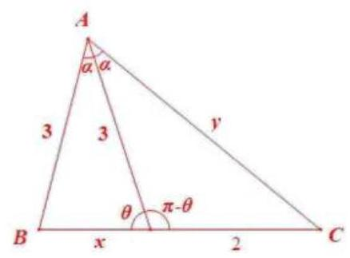

在 $\bigtriangleup {ABD}$ 与 $\bigtriangleup {ACD}$ 中,由余弦定理,得

$\left\{  \begin{array}{l} \cos \theta  = \frac{{x}^{2} + {3}^{2} - {3}^{2}}{{2x} \times  3} \\  \cos \left( {\pi  - \theta }\right)  =  - \cos \theta  = \frac{{3}^{2} + {2}^{2} - {y}^{2}}{2 \times  2 \times  3} \end{array}\right.$

两式相加,得 $0 = \frac{x}{6} + \frac{{13} - {y}^{2}}{12}$

联立①②，解得 $x = \frac{3}{2}, y = 4$

$\therefore$ 周长 $= 3 + x + y + 2 = \frac{21}{2}$

12. 记号 $\max \{ a, b\}$ 表示 $a\text{ 、 }b$ 中取较大的数,如 $\max \{ 1,2\}  = 2$ . 在平面直角坐标系中,定义 $d\left( {A, B}\right)  = \max \left\{  {\left| {{x}_{1} - {x}_{2}}\right| ,\left| {{y}_{1} - {y}_{2}}\right| }\right\}$ 为两点 $A\left( {{x}_{1},{y}_{1}}\right) \text{ 、 }B\left( {{x}_{2},{y}_{2}}\right)$ 的 “切比雪夫距离”. 已知点 $O$ 为坐标原点,点 $C$ 在圆 ${\left( x - 1\right) }^{2} + {\left( y - 1\right) }^{2} = 1$ 上,点 $A$ 在直线 ${3x} + {4y} - {10} = 0$ 上, 则 $d\left( {C, A}\right)  + d\left( {C, O}\right)$ 的最小值为 ___。

法一: 可以证明 $d\left( {C, A}\right)  + d\left( {C, O}\right)  \geq  d\left( {A, O}\right)$

$A\left( {{x}_{1},{y}_{2}}\right) ,\;B\left( {{x}_{2},{y}_{2}}\right) ,\;C\left( {{x}_{3},{y}_{3}}\right)$

$\max \left\{  {\left| {{x}_{1} - {x}_{3}}\right| ,\left| {{y}_{1} - {y}_{3}}\right| }\right\}   + \max \left\{  {\left| {x}_{3}\right| ,\left| {y}_{3}\right| }\right\}   \geq  \left| {{x}_{1} - {x}_{3}}\right|  + \left| {x}_{3}\right|  \geq  \left| {x}_{1}\right|$

$\max \left\{  {\left| {{x}_{1} - {x}_{3}}\right| ,\left| {{y}_{1} - {y}_{3}}\right| }\right\}   + \max \left\{  {\left| {x}_{3}\right| ,\left| {y}_{3}\right| }\right\}   \geq  \left| {{y}_{1} - {y}_{3}}\right|  + \left| {y}_{3}\right|  \geq  \left| {y}_{1}\right|$

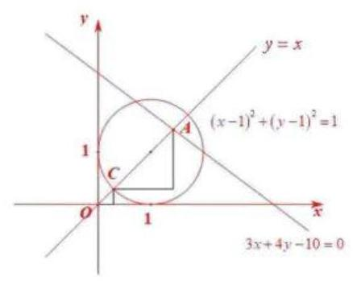

而 $d\left( {A, O}\right)  = \max \left\{  {\left| {x}_{1}\right| ,\left| {y}_{1}\right| }\right\}$ ,得证

若求 ${\left\lbrack  d\left( C, A\right)  + d\left( A, O\right) \right\rbrack  }_{\min }$ ,即求 ${\left\lbrack  d\left( A, O\right) \right\rbrack  }_{\min }$

易知当 $\left| {x}_{1}\right|  = \left| {y}_{1}\right|$ 时, $d\left( {A, O}\right)$ 取得最小

若 $\left| {x}_{1}\right|  \neq  \left| {y}_{1}\right|$ ,则 $d\left( {A, O}\right)$ 为 $\left| {x}_{1}\right|$ 与 $\left| {y}_{1}\right|$ 较大的那个

调整大的数变小,即可让 $d\left( {A, O}\right)$ 变小,调整到 $\left| {x}_{1}\right|  = \left| {y}_{1}\right|$ 为止,

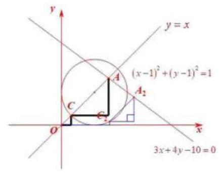

即 $A\left( {{x}_{1},{y}_{2}}\right)$ 在 $y = x$ 或 $y =  - x$ 上,且 $3{x}_{1} + 4{y}_{1} - {10} = 0$

当 ${x}_{1} = {y}_{1} = \frac{10}{7}$ 时, $d\left( {A, O}\right)$ 最小

其他位置 $d\left( {A, O}\right)$ 均大于上述 $d\left( {A, O}\right)$ 最小值

由图,圆上存在点 $C$ ,使得 $d\left( {C, A}\right)  + d\left( {C, O}\right)  = d\left( {A, O}\right)$

法二: $A\text{ 、 }C$ 独立运动

由法一知,当 $\left| {{x}_{3} - {x}_{1}}\right|  = \left| {{y}_{3} - {y}_{1}}\right|$ 时,即 $A$ 和 $C$ 的横向距离等于纵向距离时, $d\left( {C, A}\right)$ 最小

即 $A\text{ 、 }C$ 在斜率为1或 -1 的直线上

由图,存在 $A\text{ 、 }C\text{ 、 }O$ 都在 $y = x$ 上,使得 $d\left( {C, A}\right)$ 与 $d\left( {C, O}\right)$ 同时最小

联立 $\left\{  \begin{array}{l} y = x \\  {3x} + {4y} - {10} = 0 \end{array}\right.$ ,解得 $A\left( {\frac{10}{7},\frac{10}{7}}\right)$ ,即

$$
d\left( {C, A}\right)  + d\left( {C, O}\right)  = {x}_{A} - {x}_{C} + {x}_{C} - {x}_{O}
$$

$$
= {y}_{A} - {y}_{C} + {y}_{C} - {y}_{O} = {x}_{A} = {y}_{A} = \frac{10}{7}
$$

若 $A\text{ 、 }C$ 在其他位置,如图中 ${C}_{2}\text{ 、 }{A}_{2}$ 位置

则 $d\left( {{C}_{2},{A}_{2}}\right)  + d\left( {{C}_{2}, O}\right)  = {x}_{{A}_{2}} - {x}_{{C}_{2}} + {x}_{{C}_{2}} - {x}_{O} = {x}_{{A}_{2}} > {x}_{A}$

其他位置同理

综上, $\min  = \frac{10}{7}$

13. 若实数 $a\text{ 、 }b$ 满足 ${a}^{2} > {b}^{2}$ ，则下列不等式恒成立的是( )

A. $a > b > 0$

B、 $a > 0 > b$

C. $a > \left| b\right|$

D. $\left| a\right|  > \left| b\right|$

D

14. 一个袋中有大小与质地完全相同的红、黄、蓝三个球, 从袋中依次随机不放回地摸出两个球,记 “第一次取到红球 ” 为事件 $A,$ “第二次取到黄球 ” 为事件 $B$ ,则()

A、 $A$ 、 $B$ 相互独立

B. $P\left( B\right)  = \frac{1}{2}$

C. $P\left( {A \mid  B}\right)  = \frac{1}{2}$

D. $P\left( \bar{A}\right)  = \frac{1}{2}$

$P\left( B\right)  = \frac{1}{3} \times  \frac{1}{2} + \frac{1}{3} \times  \frac{1}{2} = \frac{1}{3}$

$P\left( {A \mid  B}\right)  = \frac{P\left( {AB}\right) }{P\left( B\right) } = \frac{\frac{1}{3} \times  \frac{1}{2}}{\frac{1}{3}} = \frac{1}{2}$ ,选 C

15. 在平面直角坐标系中,如果将函数 $y = f\left( x\right)$ 的图像绕坐标原点逆时针旋转 $\alpha$ 弧度后,所得曲线仍然是某个函数的图像,那么称函数 $y = f\left( x\right)$ 为 “ $\alpha$ 旋转函数 “ . 若函数 $y = {ax} - \frac{1}{x}$ 为 “ $\frac{\pi }{4}$ 旋转函数 ”,则 $a$ 的值为 ( )

A. -1

B. 0

C. 1

D. 2

法一:逆时针转 $\frac{\pi }{4}$ 后仍为函数图像,即旋转后图像不能一个 $x$ 对应两个 $y$

$\therefore$ 原函数 $y = {ax} - \frac{1}{x}$ 上任意两点斜率不为 1

$\frac{{y}_{1} - {y}_{2}}{{x}_{1} - {x}_{2}} = \frac{a{x}_{1} - \frac{1}{{x}_{1}} - \left( {a{x}_{2} - \frac{1}{{x}_{2}}}\right) }{{x}_{1} - {x}_{2}} = a + \frac{1}{{x}_{1}{x}_{2}} \neq  1$

$\therefore$ 对 $\forall {x}_{1}{x}_{2} \neq  0,\frac{1}{{x}_{1}{x}_{2}} \neq  1 - a$

而 $\frac{1}{{x}_{1}{x}_{2}} \in  \left( {-\infty ,0}\right)  \cup  \left( {0, + \infty }\right)$

$\therefore 1 - a = 0, a = 1$

法二: 原题等价于将坐标轴顺时针旋转 $\frac{\pi }{4}$ ,仍为函数

即 $y = x + t$ 与 $y = {ax} - \frac{1}{x}$ 对 $\forall t \in  \mathbf{R}$ 至多有一个解

${ax} - \frac{1}{x} = x + t,\;\left( {a - 1}\right) x + \frac{-1}{x} = t$

即 $y = \left( {a - 1}\right) x - \frac{1}{x}$ 与 $y = t\left( {t \in  \mathbf{R}}\right)$ 最多一个交点

① $a = 1$ ，成立

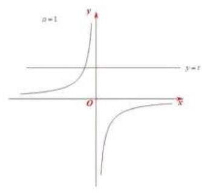

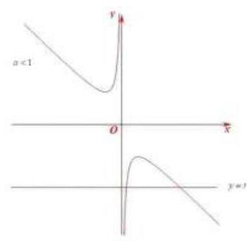

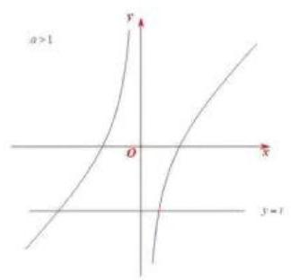

② $a < 1$ (舍)

③ $a > 1$ (舍)

法三: 代入选项,画图看是否与 $y = x + t\left( {t \in  \mathbf{R}}\right)$ 至多一个交点

综上,选 C

16. 已知数列 $\left\{  {a}_{n}\right\}$ 满足 ${a}_{n + 1} = 2{a}_{n}^{2} - 1$ ( $n$ 为正整数),关于数列 $\left\{  {a}_{n}\right\}$ 有以下两个命题:

(1)若 $1 < {a}_{3} < \frac{17}{8}$ ，则 ${a}_{1}$ 的取值范围是 $\left( {1,\frac{3\sqrt{2}}{4}}\right)$ ；

(2)若 ${a}_{1} + {a}_{3} = 0$ ，则 ${a}_{1}$ 的所有可能取值的个数是 4 个.

则以下选项正确的是 ( )

A. (1)是真命题，(2)是假命题

B. (2)是假命题，(2)是真命题

C. 两个都是真命题

D. 两个都是假命题

对于①， ${a}_{3} = 2{a}_{2}{}^{2} - 1 = 2{\left( 2{a}_{1}{}^{2} - 1\right) }^{2} - 1 = 8{a}_{1}{}^{4} - 8{a}_{1}{}^{2} + 1 \in  \left( {1,\frac{17}{8}}\right)$

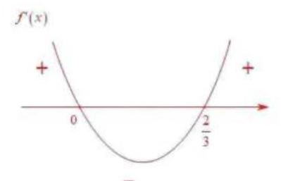

$\therefore {a}_{1} \in  \left( {-\frac{3\sqrt{2}}{4}, - 1}\right)  \cup  \left( {1,\frac{3\sqrt{2}}{4}}\right)$ ,①错误

对于②， ${a}_{3} =  - {a}_{1}$

由①知 $8{a}_{1}^{4} - 8{a}_{1}^{2} + 1 =  - {a}_{1}$

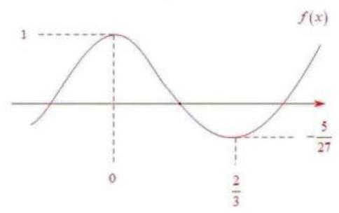

$\therefore 8{a}_{1}^{2}\left( {{a}_{1}^{2} - 1}\right)  + {a}_{1} + 1 = 0$

$\therefore 8{a}_{1}^{2}\left( {{a}_{1} + 1}\right) \left( {{a}_{1} - 1}\right)  + {a}_{1} + 1 = 0$

$\therefore \left( {{a}_{1} + 1}\right) \left\lbrack  {8{a}_{1}^{2}\left( {{a}_{1} - 1}\right)  + 1}\right\rbrack   = 0$

$\therefore {a}_{1} =  - 1$ 或 $8{a}_{1}^{3} - 8{a}_{1}^{2} + 1 = 0$

令 $f\left( x\right)  = 8{x}^{3} - 8{x}^{2} + 1,{f}^{\prime }\left( x\right)  = {24}{x}^{2} - {16x}$

$y = f\left( x\right)$ 有 3 个零点且不为 -1

$\therefore {a}_{1}$ 有 4 个,② 正确,选 B

17. 在如图所示的多面体中,已知四边形 ${ABCD}$ 是菱形, $\angle {ABC} = {60}^{ \circ  },{FA} \bot$ 平面 ${ABCD},{ED} \bot$ 平面 ${ABCD},{AB} = {FA} = {2ED} = 2$ ,点 $G$ 为线段 ${AF}$ 的中点.

(1)求证:平面 ${BDG}//$ 平面 ${CEF}$ ；

(2)求直线 ${BC}$ 与平面 ${BDG}$ 所成角的正弦值.

(1)连接 ${AC}\text{ 、 }{BD}$ 交于点 $O$ ,连接 ${OG}\text{ 、 }{DG}$

在菱形 ${ABCD}$ 中,点 $O$ 是 ${AC}$ 的中点

$\therefore {OG}//{CF}$

$\because {OG} \text{ ⊄ }$ 平面 ${CEF},{FC} \subset$ 平面 ${CEF}$

$\therefore {OG}//$ 平面 ${CEF}$

$\because {FA} \bot$ 平面 ${ABCD},{ED} \bot$ 平面 ${ABCD}$

$\therefore {FA}//{DE}$

又 $\because {FA} = {2ED} = 2,{FA} = {2FG}$

$\therefore$ 四边形 ${DEFG}$ 是平行四边形

$\therefore {DG}//{EF}$

$\because {DG} \text{ ⊄ }$ 平面 ${CEF},{EF} \subset$ 平面 ${CEF}$

$\therefore {DG}//$ 平面 ${CEF}$

$\because {OG} \cap  {DG} = G,{OG}\text{ 、 }{DG} \subset$ 平面 ${BDG}$

$\therefore$ 平面 ${BDG}//$ 平面 ${CEF}$

(2)取 ${BC}$ 的中点 $M$ ，连接 ${AM}$

$\because \angle {ABC} = {60}^{ \circ  }$ ，四边形 ${ABCD}$ 是菱形

$\therefore \bigtriangleup {ABC}$ 是等边三角形, ${AM} \bot  {BC}$

以 $A$ 为原点,直线 ${AM}\text{ 、 }{AD}\text{ 、 }{AF}$ 分别为 $x$ 轴、 $y$ 轴、 $z$ 轴建立如图坐标系

$B\left( {\sqrt{3}, - 1,0}\right) ,\;C\left( {\sqrt{3},1,0}\right) ,\;D\left( {0,2,0}\right) ,\;G\left( {0,0,1}\right)$

$\overrightarrow{BC} = \left( {0,2,0}\right) ,\overrightarrow{BD} = \left( {-\sqrt{3},3,0}\right) ,\overrightarrow{DG} = \left( {0, - 2,1}\right)$

设平面 ${BDG}$ 的一个法向量为 $\overrightarrow{n} = \left( {x, y, z}\right)$

则 $\left\{  \begin{array}{l} \overrightarrow{n} \cdot  \overrightarrow{BD} =  - \sqrt{3}x + {3y} = 0 \\  \overrightarrow{n} \cdot  \overrightarrow{DG} =  - {2y} + z = 0 \end{array}\right.$ ,令 $y = 1$ ,得 $x = \sqrt{3}, z = 2,\overrightarrow{n} = \left( {\sqrt{3},1,2}\right)$

$\therefore \cos \langle \overrightarrow{BC},\overrightarrow{n}\rangle  = \frac{\overrightarrow{BC} \cdot  \overrightarrow{n}}{\left| \overrightarrow{BC}\right| \left| \overrightarrow{n}\right| } = \frac{2}{2 \times  2\sqrt{2}} = \frac{\sqrt{2}}{4}$

18. 已知函数 $y = f\left( x\right)$ 的表达式为 $y = \frac{\sqrt{3}}{2}\sin {2x} + {\cos }^{2}x$ .

(1)若将函数 $y = f\left( x\right)$ 的图像向右平移 $\varphi \left( {\varphi  > 0}\right)$ 个单位长度，得到函数 $y = g\left( x\right)$ 的图像关于直线 $x = \frac{\pi }{6}$ 对称,求 $\varphi$ 的最小值;

( 2 )若函数 $y = f\left( x\right)$ 在区间 $\left( {-\frac{\pi }{12}, m}\right)$ 上恰有 2 个极值点和 2 个零点，求实数 $m$ 的取值范围.

(1) $f\left( x\right)  = \frac{\sqrt{3}}{2}\sin {2x} + \frac{\cos {2x} + 1}{2} = \frac{\sqrt{3}}{2}\sin {2x} + \frac{1}{2}\cos {2x} + \frac{1}{2} = \sin \left( {{2x} + \frac{\pi }{6}}\right)  + \frac{1}{2} \; g\left( x\right)  = f\left( {x - \varphi }\right)  = \sin \left\lbrack  {2\left( {x - \varphi }\right)  + \frac{\pi }{6}}\right\rbrack   + \frac{1}{2} = \sin \left( {{2x} - {2\varphi } + \frac{\pi }{6}}\right)  + \frac{1}{2} \; 2 \times  \frac{\pi }{6} - {2\varphi } + \frac{\pi }{6} = \frac{\pi }{2} + {k\pi },\;k \in  \mathbf{Z} \; \varphi  =  - \frac{k\pi }{2},\;k \in  \mathbf{Z},\;\varphi  > 0$

$k =  - 1,\;{\varphi }_{\min } = \frac{\pi }{2}$

(2)由(1)， $f\left( x\right)  = \sin \left( {{2x} + \frac{\pi }{6}}\right)  + \frac{1}{2}$ ， $x \in  \left( {-\frac{\pi }{12}, m}\right)$

令 $t = {2x} + \frac{\pi }{6},\;t \in  \left( {0,{2m} + \frac{\pi }{6}}\right)$

$$
y = \sin t + \frac{1}{2},\;\sin t =  - \frac{1}{2}
$$

$$
\frac{11}{6}\pi  < {2m} + \frac{\pi }{6} \leq  \frac{5}{2}\pi
$$

$$
m \in  \left( {\frac{5\pi }{6},\frac{7\pi }{6}}\right\rbrack
$$

19. 质监部门从某超市销售的甲、乙两种食用油中各随机抽取 100 桶检测某项质量指标, 由检测结果得到如下的频率分布直方图:

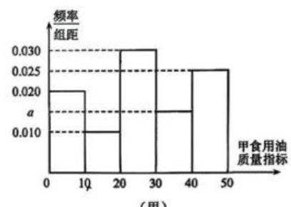

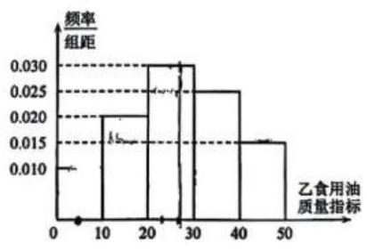

(乙)

(1)写出频率分布直方图 (甲) 中 $a$ 的值; 记甲、乙两种食用油 100 桶样本的质量指标的方差分别为 ${s}_{1}^{2}\text{ 、 }{s}_{2}^{2}$ ,试比较 ${s}_{1}^{2}$ 与 ${s}_{2}^{2}$ 的大小 (只要求写出结果);

(2)在甲、乙两种食用油中各随机抽取 1 桶，用频率估计概率，求恰有一桶的质量指标大于 10 且小于 40 的概率;

(3)由频率分布直方图可以认为，乙种食用油的质量指标值 $Z$ 服从正态分布 $N\left( {\mu ,{\sigma }^{2}}\right)$ . 其中 $\mu$ 近似为样本平均数 $\bar{x},{\sigma }^{2}$ 近似为样本方差 ${s}_{i}^{2}$ ,现从乙种食用油中随机抽取 10 桶,设 $X$ 表示质量指标值位于 $\left( {{26.50},{38.45}}\right)$ 的桶数,求 $X$ 的数学期望。(结果保留两位小数)

注:(1)同一组数据用该区间的中点值作代表；

(2)若 $Z \sim  N\left( {\mu ,{\sigma }^{2}}\right)$ ，则

$P\left( {\mu  - \sigma  < Z < \mu  + \sigma }\right)  = {0.6826}, P\left( {\mu  - {2\sigma } < Z < \mu  + {2\sigma }}\right)  = {0.9544},$

$P\left( {\mu  - {3\sigma } < Z < \mu  + {3\sigma }}\right)  = {0.9974}.$

(1) ${10} \times  \left( {{0.02} + {0.01} + {0.03} + a + {0.025}}\right)  = 1, a = {0.015}$

${s}_{1}^{2} > {s}_{2}^{2}$ ,甲波动大,方差大

(2) ${P}_{1} = {10} \times  \left( {{0.01} + {0.03} + {0.015}}\right)  = {0.55}$

${P}_{2} = {10} \times  \left( {{0.02} + {0.03} + {0.025}}\right)  = {0.75}$

$P\left( \text{ 恰有一桶 }\right)  = {0.55} \times  {0.25} + {0.75} \times  {0.45} = {0.475}$

(3) $\bar{x} = 5 \times  {0.1} + {15} \times  {0.2} + {25} \times  {0.3} + {35} \times  {0.25} + {45} \times  {0.15} = {26.5}$

$$
{s}_{2}^{2} = {\left( 5 - {26.5}\right) }^{2} \times  {0.1} + {\left( {15} - {26.5}\right) }^{2} \times  {0.2} + {\left( {25} - {26.5}\right) }^{2} \times  {0.3} + {\left( {35} - {26.5}\right) }^{2} \times  {0.25}
$$

$$
+ {\left( {45} - {26.5}\right) }^{2} \times  {0.15} = {142.75}
$$

$$
Z \sim  N\left( {{26.5},{142.75}}\right)
$$

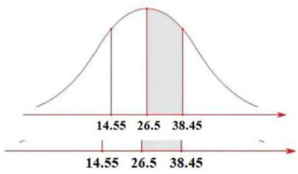

$\mu  = {26.5},{\sigma }^{2} = {142.75},\sigma  = \sqrt{142.75} \approx  {11.95}$

$P\left( {{26.5} - {11.95} < Z < {26.5} + {11.95}}\right)  = {0.6826}$

$$
P\left( {{14.55} < Z < {38.45}}\right)  = {0.6826}
$$

$$
P\left( {{26.5} < Z < {38.45}}\right)  = \frac{1}{2} \times  {0.6826} = {0.3413}
$$

$X \sim  B\left( {{10},{0.3413}}\right) ,\;E\left( X\right)  = {np} = {10} \times  {0.3413} \approx  {3.41}$

20. 已知椭圆 $\Gamma  : \frac{{x}^{2}}{{a}^{2}} + \frac{{y}^{2}}{3} = 1\left( {a > 0}\right)$ 的左焦点为 $F\left( {-1,0}\right)$ ,过点 $Q\left( {-4,0}\right)$ 作斜率不为 0 的直线 $l$ 与椭圆 $\Gamma$ 交于 $M\text{ 、 }N$ 两点.

(1)求椭圆 $\Gamma$ 的离心率；

(2)设直线 ${MF}\text{ 、 }{NF}$ 的斜率分别为 ${k}_{1}\text{ 、 }{k}_{2}$ ，求 ${k}_{1} + {k}_{2}$ 的值；

(3)若点 $E$ 满足 ${EM} = {EN} = {EF}$ ，点 $D$ 在椭圆上， ${MD}\bot x$ 轴，探究直线 ${EF}$ 与直线 ${DQ}$ 的斜率之积是否为定值? 若为定值, 请求出该值; 若不为定值, 请说明理由.

(1) ${b}^{2} = 3, c = 1,{a}^{2} = 4,\frac{c}{a} = \frac{1}{2}$

(2) ${k}_{l} \neq  0,\frac{{x}^{2}}{4} + \frac{{y}^{2}}{3} = 1, F\left( {-1,0}\right)$

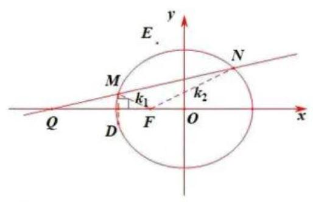

设 $l : x = {my} - 4, M\left( {{x}_{1},{y}_{1}}\right) , N\left( {{x}_{2},{y}_{2}}\right)$

联立 $\left\{  \begin{array}{l} x = {my} - 4 \\  \frac{{x}^{2}}{4} + \frac{{y}^{2}}{3} = 1 \end{array}\right.$ ,得 $\left( {3{m}^{2} + 4}\right) {y}^{2} - {24my} + {36} = 0$

$\Delta  > 0,\;{y}_{1} + {y}_{2} = \frac{24m}{3{m}^{2} + 4},\;{y}_{1}{y}_{2} = \frac{36}{3{m}^{2} + 4}$

${k}_{1} + {k}_{2} = \frac{{y}_{1}}{{x}_{1} + 1} + \frac{{y}_{2}}{{x}_{2} + 1} = \frac{{y}_{1}}{m{y}_{1} - 3} + \frac{{y}_{2}}{m{y}_{2} - 3} = \frac{{2m}{y}_{1}{y}_{2} - 3\left( {{y}_{1} + {y}_{2}}\right) }{\left( {m{y}_{1} - 3}\right) \left( {m{y}_{2} - 3}\right) }$

代入韦达定理,得 ${k}_{1} + {k}_{2} = \frac{{72m} - {72m}}{\left( {m{y}_{1} - 3}\right) \left( {m{y}_{2} - 3}\right) } = 0$

(3)由题， $E$ 为 $\bigtriangleup  {MNF}$ 的外心

$M\text{ 、 }D$ 关于 $x$ 轴对称

$\therefore {k}_{QD} =  - {k}_{MN} =  - \frac{1}{m}$

设 $\bigtriangleup {MNF}$ 的外接圆方程为 ${x}^{2} + {y}^{2} + {D}_{0}x + {E}_{0}y + {F}_{0} = 0$

代入 $F\left( {-1,0}\right)$ ，得 ${F}_{0} = {D}_{0} - 1$

$\therefore {x}^{2} + {y}^{2} + {D}_{0}x + {E}_{0}y + {D}_{0} - 1 = 0$

联立 $x = {my} - 4$ ,得 $\left( {{m}^{2} + 1}\right) {y}^{2} + \left( {m{D}_{0} - {8m} + {E}_{0}}\right) y + {15} - 3{D}_{0} = 0$

与椭圆和直线联立的方程同解

$\therefore \frac{{m}^{2} + 1}{3{m}^{2} + 4} = \frac{m{D}_{0} - {8m} + {E}_{0}}{-{24m}} = \frac{{15} - 3{D}_{0}}{36}$

$\therefore {D}_{0} = \frac{3{m}^{2} + 8}{3{m}^{2} + 4},{E}_{0} = \frac{-3{m}^{3}}{3{m}^{2} + 4}$

$\therefore E\left( {-\frac{{D}_{0}}{2}, - \frac{{E}_{0}}{2}}\right) , E\left( {-\frac{3{m}^{2} + 8}{2\left( {3{m}^{2} + 4}\right) },\frac{3{m}^{3}}{2\left( {3{m}^{2} + 4}\right) }}\right)$

$$
{k}_{EF} = \frac{\frac{3{m}^{3}}{2\left( {3{m}^{2} + 4}\right) }}{-\frac{3{m}^{2} + 8}{2\left( {3{m}^{2} + 4}\right) } + 1} = m
$$

$$
\therefore {k}_{EF} \cdot  {k}_{DQ} = m \cdot  \left( {-\frac{1}{m}}\right)  =  - 1
$$

21. 若函数 $y = M\left( x\right) \text{ 、 }y = N\left( x\right)$ 在区间 $I$ 上满足 $\left| {M\left( x\right) }\right|  \leq  N\left( x\right)$ ,则称函数 $y = N\left( x\right)$ 为 $y = \; M\left( x\right)$ 在区间 $I$ 上的绝对值上界函数. 设定义在 $\mathbf{R}$ 上的函数 $y = f\left( x\right) \text{ 、 }y = g\left( x\right)$ 的导数为 $y = {f}^{\prime }\left( x\right) \text{ 、 }y = {g}^{\prime }\left( x\right)$ 。

(1)判断函数 $y = x$ 是不是函数 $y = \sin x$ 在区间 $\left\lbrack  {0,\pi }\right\rbrack$ 上的绝对值上界函数，并说明理由;

(2)若函数 $y = {g}^{\prime }\left( x\right)$ 为 $y = {f}^{\prime }\left( x\right)$ 在 $\mathbf{R}$ 上的绝对值上界函数，求证:对任意 $h > 0$ ，都有 $\left| {f\left( {x + h}\right)  - f\left( x\right) }\right|  \leq  g\left( {x + h}\right)  - g\left( x\right) ;$

(3)若函数 $= {g}^{\prime }\left( x\right)$ 为 $y = {f}^{\prime }\left( x\right)$ 在 $\mathbf{R}$ 上的绝对值上界函数，实数 $a\text{ 、 }b\left( {a < b}\right)$ 满足 $g{\left( x\right) }_{\min } = g\left( a\right)  = f\left( a\right) , g{\left( x\right) }_{\max } = g\left( b\right)  = f\left( b\right)$ ,确定 $f\left( {x}_{0}\right) \text{ 、 }g\left( {x}_{0}\right)$ 在 ${x}_{0} \in  \mathbf{R}$ 时的大小关系. $\left( {g{\left( x\right) }_{\min }\text{ 、 }g{\left( x\right) }_{\max }}\right.$ 分别表示函数 $y = g\left( x\right)$ 的最小值和最大值 $)$

(1) 是

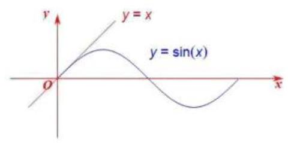

当 $x \in  \left\lbrack  {0,\pi }\right\rbrack$ 时,显然 $0 \leq  \sin x \leq  x$

$\therefore \left| {\sin x}\right|  \leq  x$

$\therefore$ 是

(2) $\left| {{f}^{\prime }\left( x\right) }\right|  \leq  {g}^{\prime }\left( x\right)$

$- {g}^{\prime }\left( x\right)  \leq  {f}^{\prime }\left( x\right)  \leq  {g}^{\prime }\left( x\right) ,\;{f}^{\prime }\left( x\right)  + {g}^{\prime }\left( x\right)  \geq  0$ 且 ${f}^{\prime }\left( x\right)  - {g}^{\prime }\left( x\right)  \leq  0$

$\therefore y = f\left( x\right)  + g\left( x\right)$ 单调递增, $y = f\left( x\right)  - g\left( x\right)$ 单调递减

$\therefore$ 对 $\forall h > 0$ ,有 $\left\{  \begin{array}{l} f\left( {x + h}\right)  + g\left( {x + h}\right)  \geq  f\left( x\right)  + g\left( x\right) \\  f\left( {x + h}\right)  - g\left( {x + h}\right)  \leq  f\left( x\right)  - g\left( x\right)  \end{array}\right.$

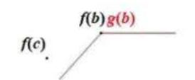

$\therefore \left\{  \begin{array}{l} f\left( {x + h}\right)  - f\left( x\right)  \geq  g\left( x\right)  - g\left( {x + h}\right)  =  - \left\lbrack  {g\left( {x + h}\right)  - g\left( x\right) }\right\rbrack  \\  f\left( {x + h}\right)  - f\left( x\right)  \leq  g\left( {x + h}\right)  - g\left( x\right)  \end{array}\right.$

$\therefore \left| {f\left( {x + h}\right)  - f\left( x\right) }\right|  \leq  g\left( {x + h}\right)  - g\left( x\right)$

(3) $0 \leq  \left| {{f}^{\prime }\left( x\right) }\right|  \leq  {g}^{\prime }\left( x\right)$

$\therefore g\left( x\right)$ 单调递增

$\because g{\left( x\right) }_{\min } = g\left( a\right) ,\;g{\left( x\right) }_{\max } = g\left( b\right)$

当 $x \leq  a$ 时, $g\left( x\right)  = g\left( a\right) ,{g}^{\prime }\left( x\right)  = 0,\left| {{f}^{\prime }\left( x\right) }\right|  \leq  {g}^{\prime }\left( x\right) ,{f}^{\prime }\left( x\right)  = 0, f\left( x\right)  = k$ ( $k$ 为常数)

当 $x \geq  b$ 时, $g\left( x\right)  = g\left( b\right) ,{g}^{\prime }\left( x\right)  = 0,{f}^{\prime }\left( x\right)  = 0, f\left( x\right)  = m\;\left( {m\text{ 为常数 }}\right)$

若 $k \neq  f\left( a\right)$ ,则存在 ${x}_{0} < a$ ,使得 $\left| {f\left( {x}_{0}\right)  - f\left( a\right) }\right|  > 0 > \left| {g\left( {x}_{0}\right)  - g\left( a\right) }\right|  > 0$ ,与 (2) 矛盾

同理, $m = g\left( b\right)$

若 $\exists c \in  \left( {a, b}\right)$ ,使得 $f\left( c\right)  \neq  g\left( c\right)$ ,不妨设 $f\left( c\right)  > g\left( c\right)$

则 $\left| {f\left( c\right)  - f\left( a\right) }\right|  > \left| {g\left( c\right)  - g\left( a\right) }\right|$ ,与 (2) 矛盾

$\therefore$ 对 $\forall x \in  \left( {a, b}\right) , f\left( x\right)  = g\left( x\right)$

综上, $f\left( {x}_{0}\right)  = g\left( {x}_{0}\right) ,{x}_{0} \in  \mathbf{R}$

中国大陆 上海

