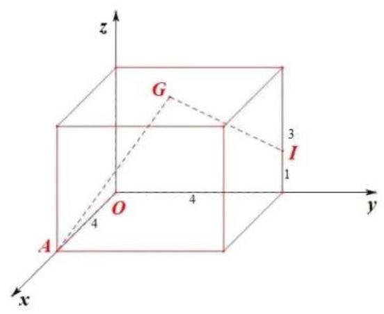
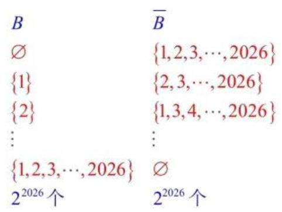
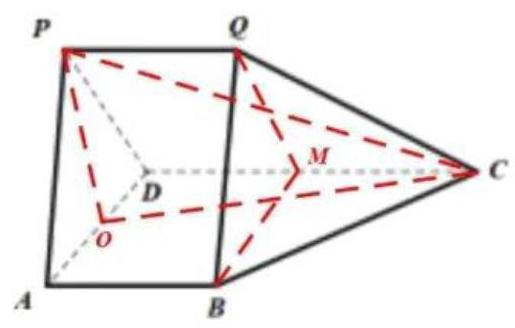
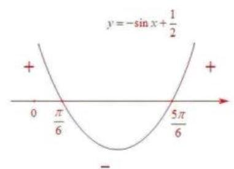
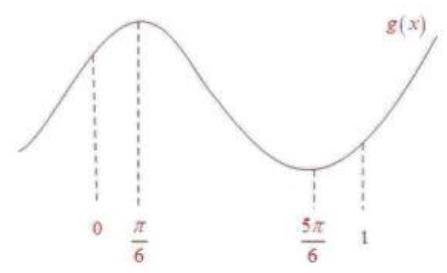

# 上海·2026_届浦东新区高三数学二模详解-dollar

## 一、填空题

1. 已知全集 $U = \left( {0, + \infty }\right)$ ,集合 $A = \lbrack 2, + \infty )$ ,则 $\bar{A} = \_ \left( {0,2}\right)$ _.

$\left( {0,2}\right)$

2. 已知复数 $z$ 满足 $\left( {1 + \mathrm{i}}\right)  \cdot  z = 2\mathrm{i}$ ,则 $z = \_ i + 1$ .

$z = \frac{2i}{1 + i} = \frac{{2i} \cdot  \left( {1 - i}\right) }{\left( {1 + i}\right) \left( {1 - i}\right) } = \frac{{2i} + 2}{2} = i + 1$

3. 已知 $f\left( x\right)  = \left\{  \begin{array}{ll} \frac{1}{{x}^{3}}, & x < 0, \\  x + 1, & x \geq  0. \end{array}\right.$ 若 $f\left( a\right)  =  - 2$ ，则实数 $a$ 的值为-8___.

当 $a < 0$ 时， $f\left( a\right)  = {a}^{\frac{1}{3}} =  - 2, a = {\left( -2\right) }^{3} =  - 8$

当 $a \geq  0$ 时, $f\left( a\right)  = a + 1 =  - 2, a =  - 3$ (舍)

$\therefore a =  - 8$

4. 在 $\bigtriangleup {ABC}$ 中,若 $a = 7, b = 8,\cos C = \frac{13}{14}$ ,则 $c = \_ 3$ .

$\cos C = \frac{{a}^{2} + {b}^{2} - {c}^{2}}{2ab}$ ,即 $\frac{13}{14} = \frac{{49} + {64} - {c}^{2}}{2 \times  7 \times  8}$ ,解得 $c = 3$

5. 某校高中三年级 600 名学生参加了区质量检测,已知数学检测成绩 $X$ 服从正态分布 $N\left( {{100},{\sigma }^{2}}\right)$ (试卷满分为 150 分). 统计结果显示, 数学检测成绩介于 80 分到 120 分之间的人数为 450 名, 则此次检测中成绩不低于 120 分的学生人数约为总人数的 12.5% (精确到 0.1%).

$P\left( {{80} < X < {120}}\right)  = \frac{450}{600} = {0.75},\frac{1 - {0.75}}{2} = {12.5}\%$

6. 已知直线 $l$ 是曲线 $y = \frac{3}{x + 1} + \ln x$ 在 $x = 2$ 处的切线,则 $l$ 的斜率为 $- \frac{1}{6}$ ___.

${y}^{\prime } =  - \frac{3}{{\left( x + 1\right) }^{2}} + \frac{1}{x},\;k = {y}^{\prime }\left( 2\right)  =  - \frac{3}{{\left( 2 + 1\right) }^{2}} + \frac{1}{2} = \frac{1}{6}$

7. 从 4 名男生 3 名女生中选取 3 人，依次进行面试，其中恰好有 1 名女生，则有___108___种不同的面试方法. ${C}_{4}^{2}{C}_{3}^{1}{P}_{3}^{3} = {108}$

8. 一个家庭有两个孩子，生肖均为十二生肖之一(等可能)，已知其中一个孩子属马，则另一个孩子也属马的概率为 $- \frac{1}{23}$ .

老大属马,老二不属马: $1 \times  {11} = {11}$ 种

老大不属马,老二属马: ${11} \times  1 = {11}$ 种

老大属马,老二也属马: $1 \times  1 = 1$ 种

$$
P = \frac{1}{{11} + {11} + 1} = \frac{1}{23}
$$

9. 已知数列 $\left\{  {a}_{n}\right\}$ 的通项公式是 ${a}_{n} = {2}^{n - 1} + 1,{S}_{n}$ 为数列 $\left\{  {a}_{n}\right\}$ 的前 $n$ 项和,则使得不等式 ${S}_{n} > {2026}$ 成立的最小正整数 $n$ 的值为___11___.

$$
{S}_{n} = {a}_{1} + {a}_{2} + \cdots  + {a}_{n} = {2}^{0} + 1 + {2}^{1} + 1 + \cdots  + {2}^{n - 1} + 1
$$

$$
= \left( {{2}^{0} + {2}^{1} + {2}^{2} + \cdots  + {2}^{n - 1}}\right)  + \underset{n\text{ 个 }}{\underbrace{\left( 1 + 1 + \cdots  + 1\right) }}
$$

$$
= \frac{1 \times  \left( {1 - {2}^{n}}\right) }{1 - 2} + n = {2}^{n} - 1 + n
$$

即求 ${2}^{n} - 1 + n > {2026}$ 成立时的最小正整数 $n$

当 $n = {10}$ 时, ${2}^{10} - 1 + {10} = {1033} < {2026}$

当 $n = {11}$ 时, ${2}^{11} - 1 + {11} = {2058} > {2026}$

$\therefore n = {11}$

10. 已知,圆 $O$ 是圆心在原点的单位圆,弦 ${AB}$ 平行于 $x$ 轴,并将圆分为两段弧. 将其中一段劣弧 $\overset{\text{ ⏜ }}{AB}$ 沿弦 ${AB}$ 翻折后恰好经过圆心. 若直线 $y = x + m$ 与翻折后得到的两段弧有四个不同的交点,则实数 $m$ 的取值范围为 $- \left( {\frac{\sqrt{3} - 1}{2},\sqrt{2} - 1}\right)$ ___.

${y}_{A} = {y}_{B} =  - \frac{1}{2}$ ,代入 ${x}^{2} + {y}^{2} = 1$ 中,得 ${x}^{2} + \frac{1}{4} = 1$ ,解得 $x =  \pm  \frac{\sqrt{3}}{2}$

即 $A\left( {-\frac{\sqrt{3}}{2}, - \frac{1}{2}}\right) , B\left( {\frac{\sqrt{3}}{2}, - \frac{1}{2}}\right)$

将 $A$ 点坐标代入 $y = x + m$

得 $m = {y}_{A} - {x}_{A} =  - \frac{1}{2} + \frac{\sqrt{3}}{2} = \frac{\sqrt{3} - 1}{2}$

$\overset{\text{ ⏜ }}{OA}$ 上一点 $P\left( {x, y}\right)$ 关于 $y =  - \frac{1}{2}$ 对称点为 ${P}^{\prime }\left( {x, - y - 1}\right)$

将 ${P}^{\prime }$ 代入 ${x}^{2} + {y}^{2} = 1$ ，得 ${x}^{2} + {\left( y + 1\right) }^{2} = 1$

即点 $P$ 在以 $\left( {0, - 1}\right)$ 为圆心,半径为 1 的圆上,直线 $x - y + m = 0$

$d = \frac{\left| 1 + m\right| }{\sqrt{2}} = 1$

则 $m =  - 1 \pm  \sqrt{2}$ ,取 $m = \sqrt{2} - 1$

$\therefore m \in  \left( {\frac{\sqrt{3} - 1}{2},\sqrt{2} - 1}\right)$

11. 某光影科技实验室为长方体空间, 底面是边长为 4 米的正方形, 高为 3 米. 为营造动态光影效果, 在底面一个顶点处安装射灯 $A$ ,在与该顶点相对的侧棱上、距底面 1 米处安装射灯 $I$ ,两盖射灯的光束方向由智能系统自动控制,始终使两束光线相互垂直,且它们的交汇点 $G$ 始终落在实验室天花板上. 则交汇点 $G$ 形成的轨迹长度为 $2\sqrt{2}\pi$ ___米.

如图建系， $A\left( {4,0,0}\right)$ ， $I\left( {0,4,1}\right)$ ， $G\left( {x, y,3}\right)$

$\because {AG} \bot  {IG}$

$\therefore \overrightarrow{AG} \cdot  \overrightarrow{IG} = 0$

$\therefore \left( {x - 4, y,3}\right)  \cdot  \left( {x, y - 4,2}\right)  = \left( {x - 4}\right) x + y\left( {y - 4}\right)  + 6 = 0$

$\therefore {x}^{2} + {y}^{2} - {4x} - {4y} + 6 = 0$

${\left( x - 2\right) }^{2} + {\left( y - 2\right) }^{2} = 2$

${C}_{\text{ 周长 }} = {2\pi r} = 2\sqrt{2}\pi$

12. 已知集合 $M$ 的元素均为正整数,定义集合 $M$ 的 “变项和” 为: 将 $M$ 中每个元素 $m$ 都乘以 ${\left( -1\right) }^{m}$ 后再求和. 若集合 $A = \{ n \mid  1 \leq  n \leq  {2026}, n \in  \mathbf{N}\}$ ,则集合 $A$ 的所有非空子集的 “变项和” 的总和为 ${1013} \times  {2}^{2025}$ .

由题意, $A = \{ 1,2,\cdots ,{2026}\} , A$ 的 “变项和” 为 $- 1 + 2 - 3 + 4 - \cdots  + {2026} = {1013}$

$\because \varnothing$ 的 “变项和” 为 0,且对任意 $A$ 的子集 $B \subseteq  A$ ,都有 $\bar{B} \subseteq  A$ ,即 $B \cup  \bar{B} = A$

$\therefore$ 不用排除 $\varnothing$

$A$ 的子集共有 ${2}^{2026}$ 个，即有 ${2}^{2026}$ 对 $B$ 和 $\bar{B}$

而每一行 $B$ 的 “变项和” 与 $\bar{B}$ 的 “变项和” 之和即为 $A$ 的 “变项和”

由于重复,则 $A$ 的所有非空子集的 “变项和” 总和为 ${1013} \times  \frac{{2}^{2026}}{2} = {1013} \times  {2}^{2025}$

## 二、选择题.

13. 某校学生会体育部长依据本校高三男生的身高(单位:cm)与体重(单位:kg)的抽样数据，运用电子办公软件求出了 “体重” $\left( y\right)$ 关于 “身高” $\left( x\right)$ 的回归方程,则该回归方程 $\left( {D - }\right)$

A. 表示 $x$ 与 $y$ 之间的不确定关系

B. 表示 $x$ 与 $y$ 之间的不确定关系

C. 反映 $x$ 与 $y$ 之间的真实关系

D. 反映 $x$ 与 $y$ 之间的真实关系的一种最佳拟合

14. 已知实数 $a\text{ 、 }b\text{ 、 }c$ 满足 $a > b > 1 > c$ ,则下列结论一定正确的是(C)

A. ${ac} > {bc}$ B. ${b}^{c} < 1$ C. ${\log }_{a}b + {\log }_{b}a > 2$ D. $a + c > b$ .

对于 $\mathrm{C},{\log }_{a}b + {\log }_{b}a = {\log }_{a}b + \frac{1}{{\log }_{a}b} > 2\;\left( {{\log }_{a}b > 0}\right)$

取等条件: ${\log }_{a}b = 1, a = b$ (而 $a \neq  b$ ) 选 $\mathrm{C}$

15. 已知 $\overrightarrow{{e}_{1}}\text{ 、 }\overrightarrow{{e}_{2}}$ 与 $\overrightarrow{{e}_{3}}$ 是不共面的向量,则以下向量组中,一定不共面的是(B)

A. $\overrightarrow{{e}_{1}} + \overrightarrow{{e}_{2}}\text{ 、 }\overrightarrow{{e}_{3}}\text{ 、 }\overrightarrow{{e}_{1}} + \overrightarrow{{e}_{2}} + \overrightarrow{{e}_{3}}$

B. $\overrightarrow{{e}_{1}}\text{ 、 }\overrightarrow{{e}_{2}} + \overrightarrow{{e}_{3}}\text{ 、 }3\overrightarrow{{e}_{1}} + 4\overrightarrow{{e}_{2}} + 3\overrightarrow{{e}_{3}}$

C. $\overrightarrow{{e}_{1}}\text{ 、 }2\overrightarrow{{e}_{2}} - \overrightarrow{{e}_{3}}\text{ 、 }\overrightarrow{{e}_{1}} - 2\overrightarrow{{e}_{2}} + \overrightarrow{{e}_{3}}$

D. $\overrightarrow{{e}_{1}} + \overrightarrow{{e}_{2}}\text{ 、 }\overrightarrow{{e}_{2}} + \overrightarrow{{e}_{3}}\text{ 、 }\overrightarrow{{e}_{1}} + k\overrightarrow{{e}_{3}}$ (其中 $k$ 为实数)

若 $\overrightarrow{c} = \lambda \overrightarrow{a} + \mu \overrightarrow{b}$ ,则 $\overrightarrow{a}\text{ 、 }\overrightarrow{b}\text{ 、 }\overrightarrow{c}$ 共面

对于 $\mathrm{B}$ ,若 $\overrightarrow{{e}_{1}} = \lambda \left( {\overrightarrow{{e}_{2}} + \overrightarrow{{e}_{3}}}\right)  + \mu \left( {3\overrightarrow{{e}_{1}} + 4\overrightarrow{{e}_{2}} + 3\overrightarrow{{e}_{3}}}\right) ,\left( {\overrightarrow{{e}_{1}}\text{ 、 }\overrightarrow{{e}_{2}}\text{ 、 }\overrightarrow{{e}_{3}}}\right)$ 为非零向量), $\lambda \text{ 、 }\mu$ 无解

$\therefore$ 选 B

16. 定义在 $\mathbf{R}$ 上的非常值函数 $y = f\left( x\right)$ ,若存在一个非零常数 $T$ ,使得对任意 $x \in  \mathbf{R}$ ,都有 $f\left( {x + T}\right)  = T \cdot  f\left( x\right)$ 成立,那么称函数 $y = f\left( x\right)$ 为 $T$ 函数. 则下列说法正确的是(D)

A. 存在函数 $y = {kx} + b\;\left( {k \neq  0}\right)$ 为 $T$ 函数

B. 若函数 $y = f\left( x\right)$ 为 $T$ 函数,且当 $T > 1$ 时函数在 $\lbrack 0, T)$ 上是严格增函数,则函数 $y = f\left( x\right)$ 在 $\lbrack 0, + \infty )$ 上是严格增函数

C. 若函数 $y = f\left( x\right)$ 为 $T$ 函数,且在 $x = 0$ 处取得最小值,则 $0 < T < 1$

D. 若函数 $y = f\left( x\right)$ 为 $T$ 函数,且 $\left| {f\left( x\right) }\right|  \leq  1$ 恒成立,则 $y = f\left( x\right)$ 为周期函数

对于 $\mathrm{A}, f\left( {x + T}\right)  = k\left( {x + T}\right)  + b = {kx} + {kT} + b,\;{Tf}\left( x\right)  = {kTx} + {Tb}, k \neq  0$

若 $f\left( {x + T}\right)  = {Tf}\left( x\right)$ ,则 $T = 1, k = 0$ ,矛盾, $\mathrm{A}$ 错误

对于 $\mathrm{B}$ ,反例

对于 $\mathrm{C}$ ,如 $\mathrm{B}$ 中反例, $T$ 也可以大于 1,也可以等于 1

对于 $\mathrm{D}$ ,若 $\left| T\right|  > 1$ ,则 $\left| {f\left( {x + {nT}}\right) }\right|  = \left| {{T}^{n}f\left( x\right) }\right|$ ,当 $n \rightarrow  \infty$ 时, $\left| {f\left( x\right) }\right|  > 1$

若 $\left| T\right|  < 1$ ,则 $\left| {f\left( {x - {nT}}\right) }\right|  = \left| {{T}^{-n}f\left( x\right) }\right|  = \left| {\frac{1}{{T}^{n}}f\left( x\right) }\right|$ ,当 $n \rightarrow  \infty$ 时, $\left| {f\left( x\right) }\right|  > 1$ ,矛盾

综上, $\left| T\right|  = 1, f\left( x\right)$ 为周期函数

三、解答题.

## 17 (本题满分 14 分) 本题共有 2 个小题, 第 1 小题满分 7 分, 第 2 小题满分 7 分.

如图,在多面体 ${PQABCD}$ 中,平面 ${PAD} \bot$ 平面 ${ABCD},{AB}//{CD}//{PQ},{PD} \bot  {CD},\bigtriangleup {PAD}$ 是边长为 $\sqrt{2}$ 的等边三角形, ${AB} = {PQ} = \frac{1}{2}{CD}$ .

(1)求证: ${AB}\bot$ 平面 ${PAD}$ ；

(2)若 ${PC}$ 与平面 ${ABCD}$ 所成的角为 $\frac{\pi }{6}$ ，求多面体 ${PQABCD}$ 的体积.

(1)证明:取 ${AD}$ 的中点 $O$ ，连接 ${PO}$ 在等边三角形 ${PAD}$ 中, $O$ 为 ${AD}$ 的中点

$\therefore {PO} \bot  {AD}$

$\because$ 平面 ${PAD} \bot$ 平面 ${ABCD}$

平面 ${PAD} \cap$ 平面 ${ABCD} = {AD},{PO} \subset$ 平面 ${PAD}$

$\therefore {PO} \bot$ 平面 ${ABCD}$

又 ${AB} \subset$ 平面 ${ABCD}$

$\therefore {PO} \bot  {AB}$

$\because {AB}//{CD}$ ， ${PD} \bot  {CD}$

$\therefore {PD} \bot  {AB}$

$\because {PO} \subset$ 平面 ${PAD},{PD} \subset$ 平面 ${PAD},{PO} \cap  {PD} = P$

$\therefore {AB} \bot$ 平面 ${PAD}$

(2)连接 ${PC}\text{ 、 }{OC}$ ，由(1)知， ${PO} \bot$ 平面 ${ABCD}$

$\therefore {PC}$ 在平面 ${ABCD}$ 内的投影为 ${OC}$

$\therefore \angle {PCO}$ 是 ${PC}$ 与平面 ${ABCD}$ 所成的角,即 $\angle {PCO} = \frac{\pi }{6}$

$\because {PO} = \frac{\sqrt{6}}{2},\tan \angle {PCO} = \frac{PO}{CO} = \frac{\sqrt{3}}{3}$

$\therefore {CO} = \frac{3\sqrt{2}}{2}$

$\because {AB} \bot$ 平面 ${PAD},{AB}//{CD}$

$\therefore {CD} \bot$ 平面 ${PAD}$

$\therefore {CD} \bot  {AD}$

$\therefore {CD} = \sqrt{C{O}^{2} - O{D}^{2}} = 2,{PQ} = \frac{1}{2}{CD} = 1$

取 ${CD}$ 中点 $M$ ,连接 ${BM}\text{ 、 }{QM}$ ,则

${V}_{PQABCD} = {V}_{{PAD} - {QBM}} + {V}_{Q - {MBC}} = {AB} \cdot  {S}_{\bigtriangleup {PAD}} + \frac{1}{3}{CM} \cdot  {S}_{\bigtriangleup {QMB}} = \frac{\sqrt{3}}{2} + \frac{\sqrt{3}}{6} = \frac{2\sqrt{3}}{3}$

18. (本题满分 14 分) 本题共有 2 个小题, 第 1 小题满分 6 分, 第 2 小题满分 8 分.

已知 $f\left( x\right)  = \sqrt{3}\sin x + 2\cos \left( {x + \varphi }\right) ,\varphi  \in  \left\lbrack  {0,\pi }\right\rbrack$ .

(1)若函数 $y = f\left( x\right)$ 是定义在 $\mathbf{R}$ 上的奇函数，求常数 $\varphi$ 的值；

(2)若 $\varphi  = \frac{\pi }{3}$ ，若关于 $x$ 的不等式 $f\left( x\right)  + \frac{x}{2} - a > 0$ 对任意 $x \in  \left\lbrack  {0,\pi }\right\rbrack$ 恒成立，求实数 $a$ 的取值范围.

(1)若 $f\left( x\right)$ 是奇函数

则 $f\left( {-x}\right)  =  - f\left( x\right)$ 对 $\forall x \in  \mathbf{R}$ 恒成立

即 $\sqrt{3}\sin x + 2\cos \left( {x + \varphi }\right)  =  - \sqrt{3}\sin \left( {-x}\right)  - 2\cos \left( {-x + \varphi }\right)$

$\therefore \cos \left( {x + \varphi }\right)  + \cos \left( {-x + \varphi }\right)  = 0$

$\therefore 2\cos x\cos \varphi  = 0$ ,解得 $\varphi  = {k\pi } + \frac{\pi }{2},\mathrm{\;K} \in  Z$

$\because \varphi  \in  \left\lbrack  {0,\pi }\right\rbrack$

$\therefore \varphi  = \frac{\pi }{2}$

(2) $\varphi  = \frac{\pi }{3}, f\left( x\right)  = \cos x$

$\cos x + \frac{1}{2}x - a > 0$ ,即 $a < \cos x + \frac{1}{2}x$ ,对 $\forall x \in  \left\lbrack  {0,\pi }\right\rbrack$ 恒成立

令 $g\left( x\right)  = \cos x + \frac{1}{2}x$ ,即 $a < g{\left( x\right) }_{\min }$

${g}^{\prime }\left( x\right)  = \frac{1}{2} - \sin x$

令 ${g}^{\prime }\left( x\right)  = 0$ ,得 $g\left( x\right)$ 在 $x \in  \left\lbrack  {0,\pi }\right\rbrack$ 内的两个驻点为 ${x}_{1} = \frac{\pi }{6},{x}_{2} = \frac{5\pi }{6}$

$\because g\left( 0\right)  = 1, g\left( \frac{\pi }{6}\right)  = \frac{\pi }{12} + \frac{\sqrt{3}}{2}, g\left( \frac{5\pi }{6}\right)  = \frac{5\pi }{12} - \frac{\sqrt{3}}{2}, g\left( \pi \right)  = \frac{\pi }{2} - 1$

$\therefore g\left( x\right)$ 在 $x \in  \left\lbrack  {0,\pi }\right\rbrack$ 上的最小值为 $g\left( \frac{5\pi }{6}\right)  = \frac{5\pi }{12} - \frac{\sqrt{3}}{2} \; \therefore a \in  \left( {-\infty ,\frac{5\pi }{12} - \frac{\sqrt{3}}{2}}\right\rbrack$

19. (本题满分 14 分) 本题共有 3 个小题, 第 1 小题满分 4 分、第 2 小题满分 6 分, 第 3 小题满分 6 分. 某奶茶品牌为了解消费者对奶茶甜度的偏好情况, 随机抽取了 100 名顾客进行甜度测试 (分数越高表示越偏好甜味). 统计结果显示,所有顾客的甜度偏好分数均分布在区间 $\left\lbrack  {4,{10}}\right\rbrack$ 内,具体数据见下表:

<table><tr><td>甜度偏好分数</td><td>[4,5)</td><td>[5,6)</td><td>$\lbrack 6,7)$</td><td>$\lbrack 7,8)$</td><td>$\lbrack 8,9)$</td><td>[9,10]</td></tr><tr><td>人数</td><td>10</td><td>25</td><td>20</td><td>30</td><td>10</td><td>5</td></tr></table>

(1)估计该品牌奶茶消费者的平均甜度偏好分数(同一组数据用该区间的中点值作代表)；

(2)在这 100 名顾客中，用分层抽样的方法从甜度偏好分数在 $\lbrack 6,7)$ 、 $\lbrack 7,8)$ 这两组中共抽取 5 人. 再从这 5 人中随机抽取 3 人，记 $X$ 为 3 人中甜度偏好分数在 $\lbrack 7,8)$ 的人数，求 $X$ 的分布、期望和方差；

(3)该奶茶品牌把甜度偏好分数在 $\lbrack 7,9)$ 的消费者称 “七分糖爱好者”. 以样本估计总体、用频率代替概率， 该品牌从某日消费人群中随机抽取 12 名消费者作为样本,记抽到 $k$ 个 “七分糖爱好者” 的概率为 ${P}_{k}$ ,问当 $k$ 为何值时 ${P}_{k}$ 最大?

(1) $\bar{x} = \frac{{10} \times  {4.5} + {25} \times  {5.5} + {20} \times  {6.5} + {30} \times  {7.5} + {10} \times  {8.5} + 5 \times  {9.5}}{100} = {6.7}$

估计该品牌奶茶消费者的平均甜度偏好分数为 6.7

(2)分层抽样,从甜度偏好分数在 $\lbrack 6,7)$ 这组中抽取 $5 \times  \frac{20}{50} = 2$ 人，甜度偏好分数在 $\lbrack 7,8)$ 这组中抽取 $5 \times  \frac{30}{50} = 3$ 人

$P\left( {X = 1}\right)  = \frac{{C}_{2}^{2}{C}_{3}^{1}}{{C}_{5}^{3}} = \frac{3}{10}, P\left( {X = 2}\right)  = \frac{{C}_{2}^{1}{C}_{3}^{2}}{{C}_{5}^{3}} = \frac{6}{10}, P\left( {X = 3}\right)  = \frac{{C}_{2}^{0}{C}_{3}^{3}}{{C}_{5}^{3}} = \frac{1}{10}$

$\therefore X \sim  \left( \begin{matrix} 1 & 2 & 3 \\  \frac{3}{10} & \frac{6}{10} & \frac{1}{10} \end{matrix}\right) ,\;{X}^{2} \sim  \left( \begin{matrix} 1 & 4 & 9 \\  \frac{3}{10} & \frac{6}{10} & \frac{1}{10} \end{matrix}\right)$

$\therefore E\left( X\right)  = \frac{9}{5}, D\left( X\right)  = E\left( {X}^{2}\right)  - {\left( E\left( X\right) \right) }^{2} = \frac{9}{25}$

(3)由题，抽到 “七分糖爱好者” 的概率是 $\frac{{30} + {10}}{100} = {0.4}$

抽到 “七分糖爱好者” 的人数服从二项分布,即 $k \sim  B\left( {{12},{0.4}}\right)$

${P}_{k} = {C}_{12}^{k} \times  {0.4}^{k} \times  {0.6}^{{12} - k}$

$\therefore \frac{{P}_{k + 1}}{{P}_{k}} = \frac{{C}_{12}^{k + 1} \times  {0.4}^{k + 1} \times  {0.6}^{{12} - \left( {k + 1}\right) }}{{C}_{12}^{k} \times  {0.4}^{k} \times  {0.6}^{{12} - k}} = \frac{2\left( {{12} - k}\right) }{3\left( {k + 1}\right) }$

当 $\frac{2\left( {{12} - k}\right) }{3\left( {k + 1}\right) } > 1$ ,即 $k < {4.2}$ 时, ${P}_{k + 1} > {P}_{k}$

当 $\frac{2\left( {{12} - k}\right) }{3\left( {k + 1}\right) } < 1$ ,即 $k > {4.2}$ 时, ${P}_{k + 1} < {P}_{k}$

$\therefore {P}_{1} < {P}_{2} < {P}_{3} < {P}_{4} < {P}_{5} > {P}_{6} > {P}_{7} > \cdots  > {P}_{12}$

$\therefore$ 当 $k = 5$ 时, ${P}_{k}$ 最大

20. (本题满分 18 分)本题共有 3 个小题, 第 1 小题满分 4 分, 第 2 小题满分 6 分, 第 3 小题满分题 分. 已知双曲线 $C : {x}^{2} - \frac{{y}^{2}}{{b}^{2}} = 1\left( {b > 0}\right)$ 的左顶点为 $A$ ,过点 $D\left( {2,0}\right)$ 的直线 $l$ 交双曲线 $C$ 于 $M\text{ 、 }N$ 两点,点 $M$ 在第一象限.

(1)若双曲线 $C$ 的焦距为 $2\sqrt{5}$ ，求该双曲线 $C$ 的离心率 $e$ ；

(2)若 $b = \sqrt{3}$ ， $\bigtriangleup  {MAD}$ 为直角三角形，求点 $M$ 的坐标；

(3)若双曲线 $C$ 的一条渐近线方程为 $x + \sqrt{2}y = 0$ ，点 $M$ 、 $N$ 均在双曲线 $C$ 的右支，且存在实数 $\lambda$ ( $\lambda  < \frac{4}{3}$ )， 使得 $\overrightarrow{MN} = \lambda \overrightarrow{MD}$ 成立,求直线 $l$ 的倾斜角的

(1) ${2c} = 2\sqrt{5}, c = \sqrt{5}, a = 1,\frac{c}{a} = \sqrt{5}$

(2) ${x}^{2} - \frac{{y}^{2}}{3} = 1, A\left( {-1,0}\right) , D\left( {2,0}\right)$

设 $M\left( {{x}_{0},{y}_{0}}\right)$ ,易知 $\angle {MAD} \neq  {90}^{ \circ  }$

① $\angle {AMD} = {90}^{ \circ  }$

$\overrightarrow{AM} \cdot  \overrightarrow{DM} = 0$

即 $\left( {{x}_{0} + 1,{y}_{0}}\right)  \cdot  \left( {{x}_{0} - 2,{y}_{0}}\right)  = 0$

联立 $\left\{  \begin{array}{l} \left( {{x}_{0} + 1}\right) \left( {{x}_{0} + 2}\right)  + {y}_{0}{}^{2} = 0 \\  {x}_{0}^{2} - \frac{{y}_{0}{}^{2}}{3} = 1 \end{array}\right.$ ，解得 $\left\{  \begin{array}{l} {x}_{0} = \frac{5}{4} \\  {y}_{0} = \frac{3\sqrt{3}}{4} \end{array}\right.$ ，即 $M\left( {\frac{5}{4},\frac{3\sqrt{3}}{4}}\right)$ 此时 ${K}_{MD} =  - \sqrt{3} = K$ 渐

② $\angle {ADM} = {90}^{ \circ  }$

同理, $M\left( {2,3}\right)$

综上， $M\left( {2,3}\right)$ 或 $M\left( {\frac{5}{4},\frac{3\sqrt{3}}{4}}\right)$

(3) $y =  \pm  \frac{\sqrt{2}}{2}x,\frac{b}{a} = \frac{\sqrt{2}}{2}, b = \frac{\sqrt{2}}{2}$

${x}^{2} - 2{y}^{2} = 1, D\left( {2,0}\right)$

由题, ${k}_{l} \neq  0$

设 $l : x = {my} + 2, M\left( {{x}_{1},{y}_{1}}\right) , N\left( {{x}_{2},{y}_{2}}\right)$ ,且 ${y}_{1} > 0,{y}_{2} < 0$

联立 $\left\{  \begin{array}{l} x = {my} + 2 \\  {x}^{2} - 2{y}^{2} = 1 \end{array}\right.$ ,得 $\left( {{m}^{2} - 2}\right) {y}^{2} + {4my} + 3 = 0$

显然 ${m}^{2} - 2 \neq  0,\Delta  = {\left( 4m\right) }^{2} - 4\left( {{m}^{2} - 2}\right)  \times  3 = 4{m}^{2} + {24} > 0$

${y}_{1} + {y}_{2} = \frac{-{4m}}{{m}^{2} - 2} > 0,\;{y}_{1}{y}_{2} = \frac{3}{{m}^{2} - 2} < 0$

$\therefore 0 < m < \sqrt{2}$

$$
\because \overrightarrow{MN} = \lambda \overrightarrow{MD}
$$

$\therefore \left( {{x}_{2} - {x}_{1},{y}_{2} - {y}_{1}}\right)  = \lambda \left( {2 - {x}_{1}, - {y}_{1}}\right)$

$$
\therefore {y}_{2} - {y}_{1} =  - \lambda {y}_{1},\;\lambda  \in  \left( {0,\frac{4}{3}}\right)
$$

$$
\frac{{y}_{2}}{{y}_{1}} - 1 =  - \lambda
$$

$\therefore \frac{{y}_{2}}{{y}_{1}} = 1 - \lambda  \in  \left( {-\frac{1}{3},0}\right) ,\frac{{y}_{2}}{{y}_{1}} \in  \left( {-\infty , - 3}\right) ,\frac{{y}_{2}}{{y}_{1}} + \frac{{y}_{1}}{{y}_{2}} \in  \left( {-\infty , - \frac{10}{3}}\right)$

$\therefore \frac{{\left( {y}_{1} + {y}_{2}\right) }^{2}}{{y}_{1}{y}_{2}} = \frac{{y}_{2}}{{y}_{1}} + \frac{{y}_{1}}{{y}_{2}} + 2 <  - \frac{4}{3}$

$\because \frac{{\left( {y}_{1} + {y}_{2}\right) }^{2}}{{y}_{1}{y}_{2}} = {\left( -\frac{4m}{{m}^{2} - 2}\right) }^{2} \cdot  \frac{{m}^{2} - 2}{3} = \frac{16}{3} \cdot  \frac{{m}^{2}}{{m}^{2} - 2}$

$\therefore \frac{16}{3} \cdot  \frac{{m}^{2}}{{m}^{2} - 2} <  - \frac{4}{3},\frac{2}{\sqrt{10}} < m < \sqrt{2}, k = \frac{1}{m}$

$$
k = \frac{1}{m} \in  \left( {\frac{\sqrt{2}}{2},\frac{\sqrt{10}}{2}}\right)
$$

直线 $l$ 倾斜角的取值范围为 $\left( {\arctan \frac{\sqrt{2}}{2},\arctan \frac{\sqrt{10}}{2}}\right)$

21. (本题满分 18 分) 本题共有 3 个小题, 第 1 小题满分 4 分, 第 2 小题满分 6 分, 第 3 小题满分题 4 分. 对于定义在区间 $D$ 上的函数 $y = f\left( x\right)$ ,定义集合 $\Omega  = \left\{  {f\left( x\right) \left| \right| f\left( {x}_{1}\right)  - f\left( {x}_{2}\right) \left|  \leq  \right| {x}_{1} - {x}_{2}\mid ,{x}_{1}\text{ 、 }{x}_{2} \in  D}\right\}$ . 对任意闭区间 $I \subset  D$ ,设函数 $y = f\left( x\right)$ 在区间 $I$ 上的最大值为 ${M}_{1}$ ,最小值为 ${M}_{2}$ ,记 $M\left( {f, I}\right)  = {M}_{1} - {M}_{2}$ .

(1)若 $f\left( x\right)  = {x}^{2} - x, D = \left\lbrack  {0,1}\right\rbrack$ ，判断函数 $y = f\left( x\right)$ 是否属于集合 $\Omega$ ，并求 $M\left( {f,\left\lbrack  {0,1}\right\rbrack  }\right)$ 的值；

(2)若 $D = \left\lbrack  {0,1}\right\rbrack  , f\left( x\right)  \in  \Omega$ ，且 $f\left( 0\right)  = 0, M\left( {f,\left\lbrack  {0,1}\right\rbrack  }\right)  = 1$ ，求 $f\left( 1\right)$ 的值及函数 $y = f\left( x\right)$ 的解析式；

(3) 若 $D = \lbrack 0, + \infty ), f\left( x\right)  \in  \Omega$ ,令 $g\left( x\right)  = M\left( {f,\left\lbrack  {0, x}\right\rbrack  }\right)$ . 证明: $y = f\left( x\right)$ 是单调函数的充要条件是: 对任意 $0 < {x}_{1} < {x}_{2}, g\left( {x}_{2}\right)  - g\left( {x}_{1}\right)  = M\left( {f,\left\lbrack  {{x}_{1},{x}_{2}}\right\rbrack  }\right)$ 恒成立.

(1)对 $\forall {x}_{1},{x}_{2} \in  \left\lbrack  {0,1}\right\rbrack  ,\left| {f\left( {x}_{1}\right)  - f\left( {x}_{2}\right) }\right|  = \left| {\left( {{x}_{1}^{2} - {x}_{2}^{2}}\right)  - \left( {{x}_{1} - {x}_{2}}\right) }\right|  = \left| {{x}_{1} - {x}_{2}}\right|  \cdot  \left| {{x}_{1} + {x}_{2} - 1}\right|$

$\because {x}_{1} + {x}_{2} \in  \left\lbrack  {0,2}\right\rbrack  ,\;{x}_{1} + {x}_{2} - 1 \in  \left\lbrack  {-1,1}\right\rbrack  ,\;\left| {{x}_{1} + {x}_{2} - 1}\right|  \leq  1$

$\therefore \left| {f\left( {x}_{1}\right)  - f\left( {x}_{2}\right) }\right|  \leq  \left| {{x}_{1} - {x}_{2}}\right|$

$\therefore f\left( x\right)$ 属于集合 $\Omega$

(2) $\because M\left( {f,\left\lbrack  {0,1}\right\rbrack  }\right)  = 1$

$\therefore$ 存在 $u, v \in  \left\lbrack  {0,1}\right\rbrack$ ,满足 $\left| {f\left( u\right)  - f\left( v\right) }\right|  = 1$ (*)

$\because f\left( x\right)  \in  \Omega$

$\therefore \left| {f\left( u\right)  - f\left( v\right) }\right|  \leq  \left| {u - v}\right|$

$\therefore 1 \leq  \left| {u - v}\right|$

而 $u \in  \left\lbrack  {0,1}\right\rbrack  , v \in  \left\lbrack  {0,1}\right\rbrack$

$\therefore \left| {u - v}\right|  \leq  1$

$\therefore \left| {u - v}\right|  = 1$ ,即 $\{ u, v\}  = \{ 0,1\}$

又 $\because f\left( 0\right)  = 0$ ,结合 (*) 式, $\left| {f\left( 1\right)  - f\left( 0\right) }\right|  = 1$

$\therefore f\left( 1\right)  = 1$ 或 $f\left( 1\right)  =  - 1$

当 $f\left( 1\right)  = 1$ 时,由题意,对 $\forall x \in  \left\lbrack  {0,1}\right\rbrack  ,\left| {f\left( x\right)  - f\left( 0\right) }\right|  \leq  x$ ,即 $f\left( x\right)  \leq  x$

$\left| {f\left( 1\right)  - f\left( x\right) }\right|  \leq  1 - x,$ 即 $1 - f\left( x\right)  \leq  1 - x,$ 即 $f\left( x\right)  \geq  x$

$\therefore f\left( x\right)  = x$

当 $f\left( 1\right)  =  - 1$ 时,同理, $f\left( x\right)  =  - x$

综上, $f\left( 1\right)  = 1$ 或 $- 1, f\left( x\right)  = x$ 或 $f\left( x\right)  =  - x$

(3)必要性:不妨设 $y = f\left( x\right)$ 在 $\lbrack 0, + \infty )$ 上递增

$$
g\left( x\right)  = f\left( x\right)  - f\left( 0\right)
$$

$g\left( {x}_{2}\right)  = f\left( {x}_{2}\right)  - f\left( 0\right)  - f\left( {x}_{1}\right)  + f\left( 0\right)  = f\left( {x}_{2}\right)  - f\left( {x}_{1}\right)  = M\left( {f,\left\lbrack  {{x}_{1},{x}_{2}}\right\rbrack  }\right)$

充分性: 假设 $y = f\left( x\right)$ 在 $\lbrack 0, + \infty )$ 上不单调

则存在 ${x}_{1} < {x}_{0} < {x}_{2}$ ,使得 $f\left( {x}_{1}\right)  < f\left( {x}_{0}\right)  > f\left( {x}_{2}\right)$

或 $f\left( {x}_{1}\right)  > f\left( {x}_{0}\right)  < f\left( {x}_{2}\right)$

不妨设 $f\left( {x}_{1}\right)  < f\left( {x}_{0}\right)  > f\left( {x}_{2}\right)$ ,且 $f\left( {x}_{0}\right)$ 是 $y = f\left( x\right)$ 在 $\left\lbrack  {{x}_{1},{x}_{2}}\right\rbrack$ 上的最大值

设 $y = f\left( x\right)$ 在 $\left\lbrack  {{x}_{1},{x}_{0}}\right\rbrack$ 上的最小值为 ${L}_{1}$ ,在 $\left\lbrack  {{x}_{0},{x}_{2}}\right\rbrack$ 上的最小值为 ${L}_{2}$

由题, $M\left( {f,\left\lbrack  {{x}_{1},{x}_{0}}\right\rbrack  }\right)  = g\left( {x}_{0}\right)  - g\left( {x}_{1}\right) , M\left( {f,\left\lbrack  {{x}_{0},{x}_{2}}\right\rbrack  }\right)  = g\left( {x}_{2}\right)  - g\left( {x}_{0}\right)$

$\therefore M\left( {f,\left\lbrack  {{x}_{1},{x}_{0}}\right\rbrack  }\right)  + M\left( {f,\left\lbrack  {{x}_{0},{x}_{2}}\right\rbrack  }\right)  = g\left( {x}_{2}\right)  - g\left( {x}_{1}\right)  = M\left( {f,\left\lbrack  {{x}_{1},{x}_{2}}\right\rbrack  }\right)$

即 $f\left( {x}_{0}\right)  - {L}_{1} + f\left( {x}_{0}\right)  - {L}_{2} = f\left( {x}_{0}\right)  - \min \left\{  {{L}_{1},{L}_{2}}\right\}$

即 $f\left( {x}_{0}\right)  = {L}_{1} + {L}_{2} - \min \left\{  {{L}_{1},{L}_{2}}\right\}$ ,即 $f\left( {x}_{0}\right)  = \max \left\{  {{L}_{1},{L}_{2}}\right\}$

$\max \left\{  {{L}_{1},{L}_{2}}\right\}   \leq  \max \left\{  {f\left( {x}_{1}\right) , f\left( {x}_{2}\right) }\right\}   < f\left( {x}_{0}\right)$ ,矛盾

$\therefore$ 假设不成立, $y = f\left( x\right)$ 是 $\lbrack 0, + \infty )$ 上的单调函数

充要条件即得证

中国大陆 上海

