# 2026 届上海市金山区高三数学二模

## 一、填空题(本大题共有 12 题，满分 54 分，第 1~6 题每题 4 分，第 7~12 题每题 5 分)考生应在答题纸的 相应位置直接填写结果.

1. 不等式 $\left| {x - 1}\right|  < 1$ 的解集为___ $\left( {0,2}\right)$ ___.

$- 1 < x - 1 < 1, x \in  \left( {0,2}\right)$

2. 已知复数 $z = \left( {m + 2}\right)  + \left( {m - 1}\right) \mathrm{i}$ ( $\mathrm{i}$ 为虚数单位)为纯虚数，则实数 $m =$ ___-2___.

$\left\{  {\begin{array}{l} m + 2 = 0 \\  m - 1 \neq  0 \end{array}, m =  - 2}\right.$

3. 将 $\sqrt{a\sqrt{a}}\left( {a > 0}\right)$ 化为有理数指数幂的形式为___ ${a}^{\frac{3}{4}}$ ___.

${\left( {a}^{\frac{1}{2} + 1}\right) }^{\frac{1}{2}} = {a}^{\frac{3}{4}}$

4. 已知 $\alpha  : 1 \leq  x \leq  4,\beta  : x \leq  m$ ,若 $\alpha$ 是 $\beta$ 的一个充分条件,则实数 $m$ 的取值范围为___ $\lbrack 4, + \infty )$ ___.

$m \geq  4$

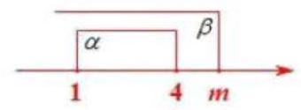

5. 已知角 $\alpha$ 为第四象限角，且 $\sin \alpha  =  - \frac{4}{5}$ ，则 $\cos \alpha  =  - \frac{3}{5}$ ___.

$\cos \alpha  = \sqrt{1 - {\sin }^{2}\alpha } = \frac{3}{5}$

6. 已知等差数列 $- 3, - 1,1,\cdots$ ,则该数列的第 20 项为___35___.

${a}_{1} =  - 3, d =  - 1 + 3 = 2$

${a}_{20} = {a}_{1} + {19d} =  - 3 + {19} \times  2 = {35}$

7. 已知随机变量 $X$ 的分布为 $\left( \begin{matrix} 1 & 2 & 3 \\  {0.4} & {0.2} & a \end{matrix}\right)$ ,则期望 $E\left\lbrack  X\right\rbrack   =$ ___2___.

$a = 1 - {0.4} - {0.2} = {0.4}$

$E\left( x\right)  = 1 \times  {0.4} + 2 \times  {0.2} + 3 \times  {0.4} = 2$

8. 若甲乙丙丁四人组成接力队参加 $4 \times  {100}$ 米接力赛，则甲不跑中间两棒的排法共有___12___种.

___ $\frac{\text{ × }}{}\;\frac{\text{ × }}{}$ ___

9. 已知关于 $x$ 的一元二次方程 ${x}^{2} - x + a = 0$ 有两个不相等的正根 $m\text{ 、 }n$ ,则 $\frac{1}{m} + \frac{9}{n}$ 的最小值为___16___. $m + n = 1\left( {m, n > 0}\right)$

$\frac{1}{m} + \frac{9}{n} = \left( {m + n}\right) \left( {\frac{1}{m} + \frac{9}{n}}\right)  = 1 + \frac{9m}{n} + \frac{n}{m} + 9 \geq  {10} + 2\sqrt{\frac{9m}{n} \cdot  \frac{n}{m}} = {16}$

当且仅当 $\frac{9m}{n} = \frac{n}{m}, n = {3m}$ 时取等

10. 已知在 $\bigtriangleup  {ABC}$ 中， ${AB} = 2,{AC} = 3,\angle {BAC} = {60}^{ \circ  }$ . 若点 $O$ 为 $\bigtriangleup  {ABC}$ 外接圆的圆心，则 $\overrightarrow{BC} \cdot  \overrightarrow{BO} = \frac{7}{}$ ___.

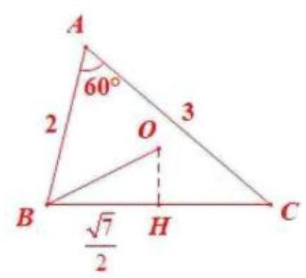

${BC} = \sqrt{{2}^{2} + {3}^{2} - 2 \times  2 \times  3\cos {60}^{ \circ  }} = \sqrt{7}$

过 $O$ 作 ${OH} \bot  {BC}$

$\because O$ 为 $\bigtriangleup {ABC}$ 外心

$\therefore {OH}$ 为 ${BC}$ 垂直平分线

$\overrightarrow{BC} \cdot  \overrightarrow{BO} = {BH} \cdot  {BC} = \frac{\sqrt{7}}{2} \times  \sqrt{7} = \frac{7}{2}$ (投影)

11. 已知 ${S}_{n}$ 是数列 $\left\{  {a}_{n}\right\}$ 的前 $n$ 项和,且 ${S}_{n} = {2}^{n - 1} - 1, n \geq  1$ 且 $n \in  \mathrm{N}$ . 若 $f\left( x\right)  = \left( {\sin x + {a}_{1}}\right) \left( {\sin x + {a}_{2}}\right) \cdots \left( {\sin x + {a}_{5}}\right)$ ,则 ${f}^{\prime }\left( \pi \right)  =$ ___64___.

${a}_{1} = {S}_{1} = {2}^{1 - 1} - 1 = 0$

当 $n \geq  2$ 时, ${a}_{n} = {S}_{n} - {S}_{n - 1} = {2}^{n - 1} - 1 - \left( {{2}^{n - 2} - 1}\right)  = {2}^{n - 1} - {2}^{n - 2}$

${a}_{2} = {2}^{0} = 1,\;{a}_{3} = 2,\;{a}_{4} = 4,\;{a}_{5} = 8$

$f\left( x\right)  = \sin x\left( {\sin x + 1}\right) \left( {\sin x + 2}\right) \left( {\sin x + 4}\right) \left( {\sin x + 8}\right)$

令 $g\left( x\right)  = \left( {\sin x + 1}\right) \left( {\sin x + 2}\right) \left( {\sin x + 4}\right) \left( {\sin x + 8}\right)$

$f\left( x\right)  = g\left( x\right) \sin x$

${f}^{\prime }\left( x\right)  = {g}^{\prime }\left( x\right) \sin x + g\left( x\right) \cos x$

${f}^{\prime }\left( \pi \right)  = g\left( \pi \right) \cos \pi  =  - 1 \times  2 \times  4 \times  8 =  - {64}$

12. 申辉中学某个数学建模小组发现: 人走路时, 启动或者停下的瞬间, 手中水平拿着的杯子里的水可能会被晃动得溢出杯口. 查询资料后发现: 液面和水平面的夹角 $\theta \left( {0 \leq  \theta  < \frac{\pi }{2}}\right)$ 与人走路的加速度 $a$ 以及重力加速度 $g$ 有关,满足关系: $\tan \theta  = \frac{a}{g}$ ,其中 $g = {10}\left( {\mathrm{\;m}/{\mathrm{s}}^{2}}\right)$ . 若甲同学走路启动瞬间的加速度为 $3\left( {\mathrm{\;m}/{\mathrm{s}}^{2}}\right)$ , 手中水平拿着一个底面边长为 $4\mathrm{\;{cm}}$ 和 $6\mathrm{\;{cm}}$ ,高为 ${14}\mathrm{\;{cm}}$ 的长方体形状的杯子,则杯中最多装 321.6 ${\mathrm{\;{cm}}}^{3}$ 的水，存在甲同学走路启动的瞬间杯中水不溢出的可能.

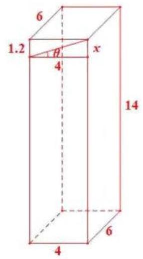

求 ${V}_{\text{ 水 }}$ 的最大值,即让水面波动最小

$\tan \theta  = \frac{a}{g} = \frac{3}{10} = {0.3}$

沿着边长为 $4\mathrm{\;{cm}}$ 的边运动

$\tan \theta  = \frac{x}{4}, x = 4\tan \theta  = {1.2}$

${14} - {1.2} = {12.8}$

${V}_{\text{ 水 }} = \frac{4\left( {{12.8} + {14}}\right) }{2} \times  6 = {321.6}{\mathrm{\;{cm}}}^{3}$

## 二、选择题(本题共有 4 题，满分 18 分，13、14 每题 4 分，15、16 题每题 5 分)每题有且只有一个正确 选项, 考生应在答题纸的相应位置, 将代表正确选项的小方格涂黑.

13. 为了了解申辉中学所有学生的每天平均体育运动时间, 随机调查了该校 100 名学生, 发现他们每天平均体育运动时间为 ${1.5}\mathrm{\;h}$ ，这里的总体是(B).

A. 该校所有学生

B. 该校所有学生的平均每天体育运动时间

C. 所调查的 100 名学生

D. 所调查的 100 名学生的平均每天体育运动时间

14. 函数 $y = \cos \left( {\frac{\pi }{2} - {2x}}\right)$ 是(A)

A. 最小正周期为 $\pi$ 的奇函数 B. 最小正周期为 $\pi$ 的偶函数

C. 最小正周期为 $\frac{\pi }{2}$ 的奇函数 D. 最小正周期为 $\frac{\pi }{2}$ 的偶函数

$y = \sin {2x}, T = \frac{2\pi }{2} = \pi$ ,奇函数

15. 已知椭圆 ${\Gamma }_{1} : \frac{{x}^{2}}{{a}^{2}} + \frac{{y}^{2}}{{b}^{2}} = 1$ ,双曲线 ${\Gamma }_{2} : \frac{{y}^{2}}{{b}^{2}} - \frac{{x}^{2}}{{a}^{2}} = 1$ ,其中 $\left( {a > b > 0}\right)$ ,点 ${F}_{1}\text{ 、 }{F}_{2}$ 为椭圆 ${\Gamma }_{1}$ 的两个焦点,点 $P$ 是双曲线 ${\Gamma }_{2}$ 上一动点. 若双曲线 ${\Gamma }_{2}$ 的两条渐近线夹角的余弦值等于 $\frac{1}{3}$ ,则使得 ${\Delta P}{F}_{1}{F}_{2}$ 为直角三角形的点 $P$ 有 $\left( \begin{array}{l} C \end{array}\right)$ 个.

A. 3 B. 4 C. 6 D. 8

渐近线: $y =  \pm  \frac{a}{b}x\left( {a > b}\right)$

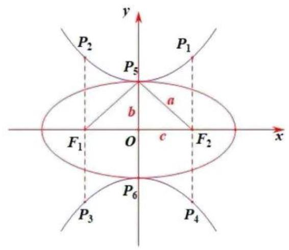

即 ${ax} - {by} = 0$ 或 ${ax} + {by} = 0$

$\cos \theta  = \frac{\left| {a}^{2} - {b}^{2}\right| }{\sqrt{{a}^{2} + {b}^{2}} \cdot  \sqrt{{a}^{2} + {b}^{2}}} = \frac{1}{3}$

$\frac{{a}^{2} - {b}^{2}}{{a}^{2} + {b}^{2}} = \frac{1}{3}$

${a}^{2} = 2{b}^{2},\;a = \sqrt{2}b$

${c}^{2} = {a}^{2} - {b}^{2} = {b}^{2}, b = c$

$\therefore \angle O{P}_{5}{F}_{2} = {45}^{ \circ  },\angle {F}_{1}{P}_{5}{F}_{2} = {90}^{ \circ  }$

当 $\angle {F}_{1}P{F}_{2} = {90}^{ \circ  }$ 时, $P$ 为椭圆上下两个顶点,2 个

当 $\angle P{F}_{1}{F}_{2} = {90}^{ \circ  }$ 时, $P$ 为 ${P}_{2}\text{ 、 }{P}_{3},2$ 个

当 $\angle P{F}_{2}{F}_{1} = {90}^{ \circ  }$ 时, $P$ 为 ${P}_{1}\text{ 、 }{P}_{4},2$ 个

共 6 个,选 C

16. 已知全集 $U$ 是一个六元集合,任取 $U$ 的两个子集 $A\text{ 、 }B$ ( $A\text{ 、 }B$ 可以相等),记事件 $M : B \subseteq  A$ ; 记事件 $N : B \subseteq  \bar{A}$ . 则 $P\left( {M \cup  N}\right)  = \left( \begin{array}{l} C \end{array}\right)$ .

A. $\frac{95}{{2}^{11}}$ B. $\frac{665}{{2}^{11}}$ C. $\frac{697}{{2}^{11}}$ D. $\frac{729}{{2}^{11}}$

共有 ${2}^{6} \times  {2}^{6} = {2}^{12}$ 种情况

固定 $A$ ,计算的 $B$ 个数:

若 $A$ 中有 $k$ 个元素,对于 $A$ 有 ${C}_{6}^{k}$ 种,则 $\bar{A}$ 中有 $6 - k$ 个元素

$k$ 从 0 取到 6

$M : B \subseteq  A, B$ 有 ${2}^{k}$ 个

$N : B \subseteq  \bar{A}, B$ 有 ${2}^{6 - k}$ 个

$B = \varnothing$ 被算了两次

$M \cup  N : B$ 有 ${C}_{6}^{k}\left( {{2}^{k} + {2}^{6 - k} - 1}\right)$ 个

$\therefore M \cup  N$ 中 $B$ 共有 $\mathop{\sum }\limits_{{k = 0}}^{6}{C}_{6}^{k}\left( {{2}^{k} + {2}^{6 - k} - 1}\right)  = {1394}$ 个

$P\left( {M \cup  N}\right)  = \frac{1394}{{2}^{12}} = \frac{697}{{2}^{11}}$ ,选 C

三、解答题(本大题满分 76 分)本大题共有 5 题，解答下列各题必须在答题纸相应编号的规定区域内写出必要的步骤.

17. (本题满分 14 分) 本题共有 3 个小题, 第 1 小题满分 4 分, 第 2 小题满分 5 分, 第 3 小题满分 5 分. 绝对零度 (-273.15°C) 是一个只能逼近而不能达到的最低温度, 那么这个数据是如何测得的? 吕同学通过查询资料，知道:①气体温度和气体压强存在线性关系；②当气体压强为 $0\left( \mathrm{{kPa}}\right)$ 时，气体温度达到绝对零度. 以下是吕同学在一次模拟实验时, 测得某种气体温度和气体压强的相关数据:

<table><tr><td>数据</td><td>1</td><td>2</td><td>3</td><td>4</td><td>5</td><td>6</td></tr><tr><td>温度 $\left( {{}^{ \circ  }\mathrm{C}}\right)$</td><td>4.07</td><td>16.69</td><td>29.42</td><td>45.67</td><td>57.06</td><td>73.05</td></tr><tr><td>压强 $\left( {\mathrm{{kPa}}}\right)$</td><td>103.095</td><td>107.734</td><td>112.461</td><td>118.469</td><td>122.706</td><td>128.758</td></tr></table>

(1)求该模拟实验中，该气体温度的平均值和方差；(精确到 0.01 )

(2)若该次实验下气体压强 $y$ 关于气体温度 $x$ 的回归方程为 $y = {0.372x} + \widehat{b}$ ，预估该次实验下绝对零度的数值; (精确到 ${0.01}^{ \circ  }\mathrm{C}$ )

(3)为了验证实验的普适性, 吕同学利用不同气体预估绝对零度, 得到如下的一组数据. 若任取其中的 2 个数据,求该两个数据与绝对零度 $\left( {-{273.15}^{ \circ  }\mathrm{C}}\right)$ 的误差均小于 ${1}^{ \circ  }\mathrm{C}$ 的概率.

<table><tr><td>绝对零度(℃)</td><td>-275.13</td><td>-274.56</td><td>-274.28</td><td>-273.57</td><td>-272.45</td><td>-271.67</td></tr></table>

(1) $\bar{x} = \frac{{x}_{1} + {x}_{2} + \cdots  + {x}_{n}}{n} = {37.66},{s}^{2} = \frac{{x}_{1}^{2} + {x}_{2}^{2} + \cdots  + {x}_{n}^{2}}{n} - {\bar{x}}^{2} = {554.82}$

(2) $\bar{y} = \frac{{y}_{1} + {y}_{2} + \cdots  + {y}_{n}}{n} = {115.5372}$

$\bar{y} = {0.372}\bar{x} + \widehat{b},\widehat{b} = {101.52768}$

令 $y = 0, x =  - {272.92}$

(3)符合要求 $\left( {-{274.15}, - {272.15}}\right)$ ，有 2 个

$P = \frac{{C}_{2}^{2}}{{C}_{6}^{2}} = \frac{1}{15}$

## 18. (本题满分 14 分)本题共有 2 个小题，第 1 小题满分 6 分，第 2 小题满分 8 分

已知长方形 ${ABCD}$ 中, ${AB} = 2,{BC} = 4$ ,点 $E\text{ 、 }F$ 分别为边 ${BC}\text{ 、 }{AD}$ 的中点 (如图 1). 若将长方形 ${ABEF}$ 沿着边 ${EF}$ 翻折,得到二面角 ${A}_{1} - {EF} - D$ (如图 2). 已知二面角 ${A}_{1} - {EF} - D$ 的大小为 ${60}^{ \circ  }$ .

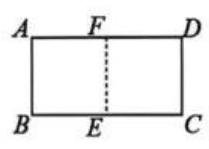

图1

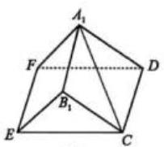

图 2

(1)求证:平面 ${A}_{1}{FD}//$ 平面 ${BEC}$ ；

(2)求直线 $C{A}_{1}$ 与平面 ${A}_{1}{BE}$ 所成角的大小.(结果用反三角表示)

(1)∵ 四边形 ${ABCD}$ 是长方形

$\therefore {A}_{1}F//{B}_{1}E$ ,且 ${A}_{1}F \text{ ⊄ }$ 平面 ${B}_{1}{EC},{B}_{1}E \subset$ 平面 ${B}_{1}{EC}$

$\therefore {A}_{1}F//$ 平面 ${B}_{1}{EC}$

同理, ${A}_{1}D//$ 平面 ${B}_{1}{EC}$

$\because {A}_{1}F \cap  {A}_{1}D = {A}_{1},{A}_{1}F \subset$ 平面 ${A}_{1}{FD},{A}_{1}D \subset$ 平面 ${A}_{1}{FD}$

$\therefore$ 平面 ${A}_{1}{FD}//$ 平面 ${B}_{1}{EC}$

(2)易知 ${EF} \bot  {A}_{1}F$ ， ${EF} \bot  {DF}$

$z$

$D$

图 2

$\therefore {A}_{1} - {EF} - D$ 的平面角为 $\angle {A}_{1}{FD} = {60}^{ \circ  }$

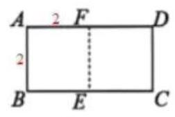

${BC} = {AD} = 4, E\text{ 、 }F$ 分别为 ${BC}\text{ 、 }{AD}$ 中点

$\therefore {A}_{1}F = {DF} = 2$

图1

$x$

$\because {EF} \subset$ 平面 ${ECDF},{A}_{1}F \cap  {DF} = F$

$\therefore$ 平面 ${A}_{1}{FD} \bot$ 平面 ${ECDF}$

如图建系, $F\left( {0,0,0}\right) , E\left( {2,0,0}\right) ,{A}_{1}\left( {0,1,\sqrt{3}}\right) , C\left( {2,2,0}\right)$

$$
\overrightarrow{{A}_{1}C} = \left( {2,1, - \sqrt{3}}\right)
$$

设平面 ${A}_{1}{EF}$ 的一个法向量为 $\overrightarrow{n} = \left( {x, y, z}\right)$

则 $\left\{  \begin{array}{l} \overrightarrow{n} \cdot  \overrightarrow{FE} = {2x} = 0 \\  \overrightarrow{n} \cdot  \overrightarrow{F{A}_{1}} = y + \sqrt{3}z = 0 \end{array}\right.$ ,令 $z =  - 1$ ,得 $\overrightarrow{n} = \left( {0,\sqrt{3}, - 1}\right)$

$\sin \theta  = \frac{\left| \overrightarrow{n} \cdot  \overrightarrow{{A}_{1}C}\right| }{\left| \overrightarrow{n}\right| \left| \overrightarrow{{A}_{1}C}\right| } = \frac{\left| \sqrt{3} + \sqrt{3}\right| }{\sqrt{3 + 1} \cdot  \sqrt{4 + 1 + 3}} = \frac{\sqrt{6}}{4}$

$\theta  = \arcsin \frac{\sqrt{6}}{4}$

19. (本题满分 14 分) 本题共有 2 个小题, 第 1 小题满分 6 分, 第 2 小题满分 8 分.

已知函数 $y = f\left( x\right)$ ,其中 $f\left( x\right)  = \ln x$

(1)若 $f\left( {1 - m}\right)  - f\left( {3 - {m}^{2}}\right)  < 0$ ，求实数 $m$ 的取值范围；

(2)若 $g\left( x\right)  = {ax} - \frac{1}{x} - a + 1 - \left( {a + 1}\right) f\left( x\right)$ ，其中 $a > 0$ ，若存在 $b < 0$ ，使得直线 $y = b$ 与函数 $y = g\left( x\right)$ 的图像有 3 个不同的交点,求实数 $a$ 的取值范围.

(1) $f\left( {1 - m}\right)  < f\left( {3 - {m}^{2}}\right)$

$\ln \left( {1 - m}\right)  < \ln \left( {3 - {m}^{2}}\right)$

$0 < 1 - m < 3 - {m}^{2},\;m \in  \left( {-1,1}\right)$

(2) $g\left( x\right)  = {ax} - \frac{1}{x} - a + 1 - \left( {a + 1}\right) \ln x,\;x > 0,\;a > 0$

${g}^{\prime }\left( x\right)  = a + \frac{1}{{x}^{2}} - \frac{a + 1}{x} = \frac{a{x}^{2} - \left( {a + 1}\right) x + 1}{{x}^{2}} = \frac{\left( {{ax} - 1}\right) \left( {x - 1}\right) }{{x}^{2}}$

令 ${g}^{\prime }\left( x\right)  = 0$ ,得 ${x}_{1} = \frac{1}{a},{x}_{2} = 1$

① $\frac{1}{a} = 1, a = 1,{g}^{\prime }\left( x\right)  \geq  0, g\left( x\right)$ 严格增,与 $y = b$ 至多 1 个交点,舍

② $\frac{1}{a} > 1,0 < a < 1$

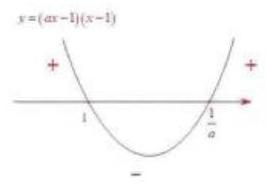

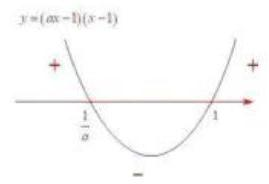

$g\left( 1\right)  = a - 1 - a + 1 = 0$

存在 $b < 0, y = b$ 与 $y = g\left( x\right)$ 有个 3 交点 ③ $\frac{1}{a} < 1, a > 1$

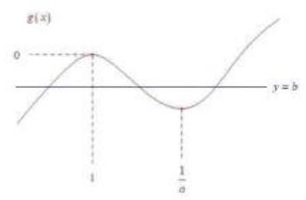

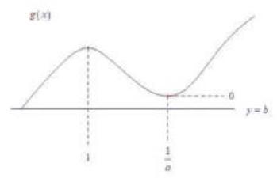

由图, 不存在

$\therefore a \in  \left( {0,1}\right)$

## 20. (本题满分 18 分，第 1 小题满分 4 分，第 2 小题满分 6 分，第 3 小题满分 8 分)

已知抛物线 $\Gamma  : {y}^{2} = {4x}$ 的焦点为 $F$ ,准线为 $l$ ,点 $P\left( {{x}_{0},{y}_{0}}\right)$ 为抛物线上一动点,点 $O$ 为坐标原点.

(1)若 $\left| {OP}\right|  = \left| {PF}\right|$ ，求点 $P$ 的坐标；

(2)若直线 ${l}_{0} : y = {kx} + 4$ 与抛物线 $\Gamma$ 只有一个交点，求直线 ${l}_{0}$ 的方程；

(3)若 ${x}_{0} > 3$ ，过点 $P$ 作圆 $C : {\left( x - 1\right) }^{2} + {y}^{2} = 4$ 的两条切线，交准线 $l$ 于 $A$ 、 $B$ 两点，求 $\left| {AB}\right|$ 的取值范围.

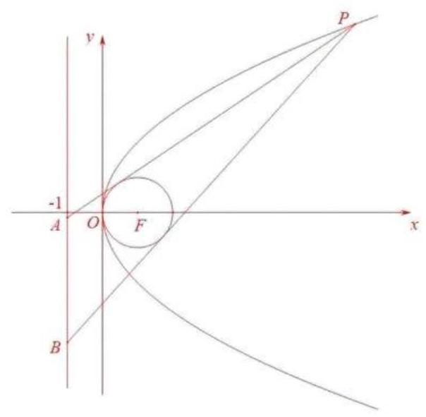

(1)准线: $x =  - 1$

$\left\{  \begin{array}{l} {OP} = \sqrt{{x}_{0}{}^{2} + {y}_{0}{}^{2}} = {x}_{0} + 1 \\  {y}_{0}{}^{2} = 4{x}_{0} \end{array}\right.$

$\therefore {x}_{0} = \frac{1}{2},{y}_{0} =  \pm  \sqrt{2}, P\left( {\frac{1}{2}, \pm  \sqrt{2}}\right)$

( 2 )联立 $\left\{  \begin{array}{l} y = {kx} + 4 \\  {y}^{2} = {4x} \end{array}\right.$ ，得 ${k}^{2}{x}^{2} + \left( {{8k} - 4}\right) x + {16} = 0$

① $k = 0$ ，有唯一解

② $k \neq  0$ ， $\Delta  = {\left( 8k - 4\right) }^{2} - 4{k}^{2} \times  {16} = 0$ ， $k = \frac{1}{4}$

$\therefore y = 4$ 或 $y = \frac{1}{4}x + 4$

(3) 由题, ${k}_{PA}\text{ 、 }{k}_{PB}$ 存在

设过 $P$ 的切线方程为 $y - {y}_{0} = k\left( {x - {x}_{0}}\right) ,{k}_{PA} = {k}_{1},{k}_{PB} = {k}_{2}$

${kx} - y + {y}_{0} - k{x}_{0} = 0, d = \frac{\left| k + {y}_{0} - k{x}_{0}\right| }{\sqrt{{k}^{2} + 1}} = 2$

平方后化简,得 $\left( {{x}_{0}{}^{2} - 2{x}_{0} - 3}\right) {k}^{2} - 2{y}_{0}\left( {{x}_{0} - 1}\right) k + {y}_{0}{}^{2} - 4 = 0$

${k}_{1} + {k}_{2} = \frac{2{y}_{0}\left( {{x}_{0} - 1}\right) }{{x}_{0}^{2} - 2{x}_{0} - 3},{k}_{1}{k}_{2} = \frac{{y}_{0}^{2} - 4}{{x}_{0}^{2} - 2{x}_{0} - 3}\left( *\right)$

令 $x =  - 1,{y}_{A} = {y}_{0} + {k}_{1}\left( {-1 - {x}_{0}}\right) ,{y}_{B} = {y}_{0} + {k}_{2}\left( {-1 - {x}_{0}}\right)$

$\left| {AB}\right|  = \left| {{y}_{A} - {y}_{B}}\right|  = \left( {{x}_{0} + 1}\right) \left| {{k}_{1} - {k}_{2}}\right|  = \left( {{x}_{0} + 1}\right) \sqrt{{\left( {k}_{1} + {k}_{2}\right) }^{2} - 4{k}_{1}{k}_{2}}$

将 (*) 式代入,结合 ${y}_{0}^{2} = 4{x}_{0}$ ,得

$$
\left| {AB}\right|  = 4\sqrt{\frac{\left( {{x}_{0} - 1}\right) \left( {{x}_{0} + 3}\right) }{{\left( {x}_{0} - 3\right) }^{2}}}\text{ ,令 }t = {x}_{0} - 3 > 0
$$

$$
\left| {AB}\right|  = 4\sqrt{\frac{12}{{t}^{2}} + \frac{8}{t} + 1}\text{ ,令 }u = \frac{1}{t} > 0
$$

$$
\left| {AB}\right|  = 4\sqrt{{12}{u}^{2} + {8u} + 1} > 4
$$

## 21. (本题满分 18 分, 第 1 小题满分 4 分, 第 2 小题满分 6 分, 第 3 小题满分 8 分)

若函数 $y = f\left( x\right) , x \in  D$ ,其值域为 $A$ . 若 $A \subseteq  D$ ,则称函数 $y = f\left( x\right)$ 在区间 $D$ 上为封闭函数.

(1)已知 $f\left( x\right)  = \frac{{2x} + 3}{x + 1}$ ，判断函数 $y = f\left( x\right)$ 是否在区间 $\left\lbrack  {2,8}\right\rbrack$ 上为封闭函数，并说明理由；

( 2 )已知 $g\left( x\right)  = {x}^{2} + {2x}$ ，若函数 $y = g\left( x\right)$ 在区间 $\left\lbrack  {a, b}\right\rbrack$ 上不为单调函数，但在区间 $\left\lbrack  {a, b}\right\rbrack$ 上为封闭函数， 求 $b - a$ 的最大值;

(3)已知函数 $y = h\left( x\right)$ 在区间 $\left\lbrack  {a, b}\right\rbrack$ 上连续且为封闭函数，且对于任意的 $x$ 、 $y \in  \left\lbrack  {a, b}\right\rbrack$ ，都有 $\left| {h\left( x\right)  - h\left( y\right) }\right|  = L\left| {x - y}\right| \left( {0 \leq  L < 1}\right)$ 成立. 若数列 $\left\{  {x}_{n}\right\}$ 满足 ${x}_{n + 1} = h\left( {x}_{n}\right) , n \geq  1$ 且 $n \in  \mathbf{N}$ ,证明: 存在唯一常数 $c \in  \left\lbrack  {a, b}\right\rbrack$ ,使得 $h\left( c\right)  = c$ ,且对于任意的 ${x}_{1} \in  \left\lbrack  {a, b}\right\rbrack$ ,都有 $\mathop{\lim }\limits_{{n \rightarrow   + \infty }}{x}_{n} = c$ .

(1) 是

$f\left( x\right)  = \frac{2\left( {x + 1}\right)  + 1}{x + 1} = 2 + \frac{1}{x + 1}$ 单调递减, $x \in  \left\lbrack  {2,8}\right\rbrack$

$f\left( x\right)  \in  \left\lbrack  {\frac{19}{9},\frac{7}{3}}\right\rbrack   \subset  \left\lbrack  {2,8}\right\rbrack$

$\therefore$ 是

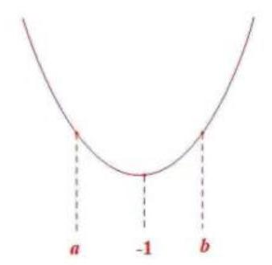

(2)由题， $a <  - 1 < b, x \in  \left\lbrack  {a, b}\right\rbrack$

$$
g{\left( x\right) }_{\min } = g\left( {-1}\right)  =  - 1
$$

满足 $a \leq   - 1$

$$
\text{ ① }b + 1 \geq   - 1 - a,\;a + b \geq   - 2
$$

$$
g{\left( x\right) }_{\max } = g\left( b\right)  = {b}^{2} + {2b} \leq  b
$$

$$
\therefore b \in  ( - 1,0\rbrack , - {2b} \in  \lbrack 0,2)
$$

$a - b \geq   - 2, b - a \leq  2$ ( $b = 0, a =  - 2$ 可取等)

$$
\text{ ② }b + 1 <  - 1 - a, b <  - a - 2
$$

$$
g{\left( x\right) }_{\max } = g\left( a\right)  = {a}^{2} + {2a} \leq  b
$$

$$
\therefore {a}^{2} + {2a} <  - a - 2
$$

$$
{a}^{2} + {3a} + 2 < 0
$$

$$
a \in  \left( {2, - 1}\right) , - {2a} \in  \left( {2,4}\right)
$$

结合 $a + b <  - 2$

$$
b - a < 2
$$

综上， ${\left( b - a\right) }_{\max } = 2$

(3)由图易知， $y = h\left( x\right)$ 的图像只能在 $\left\lbrack  {a, b}\right\rbrack$ 的正方形内

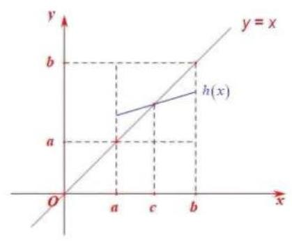

由蛛网图易知, $\mathop{\lim }\limits_{{n \rightarrow   + \infty }}{x}_{n} = c$

若存在 $m, n \in  \left\lbrack  {a, b}\right\rbrack$ ,使得 $h\left( m\right)  = m, h\left( n\right)  = n$

则 $\left| {h\left( m\right)  - h\left( n\right) }\right|  = 1 \times  \left| {m - n}\right|$ ,与 $L \in  \lbrack 0,1)$ 矛盾

$\therefore h\left( x\right)  = x, x \in  \left\lbrack  {a, b}\right\rbrack$ ,至多一解

$\because y = h\left( x\right)$ 为 $\left\lbrack  {a, b}\right\rbrack$ 上的封闭函数

---

	$\therefore h\left( a\right)  \geq  a, h\left( b\right)  \leq  b$

令 $p\left( x\right)  = h\left( x\right)  - x, p\left( a\right)  = h\left( a\right)  - a \geq  0, p\left( b\right)  = h\left( b\right)  - b \leq  0$

$\exists c \in  \left\lbrack  {a, b}\right\rbrack$ ,使得 $h\left( c\right)  = c$

$\left| {{x}_{n + 1} - c}\right|  = \left| {h\left( {x}_{n}\right)  - c}\right|  = L\left| {{x}_{n} - c}\right| ,\;L \in  \lbrack 0,1)$

	$\therefore \left| {{x}_{n} - c}\right|  = L\left| {{x}_{n - 1} - c}\right|  = {L}^{n - 1}\left| {{x}_{1} - c}\right|$

		$\mathop{\lim }\limits_{{n \rightarrow   + \infty }}{L}^{n - 1} = 0,\;L \in  \lbrack 0,1)$

	$\therefore \mathop{\lim }\limits_{{n \rightarrow   + \infty }}\left| {{x}_{n} - c}\right|  = 0$

	$\therefore \mathop{\lim }\limits_{{n \rightarrow   + \infty }}{x}_{n} = c$

---

中国大陆 上海

