# 2025 届上海市崇明区高三二模数学试题

202503

## 一、填空题(本大题满分 54 分)本大题共有 12 题. 考生应在答题纸相应编号的空格内直接填写结果,

1-6 题每个空格填对得 4 分, 7-12 题每个空格填对得 5 分, 否则一律得零分.

1. 不等式 $\left| {x - 1}\right|  < 2$ 的解为___.

2. 已知复数 $\frac{z}{\mathrm{i}} = 1 - 2\mathrm{i}$ ( $\mathrm{i}$ 为虚数单位),则 $z =$ ___.

3. 已知全集 $U = \mathbf{R}$ ，集合 $A = \{ 1,2,4\} , B = \{ 2,4,5\}$ ，则 $A \cap  \bar{B} =$ ___.

4. 求直线 $x =  - 2$ 与直线 $\sqrt{3}x - y + 1 = 0$ 的夹角为___.

5. 已知 $\overrightarrow{a} = \left( {1,0}\right) ,\overrightarrow{b} = \left( {2,1}\right)$ ，则 $\left| {\overrightarrow{a} + 2\overrightarrow{b}}\right|  =$ ___.

6. 函数 $y = 2\sin \left( {{\omega x} - \frac{\pi }{16}}\right) \left( {\omega  > 0}\right)$ 的最小正周期是 $\pi$ ，则 $\omega  =$ ___.

7. 某次数学考试后，随机选取 14 位学生的成绩，得到如下茎叶图，其中个数部分作为“叶”，百位数和十位数作为“茎”，若该组数据的第 25 百分位数是 87，则 $X$ 的值为___.

---

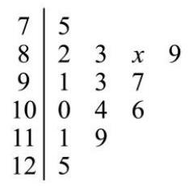

---

8. 在 $\bigtriangleup  {ABC}$ 中，若 $c = 3$ ， $C = \frac{\pi }{3}$ ，其面积为 $\sqrt{3}$ ，则 $a + b =$ ___.

9. 若 ${\left( x + 1\right) }^{10} = {a}_{0} + {a}_{1}\left( {x - 1}\right)  + {a}_{2}{\left( x - 1\right) }^{2} + \cdots  + {a}_{10}{\left( x - 1\right) }^{10}$ ,则 ${a}_{0} + {a}_{1} + {a}_{2} + \cdots  + {a}_{10} =$ ___.

10. 已知 $f\left( x\right)  = \left\{  \begin{array}{l}  - {x}^{2} + {ax}, x \leq  1 \\  {ax} - 1, x > 1 \end{array}\right.$ ,若函数 $y = f\left( x\right)$ 有两个极值点,则实数 $a$ 的取值范围是___.

11. 已知双曲线 ${x}^{2} - \frac{{y}^{2}}{{b}^{2}} = 1\left( {b > 0}\right)$ 的左、右焦点为 ${F}_{1},{F}_{2}$ ,以 $O$ 为顶点, ${F}_{2}$ 为焦点作抛物线交双曲线于 $P$ , 且 $\angle P{F}_{1}{F}_{2} = {45}^{ \circ  }$ ，则 ${b}^{2} =$ ___.

12. 已知集合 $M$ 中的任一个元素都是整数,当存在整数 $a, c \in  M, b \notin  M$ 且 $a < b < c$ 时,称 $M$ 为 “间断整数集”. 集合 $\{ x \mid  1 \leq  x \leq  {10}, x \in  \mathbf{Z}\}$ 的所有子集中，是 “间断整数集” 的个数为___.

## 二、选择题 (本题共 4 小题, 13-14 每小题 4 分, 15-16 每小题 5 分, 共 18 分. 在每小题给出的四个 选项中，只有一项是符合题目要求的. $)$

13. 若 $a > b > 0, c > d$ ，则下列结论正确的是( )

A. $a - b < 0$ B. ${ac} > {bd}$

C. $a{c}^{2} > b{c}^{2}$

D. $\frac{a}{{c}^{2} + 1} > \frac{b}{{c}^{2} + 1}$

14. 已知一个圆锥的轴截面是边长为 2 的等边三角形, 则这个圆锥的侧面积为 ( )

A. ${2\pi }$ B. ${3\pi }$ C. ${4\pi }$

D. $\frac{\sqrt{3}}{3}\pi$

15. 抛掷一枚质地均匀的硬币 $n$ 次 (其中 $n$ 为大于等于 2 的整数),设事件 $A$ 表示 “ $n$ 次中既有正面朝上又有反面朝上”，事件 $B$ 表示 “ $n$ 次中至多有一次正面朝上”，若事件 $A$ 与事件 $B$ 是独立的，则 $n$ 的值为( )

A. 5 B. 4 C. 3 D. 2

16. 数列 $\left\{  {a}_{n}\right\}$ 是等差数列,周期数列 $\left\{  {b}_{n}\right\}$ 满足 ${b}_{n} = \cos \left( {a}_{n}\right)$ ,若集合 $X = \left\{  {x \mid  x = {b}_{n}}\right. , n$ 是正整数 $\}$ 中恰有三个元素,则数列 $\left\{  {b}_{n}\right\}$ 的周期 $T$ 的取值不可能是( )

A. 4 B. 5 C. 6 D. 7

## 三、解答题 (本题共 5 小题, 17-19 题每题 14 分, 20-21 题每题 18 分, 共 78 分. 解答应写出文字 说明, 证明过程或演算步骤.)

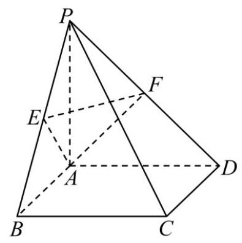

17. 如图,在四棱锥 $P - {ABCD}$ 中,底面 ${ABCD}$ 是边长为 2 的正方形,且 ${CB} \bot  {BP},{CD} \bot  {DP},{PA} = 2$ ,点 $E, F$ 分别为 ${PB},{PD}$ 的中点.

(1)求证: ${PA} \bot$ 平面 ${ABCD}$ ；

(2)求点 $P$ 到平面 ${AEF}$ 的距离.

18. 已知 $f\left( x\right)  = {\log }_{3}\left( {x + a}\right)  + {\log }_{3}\left( {6 - x}\right)$ .

(1)是否存在实数 $a$ ，使得函数 $y = f\left( x\right)$ 是偶函数？若存在，求实数 $a$ 的值，若不存在，请说明理由；

(2)若 $a >  - 3$ 且 $a \neq  0$ ，解关于 $x$ 的不等式 $f\left( x\right)  \leq  f\left( {6 - x}\right)$ .

19. 某区 2025 年 3 月 31 日至 4 月 13 日的天气预报如图所示.

<table><tr><td>31       大部分晴 17/9°C</td><td>04月01日       阵雨 18/9°C</td><td>02       阵雨 18/10°C</td><td>03       阵雨 19/10°C</td><td>04       多云 18/9°C</td><td>05       间歇性多云 19/10°C</td><td>06       多云 20/10°C</td></tr><tr><td>07       阵雨 19/10°C</td><td>08       大部分多云 19/10°C</td><td>09       大部分晴 20/8°C</td><td>10       多云 18/8°C</td><td>11       大部分晴 18/10°C</td><td>12       阵雨 17/8°C</td><td>13       阵雨 17/9°C</td></tr></table>

(1)从 3 月 31 日至 4 月 13 日某天开始，连续统计三天，求这三天中至少有两天是阵雨的概率；

(2)根据天气预报，该区 4 月 14 日的最低气温是 $9{}^{ \circ  }\mathrm{C}$ ，温差是指一段时间内最高温度与最低温度之间的差值,例如 3 月 31 日的最高温度为 ${17}^{ \circ  }\mathrm{C}$ ,最低温度为 ${9}^{ \circ  }\mathrm{C}$ ,当天的温差为 ${8}^{ \circ  }\mathrm{C}$ 记 4 月 1 日至 4 日这 4 天温差的方差为 ${s}_{1}^{2},4$ 月 11 日至 14 日这 4 天温差的方差为 ${s}_{2}^{2}$ ,若 ${s}_{2}^{2} = \frac{4}{3}{s}_{1}^{2}$ ,求 4 月 14 日天气预报的最高气温;

(3)从 3 月 31 日至 4 月 13 日中随机抽取两天，用 $X$ 表示一天温差不高于 ${9}^{ \circ  }\mathrm{C}$ 的天数，求 $X$ 的分布列及期望.

20. 已知抛物线 $\Gamma  : {x}^{2} = {4y}$ ,过点 $P\left( {a, b}\right)$ 的直线 $l$ 与抛物线 $\Gamma$ 交于点 $\mathrm{A}\text{ 、 }B$ ,与 $y$ 轴交于点 $C$ .

(1)若点 $\mathrm{A}$ 位于第一象限，且点 $\mathrm{A}$ 到抛物线 $\Gamma$ 的焦点的距离等于 3，求点 $\mathrm{A}$ 的坐标；

(2)若点 $\mathrm{A}$ 坐标为 $\left( {4,4}\right)$ ，且点 $B$ 恰为线段 ${AC}$ 的中点，求原点 $O$ 到直线 $l$ 的距离；

(3)若抛物线 $\Gamma$ 上存在定点 $D$ 使得满足题意的点 $\mathrm{A}$ 、 $B$ 都有 ${DA}\bot {DB}$ ，求 $a$ 、 $b$ 满足的关系式.

21. 已知函数 $y = f\left( x\right)$ ， $P$ 为坐标平面上一点. 若函数 $y = f\left( x\right)$ 的图像上存在与 $P$ 不同的一点 $Q$ ，使得直线 ${PQ}$ 是函数 $y = f\left( x\right)$ 在点 $Q$ 处的切线,则称点 $P$ 具有性质 ${M}_{f}$ .

(1)若 $f\left( x\right)  = {x}^{2}$ ，判断点 $P\left( {1,0}\right)$ 是否具有性质 ${M}_{f}$ ，并说明理由；

( 2 )若 $f\left( x\right)  = 2{x}^{3} - 4{x}^{2} + {2x}$ ，证明:线段 $x = \frac{1}{2}\left( {-1 \leq  y \leq  1}\right)$ 上的所有点均具有性质 ${M}_{f}$ ；

(3)若 $f\left( x\right)  = {e}^{x}$ ，证明: “点 $P\left( {x, y}\right)$ 具有性质 ${M}_{f}$ ” 的充要条件是 “ $y < {\mathrm{e}}^{x}$ ”.

# 2025 届上海市浦东新区高三二模数学试卷

## 考生注意:

1、本试卷共 21 道试题, 满分 150 分, 答题时间 120 分钟;

2、请在答题纸上规定的地方解答，否则一律不予评分.

## 一、填空题 (本大题满分 54 分) 本大题共有 12 题. 考生应在答题纸相应编号的空格内直接填写结果, 1-6 题每个空格填对得 4 分, 7-12 题每个空格填对得 5 分, 否则一律得零分.

1. 已知 $x \in  \mathrm{R}$ ，不等式 $\frac{x - 2}{x} < 0$ 的解为___.

2. 已知向量 $\overrightarrow{a} = \left( {1,2}\right)$ ， $\overrightarrow{b} = \left( {m,1}\right)$ ，若 $\overrightarrow{a}\bot \overrightarrow{b}$ ，则 $m =$ ___.

3. 设圆 $\mathrm{C}$ 方程为 ${x}^{2} + {y}^{2} + {4x} - {6y} + {10} = 0$ ，则圆 $\mathrm{C}$ 的半径为___.

4. 若 $f\left( x\right)  = \cos {3x}\cos x + \sin {3x}\sin x$ ，则函数 $y = f\left( x\right)$ 的最小正周期为___.

5. 若关于 $x$ 的方程 ${x}^{2} - x + m = 0$ 的一个虚根的模为 2,则实数 $m$ 的值为___.

6. 设数列 $\left\{  {a}_{n}\right\}$ 为等差数列,其前 $n$ 项和为 ${S}_{n}$ ,已知 ${a}_{3} + {a}_{15} = 2$ ,则 ${S}_{17} =$ ___.

7. ${\left( x - \frac{1}{x}\right) }^{10}$ 的二项展开式中常数项为___.

8. 设 $M\left( {x, y}\right)$ 为抛物线 ${y}^{2} = {4x}$ 上任意一点，若 $x + {2y} + m$ 的最小值为 1，则 $m$ 的值为___.

9. 李老师在整理建模小组 10 名学生的成绩时不小心遗失了一位学生的成绩，且剩余学生的成绩数据如下: 5 6 6 7 7 7 8 9 9，但李老师记得这名学生的成绩恰好是本组学生成绩的第 25 百分位数，则这 10 名学生的成绩的方差为___.

10. 如图，某建筑物 ${OP}$ 垂直于地面，从地面点 $A$ 处测得建筑物顶部 $P$ 的仰角为 ${30}^{ \circ  }$ ，从地面点 $B$ 处测得建筑物顶部 $P$ 的仰角为 ${45}^{ \circ  }$ ,已知 $A\text{ 、 }B$ 相距 100 米, $\angle {AOB} = {60}^{ \circ  }$ ,则该建筑物 ${OP}$ 高度约为___米. (保留一位小数)

11. 已知 $\overrightarrow{a}\text{ 、 }\overrightarrow{b}\text{ 、 }\overrightarrow{c}$ 为空间中三个单位向量，且 $\overrightarrow{a} \cdot  \overrightarrow{b} = \overrightarrow{b} \cdot  \overrightarrow{c} = \overrightarrow{c} \cdot  \overrightarrow{a} = 0$ ，若向量 $\overrightarrow{p}$ 满足 $\left| {\overrightarrow{p} - 2\overrightarrow{a}}\right|  = \frac{3}{2}$ ， $\left| {\overrightarrow{p} - 2\overrightarrow{b}}\right|  = \frac{3}{2}$ ， 则向量 $\overrightarrow{p}$ 与向量 $\overrightarrow{c}$ 夹角的最小值为___. (用反三角表示)

12. 已知数列 $\left\{  {a}_{n}\right\}  ,{a}_{1} = 1,{a}_{n} \in  \{ 1, - 1\} ,\left( {n \geq  2}\right)$ ,并且前 $n$ 项的和 ${S}_{n}$ 满足:

①存在小于 1013 的正整数 $t$ ，使得 ${S}_{{2t} + 1} =  - 1$ ；②对任意的正整数 $k$ 和 $m$ ，都有 $\left| {{S}_{2m} - {S}_{{2k} - 1}}\right|  \leq  1$ . 则满足以上条件的数列 $\left\{  {S}_{n}\right\}  \left( {1 \leq  n \leq  {2025}}\right)$ 共有___个.

## 二、选择题(本大题满分 18 分)本大题共有 4 题，每题有且只有一个正确答案. 考生必须在答题纸的 相应编号上, 将代表答案的小方格涂黑, 13-14 题每题选对得 4 分, 15-16 题每题选对得 5 分, 否则 一律得零分.

13. 已知集合 $P = \{  - 1,1,3,5,7\}$ ，集合 $Q = \{ x\parallel x - 3 \mid   > 3\}$ ，全集为 $R$ ，则 $P \cap  \bar{Q} =$ ( )

A. $\{  - 1,1\}$ B. $\{  - 1,7\}$ C. $\{ 1,3,5,7\}$ D. $\{ 1,3,5\}$

14. ( $a > b$ ” 是 “ $\lg a > \lg b$ ” 的 ( )

A. 充分非必要条件 B. 必要非充分条件

C. 充要条件 D. 非充分非必要条件

15. 研究变量 $x, y$ 得到一组成对数据 $\left( {{x}_{i},{y}_{i}}\right) , i = 1,2,\cdots , n$ ,先进行一次线性回归分析,接着增加一个数据 $\left( {{x}_{n + 1},{y}_{n + 1}}\right)$ ,其中 ${x}_{n + 1} = \frac{1}{n}\mathop{\sum }\limits_{{i = 1}}^{n}{x}_{i},{y}_{n + 1} = \frac{1}{n}\mathop{\sum }\limits_{{i = 1}}^{n}{y}_{i}$ ,再重新进行一次线性回归分析,则下列说法正确的是 ( )

A. 变量 $x$ 与变量 $y$ 的相关性变强 B. 相关系数 $r$ 的绝对值变小

C. 线性回归方程 $y = \widehat{a}x + \widehat{b}$ 不变 D. 拟合误差 $Q$ 变大

16. 已知圆锥曲线 $\Gamma$ 的对称中心为原点 $O$ ,若对于 $\Gamma$ 上的任意一点 $A$ ,均存在 $\Gamma$ 上两点 $B, C$ ,使得原点 $O$ 到直线 ${AB},{AC}$ 和 ${BC}$ 的距离都相等,则称曲线 $\Gamma$ 为 “完美曲线”. 现有如下两个命题: ①任意椭圆都是 “完美曲线”；②存在双曲线是 “完美曲线”.

下列判断正确的是( )

A. ①是真命题，②是假命题 B. ①是假命题，②是真命题

C. ①②都是真命题 D. ①②都是假命题

## 三、解答题 (本大题满分 78 分) 本大题共有 5 题, 解答下列各题必须在答题卷的相应编号规定区域内 写出必要的步骤.

## 17. (本题满分 14 分) 本题共有 2 个小题, 第 1 小题满分 7 分, 第 2 小题满分 7 分.

已知函数 $y = f\left( x\right)$ 的表达式 $f\left( x\right)  = \frac{1}{{e}^{x} + 1} - a$ .

(1)若函数 $y = f\left( x\right)$ 是奇函数，求实数 $a$ 的值；

(2)对任意实数 $x \in  \left\lbrack  {-1,1}\right\rbrack$ ，不等式 $f\left( x\right)  \leq  0$ 恒成立，求实数 $a$ 的取值范围.

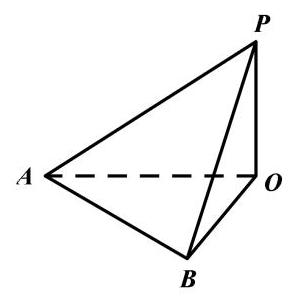

18. (本题满分 14 分) 本题共有 2 个小题, 第 1 小题满分 7 分, 第 2 小题满分 7 分.

如图，四边形 ${ABCD}$ 为长方形， ${PA} \bot$ 平面 ${ABCD}$ ， ${AB} = {AP} = 2$ ， ${AD} = 3$ .

(1)若 $E$ 、 $F$ 分别是 ${PB}$ 、 ${CD}$ 的中点，求证: ${EF}//$ 平面 ${PAD}$ ；

(2)边 ${BC}$ 上是否存在点 $G$ ，使得直线 ${PG}$ 与平面 ${PAD}$ 所成的角的大小为 ${30}^{ \circ  }$ ？若存在，求 ${BG}$ 长； 若不存在, 说明理由.

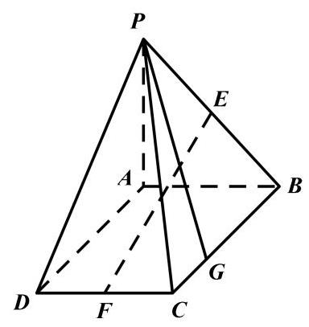

## 19. (本题满分 14 分) 本题共有 3 个小题, 第 1 小题满分 4 分, 第 2 小题满分 4 分, 第 3 小题满分 6 分.

为测试 A、B 两款人工智能软件解答数学问题的能力，将 100 道难度相当的数学试题从 1 到 100 编号后随机分配给这两款软件测试. 每道试题只被一款软件解答一次, 并记录结果如下:

<table><tr><td rowspan="2">试题类别</td><td colspan="2">A 软件</td><td colspan="2">B 软件</td></tr><tr><td>测试试题数量</td><td>正确解答的数量</td><td>测试试题数量</td><td>正确解答的数量</td></tr><tr><td>几何试题</td><td>20</td><td>16</td><td>30</td><td>20</td></tr><tr><td>函数试题</td><td>30</td><td>24</td><td>20</td><td>18</td></tr></table>

(1)分别估计 A 软件、B 软件能正确解答数学问题的概率;

(2)小浦准备用这两款软件来解决某次数学测试中的第 12 题(假设其难度和测试的 100 道题基本相同)， 但该题内容还未知,从已往情况来看,该题是几何题的概率为 $\frac{1}{3}$ ,是函数题的概率为 $\frac{2}{3}$ . 将频率视为概率, 试通过计算来说明小浦应该用哪款软件解决这道试题?

(3)小浦决定采用这两款软件解答 6 道类似试题，其中几何、函数各 3 道，每道试题只用其中一款软件解答一次. 将频率视为概率, 小浦比较了这两款软件在解答几何和函数题上的正确率, 决定用表现较好的那款软件解决其擅长的题型. 用 ${X}_{1}$ 、 ${X}_{2}$ 分别表示这 3 道几何试题与 3 道函数试题被正确解答的个数,求随机变量 ${X}_{1} + {X}_{2}$ 的数学期望和方差.

## 20. (本题满分 18 分) 本题共有 3 个小题, 第 1 小题满分 4 分, 第 2 小题满分 6 分, 第 3 小题满分 8 分.

已知椭圆 ${C}_{1}$ 的方程为 $\frac{{x}^{2}}{3} + {y}^{2} = 1$ ，右顶点为 $A$ ，上顶点为 $B$ ，椭圆 ${C}_{2}$ 的中心位于坐标原点，两个椭圆的离心率相等.

(1)若椭圆 ${C}_{2}$ 的方程是 $\frac{{x}^{2}}{{a}^{2}} + \frac{{y}^{2}}{2a} = 1\left( {a > 0}\right)$ ，焦点在 $x$ 轴上，求 $a$ 的值；

(2)设椭圆 ${C}_{2}$ 的焦点在 $x$ 轴上，直线 ${AB}$ 与 ${C}_{2}$ 相交于点 $C\text{ 、 }D$ ，若 $\left| {CD}\right|  = 3\left| {AB}\right|$ ，求 ${C}_{2}$ 的标准方程；

(3)设椭圆 ${C}_{2}$ 的焦点在 $y$ 轴上，点 $P$ 在 ${C}_{1}$ 上，点 $Q$ 在 ${C}_{2}$ 上. 若存在 $\bigtriangleup  {APQ}$ 是等腰 直角三角形，且 $\left| {AP}\right|  = \left| {AQ}\right|$ ,求 ${C}_{2}$ 的长轴的取值范围。

## 21. (本题满分 18 分) 本题共有 3 个小题, 第 1 小题满分 4 分, 第 2 小题满分 6 分, 第 3 小题满分 8 分.

定义域为 $\mathbf{R}$ 的可导函数 $y = f\left( x\right)$ 满足,在曲线 $y = f\left( x\right)$ 上存在三个不同的点 $A\left( {{x}_{1},{y}_{1}}\right) , B\left( {{x}_{2},{y}_{2}}\right) , C\left( {{x}_{3},{y}_{3}}\right) \left( {{x}_{1} < {x}_{2} < {x}_{3}}\right)$ ,使得直线 ${AC}$ 与曲线 $y = f\left( x\right)$ 在点 $B$ 处的切线平行 (或重合). 若 ${x}_{1},{x}_{2},{x}_{3}$ 成等差数列,则称 $f\left( x\right)$ 为 “等差函数”; 若 ${x}_{1},{x}_{2},{x}_{3}$ 成等差数列且 ${x}_{1},{x}_{2},{x}_{3}$ 均为整数,则称 $f\left( x\right)$ 为 “整数等差函数”.

(1)设 $f\left( x\right)  = {x}^{2} + x, g\left( x\right)  = \sin x$ ，分别判断 $f\left( x\right)$ 和 $g\left( x\right)$ 是否为“整数等差函数”，直接写出结论;

(2)若 $f\left( x\right)  = \frac{1}{{x}^{2} + m}$ 为 “整数等差函数”，求实数 $m$ 的最小值；

(3)已知 $y = f\left( x\right)$ 的导函数 $y = {f}^{\prime }\left( x\right)$ 在 $\mathbf{R}$ 上为增函数,且存在一个正常数 $T$ ,使得对任意 $x \in  \mathbf{R}$ ， $f\left( {x + T}\right)  = {f}^{\prime }\left( x\right)$ 成立，证明: $f\left( x\right)$ 为“等差函数”的充要条件是 $f\left( x\right)$ 为常值函数.

# 2025 届上海市嘉定区高三二模数学试卷

## 一、填空题

1. 已知集合 $A = \{ x \mid   - 1 < x \leq  3\}$ ，集合 $B = \{ x \mid  1 \leq  x < 4\}$ ，则 $A \cap  B =$ ___.

2. 不等式 $\frac{x - 2}{x + 1} < 0$ 的解集为___.

3. 已知向量 $\overrightarrow{m} = \left( {1, - 2}\right) ,\overrightarrow{n} = \left( {k,4}\right)$ ，若 $\overrightarrow{m}\bot \overrightarrow{n}$ ，则 $k =$ ___.

4. 已知等比数列 $\left\{  {a}_{n}\right\}$ 的首项为 1,公比为 $q$ ,其前 $n$ 项和为 ${S}_{n}$ . 若 ${S}_{3} > {S}_{4}$ ,则 $q$ 的取值范围为___.

5. 在 ${\left( 2x - \frac{1}{\sqrt{x}}\right) }^{6}$ 的二项展开式中,常数项的值为___.

6. 已知 $\theta  \in  \mathbf{R}$ ,若 $\tan \theta  + \cot \theta  = 5$ ,则 $\sin {2\theta } =$ ___.

7. 直线 $l : y = x + 1$ 与圆 $C : {x}^{2} + {y}^{2} - {4x} - {2y} = 0$ 相交所得的弦长为___.

8. 已知复数 ${z}_{1},{z}_{2}$ 满足 $\left| {z}_{1}\right|  = 1,\left| {z}_{2}\right|  = 2,\left| {{z}_{1} - {z}_{2}}\right|  = \sqrt{7}$ ，则 $\left| {{z}_{1} + {z}_{2}}\right|$ 的值为___.

9. 在由 1,2,3,4,5 这五个数组成的无重复数字的四位数中,其能被 3 整除的概率为___.

10. 已知某次数学的测试成绩 $X$ 服从 $\mu  = {75}\text{ 、 }{\sigma }^{2} = {64}$ 的正态分布,若小明的成绩不低于 91 分,那么他的成绩大约超过了______%的学生(精确到 0.1%). (参考数据:

$P\left( {\left| X\right|  < \sigma }\right)  \approx  {68.3}\% , P\left( {\left| X\right|  < {2\sigma }}\right)  \approx  {954}\% , P\left( {\left| X\right|  < {3\sigma }}\right)  \approx  {997}\% )$

11. 某建筑公司欲设计一个正四棱锥形纪念碑，要求其顶点位于容积为 36π 立方米的球形景观灯所在球面上. 考虑到抗风、抗震等结构安全需求,侧棱长度 $l$ 需满足 $2\sqrt{3} \leq  l \leq  3\sqrt{3}$ . 当纪念碑体积取得最大值时，正四棱锥的侧棱长约为___米(精确到 0.01 米).

12. 在平面直角坐标系中,一质点 $P$ 从原点 $O$ 出发,第一次从点 $O$ 移动到点 ${P}_{1}$ ,第二次从点 ${P}_{1}$ 移动到点 ${P}_{2},\cdots$ ,第 $k$ 次从点 ${P}_{k - 1}$ (规定 ${P}_{0} = O$ ) 移动到点 ${P}_{k}$ . 记向量 $\overrightarrow{{v}_{k}} = \overrightarrow{{P}_{k - 1}{P}_{k}}$ ,其模长为 $k$ ,方向与 $X$ 轴正方向成 ${\left( {90}k\right) }^{ \circ  }$ 角,设 $\overrightarrow{{S}_{n}}$ 为经过 $n$ 次移动的位移向量,即 $\overrightarrow{{S}_{n}} = \overrightarrow{O{P}_{n}}$ ,则当 $\left| \overrightarrow{{S}_{n}}\right|  = \sqrt{85}$ 时, $n$ 的值为___.

## 二、单选题

13. 已知实数 $a, b$ 满足 $a > b$ ，则下列不等式中，不恒成立的是( )

A. ${a}^{3} > {b}^{3}$ B. $\frac{a}{b} > 1$ C. ${a}^{2} + {b}^{2} > {2ab}$ D. ${2}^{a} > {2}^{b}$

14. 已知平面 $\alpha$ 和平面 $\beta$ ,直线 $m \subset  \alpha$ ,直线 $n \subset  \beta$ ,则下列结论一定成立的是 ( )

A. 若 $m//n$ ,则 $\alpha //\beta$ B. 若 $m$ 与 $n$ 为异面直线,则 $\alpha //\beta$

C. 若 $m \bot  n$ ,则 $\alpha  \bot  \beta$ D. 若 $n \bot  \alpha$ ,则 $m \bot  n$

15. 已知关于 $X$ 的不等式 $\left| {\sin {2x}}\right|  > \cos x$ 在区间 $\left\lbrack  {0,{2\pi }}\right\rbrack$ 内有 $k$ 个整数解,则 $k$ 的值为 ( )

A. 3 B. 4 C. 5 D. 6

16. 设数列 $\left\{  {a}_{n}\right\}$ 满足 ${a}_{n} = \sin \left( \frac{n\pi }{3}\right)  + {\left( -1\right) }^{n}\cos \left( \frac{n\pi }{4}\right)$ ,记其前 $n$ 项和为 ${S}_{n}$ ,前 $n$ 项积为 ${T}_{n}$ . 则下列结论正确的是( )

A. 数列 $\left\{  {S}_{n}\right\}$ 和数列 $\left\{  {T}_{n}\right\}$ 均不是周期数列

B. 数列 $\left\{  {S}_{n}\right\}$ 是周期数列,数列 $\left\{  {T}_{n}\right\}$ 不是周期数列

C. 数列 $\left\{  {S}_{n}\right\}$ 不是周期数列,数列 $\left\{  {T}_{n}\right\}$ 是周期数列

D. 数列 $\left\{  {S}_{n}\right\}$ 和数列 $\left\{  {T}_{n}\right\}$ 均为周期数列

## 三、解答题

17. 如图,在四棱锥 $P - {ABCD}$ 中, ${PA} \bot$ 平面 ${ABCD},{PA} = {AC} = 2,{BC} = 1,{AB} = \sqrt{3}$ .

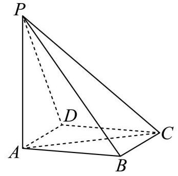

(1)若 ${AD}//$ 平面 ${PBC}$ ，证明: ${AD} \bot  {PB}$ ；

(2)在我国古代数学典籍《九章算术》中，记载了一种特殊的三棱锥——鳖臑， 其四个面均为直角三角形, 找出本题图中的一个鳖臑, 并计算它的体积和表面积.

18. 已知函数 $y = f\left( x\right)$ ,其中 $f\left( x\right)  = a \cdot  {\mathrm{e}}^{x} + b \cdot  {\mathrm{e}}^{-x}, a, b$ 为实常数且 ${ab} \neq  0$ .

(1)若 $y = f\left( x\right)$ 为偶函数，且其最小值为 4，求实数 $a$ 与 $b$ 的值；

(2)若 $a = 1$ ， $g\left( x\right)  = {\mathrm{e}}^{x} - x$ ，对任意实数 $x$ 均满足 $f\left( x\right)  \geq  g\left( x\right)$ ，求实数 $b$ 的取值范围.

19. 某学校对学生的课外阅读时间进行调查, 随机抽取了 150 位学生, 得到如下样本数据频率分布直方图.

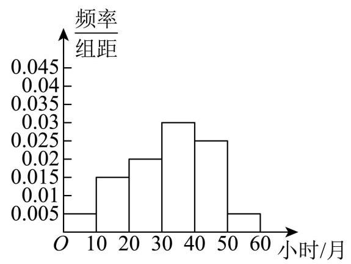

(1)估计该校学生的平均课外阅读时间；(同一组数据用该区间的中点值作代表)

(2)估计该校学生课外阅读时间位于区间 $\lbrack {30},{60})$ (单位:小时/ 月) 的概率;

(3)已知该校喜欢阅读的学生占比为 18%，初一年级学生占该校总学生数的 28%，且初一年级学生中喜欢阅读的占 40%，求其他年级学生中喜欢阅读的比例. (精确到 0.1%)

20. 已知椭圆 $C : \frac{{x}^{2}}{9} + {y}^{2} = 1.F$ 为椭圆的右焦点,过椭圆上一点 $P\left( {3,0}\right)$ 的直线 ${l}_{1}$ 交椭圆于另一点 $Q$ ,点 $M$ 为椭圆上任意一点.

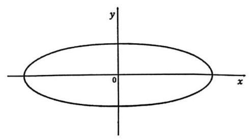

(1)求 $\left| {MF}\right|$ 的最小值；

(2)当直线 ${l}_{1}$ 的斜率为 1 时，求 $\bigtriangleup  {PQM}$ 面积的最大值及此时点 $M$ 的坐标；

(3)若直线 ${PQ}$ 与直线 ${l}_{2} : x =  - 3$ 交于点 $D$ ，点 $D$ 不在 $x$ 轴上， $Q$ 关于原点的对称点为点 $R$ ，直线 ${PR}$ 与 ${l}_{2}$ 交于点 $E$ ,求线段 $\left| {DE}\right|$ 的取值范围.

21. 已知函数 $y = f\left( x\right)$ ,其中 $f\left( x\right)  = {x}^{2} + {ax} + b,\left( {a, b \in  \mathbf{R}}\right)$ ,定义集合 $S\left( f\right)  = \{ \left( {x, y}\right)  \mid  y = f\left( x\right) , x \in  \mathbf{R}\}$ . 对于点 $P\left( {p, q}\right)$ ,定义集合 $D\left( P\right)  = \{ \left( {x, y}\right) \parallel x - p \mid   \leq  1,\left( {x, y}\right)  \in  S\left( f\right) \}$ . 若对任意 $\left( {x, y}\right)  \in  D\left( P\right)$ ,均有 $\left| {y - q}\right|  \leq  1$ , 则称点 $P$ 为平衡点.

(1)当 $a = b = 0$ 时，判断点 $P\left( {0,0}\right)$ 是否为平衡点；

(2)当 $a = 0$ 时，求实数 $b$ 的取值范围，使得点 $P\left( {0,0}\right)$ 是平衡点；

(3)求所有实数 $a$ 和 $b$ ，使得点 $P\left( {0,0}\right)$ 是平衡点.

# 2025 届上海市闵行区高三二模数学试卷

202504

考生注意:

1. 本场考试时间 120 分钟, 试卷共 4 页, 满分 150 分, 答题纸共 2 页.

2. 作答前，考生在答题纸正面填写学校、姓名、考生号，粘贴考生本人条形码.

3. 所有作答务必填涂或书写在答题纸上与试卷题号对应的区域，不得错位. 在草稿纸、试卷上作答一律不得分.

4. 用 2B 铅笔作答选择题, 用黑色笔迹钢笔、水笔或圆珠笔作答非选择题.

## 一、填空题(本大题共有 12 题，满分 54 分，第 1-6 题每题 4 分，第 7-12 题每题 5 分) 考生应在答题纸相应位置直接填写结果.

1. 设全集 $U = \{  - 1,0,1,2\}$ ，若集合 $A = \{ 0,2\}$ ，则 $\bar{A} =$ ___.

2. 已知 $x \in  \mathbf{R}$ ，则不等式 $\left| {x - 2}\right|  \leq  5$ 的解集为___.

3. 已知 $\mathrm{i}$ 是虚数单位,则 $\left| \frac{1 + \mathrm{i}}{\mathrm{i}}\right|  =$ ___.

4. 已知圆柱的底面半径为 $\sqrt{3}$ ，高为 3，则圆柱的体积为___.

5. 在 ${\left( 2x + \frac{1}{x}\right) }^{6}$ 的二项展开式中，常数项是___. (用数值作答)

6. 已知 $\overrightarrow{a} = \left( {3,4}\right) ,\overrightarrow{b} = \left( {\cos \alpha ,\sin \alpha }\right)$ ，且 $\overrightarrow{a}$ 与 $\overrightarrow{b}$ 平行，则 $\tan \alpha  =$ ___.

7. 已知数据 ${x}_{1}\text{ 、 }{x}_{2}\text{ 、 }\cdots \text{ 、 }{x}_{100}$ 的平均数为 2 ，方差为 5 ，则 ${x}_{1}^{2}\text{ 、 }{x}_{2}^{2}\text{ 、 }\cdots \text{ 、 }{x}_{100}^{2}$ 的平均数为___.

8. 已知函数 $y = \left\{  \begin{array}{l} \left( {1 - {2m}}\right) x + {3m}, x < 1, \\  {x}^{2}, x \geq  1 \end{array}\right.$ 的值域为 $\mathbf{R}$ ，则实数 $m$ 的取值范围是___.

9. 某公司生产的糖果每包的标识质量是 500 克, 但公司承认实际质量存在误差. 已知每包糖果的实际质量服从正态分布 $N\left( {{500},{\sigma }^{2}}\right)$ ,且任意一包的糖果质量介于 495 克到 505 克之间的可能性为 95.4%, 则随意买一包该公司生产的糖果，其质量超过 505 克的可能性约为___. (精确到 0.1%)

10. 已知数列 $\left\{  {a}_{n}\right\}$ 为等差数列,数列 $\left\{  {b}_{n}\right\}$ 为等比数列,且 ${a}_{1} = {b}_{1} = 1,{a}_{2} = {b}_{2} = t$ ,若 ${a}_{6} + {b}_{6} > {38}$ ,则实数 $t$ 的取值范围为___.

11. 已知某星球的球心为 $F$ ,半径为 $R$ ,该星球的卫星的运行轨道是以 $F$ 为一个焦点的椭圆,该椭圆的离心率为 $\frac{3}{5}$ ,卫星运行过程中离该星球表面最近的距离为 $R$ ,若当卫星处于某位置时,用卫星上的光学仪器观测该星球, 把光学仪器的镜头与星球表面被观测点的连线称为视线, 任意两条视线所成的最大夹角称为张角，则卫星运行过程中张角的最小值为___. (精确到 ${0.1}^{ \circ  }$ )

12. 定义 $D = \left\lbrack  {a, b}\right\rbrack$ 的区间长度为 $b - a$ . 若 $m < 0$ 且关于 $x$ 的不等式 $\left| {{\left( x - 1\right) }^{3} + m\left( {x - 1}\right) }\right|  \leq  {16}$ 的解集的区间长度之和为 $T$ ,则当 $T$ 取最大值时,实数 $m$ 的值为___.

## 二、选择题(本大题共有 4 题，满分 18 分，第 13-14 题每题 4 分，第 15-16 题每题 5 分)每题有且 只有一个正确选项. 考生应在答题纸的相应位置，将代表正确选项的小方格涂黑.

13. 两个变量 $x$ 与 $y$ 之间的回归方程( ).

A. 表示 $x$ 与 $y$ 之间的函数关系 B. 表示 $x$ 与 $y$ 之间的不确定关系

C. 反映 $x$ 与 $y$ 之间的真实关系 D. 是反映 $x$ 与 $y$ 之间的真实关系的一种最佳拟合

14. 若 $a > 0, b > 0$ ，则 “ $a + b > 2$ ” 是 “ ${ab} > 1$ ” 的( ).

A. 充分不必要条件 B. 必要不充分条件

C. 充分必要条件 D. 既不充分也不必要条件

15. 已知函数 $y = \cos \left( {\frac{\pi }{6}x + \frac{\pi }{3}}\right)$ 在区间 $\left\lbrack  {a, a + 9}\right\rbrack$ 上既有最大值又有最小值,则关于实数 $a$ 的取值,以下不可能的是( ).

A. 2024 B. 2025 C. 2026 D. 2027

16. 设 $n$ 为正整数,空间中 $n$ 个单位向量构成集合 ${A}_{n} = \left\{  {\overrightarrow{{a}_{1}},\overrightarrow{{a}_{2}},\cdots ,\overrightarrow{{a}_{n}}}\right\}$ ,若存在实数 $t$ ,满足对任意 $\overrightarrow{{a}_{i}} \in  {A}_{n},\overrightarrow{{a}_{j}} \in  {A}_{n},\overrightarrow{{a}_{i}} \neq  \overrightarrow{{a}_{j}}$ ,都有 $\overrightarrow{{a}_{i}} \cdot  \overrightarrow{{a}_{j}} = t$ ,则当 $n$ 取得最大值时, $t$ 的值为( ).

A. $- \frac{1}{2}$ B. $\frac{1}{2}$ C. $- \frac{1}{3}$ D. $\frac{1}{3}$

## 三、解答题(本大题共有 5 题，满分 78 分)解答下列各题必须在答题纸的相应位置写出必要的步骤.

## 17. (本题满分 14 分, 第 1 小题满分 6 分, 第 2 小题满分 8 分)

如图，在四棱锥 $P - {ABCD}$ 中，底面 ${ABCD}$ 为长方形， ${PA} \bot$ 底面 ${ABCD}$ ， $E$ 是 ${PC}$ 中点，已知 ${AB} = 2,{AD} = 2\sqrt{2},{PA} = 2$ .

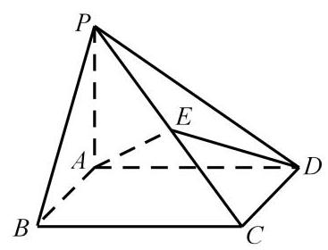

(1)证明: ${AD}\bot {BP}$ ；

(2)求二面角 $E - {AD} - B$ 的大小.

## 18. (本题满分 14 分, 第 1 小题满分 6 分, 第 2 小题满分 8 分)

已知 $f\left( x\right)  = \sin \left( {{\omega x} + \varphi }\right) \left( {\omega  > 0,0 < \varphi  < \pi }\right)$ ,函数 $y = f\left( x\right)$ 的部分图像如图所示,图中最高点 $S\left( {\frac{\pi }{3},1}\right)$ ,最低点 $T\left( {\frac{4\pi }{3}, - 1}\right)$ .

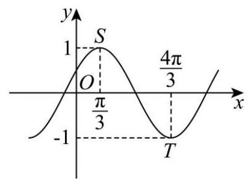

(1)求函数 $y = f\left( x\right)$ 的解析式；

(2)若 $\bigtriangleup  {ABC}$ 的内角 $A$ 、 $B$ 、 $C$ 所对的边分别为 $a$ 、 $b$ 、 $c$ ，若 $A \neq  B$ ， $f\left( A\right)  = f\left( B\right) , c = 2$ ,求 $\bigtriangleup {ABC}$ 面积的取值范围.

## 19. (本题满分 14 分, 第 1 小题满分 4 分, 第 2 小题满分 4 分, 第 3 小题满分 6 分)

某社团共有 12 名成员，其中高一男生 2 人、女生 4 人，高二男生 3 人、女生 3 人. 现从中随机抽选 2 人参加数学知识问答.

(1)若逐个抽选，求恰好第一个抽选的是男生的概率；

(2)若恰好抽选了 1 名男生与 1 名女生，求这 2 人都是高二学生的概率；

(3)若恰好抽选了 1 名高一学生与 1 名高二学生，记抽选出来的男生与女生的人数之差的绝对值为 $X$ ,求 $X$ 的分布列与数学期望 $E\left( X\right)$ .

20. (本题满分 18 分, 第 1 小题满分 4 分, 第 2 小题满分 6 分, 第 3 小题满分 8 分) 已知双曲线 $\Gamma  : {x}^{2} - \frac{{y}^{2}}{3} = 1$ 的右焦点为 $F$ ,过点 $F$ 的直线 $l$ 交双曲线 $\Gamma$ 右支于 $A\text{ 、 }B$ 两点(点 $A$ 在 $x$ 轴上方),点 $C$ 在双曲线 $\Gamma$ 上,直线 ${AC}$ 交 $x$ 轴于点 $Q$ (点 $Q$ 在点 $F$ 的右侧).

(1)求双曲线 $\Gamma$ 的渐近线方程；

(2)若点 $A\left( {2,3}\right)$ ，且 $\tan \angle {BAC} = \frac{1}{2}$ ，求点 $C$ 的坐标；

(3)若 $\bigtriangleup {ABC}$ 的重心 $G$ 在 $x$ 轴上，记 $\bigtriangleup {AFG}\text{ 、 }\bigtriangleup {CQG}$ 的面积分别为 ${S}_{1}\text{ 、 }{S}_{2}$ ，求 $\frac{{S}_{1}}{{S}_{2}}$ 的最小值.

## 21. (本题满分 18 分, 第 1 小题满分 4 分, 第 2 小题满分 6 分, 第 3 小题满分 8 分)

已知函数 $y = f\left( x\right)$ 在定义域 $D$ 上存在导函数 ${f}^{\prime }\left( x\right)$ . 对于给定的一个有序实数对 $\left( {k, m}\right)$ ,若存在 ${x}_{1}\text{ 、 }{x}_{2} \in  D$ ,使得 $\left\lbrack  {k{x}_{1} - f\left( {x}_{1}\right)  + m}\right\rbrack   \cdot  \left\lbrack  {k{x}_{2} - f\left( {x}_{2}\right)  + m}\right\rbrack   < 0$ ,则称 $\left( {k, m}\right)$ 为 $y = f\left( x\right)$ 在定义域 $D$ 上的一个“分割数对”.

(1)已知 $f\left( x\right)  = {x}^{2}, D = \mathbf{R}$ ，判断数对 $\left( {1,0}\right)$ 是否为 $y = f\left( x\right)$ 在 $D$ 上的 “分割数对”，并说明理由；

(2)已知 $f\left( x\right)  = \ln x, D = \left( {1,2}\right)$ ，若 $\left( {\ln 2, m}\right)$ 为 $y = f\left( x\right)$ 在区间 $D$ 上的 “分割数对”，求实数 $m$ 的取值范围;

( 3 ) 已知 $f\left( x\right)  = \left( {{x}^{2} + {ax} + b}\right)  \cdot  {\mathrm{e}}^{x}, D = \mathbf{R}$ ,若有且仅有一个实数 $a$ 满足对任意 $t \in  \mathbf{R}$ , $\left( {{f}^{\prime }\left( t\right) , f\left( t\right)  - t{f}^{\prime }\left( t\right) }\right)$ 都不是 $y = f\left( x\right)$ 在 $D$ 上的 “分割数对”,求实数 $b$ 的值.

# 2025 届上海市奉贤区高三二模数学试卷

202504

## 一、填空题(本题共 12 小题，1-6 每小题 4 分，7-12 每小题 5 分，共 54 分.)

1. 等差数列首项为 1 ，公差是 3 ，则第 5 项等于___.

2. 已知 $\mathrm{i}$ 为虚数单位，复数 $z$ 满足 $z\mathrm{i} - \mathrm{i} = 1$ ，则 $\left| z\right|  =$ ___.

3. 假设生产某产品的一个部件来自三个供应商,供货占比分别是 $\frac{1}{2}\text{ 、 }\frac{1}{6}\text{ 、 }\frac{1}{3}$ ，而它们的良品率分别是 0.96、 0.90、0.93，则该部件的总体良品率是___.

4. 在 ${\left( \sqrt{x} - \frac{2}{x}\right) }^{9}$ 的二项展开式中，常数项为___. (用数字作答)

5. 直线 ${3x} + {4y} - 5 = 0$ 上的动点 $P$ 和直线 ${3x} + {4y} + {10} = 0$ 上的动点 $Q$ ,则点 $P$ 与点 $Q$ 之间距离的最小值是___.

6. 已知 $\theta$ 是斜率为 -1 的直线的倾斜角,计算 $\sin \left( {\theta  - \frac{\pi }{2}}\right)  =$

7. 已知 $\bigtriangleup {ABC}$ ， $\measuredangle A\text{ 、 }B\text{ 、 }C$ 成等差数列且 $\sin A\text{ 、 }\sin B\text{ 、 }\sin C$ 成等比数列” 是 “ $\measuredangle {ABC}$ 是正三角形” 的___条件.

8. 抛物线 ${x}^{2} = {4y}$ 的准线与圆 ${x}^{2} + {y}^{2} = {r}^{2}$ 相切,将圆绕直径所在直线旋转一周形成一个几何体,则该几何体的表面积为___.

9. 通过随机抽样, 获得某种商品消费者年需求量与该商品每千克价格之间的一组数据调查, 如下表所示:

<table><tr><td>价格 (百元)</td><td>${X}_{1}$</td><td>${x}_{2}$</td><td>${x}_{3}$</td><td>${x}_{4}$</td><td>${x}_{5}$</td><td>${x}_{6}$</td><td>${x}_{7}$</td><td>${x}_{8}$</td><td>${x}_{9}$</td><td>${x}_{10}$</td></tr><tr><td></td><td>4</td><td>4</td><td>4.6</td><td>5</td><td>5.2</td><td>5.6</td><td>6</td><td>6.6</td><td>7</td><td>10</td></tr><tr><td>需求量(千克)</td><td>${y}_{1}$</td><td>${y}_{2}$</td><td>${y}_{3}$</td><td>${y}_{4}$</td><td>${y}_{5}$</td><td>${y}_{6}$</td><td>${y}_{7}$</td><td>${y}_{8}$</td><td>${y}_{9}$</td><td>${y}_{10}$</td></tr><tr><td></td><td>3.5</td><td>3</td><td>2.7</td><td>2.4</td><td>2.5</td><td>2</td><td>1.5</td><td>1.2</td><td>1.2</td><td>1</td></tr></table>

那么线性相关系数 $r =$ ___. (精确到 0.001 )

线性相关系数公式 $r = \frac{\mathop{\sum }\limits_{{i = 1}}^{n}\left( {{x}_{i} - \bar{x}}\right) \left( {{y}_{i} - \bar{y}}\right) }{\sqrt{\mathop{\sum }\limits_{{i = 1}}^{n}{\left( {x}_{i} - \bar{x}\right) }^{2} \cdot  \mathop{\sum }\limits_{{i = 1}}^{n}{\left( {y}_{i} - \bar{y}\right) }^{2}}}$

10. 盒子中有大小与质地均相同的 $a$ 个红球和 $b$ 个白球,从中随机取 1 个球,观察其颜色后放回,并同时放入与其相同颜色的球 ${}^{C}$ 个(大小与质地均相同)，再从中随机取 1 个球，计算此次取到白球的概率是___.

11. 中企联合大厦是奉贤区的第一高楼, 是奉贤美奉贤强的一个缩影. 某数学建模兴趣小组的同学们去实地进行测量,经过多次的测量,最终在平行于地面的同一水平面上选取三个点: 点 $B$ 、点 $C$ 、点 $O$ 作为测量基点. 设大厦的最高点为 $A$ ,在点 $B$ 处测得点 $A$ 的仰角为 $\angle {ABO} = \theta  = {71.5}^{ \circ  }$ ,在点 $C$ 处测得点 $A$ 的仰角为 $\angle {ACO} = {44}^{ \circ  }$ ,又测得 ${BC} = {221}$ 米, $\angle {BOC} = {119}^{ \circ  }$ ,(见图).

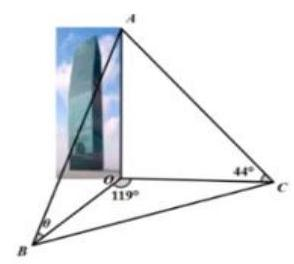

第 11 题图

现作出以下几个假设:

①直线 ${AO}$ 垂直于平面 ${OBC}$ ;

②平面 ${OBC}$ 到地面的距离等于测角仪高度，在计算过程中测角仪高度忽略不计；

③其它次要因素等忽略不计.

根据以上信息估算奉贤第一高楼的高度约___米. (结果保留整数)

12. $\bigtriangleup {ABC}$ 内一点 $F$ (见图 12-1),式子 ${FA} + {FC} + {FB}$ 可以写成 $1 \times  {FA} + 1 \times  {FC} + 1 \times  {FB}$ ,这个式子中 ${FA},{FC},{FB}$ 的系数均为 1,以三个系数 1 作为边长可构造一个等边三角形,因此我们尝试把 $\bigtriangleup {AFC}$ 绕点 $C$ 顺时针旋转 $\frac{\pi }{3}$ ，得到 $\bigtriangleup {A}^{\prime }{F}^{\prime }C$ (见图 12-2)，所以 ${FA} + {FC} + {FB}$ 等于 ${F}^{\prime }{A}^{\prime } + {F}^{\prime }F + {FB}$ ，显然 ${F}^{\prime }{A}^{\prime } + {F}^{\prime }F + {FB} \geq  {A}^{\prime }B$ ，当 ${A}^{\prime },{F}^{\prime }, F, B$ 四点共线时 (见图 12-3), ${FA} + {FC} + {FB}$ 最小.

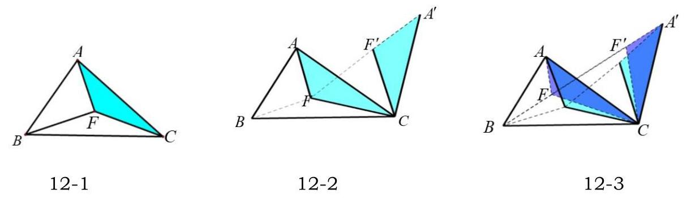

第 12 题图

试用类似的方法解决下面这道题目:

已知 $\overrightarrow{a}$ 是平面内的任意一个向量,向量 $\overrightarrow{b},\overrightarrow{c}$ 满足 $\overrightarrow{b} \cdot  \overrightarrow{c} = 0$ ,且 $\left| \overrightarrow{b}\right|  = 4,\left| \overrightarrow{c}\right|  = 4$ , 则 $\sqrt{2}\left| {\overrightarrow{a} - \overrightarrow{b}}\right|  + \left| {\overrightarrow{a} - \overrightarrow{c}}\right|  + \left| {\overrightarrow{a} + \overrightarrow{c}}\right|$ 的最小值为___.

## 二、选择题(本题共 4 小题，13-14 每小题 4 分，15-16 每小题 5 分，共 18 分. 在每小题给出的四个 选项中，只有一项是符合题目要求的. $)$

13. 下列有关排列组合数的计算公式, 错误的是 ( )

A. ${P}_{n}^{m} + {P}_{n}^{m - 1} = {P}_{n + 1}^{m}\left( {m, n\text{ 是正整数,且 }m \leq  n}\right)$ B. ${P}_{n}^{m} = {C}_{n}^{m}{P}_{m}^{m}\left( {m, n\text{ 是正整数,且 }m \leq  n}\right)$

C. ${P}_{n}^{m} = n{P}_{n - 1}^{m - 1}\left( {m, n\text{ 是正整数,且 }m \leq  n}\right)$ D. ${C}_{n}^{m} + {C}_{n}^{m - 1} = {C}_{n + 1}^{m}\left( {m, n\text{ 是正整数,且 }m \leq  n}\right)$

14. 如图，在平行六面体 ${ABCD} - {A}_{1}{B}_{1}{C}_{1}{D}_{1}$ 中，点 $N$ 在对角线 ${A}_{1}C$ 上，点 $M$ 在对角线 ${A}_{1}B$ 上， $\overline{{A}_{1}N} = \frac{1}{3}\overline{NC}$ ， $\overrightarrow{{A}_{1}M} = \frac{1}{2}\overrightarrow{MB}$ ，以下命题正确的是( )

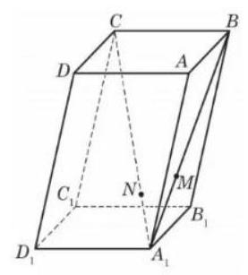

第 14 题图

A. $\overrightarrow{MN}//\overrightarrow{BC}$

B. ${D}_{1}\text{ 、 }N\text{ 、 }M$ 三点共线

C. ${D}_{1}M$ 与 ${A}_{1}C$ 是异面直线

D. $\overrightarrow{{D}_{1}N} = \frac{1}{2}\overrightarrow{NM}$

15. 函数 $y = f\left( x\right)$ 的导函数为 $y = g\left( x\right)$ ,若存在实数 ${x}_{0}$ ,使得 $g\left( {x}_{0}\right) f\left( {-{x}_{0}}\right)  = 1$ 成立,则称函数 $y = f\left( x\right)$ 具有 ${x}_{0}$ 性质,下列函数 $y = f\left( x\right)$ 具有 ${x}_{0}$ 性质的函数是( )

A. $y = {\mathrm{e}}^{-x}$ B. $y = \sin x$ C. $y = {\mathrm{e}}^{x} + {\mathrm{e}}^{-x}$ D. $y = \frac{1}{2}\ln \left( {{x}^{2} + 1}\right)$

16. 若 ${5\pi }$ 是函数 $y = \cos {nx}\sin \frac{2000}{{n}^{2}}x$ 的一个周期,则正整数 $n$ 所有可能取值个数是( )

A. 2 B. 3 C. 4 D. 9

三、解答题 (本题共 5 小题, 17-19 题每题 14 分, 20-21 题每题 18 分, 共 78 分. 解答应写出文字说明, 证明过程或演算步骤.)

17. 某疾病预防中心随机调查了 339 名 50 岁以上的公民，研究吸烟习惯与慢性气管炎患病的关系, 测得数据如表所示:

<table><tr><td></td><td>不吸烟者</td><td>吸烟者</td><td>总计</td></tr><tr><td>不患慢性气管炎者</td><td>121</td><td>$b$</td><td>283</td></tr><tr><td>患慢性气管炎者</td><td>$C$</td><td>$d$</td><td></td></tr><tr><td>总计</td><td>134</td><td></td><td>339</td></tr></table>

(1)估算样本中吸烟者中患慢性支气管炎的百分比；

(2)有多少把握认为患慢性支气管炎与吸烟有关？

附: ${\chi }^{2} = \frac{n{\left( ad - bc\right) }^{2}}{\left( {a + b}\right) \left( {c + d}\right) \left( {a + c}\right) \left( {b + d}\right) }$ ,其中 $n = a + b + c + d \; P\left( {{\chi }^{2} \geq  {6.635}}\right)  \approx  {0.01}, P\left( {{\chi }^{2} \geq  {5.024}}\right)  \approx  {0.025}, P\left( {{\chi }^{2} \geq  {3.841}}\right)  \approx  {0.05}, P\left( {{\chi }^{2} \geq  {2.706}}\right)  \approx  {0.1}.$

18. 函数 $y = f\left( x\right)$ ,其中 $f\left( x\right)  = {e}^{-\frac{{\left( x - \mu \right) }^{2}}{2}}$ .

(1)若函数 $y = f\left( x\right)$ 是偶函数，当 $f\left( t\right)  = \frac{1}{\sqrt{e}}$ 时，求 $t$ 的值；

(2)求函数 $y = f\left( x\right)$ 的值域并证明对任意的正实数 $k$ 和实数 $x$ ，不等式 $k + \frac{1}{k} \geq  {2f}\left( x\right)$ 恒成立.

19. 将一块边长为 ${10}\mathrm{\;{cm}}$ 的正方形铁片制作一个正四棱锥的容器罩. 同学们设计了甲、乙、丙三个不同的方案，各自裁下阴影部分，用余下的制作成正四棱锥容器罩，形如最右边的图. 甲和丙是去制作有盖的容器罩, 乙是去制作无盖的容器罩. 假设加工过程中铁片损失忽略不计. 设甲、乙、丙中白色的四个等腰三角形的底边分别是 $x, m, n$ .

(I) 请你选择其中的某一个方案, 而且只需选一个方案 (选择超过一个方案的, 按第一个方案处理). 你选择的方案是___，求解以下 2 个问题:

(1)求出所选方案相对应的棱锥的侧面积 $S\left( x\right)$ ， $S\left( m\right)$ ， $S\left( n\right)$ ；

(2)求出所选方案相对应棱锥的体积 $V\left( x\right)$ ， $V\left( m\right)$ ， $V\left( n\right)$ 的最大值.

(II) 假设三个方案中相应的体积最大值分别记作 $V{\left( x\right) }_{\max }, V{\left( m\right) }_{\max }, V{\left( n\right) }_{\max }$ ,请直接写出三者的大小关系. (不写判断理由与过程)

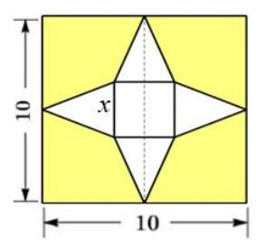

甲

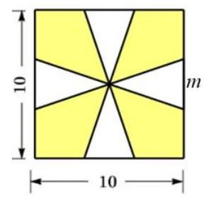

乙

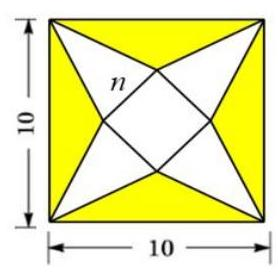

丙

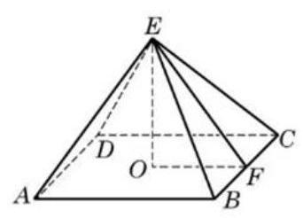

第 19 题图

20. 如图 20-1,曲线 $\Gamma$ 是 $\frac{{x}^{2}}{4} + \frac{{y}^{2}}{{b}^{2}} = 1\left( {y \geq  0}\right)$ 与 $\frac{{y}^{2}}{{b}^{2}} - \frac{{x}^{2}}{4} = 1\left( {y \geq  0}\right)$ 组合的.

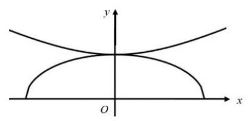

图 20-1

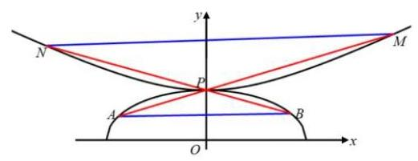

图 20-2

(1) $\frac{{x}^{2}}{4} + \frac{{y}^{2}}{{b}^{2}} = 1\left( {y \geq  0}\right)$ 过点 $\left( {-1,\frac{3}{2}}\right)$ ，求 $\frac{{y}^{2}}{{b}^{2}} - \frac{{x}^{2}}{4} = 1\left( {y \geq  0}\right)$ 的渐近线方程；

(2) $b = \sqrt{2}$ ，设 $T\left( {0, t}\right)$ ， $t \in  \left\lbrack  {-\frac{\sqrt{2}}{2},3\sqrt{2}}\right\rbrack$ ，曲线 $\Gamma$ 上找一个点 $Q$ ，使得 $\left| \overrightarrow{TQ}\right|$ 达到最小；

(3)若 $b = 1$ ，如图 20-2，存在过点 $P\left( {0,1}\right)$ 的两条直线 ${l}_{1}$ ， ${l}_{2}$ 与曲线 $\Gamma$ 的交点分别是点 $A$ 、点 $M$ 、点 $B$ 、点 $N$ 点 $A$ 在第二象限,点 $M$ 在第一象限. 是否存在非零实数 $\lambda$ 使得 $\overrightarrow{MN} = \lambda \overrightarrow{AB}$ 成立,请说明理由.

21. 函数 $y = f\left( x\right)$ ,其中 $f\left( x\right)  = {x}^{3} - {x}^{2} + \frac{1}{2}x + \frac{1}{4}$ ,定义域是一切实数.

(1)计算 $\mathop{\lim }\limits_{{h \rightarrow  0}}\frac{f\left( {2 + h}\right)  - f\left( 2\right) }{h}$ 的值并指出其几何意义;

( 2 )当 $x \in  \left( {0,\frac{1}{2}}\right)$ 时，方程 $f\left( x\right)  = a + x$ 只有一个解，求实数 $a$ 的取值范围；

(3) 设 ${x}_{1} = 0,{x}_{n + 1} = f\left( {x}_{n}\right) ,{y}_{1} = \frac{1}{2},{y}_{n + 1} = f\left( {y}_{n}\right) , n \geq  1, n \in  \mathbf{N},{b}_{n} = {y}_{n} - {x}_{n}$ . 求证: $\mathop{\sum }\limits_{{i = 1}}^{n}{b}_{n} \in  \left( {0,1}\right)$

# 2025 届上海市静安区高三二模数学试卷

202504

## 一、填空题(本大题满分 54 分)本大题共有 12 题. 考生应在答题纸相应编号的空格内直接填写结果,

1-6 题每个空格填对得 4 分, 7-12 题每个空格填对得 5 分, 否则一律得零分.

1. 已知全集为 $\mathbf{R}$ ，集合 $A = \{ x \mid   - 2 < x \leq  1\}$ ，则 $\overline{A} =$ ___.

2. 不等式 $\frac{{2x} - 1}{x + 2} < 0$ 的解集为___.

3. 椭圆 $\frac{{x}^{2}}{4} + \frac{{y}^{2}}{3} = 1$ 的离心率为___.

4. 已知随机变量 $X$ 服从二项分布 $B\left( {n, p}\right)$ ，若 $E\left\lbrack  X\right\rbrack   = {30}$ ， $D\left\lbrack  X\right\rbrack   = {20}$ ，则 $p$ 的值为___.

5. 已知 ${\log }_{3}2 = a$ ，则 ${\log }_{2}{48} =$ ___. (请用含 $a$ 的代数式表达)

6. 已知 $\sin \left( {\frac{\pi }{4} - x}\right)  = \frac{3}{5}$ ,则 $\sin {2x}$ 的值为___.

7. 设一个罐子中有大小与质地相同的黑、白、红三个球, 不放回的每次摸一个球, 设第一次没有摸到黑球是事件 $A$ ，第二次没有摸到黑球是事件 $B$ ，则 $P\left( {B \mid  A}\right)$ 的值为___.

8. 设某港口水的深度 $y$ (米) 关于时间 $t$ (时) 的函数近似满足 $y = h + A\sin \left( {{\omega t} + \phi }\right)$ . 根据某一天的测量, 港口水的深度在早上 3 点达到最大值 18 米, 之后持续减少, 并在上午 9 点达到最小值 14 米. 则该港口水的深度 $y$ (米) 关于时间 $t$ (时) 的函数的近似表达式为___.

9. 用总长为 ${14.8}\mathrm{\;m}$ 的钢条制作一个长方体容器的框架,且容器底面的长边比短边长 0.5m (不计损耗). 若要使该容器的容积最大,则容器的高为___m.

10. 已知 $a > b,{ab} = 1$ ,则 $\frac{{a}^{2} + {b}^{2}}{a - b}$ 的最小值为___.

11. 从 $m$ 个男生和 $n$ 个女生 $\left( {{10} \geq  m > n \geq  4}\right)$ 中任选 2 个人当队长,假设事件 $A$ 表示选出的 2 人性别相同,事件 $B$ 表示选出的 2 人性别不同. 如果事件 $A$ 的概率和事件 $B$ 的概率相等,那么 $m - n$ 的可能值为___.

12. 在边长为 1 的正三角形 ${ABC}$ 的边 ${AB}\text{ 、 }{AC}$ 上分别取 $D\text{ 、 }E$ 两点,若沿线段 ${DE}$ 折叠该三角形时,顶点 $A$ 恰好落在边 ${BC}$ 上. 则线段 ${AD}$ 的长度的最小值为___.

## 二、选择题(本题共 4 小题, 13-14 每小题 4 分, 15-16 每小题 5 分, 共 18 分. 在每小题给出的四个 选项中，只有一项是符合题目要求的. $)$

13. ” $m < 2$ ” 是 “一元二次不等式 ${x}^{2} + {mx} + 1 > 0$ 的解集为 $\mathbf{R}$ ” 的 (   )

A. 充分非必要条件; B. 必要非充分条件;

C. 充要条件; D. 既非充分又非必要条件.

14. 若复数 $z = \frac{a\mathrm{i}}{b + \mathrm{i}}(a\text{ 、 }b \in  \mathbf{R},\mathrm{i}$ 是虚数单位) 在复平面上对应的点位于第二象限,则...(   )

A. $a > 0$ 且 $b > 0$ ; B. $a > 0$ 且 $b < 0$ ;

C. $a < 0$ 且 $b > 0$ ; D. $a < 0$ 且 $b < 0$ .

15. 设 $y = f\left( x\right)$ 是一个三次函数, $y = {f}^{\prime }\left( x\right)$ 为其导函数. 如图所示的是函数 $y = x{f}^{\prime }\left( x\right)$ 的图像的一部分. 则 $y = f\left( x\right)$ 的极大值与极小值分别为 ( )

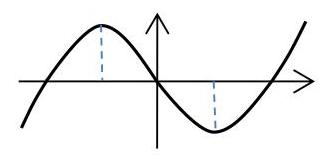

A. $f\left( 1\right)$ 与 $f\left( {-1}\right)$ ; B. $f\left( {-1}\right)$ 与 $f\left( 1\right)$ ;

C. $f\left( {-2}\right)$ 与 $f\left( 2\right)$ ; D. $f\left( 2\right)$ 与 $f\left( {-2}\right)$ .

16. 设函数 $y = f\left( x\right)$ 的定义域为 $\mathbf{R}$ ,若 $f\left( 0\right)  = {2025}$ ,且对任意 $x \in  \mathbf{R}$ ,满足 $f\left( {x + 1}\right)  - f\left( x\right)  \leq  {2}^{x}$ , $f\left( {x + 2}\right)  - f\left( x\right)  \geq  3 \times  {2}^{x}$ ，则 $f\left( {2025}\right)$ 的值为 ............( )

A. ${2}^{2025} + {2024}$ ; B. ${2}^{2024} + {2025}$ ;

C. ${2}^{2025} + {2025}$ ; D. 以上答案均不对.

三、解答题 (本大题共 5 题, 满分 78 分) 解答下列各题必须在答题纸相应编号的规定区域内写出必要的步骤.

## 17. (满分 14 分) 本题共 2 个小题, 第 1 小题满分 6 分, 第 2 小题满分 8 分.

已知向量 $\overrightarrow{a} = \left( {\cos \left( {x + \frac{\pi }{6}}\right) ,\sin \left( {x + \frac{\pi }{6}}\right) }\right) \text{ 、 }\overrightarrow{b} = \left( {\cos \left( {x + \frac{\pi }{6}}\right) , - \sin \left( {x + \frac{\pi }{6}}\right) }\right)$ ,记 $f\left( x\right)  = \overrightarrow{a} \cdot  \overrightarrow{b}$ .

(1)求函数 $y = f\left( x\right)$ 的最小正周期；

( 2 )若函数 $y = f\left( {x + \theta }\right)$ (其中常数 $\theta  \in  \left( {0,\frac{\pi }{2}}\right)$ )为奇函数，求 $\theta$ 的值.

## 18. (满分 14 分) 本题共 2 个小题, 第 1 小题满分 6 分, 第 2 小题满分 8 分.

某校高三共有300名学生，分六个班，每班50人. 为了解该校高三学生的视力情况，体检后每班按随机抽样的方法抽取了 8 名学生的视力数据. 其中高三 (1) 班抽取的 8 名学生的视力数据与人数见下表:

<table><tr><td>视力数据</td><td>4.0</td><td>4.1</td><td>4.2</td><td>4.3</td><td>4.4</td><td>4.5</td><td>4.6</td><td>4.7</td><td>4.8</td><td>4.9</td><td>5.0</td><td>5.1</td><td>5.2</td><td>5.3</td></tr><tr><td>人数</td><td></td><td></td><td></td><td></td><td>2</td><td></td><td>2</td><td></td><td>2</td><td>1</td><td></td><td>1</td><td></td><td></td></tr></table>

(1)

用上述样本数据估计高三(1)班学生视力的平均值；

(2)已知其余五个班学生视力的平均值分别为 ${4.3}\text{ 、 }{4.4}\text{ 、 }{4.5}\text{ 、 }{4.6}\text{ 、 }{4.8}$ . 若从这六个班中任意抽取两个班学生视力的平均值作比较, 求抽取的两个班学生视力的平均值之差的绝对值不小于 0.2 的概率.

19. (满分 14 分) 本题共 2 个小题, 第 1 小题满分 8 分, 第 2 小题满分 6 分.

如图，在正三棱柱 ${ABC} - {A}_{1}{B}_{1}{C}_{1}$ 中， ${A{A}_{1}} = {2AC} = 4$ ，延长 ${CB}$ 至 $D$ ，使 ${CB} = {BD}$ ， $E$ 是线段 ${BC}$ 的中点.

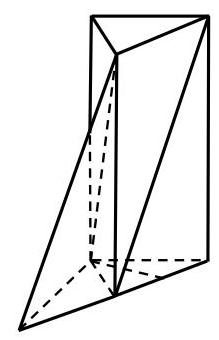

(1)求证:① 直线 ${C}_{1}B//$ 平面 $A{B}_{1}D$ ；② ${AE}\bot {D{B}_{1}}$ .

(2)求二面角 ${B}_{1} - {AD} - C$ 的正弦值.

## 20. (满分 18 分) 本题共 3 个小题, 第 1 小题满分 4 分, 第 2 小题满分 6 分, 第 3 小题满分 8 分.

如图,在直角坐标平面 ${xOy}$ 中, $\bigtriangleup {A}_{i}{B}_{i}{A}_{i + 1}$ 中 $\left( {i = 1,2,\cdots , n,\cdots }\right)$ 为正三角形,且满足 $\overrightarrow{O{A}_{1}} = \left( {-\frac{1}{4},0}\right) ,\overrightarrow{{A}_{i}{A}_{i + 1}} = \left( {{2i} - 1,0}\right) .$

(1)求点 ${A}_{n}$ 的横坐标 ${X}_{n}$ 关于正整数 $n$ 的表达式；

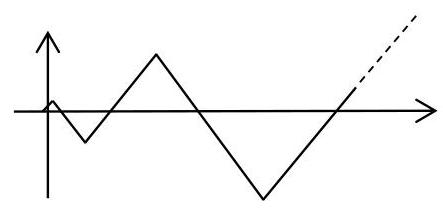

(2) 求证: 点 ${B}_{1},{B}_{2},\cdots ,{B}_{n}\cdots$ 在抛物线 $\Gamma  : {y}^{2} = {3x}$ 上;

(3) 过 (2) 中抛物线 $\Gamma  : {y}^{2} = {3x}$ 的焦点 $F$ 作两条互相垂直的弦 ${AC}$ 和 ${BD}$ ,求四边形 ${ABCD}$ 面积的最小值.

## 21. (满分 18 分) 本题共 3 个小题, 第 1 小题满分 4 分, 第 2 小题满分 6 分, 第 3 小题满分 8 分.

若存在实数常数 $k, m$ ,对任意 $x \in  \mathbf{D}$ ,不等式 $f\left( x\right)  \geq  {kx} + m \geq  g\left( x\right)$ 恒成立,则称直线 $y = {kx} + m$ 是函数 $y = f\left( x\right)$ 和函数 $y = g\left( x\right)$ 在 $\mathbf{D}$ 上的分界线.

(1) 请写出函数 $y = \frac{1}{2}{x}^{2}$ 和函数 $y = \ln x$ 在 $\left( {0, + \infty }\right)$ 上的一条斜率为 1 的分界线; (不必证明)

(2) 求证: 函数 $y = x + \frac{1}{x}$ 和函数 $y = 2 - \frac{1}{x}$ 在 $\left( {0, + \infty }\right)$ 上过坐标原点的分界线有且只有一条;

(3)试探究函数 $y = {\mathrm{e}}^{x}\left( {x + 1}\right)$ ( $\mathrm{e}$ 为自然对数的底数) 和函数 $y =  - {x}^{2} + {2x} + 1$ 在 $\mathbf{R}$ 上是否存在分界线. 若存在, 求出分界线方程; 若不存在, 请说明理由.

# 2025 届上海市黄浦区高三二模数学试卷

(完卷时间:120 分钟 满分:150 分)

2025 年 4 月

## 一、填空题(本大题共有 12 题，满分 54 分. 其中第 1~6 题每题满分 4 分，第 7~12 题每题满分 5 分) 考生应在答题纸相应编号的空格内直接填写结果.

1. 设 $x \in  \mathbf{R}$ ,不等式 $\frac{x}{x - 2} < 0$ 的解集为___.

2. 设 $a \in  \mathbf{R}$ ,集合 $A = \left\lbrack  {1,3}\right\rbrack  , B = \left\lbrack  {a,4}\right\rbrack$ ,若 $A \cap  B = \left\lbrack  {2,3}\right\rbrack$ ,则 $a =$ ___.

3. 抛物线 ${y}^{2} = x$ 的焦点到其顶点的距离为___.

4. 在 $\bigtriangleup {ABC}$ 中,若 $A = {45}^{ \circ  }, B = {30}^{ \circ  },{BC} = 2\sqrt{6}$ ,则 ${AC} =$ ___.

5. i 为虚数单位,若复数 $z$ 满足 $z - \bar{z} = 2\mathrm{i}$ 且 $\bar{z} = \mathrm{i}z$ ,则 $\operatorname{Re}z =$ ___.

6. 函数 $y = \sqrt{3}\sin x + \sin \left( {\frac{\pi }{2} + x}\right)$ 的最大值是___.

7. 已知等比数列 $\left\{  {a}_{n}\right\}$ 为严格增数列,其前 $n$ 项和为 ${S}_{n}$ ,若 ${a}_{1}{a}_{10} = {a}_{8},{S}_{4} - {S}_{1} = \frac{21}{4}$ ,则该数列的公比为 ___.

8. 已知 $a$ 为常数，圆 ${\left( x - a\right) }^{2} + {\left( y + a - 2\right) }^{2} = {r}^{2}$ ( $r > 0$ )与圆 ${x}^{2} + {y}^{2} = 1$ 有公共点，当 $r$ 取到最小值时， $a$ 的值为___.

9. 某商场要悬挂一个棱长为 2 米的正方体物件作为装饰，如图， $A$ 、 $B$ 、 $C$ 、 $D$ 为该正方体的顶点, $B{B}_{1}\text{ 、 }C{C}_{1}\text{ 、 }D{D}_{1}$ 为三根直绳索,且均垂直于屋顶所在平面 $\alpha$ . 若平面 ${BCD}$ 与平面 $\alpha$ 平行,且点 $A$ 到 $\alpha$ 的距离为 2 米,则直绳索 $B{B}_{1}$ 的长度约为 ___米. (结果精确到 0.01 米)

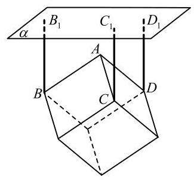

第 9 题

10. 若从 2025 的所有正约数中任取一个数，则这个数是一个完全平方数的概率为___.

11. 设 $\left\{  {a}_{n}\right\}$ 为等差数列,其前 $n$ 项和为 ${S}_{n}$ ,若 $\left( {{S}_{8} - {S}_{7}}\right) \left( {{S}_{9} - {S}_{7}}\right)  < 0$ ,则满足 ${S}_{m}{S}_{m + 1} < 0$ 的正整数 $m =$ ___.

12. 设 $a\text{ 、 }b$ 为常数, $f\left( x\right)  = \left| {a + \sin x}\right|  + \left| {a - \sin x}\right|$ ,若对任意的 $b \in  \left( {1,2}\right)$ ,函数 $y = f\left( x\right)  - b$ 在区间 $\left\lbrack  {0,{2\pi }}\right\rbrack$ 上恰有 4 个零点，则 $a$ 的取值范围是___.

## 二、选择题 (本大题共有 4 题, 满分 18 分. 其中第 13-14 题每题满分 4 分, 第 15-16 题每题满分 5 分) 每题有且只有一个正确答案, 考生应在答题纸的相应编号上, 将代表答案的小方格涂黑, 选对得满 分, 否则一律得零分.

13. 如果两种证券在一段时间内收益数据的相关系数为 0.8 , 那么表明( ).

A. 两种证券的收益有反向变动的倾向

B. 两种证券的收益有同向变动的倾向

C. 两种证券的收益之间存在完全反向的联动关系, 即涨或跌是相反的

D. 两种证券的收益之间存在完全同向的联动关系, 即同时涨或同时跌

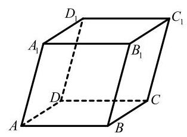

第 14

14. 如图,在平行六面体 ${ABCD} - {A}_{1}{B}_{1}{C}_{1}{D}_{1}$ 中,设 $\overrightarrow{a} = \overrightarrow{A{A}_{1}},\overrightarrow{b} = \overrightarrow{D{B}_{1}}$ ,若 $\overrightarrow{a}\text{ 、 }\overrightarrow{b}\text{ 、 }\overrightarrow{c}$ 组成空间向量的一个基，则 $\overrightarrow{c}$ 可以是( ).

A. $\overrightarrow{B{B}_{1}}$ B. $\overrightarrow{B{C}_{1}}$

C. $\overrightarrow{BD}$ D. $\overrightarrow{B{D}_{1}}$

15. 设 ${x}_{1} < {x}_{2} < {x}_{3} < {x}_{4}$ ,随机变量 $X$ 取值 ${x}_{1}\text{ 、 }{x}_{2}\text{ 、 }{x}_{3}\text{ 、 }{x}_{4}$ 的概率均为 0.25,随机变量 ${X}_{1}$ 取值 $\frac{{x}_{1} + {x}_{2}}{2}$ 、 $\frac{{x}_{2} + {x}_{3}}{2}\text{ 、 }\frac{{x}_{3} + {x}_{4}}{2}\text{ 、 }\frac{{x}_{4} + {x}_{1}}{2}$ 的概率也均为 0.25,随机变量 ${X}_{2}$ 取值 $2{x}_{1} - {x}_{2}\text{ 、 }2{x}_{2} - {x}_{3}\text{ 、 }2{x}_{3} - {x}_{4}$  、 $2{x}_{4} - {x}_{1}$ 的概率也均为 0.25 . 若记 $D\left\lbrack  {X}_{1}\right\rbrack  \text{ 、 }D\left\lbrack  {X}_{2}\right\rbrack$ 分别为 ${X}_{1}\text{ 、 }{X}_{2}$ 的方差,则( ).

A. $D\left\lbrack  {X}_{1}\right\rbrack   < D\left\lbrack  {X}_{2}\right\rbrack$ B. $D\left\lbrack  {X}_{1}\right\rbrack   = D\left\lbrack  {X}_{2}\right\rbrack$

C. $D\left\lbrack  {X}_{1}\right\rbrack   > D\left\lbrack  {X}_{2}\right\rbrack$ D. $D\left\lbrack  {X}_{1}\right\rbrack$ 与 $D\left\lbrack  {X}_{2}\right\rbrack$ 的大小关系与 ${x}_{1}\text{ 、 }{x}_{2}\text{ 、 }{x}_{3}\text{ 、 }{x}_{4}$ 的取值有关

16. 给定四面体 ${ABCD}$ . 平面 $\alpha$ 满足:① $A$ 、 $B$ 、 $C$ 、 $D$ 四个点均不在平面 $\alpha$ 上，也不在 $\alpha$ 的同侧； ②若平面 $\alpha$ 与四面体 ${ABCD}$ 的棱有公共点，则该公共点一定是此棱的中点或两个三等分点之一. 设 $A\text{ 、 }B\text{ 、 }C\text{ 、 }D$ 四个点到平面 $\alpha$ 的距离分别为 ${d}_{i}\left( {i = 1,2,3,4}\right)$ ,那么 ${d}_{i}$ 的所有不同值的个数组成的集合为( ).

A. $\{ 1,2,3,4\}$ B. $\{ 1,2,3\}$ C. $\{ 1,2\}$ D. \{1\}

## 三、解答题 (本大题共有 5 题, 满分 78 分) 解答下列各题必须在答题纸相应编号的规定区域内写出必 要的步骤.

17. (本题满分 14 分) 本题共有 2 小题, 第 1 小题满分 6 分, 第 2 小题满分 8 分.

已知 $f\left( x\right)  = {2}^{x}$ .

(1)若 $f\left( x\right)  - f\left( {2 - x}\right)  = 3$ ，求 $x$ 的值；

(2)是否存在实数 $a$ ，使函数 $y = f\left( x\right)  + {af}\left( {-x}\right)$ 是奇函数？请说明理由.

18. (本题满分 14 分)本题共有 2 个小题, 第 1 小题满分 6 分, 第 2 小题满分 8 分.

在四面体 ${ABCD}$ 中, ${DB} = {DC} = 2,{DB} \bot  {DC}$ .

(1)若 $\bigtriangleup {ABC}$ 为正三角形，平面 ${ABC} \bot$ 平面 ${DBC}$ ，求四面体 ${ABCD}$ 体积；

(2)若 ${AB} = {AC} = 4$ ， ${AD} = 3$ ，求二面角 $A - {BC} - D$ 的大小.

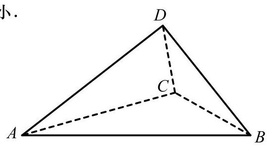

## 19. (本题满分 14 分)本题共有 2 小题, 第 1 小题满分 6 分, 第 2 小题满分 8 分.

一盒子中有大小与质地均相同的 20 个小球,其中白球 $n\left( {3 \leq  n \leq  {13}}\right)$ 个,其余为黑球.

(1)当盒中的白球数 $n = 6$ 时,从盒中不放回地随机取两次,每次取一个球,用 $A$ 表示事件 “第一次取到白球”,用 $B$ 表示事件 “第二次取到白球”,求 $P\left( {B \mid  A}\right)$ 和 $P\left( B\right)$ ,并判断事件 $A$ 与 $B$ 是否相互独立;

(2)某同学要策划一个抽奖活动，参与者从盒中一次性随机取 10 个球，若其中恰有 3 个白球， 则获奖，否则不获奖，要使参与者获奖的可能性最大、最小，该同学应该分别如何放置白球的数量 $n$ ?

## 20. (本题满分 18 分) 本题共有 3 个小题, 第 1 小题满分 4 分, 第 2 小题满分 6 分, 第 3 小题满分 8 分.

椭圆 $\Gamma  : \frac{{x}^{2}}{{a}^{2}} + \frac{{y}^{2}}{{b}^{2}} = 1\left( {a > b > 0}\right)$ 的左、右焦点分别为 ${F}_{1}\left( {-c,0}\right) \text{ 、 }{F}_{2}\left( {c,0}\right) \left( {c > 0}\right)$ ,过点 ${F}_{1}$ 的直线 $l$ 与 $\Gamma$ 交于点 $P$ .

(1)若 $c = 2$ ，点 $P$ 的坐标为 $\left( {2,\sqrt{2}}\right)$ ，求点 ${F}_{2}$ 到直线 $l$ 的距离；

(2)当 $b \leq  c$ 时，求满足 $P{F}_{1} \bot  P{F}_{2}$ 的点 $P$ 的个数；

(3)设直线 $l$ 与 $\Gamma$ 的另一个交点为 $Q,\overrightarrow{{F}_{1}Q} = \lambda \overrightarrow{QP}\;\left( {\lambda  \in  \mathbf{R}}\right)$ ，点 $P$ 的横坐标为 $\frac{c}{2}$ ，若 $\Gamma$ 的离心率 $e > \frac{1}{2}$ ,求 $\lambda$ 的取值范围.

## 21. (本题满分 18 分) 本题共有 3 个小题, 第 1 小题满分 4 分, 第 2 小题满分 6 分, 第 3 小题满分 8 分.

设 $D$ 是 $\mathbf{R}$ 的一个非空子集,函数 $y = f\left( x\right)$ 的定义域为 $D$ ,若 $y = f\left( x\right)$ 在 $D$ 上不是单调函数,且存在常数 $b$ ,使得 $f\left( x\right)  \geq  b$ 对任意的 $x \in  D$ 成立,则称函数 $y = f\left( x\right)$ 具有性质 $\mathrm{H}$ ,称 $b$ 为该函数的一个下界.

(1)设 $f\left( x\right)  = x + \frac{1}{x}, D = \left( {-\infty ,0}\right)$ ，判断函数 $y = f\left( x\right)$ ， $x \in  D$ 是否具有性质 $\mathrm{H}$ ；

(2)设 $m$ 为常数， $f\left( x\right)  = \frac{1}{3}{x}^{3} - x + 1, D = \left( {m,2}\right)$ ，当且仅当 $m$ 满足什么条件时，函数 $y = f\left( x\right)$ ， $x \in  D$ 具有性质 $\mathrm{H}$ ,且 $b = \frac{1}{3}$ 是该函数的一个下界;

(3) 设 $0 < a \leq  1, f\left( x\right)  = \ln \left( {x + 1}\right)  + {ax}\left( {x - 2}\right) , D = \left( {0,1}\right)$ ,若函数 $y = f\left( x\right) , x \in  D$ 具有性质 $\mathrm{H}$ ,求 $a$ 的取值范围; 当 $a$ 在上述范围内变化时,若 $b$ 总是该函数的下界,求 $b$ 的取值范围.

# 2025 届上海市普陀区高三二模数学试卷

202504

## 一、填空题(本大题共有 12 题，满分 54 分)考生应在答题纸相应编号的空格内直接填写结果，每个 空格填对前 6 题得 4 分、后 6 题得 5 分, 否则一律得零分.

1. 不等式 $1 + \frac{1}{x} < 0$ 的解集是___.

2. 已知复数 $z = \frac{3 - {2i}}{i}$ ，其中 $i$ 为虚数单位，则 $z + \bar{z} =$ ___.

3. 已知事件 $A$ 与事件 $B$ 相互独立，若 $P\left( {A \cap  \bar{B}}\right)  = \frac{3}{25}, P\left( B\right)  = \frac{3}{5}$ ，则 $P\left( A\right)  =$ ___.

4. 设 $n \geq  1$ ， $n \in  \mathbf{N}$ ， ${S}_{n}$ 是等差数列 $\left\{  {a}_{n}\right\}$ 的前 $n$ 项和，若 ${a}_{3n} = 3{a}_{n} \neq  0$ ，则 $\frac{{S}_{5}}{{a}_{10}}$ 的值为___.

5. 设 $m > 2$ ,抛物线 $C : {x}^{2} = {2my}$ 上的点 $P$ 到 $C$ 的焦点的距离为 5,点 $P$ 到 $y$ 轴的距离为 3,则 $m$ 的值为___.

6. 设 $t \in  \mathbf{R}$ ,若 $\left( {1 + \frac{t}{x}}\right) {\left( 1 - x\right) }^{6}$ 的展开式中 ${x}^{3}$ 项的系数为 10,则 $t =$ ___.

7. 在一个不透明的盒中装着标有数字1,2,3,4的大小与质地都相同的小球各 2 个,现从该盒中一次取出 2 个球,设事件 $A$ 为 “取出 2 个球的数字之和大于 5 ”,事件 $B$ 为 “取出的 2 个球中最小数字是 2 ”, 则 $P\left( {B \mid  A}\right)  =$ ___.

8. 若一个圆锥的高为 $\sqrt{2}$ ，侧面积为 $2\sqrt{2}\pi$ ，则该圆锥侧面展开图中扇形的中心角的大小为___.

9. 设 $k \geq  1, k \in  \mathbf{N},0 < \varphi  < \frac{\pi }{2}$ ,函数 $y = f\left( x\right)$ 的表达式为 $f\left( x\right)  = 2\sin \left( {{kx} + \varphi }\right)$ ,则对任意的实数 $a$ ，皆有 $\{ f\left( x\right)  \mid  a < x < a + 2\}  = \{ f\left( x\right)  \mid  x \in  \mathbf{R}\}$ 成立的一个充分条件是___.

10. 设 $i, j, n$ 为正整数,集合 $M = \{ 1,3,5,\cdots ,{2n} - 1\}$ ,若集合 $A$ 满足 $A \subseteq  M$ ,且对 $A$ 中任意的两个元素 $i, j$ ,皆有 $\left| {i - j}\right|  > 4$ 成立,记满足条件的集合 $A$ 的个数为 ${a}_{n}$ ,则 ${a}_{8} =$ ___.

11. 在棱长为 4 的正方体 ${ABCD} - {A}_{1}{B}_{1}{C}_{1}{D}_{1}$ 中， $\overrightarrow{AN} = 2\overrightarrow{AM} = \frac{1}{2}\overrightarrow{A{C}_{1}}$ ，若一动点 $G$ 满足 $\left| \overrightarrow{GN}\right|  = \sqrt{2}\left| \overrightarrow{GM}\right|$ ,则三棱锥 $G - {A}_{1}{B}_{1}{D}_{1}$ 体积的最大值为___.

12. 设 $a \in  \mathbf{R}$ ,函数 $y = f\left( x\right)$ 的表达式为 $f\left( x\right)  = \left\{  \begin{matrix} {\mathrm{e}}^{x}, x > 0 \\  \frac{1}{x + a}, x < 0 \end{matrix}\right.$ ,若函数 $g\left( x\right)  = f\left( x\right) f\left( {x + 1}\right)  - 1$ 恰有三个零点,则 $a$ 的取值范围是___.

## 二、选择题(本大题共有 4 题，满分 18 分，第 13-14 题每题 4 分，第 15-16 题每题 5 分)每题有且 只有一个正确答案, 考生应在答题纸的相应编号上, 将代表答案的小方格涂黑, 否则一律得零分.

13. 某市职业技能大赛的移动机器人比赛项目有 19 位同学参赛, 他们在预赛中所得的积分互不相同, 只有积分在前 10 位的同学才能进入决赛. 若该比赛项目中的某同学知道自己的积分后, 要判断自己能否进入决赛，则他只需要知道这 19 位同学的预赛积分的 ( )

A. 平均数 B. 众数 C. 中位数 D. 方差

14. 设 $m \in  \mathbf{R}$ ,在平面直角坐标系 ${xOy}$ 中,角 $\alpha$ 的顶点在坐标原点,始边与 $x$ 轴的正半轴重合,若角 $\alpha$ 的终边经过点 $P\left( {-3, m}\right)$ ,且 $\sin \left( {\pi  + {2\alpha }}\right)  > 0$ ,则角 $\alpha$ 属于 ( )

A. 第一象限 B. 第二象限 C. 第三象限 D. 第四象限

15. 设 $a > 0, b > 0$ ,点 $M\left( {{x}_{0},{y}_{0}}\right) , O$ 是坐标原点, $\left| {OM}\right|  = a, F$ 是双曲线 $\Gamma  : \frac{{x}^{2}}{{a}^{2}} - \frac{{y}^{2}}{{b}^{2}} = 1$ 的左焦点,若直线 $l : {x}_{0}x + {y}_{0}y = {a}^{2}$ 经过点 $F$ ,且与双曲线 $\Gamma$ 的右支在第一象限内交于 $P$ 点,则双曲线 $\Gamma$ 的离心率的一个可能的值是 ( )

A. $\frac{\sqrt{5}}{2}$ B. $\frac{\sqrt{6}}{2}$ C. $\frac{\sqrt{7}}{2}$ D. $\frac{\sqrt{11}}{2}$

16. 设 $k \geq  2, n \geq  1, k\text{ 、 }n \in  \mathbf{N},{S}_{n}$ 是数列 $\left\{  {a}_{n}\right\}$ 的前 $n$ 项和,且满足 $2{S}_{n} = 3{a}_{n} - 1$ ,数列 $\left\{  {b}_{n}\right\}$ 是由 $k$ 个大于 -2 的整数组成的有穷数列,若 ${b}_{1} \neq  0,\mathop{\sum }\limits_{{i = 1}}^{k}{b}_{i}{a}_{k - i + 1} = 0$ ,则称数列 $\left\{  {b}_{n}\right\}$ 是数列 $\left\{  {a}_{n}\right\}$ 的 “ $T$ 数列”. 对于数列 $\left\{  {b}_{n}\right\}$ 有如下两个命题:

①若 ${b}_{1} > 0$ ，则数列 $\left\{  {b}_{n}\right\}$ 不是数列 $\left\{  {a}_{n}\right\}$ 的 “ $T$ 数列”；②若 $k \geq  3$ ，则数列 $\left\{  {a}_{n}\right\}$ 的 “ $T$ 数列”至少有 5 个. 则下列结论中正确的是 ( )

A. ①为真②为真 B. ①为真②为假 C. ①为假②为真 D. ①为假②为假

三、解答题 (本大题共有 5 题, 满分 78 分) 解答下列各题必须在答题纸相应编号的规定区域内写出必要的步骤.

## 17. (本题满分 14 分) 本题共有 2 个小题, 第 1 小题满分 6 分, 第 2 小题满分 8 分.

如图，在三棱柱 ${ABC} - {A}_{1}{B}_{1}{C}_{1}$ 中， ${AC} = {A{A}_{1}} = {AB} = 2$ ， $\angle {{BA}{A}_{1}} = \frac{\pi }{3}$ ，且 ${C{A}_{1}} = {CB}$ ， ${C{A}_{1}}\bot {A{B}_{1}}$ .

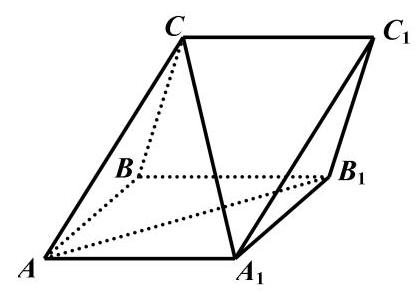

(1)求证:平面 ${CA}{B}_{1} \bot$ 平面 $A{A}_{1}{B}_{1}B$ ；

(2)求直线 $C{A}_{1}$ 与平面 $B{B}_{1}{C}_{1}C$ 所成的角的正弦值.

18. (本题满分 14 分) 本题共有 2 个小题, 第 1 小题满分 6 分, 第 2 小题满分 8 分.

设 $\omega  > 0$ ,函数 $y = f\left( x\right)$ 的表达式为 $f\left( x\right)  = \cos \left( {{\omega x} - \frac{\pi }{6}}\right)$ .

(1)若 $\omega  = 2$ ，设 $\bigtriangleup  {ABC}$ 的内角， $A, B, C$ 的对边分别为 $a, b, c$ ， $f\left( C\right)  =  - \frac{\sqrt{3}}{2}$ ，且 ${c}^{2} - {a}^{2} - {b}^{2} = 4$ ， 求 $\bigtriangleup {ABC}$ 的面积.

(2)对任意的 ${x}_{0} \in  \mathbf{R}$ ，皆有 $f\left( {x}_{0}\right)  \leq  f\left( \frac{\pi }{3}\right)$ 成立，且该函数在区间 $\left( {\frac{\pi }{6},\frac{\pi }{2}}\right)$ 上不存在最小值，求函数 $y = f\left( x\right)$ 在 $x \in  \left( {\frac{4\pi }{3},\frac{17\pi }{6}}\right)$ 的单调区间.

## 19. (本题满分 14 分) 本题共有 2 个小题, 第 1 小题满分 6 分, 第 2 小题满分 8 分.

某区为推进教育数字化转型, 通过聚合区域学校的教育资源, 依托 AI 技术搭建了区域智慧题库系统, 形成了“ $A$ 通识过关一 $B$ 综合拓展一 $C$ 创新提升”三层动态题库,且 $A, B, C$ 三层题量之比为 $7 : 3 : 2$ , 设该题库中任意 1 道题被选到的可能性都相同.

(1)现有 4 人参加一项比赛，若每人分别独立地从该题库中随机选取一道题作答，求这 4 人中至少有 2 人的选题来自 $B$ 层的概率;

(2)现采用分层随机抽样的方法，使用智能组卷系统从该题库中选取 12 道题生成试卷，若某老师要从生成的这份12道题的试卷中随机选取 3 道题做进一步改编，记该老师选到 $A$ 层题的题数为 $X$ ，求 $X$ 的分布与期望 $E\left\lbrack  X\right\rbrack$ .

## 20. (本题满分 18 分) 本题共有 3 个小题, 第 1 小题满分 4 分, 第 2 小题满分 6 分, 第 3 小题满分 8 分.

设 $a > b > 0, m > 0$ ,点 $A\text{ 、 }F$ 分别是椭圆 $\Gamma  : \frac{{x}^{2}}{{a}^{2}} + \frac{{y}^{2}}{{b}^{2}} = 1$ 的上顶点与右焦点,且 $\left| {AF}\right|  = 2$ ,直线 $l : x - {my} - 1 = 0$ 经过点 $F$ 与 $\Gamma$ 交于 $P\text{ 、 }Q$ 两点, $O$ 是坐标原点.

(1)求椭圆 $\Gamma$ 的方程；

(2)若 $m = \sqrt{3}$ ，点 $M$ 是 $x$ 轴上的一点，且 $\bigtriangleup  {MPQ}$ 的面积为 $\frac{6}{13}$ ，求点 $M$ 的坐标；

(3)若点 $G$ 在直线 $x = 5$ 上，向量 $\overrightarrow{PG}$ 在直线 $l$ 上的投影为向量 $\overrightarrow{PF}$ ，证明 $\angle {PGQ} < \frac{\pi }{4}$ .

## 21. (本题满分 18 分) 本题共有 3 个小题, 第 1 小题满分 4 分, 第 2 小题满分 6 分, 第 3 小题满分 8 分.

已知 $a, b \in  \mathbf{R}$ ,对于函数 $y = f\left( x\right) , x \in  D$ ,设集合 $A = \left\{  {\left( {x, y}\right)  \mid  y = f\left( x\right) }\right\}$ , $B = \left\{  {\left( {x, y}\right) \left| {\;{\left( x - a\right) }^{2} + {\left( y - b\right) }^{2} \leq  1}\right. }\right\}$ ,记 ${M}_{f}\left( {a, b}\right)  = A \cap  B$ .

(1)若函数 $f\left( x\right)  = \frac{1}{x} - \frac{3x}{4}$ ，请判断 ${M}_{f}\left( {0,0}\right)$ 中元素的个数，并说明理由；

(2)设 $k > 0$ ，函数 $f\left( x\right)  = \sqrt{x + k}$ ，若 ${M}_{f}\left( {\frac{1}{2},0}\right)  = \left\{  \left( {{x}_{0},{y}_{0}}\right) \right\}$ ，求 $k$ 的值以及曲线 $y = f\left( x\right)$ 在点 $P\left( {{x}_{0},{y}_{0}}\right)$ 处的切线方程;

(3)设 $m \in  \mathbf{R}$ ，函数 $f\left( x\right)  = {\mathrm{e}}^{x} - \frac{\ln x}{x} - \frac{1}{x} + m$ ，若对于任意的 $a$ ，皆有 ${M}_{f}\left( {a,0}\right)  = \varnothing$ 成立，求 $m$ 的取值范围。

# 2025 届上海市虹口区高三二模数学试卷

202504

## 一、填空题(本大题共有 12 题，满分 54 分，第 1-6 题每题 4 分，第 7-12 题每题 5 分) 考生应在答题纸的相应位置直接填写结果.

1. 已知全集 $U = \{ 1,2,3,4\}$ ，若 $A = \{ 1,2\}$ ，则 $\bar{A} =$ ___.

2. 不等式 $\frac{x - 2}{x + 1} \leq  0$ 的解集是___.

3. 若 $\sin \alpha  = \frac{2}{3}$ ，则 $\cos {2\alpha } =$ ___.

4. 若某圆柱的底面半径为 1,母线长为 2,则其侧面积为___. (结果保留 $\pi$ )

5. 若直线 $l$ 与直线 $y = x$ 平行,且经过圆 ${x}^{2} - {2x} + {y}^{2} = 0$ 的圆心,则 $l$ 的方程为___.

6. 某公司为了解用电量 $y$ (单位:千瓦时) 与气温 $x$ (单位:摄氏度)

<table><tr><td>$x$</td><td>-1</td><td>10</td><td>13</td><td>18</td></tr><tr><td>$y$</td><td>62</td><td>38</td><td>34</td><td>m</td></tr></table>

之间的关系, 随机统计了 4 天的用电量与当天气温, 绘制了如右表格, 由表中数据可得回归方程 $y =  - {2x} + {59}$ ,则实数 $m =$ ___.

7. 若 $\bigtriangleup {ABC}$ 的三条边的长分别为 $4\text{ 、 }5\text{ 、 }6$ ，则 $\bigtriangleup {ABC}$ 的外接圆面积为___. (结果保留 $\pi$ )

8. 已知 $z$ 是实系数一元二次方程 ${x}^{2} + {px} + q = 0$ 的一个虚根，且 $\left| {z - 1}\right|  = 2$ ，若 $z$ 在复平面上所对应的点在抛物线 ${y}^{2} = {4x}$ 上,则 $p =$ ___.

9. 某工厂生产的零件长度 $X$ (单位:毫米) 服从正态分布 $N\left( {3,{\sigma }^{2}}\right)$ ,且 $P\left( {\left| {X - 3}\right|  \leq  {0.5}}\right)  = {0.8}$ ,若对该工厂同批生产的 4 个零件逐一检查, 则仅有 1 个零件的长度大于 3.5 毫米的概率为___.

10. 已知 9 个小球的编号为 1、2、...、9，从中有放回地摸取小球三次，并依次记录其编号，若这三个编号按此顺序成等差数列, 则共有___种不同的摸取方法.

11. 1798 年,人口学家马尔萨斯假设: 单位时间内的人口增长量 ${x}^{\prime }\left( t\right)$ 与人口数 $x\left( t\right)$ 成正比,进而建立马尔萨斯人口增长模型. 19 世纪中叶的生物学家们发现由于人类生存条件的限制，存在人口最大瞬时增长率 ${r}_{0}$ ,当达到 ${r}_{0}$ 时,人口增长率 $r$ 会随着 $x\left( t\right)$ 的增长而下降,因此需要改进马尔萨斯的假设. 他们假设: ① $x\left( t\right)$ 是随着时间 $t$ 连续变化的函数; ②存在最大人口数 $N$ ，人口数达到 $N$ 时， $r = 0$ ; ③ ${x}^{\prime }\left( t\right)$ 仅与 $r$ 和 $x\left( t\right)$ 有关; ④ $r = {r}_{0} - k \cdot  x\left( t\right) \left( {k > 0}\right)$ ，那么在这些条件下建立的人口增长模型

${x}^{\prime }\left( t\right)  =$ ___. (用含有 $x\left( t\right) \text{ 、 }{r}_{0}\text{ 、 }N$ 的式子表示)

12. 记 $\left| A\right|$ 为有限集合 $A$ 中的元素个数. 设 $\omega  > 0,{S}_{\omega } = \left\{  {\theta  \mid  {2}^{2025} + \omega  \cdot  \theta }\right.$ 能被 7 整除 $\}$ ,若对于任意实数 $a$ 和正整数 $n$ ，恒有 $\left| {{S}_{\omega } \cap  \left( {a, a + n{\mathrm{e}}^{-{0.5n}}}\right) }\right|  \leq  3$ ，则实数 $\omega$ 的取值范围是___.

## 二、选择题(本大题共有 4 题，满分 18 分，第 13-14 题每题 4 分，第 15-16 题每题 5 分) 每题有且只有一个正确答案, 考生应在答题纸的相应位置上, 将所选答案的代号涂黑.

13. $a$ 是实数，则 “ ${a}^{2} > 1$ ” 是 “ $a > 2$ ” 的(一)条件.

A. 充要 B. 充分非必要 C. 必要非充分 D. 既非充分又非必要

14. 下列函数中为奇函数的是( ).

A. $y = \sqrt{x}$ B. $y = {x}^{-2}$

C. $y = \sin \left( {x + \frac{\pi }{2}}\right)$ D. $y = \tan \left( {x + \pi }\right)$

15. 春节期间, 小明和弟弟玩起了一种自定义游戏, 规定先由弟弟掷一颗质量均匀的骰子, 若弟弟掷出的点数为 6 , 则吃 1 颗花生; 若掷出其他点数, 则记下这个点数, 然后由小明开始两个人轮流掷这颗骰子, 直至任意一方掷出这个记下的点数或者 6, 一次游戏结束. 若掷出的是这个记下的点数, 则弟弟吃 1 颗花生；若是 6 ，则小明吃 3 颗花生. 任意一次游戏中弟弟能吃到 1 颗花生的概率为( ).

A. $\frac{5}{24}$ B. $\frac{5}{12}$ C. $\frac{3}{8}$ D. $\frac{7}{12}$

16. 在空间中,点 $O\text{ 、 }A$ 均为定点,且 $\left| \overrightarrow{OA}\right|  = 1$ . 设集合 $S = \left\{  {P\left| {\;{\left| \overrightarrow{OP}\right| }^{2} - 2\overrightarrow{OA} \cdot  \overrightarrow{OP} \leq  1}\right. }\right\}$ ,则以下说法正确的是( ).

① 若 $\overrightarrow{OP}$ 在 $\overrightarrow{OA}$ 上的数量投影为 $- \frac{1}{5}$ ，则线段 ${OP}$ 在运动过程中所形成的几何体体积为 $\frac{14}{375}\pi$ ；

② 对于任意的 ${P}_{i} \in  S$ 以及任意的正实数 ${a}_{i}$ ，设 $\overrightarrow{OQ} = \mathop{\sum }\limits_{{i = 1}}^{4}{a}_{i}\overrightarrow{O{P}_{i}}$ ，若 $\mathop{\sum }\limits_{{i = 1}}^{4}{a}_{i} = 1$ ，则 $Q \in  S$ .

A. ①是真命题，②是真命题 B. ①是真命题，②是假命题

C. ①是假命题，②是真命题 D. ①是假命题，②是假命题

## 三、解答题 (本大题共 5 题, 满分 78 分) 解答下列各题必须在答题纸相应位置写出必要步骤.

## 17. (本题满分 14 分, 第 1 小题 6 分, 第 2 小题 8 分)

如图所示，在四棱锥 $P - {ABCD}$ 中， ${PA}\bot$ 平面 ${ABCD}$ ， ${AB}\bot {AD}$ ， ${AD}\parallel {BC}$ ， ${AB} = {BC} = 2$ ， ${AD} = 4$ .

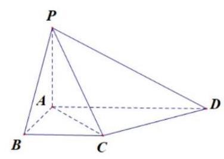

(1)求证:平面 ${PAC} \bot$ 平面 ${PCD}$ ；

(2)若异面直线 ${PB}$ 和 ${CD}$ 所成角为 $\frac{\pi }{3}$ ，求点 $B$ 到平面 ${PCD}$ 的距离.

## 18. (本题满分 14 分, 第 1 小题 6 分, 第 2 小题 8 分)

已知函数 $y = f\left( x\right)$ 的表达式为 $f\left( x\right)  = {2}^{x}, x \in  \mathbf{R}$ .

(1)解不等式: ${\log }_{2}\left\lbrack  {f\left( x\right)  - 1}\right\rbrack   + {\log }_{2}\left\lbrack  {f\left( x\right) }\right\rbrack   \leq  1$ ;

(2) 若存在 ${x}_{0} \in  \left\lbrack  {0,\frac{\pi }{2}}\right\rbrack$ ,使得 $f\left( {m\sin {x}_{0}}\right) , f\left( {2 + \sin 2{x}_{0}}\right) , f\left( {m\cos {x}_{0}}\right)$ 成等比数列,求实数 $m$ 的最小值.

## 19. (本题满分 14 分, 第 1 小题 2 分, 第 2 小题 6 分, 第 3 小题 6 分)

已知某区组建了一支 120 人的志愿者队伍，并由其中 72 人组成 “志愿模范队”. 经过一年的实践，全队共有 72 人的周平均服务时长超过 2 小时, 其中有 54 人来自 “志愿模范队”, 如下表所示.

<table><tr><td></td><td>是“志愿模范队”成员</td><td>不是“志愿模范队”成员</td><td>总计</td></tr><tr><td>周平均服务时长超过 2 小时</td><td>54</td><td></td><td>72</td></tr><tr><td>周平均服务时长不超过 2 小时</td><td></td><td></td><td></td></tr><tr><td>总计</td><td>72</td><td></td><td>120</td></tr></table>

(1)已知一名志愿者是 “志愿模范队” 成员，求其周平均服务时长超过 2 小时的概率.

(2)请完成 2×2 列联表，并根据表中数据回答:是否有 99.9%的把握认为“是‘志愿模范队’成员”与 “周平均服务时长超过 2 小时” 有关系?

(3)现从周平均服务时长超过 2 小时的人员中按照是否为 “志愿模范队” 进行分层抽样选取 8 人组建 “志愿突击队”，并从这 8 人中随机选取 2 人做深度访谈，记随机变量 $X$ 为这 2 人中来自于 “志愿模范队” 的人数,求 $X$ 的分布与方差.

<table><tr><td>$P\left( {{\chi }^{2} \geq  k}\right)$</td><td>0.100</td><td>0.050</td><td>0.010</td><td>0.001</td></tr><tr><td>$k$</td><td>2.706</td><td>3.841</td><td>6.635</td><td>10.828</td></tr></table>

附录: ${\chi }^{2} = \frac{n{\left( ad - bc\right) }^{2}}{\left( {a + b}\right) \left( {c + d}\right) \left( {a + c}\right) \left( {b + d}\right) }$ ,

其中 $n = a + b + c + d$ .

20. (本题满分 18 分, 第 1 小题 4 分, 第 2 小题 6 分, 第 3 小题 8 分)

已知点 ${F}_{1}$ 和 ${F}_{2}$ 是双曲线 $C : \frac{{x}^{2}}{{a}^{2}} - {y}^{2} = 1\left( {a > 0}\right)$ 的左、右焦点.

(1)若 $y = x$ 是双曲线 $C$ 的一条渐近线，求 $C$ 的离心率；

(2)当 $a = \sqrt{2}$ 时，若双曲线 $C$ 上存在一点 $P$ 满足 $\left| {P{F}_{1}}\right|  + \left| {P{F}_{2}}\right|  = 4$ ，求 ${\Delta P}{F}_{1}{F}_{2}$ 的面积；

(3) 若在双曲线 $C$ 上分别存在两点 $A$ 和 $B$ ,点 $A$ 在第一象限、点 $B$ 在第二象限,使得四边形 ${F}_{1}{BA}{F}_{2}$ 的面积为 $2\sqrt{{a}^{2} + 1}$ ，且存在实数 $\lambda$ 使 $\overrightarrow{{F}_{2}A} = \lambda \overrightarrow{{F}_{1}B}$ ，求实数 $a$ 的取值范围.

## 21. (本题满分 18 分, 第 1 小题 4 分, 第 2 小题 6 分, 第 3 小题 8 分)

对于定义在 $\mathbf{R}$ 上的函数 $y = f\left( x\right)$ 和 $y = g\left( x\right) , a \in  \mathbf{R}$ ,设 ${M}_{a} = \left\{  {t \mid  t = f\left( x\right)  - g\left( a\right) , x \geq  a}\right\}$ .

(1) 若 $f\left( x\right)  = {2}^{x} - 1, g\left( x\right)  = \cos x$ ,求 ${M}_{0}$ ;

( 2 )若 $f\left( x\right)  = {x}^{3} - 3{x}^{2}, g\left( x\right)  =  - x,{M}_{a} \subseteq  \lbrack 0, + \infty )$ ，求实数 $a$ 的取值范围；

(3)已知对任意 $a \in  \mathbf{R}$ ，均有 ${M}_{a} = \lbrack 0, + \infty )$ ，记 $h\left( x\right)  = g\left( x\right)  - a$ ，求证:“对任意 $a \in  \mathbf{R}$ ，函数 $y = h\left( x\right)$ 零点个数均有限”的充要条件是 “ $y = f\left( x\right)$ 是严格增函数”.

# 2025 届上海市徐汇区高三二模数学试卷

## 一、填空题(本大题共有 12 题，满分 54 分，第 1-6 题每题 4 分，第 7-12 题每题 5 分) 考生应在答题纸的相应位置直接填写结果.

1. 已知全集 $U = \{ x\left| \right| x - 1 \mid   \leq  2, x \in  \mathbf{R}\} ,\;A = \left\lbrack  {1,3}\right\rbrack$ ，则 $\bar{A} =$ ___.

2. 复数 $z = \frac{1}{1 - \mathrm{i}}$ (其中 $\mathrm{i}$ 为虚数单位)的虚部是___.

3. 在空间直角坐标系中,向量 $\overrightarrow{a} = \left( {-m,6,3}\right) ,\overrightarrow{b} = \left( {2, n,1}\right)$ ,若 $\overrightarrow{a}//\overrightarrow{b}$ ,则 $m + n =$ ___.

<table><tr><td></td><td>${y}_{1}$</td><td>${y}_{2}$</td><td>总计</td></tr><tr><td>${x}_{1}$</td><td>$a$</td><td>35</td><td>45</td></tr><tr><td>${x}_{2}$</td><td>7</td><td>$b$</td><td>$n$</td></tr><tr><td>总计</td><td>$m$</td><td>73</td><td>$S$</td></tr></table>

4. 已知幂函数 $y = f\left( x\right)$ 的图像过点 $\left( {3,\frac{\sqrt{3}}{3}}\right)$ ，则该幂函数的值域是___.

5. 右图是一个 $2 \times  2$ 列联表,则 $s =$ ___.

6. 已知 $\cos \theta  =  - \frac{3}{5},\theta  \in  \left( {0,\pi }\right)$ ，则 $\tan \left( {\theta  - \frac{\pi }{4}}\right)$ 的值为___.

7. 已知 ${PA} \bot$ 平面 ${ABC},{\Delta ABC}$ 是直角三角形，且 ${AB} = {AC} = 2,{PA} = 4$ ，则点 $P$ 到直线 ${BC}$ 的距离是 ___.

8. 已知 ${ABCD}$ 是正方形，点 $M$ 是 ${AB}$ 的中点，点 $E$ 在对角线 ${AC}$ 上，且 $\overrightarrow{AE} = 3\overrightarrow{EC}$ ，则 $\angle {MED}$ 的大小为___.

9. 已知两个随机事件 $A, B$ ,若 $P\left( A\right)  = \frac{1}{5}, P\left( B\right)  = \frac{1}{4}, P\left( {B \mid  A}\right)  = \frac{2}{3}$ ,则 $P\left( {\bar{A} \mid  B}\right)  =$ ___.

10. 已知双曲线 $\frac{{x}^{2}}{{a}^{2}} - \frac{{y}^{2}}{{b}^{2}} = 1\left( {a > 0, b > 0}\right)$ 的左焦点为 ${F}_{1}$ ，右焦点为 ${F}_{2}$ . 若双曲线的右支上存在一点 $P$ ， 使得直线 $P{F}_{1}$ 与以双曲线的实轴为直径的圆相切,切点为线段 $P{F}_{1}$ 的中点,则该双曲线的离心率为___.

11. 如图，某处有一块圆心角为 $\frac{2}{3}\pi$ 的扇形绿地 ${AOB}$ ，扇形的半径为 20 米， ${AB}$ 是一条原有的人行直路，由于工程建设需要，现要在绿地中建一条直路 ${OC}$ ，以便在图中阴影部分区域分类堆放物料. 为了尽量减少对绿地的破坏(不计路宽)， 则原直路 ${AB}$ 与新直路 ${OC}$ 的交叉点 $D$ 到 $O$ 的距离为___米.

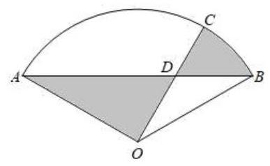

12. 设实数 $\omega  > 0$ ,若 $f\left( x\right)  = \sin {\omega x}$ 满足对任意 ${x}_{1} \in  \left\lbrack  {0,\pi }\right\rbrack$ ,都存在 ${x}_{2} \in  \left\lbrack  {\pi ,{2\pi }}\right\rbrack$ ,使得 $f\left( {x}_{1}\right)  + f\left( {x}_{2}\right)  = 0$ 成立，则 $\omega$ 的最小值是___.

## 二、选择题(本大题共有 4 题，满分 18 分，第 13-14 题每题 4 分，第 15-16 题每题 5 分)每题有且 只有一个正确选项. 考生应在答题纸的相应位置, 将代表正确选项的小方格涂黑.

13. 已知两个随机事件 $A, B$ ，则 “ $A$ 与 $B$ 互斥” 是 “ $A$ 与 $B$ 对立” 的( )

A. 充分非必要条件 B. 必要非充分条件 C. 充要条件 D. 既非充分也非必要条件

14. 在研究线性回归模型时,若样本数据 $\left( {{x}_{i},{y}_{i}}\right) \left( {i = 1,2,3,\cdots , n}\right)$ 所对应的点都在直线 $y =  - \frac{1}{3}x + 2$ 上, 则两组数据 ${x}_{i}$ 和 ${y}_{i}\left( {i = 1,2,3,\cdots , n}\right)$ 的线性相关系数为( )

A. -1 B. 1

C. $- \frac{1}{3}$ D. 2

15. 在桌面上有一个质地均匀的正四面体 $D - {ABC}$ . 从该正四面体与桌面贴合的面上的三条棱中等可能地选取一条棱, 沿其翻转正四面体至正四面体的另一个面与桌面贴合, 如此翻转称为一次操作. 如图, 开始时,正四面体与桌面贴合的面为 ${ABC}$ ,操作 $n\left( {n = 1,2,3,\cdots }\right)$ 次后,正四面体与桌面贴合的面是 ${ABC}$ 的概率记为 ${P}_{n}$ . 现有下列两个结论: ① ${P}_{2} = \frac{1}{3};$ ② ${P}_{25} < {P}_{24}$ .

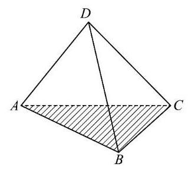

则下列说法正确的是 ( )

A. ①正确，②错误 B. ①错误，②正确

C. ①、②都正确 D. ①、②都错误

16. 已知函数 $y = f\left( x\right)$ 的定义域和值域都为 $\mathbf{R}$ ,且图像是一条连续不断的曲线,其导函数 $y = {f}^{\prime }\left( x\right)$ 的值如下表:

<table><tr><td>$x$</td><td>$\left( {-\infty ,{x}_{1}}\right)$</td><td>${x}_{1}$</td><td>$\left( {{x}_{1},{x}_{2}}\right)$</td><td>${x}_{2}$</td><td>$\left( {{x}_{2}, + \infty }\right)$</td></tr><tr><td>${f}^{\prime }\left( x\right)$</td><td>+</td><td>0</td><td>-</td><td>0</td><td>+</td></tr></table>

设 $D \subseteq  \mathbf{R}$ ,若集合 $\{ y \mid  y = f\left( x\right) , x \in  D\}  = \{ a, b, c\}$ ,其中 $a, b, c$ 为常数,则符合要求的集合 $D$ 的个数不可能是 ( )

A. 3 B. 27 C. 63 D. 343

## 三、解答题(本大题共有 5 题，满分 78 分)解答下列各题必须在答题纸的相应位置写出必要的步骤.

## 17. (本题满分 14 分, 第 1 小题满分 6 分, 第 2 小题满分 8 分)

如图， ${ABCD} - {A}_{1}{B}_{1}{C}_{1}{D}_{1}$ 是一块正四棱台形铁料，上、下底面的边长分别为 ${{20}\mathrm{\;{cm}}}$ 和 ${{40}\;\mathrm{{cm}}}$ ，高 ${{30}\;\mathrm{{cm}}}$ .

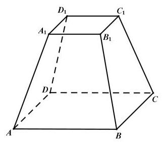

(1)求正四棱台 ${ABCD} - {A}_{1}{B}_{1}{C}_{1}{D}_{1}$ 的侧面 ${BC}{C}_{1}{B}_{1}$ 与底面 ${ABCD}$ 所成二面角的大小；

(2)现削去部分铁料(不计损耗)，将原正四棱台打磨为一个圆台，使得该圆台的上、下底面分别为原正四棱台上、下底面正方形的内切圆及其内部. 求削去部分与原正四棱台的体积之比.

## 18. (本题满分 14 分, 第 1 小题满分 6 分, 第 2 小题满分 8 分)

已知函数 $y = f\left( x\right)$ ,其中 $f\left( x\right)  = {\log }_{2}x$ .

(1)解关于 $x$ 的不等式 $f\left( {{3x} - 2}\right)  < f\left( {{2x} + 1}\right)$ ;

(2)若存在唯一的实数 ${x}_{0}$ ，使得 $f\left( {x}_{0}\right)$ ， $f\left( {{x}_{0} - a}\right)$ ， $f\left( 2\right)$ 依次成等差数列，求实数 $a$ 的取值范围.

## 19. (本题满分 14 分, 第 1 小题满分 6 分, 第 2 小题满分 8 分)

某公司生产的糖果每包标识 “净含量 500g”，但公司承认实际的净含量存在误差. 已知每包糖果的实际净含量 $\xi$ (单位: $g$ ) 服从正态分布 $N\left( {{500},{2.5}^{2}}\right)$ .

(1)随机抽取一包该公司生产的糖果，求其净含量误差超过 $5\mathrm{\;g}$ 的概率(精确到 0.001)；

(2)随机抽取 3 包该公司生产的糖果，记其中净含量小于 497.5g 的包数为 $X$ . 求 $X$ 的分布和期望(精确到 0.001 ) .

参考数据: $\Phi \left( 1\right)  \approx  {0.8413},\Phi \left( 2\right)  \approx  {0.9772},\Phi \left( 3\right)  \approx  {0.9987}$ ,其中 $y = \Phi \left( x\right)$ 为标准正态分布函数.

20. (本题满分 18 分, 第 1 小题满分 4 分, 第 2 小题满分 6 分, 第 3 小题满分 8 分)

已知抛物线 $C : {y}^{2} = {4x}$ ，点 $F$ 是抛物线 $C$ 的焦点.

(1)求点 $F$ 的坐标及点 $F$ 到准线 $l$ 的距离；

(2)过点 $F$ 作相互垂直的两条直线 ${l}_{1},{l}_{2},{l}_{1}$ 交抛物线 $C$ 于点 ${P}_{1}\text{ 、 }{P}_{2},{l}_{2}$ 交抛物线 $C$ 于点 ${Q}_{1}\text{ 、 }{Q}_{2}$ ，求证: $\frac{1}{\left| {P}_{1}{P}_{2}\right| } + \frac{1}{\left| {Q}_{1}{Q}_{2}\right| }$ 为定值,并求出该定值;

(3)过点 $F$ 且斜率为 $\sqrt{3}$ 的直线交抛物线 $C$ 于 $A\text{ 、 }B$ 两点，设点 $P$ 不在直线 ${AB}$ 上且 ${PF}$ 为 ${\Delta PAB}$ 的内角平分线,求 ${\Delta PAB}$ 面积的最大值.

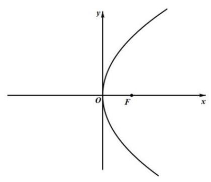

## 21. (本题满分 18 分, 第 1 小题满分 4 分, 第 2 小题满分 6 分, 第 3 小题满分 8 分)

对于函数 $y = h\left( x\right)$ ,记 ${h}^{\left( 0\right) }\left( x\right)  = h\left( x\right) ,{h}^{\left( 1\right) }\left( x\right)  = {\left( h\left( x\right) \right) }^{\prime },\cdots ,{h}^{\left( n + 1\right) }\left( x\right)  = {\left( {h}^{\left( n\right) }\left( x\right) \right) }^{\prime }\left( {n \in  N}\right)$ . 如果 $n$ 是满足 ${h}^{\left( n\right) }\left( x\right)  = h\left( x\right)$ 的最小正整数,则称 $n$ 是函数 $y = h\left( x\right)$ 的 “最小导周期”.

(1)已知函数 $y = f\left( x\right)$ ，其中 $f\left( x\right)  = a\sin \left( {x + t}\right)  + b\cos \left( {x + t}\right)$ ， 求证: 对任意实数 $a, b, t$ ,都有 ${f}^{\left( 4\right) }\left( x\right)  = f\left( x\right)$ ;

(2)设 $m, n \in  \mathbf{R}$ ， $g\left( x\right)  = {e}^{mx} + n\cos x$ ，若函数 $y = g\left( x\right)$ 的最小导周期为 2， 记 $M\left( {a, b}\right)  = \sqrt{{\left( a - b\right) }^{2} + {\left( a + 1 + g\left( b\right) \right) }^{2}}$ ,当实数 $a, b$ 变化时,求 $M\left( {a, b}\right)$ 的最小值;

(3)设 $\omega  > 1$ ， $h\left( x\right)  = \cos {\omega x}$ ，若函数 $y = h\left( x\right)$ 满足 ${h}^{\left( 2\right) }\left( x\right)  \leq  x$ 对 $x \in  \left( {0, + \infty }\right)$ 恒成立， 且存在 ${x}_{0} \in  \left( {0, + \infty }\right)$ 使得 ${h}^{\left( 2\right) }\left( {x}_{0}\right)  = {x}_{0}$ ,试用 $\omega$ 表示 ${x}_{0}$ ,并证明 $\frac{\pi }{2\omega } < {x}_{0} < \frac{\pi }{\omega }$ .

# 2025 届上海市宝山区高三二模数学试卷

202504

## 一、填空题(本大题共有 12 题，满分 54 分，第 1~6 题每题 4 分，第 7~12 题每题 5 分，要求在 答题纸相应题序的空格内直接填写结果, 每个空格填对得分, 否则一律得零分) .

1. 已知 $\mathrm{i}$ 是虚数单位,则 $\left| {1 + \mathrm{i}}\right|  =$ ___.

2. 设集合 $A = \{ 1,2\} , B = \{ 2,4\}$ ，则 $A \cup  B =$ ___.

3. 抛物线 ${x}^{2} = {4y}$ 的准线方程为___.

4. 已知函数 $f\left( x\right)  = \left\{  \begin{array}{l} {x}^{2} + 2, x < 1, \\  f\left( {x - 2}\right) , x \geq  1. \end{array}\right.$ 则 $f\left( 4\right)  =$ ___.

5. 已知 $m\text{ 、 }n$ 为常数，函数 $y = \left( {m - 1}\right) {x}^{2} + {3x} + 2 - n$ 为奇函数，则 $m + n =$ ___.

6. ${\left( x + \frac{2}{x}\right) }^{6}$ 的二项展开式中, ${x}^{2}$ 项的系数为___.

7. 已知函数 $y = {a}^{x + 1} - {\log }_{a}\left( {x + 2}\right)  + 1\left( {a > 0\text{ 且 }a \neq  1}\right)$ 的图像经过定点 $A$ ,则点 $A$ 的坐标为___

8. 已知圆柱的底面积为 ${9\pi }$ ，侧面积为 ${18\pi }$ ，则该圆柱的体积为___.

9. 已知 $\bigtriangleup {ABC}$ 中， ${AB} = {AC} = 4,\angle {BAC} = \frac{2}{3}\pi$ ，点 $D$ 在线段 ${BC}$ 上，且 ${S}_{\bigtriangleup {ACD}} = 2{S}_{\bigtriangleup {ABD}}$ ，则 $\overrightarrow{AB} \cdot  \overrightarrow{AD}$ 的值为___.

10. 有 3 件商品的编号分别为 $i\left( {i = 1,2,3}\right)$ ,它们的售价 (元) $S\left( i\right)  \in  \{ 5,7,8,{10},{11},{20}\}$ ,且满足 $S\left( 1\right)  \leq  S\left( 2\right)  \leq  S\left( 3\right)$ ，则这 3 件商品售价的所有可能情况有___种.

11. 某分公司经销一产品, 每件产品的成本为 5 元, 且每件产品需向总公司交 2 元的管理费, 预计每件产品的售价为 $x$ 元 $\left( {8 \leq  x \leq  {11}}\right)$ 时，一年的销售量为 ${\left( {12} - x\right) }^{2}$ 万件，则每件产品售价为___元时，该分公司一年的利润达到最大值. (结果精确到 1 元)

12. 空间中有相互垂直的两条异面直线 ${l}_{1}\text{ 、 }{l}_{2}$ ,点 $A\text{ 、 }B \in  {l}_{1}, C\text{ 、 }D \in  {l}_{2}$ ,且 ${AB} = 4,{CD} = 1$ ,若 ${DA} \bot  {DB}$ , 且 ${AC} = {BC} + 2$ ，则二面角 $D - {AB} - C$ 平面角的余弦值最小为___.

## 二、选择题 (本大题共有 4 题,满分 18 分,第 ${13} \sim  {14}$ 题每题 4 分,第 15 $\sim  {16}$ 题每题 5 分,每题 都给出四个结论, 其中有且仅有一个结论是正确的, 必须把答题纸上相应题序内的正确结论代号涂黑, 选对得相应满分, 否则一律得零分).

13. 已知向量 $\overrightarrow{a} = \left( {1, x}\right)$ ， $\overrightarrow{b} = \left( {3,1}\right)$ ，若 $\overrightarrow{a}//\overrightarrow{b}$ ，则 $x$ 的值为 ( )

A. -3 B. 3

C. $- \frac{1}{3}$ D. $\frac{1}{3}$

14. “ $a > b$ ” 的一个必要非充分条件是 ( )

A. $\ln \left( {a - b}\right)  > 0$ B. ${2}^{a} > {2}^{b}$

C. ${\left( \frac{1}{2}\right) }^{a - b} \leq  1$ D. ${a}^{3} > {b}^{3}$

15. 甲、乙两名篮球运动员在 8 场比赛中的单场得分用茎叶图表示如左下图, 茎叶图中甲的得分有部分数据丢失，但甲得分的折线图完好(右下图)，则下列结论正确的是( )

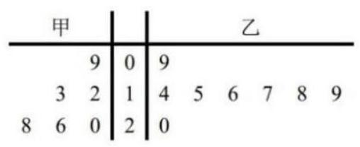

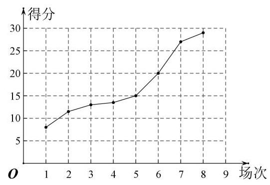

A. 甲得分的极差小于乙得分的极差

B. 甲得分的第 25 百分位数大于乙得分的第 75 百分位数

C. 甲得分的平均数大于乙得分的平均数

D. 甲得分的方差小于乙得分的方差

16. 若对任意正整数 $n$ ，数列 $\left\{  {a}_{n}\right\}$ 的前 $n$ 项和 ${S}_{n}$ 都是完全平方数，则称数列 $\left\{  {a}_{n}\right\}$ 为 “完全平方数列”. 有如下两个命题:① 若数列 $\left\{  {b}_{n}\right\}$ 的前 $n$ 项和 ${T}_{n} = {\left( n - t\right) }^{2}\left( {t\text{ 为正整数 }}\right)$ ，则使得数列 $\left\{  \left| {b}_{n}\right| \right\}$ 为 “完全平方数列” 的 $t$ 值有且仅有一个; ②存在无穷多个 “完全平方数列” 的等差数列. 则下列选项中正确的是 ( )

A. ①是真命题， ②是真命题； B. ①是真命题，

C. ①是假命题， ②是真命题； D. ①是假命题， ②是假命题.

## 三、解答题(本大题共有 5 题，满分 78 分，解答下列各题必须在答题纸的规定区域(对应的题号)内 写出必要的步骤) .

## 17. (本题满分 14 分, 第 1 小题满分 6 分, 第 2 小题满分 8 分)

如图,在四面体 ${ABCD}$ 中, ${\Delta BCD}$ 是边长为 2 的正三角形,

且 ${AB} = {AD} = \sqrt{2}$ .

(1)证明: ${BD} \bot  {AC}$ ；

(2)若 $E$ 是 ${BC}$ 的中点，且二面角 $A - {BD} - C$ 的大小为 $\frac{\pi }{2}$ ，求 ${AE}$ 与平面 ${BCD}$ 所成角的大小.

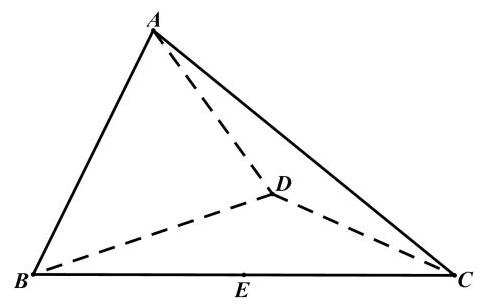

## 18. (本题满分 14 分, 第 1 小题满分 6 分, 第 2 小题满分 8 分)

已知函数 $f\left( x\right)  = {a}^{x}\left( {a > 0\text{ 且 }a \neq  1}\right)$

(1)若 $f\left( 2\right)  = 4$ ，求方程 $f\left( x\right)  - f\left( {-x}\right)  = 2$ 的解；

(2)已知 $0 < a < 1$ ，若关于 $x$ 的不等式 ${\left\lbrack  f\left( mx\right) \right\rbrack  }^{2} \geq  f\left( {{x}^{2} + 1}\right)  \cdot  f\left( {x + 3}\right)$ 在区间 $\left\lbrack  {1,2}\right\rbrack$ 上恒成立，求实数 $m$ 的最大值.

## 19. (本题满分 16 分, 第 1 小题满分 4 分, 第 2 小题满分 6 分, 第 3 小题满分 6 分)

某游乐园的活动项目共有三类, 分别是 “过山车” 等 10 个体验类项目、 “海豚之舞” 等 4 个表演类项目、“智力闯关”等 3 个互动类项目. 因设备维护需要，项目并非每日都全部开放.以下数据是项目开放的数量 $x$ (个) 和游客平均等待时间 $t$ (分钟/个) 的关系:

<table><tr><td>项目类别</td><td colspan="5">体验类</td><td colspan="2">演出类</td><td colspan="2">互动类</td></tr><tr><td>开放数量 $x$ (个)</td><td>4</td><td>5</td><td>6</td><td>7</td><td>8</td><td>2</td><td>4</td><td>2</td><td>3</td></tr><tr><td>平均等待时间 $y$ (分钟/个)</td><td>76</td><td>73</td><td>67</td><td>$m$</td><td>60</td><td>53</td><td>30</td><td>46</td><td>30</td></tr></table>

(1)体验类项目中，若 $y$ 关于 $x$ 波动的回归方程为 $y =  - {4.3x} + {93.8}$ ，请计算 $m$ 的值，并依据该模型预测所有体验类项目均开放时的平均等待时间(精确到整数)；

(2)小王游玩当日，体验类、演出类、互动类项目分别开放了 8 个、 4 个、 3 个，他计划随机游玩其中的 3 个项目, 已知他选择的项目中至少包含 1 个互动类项目, 求他的等待总时间恰为 120 分钟的概率;

(3)为提高游客的参与度，园方在互动类项目 “智力闯关” 中设计了两关.通过第一关的游客奖励 20 个游园币，游客可以选择结束或继续闯关. 若继续闯关，则必须完成第二关的所有题目. 第二关包含 2 道相互独立的选择题, 每答对 1 题可再奖励 20 个游园币, 每答错 1 题则要扣除 10 个游园币.每个游园币可兑换园区内任意一个项目的 1 分钟等待时间.

小王已通过第一关，假设他在第二关中每道题答对的概率均为 $p$ ，为了获得更多项目等待时间的兑换奖励，小王是否应该继续闯关？请你帮他做出决策.

## 20. (本题满分 16 分, 第 1 小题满分 4 分, 第 2 小题满分 5 分, 第 3 小题满分 7 分)

已知双曲线 $C : {x}^{2} - \frac{{y}^{2}}{3} = 1,{F}_{1}\text{ 、 }{F}_{2}$ 分别是其左、右焦点,直线 $l$ 与双曲线 $C$ 的右支交于 $A\text{ 、 }B$ 两点.

(1)当直线 $l$ 过点 ${F}_{2}$ ，且 $\left| {AB}\right|  = 6$ 时，求 $\bigtriangleup  {AB}{F}_{1}$ 的周长；

(2) 已知点 $N\left( {-2,3}\right)$ ,若直线 ${AN}\text{ 、 }{BN}$ 的斜率之和为 0,且 $\tan \angle {ANB} = \frac{4}{3}$ ,当 ${AN}\text{ 、 }{BN}$ 分别与 $y$ 轴交于点 $R\text{ 、 }S$ 时,求 $\bigtriangleup {RSN}$ 的面积;

(3) 已知直线 $l$ 过点 ${F}_{2}, P$ 是双曲线 $C$ 上一点且位于第一象限,且满足 $\overrightarrow{OQ} = 2\overrightarrow{OP}$ 的点 $Q$ 在线段 ${AB}$ 上, 若 $\overrightarrow{AB} = 2\overrightarrow{Q{F}_{2}}$ ,求点 $P$ 的坐标.

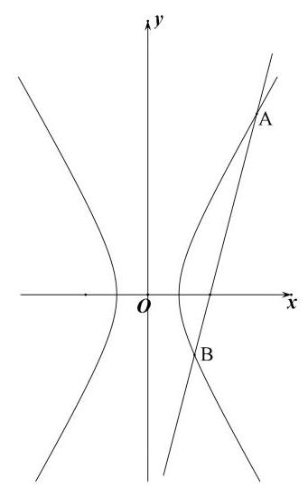

## 21. (本题满分 18 分, 第 1 小题满分 4 分, 第 2 小题满分 6 分, 第 3 小题满分 8 分).

定义在 $D$ 上的可导函数 $y = f\left( x\right)$ ,集合 ${A}_{\left( k, m\right) } = \left\{  {f\left( x\right)  \mid  F\left( {x}_{i}\right)  = k,{x}_{i} \in  D, i = 1,2,\cdots , m, m\text{ 为正整数 }}\right\}$ , 其中 $F\left( x\right)  = f\left( x\right)  + {f}^{\prime }\left( x\right)$ 称为 $f\left( x\right)$ 的自和函数, ${x}_{i}$ 称为 $y = f\left( x\right)$ 的固着点. 已知 $f\left( x\right)  = a{e}^{x} + {bx} + c\sin x\left( {a, b, c \in  \mathrm{R}}\right) .$

(1)若 $a = c = 0, b = 2, D = R, f\left( x\right)  \in  {A}_{\left( 1, m\right) }$ ，求 $m$ 的值及 $y = f\left( x\right)$ 的固着点；

(2)若 $a = 0, b = 1, c = 1, D = \left\lbrack  {s, t}\right\rbrack  \left( {s > 0}\right)$ ， $F\left( x\right)$ 是 $f\left( x\right)$ 的自和函数，且 $F\left( x\right)$ 在 $D$ 上是严格增函数，求 $t - s$ 的最大值;

(3) 若 $b =  - 1, c = 0, D = \left( {0, + \infty }\right) , f\left( x\right)  \in  {A}_{\left( 0,1\right) }$ ,且 $t$ 是 $y = f\left( x\right)$ 的固着点,求 $a$ 的取值范围,并证明: $\frac{1}{2a} < {e}^{t} < \frac{1}{{a}^{2}}$

# 2025 届上海市金山区高三二模数学试卷

202504

(满分: 150 分, 完卷时间: 120 分钟)

## 一、填空题(本大题共有 12 题，满分 54 分，第 1~6 题每题 4 分，第 7~12 题每题 5 分)考生应在答 题纸的相应位置直接填写结果.

1. 已知集合 $A = \left\{  {x\left| {\;{x}^{2} - {5x} + 6 = 0}\right. }\right\}  , B = \{ 2,4,6\}$ ，则 $A \cap  B =$ ___.

2. 已知复数 $z$ 满足 $\left( {1 + \mathrm{i}}\right) z = 1 - \mathrm{i}$ ( $\mathrm{i}$ 为虚数单位)，则 $z =$ ___.

3. 已知向量 $\overrightarrow{a} = \left( {x,1}\right) ,\overrightarrow{b} = \left( {1,2 - x}\right)$ ，若 $\overrightarrow{a}//\overrightarrow{b}$ ，则实数 $x =$ ___.

4. 已知角 $x$ 在第二象限，且 $\sin x = \frac{4}{5}$ ，则 $\tan x =$ ___.

5. 在 ${\left( ax + \frac{1}{x}\right) }^{5}$ 展开式中 $x$ 的系数为 80 ，则实数 $a$ 的值为___.

6. 若直线 $l$ 是曲线 $y = \frac{2}{x - 1}$ 在 $x = 3$ 处的切线，则 $l$ 的斜率为___.

7. 已知圆锥底面半径为1，高为 $\sqrt{3}$ ，则过圆锥的母线的截面面积的最大值为___.

8. 已知 $\left\{  {a}_{n}\right\}$ 是等差数列,若 ${a}_{3}\text{ 、 }{a}_{7}$ 分别是函数 $y = {x}^{2} - {4x} + 2$ 的两个零点,则 ${a}_{5} =$ ___.

9. 体育课上需要进行投篮测试，规定每人投 3 次，至少投中 2 次才能通过测试. 已知某同学每次投篮投中的概率均为 0.6 ，且各次投篮是否投中相互独立，则该同学通过测试的概率为___.

10. 已知函数 $y = g\left( x\right)$ 的图像是折线段 ${ABC}$ ,且 $A\left( {0,0}\right) \text{ 、 }B\left( {\frac{1}{2},\frac{1}{2}}\right) \text{ 、 }C\left( {1,0}\right)$ ,则函数 $y = x \cdot  g\left( x\right) \left( {0 \leq  x \leq  1}\right)$ 的图像与 $x$ 轴围成的图形面积为___.

11. 如图,现对某景区一长 ${AB} = {600}\mathrm{\;m}$ ,宽 ${AD} = {360}\mathrm{\;m}$ 的矩形空地进行建设. 规划在边 ${AB}\text{ 、 }{AD}$ 上分别取点 $M\text{ 、 }N$ 修建人行步道(不考虑宽度)，且满足点 $A$ 关于步道 ${MN}$ 的对称点 $E$ 在边 ${DC}$ 上. 在 $\bigtriangleup {AMN}$ 内种植花卉,在 $\bigtriangleup {EMN}$ 内搭建娱乐设施,其余区域规划为露营区,则人行步道 ${MN}$ 的最短距离为___ $\mathrm{m}$ . (结果精确到 $1\mathrm{\;m}$ )

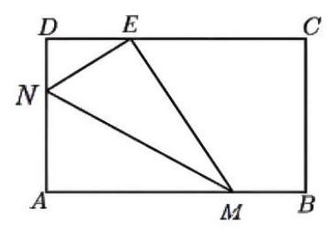

12. 设 ${x}_{1}\text{ 、 }{x}_{2}\text{ 、 }{x}_{3}\text{ 、 }{x}_{4}\text{ 、 }{x}_{5}$ 均是正整数,且 $\left\{  {x\left| {\;x = {x}_{m}{x}_{n}{x}_{p}{x}_{q},1 \leq  m < n < p < q \leq  5}\right. }\right\}   = \; \{ {108},{144},{288},{432}\}$ ，则 ${x}_{1} + {x}_{2} + {x}_{3} + {x}_{4} + {x}_{5}$ 的值为___.

## 二、选择题(本题共有 4 题，满分 18 分，13、14 每题 4 分，15、16 题每题 5 分)每题有且只有一个正 确选项，考生应在答题纸的相应位置，将代表正确选项的小方格涂黑.

13. 已知 $a \in  \mathbf{R}$ ,则下列结论不恒成立的是 ( ).

A. $a + 1 > a$

B. $a + \frac{1}{a} \geq  2$ C. $\left| {1 - a}\right|  + \left| {a + 2}\right|  \geq  3$ D. ${a}^{2} + a + 1 > 0$

14. 某人统计了甲、乙两家零售商店在周一到周五的营业额(单位:百元)情况，得到了如下的茎叶图 (其中茎表示十位数，叶表示个位数)，关于这 5 天的营业额情况，下列结论正确的是 ( ).

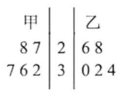

A. 甲、乙两家商店营业额的极差相同

B. 甲、乙两家商店营业额的中位数相同

C. 从营业额超过 3000 元的天数所占比例来看, 甲商店较高

D. 甲商店营业额的方差小于乙商店营业额的方差

15. 已知定义在 $\mathbf{R}$ 上的函数 $y = f\left( x\right)$ ,满足以下两个条件: (1) $f\left( x\right)  > 0$ 对任意 $x \in  \mathbf{R}$ 恒成立,且 $f\left( 1\right)  = 1$ ; (2) 对任意 ${x}_{1}\text{ 、 }{x}_{2} \in  \mathbf{R}$ 都有 $f\left( {{x}_{1} + 2{x}_{2}}\right)  = {4f}\left( {x}_{1}\right)  \cdot  {f}^{2}\left( {x}_{2}\right)$ ,则下列关于函数 $y = f\left( x\right)$ 的表述中正确的个数为 ( ).

① $f\left( 0\right)  = \frac{1}{2}$ ; ② $f\left( x\right)  \cdot  f\left( {-x}\right)  = \frac{1}{4}$ ; ③ 函数 $y = f\left( x\right)$ 有最小值.

A. 0 B. 1 C. 2 D. 3

16. 已知点 $A\left( {{x}_{1},{y}_{1}}\right)$ 在圆 ${x}^{2} + {y}^{2} = 9$ 上,点 $B\left( {{x}_{2},{y}_{2}}\right)$ 在圆 ${x}^{2} + {y}^{2} = {12}$ 上,且 ${x}_{1}{x}_{2} + {y}_{1}{y}_{2} = {x}_{1} + {x}_{2} - 1$ , $O$ 为坐标原点. 对于以下两个命题，判断正确的是 ( ).

①在坐标平面内存在点 $P$ ，使得 ${AP} \bot  {BP}$ 恒成立；

②三角形 ${OAB}$ 面积的最小值为 $\sqrt{22}$ .

A. ①是真命题，②是真命题 B. ①是假命题，②是真命题

C. ①是真命题，②是假命题 D. ①是假命题，②是假命题

## 三、解答题 (本大题满分 76 分) 本大题共有 5 题, 解答下列各题必须在答题纸相应编号的规定区域内 写出必要的步骤.

## 17. (本题满分 14 分) 本题共有 2 个小题, 第 1 小题满分 6 分, 第 2 小题满分 8 分.

已知函数 $y = f\left( x\right)$ 是定义在 $\mathbf{R}$ 上的奇函数,当 $x > 0$ 时, $f\left( x\right)  = {\log }_{2}x$ .

(1)求 $f\left( {-2}\right)  + f\left( 0\right)$ 的值；

(2)若 $g\left( x\right)  = f\left( x\right)  \cdot  f\left( \frac{x}{4}\right) , x \in  \left\lbrack  {1,8}\right\rbrack$ ，求函数 $y = g\left( x\right)$ 的值域.

## 18. (本题满分 14 分)本题共有 2 个小题, 第 1 小题满分 6 分, 第 2 小题满分 8 分

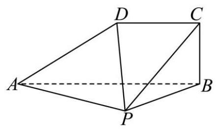

第 18 题 图

如图,在四棱锥 $P - {ABCD}$ 中, ${PA} \bot$ 平面 ${PBC},{AB} = {2DC} = 4,{BC} = 2\sqrt{2},{AB} \bot  {BC}$ , ${DC}//{AB}$ .

(1)证明:平面 ${ABCD} \bot$ 平面 ${PAB}$ ；

(2)若 $\angle {ABP} = \frac{\pi }{3}$ ，求点 $C$ 到平面 ${PAD}$ 的距离.

19. (本题满分 14 分) 本题共有 3 个小题, 第 1 小题满分 4 分, 第 2 小题满分 4 分, 第 3 小题满分 6 分.

为了研究高三学生每天整理数学错题的情况, 某校数学建模兴趣小组的同学在本校高三年级学生中采用随机抽样的方法抽取了 40 名学生, 调查他们平时的数学成绩和整理数学错题的情况, 现统计得部分数据如下:

<table><tr><td></td><td>数学成绩总评优秀人数</td><td>数学成绩总评非优秀人数</td><td>合计</td></tr><tr><td>每天都整理数学错题人数</td><td>14</td><td></td><td></td></tr><tr><td>不是每天都整理数学错题人数</td><td></td><td>15</td><td>20</td></tr><tr><td>合计</td><td></td><td></td><td>40</td></tr></table>

(1)完成上述样本数据的 $2 \times  2$ 列联表，并计算:每天都整理数学错题且数学成绩总评优秀的经验概率； (2)是否有99%的把握认为 “数学成绩总评优秀与每天都整理数学错题有关”？

(3)从不是每天都整理数学错题的学生中随机抽取 3 名学生做进一步访谈，设恰好抽取到数学成绩总评优秀的人数为 $X$ ,求 $X$ 的分布和期望.

附: ${\chi }^{2} = \frac{n{\left( ad - bc\right) }^{2}}{\left( {a + b}\right) \left( {c + d}\right) \left( {a + c}\right) \left( {b + d}\right) }$ ;

<table><tr><td>$\alpha$</td><td>0.10</td><td>0.01</td><td>0.001</td></tr><tr><td>$P\left( {{\chi }^{2} \geq  \alpha }\right)$</td><td>2.706</td><td>6.635</td><td>10.828</td></tr></table>

## 20. (本题满分 18 分, 第 1 小题满分 4 分, 第 2 小题满分 6 分, 第 3 小题满分 8 分)

已知椭圆 $\Gamma  : \frac{{x}^{2}}{4} + \frac{{y}^{2}}{3} = 1$ ，左右焦点分别为 ${F}_{1}$ 、 ${F}_{2}$ ，上下顶点分别为 $A$ 、 $B$ ，左右顶点分别为 $C$ 、 $D, P\text{ 、 }Q$ 是 $\Gamma$ 上异于椭圆顶点的两点.

(1)求 $\bigtriangleup  A{F}_{1}{F}_{2}$ 的周长;

(2)若点 $Q$ 在第一象限且满足 $\bigtriangleup  {ABQ}$ 的面积比 $\bigtriangleup  {F}_{1}{F}_{2}Q$ 的面积大，求点 $Q$ 的横坐标的取值范围；

(3)记点 $A$ 在直线 ${PQ}$ 上的投影为 $H$ ，且直线 ${CP}$ 的斜率是直线 ${DQ}$ 的斜率的 3 倍，试判断:过点 $A$ 、 $H$ 、 $O(O$ 为坐标原点)三点的圆是否为定圆? 若是,求出该圆的方程; 若不是,请说明理由.

## 21. (本题满分 18 分, 第 1 小题满分 4 分, 第 2 小题满分 6 分, 第 3 小题满分 8 分)

若函数 $y = f\left( x\right)$ 和 $y = g\left( x\right)$ 同时满足下列条件:①对任意 $x \in  \mathbf{R}$ ，都有 $f\left( x\right)  \leq  g\left( x\right)$ 成立；②存在 ${x}_{0} \in  \mathbf{R}$ ,使得 $f\left( {x}_{0}\right)  = g\left( {x}_{0}\right)$ ,则称函数 $y = g\left( x\right)$ 为 $y = f\left( x\right)$ 的 “ $W$ 函数”,其中 ${x}_{0}$ 称为 “ $W$ 点”.

(1)已知图像为一条直线的函数 $y = g\left( x\right)$ 是 $y = \sin x$ 的 “ $W$ 函数”，请求出所有的 “ $W$ 点”；

(2)设函数 $y = g\left( x\right)$ 为 $y = f\left( x\right)$ 的 “ $W$ 函数”，其 “ $W$ 点” 组成集合 $M$ ；函数 $y = h\left( x\right)$ 为 $y = g\left( x\right)$ 的 “ $W$ 函数”,其 “ $W$ 点” 组成集合 $N$ . 试证明: “函数 $y = h\left( x\right)$ 为 $y = f\left( x\right)$ 的 ‘ $W$ 函数’” 的一个充分必要条件是 “ $M \cap  N \neq  \varnothing$ ”;

(3)记 $f\left( x\right)  = \frac{x}{{\mathrm{e}}^{x}}$ (e 为自然对数的底数)， $g\left( x\right)  = {kx} + m\left( {k\text{ 、 }m \in  \mathbf{R}}\right)$ ，若 $y = g\left( x\right)$ 为 $y = f\left( x\right)$ 的 “ $W$ 函数”,且 “ $W$ 点” ${x}_{0} > 0$ ,求实数 $m$ 的最大值.

# 2025 届上海市杨浦区高三二模数学试卷

202504

## 一、填空题(本大题共有 12 题，满分 54 分，第 1-6 题每题 4 分，第 7-12 题每题 5 分)请在答题纸相 应编号的空格内直接写结果.

1. 已知集合 $A = \{ 1,2,3,4\} , B = \{ x \mid  1 < x < 4\}$ ，则 $A \cap  B =$ ___.

2. 不等式 $\frac{x + 1}{x - 2} < 0$ 的解集为___.

3. 函数 $y = \sin {2x}$ 的最小正周期是___.

4. 已知 $\sin \theta  = \frac{3}{5}$ ，则 $\cos {2\theta } =$ ___.

5. 已知 $a > 0, b > 0, a + b = 2,{ab}$ 的最大值为___.

6. 在 ${\left( x + \frac{1}{\sqrt{x}}\right) }^{6}$ 的二项展开式中,常数项的值为___

7. 已知复数 $z$ 满足 $\left| {z - 1 + \mathrm{i}}\right|  = 1$ ，其中 $\mathrm{i}$ 为虚数单位，则 $\left| z\right|$ 的最小值为___.

8. 不等式 $\left| {x + 3}\right|  + \left| {a - x}\right|  > 6$ 对一切实数 $x$ 恒成立，则实数 $a$ 的取值范围为___.

9. 植物社团的同学观察一株植物的生长情况,为了解植物高度 $y$ (单位: 厘米) 与生长期 $x$ (单位: 天) 之间的关系, 随机统计了某 4 天的植物高度, 并制作了如下对照表:

<table><tr><td>生长期 $x$</td><td>3</td><td>9</td><td>11</td><td>17</td></tr><tr><td>植物高度 $y$</td><td>2.4</td><td>3.4</td><td>3.8</td><td>5.2</td></tr></table>

由表中数据可得回归方程 $y = \widehat{a}x + \widehat{b}$ 中 $\widehat{a} = {0.2}$ ，试预测生长期是 30 天时，植物高度约为___ ___ 厘

*. $\left( {\widehat{a} = \frac{\mathop{\sum }\limits_{{i = 1}}^{n}{x}_{i}{y}_{i} - n\overline{xy}}{\mathop{\sum }\limits_{{i = 1}}^{n}{x}_{i}^{2} - n{\bar{x}}^{2}},\widehat{b} = \bar{y} - \widehat{a}\bar{x}}\right)$

10. 如图,点 $D\text{ 、 }E$ 分别是直角三角形 ${ABC}$ 的边 ${AB}\text{ 、 }{AC}$ 上的点,斜边 ${AC}$ 与扇形的弧 $\overset{\text{ ⏜ }}{DE}$ 相切,已知 ${AC} = 4,{BC} = 2$ ，则阴影部分绕直线 ${AB}$ 旋转一周所形成的几何体的体积为___.

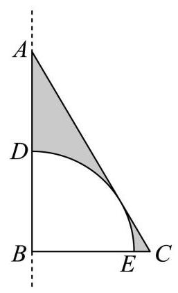

11. 如图,阿基米德椭圆规是由基座、带孔的横杆、两条互相垂直的空槽、两个可动滑块 $A\text{ 、 }B$ 组成的一种绘图工具,横杆的一端 $C$ 上装有铅笔,假设两条互相垂直的空槽和带孔的横杆都足够长,将滑块 $A\text{ 、 }B$ 固定在带孔的横杆上,令滑块 $\mathrm{A}$ 在中一条空槽上滑动,滑块 $B$ 在另一条空槽上滑动,铅笔 $C$ 随之运动就能画出椭圆. 当 $A\text{ 、 }B$ 之间的距离为 14 厘米时,若需要画出一个离心率为 $\frac{4}{5}$ 的椭圆,则 $B\text{ 、 }C$ 之间的距离为 ___.厘米.

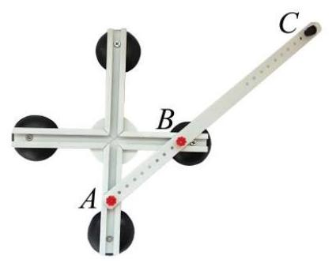

12. 由若干个多边形所覆盖的区域,称为这些多边形的并集,例如图中,梯形 ${ACDE}$ 是 $\bigtriangleup {ACE}$ 与矩形 ${BCDE}$ 的并集. 已知 $n$ 是正整数,在平面直角坐标系 ${xOy}$ 中,直线 ${l}_{n}$ 的方程为 $y =  - {2}^{n}x + n$ ,若直线 ${l}_{n}$ 交 $x$ 轴于点 ${A}_{n}$ ，交 $y$ 轴于点 ${B}_{n}$ ，则 $\bigtriangleup  {A}_{1}O{B}_{1}$ ， $\bigtriangleup  {A}_{2}O{B}_{2}$ ， $\cdots$ ， $\bigtriangleup  {A}_{10}O{B}_{10}$ 的并集，其面积为___.

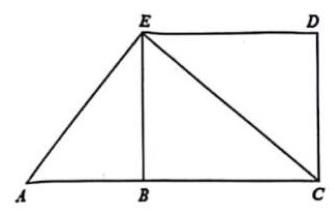

## 二、选择题 (本大题共有 4 题, 满分 18 分, 第 13-14 题每题 4 分, 第 15-16 题每题 5 分) 每题有且只 有一个正确选项，请在答题纸的相应编号上将代表答案的小方格涂黑.

13. $\bigtriangleup  {ABC}$ 中，“ $\sin A = \sin B$ ” 是 “ $A = B$ ” 的( )条件.

A. 充分非必要 B. 必要非充分

C. 充要 D. 既非充分也非必要

14.3 名同学报名参加社团活动, 有 4 个社团可以报名, 这些社团招收人数不限, 但每位同学只能报名其中 1 个社团, 则这 3 位同学可能的报名结果共有 ( ) 种.

A. 6 B. 24 C. 64 D. 81

15. 已知 $\mathrm{A}\text{ 、 }B\text{ 、 }C$ 是单位圆上的三个点，若 $\left| \overrightarrow{AB}\right|  = \sqrt{2}$ ，则 $\overrightarrow{AB} \cdot  \overrightarrow{BC}$ 的最大值为( ).

A. $\sqrt{2}$

B. $1 + \frac{\sqrt{2}}{2}$ C. $\sqrt{2} + 1$ D. $\sqrt{2} - 1$

16. 设 $\mathrm{A}$ 是由 $k$ 个二次函数组成的集合,对于连续的正整数 $1,2,3,\cdots ,{2025}$ ,存在二次函数 $y = {f}_{i}\left( x\right)  \in  A\left( {1 \leq  i \leq  {2025}, i \in  \mathbf{Z}, y = {f}_{i}\left( x\right) \text{ 可重复),使得 }{f}_{1}\left( 1\right) ,{f}_{2}\left( 2\right) ,{f}_{3}\left( 3\right) ,\cdots ,{f}_{2025}\left( {2025}\right) }\right)$ 是等差数列,则 $k$ 的最小可能值是 ( ) .

A. 507 B. 1013 C. 1519 D. 2025

## 三、解答题(本大题共有 5 题，本大题满分 78 分)请在答题纸相应的编号规定区域内写出必要的步骤.

17. 已知函数 $y = f\left( x\right)$ 是定义在 $\mathbf{R}$ 上的偶函数.

(1)当 $x \in  \lbrack 0, + \infty )$ 时， $f\left( x\right)  = {\log }_{2}\left( {x + 1}\right)$ ，求 $x \in  \left( {-\infty ,0}\right)$ 时， $y = f\left( x\right)$ 的表达式；

(2)当 $x \in  \lbrack 0, + \infty )$ 时， $f\left( x\right)  = {x}^{3} + {2025}^{x}$ ，若实数 $t$ 满足 $f\left( {{3t} - 2}\right)  < f\left( {t - 1}\right)$ ，求 $t$ 的取值范围.

18. 座落于杨浦滨江的世界技能博物馆由百年历史文化保护建筑改建而成, 其中的支柱保留了原有的正八棱柱,既考虑了结构力学优势,又体现了对历史建筑的尊重和传承. 如图, ${O}_{1}\text{ 、 }O$ 分别为正八棱柱的上下两个底面的中心,已知 ${OA} = 1, A{A}_{1} = 4$ .

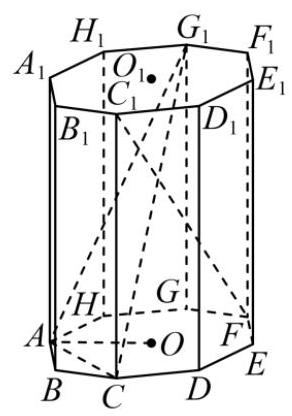

(1)求证: ${BC}\bot {C}_{1}F$ ；

(2)求点 $O$ 到平面 ${AC}{G}_{1}$ 的距离.

19. 为弘扬中华民族传统文化、增强民族自豪感，某学校开展中华古诗词背诵比赛，分为初赛和复赛. 全校同学都参加了初赛, 并随机抽取一个班级进行初赛成绩统计, 已知该班级共有 40 位学生, 他们的初赛分数的频率分布直方图如图所示:

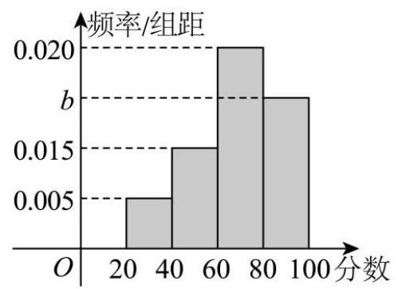

(1)计算 $b$ 的值，并估计该校这次初赛的平均分数.

(2)初赛分数达到 80 及以上的同学，称为优秀参赛选手，现从班级中随机选出 2 位同学,用 $X$ 代表其中的优秀参赛选手人数,求 $X$ 的分布;

(3)为增加比赛的趣味性，复赛规则如下:复赛试题将从题库中随机抽取， 每位参赛选手将有机会回答填空、选择和简答各 1 题; 每答对 1 题得 1 分, 答错或不答得 0 分, 每位选手可以自行选择回答问题的顺序, 若答对一题可继续答下一题, 直到 3 题全部答完; 若答错或不答则比赛结束.例如: 选手甲可自行按 “简答一填空一选择” 顺序答题，甲答对第一题得 1 分, 并继续回答第二题且答错得 0 分, 结束比赛, 总分为 1 分.

小杨作为优秀参赛选手, 代表班级参加复赛.根据他初赛的答题正确频率, 可估计他填空、选择和简答的答题正确概率分别为:

<table><tr><td>题型</td><td>填空</td><td>选择</td><td>简答</td></tr><tr><td>答题正确概率</td><td>80%</td><td>90%</td><td>80%</td></tr></table>

若小杨每次答题的结果都相互独立, 那么为尽量在比赛中获得较高分数, 小杨应该采用怎样的答题顺序? 请说明理由.

20. 已知双曲线 $\Gamma$ 的标准方程为 ${x}^{2} - \frac{{y}^{2}}{2} = 1$ ,点 $P$ 是双曲线 $\Gamma$ 右支上的一个动点.

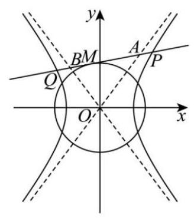

(1)求双曲线 $\Gamma$ 的焦点坐标和渐近线方程；

(2)过点 $P$ 分别向两条渐近线作垂线，垂足为点 ${P}_{1},{P}_{2}$ ，求 $\overrightarrow{P{P}_{1}} \cdot  \overrightarrow{P{P}_{2}}$ 的值；

(3)若 $\left| {OP}\right|  > \sqrt{2}$ ，如图，过 $P$ 作圆 $O : {x}^{2} + {y}^{2} = 2$ 的切线 $l$ ，切点为 $M$ ，交双曲线 $\Gamma$ 的左支于点 $Q$ ,分别交两条渐近线于点 $A\text{ 、 }B$ . 设 $\left| {PQ}\right|  = \lambda \left| {AB}\right|$ ,求实数 $\lambda$ 的取值范围.

21. 已知函数 $y = f\left( x\right)$ 的导函数为 $y = {f}^{\prime }\left( x\right)$ ,若函数 $y = f\left( x\right)$ 的定义域为 $\mathbf{R}$ ,且不等式 $f\left( x\right)  > {f}^{\prime }\left( x\right)$ 对任意 $x \in  \mathbf{R}$ 成立,则称函数 $y = f\left( x\right)$ 是 “超导函数”.

(1)判断 $f\left( x\right)  = {\mathrm{e}}^{x} + 1$ 是否为 “超导函数”，并说明理由；

(2)若函数 $y = g\left( x\right)$ 与 $y = h\left( x\right)$ 都是 “超导函数”，且对任意 $x \in  \mathbf{R}$ ，都有 ${h}^{\prime }\left( x\right)  > 0$ ， ${g}^{\prime }\left( x\right)  < 0$ ， 记 $F\left( x\right)  = g\left( x\right) h\left( x\right)$ ,求证: 函数 $y = F\left( x\right)$ 是 “超导函数”;

(3)已知函数 $y = \varphi \left( x\right)$ 是 “超导函数” 且 $\varphi \left( 1\right)  = \mathrm{e}$ ，若有且仅有一个实数 $t$ 满足 $\varphi \left( {\ln t + 1 - {at}}\right)  = {\mathrm{e}}^{\ln t + 1 - {at}}$ ， 求 $a$ 的取值范围.

# 2025 届上海市松江区高三二模数学试卷

202504

## 一、填空题(本大题共有 12 题，满分 54 分，第 1~6 题每题 4 分，第 7~12 题每题 5 分)

1. 已知集合 $A = \{  - 1,0,1,2\} , B = \left\{  {x \mid  y = {\log }_{2}x}\right\}$ ，则 $A \cap  B =$ ___。

2. 抛物线 $C : {y}^{2} = {8x}$ 的焦点到准线的距离为___。

3. 若复数 $z$ 满足 $\frac{1 + i}{z} = i$ (其中 $i$ 是虚数单位)，则 $\left| z\right|  =$ ___。

4. 已知空间向量 $\overrightarrow{a} = \left( {2,\lambda ,3}\right) ,\overrightarrow{b} = \left( {-4,2,2}\right)$ ，若 $\overrightarrow{a}\bot \overrightarrow{b}$ ，则 $\lambda  =$ ___。

5. ${\left( 3{x}^{2} + \frac{1}{x}\right) }^{6}$ 的二项展开式中的常数项为___。

6. 根据右表所示的样本数据,用最小二乘法求得线性回归方程为 $\widehat{y} = \widehat{a}x + {10.3}$ ,则回归系数 $\widehat{a}$ 的值为___。

<table><tr><td>$x$</td><td>6</td><td>8</td><td>9</td><td>10</td><td>12</td></tr><tr><td>$y$</td><td>6</td><td>5</td><td>4</td><td>3</td><td>2</td></tr></table>

7. 有 4 辆车停放在 5 个并排车位上，客车甲车体较宽，停放时需要占两个车位，并且乙车与客车甲相邻停放，则共有___种不同的停放方法。

8. 在定向越野活动中,测得甲在乙北偏东 ${80}^{ \circ  }$ 的方向,甲乙两人间的距离为 ${2km}$ ,丙在乙北偏西 ${40}^{ \circ  }$ 的方向，甲丙两人间的距离为 $\sqrt{7}{km}$ ，则乙丙两人间的距离为___ ${km}$ 。

9. 已知点 $P$ 为直线 $l : x + y + 1 = 0$ 上的点,过点 $P$ 作圆 $N : {\left( x - 1\right) }^{2} + {\left( y - 1\right) }^{2} = 1$ 的切线 ${PA}$ ,切点为 $A$ ,则 $\cos \angle {PNA}$ 最大值为___。

10. 如图在三棱锥 $P - {ABC}$ 中， ${PA}$ 、 ${PB}$ 、 ${PC}$ 两两垂直，且 ${PA} = 3,{PB} = 2,{PC} = 1$ ，设 $M$ 是底面 ${ABC}$ 内一点,定义 $f\left( M\right)  = \left( {m, n, p}\right)$ ,其中 $m, n, p$ 分别表示三棱锥 $M - {PAB}$ ,三棱锥 $M - {PBC}$ ,三棱锥 $M - {PCA}$ 的体积。若 $f\left( M\right)  = \left( {\frac{2}{3}, x, y}\right)$ ，且 $\frac{a}{x} + \frac{1}{y} \geq  {12}$ 恒成立，则正实数 $a$ 的最小值为___。

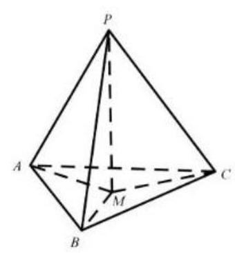

11. 设向量 $\overrightarrow{a} = \left( {{x}_{1},{y}_{1}}\right) ,\overrightarrow{b} = \left( {{x}_{2},{y}_{2}}\right)$ ,记 $\overrightarrow{a}\bigstar \overrightarrow{b} = {x}_{1}{x}_{2} - {y}_{1}{y}_{2}$ 。若点 ${A}_{1}\text{ 、 }{A}_{2}\text{ 、 }{A}_{3}$ 为圆 $C : {x}^{2} + {y}^{2} + {4x} - \; {2y} = 0$ 上任意三点，且满足 ${A}_{1}{A}_{2}\bot {A}_{2}{A}_{3}$ ，则 $\mid  \overrightarrow{O{A}_{1}}\bigstar \overrightarrow{O{A}_{2}} + \overrightarrow{O{A}_{2}}\bigstar \overrightarrow{O{A}_{3}} \mid$ 的取值范围是___。

12. 设 $a \in  R$ ,若函数 $f\left( x\right)  = \left\{  \begin{array}{ll} \sin \left( {{2\pi x} - {2\pi a}}\right) , & x < a \\  {x}^{2} - 2\left( {a + 1}\right) x + {a}^{2} + 5, & x \geq  a \end{array}\right.$ 在区间 $\left( {0, + \infty }\right)$ 内恰好有 6 个零点, 则 $a$ 的取值范围是___。

## 二、选择题(本大题共有 4 题，满分 18 分，第 13~14 题每题 4 分，第 15~16 题每题 5 分) 每题有且只有一个正确答案, 考生应在答题纸的相应位置上, 将所选答案的代号涂黑。

13. 设 $a, b, c, d \in  R$ ，则 “ $a + c > b + d$ ” 是 “ $a > b$ 且 $c > d$ ” 的( )

A. 充分非必要条件 B. 必要非充分条件 C. 充要条件 D. 既非充分又非必要条件

14. 下列函数中,在区间 $\left( {0, + \infty }\right)$ 上为严格增函数的奇函数的是 ( )

A. $y = \ln \left| x\right|$ B. $y = \left| {x - 1}\right|$ C. $y = \frac{1}{{2}^{x}}$ D. $y =  - \frac{1}{x}$

15. 在正三棱柱 ${ABC} - {A}_{1}{B}_{1}{C}_{1}$ 中， ${AB} = A{A}_{1} = 1$ ，动点 $P$ 满足 $\overrightarrow{BP} = \lambda \overrightarrow{BC} + \overrightarrow{B{B}_{1}},\lambda  \in  \left( {0,1}\right)$ ，则下列几何体体积为定值的是 ( )

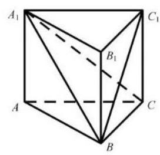

A. 四棱锥 $P - {A}_{1}{AB}{B}_{1}$ B. 四棱锥 $P - {A}_{1}{AC}{C}_{1}$

C. 三棱锥 $P - {A}_{1}{BC}$ D. 三棱锥 $P - {A}_{1}{BC}$

16. 定义在 $\left( {0, + \infty }\right)$ 上的函数 $y = f\left( x\right)$ 满足 $f\left( {x + 1}\right)  = f\left( x\right)  - x$ ,当 $0 < x \leq  1$ 时, $f\left( x\right)  = \sqrt{x} - x + 1$ ,有以下两个命题:

①当 $n$ 为正整数时， $f\left( n\right)  = \frac{-{n}^{2} + n + 2}{2}$ ；

②若函数 $y = f\left( x\right)$ 在区间 $(0, k\rbrack$ 内有 3 个极大值点，则 $k$ 的取值范围是 $\left\lbrack  {\frac{73}{36},3}\right)$ 。

则以下选项正确的是 ( )

A. ①是真命题，②是假命题 B. 两个都是真命题

C. ①是假命题，②是真命题 D. 两个都是假命题

三、解答题 (本大题满分 78 分) 本大题共有 5 题, 解答下列各题必须在答题纸相应编号的规定区域内写出必要的步骤。

17. (本题满分 14 分) 本题共有 2 个小题, 第 1 小题满分 6 分, 第 2 小题满分 8 分。 已知函数 $y = A\sin \left( {{2x} + \varphi }\right) , A > 0,0 < \varphi  < \pi$ ,当 $x = \frac{\pi }{6}$ 时函数取得最大值 4,记 $y = f\left( x\right)$ 。

(1)求函数 $y = f\left( x\right)$ 的表达式;

(2)若数列 $\left\{  {a}_{n}\right\}$ 为等差数列， ${a}_{2} = f\left( 0\right)$ ， ${a}_{4} = f\left( \frac{\pi }{6}\right)$ ，记 ${b}_{n} = {2}^{{a}_{n}}$ ，求数列 $\left\{  {b}_{n}\right\}$ 的前 $n$ 项和 ${S}_{n}$ 。

18.(本题满分 14 分)本题共有 2 个小题，第 1 小题满分 6 分，第 2 小题满分 8 分。

已知梯形 ${PBCD}$ 中， ${PD}\parallel {BC}$ ， $E$ 为 ${PD}$ 上的一点且 ${BE}\bot {PD},{PE} = {BE} = 1$ ， ${BC} = \frac{1}{2}{ED}$ ，将 $\bigtriangleup  {PBE}$ 沿BE翻折使得二面角 $P - {BE} - C$ 的平面角为 $\theta$ ，连接 ${PC}$ 、 ${PD}$ ， $F$ 为棱 ${PD}$ 的中点。

(1)求证: ${FC}\parallel$ 平面 ${PBE}$ ；

(2)当 $\theta  = \frac{2\pi }{3}$ 时，求直线 ${FC}$ 和平面 ${BCDE}$ 所成角的大小。

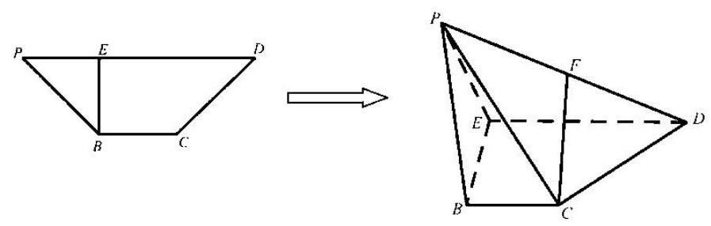

19. (本题满分 14 分) 本题共有 2 个小题, 第 1 小题满分 6 分, 第 2 小题满分 8 分。

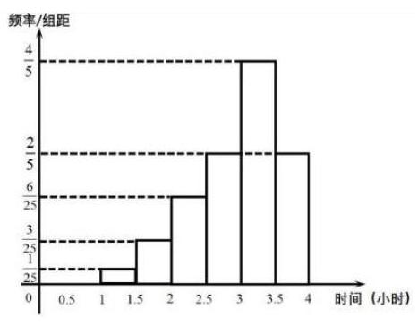

某校组织学生在周末时间利用 DeepSeek 等人工智能平台进行线上学习，但要求学生学习时间不超过 4 小时。现从该校高三学生某周末的线上学习时间统计数据中, 随机抽取 100 个学生的学习时间进行分析, 绘制成如下频率分布直方图。以抽取的 100 个学生该周末线上学习时间作为样本，估计该校高三年级全体学生周末线上学习时间的情况。

(1)试估计该校高三学生周末线上学习时间的平均数 $\bar{x}$ 及中位数 ${x}_{0}$

(注: 为了计算均值, 可用区间的中点值给区间内的每个数据赋值)

(2)现从全部高三年级学生中随机抽取 $n$ 人。若其中有 4 人周末线上学习的时间不小于 3 小时的可能性最大,求 $n$ 的值。

20. (本题满分 18 分) 本题共有 3 个小题, 第 1 小题满分 4 分, 第 2 小题满分 6 分, 第 3 小题满分 8 分。

已知椭圆 $\Gamma  : \frac{{x}^{2}}{{a}^{2}} + \frac{{y}^{2}}{{b}^{2}} = 1\left( {a > b > 0}\right)$ 的左右焦点分别为 ${F}_{1}\text{ 、 }{F}_{2}$ ,上下顶点分别为 ${B}_{1}\text{ 、 }{B}_{2}\text{ 。 }\Delta {B}_{1}{F}_{1}{F}_{2}$ 是面积为 $\sqrt{3}$ 的正三角形,过右焦点的直线交椭圆 $\Gamma$ 于 $P\text{ 、 }Q$ 两点 $\left( P\right. \text{ 、 }Q$ 分别在第一、四象限)。

(1)求椭圆 $\Gamma$ 的离心率；

(2)已知点 $M\left( {0, m}\right)$ ， $m > 0$ ，求椭圆 $\Gamma$ 上的动点 $R$ 到点 $M$ 的最大距离；

( 3 )求四边形 ${B}_{1}{B}_{2}{QP}$ 面积的取值范围。

21. (本题满分 18 分) 本题共有 3 个小题, 第 1 小题满分 4 分, 第 2 小题满分 6 分, 第 3 小题满分 8 分。

已知 $f\left( x\right)  = \ln \left( {x - 1}\right)  + \frac{2a}{x} - \frac{4}{3}, a \in  {R}_{ \circ  }$

(1)若 $x = 4$ 是函数 $y = f\left( x\right)$ 的一个极值点，求曲线 $y = f\left( x\right)$ 在点 $P\left( {4, f\left( 4\right) }\right)$ 处的切线方程；

(2)讨论函数 $y = f\left( x\right)$ 的单调性；

(3)已知实数 $a = 0$ ，若点 $A\left( {{x}_{1},{y}_{1}}\right)$ 、 $B\left( {{x}_{2},{y}_{2}}\right) \left( {{x}_{1} < {x}_{2}}\right)$ 是曲线 $y = f\left( x\right)$ 上两点，直线 ${AB}$ 的斜率为 $k$ ,求证: ${x}_{1} < \frac{1 + k}{k} < {x}_{2}$

# 2025 届上海市青浦区高三二模数学试卷

202504

## 一、填空题 (本大题共有 12 题, 满分 54 分, 第 1-6 题每题 4 分, 第 7-12 题每题 5 分) 请在答题纸相 应编号的空格内直接写结果.

1. 已知集合 $A = \{ x \mid  {2x} \leq  1\} , B = \{  - 1,0,1,2\}$ ，则 $A \cap  B =$ ___.

2. 函数 $y = 2\sin x - 3\cos x$ 的值域是___.

3. ${\left( 1 - ax\right) }^{6}$ 的二项展开式中 ${x}^{3}$ 项的系数是 20，则实数 $a$ 的值是___.

4. 如图是 6 株果树植株挂果个数(两位数)的茎叶图，则 6 株果数植株挂果个数的中位数为___.

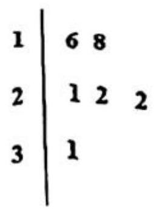

5. 向量 $\overrightarrow{a} = \left( {{310},{118}}\right)$ 在向量 $\overrightarrow{b} = \left( {0,{2025}}\right)$ 方向上的数量投影是___.

6. 已知 $\bigtriangleup  {ABC}$ 的角 $A$ 、 $B$ 、 $C$ 对应边长分别为 $a = 4$ ， $b = 5$ ， $c = 6$ ，则 $A =$ ___.

7. 数列 $\left\{  {a}_{n}\right\}$ 中， ${a}_{1} = 1,{a}_{n} = 2{a}_{n + 1}$ ，则 $\mathop{\sum }\limits_{{i = 1}}^{\infty }{a}_{i} =$ ___.

8. 已知随机变量 $\xi  \sim  N\left( {3,{\sigma }^{2}}\right) \left( {\sigma  > 0}\right)$ ，若 $P\left( {\xi  \geq  1}\right)  = {0.9}$ ，则 $P\left( {3 \leq  \xi  \leq  5}\right)  =$ ___.

9. 已知复数 $z\text{ 、 }w$ 满足 $\left| z\right|  = 2, z = \left( {1 + \mathrm{i}}\right) w$ ( $\mathrm{i}$ 是虚数单位)，则 $\left| {w + 2}\right|$ 的最大值是___.

10. 已知点 $P$ 是抛物线 ${y}^{2} = {8x}$ 上一动点，点 $Q$ 在圆 ${\left( x - 5\right) }^{2} + {y}^{2} = 1$ 上运动，则 $P$ 与 $Q$ 两点间最短距离为___.

11. 道路通行能力指单位时间 (1 小时) 内通过道路上指定断面的最大车辆数, 是度量道路疏导交通能力的指标. 同时为了行驶安全, 车辆之间必须保持一定的安全距离. 为了研究某城市道路通行能力, 现给出如下假设:

假设 1: 车身长度均为 4.8 米;

假设 2: 所有车辆以相同的速度 $v$ (单位: 千米 $\angle$ 小时) 匀速行驶;

假设 3: 安全距离 $d$ (单位: 米) 与车辆速度 $v$ 近似满足 $d = {3.2} + {0.6522v} + {0.01}{v}^{2}$ . 该城市道路通行能力的最大值约为___. (结果保留整数)

12. 如图，正方体 ${ABCD} - {A}_{1}{B}_{1}{C}_{1}{D}_{1}$ 绕直线 $D{B}_{1}$ 旋转 $\frac{\pi }{3}$ ，直线 ${AB}$ 旋转至直线 ${A}^{\prime }{B}^{\prime }$ ，则直线 ${AB}$ 与直线 ${A}^{\prime }{B}^{\prime }$ 所成角的大小为___.

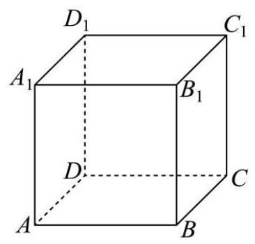

## 二、选择题(本大题共有 4 题，满分 18 分，第 13-14 题每题 4 分，第 15-16 题每题 5 分)每题有且只 有一个正确选项，请在答题纸的相应编号上将代表答案的小方格涂黑.

13. “函数 $y = \sin \left( {x + \varphi }\right)$ 为偶函数” 是 “ $\varphi  = \frac{\pi }{2}$ ” 的

A. 充分不必要条件 B. 必要不充分条件

C. 充要条件 D. 既不充分也不必要条件

14. 若正数 $m, n, a$ 均不为 1,则下列不等式中与 “ $m > n$ ” 等价的是 ( )

A. ${a}^{m} > {a}^{n}$ B. ${\log }_{a}m > {\log }_{a}n$

C. ${m}^{a} > {n}^{a}$ D. ${\log }_{m}a > {\log }_{n}a$

15. 一个质地均匀的正四面体, 四个面上分别标有数字1,2,3,4. 任意掷一次该四面体, 观察它与地面接触面上的数字,得到样本空间 $\Omega  = \{ 1,2,3,4\}$ ,记事件 $A = \{ 1,2\}$ ,事件 $B = \{ 1,3\}$ ,事件 $C = \{ 1,4\}$ ,则 ( )

A. 事件 $A, B, C$ 两两独立,事件 $A, B, C$ 相互独立

B. 事件 $A, B, C$ 两两独立，事件 $A, B, C$ 不相互独立

C. 事件 $A, B, C$ 不两两独立,事件 $A, B, C$ 相互独立

D. 事件 $A, B, C$ 不两两独立,事件 $A, B, C$ 不相互独立

16. 数学上用符号 $\mathop{\prod }\limits_{{i = 1}}^{n}{a}_{i}$ 表示 $n$ 个实数 ${a}_{1},{a}_{2},\cdots ,{a}_{n}$ 的积. 设 ${x}_{1},{x}_{2},\cdots ,{x}_{200},{y}_{1},{y}_{2},\ldots ,{y}_{200}$ 为互不相同的实数, 已知 $\mathop{\prod }\limits_{{j = 1}}^{{200}}\left( {{x}_{i} + {y}_{j}}\right)  = {2025}\left( {i = 1,2,\cdots ,{200}}\right)$ ,则 $\mathop{\prod }\limits_{{i = 1}}^{{200}}\left( {{x}_{i} + {y}_{j}}\right)  =$ (   ).

A. -2025 B. 2025 C. -2026 D. 2026

## 三、解答题 (本大题共有 5 题, 本大题满分 78 分) 请在答题纸相应的编号规定区域内写出必要的步骤.

17. 对于函数 $y = f\left( x\right)$ ,其中 $f\left( x\right)  = {\log }_{a}x\left( {a > 0, a \neq  1}\right)$ .

(1)若函数 $y = f\left( x\right)$ 的图像过点 $\left( {4,2}\right)$ ，求 $f\left( {{2x} - 2}\right)  < f\left( x\right)$ 的解集；

(2)求证:当 $a = \sqrt{2}$ 时，存在 $x$ 使得 $f\left( {x + 1}\right) , f\left( {ax}\right) , f\left( {x + 2}\right)$ 成等差数列.

18. 如图,已知四棱锥 $S - {ABCD}$ 的底面为菱形, $\angle {BAD} = \frac{\pi }{3},{AS} = {CS}$ .

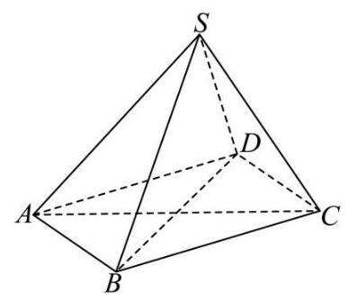

(1)求证: ${AC}\bot$ 平面 ${BDS}$ ；

(2)若 ${AB} = {2,{BS}} = \sqrt{3},{DS} = 1$ ，求四棱锥 $S - {ABCD}$ 的体积.

19. 如图,椭圆 ${C}_{1} : \frac{{x}^{2}}{8} + \frac{{y}^{2}}{{b}^{2}} = 1\left( {0 < b < 2\sqrt{2}}\right)$ 与双曲线 ${C}_{2} : \frac{{x}^{2}}{{b}^{2}} - {y}^{2} = 1$ 在第一象限的公共点为 $A\left( {{x}_{A},{y}_{A}}\right) \left( {{x}_{A} > 0}\right)$ . 曲线 $\Gamma$ 由两段曲线组成: 当 $x \leq  {x}_{A}$ 时,曲线 $\Gamma$ 与椭圆 ${C}_{1}$ 重合,当 $x > {x}_{A}$ 时,曲线 $\Gamma$ 与双曲线 ${C}_{2}$ 重合.

(1) 当 ${x}_{A} = 2$ 时,求 $b$ 的值;

(2)已知 $b = \sqrt{2}$ ，直线 $l$ 过点 $D\left( {2,0}\right)$ 与曲线 $\Gamma$ 交于 $E$ 、 $F$ 两点，若 $\overrightarrow{AD} \cdot  \overrightarrow{EF} = 2$ ，求直线 $l$ 的方程；

(3)已知 $A\left( {2,1}\right)$ ，斜率为 $k\left( {k \geq  1}\right)$ 的直线 $m$ 过点 $P\left( {0,1}\right)$ 与曲线 $\Gamma$ 交于 $M$ 、 $N$ 两点，若 ${S}_{\bigtriangleup {AMN}} = \lambda \tan \angle {MAN}$ ，求实数 $\lambda$ 的最大值.

20. 函数的导函数有很多有趣的性质,例如: 函数 $y = c$ (实数 $c$ 为常数) 的导函数为 $y = 0$ ; 反之,若函数 $y = \phi \left( x\right)$ 的导函数为 ${\phi }^{\prime }\left( x\right)  = 0$ ,则 $\phi \left( x\right)  = c$ (实数 $c$ 为常数). 已知函数 $y = f\left( x\right)$ 与 $y = g\left( x\right)$ 定义域都是 $\mathbf{R}$ ,导函数分别为 $y = {f}^{\prime }\left( x\right)$ 和 $y = {g}^{\prime }\left( x\right)$ . 若 ${f}^{\prime }\left( x\right)  = f\left( x\right)$ ,则称 $y = f\left( x\right)$ 是 “自导函数”; 落 ${f}^{\prime }\left( x\right)  = g\left( x\right)$ 且 ${g}^{\prime }\left( x\right)  =  - f\left( x\right)$ ,则称 $y = f\left( x\right)$ 与 $y = g\left( x\right)$ 是 “共轭互导函数”.

(1)请判断函数 $y = {\mathrm{e}}^{{ax} + b}\left( {a, b \in  \mathbf{R}, a \neq  0}\right)$ 是否是 “自导函数”，并说明理由；

(2)若函数 $y = f\left( x\right)$ 是 “自导函数”，且满足 $f\left( 0\right)  = 1$ ，求证: $f\left( x\right) f\left( {-x}\right)  = 1$ ；

(3)若函数 $y = f\left( x\right)$ 与 $y = g\left( x\right)$ 是 “共轭互导函数”，满足 $f\left( 0\right)  = 0, g\left( 0\right)  = 1$ ，求证: ${f}^{2}\left( x\right)  + {g}^{2}\left( x\right)  = 1$ . 进而证明 $f\left( x\right)  = \sin x$ 且 $g\left( x\right)  = \cos x$ .

# 2025 届上海市长宁区高三二模数学试卷

202504

## 一、填空题(本大题共有 12 题，满分 54 分，第 1-6 题每题 4 分，第 7-12 题每题 5 分) 考生应在答题纸的相应位置直接填写结果.

1. 已知集合 $A = \left( {-2,1}\right) , B = (0,3\rbrack$ ，则 $A \cap  B =$ ___.

2. 复数 ${z}_{1} = 2 - 3\mathrm{i},{z}_{2} = 1 - 2\mathrm{i}$ ，则 ${z}_{1} \cdot  \overline{{z}_{2}} =$ ___.

3. 已知数列 $\left\{  {a}_{n}\right\}$ 是等差数列,且 ${a}_{1} = 2,{a}_{6} = {17}$ ,则其前 7 项和 ${S}_{7} =$ ___.

4. 某水果店的苹果,60%来自 $A$ 基地,40%来自 $B$ 基地, $A$ 基地苹果的新鲜率为 90%, $B$ 基地苹果的新鲜率为 85%，从该水果店随机选取一个苹果，则选到新鲜苹果的概率是___.

5. 为了研究吸烟习惯与慢性气管炎患病的关系，某疾病预防中心对相关调查数据进行了研究，假设 ${H}_{0} :$ 患慢性气管炎与吸烟没有关系，并通过计算得到统计量 ${\chi }^{2} \approx  {3.468}$ ，则可推断___原假设 ${H}_{0}$ . (填 “拒绝”或“接受”,规定显著性水平 $\alpha  = {0.1}, P\left( {{\chi }^{2} \geq  {2.706}}\right)  \approx  {0.1}$ . $)$

6. 已知随机变量 $X$ 的分布是 $\left( \begin{matrix}  - 1 & 0 & 1 \\  \frac{1}{4} & \frac{1}{4} & \frac{1}{2} \end{matrix}\right)$ ,则其方差 $D\left\lbrack  X\right\rbrack   =$ ___.

7. 已知 ${\log }_{18}9 = a,{18}^{b} = 5$ ，用 $a, b$ 表示 ${\log }_{36}{45}$ 为__.

8. 顶角为 ${36}^{ \circ  }$ 的等腰三角形被称为黄金三角形,其底边和腰之比正好为黄金比 $\varphi$ ,用黄金比 $\varphi$ 表示 $\cos {36}^{ \circ  } =$ ___.

9. 一项过关游戏的规则规定:在第 $n$ 关要投掷骰子 $n$ 次，如果这 $n$ 次投掷所得的点数之和大于 ${3n}$ ，则算过关，问一个人连过第一、二关的概率为___.

10. 已知点 $D$ 、 $E$ 分别是三角形 ${ABC}$ 的边 ${AC}$ 、 ${BC}$ 的中点，且 ${AE} = 2,{BD} = 3$ ，则三角形 ${ABC}$ 的面积的取值范围是___.

11. 现有一块正四面体木料 PABC，其边长为 3，现需要将木料进行切割，要求切割后底面 ${ABC}$ 上任意一点 $Q$ 到顶点 $P$ 的距离不大于 $\sqrt{7}$ ，则切割好后，木料体积的最大值是___. (结果保留π)

12. 已知函数 $y = f\left( x\right)$ 和 $y = g\left( x\right)$ ,其中 $f\left( x\right)  = {\log }_{2}x$ ,且 $y = g\left( x\right)$ 是定义在 $\mathrm{R}$ 上的函数,其图像关于原点对称,当 $x \in  (0,1\rbrack$ 时, $g\left( x\right)  = {x}^{2} - {mx} - m + 5$ . 若对任意的 ${x}_{1} \in  \left\lbrack  {\frac{1}{2},2}\right\rbrack$ ,存在 ${x}_{2} \in  \left\lbrack  {-1,1}\right\rbrack$ ,使得 $f\left( {x}_{1}\right)  = g\left( {x}_{2}\right)$ , 则 $m$ 的取值范围是___.

## 二、选择题(本大题共有 4 题，满分 18 分，第 13-14 题每题 4 分，第 15-16 题每题 5 分) 每题有且只有一个正确答案, 考生应在答题纸的相应位置上, 将所选答案的代号涂黑.

13. 已知非零实数 $a > b$ ，则下列命题中成立的是( ).

A. ${a}^{2} > {b}^{2}$ B. ${ab} > {b}^{2}$ C. ${a}^{2} + {b}^{2} \geq  2\sqrt{ab}$ D. ${a}^{3} > {b}^{3}$

14. 某书店为了分析书籍销量与宣传投入之间的关系,对宣传投入 $X$ (千元) 和书籍销量 $y$ (百本) 的情况进行了调研，并统计得到表中几组对应数据，同时用最小二乘法得到 $y$ 关于 $X$ 的线性回归方程为 $y = {1.2x} + {1.6}$ ，则下列说法不正确的是( )

<table><tr><td>$X$</td><td>3</td><td>4</td><td>5</td><td>6</td></tr><tr><td>$y$</td><td>5</td><td>6.2</td><td>7.4</td><td>m</td></tr></table>

A. 变量 $x$ 、 $y$ 之间呈正相关 B. 预测当宣传投入 2 千元时, 书籍销量约为 400 本

C. $m = {8.8}$ D. 拟合误差 $Q = {0.48}$

15. 如图,等腰直角三角形 ${ABC}$ 中, $\angle A = {90}^{ \circ  }$ ,点 $E$ 是边 ${AC}$ 的中点,点 $D$ 是边 ${BC}$ 上一点 (不与 $C$ 重合)，将三角形 ${DCE}$ 沿 ${DE}$ 逆时针翻折，点 $C$ 的对应点是 ${C}_{1}$ ，连接 $C{C}_{1}$ ，设 $\theta$ 为二面角 ${C}_{1} - {DE} - C$ 大小, $\theta  \in  \left( {0,\pi }\right)$ . 在翻折过程中,下列说法当中不正确的是( )

A. 存在点 $D$ 和 $\theta$ ,使得 $D{C}_{1} \bot  {AC}$ B. 存在点 $D$ 和 $\theta$ ,使得 $B{C}_{1} \bot  {AC}$

C. 存在点 $D$ 和 $\theta$ ,使得 $B{C}_{1} \bot  {DE}$ D. 存在点 $D$ 和 $\theta$ ,使得 $C{C}_{1} \bot  {DE}$

16. 椭圆具有如下光学性质: 如图, ${F}_{1}\left( {-c,0}\right) ,{F}_{2}\left( {c,0}\right)$ 分别是椭圆 $\frac{{x}^{2}}{{a}^{2}} + \frac{{y}^{2}}{{b}^{2}} = 1$ 的左、右焦点,从点 ${F}_{1}$ 发出的光线在到达椭圆上的点 $P$ 后,经过到达点的切线反射后经过点 ${F}_{2}$ ,有以下两个命题:

①若 $P$ 是椭圆上除长轴端点外的一点，设法线与 $x$ 轴的交点为 $M\left( {t,0}\right)$ ，则 $t \in  \left( {-\frac{{c}^{2}}{a},\frac{{c}^{2}}{a}}\right)$

②若从 ${F}_{1}$ 发出的光线，经椭圆两次反射后，第一次回到 ${F}_{1}$ 所经过的路程为 ${8c}$ ，则该椭圆的离心率为 $\frac{1}{2}$ ； 则以下说法正确的是( )

A. ①是真命题，②是真命题 B. ①是真命题，②是假命题

C. ①是假命题，②是真命题 D. ①是假命题，②是假命题

## 三、解答题(本大题共有 5 题，本大题满分 78 分)请在答题纸相应的编号规定区域内写出必要的步骤.

17. 已知向量 $\overrightarrow{m} = \left( {\sin x + \cos x,2\sin x}\right) ,\overrightarrow{n} = \left( {\sin x - \cos x,\sqrt{3}\cos x}\right) , f\left( x\right)  = \overrightarrow{m} \cdot  \overrightarrow{n}$ .

(1)求函数 $y = f\left( x\right)$ 的单调递减区间；

(2)若函数 $y = f\left( x\right)  - a$ 在区间 $\left( {0,\frac{\pi }{2}}\right)$ 上恰有 2 个零点，求实数 $a$ 的取值范围.

18. 如图,在直三棱柱 ${ABC} - {A}^{\prime }{B}^{\prime }{C}^{\prime }$ 中, ${AB} \bot  {AC},{AC} = {AB} = 2, A{A}^{\prime } = 2\sqrt{2}$ ,点 $D$ 是棱 $A{A}^{\prime }$ 的中点.

(1)求证:平面 ${CD}{B}^{\prime } \bot$ 平面 ${CB}{B}^{\prime }{C}^{\prime }$ ；

(2)求点 ${C}^{\prime }$ 到平面 ${CD}{B}^{\prime }$ 的距离以及三棱锥 ${C}^{\prime } - {CD}{B}^{\prime }$ 的体积.

19. 为响应国家促进消费的政策，某大型商场举办了“消费满减乐翻天”的优惠活动，顾客消费满 800 元(含 800 元)可抽奖一次，抽奖方案有两种(顾客只能选择其中的一种)

方案 1: 从装有 5 个红球, 3 个蓝球 (形状、大小完全相同) 的抽奖盒中, 有放回地依次摸出 3 个球. 每摸出 1 次红球, 立减 150 元, 若 3 次都摸到红球, 则额外再减 200 元 (即总共减 650 元)；

方案 2:从装有 5 个红球，3 个蓝球(形状、大小完全相同)的抽奖盒中，不放回地依次摸出 3 个球. 中奖规则为:若摸出 3 个红球，享受免单优惠；若摸出 2 个红球，则打 5 折；其余情况无优惠.

(1)顾客 A 选择抽奖方案 2，已知他第一次摸出红球，求他能够享受优惠的概率;

(2)顾客 B 恰好消费了 800 元，

①若他选择抽奖方案 1，求他实付金额的分布列和期望(结果精确到 0.01)；

②试从实付金额的期望值分析顾客 $B$ 选择何种抽奖方案更合理.

20. 已知双曲线 $\Gamma  : \frac{{x}^{2}}{{a}^{2}} - \frac{{y}^{2}}{{b}^{2}} = 1$ 的左、右焦点分别为 ${F}_{1},{F}_{2}$ ,点 $A$ 是其左顶点,点 $P$ 是双曲线上一点,且位于第一象限,若双曲线 $\Gamma$ 的离心率 $e = 2, b = 2\sqrt{3}$ .

(1)求双曲线 $\Gamma$ 的方程；

(2)若三角形 ${AP}{F}_{2}$ 是等腰三角形，求点 $P$ 的坐标；

(3)直线 $P{F}_{2}$ 不垂直于 $X$ 轴，且与曲线 $\Gamma$ 的另一个交点为 $Q$ ，若 $\angle P{F}_{1}Q$ 是锐角，求直线 $P{F}_{2}$ 的斜率的取值. 范围.

21. 已知函数 $y = f\left( x\right)$ 的定义域 $D \subseteq  \mathrm{R}$ ,对任意实数 $a$ ,定义集合 ${Q}_{f}\left( a\right)  = \{ x \mid  f\left( x\right)  \leq  a, x \in  D\}$ .

(1)已知 $f\left( x\right)  = \frac{1 + x}{1 - x}$ ，求 ${Q}_{f}\left( 2\right)$ .

(2)已知 $f\left( x\right)  = {\mathrm{e}}^{x} - {ax}$ ，若集合 ${Q}_{f}\left( a\right)$ 只有一个元素，求 $a$ 的值；

(3) 已知 $f\left( x\right)  =  - \frac{a}{4}{x}^{2} + \frac{a + 2}{2}x - \ln x + \frac{1}{2}$ ,其中 $a \in  \mathrm{R}$ 且 $a > 0$ ,求证: 集合 ${Q}_{f}\left( a\right)$ 是一个区间.