# 上海市宝山区 2024 届高三上学期期末教学质量监测(一模) 数学试题

## 一 埴空期

1.(4 分)【作答次数:44】【正确率:97.7%】函数 $f\left( x\right)  = \lg \left( {x - 1}\right)$ 的定义域是

2.(4分)【作答次数:45】【正确率:95.6%】已知向量 $\overrightarrow{a} = \left( {{2m},1}\right) ,\overrightarrow{b} = \left( {1, m - 3}\right)$ ，若 $\overrightarrow{a}\bot \overrightarrow{b}$ ，则实数 $m =$ 3.(4 分) 【作答次数: 104】【正确率: 86.8%】已知等差数列 $\left\{  {a}_{n}\right\}$ 的前 $n$ 项和为 ${S}_{n}$ ,若 ${a}_{4} + {a}_{13} = 1$ 则 ${S}_{16} =$ 4.(4分)【作答次数:60】【正确率:79.2%】设 $x \in  R$ ，则方程 $\left| {{2x} - 1}\right|  = \left| x\right|  + \left| {x - 1}\right|$ 的解集为

5.(4 分) 【作答次数:65】【正确率: 66.2%】在一次为期30天的博览会上，主办方统计了每天的参观人数 (单位: 千人), 得到样本的茎叶图 (如下图), 则该样本的第 70 百分位数是___

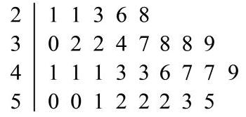

6.(4 分) 【作答次数: 197】【正确率: 86%】设 $a\text{ 、 }b$ 为常数，若 $a > 1, b <  - 1$ ，则函数 $y = {a}^{x} + b$ 的图象必定不经过第___象限

7.(5 分)【作答次数: 50】【正确率: 91%】设函数 $f\left( x\right)  = \left\{  \begin{array}{l} \frac{1}{2}x - 1, x \geq  0 \\  \frac{1}{x}, x < 0 \end{array}\right.$ ,若 $f\left( a\right)  = a$ ,则实数 $a$ 的值为

8.(5 分) 【作答次数: 84】【正确率: 66.4%】若对于任意实数 $x$ ，都有

${x}^{4} = {a}_{0} + {a}_{1}\left( {x + 2}\right)  + {a}_{2}{\left( x + 2\right) }^{2} + {a}_{3}{\left( x + 2\right) }^{3} + {a}_{4}{\left( x + 2\right) }^{4}$ ,则 ${a}_{3}$ 的值为___；

9.(5 分) 【作答次数:101】【正确率: 47.6%】如图，在圆锥 $S - O$ 中， ${AC}$ 为底面圆 $O$ 的直径，

${SO} = {OC} = 1$ ，点 $B$ 在底面圆周上，且 ${AB} = {BC}$ . 若 $E$ 为线段 ${AB}$ 上的动点，则 $\bigtriangleup  {SEC}$ 的周长最小值为___

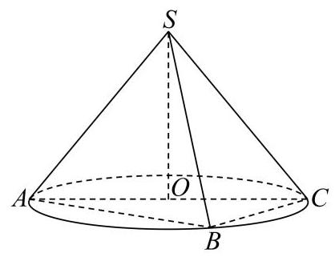

10.(5 分) 【作答次数: 49】【正确率: 63.9%】随着我国国民教育水平的提高，越来越多的有志青年报考研

究生.现阶段，我国研究生入学考试科目为思政、外语和专业课三门，录取工作将这样进行:在每门课均及格 ( 60 分) 的考生中，按总分进行排序，择优录取.振华同学刚刚完成报考，尚有 11 周复习时间，下表是他每门课的复习时间和预计得分. 设思政、外语和专业课分配到的周数分别为 $x\text{ 、 }y\text{ 、 }z$ ,则自然数数组 $\left( {x, y, z}\right)  =$ ___时，振华被录取的可能性最大.

<table><tr><td rowspan="2">科目</td><td colspan="11">周数</td></tr><tr><td>0</td><td>1</td><td>2</td><td>3</td><td>4</td><td>5</td><td>6</td><td>7</td><td>8</td><td>9</td><td>10</td></tr><tr><td>思政</td><td>20</td><td>40</td><td>55</td><td>65</td><td>72</td><td>78</td><td>80</td><td>82</td><td>83</td><td>84</td><td>85</td></tr><tr><td>外语</td><td>30</td><td>45</td><td>53</td><td>58</td><td>62</td><td>65</td><td>68</td><td>70</td><td>72</td><td>74</td><td>75</td></tr><tr><td>专业课</td><td>50</td><td>70</td><td>85</td><td>90</td><td>93</td><td>95</td><td>96</td><td>96</td><td>96</td><td>96</td><td>96</td></tr></table>

11. (5 分)【作答次数:80】【正确率:36.8%】已知函数 $f\left( x\right)  = {\left( x + 1\right) }^{3} + 1$ ，正项等比数列 $\left\{  {a}_{n}\right\}$ 满足 ${a}_{1012} = \frac{1}{10}$ ,则 $\mathop{\sum }\limits_{{k = 1}}^{{2023}}f\left( {\lg {a}_{k}}\right)$

12. (5 分) 【作答次数:27】【正确率:3%】设点 $P$ 在直线 $l : {2x} - y - 5 = 0$ 上，点 $Q$ 在曲线 $\Gamma$ : $y = x + \ln x$ 上，线段 ${PQ}$ 的中点为 $M$ ， $O$ 为坐标原点，则 $\left| \overrightarrow{OM}\right|$ 的最小值为___.

## 二、选择题

13.(4 分) 【作答次数: 46】【正确率: 89.1%】“ $x > 1$ ” 是 “ $\left| x\right|  > 1$ ” 的( )

A. 充分非必要条件

B. 必要非充分条件

C. 充要条件

D. 既非充分也非必要条件

14.(4 分)【作答次数:53】【正确率:60.4%】下列说法中错误的是( )

A. 一组数据的平均数、中位数可能相同

B. 一组数据中比中位数大的数和比中位数小的数一样多

C. 平均数、众数和中位数都是描述一组数据的集中趋势的统计量

D. 极差、方差、标准差都是描述一组数据的离散程度的统计量

15.(5 分) 【作答次数: 150】【正确率: 82.7%】已知 $z$ 是复数， $\bar{z}$ 是其共轭复数，则下列命题中正确的是 ( )

A. ${z}^{2} = {\left| z\right| }^{2}$

B. 若 $\left| z\right|  = 1$ ，则 $\left| {z - 1 - i}\right|$ 的最大值为 $\sqrt{2} + 1$

C. 若 $z = {\left( 1 - 2i\right) }^{2}$ ,则复平面内 $\bar{z}$ 对应的点位于第一象限

D. 若 $1 - {3i}$ 是关于 $x$ 的方程 ${x}^{2} + {px} + q = 0\left( {p, q \in  R}\right)$ 的一个根,则 $q =  - 8$

16.(5 分)【作答次数:45】【正确率:77.8%】已知集合 $S$ 是由某些正整数组成的集合，且满足:若 $a \in  S$ ,则当且仅当 $a = m + n\left( {\text{ 其中 }m, n \in  S\text{ 且 }m \neq  n}\right)$ ,或 $a = p + q\left( \right.$ 其中 $\left. {p, q \notin  S, p, q \in  {Z}^{ * }\text{ 且 }p \neq  q}\right)$ . 现有如下两个命题:① $4 \in  S$ ；②集合 $\left\{  {x\left| {x = {3n} + 5, n \in  N}\right. }\right\}   \subseteq  S$ . 则下列选项中正确的是( )

A. ①是真命题， ②是真命题；

B. ①是真命题， ②是假命题

C. ①是假命题， ②是真命题；

D. ①是假命题，②是假命题.

## 三、解答题

17.(14 分) 【作答次数:40】【正确率:85.5%】

一个盒子中装有 4 张卡片，卡片上分别写有数字1、2、3、4，现从盒子中随机抽取卡片.

(1)(4 分)若一次抽取 3 张卡片，事件 $A$ 表示 “ 3 张卡片上数字之和大于 7 ”，求 $P\left( A\right)$ ；

(2)(4 分)若第一次抽取 1 张卡片，放回后再抽取 1 张卡片，事件 $B$ 表示 “两次抽取的卡片上数字之和大于 6”,求 $P\left( B\right)$ ；

(3)(6 分)若一次抽取 2 张卡片，事件 $C$ 表示 “ 2 张卡片上数字之和是 3 的倍数”，事件 $D$ 表示 “ 2 张卡片上数字之积是 4 的倍数”. 验证 $C$ 、 $D$ 是独立的.

18.(14 分)【作答次数: 72】【正确率: 70.7%】

在 $\bigtriangleup  {ABC}$ 中，角 $A, B, C$ 的对边分别为 $a, b, c$ .

(1)(6 分)若 ${2a}\sin B = \sqrt{3}b$ ，求角 $A$ 的大小；

(2)(8 分)若 ${BC}$ 边上的高等于 $\frac{a}{2}$ ，求 $\frac{c}{b} + \frac{b}{c}$ 的最大值.

19.(16 分) 【作答次数: 52】【正确率: 84.3%】

如图，在直三棱柱 ${ABC} - {A}_{1}{B}_{1}{C}_{1}$ 中， ${AB} = {BC} = \sqrt{2}$ ， ${AC} = {A{A}_{1}} = 2$ ，且 $D$ 、 $E$ 分别是 ${AC}$ 、 ${A}_{1}{C}_{1}$ 的中点.

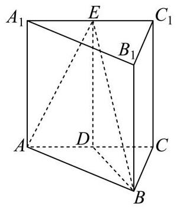

(1)(4分)证明: ${AC}\bot {BE}$ ；

(2)(6 分)求三棱锥 $D - {ABE}$ 的体积；

(3)(6 分)求直线 ${BD}$ 与平面 ${ABE}$ 所成角的大小.(结果用反三角函数值表示)

20.(16 分) 【作答次数:43】【正确率: 71.1%】

以坐标原点为对称中心，焦点在 $x$ 轴上的椭圆下过点 $A\left( {-2,0}\right)$ ，且离心率为 $\frac{\sqrt{3}}{2}$ .

(1)(4 分)求椭圆 $\Gamma$ 的方程；

(2)(4 分)若点 $B\left( {1,0}\right)$ ，动点 $M$ 满足 $\left| {MA}\right|  = 2\left| {MB}\right|$ ，求动点 $M$ 的轨迹所围成的图形的面积；

(3) (8 分) 过圆 ${x}^{2} + {y}^{2} = 4$ 上一点 $P$ (不在坐标轴上)作椭圆 $\Gamma$ 的两条切线 ${l}_{1}\text{ 、 }{l}_{2}$ . 记 ${OP}\text{ 、 }{l}_{1}\text{ 、 }{l}_{2}$ 的斜率分别为 ${k}_{0}\text{ 、 }{k}_{1}\text{ 、 }{k}_{2}$ ,求证: ${k}_{0}\left( {{k}_{1} + {k}_{2}}\right)  =  - 2$ .

21.(18 分) 【作答次数:25】【正确率:71.3%】

已知函数 $f\left( x\right)  = {e}^{x} - x, g\left( x\right)  = {e}^{-x} + x$ ，其中 $e$ 为自然对数的底数.

(1)(4 分)求函数 $y = f\left( x\right)$ 的图象在点 $\left( {1, f\left( 1\right) }\right)$ 处的切线方程；

(2)(14 分)设函数 $F\left( x\right)  = {af}\left( x\right)  - g\left( x\right)$ ，

①若 $a = e$ ，求函数 $y = F\left( x\right)$ 的单调区间，并写出函数 $y = F\left( x\right)  - m$ 有三个零点时实数 $m$ 的取值范围;

②当 $0 < a < 1$ 时， ${x}_{1}\text{ 、 }{x}_{2}$ 分别为函数 $y = F\left( x\right)$ 的极大值点和极小值点，且不等式 $F\left( {x}_{1}\right)  + {tF}\left( {x}_{2}\right)  > 0$ 对任意 $a \in  \left( {0,1}\right)$ 恒成立,求实数 $t$ 的取值范围.

# 上海市崇明区 2024 届高三一模数学试题

## 一、填空题

1.(4 分)不等式 $\left| {x - 2}\right|  < 1$ 的解集为___.

2.(4 分) 双曲线 ${x}^{2} - \frac{{y}^{2}}{4} = 1$ 的焦距为___.

3. (4 分) 若复数 $z = {m}^{2} - 4 + \left( {m + 2}\right) i$ ( $i$ 为虚数单位) 是纯虚数，则实数 $\mathrm{m}$ 的值为___.

4.(4 分)已知等比数列 $\left\{  {a}_{n}\right\}$ 首项 ${a}_{1} = 1$ ，公比 $q = 2$ ，则 ${S}_{5} =$ ___.

5.(4 分) ${\left( x + \frac{2}{{x}^{2}}\right) }^{5}$ 的展开式中 ${x}^{2}$ 的系数为___. (用数字作答)

6.(4 分)已知圆锥的母线与底面所成角为 ${45}^{ \circ  }$ ，高为 1，则该圆锥的母线长为___.

7. (5)分)在空间直角坐标系中，点 $P\left( {1, - 2,3}\right)$ 到 ${xOy}$ 平面的距离为___.

8.(5 分)如图是小王同学在篮球赛中得分记录的茎叶图, 则他平均每场得___ 分.

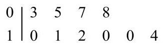

9. (5 分)已知事件 $A$ 与事件 $B$ 相互独立，如果 $P\left( A\right)  = {0.4}$ ， $P\left( B\right)  = {0.7}$ ，则 $P\left( {\bar{A} \cap  B}\right)  =$ ___.

10.(5 分)用易拉罐包装的饮料是超市和自动售卖机里的常见商品. 如图, 是某品牌的易拉罐包装的饮料. 在满足容积要求的情况下, 饮料生产商总希望包装材料的成本最低, 也就是易拉罐本身的质量最小. 某数学兴趣小组对此想法通过数学建模进行验证. 为了建立数学模型, 他们提出以下 3 个假设: (1) 易拉罐容积相同; (2) 易拉罐是一个上下封闭的空心圆柱体; (3) 易拉罐的罐顶、罐体和罐底的厚度和材质都相同.

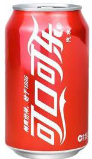

你认为以此 3 个假设所建立的数学模型与实际情况相符吗？若相符，请在以下横线上填写 “相符”； 若不相符, 请选择其中的一个假设给出你的修改意见, 并将修改意见填入横线.

___.

11. (5 分)已知不平行的两个向量 $\overrightarrow{a},\overrightarrow{b}$ 满足 $\left| \overrightarrow{a}\right|  = 1$ ， $\overrightarrow{a} \cdot  \overrightarrow{b} = \sqrt{3}$ . 若对任意的 $t \in  R$ ，都有 $\left| {\overrightarrow{b} - t\overrightarrow{a}}\right|  \geq  2$ 成立， 则 $\left| \overrightarrow{b}\right|$ 的最小值等于___.

12. (5 分) 已知正实数 $a, b, c, d$ 满足 ${a}^{2} - {ab} + 1 = 0,{c}^{2} + {d}^{2} = 1$ ,则当 ${\left( a - c\right) }^{2} + {\left( b - d\right) }^{2}$ 取得最小值时, ${ab} =$

二、单选题

13.(4 分) 已知集合 $A = \{ x \mid   - 2 \leq  x \leq  3\} , B = \{ x \mid  x > 0\}$ ，则 $A \cup  B =$ ( )

A. $\left\lbrack  {-2,3}\right\rbrack$

B. $\left\lbrack  {0,3}\right\rbrack$

C. $\left( {0, + \infty }\right)$

D. $\lbrack  - 2, + \infty )$

14. (4 分) 若 $x > y > 0$ ,则下列不等式正确的是 ( )

A. $\left| x\right|  < \left| y\right|$

B. ${x}^{2} < {y}^{2}$

C. $\frac{1}{x} < \frac{1}{y}$

D. $\frac{x + y}{2} < \sqrt{xy}$

15. (5 分)已知点 $\mathrm{M}$ 为正方体 ${ABCD} - {A}_{1}{B}_{1}{C}_{1}{D}_{1}$ 内部(不包含表面)的一点. 给出下列两个命题:

${q}_{1}$ : 过点 $\mathrm{M}$ 有且只有一个平面与 $A{A}_{1}$ 和 ${B}_{1}{C}_{1}$ 都平行;

${q}_{2}$ : 过点 $\mathrm{M}$ 至少可以作两条直线与 $A{A}_{1}$ 和 ${B}_{1}{C}_{1}$ 所在的直线都相交.

则以下说法正确的是( )

A. 命题 ${q}_{1}$ 是真命题,命题 ${q}_{2}$ 是假命题

B. 命题 ${q}_{1}$ 是假命题,命题 ${q}_{2}$ 是真命题

C. 命题 ${q}_{1},{q}_{2}$ 都是真命题

D. 命题 ${q}_{1},{q}_{2}$ 都是假命题

16. (5 分)若存在实数 $a, b$ ，对任意实数 $x \in  \left\lbrack  {0,1}\right\rbrack$ ，使得不等式 ${x}^{3} - m \leq  {ax} + b \leq  {x}^{3} + m$ 恒成立，则实数 m 的取值范围是( )

A. $\left\lbrack  {\frac{\sqrt{3}}{9}, + \infty }\right)$

B. $\left\lbrack  {\frac{8\sqrt{3}}{9}, + \infty }\right)$

C. $\left\lbrack  {\frac{\sqrt{3}}{3}, + \infty }\right)$

D. $\left\lbrack  {\frac{\sqrt{3}}{2}, + \infty }\right)$

三、解答题

17.(14 分)

如图,四棱锥 $P - {ABCD}$ 中, ${PA} \bot$ 平面 ${ABCD},{AB}//{CD},{PA} = {AB} = {AD} = 2,{CD} = 1$ , $\angle {ADC} = {90}^{ \circ  }$ , E, F 分别为 ${PB},{AB}$ 的中点.

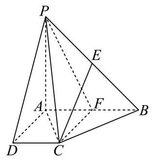

(1)(6 分)求证: ${CE}//$ 平面 ${PAD}$ ；

(2)(8 分)求点 $\mathrm{B}$ 到平面 ${PCF}$ 的距离.

18.(14 分)

在 ${ABC}$ 中，内角 $\mathrm{A}$ 、 $\mathrm{B}$ 、 $\mathrm{C}$ 所对边的长分别为 $\mathrm{a}$ 、 $\mathrm{b}$ 、 $\mathrm{c}$ ， $a = 5$ ， $b = 6$ .

(1)(6 分)若 $\cos B =  - \frac{4}{5}$ ，求 $\mathrm{A}$ 和 ${ABC}$ 外接圆半径 $\mathrm{R}$ 的值；

(2)(8 分)若三角形的面积 $S = \frac{{15}\sqrt{7}}{4}$ ，求 c.

19.(14 分)

交通拥堵指数 (TPI) 是表征交通拥堵程度的客观指标, 用 TPI 表示, TPI 越大代表拥堵程度越高. 某平台计算 TPI 的公式为:TPI $= \frac{\text{ 实际行程时间 }}{\text{ 畅通行程时间 }}$ ，并按 TPI 的大小将城市道路拥堵程度划分如下表所示的 4 个等级:

<table><tr><td>TPI</td><td>[1,1.5)</td><td>[1.5,2)</td><td>[2,4)</td><td>不低于 4</td></tr><tr><td>拥堵等级</td><td>畅通</td><td>缓行</td><td>拥堵</td><td>严重拥堵</td></tr></table>

某市 2023 年元旦及前后共 7 天与 2022 年同期的交通高峰期城市道路 TPI 的统计数据如下图:

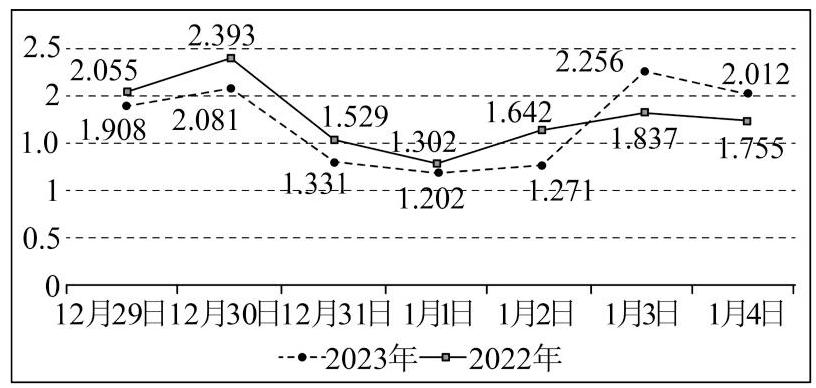

(1)(6 分)从 2022 年元旦及前后共 7 天中任取 1 天，求这一天交通高峰期城市道路拥堵程度为 “拥堵” 的概率;

(2)(8 分)从 2023 年元旦及前后共 7 天中任取 3 天，将这 3 天中交通高峰期城市道路 TPI 比 2022 年同日 TPI 高的天数记为 $\mathrm{X}$ ,求所有 $\mathrm{X}$ 的可能值及其发生的概率.

20.(18 分)

已知抛物线 ${\Gamma }_{1}{y}^{2} = {4x},{\Gamma }_{2}{y}^{2} = {2x}$ ,直线 $l$ 交抛物线 ${\Gamma }_{1}$ 于点 $A\text{ 、 }D$ ,交抛物线 ${\Gamma }_{2}$ 于点 $B\text{ 、 }C$ ,其中点 $A\text{ 、 }B$ 位于第一象限.

(1)(4 分)若点 $A$ 到抛物线 ${\Gamma }_{1}$ 焦点的距离为 2，求点 $A$ 的坐标；

(2)(6 分)若点 $A$ 的坐标为 $\left( {4,4}\right)$ ，且线段 ${AC}$ 的中点在 $x$ 轴上，求原点 $O$ 到直线 $l$ 的距离；

(3)(8 分)若 $\overrightarrow{AB} = 2\overrightarrow{CD}$ ，求 $\bigtriangleup  {AOD}$ 与 $\bigtriangleup  {BOC}$ 的面积之比.

21.(18 分)

已知 $f\left( x\right)  = {mx} + \sin x\left( {m \in  R, m \neq  0}\right)$ .

(1)(4 分)若函数 $y = f\left( x\right)$ 是实数集 $\mathrm{R}$ 上的严格增函数，求实数 $\mathrm{m}$ 的取值范围；

(2)(6 分)已知数列 $\left\{  {a}_{n}\right\}$ 是等差数列(公差 $d \neq  0$ )， ${b}_{n} = f\left( {a}_{n}\right)$ . 是否存在数列 $\left\{  {a}_{n}\right\}$ 使得数列 $\left\{  {b}_{n}\right\}$ 是等差数列? 若存在,请写出一个满足条件的数列 $\left\{  {a}_{n}\right\}$ ,并证明此时的数列 $\left\{  {b}_{n}\right\}$ 是等差数列; 若不存在,请说明理由;

(3)(8 分)若 $m = 1$ ，是否存在直线 $y = {kx} + b$ 满足:①对任意的 $x \in  R$ 都有 $f\left( x\right)  \geq  {kx} + b$ 成立，

②存在 ${x}_{0} \in  R$ 使得 $f\left( {x}_{0}\right)  = k{x}_{0} + b$ ? 若存在，请求出满足条件的直线方程；若不存在，请说明理由.

## 上海市奉贤区 2024 届高三一模数学试题

## 一、填空题

1.(4 分) 若 $2 + {ai} = \left( {{bi} - 1}\right) i\left( {a, b \in  R}\right)$ ,其中 $i$ 是虚数单位,则 $a + {bi} =$ ___.

2.(4 分)设集合 $A = \{  - 2, - 1,0,5,{10},{20}\} , B = \{ x \mid  \lg x < 1\}$ ，则 $A \cap  B =$ ___.

3.(4 分) 双曲线 ${x}^{2} - 2{y}^{2} = 1$ 的渐近线方程为___.

4. (4 分) 某公司生产的糖果每包标识质量是 ${500g}$ ,但公司承认实际质量存在误差. 已知糖果的实际质量 $X$ 服从 $\mu  = {500}$ 的正态分布. 若随意买一包糖果,假设质量误差超过 5 克的可能性为 $p$ ,则 $P\left( {{{495} \leq  X \leq  {500}}\text{ 的值为 }}\right)$ ___. (用含 $p$ 的代数式表达)

5. (4 分) 在四面体 $P - {ABC}$ 中，若底面 ${ABC}$ 的一个法向量为 $\overrightarrow{n} = \left( {1,1,0}\right)$ ，且 ${CP} = \left( {2,2, - 1}\right)$ ，则顶点 $P$ 到底面 ${ABC}$ 的距离为___.

6.(4 分)已知数列 $\left\{  {a}_{n}\right\}$ 是各项为正的等比数列， ${a}_{1} = 1,{a}_{5} = 1$ ，则其前 10 项和 ${S}_{10} =$ ___.

7.5 分)一工厂生产了某种产品 16800 件，它们来自甲、乙、丙 3 条生产线，为检查这批产品的质量，决定采用分层抽样的方法进行抽样，已知甲、乙、丙三条生产线抽取的个体数组成一个等差数列，则乙生产线生产了___ 件产品.

8.(5 分)设 $f\left( x\right)$ 为定义在 $\mathrm{R}$ 上的奇函数，当 $x \geq  0$ 时， $f\left( x\right)  = {e}^{x} + b\;$ (b 为常数)，则 $f\left( {-\ln 2}\right)  =$ ___. 9. (5)分设函数 $y = \sin {\omega x}\left( {\omega  > 0}\right)$ 在区间 $\left( {0,{2\pi }}\right)$ 上恰有三个极值点，则 $\omega$ 的取值范围为___.

10. (5分)某林场为了及时发现火情，设立了两个观测点 $A$ 和 $B$ . 某日两个观测点的林场人员都观测到 $C$ 处出现火情. 在 $A$ 处观测到火情发生在北偏西 ${40}^{ \circ  }$ 方向，而在 $B$ 处观测到火情在北偏西 ${60}^{ \circ  }$ 方向. 已知 $B$ 在 $A$ 的正东方向 ${10km}$ 处 (如图所示),则 $\left| {{BC} - {AC}}\right|  =$ ___ ${km}$ . (精确到 ${0.1km}$ )

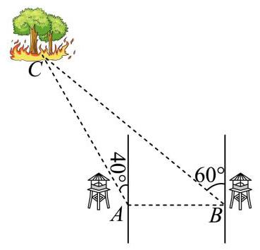

11. (5 分) 已知直线 ${l}_{1}y - 2 = 0$ 和直线 ${l}_{2}x + 1 = 0$ ,则曲线 ${\left( x - 1\right) }^{2} + {y}^{2} = 1$ 上一动点 $P$ 到直线 ${l}_{1}$ 和直线 ${l}_{2}$ 的距离之和的最小值是___.

12. (5 分)已知正方体 ${ABCD} - {A}_{1}{B}_{1}{C}_{1}{D}_{1}$ 的棱长为 1， ${\lambda }_{i} \in  \{  - 1,1\} \left( {i = 1,2,3,4}\right)$ ，则 $\left| {{\lambda }_{1}\overrightarrow{AB} + {\lambda }_{2}\overrightarrow{BC} + {\lambda }_{3}\overrightarrow{A{C}_{1}} + {\lambda }_{4}\overrightarrow{B{D}_{1}}}\right|$ 的最大值是___.

二、单选题

13.(4 分)已知 $\alpha ,\beta$ 表示两个不同的平面, $m$ 为平面 $\alpha$ 内的一条直线,则 “ $a \bot  \beta$ ” 是 “ $m \bot  \beta$ ” 的

A. 充分不必要条件

B. 必要不充分条件

C. 充要条件

D. 既不充分也不必要条件

14. (4分)函数 $y = \frac{{2}^{x} - 1}{{2}^{x} + 1}$ 在定义域 $\left( {-\infty , + \infty }\right)$ 上是( )

A. 严格增的奇函数

B. 严格增的偶函数

C. 严格减的奇函数

D. 严格减的偶函数

15.(5 分)若 ${\left( x - \frac{2}{{x}^{2}}\right) }^{n} + {\left( x + \frac{1}{x}\right) }^{n}\left( {2 \leq  n \leq  {10}, n \in  N}\right)$ 的展开式中存在常数项,则下列选项中 $n$ 的取值不可能是( )

A. 3

B. 4

C. 5

D. 6

16. (5分)已知等差数列 $\left\{  {a}_{n}\right\}$ 的前 $n$ 项和为 ${S}_{n}$ ，且关于正整数 $n$ 的不等式 $\left( {{S}_{n} - {2022}}\right) \left( {{S}_{n + 1} - {2022}}\right)  < 0$ 与不等式 $\left( {{S}_{n} - {2023}}\right) \left( {{S}_{n + 1} - {2023}}\right)  < 0$ 的解集均为 $M$ .

命题 $a$ : 集合 $M$ 中元素的个数一定是偶数个;

命题 $\beta$ : 若数列 $\left\{  {a}_{n}\right\}$ 的公差 $d > 0$ ,且 ${n}_{0} \in  M$ ,则 ${a}_{{n}_{0} + 1} > 1$ .

下列说法中正确的是 ( )

A. 命题 $a$ 是真命题，命题 $\beta$ 是假命题

B. 命题 $a$ 是假命题，命题 $\beta$ 是真命题

C. 命题 $a$ 是假命题，命题 $\beta$ 是假命题

D. 命题 $a$ 是真命题，命题 $\beta$ 是真命题

三、解答题

17.(14 分)

在 $\bigtriangleup  {ABC}$ 中，设角 $A$ 、 $B$ 、 $C$ 所对边的边长分别为 $a$ 、 $b$ 、 $c$ ，已知 $\sqrt{3}c = \sqrt{3}b\cos A + a\sin B$ .

(1)(6 分)求角 $B$ 的大小；

(2)(8 分)当 $a = 2\sqrt{2}$ ， $b = 2\sqrt{3}$ 时，求边长 $c$ 和 $\bigtriangleup  {ABC}$ 的面积 $S$ .

18.(14 分)

在《九章算术》中，将四个面都是直角三角形的四面体称为鳖臑. 如图，已知四面体 $P - {ABC}$ 中， ${PA} \bot$ 平面 ${ABC},{PA} = {BC} = 1$ .

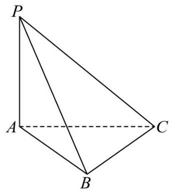

(1)(6 分)若 ${AB} = 1,{PC} = \sqrt{3}$ ，求证:四面体 $P - {ABC}$ 是鳖臑，并求该四面体的体积；

(2)(8 分)若四面体 $P - {ABC}$ 是鳖臑，当 ${AC} = a\left( {a > 1}\right)$ 时，求二面角 $A - {BC} - P$ 的平面角的大小.

19.(14 分)

某连锁便利店从 2014 年到 2018 年销售商品品种为 2000 种，从 2019 年开始，该便利店进行了全面升级, 销售商品品种为 3000 种.下表中列出了从 2014 年到 2023 年的利润额.

<table><tr><td>年份 $x$</td><td>2014</td><td>2015</td><td>2016</td><td>2017</td><td>2018</td><td>2019</td><td>2020</td><td>2021</td><td>2022</td><td>2023</td></tr><tr><td>利润额 $y$ /万元</td><td>27.6</td><td>42.0</td><td>38.4</td><td>48.0</td><td>63.6</td><td>63.7</td><td>72.8</td><td>80.1</td><td>60.5</td><td>99.3</td></tr></table>

(1)(6 分)若某年的利润额超过 45.0 万元，则该便利店当年会被评选为示范店；若利润额不超过 45.0 万元,则该便利店当年不会被评选为示范店.试完成 $2 \times  2$ 列联表,并判断商品品种数量与便利店是否为示范店有关? (显著性水平 $a = {0.05}, P\left( {{\chi }^{2} \geq  {3.841}}\right)  \approx  {0.05}$ )

<table><tr><td></td><td>品种为 2000 种</td><td>品种为 3000 种</td><td>总计</td></tr><tr><td>被评为示范店次数</td><td></td><td></td><td></td></tr><tr><td>未被评为示范店次数</td><td></td><td></td><td></td></tr><tr><td>总计</td><td></td><td></td><td></td></tr></table>

(2)(8 分)请根据 2014 年至 2023 年(剔除 2022 年的数据)的数据建立 $y$ 与 $x$ 的线性回归模型①；根据 2019 年至 2023 年的数据建立 $y$ 与 $x$ 的线性回归模型②. 分别用这两个模型，预测 2024 年该便利店的利润额并说明这样的预测值是否可靠？(回归系数精确到 0.001 ，利润精确到 0.1 万元)

回归系数 $\widehat{a}$ 与 $\widehat{b}$ 的公式如下: $\widehat{a} = \frac{\mathop{\sum }\limits_{{i = 1}}^{n}\left( {{x}_{i} - \bar{x}}\right) \left( {{y}_{i} - \bar{y}}\right) }{\mathop{\sum }\limits_{{i = 1}}^{n}{\left( {x}_{i} - \bar{x}\right) }^{2}} = \frac{\mathop{\sum }\limits_{{i = 1}}^{n}{x}_{i}{y}_{i} - n\overline{xy}}{\mathop{\sum }\limits_{{i = 1}}^{n}{x}_{i}^{2} - n{\bar{x}}^{2}},\widehat{b} = \bar{y} - \widehat{a}\bar{x} = \frac{\mathop{\sum }\limits_{{i = 1}}^{n}{y}_{i} - \widehat{a}\mathop{\sum }\limits_{{i = 1}}^{n}{x}_{i}}{n}$

20.(18 分)

已知椭圆 $\frac{{x}^{2}}{{a}^{2}} + \frac{{y}^{2}}{{b}^{2}} = 1\left( {a > b > 0}\right)$ 的焦距为 $2\sqrt{3}$ ，离心率为 $\frac{\sqrt{3}}{2}$ ，椭圆的左右焦点分别为 ${F}_{1}\text{ 、 }{F}_{2}$ ，直角坐标原点记为 $O$ . 设点 $P\left( {0, t}\right)$ ,过点 $P$ 作倾斜角为锐角的直线 $l$ 与椭圆交于不同的两点 $B\text{ 、 }C$ .

(1)(4 分)求椭圆的方程；

(2)(6 分)设椭圆上有一动点 $T$ ，求 $\overrightarrow{PT} \cdot  \left( {\overrightarrow{T{F}_{1}} - \overrightarrow{T{F}_{2}}}\right)$ 的取值范围；

(3) (8 分)设线段 ${BC}$ 的中点为 $M$ ，当 $t \geq  \sqrt{2}$ 时，判别椭圆上是否存在点 $Q$ ，使得非零向量 $\overrightarrow{OM}$ 与向量 $\overrightarrow{PQ}$ 平行,请说明理由.

21.(18 分)

若函数 $y = f\left( x\right)$ 满足: 对任意的实数 $s, t \in  \left( {0, + \infty }\right)$ ,有 $f\left( {s + t}\right)  > f\left( s\right)  + f\left( t\right)$ 恒成立,则称函数 $y = f\left( x\right)$ 为 “ $\sum$ 增函数”.

(1)(4 分)求证:函数 $y = \sin x$ 不是 “ $\sum$ 增函数”；

(2)(6 分)若函数 $y = {2}^{x - 1} - x - a$ 是 “ $\sum$ 增函数”，求实数 $a$ 的取值范围；

(3)(8 分)设 $g\left( x\right)  = {e}^{x}\ln \left( {1 + x}\right)$ ，若曲线 $y = g\left( x\right)$ 在 $x = {x}_{0}$ 处的切线方程为 $y = x$ ，求 ${x}_{0}$ 的值，并证明函数 $y = g\left( x\right)$ 是 “ $\sum$ 增函数”.

# 上海市虹口区 2024 届高三上学期期终学生学习能力诊断测试 数学试题

## 一、填空题

1. 已知 $A = \{ 1,2,3,4,5\} , B = \{ x\left| \right| x - 2 \mid   \leq  1\}$ ,则 $A \cap  B =$ ___.

2. 函数 $y = \lg \left( {x - 2}\right)  + \frac{1}{\sqrt{5 - x}}$ 的定义域为___.

3. 设等比数列 $\left\{  {a}_{n}\right\}$ 的前 $\mathrm{n}$ 项和为 ${S}_{n}$ ,若 ${a}_{2} = 1,{S}_{2} = 4$ ,则 $\mathop{\lim }\limits_{{n \rightarrow  \infty }}{S}_{n} =$ ___.

4. 已知一个圆锥的底面半径为3，其侧面积为 ${15\pi }$ ，则该圆锥的体积为___.

5. ${\left( x - \frac{2}{\sqrt{x}}\right) }^{7}$ 的展开式中 $\mathrm{x}$ 的系数为___.

6. 已知 $\cos x =  - \frac{1}{3}$ ，且 $\mathrm{x}$ 为第三象限的角，则 $\tan {2x} =$ ___.

7. 双曲线 ${x}^{2} - \frac{{y}^{2}}{4} = 1$ 的两条渐近线夹角的余弦值为___.

8. 已知函数 $f\left( x\right)  = \cos \left( {{\omega x} + \varphi }\right) \left( {\omega  > 0,\left| \varphi \right|  < \frac{\pi }{2}}\right)$ ,的部分图象如图所示,则 $f\left( x\right)  =$ ___.

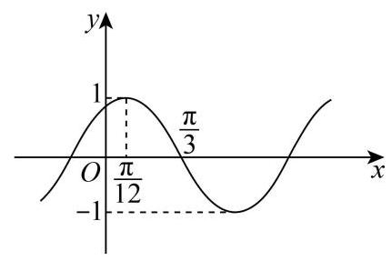

9. 已知 $y = f\left( x\right)$ 是定义在 $\left( {-1,1}\right)$ 上的函数,若 $f\left( x\right)  = {3x} + \sin x$ ,且 $f\left( {1 - {a}^{2}}\right)  + f\left( {1 - a}\right)  < 0$ ,则实数 $a$ 的取值范围为___.

10. 将甲、乙等 8 人安排在 4 天值班，若每天安排两人，则甲、乙两人安排在同一天的概率为___. (结果用分数表示)

11. 设 $a \in  R$ ,若关于 $\mathrm{x}$ 的方程 ${2x}\left| x\right|  - \left( {a - 2}\right) x + \left| x\right|  - a + 1 = 0$ 有 3 个不同的实数解,则实数 $\mathrm{a}$ 的取值范围为___.

12. 设 $\overrightarrow{{a}_{1}},\overrightarrow{{a}_{2}},\overrightarrow{{a}_{3}},\overrightarrow{{b}_{1}},\overrightarrow{{b}_{2}},\overrightarrow{{b}_{3}}$ 是平面上两两不相等的向量,若 $\left| {\overrightarrow{{a}_{1}} - \overrightarrow{{a}_{2}}}\right|  = \left| {\overrightarrow{{a}_{2}} - \overrightarrow{{a}_{3}}}\right|  = \left| {\overrightarrow{{a}_{3}} - \overrightarrow{{a}_{1}}}\right|  = 2$ ,且对任意的 $\mathrm{i}, j \in  \{ 1,2,3\}$ ，均有 $\left| {\overrightarrow{{a}_{i}} - \overrightarrow{{b}_{j}}}\right|  \in  \{ 1,\sqrt{3}\}$ ，则 $\left| {\overrightarrow{{b}_{1}} - \overrightarrow{{b}_{2}}}\right|  + \left| {\overrightarrow{{b}_{2}} - \overrightarrow{{b}_{3}}}\right|  + \left| {\overrightarrow{{b}_{3}} - \overrightarrow{{b}_{1}}}\right|  = 1$ ___.

## 二、选择题

13. 设 $\mathrm{i}$ 为虚数单位,若 $z = \frac{2 - i}{1 + {i}^{2} - {i}^{5}}$ ,则 $\bar{z} =$ (   )

A. $1 - {2i}$

B. $1 + {2i}$

C. $2 - i$

D. $2 + i$

14. 空气质量指数 ${AQI}$ 是反映空气质量状况的指数,其对应关系如下表:

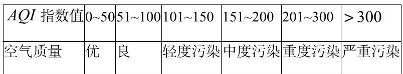

为监测某化工厂排放废气对周边空气质量指数的影响, 某科学兴趣小组在工厂附近某处测得 10 月 1 日一20 日 AQI 的数据并绘成折线图如下:

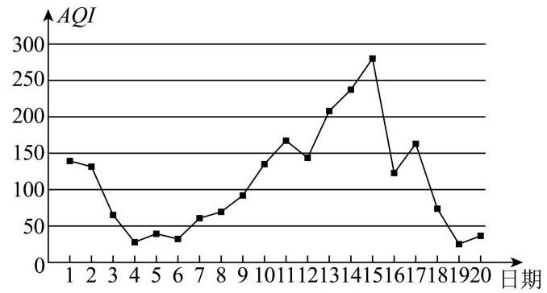

下列叙述正确的是 ( )

A. 这 20 天中 ${AQI}$ 的中位数略大于 150

B. 10 月 4 日到 10 月 11 日，空气质量越来越好

C. 这 20 天中的空气质量为优的天数占 25%

D. 10 月上旬 ${AQI}$ 的极差大于中旬 ${AQI}$ 的极差

15. “阿基米德多面体” 也称为半正多面体, 是由边数不全相同的正多边形为面围成的多面体, 它体现了数学的对称美.如图所示，将正方体沿同一顶点出发的三条棱的中点截去一个三棱锥，共可截去 8 个三棱锥，得到 8 个面为正三角形、6 个面为正方形的一种半正多面体. 若 ${AB} = \sqrt{2}$ ，则此半正多面体外接球的表面积为( )

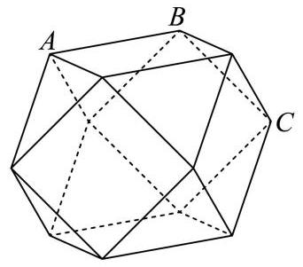

A. $4\sqrt{3}\pi$

B. ${12\pi }$

C. $\frac{8\sqrt{2}}{3}\pi$

D. ${8\pi }$

16. 已知曲线 $\Gamma$ 的对称中心为 $\mathrm{O}$ ,若对于 $\Gamma$ 上的任意一点 $\mathrm{A}$ ,都存在 $\Gamma$ 上两点 $\mathrm{B},\mathrm{C}$ ,使得 $\mathrm{O}$ 为 $\bigtriangleup  {ABC}$ 的重心，则称曲线 $\Gamma$ 为 “自稳定曲线”. 现有如下两个命题:

①任意椭圆都是 “自稳定曲线”；②存在双曲线是 “自稳定曲线”.

则 ( )

A. ①是假命题，②是真命题

B. ①是真命题，②是假命题

C. ①②都是假命题

D. ①②都是真命题

## 三、解答题

17. 设 $\bigtriangleup  {ABC}$ 的内角 $\mathrm{A},\mathrm{B},\mathrm{C}$ 所对的边分别为 $\mathrm{a},\mathrm{b},\mathrm{c}$ ，若 $\overrightarrow{m} = \left( {\sin A + \sin B - \sin C,\sin A}\right)$ ， $\overrightarrow{n} = \left( {c, b + c - a}\right)$ ,且 $\overrightarrow{m}//\overrightarrow{n}$ .

(1)求角 $B$ 的大小；

(2) 若 $\bigtriangleup  {ABC}$ 为锐角三角形，求 $y = \sin A + \sin C$ 的值域.

18. 如图，在三棱柱 ${ABC} - {A}_{1}{B}_{1}{C}_{1}$ 中，侧面 $A{A}_{1}{C}_{1}C$ 为正方形， ${AB} = {AC} = 4$ ；设 $\mathrm{M}$ 是 $C{C}_{1}$ 的中点，满足 ${AM} \bot  {A}_{1}{B}_{1},\mathrm{\;N}$ 是 $\mathrm{{BC}}$ 的中点, $\mathrm{P}$ 是线段 ${A}_{1}{B}_{1}$ 上的一点.

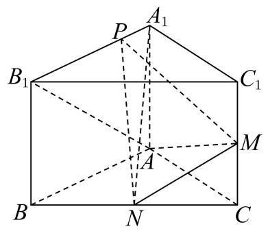

(1)证明: ${AM}\bot$ 平面 ${A}_{1}{PN}$ ；

(2) 若 ${BC} = 4\sqrt{2}$ ， ${A}_{1}P = 1$ ，求直线 $A{B}_{1}$ 与平面 PMN 所成角的大小.

19. 2022 年 12 月底, 某厂的废水池已储存废水 800 吨, 以后每月新产生的 2 吨废水也存入废水池. 该厂 2023 年开始对废水处理后进行排放，1 月底排放 10 吨处理后的废水，计划以后每月月底排放一次，每月排放处理后的废水比上月增加 2 吨.

(1)若按计划排放，该厂在哪一年的几月份排放后，第一次将废水池中的废水排放完毕？

(2)该厂加强科研攻关，提升废水处理技术，经过深度净化的废水可以再次利用，该厂从 2023 年 7 月开始

对该月计划排放的废水进行深度净化，首次净化废水 5 吨，以后每月比上月提高 20%的净化能力. 试问: 哪一年的几月份开始, 当月排放的废水能被全部净化?

20. 已知点 $M\left( {m,4}\right)$ 在抛物线 $\Gamma  : {x}^{2} = {2py}\left( {p > 0}\right)$ 上，点 $\mathrm{F}$ 为 $\Gamma$ 的焦点，且 $\left| {MF}\right|  = 5$ . 过点 $\mathrm{F}$ 的直线 1 与 $\Gamma$ 及圆 ${x}^{2} + {\left( y - 1\right) }^{2} = 1$ 依次相交于点 $\mathrm{A},\mathrm{B},\mathrm{C},\mathrm{D}$ ,如图.

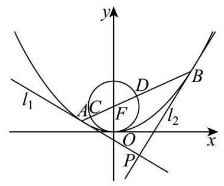

(1)求抛物线 $\Gamma$ 的方程及点 $\mathrm{M}$ 的坐标；

(2)证明: $\left| {AC}\right|  \cdot  \left| {BD}\right|$ 为定值；

(3) 过 $\mathrm{A},\mathrm{B}$ 两点分别作 $\Gamma$ 的切线 ${l}_{1},{l}_{2}$ ,且 ${l}_{1}$ 与 ${l}_{2}$ 相交于点 $\mathrm{P}$ ,求 $\bigtriangleup {ACP}$ 与 $\bigtriangleup {BDP}$ 的面积之和的最小值.

21. 已知 $y = f\left( x\right)$ 与 $y = g\left( x\right)$ 都是定义在 $\left( {0, + \infty }\right)$ 上的函数,若对任意 ${x}_{1},{x}_{2} \in  \left( {0, + \infty }\right)$ ,当 ${x}_{1} < {x}_{2}$ 时,都有 $g\left( {x}_{1}\right)  \leq  \frac{f\left( {x}_{1}\right)  - f\left( {x}_{2}\right) }{{x}_{1} - {x}_{2}} \leq  g\left( {x}_{2}\right)$ ,则称 $y = g\left( x\right)$ 是 $y = f\left( x\right)$ 的一个 “控制函数”.

(1)判断 $y = {2x}$ 是否为函数 $y = {x}^{2}\left( {x > 0}\right)$ 的一个控制函数，并说明理由;

(2) 设 $f\left( x\right)  = \ln x$ 的导数为 ${f}^{\prime }\left( x\right) ,0 < a < b$ ,求证: 关于 $x$ 的方程 $\frac{f\left( b\right)  - f\left( a\right) }{b - a} = {f}^{\prime }\left( x\right)$ 在区间 $\left( {a, b}\right)$ 上有实数解;

(3) 设 $f\left( x\right)  = x\ln x$ ,函数 $y = f\left( x\right)$ 是否存在控制函数? 若存在,请求出 $y = f\left( x\right)$ 的所有控制函数; 若不存在, 请说明理由.

# 上海市黄浦区 2024 届高三上学期期末调研测试 (一模) 数学 试题

## 一、填空题

1. (4 分) 【作答次数: 44】【正确率: 97.7%】已知集合 $A = \{ x \mid  x \leq  2\} , B = \left\{  {x\left| {\;x \geq   - 1}\right. }\right\}$ ,则 $A \cap  B =$ ___.

2.(4 分) 【作答次数: 57】【正确率: 87.7%】若函数 $y = \left( {x + 1}\right) \left( {x - a}\right)$ 为偶函数,则 $a =$

3. (4 分) 【作答次数: 46】【正确率: 87%】已知复数 $z = 1 - i$ ( $\mathrm{i}$ 为虚数单位),则满足 $z \cdot  w = z$ 的复数 $w$ 为___.

4. (4 分) 【作答次数: 47】【正确率: 91.5%】若双曲线 $\frac{{x}^{2}}{16} - \frac{{y}^{2}}{m} = 1$ 经过点 $\left( {4\sqrt{2},3}\right)$ ,则此双曲线的离心率为___.

5.(4 分)【作答次数: 44】【正确率: 97.7%】已知向量 $\overrightarrow{a} = \left( {0,2}\right) ,\overrightarrow{b} = \left( {\sqrt{3},1}\right)$ ,则向量 $\overrightarrow{a}$ 与 $\overrightarrow{b}$ 夹角的余弦值为___.

6.(4 分) 【作答次数:50】【正确率:76%】若一个棱长为 2 的正方体的八个顶点在同一个球面上，则该球的体积为___.

7.(5 分)【作答次数:42】【正确率:73.8%】某城市 30 天的空气质量指数如下:29, 26, 28, 29, 38, ${29},{26},{26},{40},{31},{35},{44},{33},{28},{80},{86},{65},{53},{70},{34},{36},{4y},{31},{38},{63},{60},{56}$ , 34, 74, 34. 则这组数据的第 75 百分位数为___.

8.(5 分) 【作答次数: 56】【正确率: 87.1%】在 $\bigtriangleup  {ABC}$ 中，三个内角 $A, B, C$ 的对边分别为 $a, b, c$ ，若 $5{a}^{2} - 5{b}^{2} + {6bc} - 5{c}^{2} = 0$ ，则 $\sin {2A}$ 的值为___.

9.(5 分) 【作答次数:41】【正确率:90.2%】某校共有 400 名学生参加了趣味知识竞赛(满分:150 分)， 且每位学生的竞赛成绩均不低于 90 分. 将这 400 名学生的竞赛成绩分组如下:

$\lbrack {90},{100}),\lbrack {100},{110}),\lbrack {110},{120}),\lbrack {120},{130}),\lbrack {130},{140}),\left\lbrack  {{140},{150}}\right\rbrack$ ,得到的频率分布直方图如图所示,则这 400 名学生中竞赛成绩不低于 120 分的人数为___.

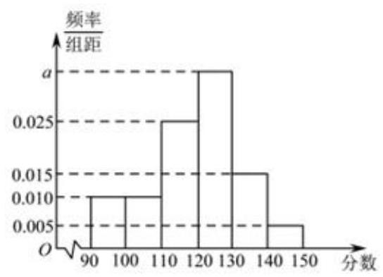

10. (5 分)【作答次数:60】【正确率:60%】若 $\varphi$ 是一个三角形的内角，且函数 $y = 3\sin \left( {{2x} + \varphi }\right)$ 在区间 $\left\lbrack  {-4,6}\right\rbrack$ 上是单调函数，则 $\varphi$ 的取值范围是___.

11.(5 分) 【作答次数:79】【正确率: ${65.8}\%$ 】设 ${a}_{1},{a}_{2},{a}_{3},\cdots ,{a}_{n}$ 是首项为 3 且公比为 $3\sqrt{3}$ 的等比数列,则满足不等式 ${\log }_{3}{a}_{1} - {\log }_{3}{a}_{2} + {\log }_{3}{a}_{3} - {\log }_{3}{a}_{4} + \cdots  + {\left( -1\right) }^{n + 1}{\log }_{3}{a}_{n} > {18}$ 的最小正整数 $n$ 的值为___.

12.(5 分) 【作答次数: 46】【正确率: 62%】若正三棱锥 $A - {BCD}$ 的底面边长为 6，高为 $\sqrt{13}$ ，动点 P 满足 $\left( {\overrightarrow{DA} + \overrightarrow{CB}}\right)  \bot  \left( {\overrightarrow{PA} + \overrightarrow{PB} + \overrightarrow{PC} + \overrightarrow{PD}}\right)$ ，则 $\left| {\overrightarrow{PA} + \overrightarrow{PB}}\right|  + 2\left| \overrightarrow{PA}\right|$ 的最小值为___.

## 二、选择题

13.(4 分) 【作答次数: 39】【正确率: 97.4%】设 $x \in  R$ ,则 “ ${x}^{3} > 8$ ” 是 “ $\left| x\right|  > 2$ ” 的

A. 充分而不必要条件

B. 必要而不充分条件

C. 充要条件

D. 既不充分也不必要条件

14.(4 分) 【作答次数:38】【正确率: 89.5%】从 3 名男同学和 2 名女同学中任选 2 名同学参加志愿者服务，则选出的 2 名同学中至少有 1 名女同学的概率是( )

A. $\frac{7}{20}$

B. $\frac{7}{10}$

C. $\frac{3}{10}$

D. $\frac{3}{5}$

15.(5 分) 【作答次数:72】【正确率:79.2%】若实数 $a, b$ 满足 ${a}^{2} + {b}^{2} = 1 + \left| {ab}\right|$ ，则必有( )

A. ${a}^{2} + {b}^{2} \geq  2$

B. ${a}^{2} - {b}^{2} \leq  1$

C. $a - b \leq  1$

D. $a + b \leq  2$

16. (5 分)【作答次数:59】【正确率:76.3%】在平面直角坐标系 ${xOy}$ 中，对于定点 $P\left( {a, b}\right)$ ，记点集 $\left\{  {\left( {x, y}\right) x - a\left| { \leq  1,}\right| y - b \mid   \leq  1}\right\}$ 中距离原点 $\mathrm{O}$ 最近的点为点 ${Q}_{P}$ ，此最近距离为 $f\left( P\right)$ . 当点 $\mathrm{P}$ 在曲线 ${x}^{2} + {y}^{2} - {8x} - {4y} + {16} = 0$ 上运动时，关于下列结论:①点 ${Q}_{P}$ 的轨迹是一个圆；② $f\left( P\right)$ 的取值范围是 $\left\lbrack  {\sqrt{10} - 2,\sqrt{10} + 2}\right\rbrack$ . 正确的判断是 ( )

A. ①成立，②成立

B. ①成立，②不成立

C. ①不成立，②成立

D. ①不成立，②不成立

## 三、解答题

17.(14 分) 【作答次数:36】【正确率:86.5%】

已知等比数列 $\left\{  {a}_{n}\right\}$ 是严格增数列,其第 3、4、5 项的乘积为 1000 ,并且这三项分别乘以 4、3、2 后, 所得三个数依次成等差数列.

(1)(6 分)求数列 $\left\{  {a}_{n}\right\}$ 的通项公式；

(2)(8 分)若对任意的正整数 n，数列 $\left\{  {b}_{n}\right\}$ 的前 $\mathrm{n}$ 项和 ${S}_{n} = 3\left( {1 - {2}^{n}}\right)$ ，向量 $\left( {{a}_{n},{b}_{n}}\right)$ 的模为 ${t}_{n}$ ，求数列 $\left\{  {t}_{n}\right\}$ 的前 $\mathrm{n}$ 项和.

18.(14 分) 【作答次数: 47】【正确率: 81%】

如图,平面 ${ABCD} \bot$ 平面 ${ADEF}$ ,四边形 ${ADEF}$ 是正方形,

${BC}//{AD},\angle {BAD} = \angle {CDA} = {45}^{ \circ  },{CD} = 2,{AD} = 4\sqrt{2}$ .

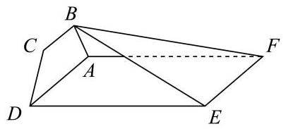

(1)(6 分)证明: ${CD}\bot$ 平面 ${ABF}$ ；

(2)(8 分)求二面角 $B - {EF} - A$ 的正切值.

19.(14 分) 【作答次数: 24】【正确率: 58.2%】

某公园的一个角形区域 ${AOB}$ 如图所示,其中 $\angle {AOB} = \frac{2\pi }{3}$ . 现拟用长度为 100 米的隔离档板 (折线 ${DCE})$ 与部分围墙 (折线 ${DOE}$ ) 围成一个花卉育苗区 ${ODCE}$ ,要求满足 ${OD} = {OC} = {OE}$ .

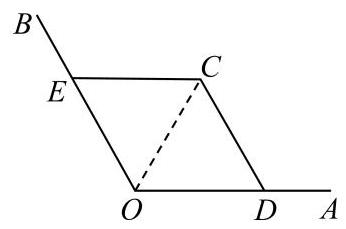

(1)(6 分)设 $\angle {DOC} = \frac{\pi }{3} + a\left( {-\frac{\pi }{3} < a < \frac{\pi }{3}}\right)$ ，试用 $a$ 表示 ${OD}$ ；

(2)(8 分)为使花卉育苗区的面积最大，应如何设计？请说明理由.

20.(18 分) 【作答次数:50】【正确率:87.1%】

设 $a$ 为实数， ${\Gamma }_{1}$ 是以点 $O\left( {0,0}\right)$ 为顶点，以点 $F\left( {0,\frac{1}{4}}\right)$ 为焦点的抛物线， ${\Gamma }_{2}$ 是以点 $A\left( {0, a}\right)$ 为圆心、半径为 1 的圆位于 $\mathrm{y}$ 轴右侧且在直线 $y = a$ 下方的部分.

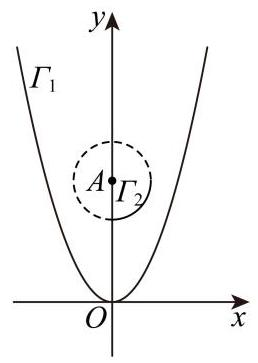

(1)(4 分)求 ${\Gamma }_{1}$ 与 ${\Gamma }_{2}$ 的方程；

(2)(6 分)若直线 $y = x + 2$ 被 ${\Gamma }_{1}$ 所截得的线段的中点在 ${\Gamma }_{2}$ 上，求 $\mathrm{a}$ 的值；

(3)(8 分)是否存在 $\mathrm{a}$ ，满足: ${\Gamma }_{2}$ 在 ${\Gamma }_{1}$ 的上方，且 ${\Gamma }_{2}$ 有两条不同的切线被 ${\Gamma }_{1}$ 所截得的线段长相等？若存在，求出 $\mathrm{a}$ 的取值范围；若不存在，请说明理由.

21.(18 分) 【作答次数: 26】【正确率: 89.4%】

设函数 $f\left( x\right)$ 与 $g\left( x\right)$ 的定义域均为 $D$ ,若存在 ${x}_{0} \in  D$ ,满足 $f\left( {x}_{0}\right)  = g\left( {x}_{0}\right)$ 且 ${f}^{\prime }\left( {x}_{0}\right)  = {g}^{\prime }\left( {x}_{0}\right)$ , 则称函数 $f\left( x\right)$ 与 $g\left( x\right)$ “局部趋同”.

(1)(4 分)判断函数 ${f}_{1}\left( x\right)  = {{5x} + 1}$ 与 ${f}_{2}\left( x\right)  = {x}^{3} + {2x}$ 是否 “局部趋同”,并说明理由；

(2)(6 分)已知函数 ${g}_{1}\left( x\right)  =  - {x}^{2} + {ax}\left( {x0}\right) ,{g}_{2}\left( x\right)  = b{e}^{x}\left( {x0}\right)$ . 求证:对任意的正数 $a$ ，都存在正数 $b$ ，使得函数 ${g}_{1}\left( x\right)$ 与 ${g}_{2}\left( x\right)$ “局部趋同”;

(3)(8 分) 对于给定的实数 $m$ ，若存在实数 $n$ ，使得函数 ${h}_{1}\left( x\right)  = {mx} + \frac{n}{x}\left( {x > 0}\right)$ 与 ${h}_{2}\left( x\right)  = \ln x$ “局部趋同”,求实数 $m$ 的取值范围.

## 上海市嘉定区 2024 届高三一模数学试题

一、填空题

1.(4 分)不等式 ${x}^{2} - x - 6 < 0$ 的解集是___.

2.(4 分) 已知 $\overrightarrow{a} = \left( {2,1}\right) ,\overrightarrow{b} = \left( {-1,2}\right)$ ,则 $2\overrightarrow{a} + 3\overrightarrow{b} =$ ___.

3.(4 分)函数 $f\left( x\right)  = \sin {\pi x}$ 的最小正周期为___.

4.(4 分)已知 $\tan a = 2$ ，则 $\tan \left( {a + \frac{\pi }{2}}\right)  =$ ___.

5.(4 分) 双曲线 $\frac{{x}^{2}}{4} - \frac{{y}^{2}}{5} = 1$ 的离心率是___.

6.(4 分)已知事件 $\mathrm{A}$ 和 $\mathrm{B}$ 独立, $P\left( A\right)  = \frac{1}{4}, P\left( B\right)  = \frac{1}{13}$ ,则 $P\left( {A \cap  B}\right)  =$ ___.

7.(5 分)已知实数 $\mathrm{a}\text{ 、 }\mathrm{\;b}$ 满足 ${ab} =  - 6$ ，则 ${a}^{2} + {b}^{2}$ 的最小值为___.

8.(5 分)已知 ${\left( 1 + 2x\right) }^{6}$ 的二项展开式中系数最大的项为___.

9.(5 分)关于 $\mathrm{x}$ 的方程 $\left| {{x}^{2} - {3x} + 2}\right|  = {mx}$ 有三个不同的实数解,则实数 $\mathrm{m}$ 的值为___.

10.(5 分)已知 11 个大小相同的球，其中 3 个是红球，3 个是黑球，5 个是白球，从中随机取出 4 个形成一组，其中三种颜色都有的概率为___.

11. (5 分) 已知复平面上一个动点 $\mathrm{Z}$ 对应复数 $\mathrm{z}$ ,若 $\left| {z - {4i}}\right|  \leq  2$ ,其中 $\mathrm{i}$ 是虚数单位,则向量 ${OZ}$ 扫过的面积为___.

12. (5分)正四棱台 ${ABCD} - {A}_{1}{B}_{1}{C}_{1}{D}_{1},{AB} = 3,{A}_{1}{B}_{1} = 1,{A{A}_{1}} = 2, M$ 是 ${C}_{1}{D}_{1}$ 的中点，在直线 $A{A}_{1}$ 、 ${BC}$ 上各取一个点 $\mathrm{P}$ 、 $\mathrm{Q}$ ，使得 $\mathrm{M}$ 、 $\mathrm{P}$ 、 $\mathrm{Q}$ 三点共线，则线段 ${PQ}$ 的长度为___.

## 二、单选题

13.(4 分)直线倾斜角的取值范围为 ( )

A. $\left\lbrack  {0,\frac{\pi }{2}}\right)$

B. $\left\lbrack  {0,\frac{\pi }{2}}\right\rbrack$

C. $\left\lbrack  {0,\pi }\right)$

D. $\left\lbrack  {0,\pi }\right\rbrack$

14.(4 分)两位跳水运动员甲和乙，某次比赛中的得分如下表所示，则正确的选项为 ( )

<table><tr><td></td><td>第一跳</td><td>第二跳</td><td>第三跳</td><td>第四跳</td><td>第五跳</td></tr><tr><td>甲</td><td>85.5</td><td>96</td><td>86.4</td><td>75.9</td><td>94.4</td></tr><tr><td>乙</td><td>79.5</td><td>80</td><td>95.7</td><td>94.05</td><td>86.4</td></tr></table>

A. 甲和乙的中位数相等，甲的平均分小于乙

B. 甲的平均分大于乙，甲的方差大于乙

C. 甲的平均分大于乙，甲的方差等于乙

D. 甲的平均分大于乙，甲的方差小于乙

15. (5 分)已知等差数列 $\left\{  {a}_{n}\right\}$ ，公差为 $d, f\left( x\right)  = \left| {x - {a}_{1}}\right|  + \left| {x - {a}_{2}}\right|$ ，则下列命题正确的是( )

A. 函数 $y = f\left( x\right) \left( {x \in  R}\right)$ 可能是奇函数

B. 若函数 $y = f\left( x\right) \left( {x \in  R}\right)$ 是偶函数，则 $d = 0$

C. 若 $d = 0$ ,则函数 $y = f\left( x\right) \left( {x \in  R}\right)$ 是偶函数

D. 若 $d \neq  0$ ,则函数 $y = f\left( x\right) \left( {x \in  R}\right)$ 的图象是轴对称图形

16.(5 分)已知四面体 ${ABCD},{AB} = {BC},{AD} = {CD}$ . 分别对于下列三个条件:

① ${AD}\bot {BC}$ ；② ${AC} = {BD}$ ；③ ${AB}^{2} + {CD}^{2} = {AC}^{2} + {BD}^{2}$ ，

是 ${AB} \bot  {CD}$ 的充要条件的共有几个( )

A. 0

B. 1

C. 2

D. 3

## 三、解答题

17.(14 分)

已知三角形 ${ABC}$ ,

(1)(7 分) $\overrightarrow{CA} \cdot  \overrightarrow{CB} = 1$ ，三角形的面积 $S = \frac{1}{2}$ ，求角 $C$ 的值；

(2)(7 分)若 $\sin A\cos A = \frac{\sqrt{3}}{4}, C = \frac{\pi }{4}, a = 2$ ，求 $c$ .

18.(14 分)

已知数列 $\left\{  {a}_{n}\right\}$ 的前 $\mathrm{n}$ 项和为 ${S}_{n},{S}_{n} = {n}^{2} + n$ ,其中 $n \in  {N}^{ * }$ .

(1)(7 分)求 $\left\{  {a}_{n}\right\}$ 的通项公式；

(2)(7 分)求数列 $\left\{  \frac{1}{{a}_{n}{a}_{n + 1}}\right\}$ 的前 $\mathrm{n}$ 项和 ${H}_{n}$ .

19.(14 分)

中国历史悠久，积累了许多房屋建筑的经验. 房梁为柱体，或取整根树干而制为圆柱形状，或作适当裁减而制为长方体形状，例如下图所示.

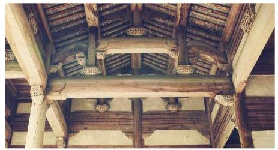

材质确定的梁的承重能力取决于截面形状，现代工程科学常用抗弯截面系数 Ｗ来刻画梁的承重能力. 对于两个截面积相同的梁, 称 W 较大的梁的截面形状更好. 三种不同截面形状的梁的抗弯截面系数公式, 如下表所列,

<table><tr><td></td><td>圆形截面</td><td>正方形截面</td><td>矩形截面</td></tr><tr><td>条件</td><td>r 为圆半径</td><td>a 为正方形边长</td><td>(h 为矩形的长, $\mathrm{b}$ 为矩形的宽, $h > b$</td></tr><tr><td>抗弯截面系数</td><td>${W}_{1} = \frac{\pi }{4}{r}^{3}$</td><td>${W}_{2} = \frac{1}{6}{a}^{3}$</td><td>${W}_{3} = \frac{1}{6}b{h}^{2}$</td></tr></table>

(1)(7 分)假设上表中的三种梁的截面面积相等，请问哪一种梁的截面形状最好？并具体说明；

(2)(7 分)宋朝学者李诫在《营造法式》中提出了矩形截面的梁的截面长宽之比应定为 32 的观点. 考虑梁取

材于圆柱形的树木，设矩形截面的外接圆的直径为常数 D，如下图所示，请问 ${hb}$ 为何值时，其抗弯截面系数取得最大值，并据此分析李诫的观点是否合理.

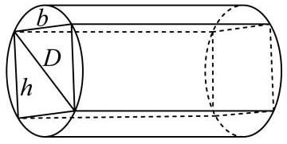

20.(18 分)

抛物线 ${y}^{2} = {4x}$ 上有一动点 $P\left( {s, t}\right) , t > 0$ . 过点 $\mathrm{P}$ 作抛物线的切线1,再过点 $\mathrm{P}$ 作直线 $m$ ,使得 $m \bot  l$ ,直线 $\mathrm{m}$ 和抛物线的另一个交点为 $\mathrm{Q}$ .

(1)(4 分)当 $s = 1$ 时，求切线 $l$ 的直线方程；

(2)(6 分)当直线 $l$ 与抛物线准线的交点在 x 轴上时，求三角形 ${OPQ}$ 的面积(点 O 是坐标原点);

(3)(8 分)求出线段 $\left| {PQ}\right|$ 关于 $\mathrm{s}$ 的表达式，并求 $\left| {PQ}\right|$ 的最小值；

21.(18 分)

已知 $f\left( x\right)  = \frac{x}{{e}^{x}}, g\left( x\right)  = \frac{\ln x}{x}$ .

(1)(4 分)求函数 $y = f\left( x\right) \text{ 、 }y = g\left( x\right)$ 的单调区间和极值；

(2)(6 分)请严格证明曲线 $y = f\left( x\right) \text{ 、 }y = g\left( x\right)$ 有唯一交点；

(3) (8 分) 对于常数 $a \in  \left( {0,\frac{1}{e}}\right)$ ,若直线 $y = a$ 和曲线 $y = f\left( x\right) \text{ 、 }y = g\left( x\right)$ 共有三个不同交点 $\left( {{x}_{1}, a}\right) \text{ 、 }\left( {{x}_{2}, a}\right) \text{ 、 }\left( {{x}_{3}, a}\right)$ ,其中 ${x}_{1} < {x}_{2} < {x}_{3}$ ,求证: ${x}_{1}\text{ 、 }{x}_{2}\text{ 、 }{x}_{3}$ 成等比数列.

# 上海市金山区 2024 届高三上学期期末质量监控 (一模) 数学 试题

## 一、填空题

1.(4 分) 【作答次数:25】【正确率:100%】已知集合 $A = \{ 1,2,3\}$ ， $B = \{ 3,4,5\}$ ，则 $A \cap  B =$ ___.

2. (4 分) 【作答次数:24】【正确率:100%】在复平面内，复数 $z$ 对应的点的坐标是 $\left( {-1,\sqrt{3}}\right)$ ，则 $z$ 的共轭复数 $\bar{z} =$ ___.

3.(4 分) 【作答次数: 20】【正确率: 95%】不等式 $\frac{x - 1}{x + 2} > 0$ 的解集为___.

4.(4 分) 【作答次数: 18】【正确率: 88.9%】双曲线 ${x}^{2} - \frac{{y}^{2}}{2} = 1$ 的离心率为___.

5.(4 分) 【作答次数:31】【正确率:64.5%】已知角 $a$ ， $\beta$ 的终边关于原点 $\mathrm{O}$ 对称，则 $\cos \left( {a - \beta }\right)  =$ ___.

6.(4 分)【作答次数: 21】【正确率: 90.5%】已知甲、乙两组数据如茎叶图所示，若它们的中位数相同，则图中 $\mathrm{m}$ 的值___.

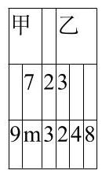

7. (5 分)【作答次数:25】【正确率:96%】设圆台的上底面和下底面的半径分别为 r' = 1 和 r = 2，母线长为 $l = 3$ ，则该该圆台的高为___.

8.(5 分) 【作答次数: 24】【正确率: 79.2%】从 1, 2, 3, 4, 5 这五个数中随机抽取两个不同的数, 则所抽到的两个数的和大于 6 的概率为___(结果用数值表示).

9. (5 分)【作答次数:52】【正确率:40.4%】已知函数 $y = \sin \left( {\omega x}\right) \left( {\omega  > 0}\right)$ 在区间 $\left\lbrack  {0,\pi }\right\rbrack$ 上是严格增函数， 且其图像关于点 $\left( {{4\pi },0}\right)$ 对称，则 $\omega$ 的值为___.

10.(5 分) 【作答次数: 24】【正确率: 70.8%】若 ${\left( {10}x + 6y\right) }^{3} = a{x}^{3} + b{x}^{2}y + {cx}{y}^{2} + d{y}^{3}$ ,则 $- a + {2b} - {4c} + {8d} =$ ___.

11. (5 分)【作答次数:21】【正确率:40.5%】若函数 $f\left( x\right)  = \left| {\left( {1 - {x}^{2}}\right) \left( {{x}^{2} + {ax} + b}\right) }\right|  - c\left( {c \neq  0}\right)$ 的图像关于直线 $x =  - 2$ 对称，且该函数有且仅有 7 个零点，则 $a + b + c$ 的值为___.

12.(5 分) 【作答次数:25】【正确率: 45.2%】已知平面向量 $\overrightarrow{a}$ 、 $\overrightarrow{b}$ 、 $\overrightarrow{c}$ 满足

$\left| \overrightarrow{a}\right|  = 4\left| {\overrightarrow{b} - \overrightarrow{c}}\right|  = 2,\left| {\overrightarrow{a} + \overrightarrow{b}}\right|  = \left| {\overrightarrow{a} - \overrightarrow{b}}\right|  + \left| \overrightarrow{a}\right|$ ，且 $\overrightarrow{a},\overrightarrow{c} = \frac{\pi }{3}$ ，则 $\overrightarrow{a} \cdot  \overrightarrow{c}$ 的取值范围是___.

## 二、选择题

13.(4 分) 【作答次数:42】【正确率: 85.7%】对于实数 $a, b, c$ ，“ $a > b$ ” 是 “ $a{c}^{2} > b{c}^{2}$ ” 的

A. 充分不必要条件

B. 必要不充分条件

C. 充要条件

D. 既不充分也不必要条件

14. (4 分) 【作答次数:23】【正确率:9.13%】已知事件 $A$ 和 $B$ 相互独立，且 $P\left( A\right)  = \frac{1}{3}, P\left( \bar{B}\right)  = \frac{3}{7}$ ，则 $P\left( {AB}\right)  =$ ( )

A. $\frac{1}{7}$ B. $\frac{4}{21}$

C. $\frac{2}{7}$ D. $\frac{16}{21}$

15.(5 分) 【作答次数:21】【正确率: 81%】如图，在正方体 ${ABCD} - {A}_{1}{B}_{1}{C}_{1}{D}_{1}$ 中，E、F 为正方体内(含边界) 不重合的两个动点,下列结论错误的是 ( ).

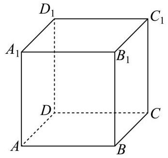

A. 若 $E \in  B{D}_{1}, F \in  {BD}$ ,则 ${EF} \bot  {AC}$

B. 若 $E \in  B{D}_{1}, F \in  {BD}$ ,则平面 ${BEF} \bot$ 平面 ${A}_{1}B{C}_{1}$

C. 若 $E \in  {AC}, F \in  C{D}_{1}$ ,则 ${EF}//$ 面 ${A}_{1}B{C}_{1}$

D. 若 $E \in  {AC}, F \in  C{D}_{1}$ ,则 ${EF}//A{D}_{1}$

16.(5 分) 【作答次数: 19】【正确率: 57.9%】设集合 $A = \{ 1,2,\cdots ,{100}\} , X\text{ 、 }Y$ 均为 $A$ 的非空子集(允许 $X = Y).\;X$ 中的最大元素与 $Y$ 中的最小元素分别记为 $M\text{ 、 }m$ ,则满足 $M > m$ 的有序集合对 $\left( {X, Y}\right)$ 的个数为 ( ).

A. ${2}^{200} - {100} \cdot  {2}^{100}$

B. ${2}^{200} - {101} \cdot  {2}^{100}$

C. ${2}^{201} - {100} \cdot  {2}^{100}$

D. ${2}^{201} - {101} \cdot  {2}^{100}$

## 三、解答题

17.(14 分)【作答次数: 17】【正确率: 93.9%】

如图，在四棱锥 $P - {ABCD}$ 中，底面 ${ABCD}$ 为正方形， ${PA} \bot$ 平面 ${ABCD}$ ， ${PA} = {AD} = 2, E$ 为 ${PB}$ 的中点， $F$ 为 ${AC}$ 与 ${BD}$ 的交点.

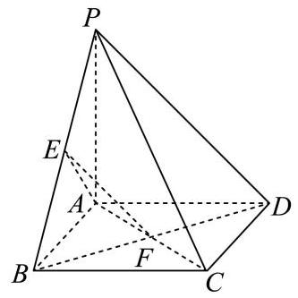

(1)(6 分)证明: ${EF}//$ 平面 ${PCD}$ ；

(2)(8 分)求三棱锥 $E - {ABF}$ 的体积.

18.(14 分)【作答次数: 19】【正确率: 81.8%】

已知数列 $\left\{  {a}_{n}\right\}$ 满足 ${\log }_{2}{a}_{n + 1} = 1 + {\log }_{2}{a}_{n}$ ，且 ${a}_{1} = 2$ .

(1)(6 分)求 ${a}_{10}$ 的值；

(2)(8 分)若数列 $\left\{  {{a}_{n} + \frac{\lambda }{{a}_{n}}}\right\}$ 为严格增数列，其中 $\lambda$ 是常数，求 $\lambda$ 的取值范围.

19.(14 分) 【作答次数:16】【正确率:66.2%】

网络购物行业日益发达，各销售平台通常会配备送货上门服务. 小金正在配送客户购买的电冰箱，并获得了客户所在小区门户以及建筑转角处的平面设计示意图.

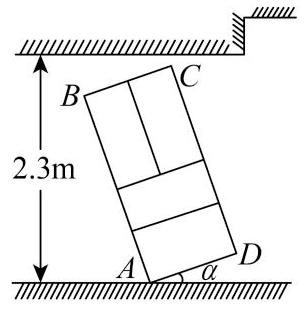

图1

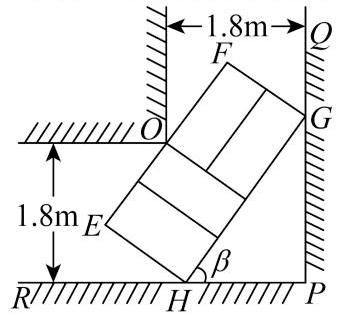

图2

(1)(6 分)为避免冰箱内部制冷液逆流，要求运送过程中发生倾斜时，外包装的底面与地面的倾斜角 $a$ 不能超过 $\frac{\pi }{4}$ ，且底面至少有两个顶点与地面接触. 外包装看作长方体，如图 1 所示，记长方体的纵截面为矩形 ${ABCD},{AD} = {0.8m}$ ， ${AB} = {2.4m}$ ，而客户家门高度为 2.3 米，其他过道高度足够. 若以倾斜角 $a = \frac{\pi }{4}$ 的方式进客户家门,小金能否将冰箱运送入客户家中? 计算并说明理由. (2)(8 分)由于客户选择以旧换新服务，小金需要将客户长方体形状的旧冰箱进行回收. 为了省力，小金选择将冰箱水平推运(冰箱背面水平放置于带滚轮的平板车上，平板车长宽均小于冰箱背面). 推运过程中遇到一处直角过道，如图 2 所示，过道宽为 1.8 米. 记此冰箱水平截面为矩形 ${EFGH}$ ， ${EH} = {1.2m}$ . 设 $\angle {PHG} = \beta$ ，当冰箱被卡住时(即点 $H$ 、 $G$ 分别在射线 ${PR}$ 、 ${PQ}$ 上，点 $O$ 在线段 ${EF}$ 上)，尝试用 $\beta$ 表示冰箱高度 ${EF}$ 的长，并求出 ${EF}$ 的最小值，最后请帮助小金得出结论:按此种方式推运的旧冰箱，其高度的最大值是多少？(结果精确到 ${0.1}\mathrm{\;m}$ )

20.(18 分) 【作答次数: 14】【正确率: 89%】

已知三条直线 ${l}_{i} : y = {kx} + {m}_{i}\;\left( {i = 1,2,3}\right)$ 分别与抛物线 $\Gamma  : {y}^{2} = {8x}$ 交于点 ${A}_{i}\text{ 、 }{B}_{i}, T\left( {t,0}\right)$ 为 $x$ 轴上一定点,且 ${m}_{1} < {m}_{2} < {m}_{3} <  - t$ ,记点 $T$ 到直线 ${l}_{i}$ 的距离为 ${d}_{i},\bigtriangleup T{A}_{i}{B}_{i}$ 的面积为 ${S}_{i}$ .

(1)(4 分)若直线 ${l}_{3}$ 的倾斜角为 ${45}^{ \circ  }$ ，且过抛物线 $\Gamma$ 的焦点 $F$ ，求直线 ${l}_{3}$ 的方程；

(2)(6 分)若 $O{A}_{1} \cdot  O{B}_{1} = 0$ ，且 $k{m}_{1} \neq  0$ ，证明:直线 ${l}_{1}$ 过定点；

(3)(8 分)当 $k = 1$ 时，是否存在点 $T$ ，使得 ${S}_{1}$ ， ${S}_{2}$ ， ${S}_{3}$ 成等比数列， ${d}_{1}$ ， ${d}_{2}$ ， ${d}_{3}$ 也成等比数列? 若存在，请求出点 $T$ 的坐标；若不存在，请说明理由.

21.(18 分) 【作答次数:13】【正确率: 68.9%】

设函数 $y = f\left( x\right)$ 的定义域为 $D$ ,给定区间 $\left\lbrack  {a, b}\right\rbrack   \subseteq  D$ ,若存在 ${x}_{0} \in  \left( {a, b}\right)$ ,使得 $f\left( {x}_{0}\right)  = \frac{f\left( b\right)  - f\left( a\right) }{b - a}$ ,则称函数 $y = f\left( x\right)$ 为区间 $\left\lbrack  {a, b}\right\rbrack$ 上的 “均值函数”, ${x}_{0}$ 为函数 $y = f\left( x\right)$ 的 “均值点”.

(1)(4 分)试判断函数 $y = {x}^{2}$ 是否为区间 $\left\lbrack  {1,2}\right\rbrack$ 上的 “均值函数”，如果是，请求出其 “均值点”；如果不是， 请说明理由;

(2) (6 分)已知函数 $y =  - {2}^{{2x} - 1} + m \cdot  {2}^{x - 1} - {12}$ 是区间 $\left\lbrack  {1,3}\right\rbrack$ 上的 “均值函数”,求实数 $m$ 的取值范围;

(3) $\left( {8\text{ 分 }}\right)$ 若函数 $y = \frac{{x}^{2} + a}{2\left( {{x}^{2} - {2x} + 2}\right) }$ (常数 $a \in  R$ )是区间 $\left\lbrack  {-2,2}\right\rbrack$ 上的 “均值函数”，且 $\frac{2}{3}$ 为其 “均值点”. 将区间 $\left\lbrack  {-2,0}\right\rbrack$ 任意划分成 $m + 1\left( {m \in  N}\right)$ 份，设分点的横坐标从小到大依次为 ${t}_{1},{t}_{2},\cdots ,{t}_{m}$ ，记 ${t}_{0} =  - 2,{t}_{m + 1} = 0, G = \mathop{\sum }\limits_{{i = 0}}^{m}\left| {f\left( {t}_{i + 1}\right)  - f\left( {t}_{i}\right) }\right|$ . 再将区间 $\left\lbrack  {0,2}\right\rbrack$ 等分成 ${2}^{n} + 1\left( {n \in  N}\right)$ 份,设等分点的横坐标从小到大依次为 ${x}_{1},{x}_{2},\cdots ,{x}_{{2}^{n}}$ ,记 $H = \mathop{\sum }\limits_{{i = 1}}^{{2}^{n}}f\left( {x}_{i}\right)$ . 求使得 $H \cdot  G > {2023}$ 的最小整数 $n$ 的值.

# 上海市静安区 2024 届高三上学期期末教学质量调研 (一模) 数学试题

## 一、填空题

1.(4 分) 【作答次数:13】【正确率: 84.6%】准线方程为 $x + 1 = 0$ 的抛物线标准方程为___.

2.(4 分) 【作答次数: 14】【正确率: ${100}\%$ 】 ${\left( x + \frac{2}{x}\right) }^{3}$ 的二项展开式中 $x$ 的系数为___.

3.(4 分) 【作答次数: 11】【正确率: 100%】若一个圆柱的底面半径和母线长都是 1，则这个圆柱的体积是___.

4.(4 分) 【作答次数:11】【正确率:81.8%】已知 $a \in  R$ ， $i$ 是虚数单位， $\frac{1}{a - i}$ 的虚部为___.

5.(4 分) 【作答次数:12】【正确率:58.3%】计算 $\mathop{\sum }\limits_{{i = 1}}^{{+\infty }}{\left( \frac{2}{3}\right) }^{i} =$ ___.

6.(4 分) 【作答次数: 12】【正确率: 91.7%】某果园种植了 222 棵苹果树, 现从中随机抽取了 20 棵苹果树,算得这 20 棵苹果树平均每棵产量为 ${28}\mathrm{\;{kg}}$ ,则预估该果园的苹果产量为___ $\mathrm{{kg}}$ .

7. (5 分)【作答次数:11】【正确率:81.8%】下列幂函数在区间 $\left( {0, + \infty }\right)$ 上是严格增函数，且图象关于原点成中心对称的是___(请填入全部正确的序号).

① $y = {x}^{\frac{1}{2}}$ ； ② $y = {x}^{\frac{1}{3}}$ ； ③ $y = {x}^{\frac{2}{3}}$ ； ④ $y = {x}^{\frac{1}{3}}$ .

8. (5 分)【作答次数:14】【正确率:78.6%】若不等式 $\left| {x - 3}\right|  + \left| {x - 5}\right|  \geq  a$ 对所有实数 x 恒成立，则实数 a 的取值范围是___.

9.(5 分) 【作答次数: 9】【正确率: 55.6%】如图，在四棱锥 $P - {ABCD}$ 中， ${PA} \bot$ 平面 ${ABCD}$ ，底面 ${ABCD}$ 是矩形, $\left| {AP}\right|  = \left| {AB}\right|  = 2,\left| {AD}\right|  = 4, E$ 是 ${BC}$ 上的点,直线 ${PB}$ 与平面 ${PDE}$ 所成的角是 $\arcsin \frac{\sqrt{3}}{6}$ ，则 ${BE}$ 的长为___.

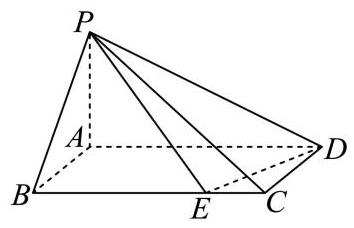

10. (5 分)【作答次数:10】【正确率:80%】不等式 ${\log }_{2}x + \frac{x}{2} < 4$ 的解集为___.

11.(5 分) 【作答次数: 8】【正确率: 50%】在国家开发西部的号召下，某西部企业得到了一笔 400 万元的无息贷款用做设备更新. 据预测，该企业设备更新后，第 1 个月收入为 20 万元，在接下来的 5 个月中， 每月收入都比上个月增长 20%，从第 7 个月开始，每个月的收入都比前一个月增加 2 万元，则从新设备使用开始计算，该企业用所得收入偿还 400 万无息贷款只需___个月. (结果取整)

12.(5 分)【作答次数:8】【正确率:18.8%】记 $f\left( x\right)  = \ln x + {x}^{2} - {2kx} + {k}^{2}$ ，若存在实数 $a$ 、 $b$ ，满足 $\frac{1}{2} \leq  a < b \leq  2$ ，使得函数 $y = f\left( x\right)$ 在区间 $\left\lbrack  {a, b}\right\rbrack$ 上是严格增函数，则实数 $k$ 的取值范围是___.

## 二、选择题

13.(4 分) 【作答次数:17】【正确率:94.1%】已知 $a : x > 1$ ， $\beta  : \frac{1}{x} < 1$ ，则 $a$ 是 $\beta$ 的( )

A. 必要非充分条件

B. 充分非必要条件

C. 充要条件

D. 既非充分又非必要条件

14.(4 分)【作答次数:17】【正确率:94.1%】设 $a$ 是第一象限的角，则 $\frac{a}{2}$ 所在的象限为( )

A. 第一象限

B. 第三象限

C. 第一象限或第三象限

D. 第二象限或第四象限

15.(5 分)【作答次数:9】【正确率:55.6%】教材在推导向量的数量积的坐标表示公式 “ $\overrightarrow{a} \cdot  \overrightarrow{b} = {x}_{1}{x}_{2} + {y}_{1}{y}_{2}$ (其中 $\overrightarrow{a} = \left( {{x}_{1},{y}_{1}}\right) ,\overrightarrow{b} = \left( {{x}_{2},{y}_{2}}\right)$ )” 的过程中，运用了以下哪些结论作为推理的依据( )

① 向量坐标的定义；

② 向量数量积的定义；

③ 向量数量积的交换律;

④ 向量数量积对数乘的结合律;

⑤ 向量数量积对加法的分配律.

A. ①③④

B. ②④⑤

C. ①②③⑤

D. ①②③④⑤

16. (5 分)【作答次数:100】【正确率:85%】记点 $P$ 到图形 $C$ 上每一个点的距离的最小值称为点 $P$ 到图形 $C$ 的距离，那么平面内到定圆 $C$ 的距离与到定点 $A$ 的距离相等的点的轨迹不可能是( )

A. 圆

B. 椭圆

C. 双曲线的一支

D. 直线

## 三、解答题

17.(14 分) 【作答次数:17】【正确率:90.2%】

记 $f\left( x\right)  = {\sin }^{2}x - {\cos }^{2}x + 2\sqrt{3}\sin x\cos x + \lambda \left( {x \in  R}\right)$ ,其中 $\lambda$ 为实常数.

(1)(6 分) 求函数 $y = f\left( x\right)$ 的最小正周期；

(2)(8 分)若函数 $y = f\left( x\right)$ 的图像经过点 $\left( {\frac{\pi }{2},0}\right)$ ，求该函数在区间 $\left\lbrack  {0,\frac{2}{3}\pi }\right\rbrack$ 上的最大值和最小值.

18.(14 分) 【作答次数:11】【正确率: 86.4%】

甲、乙两人每下一盘棋, 甲获胜的概率是 0.4 , 甲不输的概率为 0.9 .

(1)(6 分)若甲、乙两人下一盘棋，求他们下成和棋的概率；

(2)(8 分)若甲、乙两人连下两盘棋，假设两盘棋之间的胜负互不影响，求甲至少获胜一盘的概率.

19.(14 分) 【作答次数:11】【正确率: 80.3%】

已知双曲线 $C : \frac{{x}^{2}}{2} - {y}^{2} = 1$ ，点 $M$ 的坐标为(0,1).

(1)(6 分)设直线 $l$ 过点 $M$ ，斜率为 $\frac{1}{2}$ ，它与双曲线 $C$ 交于 $A$ 、 $B$ 两点，求线段 ${AB}$ 的长；

(2)(8 分)设点 $P$ 在双曲线 $C$ 上， $Q$ 是点 $P$ 关于 $y$ 轴的对称点. 记 $k = \overrightarrow{MP} \cdot  \overrightarrow{MQ}$ ，求 $k$ 的取值范围.

20.(18 分) 【作答次数:7】【正确率: 41.9%】

如下图,某公园东北角处有一座小山,山顶有一根垂直于水平地平面的钢制笔直旗杆 ${AB}$ ,公园内的小山下是一个水平广场 (虚线部分). 某高三班级数学老师留给同学们的周末作业是:进入该公园，提出与测量有关的问题, 在广场上实施测量, 并运用数学知识解决问题. 老师提供给同学们的条件是: 已知 ${AB} = {10}$ 米，规定使用的测量工具只有一只小小的手持激光测距仪(如下图，该测距仪能准确测量它到它发出的激光投射在物体表面上的光点之间的距离).

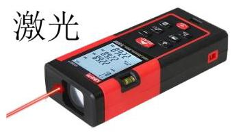

$C$

(1)(5 分)甲同学来到通往山脚下的笔直小路 $l$ 上，他提出的问题是:如何测量小山的高度？于是，他站在点 $C$ 处，独立的实施了测量，并运用数学知识解决了问题. 请写出甲同学的解决问题方案，并用假设的测量数据 (字母表示) 表示出小山的高度 $H$ ;

(2)(6 分)乙同学是在一阵大风过后进入公园的，广场上的人纷纷议论:旗杆 ${AB}$ 似乎是由于在根部 $A$ 处松动产生了倾斜. 她提出的问题是: 如何检验旗杆 ${AB}$ 是否还垂直于地面? 并且设计了一个不用计算就能解决问题的独立测量方案. 请你写出她的方案, 并说明理由;

(3)(7 分)已知(1)中的小路 $l$ 是东西方向，且与点 $A$ 所确定的平面垂直于地平面. 又已知在(2)中的乙同学已经断定旗杆 ${AB}$ 大致向广场方向倾斜. 如果你是该班级的同学，你会提出怎样的有实际意义的问题? 请写出实施测量与解决问题的方案, 并说明理由 (如果需要, 可通过假设的测量数据或运算结果列式说明, 不必计算).

21.(18 分) 【作答次数: 8】【正确率: 50.6%】

如果函数 $y = f\left( x\right)$ 满足以下两个条件,我们就称 $y = f\left( x\right)$ 为 $L$ 型函数.

①对任意的 $x \in  \left( {0,1}\right)$ ，总有 $f\left( x\right)  > 0$ ；

② 当 ${x}_{1} > 0,{x}_{2} > 0,{x}_{1} + {x}_{2} < 1$ 时,总有 $f\left( {{x}_{1} + {x}_{2}}\right)  < f\left( {x}_{1}\right)  + f\left( {x}_{2}\right)$ 成立.

(1)(6 分)记 $g\left( x\right)  = {x}^{2} + \frac{1}{2}$ ，求证: $y = g\left( x\right)$ 为 $L$ 型函数；

(2)(6 分)设 $b \in  R$ ，记 $p\left( x\right)  = \ln \left( {x + b}\right)$ ，若 $y = p\left( x\right)$ 是 $L$ 型函数，求 $b$ 的取值范围；

(3)(6 分)是否存在 $L$ 型函数 $y = r\left( x\right)$ 满足:对于任意的 $m \in  \left( {0,4}\right)$ ，都存在 ${x}_{0} \in  \left( {0,1}\right)$ ，使得等式 $r\left( {x}_{0}\right)  = m$ 成立? 请说明理由.

# 上海市闵行区 2024 届高三上学期学业质量调研 (一模) 数学 试卷

## 一、填空题

1. (4 分) 【作答次数:62】【正确率:100%】已知集合 $M = \{ 0,1, a + 1\}$ ，若 $- 1 \in  M$ ，则实数 $a =$ ___.

2.(4 分) 【作答次数: 65】【正确率: 93.1%】若 $\sin a = \frac{1}{3}$ ,则 $\sin \left( {\pi  - a}\right)  =$

3.(4 分) 【作答次数: 56】【正确率: 86.3%】若实数 $x, y$ 满足 ${xy} = 1$ ，则 ${x}^{2} + 4{y}^{2}$ 的最小值为___.

4.(4 分) 【作答次数:54】【正确率:83.3%】已知 ${\left( x - 1\right) }^{4} = {a}_{0} + {a}_{1}x + {a}_{2}{x}^{2} + {a}_{3}{x}^{3} + {a}_{4}{x}^{4}$ ，则 ${a}_{2} =$ ___.

5.(4 分) 【作答次数: 67】【正确率: 95.8%】已知圆锥的底面周长为 ${4\pi }$ ，母线长为 3，则该圆锥的侧面积为___.

6.(4 分) 【作答次数: 49】【正确率: 91%】已知双曲线 $\frac{{x}^{2}}{{a}^{2}} - \frac{{y}^{2}}{{b}^{2}} = 1\left( {{a0}, b > 0}\right)$ 的离心率为 $\sqrt{2}$ ，则该双曲线的渐近线方程为___.

7.(5 分) 【作答次数:60】【正确率:75.3%】若将函数 $f\left( x\right)  = \sin \left( {{2x} + \varphi }\right) \left( {0 < \varphi  < \pi }\right)$ 的图象向右平移 $\frac{\pi }{3}$ 个单位长度后得到的图象对应函数为奇函数，则 $\varphi  =$ ___.

8.(5 分) 【作答次数: 105】【正确率: 74.8%】已知 $f\left( x\right)  = {x}^{2} - {8x} + {10}$ ， $x \in  R$ ，数列 $\left\{  {a}_{n}\right\}$ 是公差为 1 的等差数列,若 $f\left( {a}_{1}\right)  + f\left( {a}_{2}\right)  + f\left( {a}_{3}\right)$ 的值最小,则 ${a}_{1} =$ ___.

9.(5 分) 【作答次数:62】【正确率:70.2%】今年中秋和国庆共有连续 8 天小长假，某单位安排甲、乙、丙三名员工值班，每天都需要有人值班. 任选两名员工各值3 天班，剩下的一名员工值 2 天班，且每名员工值班的日期都是连续的，则不同的安排方法数为___.

10. (5 分)【作答次数:43】【正确率:57%】若平面上的三个单位向量 $\overrightarrow{a}$ 、 $\overrightarrow{b}$ 、 $\overrightarrow{c}$ 满足 $\left| {\overrightarrow{a} \cdot  \overrightarrow{b}}\right|  = \frac{1}{2}$ ， $\left| {\overrightarrow{a} \cdot  \overrightarrow{c}}\right|  = \frac{\sqrt{3}}{2}$ ，则 $\overrightarrow{b} \cdot  \overrightarrow{c}$ 的所有可能的值组成的集合为___.

11. (5 分) 【作答次数:57】【正确率:66.8%】已知数列 $\left\{  {a}_{n}\right\}$ 为无穷等比数列，若 $\mathop{\sum }\limits_{{i = 1}}^{{+\infty }}{a}_{i} =  - 2$ ，则 $\mathop{\sum }\limits_{{i = 1}}^{{+\infty }}\left| {a}_{i}\right|$ 的取值范围为___.

12. (5 分)【作答次数:76】【正确率:72.2%】已知点 $\mathrm{P}$ 在正方体 ${ABCD} - {A}_{1}{B}_{1}{C}_{1}{D}_{1}$ 的表面上，P 到三个平面 $\mathrm{{ABCD}}\text{ 、 }{AD}{D}_{1}{A}_{1}\text{ 、 }{AB}{B}_{1}{A}_{1}$ 中的两个平面的距离相等，且 $\mathrm{P}$ 到剩下一个平面的距离与 $\mathrm{P}$ 到此正方体的中心的距离相等，则满足条件的点 $\mathrm{P}$ 的个数为___.

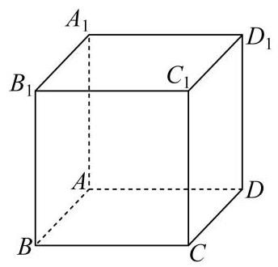

## 二、选择题

13.(4 分) 【作答次数: 49】【正确率: 98%】已知 a， $b \in  R$ ， $a > b$ ，则下列不等式中不一定成立的是 ( )

A. $a + 2 > b + 2$

B. ${2a} > {2b}$

C. ${a}^{2} > {b}^{2}$

D. ${2}^{a} > {2}^{b}$

14.(4 分) 【作答次数: 43】【正确率: 88.4%】某校读书节期间，共 120 名同学获奖(分金、银、铜三个等级), 从中随机抽取 24 名同学参加交流会, 若按高一、高二、高三分层随机抽样, 则高一年级需抽取 6 人；若按获奖等级分层随机抽样，则金奖获得者需抽取 4 人. 下列说法正确的是 ( )

A. 高二和高三年级获奖同学共 80 人

B. 获奖同学中金奖所占比例一定最低

C. 获奖同学中金奖所占比例可能最高

D. 获金奖的同学可能都在高一年级

15.(5 分)【作答次数:79】【正确率:69.6%】已知复数 ${z}_{1}$ 、 ${z}_{2}$ 在复平面内对应的点分别为 $P$ 、 $Q$ ， $\left| {OP}\right|  = 5\;$ ( $O$ 为坐标原点),且 ${z}_{1}^{2} - {z}_{1}{z}_{2} \cdot  \sin \theta  + {z}_{2}^{2} = 0$ ,则对任意 $\theta  \in  R$ ,下列选项中为定值的是 ( )

A. $\left| {OQ}\right|$

B. $\left| {PQ}\right|$

C. $\bigtriangleup  {OPQ}$ 的周长

D. $\bigtriangleup  {OPQ}$ 的面积

16. (5 分)【作答次数:90】【正确率:68.9%】已知函数 $y = f\left( x\right)$ 的导函数为 $y = {f}^{\prime }\left( x\right)$ ， $x \in  R$ ，且 $y = {f}^{\prime }\left( x\right)$ 在 $\mathrm{R}$ 上为严格增函数，关于下列两个命题的判断，说法正确的是( )

① “ ${x}_{1} > {x}_{2}$ ” 是 “ $f\left( {{x}_{1} + 1}\right)  + f\left( {x}_{2}\right)  > f\left( {x}_{1}\right)  + f\left( {{x}_{2} + 1}\right)$ ” 的充要条件；

② “对任意 $x < 0$ 都有 $f\left( x\right)  < f\left( 0\right)$ ” 是 “ $y = f\left( x\right)$ 在 $\mathrm{R}$ 上为严格增函数” 的充要条件.

A. ①真命题；②假命题

B. ①假命题；②真命题

C. ①真命题；②真命题

D. ①假命题；②假命题

## 三、解答题

17.(14 分) 【作答次数: 47】【正确率: 88.5%】

如图，在四棱锥 $P - {ABCD}$ 中，底面 ${ABCD}$ 是边长为 $a$ 的正方形，侧面 ${PAD} \bot$ 底面 ${ABCD}$ ，且 ${PA} = {PD} = \frac{\sqrt{2}}{2}a$ ,设 $E\text{ 、 }F$ 分别为 ${PC}\text{ 、 }{BD}$ 的中点.

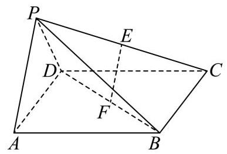

(1) (6 分)证明: 直线 ${EF}//$ 平面 ${PAD}$ ;

(2)(8 分)求直线 ${PB}$ 与平面 ${ABCD}$ 所成的角的正切值.

18.(14 分) 【作答次数:63】【正确率:77.3%】

在 $\bigtriangleup  {ABC}$ 中，角 $A$ 、 $B$ 、 $C$ 所对边的边长分别为 $a$ 、 $b$ 、 $c$ ，且 $a - {2c}\cos B = c$ .

(1)(6 分)若 $\cos B = \frac{1}{3}, c = 3$ ，求 $b$ 的值；

(2)(8 分)若 $\bigtriangleup  {ABC}$ 为锐角三角形，求 $\sin C$ 的取值范围.

19.(14 分) 【作答次数: 36】【正确率: 76.2%】

2023 年 9 月 23 日至 10 月 8 日，第 19 届亚运会在杭州成功举办，杭州亚运会的志愿者被称为 “小青荷”. 某运动场馆内共有小青荷 36 名，其中男生 12 名，女生 24 名，这些小青荷中会说日语和会说韩语的人数统计如下:

<table><tr><td></td><td>男生小青荷</td><td>女生小青荷</td></tr><tr><td>会说日语</td><td>8</td><td>12</td></tr><tr><td>会说韩语</td><td>m</td><td>n</td></tr></table>

其中 $\mathrm{m}\text{ 、 }\mathrm{n}$ 均为正整数, $6 \leq  m \leq  8$ .

(1)(6 分)从这 36 名小青荷中随机抽取两名作为某活动主持人，求抽取的两名小青荷中至少有一名会说日语的概率;

(2)(8 分)从这些小青荷中随机抽取一名去接待外宾，用 A 表示事件 “抽到的小青荷是男生”，用 B 表示事件 “抽到的小青荷会说韩语”. 试给出一组 $\mathrm{m}\text{ 、 }\mathrm{n}$ 的值,使得事件 $\mathrm{A}$ 与 $\mathrm{B}$ 相互独立,并说明理由.

20.(18 分) 【作答次数: 36】【正确率: 69.2%】

已知 $0 < p < 4$ ，曲线 ${\Gamma }_{1}\text{ 、 }{\Gamma }_{2}$ 的方程分别为 ${y}^{2} = {2px}\left( {0 \leq  x \leq  8, y \geq  0}\right)$ 和

${x}^{2} = {2py}\left( {0 \leq  y \leq  8, x \geq  0}\right) ,{\Gamma }_{1}$ 与 ${\Gamma }_{2}$ 在第一象限内相交于点 $K\left( {{x}_{K},{y}_{K}}\right)$ .

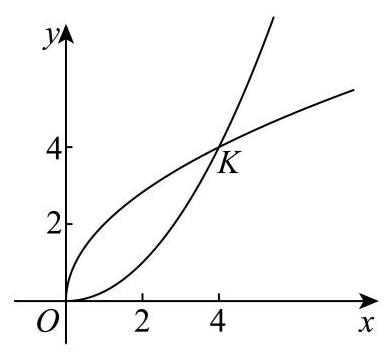

(1)(4 分)若 $\left| {OK}\right|  = 4\sqrt{2}$ ，求 $p$ 的值；

(2)(6 分)若 $p = 2$ ，定点 $T$ 的坐标为 $\left( {4,0}\right)$ ，动点 $M$ 在直线 $y = x$ 上，动点 $N\left( {{x}_{N},{y}_{N}}\right) \left( {0 \leq  {x}_{N} \leq  4}\right)$ 在曲线 ${\Gamma }_{2}$ 上,求 $\left| {MN}\right|  + \left| {MT}\right|$ 的最小值;

(3)(8 分)已知点 $A\left( {{x}_{1},{y}_{1}}\right) \left( {0 \leq  {x}_{1} \leq  {x}_{K}}\right)$ 、 $B\left( {{x}_{2},{y}_{2}}\right) \left( {{x}_{K} < {x}_{2} \leq  8}\right)$ 在曲线 ${\Gamma }_{1}$ 上，点 $A$ 、 $B$ 关于直线 $y = x$ 的对称点分别为 $C$ 、 $D$ ,设 $\left| {AC}\right|$ 的最大值为 $m$ ， $\left| {BD}\right|$ 的最大值为 $t$ ，若 $\frac{m}{t} \in  \left\lbrack  {\frac{1}{2},2}\right\rbrack$ ，求实数 $p$ 的取值范围.

21.(18 分) 【作答次数:40】【正确率: 73.8%】

已知 $a \in  R, f\left( x\right)  = \left( {a - 2}\right) {x}^{3} - {x}^{2} + {5x} + \left( {1 - a}\right) \ln x$ .

(1)(4 分)若 1 为函数 $y = f\left( x\right)$ 的驻点，求实数 $a$ 的值；

(2)(6 分)若 $a = 0$ ，试问曲线 $y = f\left( x\right)$ 是否存在切线与直线 $x - y - 1 = 0$ 互相垂直？说明理由；

(3)(8 分)若 $a = 2$ ，是否存在等差数列 ${x}_{1}\text{ 、 }{x}_{2}\text{ 、 }{x}_{3}\left( {0 < {x}_{1} < {x}_{2} < {x}_{3}}\right)$ ，使得曲线 $y = f\left( x\right)$ 在点 $\left( {{x}_{2}, f\left( {x}_{2}\right) }\right)$ 处的切线与过两点 $\left( {{x}_{1}, f\left( {x}_{1}\right) }\right) \text{ 、 }\left( {{x}_{3}, f\left( {x}_{3}\right) }\right)$ 的直线互相平行？若存在，求出所有满足条件的等差数列; 若不存在, 说明理由.

# 上海市浦东新区 2024 届高三一模数学试题

一、填空题

1.(4 分)设全集 $U = \{ 1,2,3,4\} , A = \{ 1,3\}$ ，则 $\bar{A} =$ ___.

2. (4 分) 若复数 $z = {51} + {2i}$ (其中 $i$ 表示虚数单位)，则 ${Im}z =$ ___.

3. (4 分) 已知事件 $A$ 与事件 $B$ 互斥，且 $P\left( A\right)  = {0.3}$ ， $P\left( B\right)  = {0.4}$ ，则 $P\left( {A \cup  B}\right)  =$ ___.

4.(4 分)已知直线 $l$ 的倾斜角为 $\frac{\pi }{3}$ ，请写出直线 $l$ 的一个法向量___.

5.(4 分)已知 ${S}_{n}$ 是等差数列 $\left\{  {a}_{n}\right\}$ 的前 $n$ 项和,若 ${a}_{n} = {2n} - 3$ ,则满足 ${S}_{m} = {24}$ 的正整数 $m$ 的值为___.

6.(4 分)已知向量 $\overrightarrow{a} = \left( {3,4}\right)$ ，向量 $\overrightarrow{b} = \left( {1,0}\right)$ ，则向量 $\overrightarrow{a}$ 在向量 $\overrightarrow{b}$ 上的投影向量为___.

7. (5)分 $\mathrm{{\text{ 已 }\text{ 知 }\text{ 圆 }\text{ 锥 }\text{ 的 }\text{ 母 }\text{ 线 }\text{ 与 }\text{ 底 }\text{ 面 }\text{ 所 }\text{ 成 }\text{ 的 }\text{ 角 }\text{ 为 }}}\frac{\pi }{3}$ ，体积为 ${3\pi }$ ，则圆锥的底面半径为___.

8.(5 分) 在 100 件产品中有 90 件一等品、10 件二等品，从中随机抽取 3 件产品，则恰好含 1 件二等品的概率为___ (结果精确到 0.01 ).

9.(5 分)小明为了解自己每天花在体育锻炼上的时间 (单位:min)，连续记录了 7 天的数据并绘制成如图所示的茎叶图, 则这组数据的第 60 百分位数是___.

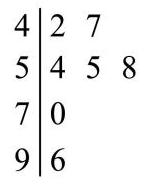

10. (5 分)如图，已知函数 $y = A\sin \left( {{\omega x} + \varphi }\right)$ ( $A > 0,\omega  > 0,0 < \varphi  < \frac{\pi }{2}$ )的图像与 $y$ 轴的交点为 $\left( {0,1}\right)$ ，并已知其在 $y$ 轴右侧的第一个最高点和第一个最低点的坐标分别为 $\left( {{x}_{0},2}\right)$ 和 $\left( {{x}_{0} + {2\pi }, - 2}\right)$ . 记 $y = f\left( x\right)$ ， 则 $f\left( \frac{\pi }{3}\right)  =$ ___.

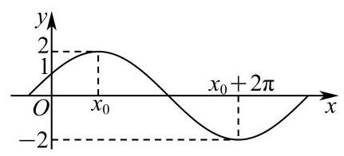

11. (5分)已知曲线 ${C}_{1}{y}^{2} = {4x}\left( {x \leq  1}\right)$ ，曲线 ${C}_{2}{x}^{2} - {2x} + {y}^{2} - {28} = 0\left( {x \geq  6}\right)$ ，若 $\bigtriangleup  {ABC}$ 的顶点的 $A$ 坐标为 $\left( {1,0}\right)$ ，顶点 $B, C$ 分别在曲线 ${C}_{1}$ 和 ${C}_{2}$ 上运动，则 $\bigtriangleup  {ABC}$ 周长的最小值为___.

12. (5分)已知数列 $\left\{  {a}_{n}\right\}$ 满足 ${a}_{1} = a$ ，且对任意正整数 $n$ ，关于 $x$ 的实系数方程

${x}^{2} + 2\sqrt{{a}_{n + 1}}x + 2{a}_{n}\left( {2 - {a}_{n}}\right)  = 0$ 都有两个相等的实根. 若 ${a}_{2024} = 0$ ,则满足条件的不同实数 $a$ 的个数为___个.

二、单选题

13.(4 分)如果 $a > 0 > b$ ,则下列不等式中一定成立的是 ( )

A. $\sqrt{a} > \sqrt{-b}$

B. ${a}^{2} > {b}^{2}$

C. ${a}^{2} < {ab}$

D. ${a}^{3} > {b}^{3}$

14.(4 分)一组样本数据由 10 个互不相同的数组成, 若去掉其中最小的和最大的两个数得到一组新样本数据，则 ( ) .

A. 两组样本数据的样本平均数相同

B. 两组样本数据的样本方差相同

C. 两组样本数据的样本中位数相同

D. 两组样本数据的样本极差相同

15.(5 分)已知棱长均为 1 的正 $n$ 棱柱有 ${2n}$ 个顶点，从中任取两个顶点作为向量 $\overrightarrow{a}$ 的起点与终点，设底面的一条棱为 ${AB}$ . 若集合 ${A}_{n} = \{ x \mid  x = \overrightarrow{a} \cdot  \overrightarrow{AB}\}$ ，则当 ${A}_{n}$ 中的元素个数最少时， $n$ 的值为( )

A. 3

B. 4

C. 6

D. 8

16. (5 分) 对于函数 $y = f\left( x\right)$ 和 $y = g\left( x\right)$ ，及区间 $D$ ，若存在实数 $k$ 、 $b$ ，使得 $f\left( x\right)  \geq  {kx} + b \geq  g\left( x\right)$ 对任意 $x \in  D$ 恒成立,则称 $y = f\left( x\right)$ 在区间 $D$ 上 “优于” $y = g\left( x\right)$ . 有以下两个结论:

① $f\left( x\right)  = {\log }_{2}x$ 在区间 $D = \left\lbrack  {1,2}\right\rbrack$ 上优于 $g\left( x\right)  = {x}^{2} - {2x} + 1$ ；

②当 $m \leq   - 2$ 时， $f\left( x\right)  = {x}^{3}$ 在区间 $D = \left\lbrack  {-1,1}\right\rbrack$ 上优于 $g\left( x\right)  = {e}^{x} + m$ .

那么 ( )

A. ①、②均正确

B. ①正确，②错误

C. ①错误，②正确

D. ①、②均错误

## 三、解答题

17.(14 分)

已知函数 $y = f\left( x\right)$ ,其中 $f\left( x\right)  = \frac{{4}^{x} + k}{{2}^{x}}\left( {k \in  R}\right)$ .

(1)(6 分)是否存在实数 $k$ ，使函数 $y = f\left( x\right)$ 是奇函数？若存在，请写出证明.

(2)(8 分)当 $k = 1$ 时，若关于 $x$ 的不等式 $f\left( x\right)  \geq  a$ 恒成立，求实数 $a$ 的取值范围.

18.(14 分)

如图，在四棱锥 $P - {ABCD}$ 中， ${DP} \bot$ 底面 ${ABCD}$ ， ${AB}//{CD}$ ， $\angle {ADC} = {90}^{ \circ  }$ ， ${DP} = 3$ ， ${CD} = 2,{AB} = {AD} = 1$ ,点 $F$ 为 ${PD}$ 中点.

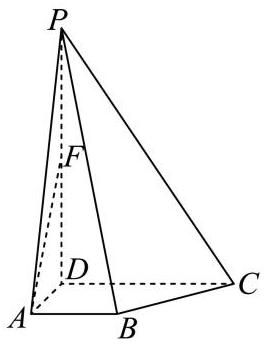

(1)(6 分)求证:直线 ${AF}//$ 平面 ${PBC}$ ；

(2)(8 分)求点 $D$ 到平面 ${PBC}$ 的距离.

19.(14 分)

某街道规划建一座口袋公园. 如图所示，公园由扇形 ${AOC}$ 区域和三角形 ${COD}$ 区域组成. 其中 $A\text{ 、 }O\text{ 、 }D$ 三点共线，扇形半径 ${OA}$ 为 30 米. 规划口袋公园建成后，扇形 ${AOC}$ 区域将作为花草展示区， 三角形 ${COD}$ 区域作为亲水平台区,两个区域的所有边界修建休闲步道.

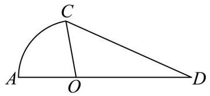

(1)(6 分)若 $\angle {AOC} = \frac{\pi }{3}$ ， ${OD} = {2OA}$ ，求休闲步道总长；

(2)(8 分)若 $\angle {ODC} = \frac{\pi }{6}$ ，在前期民意调查时发现，绝大部分街道居民对亲水平台区更感兴趣. 请你根据民意调查情况，从该区域面积最大或周长最长的视角出发，选择其中一个方案，设计三角形 ${COD}$ 的形状.

20.(18 分)

已知双曲线 $C{x}^{2} - \frac{{y}^{2}}{3} = 1$ 的左、右焦点分别为 ${F}_{1}\text{ 、 }{F}_{2}, P$ 为双曲线右支上一点.

(1)(4 分)求双曲线 $C$ 的离心率；

(2)(6 分)设过点 $P$ 和 ${F}_{2}$ 的直线 $l$ 与双曲线 $C$ 的右支有另一交点为 $Q$ ，求 $\overrightarrow{OP} \cdot  \overrightarrow{OQ}$ 的取值范围；

(3)(8 分)过点 $P$ 分别作双曲线 $C$ 两条渐近线的垂线，垂足分别为 $M$ 、 $N$ 两点，是否存在点 $P$ ，使得 $\left| {PM}\right|  + \left| {PN}\right|  = \sqrt{2}$ ? 若存在,求出点 $P$ 的坐标,若不存在,请说明理由.

21.(18 分)

设 $y = f\left( x\right)$ 是定义在 $R$ 上的函数,若存在区间 $\left\lbrack  {a, b}\right\rbrack$ 和 ${x}_{0} \in  \left( {a, b}\right)$ ,使得 $y = f\left( x\right)$ 在 $\left\lbrack  {a,{x}_{0}}\right\rbrack$ 上严格减，在 $\left\lbrack  {{x}_{0}, b}\right\rbrack$ 上严格增，则称 $y = f\left( x\right)$ 为 “含谷函数”， ${x}_{0}$ 为 “谷点”， $\left\lbrack  {a, b}\right\rbrack$ 称为 $y = f\left( x\right)$ 的一个“含谷区间”.

(1)(4 分)判断下列函数中，哪些是含谷函数？若是，请指出谷点；若不是，请说明理由:

(i) $y = 2\left| x\right|$ ,(ii) $y = x + \cos x$ ;

(2) (6 分)已知实数 $m > 0, y = {x}^{2} - {2x} - m\ln \left( {x - 1}\right)$ 是含谷函数,且 $\left\lbrack  {2,4}\right\rbrack$ 是它的一个含谷区间,求 $m$ 的取值范围;

(3)(8 分)设 $p, q \in  R$ ， $h\left( x\right)  =  - {x}^{4} + p{x}^{3} + q{x}^{2} + \left( {4 - {3p} - {2q}}\right) x$ . 设函数 $y = h\left( x\right)$ 是含谷函数， $\left\lbrack  {a, b}\right\rbrack$ 是它的一个含谷区间,并记 $b - a$ 的最大值为 $L\left( {p, q}\right)$ . 若 $h\left( 1\right)  \leq  h\left( 2\right)$ ,且 $h\left( 1\right)  \leq  0$ ,求 $L\left( {p, q}\right)$ 的最小值.

## 上海市普陀区 2024 届高三一模数学试题

## 一、填空题

1. (4 分) 若抛物线 ${x}^{2} = {my}$ 的顶点到它的准线距离为 $\frac{1}{2}$ ，则正实数 $m =$ ___.

2.(4 分)设 $i$ 为虚数单位,若复数 $z$ 满足 ${iz} = 1 + {2i}$ . 则 $\left| {z - 1}\right|  =$ ___.

3.(4 分)若圆 $O$ 上的一段圆弧长与该圆的内接正六边形的边长相等,则这段圆弧所对的圆心角的大小为___.

4. (4 分) 设 ${S}_{n}$ 是等差数列 $\left\{  {a}_{n}\right\}$ 的前 $n$ 项和 $\left( {n \geq  1, n \in  N}\right)$ ,若 ${a}_{2} + {a}_{4} = 9 - {a}_{6}$ ,则 ${S}_{7} =$ ___.

5.(4 分)设 ${\left( 1 - 2x\right) }^{n} = {a}_{0} + {a}_{1}x + {a}_{2}{x}^{2} + {a}_{3}{x}^{3} + {a}_{4}{x}^{4} + \cdots  + {a}_{n}{x}^{n}$ ,若 ${a}_{0} + {a}_{4} = {17}$ . 则 $n =$ ___.

6. (4 分) 若函数 $y = \tan {3x}$ 在区间 $\left( {m,\frac{\pi }{6}}\right)$ 上是严格增函数，则实数 $m$ 的取值范围为___.

7.(5 分)设集合 $M = \{ 2,0, - 1\} , N = \{ x\parallel x - a \mid   < 1\}$ ,若 $M \cap  N$ 的真子集的个数是 1,则正实数 $a$ 的取值范围为___.

8.(5 分)设圆锥的底面中心为 $O$ ， ${PB}$ ， ${PC}$ 是它的两条母线，且 ${BC} = 2$ ，若棱锥 $O - {PBC}$ 是正三棱锥， 则该圆锥的侧面积为___.

9. (5 分)若数列 $\left\{  {a}_{n}\right\}$ 满足 ${a}_{1} = {12}$ ， ${a}_{n + 1} = {a}_{n} + {2n}\;\left( {n \geq  1, n \in  N}\right)$ ，则 $\frac{{a}_{n}}{n}$ 的最小值是___.

10. (5)分 $i$ 变函数 $y = \sin \left( {{2x} + \varphi }\right) \;\left( {0 < \varphi  < \frac{\pi }{2}}\right)$ 的图象与直线 $y = t$ 相交的连续的三个公共点从左到右依次记为 $A, B, C$ ,若 $\left| {BC}\right|  = 2\left| {AB}\right|$ ,则正实数 $t$ 的值为___.

11. (5 分)设函数 $f\left( x\right)  = a{e}^{x} - 2{x}^{2}$ ，若对任意 ${x}_{0} \in  \left( {0,1}\right)$ ，皆有 $\mathop{\lim }\limits_{{x \rightarrow  {x}_{0}}}\frac{f\left( x\right)  - f\left( {x}_{0}\right)  - x + {x}_{0}}{x - {x}_{0}} > 0$ 成立， 则实数 $a$ 的取值范围是___.

12. (5 分)体积为 $\frac{\sqrt{2}}{12}{a}^{3}$ 的正四面体内有一个球 $O$ ，球 $O$ 与该正四面体的各面均有且只有一个公共点， $M, N$ 是球 $O$ 的表面上的两动点,点 $P$ 在该正四面体的表面上运动,当 $\left| \overrightarrow{MN}\right|$ 最大时, $\overrightarrow{PM} \cdot  \overrightarrow{PN}$ 的最大值是___.

## 二、单选题

13.(4 分)若椭圆 $\Gamma$ 的两个顶点和焦点都在圆 $O : {x}^{2} + {y}^{2} = 4$ 上，如图所示，则下列结论正确的是( )

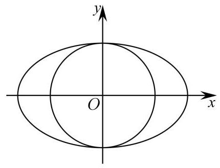

A. 椭圆 $\Gamma$ 的方程是 $\frac{{x}^{2}}{4} + \frac{{y}^{2}}{2} = 1$

B. 过椭圆 $\Gamma$ 上的点作圆 $O$ 的切线,一定有两条

C. 圆 $O$ 上的点与椭圆 $\Gamma$ 上的点的距离的最大值是 $2\left( {\sqrt{2} + 1}\right)$

D. 直线 $x + y + 2\sqrt{2} = 0$ 与椭圆 $\Gamma$ 有交点，与圆 $O$ 无交点

14.(4 分)在 $\bigtriangleup  {ABC}$ 中，角 $A$ ， $B$ ， $C$ 所对的边分别为 $a$ ， $b$ ， $c$ ，若 $a = \sqrt{3}$ ，且 $c - {2b} + 2\sqrt{3}\cos C = 0$ ， 则该三角形外接圆的半径为( )

A. 1

B. $\sqrt{3}$

C. 2

D. $2\sqrt{3}$

15.(5 分)已知一组数据 3、1、5、3、2，现加入 $p$ ， $q$ 两数对该组数据进行处理，若经过处理后的这组数据的极差为 $p - q$ ，则经过处理后的这组数据与之前的那组数据相比，一定会变大的数字特征是( )

A. 平均数

B. 方差

C. 众数

D. 中位数

16. (5 分)已知函数 $f\left( x\right)  = \left\{  \begin{array}{l} x + 1, x \in  \lbrack  - 1,0) \\  \frac{{3x} - 2}{1 - x}, x \in  \lbrack 0,1) \end{array}\right.$ ，若函数 $g\left( x\right)  = f\left( x\right)  - {mx} + \frac{2}{3}m$ 在 $\lbrack  - 1,1)$ 内有且仅有两个零点，则实数 $m$ 的取值范围是( )

A. $\left( {-\frac{3}{2},0}\right\rbrack   \cup  \lbrack 3,8)$

B. $\left\lbrack  {-\frac{1}{2},0}\right\rbrack   \cup  \left\lbrack  {3,9}\right\rbrack   \cup  \left( {9, + \infty }\right)$

C. $\left\lbrack  {-\frac{1}{2},0}\right\rbrack   \cup  \left\lbrack  {3,8}\right\rbrack$

D. $m \in  \left( {-\frac{3}{2},0}\right\rbrack   \cup  \left\lbrack  {3,9}\right)  \cup  \left( {9, + \infty }\right)$

## 三、解答题

17.(14 分)

我国随着人口老龄化程度的加剧，劳动力人口在不断减少，“延迟退休”已成为公众关注的热点话题之一，为了了解公众对 “延迟退休” 的态度，某研究机构对属地所在的一社区进行了调查，并将随机抽取的 50 名被调查者的年龄制成如图所示的茎叶图.

<table><tr><td>女</td><td></td><td>男</td></tr><tr><td>6 7 7 8</td><td>2</td><td>78</td></tr><tr><td>1 2 3 3 5 8</td><td>3</td><td>2 3 3 4 4 5 6 7</td></tr><tr><td>0 1 3 6 8 9 9</td><td>4</td><td>0 2 3 3 4 4 5 8 9</td></tr><tr><td>2 3 8</td><td>5</td><td>2 3 4 5 7 8</td></tr><tr><td>2 4</td><td>6</td><td>0 4</td></tr></table>

(1)(6 分)经统计发现，投赞成票的人均年龄恰好是这 50 人年龄的第 60 百分位数，求此百分位数；

(2)(8 分)经统计年龄在 $\lbrack {50},{59})$ 的被调查者中，投赞成票的男性有 3 人，女性有 2 人，现从该组被调查者中随机选取男女各 2 人进行跟踪调查, 求被选中的 4 人中至少有 3 人投赞成票的概率 (结果用最简分数表示)

18.(14 分)

图 1 所示的是等腰梯形 ${ABCD}$ ， ${AB}//{DC}$ ， ${AB} = {2DC} = 4$ ， $\angle {ABC} = \frac{\pi }{3}$ ， ${DE}\bot {AB}$ 于 $E$ 点， 现将 $\bigtriangleup  {ADE}$ 沿直线 ${DE}$ 折起到 $\bigtriangleup  {PDE}$ 的位置，形成一个四棱锥 $P - {EBCD}$ ，如图 2 所示.

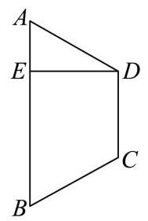

图1

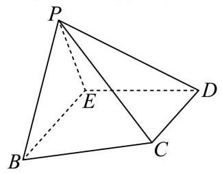

图2

(1)(6 分)若 ${PC} = {2\sqrt{2}}$ ，求证: ${PE}\bot$ 平面 ${EBCD}$ ；

(2)(8 分)若直线 ${PE}$ 与平面 ${EBCD}$ 所成的角为 $\frac{\pi }{3}$ ，求二面角 $P - {BC} - E$ 的大小.

19.(14 分)

设函数 $y = f\left( x\right)$ 的表达式为 $f\left( x\right)  = a{e}^{x} + {e}^{-x}$ .

(1)(6 分)求证: “ $a = 1$ ” 是 “函数 $y = f\left( x\right)$ 为偶函数” 的充要条件；

(2)(8 分)若 $a = 1$ ，且 $f\left( {m + 2}\right)  \leq  f\left( {{2m} - 3}\right)$ ，求实数 $m$ 的取值范围.

20.(18 分)

设双曲线 $\Gamma  : \frac{{x}^{2}}{{t}^{2}} - {y}^{2} = 1\;\left( {t > 0}\right)$ ，点 ${F}_{1}$ 是 $\Gamma$ 的左焦点，点 $O$ 为坐标原点.

(1)(4 分)若 $\Gamma$ 的离心率为 $\frac{\sqrt{10}}{3}$ ，求双曲线 $\Gamma$ 的焦距；

(2)(6 分)过点 ${F}_{1}$ 且一个法向量为 $\overrightarrow{n} = \left( {t, - 1}\right)$ 的直线与 $\Gamma$ 的一条渐近线相交于点 $M$ ，若 ${S}_{\bigtriangleup {MO}{F}_{1}} = \frac{1}{2}$ ，求双曲线 $\Gamma$ 的方程；

(3)(8 分)若 $t = \sqrt{2}$ ，直线 $l : {kx} - y + m = 0\;\left( {k > 0, m \in  R}\right)$ 与 $\Gamma$ 交于 $P, Q$ 两点， $\left| {\overrightarrow{OP} + \overrightarrow{OQ}}\right|  = 4$ ， 求直线 $l$ 的斜率 $k$ 的取值范围.

21.(18 分)

若存在常数 $t$ ,使得数列 $\left\{  {a}_{n}\right\}$ 满足 ${a}_{n + 1} - {a}_{1}{a}_{2}{a}_{3}\cdots {a}_{n} = t\;\left( {n \geq  1, n \in  N}\right)$ ,则称数列 $\left\{  {a}_{n}\right\}$ 为 “ $H\left( t\right)$ 数列”.

(1)(4 分)判断数列:1，2，3，8，49 是否为 “ $H\left( 1\right)$ 数列”，并说明理由；

(2)(6 分)若数列 $\left\{  {a}_{n}\right\}$ 是首项为 2 的 “ $H\left( t\right)$ 数列”，数列 $\left\{  {b}_{n}\right\}$ 是等比数列，且 $\left\{  {a}_{n}\right\}$ 与 $\left\{  {b}_{n}\right\}$ 满足 $\mathop{\sum }\limits_{{i = 1}}^{n}{a}_{i}^{2} = {a}_{1}{a}_{2}{a}_{3}\cdots {a}_{n} + {\log }_{2}{b}_{n}$ ,求 $t$ 的值和数列 $\left\{  {b}_{n}\right\}$ 的通项公式;

(3)(8 分)若数列 $\left\{  {a}_{n}\right\}$ 是 “ $H\left( t\right)$ 数列”， ${S}_{n}$ 为数列 $\left\{  {a}_{n}\right\}$ 的前 $n$ 项和， ${a}_{1} > 1$ ， $t > 0$ ，试比较 $\ln {a}_{n}$ 与 ${a}_{n} - 1$ 的大小,并证明 $t > {S}_{n + 1} - {S}_{n} - {e}^{{S}_{n} - n}$ .

## 上海市青浦区 2024 届高三一模数学试题

## 一、填空题

1.(4 分) 已知集合 $A = \lbrack  - 2,3), B = \{ x \mid   - 1 < x < 6\}$ ，则 $A \cap  B =$ ___.

2. (4 分) 若复数 $z$ 满足 ${iz} = 3 + i$ ，则 $\left| z\right|  =$ ___.

3. (4 分) 已知 $a$ 满足 $\cos a = m$ ，则 $\sin \left( {a + \frac{\pi }{2}}\right)  =$ ___. (结果用含有 $m$ 的式子表示).

4.(4 分)2023 年 10 月 25 日至 11 月 12 日，青浦曲水园推出以 “曲水流觞・花趣水乡”为主题的菊花展. 花展结束后, 园方挑选数百盆菊花免费赠送给市民. 其中有红色、黄色、橙色菊花各1盆, 分别赠送给甲、乙、丙三人，每人1盆，则甲没有拿到橙色菊花的概率是___.

5.(4 分) 求 ${\left( 3 - 2x\right) }^{6}$ 的二项展开式中 ${x}^{3}$ 项的系数.

6.(4 分)表面积为 ${4\pi }$ 的球的体积为___.

7.(5 分)某家大型超市统计了八次节假日的客流量 (单位:百人) 分别为 29, 30, 38, 25, 37, 40, 42, 32, 那么这组数据的第 75 百分位数为___.

8. (5分)若函数 $y = \cos \left( {x + \Phi }\right)$ 是奇函数，则该函数的所有零点是___.

9. (5 分)已知向量 $\overrightarrow{d} = \left( {1, - 1}\right)$ 垂直于直线 $l$ 的法向量，过 $A\left( {1,1}\right)$ 、 $B\left( {-1,8}\right)$ 分别作直线 $l$ 的垂线，对应垂足为 ${A}_{1}$ 和 ${B}_{1}$ ，若 $\overrightarrow{{A}_{1}{B}_{1}} = \lambda \overrightarrow{d}$ ，则实数 $\lambda$ 的值为___.

10. (5 分)已知函数 $y = \left\{  \begin{array}{l} {x}^{2} - {2x} + 2, x \geq  0 \\  x + \frac{a}{x} + {3a}, x < 0 \end{array}\right.$ 的值域为 $R$ ，则实数 $a$ 的取值范围为___.

11.(5 分)已知数列 $\left\{  {a}_{n}\right\}$ 的通项公式为 ${a}_{n} = \left| {n - {18}}\right|$ ，记 ${S}_{n} = \mathop{\sum }\limits_{{i = 1}}^{n}{a}_{i}$ ，若 ${S}_{n + {30}} - {S}_{n} = {225}$ ，则正整数 $n$ 的值为___.

12.(5 分)已知三个互不相同的实数 $a\text{ 、 }b\text{ 、 }c$ 满足 $a + b + c = 1,{a}^{2} + {b}^{2} + {c}^{2} = 3$ ,则 ${abc}$ 的取值范围为___.

二、单选题

13.(4 分) 已知 $a, b \in  R$ ,则 “ $a > b$ ” 是 “ ${a}^{3} > {b}^{3}$ ” 的( ).

A. 充分非必要条件

B. 必要非充分条件

C. 充要条件

D. 既非充分也非必要条件

14.(4 分) 若函数 $y = f\left( x\right)$ 在 $x = {x}_{0}$ 处的导数等于 $a$ ，则 $\mathop{\lim }\limits_{{{\Delta x} \rightarrow  0}}\frac{f\left( {{x}_{0} + {\Delta x}}\right)  - f\left( {{x}_{0} - {\Delta x}}\right) }{\Delta x}$ 的值为( ).

A. 0

B. $a$

C. ${2a}$

D. ${3a}$

15. (5 分)已知直线 $\mathrm{m},\mathrm{n}$ ，平面 $a,\beta$ ，给出下列命题，其中正确的命题的个数是( )

①若 $m \bot  a$ ， $n \bot  \beta$ ，且 $m \bot  n$ ，则 $a \bot  \beta \;$ ②若 $m//a$ ， $n//\beta$ ，且 $m//n$ ，则 $a//\beta$ 若 $m \bot  a, n//\beta$ ,且 $m \bot  n$ ,则 $a \bot  \beta$ ④若 $m \bot  a, n//\beta$ ，且 $m//n$ ，则 $a//\beta$

A. 1

B. 2

C. 3

D. 4

16.(5 分)定义:如果曲线段 $C$ 可以一笔画出，那么称曲线段 $C$ 为单轨道曲线，比如圆、椭圆都是单轨道曲线; 如果曲线段 $C$ 由两条单轨道曲线构成,那么称曲线段 $C$ 为双轨道曲线. 对于曲线 $\Gamma \sqrt{{\left( x + 1\right) }^{2} + {y}^{2}} \cdot  \sqrt{{\left( x - 1\right) }^{2} + {y}^{2}} = m\left( {m > 0}\right)$ 有如下命题: $p$ 存在常数 $m$ ，使得曲线 $\Gamma$ 为单轨道曲线； $q$ 存在常数 $m$ ，使得曲线 $\Gamma$ 为双轨道曲线. 下列判断正确的是( ).

A. $p$ 和 $q$ 均为真命题

B. $p$ 和 $q$ 均为假命题

C. $p$ 为真命题， $q$ 为假命题

D. $p$ 为假命题， $q$ 为真命题

## 三、解答题

17.(14 分)

已知四棱锥 $P - {ABCD}$ ，底面 ${ABCD}$ 为正方形，边长为3， ${PD} \bot$ 平面 ${ABCD}$ .

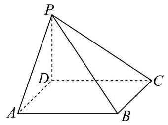

(1)(6 分)求证: ${BC} \bot$ 平面 ${CDP}$ ；

(2)(8 分)若直线 ${AD}$ 与 ${BP}$ 所成的角大小为60°，求 ${DP}$ 的长.

18.(14 分)

在 $\bigtriangleup  {ABC}$ 中，角 $A$ ， $B$ ， $C$ 所对的边分别为 $a$ ， $b$ ， $c$ ，且满足 ${a}^{2} + {c}^{2} - {b}^{2} + {ac} = 0$ .

(1)(6 分)求角 $B$ 的大小；

(2)(8 分)若 $b = 2\sqrt{3}$ ，求 $\bigtriangleup  {ABC}$ 的周长的最大值.

19.(14 分)

上海各中学都定期进行紧急疏散演习:当警报响起，建筑物内师生马上有组织、尽快地疏散撤离. 对于一个特定的建筑物，管理人员关心房间内所有人疏散完毕(房间最后一个人到达安全出口处)所用时间. 数学建模小组准备对某教学楼第一层楼两间相同的教室展开研究. 为此, 他们提出如下模型假设:

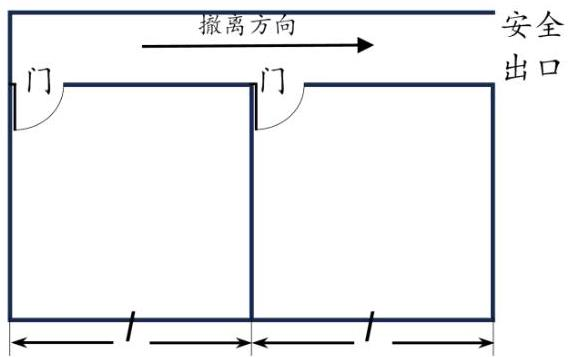

1.疏散时所有人员有秩序地撤离建筑物;

2.所有人员排成单列行进撤离;

3.队列中人员的间隔是均匀的;

4. 队列匀速地撤离建筑物.

(1)(6 分)上述模型假设是否合理，请任选两个模型假设说明理由；

(2)(8 分)如图，设第一间教室(图中右)的人数为 ${n}_{1} + 1$ ，第二间教室(图中左)的人数为 ${n}_{2} + 1$ ，每间教室的长度为 $l$ ,其中 ${n}_{1},{n}_{2}$ 都是正整数, $l > 0$ ,忽略教室门的宽度及忽略教室内人群到教室门口的时间. 请再引入适当的变量, 建立两个教室内的人员完全撤离所用时间的数学模型.

20.(18 分)

已知椭圆 $\Gamma$ 的离心率是 $\frac{1}{2}$ ,长轴长 4,椭圆的中心是坐标原点,焦点在 $x$ 轴上.

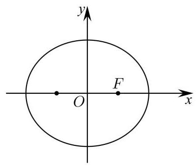

(1)(4 分)求椭圆 $\Gamma$ 的标准方程；

(2)(6 分)已知 $A, B, C$ 是椭圆 $\Gamma$ 上三个不同的点， $F$ 是椭圆 $\Gamma$ 的右焦点，若原点 $O$ 是 $\bigtriangleup  {ABC}$ 的重心， 求 $\left| {FA}\right|  + \left| {FB}\right|  + \left| {FC}\right|$ 的值;

(3)(8 分)已知 $T\left( {1,1}\right)$ ，椭圆 $\Gamma$ 四个动点 $M$ ， $N$ ， $P$ ， $Q$ 满足 $\overrightarrow{MT} = 3\overrightarrow{TQ}$ ， $\overrightarrow{NT} = 3\overrightarrow{TP}$ ，求直线 ${MN}$ 的方程.

21.(18 分)

已知有穷等差数列 $\left\{  {a}_{n}\right\}  {a}_{1},{a}_{2},\cdots ,{a}_{m}\left( {m \geq  3, m \in  {N}^{ * }}\right)$ 的公差 $\mathrm{d}$ 大于零.

(1)(4 分)证明: $\left\{  {a}_{n}\right\}$ 不是等比数列；

(2)(6 分)是否存在指数函数 $y = f\left( x\right)$ 满足: $y = f\left( x\right)$ 在 $x = {a}_{1}$ 处的切线的交 $x$ 轴于 $\left( {{a}_{2},0}\right) , y = f\left( x\right)$ 在 $x = {a}_{2}$ 处的切线的交 $x$ 轴于 $\left( {{a}_{3},0}\right) ,\cdots , y = f\left( x\right)$ 在 $x = {a}_{m - 1}$ 处的切线的交 $x$ 轴于 $\left( {{a}_{m},0}\right)$ ? 若存在， 请写出函数 $y = f\left( x\right)$ 的表达式,并说明理由; 若不存在,也请说明理由;

(3)(8 分)若数列 $\left\{  {a}_{n}\right\}$ 中所有项按照某种顺序排列后可以构成等比数列 $\left\{  {b}_{n}\right\}$ ，求出所有可能的 $\mathrm{m}$ 的取值.

# 上海市松江区 2024 届高三上学期期末质量监控 (一模) 数学 试题

## 一、填空题

1.(4 分)【作答次数:31】【正确率:96.8%】已知全集为 $R$ ，集合 $P = \{ x \mid  x \geq  1\}$ ，则集合 $\overline{P} =$ ___.

2.(4 分) 【作答次数:27】【正确率:88.9%】双曲线 $\frac{{x}^{2}}{3} - {y}^{2} = 1$ 的右焦点坐标是___.

3. (4 分) 【作答次数:30】【正确率:93.3%】已知复数 $z = 2 + i$ (其中 $i$ 是虚数单位)，则 $\left| \bar{z}\right|  =$

4.(4 分) 【作答次数: 28】【正确率: 91.1%】已知向量 $\overrightarrow{a} = \left( {1,2}\right) ,\overrightarrow{b} = \left( {4,3}\right)$ ,则 $\overrightarrow{a} \cdot  \left( {2\overrightarrow{a} - \overrightarrow{b}}\right)  =$

5.(4 分) 【作答次数: 31】【正确率: 91.9%】已知 $\sin \theta  = \frac{3}{5},\theta  \in  \left( {0,\frac{\pi }{2}}\right)$ ,则 $\tan \left( {\theta  - \frac{\pi }{4}}\right)$ 的值为

6.(4 分) 【作答次数: 35】【正确率: 71.4%】已知 $\lg a + \lg b = 1$ ,则 $a + {2b}$ 的最小值为

7.(5 分) 【作答次数: 24】【正确率: 75%】二项式 ${\left( 3 + x\right) }^{n}$ 的展开式中, ${x}^{2}$ 项的系数是常数项的 5 倍,则 $n = \underset{\text{ ― }}{\;}$ ;

8. (5分)【作答次数:33】【正确率:65.2%】有 5 名同学报名参加暑期区科技馆志愿者活动，共服务两天， 每天需要两人参加活动，则恰有1人连续参加两天志愿者活动的概率为___.

9.(5 分) 【作答次数:257】【正确率:76.9%】在 $\bigtriangleup  {ABC}$ 中，设角 $A, B$ 及 $C$ 所对边的边长分别为 $a, b$ 及 $c$ ， 若 $a = 3, c = 5, B = {2A}$ ,则边长 $b =$ ___.

10. (5 分)【作答次数:76】【正确率:72.1%】已知函数 $f\left( x\right)  =  - {x}^{2} + {6x} + m$ ， $g\left( x\right)  = 2\sin \left( {{2x} + \frac{\pi }{3}}\right)$ . 对任意 ${x}_{0} \in  \left\lbrack  {0,\frac{\pi }{4}}\right\rbrack$ ,存在 ${x}_{1},{x}_{2} \in  \left\lbrack  {-1,3}\right\rbrack$ ,使得 $f\left( {x}_{1}\right)  \leq  g\left( {x}_{0}\right)  \leq  f\left( {x}_{2}\right)$ ,则实数 $m$ 的取值范围是___.

11. (5 分) 【作答次数: 28】【正确率: 42.1%】若函数 $y = f\left( x\right)$ 是定义在 $R$ 上的不恒为零的偶函数,且对任意实数 $x$ 都有 $x \cdot  f\left( {x + 2}\right)  = \left( {x + 2}\right)  \cdot  f\left( x\right)  + 2$ ,则 $f\left( {2023}\right)  =$

12.(5 分) 【作答次数:30】【正确率:36.7%】已知正四面体 $A - {BCD}$ 的棱长为 $2\sqrt{2}$ ，空间内任意点 $P$ 满足 $\left| {\overrightarrow{PB} + \overrightarrow{PC}}\right|  = 2$ ，则 $\overrightarrow{AP} \cdot  \overrightarrow{AD}$ 的取值范围是___.

## 二、选择题

13.(4 分) 【作答次数: 34】【正确率: 100%】英国数学家哈利奥特最先使用 “<” 和 “>” 符号, 并逐渐被数学界接受,不等号的引入对不等式的发展影响深远. 对于任意实数 $a\text{ 、 }b\text{ 、 }c\text{ 、 }d$ ,下列命题是真命题

的是 ( )

A. 若 ${a}^{2} < {b}^{2}$ ，则 $a < b$ B. 若 $a < b$ ，则 ${ac} < {bc}$

C. 若 $a < b, c < d$ ，则 ${ac} < {bd}$ D. 若 $a < b, c < d$ ，则 $a + c < b + d$

14.(4 分)【作答次数:24】【正确率:95.8%】如图所示的茎叶图记录了甲、乙两支篮球队各 6 名队员某场比赛的得分数据 (单位:分). 则下列说法正确的是 ( )

<table><tr><td>甲队</td><td></td><td>乙队</td></tr><tr><td>7</td><td>0</td><td>8 9</td></tr><tr><td>2 6</td><td>1</td><td>9 7</td></tr><tr><td>0 2</td><td>2</td><td>7 8</td></tr><tr><td>1</td><td>3</td><td></td></tr></table>

A. 甲队数据的中位数大于乙队数据的中位数; B. 甲队数据的平均值小于乙队数据的平均值;

C. 甲队数据的标准差大于乙队数据的标准差; D. 乙队数据的第 75 百分位数为 27.

15.(5 分) 【作答次数:38】【正确率: 94.7%】函数 $y = f\left( x\right)$ 的图象如图所示, $y = {f}^{\prime }\left( x\right)$ 为函数 $y = f\left( x\right)$ 的导函数，则不等式 $\frac{{f}^{\prime }\left( x\right) }{x} < 0$ 的解集为( )

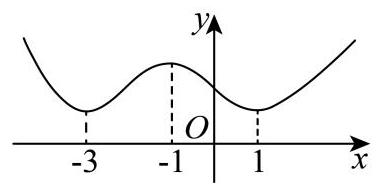

A. $\left( {-3, - 1}\right)$

B. $\left( {0,1}\right)$

C. $\left( {-3, - 1}\right)  \cup  \left( {0,1}\right)$

D. $\left( {-\infty , - 3}\right)  \cup  \left( {1, + \infty }\right)$

16.(5 分) 【作答次数: 16】【正确率: 68.8%】关于曲线 $M : {x}^{\frac{1}{2}} + {y}^{\frac{1}{2}} = 1$ ,有下述两个结论: ①曲线 $M$ 上的点到坐标原点的距离最小值是 $\frac{\sqrt{2}}{2}$ ；②曲线 $M$ 与坐标轴围成的图形的面积不大于 $\frac{1}{2}$ ，则下列说法正确的是 ( )

A. ①、②都正确

B. ①正确 ②错误

C. ①错误 ②正确

D. ①、②都错误

## 三、解答题

17.(14 分) 【作答次数:42】【正确率: 89.9%】

如图,在四棱锥 $P - {ABCD}$ 中, ${PA} \bot$ 底面 ${ABCD},{AB} \bot  {AD}$ ,点 $E$ 在线段 ${AD}$ 上,且 ${CE}//{AB}$ .

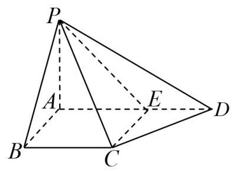

(1)(6 分)求证: ${CE}\bot$ 平面 ${PAD}$ ；

(2)(8 分)若四棱锥 $P - {ABCD}$ 的体积为 $\frac{5}{6}$ ， ${AB} = 1$ ， ${AD} = 3$ ， ${CD} = \sqrt{2}$ ， $\angle {CDA} = {45}^{ \circ  }$ ，求二面角 $P - {CE} - A$ 的大小.

18.(14 分) 【作答次数:20】【正确率:82.2%】

已知数列 $\left\{  {a}_{n}\right\}$ 为等差数列， $\left\{  {b}_{n}\right\}$ 是公比为 2 的等比数列，且 ${a}_{2} - {b}_{2} = {a}_{3} - {b}_{3} = {b}_{4} - {a}_{4}$ .

(1)(6 分)证明: ${a}_{1} = {b}_{1}$ ；

(2)(8 分)若集合 $M = \left\{  {k \mid  {b}_{k} = {a}_{m} + {a}_{1},1 \leq  m \leq  {50}}\right\}$ ，求集合 $M$ 中的元素个数.

19.(14 分) 【作答次数: 20】【正确率: 87.7%】

为了鼓励居民节约用气，某市对燃气收费实行阶梯计价，普通居民燃气收费标准如下:

第一档:年用气量在 0-310(含)立方米，价格为 $a$ 元/立方米；

第二档:年用气量在 310-520(含)立方米，价格为 $b$ 元/立方米；

第三档:年用气量在 520 立方米以上，价格为 $c$ 元/立方米.

(1)(6 分)请写出普通居民的年度燃气费用(单位:元)关于年度的燃气用量(单位:立方米)的函数解析式 (用含 $a, b, c$ 的式子表示)；

(2)(8 分)已知某户居民 2023 年部分月份用气量与缴费情况如下表,求 $a, b, c$ 的值.

<table><tr><td>月份</td><td>1</td><td>2</td><td>3</td><td>4</td><td>5</td><td>9</td><td>10</td><td>12</td></tr><tr><td>当月燃气用量(立方米)</td><td>56</td><td>80</td><td>66</td><td>58</td><td>60</td><td>53</td><td>55</td><td>63</td></tr><tr><td>当月燃气费(元)</td><td>168</td><td>240</td><td>198</td><td>174</td><td>183</td><td>174.9</td><td>186</td><td>264.6</td></tr></table>

20.(18 分) 【作答次数: 24】【正确率: 70%】

已知椭圆下: $\frac{{y}^{2}}{{a}^{2}} + \frac{{x}^{2}}{{b}^{2}} = 1\;\left( {a > b > 0}\right)$ 的离心率为 $\frac{\sqrt{2}}{2}$ ,其上焦点 $F$ 与抛物线 $K : {x}^{2} = {4y}$ 的焦点重合.

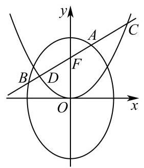

图 1

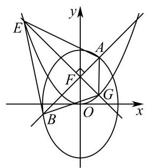

图 2

(1)(4 分)求椭圆 $\Gamma$ 的方程；

(2)(6 分)若过点 $F$ 的直线交椭圆 $\Gamma$ 于点 $A, B$ ，同时交抛物线 $K$ 于点 $C, D$ (如图 1 所示，点 $C$ 在椭圆与抛物线第一象限交点上方),试比较线段 ${AC}$ 与 ${BD}$ 长度的大小，并说明理由；

(3)(8 分)若过点 $F$ 的直线交椭圆 $\Gamma$ 于点 $A, B$ ，过点 $F$ 与直线 ${AB}$ 垂直的直线 ${EG}$ 交抛物线 $K$ 于点 $E, G$ (如图 2 所示),试求四边形 ${AEBG}$ 面积的最小值.

21.(18 分) 【作答次数: 24】【正确率: 58.9%】

已知函数 $y = f\left( x\right)$ ,记 $f\left( x\right)  = x + \sin x, x \in  D$ .

(1)(4 分)若 $D = \left\lbrack  {0,{2\pi }}\right\rbrack$ ，判断函数的单调性；

(2)(6 分)若 $D = \left( {0,\frac{\pi }{2}}\right\rbrack$ ，不等式 $f\left( x\right)  > {kx}$ 对任意 $x \in  D$ 恒成立，求实数 $k$ 的取值范围；

(3)(8 分)若 $D = R$ ，则曲线 $y = f\left( x\right)$ 上是否存在三个不同的点 $A, B, C$ ，使得曲线 $y = f\left( x\right)$ 在 $A, B, C$ 三点处的切线互相重合？若存在，求出所有符合要求的切线的方程；若不存在，请说明理由.

## 上海市徐汇区 2024 届高三上学期一模数学试卷

## 一、填空题

1. (4 分) 已知全集 $U = R$ ，集合 $M = \{ x\parallel x \mid   > 2\}$ ，则 $\bar{M} =$ ___.

2.(4 分)不等式 $\frac{1}{x} > 1$ 的解集为

3. (4 分) 已知直线 $l{y = {kx} + 2}$ 经过点 $\left( {1,1}\right)$ ，则直线 $l$ 倾斜角的大小为___.

4.(4 分)若实数 $x, y$ 满足 $x + y = 2$ ，则 ${x}^{2} + {y}^{2}$ 的最小值为___.

5.(4 分)某学校组织全校学生参加网络安全知识竞赛，成绩 (单位:分) 的频率分布直方图如图所示，数据的分组依次为 $\lbrack {20},{40}),\lbrack {40},{60}),\lbrack {60},{80}),\left\lbrack  {{80},{100}}\right\rbrack$ ,若该校的学生总人数为 1000,则成绩低于 60 分的学生人数为___.

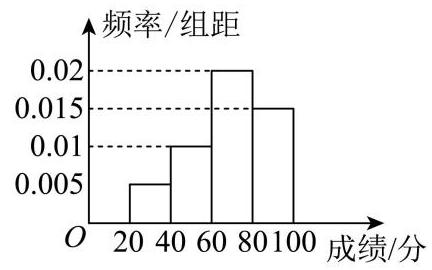

6.(4 分)函数 $y = \lg \left( {{2x} + 1}\right)  + \lg x$ 的零点是___.

7. (5 分)已知 ${\left( 1 - x\right) }^{10} = {a}_{0} + {a}_{1}x + {a}_{2}{x}^{2} + \cdots  + {a}_{10}{x}^{10}$ ，则 ${a}_{1} + {a}_{3} + {a}_{5} + {a}_{7} + {a}_{9} =$ ___.

8.(5 分)要排出高一某班一天上午 5 节课的课表，其中语文、数学、英语、艺术、体育各一节，若要求语文、数学选一门第一节课上，且艺术、体育不相邻上课，则不同的排法种数是___.

9.(5 分)在 $\bigtriangleup  {ABC}$ 中， ${AC} = {BC}$ ， ${P}_{1}$ ， ${P}_{2}$ ， ${P}_{3}$ 为边 ${AB}$ 上的点，且 $8\left| \overrightarrow{{P}_{1}B}\right|  = 4\left| \overrightarrow{{P}_{2}B}\right|  = 2\left| \overrightarrow{{P}_{3}B}\right|  = 3$ ，设 ${I}_{k} = \overrightarrow{{P}_{k}B} \cdot  \overrightarrow{{P}_{k}C}\left( {k = 1,2,3}\right)$ ，则 ${I}_{1} - {I}_{2} + {I}_{3} =$ ___.

10.(5 分)某建筑物内一个水平直角型过道如图所示, 两过道的宽度均为 3 米, 有一个水平截面为矩形的设备需要水平通过直角型过道. 若该设备水平截面矩形的宽 ${BC}$ 为 1 米,则该设备能水平通过直角型过道的长 ${AB}$ 不超过___米.

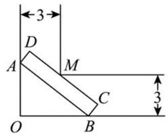

11. (5 分) 已知一个棱长为 $a$ 的正方体木块可以在一个封闭的圆锥形容器内任意转动,若圆锥的底面半径为

3，母线长为 6，则实数 $a$ 的最大值为___.

12. (5)分 $\rbrack$ 已知函数 $y = f\left( x\right)$ ，其中 $f\left( x\right)  = \left| {\frac{{2}^{x + 1}}{{2}^{x} + {2}^{-x}} - 1 - a}\right|$ ，存在实数 ${x}_{1},{x}_{2},\cdots ,{x}_{n}$ 使得

$\mathop{\sum }\limits_{{i = 1}}^{{n - 1}}f\left( {x}_{i}\right)  = f\left( {x}_{n}\right)$ 成立，若正整数 $n$ 的最大值为 8，则实数 $a$ 的取值范围是___.

二、单选题

13.(4 分)设 ${z}_{1},{z}_{2} \in  C$ ,则 “ ${z}_{1}\text{ 、 }{z}_{2}$ 中至少有一个数是虚数” 是 “ ${z}_{1} - {z}_{2}$ 是虚数” 的 ( )

A. 充分非必要条件

B. 必要非充分条件

C. 充要条件

D. 既非充分又非必要条件

14.(4 分)艺术体操比赛共有 7 位评委分别给出某选手的原始评分，评定该选手的成绩时，从 7 个原始评分中去掉 1 个最高分、1 个最低分, 得到 5 个有效评分. 5 个有效评分与 7 个原始评分相比, 不变的数字特征是

A. 中位数

B. 平均数

C. 方差

D. 极差

15.(5 分)已知集合 $M = \{ \left( {x, y}\right)  \mid  y = f\left( x\right) \}$ ，若对于任意 $\left( {x, y}\right)  \in  M$ ，总存在与之相应的 $\left( {{x}^{\prime },{y}^{\prime }}\right)  \in  M$ (其中 $\left. {x \neq  {x}^{\prime }}\right)$ ,使得 $\left| {x{x}^{\prime } + y{y}^{\prime }}\right|  = \sqrt{{x}^{2} + {y}^{2}} \cdot  \sqrt{{\left( {x}^{\prime }\right) }^{2} + {\left( {y}^{\prime }\right) }^{2}}$ 成立,则称集合 $M$ 是 “ $\Omega$ 集合”. 下列选项为 “ $\Omega$ 集合” 的是(   )

A. $M = \left\{  {\left( {x, y}\right) \left| {\;y = \frac{1}{x}}\right. , x\rangle 0 \sim  }\right\}$

B. $M = \left\{  {\left( {x, y}\right)  \mid  y = {e}^{x} - 2}\right\}$

C. $M = \{ \left( {x, y}\right)  \mid  y = \cos x\}$

D. $M = \left\{  {\left( {x, y}\right)  \mid  y = {x}^{3}}\right\}$

16.(5 分)已知数列 $\left\{  {a}_{n}\right\}$ 为无穷数列. 若存在正整数 $l$ ,使得对任意的正整数 $n$ ,均有 ${a}_{n + l} \leq  {a}_{n}$ ,则称数列 $\left\{  {a}_{n}\right\}$ 为 “ $l$ 阶弱减数列”. 有以下两个命题:①数列 $\left\{  {b}_{n}\right\}$ 为无穷数列且 ${b}_{n} = \cos n - \frac{n}{2}$ ( $n$ 为正整数)，则数

列 $\left\{  {b}_{n}\right\}$ 是 “ $l$ 阶弱减数列” 的充要条件是 $l \geq  4$ ; ②数列 $\left\{  {c}_{n}\right\}$ 为无穷数列且 ${c}_{n} = {an} + \frac{1 - {q}^{n}}{1 - q}$ ( $n$ 为正整数),若存在 $a \in  R$ ,使得数列 $\left\{  {c}_{n}\right\}$ 是 “ 2 阶弱减数列”,则 $- 1 \leq  q < 1$ . 那么 ( )

A. ①是真命题，②是假命题

B. ①是假命题，②是真命题

C. ①、②都是真命题

D. ①、②都是假命题

三、解答题

17.(14 分)

已知等差数列 $\left\{  {a}_{n}\right\}$ 的前 $n$ 项和为 ${S}_{n},{a}_{1} = 2,{S}_{5} = {20}$ .

(1)(6 分)求数列 $\left\{  {a}_{n}\right\}$ 的通项公式；

(2)(8 分)若等比数列 $\left\{  {b}_{n}\right\}$ 的公比为 $q = \frac{1}{2}$ ，且满足 ${a}_{4} + {b}_{4} = 9$ ，求数列 $\left\{  {{a}_{n} - {b}_{n}}\right\}$ 的前 $n$ 项和 ${T}_{n}$ .

18.(14 分)

如图，某多面体的底面 ${ABCD}$ 为正方形， ${MA}//{PB}$ ， ${MA} \bot  {BC}$ ， ${AB} \bot  {PB}$ ， ${MA} = 1$ ， ${AB} = {PB} = 2.$

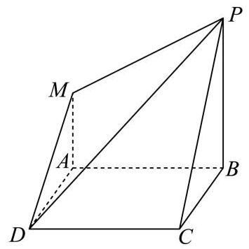

(1)(6 分)求四棱锥 $P - {ABCD}$ 的体积；

(2) (8 分) 求二面角 $B - {PM} - D$ 的平面角的正弦值.

19.(14 分)

2023 年杭州亚运会首次启用机器狗搬运赛场上的运动装备. 如图所示，在某项运动赛事扇形场地 ${OAB}$ 中, $\angle {AOB} = \frac{\pi }{2},{OA} = {500}$ 米,点 $Q$ 是弧 $\overset{\text{ ⏜ }}{AB}$ 的中点, $P$ 为线段 ${OQ}$ 上一点 (不与点 $O, Q$ 重合). 为方便机器狗运输装备,现需在场地中铺设三条轨道 ${PO},{PA},{PB}$ . 记 $\angle {APQ} = \theta$ ,三条轨道的总长度为 $y$ 米.

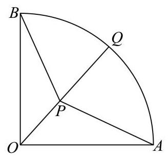

(1)(6 分)将 $y$ 表示成 $\theta$ 的函数，并写出 $\theta$ 的取值范围；

(2)(8 分)当三条轨道的总长度最小时，求轨道 ${PO}$ 的长.

20.(18 分)

已知双曲线 $E\frac{{x}^{2}}{{a}^{2}} - \frac{{y}^{2}}{{b}^{2}} = 1\left( {a > 0, b > 0}\right)$ 的离心率为 $e$ .

(1)(4 分)若 $e = \sqrt{2}$ ，且双曲线 $E$ 经过点 $\left( {\sqrt{2},1}\right)$ ，求双曲线 $E$ 的方程；

(2)(6 分)若 $a = 2$ ，双曲线 $E$ 的左、右焦点分别为 ${F}_{1}$ 、 ${F}_{2}$ ，焦点到双曲线 $E$ 的渐近线的距离为 $\sqrt{3}$ ，点 $M$ 在第一象限且在双曲线 $E$ 上,若 $\left| {M{F}_{1}}\right|  = 8$ ,求 $\cos \angle {F}_{1}M{F}_{2}$ 的值;

(3)(8 分)设圆 $O{x}^{2} + {y}^{2} = 4, k, m \in  R$ . 若动直线 ${ly} = {kx} + m$ 与圆 $O$ 相切，且 $l$ 与双曲线 $E$ 交于 $A, B$ 时,总有 $\angle {AOB} = \frac{\pi }{2}$ ,求双曲线 $E$ 离心率 $e$ 的取值范围.

21.(18 分)

若函数 $y = f\left( x\right) , x \in  R$ 的导函数 $y = {f}^{\prime }\left( x\right) , x \in  R$ 是以 $T\left( {T \neq  0}\right)$ 为周期的函数,则称函数 $y = f\left( x\right) , x \in  R$ 具有 “ $T$ 性质”.

(1)(4 分)试判断函数 $y = {x}^{2}$ 和 $y = \sin x$ 是否具有 “ ${2\pi }$ 性质”，并说明理由；

(2)(6 分)已知函数 $y = h\left( x\right)$ ，其中 $h\left( x\right)  = a{x}^{2} + {bx} + 2\sin {bx}\left( {0 < b < 3}\right)$ 具有 “ $\pi$ 性质”，求函数 $y = h\left( x\right)$ 在 $\left\lbrack  {0,\pi }\right\rbrack$ 上的极小值点;

(3)(8 分)若函数 $y = f\left( x\right) , x \in  R$ 具有 “ $T$ 性质”，且存在实数 $M > 0$ 使得对任意 $x \in  R$ 都有 $\left| {f\left( x\right) }\right|  < M$ 成立,求证: $y = f\left( x\right) , x \in  R$ 为周期函数.

(可用结论: 若函数 $y = f\left( x\right) , x \in  R$ 的导函数满足 ${f}^{\prime }\left( x\right)  = 0, x \in  R$ ,则 $f\left( x\right)  = C$ (常数).)

## 上海市杨浦区 2024 届高三一模数学试题

## 一、填空题

1. (4 分) 已知全集为 $R$ ，集合 $A = \left( {2, + \infty }\right)$ ，则 $A$ 的补集可用区间表示为 $\overline{A} =$ ___.

2. (4 分) 若复数 $z$ 满足 ${iz} =  - 2 + i$ (其中 $i$ 为虚数单位),则 $\left| z\right|  =$ ___.

3.(4 分)若 $\sin a = \frac{3}{5}$ ，则 $\cos {2a} =$ ___.

4.(4 分)函数 $y = \left| {x - 3}\right|  + \left| {5 - x}\right|$ 的最小值是___.

5.(4 分)等差数列 $\left\{  {a}_{n}\right\}$ 中，若 ${a}_{1} + {a}_{2} = 6$ ， ${a}_{2} + {a}_{3} = {10}$ ，则 $\left\{  {a}_{n}\right\}$ 的前 10 项和为___.

6.(4 分)若椭圆 $\frac{{x}^{2}}{{a}^{2}} + {y}^{2} = 1\left( {a > 1}\right)$ 长轴长为 4,则其离心率为___.

7.(5 分) 已知向量 $\overrightarrow{a} = \left( {3,0}\right) ,\overrightarrow{b} = \left( {-2,2\sqrt{3}}\right)$ ，则 $\overrightarrow{b}$ 在 $\overrightarrow{a}$ 方向上的投影为___.

8.(5 分)甲和乙两射手射击同一目标，命中的概率分别为 0.7 和 0.8 ，两人各射击一次，假设事件 “甲命中”与 “乙命中” 是独立的，则至少一人命中目标的概率为___.

9.(5 分) 已知 ${\left( 1 + x\right) }^{m} + {\left( 1 + x\right) }^{n} = {a}_{0} + {a}_{1}x + {a}_{2}{x}^{2} + \cdots  + {a}_{m + n}{x}^{m + n}\;\left( {m\text{ 、 }n\text{ 为正整数 }}\right)$ 对任意实数 $x$ 都成立,若 ${a}_{1} = {12}$ ,则 ${a}_{2}$ 的最小值为___.

10. (5分)函数 $f\left( x\right)  = \cos \left( {{\omega x} + \varphi }\right) \varphi  \in  \left( {0,{2\pi }}\right)$ 在 $x \in  R$ 上是单调增函数，且图像关于原点对称，则满足条件的数对 $\left( {\omega ,\varphi }\right)  =$ ___.

11. (5)分 $Z$ 知抛物线 ${y}^{2} = {2px}\left( {p > 0}\right)$ 的焦点为 $F$ ，第一象限的 $A$ 、 $B$ 两点在抛物线上，且满足 $\left| {BF}\right|  - \left| {AF}\right|  = 4$ ， $\left| {AB}\right|  = 4\sqrt{2}$ . 若线段 ${AB}$ 中点的纵坐标为 4，则抛物线的方程为___.

12.(5 分)我国古代数学著作《九章算术》中研究过一种叫“鳖 (biē) 臑(nào)”的几何体，它指的是由四个直角三角形围成的四面体, 那么在一个长方体的八个顶点中任取四个, 所组成的四面体中“鳖臑”的个数是___.

## 二、选择题

13. (4 分)已知实数 $a, b$ 满足 $a > b$ ，则下列不等式恒成立的是( )

A. ${a}^{2} > {b}^{2}$

B. ${a}^{3} > {b}^{3}$

C. $\left| a\right|  > \left| b\right|$

D. ${a}^{-1} > {b}^{-1}$

14.(4 分) 在一次男子 10 米气手枪射击比赛中, 甲运动员的成绩 (单位: 环) 为 7.5、7.8、...、10.9; 乙运动员的成绩为 8.3、8.4、...、10.1，如下茎叶图所示. 从这组数据来看，下列说法正确的是 ( )

<table><tr><td>甲</td><td></td><td>乙</td></tr><tr><td>8 5   9 7 7   6 4   9 4 3</td><td>7   8   9   10</td><td>3 7   2 4 5 9   1 1</td></tr></table>

A. 甲的平均成绩和乙一样，且甲更稳定

B. 甲的平均成绩和乙一样，但乙更稳定

C. 甲的平均成绩高于乙，且甲更稳定

D. 乙的平均成绩高于甲，且乙更稳定

15. (5 分)等比数列 $\left\{  {a}_{n}\right\}$ 的首项 ${a}_{1} = \frac{1}{64}$ ，公比为 $q$ ，数列 $\left\{  {b}_{n}\right\}$ 满足 ${b}_{n} = {\log }_{0.5}{a}_{n}$ ( $n$ 是正整数)，若当且仅当 $n = 4$ 时， $\left\{  {b}_{n}\right\}$ 的前 $n$ 项和 ${B}_{n}$ 取得最大值，则 $q$ 取值范围是( )

A. $\left( {3,2\sqrt{3}}\right)$

B. $\left( {3,4}\right)$

C. $\left( {2\sqrt{2},4}\right)$

D. $\left( {2\sqrt{2},3\sqrt{2}}\right)$

16. (5分)函数 $y = f\left( x\right)$ 满足:对于任意 $x \in  R$ 都有 $f\left( x\right)  = f\left( {a}^{x}\right)$ ，(常数 $a > 0, a \neq  1$ ). 给出以下两个命题:①无论 $a$ 取何值，函数 $y = f\left( x\right)$ 不是 $\left( {0, + \infty }\right)$ 上的严格增函数；②当 $0 < a < 1$ 时，存在无穷多个开区间 ${I}_{1},{I}_{2},\cdots ,{I}_{n},\cdots$ ,使得 ${I}_{1} \supset  {I}_{2} \supset  \cdots  \supset  {I}_{n} \supset  \cdots$ ,且集合

$\left\{  {y\left| {\;y = f\left( x\right) }\right. , x \in  {I}_{n}}\right\}   = \left\{  {y\left| {\;y = f\left( x\right) }\right. , x \in  {I}_{n + 1}}\right\}$ 对任意正整数 $n$ 都成立,则( )

A. ①②都正确

B. ①正确②不正确

C. ①不正确②正确

D. ①②都不正确

## 三、解答题

17.(14 分)

如图所示，在四棱锥 $P - {ABCD}$ 中， ${PA} \bot$ 平面 ${ABCD}$ ，底面 ${ABCD}$ 是正方形.

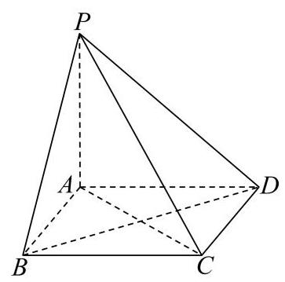

(1)(6分)求证:平面 ${PBD} \bot$ 平面 ${PAC}$ ；

(2)(8 分)设 ${AB} = 2$ ，若四棱锥 $P - {ABCD}$ 的体积为 $\frac{8}{3}$ ，求点 $A$ 到平面 ${PBD}$ 的距离.

18.(14 分)

设函数 $f\left( x\right)  = {e}^{x},\;x \in  R$ .

(1)(6 分)求方程 ${\left( f\left( x\right) \right) }^{2} = f\left( x\right)  + 2$ 的实数解；

(2)(8 分)若不等式 $x + b \leq  f\left( x\right)$ 对于一切 $x \in  R$ 都成立，求实数 $b$ 的取值范围.

19.(14 分)

某数学建模小组研究挡雨棚 (图 1)，将它抽象为柱体 (图 2)，底面 ${ABC}$ 与 ${A}_{1}{B}_{1}{C}_{1}$ 全等且所在平面平行， $\bigtriangleup  {ABC}$ 与 $\bigtriangleup  {{A}_{1}{B}_{1}{C}_{1}}$ 各边表示挡雨棚支架，支架 $A{A}_{1}$ 、 $B{B}_{1}$ 、 $C{C}_{1}$ 垂直于平面 ${ABC}$ . 雨滴下落方向与外墙 (所在平面) 所成角为 $\frac{\pi }{6}$ (即 $\angle {AOB} = \frac{\pi }{6}$ )，挡雨棚有效遮挡的区域为矩形 $A{A}_{1}{O}_{1}O$ ( $O$ 、 ${O}_{1}$ 分别在 ${CA}\text{ 、 }{C}_{1}{A}_{1}$ 延长线上) .

图1

图2

图3

(1)(6 分)挡雨板 (曲面 $B{B}_{1}{C}_{1}C$ ) 的面积可以视为曲线段 ${BC}$ 与线段 $B{B}_{1}$ 长的乘积. 已知 ${OA} = {1.5}$ 米, ${AC} = {0.3}$ 米， $A{A}_{1} = 2$ 米，小组成员对曲线段 ${BC}$ 有两种假设，分别为:①其为直线段且 $\angle {ACB} = \frac{\pi }{3}$ ； ②其为以 $O$ 为圆心的圆弧. 请分别计算这两种假设下挡雨板的面积(精确到 0.1 平方米)；

(2)(8 分)小组拟自制 $\bigtriangleup  {ABC}$ 部分的支架用于测试(图 3)，其中 ${AC} = {0.6}$ 米， $\angle {ABC} = \frac{\pi }{2}$ ， $\angle {CAB} = \theta$ ,其中 $\frac{\pi }{6} < \theta  < \frac{\pi }{2}$ ,求有效遮挡区域高 ${OA}$ 的最大值.

20.(18 分)

已知双曲线 $\Gamma \frac{{x}^{2}}{3} - \frac{{y}^{2}}{12} = 1, A\left( {2,2}\right)$ 是双曲线 $\Gamma$ 上一点.

(1)(4 分)若椭圆 $C$ 以双曲线 $\Gamma$ 的顶点为焦点，长轴长为 $4\sqrt{3}$ ，求椭圆 $C$ 的标准方程；

(2)(6 分)设 $P$ 是第一象限中双曲线 $\Gamma$ 渐近线上一点， $Q$ 是双曲线 $\Gamma$ 上一点，且 $\overrightarrow{PA} = \overrightarrow{AQ}$ ，求 $\bigtriangleup  {POQ}$ 的面积 $S\left( {O\text{ 为坐标原点 }}\right)$ ；

(3)(8 分)当直线 $l : y =  - {4x} + m$ (常数 $m \in  R$ )与双曲线 $\Gamma$ 的左支交于 $M$ 、 $N$ 两点时，分别记直线 ${AM}\text{ 、 }{AN}$ 的斜率为 ${k}_{1}\text{ 、 }{k}_{2}$ ,求证: ${k}_{1} + {k}_{2}$ 为定值.

21.(18 分)

设函数 $f\left( x\right)  = x + A\sin \frac{\pi x}{2}, x \in  R$ (其中常数 $A \in  R, A > 0$ ),无穷数列 $\left\{  {a}_{n}\right\}$ 满足: 首项 ${a}_{1} > 0,\;{a}_{n + 1} = f\left( {a}_{n}\right) .$

(1)(4 分)判断函数 $y = f\left( x\right)$ 的奇偶性，并说明理由；

(2)(6 分)若数列 $\left\{  {a}_{n}\right\}$ 是严格增数列，求证:当 $A < 4$ 时，数列 $\left\{  {a}_{n}\right\}$ 不是等差数列；

(3)(8 分)当 $A = 8$ 时，数列 $\left\{  {a}_{n}\right\}$ 是否可能为公比小于 0 的等比数列？若可能，求出所有公比的值；若不可能, 请说明理由.

## 上海市长宁区 2024 届高三一模数学试题

## 一、填空题

1.(4 分)【作答次数:56】【正确率:100%】已知集合 $A = ( - \infty ,4\rbrack , B = \{ 1,3,5,7\}$ ，则 $A \cap  B =$ ___.

2. (4 分) 【作答次数:55】【正确率:87.3%】复数 $z$ 满足 $z = \frac{1}{1 - i}$ ( $i$ 为虚数单位),则 $\left| \begin{array}{l} \phi \\  z \end{array}\right|  =$

3.(4 分) 【作答次数: 53】【正确率: 94.3%】不等式 $\frac{1}{x} > 1$ 的解集为

4. (4 分) 【作答次数:54】【正确率:98.1%】设向量 $\overrightarrow{a} = \left( {1, - 2}\right) ,\overrightarrow{b} = \left( {-1, m}\right)$ ，若 $\overrightarrow{a}//\overrightarrow{b}$ ，则 $m =$ ___.

5.(4 分) 【作答次数: 65】【正确率: 92.3%】将 4 个人排成一排，若甲和乙必须排在一起，则共有___种不同排法.

6.(4 分) 【作答次数:57】【正确率:78.9%】物体位移 s 和时间 $\mathrm{t}$ 满足函数关系 $s = {100t} - 5{t}^{2}\left( {0 < t < {20}}\right)$ ，则当 $t = 2$ 时，物体的瞬时速度为___.

7.(5 分)【作答次数: 61】【正确率: 69.7%】现利用随机数表法从编号为 00, 01, 02, ..., 18, 19 的 20 支水笔中随机选取 6 支，选取方法是从下列随机数表第 1 行的第 9 个数字开始由左到右依次选取两个数字，则选出来的第 6 支水笔的编号为___.

43772366

29778149

8.(5 分)【作答次数:63】【正确率:85.7%】在有声世界，声强级是表示声强度相对大小的指标. 其值 $y$ (单位: ${dB}$ ) 定义为 $y = {10}\lg \frac{I}{{I}_{0}}$ . 其中 $I$ 为声场中某点的声强度,其单位为 $W/{m}^{2},{I}_{0} = {10}^{-{12}}W/{m}^{2}$ 为基准值. 若 $I = {10}\mathrm{\;W}/{\mathrm{m}}^{2}$ ，则其相应的声强级为___ ${dB}$ .

9.(5 分)【作答次数: 56】【正确率: 70.5%】若向量 $\overrightarrow{a} = \left( {1,0,2}\right) ,\overrightarrow{b} = \left( {0,1, - 1}\right)$ ,则 $\overrightarrow{a}$ 在 $\overrightarrow{b}$ 方向上的投影向量的坐标为___.

10.(5 分) 【作答次数:61】【正确率:51.8%】若 “存在 $x > 0$ ，使得 ${x}^{2} + {ax} + 1 < 0$ ”是假命题，则实数 $a$ 的取值范围___.

11. (5 分)【作答次数:56】【正确率:51.1%】若函数 $f\left( x\right)  = \sin x + a\cos x$ 在(3,6)上是严格单调函数，则实数 a 的取值范围为___.

12.(5 分) 【作答次数: 39】【正确率: 55.6%】设 $f\left( x\right)  = \left| {{\log }_{2}x + {ax} + b}\right| \left( {a0}\right)$ ，记函数 $y = f\left( x\right)$ 在区间 $\left\lbrack  {t, t + 1}\right\rbrack  \left( {t0}\right)$ 上的最大值为 ${M}_{t}\left( {a, b}\right)$ ,若对任意 $b \in  R$ ,都有 ${M}_{t}\left( {a, b}\right)  \geq  \frac{a}{2} + 1$ ,则实数 $t$ 的最大值为___.

## 二、选择题

13.(4 分) 【作答次数:59】【正确率:93.2%】下列函数中既是奇函数又是增函数的是( )

A. $f\left( x\right)  = {2x}$

B. $f\left( x\right)  = {x}^{2}$

C. $f\left( x\right)  = \ln x$

D. $f\left( x\right)  = {e}^{x}$

14. (4 分)【作答次数:50】【正确率:76%】“ $P\left( {A \cap  B}\right)  = P\left( A\right) P\left( B\right)$ ” 是 “事件 A 与事件 $\overline{B}$ 互相独立” ( )

A. 充分不必要条件 B. 必要不充分条件

C. 充要条件 D. 既不充分也不必要条件

15.(5 分) 【作答次数:106】【正确率: 73.6%】设点 $P$ 是以原点为圆心的单位圆上的动点，它从初始位置 ${P}_{0}\left( {1,0}\right)$ 出发，沿单位圆按逆时针方向转动角 $a\left( {0 < a < \frac{\pi }{2}}\right)$ 后到达点 ${P}_{1}$ ，然后继续沿单位圆按逆时针方向转动角 $\frac{\pi }{4}$ 到达 ${P}_{2}$ . 若点 ${P}_{2}$ 的横坐标为 $- \frac{3}{5}$ ，则点 ${P}_{1}$ 的纵坐标( )

A. $\frac{\sqrt{2}}{10}$

B. $\frac{\sqrt{2}}{5}$

C. $\frac{3\sqrt{2}}{5}$

D. $\frac{7\sqrt{2}}{10}$

16. (5 分)【作答次数:74】【正确率:79.7%】豆腐发酵后表面长出一层白绒绒的长毛就成了毛豆腐，将三角形豆腐 ABC 悬空挂在发酵空间内，记发酵后毛豆腐所构成的几何体为 T. 若忽略三角形豆腐 ${ABC}$ 的厚度,设 ${AB} = 3,{BC} = 4,{AC} = 5$ ，点 $P$ 在 $\bigtriangleup  {ABC}$ 内部. 假设对于任意点 $P$ ，满足 ${PQ} \leq  1$ 的点 $Q$ 都在 $T$ 内， 且对于 $T$ 内任意一点 $Q$ ,都存在点 $P$ ,满足 ${PQ} \leq  1$ ,则 $T$ 的体积为( )

A. ${12} + {7\pi }$

B. ${12} + \frac{22\pi }{3}$

C. ${14} + {7\pi }$

D. ${14} + \frac{22\pi }{3}$

## 三、解答题

17.(14 分) 【作答次数: 38】【正确率: 90.3%】

已知等差数列 $\left\{  {a}_{n}\right\}$ 的前 $n$ 项和为 ${S}_{n}$ ，公差 $d = 2$ .

(1)(6 分)若 ${S}_{10} = {100}$ ，求 $\left\{  {a}_{n}\right\}$ 的通项公式；

(2)(8 分)从集合 $\left\{  {{a}_{1},{a}_{2},{a}_{3},{a}_{4},{a}_{5},{a}_{6}}\right\}$ 中任取 3 个元素，记这 3 个元素能成等差数列为事件 $A$ ，求事件 $A$ 发生的概率 $P\left( A\right)$ .

18.(14 分) 【作答次数: 120】【正确率: 77.3%】

如图,在三棱锥 $A - {BCD}$ 中,平面 ${ABD} \bot$ 平面 ${BCD},{AB} = {AD}, O$ 为 ${BD}$ 的中点.

(1)(6 分)求证: ${AO} \bot  {CD}$ ；

(2)(8 分)若 ${BD} \bot  {DC},{BD} = {DC},{AO} = {BO}$ ，求异面直线 ${BC}$ 与 ${AD}$ 所成的角的大小.

19.(14 分) 【作答次数: 32】【正确率: 70.8%】

汽车转弯时遵循阿克曼转向几何原理，即转向时所有车轮中垂线交于一点，该点称为转向中心:如图

1，某汽车四轮中心分别为 $A$ 、 $B$ 、 $C$ 、 $D$ ，向左转向，左前轮转向角为 $a$ ，右前轮转向角为 $\beta$ ，转向中心为

$O$ . 设该汽车左右轮距 ${AB}$ 为 $w$ 米,前后轴距 ${AD}$ 为 $l$ 米.

图1

图2

(1)(6 分)试用 $w$ 、 $l$ 和 $a$ 表示 $\tan \beta$ ；

(2)(8 分)如图 2，有一直角弯道， $M$ 为内直角顶点， ${EF}$ 为上路边，路宽均为 3.5 米，汽车行驶其中，左轮 $A\text{ 、 }D$ 与路边 ${FS}$ 相距 2 米. 试依据如下假设，对问题*做出判断，并说明理由.

假设: ①转向过程中,左前轮转向角 $a$ 的值始终为 ${30}^{ \circ  }$ ; ②设转向中心 $O$ 到路边 ${EF}$ 的距离为 $d$ ,若 ${OB} < d$ 且 ${OM} < {OD}$ ，则汽车可以通过，否则不能通过；③ $w = {1.570}, l = {2.680}$ .向题*:可否选择恰当转向位置，使得汽车通过这一弯道?

20.(18 分) 【作答次数: 41】【正确率: 82.1%】

已知椭圆 $\Gamma  : \frac{{x}^{2}}{4} + \frac{{y}^{2}}{2} = 1,{F}_{1}\text{ 、 }{F}_{2}$ 为 $\Gamma$ 的左、右焦点,点 $\mathrm{A}$ 在 $\Gamma$ 上,直线 $l$ 与圆 $C : {x}^{2} + {y}^{2} = 2$ 相切.

(1)(4 分)求 $\bigtriangleup  A{F}_{1}{F}_{2}$ 的周长；

(2)(6 分)若直线 $l$ 经过 $\Gamma$ 的右顶点，求直线 $l$ 的方程；

(3) (8 分)设点 $D$ 在直线 $y = 2$ 上， $O$ 为原点，若 ${OA}\bot {OD}$ ，求证:直线 ${AD}$ 与圆 $C$ 相切.

21.(18 分) 【作答次数: 31】【正确率: 71.6%】

若函数 $y = f\left( x\right)$ 与 $y = g\left( x\right)$ 满足: 对任意 ${x}_{1},{x}_{2} \in  R$ ,都有 $\left| {f\left( {x}_{1}\right)  - f\left( {x}_{2}\right) }\right|  \geq  \left| {g\left( {x}_{1}\right)  - g\left( {x}_{2}\right) }\right|$ ,则称函数 $y = f\left( x\right)$ 是函数 $y = g\left( x\right)$ 的 “约束函数”. 已知函数 $y = f\left( x\right)$ 是函数 $y = g\left( x\right)$ 的 “约束函数”.

(1)(4 分)若 $f\left( x\right)  = {x}^{2}$ ，判断函数 $y = g\left( x\right)$ 的奇偶性，并说明理由:

(2)(6 分)若 $f\left( x\right)  = {ax} + {x}^{3}\left( \begin{array}{ll} a & 0 \end{array}\right) , g\left( x\right)  = \sin x$ ，求实数 $a$ 的取值范围；

(3) (8 分)若 $y = g\left( x\right)$ 为严格减函数， $f\left( 0\right)  < f\left( 1\right)$ ，且函数 $y = f\left( x\right)$ 的图像是连续曲线，求证: $y = f\left( x\right)$ 是 $\left( {0,1}\right)$ 上的严格增函数.