## 第 16 节建模

1. (虹口 11) 2024 年 10 月 30 日 “神舟十九号” 载人飞船发射成功，标志着中国空间站建设进入新阶段. 在飞船竖直升空过程中，某位记者用照相机在同一位置以同一姿势连续拍照两次. 已知 “神舟十九号” 飞船船体实际长度为 $H$ ,且在照片上飞船船体长度为 $h$ ,比较两张照片，相对于照片中的同一固定参照物飞船上升了 $m$ . 假设该记者连按拍照键间的反应时间为 $t$ ,并忽略相机曝光时长,若用平均速度估算瞬时速度,则拍照时飞船的瞬时速度为___ (用含有 $H$ 、 $h$ 、 $m$ 、 $t$ 的式子表示).

2. (松江 12 ) 交通信号灯由红灯、绿灯、黄灯组成. 黄灯设置的时长与路口宽度、限定速度、 停车距离有关. 根据路况不同，道路的限定速度一般在 30 千米/小时至 70 千米/小时之间. 由相关数据,驾驶员反应距离 ${s}_{1}$ (单位: 米) 关于车速 $v$ (单位: 米/秒) 的函数模型为: ${s}_{1} \; = {0.7584v}$ ; 刹车距离 ${s}_{2}$ (单位: 米) 关于车速 $v$ (单位: 米/秒) 的函数模型为: ${s}_{2} = \; {0.072}{v}^{2}$ ,反应距离与刹车距离之和称为停车距离. 已知某个十字路口宽度为 30 米,为保证通行安全, 黄灯亮的时间是允许限速车辆离停车线距离小于停车距离的汽车通过十字路口, 则该路口黄灯亮的时间最多为___秒(结果精确到 0.01 秒).

3. $\leq  \frac{{s}_{1} + {s}_{2} + {30}}{v} = {0.7584} + {0.072v} + \frac{30}{v}$ ,且 $\frac{30}{3.6} \leq  v \leq  \frac{70}{3.6}$ ,即 $\frac{25}{3} \leq  v \leq  \frac{175}{9}$ ,由对勾函数性质得 $v = \frac{25}{3}$ 时, ${t}_{\max } \approx  {4.96}$ 秒.

4. (杨浦 15) 小李研究数学建模 “雨中行” 问题, 在作出 “降雨强度保持不变”、 “行走速度保持不变”、“将人体视作一个长方体”等合理假设的前提下，他设了变量:

<table><tr><td>人的身高</td><td>人体宽度</td><td>人体厚度</td><td>降雨速度</td><td>雨滴密度</td><td>行走速度</td><td>风速</td><td>行走速度</td></tr><tr><td>$h$</td><td>$W$</td><td>$d$</td><td>${V}_{r}$</td><td>$\rho$</td><td>$D$</td><td>${V}_{w}$</td><td>$v$</td></tr></table>

并构建模型如下:

当人迎风行走时,人体总的淋雨量为 $T = \frac{pwD}{v}\left\lbrack  {\mathrm{\;d}{v}_{r} + h\left( {{v}_{w} + v}\right) }\right\rbrack$ .

根据模型, 小李对 “雨中行” 作出如下解释:

①若两人结伴迎风行走，则体型较高大魁梧的人淋雨量较大；

②若某人迎风行走，则走得越快淋雨量越小，若背风行走，则走得越慢淋雨量越小；

③若某人迎风行走了 10 秒，则行走距离越长淋雨些越大. 这些解释合理的个数为 ( )

A. 0 B. 1 C. 2 D. 3

## 第 15 节数列

【基本量运算】

1. (黄浦 12) 设常数 $b$ 为整数,数列 $\left\{  {a}_{n}\right\}$ 的通项公式为 ${a}_{n} = {\left( n + b\right) }^{2} + \frac{b}{2}$ ,若 ${a}_{m} + {a}_{m + 1} + \; {a}_{m + 2}\left( {m \geq  1, m \in  Z}\right)$ 的最小值为 -7,则 $b =$ ___.

2. (嘉定 8) 已知数列 $\left\{  {a}_{n}\right\}$ 的通项公式为 ${a}_{n} =  - n + c$ ,其中 $c$ 为常数,设数列 $\left\{  {a}_{n}\right\}$ 的前 $n$ 项和为 ${S}_{n}$ ，若 ${S}_{6} > {S}_{5}$ 且 ${S}_{6} > {S}_{7}$ ，则 $c$ 的取值范围为___.

3. (金山 8) 已知 ${S}_{n}$ 是等差数列 $\left\{  {a}_{n}\right\}$ 的前 $n$ 项和，若 $2{a}_{1} + 3{a}_{11} = {20}$ ，则 ${S}_{13}$ 的值为___.

4. (静安 4) 设 $\left\{  {a}_{n}\right\}$ 是等差数列, ${a}_{1} =  - 6,{a}_{3} = 0$ ,则该数列的前 8 项的和 ${S}_{8}$ 的值为___.

5. (浦东 6) 若等差数列 $\left\{  {a}_{n}\right\}$ 满足 ${a}_{7} + {a}_{8} + {a}_{9} = 0,{a}_{7} + {a}_{10} = 1$ ,则 ${a}_{1} =$ ___.

6. (普陀 5) 设 $n \geq  1, m \geq  1, m > 1, m \in  N$ ,等差数列 $\left\{  {a}_{n}\right\}$ 的首项 ${a}_{1} = 0$ ,公差 $d \neq  0$ ,若 ${a}_{m} \; = \mathop{\sum }\limits_{{i = 1}}^{{11}}{a}_{i}$ ,则 $m$ 的值为___.

7. (普陀 15 ) 设 $a > 0$ 且 $a \neq  1, k, m, n$ 都是正整数,数列 $\left\{  {a}_{n}\right\}$ 的通项公式为 ${a}_{n} = \; \left\{  \begin{matrix} \left( {a - 6}\right) n + {21}\left( {1 \leq  n \leq  m}\right) \\  {a}^{n - 3}\left( {n > m}\right)  \end{matrix}\right.$ ,记数列 $\left\{  {a}_{n}\right\}$ 中前 $k$ 项的最小值为 ${h}_{k}$ ,由所有 ${h}_{k}$ 的值所组成的集合记为 $A$ ,若集合 $A$ 中仅有四个元素,则下列说法中错误的是 ( )

A. 当 $m = 3$ 时, $a$ 的取值范围是 $\left( {1,6}\right)$ B. 不存在 $a$ 和 $m$ 的值,使得 ${a}_{4} \notin  A$

C. 当 $m = 4$ 时, $a$ 的取值范围是 $\left( {3,6}\right)$ D. 存在 $a$ 和 $m$ 的值,使得 ${a}_{5} \in  A$

8. (青浦 6) 已知数列 $\left\{  {a}_{n}\right\}$ 满足 ${a}_{1} + 2{a}_{2} + 3{a}_{3} + \cdots  + n{a}_{n} = n\left( {n + 2}\right)$ ，则 ${a}_{66} =$ ___.

9. (松江 8 ) 已知数列 $\left\{  {a}_{n}\right\}$ 是等比数列,若 ${\log }_{2}{a}_{1} + {\log }_{2}{a}_{4} = 3,{2}^{{a}_{2}} \cdot  {2}^{{a}_{3}} = {64}$ ,则 ${a}_{10} =$ ___.

10. (松江 14) 渐进式延迟退休方案是指采取较缓而稳妥的方式逐步延长退休年龄. 对于男职工, 新方案将延迟法定退休年龄每 4 个月延迟 1 个月, 逐步将男职工的法定退休年龄从原六十周岁延迟至六十三周岁. 如果男职工延迟法定退休年龄部分对照表如下表所示:

<table><tr><td>出生时间</td><td>1965 年 1 月 -4 月</td><td>1965 年 5 月 -8 月</td><td>1965 年 9 月 -12 月</td><td>1966 年 1 月 -4 月</td><td>-   -   -</td></tr><tr><td>改革后法定退休年龄</td><td>60 岁 +1 个月</td><td>60 岁 +2 个月</td><td>60 岁 +3 个月</td><td>60 岁 +4 个月</td><td></td></tr></table>

那么 1974 年 5 月出生的男职工退休年龄为 ( )

A. 62 岁 3 个月 B. 62 岁 4 个月 C. 62 岁 5 个月 D. 63 岁

11. 年 5 月出生的男职工退休年龄为 ${a}_{10} = {60}\frac{1}{6} + 9 \times  \frac{1}{4} = {62}\frac{5}{12}$ ,

故 1974 年 5 月出生的男职工退休年龄为 62 岁 5 个月. 故选 $C$ .

12. (杨浦 16) 设无穷数列 $\left\{  {a}_{n}\right\}$ 的前 $n$ 项和为 ${S}_{n}$ ,且对任意的正整数 $n,{a}_{n + 1} = \frac{{S}_{n}}{{a}_{n}}$ ,则 $\mathop{\sum }\limits_{{i = 1}}^{5}{a}_{2i} \; - \mathop{\sum }\limits_{{i = 1}}^{6}{a}_{{2i} - 1}$ 的值可能为 ( )

A. -6 B. 0 C. 6 D. 12

13. (崇明 16)已知无穷数列 $\left\{  {a}_{n}\right\}$ ，若存在数列 $\left\{  {b}_{n}\right\}$ 满足对任意正整数 $n$ ，都有 $\left( {{a}_{n} - {b}_{n}}\right) \left( {{a}_{n + 1} - {b}_{n + 1}}\right)  < 0$ ,则称数列 $\left\{  {b}_{n}\right\}$ 是 $\left\{  {a}_{n}\right\}$ 的交错数列. 有下列两个命题: ①对任意给定的等差数列 $\left\{  {a}_{n}\right\}$ ，不存在等差数列 $\left\{  {b}_{n}\right\}$ ，使得 $\left\{  {b}_{n}\right\}$ 是 $\left\{  {a}_{n}\right\}$ 的交错数列; ②对任意给定的等比数列 $\left\{  {a}_{n}\right\}$ ，都存在等比数列 $\left\{  {b}_{n}\right\}$ ，使得 $\left\{  {b}_{n}\right\}$ 是 $\left\{  {a}_{n}\right\}$ 的交错数列. 下列结论正确的是 ( )

A. ①是真命题，②是假命题 B. ①是假命题，②是真命题

C. ①、②都是真命题 D. ①、②都是假命题

14. (奉贤 12) 已知集合 $M = \left\{  {{P}_{0},{P}_{1},{P}_{2},\cdots ,{P}_{n}}\right\}  , n \geq  2, n \in  N$ 是由函数 $y = \cos x, x \in  \left\lbrack  {0,{2\pi }}\right\rbrack$ 的 图 像 上 两 两 不 相 同 的 点 构 成 的 点 集 ， 集 合 $S = \; \left\{  {a \mid  a = \overrightarrow{O{P}_{0}} \cdot  \overrightarrow{O{P}_{i}},\mathrm{i} = 0,1,2,\cdots , n, n \geq  2, n \in  N}\right\}$ ,其中 ${P}_{0}\left( {0,1}\right) ,{P}_{1}\left( {\pi , - 1}\right)$ . 若集合 $S$ 中的元素按照从小到大的顺序排列能构成公差为 $d$ 的等差数列,当 $d \in  \left\{  {\frac{1}{2},1}\right\}$ 时,计算符合条件的点集 $M$ 的个数为___.

15. (奉贤 16) 已知数列 $\left\{  {a}_{n}\right\}$ 不是常数列,前 $n$ 项和为 ${S}_{n},{a}_{n} > 0$ . 若对任意正整数 $n$ ,存在正整数 $m$ ,使得 $\left| {{S}_{n} - {a}_{m}}\right|  < {a}_{1}$ ,则称 $\left\{  {a}_{n}\right\}$ 是 “可控数列”. 现给出两个命题:

①若各项均为正整数的等差数列 $\left\{  {a}_{n}\right\}$ 满足: $d = 3$ ，则 $\left\{  {a}_{n}\right\}$ 是 “可控数列”；

②若等比数列 $\left\{  {a}_{n}\right\}$ 是 “可控数列”，则其公比为 $q \in  \left( {0,1}\right)$ . 则下列判断正确的是 ( )

A. ①与②均为真命题 B. ①与②均为假命题

C. ①为假命题，②为真命题 D. ①为真命题，②为假命题

16. (虹口16) 设数列 $\left\{  {a}_{n}\right\}$ 的前四项分别为 ${a}_{1},{a}_{2},{a}_{3},{a}_{4}$ ,对于以下两个命题,说法正确的是 ( )

①存在等比数列 $\left\{  {a}_{n}\right\}$ 以及锐角 $\alpha$ ，使 $\left\{  {\sin \alpha ,\cos \alpha ,\tan \alpha }\right\}   = \left\{  {{a}_{1},{a}_{2},{a}_{3}}\right\}$ 成立.

②对任意等差数列 $\left\{  {a}_{n}\right\}$ 以及锐角 $\alpha$ ，均不能使 $\{ \sin \alpha ,\cos \alpha ,\tan \alpha ,\cot \alpha \}  = \left\{  {{a}_{1},{a}_{2},{a}_{3},{a}_{4}}\right\}$ 成立.

A. ①是真命题，②是真命题 B. ①是真命题，②是假命题

C. ①是假命题，②是真命题 D. ①是假命题，②是假命题

17. (黄浦 16) 设函数 $y = f\left( x\right)$ 在区间 $I$ 上有导函数 $y = {f}^{\prime }\left( x\right)$ ,且 ${f}^{\prime }\left( x\right)  < 0$ 在区间 $I$ 上恒成立, 对任意的 $x \in  I$ ，有 $f\left( x\right)  \in  I$ . 对于各项均不相同的数列 $\left\{  {a}_{n}\right\}  ,{a}_{1} \in  I,{a}_{n + 1} = f\left( {a}_{n}\right)$ ，下列结论正确的是 ( )

A. 数列 $\left\{  {a}_{{2n} - 1}\right\}$ 与 $\left\{  {a}_{2n}\right\}$ 均是严格增数列

B. 数列 $\left\{  {a}_{{2n} - 1}\right\}$ 与 $\left\{  {a}_{2n}\right\}$ 均是严格减数列

C. 数列 $\left\{  {a}_{{2n} - 1}\right\}$ 与 $\left\{  {a}_{2n}\right\}$ 中的一个是严格增数列,另一个是严格减数列

D. 数列 $\left\{  {a}_{{2n} - 1}\right\}$ 与 $\left\{  {a}_{2n}\right\}$ 均既不是严格增数列也不是严格减数列

法三: 蛛网法迭代

18. (嘉定 16) 已知数列 $\left\{  {a}_{n}\right\}$ 满足 ${a}_{n + 1} = r{a}_{n}\left( {1 - {a}_{n}}\right) \left( {n = 1,2,3,\cdots }\right) ,{a}_{1} \in  \left( {0,1}\right)$ ,给出以下四个结论:

① 当 $r = 2$ 时,存在有限个 ${a}_{1}$ ,使得对任意正整数 $n$ ,都有 ${a}_{n + 1} > {a}_{n}$

② 当 $r = 2$ 时,存在 ${a}_{1}$ 和正整数 $P$ ,当 $n > P$ 时, ${a}_{n + 1} - {a}_{n} < \frac{1}{2025}$

③ 当 $r = 3$ 时,存在 ${a}_{1}$ 和正整数 $P$ ,当 $n > P$ 时, ${a}_{n + 1} = {a}_{n}$

④ 当 $r =  - 3$ 时,不存在 ${a}_{1}$ ,使得对任意正整数 $n$ ,且 $n \geq  3$ ,都有 ${a}_{n} > 0$ ; 其中正确结论是 ( )

A. ①② B. ②③ C. ③④ D. ②④

19. (闵行 16) 已知数列 $\left\{  {a}_{n}\right\}$ 满足 ${a}_{n + 1} = \left| {{a}_{n} + 1}\right|  + \lambda \left| {{a}_{n} - 1}\right|$ ,其中 $\lambda$ 为常数. 对于下述两个命题:

①对于任意的 $\lambda  > 0$ ，任意的 ${a}_{1} \in  R$ ，都有 $\left\{  {a}_{n}\right\}$ 是严格增数列；

②对于任意的 $\lambda  < 0$ ，存在 ${a}_{1} \in  R$ ，使得 $\left\{  {a}_{n}\right\}$ 是严格减数列.

以下说法正确的为 ( )

A. ①真命题；②假命题 B. ①假命题；②真命题

C. ①真命题；②真命题 D. ①假命题；②假命题

20. (青浦 16) 对于数列 $\left\{  {a}_{n}\right\}$ ，设数列 $\left\{  {a}_{n}\right\}$ 的前 $n$ 项和为 ${S}_{n}$ ，给出下列两个命题:①存在函数 $y = f\left( x\right)$ ，使得 ${S}_{n} = f\left( {a}_{n}\right)$ ；②存在函数 $y = g\left( x\right)$ ，使得 $n = g\left( {a}_{n}\right)$ . 则①是②的()

A. 充分不必要条件 B. 必要不充分条件

C. 充要条件 D. 既不充分也不必要条件

21. (徐汇 16) 已知数列 $\left\{  {a}_{n}\right\}$ 的前 $n$ 项和为 ${S}_{n}$ ,设 ${t}_{n} = \frac{{S}_{n}}{n}$ ( $n$ 为正整数). 若存在常数 $c$ ,使得任意两两不相等的正整数 $\mathrm{i}, j, k$ ，都有 $\left( {\mathrm{i} - j}\right) {t}_{k} + \left( {j - k}\right) {t}_{i} + \left( {k - \mathrm{i}}\right) {t}_{j} = c$ ，则称数列 $\left\{  {a}_{n}\right\}$ 为 “轮换均值数列”. 现有下列两个命题:

①任意等差数列 $\left\{  {a}_{n}\right\}$ 都是 “轮换均值数列”.

②存在公比不为 1 的等比数列 $\left\{  {b}_{n}\right\}$ 是 “轮换均值数列”. 则下列说法正确的是 ( )

A. ①是真命题，②是假命题 B. ①是假命题，②是真命题

C. ①、②都是真命题 D. ①、②都是假命题

22. (长宁 16) 数列 $\left\{  {a}_{n}\right\}$ 为严格增数列,且对任意的正整数 $n$ ,都有 $\frac{{a}_{n + 1}}{n + 1} \geq  \frac{{a}_{n}}{n}$ ,则称数列 $\left\{  {a}_{n}\right\}$ 满足 “性质 $\Omega$ ”.

①存在等差数列 $\left\{  {a}_{n}\right\}$ 满足 “性质 $\Omega$ ” ;

② 任意等比数列 $\left\{  {a}_{n}\right\}$ ，若首项 ${a}_{1} > 0$ ，则 $\left\{  {a}_{n}\right\}$ 满足 “性质 $\Omega$ ”；

下列选项中正确的是 ( )

A. ①是真命题，②是真命题 B. ①是真命题，②是假命题

C. ①是假命题，②是真命题 D. ①是假命题，②是假命题

## 第 14 节平面向量

【简单运算】

1. (崇明 7) 已知 $\overrightarrow{a} = \left( {1,2}\right) ,\overrightarrow{b} = \left( {2, k}\right)$ ，如果 $\overrightarrow{a}//\overrightarrow{b}$ ，则实数 $k$ 的值为___.

2. (金山 $2)$ 已知向量 $\overrightarrow{a} = \left( {1,2}\right) ,\overrightarrow{b} = \left( {3, k}\right)$ ，若 $\overrightarrow{a}//\overrightarrow{b}$ ，则实数 $k =$ ___.

3. (徐汇 3) 已知向量 $\overrightarrow{a} = \left( {2,5,1}\right) ,\;\overrightarrow{b} = \left( {4, m,5}\right)$ ，若 $\overrightarrow{a} \cdot  \overrightarrow{b} = 3$ ，则实数 $m$ 的值为___.

4. (杨浦 6) 已知 $\left| \overrightarrow{a}\right|  = \left| \overrightarrow{b}\right|  = 1$ ，若 $\left( {2\overrightarrow{a} - \overrightarrow{b}}\right)  \bot  \overrightarrow{b}$ ，则向量 $\overrightarrow{a}$ 与 $\overrightarrow{b}$ 的夹角的余弦值为___.

5. (长宁 8) 已知向量 $\overrightarrow{a} = \left( {1,2}\right) ,\;\overrightarrow{b} = \left( {3, - 1}\right)$ ，则向量 $\overrightarrow{b}$ 在 $\overrightarrow{a}$ 方向上的投影的坐标是___.

【解析】向量 $\overrightarrow{b}$ 在 $\overrightarrow{a}$ 方向上的投影的坐标是 $\frac{\overrightarrow{b} \cdot  \overrightarrow{a}}{\left| \overrightarrow{a}\right| } \cdot  \frac{\overrightarrow{a}}{\left| \overrightarrow{a}\right| } = \left( {\frac{1}{5},\frac{2}{5}}\right)$ .

6. (长宁 14) 已知非零空间向量 $\overrightarrow{a},\overrightarrow{b}$ 和 $\overrightarrow{c}$ ，则下列说法正确的是 ( )

A. 若 $\overrightarrow{a} \bot  \overrightarrow{b},\overrightarrow{a} \bot  \overrightarrow{c}$ ,则 $\overrightarrow{b}//\overrightarrow{c}$ B. 若 $\overrightarrow{a} \bot  \overrightarrow{b},\overrightarrow{a} \bot  \overrightarrow{c}$ ,则 $\overrightarrow{b} \bot  \overrightarrow{c}$

C. 若 $\overrightarrow{a} \bot  \overrightarrow{b},\overrightarrow{a}//\overrightarrow{c}$ ,则 $\overrightarrow{b}//\overrightarrow{c}$ D. 若 $\overrightarrow{a} \bot  \overrightarrow{b},\overrightarrow{a}//\overrightarrow{c}$ ,则 $\overrightarrow{b} \bot  \overrightarrow{c}$

7. (松江 10) 已知点 $P$ 为椭圆 $\frac{{x}^{2}}{4} + \frac{{y}^{2}}{3} = 1$ 上任意一点, ${EF}$ 为圆 $N : {\left( x - 1\right) }^{2} + {y}^{2} = 4$ 的任意一条直径，则 $\overrightarrow{PE} \cdot  \overrightarrow{PF}$ 的取值范围是___.

8. (宝山 12) 已知平面向量 $\overrightarrow{a},\overrightarrow{b}$ 满足: $\left| \overrightarrow{a}\right|  = 1,\left| \overrightarrow{b}\right|  = m \in  \left( {1,2}\right)$ ，且对任意的单位向量 $\overrightarrow{c}$ 满足 $\left| {\overrightarrow{a} \cdot  \overrightarrow{c}}\right|  + \left| {\overrightarrow{b} \cdot  \overrightarrow{c}}\right|  \leq  \sqrt{6}$ ，则 $\overrightarrow{a} \cdot  \overrightarrow{b}$ 的最大值为___(用含 $m$ 的式子表示).

9. (金山12) 已知 $O$ 为坐标原点，向量 $\overrightarrow{OA}$ 、 $\overrightarrow{OB}$ 满足 $\left| \overrightarrow{OA}\right|  + \left| \overrightarrow{OB}\right|  = 8$ ，将 $\overrightarrow{OA}$ 绕点 $O$ 按逆时针方向旋转 ${90}^{ \circ  }$ ，得到向量 $\overrightarrow{OC}$ . 若 $\overrightarrow{OB} + \overrightarrow{OC} = \left( {-3,3}\right)$ ， $\overrightarrow{i} = \left( {1,0}\right)$ ，则 $\left( {\overrightarrow{OA} + \overrightarrow{OB}}\right)  \cdot  \overrightarrow{i}$ 的最大值为___.

10. (普陀 10) 设平面上四点 $P, Q, M, N$ 满足: $\left| {PM}\right|  = \left| {PN}\right|  = 4,\left| {PQ}\right|  = 2$ ,若 $\overrightarrow{QM} \cdot  \overrightarrow{QN} \; = 0$ ，则 $\left| {MN}\right|$ 的最小值为___.

11. (青浦 12) 已知 $A, B, C$ 是单位圆上任意不同三点，则 $\frac{\overrightarrow{AB} \cdot  \overrightarrow{AC}}{\left| \overrightarrow{AB}\right| }$ 的取值范围是___.

12. (松江 11) 已知平面向量 $\overrightarrow{a}$ 与 $\overrightarrow{b}$ 的夹角为 $\theta ,\overrightarrow{b} - \overrightarrow{a}$ 与 $\overrightarrow{a}$ 的夹角为 ${3\theta },\theta  \in  \left( {0,\frac{\pi }{3}}\right) ,\left| \overrightarrow{a}\right|  = 1$ , $\overrightarrow{a}$ 和 $\overrightarrow{b} - \overrightarrow{a}$ 在 $\overrightarrow{b}$ 上的数量投影分别为 $x, y$ ,则 $x\left( {y + \sin \theta }\right)$ 的取值范围是___.

## 第 13 节立体几何

【表面积、体积计算】

1. (宝山 10) 将棱长为 2 的正四面体绕着它的某一条棱旋转一周所得的几何体的体积为___.

2. (奉贤 11) 上海市奉贤区奉城镇的古建筑万佛阁 (左图 1) 的屋檐下常系挂风铃 (中间图 2) 风吹铃动，悦耳清脆，亦称惊鸟铃. 一般一个惊鸟铃由铜铸造而成，由铃身和铃舌组成. 为了知道一个惊鸟铃的质量, 可以通过计算该惊鸟铃的体积, 然后由物理学知识计算出该惊鸟铃的质量. 因此我们需要作出一些合理的假设:

假设1:铃身且可近似看作由一个较大的圆锥挖去一个较小的圆锥；

假设 2: 两圆锥的轴在同一条直线上;

假设 3: 铃身内部有一个挂铃舌的部位的体积忽略不计.

截面图如下 (右图 3)，其中 ${O}_{1}{O}_{3} = {20}\mathrm{\;{cm}}$ ， ${O}_{2}{O}_{3} = {18}\mathrm{\;{cm}}$ ， ${AB} = {16}\mathrm{\;{cm}}$ ，则制作 100 个这样的惊鸟铃的铃身至少需要___千克铜 (铜的密度为 ${8.9}\mathrm{\;g}/{\mathrm{{cm}}}^{3}$ ) (结果精确到个位).

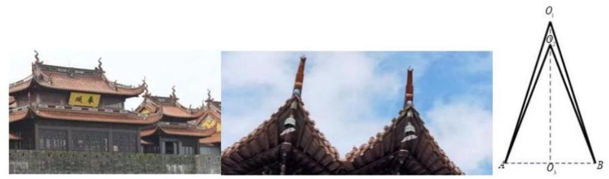

3. (虹口6) 若某圆锥的底面半径为 1，高为1，则该圆锥的侧面积为___. (结果保留π).

4. (黄浦 4) 若圆柱的底面半径与高均为 1，则其侧面积为___.

5. (嘉定 6) 某圆锥的母线长为 2，底面半径为 1，则该圆锥的侧面积为___.

6. (金山 7) 已知某圆锥的侧面展开图是圆心角为 $\sqrt{2}\pi$ ，半径为 2 的扇形，则该圆锥的母线与底面所成角的大小为 ___.

7. (闵行 5 ) 已知圆锥的高为 8 ，底面半径为 6 ，则该圆锥的侧面积为___.

8. (普陀 8) 若圆锥 ${PO}$ 的体积为 $\frac{2\sqrt{2}\pi }{3}$ ，它的母线与底面所成的角的余弦值为 $\frac{1}{3}$ ，则圆锥 ${PO}$ 的表面积为___.

9. (青浦 8) 已知圆柱 $M$ 的底面半径为3,高为 $\sqrt{3}$ ,圆锥 $N$ 的底面直径和母线长相等. 若圆柱 $M$ 和圆锥 $N$ 的体积相同，则圆锥 $N$ 的底面半径为___.

10. (松江 6 ) 已知一个圆锥的底面半径为3，其侧面积为 ${15\pi }$ ，则该圆锥的高为___.

11. (徐汇 11) 徐汇滨江作为 2024 年上海国际鲜花展的三个主会场之一, 吸引了广大市民前往观展并拍照留念. 图中的花盆是种植鲜花的常见容器, 它可视作两个圆台的组合体, 上面圆台的上，下底面直径分别为 ${30}\mathrm{\;{cm}}$ 和 ${26}\mathrm{\;{cm}}$ ，下面圆台的上，下底面直径分别为 ${24}\mathrm{\;{cm}}$ 和 ${18}\mathrm{\;{cm}}$ ，且两个圆台侧面展开图的圆弧所对的圆心角相等. 若上面圆台的高为 $8\mathrm{\;{cm}}$ ， 则该花盆上、下两部分母线长的总和为___ ${cm}$ .

12. (杨浦 7) 已知一个正四棱锥的每一条棱长都为 2 ，则该四棱锥的体积为___.

13. (长宁 2 ) 已知圆锥的底面半径为 1,母线长为 2,则该圆锥的体积是___. (结果保留 $\pi$ ).

14. (宝山 15 ) 如图,正四棱柱 ${ABCD} - {A}_{1}{B}_{1}{C}_{1}{D}_{1}$ 的底面 ${ABCD}$ 边长为 1， $E$ 为 ${AD}$ 上任意一点， $F$ 为 $C{C}_{1}$ 中点，若棱 ${C}_{1}{D}_{1}$ 上至少存在一点 $P$ 使得 ${PE} \bot  {PF}$ ，则棱长 $A{A}_{1}$ 的最大值为 ( )

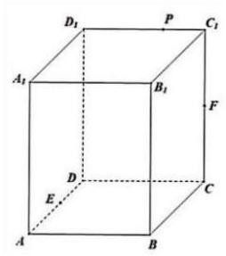

A. $\frac{\sqrt{2}}{2}$ B. 1 C. $\sqrt{2}$ D. 2

15. (崇明 14) 已知直线 $l$ 和平面 $\alpha$ ，则 “ $l$ 垂直于平面 $\alpha$ 内的两条直线” 是 “ $l \bot  \alpha$ ” 的( )

A. 充分非必要条件 B. 必要非充分条件

C. 充要条件 D. 既非充分也非必要条件

16. (黄浦 14) 若从正方体八个顶点中任取四个顶点分别记为 $A, B, C, D$ ,则直线 ${AB}$ 与 ${CD}$ 所成角的大小不可能为 ( )

A. ${30}^{ \circ  }$ B. ${45}^{ \circ  }$ C. 60° D. ${90}^{ \circ  }$

17. ${}^{ \circ  }$ 取两条异面的面对角线即可,

18. ${}^{ \circ  }$ 取平行面的两条垂直的面对角线即可,

故选 $A$ .

19. (金山 16) 已知三棱锥 ${A}_{1} - {A}_{2}{A}_{3}{A}_{4}$ 的侧棱长相等,且侧棱两两垂直. 设 $P$ 为该三棱锥表面 (含棱) 上异于顶点 ${A}_{1},{A}_{2},{A}_{3},{A}_{4}$ 的点,记 $D = \left\{  {d\left| d\right|  = \left| {P{A}_{i}}\right| ,\mathrm{i} = 1,2,3,4}\right\}$ . 若集合 $D$ 中有且只有 2 个元素,则符合条件的点 $P$ 有 $\left( \right)$ 个.

A. 3 B. 6 C. 7 D. 10

20. (静安 15)我国古代数学著作《九章算术》中将四个面都是直角三角形的空间四面体叫做 “鳖臑”. 如图是一个水平放置的 $\bigtriangleup {ABC},{CD} \bot  {AB},\angle A = {30}^{ \circ  },\angle B = {45}^{ \circ  }$ . 现将 ${Rt} \; \bigtriangleup {ACD}$ 沿 ${CD}$ 折起,使点 $A$ 移动到点 ${A}^{\prime }$ ,使得空间四面体 ${A}^{\prime }{BCD}$ 恰好是一个 “鳖臑”, 则二面角 ${A}^{\prime } - {CD} - B$ 的大小为 ( )

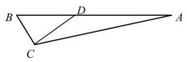

A. 60° B. ${90}^{ \circ  }$ C. arctan 2

D. ${\arccos }^{\frac{\sqrt{3}}{3}}$

21. (闵行 13) 在空间中，“直线 $a, b$ 为异面直线” 是 “直线 $a, b$ 不相交” 的 ( )

A. 充分非必要条件 B. 必要非充分条件

C. 充要条件 D. 既非充分又非必要条件

22. (浦东 14) 设 $m, n$ 为两条直线, $\alpha ,\beta$ 为两个平面,且 $\alpha  \cap  \beta  = n$ . 下述四个命题中为假命题的是 ( )

A. 若 $m \bot  \alpha$ ,则 $m \bot  n$ B. 若 $m//\alpha$ ,则 $m//n$

C. 若 $m//\alpha$ 且 $m//\beta$ ,则 $m//n$ D. 若 $m//n$ ,则 $m//\alpha$ 或 $m//\beta$

23. (徐汇6) 已知 $m, n$ 为空间中两条不同的直线， $\alpha ,\beta$ 为两个不同的平面，若 $m \subset  \alpha ,\alpha  \cap  \beta \; = n$ ，则 $m//n$ 是 $m//\beta$ 的___条件 (填:“充分非必要”、“必要非充分”、“充要”、“既非充分又非必要”中的一个).

24. (崇明 9 ) 在空间直角坐标系中，点 $\left( {1,2,3}\right)$ 关于 ${xOy}$ 平面的对称点的坐标是___.

25. (奉贤 15) 在四棱锥 $S - {ABCD}$ 中，若 $\overrightarrow{SA} = x\overrightarrow{SB} + y\overrightarrow{SC} + z\overrightarrow{SD}$ ，则实数组 $\left( {x, y, z}\right)$ 可能是 ( )

A. $\left( {1, - 1,1}\right)$ B. $\left( {1,0, - 1}\right)$ C. $\left( {1,0,0}\right)$ D. $\left( {1, - 1, - 1}\right)$

26. (虹口9) 如图,已知正三角形 ${ABC}$ 和正方形 ${BCDE}$ 的边长均为 2,且二面角 $A - {BC} - D$ 的大小为 $\frac{\pi }{6}$ ，则 $\overrightarrow{AC} \cdot  \overrightarrow{BD} =$ ___.

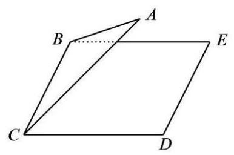

27. (虹口 15) 已知边长为 2 的正四面体 $A - {BCD}$ 的内切球 (球面与四面体四个面都相切的球) 的球心为 $O$ ,若空间中的动点 $P$ 满足 $\overrightarrow{OP} = x\overrightarrow{OC} + y\overrightarrow{OB} + z\overrightarrow{OD}, x, y, z \in  \left\lbrack  {0,1}\right\rbrack$ ,则点 $P$ 的轨迹所形成的几何体的体积为 ( )

A. $\sqrt{2}$

B. $\frac{\sqrt{2}}{3}$ C. $2\sqrt{3}$

D. $\frac{\sqrt{3}}{3}$

28. (黄浦 8) 在正四面体 ${ABCD}$ 中,点 $N$ 是 $\bigtriangleup {ABC}$ 的中心,若

$\overrightarrow{DN} = \lambda \overrightarrow{DA} + \mu \overrightarrow{DB} + v\overrightarrow{BC}\left( {\lambda ,\mu , v \in  R}\right)$ ，则 $\lambda  + \mu  + v =$ ___.

29. (嘉定 10) 已知空间向量 $\overrightarrow{O{B}_{1}},\overrightarrow{O{B}_{2}},\overrightarrow{O{B}_{3}}$ 两两垂直,若空间点 $A$ 满足 $\left| \overrightarrow{A{B}_{1}}\right|  = \left| \overrightarrow{A{B}_{2}}\right|  = \; \left| \overrightarrow{A{B}_{3}}\right|  = 1$ ，记 $\overrightarrow{OP} = \overrightarrow{O{B}_{1}} + \overrightarrow{O{B}_{2}} + \overrightarrow{O{B}_{3}}$ ，且 $\left| \overrightarrow{AP}\right|  \leq  1$ ，则 $\left| \overrightarrow{OA}\right|$ 的取值范围为___.

30. (静安 16) 在四棱锥 $P - {ABCD}$ 中, $\overrightarrow{AB} = \left( {4, - 2,3}\right) ,\overrightarrow{AD} = \left( {-4,1,0}\right) ,\overrightarrow{AP} = \left( {-6,2, - 8}\right)$ , 则该四棱锥的高为 ( )

A. 4 B. 3 C. 2 D. 1

31. (浦东 11 ) 已知空间中三个单位向量 $\overrightarrow{O{A}_{1}},\overrightarrow{O{A}_{2}},\overrightarrow{O{A}_{3}},\overrightarrow{O{A}_{1}} \cdot  \overrightarrow{O{A}_{2}} = \overrightarrow{O{A}_{2}} \cdot  \overrightarrow{O{A}_{3}} = \overrightarrow{O{A}_{3}}$ . $\overrightarrow{O{A}_{1}} = 0, P$ 为空间中一点,且满足 $\left| {\overrightarrow{OP} \cdot  \overrightarrow{O{A}_{1}}}\right|  = 1,\left| {\overrightarrow{OP} \cdot  \overrightarrow{O{A}_{2}}}\right|  = 2,\left| {\overrightarrow{OP} \cdot  \overrightarrow{O{A}_{3}}}\right|  = 3$ ,则点 $P$ 个数的最大值为___.

32. (普陀 9) 设 $\lambda  \in  R$ ,在如图所示的平行六面体 ${ABCD} - {A}_{1}{B}_{1}{C}_{1}{D}_{1}$ 中, $\angle {A}_{1}{AB} = \angle {A}_{1}{AD} = \; \angle {BAD} = \frac{\pi }{3}, A{A}_{1} = 2,{AB} = {AD} = 1$ ,点 $M$ 是棱 ${C}_{1}{D}_{1}$ 的中点, $\overrightarrow{{A}_{1}N} = \lambda \overrightarrow{{A}_{1}{D}_{1}}$ ,若 $\overrightarrow{AM}$ . $\overrightarrow{CN} = 2$ ，则 $\lambda$ 的值为___.

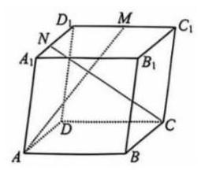

33. (青浦 14) 若点 $P\left( {a, b, c}\right) \left( {{abc} \neq  0}\right)$ 关于平面 ${xOy}$ 的对称点为 $A$ ,关于 $z$ 轴的对称点为 $B$ , 则 $A\text{ 、 }B$ 两点 ( )

A. 关于坐标原点 $O$ 对称 B. 关于 $x$ 轴对称

C. 关于 $y$ 轴对称 D. 关于平面 ${xOz}$ 对称

34. (长宁 12) 点 $P, M, N$ 分别位于正方体 ${ABCD} - {A}^{\prime }{B}^{\prime }{C}^{\prime }{D}^{\prime }$ 的面上, ${AB} = 1$ ,则 $\overrightarrow{PM} \cdot  \overrightarrow{PN}$ 的最小值是___.

35. (宝山 17 ) 如图,四棱锥 $P - {ABCD}$ 中,底面 ${ABCD}$ 为矩形, ${PA} = {PB} = {AD} = 3,{AB} =$ 4 ，且该四棱锥的体积为 $4\sqrt{5}$ .

(1)证明:平面 ${PAB} \bot$ 底面 ${ABCD}$ ；

(2)求异面直线 ${PC}$ 和 ${AB}$ 所成角的余弦值.

36. (崇明 17) 如图,在直三棱柱 ${ABC} - {A}_{1}{B}_{1}{C}_{1}$ 中， $E$ ， $F$ 分别为 ${A}_{1}{C}_{1}$ ， ${BC}$ 的中点， $A{A}_{1} = \; {AB} = {BC} = 2,\;{C}_{1}F \bot  {AB}.$

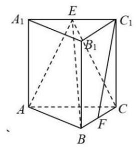

(1)求证: ${C}_{1}F//$ 平面 ${ABE}$ ；

(2)求点 $C$ 到平面 ${ABE}$ 的距离.

37. (奉贤 19) 如图为正四棱锥 $P - {ABCD}, O$ 为底面 ${ABCD}$ 的中心.

(1) 求证: ${CD}//$ 面 ${PAB}$ ,平面 ${PAC} \bot$ 平面 ${PBD}$ ;

(2)设 $E$ 为 ${PB}$ 上的一点， $\overrightarrow{BE} = \frac{2}{3}\overrightarrow{BP}$ .

在下面两问中选一个，若都选，只按第①问阅卷，第①问满分 5 分，第②问满分 7 分

①若 ${AD} = {AP} = 3\sqrt{2}$ ，求直线 ${EC}$ 与平面 ${BED}$ 所成角的大小；

②已知平面 ${ECD}$ 与平面 ${ABCD}$ 所成锐二面角的大小为 $\arctan \frac{\sqrt{2}}{2}$ ，若 ${AD} = {3\sqrt{2}}$ ，求 ${AP}$ 的长.

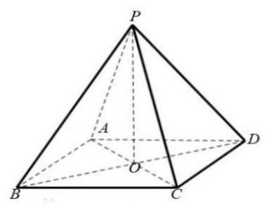

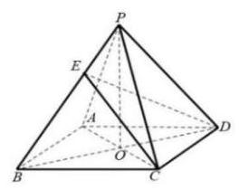

38. an $\angle {PBO} = \frac{OP}{OB} = \frac{3}{3} = 1$ ,所以 $\angle {PBO} = \frac{\pi }{4}$ ,

利用余弦定理得 $O{E}^{2} = B{E}^{2} + B{O}^{2} - {2BE} \cdot  {BO}\cos \angle {EBO} = 8 + 9 - 2 \cdot  2\sqrt{2} \cdot  3 \cdot  \frac{\sqrt{2}}{2} = 5$ . 3 分

所以 $\tan \angle {OEC} = \frac{OC}{OE} = \frac{3}{OE} = \frac{3\sqrt{5}}{5}$

所以直线 ${EC}$ 与面 ${BED}$ 所成角的大小为 $\arctan \frac{3\sqrt{5}}{5}$ . 1 分

选②，已知平面 ${ECD}$ 与平面 ${ABCD}$ 所成锐二面角的大小为 $\arctan \frac{\sqrt{2}}{2}$ ，

${AD} = 3\sqrt{2}$ ,可以计算 ${AO} = {OC} = {BO} = {DO} = 3$ . 1 分

在平面 ${PBD}$ 内过 $E$ 点作 ${EF} \bot  {BD}$ 交于点 $F$ ，

由 ${PO} \bot$ 底面 ${ABCD}$ 得 ${PO} \bot  {BD}$ ,所以 ${EF}//{PO}$ . 1 分

所以 ${EF} \bot$ 底面 ${ABCD}$ 1 分

过 $F$ 点作 ${FH} \bot  {CD}$ 交 ${CD}$ 于点 $H$ ，

连接 ${HE}$ ,由三垂线定理得 ${EH} \bot  {CD}$ ,. 1 分

$\angle {EHF}$ 是平面 ${ECD}$ 与平面 ${ABCD}$ 所成的二面角的平面角,

$\overrightarrow{BE} = \frac{2}{3}\overrightarrow{BP}$ ，可以得到 $\overrightarrow{FH} = \frac{2}{3}\overrightarrow{BC}$ ， ${FH} = \frac{2}{3}{BC} = \frac{2}{3}{AD} = 2\sqrt{2}$ ，

所以 $\tan \angle {EHF} = \frac{EF}{HF} = \frac{EF}{2\sqrt{2}} = \frac{\sqrt{2}}{2}$ ，所以 ${EF} = 2,{OP} = 3$ 1 分 ${PA} = \sqrt{A{O}^{2} + P{O}^{2}} = \; 3\sqrt{2}1$ 分

${AD} = 3\sqrt{2}$ ,可以计算 ${AO} = {OC} = {BO} = {DO} = 3$ . 1 分

在平面 ${PBD}$ 内过 $E$ 点作 ${EF} \bot  {BD}$ 交于点 $F$ ,

由 ${PO} \bot$ 底面 ${ABCD}$ 得 ${PO} \bot  {BD}$ ,所以 ${EF}//{PO}$ . 1 分

所以 ${EF} \bot$ 底面 ${ABCD}$ ,

过 $F$ 点作 ${FH} \bot  {CD}$ 交 ${CD}$ 于点 $H$ ，

连接 ${HE}$ ,由三垂线定理得 ${EH} \bot  {CD}$ . 1 分

$\angle {EHF}$ 是平面 ${ECD}$ 与平面 ${ABCD}$ 所成的二面角的平面角 1 分

$\overrightarrow{BE} = \frac{2}{3}\overrightarrow{BP}$ ，可以得到 $\overrightarrow{FH} = \frac{2}{3}\overrightarrow{BC}$ ， ${FH} = \frac{2}{3}{BC} = \frac{2}{3}{AD} = 2\sqrt{2}$ ，

所以 $\tan \angle {EHF} = \frac{EF}{HF} = \frac{EF}{2\sqrt{2}} = \frac{\sqrt{2}}{2}$ ,

所以 ${EF} = 2,{OP} = 3$ . 1 分

${PA} = \sqrt{A{O}^{2} + P{O}^{2}} = 3\sqrt{2}$ . 1 分

法二:

以 $O$ 为原点， ${OB}$ ， ${OC}$ ， ${OP}$ 所在直线分别为 $x$ ， $y$ ， $z$ 轴建立空间直角坐标系，

选①，若 ${AD} = {AP} = {3\sqrt{2}}$ ，求直线 ${EC}$ 与面 ${BED}$ 所成角的大小；

点 $P\left( {0,0,3}\right)$ ,点 $B\left( {3,0,0}\right)$ ,

因为 $\overrightarrow{BE} = \frac{2}{3}\overrightarrow{BP}$ ,所以 $E\left( {1,0,2}\right)$ . 1 分

由 (1) 得 ${AC} \bot$ 平面 ${PBD}$ ,

所以平面 ${BED}$ 的一个法向量 $\overrightarrow{n} = \overrightarrow{OC} = \left( {0,1,0}\right)$ . 1 分

所以 $\cos  < \overrightarrow{EC},\overrightarrow{n} >  = \frac{3\sqrt{14}}{14}.\;$ 2 分

所以直线 ${EC}$ 与面 ${BED}$ 所成角的大小 $\arcsin \frac{3\sqrt{14}}{14} \cdot  1$ 分

若选②，已知平面 ${ECD}$ 与平面 ${ABCD}$ 所成二面角的大小为 $\arctan \frac{\sqrt{2}}{2}$ ，

点 $C\left( {0,3,0}\right)$ ,点 $B\left( {3,0,0}\right) , D\left( {-3,0,0}\right)$ ,设 $P\left( {0,0, h}\right)$ ,

因为 $\overrightarrow{BE} = \frac{2}{3}\overrightarrow{BP}$ ,所以 $E\left( {1,0,\frac{2}{3}h}\right)$ ,

易得 $\overrightarrow{CE} = \left( {1, - 3,\frac{2}{3}h}\right) ,\overrightarrow{CD} = \left( {-3, - 3,0}\right)$ ,

设平面 ${ECD}$ 的一个法向量为 ${\overrightarrow{n}}_{1} = \left( {x, y, z}\right)$ ,得 $\left\{  \begin{array}{l} x - {3y} + \frac{2}{3}h = 0 \\   - {3x} - {3y} = 0 \end{array}\right.$ ,

求得 ${\overrightarrow{n}}_{1} = \left( {h, - h, - 6}\right) .2$ 分

又平面 ${ABCD}$ 的一个法向量为 ${\overrightarrow{n}}_{2} = \left( {0,0,1}\right)$ ,

所以 $\cos {\overrightarrow{n}}_{1},{\overrightarrow{n}}_{2} =  - \frac{6}{\sqrt{2{h}^{2} + {36}}},.2$ 分

又因为平面 ${ECD}$ 与平面 ${ABCD}$ 所成二面角的大小为 $\arctan \frac{\sqrt{2}}{2}$ ,

所以 $\left| {-\frac{6}{\sqrt{2{h}^{2} + {36}}}}\right|  = \frac{\sqrt{6}}{3}$ ,解得 $h = 3$ , 1 分

${PA} = \sqrt{A{O}^{2} + P{O}^{2}} = 3\sqrt{2}$ . 1 分

39. (虹口18) 如图,已知在四棱柱 ${ABCD} - {EFGH}$ 中, ${EA} \bot$ 平面 ${ABCD}, N, M$ 分别是 ${EF},{HD}$ 的中点.

(1)求证: ${HN}//$ 平面 ${AFM}$ ；

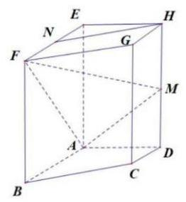

(2)若底面 ${ABCD}$ 为梯形， ${AB}//{CD},{AB} = {EA} = 2,{AD} = {DC} = 1$ ，异面直线 ${AB}$ 与 ${EH}$ 所成角为 $\frac{\pi }{2}$ . 求直线 ${AN}$ 与平面 ${AFM}$ 所成角的正弦值.

40. (黄浦17) 如图,在正方体 ${ABCD} - {A}_{1}{B}_{1}{C}_{1}{D}_{1}$ 中, $E$ 是 $B{C}_{1}$ 的中点.

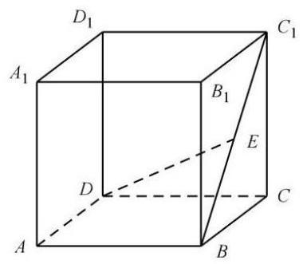

(1)求证: $B{C}_{1} \bot$ 平面 ${CDE}$ ；

(2)求直线 ${DE}$ 与平面 ${ABCD}$ 所成角的大小.

41. (嘉定17) 如图所示，在三棱柱 ${ABC} - {A}_{1}{B}_{1}{C}_{1}$ 中， ${AB} = {AC}$ ，侧面 $B{B}_{1}{C}_{1}C\bot$ 底面 ${ABC}$ . 点 $E, F$ 分别为棱 ${BC}$ 和 ${A}_{1}{C}_{1}$ 的中点.

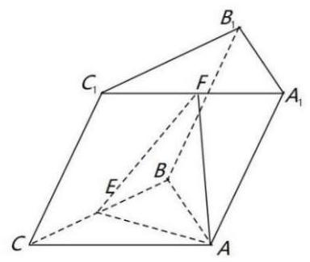

(1)若底面 $\bigtriangleup {ABC}$ 为边长为 2 的正三角形，且 $C{C}_{1} = {BC}$ ，侧棱 $C{C}_{1}$ 与底面 ${ABC}$ 所成的角为 ${60}^{ \circ  }$ ,求三棱柱 ${ABC} - {A}_{1}{B}_{1}{C}_{1}$ 的体积;

(2)求证: ${EF}//$ 平面 $A{A}_{1}{BB}$ .

42. (金山 18 ) 如图,在四棱锥 $P - {ABCD}$ 中,底面 ${ABCD}$ 是直角梯形, $\angle {BAD} = \angle {CDA} = {90}^{ \circ  }$

, ${PA} \bot$ 平面 ${ABCD}$ , $Q$ 是 ${PB}$ 的中点, ${PA} = {AD} = {DC} = 1,{AB} = 2$ .

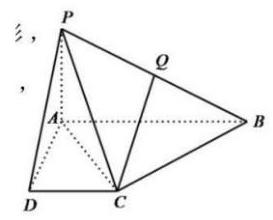

(1)证明: ${CQ}//$ 平面 ${PAD}$ ；

(2)求点 $D$ 到平面 ${PAC}$ 的距离.

43. (静安 19) 如图所示,正三棱锥 $A - {BCD}$ 的侧面是边长为 2 的正三角形.

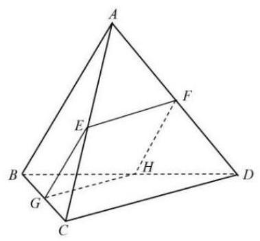

(1)求正三棱锥 $A - {BCD}$ 的体积 $V$ ；

(2)设 $E, F, G$ 分别是线段 ${AC},{AD},{BC}$ 的中点.

求证:① ${CD}//$ 平面 ${EFG}$ ；②若平面 ${EFG}$ 交 ${BD}$ 于点 $H$ ，则四边形 ${EFGH}$ 是正方形.

44. (闵行 17) 在直三棱柱 ${ABC} - {A}_{1}{B}_{1}{C}_{1}$ 中， ${AB} = {AC} = 2,\;{A{A}_{1}} = 3,\;\angle {BAC} = {90}^{ \circ  }$ ，连接 ${A}_{1}C, M, E$ 分别为 ${A}_{1}C$ 和 ${BC}$ 的中点.

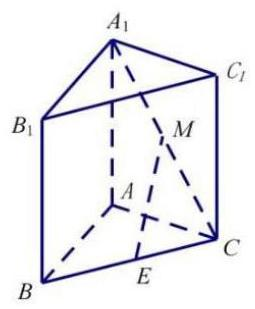

(1)证明:直线 ${EM}//$ 平面 ${A}_{1}{AB}{B}_{1}$ ；

(2)求二面角 ${A}_{1} - {BC} - A$ 的大小.

45. an $\angle {A}_{1}{EA} = \frac{{A}_{1}A}{AE} = \frac{3}{\sqrt{2}} = \frac{3\sqrt{2}}{2}$ ,所以 $\angle {A}_{1}{EA} = \arctan \frac{3\sqrt{2}}{2}$ 12 分

所以二面角 ${A}_{1} - {BC} - A$ 的大小为 $\arctan \frac{3\sqrt{2}}{2}$ . 14 分

46. (浦东 18 ) 如图,已知 ${AB}$ 为圆柱 $O{O}_{1}$ 底面圆 $O$ 的直径, ${OA} = 2$ ,母线 $A{A}_{1}$ 长为 3,点 $P$ 为底面圆 $O$ 的圆周上一点.

(1) 若 $\angle {BOP} = {90}^{ \circ  }$ ，求三棱锥 $A - {PB}{A}_{1}$ 的体积；

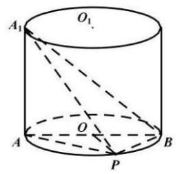

(2)若 $\angle {BOP} = {60}^{ \circ  }$ ，求异面直线 ${A}_{1}B$ 与 ${AP}$ 所成的角的余弦值.

47. (普陀 17) 图 1 所示的平行四边形 ${ABCD}$ 中, ${CA} = {CB} = 1,{CD} = \sqrt{2}$ ,现将 ${\Delta DAC}$ 沿 ${AC}$ 折起,得到如图 2 所示的三棱锥 $P - {ABC}$ ,记棱 ${PC}$ 的中点为 $M$ ,且 ${PB} = \sqrt{3}$ .

(1)求证: ${AM}\bot {BC}$ ；

(2)记棱 ${AB}$ 的中点为 $E$ ，在直线 ${CE}$ 上作出点 $N$ ，使得 ${PN}//$ 平面 ${MAB}$ ，请说明理由； 并求出二面角 $P - {NB} - A$ 的大小.

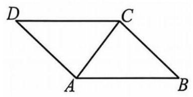

第 17 题图 1

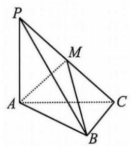

第 17 题图 2

48. (青浦 18) 如图,在三棱锥 $P - {ABC}$ 中,平面 ${PAB} \bot$ 平面 ${ABC},{AB} = 6$ ,

${BC} = 2\sqrt{3}$ ， ${AC} = 2\sqrt{6}$ ， $D$ ， $E$ 分别为线段 ${AB}$ ， ${BC}$ 上的点，且 ${AD} = {2DB}$ ， ${CE} = {2EB},\;{PD} \bot  {AC}.$

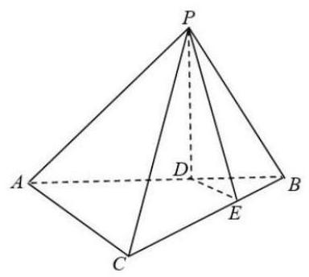

(1)求证: ${DE}//$ 平面 ${PAC}$ ；

(2)求证: ${PD} \bot$ 平面 ${ABC}$ .

49. (松江 18 ) 如图,已知 ${AB} \bot$ 平面 ${ACD},{AB}//{DE},{\Delta ACD}$ 为等边三角形, ${AD} = {DE} = \; {2AB}$ ,点 $F$ 为 ${CD}$ 的中点.

(1)求证: ${AF}//$ 平面 ${BCE}$ ；

(2) 求直线 ${BF}$ 和平面 ${ABC}$ 所成角的正弦值.

50. (徐汇 18) 如图,在四棱锥 $P - {ABCD}$ 中, ${AD}//{BC},\angle {ADC} = \angle {PAB} = \frac{\pi }{2},{BC} = {CD} \; = \frac{1}{2}{AD}$ . $E$ 为棱 ${AD}$ 的中点,异面直线 ${PA}$ 与 ${CD}$ 所成角的大小为 $\frac{\pi }{2}$ .

(1)求证: ${CD}//$ 平面 ${PBE}$ ；

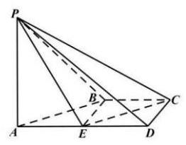

(2)若二面角 $P - {CD} - A$ 的大小为 $\frac{\pi }{4}$ ，求直线 ${PA}$ 与平面 ${PCE}$ 所成角的正弦值.

51. (杨浦17) 如图，在正方体 ${ABCD} - {A}_{1}{B}_{1}{C}_{1}{D}_{1}$ 中，点 $E$ 、 $F$ 分别是棱 ${AB}\text{ 、 }{BC}$ 的中点. (1)求证: ${EF}\bot {B{D}_{1}}$ ；

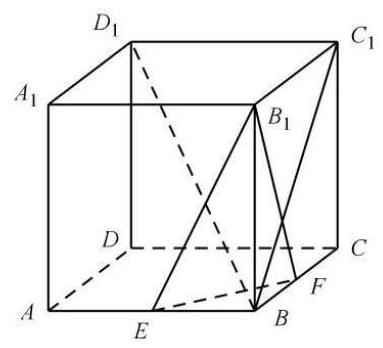

(2)求二面角 ${B}_{1} - {EF} - B$ 的大小.

52. (长宁 18) 如图所示，四棱柱 ${ABCD} - {A}_{1}{B}_{1}{C}_{1}{D}_{1}$ 的底面 ${ABCD}$ 是正方形， $O$ 是底面的中心, ${A}_{1}O \bot$ 平面 ${ABCD},{AB} = A{A}_{1} = \sqrt{2}$ .

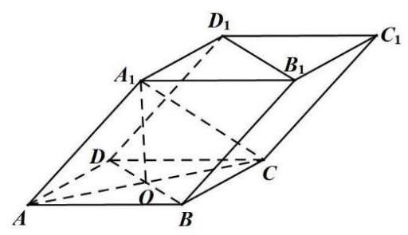

(1)求证: ${A}_{1}C \bot$ 平面 ${BD}{D}_{1}{B}_{1}$ ；

(2)求直线 $O{A}_{1}$ 与平面 $A{A}_{1}B$ 所成角的正弦值.

## 第 12 节圆锥曲线

【几何性质】

1. (宝山 9) 过双曲线 $\frac{{x}^{2}}{9} - \frac{{y}^{2}}{16} = 1$ 的左焦点 $F$ 作圆 ${x}^{2} + {y}^{2} = 9$ 的切线,切点为 $M$ . 延长切线交双曲线的右支于点 $P, O$ 为坐标原点，点 $T$ 为线段 ${FP}$ 的中点，则 $\left| {OT}\right|  =$ ___.

2. (崇明 5) 双曲线 ${x}^{2} - \frac{{y}^{2}}{4} = 1$ 的渐近线方程是___.

3. (奉贤 7) 已知抛物线 ${x}^{2} = {ay}\left( {a > 0}\right)$ 上有一点 $P$ 到准线的距离为 6，点 $P$ 到 $x$ 轴的距离为 4， 则抛物线的焦点坐标为___.

4. (虹口10) 双曲线 ${C}_{1} : \frac{{x}^{2}}{{a}^{2}} - \frac{{y}^{2}}{{b}^{2}} = 1$ 的左、右焦点分别为 ${F}_{1}$ 和 ${F}_{2}$ ,若以点 ${F}_{2}$ 为焦点的抛物线 ${C}_{2} : {y}^{2} = {2px}\left( {p > 0}\right)$ 与 ${C}_{1}$ 在第一象限交于点 $P$ ,且 $\angle P{F}_{1}{F}_{2} = \frac{\pi }{4}$ ,则 ${C}_{1}$ 的离心率为 ___.

5. (黄浦 3) 椭圆 $\frac{{x}^{2}}{4} + \frac{{y}^{2}}{3} = 1$ 的焦距为___.

6. (嘉定 5) 已知双曲线 $C : \frac{{x}^{2}}{3} - \frac{{y}^{2}}{2} = 1$ ，则双曲线 $C$ 的离心率为___.

7. (金山 15) 古希腊数学家阿波罗尼奥斯用不同的平面截同一圆锥, 得到了圆锥曲线, 其中的一种如图所示. 用过 $M$ 点且垂直于圆锥底面的平面截两个全等的对顶圆锥得到双曲线的一部分，已知高 ${PO} = 2$ ，底面圆的半径为4， $M$ 为母线 ${PB}$ 的中点，平面与底面的交线 ${EF} \; \bot  {AB}$ ,则双曲线的两条渐近线所成角的余弦值为 ( )

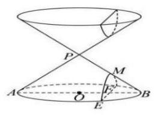

A. $\frac{5}{6}$ B. $\frac{4}{5}$ C. $\frac{3}{4}$ D. $\frac{3}{5}$

8. (静安 5) 到点 ${F}_{1}\left( {-3,0}\right)$ ， ${F}_{2}\left( {3,0}\right)$ 距离之和为 10 的动点 $P$ 的轨迹方程为___.

9. (静安 9) 以双曲线 $\frac{{x}^{2}}{4} - \frac{{y}^{2}}{m} = 1$ 的离心率为半径,以右焦点为圆心的圆与双曲线的渐近线相切,则 $m$ 的值为___.

10. (闵行 10) 已知 ${F}_{1}$ ， ${F}_{2}$ 分别为椭圆 $\frac{{x}^{2}}{4} + \frac{{y}^{2}}{2} = 1$ 的左、右焦点，过 ${F}_{1}$ 的直线交椭圆于 $A$ ， $B$ 两点. 若 $\overrightarrow{A{F}_{1}} \cdot  \overrightarrow{A{F}_{2}} = 0$ ，则 $\overrightarrow{A{F}_{2}} \cdot  \overrightarrow{B{F}_{2}} =$ ___.

11. (浦东 9) 已知双曲线 ${x}^{2} - \frac{{y}^{2}}{3} = 1$ 的左、右焦点分别为 ${F}_{1},{F}_{2}$ ,双曲线上的点 $P$ 在第一象限，且 $P{F}_{2}$ 与双曲线的一条渐近线平行，则 ${\Delta P}{F}_{1}{F}_{2}$ 的面积为___.

12. (普陀 2) 若抛物线的准线方程为 $y = 1$ ，则该抛物线的标准方程为___.

13. (普陀 7) 设椭圆 $C : \frac{{x}^{2}}{{a}^{2}} + \frac{{y}^{2}}{{b}^{2}} = 1\left( {a > b > 0}\right)$ 的左、右焦点分别为 ${F}_{1},{F}_{2}$ ,左顶点为 $A$ ,若椭圆 $C$ 的离心率为 $\frac{1}{3}$ ，则 $\frac{\left| {F}_{2}A\right| }{\left| A{F}_{1}\right| }$ 的值为___.

14. (青浦 5) 两条渐近线互相垂直的双曲线的离心率为___.

15. (徐汇 10) 已知椭圆 $\frac{{x}^{2}}{{a}^{2}} + \frac{{y}^{2}}{{b}^{2}} = 1\left( {a > b > 0}\right)$ 的左、右焦点分别为 ${F}_{1},{F}_{2}, P$ 为椭圆上一点, 且 $\angle P{F}_{2}{F}_{1} = \frac{\pi }{3}$ ，若此椭圆的离心率为 $\sqrt{3} - 1$ ，则 $\angle P{F}_{1}{F}_{2}$ 的大小为___.

16. (徐汇 13) 下列抛物线中,焦点坐标为 $\left( {0,\frac{1}{8}}\right)$ 的是 $\left( C\right)$

A. ${y}^{2} = \frac{1}{2}x$ B. ${y}^{2} = \frac{1}{4}x$ C. ${x}^{2} = \frac{1}{2}y$ D. ${x}^{2} = \frac{1}{4}y$

17. (杨浦 11) 中国探月工程又称 “嫦娥工程”, 是中国航天活动的第三个里程碑. 在探月过程中, 月球探测器需要进行变轨, 即从一条椭圆轨道变到另一条不同的椭圆轨道上. 若变轨前后的两条椭圆轨道均以月球中心为一个焦点, 变轨后椭圆轨道上的点与月球中心的距离最小值保持不变, 而距离最大值扩大为变轨前的 4 倍, 椭圆轨道的离心率扩大为变轨前的 2.5 倍，则变轨前的椭圆轨道的离心率为___(精确到 0.01).

18. (宝山 16) 设 $\Delta {A}_{n}{B}_{n}{C}_{n}$ 的三边长分别为 ${a}_{n},{b}_{n},{c}_{n}$ ，面积为 ${S}_{n}$ ( $n$ 为正整数). 若 ${b}_{1} - {c}_{1} = \; \frac{1}{2}{a}_{1}$ ,其中 ${c}_{1} > \frac{1}{4}{a}_{1},{a}_{n + 1} = {a}_{n},{b}_{n + 1} = {c}_{n} + \frac{1}{4}{a}_{n},{c}_{n + 1} = {b}_{n} + \frac{1}{4}{a}_{n}$ ,则

A. $\left\{  {S}_{n}\right\}$ 为严格减数列

B. $\left\{  {S}_{n}\right\}$ 为严格增数列

C. $\left\{  {S}_{{2n} - 1}\right\}$ 为严格增数列, $\left\{  {S}_{2n}\right\}$ 为严格减数列

D. $\left\{  {S}_{{2n} - 1}\right\}$ 为严格减数列, $\left\{  {S}_{2n}\right\}$ 为严格增数列

19. (嘉定 12) 已知实数 ${x}_{1},{x}_{2},{y}_{1},{y}_{2}$ 满足: ${x}_{1}^{2} + {y}_{1}^{2} = 1,{x}_{2}^{2} + {y}_{2}^{2} = 1,{x}_{1}{x}_{2} + {y}_{1}{y}_{2} = \frac{1}{2}$ ,则 $\frac{\left| {x}_{1} + {y}_{1} - 1\right| }{\sqrt{5}} + \frac{\left| {x}_{2} + {y}_{2} - 1\right| }{\sqrt{2}}$ 的最小值为___.

20. (宝山 20) 已知椭圆 $\Gamma  : \frac{{x}^{2}}{9} + \frac{{y}^{2}}{3} = 1$ ，直线 $l$ 经过椭圆 $\Gamma$ 的右顶点 $P$ 且与椭圆交于另一点 $A$ ，设线段 ${AP}$ 的中点为 $M$ .

(1)求椭圆 $\Gamma$ 的焦距和离心率；

(2)若 ${k}_{OM} =  - \frac{1}{3}$ ，求直线 ${AP}$ 的方程；

(3)过点 $P$ 再作一条直线与椭圆 $\Gamma$ 交于点 $B$ ，线段 ${BP}$ 的中点为 $N$ . 若 ${OM}\bot {ON}$ ，则直线 ${AB}$ 是否经过定点,若经过定点,求出定点坐标; 若不经过定点,请说明理由.

21. (崇明 20) 已知椭圆 $\Gamma  : \frac{{y}^{2}}{4} + \frac{{x}^{2}}{3} = 1$ ，点 ${F}_{1}\text{ 、 }{F}_{2}$ 分别是椭圆的下焦点和上焦点，过点 ${F}_{2}$ 的直线 $l$ 知椭圆交于 $A$ 、 $B$ 两点.

(1)若直线 $l$ 平行于 $x$ 轴,求线段 ${AB}$ 的长；

(2)若点 $A$ 在 $y$ 轴左侧，且 $\overrightarrow{{F}_{1}A} \cdot  \overrightarrow{{F}_{2}A} = \frac{9}{4}$ ，求直线 $l$ 的方程；

(3)已知椭圆上的点 $C$ 满足 $\left| {CA}\right|  = \left| {CB}\right|$ ，是否存在直线 $l$ 使得 $\bigtriangleup  {ABC}$ 的重心在 $x$ 轴上？若存在,请求出直线 $l$ 的方程,若不存在,请说明理由.

22. (奉贤 20) 椭圆 $\Gamma  : \frac{{x}^{2}}{{a}^{2}} + {y}^{2} = 1\left( {a > 1}\right)$ 的左右焦点分别为 ${F}_{1},{F}_{2}$ ,设 $P\left( {{x}_{0},{y}_{0}}\right)$ 是第一象限内椭圆上的一点， $P{F}_{1}$ 的延长线分别交椭圆于点 $Q\left( {{x}_{1},{y}_{1}}\right)$ .

(1)若椭圆的离心率 $\frac{\sqrt{2}}{2}$ ，求 $a$ 的值；

(2)若 $a = \sqrt{2}$ ， $\overrightarrow{PQ} \cdot  \overrightarrow{O{F}_{1}} = \frac{12}{5}$ ，求 ${x}_{0}$ :

(3)若 $a = 2$ ，过点 $T\left( {0, t}\right)$ 的直线 $L$ 与椭圆 $\Gamma$ 交于 $M, N$ 两点，且 $\left| {MN}\right|  = 2$ ，则当 $t \geq  0$ 时, 判断符合要求的直线有几条, 说明理由?

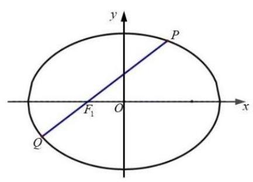

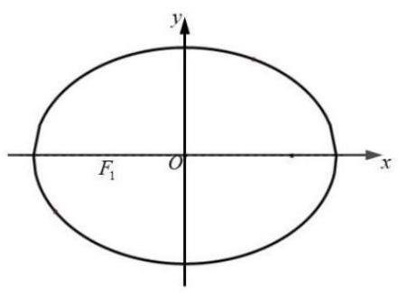

23. ${k}^{2} + 3 - 4{t}^{2} - 4{k}^{2}{t}^{2} = 0$ ,

24. $= \sqrt{3}$ 时,方程 ${12}{k}^{2} + 3 - 4{t}^{2} - 4{k}^{2}{t}^{2} = 0$ 方程无解. .1 分

25. $\neq  \sqrt{3}$ 时, ${k}^{2} = \frac{4{t}^{2} - 3}{{12} - 4{t}^{2}} \geq  0$ ,

当 $t = \frac{\sqrt{3}}{2}$ 时,存在直线斜率为 0 的直线 $y = \frac{\sqrt{3}}{2}$ ,使得 $\left| {MN}\right|  = 2.1$ 分当 $\frac{3}{4} < {t}^{2} < 3$ 时,即 $\frac{\sqrt{3}}{2} < t < \sqrt{3}$ ,

存在 $k =  \pm  \sqrt{\frac{4{t}^{2} - 3}{{12} - 4{t}^{2}}}$ 的两条直线,使得 $\left| {MN}\right|  = 2$ . 1 分

所以 $\frac{\sqrt{3}}{2} < t < \sqrt{3}$ 存在 3 条直线,使得 $\left| {MN}\right|  = 2$ ,

26. $= \frac{\sqrt{3}}{2}$ 存在 2 条直线,使得 $\left| {MN}\right|  = 2$ ,

27. $\geq  \sqrt{3}$ 或 $0 \leq  t < \frac{\sqrt{3}}{2}$ 存在 1 条直线,使得 $\left| {MN}\right|  = 2$ . 1 分

28. (虹口20) 已知椭圆 $\Gamma  : \frac{{x}^{2}}{4} + {y}^{2} = 1$ 的左、右焦点分别为 ${F}_{1},{F}_{2}$ ,右顶点为 $A$ ,上顶点为 $B$ ,设 $P$ 为 $\Gamma$ 上的一点.

(1)当 $P{F}_{1} \bot  {F}_{1}{F}_{2}$ 时，求 $\left| {P{F}_{2}}\right|$ 的值；

(2)若 $P$ 点坐标为 $\left( {1,\frac{\sqrt{3}}{2}}\right)$ ，则在 $\Gamma$ 上是否存在点 $Q$ 使 $\bigtriangleup  {APQ}$ 的面积为 $\frac{\sqrt{3} + 1}{2}$ ，若存在,请求出所有满足条件的点 $Q$ 的坐标; 若不存在,请说明理由;

(3) 已知 $D$ 点坐标为 $\left( {0, m}\right)$ ,过点 $P$ 和点 $D$ 的直线 $l$ 与椭圆 $\Gamma$ 交于另一点 $T$ ,当直线 $l$ 与 $x$ 轴和 $y$ 轴均不平行时,有 $\overrightarrow{PT} \cdot  \left( {\overrightarrow{BP} + \overrightarrow{BT}}\right)  = 0$ ,求实数 $m$ 的取值范围.

29. (黄浦 20 ) 双曲线 $\Gamma  : \frac{{x}^{2}}{{a}^{2}} - \frac{{y}^{2}}{{b}^{2}} = 1\left( {a > 0, b > 0}\right)$ 的左、右焦点分别为 ${F}_{1}\left( {-c,0}\right)$ , ${F}_{2}\left( {c,0}\right) \left( {c > 0}\right)$ ,过点 ${F}_{1}$ 的直线 $l$ 与 $\Gamma$ 右支在 $x$ 轴上方交于点 $A$ .

(1)若 $a = \sqrt{5}$ ，点 $A$ 的坐标为 $\left( {3,4}\right)$ ，求 $c$ 的值；

(2)若 $A{F}_{2} \bot  {F}_{1}{F}_{2}$ ，且 $a$ ， $b$ ， $c$ 是等比数列，求证:直线 $l$ 的斜率为定值；

(3) 设直线 $l$ 与 $\Gamma$ 左支的交点为 $B, c = 3$ ,当且仅当 $a$ 满足什么条件时,存在直线 $l$ ,使得 $\left| {AB}\right|  = \left| {A{F}_{2}}\right|$ 成立.

30. (嘉定 20) 在平面直角坐标系 ${xOy}$ 中,已知椭圆 $\Gamma  : \frac{{x}^{2}}{5} + \frac{{y}^{2}}{4} = 1,{F}_{1}\text{ 、 }{F}_{2}$ 是其左、右焦点, 过椭圆 $\Gamma$ 右焦点 ${F}_{2}$ 的直线 ${PQ}$ 交椭圆于 $P$ 、 $Q$ 两点.

(1)若 $\overrightarrow{P{F}_{1}} \cdot  \overrightarrow{P{F}_{2}} = 3$ ，求点 $P$ 的坐标；

(2)若 $\Delta {F}_{1}{PQ}$ 的面积为 $\frac{40}{21}$ ，求直线 ${PQ}$ 的方程；

(3)设直线 $l$ 与椭圆 $\Gamma$ 交于 $A, B$ 两点， $M$ 为线段 ${AB}$ 的中点. 当 ${k}_{OM} \cdot  {k}_{AB} = {k}_{OA} \cdot  {k}_{OB}$ 时， $\bigtriangleup {OAB}$ 的面积是否为定值? 如果是,请求出这个定值: 如果不是,请说明理由.

31. (金山 20) 已知椭圆 ${\Gamma }_{1} : \frac{{x}^{2}}{4} + \frac{{y}^{2}}{3} = 1$ ,抛物线 ${\Gamma }_{2} : {y}^{2} = {2px}\left( {p > 0}\right)$ 与 ${\Gamma }_{1}$ 有一个相同的焦点 $F$ . 点点 $F$ 作互相垂直的两条直线 $l$ 与 ${l}^{\prime }$ ,直线 $l$ 与 ${\Gamma }_{1}$ 交于点 $A, B$ ,直线 ${l}^{\prime }$ 与 ${\Gamma }_{2}$ 交于点 $C, D$ .

(1)求椭圆 ${\Gamma }_{1}$ 的离心率及抛物线 ${\Gamma }_{2}$ 的方程;

(2)若直线 $l$ 的倾斜角为 $\frac{3\pi }{4}$ ，求 ${AB}$ 中点 $M$ 的坐标；

(3)四边形 ${ACBD}$ 的面积是否存在最小值，若存在，求出最小值；若不存在，请说明理由.

32. (静安 20) 如图的封闭图形的边缘由抛物线 $\Gamma$ 和垂直于抛物线对称轴的线段 ${AB}$ 组成. 已知 ${AB} = 4$ ,抛物线的顶点到线段 ${AB}$ 所在直线的距离为 2 .

(1)请用数学语言表达这个封闭图形的边缘；

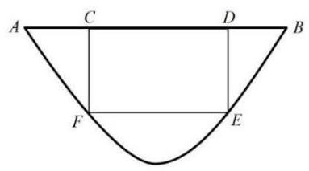

(2)在该封闭图形上截取一个矩形 ${CDEF}$ ，其中点 $C$ ， $D$ 在线段 ${AB}$ 上，点 $E$ ， $F$ 在抛物线 $\Gamma$ 上. 求以矩形 ${CDEF}$ 为侧面， ${CF}$ 为母线的圆柱的体积的最大值;

(3)求证:抛物线 $\Gamma$ 的任何两条相互垂直的切线的交点都在同一条直线上.

33. (闵行 20) 已知圆 $O : {x}^{2} + {y}^{2} = 1$ ,双曲线 $\Gamma  : {x}^{2} - \frac{{y}^{2}}{{b}^{2}} = 1$ ,直线 $l : y = {kx} + b$ ,其中 $k \in  R$ , $b > 0$ .

(1)当 $b = 2$ 时，求双曲线 $\Gamma$ 的离心率；

(2)若 $l$ 与圆 $O$ 相切，证明: $l$ 与双曲线 $\Gamma$ 的左右两支各有一个公共点；

(3)设 $l$ 与 $y$ 轴交于点 $P$ ，与圆 $O$ 交于点 $A$ 、 $B$ ，与双曲线 $\Gamma$ 的左右两支分别交于点 $C$ 、

$D$ ,四个点从左至右依次为 $C\text{ 、 }A\text{ 、 }B\text{ 、 }D$ . 当 $k = \frac{\sqrt{2}}{2}$ 时,是否存在实数 $b$ ,使得 $\overrightarrow{PA} \; \cdot  \overrightarrow{PC} = \overrightarrow{PB} \cdot  \overrightarrow{PD}$ 成立? 若存在,求出 $b$ 的值; 若不存在,说明理由.

34. (浦东 20) 已知椭圆 $\frac{{x}^{2}}{8} + \frac{{y}^{2}}{4} = 1$ 的左、右焦点分别为 ${F}_{1},{F}_{2}$ ,过坐标原点的直线交椭圆于 $A, B$ 两点,点 $A$ 在第一象限.

(1)若 $\left| {OA}\right|  = \sqrt{6}$ ，求点 $A$ 的坐标；

(2)求 $\left| {\overrightarrow{A{F}_{1}} + 3\overrightarrow{A{F}_{2}}}\right|$ 的取值范围；

(3)若 ${AE} \bot  x$ 轴,垂足为 $E$ ,连结 ${BE}$ 并延长交椭圆于点 $C$ ,求 $\bigtriangleup {ABC}$ 面积的最大值. 35. (普陀 20) 设 $a > 0, m > 0,{F}_{1},{F}_{2}$ 分别是双曲线 $\Gamma  : \frac{{x}^{2}}{{a}^{2}} - {y}^{2} = 1$ 的左、右焦点,直线 $l : x \; - {my} - 2 = 0$ 经过点 ${F}_{2}$ 与 $\Gamma$ 的右支交于 $A\text{ 、 }B$ 两点，点 $O$ 是坐标原点.

(1)若点 $M$ 是 $\Gamma$ 上的一点， $\left| {M{F}_{1}}\right|  = 2$ ，求 $\left| {M{F}_{2}}\right|$ 的值；

(2)设 $\lambda ,\mu  \in  R$ . 点 $P$ 在直线 $x = 6$ 上，若点 $O, A, P, B$ 满足: $\overrightarrow{OA} = \lambda \overrightarrow{BP},\overrightarrow{OB} = \; \mu \overrightarrow{AP}$ ,求点 $P$ 的坐标:

(3) 设 ${AO}$ 的延长线与 $\Gamma$ 交于 $G$ 点,若向量 $\overrightarrow{OA}$ 与 $\overrightarrow{OB}$ 满足: $\overrightarrow{OA} \cdot  \overrightarrow{OB} \geq  {17}$ ,求 ${\Delta GAB}$ 的面积 $S$ 的取值范围.

36. (青浦 20) 已知椭圆 $C : \frac{{x}^{2}}{4} + \frac{{y}^{2}}{3} = 1, F$ 为椭圆 $C$ 的右焦点,过点 $F$ 的直线 $l$ 交椭圆 $C$ 于 $A$

、 $B$ 两点.

(1)若直线 $l$ 垂直于 $x$ 轴,求椭圆 $C$ 的弦 ${AB}$ 的长度；

(2)设点 $P\left( {-3,0}\right)$ ，当 $\angle {PAB} = {90}^{ \circ  }$ 时，求点 $A$ 的坐标；

(3)设点 $M\left( {3,0}\right)$ ，记 ${MA}$ 、 ${MB}$ 的斜率分别为 ${k}_{1}$ 和 ${k}_{2}$ ，求 ${k}_{1} + {k}_{2}$ 的取值范围.

37. (松江 20) 如果一条双曲线的实轴和虚轴分别是一个椭圆的长轴和短轴, 则称它们为 “共轴” 曲线. 若双曲线 ${C}_{1}$ 与椭圆 ${C}_{2}$ 是 “共轴” 曲线,且椭圆 ${C}_{2} : \frac{{x}^{2}}{9} + \frac{{y}^{2}}{{b}^{2}} = 1\left( {0 < b < 3}\right) ,{\mathrm{e}}_{1}{\mathrm{e}}_{2} \; = \frac{4\sqrt{5}}{9}\left( {{\mathrm{e}}_{1},{\mathrm{e}}_{2}}\right.$ 分别为曲线 ${C}_{1},{C}_{2}$ 的离心率). 已知点 $M\left( {1,0}\right)$ ,点 $P$ 为双曲线 ${C}_{1}$ 上任意一点.

(1)求双曲线 ${C}_{1}$ 的方程；

(2)延长线段 ${PM}$ 到点 $Q$ ，且 $\left| {PM}\right|  = 2\left| {MQ}\right|$ ，若点 $Q$ 在椭圆 ${C}_{2}$ 上，试求点 $P$ 的坐标；

(3)若点 $P$ 在双曲线 ${C}_{1}$ 的右支上，点 $A, B$ 分别为双曲线 ${C}_{1}$ 的左、右顶点，直线 ${PM}$ 交双曲线的左支于点 $R$ ,直线 ${AP},{BR}$ 的斜率分别为 ${k}_{AP},{k}_{BR}$ . 是否存在实数 $\lambda$ ,使得 ${k}_{AP} = \; \lambda {k}_{BR}$ ? 若存在,求出 $\lambda$ 的值; 若不存在,请说明理由.

38. (徐汇20) 已知过点 $P\left( {3,\sqrt{2}}\right)$ 的双曲线 $C$ 的渐近线方程为 $x \pm  \sqrt{3}y = 0$ . 如图所示,过双曲线 $C$ 的右焦点 $F$ 作与坐标轴都不垂直的直线 $l$ 交 $C$ 的右支于 $A, B$ 两点.

(1)求双曲线 $C$ 的标准方程；

(2)已知点 $Q\left( {\frac{3}{2},0}\right)$ ，求证: $\angle {AQF} = \angle {BQF}$ ；

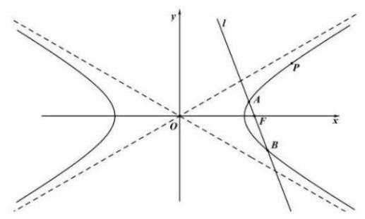

(3)若以 ${AB}$ 为直径的圆被直线 $x = \frac{3}{2}$ 截得的劣弧为 $\overset{\text{ ⏜ }}{MN}$ ，则 $\overset{\text{ ⏜ }}{MN}$ 所对圆心角的大小是否为定值？若是，求出该定值；若不是，请说明理由.

39. (杨浦 20) 如图所示，已知抛物线 $\Gamma  : {y}^{2} = x$ ，点 $A$ 、 $B$ 、 $C$ 、 $D$ 是抛物线上的四个点， 其中 $A$ 、 $D$ 在第一象限， $B$ 、 $C$ 在第四象限，满足 ${AB}//{CD}$ ，线段 ${AC}$ 与 ${BD}$ 交于点 $H$ . 记线段 ${AB}$ 与 ${CD}$ 的中点分别为 $M$ 、 $N$ .

(1)求抛物线 $\Gamma$ 的焦点坐标；

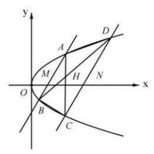

(2)求证:点 $M$ 、 $H$ 、 $N$ 三点共线；

(3)若 $2\left| {HM}\right|  = \left| {HN}\right|  = 2$ ，求四边形 ${ABCD}$ 的面积.

40. (长宁 20) 已知椭圆的左、右焦点分别为 ${F}_{1}\left( {-1,0}\right) ,{F}_{2}\left( {1,0}\right)$ ,且经过点 $P\left( {-1,\frac{3}{2}}\right)$ .

(1)求该椭圆的离心率；

(2)点Q 为椭圆上一点，且位于第三象限，若 ${\Delta PQ}{F}_{2}$ 的面积为3，求点Q的坐标；

(3) $A, B, C, D$ 是椭圆上不重合的四个点， ${AB}$ 与 ${CD}$ 相交于点 ${F}_{1}$ ，且 $\overrightarrow{AB} \cdot  \overrightarrow{CD} = 0$ ， 求 $\left| {AB}\right|  + \left| {CD}\right|$ 的取值范围.

## 第 11 节直线和圆

1. (奉贤 2 ) 若直线 ${l}_{1} : x + {ay} - 2 = 0$ 与直线 ${l}_{2} : {ax} + y - 2 = 0$ 互相垂直，则 $a =$ ___.

2. (嘉定 2 ) 直线 ${3x} - y + 1 = 0$ 的倾斜角为___(用反三角函数表示).

3. (金山 6) 以 $C\left( {3,4}\right)$ 为圆心且过点 $\left( {1, - 3}\right)$ 的圆的标准方程是___.

4. (闵行 3 ) 直线 $\sqrt{3}x - y + 1 = 0$ 的倾斜角为___.

5. (浦东 2) 直线 $x - y + 1 = 0$ 的倾斜角的大小是___.

6. (青浦 4) 已知直线 ${l}_{1} : x + \left( {1 + m}\right) y + m - 2 = 0$ 与直线 ${l}_{2} : {mx} + {2y} + 8 = 0$ 平行,则 $m =$ ___.

7. (长宁 4 ) 以 $C\left( {3,4}\right)$ 为圆心， $\sqrt{3}$ 为半径的圆的标准方程是___.

## 第 10 节概率

【简单小题】

1. (奉贤 9) $A, B$ 两人下棋,每局两人获胜的可能性一样. 某一天两人要进行一场三局两胜的比赛, 最终胜者赢得 100 元奖金. 第一局比赛 A 胜, 后因为有其他要事中止比赛. 为求公平，则 $A$ 应该分得___元奖金.

2. (嘉定 15) 假定生男生女是等可能的，设事件 $A$ :一个家庭中既有男孩又有女孩:事件 $B$ : 一个家庭中最多有一个女孩. 针对下列两种情形:①家庭中有 2 个小孩；②家庭中有 3 个小孩, 下面说法正确是 ( )

A. ①中事件 $A$ 与事件 $B$ 相互独立、②中的事件 $A$ 与事件 $B$ 相互独立

B. ①中事件 $A$ 与事件 $B$ 不相互独立、②中的事件 $A$ 与事件 $B$ 相互独立

C. ①中事件 $A$ 与事件 $B$ 相互独立、②中的事件 $A$ 与事件 $B$ 不相互独立

D. ①中事件 $A$ 与事件 $B$ 不相互独立、②中的事件 $A$ 与事件 $B$ 不相互独立

3. (金山 11) 抛掷一枚质地均匀的硬币 $n$ 次 (其中 $n$ 为大于等于 2 的整数),设事件 $A : n$ 次中既有正面朝上又有反面朝上，事件 $B : n$ 次中至多有一次正面朝上，若事件 $A$ 与事件 $B$ 是独立的，则 $n$ 的值为___.

4. (松江 15 ) 抛掷三枚硬币，若记“出现三个正面”、“两个正面一个反面”和“两个反面一个正面” 分别为事件 $A$ 、 $B$ 和 $C$ ,则下列说法错误的是 ( )

A. 事件 $A$ 、 $B$ 和 $C$ 两两互斥 B. $P\left( A\right)  + P\left( B\right)  + P\left( C\right)  = \frac{7}{8}$

C. 事件 $A$ 与事件 $B \cup  C$ 是对立事件 D. 事件 $A \cup  B$ 与 $B \cup  C$ 相互独立

5. (杨浦 14) 如果 $A, B$ 是独立事件, $\bar{A},\bar{B}$ 分别是 $A, B$ 的对立事件,那么以下等式不一定成立的是 ( )

A. $P\left( {A \cap  B}\right)  = P\left( A\right) P\left( B\right)$ B. $P\left( {\bar{A} \cap  B}\right)  = P\left( \bar{A}\right) P\left( B\right)$

C. $P\left( {A \cup  B}\right)  = P\left( A\right)  + P\left( B\right)$ D. $P\left( {\bar{A} \cap  \bar{B}}\right)  = \left\lbrack  {1 - P\left( A\right) }\right\rbrack  \left\lbrack  {1 - P\left( B\right) }\right\rbrack$

6. (长宁 5 ) 投掷两枚质地均匀的骰子, 观察掷得的点数, 则掷得的点数之和为 7 的概率是 ___.

7. (宝山 12) 已知函数 $y = f\left( x\right)$ 的定义域 $D = \{ 1,2,3,4\}$ ，值域 $A = \{ 5,6,7\}$ ，则函数 $y = \; f\left( x\right)$ 为增函数的概率是___.

8. (长宁 11) 设 $O$ 为坐标原点,从集合 $\{ 1,2,3,4,5,6,7,8,9\}$ 中任取两个不同的元素 $x, y$ ，组成 $A$ ， $B$ 两点的坐标 $\left( {x, y}\right)$ ， $\left( {y, x}\right)$ ，则 ${S}_{\bigtriangleup {AOB}} \leq  {10}$ 的概率为___.

9. (宝山 19) 甲乙两人轮流掷质地均匀的骰子, 每人每次掷两颗.

(1)甲掷一次，求两颗骰子点数不同的概率；

(2)甲乙各掷一次，求甲的点数和恰好比乙的点数和大 7 的概率；

(3)若第一次掷出点数之和大于 6 的人为胜者，同时比赛结束；否则，由另一人继续投掷， 直到比赛结束. 例如, 甲乙先后轮流掷出的点数之和为: 5、4、3、7, 此时乙为胜者. 设甲先投掷, 求甲最终获胜的概率.

10. (奉贤 18) 某芯片代工厂生产甲、乙两种型号的芯片, 为了解芯片的某项指标, 从这两种芯片中各抽取 100 件进行检测, 获得该项指标的频率分布直方图, 如图所示:

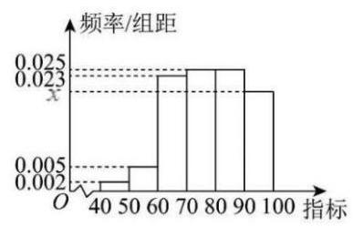

甲型芯片

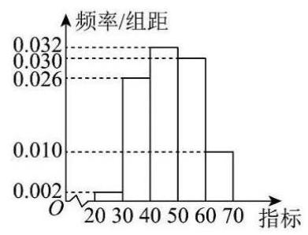

乙型芯片

假设数据在组内均匀分布, 以样本估计总体, 以事件发生的频率作为相应事件发生的概率.

(1)求频率分布直方图中 $x$ 的值并估计乙型芯片该项指标的平均值 (同一组中的数据用该组区间的中点值为代表);

(2)已知甲型芯片指标在 $\lbrack {80},{100})$ 为航天级芯片，乙型芯片指标在标在 $\lbrack {60},{70})$ 为航天为航天级芯片. 现分别采用分层抽样的方式,从甲型芯片指标在 $\lbrack {70},{90})$ 内取 2 件,乙型芯片指标在 $\lbrack {50},{70})$ 内取 4 件,再从这 6 件中任取 2 件,求至少有一件为航天级芯片的概率.

11. (嘉定 19) 在一场盛大的电竞比赛中, 有两支实力强钦的队伍甲和乙进行对决. 比赛采用 5 局 3 甲队每局获胜概率为 0.4 ，乙队每局获胜概率为 0.6 .

比赛开始后, 甲队先连胜两局, 此时, 主办方记录了两队队员在这两局比赛中的一些数据. 甲队队员的击杀数 (单位:个) 数据如下: 24，31，31，36，36，37，39，44，49， 50；乙队队员的击杀数(单位:个)数据如下: 8，13，14，16，23，26，28，33，38，39. 然而此时比赛场地突发技术故障, 比赛不得不中止. 请回答以下问题:

(1)根据目前情况(甲队已连胜两局)，写出甲、乙两队“采用 5 局 3 胜制” 的比赛结果的样本空间;

(2)根据所给数据，绘制甲、乙两队队员的击杀数分布的茎叶图；

(3)在目前情况下(甲队已连胜两局)，估算甲乙两队获胜概率，并据此分配 10 万元奖金. 【解析】(1)设 $W$ 表示 $A$ 队胜, $L$ 表示 $A$ 队负,

样本空间为 $\Omega  = \{ {WWW},{WWLW},{WWLLW},{WWLLL}\}$

. 4 分

(2)

<table><tr><td></td><td>甲</td><td></td><td>乙</td></tr><tr><td></td><td></td><td>0</td><td>8</td></tr><tr><td></td><td></td><td>1</td><td>3 4 6</td></tr><tr><td></td><td>4</td><td>2</td><td>3 6 8</td></tr><tr><td>9 7 6 6</td><td>1 1</td><td>3</td><td>3 8 9</td></tr><tr><td></td><td>9 4</td><td>4</td><td></td></tr><tr><td></td><td>0</td><td>5</td><td></td></tr></table>

- 8 分

(3)甲己经连胜两局，接下来甲获胜的情况有以下几种:

第三局甲胜,此时比赛结束,甲获胜,这种情况的概率为 $\frac{2}{5} \cdot  9$ 分第三局乙胜,第四局甲胜,此时甲获胜,概率为 $\frac{2}{5} \times  \frac{3}{5} = \frac{6}{25}$ . 10 分第三局乙胜,第四局乙胜,第五局甲胜,概率为 $\frac{3}{5} \times  \frac{3}{5} \times  \frac{2}{5} = \frac{18}{125}$ . 11 分所以甲获胜的总概率为 $\frac{2}{5} + \frac{6}{25} + \frac{18}{125} = \frac{98}{125} = {0.784}$ ,

乙获胜的总概率为 $1 - \frac{98}{125} = \frac{27}{125} = {0.216}.{12}$ 分

奖金共 10 万元,甲应得奖金为 ${10} \times  \frac{98}{125} = \frac{196}{25} = {7.84}$ 万元,

乙应得奖金为 ${10} - {7.84} = {2.16}$ 万元. .14 分

12. (闵行 19) 为了解某市高三学生的睡眠时长, 从该市 6.6 万名高三学生中随机抽取 600 人，统计他们的日均睡眠时长及分布人数如下表所示:

<table><tr><td>睡眠时长 (小时)</td><td>$\lbrack 4,6)$</td><td>$\lbrack 6,8)$</td><td>[8, 10]</td></tr><tr><td>人数</td><td>150</td><td>270</td><td>180</td></tr></table>

注: 睡眠时长在 $\left\lbrack  {8,{10}}\right\rbrack$ 的为睡眠充足,在 $\lbrack 6,8)$ 的为睡眠良好,在 $\lbrack 4,6)$ 的为睡眠不足.

(1)估计该市 6.6 万名高三学生中日均睡眠时长大于等于 6 小时的人数约为多少？

(2)估计该市高三学生日均睡眠时长；

(3)若从这 600 名学生中利用分层抽样的方法抽取 20 人，再从这 20 人中随机抽取 4 人做进一步访谈调查, 求这 4 人中既有睡眠充足, 又有睡眠良好, 也有睡眠不足学生的概率.

【解析】(1) 600 名样本中睡眠时长大于等于 6 小时的人数为 450 人，频率为 $\frac{3}{4}\cdots \cdots 2$ 分该市所有高三学生日均睡眠时长大于等于 6 小时的人数约为 $\frac{3}{4} \times  {66000} = {49500}$ 人. 4 分

(2)先求出各区间的中点值分别为5、7、9. 6 分

估计该市所有高三学生日均睡眠时长

为 $\frac{{150} \times  5 + {270} \times  7 + {180} \times  9}{600} = {7.1}$ 小时 8 分

(3)按照分层抽样方法，在睡眠充足中抽取的人数为 6 人，

在睡眠良好中抽取的人数为 9 人，在睡眠不足中抽取的人数为 5 人. . . .10 分再从这 20 人中随机抽取 4 人，可能的情况有 ${C}_{20}^{4} = {4845}$ 种，

设 $A$ 表示事件 “这 4 人中既有睡眠充足，又有睡眠良好，也有睡眠不足学生”， $A$ 所包含的样本点有 ${C}_{5}^{1} \times  {C}_{9}^{1} \times  {C}_{6}^{2} + {C}_{5}^{1} \times  {C}_{6}^{1} \times  {C}_{9}^{2} + {C}_{9}^{1} \times  {C}_{6}^{1} \times  {C}_{5}^{2} = {2295}$ 个,

13. 分

因此事件 $A$ 的概率是 $P\left( A\right)  = \frac{{C}_{5}^{1} \times  {C}_{9}^{1} \times  {C}_{6}^{2} + {C}_{5}^{1} \times  {C}_{6}^{1} \times  {C}_{9}^{2} + {C}_{9}^{1} \times  {C}_{6}^{1} \times  {C}_{5}^{2}}{{C}_{20}^{4}}$

$= \frac{2295}{4845} = \frac{9}{19}{14}$ 分.

14. (浦东 19) 申辉中学为期两周的高一、高二年级校园篮球赛告一段落. 高一小 $A$ 、高二小 $B$ 分别荣获了高一年级和高二年级比赛的年级 ${MVP}$ (最有价值球员). 以下是他们在各自 8 场比赛的二分球和三分球出手次数及其命中率.

<table><tr><td></td><td>二分球出手</td><td>二分球命中率</td><td>三分球出手</td><td>三分球命中率</td></tr><tr><td>小 $A$</td><td>100 次</td><td>80%</td><td>100 次</td><td>40%</td></tr><tr><td>小 $B$</td><td>190 次</td><td>70%</td><td>10 次</td><td>30%</td></tr></table>

现以两人的总投篮命中率 (二分球 + 三分球) 较高者评为校 ${MVP}$ (总投篮命中率 $=$ 总命中次数÷总出手次数)

(1)小 C 认为，目测小 $A$ 的二分球命中率和三分球命中率均高于小 $B$ ，此次必定能评为校 ${MVP}$ ,试通过计算判断小 $C$ 的想法是否准确?

(2)小D是游戏爱好者，设置了一款由游戏人物小 a 、小b 轮流投篮对战游戏. 游戏规则如下: ①游戏中小 a 的命中率始终为 0.4 ，小b 的命中率始终为 0.3 . ②游戏中投篮总次数最多为 $k\left( {3 \leq  k \leq  {20}, k \in  Z}\right)$ 次,且同一个游戏人物不允许连续投篮. ③游戏中若投篮命中，则游戏结束,投中者获得胜利; 若直至第 $k$ 次投篮都没有命中,则规定第二次投篮者获胜. 若每次游戏对战前必须设置 “第一次投篮人物” 和 “ $k$ ” 的值,请解答以下两个问题. (i) 若小 $a$ 第一次投篮，请证明小 $a$ 获胜概率大；

(ii) 若小 $b$ 第一次投篮，试问谁的获胜概率大？并说明理由.

15. % < 68% 5 分

综上,小 $C$ 想法错误,小 $B$ 为校 ${MVP}$

(2)(i)若“第一次投篮人物”为小 $a$ ， $k\left( {3 \leq  k \leq  {20}, k \in  Z}\right)$ ，

小 $a$ 获胜的概率为 ${P}_{a}$ ,小 $b$ 的获胜的概率为 $1 - {P}_{a}$ ,

$$
{P}_{a} \geq  {0.4} + {0.7} \cdot  {0.6} \cdot  {0.4} = {0.568} > {0.5} > 1 - {P}_{a},
$$

得 “小 $a$ 第一次投篮，小 $a$ 获胜概率大” 9 分

(ii) 若 “第一次投篮人物” 为小 $b, k\left( {3 \leq  k \leq  {20}, k \in  Z}\right)$ ,

小 $b$ 获胜的概率为 ${P}_{b}$ ,小 $a$ 的获胜的概率为 $1 - {P}_{b}$ ,

$$
{P}_{b} = {0.3} + {0.3}\left( {{0.7} \cdot  {0.6}}\right)  + \cdots  + {0.3}{\left( {0.7} \cdot  {0.6}\right) }^{m}
$$

$= \frac{{0.3}\left\lbrack  {1 - {0.42}^{m + 1}}\right\rbrack  }{0.58} = \frac{15}{29}\left( {1 - {0.42}^{m + 1}}\right) {12}$ 分

其中 $m = \left\{  \begin{array}{l} \frac{k - 2}{2}, k \in  \{ 4,6,8,{10},{12},{14},{16},{18},{20}\} \\  \frac{k - 1}{2}, k \in  \{ 3,5,7,9,{11},{13},{15},{17},{19}\}  \end{array}\right.$

易证 ${P}_{b} = f\left( m\right)  = \frac{15}{29}\left( {1 - {0.42}^{m + 1}}\right)$ 随着 $m$ 的增大而增大, $f\left( 2\right)  < {0.5} < f\left( 3\right)$ ,

所以当 $m \geq  3$ 也就是 $7 \leq  k \leq  {20}$ 时, ${P}_{b} > {0.5} > 1 - {P}_{b}$ ;

综上,若小 $b$ 第一次投篮, $k \in  \{ 3,4,5,6\}$ 时小 $a$ 获胜概率大;

$k \in  \{ k \mid  7 \leq  k \leq  {20}, k \in  Z\}$ 时小 $b$ 获胜概率大. 14 分

16. (普陀 19) 机器人竞技是继电子竞技之后热门的科技竞技项目, 某区为了参加市机器人竞技总决赛，开展了区内选行场比赛互相独立下表统计的是 $A$ 在近期热身中分别与 $B, C, D$ 三人比赛的情况.

<table id="cross-table-1"><tr><td></td><td>$B$</td><td>$C$</td><td>$D$</td></tr><tr></tr><tr><td>$A$ 获胜的次数</td><td>4</td><td>5</td><td>12</td></tr></table>

(1)根据表格中的数据，试估计在区内决赛中 $A$ 至少获胜一场的概率；

(2) 根据表格中的数据,请给 $B, C, D$ 三人设计一个出场顺序,使得 $A$ 在这三场比赛中连胜两场的概率最大, 并说明理由.

17. (松江17) 某日用品按行业质量标准分成五个等级, 等级系数 $X$ 依次为 1, 2, 3, 4, 5, 现从一批该日用品中随机抽取 20 件, 对其等级系数进行统计分析, 得到频率分布表如下:

<table><tr><td>$X$</td><td>1</td><td>2</td><td>3</td><td>4</td><td>5</td></tr><tr><td>$f$</td><td>$a$</td><td>0.2</td><td>0.45</td><td>$b$</td><td>$C$</td></tr></table>

(1)若所抽取的 20 件日用品中，等级系数为 4 的恰有 3 件，等级系数为 5 的恰有 2 件，求 $a, b, c$ 的值;

(2)在(1)的条件下，将等级系数为 4 的 3 件日用品记为 ${x}_{1},{x}_{2},{x}_{3}$ ，等级系数为 5 的 2 件日用品记为 ${y}_{1},{y}_{2}$ ,现从 ${x}_{1},{x}_{2},{x}_{3},{y}_{1},{y}_{2}$ 这 5 件日用品中任取两件(假定每件日用品被取出的可能性相同), 写出所有可能的结果, 并求这两件日用品的等级系数恰好相等的概率.

18. (徐汇19) 某企业招聘员工，指定“英语听说”、“信息技术”、“逻辑推理”作为三门考试课程，有两种考试方案.

方案一:参加三门课程的考试，至少有两门及格为通过；

方案二:在三门课程中，随机选取两门，并参加这两门课程的考试，两门都及格为通过. 假设某应聘者参加三门指定课程考试及格的概率分别是 ${p}_{1},{p}_{2},{p}_{3}\left( {{p}_{i} \in  \left( {0,1}\right) ,\mathrm{i} = 1,2,3}\right)$ ,且三门课程考试是否及格相互之间没有影响.

(1)分别求该应聘者选方案一考试通过的概率 ${T}_{1}$ 和选方案二考试通过的概率 ${T}_{2}$ ；

(2)试比较该应聘者在上述两种方案下考试通过的概率的大小，并说明理由.

19. ${}_{2} = \frac{1}{3}P\left( {A \cap  B}\right)  + \frac{1}{3}P\left( {B \cap  C}\right)  + \frac{1}{3}P\left( {A \cap  C}\right)  = \frac{1}{3}\left( {{p}_{1}{p}_{2} + {p}_{2}{p}_{3} + {p}_{3}{p}_{1}}\right)$ ;

( 2 )因为 ${p}_{1},{p}_{2},{p}_{3} \in  \left( {0,1}\right)$ ，所以 ${T}_{1} - {T}_{2} = \frac{2}{3}\left( {{p}_{1}{p}_{2} + {p}_{2}{p}_{3} + {p}_{3}{p}_{1}}\right)  - 2{p}_{1}{p}_{2}{p}_{3}$

$$
= \frac{2}{3}\left\lbrack  {{p}_{1}{p}_{2}\left( {1 - {p}_{3}}\right)  + {p}_{2}{p}_{3}\left( {1 - {p}_{1}}\right)  + {p}_{3}{p}_{1}\left( {1 - {p}_{2}}\right) }\right\rbrack   > 0,
$$

故 ${T}_{1} > {T}_{2}$ ,即选方案一,该应聘者考试通过的概率较大.

20. (杨浦 19) 为加强学生睡眠监测督导, 学校对高中三个年级学生的日均睡眠时间进行调查. 根据分层随机抽样法, 学校在高一、高二和高三年级中共抽取了 100 名学生的日均睡眠时间作为样本, 其中高一 35 人，高二 33 人. 已知该校高三年级一共 512 人.

(1)学校高中三个年级一共有多少个学生？

(2)若抽取 100 名学生的样本极差为 2，数据如下表所示 (其中 $x < {10}$ ， $n$ 是正整数)

<table><tr><td>日均睡眠时间(小时)</td><td>$x$</td><td>8.5</td><td>9</td><td>9.5</td><td>10</td></tr><tr><td>学生数量</td><td>$n$</td><td>32</td><td>13</td><td>11</td><td>4</td></tr></table>

求该样本的第 40 百分位数.

(3)从这 100 名学生的样本中随机抽取三个学生的日均睡眠时间，求其中至少有 1 个数据来自高三学生的概率.

21. (长宁 19) 2024 年第七届中国国际进口博览会 (简称进博会) 于11月 5 日至 10 日在上海国家会展中心举行. 为了解进博会参会者的年龄结构,某机构随机抽取了年龄在 ${15} - {75}$ 岁之间的 200 名参会者进行调查,并按年龄绘制了频率分布直方图,分组区间为 $\lbrack {15},{25}),\lbrack {25}$ , 35), $\lbrack {35},{45}),\lbrack {45},{55}),\lbrack {55},{65}),\left\lbrack  {{65},{75}}\right\rbrack$ . 把年龄落在区间 $\lbrack {15},{35})$ 内的人称为

“青年人”，把年龄落在区间 $\lbrack {35},{65})$ 内的人称为 “中年人”，把年龄落在 $\left\lbrack  {{65},{75}}\right\rbrack$ 内的人称

为“老年人”.

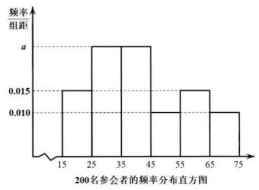

(1)求所抽取的“青年人”的人数；

(2)以分层抽样的方式从 “青年人” “中年人” “老年人” 中抽取 10 名参会者做进一步访谈, 发现其中女性共 4 人，这 4 人中有 3 人是 “中年人”. 再用抽签法从所抽取的 10 名参会者中任选 2 人.

①简述如何采用抽签法任选 2 人；

②设事件 $A : 2$ 人均为“中年人”，事件 $B : 2$ 人中至少有 1 人为男性，判断事件 $A$ 与事件 $B$ 是否独立,并说明理由.

22. 人均为 “中年人” 的概率 $P\left( A\right)  = \frac{{C}_{5}^{2}}{{C}_{10}^{2}} = \frac{2}{9}$ ,

23. 人中至少有 1 人为男性的概率 $P\left( B\right)  = 1 - \frac{{C}_{4}^{2}}{{C}_{10}^{2}} = \frac{13}{15}2$ 分 2 人均为 “中年人” 且至少有 1 人为男性的概率 $P\left( {A \cap  B}\right)  = \frac{{C}_{2}^{2} + {C}_{2}^{1}{C}_{3}^{1}}{{C}_{10}^{2}} = \frac{7}{45}2$ 分因为 $P\left( {A \cap  B}\right)  \neq  P\left( A\right)  \cdot  P\left( B\right)$ ,所以事件 $A$ 与事件 $B$ 不独立. 2 分

## 第 9 节统计

【填选】

1. (宝山 6) 某运动员在某次男子 10 米气手枪射击比赛中的得分数据 (单位:环) 为: 9.6 ， 9.9,9.2,9.4,9.9,10.1,10.2,9.7,9.6,9.3,10.0,10.4,则这组数据的第 25 百分位数为___.

2. (崇明 10) 某校四个植树小队,在植树节这天种下柏树的棵数分别为 10, $x,{10},8$ ,若这组数据的中位数和平均数相等,那么 $x =$ ___.

3. (崇明 15) 抛掷一红一绿两颗质地均匀的骰子,记录骰子朝上面的点数,若用 $x$ 表示红色骰子的点数,用 $y$ 表示绿色骰子的点数,用 $\left( {x, y}\right)$ 表示一次试验结果,设事件 $E : x + y = 8$ ; 事件 $F$ : 至少有一颗点数为 6 ; 事件 $G : x > 4$ ; 事件 $H : y < 4$ . 则下列说法正确的是 ( )

A. 事件 $E$ 与事件 $F$ 为互斥事件 B. 事件 $F$ 与事件 $G$ 为互斥事件

C. 事件 $E$ 与事件 $G$ 相互独立 D. 事件 $G$ 与事件 $H$ 相互独立

4. (虹口14) 已知事件 $A$ 和事件 $B$ 满足 $A \cap  B = \varnothing$ ,则下列说法正确的是 ( )

A. 事件 $A$ 和事件 $B$ 独立 B. 事件 $A$ 和事件 $B$ 互斥

C. 事件 $A$ 和事件 $B$ 对立 D. 事件 $\bar{A}$ 和事件 $\bar{B}$ 互斥

5. (黄浦 7) 从 $A$ 校高一年级学生中抽取 66 名学生测量他们的身高,其中最大值为 ${184}\mathrm{\;{cm}}$ , 最小值 152 cm ，绘制身高频率分布直方图，若组距为 3 ，且第一组下限为 151.5 ，则组数为___.

6. (黄浦 13) 掷一颗质地均匀的骰子,观察朝上面的点数. 设事件 $E$ : 点数是奇数,事件 $F$ : 点数是偶数,事件 $G$ : 点数是 3 的倍数,事件 $H$ : 点数是 4 . 下列每对事件中,不是互斥事件的为 ( )

A. $E$ 与 $F$ B. $F$ 与 $G$ C. $E$ 与 $H$ D. $G$ 与 $H$

7. (浦东 15) 对一组数据3,3,3,1,1,5,5,2,4,若任意去掉其中一个数据,剩余数据的统计量一定会发生变化的为 ( )

A. 中位数 B. 众数 C. 平均数 D. 方差

8. (普陀 14) 某机构对 2014 年至 2023 年的中国新能源汽车的年销售量进行了统计，结果如图所示 (单位: 万辆), 则下列结论中正确的是 ( )

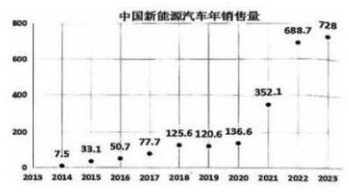

A. 这十年中国新能源汽车年销售量的中位数为 123

B. 这十年中国新能源汽车年销售量的极差为 721

C. 这十年中国新能源汽车年销售量的第 70 百分位数为 136.6

D. 这十年中的前五年的年销售量的方差小于后五年的年销售量的方差

${9.} \times  {0.7} = 7$ ,故第 70 百分位数为 $\frac{{136.6} + {352.1}}{2} = {244.35}$ ,故 $C$ 错误;

这十年中的前五年的年销售量的方差小于后五年的年销售量的方差,故 $D$ 正确;

故选 $D$ .

---

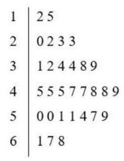

---

10. (徐汇 7) 某景点对 30 天内每天的游客人数 (单位:万人) 进行统计，得到样本的茎叶图 (如右图所示)，则该样本的第 75 百分位数是___.

11. (徐汇 14) 一个不透明的盒子中装有若干个红球和 5 个黑球, 这些球除颜色外均相同. 每次将球充分搅匀后, 任意摸出 1 个球记下颜色后再放回盒子. 经过重复摸球足够多次试验后发现, 摸到黑球的频率稳定在 0.1 左右, 则据此估计盒子中红球的个数约为 ( )

A. 40 个 B. 45 个 C. 50 个 D. 55 个

12. (杨浦 8) 某次杨浦区高三质检调研数学试卷中的填空题第八题, 答对得 5 分, 答错或不答得 0 分，全区共 4000 人参加调研，该题的答题正确率是 60%，则该次调研中全区同学该题得分的方差为___.

13. (崇明 19) 王老师将全班 40 名学生的高一数学期中考试 (满分 100 分) 成绩分成 5 组，绘制成如图所示的频率分布直方图,现将 $\lbrack {50},{60})$ 记作第一组, $\lbrack {60},{70})\text{ 、 }\lbrack {70},{80})\text{ 、 }\lbrack {80},{90})$ 、 $\left\lbrack  {{90},{100}}\right\rbrack$ 分别记作第二、三、四、五组. 已知第一组、第二组的频率之和为 0.3 ,第一组和第五组的频率相同.

(1)估计此次考试成绩的平均值 (同一组数据用该组数据的中点值代替);

(2)王老师将测试成绩在 $\left\lbrack  {{80},{90}}\right)$ 和 $\left\lbrack  {{90},{100}}\right\rbrack$ 内的试卷进行分析,再从中选 ${2A}$ 频率/组距的试卷进行优秀答卷展示, 求被选中进行优秀答卷展示的这 2 人的测试成绩至少 1 个在 [90,100] 内的概率;

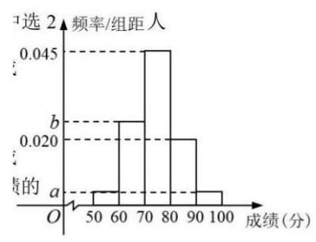

(3)已知第二组考生成绩的平均数和方差分别为 65 和 40，第四组考生成绩的平均数和方差分别为 83 和 70 ，据此计算第二组和第四组所有学生成绩的方差.

14. (虹口 19) 2024 年法国奥运会落下帷幕，某平台为了解观众对本次奥运会的意度，随机调查了本市 1000 名观众, 得到他们对本届奥运会的满意度评分 (满分 100 分), 平台将评分分为 $\lbrack {50},{60})\text{ 、 }\lbrack {60},{70})\text{ 、 }\lbrack {70},{80})\text{ 、 }\lbrack {80},{90})\text{ 、 }\left\lbrack  {{90},{100}}\right\rbrack$ 共 5 层,绘制成频率分布直方图 (如图 1 所示). 并在这些评分中以分层抽样的方式从这 5 层中再抽取了共 20 名观众的评分, 绘制成茎叶图, 但由于某种原因茎叶图受到了污损, 可见部分信息如图 2 所示.

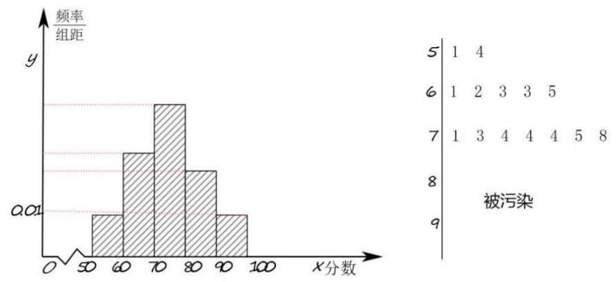

(1)求图 2 中这 20 名观众的满意度评分的第 35 百分位数；

(2)若从图 2 中的 20 名观众中再任选取 3 人做深度采访，求其中至少有 1 名观众的评分大于等于 90 分的概率;

(3)已知这 1000 名观众的评分位于 $\lbrack {50},{80})$ 上的均值为 67 ，方差为 64.7 ，位于 $\left\lbrack  {{50},{100}}\right\rbrack$ 上的均值为 73 ，方差为 134.6 ，求这 1000 名观众的评分位于 $\left\lbrack  {{80},{100}}\right\rbrack$ 上的均值与方差.

15. ${s}^{2} = \mathop{\sum }\limits_{{i = 1}}^{{700}}{\left( {x}_{i} - \bar{x}\right) }^{2} + \mathop{\sum }\limits_{{i = 1}}^{{300}}{\left( {x}_{i} - \bar{x}\right) }^{2} = \mathop{\sum }\limits_{{i = 1}}^{{700}}{\left\lbrack  \left( {x}_{i} - \overline{{x}_{1}}\right)  + \left( \overline{{x}_{1}} - \bar{x}\right) \right\rbrack  }^{2} + \mathop{\sum }\limits_{{i = 1}}^{{300}}{\left\lbrack  \left( {x}_{i} - \overline{{x}_{2}}\right)  + \left( \overline{{x}_{2}} - \bar{x}\right) \right\rbrack  }^{2}$ ,即 ${1000}{s}^{2} = {700}{s}_{1}^{2} + {700}{\left( \overline{{x}_{1}} - \bar{x}\right) }^{2} + {300}{s}_{2}^{2} + {300}{\left( \overline{{x}_{2}} - \bar{x}\right) }^{2}$ ,解得 ${s}_{2}^{2} = {17.714}$ 分所以位于 $\left\lbrack  {{80},{100}}\right\rbrack$ 上的均值为 87 ; 方差为 17.7 .

16. (黄浦 19) $A$ 校高一年级共有学生 330 名,为了解该校高一年级学生的身高情况,学校采用分层随机抽样的方法抽取 66 名学生, 其中女生 32 名, 男生 34 名, 测量他们的身高.

(1)该校高一学生中男、女生各有多少名？

(2)若从这 66 名学生中随机抽取两名，求这两名都是男生的概率；

(3) 在 32 名女生身高的数据中，其中一个数据记录有误，错将 ${165}\mathrm{\;{cm}}$ 记录为 ${156}\mathrm{\;{cm}}$ ， 由错误数据求得这 32 个数据的平均数为 161 cm ，方差为 23.6875 ，求原始数据的平均数及方差 (平均数结果保留精确值, 方差结果精确到 0.01 ).

17. (金山 19) 某高中举行了一次知识竞赛. 为了了解本次竞赛成绩情况, 从中抽取了部分学生的成绩作为样本进行统计. 将成绩进行整理后, 依次分为五组 ( $\lbrack {50},{60})$ 、 $\lbrack {60},{70})$ 、 [70, 80)、[80,90)、[90,100]，其中第 1 组的频率为第 2 组和第 4 组频率的等比中项. 请根据下面的频率分布直方图 (如图所示) 解决下列问题:

(1) 求 $a\text{ 、 }b$ 的值;

(2)从样本数据在 $\lbrack {50},{60})$ ， $\lbrack {70},{80})$ 两个小组内的学生中，用分层抽样的方法抽取 7 名学生, 再从这 7 名学生中随机选出 2 人，求选出的两人恰好来自不同小组的概率；

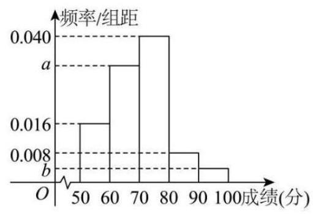

(3)某老师在此次竞赛成绩中抽取了 10 名学生的分数: ${x}_{1}$ ， ${x}_{2}$ ， ${x}_{3}$ ， $\cdots$ ， ${x}_{10}$ ，已知这 10 个分数的平均数 $\bar{x} = {88}$ ,方差 ${s}^{2} = {25}$ ,若剔除其中的 95 和 81 两个分数，求剩余 8 个分数的平均数与方差.

18. (青浦 19) 第七届中国国际进口博览会于 2024 年 11 月 5 日至 10 日在上海举办，某公司生产的 $A$ 、 $B$ 、 $C$ 三款产品在博览会上亮相，每一种产品均有普通装和精品装两种款式，该公司每天产量如下表:(单位:个)

<table><tr><td></td><td>产品 $A$</td><td>产品 $B$</td><td>产品 $C$</td></tr><tr><td>普通装</td><td>$n$</td><td>180</td><td>400</td></tr><tr><td>精品装</td><td>300</td><td>420</td><td>600</td></tr></table>

现采用分层抽样的方法在某一天生产的产品中抽取 100 个,其中 $B$ 款产品有 30 个.

(1)求 $n$ 的值；

(2)用分层抽样的方法在 $C$ 款产品中抽取一个容量为 5 的样本，从样本中任取 2 个产品， 求其中至少有一个精品装产品的概率;

(3)对抽取到的 $B$ 款产品样本中某种指标进行统计，普通装产品的平均数为 10，方差为 2 ,精品装产品的平均数为 12 ,方差为 1.8 ,试估计这天生产的 $B$ 款产品的某种指标的总体方差.

## 第 8 节导数

【填选】

1. (静安 7) 已知物体的位移 $d$ (单位: $m$ ) 与时间 $t$ (单位: $s$ ) 满足函数关系 $d = 5\sin t - 2\cos t$ ，则该物体在 $t = \frac{\pi }{2}$ ( $s$ ) 时刻的瞬时速度为___ $\left( {\mathrm{m}/\mathrm{s}}\right)$ .

2. (普陀 11) 设 $t \in  R$ ,直线 $l : x + y - t = 0$ 与曲线 ${C}_{1} : y = \frac{1}{4}{x}^{2}\left( {0 \leq  x \leq  4}\right)$ 和曲线 ${C}_{2} : y = \; 2{x}^{\frac{1}{2}}$ 分别交于 $P, Q$ 两点，则 $\left| {PQ}\right|$ 的最大值是___.

3. (普陀 16) 在平面直角坐标系中,将函数 $y = f\left( x\right)$ 的图像绕坐标原点 $O$ 逆时针旋转 $\frac{\pi }{4}$ 后, 所得曲线仍然是某个函数的图像,则称函数 $y = f\left( x\right)$ 为 “ $R$ 函数”. 对于命题:

① 设 $m \in  R$ ,若函数 $g\left( x\right)  = \left( {m - 1}\right) x + \frac{1}{x}$ 为 “ $R$ 函数”，则 $m > 1$ :

② 设 $k \in  R$ ,若函数 $h\left( x\right)  = \frac{k\left( {x + 1}\right) }{{\mathrm{e}}^{x}}$ 为 “ $R$ 函数”,则满足条件的 $k$ 的整数值至少有 4 个. 则下列结论中正确的是 ( )

A. ①为真②为真 B. ①为真②为假 C. ①为假②当真 D. ①为假②为假注意，此时不需要求出 $m$ 的精确范围，因为 $m$ 的精确范围一定满足 $m > 1$ ， 故①正确；

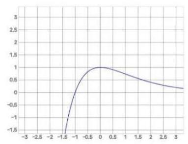

对于②,若 $k = 0$ ,显然满足题意;

若 $k$ 为正整数, $h\left( x\right)  = \frac{k\left( {x + 1}\right) }{{\mathrm{e}}^{x}},{h}^{\prime }\left( x\right)  = \frac{-{kx}}{{\mathrm{e}}^{x}}$ ,

$h\left( x\right)$ 在 $\left( {-\infty ,0}\right)$ 严格增, $\left( {0, + \infty }\right)$ 严格减,图像如图,

注意到 $x < 0$ 时, $\frac{x}{{\mathrm{e}}^{x}}$ 严格增,故 $\frac{x}{{\mathrm{e}}^{x}} < 0,{h}^{\prime }\left( x\right)  = \frac{-{kx}}{{\mathrm{e}}^{x}} \in  \left( {0, + \infty }\right)$ ,

从而 $h\left( x\right)  = \frac{k\left( {x + 1}\right) }{{\mathrm{e}}^{x}}$ 在 $x < 0$ 时有一根斜率为 1 的切线,这条切线旋转后,

会变成竖直状态, 此时新的图像不为函数, 舍去;

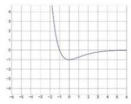

若 $k$ 为负整数, $h\left( x\right)  = \frac{k\left( {x + 1}\right) }{{\mathrm{e}}^{x}},{h}^{\prime }\left( x\right)  = \frac{-{kx}}{{\mathrm{e}}^{x}}$ ,

$h\left( x\right)$ 在 $\left( {-\infty ,0}\right)$ 严格减, $\left( {0, + \infty }\right)$ 严格增,图像如图,

同上讨论, $h\left( x\right)  = \frac{k\left( {x + 1}\right) }{{\mathrm{e}}^{x}}$ 在 $x > 0$ 时,不能有斜率为 1 的切线,

则 ${h}^{\prime }\left( x\right)  = \frac{-{kx}}{{\mathrm{e}}^{x}} < 1$ ,所以 $- k < \frac{{\mathrm{e}}^{x}}{x}$ 恒成立,所以 $- k < \mathrm{e}$ (求导易证),

所以 $- \mathrm{e} < k \leq   - 1$ ,则 $k =  - 1$ 或-2;

综上,满足条件的 $k$ 的整数值有 3 个,故② 错误;

故选 $B$ .

4. (青浦 11) 若函数 $y = {\log }_{\frac{1}{2}}\left( {a{x}^{3} - {8x} + {15}}\right)$ 在区间 $\left( {1,2}\right)$ 上严格增,则实数 $a$ 的取值范围是 ___.

5. (徐汇 9) 设 $a \in  R, f\left( x\right)  = {x}^{2} + {ax} + \ln x$ ,若函数 $y = f\left( x\right)$ 存在两个不同的极值点,则 $a$ 的取值范围为___.

6. (长宁 3) 曲线 $y = \ln x$ 在点 $\left( {1,0}\right)$ 处的切线方程是___.

7. (宝山 21 ) 已知 $y = f\left( x\right) , y = g\left( x\right)$ 都是定义在实数集上的可导函数. 对于正整数 $k$ ,当 $m, n$ 分别是 $y = f\left( x\right)$ 和 $y = g\left( x\right)$ 的驻点时,记 ${\Delta x} = \left| {m - n}\right|$ ,若 ${\Delta x} \leq  k$ ,则称 $f\left( x\right)$ 和 $g\left( x\right)$ 满足 $P\left( k\right)$ 性质; 当 ${x}_{1},{x}_{2} \in  R$ ,且 $g\left( {x}_{1}\right)  \neq  g\left( {x}_{2}\right)$ 时,记 ${\Delta y} = \left| \frac{f\left( {x}_{1}\right)  - f\left( {x}_{2}\right) }{g\left( {x}_{1}\right)  - g\left( {x}_{2}\right) }\right|$ ,若 ${\Delta y} \geq  k$ ,则称 $f\left( x\right)$ 和 $g\left( x\right)$ 满足 $Q\left( k\right)$ 性质.

(1) 若 $f\left( x\right)  = {2x} + 1, g\left( x\right)  = x$ ,判断 $f\left( x\right)$ 和 $g\left( x\right)$ 是否满足 $Q\left( 2\right)$ 性质,并说明理由;

( 2 )若 $f\left( x\right)  = {\left( x - 1\right) }^{2}$ ， $g\left( x\right)  = \frac{{ax} + 1}{{\mathrm{e}}^{x}}$ ，且 $f\left( x\right)$ 和 $g\left( x\right)$ 满足 $P\left( 1\right)$ 性质，求实数 $a$ 的取值范围;

(3)若 $y = f\left( x\right)$ 的最小正周期为4，且 $g\left( {-1}\right)  = f\left( {-1}\right) , g\left( 1\right)  = f\left( 1\right)$ . 当 $x \in  \left\lbrack  {-1,3}\right\rbrack$ 时， $y = f\left( x\right)$ 的驻点与其两侧区间的部分数据如下表所示:

<table><tr><td>$x$</td><td>-1</td><td>(-1,1)</td><td>1</td><td>(1,3)</td><td>3</td></tr><tr><td>${f}^{\prime }\left( x\right)$</td><td>0</td><td>+</td><td></td><td>-</td><td>0</td></tr><tr><td>$f\left( x\right)$</td><td>极小值 -1</td><td></td><td>极大值 1</td><td></td><td>极小值 -1</td></tr></table>

已知 $f\left( x\right)$ 和 $g\left( x\right)$ 满足 $Q\left( k\right)$ 性质,请写出 $f\left( x\right)  = g\left( x\right)$ 的充要条件,并说明理由.

8. (崇明 21) 定义: 若曲线 ${C}_{1}$ 和曲线 ${C}_{2}$ 有公共点 $P$ ,且曲线 ${C}_{1}$ 在点 $P$ 处的切线与曲线 ${C}_{2}$ 在点 $P$ 处的切线重合,则称 ${C}_{1}$ 与 ${C}_{2}$ 在点 $P$ 处 “一线切”.

(1) 已知圆 ${\left( x - a\right) }^{2} + {y}^{2} = {r}^{2}\left( {r > 0}\right)$ 与曲线 $y = {x}^{2}$ 在点 $\left( {1,1}\right)$ 处 “一线切”,求实数 $a$ 的值;

(2)设 $f\left( x\right)  = {x}^{2} + {2x} + a$ ， $g\left( x\right)  = \ln \left( {x + 1}\right)$ ，若曲线 $y = f\left( x\right)$ 与曲线 $y = g\left( x\right)$ 在点 $P$ 处 “一线切”, 求实数 $a$ 的值;

(3)定义在 $R$ 上的函数 $y = f\left( x\right)$ 的图像为连续曲线，函数 $y = f\left( x\right)$ 的导函数为 $y = {f}^{\prime }\left( x\right)$ ， 对任意的 $x \in  R$ ，都有 $\left\{  \begin{array}{l} \left| {{f}^{\prime }\left( x\right) }\right|  \geq  \left| {f\left( x\right) }\right| \\  \left| {f\left( x\right) }\right|  < \sqrt{2} \end{array}\right.$ 成立. 是否存在点 $P$ 使得曲线 $y = f\left( x\right) \sin x$ 和曲线 $y \; = 1$ 在点 $P$ 处 “一线切”? 若存在,请求出点 $P$ 的坐标,若不存在,请说明理由.

9. (奉贤 21) 若函数 $y = f\left( x\right)$ 的图像上存在 $k$ 个不同点 ${P}_{1}\text{ 、 }{P}_{2}\text{ 、 }\cdots \text{ 、 }{P}_{k}\left( {k \geq  2, k \in  N}\right)$ 处的切线重合,则称该切线为函数 $y = f\left( x\right)$ 的一条 $k$ 点切线,该函数具有 $k$ 点切线性质.

(1)判断函数 $y = {x}^{2} - 2\left| x\right|$ ， $x \in  R$ 的奇偶性并写出它的一条 2 点切线方程 (无需理由)；

( 2 )设 $f\left( x\right)  = {\mathrm{e}}^{x} - \ln x$ ，判断函数 $y = f\left( x\right)$ 是否具有 $k$ 点切线性质，并说明理由；

(3)设 $g\left( x\right)  = \cos x + {2x}$ ，证明:对任意的 $m \geq  3$ ， $m \in  N$ ，函数 $y = g\left( x\right)$ 具有 $m$ 点切线性质, 并求出所有相应的切线方程.

10. (虹口 21) 设 $a \in  R,{F}_{a}\left( x\right)  = \frac{f\left( x\right)  - f\left( a\right) }{x - a}, x \in  \left( {a - 1, a}\right)  \cup  \left( {a, a + 1}\right)$ . 若函数 $y = f\left( x\right)$ 满足 ${F}_{a}\left( x\right)  > 0$ 恒成立,则称函数 $y = f\left( x\right)$ 具有性质 $P\left( a\right)$ .

(1)判断 $y = \sin x$ 是否具有性质 $P\left( 0\right)$ ，并说明理由;

(2)设 $f\left( x\right)  = {\mathrm{e}}^{x} - x$ ，若函数 $y = f\left( x\right)$ 具有性质 $P\left( a\right)$ ，求实数 $a$ 的取值范围；

(3) 设函数 $y = f\left( x\right)$ 的定义域为 $R$ ,且对任意 $a \in  R$ 以及 $t \in  \left( {0,1}\right)$ ,都有 ${F}_{a}\left( {a - t}\right)  < \; {F}_{a}\left( {a + t}\right)$ . 若当 $x < 0$ 时,恒有 $f\left( x\right)  < 0$ . 求证: 函数 $y = f\left( x\right)$ 对任意实数 $a$ 均具有性质 $P\left( a\right)$

11. (黄浦 21) 函数 $y = f\left( x\right)$ 的定义域为 $D$ ,在 $D$ 上仅有一个极值点 ${x}_{0}$ ,方程 $f\left( x\right)  = 0$ 在 $D$ 上仅有两解,分别为 ${x}_{1}\text{ 、 }{x}_{2}$ ,且 ${x}_{1} < {x}_{0} < {x}_{2}$ . 若 $\frac{{x}_{1} + {x}_{2}}{2} > {x}_{0}$ ,则称函数 $y = f\left( x\right)$ 在 $D$ 上的极值点左偏移; 若 $\frac{{x}_{1} + {x}_{2}}{2} < {x}_{0}$ ,则称函数 $y = f\left( x\right)$ 在 $D$ 上的极值点右偏移.

(1)设 $f\left( x\right)  = {x}^{2} - 1, D = R$ ，判断函数 $y = f\left( x\right)$ 在 $D$ 上的极值点是否左偏移或右偏移？

(2) 设 $m > 0$ 且 $m \neq  1, f\left( x\right)  = {x}^{3} - m{x}^{2} - x + m, D = \left( {0, + \infty }\right)$ ,求证: 函数 $y = f\left( x\right)$ 在 $D$ 上的极值点右偏移;

(3) 设 $a \in  R, f\left( x\right)  = \ln x - {ax}, D = \left( {0, + \infty }\right)$ ,求证: 当 $0 < a < {\mathrm{e}}^{-1}$ 时,函数 $y = f\left( x\right)$ 在 $D$ 上的极值点左偏移.

12. (嘉定 21) 设 $A$ 为非空集合,函数 $f\left( x\right)$ 的定义域为 $D$ . 若存在 ${x}_{0} \in  D$ 使得对任意的 $x \in  D$ 均有 $f\left( x\right)  - f\left( {x}_{0}\right)  \in  A$ ,则称 $f\left( {x}_{0}\right)$ 为函数 $f\left( x\right)$ 的一个 $A$ 值, ${x}_{0}$ 为相应的 $A$ 值点.

(1) 若 $A = \left\lbrack  {-2,0}\right\rbrack  , f\left( x\right)  = \sin x$ . 证明: ${x}_{0} = {2k\pi } + \frac{1}{2}\pi , k \in  Z$ 是函数 $f\left( x\right)$ 的一个 $A$ 值点,并写出相应的 $A$ 值;

(2)若 $A = \lbrack 0, + \infty ), f\left( x\right)  =  - x, g\left( x\right)  = {x}^{2} + x + 1$ . 分别判断函数 $f\left( x\right) , g\left( x\right)$ 是否存在 $A$ 值? 若存在,求出相应的 $A$ 值点; 若不存在,说明理由;

(3) 若 $A = ( - \infty ,0\rbrack$ ,且函数 $f\left( x\right)  = \ln x + a{x}^{2}\left( {a \in  R}\right)$ 存在 $A$ 值,求函数 $f\left( x\right)$ 的 $A$ 值,并指出相应的 $A$ 值点.

13. (金山 21) 对于函数 $y = f\left( x\right)$ 图像上不同的三点 $A\left( {{x}_{1},{y}_{1}}\right) , B{x}_{2},{y}_{2}, M\left( {{x}_{0},{y}_{0}}\right)$ (其中 $\left. {{x}_{0} \in  \left( {{x}_{1},{x}_{2}}\right) }\right)$ ,记点 $M$ 处的切线为 $l$ ,若 $l//{AB}$ ,则称 $M$ 为函数 $y = f\left( x\right)$ 在区间 $\left( {{x}_{1},{x}_{2}}\right)$ 上的 “ 上的 “ $T$ 点”. 特别地,当 ${x}_{0} = \frac{{x}_{1} + {x}_{2}}{2}$ ,则称 $M$ 为函数 $y = f\left( x\right)$ 在区间 $\left( {{x}_{1},{x}_{2}}\right)$ 上的 “和谐 $T$ 点”.

(1)设 $f\left( x\right)  = {x}^{2}$ ， $M\left( {{x}_{0},{y}_{0}}\right)$ 是函数 $y = f\left( x\right)$ 在区间 $\left( {0, n}\right)$ 上的 “ $T$ 点”，若 ${f}^{\prime }\left( {x}_{0}\right)  = 1$ ， 求实数 $n$ 的值；

(2)设 $f\left( x\right)  = a\sin {2x} + \cos x + x - 1$ ，若函数 $y = f\left( x\right)$ 在区间 $\left( {0,{2\pi }}\right)$ 上恰有 3 个 “ $T$ 点”,求所有满足条件的实数 $a$ 的值组成的集合;

(3) 设 $f\left( x\right)  = \ln x + b{x}^{2}\left( {b \in  R}\right)$ ,试探究函数 $y = f\left( x\right)$ 的定义域内是否存在一个包含 “和谐 $T$ 点” 的区间 $\left( {{x}_{1},{x}_{2}}\right)$ ,若存在,求出该区间 $\left( {{x}_{1},{x}_{2}}\right)$ ; 若不存在,请说明理由.

14. $a\left( {1 - 2{\sin }^{2}x}\right)  - \sin x = 0$ ①在区间 $\left( {0,{2\pi }}\right)$ 上有 3 个不同的解 $\cdots \cdots 6$ 分

当 $a = 0$ 时,方程①只有一个解 $x = \pi$ ,不满足题意,

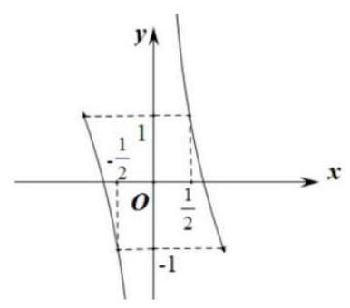

当 $a \neq  0$ 时,设 $t = \sin x$ ,则 $\frac{1}{2a} = \frac{1}{t} - {2t}$ ② $\left( {t \in  \left\lbrack  {-1,0)\cup (0,1}\right\rbrack  }\right)$ ，

函数 $y = \frac{1}{x} - {2x}\left( {x \in  \left\lbrack  {-1,0}\right\rbrack  \cup (0,1\rbrack }\right)$ 的图像如图,

当 $\frac{1}{2a} > 1$ 时,方程②有 1 个根 $0 < {t}_{1} < \frac{1}{2}$ ，方程①有 2 个根；

当 $\frac{1}{2a} = 1$ 时,方程②有 2 个根 ${t}_{1} =  - 1,{t}_{2} = \frac{1}{2}$ ，方程①有 3 个根；8 分

当 $- 1 < \frac{1}{2a} < 1$ 时,方程②有 2 个根 $- 1 < {t}_{1} <  - \frac{1}{2},\frac{1}{2} < {t}_{2} < 1$ ,

方程①有 4 个根；

当 $\frac{1}{2a} =  - 1$ 时,方程②有 2 个根 ${t}_{1} = 1,{t}_{2} =  - \frac{1}{2}$ ，方程①有 3 个根；10 分当 $\frac{1}{2a} <  - 1$ 时,方程②有 1 个根 $- \frac{1}{2} < t < 0$ ,方程①有 2 个根;

综上, $a$ 的值组成的集合为 $\left\{  {-\frac{1}{2},\frac{1}{2}}\right\}$ .

(3)不存在， $f\left( x\right)  = \ln x + b{x}^{2}$ ， ${f}^{\prime }\left( x\right)  = \frac{1}{x} + {2bx}$ ，11 分

假设存在 $A\left( {{x}_{1},{y}_{1}}\right) , B\left( {{x}_{2},{y}_{2}}\right) , M\left( {\frac{{x}_{1} + {x}_{2}}{2}, f\left( \frac{{x}_{1} + {x}_{2}}{2}\right) }\right) \left( {0 < {x}_{1} < {x}_{2}}\right)$

符合题意,

则 ${k}_{AB} = \frac{{y}_{2} - {y}_{1}}{{x}_{2} - {x}_{1}} = \frac{\ln {x}_{2} - \ln {x}_{1} + b\left( {{x}_{2}{}^{2} - {x}_{1}^{2}}\right) }{{x}_{2} - {x}_{1}} = \frac{2}{{x}_{1} + {x}_{2}} + b\left( {{x}_{1} + {x}_{2}}\right)$ ,

化简得 $\frac{\ln {x}_{2} - \ln {x}_{1}}{{x}_{2} - {x}_{1}} = \frac{2}{{x}_{1} + {x}_{2}},\ln \frac{{x}_{2}}{{x}_{1}} = \frac{2\left( {{x}_{2} - {x}_{1}}\right) }{{x}_{1} + {x}_{2}} = \frac{2\left( {\frac{{x}_{2}}{{x}_{1}} - 1}\right) }{1 + \frac{{x}_{2}}{{x}_{1}}}$ ,13 分

令 $t = \frac{{x}_{2}}{{x}_{1}} > 1,\ln t = \frac{2\left( {t - 1}\right) }{t + 1} = \frac{2\left( {t + 1}\right)  - 4}{t + 1} = 2 - \frac{4}{t + 1}$ ,

令 $g\left( t\right)  = \ln t + \frac{4}{t + 1} - 2,\;\left( {t > 1}\right)$ ,

${g}^{\prime }\left( t\right)  = \frac{1}{t} - \frac{4}{{\left( t + 1\right) }^{2}} = \frac{{\left( t + 1\right) }^{2} - {4t}}{t{\left( t + 1\right) }^{2}} = \frac{{\left( t - 1\right) }^{2}}{t{\left( t + 1\right) }^{2}} > 0,\;{16}$ 分

因为 $g\left( t\right)$ 在 $\left( {1, + \infty }\right)$ 上严格增,又 $g\left( 1\right)  = 0$ ,所以 $g\left( t\right)  > g\left( 1\right)  = 0$ ,

所以方程 $\ln t = 2 - \frac{4}{t + 1}$ 在 $\left( {1, + \infty }\right)$ 上无解,

即函数在区间 $\left( {{x}_{1},{x}_{2}}\right)$ 上不存在 “和谐 $T$ 点”.

15. (闵行 21) 设函数 $y = f\left( x\right)$ 的定义域为 $R$ ,集合 $M = \{ x \mid  f\left( x\right)  = a, x \in  R\}$ . 若 $M$ 中有且仅有一个元素,则称 $a$ 为函数 $y = f\left( x\right)$ 的一个“ $S$ 值”.

(1)设 $f\left( x\right)  = {x}^{2} - {2x}$ ，求 $y = f\left( x\right)$ 的 $S$ 值；

(2)设 $g\left( x\right)  = 3{x}^{4} - \left( {{4k} + 4}\right) {x}^{3} + {6k}{x}^{2} + 1$ ，且 $0 < k \leq  1$ ，若 $y = g\left( x\right)$ 的函数值中不存在 $S$ 值,求实数 $k$ 取值的集合;

(3)已知定义域为 $R$ 的函数 $y = h\left( x\right)$ 的图像是一条连续曲线，且函数 $y = h\left( x\right)$ 的所有函数值均为 $S$ 值,若 $m < n$ ,证明: $y = h\left( x\right)$ 在 $\left\lbrack  {m, n}\right\rbrack$ 上为严格增函数的一个充要条件是 $h\left( m\right)  < \; h\left( n\right)$ .

16. (浦东 21) 过曲线 $y = f\left( x\right)$ 上一点 $P$ 作其切线,若恰有两条,则称 $P$ 为 $f\left( x\right)$ 的 “ $A$ 类点”; 若点 $R$ 过曲线 $y = f\left( x\right)$ 外一点 $Q$ 作其切线,若恰有三条,则称 $Q$ 为 $f\left( x\right)$ 的 “ $B$ 类点”; 若点 $R$ 为 $f\left( x\right)$ 的 “ $A$ 类点” 或 “ $B$ 类点”,且过 $R$ 存在两条相互垂直的切线,则称 $R$ 为 $f\left( x\right)$ 的 “ $C$ 类点”.

(1)设 $f\left( x\right)  = \frac{1}{{x}^{2}}$ ，判断点 $P\left( {1,1}\right)$ 是否为 $f\left( x\right)$ 的“ $A$ 类点”，并说明理由；

(2)设 $f\left( x\right)  = {x}^{3} - {mx}$ ，若点 $Q\left( {2,0}\right)$ 为 $f\left( x\right)$ 的“ $B$ 类点”，且过点 $Q$ 的三条切线的切点横坐标可构成等差数列,求实数 $m$ 的值;

(3)设 $f\left( x\right)  = \frac{x + 1}{{\mathrm{e}}^{x}}$ ，证明: $y$ 轴上不存在 $f\left( x\right)$ 的 “ $C$ 类点”.

17. ${t}^{3} - 6{t}^{2} + {2m} = 2\left( {t - {t}_{1}}\right) \left( {t - {t}_{2}}\right) \left( {t - {t}_{3}}\right)$

$$
= 2{t}^{3} - 2\left( {{t}_{1} + {t}_{2} + {t}_{3}}\right) {t}^{2} + 2\left( {{t}_{1}{t}_{2} + {t}_{1}{t}_{3} + {t}_{2}{t}_{3}}\right) t - 2{t}_{1}{t}_{2}{t}_{3},
$$

比较等式两边系数得 $\left\{  {\begin{array}{l} {t}_{1} + {t}_{2} + {t}_{3} = 3 \\  {t}_{1}{t}_{2} + {t}_{1}{t}_{3} + {t}_{2}{t}_{3} = 0 \\  {t}_{1}{t}_{2}{t}_{3} =  - m \end{array} \Rightarrow  \left\{  \begin{array}{l} {t}_{2} = 1 \\  {d}^{2} = 3 - 9\text{ 分 } \\  m = 2 \end{array}\right. }\right.$

经检验,当 $m = 2$ 时, $f\left( x\right)  = {x}^{3} - {2x}$ ,不过 $Q\left( {2,0}\right)$ ,满足条件,10 分故 $m$ 的值为 2 .

(3)法一:假设 $y$ 轴上存在 $f\left( x\right)$ 的 “ $C$ 类点”，记为 $R$ ，设坐标为 $\left( {0, a}\right)$ ， ${f}^{\prime }\left( x\right)  =  - \frac{x}{{\mathrm{e}}^{x}}$ ,设切点为 $\left( {t, f\left( t\right) }\right)$ ,

切线方程为 $y - \frac{t + 1}{{\mathrm{e}}^{t}} =  - \frac{t}{{\mathrm{e}}^{t}}\left( {x - t}\right)$ ,即 $y =  - \frac{t}{{\mathrm{e}}^{t}}x + \frac{{t}^{2} + t + 1}{{\mathrm{e}}^{t}}$ ,

过 $R\left( {0, a}\right)$ ,得 $a = \frac{{t}^{2} + t + 1}{{\mathrm{e}}^{t}}$ ,方程至少有两个不同解,-11分

设 $g\left( t\right)  = \frac{{t}^{2} + t + 1}{{\mathrm{e}}^{t}}$ ,则 ${g}^{\prime }\left( t\right)  = \frac{t - {t}^{2}}{{\mathrm{e}}^{t}}$ ,

令 ${g}^{\prime }\left( t\right)  = 0$ ,得 $t = 0$ 或 $t = 1$ ,

当 $t$ 在 $\left( {-\infty ,0}\right) ,\left( {1, + \infty }\right)$ 上, ${g}^{\prime }\left( t\right)  < 0, g\left( t\right)$ 为严格减函数,

当 $t$ 在 $\left( {0,1}\right)$ 上, ${g}^{\prime }\left( t\right)  > 0, g\left( t\right)$ 为严格增函数,-13分

极小值 $g\left( 0\right)  = 1$ ,极大值 $g\left( 1\right)  = \frac{3}{\mathrm{e}}$ ,又 $g\left( {-1}\right)  = \mathrm{e} > \frac{3}{\mathrm{e}}, g\left( 2\right)  = \frac{6}{{\mathrm{e}}^{2}} < 1$ ,

由函数图像得,当 $a = 1$ 或 $\frac{3}{\mathrm{e}}$ 时,方程有两个不同解,

当 $a \in  \left( {1,\frac{3}{\mathrm{e}}}\right)$ 时,方程有三个不同解,

因为 $a = 1$ 时， $R\left( {0,1}\right)$ 在 $f\left( x\right)$ 上，其余情况下 $R$ 在 $f\left( x\right)$ 外，

所以 $a \in  \left\lbrack  {1,\frac{3}{\mathrm{e}}}\right)$ ,

设两垂直切线的斜率为 ${k}_{1},{k}_{2}$ ,对应方程的两根为 ${t}_{1},{t}_{2}$ ,

则 ${k}_{1}{k}_{2} = \left( {-\frac{{t}_{1}}{{\mathrm{e}}^{{t}_{1}}}}\right)  \cdot  \left( {-\frac{{t}_{2}}{{\mathrm{e}}^{{t}_{2}}}}\right)  = \frac{{t}_{1}{t}_{2}}{{\mathrm{e}}^{{t}_{1} + {t}_{2}}} =  - 1$ ,

由 $a = \frac{{t}^{2} + t + 1}{{\mathrm{e}}^{t}}$ 得 ${\mathrm{e}}^{{t}_{1} + {t}_{2}} = {\mathrm{e}}^{{t}_{1}} \cdot  {\mathrm{e}}^{{t}_{2}} = \frac{\left( {{t}_{1}^{2} + {t}_{1} + 1}\right) \left( {{t}_{2}^{2} + {t}_{2} + 1}\right) }{{a}^{2}}$ ,代入上式,

有 ${a}^{2} = \frac{\left( {{t}_{1}^{2} + {t}_{1} + 1}\right) \left( {{t}_{2}^{2} + {t}_{2} + 1}\right) }{-{t}_{1}{t}_{2}}$ ,

因为 ${t}_{1}{t}_{2} =  - {\mathrm{e}}^{{t}_{1} + {t}_{2}} < 0$ ,所以 ${t}_{1},{t}_{2}$ 异号,不妨设 ${t}_{1} < 0 < {t}_{2}$ ,由均值不等式得 $\frac{{t}_{1}^{2} + {t}_{1} + 1}{-{t}_{1}} \; \geq  1,\frac{{t}_{2}^{2} + {t}_{2} + 1}{{t}_{2}} \geq  3$ ,则 ${a}^{2} \geq  3$ ,而 ${a}^{2} \in  \left\lbrack  {1,\frac{9}{{\mathrm{e}}^{2}}}\right)$ ,等式无法成立, ${t}_{1},{t}_{2}$ 不存在. -18 分

故假设不成立,命题得证!

法二: 假设 $y$ 轴上存在 $f\left( x\right)$ 的 “ $C$ 类点”,记为 $R$ ,

设坐标为 $\left( {0, a}\right) ,{f}^{\prime }\left( x\right)  =  - \frac{x}{{\mathrm{e}}^{x}}$ ,设切点为 $\left( {t, f\left( t\right) }\right)$ ,

切线方程为 $y - \frac{t + 1}{{\mathrm{e}}^{t}} =  - \frac{t}{{\mathrm{e}}^{t}}\left( {x - t}\right)$ ,即 $y =  - \frac{t}{{\mathrm{e}}^{t}}x + \frac{{t}^{2} + t + 1}{{\mathrm{e}}^{t}}$ ,过 $R\left( {0, a}\right)$ ,得 $a = \; \frac{{t}^{2} + t + 1}{{\mathrm{e}}^{t}}$ ,方程至少有两个不同解,

设 $g\left( t\right)  = \frac{{t}^{2} + t + 1}{{\mathrm{e}}^{t}}$ ,则 ${g}^{\prime }\left( t\right)  = \frac{t - {t}^{2}}{{\mathrm{e}}^{t}}$ ,令 ${g}^{\prime }\left( t\right)  = 0$ ,得 $t = 0$ 或 $t = 1$ ,

当 $t$ 在 $\left( {-\infty ,0}\right) ,\left( {1, + \infty }\right)$ 上， ${g}^{\prime }\left( t\right)  < 0, g\left( t\right)$ 为严格减函数，

当 $t$ 在 $\left( {0,1}\right)$ 上, ${g}^{\prime }\left( t\right)  > 0, g\left( t\right)$ 为严格增函数,

极小值 $g\left( 0\right)  = 1$ ,极大值 $g\left( 1\right)  = \frac{3}{\mathrm{e}}$ ,又 $g\left( {-1}\right)  = \mathrm{e} > \frac{3}{\mathrm{e}}, g\left( 2\right)  = \frac{6}{{\mathrm{e}}^{2}} < 1$ ,

设两垂直切线的斜率为 ${k}_{1},{k}_{2}$ ,对应方程的两根为 ${t}_{1},{t}_{2}$ ,不妨设 ${t}_{1} < {t}_{2}$ ,

由函数图像得 $- 1 < {t}_{1} < {t}_{2} < 2$ ,

设 $h\left( x\right)  =  - \frac{x}{{\mathrm{e}}^{x}}, - 1 < x < 2$ ,则 ${h}^{\prime }\left( x\right)  = \frac{x - 1}{{\mathrm{e}}^{x}}$ ,令 ${h}^{\prime }\left( x\right)  = 0$ ,得 $x = 1$ ,

当 $x$ 在 $\left( {-1,1}\right)$ 上, ${h}^{\prime }\left( x\right)  < 0, g\left( t\right)$ 为严格减函数,

当 $x$ 在 $\left( {1,2}\right)$ 上, ${h}^{\prime }\left( x\right)  > 0, g\left( t\right)$ 为严格增函数,

$h\left( {-1}\right)  = \mathrm{e},\;h{\left( x\right) }_{\min } = h\left( 1\right)  =  - \frac{1}{\mathrm{e}},\;h\left( 2\right)  = \frac{1}{\mathrm{e}}$ ,因此 $h\left( x\right)  \in  \left\lbrack  {-\frac{1}{\mathrm{e}},\mathrm{e}}\right)$ ,

则 ${k}_{1}{k}_{2} = \left( {-\frac{{t}_{1}}{{\mathrm{e}}^{{t}_{1}}}}\right)  \cdot  \left( {-\frac{{t}_{2}}{{\mathrm{e}}^{{t}_{2}}}}\right)  >  - \frac{1}{\mathrm{e}} \cdot  \mathrm{e} =  - 1$ ,矛盾! 故假设不成立,命题得证!

18. (普陀 21) 设 $t > 1, n \geq  1, n \in  N$ ,若正项数列 $\left\{  {a}_{n}\right\}$ 满足 $\frac{1}{t}{a}_{n} < {a}_{n + 1} < {a}_{n}$ ,则称数列 $\left\{  {a}_{n}\right\}$ 具有性质 “ $P\left( t\right)$ ”.

(1)设 $m \geq  1$ ， $m \in  N$ ，若数列10，7， $m$ ，4，3 具有性质 “ $P\left( 2\right)$ ” ，求满足条件的 $m$ 的值:

(2)设数列 $\left\{  {a}_{n}\right\}$ 的通项公式为 ${a}_{n} = \left( {n + 1}\right) {\left( \frac{t}{9}\right) }^{n}$ ，问是否存在 $t$ 使得数列 $\left\{  {a}_{n}\right\}$ 具有性质 “ $P\left( t\right)$ ” ? 若存在，求出满足条件的 $t$ 的取值范围，若不存在，请说明理由；

(3) 设函数 $y = f\left( x\right)$ 的表达式为 $f\left( x\right)  = \ln \left( {{\mathrm{e}}^{x} - 1}\right)  - \ln x$ ,数列 $\left\{  {a}_{n}\right\}$ 的前 $n$ 项和为 ${S}_{n}$ ,且满足 ${a}_{1} = \frac{2}{3},{a}_{n + 1} = f\left( {a}_{n}\right)$ ,证明: 数列 $\left\{  {a}_{n}\right\}$ 具有性质 “ $P\left( 3\right)$ ”,并比较 ${S}_{n}$ 与 $1 - \frac{1}{{3}^{n}}$ 的大小.

19. (青浦 21) 已知函数 $y = f\left( x\right)$ ,其中 $f\left( x\right)  = {\mathrm{e}}^{x - 1} - 2\ln x + x$ .

(1)求函数 $y = f\left( x\right)$ 的单调区间；

(2)设函数 $g\left( x\right)  = f\left( x\right)  + 2\ln x$ ，问:函数 $y = g\left( x\right)$ 的图像上是否存在三点 $A$ ， $B$ ， $C$ ， 使得它们的横坐标成等差数列,且直线 ${AC}$ 的斜率等于 $y = g\left( x\right)$ 在点 $B$ 处的切线的斜率? 若存在,求出所有满足条件的点 $B$ 的坐标; 若不存在,说明理由;

(3)证明:函数 $y = f\left( x\right)$ 图像上任意一点都不落在函数 $y = {\left( x - 2\right) }^{3} - 3\left( {x - 2}\right)$ 图像的下方.

20. (松江 21 ) 定义在 $D$ 上的函数 $y = f\left( x\right)$ ,若对任意不同的两点 $A\left( {{x}_{1}, f\left( {x}_{1}\right) }\right)$ , $B\left( {{x}_{2}, f\left( {x}_{2}\right) }\right) \left( {{x}_{1} < {x}_{2}}\right)$ ,故存在 ${x}_{0} \in  \left( {{x}_{1},{x}_{2}}\right)$ ,使得函数 $y = f\left( x\right)$ 在 ${x}_{0}$ 处的切线 $l$ 与直线 ${AB}$ 平行,则称函数 $y = f\left( x\right)$ 在 $D$ 上处处相依,其中 $l$ 称为直线 ${AB}$ 的相依切线, $\left( {{x}_{1},{x}_{2}}\right)$ 为函数 $y = f\left( x\right)$ 在 ${x}_{0}$ 的相依区间. 已知 $f\left( x\right)  =  - \left( {a + 1}\right) {x}^{2} + {ax}$ .

(1)当 $a = 2$ 时，函数 $F\left( x\right)  = {x}^{3} + f\left( x\right)$ 在 $R$ 上处处相依，证明:导函数 $y = {F}^{\prime }\left( x\right)$ 在 $\left( {0,1}\right)$ 上有零点;

(2)若函数 $G\left( x\right)  = \ln x + \frac{f\left( x\right) }{{x}^{2}}$ 在 $\left( {0, + \infty }\right)$ 上处处相依,且对任意实数 $m, n, m > n >$ 0,都有 $\frac{G\left( m\right)  - G\left( n\right) }{m - n} \leq  1$ 恒成立,求实数 $a$ 的取值范围;

(3)当 $a = 0$ 时， $H\left( x\right)  = \frac{{\mathrm{e}}^{x}}{\sqrt{-f\left( x\right) }}\left( {x > 0}\right)$ ， $\left( {{x}_{1},{x}_{2}}\right)$ 为函数 $y = H\left( x\right)$ 在 ${x}_{0} = 1$ 的相依区间， 证明: ${x}_{1} + {x}_{2} > 2$ .

21. (徐汇 21) 已知定义域为 $D$ 的函数 $y = f\left( x\right)$ ,其导函数为 $y = {f}^{\prime }\left( x\right)$ ,若点 $\left( {{x}_{0},{y}_{0}}\right)$ 在导函数 $y = {f}^{\prime }\left( x\right)$ 图像上,且满足 ${f}^{\prime }\left( {x}_{0}\right)  \cdot  {f}^{\prime }\left( {y}_{0}\right)  \geq  0$ ,则称 ${x}_{0}$ 为函数 $y = f\left( x\right)$ 的一个 “ $T$ 类数”, 函数 $y = f\left( x\right)$ 的所有 “ $T$ 类数” 构成的集合称为 “ $T$ 类集”.

(1) 若 $f\left( x\right)  = \sin x$ ，分别判断 $\frac{\pi }{2}$ 和 $\frac{3\pi }{4}$ 是否为函数 $y = f\left( x\right)$ 的“ $T$ 类数”，并说明理由；

(2)设 $y = {f}^{\prime }\left( x\right)$ 的图像在 $R$ 上连续不断，集合 $M = \left\{  {x \mid  {f}^{\prime }\left( x\right)  = 0}\right\}$ . 记函数 $y = f\left( x\right)$ 的 “ $T$ 类集”为集合 $S$ ，若 $S \subset  R$ ，求证: $M \neq  \varnothing$ ；

(3)已知 $f\left( x\right)  =  - \frac{1}{\omega }\cos \left( {{\omega x} + \varphi }\right) \left( {\omega  > 0}\right)$ ，若函数 $y = f\left( x\right)$ 的 “ $T$ 类集”为 $R$ 时 $\varphi$ 的取值构成集合 $A$ ,求当 $\varphi  \in  A$ 时 $\omega$ 的最大值.

22. (杨浦 21) 已知 $y = f\left( x\right)$ 是定义域为 $\left\lbrack  {0,1}\right\rbrack$ 的函数,实数 $p \in  \left( {0,1}\right)$ ,称函数 $y = \left( {1 - p}\right) f\left( 0\right) \; + {pf}\left( x\right)  - f\left( {px}\right) , x \in  \left\lbrack  {0,1}\right\rbrack$ 为函数 $y = f\left( x\right)$ 的 “ $p$ - 生成函数”,记作 $y = {F}_{p}\left( x\right) , x \in \; \left\lbrack  {0,1}\right\rbrack$ .

(1)若 $f\left( x\right)  = \cos {2\pi x}$ ，求函数 $y = {F}_{\frac{1}{2}}\left( x\right)$ 的值域；

(2)若 $f\left( x\right)  = a{x}^{2} + \ln \left( {1 + x}\right)$ ，函数 $y = {F}_{\frac{1}{3}}\left( x\right)$ 满足 ${F}_{\frac{1}{3}}\left( x\right)  \geq  0$ 对任意的 $0 \leq  x \leq  1$ 恒成立， 求实数 $a$ 的取值范围;

(3)若 $y = f\left( x\right)$ 满足: ① $f\left( 0\right)  = 0$ ; ② $y = f\left( x\right)$ 在 $\left( {0,1}\right)$ 上存在导函数 $y = {f}^{\prime }\left( x\right)$ ，且 $y = \; {f}^{\prime }\left( x\right)$ 在 $\left( {0,1}\right)$ 上是严格增函数; ③对于任意 $p \in  \left( {0,1}\right)$ ， $y = f\left( x\right)$ 的“ $p$ -生成函数” $y = \; {F}_{p}\left( x\right) ,\;x \in  \left\lbrack  {0,1}\right\rbrack$ 的图像是一段连续曲线,求证: 函数 $y = \frac{f\left( x\right) }{x}$ 在 $\left( {0,1}\right)$ 上是严格增函数.

注意到存在一个 $n$ 使得 $\left( {{2}^{n} - \frac{n}{2}}\right) \varepsilon  > M$ ,故取 $\delta  = \frac{{\delta }^{\prime }}{{2}^{n}}$ ,

由假设,存在 ${x}_{0} \in  \left( {0,\frac{{\delta }^{\prime }}{{2}^{n}}}\right)$ 有 $\left| {f\left( {x}_{0}\right) }\right|  > \varepsilon$ ,

容易知道 $\exists k \in  N$ 使得 ${2}^{n + k}{x}_{0} \in  \left\lbrack  {\frac{{\delta }^{\prime }}{2},{\delta }^{\prime }}\right\rbrack$ ,

不妨设 $k = 0$ (如果 $k > 0$ ,则后面的不等式更加满足了),

从而 $\left| {f\left( {{2}^{n}{x}_{0}}\right) }\right|  > {2}^{n}\left| {f\left( {x}_{0}\right) }\right|  - n \cdot  \frac{\varepsilon }{2} > \left( {{2}^{n} - n}\right) \varepsilon  > M$ ,矛盾!

故 $f\left( x\right)$ 在 $x = 0$ 处连续.

任取一个 $x \in  \left( {0,1}\right)$ ,此时 $f$ 在 $\left\lbrack  {0, x}\right\rbrack$ 上满足拉格朗日中值定理的条件,

故 $f\left( x\right)  - f\left( 0\right)  = {f}^{\prime }\left( \xi \right) \left( {x - 0}\right)$ ,其中 $\xi  \in  \left( {0, x}\right)$ ,即 $f\left( x\right)  < {f}^{\prime }\left( \xi \right) x$ ,

注意到 ${f}^{\prime }\left( x\right)$ 严格增,故 ${f}^{\prime }\left( x\right)  > {f}^{\prime }\left( \xi \right)$ ,从而 $f\left( x\right)  < x{f}^{\prime }\left( x\right)$ ,

因此 ${\left( \frac{f\left( x\right) }{x}\right) }^{\prime } = \frac{x{f}^{\prime }\left( x\right)  - f\left( x\right) }{{x}^{2}} > 0$ ,故 $\frac{f\left( x\right) }{x}$ 严格增.

23. (长宁 21) 双曲余弦函数 $\cosh x = \frac{{\mathrm{e}}^{x} + {\mathrm{e}}^{-x}}{2}$ ,双曲正弦函数 $\sinh x = \frac{{\mathrm{e}}^{x} - {\mathrm{e}}^{-x}}{2}$ .

(1)求函数 $\cosh x = \frac{{\mathrm{e}}^{x} + {\mathrm{e}}^{-x}}{2}$ 的单调增区间；

( 2 )若函数 $y = \cosh {2x} - a\sinh x$ 在 $\lbrack 0, + \infty )$ 上的最小值是 $\frac{1}{4}$ ，求实数 $a$ 的值；

(3)对任意 $x \in  R$ ， $\cosh \left( x\right)  \geq  \cos x + m{x}^{2}$ 恒成立，求实数 $m$ 的取值范围.

## 第 7 节函数

【函数性质】

1. (宝山 5 ) 已知 $a, b$ 为实数，且函数 $y = {x}^{2} + {ax} + 1, x \in  \left\lbrack  {b,4}\right\rbrack$ 是偶函数，则 $a - b =$ ___. 【解析】由题意得 $a = 0, b =  - 4$ ,则 $a - b = 4$ .

2. (宝山 14) 下列函数中,在区间 $\left( {0, + \infty }\right)$ 上是严格增函数且存在零点的是 ( )

A. $y = {\mathrm{e}}^{x}$ B. $y = \sqrt{x} + 2$ C. $y =  - {\log }_{\frac{1}{2}}x$ D. $y = {\left( x - 2\right) }^{2}$

3. (崇明 13) 下列函数中, 在其定义域上既是奇函数又是严格增函数的是 ( )

A. $y = {x}^{3}$ B. $y = {\mathrm{e}}^{x}$ C. $y = \lg x$ D. $y = \sin x$

4. (闵行 7) 已知函数 $y = \left\{  \begin{array}{ll} {\log }_{2}x, & x > 0 \\  f\left( x\right) , & x < 0 \end{array}\right.$ 为奇函数,则 $f\left( {-8}\right)  =$ ___.

5. (闵行 14) 下列函数中,在区间 $\left( {0, + \infty }\right)$ 上是严格减函数的为 ( )

A. $y = {x}^{\frac{1}{2}}$ B. $y = \frac{1}{{x}^{2} + 1}$ C. $y = {2}^{x}$ D. $y = \lg \left| x\right|$

6. (青浦 15 ) 已知函数 $y = f\left( x\right)$ 是定义在 $R$ 上的奇函数,且当 $x > 0$ 时, $f\left( x\right)  = \left( {x - 1}\right) \left( {x - 3}\right) \; + {0.01}$ ,则关于函数 $y = f\left( x\right)$ 在 $R$ 上的零点的说法正确的是 ( )

A. 有 4 个零点,其中只有一个零点在区间 $\left( {-3, - 1}\right)$ 上

B. 有 4 个零点,其中两个零点在区间 $\left( {-3, - 1}\right)$ 上,另外两个零点在区间 $\left( {1,3}\right)$ 上

C. 有 5 个零点,两个正零点中一个在区间 $\left( {0,1}\right)$ 上,一个在区间 $\left( {3, + \infty }\right)$ 上

D. 有 5 个零点,都不在区间 $\left( {0,1}\right)$ 上

7. (松江 10) 已知函数 $y = f\left( x\right)$ 的表达式为 $f\left( x\right)  = \left\{  \begin{array}{l} {3}^{x}, x \geq  0 \\  \frac{1}{{3}^{x}}, x < 0 \end{array}\right.$ ,则满足 $f\left( m\right)  \geq  f\left( {m + 2}\right)$ 的实数 $m$ 的最大值为___.

8. (松江 16) 设函数 $y = f\left( x\right)$ 与 $y = g\left( x\right)$ 均是定义在 $R$ 上的函数,有以下两个命题:

①若 $y = f\left( x\right)$ 是周期函数，且是 $R$ 上的减函数，则函数 $y = f\left( x\right)$ 必为常值函数；

②若对任意的 $a, b \in  R$ ，有 $\left| {f\left( a\right)  - f\left( b\right) }\right|  \leq  \left| {g\left( a\right)  - g\left( b\right) }\right|$ 成立，且 $y = g\left( x\right)$ 是 $R$ 上的增函数,则 $y = f\left( x\right)  - g\left( x\right)$ 是 $R$ 上的增函数.

则以下选项正确的是 ( )

A. ①是真命题，②是假命题 B. 两个都是真命题

C. ①是假命题，②是真命题 D. 两个都是假命题

9. (徐汇 5 ) 设 $a, b \in  R, f\left( x\right)  = {x}^{3} + 3\sin x + b$ . 若函数 $y = f\left( x\right)$ 是定义在 $\left\lbrack  {-a,{2a} - 1}\right\rbrack$ 上的奇函数，则 $a + b =$ ___.

10. (徐汇 15) 已知函数 $y = f\left( x\right)$ 与它的导函数 $y = {f}^{\prime }\left( x\right)$ 的定义域均为 $R$ . 若函数 $y = f\left( x\right)$ 是偶函数且 $y = {f}^{\prime }\left( x\right)$ 在 $\left( {-\infty ,0}\right)$ 上是严格增函数,则下列各表中,可能成为 $y = f\left( x\right)$ 取值的是

( )

<table><tr><td colspan="2">A.</td></tr><tr><td>$x$</td><td>$f\left( x\right)$</td></tr><tr><td>1</td><td>2.8188</td></tr><tr><td>2</td><td>1.0000</td></tr><tr><td>3</td><td>0.3644</td></tr><tr><td>4</td><td>0.2468</td></tr></table>

B. $C$ .

<table id="cross-table-2"><tr><td colspan="4">$D$ .</td></tr><tr><td rowspan="5"></td><td colspan="2">$x$</td><td>$f\left( x\right)$</td></tr><tr><td colspan="2">1</td><td>0.8664</td></tr><tr><td colspan="2">2</td><td>1.0000</td></tr><tr><td colspan="2">3</td><td>1.1188</td></tr><tr><td colspan="2">4</td><td>1.2240</td></tr><tr><td colspan="4">___。</td></tr><tr><td colspan="2">$x$</td><td colspan="2">$f\left( x\right)$</td></tr><tr><td colspan="2">1</td><td colspan="2">0.7580</td></tr><tr><td colspan="2">2</td><td colspan="2">1.0000</td></tr><tr><td colspan="2">3</td><td colspan="2">1.3188</td></tr><tr><td colspan="2">4</td><td colspan="2">1.7979</td></tr><tr><td colspan="2">$x$</td><td colspan="2">$f\left( x\right)$</td></tr><tr><td colspan="2">1</td><td colspan="2">2.4132</td></tr><tr><td colspan="2">2</td><td colspan="2">1.0000</td></tr><tr><td colspan="2">3</td><td colspan="2">1.5885</td></tr><tr><td colspan="2">4</td><td colspan="2">4.1116</td></tr></table>

11. (杨浦 4) 已知函数 $y = {x}^{2} + {ax} + 1$ 是偶函数，则实数 $a$ 的值为___.

12. (宝山 8) 若 ${9}^{a} = {4}^{b} = m$ ，且 $\frac{1}{a} + \frac{1}{b} = 2$ ，则 $m =$ ___.

13. (崇明 8) 已知 $f\left( x\right)  = \left\{  \begin{array}{l} {2}^{x} - 1, x > 1 \\  x - 1, x \leq  1 \end{array}\right.$ ，关于 $x$ 的方程 $f\left( x\right)  = 2$ 的解 $x =$ ___.

14. (奉贤 4 ) 设 $f\left( x\right)  = \left\{  \begin{array}{l} \ln x + 1, x > 0 \\  {2}^{x} + 1, x \leq  0 \end{array}\right.$ ，若 $f\left( {x}_{0}\right)  = 1$ ，则 ${x}_{0} =$ ___.

15. (虹口 5) 设 $a > 0$ 且 $a \neq  1$ ，则函数 $y = 2 + {\log }_{a}x$ 的图像恒过的定点坐标为___.

16. (金山 3) 已知函数 $y = f\left( x\right)$ 的表达式为 $f\left( x\right)  = \left\{  \begin{array}{l} {2}^{x}, x \leq  2 \\  {\log }_{2}x, x > 2 \end{array}\right.$ ，则 $f\left( 4\right)$ 的值为___.

17. (静安 14) 污水处理厂通过清除污水中的污染物获得清洁用水并生产肥料. 该厂的污水处理装置每小时从处理池清除掉 12% 的污染残留物. 要使处理池中的污染物水平降到最初的 10%，大约需要的时间为 ( )

A. 14 小时 B. 18 小时 C. 20 小时 D. 24 小时

18. (浦东 1) 若对数函数 $y = {\log }_{a}x\left( {a > 0, a \neq  1}\right)$ 的图像经过点 $\left( {4,2}\right)$ ，则 $a$ 的值为___. 【解析】由题意得 ${\log }_{a}4 = 2$ ,所以 ${a}^{2} = 4, a = 2$ .

19. (浦东 8) 已知函数 $y = f\left( x\right)$ 的表达式为 $f\left( x\right)  = \left\{  \begin{matrix} {\left( \frac{1}{2}\right) }^{x} - 3, & x \leq  0 \\  {x}^{2}, & x > 0 \end{matrix}\right.$ ,则不等式 $f\left( x\right)  \leq  1$ 的解为___.

20. (徐汇 2) 已知函数 $y = f\left( x\right)$ ,其中 $f\left( x\right)  = \left\{  \begin{array}{l} \ln x, x > 0 \\   - 1, x \leq  0 \end{array}\right.$ ,则 $f\left( 1\right)  =$ _____.

21. (杨浦 10) 已知 $f\left( x\right)  = \left\{  \begin{matrix} \frac{1}{{x}^{3}}, & 0 \leq  x \leq  a \\  {\log }_{3}x, & x > a \end{matrix}\right.$ ,其中实数 $a > 0$ . 若函数 $y = f\left( x\right)  - 2$ 有且仅有 2 个零点, 则 $a$ 的取值范围为___.

22. (长宁 7) 已知 $a \in  \left\{  {-1, - \frac{2}{3}, - \frac{1}{3},\frac{1}{3},\frac{2}{3},1,2,3}\right\}$ ,函数 $y = {x}^{a}$ 的大致图像如图所示,则 $a \; =$ ___.

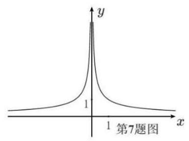

23. (浦东 16) 设函数 $y = F\left( x\right) , y = G\left( x\right)$ 的定义域均为 $R$ ,值域分别为 $A, B$ ,且 $A \cap  B = \varnothing$ . 若集合 $S$ 满足以下两个条件:(1) $A \cup  B \subseteq  S$ ；(2) ${\complement }_{S}\left( {A \cup  B}\right)$ 是有限集，则称 $y = F\left( x\right)$ 和 $y = G\left( x\right)$ 是 $S$ - 互补函数. 给出以下两个命题:

①存在函数 $y = f\left( x\right)$ ，使得 $y = {2}^{f\left( x\right) }$ 和 $y = {\log }_{2}f\left( x\right)$ 是 $\left\lbrack  {0,{16}}\right\rbrack$ - 互补函数；

②存在函数 $y = g\left( x\right)$ ，使得 $y = \sin g\left( x\right)$ 和 $y = \tan g\left( x\right)$ 是 $\lbrack 0, + \infty )$ - 互补函数. 则 ( )

A. ①②都是真命题 B. ①是真命题，②是假命题

C. ①是假命题，②是真命题 D. ①②都是假命题

24. (奉贤 17) 已知函数 $y = f\left( x\right)$ ，其中 $f\left( x\right)  = {a}^{x}$ (常数 $a > 0$ 且 $a \neq  1$ ).

(1)若函数 $y = f\left( x\right)$ 的图像过点 $\left( {2,9}\right)$ ，求关于 $x$ 的不等式 $f\left( \left| {{2x} - 1}\right| \right)  > 3$ 的解集；

(2) 存在 $x \in  (0,1\rbrack$ ,使得数列 $f\left( 1\right) , f\left( {tx}\right) , f\left( {{x}^{2} + 2}\right)$ 是等比数列,求实数 $t$ 的取值范围.

25. (金山 17) 已知常数 $a > 1$ ，函数 $y = f\left( x\right)$ 的表达式为 $f\left( x\right)  = {\log }_{a}\left( {x + 2}\right)  - {\log }_{a}\left( {2 - x}\right)$ .

(1)证明:函数 $y = f\left( x\right)$ 是奇函数；

(2)若函数 $y = f\left( x\right)$ 在区间 $\left\lbrack  {0,1}\right\rbrack$ 上的最大值为2，求实数 $a$ 的值.

26. (静安 17) 设函数 $f\left( x\right)  = x + \frac{4}{x}, x \in  \left( {-\infty ,0}\right)  \cup  \left( {0, + \infty }\right)$ .

(1)求函数 $y = f\left( x\right)$ 的单调区间；

(2)求不等式 $f\left( x\right)  < {2x}$ 的解集.

27. (静安 21) 如果函数 $y = f\left( x\right)$ 满足以下两个条件,我们就称函数 $y = f\left( x\right)$ 为 $U$ 型函数.

①对任意的 $x \in  \left\lbrack  {0,1}\right\rbrack$ ，有 $f\left( x\right)  \geq  1$ ， $f\left( 1\right)  = 3$ ；

②对于任意的 $x, y \in  \left\lbrack  {0,1}\right\rbrack$ ，若 $x + y \leq  1$ ，则 $f\left( {x + y}\right)  \geq  f\left( x\right)  + f\left( y\right)  - 1$ .

求证: (1) $y = {3}^{x}$ 是 $U$ 型函数;

(2) $U$ 型函数 $y = f\left( x\right)$ 在 $\left\lbrack  {0,1}\right\rbrack$ 上为增函数；

(3)对于 $U$ 型函数 $y = f\left( x\right)$ ，有 $f\left( \frac{1}{{3}^{n}}\right)  \leq  \frac{2}{{3}^{n}} + 1$ (n 为正整数).

28. (闵行 18) 已知 $f\left( x\right)  = \left\{  \begin{array}{ll} {x}^{2} - {ax}, & x \geq  0 \\  x + \frac{1}{x}, & x < 0 \end{array}\right.$ .

(1)若 $a = 1$ ，求函数 $y = f\left( x\right)$ 的值域；

(2)若存在 $\varphi  \in  \left( {0,\frac{\pi }{4}}\right)$ ，使得 $f\left( {\sin \varphi }\right)  = f\left( {\cos \varphi }\right)$ ，求实数 $a$ 的取值范围.

## 第 6 节二项式

1. (宝山 4) 在 ${\left( x + 2\right) }^{5}$ 的展开式中 ${x}^{3}$ 的系数为___.

2. (崇明 4) ${\left( x - 1\right) }^{7}$ 的二项展开式中 ${x}^{3}$ 的系数为___.

3. (奉贤 6) ${\left( {x}^{6} + \frac{1}{x\sqrt{x}}\right) }^{5}$ 的二项展开式中的常数项为___(用数字作答).

4. (虹口4) 在 ${\left( x - 2\right) }^{6}$ 的二项展开式中, ${x}^{3}$ 项的系数为___.

5. (黄浦 5) 在 ${\left( x + \frac{1}{x}\right) }^{6}$ 的二项展开式中，常数项为___.

6. (嘉定 7) 在 ${\left( x - \frac{1}{x}\right) }^{9}$ 的二项展开式中 ${x}^{3}$ 项的系数为___.

7. (金山 5) ${\left( 3x - 1\right) }^{6}$ 的二项展开式中， ${x}^{2}$ 项的系数为___.

8. (闵行 6) ${\left( x + \frac{1}{x}\right) }^{8}$ 的二项展开式中， ${x}^{4}$ 项的系数为___.

9. (浦东 4) 在 ${\left( {x}^{2} + \frac{1}{x}\right) }^{6}$ 的展开式中， ${x}^{3}$ 项的系数是___(用数字作答).

10. (普陀) 若 ${\left( x + {x}^{2}\right) }^{5} = {a}_{0}{x}^{5} + {a}_{1}{x}^{6} + {a}_{2}{x}^{2} + {a}_{3}{x}^{8} + {a}_{4}{x}^{9} + {a}_{5}{x}^{18}$ ，则 ${a}_{3}$ 的值为___.

11. (青浦 9) $\left( {x + y}\right) {\left( x - y\right) }^{6}$ 的展开式中， ${x}^{4}{y}^{3}$ 项的系数为___.

12. (松江 7 ) 已知 ${\left( x + 2\right) }^{4} = {a}_{0} + {a}_{1}x + {a}_{2}{x}^{2} + {a}_{3}{x}^{3} + {a}_{4}{x}^{4}$ ，则 ${a}_{1} + {a}_{2} + {a}_{3} + {a}_{4} =$ ___.

13. (徐汇3) 在 ${\left( 1 + x\right) }^{n}$ 的二项展开式中,若各项系数和为 32,则正整数 $n$ 的值为___.

14. (长宁 6) ${\left( x - \frac{1}{x}\right) }^{6}$ 的二项展开式中的常数项是___.

- 第 5 节排列组合

1. (宝山 7 ) 已知关于正整数 $x$ 的方程 ${C}_{12}^{x - 1} = {C}_{12}^{{5x} - 5}$ ，则该方程的解为___.

2. (崇明 5) 若 $A, B, C, D, E$ 五人站成一排，如果 $A, B$ 必须相邻，那么排法共___ 种.

3. (虹口12) 已知项数为 10 的数列 $\left\{  {a}_{n}\right\}$ 中任一项均为集合 $\{ x \mid  1 \leq  x \leq  {10}, x \in  N\}$ 中的元素, 且相邻两项满足 ${a}_{n} < {a}_{n + 1} + 3, n = 1,2,\cdots ,9$ . 若 $\left\{  {a}_{n}\right\}$ 中任意两项都不相等,则满足条件的数列 $\left\{  {a}_{n}\right\}$ 有___个.

4. (闵行 8 ) 从 10 名数学老师中选出 3 人安排在 3 天的假期中值班, 每天有且只有一人值班. 若老师甲必须参加且不安排在假期第一天值班，则不同的值班安排方法种数为___.

5. (青浦 10) 已知函数 $y = f\left( x\right)$ 的定义域为 $\{  - 2, - 1,1,2\}$ ,值域为 $\{  - 2,2\}$ ,则满足条件的函数 $y = f\left( x\right)$ 最多有___个.

6. (徐汇 12) 已知定义域为 $A = \{ 1,2,3\}$ 的函数 $y = f\left( x\right)$ 的值域也是 $A$ ,所有这样的函数 $y = \; f\left( x\right)$ 形成全集 $B$ . 设非空集合 $C \subseteq  B$ 且 $\bar{C}$ 中的每一个函数都是 $C$ 中的两个函数 (可以相同) 的复合函数，则集合 $C$ 的元素个数的最小值为___.

- 第 4 节三角

【简单小题】

1. (宝山 2 ) 函数 $y = \cos {2x} + 1$ 的最小正周期为___.

2. (奉贤 13) 在 $\bigtriangleup  {ABC}$ 中，“ $C = \frac{\pi }{2}$ ” 是 “ ${\sin }^{2}A + {\sin }^{2}B = 1$ ” 的 ( )

A. 充分非必要条件 B. 必要非充分条件

C. 充要条件 D. 既非充分又非必要条件

3. (奉贤 14) 函数 $y = {\log }_{2}\sin x + {\log }_{2}\cos x$ ,则下列命题正确的是 ( )

A. 函数是偶函数 B. 函数定义域是 $\left( {0,\frac{\pi }{2}}\right)$

C. 函数最大值 -1 D. 函数的最小正周期为 $\pi$

4. (虹口3) 若 $\tan \alpha  = 5$ ,则 $\tan {2\alpha } =$ ___.

5. (虹口13) 已知 $\alpha  \in  \left( {0,\pi }\right)$ ，则 “ $\sin \left( {\pi  - \alpha }\right)  = \frac{1}{2}$ ” 是 “ $\cos \alpha  = \frac{\sqrt{3}}{2}$ ” 的 ( ) 条件.

A. 充要 B. 充分非必要 C. 必要非充分 D. 既非充分又非必要

6. (黄浦 15) 设 $0 \leq  x < {2\pi }$ ，满足 $\sin \left( {x + \frac{\pi }{6}}\right)  = \sin x + \sin \frac{\pi }{6}$ 的 $x$ 的个数为 ( )

A. 0 个 B. 1 个 C. 2 个 D. 无数个

7. (嘉定4) 在 $\bigtriangleup  {ABC}$ ，若 ${AB} = 5$ ， ${BC} = \sqrt{21}$ ， ${CA} = 4$ ，则 $\angle A =$ ___.

8. (金山 8) 在 $\left( {0,{2\pi }}\right)$ 内，使 $\sin x > \cos x$ 成立的 $x$ 的取值范围是___.

9. (静安 6) 在 $\bigtriangleup  {ABC}$ 中，已知 ${BC} = 5,{AC} = 4, A = {2B}$ ，则 $\cos B$ 的值为___.

10. (闵行 15) 设 $f\left( x\right)  = \left( {\sin x - \cos x}\right) \left( {\cos x - \tan x}\right) \left( {\tan x - \sin x}\right)$ ,若 $\alpha ,\beta$ 为同一象限的角, 且不存在 $\alpha ,\beta$ ,使得 $f\left( \alpha \right) f\left( \beta \right)  < 0$ ,则 $\alpha ,\beta$ 所在的象限为 ( )

A. 第一象限 B. 第二象限 C. 第三象限 D. 第四象限

11. (浦东 5 ) 在 $\bigtriangleup {ABC}$ 中， ${BC} = 5$ ， $\angle B = {45}^{ \circ  }$ ， $\angle C = {105}^{ \circ  }$ ，则 ${AC} =$ ___.

12. (普陀 6) 设 $\bigtriangleup  {ABC}$ 的内角 $A$ ， $B$ ， $C$ 的对边分别为 $a$ ， $b$ ， $c$ ，若 $b = 4$ ， $\sin \left( {A + \frac{\pi }{3}}\right)  = 0$ ， $\bigtriangleup  {ABC}$ 的面积为 $\sqrt{3}$ ，则 $a$ 的值为___.

13. (普陀13) 设 $\alpha  \in  R$ ,则 “ $\cos {2\alpha } = \frac{1}{3}$ ” 是 “ $\sin \alpha  = \frac{\sqrt{3}}{3}$ ” 的 ( )

A. 充分非必要条件 B. 必要非充分条件

C. 充要条件 D. 既非充分又非必要条件

14. (青浦 7 ) 在 $\bigtriangleup {ABC}$ 中,已知 $\angle {ACB} = {120}^{ \circ  },{AB} = 2\sqrt{7}$ ,若 ${BC} = {2AC}$ ,则 $\bigtriangleup {ABC}$ 的面积为___.

15. (松江 2 ) 若 $\sin \alpha  = \frac{4}{5}$ ，则 $\cos {2\alpha } =$ ___.

16. (松江 4 ) 在 $\bigtriangleup {ABC}$ 中,设角 $A, B$ 及 $C$ 所对边的边长分别为 $a, b$ 及 $c$ ,若 $a = 4, b = \; \sqrt{3}, C = \frac{5}{6}\pi$ ,则边长 $c =$ ___.

17. (金山 13) 函数 $y = 1 - 2{\sin }^{2}x$ 是 ( )

A. 最小正周期为 $\pi$ 的奇函数 B. 最小正周期为 $\pi$ 的偶函数

C. 最小正周期为 $\frac{\pi }{2}$ 的奇函数 D. 最小正周期为 $\frac{\pi }{2}$ 的偶函数

18. (杨浦 2) 函数 $y = \sin {2x}$ 的最小正周期为___.

19. (崇明 11) 已知 $f\left( x\right)  = A\sin \left( {{\omega x} + \frac{\pi }{6}}\right) \left( {A > 0,\omega  > 0}\right)$ ,若函数 $y = f\left( x\right)$ 在区间 $\left\lbrack  {0,{2\pi }}\right\rbrack$ 上有且仅有3 个零点和1 个极小值点，则 $\omega$ 的取值范围是___.

20. (闵行 12 ) 已知 $f\left( x\right)  = \left| {\sin {\omega x}}\right|$ ,若存在 ${x}_{1},{x}_{2} \in  \left\lbrack  {{\omega \pi },{2\omega \pi }}\right\rbrack$ ,且 ${x}_{1} \neq  {x}_{2}$ ,使得 $\frac{1}{f\left( {x}_{1}\right)  + 1} \; + \frac{1}{f\left( {x}_{2}\right)  + 1} = 1$ 成立，则 $\omega$ 的取值范围是___.

注意到 $f\left( x\right)  = \left| {\sin {\omega x}}\right|$ 的周期 $T = \frac{\pi }{\omega }$ ,所以 ${2\omega \pi } - {\omega \pi } \geq  \frac{\pi }{\omega }$ ,得 $\omega  \geq  1$ ;

令 $f\left( x\right)  = \left| {\sin {\omega x}}\right|  = 1$ ,得 ${\omega x} = {k\pi } + \frac{\pi }{2}$ ,又 ${\omega x} \in  \left\lbrack  {{\omega }^{2}\pi ,2{\omega }^{2}\pi }\right\rbrack$ ,

不妨设 ${\omega }^{2}\pi  \leq  {k}_{1}\pi  + \frac{\pi }{2} < {k}_{2}\pi  + \frac{\pi }{2} \leq  2{\omega }^{2}\pi$ ,其中 ${k}_{2} \geq  {k}_{1} + 1$ ,

则 $\frac{{k}_{2} + \frac{1}{2}}{2} \leq  {\omega }^{2} \leq  {k}_{1} + \frac{1}{2}$ ,所以 $\frac{{k}_{2} + \frac{1}{2}}{2} \leq  {k}_{1} + \frac{1}{2}$ ,得 ${k}_{2} \leq  2{k}_{1} + \frac{1}{2}$ ,

即 ${k}_{1} + 1 \leq  {k}_{2} \leq  2{k}_{1}$ ,所以 ${k}_{1} + 1 \leq  2{k}_{1}$ ,得 ${k}_{1} \geq  1$ ;

当 ${k}_{1} = 1$ 时， ${k}_{2}$ 只能等于 2，此时 $\frac{5}{4} \leq  {\omega }^{2} \leq  \frac{3}{2}$ ，

当 ${k}_{1} \geq  2$ 时， ${k}_{1} + 1 \leq  {k}_{2} \leq  2{k}_{1},{\omega }^{2} \in  \left\lbrack  {\frac{7}{4},\frac{5}{2}}\right\rbrack   \cup  \left\lbrack  {\frac{9}{4},\frac{7}{2}}\right\rbrack   \cup  \cdots  = \left\lbrack  {\frac{7}{4}, + \infty }\right)$ ;

综上， ${\omega }^{2} \in  \left\lbrack  {\frac{5}{4},\frac{3}{2}}\right\rbrack   \cup  \left\lbrack  {\frac{7}{4}, + \infty }\right)$ ，所以 $\omega$ 的取值范围是 $\left\lbrack  {\frac{\sqrt{5}}{2},\frac{\sqrt{6}}{2}}\right\rbrack   \cup  \left\lbrack  {\frac{\sqrt{7}}{2}, + \infty }\right)$ .

21. (长宁 15) 已知函数 $y = \sin \left( {{\omega x} + \frac{\pi }{6}}\right) \left( {\omega  > 0}\right)$ 在区间 $\left( {-\frac{\pi }{2},\frac{\pi }{3}}\right)$ 上单调递增,则 $\omega$ 的取值范围是 ( )

A. $(0,1\rbrack$ B. $\left( {0,1}\right)$ C. $\left( {1,\frac{4}{3}}\right\rbrack$ D. $\left( {0,\frac{6}{5}}\right\rbrack$

22. (奉贤 10) 申辉中学高一 (8) 班设计了一个 “水滴状” 班徽的平面图 (如图), 徽章由等腰三角形 ${ABC}$ 及以弦 ${BC}$ 和劣弧 ${BC}$ 所围成的弓形所组成,其中 ${AB} = {AC}$ ，劣弧 ${BC}$ 所在的圆为三角形的外接圆,圆心为 $O$ . 已知 $\angle {BAC} = \theta ,\theta  \in  \left( {0,\frac{\pi }{2}}\right)$ ,外接圆的半径是 2,则该图形的面积为___(用含 $\theta$ 的表达式表示).

23. (黄浦 11) 一个机器零件的形状是有缺口的圆形铁片, 如图中实线部分为裁剪后的形状. 已知这个圆的半径是 ${13}\mathrm{\;{cm}},{AB} = 8\mathrm{\;{cm}},{BC} = 6\mathrm{\;{cm}}$ ，且 ${AB} \bot  {BC}$ ，则圆心到点 $B$ 的距离约为___ ${cm}$ (结果精确到 ${0.1}\mathrm{\;{cm}}$ ).

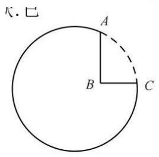

24. (嘉定 11) 某公园为了美化环境, 计划建造一座拱桥 DACBE , 已知该桥的剖面如图所示, 共包括一段圆弧形桥面 ${ACB}$ 和两段长度相等的直线型桥面 ${AD},{BE}$ ,圆弧形桥面 ${ACB}$ 所在圆的半径为 4 米,圆心 $O$ 在 ${DE}$ 上,且 ${AD}$ 和 ${BE}$ 所在直线与圆 $O$ 分别在连结点 $A$ 和 $B$ 处相切. 已知直线型桥面的修建费用是每米 0.4 万元,弧形桥面 ${ACB}$ 的修建费用是每米 2.5 万元,设 $\angle {ADO} = \theta$ ,根据空间限制及桥面坡度的限制, $\theta$ 的范围为 $\arcsin \frac{1}{3} \leq  \theta  \leq \; \frac{\pi }{6}$ ，则当桥面修建总费用最低时 $\theta$ 的值为___.

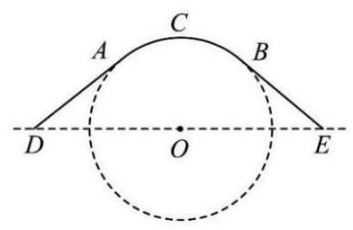

25. (金山 10) 某海滨浴场平面图是如图所示的半圆,其中 $O$ 是圆心,直径 ${MN}$ 为 400 米, $P$ 是弧 ${MN}$ 的中点. 一个急救中心 $A$ 在栈桥 ${OP}$ 中点上,计划在弧 ${NP}$ 上设置一个瞭望台 $B$ , 并在 ${AB}$ 间修建浮桥. 已知 $\angle {ABO}$ 越大,瞭望台 $B$ 处的视线范围越大,则 $B$ 处的视线范围最大时， ${AB}$ 的长度为___米 (结果精确到 1 米).

26. (静安 10) 如图所示，小明和小宁家都住在东方明珠塔附近的同一幢楼上，小明家在 $A$ 层， 小宁家位于小明家正上方的 $B$ 层,已知 ${AB} = a$ . 小明在家测得东方明珠塔尖的仰角为 $\alpha$ 小宁在家测得东方明珠塔尖的仰角为 $\beta$ ,则他俩所住的这幢楼与东方明珠塔之间的距离 $d \; =$ ___.

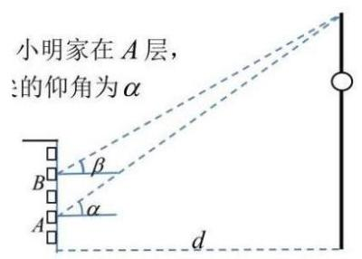

27. (闵行 11) 如图,某小区内有一块矩形区域 ${ABCD}$ ,其中 ${AB} = {40}$ 米, ${AD} = {20}$ 米,点 $E$ , $F$ 分别为 ${AB},{CD}$ 的中点,左右两个扇形区域为花坛 (两个扇形的圆心分别为 $A, B$ ,半径均为 20 米), 其余区域为草坪. 现规划在草坪上修建一个三角形的儿童游乐区, 且三角形的一个顶点在线段 ${EF}$ 上,另外两个顶点在线段 ${CD}$ 上则该游乐区面积的最大值为 ___平方米 (结果保留整数).

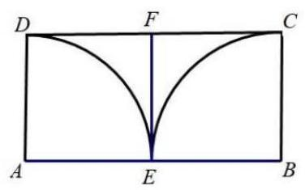

28. (浦东 10) 某地要建造一个市民休闲公园长方形 ${ABCD}$ ，如图，边 ${AB} = 2\mathrm{\;{km}}$ ，边 ${AD} = \; 1\mathrm{\;{km}}$ ，其中区域 ${ADE}$ 开挖成一个人工湖，其他区域为绿化风景区. 经测算，人工湖

在公园内的边界是一段圆弧,且 $A, D$ 位于圆心 $O$ 的正北方向, $E$ 位于圆心 $O$ 的北偏东 ${60}^{ \circ  }$ 方向. 拟定在圆弧 $P$ 处修建一座渔人码头,供游客湖中泛舟,并在公园的边 ${DC},{CB}$ 开设两个门 $M, N$ ,修建步行道 ${PM},{PN}$ 通往渔人码头,且 ${PM} \bot  {CD},{PN} \bot  {CB}$ ,则步行道 ${PM}$ ， ${PN}$ 长度之和的最小值是___ ${km}$ (精确到 0.001 ).

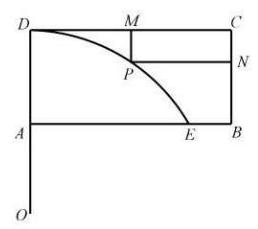

29. (宝山 18) 在 $\bigtriangleup {ABC}$ 中,已知 ${b}^{2} + {c}^{2} = {a}^{2} + {bc}$ .

(1)若 $\sin C = 2\sin B$ ，且 $b = 2$ ，求 $\bigtriangleup  {ABC}$ 的面积；

(2)若 $b + c = 1$ ，求 $a$ 的取值范围.

30. (崇明 18) 在 $\bigtriangleup {ABC}$ 中,已知点 $D$ 是 ${BC}$ 边上一点,且 ${BD} = 1,{CD} = 3$ .

(1)若 ${AD}\bot {BC}$ ，且 $\angle {ABD} = 2\angle {ACD}$ ，求 ${AD}$ 的长；

(2)若 $\angle {ABD} = {55}^{ \circ  },\angle {ACD} = {32}^{ \circ  }$ ，求 ${AD}$ 的长 (结果精确到 0.01 ).

31. (虹口17) 设 $f\left( x\right)  = \sin {\omega x}\left( {\omega  > 0}\right)$ .

(1)当函数 $y = f\left( x\right)$ 的最小正周期为 ${2\pi }$ 时,求 $y = f\left( x\right)  + \cos x$ 在 $\left\lbrack  {0,\frac{\pi }{2}}\right\rbrack$ 上的最大值；

(2)若 $\omega  = 2$ ，且在 $\bigtriangleup  {ABC}$ 中，角 $A, B, C$ 所对的边长为 $a, b, c$ ，锐角 $A$ 满足 $f\left( {A + \frac{\pi }{6}}\right)  = 0,\overrightarrow{AB} \cdot  \overrightarrow{AC} = 4$ ，求 $a$ 的最小值.

32. (黄浦 18) 已知 $f\left( x\right)  = \sin x$ .

(1)求函数 $y = f\left( x\right)  \cdot  f\left( {\frac{\pi }{2} - x}\right)$ 的最小正周期；

( 2 ) 求函数 $y = f\left( {{2x} + \frac{\pi }{3}}\right) , x \in  \left\lbrack  {0,\frac{\pi }{2}}\right\rbrack$ 的单调减区间.

33. (嘉定 18) 已知 $f\left( x\right)  = 2\cos \left( {{\omega x} + \frac{3\pi }{4}}\right)$ ,其中 $\omega  > 0$ .

(1) 若 $\omega  = 2$ ,求函数 $y = f\left( x\right) , x \in  \left\lbrack  {-\frac{\pi }{4},\frac{\pi }{4}}\right\rbrack$ 的值域;

(2)若 $f\left( \frac{\pi }{4}\right)  = 0$ ，且函数 $y = f\left( x\right)$ 在 $\left( {\frac{\pi }{4},\frac{\pi }{3}}\right)$ 内有极小值，但无极大值，求 $\omega$ 的值.

34. (静安 18) 已知向量 $\overrightarrow{a} = \left( {\cos \frac{3x}{2},\sin \frac{3x}{2}}\right) ,\overrightarrow{b} = \left( {\cos \frac{x}{2}, - \sin \frac{x}{2}}\right)$ ，且 $x \in  \left\lbrack  {0,\frac{\pi }{2}}\right\rbrack$ .

(1)求 $\overrightarrow{a} \cdot  \overrightarrow{b}$ 及 $\left| {\overrightarrow{a} + \overrightarrow{b}}\right|$ ；

(2) 记 $f\left( x\right)  = \overrightarrow{a} \cdot  \overrightarrow{b} - \left| {\overrightarrow{a} + \overrightarrow{b}}\right|$ ,求函数 $y = f\left( x\right)$ 的最小值.

35. (浦东 17) 已知函数 $y = f\left( x\right)$ 的表达式为 $f\left( x\right)  = \sin {\omega x},\omega  > 0$ .

(1)若函数 $y = f\left( x\right)$ 的最小正周期为 $\frac{\pi }{2}$ ，求 $\omega$ 的值及 $y = f\left( x\right)$ 的单调增区间；

(2)若 $\omega  = 2$ ，设函数 $y = g\left( x\right)$ 的表达式为 $g\left( x\right)  = f\left( x\right)  + \sqrt{3}\cos {2x}$ ，求当 $x \in  \left\lbrack  {0,\frac{\pi }{2}}\right\rbrack$ 时, $y = g\left( x\right)$ 的值域.

36. (普陀 18) 设函数 $y = f\left( x\right)$ 的表达式为 $f\left( x\right)  = \sin \left( {\omega x}\right)$ ,其中 $\omega  > 0$ .

(1)设 $\omega  = 1, m \in  R$ ，若有且只有一个 ${x}_{0} \in  \left( {0, m}\right)$ ，使得函数 $y = f\left( {x + \frac{\pi }{4}}\right)$ 取得最小值， 求 $m$ 的取值范围:

(2)若对任意的 $x \in  R$ ，皆有 $f\left( x\right)  + f\left( {\frac{2\pi }{3} - x}\right)  = 0$ 成立，且函数 $y = f\left( x\right)$ 在区间 $\left( {-\frac{\pi }{8},0}\right)$ 上是严格增函数,求函数 $y = f\left( x\right)$ 的最小正周期.

37. (青浦 17) 已知函数 $y = f\left( x\right)$ ，其中 $f\left( x\right)  = \left( {2{\cos }^{2}x - 1}\right) \sin {2x} + \frac{1}{2}\cos {4x}$ .

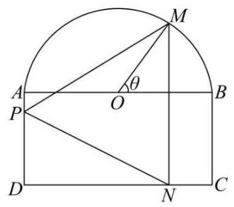

(1)求函数 $y = f\left( x\right)$ 的最小正周期及最大值;

(2)若 $\alpha  \in  \left( {\frac{\pi }{2},\pi }\right)$ ，且 $f\left( \alpha \right)  = \frac{\sqrt{2}}{2}$ ，求 $\alpha$ 的值.

38. (松江 19) 为了打造美丽社区，某小区准备将一块由一个半圆和长方形组成的空地进行美化， 如图,长方形的边 ${AB}$ 为半圆的直径, $O$ 为半圆的圆心, ${AB} = {2AD} = {200}\mathrm{\;m}$ ,现要将此空地规划出一个等腰三角形区域 ${PMN}$ (底边 ${MN} \bot  {CD}$ ) 种植观赏树木,其余区域种植花卉. 设 $\angle {MOB} = \theta ,\theta  \in  \left( {0,\frac{\pi }{2}}\right\rbrack$ .

(1)当 $\theta  = \frac{\pi }{3}$ 时，求 $\bigtriangleup  {PMN}$ 的面积；

(2)求三角形区域 ${PMN}$ 面积的最大值.

39. (徐汇 17) 已知 $f\left( x\right)  = a\sin {\omega x} + b\cos {\omega x}\left( {\omega  > 0}\right)$ ,若定义在 $R$ 上的函数 $y = f\left( x\right)$ 的最小正周期为 $\pi$ ,且对任意的 $x \in  R$ ,都有 $f\left( x\right)  \leq  f\left( \frac{\pi }{12}\right)  = 4$ .

(1)求实数 $a$ ， $b$ 的值；

(2)设 ${x}_{1},{x}_{2} \in  \left( {0,\pi }\right)$ ，当 ${x}_{1} \neq  {x}_{2}$ 时， $f\left( {x}_{1}\right)  = f\left( {x}_{2}\right)  =  - 2$ ，求 ${x}_{1} + {x}_{2}$ 的值.

40. (杨浦 18) 已知 $\bigtriangleup  {ABC}$ 的内角 $A$ 、 $B$ 、 $C$ 所对边的长度分别为 $a$ 、 $b$ 、 $c$ .

(1)若 ${\left( a + b\right) }^{2} - {c}^{2} = 4, C = {60}^{ \circ  }$ ，求 $\bigtriangleup  {ABC}$ 的面积；

(2)若 $\frac{\cos C}{c} = \frac{\cos A}{{3b} - a}$ ，求 $\sin C$ 的值.

41. $\sin B\cos C - \sin A\cos C = \sin C\cos A$ ,

42. $\sin B\cos C = \sin C\cos A + \sin A\cos C,3\sin B\cos C = \sin \left( {A + C}\right)$ ,

即 $3\sin B\cos C = \sin B$ ,因为 $\sin B \neq  0$ ,所以 $\cos C = \frac{1}{3}$ ,所以 $\sin C = \frac{2\sqrt{2}}{3}$ .

43. (长宁 17) 在 $\bigtriangleup {ABC}$ 中,角 $A, B, C$ 所对的边分别为 $a, b, c$ ,且 $b\sin A - \sqrt{3}a\cos B = 0$

(1)求角 $B$ 的大小；

(2)若 $b = 2$ ， $\bigtriangleup  {ABC}$ 的面积为 $\sqrt{3}$ ，请判断 $\bigtriangleup  {ABC}$ 的形状，并说明理由.

- 第 3 节复数

1. (宝山 3 ) 设 $\mathrm{i}$ 为虚数单位,若 $\left( {a - 2}\right)  + \left( {{2a} - 1}\right) \mathrm{i}$ 为纯虚数,则实数 $a =$ ___.

2. (崇明 3) 若复数 $z$ 满足 ${2z} + \bar{z} = 1 + \mathrm{i}$ ，其中 $\mathrm{i}$ 是虚数单位，则 $z =$ ___.

3. (奉贤 8) 在复平面内, $O$ 为坐标原点,复数 ${z}_{1} = \mathrm{i}\left( {-4 - 3\mathrm{i}}\right) ,{z}_{2} = {12} + 5\mathrm{i}$ 对应的点分别为 ${Z}_{1},{Z}_{2}$ ，其中 $\mathrm{i}$ 为虚数单位，则 $< \overrightarrow{O{Z}_{1}},\overrightarrow{O{Z}_{2}} >$ 的大小为___.

4. (虹口7) 已知非零复数 $z$ 满足 $\left| {z - 1}\right|  = 1,\left| {\bar{z} - \mathrm{i}}\right|  = 1$ ，则 $z$ 的虚部为___.

5. (黄浦 10) $\mathrm{i}$ 为虚数单位,若复数 ${z}_{1}$ 满足 $\left| {{z}_{1} - 1 + \mathrm{i}}\right|  \leq  \sqrt{2}$ ，复数 ${z}_{2}$ 满足 $\left| {z}_{2}\right|  = \left| {{z}_{2} + 1 - \mathrm{i}}\right|$ ，则 $\left| {{z}_{1} - {z}_{2}}\right|$ 的最小值为___.

6. (嘉定 3) 如果复数 $z$ 满足 $\mathrm{i} \cdot  \bar{z} = 1 + 2\mathrm{i}$ ( $\mathrm{i}$ 为虚数单位),则 $z =$ ___.

7. (金山 4) 已知复数 $z = 2 + \mathrm{i}$ ，其中 $\mathrm{i}$ 为虚数单位，则 $\left| {iz}\right|$ 的值为___.

8. (静安 3) 已知 $\mathrm{i}$ 是虚数单位， $\left( {m + \mathrm{i}}\right) \left( {1 - 2\mathrm{i}}\right)$ 是纯虚数，则实数 $m$ 的值为___.

9. (闵行 9) 已知 $f\left( n\right)  = {\mathrm{i}}^{n + 1} + {\mathrm{i}}^{n + 2} + {\mathrm{i}}^{n + 3} + {\mathrm{i}}^{n + 4} + {\mathrm{i}}^{n + 5}$ ( $\mathrm{i}$ 为虚数单位, $n$ 为正整数),当 ${n}_{1},{n}_{2}$ 取遍所有正整数时, $f\left( {n}_{1}\right)  + f\left( {n}_{2}\right)$ 的值中不同虚数的个数为___.

10. (浦东 3 ) 已知复数 ${z}_{1} = 3 + \mathrm{i},\;{z}_{2} = a + 4\mathrm{i},\;a \in  R$ ，若 ${z}_{1} - {z}_{2}$ 为纯虚数，则 $\left| {z}_{2}\right|  =$ ___.

11. (浦东 12 ) 已知在复数集中,等式 ${x}^{4} + {a}_{3}{x}^{3} + {a}_{2}{x}^{2} + {a}_{1}x + {a}_{0} = \; \left( {x - {z}_{1}}\right) \left( {x - {z}_{2}}\right) \left( {x - {z}_{3}}\right) \left( {x - {z}_{4}}\right)$ 对任意复数 $x$ 恒成立,复数 ${z}_{1},{z}_{2},{z}_{3},{z}_{4}$ 在复平面上对应的 4 个点为某个单位圆内接正方形的 4 个顶点, $\left\{  {{a}_{0},{a}_{1},{a}_{2},{a}_{3}}\right\}   \subset  \{ n \mid  1 \leq  n \leq  {2024}, n \in  Z\}$ ，则满足条件的不同集合 $\left\{  {{a}_{0},{a}_{1},{a}_{2},{a}_{3}}\right\}$ 个数为___.

12. (普陀3) 设 $\mathrm{i}$ 为虚数单位,若复数 $z$ 满足 $z \cdot  \bar{z} + z - \bar{z} = 4 + 2\mathrm{i}$ ，则 $\left| z\right|  =$ ___.

13. (青浦 1) 在复平面内,复数 $z = 1 + \frac{1}{2}\mathrm{i}$ ( $\mathrm{i}$ 是虚数单位) 的共轭复数对应的点位于第___ 象限.

14. (松江 5 ) 若复数 $z$ 满足 $\mathrm{i} \cdot  z = 2 + 3\mathrm{i}$ (其中 $\mathrm{i}$ 是虚数单位),则复数 $z$ 的共轭复数 $\bar{z} =$ ___.

15. (徐汇8) 已知复数 ${z}_{1}$ 和复数 ${z}_{2}$ 满足 ${z}_{1} + {z}_{2} = 3 + 4\mathrm{i},\overline{{z}_{1}} - \overline{{z}_{2}} =  - 2 + \mathrm{i}$ ( $\mathrm{i}$ 为虚数单位),则 $\left| {{z}_{1}^{2} - {z}_{2}^{2}}\right|  =$

16. (杨浦 12) 已知实数 $a > 0,\mathrm{i}$ 是虚数单位,设集合 $A = \left\{  {z\left| {z = w + \frac{1}{w},}\right| w \mid   > 1, w \in  C, z \in  C}\right\}$ , 集合 $B = \{ z//z - 1 + \mathrm{i} \mid   = a, z \in  C\}$ ，如果 $B \subset  A$ ，则 $a$ 的取值范围为___.

注意到 ${\left( r + \frac{1}{r}\right) }^{2} - {\left( r - \frac{1}{r}\right) }^{2} = 4$ ，

所以点 $\left( {r + \frac{1}{r}, r - \frac{1}{r}}\right)$ 在 ${x}^{2} - {y}^{2} = 4, x > 2, y > 0$ 上,

$\left( {\cos \theta ,\sin \theta }\right)$ 类似于单位圆的变换,

$A$ 表示除了 $\left\lbrack  {-2,2}\right\rbrack$ 以外的复数 (这块需要仔细);

法三: 将 $z = w + \frac{1}{w}$ 改写为 ${w}^{2} - {zw} + 1 = 0$ ,利用复系数韦达定理,两根 ${w}_{1}{w}_{2} = 1$ ,显然 ${w}_{1},{w}_{2}$ 同时为实数或虚数,

若同时为实数,则 $z \in  R$ ,且 $\Delta  > 0$ ,即 $z > 2$ 或 $z <  - 2$ ;

若同时为虚数,当且仅当 $z$ 为复数,

故 $A$ 表示除了 $\left\lbrack  {-2,2}\right\rbrack$ 以外的复数 (这块需要仔细);

法四: 注意 $w,\frac{1}{w}$ 的模互为倒数,所以 $w$ 可以改为 $\left| w\right|  \neq  0,1$ ,

当 $w$ 不为实数时,易得 $w + \frac{1}{w} \in  R$ 当且仅当 $\left| w\right|  = 1$ ,

左侧还可以改为 $w + \frac{1}{w} \in  \left( {-2,2}\right)$ ; 当 $w$ 为实数时, $w + \frac{1}{w} =  \pm  2$ 当且仅当 $\left| w\right|  = 1$ ,

故 $A$ 表示除了 $\left\lbrack  {-2,2}\right\rbrack$ 以外的复数 (这块需要仔细);

对于 $B$ ,设 $z = x + {yi}$ ,则 $\left| {x - 1 + \left( {y + 1}\right) \mathrm{i}}\right|  = a$ ,所以 $M : {\left( x - 1\right) }^{2} + {\left( y + 1\right) }^{2} = {a}^{2}$ ,表示以 $\left( {1, - 1}\right)$ 为圆心, $a$ 为半径的圆,

因为 $B \subset  A$ ,所以圆 $M : {\left( x - 1\right) }^{2} + {\left( y + 1\right) }^{2} = {a}^{2}$ 和线段 $x \in  \left\lbrack  {-2,2}\right\rbrack  , y = 0$ 无交点,所以 $a \in  \left( {0,1}\right)  \cup  \left( {\sqrt{10}, + \infty }\right) .$

17. (长宁 13) 已知复数 $z$ 和 $\bar{z}$ ,则下列说法正确的是 ( )

A. $z + \bar{z}$ 一定是实数 B. $z - \bar{z}$ 一定是虚数

C. 若 $z + \bar{z} = 0$ ,则 $z$ 是纯虚数 D. 若 $z - \bar{z} = 0$ ,则 $z$ 是纯虚数

## 第 2 节不等式

【简单不等式】

1. (宝山 13) 设 ${ab} > 0$ ,则 “ $a > b$ ” 是 “ $\frac{1}{a} < \frac{1}{b}$ ” 的 ( )

A. 充分非必要条件 B. 必要非充分条件

C. 充要条件 D. 既非充分也非必要条件

2. (崇明 2) 不等式 $\frac{x - 1}{{2x} + 1} < 0$ 的解为___.

3. (崇明 3) 已知 $x \in  R$ ，则不等式 ${x}^{2} - x + 2 > 0$ 的解集为___.

4. (虹口 2) 函数 $y = \ln \frac{x}{x - 1}$ 的定义域是___.

5. (虹口 8 ) 已知 $f\left( x\right)  = \left\{  \begin{array}{l} {x}^{2} - x, x \geq  0 \\  f\left( {-x}\right) , x < 0 \end{array}\right.$ ，则 $f\left( x\right)  \leq  6$ 的解集是___.

6. (黄浦 2) 不等式 ${x}^{2} - {3x} + 2 < 0$ 的解集为___.

7. (黄浦 9) 若 $f\left( x\right)  = {x}^{3}, g\left( x\right)  = \left\{  \begin{array}{l} f\left( x\right) , x \geq  0 \\  f\left( {-x}\right) , x < 0 \end{array}\right.$ ，则不等式 $g\left( x\right)  <  - x$ 的解集为___.

8. (嘉定 1) 函数 $y = {\log }_{2}\left( {{x}^{2} - 1}\right)$ 的定义域为___.

9. (嘉定 9) 已知 $f\left( x\right)  = \ln \left( {x + 1}\right) , g\left( x\right)  = \left\{  \begin{array}{l} f\left( x\right) , x \geq  0 \\  f\left( {-x}\right) , x < 0 \end{array}\right.$ ,则 $g\left( x\right)  > x + 2 - \mathrm{e}$ 的解集为 ___.

10. (嘉定 13) 已知 $a$ 为正数,则 “ $a > 3$ ” 是 “ ${a}^{a} > {a}^{3}$ ” 的 ( )

A. 充分非必要条件 B. 必要非充分条件

C. 充要条件 D. 既非充分也非必要条件

11. (嘉定14) 已知 $\alpha ,\beta$ 是两个不同的平面, $a, b$ 是两条不同的直线,下列条件中,一定得到直线 $l \bot  \alpha$ 的是 ( )

A. $\alpha  \bot  \beta , l//\beta$ B. $l \bot  a, a//\alpha$

C. $l//a, a \bot  \alpha$ D. $l \bot  a, l \bot  b, a \subset  \alpha , b \subset  \alpha$

12. (金山14) 若 “ $x > a$ ” 是 “ ${x}^{2} - {2x} - 3 < 0$ ” 的必要不充分条件,则实数 $a$ 的取值范围是 ( )

A. $\left( {-\infty , - 1}\right)$ B. $\left( {-1, + \infty }\right)$ C. $( - \infty , - 1\rbrack$ D. $\lbrack  - 1, + \infty )$

13. (静安 2) 不等式 $\left| {{2x} - 1}\right|  < 3$ 的解集为___.

14. (静安 8) 若用 $t$ 替换命题 “对于任意实数 $d$ ，有 ${d}^{2} \geq  0$ ，且等号当且仅当 $d = 0$ 时成立” 中的 $d$ ,即可推出平均值不等式 “任意两个正数的算术平均值不小于它们的几何平均值,且等号当且仅当这两个正数相等时成立”，则 $t =$ ___.

15. (静安 13) 设 $a, b \in  R$ ，则 “ $a + b > 0$ ” 是 “ $a > 0$ 且 $b > 0$ ” 的 ( $B$ )

A. 充分非必要条件 B. 必要非充分条件

C. 充要条件 D. 既非充分又非必要条件

16. (闵行 2 ) 不等式 $\frac{{2x} - 1}{x - 1} < 0$ 的解集为___.

17. (浦东 13) 若实数 $a, b$ 满足 ${a}^{2} > {b}^{2}$ ,下列不等式中恒成立的是 ( )

A. $a > b$

B. $\frac{1}{a} < \frac{1}{b}$ C. ${a}^{2} + {b}^{2} > {2ab}$ D. $a > \left| b\right|$

18. (青浦 3) 不等式 $\frac{x - 3}{x + 1} \geq  2$ 的解集为___.

19. (青浦 13) 已知 $x, y \in  R$ 且满足 $x > y$ ,则下列关系式恒成立的是 ( )

A. $\frac{1}{{x}^{2} + 1} < \frac{1}{{y}^{2} + 1}$ B. $\ln \left( {{x}^{2} + 1}\right)  > \ln \left( {{y}^{2} + 1}\right)$

C. $\sin x > \sin y$ D. ${x}^{3} > {y}^{3}$

20. (松江 3 ) 函数 $y = \lg \left( {{3x} + 1}\right)  + \sqrt{1 - x}$ 的定义域是___.

21. (松江 13 ) 已知 $a > b > 0$ ,以下四个数中最大的是 ( )

A. $b$ B. $\sqrt{ab}$ C. $\frac{a + b}{2}$ D. $\sqrt{\frac{{a}^{2} + {b}^{2}}{2}}$

22. (徐汇1) 不等式 ${x}^{2} - {4x} + 3 < 0$ 的解集为___.

23. (杨浦 3) 不等式 $\frac{x + 2}{x - 1} < 0$ 的解集为___. 24. (杨浦 13) 已知实数 $a \neq  0$ ，则 “ $a > 2$ ” 是 “ $\frac{1}{a} < \frac{1}{2}$ ” 的 $\left( A\right)$ 条件.

A. 充分非必要 B. 必要非充分 C. 充分必要 D. 既非充分也非必要

25. (长宁 10) 已知 $\alpha  : {2}^{x} + {\log }_{2}x \leq  2,\beta  : x < m$ ,若 $\alpha$ 是 $\beta$ 的充分条件,则实数 $m$ 的取值范围是___.

26. (宝山 11) 某物流公司为了扩大业务量，计划改造一间高为 6 米，底面积为 24 平方米，且背面靠墙的长方体形状的仓库. 因仓库的背面靠墙, 无须建造费用, 设仓库前面墙体的长为 $x$ 米 ( $4 \leq  x \leq  6$ ). 现有甲、乙两支工程队参加竞标，甲队的报价方案为:仓库前面新建墙体每平方米 400 元，左右两面新建墙体每平方米 300 元，屋顶和地面以及其他共计 28800 元; 乙队给出的整体报价为 $\left( {1 + \frac{2}{x}}\right)  \times  {6k} \times  {10}^{4}$ 元 $\left( {k > 0}\right)$ . 不考虑其他因素,若乙队要确保竞标成功，则实数 $k$ 的取值范围是___.

27. (静安 11) 记 $f\left( x\right)  = {x}^{2} + \left( {{a}^{2} + {b}^{2} - 1}\right) x + {a}^{2} + {2ab} - {b}^{2}$ . 若函数 $y = f\left( x\right)$ 是偶函数,则该函数图像与 $y$ 轴交点的纵坐标的最大值为___.

28. (静安 12) 已知 $\lg {x}_{1}$ ， $\lg {x}_{2}$ ， $\lg {x}_{3}$ ， $\lg {x}_{4}$ ， $\lg {x}_{5}$ 是从大到小连续的正整数，且 ${\left( \lg {x}_{4}\right) }^{2} < \lg {x}_{1}$ . $\lg {x}_{5}$ ,则 ${x}_{1}$ 的最小值为___.

29. (崇明 6) 已知 $x, y$ 为正实数，且满足 ${4x} + y = {40}$ ，则 $x \cdot  y$ 的最大值是 ___.

30. (黄浦 6) 若正数 $x, y$ 满足 $x + {4y} = 1$ ，则 ${xy}$ 的最大值为___.

31. (闵行 4) 已知正实数 $a, b$ 满足 ${ab} = 1$ ，则 $\frac{1}{a} + \frac{1}{b}$ 的最小值为___.

32. (浦东 6) 已知实数 $a, b$ 满足 $a + {2b} = 1$ ，则 ${3}^{a} + {9}^{b}$ 的最小值为___.

33. (杨浦 9) 将一个半径为 1 的球形石材加工成一个圆柱形摆件, 则该圆柱形摆件侧面积的最大值为___.

34. (长宁 10) 若正实数 $a, b$ 满足 ${ab} = {2a} + b$ ,则 $a + {2b}$ 的最小值是___.

35. (普陀 12) 设 $a > b > 0$ ,函数 $y = f\left( x\right)$ 的表达式为 $f\left( x\right)  = \left| {x - \frac{1}{x} + \ln x}\right|$ . 若 $f\left( a\right)  = f\left( b\right)$ , 且关量 $x$ 的方程 $\left| {{x}^{2} + {ax} + {2ab}}\right|  + \left| {{x}^{2} - {ax} + {2ab}}\right|  = {2a}\left| x\right|$ 的整数解有且仅有 4 个，则 $a$ 的取值范围是___.

36. (杨浦 5) 已知 $\left| {x + 3}\right|  + \left| {x - 5}\right|  = 8$ ，则实数 $x$ 的取值范围为___.

## 第 1 节集合

1. (宝山1) 集合 $A = \left( {-1,1}\right) , B = Z$ ，则 $A \cap  B =$ ___.

2. (崇明 1) 已知集合 $A = \{ 1,2,3,4,5\} , B = \{ x \mid  x > \sqrt{5}\}$ ，则 $A \cap  B =$ ___.

3. (奉贤 1 ) 设全集 $U = \{ 1,2,3,4\}$ ，集合 $A = \{ 2,4\}$ ，则 $\bar{A} =$ ___.

4. (虹口1) 已知集合 $A = \{ x//x \mid   < 2\} , B = \{ 1,2,3\}$ ，则 $A \cap  B =$ ___.

5. (黄浦 1) 若集合 $A = \{ 1,2\} , B = \{ 1,3\}$ ，则 $A \cup  B =$ ___.

6. (金山1) 已知全集 $U = \{  - 1,0,1,2\}$ ，集合 $A = \{ x \mid   - 1 \leq  x \leq  1, x \in  N\}$ ，则 $\bar{A} =$ ___.

7. (静安 1) 设集合 $A = \{ 1,3,5,7\} , B = \{ 2,3,4,5\}$ ，则 $A \cap  B =$ ___.

8. (闵行 1 ) 设集合 $A = \{ 0,1,2,3,4\} , B = \{ x \mid  0 < x < 3\}$ ，则 $A \cap  B =$ ___.

9. (普陀1) 设全集 $U = \{  - 1,0,1,2,4\}$ ，若集合 $A = \{  - 1,2,4\}$ ，则 $\bar{A} =$ ___.

10. (青浦 2 ) 已知集合 $A = \{ x \mid  x = {2k} - 1, k \in  N\} , B = \{  - 1,0,1,2,3\}$ ，则 $A \cap  B =$ ___.

11. (松江 1 ) 已知集合 $A = \lbrack 4, + \infty ), B = \{ 2,4,6,8\}$ ，则 $A \cap  B =$ ___.

12. (杨浦 1 ) 已知集合 $A = \{ a, b\}$ ，则 $A$ 的子集个数为___.

13. (长宁 1) 设全集为 $R$ ,集合 $A = \left\{  {x \mid  {x}^{2} - {2x} - 3 \geq  0}\right\}$ ，则 $\overline{A} =$ ___.