CADZHONGSHUXUEJINGBIAN 答案

高中数学精编代数上海专版

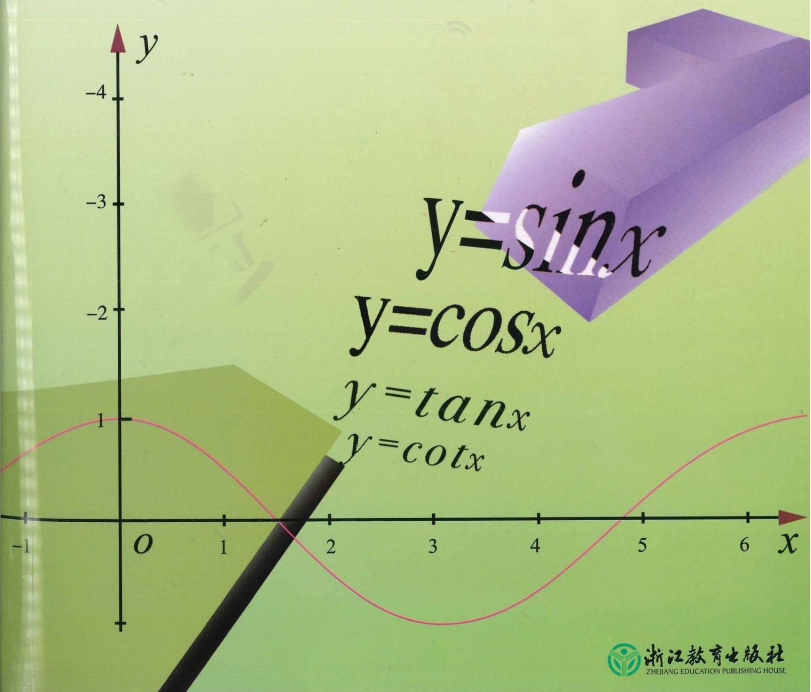

**8. 录本

第一章 集合与逻辑 1

第二章 等式与不等式 8

第三章 幂、指数与对数 31

第四章 幂函数、指数函数与对数函数 38

第五章 函数的概念、性质及应用 58

第六章 三角 76

第七章 三角函数 123

第八章 复数 133

第九章 数列 163

第十章 导数及其应用 195

第十一章 计数原理 200

## 第一章 集合与逻辑

1. A

2. D 提示: ${xy} \geq  0$ ,即 $x \geq  0$ 且 $y \geq  0$ ,或 $x \leq  0$ 且 $y \leq  0.\left( {x, y}\right)$ 是第一、三象限或坐标轴上的所有点,集合 $M$ 是不在第二、四象 . 限内的点集.

3. $\mathrm{D}$ 提示: 选项 $\mathrm{A},\varnothing  \subset  \{ a\}$ ; 选项 $\mathrm{B}, a \in  \{ a\}$ ; 选项 $\mathrm{C},\{ a\}  \subset  \{ a, b\}$ .

4. C 提示: $\left\{  \begin{array}{l} {2x} + y = 0,\text{ ① } \\  x - y =  - 3.\text{ ② } \end{array}\right.$ ① + ②,得 ${3x} =  - 3, x =  - 1$ . 代入①, $y =  - {2x} = 2.\therefore \left\{  \begin{array}{l} x =  - 1, \\  y = 2. \end{array}\right.$ 解集是 $\{ \left( {-1,2}\right) \}$ .

5. $\mathrm{D}$ 提示: 选项 $\mathrm{A}, M \neq  P$ ,有序实数对. 选项 $\mathrm{B}, M \neq  \varnothing  \subset  \{ 0\}  = P$ . 选项 $\mathrm{C}, M = \lbrack 1, + \infty ), P$ 是直角坐标平面上落在曲线 $y = {x}^{2} + 1$ 上的点集. 选项 $\mathrm{D}, M = P = \lbrack 1, + \infty )$ .

6. (1) $\{ 0,1,2,3,4,5,6\}$

(2) $\{  - 1,1\}$ 提示: ${x}^{2}\left( {x - 1}\right)  - \left( {x - 1}\right)  = 0$ ， ${\left( x - 1\right) }^{2}\left( {x + 1}\right)  = 0,\therefore {x}_{1} =  - 1,{x}_{2} = {x}_{3} = 1$ .

(3) $\{ 3,0, - 1\}$ 提示: $\because \left| x\right|  \leq  2, x \in  \mathbf{Z}$ ， $\therefore x \in  \{  - 2, - 1,0,1,2\} ,\therefore y = {x}^{2} - 1 = 3$ 或 0 或 -1 .

(4) $\{ \left( {-2,3}\right) ,\left( {-1,0}\right) ,\left( {0, - 1}\right) ,\left( {1,0}\right) ,\left( {2,3}\right) \}$

(5) $\{ \left( {0,5}\right) ,\left( {1,4}\right) ,\left( {2,3}\right) ,\left( {3,2}\right) ,\left( {4,1}\right) ,\left( {5,0}\right) \}$

7. $\left( 1\right) \left( {-\infty ,4}\right) \left( 2\right) \lbrack 2,5)$

8. $\{ 0,6,{14},{21}\}$

9. 0 或 1 提示: 当 $a = 0$ 时, $M = \left\{  {-\frac{1}{2}}\right\}$ ,满足. 当 $a \neq  0$ 时, $\Delta  = 4 - {4a} = 0, a = 1,\;\therefore a = 0$ 或 1 .

10. (1) $\{ 1,2,3,4\}$ (2) $\{ 5,7\}$ 提示: $A = \{ 0,1,2,3,4,5\} , B = \{ 2,3,5,7\} , C = \{ 1,2,3,4,6,{12}\}$ . $\{ y \mid  y \in  A$ 且 $y \in  C\}  = \; \{ 1,2,3,4\} .\{ y \mid  y \in  B$ 且 $y \notin  C\}  = \{ 5,7\}$ .

11. $\{ 4,3,2,1, - 1, - 7\}$ 提示: $\because 5 - x = 1$ 或 2 或 3 或 4 或 6 或 12，， $x = 4$ 或 3 或 2 或 1 或 -1 或 -7， $\therefore A = \{ 4,3,2,1, - 1, - 7\}$ .

12. $q =  - \frac{1}{2}$ 提示: 若 $\left\{  \begin{array}{l} a + d = {aq},\left( 1\right) \\  a + {2d} = a{q}^{2}.\left( 2\right)  \end{array}\right.$ ① $\times  2 -$ ②，得 $a = {2aq} - a{q}^{2}$ .

$\because a \neq  0,\therefore {q}^{2} - {2q} + 1 = 0,\therefore {q}_{1} = {q}_{2} = 1$ .

由元素互异, $a = {aq} = a{q}^{2}$ ,舍去.

若 $\left\{  {\begin{array}{l} a + d = a{q}^{2},\left( 3\right) \\  a + {2d} = {aq},\left( 4\right)  \end{array}\;\text{ ① } \times  2 = {4a},\text{ ② } + a = {4a}}\right.$ ，

$\because a \neq  0,\therefore 2{q}^{2} - q - 1 = 0,\therefore {q}_{1} =  - \frac{1}{2},{q}_{2} = 1$ (舍去).

综上所述, $q =  - \frac{1}{2}$ .

13. ( 1 )对 $\forall k \in  \mathbf{Z},{2k} - 1 = {k}^{2} - {\left( k - 1\right) }^{2}$ .

取 $m = k, n = k - 1$ ,且任意奇数都可表示成 ${2k} - 1, k \in  \mathbf{Z}$ 的形式.

(2)设存在 $k \in  \mathbf{Z}$ ，使 $\left( {{4k} - 2}\right)  \in  A$ ，则存在 $m, n \in  \mathbf{Z}$ ， ${m}^{2} - {n}^{2} = {4k} - 2$ ， $\left( {m + n}\right) \left( {m - n}\right)  = 2\left( {{2k} - 1}\right)$ .

$\because \left( {m + n}\right)  + \left( {m - n}\right)  = {2m},\left( {m + n}\right) \left( {m - n}\right)$ 为偶数, $\therefore \left( {m + n}\right) ,\left( {m - n}\right)$ 都是偶数.

设 $m + n = {2p}, m - n = {2q}, p, q \in  \mathbf{Z}$ ,则 $\left( {m + n}\right) \left( {m - n}\right)  = {4pq} = {4k} - 2$ ,

${pq} - k =  - \frac{1}{2}$ . 和 $k, p, q \in  \mathbf{Z}$ 矛盾, $\therefore \forall k \in  \mathbf{Z},{4k} - 2 \notin  A$ .

14. (1) $\because 2 \in  P,\therefore \frac{1}{1 - 2} =  - 1 \in  P.\;\because  - 1 \in  P,\therefore \frac{1}{1 - \left( {-1}\right) } = \frac{1}{2} \in  P$ .

$\because \frac{1}{2} \in  P,\therefore \frac{1}{1 - \frac{1}{2}} = 2 \in  P.\;\therefore$ 这两个数是 -1 和 $\frac{1}{2}$ .

(2)若存在单元素集 $P$ ,则存在 $a \neq  1, a \in  P$ .

$\therefore \frac{1}{1 - a} \in  P,\therefore a = \frac{1}{1 - a}$ ,即 ${a}^{2} - a + 1 = 0$ ,此方程无实数根,故不存在.

15. B 16. A

17. $\mathrm{C}$ 提示: $M : y = {\left( x - 1\right) }^{2} - 2, x \in  \mathbf{R},\;\therefore M = \lbrack  - 2, + \infty ), P = \left\lbrack  {-2,4}\right\rbrack  .\;\therefore P \subset  M$ .

18. $\mathrm{B}$ 提示: $x + y > 0$ 且 ${xy} > 0 \Leftrightarrow  x > 0$ 且 $y > 0$ .

19.(1)∈(2)C(3)=

20. (1) $a \leq   - 3$

(2) $p \geq  4$ 提示: $A = \left( {-\infty , - 1}\right)  \cup  \left( {2, + \infty }\right) , B = \left( {-\infty , - \frac{p}{4}}\right)$ .

$\because B \subset  A,\;\therefore  - \frac{p}{4} \leq   - 1,\;\therefore p \geq  4$ .

(3)0 或 $\frac{1}{3}$ 或 $- \frac{1}{2}$ 提示: $A = \{  - 3,2\}$ . ①当 $a = 0$ 时， $B = \varnothing$ ，满足题意. ②当 $a \neq  0$ 时， $B = \left\{  {-\frac{1}{a}}\right\}$ . $- \frac{1}{a} =  - 3$ 或 2，得 ${a}_{1} = \frac{1}{3},{a}_{2} =  - \frac{1}{2}$ . 综上所述， $a = 0$ 或 $\frac{1}{3}$ 或 $- \frac{1}{2}$ .

21. (1) $\{ a, b\} ,\{ a, b, c\} ,\{ a, b, d\}$ (2) $\{ 1,2,3,4\} ,\{ 1,2,3,5\} ,\{ 1,2,3,4,5\}$

22. $\mathrm{D}$ 提示: $M = \{ 0\}$ 或 $\{ 2\}$ 或 $\{ 0,2\}$ 或 $\varnothing$ .

23. $C$ 提示: ${2}^{3} = 8\left( \text{ 个 }\right) ,$ 即 $\varnothing ,\{ 1\} ,\{ 2\} ,\{ 3\} ,\{ 1,2\} ,\{ 1,3\} ,\{ 2,3\} ,\{ 1,2,3\}$ .

24. $\mathrm{C}$ 提示: $\forall x \in  X$ ,存在 $n \in  \mathbf{Z}$ ,使得 $x = \left( {{2n} + 1}\right) \pi$ . 当 $n$ 是偶数时,取 $k = \frac{n}{2} \in  \mathbf{Z}, x = \left( {{4k} + 1}\right) \pi  \in  Y$ . 当 $n$ 是奇数时,取 $k = \frac{n + 1}{2} \in  \mathbf{Z}, x = \left( {{4k} - 1}\right) \pi  \in  Y$ . 即 $\forall x \in  X$ ,有 $x \in  Y,\therefore X \subseteq  Y$ . $\forall y \in  Y$ ,存在 $k \in  \mathbf{Z}$ ,使得 $y = \left( {{4k} + 1}\right) \pi$ 或 $\left( {{4k} - 1}\right) \pi$ . 当 $y = \left( {{4k} + 1}\right) \pi$ 时,取 $n = {2k} \in  \mathbf{Z}, y = \left( {{2n} + 1}\right) \pi  \in  X$ . 当 $y = \left( {{4k} - 1}\right) \pi$ 时,取 $n = {2k} - 1 \in  \mathbf{Z}, y = \left( {{2n} + 1}\right) \pi  \in  X$ . 即 $\forall y \in  Y$ ,有 $y \in  X,\therefore Y \subseteq  X$ . 综上所述， $X = Y$ .

25. $\mathrm{C}$ 提示: 令 $M = \{ 1,5\} , N = \{ 2,4\} , Q = \{ 3\} , M, N, Q$ 中的元素或同在 $P$ 中或都不在 $P$ 中,且 $P \neq  \varnothing$ ,

$\therefore \;{2}^{3} - 1 = 7\left( \text{ 个 }\right) ,$ 即 $\{ 3\} ,\{ 1,5\} ,\{ 2,4\} ,\{ 3,1,5\} ,\{ 3,2,4\} ,\{ 1,5,2,4\} ,\{ 3,1,5,2,4\}$ .

26. $A \in  B$ 提示: $\because B = \{ \varnothing ,\{ 0\} ,\{ 1\} ,\{ 0,1\} \} , A = \{ 0,1\} ,\therefore A \in  B$ .

27. ① 当 $B = \varnothing$ 时， $m + 1 > {2m} - 1$ ， $m < 2$ . ② 当 $B \neq  \varnothing$ 时， $m + 1 \leq  {2m} - 1$ ， $m \geq  2$ .

由 $\left\{  \begin{array}{l} m + 1 \geq   - 2, \\  {2m} - 1 \leq  5, \end{array}\right.$ 解得 $m \in  \left\lbrack  {2,3}\right\rbrack$ . 综上所述, $m \in  ( - \infty ,3\rbrack$ .

28. $\because A = \{  - 1,3\} , x = {x}^{2} + {ax} + b,\therefore {x}^{2} + \left( {a - 1}\right) x + b = 0$ 的两根是-1,3.

$\therefore \;{x}_{1} + {x}_{2} = 1 - a =  - 1 + 3 = 2, a =  - 1.{x}_{1}{x}_{2} = b =  - 3.\;\therefore \;f\left( x\right)  = {x}^{2} - x - 3$ .

$\therefore f\left\lbrack  {f\left( x\right) }\right\rbrack   = {\left( {x}^{2} - x - 3\right) }^{2} - \left( {{x}^{2} - x - 3}\right)  - 3 = {x}^{4} - 2{x}^{3} - 6{x}^{2} + {7x} + 9 = x,$

$\therefore {x}^{4} - 2{x}^{3} - 6{x}^{2} + {6x} + 9 = 0$ .

$\therefore \left( {x + \sqrt{3}}\right) \left( {x - \sqrt{3}}\right) \left( {x - 3}\right) \left( {x + 1}\right)  = 0$ .

$\therefore B = \{  - 1,3,\sqrt{3}, - \sqrt{3}\}$ .

29. $\left\lbrack  {x - \left( {{a}^{2} + 1}\right) }\right\rbrack  \left( {x - {2a}}\right)  \leq  0.\;\because {a}^{2} + 1 \geq  {2a},\;\therefore A = \left\{  {x \mid  {2a} \leq  x \leq  {a}^{2} + 1}\right\}$ .

$\because \left\lbrack  {x - \left( {{3a} + 1}\right) }\right\rbrack  \left( {x - 2}\right)  \leq  0, A \subseteq  B$ ,

① $2 \leq  {2a} \leq  {a}^{2} + 1 \leq  {3a} + 1$ ，则 $a \in  \left\lbrack  {1,3}\right\rbrack$ .

② ${3a} + 1 \leq  {2a} \leq  {a}^{2} + 1 \leq  2$ . 则 $a =  - 1$ .

$\therefore a =  - 1$ 或 $1 \leq  a \leq  3$ .

30. A

31. $\mathrm{D}$ 提示: $P = \lbrack 1, + \infty ), Q = \mathbf{R}, P \cap  Q = \lbrack 1, + \infty )$ .

32. $\mathrm{D}$ 提示: $M \cap  P$ 表示坐标平面上直线 $y =  - x$ 和 $y = x - 2$ 的交点所组成的集合.

由 $\left\{  \begin{array}{l} y =  - x, \\  y = x - 2, \end{array}\right.$ 得 $\left\{  {\begin{array}{l} x = 1, \\  y =  - 1. \end{array}\;\therefore \;M \cap  P = \{ \left( {1, - 1}\right) \} }\right.$ .

33. $\mathrm{B}$ 提示: $P \cap  S = \varnothing , P, S$ 中无相同元素,则 $P$ 的子集和 $S$ 的子集中相等的只有 $\varnothing$ . 由 $M \cap  N$ 的元素是集合,得 $M \cap  N = \{ \varnothing \}$ .

34. $\mathrm{C}$ 提示: $\mathrm{A}$ :当 $\varnothing  \notin  P$ 或 $\varnothing  \notin  M$ 时,错误. $\mathrm{B}$ :当 $P \cap  M \neq  \varnothing$ 时,错误. $\mathrm{D}$ :当 $P \cap  M = \varnothing$ 时,错误.

35. $\mathrm{B}$ 提示: $\because P \cap  S = P$ ,对于 $\forall x \in  P$ ,有 $x \in  P \cap  S;\therefore x \in  S$ ,即 $P \subseteq  S$ .

36. \{等腰梯形\} \{矩形\}

37.(1)~12.处(实)的二( $y \mid  y = {\left( x - 3\right) }^{2} + 1$ )， $\therefore P = \lbrack 1, + \infty )$ .

集合 $M = \left\{  {y \mid  y =  - {\left( x - 1\right) }^{2} + 9}\right\}  ,\therefore M = ( - \infty ,9\rbrack .\;\therefore P \cap  M = \left\lbrack  {1,9}\right\rbrack$ .

(2) $\{ 2,3\}$

38.(1) $a >  - 2$ (2) $a \geq  3$

39. C 提示: 满足题意的 $\bigtriangleup {ABC}$ 有 4 个: $\left| {AB}\right|  = \left| {AC}\right|  = 1,\angle A = {36}^{ \circ  };\left| {AB}\right|  = \left| {AC}\right|  = 1,\angle B = {36}^{ \circ  }$ ; $\angle B = \angle C = {36}^{ \circ  },\left| {BC}\right|  = 1;\angle B = \angle C = {72}^{ \circ  },\left| {BC}\right|  = 1.$

40. (1) $\{ \left( {-1, - 1}\right) \}$ 提示:由 $\left\{  \begin{array}{l} y = x, \\  y =  - x - 2, \end{array}\right.$ 得 $\left\{  {\begin{array}{l} x =  - 1, \\  y =  - 1. \end{array}\;\therefore M \cap  P = \{ \left( {-1, - 1}\right) \} }\right.$ .

(2) $\{ \left( {0,0}\right) ,\left( {1,1}\right) ,\left( {1, - 1}\right) \}$ 提示:由 $\left\{  \begin{array}{l} {y}^{2} = {x}^{2}, \\  {y}^{2} = x, \end{array}\right.$ 得 ${x}^{2} - x = 0$ ，解得 ${x}_{1} = 0,{x}_{2} = 1$ .

$\therefore \left\{  {\begin{array}{l} {x}_{1} = 0, \\  {y}_{1} = 0, \end{array}\;\left\{  {\begin{array}{l} {x}_{2} = 1, \\  {y}_{2} = 1, \end{array}\;\left\{  {\begin{array}{l} {x}_{3} = 1, \\  {y}_{3} =  - 1, \end{array}\;\therefore A \cap  B = \{ \left( {0,0}\right) ,\left( {1,1}\right) ,\left( {1, - 1}\right) \} .}\right. }\right. }\right.$

(3) $\left\{  {y\left| {\;0 \leq  y \leq  1}\right. }\right\}$ 提示: $A = \{ y \mid  y \geq  0\} , B = \{ y \mid  y \leq  1\} , A \cap  B = \{ y \mid  0 \leq  y \leq  1\}$ .

41. (1)① 由 ${a}^{2} + a - 4 = 2$ ，解得 ${a}_{1} =  - 3,{a}_{2} = 2$ . 当 ${a}_{1} =  - 3$ 时， $A = \{ 2,3,{10}\} , B = \left\{  {2, - 5, - \frac{13}{4}}\right\}$ ，

$A \cap  B = \{ 2\}$ ,满足题意. 当 ${a}_{2} = 2$ 时, $A = \{ 2,3,5\} , B = \left\{  {2,5, - \frac{13}{4}}\right\}  , A \cap  B = \{ 2,5\}$ (舍去).

②由 ${2a} + 1 = 2$ ，得 $a = \frac{1}{2}$ . 则 ${a}^{2} + a - 4 =  - \frac{13}{4}$ (舍去).

综上所述， $a =  - 3$ .

(2)由题意，得 ${m}^{2} + 1 \geq  1$ .

①当 $m - 3 =  - 3$ 时， $m = 0$ ，则 $P = \{ 0,1, - 3\}$ ， $Q = \{  - 3, - 1,1\}$ ， $P \cap  Q = \{  - 3,1\}$ (舍去).

② 当 ${2m} - 1 =  - 3$ 时， $m =  - 1$ ，则 $P = \{ 1,0, - 3\}$ ， $Q = \{  - 4, - 3,2\}$ ， $P \cap  Q = \{  - 3\}$ ，满足.

综上所述， $m =  - 1$ .

42. $\because M \cap  P = \{ 3,7\} ,7 \in  M,\therefore {m}^{2} + {4m} + 2 = 7,\therefore {m}_{1} =  - 5,{m}_{2} = 1$ .

①当 $m =  - 5$ 时， $\left( {2 - m}\right)  \in  P$ ，且 $2 - m = 7$ (舍去).

②当 $m = 1$ 时， $M = \{ 2,3,7\} , P = \{ 0,7,3,1\} , P \cap  M = \{ 3,7\}$ ，满足题意.

综上所述， $m = 1$ .

43. $\because A \cap  B = \{ 2,5\} ,\therefore 5 \in  A,\therefore {a}^{3} - 2{a}^{2} - a + 7 = 5$ ,

$\therefore \left( {a - 1}\right) \left( {a + 1}\right) \left( {a - 2}\right)  = 0,\therefore {a}_{1} = 1,{a}_{2} =  - 1,{a}_{3} = 2$ .

① 当 ${a}_{1} = 1$ 时， $a + 3 = 4$ ，则 $4 \in  A \cap  B$ ，舍去.

② 当 ${a}_{2} =  - 1$ 时， ${a}^{3} + {a}^{2} + {3a} + 7 = 4$ ，则 $4 \in  A \cap  B$ ，舍去.

③ 当 ${a}_{3} = 2$ 时， $A = \{ 2,4,5\} , B = \{  - 4,5,2,{25}\} , A \cap  B = \{ 2,5\}$ .

综上所述, $a = 2$ .

44. $Q = \{ 1,3\} , R = \{ 3,4\} .\;\because \;P \cap  R = \varnothing ,\therefore 3 \notin  P$ 且 $4 \notin  P.\;\because \;P \cap  Q \neq  \varnothing ,\therefore 1 \in  P$ .

代入方程，得 $1 - a + {a}^{2} - {8a} + {19} = 0$ ，即 ${a}^{2} - {9a} + {20} = 0,\therefore {a}_{1} = 4,{a}_{2} = 5$ .

① ${a}_{1} = 4,{x}^{2} - {4x} + 3 = 0,{P}_{1} = \{ 1,3\} , P \cap  R \neq  \varnothing$ ，舍去. ② ${a}_{2} = 5,{x}^{2} - {5x} + 4 = 0,{P}_{2} = \{ 1,4\}$ ，舍去.

综上所述, $a$ 无解.

45. ① 若 $Q = \varnothing$ ,则 ${2k} - 1 < k + 1, k < 2$ . ② 若 $Q \neq  \varnothing$ ,则 $k + 1 \leq  {2k} - 1, k \geq  2, k + 1 > 5$ 或 ${2k} - 1 <  - 2$ , $k \in  \left( {-\infty , - \frac{1}{2}}\right)  \cup  \left( {4, + \infty }\right) .\;\because k \geq  2,\;\therefore k \in  \left( {4, + \infty }\right)$ . 综上所述, $k \in  \left( {-\infty ,2}\right)  \cup  \left( {4, + \infty }\right)$ .

46. A 提示: $y = {x}^{2} + 1, x \in  \mathbf{R}, y \in  \lbrack 1, + \infty ), y = 5 - {x}^{2}, x \in  \mathbf{R}, y \in  ( - \infty ,5\rbrack .\;\therefore M \cup  P = ( - \infty ,5\rbrack  \cup  \lbrack 1, + \infty ) = \mathbf{R}$ .

47. $\mathrm{D}$ 提示: $M = P = \left\lbrack  {-\frac{1}{4}, + \infty }\right)$ .

48. B

49. A 提示: ①②③都是假命题，可以举 $M = P = \varnothing$ . ④是真命题. 若 $M \subset  P$ ,

由 $M \cap  P$ 的定义，得 $M = M \cap  P$ .

50. C 51. C 52. $\left( {3,4}\right) \;\{ x \mid  x \neq  1\}$

53. $S$ 提示: 由 $X = \left( {S \cap  T}\right)  \subseteq  S$ 知, $S \cup  X = S$ .

54. D 提示: $M = \{ c, d\}$ 或 $\{ a, c, d\}$ 或 $\{ b, c, d\}$ 或 $\{ a, b, c, d\}$ .

55. $\left( {-3,2}\right) \;\left( {-5,3}\right)$ 提示: $A = \left( {-5,2}\right) , y \in  A,\therefore  - 4 < \left| x\right|  = y + 1 < 3$ ,

$\therefore \left| x\right|  \in  \lbrack 0,3), x \in  \left( {-3,3}\right)$ ,即 $B = \left( {-3,3}\right)$ .

$\therefore \;A \cap  B = \left( {-5,2}\right)  \cap  \left( {-3,3}\right)  = \left( {-3,2}\right) , A \cup  B = \left( {-5,2}\right)  \cup  \left( {-3,3}\right)  = \left( {-5,3}\right)$ .

56. $\left\lbrack  {-b, b}\right\rbrack  \;\left( {a, - a}\right)$ 提示: 由 $a < 0 < b < \left| a\right|$ ,可得 $a <  - b < 0 < b <  - a$ .

$A \cap  B = (a, b\rbrack  \cup  \lbrack  - b, - a) = \left\lbrack  {-b, b}\right\rbrack  , A \cup  B = (a, b\rbrack  \cup  \lbrack  - b, - a) = \left( {a, - a}\right) .$

57. (1)把 $x = 1$ 分别代入 $A$ 和 $B$ 的方程中，得 $\left\{  \begin{array}{l} 1 + p + q = 0, \\  1 + \left( {p - 1}\right)  - q + 5 = 0, \end{array}\right.$ 即 $\left\{  {\begin{array}{l} p + q =  - 1, \\  p - q =  - 5, \end{array}\;\therefore \;\left\{  \begin{array}{l} p =  - 3, \\  q = 2. \end{array}\right. }\right.$

$A = \left\{  {x \mid  {x}^{2} - {3x} + 2 = 0}\right\}   = \{ 1,2\} , B = \left\{  {x \mid  {x}^{2} - {4x} + 3 = 0}\right\}   = \{ 1,3\} ,\;\therefore \;A \cup  B = \{ 1,2,3\} .$

(2) $\because A \cap  B = \{ 2,5\} ,5 \in  A,\therefore {a}^{3} + a + 7 = 5$ ,即 ${a}^{3} + a + 2 = 0,\therefore \left( {a + 1}\right) \left( {{a}^{2} - a + 2}\right)  = 0,\therefore a =  - 1$ . $\therefore A = \{ 2,4,5\} , B = \{  - 5,2,5\} .\;\therefore A \cup  B = \{ 2,4,5, - 5\}$ .

58. (1) $A \cup  B = \{ 1,3, a\} ,{a}^{2} \in  B \subseteq  \{ 1,3, a\} ,\therefore {a}^{2} = 3$ 或 $a$ ，即 ${a}_{1} = \sqrt{3},{a}_{2} =  - \sqrt{3},{a}_{3} = 0,{a}_{4} = 1$ (舍去). 综上所述, $a = \sqrt{3}$ 或 $- \sqrt{3}$ 或 0 .

(2) $\because A \cup  B = \{ 1,2,3, m\} ,{m}^{2} \in  B,\therefore {m}^{2} = 1$ 或 2 或 $m,\therefore m =  \pm  1, \pm  \sqrt{2},0$ .

$\because m \neq  1,\therefore m =  - 1$ 或 $\pm  \sqrt{2}$ 或 0 .

59. $\because A \cap  B = \{  - 3\} ,\therefore  - 3 \in  A$ 且 $- 3 \in  B$ . 把 $x =  - 3$ 代入 $A$ 的方程,得 $9 - {3p} - {12} = 0, p =  - 1$ .

$A = \left\{  {x \mid  {x}^{2} - x - {12} = 0}\right\}   = \{  - 3,4\} .\;\because A \cup  B = \{  - 3,4\}$ ,且 $A \neq  B$ ,

$\therefore B = \{  - 3\} ,{x}^{2} + {qx} + r = 0$ 的两个实数根均为 -3. $\therefore q =  - \left( {{x}_{1} + {x}_{2}}\right)  = 6, r = {x}_{1}{x}_{2} = 9$ .

$\therefore p =  - 1, q = 6, r = 9$ .

60. 由 $A = \left( {-2,1}\right)  \cup  \left( {1, + \infty }\right)$ 及 $A \cup  B = \left( {-2, + \infty }\right)$ ,得 $- 2 < a \leq  1, b \geq  1$ .

故 $A \cap  B = \{ x \mid  a \leq  x < 1$ 或 $1 < x \leq  b\}  = (1,3\rbrack .\;\therefore a = 1, b = 3$ .

61. (1) 当 $A$ 是空集时,结论成立; 当 $A$ 不是空集时,设 $x \in  A,\because A \cap  B = A,\therefore x \in  B.\;\therefore A \subseteq  B$ . 同理, $B \subseteq  C.\;\therefore \;A \subseteq  B \subseteq  C.$

(2) $A = \left\{  {x \mid  x = {a}^{2} + 1, a \in  \mathbf{N}, a > 0}\right\}  , B = \left\{  {y \mid  y = {\left( b - 2\right) }^{2} + 1, b \in  \mathbf{N}, b > 0}\right\}$ .

$\forall x \in  A$ ,存在 $a \in  \mathbf{N}$ ,使得 $x = {a}^{2} + 1 = {\left\lbrack  \left( a + 2\right)  - 2\right\rbrack  }^{2} + 1$ .

$\because a + 2 \in  \mathbf{N},\;\therefore x \in  B.\;\because 1 \in  B,1 \notin  A,\therefore A \subset  B$ .

(3) 先证 $A \subseteq  B$ .

$\forall x \in  A$ ,存在 $a, b \in  \mathbf{Z}$ ,使得 $x = {12a} + {8b} = 4\left( {{3a} + {2b}}\right)  = {20}\left( {{3a} + {2b}}\right)  + {16}\left( {-{3a} - {2b}}\right)$ .

$\because {3a} + {2b}, - {3a} - {2b} \in  \mathbf{Z},\therefore x \in  B.\;\therefore A \subseteq  B$ .

再证: $B \subseteq  A$ .

$\forall x \in  B$ ,存在 $c, d \in  \mathbf{Z}$ ,使得 $x = {20c} + {16d} = 4\left( {{5c} + {4d}}\right)  = {12}\left( {{5c} + {4d}}\right)  + 8\left( {-{5c} - {4d}}\right)$ .

$\because {5c} + {4d}, - {5c} - {4d} \in  \mathbf{Z},\therefore x \in  A.\;\therefore B \subseteq  A$ .

综上所述， $A = B$ .

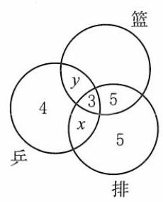

[第 62(2)题]

62.(1)18+14-22=10(人)

(2)如图，只参加乒乓球队和排球队的有 $x = {15} - 3 - 5 - 5 = 2$ (人)；

只参加乒乓球队和篮球队的有 $y = {13} - 4 - 3 - x = 4$ (人)；

则仅参加篮球队者有 ${14} - 3 - 5 - 4 = 2$ (人).

(3) ${807} + {739} + {437} - {513} - {267} - {371} + {213} = {1045}$ (人).

63. $\left\{  \begin{array}{l} \left( {{a}^{2} - 1}\right) x + \left( {a - 1}\right) y = {15}, \\  \left( {a + 1}\right) x - y = {2a} - 1\left( {x \neq  2}\right) . \end{array}\right.$① ②

② $x\left( {a - 1}\right)$ ，得 $\left( {{a}^{2} - 1}\right) x - \left( {a - 1}\right) y = \left( {{2a} - 1}\right) \left( {a - 1}\right) .$

① + ③，得 $2\left( {{a}^{2} - 1}\right) x = 2{a}^{2} - {3a} + {16}$ .

①-③，得 $2\left( {a - 1}\right) y =  - 2{a}^{2} + {3a} + {14}$ .

当 ${a}^{2} - 1 = 0$ ,即 $a = 1$ 或 -1 时,方程组无解.

当 $a \neq   \pm  1$ 时, $x = \frac{2{a}^{2} - {3a} + {16}}{2\left( {{a}^{2} - 1}\right) }$ ,要使方程组无解,则 $x = 2$ .

$2{a}^{2} - {3a} + {16} = 4{a}^{2} - 4$ ,解得 ${a}_{1} = \frac{5}{2},{a}_{2} =  - 4$ .

综上所述, $a = 1$ 或-1或 $\frac{5}{2}$ 或-4.

64. $\mathrm{C}$ 提示: 选项 $\mathrm{C},\forall x \in  M$ ,由 $M \subseteq  P, x \in  P, x \notin  \bar{P}$ ,或 $\forall y \in  \bar{P}, y \notin  P, y \notin  M$ ,都可得 $M \cap  \bar{P} = \varnothing$ .

选项 $\mathrm{A},\mathrm{B},\mathrm{D}$ 容易举反例: $M = \{ 1\} , P = \{ 1,2\} , U = \{ 1,2,3\}$ .

65. $\mathrm{C}$ 提示: $\bar{E} = \{ x \mid  x = {2n} + 1, n \in  \mathbf{N}\} ,\bar{F} = \{ x \mid  x = {4n} + 1$ 或 ${4n} + 2$ 或 ${4n} + 3, n \in  \mathbf{N}\}  = \{ x \mid  x = {2n} + 1$ 或 ${4n} + 2, n \in  \mathbf{N}\} , E \cap  F \; = \{ x \mid  x = {4n}, n \in  \mathbf{N}\} ,1 \notin  E \cap  F,\bar{E} \cup  F = \{ x \mid  x = {4n}$ 或 ${2n} + 1, n \in  \mathbf{N}\} ,2 \notin  \bar{E} \cup  F, E \cup  \bar{F} = \{ x \mid  x = {2n}$ 或 ${2n} + 1, n \in  \mathbf{N}\}  = \mathbf{N}$ , $\bar{E} \cap  \bar{F} = \{ x \mid  x = {2n} + 1, n \in  \mathbf{N}\} ,4 \notin  \bar{E} \cap  \bar{F}.$

66. (1) $\left\lbrack  {-3,1}\right\rbrack$

(2) $\left( {-\infty ,1\rbrack \cup (3, + \infty }\right)$ 提示: $A \cap  B = (1,3\rbrack$ ， $\overline{A \cap  B} = ( - \infty ,1\rbrack  \cup  \left( {3, + \infty }\right)$

(3) $\varnothing \left( {-\infty ,0\rbrack \cup \lbrack 3, + \infty }\right) \left( {0,3}\right)$ 提示: $A = ( - \infty ,0\rbrack , B = \lbrack 3, + \infty ), A \cap  B = \varnothing$ ，

$A \cup  B = \left( {-\infty ,0\rbrack \cup \lbrack 3, + \infty }\right) ,\overline{A \cup  B} = \left( {0,3}\right) .$

67. D

68.(1)2 提示: $\because \bar{P} = \{  - 1\} ,\therefore  - 1 \in  U$ 且 $- 1 \notin  P,\therefore {a}^{2} - a + 2 = 4,3 - {a}^{2} =  - 1,\therefore a = 2$ .

(2) $\{ 3,4\} \;\{ 1,3\} \;$ 提示: $\because \overline{A} \cap  B = \{ 1\} , A \cap  B = \{ 3\} ,\therefore B = \{ 1,3\}$ .

$\because \bar{A} \cap  B = \{ 1\} ,\bar{A} \cap  \bar{B} = \{ 2\} ,\therefore \bar{A} = \{ 1,2\} .\therefore A = \{ 3,4\}$ .

69. $\because \bar{A} = \{ 5\} ,\therefore 5 \in  U$ . 由 ${a}^{2} + {2a} - 3 = 5$ ,得 ${a}_{1} =  - 4,{a}_{2} = 2, U = \{ 2,3,5\} , A = \{ 2,3\} .\therefore b = 3$ .

综上所述, $a =  - 4$ 或 $2, b = 3$ .

70. 由题意,得 $A \cap  B = \{  - 3\} , - 3 \in  B,{a}^{2} + 1 \geq  1$ .

①若 $a - 3 =  - 3$ ，则 $a = 0, A = \{  - 3,0,1\} , B = \{  - 3, - 1,1\} , A \cap  B = \{  - 3,1\}  \neq  \{  - 3\}$ (舍去).

②若 ${2a} - 1 =  - 3$ ，则 $a =  - 1, A = \{  - 3,1,0\}$ . $B = \{  - 4, - 3,2\} , A \cap  B = \{  - 3\}$ ，满足.

$\therefore \overline{A \cup  B} = \{  - 2, - 1,3,4\}$ .

71. 由 $C \cup  D = \{$ 三角形 $\}  = U,\overline{C \cup  D} = \varnothing$ ,则原式 $= \varnothing$ .

72. $\because \bar{A} \cap  \bar{B} = \overline{A \cup  B} = \{ 1,9\} ,\therefore A \cup  B = \{ 0,2,3,4,5,6,7,8\}$ .

$\because A \cap  B = \{ 2\} ,\bar{A} \cap  B = \{ 4,6,8\} ,\therefore 2 \in  A,2,4,6,8 \in  B,4,6,8 \notin  A$ .

考虑 $A \cup  B$ 中的元素0,3,5,7,若一元素 $a \in  \{ 0,3,5,7\}$ ,而 $a \notin  A$ ,则 $a \in  B$ 且 $a \in  \bar{A}$ ,则 $a \in  \bar{A} \cap  B$ .

这与 $\bar{A} \cap  B = \{ 4,6,8\}$ 矛盾. 故 $0,3,5,7 \in  A$ 且 $\notin  B$ .

$\therefore A = \{ 0,2,3,5,7\} , B = \{ 2,4,6,8\}$ .

73. D

74. C 提示: 逆命题的等价命题为逆命题的逆否命题,即原命题的否命题: “如果 $p$ 正确,那么 $q$ 不正确.”

75. $\mathrm{B}$ 提示: 逆命题是逆否命题的否命题.

76. D

77. A 提示: $\alpha$ 为假命题, $\alpha$ 的逆命题是“如果 $\alpha  > 1$ ,那么 $\alpha  < 3$ ”为假命题. 由逆否命题的等价性,否命题,逆否命题都是假命题.

78. $\mathrm{B}$ 提示: 由所给命题是假命题得,存在 $x \in  M$ 且 $x \notin  P$ ,故②④是真命题,①③是假命题. ①易举反例 $M = \{ 1,2\} , P = \; \{ 2,3\}$ ,③易举反例 $M = \{ 1,2\} , P = \{ 3\}$ .

79. C

80. (1)如果一个数能被 5 整除, 那么这个数的末位数是 0

(2)如果一个点不在线段的垂直平分线上，那么这个点与这条线段两个端点的距离不相等

(3)如果一条直线是圆的切线，那么圆心到这条直线的距离等于圆的半径

(4)如果 $x + y > 0$ ，那么 $x > 0$ 且 $y > 0$

(5) $x \in  \left\lbrack  {-1,1}\right\rbrack$ 提示: $\because \frac{1}{{x}^{2} - 1} > 0,\therefore x \in  \left( {-\infty , - 1}\right)  \cup  \left( {1, + \infty }\right) ,\therefore \bar{p} : x \in  \left\lbrack  {-1,1}\right\rbrack$ .

81. A 提示: 方程 ${x}^{2} + {mx} - 3 = 0$ 有两个相异实根的充要条件是 $\Delta  = {m}^{2} + {12} > 0, m \in  \mathbf{R}$ .

82. $\mathrm{B}$ 提示: 考虑逆否命题: “ $a + b = 3$ ” 是 “ $a = 1$ 且 $b = 2$ ” 的必要非充分条件,故 “ $a \neq  1$ 且 $b \neq  2$ ” 是 “ $a + b \neq  3$ ” 的必要非充分条件.

83. $\mathrm{B}$ 提示: 考虑逆否形式: “ $x + y \leq  3$ ” 是 “ $x \leq  1$ 且 $y \leq  2$ ” 的必要非充分条件,故 “ $x > 1$ 且 $y > 2$ ” 是 “ $x + y > 3$ ” 的必要非充分条件.

84. $\mathrm{C}$ 提示: 由 ${x}^{2} + x + 1 = {\left( x + \frac{1}{2}\right) }^{2} + \frac{3}{4} > 0$ 即知.

85. D

86. A 提示: $p : \left( {x + 2}\right) \left( {x - 1}\right)  > 0, x \in  \left( {-\infty ,2}\right)  \cup  \left( {1, + \infty }\right) , q : x \in  \left( {a, + \infty }\right)$ .

由题意知, $\left( {a, + \infty }\right)  \subset  \left( {-\infty , - 2}\right)  \cup  \left( {1, + \infty }\right) ,\therefore a \geq  1$ .

87. $\mathrm{C}$ 提示: 当 $a = 0$ 时, ${x}_{1} =  - \frac{1}{2} < 0$ ,满足; 当 $a \neq  0$ 时,方程有实数根, $\Delta  = 4 - {4a} \geq  0, a \leq  1$ ;

当 $a \in  \left( {-\infty ,0}\right)$ 时, ${x}_{1} < 0,{x}_{2} > 0$ ; 当 $a \in  (0,1\rbrack$ 时, ${x}_{1} < 0,{x}_{2} < 0$ ,均满足. 综上所述, $a \in  ( - \infty ,1\rbrack$ .

88. $\mathrm{D}$ 提示: $\text{ ① }m = 0, B = \varnothing$ ,满足. $\text{ ② }m \neq  0, B = \left\{  \frac{1}{m}\right\}  ,\frac{1}{m} = 1$ 或 $- 1, m = 1$ 或-1. 综上所述, $m = 0$ 或1或-1.

89. $\mathrm{D}$ 提示: ① 当 $x + y = 0$ 时, $y =  - x$ ,即 ${x}^{2} - {y}^{2} + x + y = 0$ ; 存在 $x = 0, y = 1$ ,使 $x + y \neq  0$ 且 ${x}^{2} - {y}^{2} + x + y = 0$ .

$\therefore$ ①是真命题. 由全等三角形定义及 SAS 判定定理得④是真命题. ②③:存在 $a = 0, b =  - 1,{a}^{2} - {b}^{2} < 0$ ,而 $a - b > 0$ , 存在 $a =  - 1, b = 0, a - b < 0$ ,而 ${a}^{2} - {b}^{2} > 0.\;\therefore$ ②③都是假命题.

90. $\mathrm{C}$ 提示: ③④显然是假命题. ③取 $A = \varnothing$ ,则 $A \subseteq  B.$ ④ $A = \{ 0\} , B = \{ 1\}$ ,满足 $\operatorname{card}\left( A\right)  = \operatorname{card}\left( B\right)$ ,且 $A \neq  B.$ ①②是真命题. ①必要性显然,充分性由 $\operatorname{card}\left( {A \cup  B}\right)  \leq  \operatorname{card}\left( A\right)  + \operatorname{card}\left( B\right)$ ,取等号时 $A \cap  B = \varnothing$ . ②由 $A \subseteq  B$ ,有 $\operatorname{card}\left( A\right)  \leq  \operatorname{card}\left( B\right)$ , 而 $A = \{ 1\} , B = \{ 2,3\}$ 时, $A \nsubseteq  B$ .

91. 1 提示: 若 $B \subseteq  A$ ,则 ${m}^{2} \in  B,{m}^{2} \in  A.{m}^{2} >  - 1$ 且 ${m}^{2} \neq  3$ ,故 ${m}^{2} = {2m} - 1.m = 1$ ,检验知满足.

92. 充分非必要 提示: 由 $p \Rightarrow  r \Rightarrow  s \Rightarrow  q$ 及 $p \Leftarrow  r$ 易知.

93. (1) $p : x \in  \left( {0,3}\right) , q : x \in  \left( {-1,3}\right) .\left( {0,3}\right)  \subset  \left( {-1,3}\right)$ ， $p$ 是 $q$ 的充分非必要条件.

(2) $p$ 是 $q$ 的必要非充分条件.

(3)当 $c = 0$ 时， $y = a{x}^{2} + {bx}$ 过点 $\left( {0,0}\right)$ ；当 $y = a{x}^{2} + {bx} + c$ 过原点时，代入点 $\left( {0,0}\right)$ ，知 $c = 0$ .

$\therefore p$ 是 $q$ 的充要条件.

(4)充分性:当 $A \subseteq  B \subseteq  U$ 时， $\forall a \in  A$ ，有 $a \in  B$ ，其逆否命题为真，即 $\forall a \notin  B$ ，有 $a \notin  A$ . 故 $\forall a \in  \overline{B}, a \in  \overline{A}$ ，即 $\overline{B} \subseteq  \overline{A}.$ 必要性: 当 $\bar{B} \subseteq  \bar{A}$ 时, $\forall a \in  \bar{B}$ ,有 $a \in  \bar{A}$ ,其逆否命题为真,即 $\forall a \notin  \bar{A}$ ,有 $a \notin  \bar{B}$ ,

故 $\forall a \in  A$ ,有 $a \in  B$ ,即 $A \subseteq  B \subseteq  U$ .

$\therefore p$ 是 $q$ 的充要条件.

94. $\left( {0,1}\right)$ 提示: $\Delta  = 4{a}^{2} - {4a} < 0, a \in  \left( {0,1}\right)$ .

95. 逆命题: 如果关于 $x$ 的方程 ${x}^{2} + x - m = 0$ 有实数根,那么 $m > 0$ . 假命题.

否命题: 如果关于 $m \leq  0$ ,那么关于 $x$ 的方程 ${x}^{2} + x - m = 0$ 无实数根. 假命题.

逆否命题: 如果关于 $x$ 的方程 ${x}^{2} + x - m = 0$ 无实数根,那么 $m \leq  0$ . 真命题.

96. 逆命题:如果 $x \leq  2$ 且 $y \leq  4$ ，那么 ${xy} \leq  8$ . 假命题.

97. ${a}^{2} + {2ab} + {b}^{2} + a + b - 2 = {\left( a + b\right) }^{2} + \left( {a + b}\right)  - 2 = \left( {a + b + 2}\right) \left( {a + b - 1}\right)  \neq  0,\;\therefore a + b \neq   - 2$ 且 $a + b \neq  1$ .

98. $\alpha  : \left| {a - 1}\right|  < 2, a \in  \left( {-1,3}\right) .\beta  :$ ①无实数根: $\Delta  = {a}^{2} + {4a} < 0, a \in  \left( {-4,0}\right)$ .

②有两个负根: $\Delta  = {a}^{2} + {4a} \geq  0$ 且 $- \left( {a + 2}\right)  < 0, a \in  \lbrack 0, + \infty )$ ,取并集得 $a \in  \left( {-4, + \infty }\right)$ .

所求 $a$ 的取值范围是 $\left( {-4, - 1\rbrack \cup \lbrack 3, + \infty }\right)$ .

99.(1) $x > 0$ 且 $y > 0$ (或 $x < 0$ 且 $y < 0$ )(2) $x > y$ (或 $x > 0, y > 0$ )(3)充分非必要(4)既非充分又非必要 (5) $m = 0$

100. $p : x \in  \left( {1, + \infty }\right) .q : x \in  ( - \infty ,0\rbrack .\bar{q} : x \in  \left( {0, + \infty }\right) .\therefore p \subset  \bar{q},\therefore p$ 是 $\bar{q}$ 的充分非必要条件.

101. $\bar{p} : x \in  \left( {-\infty , - 2}\right)  \cup  \left( {{10}, + \infty }\right) .\bar{q} : x \in  \left( {-\infty , - 1 - m}\right)  \cup  \left( {-1 + m, + \infty }\right) , m > 0.\bar{q} \subset  \bar{p}$ ,

$\therefore \left\{  \begin{array}{l}  - 1 - m \leq   - 2, \\   - 1 + m \geq  {10}, \end{array}\right.$ 且等号不同时取到. $\therefore m \geq  {11}$ .

102. 当 $x + y = 5$ 时, $y = 5 - x$ 代入,得 ${x}^{2} - {y}^{2} - {3x} + {7y} = {x}^{2} - {\left( 5 - x\right) }^{2} - {3x} + 7\left( {5 - x}\right)  = {x}^{2} - \left( {{x}^{2} - {10x} + {25}}\right)  - {3x} + {35} - \; {7x} = {10}$ . 显然存在 $x =  - 1, y = 1$ ,使得 $x + y \neq  5$ 且 ${x}^{2} - {y}^{2} - {3x} + {7y} = {10}$ .

“ $x + y = 5$ ” 是 “ ${x}^{2} - {y}^{2} - {3x} + {7y} = {10}$ ”的充分非必要条件.

103. 充分性: 当 ${xy} \geq  0$ 时, $\left( {{Dx} \geq  0, y \geq  0, x + y \geq  0\text{ ,则 }\left| {x + y}\right|  = x + y = \left| x\right|  + \left| y\right| .\text{ ② }x \leq  0, y \leq  0, x + y \leq  0\text{ ,则 }\left| {x + y}\right|  = }\right) \; - \left( {x + y}\right)  = \left| x\right|  + \left| y\right|$ . 必要性: 当 $\left| {x + y}\right|  = \left| x\right|  + \left| y\right|$ 时, ${\left( x + y\right) }^{2} = {\left( \left| x\right|  + \left| y\right| \right) }^{2}$ ,即 ${x}^{2} + {2xy} + {y}^{2} = {x}^{2} + {y}^{2} + 2\left| x\right|$ . $\left| y\right| ,\;\therefore {xy} = \left| {xy}\right| ,\;\therefore {xy} \geq  0$ .

104. 记 $t = \left| {{x}^{2} - 1}\right|$ . 原方程为 ${t}^{2} - t + k = 0,\Delta  = 1 - {4k}$ .

$\text{ ① }k > \frac{1}{4}$ ，无实数根. ② $k = \frac{1}{4},{t}_{1} = {t}_{2} = \frac{1}{2}$ ，有 4 个实数根. ③ $k \in  \left( {0,\frac{1}{4}}\right) ,{t}_{1},{t}_{2} \in  \left( {0,1}\right)$ 且不相等，有 8 个实数根. ④ $k = 0$ ， ${t}_{1} = 0,{t}_{2} = 1$ ,有 5 个实数根. ⑤ $k < 0,{t}_{1} < 0,{t}_{2} > 1$ ,有 2 个实数根. 故四个命题都是真命题.

105. (1)立、不等式 ${ax} - b{x}^{2} \leq  1$ 恒成立， $\therefore b{x}^{2} - {ax} + 1 \geq  0,\therefore \left\{  {\begin{array}{l} b > 0, \\  \Delta  = {a}^{2} - {4b} \leq  0, \end{array}\;\therefore a \leq  2\sqrt{b}}\right.$ .

(2)充分性:由(1)知，当 $b - 1 \leq  a \leq  2\sqrt{b}$ 时，不等式: $b{x}^{2} - {ax} \geq   - 1$ 恒成立. 在此条件下，求 $y = b{x}^{2} - {ax}$ 的最大值， $x \in  \left\lbrack  {0,1}\right\rbrack  , b > 1.$ ① $\frac{a}{2b} \leq  \frac{1}{2}$ ，得 ${y}_{\max } = b - a$ . 由 $b - 1 \leq  a$ ，得 ${y}_{\max } = b - a \leq  1$ . ② $\frac{a}{2b} \geq  \frac{1}{2},{y}_{\max } = 0 \leq  1.$ 故恒有 $- 1 \leq \; b{x}^{2} - {ax} \leq  1$ .

必要性: 当 $- 1 \leq  {ax} - b{x}^{2} \leq  1$ 时, $x \in  \left\lbrack  {0,1}\right\rbrack  , - 1 - b{x}^{2} \leq   - {ax} \leq  1 - b{x}^{2}$ . 当 $x \neq  0$ 时,有 ${bx} - \frac{1}{x} \leq  a \leq  {bx} + \frac{1}{x}, b > 1$ . $y = {bx} - \frac{1}{x}, b > 1$ 在区间 $(0,1\rbrack$ 上随 $x$ 的增大而增大, $\therefore a \geq  {\left( bx - \frac{1}{x}\right) }_{\max } = b - 1$ .

$\therefore a \leq  {\left( bx + \frac{1}{x}\right) }_{\min } = 2\sqrt{b}$ . 当 $x = 0$ 时, ${ax} - b{x}^{2} = 0$ ,上述结论也成立. $\therefore b - 1 \leq  a \leq  2\sqrt{b}$ .

106. B 107. D 108. C 109. B 110. B 111. B 112. D 113. ${a}_{1} - 1,{a}_{2} - 2,\cdots ,{a}_{7} - 7$ 奇数 0

114. 证明: 假设 ${n}^{2} + {3n}\left( {n \in  \mathbf{N}, n > 0}\right)$ 为奇数,

因为 ${n}^{2} + {3n} = n\left( {n + 3}\right)$ ,

所以 $n$ 与 $n + 3$ 均为奇数,

所以 $n + n + 3$ 为偶数,

而 $n + n + 3 = {2n} + 3$ 为奇数,所以假设不成立.

故 ${n}^{2} + {3n}\left( {n \in  \mathbf{N}, n > 0}\right)$ 为偶数.

115. 证明: 假设存在 $x \in  \left\lbrack  {-1,1}\right\rbrack  ,{x}^{2} + 1$ 比 $\left| x\right|  + 1$ 远离 0,则 $\left| {{x}^{2} + 1 - 0}\right|  > \left| \right| x\left| {+1 - 0}\right|$ ,

即 ${x}^{2} + 1 > \left| x\right|  + 1$ ,

${x}^{2} > \left| x\right|$ ,即 ${x}^{4} > {x}^{2}$ ,

所以 ${x}^{2}\left( {x + 1}\right) \left( {x - 1}\right)  > 0$ ①.

又当 $x \in  \left\lbrack  {-1,1}\right\rbrack$ 时, ${x}^{2} \geq  0, x + 1 \geq  0, x - 1 \leq  0$ ,

所以 ${x}^{2}\left( {x + 1}\right) \left( {x - 1}\right)  \leq  0$ ,与①式矛盾,

所以假设不成立, 所以原命题成立.

116. 证明: 假设结论不成立,即方程 ${x}^{2} + {ax} + b = 0$ 与方程 ${x}^{2} + {cx} + d = 0$ 都没有实根,

则判别式满足 ${\Delta }_{1} = {a}^{2} - {4b} < 0,{\Delta }_{2} = {c}^{2} - {4d} < 0$ ,

则 ${\Delta }_{1} + {\Delta }_{2} = {a}^{2} + {c}^{2} - {4d} - {4b} < 0$ ,

即 ${4d} + {4b} > {a}^{2} + {c}^{2},{4d} + {4b} > {a}^{2} + {c}^{2} \geq  {2ac}$ ,

即 $2\left( {b + d}\right)  > {ac}$ ,这与条件 ${ac} \geq  2\left( {b + d}\right)$ 矛盾,

假设不成立,则原命题成立.

117. 证明: 假设结论不成立,即 $a + \frac{1}{b}$ 与 $b + \frac{1}{a}$ 都小于 2,

则 $a + \frac{1}{b} + b + \frac{1}{a} - 4 < 0$ ,

而 $a + \frac{1}{b} + b + \frac{1}{a} - 4 = {\left( \sqrt{a} - \frac{1}{\sqrt{a}}\right) }^{2} + {\left( \sqrt{b} - \frac{1}{\sqrt{b}}\right) }^{2} \geq  0$ ,两个不等式矛盾.

所以假设不成立,原命题成立.

118. 证明: 假设 $a, b, c$ 中至少有一个非正数,不妨设 $a = 0$ 或 $a < 0$ 两种情况.

当 $a = 0$ 时,则 ${abc} = 0$ ,与 ${abc} > 0$ 矛盾,所以 $a = 0$ 不成立;

当 $a < 0$ 时,因为 ${abc} > 0$ ,所以 ${bc} < 0$ ,

因为 $a + b + c > 0$ ,所以 $b + c >  - a > 0$ ,

所以 ${ab} + {bc} + {ca} = a\left( {b + c}\right)  + {bc} < 0$ ,与 ${ab} + {bc} + {ca} > 0$ 矛盾,

所以 $a < 0$ 也不成立,所以 $a > 0$ . 同理 $b > 0, c > 0$ .

所以原题得证.

119. 证明: 假设 $p + q > 4$ ,则 $p > 4 - q$ ,所以 ${p}^{3} > {\left( 4 - q\right) }^{3}$ ,

所以 ${p}^{3} + {q}^{3} > {\left( 4 - q\right) }^{3} + {q}^{3} = {64} - {48q} + {12}{q}^{2}$ .

因为 ${p}^{3} + {q}^{3} = {16}$ ,

所以 ${16} > {64} - {48q} + {12}{q}^{2}$ ,

即 ${q}^{2} - {4q} + 4 = {\left( q - 2\right) }^{2} < 0$ ,

这与 ${\left( q - 2\right) }^{2} \geq  0$ 矛盾,

所以假设不成立，故 $p + q \leq  4$ .

120. 证明: 假设存在不全相等的三个实数 $a, b, c$ ,使得 ${2b} = a + c$ 和 $\frac{2}{b} = \frac{1}{a} + \frac{1}{c}$ 同时成立、

则 $\frac{2}{b} = \frac{1}{a} + \frac{1}{c} = \frac{a + c}{ac} = \frac{2b}{ac}$ ,即 ${b}^{2} = {ac}$ ,将 $b = \frac{a + c}{2}$ 代入该等式,得 $a = b = c$ ,

与 $a, b, c$ 是不全相等的实数矛盾.

故假设不成立,原命题成立.

121. 证明: 假设存在三个不同的正整数 $m, n, t\left( {m < n < t}\right)$ ,使得 ${b}_{m} \cdot  {b}_{t} = {b}_{n}^{2}$ ,即

$\left( {m + \sqrt{2}}\right) \left( {t + \sqrt{2}}\right)  = {\left( n + \sqrt{2}\right) }^{2},$

故 ${mt} + \sqrt{2}\left( {m + t}\right)  = {n}^{2} + 2\sqrt{2}n$ ,

即 $\left( {{mt} - {n}^{2}}\right)  + \sqrt{2}\left( {m + t - {2n}}\right)  = 0$ .

因为 $m, n, t, t \in  \mathbf{N}, m > 0, n > 0, t > 0$ ,且若 $m + t - {2n} \neq  0$ ,则 $\sqrt{2} = \frac{{mt} - {n}^{2}}{{2n} - m - t} \in  \mathbf{Q}$ ,

与 $\sqrt{2} \notin  \mathbf{Q}$ 矛盾,故 ${mt} = {n}^{2}$ 且 $m + t = {2n}$ ,

即 $m, t$ 为方程 ${x}^{2} - {2nx} + {n}^{2} = 0$ 的两个不相同的正整数解.

而 ${x}^{2} - {2nx} + {n}^{2} = 0$ 等价于 ${\left( x - n\right) }^{2} = 0$ ,只有一个正整数解,故矛盾.

故假设不成立,即不存在三个不同的正整数 $m, n, t\left( {m < n < t}\right)$ ,使得 ${b}_{n}^{2} = {b}_{m}{b}_{t}$ .

## 第二章 等式与不等式

1. $\mathrm{B}\;2.\mathrm{B}\;3.\mathrm{D}\;4.q < {16}\;5.k >  - 1$ 且 $k \neq  0\;6.1$

7. $\mathrm{A}$ 提示: 令 $f\left( x\right)  = \left( {{x}^{2} - {10x} + {c}_{1}}\right) \left( {{x}^{2} - {10x} + {c}_{2}}\right) \left( {{x}^{2} - {10x} + {c}_{3}}\right) \left( {{x}^{2} - {10x} + {c}_{4}}\right) \left( {{x}^{2} - {10x} + {c}_{5}}\right)  = 0$ ,

设 ${x}_{i},{y}_{i}$ 是方程 ${x}^{2} - {10x} + {c}_{i} = 0$ 的两个根,

则 ${x}_{i} + {y}_{i} = {10},{x}_{i} \cdot  {y}_{i} = {c}_{i}, i = 1,2,3,4,5$ .

又因为 $M = \{ x \mid  f\left( x\right)  = 0\}  = \left\{  {{x}_{1},{x}_{2},{x}_{3},\cdots ,{x}_{9}}\right\}   \subseteq  \mathrm{N}$ ,

由集合性质得 $\left( {{x}_{i},{y}_{i}}\right)$ ,取 $\left( {1,9}\right) ,\left( {2,8}\right) ,\left( {3,7}\right) ,\left( {4,6}\right) ,\left( {5,5}\right)$ ,

又 ${c}_{1} \geq  {c}_{2} \geq  {c}_{3} \geq  {c}_{4} \geq  {c}_{5}$ ,

所以 ${c}_{1} = {25},{c}_{5} = 9$ ,

则 ${c}_{1} - {c}_{5} = {16}$ ,

故选 A.

8. 3 提示: 设三个关于 $x$ 的一元二次方程的公共实数根为 $t$ ,

则 $a{t}^{2} + {bt} + c = 0$ ①， $b{t}^{2} + {ct} + a = 0$ ②， $c{t}^{2} + {at} + b = 0$ ③.

$\therefore$ ①+②+③得 $\left( {a + b + c}\right) {t}^{2} + \left( {a + b + c}\right) t + \left( {a + b + c}\right)  = 0$ ，

$\therefore \left( {a + b + c}\right) \left( {{t}^{2} + t + 1}\right)  = 0$ .

而 ${t}^{2} + t + 1 = {\left( t + \frac{1}{2}\right) }^{2} + \frac{3}{4} > 0$ ,

$\therefore a + b + c = 0$ ,

$\therefore a + b =  - c$ .

原式 $= \frac{{a}^{2}}{bc} + \frac{{b}^{2}}{ca} + \frac{{c}^{2}}{ab} = \frac{{a}^{3} + {b}^{3} + {c}^{3}}{abc} = \frac{{a}^{3} + {b}^{3} - {\left( a + b\right) }^{3}}{abc} =$

$\frac{{a}^{3} + {b}^{3} - \left( {{a}^{3} + 3{a}^{2}b + {3a}{b}^{2} + {b}^{3}}\right) }{abc} = \frac{-{3ab}\left( {a + b}\right) }{abc} = \frac{-{3ab}\left( {-c}\right) }{abc} = 3.$

9. 因为 ${x}^{3} + {2k}{x}^{2} + {k}^{2}x + {9k} + {27} = x{k}^{2} + \left( {2{x}^{2} + 9}\right) k + {x}^{3} + {27} = 0$ ,

将其看成关于 $k$ 的二次方程,则 ${\Delta }_{1} = {\left( 2{x}^{2} + 9\right) }^{2} - {4x}\left( {{x}^{3} + {27}}\right)  = 9{\left( 2x - 3\right) }^{2}$ ,

所以利用求根公式求得 $k =  - x - 3$ 或 $k = \frac{-{x}^{2} + {3x} - 9}{x}$ ,

$\therefore x =  - 3 - k$ 或 ${x}^{2} + \left( {k - 3}\right) x + 9 = 0$ .

对于方程 ${x}^{2} + \left( {k - 3}\right) x + 9 = 0$ ,其 ${\Delta }_{2} = {\left( k - 3\right) }^{2} - 4 \times  9 = \left( {k - 9}\right) \left( {k + 3}\right)$ .

$\because k \geq  9,\therefore {\Delta }_{2} \geq  0$ ,

$\therefore$ 其两根为 ${x}_{2} = \frac{3 - k + \sqrt{{k}^{2} - {6k} - {27}}}{2},{x}_{3} = \frac{3 - k - \sqrt{{k}^{2} - {6k} - {27}}}{2}$ ,

所以关于 $x$ 的方程 ${x}^{3} + {2k}{x}^{2} + {k}^{2}x + {9k} + {27} = 0$ 的解为 ${x}_{1} =  - 3 - k,{x}_{2} = \frac{3 - k + \sqrt{{k}^{2} - {6k} - {27}}}{2}$ , ${x}_{3} = \frac{3 - k - \sqrt{{k}^{2} - {6k} - {27}}}{2}.$

10. (1) $\because \Delta  = {\left( 2k + 1\right) }^{2} - {16}\left( {k - \frac{1}{2}}\right)  = 4{k}^{2} - {12k} + 9 = {\left( 2k - 3\right) }^{2} \geq  0$ ,

$\therefore$ 无论 $k$ 取何值,关于 $x$ 的方程 ${x}^{2} - \left( {{2k} + 1}\right) x + 4\left( {k - \frac{1}{2}}\right)  = 0$ 总有实数根.

(2)三角形 ${ABC}$ 为等腰三角形，可能有两种情况:

① $b$ 或 $c$ 中至少有一个等于 $a = 4$ ，即方程 ${x}^{2} - \left( {{2k} + 1}\right) x + 4\left( {k - \frac{1}{2}}\right)  = 0$ 有一根为 4，

则 ${4}^{2} - 4\left( {{2k} + 1}\right)  + 4\left( {k - \frac{1}{2}}\right)  = {10} - {4k} = 0$ ,解得 $k = \frac{5}{2}$ .

方程为 ${x}^{2} - {6x} + 8 = 0$ ,另一根为 2,此时三角形 ${ABC}$ 的周长为 $a + b + c = {10}$ ;

② $b = c,\Delta  = {\left( 2k + 1\right) }^{2} - {16}\left( {k - \frac{1}{2}}\right)  = 4{k}^{2} - {12k} + 9 = {\left( 2k - 3\right) }^{2} = 0$ ,解得 $k = \frac{3}{2}$ ,

方程为 ${x}^{2} - {4x} + 4 = 0$ ,得 $b = c = 2$ ,则 $b + c = a$ ,此时三边不能构成三角形.

综上,三角形 ${ABC}$ 的周长为 10.

11. $\left( {-2, - 1}\right)$ 提示: ${x}^{2} + {2mx} + m + 2 = 0$ 有两个不等正实根,则 $\left\{  \begin{array}{l} \Delta  = 4{m}^{2} - 4 \\   - {2m} > 0, \\  m + 2 > 0, \end{array}\right.$

解得 $- 2 < m <  - 1$ .

12. $2\sqrt{2}$ 提示: $4{x}^{2} + {y}^{2} - {xy} = {\left( 2x + y\right) }^{2} - {5xy} = 3$ 成立,

令 $t = {2x} + y$ ,则 $y = t - {2x}$ ,

所以 ${t}^{2} - {5x}\left( {t - {2x}}\right)  = 3$ ,

即 ${10}{x}^{2} - {5tx} + {t}^{2} - 3 = 0, x$ 为实数成立,

所以 $\Delta  = {25}{t}^{2} - {40}\left( {{t}^{2} - 3}\right)  \geq  0$ ,

解得 $- 2\sqrt{2} \leq  t \leq  2\sqrt{2}$ ,

所以 ${2x} + y$ 的最大值为 $2\sqrt{2}$ ,相应地, $x = \frac{\sqrt{2}}{2}, y = \sqrt{2}$ .

13. $\because \alpha ,\beta$ 是方程 $4{x}^{2} - {4kx} + {3k} + {10} = 0$ 的两个实根,

$\therefore \Delta  = {16}{k}^{2} - {16}\left( {{3k} + {10}}\right)  \geq  0$ ,解得 $k \geq  5$ 或 $k \leq   - 2$ .

由韦达定理得 $\alpha  + \beta  = k,{\alpha \beta } = \frac{1}{4}\left( {{3k} + {10}}\right)$ .

$\therefore {\left( \alpha  - 1\right) }^{2} + {\left( \beta  - 1\right) }^{2} = {\alpha }^{2} + {\beta }^{2} - 2\left( {\alpha  + \beta }\right)  + 2 = {\left( \alpha  + \beta \right) }^{2} - {2\alpha \beta } - 2\left( {\alpha  + \beta }\right)  + 2 = {k}^{2} - \frac{1}{2}\left( {{3k} + {10}}\right)  - {2k} + 2 = {k}^{2} - \frac{7}{2}k \; - 3 = {\left( k - \frac{7}{4}\right) }^{2} - \frac{97}{16} \geq  \frac{9}{2}$ ,当 $k = 5$ 时等号成立.

14. (1) 当 $a = 2$ 时,方程组为 $\left\{  \begin{array}{l} {3x} - y =  - 1\;\text{ ①, } \\  x + {2y} = 9\;\text{ ②, } \end{array}\right.$

① $\times  2 +$ ②得 ${7x} = 7$ ，即 $x = 1$ .

把 $x = 1$ 代入 ①，得 $3 - y =  - 1$ ，即 $y = 4$ ，

此方程组的解为 $\left\{  \begin{array}{l} x = 1, \\  y = 4. \end{array}\right.$

(2)这个方程组的解为 $\left\{  \begin{array}{l} x = a - 1, \\  y = a + 2. \end{array}\right.$

由题意，得 $\left\{  \begin{array}{l} a - 1 > 0, \\  a + 2 > 0, \end{array}\right.$

解得 $a > 1$ .

(3) $\because a + b = 4, b > 0,\;\therefore b = 4 - a > 0$ ,

$\because a > 1,\therefore 1 < a < 4$ ,

$\because z = {2a} - {3b} = {2a} - 3\left( {4 - a}\right)  = {5a} - {12},$

故 $- 7 < z < 8$ .

15. 若三个方程都没有实根,则 $\left\{  \begin{array}{l} {\Delta }_{1} = {m}^{2} - {16} < 0, \\  {\Delta }_{2} = {\left( m - 1\right) }^{2} - {64} = \left( {m - 9}\right) \left( {m + 7}\right)  < 0, \\  {\Delta }_{3} = 4{m}^{2} - 4\left( {{3m} + {10}}\right)  = 4\left( {m - 5}\right) \left( {m + 2}\right)  < 0, \end{array}\right.$ 解得 $\left\{  \begin{array}{l}  - 4 < m < 4, \\   - 7 < m < 9, \\   - 2 < m < 5, \end{array}\right.$ 即 $- 2 < m < 4$ .

$\therefore m \in  \left( {-2,4}\right)$ 时三个方程都没有实根,

故三个方程至少有一个方程有实根时 $m \in  \left( {-\infty , - 2}\right\rbrack   \cup  \lbrack 4, + \infty )$ .

16. 将 $y = {kx} + 2$ 代入 ${y}^{2} - {4x} - {2y} + 1 = 0$ 中,整理得 ${k}^{2}{x}^{2} + \left( {{2k} - 4}\right) x + 1 = 0$ ,

$\Delta  = {\left( 2k - 4\right) }^{2} - 4 \times  {k}^{2} \times  1 =  - {16}\left( {k - 1}\right) .$

(1) 当 $k = 0$ 时, $y = 2$ ,则 $- {4x} + 1 = 0$ ,解得 $x = \frac{1}{4}$ ,方程组的解为 $\left\{  \begin{array}{l} x = \frac{1}{4}, \\  y = 2. \end{array}\right.$

当 $\left\{  \begin{array}{l} k \neq  0, \\  \Delta  = 0 \end{array}\right.$ 时,原方程组有一个实数解,即 $k = 1$ 时方程组有一个实数解,

将 $k = 1$ 代入原方程组得 $\left\{  \begin{array}{l} {y}^{2} - {4x} - {2y} + 1 = 0, \\  y = x + 2, \end{array}\right.$ 解得 $\left\{  \begin{array}{l} x = 1, \\  y = 3. \end{array}\right.$

(2)当 $\left\{  \begin{array}{l} {k}^{2} \neq  0, \\  \Delta  =  - {16}\left( {k - 1}\right)  > 0 \end{array}\right.$ 时,原方程组有两个不相等的实数解,即 $k < 1$ 且 $k \neq  0$ .

所以当 $k < 1$ 且 $k \neq  0$ 时,原方程组有两个不相等的实数解.

(3)当 $\left\{  \begin{array}{l} {k}^{2} \neq  0, \\  \Delta  =  - {16}\left( {k - 1}\right)  < 0 \end{array}\right.$ 时，解得 $k > 1$ ，即当 $k > 1$ 时，方程组无实数解.

17. ( 1 ) $\because a + b + c = 3,\frac{1}{a} + \frac{1}{b} + \frac{1}{c} = 3$ ，

$\therefore a + \frac{1}{a} + b + \frac{1}{b} + c + \frac{1}{c} = 6$ ,即 ${\left( \sqrt{a} - \frac{1}{\sqrt{a}}\right) }^{2} + {\left( \sqrt{b} - \frac{1}{\sqrt{b}}\right) }^{2} + {\left( \sqrt{c} - \frac{1}{\sqrt{c}}\right) }^{2} = 0$ .

$\therefore \sqrt{a} = \frac{1}{\sqrt{a}},\sqrt{b} = \frac{1}{\sqrt{b}},\sqrt{c} = \frac{1}{\sqrt{c}}$ ,

即 $a = b = c = 1$ .

(2)设三个方程都能得到等根，则有

${\Delta }_{1} = 4{b}^{2} - {4ac} = 0,$

${\Delta }_{2} = 4{c}^{2} - {4ab} = 0,$

${\Delta }_{3} = 4{a}^{2} - {4bc} = 0.$

将三式相加,除以 2,得 $2{a}^{2} + 2{b}^{2} + 2{c}^{2} - {2ab} - {2ac} - {2bc} = 0,{\left( a - b\right) }^{2} + {\left( b - c\right) }^{2} + {\left( c - a\right) }^{2} = 0$ ,

$\therefore a = b = c$ ,这与题设矛盾,

因此这三个方程不能都有两个相等实根.

18. B 19. D 20. B

21. ( 1 )二 提示: $\left( {{a}^{2} + 3{b}^{2}}\right)  - \left\lbrack  {{2b}\left( {a + b}\right) }\right\rbrack   = {a}^{2} - {2ab} + {b}^{2} = {\left( a - b\right) }^{2}, a \neq  b,\therefore {\left( a - b\right) }^{2} > 0$ ，

$\therefore {a}^{2} + 3{b}^{2} > {2b}\left( {a + b}\right)$ .

(2)C 提示: $\sqrt{c + 1} - \sqrt{c} = \frac{1}{\sqrt{c + 1} + \sqrt{c}} < \frac{1}{\sqrt{c} + \sqrt{c - 1}} = \sqrt{c} - \sqrt{c - 1}$ .

(3) 坐 提示:① $c \geq  0,{ac} \leq  0,{bd} > 0,\therefore {ac} < {bd}$ .

② $c < 0$ ，由 $0 > a > b,0 > c > d$ ，得 $\left| a\right|  < \left| b\right| ,\left| c\right|  < \left| d\right| ,\therefore {ac} < {bd}$ .

22. ${ab} \in  \left( {-\infty , - 1}\right)  \cup  \left( {0, + \infty }\right)$ 提示: $a - \frac{1}{a} - b + \frac{1}{b} > 0,\therefore \frac{\left( {{ab} + 1}\right) \left( {a - b}\right) }{ab} > 0$ .

$\because a > b,\therefore {ab}\left( {{ab} + 1}\right)  > 0,\;\therefore {ab} \in  \left( {-\infty , - 1}\right)  \cup  \left( {0, + \infty }\right)$ .

23. (1) $\left( {\frac{{a}^{2}}{b} + \frac{{b}^{2}}{a}}\right)  - \left( {a + b}\right)  = \frac{1}{ab}\left( {{a}^{3} + {b}^{3} - {a}^{2}b - a{b}^{2}}\right)  = \frac{1}{ab}\left\lbrack  {{a}^{2}\left( {a - b}\right)  + {b}^{2}\left( {b - a}\right) }\right\rbrack   = \frac{1}{ab}\left( {a + b}\right) {\left( a - b\right) }^{2} > 0$ ,

$\therefore \frac{{a}^{2}}{b} + \frac{{b}^{2}}{a} > a + b$ .

(2) $\frac{b}{a + b} = \frac{1}{\frac{a}{b} + 1},\frac{d}{c + d} = \frac{1}{\frac{c}{d} + 1}.\;\because 0 < \frac{a}{b} < \frac{c}{d},\therefore \frac{1}{\frac{a}{b} + 1} > \frac{1}{\frac{c}{d} + 1},\therefore \frac{b}{a + b} > \frac{d}{c + d}$ .

24. D

25. (1) $\frac{1}{1 + a} - \left( {1 - a}\right)  = \frac{{a}^{2}}{1 + a}$ .

① 当 $a \in  \left( {-\infty , - 1}\right)$ 时， $\frac{{a}^{2}}{1 + a} < 0$ ， $\frac{1}{1 + a} < 1 - a$ .

② 当 $a = 0$ 时， $\frac{{a}^{2}}{1 + a} = 0$ ， $\frac{1}{1 + a} = 1 - a$ .

③ 当 $a \in  \left( {-1,0}\right)  \cup  \left( {0, + \infty }\right)$ 时， $\frac{{a}^{2}}{1 + a} > 0$ ， $\frac{1}{1 + a} > 1 - a$ .

(2) $\frac{2}{\frac{1}{a} + \frac{1}{b}} < \sqrt{ab} < \frac{a + b}{2} < \sqrt{\frac{{a}^{2} + {b}^{2}}{2}}$ .

26. (1) ${\left( \sqrt{\frac{{y}^{2} + 1}{{x}^{2} + 1}}\right) }^{2} - {\left( \frac{y}{x}\right) }^{2} = \frac{{x}^{2} - {y}^{2}}{{x}^{2}\left( {{x}^{2} + 1}\right) } > 0$ ， $\therefore \sqrt{\frac{{y}^{2} + 1}{{x}^{2} + 1}} > \frac{y}{x}$ .

(2) ${\left( m\sqrt{a} + n\sqrt{b}\right) }^{2} - {\left( \sqrt{{ma} + {nb}}\right) }^{2} = {m}^{2}a + {n}^{2}b + {2mn}\sqrt{ab} - {ma} - {nb}$

$= {ma}\left( {m - 1}\right)  + {nb}\left( {n - 1}\right)  + {2mn}\sqrt{ab}.$

$\because m + n = 1,\;\therefore n - 1 =  - m, m - 1 =  - n,$

$\therefore$ 原式 $=  - {mna} - {mnb} + {2mn}\sqrt{ab} =  - {mn}{\left( \sqrt{a} - \sqrt{b}\right) }^{2} \leq  0$ ,

$\therefore m\sqrt{a} + n\sqrt{b} \leq  \sqrt{{ma} + {nb}}$ .

27. B

30. $\mathrm{C}$ 提示: $M = \left( {-\infty , - 2}\right)  \cup  \left( {2, + \infty }\right) , N = \left( {-\infty ,3}\right) , M \cup  N = \mathbf{R}, M \cap  N = \left( {-\infty , - 2}\right)  \cup  \left( {2,3}\right)$ .

31. $\mathrm{D}$ 提示: $M = \left\lbrack  {-3,1}\right\rbrack  , P = \left( {-\infty ,2\rbrack \cup \lbrack 3, + \infty }\right) ,\therefore M \subset  P$ .

32. A 提示: $\left| {1 - x}\right|  + \left| {x - 2}\right|  = 1$ . ① 当 $x \in  \left( {-\infty ,1}\right)$ 时, $1 - x + 2 - x = 3 - {2x} > 1$ . ② 当 $x \in  \left\lbrack  {1,2}\right\rbrack$ 时， $x - 1 + 2 - x = 1$ . ③ 当 $x \in  \left( {2, + \infty }\right)$ 时， ${2x} - 3 > 1.\therefore x \in  \left\lbrack  {1,2}\right\rbrack  .$

33. $\mathrm{B}$ 提示: ${x}^{2} - {2x} - 3 < 0, x \in  \left( {-1,3}\right)$ .

34. $\mathrm{B}$ 提示: $6{x}^{2} + {5x} - 4 < 0,\left( {{2x} - 1}\right) \left( {{3x} + 4}\right)  < 0, x \in  \left( {-\frac{4}{3},\frac{1}{2}}\right)$ .

35. $\mathrm{B}$ 提示: $\left( {x - {5a}}\right) \left( {x + a}\right)  > 0, a < 0, - a > {5a},\therefore x \in  \left( {-\infty ,{5a}}\right)  \cup  \left( {-a, + \infty }\right)$ .

36. $\mathrm{B}$ 提示: 选项 $\mathrm{A},( - \infty , - \sqrt{2}\rbrack  \cup  \lbrack \sqrt{2}, + \infty )$ . 选项 $\mathrm{B}, - \sqrt{2} < x - 1 < \sqrt{2}, x \in  \left( {1 - \sqrt{2},1 + \sqrt{2}}\right)$ .

选项 C, $\left( {-3,3}\right)$ . 选项 D,当 $a > 0$ 时,解集是 $\left( {-\infty ,{x}_{2}}\right)  \cup  \left( {{x}_{1}, + \infty }\right)$ .

37. A 提示: ① 由 $\left( {x - 3}\right) \left( {x + 1}\right)  < 0$ ,得 $x \in  \left( {-1,3}\right)$ . 由 $\frac{{x}^{2} - {2x} - 3}{x - 1} < 0$ ,得 $\left( {x - 3}\right) \left( {x + 1}\right) \left( {x - 1}\right)  < 0,\therefore x \in  \left( {-\infty , - 1}\right)$

$\bigcup \left( {1,3}\right)$ . ② 由 $\left( {x + 4}\right) \left( {x - 1}\right)  > 0$ ,得 $x \in  \left( {-\infty , - 4}\right)  \cup  \left( {1, + \infty }\right) ,{x}^{2} + {3x} + \sqrt{x} > 4 + \sqrt{x}\left( {x \geq  0}\right) ,\therefore x \in  \left( {1, + \infty }\right)$ .

③ 由 $\frac{x + 2}{x + 2}\left( {{x}^{2} - 1}\right)  > 0$ ，得 $x \in  \left( {-\infty , - 2}\right)  \cup  \left( {-2, - 1}\right)  \cup  \left( {1, + \infty }\right)$ .

由 ${x}^{2} - 1 > 0$ ,得 $x \in  \left( {-\infty , - 1}\right)  \cup  \left( {1, + \infty }\right)$ .

38. $\mathrm{B}$ 提示: $\because {x}^{2} + x < 0,\therefore x \in  \left( {-1,0}\right) ,\therefore \left| {x}^{2}\right|  < \left| x\right| , - x > {x}^{2} >  - {x}^{2} > x$ .

39. (1) $\left( {-\infty ,1}\right)  \cup  \left( {1, + \infty }\right)$ (2) $\left( {-\frac{1}{3},2}\right)$

(3) $\left( {-1,\frac{1}{3}}\right)$ 提示: $3{x}^{2} + {2x} - 1 < 0$ ， $\left( {{3x} - 1}\right) \left( {x + 1}\right)  < 0$ ， $x \in  \left( {-1,\frac{1}{3}}\right)$ .

(4) $\left\lbrack  {-1 - \sqrt{2}, - 1 + \sqrt{2}}\right\rbrack$ 提示: ${x}^{2} + {2x} - 1 \leq  0, x \in  \left\lbrack  {-1 - \sqrt{2}, - 1 + \sqrt{2}}\right\rbrack$ .

(5) $\lbrack 0,4)$ 提示: $\left( {\sqrt{x} + 3}\right) \left( {\sqrt{x} - 2}\right)  < 0,\sqrt{x} \in  \lbrack 0,2), x \in  \lbrack 0,4)$ .

(6) $\left( {-\infty , - \frac{4}{3}}\right\rbrack   \cup  \left( {2, + \infty }\right)$ (7) $\left( {-\frac{1}{3},2}\right)$

(8) $\left( {-\infty , - 1}\right)  \cup  \left( {0,1}\right)$ 提示: $\frac{\left( {x + 1}\right) \left( {x - 1}\right) }{x} < 0, x \in  \left( {-\infty , - 1}\right)  \cup  \left( {0,1}\right)$ .

(9) $\left( {-\infty , - 3}\right)  \cup  \left( {3, + \infty }\right)$ 提示: $\left( {\left| x\right|  - 3}\right) \left( {\left| x\right|  + 1}\right)  > 0,\left| x\right|  > 3, x \in  \left( {-\infty , - 3}\right)  \cup  \left( {3, + \infty }\right)$ .

(10) $\left( {-\infty , - 3}\right)  \cup  \left( {4, + \infty }\right)$

提示: ① 当 $x < \frac{1}{2}$ 时, ${x}^{2} - x - 5 >  - {2x} + 1,\left( {x + 3}\right) \left( {x - 2}\right)  > 0.\therefore x \in  \left( {-\infty , - 3}\right)$ .

② 当 $x \geq  \frac{1}{2}$ 时， ${x}^{2} - x - 5 > {2x} - 1$ ， $\left( {x - 4}\right) \left( {x + 1}\right)  > 0.\;\because x \geq  \frac{1}{2}$ ， $\therefore x \in  \left( {4, + \infty }\right)$ .

综上所述, $x \in  \left( {-\infty , - 3}\right)  \cup  \left( {4, + \infty }\right)$ .

40. (1) $\left( {-\infty , - 2\rbrack \cup \lbrack 3, + \infty }\right)$ 提示: ${x}^{2} - x - 6 \geq  0,\left( {x - 3}\right) \left( {x + 2}\right)  \geq  0,\therefore x \in  \left( {-\infty , - 2\rbrack \cup \lbrack 3, + \infty }\right)$ .

(2) $\lbrack 3, + \infty )$ 提示: $\left\{  {\begin{array}{l} x - 3 \geq  0, x \in  \lbrack 3, + \infty ), \\  {x}^{2} - {3x} + 2 > 0, x \in  \left( {-\infty ,1}\right)  \cup  \left( {2, + \infty }\right) . \end{array}\;\therefore x \in  \lbrack 3, + \infty )}\right.$ .

(3) $x \in  \left( {-\infty , - \frac{2}{3}}\right\rbrack   \cup  \left\lbrack  {\frac{1}{2}, + \infty }\right)$

提示: $6{x}^{2} + x - 2 \geq  0,\left( {{3x} + 2}\right) \left( {{2x} - 1}\right)  \geq  0, x \in  \left( {-\infty , - \frac{2}{3}}\right\rbrack   \cup  \left\lbrack  {\frac{1}{2}, + \infty }\right)$ .

41. (1) $\{  - 1, - 2,4,5\}$ 提示: $\text{ ① }{x}^{2} - {3x} - 4 \geq  0, x \in  \left( {-\infty , - 1}\right\rbrack   \cup  \lbrack 4, + \infty )$ . $\text{ ② }{x}^{2} - {3x} - {18} < 0, x \in  \left( {-3,6}\right)$ . $\therefore x \in  \left( {-3, - 1\rbrack \cup \lbrack 4,6}\right) , x \in  \{  - 1, - 2,4,5\}$ .

(2)1 提示: $\because \left( {{2x} - 5}\right) \left( {{2x} + 3}\right)  \leq  0,\therefore x \in  \left\lbrack  {-\frac{3}{2},\frac{5}{2}}\right\rbrack$ .

$\therefore$ 原式 $= \left| {x - 4}\right|  - \left| {x - 3}\right|  = \left( {4 - x}\right)  - \left( {3 - x}\right)  = 1$ .

(2) $\left( {b, a}\right)$ (3) $\left( {-\infty , b}\right)  \cup  \left( {a, + \infty }\right)$ (4) $\left( {b, a}\right)$

43. (1) $\left( {-\frac{1}{16},0}\right)  \cup  \lbrack 0, + \infty )$ 提示: $k \neq  0$ 且 $\Delta  = {{64}{k}^{2} + {16k} + 1} - 4 \cdot  {2k} \cdot  {8k} = {16k} + 1 > 0$ ，

$\therefore \;k \in  \left( {-\frac{1}{16},0}\right)  \cup  \left( {0, + \infty }\right) .$

(2) $( - \infty , - 3\rbrack$ 提示: $a < 0$ 且 $\Delta  = 4{a}^{2} - {4a}\left( {{2a} + 3}\right)  =  - {4a}\left( {a + 3}\right)  \leq  0,\therefore a \in  ( - \infty , - 3\rbrack$ .

44. $\mathrm{B}$ 提示: $\left( {a - 2}\right) x < {2a} - 1, a = 2$ ,此时 ${2a} - 1 > 0.\therefore a = 2$

45. $\mathrm{B}$ 提示: $a{x}^{2} + {bx} - 2 = 0$ 的两根是 ${x}_{1} =  - \frac{1}{2},{x}_{2} = \frac{1}{3},\therefore {x}_{1}{x}_{2} =  - \frac{2}{a} =  - \frac{1}{6},\therefore a = {12}$ .

$\therefore \;{x}_{1} + {x}_{2} =  - \frac{b}{a} =  - \frac{1}{6},\;\therefore \;b = 2.\;\therefore \;{ab} = {24}.$

46. C 提示: ① 若 $a = 2, - 4 < 0$ ，符合题意. ② 若 $a \neq  2$ ，则 $a < 2$ 且 $\Delta  = 4{\left( a - 2\right) }^{2} + {16}\left( {a - 2}\right)  < 0$ ， 即 $\left( {a - 2}\right) \left( {a + 2}\right)  < 0, a \in  \left( {-2,2}\right)$ . 综上所述, $a \in  ( - 2,2\rbrack$ .

47. $\mathrm{B}$ 提示: 左边: $\frac{1 - {qx}}{x} > 0, q < 0, x \in  \left( {-\infty ,\frac{1}{q}}\right)  \cup  \left( {0, + \infty }\right)$ .

右边: $\frac{{px} - 1}{x} > 0, p > 0, x \in  \left( {-\infty ,0}\right)  \cup  \left( {\frac{1}{p}, + \infty }\right)$ . 综上所述, $x \in  \left( {-\infty ,\frac{1}{q}}\right)  \cup  \left( {\frac{1}{p}, + \infty }\right)$ .

48.(1)(一∞，-3)提示:((本) $a \times  {3b} - {2a}$ ， $\therefore \;\left( {a + b}\right)  > 0$ 且 $\frac{{3b} - {2a}}{a + b} =  - \frac{1}{3}$ .

$\therefore a = {2b}$ 且 $a, b > 0.\;\therefore x < \frac{{2a} - b}{a - {3b}} = \frac{{4b} - b}{{2b} - {3b}} =  - 3$ .

(2)(1，3)提示: $\because 4{x}^{2} + {6x} + 3 = {\left( 2x + \frac{3}{2}\right) }^{2} + \frac{3}{4} > 0$ ，

$\therefore \;2{x}^{2} + {2kx} + k < 4{x}^{2} + {6x} + 3,2{x}^{2} + \left( {6 - {2k}}\right) x + \left( {3 - k}\right)  > 0$ .

$\Delta  = {\left( 6 - 2k\right) }^{2} - 8\left( {3 - k}\right)  = 4\left( {k - 1}\right) \left( {k - 3}\right)  < 0,\;\therefore \;k \in  \left( {1,3}\right) .$

(3) $\left( {-\infty ,\frac{1}{5}}\right)  \cup  \left( {\frac{1}{3}, + \infty }\right)$ 提示: $a < 0$ 且 $\left\{  \begin{array}{l}  - \frac{b}{a} = 3 + 5 = 8, \\  \frac{c}{a} = 3 \times  5 = {15}. \end{array}\right.$

$\therefore \frac{b}{a} =  - 8,\frac{c}{a} = {15}$ 且 $c < 0.c{x}^{2} + {bx} + a < 0$ 两边同时除以 $c$ ,即 ${x}^{2} + \frac{b}{c}x + \frac{a}{c} > 0$ .

代入 $\frac{a}{c} = \frac{1}{15},\frac{b}{c} = \frac{b}{a} \cdot  \frac{a}{c} =  - \frac{8}{15}$ ，得 ${x}^{2} - \frac{8}{15}x + \frac{1}{15} > 0,\therefore x \in  \left( {-\infty ,\frac{1}{5}}\right)  \cup  \left( {\frac{1}{3}, + \infty }\right) .$

(4) $\left( {1,2}\right)$ 提示: $\left( {x - 1}\right) \left( {x - 2}\right) \left( {x - a}\right)  \geq  0, x \neq  1,2$ .

当 $a \in  \left( {1,2}\right)$ 时, $1 < x \leq  a$ 或 $x > 2$ ,满足题意.

当 $a = 2$ 时, $\{ x \mid  1 < x \leq  2$ 或 $x > 2\}  = \left( {1, + \infty }\right)$ ,而 $x \neq  2$ (舍去).

当 $a > 2$ 时, $1 < x < 2$ 或 $x > a$ (舍去). 同理, $a \leq  1$ 也不成立.

$\therefore a \in  \left( {1,2}\right)$ .

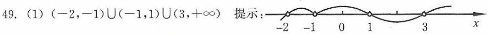

(2) $\left( {-\infty , - 2\rbrack \cup \{ 1}\right)  \cup  \left( {3,4}\right)$ 提示: ${\left( x - 1\right) }^{2}\left( {x + 2}\right) \left( {x - 3}\right) \left( {x - 4}\right)  \leq  0, x \neq  3, x \neq  4$ .

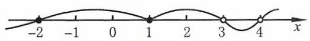

(3) $( - \infty , - 3\rbrack  \cup  ( - 1,1\rbrack$ 提示: $\frac{{x}^{2} + {2x} - 3}{x + 1} \leq  0,\left( {x + 3}\right) \left( {x + 1}\right) \left( {x - 1}\right)  \leq  0, x \neq   - 1$ .

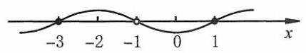

50. $\mathrm{D}$ 提示: $\frac{x - 1 - {2x}}{2x} \leq  0,\frac{x + 1}{2x} \geq  0, x \in  ( - \infty , - 1\rbrack  \cup  \left( {0, + \infty }\right)$ .

51. C 提示: 一元二次方程 $m{x}^{2} + {8mx} + {21} = 0$ 的两根是 ${x}_{1} =  - 7,{x}_{2} =  - 1,\therefore {x}_{1}{x}_{2} = \frac{21}{m} = 7, m = 3$ .

52. $\mathrm{C}$ 提示: $\left( {{a}^{2} - 3}\right) {x}^{2} + {5x} - 2 = 0$ 的两根是 ${x}_{1} = \frac{1}{2},{x}_{2} = 2,{x}_{1}{x}_{2} = \frac{-2}{{a}^{2} - 3} = 1,{a}^{2} - 3 =  - 2, a =  \pm  1$ .

53. C

54. C 提示: $a < 0$ 且 $\Delta  = 1 - {4ac} < 0,{ac} > \frac{1}{4}$ .

55. C 提示: $\Delta  = 4{\left( 1 + k\right) }^{2} - 4\left( {3 + k}\right)  = 4\left( {k + 2}\right) \left( {k - 1}\right)  < 0, k \in  \left( {-2,1}\right)$ .

56. $\mathrm{B}$ 提示: $\Delta  = {16}{k}^{2} - 4 \cdot  2\left( {k + 1}\right) \left( {{3k} - 2}\right)  =  - 8\left( {k + 2}\right) \left( {k - 1}\right)  \geq  0, k \in  \left\lbrack  {-2,1}\right\rbrack  .{x}_{1}{x}_{2} = \frac{{3k} - 2}{2\left( {k + 1}\right) } > 0$ ,

$k \in  \left( {-\infty , - 1}\right)  \cup  \left( {\frac{2}{3}, + \infty }\right) .\;\therefore \;k \in  \left\lbrack  {-2, - 1)\cup (\frac{2}{3},1}\right\rbrack$

57. A 提示: $m \neq   - 3.\;\because {x}_{1}{x}_{2} < 0,\;\therefore \Delta  > 0.\;\because {x}_{1} + {x}_{2} = \frac{4m}{m + 3} < 0,\;\therefore m \in  \left( {-3,0}\right)$ .

$\because {x}_{1}{x}_{2} = \frac{{2m} - 1}{m + 3} < 0,\;\therefore m \in  \left( {-3,\frac{1}{2}}\right)$ . 综上所述, $m \in  \left( {-3,0}\right)$ .

58. $\mathrm{B}$ 提示: $\Delta  = {\left( k - 2\right) }^{2} - 4\left( {{k}^{2} + {3k} + 5}\right)  =  - \left( {3{k}^{2} + {16k} + {16}}\right)  =  - \left( {{3k} + 4}\right) \left( {k + 4}\right)  \geq  0, k \in  \left\lbrack  {-4, - \frac{4}{3}}\right\rbrack$ . ${\alpha }^{2} + {\beta }^{2} = {\left( \alpha  + \beta \right) }^{2} - {2\alpha \beta } = {\left( k - 2\right) }^{2} - 2\left( {{k}^{2} + {3k} + 5}\right)  =  - {\left( k + 5\right) }^{2} + {19}$ . 当 $k =  - 4$ 时, ${\left( {\alpha }^{2} + {\beta }^{2}\right) }_{\max } = {18}$ .

59. $\mathrm{B}$ 提示: $\because \left( {{x}^{2} - {5x} + 4}\right) \left( {{x}^{2} - {5x} + 6}\right)  - {120} > 0,\therefore {\left( {x}^{2} - 5x\right) }^{2} + {10}\left( {{x}^{2} - {5x}}\right)  - {96} > 0$ .

$\because \left( {{x}^{2} - {5x} + {16}}\right) \left( {{x}^{2} - {5x} - 6}\right)  > 0,{x}^{2} - {5x} + {16} = {\left( x - \frac{5}{2}\right) }^{2} + \frac{39}{4} > 0,\therefore {x}^{2} - {5x} - 6 > 0$ ,

$\therefore x \in  \left( {-\infty , - 1}\right)  \cup  \left( {6, + \infty }\right)$ .

60. $\mathrm{C}$ 提示: 第 1 个方程, ${\Delta }_{1} = {a}^{2} - {16} \geq  0, a \in  \left( {-\infty , - 4\rbrack \cup \lbrack 4, + \infty }\right)$ .

第 2 个方程, ${\Delta }_{2} = {\left( a - 1\right) }^{2} - {64} \geq  0, a \in  ( - \infty , - 7\rbrack  \cup  \lbrack 9, + \infty )$ .

第 3 个方程, ${\Delta }_{3} = 4{a}^{2} - 4\left( {{3a} + {10}}\right)  \geq  0, a \in  ( - \infty , - 2\rbrack  \cup  \lbrack 5, + \infty )$ .

综上所述, $a \in  ( - \infty , - 2\rbrack  \cup  \lbrack 4, + \infty )$ .

61. (1)10+4√6 提示: $\Delta  = 4{m}^{2} - {16m} + {16} - 8{m}^{2} + {16m} + 8 =  - 4{m}^{2} + {24} \geq  0$ ， $\therefore m \in  \left\lbrack  {-\sqrt{6},\sqrt{6}}\right\rbrack$ . $\because {x}_{1}{x}_{2} = 2{m}^{2} - {4m} - 2 = 2{\left( m - 1\right) }^{2} - 4$ . 当 $m =  - \sqrt{6}$ 时, ${\left( {x}_{1}{x}_{2}\right) }_{\max } = 2{\left( \sqrt{6} + 1\right) }^{2} - 4 = {10} + 4\sqrt{6}$ .

(2)2 提示: $\Delta  = {k}^{2} - {8k} + {12} \geq  0, k \in  \left( {-\infty ,2\rbrack \cup \lbrack 6, + \infty }\right)$ . ${x}_{1}^{2} + {x}_{2}^{2} = {\left( {x}_{1} + {x}_{2}\right) }^{2} - 2{x}_{1}{x}_{2} = {k}^{2} - {4k} + 6 = {\left( k - 2\right) }^{2} + 2$ . 当 $k = 2$ 时， ${\left( {x}_{1}^{2} + {x}_{2}^{2}\right) }_{\min } = 2$ .

62.(1)-4 -5 提示: ${x}^{2} - {mx} + n = 0$ 的两根是 ${x}_{1} =  - 5,{x}_{2} = 1$ . m= ${x}_{1} + {x}_{2} =  - 4, n = {x}_{1}{x}_{2} =  - 5$ .

(2) $- \frac{1}{5} - \frac{4}{5}$ 提示: $a{x}^{2} + {bx} + 1 = 0$ 的两根是 ${x}_{1} =  - 5,{x}_{2} = 1$ ___， $\therefore {x}_{1}{x}_{2} = \frac{1}{a} =  - 5$ ，

$\therefore a =  - \frac{1}{5}.\;\because \;{x}_{1} + {x}_{2} =  - \frac{b}{a} =  - 4,\;\therefore b = {4a} =  - \frac{4}{5}$ .

(3) $- {12} - 2$ 提示: $a{x}^{2} + {bx} + 2 = 0$ 的两根是 ${x}_{1} =  - \frac{1}{2},{x}_{2} = \frac{1}{3},\therefore \frac{2}{a} = {x}_{1}{x}_{2} =  - \frac{1}{6}$ ,

$\therefore a =  - {12}.\;\because \; - \frac{b}{a} = {x}_{1} + {x}_{2} =  - \frac{1}{6},\;\therefore b = \frac{a}{6} =  - 2$ .

(4) 1-5 提示: $a{x}^{2} + {bx} - 6 = 0$ 的两根是 ${x}_{1} = 2,{x}_{2} = 3,\therefore {x}_{1}{x}_{2} =  - \frac{6}{a} = 6,\therefore a =  - 1$ .

$\therefore \;{x}_{1} + {x}_{2} =  - \frac{b}{a} = 5,\;\therefore \;b =  - {5a} = 5.$

63. (1) $\left( {\frac{1}{3}, + \infty }\right)$ 提示:( $a + b$ ) $x < {3b} - {2a}$ 的解集是 $\{ x \mid  x > 3\}$ ，

$\therefore a + b < 0$ 且 $\frac{{3b} - {2a}}{a + b} = 3,{3b} - {2a} = {3a} + {3b},\therefore a = 0, b < 0.\;\therefore \;{3bx} < b, x > \frac{1}{3}$ .

(2) $\left( {\frac{1}{2},2}\right)$ 提示: $a < 0$ 且 $a{x}^{2} + {bx} + c = 0$ 的两根是 ${x}_{1} =  - 2,{x}_{2} =  - \frac{1}{2}$ ，则 $a{x}^{2} - {bx} + c = 0$ 的两根是 ${x}_{1} = 2,{x}_{2} = \; \frac{1}{2}$ . 故不等式的解集为 $\left( {\frac{1}{2},2}\right)$ .

64.(1) $\because {x}^{4} - 3{x}^{2} + 2 > 0,\left( {{x}^{2} - 2}\right) \left( {{x}^{2} - 1}\right)  > 0,\therefore {x}^{2} > 2$ 或 ${x}^{2} < 1$ ，

$\therefore x \in  \left( {-1,1}\right)  \cup  \left( {-\infty , - \sqrt{2}}\right)  \cup  \left( {\sqrt{2}, + \infty }\right)$ .

(2)① $\because k{x}^{2} - {2x} + {6k} = 0$ 的两根是 ${x}_{1} =  - 3,{x}_{2} =  - 2,\therefore \frac{2}{k} =  - 3 - 2 =  - 5$ ，

$\therefore k =  - \frac{2}{5}$ .

②原不等式的解集为 $\left( {-\infty ,\frac{1}{k}}\right)  \cup  \left( {\frac{1}{k}, + \infty }\right)$ ， $\therefore k < 0$ 且 ${x}_{1} = {x}_{2} = \frac{1}{k}$ ，代入方程，得

$k \cdot  \frac{1}{{k}^{2}} - 2 \cdot  \frac{1}{k} + {6k} = 0,6{k}^{2} - 1 = 0.\;\because k < 0,\;\therefore k =  - \frac{\sqrt{6}}{6}$ .

③ $k < 0$ 且 $\Delta  = 4 - {24}{k}^{2} < 0,\;\therefore k \in  \left( {-\infty , - \frac{\sqrt{6}}{6}}\right)$ .

65. (1) $\because \left( {m - 3}\right) x = m + 6,\therefore m - 3 \neq  0, x = \frac{m + 6}{m - 3} > 0,\therefore m \in  \left( {-\infty , - 6}\right)  \cup  \left( {3, + \infty }\right)$ .

(2) $\because \Delta  = {k}^{2} - {5k} + 6 < 0,\therefore k \in  \left( {2,3}\right)$ .

(3) $\because k \neq  0$ 且 $\Delta  = {\left( 3k - 1\right) }^{2} - 4{k}^{2} = 5{k}^{2} - {6k} + 1 \geq  0,\therefore k \in  \left( {-\infty ,\frac{1}{5}}\right\rbrack   \cup  \lbrack 1, + \infty )$ 且 $k \neq  0$ .

$\because {x}_{1}{x}_{2} = 1,{x}_{1} + {x}_{2} = \frac{{3k} - 1}{k} > 0,\;\therefore k \in  \left( {-\infty ,0}\right)  \cup  \left( {\frac{1}{3}, + \infty }\right)$ .

综上所述， $k \in  \left( {-\infty ,0}\right)  \cup  \lbrack 1, + \infty )$ .

66. (1) $M = \left\lbrack  {2,5}\right\rbrack$ ,记 $f\left( x\right)  = {x}^{2} - \left( {2 - m}\right) x + 5 - m$ .

① 若 $N \neq  \varnothing$ ,则 $f\left( x\right)  = 0$ 的两根在 $\left\lbrack  {2,5}\right\rbrack$ 中的充要条件是 $\left\{  \begin{array}{l} \Delta  = {\left( 2 - m\right) }^{2} - 4(5 - \\  \frac{2 - m}{2} \in  \left\lbrack  {2,5}\right\rbrack  , \\  f\left( 2\right)  \geq  0, f\left( 5\right)  \geq  0, \end{array}\right.$

所以, $m \in  \left\lbrack  {-5, - 4}\right\rbrack$ .

②若 $N = \varnothing$ ，则 $f\left( x\right)  = 0$ 无实数根， $\;\therefore \;\Delta  = {\left( 2 - m\right) }^{2} - 4\left( {5 - m}\right)  = {m}^{2} - {16} < 0, m \in  \left( {-4,4}\right)$ .

综上所述， $m \in  \lbrack  - 5,4)$ .

(2) $B = \left( {-\infty , - 1}\right)  \cup  \left( {2, + \infty }\right)$ ,记 $f\left( x\right)  = {x}^{2} + {4x} + p$ .

① $A \neq  \varnothing$ ，则 $f\left( x\right)  = 0$ 的两根满足 ${x}_{1} \leq   - 1,{x}_{2} \leq   - 1$ 的充要条件是 $\left\{  \begin{array}{l} f\left( {-1}\right)  \geq  0, \\  \Delta  = {16} - {4p} > 0, \\   - \frac{4}{2} \leq   - 1, \end{array}\right.$ 解得 $p \in  \lbrack 3,4)$ .

② $A \neq  \varnothing$ ，则 $f\left( x\right)  = 0$ 两根满足 ${x}_{1} \geq  2$ ， ${x}_{2} \geq  2$ ， $f\left( x\right)$ 的对称轴为直线 $x =  - 2$ (舍去).

③若 $A = \varnothing$ . $\Delta  = {16} - {4p} \leq  0, p \in  \lbrack 4, + \infty )$ .

综上所述， $p \in  \lbrack 3, + \infty )$ .

(3) $B = \left\lbrack  {1,2}\right\rbrack$ . 记 $f\left( x\right)  = {x}^{2} + {ax} + 1$ .

①若 $A \neq  \varnothing$ ，则 $f\left( x\right)  = 0$ 的两根在 $\left\lbrack  {1,2}\right\rbrack$ 内的充要条件是 $\left\{  \begin{array}{l} \Delta  = {a}^{2} - 4 \geq  0, \\   - \frac{a}{2} \in  \left\lbrack  {1,2}\right\rbrack  , \\  f\left( 1\right)  \geq  0, f\left( 2\right)  \geq  0, \end{array}\right.$ 解得 $a =  - 2$ . ②若 $A = \varnothing$ ，则 $f\left( x\right)  = 0$ 无实数根， $\Delta  = {a}^{2} - 4 < 0,\therefore a \in  \left( {-2,2}\right)$ . 综上所述， $a \in  \lbrack  - 2,2)$ .

67. (1)由 $A = \left\lbrack  {-1,3}\right\rbrack  , A \cap  B = \lbrack  - 1,2)$ ，则方程 ${x}^{2} + {px} + q = 0$ 的两根 ${x}_{1} = 2,{x}_{2} <  - 1$ .

将 ${x}_{1} = 2$ 代入,得 $4 + {2p} + q = 0.{x}_{2} <  - 1$ 的充要条件是 $f\left( {-1}\right)  < 0$ ,

即 $q - p + 1 < 0$ ,代入 $q =  - {2p} - 4, - {3p} - 3 < 0$ ,

$\therefore p >  - 1, q =  - {2p} - 4 <  - 2$ .

$\therefore$ 关系式为 $4 + {2p} + q = 0, p \in  \left( {-1, + \infty }\right) , q \in  \left( {-\infty , - 2}\right)$ .

(2) $\because A = \left( {-2, - 1}\right)  \cup  \left( {\frac{1}{2}, + \infty }\right)$ .

由 $A \cup  B = \left( {-2, + \infty }\right)$ ,则 $\left\lbrack  {-1,\frac{1}{2}}\right\rbrack   \subseteq  B$ . 又 $A \cap  B = \left( {\frac{1}{2},3}\right\rbrack$ ,则 $\left( {-2, - 1}\right)$ 不是 $B$ 的子集.

$\therefore B = \left\lbrack  {-1,3}\right\rbrack$ ,即 ${x}^{2} + {ax} + b = 0$ 的两根是 ${x}_{1} =  - 1,{x}_{2} = 3$ .

$a =  - \left( {{x}_{1} + {x}_{2}}\right)  =  - 2, b = {x}_{1}{x}_{2} =  - 3.$

68. ( 1 ) $m < 0$ 且 $\Delta  = {\left( m - 1\right) }^{2} - {4m}\left( {m - 1}\right)  =  - \left( {{3m} + 1}\right) \left( {m - 1}\right)  < 0$ .

$\therefore m \in  \left( {-\infty , - \frac{1}{3}}\right)  \cup  \left( {1, + \infty }\right) .\;\because m < 0,\;\therefore m \in  \left( {-\infty , - \frac{1}{3}}\right)$ .

(2)① 当 ${a}^{2} - 4 = 0$ 时， ${a}_{1} = 2$ ， ${a}_{2} =  - 2$ . 当 ${a}_{1} = 2$ 时解集非空， $\therefore {a}_{2} =  - 2$ .

② 当 ${a}^{2} - 4 \neq  0$ 时， $a \neq   \pm  2$ .

$\therefore {a}^{2} - 4 < 0, a \in  \left( {-2,2}\right) ,\Delta  = {\left( a + 2\right) }^{2} + 4\left( {{a}^{2} - 4}\right)  = \left( {{5a} - 6}\right) \left( {a + 2}\right)  < 0, a \in  \left( {-2,\frac{6}{5}}\right)$ .

综上所述, $a \in  \left\lbrack  {-2,\frac{6}{5}}\right)$ .

(3) $\because {x}^{2} - {8x} + {20} = {\left( x - 4\right) }^{2} + 4 > 0,\therefore m{x}^{2} + 2\left( {m + 1}\right) x + {9m} + 4 < 0$ 的解集为 $\mathbf{R}$ .

$\because m = 0$ 时不成立, $\therefore m < 0$ 且 $\Delta  = 4{\left( m + 1\right) }^{2} - {4m}\left( {{9m} + 4}\right)  =  - 4\left( {{2m} + 1}\right) \left( {{4m} - 1}\right)  < 0$ ,

$\therefore m \in  \left( {-\infty , - \frac{1}{2}}\right)$ .

(4) 方程 $1 : {\Delta }_{1} = {\left( m - \frac{1}{2}\right) }^{2} + \frac{7}{4} > 0,\;\therefore m \in  \mathbf{R}$ .

方程 $2 :$ ① ${2m} + 3 = 0, m =  - \frac{3}{2}, x =  - \frac{7}{12}$ . ② ${2m} + 3 \neq  0, m \neq   - \frac{3}{2},{\Delta }_{2} = {m}^{2} - \left( {{2m} + 3}\right) \left( {m - 2}\right)  \geq  0,\left( {m - 3}\right) \left( {m + 2}\right)  \leq \; 0,\;\therefore \;m \in  \left\lbrack  {-2, - \frac{3}{2}}\right)  \cup  \left( {-\frac{3}{2},3}\right\rbrack$ . 综上所述, $m \in  \left\lbrack  {-2,3}\right\rbrack$ .

69. 设垂下的长度为 $x\mathrm{\;{cm}}.\;\therefore \left( {{80} + {2x}}\right) \left( {{60} + {2x}}\right)  \geq  2 \cdot  {80} \cdot  {60},\;\therefore 4{x}^{2} + {280x} - {4800} \geq  0$ .

解得 $x \in  \left( {-\infty , - {35} - 5\sqrt{97}\rbrack \cup \lbrack  - {35} + 5\sqrt{97}, + \infty }\right)$ .

$\because x > 0$ ,则 $x \geq   - {35} + 5\sqrt{97}$ . 近似时要“进1”, $\therefore$ 垂下的长度至少是 ${14.3}\mathrm{\;{cm}}$ .

70. $\left\{  \begin{array}{l} {yz} = {x}^{2}, \\  y + z = {x}^{3} - x, \end{array}\right.$ 则 $y, z$ 是方程 ${t}^{2} - \left( {{x}^{3} - x}\right) t + {x}^{2} = 0$ 的两根,

$\therefore \Delta  = {\left( {x}^{3} - x\right) }^{2} - 4{x}^{2} = {x}^{2}\left( {{x}^{2} + 1}\right) \left( {{x}^{2} - 3}\right)  \geq  0.\;\because x \neq  0,\therefore {x}^{2} \geq  3$ .

71. $\mathrm{B}$ 提示: $\forall x \in  \mathbf{R}, g\left( x\right)  < 0,\therefore f\left( x\right)  < 0, x \in  \left( {-\infty ,1}\right)  \cup  \left( {2, + \infty }\right)$ .

72. $\mathrm{D}$ 提示: $a < 0,\left\{  {\begin{array}{l} \frac{b}{a} = \alpha  + \beta , \\  \frac{c}{a} = {\alpha \beta }, \end{array}\;\therefore c < 0}\right.$ . 不等式两边同时除以 $c$ ,得 ${x}^{2} + \frac{b}{c}x + \frac{a}{c} < 0$ . $\because \frac{a}{c} = \frac{1}{\alpha \beta },\frac{b}{c} = \frac{\alpha  + \beta }{\alpha \beta } = \frac{1}{\alpha } + \frac{1}{\beta },\therefore {x}^{2} + \left( {\frac{1}{\alpha } + \frac{1}{\beta }}\right) x + \frac{1}{\alpha \beta } < 0,\left( {x + \frac{1}{\alpha }}\right) \left( {x + \frac{1}{\beta }}\right)  < 0$ . 由 $\alpha  < \beta  < 0,\therefore x \in  \left( {-\frac{1}{\alpha }, - \frac{1}{\beta }}\right)$ .

73. (1) $\left( {{m}^{2} - 1}\right) x < m + 1$ .

$\text{ ① }m = 1, x \in  \mathbf{R}$ . ② $m =  - 1$ ，解集为 $\varnothing$ . ③ $m \in  \left( {-1,1}\right)$ ， ${m}^{2} - 1 < 0, x > \frac{1}{m - 1}$ .

④ $m \in  \left( {-\infty , - 1}\right)  \cup  \left( {1, + \infty }\right) ,{m}^{2} - 1 > 0, x < \frac{m + 1}{{m}^{2} - 1} = \frac{1}{m - 1}$ .

(2) $\left( {x - {2a}}\right) \left( {x + a}\right)  < 0$ .

① $a \in  \left( {-\infty ,0}\right) , x \in  \left( {{2a}, - a}\right)$ . ② $a = 0$ ，解集为 $\varnothing$ . ③ $a \in  \left( {0, + \infty }\right) , x \in  \left( {-a,{2a}}\right)$ .

74. (1) $a \cdot  {\left( \sqrt{x}\right) }^{2} - \sqrt{x} + \frac{3}{2} < 0, a \neq  0$ .

$\therefore a \cdot  {\left( \sqrt{x}\right) }^{2} - \sqrt{x} + \frac{3}{2} = 0$ 的一个根为 4,代入,得 ${4a} - 2 + \frac{3}{2} = 0,\therefore a = \frac{1}{8}$ .

$\therefore \frac{1}{8}{\left( \sqrt{x}\right) }^{2} - \sqrt{x} + \frac{3}{2} < 0,\left( {\sqrt{x} - 2}\right) \left( {\sqrt{x} - 6}\right)  < 0,\therefore \sqrt{x} \in  \left( {2,6}\right)$ .

$\therefore \;4 < x < {36}, b = {36}$ .

(2) $a = 0, b < 0$ 或 $a \neq  0$ 且 ${3a} > b$ .

(3)由题意，得 $a > 0$ ，且方程 ${2a}{x}^{2} + \left( {2 - {ab}}\right) x - b = 0$ 或无实数根，或两根都在 $\left\lbrack  {-2,3}\right\rbrack$ 内. ① $\Delta  = {\left( ab - 2\right) }^{2} + {8ab} = {\left( ab + 2\right) }^{2} \geq  0$ ，恒有实数根.

② ${x}_{1},{x}_{2} \in  \left\lbrack  {-2,3}\right\rbrack  ,\left( {{2x} - b}\right) \left( {{ax} + 1}\right)  = 0,{x}_{1} = \frac{b}{2},{x}_{2} =  - \frac{1}{a},\left\{  \begin{array}{l}  - 2 \leq  \frac{b}{2} \leq  3, \\   - 2 \leq   - \frac{1}{a} \leq  3. \end{array}\right.$

$\because a > 0,\;\therefore a \geq  \frac{1}{2}, b \in  \left\lbrack  {-4,6}\right\rbrack$ .

75. ( 1 )集合 $A : \left( {{2x} - 1}\right) \left( {x + 1}\right) \left( {x + 2}\right)  > 0,\;\therefore x \in  \left( {-2, - 1}\right)  \cup  \left( {\frac{1}{2}, + \infty }\right)$ .

$\because A \cap  B = \left( {\frac{1}{2},3}\right\rbrack  ,\;\therefore$ 方程 ${x}^{2} + {ax} + b = 0$ 的两根为 ${x}_{1} = 3,{x}_{2} \in  \left\lbrack  {-1,\frac{1}{2}}\right\rbrack$ .

记 $f\left( x\right)  = {x}^{2} + {ax} + b,\therefore \left\{  \begin{array}{l} f\left( 3\right)  = 0, \\  f\left( {-1}\right) f\left( \frac{1}{2}\right)  \leq  0. \end{array}\right. \left\{  \begin{array}{ll} {3a} + b + 9 = 0, & \text{ ① } \\  \left( {1 - a + b}\right) \left( {\frac{1}{4} + \frac{a}{2} + b}\right)  \leq  0. & \text{ ② } \end{array}\right.$

$b =  - {3a} - 9$ 代入②，得 $\left( {-8 - {4a}}\right) \left( {-\frac{5}{2}a - \frac{35}{4}}\right)  \leq  0,\left( {a + 2}\right) \left( {a + \frac{7}{2}}\right)  \leq  0$ ,

$\therefore a \in  \left\lbrack  {-\frac{7}{2}, - 2}\right\rbrack  , b \in  \left\lbrack  {-3,\frac{3}{2}}\right\rbrack$ .

(2) $A = \left( {-2, - 1}\right)  \cup  \left( {\frac{1}{2}, + \infty }\right) , A \cup  B = \left( {-2, + \infty }\right) , A \cap  B = \left( {\frac{1}{2},3}\right\rbrack$ ,故 $B = \left\lbrack  {-1,3}\right\rbrack$ .

$\therefore a =  - \left( {-1 + 3}\right)  =  - 2, b = \left( {-1}\right)  \cdot  3 =  - 3$ .

76.(1)方程 ${x}^{2} - {ax} - {6a} = 0$ 的两实数根 ${x}_{1},{x}_{2}$ 满足 $\left| {{x}_{1} - {x}_{2}}\right|  \leq  5$ .

$\therefore \;\Delta  = {a}^{2} + {24a} \geq  0, a \in  \left( {-\infty , - {24}\rbrack \cup \lbrack 0, + \infty }\right)$ .

$\left| {{x}_{1} - {x}_{2}}\right|  = \sqrt{{\left( {x}_{1} + {x}_{2}\right) }^{2} - 4{x}_{1}{x}_{2}} = \sqrt{{a}^{2} - 4 \cdot  \left( {-{6a}}\right) } \leq  5,{a}^{2} + {24a} - {25} \leq  0, a \in  \left\lbrack  {-{25},1}\right\rbrack  .$

综上所述, $a \in  \left\lbrack  {-{25}, - {24}}\right\rbrack   \cup  \left\lbrack  {0,1}\right\rbrack$ .

(2) 记 $f\left( x\right)  = {x}^{2} + \left( {{m}^{2} - 1}\right) x + \left( {m - 2}\right)$ ,

${x}_{1} <  - 1 < 1 < {x}_{2}$ 的充要条件是 $\left\{  \begin{array}{l} f\left( {-1}\right)  < 0, \\  f\left( 1\right)  < 0. \end{array}\right.$ 即 $\left\{  \begin{array}{l} 1 - \left( {{m}^{2} - 1}\right)  + m - 2 < 0, \\  1 + \left( {{m}^{2} - 1}\right)  + m - 2 < 0. \end{array}\right.$

解得 $m \in  \left( {-2,0}\right)$ .

77. 提示: $A = \left( {a, + \infty }\right) , B = \{ x \mid  \left( {x - {3a}}\right) \left( {x + a}\right)  < 0\}$ .

① $a > 0, A = \left( {a, + \infty }\right) , B = \left( {-a,{3a}}\right) .A \cap  B = \left( {a,{3a}}\right) , A \cup  B = \left( {-a, + \infty }\right)$ .

② $a = 0, B = \varnothing , A = \left( {0, + \infty }\right) , A \cap  B = \varnothing , A \cup  B = \left( {0, + \infty }\right)$ .

③ $a < 0, A = \left( {a, + \infty }\right) , B = \left( {{3a}, - a}\right) , A \cap  B = \left( {a, - a}\right) , A \cup  B = \left( {{3a}, + \infty }\right)$ .

78. (1) $\left\lbrack  {\left( {a - 1}\right) x - \left( {a - 2}\right) }\right\rbrack  \left( {x - 2}\right)  > 0$ .

$\text{ ① }a = 1, x > 2$ .

② $a \in  \left( {1, + \infty }\right) ,\frac{a - 2}{a - 1} < 2,\therefore x \in  \left( {-\infty ,\frac{a - 2}{a - 1}}\right)  \cup  \left( {2, + \infty }\right)$ .

③ $a \in  \left( {0,1}\right)$ ， $\frac{a - 2}{a - 1} > 2$ ， $a - 1 < 0$ ， $\therefore x \in  \left( {2\text{ ， }\frac{a - 2}{a - 1}}\right) .$

④ $a = 0$ ，解集为 $\varnothing$ .

⑤ $a \in  \left( {-\infty ,0}\right) ,1 < \frac{a - 2}{a - 1} < 2,\therefore x \in  \left( {\frac{a - 2}{a - 1},2}\right)$ .

(2) $\left( {x - 2}\right) \left\lbrack  {x + \left( {a - 2}\right) }\right\rbrack   > 0$ .

$\text{ ① }a \in  \left\lbrack  {-1,0}\right\rbrack$ 时， $x \in  \left( {-\infty ,2}\right)  \cup  \left( {2 - a, + \infty }\right)$ .

② $a \in  (0,1\rbrack$ 时， $x \in  \left( {-\infty ,2 - a}\right)  \cup  \left( {2, + \infty }\right)$ .

(3)当 $x \geq  0$ 时,令 $t = \frac{x}{\sqrt{1 + {x}^{2}}} = \sqrt{\frac{{x}^{2}}{1 + {x}^{2}}} \geq  0$ ,则 $\frac{{x}^{2}}{1 + {x}^{2}} = {t}^{2}$ ,

$\frac{1 - {x}^{2}}{1 + {x}^{2}} = \frac{1 + {x}^{2} - 2{x}^{2}}{1 + {x}^{2}} = 1 - 2{t}^{2},\;\therefore \;t + 1 - 2{t}^{2} > 0$ ,得 $0 \leq  t < 1$ .

此时 $0 \leq  \frac{x}{\sqrt{1 + {x}^{2}}} < 1$ 的解为一切非负实数.

当 $x < 0$ 时,令 $t = \frac{x}{\sqrt{1 + {x}^{2}}} =  - \sqrt{\frac{{x}^{2}}{1 + {x}^{2}}} < 0$ ,

$\therefore \frac{{x}^{2}}{1 + {x}^{2}} = {t}^{2}$ ,同上得 $- \frac{1}{2} < t < 0$ ,此时 $- \frac{1}{2} < \frac{x}{\sqrt{1 + {x}^{2}}} < 0$ ,得 $- \frac{\sqrt{3}}{3} < x < 0$ .

综上, $x >  - \frac{\sqrt{3}}{3}$ .

学习三角函数后, 还可以用如下的方法:

三角换元,设 $x = \tan \alpha ,\alpha  \in  \left( {-\frac{\pi }{2},\frac{\pi }{2}}\right)$ .

$\tan \alpha  \cdot  \cos \alpha  + \cos {2\alpha } = 1 - 2{\sin }^{2}\alpha  + \sin \alpha  > 0,\sin \alpha  \in  \left( {-\frac{1}{2},1}\right)$ ,

$x = \tan \alpha  \in  \left( {-\frac{\sqrt{3}}{3}, + \infty }\right) .$

(4) ${x}^{2} + \left( {\frac{1}{2\sqrt{ab}} - \frac{c}{a{c}^{2} + b}}\right) x < 0, x\left\lbrack  {x + \frac{a{c}^{2} - {2c}\sqrt{ab} + b}{2\sqrt{ab}\left( {a{c}^{2} + b}\right) }}\right\rbrack   < 0, x\left\lbrack  {x + \frac{{\left( c\sqrt{a} - \sqrt{b}\right) }^{2}}{2\sqrt{ab}\left( {a{c}^{2} + b}\right) }}\right\rbrack   < 0$ .

当 $c = \sqrt{\frac{b}{a}}$ 时，解集为 $\varnothing$ ；

当 $c \neq  \sqrt{\frac{b}{a}}$ 时， $x \in  \left( {-\frac{{\left( c\sqrt{a} - \sqrt{b}\right) }^{2}}{2\sqrt{ab}\left( {a{c}^{2} + b}\right) },0}\right)$ .

79. B

80. C 提示: 当 $x =  - 2$ 时, $\left( {x - 1}\right) \sqrt{x + 2} = 0$ ,当 $x >  - 2$ 时, $\sqrt{x + 2} > 0.\;\therefore x - 1 \geq  0, x \geq  1$ . $\therefore x \in  \lbrack 1, + \infty )\bigcup \{  - 2\}$ .

81. D

82. (1) $\lbrack 5, + \infty )$ 提示: $x \geq  5$ 且 ${4x} - 3 > {3x} + 1$ ， $x \in  \lbrack 5, + \infty )$ .

(2) $\left( {2, + \infty }\right)$ 提示: $\because {x}^{2} + 1 > 0,{x}^{2} - x + 3 = {\left( x - \frac{1}{2}\right) }^{2} + \frac{11}{4} > 0,\therefore {x}^{2} + 1 > {x}^{2} - x + 3, x > 2$ .

(3) $\{  - 1\}  \cup  \lbrack 4, + \infty )$ 提示: $\text{ ① }{x}^{2} - {3x} - 4 = 0,{x}_{1} = 4,{x}_{2} =  - 1$ .

② ${x}^{2} - {3x} - 4 > 0, x \in  \left( {-\infty , - 1}\right)  \cup  \left( {4, + \infty }\right)$ 且 $x - 4 \geq  0,\therefore x \in  \left( {4, + \infty }\right)$ .

综上所述, $x \in  \{  - 1\}  \cup  \lbrack 4, + \infty )$ .

(4) $\left( {-3, - 1}\right)$ 提示: $\left\{  {\begin{array}{l} \frac{x + 3}{1 - x} > 0, \\  \frac{x + 1}{x + 4} < 0, \end{array}\;\therefore x \in  \left( {-3,1}\right) , x \in  \left( {-4, - 1}\right) }\right.$ . $\therefore x \in  \left( {-3, - 1}\right)$ .

(5) $\left\{  5\right\}  \;\left( 6\right) \varnothing$

83.(1)首先， $0 < x \leq  2$ . 不等式两边平方，得 $2 - x \leq  {x}^{2}$ ， $\left( {x + 2}\right) \left( {x - 1}\right)  > 0$ ，

$x \in  \left( {-\infty , - 2}\right)  \cup  \left( {1, + \infty }\right) .\;\because \;x \in  (0,2\rbrack ,\;\therefore \;x \in  (1,2\rbrack .$

(2)不等式变形为: $\left\{  \begin{array}{l} 4 - {x}^{2} \geq  0, \\  x + 1 > 0, \\  {\left( x + 1\right) }^{2} > 4 - {x}^{2}. \end{array}\right.$ 解得 $x \in  \left( {\frac{-1 + \sqrt{7}}{2},2}\right\rbrack$ .

(3) 首先, $3 - {2x} \geq  0, x \leq  \frac{3}{2}$ .

① $x < 0$ ，不等式成立.

② $x \geq  0,3 - {2x} > {x}^{2},\left( {x + 3}\right) \left( {x - 1}\right)  < 0, x \in  \left\lbrack  {0,1}\right\rbrack  .$

综上所述, $x \in  \left( {-\infty ,1}\right)$ .

(4) $\left( {x - 1}\right) \left( {2 - x}\right)  \geq  0, x \in  \left\lbrack  {1,2}\right\rbrack$ .

① $4 - {3x} < 0, x \in  \left( {\frac{4}{3},2}\right\rbrack$ ，满足不等式.

② $4 - {3x} \geq  0, x \in  \left\lbrack  {1,\frac{4}{3}}\right\rbrack  , - {x}^{2} + {3x} - 2 > 9{x}^{2} - {24x} + {16},{10}{x}^{2} - {27x} + {18} < 0,\therefore x \in  \left( {\frac{6}{5},\frac{4}{3}}\right\rbrack$ .

综上所述, $x \in  \left( {\frac{6}{5},2}\right\rbrack$ .

84. $\mathrm{B}$ 提示: $4 - {x}^{2} \geq  0$ 且 $x \neq  0,\therefore x \in  \left\lbrack  {-2,0)\cup (0,2}\right\rbrack  .\text{ ① }x \in  (0,2\rbrack$ ,不等式成立.

② $x \in  \left\lbrack  {-2,0}\right) ,\sqrt{4 - {x}^{2}} \geq  1,{x}^{2} \leq  3, x \in  \left\lbrack  {-\sqrt{3},0}\right)$ . 综上所述， $x \in  \left\lbrack  {-\sqrt{3},0}\right)  \cup  (0,2\rbrack$ .

85. A 提示: ${2x} - {x}^{2} \geq  0, x \in  \left\lbrack  {0,2}\right\rbrack$ . 由解集 $(0,2\rbrack$ 知,只要 $k < \sqrt{\frac{2}{x} - 1}, x \in  (0,2\rbrack$ 恒成立即可,

$\therefore \;k < {\left( \sqrt{\frac{2}{x} - 1}\right) }_{\min } = \sqrt{\frac{2}{2} - 1} = 0$ .

86. (1) ${2x} - 4 \geq  0$ 且 $x + 5 \geq  0,\;\therefore x \in  \lbrack 2, + \infty )$ .

$\therefore \sqrt{{2x} - 4} < \sqrt{x + 5} + 1,{2x} - 4 < x + 6 + 2\sqrt{x + 5}$ ,即 $2\sqrt{x + 5} > x - {10}$ .

① $x - {10} < 0, x \in  \lbrack 2,{10})$ 不等式成立.

② $x - {10} \geq  0,{4x} + {20} > {x}^{2} - {20x} + {100},{x}^{2} - {24x} + {80} < 0, x \in  \left( {4,{20}}\right)$ .

$\because x \geq  {10},\therefore x \in  \lbrack {10},{20})$ .

综上所述, $x \in  \lbrack 2,{20})$ .

(2) ${x}^{2} - {5x} - 6 \geq  0,\therefore x \in  \left( {-\infty , - 1\rbrack \cup \lbrack 6, + \infty }\right)$ ，

${x}^{2} - {5x} - 6 < {x}^{2} - {6x} + 9,\;\therefore x < {15}.\;\therefore x \in  \left( {-\infty , - 1\rbrack \cup \lbrack 6,{15}}\right)$ .

(3) $- 1 < 2\sqrt{x + 3} - x + 1 < 1\left( {x \geq   - 3}\right)$ ,即 $x - 2 < 2\sqrt{x + 3} < x$ .

左侧不等式: $\text{ ① }x - 2 < 0, x \in  \lbrack  - 3,2)$ 不等式成立.

② $x - 2 \geq  0,{x}^{2} - {4x} + 4 < {4x} + {12},{x}^{2} - {8x} - 8 < 0$ .

$\because x \geq  2,\therefore x \in  \lbrack 2,4 + 2\sqrt{6}),\;\therefore x \in  \lbrack  - 3,4 + 2\sqrt{6})$ .

右侧不等式: $x > 0$ 且 ${4x} + {12} < {x}^{2},{x}^{2} - {4x} - {12} > 0, x \in  \left( {-\infty , - 2}\right)  \cup  \left( {6, + \infty }\right)$ .

综上所述, $x \in  \left( {6,4 + 2\sqrt{6}}\right)$ .

87. (1) $a\left( {a - x}\right)  \geq  0, a > 0, x \leq  a$ .

① $a - {2x} < 0, x \in  \left( {\frac{a}{2}, a}\right\rbrack$ .

② $a - {2x} \geq  0, x \leq  \frac{a}{2}, a\left( {a - x}\right)  > 4{x}^{2} - {4ax} + {a}^{2},4{x}^{2} - {3ax} < 0, x \in  \left( {0,\frac{3}{4}a}\right)$ .

由 $x \leq  \frac{a}{2}$ ,得 $x \in  \left( {0,\frac{a}{2}}\right\rbrack$ .

综上所述， $x \in  (0, a\rbrack$ .

(2) ${4x} - {x}^{2} \geq  0, x \in  \left\lbrack  {0,4}\right\rbrack$ .

当 $x = 0$ 时, ${ax} = \sqrt{{4x} - {x}^{2}} = 0$ ; 当 $x \in  (0,4\rbrack$ 时, ${ax} < 0 < \sqrt{{4x} - {x}^{2}}$ .

$\therefore x \in  (0,4\rbrack$ .

(3) $1 - {ax} \geq  0, x \leq  \frac{1}{a}.x - 1 > 0, x > 1$ .

$\text{ ① }a \in  \left( {0,1}\right) ,1 < x \leq  \frac{1}{a}.$

$\therefore 1 - {ax} < {x}^{2} - {2x} + 1,{x}^{2} + \left( {a - 2}\right) x > 0, x \in  \left( {-\infty ,0}\right)  \cup  \left( {2 - a, + \infty }\right)$ .

$\because a \in  \left( {0,1}\right) ,\therefore 2 - a > 1.\;\therefore x \in  \left( {2 - a,\frac{1}{a}}\right\rbrack$ .

② $a \in  \lbrack 1, + \infty ), x \leq  \frac{1}{a} \leq  1$ ，解集为 $\varnothing$ .

综上所述，当 $a \in  \lbrack 1, + \infty )$ 时，解集为 $\varnothing$ ; 当 $a \in  \left( {0,1}\right)$ 时， $x \in  \left( {2 - a,\frac{1}{a}}\right\rbrack$ .

(4) $\text{ ① }a = 0,\sqrt{-{x}^{2}} > {2x}$ ，解集为 $\varnothing$ .

② $a < 0,{x}^{2} \leq  {a}^{2}, x \in  \left\lbrack  {a, - a}\right\rbrack$ .

若 ${2x} - a < 0, x \in  \left\lbrack  {a,\frac{a}{2}}\right)$ .

若 ${2x} - a \geq  0, x \geq  \frac{a}{2}, x \in  \left\lbrack  {\frac{a}{2}, - a}\right\rbrack  ,{a}^{2} - {x}^{2} > 4{x}^{2} - {4ax} + {a}^{2},5{x}^{2} - {4ax} < 0$ .

$\because a < 0,\therefore x \in  \left( {\frac{4}{5}a,0}\right)$ . 又 $\because x \in  \left\lbrack  {\frac{a}{2}, - a}\right\rbrack$ ,故 $x \in  \left\lbrack  {\frac{a}{2},0}\right)$ ,

$\therefore x \in  \lbrack a,0)$ .

③ $a > 0,{x}^{2} \leq  {a}^{2},\therefore x \in  \left\lbrack  {-a, a}\right\rbrack$ .

(i) ${2x} - a < 0, x < \frac{a}{2},\;\therefore x \in  \left\lbrack  {-a,\frac{a}{2}}\right)$ .

(ii) ${2x} - a \geq  0, x \geq  \frac{a}{2},\therefore x \in  \left\lbrack  {\frac{a}{2}, a}\right\rbrack  ,{a}^{2} - {x}^{2} > 4{x}^{2} - {4ax} + {a}^{2},5{x}^{2} - {4ax} < 0$ .

$\because a > 0,\therefore x \in  \left( {0,\frac{4}{5}a}\right)$ . 又 $\because x \in  \left\lbrack  {\frac{a}{2}, a}\right\rbrack$ ,故 $x \in  \left\lbrack  {\frac{a}{2},\frac{4a}{5}}\right)$ ,

$\therefore x \in  \left\lbrack  {-a,\frac{4a}{5}}\right)$ .

综上所述,当 $a < 0$ 时, $x \in  \lbrack a,0)$ ; 当 $a = 0$ 时,解集为 $\varnothing$ ; 当 $a > 0$ 时, $x \in  \left\lbrack  {-a,\frac{4}{5}a}\right)$ .

88. $\mathrm{D}$ 提示: $\oplus  \left\{  {\begin{array}{l} 1 - \left| x\right|  > 0 \Rightarrow  x \in  \left( {-1,1}\right) , \\  1 + x > 0 \Rightarrow  x \in  \left( {-1, + \infty }\right) , \end{array}\;\therefore x \in  \left( {-1,1}\right) }\right.$ .

② $\left\{  {\begin{array}{l} 1 - \left| x\right|  < 0 \Rightarrow  x \in  \left( {-\infty , - 1}\right)  \cup  \left( {1, + \infty }\right) , \\  1 + x < 0 \Rightarrow  x \in  \left( {-\infty , - 1}\right) , \end{array}\;\therefore x \in  \left( {-\infty , - 1}\right) }\right.$ .

综上所述, $x \in  \left( {-\infty , - 1}\right)  \cup  \left( {-1,1}\right)$ .

89. $\mathrm{B}$ 提示: 由 ${\left| a + b\right| }^{2} - {\left| a - b\right| }^{2} = {a}^{2} + {2ab} + {b}^{2} - \left( {{a}^{2} - {2ab} + {b}^{2}}\right)  = {4ab} < 0$ ,即得 $\left| {a + b}\right|  < \left| {a - b}\right|$ . 选项 $\mathrm{A}$ ,选项 $\mathrm{C}$ ,选项 $\mathrm{D}$ 都容易举反例 $a = 1, b =  - 1$ .

90. $\mathrm{C}$ 提示: $\because \frac{1}{x} > \left| x\right|  \geq  0$ ,故 $x > 0$ ,即 $x < \frac{1}{x},\therefore {x}^{2} < 1$ . 由 $x > 0$ ,得 $x \in  \left( {0,1}\right)$ .

91. C 提示: $\because  - c > 0, c < 0,\therefore c < a + b <  - c.\therefore a <  - b - c, a + b > c$ ,①②一定成立.

由 $\left| a\right|  - \left| b\right|  \leq  \left| {a + b}\right|  <  - c$ ,知④一定成立. ③⑤易举反例 $a = 1, b =  - 1, c =  - 1$ .

92. C 提示: ${\left| a + b\right| }^{2} - {\left| a\right| }^{2} = {b}^{2} + {2ab} > 0$ ,故 $\left| {a + b}\right|  > \left| a\right|$ . 同理, $\left| {a + b}\right|  > \left| b\right| ,{\left| a + b\right| }^{2} - {\left| a - b\right| }^{2} = \left( {{a}^{2} + {b}^{2} + {2ab}}\right)  - \; \left( {{a}^{2} + {b}^{2} - {2ab}}\right)  = {4ab} > 0$ . 故 $\left| {a + b}\right|  > \left| {a - b}\right|$ . 正确的是①④.

93. $\mathrm{D}$ 提示: $\frac{x}{1 + x} < 0, x \in  \left( {-1,0}\right)$ .

94.(1)(-2,2)提示:(|x|+3)(|x|−2)<0， $\therefore \left| x\right|  < 2, x \in  \left( {-2,2}\right)$ .

(2) $\left( {-\infty , - 5}\right)  \cup  \left( {5, + \infty }\right)$

提示: $\left( {\left| x\right|  - 5}\right) \left( {\left| x\right|  + 3}\right)  > 0,\therefore \left| x\right|  - 5 > 0, x \in  \left( {-\infty , - 5}\right)  \cup  \left( {5, + \infty }\right)$ .

(3) $\left\lbrack  {-2, - 1}\right)  \cup  \left( {\frac{5}{3},\frac{8}{3}}\right\rbrack$

提示: $4 < 1 - {3x} \leq  7$ 或 $- 7 \leq  1 - {3x} <  - 4,\therefore x \in  \left\lbrack  {-2, - 1}\right)  \cup  \left( {\frac{5}{3},\frac{8}{3}}\right\rbrack$

(4) $\left( {2, + \infty }\right)$ 提示: $x - 1 > 0,\therefore x > 1,{x}^{2} - {6x} + 9 < {x}^{2} - {2x} + 1,\therefore x > 2$ .

95. (1) ${x}^{2} - {5x} + {10} = {\left( x - \frac{5}{2}\right) }^{2} + \frac{15}{4} > 0,\therefore {x}^{2} - {5x} + {10} > {x}^{2} - 8, x \in  \left( {-\infty ,\frac{18}{5}}\right)$ .

(2) $\because x + 2 \geq  \left| {{x}^{2} - 4}\right|  \geq  0,\therefore x \geq   - 2$ .

$\text{ ① }x \in  \left\lbrack  {-2,2}\right\rbrack  ,4 - {x}^{2} \leq  x + 2,{x}^{2} + x - 2 \geq  0,\therefore x \in  \left( {-\infty , - 2\rbrack \cup \lbrack 1, + \infty }\right)$ .

$\because x \in  \left\lbrack  {-2,2}\right\rbrack  ,\;\therefore x \in  \{  - 2\}  \cup  \left\lbrack  {1,2}\right\rbrack$ .

② $x \in  \left( {2, + \infty }\right) ,{x}^{2} - 4 \leq  x + 2,{x}^{2} - x - 6 \leq  0, x \in  \left\lbrack  {-2,3}\right\rbrack$ .

$\because x \in  \left( {2, + \infty }\right) ,\;\therefore x \in  (2,3\rbrack$ .

综上所述, $x \in  \{  - 2\}  \cup  \left\lbrack  {1,3}\right\rbrack$ .

(3) $\because x - 1 > 0,\therefore x > 1.\;\therefore x + 1 < \frac{1}{x - 1}$ .

$\therefore {x}^{2} - 1 < 1,\therefore x \in  \left( {-\sqrt{2},\sqrt{2}}\right) .\because x > 1,\therefore x \in  \left( {1,\sqrt{2}}\right)$ .

(4)当 $x \in  \left( {-\infty , - 2}\right)$ 时， $- x - 2 - \left( {3 - x}\right)  =  - 5 < 4$ ，不等式成立；

当 $x \in  \left\lbrack  {-2,3}\right\rbrack$ 时， $x + 2 - \left( {3 - x}\right)  = {2x} - 1 < 4$ ， $x \in  \left\lbrack  {-2,\frac{5}{2}}\right)$ ，不等式成立；

当 $x \in  \left( {3, + \infty }\right)$ 时， $x + 2 - \left( {x - 3}\right)  = 5 < 4$ ，不等式不成立.

综上所述， $x \in  \left( {-\infty ,\frac{5}{2}}\right)$ .

(5) 当 $x \in  \left( {-\infty , - 3}\right)$ 时, $- x - 3 - \left( {1 - {2x}}\right)  < \frac{x}{2} + 1, x < {10}$ ,故 $x \in  \left( {-\infty , - 3}\right)$ ;

当 $x \in  \left\lbrack  {-3,\frac{1}{2}}\right\rbrack$ 时, $x + 3 - \left( {1 - {2x}}\right)  < \frac{x}{2} + 1,\therefore x <  - \frac{2}{5}, x \in  \left\lbrack  {-3, - \frac{2}{5}}\right)$ ;

当 $x \in  \left( {\frac{1}{2}, + \infty }\right)$ 时, $x + 3 - {2x} + 1 < \frac{x}{2} + 1, x > 2,\therefore x \in  \left( {2, + \infty }\right)$ .

综上所述, $x \in  \left( {-\infty , - \frac{2}{5}}\right)  \cup  \left( {2, + \infty }\right)$ .

96. (1) $\because \left| {x - 2}\right|  < a,\;\therefore  - a + 2 < x < a + 2\left( {a > 0}\right)$ .

$\because \left| {{x}^{2} - 4}\right|  < 1,\therefore 3 < {x}^{2} < 5,\therefore x \in  \left( {-\sqrt{5}, - \sqrt{3}}\right)  \cup  \left( {\sqrt{3},\sqrt{5}}\right)$ .

故 $\left\{  {\begin{array}{l}  - a + 2 \geq  \sqrt{3}, \\  a + 2 \leq  \sqrt{5}. \end{array}\;\therefore a \in  \left( {0,\sqrt{5} - 2}\right\rbrack  }\right.$ .

(2)记 $f\left( x\right)  = \left| {x - 4}\right|  + \left| {x - 3}\right|$ ，

当 $x \geq  4$ 时, $f\left( x\right)  = x - 4 + x - 3 = {2x} - 7 \geq  1$ ;

当 $x \in  \left( {3,4}\right)$ 时, $f\left( x\right)  = 4 - x + x - 3 = 1$ ;

当 $x \leq  3$ 时， $f\left( x\right)  = 4 - x + 3 - x = 7 - {2x} \geq  1$ .

$\therefore f{\left( x\right) }_{\min } = 1.\;\therefore a \in  \left( {1, + \infty }\right)$ .

97. 当 $x \geq  \frac{1}{2}$ 时, $f\left( x\right)  = \left( {x - \frac{1}{2}}\right)  - \left( {x + \frac{1}{2}}\right)  =  - 1$ ;

当 $x \in  \left( {-\frac{1}{2},\frac{1}{2}}\right)$ 时, $f\left( x\right)  = \left( {\frac{1}{2} - x}\right)  - \left( {x + \frac{1}{2}}\right)  =  - {2x} \in  \left( {-1,1}\right)$ ;

当 $x \leq   - \frac{1}{2}$ 时, $f\left( x\right)  = \left( {\frac{1}{2} - x}\right)  + x + \frac{1}{2} = 1$ .

$\therefore f{\left( x\right) }_{\max } = 1$ .

98. A 99. C 100. C

101. C 提示: 当 $x > 2$ 时, $x - 2 > 0, f\left( x\right)  = \left( {x - 2}\right)  + \frac{1}{x - 2} + 2 \geq  2\sqrt{\left( {x - 2}\right)  \times  \frac{1}{x - 2}} + 2 = 4$ ,当且仅当 $x - 2 = \frac{1}{x - 2}\left( {x > 2}\right)$ , 即 $x = 3$ 时取等号,即当 $f\left( x\right)$ 取得最小值时, $x = 3$ ,即 $a = 3$ .

102. B 提示: $\because x + {4y} = 1\left( {x, y > 0}\right)$ ,

$\therefore \frac{1}{x} + \frac{1}{y} = \frac{x + {4y}}{x} + \frac{x + {4y}}{y} = 5 + \left( {\frac{4y}{x} + \frac{x}{y}}\right)  \geq  5 + 2\sqrt{\frac{4y}{x} \cdot  \frac{x}{y}} = 5 + 4 = 9$ (当且仅当 $x = {2y} = \frac{1}{3}$ 时,取等号).

103. C

104. $\mathrm{B}$ 提示: 当 $\left( {a + b}\right) \left( {a - b}\right)  \geq  0$ 时, $\left| {a + b}\right|  + \left| {a - b}\right|  = \left| {\left( {a + b}\right)  + \left( {a - b}\right) }\right|  = 2\left| a\right|  < 2$ ;

当 $\left( {a + b}\right) \left( {a - b}\right)  < 0$ 时, $\left| {a + b}\right|  + \left| {a - b}\right|  = \left| {\left( {a + b}\right)  - \left( {a - b}\right) }\right|  = 2\left| b\right|  < 2$ .

综上有 $\left| {a + b}\right|  + \left| {a - b}\right|  < 2$ .

105.30 提示: 总费用 ${4x} + \frac{600}{x} \times  6 = 4\left( {x + \frac{900}{x}}\right)  \geq  4 \times  2\sqrt{900} = {240}$ ,当且仅当 $x = \frac{900}{x}$ ,即 $x = {30}$ 时等号成立.

106. 3

107. $\lbrack  - 2, + \infty )$

108. $(0,\sqrt{2}\rbrack$ 提示: $f\left( x\right)  = \left| {x - a}\right|  + \left| {x + \frac{4}{a}}\right|  \geq  \left| {x - a - x - \frac{4}{a}}\right|  = \left| {\frac{4}{a} + a}\right|  = \frac{4}{a} + a$ ,

若 $f\left( x\right)  \geq  {a}^{2} + {3a} - 2$ 对于任意的 $x \in  \mathbf{R}$ 恒成立,

则需 $\frac{4}{a} + a \geq  {a}^{2} + {3a} - 2$ ,

$\because a > 0$ ,

$\therefore {a}^{3} + 2{a}^{2} - {2a} - 4 \leq  0$ ,即 $\left( {a + 2}\right) \left( {{a}^{2} - 2}\right)  \leq  0$ ,解得 $0 < a \leq  \sqrt{2}$ ,故 $a$ 的取值范围为 $(0,\sqrt{2}\rbrack$ .

109. $\left( {-\infty ,1}\right)$

110. 证明: $\because m$ 等于 $\left| a\right| ,\left| b\right|$ 和 1 中最大的一个, $\left| x\right|  > m$ ,

$\therefore \left\{  {\begin{array}{l} \left| x\right|  > m \geq  \left| a\right| , \\  \left| x\right|  > m \geq  \left| b\right| , \\  \left| x\right|  > m \geq  1 \end{array}\text{ 即 }\left\{  \begin{array}{l} \left| x\right|  > \left| a\right| , \\  {\left| x\right| }^{2} > \left| b\right| . \end{array}\right. }\right.$

$\therefore \left| {\frac{a}{x} + \frac{b}{{x}^{2}}}\right|  \leq  \left| \frac{a}{x}\right|  + \left| \frac{b}{{x}^{2}}\right|  = \frac{\left| a\right| }{\left| x\right| } + \frac{\left| b\right| }{{\left| x\right| }^{2}} < \frac{\left| x\right| }{\left| x\right| } + \frac{{\left| x\right| }^{2}}{{\left| x\right| }^{2}} = 2$ .

故原不等式成立.

111. 4 提示: $\frac{{a}^{4} + 4{b}^{4} + 1}{ab} \geq  \frac{4{a}^{2}{b}^{2} + 1}{ab} = {4ab} + \frac{1}{ab} \geq  2\sqrt{{4ab} \cdot  \frac{1}{ab}} = 4$ ,

前一个等号成立的条件是 ${a}^{2} = 2{b}^{2}$ ,后一个等号成立的条件是 ${ab} = \frac{1}{2}$ ,两个等号可以同时取得,则当且仅当 ${a}^{2} = \frac{\sqrt{2}}{2}$ , ${b}^{2} = \frac{\sqrt{2}}{4}$ 时取等号.

112. D 提示: $\frac{{a}^{2} + 4 + {4ab} + 4{b}^{2}}{a + {2b}} = a + {2b} + \frac{4}{a + {2b}} \geq  2\sqrt{\left( {a + {2b}}\right) \frac{4}{a + {2b}}} = 4$ ,当且仅当 $a + {2b} = \frac{4}{a + {2b}}$ ,即 $a + {2b} = 2$ 时取等号,则 $\frac{{a}^{2} + 4 + {4ab} + 4{b}^{2}}{a + {2b}}$ 的最小值为 4 . 故选 D.

113. $\mathrm{C}$ 提示: 在 $\left( {1, + \infty }\right)$ 上, $x + \frac{a}{x - 1} = \left( {x - 1}\right)  + \frac{a}{x - 1} + 1 \geq  2\sqrt{\left( {x - 1}\right)  \times  \frac{a}{\left( x - 1\right) }} + 1 = 2\sqrt{a} + 1$ (当且仅当 $x = 1 + \sqrt{a}$ 时取等号). 由题意知 $2\sqrt{a} + 1 \geq  5$ ,所以 $2\sqrt{a} \geq  4,\sqrt{a} \geq  2, a \geq  4$ .

114. A 提示: $\because$ 对任意 $x > 0,\frac{x}{{x}^{2} + {3x} + 1} \leq  a$ 恒成立,

$\therefore$ 对 $x \in  \left( {0, + \infty }\right) , a \geq  {\left( \frac{x}{{x}^{2} + {3x} + 1}\right) }_{\max }$ .

而对 $x \in  \left( {0, + \infty }\right) ,\frac{x}{{x}^{2} + {3x} + 1} = \frac{1}{x + \frac{1}{x} + 3} \leq  \frac{1}{2\sqrt{x \cdot  \frac{1}{x}} + 3} = \frac{1}{5}$ ,当且仅当 $x = \frac{1}{x}$ 时取等号.

$\therefore a \geq  \frac{1}{5}$ .

115. D 提示: 因为 $a > 0, b > 0,\frac{1}{a} + \frac{9}{b} = 1$ ,

所以 $a + b = \left( {a + b}\right) \left( {\frac{1}{a} + \frac{9}{b}}\right)  = {10} + \frac{b}{a} + \frac{9a}{b} \geq  {10} + 2\sqrt{9} = {16}$ ,由题意得 ${16} \geq   - {x}^{2} + {4x} + {18} - m$ ,

即 ${x}^{2} - {4x} - 2 \geq   - m$ 对任意实数 $x$ 恒成立,

而 ${x}^{2} - {4x} - 2 = {\left( x - 2\right) }^{2} - 6$ ,所以 ${x}^{2} - {4x} - 2$ 的最小值为 -6,

所以 $- 6 \geq   - m$ ,即 $m \geq  6$ .

116. $\lbrack 9, + \infty )$ 提示: $\because a, b$ 是正数,

$\therefore {ab} = a + b + 3 \geq  2\sqrt{ab} + 3$ ,

$\therefore {ab} - 2\sqrt{ab} - 3 \geq  0$ ,

$\therefore \left( {\sqrt{ab} + 1}\right) \left( {\sqrt{ab} - 3}\right)  \geq  0$ ,

$\therefore \sqrt{ab} \leq   - 1$ (舍去) 或 $\sqrt{ab} \geq  3$ .

即 ${ab} \geq  9$ .

117. 2 提示: 依题意得 $x + 2\sqrt{2xy} \leq  x + \left( {x + {2y}}\right)  = 2\left( {x + y}\right)$ ,即 $\frac{x + 2\sqrt{2xy}}{x + y} \leq  2$ (当且仅当 $x = {2y}$ 时取等号),即 $\frac{x + 2\sqrt{2xy}}{x + y}$ 的最大值为 2 . 又 $\lambda  \geq  \frac{x + 2\sqrt{2xy}}{x + y}$ ,因此有 $\lambda  \geq  2$ ,即 $\lambda$ 的最小值为 2 .

118. $\frac{1}{2}$ 提示: 因为 $S = \min \left\{  {\frac{2}{\left| x - 2\right| },\frac{1}{\left| x - 8\right| }}\right\}$ ,所以 $0 < S \leq  \frac{2}{\left| x - 2\right| }$ 且 $0 < S \leq  \frac{1}{\left| x - 8\right| }$ ,得 $\frac{2}{S} \geq  \left| {x - 2}\right|$ 且 $\frac{1}{S} \geq  \left| {x - 8}\right|$ ,所以 $\frac{3}{S} \geq  \left| {x - 2}\right|  + \left| {x - 8}\right|  \geq  6$ ,当且仅当 $\left( {x - 2}\right) \left( {x - 8}\right)  < 0$ 时等号成立,得 $S \leq  \frac{1}{2}$ ,所以 $S$ 的最大值为 $\frac{1}{2}$ .

119. (1) $y = \frac{1}{2}\left( {{2x} - 3}\right)  + \frac{8}{{2x} - 3} + \frac{3}{2} =  - \left( {\frac{3 - {2x}}{2} + \frac{8}{3 - {2x}}}\right)  + \frac{3}{2}$ .

当 $x < \frac{3}{2}$ 时,有 $3 - {2x} > 0$ ,

$\therefore \frac{3 - {2x}}{2} + \frac{8}{3 - {2x}} \geq  2\sqrt{\frac{3 - {2x}}{2} \cdot  \frac{8}{3 - {2x}}} = 4$ ,

当且仅当 $\frac{3 - {2x}}{2} = \frac{8}{3 - {2x}}$ ,即 $x =  - \frac{1}{2}$ 时取等号.

于是 $y \leq   - 4 + \frac{3}{2} =  - \frac{5}{2}$ ,故函数的最大值为 $- \frac{5}{2}$ .

(2) $\because 0 < x < 2,\therefore 2 - x > 0$ ,

$\therefore y = \sqrt{x\left( {4 - {2x}}\right) } = \sqrt{2} \cdot  \sqrt{x\left( {2 - x}\right) } \leq  \sqrt{2} \cdot  \frac{x + 2 - x}{2} = \sqrt{2}$ ,

当且仅当 $x = 2 - x$ ,即 $x = 1$ 时取等号,

$\therefore$ 当 $x = 1$ 时,函数 $y = \sqrt{x\left( {4 - {2x}}\right) }$ 的最大值为 $\sqrt{2}$ .

120. (1) 由 ${2x} + {8y} - {xy} = 0$ ,得 $\frac{8}{x} + \frac{2}{y} = 1$ ,

又 $x > 0, y > 0$ ,

则 $1 = \frac{8}{x} + \frac{2}{y} \geq  2\sqrt{\frac{8}{x} \cdot  \frac{2}{y}} = \frac{8}{\sqrt{xy}}$ ,得 ${xy} \geq  {64}$ ,

当且仅当 $x = {16}$ 且 $y = 4$ 时,等号成立.

所以 ${xy}$ 的最小值为 64 .

(2)由 ${2x} + {8y} - {xy} = 0$ ，得 $\frac{8}{x} + \frac{2}{y} = 1$ ，

则 $x + y = \left( {\frac{8}{x} + \frac{2}{y}}\right)  \cdot  \left( {x + y}\right)  = {10} + \frac{2x}{y} + \frac{8y}{x} \geq  {10} + 2\sqrt{\frac{2x}{y} \cdot  \frac{8y}{x}} = {18}$ .

当且仅当 $x = {12}$ 且 $y = 6$ 时取等号,

所以 $x + y$ 的最小值为 18 .

121. ( 1 )由已知， $\left| {x + 1}\right|  + \left| {x - 3}\right|  - m \geq  0$ 对所有实数 $x$ 都成立，

又 $\left| {x + 1}\right|  + \left| {x - 3}\right|  \geq  \left| {\left( {x + 1}\right)  - \left( {x - 3}\right) }\right|  = 4$ ,当 $- 1 \leq  x \leq  3$ 时,等号成立,

即 $\left| {x + 1}\right|  + \left| {x - 3}\right|$ 的最小值为 4,所以 $m \leq  4$ .

(2)由(1)知 $n = 4$ ，

所以 ${7a} + {4b} = \frac{\left( {{7a} + {4b}}\right)  \cdot  \left( {\frac{2}{{3a} + b} + \frac{1}{a + {2b}}}\right) }{4}$

$= \frac{\left( {{6a} + {2b} + a + {2b}}\right)  \cdot  \left( {\frac{2}{{3a} + b} + \frac{1}{a + {2b}}}\right) }{4} = \frac{5 + \frac{2\left( {{3a} + b}\right) }{a + {2b}} + \frac{2\left( {a + {2b}}\right) }{{3a} + b}}{4} \geq  \frac{5 + 4}{4} = \frac{9}{4}$ ,

当且仅当 $a + {2b} = {3a} + b$ ,即 $b = {2a} = \frac{3}{10}$ 时取等号.

所以 ${7a} + {4b}$ 的最小值为 $\frac{9}{4}$ .

122. (1) $\because \frac{\left| {{2a} + b}\right|  + \left| {{2a} - b}\right| }{\left| a\right| } \geq  \frac{\left| 2a + b + 2a - b\right| }{\left| a\right| } = \frac{\left| 4a\right| }{\left| a\right| } = 4$ ,当 ${b}^{2} \leq  4{a}^{2}$ 时取等号,

$\therefore \frac{\left| {{2a} + b}\right|  + \left| {{2a} - b}\right| }{\left| a\right| }$ 的最小值为 4 .

( 2 )若不等式 $\left| {{2a} + b}\right|  + \left| {{2a} - b}\right|  \geq  \left| a\right| \left( {\left| {2 + x}\right|  + \left| {2 - x}\right| }\right)$ 恒成立，即 $\left| {2 + x}\right|  + \left| {2 - x}\right|  \leq  \frac{\left| {{2a} + b}\right|  + \left| {{2a} - b}\right| }{\left| a\right| }$ 恒成立，

故 $\left| {2 + x}\right|  + \left| {2 - x}\right|  \leq  {\left( \frac{\left| {{2a} + b}\right|  + \left| {{2a} - b}\right| }{\left| a\right| }\right) }_{\min }$ .

由 (1) 可知, $\frac{\left| {{2a} + b}\right|  + \left| {{2a} - b}\right| }{\left| a\right| }$ 的最小值为 4 .

$\therefore x$ 的取值范围即为不等式 $\left| {2 + x}\right|  + \left| {2 - x}\right|  \leq  4$ 的解集,解得 $- 2 \leq  x \leq  2$ .

故实数 $x$ 的取值范围为 $\left\lbrack  {-2,2}\right\rbrack$ .

123. (1) $W\left( t\right)  = f\left( t\right) g\left( t\right)  = \left( {4 + \frac{1}{t}}\right) \left( {{120} - \left| {t - {20}}\right| }\right)  = \left\{  \begin{array}{l} {401} + {4t} + \frac{100}{t},1 \leq  t \leq  {20}, \\  {559} + \frac{140}{t} - {4t},{20} < t \leq  {30}. \end{array}\right.$

(2)当 $t \in  \left\lbrack  {1,{20}}\right\rbrack$ 时， ${401} + {4t} + \frac{100}{t} \geq  {401} + 2\sqrt{{4t} \cdot  \frac{100}{t}} = {441}$ ( $t = 5$ 时取最小值).

当 $t \in  ({20},{30}\rbrack$ 时,因为 $W\left( t\right)  = {559} + \frac{140}{t} - {4t}$ 随 $t$ 的减小而减小,

所以 $t = {30}$ 时, $W\left( t\right)$ 有最小值 $W\left( {30}\right)  = {443}\frac{2}{3}$ ,

所以 $t \in  \left\lbrack  {1,{30}}\right\rbrack$ 时, $W\left( t\right)$ 的最小值为 441 万元.

124. 4 提示: 由已知, $z = {x}^{2} + 4{y}^{2} - {xy} \geq  {3xy}$ ,所以 $\frac{z}{xy} \geq  3$ ,等号成立的条件是 $x = {2y}$ ,

此时, $x = {2y}, z = 6{y}^{2},\frac{2}{x} + \frac{3}{y} - \frac{6}{z} =  - \frac{1}{{y}^{2}} + \frac{4}{y} =  - {\left( \frac{1}{y} - 2\right) }^{2} + 4$ ,

当 $y = \frac{1}{2}$ 时, $\frac{2}{x} + \frac{3}{y} - \frac{6}{z}$ 取得最大值 4 .

125. $- \frac{1}{9}$ 提示: 由已知得 $x + {2y} = 1 - {3z},{x}^{2} + 4{y}^{2} = 1 - 9{z}^{2}$ ,由不等式 $2\left( {{a}^{2} + {b}^{2}}\right)  \geq  {\left( a + b\right) }^{2}$ ,得 $2\left( {{x}^{2} + 4{y}^{2}}\right)  \geq  {\left( x + 2y\right) }^{2}$ ,

即 $2\left( {1 - 9{z}^{2}}\right)  \geq  {\left( 1 - 3z\right) }^{2}$ ,得 $- \frac{1}{9} \leq  z \leq  \frac{1}{3}$ ,

当 $x = \frac{2}{3}, y = \frac{1}{3}, z =  - \frac{1}{9}$ 时,条件成立. 故 $z$ 的最小值为 $- \frac{1}{9}$ .

126. $\frac{\sqrt{5} + 1}{4}$ 提示: $\frac{a}{{a}^{2} + 1} + \frac{b}{{b}^{2} + 1} = \frac{a{b}^{2} + {a}^{2}b + a + b}{{\left( ab\right) }^{2} + {a}^{2} + {b}^{2} + 1} = \frac{4\left( {{ab} + 1}\right) }{{\left( ab\right) }^{2} - {2ab} + {17}}$ .

令 $t = {ab} + 1$ ,由 ${ab} \leq  \frac{{\left( a + b\right) }^{2}}{4}$ ,当且仅当 $a = b$ 时取等号),得 $t \in  (1,5\rbrack$ .

$\frac{a}{{a}^{2} + 1} + \frac{b}{{b}^{2} + 1} = \frac{4t}{{t}^{2} - {4t} + {20}} = \frac{4}{t + \frac{20}{t} - 4},$

当 $t \in  (1,5\rbrack$ 时, $t + \frac{20}{t} \geq  4\sqrt{5}$ ,等号成立的条件是 $t = 2\sqrt{5}$ ,

所以所求最大值为 $\frac{4}{4\sqrt{5} - 4} = \frac{\sqrt{5} + 1}{4}$ .

127. 6 提示: 由已知, $\frac{4}{a} + \frac{1}{b} = 1$ ,

所以由 $2\left( {{x}^{2} + {y}^{2}}\right)  \geq  {\left( x + y\right) }^{2}$ ,得 $\frac{{a}^{2}}{16} + {b}^{2} \geq  \frac{1}{2}{\left( \frac{a}{4} + b\right) }^{2} = \frac{1}{2}{\left\lbrack  \left( \frac{a}{4} + b\right) \left( \frac{4}{a} + \frac{1}{b}\right) \right\rbrack  }^{2} = \; \frac{1}{2}{\left( 2 + \frac{a}{4b} + \frac{4b}{a}\right) }^{2} \geq  \frac{1}{2}{\left( 2 + 2\right) }^{2} = 8$

等号成立的条件是 $a = 8, b = 2$ ,故所求最小值为 6 .

128.(1) $\because$ 当 $- 1 \leq  x \leq  1$ 时， $\left| {f\left( x\right) }\right|  \leq  1$ ，

$\therefore \left| {f\left( 0\right) }\right|  \leq  1$ ,即 $\left| c\right|  \leq  1$ .

(2)当 $a > 0$ 时， $g\left( {-1}\right)  \leq  g\left( x\right)  \leq  g\left( 1\right)$ .

$\because$ 当 $- 1 \leq  x \leq  1$ 时, $\left| {f\left( x\right) }\right|  \leq  1$ ,且 $\left| c\right|  \leq  1$ ,

$\therefore g\left( 1\right)  = a + b = f\left( 1\right)  - c \leq  \left| {f\left( 1\right) }\right|  + \left| c\right|  \leq  2$ ,

$g\left( {-1}\right)  =  - a + b =  - f\left( {-1}\right)  + c \geq   - \left( {\left| {f\left( {-1}\right) }\right|  + \left| c\right| }\right)  \geq   - 2,$

$\therefore \left| {g\left( x\right) }\right|  \leq  2$ .

当 $a < 0$ 时, $g\left( {-1}\right)  \geq  g\left( x\right)  \geq  g\left( 1\right)$ .

$\because$ 当 $- 1 \leq  x \leq  1$ 时, $\left| {f\left( x\right) }\right|  \leq  1$ ,且 $\left| c\right|  \leq  1$ ,

$\therefore g\left( {-1}\right)  =  - a + b =  - f\left( {-1}\right)  + c \leq  \left| {f\left( {-1}\right) }\right|  + \left| c\right|  \leq  2$ .

$g\left( 1\right)  = a + b = f\left( 1\right)  - c \geq   - \left( {\left| {f\left( 1\right) }\right|  + \left| c\right| }\right)  \geq   - 2.$

$\therefore \left| {g\left( x\right) }\right|  \leq  2$ .

当 $a = 0$ 时, $g\left( x\right)  = b, f\left( x\right)  = {bx} + c$ ,且 $- 1 \leq  x \leq  1$ ,

$\therefore \left| {g\left( x\right) }\right|  = \left| {f\left( 1\right)  - c}\right|  \leq  \left| {f\left( 1\right) }\right|  + \left| c\right|  \leq  2$ .

综上可知, $\left| {g\left( x\right) }\right|  \leq  2$ .

129. 由于 $y = f\left( x\right)$ 是二次函数, $\left| {f\left( x\right) }\right|$ 在 $\left\lbrack  {-2,2}\right\rbrack$ 上的最大值只能是 $\left| {f\left( 2\right) }\right| ,\left| {f\left( {-2}\right) }\right|$ ,或 $\left| {f\left( {-\frac{b}{2a}}\right) }\right| \left( {\left| {-\frac{b}{2a}}\right|  \leq  2\text{ 时 }}\right)$ , 故只要证明 $\left| {f\left( 2\right) }\right|  \leq  7,\left| {f\left( {-2}\right) }\right|  \leq  7$ 以及当 $\left| {-\frac{b}{2a}}\right|  \leq  2$ 时,有 $\left| {f\left( {-\frac{b}{2a}}\right) }\right|  \leq  7$ 即可. 由题意有 $\left| {f\left( 0\right) }\right|  \leq  1,\left| {f\left( {-1}\right) }\right| \; \leq  1,\left| {f\left( 1\right) }\right|  \leq  1$ .

由 $\left\{  \begin{array}{l} f\left( 0\right)  = c, \\  f\left( 1\right)  = a + b + c, \\  f\left( {-1}\right)  = a - b + c, \end{array}\right.$ 得 $\left\{  \begin{array}{l} a = \frac{1}{2}\left\lbrack  {f\left( 1\right)  + f\left( {-1}\right)  - {2f}\left( 0\right) }\right\rbrack  , \\  b = \frac{1}{2}\left\lbrack  {f\left( 1\right)  - f\left( {-1}\right) }\right\rbrack  , \\  c = f\left( 0\right) . \end{array}\right.$

$\therefore \left| {f\left( 2\right) }\right|  = \left| {{4a} + {2b} + c}\right|  = \left| {{3f}\left( 1\right)  + f\left( {-1}\right)  - {3f}\left( 0\right) }\right|  \leq  3\left| {f\left( 1\right) }\right|  + \left| {f\left( {-1}\right) }\right|  + 3\left| {f\left( 0\right) }\right|  \leq  3 + 1 + 3 = 7$ .

$\left| {f\left( {-2}\right) }\right|  = \left| {{4a} - {2b} + c}\right|  = \left| {f\left( 1\right)  + {3f}\left( {-1}\right)  - {3f}\left( 0\right) }\right|  \leq  \left| {f\left( 1\right) }\right|  + 3\left| {f\left( {-1}\right) }\right|  + 3\left| {f\left( 0\right) }\right|  \leq  1 + 3 + 3 = 7.$

$\because \;\left| b\right|  = \frac{1}{2}\left| {f\left( 1\right)  - f\left( {-1}\right) }\right|  \leq  \frac{1}{2}\left( {\left| {f\left( 1\right) }\right|  + \left| {f\left( {-1}\right) }\right| }\right)  \leq  \frac{1}{2}\left( {1 + 1}\right)  = 1$ .

$\therefore$ 当 $\left| {-\frac{b}{2a}}\right|  \leq  2$ 时, $\left| {f\left( {-\frac{b}{2a}}\right) }\right|  = \left| \frac{{4ac} - {b}^{2}}{4a}\right|  = \left| {c - \frac{{b}^{2}}{4a}}\right|  = \left| {c - \frac{b}{2a} \cdot  \frac{b}{2}}\right|  \leq  \left| c\right|  + \left| \frac{b}{2a}\right|  \cdot  \frac{\left| b\right| }{2} \leq  1 + 2 \times  \frac{1}{2} = 2 < 7$ .

因此当 $\left| x\right|  \leq  2$ 时, $\left| {f\left( x\right) }\right|  \leq  7$ .

130. (1) 左边一右边 $= {\left( \frac{1}{\sqrt{a}} - \frac{1}{\sqrt{b}}\right) }^{2} \geq  0.\;\therefore \frac{1}{a} + \frac{1}{b} \geq  \frac{2}{\sqrt{ab}}$ .

(2)左边一右边 $= \frac{1}{\sqrt{ab}}\left( {a\sqrt{a} + b\sqrt{b} - a\sqrt{b} - b\sqrt{a}}\right)  = \frac{1}{\sqrt{ab}}\left( {a - b}\right) \left( {\sqrt{a} - \sqrt{b}}\right) \; = \frac{1}{\sqrt{ab}}{\left( \sqrt{a} - \sqrt{b}\right) }^{2}\left( {\sqrt{a} + \sqrt{b}}\right)  \geq  0$ . 故 $\frac{b}{\sqrt{a}} + \frac{a}{\sqrt{b}} \geq  \sqrt{a} + \sqrt{b}$ .

(3)左边一右边 $= {a}^{2} + {b}^{2} - \left( {a + b}\right) \sqrt{ab} = {\left( \sqrt{a}\right) }^{3}\left( {\sqrt{a} - \sqrt{b}}\right)  + {\left( \sqrt{b}\right) }^{3}\left( {\sqrt{b} - \sqrt{a}}\right)$

$= {\left( \sqrt{a} - \sqrt{b}\right) }^{2}\left\lbrack  {{\left( \sqrt{a} + \frac{1}{2}\sqrt{b}\right) }^{2} + \frac{3}{4}b}\right\rbrack   \geq  0.$

$\therefore {a}^{2} + {b}^{2} \geq  \left( {a + b}\right) \sqrt{ab}$ .

(4)左边 - 右边 $= \frac{{a}^{2}}{x} + \frac{{b}^{2}}{1 - x} - \left( {{a}^{2} + {b}^{2} + {2ab}}\right)  = {a}^{2}\frac{1 - x}{x} + {b}^{2}\frac{x}{1 - x} - {2ab}$

$= {\left( a\sqrt{\frac{1 - x}{x}} - b\sqrt{\frac{x}{1 - x}}\right) }^{2} \geq  0.\;\therefore \frac{{a}^{2}}{x} + \frac{{b}^{2}}{1 - x} \geq  {\left( a + b\right) }^{2}$ .

131. (1) 左边一右边 $= {a}^{2}\left( {a - b}\right)  + {b}^{2}\left( {b - a}\right)  = {\left( a - b\right) }^{2}\left( {a + b}\right)  \geq  0$ .

$\therefore {a}^{3} + {b}^{3} \geq  {a}^{2}b + {b}^{2}a$ .

(2)左边一右边 $= {x}^{n}\left( {x - y}\right)  - {y}^{n}\left( {x - y}\right)  = \left( {x - y}\right) \left( {{x}^{n} - {y}^{n}}\right)$ .

由 $x, y \in  \left( {0, + \infty }\right)$ ,左边一右边 $= {\left( x - y\right) }^{2}\left( {{x}^{n - 1} + {x}^{n - 2}y + \cdots  + x{y}^{n - 2} + {y}^{n - 1}}\right)  \geq  0$ .

$\therefore {x}^{n + 1} + {y}^{n + 1} \geq  {x}^{n}y + x{y}^{n}$ .

132. (1) 左边一右边 $= a\left( {{b}^{2} + {c}^{2} - {2bc}}\right)  + b\left( {{c}^{2} + {a}^{2} - {2ca}}\right)  + c\left( {{a}^{2} + {b}^{2} - {2ab}}\right)$

$= a{\left( b - c\right) }^{2} + b{\left( c - a\right) }^{2} + c{\left( a - b\right) }^{2} \geq  0,$

$\therefore \;a\left( {{b}^{2} + {c}^{2}}\right)  + b\left( {{c}^{2} + {a}^{2}}\right)  + c\left( {{a}^{2} + {b}^{2}}\right)  \geq  {6abc}$ .

(2)左边一右边 $= \frac{1}{2}\left( {2{a}^{5} + 2{b}^{5} - {a}^{5} - {a}^{3}{b}^{2} - {a}^{2}{b}^{3} - {b}^{5}}\right)  = \frac{1}{2}\left( {{a}^{5} + {b}^{5} - {a}^{3}{b}^{2} - {b}^{3}{a}^{2}}\right) \; = \frac{1}{2}\left( {{a}^{3} - {b}^{3}}\right) \left( {{a}^{2} - {b}^{2}}\right)  = \frac{1}{2}{\left( a - b\right) }^{2}\left( {a + b}\right) \left\lbrack  {{\left( a + \frac{1}{2}b\right) }^{2} + \frac{3}{4}{b}^{2}}\right\rbrack   \geq  0. \; \therefore \;{a}^{5} + {b}^{5} \geq  \frac{1}{2}\left( {{a}^{3} + {b}^{3}}\right) \left( {{a}^{2} + {b}^{2}}\right)$ .

133. 左边一右边 $= {a}^{2}b + {b}^{2}c + {c}^{2}a - a{b}^{2} - b{c}^{2} - c{a}^{2} = b\left( {{a}^{2} + {bc} - {ab} - {c}^{2}}\right)  + {ca}\left( {c - a}\right)$

$= b\left( {a - c}\right) \left( {a + c - b}\right)  + {ca}\left( {c - a}\right)  = \left( {a - c}\right) \left( {{ab} + {bc} - {b}^{2} - {ca}}\right)$

$= \left( {a - b}\right) \left( {b - c}\right) \left( {a - c}\right)  > 0.$

134. $\left( {\frac{b}{a} - \sqrt{2}}\right) \left( {\frac{{2a} + b}{a + b} - \sqrt{2}}\right)  = \frac{b - \sqrt{2}a}{a} \cdot  \frac{\left( {2 - \sqrt{2}}\right) a + \left( {1 - \sqrt{2}}\right) b}{a + b} = \frac{1 - \sqrt{2}}{a\left( {a + b}\right) }{\left( b - \sqrt{2}a\right) }^{2} < 0$ ,

$\therefore \frac{b}{a} < \sqrt{2} < \frac{{2a} + b}{a + b}$ 或 $\frac{{2a} + b}{a + b} < \sqrt{2} < \frac{b}{a}$ ,即 $\sqrt{2}$ 在 $\frac{b}{a}$ 与 $\frac{{2a} + b}{a + b}$ 之间.

135. 左边 $= {a}^{{2a} - b - c}{b}^{{2b} - c - a}{c}^{{2c} - a - b} = {a}^{\left( {a - b}\right)  - \left( {c - a}\right) }{b}^{\left( {b - c}\right)  - \left( {a - b}\right) }{c}^{\left( {c - a}\right)  - \left( {b - c}\right) } = {\left( \frac{a}{b}\right) }^{a - b}{\left( \frac{b}{c}\right) }^{b - c}{\left( \frac{c}{a}\right) }^{c - a}$ .

对正数 $x, y$ ,当 $x \geq  y$ 时, $\frac{x}{y} \geq  1, x - y \geq  0,{\left( \frac{x}{y}\right) }^{x - y} \geq  1$ .

当 $x < y$ 时, $0 < \frac{x}{y} < 1, x - y < 0,{\left( \frac{x}{y}\right) }^{x - y} > 1$ .

$\therefore {\left( \frac{x}{y}\right) }^{x - y} \geq  1$ .

$\therefore {\left( \frac{a}{b}\right) }^{a - b}{\left( \frac{b}{c}\right) }^{b - c}{\left( \frac{c}{a}\right) }^{c - a} \geq  1$ .

$\therefore$ 左边 $\geq$ 右边.

136. $- 4 \leq  f\left( 1\right)  = a - c \leq   - 1, - 1 \leq  f\left( 2\right)  = {4a} - c \leq  5, f\left( 3\right)  = {9a} - c = \left( {-\frac{5}{3}}\right) f\left( 1\right)  + \frac{8}{3} \cdot  f\left( 2\right)$ .

$\therefore f\left( 3\right)  \leq  \left( {-4}\right)  \cdot  \left( {-\frac{5}{3}}\right)  + \frac{8}{3} \cdot  5 = {20}, f\left( 3\right)  \geq  \left( {-1}\right)  \cdot  \left( {-\frac{5}{3}}\right)  + \frac{8}{3} \cdot  \left( {-1}\right)  =  - 1$ .

137. C 提示: 选项 $\mathrm{A}, c = 0$ 时不成立. 选项 $\mathrm{B},{ab} < 0$ 时不成立. 选项 $\mathrm{C}, a > \left| b\right|  \geq  0,\therefore {a}^{n} > {\left| b\right| }^{n} \geq  {b}^{n}$ . 选项 $\mathrm{D}, a = 2, b = 1, c =  - 1, d =  - 2$ 为一反例.

138. $\mathrm{C}$ 提示: 选项 $\mathrm{A}, x < 0$ 不成立. 选项 $\mathrm{B}, x = 1$ 不成立. 选项 $\mathrm{C}$ ,左边一右边 $= \frac{-{x}^{2}}{{x}^{2} + 1} \leq  0$ . 选项 $\mathrm{D}, x < 0$ 不成立.

139. C 提示: ${\left( 1\right) }^{{a}^{2} + {b}^{2}} - {ab} = \frac{{\left( a - b\right) }^{2}}{2} \geq  0$ 成立. ${\left( 2\right) }^{ab} < 0$ 时不成立. ${\left( 3\right) }^{ab} - \frac{{\left( a + b\right) }^{2}}{4} =  - \frac{1}{4}{\left( a - b\right) }^{2} \leq  0$ 成立. ④ ${\left( \frac{a + b}{2}\right) }^{2} - \frac{{a}^{2} + {b}^{2}}{2} =  - \frac{1}{4}{\left( a - b\right) }^{2} \leq  0$ 成立.

140. (1)23644提示: $\frac{b}{a} + \frac{a}{b} \geq  2\sqrt{\frac{b}{a} \cdot  \frac{a}{b}} = 2.\;\frac{b}{a} + \frac{c}{b} + \frac{a}{c} \geq  3 \cdot  \sqrt[3]{\frac{b}{a} \cdot  \frac{c}{b} \cdot  \frac{a}{c}} = 3$ .

$$
\frac{b + c}{a} + \frac{c + a}{b} + \frac{a + b}{c} \geq  2\left( {\frac{\sqrt{bc}}{a} + \frac{\sqrt{ca}}{b} + \frac{\sqrt{ab}}{c}}\right)  \geq  2 \cdot  3 \cdot  \sqrt[3]{\frac{\sqrt{bc}}{a}} \cdot  \frac{\sqrt{ca}}{b} \cdot  \frac{\sqrt{ca}}{c} = 6.
$$

$$
\left( {a + b}\right) \left( {\frac{1}{a} + \frac{1}{b}}\right)  \geq  2\sqrt{ab} \cdot  2\sqrt{\frac{1}{ab}} = 4.\left( {\frac{b}{a} + \frac{d}{c}}\right) \left( {\frac{c}{b} + \frac{a}{d}}\right)  \geq  2\sqrt{\frac{bd}{ac}} \cdot  2\sqrt{\frac{ac}{bd}} = 4.
$$

(2) $2\;2\; - 2$

141. D 提示: $\because 4 \geq  a + b \geq  2\sqrt{ab},\therefore \sqrt{ab} \leq  2,\therefore \frac{1}{a} + \frac{1}{b} \geq  2 \cdot  \frac{1}{\sqrt{ab}} \geq  2 \cdot  \frac{1}{2} = 1$ .

142. C 提示: 把 ${4ab} < {\left( a + b\right) }^{2}$ 写成 $\frac{4{a}^{2}{b}^{2}}{{\left( a + b\right) }^{2}} < {ab}$ ,则 $\frac{2ab}{a + b} < \sqrt{ab}$ . (一般的均值不等式: $\frac{n}{\frac{1}{{x}_{1}} + \frac{1}{{x}_{2}} + \cdots \frac{1}{{x}_{n}}} \leq  \sqrt[n]{{x}_{1}{x}_{2}\cdots {x}_{n}} \leq \; \frac{1}{n}\left( {{x}_{1} + {x}_{2} + \cdots  + {x}_{n}}\right)  \leq  \sqrt{\frac{1}{n}\left( {{x}_{1}^{2} + {x}_{2}^{2} + \cdots  + {x}_{n}^{2}}\right) }$ ,其中 ${x}_{i} > 0, i = 1,2,3,\cdots , n, n \in  \mathbf{N}, n > 0$ ).

143. (1) $\sqrt{\left( {1 + x}\right) \left( {1 + y}\right) } = \sqrt{{xy} + x + y + 1} \geq  \sqrt{{xy} + 2\sqrt{xy} + 1} = 1 + \sqrt{xy}$ .

(2) ${ab}\left( {a + b}\right)  + {bc}\left( {b + c}\right)  + {ca}\left( {c + a}\right)  \geq  2\left( {{ab}\sqrt{ab} + {bc}\sqrt{bc} + {ac}\sqrt{ac}}\right)$

$\geq  2 \cdot  3 \cdot  \sqrt[3]{{ab} \cdot  {bc} \cdot  {ca} \cdot  \sqrt{ab} \cdot  \sqrt{bc} \cdot  \sqrt{ac}} = {6abc}.$

(3) $a + b + \frac{1}{\sqrt{ab}} \geq  2\sqrt{ab} + \frac{1}{\sqrt{ab}} \geq  2\sqrt{2\sqrt{ab} \cdot  \frac{1}{\sqrt{ab}}} = 2\sqrt{2}$ .

(4) ${2}^{x} + {8}^{y} = {2}^{x} + {2}^{3y} \geq  2\sqrt{{2}^{x + {3y}}} = 2\sqrt{2}$ .

144. (1) $\left( {1 + \frac{1}{x}}\right) \left( {1 + \frac{1}{y}}\right)  = 1 + \frac{x + y}{xy} + \frac{1}{xy} = 1 + \frac{2}{xy}$ .

$\because {xy} \leq  \frac{{\left( x + y\right) }^{2}}{4} = \frac{1}{4},\;\therefore \;1 + \frac{2}{xy} \geq  1 + 2 \times  4 = 9.$

(2) $\left( {\frac{1}{{x}^{2}} - 1}\right) \left( {\frac{1}{{y}^{2}} - 1}\right)  = \frac{1}{{x}^{2}{y}^{2}} - \frac{{x}^{2} + {y}^{2}}{{x}^{2}{y}^{2}} + 1 = \frac{-{\left( x + y\right) }^{2} + {2xy} + 1}{{x}^{2}{y}^{2}} + 1 = \frac{2}{xy} + 1$ ，

${xy} \leq  \frac{{\left( x + y\right) }^{2}}{4} = \frac{1}{4},\;\therefore \;\frac{2}{xy} + 1 \geq  8 + 1 = 9.$

145. (1) $\left( {1 - a}\right) \left( {1 - b}\right) \left( {1 - c}\right)  = \left( {b + c}\right) \left( {c + a}\right) \left( {a + b}\right)  \geq  2\sqrt{bc} \cdot  2\sqrt{ca} \cdot  2\sqrt{ab} = {8abc}$ .

(2) $\left( {\frac{1}{a} - 1}\right) \left( {\frac{1}{b} - 1}\right) \left( {\frac{1}{c} - 1}\right)  = \frac{1 - a}{a} \cdot  \frac{1 - b}{b} \cdot  \frac{1 - c}{c}$

$= \frac{1}{abc}\left( {a + b}\right) \left( {b + c}\right) \left( {c + a}\right)  \geq  2\sqrt{ab} \cdot  2\sqrt{bc} \cdot  2\sqrt{ca} \cdot  \frac{1}{abc} = 8.$

(3) $\frac{1}{a} + \frac{1}{b} + \frac{1}{c} \geq  3\sqrt[3]{\frac{1}{abc}}, a + b + c = 1 \geq  3 \cdot  \sqrt[3]{abc},\therefore \sqrt[3]{abc} \leq  \frac{1}{3},\sqrt[3]{\frac{1}{abc}} \geq  3$ ,

$\therefore \frac{1}{a} + \frac{1}{b} + \frac{1}{c} \geq  3\sqrt[3]{\frac{1}{abc}} \geq  9$ .

(4) $\frac{1}{abc} = {\left( a + b + c\right) }^{3} \cdot  \frac{1}{abc} \geq  {\left( 3\sqrt[3]{abc}\right) }^{3} \cdot  \frac{1}{abc} = {27}$ .

(5) $\left( {1 + \frac{1}{a}}\right) \left( {1 + \frac{1}{b}}\right) \left( {1 + \frac{1}{c}}\right)  = \left( {2 + \frac{b + c}{a}}\right) \left( {2 + \frac{c + a}{b}}\right) \left( {2 + \frac{a + b}{c}}\right)$

$\geq  \left( {2 + \frac{2\sqrt{bc}}{a}}\right) \left( {2 + \frac{2\sqrt{ca}}{b}}\right) \left( {2 + \frac{2\sqrt{ab}}{c}}\right)  \geq  2\sqrt{2 \cdot  \frac{2\sqrt{bc}}{a}} \cdot  2\sqrt{2 \cdot  \frac{2\sqrt{ca}}{b}} \cdot  2\sqrt{2 \cdot  \frac{2\sqrt{ab}}{c}} = {64}.$

146. (1) 由 $\sqrt{\frac{{a}^{2} + {b}^{2}}{2}} \geq  \frac{a + b}{2},\sqrt{\frac{{b}^{2} + {c}^{2}}{2}} \geq  \frac{b + c}{2},\sqrt{\frac{{c}^{2} + {a}^{2}}{2}} \geq  \frac{c + a}{2}$ ,得

$\sqrt{{a}^{2} + {b}^{2}} + \sqrt{{b}^{2} + {c}^{2}} + \sqrt{{c}^{2} + {a}^{2}} \geq  \sqrt{2}\left( {a + b + c}\right) .$

(2) $\frac{\sqrt{{2a} + 1} + \sqrt{{2b} + 1}}{2} \leq  \sqrt{\frac{{2a} + 1 + {2b} + 1}{2}} = \sqrt{2}$ ，

$\therefore \sqrt{{2a} + 1} + \sqrt{{2b} + 1} \leq  2\sqrt{2}$ .

(3) $\sqrt{{13a} + 1} + \sqrt{{13b} + 1} + \sqrt{{13c} + 1} = 3 \times  \frac{1}{3}\left( {\sqrt{{13a} + 1} + \sqrt{{13b} + 1} + \sqrt{{13c} + 1}}\right)$

$\leq  3\sqrt{\frac{1}{3}\left( {{13a} + 1 + {13b} + 1 + {13c} + 1}\right) } = 3 \times  \frac{4\sqrt{3}}{3} = 4\sqrt{3}$ .

147. (1) 由已知不等式得 ${\left( ab\right) }^{2} + {\left( bc\right) }^{2} + {\left( ca\right) }^{2} \geq  {ab} \cdot  {bc} + {ab} \cdot  {ca} + {bc} \cdot  {ca}$ .

两边同时除以 $a + b + c$ ，得 $\frac{{a}^{2}{b}^{2} + {b}^{2}{c}^{2} + {c}^{2}{a}^{2}}{a + b + c} \geq  {abc}$ .

(2) $\frac{1}{a} + \frac{1}{b} + \frac{1}{c} = \frac{{ab} + {bc} + {ca}}{abc}.\;\because {abc} = 1,\;\therefore \frac{1}{a} + \frac{1}{b} + \frac{1}{c} = {\left( \sqrt{ab}\right) }^{2} + {\left( \sqrt{bc}\right) }^{2} + {\left( \sqrt{ca}\right) }^{2} \geq  \sqrt{ab} \cdot  \sqrt{bc} + \; \sqrt{bc} \cdot  \sqrt{ca} + \sqrt{ca} \cdot  \sqrt{ab} = \sqrt{abc}\left( {\sqrt{a} + \sqrt{b} + \sqrt{c}}\right)  = \sqrt{a} + \sqrt{b} + \sqrt{c}, \; \therefore \frac{1}{a} + \frac{1}{b} + \frac{1}{c} \geq  \sqrt{a} + \sqrt{b} + \sqrt{c}$ .

(3) 由新证结论: ${a}^{2n} + {b}^{2n} + {c}^{2n} \geq  {a}^{n}{b}^{n} + {b}^{n}{c}^{n} + {c}^{n}{a}^{n}$ .

$2{a}^{2n} + 2{b}^{2n} + 2{c}^{2n} \geq  2{a}^{n}{b}^{n} + 2{b}^{n}{c}^{n} + 2{c}^{n}{a}^{n},$

$\therefore \;3\left( {{a}^{2n} + {b}^{2n} + {c}^{2n}}\right)  \geq  {a}^{2n} + {b}^{2n} + {c}^{2n} + 2{a}^{n}{b}^{n} + 2{b}^{n}{c}^{n} + 2{c}^{n}{a}^{n} = {\left( {a}^{n} + {b}^{n} + {c}^{n}\right) }^{2}$ .

两边除以 9 ，所以不等式成立.

148. 由 ${ab} \leq  {\left( \frac{a + b}{2}\right) }^{2}$ ，两边同时除以 $\frac{a + b}{2}$ ，得 $\frac{a + b}{2} \geq  \frac{2}{\frac{1}{a} + \frac{1}{b}}$ ，即 $\frac{1}{a} + \frac{1}{b} \geq  \frac{4}{a + b}$ ，

则 $\frac{1}{a - b} + \frac{1}{b - c} \geq  \frac{4}{a - b + b - c} = \frac{4}{a - c}$ ,即 $\frac{1}{a - b} + \frac{1}{b - c} + \frac{4}{c - a} \geq  0$ .

149. (1) 左式 $> \frac{1}{n} + \frac{1}{{n}^{2}} \cdot  \left( {{n}^{2} - n}\right)  = 1$ .

(2) $\frac{1}{n + 1} + \frac{1}{n + 2} + \cdots  + \frac{1}{2n} \geq  \frac{1}{2n} \cdot  n = \frac{1}{2},\frac{1}{n + 1} + \frac{1}{n + 2} + \cdots  + \frac{1}{2n} \leq  \frac{1}{n + 1} \cdot  n < 1$ .

(3) ${\left( \frac{a}{c}\right) }^{2} + {\left( \frac{b}{c}\right) }^{2} = 1$ .

由 $a, b, c > 0$ ,得 $\frac{a}{c},\frac{b}{c} \in  \left( {0,1}\right) .\;\therefore {\left( \frac{a}{c}\right) }^{2} > {\left( \frac{a}{c}\right) }^{n},{\left( \frac{b}{c}\right) }^{2} > {\left( \frac{b}{c}\right) }^{n}$ .

当 $n \geq  3, n \in  \mathbf{N}$ 时, ${\left( \frac{a}{c}\right) }^{n} + {\left( \frac{b}{c}\right) }^{n} < {\left( \frac{a}{c}\right) }^{2} + {\left( \frac{b}{c}\right) }^{2} = 1,\therefore {a}^{n} + {b}^{n} < {c}^{n}$ .

150. (1) $\because {xy} = 1,\therefore \frac{{x}^{2} + {y}^{2}}{x - y} = \frac{{x}^{2} - {2xy} + {y}^{2} + 2}{x - y} = x - y + \frac{2}{x - y}$ .

由 $x > y, x - y > 0$ ,得 $x - y + \frac{2}{x - y} \geq  2\sqrt{2}$ .

(2) $\frac{1}{2}\left( {{a}^{2} + {b}^{2}}\right)  + 1 = \frac{1}{2}\left( {{a}^{2} + 1}\right)  + \frac{1}{2}\left( {{b}^{2} + 1}\right)  \geq  2\sqrt{\frac{1}{2}\left( {{a}^{2} + 1}\right)  \cdot  \frac{1}{2}\left( {{b}^{2} + 1}\right) } = \sqrt{{a}^{2} + 1} \cdot  \sqrt{{b}^{2} + 1}$ .

(3)左边一右边 $= \left( {a + b - 2\sqrt{ab}}\right)  - \left( {a + b + c - 3\sqrt[3]{abc}}\right)  =  - \left( {c + 2\sqrt{ab} - 3\sqrt[3]{abc}}\right)$ .

$\because c + 2\sqrt{ab} = c + \sqrt{ab} + \sqrt{ab} \geq  3\sqrt[3]{c \cdot  {ab}},$

$\therefore  - \left( {c + 2\sqrt{ab} - 3\sqrt[3]{c \cdot  {ab}}}\right)  \leq  0$ ,即 $2\left( {\frac{a + b}{2} - \sqrt{ab}}\right)  \leq  3\left( {\frac{a + b + c}{3} - \sqrt[3]{abc}}\right)$ .

(4) $\because \frac{1}{\sqrt{k}} = \frac{2}{2\sqrt{k}} > \frac{2}{\sqrt{k} + \sqrt{k + 1}},\frac{1}{\sqrt{k}} = \frac{2}{2\sqrt{k}} < \frac{2}{\sqrt{k - 1} + \sqrt{k}}$ ,

$\therefore \;2\left( {\sqrt{k + 1} - \sqrt{k}}\right)  < \frac{1}{\sqrt{k}} < 2\left( {\sqrt{k} - \sqrt{k - 1}}\right) .$

$\therefore \;1 + \frac{1}{\sqrt{2}} + \frac{1}{\sqrt{3}} + \cdots  + \frac{1}{\sqrt{n}} > 2\left( {\sqrt{2} - 1 + \sqrt{3} - \sqrt{2} + \cdots  + \sqrt{n + 1} - \sqrt{n}}\right)  = 2\left( {\sqrt{n + 1} - 1}\right)$ ,

$1 + \frac{1}{\sqrt{2}} + \frac{1}{\sqrt{3}} + \cdots  + \frac{1}{\sqrt{n}} < 1 + 2\left( {\sqrt{2} - \sqrt{1} + \cdots  + \sqrt{n} - \sqrt{n - 1}}\right)  = 2\sqrt{n} - 1 < 2\sqrt{n}.$

151. (1) $\left( {x + {2y}}\right) \left( {\frac{1}{x} + \frac{1}{y}}\right)  = 3 + \frac{x}{y} + \frac{2y}{x} \geq  3 + 2\sqrt{\frac{x}{y} \cdot  \frac{2y}{x}} = 3 + 2\sqrt{2}$ ,

$\therefore \frac{1}{x} + \frac{1}{y} \geq  3 + 2\sqrt{2}$ .

(2) $x + y = \left( {\frac{a}{x} + \frac{b}{y}}\right) \left( {x + y}\right)  = a + b + \frac{bx}{y} + \frac{ay}{x} \geq  a + b + 2\sqrt{\frac{bx}{y} \cdot  \frac{ay}{x}} = {\left( \sqrt{a} + \sqrt{b}\right) }^{2}$ .

152. (1) 记 $y = \frac{{x}^{2} - x + 1}{{x}^{2} + x + 1},\;\because {x}^{2} + x + 1 = {\left( x + \frac{1}{2}\right) }^{2} + \frac{3}{4} > 0,\therefore y{x}^{2} + {yx} + y = {x}^{2} - x + 1$ ,

即 $\left( {y - 1}\right) {x}^{2} + \left( {y + 1}\right) x + \left( {y - 1}\right)  = 0$ .

①当 $y = 1$ 时， $x = 0$ .

② 当 $y \neq  1$ 时， $\Delta  = {\left( y + 1\right) }^{2} - 4{\left( y - 1\right) }^{2} =  - \left( {{3y} - 1}\right) \left( {y - 3}\right)  \geq  0,\therefore y \in  \left\lbrack  {\frac{1}{3},1}\right)  \cup  (1,3\rbrack$ .

综上所述, $y \in  \left\lbrack  {\frac{1}{3},3}\right\rbrack$ .

(2)①若 ${a}^{2} - 1 = 0$ ，则 ${a}_{1} = 1,{a}_{2} =  - 1$ .

当 ${a}_{1} = 1$ 时， $- 1 < 0$ 恒成立；

当 ${a}_{2} =  - 1$ 时， ${2x} - 1 < 0$ 不恒成立 (舍去).

② 若 ${a}^{2} - 1 \neq  0$ ，则 ${a}^{2} - 1 < 0,\therefore a \in  \left( {-1,1}\right)$ .

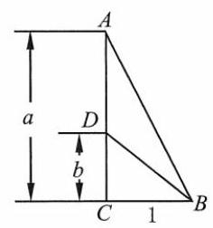

[第 153(1)题]

$\because \Delta  = {\left( a - 1\right) }^{2} + 4\left( {{a}^{2} - 1}\right)  = \left( {{5a} + 3}\right) \left( {a - 1}\right)  < 0,\;\therefore a \in  \left( {-\frac{3}{5},1}\right)$ .

综上所述, $a \in  \left( {-\frac{3}{5},1}\right\rbrack$ .

153. (1) 构造 $\operatorname{Rt}\bigtriangleup {ABC},{AC} = a,{BC} = 1,\angle C = {90}^{ \circ  }$ .

在线段 ${AC}$ 上取 ${AD} = a - b$ ,连接 ${BD}$ ,则 ${CD} = b$ . (如图)

$\therefore {BD} = \sqrt{1 + {b}^{2}},{AB} = \sqrt{1 + {a}^{2}}$ .

在 $\bigtriangleup {ABD}$ 中, $\left| \right| {AB}\left| -\right| {BD}\left| \right|  < \left| {AD}\right|$ ,

$\therefore \left| {\sqrt{1 + {a}^{2}} - \sqrt{1 + {b}^{2}}}\right|  < \left| {a - b}\right|$ ,即 $\left| {f\left( a\right)  - f\left( b\right) }\right|  < \left| {a - b}\right|$ .

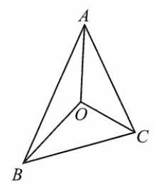

[第 153(2)题]

(2)构造 $\left| {OA}\right|  = x,\left| {OB}\right|  = y,\left| {OC}\right|  = z$ ，且 $\angle {AOB} = \angle {BOC} = \angle {COA} = \frac{2\pi }{3}$ .(如图)

由余弦定理,得 ${\left| AB\right| }^{2} = {x}^{2} + {y}^{2} - {2xy}\cos \frac{2\pi }{3} = {x}^{2} + {y}^{2} + {xy}$ ,

$\therefore \left| {AB}\right|  = \sqrt{{x}^{2} + {y}^{2} + {xy}}$ .

同理, $\left| {BC}\right|  = \sqrt{{y}^{2} + {z}^{2} + {yz}},\left| {AC}\right|  = \sqrt{{x}^{2} + {z}^{2} + {xz}}$ .

由 $\left| {AB}\right|  + \left| {BC}\right|  > \left| {AC}\right|$ ,得 $\sqrt{{x}^{2} + {y}^{2} + {xy}} + \sqrt{{y}^{2} + {z}^{2} + {yz}} > \sqrt{{x}^{2} + {z}^{2} + {xz}}$ .

154. (1) $\frac{1}{a + 1} + \frac{1}{b + 1} = \frac{a + b + 2}{{ab} + a + b + 1} = \frac{3}{{ab} + 2} < \frac{3}{2}$ .

由 $a, b > 0$ ,且 $a + b = 1$ ,得 $0 < {ab} \leq  \frac{{\left( a + b\right) }^{2}}{4} = \frac{1}{4},\therefore \frac{4}{3} \leq  \frac{3}{{ab} + 2} < \frac{3}{2}$ .

( 2 )由均值不等式，得 $\sqrt{\frac{{a}^{2} + {b}^{2} + {c}^{2}}{3}} \geq  \frac{a + b + c}{3} = \frac{1}{3}$ ， $\therefore {a}^{2} + {b}^{2} + {c}^{2} \geq  3 \cdot  \frac{1}{9} = \frac{1}{3}$ .

(3)设 $x = y + d, d \geq  0$ ，则 $\sqrt{{2xy} - {y}^{2}} + \sqrt{{x}^{2} - {y}^{2}} = \sqrt{2\left( {y + d}\right) y - {y}^{2}} + \sqrt{{\left( y + d\right) }^{2} - {y}^{2}} \; = \sqrt{{y}^{2} + {2dy}} + \sqrt{{d}^{2} + {2dy}} \geq  \sqrt{{y}^{2}} + \sqrt{{d}^{2}} = y + d = x.$

155. $\because a, b, c \in  \left( {0, + \infty }\right) ,\therefore$ 左边 $= {\left\lbrack  {a}^{{2a} - b - c}{b}^{{2b} - c - a}{c}^{{2c} - a - b}\right\rbrack  }^{\frac{1}{3}} = {\left\lbrack  {\left( \frac{a}{b}\right) }^{a - b}{\left( \frac{b}{c}\right) }^{b - c}{\left( \frac{c}{a}\right) }^{c - a}\right\rbrack  }^{\frac{1}{3}}$ .

① 当 $x \geq  y$ 时， $\frac{x}{y} \geq  1, x - y \geq  0,\therefore {\left( \frac{x}{y}\right) }^{x - y} \geq  1$ .

② 当 $x < y$ 时， $\frac{x}{y} \in  \left( {0,1}\right) , x - y < 0,\therefore {\left( \frac{x}{y}\right) }^{x - y} > 1$ ，

$\therefore {\left( \frac{x}{y}\right) }^{x - y} \geq  1,\therefore {\left\lbrack  {\left( \frac{a}{b}\right) }^{a - b}{\left( \frac{b}{c}\right) }^{b - c}{\left( \frac{c}{a}\right) }^{c - a}\right\rbrack  }^{\frac{1}{3}} \geq  1$ .

156. (1) $\left( {{ax} + {by}}\right) \left( {{ay} + {bx}}\right)  = \left( {{a}^{2} + {b}^{2}}\right) {xy} + {ab}\left( {{x}^{2} + {y}^{2}}\right)$

$= \left\lbrack  {{\left( a + b\right) }^{2} - {2ab}}\right\rbrack  {xy} + {ab}\left( {{x}^{2} + {y}^{2}}\right)  = {xy} + {\left( x - y\right) }^{2}{ab} \geq  {xy}.$

(2) $\sqrt{\frac{1}{2}{\left( a + \frac{1}{a}\right) }^{2} + \frac{1}{2}{\left( b + \frac{1}{b}\right) }^{2}} \geq  \frac{1}{2}\left( {a + b + \frac{1}{a} + \frac{1}{b}}\right)$ .

由 $\frac{2}{\frac{1}{a} + \frac{1}{b}} \leq  \frac{a + b}{2} = \frac{1}{2}$ ,得 $\frac{1}{a} + \frac{1}{b} \geq  4$ .

$\therefore \sqrt{\frac{{\left( a + \frac{1}{a}\right) }^{2} + {\left( b + \frac{1}{b}\right) }^{2}}{2}} \geq  \frac{1 + 4}{2} = \frac{5}{2},\therefore {\left( a + \frac{1}{a}\right) }^{2} + {\left( b + \frac{1}{b}\right) }^{2} \geq  \frac{25}{2}$ .

(3) $\left( {a + \frac{1}{a}}\right) \left( {b + \frac{1}{b}}\right)  = {ab} + \frac{1}{ab} + \frac{b}{a} + \frac{a}{b}$

$= {ab} + \frac{1}{ab} + \frac{{a}^{2} + {b}^{2}}{ab} = {ab} + \frac{1}{ab} + \frac{{\left( a + b\right) }^{2} - {2ab}}{ab} = {ab} + \frac{2}{ab} - 2.$

由 $a, b \in  \left( {0, + \infty }\right) , a + b = 1$ ,得 $0 < {ab} \leq  \frac{{\left( a + b\right) }^{2}}{4} = \frac{1}{4}$ .

$\because y = x + \frac{1}{x} - 2$ 在区间 $\left( {0,\frac{1}{4}}\right\rbrack$ 上随 $x$ 的减小而减小, $\therefore {ab} + \frac{2}{ab} - 2 \geq  \frac{1}{4} + 8 - 2 = \frac{25}{4}$ .

故 $\left( {a + \frac{1}{a}}\right) \left( {b + \frac{1}{b}}\right)  \geq  \frac{25}{4}$ .

157. (1) 由 $a, b, c \in  \left( {0, + \infty }\right) , a + b + c = 1$ ,得 $\frac{3}{\frac{1}{a} + \frac{1}{b} + \frac{1}{c}} \leq  \frac{a + b + c}{3} = \frac{1}{3}$ .

$\therefore \frac{1}{a} + \frac{1}{b} + \frac{1}{c} \geq  9.\;\therefore \;\left( {a + \frac{1}{a}}\right)  + \left( {b + \frac{1}{b}}\right)  + \left( {c + \frac{1}{c}}\right)  \geq  {10}$ .

(2) $\sqrt{\frac{1}{3}\left\lbrack  {{\left( a + \frac{1}{a}\right) }^{2} + {\left( b + \frac{1}{b}\right) }^{2} + {\left( c + \frac{1}{c}\right) }^{2}}\right\rbrack  } \geq  \frac{1}{3}\left\lbrack  {\left( {a + \frac{1}{a}}\right)  + \left( {b + \frac{1}{b}}\right)  + \left( {c + \frac{1}{c}}\right) }\right\rbrack$ .

由 (1) 可得 $\left( {a + \frac{1}{a}}\right)  + \left( {b + \frac{1}{b}}\right)  + \left( {c + \frac{1}{c}}\right)  \geq  {10}$ .

$\therefore \;{\left( a + \frac{1}{a}\right) }^{2} + {\left( b + \frac{1}{b}\right) }^{2} + {\left( c + \frac{1}{c}\right) }^{2} \geq  \frac{100}{3}$ .

(3) $\frac{3}{\frac{1}{\sqrt{a}} + \frac{1}{\sqrt{b}} + \frac{1}{\sqrt{c}}} \leq  \sqrt{\frac{1}{3}\left\lbrack  {{\left( \sqrt{a}\right) }^{2} + {\left( \sqrt{b}\right) }^{2} + {\left( \sqrt{c}\right) }^{2}}\right\rbrack  } = \frac{\sqrt{3}}{3},\therefore \frac{1}{\sqrt{a}} + \frac{1}{\sqrt{b}} + \frac{1}{\sqrt{c}} \geq  3\sqrt{3}$ .

158. (1) $\because {\left( a + b + c\right) }^{2} = {a}^{2} + {b}^{2} + {c}^{2} + {2ab} + {2bc} + {2ca} = 1 + 2\left( {{ab} + {bc} + {ca}}\right)  \geq  0$ ,

$\therefore {ab} + {bc} + {ca} \geq   - \frac{1}{2}$ .

$\because \;{\left( a - b\right) }^{2} + {\left( b - c\right) }^{2} + {\left( c - a\right) }^{2} \geq  0,\;\therefore \;2\left( {{a}^{2} + {b}^{2} + {c}^{2}}\right)  - 2\left( {{ab} + {bc} + {ca}}\right)  \geq  0$ ,

$\therefore {ab} + {bc} + {ca} \leq  1$ .

(2) ${a}^{2} + {b}^{2} + {c}^{2} \geq  3 \cdot  \sqrt[3]{{a}^{2}{b}^{2}{c}^{2}}$ ， $\therefore \left| {abc}\right|  \leq  {\left( \frac{{a}^{2} + {b}^{2} + {c}^{2}}{3}\right) }^{\frac{3}{2}} = \frac{\sqrt{3}}{9}$ .

159. $\sqrt{x} - \sqrt{x - 1} = \frac{1}{\sqrt{x} + \sqrt{x - 1}} > \frac{1}{\sqrt{x + 1} + \sqrt{x}} = \sqrt{x + 1} - \sqrt{x}$ .

160. $\because \frac{2}{\frac{1}{a} + \frac{1}{b}} \leq  \frac{a + b}{2},\therefore \frac{1}{a} + \frac{1}{b} \geq  \frac{4}{a + b}$ . 同理, $\frac{1}{b} + \frac{1}{c} \geq  \frac{4}{b + c},\frac{1}{c} + \frac{1}{a} \geq  \frac{4}{c + a}$ . 三式相加,得 $\frac{1}{a} + \frac{1}{b} + \frac{1}{c} \geq  2\left( {\frac{1}{a + b} + \frac{1}{b + c} + \frac{1}{c + a}}\right)$ .

161. (1) $\frac{c}{a + b} + \frac{a}{b + c} + \frac{b}{c + a} = \frac{a + b + c}{a + b} + \frac{a + b + c}{b + c} + \frac{a + b + c}{c + a} - 3$

$$
= \left( {a + b + c}\right) \left( {\frac{1}{a + b} + \frac{1}{b + c} + \frac{1}{c + a}}\right)  - 3
$$

$$
= \frac{1}{2}\left\lbrack  {\left( {a + b}\right)  + \left( {b + c}\right)  + \left( {c + a}\right) }\right\rbrack  \left( {\frac{1}{a + b} + \frac{1}{b + c} + \frac{1}{c + a}}\right)  - 3
$$

$\geq  \frac{1}{2} \cdot  3 \cdot  \sqrt[3]{\left( {a + b}\right) \left( {b + c}\right) \left( {c + a}\right) } \cdot  3 \cdot  \sqrt[3]{\frac{1}{a + b} \cdot  \frac{1}{b + c} \cdot  \frac{1}{c + a}} - 3 = \frac{3}{2}$ .

(2) $\left( {a + b + c}\right) \left( {\frac{1}{a + b} + \frac{1}{b + c} + \frac{1}{c + a}}\right)$

$$
= \frac{1}{2}\left\lbrack  {\left( {a + b}\right)  + \left( {b + c}\right)  + \left( {c + a}\right) }\right\rbrack  \left( {\frac{1}{a + b} + \frac{1}{b + c} + \frac{1}{c + a}}\right)
$$

$\geq  \frac{1}{2} \cdot  3\sqrt[3]{\left( {a + b}\right) \left( {b + c}\right) \left( {c + a}\right) } \cdot  3 \cdot  \sqrt[3]{\frac{1}{a + b} \cdot  \frac{1}{b + c} \cdot  \frac{1}{c + a}} = \frac{9}{2},$

$\therefore \frac{1}{a + b} + \frac{1}{b + c} + \frac{1}{c + a} \geq  \frac{9}{2\left( {a + b + c}\right) }$ .

162. $\because {a}^{2} + {b}^{2} + {c}^{2} \geq  3 \cdot  \sqrt[3]{{\left( abc\right) }^{2}}$ ,

$\therefore \;3 \cdot  \sqrt[3]{{\left( abc\right) }^{2}} \leq  {l}^{2},\;\therefore \;{abc} \leq  {\left( \frac{{l}^{2}}{3}\right) }^{\frac{3}{2}} = \frac{\sqrt{3}{l}^{3}}{9}$ .

163. $\frac{a}{1 + a} + \frac{b}{1 + b} - \frac{c}{1 + c}$

$$
= \frac{1}{\left( {1 + a}\right) \left( {1 + b}\right) \left( {1 + c}\right) }\left\lbrack  {a\left( {1 + b + c + {bc}}\right)  + b\left( {1 + a + c + {ac}}\right)  - c\left( {1 + a + b + {ab}}\right) }\right\rbrack
$$

$= \frac{1}{\left( {1 + a}\right) \left( {1 + b}\right) \left( {1 + c}\right) }\left\lbrack  {{2ab} + {abc} + \left( {a + b - c}\right) }\right\rbrack   > 0, \; \therefore \frac{a}{1 + a} + \frac{b}{1 + b} > \frac{c}{1 + c}$ .

164. (1)记左边 $= S$ . 当 $n \in  \mathbf{N}$ 时, $\frac{n}{n + 1} < \frac{n + 1}{n + 2}$ .

$\because S = \frac{1}{2} \cdot  \frac{3}{4} \cdot  \frac{5}{6} \cdot  \frac{7}{8} \cdot  \cdots  \cdot  \frac{99}{100},\;\therefore S < \frac{2}{3} \cdot  \frac{4}{5} \cdot  \frac{6}{7} \cdot  \frac{8}{9} \cdot  \cdots  \cdot  \frac{98}{99} \cdot  \frac{100}{101}.$

两式相乘,得 ${S}^{2} < \frac{1}{101}.\;\therefore S < \frac{1}{10}$ .

(2)记左边 $= S, S = \frac{4}{3} \cdot  \frac{6}{5} \cdot  \cdots  \cdot  \frac{2n}{{2n} - 1}, S > \frac{5}{4} \cdot  \frac{7}{6} \cdot  \cdots  \cdot  \frac{{2n} + 1}{2n}$ .

两式相乘,得 ${S}^{2} > \frac{1}{3}\left( {{2n} + 1}\right) .\therefore S > \frac{1}{\sqrt{3}}\sqrt{{2n} + 1}$ .

(3) 方法一: $\because \frac{{x}_{1}^{2}}{{x}_{2} - 1} + {x}_{2} - 1 \geq  2{x}_{1},\cdots ,\frac{{x}_{n - 1}^{2}}{{x}_{n} - 1} + {x}_{n} - 1 \geq  2{x}_{n - 1},\frac{{x}_{n}^{2}}{{x}_{1} - 1} + {x}_{1} - 1 \geq  2{x}_{n}$ .

$\therefore n$ 个式子累加,得 $\frac{{x}_{1}^{2}}{{x}_{2} - 1} + \cdots  + \frac{{x}_{n - 1}^{2}}{{x}_{n} - 1} + \frac{{x}_{n}^{2}}{{x}_{1} - 1} \geq  {x}_{1} + {x}_{2} + \cdots  + {x}_{n} + n$ .

方法二: 由柯西不等式, 得

$\left( {\frac{{x}_{1}^{2}}{{x}_{2} - 1} + \frac{{x}_{2}^{2}}{{x}_{3} - 1} + \cdots  + \frac{{x}_{n - 1}^{2}}{{x}_{n} - 1} + \frac{{x}_{n}^{2}}{{x}_{1} - 1}}\right)  \cdot  \left( {{x}_{2} - 1 + {x}_{3} - 1 + \cdots  + {x}_{n} - 1 + {x}_{1} - 1}\right)  \geq  {\left( {x}_{1} + {x}_{2} + \cdots  + {x}_{n - 1} + {x}_{n}\right) }^{2}.$

$\therefore \;\left( {\frac{{x}_{1}^{2}}{{x}_{2} - 1} + \frac{{x}_{2}^{2}}{{x}_{3} - 1} + \cdots  + \frac{{x}_{n - 1}^{2}}{{x}_{n} - 1} + \frac{{x}_{n}^{2}}{{x}_{1} - 1}}\right)  \cdot  \left( {{x}_{1} + {x}_{2} + {x}_{3} + \cdots  + {x}_{n} - n}\right)$

$\geq  {\left( {x}_{1} + {x}_{2} + \cdots  + {x}_{n - 1} + {x}_{n}\right) }^{2} > {\left( {x}_{1} + {x}_{2} + \cdots  + {x}_{n}\right) }^{2} - {n}^{2}$ .

$\therefore \frac{{x}_{1}^{2}}{{x}_{2} - 1} + \frac{{x}_{2}^{2}}{{x}_{3} - 1} + \cdots  + \frac{{x}_{n - 1}^{2}}{{x}_{n} - 1} + \frac{{x}_{n}^{2}}{{x}_{1} - 1} > {x}_{1} + {x}_{2} + \cdots  + {x}_{n} + n$ .

165. (1) $\because 2\sqrt{\left( {1 - a}\right) \left( {1 - b}\right) } \leq  1 - a + 1 - b = 1 + c$ ,

$2\sqrt{\left( {1 - b}\right) \left( {1 - c}\right) } \leq  1 - b + 1 - c = 1 + a,$

$2\sqrt{\left( {1 - c}\right) \left( {1 - a}\right) } \leq  1 - c + 1 - a = 1 + b,$

三式累乘,得 $8\left( {1 - a}\right) \left( {1 - b}\right) \left( {1 - c}\right)  \leq  \left( {1 + a}\right) \left( {1 + b}\right) \left( {1 + c}\right)$ .

(2) $\because \left( {1 - a}\right) \left( {1 - b}\right) \left( {1 + a + b}\right)  \leq  {\left\lbrack  \frac{1}{3}\left( 1 - a + 1 - b + 1 + a + b\right) \right\rbrack  }^{3} = 1$ ,

$\therefore \left( {1 - a}\right) \left( {1 - b}\right) \left( {1 - c}\right)  \leq  \frac{1 - c}{1 + a + b}$ .

由左边式子的轮换性,不妨设 $0 \leq  a \leq  b \leq  c \leq  1$ ,

$\therefore$ 原不等式左边 $\leq  \frac{a}{1 + b + c} + \frac{b}{1 + c + a} + \frac{c}{1 + a + b} + \frac{1 - c}{1 + a + b}$

$\leq  \frac{a}{1 + a + b} + \frac{b}{1 + a + b} + \frac{1}{1 + a + b} = 1.$

166. $\left( {{abc} + a + b + c}\right)  - \left( {{ab} + {bc} + {ca} + 1}\right)  = \left( {a - 1}\right) \left( {b - 1}\right) \left( {c - 1}\right)$ .

$\because a, b, c \in  \left\lbrack  {0,1}\right\rbrack  ,\therefore \left( {a - 1}\right) \left( {b - 1}\right) \left( {c - 1}\right)  \leq  0$ .

$\therefore {abc} + a + b + c \leq  {ab} + {bc} + {ca} + 1,\therefore \frac{{abc} + a + b + c}{{ab} + {bc} + {ca} + 1} \leq  1$ .

167. (1) 即证 $x + \frac{3}{2} > \sqrt{\left( {x + 1}\right) \left( {x + 2}\right) }$ .

${\left( x + \frac{3}{2}\right) }^{2} - \left( {x + 1}\right) \left( {x + 2}\right)  = \left( {{x}^{2} + {3x} + \frac{9}{4}}\right)  - \left( {{x}^{2} + {3x} + 2}\right)  = \frac{1}{4} > 0, \; \therefore x + \frac{3}{2} > \sqrt{\left( {x + 1}\right) \left( {x + 2}\right) },\therefore {\left( \frac{1}{3}\right) }^{x + \frac{3}{2}} < {\left( \frac{1}{3}\right) }^{\sqrt{\left( {x + 1}\right) \left( {x + 2}\right) }}$ .

(2) ${\left( \sqrt{ac} - \sqrt{bd}\right) }^{2} - \left( {a - b}\right) \left( {c - d}\right)  = {ac} + {bd} - 2\sqrt{abcd} - \left( {{ac} - {ad} - {bc} + {bd}}\right)$

$= {ad} - 2\sqrt{abcd} + {bc} = {\left( \sqrt{ad} - \sqrt{bc}\right) }^{2} \geq  0,$

$\therefore \sqrt{ac} - \sqrt{bd} \geq  \sqrt{\left( {a - b}\right) \left( {c - d}\right) }$ .

(3)当 ${ac} + {bd} \leq  0$ 时，不等式显然成立.

当 ${ac} + {bd} > 0$ 时,

$\left( {{a}^{2} + {b}^{2}}\right) \left( {{c}^{2} + {d}^{2}}\right)  - {\left( ac + bd\right) }^{2} = {a}^{2}{c}^{2} + {a}^{2}{d}^{2} + {b}^{2}{c}^{2} + {b}^{2}{d}^{2} - {a}^{2}{c}^{2} - {2abcd} - {b}^{2}{d}^{2}$

$= {a}^{2}{d}^{2} - {2abcd} + {b}^{2}{c}^{2} = {\left( ad - bc\right) }^{2} \geq  0.$

$\therefore \sqrt{{a}^{2} + {b}^{2}} \cdot  \sqrt{{c}^{2} + {d}^{2}} \geq  {ac} + {bd}$ .

(4) $\because x, y \in  \left( {-1,1}\right) ,\therefore {xy} >  - 1$ .

$\because x + y + {xy} + 1 = \left( {x + 1}\right) \left( {y + 1}\right)  > 0,\;\therefore x + y >  - 1 - {xy}$ .

$\because {xy} + 1 - x - y = \left( {x - 1}\right) \left( {y - 1}\right)  > 0,\;\therefore {xy} + 1 > x + y.$

$\therefore  - 1 - {xy} < x + y < {xy} + 1,\therefore  - 1 < \frac{x + y}{{xy} + 1} < 1$ ,即 $\left| \frac{x + y}{{xy} + 1}\right|  < 1$ .

168. $4 - {3}^{a} - {3}^{b} = {3}^{a + b} - {3}^{a} - {3}^{b} + 1 = \left( {{3}^{a} - 1}\right) \left( {{3}^{b} - 1}\right)$ .

$\because a, b \in  \left( {0, + \infty }\right) , a + b = 1, a, b \in  \left( {0,1}\right)$ ,

$\therefore \;{3}^{a} - 1 > 0,{3}^{b} - 1 > 0,\therefore \;\left( {{3}^{a} - 1}\right) \left( {{3}^{b} - 1}\right)  > 0,\;\therefore \;4 > {3}^{a} + {3}^{b}$ .

169. (1) 假设 $\left( {1 - a}\right) b,\left( {1 - b}\right) c,\left( {1 - c}\right) a$ 都大于 $\frac{1}{4}$ ,则 ${abc}\left( {1 - a}\right) \left( {1 - b}\right) \left( {1 - c}\right)  > \frac{1}{64}$ .

$\because a\left( {1 - a}\right)  =  - {\left( a - \frac{1}{2}\right) }^{2} + \frac{1}{4} \leq  \frac{1}{4}, b\left( {1 - b}\right)  \leq  \frac{1}{4}, c\left( {1 - c}\right)  \leq  \frac{1}{4}$ ,

$\therefore {abc}\left( {1 - a}\right) \left( {1 - b}\right) \left( {1 - c}\right)  \leq  \frac{1}{64}$ ,与①矛盾. 故原结论成立.

(2)假设 $a\left( {2 - b}\right) , b\left( {2 - c}\right) , c\left( {2 - a}\right)$ 都大于 1，则 ${abc}\left( {2 - a}\right) \left( {2 - b}\right) \left( {2 - c}\right)  > 1$ . ①

$\because a\left( {2 - a}\right)  =  - {\left( a - 1\right) }^{2} + 1 \leq  1, b\left( {2 - b}\right)  \leq  1, c\left( {2 - c}\right)  \leq  1$ ,

$\therefore {abc}\left( {2 - a}\right) \left( {2 - b}\right) \left( {2 - c}\right)  \leq  1$ ,与①矛盾. 故原结论成立.

(3)假设 $\frac{1 + y}{x}$ 和 $\frac{1 + x}{y}$ 都大于等于 $2,\because x, y > 0,\therefore 1 + y \geq  {2x},1 + x \geq  {2y}$ .

两式相加,得 $2 + x + y \geq  2\left( {x + y}\right) ,\therefore x + y \leq  2$ ,与已知矛盾. 故原结论成立.

(4)两边同时取以 $a$ 为底的对数,得 $b = a{\log }_{a}b,{\log }_{a}b = \frac{b}{a}$ .

$y = {\log }_{a}x, a \in  \left( {0,1}\right)$ 在 $\left( {0, + \infty }\right)$ 上随 $x$ 的增大而减小.

若 $b > a,\frac{b}{a} > 1$ ,则 ${\log }_{a}b < 1$ ; 若 $b < a,\frac{b}{a} < 1$ ,则 ${\log }_{a}b > 1$ .

$\therefore a = b$ .

(5) ${abc} > 0$ ,若 $a, b, c$ 中有两个负数,不妨设 $a > 0, b < 0, c < 0$ ,

$\because a + b + c > 0,\;\therefore \left| a\right|  > \left| c\right| ,\left| {ab}\right|  > \left| {bc}\right| .\;\therefore {ab} < 0,{ac} < 0,{bc} > 0$ ,

$\therefore {ab} + {bc} + {ac} < 0$ . 与题设矛盾. 故 $a, b, c > 0$ .

170. 假设 $a + b > 2$ ,令 $a + b = t > 2,{a}^{3} + {b}^{3} = \left( {a + b}\right) \left\lbrack  {{\left( a + b\right) }^{2} - {3ab}}\right\rbrack   = 2$ ,

$\therefore \;{3ab} = {\left( a + b\right) }^{2} - \frac{2}{a + b} = \frac{{t}^{3} - 2}{t},\;\therefore \;{ab} = \frac{{t}^{3} - 2}{3t}, a + b = t > 2$ ,

$\therefore a, b$ 为方程 ${x}^{2} - {tx} + \frac{{t}^{3} - 2}{3t} = 0$ 的两根, $\Delta  = {t}^{2} - \frac{4{t}^{3} - 8}{3t} = \frac{8 - {t}^{3}}{3t} \geq  0$ .

$\because t > 2,\therefore \frac{8 - {t}^{3}}{3t} < 0$ . 与 $\Delta  \geq  0$ 矛盾. 故 $a + b \leq  2$ .

171. (1) $\because {\left( 1 - abc\right) }^{2} - {\left( ab - c\right) }^{2} = \left( {1 - {abc} + {ab} - c}\right) \left( {1 - {abc} - {ab} + c}\right)$

$= \left\lbrack  {\left( {1 - c}\right)  + {ab}\left( {1 - c}\right) }\right\rbrack  \left\lbrack  {\left( {1 + c}\right)  - {ab}\left( {1 + c}\right) }\right\rbrack   = \left( {1 - {c}^{2}}\right) \left( {1 - {a}^{2}{b}^{2}}\right)  > 0,\;\therefore \;\left| {1 - {abc}}\right|  > \left| {{ab} - c}\right|$ .

(2) $\because \left( {a - 1}\right) \left( {b - 1}\right)  > 0,\therefore {ab} + 1 > a + b.\;\because \left( {{ab} - 1}\right) \left( {c - 1}\right)  > 0,\therefore {abc} + 1 > {ab} + c$ .

两式相加,得 ${abc} + 2 > a + b + c$ .

## 第三章 幂、指数与对数

1. C

2. B 提示: 原式 $= \frac{1}{3} \times  \frac{1}{4} \div  \frac{1}{16} = \frac{4}{3}$ .

3. D 4. C

5. D 提示: 原式 $= \frac{1}{3}x \cdot  3\sqrt{x} - x \cdot  \sqrt{\frac{1}{x} \cdot  {x}^{2}} = x\sqrt{x} - x\sqrt{x} = 0$ .

6. $\mathrm{B}$ 提示: 原式 $= \frac{\frac{1}{{a}^{2}} - \frac{1}{{b}^{2}}}{{a}^{2} - {b}^{2}} = \frac{{b}^{2} - {a}^{2}}{{a}^{2} - {b}^{2}} \cdot  \frac{1}{{a}^{2}{b}^{2}} =  - \frac{1}{{a}^{2}{b}^{2}}$ .

7. $\mathrm{C}$ 提示: ${2}^{s} = 1 - x, y = 1 - \frac{1}{{2}^{s}} = 1 - \frac{1}{1 - x} = \frac{1 - x - 1}{1 - x} = \frac{x}{x - 1}$ .

8. B 9. C 10. C

11. B 提示: $\sqrt[4]{{\left( 2a - 1\right) }^{2}} = \sqrt[3]{1 - {2a}},\therefore 1 - {2a} \geq  0.\sqrt{1 - {2a}} = \sqrt[3]{1 - {2a}},{\left( 1 - 2a\right) }^{3} = {\left( 1 - 2a\right) }^{2}$ , ${\left( 1 - 2a\right) }^{2} \cdot  {2a} = 0,{a}_{1} = 0,{a}_{2} = \frac{1}{2}.\;\therefore \;a = 0$ 或 $\frac{1}{2}$ .

12. $\mathrm{B}$ 提示: 仅有 ${0}^{0.2}$ 有意义.

13. $\mathrm{D}$ 提示: 选项 $\mathrm{A}, - {4}^{0} =  - 1$ . 选项 $\mathrm{B},{\left( {5}^{-\frac{1}{2}}\right) }^{2} = {5}^{-1} = \frac{1}{5}$ . 选项 $\mathrm{C},{\left( -2\right) }^{-1} =  - \frac{1}{2}$ . 选项 D, ${\left( -{3}^{m - n}\right) }^{2} = {\left( -3\right) }^{2\left( {m - n}\right) } = {9}^{m - n}$ .

14. $\mathrm{B}$ 提示:原式 $= {9}^{\frac{1}{2}} - 1 = 2$ .

15. D 16. D

17. $\mathrm{C}$ 提示: 原式 $=  - 3 \cdot  {a}^{\left( \frac{2}{3} + \frac{1}{2}\right) }{b}^{\left( \frac{1}{2} + \frac{1}{3}\right) } \cdot  3 \cdot  {a}^{-\frac{1}{6}}{b}^{-\frac{5}{6}} =  - 9{a}^{\frac{7}{6}}{b}^{\frac{5}{6}} \cdot  {a}^{-\frac{1}{6}} \cdot  {b}^{-\frac{5}{6}} =  - {9a}$ .

18. A 19. C

20. ( 1 )3 提示:原式 $= 2\sqrt{3} - \sqrt{3} \cdot  \left( {2 - \sqrt{3}}\right)  = 3$ .

(2) $\frac{4}{3}\sqrt{3} + \frac{9}{4}\sqrt{2}$ 提示:原式 $= 2\sqrt{3} - \frac{\sqrt{2}}{2} - \frac{2}{3}\sqrt{3} - \frac{\sqrt{2}}{4} + 3\sqrt{2} = \frac{4}{3}\sqrt{3} + \frac{9}{4}\sqrt{2}$ .

(3) $2 - \sqrt{3}$ 提示:原式 $= {\left\lbrack  \left( \sqrt{3} + 2\right) \left( \sqrt{3} - 2\right) \right\rbrack  }^{1997} \times  \left( {\sqrt{3} - 2}\right)  = {\left( -1\right) }^{1997} \times  \left( {\sqrt{3} - 2}\right)  = 2 - \sqrt{3}$ .

(4) $\frac{\sqrt{10}}{2}$ 提示:原式 $= \frac{\sqrt{5}\left( {2\sqrt{2} - \sqrt{5}}\right) }{\sqrt{2}\left( {2\sqrt{2} - \sqrt{5}}\right) } = \frac{\sqrt{10}}{2}$ .

(5) $- \frac{36}{5}\sqrt{10}$ 提示: 原式 $= \frac{4}{5}\sqrt{10} - {10}\sqrt{10} + 2\sqrt{10} =  - \frac{36}{5}\sqrt{10}$ .

(6) 14 提示: 原式 $= {\left( 2 - \sqrt{3}\right) }^{2} + {\left( 2 + \sqrt{3}\right) }^{2} = {14}$ .

(7) 1 提示: 原式 $= \frac{2 + 2\sqrt{3}}{{\left( 1 + \sqrt{3}\right) }^{2} - {\left( \sqrt{2}\right) }^{2}} = \frac{2 + 2\sqrt{3}}{2 + 2\sqrt{3}} = 1$ .

21. (1) $\frac{3\sqrt{x}}{{x}^{2}}\;\left( 2\right) \frac{\sqrt{ab}}{b}\;\left( 3\right) \frac{\sqrt{a + b} \cdot  \sqrt[3]{{\left( a - b\right) }^{2}}}{{\left( a - b\right) }^{2}}$

(3) ${\left( {x}^{2} + {y}^{2}\right) }^{\frac{1}{4}}$ (4) ${x}^{\frac{1}{2}}{y}^{-\frac{4}{3}}$

(7) $2 \cdot  {3}^{-\frac{1}{2}}{a}^{-\frac{1}{2}}{b}^{-\frac{3}{2}}$ (8) $2{\left( m - n\right) }^{-\frac{1}{3}}$

23.(1)不正确(2)不正确(3)不正确(4)不正确(5)不正确

24.(1) $\frac{125}{27}$ 提示:原式 $= {\left( \frac{{5}^{4}}{{3}^{4}}\right) }^{\frac{3}{4}} = {\left( \frac{5}{3}\right) }^{3} = \frac{125}{27}$ .

(2) $\frac{5}{2}$

(3) $\frac{1}{4}\;$ 提示:原式 $= {\left( \sqrt{2}\right) }^{3 \cdot  \left( {-\frac{4}{3}}\right) } = {\left( \sqrt{2}\right) }^{-4} = \frac{1}{4}$ .

(4) $\frac{1}{27}$ 提示:原式 $= {\left( \frac{1}{9}\right) }^{\frac{3}{2}} = {\left( \frac{1}{3}\right) }^{2 \cdot  \frac{3}{2}} = {\left( \frac{1}{3}\right) }^{3} = \frac{1}{27}$ .

(5) $\frac{100}{9}$ 提示:原式 $= {0.027}^{-\frac{2}{3}} = {0.3}^{3 \cdot  \left( {-\frac{2}{3}}\right) } = {0.3}^{-2} = \frac{100}{9}$ .

(6)10000提示:原式 $= {0.001}^{-\frac{4}{3}} = {0.1}^{3 \cdot  \left( {-\frac{4}{3}}\right) } = {0.1}^{-4} = {10}^{4} = {10000}$ .

(7) 125 提示:原式 $= {5}^{\frac{4}{5}} \cdot  {5}^{3} \cdot  {5}^{-{0.8}} = {5}^{3} = {125}$ .

(8) $\sqrt{3} + \sqrt{5}\;$ 提示:原式 $= \sqrt{8 + 2\sqrt{15}} = \sqrt{3} + \sqrt{5}$ .

(9) $\sqrt{3} - 1\;$ 提示:原式 $= \sqrt{4 - 2\sqrt{3}} = \sqrt{3} - 1$ .

(10)0 提示:原式 $= {0.5}^{2 \cdot  \left( {-{0.5}}\right) } + {\left( \frac{1}{3}\right) }^{3 \cdot  \left( {-\frac{1}{3}}\right) } - {5}^{4 \cdot  {0.25}} = {0.5}^{-1} + {\left( \frac{1}{3}\right) }^{-1} - {5}^{1} = 2 + 3 - 5 = 0$ .

25. (1) $- \frac{4}{x}$ 提示:原式 $= 1 - 4{x}^{-1} - 1 =  - \frac{4}{x}$ .

(2) $x + y$

(3) $\frac{{b}^{9}}{{16}{a}^{14}}$ 提示:原式 $= \left( {\frac{1}{4}{b}^{6}{a}^{-4}}\right)  \div  \left( {-4{b}^{3}{a}^{7}}\right)  \times  \left( {-{b}^{6}{a}^{-3}}\right)  =  - \frac{1}{16}{b}^{3}{a}^{-{11}} \cdot  \left( {-{b}^{6}{a}^{-3}}\right)  = \frac{{b}^{9}}{{16}{a}^{14}}$ .

(4)24b 提示:原式 $= \left( {-6{a}^{-\frac{1}{4}}{b}^{\frac{1}{3}}}\right)  \div  \left( {-\frac{1}{4}{a}^{-\frac{1}{4}}{b}^{-\frac{2}{3}}}\right)  = {24b}$ .

26. A 提示: $\because a = \frac{1}{\sqrt{1.5}} < 1 < \frac{1}{\sqrt{0.5}} = b,\therefore a < c < b$ .

27. ( 1 )1 提示:原式 $= {\left( {a}^{-\frac{3}{2}}b \cdot  {a}^{-\frac{1}{2}}{b}^{1} \cdot  {a}^{\frac{2}{3}}\right) }^{2} = {\left( {a}^{-\frac{4}{3}}{b}^{2}\right) }^{2} = {a}^{-\frac{8}{3}}{b}^{4} = {\left( {2}^{-\frac{1}{2}}\right) }^{-\frac{8}{3}}{\left( {2}^{-\frac{1}{3}}\right) }^{4} = {2}^{\frac{4}{3}} \cdot  {2}^{-\frac{4}{3}} = 1$ .

(2)①2 ②2 ③2

提示: $a + {a}^{-1} = {\left( {a}^{\frac{1}{2}} + {a}^{-\frac{1}{2}}\right) }^{2} - 2 = 2,{a}^{2} + {a}^{-2} = {\left( a + {a}^{-1}\right) }^{2} - 2 = 2,{a}^{4} + {a}^{-4} = {\left( {a}^{2} + {a}^{-2}\right) }^{2} - 2 = 2$ .

(3) ${2}^{-\frac{9}{4}}$ 提示:原式 $= \frac{{\left( {10}^{a}\right) }^{2}}{{\left( {10}^{\beta }\right) }^{\frac{3}{4}}} = \frac{{\left( {2}^{-\frac{1}{2}}\right) }^{2}}{{\left( {2}^{\frac{5}{3}}\right) }^{\frac{3}{4}}} = \frac{{2}^{-1}}{{2}^{\frac{5}{4}}} = {2}^{-\frac{9}{4}}$ .

28. ( 1 )原式 $= {\left\lbrack  {\left( \frac{1}{5}\right) }^{3}\right\rbrack  }^{-\frac{1}{3}} + {\left( -2\right) }^{-2} + 1 = 5 + \frac{1}{4} + 1 = \frac{25}{4}$ .

(2)原式 $= {\left( \frac{25}{9}\right) }^{\frac{1}{2}} - \left( \frac{1}{-{0.3}}\right)  - \frac{1}{3} + 1 = \frac{5}{3} + \frac{10}{3} - \frac{1}{3} + 1 = \frac{17}{3}$ .

(3)原式 $= 5 - 3 \times  \left\lbrack  {\left( {-\frac{2}{3}}\right)  + {1031} \times  \left( {\frac{1}{4} - \frac{1}{4}}\right) }\right\rbrack   = 5 - 3 \cdot  \left( {-\frac{2}{3}}\right)  = 7$ .

(4)原式 $= \frac{1}{0.3} - {36} + {\left( {4}^{4}\right) }^{\frac{3}{4}} - \frac{1}{3} + 1 = \frac{10}{3} - {36} + {4}^{3} - \frac{1}{3} + 1 = 3 - {36} + {64} + 1 = {32}$ .

(5)原式 $= {1.5} + 1 - {\left( \frac{3}{2}\right) }^{3 \cdot  \left( {-\frac{2}{3}}\right) } + \frac{\frac{1}{9} - \frac{1}{4}}{\frac{1}{3} - \frac{1}{2}} = {2.5} - {\left( \frac{3}{2}\right) }^{-2} + \frac{4 - 9}{{12} - {18}} \; = \frac{5}{2} - \frac{4}{9} + \frac{5}{6} = \frac{{45} - 8 + {15}}{18} = \frac{26}{9}.$

(6) 原式 $= {\left( \frac{1}{4}\right) }^{-2} + \frac{2}{3} + 4 - {16}^{0.75} = {16} + \frac{2}{3} + 4 - 8 = {12} + \frac{2}{3} = \frac{38}{3}$ .

29. ( 1 )原式 $= {\left\lbrack  {m}^{\frac{9}{2}} \cdot  {\left( {m}^{-3}\right) }^{\frac{1}{2}}\right\rbrack  }^{\frac{1}{3}} \div  {\left( {m}^{-7}\right) }^{\frac{1}{6}} \cdot  {m}^{\frac{13}{3}} = {\left( {m}^{3}\right) }^{\frac{1}{3}} \div  {m}^{-\frac{7}{6}} \cdot  {m}^{\frac{13}{3}}$

$$
= {m}^{1 + \frac{7}{6} + \frac{13}{3}} = {m}^{\frac{6 + 7 + {26}}{6}} = {m}^{\frac{13}{2}}.
$$

(2)原式 $= \frac{\left( {{x}^{\frac{1}{2}} + {y}^{\frac{1}{2}}}\right) \left( {{x}^{\frac{1}{2}} - {y}^{\frac{1}{2}}}\right) }{{x}^{\frac{1}{2}} + {y}^{\frac{1}{2}}} - {\left( {x}^{\frac{1}{2}} - {y}^{\frac{1}{2}}\right) }^{2} \div  \left( {{x}^{\frac{1}{2}} - {y}^{\frac{1}{2}}}\right)  = \left( {{x}^{\frac{1}{2}} - {y}^{\frac{1}{2}}}\right)  - \left( {{x}^{\frac{1}{2}} - {y}^{\frac{1}{2}}}\right)  = 0$ .

(3)原式 $= {\left( 8 \cdot  {y}^{-\frac{1}{3}} \cdot  {x}^{-\frac{1}{6}}{y}^{\frac{1}{2}} \cdot  {x}^{\frac{1}{3}}\right) }^{\frac{1}{3}} = {\left( 8{y}^{\frac{1}{6}}{x}^{\frac{1}{6}}\right) }^{\frac{1}{3}} = 2{x}^{\frac{1}{18}}{y}^{\frac{1}{18}}$ .

(4)原式 $= \frac{x + y}{\sqrt{x} + \sqrt{y}} + \frac{2xy}{\sqrt{xy}\left( {\sqrt{x} + \sqrt{y}}\right) } = \frac{x + y}{\sqrt{x} + \sqrt{y}} + \frac{2\sqrt{xy}}{\sqrt{x} + \sqrt{y}} = \frac{{\left( \sqrt{x} + \sqrt{y}\right) }^{2}}{\sqrt{x} + \sqrt{y}} = \sqrt{x} + \sqrt{y}$ .

(5) $\because 2\left( {5 + \sqrt{6} + \sqrt{10} + \sqrt{15}}\right)  = {\left( \sqrt{2} + \sqrt{3} + \sqrt{5}\right) }^{2}$ .

$\therefore$ 原式 $= \frac{\sqrt{2} + \sqrt{3} + \sqrt{5}}{2}$ .

(6) 原式 $= \sqrt{2 + \sqrt{3}} \cdot  \sqrt{2 + \sqrt{2 + \sqrt{3}}} \cdot  {\left( 2 + \sqrt{2 + \sqrt{2 + \sqrt{3}}}\right) }^{\frac{1}{2}} \cdot  {\left( 2 - \sqrt{2 + \sqrt{2 + \sqrt{3}}}\right) }^{\frac{1}{2}}$

$= \sqrt{2 + \sqrt{3}} \cdot  \sqrt{2 + \sqrt{2 + \sqrt{3}}} \cdot  \sqrt{4 - \left( {2 + \sqrt{2 + \sqrt{3}}}\right) }$

$= \sqrt{2 + \sqrt{3}} \cdot  \sqrt{2 + \sqrt{2 + \sqrt{3}}} \cdot  \sqrt{2 - \sqrt{2 + \sqrt{3}}}$

$= \sqrt{2 + \sqrt{3}} \cdot  \sqrt{4 - 2 - \sqrt{3}} = \sqrt{4 - 3} = 1$ .

30. ( 1 )原式 $= \sqrt{x - 1 + 2\sqrt{x - 1} + 1} + \sqrt{x - 1 - 2\sqrt{x - 1} + 1} = \sqrt{x - 1} + 1 + \left| {\sqrt{x - 1} - 1}\right|$ . 当 $x \in  \left\lbrack  {1,2}\right\rbrack$ 时,原式 $= 2$ ; 当 $x \in  \left( {2, + \infty }\right)$ 时,原式 $= 2\sqrt{x - 1}$ .

(2)原式 $= {x}^{\frac{a + b}{\left( {c - a}\right) \left( {b - c}\right) } + \frac{c + a}{\left( {b - c}\right) \left( {a - b}\right) } + \frac{b + c}{\left( {a - b}\right) \left( {c - a}\right) }}$ .

$\frac{a + b}{\left( {c - a}\right) \left( {b - c}\right) } + \frac{c + a}{\left( {b - c}\right) \left( {a - b}\right) } + \frac{b + c}{\left( {a - b}\right) \left( {c - a}\right) }$

$= \frac{1}{\left( {a - b}\right) \left( {b - c}\right) \left( {c - a}\right) }\left\lbrack  {\left( {a + b}\right) \left( {a - b}\right)  + \left( {c + a}\right) \left( {c - a}\right)  + \left( {b + c}\right) \left( {b - c}\right) }\right\rbrack$

$= \frac{1}{\left( {a - b}\right) \left( {b - c}\right) \left( {c - a}\right) }\left\lbrack  {{a}^{2} - {b}^{2} + {c}^{2} - {a}^{2} + {b}^{2} - {c}^{2}}\right\rbrack   = 0.$

$\therefore$ 原式 $= 1$ .

(3)原式 $= \frac{{a}^{2} - {b}^{2}}{{a}^{2} + {b}^{2}} \cdot  \left\lbrack  {{\left( \frac{a - b}{a + b}\right) }^{\frac{p + q}{p - q}} \cdot  {\left( \frac{a + b}{a - b}\right) }^{\frac{2p}{p - q}} + {\left( \frac{a - b}{a + b}\right) }^{\frac{p + q}{p - q}} \cdot  {\left( \frac{a + b}{a - b}\right) }^{\frac{2q}{p - q}}}\right\rbrack$

$$
= \frac{{a}^{2} - {b}^{2}}{{a}^{2} + {b}^{2}} \cdot  \left\lbrack  {{\left( a - b\right) }^{\frac{p + q}{p - q} - \frac{2p}{p - q}}{\left( a + b\right) }^{\frac{2p}{p - q} - \frac{p + q}{p - q}} + {\left( a - b\right) }^{\frac{p + q}{p - q} - \frac{2q}{p - q}}{\left( a + b\right) }^{\frac{2q}{p - q} - \frac{p + q}{p - q}}}\right\rbrack
$$

$$
= \frac{{a}^{2} - {b}^{2}}{{a}^{2} + {b}^{2}} \cdot  \left( {\frac{a + b}{a - b} + \frac{a - b}{a + b}}\right)  = \frac{{a}^{2} - {b}^{2}}{{a}^{2} + {b}^{2}} \cdot  \frac{{\left( a + b\right) }^{2} + {\left( a - b\right) }^{2}}{{a}^{2} - {b}^{2}} = \frac{2\left( {{a}^{2} + {b}^{2}}\right) }{{a}^{2} + {b}^{2}} = 2.
$$

31. 原式 $= \frac{{a}^{\frac{1}{3}}\left( {a - {8b}}\right) }{{a}^{\frac{2}{3}} + 2\sqrt[3]{ab} + 4{b}^{\frac{2}{3}}} \cdot  \frac{1}{1 - 2\sqrt[3]{\frac{b}{a}}}$

$= \frac{{a}^{\frac{1}{3}} \cdot  \left( {{a}^{\frac{1}{3}} - 2{b}^{\frac{1}{3}}}\right) \left( {{a}^{\frac{2}{3}} + 2\sqrt[3]{ab} + 4{b}^{\frac{2}{3}}}\right) }{\left( {{a}^{\frac{2}{3}} + 2\sqrt[3]{ab} + 4{b}^{\frac{2}{3}}}\right)  \cdot  \frac{1}{\sqrt[3]{a}} \cdot  \left( {\sqrt[3]{a} - 2\sqrt[3]{b}}\right) } = {a}^{\frac{2}{3}} = {\left( {10}^{-3}\right) }^{\frac{2}{3}} = \frac{1}{100}.$

32. 记 ${x}^{a - b} = m,{x}^{b - c} = n$ ,则 ${x}^{c - a} = \frac{1}{mn}$ .

左边 $= \frac{1}{1 + m + {mn}} + \frac{1}{1 + n + \frac{1}{m}} + \frac{1}{1 + \frac{1}{mn} + \frac{1}{n}} = \frac{1}{1 + m + {mn}} + \frac{m}{{mn} + m + 1} + \frac{mn}{{mn} + m + 1} = 1$ .

33. D

34. B 提示: $\sqrt[7]{y} = {x}^{z}, y = {x}^{7z}$ .

35. $\mathrm{B}$ 提示: ${2}^{{\log }_{4}3} = {\left( {4}^{{\log }_{4}3}\right) }^{\frac{1}{2}} = \sqrt{3}$ .

36. $\mathrm{C}$ 提示: ${3}^{5} = {3}^{{\log }_{3}a \cdot  {\log }_{a}b} = {a}^{{\log }_{a}b} = b$ .

37. A 提示: $\lg a = 0,\lg b = 1.a = 1, b = {10}$ .

38. A

39. C 提示: ${10}^{x} = \lg \left( {{10m} \cdot  \frac{1}{m}}\right)  = 1,\therefore x = 0$ .

40. $\mathrm{B}$ 提示: 原式 $= \frac{1}{2}\lg x - \left( {2\lg y - 2\lg {10}}\right)  = \frac{1}{2}\lg x - 2\lg y + 2 = \frac{1}{2}a - {2b} + 2$ .

41. C 提示: $\left( {\lg x + \lg 2}\right) \left( {\lg x + \lg 3}\right)  = 0,{x}_{1} = \frac{1}{2},{x}_{2} = \frac{1}{3}$ .

42. C 提示: $y = {x}^{t},{y}^{x} = {x}^{xt} = {x}^{\left( {t}^{\frac{1}{t} - 1} \cdot  t\right) } = {x}^{\left( {t}^{\frac{t}{t - 1}}\right) } = {x}^{y}$ .

43. (1) $\frac{1}{4}$ (2)81(3)5(4) 100 (5)125 (6)89

提示: (1) $x = {8}^{-\frac{2}{3}} = \frac{1}{4}$ .

(3) ${\log }_{5}x = 1, x = 5$ .

(4) $\lg x = 2, x = {100}$ .

(5) ${\log }_{3}\left( {{\log }_{5}x}\right)  = 1,{\log }_{5}x = 3, x = {125}$ .

(6) ${\log }_{3}\left( {{\log }_{4}x}\right)  = {\log }_{4}\left( {{\log }_{2}y}\right)  = {\log }_{2}\left( {{\log }_{3}z}\right)  = 1,\;\therefore$ 则 ${\log }_{4}x = 3,{\log }_{2}y = 4,{\log }_{3}z = 2$ .

$\therefore x = {64}, y = {16}, z = 9.\;\therefore x + y + z = {89}$ .

44. (1) $4\;\left( 2\right) 2\sqrt{5}\;\left( 3\right) 4\;\left( 4\right) 1$

提示: (1) 原式 $= {2}^{{\log }_{2}\left( {2 - \sqrt{3}}\right) } + {3}^{{\log }_{3}\left( {2 + \sqrt{3}}\right) } = 4$ .

(2)原式 $= {2}^{{\log }_{2}2 + {\log }_{2}\sqrt{5}} = {2}^{{\log }_{2}2\sqrt{5}} = 2\sqrt{5}$ .

(3)原式 $= {\left( {3}^{{\log }_{3}2}\right) }^{2} = 4$

(4)原式 $= {5}^{3 - 2 \cdot  \frac{3}{2} \cdot  {\log }_{5}5} = {5}^{0} = 1$

45. $\left( 1\right)  - 2\;\left( 2\right) \frac{1}{2}\;\left( 3\right)  - \sqrt{3}\;\left( 4\right) 6$

提示: (1) ${\log }_{\left( 2 - \sqrt{3}\right) }\left( {7 + 4\sqrt{3}}\right)  = {\log }_{\left( 2 - \sqrt{3}\right) }{\left( 2 + \sqrt{3}\right) }^{2} = {\log }_{\left( 2 - \sqrt{3}\right) }{\left( 2 - \sqrt{3}\right) }^{-2} =  - 2$ .

(2)原式 $= {\log }_{6}\left\lbrack  {\frac{\sqrt{2}}{2}\left( {\sqrt{4 + 2\sqrt{3}} + \sqrt{4 - 2\sqrt{3}}}\right) }\right\rbrack   = {\log }_{6}\left\lbrack  {\frac{\sqrt{2}}{2}\left( {\sqrt{3} + 1 + \sqrt{3} - 1}\right) }\right\rbrack   = \frac{1}{2}$ .

(3)原式 $= 2 - \sqrt{3} - 2 =  - \sqrt{3}$ .

(4)原式 $=  - 4 \cdot  {\left( \frac{-{27}}{8}\right) }^{\frac{1}{3}} - 1 + {\log }_{3}\left( {\frac{1}{4} \cdot  {12}}\right)  =  - 4 \cdot  \left( {-\frac{3}{2}}\right)  - 1 + {\log }_{3}3 = 5 + 1 = 6$ .

46. (1) $- \frac{2}{3}$ 提示: $x = {\log }_{3}8, y = {\log }_{12}8$ ，原式 $= \frac{1}{{\log }_{3}8} - \frac{1}{{\log }_{12}8} = {\log }_{8}3 - {\log }_{8}{12} = {\log }_{8}\frac{1}{4} =  - \frac{2}{3}$ .

(2) $\frac{1}{2}$ 提示: $x = {\log }_{2}{196}, y = {\log }_{7}{196}$ ，原式 $= \frac{1}{{\log }_{2}{196}} + \frac{1}{{\log }_{7}{196}} = {\log }_{196}2 + {\log }_{196}7 = {\log }_{196}{14} = \frac{1}{2}$ .

(3) ${3ab} - {2ac} - {bc} = 0$

提示:等式中各项同时取以 $\mathrm{e}$ 为底的对数,得 ${6a}\ln 2 = {3b}\ln 3 = {2c}\ln 6 = {2c}\left( {\ln 2 + \ln 3}\right)$ .

$\therefore \;\frac{\ln 3}{\ln 2} = \frac{2a}{b}$ . 由 $\left( {{3b} - {2c}}\right) \ln 3 = {2c}\ln 2$ ,得 $\frac{\ln 3}{\ln 2} = \frac{2c}{{3b} - {2c}}$ .

$\therefore \frac{2a}{b} = \frac{2c}{{3b} - {2c}},{bc} = {3ab} - {2ac},{3ab} - {2ac} - {bc} = 0.$

47. (1) $\mathrm{B}$ 提示: ${\log }_{a}c \cdot  {\log }_{b}c = \frac{{\ln }^{2}c}{\ln a \cdot  \ln b} = 4.{\ln }^{2}c = 4\ln a \cdot  \ln b \leq  {\left( \ln a + \ln b\right) }^{2}.\;\because a, b, c > 1,\ln a,\ln b,\ln c > 0,\ln c \leq  \ln a + \; \ln b,\therefore c \leq  {ab}.$

(2) $\frac{1}{{4}^{a}} + \frac{1}{{4}^{b}} \geq  2\sqrt{{\left( \frac{1}{4}\right) }^{a + b}} = {\left( \frac{1}{2}\right) }^{a + b - 1}$ ，

$\therefore \;{\log }_{0.5}\left( {\frac{1}{{4}^{a}} + \frac{1}{{4}^{b}}}\right)  \leq  {\log }_{0.5}\left\lbrack  {\left( \frac{1}{2}\right) }^{a + b - 1}\right\rbrack   = a + b - 1$ .

(3)① $\lg 9 \cdot  \lg {11} < {\left( \frac{\lg 9 + \lg {11}}{2}\right) }^{2} = {\left( \frac{\lg {99}}{2}\right) }^{2} < {\left( \frac{\lg {100}}{2}\right) }^{2} = 1$ .

② $\because a > 1,\therefore$ 当 $a \in  \left( {1,2}\right)$ 时， ${\log }_{a}\left( {a - 1}\right)  \cdot  {\log }_{a}\left( {a + 1}\right)$ 小于 0 ；

当 $a = 2$ 时, ${\log }_{a}\left( {a - 1}\right)  \cdot  {\log }_{a}\left( {a + 1}\right)$ 等于 0 ;

当 $a \in  \left( {2, + \infty }\right)$ 时, ${\log }_{a}\left( {a - 1}\right)  \cdot  {\log }_{a}\left( {a + 1}\right)  \leq  {\left\lbrack  \frac{{\log }_{a}\left( {a - 1}\right)  + {\log }_{a}\left( {a + 1}\right) }{2}\right\rbrack  }^{2} = \frac{{\log }_{a}^{2}\left( {{a}^{2} - 1}\right) }{4} < \frac{{\left( {\log }_{a}{a}^{2}\right) }^{2}}{4} = 1$ .

48. (1) ${a}^{2} + {2ab} + {b}^{2} = {\left( a + b\right) }^{2} = {9ab},{ab} = {\left( \frac{a + b}{3}\right) }^{2}, a > 0, b > 0$ .

$\therefore \;\frac{1}{2}\left( {{\log }_{m}a + {\log }_{m}b}\right)  = \frac{1}{2}{\log }_{m}\left( {ab}\right)  = {\log }_{m}\sqrt{ab} = {\log }_{m}\frac{a + b}{3}$ .

(2) $\because {\log }_{a}\left\lbrack  {\left( {{x}^{2} + 1}\right) \left( {{y}^{2} + 4}\right) }\right\rbrack   = {\log }_{a}\left( {8xy}\right)$ ,

$\therefore \;\left( {{x}^{2} + 1}\right) \left( {{y}^{2} + 4}\right)  = {8xy}$ ,即 ${x}^{2}{y}^{2} - {8xy} + 4{x}^{2} + {y}^{2} + 4 = 0,{\left( xy - 2\right) }^{2} + {\left( 2x - y\right) }^{2} = 0$ .

$\therefore {xy} = 2$ 且 ${2x} = y.\;\therefore \;{\log }_{8}{xy} = {\log }_{8}2 = \frac{1}{3}$ .

49. (1) ${01} - {\lg }^{2}a = 0$ .

(i) $\lg a = 1$ ，无实数根.

(ii) $\lg a =  - 1,{2x} + 2 = 0, x =  - 1,\therefore a = \frac{1}{10}$ .

② $1 - {\lg }^{2}a \neq  0,\Delta  = {\lg }^{2}a - 2\lg a + 1 - 8 + 8{\lg }^{2}a = 9{\lg }^{2}a - 2\lg a - 7 = 0$ .

$\lg a =  - \frac{7}{9}$ 或 1(舍去)， $\therefore a = {10}^{-\frac{7}{9}}$ .

$\therefore a = \frac{1}{10}$ 或 ${10}^{-\frac{7}{9}}$ .

(2) $\alpha  + \beta  = \sqrt{10},{\alpha \beta } = 2$ ，原式 $= {\log }_{4}\left\lbrack  \frac{{\left( \alpha  + \beta \right) }^{2} - {3\alpha \beta }}{{\left( \alpha  + \beta \right) }^{2} - {4\alpha \beta }}\right\rbrack   = {\log }_{4}\left( \frac{{10} - 6}{{10} - 8}\right)  = \frac{1}{2}$ .

(3) $\because \Delta  = {\lg }^{2}a + 4\left( {\lg a + 1}\right)  = 0,\therefore \lg a =  - 2$ .

$\because \lg a + \lg b = 1,\therefore \lg b = 1 - \lg a = 3,\therefore m = \lg a \cdot  \lg b =  - 6$ .

$\therefore a = \frac{1}{100}, b = {1000}, m =  - 6$ .

(4) $\because$ 函数存在最大值, $\lg a < 0$ ,且 $4\lg a - \frac{4}{4\lg a} = 3$ ,

$\therefore \;4\lg a - \frac{1}{\lg a} = 3$ . 由 $\lg a < 0$ ,得 $\lg a =  - \frac{1}{4}$ . $\;\therefore \;a = {10}^{-\frac{1}{4}}$ .

(5) $f\left( {-1}\right)  = 1 - \lg a - 2 + \lg b = \lg b - \lg a - 1 =  - 2$ .

$f\left( x\right)  - {2x} = {x}^{2} + \lg a \cdot  x + \lg b \geq  0,\Delta  = {\lg }^{2}a - 4\lg b \leq  0.$

$\because \lg b = \lg a - 1,\;\therefore {\lg }^{2}a - 4\lg a + 4 \leq  0,\;\therefore \lg a = 2,\lg b = 1.\;\therefore a = {100}, b = {10}$ .

50. (1) $\because \lg {\left( \frac{x - y}{2}\right) }^{2} = \lg {xy},\therefore {\left( x - y\right) }^{2} = {4xy},\therefore {x}^{2} - {6xy} + {y}^{2} = 0$ .

$\because x, y \in  \left( {0, + \infty }\right) ,\;\therefore x = \frac{{6y} + \sqrt{{36}{y}^{2} - 4{y}^{2}}}{2} = \left( {3 + 2\sqrt{2}}\right) y.\;\therefore \frac{x}{y} = 3 + 2\sqrt{2}$ .

(2) $\because 2{\log }_{a}\left( \frac{A - B}{2}\right)  = {\log }_{a}\left( \frac{{A}^{2} - {2AB} + {B}^{2}}{4}\right)  = {\log }_{a}\left( \frac{{6AB} - {2AB}}{4}\right)  = {\log }_{a}A + {\log }_{a}B$ ，

$\therefore \;{\log }_{a}\frac{A - B}{2} = \frac{1}{2}\left( {{\log }_{a}A + {\log }_{a}B}\right) .$

51. ${xy} \in  \left( {0, + \infty }\right) ,\lg \left( {xy}\right)  = 0,{xy} = 1$ .

若 $y = 1$ ,则 $x = 1, x = {xy}$ ,舍去. $\;\therefore \left| x\right|  = 1, x =  - 1, y =  - 1$ .

52. $x = {\log }_{12}3, y = {\log }_{12}2.\frac{1 - {2x}}{1 - x + y} = \frac{{\log }_{12}{12} - 2{\log }_{12}3}{{\log }_{12}{12} - {\log }_{12}3 + {\log }_{12}2} = \frac{{\log }_{12}\frac{4}{3}}{{\log }_{12}8} = {\log }_{8}\frac{4}{3}$ .

$\therefore$ 原式 $= {8}^{{\log }_{8}\frac{4}{3}} = \frac{4}{3}$ .

53. ( 1 )两边同时取以 10 为底的对数，得 $\lg \left( {ax}\right)  \cdot  \lg a = \lg \left( {bx}\right)  \cdot  \lg b$ .

$\left( {\lg a + \lg x}\right) \lg a = \left( {\lg b + \lg x}\right) \lg b,{\lg }^{2}a - {\lg }^{2}b + \lg x\left( {\lg a - \lg b}\right)  = 0,\left( {\lg a - \lg b}\right) \left( {\lg a + \lg b + \lg x}\right)  = 0.$

$\because a \neq  b,\therefore \lg a + \lg b + \lg x = \lg \left( {abx}\right)  = 0,\therefore$ 原式 $= {\left( ab\right) }^{0} = 1$ .

(2) $\lg x + \lg y + \lg z = \lg \left( {xyz}\right)  = 0,{xyz} = 1, z = {\left( xy\right) }^{-1}$ .

原式 $= {x}^{\frac{1}{\lg y} + \frac{1}{\lg z}} \cdot  {y}^{\frac{1}{\lg z} + \frac{1}{\lg x}} \cdot  {\left( xy\right) }^{-\frac{1}{\lg x} - \frac{1}{\lg y}} = {x}^{\frac{1}{\lg z} - \frac{1}{\lg x}} \cdot  {y}^{\frac{1}{\lg z} - \frac{1}{\lg y}} = {\left( xy\right) }^{\frac{1}{\lg z}} \cdot  {x}^{-\frac{1}{\lg x}} \cdot  {y}^{-\frac{1}{\lg y}}$

$= {\left( {z}^{{\log }_{z}^{10}} \cdot  {x}^{{\log }_{x}^{10}} \cdot  {y}^{{\log }_{y}^{10}}\right) }^{-1} = \frac{1}{1000}.$

(3)设原式 $= t$ ，等式两边同时取以 10 为底的对数，得 $\lg t = \lg {20} \cdot  \lg 7 + \lg {0.7} \cdot  \lg \frac{1}{2} \; = \left( {\lg 2 + 1}\right) \lg 7 + \left( {\lg 7 - 1}\right)  \cdot  \left( {-\lg 2}\right)  = \lg 7 + \lg 2 = \lg {14}.\;\therefore \;t = {14}$ .

(4)设原式 $= t$ ，等式两边同时取以 10 为底的对数，得

$$
\lg t = \lg 3\left\lbrack  {\lg \left( {\lg 3}\right)  + \lg \left( {{\log }_{3}{10}}\right) }\right\rbrack   = \lg 3 \cdot  \lg \left( {\lg 3 \cdot  {\log }_{3}{10}}\right)  = \lg 3 \cdot  \lg 1 = 0.
$$

$\therefore t = 1$ .

54. D

55. A 提示: 原式 $= \frac{\frac{\ln 9}{\ln 8}}{\frac{\ln 3}{\ln 2}} = \frac{\ln 9}{\ln 3} \cdot  \frac{\ln 2}{\ln 8} = {\log }_{3}9 \cdot  {\log }_{8}2 = 2 \cdot  \frac{1}{3} = \frac{2}{3}$ .

56. A 提示: $\frac{\ln b}{\ln a} = \frac{\ln a}{\ln b},{\ln }^{2}a - {\ln }^{2}b = 0.\left( {\ln a + \ln b}\right) \left( {\ln a - \ln b}\right)  = 0$ .

$\because a \neq  b,\therefore \ln a + \ln b = \ln \left( {ab}\right)  = 0,\therefore {ab} = 1$ .

57. $\mathrm{D}$ 提示: 原式 $= \frac{1}{\frac{\ln \frac{1}{3}}{\ln \frac{1}{2}}} + \frac{1}{\frac{\ln \frac{1}{3}}{\ln \frac{1}{3}}} = {\log }_{\frac{1}{3}}\frac{1}{2} + {\log }_{\frac{1}{3}}\frac{1}{5} = {\log }_{\frac{1}{3}}\frac{1}{10} = {\log }_{3}{10} \in  \left( {2,3}\right)$ .

58. B 提示: ${\log }_{49}m = {\log }_{4}\frac{1}{2} \cdot  \frac{1}{{\log }_{3}7 \cdot  {\log }_{2}9} =  - \frac{1}{2} \cdot  \frac{1}{\frac{\ln 7 \cdot  \ln 9}{\ln 3 \cdot  \ln 2}} =  - \frac{1}{2} \cdot  \frac{\ln 2}{2\ln 7} =  - \frac{1}{4}{\log }_{7}2 = {\log }_{49}\left( {4}^{-\frac{1}{4}}\right)$ , $\therefore m = {4}^{-\frac{1}{4}} = \frac{\sqrt{2}}{2}$ .

59. A 提示: 原式 $= {\log }_{x}3 + {\log }_{x}4 + {\log }_{x}5 = {\log }_{x}\left( {3 \cdot  4 \cdot  5}\right)  = {\log }_{x}{60} = \frac{1}{{\log }_{60}x}$ .

60. (1)2 3 提示: $a$ ， $b$ ； $c \in  \left( {1, + \infty }\right)$ ， ${\log }_{a}b$ ， ${\log }_{b}c$ ， ${\log }_{c}a \in  \left( {0, + \infty }\right)$ . 由换底公式知， ${\log }_{a}b + {\log }_{b}a \geq  2\sqrt{\frac{\ln b}{\ln a} \cdot  \frac{\ln a}{\ln b}} = 2$ ， ${\log }_{a}b + {\log }_{b}c + {\log }_{c}a \geq  3\sqrt[3]{\frac{\ln b}{\ln a} \cdot  \frac{\ln c}{\ln b} \cdot  \frac{\ln a}{\ln c}} = 3$ .

(2)2 提示: $\because 0 < a < 1,0 < b < 1\therefore {\log }_{a}b > 0,{\log }_{b}a > 0.\therefore {\log }_{a}b + {\log }_{b}a \geq  2\sqrt{{\log }_{a}b \cdot  {\log }_{b}a} = 2$ .

(3)-2 提示: $\because {\log }_{a}b < 0,{\log }_{b}a < 0$ .

$\therefore \;\left( {-{\log }_{a}b}\right)  + \left( {-{\log }_{b}a}\right)  \geq  2\sqrt{\left( {-{\log }_{a}b}\right)  \cdot  \left( {-{\log }_{b}a}\right) } = 2,\;\therefore \;{\log }_{a}b + {\log }_{b}a \leq   - 2$

61. $\mathrm{C}$ 提示: $p = \frac{\lg 3}{3\lg 2}, q = \frac{\lg 5}{\lg 3}$ ,则 $\lg 3 = {3p}\lg 2 = \frac{1}{q}\lg 5,\lg 2 = \frac{1}{3pq}\lg 5.\lg 5 = \frac{\lg 5}{\lg 2 + \lg 5} = \frac{1}{\frac{1}{3pq} + 1} = \frac{3pq}{1 + {3pq}}$ .

62. B 提示: $\because \;{\log }_{m}x = \frac{1}{24},{\log }_{m}y = \frac{1}{40},{\log }_{m}\left( {xyz}\right)  = {\log }_{m}x + {\log }_{m}y + {\log }_{m}z = \frac{1}{12}$ ,

$\therefore \;{\log }_{m}z = \frac{1}{12} - \frac{1}{24} - \frac{1}{40} = \frac{{10} - 5 - 3}{120} = \frac{1}{60},\;\therefore \;{\log }_{z}m = {60}$ .

63. (1) $\frac{5}{6}\;\left( 2\right) 0\;\left( 3\right) 1\;\left( 4\right) \frac{1}{4}\;\left( 5\right)  - {12}\;\left( 6\right) {\log }_{b}a\;\left( 7\right) \frac{a}{b}\;\left( 8\right) \frac{5}{2}$

提示: (1) 原式 $= \frac{5\ln 2}{6\ln 2} = \frac{5}{6}$ .

(2)原式 $= {\log }_{a}\frac{1}{b} + {\log }_{a}b = {\log }_{a}1 = 0$ .

(3)原式 $= \frac{2\ln 5}{\ln 6} \cdot  \frac{\ln 3}{\ln 5} \cdot  \frac{\ln 6}{2\ln 3} = 1$ .

(4) 原式 $= \left( {{\log }_{4}{25} + {\log }_{4}{0.2}}\right) \left( {{\log }_{25}4 + {\log }_{25}{0.5}}\right)  = {\log }_{4}5 \cdot  {\log }_{25}2 = \frac{\ln 5}{2\ln 2} \cdot  \frac{\ln 2}{2\ln 5} = \frac{1}{4}$ .

(5) 原式 $= \frac{-2\ln 5}{\ln 2} \cdot  \frac{-3\ln 2}{\ln 3} \cdot  \frac{-2\ln 3}{\ln 5} =  - {12}$ .

(6) 设原式 $= t$ ，等式两边同时取以 $b$ 为底的对数，得 ${\log }_{b}t = {\log }_{b}a \cdot  \frac{{\log }_{b}\left( {{\log }_{b}a}\right) }{{\log }_{b}a} = {\log }_{b}\left( {{\log }_{b}a}\right)$ . $\therefore t = {\log }_{b}a$ .

(7)设原式 $= t$ ，等式两边同时取以 $m$ 为底的对数，得 ${\log }_{m}t = {\log }_{m}a \cdot  \frac{{\log }_{m}a - {\log }_{m}b}{{\log }_{m}a} = {\log }_{m}\frac{a}{b}$ .

$\therefore \;t = \frac{a}{b}$ .

(8) $\because {\log }_{2}3 = {\log }_{{2}^{k}}{3}^{k}, k = 1,2,\cdots , n$ ,

$\therefore$ 原式 $= n \cdot  {\log }_{2}3 \cdot  {\log }_{9}\left( {2}^{\frac{5}{n}}\right)  = n \cdot  \frac{\ln 3}{\ln 2} \cdot  \frac{\frac{5}{n}\ln 2}{2\ln 3} = \frac{5}{2}$ .

64. (1) $\frac{4}{7}$ 提示: $\because \;{\log }_{x}\left( {abc}\right)  = {\log }_{x}a + {\log }_{x}b + {\log }_{x}c = \frac{1}{{\log }_{a}x} + \frac{1}{{\log }_{b}x} + \frac{1}{{\log }_{c}x} = \frac{1}{2} + 1 + \frac{1}{4} = \frac{1}{{\log }_{abc}x}$ , $\therefore \;{\log }_{abc}x = \frac{4}{7}$ .

(2) $\lg 2$ 提示:原式 $= {2}^{{\log }_{2}5} - \lg 2 \cdot  {\log }_{2}5 - 4 = 5 - 4 - \lg 2 \cdot  \frac{\lg 5}{\lg 2} = 1 - \lg 5 = \lg 2$ .

(3) 1000 提示: 原式 $\left( {\lg 3 + 3\lg x}\right)  - \left( {\lg 3 + 3\lg y}\right)  = 9,\operatorname{3}\lg \frac{x}{y} = 9,\lg \frac{x}{y} = 3,\frac{x}{y} = {10}^{3} = {1000}$ .

65. (1) ${\log }_{8}{27} = \frac{3\ln 3}{3\ln 2} = \frac{\ln 3}{\ln 2} = m,{\log }_{6}{16} = \frac{4\ln 2}{\ln 2 + \ln 3} = \frac{4\ln 2}{\ln 2 + m\ln 2} = \frac{4\ln 2}{m + 1}$ .

(2) ${\log }_{3}7 = \frac{\ln 7}{\ln 3} = a,\ln 7 = a\ln 3$ ; ${\log }_{3}4 = \frac{2\ln 2}{\ln 3} = b,\ln 2 = \frac{b}{2}\ln 3$ .

${\log }_{12}{21} = \frac{\ln 3 + \ln 7}{2\ln 2 + \ln 3} = \frac{1 + a}{2 \cdot  \frac{b}{2} + 1} = \frac{a + 1}{b + 1}.$

(3) $a = {\log }_{2}3 = \frac{\ln 3}{\ln 2},\ln 2 = \frac{1}{a}\ln 3;b = {\log }_{3}5 = \frac{\ln 5}{\ln 3},\ln 5 = b\ln 3$ .

${lo}{g}_{15}{20} = \frac{2\ln 2 + \ln 5}{\ln 3 + \ln 5} = \frac{2 \cdot  \frac{1}{a} + b}{1 + b} = \frac{2 + {ab}}{a + {ab}}$ .

66. $\left( 1\right) \because a > b > 1,\therefore {\log }_{a}b \in  \left( {0,1}\right)$ .

$\because \;{\log }_{b}a = \frac{1}{{\log }_{a}b},\;\therefore \;{\log }_{a}b + \frac{1}{{\log }_{a}b} = \frac{10}{3}$ ,即 $3{\log }_{a}^{2}b - {10}{\log }_{a}b + 3 = 0,\;\therefore \;{\log }_{a}b = \frac{1}{3}$ .

$\therefore \;{\log }_{a}b - {\log }_{b}a = \frac{1}{3} - 3 =  - \frac{8}{3}$ .

(2) $\because {\log }_{2a}a = \frac{\ln a}{\ln 2 + \ln a} = m,\therefore \ln a = m\ln 2 + m\ln a,\therefore \ln 2 = \frac{1 - m}{m}\ln a$ .

$\because {\log }_{3a}{2a} = \frac{\ln 2 + \ln a}{\ln 3 + \ln a} = n,\therefore \ln 2 + \ln a = n\ln 3 + n\ln a$ ,

$\therefore \;\ln 3 = \frac{1}{n}\left\lbrack  {\ln 2 + \left( {1 - n}\right) \ln a}\right\rbrack   = \frac{1}{n}\left( {\frac{1 - m}{m} + 1 - n}\right) \ln a = \left( {\frac{1}{mn} - 1}\right) \ln a$ .

$\therefore \frac{\ln 2}{\ln 3} = \frac{\frac{1 - m}{m}}{\frac{1}{mn} - 1} = \frac{n\left( {1 - m}\right) }{1 - {mn}},\therefore \left( {1 - {mn}}\right) \ln 2 = \left( {n - {mn}}\right) \ln 3.\;\therefore {2}^{1 - {mn}} = {3}^{n - {mn}}$ .

67. $\because {\log }_{a}b = {\log }_{2}b \cdot  {\log }_{a}2,\;\therefore \;\left( {x - {\log }_{2}b}\right) \left( {x - {\log }_{a}2}\right)  = 0,\;\therefore \;{x}_{1} = {\log }_{2}b,{x}_{2} = {\log }_{a}2$ .

① ${\log }_{2}b =  - 1,{\log }_{a}2 = 2$ ,则 ${b}_{1} = \frac{1}{2},{a}_{1} = \sqrt{2}$ .

② ${\log }_{2}b = 2,{\log }_{a}2 =  - 1$ ,则 ${b}_{2} = 4,{a}_{2} = \frac{1}{2}$ .

$\therefore \left\{  {\begin{array}{l} {a}_{1} = \sqrt{2}, \\  {b}_{1} = \frac{1}{2} \end{array}\text{ 或 }\left\{  \begin{array}{l} {a}_{2} = \frac{1}{2}, \\  {b}_{2} = 4. \end{array}\right. }\right.$

68. 左边 $= \frac{\ln a}{\ln \left( {c + b}\right) } + \frac{\ln a}{\ln \left( {c - b}\right) } = \ln a \cdot  \frac{\ln \left( {c + b}\right)  + \ln \left( {c - b}\right) }{\ln \left( {c + b}\right) \ln \left( {c - b}\right) } \; = \ln a \cdot  \frac{\ln \left( {{c}^{2} - {b}^{2}}\right) }{\ln \left( {c + b}\right) \ln \left( {c - b}\right) } = \ln a \cdot  \frac{\ln {a}^{2}}{\ln \left( {c + b}\right) \ln \left( {c - b}\right) } = 2 \cdot  \frac{\ln a}{\ln \left( {c + b}\right) } \cdot  \frac{\ln a}{\ln \left( {c - b}\right) } \; = 2{\log }_{\left( c + b\right) }a \cdot  {\log }_{\left( c - b\right) }a =$ 右边.

69. ( 1 )等式中各项同时取以 $\mathrm{e}$ 为底的对数，得 $x\ln 3 = {2y}\ln 2 = z\left( {\ln 2 + \ln 3}\right)$ .

$\therefore \frac{2y}{z} = \frac{\ln 2 + \ln 3}{\ln 2},\frac{2y}{x} = \frac{\ln 3}{\ln 2}.\;\therefore \frac{2y}{z} - \frac{2y}{x} = 1$ ,即 $\frac{1}{z} - \frac{1}{x} = \frac{1}{2y}$ .

(2) $x, y, z \in  \left( {0, + \infty }\right)$ ，由(1)，得 $\frac{2y}{z} = \frac{\ln 2 + \ln 3}{\ln 2},\frac{2y}{x} = \frac{\ln 3}{\ln 2}$ .

$\therefore \;\frac{4y}{6z} = \frac{1}{3} \cdot  \frac{\ln 2 + \ln 3}{\ln 2} = {\log }_{2}\left( {6}^{\frac{1}{3}}\right)  < {\log }_{2}\left( {8}^{\frac{1}{3}}\right)  = 1.\;\therefore \;{4y} < {6z}$ .

$\because \;\frac{4y}{3x} = \frac{2}{3} \cdot  \frac{\ln 3}{\ln 2} = {\log }_{2}\left( {3}^{\frac{2}{3}}\right)  > {\log }_{2}\left\lbrack  {\left( 2\sqrt{2}\right) }^{\frac{2}{3}}\right\rbrack   = 1,\;\therefore \;{4y} > {3x}$ .

$\therefore {3x} < {4y} < {6z}$ .

## 第四章 幂函数、指数函数与对数函数

1. C 2. D 3. D 4. C 5. A 6. C

7. (1) $\lbrack 0, + \infty )\;\lbrack 0, + \infty )\;\left( 2\right)$ R $\;\mathbf{R}\;\left( 3\right)$ R $\;\lbrack 0, + \infty )\;\left( 4\right) \left( {0, + \infty }\right) \;\left( {0, + \infty }\right)$

$\left( {-\infty ,0}\right)  \cup  \left( {0, + \infty }\right) \;\left( 6\right) \left( {-\infty ,0}\right)  \cup  \left( {0, + \infty }\right) \;(0, +$

(7) $\left( {-5, + \infty }\right) \;\left( {-\infty ,0}\right) \;\left( 8\right) \left\lbrack  {\frac{1}{2}, + \infty }\right) \;\lbrack 0, + \infty )$

8.(1)E (2)C (3)A (4)G (5)B (6)I (7)D (8)H (9)F

9. ( 1 ) $n > 1$ 提示:当 $x \in  \left( {0,1}\right)$ 时， ${x}^{n} < x$ ， $n > 1$ .

(2) $n < 1$

(3) 1 提示: ${k}^{2} - {2k} - 3 < 0, k \in  \mathbf{Z}, k = 0,1,2$ . 由 $y = f\left( x\right)$ 是偶函数，得 ${k}^{2} - {2k} - 3$ 为偶数， $k = 1$ .

10. $\left( {1,1}\right) \;{pq} = 1$ 提示: 若 $\left( {x, y}\right)$ 在 $y = {x}^{p}$ 上,则 $\left( {y, x}\right)$ 在 $y = {x}^{q}$ 上.

$\therefore \left\{  {\begin{array}{l} y = {x}^{p}, \\  x = {y}^{q}, \end{array}\;\therefore y = {y}^{pq},{pq} = 1}\right.$ .

11. (1) $y = {x}^{a}$ 在区间 $\left( {0, + \infty }\right)$ 上是严格减函数， $a < 0$ .

(2) $y = {x}^{-a}$ 在区间 $\left( {0, + \infty }\right)$ 上是严格减函数， $- a < 0, a > 0$ .

(3) $\frac{1}{{a}^{2}} > \frac{1}{9},0 < {a}^{2} < 9, a \in  \left( {-3,0}\right)  \cup  \left( {0,3}\right)$ .

(4)当 $a > 0$ 时， $y = {x}^{-3}$ 在区间 $\left( {0, + \infty }\right)$ 上是严格减函数， $\therefore a > \frac{1}{100}$ ；当 $a < 0$ 时， ${a}^{-3} < 0 < {0.01}^{-3}$ .

$\therefore a \in  \left( {-\infty ,0}\right)  \cup  \left( {\frac{1}{100}, + \infty }\right)$ .

12. (1) ${\left( -3\right) }^{-\frac{1}{3}} < 0,{\left( -1,4\right) }^{\frac{2}{3}} = 1.{4}^{\frac{2}{3}}, y = {x}^{\frac{2}{3}}$ 在区间 $\left( {0, + \infty }\right)$ 上是严格增函数且 $y > 0$ ，

$\therefore \;{\left( -3\right) }^{-\frac{1}{3}} < {\left( -1.4\right) }^{\frac{2}{3}} < {2.5}^{\frac{2}{3}}$ .

(2) ${\left( -1,9\right) }^{\frac{3}{5}} < 0 < 3.{8}^{-\frac{2}{3}} < 1,4.{1}^{\frac{2}{5}} > 1,\;\therefore \;{\left( -1,9\right) }^{\frac{3}{5}} < 3.{8}^{-\frac{2}{3}} < 4.{1}^{\frac{2}{5}}$ .

(3) ${0.16}^{-\frac{3}{4}} = {\left( \frac{25}{4}\right) }^{\frac{3}{4}}$ , ${0.5}{}^{-\frac{3}{2}} = {2}^{\frac{3}{2}} = {4}^{\frac{3}{4}}$ , ${6.2}{5}^{\frac{3}{8}} = 2.{5}^{\frac{3}{4}}.y = {x}^{\frac{3}{4}}$ 在区间 $\left( {0, + \infty }\right)$ 上是严格增函数，

$\therefore \;{2.5}^{\frac{3}{4}} < {4}^{\frac{3}{4}} < {\left( \frac{25}{4}\right) }^{\frac{3}{4}}$ ,即 ${6.25}^{\frac{3}{8}} < {0.5}^{-\frac{3}{2}} < {0.16}^{-\frac{3}{4}}$ .

13. $y = {x}^{a}$ 当且仅当 $a \leq  0$ 且 $a$ 为偶数时 $\left( {a \in  \mathbf{Z}}\right)$ 满足题意, $\therefore {n}^{2} - {2n} - 3 \leq  0, - 1 \leq  n \leq  3$ .

由 ${n}^{2} - {2n} - 3$ 为偶数,得 $n =  - 1$ 或 1 或 3 .

$y = {x}^{0}$ 或 $y = {x}^{-4}$ . 图像如图所示.

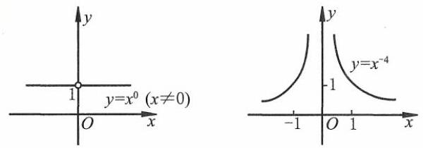

(第 13 题)

14. A

15. A 提示: 选项 $\mathrm{A}, y \in  \left( {0, + \infty }\right)$ . 选项 $\mathrm{B},{3}^{x} \in  \left( {0, + \infty }\right) , y \in  \lbrack 0,1)$ . 选项 $\mathrm{C},{\left( \frac{1}{3}\right) }^{x} \in  \left( {0, + \infty }\right) , y \in  \lbrack 0, + \infty )$ . 选项 D, $\frac{1}{3 - x} \in  \left( {-\infty ,0}\right)  \cup  \left( {0, + \infty }\right) , y \in  \left( {0,1}\right)  \cup  \left( {1, + \infty }\right)$ .

16. $\mathrm{D}$ 提示: $f\left( x\right)  = {a}^{x}, a \in  \left( {0,1}\right)$ 在 $\mathbf{R}$ 上是严格减函数.

17. C

18. $\mathrm{D}$ 提示: $f\left( x\right)  = \frac{{\mathrm{e}}^{x} - {\mathrm{e}}^{-x}}{2}$ 是双曲正弦函数, $g\left( x\right)  = \frac{{\mathrm{e}}^{x} + {\mathrm{e}}^{-x}}{2}$ 是双曲余弦函数. 选项 $\mathrm{A},{g}^{2}\left( x\right)  - {f}^{2}\left( x\right)  = \frac{1}{4}\left( {{\mathrm{e}}^{2x} + 2 + {\mathrm{e}}^{-{2x}}}\right.$ . $\left. {-{\mathrm{e}}^{-{2x}} + 2 - {\mathrm{e}}^{-{2x}}}\right)  = 1$ . 选项 B, ${2f}\left( x\right) g\left( x\right)  = 2 \cdot  \frac{{\mathrm{e}}^{x} - {\mathrm{e}}^{-x}}{2} \cdot  \frac{{\mathrm{e}}^{x} + {\mathrm{e}}^{-x}}{2} = \frac{{\mathrm{e}}^{2x} - {\mathrm{e}}^{-{2x}}}{2} = f\left( {2x}\right)$ . 选项 $\mathrm{C},{f}^{2}\left( x\right)  + {g}^{2}\left( x\right)  =$

$\frac{1}{4}\left( {{\mathrm{e}}^{2x} - 2 + {\mathrm{e}}^{-{2x}} + {\mathrm{e}}^{2x} + 2 + {\mathrm{e}}^{-{2x}}}\right)  = \frac{{\mathrm{e}}^{2x} + {\mathrm{e}}^{-{2x}}}{2} = g\left( {2x}\right)$ . 选项 D, $f\left( {-x}\right) g\left( x\right)  - f\left( x\right) g\left( {-x}\right)  = \frac{{\mathrm{e}}^{-x} - {\mathrm{e}}^{x}}{2} \cdot  \frac{{\mathrm{e}}^{x} + {\mathrm{e}}^{-x}}{2} \; - \frac{{\mathrm{e}}^{x} - {\mathrm{e}}^{-x}}{2} \cdot  \frac{{\mathrm{e}}^{-x} + {\mathrm{e}}^{x}}{2} = \frac{1}{4}\left( {{\mathrm{e}}^{-{2x}} - {\mathrm{e}}^{2x} - {\mathrm{e}}^{2x} + {\mathrm{e}}^{-{2x}}}\right)  = \frac{1}{2}\left( {{\mathrm{e}}^{-{2x}} - {\mathrm{e}}^{2x}}\right)  \neq  0.$

19. C 提示:②④⑤.

20. B

21. $\mathrm{D}$ 提示: $y = {\left( \frac{1}{2}\right) }^{x}$ 在 $\mathbf{R}$ 上是严格减函数, ${\left( \frac{1}{2}\right) }^{\frac{2}{3}} < {\left( \frac{1}{2}\right) }^{\frac{1}{3}}.y = {x}^{\frac{2}{3}}$ 在区间 $\left( {0, + \infty }\right)$ 上是严格增函数, ${\left( \frac{1}{5}\right) }^{\frac{2}{3}} < {\left( \frac{1}{2}\right) }^{\frac{2}{3}}.$

22. A 提示: $\forall {x}_{1},{x}_{2} \in  \mathbf{R},{x}_{1} > {x}_{2}$ ,有 $f\left( {a}^{{x}_{1}}\right)  - f\left( {a}^{{x}_{2}}\right)  > 0$ . 由 $y = f\left( x\right)$ 在区间 $\left( {0, + \infty }\right)$ 上是严格减函数,得 ${a}^{{x}_{1}} < {a}^{{x}_{2}}$ .

$\therefore a \in  \left( {0,1}\right)$ .

23. $\mathrm{D}$ 提示: $\because y = {\left( \frac{1}{2}\right) }^{t}$ 在区间 $\left( {0, + \infty }\right)$ 上是严格减函数, $\therefore y = {\left( \frac{1}{2}\right) }^{\sqrt{-{x}^{2} + x + 2}}$ 的单调增区间是 $y = \; \sqrt{-{x}^{2} + x + 2}$ 的单调减区间. 由 $- {x}^{2} + x + 2 \geq  0$ ,得 $x \in  \left\lbrack  {-1,2}\right\rbrack  .\because y = \sqrt{-{\left( x - \frac{1}{2}\right) }^{2} + \frac{9}{4}}$ 在区间 $\left\lbrack  {-1,\frac{1}{2}}\right\rbrack$ 上是严格增函数,在区间 $\left\lbrack  {\frac{1}{2},2}\right\rbrack$ 上是严格减函数, $\therefore y = {\left( \frac{1}{2}\right) }^{\sqrt{-{x}^{2} + x + 2}}$ 在区间 $\left\lbrack  {\frac{1}{2},2}\right\rbrack$ 上是严格增函数.

24. $\mathrm{D}$ 提示: $0 < {a}^{2} - 1 < 1,1 < \left| a\right|  < \sqrt{2}$ .

25. $\mathrm{D}$ 提示: $\left\{  \begin{array}{l} a > 1, \\  b + 1 > 1. \end{array}\right.$ 得 $\left\{  \begin{array}{l} a > 1, \\  b > 0. \end{array}\right.$

26.(1)>(2)<(3)>(4)<(5)>(6)>

27. (1) ${0.9}^{\frac{3}{4}} < 1 < {1.2}^{\frac{3}{4}}$ (3) ${\left( -1,9\right) }^{\frac{3}{5}} < 3.{8}^{-\frac{2}{3}} < 4.{1}^{\frac{2}{5}}$

(3) $x \in  \left( {-\infty ,\frac{3}{2}}\right)$ (4) $x \in  \left( {-\infty , - 2}\right)$

(5) $x \in  \left( {\frac{1}{2}, + \infty }\right) \;\left( 6\right) \;x \in  \left( {-\infty , - 2}\right)  \cup  \left( {1, + \infty }\right)$

提示: (3) ${\left( \frac{1}{5}\right) }^{{2x} - 1} > {\left( \frac{1}{5}\right) }^{2},{2x} - 1 < 2, x < \frac{3}{2}$ .

(4) ${\left( \frac{1}{2}\right) }^{{2x} + 1} > {\left( \frac{1}{2}\right) }^{-3},{2x} + 1 <  - 3, x <  - 2$ .

(5) ${a}^{2} + a + 2 = {\left( a + \frac{1}{2}\right) }^{2} + \frac{7}{4} > 1, x > 1 - x, x > \frac{1}{2}$ .

(6) ${x}^{2} + x - 2 > 0, x \in  \left( {-\infty , - 2}\right)  \cup  \left( {1, + \infty }\right)$ .

29. (1) $\left\lbrack  {-2,1}\right\rbrack$ 提示: ${6}^{{x}^{2} + x - 2} \leq  1,{x}^{2} + x - 2 \leq  0, x \in  \left\lbrack  {-2,1}\right\rbrack$ .

(2) $\left( {0, + \infty }\right) \;\left( {-x, - 1}\right)$ 提示: $0 < {2}^{-x} < 1, x \in  \left( {0, + \infty }\right)$ . 令 $m = 3 \times  {9}^{x} + 2 \times  {3}^{x} = 3 \times  {\left( {3}^{x}\right) }^{2} + 2 \times  {3}^{x}, m \in  \left( {0,1}\right)$ ， 则 $x \in  \left( {-\infty , - 1}\right)$ .

30. (1) $\left( {\frac{3}{2}, + \infty }\right)$ 提示: $y = {3}^{t}$ 在 $\mathbf{R}$ 上是严格增函数，则转化为求函数 $t = {x}^{2} - {3x} - 2$ 是严格增函数的区间.

$\because t = {\left( x - \frac{3}{2}\right) }^{2} - \frac{17}{4},\therefore$ 使题中函数为严格增函数的区间是 $\left( {\frac{3}{2}, + \infty }\right)$ .

(2) $\left( {-\infty ,3}\right)$ 提示: $y = {0.2}^{t}$ 在 $\mathbf{R}$ 上是严格减函数，则转化为求函数 $t = {x}^{2} - {6x} + 9$ 为严格减函数的区间. $\because t = {\left( x - 3\right) }^{2},\therefore$ 使题中函数为严格增函数的区间是 $\left( {-\infty ,3}\right)$ .

(3) $\left( {-\infty ,0}\right)$ 提示: $y = {2}^{-t} = {\left( \frac{1}{2}\right) }^{t}$ 在 $\mathbf{R}$ 上为严格减函数,则 $t = \left| x\right|$ 递减. $\because t = \left| x\right|$ 在区间 $\left( {-\infty ,0}\right)$ 上是严格减函数,在区间 $\left( {0, + \infty }\right)$ 上是严格增函数, $\therefore$ 使函数 $y = {2}^{-\left| x\right| }$ 是严格增函数的区间是 $\left( {-\infty ,0}\right)$ .

(4) $\left( {-\infty , - \frac{1}{2}}\right) \;\left( {-\frac{1}{2}, + \infty }\right) \;$ 提示: $y = {\left( \frac{1}{2}\right) }^{t}$ 在 $\mathbf{R}$ 上是严格减函数，则 $t = \left| {1 + {2x}}\right|$ 的单调增、减区间分别为 $y = {\left( \frac{1}{2}\right) }^{t}$ 的单调减、增区间. $\;\therefore$ 使函数 $y = {\left( \frac{1}{2}\right) }^{\left| 1 + 2x\right| }$ 是严格增函数的区间为 $\left( {-\infty , - \frac{1}{2}}\right)$ ,是严格减函数的区间为 $\left( {-\frac{1}{2}, + \infty }\right)$ .

(5) $\left( {-\infty , - 1}\right)  \cup  \left( {1, + \infty }\right)$ 提示: $y = {\left( \frac{1}{2}\right) }^{t}$ 在 $\mathbf{R}$ 上是严格减函数,则 $t = \left( {{m}^{2} - 1}\right) x$ 在 $\mathbf{R}$ 上是严格增函数.

$\therefore {m}^{2} - 1 > 0,\therefore m \in  \left( {-\infty , - 1}\right)  \cup  \left( {1, + \infty }\right)$ .

31. (1) $\frac{1}{4}\;$ 提示: ${x}^{2} - {6x} + {10} = {\left( x - 3\right) }^{2} + 1, x \in  \left\lbrack  {1,2}\right\rbrack$ .

$\therefore {\left( {x}^{2} - 6x + {10}\right) }_{\min } = {\left( 2 - 3\right) }^{2} + 1 = 2.\therefore {\left\lbrack  {\left( \frac{1}{2}\right) }^{{x}^{2} - {6x} + {10}}\right\rbrack  }_{\max } = {\left( \frac{1}{2}\right) }^{2} = \frac{1}{4}$ .

(2) $- \frac{1}{4}$ 提示: $f\left( x\right)  = {\left( {a}^{x} - \frac{3}{2}\right) }^{2} - \frac{1}{4},{a}^{x} \in  \left( {0, + \infty }\right)$ . 当 ${a}^{x} = \frac{3}{2}$ 时， $f{\left( x\right) }_{\min } =  - \frac{1}{4}$ .

(3) $\text{ ① }{a}^{-4}\text{ ② }{a}^{-4}$

32. (1) $\left( {-\infty , - 1}\right)  \cup  \left( {0, + \infty }\right)$

提示: ${3}^{x} \in  \left( {0, + \infty }\right) ,{3}^{x} - 1 \in  \left( {-1,0}\right)  \cup  \left( {0, + \infty }\right) .\;\therefore \frac{1}{{3}^{x} - 1} \in  \left( {-\infty , - 1}\right)  \cup  \left( {0, + \infty }\right)$ .

(2) $\left( {0,1}\right)$ 提示: $f\left( x\right)  = 1 - \frac{1}{{3}^{x} + 1},{3}^{x} + 1 \in  \left( {1, + \infty }\right) ,\frac{1}{{3}^{x} + 1} \in  \left( {0,1}\right) , f\left( x\right)  \in  \left( {0,1}\right)$ .

(3) $\left( {-3,1}\right)$ 提示: $0 < \frac{a + 3}{5 - a} < 1,\left\{  {\begin{array}{l} \frac{a + 3}{5 - a} > 0, \\  \frac{a + 3}{5 - a} < 1. \end{array}\;\therefore a \in  \left( {-3,1}\right) }\right.$ .

(4) $\left( {-1, + \infty }\right)$ 提示:当 $x =  - 1$ 时，恰有 ${2}^{x + 1} + x = 0.\because f\left( x\right)  = {2}^{x + 1} + x$ 在 $\mathbf{R}$ 上是严格增函数， $\therefore x >  - 1$ .

33. $f\left( {1 - x}\right)  = \frac{{4}^{1 - x}}{{4}^{1 - x} + 2} = \frac{4}{2 \cdot  {4}^{x} + 4} = \frac{2}{{4}^{x} + 2}$ .

$\therefore f\left( x\right)  + f\left( {1 - x}\right)  = 1.\;\therefore$ 原式 $= \frac{1}{2} \times  {100} \times  1 = {50}$ .

34. (1) ${a}^{x} < {a}^{y} < {y}^{a} < {x}^{a}$ 提示: $y = {a}^{x}$ 在 $\mathbf{R}$ 上是严格减函数, ${a}^{x} < {a}^{y} < 1$ ; $y = {x}^{a}$ 在 $\mathbf{R}$ 上是严格增函数, ${x}^{a} > {y}^{a} > 1$ .

(2) $a < {a}^{{a}^{2}} < {a}^{a}$ 提示: $a \in  \left( {{0.9},1}\right)$ ， $y = {a}^{x}$ 在 $\mathbf{R}$ 上是严格减函数， $\therefore 1 > {a}^{a} > {a}^{1}$ . $\therefore {a}^{1} < {a}^{{a}^{2}} < {a}^{a}$ .

35. ①当 $a > 1$ 时， $2{x}^{2} - {3x} + 1 > {x}^{2} + {2x} - 5,{x}^{2} - {5x} + 6 > 0, x \in  \left( {-\infty ,2}\right)  \cup  \left( {3, + \infty }\right)$ ；

②当 $a \in  \left( {0,1}\right)$ 时， $2{x}^{2} - {3x} + 1 < {x}^{2} + {2x} - 5,{x}^{2} - {5x} + 6 < 0, x \in  \left( {2,3}\right)$ .

36. (1) $y = f\left( x\right)$ 的定义域为 $\mathbf{R}, f\left( 0\right)  = a + \frac{1}{2} = 0, a =  - \frac{1}{2}$ . 检验成立.

(2) $y = f\left( x\right)$ 的定义域为 $\{ x \mid  x \neq  0\} .f\left( {-x}\right)  = {x}^{2} \cdot  \left( {\frac{1}{{a}^{-x} - 1} + m}\right)  =  - f\left( x\right)  =  - {x}^{2}\left( {\frac{1}{{a}^{x} - 1} + m}\right)$ .

$$
\frac{1}{{a}^{-x} - 1} + m =  - \frac{1}{{a}^{x} - 1} - m,{2m} =  - \frac{1}{{a}^{x} - 1} - \frac{{a}^{x}}{1 - {a}^{x}} = 1.\;\therefore \;m = \frac{1}{2}.
$$

37. (1) ${2}^{x} - 1 \neq  0, x \in  \left( {-\infty ,0}\right)  \cup  \left( {0, + \infty }\right)$

(2)定义域 $\left( {-\infty ,0}\right)  \cup  \left( {0, + \infty }\right)$ ，关于原点对称.

$$
f\left( {-x}\right)  = \left( {\frac{1}{{2}^{-x} - 1} + \frac{1}{2}}\right) {\left( -x\right) }^{3} = {x}^{3}\left( {\frac{1}{-{2}^{-x} + 1} - \frac{1}{2}}\right)
$$

$$
= {x}^{3}\left( {\frac{{2}^{x}}{{2}^{x} - 1} - \frac{1}{2}}\right)  = {x}^{3}\left( {1 + \frac{1}{{2}^{x} - 1} - \frac{1}{2}}\right)  = {x}^{3}\left( {\frac{1}{{2}^{x} - 1} + \frac{1}{2}}\right)  = f\left( x\right) .
$$

$\therefore y = f\left( x\right)$ 是偶函数.

(3) $f\left( x\right)  = \frac{{2}^{x} + 1}{2\left( {{2}^{x} - 1}\right) }{x}^{3} = \frac{1}{2}\left( {{2}^{x} + 1}\right) {x}^{2} \cdot  \frac{x}{{2}^{x} - 1}$ .

$\because x \neq  0,\therefore \frac{1}{2}{x}^{2}\left( {{2}^{x} + 1}\right)  > 0$ .

当 $x \in  \left( {-\infty ,0}\right)$ 时, ${2}^{x} - 1 < 0,\frac{x}{{2}^{x} - 1} > 0$ ; 当 $x \in  \left( {0, + \infty }\right)$ 时, ${2}^{x} - 1 > 0,\frac{x}{{2}^{x} - 1} > 0$ .

$\therefore \frac{x}{{2}^{x} - 1} > 0.\;\therefore f\left( x\right)  > 0$ .

38.(1) $\because y = f\left( x\right)$ 定义域为 $\mathbf{R}$ ，关于原点对称， $f\left( {-x}\right)  = \frac{{a}^{-x} - 1}{{a}^{-x} + 1} = \frac{1 - {a}^{x}}{1 + {a}^{x}} =  - f\left( x\right)$ ，

$\therefore y = f\left( x\right)$ 是奇函数.

$\because f\left( x\right)  = 1 - \frac{2}{{a}^{x} + 1},{a}^{x} + 1 \in  \left( {1, + \infty }\right) ,\;\therefore \frac{2}{{a}^{x} + 1} \in  \left( {0,2}\right) ,\;\therefore f\left( x\right)  \in  \left( {-1,1}\right)$ .

(3) $\forall {x}_{1},{x}_{2} \in  \mathbf{R},{x}_{1} > {x}_{2}, f\left( {x}_{1}\right)  - f\left( {x}_{2}\right)  = \left( {1 - \frac{2}{{a}^{{x}_{1}} + 1}}\right)  - \left( {1 - \frac{2}{{a}^{{x}_{2}} + 1}}\right)  = 2\left( {\frac{1}{{a}^{{x}_{2}} + 1} - \frac{1}{{a}^{{x}_{1}} + 1}}\right)$ .

$\because a > 1,{x}_{1} > {x}_{2},\therefore f\left( {x}_{1}\right)  > f\left( {x}_{2}\right)$ ,即 $y = f\left( x\right)$ 在 $\mathbf{R}$ 上是严格增函数.

39. $y = \frac{1}{2} \cdot  {\left( {2}^{x}\right) }^{2} - 3 \cdot  {2}^{x} + 5 = \frac{1}{2}{\left( {2}^{x} - 3\right) }^{2} + \frac{1}{2}.\because x \in  \left\lbrack  {0,2}\right\rbrack  ,\;\therefore {2}^{x} \in  \left\lbrack  {1,4}\right\rbrack$ .

$\therefore$ 当 ${2}^{x} = 3$ 时, ${y}_{\min } = \frac{1}{2}$ ; 当 ${2}^{x} = 1$ 时, ${y}_{\max } = \frac{1}{2} \cdot  4 + \frac{1}{2} = \frac{5}{2}$ .

40. $f\left( x\right)  = {\left( {a}^{x} + 1\right) }^{2} - 2$ ,

①当 $a > 1$ 时， $\because x \in  \left\lbrack  {-1,1}\right\rbrack$ ， $\therefore {a}^{x} \in  \left\lbrack  {\frac{1}{a}, a}\right\rbrack$ . $f{\left( x\right) }_{\max } = {\left( a + 1\right) }^{2} - 2 = {14}$ . $\therefore a = 3$ .

② 当 $a \in  \left( {0,1}\right)$ 时， $\because x \in  \left\lbrack  {-1,1}\right\rbrack$ ， $\therefore {a}^{x} \in  \left\lbrack  {a,\frac{1}{a}}\right\rbrack$ . $f{\left( x\right) }_{\max } = {\left( \frac{1}{a} + 1\right) }^{2} - 2 = {14}.a = \frac{1}{3}$ .

$\therefore a$ 的值为 3 或 $\frac{1}{3}$ .

41. 设 ${x}_{1},{x}_{2} \in  \mathbf{R},{x}_{1} > {x}_{2}$ ,

$f\left( {x}_{1}\right)  - f\left( {x}_{2}\right)  = \frac{a}{{a}^{2} - 2}\left\lbrack  {{a}^{{x}_{1}} - {a}^{{x}_{2}} + {\left( \frac{1}{a}\right) }^{{x}_{2}} - {\left( \frac{1}{a}\right) }^{{x}_{1}}}\right\rbrack   = \frac{a}{{a}^{2} - 2}\left( {{a}^{{x}_{1}} - {a}^{{x}_{2}}}\right) \left( {1 + \frac{1}{{a}^{{x}_{1}}{a}^{{x}_{2}}}}\right)  > 0$ .

$\because a\left( {1 + \frac{1}{{a}^{{x}_{1} + {x}_{2}}}}\right)  > 0,\;\therefore \frac{1}{{a}^{2} - 2}\left( {{a}^{{x}_{1}} - {a}^{{x}_{2}}}\right)  > 0.$

①当 $a > 1$ 时， ${a}^{{x}_{1}} - {a}^{{x}_{2}} > 0,\therefore {a}^{2} - 2 > 0, a \in  \left( {\sqrt{2}, + \infty }\right)$ .

② 当 $a \in  \left( {0,1}\right)$ 时， ${a}^{{x}_{1}} - {a}^{{x}_{2}} < 0,\therefore {a}^{2} - 2 < 0, a \in  \left( {0,1}\right)$ .

$\therefore a \in  \left( {0,1}\right)  \cup  \left( {\sqrt{2}, + \infty }\right)$ .

42. $y = {x}^{-\frac{1}{3}}$ 分别在 $\left( {-\infty ,0}\right) ,\left( {0, + \infty }\right)$ 上是严格减函数.

① $\left\{  {\begin{array}{l} a + 1 < 0, \\  3 - {2a} > 0. \end{array}\;\therefore a <  - 1}\right.$ .

② $\left\{  {\begin{array}{l} a + 1 > 0, \\  3 - {2a} > 0, \\  a + 1 > 3 - {2a}. \end{array}\;\therefore \;a \in  \left( {\frac{2}{3},\frac{3}{2}}\right) }\right.$ .

③ $\left\{  \begin{array}{l} a + 1 < 0, \\  3 - {2a} < 0, \\  a + 1 > 3 - {2a}. \end{array}\right.$ 解集为 $\varnothing$ .

综上所述, $a \in  \left( {-\infty , - 1}\right)  \cup  \left( {\frac{2}{3},\frac{3}{2}}\right)$ .

43. 集合 $M = \left\lbrack  {-2,0}\right\rbrack$ .

集合 $P : y = {\left( {2}^{x}\right) }^{2} - {2a} \cdot  {2}^{x} + 1 = {\left( {2}^{x} - a\right) }^{2} + \left( {1 - {a}^{2}}\right)$ .

$\because x \in  \left\lbrack  {-2,0}\right\rbrack  ,{2}^{x} \in  \left\lbrack  {\frac{1}{4},1}\right\rbrack  , a \in  \left( {\frac{3}{4},1}\right\rbrack$ ,

$\therefore \;{y}_{\min } = 1 - {a}^{2},{y}_{\max } = {\left( \frac{1}{4} - a\right) }^{2} + \left( {1 - {a}^{2}}\right)  = \frac{17}{16} - \frac{a}{2}$ .

$\because$ 当 $a = 1$ 时, $1 - {a}^{2} = 0$ ,

$\therefore$ ① 当 $a \in  \left( {\frac{3}{4},1}\right)$ 时， $M \cup  P = \left\lbrack  {-2,0}\right\rbrack   \cup  \left\lbrack  {1 - {a}^{2},\frac{17}{16} - \frac{a}{2}}\right\rbrack$ ，

$\overline{M \cup  P} = \left( {-\infty ,2}\right)  \cup  \left( {0,1 - {a}^{2}}\right)  \cup  \left( {\frac{17}{16} - \frac{a}{2}, + \infty }\right) .$

② 当 $a = 1$ 时， $M \cup  P = \left\lbrack  {-2,\frac{9}{16}}\right\rbrack  ,\overline{M \cup  P} = \left( {-\infty , - 2}\right)  \cup  \left( {\frac{9}{16}, + \infty }\right)$ .

44. (1) 设 $f\left( x\right)  = {x}^{\frac{1}{3}} + {2}^{x}$ .

$\because y = f\left( x\right)$ 在 $\mathbf{R}$ 上是严格增函数,且 $f\left( {-1}\right)  < 0, f\left( 0\right)  > 0,\therefore y = f\left( x\right)$ 在 $\mathbf{R}$ 上有且仅有一个零点.

(2) ${a}^{x} =  - {\left( x - 1\right) }^{2} + {2a}, a \in  \left( {0,1}\right)  \cup  \left( {1, + \infty }\right)$ .

由图像 (如图所示) 可知,方程有两个实数根,即 ${a}^{1} = a <  - {\left( 1 - 1\right) }^{2} + {2a} = {2a}$ .

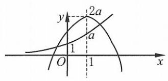

(第 44 题)

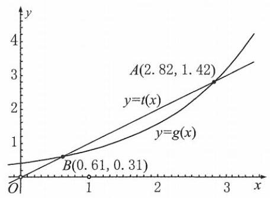

(第 44 题)

45. 列表略,简图如上页图所示:

$y = t\left( x\right)$ 和 $y = g\left( x\right)$ 在 $\mathbf{R}$ 上都是严格增函数. 随着 $x$ 的增大, $y = t\left( x\right)$ 均匀上升,增量恒定; $y = g\left( x\right)$ 急剧上升,在区间 $\lbrack 0, + \infty )$ 上递增增量快速增大 ( $x$ 充分大时, $y = g\left( x\right)$ 的增幅远超过 $y = t\left( x\right)$ ).

46. 作图分析略,如图所示:

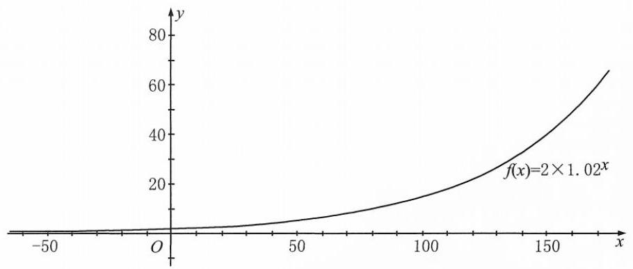

(第 46 题)

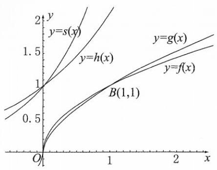

(第 47 题)

乙模型 $y = b{a}^{x}\left( {a > 1}\right)$ 较好. 可求得 $y = 2 \times  {1.02}^{x}$ .

47. 表略.

(1)幂函数 $y = f\left( x\right)$ 与 $y = g\left( x\right)$ 的图像均过点 $\left( {1,1}\right)$ ，在区间 $\lbrack 0, + \infty )$ 上都是严格增函数. 随着 $x$ 的增大, $f\left( x\right)  = {x}^{\frac{1}{2}}$ 的函数值递增的速度比 $g\left( x\right)  = \; {x}^{0.6}$ 慢.

(2)指数函数 $h\left( x\right)  = {2.1}^{x}$ 与 $s\left( x\right)  = {2.2}^{x}$ 的图像均过点 $\left( {0,1}\right)$ ，在区间 $\lbrack 0, + \; \infty )$ 上都是严格增函数. 随着 $x$ 的增大, $h\left( x\right)  = {2.1}^{x}$ 的函数值递增的速度比 $s\left( x\right)  = {2.2}^{x}$ 慢.

(3)幂函数 $y = f\left( x\right)$ 与指数函数 $y = h\left( x\right)$ 在区间 $\lbrack 0, + \infty )$ 上都是严格增函数,随着 $x$ 的增大, $f\left( x\right)  = {x}^{\frac{1}{2}}$ 的函数值递增的速度比 $h\left( x\right)  = {2.1}^{x}$ 慢.

48. $\mathrm{D}$ 提示: 选项 $\mathrm{B}$ ,选项 $\mathrm{C}$ 的定义域都不是 $\mathbf{R}$ . 选项 $\mathrm{A}, y = \left| x\right|$ .

49. D

50. C 提示: $\forall {x}_{1},{x}_{2} \in  \left( {-\infty ,0}\right) ,{x}_{1} > {x}_{2},\because f\left( {-x}\right)  = f\left( x\right)$ ,

$\therefore f\left( {-{x}_{1}}\right)  = f\left( {x}_{1}\right) , f\left( {-{x}_{2}}\right)  = f\left( {x}_{2}\right) .\;\because  - {x}_{1}, - {x}_{2} \in  \left( {0, + \infty }\right) , - {x}_{1} <  - {x}_{2}$ ,

$\therefore f\left( {-{x}_{1}}\right)  < f\left( {-{x}_{2}}\right) ,\therefore f\left( {x}_{1}\right)  < f\left( {x}_{2}\right)$ ,即 $y = f\left( x\right)$ 在区间 $\left( {-\infty ,0}\right)$ 上是严格减函数.

$\therefore  - {\log }_{\sqrt{3}}\sqrt{2} >  - 1 >  - {\log }_{\sqrt{2}}\sqrt{3} >  - 2$ ,则 $f\left( {-2}\right)  > f\left( {-{\log }_{\sqrt{2}}\sqrt{3}}\right)  > f\left( {-{\log }_{\sqrt{3}}\sqrt{2}}\right)$ .

51. D 提示: 选项 D 为偶函数.

52. C 提示: 当 $a \in  \left( {0,1}\right)$ 时,函数 $y = {\log }_{a}x$ 在定义域内是严格减函数, $y = x + a$ 的截距 $a \in  \left( {0,1}\right)$ ,即选项 C. 当 $a \in  \left( {1, + \infty }\right)$ 时,函数 $y = {\log }_{a}x$ 在定义域内是严格增函数, $y = x + a$ 的截距 $a \in  \left( {1, + \infty }\right)$ .

53. $\mathrm{C}$ 提示: 函数 $y = f\left( x\right)$ 在区间 $\left( {0,1}\right)$ 上是严格减函数,在区间 $\left( {1,2}\right)$ 上是严格增函数,且 $f\left( x\right)  \geq  1$ ,

$\therefore y = {\log }_{0.2}f\left( x\right)$ 在区间 $\left( {0,1}\right)$ 上是严格增函数,在区间 $\left( {1,2}\right)$ 上是严格减函数,即选项 C.

54. $\mathrm{B}$ 提示: $y = {x}^{3}, x \in  \left( {0,1}\right)  \cup  \left( {1, + \infty }\right)$ .

55. (1) $\mathbf{R}\left( 2\right) \left( {-\infty , - \sqrt{5} - 1}\right)  \cup  \left( {-\sqrt{5} - 1, - 3}\right)  \cup  \lbrack 2, + \infty )$ (3) $\left( {-\frac{1}{2},0}\right)  \cup  \left( {0,\frac{5}{2}}\right)$

提示: (1) ${x}^{2} - {3x} + 4 > 0, x \in  \mathbf{R}$ .

(2) $\left\{  \begin{array}{l} {x}^{2} - 4 \geq  0 \Rightarrow  x \in  \left( {-\infty , - 2\rbrack \cup \lbrack 2, + \infty }\right) , \\  {x}^{2} + {2x} - 3 > 0 \Rightarrow  x \in  \left( {-\infty , - 3}\right)  \cup  \left( {1, + \infty }\right) , \\  {x}^{2} + {2x} - 3 \neq  1 \Rightarrow  x \neq   - 1 \pm  \sqrt{5}\text{ . } \end{array}\right.$

解得 $x \in  \left( {-\infty , - \sqrt{5} - 1}\right)  \cup  \left( {-\sqrt{5} - 1, - 3}\right)  \cup  \lbrack 2, + \infty )$

(3) $\left\{  \begin{array}{l} {2x} + 1 > 0 \Rightarrow  x \in  \left( {-\frac{1}{2}, + \infty }\right) , \\  {2x} + 1 \neq  1 \Rightarrow  x \neq  0, \\  {32} - {4}^{x} > 0 \Rightarrow  x \in  \left( {-\infty ,\frac{5}{2}}\right) . \end{array}\right.$ 解得 $x \in  \left( {-\frac{1}{2},0}\right)  \cup  \left( {0,\frac{5}{2}}\right)$ .

(3) $\lbrack  - 1, + \infty )$

提示: $\left( 1\right) t = {x}^{2} - {4x} + 7 = {\left( x - 2\right) }^{2} + 3 \in  \left\lbrack  {3, + \infty }\right) ,{\log }_{\frac{1}{3}}t \in  ( - \infty , - 1\rbrack$ .

(2) $t = \frac{1}{{x}^{2} - {2x} + 5} = \frac{1}{{\left( x - 1\right) }^{2} + 4} \in  \left( {0,\frac{1}{4}}\right\rbrack  ,{\log }_{\frac{1}{2}}t \in  \lbrack 2, + \infty )$ .

(3) $t = \sqrt{3 - {2x} - {x}^{2}} = \sqrt{4 - {\left( x + 1\right) }^{2}} \in  (0,2\rbrack ,{\log }_{\frac{1}{2}}t \in  \lbrack  - 1, + \infty )$ .

(3) $\left( {-\infty ,0}\right)$ (4) $\left( {0,1}\right)$ (5) $\left( {\frac{\sqrt{2}}{2}, + \infty }\right)$

提示: (1) ${\log }_{\frac{1}{3}}t$ 在区间 $\left( {0, + \infty }\right)$ 上是严格减函数, $t = {x}^{2} - {5x} + 6 > 0, x \in  \left( {-\infty ,2}\right)  \cup  \left( {3, + \infty }\right)$ ,

转化为求函数 $t = {\left( x - \frac{5}{2}\right) }^{2} - \frac{1}{4}$ 为严格增函数的区间, $\therefore x \in  \left( {3, + \infty }\right)$ .

(2) $y = \lg t$ 在区间 $\left( {0, + \infty }\right)$ 上是严格增函数， $t =  - {x}^{2} - {4x} + {12} > 0, x \in  \left( {-6,2}\right)$ ，转化为求函数 $t =  - {\left( x + 2\right) }^{2} + {16}$ 为严格增函数的区间, $\therefore x \in  \left( {-6, - 2}\right)$ .

(3) $y =  - {\log }_{\frac{1}{2}}t$ 在区间 $\left( {0, + \infty }\right)$ 上是严格增函数， $t =  - x > 0, x \in  \left( {-\infty ,0}\right)$ ，且 $t =  - x$ 在 $\mathbf{R}$ 上是严格减函数， $\therefore x \in  \left( {-\infty ,0}\right)$ .

(4) $t = 1 - x$ 在区间 $\lbrack 0,1)$ 上是严格减函数， $\therefore y = {\log }_{a}t$ 在区间 $(0,1\rbrack$ 是严格减函数， $\therefore a \in  \left( {0,1}\right)$ .

(5) $y = {\left( t - \frac{1}{2}\right) }^{2} + \frac{3}{4}$ ，在区间 $\left( {-\infty ,\frac{1}{2}}\right)$ 上是严格减函数，在区间 $\left( {\frac{1}{2}, + \infty }\right)$ 上是严格增函数，

$\because t = {\log }_{\frac{1}{2}}x$ 在区间 $\left( {0, + \infty }\right)$ 上是严格减函数, $\therefore {\log }_{\frac{1}{2}}x < \frac{1}{2}$ ,即 $x > \frac{\sqrt{2}}{2}$ .

58. $\mathrm{B}$ 提示: 定义域 $\left( {-1,1}\right)$ 关于原点对称, $f\left( {-x}\right)  = \lg \frac{1 + x}{1 - x} =  - \lg \frac{1 - x}{1 + x} =  - f\left( x\right) .\therefore y = f\left( x\right)$ 是奇函数.

$\because y = \lg t$ 在区间 $\left( {0, + \infty }\right)$ 上是严格增函数, $t = \frac{2}{1 + x} - 1$ 在区间 $\left( {-1,1}\right)$ 上是严格减函数,

$\therefore y = \lg \left( {-1 + \frac{2}{1 + x}}\right)$ 在区间 $\left( {-1,1}\right)$ 上是严格减函数.

59. $\mathrm{B}$ 提示: 定义域 $\mathrm{R}$ 关于原点对称, $f\left( {-x}\right)  = \ln \left( {{\mathrm{e}}^{-x} + 1}\right)  + \frac{x}{2} = \ln \left( \frac{1 + {\mathrm{e}}^{x}}{{\mathrm{e}}^{x}}\right)  + \frac{x}{2} = \ln \left( {{\mathrm{e}}^{x} + 1}\right)  + \frac{x}{2} - x = f\left( x\right)$ .

$\therefore y = f\left( x\right)$ 是偶函数. 显然 $y = f\left( x\right)$ 不恒为 $0, y = f\left( x\right)$ 不是奇函数.

60. $y = f\left( x\right)  = 1 - \frac{2}{{a}^{x} + 1}$ .

(1) ${a}^{x} + 1 \in  \left( {1, + \infty }\right) ,\frac{2}{{a}^{x} + 1} \in  \left( {0,2}\right) ,\therefore f\left( x\right)  \in  \left( {-1,1}\right)$ .

(2) $\forall {x}_{1},{x}_{2} \in  \mathbf{R},{x}_{1} > {x}_{2}, f\left( {x}_{1}\right)  - f\left( {x}_{2}\right)  = \frac{-2}{{a}^{{x}_{1}} + 1} + \frac{2}{{a}^{{x}_{2}} + 1} = \frac{2}{\left( {{a}^{{x}_{1}} + 1}\right) \left( {{a}^{{x}_{2}} + 1}\right) }\left( {{a}^{{x}_{1}} - {a}^{{x}_{2}}}\right)$ .

$\because a > 1,\therefore {a}^{{x}_{1}} - {a}^{{x}_{2}} > 0,\therefore f\left( {x}_{1}\right)  > f\left( {x}_{2}\right)$ ,即 $y = f\left( x\right)$ 在 $\mathbf{R}$ 上是严格增函数.

61. (1) 设 $t = {\log }_{a}x$ ,则 $x = {a}^{t}\left( {t \in  \mathbf{R}}\right) ,\therefore f\left( t\right)  = \frac{a\left( {{a}^{2t} - 1}\right) }{{a}^{t}\left( {{a}^{2} - 1}\right) } = \frac{a}{{a}^{2} - 1}\left( {{a}^{t} - \frac{1}{{a}^{t}}}\right)$ .

$\because x = {a}^{t}, a \in  \left( {0,1}\right)$ 在 $\mathbf{R}$ 上是严格减函数, $\therefore {a}^{t} - \frac{1}{{a}^{t}}$ 在 $\mathbf{R}$ 上是严格减函数.

$\because \frac{a}{{a}^{2} - 1} < 0,\therefore y = f\left( x\right)$ 在 $\mathbf{R}$ 上是严格增函数.

(2) $f\left( n\right)  = \frac{a}{{a}^{2} - 1}\left( {{a}^{n} - {a}^{-n}}\right)  = \frac{a}{{a}^{n}} \cdot  \frac{{a}^{2n} - 1}{{a}^{2} - 1} = \frac{a}{{a}^{n}}\left\lbrack  {1 + {a}^{2} + {a}^{4} + \cdots  + {a}^{2\left( {n - 1}\right) }}\right\rbrack$ .

$\because {a}^{2\left( {k - 1}\right) } + {a}^{2\left( {n - k}\right) } > 2\sqrt{{a}^{2\left( {k + n - 1 - k}\right) }} = 2{a}^{n - 1}, k = 1,2,\cdots , n$ ,

$\therefore n$ 个式子累加,得 ${2f}\left( n\right)  > \frac{a}{{a}^{n}} \cdot  2{a}^{n - 1} \cdot  n = {2n},\therefore f\left( n\right)  > n$ .

62. $\mathrm{C}$ 提示: $x \in  \left( {-1,0}\right) ,\left| {x + 1}\right|  \in  \left( {0,1}\right) .\;\because {\log }_{a}\left| {x + 1}\right|  > 0,\therefore a \in  \left( {0,1}\right) .\;\because \left| {x + 1}\right|$ 在区间 $\left( {-\infty , - 1}\right)$ 上是严格减函数，在区间 $\left( {-1, + \infty }\right)$ 上是严格增函数， $\therefore y = f\left( x\right)$ 在区间 $\left( {-\infty , - 1}\right)$ 上是严格增函数，在区间 $\left( {-1, + \infty }\right)$ 上是严格减函数.

63. $\mathrm{D}$ 提示: $\frac{\ln b}{\ln a} < 1, b \in  \left( {0,1}\right) ,\ln b < 0$ . ① $\ln a > 0, a > 1$ . ② $\ln a < 0,\ln b > \ln a, a \in  \left( {0, b}\right) .\therefore 0 < a < b$ 或 $a > 1$ .

64. B 提示: $f\left( \frac{1}{3}\right)  = {\log }_{a}\frac{1}{3}, f\left( \frac{1}{4}\right)  = {\log }_{a}\frac{1}{4}, f\left( 2\right)  = {\log }_{a}\frac{1}{2}$ . 而 $y = {\log }_{a}x\left( {0 < a < 1}\right)$ 在区间 $\left( {0,1}\right)$ 上是严格减函数. $\therefore f\left( \frac{1}{4}\right)  > f\left( \frac{1}{3}\right)  > f\left( 2\right)$ .

65. $\mathrm{B}$ 提示: ${2}^{x} > 2 = \sqrt[3]{8} > \sqrt[3]{x} > 0 > {\log }_{\frac{1}{2}}x$ .

66. $\mathrm{C}$ 提示: $\text{ ① }a > 1$ 时,函数 $y = f\left( x\right)$ 在区间 $\lbrack 3, + \infty )$ 上是严格增函数,且 $f\left( x\right)  > 0$ . 只要 ${\log }_{a}3 > 1, a \in  \left( {1,3}\right) .\text{ ② }a \in  \left( {0,1}\right)$ 时,函数 $y = f\left( x\right)$ 在区间 $(3, + \infty \rbrack$ 上是严格减函数,且 $f\left( x\right)  < 0$ . 只要 ${\log }_{a}3 <  - 1, a \in  \left( {\frac{1}{3},1}\right) ,\therefore a \in  \left( {\frac{1}{3},1}\right)  \cup  \left( {1,3}\right)$ .

67. $\mathrm{D}$ 提示: 由 $a > {a}^{2} > 0$ ,得 $a \in  \left( {0,1}\right) .\;\therefore a, b \in  \left( {0,1}\right) , a > b,\frac{a}{b} > 1.\;\therefore {\log }_{a}\frac{a}{b} < 0$ .

$\because 1 > a > b > 0,\therefore {\log }_{a}b > 1 > {\log }_{b}a > 0 > {\log }_{a}\frac{a}{b}.\;\because {a}^{2} > b,2 < {\log }_{a}b,\therefore {\log }_{b}a = \frac{1}{{\log }_{a}b} < \frac{1}{2}$ .

$\therefore {\log }_{b}\frac{b}{a} = 1 - {\log }_{b}a > {\log }_{b}a$ 且 ${\log }_{b}\frac{b}{a} < 1.\therefore {\log }_{a}b > 1 > {\log }_{b}\frac{b}{a} > {\log }_{b}a > 0 > {\log }_{a}\frac{a}{b}$ ,即 $p > s > q > r$ .

68. $\mathrm{D}$ 提示: $\because \frac{\ln \frac{1}{3}}{\ln a} > \frac{\ln \frac{1}{3}}{\ln b} > 0.\;\therefore \ln a < 0,\ln b < 0, a, b \in  \left( {0,1}\right) .\;\therefore \frac{\ln a}{\ln \frac{1}{3}} < \frac{\ln b}{\ln \frac{1}{3}}$ ,

$\therefore \ln a > \ln b, a > b.\;\therefore \;0 < b < a < 1$ .

69.(1) $b < a < c$ 提示: $a = {\log }_{3}4 = 2{\log }_{3}2$ ， $b = {\log }_{2}\frac{3}{2} = {\log }_{2}3 - 1$ ， $c = {\log }_{2}5$ ，显然有 $b < 1 < a < 2 < c$ .

(2) ${\log }_{3}{0.4} < \log {0.4} < {\log }_{0.1}{0.4} < {\log }_{\frac{1}{2}}{0.4}$

提示: ${\log }_{t}{0.4} = \frac{\ln {0.4}}{\ln t},\ln {0.4} < 0$ .

当 $t > 1$ 时, $\ln t > 0,{\log }_{t}{0.4} < 0.t$ 越大, $\ln t$ 越大, ${\log }_{t}{0.4}$ 越大.

$\therefore {\log }_{3}{0.4} < \lg {0.4} < {0.9}$ 比 $\in  \left( {0,1}\right)$ 时, $\ln t < 0,{\log }_{t}{0.4} > 0.t$ 越大, $\ln t$ 越大, ${\log }_{t}{0.4}$ 越大.

$\therefore \;0 < {\log }_{0.1}{0.4} < {\log }_{\frac{1}{2}}{0.4}$ .

(3) $\frac{3}{2} < {\log }_{2}3$ 提示: $\frac{3}{2} = {\log }_{2}2\sqrt{2} < {\log }_{2}3$ .

(4) $\frac{5}{\lg 5} > \frac{2}{\lg 2} > \frac{3}{\lg 3}$ 提示: $\frac{\frac{2}{\lg 2}}{\frac{3}{\lg 3}} = \frac{2}{3}{\log }_{2}3 > \frac{2}{3}{\log }_{2}2\sqrt{2} = 1$ ， $\therefore \frac{2}{\lg 2} > \frac{3}{\lg 3}$ .

$\begin{array}{l} \frac{5}{\lg 5} = \frac{5}{2}{\log }_{5}2 = \frac{5}{2}{\log }_{5}\sqrt[5]{32} > \frac{5}{2}{\log }_{5}\sqrt[5]{25} = \frac{5}{2} \cdot  \frac{2}{5} = 1,\;\therefore \;\frac{5}{\lg 5} > \frac{2}{\lg 2}. \end{array}$

(5) $\lg \left( {\lg x}\right)  < {\lg }^{2}x < \lg {x}^{2}$

提示: $0 < \lg x < 1,\;\therefore \;{\lg }^{2}x < \lg x < 2\lg x = {\operatorname{lgx}}^{2} \cdot  \lg \left( {\lg x}\right)  < 0 < {\lg }^{2}x$ ,即 $\lg \left( {\lg x}\right)  < {\lg }^{2}x < \lg {x}^{2}$ .

70. (1) $\left( {0,\frac{4}{5}}\right)  \cup  \left( {1, + \infty }\right)$ 提示: ${\log }_{a}\frac{4}{5} = \frac{\ln \frac{4}{5}}{\ln a} < 1$ ， $\ln \frac{4}{5} < 0$ .

① $\ln a > 0, a > 1$ . ② $\ln a < 0,\ln \frac{4}{5} > \ln a, a \in  \left( {0,\frac{4}{5}}\right)$ . $\;\therefore a \in  \left( {0,\frac{4}{5}}\right)  \cup  \left( {1, + \infty }\right)$ .

(2) $\left( {3,4}\right)$ 提示: ${\log }_{b}\left( {x - 3}\right)  > 0,0 < x - 3 < 1, x \in  \left( {3,4}\right)$ .

(3) $\left( {\frac{1}{2},1}\right)  \cup  \left( {1,2}\right)$ 提示:① $a > 1$ 时， $y = {\log }_{a}x$ 在区间 $\lbrack 2, + \infty )$ 上是严格增函数，且 $y > 0$ ， ${y}_{\min } = {\log }_{a}2 > 1, a \in  \left( {1,2}\right) .$

② $a \in  \left( {0,1}\right)$ 时， $y = {\log }_{a}x$ 在区间 $\lbrack 2, + \infty )$ 上是严格减函数，且 $y < 0,{y}_{\max } = {\log }_{a}2 <  - 1$ ，

$\therefore a \in  \left( {\frac{1}{2},1}\right)$ .

71. (1) $y = {\left( {\log }_{\frac{1}{4}}x\right) }^{2} - 2{\log }_{\frac{1}{4}}x + 5 = {\left( {\log }_{\frac{1}{4}}x - 1\right) }^{2} + 4, x \in  \left\lbrack  {2,4}\right\rbrack$ ,

$\therefore \;{\log }_{\frac{1}{4}}x \in  \left\lbrack  {-1, - \frac{1}{2}}\right\rbrack  ,\;\therefore \;y \in  \left\lbrack  {\frac{25}{4},8}\right\rbrack$ .

(2) ${\log }_{2}x =  - {\log }_{\frac{1}{2}}x \in  \left\lbrack  {\frac{1}{2},3}\right\rbrack$ .

$y = \left( {{\log }_{2}x - 1}\right) \left( {{\log }_{2}x - 2}\right)  = {\log }_{2}^{2}x - 3{\log }_{2}x + 2 = {\left( {\log }_{2}x - \frac{3}{2}\right) }^{2} - \frac{1}{4}.$

${y}_{\max } = {\left( 3 - \frac{3}{2}\right) }^{2} - \frac{1}{4} = 2$ ,此时 $x = 8;\;{y}_{\min } =  - \frac{1}{4}$ ,此时 $x = 2\sqrt{2}$ .

72. (1) ${\log }_{m}\frac{x}{a} \cdot  {\log }_{m}\frac{x}{b} = \left( {{\log }_{m}x - {\log }_{m}a}\right) \left( {{\log }_{m}x - {\log }_{m}b}\right)$

$= {\log }_{m}^{2}x - \left( {{\log }_{m}a + {\log }_{m}b}\right) {\log }_{m}x + {\log }_{m}a \cdot  {\log }_{m}b$

$= {\left\lbrack  {\log }_{m}x - \frac{1}{2}\left( {\log }_{m}a + {\log }_{m}b\right) \right\rbrack  }^{2} + {\log }_{m}a \cdot  {\log }_{m}b - \frac{1}{4}{\left( {\log }_{m}a + {\log }_{m}b\right) }^{2}$

$= {\left( {\log }_{m}x - {\log }_{m}\sqrt{ab}\right) }^{2} - \frac{1}{4}{\left( {\log }_{m}a - {\log }_{m}b\right) }^{2}$

当 $x = \sqrt{ab}$ 时,上式取到最小值, $- \frac{1}{4}{\left( {\log }_{m}a - {\log }_{m}b\right) }^{2} =  - \frac{1}{4},{\left( {\log }_{m}\frac{a}{b}\right) }^{2} = 1$ .

$\therefore \;{\log }_{m}\frac{a}{b} = 1$ 或 $- 1, m = \frac{a}{b}$ 或 $\frac{b}{a}.$

(2) ${\left( \frac{1}{2}{\log }_{2}y\right) }^{2} =  - {\log }_{2}x,{\log }_{2}^{2}y =  - 4{\log }_{2}x.$

把 $x = {uy}$ 代入式中, ${\log }_{2}^{2}y =  - 4\left( {{\log }_{2}u + {\log }_{2}y}\right) ,4{\log }_{2}u =  - {\log }_{2}^{2}y - 4{\log }_{2}y$ ,

$\therefore \;{\log }_{2}u =  - \frac{1}{4}{\left( {\log }_{2}y + 2\right) }^{2} + 1.\;\therefore \;{\left( {\log }_{2}u\right) }_{\max } = 1$ ,此时 ${\log }_{2}y =  - 2$ .

$\therefore \;{u}_{\max } = 2$ ,此时 $y = \frac{1}{4}, x = \frac{1}{2}$ .

73. (1) ${\log }_{2}a > 0, y = {x}^{2} \cdot  {\log }_{2}a + \frac{2}{{\log }_{2}a}x + 8,\therefore \;\Delta  = \frac{4}{{\log }_{2}^{2}a} - {32}{\log }_{2}a < 0,\;\therefore \;{\log }_{2}a > \frac{1}{2}$ .

$\therefore a \in  \left( {\sqrt{2}, + \infty }\right)$ .

(2) $f\left( x\right)  = {\log }_{a}b \cdot  {x}^{2} + \frac{2}{{\log }_{a}b}x + 8,{\log }_{a}b > 0.\Delta  = \frac{4}{{\log }_{a}^{2}b} - {32}{\log }_{a}b < 0,{\log }_{a}^{3}b > \frac{1}{8},{\log }_{a}b > \frac{1}{2}$ .

$\therefore$ 当 $a \in  \left( {0,1}\right)$ 时, $b \in  \left( {0,\sqrt{a}}\right)$ ; 当 $a \in  \left( {1, + \infty }\right)$ 时, $b \in  \left( {\sqrt{a}, + \infty }\right)$ .

74. (1)① $1 - {\lg }^{2}a = 0$ . 当 $\lg a = 1$ 时，方程无实数根；当 $\lg a =  - 1$ 时，满足题意. $\;\therefore a = \frac{1}{10}$ .

② $1 - {\lg }^{2}a \neq  0,\Delta  = {\left( 1 - \lg a\right) }^{2} - 8\left( {1 - {\lg }^{2}a}\right)  = 9{\lg }^{2}a - 2\lg a - 7 = 0$ .

$\lg a =  - \frac{7}{9}$ 或 1(舍去). $\therefore a = {10}^{-\frac{7}{9}}$ .

$\therefore {a}_{1} = \frac{1}{10},{a}_{2} = {10}^{-\frac{7}{9}}$ .

(2) $\because \Delta  = 4{\left( {\log }_{3}a + 1\right) }^{2} + 4{\log }_{9}a = 4{\log }_{3}^{2}a + 8{\log }_{3}a + 4 + 2{\log }_{3}a = 2\left( {2{\log }_{3}^{2}a + 5{\log }_{3}a + 2}\right)  = 0$ ,

$\therefore \;{\log }_{3}a =  - 2$ 或 $- \frac{1}{2},\;\therefore \;{a}_{1} = \frac{1}{9},{a}_{2} = \frac{\sqrt{3}}{3}$ .

(3)由题意,得 $\lg a > 0$ .

最小值 $4\lg a - \frac{4}{4\lg a} =  - 3,\therefore 4{\lg }^{2}a + 3\lg a - 1 = 0$ ,解得 $\lg a = \frac{1}{4}$ 或-1(舍去).

$\therefore a = {10}^{\frac{1}{4}}$ .

75. ( 1 ) $\because 0 < \left| {{\log }_{a}x}\right|  < 1,\therefore  - 1 < {\log }_{a}x < 0$ 或 $0 < {\log }_{a}x < 1,\therefore x \in  \left( {a,1}\right)  \cup  \left( {1,\frac{1}{a}}\right)$ .

(2) $\forall {x}_{1},{x}_{2} \in  \left( {1, + \infty }\right) ,{x}_{1} > {x}_{2}$ ，

$f\left( {x}_{1}\right)  - f\left( {x}_{2}\right)  = {\log }_{a}\left( {-{\log }_{a}{x}_{1}}\right)  - {\log }_{a}\left( {-{\log }_{a}{x}_{2}}\right)  = {\log }_{a}\left( \frac{{\log }_{a}{x}_{1}}{{\log }_{a}{x}_{2}}\right)  = {\log }_{a}\left( {{\log }_{{x}_{2}}{x}_{1}}\right) .$

由 ${x}_{1} > {x}_{2} > 1$ ,得 ${\log }_{{x}_{2}}{x}_{1} > 1,\therefore {\log }_{a}\left( {{\log }_{{x}_{2}}{x}_{1}}\right)  < 0$ .

$\therefore f\left( {x}_{1}\right)  - f\left( {x}_{2}\right)  < 0$ ,即 $y = f\left( x\right)$ 在区间 $\left( {1, + \infty }\right)$ 上是严格减函数.

76. $y = f\left( x\right)$ 为奇函数的必要条件是 $f\left( 0\right)  = 0.\;\therefore y = f\left( 0\right)  = {2}^{0} - {2}^{0}\lg a = 0, a = {10}$ . 当 $a = {10}$ 时, $f\left( x\right)  = {2}^{x} - {2}^{-x}, f\left( {-x}\right)  = {2}^{-x} - {2}^{x} =  - f\left( x\right) .\therefore y = f\left( x\right)$ 是奇函数. 综上所述, $a = {10}$ .

77. (1) ${\log }_{a}x \geq  1$ . 当 $a \in  \left( {0,1}\right)$ 时， $x \in  (0, a\rbrack$ ；当 $a \in  \left( {1, + \infty }\right)$ 时， $x \in  \lbrack a, + \infty )$ .

(2)当 $a > 1$ 时， $\forall {x}_{1},{x}_{2} \in  \lbrack a, + \infty ),{x}_{1} > {x}_{2}$ ，

$f\left( {x}_{1}\right)  - f\left( {x}_{2}\right)  = \sqrt{{\log }_{a}{x}_{1} - 1} - \sqrt{{\log }_{a}{x}_{2} - 1} = \frac{{\log }_{a}{x}_{1} - {\log }_{a}{x}_{2}}{\sqrt{{\log }_{a}{x}_{1} - 1} + \sqrt{{\log }_{a}{x}_{2} - 1}}$

$= {\left( \sqrt{{\log }_{a}{x}_{1} - 1} + \sqrt{{\log }_{a}{x}_{2} - 1}\right) }^{-1} \cdot  {\log }_{a}\frac{{x}_{1}}{{x}_{2}}$ .

$\because {x}_{1} > {x}_{2} \geq  a > 1,\;\therefore \frac{{x}_{1}}{{x}_{2}} > 1,{\log }_{a}\frac{{x}_{1}}{{x}_{2}} > 0$ ,

$\therefore f\left( {x}_{1}\right)  - f\left( {x}_{2}\right)  > 0$ ,即 $y = f\left( x\right)$ 在 $\lbrack a, + \infty )$ 上是严格增函数.

78. (1) $f\left( x\right)  - g\left( x\right)  = 1 + {\log }_{x}\frac{3}{4}$ .

① 当 $x \in  \left( {0,1}\right)  \cup  \left( {\frac{4}{3}, + \infty }\right)$ 时， ${\log }_{x}\frac{3}{4} >  - 1, f\left( x\right)  > g\left( x\right)$ ；

② 当 $x = \frac{4}{3}$ 时， $1 + {\log }_{x}\frac{3}{4} = 0$ ， $f\left( x\right)  = g\left( x\right)$ ；

③ 当 $x \in  \left( {1,\frac{4}{3}}\right)$ 时， ${\log }_{x}\frac{3}{4} <  - 1$ ， $f\left( x\right)  < g\left( x\right)$ .

综上所述,当 $x \in  \left( {0,1}\right)  \cup  \left( {\frac{4}{3}, + \infty }\right)$ 时, $f\left( x\right)  > g\left( x\right)$ ;

当 $x = \frac{4}{3}$ 时, $f\left( x\right)  = g\left( x\right)$ ;

当 $x \in  \left( {1,\frac{4}{3}}\right)$ 时, $f\left( x\right)  < g\left( x\right)$ .

(2) ${\log }_{b}a = \frac{\ln a}{\ln b},{\log }_{2b}a = \frac{\ln a}{\ln \left( {2b}\right) }$ . 由 $a > 1$ ，得 $\ln a > 0$ .

① 当 $b \in  \left( {0,\frac{1}{2}}\right)$ 时， ${2b} \in  \left( {0,1}\right)$ ，则 ${\ln b} < {\ln \left( {2b}\right) } < 0$ .

$\therefore \;0 > \frac{1}{\ln b} > \frac{1}{\ln \left( {2b}\right) },\;\therefore \;0 > \frac{\ln a}{\ln b} > \frac{\ln a}{\ln \left( {2b}\right) },\;\therefore \;{\log }_{b}a > {\log }_{2b}a$ .

② 当 $b \in  \left( {\frac{1}{2},1}\right)$ 时， ${2b} \in  \left( {1,2}\right)$ ， $\therefore \ln b < 0 < \ln \left( {2b}\right)$ . $\therefore \frac{\ln a}{\ln b} < 0 < \frac{\ln a}{\ln \left( {2b}\right) }$ ， $\therefore {\log }_{b}a < {\log }_{2b}a$ .

③ 当 $b \in  \left( {1, + \infty }\right)$ 时， ${2b} \in  \left( {2, + \infty }\right)$ ， $\therefore 0 < \ln b < \ln \left( {2b}\right)$ .

$\therefore \;0 < \frac{\ln a}{\ln \left( {2b}\right) } < \frac{\ln a}{\ln b},\;\therefore \;{\log }_{2b}a < {\log }_{b}a.$

综上所述,当 $b \in  \left( {\frac{1}{2},1}\right)$ 时, ${\log }_{b}a < {\log }_{2b}a$ ; 当 $b \in  \left( {0,\frac{1}{2}}\right)  \cup  \left( {1, + \infty }\right)$ 时, ${\log }_{2b}a < {\log }_{b}a$ .

(3) $\frac{\ln a}{\ln m} > \frac{\ln a}{\ln n}$ . 由 $a > 1$ ，得 $\ln a > 0.\therefore \frac{1}{\ln m} > \frac{1}{\ln n}$ ；

① $\ln m > 0,\ln n < 0, m > 1 > n > 0$ ；

② $0 < \ln m < \ln n, n > m > 1$ .

③ $\ln m < \ln n < 0,0 < m < n < 1$ .

综上所述, $m > 1 > n > 0$ 或 $n > m > 1$ 或 $0 < m < n < 1$ .

79. (1)① $\left\{  {\begin{array}{l} 1 + a > 1, \\  1 + a > 1 - a > 0, \end{array}\;\therefore a \in  \left( {0,1}\right) }\right.$ .

② $\left\{  {\begin{array}{l} 1 > 1 + a > 0, \\  1 - a > 1 + a, \end{array}\;\therefore a \in  \left( {-1,0}\right) }\right.$ .

综上所述， $a \in  \left( {-1,0}\right)  \cup  \left( {0,1}\right)$ .

(2) $\text{ ① }a \in  \left( {-1,0}\right) ,\therefore 1 - a > 1,1 + a < 1.\lg \left( {1 - a}\right)  >  - \lg \left( {1 + a}\right) ,1 - {a}^{2} > 1$ ，舍去.

② $a \in  \left( {0,1}\right) ,1 - a < 1,1 + a > 1. - \lg \left( {1 - a}\right)  > \lg \left( {1 + a}\right) ,1 - {a}^{2} < 1$ ，满足. 综上所述, $a \in  \left( {0,1}\right)$ .

80. (1) $\because 1 + {2}^{x} + a \cdot  {4}^{x} > 0,\;\therefore a >  - \left\lbrack  {{\left( \frac{1}{2}\right) }^{x} + {\left( \frac{1}{4}\right) }^{x}}\right\rbrack$ .

$\because y = {\left( \frac{1}{2}\right) }^{x}$ 和 $y = {\left( \frac{1}{4}\right) }^{x}$ 在 $\mathbf{R}$ 上是严格减函数,

$\therefore a >  - {\left\lbrack  {\left( \frac{1}{2}\right) }^{x} + {\left( \frac{1}{4}\right) }^{x}\right\rbrack  }_{\max } =  - \frac{1}{2} - \frac{1}{4} =  - \frac{3}{4}.\;\therefore a >  - \frac{3}{4}$ .

(2)由不等式 $\sqrt{\frac{1}{3}\left( {{a}^{2} + {b}^{2} + {c}^{2}}\right) } \geq  \frac{1}{3}\left( {a + b + c}\right)$ ,其中 $a, b, c \in  \left( {0, + \infty }\right)$ ,得

${\left( \frac{1 + {2}^{x} + a \cdot  {4}^{x}}{3}\right) }^{2} \leq  \frac{1 + {4}^{x} + {a}^{2} \cdot  {16}^{x}}{3}.$

$\because a \in  (0,1\rbrack ,\;\therefore {a}^{2} \leq  a,\;\therefore \frac{1 + {4}^{x} + {a}^{2} \cdot  {16}^{x}}{3} \leq  \frac{1 + {4}^{x} + a \cdot  {16}^{x}}{3}.$

故 ${\left( \frac{1 + {2}^{x} + a \cdot  {4}^{x}}{3}\right) }^{2} \leq  \frac{1 + {4}^{x} + a \cdot  {16}^{x}}{3}$ .

两边同时取对数,得 $2\lg \frac{1 + {2}^{x} + a \cdot  {4}^{x}}{3} \leq  \lg \frac{1 + {4}^{x} + a \cdot  {16}^{x}}{3}$ ,即 ${2f}\left( x\right)  \leq  f\left( {2x}\right)$ .

$\because x \neq  0,\therefore {4}^{x} \neq  1$ ,等号不成立, $\therefore {2f}\left( x\right)  < f\left( {2x}\right)$ .

81. (1)若边 $= \frac{{2}^{72}}{{2}^{16} \cdot  {3}^{32}} = \frac{{2}^{56}}{{3}^{32}} = {\left( \frac{{2}^{7}}{{3}^{4}}\right) }^{8} = {\left( \frac{128}{81}\right) }^{8} > 1$ ， $\therefore {16}^{18} > {18}^{16}$ .

(2)两边同时取以 2 为底的对数，分别为 $\frac{\sqrt{3}}{2}$ 和 $\frac{\sqrt{2}}{2}{\log }_{2}3$ ， $\therefore$ 只需证明 $\frac{\sqrt{6}}{2} < {\log }_{2}3$ . $\because \frac{\sqrt{6}}{2} < \frac{3}{2} = {\log }_{2}\sqrt{8} < {\log }_{2}3,\;\therefore \;{\left( \sqrt{2}\right) }^{\sqrt{3}} < {\left( \sqrt{3}\right) }^{\sqrt{2}}.$

(3) 记 $f\left( x\right)  = 3{x}^{2} + x \cdot  {\log }_{\frac{1}{2}}^{2}a + 2{\log }_{\frac{1}{2}}a$ , $- 1 < {x}_{1} < 0 < {x}_{2} < 1$ 的充要条件是 $\left\{  \begin{array}{l} f\left( {-1}\right)  > 0, \\  f\left( 0\right)  < 0, \\  f\left( 1\right)  > 0. \end{array}\right.$ 即 $\left\{  \begin{array}{l} 3 - {\log }_{\frac{1}{2}}^{2}a + 2{\log }_{\frac{1}{2}}a > 0, \\  2{\log }_{\frac{1}{2}}a < 0, \\  3 + {\log }_{\frac{1}{2}}^{2}a + 2{\log }_{\frac{1}{2}}a > 0, \end{array}\right.$ 解得 $- 1 < {\log }_{\frac{1}{2}}a < 0.\;\therefore \;a \in  \left( {1,2}\right)$ .

82. ( 1 )当 $m \in  M$ 时， ${x}^{2} - {4mx} + 4{m}^{2} + m + \frac{1}{m - 1} = {\left( x - {2m}\right) }^{2} + m + \frac{1}{m - 1} \geq  m + \frac{1}{m - 1} > 0\left( {\forall x \in  \mathbf{R}}\right)$ ，

$\therefore y = f\left( x\right)$ 的定义域为 $\mathbf{R}$ .

当 $y = f\left( x\right)$ 的定义域为 $\mathbf{R}$ 时, ${x}^{2} - {4mx} + 4{m}^{2} + m + \frac{1}{m - 1} = {\left( x - 2m\right) }^{2} + m + \frac{1}{m - 1}$ ,

则 $m + \frac{1}{m - 1} > 0,\frac{{m}^{2} - m + 1}{m - 1} = \frac{{\left( m - \frac{1}{2}\right) }^{2} + \frac{3}{4}}{m - 1} > 0,\therefore m > 1$ .

(2)由 $y = {\log }_{3}t$ 在区间 $\left( {0, + \infty }\right)$ 上是严格增函数， $f{\left( x\right) }_{\min } = {\log }_{3}\left( {m + \frac{1}{m - 1}}\right)$ (此时 $x = {2m}$ ).

(3) $\because m + \frac{1}{m - 1} = \left( {m - 1}\right)  + \frac{1}{m - 1} + 1, m > 1$ ,

$\therefore \left( {m - 1}\right)  + \frac{1}{m - 1} \geq  2,\;\therefore m + \frac{1}{m - 1} \geq  3$ .

$\therefore f{\left( x\right) }_{\min } \geq  {\log }_{3}3 = 1$ .

83. $f\left( x\right)  - g\left( x\right)  = {\log }_{x}x + {\log }_{x}5 - {\log }_{x}3 - {\log }_{x}2\sqrt{2} = {\log }_{x}\left( \frac{5x}{6\sqrt{2}}\right)$ .

当 $x \in  \left( {0,1}\right)$ 时, $\frac{5x}{6\sqrt{2}} \in  \left( {0,\frac{5}{6\sqrt{2}}}\right) ,{\log }_{x}\left( \frac{5x}{6\sqrt{2}}\right)  > 0$ ,即 $f\left( x\right)  - g\left( x\right)  > 0$ ;

当 $x \in  \left( {1,\frac{6\sqrt{2}}{5}}\right)$ 时, $\frac{5x}{6\sqrt{2}} \in  \left( {\frac{5}{6\sqrt{2}},1}\right) ,{\log }_{x}\left( \frac{5x}{6\sqrt{2}}\right)  < 0$ ,即 $f\left( x\right)  - g\left( x\right)  < 0$ ;

当 $x = \frac{6\sqrt{2}}{5}$ 时, $f\left( x\right)  = g\left( x\right)$ ;

当 $x \in  \left( {\frac{6\sqrt{2}}{5}, + \infty }\right)$ 时, $\frac{5x}{6\sqrt{2}} \in  \left( {1, + \infty }\right) ,{\log }_{x}\left( \frac{5x}{6\sqrt{2}}\right)  > 0$ ,即 $f\left( x\right)  - g\left( x\right)  > 0$ .

综上所述,当 $x \in  \left( {0,1}\right)  \cup  \left( {\frac{6\sqrt{2}}{5}, + \infty }\right)$ 时, $f\left( x\right)  > g\left( x\right)$ ;

当 $x = \frac{6\sqrt{2}}{5}$ 时, $f\left( x\right)  = g\left( x\right)$ ;

当 $x \in  \left( {1,\frac{6\sqrt{2}}{5}}\right)$ 时, $f\left( x\right)  < g\left( x\right)$ .

84. (1) $\frac{x + b}{x - b} > 0, x \in  \left( {-\infty , - b}\right)  \cup  \left( {b, + \infty }\right)$ .

(2)定义域 $\left( {-\infty , - b}\right)  \cup  \left( {b, + \infty }\right)$ 关于原点对称，

$f\left( {-x}\right)  = {\log }_{a}\left( \frac{-x + b}{-x - b}\right)  = {\log }_{a}\left( \frac{x - b}{x + b}\right)  =  - {\log }_{a}\left( \frac{x + b}{x - b}\right)  =  - f\left( x\right) ,$

$\therefore y = f\left( x\right)$ 是奇函数.

(3) $g\left( x\right)  = \frac{x + b}{x - b} = 1 + \frac{2b}{x - b}$ 在区间 $\left( {-\infty , - b}\right)$ 和区间 $\left( {b, + \infty }\right)$ 上是严格减函数.

$\therefore$ 当 $a \in  \left( {0,1}\right)$ 时, $y = f\left( x\right)$ 在区间 $\left( {-\infty , - b}\right)$ 和区间 $\left( {b, + \infty }\right)$ 上是严格增函数; 当 $a \in  \left( {1, + \infty }\right)$ 时, $y = f\left( x\right)$ 在区间 $\left( {-\infty , - b}\right)$ 和区间 $\left( {b, + \infty }\right)$ 上是严格减函数.

85. ( 1 )定义域 $x \in  \left( {1, a}\right)$ ，对称轴是直线 $x = \frac{1 + a}{2}$ .

$f\left( x\right)  = \lg \left\lbrack  {\left( {x + 1}\right) \left( {a - x}\right) }\right\rbrack   = \lg \left\lbrack  {-{x}^{2} + \left( {a - 1}\right) x + a}\right\rbrack$

而图像 $y =  - {x}^{2} + \left( {a - 1}\right) x + a$ 的对称轴是直线 $x = \frac{a - 1}{2}$ ,故不存在对称轴.

(2) $\because y = f\left( x\right)$ 的最大值为 $2,\therefore g\left( x\right)  =  - {x}^{2} + \left( {a - 1}\right) x + a$ 的最大值为 100.

$\therefore a - \frac{{\left( a - 1\right) }^{2}}{-4} = {100},{4a} + {a}^{2} - {2a} + 1 = {400}$ ,解得 $a =  - {21}$ 或 $a = {19}$ .

$\because a > 1,\therefore a = {19}$ .

86. C 提示: ${2}^{2x} - 5 \cdot  {2}^{x} + 4 = 0,\left( {{2}^{x} - 1}\right) \left( {{2}^{x} - 4}\right)  = 0,{x}_{1} = 0,{x}_{2} = 2.\;\therefore {x}^{2} + 1 = 1$ 或 5 .

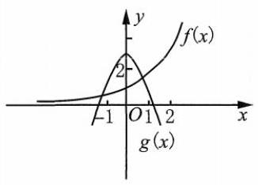

(第 88 题)

87. $\mathrm{C}$ 提示: $\left| {x + 1}\right|  = {\log }_{2}3,{x}_{1} = {\log }_{2}3 - 1 = {\log }_{2}\frac{3}{2},{x}_{2} =  - {\log }_{2}3 - 1 = {\log }_{2}\frac{1}{6}$ .

88. $\mathrm{C}$ 提示: 如图,记 $f\left( x\right)  = {2}^{x}, g\left( x\right)  = 3 - 2{x}^{2}$ ,由图可得, $f\left( x\right)$ 和 $g\left( x\right)$ 的交点数有两个,即有两个实数解.

89. A 提示: $\left( {{D5} - \left| x\right|  = 0, x \neq  2,{x}_{1} = 5,{x}_{2} =  - 5\text{ . ② }x - 2 = 1,{x}_{3} = 3\text{ . }}\right)$

③ $x - 2 =  - 1,5 - \left| x\right|$ 为偶数， ${x}_{4} = 1$ . 共四个实数解.

90. $\mathrm{D}$ 提示: $\text{ ① }x \geq  0,6 \cdot  {7}^{x} - {7}^{-x} = {1.6} \cdot  {\left( {7}^{x}\right) }^{2} - {7}^{x} - 1 = 0$ ,

$\left( {2 \cdot  {7}^{x} - 1}\right) \left( {3 \cdot  {7}^{x} + 1}\right)  = 0,{7}^{x} = \frac{1}{2}, x = {\log }_{7}\frac{1}{2} < 0$ ,舍去.

② $x < 0,6 \cdot  {7}^{-x} - {7}^{-x} = 1,{7}^{-x} = \frac{1}{5}$ ，而 $- x > 0,{7}^{-x} > 1$ ，舍去.

综上所述，方程无实数解，解集为 $\varnothing$ .

91. C 提示: 函数值不含参数 $p$ 时, ${2}^{x} = \frac{1}{2}, x =  - 1.f\left( {-1}\right)  = \frac{1}{2}\left( {p - 1}\right)  - \frac{p}{2} =  - \frac{1}{2}$ .

92. $\mathrm{B}$ 提示: $8 \cdot  {\left( {2}^{x}\right) }^{2} - {33} \cdot  {2}^{x} + 4 = 0,\left( {8 \cdot  {2}^{x} - 1}\right) \left( {{2}^{x} - 4}\right)  = 0,{x}_{1} =  - 3,{x}_{2} = 2$ .

(4) $x = \frac{1}{4}$ (6) ${x}_{1} = {\log }_{\frac{2}{9}}2$

提示: (1) ${3}^{{x}^{2}} = {3}^{2x},{x}^{2} = {2x},{x}_{1} = 0,{x}_{2} = 2$ .

(2) $x\ln 3 = x\ln 2,\ln \frac{3}{2} \cdot  x = 0, x = 0$ .

(3) ${3}^{{x}^{2} - x + 2} = {81} = {3}^{4},{x}^{2} - x + 2 = 4.{x}_{1} = 2,{x}_{2} =  - 1$ .

(4) ${5}^{x - 1} \cdot  {5}^{3x} \cdot  {2}^{3x} \cdot  {2}^{-{3x}} = 1,{5}^{{4x} - 1} = 1.x = \frac{1}{4}$ .

(5) ${\left( \frac{4}{9}\right) }^{x} \cdot  {\left( \frac{27}{8}\right) }^{x - 1} = {2}^{2x} \cdot  {3}^{-{2x}} \cdot  {3}^{{3x} - 3} \cdot  {2}^{-{3x} + 3} = {2}^{3 - x} \cdot  {3}^{x - 3} = {\left( \frac{3}{2}\right) }^{x - 3} = \frac{2}{3}$ . $x - 3 =  - 1, x = 2.$

(6) $\left( {x - 1}\right) \ln 2 = {2x}\ln 3,\left( {\ln 2 - 2\ln 3}\right) x = \ln 2.\ln \frac{2}{9} \cdot  x = \ln 2, x = \frac{\ln 2}{\ln \frac{2}{9}} = {\log }_{\frac{2}{9}}2$ .

(3) $x = 0$ (4) $x =  - 1$

提示: $\left( 1\right) 2 \cdot  {\left( {2}^{x}\right) }^{2} - 7 \cdot  {2}^{x} + 3 = 0,\left( {2 \cdot  {2}^{x} - 1}\right) \left( {{2}^{x} - 3}\right)  = 0,{x}_{1} =  - 1,{x}_{2} = {\log }_{2}3$ .

(2) ${\left( {3}^{x}\right) }^{2} - 9 \cdot  {3}^{x} - {10} = 0,\left( {{3}^{x} - {10}}\right) \left( {{3}^{x} + 1}\right)  = 0.x = {\log }_{3}{10}$ .

(3) $3 \cdot  {\left( {3}^{x}\right) }^{2} - 2 \cdot  {3}^{x} - 1 = 0,\left( {3 \cdot  {3}^{x} + 1}\right) \left( {{3}^{x} - 1}\right)  = 0.x = 0$ .

(4) $a\left( {{a}^{2x} + {a}^{x}}\right)  = 1 + {a}^{x}, a{\left( {a}^{x}\right) }^{2} + \left( {a - 1}\right) {a}^{x} - 1 = 0,\left( {a \cdot  {a}^{x} - 1}\right) \left( {{a}^{x} + 1}\right)  = 0.{a}^{x} = \frac{1}{a}, x =  - 1$ .

95. (1) $3 \times  {\left( \frac{16}{81}\right) }^{x} + {\left( \frac{36}{81}\right) }^{x} - 2 = 0,3 \times  {\left( \frac{4}{9}\right) }^{2x} + {\left( \frac{4}{9}\right) }^{x} - 2 = 0$ ,

$\left\lbrack  {3 \cdot  {\left( \frac{4}{9}\right) }^{x} - 2}\right\rbrack  \left\lbrack  {{\left( \frac{4}{9}\right) }^{x} + 1}\right\rbrack   = 0.{\left( \frac{4}{9}\right) }^{x} = \frac{2}{3}, x = \frac{1}{2}.$

(2) ${\left( \sqrt{3} + \sqrt{2}\right) }^{x} + {\left( \sqrt{3} - \sqrt{2}\right) }^{x} = {10},{\left( \sqrt{3} + \sqrt{2}\right) }^{x} + {\left( \sqrt{3} + \sqrt{2}\right) }^{-x} = {10}$ ,

${\left( \sqrt{3} + \sqrt{2}\right) }^{2x} - {10}{\left( \sqrt{3} + \sqrt{2}\right) }^{x} + 1 = 0,{\left( \sqrt{3} + \sqrt{2}\right) }^{x} = \frac{{10} \pm  \sqrt{{100} - 4}}{2} = 5 \pm  2\sqrt{6}.$

$\therefore {x}_{1} = 2,{x}_{2} =  - 2$ .

(3) ${3}^{\frac{2}{x}} - {3}^{\frac{1}{x}} \cdot  {2}^{\frac{1}{x}} = {2}^{\frac{2}{x}},{\left( \frac{3}{2}\right) }^{\frac{2}{x}} - {\left( \frac{3}{2}\right) }^{\frac{1}{x}} - 1 = 0$ .

$\because {\left( \frac{3}{2}\right) }^{\frac{1}{x}} > 0,{\left( \frac{3}{2}\right) }^{\frac{1}{x}} = \frac{1 + \sqrt{1 + 4}}{2} = \frac{1 + \sqrt{5}}{2}$ ,

$\therefore \frac{1}{x} = {\log }_{\frac{3}{2}}\frac{1 + \sqrt{5}}{2}$ ,解得 $x = {\log }_{\frac{1 + \sqrt{5}}{2}}\frac{3}{2}$ .

(4) ${\left( {2}^{x + \sqrt{{x}^{2} - 2}}\right) }^{2} - \frac{5}{2} \cdot  {2}^{x + \sqrt{{x}^{2} - 2}} - 6 = 0,2 \cdot  {\left( {2}^{x + \sqrt{{x}^{2} - 2}}\right) }^{2} - 5 \cdot  {2}^{x + \sqrt{{x}^{2} - 2}} - {12} = 0$ ,

$\left( {2 \cdot  {2}^{x + \sqrt{{x}^{2} - 2}} + 3}\right) \left( {{2}^{x + \sqrt{{x}^{2} - 2}} - 4}\right)  = 0.\;\therefore x + \sqrt{{x}^{2} - 2} = 2.$

$\therefore \sqrt{{x}^{2} - 2} = 2 - x,{x}^{2} - 2 = {x}^{2} - {4x} + 4, x = \frac{3}{2}$ . 经检验, $\frac{3}{2}$ 为原方程的解.

96. 代入 $x = 2,2{a}^{2} - {7a} + 3 = 0.{a}_{1} = \frac{1}{2},{a}_{2} = 3$ .

① 当 $a = \frac{1}{2}$ 时， $2 \cdot  {\left\lbrack  {\left( \frac{1}{2}\right) }^{x - 1}\right\rbrack  }^{2} - 7 \cdot  {\left( \frac{1}{2}\right) }^{x - 1} + 3 = 0$ ， ${\left( \frac{1}{2}\right) }^{x - 1} = \frac{1}{2}$ 或 $3.{x}_{1} = 2,{x}_{2} =  - {\log }_{2}3 + 1$ .

② 当 $a = 3$ 时， $2 \cdot  {\left( {3}^{x - 1}\right) }^{2} - 7 \cdot  {3}^{x - 1} + 3 = 0$ ， ${3}^{x - 1} = \frac{1}{2}$ 或 $3.{x}_{1} = 2$ ， ${x}_{2} =  - {\log }_{3}2 + 1$ .

97. ${a}^{2x} - 1 = b\left( {{a}^{2x} + 1}\right) ,\left( {1 - b}\right) {a}^{2x} = b + 1$ .

$\text{ ① }b = 1$ ,解集为 $\varnothing$ .

② $b \neq  1,{a}^{2x} = \frac{b + 1}{1 - b}$ .

(i) $b \in  ( - \infty , - 1\rbrack  \cup  \left( {1, + \infty }\right)  : \frac{b + 1}{1 - b} \leq  0$ . 解集为 $\varnothing$ .

(ii) $b \in  \left( {-1,1}\right) , x = {\log }_{{a}^{2}}\left( \frac{b + 1}{1 - b}\right)$ .

综上所述， $b \in  ( - \infty , - 1\rbrack  \cup  \lbrack 1, + \infty )$ 无实数解； $b \in  \left( {-1,1}\right) , x = {\log }_{{a}^{2}}\left( \frac{1 + b}{1 - b}\right)$ .

98.(1)令 $t = {3}^{x}$ ，则方程 ${t}^{2} + \left( {a + 4}\right) t + 4 = 0$ 有正根. * * ， ${t}_{1}{t}_{2} = 4$ ， $\therefore$ 该方程有两个正根.

$\therefore \Delta  = {\left( a + 4\right) }^{2} - {16} \geq  0$ ,解得 $a \in  \left( {-\infty , - 8\rbrack \cup \lbrack 0, + \infty }\right)$ .

$\because {x}_{1} + {x}_{2} =  - \left( {a + 4}\right)  > 0,\;\therefore a <  - 4.\;\therefore a \in  ( - \infty , - 8\rbrack$ .

(2) ${\left( {3}^{-\left| {x - 1}\right| }\right) }^{2} - {2a} \cdot  {3}^{-\left| {x - 1}\right| } + {2a} + 1 = 0$ .

设 $t = {3}^{-\left| {x - 1}\right| } \in  (0,1\rbrack$ ,则 ${t}^{2} - {2at} + {2a} + 1 = 0,\therefore {t}^{2} + 1 = {2a}\left( {t - 1}\right)$ ,且 $t \neq  1$ .

$\therefore \;a = \frac{1}{2} \cdot  \frac{{t}^{2} + 1}{t - 1} = \frac{1}{2}\left( {t + 1 + \frac{2}{t - 1}}\right)  =  - \frac{1}{2}\left( {1 - t + \frac{2}{1 - t}}\right)  + 1,1 - t \in  \left( {0,1}\right)$ .

$\because$ 函数 $f\left( x\right)  = x + \frac{2}{x}$ 在区间 $\left( {0,1}\right)$ 上是严格减函数,

$\therefore \;1 - t + \frac{2}{1 - t} \in  \left( {3, + \infty }\right) ,\;\therefore \;a \in  \left( {-\infty , - \frac{1}{2}}\right)$ .

99. C 提示: ${\left( x - 1\right) }^{2} = {100},{x}_{1} = {11},{x}_{2} =  - 9$ .

100. D 提示: ${\log }_{a}{x}^{2} = {\log }_{a}\left( \frac{\sqrt{a + 1} - \sqrt{a}}{\sqrt{a + 1} + \sqrt{a}}\right)  = {\log }_{a}{\left( \sqrt{a + 1} - \sqrt{a}\right) }^{2}$ ,

$\therefore {x}^{2} = {\left( \sqrt{a + 1} - \sqrt{a}\right) }^{2}, x =  \pm  \left( {\sqrt{a + 1} - \sqrt{a}}\right)$ .

101. A 提示: $2\left( {1 + \lg {x}^{2}}\right)  = {\left( 1 + \lg x\right) }^{2},2 + 4\lg x = {\lg }^{2}x + 2\lg x + 1,{\lg }^{2}x - 2\lg x - 1 = 0,\lg x = \frac{2 \pm  \sqrt{4 + 4}}{2} = 1 \pm  \sqrt{2}$ .

$\therefore \;{x}_{1} = {10}^{1 + \sqrt{2}},{x}_{2} = {10}^{1 - \sqrt{2}}$ .

102. C 提示: ${\log }_{5}\left\lbrack  \frac{{\left( x - 8\right) }^{2}}{x - 2}\right\rbrack   = 2,{\left( x - 8\right) }^{2} = {25}\left( {x - 2}\right) ,{x}^{2} - {16x} + {64} = {25x} - {50},{x}^{2} - {41x} + {114} = 0$ , $\left( {x - 3}\right) \left( {x - {38}}\right)  = 0.{x}_{1} = 3,{x}_{2} = {38}$ .

103. C 提示: $\lg x - 4 = 0, x = {10000}$ .

104. (1) $x = 4\;\left( 2\right) \;x =  - 1 + 2\sqrt{2}$ (4) $x = 4$ (5) ${x}_{1} =  - 1,{x}_{2} = 1$

(6) ${x}_{1} = \frac{1}{10},{x}_{2} = \frac{1}{100}\;$ (7) ${x}_{1} = \frac{1}{1000},{x}_{2} = {10}$ (8) ${x}_{1} = {16},{x}_{2} = \frac{1}{16}$

提示: (1) ${\log }_{4}{\left( x - 1\right) }^{2} = {\log }_{4}\left( {x + 5}\right) , x > 1.{\left( x - 1\right) }^{2} = x + 5,{x}^{2} - {3x} - 4 = 0.{x}_{1} = 4,{x}_{2} =  - 1$ (舍去).

(2) ${\log }_{4}\left( {2 - x}\right)  = {\log }_{4}\left\lbrack  \frac{{\left( x - 1\right) }^{2}}{4}\right\rbrack  ,1 < x < 2$ .

${\left( x - 1\right) }^{2} = 8 - {4x},{x}^{2} + {2x} - 7 = 0.{x}_{1} =  - 1 + 2\sqrt{2},{x}_{2} =  - 1 - 2\sqrt{2}$ (舍去).

(3) ${x}^{2} - x = 2, x \in  \left( {1, + \infty }\right) .{x}_{1} = 2,{x}_{2} =  - 1$ (舍去).

(4) ${\log }_{\sqrt{{16} - {3x}}}\left( {x - 2}\right)  = {\log }_{2\sqrt{2}}2\sqrt{2} = 1,\sqrt{{16} - {3x}} = x - 2,2 < x < \frac{16}{3}$ 且 $x \neq  5$ . ${16} - {3x} = {x}^{2} - {4x} + 4,{x}^{2} - x - {12} = 0.{x}_{1} = 4,{x}_{3} =  - 3$ (舍去).

(5) $\left| {{2x} - 3}\right|  = \left| {{3x} - 2}\right|$ . ① ${2x} - 3 = {3x} - 2,{x}_{1} =  - 1$ ; ② ${2x} - 3 = 2 - {3x},{x}_{2} = 1$ .

(6) $\left( {\lg x + 2}\right) \left( {\lg x + 1}\right)  = 0.\lg x =  - 1$ 或 $- 2.{x}_{1} = \frac{1}{10},{x}_{2} = \frac{1}{100}$ .

(7) ${\lg }^{2}x + 2\lg x - 3 = 0.\left( {\lg x + 3}\right) \left( {\lg x - 1}\right)  = 0,\lg x =  - 3$ 或 $1.{x}_{1} = \frac{1}{1000},{x}_{2} = {10}$ .

(8) ${\left( {\log }_{4}x\right) }^{2} - \frac{1}{2}\left| {{\log }_{2}x}\right|  - 2 = 0,\frac{1}{4}{\left| {\log }_{2}x\right| }^{2} - \frac{1}{2}\left| {{\log }_{2}x}\right|  - 2 = 0,{\left| {\log }_{2}x\right| }^{2} - 2\left| {{\log }_{2}x}\right|  - 8 = 0$ . $\left( {\left| {{\log }_{2}x}\right|  - 4}\right) \left( {\left| {{\log }_{2}x}\right|  + 2}\right)  = 0,\left| {{\log }_{2}x}\right|  = 4.{x}_{1} = {16},{x}_{2} = \frac{1}{16}$ .

105. (1) ${\ln }^{2}x - 2\ln x - 2 = 0,\ln \alpha  + \ln \beta  = 2,\ln \alpha \ln \beta  =  - 2$ .

${\log }_{a}\beta  + {\log }_{\beta }\alpha  = \frac{\ln \beta }{\ln \alpha } + \frac{\ln \alpha }{\ln \beta } = \frac{1}{\ln \alpha \ln \beta }\left( {{\ln }^{2}\alpha  + {\ln }^{2}\beta }\right)$

$= \frac{1}{\ln \alpha \ln \beta }\left\lbrack  {{\left( \ln \alpha  + \ln \beta \right) }^{2} - 2\ln \alpha \ln \beta }\right\rbrack   =  - \frac{1}{2}\left\lbrack  {{2}^{2} - 2 \cdot  \left( {-2}\right) }\right\rbrack   =  - 4.$

(2) ${x}^{2} - {5x} + 8 = 2,{x}_{1} = 2,{x}_{2} = 3,\therefore B = \{ 2,3\}$ .

${x}^{2} + {2x} - 8 = 0,{x}_{1} =  - 4,{x}_{2} = 2,\therefore C = \{  - 4,2\}$ .

$\because A \cap  C = \varnothing ,\therefore  - 4 \notin  A,2 \notin  A.\;\because A \cap  B \neq  \varnothing ,\therefore 3 \in  A$ .

$\therefore 9 - {3a} + {a}^{2} - {19} = 0,\therefore {a}_{1} = 5,{a}_{2} =  - 2$ .

当 ${a}_{1} = 5$ 时， ${x}_{1} = 3,{x}_{2} = {2.2} \in  A$ ，舍去.

当 ${a}_{2} =  - 2$ 时， ${x}_{1} = 3,{x}_{2} =  - 5$ ，满足.

$\therefore a =  - 2$ .

(3) ${\log }_{a}\left( {{a}^{2x} - 1}\right)  = {\log }_{a}\left( {{a}^{x} + 1}\right) ,{a}^{2x} - 1 = {a}^{x} + 1,\left( {{a}^{x} - 2}\right) \left( {{a}^{x} + 1}\right)  = 0$ . $\;\therefore {a}^{x} = 2$ . $\;\therefore \;x = {\log }_{a}2$ .

106. (1) $\because {\log }_{\frac{1}{2}}\left( {{9}^{x - 1} - 5}\right)  = {\log }_{\frac{1}{2}}\left( {{3}^{x - 1} - 2}\right)  + {\log }_{\frac{1}{2}}4 = {\log }_{\frac{1}{2}}\left( {4 \cdot  {3}^{x - 1} - 8}\right)$ ,

$\therefore \;{9}^{x - 1} - 5 = 4 \cdot  {3}^{x - 1} - 8,{9}^{x - 1} - 4 \cdot  {3}^{x - 1} + 3 = 0,\left( {{3}^{x - 1} - 1}\right) \left( {{3}^{x - 1} - 3}\right)  = 0$ .

由 ${3}^{x - 1} > 2,{9}^{x - 1} > 5$ ,得 ${3}^{x - 1} = 3.\;\therefore x = 2$ .

(2) $\because \frac{\ln 2}{\ln \left( {0.5x}\right) } - \frac{2\ln x}{\ln \left( {{0.5}{x}^{3}}\right) } = \frac{\ln 4}{\ln \left( {{0.5}{x}^{3}}\right) }$ ，

$\therefore \;\ln 2\left( {3\ln x - \ln 2}\right)  - 2\ln x\left( {\ln x - \ln 2}\right)  = 2\ln 2\left( {\ln x - \ln 2}\right)$ ,

$\therefore \;3\ln 2\ln x - {\ln }^{2}2 - 2{\ln }^{2}x + 2\ln 2\ln x = 2\ln 2\ln x - 2{\ln }^{2}2$ ,

$\therefore \;2{\ln }^{2}x - 3\ln 2\ln x - {\ln }^{2}2 = 0$ . 解得 $\ln x = \frac{3 \pm  \sqrt{9 + 8}}{4}\ln 2 = \frac{3 \pm  \sqrt{17}}{4}\ln 2.\therefore \;{x}_{1} = {2}^{\frac{3 + \sqrt{17}}{4}},{x}_{2} = {2}^{\frac{3 - \sqrt{17}}{4}}$ .

(3)两边同时取以 5 为底的对数,得 $\left( {{\log }_{5}x - 1}\right)  \cdot  \frac{1}{2}{\log }_{5}x = 1$ .

$\therefore \;{\log }_{5}^{2}x - {\log }_{5}x - 2 = 0,\left( {{\log }_{5}x - 2}\right) \left( {{\log }_{5}x + 1}\right)  = 0,\;\therefore \;{x}_{1} = {25},{x}_{2} = \frac{1}{5}$ .

(4) $2{x}^{\lg x} = {20},{x}^{\lg x} = {10}$ . 两边同时取以 10 为底的对数, ${\lg }^{2}x = \lg {10} = 1$ .

$\therefore \;\lg x = 1$ 或 $- 1.\;\therefore \;{x}_{1} = {10},{x}_{2} = \frac{1}{10}$ .

(5) $\left| {{\log }_{2}x}\right|  = \left| {1 + 2{\log }_{2}x}\right|  - 2$ ,设 ${\log }_{2}x = t,\left| t\right|  = \left| {1 + {2t}}\right|  - 2$ .

① $t \geq  0$ ， $t = 1 + {2t} - 2$ ，解得 $t = 1$ ，满足题意；

② $- \frac{1}{2} < t < 0, - t = 1 + {2t} - 2$ ，解得 $t = \frac{1}{3}$ ，舍去；

③ $t \leq   - \frac{1}{2}, - t =  - 1 - {2t} - 2$ ，解得 $t =  - 3$ ，满足题意.

$\therefore {\log }_{2}x = 1$ 或 -3 .

$\therefore \;{x}_{1} = 2,{x}_{2} = \frac{1}{8}$ .

(6) $\because \frac{1}{{\log }_{x}y} - 3{\log }_{x}y = 2,\therefore 3{\log }_{x}^{2}y + 2{\log }_{x}y - 1 = 0,\left( {3{\log }_{x}y - 1}\right) \left( {{\log }_{x}y + 1}\right)  = 0$ .

$\therefore \;{\log }_{x}y = \frac{1}{3}$ 或 -1 .

${2}^{xy} = {\left( \frac{1}{2}\right) }^{-{16}} = {2}^{16},\;\therefore \;{xy} = {16}.$

① ${\log }_{x}y =  - 1, y = {x}^{-1},{xy} = 1$ ,舍去;

② ${\log }_{x}y = \frac{1}{3}, y = {x}^{\frac{1}{3}},{x}^{\frac{4}{3}} = {16}, x = 8, y = 2$ .

综上所述, $\left\{  \begin{array}{l} x = 8, \\  y = 2. \end{array}\right.$

107. (1) $\lg \left\lbrack  {{10}\left( {x + a}\right) }\right\rbrack   = \lg \left( {{ax} - 1}\right) ,{10x} + {10a} = {ax} - 1,\left( {a - {10}}\right) x = {10a} + 1$ .

① $a = {10}$ ，方程无实数根；② $a \neq  {10}$ ， $x = \frac{{10a} + 1}{a - {10}}$ .

$\because x + a = \frac{{a}^{2} + 1}{a - {10}} > 0,\;\therefore a > {10}$ . 此时 ${ax} - 1 = {10}\left( {x + a}\right)  > 0$ .

$\therefore a < {10}$ ,方程无实数根; $a > {10}, x = \frac{{10a} + 1}{a - {10}}$ .

综上所述, $a \in  ( - \infty ,{10}\rbrack$ ,方程无实数根; $a \in  \left( {{10}, + \infty }\right) , x = \frac{{10a} + 1}{a - {10}}$ .

(2) $\lg \left( {{ax} - 1}\right)  = 1 + \lg \left( {x - 3}\right)  = \lg \left\lbrack  {{10}\left( {x - 3}\right) }\right\rbrack$ ,

$\therefore {ax} - 1 = {10x} - {30},\left( {{10} - a}\right) x = {29}$ .

① $a = {10}$ ，方程无实数根；

② $a \neq  {10}, x = \frac{29}{{10} - a}.\;\because x - 3 = \frac{{3a} - 1}{{10} - a} > 0, a \in  \left( {\frac{1}{3},{10}}\right)$ . 此时 ${ax} - 1 = {10}\left( {x - 3}\right)  > 0$ .

$\therefore a \in  \left( {-\infty ,\frac{1}{3}}\right\rbrack   \cup  \lbrack {10}, + \infty )$ ,方程无实数根; $a \in  \left( {\frac{1}{3},{10}}\right) , x = \frac{29}{{10} - a}$ .

(3) $\lg \left( \frac{{x}^{2}}{x - 1}\right)  = \lg a,\therefore {x}^{2} = a\left( {x - 1}\right) ,{x}^{2} - {ax} + a = 0$ . 又 $a > 0,\Delta  = {a}^{2} - {4a}$ .

① $a \in  \left( {0,4}\right)$ ， $\Delta  < 0$ ，方程无实数根；

② $a = 4,{x}_{1} = {x}_{2} = 2$ ；

③ $a \in  \left( {4, + \infty }\right) , x = \frac{1}{2}\left( {a \pm  \sqrt{{a}^{2} - {4a}}}\right)$ .

$\because \frac{1}{2}\left( {a + \sqrt{{a}^{2} - {4a}}}\right)  > \frac{1}{2}a > 2,\frac{1}{2}\left( {a - \sqrt{{a}^{2} - {4a}}}\right)  = \frac{4a}{2\left( {a + \sqrt{{a}^{2} - {4a}}}\right) } = \frac{2}{1 + \sqrt{1 - \frac{4}{a}}} > \frac{2}{2} = 1$ .

$\therefore$ 两个实数根都是非增根.

综上所述, $a \in  \left( {0,4}\right)$ ,方程无实数根; $a = 4, x = 2;a \in  \left( {4, + \infty }\right) , x = \frac{1}{2}\left( {a \pm  \sqrt{{a}^{2} - {4a}}}\right)$ .

108. (1) $f\left( {\lg a}\right)  = {a}^{\lg a - \frac{1}{2}} = \sqrt{10},\left( {\lg a - \frac{1}{2}}\right) \lg a = \lg \sqrt{10} = \frac{1}{2},2{\lg }^{2}a - \lg a - 1 = 0$ .

$\left( {2\lg a + 1}\right) \left( {\lg a - 1}\right)  = 0,\lg a =  - \frac{1}{2}$ 或 $1.\;\therefore \;{a}_{1} = \frac{\sqrt{10}}{10},{a}_{2} = {10}$ .

(2) $f\left( {{\log }_{2}x}\right)  = {\log }_{2}^{2}x - {\log }_{2}x + k = {\left( {\log }_{2}x - \frac{1}{2}\right) }^{2} + k - \frac{1}{4}$ .

设 $t = {\log }_{2}x, t$ 在 $\left( {0, + \infty }\right)$ 上是严格增函数.

$\because$ 要求使 $y = f\left( t\right)$ 为严格减函数的区间, $\therefore t = {\log }_{2}x < \frac{1}{2}, x \in  \left( {0,\sqrt{2}}\right)$ .

$\because \;{\log }_{2}f\left( a\right)  = 2,\;\therefore \;f\left( a\right)  = {\left( a - \frac{1}{2}\right) }^{2} + k - \frac{1}{4} = 4, f\left( {{\log }_{2}a}\right)  = {\log }_{2}{}^{2}a - {\log }_{2}a + k = k$ ,

$\therefore a = 2$ 或 $a = 1$ (舍去). $\therefore k = 2$ .

109. (1) $\left( {\lg x + \lg 2}\right) \left( {\lg x + \lg 3}\right)  =  - {a}^{2},{\lg }^{2}x + \left( {\lg 2 + \lg 3}\right)  \cdot  \lg x + \lg 2 \cdot  \lg 3 =  - {a}^{2}$ ,

${\lg }^{2}x + \lg 6 \cdot  \lg x + {a}^{2} + \lg 2 \cdot  \lg 3 = 0.$

$\because \;\Delta  = {\lg }^{2}6 - 4{a}^{2} - 4\lg 2 \cdot  \lg 3 = {\left( \lg 2 + \lg 3\right) }^{2} - 4{a}^{2} - 4\lg 2 \cdot  \lg 3 = {\left( \lg 2 - \lg 3\right) }^{2} - 4{a}^{2} > 0$ ,

$\therefore \frac{\lg 2 - \lg 3}{2} < a < \frac{\lg 3 - \lg 2}{2}$ ,即 $\lg \sqrt{\frac{2}{3}} < a < \lg \sqrt{\frac{3}{2}}$ .

$\therefore \;\lg {x}_{1} + \lg {x}_{2} =  - \lg  = \lg \frac{1}{6},\;\therefore \;{x}_{1}{x}_{2} = \frac{1}{6}$ .

(2) $\left( {\lg a + \lg x}\right) \left( {\lg a + 2\lg x}\right)  = 4,2{\lg }^{2}x + 3\lg a \cdot  \lg x + {\lg }^{2}a - 4 = 0$ .

$\because \;\Delta  = 9{\lg }^{2}a - 8{\lg }^{2}a + {16} \cdot  2 = {\lg }^{2}a + {32} > 0,\lg {x}_{1},\lg {x}_{2} > 0$ ,

$\therefore \left\{  {\begin{array}{l} \lg {x}_{1} + \lg {x}_{2} =  - \frac{3}{2}\lg a > 0, \\  \lg {x}_{1} \cdot  \lg {x}_{2} = \frac{{\lg }^{2}a - 4}{2} > 0. \end{array}\;\therefore \lg a <  - 2, a \in  \left( {0,\frac{1}{100}}\right) .}\right.$

(3) $\left( {\lg a + \lg x}\right) \left( {\lg a + 2\lg x}\right)  = 4,2{\lg }^{2}x + 3\lg a\lg x + {\lg }^{2}a - 4 = 0$ .

$\because \Delta  = {\lg }^{2}a + {32} > 0,\lg \alpha ,\lg \beta  < 0,$

$\therefore \left\{  {\begin{array}{l} \lg \alpha  + \lg \beta  =  - \frac{3}{2}\lg a < 0, \\  \lg \alpha  \cdot  \lg \beta  = \frac{{\lg }^{2}a - 4}{2} > 0. \end{array}\;\therefore \lg a > 2.}\right.$

$\therefore \left| {\lg \alpha  - \lg \beta }\right|  = \sqrt{{\left( \lg \alpha  + \lg \beta \right) }^{2} - 4\lg \alpha  \cdot  \lg \beta } = \sqrt{\frac{9}{4}{\lg }^{2}a - 2\left( {{\lg }^{2}a - 4}\right) } = \sqrt{\frac{1}{4}{\lg }^{2}a + 8} \leq  2\sqrt{3}$ .

$\therefore \frac{1}{4}{\lg }^{2}a + 8 \leq  {12}$ ,即 ${\lg }^{2}a \leq  {16}$ .

$\because \lg a > 2,\;\therefore \lg a \in  (2,4\rbrack .\therefore a \in  ({100},{10000}\rbrack$ .

(4) $\because \lg a < 0, f{\left( x\right) }_{\max } = 4\lg a - \frac{4}{4\lg a} = 4\lg a - \frac{1}{\lg a} = 3$ ,

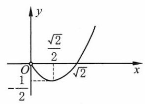

[第 109(5)题]

$\therefore \;4{\lg }^{2}a - 3\lg a - 1 = 0,\left( {4\lg a + 1}\right) \left( {\lg a - 1}\right)  = 0$ .

$\because \lg a < 0,\;\therefore \lg a =  - \frac{1}{4},\;\therefore a = {10}^{-\frac{1}{4}}$ .

(5) $\because {\log }_{2}{2x} = 2{\log }_{2}\left( {x - a}\right)$ ,

$\therefore \sqrt{2x} = x - a, a = x - \sqrt{2x}$ . 设 $t = \sqrt{x} > 0$ ,

则 $a = {t}^{2} - \sqrt{2}t = {\left( t - \frac{\sqrt{2}}{2}\right) }^{2} - \frac{1}{2}, t \in  \left( {0, + \infty }\right)$ .

如图, $\because$ 直线 $y = a$ 和图像有且仅有一个交点, $\therefore a =  - \frac{1}{2}$ 或 $a \geq  0$ .

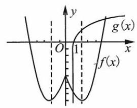

[第 110 题]

110. 如图, $f\left( x\right)  = {x}^{2} - 4\left| x\right|  - 5, g\left( x\right)  = {\log }_{2}x$ . 由图像可知,方程有两个实数解. 证明略.

111. (1) 令 $x = y = 0$ ,则 $f\left( 0\right)  = f\left( 0\right)  + f\left( 0\right) .\therefore f\left( 0\right)  = 0$ .

再令 $- x = y$ ,则 $f\left( x\right)  + f\left( {-x}\right)  = f\left( 0\right)  = 0\left( {\forall x \in  \mathbf{R}}\right)$ .

$\therefore f\left( {-x}\right)  =  - f\left( x\right)$ ,且定义域 $\mathbf{R}$ 关于原点对称, $\therefore y = f\left( x\right)$ 是奇函数.

(2) $f\left( 1\right)  = 2, f\left( {-1}\right)  =  - f\left( 1\right)  =  - 2$ .

由 $y = f\left( x\right)$ 在 $\mathbf{R}$ 上单调知, $y = f\left( x\right)$ 在 $\mathbf{R}$ 上是严格增函数.

$\because f\left( {k{\log }_{2}t}\right)  <  - f\left( {{\log }_{2}t - {\log }_{2}^{2}t - 2}\right)  = f\left( {{\log }_{2}^{2}t - {\log }_{2}t + 2}\right)$ ,

$\therefore \;k{\log }_{2}t < {\log }_{2}^{2}t - {\log }_{2}t + 2,{\log }_{2}^{2}t - \left( {1 + k}\right) {\log }_{2}t + 2 > 0$ 恒成立.

$\because \;{\log }_{2}t$ 的值域为 $\mathbf{R},\;\therefore \;\Delta  = {k}^{2} + {2k} + 1 - 8 < 0,\;\therefore \;k \in  \left( {-2\sqrt{2} - 1,2\sqrt{2} - 1}\right)$ .

112. (1) 令 $x = y = 1$ ,则 $f\left( 1\right)  = {2f}\left( 1\right) , f\left( 1\right)  = 0$ . 设 $0 < {x}_{1} < {x}_{2},{x}_{2} = m{x}_{1}\left( {m > 1}\right)$ .

$\therefore f\left( {x}_{2}\right)  - f\left( {x}_{1}\right)  = f\left( {m{x}_{1}}\right)  - f\left( {x}_{1}\right)  = f\left( m\right)  + f\left( {x}_{1}\right)  - f\left( {x}_{1}\right)  = f\left( m\right)  > 0$ .

即 $m > 1$ 时, $f\left( x\right)  > 0.\;\therefore f\left( x\right)$ 在 $\left( {1, + \infty }\right)$ 的值域为 $\left( {0, + \infty }\right)$ .

(2)如图，取 $A\left( {a, f\left( a\right) }\right)$ ， $B\left( {a + {2, f}\left( {a + 2}\right) }\right)$ ， $C\left( {a + 4, f\left( {a + 4}\right) }\right)$ 三点，

${S}_{\bigtriangleup {ABC}} = \left| {{S}_{\bigtriangleup {ABD}} + {S}_{{\text{ 梯 }\text{ 形 }}{BDEC}} - {S}_{\bigtriangleup {AEC}}}\right|$

$= \left| {\frac{1}{2}\{ 2 \cdot  \left\lbrack  {f\left( {a + 2}\right)  - f\left( a\right) }\right\rbrack   + 2 \cdot  \left\lbrack  {f\left( {a + 2}\right)  - f\left( a\right)  + f\left( {a + 4}\right)  - f\left( a\right) }\right\rbrack   - 4 \cdot  \left\lbrack  {f\left( {a + 4}\right)  - f\left( a\right) }\right\rbrack  \} }\right|$

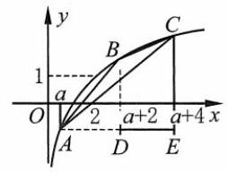

[第 112(2)题]

$= \left| {{2f}\left( {a + 2}\right)  - f\left( a\right)  - f\left( {a + 4}\right) }\right| .$

$\because f\left( 1\right)  = 0$ ,取 $y = \frac{1}{x} \in  \left( {0, + \infty }\right) , f\left( 1\right)  = f\left( x\right)  + f\left( \frac{1}{x}\right)  = 0$ ,

$\therefore f\left( \frac{1}{x}\right)  =  - f\left( x\right) , f\left( \frac{y}{x}\right)  = f\left( y\right)  - f\left( x\right)$ .

$\therefore \;{S}_{\bigtriangleup {ABC}} = \left| {f\left( \frac{{\left( a + 2\right) }^{2}}{a\left( {a + 4}\right) }\right) }\right|  \in  \left( {0,1}\right)$ .

由 $f\left( 1\right)  = 0, f\left( 2\right)  = 1, y = f\left( x\right)$ 在定义域内是严格增函数,知 $1 < \frac{{\left( a + 2\right) }^{2}}{a\left( {a + 4}\right) } < 2, a \in  \left( {2\sqrt{2} - 2, + \infty }\right)$ .

113. (1) $t = {\left( \frac{1}{3}\right) }^{\left| x - 2\right| } \in  (0,1\rbrack , a = {t}^{2} - {4t},\therefore a \in  \lbrack  - 3,0)$ .

(2) $\left| {{\log }_{2}x}\right|  = \left| {1 + 2{\log }_{2}x}\right|  - 2$ .

① ${\log }_{2}x \leq   - \frac{1}{2}, - {\log }_{2}x =  - 1 - 2{\log }_{2}x - 2,{\log }_{2}x =  - 3, x = \frac{1}{8}$ .

② ${\log }_{2}x \in  \left( {-\frac{1}{2},0}\right)$ ， $- {\log }_{2}x = 1 + 2{\log }_{2}x - 2,{\log }_{2}x = \frac{1}{3}$ ，舍去.

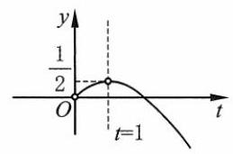

[第 114(1)题]

③ ${\log }_{2}x \in  \lbrack 0, + \infty ),{\log }_{2}x = 1 + 2{\log }_{2}x - 2,{\log }_{2}x = 1, x = 2$ .

$\therefore \;{x}_{1} = 2,{x}_{2} = \frac{1}{8}$ .

114. (1) $\left\{  \begin{array}{l} x >  - a, \\  x > 0, \end{array}\right.$ 且 $x + a \neq  1,\sqrt{2x} = x + a, a =  - x + \sqrt{2x}$ .

若 $x + a \neq  1$ ,则 $\sqrt{2x} \neq  1$ ,即 $x \neq  \frac{1}{2}$ .

$\therefore x \in  \left( {0,\frac{1}{2}}\right)  \cup  \left( {\frac{1}{2}, + \infty }\right)$ .

令 $t = \sqrt{2x} \in  \left( {0,1}\right)  \cup  \left( {1, + \infty }\right)$ ,

则 $a =  - \frac{1}{2}{t}^{2} + t =  - \frac{1}{2}{\left( t - 1\right) }^{2} + \frac{1}{2}$ .

$\therefore$ 直线 $y = a$ 和 $f\left( t\right)  =  - \frac{1}{2}{\left( t - 1\right) }^{2} + \frac{1}{2}$ 的图像的交点数即方程的解的个数.

如图，由图像可知， $a \in  \left\lbrack  {\frac{1}{2}, + \infty }\right)$ 时，方程无解.

$a \in  \left( {0,\frac{1}{2}}\right)$ 时，方程有两解.

$a \in  ( - \infty ,0\rbrack$ 时,方程有唯一解.

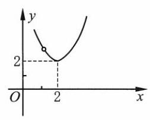

[第 114(2)题]

(2) $1 + {\log }_{x}\left( {2\lg a - x}\right)  = {\log }_{x}4,{\log }_{x}\left( {2\lg a - x}\right)  = {\log }_{x}\left( \frac{4}{x}\right)$ .

$\because 2\lg a - x > 0$ 且 $x \in  \left( {0,1}\right)  \cup  \left( {1, + \infty }\right)$ ,

$\therefore \;2\lg a - x = \frac{4}{x},\;\therefore \;\lg a = \frac{1}{2}\left( {x + \frac{4}{x}}\right) , x \in  \left( {0,1}\right)  \cup  \left( {1, + \infty }\right)$ .

$\therefore$ 直线 $y = \lg a$ 和 $f\left( x\right)  = \frac{1}{2}\left( {x + \frac{4}{x}}\right)$ 的图像的交点数即方程的解数.

如图，由图像知， $\lg a = 2$ 或 $\frac{5}{2}$ 时，方程有一个解；

$\lg a \in  \left( {2,\frac{5}{2}}\right)  \cup  \left( {\frac{5}{2}, + \infty }\right)$ 时,方程有两个解. 综上所述,当 $a = {100}$ 或 ${10}^{\frac{5}{2}}$ 时,方程有一个解.

当 $a \in  \left( {{100},{10}^{\frac{5}{2}}}\right)  \cup  \left( {{10}^{\frac{5}{2}}, + \infty }\right)$ 时,方程有两个解.

115. A 提示: $2\lg \left| x\right|  < 2,\lg \left| x\right|  < 1,\therefore 0 < \left| x\right|  < {10}.\;\therefore x \in  \left( {-{10},0}\right)  \cup  \left( {0,{10}}\right)$ .

116. $\mathrm{C}$ 提示: ${\left( {\log }_{2}x\right) }^{2} > {\log }_{2}{x}^{2},{\log }_{2}x - 2{\log }_{2}x > 0,\therefore {\log }_{2}x \in  \left( {-\infty ,0}\right)  \cup  \left( {2, + \infty }\right)$ ,

$\therefore x \in  \left( {0,1}\right)  \cup  \left( {4, + \infty }\right)$ .

117. $\mathrm{C}$ 提示: $a \in  \left( {0,1}\right)$ ,故 ${\log }_{b}\left( {x - 5}\right)  > 0$ . 由 $b \in  \left( {0,1}\right)$ ,得 $0 < x - 5 < 1, x \in  \left( {5,6}\right)$ .

118. $\mathrm{D}$ 提示: 当 $x > 1$ 时, ${\log }_{x}\frac{4}{5} < 0$ ,不等式成立; 当 $x \in  \left( {0,1}\right)$ 时, ${\log }_{x}\frac{4}{5} = \frac{1}{{\log }_{\frac{4}{5}}x} > 0$ .

$\therefore \;{\log }_{\frac{4}{5}}x > 1, x \in  \left( {0,\frac{4}{5}}\right) .\;\therefore \;x \in  \left( {0,\frac{4}{5}}\right)  \cup  \left( {1, + \infty }\right)$ .

119. C 提示: 当 $x \in  \left( {-\frac{1}{2},0}\right)$ 时, ${2x} + 1 \in  \left( {0,1}\right)$ ,此时 ${\log }_{{a}^{2} - 1}\left( {{2x} + 1}\right)  > 0$ 恒成立,则 $0 < {a}^{2} - 1 < 1$ ,

$\therefore a \in  \left( {-\sqrt{2}, - 1}\right)  \cup  \left( {1,\sqrt{2}}\right)$ .

120. C 提示: ${x}^{2} - {2x} + 3 = {\left( x - 1\right) }^{2} + 2 > 1$ ,故 $0 < a < 1, f\left( x\right)  = {\log }_{a}x$ 是 $\left( {0, + \infty }\right)$ 上的严格减函数.

$\therefore {\log }_{a}\left( {{x}^{2} - {2x} + 3}\right)$ 的最大值为 ${\log }_{a}2,{\log }_{a}2 \leq   - 1, - 1 \leq  {\log }_{2}a < 0,\therefore a \in  \left\lbrack  {\frac{1}{2},1}\right)$ .

121. (1) ${3x} - 2 > 0, x + 1 > 0 \Rightarrow  x > \frac{2}{3}$ .

$\because f\left( x\right)  = {\log }_{\frac{1}{2}}x$ 在区间 $\left( {0, + \infty }\right)$ 上是严格减函数， $\therefore {3x} - 2 < x + 1, x < \frac{3}{2}$ ,

$\therefore x \in  \left( {\frac{2}{3},\frac{3}{2}}\right)$ .

(2) $\because {x}^{2} - x - 2 > 0,2{x}^{2} - {7x} + 3 > 0,\therefore x \in  \left( {-\infty , - 1}\right)  \cup  \left( {3, + \infty }\right)$ .

$\because f\left( x\right)  = {\log }_{\frac{1}{3}}x$ 在区间 $\left( {0, + \infty }\right)$ 上是严格减函数,

$\therefore {x}^{2} - x - 2 > 2{x}^{2} - {7x} + 3,{x}^{2} - {6x} + 5 < 0, x \in  \left( {1,5}\right)$ .

$\therefore x \in  \left( {3,5}\right)$ .

(3)当 $x \in  \left( {1, + \infty }\right)$ 时， ${\log }_{x}\frac{1}{2} < 0$ ，不等式成立；

当 $x \in  \left( {0,1}\right)$ 时， ${\log }_{x}\frac{1}{2} > 0,\therefore {\log }_{\frac{1}{2}}x = {\left( {\log }_{x}\frac{1}{2}\right) }^{-1} > 1, x \in  \left( {0,\frac{1}{2}}\right)$ .

综上所述, $x \in  \left( {0,\frac{1}{2}}\right)  \cup  \left( {1, + \infty }\right)$ .

(4) $0 < x - \frac{1}{x} < 1$ ，左侧不等式: $x\left( {x + 1}\right) \left( {x - 1}\right)  > 0$ ， $\therefore x \in  \left( {-1,0}\right)  \cup  \left( {1, + \infty }\right)$ .

右侧不等式: $\frac{{x}^{2} - x - 1}{x} < 0, x\left( {x - \frac{1 + \sqrt{5}}{2}}\right) \left( {x - \frac{1 - \sqrt{5}}{2}}\right)  < 0$ ,

$\therefore x \in  \left( {-\infty ,\frac{1 - \sqrt{5}}{2}}\right)  \cup  \left( {0,\frac{1 + \sqrt{5}}{2}}\right)$ .

综上所述, $x \in  \left( {-1,\frac{1 - \sqrt{5}}{2}}\right)  \cup  \left( {1,\frac{1 + \sqrt{5}}{2}}\right)$ .

(5) $\because 0 < \left| {x - \frac{1}{2}}\right|  < \frac{1}{2},\therefore  - \frac{1}{2} < x - \frac{1}{2} < \frac{1}{2}$ 且 $x \neq  \frac{1}{2}$ ,

$\therefore \;x \in  \left( {0,\frac{1}{2}}\right)  \cup  \left( {\frac{1}{2},1}\right)$ .

122. $M : x - m > 3, x \in  \left( {m + 3, + \infty }\right) .P : 5 - {3x} \geq   - 1, x \in  ( - \infty ,2\rbrack$ .

$\therefore m + 3 < 2, m \in  \left( {-\infty , - 1}\right)$ .

123. (1) $\because 2 - x > 0$ 且 $x + 1 > 0$ 且 $x > 0,\therefore x \in  \left( {0,2}\right)$ .

$\therefore {\log }_{64}\left\lbrack  {{\left( 2 - x\right) }^{2}\left( {x + 1}\right) }\right\rbrack   \geq  {\log }_{64}{x}^{3}$ ,

$\therefore {\left( x - 2\right) }^{2}\left( {x + 1}\right)  \geq  {x}^{3},3{x}^{2} - 4 \leq  0,\therefore x \in  \left\lbrack  {-\frac{2\sqrt{3}}{3},\frac{2\sqrt{3}}{3}}\right\rbrack$ .

$\because x \in  \left( {0,2}\right) ,\;\therefore x \in  \left( {0,\frac{2\sqrt{3}}{3}}\right\rbrack$ .

(2) $\because x + {13} > 0$ 且 ${x}^{2} - {2x} - {15} > 0,\therefore x \in  \left( {-{13}, - 3}\right)  \cup  \left( {5, + \infty }\right)$ .

$\therefore x + {13} > {x}^{2} - {2x} - {15},\left( {x - 7}\right) \left( {x + 4}\right)  < 0, x \in  \left( {-4,7}\right)$ .

$\because x \in  \left( {-{13}, - 3}\right)  \cup  \left( {5, + \infty }\right) ,\;\therefore x \in  \left( {-4, - 3}\right)  \cup  \left( {5,7}\right)$ .

(3) 首先, $\left\{  {\begin{array}{l} x - 1 \geq  0, \\  3\sqrt{x - 1} - 1 > 0, \end{array}\;\therefore x > \frac{10}{9}}\right.$ .

$\therefore 3\sqrt{x - 1} - 1 > x,9\left( {x - 1}\right)  > {x}^{2} + {2x} + 1,{x}^{2} - {7x} + {10} < 0,\therefore x \in  \left( {2,5}\right)$ .

(4) $\left\{  {\begin{array}{l} x - 1 > 0, \\  x - 1 \neq  1, \\  6 - x - {x}^{2} > 0. \end{array}\;\therefore x \in  \left( {1,2}\right) }\right.$ ,故 $x - 1 \in  \left( {0,1}\right)$ .

$\therefore 6 - x - {x}^{2} < {\left( x - 1\right) }^{2},2{x}^{2} - x - 5 > 0$ ,

$\therefore \;x \in  \left( {-\infty ,\frac{1 - \sqrt{41}}{4}}\right)  \cup  \left( {\frac{1 + \sqrt{41}}{4}, + \infty }\right) .$

$\because x \in  \left( {1,2}\right) ,\;\therefore x \in  \left( {\frac{1 + \sqrt{41}}{4},2}\right)$ .

(5) 首先, $\left\{  {\begin{array}{l} x - 1 > 0, \\  x - 1 \neq  1, \\  x + 1 > 0, \\  x + 1 \neq  1. \end{array}\;\therefore x \in  \left( {1,2}\right)  \cup  \left( {2, + \infty }\right) }\right.$ .

当 $x \in  \left( {1,2}\right)$ 时, $0 < x - 1 < 1$ ,左边 $< 0 <$ 右边,不等式成立.

当 $x \in  \left( {2, + \infty }\right)$ 时, $x - 1 > 1,{\log }_{2}\sqrt{x + 1} < {\log }_{2}\left( {x - 1}\right) ,\therefore \sqrt{x + 1} < x - 1$ ,

即 ${x}^{2} - {3x} > 0,\therefore x \in  \left( {-\infty ,0}\right)  \cup  \left( {3, + \infty }\right)$ .

$\because x \in  \left( {1,2}\right)  \cup  \left( {2, + \infty }\right) ,\;\therefore x \in  \left( {3, + \infty }\right)$ .

综上所述， $x \in  \left( {1,2}\right)  \cup  \left( {3, + \infty }\right)$ .

(6) 首先, $1 - \frac{3}{2}x > 0$ 且 ${2x} > 0$ 且 ${2x} \neq  1,\therefore x \in  \left( {0,\frac{1}{2}}\right)  \cup  \left( {\frac{1}{2},\frac{2}{3}}\right)$ .

$\therefore \;1 - \frac{3}{2}x < 1,{\log }_{3}\left( {1 - \frac{3}{2}x}\right)  < 0$ ,

$\therefore {\log }_{9}{2x} < 0,{2x} < 1,\therefore x \in  \left( {0,\frac{1}{2}}\right) ,{\log }_{3}\left( {1 - \frac{3}{2}x}\right)  \leq  {\log }_{3}\left( \sqrt{2x}\right)$ ,

$\therefore \;1 - \frac{3}{2}x \leq  \sqrt{2x},\;\therefore \;9{x}^{2} - {12x} + 4 \leq  {8x}, x \in  \left\lbrack  {\frac{2}{9},2}\right\rbrack  .$

$\because x \in  \left( {0,\frac{1}{2}}\right) ,\;\therefore x \in  \left\lbrack  {\frac{2}{9},\frac{1}{2}}\right)$ .

(7) 首先, ${2}^{x} - 1 > 0,\therefore x > 0,\therefore {\log }_{0.5}\left( {{2}^{x} - 1}\right)  \cdot  \left\lbrack  {{\log }_{0.5}\left( {{2}^{x} - 1}\right)  + 1}\right\rbrack   \leq  2$ ,

即 $\left\lbrack  {{\log }_{0.5}\left( {{2}^{x} - 1}\right)  + 2}\right\rbrack  \left\lbrack  {{\log }_{0.5}\left( {{2}^{x} - 1}\right)  - 1}\right\rbrack   \leq  0,\therefore  - 2 \leq  {\log }_{0.5}\left( {{2}^{x} - 1}\right)  \leq  1$ ,

$\therefore \;\frac{1}{2} \leq  {2}^{x} - 1 \leq  {\left( \frac{1}{2}\right) }^{-2},\frac{3}{2} \leq  {2}^{x} \leq  5,\;\therefore \;x \in  \left\lbrack  {{\log }_{2}\frac{3}{2},{\log }_{2}5}\right\rbrack$ .

(8) $x \neq  0, x \neq   - 1,\therefore {\log }_{\frac{1}{4}}\left| x\right|  < {\log }_{\frac{1}{4}}{\left( x + 1\right) }^{2},\therefore \left| x\right|  > {\left( x + 1\right) }^{2}$ .

① $x \in  \left( {0, + \infty }\right) , x > {\left( x + 1\right) }^{2},{x}^{2} + x + 1 < 0$ ，不等式解集为 $\varnothing$ .

② $x \in  \left( {-\infty ,0}\right) , - x > {\left( x + 1\right) }^{2},\;\therefore \;{x}^{2} + {3x} + 1 < 0,\;\therefore \;x \in  \left( {\frac{-3 - \sqrt{5}}{2},\frac{-3 + \sqrt{5}}{2}}\right)$ .

$\because x \neq   - 1,\;\therefore x \in  \left( {\frac{-3 - \sqrt{5}}{2}, - 1}\right)  \cup  \left( {-1,\frac{-3 + \sqrt{5}}{2}}\right)$ .

(9) $x \in  \left( {-1,1}\right) ,{\lg }^{2}\left( {1 - x}\right)  - {\lg }^{2}\left( {1 + x}\right)  > 0$ ,

$\left\lbrack  {\lg \left( {1 - x}\right)  + \lg \left( {1 + x}\right) }\right\rbrack   \cdot  \left\lbrack  {\lg \left( {1 - x}\right)  - \lg \left( {1 + x}\right) }\right\rbrack   > 0$ ,即 $\lg \left( {1 - {x}^{2}}\right)  \cdot  \lg \left( \frac{1 - x}{1 + x}\right)  > 0$ .

$\because 0 < 1 - {x}^{2} < 1,\therefore \lg \left( {1 - {x}^{2}}\right)  < 0$ ,

$\therefore \lg \left( \frac{1 - x}{1 + x}\right)  < 0,\frac{1 - x}{1 + x} < 1,\therefore x > 0,\therefore x \in  \left( {0,1}\right)$ .

(10)首先， $0 < x < 3$ .

① $x \in  (0,1\rbrack ,\frac{1}{3 - x} \in  \left( {\frac{1}{3},\frac{1}{2}}\right\rbrack  ,\therefore {\log }_{\frac{1}{3}}x + {\log }_{\frac{1}{3}}\frac{1}{3 - x} \geq  1,{\log }_{\frac{1}{3}}\frac{x}{3 - x} \geq  1$ ,

即 $0 < \frac{x}{3 - x} \leq  \frac{1}{3},{3x} < 3 - x,\therefore x \in  \left( {0,\frac{3}{4}}\right\rbrack$ .

② $x \in  \left( {1,2}\right) ,\frac{1}{3 - x} \in  \left( {\frac{1}{2},1}\right) , - {\log }_{\frac{1}{3}}x + {\log }_{\frac{1}{3}}\frac{1}{3 - x} \geq  1$ ,

${\log }_{\frac{1}{3}}\frac{1}{\left( {3 - x}\right) x} \geq  1,0 < \frac{1}{\left( {3 - x}\right) x} \leq  \frac{1}{3}$ ,不等式解集为 $\varnothing$ .

③ $x \in  \lbrack 2,3),\frac{1}{3 - x} \in  \lbrack 1, + \infty ), - {\log }_{\frac{1}{3}}x - {\log }_{\frac{1}{3}}\frac{1}{3 - x} \geq  1$ ,

${\log }_{\frac{1}{3}}\frac{3 - x}{x} \geq  1,0 < \frac{3 - x}{x} \leq  \frac{1}{3}, x \geq  \frac{9}{4},\;\therefore \;x \in  \left\lbrack  {\frac{9}{4},3}\right)$ ,

$\therefore$ 原不等式的解集为 $\left( {0,\frac{3}{4}}\right\rbrack   \cup  \left\lbrack  {\frac{9}{4},3}\right)$ .

124. (1) 当 $a \in  \left( {0,1}\right)$ 时, $0 < x + 1 - a < a, a - 1 < x < {2a} - 1$ ;

当 $a \in  \left( {1, + \infty }\right)$ 时, $x + 1 - a > a, x \in  \left( {{2a} - 1, + \infty }\right)$ .

综上所述,当 $a \in  \left( {0,1}\right)$ 时, $x \in  \left( {a - 1,{2a} - 1}\right)$ ; 当 $a \in  \left( {1, + \infty }\right)$ 时, $x \in  \left( {{2a} - 1, + \infty }\right)$ .

(2)当 $a \in  \left( {0,1}\right)$ 时， $0 < 1 - \frac{1}{x} < a$ .

左侧不等式: $x\left( {x - 1}\right)  > 0, x \in  \left( {-\infty ,0}\right)  \cup  \left( {1, + \infty }\right)$ .

右侧不等式: $\frac{\left( {1 - a}\right) x - 1}{x} < 0, x \in  \left( {0,\frac{1}{1 - a}}\right)$ .

$\therefore x \in  \left( {1,\frac{1}{1 - a}}\right)$ .

当 $a \in  \left( {1, + \infty }\right)$ 时, $1 - \frac{1}{x} > a,\frac{\left( {a - 1}\right) x + 1}{x} < 0,\therefore x \in  \left( {\frac{1}{1 - a},0}\right)$ .

综上所述,当 $a \in  \left( {0,1}\right)$ 时, $x \in  \left( {1,\frac{1}{1 - a}}\right)$ ; 当 $a \in  \left( {1, + \infty }\right)$ 时, $x \in  \left( {\frac{1}{1 - a},0}\right)$ .

(3)首先， ${2x} - 1 > 0$ 且 $x - 1 > 0,\therefore x > 1$ .

当 $a \in  \left( {0,1}\right)$ 时， ${2x} - 1 < x - 1, x < 0$ ，解集为 $\varnothing$ ；

当 $a \in  \left( {1, + \infty }\right)$ 时， ${2x} - 1 > x - 1, x > 0, x \in  \left( {1, + \infty }\right)$ .

综上所述，当 $a \in  \left( {0,1}\right)$ 时，解集为 $\varnothing$ ；当 $a \in  \left( {1, + \infty }\right)$ 时， $x \in  \left( {1, + \infty }\right)$ .

(4)首先， $x > 0$ 且 $x \neq  1$ ， $\frac{1}{2}{\log }_{a}x < \frac{1}{2}{\log }_{x}a$ ，

$\therefore \;{\log }_{a}x < \frac{1}{{\log }_{a}x},\frac{{\log }_{a}^{2}x - 1}{{\log }_{a}x} < 0,\;\therefore \;{\log }_{a}x \in  \left( {-\infty , - 1}\right)  \cup  \left( {0,1}\right)$ ,

$\therefore$ 当 $a \in  \left( {0,1}\right)$ 时, $x \in  \left( {a,1}\right)  \cup  \left( {\frac{1}{a}, + \infty }\right)$ ; 当 $a \in  \left( {1, + \infty }\right)$ 时, $x \in  \left( {0,\frac{1}{a}}\right)  \cup  \left( {1, a}\right)$ .

(5) 首先, ${x}^{{\log }_{a}x} > \frac{1}{{a}^{2}} \cdot  {x}^{\frac{9}{2}}$ .

当 $a \in  \left( {0,1}\right)$ 时,不等式两边同时取以 $a$ 为底的对数,得 ${\log }_{a}^{2}x <  - 2 + \frac{9}{2}{\log }_{a}x$ .

即 $2{\log }_{a}^{2}x - 9{\log }_{a}x + 4 < 0$ , $\therefore \frac{1}{2} < {\log }_{a}x < 4, x \in  \left( {{a}^{4},{a}^{\frac{1}{2}}}\right)$ .

当 $a \in  \left( {1, + \infty }\right)$ 时,不等式两边同时取以 $a$ 为底的对数,得 ${\log }_{a}^{2}x >  - 2 + \frac{9}{2}{\log }_{a}x$ ,

$\therefore \;2{\log }_{a}^{2} - 9{\log }_{a}x + 4 > 0,{\log }_{a}x \in  \left( {-\infty ,\frac{1}{2}}\right)  \cup  \left( {4, + \infty }\right) ,\;\therefore \;x \in  \left( {0,{a}^{\frac{1}{2}}}\right)  \cup  \left( {{a}^{4}, + \infty }\right)$ .

综上所述,当 $a \in  \left( {0,1}\right)$ 时, $x \in  \left( {{a}^{4},{a}^{\frac{1}{2}}}\right)$ ; 当 $a \in  \left( {1, + \infty }\right)$ 时, $x \in  \left( {0,{a}^{\frac{1}{2}}}\right)  \cup  \left( {{a}^{4}, + \infty }\right)$ .

(6) 首先, ${\log }_{a}x \geq  1$ .

当 $3 - {\log }_{a}x < 0,{\log }_{a}x > 3$ 时,不等式恒成立;

当 $1 \leq  {\log }_{a}x \leq  3$ 时, ${\log }_{a}x - 1 > {\log }_{a}^{2}x - 6{\log }_{a}x + 9$ ,

$\therefore \;{\log }_{a}^{2}x - 7{\log }_{a}x + {10} < 0,2 < {\log }_{a}x < 5$ .

$\because 1 \leq  {\log }_{a}x \leq  3,\therefore 2 < {\log }_{a}x \leq  3,$

综上所述, ${\log }_{a}x \in  \left( {2, + \infty }\right)$ .

$\therefore$ 当 $a \in  \left( {0,1}\right)$ 时, $x \in  \left( {0,{a}^{2}}\right)$ ; 当 $a \in  \left( {1, + \infty }\right)$ 时, $x \in  \left( {{a}^{2}, + \infty }\right)$ .

(7)记 $t = {\log }_{a}x$ ，原不等式 $\Leftrightarrow  \left| {{2t} - 2}\right|  - \left| {t - 2}\right|  < 2$ .

$\text{ ① }t \in  \lbrack 2, + \infty ),{2t} - 2 - \left( {t - 2}\right)  < 2, t < 2$ ,不等式解集为 $\varnothing$ .

② $t \in  \left( {1,2}\right) , - 2 + {2t} - \left( {2 - t}\right)  < 2,{3t} < 6, t < 2,\therefore t \in  \left( {1,2}\right)$ .

$\text{ ③ }t \in  ( - \infty ,1\rbrack ,2 - {2t} - \left( {2 - t}\right)  < 2, - t < 2, t >  - 2,\;\therefore \;t \in  ( - 2,1\rbrack$ .

综上所述, $t \in  \left( {-2,2}\right)$ .

$\therefore$ 当 $a \in  \left( {0,1}\right)$ 时, $x \in  \left( {{a}^{2},{a}^{-2}}\right)$ ; 当 $a \in  \left( {1, + \infty }\right)$ 时, $x \in  \left( {{a}^{-2},{a}^{2}}\right)$ .

(8) $\left| {{\log }_{a}x}\right|  < \left| {1 + 2{\log }_{a}x}\right|  - 2$ ,记 $t = {\log }_{a}x$ , $\therefore \left| t\right|  < \left| {1 + {2t}}\right|  - 2$ .

$\text{ ① }t \in  \left( {-\infty , - \frac{1}{2}}\right) , - t <  - 1 - {2t} - 2, t <  - 3,\;\therefore \;t \in  \left( {-\infty , - 3}\right)$ .

② $t \in  \left\lbrack  {-\frac{1}{2},0}\right\rbrack  , - t < 1 + {2t} - 2, t > \frac{1}{3}$ ，不等式解集为 $\varnothing$ .

③ $t \in  \left( {0, + \infty }\right) , t < 1 + {2t} - 2, t > 1,\;\therefore \;t \in  \left( {1, + \infty }\right)$ .

综上所述， $t \in  \left( {-\infty , - 3}\right)  \cup  \left( {1, + \infty }\right)$ .

$\therefore$ 当 $a \in  \left( {0,1}\right)$ 时, $x \in  \left( {0, a}\right)  \cup  \left( {{a}^{-3}, + \infty }\right)$ ;

当 $a \in  \left( {1, + \infty }\right)$ 时, $x \in  \left( {0,{a}^{-3}}\right)  \cup  \left( {a, + \infty }\right)$ .

(9) 记 $t = {3}^{x},\;\therefore$ 原不等式 $\Leftrightarrow  \left| {t - 3}\right|  + {t}^{2} - 3 > 0$ .

① $t \geq  3$ ， $t - 3 + {t}^{2} - 3 > 0$ ，( $t + 3$ )( $t - 2) > 0$ ， $t <  - 3$ 或 $t > 2$ ， $\therefore t \geq  3$ .

② $t \in  \left( {0,3}\right) ,3 - t + {t}^{2} - 3 > 0, t < 0$ 或 $t > 1,\;\therefore t \in  \left( {1,3}\right)$ .

综上所述， $t \in  \left( {1, + \infty }\right) ,\therefore x \in  \left( {0, + \infty }\right)$ .

(10)记 $t = {a}^{x},\left| {t - 1}\right|  + \left| {{t}^{2} - 3}\right|  > 2$ .

① $t \in  \left( {0,1}\right)$ ， $- t + 1 + 3 - {t}^{2} > 2$ ， $\left( {t + 2}\right) \left( {t - 1}\right)  < 0$ ， $\therefore t \in  \left( {-2,1}\right)$ ， $\therefore t \in  \left( {0,1}\right)$ .

② $t \in  \left\lbrack  {1,\sqrt{3}}\right\rbrack  , t - 1 + 3 - {t}^{2} > 2,{t}^{2} - t < 0, t \in  \left( {0,1}\right)$ ，不等式解集为 $\varnothing$ .

③ $t \in  \left( {\sqrt{3}, + \infty }\right) , t - 1 + {t}^{2} - 3 > 2,{t}^{2} + t - 6 > 0,\therefore t \in  \left( {-\infty , - 3}\right)  \cup  \left( {2, + \infty }\right)$ ，

$\therefore t \in  \left( {2, + \infty }\right)$ .

综上所述, $t = {a}^{x} \in  \left( {0,1}\right)  \cup  \left( {2, + \infty }\right)$ .

$\therefore$ 当 $a \in  \left( {0,1}\right)$ 时, $x \in  \left( {-\infty ,{\log }_{a}2}\right)  \cup  \left( {0, + \infty }\right)$ ;

当 $a \in  \left( {1, + \infty }\right)$ 时, $x \in  \left( {-\infty ,0}\right)  \cup  \left( {{\log }_{a}2, + \infty }\right)$ .

125. (1) $\left\lbrack  {2,\frac{101}{10}}\right\rbrack$ 提示: $\left| {\lg \frac{x}{y}}\right|  \leq  1,\frac{1}{10} \leq  \frac{x}{y} \leq  {10},\therefore$ 当 $\frac{x}{y} = 1$ 时, ${\left( \frac{x}{y} + \frac{y}{x}\right) }_{\text{ min }} = 1 + 1 = 2$ ;

当 $\frac{x}{y} = {10}$ 或 $\frac{1}{10}$ 时, ${\left( \frac{x}{y} + \frac{y}{x}\right) }_{\max } = {10} + \frac{1}{10} = \frac{101}{10}$ .

(2)16・ ${\left( \frac{1}{2}\right) }^{2x} - 5 \cdot  {\left( \frac{1}{2}\right) }^{x} + \frac{1}{4} \leq  0,\left\lbrack  {4 \cdot  {\left( \frac{1}{2}\right) }^{x} - 1}\right\rbrack  \left\lbrack  {{16} \cdot  {\left( \frac{1}{2}\right) }^{x} - 1}\right\rbrack   \leq  0$ ,

$\therefore \;\frac{1}{16} \leq  {\left( \frac{1}{2}\right) }^{x} \leq  \frac{1}{4}, x \in  \left\lbrack  {2,4}\right\rbrack  .y =  - \left( {2 + {\log }_{a}x}\right)  \cdot  \left( {-\frac{1}{2}}\right) \left( {1 + {\log }_{a}x}\right)  = \frac{1}{2}{\left( {\log }_{a}x + \frac{3}{2}\right) }^{2} - \frac{1}{8}$ .

由最小值为 $- \frac{1}{8}$ ,且仅在 ${\log }_{a}x =  - \frac{3}{2}$ 时,函数取得 $- \frac{1}{8}$ ,故 $0 < a < 1$ .

此时 ${\log }_{a}x < 0$ ,函数取得最大值时, ${\log }_{a}4 =  - 2$ 或 $- 1,{\log }_{a}2 =  - 2$ 或-1,故 ${\log }_{a}4 =  - 2,{\log }_{a}2 =  - 1, a = \frac{1}{2}$ ,检验成立. 故 $a = \frac{1}{2}$ .

126. $\left( {x - 2{\log }_{a}k}\right) \left( {x - 3{\log }_{a}k}\right)  = 0,{x}_{1} = 2{\log }_{a}k,{x}_{2} = 3{\log }_{a}k, k > 1$ .

当 $a \in  \left( {0,1}\right)$ 时, ${x}_{1},{x}_{2} < 0$ ,不符合题意.

故 $a \in  \left( {1, + \infty }\right)$ ,较小的根是 ${x}_{1} = 2{\log }_{a}k \in  \left( {1,2}\right)$ ,且 ${x}_{2} = 3{\log }_{a}k \geq  2$ ,

$\therefore \;{\log }_{a}k \in  \left\lbrack  {\frac{2}{3},1}\right) ,\;\therefore \;k \in  \left\lbrack  {{a}^{\frac{2}{3}}, a}\right)$ .

## 第五章 函数的概念、性质及应用

1. $\mathrm{D}$ 提示: ${x}^{2} - {5x} + 6 \geq  0$ ,且 $x \neq  2, x \in  \left( {-\infty ,2}\right)  \cup  \lbrack 3, + \infty )$ .

2. $\mathrm{B}$ 提示: ${x}^{2} - {2x} - 8 \geq  0, M = \left( {-\infty , - 2\rbrack \cup \lbrack 4, + \infty }\right) ,1 - \left| {x - a}\right|  > 0, - 1 < x - a < 1, N = \left( {a - 1, a + 1}\right)$ ,

$\therefore a - 1 \geq   - 2$ 且 $a + 1 \leq  4, a \in  \left\lbrack  {-1,3}\right\rbrack$ .

3. $\mathrm{C}$ 提示: $- 1 \leq  x + 1 \leq  1, x \in  \left\lbrack  {-2,0}\right\rbrack$ .

4. $\mathrm{B}$ 提示: $\text{ ① }y = x$ 值域为 $\mathbf{R}, y = \sqrt{{x}^{2}}$ 的值域是 $\lbrack 0, + \infty )$ . $\text{ ② }y = \sqrt{{x}^{2}}$ 的定义域是 $\mathbf{R}, y = {\left( \sqrt{x}\right) }^{2}$ 的定义域是 $\lbrack 0, + \infty )$ . ③ $y = \left| x\right|$ 的定义域是 $\mathbf{R}, y = \frac{{x}^{2}}{x}$ 的定义域是 $\left( {-\infty ,0}\right)  \cup  \left( {0, + \infty }\right)$ . ④相同. ⑤ $y = {x}^{0}$ 的定义域是 $\left( {-\infty ,0}\right)  \cup  \left( {0, + \infty }\right)$ ， $y = 1$ 的定义域是 $\mathbf{R}$ .

5. $\mathrm{C}$ 提示: $y =  - {\left( x + 1\right) }^{2} + 4, x \in  \left\lbrack  {-5,0}\right\rbrack$ ,对称轴为直线 $x =  - 1$ . 当 $x =  - 1$ 时, ${y}_{\max } = 4$ ; 当 $x =  - 5$ 时, ${y}_{\min } =  - {12}$ .

6. C

7. C 提示: 当 $x > 0$ 时, $y = x + 1$ ; 当 $x < 0$ 时, $y = x - 1$ .

8. (1)由 $\left\{  \begin{array}{l} 1 - {x}^{2} \geq  0, \\  x + 1 \geq  0 \end{array}\right.$ 得 $\left\{  {\begin{array}{l} x \in  \left\lbrack  {-1,1}\right\rbrack  , \\  x \geq   - 1. \end{array}\;\therefore x \in  \left\lbrack  {-1,1}\right\rbrack  }\right.$ .

(2)由 $2{x}^{2} + 3 \geq  3 > 0$ ，得 $x \in  \mathbf{R}$ .

(3) $3{x}^{2} - {2x} - 1 = \left( {x - 1}\right) \left( {{3x} + 1}\right)  \neq  0.x \in  \left( {-\infty , - \frac{1}{3}}\right)  \cup  \left( {-\frac{1}{3},1}\right)  \cup  \left( {1, + \infty }\right)$ .

(4) ${6x} - {x}^{2} - 9 =  - {\left( x - 3\right) }^{2} \geq  0,\therefore x = 3,\therefore x \in  \{ 3\}$ .

(5) $4 - {x}^{2} \geq  0, x \in  \left\lbrack  {-2,2}\right\rbrack  ;\left| x\right|  - 1 \neq  0, x \neq  1, - 1.\;\therefore x \in  \lbrack  - 2, - 1) \cup  \left( {-1,1}\right)  \cup  (1,2\rbrack$ .

(6) $x + \left| x\right|  \neq  0, x \in  \left( {0, + \infty }\right)$ .

(7) $\left| x\right|  - {x}^{2} \neq  0,\left| x\right| \left( {\left| x\right|  - 1}\right)  \neq  0, x \neq  0,1, - 1$ .

$\therefore x \in  \left( {-\infty , - 1}\right)  \cup  \left( {-1,0}\right)  \cup  \left( {0,1}\right)  \cup  \left( {1, + \infty }\right)$ .

(8) $1 - {\left( \frac{x - 1}{x + 1}\right) }^{2} \geq  0, - 1 \leq  \frac{x - 1}{x + 1} \leq  1$ .

左边 $= \frac{x - 1 + x + 1}{x + 1} = \frac{2x}{x + 1} \geq  0, x \in  \left( {-\infty , - 1}\right)  \cup  \lbrack 0, + \infty )$ .

右边 $= \frac{x - 1 - x - 1}{x + 1} = \frac{-2}{x + 1} \leq  0, x \in  \left( {-1, + \infty }\right)$ .

综上所述, $x \in  \lbrack 0, + \infty )$ .

(9) ${x}^{2} - {2x} - {15} = \left( {x - 5}\right) \left( {x + 3}\right)  \geq  0, x \in  \left( {-\infty , - 3\rbrack \cup \lbrack 5, + \infty }\right)$ .

$\left| {x + 3}\right|  - 8 \neq  0, x \neq   - {11}$ ,且 $x \neq  5$ .

综上所述, $x \in  \left( {-\infty , - {11}}\right)  \cup  ( - {11}, - 3\rbrack  \cup  \left( {5, + \infty }\right)$ .

9. (1) $\frac{1}{x + 2} \in  \left( {-\infty ,0}\right)  \cup  \left( {0, + \infty }\right)$ ,故值域为 $y \in  \left( {-\infty ,1}\right)  \cup  \left( {1, + \infty }\right)$ .

(2) $y \in  \left( {-\infty ,0}\right)  \cup  \left( {0, + \infty }\right)$ .

(3) $y = 1 + \frac{6}{x - 3} \in  \left( {-\infty ,1}\right)  \cup  \left( {1, + \infty }\right)$ .

(4) $y = 5 + \frac{18}{x - 3} \in  \left( {-\infty ,5}\right)  \cup  \left( {5, + \infty }\right)$ .

(5) $\lbrack 4, + \infty )$ .

(6) $- \frac{1}{2}{x}^{2} + x =  - \frac{1}{2}\left( {{x}^{2} - {2x} + 1}\right)  + \frac{1}{2} =  - \frac{1}{2}{\left( x - 1\right) }^{2} + \frac{1}{2}.\;\therefore y \in  \left\lbrack  {0,\frac{\sqrt{2}}{2}}\right\rbrack$ .

(7) $- {x}^{2} + x + 2 =  - \left( {{x}^{2} - x + \frac{1}{4}}\right)  + 2 + \frac{1}{4} =  - {\left( x - \frac{1}{2}\right) }^{2} + \frac{9}{4}$ .

$\therefore \;0 \leq   - {x}^{2} + x + 2 \leq  \frac{9}{4}\;\therefore \;y \in  \left\lbrack  {0,\frac{3}{2}}\right\rbrack$ .

(8) $y = 2 + \frac{1}{{x}^{2} + x + 1},{x}^{2} + x + 1 = {\left( x + \frac{1}{2}\right) }^{2} + \frac{3}{4}$ ,

$\therefore \;0 < \frac{1}{{x}^{2} + x + 1} \leq  \frac{4}{3}.\;\therefore \;y \in  \left( {2,\frac{10}{3}}\right\rbrack$ .

10. (1) $1 - \frac{{x}^{2}}{2}$ 提示:设 $t = {2x}, x = \frac{t}{2}$ . $f\left( t\right)  = 1 - 2 \cdot  \frac{{t}^{2}}{4} = 1 - \frac{{t}^{2}}{2}$ ， $\therefore f\left( x\right)  = 1 - \frac{{x}^{2}}{2}$ .

(2) $- 1 \pm  \sqrt{2}$ 提示: $f\left\lbrack  {g\left( x\right) }\right\rbrack   = 2\left( {{x}^{2} + 2}\right)  + 1 = g\left\lbrack  {f\left( x\right) }\right\rbrack   = {\left( 2x + 1\right) }^{2} + 2$ .

$2{x}^{2} + 5 = 4{x}^{2} + {4x} + 3,2{x}^{2} + {4x} - 2 = 0, x =  - 1 \pm  \sqrt{2}.$

(3) $2{x}^{2} - {8x} + 9$ 提示:设 $t = x + 1$ ，则 $x = t - 1$ .

$f\left( t\right)  = 2{\left( t - 1\right) }^{2} + 1 = 2{t}^{2} - {4t} + 3$ ,即 $f\left( x\right)  = 2{x}^{2} - {4x} + 3$ .

$\therefore f\left( {x - 1}\right)  = 2{\left( x - 1\right) }^{2} - 4\left( {x - 1}\right)  + 3 = 2{x}^{2} - {8x} + 9$ .

(4) $\sqrt{2}x + \sqrt{2} - 1$ 或 $- \sqrt{2}x - \sqrt{2} - 1$ 提示:设 $f\left( x\right)  = {ax} + b, a \neq  0$ ，则 $a\left( {{ax} + b}\right)  + b = 1 + {2x}$ .

$\therefore \left\{  \begin{array}{l} {a}^{2} = 2, \\  {ab} + b = 1. \end{array}\right.$ 解得 $\left\{  \begin{array}{l} {a}_{1} = \sqrt{2}, \\  {b}_{1} = \sqrt{2} - 1; \end{array}\right.$ 或 $\left\{  \begin{array}{l} {a}_{2} =  - \sqrt{2}, \\  {b}_{2} =  - \sqrt{2} - 1. \end{array}\right.$

$\therefore y = \sqrt{2}x + \sqrt{2} - 1$ 或 $y =  - \sqrt{2}x - \sqrt{2} - 1$ .

(5) $\frac{x}{\sqrt{1 + 2{x}^{2}}}\frac{x}{\sqrt{1 + 3{x}^{2}}}$ 提示: $f\left\lbrack  {f\left( x\right) }\right\rbrack   = f\left( \frac{x}{\sqrt{1 + {x}^{2}}}\right)  = \frac{\frac{x}{\sqrt{1 + {x}^{2}}}}{\sqrt{1 + \frac{{x}^{2}}{1 + {x}^{2}}}} = \frac{x}{\sqrt{1 + 2{x}^{2}}}$ . $f\{ f\left\lbrack  {f\left( x\right) }\right\rbrack  \}  = f\left( \frac{x}{\sqrt{1 + 2{x}^{2}}}\right)  = \frac{\frac{x}{\sqrt{1 + 2{x}^{2}}}}{\sqrt{1 + \frac{{x}^{2}}{1 + 2{x}^{2}}}} = \frac{x}{\sqrt{1 + 3{x}^{2}}}.$

11. $\mathrm{D}$ 提示: $a \leq  x \leq  b$ 且 $a \leq   - x \leq  b, - b \leq   - x \leq   - a$ . 由 $- b \leq  a \leq  0$ ,得 $\left| b\right|  > \left| a\right| .\;\therefore x \in  \left\lbrack  {a, - a}\right\rbrack$ .

12. $\mathrm{C}$ 提示: $y = 1 - \frac{2}{{x}^{2} + 1},{x}^{2} + 1 \in  \lbrack 1, + \infty ),\therefore \frac{2}{{x}^{2} + 1} \in  (0,2\rbrack , - \frac{2}{{x}^{2} + 1} \in  \lbrack  - 2,0)$ . 故 $y \in  \lbrack  - 1,1)$ .

13. $\mathrm{C}$ 提示: $2{x}^{2} - {3x} \leq  0, x \in  \left\lbrack  {0,\frac{3}{2}}\right\rbrack  , f\left( x\right)  = {\left( x + \frac{1}{2}\right) }^{2} + \frac{3}{4}$ ,对称轴是直线 $x =  - \frac{1}{2}, x \in  \left\lbrack  {0,\frac{3}{2}}\right\rbrack$ .

$\therefore f{\left( x\right) }_{\max } = {\left( \frac{3}{2} + \frac{1}{2}\right) }^{2} + \frac{3}{4} = \frac{19}{4}, f{\left( x\right) }_{\min } = {\left( 0 + \frac{1}{2}\right) }^{2} + \frac{3}{4} = 1$ .

14. A 提示: 当 $x \in  \left( {-\infty ,1}\right)$ 时, $f\left( x\right)  = \left( {1 - x}\right)  - \left( {3 - x}\right)  =  - 2$ ; 当 $x \in  \left\lbrack  {1,3}\right\rbrack$ 时, $f\left( x\right)  = \left( {x - 1}\right)  - \left( {3 - x}\right)  = {2x} - 4$ , $- 2 \leq  f\left( x\right)  \leq  2$ ; 当 $x \in  \left( {3, + \infty }\right)$ 时, $f\left( x\right)  = \left( {x - 1}\right)  - \left( {x - 3}\right)  = 2$ . 所以 $f\left( x\right)$ 的值域是 $\left\lbrack  {-2,2}\right\rbrack$ .

15. (1) $\left\lbrack  {0,\frac{1}{2}}\right\rbrack  .\left\lbrack  {-a, - a + 1}\right\rbrack$ .

(2) $\because  - 1 \leq  x + 1 < 4,\therefore y = f\left( x\right)$ 的定义域为 $\lbrack  - 1,4),\therefore  - 1 \leq  \frac{1}{x} + 2 < 4,\therefore  - 3 \leq  \frac{1}{x} < 2$ .

由 $- 3 \leq  \frac{1}{x}$ ,得 $x \in  \left( {-\infty , - \frac{1}{3}}\right\rbrack   \cup  \left( {0, + \infty }\right)$ . 由 $\frac{1}{x} < 2$ ,得 $x \in  \left( {-\infty ,0}\right)  \cup  \left( {\frac{1}{2}, + \infty }\right)$ .

综上所述, $x \in  \left( {-\infty , - \frac{1}{3}}\right\rbrack   \cup  \left( {\frac{1}{2}, + \infty }\right)$ .

16. (1) ${x}^{2} + x + 1 = {\left( x + \frac{1}{2}\right) }^{2} + \frac{3}{4} > 0,\;\therefore \;y{x}^{2} + {yx} + y = {2x}, y{x}^{2} + \left( {y - 2}\right) x + y = 0$ .

① $y = 0, x = 0,$ 满足题意.

② $y \neq  0,\Delta  = {\left( y - 2\right) }^{2} - 4{y}^{2} =  - 3{y}^{2} - {4y} + 4 \geq  0,3{y}^{2} + {4y} - 4 \leq  0, y \in  \left\lbrack  {-2,0)\cup (0,\frac{2}{3}}\right\rbrack$ .

综上所述, $y \in  \left\lbrack  {-2,\frac{2}{3}}\right\rbrack$ .

(2) ${x}^{2} + x + 1 = {\left( x + \frac{1}{2}\right) }^{2} + \frac{3}{4}, y{x}^{2} + {yx} + y = {x}^{2} + x - 1.\left( {y - 1}\right) {x}^{2} + \left( {y - 1}\right) x + \left( {y + 1}\right)  = 0$ .

① $y = 1, y + 1 = 2 \neq  0$ ，舍去.

② $y \neq  1,\Delta  = {\left( y - 1\right) }^{2} - 4\left( {y + 1}\right) \left( {y - 1}\right)  =  - 3{y}^{2} - {2y} + 5 \geq  0.y \in  \left\lbrack  {-\frac{5}{3},1}\right)$ .

综上所述, $y \in  \left\lbrack  {-\frac{5}{3},1}\right)$ .

(3) $y = \frac{\left( {x + 1}\right) \left( {x - 1}\right) }{\left( {x - 1}\right) \left( {x - 4}\right) }, y = \frac{x + 1}{x - 4} = 1 + \frac{5}{x - 4}, x \neq  1$ .

由 $x \neq  1$ ,得 $\frac{5}{x - 4} \in  \left( {-\infty , - \frac{5}{3}}\right)  \cup  \left( {-\frac{5}{3},0}\right)  \cup  \left( {0, + \infty }\right)$ .

$\therefore y \in  \left( {-\infty , - \frac{2}{3}}\right)  \cup  \left( {-\frac{2}{3},1}\right)  \cup  \left( {1, + \infty }\right)$ .

17. (1) $2{y}^{2} =  - 3{x}^{2} + {6x} \geq  0,\;\therefore x \in  \left\lbrack  {0,2}\right\rbrack$ .

${x}^{2} + {y}^{2} = {x}^{2} + \left( {-\frac{3}{2}{x}^{2} + {3x}}\right)  =  - \frac{1}{2}{x}^{2} + {3x}.$

$\therefore \;{\left( {x}^{2} + {y}^{2}\right) }_{\max } =  - \frac{1}{2}{\left( 2 - 3\right) }^{2} + \frac{9}{2} = 4,{\left( {x}^{2} + {y}^{2}\right) }_{\min } =  - \frac{1}{2}{\left( 0 - 3\right) }^{2} + \frac{9}{2} = 0$ .

$\therefore \;0 \leq  {x}^{2} + {y}^{2} \leq  4$ .

(2) ${y}^{2} =  - {x}^{2} + {2x} \geq  0, x \in  \left\lbrack  {0,2}\right\rbrack  .{x}^{2} - {y}^{2} = 2{x}^{2} - {2x} = 2{\left( x - \frac{1}{2}\right) }^{2} - \frac{1}{2}$ .

${\left( {x}^{2} - {y}^{2}\right) }_{\max } = 2{\left( 2 - \frac{1}{2}\right) }^{2} - \frac{1}{2} = 4,{\left( {x}^{2} - {y}^{2}\right) }_{\min } = 2{\left( \frac{1}{2} - \frac{1}{2}\right) }^{2} - \frac{1}{2} =  - \frac{1}{2}.$

$\therefore  - \frac{1}{2} \leq  {x}^{2} - {y}^{2} \leq  4$ .

18.(1)设 $t = \sqrt{3 - {2x}} \geq  0$ .

$$
y =  - \frac{3}{2}{t}^{2} + t + \frac{5}{2} =  - \frac{3}{2}{\left( t - \frac{1}{3}\right) }^{2} + \frac{8}{3}, t \in  \lbrack 0, + \infty ).\;\therefore \;y \in  \left( {-\infty ,\frac{8}{3}}\right\rbrack  .
$$

(2)设 $t = \sqrt{{2x} - 1} \geq  0,{2x} = {t}^{2} + 1.y = {t}^{2} + t + 1 = {\left( t + \frac{1}{2}\right) }^{2} + \frac{3}{4}, t \in  \lbrack 0, + \infty )$ . $\therefore y \in  \lbrack 1, + \infty )$ .

(3) $y = \left( {{x}^{2} - {5x} + 4}\right) \left( {{x}^{2} - {5x} + 6}\right)  + {15} = {\left( {x}^{2} - 5x + 4\right) }^{2} + 2\left( {{x}^{2} - {5x} + 4}\right)  + {15}$

$= {\left( {x}^{2} - 5x + 5\right) }^{2} + {14}$ .

${x}^{2} - {5x} + 5 = {\left( x - \frac{5}{2}\right) }^{2} + 5 - \frac{25}{4} = {\left( x - \frac{5}{2}\right) }^{2} - \frac{5}{4} \in  \left\lbrack  {-\frac{5}{4}, + \infty }\right) .$

$\therefore y \in  \lbrack {14}, + \infty )$ .

19.(1) $\because f\left( 0\right)  = f\left( 2\right)  = 3, f\left( 1\right)  = 2, m > 0.\;\therefore \;1 \leq  m \leq  2$ .

(2)设 $f\left( x\right)  = {x}^{2} + {mx} - 1, y = f\left( x\right)$ 图像的对称轴为直线 $x =  - \frac{m}{2}$ .

① 当 $- \frac{m}{2} < 0$ ，即 $m > 0$ 时， $f{\left( x\right) }_{\min } = f\left( 0\right)  =  - 1$ (舍去).

② 当 $0 \leq   - \frac{m}{2} \leq  3, - 6 \leq  m \leq  0$ 时，

$f{\left( x\right) }_{\min } = f\left( {-\frac{m}{2}}\right)  =  - \frac{{m}^{2}}{4} - 1 =  - 2.{m}_{1} = 2,{m}_{2} =  - 2.$

$\because m \in  \left\lbrack  {-6,0}\right\rbrack$ ,得 $m =  - 2$ .

③ 当 $- \frac{m}{2} > 3, m \leq   - 6$ 时， $f{\left( x\right) }_{\min } = f\left( 3\right)  = 9 + {3m} - 1 = 8 + {3m} =  - 2$ .

$m =  - \frac{10}{3} >  - 6$ ,舍去.

综上所述, $m =  - 2$ .

(3) $f\left( x\right)  = {\left( x + a\right) }^{2} - {a}^{2}$ ,对称轴为直线 $x =  - a$ .

① $a \leq  0, f{\left( x\right) }_{\min } = f\left( {-a}\right)  =  - {a}^{2}$ .

② $a > 0, f{\left( x\right) }_{\min } = f\left( 0\right)  = 0$ .

综上所述, $f{\left( x\right) }_{\min } = \left\{  \begin{array}{l}  - {a}^{2}, a \leq  0, \\  0, a > 0. \end{array}\right.$

20. $f\left\lbrack  {f\left( x\right) }\right\rbrack   = \frac{a \cdot  \frac{ax}{{2x} + 3}}{2 \cdot  \frac{ax}{{2x} + 3} + 3} = \frac{{a}^{2}x}{{2ax} + {6x} + 9} = \frac{{a}^{2}x}{\left( {{2a} + 6}\right) x + 9} = x$ .

$\therefore 2\left( {a + 3}\right) {x}^{2} + \left( {9 - {a}^{2}}\right) x = 0.\;\therefore a + 3 = 0$ 且 $9 - {a}^{2} = 0,\;\therefore a =  - 3$ .

21. (1) 设 $f\left( x\right)  = a{x}^{2} + {bx} + c, a \neq  0$ .

$f\left( {2x}\right)  + f\left( {{3x} + 1}\right)  = a \cdot  4{x}^{2} + b \cdot  {2x} + c + a{\left( 3x + 1\right) }^{2} + b\left( {{3x} + 1}\right)  + c$

$= {13a}{x}^{2} + \left( {{6a} + {5b}}\right) x + a + b + {2c} = {13}{x}^{2} + {6x} - 1$ .

$\left\{  {\begin{array}{l} {13a} = {13}, \\  {6a} + {5b} = 6, \\  a + b + {2c} =  - 1, \end{array}\;\therefore a = 1, b = 0, c =  - 1.\;\therefore \;f\left( x\right)  = {x}^{2} - 1.}\right.$

(2)设 $t = \frac{1}{x}$ ，则 $x = \frac{1}{t}$ . $\;\therefore {3f}\left( \frac{1}{t}\right)  + {2f}\left( t\right)  = \frac{4}{t}$ ，即 $3 \cdot  f\left( \frac{1}{x}\right)  + {2f}\left( x\right)  = 4 \cdot  \frac{1}{x}$ .

联立,得 $\left\{  \begin{array}{l} {3f}\left( x\right)  + {2f}\left( \frac{1}{x}\right)  = {4x}, \\  {3f}\left( \frac{1}{x}\right)  + {2f}\left( x\right)  = \frac{4}{x}. \end{array}\right.$① ②

① $\times  3 -$ ② $\times  2$ ，得 $f\left( x\right)  = \frac{1}{5} \cdot  \left( {{12x} - \frac{8}{x}}\right)  = \frac{12x}{5} - \frac{8}{5x}$ .

22. ( 1 )① 当 $x > 0$ 时， $y = 2$ ；当 $x < 0$ 时， $y = 0$ . 图像如图①所示.

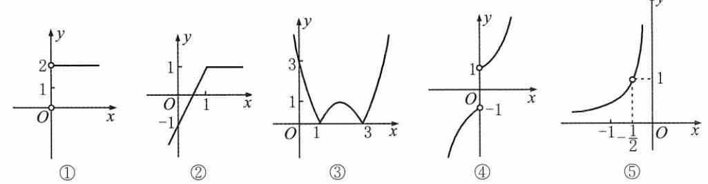

[第 22(1)题]

4. $y$

②当 $x \geq  1$ 时， $y = x - \left( {x - 1}\right)  = 1$ ；当 $x < 1$ 时， $y = x - \left( {1 - x}\right)  = {{2x} - 1}$ . 图像如图②所示.

③图像如图③所示.

④当 $x > 0$ 时, $y = {x}^{2} + 1$ ; 当 $x < 0$ 时, $y =  - {x}^{2} - 1$ . 图像如图④所示.

⑤ $\left| x\right|  \neq  x, x + \frac{1}{2} \neq  0, x \in  \left( {-\infty , - \frac{1}{2}}\right)  \cup  \left( {-\frac{1}{2},0}\right) .y =  - \frac{1}{2x}$ . 如图⑤所示.

(2)当 $f\left( x\right)  \leq  0,{x}^{2} - {2x} - 3 \geq  0, x \in  \left( {-\infty , - 1\rbrack \cup \lbrack 3, + \infty }\right) , y = 0$ ；

当 $f\left( x\right)  > 0, x \in  \left( {-1,3}\right) , y = f\left( x\right)  =  - {x}^{2} + {2x} + 3$ . 图像如图所示.

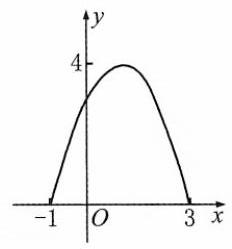

[第 22(2)题]

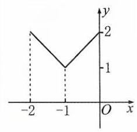

[第 22(3)题]

(3) $\because f\left( x\right)  = \left| x\right| , x \in  \left\lbrack  {-1,1}\right\rbrack  .\;\therefore x + 1 \in  \left\lbrack  {-1,1}\right\rbrack  , x \in  \left\lbrack  {-2,0}\right\rbrack$ .

$\therefore y = f\left( {x + 1}\right)  + 1 = \left| {x + 1}\right|  + 1 = \left\{  \begin{array}{l}  - x, x \in  \left\lbrack  {-2, - 1}\right\rbrack  , \\  x + 2, x \in  ( - 1,0\rbrack . \end{array}\right.$ 图像如图所示.

23. ( 1 )设销售单价定为 $\left( {{40} + x}\right)$ 元，则每月销售:500- $\left\lbrack  {\left( {{40} + x}\right)  - {50}}\right\rbrack   \cdot  {10} = \left( {{600} - {10x}}\right)$ 个.

利润 $\omega  = x\left( {{600} - {10x}}\right)  =  - {10}{\left( x - {30}\right) }^{2} + {9000}$ .

当 $x = {30}$ 时, ${\omega }_{\max } = {9000}$ . 单价应定为 ${40} + {30} = {70}$ (元).

(2) $y = \left( {{4900} + {0.01}{v}^{2}}\right) \frac{a}{v} = {0.01a}\left( {v + \frac{{700}^{2}}{v}}\right)$ .

$y \geq  {0.01a} \cdot  2\sqrt{v \cdot  \frac{{700}^{2}}{v}} = {14a}.$

$\therefore \;{y}_{\min } = {14a}$ ,此时 $v = {700}\left( {\mathrm{\;{km}}/\mathrm{h}}\right)$ .

24. $\mathrm{C}$ 提示: $f\left( x\right)  = f\left( {-x}\right) ,\;\therefore m = 0.f\left( x\right)  =  - {x}^{2} + 3$ 在区间 $\left( {-4,0}\right)$ 上是严格增函数,在区间 $\left( {0,2}\right)$ 上是严格减函数.

25. $\mathrm{B}$ 提示: 当 $x = 0$ 时, $f\left( x\right)  = f\left( {-x}\right)  = 0$ ; 当 $x > 0$ 时, $f\left( x\right)  = 1 - x, - x < 0, f\left( {-x}\right)  = 1 + \left( {-x}\right)  = 1 - x$ ,

$\therefore f\left( x\right)  = f\left( {-x}\right)$ ; 当 $x < 0$ 时, $f\left( x\right)  = 1 + x, - x > 0, f\left( {-x}\right)  = 1 - \left( {-x}\right)  = 1 + x$ .

$\therefore f\left( x\right)  = f\left( {-x}\right) .\because f\left( 2\right)  = f\left( {-2}\right)  =  - 1, f\left( 2\right)  \neq   - f\left( {-2}\right) ,\therefore y = f\left( x\right)$ 是偶函数,不是奇函数.

26. D 27. A

28. A 提示: 定义域: $\left\{  {\begin{array}{l} 1 - {x}^{2} \geq  0, \\  \left| {x + 2}\right|  \neq  2. \end{array}x \in  \left\lbrack  {-1,0)\cup (0,1}\right\rbrack  ,\therefore f\left( x\right)  = \frac{\sqrt{1 - {x}^{2}}}{2 - \left( {x + 2}\right) } =  - \frac{\sqrt{1 - {x}^{2}}}{x}}\right.$ .

定义域关于原点对称. $\because f\left( {-x}\right)  = \frac{\sqrt{1 - {x}^{2}}}{x} =  - f\left( x\right)$ ,且 $f\left( x\right)$ 不恒为 $0,\therefore y = f\left( x\right)$ 是奇函数,但不是偶函数.

29. $\mathrm{B}$ 提示: 当 $x = a$ 时, $f\left( a\right)  =  - f\left( {-a}\right)$ ; 当 $x =  - a$ 时, $f\left( {-a}\right)  =  - f\left( a\right)$ ;

当 $x = \frac{1}{a}$ 时, $f\left( \frac{1}{a}\right)  =  - f\left( {-\frac{1}{a}}\right)$ ; 当 $x =  - \sin a$ 时, $f\left( {-\sin a}\right)  =  - f\left( {\sin a}\right)$ .

30. (1)－2x－3 提示:当 $x < 0$ 时， $f\left( x\right)  = {2x} - 3$ ；当 $x > 0$ 时， $- x < 0$ ， $f\left( {-x}\right)  = 2\left( {-x}\right)  - 3 =  - {2x} - 3$ .

$\therefore$ 当 $x > 0$ 时, $f\left( x\right)  =  - {2x} - 3$ .

(2)0 提示: $f\left( x\right)  =  - f\left( {-x}\right)$ . 取 $x = 0, f\left( 0\right)  = 0$ .

31.(1)增 2 提示:设 ${x}_{1},{x}_{2} \in  \left\lbrack  {1,3}\right\rbrack  ,{x}_{1} > {x}_{2}$ ，则 $- {x}_{1}, - {x}_{2} \in  \left\lbrack  {-3, - 1}\right\rbrack$ ，且 $- {x}_{1} <  - {x}_{2}$ .

$\because y = f\left( x\right)$ 在区间 $\left\lbrack  {-3, - 1}\right\rbrack$ 上是严格增函数,

$\therefore f\left( {-{x}_{1}}\right)  < f\left( {-{x}_{2}}\right)$ .

$\because y = f\left( x\right)$ 为奇函数,

$\therefore f\left( {-{x}_{1}}\right)  =  - f\left( {x}_{1}\right) , f\left( {-{x}_{2}}\right)  =  - f\left( {x}_{2}\right)$ ,

$\therefore f\left( {x}_{1}\right)  > f\left( {x}_{2}\right)$ ,即 $y = f\left( x\right)$ 在区间 $\left\lbrack  {1,3}\right\rbrack$ 上是严格增函数.

$\therefore f{\left( x\right) }_{\min } = f\left( 1\right)  =  - f\left( {-1}\right)  = 2$ .

(2) $f\left( {-2}\right)  < f\left( 3\right)  < f\left( {-4}\right)$

提示: $f\left( {-4}\right)  = f\left( 4\right) , f\left( {-2}\right)  = f\left( 2\right)$ .

$\forall {x}_{1},{x}_{2} \in  \lbrack 0, + \infty ),{x}_{1} > {x}_{2}$ ,有 $f\left( {x}_{1}\right)  > f\left( {x}_{2}\right)$ ,

$\therefore f\left( 4\right)  > f\left( 3\right)  > f\left( 2\right)$ ,即 $f\left( {-2}\right)  < f\left( 3\right)  < f\left( {-4}\right)$ .

32. $\mathrm{C}$ 提示: $f\left( {-2}\right)  = {\left( -2\right) }^{5} + p \cdot  {\left( -2\right) }^{3} + q \cdot  \left( {-2}\right)  - 8 = {10}$ ,

$\therefore \;{\left( -2\right) }^{5} + p \cdot  {\left( -2\right) }^{3} + q \cdot  \left( {-2}\right)  = {18},{2}^{5} + p \cdot  {2}^{3} + q \cdot  2 =  - {18}.$

$\therefore f\left( 2\right)  = {2}^{5} + p \cdot  {2}^{3} + q \cdot  2 - 8 =  - {26}$ .

33. $\mathrm{D}$ 提示: 当 $x \in  \left( {-\infty ,0}\right)$ 时, $f\left( x\right)  =  - f\left( {-x}\right) , - x \in  \left( {0, + \infty }\right) , f\left( {-x}\right)  = \left( {-x}\right) \left( {1 + \sqrt[3]{-x}}\right)$ .

$\therefore f\left( x\right)  =  - \left( {-x}\right) \left( {1 + \sqrt[3]{-x}}\right)  = x\left( {1 - \sqrt[3]{x}}\right)$ .

34. $\mathrm{C}$ 提示: $f\left( x\right)  =  - {\left( x - 1\right) }^{2} + 9, y = f\left( x\right)$ 在区间 $\left( {-\infty ,1}\right)$ 上是严格增函数,在区间 $\left( {1, + \infty }\right)$ 上是严格减函数. 记 $t = 2 - {x}^{2}$ . 当函数 $t = g\left( x\right)$ 和 $y = f\left( t\right)$ 的单调性相同时, $y = f\left( t\right)$ 是严格增函数; 单调性不同时, $y = f\left( t\right)$ 是严格减函数. $t = 2 - {x}^{2} < 1, x \in  \left( {-\infty , - 1}\right)  \cup  \left( {1, + \infty }\right) , t = 2 - {x}^{2}$ 在区间 $\left( {-\infty ,0}\right)$ 上是严格增函数,在区间 $\left( {0, + \infty }\right)$ 上是严格减函数. $\therefore y = f\left( {2 - {x}^{2}}\right)$ 在区间 $\left( {-\infty , - 1}\right)$ 和 $\left( {0,1}\right)$ 上是严格增函数,在区间 $\left( {-1,0}\right)$ 和 $\left( {1, + \infty }\right)$ 上是严格减函数.

35. $\mathrm{B}$ 提示: $f\left( {-x}\right)  = \left( {-x}\right) \left| {-x}\right|  - 2\left( {-x}\right)  =  - x\left| x\right|  + {2x} =  - f\left( x\right) , y = f\left( x\right)$ 是奇函数.

当 $x \in  \left\lbrack  {0,1}\right\rbrack$ 时, $f\left( x\right)  = {x}^{2} - {2x} = {\left( x - 1\right) }^{2} - 1$ 是严格减函数;

当 $x \in  ( - 1,0\rbrack$ 时, $f\left( x\right)  =  - {x}^{2} - {2x} =  - {\left( x + 1\right) }^{2} + 1$ 是严格减函数.

$\therefore y = f\left( x\right)$ 在 $\left( {-1,1}\right)$ 上是严格减函数,且是奇函数.

36. $\mathrm{D}$ 提示: $f\left( x\right)  = 0$ ,则 $f\left( {-x}\right)  = f\left( x\right)  = 0$ .

37. A 提示: 定义域 $\mathbf{R}$ 关于原点对称; $f\left( {-x}\right)  = \frac{-x}{{2}^{1 - x} + {2}^{1 + x}} =  - f\left( x\right)$ .

由 $f\left( x\right)$ 不恒为 0,得 $y = f\left( x\right)$ 是奇函数,但不是偶函数.

38. $\mathrm{C}$ 提示: 当 $x < 0$ 时, $f\left( x\right)  =  - f\left( {-x}\right) , - x > 0, f\left( {-x}\right)  =  - {2x} - \frac{1}{2}$ ,

$\therefore$ 当 $x < 0$ 时, $f\left( x\right)  =  - \left( {-{2x} - \frac{1}{2}}\right)  = {2x} + \frac{1}{2}$ ;

当 $x \leq   - \frac{1}{4}$ 时, $f\left( x\right)  \leq  2 \cdot  \left( {-\frac{1}{4}}\right)  + \frac{1}{2} = 0.f\left( x\right)  - f\left( {-x}\right)  = \left( {{2x} + \frac{1}{2}}\right)  - \left( {-{2x} - \frac{1}{2}}\right)  = {4x} + 1 \leq  4 \cdot  \left( {-\frac{1}{4}}\right)  + 1 = 0$ .

39. $\mathrm{C}$ 提示: 设 $x = 1 + t$ ,则 $f\left( {t + 1}\right)  + f\left( {-t + 1}\right)  =  - 2$ .

$\because \left( {1 + t, f\left( {1 + t}\right) }\right)$ 和 $\left( {1 - t, f\left( {1 - t}\right) }\right)$ 关于点 $\left( {1, - 1}\right)$ 中心对称,

$\therefore y = f\left( x\right)$ 图像关于点 $\left( {1, - 1}\right)$ 中心对称.

40. (1)非奇非偶函数___(2)奇函数 (3)奇函数 (4)偶函数 (5)偶函数___(6)偶函数

提示: 所有函数的定义域都为 $\mathbf{R}$ .

(1)若为偶函数，则 $f\left( x\right)  = f\left( x\right)  + g\left( x\right)  - g\left( x\right)$ 是偶函数；若为奇函数，则 $g\left( x\right)  = f\left( x\right)  + g\left( x\right)  - f\left( x\right)$ 是奇函数，均与已知矛盾. 非奇非偶函数.

(2) $f\left( {-x}\right)  \cdot  g\left( x\right)  =  - f\left( x\right)  \cdot  g\left( x\right)$ .

(3) $f\left\lbrack  {f\left( {-x}\right) }\right\rbrack   = f\left\lbrack  {-f\left( x\right) }\right\rbrack   =  - f\left\lbrack  {f\left( x\right) }\right\rbrack$ .

(4) $f\left\lbrack  {g\left( {-x}\right) }\right\rbrack   = f\left\lbrack  {g\left( x\right) }\right\rbrack$ .

(5) $g\left\lbrack  {f\left( {-x}\right) }\right\rbrack   = g\left\lbrack  {-f\left( x\right) }\right\rbrack   = g\left\lbrack  {f\left( x\right) }\right\rbrack$ .

(6) $g\left\lbrack  {g\left( {-x}\right) }\right\rbrack   = g\left\lbrack  {g\left( x\right) }\right\rbrack$ .

41. (1)偶函数(2)奇且偶函数(3)非奇非偶函数(4)奇函数(5)非奇非偶函数(6)奇函数提示: (1) 定义域为 $\mathbf{R}, f\left( x\right)  = f\left( {-x}\right)  = 5$ .

(2)定义域 $\{ 1, - 1\}$ 关于原点对称,且 $f\left( 1\right)  = f\left( {-1}\right)  =  - f\left( {-1}\right)  = 0$ .

(3)定义域不关于原点对称.

(4)定义域为 $\mathbf{R}, f\left( {-x}\right)  = \left| {-{3x} + 2}\right|  - \left| {-{3x} - 2}\right|  = \left| {{3x} - 2}\right|  - \left| {{3x} + 2}\right|  =  - f\left( x\right)$ .

(5)定义域 $\left( {-\infty ,1}\right)  \cup  \left( {1, + \infty }\right)$ 不关于原点对称.

(6) $f\left( {-x}\right)  = \frac{1}{2}\left\lbrack  {g\left( {-x}\right)  - g\left( x\right) }\right\rbrack   =  - f\left( x\right)$ .

42. $f\left( x\right)  = \frac{\left( {x + 1 + \sqrt{1 + {x}^{2}}}\right) \left( {x - 1 - \sqrt{1 + {x}^{2}}}\right) }{{\left( x - 1\right) }^{2} - \left( {{x}^{2} + 1}\right) } = \frac{{x}^{2} - \left( {1 + 1 + {x}^{2} + 2\sqrt{1 + {x}^{2}}}\right) }{-{2x}} = \frac{-\left( {2 + 2\sqrt{1 + {x}^{2}}}\right) }{-{2x}} = \frac{1 + \sqrt{1 + {x}^{2}}}{x}$ .

$\because$ 定义域 $\left( {-\infty ,0}\right)  \cup  \left( {0, + \infty }\right)$ 关于原点对称,

$f\left( {-x}\right)  = \frac{1 + \sqrt{1 + {x}^{2}}}{-x} =  - f\left( x\right) , x \neq  0,\;\therefore y = f\left( x\right)$ 是奇函数.

43. 定义域 $\left( {-\infty ,0}\right)  \cup  \left( {0, + \infty }\right)$ 关于原点对称.

$\forall x > 0, f\left( x\right)  = x\left( {1 - x}\right) ,$

$\therefore  - x < 0, f\left( {-x}\right)  = \left( {-x}\right) \left\lbrack  {1 + \left( {-x}\right) }\right\rbrack   =  - x\left( {1 - x}\right)  =  - f\left( x\right)$ ,

$\forall x < 0, f\left( x\right)  = x\left( {1 + x}\right) .$

$- x > 0, f\left( {-x}\right)  = \left( {-x}\right) \left\lbrack  {1 - \left( {-x}\right) }\right\rbrack   =  - x\left( {1 + x}\right)  =  - f\left( x\right)$ .

$\therefore y = f\left( x\right)$ 是奇函数.

44. (1) $\forall x \in  \left( {-1,1}\right) , f\left( x\right)  =  - f\left( {-x}\right) , f\left( {1 - {m}^{2}}\right)  <  - f\left( {1 - m}\right)  = f\left( {m - 1}\right)$ ,

$\therefore \left\{  \begin{array}{l}  - 1 < 1 - {m}^{2} < 1, m \in  \left( {-\sqrt{2},0}\right)  \cup  \left( {0,\sqrt{2}}\right) , \\   - 1 < m - 1 < 1, m \in  \left( {0,2}\right) , \\  1 - {m}^{2} > m - 1, m \in  \left( {-2,1}\right) . \end{array}\right.$

综上所述, $m \in  \left( {0,1}\right)$ .

(2) $\because y = f\left( x\right)$ 是偶函数， $\therefore f\left( {-x}\right)  = f\left( x\right)  = f\left( \left| x\right| \right)$ ， $\therefore f\left( {{2x} + 5}\right)  = f\left( \left| {{2x} + 5}\right| \right)$ .

$\because y = f\left( x\right)$ 在 $\lbrack 0, + \infty )$ 上是严格增函数, $\therefore \left| {{2x} + 5}\right|  < {x}^{2} + 2$ ,

即 $\left( {{x}^{2} + 2 + {2x} + 5}\right) \left( {{x}^{2} + 2 - {2x} - 5}\right)  > 0$ . 解得 $x \in  \left( {-\infty , - 1}\right)  \cup  \left( {3, + \infty }\right)$ .

45. (1) 存在,如: $y = 0, x \in  \mathbf{R}$ .

(2)设 $f\left( x\right)  = \frac{F\left( x\right)  - F\left( {-x}\right) }{2}, g\left( x\right)  = \frac{F\left( x\right)  + F\left( {-x}\right) }{2}$ ,则 $F\left( x\right)  = f\left( x\right)  + g\left( x\right) , x \in  \left( {-l, l}\right)$ .

$\because f\left( {-x}\right)  = \frac{F\left( {-x}\right)  - F\left( x\right) }{2} =  - f\left( x\right) , g\left( {-x}\right)  = \frac{F\left( {-x}\right)  + F\left( x\right) }{2} = g\left( x\right)$ ,

$\therefore y = f\left( x\right)$ 为奇函数, $y = g\left( x\right)$ 为偶函数,

即定义在 $\left( {-l, l}\right)$ 上的任意函数都能表示成一个奇函数与一个偶函数之和.

46. 0 47. 奇函数 48. $a \geq  4$ 或 $a \leq  0$

49. 当 $a > 0$ 时,由 $\left\{  \begin{array}{l} {a}^{2} - {x}^{2} \geq  0, \\  \left| {x + a}\right|  \neq  a \end{array}\right.$ 得 $- a \leq  x \leq  a, x \neq  0$ .

此时 $x + a \geq  0, f\left( x\right)  = \frac{\sqrt{{a}^{2} - {x}^{2}}}{x}$ 为奇函数.

当 $a < 0$ 时,由 $\left\{  \begin{array}{l} {a}^{2} - {x}^{2} \geq  0, \\  \left| {x + a}\right|  - a \neq  0 \end{array}\right.$ 得 $a \leq  x \leq   - a$ .

此时 $x + a \leq  0, f\left( x\right)  = \frac{\sqrt{{a}^{2} - {x}^{2}}}{-x - {2a}}$ .

$\because f\left( \frac{a}{2}\right)  \neq   \pm  f\left( {-\frac{a}{2}}\right) ,\;\therefore y = f\left( x\right)$ 为非奇非偶函数.

50. A 提示: ${x}^{2} + {2x} - 3 = \left( {x + 3}\right) \left( {x - 1}\right)  \geq  0, x \in  \left( {-\infty , - 3\rbrack \cup \lbrack 1, + \infty }\right) .y = \sqrt{{\left( x + 1\right) }^{2} - 4}$ 在区间 $( - \infty , - 3\rbrack$ 上是严格减函数，在区间 $\lbrack 1, + \infty )$ 上是严格增函数.

51. D 提示: ${2k} + 1 < 0, k <  - \frac{1}{2}$ .

52. $\mathrm{D}$ 提示: 由题意知,对称轴为直线 $x = \frac{m}{8} =  - 2,\therefore m =  - {16}.\therefore f\left( 1\right)  = 4 + {16} + 5 = {25}$ .

53. $\mathrm{B}$ 提示: 对称轴为直线 $x = 2 - a \leq  4, a \geq   - 2$ .

54. B

55. $\mathrm{D}$ 提示: $\forall {x}_{1},{x}_{2} \in  \mathbf{R}$ ,且 ${x}_{1} > {x}_{2}, f\left( {x}_{2}\right)  < f\left( {x}_{1}\right)  < 0$ ,则 $\left| {f\left( {x}_{2}\right) }\right|  > \left| {f\left( {x}_{1}\right) }\right|  > 0, y = \left| {f\left( x\right) }\right|$ 在 $\mathbf{R}$ 上是严格减函数. $\frac{1}{f\left( {x}_{2}\right) } > \frac{1}{f\left( {x}_{1}\right) },\;\therefore \;y = \frac{1}{f\left( x\right) }$ 在 $\mathbf{R}$ 上是严格减函数. ${f}^{2}\left( {x}_{2}\right)  > {f}^{2}\left( {x}_{1}\right) ,\;\therefore \;y = {f}^{2}\left( x\right)$ 在 $\mathbf{R}$ 上是严格减函数. ${f}^{3}\left( {x}_{2}\right)  < {f}^{3}\left( {x}_{1}\right)  < 0,\;\therefore \;y = {f}^{3}\left( x\right)$ 在 $\mathbf{R}$ 上是严格增函数.

56. (1) $\left( {-\infty ,2\rbrack \lbrack 2, + \infty }\right)$ 提示: ${x}^{2} - {4x} + 5 = {\left( x - 2\right) }^{2} + 1 > 0$ ，

$f\left( x\right)  = {\left( x - 2\right) }^{2} + 1$ 在区间 $( - \infty ,2\rbrack$ 上是严格减函数,在区间 $\lbrack 2, + \infty )$ 上是严格增函数.

$\therefore y = \frac{1}{\sqrt{{x}^{2} - {4x} + 5}}$ 在区间 $( - \infty ,2\rbrack$ 上是严格增函数,在区间 $\lbrack 2, + \infty )$ 上是严格减函数.

(2) $\lbrack 1,3)$ 提示: $- {x}^{2} + {2x} + 3 > 0$ ，定义域 $\left( {-1,3}\right)$ ，

$\because f\left( x\right)  =  - {x}^{2} + {2x} + 3 =  - {\left( x - 1\right) }^{2} + 4$ 在区间 $( - \infty ,1\rbrack$ 上是严格增函数，在区间 $\lbrack 1, + \infty )$ 上是严格减函数，

$\therefore y = \frac{1}{\sqrt{3 + {2x} - {x}^{2}}}$ 的单调增区间为 $\lbrack 1,3)$ .

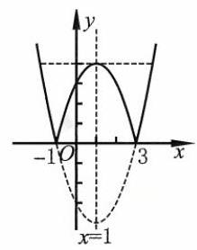

[第 56(4)题]

(3) $\left( {-\infty ,\frac{5}{3}}\right\rbrack$ 提示:当 $x \geq  \frac{5}{3}$ 时， $y = {3x} - 5$ 是严格增函数；

当 $x < \frac{5}{3}$ 时, $y =  - {3x} + 5$ 是严格减函数.

(4) $\left\lbrack  {-1,1}\right\rbrack  ,\lbrack 3, + \infty )$ 提示: 当 $x \in  ( - \infty , - 1\rbrack  \cup  \lbrack 3, + \infty )$ 时,

$y = {\left( x - 1\right) }^{2} - 4$ 在区间 $\left( {-\infty ,1}\right)$ 上是严格减函数,在区间 $\lbrack 3, + \infty )$ 上是严格增函数;

当 $x \in  \left\lbrack  {-1,3}\right\rbrack$ 时, $y =  - {\left( x - 1\right) }^{2} + 4$ 在区间 $\left\lbrack  {-1,1}\right\rbrack$ 上是严格增函数,

在区间 $\left\lbrack  {1,3}\right\rbrack$ 上是严格减函数. 图像如图所示.

(5) $\left( {-\infty , - 1}\right) ,\left( {-1, + \infty }\right)$

提示: $y =  - 1 + \frac{2}{1 + x}$ 分别在区间 $\left( {-\infty , - 1}\right) ,\left( {-1, + \infty }\right)$ 上是严格减函数.

57. (1) $\left( {x + \frac{1}{x}}\right) \left( {y + \frac{1}{y}}\right)  = {xy} + \frac{y}{x} + \frac{x}{y} + \frac{1}{xy} = {xy} + \frac{1}{xy} + \frac{{\left( x + y\right) }^{2} - {2xy}}{xy} = {xy} + \frac{2}{xy} - 2$ .

$\because x + y = 1, x, y \in  \left( {0, + \infty }\right) ,\;\therefore \;0 < {xy} \leq  \frac{{\left( x + y\right) }^{2}}{4} = \frac{1}{4}$ .

$\because$ 函数 $y = t + \frac{2}{t}$ 在区间 $\left( {0,\frac{1}{4}}\right\rbrack$ 上是严格减函数, $\therefore {xy} + \frac{2}{xy} - 2 \geq  \frac{1}{4} + 8 - 2 = \frac{25}{4}$ .

(2) $\because b <  - {a}^{2} + a, a \in  \left( {0,\frac{1}{k}}\right) , k \geq  2$ ，且 $\frac{1}{k} \in  \left( {0,\frac{1}{2}}\right\rbrack$ .

而 $y =  - {x}^{2} + x$ 在区间 $\left( {0,\frac{1}{k}}\right)$ 上是严格增函数, $\therefore b <  - \frac{1}{{k}^{2}} + \frac{1}{k} = \frac{k - 1}{{k}^{2}} < \frac{k - 1}{{k}^{2} - 1} = \frac{1}{k + 1}$ .

58. 由定义域知, $\left\{  {\begin{array}{l} 1 \leq  1 - a \leq  3, \\  1 \leq  3 - {a}^{2} \leq  3. \end{array}a \in  \left\lbrack  {-\sqrt{2},0}\right\rbrack  }\right.$ .

$\because f\left( {1 - a}\right)  > f\left( {3 - {a}^{2}}\right) , y = f\left( x\right)$ 在定义域上是严格减函数,

$\therefore 1 - a < 3 - {a}^{2},{a}^{2} - a - 2 < 0, a \in  \left( {-1,2}\right)$ .

综上所述, $a \in  ( - 1,0\rbrack$ .

59. (1)设 ${x}_{1},{x}_{2} \in  \mathbf{R}$ ，且 ${x}_{1} > {x}_{2}$ ，

$f\left( {x}_{1}\right)  - f\left( {x}_{2}\right)  = \left( {-{x}_{1}^{3} - {x}_{1} + 1}\right)  - \left( {-{x}_{2}^{3} - {x}_{2} + 1}\right)  = {x}_{2}^{3} - {x}_{1}^{3} + {x}_{2} - {x}_{1}$

$= \left( {{x}_{2} - {x}_{1}}\right) \left( {{x}_{2}^{2} + {x}_{1}{x}_{2} + {x}_{1}^{2} + 1}\right)  = \left( {{x}_{2} - {x}_{1}}\right) \left\lbrack  {{\left( {x}_{1} + \frac{1}{2}{x}_{2}\right) }^{2} + \frac{3}{4}{x}_{2}^{2} + 1}\right\rbrack$ .

由 ${x}_{1} > {x}_{2},{x}_{2} - {x}_{1} < 0$ ,得 $f\left( {x}_{1}\right)  - f\left( {x}_{2}\right)  < 0$ .

$\therefore y = f\left( x\right)$ 在定义域上为严格减函数.

(2)设 ${x}_{1} > {x}_{2}, f\left( {x}_{1}\right)  - f\left( {x}_{2}\right)  = \left( {{x}_{1} + \frac{1}{{x}_{1}}}\right)  - \left( {{x}_{2} + \frac{1}{{x}_{2}}}\right)  = {x}_{1} - {x}_{2} + \frac{{x}_{2} - {x}_{1}}{{x}_{1}{x}_{2}} = \left( {{x}_{1} - {x}_{2}}\right) \left( {1 - \frac{1}{{x}_{1}{x}_{2}}}\right)$ . 当 ${x}_{1},{x}_{2} \in  \left( {0,1}\right)$ 时, $0 < {x}_{1}{x}_{2} < 1,1 - \frac{1}{{x}_{1}{x}_{2}} < 0,\therefore f\left( {x}_{1}\right)  - f\left( {x}_{2}\right)  < 0$ . 当 ${x}_{1},{x}_{2} \in  \left( {1, + \infty }\right)$ 时, ${x}_{1}{x}_{2} > 1,1 - \frac{1}{{x}_{1}{x}_{2}} > 0,\therefore f\left( {x}_{1}\right)  - f\left( {x}_{2}\right)  > 0$ . $\therefore y = f\left( x\right)$ 在区间 $\left( {0,1}\right)$ 上是严格减函数,在区间 $\left( {1, + \infty }\right)$ 上是严格增函数.

(3) 定义域 $\left( {0, + \infty }\right) .\forall {x}_{1},{x}_{2} \in  \left( {0, + \infty }\right) ,{x}_{1} > {x}_{2}$ ,

$f\left( {x}_{1}\right)  - f\left( {x}_{2}\right)  = \left( {\sqrt{{x}_{1}} - \frac{1}{{x}_{1}}}\right)  - \left( {\sqrt{{x}_{2}} - \frac{1}{{x}_{2}}}\right)  = \left( {\sqrt{{x}_{1}} - \sqrt{{x}_{2}}}\right)  + \frac{{x}_{1} - {x}_{2}}{{x}_{1}{x}_{2}} = \left( {\sqrt{{x}_{1}} - \sqrt{{x}_{2}}}\right)  \cdot  \left( {1 + \frac{\sqrt{{x}_{1}} + \sqrt{{x}_{2}}}{{x}_{1}{x}_{2}}}\right)  > 0.$

$\therefore y = f\left( x\right)$ 在定义域上是严格增函数.

(4) $f\left( x\right)  = \frac{m}{2} + \frac{1 - \frac{mn}{2}}{{2x} + n}$ .

$\because {mn} < 2,\;\therefore \;1 - \frac{mn}{2} > 0.\;\forall {x}_{1},{x}_{2} \in  \left( {-\frac{n}{2}, + \infty }\right) ,{x}_{1} > {x}_{2}$ ,

$f\left( {x}_{1}\right)  - f\left( {x}_{2}\right)  = \left( {1 - \frac{mn}{2}}\right) \left( {\frac{1}{2{x}_{1} + n} - \frac{1}{2{x}_{2} + n}}\right)  = \left( {1 - \frac{mn}{2}}\right)  \cdot  \frac{2\left( {{x}_{2} - {x}_{1}}\right) }{\left( {2{x}_{1} + n}\right) \left( {2{x}_{2} + n}\right) } < 0.$

$\therefore y = f\left( x\right)$ 在区间 $\left( {-\frac{n}{2}, + \infty }\right)$ 上是严格减函数.

60. $F\left( x\right)  = {x}^{4} + 2{x}^{2} + 2 - \lambda {x}^{2} - \lambda  = {x}^{4} + \left( {2 - \lambda }\right) {x}^{2} + 2 - \lambda  = {\left( {x}^{2} + \frac{2 - \lambda }{2}\right) }^{2} + \frac{4 - {\lambda }^{2}}{4}$ .

$\because {x}^{2}$ 在区间 $\left( {-\infty ,0}\right)$ 上是严格减函数,设 $G\left( t\right)  = {\left( t - \frac{2 - \lambda }{2}\right) }^{2} + \frac{4 - {\lambda }^{2}}{4}$ ,

$\therefore G\left( t\right)$ 在区间 $\left( {1, + \infty }\right)$ 上是严格增函数,在区间 $\left( {0,1}\right)$ 上是严格减函数.

$\therefore \frac{2 - \lambda }{2} =  - 1,\lambda  = 4$ .

61. $\because y = f\left( x\right)$ 在 $\mathbf{R}$ 上是严格增函数, $\therefore$ 对 $\forall {x}_{1},{x}_{2} \in  \mathbf{R},{x}_{1} \geq  {x}_{2}$ ,有 $f\left( {x}_{1}\right)  \geq  f\left( {x}_{2}\right)$ .

$\because a + b \geq  0,\therefore a \geq   - b, b \geq   - a.\;\therefore f\left( a\right)  \geq  f\left( {-b}\right) , f\left( b\right)  \geq  f\left( {-a}\right)$ .

两式相加,得 $f\left( a\right)  + f\left( b\right)  \geq  f\left( {-a}\right)  + f\left( {-b}\right)$ .

62. (1) 取 $x = y = 1, f\left( 1\right)  = f\left( 1\right)  - f\left( 1\right)  = 0$ .

(2) $2 = 1 + 1 = f\left( 6\right)  + f\left( 6\right)$ .

由 $f\left( x\right)  = f\left( y\right)  + f\left( \frac{x}{y}\right)$ 得,取 $y = 6, x = {36}$ ,得 $f\left( {36}\right)  = f\left( 6\right)  + f\left( \frac{36}{6}\right)  = 2$ .

$\because \;f\left( {x + 3}\right)  - f\left( \frac{1}{x}\right)  = f\left( {{x}^{2} + {3x}}\right) ,\;\therefore \;f\left( {{x}^{2} + {3x}}\right)  < f\left( {36}\right) .$

$\therefore \left\{  \begin{array}{l} {x}^{2} + {3x} > 0, \\  {x}^{2} + {3x} < {36}. \end{array}\right.$ 解得 $x \in  \left( {0,\frac{-3 + 3\sqrt{17}}{2}}\right)$ .

63. $\mathrm{B}$ 提示: 选项 $\mathrm{A}, x < 0$ 时 $x + \frac{1}{x} < 0$ . 选项 $\mathrm{B},\frac{{x}^{2} + 2}{\sqrt{{x}^{2} + 1}} = \sqrt{{x}^{2} + 1} + \frac{1}{\sqrt{{x}^{2} + 1}} \geq  2$ ,等号在 $x = 0$ 时取到. 选项 C, ${\log }_{a}x + {\log }_{x}a = {\log }_{a}x + \frac{1}{{\log }_{a}x}$ ,当 ${\log }_{a}x < 0$ 时, ${\log }_{a}x + {\log }_{x}a < 0$ . 选项 $\mathrm{D},{3}^{x} + {3}^{-x} \geq  2$ ,等号在 $x = 0$ 时取到,而 $x > 0$ .

64. $\mathrm{C}$ 提示: $x, y > 0,{\log }_{\sqrt{2}}{xy} = 4,{xy} = 4, x + y \geq  2\sqrt{xy} = 4$ . 等号在 $x = y = 2$ 时取到.

65. $\mathrm{B}$ 提示: $\lg a \cdot  \lg b \leq  \frac{{\left( \lg a + \lg b\right) }^{2}}{4} = \frac{1}{4}{\left\lbrack  \lg \left( ab\right) \right\rbrack  }^{2} = 1$ . 等号在 $a = b = {10}$ 时取到.

66. $\mathrm{C}$ 提示: ${x}^{2} + {y}^{2} \geq  \frac{{\left( x + y\right) }^{2}}{2} = 8$ . 等号在 $x = y = 2$ 时取到.

67. $\mathrm{B}$ 提示: $\frac{\sqrt{3b} + \sqrt{2a}}{2} \leq  \sqrt{\frac{{3b} + {2a}}{2}} = \sqrt{5},\therefore \sqrt{3b} + \sqrt{2a} \leq  2\sqrt{5}$ . 等号在 $a = \frac{5}{2}, b = \frac{5}{3}$ 时取到.

68. A 提示: $x > 1$ 时, $x - 1 > 0,\frac{{x}^{2} - {2x} + 2}{2\left( {x - 1}\right) } = \frac{x - 1}{2} + \frac{1}{2\left( {x - 1}\right) } \geq  2\sqrt{\frac{1}{4}} = 1$ . 等号在 $x = 2$ 时取到.

69.(1) $\sqrt{2}\;$ 提示: $\frac{x + y}{2} \leq  \sqrt{\frac{{x}^{2} + {y}^{2}}{2}} = \frac{\sqrt{2}}{2}$ ， $x + y \leq  \sqrt{2}$ . 等号在 $x = y = \frac{\sqrt{2}}{2}$ 时取到.

(2)2 提示: $2\sqrt{2xy} \leq  x + {2y} = 2\sqrt{2}a$ ， $\therefore {xy} \leq  {a}^{2}$ .

$\because a > 1,\therefore {\log }_{a}x + {\log }_{a}y = {\log }_{a}\left( {xy}\right)  \leq  {\log }_{a}{a}^{2} = 2$ . 等号在 $x = \sqrt{2}a, y = \frac{\sqrt{2}}{2}a$ 时取到.

(3) $4\sqrt{3} + 5\frac{2\sqrt{3}}{3} + 1$ 提示: $2 + {3x} + \frac{4}{x - 1} = 3\left( {x - 1}\right)  + \frac{4}{x - 1} + 5 \geq  2\sqrt{3 \cdot  4} + 5 = 4\sqrt{3} + 5$ . 等号在 $3\left( {x - 1}\right)  = \frac{4}{x - 1}$ ,即 $x = \frac{2\sqrt{3}}{3} + 1$ 时取到.

(4) $8\;2 \pm  \sqrt{3}\;$ 提示: $x + \frac{1}{x} + \frac{16x}{{x}^{2} + 1} = \frac{{x}^{2} + 1}{x} + \frac{16x}{{x}^{2} + 1} \geq  2\sqrt{16} = 8$ .

等号在 $\frac{{x}^{2} + 1}{x} = \frac{16x}{{x}^{2} + 1}$ ,即 ${x}^{2} = 7 \pm  4\sqrt{3}, x = 2 \pm  \sqrt{3}$ 时取到.

(5) $\frac{3}{4}\sqrt{2}\;\frac{\sqrt{3}}{2}\frac{\sqrt{2}}{2}$ 提示: $2{a}^{2} + {b}^{2} + 1 = 3 \geq  2\sqrt{2{a}^{2}\left( {{b}^{2} + 1}\right) },2\sqrt{2}a\sqrt{{b}^{2} + 1} \leq  3, a\sqrt{{b}^{2} + 1} \leq  \frac{3}{4}\sqrt{2}$ .

等号在 $2{a}^{2} = {b}^{2} + 1 = \frac{3}{2}$ ,即 $a = \frac{\sqrt{3}}{2}, b = \frac{\sqrt{2}}{2}$ 时取到.

70. (1)9 2 提示: ${3x} + \frac{12}{{x}^{2}} = \frac{3}{2}x + \frac{3}{2}x + \frac{12}{{x}^{2}} \geq  3\sqrt[3]{\frac{3}{2} \cdot  \frac{3}{2} \cdot  {12}} = 9$ . 等号在 $\frac{3}{2}x = \frac{12}{{x}^{2}}$ ，即 $x = 2$ 时取到.

(2) $\frac{4}{243}\;\frac{2}{9}$ 提示: ${x}^{2}\left( {1 - {3x}}\right)  = \frac{4}{9} \cdot  \frac{3}{2}x \cdot  \frac{3}{2}x\left( {1 - {3x}}\right)  \leq  \frac{4}{9}{\left\lbrack  \frac{1}{3}\left( \frac{3}{2}x + \frac{3}{2}x + \left( 1 - {3x}\right) \right) \right\rbrack  }^{3} \; = \frac{4}{9} \cdot  \frac{1}{27} = \frac{4}{243}$ . 等号在 $\frac{3}{2}x = 1 - {3x}$ ,即 $x = \frac{2}{9}$ 时取到.

(3)3 提示: ${xy} + {x}^{2} = \frac{1}{2}{xy} + \frac{1}{2}{xy} + {x}^{2} \geq  3\sqrt[3]{\frac{1}{2}{xy} \cdot  \frac{1}{2}{xy} \cdot  {x}^{2}} = 3\sqrt[3]{\frac{1}{4}{\left( {x}^{2}y\right) }^{2}} = 3$ . 等号在 $\frac{1}{2}{xy} = {x}^{2}$ ,即 $x = 1$ , $y = 2$ 时取到.

(4) $5 - {3\lg 3}$ 提示: $3 \cdot  \sqrt[3]{10xyz} \leq  {5x} + {2y} + z = {100},{xyz} \leq  \frac{{10}^{5}}{27}$ .

两边同时取对数,得 $\lg x + \lg y + \lg z = \lg {xyz} \leq  5 - 3\lg 3$ . 等号在 ${5x} = {2y} = z = \frac{100}{3}$ 时取到.

76. $2\sqrt{3},0$ 77. $\left( {-1,\frac{\sqrt{6}}{2}}\right\rbrack$

81. $a \leq  \frac{9}{2}$ 82. $k \leq   - \frac{3}{4}$

83. $a = 0$ 时, $f\left( x\right)  =  - x - 3$ ,不成立.

$a > 0$ 时, $f = \max \{ f\left( {-\frac{3}{2}}\right) , f\left( 2\right) \} , f\left( {-\frac{3}{2}}\right)  =  - \frac{3}{4}\left( {a + 2}\right) , f\left( 2\right)  = {8a} - 5$ .

若 $\left\{  \begin{array}{l} f\left( {-\frac{3}{2}}\right)  = 1, \\  f\left( {-\frac{3}{2}}\right)  \geq  f\left( 2\right) , \end{array}\right.$ 得 $a =  - \frac{10}{3}$ (舍). 若 $\left\{  \begin{array}{l} f\left( 2\right)  = 1, \\  f\left( 2\right)  \geq  f\left( {-\frac{3}{2}}\right) , \end{array}\right.$ 得 $a = \frac{3}{4}$ .

$a < 0$ 时, $- \frac{{2a} - 1}{2a} =  - 1 + \frac{1}{2a} <  - 1$ .

若 $- \frac{3}{2} \leq   - 1 + \frac{1}{2a}$ ,即 $a \leq   - 1$ ,则 $f\left( {-1 + \frac{1}{2a}}\right)  = 1$ ,得 $a =  - \frac{3 + 2\sqrt{2}}{2}$ .

若 $- 1 + \frac{1}{2a} <  - \frac{3}{2}$ ,即 $- 1 < a < 0$ ,则 $f\left( {-\frac{3}{2}}\right)  = 1, a$ 无解. $\;\therefore a = \frac{3}{4}$ 或 $a =  - \frac{3 + 2\sqrt{2}}{2}$ .

84. A 提示: ${y}^{2} =  - \frac{{x}^{2}}{4} + x \geq  0,\therefore x \in  \left\lbrack  {0,4}\right\rbrack  .{x}^{2} + {y}^{2} = \frac{3{x}^{2}}{4} + x = \frac{3}{4}{\left( x + \frac{2}{3}\right) }^{2} - \frac{1}{3}$ ; 当 $x = 0$ 时， ${\left( {x}^{2} + {y}^{2}\right) }_{\min } = 0$ . 当 $x = 4$ 时， ${\left( {x}^{2} + {y}^{2}\right) }_{\max } = {16}$ .

85. $\mathrm{D}$ 提示: $\frac{x}{{x}^{3} + 2} = \frac{1}{{x}^{2} + \frac{2}{x}}.\;\because {x}^{2} + \frac{2}{x} = {x}^{2} + \frac{1}{x} + \frac{1}{x} \geq  3 \cdot  \sqrt[3]{{x}^{2} \cdot  \frac{1}{x} \cdot  \frac{1}{x}} = 3,\therefore \frac{x}{{x}^{3} + 2} \leq  \frac{1}{3}$ . 当且仅当 $x = 1$ 时取等号.

86. A 提示: ${ab} - \left( {a + b}\right)  + 1 = 2,\left( {a - 1}\right) \left( {b - 1}\right)  = 2$ . 若 $a, b \in  \left( {0,1}\right) ,\left( {a - 1}\right) \left( {b - 1}\right)  \in  \left( {0,1}\right) .\therefore a, b > 1,\left( {a - 1}\right)  + \left( {b - 1}\right)  \geq \; 2\sqrt{\left( {a - 1}\right) \left( {b - 1}\right) } = 2\sqrt{2}.\;\therefore a + b \geq  2 + 2\sqrt{2}$ ,当且仅当 $a = b = \sqrt{2} + 1$ 时取等号.

87. (1)两边同时取以 2 为底的对数， $\lg b \cdot  {\log }_{2}a = \frac{1}{4}$ . 由 $\lg b = \frac{{\log }_{2}b}{{\log }_{2}{10}}$ ，得 ${\log }_{2}a \cdot  {\log }_{2}b = \frac{1}{4}{\log }_{2}{10}$ .

$\because \;{\log }_{2}\left( {ab}\right)  = {\log }_{2}a + {\log }_{2}b, a > 1,\frac{1}{4}{\log }_{2}{10} > 0$ ,

$\therefore \;{\log }_{2}b > 0, b > 1$ ,即 ${\log }_{2}a > 0,{\log }_{2}b > 0$ .

$\therefore \;{\log }_{2}a + {\log }_{2}b \geq  2\sqrt{{\log }_{2}a \cdot  {\log }_{2}b} = \sqrt{{\log }_{2}{10}}$ .

$\therefore$ 最小值为 $\sqrt{{\log }_{2}{10}}$ .

(2) $y = \frac{\left( {{x}^{2} + 1}\right) \left( {{x}^{2} + 2}\right)  + 1}{{x}^{2} + 1} = \left( {{x}^{2} + 1}\right)  + \frac{1}{{x}^{2} + 1} + 1 \geq  2\sqrt{1} + 1 = 3$ ,当且仅当 $x = 0$ 时取等号.

$\therefore$ 最小值为 3 .

(3) $f\left( x\right)  = 2\left( {{x}^{2} + 1}\right)  + 2\left( {{x}^{2} + 1}\right)  + \frac{16}{{\left( {x}^{2} + 1\right) }^{2}} - 4$

$\geq  3 \cdot  \sqrt[3]{2\left( {{x}^{2} + 1}\right)  \cdot  2\left( {{x}^{2} + 1}\right)  \cdot  \frac{16}{{\left( {x}^{2} + 1\right) }^{2}}} - 4 = 3 \cdot  \sqrt[3]{64} - 4 = 3 \cdot  4 - 4 = 8$ ,

当且仅当 ${x}^{2} + 1 = 2$ ,即 $x =  \pm  1$ 时取等号. $\;\therefore \;$ 最小值为 8 .

(4) $f\left( x\right)  = \left( {{x}^{2} + \frac{1}{{x}^{2}}}\right)  - 3\left( {x + \frac{1}{x}}\right)  - 2 = {\left( x + \frac{1}{x}\right) }^{2} - 2 - 3\left( {x + \frac{1}{x}}\right)  - 2 = {\left( x + \frac{1}{x} - \frac{3}{2}\right) }^{2} - \frac{25}{4}$ .

$\because x > 0,\therefore x + \frac{1}{x} \geq  2$ . 当 $x + \frac{1}{x} = 2$ ,即 $x = 1$ 时, $f{\left( x\right) }_{\min } = \frac{1}{4} - \frac{25}{4} =  - 6$ .

(5) $\because \frac{\sqrt{x} + \sqrt{y}}{2} \leq  \sqrt{\frac{x + y}{2}},\therefore \frac{\sqrt{x} + \sqrt{y}}{\sqrt{x + y}} \leq  \sqrt{2}$ . 当且仅当 $x = y$ 时取等号. $\;\therefore$ 最大值为 $\sqrt{2}$ .

88. $x + y = \left( {x + y}\right) \left( {\frac{a}{x} + \frac{b}{y}}\right)  = \left( {a + b}\right)  + \left( {\frac{ay}{x} + \frac{bx}{y}}\right)  = {10} + \left( {\frac{ay}{x} + \frac{bx}{y}}\right)  \geq  {10} + 2\sqrt{ab} = {18},\therefore {ab} = {16}$ .

$\because a + b = {10},\therefore \left\{  {\begin{array}{l} {a}_{1} = 2, \\  {b}_{1} = 8, \end{array}\text{ 或 }\left\{  \begin{array}{l} {a}_{2} = 8, \\  {b}_{2} = 2. \end{array}\right. }\right.$

89. (1) $\because {x}^{2} + {y}^{2} \geq  \left| {2xy}\right| ,\therefore \left| {xy}\right|  \leq  \frac{1}{2},\left( {1 + {xy}}\right) \left( {1 - {xy}}\right)  = 1 - {x}^{2}{y}^{2},0 \leq  {x}^{2}{y}^{2} \leq  \frac{1}{4}$ .

$\therefore {\left( 1 - {x}^{2}{y}^{2}\right) }_{\max } = 1$ ,当 $x = 0, y = 1$ 可取得.

${\left( 1 - {x}^{2}{y}^{2}\right) }_{\min } = \frac{3}{4}$ ,当 $x = y = \frac{\sqrt{2}}{2}$ 可取得.

(2)设 $x = \sqrt{3}\cos \alpha , y = \sqrt{3}\sin \alpha , a = 2\cos \beta , b = 2\sin \beta$ ，

$\therefore \;{ax} + {by} = 2\sqrt{3}\left( {\cos \alpha \cos \beta  + \sin \alpha \sin \beta }\right)  = 2\sqrt{3}\cos \left( {\alpha  - \beta }\right) ,\;\therefore \; - 2\sqrt{3} \leq  {ax} + {by} \leq  2\sqrt{3}$ .

$\therefore {ax} + {by}$ 的最大值为 $2\sqrt{3}$ ,最小值为 $- 2\sqrt{3}$ .

(3) $\because x\sqrt{1 - {y}^{2}} = 1 - y\sqrt{1 - {x}^{2}},\;\therefore {x}^{2}\left( {1 - {y}^{2}}\right)  = {y}^{2}\left( {1 - {x}^{2}}\right)  - {2y}\sqrt{1 - {x}^{2}} + 1$ ,

$\therefore \;\left( {1 - {x}^{2}}\right)  - {2y}\sqrt{1 - {x}^{2}} + {y}^{2} = 0$ ,即 ${\left( \sqrt{1 - {x}^{2}} - y\right) }^{2} = 0,\therefore \sqrt{1 - {x}^{2}} = y$ .

同理, $\sqrt{1 - {y}^{2}} = x, x, y \geq  0.\therefore {x}^{2} + {y}^{2} = 1, x, y \geq  0$ .

$\because \;1 = {x}^{2} + {y}^{2} \leq  {\left( x + y\right) }^{2} \leq  2\left( {{x}^{2} + {y}^{2}}\right)  = 2,$

$\therefore 1 \leq  x + y \leq  \sqrt{2}$ (也可以用三角换元法计算). $\therefore x + y$ 的最大值为 $\sqrt{2}$ ,相应地, $x = y = \frac{\sqrt{2}}{2}$ ,最小值为 1,相应地, $\{ x, y\}  = \{ 0,1\}$ .

90. (1) $\because {2}^{x} + \frac{8}{{2}^{x}} \geq  2\sqrt{8} = 4\sqrt{2}$ ,

$\therefore f\left( x\right)  = \frac{8}{{2}^{x} + \frac{8}{{2}^{x}}} \leq  \frac{8}{4\sqrt{2}} = \sqrt{2}$ . 当且仅当 ${2}^{x} = 2\sqrt{2}$ ,即 $x = \frac{3}{2}$ 时取等号.

(2) ${b}^{2} - {4b} + \frac{11}{2} = {\left( b - 2\right) }^{2} + \frac{3}{2} \geq  \frac{3}{2} > \sqrt{2}$ ， $\therefore {b}^{2} - {4b} + \frac{11}{2} > \sqrt{2} \geq  f\left( a\right)$ .

91. (1) 设直角三角形两直角边分别为 $a, b,\therefore a + b + \sqrt{{a}^{2} + {b}^{2}} = 1 \geq  2\sqrt{ab} + \sqrt{2}\sqrt{ab}$ ,

$\therefore \sqrt{ab} \leq  \frac{1}{2 + \sqrt{2}} = \frac{2 - \sqrt{2}}{2},\;\therefore S = \frac{ab}{2} \leq  \frac{1}{2}{\left( \frac{2 - \sqrt{2}}{2}\right) }^{2} = \frac{3 - 2\sqrt{2}}{4}$ .

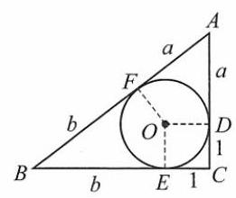

(第 91 题)

当且仅当 $a = b = \frac{2 - \sqrt{2}}{2}$ 时取等号. $\;\therefore \;$ 面积的最大值为 $\frac{3 - 2\sqrt{2}}{4}$ .

(2)如图， $\left| {OD}\right|  = \left| {OE}\right|  = \left| {OF}\right|  = \left| {CD}\right|  = \left| {CE}\right|  = 1$ .

设 $\left| {AD}\right|  = \left| {AF}\right|  = a,\left| {BE}\right|  = \left| {BF}\right|  = b$ ,

$\because {\left| AC\right| }^{2} + {\left| BC\right| }^{2} = {\left| AB\right| }^{2},\;\therefore {\left( a + 1\right) }^{2} + {\left( b + 1\right) }^{2} = {\left( a + b\right) }^{2}$ ,

$\therefore a + b = {ab} - 1$ .

$\because a + b \geq  2\sqrt{ab},\;\therefore {ab} - 1 \geq  2\sqrt{ab},{\left( \sqrt{ab}\right) }^{2} - 2\sqrt{ab} - 1 \geq  0$ ,

$\therefore \sqrt{ab} \geq  \frac{2 + \sqrt{4 + 4}}{2} = 1 + \sqrt{2},{ab} \geq  {\left( 1 + \sqrt{2}\right) }^{2} = 3 + 2\sqrt{2}$ .

$\because \;S = \frac{1}{2}\left( {a + 1}\right) \left( {b + 1}\right)  = \frac{1}{2}\left( {{ab} + a + b + 1}\right)$ ,

代入 $a + b = {ab} - 1$ ，得 $S = {ab},\therefore S \geq  3 + 2\sqrt{2}$ ，当且仅当 $a = b = 1 + \sqrt{2}$ 时取等号.

$\therefore$ 面积的最小值为 $3 + 2\sqrt{2}$ .

92. $y = f\left( x\right)$ 在区间 $\lbrack 0,3)$ 上是严格减函数,存在最大值 $f\left( 0\right)  = 1$ ,没有最小值.

93. 设 $f\left( {x}_{0}\right)  = 3$ ,由已知得对任何实数 $f\left( x\right)  \leq  f\left( {x}_{0}\right)$ .

由 $y = f\left( x\right)$ 是奇函数得对任何函数 $x$ ,有 $f\left( x\right)  =  - f\left( {-x}\right)  \geq   - f\left( {x}_{0}\right)  =  - 3$ ,

而 $- 3 = f\left( {-{x}_{0}}\right) ,\therefore y = f\left( x\right)$ 的最小值为 -3 .

94. 显然 $\Delta  = {a}^{2} - 4 < 0$ .

$\therefore$ 对 $\forall x \in  \mathbf{R},{x}^{2} - {ax} + 1 > 0$ 恒成立.

函数的定义域为 $\mathbf{R}$ .

又 $f\left( x\right)  \geq  0$ ,且 $f\left( a\right)  = 0,\therefore$ 最小值为 0 .

令 $t = x - a$ . 则 $x = t + a$ ,

函数改写为 $g\left( t\right)  = \frac{\left| t\right| }{\left( {t + a}\right) t + 1} = \frac{\left| t\right| }{{t}^{2} + {at} + 1}$ .

当 $t > 0$ 时, $g\left( t\right)  = \frac{1}{t + \frac{1}{t} + a}.\;\because t + \frac{1}{t} \geq  2,\;\therefore$ 此时, $g\left( t\right)  \in  \left( {0,\frac{1}{2 + a}}\right\rbrack$ .

当 $t < 0$ 时, $g\left( t\right)  = \frac{-t}{{t}^{2} + {at} + 1} =  - \frac{1}{t + \frac{1}{t} + a}.\;\because t + \frac{1}{t} \leq   - 2,\;\therefore$ 此时, $g\left( t\right)  \in  \left( {0,\frac{1}{2 - a}}\right\rbrack$ .

$\therefore$ 当 $0 \leq  a < 2$ 时,最大值为 $\frac{1}{2 - a}$ .

当 $- 2 < a < 0$ 时,最大值为 $\frac{1}{2 + a}$ .

95. $M\left( {a, b}\right)  \geq  f\left( 1\right)  = \left| {1 + a + b}\right|$ ,①

$M\left( {a, b}\right)  \geq  f\left( {-1}\right)  = \left| {1 - a + b}\right| ,$

$M\left( {a, b}\right)  \geq  f\left( 0\right)  = \left| b\right| ,$

①+② $+ 2 \times$ ③得

${4M}\left( {a, b}\right)  \geq  \left| {1 + a + b}\right|  + \left| {1 - a + b}\right|  + 2\left| b\right|  \geq  \left| {1 + a + b + 1 - a + b - {2b}}\right|  = 2$ ,

$\therefore M\left( {a, b}\right)  \geq  \frac{1}{2}$ .

当 $1 + a + b,1 - a + b, - {2b}$ 同号时,等号成立,

此时 $1 + a + b = 1 - a + b =  - b = \frac{1}{2}$ 或 $1 + a + b = 1 - a + b =  - b =  - \frac{1}{2}$ ,得 $\left\{  \begin{array}{l} a = 0, \\  b =  - \frac{1}{2}. \end{array}\right.$

96. A97.C $\;{98.}\; - {1.3}\;{99.35}\;{100.}\;\frac{1}{2}$

101. $y = f\left( x\right)$ 在 $\mathbf{R}$ 上是严格增函数, $\therefore$ 至多一个零点.

又 $f\left( 0\right)  > 0, f\left( {-m - \frac{2}{m}}\right)  = {2}^{-\frac{2}{m}} - m\left( {m + \frac{2}{m}}\right)  + 1 = \left( {{2}^{-\frac{2}{m}} - 1}\right)  - {m}^{2} < 0$ ,

$\therefore$ 零点恰有一个.

102. (1) 设 $f\left( x\right)  = {x}^{2} + 2\left( {m + 3}\right) x + {2m} + {14}$ ,

$\because f\left( 4\right)  = {16} + 8\left( {m + 3}\right)  + {2m} + {14} = {10m} + {54} < 0$ ,

$\therefore m <  - \frac{27}{5}$ .

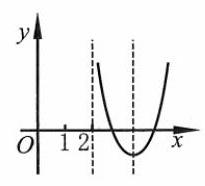

[第 ${102}\left( 2\right)$ 题]

(2)如图，设 $f\left( x\right)  = {x}^{2} + {2mx} - \left( {m - {12}}\right)$ ，

$\Delta  = 4{m}^{2} + 4\left( {m - {12}}\right)  = 4\left( {m + 4}\right) \left( {m - 3}\right)  \geq  0,$

$\therefore m \in  \left( {-\infty , - 4\rbrack \cup \lbrack 3, + \infty }\right)$ .

$\because$ 对称轴为 $x =  - m > 2,\therefore m <  - 2$ .

$\because f\left( 2\right)  = 4 + {4m} - m + {12} > 0,\;\therefore m >  - \frac{16}{3}.\;\therefore m \in  \left( {-\frac{16}{3}, - 4}\right\rbrack$ .

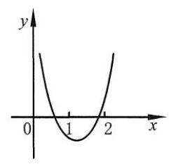

[第 102(3)题]

(3)如图，设 $f\left( x\right)  = 7{x}^{2} - \left( {m + {13}}\right) x + {m}^{2} - m - 2$ ，

$\because f\left( 0\right)  = {m}^{2} - m - 2 > 0,\;\therefore m \in  \left( {-\infty , - 1}\right)  \cup  \left( {2, + \infty }\right)$ .

$\because f\left( 1\right)  = 7 - \left( {m + {13}}\right)  + {m}^{2} - m - 2 = {m}^{2} - {2m} - 8 < 0,\;\therefore m \in  \left( {-2,4}\right)$ .

$\because f\left( 2\right)  = 7 \cdot  4 - 2\left( {m + {13}}\right)  + {m}^{2} - m - 2 = {m}^{2} - {3m} > 0$ ,

$\therefore m \in  \left( {-\infty ,0}\right)  \cup  \left( {3, + \infty }\right)$ .

综上所述, $m \in  \left( {-2, - 1}\right)  \cup  \left( {3,4}\right)$ .

(4)如图，设 $f\left( x\right)  = 2{x}^{2} - {3x} + {2m}$ ，

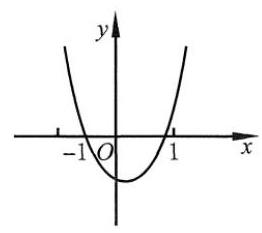

[第 102(4)题]

则 $\Delta  = 9 - {16m} \geq  0,\therefore m \leq  \frac{9}{16}.\;\because$ 对称轴为 $x = \frac{3}{4} \in  \left\lbrack  {-1,1}\right\rbrack$ ,

$\therefore f\left( {-1}\right)  = 2 + 3 + {2m} \geq  0$ ,即 $m \geq   - \frac{5}{2};f\left( 1\right)  = 2 - 3 + {2m} \geq  0$ ,

即 $m \geq  \frac{1}{2}$ .

$\therefore m \in  \left\lbrack  {\frac{1}{2},\frac{9}{16}}\right\rbrack$ .

(5) 最小根: ${x}_{\min } = \frac{1}{2}\left( {-{2m} - \sqrt{4{m}^{2} - 8{m}^{2} + 4}}\right)  =  - m - \sqrt{1 - {m}^{2}} < 0$ ,

则 $\sqrt{1 - {m}^{2}} >  - m, m \in  \left\lbrack  {-1,1}\right\rbrack$ .

① 当 $m \in  (0,1\rbrack$ 时， $- m < 0$ ，满足题意；

② 当 $m \in  \left\lbrack  {-1,0}\right\rbrack$ 时， $1 - {m}^{2} > {m}^{2}$ ， $m \in  \left( {-\frac{\sqrt{2}}{2},0}\right\rbrack$ .

综上所述， $m \in  \left( {-\frac{\sqrt{2}}{2},1}\right\rbrack$ .

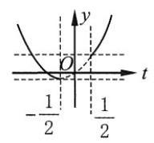

[第 102(6)题]

(6) $\because x = 0$ 不是原方程的解, $\therefore m = \frac{1}{2}\left( {\frac{1}{{x}^{2}} + \frac{1}{x}}\right)$ .

$\therefore x \in  \left\lbrack  {-2,0)\cup (0,2}\right\rbrack$ .

$\therefore \frac{1}{x} \in  \left( {-\infty , - \frac{1}{2}}\right\rbrack   \cup  \left\lbrack  {\frac{1}{2}, + \infty }\right)$ .

令 $t = \frac{1}{x}, f\left( t\right)  = \frac{1}{2}\left( {{t}^{2} + t}\right)$ . (如图).

$\therefore f\left( t\right)  = \frac{1}{2}\left\lbrack  {{\left( t + \frac{1}{2}\right) }^{2} - \frac{1}{4}}\right\rbrack   = \frac{1}{2}{\left( t + \frac{1}{2}\right) }^{2} - \frac{1}{8} \in  \left\lbrack  {-\frac{1}{8}, + \infty }\right)$ .

$\because$ 恰有一个 $x$ 的值满足, $\therefore f\left( {-\frac{1}{2}}\right)  \leq  m < f\left( \frac{1}{2}\right)$ .

$\therefore m \in  \left\lbrack  {-\frac{1}{8},\frac{3}{8}}\right)$ .

(7) $\because m = {x}^{2} + x - 1 = {\left( x + \frac{1}{2}\right) }^{2} - \frac{5}{4} \in  ( - 1,1\rbrack ,\;\therefore m \in  ( - 1,1\rbrack$ .

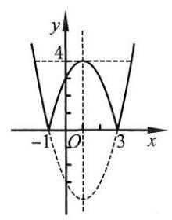

[第 103(2)题]

103. (1) $k = {x}^{2} + 2\left| x\right|  = {\left| x\right| }^{2} + 2\left| x\right|$ ,

$f\left( x\right)  = {\left| x\right| }^{2} + 2\left| x\right|$ 的图像如图所示.

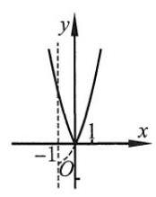

[第 103(1)题]

当 $k < 0$ 时,方程无实数根;

当 $k = 0$ 时,方程有一个实数根;

当 $k > 0$ 时,方程有两个实数根.

(2) $f\left( x\right)  = \left| {{x}^{2} - {2x} - 3}\right|$ 的图像如图所示.

当 $k < 0$ 时,方程无实数根;

当 $k = 0$ 或 $k > 4$ 时,方程有两个实数根;

当 $k = 4$ 时,方程有三个实数根;

当 $0 < k < 4$ 时,方程有四个实数根.

104. $\frac{1}{2} \leq  a < 1$ 或 $a \geq  2\;{105}.\left( {-4, - 2}\right) \;{106}.\left( {\frac{7}{4},2}\right) \;{107}.\left( {-\infty ,0}\right)  \cup  \left( {1, + \infty }\right)$

108. (1)由已知 $f\left( 1\right)  = f\left( 3\right)  = 0$ ，且当 $x$ 取 $\left\lbrack  {0,7}\right\rbrack$ 内除 1 和 3 外的值时， $f\left( x\right)  \neq  0$ .

又 $f\left( {-1}\right)  = f\left( {2 - 3}\right)  = f\left( {2 + 3}\right)  = f\left( 5\right)  \neq  0$ ,

$\therefore y = f\left( x\right)$ 非奇非偶.

(2)由已知可得 $\left\{  {\begin{array}{l} f\left( {-x}\right)  = f\left( {4 + x}\right) , \\  f\left( {-x}\right)  = f\left( {{14} + x}\right) , \end{array}\;\therefore f\left( {4 + x}\right)  = f\left( {{14} + x}\right) }\right.$ .

即 $y = f\left( x\right)$ 是以 10 为周期的函数.

当 $7 < x \leq  {10}$ 时, ${14} - x \in  \lbrack 4,7)$ ,此时 $f\left( x\right)  = f\left( {{14} - x}\right)  \neq  0$ .

$\therefore f\left( x\right)  = 0$ 在区间 $\left\lbrack  {0,{10}}\right\rbrack$ 上只有解 1 和 3 .

$\therefore$ 当 $x \in  \left\lbrack  {0,{2021}}\right\rbrack$ 时, $f\left( x\right)  = 0$ 共有 ${202} \cdot  2 + 1 = {405}$ 个解,

当 $x \in  \left\lbrack  {-{2021},0}\right\rbrack$ 时, $f\left( x\right)  = 0$ 共有 ${202} \cdot  2 = {404}$ 个解.

$\therefore$ 零点个数为 809 .

109. (1) $f\left( 8\right)  = f\left( {2\sqrt{2}}\right)  + f\left( {2\sqrt{2}}\right)  = 2\left\lbrack  {f\left( 2\right)  + f\left( \sqrt{2}\right) }\right\rbrack   = 2\left\lbrack  {{3f}\left( \sqrt{2}\right) }\right\rbrack   = {6f}\left( \sqrt{2}\right)  = 3,\;\therefore f\left( \sqrt{2}\right)  = \frac{1}{2}$ .

(2)令 $x = 0$ ，则 ${3f}\left( 0\right)  =  - 0 + 6 \cdot  0 - 3 \cdot  0 + 3 = 3$ ， $\therefore f\left( 0\right)  = 1$ .

设 ${x}^{\prime } =  - x$ ,则

$f\left( {-x}\right)  + {2f}\left( x\right)  =  - {\left( -x\right) }^{3} + 6{\left( -x\right) }^{2} - 3\left( {-x}\right)  + 3 = {x}^{3} + 6{x}^{2} + {3x} + 3$ . ①

$f\left( x\right)  + {2f}\left( {-x}\right)  =  - {x}^{3} + 6{x}^{2} - {3x} + 3$ . ②

① $x$ 2- ②，得 ${3f}\left( x\right)  = 2{x}^{3} + {12}{x}^{2} + {6x} + 6 - \left( {-{x}^{3} + 6{x}^{2} - {3x} + 3}\right)  = 3{x}^{3} + 6{x}^{2} + {9x} + 3$ .

$\therefore f\left( x\right)  = {x}^{3} + 2{x}^{2} + {3x} + 1$ .

110. (1) ① 令 $y = x$ ，得 $f\left( {2x}\right)  = f\left( {x + x}\right)  = {2f}\left( x\right)$ .

② 令 $y = x = 0$ ，得 $f\left( 0\right)  = f\left( 0\right)  + f\left( 0\right)$ . $\;\therefore f\left( 0\right)  = 0$ .

③ $y = f\left( x\right)$ 定义在 $\mathbf{R}$ 上，定义域关于原点对称.

令 $y =  - x$ ,得 $f\left( 0\right)  = f\left( x\right)  + f\left( {-x}\right)  = 0.\therefore f\left( {-x}\right)  =  - f\left( x\right) , y = f\left( x\right)$ 为奇函数.

(2) 令 $x = y = 0$ ,得 ${2f}\left( 0\right)  = 2{f}^{2}\left( 0\right) .\;\because f\left( 0\right)  \neq  0,\therefore f\left( 0\right)  = 1$ .

令 $x = 0$ ,得 $f\left( y\right)  + f\left( {-y}\right)  = {2f}\left( 0\right)  \cdot  f\left( y\right) .\therefore f\left( {-y}\right)  = f\left( y\right) ,\therefore y = f\left( x\right)$ 为偶函数.

111. (1) 当 $x = y = 1$ 时, $f\left( 1\right)  = f\left( 1\right)  + f\left( 1\right) .\therefore f\left( 1\right)  = 0$ .

当 $x = y =  - 1$ 时, $f\left( {-1}\right)  = {2f}\left( {-1}\right)  = 0.\;\therefore f\left( {-1}\right)  = 0$ .

$\therefore f\left( 1\right)  = f\left( {-1}\right)  = 0$ .

(2) $\because x \neq  0,\therefore$ 定义域关于原点对称.

令 $y =  - 1$ ,得 $f\left( {-x}\right)  = f\left( x\right)  + f\left( {-1}\right)  = f\left( x\right) .\;\therefore y = f\left( x\right)$ 为偶函数.

(3) $\because x \neq  0,\;\therefore x \neq  \frac{1}{2}, f\left( x\right)  + f\left( {x - \frac{1}{2}}\right)  = f\left( {x\left( {x - \frac{1}{2}}\right) }\right)$ .

$\because y = f\left( x\right)$ 为偶函数, $\therefore f\left( {x\left( {x - \frac{1}{2}}\right) }\right)  = f\left( \left| {x\left( {x - \frac{1}{2}}\right) }\right| \right)$ .

$\because y = f\left( x\right)$ 在 $\left( {0, + \infty }\right)$ 上是严格增函数, $f\left( {x\left( {x - \frac{1}{2}}\right) }\right)  \leq  0 = f\left( 1\right)$ ,

$\therefore f\left( \left| {x\left( {x - \frac{1}{2}}\right) }\right| \right)  \leq  f\left( 1\right) .\;\therefore \left| {x\left( {x - \frac{1}{2}}\right) }\right|  \leq  1$ .

解得 $x \in  \left( {\frac{1 - \sqrt{17}}{4},0}\right)  \cup  \left( {0,\frac{1}{2}}\right)  \cup  \left( {\frac{1}{2},\frac{1 + \sqrt{17}}{4}}\right)$ .

112. (1) 令 $y = 0$ ,得 $f\left( x\right)  = f\left( x\right)  \cdot  f\left( 0\right) .\;\because x < 0, f\left( x\right)  > 1,\therefore f\left( 0\right)  = 1$ .

令 $y =  - x$ ,得 $f\left( 0\right)  = f\left( x\right)  \cdot  f\left( {-x}\right)  = 1$ .

设 $x > 0$ ,则 $- x < 0, f\left( x\right)  = \frac{1}{f\left( {-x}\right) }.\;\because f\left( {-x}\right)  > 1,\therefore f\left( x\right)  \in  \left( {0,1}\right)$ .

$\therefore$ 当 $x > 0$ 时, $f\left( x\right)  \in  \left( {0,1}\right)$ .

(2)由(1)，知 $f\left( x\right)  > 0$ 恒成立， $f\left( {-x}\right)  = \frac{1}{f\left( x\right) }$ .

设 ${x}_{1},{x}_{2} \in  \mathbf{R},{x}_{1} > {x}_{2}, f\left( {{x}_{1} - {x}_{2}}\right)  = f\left( {x}_{1}\right)  \cdot  f\left( {-{x}_{2}}\right)  = \frac{f\left( {x}_{1}\right) }{f\left( {x}_{2}\right) }$ .

$\because {x}_{1} - {x}_{2} > 0,\therefore 0 < f\left( {{x}_{1} - {x}_{2}}\right)  < 1.\;\therefore \frac{f\left( {x}_{1}\right) }{f\left( {x}_{2}\right) } < 1$ .

$\because f\left( x\right)  > 0,\therefore f\left( {x}_{1}\right)  < f\left( {x}_{2}\right)$ ,即 $y = f\left( x\right)$ 在 $\mathbf{R}$ 上是严格减函数.

113. (1) 令 $t = \sqrt{1 - {2x}} \geq  0$ ,则 $1 - {2x} = {t}^{2},{2x} = 1 - {t}^{2}.\;\therefore y = 1 - {t}^{2} + t =  - {\left( t - \frac{1}{2}\right) }^{2} + \frac{5}{4}$ .

$\therefore$ 当 $t = \frac{1}{2}$ ,即 $x = \frac{3}{8}$ 时, ${y}_{\max } = \frac{5}{4}$ .

(2)方法①: $x \in  \left\lbrack  {-1,1}\right\rbrack$ ， $y = \frac{1}{2}x + \frac{1}{2}x + \frac{1}{2}x + \frac{1}{2}x + \sqrt{1 - {x}^{2}}$ .

$y$ 的最大值一定在 $\left\lbrack  {0,1}\right\rbrack$ 上取得.

$\therefore y \leq  5 \cdot  \sqrt{\frac{4 \cdot  \frac{1}{4}{x}^{2} + 1 - {x}^{2}}{5}} = \sqrt{5}$ . 等号在 $\frac{1}{2}x = \sqrt{1 - {x}^{2}}, x = \frac{2}{5}\sqrt{5}$ 时取到.

当 $x =  - 1$ 时, ${2x}$ 和 $\sqrt{1 - {x}^{2}}$ 分别取到最小值 $- 2,0,\therefore {y}_{\min } =  - 2$ .

$\therefore$ 值域是 $\left\lbrack  {-2,\sqrt{5}}\right\rbrack$ .

方法②:设 $x = \cos t, t \in  \left\lbrack  {0,\pi }\right\rbrack$ ，则 $\sin t \geq  0.y = 2\cos t + \sin t = \sqrt{5}\sin \left( {t + \varphi }\right) ,\varphi  = \arctan 2$ .

$\therefore \arctan 2 \leq  t + \varphi  \leq  \pi  + \arctan 2$ .

$\therefore \;{y}_{\max } = \sqrt{5}\sin \frac{\pi }{2} = \sqrt{5},{y}_{\min } = \sqrt{5}\sin \left( {\pi  + \arctan 2}\right)  =  - \sqrt{5}\left( {\arctan 2}\right)$ .

$\because \sin \left( {\arctan 2}\right)  = \frac{2}{\sqrt{5}},\;\therefore {y}_{\min } =  - 2.\;\therefore$ 值域是 $\left\lbrack  {-2,\sqrt{5}}\right\rbrack$ .

(3) 当 $x \neq   - 1$ 时, $y = 0$ ;

当 $x \neq   - 1$ 时, $y = \frac{1}{\sqrt{x + 1} + \frac{1}{\sqrt{x + 1}}}$ .

$\because \sqrt{x + 1} \in  \left( {0, + \infty }\right) ,\;\therefore \sqrt{x + 1} + \frac{1}{\sqrt{x + 1}} \geq  2.\;\therefore y \in  \left( {0,\frac{1}{2}}\right\rbrack$ .

综上所述, $y \in  \left\lbrack  {0,\frac{1}{2}}\right\rbrack$ .

114. $\because f\left( x\right)  = {x}^{2} - {4tx} + {2t} + {30},\Delta  = {16}{t}^{2} - 4\left( {{2t} + {30}}\right)  = 4\left( {4{t}^{2} - {2t} - {30}}\right)  \leq  0$ ,

$\therefore 2{t}^{2} - t - {15} \leq  0, t \in  \left\lbrack  {-\frac{5}{2},3}\right\rbrack$ .

① 当 $t \in  \left\lbrack  {-\frac{5}{2},1}\right\rbrack$ 时， $g\left( t\right)  = \left( {t + 3}\right) \left\lbrack  {1 + \left( {1 - t}\right) }\right\rbrack   =  - {t}^{2} - {3t} + {2t} + 6 =  - {\left( t + \frac{1}{2}\right) }^{2} + \frac{25}{4} \in  \left\lbrack  {\frac{9}{4},\frac{25}{4}}\right\rbrack$ .

② 当 $t \in  (1,3\rbrack$ 时， $g\left( t\right)  = \left( {t + 3}\right) t = {\left( t + \frac{3}{2}\right) }^{2} - \frac{9}{4} \in  (4,{18}\rbrack$ .

$\therefore g\left( t\right)  \in  \left\lbrack  {\frac{9}{4},{18}}\right\rbrack$ .

115. $\left\{  \begin{array}{l} 0 \leq  x + m \leq  1 \Rightarrow   - m \leq  x \leq  1 - m, \\  0 \leq  x - m \leq  1 \Rightarrow  m \leq  x \leq  1 + m. \end{array}\right.$

当 $m > \frac{1}{2}$ 时,交集为 $\varnothing$ ,不是函数;

当 $m \in  \left( {0,\frac{1}{2}}\right)$ 时,定义域为 $\left\lbrack  {m,1 - m}\right\rbrack$ ;

当 $m = \frac{1}{2}$ 时,定义域为 $\left\{  \frac{1}{2}\right\}$ .

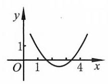

[第 116(1)题]

116. (1) $A = \left\lbrack  {1,4}\right\rbrack$ . 设 $f\left( x\right)  = {x}^{2} - {2ax} + a + 2$ ,

则 $\Delta  = 4{a}^{2} - {4a} - 8 \geq  0$ . 解得 $a \in  \left( {-\infty , - 1\rbrack \cup \lbrack 2, + \infty }\right)$ .

$y = f\left( x\right)$ 的对称轴为直线 $x = a$ ,如图, $\therefore 1 \leq  a \leq  4$ .

$f\left( 1\right)  = 1 - {2a} + a + 2 = 3 - a \geq  0, a \leq  3;$

$f\left( 4\right)  = {16} - {8a} + a + 2 = {18} - {7a} \geq  0, a \leq  \frac{18}{7}.$

$\therefore a \in  \left\lbrack  {2,\frac{18}{7}}\right\rbrack$ .

(2)① $\because \Delta  = 4{m}^{2} - {4m} - {24} < 0,\therefore m \in  \left( {-2,3}\right)$ .

② $\because \Delta  \geq  0$ ，

$\therefore m \in  \left( {-\infty , - 2\rbrack \cup \lbrack 3, + \infty }\right)$ .

$\therefore \;{\alpha }^{2} + {\beta }^{2} = {\left( \alpha  + \beta \right) }^{2} - {2\alpha \beta } = 4{m}^{2} - 2\left( {m + 6}\right)  = 4{m}^{2} - {2m} - {12} = 4{\left( m - \frac{1}{4}\right) }^{2} - \frac{49}{4}$ .

$\therefore$ 当 $m =  - 2$ 时, ${\left( {\alpha }^{2} + {\beta }^{2}\right) }_{\min } = 4 \cdot  4 + 4 - {12} = 8$ .

(3) 记 $F\left( x\right)  = f\left( x\right)  - k = {x}^{2} - {2kx} + 2 - k = {\left( x - k\right) }^{2} - {k}^{2} - k + 2\left( {x \geq   - 1}\right)$ ,

① $k \leq   - 1, F{\left( x\right) }_{\min } = F\left( {-1}\right)  = 1 + {2k} + 2 - k = 3 + k \geq  0, k \in  \left\lbrack  {-3, - 1}\right\rbrack$ ;

② $k >  - 1, F{\left( x\right) }_{\min } = F\left( k\right)  =  - {k}^{2} - k + 2 \geq  0, k \in  ( - 1,1\rbrack$ .

$\therefore k \in  \left\lbrack  {-3,1}\right\rbrack$ .

(4) $f\left( x\right)  =  - {\left( 3x + a\right) }^{2} + {2a}$ .

① $- \frac{a}{3} <  - \frac{1}{3}, f{\left( x\right) }_{\max } = f\left( {-\frac{1}{3}}\right)  =  - {a}^{2} + {4a} - 1 =  - 3$ ，

则 ${a}^{2} - {4a} - 2 = 0$ . 由 $a > 1$ ,得 $a = 2 + \sqrt{6}$ .

② $- \frac{1}{3} \leq   - \frac{a}{3} \leq  \frac{1}{3}, f{\left( x\right) }_{\max } = f\left( {-\frac{a}{3}}\right)  = {2a} =  - 3, a =  - \frac{3}{2}$ (舍去).

③ $- \frac{a}{3} > \frac{1}{3}, f{\left( x\right) }_{\max } = f\left( \frac{1}{3}\right)  =  - 1 - {a}^{2} =  - 3$ . 由 $a <  - 1$ ，得 $a =  - \sqrt{2}$ .

综上所述, $a = 2 + \sqrt{6}$ 或 $- \sqrt{2}$ .

117. (1) $\forall {x}_{1},{x}_{2} \in  \mathbf{R},{x}_{1} > {x}_{2}$ ,

$f\left( {x}_{1}\right)  - f\left( {x}_{2}\right)  = \left( {{x}_{1}^{3} + {x}_{1} + 1}\right)  - \left( {{x}_{2}^{3} + {x}_{2} + 1}\right)$

$= \left( {{x}_{1} - {x}_{2}}\right) \left( {{x}_{1}^{2} + {x}_{1}{x}_{2} + {x}_{2}^{2} + 1}\right)$

$= \left( {{x}_{1} - {x}_{2}}\right) \left\lbrack  {{\left( {x}_{1} + \frac{1}{2}{x}_{2}\right) }^{2} + \frac{3}{4}{x}_{2}^{2} + 1}\right\rbrack   > 0.$

$\therefore y = f\left( x\right)$ 在 $\mathbf{R}$ 上是严格增函数.

(2) $\because f\left( {-1}\right)  < 0, f\left( 0\right)  > 0, y = f\left( x\right)$ 在 $\mathbf{R}$ 上是严格增函数,

$\therefore f\left( x\right)  = 0$ 的解在 $\left( {-1,0}\right)$ 内,且是唯一实数解.

118. (1) 当 $x = 0$ 时, $f\left( x\right)  = 0$ ;

当 $x \neq  0$ 时, $f\left( x\right)  = \frac{1}{x + \frac{1}{x}}$ ;

当 $x \in  \left( {-\infty ,0}\right)$ 时, $x + \frac{1}{x} \in  ( - \infty , - 2\rbrack$ ;

当 $x \in  \left( {0, + \infty }\right)$ 时, $x + \frac{1}{x} \in  \lbrack 2, + \infty )$ .

$\therefore \frac{1}{x + \frac{1}{x}} \in  \left\lbrack  {-\frac{1}{2},0}\right)  \cup  \left( {0,\frac{1}{2}}\right\rbrack$ .

综上所述, $f\left( x\right)  \in  \left\lbrack  {-\frac{1}{2},\frac{1}{2}}\right\rbrack$ .

(2) $\forall {x}_{1},{x}_{2} \in  \mathbf{R},{x}_{1} > {x}_{2}, f\left( {x}_{1}\right)  - f\left( {x}_{2}\right)  = \frac{{x}_{1}}{1 + {x}_{1}^{2}} - \frac{{x}_{2}}{1 + {x}_{2}^{2}} = \frac{{x}_{1} - {x}_{2}}{\left( {1 + {x}_{1}^{2}}\right) \left( {1 + {x}_{2}^{2}}\right) }\left( {1 - {x}_{1}{x}_{2}}\right)$ .

$\therefore$ 当 ${x}_{1},{x}_{2} \in  \left( {-\infty , - 1}\right)$ ,或 ${x}_{1},{x}_{2} \in  \left( {1, + \infty }\right)$ 时, $f\left( {x}_{1}\right)  - f\left( {x}_{2}\right)  < 0$ ;

当 ${x}_{1}{x}_{2} \in  \left( {-1,1}\right)$ 时, $f\left( {x}_{1}\right)  - f\left( {x}_{2}\right)  > 0$ .

即 $y = f\left( x\right)$ 在区间 $\left( {-1,1}\right)$ 上是严格增函数,在区间 $\left( {-\infty , - 1}\right) ,\left( {1, + \infty }\right)$ 上是严格减函数.

119. (1) $f\left( {x}_{1}\right)  = f\left( {x}_{2}\right) , a\left( {{x}_{1}^{2} - {x}_{2}^{2}}\right)  + b\left( {{x}_{1} - {x}_{2}}\right)  = 0$ .

由 ${x}_{1} - {x}_{2} \neq  0$ ,得 $a\left( {{x}_{1} + {x}_{2}}\right)  + b = 0,\therefore {x}_{1} + {x}_{2} =  - \frac{b}{a}$ .

$\therefore \frac{{x}_{1} + {x}_{2}}{2} =  - \frac{b}{2a}$ ,即为图像的对称轴.

(2) $\forall {x}_{0} \in  \mathbf{R}$ ,点 ${A}_{1}\left( {a + {x}_{0}, f\left( {a + {x}_{0}}\right) }\right) ,{A}_{2}\left( {a - {x}_{0}, f\left( {a - {x}_{0}}\right) }\right)$ .

则 $\left\lbrack  {\left( {a + {x}_{0}}\right)  + \left( {a - {x}_{0}}\right) }\right\rbrack   \cdot  \frac{1}{2} = a$ ,且 $f\left( {a + {x}_{0}}\right)  = f\left( {a - {x}_{0}}\right)$ .

$\therefore$ 点 ${A}_{1},{A}_{2}$ 关于直线 $x = a$ 对称.

$\because y = f\left( x\right)$ 是定义在 $\mathbf{R}$ 上, $\;\therefore \forall {x}_{0} \in  \mathbf{R}$ ,令 ${x}_{0}{}^{\prime } = {2a} - {x}_{0}$ ,使得 $\frac{1}{2}\left( {{x}_{0} + {x}_{0}{}^{\prime }}\right)  = a$ ,

即 $y = f\left( x\right)$ 图像上任一点都存在关于直线 $x = a$ 对称的一点.

$\therefore y = f\left( x\right)$ 图像关于直线 $x = a$ 对称.

(3)由(2)知， $f\left( x\right)  = 0$ 的解关于 $x = 2$ 对称出现，而解的个数为奇数， $\therefore f\left( 2\right)  = 0$ . 其余 14 个解关于 $x = 2$ 对称, $\therefore$ 和为 $7 \times  4 + 2 = {30}$ .

120. (1) 由定义知, $\forall x \in  \mathbf{R}$ ,有 $f\left( {{2x} + 1}\right)  = f\left( {-{2x} + 1}\right)$ ,即 $f\left\lbrack  {2\left( {\frac{1}{2} + x}\right) }\right\rbrack   = f\left\lbrack  {2\left( {\frac{1}{2} - x}\right) }\right\rbrack$ .

记 $g\left( x\right)  = f\left( {2x}\right)$ ,则 $g\left( {\frac{1}{2} + x}\right)  = g\left( {\frac{1}{2} - x}\right)$ ,即 $y = f\left( {2x}\right)$ 的图像关于直线 $x = \frac{1}{2}$ 轴对称.

(或者由 $f\left( {2x}\right)  = f\left\lbrack  {2\left( {x - \frac{1}{2}}\right)  + 1}\right\rbrack$ ,则 $y = f\left( {2x}\right)$ 的图像是由 $y = f\left( {{2x} + 1}\right)$ 的图像向右平移 $\frac{1}{2}$ 个单位得到.

$\therefore$ 对称轴为直线 $x = \frac{1}{2}$ ).

(2) $y = 3 - \frac{7}{x + 2}$ ，图像关于(-2,3)中心对称.

(3) 点 $\left( {x, f\left( x\right) }\right) ,\left( {2 - x, f\left( {2 - x}\right) }\right) ,\forall x \in  \mathbf{R}$ ,

$\because \frac{1}{2}\left( {{x}_{1} + {x}_{2}}\right)  = \frac{1}{2}\left( {x + \left( {2 - x}\right) }\right)  = 1,\frac{1}{2}\left( {{y}_{1} + {y}_{2}}\right)  = \frac{1}{2}\left\lbrack  {f\left( x\right)  + f\left( {2 - x}\right) }\right\rbrack   =  - 1$ ,

$\therefore y = f\left( x\right)$ 图像的对称中心是 $\left( {1, - 1}\right)$ .

121. C

122. D 提示: 即原来的函数的值域. $y = \sqrt{{\left( x - 1\right) }^{2} + 2}, x \leq  1, y \in  \lbrack \sqrt{2}, + \infty )$ .

123. A 提示: $\frac{{2x} + 1}{{4x} + 3} = 2,{2x} + 1 = {8x} + 6, x =  - \frac{5}{6}$ .

124. $\mathrm{D}$ 提示: 原来的函数值域 $y = {\left( x + 1\right) }^{2} - 1, x <  - 1, y \in  \left( {-1, + \infty }\right)$ ,即反函数的定义域. ${x}^{2} + {2x} - y = 0, x = \frac{1}{2}\left( {-2 \pm  \sqrt{4 + {4y}}}\right)  =  - 1 \pm  \sqrt{1 + y}.\;\because x <  - 1,\;\therefore x =  - 1 - \sqrt{1 + y}$ ,

$\therefore$ 反函数是 $y =  - 1 - \sqrt{1 + x}, x >  - 1$ .

125. A 提示: $y = g\left( x\right)$ 是 $y = f\left( x\right)$ 的反函数. $y = f\left( x\right)  = {\left( x - 1\right) }^{2}, x - 1 =  \pm  \sqrt{y}$ . 由 $x \leq  1$ ,得 $x = 1 - \sqrt{y}$ .

$\therefore g\left( x\right)  = 1 - \sqrt{x}$ ,原来的函数值域为 $\lbrack 0, + \infty ),\therefore g\left( x\right)  = 1 - \sqrt{x}, x \geq  0$ .

126. A 由 $y = \frac{x + 2}{{3x} + 1}$ ,得 ${3yx} + y = x + 2,\left( {{3y} - 1}\right) x = 2 - y, x = \frac{2 - y}{{3y} - 1}$ . $\therefore$ 原来的函数为 $y = \frac{x - 2}{-{3x} + 1}$ .

127. $\mathrm{B}$ 提示: $y = \frac{x - 2}{x + m},\left( {y - 1}\right) x =  - {ym} - 2, x = \frac{{ym} + 2}{-y + 1}.\;\therefore {f}^{-1}\left( x\right)  = \frac{{mx} + 2}{-x + 1} = \frac{x - 2}{x + m}, m =  - 1$ .

128. $\mathrm{C}$ 提示: $\because f\left( 0\right)  =  - 1,\therefore {f}^{-1}\left( {-1}\right)  = 0$ . 设 $y = f\left( {x + 4}\right)$ ,则 ${f}^{-1}\left( y\right)  = x + 4$ ,即 $x = {f}^{-1}\left( y\right)  - 4$ . $\therefore y = f\left( {x + 4}\right)$ 的反函数是 $y = {f}^{-1}\left( x\right)  - 4$ ,恒过点 $\left( {-1, - 4}\right)$ .

129. D 提示: $\because y = {f}^{-1}\left( x\right)  = \lg \left( {x - 1}\right)  + 3,\therefore y - 3 = \lg \left( {x - 1}\right) ,\therefore x - 1 = {10}^{y - 3}$ ,即 $x = {10}^{y - 3} + 1$ . $\therefore f\left( x\right)  = {10}^{x - 3} + 1$ .

130. $\mathrm{D}$ 提示: $y = {f}^{-1}\left( x\right)$ 的定义域即 $y = f\left( x\right)$ 的值域. $\because x \geq  1,\therefore f\left( x\right)  \in  \lbrack 3, + \infty )$ .

131. (1) $\mathrm{D}\left( 2\right) y =  - {\log }_{0.2}\left( {x - 1}\right) , x \in  \left( {1, + \infty }\right)$ (3) $y = {10}^{x - 1} - 2, x \in  \lbrack 2, + \infty )$

(6) $f\left( x\right)  = {2}^{x} + 1$

提示: (1) $\frac{1 - {2}^{x}}{1 + {2}^{x}} = \frac{3}{5},5 - 5 \cdot  {2}^{x} = 3 + 3 \cdot  {2}^{x},\therefore {2}^{x} = \frac{1}{4}, x =  - 2$ ,即 ${f}^{-1}\left( \frac{3}{5}\right)  =  - 2$ .

(2) $y - 1 = {\left( 0,2\right) }^{-x}, - x = {\log }_{0.2}\left( {y - 1}\right) , x =  - {\log }_{0.2}\left( {y - 1}\right)$ .

$\therefore {f}^{-1}\left( x\right)  =  - {\log }_{0.2}\left( {x - 1}\right) , x \in  \left( {1, + \infty }\right)$ .

(3) $y = 1 + \lg \left( {x + 2}\right) \left( {x \geq  8}\right)  \in  \lbrack 2, + \infty ), y - 1 = \lg \left( {x + 2}\right) , x = {10}^{y - 1} - 2$ . $\therefore {f}^{-1}\left( x\right)  = {10}^{x - 1} - 2, x \in  \lbrack 2, + \infty )$ .

(4) $\frac{{10}^{x} + 1}{{10}^{x} - 1} = \frac{101}{99},{99} \cdot  {10}^{x} + {99} = {101} \cdot  {10}^{x} - {101},{10}^{x} = {100}, x = 2$ .

(5) $\frac{\lg x - 1}{\lg x + 1} = \frac{1}{10},{10}\lg x - {10} = \lg x + 1,\lg x = \frac{11}{9}, x = {10}^{\frac{11}{9}}$ .

(6) 由 $y = f\left( x\right)$ 和 $y = {f}^{-1}\left( x\right)$ 的图像关于 $y = x$ 对称, $y = {f}^{-1}\left( x\right)$ 过点 $\left( {2,0}\right)$ ,则 $y = f\left( x\right)$ 过点 $\left( {0,2}\right)$ . $\therefore \left\{  \begin{array}{l} a - k = 3, \\  1 - k = 2. \end{array}\right.$ 得 $\left\{  {\begin{array}{l} a = 2, \\  k =  - 1. \end{array}\;\therefore \;f\left( x\right)  = {2}^{x} + 1}\right.$ .

132. (1) $\left\lbrack  {-1,0}\right\rbrack$ 的任意一个子集

提示: 由 $y =  - \sqrt{1 - {x}^{2}}$ ,得 $1 - {x}^{2} = {y}^{2}$ ,即 ${x}^{2} = 1 - {y}^{2}$ ,则 $x =  - \sqrt{1 - {y}^{2}} \leq  0$ .

只要 $x \leq  0$ ,且 $1 - {x}^{2} \geq  0,\therefore x \in  \left\lbrack  {-1,0}\right\rbrack$ .

原来的函数的定义域可以是 $\left\lbrack  {-1,0}\right\rbrack$ 的任意一个子集.

(2)2 3 提示:由 $y = \frac{1}{3}x + m$ ，得 $x = {3y} - {3m}$ . $\;\therefore \;{3x} - {3m} = {nx} - 6, m = 2, n = 3$ .

(3)-3 7 提示: $\because \left( {1,2}\right) ,\left( {2,1}\right)$ 都在原来的函数图像上， $\therefore \left\{  \begin{array}{l} 2 = \sqrt{a + b}, \\  1 = \sqrt{{2a} + b}. \end{array}\right.$ 解得 $a =  - 3, b = 7$ .

133. (1) $\frac{x - 1}{x + 1}, x \in  \left( {-\infty , - 1}\right)  \cup  \left( {-1, + \infty }\right)$

提示: $y =  - 1 + \frac{2}{1 - x} \in  \left( {-\infty , - 1}\right)  \cup  \left( {-1, + \infty }\right) .\left( {1 + y}\right) x = y - 1, x = \frac{y - 1}{1 + y}$ .

$\therefore {f}^{-1}\left( x\right)  = \frac{x - 1}{x + 1}, x \in  \left( {-\infty , - 1}\right)  \cup  \left( {-1, + \infty }\right)$ .

(2) $- {x}^{\frac{3}{2}}, x \in  \lbrack 0, + \infty )$

提示: $y = f\left( x\right)  = {x}^{\frac{2}{3}} \in  \lbrack 0, + \infty ),\;\therefore x = {y}^{\frac{3}{2}},\;\therefore {f}^{-1}\left( x\right)  =  - {x}^{\frac{3}{2}}, x \in  \lbrack 0, + \infty )$ .

(3) $\sqrt{1 - {x}^{2}}, x \in  \left\lbrack  {-1,0}\right\rbrack$ 提示: $x \in  \left\lbrack  {0,1}\right\rbrack  , y = f\left( x\right)  =  - \sqrt{1 - {x}^{2}} \in  \left\lbrack  {-1,0}\right\rbrack$ .

$\because x \in  \left\lbrack  {0,1}\right\rbrack  ,\therefore x = \sqrt{1 - {y}^{2}}.\;\therefore {f}^{-1}\left( x\right)  = \sqrt{1 - {x}^{2}}, x \in  \left\lbrack  {-1,0}\right\rbrack$ .

(4) $- \sqrt{{x}^{2} + 4}\;x \in  \lbrack 0, + \infty )\;$ 提示: $x \leq   - 2, y = f\left( x\right)  = \sqrt{{x}^{2} - 4} \in  \lbrack 0, + \infty )$ .

$\because x \leq   - 2,\;\therefore x =  - \sqrt{{y}^{2} + 4}.\;\therefore {f}^{-1}\left( x\right)  =  - \sqrt{{x}^{2} + 4}, x \in  \lbrack 0, + \infty )$ .

(5) $\left\{  \begin{array}{l}  - \frac{x}{3}, x \in  \left( {-\infty ,0}\right) \\   - \sqrt{x}, x \in  \lbrack 0, + \infty ) \end{array}\right.$ 提示: 当 $x \leq  0$ 时, $y = {x}^{2}, x =  - \sqrt{y}, y \in  \lbrack 0, + \infty )$ ;

当 $x > 0$ 时, $y =  - {3x}, x =  - \frac{y}{3}, y \in  \left( {-\infty ,0}\right) .\;\therefore {f}^{-1}\left( x\right)  = \left\{  \begin{array}{l}  - \frac{x}{3}, x \in  \left( {-\infty ,0}\right) , \\   - \sqrt{x}, x \in  \lbrack 0, + \infty ). \end{array}\right.$

(6) $\left\{  \begin{array}{l} x, x \in  \left\lbrack  {0,1}\right\rbrack  \\  1 - x, x \in  (1,2\rbrack  \end{array}\right.$

提示: 当 $x \in  \left\lbrack  {0,1}\right\rbrack$ 时, $x = y, y \in  \left\lbrack  {0,1}\right\rbrack$ ;

当 $x \in  \lbrack  - 1,0)$ 时, $y = 1 - x, x = 1 - y, y \in  (1,2\rbrack$ .

$\therefore {f}^{-1}\left( x\right)  = \left\{  \begin{array}{l} x, x \in  \left\lbrack  {0,1}\right\rbrack  , \\  1 - x, x \in  (1,2\rbrack . \end{array}\right.$

(7) $\left\{  \begin{array}{l} \frac{1}{2}\left( {x + 1}\right) , x \in  \left( {-\infty , - 1}\right) \\  \sqrt{x + 1}, x \in  \lbrack  - 1, + \infty ) \end{array}\right.$ 提示: 当 $x \geq  0$ 时, $y = {x}^{2} - 1, x = \sqrt{y + 1}, y \in  \lbrack  - 1, + \infty )$ ;

当 $x < 0$ 时, $y = {2x} - 1, x = \frac{1}{2}\left( {y + 1}\right) , y \in  \left( {-\infty , - 1}\right)$ .

$\therefore {f}^{-1}\left( x\right)  = \left\{  \begin{array}{l} \frac{1}{2}\left( {x + 1}\right) , x \in  \left( {-\infty , - 1}\right) , \\  \sqrt{x + 1}, x \in  \lbrack  - 1, + \infty ). \end{array}\right.$

(8) $\because y = f\left( x\right)  = \lg \left( {1 - {x}^{2}}\right) ,\;\therefore 1 - {x}^{2} = {10}^{y}$ ,即 ${x}^{2} = 1 - {10}^{y}$ .

$\because x < 0,\therefore x =  - \sqrt{1 - {10}^{y}}$ .

$\because f\left( x\right)  = \lg \left( {1 - {x}^{2}}\right)$ 的值域为 $\left( {\lg \frac{3}{4},0}\right) ,\therefore {f}^{-1}\left( x\right)  =  - \sqrt{1 - {10}^{x}}, x \in  \left( {\lg \frac{3}{4},0}\right)$ .

(9) $y = f\left( x\right)  = 1 - \frac{2}{{a}^{x} + 1} \cdot  \frac{2}{{a}^{x} + 1} = 1 - y,\frac{{a}^{x} + 1}{2} = \frac{1}{1 - y},{a}^{x} = \frac{2}{1 - y} - 1, x = {\log }_{a}\left( {\frac{2}{1 - y} - 1}\right)  = {\log }_{a}\frac{y + 1}{1 - y}$ .

$\therefore \;{f}^{-1}\left( x\right)  = {\log }_{a}\frac{1 + x}{1 - x}, x \in  \left( {-1,1}\right) .$

(10) $\because {a}^{y} = \frac{x + b}{x - b} = 1 + \frac{2b}{x - b},\therefore \frac{x - b}{2b} = \frac{1}{{a}^{y} - 1},\;\therefore x = b + \frac{2b}{{a}^{y} - 1}$ .

$\therefore \;{f}^{-1}\left( x\right)  = b + \frac{2b}{{a}^{x} - 1}, x \in  \left( {-\infty ,0}\right)  \cup  \left( {0, + \infty }\right)$ .

134. $\mathrm{B}$ 提示: $y = f\left( x\right)  = \frac{x + 1}{x - 1} \cdot  {yx} - y = x + 1, x = \frac{y + 1}{y - 1}$ .

$\therefore {f}^{-1}\left( {-x}\right)  = \frac{-x + 1}{-x - 1} = 1 - \frac{2}{x + 1}$ ,在区间 $\left( {-\infty , - 1}\right)$ 和 $\left( {-1, + \infty }\right)$ 上是严格增函数.

135. B 提示: 先证一个引理:

设 $y = f\left( x\right)$ 存在反函数 $y = {f}^{-1}\left( x\right)$ ,若 $y = f\left( x\right)$ 在定义域上是严格增函数且和 $y = {f}^{-1}\left( x\right)$ 的图像有交点,则交点一定在 $y = x$ 上.

证明: 设 $\left( {a, b}\right)$ 是一个交点, $f\left( a\right)  = b,{f}^{-1}\left( a\right)  = b$ ,

则 ${f}^{-1}\left( {f\left( a\right) }\right)  = {f}^{-1}\left( b\right)  = a, f\left( {{f}^{-1}\left( a\right) }\right)  = f\left( b\right)  = a,\therefore \left( {b, a}\right)$ 也是一个交点,则 $\left\{  \begin{array}{l} b = f\left( a\right) , \\  a = f\left( b\right) . \end{array}\right.$

若 $a > b$ ,由 $y = f\left( x\right)$ 在定义域上是严格增函数,得 $f\left( a\right)  > f\left( b\right)  \Rightarrow  b > a$ ,矛盾; 若 $a < b$ ,由 $y = f\left( x\right)$ 在定义域上是严格增函数,得 $f\left( a\right)  < f\left( b\right)  \Rightarrow  b < a$ ,矛盾. $\;\therefore a = b$ .

原题即 $y = \sqrt{x - m}$ 和 $y = x$ 有交点 $\left( {y = \sqrt{x - m}}\right.$ 在定义域上是严格增函数).

$\sqrt{x - m} = x,{x}^{2} - x + m = 0.\Delta  = 1 - {4m} \geq  0, m \leq  \frac{1}{4}$ . 由 ${x}_{1} + {x}_{2} = 1$ ,知至少有一正根.

$\therefore m \leq  \frac{1}{4}$ (当 $y = f\left( x\right)$ 在定义域上是严格减函数时, $y = f\left( x\right)$ 和 $y = {f}^{-1}\left( x\right)$ 的图像的交点不一定在 $y = x$ 上,如 $y = \frac{1}{x}$ ).

136. $\mathrm{D}$ 提示: $y = g\left( x\right)  = {f}^{-1}\left( x\right) , y = h\left( x\right)$ 图像上的点和 $y = {f}^{-1}\left( x\right)$ 图像上的点关于原点对称.

若 $y = {f}^{-1}\left( x\right)$ 图像上的点为 $\left( {x,{f}^{-1}\left( x\right) }\right)$ ,则 $y = h\left( x\right)$ 图像上的点为 $\left( {-x, - {f}^{-1}\left( x\right) }\right)$ ,

$\therefore h\left( {-x}\right)  =  - {f}^{-1}\left( x\right) .\;\therefore h\left( x\right)  =  - {f}^{-1}\left( {-x}\right)$ .

137. (1) $1 - 1$

(2) $a \neq   - \frac{1}{2}\;$ 提示: $y = \frac{{2x} - 1}{x + a},\;\therefore {yx} + {ya} = {2x} - 1, x = \frac{{ya} + 1}{2 - y} =  - a + \frac{1 + {2a}}{2 - y}.$

$\because x \neq   - a,1 + {2a} \neq  0.\;\therefore a \neq   - \frac{1}{2}$ .

(3)345 提示: ${f}^{-1}\left( {a + 1}\right)  = 3, f\left( 3\right)  = a + 1$ .

$\therefore a + 1 = 2 \cdot  9 - 4 \times  3 + 9.\;\therefore a = {18} - {12} + 9 - 1 = {14}$ .

$\therefore \;f\left( a\right)  = f\left( {14}\right)  = 2 \times  {196} - 4 \times  {14} + 9 = {345}.$

(4) $- \frac{\sqrt{2}}{2}$ 提示:设 $t = x - 1, x = t + 1, t \in  ( - \infty ,0\rbrack$ . $f\left( t\right)  = {\left( t + 1\right) }^{2} - 2\left( {t + 1}\right)  = {t}^{2} + {2t} + 1 - {2t} - 2 = {t}^{2} - 1, t \in  ( - \infty ,0\rbrack$ .

$f\left( x\right)  = {x}^{2} - 1, x \in  ( - \infty ,0\rbrack .\;\therefore x =  - \sqrt{y + 1}, y \in  \lbrack  - 1, + \infty ).$

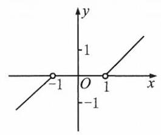

(第 138 题)

$\therefore {f}^{-1}\left( x\right)  =  - \sqrt{x + 1}, x \in  \lbrack  - 1, + \infty )$ .

$\therefore {f}^{-1}\left( {-\frac{1}{2}}\right)  =  - \sqrt{-\frac{1}{2} + 1} =  - \frac{\sqrt{2}}{2}$ .

138. 如图,当 $x > 0$ 时, $y = x + 1, x = y - 1, y \in  \left( {1, + \infty }\right)$ ;

当 $x < 0$ 时, $y = x - 1, x = y + 1, y \in  \left( {-\infty , - 1}\right)$ .

$\therefore {f}^{-1}\left( x\right)  = \left\{  \begin{array}{l} x + 1, x \in  \left( {-\infty , - 1}\right) , \\  x - 1, x \in  \left( {1, + \infty }\right) . \end{array}\right.$

139. (1) 无.

(2) $y = {x}^{2} + {2x} + 1, y \in  \lbrack 1, + \infty ).{x}^{2} + {2x} + 1 - y = 0$ .

$\therefore {\left( x + 1\right) }^{2} = y, x =  - 1 \pm  \sqrt{y}$ . 由 $x \geq  0$ ,得 $x =  - 1 + \sqrt{y}$ .

$\therefore {f}^{-1}\left( x\right)  =  - 1 + \sqrt{x}, x \in  \lbrack 1, + \infty )$ .

(3) $y = {x}^{2} + {2x} + 1, y \in  \lbrack 0, + \infty ).x =  - 1 \pm  \sqrt{y}$ . 由 $x \leq   - 1$ ,得 $x =  - 1 - \sqrt{y}$ .

$\therefore {f}^{-1}\left( x\right)  =  - 1 - \sqrt{x}, x \in  \lbrack 0, + \infty )$ .

140. (1) $\because a - k{a}^{x} > 0,\therefore k < {a}^{1 - x},\;\therefore k < {\left( {a}^{1 - x}\right) }_{\min } = {a}^{1 - 1} = 1$ .

$\therefore \;k \in  \left( {-\infty ,1}\right)$ .

(2)令 $y = f\left( x\right)  = {\log }_{a}\left( {a - k{a}^{x}}\right) ,\;\therefore \;{a}^{y} = a - k{a}^{x}, k{a}^{x} = a - {a}^{y}, x = {\log }_{a}\left( {\frac{a}{k} - \frac{{a}^{y}}{k}}\right)$ .

$\therefore {f}^{-1}\left( x\right)  = {\log }_{a}\left( {\frac{a}{k} - \frac{{a}^{x}}{k}}\right) ,\;\therefore  - k =  - \frac{1}{k}$ ,且 $\frac{1}{k} = 1,\therefore k = 1$ .

(3) $\because f\left( x\right)  = {f}^{-1}\left( x\right)  = {\log }_{a}\left( {a - {a}^{x}}\right) ,\therefore {x}^{2} - 2 = x$ ,解得 ${x}_{1} =  - 1,{x}_{2} = 2$ .

$\because a - {a}^{x} > 0$ ,且 $a > 1,\therefore x < 1,\therefore x =  - 1$ .

141. $\forall {y}_{1},{y}_{2} \in  \left\{  {y \mid  y = f\left( x\right) , x \in  D}\right\}$ ,且 ${y}_{1} > {y}_{2}$ ,设 ${f}^{-1}\left( {y}_{1}\right)  = {x}_{1},{f}^{-1}\left( {y}_{2}\right)  = {x}_{2}$ .

若存在 ${y}_{1},{y}_{2}$ ,使得 ${x}_{1} \leq  {x}_{2}$ ,则由 $y = f\left( x\right)$ 是严格增函数得, ${y}_{1} = f\left( {x}_{1}\right)  \leq  f\left( {x}_{2}\right)  = {y}_{2}$ ,与 ${y}_{1} > {y}_{2}$ 矛盾.

$\therefore {f}^{-1}\left( {y}_{1}\right)  > {f}^{-1}\left( {y}_{2}\right)$ ,即 $y = {f}^{-1}\left( x\right)$ 在其定义域上是严格增函数.

## 第六章 三角

1. C 2. C

3. C 提示: $\because \alpha  \in  \left( {{2k\pi } - \frac{\pi }{2},{2k\pi }}\right) , k \in  \mathbf{Z},\;\therefore \pi  - \alpha  \in  \left( {-{2k\pi } + \pi , - {2k\pi } + \frac{3\pi }{2}}\right) , k \in  \mathbf{Z}$ .

$\therefore \pi  - \alpha$ 是第三象限的角.

4. C 提示: $\because$ 半径 $R$ 的内接正三角形的边长为 $\sqrt{3}R,\therefore l = {\alpha R} = \sqrt{3}R,\therefore \alpha  = \sqrt{3}$ .

5. D

6. C 提示: $\alpha  >  - \frac{\pi }{2}, - \beta  >  - \frac{\pi }{2},\therefore \alpha  - \beta  >  - \pi$ . 由 $\alpha  < \beta$ ,得 $\alpha  - \beta  < 0,\therefore \alpha  - \beta  \in  \left( {-\pi ,0}\right)$ .

7. A 提示: $\forall x \in  M,\exists k \in  \mathbf{Z}, x = \frac{k\pi }{2} \pm  \frac{\pi }{4} = \frac{{2k} \pm  1}{4}\pi$ . 取 ${k}^{\prime } = {2k} \pm  1 \in  \mathbf{Z},\therefore x \in  P,\therefore M \subseteq  P$ . 又 $0 \in  P,0 \notin  M,\therefore M \subset  P$ .

8. (1) $\left\{  {{\left. \alpha \right| }_{\alpha } =  - {45}^{ \circ  } + k \cdot  {360}^{ \circ  }, k \in  \mathbf{Z}}\right\}$ (2) $\left\{  {\alpha \left| {\;{2k\pi } - \frac{\pi }{2} < \alpha  < {2k\pi }}\right. , k \in  \mathbf{Z}}\right\}$ (3) $\left\{  {{\left. \alpha \right| }_{\alpha } = {2k\pi } + \pi , k \in  \mathbf{Z}}\right\}$

(4) $\left\{  {\alpha \left| {\;\alpha  = {k\pi } + \frac{\pi }{4}}\right. , k \in  \mathbf{Z}}\right\}$ (5) $\beta  - \alpha  = {2k\pi } - \pi , k \in  \mathbf{Z}$ (6) $\left\langle  {\alpha \left| {\alpha  = {2k\pi } - \frac{\pi }{4}\text{ 或 }{2k\pi } - \frac{3}{4}\pi , k \in  \mathbf{Z}}\right| }\right\rangle$

9. (1)二或四 第一象限或第二象限或 $y$ 轴正半轴

提示: $\because \;{2k\pi } + \pi  < \alpha  < {2k\pi } + \frac{3}{2}\pi , k \in  \mathbf{Z}$ ,

$\therefore \;{k\pi } + \frac{\pi }{2} < \frac{\alpha }{2} < {k\pi } + \frac{3}{4}\pi , k \in  \mathbf{Z}$ .

$k$ 是奇数时, $\frac{\alpha }{2}$ 是第四象限的角; $k$ 是偶数时, $\frac{\alpha }{2}$ 是第二象限的角.

$\because {4k\pi } + {2\pi } < {2\alpha } < {4k\pi } + {3\pi }, k \in  \mathbf{Z},\therefore {2\alpha }$ 的终边在第一象限或第二象限或 $y$ 轴正半轴上.

(2)二 提示: $- \frac{3}{2}\pi  <  - 4 <  - \pi$ .

10. (1) ${60}^{ \circ  },{420}^{ \circ  }, - {300}^{ \circ  }, - {660}^{ \circ  }$

(2) $- \frac{2}{5}\pi$ 或 $\frac{8}{5}\pi$ 提示: $\because \alpha  + \frac{7}{5}\pi  = \left( {{2k} + 1}\right) \pi , k \in  \mathbf{Z},\therefore \alpha  = {2k}\pi  - \frac{2}{5}\pi$ ，

$- {2\pi } < \left( {{2k} - \frac{2}{5}}\right) \pi  < {2\pi }, k = 0$ 或 $1.\;\therefore \;\alpha  =  - \frac{2}{5}\pi$ 或 $\frac{8}{5}\pi .$

11. (1) $\frac{3}{2}\;{48}$ 提示: $l = {\alpha R},\alpha  = \frac{l}{R} = \frac{12}{8} = \frac{3}{2}.S = \frac{3}{4} \times  {8}^{2} = {48}\left( {\mathrm{\;{cm}}}^{2}\right)$ .

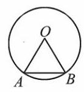

[第 11(3)题]

(2) $\frac{27}{2}\;$ 提示: $R = \frac{l}{\alpha } = \frac{9}{3} = 3\mathrm{\;{cm}}$ ， $S = 9 \cdot  \frac{3}{2} = \frac{27}{2}\left( {\mathrm{\;{cm}}}^{2}\right)$ .

(3) $\frac{{2\pi } - 3\sqrt{3}}{12}{r}^{2}$ 提示:如图， ${AO} = {BO} = {AB} = r,\;\because {\bigtriangleup {AOB}}$ 是等边三角形，

$\therefore \angle {AOB} = \frac{\pi }{3}.\;\therefore \;{S}_{\text{ 弓 }} = \pi {r}^{2} \cdot  \frac{\frac{\pi }{3}}{2\pi } - \frac{\sqrt{3}}{4}{r}^{2} = \frac{{2\pi } - 3\sqrt{3}}{12}{r}^{2}$ .

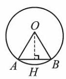

[第 11(4)题]

(4) $\frac{1}{2} \cdot  \frac{1}{{\sin }^{2}\frac{1}{2}}$ 提示:如图，过点 $O$ 作 ${OH}\bot {AB}$ 于点 $H$ ，则 ${AH} = {BH} = 1$ ， $\angle {AOH} = \angle {BOH} = \frac{1}{2}$ .

$\therefore R = {AO} = \frac{1}{\sin \frac{1}{2}}, S = \pi {R}^{2} \cdot  \frac{1}{2\pi } = \frac{1}{2} \cdot  \frac{1}{{\sin }^{2}\frac{1}{2}}$ .

12. $\left\lbrack  {-2, - \frac{\pi }{2}}\right)  \cup  \left\lbrack  {\frac{\pi }{3},\frac{\pi }{2}}\right)$

13. $C = {2R} + {\alpha R} = \left( {2 + \alpha }\right) R = {30}\mathrm{\;{cm}}.S = \frac{1}{2}\alpha {R}^{2}$ .

把 $\alpha  = \frac{30}{R} - 2$ 代入，得 $S = \frac{1}{2}\left( {\frac{30}{R} - 2}\right) {R}^{2} =  - {R}^{2} + {15R} =  - {\left( R - \frac{15}{2}\right) }^{2} + \frac{225}{4}$ .

当 $R = \frac{15}{2},\alpha  = 2$ 时, ${S}_{\max } = \frac{225}{4}$ .

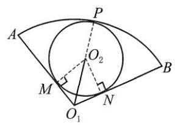

(第 14 题)

14. 如图,扇形 ${O}_{1}{AB}$ 和 $\odot  {O}_{2}$ 内切,半径分别为 ${r}_{1},{r}_{2}$ ,则 ${O}_{1},{O}_{2}, P$ 三点共线.

连接 ${O}_{2}M,{O}_{2}N,{O}_{2}M \bot  {O}_{1}A,{O}_{2}N \bot  {O}_{1}B$ ,且 ${O}_{2}M = {O}_{2}N = {r}_{2}$ .

$\therefore \angle A{O}_{1}P = \angle B{O}_{1}P,\;\therefore \;{r}_{1} = \left( {\frac{2\sqrt{3}}{3} + 1}\right) {r}_{2}$ .

$\frac{{S}_{\text{ 扇形 }}}{{S}_{\odot {O}_{2}}} = \frac{\frac{1}{3}\pi {r}_{1}^{2}}{\pi {r}_{2}^{2}} = \frac{1}{3}{\left( \frac{2\sqrt{3}}{3} + 1\right) }^{2} = \frac{7 + 4\sqrt{3}}{9}.$

15. $\frac{\pi }{2} \cdot  \frac{2}{3} - \frac{1}{4} \cdot  \frac{2\pi }{12} = \frac{7\pi }{24}$ .

16. $\mathrm{C}$ 提示: $\alpha$ 终边上一点的坐标为 $\left( {x,{2x}}\right) \left( {x \neq  0}\right) ,\sin \alpha  = \frac{2x}{\sqrt{{x}^{2} + 4{x}^{2}}} = \frac{2\sqrt{5}}{5} \cdot  \frac{x}{\left| x\right| } =  \pm  \frac{2\sqrt{5}}{5}$ .

17. $\mathrm{D}$ 提示: $\cos \alpha  = \frac{3}{\sqrt{{3}^{2} + {y}^{2}}} = \frac{3}{5}, y < 0,\therefore y =  - 4,\tan \alpha  =  - \frac{4}{3}$ .

18. $\mathrm{B}$ 提示: $\alpha  \in  \left( {0,\pi }\right) ,\;\therefore \;\sin \alpha  > 0,\cos \beta  < 0,\;\therefore \;\beta  \in  \left( {\frac{\pi }{2},\pi }\right)$ .

19. C 提示: 选项 A,两角的始边可能不同.

20. $\mathrm{B}$ 提示: $\because {2k\pi } + \pi  < \theta  < {2k\pi } + \frac{3}{2}\pi , k \in  \mathbf{Z},\therefore {k\pi } + \frac{\pi }{2} < \frac{\theta }{2} < {k\pi } + \frac{3}{4}\pi , k \in  \mathbf{Z}$ .

又 $\cos \frac{\theta }{2} < 0$ ,则 $k$ 是偶数, $\therefore \frac{\theta }{2}$ 是第二象限的角.

21. C 提示: $\because \sin {2\theta } > 0,\therefore {2k\pi } < {2\theta } < {2k\pi } + \pi , k \in  \mathbf{Z},\therefore {k\pi } < \theta  < {k\pi } + \frac{\pi }{2}, k \in  \mathbf{Z}$ . $k$ 是奇数时, $\theta$ 是第三象限的角; $k$ 是偶数时, $\theta$ 是第一象限的角.

22. (1) $\left\{  {\alpha \left| {\;\alpha  = {2k\pi } - \frac{\pi }{3}}\right. , k \in  \mathbf{Z}}\right\}$

(2)4 或 -4 提示: $\cos \alpha  = \frac{-3}{\sqrt{9 + {a}^{2}}} =  - \frac{3}{5},{a}_{1} = 4,{a}_{2} =  - 4$ .

(3) $\frac{1}{2}$ 提示: $\sin \theta  = \frac{m}{\sqrt{3 + {m}^{2}}} = \frac{\sqrt{13}}{13}$ ， ${13m} = \sqrt{{39} + {13}{m}^{2}}$ ， ${m}^{2} = \frac{1}{4}$ . 由 $\sin \theta  > 0$ ，得 $m > 0$ ，则 $m = \frac{1}{2}$ .

(4) $\frac{\sqrt{10} - \sqrt{15}}{5}$ 提示: $\sin \alpha  =  - \frac{\sqrt{3}}{\sqrt{5}}$ ， $\cos \alpha  = \frac{-\sqrt{2}}{\sqrt{5}}$ ，则 $\sin \alpha  - \cos \alpha  = \frac{\sqrt{2} - \sqrt{3}}{\sqrt{5}} = \frac{\sqrt{10} - \sqrt{15}}{5}$ .

23. (1) $\{ 0, - 2,4\}$

提示: ① $\sin x > 0,\cos x > 0$ ，原式 $= 4$ ; ② $\sin x < 0,\cos x < 0$ ，原式 $= 0$ ；③ $\sin x \cdot  \cos x < 0$ ，原式 $=  - 2$ .

(2) $\left( {{k\pi },{k\pi } + \frac{\pi }{2}}\right) , k \in  \mathbf{Z}$ 提示: $\frac{1}{2}\sin {2\alpha } > 0,{2k\pi } < {2\alpha } < {2k\pi } + \pi ,{k\pi } < \alpha  < {k\pi } + \frac{\pi }{2}.$

24.(1) $\frac{\pi }{4}$ 或 $\frac{\pi }{2}$ 提示: $\tan x = 1$ 或 $\tan x$ 无意义，则 $x = \frac{\pi }{4}$ 或 $\frac{\pi }{2}$ .

(2) $\left\{  {x\left| {\;{2k\pi } \leq  x \leq  {2k\pi } + \pi }\right. , k \in  \mathbf{Z}}\right\}$ 提示: $0 \leq  \sin x \leq  1, x \in  \left\lbrack  {{2k\pi },{2k\pi } + \pi }\right\rbrack  , k \in  \mathbf{Z}$ .

(3) $\left\{  {{2k\pi } - \frac{\pi }{2} \leq  x \leq  {2k\pi } + \frac{\pi }{2}, k \in  \mathbf{Z}}\right\}$ 提示: $\cos x \geq  0, x \in  \left\lbrack  {{2k\pi } - \frac{\pi }{2},{2k\pi } + \frac{\pi }{2}}\right\rbrack  , k \in  \mathbf{Z}$ .

(4) $\left\{  {x\left| {\;{2k\pi } - \frac{\pi }{2} < x < {2k\pi }}\right. , k \in  \mathbf{Z}}\right\}$ 提示: $\left\{  \begin{array}{l} \cos x > 0, \\  \sin x < 0, \end{array}\right.$ 即 $x$ 是第四象限的角, $\therefore x \in  \left( {{2k\pi } - \frac{\pi }{2},{2k\pi }}\right) , k \in  \mathbf{Z}$ .

(5) $\left\{  {x\left| {\;{2k\pi } + \frac{\pi }{2} < x \leq  {2k\pi } + \pi \text{ 或 }x = {2k\pi }}\right. , k \in  \mathbf{Z}}\right\}$

提示: $\left\{  \begin{array}{l} \sin x \geq  0, \\  \tan x \leq  0, \end{array}\right.$ 即 $\sin x = 0$ 时, $x = {k\pi }, k \in  \mathbf{Z}$ ;

$\sin x \neq  0$ 时, $\sin x > 0,\cos x < 0$ .

$\therefore \;x \in  \left( {{2k\pi } + \frac{\pi }{2},{2k\pi } + \pi }\right) , k \in  \mathbf{Z}$ .

即 $x \in  \left( {{2k\pi } + \frac{\pi }{2},{2k\pi } + \pi }\right\rbrack$ 或 $x = {2k\pi }, k \in  \mathbf{Z}$ .

25. $\mathrm{B}$ 提示: $\cos \alpha  =  - \sqrt{1 - {\left( \frac{4}{5}\right) }^{2}} =  - \frac{3}{5},\tan \alpha  = \frac{\sin \alpha }{\cos \alpha } =  - \frac{4}{3}$ .

26. $\mathrm{C}$ 提示: $\because 1 + \sin \theta \sqrt{1 - {\cos }^{2}\theta } + \cos \theta \sqrt{1 - {\sin }^{2}\theta } = {\sin }^{2}\theta  + {\cos }^{2}\theta  + \sin \theta  \cdot  \left| {\sin \theta }\right|  + \cos \theta  \cdot  \left| {\cos \theta }\right|  = 0$ ,

$\therefore \left| {\sin \theta }\right|  \cdot  \left( {\left| {\sin \theta }\right|  + \sin \theta }\right)  + \left| {\cos \theta }\right|  \cdot  \left( {\left| {\cos \theta }\right|  + \cos \theta }\right)  = 0$ .

由 $\left| {\sin \theta }\right|  \cdot  \left( {\left| {\sin \theta }\right|  + \sin \theta }\right)  \geq  0,\left| {\cos \theta }\right|  \cdot  \left( {\left| {\cos \theta }\right|  + \cos \theta }\right)  \geq  0$ ,得 $\left| {\sin \theta }\right|  \cdot  \left( {\left| {\sin \theta }\right|  + \sin \theta }\right)  = \left| {\cos \theta }\right|  \cdot  \left( {\left| {\cos \theta }\right|  + \cos \theta }\right)  = 0$ .

① 若 $\left| {\sin \theta }\right|  = 0$ ，则 $\left| {\cos \theta }\right|  = 1,\therefore \left| {\cos \theta }\right|  + \cos \theta  = 0,\cos \theta  =  - 1$ .

② 若 $\left| {\sin \theta }\right|  \neq  0$ ，则 $\left| {\sin \theta }\right|  + \sin \theta  = 0,\therefore \sin \theta  < 0$ .

当 $\left| {\cos \theta }\right|  = 0$ 时， $\sin \theta  =  - 1$ . 当 $\left| {\cos \theta }\right|  \neq  0$ 时， $\left| {\cos \theta }\right|  + \cos \theta  = 0$ ， $\cos \theta  < 0$ .

$\therefore \theta$ 的范围是 $\left\lbrack  {{2k\pi } + \pi ,{2k\pi } + \frac{3}{2}\pi }\right\rbrack  , k \in  \mathbf{Z}$ .

27. $\mathrm{B}$ 提示: ${\left( \sin \alpha  + \cos \alpha \right) }^{2} = 1 + 2\sin \alpha \cos \alpha  = \frac{4}{9},\;\therefore \;\sin \alpha \cos \alpha  < 0$ .

$\because \alpha  \in  \left( {0,\pi }\right) ,\;\therefore \;\sin \alpha  > 0,\cos \alpha  < 0,\alpha  \in  \left( {\frac{\pi }{2},\pi }\right)$ .

28. $\mathrm{A}$ 提示: 原式 $= \left( {\frac{1}{\sin \alpha } + \frac{\cos \alpha }{\sin \alpha }}\right) \left( {1 - \cos \alpha }\right)  = \frac{1 - {\cos }^{2}\alpha }{\sin \alpha } = \sin \alpha$ .

29. A 提示: 原式 $= \frac{\sin \theta \left( {1 + \frac{1}{\cos \theta }}\right) }{\cos \theta \left( {1 + \frac{1}{\sin \theta }}\right) } = \frac{{\sin }^{2}\theta \left( {1 + \cos \theta }\right) }{{\cos }^{2}\theta \left( {1 + \sin \theta }\right) }$ . 由 $\theta  \neq  \frac{k\pi }{2}$ ,得 $\sin \theta ,\cos \theta  \neq  0,1, - 1.\therefore$ 原式 $> 0$ .

30. $\mathrm{D}$ 提示: $\lg \left( {1 - \cos \alpha }\right)  =  - n,\lg \left( {1 + \cos \alpha }\right)  = m$ ,

$\therefore \lg \left( {1 - \cos \alpha }\right)  + \lg \left( {1 + \cos \alpha }\right)  = \lg \left( {1 - {\cos }^{2}\alpha }\right)  = 2\lg \left( {\sin \alpha }\right)  = m - n,\therefore \lg \left( {\sin \alpha }\right)  = \frac{m - n}{2}$ .

31. $\mathrm{\;B}$ 提示: $5 - {\cos }^{2}\theta  = 2 + 2\cos \theta ,{\cos }^{2}\theta  + 2\cos \theta  - 3 = 0$ . $\cos \theta  =  - 3$ (舍去) 或1. $\therefore \cos \theta  = 1,\sin \theta  = 0$ . 原式 $= 4$ .

32. $\mathrm{B}$ 提示: $\because \cos \theta  > 0,\sin \theta  < 0,\therefore \tan \theta  < 0,\cos \theta  > 0$ . 点 $\left( {\tan \theta ,\cos \theta }\right)$ 在第二象限.

33. A 提示: $\because \sqrt{\frac{1 - \sin x}{1 + \sin x}} = \frac{1 - \sin x}{\left| \cos x\right| } = \frac{\sin x - 1}{\cos x},\therefore \cos x < 0$ .

$x \in  \left( {{2k\pi } + \frac{\pi }{2},{2k\pi } + \frac{3\pi }{2}}\right) , k \in  \mathbf{Z}.$

34. $\mathrm{C}$ 提示: 左边 $= \frac{1 + \cos \alpha }{\left| \sin \alpha \right| } - \frac{1 - \cos \alpha }{\left| \sin \alpha \right| } = \frac{2\cos \alpha }{\left| \sin \alpha \right| } = 2\cot \alpha .\;\therefore \;\sin \alpha  > 0$ 或 $\cos \alpha  = 0,\alpha  \in  \left( {0,\pi }\right)  \cup  \left\{  {\frac{3}{2}\pi }\right\}$ .

35. (1)一 $\sin \theta$ 提示: $\sin \alpha  = \frac{\tan \theta }{\sqrt{1 + {\tan }^{2}\theta }} = \tan \theta  \cdot  \left| {\cos \theta }\right|$ . 由 $\theta  \in  \left( {\frac{\pi }{2},\pi }\right)$ ，得 $\cos \theta  < 0,\sin \alpha  = \tan \theta  \cdot  \left( {-\cos \theta }\right)  =  - \sin \theta$ .

(2) $- \frac{4}{9}$ 提示: ${\left( \sin \alpha  + \cos \alpha \right) }^{2} = 1 + 2\sin \alpha \cos \alpha  = \frac{1}{9},\;\therefore \;\sin \alpha \cos \alpha  =  - \frac{4}{9}$ .

(3)1 提示:原式 $= {\sin }^{2}\alpha  + {\cos }^{2}\alpha \left( {{\sin }^{2}\beta  + {\cos }^{2}\beta }\right)  = {\sin }^{2}\alpha  + {\cos }^{2}\alpha  = 1$ .

(4)1 提示:原式 $= {\sin }^{2}\alpha \left( {1 - {\sin }^{2}\beta }\right)  + {\sin }^{2}\beta  + {\cos }^{2}\alpha {\cos }^{2}\beta  = {\sin }^{2}\alpha {\cos }^{2}\beta  + {\sin }^{2}\beta  + {\cos }^{2}\alpha {\cos }^{2}\beta  = \left( {{\sin }^{2}\alpha  + {\cos }^{2}\alpha }\right)  \cdot  {\cos }^{2}\beta  + \; {\sin }^{2}\beta  = {\sin }^{2}\beta  + {\cos }^{2}\beta  = 1$ .

(5)1 提示:原式 $= \left( {{\sin }^{2}\alpha  + {\cos }^{2}\alpha }\right) \left( {{\sin }^{4}\alpha  - {\sin }^{2}\alpha {\cos }^{2}\alpha  + {\cos }^{4}\alpha }\right)  + 3{\sin }^{2}\alpha {\cos }^{2}\alpha  = {\sin }^{4}\alpha  + 2{\sin }^{2}\alpha {\cos }^{2}\alpha  + {\cos }^{4}\alpha  = \left( {{\sin }^{2}\alpha  + }\right. \; {\left. {\cos }^{2}\alpha \right) }^{2} = 1$ .

(6) 8 提示: $\because {\sin }^{2}\theta  + {\cos }^{2}\theta  = 1$ ,

$\therefore {\left( m - 3\right) }^{2} + {\left( 4 - 2m\right) }^{2} = {\left( m + 5\right) }^{2},5{m}^{2} - {22m} + {25} = {m}^{2} + {10m} + {25}.{m}_{1} = 0,{m}_{2} = 8$ .

$m = 0$ 时, $\sin \theta  =  - \frac{5}{13}$ 不是第二象限的角; $m = 8$ 时, $\sin \theta  = \frac{5}{13},\cos \theta  =  - \frac{12}{13}.\;\therefore m = 8$ .

36.(1)0 提示:原式 $= \tan \alpha  - 1 \cdot  \cot \alpha  + \cot \alpha  - 1 \cdot  \tan \alpha  = 0$ .

(2)-1 提示: $\alpha  \in  \left( {-\frac{4}{3}\pi , - \frac{5}{4}\pi }\right)$ ， $\sin \alpha  > 0$ ， $\cos \alpha  < 0$ ， $\cot \alpha  < 0$ .

原式 $= \frac{\sin \alpha }{\sin \alpha } + \frac{-\cos \alpha }{\cos \alpha } + \tan \alpha  \cdot  \left( {-\cot \alpha }\right)  = 1 - 1 - 1 =  - 1$ .

(3)-1 提示: $\because \sin \theta  < 0,\cos \theta  > 0,\tan \theta  < 0,\cot \theta  < 0,\therefore$ 原式 $= \frac{\cos \theta }{\cos \theta } + \frac{2\cot \theta }{\left| \cot \theta \right| } = 1 - 2 =  - 1$ .

(4)-3 提示: $\tan \alpha  + \cot \alpha  = \frac{\sin \alpha }{\cos \alpha } + \frac{\cos \alpha }{\sin \alpha } = \frac{{\sin }^{2}\alpha  + {\cos }^{2}\alpha }{\sin \alpha \cos \alpha } = \frac{1}{\sin \alpha  \cdot  \cos \alpha }$ .

$\because \;\sin \alpha  \cdot  \cos \alpha  = \frac{1}{2}\left\lbrack  {{\left( \sin \alpha  + \cos \alpha \right) }^{2} - 1}\right\rbrack   =  - \frac{1}{3},\;\therefore$ 原式 $=  - 3$ .

(5) $\frac{7}{12}$ 或 $- \frac{7}{12}$ 提示: $\frac{1}{\tan \alpha } + \tan \alpha  = \frac{25}{12} \cdot  {12}{\tan }^{2}\alpha  - {25}\tan \alpha  + {12} = 0,\tan \alpha  = \frac{4}{3}$ 或 $\frac{3}{4}$ . 原式 $=  \pm  \frac{7}{12}$ .

37. (1)①10 提示:原式 $= \frac{2}{1 - {\sin }^{2}x} = \frac{2}{{\cos }^{2}x} = 2\left( {1 + {\tan }^{2}x}\right)  = {10}$ .

②5 提示:原式 $= \frac{{\sin }^{2}x + {\cos }^{2}x}{-{\sin }^{2}x + 4\sin x\cos x - 3{\cos }^{2}x} = \frac{{\tan }^{2}x + 1}{-{\tan }^{2}x + 4\tan x - 3} = \frac{4 + 1}{-4 + 8 - 3} = 5$ .

③ $\frac{1}{3}$ 提示:原式 $= \frac{1}{4} + \left( {\frac{2}{3} - \frac{1}{4}}\right) {\cos }^{2}x = \frac{1}{4} + \frac{5}{12} \cdot  \frac{1}{1 + {\tan }^{2}x} = \frac{1}{4} + \frac{5}{12} \cdot  \frac{1}{5} = \frac{1}{3}$ .

(2) $\frac{\sqrt{2}}{2}$ 或 $- \frac{\sqrt{2}}{2}$ 提示: $2{\sin }^{2}\alpha  - 3{\cos }^{2}\alpha  = 4{\sin }^{2}\alpha  - 4{\cos }^{2}\alpha$ ， ${\cos }^{2}\alpha  = 2{\sin }^{2}\alpha$ ， ${\tan }^{2}\alpha  = \frac{1}{2}$ . $\tan \alpha  = \frac{\sqrt{2}}{2}$ 或 $- \frac{\sqrt{2}}{2}$ .

(3) $\frac{1}{3}$ 或 3 提示: ${\sin }^{2}\alpha  + 2\sin \alpha \cos \alpha  + {\cos }^{2}\alpha  = \frac{8}{5}\left( {{\sin }^{2}\alpha  + {\cos }^{2}\alpha }\right) ,\cos \alpha  \neq  0$ ，

${\tan }^{2}\alpha  + 2\tan \alpha  + 1 = \frac{8}{5}\left( {{\tan }^{2}\alpha  + 1}\right) ,\frac{3}{5}{\tan }^{2}\alpha  - 2\tan \alpha  + \frac{3}{5} = 0,\tan \alpha  = \frac{1}{3}$ 或 3 .

38. A 提示: $\because \alpha  \in  \left( {{4\pi },{5\pi }}\right) ,\therefore \sin \alpha  > 0.\;\therefore \sin \alpha  = \sqrt{1 - \frac{1}{9}} = \frac{2\sqrt{2}}{3},\tan \alpha  =  - 2\sqrt{2}$ .

39. $\mathrm{C}$ 提示: $\left( 1\right) \sin \left( {\alpha  + \beta }\right)  - \sin \gamma  = \sin \left( {\pi  - \gamma }\right)  - \sin \gamma  = 0$ ; 2) $\cos \left( {\alpha  + \beta }\right)  + \cos \gamma  = \cos \left( {\pi  - \gamma }\right)  + \cos \gamma  = 0$ ;

③ $\tan \frac{\alpha  + \beta }{2}\tan \frac{\gamma }{2} = \tan \frac{\pi  - \gamma }{2}\tan \frac{\gamma }{2} = \cot \frac{\gamma }{2} \cdot  \tan \frac{\gamma }{2} = 1$ ；

④ $\tan \left( {\alpha  + \beta }\right)  - \tan \gamma  = \tan \left( {\pi  - \gamma }\right)  - \tan \gamma  =  - 2\tan \gamma$ 不是常数.

40. $\mathrm{B}$ 提示: 令 $y = f\left( x\right)  = \cos \left( {\tan x}\right)$ ,定义域 $\{ x\left| {\;x \neq  {k\pi } + \frac{\pi }{2}, k \in  \mathbf{Z}}\right. \}$ 关于原点对称.

$\forall x \in  \left\{  {x\left| {\;x \neq  {k\pi } + \frac{\pi }{2}}\right. , k \in  \mathbf{Z}}\right\}  ,\cos \left( {\tan \left( {-x}\right) }\right)  = \cos \left( {-\tan x}\right)  = \cos \left( {\tan x}\right) .$

$\therefore f\left( x\right)  = f\left( {-x}\right)$ . 而 $y = f\left( x\right)$ 不恒为 0, $\therefore y = f\left( x\right)$ 是偶函数不是奇函数.

41. $\mathrm{B}$ 提示: $f\left( 5\right)  = a\sin 5 + b\tan 5 + 1 = 7,\therefore a\sin 5 + b\tan 5 = 6$ .

$\therefore f\left( {-5}\right)  = a\sin \left( {-5}\right)  + b\tan \left( {-5}\right)  + 1 =  - 6 + 1 =  - 5$ .

42. $\mathrm{C}$ 提示: $k$ 是偶数时, $\tan \left( {\frac{k\pi }{2} + \alpha }\right)  = \tan \alpha ;k$ 是奇数时, $\tan \left( {\frac{k\pi }{2} + \alpha }\right)  = \tan \left( {\frac{\pi }{2} + \alpha }\right)  =  - \cot \alpha$ .

43.(1)0 提示:原式 $= {\sin }^{2}{20}^{ \circ  } + {\cos }^{2}{20}^{ \circ  } - {\cos }^{2}{20}^{ \circ  }{\tan }^{2}{20}^{ \circ  }{\sin }^{-2}{20}^{ \circ  } = 1 - 1 = 0$ .

(2)1疑示:原式 $= \left( {\tan {1}^{ \circ  } \cdot  \tan {89}^{ \circ  }}\right) \left( {\tan {2}^{ \circ  }\tan {88}^{ \circ  }}\right)  \cdot  \cdots  \cdot  \left( {\tan {43}^{ \circ  }\tan {47}^{ \circ  }}\right)  \cdot  \left( {\tan {44}^{ \circ  }\tan {46}^{ \circ  }}\right)  \cdot  \tan {45}^{ \circ  } = 1$ .

(3)0 提示: 原式 $= {\sin }^{2}\left( {{42}^{ \circ  } + \alpha }\right)  + {\cos }^{2}\left( {{42}^{ \circ  } + \alpha }\right)  + \cot \left( {{25}^{ \circ  } + \beta }\right)  \cdot  \left\lbrack  {-\tan \left( {\beta  - {65}^{ \circ  } + {90}^{ \circ  }}\right) }\right\rbrack   = 0$ .

(4) $- \frac{1}{2}$ 提示:原式 $= {\log }_{4}\frac{\sqrt{2}}{2} + {\log }_{9}\frac{\sqrt{3}}{3} =  - \frac{1}{4} + \left( {-\frac{1}{4}}\right)  =  - \frac{1}{2}$ .

(5)0 提示:原式 $= \tan \frac{\pi }{5} - \tan \left( {\pi  - \frac{4\pi }{5}}\right)  + \tan \frac{2\pi }{5} - \tan \left( {\pi  - \frac{3\pi }{5}}\right)  = 0$ .

44. $3 - \frac{\pi }{2}$ 提示: $\sqrt{{\left( 2\sin 3\right) }^{2} + {\left( -2\cos 3\right) }^{2}} = 2$ ,

$\cos \alpha  = \sin 3 = \cos \left( {-\frac{\pi }{2} + 3}\right) ,\sin \alpha  =  - \cos 3 = \sin \left( {-\frac{\pi }{2} + 3}\right)$ . 由 $\alpha  \in  \left( {-\frac{\pi }{2},\frac{\pi }{2}}\right)$ ,得 $\alpha  = 3 - \frac{\pi }{2}$ .

45. 原式 $= \frac{\left( {-\sin \alpha }\right)  \cdot  \left( {-\cos \alpha }\right)  \cdot  \left( {-\tan \alpha }\right) }{\sin \alpha  \cdot  \left( {-\tan \alpha }\right)  \cdot  \cot \alpha } = \cos \alpha \tan \alpha  = \sin \alpha$ .

46. C 提示: 由三角不等式的等号条件, $\cos \alpha \cos \beta  \leq  0.\;\because \alpha  \in  \left( {\frac{\pi }{2},\pi }\right) ,\;\therefore \cos \alpha  < 0,\cos \beta  \geq  0.\;\therefore$ 原式 $= \cos \beta  - \cos \alpha$

47. (1) $\sin \alpha  = \frac{12a}{\sqrt{{\left( 5a\right) }^{2} + {\left( {12}a\right) }^{2}}} = \frac{12}{13} \cdot  \frac{a}{\left| a\right| } =  - \frac{12}{13}$ ,

$\cos \alpha  = \frac{5a}{\sqrt{{\left( 5a\right) }^{2} + {\left( {12}a\right) }^{2}}} = \frac{5}{13} \cdot  \frac{a}{\left| a\right| } =  - \frac{5}{13},$

$\tan \alpha  = \frac{12}{5},\cot \alpha  = \frac{5}{12}.$

(2) $\because \frac{\left| \sin \alpha \right| }{\left| \cos \alpha \right| } = \frac{4}{3}$ 且 $\tan \alpha  < 0,\therefore \sin \alpha  =  - \frac{4}{3}\cos \alpha$ .

$\therefore \;{\sin }^{2}\alpha  + {\cos }^{2}\alpha  = \frac{25}{9}{\cos }^{2}\alpha  = 1,\cos \alpha  =  \pm  \frac{3}{5}.\;\therefore \;\sin \alpha  =  \pm  \frac{4}{5},\tan \alpha  =  - \frac{4}{3}$ .

48.(1)令 $t = \cos x \in  \left\lbrack  {-1,1}\right\rbrack$ ， $\because \sin t \geq  0$ ， $\therefore 0 \leq  \cos x \leq  1.\;\therefore \;$ 定义域为 $\left\{  {x\left| {\; - \frac{\pi }{2} + {2k\pi } \leq  x \leq  \frac{\pi }{2} + {2k\pi }}\right. , k \in  \mathbf{Z}}\right\}$ .

(2)令 $t = \sin x \in  \left\lbrack  {-1,1}\right\rbrack  ,\because \cos t \geq  0,\therefore$ 定义域为 $\mathbf{R}$ .

49. $\mathrm{C}$ 提示: $\tan \alpha  + \tan \beta  = p,\tan \alpha \tan \beta  = q,{rs} = \left( {\cot \alpha  + \cot \beta }\right)  \cdot  \cot \alpha \cot \beta  = \frac{\tan \alpha  + \tan \beta }{\tan \alpha \tan \beta } \cdot  \frac{1}{\tan \alpha \tan \beta } = \frac{p}{{q}^{2}}$ .

50. $\mathrm{B}$ 提示: 原式 $= \sqrt{\frac{{\cos }^{2}x}{{\sin }^{2}x} - {\cos }^{2}x} = \sqrt{{\cos }^{2}x \cdot  \frac{1 - {\sin }^{2}x}{{\sin }^{2}x}} = {\cos }^{2}x \cdot  \frac{1}{\left| \sin x\right| } = \left\lbrack  {1 - {\left( \frac{a - b}{a + b}\right) }^{2}}\right\rbrack   \cdot  \frac{b + a}{b - a} =  - \frac{4ab}{{a}^{2} - {b}^{2}}$ .

51. $\mathrm{B}$ 提示: $1 + \tan \alpha  = \left( {3 + 2\sqrt{2}}\right)  - \left( {3 + 2\sqrt{2}}\right) \tan \alpha ,\left( {4 + 2\sqrt{2}}\right) \tan \alpha  = 2 + 2\sqrt{2},\tan \alpha  = \frac{\sqrt{2}}{2}$ .

$\because \;\cos \alpha  > 0,\;\therefore \;\cos \alpha  = \frac{1}{\sqrt{1 + {\tan }^{2}\alpha }} = \frac{\sqrt{6}}{3}$ .

52. (1) 原式 $= \frac{1 - \left( {{\sin }^{2}\alpha  + {\cos }^{2}\alpha }\right) \left( {{\sin }^{4}\alpha  - {\sin }^{2}\alpha {\cos }^{2}\alpha  + {\cos }^{4}\alpha }\right) }{{\sin }^{2}\alpha \left( {1 - {\sin }^{2}\alpha }\right) }$

$= \frac{1 - \left\lbrack  {{\left( {\sin }^{2}\alpha  + {\cos }^{2}\alpha \right) }^{2} - 3{\sin }^{2}\alpha {\cos }^{2}\alpha }\right\rbrack  }{{\sin }^{2}\alpha {\cos }^{2}\alpha } = \frac{3{\sin }^{2}\alpha {\cos }^{2}\alpha }{{\sin }^{2}\alpha {\cos }^{2}\alpha } = 3$ .

(2)原式 $= \frac{1 - {\left( {\sin }^{2}\alpha  + {\cos }^{2}\alpha \right) }^{2} + 2{\sin }^{2}\alpha {\cos }^{2}\alpha }{1 - \left( {{\sin }^{2}\alpha  + {\cos }^{2}\alpha }\right) \left( {{\sin }^{4}\alpha  - {\sin }^{2}\alpha {\cos }^{2}\alpha  + {\cos }^{4}\alpha }\right) } \; = \frac{2{\sin }^{2}\alpha {\cos }^{2}\alpha }{1 - {\left( {\sin }^{2}\alpha  + {\cos }^{2}\alpha \right) }^{2} + 3{\sin }^{2}\alpha {\cos }^{2}\alpha } = \frac{2}{3}$ .

53. 左边 $= \frac{{\sin }^{2}\alpha }{1 + \frac{\cos \alpha }{\sin \alpha }} + \frac{{\cos }^{2}\alpha }{1 + \frac{\sin \alpha }{\cos \alpha }} = \frac{{\sin }^{3}\alpha }{\sin \alpha  + \cos \alpha } + \frac{{\cos }^{3}\alpha }{\sin \alpha  + \cos \alpha }$

$= \frac{1}{\sin \alpha  + \cos \alpha }\left( {\sin \alpha  + \cos \alpha }\right) \left( {{\sin }^{2}\alpha  - \sin \alpha \cos \alpha  + {\cos }^{2}\alpha }\right)  = 1 - \sin \alpha \cos \alpha  =$ 右边.

54. (1) 左边 $= \frac{{\sin }^{2}\alpha  + {\cos }^{2}\alpha  - 2{\cos }^{2}\alpha }{\sin \alpha \cos \alpha } = \frac{{\sin }^{2}\alpha  - {\cos }^{2}\alpha }{\sin \alpha \cos \alpha } = \tan \alpha  - \cot \alpha  =$ 右边.

(2) $\tan \alpha \left( {1 - \sin \alpha }\right) \left( {1 + \sin \alpha }\right)  - \cot \alpha \left( {1 - \cos \alpha }\right) \left( {1 + \cos \alpha }\right)  = \tan \alpha {\cos }^{2}\alpha  - \cot \alpha {\sin }^{2}\alpha  = \sin \alpha \cos \alpha  - \sin \alpha \cos \alpha  = 0$ . $\therefore$ 左边 $=$ 右边.

55. (1) ${\left( \sin \theta  + \cos \theta \right) }^{2} = 1 + 2\sin \theta \cos \theta  = 2,\therefore 2\sin \theta \cos \theta  = 1$ .

${\left( \sin \theta  - \cos \theta \right) }^{2} = {\left( \sin \theta  + \cos \theta \right) }^{2} - 4\sin \theta \cos \theta  = 2 - 2 \cdot  1 = 0,\;\therefore \;\sin \theta  - \cos \theta  = 0.$

(2) $\because \;{\left( \sin \theta  - \cos \theta \right) }^{2} = 1 - 2\sin \theta \cos \theta  = \frac{2}{9},\therefore \;2\sin \theta \cos \theta  = \frac{7}{9}$ .

${\left( \sin \theta  + \cos \theta \right) }^{2} = {\left( \sin \theta  - \cos \theta \right) }^{2} + 4\sin \theta \cos \theta  = \frac{2}{9} + \frac{14}{9} = \frac{16}{9}.$

$\because \;\theta  \in  \left( {0,\frac{\pi }{2}}\right) ,\sin \theta  > 0,\cos \theta  > 0,\;\therefore \;\sin \theta  + \cos \theta  = \frac{4}{3}$ .

(3) ${\sin }^{2}\theta  + {2m}\sin \theta \cos \theta  + {m}^{2}{\cos }^{2}\theta  = {n}^{2}$ .

${\left( m\sin \theta  - \cos \theta \right) }^{2} = {m}^{2}{\sin }^{2}\theta  + {\cos }^{2}\theta  - {2m}\sin \theta \cos \theta  = {m}^{2}{\sin }^{2}\theta  + {\cos }^{2}\theta  + \left( {-{n}^{2} + {\sin }^{2}\theta  + {m}^{2}{\cos }^{2}\theta }\right)  = {m}^{2} - {n}^{2} + 1$ .

$\therefore m\sin \theta  - \cos \theta  =  \pm  \sqrt{{m}^{2} - {n}^{2} + 1}$ .

(4) $\because \sin \theta  = 1 - {\sin }^{2}\theta  = {\cos }^{2}\theta ,\therefore$ 原式 $= \sin \theta  + {\sin }^{2}\theta  = 1$ .

(5) $\because {\cos }^{2}A + {\cos }^{2}B = \left( {{\cos }^{2}\theta  + {\sin }^{2}\theta }\right)  \cdot  {\sin }^{2}C = {\sin }^{2}C,\;\therefore 2 - {\sin }^{2}A - {\sin }^{2}B = {\sin }^{2}C$ .

$\therefore \;{\sin }^{2}A + {\sin }^{2}B + {\sin }^{2}C = 2$ .

56. (1) 原式 $= {\sin }^{2}\theta  \cdot  \frac{2a}{{a}^{2} - {\cos }^{2}\theta } = \frac{{2a}\left( {1 - {\cos }^{2}\theta }\right) }{{a}^{2} - {\cos }^{2}\theta }$ .

$\because \frac{1}{{\cos }^{2}\theta } = {\tan }^{2}\theta  + 1 = \frac{1 - a}{a} + 1 = \frac{1}{a},\;\therefore {\cos }^{2}\theta  = a.\;\therefore$ 原式 $= \frac{{2a}\left( {1 - a}\right) }{{a}^{2} - a} =  - 2.$

(2) $\because \sin \theta  > 0,\cos \theta  > 0,\therefore \sin \theta  = {\left( \tan \theta  + \cot \theta \right) }^{-\frac{3}{4}} = {\left( \sin \theta \cos \theta \right) }^{\frac{3}{4}}$ .

$\therefore \;{\sin }^{4}\theta  = {\sin }^{3}\theta  \cdot  {\cos }^{3}\theta ,\;\therefore \;\tan \theta  = {\cos }^{2}\theta .\;\therefore \;$ 原式 $= {\log }_{{\cos }^{2}\theta }\cos \theta  = \frac{1}{2}$ .

57. $\frac{1 - \cos x}{\sin x} = \tan \frac{x}{2},\frac{x}{2} \in  \left\lbrack  {\frac{\pi }{8},\frac{\pi }{4}}\right\rbrack  ,\therefore \tan \frac{x}{2} \geq  \tan \frac{\pi }{8} = \sqrt{2} - 1$ .

58. $\because \;\sin \alpha  = \frac{c - a\cos \alpha }{b},\;\therefore \;{\sin }^{2}\alpha  + {\cos }^{2}\alpha  = \frac{{c}^{2} + {a}^{2}{\cos }^{2}\alpha  - {2ac}\cos \alpha }{{b}^{2}} + {\cos }^{2}\alpha  = 1$ ,

即 $\left( {{a}^{2} + {b}^{2}}\right) {\cos }^{2}\alpha  - {2ac} \cdot  \cos \alpha  + \left( {{c}^{2} - {b}^{2}}\right)  = 0$ . 同理, $\left( {{a}^{2} + {b}^{2}}\right) {\cos }^{2}\beta  - {2ac} \cdot  \cos \beta  + \left( {{c}^{2} - {b}^{2}}\right)  = 0$ .

由 $\alpha ,\beta  \in  \left( {0,\pi }\right) ,\alpha  \neq  \beta$ ,得 $\cos \alpha ,\cos \beta$ 是方程 $\left( {{a}^{2} + {b}^{2}}\right) {x}^{2} - {2acx} + \left( {{c}^{2} - {b}^{2}}\right)  = 0$ 的两个根.

$\because \;\cos \alpha  + \cos \beta  = \cos \alpha \cos \beta ,\;\therefore \;\frac{2ac}{{a}^{2} + {b}^{2}} = \frac{{c}^{2} - {b}^{2}}{{a}^{2} + {b}^{2}}$ . $\;\therefore \;{c}^{2} - {b}^{2} = {2ac}$ .

59. ${af}\left( {\sin x}\right)  + {bf}\left( {-\sin x}\right)  = c\sin x\cos x$ ,令 ${x}^{\prime } =  - x$ ,得 ${af}\left( {-\sin x}\right)  + {bf}\left( {\sin x}\right)  =  - c\sin x\cos x$ .

消去 $f\left( {-\sin x}\right)$ ,得 $\left( {{b}^{2} - {a}^{2}}\right) f\left( {\sin x}\right)  =  - c\left( {a + b}\right) \sin x\cos x, f\left( {\sin x}\right)  = \frac{c}{a - b}\sin x\cos x$ .

由 $x \in  \left\lbrack  {-\frac{\pi }{2},\frac{\pi }{2}}\right\rbrack$ ,得 $\cos x = \sqrt{1 - {\sin }^{2}x},\therefore f\left( {\sin x}\right)  = \frac{c}{a - b}\sin x \cdot  \sqrt{1 - {\sin }^{2}x}$ .

$\therefore f\left( x\right)  = \frac{c}{a - b}x \cdot  \sqrt{1 - {x}^{2}}, x \in  \left\lbrack  {-1,1}\right\rbrack$ .

60. (1) ${2a}\sin {2\beta } = \frac{\cos \alpha \left( {{a}^{2} - 1}\right) }{\sin \alpha },{2a}\cos {2\beta } = \frac{{a}^{2} - 1}{\sin \alpha } - \left( {{a}^{2} + 1}\right)$ .

两式平方相加,得 $4{a}^{2} = \frac{1}{{\sin }^{2}\alpha }\left\{  {{\cos }^{2}\alpha {\left( {a}^{2} - 1\right) }^{2} + {\left\lbrack  \left( {a}^{2} - 1\right)  - \left( {a}^{2} + 1\right)  \cdot  \sin \alpha \right\rbrack  }^{2}}\right\}$ ,

$\therefore \;4{a}^{2}{\sin }^{2}\alpha  = {\cos }^{2}\alpha {\left( {a}^{2} - 1\right) }^{2} + {\left( {a}^{2} - 1\right) }^{2} + {\left( {a}^{2} + 1\right) }^{2} \cdot  {\sin }^{2}\alpha  - 2\left( {{a}^{4} - 1}\right) \sin \alpha$

$= {\left( {a}^{2} - 1\right) }^{2}\left( {1 - {\sin }^{2}\alpha }\right)  + {\left( {a}^{2} - 1\right) }^{2} + {\left( {a}^{2} + 1\right) }^{2}{\sin }^{2}\alpha  - 2\left( {{a}^{4} - 1}\right) \sin \alpha$

$= 2{\left( {a}^{2} - 1\right) }^{2} + 4{a}^{2}{\sin }^{2}\alpha  - 2\left( {{a}^{4} - 1}\right) \sin \alpha$ ,

$\therefore \;{\left( {a}^{2} - 1\right) }^{2} = \left( {{a}^{4} - 1}\right) \sin \alpha ,\sin \alpha  = \frac{{a}^{2} - 1}{{a}^{2} + 1}$ .

(2)由 $a \cdot  \frac{{\sin }^{2}\theta }{{\cos }^{2}\theta } + b = \frac{m}{{\cos }^{2}\theta } = m\left( {{\tan }^{2}\theta  + 1}\right)$ ，得 $a{\tan }^{2}\theta  + b = m\left( {{\tan }^{2}\theta  + 1}\right)$ ， $\therefore {\tan }^{2}\theta  = \frac{m - b}{a - m}$ . ①

由 $b \cdot  \frac{{\sin }^{2}\varphi }{{\cos }^{2}\varphi } + a = \frac{n}{{\cos }^{2}\varphi } = n\left( {{\tan }^{2}\varphi  + 1}\right)$ ,得 $b \cdot  {\tan }^{2}\varphi  + a = n\left( {{\tan }^{2}\varphi  + 1}\right)$ , $\therefore {\tan }^{2}\varphi  = \frac{n - a}{b - n}$ . (   )②

①②两式相除，得 ${\left( \frac{\tan \theta }{\tan \varphi }\right) }^{2} = \frac{\left( {b - m}\right) \left( {b - n}\right) }{\left( {a - m}\right) \left( {a - n}\right) }$ .

又 $a\tan \theta  = b\tan \varphi ,\;\therefore \;{\left( \frac{\tan \theta }{\tan \varphi }\right) }^{2} = \frac{{b}^{2}}{{a}^{2}}$ .

$\therefore \frac{{b}^{2} - \left( {m + n}\right) b + {mn}}{{a}^{2} - \left( {m + n}\right) a + {mn}} = \frac{{b}^{2}}{{a}^{2}},{a}^{2}{b}^{2} - \left( {m + n}\right) {a}^{2}b + {mn}{a}^{2} = {a}^{2}{b}^{2} - \left( {m + n}\right) a{b}^{2} + {mn}{b}^{2}$ .

$\therefore \;\left( {m + n}\right) {ab} \cdot  \left( {a - b}\right)  + {mn}\left( {a + b}\right) \left( {b - a}\right)  = 0$ .

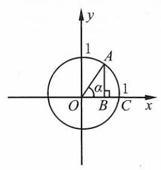

(第 61 题)

$\because a \neq  b,\therefore \left( {m + n}\right) {ab} = {mn}\left( {a + b}\right) ,\;\therefore \frac{1}{m} + \frac{1}{n} = \frac{1}{a} + \frac{1}{b}$ .

61. ( 1 )① 如图， $\left| {OB}\right|  = \cos \alpha$ ， $\left| {AB}\right|  = \sin \alpha$ .

由 $\left| {AB}\right|  + \left| {OB}\right|  > \left| {AO}\right|$ ,得 $\sin \alpha  + \cos \alpha  > 1$ .

②如图，由 $\bigtriangleup  {AOC}$ 的面积小于扇形 ${AOC}$ 的面积，即得该不等式...

③由 $\alpha  > \sin \alpha ,\cos \alpha  < 1$ ，得 $\alpha \sin \alpha  + \cos \alpha  > {\sin }^{2}\alpha  + {\cos }^{2}\alpha  = 1$ .

(2)由(1)可知， $\sin \left( {\alpha  - \beta }\right)  < \alpha  - \beta  < \tan \left( {\alpha  - \beta }\right)$ .

而 $\sin \left( {\alpha  - \beta }\right)  - \left( {\sin \alpha  - \sin \beta }\right)  = 2\sin \frac{\alpha  - \beta }{2}\cos \frac{\alpha  - \beta }{2} - 2\sin \frac{\alpha  - \beta }{2}\cos \frac{\alpha  + \beta }{2}$

$= 4\sin \frac{\alpha  - \beta }{2}\sin \frac{\alpha }{2}\sin \frac{\beta }{2} > 0,$

故 $\sin \left( {\alpha  - \beta }\right)  > \sin \alpha  - \sin \beta$ .

$\therefore \tan \left( {\alpha  - \beta }\right)  = \frac{\tan \alpha  - \tan \beta }{1 + \tan \alpha \tan \beta } < \tan \alpha  - \tan \beta$ .

$\therefore \;\sin \alpha  - \sin \beta  < \sin \left( {\alpha  - \beta }\right)  < \alpha  - \beta  < \tan \left( {\alpha  - \beta }\right)  < \tan \alpha  - \tan \beta$ ,即 $\sin \alpha  - \sin \beta  < \alpha  - \beta  < \tan \alpha  - \tan \beta$ .

62. $\because {x}^{2} - x + 1 = {\left( x - \frac{1}{2}\right) }^{2} + \frac{3}{4} > 0$ ,

$\therefore \;\left( {{x}^{2} + 1}\right) \cos \theta  - x\left( {\cos \theta  - 5}\right)  + 3 > \left( {\sin \theta  - 1}\right) \left( {{x}^{2} - x + 1}\right)$ .

整理,得 $\left( {\cos \theta  - \sin \theta  + 1}\right) {x}^{2} + \left( {\sin \theta  - \cos \theta  + 4}\right) x + \left( {\cos \theta  - \sin \theta  + 4}\right)  > 0$ .

设 $\sin \theta  - \cos \theta  = t$ ,则 $\left( {1 - t}\right) {x}^{2} + \left( {t + 4}\right) x + \left( {4 - t}\right)  > 0$ ,且 $1 - t > 0$ ,即 $t < 1$ .

由 $\Delta  = {\left( t + 4\right) }^{2} - 4\left( {1 - t}\right) \left( {4 - t}\right)  =  - 3{t}^{2} + {28t} < 0$ ,得 $t \in  \left( {-\infty ,0}\right)  \cup  \left( {\frac{28}{3}, + \infty }\right)$ .

$\because t = \sin \theta  - \cos \theta  = \sqrt{2}\sin \left( {\theta  - \frac{\pi }{4}}\right)  \in  \left\lbrack  {-\sqrt{2},\sqrt{2}}\right\rbrack  ,\;\therefore t < 0$ .

$\therefore \;\sin \left( {\theta  - \frac{\pi }{4}}\right)  < 0,\;\therefore \;{2k\pi } - \pi  < \theta  - \frac{\pi }{4} < {2k\pi }, k \in  \mathbf{Z}$ . 即 $\theta  \in  \left( {{2k\pi } - \frac{3\pi }{4},{2k\pi } + \frac{\pi }{4}}\right) , k \in  \mathbf{Z}$ .

63. $\mathrm{D}$ 提示: $\because \sin {2\alpha } = \sin {2\beta } = \sin \left( {\pi  - {2\beta }}\right) ,\;\therefore {2\alpha } = {2\beta }$ 或 ${2\alpha } = \pi  - {2\beta },\alpha  = \beta$ 或 $\alpha  + \beta  = \frac{\pi }{2}$ .

64. B 提示: $\because \cos x =  - \frac{1}{2}, x \in  \left\lbrack  {0,\pi }\right\rbrack  ,\therefore \frac{x}{2} = \frac{2\pi }{3} \cdot  \frac{1}{2} = \frac{\pi }{3}$ .

65. $\mathrm{C}$ 提示: $f\left( {1998}\right)  = a\sin \left( {{1998\pi } + \alpha }\right)  + b\cos \left( {{1998\pi } + \beta }\right)  =  - \left\lbrack  {a\sin \left( {{1997\pi } + \alpha }\right)  + b\cos \left( {{1997\pi } + \beta }\right) }\right\rbrack   =  - \left( {-1}\right)  = 1$ .

66. (1) $\cos \left( {\frac{5\pi }{6} + \theta }\right)  = \cos \left\lbrack  {\pi  - \left( {\frac{\pi }{6} - \theta }\right) }\right\rbrack   =  - \cos \left( {\frac{\pi }{6} - \theta }\right)  =  - a$ . $\sin \left( {\frac{2\pi }{3} - \theta }\right)  = \sin \left\lbrack  {\frac{\pi }{2} + \left( {\frac{\pi }{6} - \theta }\right) }\right\rbrack   = \cos \left( {\frac{\pi }{6} - \theta }\right)  = a.$

(2) $\tan \left( {\pi  - \alpha }\right)  =  - \tan \alpha  = {a}^{2},\tan \alpha  =  - {a}^{2}.\left| {\cos \left( {\pi  - \alpha }\right) }\right|  = \left| {-\cos \alpha }\right|  =  - \cos \alpha ,\cos \alpha  < 0$ .

$\therefore \;\cos \alpha  =  - \frac{1}{\sqrt{{\tan }^{2}\alpha  + 1}} =  - \frac{1}{\sqrt{{a}^{4} + 1}}$ .

67. (1) $0 < \alpha  < {2\pi },\; - \frac{7\pi }{4} < \frac{\pi }{4} - \alpha  < \frac{\pi }{4},\sin \left( {\frac{\pi }{4} - \alpha }\right)  = \frac{\sqrt{2}}{2},\;\therefore \frac{\pi }{4} - \alpha  =  - \frac{5}{4}\pi .\;\therefore \alpha  = \frac{3}{2}\pi$ .

(2)① $k$ 为奇数，原式 $= \frac{\sin x}{\sin x} - \frac{\cos x}{\left( -\cos x\right) } + \frac{\left( -\tan x\right) }{\tan x} - \frac{\cot x}{\left( -\cot x\right) } = 1 + 1 - 1 + 1 = 2$ . ② $k$ 为偶数，原式 $= \frac{-\sin x}{\sin x} - \frac{\cos x}{\cos x} + \frac{-\tan x}{\tan x} - \frac{\cot x}{\left( -\cot x\right) } =  - 1 - 1 - 1 + 1 =  - 2$ .

68. $\mathrm{B}$ 提示: $\sin \left( {x + y}\right) \sin x + \cos \left( {x + y}\right) \cos x = \cos \left\lbrack  {\left( {x + y}\right)  - x}\right\rbrack   = \cos y$ .

69. $\mathrm{A}$ 提示: $\cos \alpha \cos \beta  - \sin \alpha \sin \beta  = \frac{\sqrt{3}}{2} = \cos \left( {\alpha  + \beta }\right)$ ,则 $\alpha  + \beta  = \frac{\pi }{6} + {2k\pi }$ 或 $- \frac{\pi }{6} + {2k\pi }, k \in  \mathbf{Z}$ . 满足条件的是选项 $\mathrm{A} : \alpha  + \beta  = \frac{11\pi }{6}$ .

70. $\mathrm{D}$ 提示: $\because \cot \left( {\frac{3\pi }{2} + \alpha }\right)  =  - \tan \alpha  = \frac{3}{4},\therefore \sin \alpha  =  - \frac{3}{4}\cos \alpha .\therefore \frac{9}{16}{\cos }^{2}\alpha  + {\cos }^{2}\alpha  = 1,{\cos }^{2}\alpha  = \frac{16}{25}$ .

$\because \alpha  \in  \left( {\frac{3\pi }{2},{2\pi }}\right) ,\;\therefore \cos \alpha  = \frac{4}{5},\sin \alpha  =  - \frac{3}{5}$ .

$\therefore \cos \left( {\alpha  - \frac{3}{4}\pi }\right)  = \cos \alpha \cos \frac{3}{4}\pi  + \sin \alpha \sin \frac{3}{4}\pi  = \frac{\sqrt{2}}{2}\left( {\sin \alpha  - \cos \alpha }\right)  =  - \frac{7}{10}\sqrt{2}$ .

71. $\mathrm{C}$ 提示: $\because \cos \alpha \cos \beta  - \sin \alpha \sin \beta  = \cos \left( {\alpha  + \beta }\right)  > 0,\alpha  + \beta  \in  \left( {0,\pi }\right)$ 且 $\cos \left( {\alpha  + \beta }\right)  > 0,\therefore \alpha  + \beta  \in  \left( {0,\frac{\pi }{2}}\right)$ .

$\therefore \pi  - \alpha  - \beta  \in  \left( {\frac{\pi }{2},\pi }\right)$ ,为钝角三角形.

72. $\mathrm{D}$ 提示: $\because \cos \gamma  - 1 \leq  0,{x}_{1} + {x}_{2} =  - \cos \alpha \cos \beta ,{x}_{1}{x}_{2} = \cos \gamma  - 1,\therefore  - \cos \alpha \cos \beta  = \frac{1}{2}\left( {\cos \gamma  - 1}\right)$ , $2\cos \alpha \cos \beta  = 1 - \cos \gamma  = 1 - \cos \left( {\pi  - \alpha  - \beta }\right)  = 1 + \cos \left( {\alpha  + \beta }\right)  = \cos \alpha \cos \beta  - \sin \alpha \sin \beta  + 1.\;\therefore \cos \left( {\alpha  - \beta }\right)  = 1$ . $\because \alpha ,\beta  \in  \left( {0,\pi }\right) ,\alpha  - \beta  \in  \left( {-\pi ,\pi }\right) ,\;\therefore \alpha  - \beta  = 0,\alpha  = \beta$ . 且在 $\alpha  = \beta  = \frac{\pi }{4}$ 时是等腰直角三角形.

73.(1)一 $\frac{3}{5}$ 提示: $\cos \left( {{2x} - \frac{\pi }{3}}\right) \cos \left( {\frac{\pi }{3} - x}\right)  - \sin \left( {{2x} - \frac{\pi }{3}}\right) \sin \left( {\frac{\pi }{3} - x}\right)  = \cos \left( {{2x} - \frac{\pi }{3} + \frac{\pi }{3} - x}\right)  = \cos x$ .

$\because \;\tan x = \frac{\sin x}{\cos x} = \frac{4}{3},\;\therefore \;\sin x = \frac{4}{3}\cos x,{\sin }^{2}x + {\cos }^{2}x = \frac{16}{9}{\cos }^{2}x + {\cos }^{2}x = 1,\;\therefore \;{\cos }^{2}x = \frac{9}{25}$ .

$\because x \in  \left( {\pi ,{2\pi }}\right) ,\sin x < 0,\tan x > 0,\therefore$ 原式 $= \cos x =  - \frac{3}{5}$ .

(2) $\frac{33}{65}$ 提示: $\because \cos \alpha  = \frac{3}{5},\therefore \sin \alpha  = \frac{4}{5}.\;\because \cos \left( {\alpha  + \beta }\right)  =  - \frac{5}{13},\alpha ,\beta  \in  \left( {0,\frac{\pi }{2}}\right) ,\alpha  + \beta  \in  \left( {0,\pi }\right)$ ，

$\therefore \sin \left( {\alpha  + \beta }\right)  = \frac{12}{13}.\;\therefore \cos \beta  = \cos \left\lbrack  {\left( {\alpha  + \beta }\right)  - \alpha }\right\rbrack   = \cos \left( {\alpha  + \beta }\right) \cos \alpha  + \sin \left( {\alpha  + \beta }\right) \sin \alpha  =  - \frac{5}{13} \cdot  \frac{3}{5} + \frac{12}{13} \cdot  \frac{4}{5} = \frac{33}{65}$ .

(3) $- \frac{7}{25} - 1$ 提示: $\because \cos \left( {\alpha  - \beta }\right)  =  - \frac{4}{5},{90}^{ \circ  } < \alpha  - \beta  < {180}^{ \circ  },\therefore \sin \left( {\alpha  - \beta }\right)  = \frac{3}{5}$ .

$\because \cos \left( {\alpha  + \beta }\right)  = \frac{4}{5},{270}^{ \circ  } < \alpha  + \beta  < {360}^{ \circ  },\;\therefore \sin \left( {\alpha  + \beta }\right)  =  - \frac{3}{5}$ .

$\therefore \;\cos {2\alpha } = \cos \left\lbrack  {\left( {\alpha  + \beta }\right)  + \left( {\alpha  - \beta }\right) }\right\rbrack   = \cos \left( {\alpha  + \beta }\right) \cos \left( {\alpha  - \beta }\right)  - \sin \left( {\alpha  + \beta }\right)$ .

$\sin \left( {\alpha  - \beta }\right)  = \frac{4}{5} \cdot  \left( {-\frac{4}{5}}\right)  - \frac{3}{5} \cdot  \left( {-\frac{3}{5}}\right)  =  - \frac{7}{25}.$

$\cos {2\beta } = \cos \left\lbrack  {\left( {\alpha  + \beta }\right)  - \left( {\alpha  - \beta }\right) }\right\rbrack   = \cos \left( {\alpha  + \beta }\right) \cos \left( {\alpha  - \beta }\right)  + \sin \left( {\alpha  + \beta }\right)  \cdot  \sin \left( {\alpha  - \beta }\right)  =  - \frac{4}{5} \cdot  \frac{4}{5} - \frac{3}{5} \cdot  \frac{3}{5} =  - 1.$

(4)- $\frac{59}{72}$ 提示:两式平方后相加，得 ${\cos }^{2}x + {\cos }^{2}y + 2\cos x\cos y + {\sin }^{2}x + {\sin }^{2}y - 2\sin x\sin y = \; 2 + 2\cos \left( {x + y}\right)  = \frac{1}{4} + \frac{1}{9} = \frac{13}{36},\;\therefore \cos \left( {x + y}\right)  = \frac{1}{2}\left( {\frac{13}{36} - 2}\right)  =  - \frac{59}{72}.$

74. A 提示: $\because \;\sin \alpha \sin \beta  = 1,\left| {\sin \alpha }\right|  \leq  1,\left| {\sin \beta }\right|  \leq  1,\therefore \;\sin \alpha  = \sin \beta  = 1$ 或 $\sin \alpha  = \sin \beta  =  - 1$ . 故 $\cos \alpha  = \cos \beta  = 0.\cos \left( {\alpha  + \beta }\right)  = \cos \alpha \cos \beta  - \sin \alpha \sin \beta  =  - 1$ .

75. $\mathrm{C}$ 提示: 选项 $\mathrm{A}$ ,选项 $\mathrm{B}$ : 令 $\alpha  = \beta  = \frac{\pi }{4}$ ,则 $\cos \left( {\alpha  + \beta }\right)  = 0,\cos \alpha  + \cos \beta  = \sqrt{2},\sin \alpha  + \sin \beta  = \sqrt{2}$ . 选项 D: 令 $\alpha  = \beta  = \frac{\pi }{12}$ ,则 $\cos \left( {\alpha  + \beta }\right)  = \frac{\sqrt{3}}{2},\sin \alpha  + \sin \beta  = 2\sin \frac{\pi }{12} = \frac{\sqrt{6} - \sqrt{2}}{2}$ . 选项 C: $\alpha ,\beta  \in  \left( {0,\frac{\pi }{2}}\right)$ ,则 $\alpha  + \beta  \in  \left( {0,\pi }\right) .\;\therefore y = \cos x$ 在 $x \in  \left( {0,\pi }\right)$ 上是严格减函数, $\;\therefore \cos \left( {\alpha  + \beta }\right)  < \cos \alpha  < \cos \alpha \; + \cos \beta$ .

76. $\mathrm{D}$ 提示: 记 $y = \cos \alpha  + \cos \beta$ ,两式平方相加,得 ${y}^{2} + \frac{1}{2} = {\sin }^{2}\alpha  + {\sin }^{2}\beta  + {\cos }^{2}\alpha  + {\cos }^{2}\beta  + 2\left( {\cos \alpha \cos \beta  + \sin \alpha \sin \beta }\right) ,{y}^{2} = \frac{3}{2} + \; 2\cos \left( {\alpha  - \beta }\right)  \leq  2 + \frac{3}{2} = \frac{7}{2},\;\therefore \;0 \leq  {y}^{2} \leq  \frac{7}{2}, y \in  \left\lbrack  {-\frac{\sqrt{14}}{2},\frac{\sqrt{14}}{2}}\right\rbrack  .$

77. $\mathrm{C}$ 提示: $\frac{\sin \alpha \sin \beta }{\cos \alpha \cos \beta } > 1 > 0,\because \alpha ,\beta  \in  \left( {0,\pi }\right) ,\therefore \sin \alpha ,\sin \beta  > 0,\therefore \cos \alpha ,\cos \beta  > 0$ .

$\cos \alpha \cos \beta  - \overset{\text{ ⏜ }}{\sin \alpha \sin }\beta  = \cos \left( {\alpha  + \beta }\right)  < 0.\;\therefore \frac{\pi }{2} < \alpha  + \beta  < \pi ,\alpha ,\beta  \in  \left( {0,\frac{\pi }{2}}\right)$ . 故为锐角三角形.

78. $\mathrm{C}$ 提示: $\because \alpha ,\beta  \in  \left( {0,\pi }\right) ,\therefore \sin \alpha  > 0,\sin \beta  > 0,\;\because \sin \alpha  = \frac{3}{5},\cos \beta  = \frac{5}{13},\therefore \sin \beta  = \frac{12}{13}$ .

若 $\cos \alpha  =  - \frac{4}{5},\sin \left( {\pi  - \alpha  - \beta }\right)  = \sin \left( {\alpha  + \beta }\right)  = \frac{3}{5} \cdot  \frac{5}{13} - \frac{12}{13} \cdot  \frac{4}{5} < 0$ ,则第三个内角的正弦值小于 0,不满足.

故 $\cos \alpha  = \frac{4}{5},\cos \left( {\pi  - \alpha  - \beta }\right)  =  - \cos \left( {\alpha  + \beta }\right)  =  - \left( {\frac{5}{13} \cdot  \frac{4}{5} - \frac{3}{5} \cdot  \frac{12}{13}}\right)  = \frac{16}{65}$ .

79. (1) $\because \alpha ,\beta  \in  \left( {0,\frac{\pi }{2}}\right) ,\cos \alpha  = \frac{4}{5},\therefore \sin \alpha  = \frac{3}{5}$ .

$\therefore \alpha  - \beta  \in  \left( {-\frac{\pi }{2},\frac{\pi }{2}}\right) ,\tan \left( {\alpha  - \beta }\right)  =  - \frac{1}{3},\;\therefore \cos \left( {\alpha  - \beta }\right)  > 0,\sin \left( {\alpha  - \beta }\right)  < 0$ .

$\therefore \sin \left( {\alpha  - \beta }\right)  =  - \frac{\sqrt{10}}{10},\cos \left( {\alpha  - \beta }\right)  = \frac{3\sqrt{10}}{10}$ .

$\because \beta  = \alpha  - \left( {\alpha  - \beta }\right)$ ,

$\therefore \cos \beta  = \cos \left\lbrack  {\alpha  - \left( {\alpha  - \beta }\right) }\right\rbrack   = \cos \alpha \cos \left( {\alpha  - \beta }\right)  + \sin \alpha \sin \left( {\alpha  - \beta }\right)  = \frac{4}{5} \times  \frac{3\sqrt{10}}{10} + \frac{3}{5} \times  \left( {-\frac{\sqrt{10}}{10}}\right)  = \frac{9\sqrt{10}}{50}$ .

(2) $\because \cos \left( {\alpha  - \frac{\pi }{4}}\right)  = \frac{3}{5},0 < \alpha  - \frac{\pi }{4} < \frac{\pi }{2},\therefore \sin \left( {\alpha  - \frac{\pi }{4}}\right)  = \frac{4}{5}$ .

$\because \;\sin \left( {\frac{3}{4}\pi  + \beta }\right)  = \frac{5}{13},\frac{3\pi }{4} < \beta  + \frac{3}{4}\pi  < \pi ,\;\therefore \;\cos \left( {\frac{3}{4}\pi  + \beta }\right)  =  - \frac{12}{13}$ .

$\therefore \cos \left( {\alpha  + \beta  + \frac{\pi }{2}}\right)  = \cos \left\lbrack  {\left( {\alpha  - \frac{\pi }{4}}\right)  + \left( {\beta  + \frac{3}{4}\pi }\right) }\right\rbrack$

$= \cos \left( {\alpha  - \frac{\pi }{4}}\right) \cos \left( {\beta  + \frac{3\pi }{4}}\right)  - \sin \left( {\alpha  - \frac{\pi }{4}}\right) \sin \left( {\beta  + \frac{3}{4}\pi }\right)  = \frac{3}{5} \cdot  \left( {-\frac{12}{13}}\right)  - \frac{4}{5} \cdot  \frac{5}{13} =  - \frac{56}{65}$ .

$\because \;\cos \left( {\alpha  + \beta  + \frac{\pi }{2}}\right)  =  - \sin \left( {\alpha  + \beta }\right) ,\;\therefore \;\sin \left( {\alpha  + \beta }\right)  = \frac{56}{65}$ .

(3) $\because \alpha  \in  \left( {0,\frac{\pi }{2}}\right) ,\operatorname{cso}\alpha  = \frac{1}{7},\therefore \sin \alpha  = \frac{4\sqrt{3}}{7}$ .

$\because \alpha ,\beta  \in  \left( {0,\frac{\pi }{2}}\right) ,\;\therefore \alpha  + \beta  \in  \left( {0,\pi }\right)$ .

$\because \;\sin \left( {\alpha  + \beta }\right)  = \frac{5\sqrt{3}}{14},\;\therefore \;\sin \alpha  > \sin \left( {\alpha  + \beta }\right) ,\;\therefore \;\alpha  + \beta  \in  \left( {\frac{\pi }{2},\pi }\right) ,\;\therefore \;\cos \left( {\alpha  + \beta }\right)  =  - \frac{11}{14}$ .

$\therefore \;\cos \beta  = \cos \left( {\alpha  + \beta  - \alpha }\right)  = \cos \left( {\alpha  + \beta }\right) \cos \alpha  + \sin \left( {\alpha  + \beta }\right)  \cdot  \sin \alpha  =  - \frac{11}{14} \times  \frac{1}{7} + \frac{5\sqrt{3}}{14} \cdot  \frac{4\sqrt{3}}{7} = \frac{1}{2}$ .

80. $8\cos \left\lbrack  {\left( {\alpha  + \beta }\right)  + \alpha }\right\rbrack   + 5\cos \left\lbrack  {\left( {\alpha  + \beta }\right)  - \alpha }\right\rbrack   = 0$ ,

$8\left\lbrack  {\cos \left( {\alpha  + \beta }\right) \cos \alpha  - \sin \left( {\alpha  + \beta }\right) \sin \alpha }\right\rbrack   + 5 \cdot  \left\lbrack  {\cos \left( {\alpha  + \beta }\right)  \cdot  \cos \alpha  + \sin \left( {\alpha  + \beta }\right) \sin \alpha }\right\rbrack   = 0,$

${13}\cos \left( {\alpha  + \beta }\right) \cos \alpha  = 3\sin \left( {\alpha  + \beta }\right) \sin \alpha .\;\therefore \;\tan \left( {\alpha  + \beta }\right)  \cdot  \tan \alpha  = \frac{13}{3}$ .

81. $\left\{  \begin{array}{l} \sin \alpha  - \sin \beta  =  - \sin \gamma , \\  \cos \alpha  - \cos \beta  = \cos \gamma , \end{array}\right.$ 两式平方相加,得 $2 - 2\left( {\cos \alpha \cos \beta  + \sin \alpha \sin \beta }\right)  = 1,\cos \left( {\alpha  - \beta }\right)  = \frac{1}{2}$ .

$\alpha ,\beta  \in  \left( {0,\frac{\pi }{2}}\right) ,\alpha  - \beta  \in  \left( {-\frac{\pi }{2},\frac{\pi }{2}}\right)$ . 由 $\cos \alpha  - \cos \beta  = \cos \gamma  > 0$ ,得 $\cos \alpha  > \cos \beta$ .

$\therefore \alpha  < \beta$ ,即 $\alpha  - \beta  < 0.\;\therefore \alpha  - \beta  =  - \frac{\pi }{3}$ .

82. $\because \Delta  = 2{\cos }^{2}{40}^{ \circ  } - 4{\cos }^{2}{40}^{ \circ  } + 2 = 2\left( {1 - {\cos }^{2}{40}^{ \circ  }}\right)  = 2{\sin }^{2}{40}^{ \circ  }$ ,

$\therefore \;{x}_{1} = \frac{\sqrt{2}}{2}\cos {40}^{ \circ  } + \frac{\sqrt{2}}{2}\sin {40}^{ \circ  } = \sin {85}^{ \circ  },{x}_{2} = \frac{\sqrt{2}}{2}\cos {40}^{ \circ  } - \frac{\sqrt{2}}{2}\sin {40}^{ \circ  } = \sin {5}^{ \circ  }.\;\therefore \alpha  = {5}^{ \circ  },\beta  = {85}^{ \circ  }$ .

$\therefore \cos \left( {{2\alpha } - \beta }\right)  = \cos {75}^{ \circ  } = \cos \left( {{30}^{ \circ  } + {45}^{ \circ  }}\right)  = \frac{\sqrt{3}}{2} \cdot  \frac{\sqrt{2}}{2} - \frac{1}{2} \cdot  \frac{\sqrt{2}}{2} = \frac{\sqrt{6} - \sqrt{2}}{4}$ .

83. $\mathrm{C}$ 提示: $\because \alpha ,\beta  \in  \left( {0,\frac{\pi }{2}}\right) ,\alpha  + \beta  \in  \left( {0,\pi }\right) ,\therefore \sin \alpha  = \frac{3}{5},\sin \left( {\alpha  + \beta }\right)  = \frac{4}{5}$ .

$\sin \beta  = \sin \left\lbrack  {\left( {\alpha  + \beta }\right)  - \alpha }\right\rbrack   = \sin \left( {\alpha  + \beta }\right) .\;\cos \alpha  - \cos \left( {\alpha  + \beta }\right)  \cdot  \sin \alpha  = \frac{4}{5} \cdot  \frac{4}{5} - \frac{3}{5} \cdot  \frac{3}{5} = \frac{7}{25}$ .

84. $\frac{\sqrt{2}}{2}$ 提示: 原式 $= \sin \left( {x + {27}^{ \circ  } + {18}^{ \circ  } - x}\right)  = \sin {45}^{ \circ  } = \frac{\sqrt{2}}{2}$ .

85. (1) $\frac{\sqrt{2}}{3} + \frac{\sqrt{10}}{6}$ 提示: ••• $\frac{\pi }{4} < \alpha  < \frac{\pi }{2}$ ， $\therefore \frac{\pi }{4} - \alpha  \in  \left( {-\frac{\pi }{4},0}\right)$ .

$\because \;\sin \left( {\frac{\pi }{4} - \alpha }\right)  =  - \frac{2}{3},\;\therefore \;\cos \left( {\frac{\pi }{4} - \alpha }\right)  = \frac{\sqrt{5}}{3}$ .

$\therefore \;\sin \alpha  = \sin \left\lbrack  {\frac{\pi }{4} - \left( {\frac{\pi }{4} - \alpha }\right) }\right\rbrack   = \sin \frac{\pi }{4}\cos \left( {\frac{\pi }{4} - \alpha }\right)  - \cos \frac{\pi }{4}\sin \left( {\frac{\pi }{4} - \alpha }\right)$

$= \frac{\sqrt{2}}{2} \times  \frac{\sqrt{5}}{3} - \frac{\sqrt{2}}{2} \times  \left( {-\frac{2}{3}}\right)  = \frac{\sqrt{2}}{3} + \frac{\sqrt{10}}{6}$ .

(2) $2 - \sqrt{3}\;$ 提示:原式 $= \frac{\sin {7}^{ \circ  } + \sin {8}^{ \circ  }\left( {\cos {7}^{ \circ  }\cos {8}^{ \circ  } - \sin {7}^{ \circ  }\sin {8}^{ \circ  }}\right) }{\cos {7}^{ \circ  } - \sin {8}^{ \circ  }\left( {\sin {7}^{ \circ  }\cos {8}^{ \circ  } + \cos {7}^{ \circ  }\sin {8}^{ \circ  }}\right) } = \frac{\sin {7}^{ \circ  }\left( {1 - \sin {2}^{ \circ  }}\right)  + \sin {8}^{ \circ  }\cos {8}^{ \circ  }\cos {7}^{ \circ  }}{\cos {7}^{ \circ  }\left( {1 - \sin {2}^{ \circ  }}\right)  - \sin {8}^{ \circ  }\sin {7}^{ \circ  }\cos {8}^{ \circ  }} \; = \frac{\sin {7}^{ \circ  }{\cos }^{2}{8}^{ \circ  } + \sin {8}^{ \circ  }\cos {8}^{ \circ  }\cos {7}^{ \circ  }}{\cos {7}^{ \circ  }{\cos }^{2}{8}^{ \circ  } - \sin {8}^{ \circ  }\sin {7}^{ \circ  }\cos {8}^{ \circ  }} = \frac{\sin {7}^{ \circ  }\cos {8}^{ \circ  } + \sin {8}^{ \circ  }\cos {7}^{ \circ  }}{\cos {7}^{ \circ  }\cos {8}^{ \circ  } - \sin {8}^{ \circ  }\sin {7}^{ \circ  }} = \frac{\sin \left( {{7}^{ \circ  } + {8}^{ \circ  }}\right) }{\cos \left( {{7}^{ \circ  } + {8}^{ \circ  }}\right) } = \tan {15}^{ \circ  } = 2 - \sqrt{3}$ .

(3) 4 提示: 原式 $= \frac{\cos {10}^{ \circ  } - \sqrt{3}\sin {10}^{ \circ  }}{\sin {10}^{ \circ  }\cos {10}^{ \circ  }} = \frac{2\sin \left( {{30}^{ \circ  } - {10}^{ \circ  }}\right) }{\frac{1}{2}\sin {20}^{ \circ  }} = 4$ .

86. (1) $x \in  \mathbf{R}, y\cos x + {2y} = \sqrt{5}\sin x + 1$ ,

${2y} - 1 = \sqrt{5}\sin x - y\cos x = \sqrt{5 + {y}^{2}}\sin \left( {x - \varphi }\right)$ ,其中 $\sin \varphi  = \frac{y}{\sqrt{5 + {y}^{2}}},\cos \varphi  = \frac{\sqrt{5}}{\sqrt{5 + {y}^{2}}}$ .

$\therefore \left| {{2y} - 1}\right|  \leq  \sqrt{5 + {y}^{2}},\;\therefore \;4{y}^{2} - {4y} + 1 \leq  {y}^{2} + 5,\;\therefore \;3{y}^{2} - {4y} - 4 \leq  0,\;\therefore \;y \in  \left\lbrack  {-\frac{2}{3},2}\right\rbrack$ .

(2) $y = \frac{\sin \theta  + 2\cos \theta }{1 - \cos \theta }\left( {\cos \theta  \neq  0}\right) .\;\because \sin \theta  = \frac{2\tan \frac{\theta }{2}}{1 + {\tan }^{2}\frac{\theta }{2}},\cos \theta  = \frac{1 - {\tan }^{2}\frac{\theta }{2}}{1 + {\tan }^{2}\frac{\theta }{2}},\tan \frac{\theta }{2} \neq   \pm  1$ ,

$\therefore y = \frac{\frac{2\tan \frac{\theta }{2}}{1 + {\tan }^{2}\frac{\theta }{2}} + \frac{2\left( {1 - {\tan }^{2}\frac{\theta }{2}}\right) }{1 + {\tan }^{2}\frac{\theta }{2}}}{1 - \frac{1 - {\tan }^{2}\frac{\theta }{2}}{1 + {\tan }^{2}\frac{\theta }{2}}} = {\left( \frac{1}{\tan \frac{\theta }{2}} + \frac{1}{2}\right) }^{2} - \frac{5}{4}$ .

$\because \;\tan \frac{\theta }{2} \in  \left( {-\infty , - 1}\right)  \cup  \left( {-1,0}\right)  \cup  \left( {0,1}\right)  \cup  \left( {1, + \infty }\right) ,\;\therefore \;y \in  \left\lbrack  {-\frac{5}{4}, - 1}\right)  \cup  \left( {-1, + \infty }\right)$ .

87. $2\cos B\cos C = 1 - \cos A = 1 - \cos \left( {\pi  - B - C}\right)  = 1 + \cos B\cos C - \sin B\sin C,\therefore \cos \left( {B - C}\right)  = 1$ .

$\because B, C \in  \left( {0,\pi }\right) ,\;\therefore B - C \in  \left( {-\pi ,\pi }\right) ,\;\therefore B - C = 0, B = C$ .

$2\sin B\cos C = 1 + \sin B\cos C - \cos B\sin C,\;\therefore \;\sin \left( {B + C}\right)  = 1$ .

$\because B, C \in  \left( {0,\pi }\right) , B + C \in  \left( {0,\pi }\right) ,\;\therefore B + C = \frac{\pi }{2}$ .

$\therefore B = C = \frac{\pi }{4},\therefore \bigtriangleup {ABC}$ 是等腰直角三角形.

88. (1) $\because \tan \alpha  + \tan \beta  =  - p,\tan \alpha \tan \beta  = q$ ,

$\therefore$ 原式 $= \frac{\sin \alpha \cos \beta  + \cos \alpha \sin \beta }{\cos \alpha \cos \beta  + \sin \alpha \sin \beta } = \frac{\tan \alpha  + \tan \beta }{1 + \tan \alpha \tan \beta } = \frac{-p}{1 + q}$ .

(2) $\left\{  {\begin{array}{l} \sin \alpha \cos \beta  + \cos \alpha \sin \beta  = \frac{1}{2}, \\  \sin \alpha \cos \beta  - \cos \alpha \sin \beta  = \frac{1}{3}, \end{array} \Rightarrow  \left\{  {\begin{array}{l} \sin \alpha \cos \beta  = \frac{5}{12}, \\  \cos \alpha \sin \beta  = \frac{1}{12}. \end{array}\;\therefore \text{ 原式 } = \frac{\sin \alpha \cos \beta }{\cos \alpha \sin \beta } = 5}\right. }\right.$ .

(3)原式 $= \frac{\sin \left\lbrack  {\left( {\alpha  + \beta }\right)  + \left( {\alpha  - \beta }\right) }\right\rbrack  }{\sin \left\lbrack  {\left( {\alpha  + \beta }\right)  - \left( {\alpha  - \beta }\right) }\right\rbrack  } = \frac{\sin \left( {\alpha  + \beta }\right) \cos \left( {\alpha  - \beta }\right)  + \cos \left( {\alpha  + \beta }\right) \sin \left( {\alpha  - \beta }\right) }{\sin \left( {\alpha  + \beta }\right) \cos \left( {\alpha  - \beta }\right)  - \cos \left( {\alpha  + \beta }\right) \sin \left( {\alpha  - \beta }\right) }$

$= \frac{\tan \left( {\alpha  + \beta }\right)  + \tan \left( {\alpha  - \beta }\right) }{\tan \left( {\alpha  + \beta }\right)  - \tan \left( {\alpha  - \beta }\right) } = \frac{-2 + \frac{1}{2}}{-2 - \frac{1}{2}} = \frac{3}{5}.$

89. $\because 3\sin \left\lbrack  {\left( {\alpha  + \beta }\right)  - \alpha }\right\rbrack   = \sin \left\lbrack  {\left( {\alpha  + \beta }\right)  + \alpha }\right\rbrack$ ,

$\therefore \;3\sin \left( {\alpha  + \beta }\right) \cos \alpha  - 3\cos \left( {\alpha  + \beta }\right) \sin \alpha  = \sin \left( {\alpha  + \beta }\right) \cos \alpha  + \cos \left( {\alpha  + \beta }\right) \sin \alpha$ ,

$\therefore \;2\sin \left( {\alpha  + \beta }\right) \cos \alpha  = 4\cos \left( {\alpha  + \beta }\right) \sin \alpha ,\;\therefore \;\tan \left( {\alpha  + \beta }\right)  = 2\tan \alpha  = 2$ .

90. ${\sin }^{2}\beta  = {\sin }^{2}\alpha  - {\sin }^{2}\alpha  \cdot  \frac{\tan \left( {\alpha  - \gamma }\right) }{\tan \alpha } = {\sin }^{2}\alpha  - \sin \alpha \cos \alpha  \cdot  \tan \left( {\alpha  - \gamma }\right)$

$= \frac{\sin \alpha }{\cos \left( {\alpha  - \gamma }\right) } \cdot  \left\lbrack  {\sin \alpha \cos \left( {\alpha  - \gamma }\right)  - \cos \alpha \sin \left( {\alpha  - \gamma }\right) }\right\rbrack   = \frac{\sin \alpha }{\cos \left( {\alpha  - \gamma }\right) } \cdot  \sin \left\lbrack  {\alpha  - \left( {\alpha  - \gamma }\right) }\right\rbrack   = \frac{\sin \alpha \sin \gamma }{\cos \left( {\alpha  - \gamma }\right) }.$

${\cos }^{2}\beta  = 1 - {\sin }^{2}\beta  = 1 - \frac{\sin \alpha \sin \gamma }{\cos \left( {\alpha  - \gamma }\right) } = \frac{\cos \alpha \cos \gamma }{\cos \left( {\alpha  - \gamma }\right) }.$

$\therefore \;{\tan }^{2}\beta  = \frac{{\sin }^{2}\beta }{{\cos }^{2}\beta } = \frac{\sin \alpha \sin \gamma }{\cos \alpha \cos \gamma } = \tan \alpha \tan \gamma$ .

91. (1)令 $t = \sin x + \cos x = \sqrt{2}\sin \left( {x + \frac{\pi }{4}}\right)  \in  \left\lbrack  {-\sqrt{2},\sqrt{2}}\right\rbrack$ ，则 $\sin x \cdot  \cos x = \frac{{t}^{2} - 1}{2}$ .

$\therefore y = \frac{\frac{{t}^{2} - 1}{2}}{1 + t} = \frac{t - 1}{2},{y}_{\max } = \frac{\sqrt{2} - 1}{2}$ ,相应地 $t = \sqrt{2}$ .

( 2 )令 $t = \sin x + \cos x = \sqrt{2}\sin \left( {x + \frac{\pi }{4}}\right)  \in  \left\lbrack  {-\sqrt{2},\sqrt{2}}\right\rbrack$ ，则 $y = t + \frac{{t}^{2} - 1}{2} = \frac{1}{2}{\left( t + 1\right) }^{2} - 1$ .

当 $t =  - 1$ 时, ${y}_{\min } =  - 1$ ; 当 $t = \sqrt{2}$ 时, ${y}_{\max } = \sqrt{2} + \frac{1}{2}$ .

$\therefore y \in  \left\lbrack  {-1,\sqrt{2} + \frac{1}{2}}\right\rbrack$ .

(3)令 $t = \sin x + \cos x = \sqrt{2}\sin \left( {x + \frac{\pi }{4}}\right)  \in  \left\lbrack  {-\sqrt{2},\sqrt{2}}\right\rbrack$ ,

则 $y = \sin x\cos x + a\left( {\sin x + \cos x}\right)  + {a}^{2} = \frac{{t}^{2} - 1}{2} + {at} + {a}^{2} = \frac{1}{2}{\left( t + a\right) }^{2} + \frac{{a}^{2} - 1}{2}$ .

① $- a <  - \sqrt{2}, a > \sqrt{2},{y}_{\min } = f\left( {-\sqrt{2}}\right)  = {a}^{2} - \sqrt{2}a + \frac{1}{2}$ ;

② $- \sqrt{2} \leq   - a \leq  \sqrt{2}, a \in  \left\lbrack  {-\sqrt{2},\sqrt{2}}\right\rbrack  ,{y}_{\min } = f\left( {-a}\right)  = \frac{{a}^{2} - 1}{2}$ ;

③ $- a > \sqrt{2}, a <  - \sqrt{2},{y}_{\min } = f\left( \sqrt{2}\right)  = {a}^{2} + \sqrt{2}a + \frac{1}{2}$ .

综上所述, ${y}_{\min } = \left\{  \begin{array}{l} {a}^{2} - \sqrt{2}a + \frac{1}{2}, a > \sqrt{2}, \\  \frac{{a}^{2} - 1}{2}, a \in  \left\lbrack  {-\sqrt{2},\sqrt{2}}\right\rbrack  , \\  {a}^{2} + \sqrt{2}a + \frac{1}{2}, a <  - \sqrt{2}. \end{array}\right.$

92. 当 $a = b = 0$ 时显然成立.

当 ${a}^{2} + {b}^{2} \neq  0$ 时, $a\cos \varphi  + b\sin \varphi  + c = \sqrt{{a}^{2} + {b}^{2}}\sin \left( {\varphi  + \theta }\right)  + c$ ,其中,

$\sin \theta  = \frac{a}{\sqrt{{a}^{2} + {b}^{2}}},\cos \theta  = \frac{b}{\sqrt{{a}^{2} + {b}^{2}}}.$

$\therefore \;{acos\varphi } + b\sin \varphi  + c \leq  \sqrt{{a}^{2} + {b}^{2}} + c \leq  2\sqrt{\frac{1}{2}\left( {{a}^{2} + {b}^{2} + {c}^{2}}\right) } = \sqrt{2\left( {{a}^{2} + {b}^{2} + {c}^{2}}\right) }$ .

93. (1) 设 $a = \cos \alpha , b = \sin \alpha , a\sin x + b\cos x = \sin \left( {x + \alpha }\right)  \leq  1$ .

(2)设 $a = \sin \alpha , b = \cos \beta ,\alpha  \in  \left( {-\frac{\pi }{2},\frac{\pi }{2}}\right) ,\beta  \in  \left( {0,\pi }\right)$ ，

$\left| {{ab} \pm  \sqrt{\left( {1 - {a}^{2}}\right) \left( {1 - {b}^{2}}\right) }}\right|  = \left| {\sin \alpha \cos \beta  \pm  }\right| \cos \alpha \sin \beta \left| \right|  = \left| {\sin \alpha \cos \beta  \pm  \cos \alpha \sin \beta }\right|  = \left| {\sin \left( {\alpha  \pm  \beta }\right) }\right|  \leq  1.$

(3) 设 $x = k\sin \alpha , y = k\cos \alpha , k \in  \left\lbrack  {0,1}\right\rbrack$ ,

${x}^{2} + {2xy} - {y}^{2} = {k}^{2}\left( {{\sin }^{2}\alpha  + 2\sin \alpha \cos \alpha  - {\cos }^{2}\alpha }\right)  = {k}^{2}\left( {\sin {2\alpha } - \cos {2\alpha }}\right)$

$= {k}^{2} \cdot  \sqrt{2}\sin \left( {{2\alpha } - \frac{\pi }{4}}\right)  \in  \left\lbrack  {-\sqrt{2},\sqrt{2}}\right\rbrack  .$

94. 由已知 $\frac{\sin x + \sin \left( {y - z}\right) }{\sin x - \sin \left( {y - z}\right) } = \frac{a + 1}{a - 1}$ .

和差化积,得 $\tan \frac{x + y - z}{2} \cdot  \cot \frac{z + x - y}{2} = \frac{a + 1}{a - 1}$ .

同理, $\tan \frac{y + z - x}{2} \cdot  \cot \frac{x + y - z}{2} = \frac{b + 1}{b - 1},\tan \frac{z + x - y}{2} \cdot  \cot \frac{y + z - x}{2} = \frac{c + 1}{c - 1}$ .

累乘,得 $\frac{\left( {a + 1}\right) \left( {b + 1}\right) \left( {c + 1}\right) }{\left( {a - 1}\right) \left( {b - 1}\right) \left( {c - 1}\right) } = 1$ ,即 ${ab} + {bc} + {ca} + 1 = 0$ .

95. $\mathrm{C}$ 提示: $\tan \left( {\alpha  + \frac{\pi }{4}}\right)  = \tan \left\lbrack  {\left( {\alpha  + \beta }\right)  - \left( {\beta  - \frac{\pi }{4}}\right) }\right\rbrack   = \frac{\tan \left( {\alpha  + \beta }\right)  - \tan \left( {\beta  - \frac{\pi }{4}}\right) }{1 + \tan \left( {\alpha  + \beta }\right)  \cdot  \tan \left( {\beta  - \frac{\pi }{4}}\right) } = \frac{\frac{2}{5} - \frac{1}{4}}{1 + \frac{2}{5} \cdot  \frac{1}{4}} = \frac{3}{22}$ .

96. $\mathrm{B}$ 提示: $\frac{1 - \tan A}{1 + \tan A} = \frac{\tan \frac{\pi }{4} - \tan A}{1 + \tan \frac{\pi }{4} \cdot  \tan A} = \tan \left( {\frac{\pi }{4} - A}\right)  = 4 + \sqrt{5}$ ,

$\cot \left( {\frac{\pi }{4} + A}\right)  = \tan \left( {\frac{\pi }{2} - \frac{\pi }{4} - A}\right)  = \tan \left( {\frac{\pi }{4} - A}\right)  = 4 + \sqrt{5}.$

97. A 提示: $\because \tan \left( {\alpha  + \beta }\right)  = \frac{\tan \alpha  + \tan \beta }{1 - \tan \alpha \tan \beta } =  - 1$ ,

$\therefore \tan \alpha \tan \beta  - \tan \alpha  - \tan \beta  - 1 = 0$ .

原式 $= \tan \alpha \tan \beta  - \tan \alpha  - \tan \beta  + 1 = 2$ .

98.(1)一 $\sqrt{3}$ 提示:原式 $= \frac{1 + \tan {75}^{ \circ  }}{1 - \tan {75}^{ \circ  }} = \frac{\tan {45}^{ \circ  } + \tan {75}^{ \circ  }}{1 - \tan {45}^{ \circ  }\tan {75}^{ \circ  }} = \tan \left( {{45}^{ \circ  } + {75}^{ \circ  }}\right)  =  - \sqrt{3}$ .

(2) $\tan \alpha$ 提示:原式 $= \frac{\tan \frac{\pi }{4} - \tan \beta }{1 + \tan \frac{\pi }{4} \cdot  \tan \beta } = \tan \left( {\frac{\pi }{4} - \beta }\right)  = \tan \alpha$ .

(3) $\frac{1}{12}$ 提示: $\tan \left( {{2x} - y}\right)  = \tan \left\lbrack  {x + \left( {x - y}\right) }\right\rbrack   = \frac{\tan x + \tan \left( {x - y}\right) }{1 - \tan x\tan \left( {x - y}\right) } = \frac{\frac{1}{2} - \frac{2}{5}}{1 + \frac{1}{2} \cdot  \frac{2}{5}} = \frac{1}{12}$ .

(4)2 提示: $\tan C = \tan \left( {\pi  - A - B}\right)  =  - \tan \left( {A + B}\right)  =  - \frac{\tan A + \tan B}{1 - \tan A\tan B} =  - \frac{\frac{-8}{3}}{1 + \frac{1}{3}} = 2$ .

(5) $- \frac{49}{31}\frac{40}{9}$ 提示: $\tan \left( {\alpha  + \frac{\pi }{4}}\right)  = \frac{1 + \tan \alpha }{1 - \tan \alpha } =  - \frac{9}{40},{40} + {40}\tan \alpha  = 9\tan \alpha  - 9,\tan \alpha  =  - \frac{49}{31}$ . $\tan \left( {\alpha  - \frac{\pi }{4}}\right)  = \tan \left\lbrack  {\left( {\alpha  + \frac{\pi }{4}}\right)  - \frac{\pi }{2}}\right\rbrack   =  - \cot \left( {\alpha  + \frac{\pi }{4}}\right)  = \frac{40}{9}.$

99. C 提示: $\because \tan \alpha  < \frac{1}{\tan \beta },\alpha ,\beta  \in  \left( {\frac{\pi }{2},\pi }\right) ,\therefore \tan \alpha  < 0,\tan \beta  < 0,\tan \alpha \tan \beta  > 1,1 - \tan \alpha \tan \beta  < 0$ .

$\therefore \frac{\tan \alpha  + \tan \beta }{1 - \tan \alpha \tan \beta } = \tan \left( {\alpha  + \beta }\right)  > 0.\;\because \pi  < \alpha  + \beta  < {2\pi },\;\therefore \alpha  + \beta  \in  \left( {\pi ,\frac{3}{2}\pi }\right)$ .

100. B 提示: $\because \tan \alpha  + \tan \beta  =  - 3\sqrt{3},\tan \alpha \tan \beta  = 4,\therefore \tan \alpha  < 0,\tan \beta  < 0.\;\because \alpha ,\beta  \in  \left( {-\frac{\pi }{2},\frac{\pi }{2}}\right)$ ,

$\therefore \alpha ,\beta  \in  \left( {-\frac{\pi }{2},0}\right) ,\alpha  + \beta  \in  \left( {-\pi ,0}\right) ,\;\therefore \tan \left( {\alpha  + \beta }\right)  = \frac{\tan \alpha  + \tan \beta }{1 - \tan \alpha \tan \beta } = \sqrt{3},\;\therefore \alpha  + \beta  =  - \frac{2}{3}\pi$ .

101. (1) $q = p + 1$ 提示: $\tan \theta  + \tan \left( {\frac{\pi }{4} - \theta }\right)  =  - p,\tan \theta  \cdot  \tan \left( {\frac{\pi }{4} - \theta }\right)  = q$ .

$\tan \frac{\pi }{4} = \frac{\tan \theta  + \tan \left( {\frac{\pi }{4} - \theta }\right) }{1 - \tan \theta  \cdot  \tan \left( {\frac{\pi }{4} - \theta }\right) } = \frac{-p}{1 - q} = 1,\;\therefore \;q = p + 1.$

(2) $\frac{\pi }{4}\;$ 提示: $\tan {2\beta } = \frac{2\tan \beta }{1 - {\tan }^{2}\beta } = \frac{2 \cdot  \frac{1}{3}}{1 - \frac{1}{9}} = \frac{3}{4}$ . $\tan \left( {\alpha  + {2\beta }}\right)  = \frac{\tan \alpha  + \tan {2\beta }}{1 - \tan \alpha \tan {2\beta }} = \frac{\frac{1}{7} + \frac{3}{4}}{1 - \frac{1}{7} \cdot  \frac{3}{4}} = 1$ .

$\because \alpha ,\beta  \in  \left( {0,\frac{\pi }{2}}\right) ,\tan \alpha ,\tan \beta  < 1,\therefore \alpha ,\beta  \in  \left( {0,\frac{\pi }{4}}\right) ,\alpha  + {2\beta } \in  \left( {0,\frac{3}{4}\pi }\right) .\;\therefore \alpha  + {2\beta } = \frac{\pi }{4}$ .

102. ( 1 )0 提示: $\tan \left( {{66}^{ \circ  } + {69}^{ \circ  }}\right)  = \frac{\tan {66}^{ \circ  } + \tan {69}^{ \circ  }}{1 - \tan {66}^{ \circ  }\tan {69}^{ \circ  }} = \tan {135}^{ \circ  } =  - 1$ ，

$\therefore 1 + \tan {66}^{ \circ  } + \tan {69}^{ \circ  } - \tan {66}^{ \circ  }\tan {69}^{ \circ  } = 0$ .

(2) $- \sqrt{3}\;$ 提示: $\tan \left( {{19}^{ \circ  } + {101}^{ \circ  }}\right)  = \frac{\tan {19}^{ \circ  } + \tan {101}^{ \circ  }}{1 - \tan {19}^{ \circ  }\tan {101}^{ \circ  }} = \tan {120}^{ \circ  } =  - \sqrt{3}$ ，

$\therefore \;\tan {19}^{ \circ  } + \tan {101}^{ \circ  } - \sqrt{3}\tan {19}^{ \circ  }\tan {101}^{ \circ  } =  - \sqrt{3}$ .

(3) 2 提示: $\tan \left( {\alpha  + \beta }\right)  = \frac{\tan \alpha  + \tan \beta }{1 - \tan \alpha \tan \beta } = 1$ ,

$\therefore \;\tan \alpha \tan \beta  + \tan \alpha  + \tan \beta  + 1 = \left( {\tan \alpha  + 1}\right) \left( {\tan \beta  + 1}\right)  = 2$ .

(4) ${2}^{22}$ 提示: $\left( {1 + \tan \alpha }\right) \left\lbrack  {1 + \tan \left( {\frac{\pi }{4} - \alpha }\right) }\right\rbrack   = \left( {1 + \tan \alpha }\right) \left( {1 + \frac{1 - \tan \alpha }{1 + \tan \alpha }}\right)  = 2$ ,

$\therefore$ 原式 $= \left\lbrack  {\left( {1 + {\tan }^{2}}\right) \left( {1 + {\tan }^{4}{4}^{ \circ  }}\right) }\right\rbrack  \cdots \left\lbrack  {\left( {1 + {\tan }^{22}{}^{ \circ  }}\right) \left( {1 + {\tan }^{23}{}^{ \circ  }}\right) }\right\rbrack   = {2}^{22}$ .

(5)方法一:数学归纳法.

$\text{ ① }n = 2$ 时，

右边 $= \frac{\tan {2x}}{\tan x} - 2 = \frac{\frac{2\tan x}{1 - {\tan }^{2}x}}{\tan x} - 2 = 2 \cdot  \frac{1 - 1 + {\tan }^{2}x}{1 - {\tan }^{2}x} = \tan x \cdot  \frac{2\tan x}{1 - {\tan }^{2}x} = \tan x\tan {2x} =$ 左边.

② 设 $n = k\left( {k \geq  2, k \in  \mathbf{N}}\right)$ 时等式成立，即

$\tan x\tan {2x} + \tan {2x}\tan {3x} + \cdots  + \tan \left( {k - 1}\right) x\tan {kx} = \frac{\tan {kx}}{\tan x} - k.$

当 $n = k + 1$ 时,

$\tan x\tan {2x} + \cdots  + \tan \left( {k - 1}\right) x\tan {kx} + \tan {kx}\tan \left( {k + 1}\right) x$

$= \frac{\tan {kx}}{\tan x} - k + \tan {kx}\tan \left( {k + 1}\right) x$

$= \frac{\tan {kx}}{\tan x} \cdot  \left\lbrack  {1 + \tan \left( {k + 1}\right) x\tan x}\right\rbrack   - k$

$= \frac{\tan {kx}}{\tan x} \cdot  \frac{1 + \tan \left( {k + 1}\right) x\tan x}{\tan \left( {k + 1}\right) x - \tan x} \cdot  \left\lbrack  {\tan \left( {k + 1}\right) x - \tan x}\right\rbrack   - k$

$= \frac{\tan {kx}}{\tan x} \cdot  \frac{\tan \left( {k + 1}\right) x - \tan x}{\tan {kx}} - k = \frac{\tan \left( {k + 1}\right) x}{\tan x} - \left( {k + 1}\right)$ . 即证.

方法二: $\because \tan \left\lbrack  {{nx} - \left( {n - 1}\right) x}\right\rbrack   = \frac{\tan {nx} - \tan \left( {n - 1}\right) x}{1 + \tan {nx}\tan \left( {n - 1}\right) x} = \tan x$ ,

$\therefore \;\tan {nx}\tan \left( {n - 1}\right) x = \frac{\tan {nx} - \tan \left( {n - 1}\right) x}{\tan x} - 1.$

累加,得 $\mathop{\sum }\limits_{{k = 2}}^{n}\tan \left( {k - 1}\right) x\tan {kx} = \frac{\tan {nx} - \tan x}{\tan x} - \left( {n - 1}\right)  = \frac{\tan {nx}}{\tan x} - n$ .

103. (1) $\tan \left( {{20}^{ \circ  } + {40}^{ \circ  }}\right)  = \frac{\tan {20}^{ \circ  } + \tan {40}^{ \circ  }}{1 - \tan {20}^{ \circ  }\tan {40}^{ \circ  }} = \tan {60}^{ \circ  } = \sqrt{3}$ ,

$\therefore \;\tan {20}^{ \circ  } + \tan {40}^{ \circ  } = \sqrt{3}\left( {1 - \tan {20}^{ \circ  }\tan {40}^{ \circ  }}\right)$ .

左边 $= \tan {30}^{ \circ  }\left( {\tan {20}^{ \circ  } + \tan {40}^{ \circ  }}\right)  + \tan {40}^{ \circ  }\tan {20}^{ \circ  } = \frac{\sqrt{3}}{3} \cdot  \sqrt{3}\left( {1 - \tan {20}^{ \circ  }\tan {40}^{ \circ  }}\right)  + \tan {40}^{ \circ  }\tan {20}^{ \circ  } = 1$ .

(2) $\tan \left( {C - A}\right)  =  - \tan \left\lbrack  {\left( {A - B}\right)  + \left( {B - C}\right) }\right\rbrack   = \frac{-\left\lbrack  {\tan \left( {A - B}\right)  + \tan \left( {B - C}\right) }\right\rbrack  }{1 - \tan \left( {A - B}\right) \tan \left( {B - C}\right) }$ ，

$\therefore \tan \left( {A - B}\right) \tan \left( {B - C}\right)  = \frac{1}{\tan \left( {C - A}\right) }\left\lbrack  {\tan \left( {A - B}\right)  + \tan \left( {B - C}\right) }\right\rbrack   + 1$ ,

$\therefore \tan \left( {A - B}\right) \tan \left( {B - C}\right) \tan \left( {C - A}\right)  = \tan \left( {A - B}\right)  + \tan \left( {B - C}\right)  + \tan \left( {C - A}\right)$ .

(3) $\tan C = \tan \left( {{k\pi } - A - B}\right)  =  - \tan \left( {A + B}\right)  = \frac{-\left( {\tan A + \tan B}\right) }{1 - \tan A\tan B}$ ,

$\therefore \;\tan A\tan B = \frac{\tan A + \tan B}{\tan C} + 1$ ,

$\therefore \tan A\tan B\tan C = \tan A + \tan B + \tan C$ .

104. $\tan \alpha  + \tan \beta  = \sqrt{3}\left( {m + 1 - \tan \alpha \tan \beta  - m}\right) ,\;\therefore \frac{\tan \alpha  + \tan \beta }{1 - \tan \alpha \tan \beta } = \sqrt{3} = \tan \left( {\alpha  + \beta }\right)$ .

$\because \alpha ,\beta  \in  \left( {0,\frac{\pi }{2}}\right) ,\alpha  + \beta  \in  \left( {0,\pi }\right) ,\;\therefore \alpha  + \beta  = \frac{\pi }{3}$ .

105. (1) $\tan {60}^{ \circ  } = \frac{\tan {20}^{ \circ  } + \tan {40}^{ \circ  }}{1 - \tan {20}^{ \circ  }\tan {40}^{ \circ  }} = \sqrt{3},\therefore \tan {20}^{ \circ  } + \tan {40}^{ \circ  } = \sqrt{3} - \sqrt{3}\tan {20}^{ \circ  }\tan {40}^{ \circ  }$ .

原式 $= \frac{\sqrt{3} - \sqrt{3}\tan {20}^{ \circ  }\tan {40}^{ \circ  } - \sqrt{3}}{\tan {20}^{ \circ  }\tan {40}^{ \circ  }} =  - \sqrt{3}$ .

(2) $\because \alpha ,\theta  \in  \left( {0,\frac{\pi }{2}}\right)$ ，

$\therefore \;\frac{1}{\sin \theta } = \sqrt{1 + \frac{{\cos }^{2}\theta }{{\sin }^{2}\theta }} = \sqrt{1 + \frac{1}{{\tan }^{2}\theta }} = \sqrt{1 + {\left( \frac{\sin \alpha  + \cos \alpha }{\sin \alpha  - \cos \alpha }\right) }^{2}} = \frac{\sqrt{2}}{\left| \sin \alpha  - \cos \alpha \right| }$ .

$\because \tan \theta  > 0,\therefore \sin \alpha  - \cos \alpha  > 0$ ,

$\therefore$ 原式 $= \left( {\sin \alpha  - \cos \alpha }\right) \frac{\sqrt{2}}{\sin \alpha  - \cos \alpha } = \sqrt{2}$ .

(3) $\frac{1 + \tan \alpha }{1 - \tan \alpha } =  - \frac{1}{2}$ ，解得 $\tan \alpha  =  - 3$ .

原式 $= \frac{2\cos \alpha \left( {\sin \alpha  - \cos \alpha }\right) }{1 - 3} = \frac{\left( {\cos \alpha  - \sin \alpha }\right) \cos \alpha }{{\sin }^{2}\alpha  + {\cos }^{2}\alpha } = \frac{1 - \tan \alpha }{1 + {\tan }^{2}\alpha } = \frac{1 + 3}{1 + 9} = \frac{2}{5}$ .

106. $\dot{m} \geq  \frac{3}{7},\Delta  = 4\left( {{7m} - 3}\right)  - 8{m}^{2} =  - 4\left( {{2m} - 1}\right) \left( {m - 3}\right)  \geq  0, m \in  \left\lbrack  {\frac{1}{2},3}\right\rbrack$ .

$\because \left\{  {\begin{array}{l} \tan \alpha  + \tan \beta  = \frac{2\sqrt{{7m} - 3}}{m}, \\  \tan \alpha \tan \beta  = 2, \end{array}\;\therefore \tan \left( {\alpha  + \beta }\right)  = \frac{\tan \alpha  + \tan \beta }{1 - \tan \alpha \tan \beta } =  - 2\sqrt{\frac{7}{m} - \frac{3}{{m}^{2}}}.}\right.$

$- \frac{3}{{m}^{2}} + \frac{7}{m} =  - 3{\left( \frac{1}{m} - \frac{7}{6}\right) }^{2} + \frac{49}{12},\frac{1}{m} \in  \left\lbrack  {\frac{1}{3},2}\right\rbrack  .$

当 $\frac{1}{m} = \frac{7}{6}, m = \frac{6}{7}$ 时, $\tan {\left( \alpha  + \beta \right) }_{\min } =  - \frac{7}{3}\sqrt{3}$ ;

当 $\frac{1}{m} = 2, m = \frac{1}{2}$ 时, $\tan {\left( \alpha  + \beta \right) }_{\max } =  - 2\sqrt{2}$ .

$\therefore \tan \left( {\alpha  + \beta }\right)  \in  \left\lbrack  {-\frac{7}{3}\sqrt{3}, - 2\sqrt{2}}\right\rbrack$ .

107. (1) $\because \Delta  = {\left( 2m - 3\right) }^{2} - {4m}\left( {m - 2}\right)  =  - {4m} + 9 \geq  0, m \leq  \frac{9}{4}$ 且 $m \neq  0,\therefore m \in  \left( {-\infty ,0}\right)  \cup  \left( {0,\frac{9}{4}}\right\rbrack$ .

$\because \left\{  {\begin{array}{l} \tan \alpha  + \tan \beta  = \frac{3 - {2m}}{m}, \\  \tan \alpha \tan \beta  = \frac{m - 2}{m}, \end{array}\;\therefore \tan \left( {\alpha  + \beta }\right)  = \frac{\tan \alpha  + \tan \beta }{1 - \tan \alpha \tan \beta } = \frac{\frac{3 - {2m}}{m}}{1 - \frac{m - 2}{m}} = \frac{3 - {2m}}{2}.}\right.$

$\because m \leq  \frac{9}{4},\;\therefore \frac{3 - {2m}}{2} \geq   - \frac{3}{4}.$

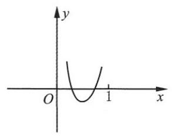

(第 107 题)

(2) $\because \tan A + \tan B =  - m,\tan A\tan B = m + 1$ ，

$\therefore \;\tan \left( {A + B}\right)  = \frac{\tan A + \tan B}{1 - \tan A\tan B} = 1.\;\therefore \;A + B = \frac{\pi }{4}$ .

$\therefore \tan A,\tan B \in  \left( {0,1}\right)$ .

设 $f\left( x\right)  = {x}^{2} + {mx} + \left( {m + 1}\right)$ ,

$\Delta  = {m}^{2} - {4m} - 4 \geq  0$ ,解得 $m \in  \left( {-\infty ,2 - 2\sqrt{2}\rbrack \cup \lbrack 2 + 2\sqrt{2}, + \infty }\right)$ .

如图， $0 <  - \frac{m}{2} < 1$ ，解得 $0 > m >  - 2$ ；

$f\left( 0\right)  = m + 1 > 0$ ,则 $m >  - 1;f\left( 1\right)  = {2m} + 2 > 0$ ,则 $m >  - 1$ .

综上所述, $m \in  ( - 1,2 - 2\sqrt{2}\rbrack$ .

108. D 提示: $\sin \alpha  + \cos \alpha  = \sqrt{2}\sin \left( {\frac{\pi }{4} + \alpha }\right)  =  - \sqrt{2},\therefore \frac{\pi }{4} + \alpha  = {2k\pi } - \frac{\pi }{2}, k \in  \mathbf{Z}$ ,

$\therefore \alpha  = {2k\pi } - \frac{3}{4}\pi , k \in  \mathbf{Z}.\;\therefore \tan \alpha  = \cot \alpha  = 1$ ,原式 $= 2$ .

109. $\mathrm{B}$ 提示: $\sin \alpha  = \frac{3}{4} - \cos \alpha ,\therefore {\sin }^{2}\alpha  + {\cos }^{2}\alpha  = {\left( \frac{3}{4} - \cos \alpha \right) }^{2} + {\cos }^{2}\alpha  = 1,\cos \alpha  = \frac{3 \pm  \sqrt{23}}{8}$ .

$\because \;\sin \alpha  > 0,\cos \alpha  < \frac{3}{4},\therefore \;\cos \alpha  = \frac{3 - \sqrt{23}}{8} < 0$ . 是钝角三角形.

110. D 提示: ${\left( \sqrt{1 + \sin \alpha } + \sqrt{1 - \sin \alpha }\right) }^{2} = 2 + 2\sqrt{1 - {\sin }^{2}\alpha } = 2\left( {1 + \left| {\cos \alpha }\right| }\right) ,\alpha  \in  \left\lbrack  {\frac{5\pi }{2},\frac{7}{2}\pi }\right\rbrack  ,\cos \alpha  < 0$ .

$\therefore \;{\left( \sqrt{1 + \sin \alpha } + \sqrt{1 - \sin \alpha }\right) }^{2} = 2\left( {1 - \cos \alpha }\right)  = 4{\sin }^{2}\frac{\alpha }{2}$ .

$\because \;\frac{\alpha }{2} \in  \left\lbrack  {\frac{5}{4}\pi ,\frac{7}{4}\pi }\right\rbrack  ,\;\therefore \;\sin \frac{\alpha }{2} < 0$ . 原式 $=  - 2\sin \frac{\alpha }{2}$ .

111. $\mathrm{B}$ 提示: 原式 $= \frac{4\sin \frac{\pi }{5}\cos \frac{\pi }{5}\cos \frac{2}{5}\pi }{4\sin \frac{\pi }{5}} = \frac{2\sin \frac{2\pi }{5}\cos \frac{2\pi }{5}}{4\sin \frac{\pi }{5}} = \frac{\sin \frac{4\pi }{5}}{4\sin \frac{\pi }{5}} = \frac{1}{4}$ .

112. (1) $\frac{1}{2}$ 或不存在 提示: ${\cos }^{2}\left( \frac{x}{2}\right)  = 2\cos \left( \frac{x}{2}\right) \sin \left( \frac{x}{2}\right)$ . 若 $\cos \frac{x}{2} \neq  0$ ,则 $2\sin \frac{x}{2} = \cos \frac{x}{2},\tan \frac{x}{2} = \frac{1}{2}$ ; 若 $\cos \frac{x}{2} = 0$ ,则 $\tan \frac{x}{2}$ 不存在.

(2)① $\frac{1}{4}$ 提示:原式 $= \sin \left( {{180}^{ \circ  } - {75}^{ \circ  }}\right) \cos {75}^{ \circ  } = \sin {75}^{ \circ  }\cos {75}^{ \circ  } = \frac{1}{2}\sin {150}^{ \circ  } = \frac{1}{4}$ .

② $\frac{5}{4}$ 提示:原式 $= {\sin }^{2}{75}^{ \circ  } + {\cos }^{2}{75}^{ \circ  } + \cos {15}^{ \circ  }\sin {15}^{ \circ  } = 1 + \frac{1}{2}\sin {30}^{ \circ  } = \frac{5}{4}$ .

③ $- \frac{\sqrt{2}}{4}$ 提示:原式 $=  - \sin \frac{\pi }{8}\cos \frac{\pi }{8} =  - \frac{1}{2}\sin \frac{\pi }{4} =  - \frac{\sqrt{2}}{4}$ .

(3) $\frac{11}{16}$ 提示: ${\left( \sin x - \cos x\right) }^{2} = 1 - 2\sin x\cos x = {\left( \frac{1}{2}\right) }^{2} = \frac{1}{4},\sin x\cos x = \frac{3}{8}$ .

$\therefore$ 原式 $= \left( {\sin x - \cos x}\right) \left( {{\sin }^{2}x + \sin x\cos x + {\cos }^{2}x}\right)  = \frac{1}{2}\left( {1 + \frac{3}{8}}\right)  = \frac{11}{16}$ .

113. $\frac{17}{4}$ 提示: $2\sin \alpha \cos \alpha  = \frac{4}{5},\sin \alpha \cos \alpha  = \frac{2}{5}$ .

原式 $= \frac{{\sin }^{2}\alpha }{{\cos }^{2}\alpha } + \frac{{\cos }^{2}\alpha }{{\sin }^{2}\alpha } = \frac{{\sin }^{4}\alpha  + {\cos }^{4}\alpha }{{\sin }^{2}\alpha {\cos }^{2}\alpha } = \frac{{\left( {\sin }^{2}\alpha  + {\cos }^{2}\alpha \right) }^{2} - 2{\sin }^{2}\alpha {\cos }^{2}\alpha }{{\sin }^{2}\alpha {\cos }^{2}\alpha } = \frac{1}{{\sin }^{2}\alpha {\cos }^{2}\alpha } - 2 = \frac{25}{4} - 2 = \frac{17}{4}$ .

114. A 提示: $\sin x\cos x\sin y\cos y = \frac{1}{4}\sin {2x}\sin {2y} \in  \left\lbrack  {-\frac{1}{4},\frac{1}{4}}\right\rbrack  ,\therefore \cos x\sin y \in  \left\lbrack  {-\frac{1}{2},\frac{1}{2}}\right\rbrack$ .

最小值 $- \frac{1}{2}$ 可在 $\sin x = \cos y = \frac{\sqrt{2}}{2},\sin y = \frac{\sqrt{2}}{2},\cos x =  - \frac{\sqrt{2}}{2}$ 时取到.

最大值 $\frac{1}{2}$ 可在 $\sin x = \cos y = \frac{\sqrt{2}}{2},\sin y = \cos x = \frac{\sqrt{2}}{2}$ 时取到.

115. (1) 原式 $= \sin {18}^{ \circ  }\cos {36}^{ \circ  } = \frac{4\cos {18}^{ \circ  }\sin {18}^{ \circ  }\cos {36}^{ \circ  }}{4\cos {18}^{ \circ  }} = \frac{2\sin {36}^{ \circ  }\cos {36}^{ \circ  }}{4\cos {18}^{ \circ  }} = \frac{\sin {72}^{ \circ  }}{4\cos {18}^{ \circ  }} = \frac{1}{4}$ .

( 2 )原式 $= \frac{{2}^{4}\sin \frac{\pi }{17}\cos \frac{\pi }{17}\cos \frac{2\pi }{17}\cos \frac{4\pi }{17}\cos \frac{8\pi }{17}}{{2}^{4}\sin \frac{\pi }{17}} = \frac{\sin \frac{16\pi }{17}}{{16}\sin \frac{\pi }{17}} = \frac{1}{16}$ .

116. (1) 原式 $= {\cos }^{4}\frac{\pi }{8} + {\sin }^{4}\frac{\pi }{8} + {\sin }^{4}\frac{\pi }{8} + {\cos }^{4}\frac{\pi }{8} = 2\left( {{\sin }^{4}\frac{\pi }{8} + {\cos }^{4}\frac{\pi }{8}}\right)$

$$
= 2\left\lbrack  {{\left( {\sin }^{2}\frac{\pi }{8} + {\cos }^{2}\frac{\pi }{8}\right) }^{2} - 2{\sin }^{2}\frac{\pi }{8}{\cos }^{2}\frac{\pi }{8}}\right\rbrack   = 2 - {\sin }^{2}\frac{\pi }{4} = \frac{3}{2}.
$$

( 2 )原式 $= {\sin }^{4}\left( \frac{\pi }{16}\right)  + {\sin }^{4}\left( \frac{3\pi }{16}\right)  + {\cos }^{4}\left( \frac{3\pi }{16}\right)  + {\cos }^{4}\left( \frac{\pi }{16}\right)$

$$
= {\left\lbrack  {\sin }^{2}\left( \frac{\pi }{16}\right)  + {\cos }^{2}\left( \frac{\pi }{16}\right) \right\rbrack  }^{2} - 2{\sin }^{2}\left( \frac{\pi }{16}\right) {\cos }^{2}\left( \frac{\pi }{16}\right)  + {\left\lbrack  {\sin }^{2}\left( \frac{3\pi }{16}\right)  + {\cos }^{2}\left( \frac{3\pi }{16}\right) \right\rbrack  }^{2} - 2{\sin }^{2}\left( \frac{3\pi }{16}\right) {\cos }^{2}\left( \frac{3\pi }{16}\right)
$$

$$
= 2 - \frac{1}{2}{\sin }^{2}\frac{\pi }{8} - \frac{1}{2}{\sin }^{2}\frac{3\pi }{8} = 2 - \frac{1}{2}\left( {{\sin }^{2}\frac{\pi }{8} + {\cos }^{2}\frac{\pi }{8}}\right)  = \frac{3}{2}.
$$

117. (1) 原式 $= \frac{\cos {10}^{ \circ  } - \sqrt{3}\sin {10}^{ \circ  }}{\sin {10}^{ \circ  }\cos {10}^{ \circ  }} = \frac{2\sin \left( {{30}^{ \circ  } - {10}^{ \circ  }}\right) }{\frac{1}{2}\sin {20}^{ \circ  }} = 4$ .

(2)原式 $= \cos {40}^{ \circ  }\left( {1 + \sqrt{3} \cdot  \frac{\sin {10}^{ \circ  }}{\cos {10}^{ \circ  }}}\right)  = \frac{\cos {40}^{ \circ  }}{\cos {10}^{ \circ  }}\left( {\cos {10}^{ \circ  } + \sqrt{3}\sin {10}^{ \circ  }}\right)  = \frac{2\cos {40}^{ \circ  }}{\cos {10}^{ \circ  }} \cdot  \sin \left( {{30}^{ \circ  } + {10}^{ \circ  }}\right)  = \frac{\sin {80}^{ \circ  }}{\cos {10}^{ \circ  }} = 1$ .

(3)原式 $= \frac{\sin {70}^{ \circ  }\cos {10}^{ \circ  }}{\cos {70}^{ \circ  }\cos {20}^{ \circ  }} \cdot  \left( {\sqrt{3}\sin {20}^{ \circ  } - \cos {20}^{ \circ  }}\right)  = \frac{2\cos {10}^{ \circ  }\sin {70}^{ \circ  }}{\cos {70}^{ \circ  }\cos {20}^{ \circ  }} \cdot  \sin \left( {{20}^{ \circ  } - {30}^{ \circ  }}\right)$

$$
= \frac{-2\sin {10}^{ \circ  }\cos {10}^{ \circ  }\cos {20}^{ \circ  }}{\sin {20}^{ \circ  }\cos {20}^{ \circ  }} = \frac{-\frac{1}{2}\sin {40}^{ \circ  }}{\frac{1}{2}\sin {40}^{ \circ  }} =  - 1.
$$

(4) 原式 $= \frac{1}{\cos {50}^{ \circ  }} + \frac{\sin {10}^{ \circ  }}{\cos {10}^{ \circ  }} = \frac{\cos {10}^{ \circ  } + \sin {10}^{ \circ  }\cos {50}^{ \circ  }}{\cos {10}^{ \circ  }\cos {50}^{ \circ  }}$

$$
= \frac{\sin {80}^{ \circ  } + \sin {10}^{ \circ  }\sin {40}^{ \circ  }}{\sin {80}^{ \circ  }\cos {50}^{ \circ  }} = \frac{2\sin {40}^{ \circ  }\cos {40}^{ \circ  } + \sin {10}^{ \circ  }\sin {40}^{ \circ  }}{\sin {40}^{ \circ  }\sin {80}^{ \circ  }}
$$

$$
= \frac{2\cos {40}^{ \circ  } + \sin {10}^{ \circ  }}{\sin {80}^{ \circ  }} = \frac{\sin {50}^{ \circ  } + \left( {\sin {50}^{ \circ  } + \sin {10}^{ \circ  }}\right) }{\sin {80}^{ \circ  }}
$$

$$
= \frac{\sin {50}^{ \circ  } + 2\sin {30}^{ \circ  }\cos {20}^{ \circ  }}{\sin {80}^{ \circ  }} = \frac{2\sin {60}^{ \circ  }\cos {10}^{ \circ  }}{\sin {80}^{ \circ  }} = \sqrt{3}.
$$

118. $\left( {2 + \sin \theta  + \cos \theta }\right) \left( {2 - \sin \theta  - \cos \theta }\right)  = 4 - {\left( \sin \theta  + \cos \theta \right) }^{2} = 3 - 2\sin \theta \cos \theta  = 3 - \sin {2\theta } \geq  2$ .

$\therefore \;2 + \sin \theta  + \cos \theta  \geq  \frac{2}{2 - \sin \theta  - \cos \theta }$ .

119. D 提示: 原式 $= \left( {{\cos }^{2}x + {\sin }^{2}x}\right) \left( {{\cos }^{2}x - {\sin }^{2}x}\right)  = \cos {2x} = \cos \frac{\pi }{6} = \frac{\sqrt{3}}{2}$ .

120. $\mathrm{D}$ 提示: $\sin \alpha  = 2\sin \frac{\alpha }{2}\cos \frac{\alpha }{2} < 0,\cos \alpha  = 2{\cos }^{2}\frac{\alpha }{2} - 1 > 0,\alpha$ 是第四象限的角.

121. $\mathrm{D}$ 提示: 原式 $= \sqrt{2 + 1 - 2{\sin }^{2}2 - {\sin }^{2}2} = \sqrt{3 - 3{\sin }^{2}2} = \sqrt{3}\left| {\cos 2}\right|  =  - \sqrt{3}\cos 2$ .

122. (1) $\frac{7}{25}$ 提示: $8\sin \frac{\theta }{2} = 5\sin \theta  = {10}\sin \frac{\theta }{2}\cos \frac{\theta }{2}$ . $\because \sin \frac{\theta }{2} \neq  0,\therefore \cos \frac{\theta }{2} = \frac{4}{5}$ ,

$\therefore \cos \theta  = 2{\cos }^{2}\frac{\theta }{2} - 1 = 2 \cdot  \frac{16}{25} - 1 = \frac{7}{25}$ .

(2) $\frac{2 + \sqrt{2}}{4}$ 提示:原式 $= \sin \frac{\pi }{8}\cos \frac{\pi }{8} \cdot  \frac{\cos \frac{\pi }{8}}{\sin \frac{\pi }{8}} = {\cos }^{2}\frac{\pi }{8} = \frac{1 + \cos \frac{\pi }{4}}{2} = \frac{2 + \sqrt{2}}{4}$ .

(3) $\frac{17}{32}$ 提示: $\cos \left( {\frac{\pi }{4} - \alpha }\right)  = \sin \left\lbrack  {\frac{\pi }{2} - \left( {\frac{\pi }{4} - \alpha }\right) }\right\rbrack   = \sin \left( {\frac{\pi }{4} + \alpha }\right)$ ，

$\therefore \;8\cos \left( {\frac{\pi }{4} + \alpha }\right) \sin \left( {\frac{\pi }{4} + \alpha }\right)  = 1$ ,

$4\sin \left( {\frac{\pi }{2} + {2\alpha }}\right)  = 1,\cos {2\alpha } = \frac{1}{4}.$

原式 $= {\left( {\cos }^{2}\alpha  - {\sin }^{2}\alpha \right) }^{2} + 2{\sin }^{2}\alpha {\cos }^{2}\alpha  = \frac{1}{16} + \frac{1}{2}{\sin }^{2}{2\alpha } = \frac{1}{16} + \frac{1}{2}\left( {1 - \frac{1}{16}}\right)  = \frac{17}{32}$ .

(4) $- 3 + 2\sqrt{2}$ 提示:原式 $= \frac{\cos x - \sin x}{\sin x + \cos x} = \frac{1 - \tan x}{\tan x + 1} = \frac{1 - \sqrt{2}}{1 + \sqrt{2}} =  - {\left( \sqrt{2} - 1\right) }^{2} =  - 3 + 2\sqrt{2}$ .

123. D 提示: $\frac{\alpha }{2} \in  \left( {\frac{3}{4}\pi ,\pi }\right) ,\therefore$ 原式 $= \sqrt{\frac{1}{2} + \frac{1}{2}\left| {\cos \alpha }\right| } = \sqrt{\frac{1 + \cos \alpha }{2}} = \left| {\cos \frac{\alpha }{2}}\right|  =  - \cos \frac{\alpha }{2}$ .

124. A 提示: 原式 $= \sqrt{\tan x}\left( {\sqrt{1 + \cos x} + \sqrt{1 - \cos x}}\right)  = \sqrt{\tan x} \cdot  \sqrt{2}\left( {\left| {\cos \frac{x}{2}}\right|  + \left| {\sin \frac{x}{2}}\right| }\right)$ .

$\frac{x}{2} \in  \left( {\frac{\pi }{2},\frac{3}{4}\pi }\right) ,\cos \frac{x}{2} < 0,\sin \frac{x}{2} > 0$ ,原式 $= \sqrt{\tan x} \cdot  \sqrt{2}\left( {\sin \frac{x}{2} - \cos \frac{x}{2}}\right)  = 2\sqrt{\tan x}\sin \left( {\frac{x}{2} - \frac{\pi }{4}}\right)$ .

125. (1) ${\cos }^{2}\left( \frac{\alpha  - \beta }{2}\right)  = \frac{1}{2}\left\lbrack  {1 + \cos \left( {\alpha  - \beta }\right) }\right\rbrack$ .

${\sin }^{2}\alpha  + {\cos }^{2}\alpha  + {\sin }^{2}\beta  + {\cos }^{2}\beta  + 2\left( {\sin \alpha \sin \beta  + \cos \alpha \cos \beta }\right)  = \frac{1}{4} + \frac{1}{9} = \frac{13}{36}.$

$\cos \left( {\alpha  - \beta }\right)  = \frac{1}{2}\left( {\frac{13}{36} - 2}\right)  =  - \frac{59}{72},{\cos }^{2}\left( \frac{\alpha  - \beta }{2}\right)  = \frac{1}{2}\left( {1 - \frac{59}{72}}\right)  = \frac{13}{144}$ .

(2)原式 $= \left\lbrack  {2 - \left( {2{\cos }^{2}\alpha  - 1}\right) }\right\rbrack  \left\lbrack  {2 - \left( {2{\cos }^{2}\beta  - 1}\right) }\right\rbrack   = \left( {3 - 2{\cos }^{2}\alpha }\right) \left( {3 - 2{\cos }^{2}\beta }\right)$ .

将 ${\cos }^{2}x = \frac{1}{{\tan }^{2}x + 1}$ 代入,得

原式 $= \left( {3 - \frac{2}{{\tan }^{2}\alpha  + 1}}\right) \left( {3 - \frac{2}{{\tan }^{2}\beta  + 1}}\right)  = \frac{1 + 3{\tan }^{2}\alpha }{1 + {\tan }^{2}\alpha } \cdot  \frac{1 + 3{\tan }^{2}\beta }{1 + {\tan }^{2}\beta }$

$= \frac{1 + 3\left( {{\tan }^{2}\alpha  + {\tan }^{2}\beta }\right)  + 3 \cdot  3 \cdot  \frac{1}{3}}{1 + \left( {{\tan }^{2}\alpha  + {\tan }^{2}\beta }\right)  + \frac{1}{3}} = \frac{4 + 3\left( {{\tan }^{2}\alpha  + {\tan }^{2}\beta }\right) }{\frac{4}{3} + \left( {{\tan }^{2}\alpha  + {\tan }^{2}\beta }\right) } = 3.$

126. (1) 原式 $= \frac{\cos {2\alpha }}{2\tan \left( {\frac{\pi }{4} - \alpha }\right) {\cos }^{2}\left( {\frac{\pi }{4} - \alpha }\right) } = \frac{\cos {2\alpha }}{2\sin \left( {\frac{\pi }{4} - \alpha }\right) \cos \left( {\frac{\pi }{4} - \alpha }\right) } = \frac{\cos {2\alpha }}{\sin \left( {\frac{\pi }{2} - {2\alpha }}\right) } = 1$ .

(2)原式 $= \frac{1}{\left( {1 - \cos \theta  - \sin \theta }\right) \left( {1 + \cos \theta  - \sin \theta }\right) }\left\lbrack  {{\left( 1 + \cos \theta  - \sin \theta \right) }^{2} + {\left( 1 - \cos \theta  - \sin \theta \right) }^{2}}\right\rbrack \; = \frac{1}{{\left( 1 - \sin \theta \right) }^{2} - {\cos }^{2}\theta }\left( {2 + 2{\sin }^{2}\theta  + 2{\cos }^{2}\theta  - 4\sin \theta }\right) \; = \frac{4\left( {1 - \sin \theta }\right) }{1 - 2\sin \theta  + {\sin }^{2}\theta  - {\cos }^{2}\theta } = \frac{4\left( {1 - \sin \theta }\right) }{2\sin \theta \left( {\sin \theta  - 1}\right) } =  - \frac{2}{\sin \theta }$ .

(3)原式 $= \frac{2\sin x\cos x - 2{\sin }^{2}x}{1 - \frac{\sin x}{\cos x}} = \frac{2\sin x\cos x\left( {\cos x - \sin x}\right) }{\cos x - \sin x} = \sin {2x}$ .

$2{\cos }^{2}\left( {\frac{\pi }{4} + x}\right)  - 1 = \cos \left( {\frac{\pi }{2} + {2x}}\right)  =  - \sin {2x} = 2 \cdot  \frac{16}{25} - 1 = \frac{7}{25},$

$\therefore$ 原式 $= \sin {2x} =  - \frac{7}{25}$ .

127. (1) ① 右边 $= \frac{1 + \cos {2x}}{\sin {2x}} - \frac{\cos {2x}}{\sin {2x}} = \frac{1}{\sin {2x}} =$ 左边.

② 将 (1) 中的 ${2x}$ 依次替换为 ${2}^{k}x\left( {k = 1,2,\cdots , n}\right)$ ，并将 $n$ 个等式相加即可.

(2) $\left( {2\cos \theta  + 1}\right) \left( {2\cos \theta  - 1}\right) \left( {2\cos {2\theta } - 1}\right) \cdots \left( {2\cos {2}^{n - 1}\theta  - 1}\right)$

$= \left( {4{\cos }^{2}\theta  - 1}\right) \left( {2\cos {2\theta } - 1}\right) \cdots \left( {2\cos {2}^{n - 1}\theta  - 1}\right)$

$= \left( {4 \cdot  \frac{\cos {2\theta } + 1}{2} - 1}\right) \left( {2\cos {2\theta } - 1}\right) \cdots \left( {2\cos {2}^{n - 1}\theta  - 1}\right)$

$= \left( {2\cos {2\theta } + 1}\right) \left( {2\cos {2\theta } - 1}\right) \cdots \left( {2\cos {2}^{n - 1}\theta  - 1}\right) .$

$\left( {2\cos {2}^{k}\theta  + 1}\right) \left( {2\cos {2}^{k}\theta  - 1}\right)  = 4{\cos }^{2}{2}^{k}\theta  - 1 = 4 \cdot  \frac{\cos {2}^{k + 1}\theta  + 1}{2} - 1 = 2\cos {2}^{k + 1}\theta  + 1$ .

$\therefore \;\left( {2\cos \theta  + 1}\right) \mathop{\prod }\limits_{{k = 1}}^{n}\left( {2\cos {2}^{k - 1}\theta  - 1}\right)  = 2\cos {2}^{n}\theta  + 1$ . 即证.

128. $\mathrm{B}$ 提示: 原式 $= \frac{1 - {\tan }^{2}\frac{\alpha }{2}}{1 + {\tan }^{2}\frac{\alpha }{2}} = \cos \alpha$ .

129. $\mathrm{B}$ 提示: $f\left( {\tan x}\right)  = \sin {2x} = \frac{2\tan x}{1 + {\tan }^{2}x},\;\therefore f\left( {-1}\right)  = \frac{2 \cdot  \left( {-1}\right) }{1 + 1} =  - 1$ .

130. $\mathrm{D}$ 提示: 原式 $= m \cdot  \frac{1 - {\tan }^{2}\frac{A}{2}}{1 + {\tan }^{2}\frac{A}{2}} - n \cdot  \frac{2\tan \frac{A}{2}}{1 + {\tan }^{2}\frac{A}{2}} = m \cdot  \frac{1 - \frac{{m}^{2}}{{n}^{2}}}{1 + \frac{{m}^{2}}{{n}^{2}}} - n \cdot  \frac{2 \cdot  \frac{m}{n}}{1 + \frac{{m}^{2}}{{n}^{2}}} = m \cdot  \frac{{n}^{2} - {m}^{2}}{{m}^{2} + {n}^{2}} - n \cdot  \frac{2mn}{{m}^{2} + {n}^{2}} = \; \frac{m\left( {{n}^{2} - {m}^{2} - 2{n}^{2}}\right) }{{m}^{2} + {n}^{2}} =  - m.$

131. D 提示: $\because \theta  \in  \left( {0,\frac{\pi }{2}}\right) ,\therefore \frac{\theta }{2} \in  \left( {0,\frac{\pi }{4}}\right) ,\therefore \cos \frac{\theta }{2} = \sqrt{1 - {\sin }^{2}\frac{\theta }{2}} = \sqrt{1 - \frac{x - 1}{2x}} = \sqrt{\frac{x + 1}{2x}}$ .

$\therefore \;\tan \frac{\theta }{2} = \sqrt{\frac{x - 1}{x + 1}},\tan \theta  = \frac{2\tan \frac{\theta }{2}}{1 - {\tan }^{2}\frac{\theta }{2}} = \frac{2 \cdot  \sqrt{\frac{x - 1}{x + 1}}}{1 - \frac{x - 1}{x + 1}} = \sqrt{{x}^{2} - 1}$ .

132. (1) $\frac{1}{4}$ 提示: 原式 $= \frac{1}{2} \cdot  \frac{2\tan \left( {{45}^{ \circ  } - \alpha }\right) }{1 - {\tan }^{2}\frac{\alpha }{2}} \cdot  \frac{\frac{1}{2}\sin {2\alpha }}{\cos {2\alpha }} = \frac{1}{4} \cdot  \tan \left( {{90}^{ \circ  } - {2\alpha }}\right) \tan {2\alpha } = \frac{1}{4}$ .

(2) $- \frac{103}{17}$ 提示: $\tan \alpha  = \frac{2\tan \frac{\alpha }{2}}{1 - {\tan }^{2}\frac{\alpha }{2}} = \frac{2 \cdot  \frac{2}{5}}{1 - \frac{4}{25}} = \frac{20}{21}$ ,原式 $= \frac{2\tan \alpha  + 3}{3 - 4\tan \alpha } = \frac{\frac{40}{21} + 3}{3 - \frac{80}{21}} =  - \frac{103}{17}$ .

(3) $\frac{7}{5}$ 提示: $\cos \theta  \neq  0,\frac{2\tan \theta  + 1}{\tan \theta  - 3} =  - 5,\tan \theta  = 2$ .

原式 $= 3 \cdot  \frac{1 - {\tan }^{2}\theta }{1 + {\tan }^{2}\theta } + 4 \cdot  \frac{2\tan \theta }{1 + {\tan }^{2}\theta } = 3 \cdot  \frac{1 - 4}{1 + 4} + 4 \cdot  \frac{2 \cdot  2}{1 + 4} = \frac{7}{5}$ .

133. (1) $\because \alpha  \in  \left( {\frac{\pi }{2},\pi }\right) ,\;\therefore \cos \alpha  =  - \frac{4}{5}$ .

$\because \tan \left( {\pi  - \beta }\right)  =  - \tan \beta  = \frac{1}{2},\;\therefore \tan \beta  =  - \frac{1}{2},\;\therefore \tan {2\beta } = \frac{2\tan \beta }{1 - {\tan }^{2}\beta } = \frac{-1}{1 - \frac{1}{4}} =  - \frac{4}{3}$ .

$\therefore \tan \left( {\alpha  - {2\beta }}\right)  = \frac{\tan \alpha  - \tan {2\beta }}{1 + \tan \alpha \tan {2\beta }} = \frac{-\frac{3}{4} + \frac{4}{3}}{1 + \left( {-\frac{3}{4}}\right)  \cdot  \left( {-\frac{4}{3}}\right) } = \frac{\frac{7}{12}}{2} = \frac{7}{24}$ .

( 2 )原式 $= \frac{1 + \cos \theta  - \sin \theta  - 1}{\sqrt{2}\sin \left( {\frac{\pi }{4} + \theta }\right) } = \frac{\cos \theta  - \sin \theta }{\cos \theta  + \sin \theta }$ ， $\theta  \in  \left( {\frac{\pi }{4},\frac{\pi }{2}}\right)$ .

$\because \;\tan {2\theta } = \frac{2\tan \theta }{1 - {\tan }^{2}\theta } =  - 2\sqrt{2},\therefore \;{\tan }^{2}\theta  - \frac{\sqrt{2}}{2}\tan \theta  - 1 = 0,\left( {\tan \theta  - \sqrt{2}}\right) \left( {\tan \theta  + \frac{\sqrt{2}}{2}}\right)  = 0$ .

$\because \tan \theta  > 0,\therefore \tan \theta  = \sqrt{2}.\;\therefore$ 原式 $= \frac{1 - \tan \theta }{1 + \tan \theta } = \frac{1 - \sqrt{2}}{1 + \sqrt{2}} =  - 3 + 2\sqrt{2}$ .

134. 若 $\cos x = 0$ ,则 $\sin x =  \pm  1.\;\because \;a\sin x = 0,\;\therefore a = 0$ ,

$\therefore \;\sin {2x} = 2\sin x\cos x = 0,\cos {2x} =  - 1 + 2{\cos }^{2}x =  - 1,\therefore  - B = C$ .

$\therefore {2abA} + \left( {{b}^{2} - {a}^{2}}\right) B + \left( {{a}^{2} + {b}^{2}}\right) C = {b}^{2}B + {b}^{2}C = {b}^{2}\left( {B + C}\right)  = 0.$

若 $\cos x \neq  0$ ,则 $\tan x =  - \frac{b}{a}$ (若 $a = 0$ ,则 $b\cos x = 0, b = 0$ ,矛盾).

代入 $A \cdot  \frac{2\tan x}{1 + {\tan }^{2}x} + B \cdot  \frac{1 - {\tan }^{2}x}{1 + {\tan }^{2}x} = C$ ,得 ${2A} \cdot  \left( {-\frac{b}{a}}\right)  + B \cdot  \left( {1 - \frac{{b}^{2}}{{a}^{2}}}\right)  = C\left( {1 + \frac{{b}^{2}}{{a}^{2}}}\right)$ ,

$\therefore  - {2abA} + B\left( {{a}^{2} - {b}^{2}}\right)  = C\left( {{a}^{2} + {b}^{2}}\right)$ ,即 ${2abA} + B\left( {{b}^{2} - {a}^{2}}\right)  + \left( {{a}^{2} + {b}^{2}}\right) C = 0$ .

135. $\mathrm{B}$ 提示: $\because \frac{\alpha }{2} \in  \left( {\frac{\pi }{2},\frac{3}{4}\pi }\right) ,\therefore \cos \frac{\alpha }{2} =  - \sqrt{\frac{1 + \cos \alpha }{2}} =  - \sqrt{\frac{1}{5}} =  - \frac{\sqrt{5}}{5}$ .

136. A 提示: $\sin \theta  =  - \frac{3}{5},\cos \theta  =  - \frac{4}{5},\tan \frac{\theta }{2} = \frac{1 - \cos \theta }{\sin \theta } = \frac{1 + \frac{4}{5}}{-\frac{3}{5}} =  - 3$ .

137. C 提示: $\because \alpha  = \frac{\pi }{2} - \beta ,\therefore \cos \alpha  = \sin \beta .\;\therefore \cos \frac{\alpha }{2} =  \pm  \sqrt{\frac{1 + \cos \alpha }{2}} =  \pm  \sqrt{\frac{1 + \sin \beta }{2}}$ ,

$\sin \frac{\alpha }{2} =  \pm  \sqrt{\frac{1 - \cos \alpha }{2}} =  \pm  \sqrt{\frac{1 - \sin \beta }{2}},\tan \frac{\alpha }{2} =  \pm  \sqrt{\frac{1 - \cos \alpha }{1 + \cos \alpha }} =  \pm  \sqrt{\frac{1 - \sin \beta }{1 + \sin \beta }}.$

138. B 提示: 原式 $= \left| {\cos \frac{\alpha }{2}}\right|  - \left| {\sin \frac{\alpha }{2}}\right|  \cdot  \frac{\alpha }{2} \in  \left( {\frac{3}{2}\pi ,{2\pi }}\right)$ ,

$\therefore \cos \frac{\alpha }{2} > 0,\sin \frac{\alpha }{2} < 0,\;\therefore$ 原式 $= \cos \frac{\alpha }{2} + \sin \frac{\alpha }{2} = \sqrt{2}\sin \left( {\frac{\alpha }{2} + \frac{\pi }{4}}\right) .$

139. $\mathrm{B}$ 提示: $\tan \left( {\alpha  + \frac{\pi }{4}}\right)  = \frac{1 - \cos \left( {{2\alpha } + \frac{\pi }{2}}\right) }{\sin \left( {{2\alpha } + \frac{\pi }{2}}\right) } = \frac{1 + \sin {2\alpha }}{\cos {2\alpha }} = \frac{1 + a}{b}$ .

140. (1) $\frac{\sqrt{15} + \sqrt{3}}{6}$ 提示: $\because x \in  \left( {\frac{\pi }{2},\pi }\right) ,\therefore \cos x =  - \sqrt{1 - \frac{4}{9}} =  - \frac{\sqrt{5}}{3}$ .

$\because \frac{x}{2} \in  \left( {\frac{\pi }{4},\frac{\pi }{2}}\right) ,\;\therefore \sin \frac{x}{2} = \sqrt{\frac{1 - \cos x}{2}} = \sqrt{\frac{1 + \frac{\sqrt{5}}{3}}{2}} = \frac{\sqrt{6 + 2\sqrt{5}}}{\sqrt{12}} = \frac{\sqrt{5} + 1}{2\sqrt{3}} = \frac{\sqrt{15} + \sqrt{3}}{6}$ .

(2)-5 提示: $\sin \left( {\alpha  + \beta  - \beta }\right)  = \sin \alpha  =  - \frac{5}{13},\cos \alpha  =  - \sqrt{1 - {\sin }^{2}\alpha } =  - \frac{12}{13}$ .

$\tan \frac{\alpha }{2} = \frac{1 - \cos \alpha }{\sin \alpha } = \frac{1 + \frac{12}{13}}{-\frac{5}{13}} =  - 5.$

(3) -2 提示: $\because \;\cos \alpha  = \frac{3}{4}\sin \alpha ,\therefore \;{\sin }^{2}\alpha  + {\cos }^{2}\alpha  = {\sin }^{2}\alpha  + \frac{9}{16}{\sin }^{2}\alpha  = 1$ .

$\therefore \;{\sin }^{2}\alpha  = \frac{16}{25},\sin \alpha  =  - \frac{4}{5},\cos \alpha  =  - \frac{3}{5},\;\therefore \;\tan \frac{\alpha }{2} = \frac{1 - \cos \alpha }{\sin \alpha } = \frac{1 + \frac{3}{5}}{-\frac{4}{5}} =  - 2$ .

(4) $\frac{1}{m}$ 提示:原式 $= \frac{\sin {70}^{ \circ  }}{1 - \cos {70}^{ \circ  }} = \frac{1}{\tan {35}^{ \circ  }} = \frac{1}{m}$ .

(5) $7 - 4\sqrt{3}$ 提示: $\tan \frac{5}{12}\pi \tan \frac{\pi }{12} = 1,\therefore$ 原式 $= {\tan }^{2}\frac{\pi }{12} = {\left( \sqrt{\frac{1 - \cos \frac{\pi }{6}}{1 + \cos \frac{\pi }{6}}}\right) }^{2} = \frac{1 - \frac{\sqrt{3}}{2}}{1 + \frac{\sqrt{3}}{2}} = 7 - 4\sqrt{3}$ .

141. D 提示: $\lg {\left( \cos x - 1\right) }^{2} = \lg {\left( 1 - 2{\sin }^{2}\frac{x}{2} - 1\right) }^{2} = \lg \left( {4{\sin }^{4}\frac{x}{2}}\right)  = 2\lg 2 + 4\lg \left| {\sin \frac{x}{2}}\right|$ .

142. (1) $1 - \cos {2\theta } = 7 - 4\sqrt{3} + \left( {7 - 4\sqrt{3}}\right) \cos {2\theta }$ ,解得 $\cos {2\theta } = \frac{\sqrt{3}}{2}$ .

$\because \;\sin {2\theta } < 0,\;\therefore \;\sin {2\theta } =  - \frac{1}{2},\;\tan \theta  = \frac{1 - \cos {2\theta }}{\sin {2\theta }} = \frac{1 - \frac{\sqrt{3}}{2}}{-\frac{1}{2}} = \sqrt{3} - 2$ .

$\because \alpha  \in  \left( {-\frac{\pi }{4},\frac{\pi }{4}}\right) ,\;\therefore \alpha  + \frac{3}{4}\pi  \in  \left( {\frac{\pi }{2},\pi }\right) .\;\because \sin \left( {\alpha  + \frac{3\pi }{4}}\right)  = \frac{5}{13},\;\therefore \cos \left( {\alpha  + \frac{3\pi }{4}}\right)  =  - \frac{12}{13}$ .

$\because \beta  \in  \left( {\frac{\pi }{4},\frac{3\pi }{4}}\right) ,\therefore \frac{\pi }{4} - \beta  \in  \left( {-\frac{\pi }{2},0}\right) .\;\because \cos \left( {\frac{\pi }{4} - \beta }\right)  = \frac{3}{5},\therefore \sin \left( {\frac{\pi }{4} - \beta }\right)  =  - \frac{4}{5}$ .

$\cos \left\lbrack  {\left( {\alpha  + \frac{3\pi }{4}}\right)  + \left( {\frac{\pi }{4} - \beta }\right) }\right\rbrack   = \cos \left( {\alpha  + \frac{3\pi }{4}}\right) \cos \left( {\frac{\pi }{4} - \beta }\right)  - \sin \left( {\alpha  + \frac{3\pi }{4}}\right) \sin \left( {\frac{\pi }{4} - \beta }\right)$

$=  - \frac{12}{13} \cdot  \frac{3}{5} - \frac{5}{13} \cdot  \left( {-\frac{4}{5}}\right)  =  - \frac{16}{65}$

$= \cos \left( {\alpha  - \beta  + \pi }\right)  =  - \cos \left( {\alpha  - \beta }\right) ,\;\therefore \;\cos \left( {\alpha  - \beta }\right)  = \frac{16}{65}.$

$\because \alpha  - \beta  \in  \left( {-\pi ,0}\right) ,\frac{\alpha  - \beta }{2} \in  \left( {-\frac{\pi }{2},0}\right) ,\therefore \sin \frac{\alpha  - \beta }{2} =  - \sqrt{\frac{1 - \cos \left( {\alpha  - \beta }\right) }{2}} =  - \frac{7\sqrt{130}}{130}$ .

(3) $\because \cos \alpha  = \sin \alpha  - \frac{1}{2},\;\therefore {\left( \sin \alpha  - \frac{1}{2}\right) }^{2} + {\sin }^{2}\alpha  = 1$ ,解得 $\sin \alpha  = \frac{1 \pm  \sqrt{7}}{4}$ .

$\because \alpha  \in  \left( {\pi ,{2\pi }}\right) ,\;\therefore \sin \alpha  < 0,\;\therefore \;\sin \alpha  = \frac{1 - \sqrt{7}}{4},\cos \alpha  = \frac{-1 - \sqrt{7}}{4}$ .

$\therefore \tan \frac{\alpha }{2} = \frac{1 - \cos \alpha }{\sin \alpha } =  - 2 - \sqrt{7}$ .

(4) $\cos \alpha  =  - \frac{3}{5},\sin \alpha  =  - \frac{4}{5}$ .

原式 $= \frac{\tan \left( \frac{\pi  + \alpha }{4}\right) }{1 - {\tan }^{2}\left\lbrack  {\frac{\pi }{2} - \left( \frac{\pi  - \alpha }{4}\right) }\right\rbrack  } = \frac{\tan \left( \frac{\pi  + \alpha }{4}\right) }{1 - {\tan }^{2}\left( \frac{\pi  + \alpha }{4}\right) } = \frac{1}{2}\tan \left( \frac{\pi  + \alpha }{2}\right)  =  - \frac{1}{2\tan \frac{\alpha }{2}}$ .

$\tan \frac{\alpha }{2} = \frac{1 - \cos \alpha }{\sin \alpha } =  - 2$ ,原式 $= \frac{1}{4}$ .

(5)易知 $\alpha ,\beta$ 是腰长 17，底边长 13 的等腰三角形的顶角和底角如图①所示.

$\left| {AB}\right|  = \left| {AH}\right|  + \left| {BH}\right|  = {17}\cos \alpha  + {13}\cos \beta  = {17},\left| {CH}\right|  = {17}\sin \alpha  = {13}\sin \beta .$

$\therefore \alpha  + {2\beta } = \pi ,\frac{\alpha }{2} + \beta  = \frac{\pi }{2}$ .

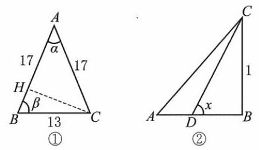

[第 142(5)题]

143. 设 $x = {\cot }^{2}\theta ,\theta  \in  \left( {0,\frac{\pi }{2}}\right\rbrack$ ,则 $\sqrt{1 + x} - \sqrt{x} = \frac{1}{\sin \theta } - \frac{\cos \theta }{\sin \theta } = \frac{1 - \cos \theta }{\sin \theta } = \tan \frac{\theta }{2}$ .

$\because \;\frac{\theta }{2} \in  \left( {0,\frac{\pi }{4}}\right\rbrack  ,\;\therefore \;\tan \frac{\theta }{2} \in  (0,1\rbrack .$

144. $\because \cot \frac{\alpha }{2} = \frac{\sin \alpha }{1 - \cos \alpha }$ ,即证 $4\sin \alpha \cos \alpha  \leq  \frac{\sin \alpha }{1 - \cos \alpha }$ .

$\because \alpha  \in  \left( {0,\pi }\right) ,\sin \alpha  > 0$ ,即证 $4\cos \alpha  \leq  \frac{1}{1 - \cos \alpha }$ .

$\because \;4\cos \alpha \left( {1 - \cos \alpha }\right)  - 1 =  - {\left( 2\cos \alpha  - 1\right) }^{2} \leq  0,\;\therefore \;4\cos \alpha  \leq  \frac{1}{1 - \cos \alpha }$ .

$\therefore \cot \frac{\alpha }{2} = \frac{\sin \alpha }{1 - \cos \alpha } \geq  2\sin {2\alpha }$ .

145. $\mathrm{D}$ 提示: 原式 $= \frac{1}{2}\left( {\cos {2\beta } - \cos {2\alpha }}\right)  = \frac{1}{2}\left( {2{\cos }^{2}\beta  - 1 - 2{\cos }^{2}\alpha  + 1}\right)  = {\cos }^{2}\beta  - {\cos }^{2}\alpha  =  - m$ .

146. C 提示: 原式 $= \frac{1}{2}\left( {\cos \frac{2\pi }{5} + \cos 2}\right)  = \frac{1}{2}\left( {2{\cos }^{2}\frac{\pi }{5} - 1 + 1 - 2{\sin }^{2}1}\right)  = {\cos }^{2}\frac{\pi }{5} - {\sin }^{2}1$ 或原式 $= \frac{1}{2}(1 - \; 2{\sin }^{2}\frac{\pi }{5} + 2{\cos }^{2}1 - 1) =  - {\sin }^{2}\frac{\pi }{5} + {\cos }^{2}1.$

147. (1) $\frac{3}{4}$ 提示: 原式 $= {\cos }^{2}\alpha  - \frac{1}{2}\left( {\cos {2\alpha } + \cos {120}^{ \circ  }}\right)  = \frac{1}{2}\left\lbrack  {1 + \cos {2\alpha } - \cos {2\alpha } - \left( {-\frac{1}{2}}\right) }\right\rbrack   = \frac{3}{4}$ .

(2) ${\cos }^{2}\alpha$ 提示:原式 $= \frac{1}{2}\left( {\cos {2\alpha } + \cos {2\beta }}\right)  + {\sin }^{2}\beta  = \frac{1}{2}\left( {2{\cos }^{2}\alpha  - 1 + 1 - 2{\sin }^{2}\beta }\right)  + {\sin }^{2}\beta  = {\cos }^{2}\alpha$ .

(3) $\frac{13}{7}$ 提示:原式 $= \frac{\sin \alpha \cos \beta }{\cos \alpha \sin \beta } = \frac{\frac{1}{2}\left\lbrack  {\sin \left( {\alpha  + \beta }\right)  + \sin \left( {\alpha  - \beta }\right) }\right\rbrack  }{\frac{1}{2}\left\lbrack  {\sin \left( {\alpha  + \beta }\right)  - \sin \left( {\alpha  - \beta }\right) }\right\rbrack  } = \frac{\frac{2}{3} + \frac{1}{5}}{\frac{2}{3} - \frac{1}{5}} = \frac{13}{7}$ .

(4)2或-2 提示:原式 = $\frac{1}{2}\left( {\cos \frac{\pi }{3} - \cos {2\theta }}\right)  = \frac{11}{20},\cos {2\theta } =  - \frac{3}{5}$ .

$\therefore \;\frac{1 - {\tan }^{2}\theta }{1 + {\tan }^{2}\theta } =  - \frac{3}{5},{\tan }^{2}\theta  = 4,\tan \theta  = 2$ 或-2.

148. (1) $\frac{\sqrt{2}}{2}$ 提示: 原式 $= \sqrt{2}\sin \left( {{63}^{ \circ  } - {45}^{ \circ  }}\right)  + \sqrt{2}\left\lbrack  {\sin {150}^{ \circ  } + \sin \left( {-{18}^{ \circ  }}\right) }\right\rbrack   = \sqrt{2}\left( {\sin {18}^{ \circ  } + \frac{1}{2} - \sin {18}^{ \circ  }}\right)  = \frac{\sqrt{2}}{2}$ .

(2)1 提示:原式 $= \frac{1}{2\sin {10}^{ \circ  }}\left( {1 - 4\sin {10}^{ \circ  }\sin {70}^{ \circ  }}\right)  = \frac{1}{2\sin {10}^{ \circ  }}\left\lbrack  {1 - 2\left( {\cos {60}^{ \circ  } - \cos {80}^{ \circ  }}\right) }\right\rbrack \; = \frac{1}{2\sin {10}^{ \circ  }}\left( {1 - 2 \cdot  \frac{1}{2} + 2 \cdot  \sin {10}^{ \circ  }}\right)  = 1.$

(3) 1 提示: $= \frac{1}{2\cos {80}^{ \circ  }}\left\lbrack  {1 - 4\sin {10}^{ \circ  }\left( {1 - 2{\sin }^{2}{10}^{ \circ  }}\right) }\right\rbrack   = \frac{1}{2\cos {80}^{ \circ  }}\left( {1 - 4\sin {10}^{ \circ  }\cos {20}^{ \circ  }}\right) \; = \frac{1}{2\cos {80}^{ \circ  }}\left\{  {1 - 2\left\lbrack  {\sin {30}^{ \circ  } + \sin \left( {-{10}^{ \circ  }}\right) }\right\rbrack  }\right\}   = \frac{1}{2\cos {80}^{ \circ  }}\left( {1 - 2 \cdot  \frac{1}{2} + 2\sin {10}^{ \circ  }}\right)  = 1.$

(4)0 提示:原式 $= \frac{1}{2}\left\lbrack  {\sin {100}^{ \circ  } + \sin {60}^{ \circ  } + \sin {190}^{ \circ  } + \sin \left( {-{100}^{ \circ  }}\right)  + \sin {300}^{ \circ  } + \sin \left( {-{190}^{ \circ  }}\right) }\right\rbrack$

$$
= \frac{1}{2}\left( {\sin {60}^{ \circ  } + \sin {300}^{ \circ  }}\right)  = 0.
$$

149. (1) $\tan \frac{3\alpha }{2} - \tan \frac{\alpha }{2} = \frac{\sin \frac{3\alpha }{2}}{\cos \frac{3\alpha }{2}} - \frac{\sin \frac{\alpha }{2}}{\cos \frac{\alpha }{2}} = \frac{\sin \frac{3\alpha }{2}\cos \frac{\alpha }{2} - \cos \frac{3\alpha }{2}\sin \frac{\alpha }{2}}{\cos \frac{3\alpha }{2}\cos \frac{\alpha }{2}}$

$$
= \frac{\sin \left( {\frac{3\alpha }{2} - \frac{\alpha }{2}}\right) }{\frac{1}{2}\left( {\cos \alpha  + \cos {2\alpha }}\right) } = \frac{2\sin \alpha }{\cos \alpha  + \cos {2\alpha }}.
$$

(2)原式 $= \cos {2\alpha }\cos {2\beta } - \frac{1 + \cos \left( {{2\alpha } - {2\beta }}\right) }{2}$

$$
= \frac{1}{2}\left( {2\cos {2\alpha }\cos {2\beta } - 1 - \cos {2\alpha }\cos {2\beta } - \sin {2\alpha }\sin {2\beta }}\right)
$$

$$
= \frac{1}{2}\left( {\cos {2\alpha }\cos {2\beta } - \sin {2\alpha }\sin {2\beta } - 1}\right)  = \frac{1}{2}\left\lbrack  {\cos \left( {{2\alpha } + {2\beta }}\right)  - 1}\right\rbrack
$$

$$
=  - {\sin }^{2}\left( {\alpha  + \beta }\right)  =  - {\left( \frac{2\tan \frac{\alpha  + \beta }{2}}{1 + {\tan }^{2}\frac{\alpha  + \beta }{2}}\right) }^{2} =  - {\left( \frac{2 \cdot  \frac{\sqrt{2}}{2}}{1 + \frac{1}{2}}\right) }^{2} =  - \frac{8}{9}\text{ . }
$$

150. $\cos A\cos C = \cos A\cos \left( {{120}^{ \circ  } - A}\right)  = \frac{1}{2}\left\lbrack  {\cos {120}^{ \circ  } + \cos \left( {{120}^{ \circ  } - {2A}}\right) }\right\rbrack   =  - \frac{1}{4} + \frac{1}{2}\cos \left( {{2A} - {120}^{ \circ  }}\right)$ .

$\therefore \;{0}^{ \circ  } < A < {120}^{ \circ  },\;\therefore \; - {120}^{ \circ  } < {2A} - {120}^{ \circ  } < {120}^{ \circ  }$ ,

$\therefore \cos \left( {{2A} - {120}^{ \circ  }}\right)  \in  \left( {-\frac{1}{2},1}\right\rbrack  ,\cos A\cos C \in  \left( {-\frac{1}{2},\frac{1}{4}}\right\rbrack$ .

151. (1) 原式 $= \frac{1}{2\sin {20}^{ \circ  }}\left( {2\sin {20}^{ \circ  }\cos {20}^{ \circ  } + 2\sin {20}^{ \circ  }\cos {60}^{ \circ  } + 2\sin {20}^{ \circ  }\cos {100}^{ \circ  } + 2\sin {20}^{ \circ  }\cos {140}^{ \circ  }}\right) \; = \frac{1}{2\sin {20}^{ \circ  }}\left\lbrack  {\sin {40}^{ \circ  } + \sin {80}^{ \circ  } + \sin \left( {{20}^{ \circ  } - {60}^{ \circ  }}\right)  + \sin {120}^{ \circ  } + \sin \left( {{20}^{ \circ  } - {100}^{ \circ  }}\right)  + \sin {160}^{ \circ  } + \sin \left( {-{120}^{ \circ  }}\right) }\right\rbrack \; = \frac{1}{2\sin {20}^{ \circ  }}\left\lbrack  {\sin {40}^{ \circ  } - \sin {40}^{ \circ  } + \sin {80}^{ \circ  } - \sin {80}^{ \circ  } + \sin {120}^{ \circ  } - \sin {120}^{ \circ  } + \sin \left( {{180}^{ \circ  } - {160}^{ \circ  }}\right) }\right\rbrack   = \frac{1}{2}$ .

(2)原式 $= \frac{1}{2\sin \frac{2}{7}\pi }\left( {2\sin \frac{2\pi }{7}\cos \frac{2\pi }{7} + 2\sin \frac{2\pi }{7}\cos \frac{4\pi }{7} + 2\sin \frac{2\pi }{7}\cos \frac{6\pi }{7}}\right) \; = \frac{1}{2\sin \frac{2}{7}\pi }\left( {\sin \frac{4\pi }{7} + \sin \frac{6\pi }{7} - \sin \frac{2\pi }{7} + \sin \frac{8\pi }{7} - \sin \frac{4\pi }{7}}\right)  =  - \frac{1}{2}$ .

152. (1) ① 左边 $= \sin \alpha  \cdot  \frac{1}{2}\left( {\cos {2\alpha } - \cos {120}^{ \circ  }}\right)  = \frac{1}{2}\sin \alpha \left( {1 - 2{\sin }^{2}\alpha  + \frac{1}{2}}\right)$

$=  - {\sin }^{3}\alpha  + \frac{3}{4}\sin \alpha  = \frac{1}{4}\sin {3\alpha } =$ 右边.

②左边 $= \cos \alpha  \cdot  \frac{1}{2}\left( {\cos {2\alpha } + \cos {120}^{ \circ  }}\right)  = \frac{1}{2}\cos \alpha \left( {2{\cos }^{2}\alpha  - \frac{3}{2}}\right)  = \frac{1}{4}\left( {4{\cos }^{3}\alpha  - 3\cos \alpha }\right)  = \frac{1}{4}\cos {3\alpha } =$ 右边.

③曲 $\frac{\text{ ① }}{\text{ ② }}$ ，得 $\tan \alpha \tan \left( {{60}^{ \circ  } + \alpha }\right) \tan \left( {{60}^{ \circ  } - \alpha }\right)  = \tan {3\alpha }$ .

(2)①原式 $= \frac{1}{4}\sin \left( {3 \cdot  {5}^{ \circ  }}\right)  = \frac{1}{4} \cdot  \sqrt{\frac{1 - \cos {30}^{ \circ  }}{2}} = \frac{\sqrt{6} - \sqrt{2}}{16}$ .

②原式 $= \frac{1}{2} \cdot  \frac{1}{4}\sin \left( {3 \cdot  {10}^{ \circ  }}\right)  = \frac{1}{16}$ .

③原式 $= \frac{\sqrt{3}}{2} \cdot  \frac{1}{4}\cos \left( {3 \cdot  {10}^{ \circ  }}\right)  = \frac{3}{16}$ .

④原式 $= \sin x\sin \left( {\frac{1}{3}\pi  + x}\right) \sin \left( {\pi  - \frac{2\pi }{3} - x}\right)  = \sin x\sin \left( {\frac{\pi }{3} + x}\right) \sin \left( {\frac{\pi }{3} - x}\right)  = \frac{1}{4}\sin {3x}$ .

⑤原式 $= \tan \left( {3 \cdot  {5}^{ \circ  }}\right)  \cdot  \tan {75}^{ \circ  } = 1$ .

153. $\frac{1}{2}\left( {\sin {2\alpha } - \sin {2\beta }}\right)  + \frac{1}{4}\sin {2\alpha } = 0,\therefore 2\sin {2\beta } = 3\sin {2\alpha }$ .

由 $3{\sin }^{2}\alpha  + 2{\sin }^{2}\beta  = 1$ ,得 $3\cos {2\alpha } + 2\cos {2\beta } = 3$ .

${\text{ ① }}^{2} + {\text{ ② }}^{2}$ ,得 ${\left( 2\sin 2\beta  - 3\sin 2\alpha \right) }^{2} + {\left( 3\cos 2\alpha  + 2\cos 2\beta \right) }^{2} = 9$ ,

$\therefore \;4 + 9 + {12}\left( {\cos {2\alpha }\cos {2\beta } - \sin {2\alpha }\sin {2\beta }}\right)  = 9.\;\therefore \;\cos \left( {{2\alpha } + {2\beta }}\right)  =  - \frac{1}{3}$ .

$\because \alpha ,\beta  \in  \left( {0,\frac{\pi }{2}}\right) ,\therefore \alpha  + \beta  \in  \left( {0,\pi }\right) ,\therefore \sin \left( {\alpha  + \beta }\right)  = \frac{\sqrt{6}}{3}$ .

154. $\mathrm{B}$ 提示: 选项 $\mathrm{B} : 2\cos \frac{\beta  + \alpha }{2}\sin \frac{\alpha  - \beta }{2}$ .

155. $\mathrm{B}$ 提示: 原式 $= \frac{1}{2}\left( {\cos {2x} + 1}\right)  - \frac{1}{2}\left( {-\cos {2y} + 1}\right)  = \frac{1}{2}\left( {\cos {2x} + \cos {2y}}\right)  = \cos \left( {x + y}\right) \cos \left( {x - y}\right)$ .

156. C 提示: $\cos x - \cos y =  - 2\sin \frac{x + y}{2}\sin \frac{x - y}{2} =  - 2\sin \frac{\pi }{3}\sin \frac{x - y}{2} =  - \sqrt{3}\sin \frac{x - y}{2}$ . 当 $\sin \frac{x - y}{2} =  - 1$ 时取最大值 $\sqrt{3}$ .

157. (1) 0 提示:原式 $= 2\sin {30}^{ \circ  }\cos {20}^{ \circ  } - \cos {20}^{ \circ  } = 0$ .

(2)0 提示:原式 $= 2\sin {50}^{ \circ  }\sin {30}^{ \circ  } - \sin {50}^{ \circ  } = 0$ .

(3) $\frac{1 - \sqrt{2}}{2}$ 提示:原式 = $2\cos {45}^{ \circ  }\sin \left( {-{30}^{ \circ  }}\right)  + 2\sin {15}^{ \circ  }\cos {15}^{ \circ  } = 2 \cdot  \frac{\sqrt{2}}{2} \cdot  \left( {-\frac{1}{2}}\right)  + \sin {30}^{ \circ  } = \frac{1 - \sqrt{2}}{2}$ .

(4) $\frac{\sqrt{3}}{2}$ 提示:原式 $= 2\cos {50}^{ \circ  }\sin {30}^{ \circ  } + \sin {60}^{ \circ  } + \sin \left( {-{40}^{ \circ  }}\right)  = \sin {60}^{ \circ  } = \frac{\sqrt{3}}{2}$ .

(5) 0 提示:原式 $= 2\cos \frac{4\pi }{13}\cos \frac{\pi }{13} + 2\cos \frac{9\pi }{13}\cos \frac{\pi }{13} = 2\cos \frac{\pi }{13}\left( {\cos \frac{4}{13}\pi  + \cos \frac{9}{13}\pi }\right)  = 0$ .

(6) 1 提示: 原式 $= \frac{1}{2}\left\lbrack  {\cos \left( {{2\alpha } + {2\beta }}\right)  + 1 + \cos \left( {{2\alpha } - {2\beta }}\right)  + 1}\right\rbrack   - \cos {2\alpha }\cos {2\beta } = 1 + \cos {2\alpha }\cos {2\beta } - \cos {2\alpha } \cdot  \cos {2\beta } = 1$ .

(7) 0 提示:原式 $= \cos \alpha  + 2\cos \frac{2\pi }{3}\cos \alpha  = 0$ .

(8)1 提示:原式 $= \frac{1}{2}\left( {1 - \cos {80}^{ \circ  } + 1 - \cos {160}^{ \circ  }}\right)  + \frac{1}{2}\cos {220}^{ \circ  } = 1 - \cos {120}^{ \circ  }\cos {40}^{ \circ  } + \frac{1}{2}\cos {220}^{ \circ  } \; = 1 + \frac{1}{2}\left( {\cos {40}^{ \circ  } + \cos {220}^{ \circ  }}\right)  = 1 + \cos {130}^{ \circ  }\cos {90}^{ \circ  } = 1.$

(9) $\frac{1}{2}$ 提示:原式 $= \left( {\cos {20}^{ \circ  } + \cos {140}^{ \circ  }}\right)  + \left( {\cos {60}^{ \circ  } + \cos {100}^{ \circ  }}\right)  = 2\cos {80}^{ \circ  }\cos {60}^{ \circ  } + 2\cos {80}^{ \circ  }\cos {20}^{ \circ  } \; = 4\cos {80}^{ \circ  }\cos {40}^{ \circ  }\cos {20}^{ \circ  } = \frac{8\cos {80}^{ \circ  }\cos {40}^{ \circ  }\cos {20}^{ \circ  }\sin {20}^{ \circ  }}{2\sin {20}^{ \circ  }} = \frac{4\cos {80}^{ \circ  }\cos {40}^{ \circ  }\sin {40}^{ \circ  }}{2\sin {20}^{ \circ  }} = \frac{\sin {160}^{ \circ  }}{2\sin {20}^{ \circ  }} = \frac{1}{2}$ .

(10) $\frac{\sqrt{2}}{2}$ 提示:原式 $= 2\cos {45}^{ \circ  }\sin {18}^{ \circ  } + \sqrt{2}\left( {\sin {150}^{ \circ  } - \sin {18}^{ \circ  }}\right)  = \frac{\sqrt{2}}{2}$ .

158.(1) $- \sqrt{3}\;$ 提示:原式 $= \frac{\sin {20}^{ \circ  } - \sin {40}^{ \circ  }}{\cos {80}^{ \circ  }} = \frac{-2\cos {30}^{ \circ  }\sin {10}^{ \circ  }}{\cos {80}^{ \circ  }} =  - \sqrt{3}$ .

(2)2 提示:原式 $= \frac{2\sin {30}^{ \circ  }\cos {20}^{ \circ  }}{\sin {35}^{ \circ  }\cos {35}^{ \circ  }} = \frac{2\cos {20}^{ \circ  }}{2\sin {35}^{ \circ  }\cos {35}^{ \circ  }} = \frac{2\cos {20}^{ \circ  }}{\sin {70}^{ \circ  }} = 2$ .

(3)2 提示:原式 $= \frac{1}{\sin {18}^{ \circ  }} - \frac{1}{\sin {54}^{ \circ  }} = \frac{\sin {54}^{ \circ  } - \sin {18}^{ \circ  }}{\sin {18}^{ \circ  }\sin {54}^{ \circ  }} = \frac{2\cos {36}^{ \circ  }\sin {18}^{ \circ  }}{\sin {18}^{ \circ  }\sin {54}^{ \circ  }} = 2$ .

159. C 提示: $\sin x + \sin y = 2\sin \frac{x + y}{2}\cos \frac{x - y}{2} = 2\sin \frac{1}{2}\cos \frac{x - y}{2}$ .

$\because \;0 < \frac{1}{2} < \frac{\pi }{6},\;\therefore \;0 < 2\sin \frac{1}{2} < 2\sin \frac{\pi }{6} = 1,\;\therefore$ 原式 $< 1$ .

160. D 提示: $2\sqrt{3}\sin \frac{\alpha  + \beta }{2}\cos \frac{\alpha  - \beta }{2} = 2\sin \frac{\alpha  + \beta }{2}\sin \frac{\alpha  - \beta }{2}.\because \frac{\alpha  + \beta }{2} \in  \left( {0,\pi }\right) ,\therefore \sin \frac{\alpha  + \beta }{2} > 0$ ,

$\therefore \sqrt{3}\cos \frac{\alpha  - \beta }{2} = \sin \frac{\alpha  - \beta }{2},\tan \frac{\alpha  - \beta }{2} = \sqrt{3}$ .

$\because \frac{\alpha  - \beta }{2} \in  \left( {-\frac{\pi }{2},\frac{\pi }{2}}\right) ,\;\therefore \frac{\alpha  - \beta }{2} = \frac{\pi }{3},\alpha  - \beta  = \frac{2\pi }{3}$ .

161. B 提示: $f\left( x\right)  = \sin \left( {x + y}\right)  - 2\sin \frac{x + y}{2}\cos \frac{x - y}{2} = 2\sin \frac{x + y}{2}\left( {\cos \frac{x + y}{2} - \cos \frac{x - y}{2}}\right)  =  - 4\sin \frac{x + y}{2} \cdot  \sin \frac{x}{2}\sin \frac{y}{2}$ . 由 $x, y \in  \left( {0,\pi }\right)$ ,得 $\frac{x + y}{2} \in  \left( {0,\pi }\right) ,\sin \left( \frac{x + y}{2}\right)  > 0,\sin \frac{x}{2},\sin \frac{y}{2} > 0.\therefore f\left( x\right)  < 0$ .

162. C 提示: $\text{ ① }2\left( {\frac{1}{2}\cos {40}^{ \circ  } + \frac{\sqrt{3}}{2}\sin {40}^{ \circ  }}\right)  = 2\cos \left( {{60}^{ \circ  } - {40}^{ \circ  }}\right)  = 2\cos {20}^{ \circ  };\text{ ② }4\cos {20}^{ \circ  }\cos {40}^{ \circ  } = 2\left( {\cos {60}^{ \circ  } + \cos {20}^{ \circ  }}\right)  = 1 + 2\cos {20}^{ \circ  }$ ; ③ $\frac{\sin {40}^{ \circ  }}{1 + \cos {40}^{ \circ  }} = \tan {20}^{ \circ  } = \cot {70}^{ \circ  }$ ; ④ $\frac{\tan {45}^{ \circ  } - \tan {40}^{ \circ  }}{1 + \tan {45}^{ \circ  }\tan {40}^{ \circ  }} = \tan \left( {{45}^{ \circ  } - {40}^{ \circ  }}\right)  \neq  \tan {20}^{ \circ  }$ .

163. (1) 原式 $= 2\sin {54}^{ \circ  }\sin {18}^{ \circ  } = 2\cos {72}^{ \circ  }\cos {36}^{ \circ  } = \frac{1}{2}$ .

(2)原式 $= \frac{1}{2}\left( {1 + \cos \frac{2\pi }{5}}\right)  + \frac{1}{2}\left( {1 - \cos \frac{\pi }{5}}\right)  = 1 + \frac{1}{2}\left( {\cos \frac{2\pi }{5} - \cos \frac{\pi }{5}}\right) \; = 1 - \sin \frac{3\pi }{10}\sin \frac{\pi }{10} = 1 - \cos {36}^{ \circ  }\cos {72}^{ \circ  } = \frac{3}{4}$ .

(3)原式 $= \left( {\cos {12}^{ \circ  } - \cos {48}^{ \circ  }}\right)  + \left( {\cos {84}^{ \circ  } - \cos {24}^{ \circ  }}\right)  = 2\sin {30}^{ \circ  }\sin {18}^{ \circ  } + \left( {-2\sin {54}^{ \circ  }\sin {30}^{ \circ  }}\right) \; = \sin {18}^{ \circ  } - \sin {54}^{ \circ  } =  - 2\cos {36}^{ \circ  }\sin {18}^{ \circ  } =  - 2\cos {36}^{ \circ  }\cos {72}^{ \circ  } =  - \frac{1}{2}$ .

164. (1) 原式 $= \frac{1}{2}\left( {1 + \cos {146}^{ \circ  }}\right)  + \frac{1}{2}\left( {1 - \cos {86}^{ \circ  }}\right)  + \frac{1}{2}\left( {\sin {116}^{ \circ  } - \sin {30}^{ \circ  }}\right)$

$= \frac{3}{4} + \frac{1}{2}\left( {\cos {146}^{ \circ  } - \cos {86}^{ \circ  }}\right)  + \frac{1}{2}\sin {116}^{ \circ  } = \frac{3}{4} - \sin {116}^{ \circ  }\sin {30}^{ \circ  } + \frac{1}{2}\sin {116}^{ \circ  } = \frac{3}{4}$ .

(2)原式 $= \frac{1}{2}\left( {1 + \cos {20}^{ \circ  }}\right)  + \frac{1}{2}\left( {1 + \cos {220}^{ \circ  }}\right)  + \frac{1}{2}\left( {1 + \cos {260}^{ \circ  }}\right) \; = \frac{3}{2} + \frac{1}{2}\left( {\cos {20}^{ \circ  } + \cos {220}^{ \circ  }}\right)  + \frac{1}{2}\cos {260}^{ \circ  } = \frac{3}{2} + \cos {120}^{ \circ  }\cos {100}^{ \circ  } + \frac{1}{2}\cos {100}^{ \circ  } = \frac{3}{2}$ .

(3)原式 $= \frac{1}{2}\left( {\cos {40}^{ \circ  } - \cos {60}^{ \circ  } - \cos {20}^{ \circ  } + \cos {120}^{ \circ  } - \cos {60}^{ \circ  } + \cos {80}^{ \circ  }}\right) \; =  - \frac{3}{4} + \frac{1}{2}\left( {\cos {40}^{ \circ  } + \cos {80}^{ \circ  }}\right)  - \frac{1}{2}\cos {20}^{ \circ  } =  - \frac{3}{4} + \cos {60}^{ \circ  }\cos {20}^{ \circ  } - \frac{1}{2}\cos {20}^{ \circ  } =  - \frac{3}{4}$ .

(4)原式 $= {\tan }^{9} + \frac{1}{{\operatorname{tan9}}^{ \circ  }} - \left( {\tan {27}^{ \circ  } + \frac{1}{{\operatorname{tan27}}^{ \circ  }}}\right)$

$= 2\left( {\frac{{\tan }^{2}{9}^{ \circ  } + 1}{2\tan {9}^{ \circ  }} - \frac{{\tan }^{2}{27}^{ \circ  } + 1}{2\tan {27}^{ \circ  }}}\right)  = 2\left( {\frac{1}{\sin {18}^{ \circ  }} - \frac{1}{\sin {54}^{ \circ  }}}\right)$

$= 2\frac{\sin {54}^{ \circ  } - \sin {18}^{ \circ  }}{\sin {18}^{ \circ  }\sin {54}^{ \circ  }} = 4\frac{\cos {36}^{ \circ  }\sin {18}^{ \circ  }}{\sin {18}^{ \circ  }\cos {36}^{ \circ  }} = 4$ .

165. (1) $\left\{  \begin{array}{ll} \cos \alpha  - \cos \beta  = \frac{1}{2}, & \text{ ① } \\  \sin \alpha  - \sin \beta  =  - \frac{1}{3}. & \text{ ② } \end{array}\right.$

分别和差化积,得 $\left\{  {\begin{array}{l}  - 2\sin \frac{\alpha  + \beta }{2}\sin \frac{\alpha  - \beta }{2} = \frac{1}{2}, \\  2\cos \frac{\alpha  + \beta }{2}\sin \frac{\alpha  - \beta }{2} =  - \frac{1}{3}, \end{array}\;\therefore \tan \frac{\alpha  + \beta }{2} = \frac{3}{2}}\right.$ .

$\therefore \;\sin \left( {\alpha  + \beta }\right)  = \frac{2\tan \frac{\alpha  + \beta }{2}}{1 + {\tan }^{2}\frac{\alpha  + \beta }{2}} = \frac{2 \cdot  \frac{3}{2}}{1 + \frac{9}{4}} = \frac{12}{13}$ .

${\text{ ① }}^{2} + {\text{ ② }}^{2}$ ，得 $2 - 2\left( {\cos \alpha \cos \beta  + \sin \alpha \sin \beta }\right)  = \frac{1}{4} + \frac{1}{9}$ ， $\therefore \;\cos \left( {\alpha  - \beta }\right)  = \frac{59}{72}$ .

(2) $\cos \alpha  + \cos \beta  = 2\cos \frac{\alpha  + \beta }{2}\cos \frac{\alpha  - \beta }{2} = \frac{\sqrt{2}}{4}$ .

令 $S = \sin \alpha  + \sin \beta  = 2\sin \frac{\alpha  + \beta }{2}\cos \frac{\alpha  - \beta }{2}$ ,则 $\tan \frac{\alpha  + \beta }{2} = 2\sqrt{2}S$ .

$\therefore \tan \left( {\alpha  + \beta }\right)  = \frac{2\tan \frac{\alpha  + \beta }{2}}{1 - {\tan }^{2}\frac{\alpha  + \beta }{2}} = \frac{4\sqrt{2}S}{1 - 8{S}^{2}} =  - \frac{4}{3}$ ,解得 ${S}_{1} = \frac{\sqrt{2}}{2},{S}_{2} =  - \frac{\sqrt{2}}{8}$ .

(3) $\left\{  \begin{array}{l} a\cos \alpha  + b\sin \alpha  + c = 0, \\  a\cos \beta  + b\sin \beta  + c = 0, \end{array}\right.$

两式相减,得 $a\left( {\cos \alpha  - \cos \beta }\right)  + b\left( {\sin \alpha  - \sin \beta }\right)  = 0$ ,

$- {2a}\sin \frac{\alpha  + \beta }{2}\sin \frac{\alpha  - \beta }{2} + {2b}\cos \frac{\alpha  + \beta }{2}\sin \frac{\alpha  - \beta }{2} = 0.$

$\because \alpha ,\beta  \in  \left( {\frac{\pi }{2},\pi }\right) ,\;\therefore \frac{\alpha  - \beta }{2} \in  \left( {-\frac{\pi }{4},\frac{\pi }{4}}\right)$ .

$\because \;\alpha  \neq  \beta ,\;\therefore \;\sin \frac{\alpha  - \beta }{2} \neq  0,\;\therefore \;a\sin \frac{\alpha  + \beta }{2} = b\cos \frac{\alpha  + \beta }{2}$ .

$\because \;\cos \frac{\alpha  + \beta }{2} \neq  0$ (否则 $a \neq  0,\sin \frac{\alpha  + \beta }{2} = 0$ 是不可能的),

$\therefore \;\tan \frac{\alpha  + \beta }{2} = \frac{b}{a},\;\therefore \;\sin \left( {\alpha  + \beta }\right)  = \frac{2\tan \frac{\alpha  + \beta }{2}}{1 + {\tan }^{2}\frac{\alpha  + \beta }{2}} = \frac{2 \cdot  \frac{b}{a}}{1 + \frac{{b}^{2}}{{a}^{2}}} = \frac{2ab}{{a}^{2} + {b}^{2}}$ .

(4) $\cos \alpha \cos \beta  = \frac{1}{2}\left\lbrack  {\cos \left( {\alpha  + \beta }\right)  + \cos \left( {\alpha  - \beta }\right) }\right\rbrack$ .

两式平方相加,得 $2 + 2\left( {\cos \alpha \cos \beta  + \sin \alpha \sin \beta }\right)  = 1,\therefore \cos \left( {\alpha  - \beta }\right)  =  - \frac{1}{2}$ .

两式分别和差化积,得 $2\sin \frac{\alpha  + \beta }{2}\cos \frac{\alpha  - \beta }{2} = \frac{3}{5},\therefore 2\cos \frac{\alpha  + \beta }{2}\cos \frac{\alpha  - \beta }{2} = \frac{4}{5}$ .

$\therefore \;\tan \frac{\alpha  + \beta }{2} = \frac{3}{4},\;\therefore \;\cos \left( {\alpha  + \beta }\right)  = \frac{1 - \frac{9}{16}}{1 + \frac{9}{16}} = \frac{7}{25}$ .

$\therefore$ 原式 $= \frac{1}{2}\left( {-\frac{1}{2} + \frac{7}{25}}\right)  =  - \frac{11}{100}$ .

166. (1) $2\sin \frac{A + B}{2}\cos \frac{A - B}{2} = 2\cos \frac{A + B}{2}\cos \frac{A - B}{2}$ .

$\because \frac{A - B}{2} \in  \left( {-\frac{\pi }{2},\frac{\pi }{2}}\right) ,\;\therefore \cos \frac{A - B}{2} \neq  0,\;\therefore \sin \frac{A + B}{2} = \cos \frac{A + B}{2} \neq  0,\tan \frac{A + B}{2} = 1$ .

$\because \frac{A + B}{2} \in  \left( {0,\frac{\pi }{2}}\right) ,\;\therefore \frac{A + B}{2} = \frac{\pi }{4}, A + B = C = \frac{\pi }{2}.\;\therefore \bigtriangleup {ABC}$ 是直角三角形.

(2) $\frac{1}{2}\left( {1 - \cos {2A} + 1 - \cos {2B} + 1 - \cos {2C}}\right)  < 2$ .

$1 + \cos {2A} + \cos {2B} + \cos {2C} > 0,1 + 2\cos \left( {A + B}\right) \cos \left( {A - B}\right)  + 2{\cos }^{2}C - 1 > 0,$

$- \cos C\cos \left( {A - B}\right)  + {\cos }^{2}C > 0,\cos C\left\lbrack  {\cos C - \cos \left( {A - B}\right) }\right\rbrack   > 0$ ,

$- 2\cos C \cdot  \sin \frac{C + A - B}{2} \cdot  \sin \frac{C - A + B}{2} > 0,$

$- \cos C \cdot  \sin \frac{\pi  - B - B}{2} \cdot  \sin \frac{\pi  - A - A}{2} > 0,\;\therefore \;\cos C\cos B\cos A < 0.$

$\therefore \cos C,\cos B,\cos A$ 中有一负数两正数,即 $\bigtriangleup {ABC}$ 是钝角三角形.

3) $\frac{\sin B}{\cos B} = \frac{\cos \left( {B - C}\right) }{2\cos \frac{A + B - C}{2}\sin \frac{A + C - B}{2}} = \frac{\cos \left( {B - C}\right) }{2\cos \frac{\pi  - C - C}{2}\sin \frac{\pi  - B - B}{2}} = \frac{\cos \left( {B - C}\right) }{2\sin C\cos B}$ ,

$\therefore \;2\sin B\sin C = \cos B\cos C + \sin B\sin C,\cos \left( {B + C}\right)  = 0$ .

$\because B + C \in  \left( {0,\pi }\right) ,\therefore B + C = \frac{\pi }{2}.\;\therefore A = \frac{\pi }{2},\bigtriangleup {ABC}$ 是直角三角形.

(4) $\sin A = \frac{2\sin \frac{B + C}{2}\cos \frac{B - C}{2}}{2\cos \frac{B + C}{2}\cos \frac{B - C}{2}} = \frac{\sin \frac{\pi  - A}{2}}{\cos \frac{\pi  - A}{2}} = \frac{\cos \frac{A}{2}}{\sin \frac{A}{2}} = 2\sin \frac{A}{2}\cos \frac{A}{2}$ .

$\because A \in  \left( {0,\pi }\right) ,\;\therefore \cos \frac{A}{2} \neq  0,\;\therefore {\sin }^{2}\frac{A}{2} = \frac{1}{2},\sin \frac{A}{2} = \frac{\sqrt{2}}{2}$ .

$\therefore \frac{A}{2} = \frac{\pi }{4}, A = \frac{\pi }{2},\bigtriangleup {ABC}$ 为直角三角形.

167. 原式 $= 2\sin \frac{x + y}{2}\cos \frac{x - y}{2} + 2\cos \frac{x + y + {2z}}{2} \cdot  \sin \left\lbrack  \frac{-\left( {x + y}\right) }{2}\right\rbrack$

$= 2\sin \frac{x + y}{2}\left( {\cos \frac{x - y}{2} - \cos \frac{x + y + {2z}}{2}}\right)$

$=  - 4\sin \frac{x + y}{2}\sin \frac{x + z}{2}\sin \left\lbrack  \frac{-\left( {y + z}\right) }{2}\right\rbrack   = 4\sin \frac{x + y}{2}\sin \frac{y + z}{2}\sin \frac{z + x}{2}$ .

168. 左边 $= \frac{2\cos \left( {\frac{A + B}{2} + {30}^{ \circ  }}\right) \sin \frac{A - B}{2}}{-2\sin \frac{A + B}{2}\sin \frac{A - B}{2}}$

$= \frac{-\cos \frac{A + B}{2}\cos {30}^{ \circ  } + \sin \frac{A + B}{2}\sin {30}^{ \circ  }}{\sin \frac{A + B}{2}} =  - \frac{\sqrt{3}}{2}\cot \frac{A + B}{2} + \frac{1}{2}$ .

$\therefore m =  - \frac{\sqrt{3}}{2}, n = \frac{1}{2}$ .

169. 两式平方相加,得 ${\left( \sin A + \sin B\right) }^{2} + {\left( \cos A + \cos B\right) }^{2} = {\sin }^{2}C + {\cos }^{2}C$ ,

$\therefore \;2 + 2\left( {\cos A\cos B + \sin A\sin B}\right)  = 1$ ,即 $\cos \left( {A - B}\right)  =  - \frac{1}{2}$ .

原式 $= \frac{1}{2}\left( {1 - \cos {2A} + 1 - \cos {2B} + 1 - \cos {2C}}\right)$

$= \frac{3}{2} - \frac{1}{2} \cdot  2\cos \left( {A + B}\right) \cos \left( {A - B}\right)  - \frac{1}{2}\cos {2C}$

$= \frac{3}{2} + \frac{1}{2}\left\lbrack  {\cos \left( {A + B}\right)  - \cos {2C}}\right\rbrack  .$

两式分别和差化积: $2\sin \frac{A + B}{2}\cos \frac{A - B}{2} = \sin C,2\cos \frac{A + B}{2}\cos \frac{A - B}{2} = \cos C$ .

当 $\cos C = 0$ 时,由 $\cos \left( {A - B}\right)  =  - \frac{1}{2}$ ,得 $\cos \frac{A - B}{2} \neq  0$ ,

$\therefore \;\cos \frac{A + B}{2} = 0$ ,故 $\cos {2C} = \cos \left( {A + B}\right)$ .

当 $\cos C \neq  0$ 时, $\tan \frac{A + B}{2} = \tan C$ . 由万能公式,知 $\cos \left( {A + B}\right)  = \cos {2C}$ .

故原式 $= \frac{3}{2}$ .

170. $\because$ 左式 $= \frac{\sin \frac{5\theta }{2} - \sin \frac{\theta }{2}}{2\sin \frac{\theta }{2}} = \frac{2\cos \frac{3\theta }{2}\sin \theta }{2\sin \frac{\theta }{2}}$

$= 2\cos \frac{3\theta }{2}\cos \frac{\theta }{2} = \cos {2\theta } + \cos \theta  = 2{\cos }^{2}\theta  + \cos \theta  - 1,$

$\therefore a\left( {\cos \theta  + 1}\right)  = 2{\cos }^{2}\theta  + \cos \theta  - 1,\;\therefore a = 2\cos \theta  - 1$ ,

$\theta  \in  \left( {0,\pi }\right) ,\;\therefore \;\cos \theta  \in  \left( {-1,1}\right) ,\;\therefore \;a \in  \left( {-3,1}\right)$ .

171. (1) $2\cos \frac{\alpha  + \beta }{2}\cos \frac{\alpha  - \beta }{2} - 2{\cos }^{2}\frac{\alpha  + \beta }{2} + 1 - \frac{3}{2} = 0$ ,

$4{\cos }^{2}\frac{\alpha  + \beta }{2} - 4\cos \frac{\alpha  + \beta }{2}\cos \frac{\alpha  - \beta }{2} + 1 = 0,$

$\therefore \;4{\cos }^{2}\frac{\alpha  + \beta }{2} - 4\cos \frac{\alpha  + \beta }{2}\cos \frac{\alpha  - \beta }{2} + {\cos }^{2}\frac{\alpha  - \beta }{2} + {\sin }^{2}\frac{\alpha  - \beta }{2} = 0$ ,

即 ${\left( 2\cos \frac{\alpha  + \beta }{2} - \cos \frac{\alpha  - \beta }{2}\right) }^{2} + {\sin }^{2}\frac{\alpha  - \beta }{2} = 0$ .

$\therefore \;\sin \frac{\alpha  - \beta }{2} = 0,2\cos \frac{\alpha  + \beta }{2} = \cos \frac{\alpha  - \beta }{2}$ .

$\because \alpha ,\beta  \in  \left( {0,\pi }\right) ,\;\therefore  - \frac{\pi }{2} < \frac{\alpha  - \beta }{2} < \frac{\pi }{2},\;\therefore \frac{\alpha  - \beta }{2} = 0,\alpha  = \beta ,\cos \frac{\alpha  + \beta }{2} = \frac{1}{2}$ .

$\because \frac{\alpha  + \beta }{2} \in  \left( {0,\pi }\right) ,\;\therefore \frac{\alpha  + \beta }{2} = \frac{\pi }{3}.\;\therefore \alpha  = \beta  = \frac{\pi }{3}$ .

(2)两式相加，得 $\left( {a - 1}\right) \left( {\sin A + \sin B}\right)  + b\left( {\cos A + \cos B}\right)  = 0$ .

$\left( {a - 1}\right) \sin \frac{A + B}{2}\cos \frac{A - B}{2} + b\cos \frac{A + B}{2}\cos \frac{A - B}{2} = 0.$

$\because A, B \in  \left( {0,\frac{\pi }{2}}\right) ,\;\therefore \frac{A - B}{2} \in  \left( {-\frac{\pi }{4},\frac{\pi }{4}}\right)$ ,

$\therefore \cos \frac{A - B}{2} > 0,\therefore \left( {a - 1}\right) \sin \frac{A + B}{2} + b\cos \frac{A + B}{2} = 0$ .

当 $a = 1$ 时, $b = 0$ . 也满足 ${a}^{2} + b = 1$ .

当 $a \neq  1$ 时, $\tan \frac{A + B}{2} =  - \frac{b}{a - 1} = a + 1$ ,即 ${a}^{2} + b = 1$ . 当 $a = 1$ 时, $b = 0$ . 也满足 ${a}^{2} + b = 1$ .

172. D 提示: ${S}_{\bigtriangleup {ABC}} = \frac{1}{2}\sin A \cdot  {AC} \cdot  {AB} = \frac{1}{2} \cdot  \frac{\sqrt{3}}{2} \cdot  {16} \cdot  {AB} = 4\sqrt{3} \cdot  {AB} = {220}\sqrt{3}$ ,

$\therefore {AB} = {55}$ . 由余弦定理,得 $B{C}^{2} = A{B}^{2} + A{C}^{2} - 2\cos A \cdot  {AB} \cdot  {AC}$ ,

${BC} = \sqrt{{55}^{2} + {16}^{2} - 2 \cdot  \frac{1}{2} \cdot  {55} \cdot  {16}} = \sqrt{2401} = {49}.$

173. $\mathrm{D}$ 提示: 由余弦定理,得 $\cos C = \frac{{a}^{2} + {b}^{2} - {c}^{2}}{2ab} = \frac{\sqrt{3}}{2},\frac{{\left( a + b\right) }^{2} - {2ab} - {c}^{2}}{2ab} = \frac{\sqrt{3}}{2},\frac{{64} - {2ab}}{2ab} = \frac{\sqrt{3}}{2}$ .

$\therefore {64} - {2ab} = \sqrt{3}{ab},{ab} = \frac{64}{2 + \sqrt{3}} = {64}\left( {2 - \sqrt{3}}\right)$ .

$S = \frac{1}{2}{ab}\sin C = \frac{1}{2} \cdot  {64}\left( {2 - \sqrt{3}}\right)  \cdot  \frac{1}{2} = {16}\left( {2 - \sqrt{3}}\right) .$

174. C 提示: $\left( {a + b + c}\right) \left( {a + b + b + c}\right)  = 3\left( {a + b}\right) \left( {b + c}\right)$ ,

${a}^{2} + {b}^{2} + {c}^{2} + {2ab} + {2bc} + {2ca} + {ab} + {b}^{2} + {bc} = 3\left( {{ab} + {ac} + {b}^{2} + {bc}}\right) ,$

${a}^{2} + {c}^{2} - {b}^{2} = {ca}.\;\therefore \;\cos B = \frac{{a}^{2} + {c}^{2} - {b}^{2}}{2ca} = \frac{1}{2},\;\therefore \;B = \frac{\pi }{3}$ .

175. $\mathrm{C}$ 提示: $A, B, C$ 中, $A = \frac{\pi }{3}, B + C = \frac{2\pi }{3}$ ,显然 $\bigtriangleup {ABC}$ 非等边三角形.

$\therefore B, C$ 中一个大于 $\frac{\pi }{3}$ ,一个小于 $\frac{\pi }{3}$ . 不妨设 $B > \frac{\pi }{3}, C < \frac{\pi }{3}$ . 则最长边长为 $b$ ,最短边长为 $c$ .

$\therefore b + c = 7,{bc} = {11}.\cos A = \frac{{b}^{2} + {c}^{2} - {a}^{2}}{2bc} = \frac{{49} - {22} - {a}^{2}}{2 \cdot  {11}} = \frac{1}{2},{27} - {a}^{2} = {11}, a = 4$ .

176. A 提示: 最大的角是长为 6 的边所对的角. $\cos \theta  = \frac{{4}^{2} + {5}^{2} - {6}^{2}}{2 \cdot  4 \cdot  5} > 0,\theta  < \frac{\pi }{2}$ . 故 $\bigtriangleup {ABC}$ 是锐角三角形.

177. C

178. C 提示: 三内角分别为 $\frac{\pi }{6},\frac{\pi }{3},\frac{\pi }{2}$ ,对应边长之比为 $1 : \sqrt{3} : 2$ .

179. $\mathrm{B}$ 提示: 由正弦定理,得 $\sin A = \frac{a}{2R},\sin B = \frac{b}{2R},\sin C = \frac{c}{2R}$ ,代入即得原式 $= 0$ .

180. D 提示: $\Delta  = 4{\sin }^{2}B - 4\sin A \cdot  \sin C = 0,\therefore \;{\sin }^{2}B = \sin A\sin C$ .

代入 $\sin A = \frac{a}{2R},\sin B = \frac{b}{2R},\sin C = \frac{c}{2R}$ ,得 ${b}^{2} = {ac}$ .

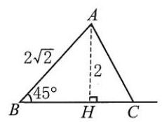

(第 182 题)

181. B 提示: $\frac{a}{\sin A} = \frac{b}{\sin B},\sin B = \frac{b\sin A}{a} = \frac{\sqrt{3} \cdot  \frac{1}{2}}{1} = \frac{\sqrt{3}}{2}, B = \frac{\pi }{3}$ 或 $\frac{2\pi }{3}$ 都符合条件.

182. D 提示: 如图, ${AH} = 2\sqrt{2}\sin \frac{\pi }{4} = 2, b = {AC} = \frac{4\sqrt{3}}{3},\sin \angle {ACB} = \frac{2}{\frac{4\sqrt{3}}{3}} = \frac{\sqrt{3}}{2}$ .

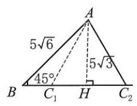

(第 183 题)

$\therefore \angle {ACB} = \frac{\pi }{3}$ 或 $\frac{2\pi }{3},\angle {BAC} = \frac{\pi }{12}$ 或 $\frac{5\pi }{12}$ .

183. $\mathrm{D}$ 提示: 如图, ${AH} = 5\sqrt{6}\sin \frac{\pi }{4} = 5\sqrt{3}, b = {AC} = {10},\sin \angle {ACH} = \frac{5\sqrt{3}}{10} = \frac{\sqrt{3}}{2}$ .

$\therefore \angle {ACH} = \frac{\pi }{3},\angle {ACB} = \frac{\pi }{3}$ 或 $\frac{2\pi }{3},{CH} = 5,{AH} = {BH} = 5\sqrt{3}$ .

${BC} = {AH} + {CH} = 5\left( {\sqrt{3} + 1}\right)$ 或 ${BC} = {BH} - {CH} = 5\left( {\sqrt{3} - 1}\right) .$

184. C 提示: $\frac{a}{\sin A} = \frac{b}{\sin B} = \frac{c}{\sin C} = {2R}$ ,代入,得 ${a}^{2} = {b}^{2} + {bc} + {c}^{2}, - {bc} = {b}^{2} + {c}^{2} - {a}^{2}$ .

$\therefore \;\cos A = \frac{{b}^{2} + {c}^{2} - {a}^{2}}{2bc} =  - \frac{1}{2},\;\therefore \;A = \frac{2\pi }{3}$ .

185. $\mathrm{B}$ 提示: $2\sqrt{2} - 2 < c < 2\sqrt{2} + 2$ . 由余弦定理,得 $\cos A = \frac{{b}^{2} + {c}^{2} - {a}^{2}}{2bc} = \frac{8 + {c}^{2} - 4}{2 \cdot  2\sqrt{2} \cdot  c}$ .

$\therefore \cos A$ 在 $\left( {2\sqrt{2} - 2,2\sqrt{2} + 2}\right)$ 上的值域是 $\left\lbrack  {\frac{\sqrt{2}}{2},1}\right) ,\therefore A \in  \left( {0,\frac{\pi }{4}}\right\rbrack$ .

186. $\mathrm{D}$ 提示: 代入 $a = {2R}\sin A, b = {2R}\sin B$ ,得 $\sin A\cos A = \sin B\cos B$ ,即 $\sin {2A} = \sin {2B}$ . 由 ${2A},{2B} \in  \left( {0,{2\pi }}\right)$ ,得 ${2A} = {2B}$ 或 ${2A} = \pi  - {2B}$ ,即 $A = B$ 或 $A + B = \frac{\pi }{2}$ . $\bigtriangleup {ABC}$ 为等腰三角形或直角三角形.

187. $\mathrm{D}$ 提示: $b = \sqrt{{c}^{2} - {a}^{2}} = 5,\tan B = \frac{b}{a} = \frac{5}{2}$ .

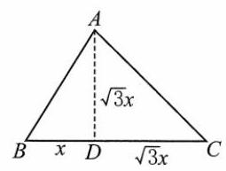

(第 190 题)

188. B 提示: ${S}_{\bigtriangleup {ABC}} = \frac{1}{2}{ab}\sin C = \frac{1}{2} \cdot  4 \cdot  a = 8\sqrt{3}, a = 4\sqrt{3}.\;\therefore \;B = \frac{\pi }{6}$ .

189. $\mathrm{B}$ 提示: 由 $C = \frac{\pi }{2}$ ,得 $\cos A = \frac{b}{c},\cos B = \frac{a}{c}$ . 原式 $= {a}^{3} \cdot  \frac{b}{c} + {b}^{3} \cdot  \frac{a}{c} = {abc}$ .

190. C 提示: 如图,设 ${BD} = x$ ,则 ${AD} = \tan {60}^{ \circ  }x = \sqrt{3}x.{DC} = {AD} = \sqrt{3}x$ . $x + \sqrt{3}x = {BC} = 8, x = \frac{8}{\sqrt{3} + 1} = 4\left( {\sqrt{3} - 1}\right) ,{AD} = \sqrt{3}x = 4\left( {3 - \sqrt{3}}\right) .$

191. C 提示: $r = \frac{2{S}_{\bigtriangleup {ABC}}}{{C}_{\bigtriangleup {ABC}}} = \frac{ab}{a + b + 2}$ .

$\because {a}^{2} + {b}^{2} = {c}^{2} = 4$ ,令 $a + b = t$ ,则 ${ab} = \frac{{t}^{2} - 4}{2},\;\therefore r = \frac{\frac{{t}^{2} - 4}{2}}{t + 2} = \frac{t - 2}{2}$ .

$\because c < a + b \leq  2\sqrt{\frac{{a}^{2} + {b}^{2}}{2}},\;\therefore 2 < t \leq  2\sqrt{2}$ . 故 $0 < r = \frac{t - 2}{2} \leq  \sqrt{2} - 1$ .

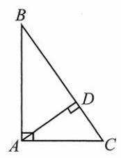

(第 192 题)

192. C 提示: 如图,选项 A: 由射影定理,得 ${CD} \cdot  {CB} = C{A}^{2}$ ,

${CD} = \frac{C{A}^{2}}{CB},\;\therefore \sqrt{\frac{CD}{BC}} = \frac{CA}{BC} = \sin B;$

选项 B: 由射影定理,得 ${BD} \cdot  {BC} = A{B}^{2},{BD} = \frac{A{B}^{2}}{BC}$ .

$\therefore \sqrt{\frac{BD}{BC}} = \frac{AB}{BC} = \cos B$ ;

选项 C: $\sqrt{\frac{BD}{CD}} = \sqrt{\frac{A{B}^{2}}{{BC} \cdot  {CD}}} = \frac{AB}{AC} = \cot B$ ;

选项 D: $\sqrt{\frac{{BD} \cdot  {BC}}{{AC}^{2}}} = \sqrt{\frac{{AB}^{2}}{{AC}^{2}}} = \frac{AB}{AC} = \cot B$ .

193. A

194. B 提示: 由正弦定理,得 $a : b : c = \sin A : \sin B : \sin C = 3 : 5 : 7$ . 设 $a = {3k}, b = {5k}, c = {7k}, k > 0$ ,则最大内角为最长边所对应的角,即 $\cos C = \frac{{a}^{2} + {b}^{2} - {c}^{2}}{2ab} = \frac{9{k}^{2} + {25}{k}^{2} - {49}{k}^{2}}{2 \cdot  {3k} \cdot  {5k}} =  - \frac{1}{2}, C = \frac{2\pi }{3}$ .

195. $\mathrm{B}$ 提示: ${S}_{\bigtriangleup {ABC}} = \frac{1}{2}{bc}\sin A = \frac{\sqrt{3}}{4}c = \sqrt{3}, c = 4$ . 由余弦定理,得 ${a}^{2} = {1}^{2} + {4}^{2} - 2 \times  1 \times  4 \times  \frac{1}{2} = {13}$ ,

$\therefore a = \sqrt{13}$ . 由正弦定理及等比性质,得 $\frac{a + b + c}{\sin A + \sin B + \sin C} = \frac{a}{\sin A} = \frac{\sqrt{13}}{\frac{\sqrt{3}}{2}} = \frac{2\sqrt{39}}{3}$ .

196. D 提示: 由 $a + b > c$ ,得 $a = c,\bigtriangleup {ABC}$ 是等腰三角形.

197. C 提示: $\sin A > 0,\therefore \cos B < 0, B > \frac{\pi }{2}$ .

198. A 提示: 由正弦定理,得 $\frac{\sin A}{\sin C} = \frac{a}{c}$ . 由余弦定理,得 $\cos B = \frac{{a}^{2} + {c}^{2} - {b}^{2}}{2ac} = \frac{\sin A}{2\sin C} = \frac{a}{2c},\therefore {b}^{2} = {c}^{2}, b = c$ .

199. A 提示: ${DE} = {AC} \cdot  \sin \alpha  + {BC} \cdot  \sin \beta  = {90} \cdot  \sin {50}^{ \circ  } + {150} \cdot  \sin {70}^{ \circ  } \approx  {210}\left( \mathrm{\;{mm}}\right)$ .

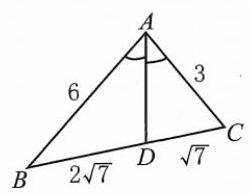

(第 200 题)

200. A 提示: 如图,分别对 $\bigtriangleup {BAD}$ 和 $\bigtriangleup {CAD}$ 用余弦定理,得

$$
\left\{  \begin{array}{l} \cos \angle {BAD} = \frac{{36} + A{D}^{2} - {28}}{2 \cdot  6 \cdot  {AD}} = \frac{1}{2}, \\  \cos \angle {CAD} = \frac{9 + A{D}^{2} - 7}{2 \cdot  3 \cdot  {AD}} = \frac{1}{2}. \end{array}\right.
$$

即 $\left\{  {\begin{array}{l} A{D}^{2} - {6AD} + 8 = 0, \\  A{D}^{2} - {3AD} + 2 = 0. \end{array}\;\therefore {AD} = 2}\right.$ .

201. $\mathrm{B}$ 提示: $a + a + 1 > a + 2, a > 1$ . 最大的内角 $\theta$ 为 $\left( {a + 2}\right)$ 所对应的内角.

$\cos \theta  = \frac{{a}^{2} + {\left( a + 1\right) }^{2} - {\left( a + 2\right) }^{2}}{{2a}\left( {a + 1}\right) } < 0,{a}^{2} - {2a} - 3 < 0, a \in  \left( {1,3}\right)$ .

202. (1) $\frac{5\pi }{12}$ 提示: $\cos A = \frac{{b}^{2} + {c}^{2} - {a}^{2}}{2bc} = \frac{4 + 6 - {\left( \sqrt{3} + 1\right) }^{2}}{2 \cdot  2 \cdot  \sqrt{6}} = \frac{\sqrt{6} - \sqrt{2}}{4},\therefore A = \frac{5\pi }{12}$ .

(2) $\frac{\pi }{6}$ 提示:记 $a = \sqrt{2}k, b = \left( {1 + \sqrt{3}}\right) k, c = {2k}, k > 0$ .

则 $\cos A = \frac{{b}^{2} + {c}^{2} - {a}^{2}}{2bc} = \frac{{\left( 1 + \sqrt{3}\right) }^{2}{k}^{2} + 4{k}^{2} - 2{k}^{2}}{2\left( {1 + \sqrt{3}}\right) k \cdot  {2k}} = \frac{6 + 2\sqrt{3}}{4\left( {1 + \sqrt{3}}\right) } = \frac{\sqrt{3}}{2}, A = \frac{\pi }{6}$ .

(3) $\frac{2\pi }{3}$ 提示:设三条边长分别为 ${3k},{4k},\sqrt{37}k, k > 0$ ，则最大内角 $\theta$ 为 $\sqrt{37}k$ 所对应的内角，

$$
\cos \theta  = \frac{9{k}^{2} + {16}{k}^{2} - {37}{k}^{2}}{2 \cdot  {3k} \cdot  {4k}} =  - \frac{1}{2},\theta  = \frac{2\pi }{3}.
$$

(4) $\frac{\pi }{3}$ 提示: ${\left( b + c\right) }^{2} - {a}^{2} = {3bc},{b}^{2} + {c}^{2} - {a}^{2} = {bc}$ ， $\therefore \;\cos A = \frac{{b}^{2} + {c}^{2} - {a}^{2}}{2bc} = \frac{1}{2}$ ， $A = \frac{\pi }{3}$ .

(5) $\frac{\pi }{4}$ 提示: ${\left( {a}^{2} + {b}^{2} - {c}^{2}\right) }^{2} = 2{a}^{2}{b}^{2},{a}^{2} + {b}^{2} - {c}^{2} = \sqrt{2}{ab},\therefore \cos C = \frac{{a}^{2} + {b}^{2} - {c}^{2}}{2ab} = \frac{\sqrt{2}}{2}, C = \frac{\pi }{4}$ .

(6) $\frac{\pi }{6}\;$ 提示: $S = \frac{2bc}{4\sqrt{3}} \cdot  \frac{{b}^{2} + {c}^{2} - {a}^{2}}{2bc} = \frac{1}{2}{bc} \cdot  \frac{\sqrt{3}}{3}\cos A$ . 由 $S = \frac{1}{2}{bc}\sin A$ ,得 $\frac{\sqrt{3}}{3}\cos A = \sin A$ , $\tan A = \frac{\sqrt{3}}{3},\;\therefore \;A = \frac{\pi }{6}$ .

203. ( 1 )6 或 12 提示: $\cos A = \frac{{b}^{2} + {c}^{2} - {a}^{2}}{2bc} = \frac{{108} + {c}^{2} - {36}}{2 \cdot  6\sqrt{3} \cdot  c} = \frac{\sqrt{3}}{2}$ ，解得 ${c}_{1} = 6$ ， ${c}_{2} = {12}$ .

(2) $2\sqrt{3} \pm  \frac{3}{2}$ ，提示: $\cos {30}^{ \circ  } = \frac{{16} + {c}^{2} - \frac{25}{4}}{2 \cdot  4 \cdot  c} = \frac{\sqrt{3}}{2}$ ，解得 $c = 2\sqrt{3} \pm  \frac{3}{2}$ .

(3) $\sqrt{6}$ 或 $\sqrt{2}$ 提示: $\cos {45}^{ \circ  } = \frac{{\left( \sqrt{3} + 1\right) }^{2} + {c}^{2} - 4}{\left( {2\sqrt{3} + 2}\right) c} = \frac{\sqrt{2}}{2}$ ， $\therefore {c}_{1} = \sqrt{6},{c}_{2} = \sqrt{2}$ .

(4)4 提示: ${3b} - 3 = {2c} + 4, b = \frac{{2c} + 7}{3}.\cos A = \frac{{b}^{2} + {c}^{2} - {a}^{2}}{2bc} = \frac{1}{2},{b}^{2} + {c}^{2} - {bc} = {a}^{2} = {21},\frac{{\left( 2c + 7\right) }^{2}}{9} + {c}^{2} - \frac{c\left( {{2c} + 7}\right) }{3} = {21}$ , ${c}_{1} = 4,{c}_{2} =  - 5$ (舍去).

(5) $\frac{10}{3}\frac{16}{3}$ 提示: 设 $c = b = x, a = x + 2,\cos B = \frac{{a}^{2} + {c}^{2} - {b}^{2}}{2ac} = \frac{{\left( x + 2\right) }^{2}}{2\left( {x + 2}\right) x} = \frac{4}{5}$ ,

$\therefore x = \frac{10}{3},{AB} = c = x = \frac{10}{3},{BC} = x + 2 = \frac{16}{3}$ .

(6) $4 + \sqrt{11}$ 或 $4 - \sqrt{11}4 - \sqrt{11}$ 或 $4 + \sqrt{11}$ 提示: $\cos C = \frac{{b}^{2} + {a}^{2} - {c}^{2}}{2ba} = \frac{{b}^{2} + {a}^{2} - {49}}{2ba} = \frac{1}{2}$ ,

${b}^{2} + {a}^{2} - {ab} = {49}$ ,把 $b = 8 - a$ 代入,得 ${a}^{2} - {8a} + 5 = 0.a = 4 \pm  \sqrt{11}$ .

$\therefore \left\{  {\begin{array}{l} {a}_{1} = 4 + \sqrt{11}, \\  {b}_{1} = 4 - \sqrt{11}. \end{array}\left\{  \begin{array}{l} {a}_{1} = 4 - \sqrt{11}, \\  {b}_{1} = 4 + \sqrt{11}. \end{array}\right. }\right.$

(7) $\sqrt{7} + \sqrt{3}$ 或 $\sqrt{7} - \sqrt{3}\;\sqrt{7} - \sqrt{3}$ 或 $\sqrt{7} + \sqrt{3}\;$ 提示: $S = \frac{1}{2}{ac}\sin B = \frac{\sqrt{3}}{4}{ac} = \sqrt{3},\therefore {ac} = 4$ .

$\cos B = \frac{{a}^{2} + {c}^{2} - {b}^{2}}{2ac} = \frac{{a}^{2} + {c}^{2} - {16}}{8} = \frac{1}{2}$ ,即 ${a}^{2} + {c}^{2} = {20}$ ,解得 $\left\{  \begin{array}{l} {a}_{1} = \sqrt{7} + \sqrt{3}, \\  {c}_{1} = \sqrt{7} - \sqrt{3}, \end{array}\right. \left\{  \begin{array}{l} {a}_{1} = \sqrt{7} - \sqrt{3}, \\  {c}_{1} = \sqrt{7} + \sqrt{3}. \end{array}\right.$

204. ( 1 ) $\frac{\pi }{6}$ 或 $\frac{5\pi }{6}$ 提示:由正弦定理 $b = {2R}\sin B, c = {2R}\sin C$ ，得 $\sin C = \frac{1}{2}$ . $\therefore C = \frac{\pi }{6}$ 或 $\frac{5\pi }{6}$ .

(2) $\frac{\pi }{6}$ 提示:由正弦定理 $\frac{a}{\sin A} = \frac{b}{\sin B}$ ，得 $\sin A = \frac{a\sin B}{b} = \frac{1}{2}$ . 由 $\sin B > \frac{1}{2}$ ，得 $B > \frac{\pi }{6}$ ， $\therefore A = \frac{\pi }{6}$ .

(3) $\frac{\pi }{12}$ 或 $\frac{5\pi }{12}$ 提示: $\cos A = \frac{{b}^{2} + {c}^{2} - {a}^{2}}{2bc} = \frac{{12} + {c}^{2} - 8}{4\sqrt{3}c} = \frac{\sqrt{2}}{2}$ ，解得 $c = \sqrt{6} \pm  \sqrt{2}$ .

$\because \frac{a}{\sin A} = \frac{c}{\sin C} = \frac{2\sqrt{2}}{\frac{\sqrt{2}}{2}} = 4,\sin C = \frac{c}{4} = \frac{\sqrt{6} \pm  \sqrt{2}}{4},\therefore C = \frac{\pi }{12}$ 或 $\frac{5\pi }{12}$ .

205. (1) ${18}\mathrm{\;{cm}}$ 提示: $\frac{a}{\sin \frac{\pi }{3}} = {2R} = {{12}\sqrt{3}}, a = {{12}\sqrt{3}} \cdot  \frac{\sqrt{3}}{2} = {18}$ .

(2)2 提示: $C = {180}^{ \circ  } - {105}^{ \circ  } - {45}^{ \circ  } = {30}^{ \circ  },\frac{b}{\sin B} = \frac{c}{\sin C} = \frac{\sqrt{2}}{\sin {30}^{ \circ  }} = 2\sqrt{2}, b = 2\sqrt{2} \cdot  \frac{\sqrt{2}}{2} = 2$ .

(3)4 或 $4\sqrt{3}$ 提示: $\frac{{b}^{2} + {c}^{2} - {a}^{2}}{2bc} = \frac{b}{2c}$ ， $\therefore a = c$ . 由 $\sin B = \frac{\sqrt{3}}{2}$ ，得 $B = \frac{\pi }{3}$ 或 $\frac{2\pi }{3}$ .

① $B = \frac{\pi }{3}, A = C = \frac{\pi }{3}, a = b = 4\sqrt{3};$ ② $B = \frac{2\pi }{3}, A = C = \frac{\pi }{6} \cdot  \frac{a}{\sin A} = \frac{b}{\frac{\sqrt{3}}{2}} = 8, a = 4$ .

$\therefore a = 4$ 或 $4\sqrt{3}$ .

206. (1) $\frac{5\pi }{12}$ 提示:由 $\tan C = \sqrt{3}$ ，得 $C = \frac{\pi }{3}$ . 由 $\sin B = \frac{\sqrt{2}}{2}$ ， $B < \frac{2\pi }{3}$ ，得 $\therefore B = \frac{\pi }{4}$ .

$\therefore A = \pi  - \frac{\pi }{3} - \frac{\pi }{4} = \frac{5\pi }{12}$ .

(2) $4 + \sqrt{3}\;2\sqrt{3}$ 提示:如图①， ${BD} = \cot {60}^{ \circ  } \cdot  3 = \sqrt{3},{DC} = \sqrt{{5}^{2} - {3}^{2}} = 4$ ，

${BC} = 4 + \sqrt{3},{AB} = \frac{3}{{\sin }^{{60}^{ \circ  }}} = 2\sqrt{3}.$

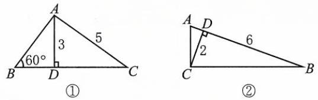

(第 206 题)

(3) $\frac{3\sqrt{10}}{10}$ 提示:如图②， $\angle A = \angle {DCB},{BC} = \sqrt{{2}^{2} + {6}^{2}} = 2\sqrt{10}$ .

$\sin A = \sin \angle {DCB} = \frac{3}{\sqrt{10}} = \frac{3\sqrt{10}}{10}$ .

207. (1) $\frac{2\sqrt{3}}{3}$ 提示: ${2B} = A + C = \pi  - B$ ，则 $B = \frac{\pi }{3}$ . 又 $b = {AC} = 2,{2R} = \frac{b}{\sin B} = \frac{2}{\frac{\sqrt{3}}{2}} = \frac{4\sqrt{3}}{3}$ ，则 $R = \frac{2\sqrt{3}}{3}$ .

(2)1 提示: $S = \frac{1}{2}{ab}\sin C = \frac{1}{4}$ ， ${ab}\sin C = \frac{1}{2}$ ， ${abc} = {ab}\sin C \cdot  \frac{c}{\sin C} = \frac{1}{2} \cdot  {2R} = 1$ .

(3)2 提示:由正弦定理和等比性质，得 $\frac{a}{\sin A} = \frac{a + b + c}{\sin A + \sin B + \sin C} = 2$ .

(4) $7 : 5 : 3$ 提示: 设 $\left\{  \begin{array}{l} b + c = {4k}, \\  c + a = {5k}, \\  a + b = {6k}, k > 0, \end{array}\right.$ 解得 $\left\{  \begin{array}{l} a = \frac{7k}{2}, \\  b = \frac{5k}{2}, \\  c = \frac{3k}{2}. \end{array}\right.$

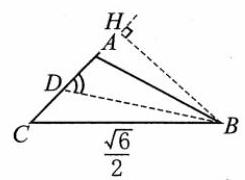

①

$\therefore \;\sin A : \sin B : \sin C = a : b : c = 7 : 5 : 3$ .

(5)1 提示:如图①，过点 $B$ 作 ${BH}\bot {AC}$ 的延长线于点 $H$ ， $\angle {ABD} = \angle {CBD} = {15}^{ \circ  }$ ， $\angle C = {45}^{ \circ  }$ .

$\therefore {BH} = \frac{\sqrt{6}}{2} \cdot  \sin {45}^{ \circ  } = \frac{\sqrt{3}}{2},\;\therefore {BD} = \frac{\sqrt{3}}{2} \div  \sin {60}^{ \circ  } = 1.$

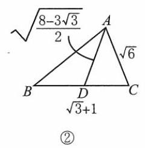

(第 207 题)

(6) $\frac{\pi }{3}$ 提示: 如图②,在 $\bigtriangleup  {ACD}$ 中, $\cos C = \frac{A{C}^{2} + \frac{1}{4}B{C}^{2} - A{D}^{2}}{2 \cdot  {AC} \cdot  \frac{1}{2}{BC}}$ .

在 $\bigtriangleup {ABC}$ 中, $\cos C = \frac{A{C}^{2} + B{C}^{2} - A{B}^{2}}{2 \cdot  {AC} \cdot  {BC}} = \frac{A{C}^{2} + \frac{1}{4}B{C}^{2} - A{D}^{2}}{2 \cdot  {AC} \cdot  \frac{1}{2}{BC}}$ ,

${2A}{C}^{2} + \frac{1}{2}B{C}^{2} - {2A}{D}^{2} = A{C}^{2} + B{C}^{2} - A{B}^{2},$

$A{C}^{2} - \frac{1}{2}B{C}^{2} - {2A}{D}^{2} + A{B}^{2} = 0.$

$6 - \frac{1}{2} \cdot  \left( {4 + 2\sqrt{3}}\right)  - 2 \cdot  \frac{8 - 3\sqrt{3}}{2} + A{B}^{2} = 0, A{B}^{2} = 4 - 2\sqrt{3},{AB} = \sqrt{3} - 1.$

$\therefore \;\cos B = \frac{A{B}^{2} + B{C}^{2} - A{C}^{2}}{2 \cdot  {AB} \cdot  {BC}} = \frac{{\left( \sqrt{3} - 1\right) }^{2} + {\left( \sqrt{3} + 1\right) }^{2} - 6}{2\left( {\sqrt{3} - 1}\right) \left( {\sqrt{3} + 1}\right) } = \frac{1}{2}$ .

$\therefore B = \frac{\pi }{3}$ .

208. (1) 钝角 提示: $a : b : c = \sin A : \sin B : \sin C = 2 : 3 : 4$ . 设 $a = {2k}, b = {3k}, c = {4k}, k > 0$ , 则最大的内角为 $C,\cos C = \frac{{a}^{2} + {b}^{2} - {c}^{2}}{2ab} = \frac{4{k}^{2} + 9{k}^{2} - {16}{k}^{2}}{2 \cdot  {2k} \cdot  {3k}} =  - \frac{1}{4} < 0,\therefore C > \frac{\pi }{2}$ .

$\therefore \bigtriangleup {ABC}$ 是钝角三角形.

(2)直角 提示: ${x}_{1} + {x}_{2} =  - \cos B$ ， ${x}_{1}{x}_{2} =  - \frac{a}{c}$ ，

$\therefore \;\cos B = \frac{a}{c} = \frac{{a}^{2} + {c}^{2} - {b}^{2}}{2ca},{a}^{2} + {c}^{2} - {b}^{2} = 2{a}^{2}$ ,

$\therefore {a}^{2} + {b}^{2} = {c}^{2}$ ,直角三角形.

(3) 等腰 提示: $b = {2R}\sin B, c = {2R}\sin C,{\sin }^{2}B = {\sin }^{2}C,\sin B = \sin C,\therefore B = C, b = c$ .

(4)等腰或直角 提示: $a \cdot  \frac{{b}^{2} + {c}^{2} - {a}^{2}}{2bc} = b \cdot  \frac{{a}^{2} + {c}^{2} - {b}^{2}}{2ca}$ ， 解得 $a = b$ 或 ${a}^{2} + {b}^{2} = {c}^{2}$ .

$\therefore \bigtriangleup {ABC}$ 是等腰三角形或直角三角形.

(5) 等边 提示: $\frac{\sin A}{\sin B} = 2\cos C,\frac{a}{b} = \frac{{a}^{2} + {b}^{2} - {c}^{2}}{ab},\therefore {b}^{2} = {c}^{2}, b = c$ . $\because \frac{a}{{2b} - a} = 1,\;\therefore a = b,\;\therefore a = b = c$ ,即等边三角形.

(6) 等腰或直角 提示: $\cos B = \frac{{a}^{2} + {c}^{2} - {b}^{2}}{2ca} = \frac{\sqrt{3}}{2}$ .

整理,得 ${a}^{2} + {150}^{2} - {\left( {50}\sqrt{3}\right) }^{2} = {150}\sqrt{3}a$ ,解得 ${a}_{1} = {100}\sqrt{3},{a}_{2} = {50}\sqrt{3}$ .

当 $a = {50}\sqrt{3}$ 时, $a = b$ ,等腰三角形; 当 $a = {100}\sqrt{3}$ 时, ${b}^{2} + {c}^{2} = {a}^{2}$ 为直角三角形.

(7) 等腰直角 提示: $c = a\sin \left( {{90}^{ \circ  } - B}\right)  = a\cos B = a \cdot  \frac{{a}^{2} + {c}^{2} - {b}^{2}}{2ca} = \frac{{a}^{2} + {c}^{2} - {b}^{2}}{2c}$ ,

${b}^{2} + {c}^{2} = {a}^{2},\;\therefore \;A = \frac{\pi }{2}.$

由 $b = a\sin C$ ,得 $\sin B = \sin A\sin C.\;\because \sin A = 1,\therefore \sin B = \sin C, b = c$ .

$\therefore B = C = \frac{\pi }{4},\therefore A = \frac{\pi }{2}.\bigtriangleup {ABC}$ 是等腰直角三角形.

(8) 钝角 提示: $\cos C = \frac{{a}^{2} + {b}^{2} - {c}^{2}}{2ab} = \frac{4 - 2\sqrt{3} + \frac{3}{2} - {c}^{2}}{2\left( {\sqrt{3} - 1}\right)  \cdot  \frac{\sqrt{6}}{2}} = \frac{\sqrt{2}}{2}$ ,解得 ${c}^{2} = \frac{5}{2} - \sqrt{3}$ .

$\because {a}^{2} = 4 - 2\sqrt{3},{b}^{2} = \frac{3}{2},\;\therefore {a}^{2} + {c}^{2} - {b}^{2} = 5 - 3\sqrt{3} < 0$ ,

$\therefore \;\cos B < 0, B > \frac{\pi }{2}.\;\therefore \bigtriangleup {ABC}$ 是钝角三角形.

209. (1) $\cos B = \frac{{a}^{2} + {c}^{2} - {b}^{2}}{2ac} = \frac{{64} + {25} - {49}}{2 \cdot  8 \cdot  5} = \frac{1}{2},\;\therefore \;B = \frac{\pi }{3}$ ,

$\therefore \;S = \frac{1}{2}{ac}\sin B = \frac{1}{2} \cdot  {40} \cdot  \frac{\sqrt{3}}{2} = {10}\sqrt{3}.$

(2) $\cos A = \frac{{b}^{2} + {c}^{2} - {a}^{2}}{2bc} = \frac{{48} + {c}^{2} - {144}}{2 \cdot  4\sqrt{3} \cdot  c} =  - \frac{1}{2}$ ，解得 $c = 4\sqrt{3}$ ， $\therefore B = C = \frac{\pi }{6}$ .

$\therefore S = \frac{1}{2}{bc}\sin A = \frac{1}{2} \cdot  4\sqrt{3} \cdot  4\sqrt{3} \cdot  \frac{\sqrt{3}}{2} = {12}\sqrt{3}$ .

(3)最大的角是 $A,\cos A = \frac{{b}^{2} + {c}^{2} - {a}^{2}}{2bc} = \frac{9 + {25} - {49}}{2 \cdot  3 \cdot  5} =  - \frac{1}{2},\therefore A = \frac{2\pi }{3}$ .

由 $\frac{a}{\sin A} = \frac{c}{\sin C}$ ,得 $\sin C = \frac{c}{a}\sin A = \frac{5}{7} \cdot  \frac{\sqrt{3}}{2} = \frac{5\sqrt{3}}{14}$ .

(4) $\cos B = \frac{{a}^{2} + {c}^{2} - {b}^{2}}{2ac} = \frac{{a}^{2} + 1 - 2}{{2a} \cdot  1} = \frac{\sqrt{2}}{2}$ ,由 $a > 0$ ,得 $a = \frac{\sqrt{2} + \sqrt{6}}{2}$ .

由 $\frac{b}{\sin B} = \frac{c}{\sin C}$ ,得 $\frac{\sqrt{2}}{\frac{\sqrt{2}}{2}} = \frac{1}{\sin C},\sin C = \frac{1}{2}.\;\because C < \frac{3\pi }{4},\;\therefore \;C = \frac{\pi }{6}$ .

(5) $\because A = \frac{\pi }{4}, B = \frac{\pi }{3}$ ，

$\therefore \;\sin C = \sin \left( {\frac{\pi }{4} + \frac{\pi }{3}}\right)  = \frac{\sqrt{2}}{2} \cdot  \frac{1}{2} + \frac{\sqrt{2}}{2} \cdot  \frac{\sqrt{3}}{2} = \frac{\sqrt{6} + \sqrt{2}}{4}$ .

$\because \frac{b}{\sin B} = \frac{c}{\sin C} = \frac{a}{\sin A} = \frac{10}{\frac{\sqrt{2}}{2}} = {10}\sqrt{2}$ ,

$\therefore b = {10}\sqrt{2} \cdot  \frac{\sqrt{3}}{2} = 5\sqrt{6}, c = \frac{\sqrt{6} + \sqrt{2}}{4} \cdot  {10}\sqrt{2} = 5\sqrt{3} + 5$ .

(6) ${c}^{2} = {a}^{2} + {b}^{2} - {2ab}\cos C = {196}$ ,解得 $c = {14}$ .

$\therefore \;\sin A = \frac{a}{c}\sin C = \frac{10}{14} \cdot  \frac{\sqrt{3}}{2} = \frac{5\sqrt{3}}{14}$ .

(7)不妨设 $A = \frac{\pi }{3}, a = 7$ ，则 $S = \frac{1}{2}{bc}\sin A = \frac{\sqrt{3}}{4}{bc} = {{10}\sqrt{3}}$ ，即 ${bc} = {40}$ .

$\therefore \;\cos A = \frac{{b}^{2} + {c}^{2} - {a}^{2}}{2bc} = \frac{{b}^{2} + {c}^{2} - {49}}{80} = \frac{1}{2},{b}^{2} + {c}^{2} = {89}$ .

得 $b = 5, c = 8$ 或 $b = 8, c = 5,\therefore$ 其他两边长分别为 5 和 8 .

(8) 设三边长分别为 ${2k} - 2,{2k},{2k} + 2$ .

由 $\left( {{2k} - 2}\right)  + {2k} > {2k} + 2$ ,得 $k > 2,\therefore k \geq  3, k \in  \mathbf{N}$ .

最大角 $\theta$ 的余弦 $\cos \theta  = \frac{{\left( 2k - 2\right) }^{2} + 4{k}^{2} - {\left( 2k + 2\right) }^{2}}{2\left( {{2k} - 2}\right)  \cdot  {2k}} < 0$ ,解得 $0 < k < 4$ .

$\because k \geq  3,\;\therefore k = 3$ .

$\therefore$ 三边长分别为4,6,8.

210. (1) $\cos A = \frac{{b}^{2} + {c}^{2} - {a}^{2}}{2bc} = \frac{{\left( b + c\right) }^{2} - {2bc} - 1}{2bc} = \frac{3}{2bc} - 1 = \frac{1}{2}$ . $\therefore {bc} = 1$ .

$\because b + c = 2,\therefore b = c = 1$ ,

$\therefore \bigtriangleup {ABC}$ 为等边三角形.

(2) $\left( {b - c}\right) \left( {1 - {\sin }^{2}A}\right)  = b\left( {1 - {\sin }^{2}B}\right)  - c\left( {1 - {\sin }^{2}C}\right)$ ,

$\therefore \;\left( {b - c}\right) {\sin }^{2}A = b{\sin }^{2}B - c{\sin }^{2}C$ .

$\because \;\sin A = \frac{a}{2R},\sin B = \frac{b}{2R},\sin C = \frac{c}{2R}$ ,

$\therefore \;\left( {b - c}\right) {a}^{2} = {b}^{3} - {c}^{3} = \left( {b - c}\right) \left( {{b}^{2} + {bc} + {c}^{2}}\right) .$

①若 $b = c$ ，则为等腰三角形.

②若 $b \neq  c$ ，则 ${a}^{2} = {b}^{2} + {bc} + {c}^{2}$ ， $\therefore \cos A = \frac{{b}^{2} + {c}^{2} - {a}^{2}}{2bc} =  - \frac{1}{2}, A = \frac{2\pi }{3}$ .

$\therefore b = c$ 或 $A = \frac{2\pi }{3}\therefore \bigtriangleup {ABC}$ 为等腰三角形或钝角三角形.

(3) $\because a = {2R}\sin A, b = {2R}\sin B,$

$\therefore \tan \frac{A - B}{2} = \frac{a - b}{a + b} = \frac{\sin A - \sin B}{\sin A + \sin B} = \frac{\cos \frac{A + B}{2}\sin \frac{A - B}{2}}{\sin \frac{A + B}{2}\cos \frac{A - B}{2}} = \tan \frac{A - B}{2} \cdot  \cot \frac{A + B}{2}$ ,

$\therefore \;\tan \frac{A - B}{2}\left( {\cot \frac{A + B}{2} - 1}\right)  = 0$ .

① $\tan \frac{A - B}{2} = 0$ ， $\bigtriangleup  {ABC}$ 为等腰三角形.

② $\cot \frac{A + B}{2} = 1,\;\because \;0 < \frac{A + B}{2} < \frac{\pi }{2},\;\therefore \;\frac{A + B}{2} = \frac{\pi }{4}, A + B = C = \frac{\pi }{2}$ .

$\therefore \bigtriangleup {ABC}$ 是等腰三角形或是 $C = \frac{\pi }{2}$ 的直角三角形.

211. (1) $\because \sin A = \frac{a}{2R},\sin B = \frac{b}{2R},\sin C = \frac{c}{2R}$ ,

$\therefore$ 左边 $= \frac{1}{2R}\left( {{ab} - {ac} + {bc} - {ba} + {ca} - {cb}}\right)  = 0 =$ 右边.

(2) $\because A + B = \pi  - C,\therefore \cos \left( {A + B}\right)  =  - \cos C.\;\because \sin A = \frac{a}{2R},\sin B = \frac{b}{2R},\sin C = \frac{c}{2R}$ ,

$\therefore$ 左边 $= {\sin }^{2}A + {\sin }^{2}B + {\cos }^{2}C + 2\sin A\sin B\left( {-\cos C}\right)$

$= 1 + {\sin }^{2}A + {\sin }^{2}B - {\sin }^{2}C - 2\sin A\sin B\cos C$

$= 1 + \frac{1}{4{R}^{2}}\left( {{a}^{2} + {b}^{2} - {c}^{2} - {2ab} \cdot  \frac{{a}^{2} + {b}^{2} - {c}^{2}}{2ab}}\right)  = 1 =$ 右边.

(3) $\because {\sin }^{2}A + {\cos }^{2}A = 1,{\sin }^{2}B + {\cos }^{2}B = 1,{\sin }^{2}C + {\cos }^{2}C = 1$ ,

$\therefore$ 左边 $= {a}^{2}\left( {{\sin }^{2}C - {\sin }^{2}B}\right)  + {b}^{2}\left( {{\sin }^{2}A - {\sin }^{2}C}\right)  + {c}^{2}\left( {{\sin }^{2}B - {\sin }^{2}A}\right)$

$= \frac{1}{4{R}^{2}}\left\lbrack  {{a}^{2}\left( {{c}^{2} - {b}^{2}}\right)  + {b}^{2}\left( {{a}^{2} - {c}^{2}}\right)  + {c}^{2}\left( {{b}^{2} - {a}^{2}}\right) }\right\rbrack   = 0 =$ 右边.

(4) $\because \cos A = \frac{{b}^{2} + {c}^{2} - {a}^{2}}{2bc},\cos B = \frac{{a}^{2} + {c}^{2} - {b}^{2}}{2ac}$ ，

$\therefore \;{a}^{2} - {b}^{2} - {c}^{2} =  - {2bc} \cdot  \cos A,{a}^{2} + {c}^{2} - {b}^{2} = {2ac} \cdot  \cos B$ .

左边 $=  - {2bc} \cdot  \cos A \cdot  \tan A + {2ac} \cdot  \cos B \cdot  \tan B$

$= {2ac} \cdot  \sin B - {2bc} \cdot  \sin A = {2ac} \cdot  \frac{b}{2R} - {2bc} \cdot  \frac{a}{2R} = 0 =$ 右边.

(5) 左边 $= \frac{a - c \cdot  \frac{{a}^{2} + {c}^{2} - {b}^{2}}{2ac}}{b - c \cdot  \frac{{b}^{2} + {c}^{2} - {a}^{2}}{2bc}} = \frac{2{a}^{2}b - b\left( {{a}^{2} + {c}^{2} - {b}^{2}}\right) }{{2a}{b}^{2} - a\left( {{b}^{2} + {c}^{2} - {a}^{2}}\right) } = \frac{{a}^{2}b - b{c}^{2} + {b}^{3}}{a{b}^{2} - a{c}^{2} + {a}^{3}}$

$= \frac{b\left( {{a}^{2} - {c}^{2} + {b}^{2}}\right) }{a\left( {{b}^{2} - {c}^{2} + {a}^{2}}\right) } = \frac{b}{a} = \frac{\sin B}{\sin A} =$ 右边.

212. (1) $\because \left( {1 + \tan A}\right) \left( {1 + \tan B}\right)  = \tan A\tan B + \tan A + \tan B + 1 = 2$ ,

$\therefore \tan A + \tan B = 1 - \tan A\tan B$ .

$\because A, B \in  \left( {0,\pi }\right) ,\therefore$ 若 $\tan A\tan B = 1$ ,则 $\tan A + \tan B = 0$ ,但 $\tan A + \tan B \neq  0$ ,故矛盾.

$\therefore \frac{\tan A + \tan B}{1 - \tan A\tan B} = 1 = \tan \left( {A + B}\right)$ .

$\therefore \;\tan C = \tan \left( {\pi  - A - B}\right)  =  - 1$ .

$\because C \in  \left( {0,\pi }\right) ,\;\therefore C = \frac{3\pi }{4}$ 为定值.

(2)由正弦定理，得 $\frac{a}{\sin A} = \frac{b}{\sin B} = {2R} = 2$ .

${S}_{\bigtriangleup {ABC}} = \frac{1}{2}{ab}\sin C = \frac{\sqrt{2}}{4} \cdot  2\sin A \cdot  2\sin B = \sqrt{2} \cdot  \frac{1}{2}\left\lbrack  {\cos \left( {A - B}\right)  - \cos \left( {A + B}\right) }\right\rbrack$

$= \frac{\sqrt{2}}{2}\left\lbrack  {\cos \left( {A - B}\right)  - \frac{\sqrt{2}}{2}}\right\rbrack   \leq  \frac{\sqrt{2}}{2}\left( {1 - \frac{\sqrt{2}}{2}}\right)  = \frac{\sqrt{2} - 1}{2}.$

等号在 $A = B = \frac{\pi }{8}$ 时取到. $\therefore$ 面积的最大值为 $\frac{\sqrt{2} - 1}{2}$ .

213. (1) 由基本不等式,得

$\sqrt{\left( {a + b - c}\right) \left( {b + c - a}\right) } \leq  \frac{a + b - c + b + c - a}{2} = b,$

$\sqrt{\left( {b + c - a}\right) \left( {c + a - b}\right) } \leq  \frac{b + c - a + c + a - b}{2} = c,$

$\sqrt{\left( {c + a - b}\right) \left( {a + b - c}\right) } \leq  \frac{c + a - b + a + b - c}{2} = a,$

三式累乘即证.

(2)由余弦定理,得

$\frac{\cos A}{a} + \frac{\cos B}{b} + \frac{\cos C}{c} = \frac{1}{2abc}\left( {{a}^{2} + {b}^{2} - {c}^{2} + {b}^{2} + {c}^{2} - {a}^{2} + {c}^{2} + {a}^{2} - {b}^{2}}\right)  = \frac{1}{2abc}\left( {{a}^{2} + {b}^{2} + {c}^{2}}\right) .$

由 ${a}^{2} + {b}^{2} + {c}^{2} \geq  {ab} + {bc} + {ca},\therefore$ 不等式左边成立.

$\because \left| {\cos A}\right|  < 1,\left| {\cos B}\right|  < 1,\left| {\cos C}\right|  < 1,\therefore$ 不等式右边成立.

$\therefore \frac{1}{2}\left( {\frac{1}{a} + \frac{1}{b} + \frac{1}{c}}\right)  \leq  \frac{\cos A}{a} + \frac{\cos B}{b} + \frac{\cos C}{c} < \frac{1}{a} + \frac{1}{b} + \frac{1}{c}.$

(3)由正弦定理，得 $a = {2R}\sin A, b = {2R}\sin B, c = {2R}\sin C$ ，

左边 $= \frac{1}{4{R}^{2}}\left( {\frac{1}{\sin A\sin B} + \frac{1}{\sin B\sin C} + \frac{1}{\sin C\sin A}}\right)  = \frac{1}{4{R}^{2}} \cdot  \frac{\sin A + \sin B + \sin C}{\sin A\sin B\sin C}$

$= \frac{1}{4{R}^{2}} \cdot  \frac{2\sin \frac{A + B}{2}\cos \frac{A - B}{2} + 2\sin \frac{C}{2}\cos \frac{C}{2}}{\sin A\sin B\sin C} = \frac{1}{4{R}^{2}} \cdot  \frac{2\cos \frac{C}{2}\left( {\cos \frac{A - B}{2} + \cos \frac{A + B}{2}}\right) }{\sin A\sin B\sin C}$

$= \frac{1}{4{R}^{2}} \cdot  \frac{4\cos \frac{C}{2}\cos \frac{A}{2}\cos \frac{B}{2}}{\sin A\sin B\sin C} = \frac{1}{8{R}^{2}} \cdot  \frac{1}{\sin \frac{A}{2}\sin \frac{B}{2}\sin \frac{C}{2}}.$

在 $\bigtriangleup {ABC}$ 中, $\frac{C}{2} = \frac{\pi  - \left( {A + B}\right) }{2}$ ,

$\therefore \;\sin \frac{A}{2}\sin \frac{B}{2}\sin \frac{C}{2} = \sin \frac{A}{2}\sin \frac{B}{2}\cos \frac{A + B}{2} = \frac{1}{2}\left( {\cos \frac{A - B}{2} - \cos \frac{A + B}{2}}\right) \cos \frac{A + B}{2}$

$= \frac{1}{2}\left( {-{\cos }^{2}\frac{A + B}{2} + \cos \frac{A - B}{2}\cos \frac{A + B}{2}}\right)$

$\leq  \frac{1}{2}\left( {-{\cos }^{2}\frac{A + B}{2} + \cos \frac{A + B}{2}}\right)  =  - \frac{1}{2}{\left( \cos \frac{A + B}{2} - \frac{1}{2}\right) }^{2} + \frac{1}{8} \leq  \frac{1}{8}.$

等号在 $A = B = \frac{\pi }{3}$ 时取到. $\therefore$ 左边 $\geq  \frac{1}{{R}^{2}}$ .

214. (1) $\because S = \frac{1}{2}{ab}\sin C = {30}\sin C = {15},\therefore \sin C = \frac{1}{2}$ .

由 $\sin A = \cos B = \sin \left( {\frac{\pi }{2} - B}\right)$ ,得

$\text{ ① }A = \frac{\pi }{2} - B + {2k\pi }, k \in  \mathbf{Z}$ ,则 $A + B = \pi  - C = {2k\pi } + \frac{\pi }{2}, C = \frac{\pi }{2}$ ,舍去.

② $A = \pi  - \left( {\frac{\pi }{2} - B}\right)  + {2k\pi }, k \in  \mathbf{Z}, A - B = \frac{\pi }{2} + {2k\pi }$ .

$\because A, B \in  \left( {0,\pi }\right) ,\therefore  - \pi  < A - B < \pi ,\therefore k = 0, A - B = \frac{\pi }{2}$ .

$\therefore \;A > \frac{\pi }{2}, C = \frac{\pi }{6}.\;\therefore \;\left\{  {\begin{array}{l} A - B = \frac{\pi }{2}, \\  A + B = \frac{5\pi }{6}. \end{array}\;\left\{  {\begin{array}{l} A = \frac{2\pi }{3}, \\  B = \frac{\pi }{6}. \end{array}\;\therefore \;A = \frac{2\pi }{3}, B = C = \frac{\pi }{6}.}\right. }\right.$

(2) $\because \left\{  \begin{array}{l} {k}^{2} - 1 > 0, \\  {k}^{2} + k + 1 > 0,\;\therefore k > 1. \\  {2k} + 1 > 0, \end{array}\right.$

$\therefore {k}^{2} + k + 1 > {k}^{2} - 1,\left( {{k}^{2} + k + 1}\right)  - \left( {{2k} + 1}\right)  = {k}^{2} - k > 0$ ,最长的边为 ${k}^{2} + k + 1$ .

最大内角 $\theta$ 的余弦值 $\cos \theta  = \frac{{\left( {k}^{2} - 1\right) }^{2} + {\left( 2k + 1\right) }^{2} - {\left( {k}^{2} + k + 1\right) }^{2}}{2\left( {{k}^{2} - 1}\right) \left( {{2k} + 1}\right) } =  - \frac{1}{2}$ .

$\therefore$ 最大角为 ${120}^{ \circ  }$ .

(3) $\because S = \frac{1}{2}{ab}\sin C = 2\sqrt{3}\sin C = \sqrt{3},\;\therefore \;\sin C = \frac{1}{2},\;\therefore \;C = \frac{\pi }{6}$ 或 $\frac{5\pi }{6}$ .

① $C = \frac{\pi }{6}$ . ${c}^{2} = {a}^{2} + {b}^{2} - {2ab}\cos C = 4$ ，解得 $c = 2 = b$ .

$\therefore B = \frac{\pi }{6}, A = \frac{2}{3}\pi$ .

② $C = \frac{5\pi }{6}$ ， ${c}^{2} = {a}^{2} + {b}^{2} - {2ab}\cos C = {{28}, c} = {2\sqrt{7}}$ .

$\because \frac{a}{\sin A} = \frac{b}{\sin B} = \frac{c}{\sin C} = \frac{2\sqrt{7}}{\frac{1}{2}} = 4\sqrt{7},\therefore \sin A = \frac{a}{4\sqrt{7}} = \frac{\sqrt{21}}{14},\sin B = \frac{b}{4\sqrt{7}} = \frac{\sqrt{7}}{14}$ .

$\because C > \frac{\pi }{2},\therefore A, B$ 都是锐角, $\therefore A = \arcsin \frac{\sqrt{21}}{14}, B = \arcsin \frac{\sqrt{7}}{14}$ .

(4) 令 ${BC} = a,{AB} = c = {{21} - a},{AC} = b = {{20} - a}$ ，

$\therefore \;\cos A = \frac{{b}^{2} + {c}^{2} - {a}^{2}}{2bc} = \frac{{\left( {20} - a\right) }^{2} + {\left( {21} - a\right) }^{2} - {a}^{2}}{2\left( {{20} - a}\right) \left( {{21} - a}\right) } =  - \frac{1}{2}$ ,

解得 ${a}_{1} = {13},{a}_{2} = \frac{97}{2} > {20}$ (舍去).

$\therefore {BC} = {13}$ .

215. (1) 由 ${5a} - {7b} = 0$ ,得 $b = \frac{5}{7}a$ .

$\because A > {90}^{ \circ  },\;\therefore \cos B = \sqrt{1 - {\sin }^{2}B} = \frac{11}{14}$ .

$\because \;\cos B = \frac{{a}^{2} + {c}^{2} - {b}^{2}}{2ac} = \frac{11}{14},\;\therefore \;7\left( {{a}^{2} + {c}^{2} - {b}^{2}}\right)  = {11ac}.$

$\because b = \frac{5}{7}a,\therefore {24}{a}^{2} + {49}{c}^{2} = {77ac}$ ,解得 ${c}_{1} = \frac{3}{7}a,{c}_{2} = \frac{8}{7}a$ .

$\because A > {90}^{ \circ  },\therefore A$ 为 $\bigtriangleup {ABC}$ 的最大角, $\therefore c < a$ ,

$\therefore c = \frac{3}{7}a, b = \frac{5}{7}a,\therefore a : b : c = 7 : 5 : 3$ .

(2)设两边分别为 $a, b$ ，夹角 $C = \frac{\pi }{3}$ ，则 $S = \frac{1}{2}{ab}\sin C$ .

$\because a + b = 4 \geq  2\sqrt{ab},\therefore {ab} \leq  4$ ,等号在 $a = b = 2$ 时取到.

$\therefore \;{S}_{\max } = \frac{1}{2} \times  4 \times  \frac{\sqrt{3}}{2} = \sqrt{3}$ .

$\because \;\cos C = \frac{{a}^{2} + {b}^{2} - {c}^{2}}{2ab} = \frac{{\left( a + b\right) }^{2} - {2ab} - {c}^{2}}{2ab} = \frac{{16} - {2ab} - {c}^{2}}{2ab} = \cos \frac{\pi }{3} = \frac{1}{2}$ ,

$\therefore {c}^{2} = {16} - {3ab}$ .

$\because {ab} \leq  4,\;\therefore {c}^{2} = {16} - {3ab} \geq  4, c \geq  2, C = a + b + c \geq  6.$

$\therefore {S}_{\max } = \sqrt{3},{C}_{\min } = 6$ .

216. (1) $\sin {2A}\cot A = 2\sin A\cos A \cdot  \frac{\cos A}{\sin A} = 2{\cos }^{2}A = \frac{2{b}^{2}}{{c}^{2}}$ .

(2) $\frac{a}{\sin A} = \frac{b}{\sin B} = \frac{c}{\sin C} = {2R}$ .

右边 $= \frac{\sin A + \sin B}{\sin A + \sin B + \sin C} = \frac{2\sin \frac{A + B}{2}\cos \frac{A - B}{2}}{2\sin \frac{A + B}{2}\cos \frac{A - B}{2} + \sin \left( {A + B}\right) }$

$= \frac{2\sin \frac{A + B}{2}\cos \frac{A - B}{2}}{2\sin \frac{A + B}{2}\cos \frac{A - B}{2} + 2\sin \frac{A + B}{2}\cos \frac{A + B}{2}} = \frac{\cos \frac{A - B}{2}}{\cos \frac{A - B}{2} + \cos \frac{A + B}{2}} = \frac{\cos \frac{A - B}{2}}{2\cos \frac{A}{2}\cos \frac{B}{2}}.$

$\because B = {2A},\therefore$ 右边 $= \frac{\cos \left( {-\frac{A}{2}}\right) }{2\cos \frac{A}{2}\cos A} = \frac{1}{2\cos A} = \frac{\sin A}{\sin {2A}} = \frac{\sin A}{\sin B} =$ 左边.

(3) $\frac{a}{\sin A} = \frac{b}{\sin B} = \frac{c}{\sin C} = {2R}$ .

左边 $= {\left( 2R\right) }^{2}\left( {{\sin }^{2}C - {\sin }^{2}B}\right)$

$= {\left( 2R\right) }^{2}\left( {\sin C + \sin B}\right) \left( {\sin C - \sin B}\right)$

$= {\left( 2R\right) }^{2} \cdot  2 \cdot  \sin \frac{C + B}{2}\cos \frac{C - B}{2} \cdot  2 \cdot  \cos \frac{C + B}{2}\sin \frac{C - B}{2}$

$= {\left( 2R\right) }^{2}\sin \left( {B + C}\right) \sin \left( {C - B}\right)  = {\left( 2R\right) }^{2}\sin \left( {\pi  - A}\right) \sin \left( {{2B} - B}\right)$

$= {\left( 2R\right) }^{2}\sin A\sin B = {ab} =$ 右边.

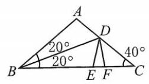

[第 216(4)题]

(4)方法一:如图，在 $\bigtriangleup  {ABD}$ 中，设 ${AB} = x$ ，

则 $\frac{BD}{\sin {100}^{ \circ  }} = \frac{AB}{\sin {60}^{ \circ  }} = \frac{AD}{\sin {20}^{ \circ  }} = \frac{x}{\frac{\sqrt{3}}{2}} = \frac{2\sqrt{3}}{3}x$ ,

$\therefore \;{BD} = \frac{2\sqrt{3}}{3}x \cdot  \sin {100}^{ \circ  },{AD} = \frac{2\sqrt{3}}{3}x \cdot  \sin {20}^{ \circ  }$ .

在 $\bigtriangleup {ABC}$ 中, $\frac{AB}{\sin {40}^{ \circ  }} = \frac{BC}{\sin {100}^{ \circ  }}$ ,则 ${BC} = \frac{\sin {100}^{ \circ  }}{\sin {40}^{ \circ  }}x = \frac{\sin {80}^{ \circ  }}{\sin {40}^{ \circ  }}x = 2\cos {40}^{ \circ  } \cdot  x$ ,

$\therefore \;{AD} + {DB} = \frac{2\sqrt{3}}{3}x \cdot  \left( {\sin {20}^{ \circ  } + \sin {100}^{ \circ  }}\right)  = \frac{2\sqrt{3}}{3}x \cdot  2\sin {60}^{ \circ  }\cos {40}^{ \circ  } = 2\cos {40}^{ \circ  } \cdot  x = {BC}$ .

方法二: 如图,在 ${BC}$ 上取 ${BE} = {AB}$ ,连接 ${DE}$ ,则 $\bigtriangleup {ABD} \cong  \bigtriangleup {EBD}$ .

再在 ${BC}$ 上取 ${BF} = {BD}$ ,连接 ${DF}$ ,则 $\angle {DEC} = {180}^{ \circ  } - {100}^{ \circ  } = {80}^{ \circ  },\angle {DFB} = \frac{{180}^{ \circ  } - {20}^{ \circ  }}{2} = {80}^{ \circ  }$ .

$\therefore {DE} = {DF} = {AD}$ ,且 $\angle {DFC} = {180}^{ \circ  } - {80}^{ \circ  } = {100}^{ \circ  },\angle C = \angle {CDF} = {40}^{ \circ  }$ .

$\therefore {CF} = {DF} = {DE} = {AD},{BF} = {BD}$ ,

$\therefore {BC} = {BF} + {CF} = {BD} + {AD}$ .

(5) ${\text{ ① }}^{ \bullet  }\;a = {2R}\sin A, b = {2R}\sin B, c = {2R}\sin C$ ,

$\therefore \;2\sin B = \sin A + \sin C$ ,

$4\sin \frac{B}{2}\cos \frac{B}{2} = 2\sin \frac{A + C}{2}\cos \frac{A - C}{2} = 2\sin \left( \frac{\pi  - B}{2}\right) \cos \frac{A - C}{2} = 2\cos \frac{B}{2}\cos \frac{A - C}{2}$ .

$\therefore \;2\sin \left( \frac{\pi  - A - C}{2}\right)  = \cos \frac{A - C}{2} = 2\cos \frac{A + C}{2}$ .

$\therefore \;2\cos \frac{A}{2}\cos \frac{C}{2} - 2\sin \frac{A}{2}\sin \frac{C}{2} = \cos \frac{A}{2}\cos \frac{C}{2} + \sin \frac{A}{2}\sin \frac{C}{2}$ ,

$\cos \frac{A}{2}\cos \frac{C}{2} = 3\sin \frac{A}{2}\sin \frac{C}{2}.\;\therefore \;\tan \frac{A}{2}\tan \frac{C}{2} = \frac{1}{3}$ .

②由①，知 $\tan \frac{A}{2}\tan \frac{C}{2} = \frac{1}{3}$ ，则 $\frac{1 - \cos A}{\sin A} \cdot  \frac{1 - \cos C}{\sin C} = \frac{1}{3}$ ，

$\therefore \;\cos A\cos C - \cos A - \cos C + 1 = \frac{1}{3}\sin A\sin C$ ,

$\therefore \cos A + \cos C - \cos A\cos C + \frac{1}{3}\sin A\sin C = 1$ 为定值.

(6) $\because \sin A + \sin C = 2\sin B,\;\therefore a + c = {2b}, b = \frac{1}{2}\left( {a + c}\right)$ .

$\therefore \min \{ a, c\}  < b < \max \{ a, c\}$ .

设最长边为 $c$ ,最短边为 $a$ ,则最大角为 $C$ ,最小角为 $A$ .

$\therefore C = A + \frac{\pi }{2}, B = \pi  - \left( {A + A + \frac{\pi }{2}}\right)  = \frac{\pi }{2} - {2A}$ .

$\sin A + \sin \left( {A + \frac{\pi }{2}}\right)  = 2\sin \left( {\frac{\pi }{2} - {2A}}\right) ,$

$\sin A + \cos A = 2\cos {2A}. = 2\left( {{\cos }^{2}A - {\sin }^{2}A}\right)  = 2\left( {\cos A + \sin A}\right) \left( {\cos A - \sin A}\right) .$

$\because A$ 是最小角, $\therefore \sin A + \cos A \neq  0$ ,

$\therefore \;\cos A - \sin A = \frac{1}{2},\cos A = \frac{1}{2} + \sin A$ .

$\therefore \;{\cos }^{2}A = \frac{1}{4} + \sin A + {\sin }^{2}A = 1 - {\sin }^{2}A$ .

$\because \sin A > 0,\;\therefore \;\sin A = \frac{-1 + \sqrt{7}}{4},\sin B = \cos {2A} = 1 - 2{\sin }^{2}A = \frac{\sqrt{7}}{4}$ ,

$\sin C = \cos A = \sqrt{1 - {\left( \frac{-1 + \sqrt{7}}{4}\right) }^{2}} = \frac{1 + \sqrt{7}}{4}.$

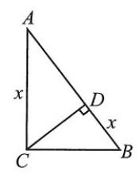

[第 216(7)题]

$\therefore \;c : b : a = \sin C : \sin B : \sin A = \left( {\sqrt{7} + 1}\right)  : \sqrt{7} : \left( {\sqrt{7} - 1}\right)$ .

(7)如图， $\because {S}_{\bigtriangleup {CBD}} = {BD} \cdot  {CD} \cdot  \frac{1}{2}$ ，

${S}_{\bigtriangleup {ABC}} = {AC} \cdot  {BC} \cdot  \frac{1}{2},{S}_{\bigtriangleup {ACD}} = {AD} \cdot  {CD} \cdot  \frac{1}{2}.$

$\therefore \;{\left( \frac{1}{2} \cdot  BD \cdot  CD\right) }^{2} = \left( {{AC} \cdot  {BC} \cdot  \frac{1}{2}}\right)  \cdot  \left( {{AD} \cdot  {CD} \cdot  \frac{1}{2}}\right)$ ,

即 $B{D}^{2} \cdot  C{D}^{2} = {AC} \cdot  {BC} \cdot  {AD} \cdot  {CD}$ .

$\because {AB} \cdot  {CD} = {AC} \cdot  {BC},\therefore B{D}^{2} \cdot  C{D}^{2} = {AB} \cdot  {CD} \cdot  {AD} \cdot  {CD}$ ,

$\therefore \;B{D}^{2} = {AB} \cdot  {AD}$ .

由射影定理,得 ${AD} \cdot  {AB} = A{C}^{2},\therefore {BD} = {AC}$ .

设 ${BD} = {AC} = x,{AB} = c$ ,则 ${x}^{2} = c\left( {c - x}\right)$ .

$\because x, c \in  \left( {0, + \infty }\right) ,\;\therefore x = \frac{-1 + \sqrt{5}}{2}c.\;\therefore \sin B = \frac{x}{c} = \frac{-1 + \sqrt{5}}{2}$ .

217. (1) $\because {2B} = A + C,\therefore B = \frac{A + C}{2}.\;\therefore \min \{ A, C\}  \leq  B \leq  \max \{ A, C\}$ .

设最大角为 $A$ ，最小角为 $C$ ，则 $\left\{  \begin{array}{l} a + c = 8, \\  {ac} = {15}\left( {a \geq  c}\right) . \end{array}\right.$

$\therefore a = 5, c = 3$ .

$\because {2B} = A + C = \pi  - B,\therefore B = \frac{\pi }{3}.\;\therefore \;{b}^{2} = {a}^{2} + {c}^{2} - {2ac}\cos B = {19}$ ,解得 $b = \sqrt{19}\left( \mathrm{\;{cm}}\right)$ .

$\therefore \;{S}_{\bigtriangleup {ABC}} = \frac{1}{2}{ac}\sin B = \frac{1}{2} \cdot  {15} \cdot  \frac{\sqrt{3}}{2} = \frac{15}{4}\sqrt{3}\left( {\mathrm{\;{cm}}}^{2}\right)$ .

(2) $\because \frac{a}{\sin A} = \frac{b}{\sin B} = \frac{c}{\sin C} = {2R} = \frac{{14}\sqrt{3}}{3},\therefore \sin B = \frac{\sqrt{3}}{14}b = \frac{\sqrt{3}}{2}$ .

$S = \frac{1}{2}{ac}\sin B = \frac{\sqrt{3}}{4}{ac} = {10}\sqrt{3},{ac} = {40},\cos B = \frac{{a}^{2} + {c}^{2} - {b}^{2}}{2ac} = \frac{{a}^{2} + {c}^{2} - {49}}{80} = \frac{1}{2},{a}^{2} + {c}^{2} = {89}.$

得 $a = 5, c = 8$ 或 $a = 8, c = 5$ .

$\therefore$ 其他两边长分别为 $5\mathrm{\;{cm}},8\mathrm{\;{cm}}$ .

(3) $\frac{\sin B}{\sin C} = \frac{b}{c} = \frac{3}{2}$ . 设 $b = {3k}, c = {2k}\left( {k > 0}\right)$ ，则 $S = \frac{1}{2}{bc}\sin A = \frac{\sqrt{3}}{4} \cdot  6{k}^{2} = 6\sqrt{3}, k = 2$ ，

$\therefore b = 6, c = 4.{a}^{2} = {b}^{2} + {c}^{2} - {2bc}\cos A = {76}$ ,解得 $a = 2\sqrt{19}$ .

(4) $\because \sin A : \sin B : \sin C = a : b : c = 4 : 5 : 6,\therefore c = {10}, b = \frac{25}{3}, a = \frac{20}{3}$ .

$\therefore \;\cos A = \frac{{\left( \frac{25}{3}\right) }^{2} + {10}^{2} - {\left( \frac{20}{3}\right) }^{2}}{2 \cdot  {10} \cdot  \frac{25}{3}} = \frac{3}{4},\;\therefore \;\sin A = \sqrt{1 - \frac{9}{16}} = \frac{\sqrt{7}}{4}$ .

$\therefore \;{2R} = \frac{a}{\sin A} = \frac{20}{3} \cdot  \frac{4}{\sqrt{7}} = \frac{80}{21}\sqrt{7},\;\therefore \;R = \frac{40}{21}\sqrt{7}.$

$\because \frac{1}{2}\left( {a + b + c}\right) r = S = \frac{1}{2}{bc}\sin A,$

$\therefore \;\left( {{10} + \frac{25}{3} + \frac{20}{3}}\right) r = {10} \cdot  \frac{25}{3} \cdot  \frac{\sqrt{7}}{4},\;\therefore \;r = \frac{5}{6}\sqrt{7}$ .

218. (1)在 $\bigtriangleup {ABD}$ 中， $\cos \angle {BAD} = \frac{A{B}^{2} + A{D}^{2} - B{D}^{2}}{2 \cdot  {AB} \cdot  {AD}} = \frac{9 + {25} - {49}}{30} =  - \frac{1}{2}$ .

$\therefore \angle {BAD} = \frac{2}{3}\pi ,\sin \angle {BAD} = \frac{\sqrt{3}}{2}$ .

(2) ${2R} = \frac{BC}{\sin \frac{\pi }{4}} = \frac{BD}{\sin \frac{2\pi }{3}} \cdot  {BC} = \frac{7}{\frac{\sqrt{3}}{2}} \cdot  \frac{\sqrt{2}}{2} = \frac{7}{3}\sqrt{6}$ .

219. 过点 $B$ 作 ${BE} \bot  {BD}$ ,交 ${CD}$ 于点 $E,\angle {ADB} = \angle {DBE},\therefore \frac{BE}{AD} = \frac{CB}{CA} = \frac{1}{2}$ .

设 ${BE} = x,{AD} = {2x},\because \tan \angle {EDB} = \frac{EB}{DB} = \frac{1}{3},\therefore {DB} = {3x}$ .

$\therefore {AB} = \sqrt{A{D}^{2} + B{D}^{2}} = \sqrt{13}x,\;\therefore \cos \angle {DAB} = \frac{AD}{AB} = \frac{2}{13}\sqrt{13}$ .

220. 设两直角边分别为 $a, b$ ,斜边为 $c$ ,则外接圆半径 $R = \frac{c}{2}$ ,内接圆半径 $r = \frac{ab}{a + b + c}$ .

$\therefore \frac{r}{R} = \frac{2ab}{c\left( {a + b + c}\right) } = \frac{2ab}{\sqrt{{a}^{2} + {b}^{2}}\left( {a + b}\right)  + \left( {{a}^{2} + {b}^{2}}\right) }.$

$\because \sqrt{{a}^{2} + {b}^{2}}\left( {a + b}\right)  + \left( {{a}^{2} + {b}^{2}}\right)  \geq  \sqrt{2ab} \cdot  2\sqrt{ab} + {2ab} = \left( {2 + 2\sqrt{2}}\right) {ab}$ ,

$\therefore \frac{r}{R} \leq  \frac{1}{1 + \sqrt{2}} = \sqrt{2} - 1$ . 等号在 $a = b$ 时取到,此时三角形是等腰直角三角形.

221. $\because \angle {CAB} = {30}^{ \circ  },\angle {CBA} = {75}^{ \circ  },\;\therefore \angle {ACB} = \angle {CBA} = {75}^{ \circ  }$ .

$\therefore {AC} = {AB} = {120},\therefore$ 河宽 $= {120} \cdot  \sin {30}^{ \circ  } = {60}$ (米).

222. 过点 $C$ 作 ${CH} \bot  {BA}$ 的延长线于点 $H$ ,则 $\angle {BCA} = {15}^{ \circ  },\angle {CBA} = {30}^{ \circ  },\angle {HCA} = \angle {HAC} = {45}^{ \circ  }$ .

设 ${CH} = {AH} = x$ ,则 ${HB} = \tan {60}^{ \circ  } \cdot  x = \sqrt{3}x$ .

$\therefore {AB} = \left( {\sqrt{3} - 1}\right) x = {20}$ ,解得 $x = {10}\left( {\sqrt{3} + 1}\right) ,\therefore {DC} = \sqrt{3}x = \left( {{30} + {10}\sqrt{3}}\right) \mathrm{m}$ .

223. 设 $\angle {AOB} = \theta ,\theta  \in  \left( {0,\pi }\right)$ ,则 ${S}_{\bigtriangleup {AOB}} = \frac{1}{2} \cdot  1 \cdot  2\sin \theta  = \sin \theta$ .

$A{B}^{2} = O{A}^{2} + O{B}^{2} - {2OA} \cdot  {OB}\cos \theta  = 5 - 4\cos \theta .$

${S}_{\bigtriangleup {ABC}} = {AB} \cdot  {BC} \cdot  \frac{1}{2}\sin {60}^{ \circ  } = \frac{\sqrt{3}}{4}A{B}^{2} = \frac{\sqrt{3}}{4}\left( {5 - 4\cos \theta }\right) .$

$\therefore \;{S}_{\text{ 四边形 }{OACB}} = \sin \theta  + \frac{5\sqrt{3}}{4} - \sqrt{3}\cos \theta  = 2\left( {\frac{1}{2}\sin \theta  - \frac{\sqrt{3}}{2}\cos \theta }\right)  + \frac{5\sqrt{3}}{4} = 2\sin \left( {\theta  - \frac{\pi }{3}}\right)  + \frac{5\sqrt{3}}{4}$ .

当 $\theta  = \frac{5\pi }{6}$ 时, ${S}_{\text{ 四边形 }{OACB}\max } = 2 + \frac{5\sqrt{3}}{4}$ .

224. 在 $\bigtriangleup {APB}$ 中, $\frac{PB}{\sin \theta } = \frac{c}{\sin \angle {APB}}$ ,而 $\angle {APB} = \pi  - \theta  - \angle {ABP} = \pi  - \angle {ABC}$ ,

$\therefore \;\sin \angle {APB} = \sin \angle {ABC},\;\therefore \;{PB} = \frac{c\sin \theta }{\sin \angle {ABC}}$ .

在 $\bigtriangleup {PBC}$ 中, $\frac{PB}{\sin \angle {PCB}} = \frac{a}{\sin \angle {BPC}}$ .

同理, $\angle {BPC} = \pi  - \theta  - \angle {PCB} = \pi  - \angle {ACB}$ .

$\therefore \;\sin \angle {BPC} = \sin \angle {ACB},\angle {PCB} = \angle {ACB} - \theta$ .

$\therefore \;{PB} = \frac{a\sin \left( {\angle {ACB} - \theta }\right) }{\sin \angle {ACB}} = \frac{c\sin \theta }{\sin \angle {ABC}}$ ,

则 $\frac{a\left( {\sin \angle {ACB}\cos \theta  - \cos \angle {ACB}\sin \theta }\right) }{\sin \angle {ACB}} = \frac{c\sin \theta }{\sin \angle {ABC}}$ .

整理,得 $a\sin \angle {ABC}\sin \angle {ACB}\cos \theta  = \left( {a\sin \angle {ABC}\cos \angle {ACB} + c\sin \angle {ACB}}\right) \sin \theta$ .

$\therefore \;\frac{\cos \theta }{\sin \theta } = \cot \theta  = \frac{\cos \angle {ACB}}{\sin \angle {ACB}} + \frac{c}{a\sin \angle {ABC}} = \cot \angle {ACB} + \frac{\sin \angle {ACB}}{\sin \angle {BAC}\sin \angle {ABC}}$

$= \cot \angle {ACB} + \frac{\sin \left( {\pi  - \angle {BAC} - \angle {ABC}}\right) }{\sin \angle {BAC}\sin \angle {ABC}} = \cot \angle {ACB} + \frac{\sin \angle {BAC}\cos \angle {ABC} + \cos \angle {BAC}\sin \angle {ABC}}{\sin \angle {BAC}\sin \angle {ABC}}$

$= \cot \angle {ACB} + \cot \angle {ABC} + \cot \angle {BAC}$ .

225. (1) $\because \sin A = \frac{a}{2R},\sin B = \frac{b}{2R},\sin C = \frac{c}{2R}$ ,代入原式,得 $\frac{1}{2R}\left( {{a}^{2} - {c}^{2}}\right)  = \left( {\sqrt{2}a - b}\right)  \cdot  \frac{b}{2R}$ ,即 ${a}^{2} - {c}^{2} = \sqrt{2}{ab} - {b}^{2}$ .

$\therefore \frac{{a}^{2} + {b}^{2} - {c}^{2}}{2ab} = \frac{\sqrt{2}}{2} = \cos C.\;\therefore C = \frac{\pi }{4}, c = {2R} \cdot  \frac{\sqrt{2}}{2} = \sqrt{2}R$ .

$\therefore {a}^{2} + {b}^{2} - 2{R}^{2} = \sqrt{2}{ab} \geq  {2ab} - 2{R}^{2},\;\therefore {ab} \leq  \frac{2{R}^{2}}{2 - \sqrt{2}}$ ,等号在 $a = b = \sqrt{\frac{2{R}^{2}}{2 - \sqrt{2}}}$ 时取到.

$\therefore S = \frac{1}{2}{ab}\sin C \leq  \frac{\sqrt{2}}{4} \cdot  \frac{2{R}^{2}}{2 - \sqrt{2}} = \frac{\sqrt{2} + 1}{2}{R}^{2}$ ,等号在 $a = b = \sqrt{\frac{2{R}^{2}}{2 - \sqrt{2}}}$ 时取到.

(2)设 ${OP} = {NP} = x, x \in  \left( {0,\frac{\sqrt{2}}{2}}\right)$ ，则 ${MQ} = x$ . 连接 ${OM},{OM} = 1,\therefore {OQ} = \sqrt{1 - {x}^{2}} \cdot  {PQ} = \sqrt{1 - {x}^{2}} - x$ .

$P{M}^{2} = P{Q}^{2} + M{Q}^{2} = {x}^{2} + 1 - {x}^{2} - {2x}\sqrt{1 - {x}^{2}} + {x}^{2} = 1 + {x}^{2} - {2x}\sqrt{1 - {x}^{2}}.$

由 $x \in  \left( {0,\frac{\sqrt{2}}{2}}\right)$ ,可设 $x = \sin t, t \in  \left( {0,\frac{\pi }{4}}\right)$ ,此时 $\cos t > 0$ ,则

$P{M}^{2} = 1 + {\sin }^{2}t - 2\sin t\cos t = 1 + \frac{1 - \cos {2t}}{2} - \sin {2t}$

$= \frac{3}{2} - \frac{1}{2} \cdot  \sqrt{5}\left( {\frac{2}{\sqrt{5}}\sin {2t} + \frac{1}{\sqrt{5}}\cos {2t}}\right)  = \frac{3}{2} - \frac{\sqrt{5}}{2}\sin \left( {{2t} + \arcsin \frac{1}{\sqrt{5}}}\right) .$

$\because \;{2t} \in  \left( {0,\frac{\pi }{2}}\right) ,\;\therefore \;{2t} + \arcsin \frac{1}{\sqrt{5}} \in  \left( {\arcsin \frac{1}{\sqrt{5}},\frac{\pi }{2} + \arcsin \frac{1}{\sqrt{5}}}\right)$ .

当 ${2t} + \arcsin \frac{1}{\sqrt{5}} = \frac{\pi }{2}$ 时， $P{M}_{\min }^{2} = \frac{3}{2} - \frac{\sqrt{5}}{2}$ ， $\therefore P{M}_{\min } = \sqrt{\frac{3 - \sqrt{5}}{2}} = \frac{\sqrt{5} - 1}{2}$ .

(3) 设 $\angle {PAB} = t,{DR} = 9\cos t,{BQ} = 9\sin t$ ，则 ${RC} = {10} - 9\cos t,{CQ} = {10} - 9\sin t, t \in  \left( {0,\frac{\pi }{2}}\right)$ .

$\therefore \;{S}_{\text{ 矩形 RPQC }} = \left( {{10} - 9\cos t}\right) \left( {{10} - 9\sin t}\right)  = {100} - {90}\left( {\sin t + \cos t}\right)  + {81}\sin t\cos t$ .

令 $m = \sin t + \cos t = \sqrt{2}\sin \left( {t + \frac{\pi }{4}}\right) , t + \frac{\pi }{4} \in  \left( {\frac{\pi }{4},\frac{3\pi }{4}}\right)$ ,则 $m \in  (1,\sqrt{2}\rbrack$ .

$\therefore S = {100} - {90m} + {81} \cdot  \frac{{m}^{2} - 1}{2} = \frac{81}{2}{\left( m - \frac{10}{9}\right) }^{2} + \frac{19}{2}$ .

当 $m = \sqrt{2}$ 时, ${S}_{\max } = \frac{281}{2} - {90}\sqrt{2}$ ;

当 $m = \frac{10}{9}$ 时, ${S}_{\min } = \frac{19}{2}$ .

226. 设原式 $= t$ ,则

${2}^{4}\sin \frac{\pi }{17} \cdot  t = {2}^{4}\sin \frac{\pi }{17}\cos \frac{\pi }{17}\cos \frac{2\pi }{17}\cos \frac{4\pi }{17}\cos \frac{8\pi }{17} \cdot  \left( {\cos \frac{3\pi }{17}\cos \frac{5\pi }{17}\cos \frac{6\pi }{17}\cos \frac{7\pi }{17}}\right)$

$= \sin \frac{16\pi }{17} \cdot  \left( {\cos \frac{3\pi }{17}\cos \frac{5\pi }{17}\cos \frac{6\pi }{17}\cos \frac{7\pi }{17}}\right) .$

由 $\sin \frac{\pi }{17} = \sin \frac{16\pi }{17}$ ,得 $t = \frac{1}{{2}^{4}}\cos \frac{3\pi }{17}\cos \frac{5\pi }{17}\cos \frac{6\pi }{17}\cos \frac{7\pi }{17}$ .

$\therefore \;{2}^{2}\sin \frac{3\pi }{17} \cdot  t = \frac{1}{{2}^{4}}\left( {{2}^{2}\sin \frac{3\pi }{17}\cos \frac{3\pi }{17}\cos \frac{6\pi }{17}}\right)  \cdot  \cos \frac{5\pi }{17}\cos \frac{7\pi }{17} = \frac{1}{{2}^{4}}\sin \frac{12\pi }{17}\cos \frac{5\pi }{17}\cos \frac{7\pi }{17}$ .

$\therefore t = \frac{1}{{2}^{6}} \cdot  \frac{\sin \frac{12\pi }{17}\cos \frac{5\pi }{17}\cos \frac{7\pi }{17}}{\sin \frac{3\pi }{17}} = \frac{1}{{2}^{6}} \cdot  \frac{-\sin \frac{5\pi }{17}\cos \frac{5\pi }{17}\cos \frac{10\pi }{17}}{\sin \frac{3\pi }{17}} = \frac{1}{{2}^{8}} \cdot  \frac{-\sin \frac{20\pi }{17}}{\sin \frac{3\pi }{17}} = \frac{1}{{2}^{8}}$ .

227. $\mathrm{B}$ 提示: $\sin \alpha  = \sin \left( {\pi  - \alpha }\right)  =  - \frac{1}{4}.\;\because \alpha  \in  \left\lbrack  {\pi ,\frac{3\pi }{2}}\right\rbrack  ,\;\therefore \pi  - \alpha  \in  \left\lbrack  {-\frac{\pi }{2},0}\right\rbrack$ .

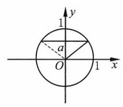

(第 228 题)

$\therefore \pi  - \alpha  = \arcsin \left( {-\frac{1}{4}}\right)  =  - \arcsin \frac{1}{4},\;\therefore \alpha  = \pi  + \arcsin \frac{1}{4}$ .

228. $\mathrm{B}$ 提示: 利用单位圆,如图, $x \in  \left\lbrack  {\arcsin a,\pi  - \arcsin a}\right\rbrack$ .

229. $\mathrm{B}$ 提示: 原式 $= \arcsin \left\lbrack  {\sin \left( {\pi  - x}\right) }\right\rbrack$ . 由 $x \in  \left\lbrack  {\frac{\pi }{2},\frac{3\pi }{2}}\right\rbrack$ ,得 $\pi  - x \in  \left\lbrack  {-\frac{\pi }{2},\frac{\pi }{2}}\right\rbrack$ .

$\therefore$ 原式 $= \pi  - x$ .

230. (1) $\frac{\pi }{4}$ 提示: 原式 $= \arcsin \left\lbrack  {-\sin \left( {-\frac{5\pi }{4} + \pi }\right) }\right\rbrack   = \frac{\pi }{4}$ .

(2) $\pi  - 3\;$ 提示:原式 $= \arcsin \left\lbrack  {\sin \left( {\pi  - 3}\right) }\right\rbrack   = \pi  - 3$ .

(3) $\frac{\pi }{2} - 2\;$ 提示:原式 $= \arcsin \left\lbrack  {\sin \left( {\frac{\pi }{2} - 2}\right) }\right\rbrack   = \frac{\pi }{2} - 2$ .

(4) $5 - \frac{3\pi }{2}\;$ 提示:原式 $= \arcsin \left\lbrack  {-\sin \left( {\frac{3\pi }{2} - 5}\right) }\right\rbrack   = 5 - \frac{3\pi }{2}$ .

(5) ${3\pi } - {\pi }^{2}$ 提示:原式 $= \arcsin \left\lbrack  {\sin \left( {{3\pi } - {\pi }^{2}}\right) }\right\rbrack   = {3\pi } - {\pi }^{2}$ .

231. $\because \arcsin \frac{1}{a} = \frac{\pi }{2} - \arcsin \frac{1}{b}$ ,

$\therefore \sin \left( {\arcsin \frac{1}{a}}\right)  = \sin \left( {\frac{\pi }{2} - \arcsin \frac{1}{b}}\right) ,\frac{1}{a} = \cos \left( {\arcsin \frac{1}{b}}\right)$ .

$\because \;\arcsin \frac{1}{b} \in  \left\lbrack  {-\frac{\pi }{2},\frac{\pi }{2}}\right\rbrack$ ,

$\therefore \cos \left( {\arcsin \frac{1}{b}}\right)  = \sqrt{1 - {\sin }^{2}\left( {\arcsin \frac{1}{b}}\right) } = \sqrt{1 - \frac{1}{{b}^{2}}}$ .

$\therefore \frac{1}{a} = \sqrt{1 - \frac{1}{{b}^{2}}},\;\therefore {a}^{2} + {b}^{2} = {a}^{2}{b}^{2}$ .

由 ${a}^{2} + {b}^{2} = {c}^{2}$ ,得 $c = {ab}$ .

232. (1) 原式 $= \arcsin \left\lbrack  \frac{\sqrt{2}\sin \left( {\alpha  + \frac{\pi }{4}}\right) }{\sqrt{2}}\right\rbrack   = \arcsin \left( {\sin \frac{11\pi }{8}}\right)  = \arcsin \left\lbrack  {\sin \left( {\pi  - \frac{11\pi }{8}}\right) }\right\rbrack   =  - \frac{3\pi }{8}$ .

( 2 )左边 $= \arcsin \left\lbrack  {\sin \left( {\theta  + \frac{\pi }{4}}\right) }\right\rbrack   = \arcsin \left\{  {\sin \left\lbrack  {\pi  - \left( {\theta  + \frac{\pi }{4}}\right) }\right\rbrack  }\right\}   = \arcsin \left\lbrack  {\sin \left( {\frac{3}{4}\pi  - \theta }\right) }\right\rbrack$ .

$\because \theta  \in  \left( {\frac{\pi }{4},\frac{5\pi }{4}}\right) ,\;\therefore \frac{3\pi }{4} - \theta  \in  \left( {-\frac{\pi }{2},\frac{\pi }{2}}\right)$ .

$\therefore$ 左边 $= \frac{3}{4}\pi  - \theta  =$ 右边.

233. $\mathrm{D}$ 提示: 选项 $\mathrm{A} :  - \frac{\pi }{3} <  - 1$ ; 选项 $\mathrm{B} : \frac{\pi }{3} > 1$ ; 选项 $\mathrm{C} : \arcsin \left( {\sin \frac{5\pi }{4}}\right)  =  - \frac{\pi }{4}$ ; 选项 D: $\sin \left\lbrack  {\arccos \left( {-\frac{\sqrt{2}}{2}}\right) }\right\rbrack   = \sin \frac{3\pi }{4} = \frac{\sqrt{2}}{2}.$

234. $\mathrm{B}$ 提示: $\cos x =  - \frac{1}{2}, x \in  \left\lbrack  {0,\pi }\right\rbrack$ ,则 $x = \frac{2}{3}\pi .f\left( {-\frac{1}{2}}\right)  = f\left( {\cos \frac{2\pi }{3}}\right)  = \frac{1}{2} \cdot  \frac{2\pi }{3} = \frac{\pi }{3}$ .

235. $\pi  + \arccos \frac{1}{3}$ 提示: $\because \cos \left( {x - \pi }\right)  =  - \cos x = \frac{1}{3}, x - \pi  \in  \left\lbrack  {0,\pi }\right\rbrack$ ,

$\therefore x - \pi  = \arccos \frac{1}{3}, x = \pi  + \arccos \frac{1}{3}$ .

236. (1) $\pm  \frac{1}{2}$ 提示: $\because \arccos x \in  \left\lbrack  {0,\pi }\right\rbrack  ,\;\therefore \arccos x = \frac{\pi }{3}$ 或 $\frac{2\pi }{3},\;\therefore x =  \pm  \frac{1}{2}$ .

(2) $\pm  \frac{\pi }{6} + {2k\pi }, k \in  \mathbf{Z}$ 提示: $\cos x = \frac{\sqrt{3}}{2}, x =  \pm  \frac{\pi }{6} + {2k\pi }, k \in  \mathbf{Z}$ .

(3) $\left\lbrack  {-2,0}\right\rbrack$ 提示: 只要 $- 1 \leq  x + 1 \leq  1, x \in  \left\lbrack  {-2,0}\right\rbrack$ .

237. (1) $\pi$ 提示: 原式 $= \arcsin \left\lbrack  {\sin \left( {\pi  - \frac{3\pi }{4}}\right) }\right\rbrack   + \frac{3\pi }{4} = \pi$ .

(2) $\frac{\pi }{6}\;$ 提示:原式 $= \arccos \left( {\cos \frac{\pi }{6}}\right)  = \frac{\pi }{6}$ .

(3) $\frac{5\pi }{14}$ 提示:原式 $= \arccos \left\lbrack  {\cos \left( {\frac{\pi }{2} - \frac{\pi }{7}}\right) }\right\rbrack   = \frac{5\pi }{14}$ .

(4) ${4\pi } - {\pi }^{2}$ 提示:原式 $= \arccos \left\lbrack  {\cos \left( {{4\pi } - {\pi }^{2}}\right) }\right\rbrack   = {4\pi } - {\pi }^{2}$ .

(5) $3 - 2\sqrt{2}$ 提示: 用半角公式 $\tan \frac{\alpha }{2} = \frac{\sin \alpha }{1 + \cos \alpha }$ ,原式 $= \frac{\sin \left( {\arccos \frac{2\sqrt{2}}{3}}\right) }{1 + \cos \left( {\arccos \frac{2\sqrt{2}}{3}}\right) } = \frac{\sqrt{1 - {\left( \frac{2\sqrt{2}}{3}\right) }^{2}}}{1 + \frac{2\sqrt{2}}{3}} = \frac{1}{3 + 2\sqrt{2}} = 3 - 2\sqrt{2}$ .

(6) $\frac{\sqrt{5}}{5}$ 提示: $\frac{1}{2}\arccos \left( {-\frac{3}{5}}\right)  \in  \left( {0,\frac{\pi }{2}}\right)$ ,则 $\cos \left\lbrack  {\frac{1}{2}\arccos \left( {-\frac{3}{5}}\right) }\right\rbrack   = \sqrt{\frac{1 + \cos \left\lbrack  {\arccos \left( {-\frac{3}{5}}\right) }\right\rbrack  }{2}} = \frac{\sqrt{5}}{5}$ .

238. $\because f\left( x\right)  = \arccos x + 1, f\left( a\right)  = a = \arccos a + 1,\;\therefore a \in  \left\lbrack  {-1,1}\right\rbrack  ,\arccos a + 1 = a \in  \left\lbrack  {1,\pi  + 1}\right\rbrack$ .

$\therefore a = 1.\;\therefore \;f\left( {-a}\right)  = f\left( {-1}\right)  = \arccos \left( {-1}\right)  + 1 = \pi  + 1$ .

239. (1) $\sin \left( {\arcsin \frac{12}{13} + \arccos \frac{4}{5}}\right)  = \sin \left( {\arcsin \frac{12}{13}}\right) \cos \left( {\arccos \frac{4}{5}}\right)  + \cos \left( {\arcsin \frac{12}{13}}\right) \sin \left( {\arccos \frac{4}{5}}\right)$

$= \frac{12}{13} \cdot  \frac{4}{5} + \frac{5}{13} \cdot  \frac{3}{5} = \frac{63}{65}.$

而 $\cos \left( {\arcsin \frac{12}{13} + \arccos \frac{4}{5}}\right)  = \cos \left( {\arcsin \frac{12}{13}}\right) \cos \left( {\arccos \frac{4}{5}}\right)  - \sin \left( {\arcsin \frac{12}{13}}\right) \sin \left( {\arccos \frac{4}{5}}\right)$

$= \frac{5}{13} \cdot  \frac{4}{5} - \frac{12}{13} \cdot  \frac{3}{5} < 0.$

$\therefore \;\arcsin \frac{12}{13} + \arccos \frac{4}{5} \in  \left( {\frac{\pi }{2},\pi }\right)$ ,

$\therefore \;\arcsin \frac{12}{13} + \arccos \frac{4}{5} = \pi  - \arcsin \frac{63}{65}$ .

(2) $\arccos \frac{15}{17} = \arcsin \frac{8}{17} < \arcsin \frac{4}{5},\therefore \arccos \frac{15}{17} - \arcsin \frac{4}{5} \in  \left( {-\frac{\pi }{2},0}\right)$ .

$\cos \left( {\arccos \frac{15}{17} - \arcsin \frac{4}{5}}\right)  = \cos \left( {\arccos \frac{15}{17}}\right) \cos \left( {\arcsin \frac{4}{5}}\right)  + \sin \left( {\arccos \frac{15}{17}}\right) \sin \left( {\arcsin \frac{4}{5}}\right)$

$= \frac{15}{17} \cdot  \frac{3}{5} + \frac{8}{17} \cdot  \frac{4}{5} = \frac{77}{85}.$

$\therefore \arccos \frac{15}{17} - \arcsin \frac{4}{5} =  - \arccos \frac{77}{85}$ .

240. (1) $\arcsin \frac{2\sqrt{2}}{3} + \arcsin \frac{1}{3} = \arccos \frac{1}{3} + \arcsin \frac{1}{3} = \frac{\pi }{2}$ .

(2)原式 $= \pi  - \arccos \frac{11}{14} - \arccos \frac{1}{7}$ ，而 $\arccos \frac{11}{14} + \arccos \frac{1}{7} \in  \left( {0,\pi }\right)$ .

$\therefore \cos \left( {\arccos \frac{11}{14} + \arccos \frac{1}{7}}\right)  = \cos \left( {\arccos \frac{11}{14}}\right) \cos \left( {\arccos \frac{1}{7}}\right)  - \sin \left( {\arccos \frac{11}{14}}\right) \sin \left( {\arccos \frac{1}{7}}\right)$

$= \frac{11}{14} \cdot  \frac{1}{7} - \sqrt{1 - {\left( \frac{11}{14}\right) }^{2}} \cdot  \sqrt{1 - {\left( \frac{1}{7}\right) }^{2}} = \frac{1}{98}\left( {{11} - 5\sqrt{3} \cdot  4\sqrt{3}}\right)  =  - \frac{1}{2}$ .

$\therefore \;\arccos \frac{11}{14} + \arccos \frac{1}{7} = \frac{2\pi }{3}$ .

$\therefore$ 原式 $= \frac{\pi }{3}$ .

241. $\because \cos \left( {\arccos \frac{x}{a}}\right)  = \cos \left( {2\arcsin \frac{y}{a}}\right)  = 1 - 2{\sin }^{2}\left( {\arcsin \frac{y}{a}}\right) ,\;\therefore \frac{x}{a} = 1 - 2 \cdot  \frac{{y}^{2}}{{a}^{2}},{a}^{2} = {ax} + 2{y}^{2}$ .

242. (1) 原式 $= \sin \left( {\arcsin \frac{3}{5}}\right) \cos \left( {\arcsin \frac{8}{17}}\right)  + \cos \left( {\arcsin \frac{3}{5}}\right) \sin \left( {\arcsin \frac{8}{17}}\right)$

$= \frac{3}{5} \cdot  \sqrt{1 - {\left( \frac{8}{17}\right) }^{2}} + \sqrt{1 - {\left( \frac{3}{5}\right) }^{2}} \cdot  \frac{8}{17} = \frac{3}{5} \cdot  \frac{15}{17} + \frac{4}{5} \cdot  \frac{8}{17} = \frac{77}{85}.$

( 2 )原式 $= \frac{\tan \left( {\arcsin \frac{1}{3}}\right)  + \tan \left\lbrack  {\arccos \left( {-\frac{1}{5}}\right) }\right\rbrack  }{1 - \tan \left( {\arcsin \frac{1}{3}}\right) \tan \left\lbrack  {\arccos \left( {-\frac{1}{5}}\right) }\right\rbrack  }$ .

$\because \tan \left( {\arcsin \frac{1}{3}}\right)  = \frac{\frac{1}{3}}{\sqrt{1 - {\left( \frac{1}{3}\right) }^{2}}} = \frac{\sqrt{2}}{4},\tan \left\lbrack  {\arccos \left( {-\frac{1}{5}}\right) }\right\rbrack   = \frac{\sqrt{1 - {\left( -\frac{1}{5}\right) }^{2}}}{-\frac{1}{5}} =  - 2\sqrt{6}$ ,

$\therefore$ 原式 $= \frac{\frac{\sqrt{2}}{4} + \left( {-2\sqrt{6}}\right) }{1 + \frac{\sqrt{2}}{4} \cdot  2\sqrt{6}} = \frac{9\sqrt{6} - {25}\sqrt{2}}{8}$ .

$\left( 3\right)$ 原式 $= \cos \left( {\arccos \frac{4}{5}}\right) \cos \left\lbrack  {\arccos \left( {-\frac{5}{13}}\right) }\right\rbrack   + \sin \left( {\arccos \frac{4}{5}}\right) \sin \left\lbrack  {\arccos \left( {-\frac{5}{13}}\right) }\right\rbrack \; = \frac{4}{5} \cdot  \left( {-\frac{5}{13}}\right)  + \sqrt{1 - {\left( \frac{4}{5}\right) }^{2}} \cdot  \sqrt{1 - {\left( -\frac{5}{13}\right) }^{2}} \; =  - \frac{20}{65} + \frac{3}{5} \cdot  \frac{12}{13} = \frac{16}{65}.$

(4)原式 $= \arcsin \left\lbrack  {\sin \left( {\frac{\pi }{2} - 4}\right) }\right\rbrack   - \arccos \left\lbrack  {\cos \left( {5 - \frac{\pi }{2}}\right) }\right\rbrack \; = \arcsin \left\lbrack  {-\sin \left( {\frac{3\pi }{2} - 4}\right) }\right\rbrack   - \arccos \left\lbrack  {-\cos \left( {5 - \frac{3\pi }{2}}\right) }\right\rbrack \; = 4 - \frac{3\pi }{2} - \left( {\pi  - 5 + \frac{3\pi }{2}}\right)  = 9 - {4\pi }.$

243. (1) 左边 $= \arccos \left( {\sin \frac{\pi }{3}\sin \theta  - \cos \frac{\pi }{3}\cos \theta }\right)  + \theta  = \arccos \left\lbrack  {-\cos \left( {\frac{\pi }{3} + \theta }\right) }\right\rbrack   + \theta \; = \pi  - \left( {\frac{\pi }{3} + \theta }\right)  + \theta  = \frac{2\pi }{3} =$ 右边.

(2) $\because \arcsin \left( {\sin \alpha  + \sin \beta }\right) ,\arcsin \left( {\sin \alpha  - \sin \beta }\right)  \in  \left\lbrack  {-\frac{\pi }{2},\frac{\pi }{2}}\right\rbrack$ ,

$\therefore$ 原式 $=  - \frac{\pi }{2}$ 或 $\frac{\pi }{2} \cdot  \arcsin \left( {\sin \alpha  + \sin \beta }\right)  =  \pm  \frac{\pi }{2} - \arcsin \left( {\sin \alpha  - \sin \beta }\right)$ ,

$\therefore \sin \left\lbrack  {\arcsin \left( {\sin \alpha  + \sin \beta }\right) }\right\rbrack   =  - \sin \left\lbrack  {\arcsin \left( {\sin \alpha  - \sin \beta }\right)  \pm  \frac{\pi }{2}}\right\rbrack$ .

$\sin \alpha  + \sin \beta  =  \pm  \sqrt{1 - {\left( \sin \alpha  - \sin \beta \right) }^{2}},$

$\therefore \;{\left( \sin \alpha  + \sin \beta \right) }^{2} = 1 - {\left( \sin \alpha  - \sin \beta \right) }^{2},\;\therefore \;{\sin }^{2}\alpha  + {\sin }^{2}\beta  = \frac{1}{2}$ .

244. $\mathrm{C}$ 提示: $\arcsin \left( {-\frac{1}{3}}\right)  = \arctan \left\lbrack  \frac{-\frac{1}{3}}{\sqrt{1 - {\left( -\frac{1}{3}\right) }^{2}}}\right\rbrack   = \arctan \left( {-\frac{\sqrt{2}}{4}}\right)  > \arctan \left( {-\sqrt{2}}\right)$ .

$\therefore \arctan \left( {-\sqrt{2}}\right)  < \arcsin \left( {-\frac{1}{3}}\right)  < 0 < \arccos \left( {-\frac{2}{3}}\right)$ .

245. $\mathrm{C}$ 提示: $\arctan \left\lbrack  {\tan \left( {\frac{3}{5}\pi  - \pi }\right) }\right\rbrack   =  - \frac{2}{5}\pi$ .

246. A 提示: $\tan \left\lbrack  {\arctan \left( {x + 1}\right)  - \arctan \left( {x - 1}\right) }\right\rbrack   = \frac{\left( {x + 1}\right)  - \left( {x - 1}\right) }{1 + \left( {x + 1}\right) \left( {x - 1}\right) } = \frac{2}{{x}^{2}} = 1,{x}^{2} = 2$ . $\arcsin \frac{1}{{x}^{2}} = \arcsin \frac{1}{2} = \frac{\pi }{6}.$

247. B 提示: 只有②正确.

248.(1)0 提示:原式 $= \left( {\arctan \frac{1}{3} + \arctan 3}\right)  + \arcsin \frac{1}{5} - \left( {\pi  - \arccos \frac{1}{5}}\right)  = \frac{\pi }{2} + \frac{\pi }{2} - \pi  = 0$ .

(2) $\frac{\pi }{2} - 1$ 提示:原式 $= \arctan \left\lbrack  {\tan \left( {\frac{\pi }{2} - 1}\right) }\right\rbrack   = \frac{\pi }{2} - 1$

(3) $\frac{\pi }{9}\;$ 提示:原式 $= \arctan \left( \frac{\tan {45}^{ \circ  } - \tan {25}^{ \circ  }}{1 + \tan {45}^{ \circ  }\tan {25}^{ \circ  }}\right)  = \arctan \left\lbrack  {\tan \left( {{45}^{ \circ  } - {25}^{ \circ  }}\right) }\right\rbrack   = \frac{\pi }{9}$ .

(4) $\frac{\pi }{4}\;$ 提示: $\tan \left\lbrack  {\arctan \left( {3 + 2\sqrt{2}}\right)  - \arctan \frac{\sqrt{2}}{2}}\right\rbrack$

$= \frac{\tan \left\lbrack  {\arctan \left( {3 + 2\sqrt{2}}\right) }\right\rbrack   - \tan \left( {\arctan \frac{\sqrt{2}}{2}}\right) }{1 + \tan \left\lbrack  {\arctan \left( {3 + 2\sqrt{2}}\right) }\right\rbrack  \tan \left( {\arctan \frac{\sqrt{2}}{2}}\right) } = \frac{3 + 2\sqrt{2} - \frac{\sqrt{2}}{2}}{1 + \frac{\sqrt{2}}{2}\left( {3 + 2\sqrt{2}}\right) } = 1.$

$\because \arctan \left( {3 + 2\sqrt{2}}\right) ,\arctan \frac{\sqrt{2}}{2} \in  \left( {0,\frac{\pi }{2}}\right) ,\;\therefore$ 原式 $= \frac{\pi }{4}$ .

(5) $\frac{\pi }{4}$ 提示: $\tan \left( {\arctan \frac{1}{2} + \arctan \frac{1}{5} + \arctan \frac{1}{8}}\right)  = \frac{\frac{1}{2} + \tan \left( {\arctan \frac{1}{5} + \arctan \frac{1}{8}}\right) }{1 - \frac{1}{2}\tan \left( {\arctan \frac{1}{5} + \arctan \frac{1}{8}}\right) } =$

$\frac{\frac{1}{2} + \frac{\frac{1}{5} + \frac{1}{8}}{1 - \frac{1}{5} \cdot  \frac{1}{8}}}{1 - \frac{1}{2} \cdot  \frac{\frac{1}{5} + \frac{1}{8}}{1 - \frac{1}{5} \cdot  \frac{1}{8}}} = \frac{\frac{1}{2} + \frac{1}{3}}{1 - \frac{1}{2} \cdot  \frac{1}{3}} = 1$ . 显然, $0 <$ 原式 $< \frac{\pi }{2}$ . . . 原式 $= \frac{\pi }{4}$ .

249. (1) $- \frac{\sqrt{3}}{3}$ 提示: 原式 $=  - \sin \left( {\frac{1}{2}\arctan 2\sqrt{2}}\right)  =  - \sqrt{\frac{1 - \cos \left( {\arctan 2\sqrt{2}}\right) }{2}}$ .

$\because \cos \left( {\arctan 2\sqrt{2}}\right)  = \frac{1}{\sqrt{{\tan }^{2}\left( {\arctan 2\sqrt{2}}\right)  + 1}} = \frac{1}{3},\therefore$ 原式 $=  - \sqrt{\frac{1}{3}} =  - \frac{\sqrt{3}}{3}$ .

(2)8 提示:原式 $= \frac{\frac{1}{5} + 3}{1 - \frac{1}{5} \cdot  3} = 8$ .

(3)- $\frac{12}{37}$ 提示:原式 $=  - 2\sin \left( {\arctan 6}\right) \cos \left( {\arctan 6}\right)$ .

$\because \cos \left( {\arctan 6}\right)  = \frac{1}{\sqrt{{\tan }^{2}\left( {\arctan 6}\right)  + 1}} = \frac{1}{\sqrt{37}},\sin \left( {\arctan 6}\right)  = \sqrt{1 - \frac{1}{37}} = \frac{6}{\sqrt{37}}$ .

$\therefore$ 原式 $=  - \frac{12}{37}$ .

250. (1) $\because {x}_{1},{x}_{2} < 0,\arctan {x}_{1},\arctan {x}_{2} \in  \left( {-\frac{\pi }{2},0}\right) ,\;\therefore \arctan {x}_{1} + \arctan {x}_{2} \in  \left( {-\pi ,0}\right)$ .

$\therefore \tan \left( {\arctan {x}_{1} + \arctan {x}_{2}}\right)  = \frac{{x}_{1} + {x}_{2}}{1 - {x}_{1}{x}_{2}} = \frac{-3\sqrt{3}}{1 - 4} = \sqrt{3}$ .

$\therefore \;\alpha  + \beta  = \arctan {x}_{1} + \arctan {x}_{2} =  - \frac{2\pi }{3}$ .

(2) ${ab} + a + b = 1$ . 注意到 ${ab} \neq  1$ ，否则 ${ab} = 1$ ， $a + b = 0$ 无实根.

$\therefore \tan \left( {\arctan a + \arctan b}\right)  = \frac{a + b}{1 - {ab}} = 1$ .

$\because \;\arctan a + \arctan b \in  \left( {-\pi ,\pi }\right) ,\;\therefore \;\arctan a + \arctan b =  - \frac{3}{4}\pi$ 或 $\frac{\pi }{4}$ .

251. $\mathrm{D}$ 提示: $- 1 \leq  {2a} - 1 \leq  1, a \in  \left\lbrack  {0,1}\right\rbrack$ .

252. $\mathrm{B}$ 提示: $\cos \left( {{2x} + {45}^{ \circ  }}\right)  = \cos \left\lbrack  {{90}^{ \circ  } - \left( {{30}^{ \circ  } - x}\right) }\right\rbrack   = \cos \left( {{60}^{ \circ  } + x}\right)$ ,则 ${2x} + {45}^{ \circ  } = {60}^{ \circ  } + x + {360}^{ \circ  }k, k \in  \mathbf{Z}$ 或 ${2x} + {45}^{ \circ  } =  - {60}^{ \circ  } \; - x + {360}^{ \circ  }k, k \in  \mathbf{Z}.\;\therefore \;x = {15}^{ \circ  } + {360}^{ \circ  }k$ 或 $- {35}^{ \circ  } + {120}^{ \circ  }k, k \in  \mathbf{Z}$ . 最小正角为 ${15}^{ \circ  }$ .

253. A 提示: $M = \{ x \mid  x = {k\pi }, k \in  \mathbf{Z}\} , P = \left\{  {x\left| {\;x = \frac{k}{4}\pi }\right. , k \in  \mathbf{Z}}\right\}  , M \subset  P$ .

254. $\mathrm{D}$ 提示: ${x}^{2} = {2k\pi }, k \in  \mathbf{N}$ .

255. $\mathrm{C}$ 提示: $1 - {\cos }^{2}x = {\cos }^{2}x$ ,则 $\cos x =  \pm  \frac{\sqrt{2}}{2}.\;\therefore x =  \pm  \frac{\pi }{4} + {2k\pi }$ 或 $\pm  \frac{3\pi }{4} + {2k\pi }, k \in  \mathbf{Z}$ .

即 $x =  \pm  \frac{\pi }{4} + {2k\pi }$ 或 $\pm  \frac{\pi }{4} + \left( {{2k} - 1}\right) \pi , k \in  \mathbf{Z}$ . 即 $\left\{  {x\left| {\;x = \frac{k\pi }{2} + \frac{\pi }{4}}\right. , k \in  \mathbf{Z}}\right\}$ .

256. A 提示: $\because \;\sin x \geq  0,1 - {\sin }^{2}x = {\sin }^{2}x,\therefore \;\sin x = \frac{\sqrt{2}}{2}$ .

$\therefore \;x \in  \left\{  {x\left| {\;x = {k\pi } + {\left( -1\right) }^{k} \cdot  \frac{\pi }{4}}\right. , k \in  \mathbf{Z}}\right\}  .$

257. $\mathrm{B}$ 提示: ${2x} + \frac{\pi }{3} = \frac{\pi }{6} + {k\pi }, k \in  \mathbf{Z}$ ,则 $x =  - \frac{\pi }{12} + \frac{k}{2}\pi , k \in  \mathbf{Z}$ . $\therefore x \in  \lbrack 0,{2\pi }), k = 1,2,3,4$ .

258. (1) $\left( {-\infty , - 1}\right)$ 提示: $\cos x = {\left( \frac{1}{2}\right) }^{a + 1} > 1, a \in  \left( {-\infty , - 1}\right)$ .

(2) $\left\{  {x\left| {\;x =  - \frac{\pi }{10} + {2k\pi }\text{ 或 }\frac{11\pi }{10} + {2k\pi }, k \in  \mathbf{Z}}\right. }\right\}$

提示: $\sin x =  - \cos \frac{2\pi }{5} = \sin \left( {\frac{2\pi }{5} - \frac{\pi }{2}}\right)  = \sin \left( {-\frac{\pi }{10}}\right) , x =  - \frac{\pi }{10} + {2k\pi }$ 或 $\frac{11\pi }{10} + {2k\pi }, k \in  \mathbf{Z}$ .

(3) $\left\{  {x\left| {\;x = {k\pi } + \frac{\pi }{2}}\right. , k \in  \mathbf{Z}}\right\}$ 提示: ${2\sin x \cdot  \cos x \cdot  \frac{\cos x}{\sin x}} = {0\text{ ,则 }\cos x = 0,\therefore x = {k\pi }} + \frac{\pi }{2}, k \in  \mathbf{Z}$ .

259. $\left( {-1, - \frac{\sqrt{3}}{2}}\right\rbrack$ 提示: $a \in  \left( {\sin \frac{3\pi }{2},\sin \frac{5\pi }{3}}\right\rbrack   = \left( {-1, - \frac{\sqrt{3}}{2}}\right\rbrack$ .

260. (1) 由 ${\pi x} = {2k\pi }$ ,得 $x = {2k}, k \in  \mathbf{Z}$ .

由 $- 6 <  - 2{\log }_{2}x <  - 2$ ,得 $2 < x < 8$ .

$\therefore x = 4$ 或 6,即 $\{ x \mid  x = 4$ 或 6 $\}$ .

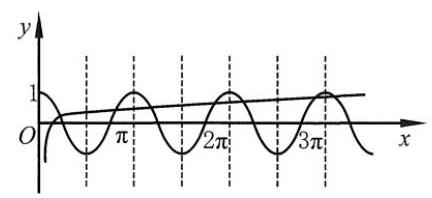

[第 260(2)题]

(2)由题意，知 $\lg x \leq  1$ ，则 $x \leq  {10}$ .

如图，在区间 $\left\lbrack  {0,\frac{\pi }{4}}\right\rbrack$ 内有 1 个解，在 $\left\lbrack  {\frac{3\pi }{4},\frac{5\pi }{4}}\right\rbrack$ ，

$\left\lbrack  {\frac{7}{4}\pi ,\frac{9}{4}\pi }\right\rbrack  ,\left\lbrack  {\frac{11}{4}\pi ,\frac{13}{4}\pi }\right\rbrack$ 内各有 2 个解,共 7 个解.

261. C 提示: $\cos {2x} = 0$ 且 $\sin {2x} \neq   - 1,\therefore {2x} = {2k\pi } + \frac{\pi }{2}, x = {k\pi } + \frac{\pi }{4}, k \in  \mathbf{Z}$ .

262. $\mathrm{D}$ 提示: $\frac{2\sin x}{2\sin x\cos x} = \frac{1}{\cos x} = 1,\therefore \cos x = 1$ 且 $\sin x \neq  0$ ,故无解.

263. $\mathrm{D}$ 提示: 选项 $\mathrm{A} : 2\sin x\cos x = 2{\sin }^{2}x,\sin x = 0$ 或 $\sin x = \cos x$ . 不同;

选项 B: $\cos x = \left| {\sin x}\right| ,\cos x = \sin x$ 或 $\cos x =  - \sin x$ ,且 $\cos x > 0$ . 不同;

选项 C: $\sin x = \cos x$ 或 $\sin x =  - \cos x$ . 不同;

选项 D: $\frac{{\cos }^{2}x - {\sin }^{2}x}{\sin x + \cos x} = \cos x - \sin x = 0\left( {\sin x + \cos x \neq  0}\right)$ . 和原方程解集相同.

264. (1) $\left\{  {x\left| {\;x = \frac{\pi }{3} + {2k\pi }}\right. , k \in  \mathbf{Z}}\right\}$ 提示: ${\log }_{2}\tan x = 1 + {\log }_{2}\sin x = {\log }_{2}2\sin x$ ,则 $\tan x = 2\sin x > 0$ .

$\therefore \;\cos x = \frac{1}{2},\sin x = \frac{\sqrt{3}}{2},\;\therefore \;x = \frac{\pi }{3} + {2k\pi }, k \in  \mathbf{Z}.$

(2) $\left\{  {x\left| {\;x = {2k\pi } + \frac{\pi }{6}}\right. , k \in  \mathbf{Z}}\right\}$ ___提示: $\frac{1}{2}\sin x + \frac{\sqrt{3}}{2}\cos x = \sin \left( {x + \frac{\pi }{3}}\right)  = 1$ ，

则 $x + \frac{\pi }{3} = {2k\pi } + \frac{\pi }{2}, k \in  \mathbf{Z},\therefore x = {2k\pi } + \frac{\pi }{6}, k \in  \mathbf{Z}$ .

(3) $\left\{  {x\left| {\;x = {2k\pi } + \frac{\pi }{3} + \arcsin \frac{a}{2}}\right. \text{ 或 }x = {2k\pi } + \frac{4}{3}\pi  - \arcsin \frac{a}{2}, k \in  \mathbf{Z}}\right\}$

提示: $\frac{1}{2}\sin x - \frac{\sqrt{3}}{2}\cos x = \sin \left( {x - \frac{\pi }{3}}\right)  = \frac{a}{2}, x - \frac{\pi }{3} = {2k\pi } + \arcsin \frac{a}{2}$ 或 ${2k\pi } + \pi  - \arcsin \frac{a}{2}$ .

(4) $\left\{  {x \mid  x = {k\pi }, k \in  \mathbf{Z}}\right\}$ 提示: $\frac{1}{2}\left\lbrack  {\cos \left( {{2x} + \pi }\right)  + \cos \frac{\pi }{3}}\right\rbrack   =  - \frac{1}{4}$ ，

$- \cos {2x} + \frac{1}{2} =  - \frac{1}{2}$ ,解得 $k \in  \mathbf{Z}$ .

(5) $\left\{  {x\left| {\;x = {k\pi } + \frac{\pi }{2}}\right. , k \in  \mathbf{Z}}\right\}$ 提示: $\frac{1}{2}\left\lbrack  {\cos \left( {x - {30}^{ \circ  }}\right)  + \cos \left( {x + {30}^{ \circ  }}\right) }\right\rbrack   + 1 = 1$ .

$\cos x \cdot  \cos {30}^{ \circ  } = 0,\;\therefore \;\cos x = 0, x = {k\pi } + \frac{\pi }{2}, k \in  \mathbf{Z}.$

(6) $\left\{  {x\left| {\;x = {2k\pi }\text{ 或 }{2k\pi } + \frac{\pi }{2}}\right. , k \in  \mathbf{Z}}\right\}$

提示: 令 $\sin x + \cos x = t$ ,则 $\sin x\cos x = \frac{{\left( \sin x + \cos x\right) }^{2} - 1}{2} = \frac{{t}^{2} - 1}{2}$ .

$\therefore \frac{{t}^{2} - 1}{2} + 1 = t$ ,解得 $t = 1,\therefore \sin x + \cos x = 1$ ,即 $\sin \left( {x + \frac{\pi }{4}}\right)  = \frac{\sqrt{2}}{2}$ .

$\therefore x + \frac{\pi }{4} = {2k\pi } + \frac{\pi }{4}$ 或 ${2k\pi } + \frac{3\pi }{4}, k \in  \mathbf{Z},\;\therefore x = {2k\pi }$ 或 ${2k\pi } + \frac{\pi }{2}, k \in  \mathbf{Z}$ .

(7) $\left\{  {x\left| {\;x = {2k\pi } - \frac{\pi }{4}\text{ 或 }\frac{2}{3}{k\pi } + \frac{\pi }{4}}\right. , k \in  \mathbf{Z}}\right\}$ 提示: $\sin x = \frac{\sqrt{2}}{2}\sin {2x} + \frac{\sqrt{2}}{2}\cos {2x} = \sin \left( {{2x} + \frac{\pi }{4}}\right)$ .

$\therefore \;{2x} + \frac{\pi }{4} = x + {2k\pi }$ 或 $\pi  - x + {2k\pi }, k \in  \mathbf{Z},\;\therefore \;x = {2k\pi } - \frac{\pi }{4}$ 或 $\frac{2}{3}{k\pi } + \frac{\pi }{4}, k \in  \mathbf{Z}$ .

(8) $\left\{  {x\left| {\;x = {k\pi } \pm  \frac{\pi }{3}}\right. , k \in  \mathbf{Z}}\right\}$ 提示: $\frac{1}{2}\left\lbrack  {\cos \left( {-\frac{\pi }{3}}\right)  - \cos {2x}}\right\rbrack   = \frac{1}{2},\cos {2x} =  - \frac{1}{2}$ .

解得 ${2x} =  \pm  \frac{2\pi }{3} + {2k\pi }$ ,即 $x =  \pm  \frac{\pi }{3} + {k\pi }, k \in  \mathbf{Z}$ .

265. (1) $2\sin {2x}\cos x - \sin {2x} = 0,\sin {2x}\left( {\cos x - \frac{1}{2}}\right)  = 0$ .

$\therefore \;\sin {2x} = 0$ 或 $\cos x = \frac{1}{2}.\;\therefore \;x = {2k\pi } \pm  \frac{\pi }{3}$ 或 $\frac{k\pi }{2}, k \in  \mathbf{Z}$ .

(2) $\frac{1}{2}\left( {\cos x + \cos {5x}}\right)  = \frac{1}{2}\left( {\cos {3x} + \cos {5x}}\right) ,\;\therefore \cos x = \cos {3x}$ ,

$\therefore \;{3x} =  \pm  x + {2k\pi }, k \in  \mathbf{Z}.\;\therefore \;x = {k\pi }$ 或 $\frac{k\pi }{2}, k \in  \mathbf{Z}$ ,即 $x = \frac{k\pi }{2}, k \in  \mathbf{Z}$ .

(3) $\frac{1}{2}\left( {\sin {7x} + \sin x}\right)  = \frac{1}{2}\left( {\sin {7x} + \sin {5x}}\right) ,\therefore \sin x = \sin {5x}$ ,

$\therefore {5x} = x + {2k\pi }$ 或 $\pi  - x + {2k\pi }.\;\therefore x = \frac{k\pi }{2}$ 或 $\frac{k\pi }{3} + \frac{\pi }{6}, k \in  \mathbf{Z}$ .

(4) $2\cos {4x}\sin x = \sqrt{2}\cos {4x},\therefore \cos {4x} = 0$ 或 $\sin x = \frac{\sqrt{2}}{2},\therefore x = \frac{k\pi }{4} + \frac{\pi }{8}$ 或 ${2k\pi } + \frac{\pi }{4}$ 或 ${2k\pi } + \frac{3\pi }{4}, k \in  \mathbf{Z}$ .

(5) $\sin {2x} + 2\sin {2x}\cos x = \cos x + 2{\cos }^{2}x,\sin {2x}\left( {1 + 2\cos x}\right)  = \cos x\left( {1 + 2\cos x}\right)$ ,

$\therefore \;\sin {2x} = \cos x$ 或 $\cos x =  - \frac{1}{2}$ .

方法一: $\because \;\cos x = \sin {2x} = \cos \left( {\frac{\pi }{2} - {2x}}\right) ,\;\therefore \;{2k\pi } + \frac{\pi }{2} - {2x} =  \pm  x$ .

$\therefore x = \frac{2k\pi }{3} + \frac{\pi }{6}$ 或 ${2k\pi } + \frac{\pi }{2}, k \in  \mathbf{Z}$ .

方法二: $\because \sin {2x} = 2\sin x\cos x = \cos x,\therefore \cos x = 0$ ,或 $\sin x = \frac{1}{2}$ ,

$\therefore x = {k\pi } + \frac{\pi }{2}$ 或 ${2k\pi } + \frac{\pi }{6}$ 或 ${2k\pi } + \frac{5\pi }{6}$ . 这与 “ ${2k\pi } + \frac{\pi }{2}$ 或 $\frac{2k\pi }{3} + \frac{\pi }{6}$ ” 的表示是相同的.

综上所述, $x = \frac{2k\pi }{3} + \frac{\pi }{6}$ 或 ${2k\pi } + \frac{\pi }{2}$ 或 ${2k\pi } + \frac{2\pi }{3}$ 或 ${2k\pi } - \frac{2\pi }{3}, k \in  \mathbf{Z}$ .

266. $\mathrm{C}$ 提示: $\sin x + \cos x = \sqrt{2}\sin \left( {x + \frac{\pi }{4}}\right)  = m,\;\because x + \frac{\pi }{4} \in  \left\lbrack  {\frac{\pi }{4},\frac{5\pi }{4}}\right\rbrack  ,\;\therefore 1 \leq  m < \sqrt{2}$ .

267. $\mathrm{B}$ 提示: $a = {\left( \sin x + 1\right) }^{2} - 1,\because \sin x \in  \left\lbrack  {-1,1}\right\rbrack  ,\therefore a \in  \left\lbrack  {-1,3}\right\rbrack$ .

268. $\mathrm{B}$ 提示: $1 - {\sin }^{2}x - \left| {\sin x}\right|  + 1 = 0,{\left| \sin x\right| }^{2} + \left| {\sin x}\right|  - 2 = 0,\left( {\left| {\sin x}\right|  + 2}\right) \left( {\left| {\sin x}\right|  - 1}\right)  = 0$ .

$\therefore \left| {\sin x}\right|  = 1,\;\therefore \;\sin x = 1$ 或 $- 1.\;\because \;x \in  \left( {-\pi ,\pi }\right) ,\;\therefore \;{x}_{1} = \frac{\pi }{2},{x}_{2} =  - \frac{\pi }{2}$ .

$\therefore \;{x}_{1} + {x}_{2} = p = 0.$

269. (1) 方法一: $8 \cdot  \frac{1 - \cos {2x}}{2} = 3\sin {2x} - 1,5 = 3\sin {2x} + 4\cos {2x}$ ，

$\frac{3}{5}\sin {2x} + \frac{4}{5}\cos {2x} = 1,\sin \left( {{2x} + \arcsin \frac{4}{5}}\right)  = 1.$

$\therefore \;{2x} + \arcsin \frac{4}{5} = {2k\pi } + \frac{\pi }{2},\;\therefore \;x = {k\pi } + \frac{\pi }{4} - \frac{1}{2}\arcsin \frac{4}{5}, k \in  \mathbf{Z}$ .

方法二: $8{\sin }^{2}x - 6\sin x\cos x + 1 = 0,9{\sin }^{2}x - 6\sin x\cos x + 1 - {\sin }^{2}x = 0$ ,

$\therefore \;{\left( 3\sin x - \cos x\right) }^{2} = 0$ ,即 $3\sin x = \cos x,\;\therefore \;x = \arctan \frac{1}{3} + {k\pi }, k \in  \mathbf{Z}$ .

这与 “ ${k\pi } + \frac{\pi }{4} - \frac{1}{2}\arcsin \frac{4}{5}, k \in  \mathbf{Z}$ ”的表示是相同的,理由如下:

$\tan \left( {\frac{\pi }{4} - \frac{1}{2}\arcsin \frac{4}{5}}\right)  = \frac{1 - \tan \left( {\frac{1}{2}\arcsin \frac{4}{5}}\right) }{1 + \tan \left( {\frac{1}{2}\arcsin \frac{4}{5}}\right) }.$

$\tan \left( {\frac{1}{2}\arcsin \frac{4}{5}}\right)  = \frac{\sin \left( {\arcsin \frac{4}{5}}\right) }{1 + \cos \left( {\arcsin \frac{4}{5}}\right) } = \frac{\frac{4}{5}}{1 + \frac{3}{5}} = \frac{1}{2},$

$\therefore \;\tan \left( {\frac{\pi }{4} - \frac{1}{2}\arcsin \frac{4}{5}}\right)  = \frac{1 - \frac{1}{2}}{1 + \frac{1}{2}} = \frac{1}{3}$ .

(2) $\because 1 + \sin {2x} = 2\cos {2x},\therefore \sin {2x} = 2\cos {2x} - 1$ .

$\therefore \;{\sin }^{2}{2x} + {\cos }^{2}{2x} = {\left( 2\cos 2x - 1\right) }^{2} + {\cos }^{2}{2x} = 1$ ,解得 $\cos {2x} = 0$ 或 $\frac{4}{5}$ .

$\therefore \left\{  {\begin{array}{l} \cos {2x} = 0, \\  \sin {2x} =  - 1, \end{array}\text{ 或 }\left\{  \begin{array}{l} \cos {2x} = \frac{4}{5}, \\  \sin {2x} = \frac{3}{5}. \end{array}\right. }\right.$

$\therefore {2x} = {2k\pi } - \frac{\pi }{2}$ 或 $\arcsin \frac{3}{5} + {2k\pi }$ ,即 $x = {k\pi } - \frac{\pi }{4}$ 或 $\frac{1}{2}\arcsin \frac{3}{5} + {k\pi }, k \in  \mathbf{Z}$ .

270. (1) $\frac{1 + \tan x}{1 - \tan x} = 1 + \frac{2\tan x}{1 + {\tan }^{2}x}$ ,

$\left( {1 + \tan x}\right) \left( {1 + {\tan }^{2}x}\right)  = \left( {1 - \tan x}\right) \left( {1 + {\tan }^{2}x}\right)  + 2\tan x\left( {1 - \tan x}\right) ,$

$1 + \tan x + {\tan }^{2}x + {\tan }^{3}x = 1 - \tan x + {\tan }^{2}x - {\tan }^{3}x + 2\tan x - 2{\tan }^{2}x$ ,

$1 + \tan x + {\tan }^{2}x + {\tan }^{3}x = 1 + \tan x - {\tan }^{2}x - {\tan }^{3}x,$

$\therefore \;{\tan }^{2}x\left( {\tan x + 1}\right)  = 0$ ,解得 $\tan x = 0$ 或 -1 .

$\therefore x = {k\pi }$ 或 $- \frac{\pi }{4} + {k\pi }, k \in  \mathbf{Z}$ .

(2)显然， $x \neq  {k\pi } + \frac{\pi }{2}, k \in  \mathbf{Z}$ . $\frac{\tan x + \sqrt{3}}{1 - \sqrt{3}\tan x} + \frac{\frac{\sqrt{3}}{3} - \tan x}{1 + \frac{\sqrt{3}}{3}\tan x} = \frac{4}{3}\sqrt{3},\frac{\tan x + \sqrt{3}}{1 - \sqrt{3}\tan x} + \frac{\sqrt{3} - 3\tan x}{3 + \sqrt{3}\tan x} = \frac{4}{3}\sqrt{3}$ .

解得 $\tan x = 0$ 或 $- \frac{\sqrt{3}}{3}$ . $\;\therefore x = {k\pi }$ 或 $- \frac{\pi }{6} + {k\pi }, k \in  \mathbf{Z}$ .

271. (1) 令 $t = \sin x + \cos x$ ,则 $\sin x\cos x = \frac{1}{2}\left\lbrack  {{\left( \sin x + \cos x\right) }^{2} - 1}\right\rbrack   = \frac{1}{2}\left( {{t}^{2} - 1}\right)$ .

$\therefore t + \frac{1}{2}\left( {{t}^{2} - 1}\right)  = 1,\left( {t + 3}\right) \left( {t - 1}\right)  = 0$ . 解得 ${t}_{1} =  - 3,{t}_{2} = 1$ .

$\because t = \sqrt{2}\sin \left( {x + \frac{\pi }{4}}\right)  \in  \left\lbrack  {-\sqrt{2},\sqrt{2}}\right\rbrack  ,\;\therefore t = 1,\;\therefore \sin \left( {x + \frac{\pi }{4}}\right)  = \frac{\sqrt{2}}{2}$ .

$\therefore x + \frac{\pi }{4} = \frac{\pi }{4} + {2k\pi }$ 或 $x = \frac{3\pi }{4} + {2k\pi }, k \in  \mathbf{Z}$ ,即 $\therefore x = {2k\pi }$ 或 $x = {2k\pi } + \frac{\pi }{2}, k \in  \mathbf{Z}$ .

(2) $\sqrt{2}\left( {\sin x + \cos x}\right)  = \frac{1}{\sin x\cos x}$ . 设 $t = \sin x + \cos x$ ，则 $\sin x\cos x = \frac{{t}^{2} - 1}{2}$ .

$\therefore \sqrt{2}t = \frac{2}{{t}^{2} - 1},\left( {t - \sqrt{2}}\right) \left( {{t}^{2} + \sqrt{2}t + 1}\right)  = 0$ .

$\therefore \;t = \sqrt{2}\sin \left( {x + \frac{\pi }{4}}\right)  = \sqrt{2}.\;\therefore x + \frac{\pi }{4} = {2k\pi } + \frac{\pi }{2}, x = {2k\pi } + \frac{\pi }{4}, k \in  \mathbf{Z}$ .

272. (1) $\because \Delta  = {16}{\sin }^{2}\theta  - {24}\cos \theta  = 8\left( {2{\sin }^{2}\theta  - 3\cos \theta }\right)  =  - 8\left( {2{\cos }^{2}\theta  + 3\cos \theta  - 2}\right)  =  - 8\left( {2\cos \theta  - 1}\right) \left( {\cos \theta  + 2}\right)  = 0$ ,

$\therefore \;\cos \theta  = \frac{1}{2},\theta  = \frac{\pi }{3}.\;\therefore \;2{x}^{2} - 2\sqrt{3}x + \frac{3}{2} = 0$ ,解得 ${x}_{1} = {x}_{2} = \frac{\sqrt{3}}{2}$ .

(2) $\because \Delta  = {\left( \sin \alpha  + \cos \alpha \right) }^{2} - 4{\sin }^{2}\alpha  + 4\sin \alpha \cos \alpha  + 4 = 5 - 4{\sin }^{2}\alpha  + 6\sin \alpha \cos \alpha  = 3 + 2\cos {2\alpha } + 3\sin {2\alpha } = 0$ ,

$\therefore \;2\cos {2\alpha } + 3\sin {2\alpha } =  - 3.\;\because \;{\sin }^{2}{2\alpha } + {\cos }^{2}{2\alpha } = 1$ ,

解得 $\sin {2\alpha } =  - \frac{5}{13},\cos {2\alpha } =  - \frac{12}{13}$ ,或 $\sin {2\alpha } =  - 1,\cos {2\alpha } = 0$ .

①若 $\sin {2\alpha } =  - \frac{5}{13},\cos {2\alpha } =  - \frac{12}{13}$ ，则 ${2\alpha } = \pi  + \arcsin \frac{5}{13} + {2k\pi },\alpha  = \frac{\pi }{2} + \frac{1}{2}\arcsin \frac{5}{13} + {k\pi }, k \in  \mathbf{Z}$ .

$\therefore \;{x}_{1}{x}_{2} = \frac{1 - \cos {2\alpha }}{2} - \frac{1}{2}\sin {2\alpha } - 1 = \frac{1}{2}\left( {1 + \frac{12}{13}}\right)  - \frac{1}{2} \cdot  \left( {-\frac{5}{13}}\right)  - 1 = \frac{2}{13}$ .

$\therefore$ 当 $k$ 为奇数时, ${x}_{1} = {x}_{2} =  - \frac{\sqrt{26}}{13}$ .

当 $k$ 为偶数时, ${x}_{1} = {x}_{2} = \frac{\sqrt{26}}{13}$ .

②若 $\sin {2\alpha } =  - 1$ ，则 ${2\alpha } = {2k\pi } - \frac{\pi }{2}$ ，即 $\alpha  = {k\pi } - \frac{\pi }{4}$ ， $k \in  \mathbf{Z}$ .

$\therefore \;{x}_{1}{x}_{2} = {\sin }^{2}\alpha  - \sin \alpha \cos \alpha  - 1 = \frac{1 - \cos {2\alpha }}{2} - \frac{1}{2}\sin {2\alpha } - 1 = \frac{1}{2} - \frac{1}{2} \cdot  \left( {-1}\right)  - 1 = 0$ ,

$\therefore \;{x}_{1} = {x}_{2} = 0$ .

(3)设此根为 $a\left( {a \neq  0}\right)$ ，则 $\left\{  \begin{array}{l} {a}^{2} - {4a} \cdot  \cos {2\theta } + 2 = 0, \\  2 \cdot  \frac{1}{{a}^{2}} + 4 \cdot  \frac{1}{a} \cdot  \sin {2\theta } - 1 = 0. \end{array}\right.$

解得 $\cos {2\theta } = \frac{{a}^{2} + 2}{4a},\sin {2\theta } = \frac{{a}^{2} - 2}{4a}.\;\because \;{\sin }^{2}{2\theta } + {\cos }^{2}{2\theta } = {\left( \frac{{a}^{2} + 2}{4a}\right) }^{2} + {\left( \frac{{a}^{2} - 2}{4a}\right) }^{2} = 1$ ,

$\therefore a = 1 \pm  \sqrt{3}$ 或 $a =  - 1 \pm  \sqrt{3}$ .

① $a = 1 + \sqrt{3},\cos {2\theta } = \frac{4 + 2\sqrt{3} + 2}{4\left( {1 + \sqrt{3}}\right) } = \frac{\sqrt{3}}{2},\sin {2\theta } = \frac{4 + 2\sqrt{3} - 2}{4\left( {1 + \sqrt{3}}\right) } = \frac{1}{2}.\;\therefore \;{2\theta } = \frac{\pi }{6},\theta  = \frac{\pi }{12}.$

② $a =  - 1 - \sqrt{3},\cos {2\theta } = \frac{4 + 2\sqrt{3} + 2}{-4\left( {1 + \sqrt{3}}\right) } =  - \frac{\sqrt{3}}{2},\sin {2\theta } = \frac{4 + 2\sqrt{3} - 2}{-4\left( {1 + \sqrt{3}}\right) } =  - \frac{1}{2}.\;\therefore \;{2\theta } = \frac{7\pi }{6},\theta  = \frac{7\pi }{12}$ .

③ $a = 1 - \sqrt{3},\cos {2\theta } = \frac{4 - 2\sqrt{3} + 2}{4\left( {1 - \sqrt{3}}\right) } =  - \frac{\sqrt{3}}{2},\sin {2\theta } = \frac{4 - 2\sqrt{3} - 2}{4\left( {1 - \sqrt{3}}\right) } = \frac{1}{2}.\;\therefore \;{2\theta } = \frac{5\pi }{6},\theta  = \frac{5\pi }{12}$ .

④ $a = \sqrt{3} - 1,\cos {2\theta } = \frac{4 - 2\sqrt{3} + 2}{-4\left( {1 - \sqrt{3}}\right) } = \frac{\sqrt{3}}{2},\sin {2\theta } = \frac{4 - 2\sqrt{3} - 2}{-4\left( {1 - \sqrt{3}}\right) } =  - \frac{1}{2}.\;\therefore \;{2\theta } = \frac{11\pi }{6},\theta  = \frac{11\pi }{12}$ .

$\therefore \theta  = \frac{\pi }{12}$ 或 $\frac{5\pi }{12}$ 或 $\frac{7\pi }{12}$ 或 $\frac{11\pi }{12}$ .

273. (1) $\because 1 - {\cos }^{2}x + \cos x + a = 0,\therefore a = {\cos }^{2}x - \cos x - 1 = {\left( \cos x - \frac{1}{2}\right) }^{2} - \frac{5}{4}$ .

$\because \;\cos x \in  \left\lbrack  {-1,1}\right\rbrack  ,\;\therefore \;a \in  \left\lbrack  {-\frac{5}{4},1}\right\rbrack$ .

(2) $a = \sin x - {\cos }^{2}x = \sin x - 1 + {\sin }^{2}x = {\left( \sin x + \frac{1}{2}\right) }^{2} - \frac{5}{4}$ .

$\because x \in  \left( {0,\frac{\pi }{2}}\right\rbrack  ,\;\therefore \;\sin x \in  (0,1\rbrack ,\;\therefore a \in  ( - 1,1\rbrack .$

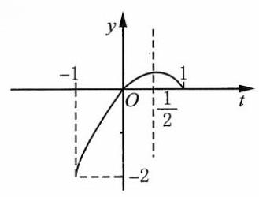

(第 273 题)

(3) $k =  - {\left( \sin x - \frac{1}{2}\right) }^{2} + \frac{1}{4},\sin x \in  \left\lbrack  {-1,1}\right\rbrack$ ,且在 $\left\lbrack  {-\frac{\pi }{2},\frac{\pi }{2}}\right\rbrack$ 上单调.

设 $f\left( t\right)  =  - {\left( t - \frac{1}{2}\right) }^{2} + \frac{1}{4}, t = \sin x$ ,

作 $y = f\left( t\right)$ 的图像如图所示.

$\text{ ① }k \in  \left( {-\infty , - 2}\right)  \cup  \left( {\frac{1}{4}, + \infty }\right)$ .

$\text{ ② }k \in  \lbrack  - 2,0) \cup  \left\{  \frac{1}{4}\right\}$ .

$\text{ ③ }k \in  \left\lbrack  {0,\frac{1}{4}}\right)$ .

274. (1) $1 - 2{\sin }^{2}x - \sin x + 1 + m = 0$ ，则 $m = 2{\sin }^{2}x + \sin x - 2 = 2{\left( \sin x + \frac{1}{4}\right) }^{2} - \frac{17}{8}$ .

$\because \;\sin x \in  \left\lbrack  {-1,1}\right\rbrack  ,\;\therefore \;m \in  \left\lbrack  {-\frac{17}{8},1}\right\rbrack$ .

(2) $a = 1 - 3{\cos }^{2}x + 4\sin x\cos x = 1 - \frac{3}{2}\left( {1 + \cos {2x}}\right)  + 2\sin {2x} \; =  - \frac{1}{2} - \frac{3}{2}\cos {2x} + 2\sin {2x} =  - \frac{1}{2} + \frac{5}{2}\left( {\sin {2x} \cdot  \frac{4}{5} - \cos {2x} \cdot  \frac{3}{5}}\right) \; =  - \frac{1}{2} + \frac{5}{2}\sin \left( {{2x} - \arccos \frac{4}{5}}\right)$ . $\therefore  - 3 \leq  a \leq  2$ .

275. (1) $\sin \left( {\frac{\pi }{2} - \pi \sin x}\right)  = \sin \left( {\pi \cos x}\right)$ .

$\because \pi \sin x \in  \left\lbrack  {-\pi ,\pi }\right\rbrack  ,\;\therefore \frac{\pi }{2} - \pi \sin x \in  \left\lbrack  {-\frac{\pi }{2},\frac{3\pi }{2}}\right\rbrack$ ,

$\therefore \frac{\pi }{2} - \pi \sin x = \pi \cos x$ 或 $\frac{\pi }{2} - \pi \sin x = \pi  - \pi \cos x$ .

① $\sin x + \cos x = \sqrt{2}\sin \left( {x + \frac{\pi }{4}}\right)  = \frac{1}{2},\sin \left( {x + \frac{\pi }{4}}\right)  = \frac{\sqrt{2}}{4}$ .

$\because x + \frac{\pi }{4} \in  \left\lbrack  {\frac{\pi }{4},\frac{9\pi }{4}}\right) ,\therefore x + \frac{\pi }{4} = \pi  - \arcsin \frac{\sqrt{2}}{4}$ 或 ${2\pi } + \arcsin \frac{\sqrt{2}}{4}$ ,

$\therefore \;{x}_{1} = \frac{3\pi }{4} - \arcsin \frac{\sqrt{2}}{4},{x}_{2} = \frac{7\pi }{4} + \arcsin \frac{\sqrt{2}}{4}$ .

② $\sin x - \cos x = \sqrt{2}\sin \left( {x - \frac{\pi }{4}}\right)  =  - \frac{1}{2},\sin \left( {x - \frac{\pi }{4}}\right)  =  - \frac{\sqrt{2}}{4}$ .

$\because \;x - \frac{\pi }{4} \in  \left\lbrack  {-\frac{\pi }{4},\frac{7\pi }{4}}\right) ,\;\therefore \;x - \frac{\pi }{4} = \arcsin \left( {-\frac{\sqrt{2}}{4}}\right)$ 或 $\pi  - \arcsin \left( {-\frac{\sqrt{2}}{4}}\right)$ ,

${x}_{3} = \frac{\pi }{4} - \arcsin \frac{\sqrt{2}}{4},{x}_{4} = \frac{5\pi }{4} + \arcsin \frac{\sqrt{2}}{4}.$

综上所述,原方程的解为:

$$
{x}_{1} = \frac{3\pi }{4} - \arcsin \frac{\sqrt{2}}{4},{x}_{2} = \frac{\pi }{4} - \arcsin \frac{\sqrt{2}}{4},{x}_{3} = \frac{7\pi }{4} + \arcsin \frac{\sqrt{2}}{4},{x}_{4} = \frac{5\pi }{4} + \arcsin \frac{\sqrt{2}}{4}\text{ . }
$$

(2) $\because \Delta  = 4{\cos }^{2}\left( {xy}\right)  - 4 \geq  0,\therefore {\cos }^{2}\left( {xy}\right)  = 1,\therefore {x}^{2} \pm  {2x} + 1 = 0$ .

① $\cos \left( {xy}\right)  = 1, x =  - 1,\cos \left( {-y}\right)  = 1, - y = {2k\pi }, k \in  \mathbf{Z}$ .

② $\cos \left( {xy}\right)  =  - 1, x = 1,\cos y =  - 1, y = \left( {{2k} + 1}\right) \pi , k \in  \mathbf{Z}$ .

$\left\{  \begin{array}{l} {x}_{2} = 1, \\  {y}_{2} = \left( {{2k} + 1}\right) \pi , k \in  \mathbf{Z}. \end{array}\right.$

原方程的解为 $\left\{  \begin{array}{l} {x}_{1} =  - 1, \\  {y}_{1} = {2k\pi }, k \in  \mathbf{Z}. \end{array}\right.$ 或 $\left\{  \begin{array}{l} {x}_{2} = 1, \\  {y}_{2} = \left( {{2k} + 1}\right) \pi , k \in  \mathbf{Z}. \end{array}\right.$

276. $\left\{  \begin{array}{l} a\cos \alpha  + b\sin \alpha  = c,\text{ ① } \\  a\cos \beta  + b\sin \beta  = c.\text{ ② } \end{array}\right.$

①②相减，得 $a\left( {\cos \alpha  - \cos \beta }\right)  + b\left( {\sin \alpha  - \sin \beta }\right)  = 0$ ，

$\therefore  - a\sin \frac{\alpha  + \beta }{2}\sin \frac{\alpha  - \beta }{2} + b\cos \frac{\alpha  + \beta }{2}\sin \frac{\alpha  - \beta }{2} = 0$ .

$\because \frac{\alpha  - \beta }{2} \neq  {k\pi }, k \in  \mathbf{Z},\;\therefore \;a\sin \frac{\alpha  + \beta }{2} = b\cos \frac{\alpha  + \beta }{2}$ .

由 ${ab} \neq  0$ ,得 $\cos \frac{\alpha  + \beta }{2} \neq  0,\tan \frac{\alpha  + \beta }{2} = \frac{b}{a}$ ,

$\sin \left( {\alpha  + \beta }\right)  = \frac{2\tan \frac{\alpha  + \beta }{2}}{1 + {\tan }^{2}\frac{\alpha  + \beta }{2}} = \frac{2 \cdot  \frac{b}{a}}{1 + \frac{{b}^{2}}{{a}^{2}}} = \frac{2ab}{{a}^{2} + {b}^{2}},\cos \left( {\alpha  + \beta }\right)  = \frac{1 - {\left( \frac{b}{a}\right) }^{2}}{1 + {\left( \frac{b}{a}\right) }^{2}} = \frac{{a}^{2} - {b}^{2}}{{a}^{2} + {b}^{2}}.$

①②相加，得 ${2a}\cos \frac{\alpha  + \beta }{2}\cos \frac{\alpha  - \beta }{2} + {2b}\sin \frac{\alpha  + \beta }{2}\cos \frac{\alpha  - \beta }{2} = {2c}$ ，

$\therefore \;\cos \frac{\alpha  - \beta }{2} = \frac{c}{a \cdot  \cos \frac{\alpha  + \beta }{2} + b\sin \frac{\alpha  + \beta }{2}}.$

设 $a\cos \frac{\alpha  + \beta }{2} + b\sin \frac{\alpha  + \beta }{2} = k$ ,则

${k}^{2} = {a}^{2}{\cos }^{2}\frac{\alpha  + \beta }{2} + {2ab}\sin \frac{\alpha  + \beta }{2}\cos \frac{\alpha  + \beta }{2} + {b}^{2}{\sin }^{2}\frac{\alpha  + \beta }{2} = {a}^{2} \times  \frac{1 + \cos \left( {\alpha  + \beta }\right) }{2} + {ab}\sin \left( {\alpha  + \beta }\right)  + {b}^{2} \times  \frac{1 - \cos \left( {\alpha  + \beta }\right) }{2}$

$= \frac{{a}^{2}}{2} \times  \left( {1 + \frac{{a}^{2} - {b}^{2}}{{a}^{2} + {b}^{2}}}\right)  + \frac{2{a}^{2}{b}^{2}}{{a}^{2} + {b}^{2}} + \frac{{b}^{2}}{2} \times  \left( {1 - \frac{{a}^{2} - {b}^{2}}{{a}^{2} + {b}^{2}}}\right)  = {a}^{2} + {b}^{2}.$

$\therefore \;{\cos }^{2}\frac{\alpha  - \beta }{2} = \frac{{c}^{2}}{{k}^{2}} = \frac{{c}^{2}}{{a}^{2} + {b}^{2}}$ .

277. $\because 4{\sin }^{2}x + 6\sin x\cos x - 4{\cos }^{2}x = 0,\therefore \left( {2\sin x - \cos x}\right) \left( {\sin x + 2\cos x}\right)  = 0$ ,

$\therefore \tan A =  - 2,\tan B = \frac{1}{2},\therefore \sin A = \frac{2}{\sqrt{5}},\cos A =  - \frac{1}{\sqrt{5}},\sin B = \frac{1}{\sqrt{5}},\cos B = \frac{2}{\sqrt{5}}$ .

$\therefore \;\sin C = \sin \left( {A + B}\right)  = \frac{2}{\sqrt{5}} \cdot  \frac{2}{\sqrt{5}} - \frac{1}{\sqrt{5}} \cdot  \frac{1}{\sqrt{5}} = \frac{3}{5}$ .

$\therefore \;a : b : c = \sin A : \sin B : \sin C = 2\sqrt{5} : \sqrt{5} : 3$ .

278. 只要证 $f\left( x\right)  = x - a\sin x$ 在 $\mathbf{R}$ 上单调即可.

$\forall {x}_{1},{x}_{2} \in  \mathbf{R},{x}_{1} > {x}_{2},$

$f\left( {x}_{1}\right)  - f\left( {x}_{2}\right)  = \left( {{x}_{1} - {x}_{2}}\right)  - a\left( {\sin {x}_{1} - \sin {x}_{2}}\right)$

$= 2 \cdot  \frac{{x}_{1} - {x}_{2}}{2} - {2a} \cdot  \sin \frac{{x}_{1} - {x}_{2}}{2}\cos \frac{{x}_{1} + {x}_{2}}{2} = 2\left( {\frac{{x}_{1} - {x}_{2}}{2} - a \cdot  \sin \frac{{x}_{1} - {x}_{2}}{2}\cos \frac{{x}_{1} + {x}_{2}}{2}}\right) ,$

当 ${x}_{1} - {x}_{2} \geq  2$ 时,显然 $f\left( {x}_{1}\right)  > f\left( {x}_{2}\right)$ ;

当 $0 < {x}_{1} - {x}_{2} < 2$ 时, $\frac{{x}_{1} - {x}_{2}}{2} \in  \left( {0,1}\right) ,\frac{{x}_{1} - {x}_{2}}{2} > \sin \frac{{x}_{1} - {x}_{2}}{2}$ .

$\therefore \;f\left( {x}_{1}\right)  - f\left( {x}_{2}\right)  > 2\left( {\sin \frac{{x}_{1} - {x}_{2}}{2} - a\sin \frac{{x}_{1} - {x}_{2}}{2}\cos \frac{{x}_{1} + {x}_{2}}{2}}\right)$

$= 2\sin \frac{{x}_{1} - {x}_{2}}{2}\left( {1 - a\cos \frac{{x}_{1} + {x}_{2}}{2}}\right)  > 0.$

$\therefore y = f\left( x\right)$ 在 $\mathbf{R}$ 上是严格增函数,即方程只有一个实数解.

279. (1) $1 - {\cos }^{2}x + 3{a}^{2}\cos x - 2{a}^{2}\left( {{3a} - 2}\right)  - 1 = 0,{\cos }^{2}x - 3{a}^{2}\cos x + {2a}\left( {3{a}^{2} - {2a}}\right)  = 0$ ,

$\cos x = 3{a}^{2} - {2a}$ 或 ${2a}$ .

$- 1 \leq  3{a}^{2} - {2a} \leq  1 \Rightarrow  a \in  \left\lbrack  {-\frac{1}{3},1}\right\rbrack  ; - 1 \leq  {2a} \leq  1 \Rightarrow  a \in  \left\lbrack  {-\frac{1}{2},\frac{1}{2}}\right\rbrack$ .

综上所述, $a \in  \left\lbrack  {-\frac{1}{2},1}\right\rbrack$ .

(2) $2\left( {1 - 2{\sin }^{2}x}\right)  + 4\left( {a - 1}\right) \sin x - {4a} + 1 = 0$ ，

$2 - 4{\sin }^{2}x - 4\sin x + 1 + \left( {4\sin x - 4}\right) a = 0.$

显然 $\sin x = 1$ 不是方程的解,

$\therefore \;a = \frac{4{\sin }^{2}x + 4\sin x - 3}{4\left( {\sin x - 1}\right) } = \frac{4\left( {{\sin }^{2}x - \sin x}\right)  + 8\left( {\sin x - 1}\right)  + 5}{4\left( {\sin x - 1}\right) } = \left( {\sin x - 1}\right)  + \frac{5}{4\left( {\sin x - 1}\right) } + 3$ .

(第 279 题)

设 $t = \sin x - 1 \in  \lbrack  - 2,0)$ .

作 $y = 3 + t + \frac{5}{4t}, t \in  \lbrack  - 2,0)$ 的图像如图所示.

$\therefore a \in  \left( {-\infty ,\frac{3}{8}}\right)$ 或 $a = 3 - \sqrt{5}$ .

## 第七章 三角函数

1. $\mathrm{C}$ 提示: $\sin x = \cos x$ ,故 $\tan x = 1$ .

$\therefore x = {k\pi } + \frac{\pi }{4}, k \in  \mathbf{Z}.k$ 为奇数时, $\sin x = \cos x =  - \frac{\sqrt{2}}{2};k$ 为偶数时, $\sin x = \cos x = \frac{\sqrt{2}}{2}$ .

即交点为 $\left( {{k\pi } + \frac{\pi }{4},\frac{{\left( -1\right) }^{k}}{\sqrt{2}}}\right) , k \in  \mathbf{Z}$ .

2. A 提示: $y = {\log }_{\frac{1}{2}}t$ 在区间 $\left( {0, + \infty }\right)$ 上是严格减函数, $f\left( x\right)  = \sin {2x} > 0$ 且当 ${2k\pi } < {2x} \leq  {2k\pi } + \frac{\pi }{2}, k \in  \mathbf{Z}$ 时是严格增函数.

$\therefore x \in  \left( {{k\pi },{k\pi } + \frac{\pi }{4}}\right\rbrack  , k \in  \mathbf{Z}$ .

3. A 提示: $\because \sin x \neq   \pm  1,\therefore x \neq  {k\pi } + \frac{\pi }{2}, k \in  \mathbf{Z}$ ,定义域关于原点对称. $f\left( x\right)  = \lg \left( {1 - \sin x}\right)  - \lg \left( {1 + \sin x}\right)$ .

$\therefore f\left( {-x}\right)  = \lg \left( {1 - \sin \left( {-x}\right) }\right)  - \lg \left( {1 + \sin \left( {-x}\right) }\right)  = \lg \left( {1 + \sin x}\right)  - \lg \left( {1 - \sin x}\right)  =  - f\left( x\right)$ .

故 $y = f\left( x\right)$ 是奇函数但非偶函数.

4. $\mathrm{D}$ 提示: $y = \sin x$ 在区间 $\left\lbrack  {0,\frac{\pi }{2}}\right\rbrack$ 上是严格增函数,则 $\sin \left( {1 + x}\right)  > \sin x.y = \cos x$ 在区间 $\left\lbrack  {0,\frac{\pi }{2}}\right\rbrack$ 上是严格减函数,则 $\cos \left( {1 + x}\right)  < \cos x.$

由 $x > 0$ ,得 ${\left( 1 + x\right) }^{x} > 1$ . 由 $x \in  \left( {0,1}\right)$ ,得 ${x}^{x} < 1.\therefore {\left( 1 + x\right) }^{x} > 1 > {x}^{x}$ .

由 $x \in  \left( {0,1}\right)$ ,得 ${\log }_{x}\left( {1 + x}\right)  < 0.\because {\log }_{x}x = 1$ , $\therefore {\log }_{x}\left( {1 + x}\right)  < {\log }_{x}x$ .

5. $\mathrm{C}$ 提示: 定义域 $\mathbf{R}$ 关于原点对称, $f\left( {-x}\right)  = \cos \left\lbrack  {\sin \left( {-x}\right) }\right\rbrack   = \cos \left( {-\sin x}\right)  = \cos \left( {\sin x}\right)  = f\left( x\right)$ ,

$\therefore y = f\left( x\right)$ 是偶函数. $\because f\left( x\right)  + f\left( {-x}\right)$ 不恒为 $0,\therefore y = f\left( x\right)$ 不是奇函数.

$\sin x \in  \left\lbrack  {-1,1}\right\rbrack  .y = \cos x$ 在区间 $\left\lbrack  {-1,0}\right\rbrack$ 上是严格增函数，在区间 $\left\lbrack  {0,1}\right\rbrack$ 上是严格减函数，值域为 $\left\lbrack  {\cos 1,1}\right\rbrack  .$

由 $f\left( {x + \pi }\right)  = \cos \left\lbrack  {\sin \left( {x + \pi }\right) }\right\rbrack   = \cos \left( {-\sin x}\right)  = \cos \left( {\sin x}\right)  = f\left( x\right) .\pi$ 是其一个周期.

6. $\mathrm{C}$ 提示: 选项 $\mathrm{A},\mathrm{B},\mathrm{D}$ 都有周期 ${2\pi }$ . 选项 $\mathrm{C}, f\left( {-x}\right)  = \sin \left| {-x}\right|  = \sin \left| x\right|  = f\left( x\right)$ ,在 $\left\lbrack  {0,\frac{\pi }{2}}\right\rbrack$ 上, $y = \sin \left| x\right| \; = \sin x$ 是严格增函数. 设 $y = \sin \left| x\right|$ 有正周期 $T$ ,则 $\forall x \in  \mathbf{R},\sin \left| {x + T}\right|  = \sin \left| x\right|$ .

令 ${x}_{1} = 0,{x}_{2} = \frac{\pi }{2}$ ,则 $\left\{  \begin{array}{l} \sin T = 0, \\  \sin \left( {\frac{\pi }{2} + T}\right)  = 1. \end{array}\right.$ 故 $T = {2\pi },{4\pi },{6\pi }\cdots \cdots$ .

再取 $x =  - \frac{\pi }{2}$ ,则 $\sin \left| {x + T}\right|  = \sin \frac{3}{2}\pi  =  - 1,\sin \left| x\right|  = \sin \frac{\pi }{2} = 1$ . 故不存在这样的 $T$ .

7. $\mathrm{C}$ 提示: 选项 $\mathrm{A}$ ,不是周期函数. 选项 $\mathrm{B}, y = \cos {2x}$ 在区间 $\left( {0,\frac{\pi }{2}}\right)$ 上是严格减函数.

选项 $\mathrm{C}, y = \sin x$ 在区间 $\left( {0,\frac{\pi }{2}}\right)$ 上是严格增函数. 设正周期为 $T,\left| {\sin \left( {x + T}\right) }\right|  = \left| {\sin x}\right|$ .

令 $x = 0,\sin T = 0, T = {k\pi }, k \in  \mathbf{Z}$ . 当 $T = \pi$ 时 $\left| {\sin \left( {x + \pi }\right) }\right|  = \left| {-\sin x}\right|  = \left| {\sin x}\right|$ .

$\therefore$ 最小正周期为 $\pi$ . 选项 D,存在周期 $\frac{\pi }{2},\pi$ 不是最小正周期.

8. $\mathrm{B}$ 提示: $\because 1 + 2\sin \theta  \leq  0,\therefore \sin \theta  \leq   - \frac{1}{2}.\;\therefore \theta  \in  \left\lbrack  {{2k\pi } - \frac{5\pi }{6},{2k\pi } - \frac{\pi }{6}}\right\rbrack  , k \in  \mathbf{Z}$ .

9.(1) $\left\lbrack  {-4,4}\right\rbrack$ 提示: $a = {\cos }^{2}x + 4\sin x = 1 - {\sin }^{2}x + 4\sin x =  - {\left( \sin x - 2\right) }^{2} + 5$ . ${a}_{\max } =  - {\left( 1 - 2\right) }^{2} + 5 = 4,{a}_{\min } =  - {\left( -1 - 2\right) }^{2} + 5 =  - 4.\;\therefore \;a \in  \left\lbrack  {-4,4}\right\rbrack$ .

(2) $\left\lbrack  {-1,\frac{13}{3}}\right\rbrack$ 提示: $y = 1 - 2\sin x + 3 - 3{\sin }^{2}x =  - 3{\left( \sin x + \frac{1}{3}\right) }^{2} + \frac{13}{3}$ ，

$\therefore {y}_{\min } =  - 3{\left( 1 + \frac{1}{3}\right) }^{2} + \frac{13}{3} =  - 1,{y}_{\max } = \frac{13}{3}.\;\therefore y \in  \left\lbrack  {-1,\frac{13}{3}}\right\rbrack$ .

(3) $\left\lbrack  {-\frac{1}{4},2}\right\rbrack$ 提示: $\because \cos x \in  \left\lbrack  {-\frac{1}{2},1}\right\rbrack  ,\therefore y = 1 - {\cos }^{2}x + 2\cos x =  - {\left( \cos x - 1\right) }^{2} + 2$ .

${y}_{\max } =  - {\left( 1 - 1\right) }^{2} + 2 = 2,{y}_{\min } =  - {\left( -\frac{1}{2} - 1\right) }^{2} + 2 =  - \frac{1}{4}.\;\therefore y \in  \left\lbrack  {-\frac{1}{4},2}\right\rbrack$ .

(4) $\left\lbrack  {-2,\frac{4}{3}}\right\rbrack$ 提示: $y = 3 - \frac{5}{\cos x + 2},{y}_{\max } = 3 - \frac{5}{1 + 2} = \frac{4}{3},{y}_{\min } = 3 - \frac{5}{-1 + 2} =  - 2$ .

(5)-1 提示: $\because \;0 < 2\sin x \leq  2, y = {\log }_{\frac{1}{2}}t$ 在定义域上是严格减函数， $\therefore {f}_{\min } = {\log }_{\frac{1}{2}}2 =  - 1$ .

10. (1) $\left\lbrack  {\frac{\pi }{6},\frac{5}{6}\pi }\right\rbrack$ (2) $\left\lbrack  {\frac{5\pi }{6} + {2k\pi },\frac{13\pi }{6} + {2k\pi }}\right\rbrack  , k \in  \mathbf{Z}$

(3) $\left\lbrack  {\frac{k\pi }{2} + \frac{\pi }{6},\frac{k\pi }{2} + \frac{\pi }{3}}\right\rbrack  , k \in  \mathbf{Z}$ 提示: $- \frac{1}{2} \leq  \cos {2x} \leq  \frac{1}{2},{k\pi } + \frac{\pi }{3} \leq  {2x} \leq  {k\pi } + \frac{2}{3}\pi , k \in  \mathbf{Z}$ .

$\therefore \;x \in  \left\lbrack  {\frac{k\pi }{2} + \frac{\pi }{6},\frac{k\pi }{2} + \frac{\pi }{3}}\right\rbrack  , k \in  \mathbf{Z}$ .

(4) $\left\lbrack  {\frac{\pi }{3},\frac{5\pi }{6}}\right\rbrack$ 提示: $M = \left\lbrack  {\frac{\pi }{6},\frac{5}{6}\pi }\right\rbrack  , P = \left\lbrack  {\frac{\pi }{3},\pi }\right\rbrack  , M \cap  P = \left\lbrack  {\frac{\pi }{3},\frac{5}{6}\pi }\right\rbrack$ .

(5) $\left( {-\frac{2}{3}\pi , - \frac{\pi }{3}}\right)  \cup  \left( {\frac{\pi }{3},\frac{2}{3}\pi }\right)$

提示: $\because \;0 < 1 + 2\cos x < 2,\therefore \;\cos x \in  \left( {-\frac{1}{2},\frac{1}{2}}\right) ,\;\therefore \;x \in  \left( {-\frac{2}{3}\pi , - \frac{\pi }{3}}\right)  \cup  \left( {\frac{\pi }{3},\frac{2}{3}\pi }\right)$ .

(第 12 题)

11. $\mathrm{C}$ 提示: $\sin \alpha  < \cos \beta  = \sin \left( {\frac{\pi }{2} - \beta }\right) ,\alpha  < \frac{\pi }{2} - \beta ,\alpha  + \beta  < \frac{\pi }{2}$ .

12. $\mathrm{D}$ 提示: 如图,由图像,得在 $\left( {-\infty ,0}\right)$ 上有无穷多个解.

13. $\mathrm{D}$ 提示: $\sin \alpha  \in  \left( {0,1}\right) .x \in  (0,1\rbrack$ 时, ${\log }_{\sin }x \geq  0.f\left( x\right)  = {\left( \sin \alpha \right) }^{{\log }_{\sin }x} = x$ ;

$x \in  \left( {1, + \infty }\right)$ 时, ${\log }_{\sin }x < 0.f\left( x\right)  = {\left( \sin \alpha \right) }^{-{\log }_{\sin }x} = \frac{1}{x}$ .

14. $\mathrm{B}$ 提示: 由 $x \in  \left( {0,\frac{\pi }{2}}\right)$ ,得 $\cos x \in  \left( {0,1}\right) .\forall x \in  \left( {0, + \infty }\right)$ ,有 $\sin x < x\left( *\right)$ . 由此结论知, $\sin \left( {\cos x}\right)  < \; \cos x$ . 由 $0 < \sin x < x < \frac{\pi }{2}$ ,得 $\cos x < \cos \left( {\sin x}\right) .\;\therefore \sin \left( {\cos x}\right)  < \cos x < \cos \left( {\sin x}\right)$ . 其他选项易举出反例. 对于 (*) 可用单位圆证明: 只要证 $x \in  \left( {0,\frac{\pi }{2}}\right)$ 即可. 如图,在第一象限内取点 $C\left( {\cos \theta ,\sin \theta }\right) ,\theta  \in \; \left( {0,\frac{\pi }{2}}\right)$ ,过点 $C$ 作 ${CB} \bot  x$ 轴于点 $B$ ,则 $\left| {BC}\right|  = \sin \theta ,\theta$ 表示 $\left| \overset{\text{ ⏜ }}{AC}\right| .\;\because \left| \overset{\text{ ⏜ }}{AC}\right|  > \left| {AC}\right|  > \left| {BC}\right|$ ,

(第 14 题)

$\therefore \;\theta  > \sin \theta$ . 当 $\theta  \geq  \frac{\pi }{2}$ 时, $\theta  > 1 \geq  \sin \theta$ .

15. (1) $\left\{  \begin{array}{l} 2\cos x + 1 > 0 \Rightarrow  x \in  \left( {{2k\pi } - \frac{2\pi }{3},{2k\pi } + \frac{2\pi }{3}}\right) \left( {k \in  \mathbf{Z}}\right) , \\  \sin x > 0 \Rightarrow  x \in  \left( {{2k\pi },{2k\pi } + \pi }\right) \left( {k \in  \mathbf{Z}}\right) , \\  \sin x \neq  1 \Rightarrow  x \neq  {2k\pi } + \frac{\pi }{2}, k \in  \mathbf{Z}. \end{array}\right.$

$\therefore \;x \in  \left( {{2k\pi },{2k\pi } + \frac{\pi }{2}}\right)  \cup  \left( {{2k\pi } + \frac{\pi }{2},{2k\pi } + \frac{2\pi }{3}}\right) \left( {k \in  \mathbf{Z}}\right) .$

定义域为 $\left\{  {x \mid  {2k\pi } < x < {2k\pi } + \frac{\pi }{2}\text{ 或 }{2k\pi } + \frac{\pi }{2} < x < {2k\pi } + \frac{2\pi }{3}, k \in  \mathbf{Z}}\right\}$ .

(2) $\left\{  \begin{array}{l} 1 - 2\cos x \geq  0 \Rightarrow  x \in  \left\lbrack  {{2k\pi } + \frac{\pi }{3},{2k\pi } + \frac{5\pi }{3}}\right\rbrack  \left( {k \in  \mathbf{Z}}\right) , \\  2\sin x - \sqrt{2} > 0 \Rightarrow  x \in  \left( {{2k\pi } + \frac{\pi }{4},{2k\pi } + \frac{3\pi }{4}}\right) \left( {k \in  \mathbf{Z}}\right) . \end{array}\right.$

$\therefore x \in  \left\lbrack  {{2k\pi } + \frac{\pi }{3},{2k\pi } + \frac{3\pi }{4}}\right) \left( {k \in  \mathbf{Z}}\right)$ . 定义域为 $\left\{  {x\left| {\;{2k\pi } + \frac{\pi }{3} \leq  x < {2k\pi } + \frac{3\pi }{4}}\right. , k \in  \mathbf{Z}}\right\}$ .

(3) $\left\{  {\begin{array}{l} \sin x \geq  0 \Rightarrow  x \in  \left\lbrack  {{2k\pi },{2k\pi } + \pi }\right\rbrack  \left( {k \in  \mathbf{Z}}\right) , \\  {16} - {x}^{2} > 0 \Rightarrow   - 4 < x < 4. \end{array}\therefore \text{ 定义域为 }( - 4, - \pi \rbrack  \cup  \left\lbrack  {0,\pi }\right\rbrack  }\right.$ .

16. (1)

[第 16(1)题]

(2) $y = \left\{  \begin{array}{l} 0, x \in  \left\lbrack  {{2k\pi } + \frac{\pi }{2},{2k\pi } + \frac{3\pi }{2}}\right\rbrack  , k \in  \mathbf{Z}, \\  2\cos x, x \in  \left( {{2k\pi } - \frac{\pi }{2},{2k\pi } + \frac{\pi }{2}}\right) , k \in  \mathbf{Z}. \end{array}\right.$

[第 16(2)题]

[第 16(3)题]

(3) $y = \left\{  \begin{array}{l} x, x \in  (0,1\rbrack , \\  \frac{1}{x}, x \in  \left( {1, + \infty }\right) . \end{array}\right.$

(4) $y = \left\{  \begin{array}{l} 1, x \in  \left( {{2k\pi },{2k\pi } + \pi }\right) , k \in  \mathbf{Z}, \\   - 1, x \in  \left( {{2k\pi } - \pi ,{2k\pi }}\right) , k \in  \mathbf{Z}. \end{array}\right.$

[第 16(4)题]

[第 16(5)题]

(5) $f\left( {\sin x}\right)  = \left\{  \begin{array}{l} 2, x \in  \left\lbrack  {{2k\pi },{2k\pi } + \pi }\right\rbrack  , k \in  \mathbf{Z}, \\   - 1, x \in  \left( {{2k\pi } - \pi ,{2k\pi }}\right) , k \in  \mathbf{Z}. \end{array}\right.$

17. (1) $\because \lg \left( {9\sin \alpha \cos \alpha }\right)  = \lg 2\sqrt{2},\therefore \sin \alpha \cos \alpha  = \frac{2\sqrt{2}}{9}.\;\because \alpha  \in  \left( {0,\frac{\pi }{4}}\right) ,\therefore \sin \alpha  - \cos \alpha  < 0$ .

$\therefore \;\sin \alpha  - \cos \alpha  =  - \sqrt{{\sin }^{2}\alpha  - 2\sin \alpha \cos \alpha  + {\cos }^{2}\alpha } =  - \sqrt{1 - 2\sin \alpha \cos \alpha } =  - \frac{\sqrt{9 - 4\sqrt{2}}}{3} = \frac{1 - 2\sqrt{2}}{3}$ .

[第 17(2)题]

(2) ${\left( \sin \frac{x}{2} + \cos \frac{x}{2}\right) }^{2} = 1 + 2\sin \frac{x}{2}\cos \frac{x}{2} = \frac{5}{4},2\sin \frac{x}{2}\cos \frac{x}{2} = \frac{1}{4}$ .

由 $x \in  \left( {{2k\pi } + \frac{\pi }{2},{2k\pi } + \pi }\right) , k \in  \mathbf{Z}$ ,得 $\frac{x}{2} \in  \left( {{k\pi } + \frac{\pi }{4},{k\pi } + \frac{\pi }{2}}\right) , k \in  \mathbf{Z}$ .

如图所示. 由 $\sin \frac{x}{2} + \cos \frac{x}{2} < 0$ ,得 $\frac{x}{2} \in  \left( {{2k\pi } + \frac{5\pi }{4},{2k\pi } + \frac{3\pi }{2}}\right) , k \in  \mathbf{Z}$ .

$\therefore \sin \frac{x}{2} - \cos \frac{x}{2} < 0$ .

$\therefore \;\sin \frac{x}{2} - \cos \frac{x}{2} =  - \sqrt{{\left( \sin \frac{x}{2} + \cos \frac{x}{2}\right) }^{2} - 4\sin \frac{x}{2}\cos \frac{x}{2}} =  - \sqrt{\frac{5}{4} - 2 \cdot  \frac{1}{4}} =  - \frac{\sqrt{3}}{2}$ .

18. $\oplus  \theta  \in  \left( {0,\frac{\pi }{4}}\right) ,0 < \sin \theta  < \cos \theta  < 1,\;\therefore \;{\log }_{\sin \theta }\left( {\cos \theta }\right)  < 1 < {\log }_{\cos \theta }\left( {\sin \theta }\right)$ .

② $\theta  = \frac{\pi }{4}$ ， ${\log }_{\sin \theta }\left( {\cos \theta }\right)  = {\log }_{\cos \theta }\left( {\sin \theta }\right)  = 1$ .

③ $\theta  \in  \left( {\frac{\pi }{4},\frac{\pi }{2}}\right) ,0 < \cos \theta  < \sin \theta  < 1,\therefore {\log }_{\cos \theta }\left( {\sin \theta }\right)  < 1 < {\log }_{\sin \theta }\left( {\cos \theta }\right)$ .

19. $\Delta  = 4{\cos }^{2}\theta  + 8\cos \theta  + 4 - 4{\cos }^{2}\theta  = 4\left( {2\cos \theta  + 1}\right)  \geq  0,\cos \theta  \geq   - \frac{1}{2}$ .

$\left\{  {\begin{array}{l} \alpha  + \beta  =  - 2\left( {\cos \theta  + 1}\right) , \\  {\alpha \beta } = {\cos }^{2}\theta , \end{array}\left| {\alpha  - \beta }\right|  = \sqrt{{\left( \alpha  + \beta \right) }^{2} - {4\alpha \beta }} = \sqrt{4{\left( \cos \theta  + 1\right) }^{2} - 4{\cos }^{2}\theta } = 2\sqrt{2\cos \theta  + 1} \leq  2\sqrt{2}.}\right.$

$\therefore \;\cos \theta  \leq  \frac{1}{2},\;\therefore \; - \frac{1}{2} \leq  \cos \theta  \leq  \frac{1}{2}.$

$\therefore \;\theta  \in  \left\lbrack  {{2k\pi } - \frac{2}{3}\pi ,{2k\pi } - \frac{1}{3}\pi }\right\rbrack   \cup  \left\lbrack  {{2k\pi } + \frac{\pi }{3},{2k\pi } + \frac{2}{3}\pi }\right\rbrack  , k \in  \mathbf{Z}$ .

20. (1) $f\left( x\right)  =  - {\left( \sin x - \frac{a}{2}\right) }^{2} + \frac{{a}^{2}}{4}$ .

① $\frac{a}{2} <  - 1, a <  - 2$ ，在 $\sin x =  - 1$ 时， $f{\left( x\right) }_{\max } = g\left( a\right)  =  - a - 1$ ；

② $- 1 \leq  \frac{a}{2} \leq  1, - 2 \leq  a \leq  2, g\left( a\right)  = \frac{{a}^{2}}{4}$ ；

③ $\frac{a}{2} > 1, a > 2,\sin x = 1$ 时， $f{\left( x\right) }_{\max } = g\left( a\right)  = a - 1$ . 图像略.

(2) $f\left( x\right)  = 1 + b + \frac{{a}^{2}}{4} - {\left( \sin x + \frac{a}{2}\right) }^{2} \cdot  a > 0,\frac{a}{2} > 0$ .

① $- \frac{a}{2} \leq   - 1, a \geq  2, f{\left( x\right) }_{\max }$ 在 $\sin x =  - 1$ 时取到， $f{\left( x\right) }_{\min }$ 在 $\sin x = 1$ 时取到.

$f{\left( x\right) }_{\max } = a + b = 0, f{\left( x\right) }_{\min } =  - a + b =  - 4$ . 解得 $a = 2, b =  - 2$ .

② $- 1 <  - \frac{a}{2} < 0,0 < a < 2, f{\left( x\right) }_{\max } = 1 + b + \frac{{a}^{2}}{4} = 0$ .

$f{\left( x\right) }_{\min }$ 在 $\sin x = 1$ 时取到.

$$
f{\left( x\right) }_{\min } =  - a + b =  - 4.
$$

$\therefore \left\{  \begin{array}{l} {a}_{1} = 2, \\  {b}_{1} =  - 2, \end{array}\right.$ 或 $\left\{  \begin{array}{l} {a}_{2} =  - 6, \\  {b}_{2} =  - {10}, \end{array}\right.$ 均舍去.

$$
\therefore a = 2, b =  - 2\text{ . }
$$

21. $\mathrm{B}$ 提示: ${2x} + \frac{\pi }{6} = {k\pi } + \frac{\pi }{2}, k \in  \mathbf{Z}$ ,则 $x = \frac{k}{2}\pi  + \frac{\pi }{6}, k \in  \mathbf{Z}$ . 当 $k = 0$ 时,直线 $x = \frac{\pi }{6}$ 为一条对称轴.

22. $\mathrm{D}$ 提示: 向右平移,得 $y = \sin \left\lbrack  {2\left( {x - \frac{\pi }{3}}\right) }\right\rbrack   = \sin \left( {{2x} - \frac{2\pi }{3}}\right)$ 的图像. 关于 $y$ 轴对称,得 $y = \sin \left( {-{2x} - \frac{2\pi }{3}}\right)$ 的图像.

23. $\mathrm{C}$ 提示: 向左平移,得 $y = \sin \left( {x + \frac{\pi }{3}}\right)$ 的图像. 横坐标变成 2 倍,得 $y = \sin \left( {\frac{x}{2} + \frac{\pi }{3}}\right)$ 的图像.

24. $\mathrm{C}$ 提示: 由图知, $A = 2$ ,周期 $T = 2\left( {\frac{2\pi }{3} - \frac{\pi }{6}}\right)  = \pi .\;\therefore \omega  = \frac{2\pi }{T} = 2.x$ 的值为 0 时, $\sin \varphi  = \frac{1}{2}, x$ 的值为 $\frac{\pi }{6}$ 时, $\sin \left( {\varphi  + \frac{\pi }{3}}\right)  = 1.\;\therefore \;\left| \varphi \right|  < \frac{\pi }{2},\varphi  = \frac{\pi }{6},\;\therefore \;y = 2\sin \left( {{2x} + \frac{\pi }{6}}\right)$ .

25. $\mathrm{B}$ 提示: 把 $y = 2\sin x$ 的图像向左平移 $\frac{\pi }{3}$ 单位长度,再把各点横坐标伸长到原来的 2 倍.

26. $\mathrm{C}$ 提示: $y = \sin \left( {\frac{x}{2} - \frac{\pi }{6}}\right)  = \sin \left\lbrack  {\frac{1}{2}\left( {x - \frac{\pi }{3}}\right) }\right\rbrack$ ,即向右平移 $\frac{\pi }{3}$ .

27. (1) $\left( {{k\pi } - \frac{\pi }{8},{k\pi } + \frac{\pi }{8}}\right) , k \in  \mathbf{Z}$ 提示: $\cos \left( {{2x} + \frac{\pi }{4}}\right)  > 0,\frac{\pi }{4} \in  \left( {0,1}\right)$ ， $\therefore y = {\log }_{\frac{\pi }{4}}t$ 在区间 $\left( {0, + \infty }\right)$ 上是严格减函数， 故 $y = \cos \left( {{2x} + \frac{\pi }{4}}\right)  > 0$ 且当 ${2k\pi } < {2x} + \frac{\pi }{4} < {2k\pi } + \frac{\pi }{2}, k \in  \mathbf{Z}$ 时是严格减函数. $x \in  \left( {{k\pi } - \frac{\pi }{8},{k\pi } + \frac{\pi }{8}}\right) , k \in  \mathbf{Z}$ .

(2) $\left( {{k\pi } - \frac{3\pi }{4} + \frac{3}{2},{k\pi } - \frac{\pi }{4} + \frac{3}{2}}\right) , k \in  \mathbf{Z}\;$ 提示: $t = 3 - {2x}$ 在 $\mathbf{R}$ 上是严格减函数，故 ${2k\pi } + \frac{\pi }{2} < 3 - {2x} < {2k\pi } + \frac{3\pi }{2}, k \in  \mathbf{Z}$ . $- {k\pi } - \frac{3\pi }{4} + \frac{3}{2} < x <  - {k\pi } - \frac{\pi }{4} + \frac{3}{2}, k \in  \mathbf{Z}$ . 由 $\forall k \in  \mathbf{Z}$ ,即 ${k\pi } - \frac{3\pi }{4} + \frac{3}{2} < x < {k\pi } - \frac{\pi }{4} + \frac{3}{2}, k \in  \mathbf{Z}$ .

(3) $\left( {{k\pi } + \frac{\pi }{10},{k\pi } + \frac{3\pi }{5}}\right) {.k} \in  \mathbf{Z}\;$ 提示: ${2x} - \frac{\pi }{5}$ 在 $\mathbf{R}$ 上是严格增函数，故 ${2k\pi } < {2x} - \frac{\pi }{5} < {2k\pi } + \pi , k \in  \mathbf{Z}$ . ${k\pi } + \frac{\pi }{10} < x < {k\pi } \; + \frac{3}{5}\pi , k \in  \mathbf{Z}$ .

28.(1)左 $\frac{\pi }{6}$ 提示: $y = \sin \left( {{2x} + \frac{\pi }{3}}\right)  = \sin \left\lbrack  {2\left( {x + \frac{\pi }{6}}\right) }\right\rbrack$ ，即向左平移 $\frac{\pi }{6}$ 个单位长度.

(2) $y = f\left( {x + 1}\right)$ 提示: ${C}^{\prime } : y = f\left( {x - 1}\right)$ . $C : y =  - f\left( {-x - 1}\right)  = f\left( {x + 1}\right)$ .

(3)3 $- \frac{\pi }{5}$ 提示:向右平移: $y = \sin \left( {x - \frac{\pi }{5}}\right)$ ， $T = {2\pi }$ . 由 ${T}^{\prime } = \frac{2\pi }{3}$ 知，横坐标变为原来的 $\frac{1}{3}$ . $\;\therefore y = \sin \left( {{3x} - \frac{\pi }{5}}\right)$ .

29. A 提示: $y = 2\left\lbrack  {\frac{1}{2}\sin \left( {x + \frac{\pi }{3}}\right)  - \frac{\sqrt{3}}{2}\cos \left( {x + \frac{\pi }{3}}\right) }\right\rbrack   = 2\sin \left( {x + \frac{\pi }{3} - \frac{\pi }{3}}\right)  = 2\sin x$ ,是奇函数,但不是偶函数.

30. $\mathrm{C}$ 提示: $y = \sin x + \cos x = \sqrt{2}\sin \left( {x + \frac{\pi }{4}}\right)$ . 振幅是 $\sqrt{2}$ ,最小正周期是 ${2\pi }$ ,和 $y = \sqrt{2}\sin x$ 相同.

31. $\mathrm{B}$ 提示: $y = 2\left( {\frac{1}{2}\sin x + \frac{\sqrt{3}}{2}\cos x}\right)  = 2\sin \left( {x + \frac{\pi }{3}}\right)$ .

$\because x \in  \left\lbrack  {0,\frac{\pi }{2}}\right\rbrack  ,\;\therefore x + \frac{\pi }{3} \in  \left\lbrack  {\frac{\pi }{3},\frac{5\pi }{6}}\right\rbrack  ,\;\therefore y = 2\sin \left( {x + \frac{\pi }{3}}\right)  \in  \left\lbrack  {1,2}\right\rbrack$ .

32. $\pi \;7 - 5$ 提示: $y = 6\left( {\frac{1}{2}\sin {2x} + \frac{\sqrt{3}}{2}\cos {2x}}\right)  + 1 = 6\sin \left( {{2x} + \frac{\pi }{3}}\right)  + 1$ . 最小正周期是 $\frac{2\pi }{2} = \pi$ ,

${y}_{\max } = 6 + 1 = 7,{y}_{\min } =  - 6 + 1 =  - 5.$

33. $\mathrm{C}$ 提示: $\alpha  \in  \left( {0,\frac{\pi }{3}}\right\rbrack  , y = \sin \alpha  - \cos \alpha  = \sqrt{2}\sin \left( {\alpha  - \frac{\pi }{4}}\right) ,\alpha  - \frac{\pi }{4} \in  \left( {-\frac{\pi }{4},\frac{\pi }{12}}\right\rbrack$ ,

$\sin \frac{\pi }{12} = \sqrt{\frac{1 - \cos \frac{\pi }{6}}{2}} = \frac{\sqrt{6} - \sqrt{2}}{4} \cdot  \sin \left( {\alpha  - \frac{\pi }{4}}\right)  \in  \left( {-\frac{\sqrt{2}}{2},\frac{\sqrt{6} - \sqrt{2}}{4}}\right\rbrack  , y = \sqrt{2}\sin \left( {\alpha  - \frac{\pi }{4}}\right)  \in  \left( {-1,\frac{\sqrt{3} - 1}{2}}\right\rbrack  .$

34. $\mathrm{D}$ 提示: $f\left( x\right)  = \sqrt{{a}^{2} + 1}\sin \left( {{2x} + \varphi }\right)$ ,其中 $\cos \varphi  = \frac{1}{\sqrt{{a}^{2} + 1}},\sin \varphi  = \frac{a}{\sqrt{{a}^{2} + 1}}$ .

$\therefore f\left( {-\frac{\pi }{8}}\right)  =  \pm  \sqrt{{a}^{2} + 1}$ ,

$\therefore  - \frac{\sqrt{2}}{2} + \frac{\sqrt{2}}{2}a =  \pm  \sqrt{{a}^{2} + 1},\frac{1}{2}\left( {{a}^{2} - {2a} + 1}\right)  = {a}^{2} + 1,{a}^{2} + {2a} + 1 = 0, a =  - 1$ .

35. (1) $\left( {{2k\pi } + \frac{\pi }{4},{2k\pi } + \frac{3}{4}\pi }\right) , k \in  \mathbf{Z}$

提示: $y = {\log }_{0.2}\left\lbrack  {\sqrt{2}\sin \left( {x + \frac{\pi }{4}}\right) }\right\rbrack$ .

$\because y = {\log }_{0.2}x$ 在区间 $\left( {0, + \infty }\right)$ 上是严格减函数,

$\therefore y = {\log }_{0.2}\left\lbrack  {\sqrt{2}\sin \left( {x + \frac{\pi }{4}}\right) }\right\rbrack$ 的单调增区间为 $y = \sin \left( {x + \frac{\pi }{4}}\right)  > 0$ 时的单调减区间.

$\therefore \;{2k\pi } + \frac{\pi }{2} < x + \frac{\pi }{4} < {2k\pi } + \pi , k \in  \mathbf{Z}.\;\therefore \;$ 所求为 $\left( {{2k\pi } + \frac{\pi }{4},{2k\pi } + \frac{3}{4}\pi }\right) , k \in  \mathbf{Z}$ .

(2) $x \in  \left( {{2k\pi } - \frac{3}{4}\pi ,{2k\pi } + \frac{\pi }{4}}\right) , k \in  \mathbf{Z}$ . 提示: $\sin x - \cos x = \sqrt{2}\sin \left( {x - \frac{\pi }{4}}\right)  < 0$ ，

$\therefore \;{2k\pi } - \pi  < x - \frac{\pi }{4} < {2k\pi }, k \in  \mathbf{Z},\;\therefore \;x \in  \left( {{2k\pi } - \frac{3}{4}\pi ,{2k\pi } + \frac{\pi }{4}}\right) , k \in  \mathbf{Z}$ .

36. A 提示: $f\left( x\right)  = \sqrt{{\cos }^{2}x\left( {1 - {\cos }^{2}x}\right) } = \left| {\sin x\cos x}\right|  = \frac{1}{2}\left| {\sin {2x}}\right|$ ,最小正周期是 $\frac{\pi }{2}$ .

37. $\mathrm{C}$ 提示: $\sin x\cos x = \frac{1}{2}\sin {2x} > 0,{2k\pi } < {2x} < {2k\pi } + \pi , k \in  \mathbf{Z}$ . 又 $y = {\log }_{0.5}x$ 在区间 $\left( {0, + \infty }\right)$ 上是严格减函数,故转化为求使 $y = \sin {2x}$ 为严格减函数的区间.

$\therefore \;{2k\pi } + \frac{\pi }{2} < {2x} < {2k\pi } + \pi , k \in  \mathbf{Z}$ .

$\therefore \;x \in  \left( {{k\pi } + \frac{\pi }{4},{k\pi } + \frac{\pi }{2}}\right) , k \in  \mathbf{Z}$ .

38. 2 提示: $y = \cos \left( {\frac{\pi }{2}x}\right) \cos \left( {\frac{\pi }{2} - \frac{\pi }{2}x}\right)  = \cos \left( {\frac{\pi }{2}x}\right) \sin \left( {\frac{\pi }{2}x}\right)  = \frac{1}{2}\sin \left( {\pi x}\right)$ ,最小正周期是 $\frac{2\pi }{\pi } = 2$ .

39. $\mathrm{C}$ 提示: $y = \frac{1 - \cos {2x}}{2}$ 的最小正周期是 $\frac{2\pi }{2} = \pi$ ,偶函数.

40. $\mathrm{B}$ 提示: $y = \sin {2x} - \cos {2x} = \sqrt{2}\sin \left( {{2x} - \frac{\pi }{4}}\right)$ ,最大值 $\sqrt{2}$ ,最小值 $- \sqrt{2}$ .

41. $\mathrm{C}$ 提示: $y = 1 - {\cos }^{2}x\left( {1 - {\cos }^{2}x}\right)  = 1 - {\cos }^{2}x{\sin }^{2}x = 1 - \frac{1}{4}{\sin }^{2}{2x} = 1 - \frac{1}{8}\left( {1 - \cos {4x}}\right)$ ,最小正周期是 $\frac{\pi }{2}$ .

42. (1) $\frac{\pi }{2}$ 提示: $y = \frac{1}{2}\sin {2x} - \sin {2x}{\sin }^{2}x$ ,原式 $= \frac{1}{2}\sin {2x}\left( {1 - 2{\sin }^{2}x}\right)  = \frac{1}{2}\sin {2x}\cos {2x} = \frac{1}{4}\sin {4x}$ . 最小正周期是 $\frac{2\pi }{4} = \frac{\pi }{2}$ .

(2) $\left( {\frac{3\pi }{8} + {k\pi },\frac{7\pi }{8} + {k\pi }}\right) , k \in  \mathbf{Z}$ 提示: $y = 2{\sin }^{2}x + 2\sin x\cos x = 1 - \cos {2x} + \sin {2x} = 1 + \sqrt{2}\sin \left( {{2x} - \frac{\pi }{4}}\right) .$

$\because \;{2k\pi } + \frac{\pi }{2} < {2x} - \frac{\pi }{4} < {2k\pi } + \frac{3}{2}\pi , k \in  \mathbf{Z},\;\therefore$ 所求为 $\left( {\frac{3\pi }{8} + {k\pi },\frac{7\pi }{8} + {k\pi }}\right) , k \in  \mathbf{Z}$ .

43. $y = \left( {{\sin }^{2}x + {\cos }^{2}x}\right) \left( {{\sin }^{4}x - {\sin }^{2}x{\cos }^{2}x + {\cos }^{4}x}\right)$

$= {\left( {\sin }^{2}x + {\cos }^{2}x\right) }^{2} - 3{\sin }^{2}x{\cos }^{2}x = 1 - \frac{3}{4}{\sin }^{2}{2x} = 1 - \frac{3}{8}\left( {1 - \cos {4x}}\right)$ .

最小正周期是 $\frac{2\pi }{4} = \frac{\pi }{2}$ .

44. (1) $f\left( x\right)  = 4\left( {1 - 2{\sin }^{2}x}\right)  + {12}\sin x - 5\left( {1 - {\sin }^{2}x}\right)  =  - 3{\left( \sin x - 2\right) }^{2} + {11}$ .

当 $\sin x = 1$ ,即 $x = \frac{\pi }{2} + {2k\pi }, k \in  \mathbf{Z}$ 时, $f{\left( x\right) }_{\max } = 8$ .

(2) $f\left( x\right)  = 2\sin x\cos x + \sin x + \cos x$ .

令 $t = \sin x + \cos x = \sqrt{2}\sin \left( {x + \frac{\pi }{4}}\right)  \in  \left\lbrack  {-\sqrt{2},\sqrt{2}}\right\rbrack$ ,则 $\sin x\cos x = \frac{{t}^{2} - 1}{2}$ ,

$f\left( x\right)  = {t}^{2} - 1 + t = {\left( t + \frac{1}{2}\right) }^{2} - \frac{5}{4}.$

当 $t = \sqrt{2}$ 时, $f{\left( x\right) }_{\max } = 1 + \sqrt{2}$ ,此时 $x + \frac{\pi }{4} = \frac{\pi }{2} + {2k\pi }$ ,即 $x = \frac{\pi }{4} + {2k\pi }, k \in  \mathbf{Z}$ .

(3)令 $t = \sin x + \cos x = \sqrt{2}\sin \left( {x + \frac{\pi }{4}}\right)  \in  \left\lbrack  {-\sqrt{2}, - 1)\cup ( - 1,\sqrt{2}}\right\rbrack$ ，则 $\sin x\cos x = \frac{{t}^{2} - 1}{2}$ .

$f\left( x\right)  = \frac{\frac{{t}^{2} - 1}{2}}{1 + t} = \frac{t - 1}{2}$ . 当 $t = \sqrt{2}$ 时, $f{\left( x\right) }_{\max } = \frac{\sqrt{2} - 1}{2}$ ,此时 $x = \frac{\pi }{4} + {2k\pi }, k \in  \mathbf{Z}$ .

45. $y = \frac{1 - \cos {2x}}{2} + \sin {2x} + 3 \cdot  \frac{1 + \cos {2x}}{2} - 2 = \sin {2x} + \cos {2x} = \sqrt{2}\sin \left( {{2x} + \frac{\pi }{4}}\right)$ .

$y \in  \left\lbrack  {-\sqrt{2},\sqrt{2}}\right\rbrack$ ,最小正周期是 $\frac{2\pi }{2} = \pi$ .

令 ${2k\pi } - \frac{\pi }{2} < {2x} + \frac{\pi }{4} < {2k\pi } + \frac{\pi }{2}, k \in  \mathbf{Z}$ ,即所求区间为 $\left( {{k\pi } - \frac{3}{8}\pi ,{k\pi } + \frac{\pi }{8}}\right) , k \in  \mathbf{Z}$ .

46. A 提示: $y = \frac{1}{2}\left\{  {\cos \left\lbrack  {\left( {{3x} + \frac{\pi }{12}}\right)  - \left( {{3x} - \frac{5\pi }{12}}\right) }\right\rbrack   - \cos \left\lbrack  {\left( {{3x} + \frac{\pi }{12}}\right)  + \left( {{3x} - \frac{5\pi }{12}}\right) }\right\rbrack  }\right\}   =  - \frac{1}{2}\cos \left( {{6x} - \frac{\pi }{3}}\right)$ . 最小正周期是 $\frac{2\pi }{6} = \frac{\pi }{3}$

47. $\mathrm{D}$ 提示: 原式 $= \sin \left( {x - \frac{\pi }{12} + \frac{\pi }{2}}\right) \cos \left( {x - \frac{\pi }{12}}\right)  = {\cos }^{2}\left( {x - \frac{\pi }{12}}\right)  = \frac{1}{2}\cos \left( {{2x} - \frac{\pi }{6}}\right)  + \frac{1}{2}$ . $y = f\left( x\right)$ 是最小正周期为 $\pi$ 的非奇非偶函数.

48. A 提示: $f\left( x\right)  = \cos \left( {x - \alpha }\right)  - \cos \alpha , f{\left( x\right) }_{\max } = 1 - \cos \alpha  = 2{\sin }^{2}\frac{\alpha }{2}$ .

49. (1) $\left\lbrack  {-\frac{1}{2},\frac{1}{2}}\right\rbrack$ 提示: $y = \frac{1}{2}\left\lbrack  {\cos \left( {-{2x}}\right)  - \cos \frac{3\pi }{2}}\right\rbrack   = \frac{1}{2}\cos {2x} \in  \left\lbrack  {-\frac{1}{2},\frac{1}{2}}\right\rbrack$ .

(2) $\pi \frac{1}{2}\left( {1 - \sin A}\right)$ 提示: $f\left( x\right)  = \frac{1}{2}\left\lbrack  {\sin \left( {{2x} + A}\right)  + \sin \left( {-A}\right) }\right\rbrack$ . 最小正周期是 $\pi , f{\left( x\right) }_{\max } = \frac{1}{2}\left( {1 - \sin A}\right)$ .

50. (1) $f\left( x\right)  = {\cos }^{2}\left( {x + \theta }\right)  - \left\lbrack  {\cos \left( {x + \theta }\right)  + \cos \left( {x - \theta }\right) }\right\rbrack   \cdot  \cos \left( {x + \theta }\right)  + {\cos }^{2}\theta \; =  - \cos \left( {x + \theta }\right) \cos \left( {x - \theta }\right)  + {\cos }^{2}\theta  = {\cos }^{2}\theta  - \frac{1}{2}\left( {\cos {2x} + \cos {2\theta }}\right) \; = {\cos }^{2}\theta  - \frac{1}{2}\left( {\cos {2x} + 2{\cos }^{2}\theta  - 1}\right)  =  - \frac{1}{2}\cos {2x} + \frac{1}{2}$ . 最小正周期是 $\pi$ .

(2) $\frac{1}{4} \leq  f\left( x\right)  =  - \frac{1}{2}\cos {2x} + \frac{1}{2} \leq  \frac{3}{4}, - \frac{1}{4} \leq   - \frac{1}{2}\cos {2x} \leq  \frac{1}{4}, - \frac{1}{2} \leq  \cos {2x} \leq  \frac{1}{2}.$

$\because \;{2x} \in  \left\lbrack  {0,{4\pi }}\right\rbrack  ,\;\therefore \;{2x} \in  \left\lbrack  {\frac{\pi }{3},\frac{2\pi }{3}}\right\rbrack   \cup  \left\lbrack  {\frac{4\pi }{3},\frac{5\pi }{3}}\right\rbrack   \cup  \left\lbrack  {\frac{7\pi }{3},\frac{8\pi }{3}}\right\rbrack   \cup  \left\lbrack  {\frac{10\pi }{3},\frac{11\pi }{3}}\right\rbrack$ .

$\therefore \;x \in  \left\lbrack  {\frac{\pi }{6},\frac{\pi }{3}}\right\rbrack   \cup  \left\lbrack  {\frac{2\pi }{3},\frac{5\pi }{6}}\right\rbrack   \cup  \left\lbrack  {\frac{7\pi }{6},\frac{4\pi }{3}}\right\rbrack   \cup  \left\lbrack  {\frac{5\pi }{3},\frac{11\pi }{6}}\right\rbrack$ .

51. $\mathrm{C}$ 提示: $y = \frac{1}{2}\left\lbrack  {\cos \left( {{2x} - \frac{\pi }{6}}\right)  + 1}\right\rbrack   + \frac{1}{2}\left\lbrack  {-\cos \left( {{2x} + \frac{\pi }{6}}\right)  + 1}\right\rbrack   - 1 = \frac{1}{2}\left\lbrack  {\cos \left( {{2x} - \frac{\pi }{6}}\right)  - \cos \left( {{2x} + \frac{\pi }{6}}\right) }\right\rbrack   = \sin {2x}\sin \frac{\pi }{6}$ . 最小正周期是 $\pi$ 的奇函数.

52. $\mathrm{C}$ 提示: $\sin \left( {{2x} - \frac{\pi }{6}}\right)  - \cos {2x} = \cos \left( {\frac{2}{3}\pi  - {2x}}\right)  - \cos {2x} =  - 2\sin \frac{\pi }{3}\sin \left( {\frac{\pi }{3} - {2x}}\right) \; = \sqrt{3}\sin \left( {{2x} - \frac{\pi }{3}}\right)  = \sqrt{3}\sin \left\lbrack  {2\left( {x - \frac{\pi }{6}}\right) }\right\rbrack$ . 由 $y = \sqrt{3}\sin {2x}$ 的图像向右平移 $\frac{\pi }{6}$ 个单位长度得到.

53. $\mathrm{D}$ 提示: 最小正周期 $T = \frac{2\pi }{\frac{k}{4}} = \frac{8\pi }{k} \leq  2, k \geq  {4\pi },{k}_{\min } = {13}$ .

54. (1) $- \frac{\pi }{2}$ 提示: $f\left( x\right)  = f\left( {-x}\right) ,\sin \left( {{2x} + \varphi }\right)  = \sin \left( {-{2x} + \varphi }\right) ,\sin \left( {{2x} + \varphi }\right)  - \sin \left( {-{2x} + \varphi }\right)  = 0$ .

$\therefore \;\cos \varphi \sin {2x} = 0,\;\therefore \;\cos \varphi  = 0,\varphi  =  - \frac{\pi }{2}$ .

(2) ${k\pi } + \frac{\pi }{2}, k \in  \mathbf{Z}$ 提示: $f\left( {-x}\right)  =  - f\left( x\right) ,\cos \left( {-x + \varphi }\right)  =  - \cos \left( {x + \varphi }\right)$ ，

$\therefore \;\cos \varphi \cos x = 0,\;\therefore \;\cos \varphi  = 0,\varphi  = {k\pi } + \frac{\pi }{2}, k \in  \mathbf{Z}$ .

55. $\frac{\pi }{2}$ 提示: 设最小正周期是 $T,\cos \left\lbrack  {4\left( {x + T}\right)  - \frac{\pi }{3}}\right\rbrack   = \cos \left( {{4x} - \frac{\pi }{3}}\right)$ ,

$\sin \left\lbrack  {\left( {{4x} - \frac{\pi }{3}}\right)  + {2T}}\right\rbrack  \sin {2T} = 0.\;\therefore \;\sin {2T} = 0,{T}_{\min } = \frac{\pi }{2}$ .

56. (1) 1 提示: $f\left( {-1}\right)  =  - f\left( 1\right)  = 1, f\left( {101}\right)  = f\left( {-1 + 3 \cdot  {34}}\right)  = f\left( {-1}\right)  = 1$ .

(2) $f\left( x\right)  = \left\{  \begin{array}{l} x + 4, x \in  \left\lbrack  {-2, - 1}\right\rbrack  , \\   - x + 2, x \in  ( - 1,0\rbrack , \end{array}\right.$ 或记为 $f\left( x\right)  = 3 - \left| {x + 1}\right|$

提示: 当 $x \in  \left\lbrack  {-2, - 1}\right\rbrack$ 时, $x + 4 \in  \left\lbrack  {2,3}\right\rbrack  , f\left( x\right)  = f\left( {x + 4}\right)  = x + 4$ ;

当 $x \in  ( - 1,0\rbrack$ 时, $x - 2 \in  ( - 3, - 2\rbrack$ .

由 $y = f\left( x\right)$ 是偶函数得,当 $x \in  ( - 3, - 2\rbrack$ 时, $- x \in  \lbrack 2,3), f\left( x\right)  = f\left( {-x}\right)  =  - x$

$\therefore$ 当 $x - 2 \in  ( - 3, - 2\rbrack$ 时, $f\left( {x - 2}\right)  = 2 - x.\;\therefore$ 当 $x \in  ( - 1,0\rbrack$ 时, $f\left( x\right)  = 2 - x$ .

$\therefore f\left( x\right)  = \left\{  \begin{array}{l} x + 4, x \in  \left\lbrack  {-2, - 1}\right\rbrack  , \\   - x + 2, x \in  ( - 1,0\rbrack . \end{array}\right.$ 或记为 $f\left( x\right)  = 3 - \left| {x + 1}\right|$ .

57. (1) $A = \frac{1}{2}, T = 2\left( {\frac{4\pi }{9} - \frac{\pi }{9}}\right)  = \frac{2\pi }{3},\omega  = \frac{2\pi }{T} = 3, y = \frac{1}{2}\sin \left( {{3x} + \varphi }\right)$ .

$\because \left\{  {\begin{array}{l} \sin \left( {3 \cdot  \frac{\pi }{9} + \varphi }\right)  = 1, \\  \sin \left( {3 \cdot  \frac{4\pi }{9} + \varphi }\right)  =  - 1, \end{array}\left| \varphi \right|  < \pi ,\;\therefore \varphi  = \frac{\pi }{6}.\;\therefore y = \frac{1}{2}\sin \left( {{3x} + \frac{\pi }{6}}\right) .}\right.$

(2) $A = \sqrt{2}, T = 4\left( {6 - 2}\right)  = {16},\omega  = \frac{2\pi }{16} = \frac{\pi }{8}, y = \sqrt{2}\sin \left( {\frac{\pi }{8}x + \varphi }\right)$ .

$\because \left\{  \begin{array}{l} \sin \left( {\frac{\pi }{4} + \varphi }\right)  = 1, \\  \sin \left( {\frac{3\pi }{4} + \varphi }\right)  = 0,\;\left| \varphi \right|  < \pi ,\;\therefore \varphi  = \frac{\pi }{4}.\;\therefore \;y = \sqrt{2}\sin \left( {\frac{\pi }{8}x + \frac{\pi }{4}}\right) . \end{array}\right.$

58. ( 1 )令 $x = \cos t, t \in  \left\lbrack  {0,\pi }\right\rbrack$ ，此时 $\sin t \geq  0$ ，则 $y = \cos t + \sin t + 3 = \sqrt{2}\sin \left( {t + \frac{\pi }{4}}\right)  + 3$ .

$\because t + \frac{\pi }{4} \in  \left\lbrack  {\frac{\pi }{4},\frac{5\pi }{4}}\right\rbrack  ,\;\therefore \sin \left( {t + \frac{\pi }{4}}\right)  \in  \left\lbrack  {-\frac{\sqrt{2}}{2},1}\right\rbrack  ,\;\therefore y \in  \left\lbrack  {2,3 + \sqrt{2}}\right\rbrack$ .

(2) $y = \sqrt{x - 4} + \sqrt{3\left\lbrack  {1 - \left( {x - 4}\right) }\right\rbrack  }$ .

令 $x - 4 = {\cos }^{2}t, t \in  \left\lbrack  {0,\frac{\pi }{2}}\right\rbrack$ . 此时 $\cos t,\sin t \geq  0$ .

则 $y = \cos t + \sqrt{3}\sin t = 2\left( {\frac{\sqrt{3}}{2}\sin t + \frac{1}{2}\cos t}\right)  = 2\sin \left( {t + \frac{\pi }{6}}\right)$ .

$\because t + \frac{\pi }{6} \in  \left\lbrack  {\frac{\pi }{6},\frac{2\pi }{3}}\right\rbrack  ,\;\therefore \sin \left( {t + \frac{\pi }{6}}\right)  \in  \left\lbrack  {\frac{1}{2},1}\right\rbrack  ,\;\therefore y \in  \left\lbrack  {1,2}\right\rbrack$ .

(3) $y = 2\sqrt{x + 3} + \sqrt{5 - \left( {x + 3}\right) }$ .

令 $\sqrt{x + 3} = \sqrt{5}\cos t, t \in  \left\lbrack  {0,\frac{\pi }{2}}\right\rbrack$ ,此时 $\sin t \geq  0$ ,

则 $y = 2\sqrt{5}\cos t + \sqrt{5\left( {1 - {\cos }^{2}t}\right) } = 2\sqrt{5}\cos t + \sqrt{5}\sin t$

$= 5\left( {\frac{2}{\sqrt{5}}\cos t + \frac{1}{\sqrt{5}}\sin t}\right)  = 5\sin \left( {t + \arcsin \frac{2}{\sqrt{5}}}\right) .$

$\because t + \arcsin \frac{2}{\sqrt{5}} \in  \left\lbrack  {\arcsin \frac{2}{\sqrt{5}},\frac{\pi }{2} + \arcsin \frac{2}{\sqrt{5}}}\right\rbrack$ ,

$\therefore \sin \left( {t + \arcsin \frac{2}{\sqrt{5}}}\right)  \in  \left\lbrack  {\frac{1}{\sqrt{5}},1}\right\rbrack  ,\;\therefore y \in  \left\lbrack  {\sqrt{5},5}\right\rbrack$ .

(4)令 $x = R\cos t, y = R\sin t$ ,则

$S = {R}^{2}\left( {{\cos }^{2}t + \sin t\cos t + {\sin }^{2}t}\right)  = {R}^{2}\left( {1 + \frac{1}{2}\sin {2t}}\right)$ ,其中 $t \in  \mathbf{R},{2t} \in  \mathbf{R}, R \in  \left\lbrack  {1,\sqrt{2}}\right\rbrack$ ,

$\therefore S \in  \left\lbrack  {\frac{1}{2},3}\right\rbrack$ .

(5) 令 $x = {\tan }^{2}t, t \in  \left\lbrack  {0,\frac{\pi }{2}}\right)$ ,则 $1 + x = \frac{1}{{\cos }^{2}t},\cos t > 0$ .

$\therefore y = \frac{1}{\cos t} - \tan t = \frac{1 - \sin t}{\cos t} = \frac{1 - \frac{2\tan \frac{t}{2}}{1 + {\tan }^{2}\frac{t}{2}}}{\frac{1 - {\tan }^{2}\frac{t}{2}}{1 + {\tan }^{2}\frac{t}{2}}}$

$=  - \frac{{\left( \tan \frac{t}{2} - 1\right) }^{2}}{{\tan }^{2}\frac{t}{2} - 1} =  - \frac{\tan \frac{t}{2} - 1}{\tan \frac{t}{2} + 1} =  - 1 + \frac{2}{\tan \frac{t}{2} + 1}.$

$\because \frac{t}{2} \in  \left\lbrack  {0,\frac{\pi }{4}}\right) ,\therefore \tan \frac{t}{2} \in  \lbrack 0,1),\therefore y \in  (0,1\rbrack$ .

59. (1) $f\left( x\right)  = \sqrt{x - 1} + \sqrt{1 - \left( {x - 1}\right) }$ .

令 $x - 1 = {\cos }^{2}t, t \in  \left\lbrack  {0,\frac{\pi }{2}}\right\rbrack$ ,则 $f\left( x\right)  = \cos t + \sin t = \sqrt{2}\sin \left( {t + \frac{\pi }{4}}\right)$ .

$\because t + \frac{\pi }{4} \in  \left\lbrack  {\frac{\pi }{4},\frac{3\pi }{4}}\right\rbrack  ,\;\therefore f\left( x\right)  \in  \left\lbrack  {1,\sqrt{2}}\right\rbrack$ .

当 $t = 0$ 或 $\frac{\pi }{2}$ ,即 $x = 1$ 或 2 时, $f{\left( x\right) }_{\min } = 1$ ; 当 $t = \frac{\pi }{4}$ ,即 $x = \frac{3}{2}$ 时, $f{\left( x\right) }_{\max } = \sqrt{2}$ .

( 2 )令 $x = \cos t, t \in  \left\lbrack  {0,\pi }\right\rbrack$ ，此时 $\sin t > 0$ ，

$\therefore f\left( x\right)  = a\sin t + b\cos t = \sqrt{{a}^{2} + {b}^{2}}\left( {\frac{a}{\sqrt{{a}^{2} + {b}^{2}}}\sin t + \frac{b}{\sqrt{{a}^{2} + {b}^{2}}}\cos t}\right)$

$= \sqrt{{a}^{2} + {b}^{2}}\sin \left( {t + \arcsin \frac{b}{\sqrt{{a}^{2} + {b}^{2}}}}\right) .$

$\therefore f{\left( x\right) }_{\max } = \sqrt{{a}^{2} + {b}^{2}}$ ,此时 $t$ 可取 $\frac{\pi }{2} - \arcsin \frac{b}{\sqrt{{a}^{2} + {b}^{2}}};f{\left( x\right) }_{\min } =  - b$ ,此时 $t$ 可取 $\pi$ .

60. $\because f\left( 0\right)  = a + b = 1, f\left( \frac{\pi }{2}\right)  = a + c = 1,\;\therefore b = c = 1 - a$ .

$\therefore f\left( x\right)  = a + \sqrt{2}\left( {1 - a}\right) \sin \left( {x + \frac{\pi }{4}}\right)$ .

$\because x + \frac{\pi }{4} \in  \left\lbrack  {\frac{\pi }{4},\frac{3\pi }{4}}\right\rbrack  ,\;\therefore \sin \left( {x + \frac{\pi }{4}}\right)  \in  \left\lbrack  {\frac{\sqrt{2}}{2},1}\right\rbrack$ .

① $a \leq  1,1 - a \geq  0$ .

$f{\left( x\right) }_{\max } = \sqrt{2}\left( {1 - a}\right)  + a = \sqrt{2} + \left( {1 - \sqrt{2}}\right) a, f{\left( x\right) }_{\min } = \sqrt{2}\left( {1 - a}\right)  \cdot  \frac{\sqrt{2}}{2} + a = 1$ .

只需 $\sqrt{2} + \left( {1 - \sqrt{2}}\right) a \leq  2, a \geq   - \sqrt{2}.\;\therefore a \in  \left\lbrack  {-\sqrt{2},1}\right\rbrack$ .

② $a > 1,1 - a < 0$ .

$f{\left( x\right) }_{\max } = \sqrt{2}\left( {1 - a}\right)  \cdot  \frac{\sqrt{2}}{2} + a = 1, f{\left( x\right) }_{\min } = \sqrt{2}\left( {1 - a}\right)  + a = \sqrt{2} + \left( {1 - \sqrt{2}}\right) a.$

只需 $\left( {1 - \sqrt{2}}\right) a + \sqrt{2} \geq   - 2, a \leq  \frac{2 + \sqrt{2}}{\sqrt{2} - 1} = 4 + 3\sqrt{2}.\;\therefore a \in  (1,4 + 3\sqrt{2}\rbrack$ .

综上所述, $a \in  \left\lbrack  {-\sqrt{2},4 + 3\sqrt{2}}\right\rbrack$ .

61. A 提示: $T = \frac{\pi }{3\pi } = \frac{1}{3}$ .

62. D

63. C 提示: ${k\pi } - \frac{\pi }{2} < {2x} - \frac{\pi }{3} \leq  {k\pi } + \frac{\pi }{4}, k \in  \mathbf{Z}$ ,则 $\frac{k\pi }{2} - \frac{\pi }{12} < x \leq  \frac{k\pi }{2} + \frac{7\pi }{24}, k \in  \mathbf{Z}$ .

64. A

65. $\mathrm{D}$ 提示: $y = \frac{\sqrt{2}\sin \left( {{2x} + \frac{\pi }{4}}\right) }{\sqrt{2}\cos \left( {{2x} + \frac{\pi }{4}}\right) } = \tan \left( {{2x} + \frac{\pi }{4}}\right)$ ,最小正周期是 $\frac{\pi }{2}$ .

66. $\mathrm{B}$ 提示: 选项 $\mathrm{A} : y = {\tan }^{-1}\frac{x}{2}$ ,最小正周期是 ${2\pi }$ ; 选项 $\mathrm{B} : y = \frac{1 - \cos x}{\sin x} - \frac{1}{\sin x} =  - \cot x$ ,最小正周期是 $\pi$ ; 选项 $\mathrm{C}$ : $y = \frac{1 + \cos {4x}}{2}$ ,最小正周期是 $\frac{\pi }{2}$ ; 选项 D: $y = \frac{\sin x}{\cos x} - \frac{\cos x}{\sin x} =  - 2\cot {2x}$ ,最小正周期是 $\frac{\pi }{2}$ .

67. (1) $\left\lbrack  {\frac{2\pi }{3} + {2k\pi },\pi  + {2k\pi }}\right) , k \in  \mathbf{Z}$ 提示: $\frac{\pi }{3} + {k\pi } \leq  \frac{x}{2} < \frac{\pi }{2} + {k\pi }, k \in  \mathbf{Z}$ ，则 $\frac{2\pi }{3} + {2k\pi } \leq  x < \pi  + {2k\pi }, k \in  \mathbf{Z}$ .

(2) $\left\lbrack  {-\frac{\pi }{4} + {k\pi },\frac{\pi }{4} + {k\pi }}\right\rbrack  , k \in  \mathbf{Z}$ 提示: ${\sin }^{2}x \leq  {\cos }^{2}x$ ， $1 \leq  2{\cos }^{2}x$ ， $\frac{\sqrt{2}}{2} \leq  \cos x \leq  1$ 或 $- 1 \leq  \cos x \leq   - \frac{\sqrt{2}}{2}$ . 即 $x \in  \left\lbrack  {-\frac{\pi }{4} + {k\pi },\frac{\pi }{4} + {k\pi }}\right\rbrack  , k \in  \mathbf{Z}$ .

(3) $\left( {0,\frac{\pi }{4}}\right)  \cup  \left( {1,\frac{\pi }{2}}\right)  \cup  \left( {{k\pi } + \frac{\pi }{4},{k\pi } + \frac{\pi }{2}}\right) , k \in  \mathbf{N}, k > 0$ 提示: $x \in  \left( {0,1}\right)$ 时， $0 < \tan x < 1, x \in  \left( {0,\frac{\pi }{4}}\right)$ ； $x \in  \left( {1, + \infty }\right)$ 时, $\tan x > 1, x \in  \left( {{k\pi } + \frac{\pi }{4},{k\pi } + \frac{\pi }{2}}\right) , k \in  \mathbf{Z}$ . 由 $x > 1, x \in  \left( {1,\frac{\pi }{2}}\right)  \cup  \left( {{k\pi } + \frac{\pi }{4},{k\pi } + \frac{\pi }{2}}\right) , k \in  \mathbf{N}, k > 0$ . 综上所述: $x \in  \left( {0,\frac{\pi }{4}}\right)  \cup  \left( {1,\frac{\pi }{2}}\right)  \cup  \left( {{k\pi } + \frac{\pi }{4},{k\pi } + \frac{\pi }{2}}\right) , k \in  \mathbf{N}, k > 0$ .

(4) $\left( {\frac{\pi }{3},\pi }\right)$ 提示: ${\log }_{\sqrt{3}}\tan \frac{x}{2} >  - 1$ 且 $\sin \frac{x}{2},\cos \frac{x}{2} > 0,\tan \frac{x}{2} > \frac{\sqrt{3}}{3}$ . 故 $\frac{\pi }{6} < \frac{x}{2} < \frac{\pi }{2}, x \in  \left( {\frac{\pi }{3},\pi }\right)$ .

68. $\mathrm{D}$ 提示:①③满足条件；④ $y = \frac{\left| \sin x\right| }{\left| \cos x\right| } + \frac{\left| \cos x\right| }{\left| \sin x\right| } = \frac{1}{\left| \sin x\cos x\right| } = \frac{2}{\left| \sin 2x\right| }$ ，满足；②最小正周期是 $\pi$ ，不符合.

(第 69 题)

69. $\mathrm{D}$ 提示: 在 $\left( {0,{2\pi }}\right)$ 上作出 $y = \sin x$ 与 $y = \cos x$ 的图像(如图所示).

若 $\sin \alpha  < \cos \alpha$ ,则 $\alpha  \in  \left( {0,\frac{\pi }{4}}\right)  \cup  \left( {\frac{5}{4}\pi ,{2\pi }}\right)$ . 在 $\left( {0,\frac{\pi }{4}}\right)$ 上,

$\tan \alpha  < \cot \alpha$ ,不符;

在 $\left( {\frac{3\pi }{2},{2\pi }}\right)$ 上, $\cos \alpha  > 0$ ,而 $\tan \alpha ,\cot \alpha  < 0$ ,不符;

在 $\left( {\frac{5\pi }{4},\frac{3\pi }{2}}\right)$ 上符合 $\sin \alpha  < \cos \alpha  < \cot \alpha  < \tan \alpha$ .

70. (1) $\left\{  \begin{array}{l} \tan x > 1, \\  \sin x < \frac{1}{2}, \end{array}\right.$

由 $\tan x > 1$ ,得 $x \in  \left( {{k\pi } + \frac{\pi }{4},{k\pi } + \frac{\pi }{2}}\right) , k \in  \mathbf{Z}$ . 由 $\sin x < \frac{1}{2}$ ,得 $x \in  \left( {{2k\pi } - \frac{7\pi }{6},{2k\pi } + \frac{\pi }{6}}\right) , k \in  \mathbf{Z}$ .

$\therefore$ 定义域为 $\left\{  {x\left| {\;{2k\pi } + \frac{5\pi }{4} < x < {2k\pi } + \frac{3\pi }{2}}\right. , k \in  \mathbf{Z}}\right\}$ .

(2) $\left\{  {\begin{array}{l} \tan x > 1, \\  \sin {2x} \geq  0, \end{array}\;\because \sin {2x} = 2\sin x\cos x,\therefore \text{ 定义域为 }\left\{  {x \mid  {k\pi } + \frac{\pi }{4} < x < {k\pi } + \frac{\pi }{2}, k \in  \mathbf{Z}}\right\}  .}\right.$

71. (1) $y = {\tan }^{2}\theta  + 2\tan \theta  + 2 = {\left( \tan \theta  + 1\right) }^{2} + 1.\because \theta  \in  \left\lbrack  {-\frac{\pi }{3},\frac{\pi }{4}}\right\rbrack  ,\therefore \tan \theta  \in  \left\lbrack  {-\sqrt{3},1}\right\rbrack$ ,

$\therefore \;{y}_{\min } = 1$ ,此时 $\theta  =  - \frac{\pi }{4};{y}_{\max } = 5$ ,此时 $\theta  = \frac{\pi }{4}$ .

(2)令 $t = \tan \left( {x - y}\right)  = \frac{\tan x - \tan y}{1 + \tan x\tan y} = \frac{2\tan y}{1 + 3{\tan }^{2}y} > 0$ ,

则 ${3t} \cdot  {\tan }^{2}y - 2\tan y + t = 0.\because \Delta  = 4 - {12}{t}^{2} \geq  0,\therefore {t}^{2} \leq  \frac{1}{3}$ .

故 $0 < \tan \left( {x - y}\right)  \leq  \frac{\sqrt{3}}{3},\;\therefore 0 < x - y \leq  \frac{\pi }{6}$ .

$\therefore \;{\left( x - y\right) }_{\max } = \frac{\pi }{6}$ . 此时 $x = \frac{\pi }{3}, y = \frac{\pi }{6}$ .

72. (1) $\frac{\sqrt{3}}{2} < \sin \theta  < 1,0 < \cos \theta  < \frac{1}{2},\;\therefore \;\cot \theta  = \frac{\cos \theta }{\sin \theta } > \cos \theta ,\cot \theta  < \frac{\frac{1}{2}}{\frac{\sqrt{3}}{2}} = \frac{\sqrt{3}}{3} < \frac{\sqrt{3}}{2}$ .

$\therefore \cos \theta  < \cot \theta  < \sin \theta$ .

(第 72 题)

(2)如图， $\left| {AC}\right|  = \tan \theta$ ， $\left| \overset{\text{ ⏜ }}{AB}\right|  = \theta$ ， $\left| {BH}\right|  = \sin \theta$ ，

$\because \left| {AC}\right|  > \left| \overset{\text{ ⏜ }}{AB}\right|  > \left| {BH}\right| ,\;\therefore \;\tan \theta  > \theta  > \sin \theta ,\theta  \in  \left( {0,\frac{\pi }{2}}\right)$ .

由 $\alpha  \in  \left( {0,\frac{\pi }{4}}\right)$ ,得 $0 < \sin \alpha  < \alpha  < \tan \alpha  < 1$ .

$\therefore \;\sin \left( {\sin \alpha }\right)  < \sin \alpha  < \sin \left( {\tan \alpha }\right)$ .

(3) $\forall \theta  \in  \left( {0,\frac{\pi }{2}}\right) ,\tan \theta  > \theta  > \sin \theta$ . 由 $0 < \cos \theta  < 1$ ,得 $\sin \left( {\cos \theta }\right)  < \cos \theta$ .

$\therefore \;\sin \left( {\cos \theta }\right)  < \cos \theta  < \cos \left( {\sin \theta }\right)$ .

73. 请参阅本章第 72 题的解答.

74. (1) $f\left( {x + {2a}}\right)  = f\left\lbrack  {\left( {x + a}\right)  + a}\right\rbrack   = \frac{1 - f\left( {x + a}\right) }{1 + f\left( {x + a}\right) } = \frac{1 - \frac{1 - f\left( x\right) }{1 + f\left( x\right) }}{1 + \frac{1 - f\left( x\right) }{1 + f\left( x\right) }} = \frac{1 + f\left( x\right)  - 1 + f\left( x\right) }{1 + f\left( x\right)  + 1 - f\left( x\right) } = f\left( x\right)$ .

(2) $\because y = f\left( x\right)$ 是偶函数， $\therefore f\left( {-x}\right)  = f\left( x\right)$ .

由图像关于直线 $x = a$ 对称,得 $f\left( x\right)  = f\left( {{2a} - x}\right)  = f\left( {x - {2a}}\right)$ .

$\therefore y = f\left( x\right)$ 是以 ${2a}$ 为周期的周期函数.

75. (1)取 $x = y$ ，则 ${f}^{2}\left( x\right)  + {g}^{2}\left( x\right)  = f\left( 0\right)  = 1$ .

(2) $\because y = g\left( x\right)$ 为奇函数， $\therefore g\left( 0\right)  = 0$ .

取 $x = 0,\forall y \in  \mathbf{R}, f\left( {-y}\right)  = f\left( 0\right) f\left( y\right)  + g\left( 0\right) g\left( y\right)  = f\left( 0\right) f\left( y\right)  = f\left( y\right)$ .

$\therefore y = f\left( x\right)$ 是偶函数.

(第 76 题)

(3)由 $f\left( a\right)  = 1$ 及 ${f}^{2}\left( a\right)  + {g}^{2}\left( a\right)  = 1$ ，得 $g\left( a\right)  = 0$ .

$\therefore f\left( {x + a}\right)  = f\left\lbrack  {x - \left( {-a}\right) }\right\rbrack   = f\left( x\right) f\left( {-a}\right)  + g\left( x\right) g\left( {-a}\right)$ .

而 $f\left( {-a}\right)  = f\left( a\right)  = 1, g\left( {-a}\right)  =  - g\left( a\right)  = 0$ ,

$\therefore f\left( {x + a}\right)  = f\left( x\right)$ ,即 $y = f\left( x\right)$ 是周期为 $a$ 的函数.

76. 如图，由图像可得，有13个解.

77. (1) ${f}_{1}{\left( x\right) }_{\max } = \sin 1$ ，此时 $x = 0$ ； ${f}_{1}{\left( x\right) }_{\min } =  - \sin 1$ ，此时 $x = \pi$ .

${f}_{2}{\left( x\right) }_{\max } = 1$ ,此时 $x = 0;{f}_{2}{\left( x\right) }_{\min } = \cos 1$ ,此时 $x = \frac{\pi }{2}$ .

( 2 )当 $x \in  \left( {0,\frac{\pi }{2}}\right)$ 时， $\sin \left( {\cos x}\right)  < \cos x < \cos \left( {\sin x}\right)$ ，

当 $x = 0$ 或 $\frac{\pi }{2}$ 时， $\sin \left( {\cos x}\right)  < \cos \left( {\sin x}\right)$ ；

当 $x \in  \left( {\frac{\pi }{2},\pi }\right\rbrack$ 时， $\sin \left( {\cos x}\right)  < 0 < \cos \left( {\sin x}\right)$ .

综上所述,在 $\left\lbrack  {0,\pi }\right\rbrack$ 上, $\sin \left( {\cos x}\right)  < \cos \left( {\sin x}\right)$ ,即 ${f}_{1}\left( x\right)  < {f}_{2}\left( x\right)$ .

78. $a{\sin }^{2}x + \frac{1}{2}\cos x + \frac{1}{2} - a = 0$ ,即 ${2a}{\cos }^{2}x - \cos x - 1 = 0$ .

设 $t = \cos x, x \in  \lbrack 0,{2\pi }),\therefore f\left( t\right)  = {2a}{t}^{2} - t - 1, t \in  \left\lbrack  {-1,1}\right\rbrack$ .

$\because$ 原方程在 $\lbrack 0,{2\pi })$ 内有两个相异的实根, $\therefore$ 令 $f\left( t\right)  = 0$ ,则其在 $\left( {-1,1}\right)$ 内有且仅有一个实根.

①若 $\Delta  = 1 + {8a} = 0, a =  - \frac{1}{8}, t =  - 2$ (舍去).

②若 $f\left( 1\right) f\left( {-1}\right)  = \left( {{2a} - 2}\right)  \cdot  {2a} < 0,\therefore 0 < a < 1$ .

③ 当 $f\left( 1\right)  = 0$ 或 $f\left( {-1}\right)  = 0$ 时，经检验，均不成立.

综上所述， $a \in  \left( {0,1}\right)$ .

## 第八章 复数

1. $\mathrm{B}$ 提示: " $x + y\mathrm{i}$ 为纯虚数"的充要条件是 " $x = 0$ 且 $y \neq  0$ ".

2. A

3. C 提示: $z = \left( {{m}^{2} - {4m}}\right)  + \left( {{m}^{2} - m - 6}\right) \mathrm{i}.\left\{  \begin{array}{ll} {m}^{2} - {4m} < 0, & \therefore m \in  \left( {0,4}\right) , \\  {m}^{2} - m - 6 > 0, & \therefore m \in  \left( {-\infty , - 2}\right)  \cup  (3, \end{array}\right.$

$\therefore m \in  \left( {3,4}\right)$ .

4. $\mathrm{D}$ 提示: $\left( {\left| z\right|  - 3}\right) \left( {\left| z\right|  - 5}\right)  = 0$ . 表示以原点为圆心,半径分别为 3 和 5 的两个圆.

5. D 提示: $\left( {{m}^{2} - {3m} - 1}\right)  + \left( {{m}^{2} - {5m} + 6}\right) \mathrm{i} =  - 1$ 或 $3.{m}^{2} - {5m} + 6 = 0,{m}_{1} = 2,{m}_{2} = 3$ . 当 $m = 2$ 时, ${m}^{2} - {3m} - 1 =  - 3$ ,不符合; 当 $m = 3$ 时, ${m}^{2} - {3m} - 1 =  - 1$ ,符合.

(第 7 题)

6. $\mathrm{C}$ 提示: $\left\{  {\begin{array}{l} 2{m}^{2} - {3m} - 2 = 0, \\  {m}^{2} - {3m} + 2 \neq  0, \end{array}\;\therefore m = 2}\right.$ 或 $- \frac{1}{2}, m \neq  1,2.\;\therefore m =  - \frac{1}{2}$ .

7. D 提示: 由图易知.

8.(1)假 提示:没有注明 ${x}_{1}$ ， ${x}_{2}$ ， ${y}_{1}$ ， ${y}_{2} \in  \mathbf{R}$ .

例如: ${x}_{1} =  - 1,{y}_{1} = 0;{x}_{2} = 0,{y}_{2} = \mathrm{i}$ . 假命题.

(2)假 提示: 当 ${z}_{1},{z}_{2} \in  \mathbf{R}$ 时可比较大小. 假命题.

(3)假 提示: $x = y = 0$ 时不符合. 假命题.

9. (1)①1 ②-2

提示: $\text{ ① }{a}^{2} - {4a} + 3 = 0$ ,且 $a - 3 \neq  0,\therefore a = 1$ . $\text{ ② }{a}^{2} + a - 2 = 0$ 且 ${a}^{2} - {4a} + 3 \neq  0,\therefore a =  - 2$ .

(2) $\text{ ① }\theta  = {2k\pi } + \frac{\pi }{6}$ 或 ${2k\pi } + \frac{5}{6}\pi , k \in  \mathbf{Z}\;\text{ ② } - \frac{\pi }{6} + {2k\pi }, k \in  \mathbf{Z}$

提示: ① $\sin \theta  = \frac{1}{2},\theta  = {2k\pi } + \frac{\pi }{6}$ 或 ${2k\pi } + \frac{5\pi }{6}, k \in  \mathbf{Z}$ .

② $\cos \theta  = \frac{\sqrt{3}}{2}$ 且 $\sin \theta  \neq  \frac{1}{2},\;\therefore \theta  =  - \frac{\pi }{6} + {2k\pi }, k \in  \mathbf{Z}$ .

(3) $\left( {\frac{k\pi }{2} + \frac{\pi }{4}, k \in  \mathbf{Z}\;\text{ ② }{k\pi } - \arctan 2, k \in  \mathbf{Z}\;\text{ ③ }\frac{\pi }{4} + {k\pi }, k \in  \mathbf{Z}}\right)$

提示: ${\left( \mathrm{D}{\cos }^{2}\theta  - {\sin }^{2}\theta  = \cos 2\theta  = 0,2\theta  = k\pi  + \frac{\pi }{2},\theta  = \frac{k\pi }{2} + \frac{\pi }{4}.k \in  \mathbf{Z}\text{ (和 }k\pi  \pm  \frac{\pi }{4}\text{ 的表示相同). }\right) }^{2}$

② ${\tan }^{2}\theta  + \tan \theta  - 2 = 0$ 且 $\cos {2\theta } = \frac{1 - {\tan }^{2}\theta }{1 + {\tan }^{2}\theta } \neq  0,\therefore \tan \theta  =  - 2,\theta  = {k\pi } - \arctan 2, k \in  \mathbf{Z}$ .

③ $\tan \theta  = 1,\theta  = {k\pi } + \frac{\pi }{4}, k \in  \mathbf{Z}$ .

(4)-1或 2 .

(5) $\left( {-2,3}\right)  \cup  \left( {5,7}\right)$

提示: $\left\{  {\begin{array}{l} {m}^{2} - {8m} + {15} > 0 \Rightarrow  m \in  \left( {-\infty ,3}\right)  \cup  \left( {5, + \infty }\right) , \\  {m}^{2} - {5m} - {14} < 0 \Rightarrow  m \in  \left( {-2,7}\right) . \end{array}\;\therefore m \in  \left( {-2,3}\right)  \cup  \left( {5,7}\right) }\right.$ .

10. (1)27 或 $\frac{1}{27}$ 提示: ${\log }_{3}^{2}x + {16} = {25}$ ， ${\log }_{3}x = 3$ 或-3， $x = {27}$ 或 $\frac{1}{27}$ .

(2) $\left( {-\frac{2\sqrt{2}}{3},\frac{2\sqrt{2}}{3}}\right)$ 提示: $\left| z\right|  = \sqrt{{x}^{2} + \frac{1}{9}} < 1, x \in  \left( {-\frac{2\sqrt{2}}{3},\frac{2\sqrt{2}}{3}}\right)$ .

(3) $\left( {1,\frac{9}{8}}\right\rbrack   \cup  \lbrack 9, + \infty )$ 提示: ${16} + {\left\lbrack  {\log }_{\frac{1}{2}}\left( x - 1\right) \right\rbrack  }^{2} \geq  {25}$ ， ${\log }_{\frac{1}{2}}\left( {x - 1}\right)  \geq  3$ 或 ${\log }_{\frac{1}{2}}\left( {x - 1}\right)  \leq   - 3$ ， $0 < x - 1 \leq  \frac{1}{8}$ 或 $x - 1 \geq  8, x \in  \left( {1,\frac{9}{8}}\right\rbrack   \cup  \lbrack 9, + \infty )$ .

(4) $\left( {-\frac{4}{5},2}\right)$

提示: $\left| z\right|  = \sqrt{{\left( x - 1\right) }^{2} + {\left( 2x - 1\right) }^{2}} < \sqrt{10},5{x}^{2} - {6x} + 2 < {10},5{x}^{2} - {6x} - 8 < 0, x \in  \left( {-\frac{4}{5},2}\right)$ .

(5) $\left\lbrack  {0,2}\right\rbrack$ 提示: $\left| z\right|  = \sqrt{{\cos }^{2}\alpha  + {\left( 1 - \sin \alpha \right) }^{2}} = \sqrt{2 - 2\sin \alpha },\sin \alpha  \in  \left\lbrack  {-1,1}\right\rbrack  ,\therefore \left| z\right|  \in  \left\lbrack  {0,2}\right\rbrack$ .

11. (1) $1 - \sqrt{3}\mathrm{i}$

提示: $\left\{  \begin{array}{l} r\cos \alpha  = 1, \\  r\sin \alpha  = \sqrt{3}. \end{array}\right.$ 两式平方相加,得 ${r}^{2} = 4, r = 2.\;\therefore \;\cos \alpha  = \frac{1}{2},\sin \alpha  = \frac{\sqrt{3}}{2}.\;\therefore \;{z}_{1} = 1 - \sqrt{3}\mathrm{i}$ .

(2)① $\frac{5}{6}\pi \;$ ② $\frac{\pi }{6}$

提示: ① $\left\{  \begin{array}{ll} \sin {2\theta } = \cos \theta , & \text{ ① } \\  \cos \theta  =  - \sqrt{3}\sin \theta . & \text{ ② } \end{array}\right.$ 若 $\cos \theta  = 0$ ，则 $\sin \theta  = \cos \theta  = 0$ ，不符. $\;\therefore \;\cos \theta  \neq  0$ .

$\therefore \;\sin \theta  = \frac{1}{2},\cos \theta  =  - \frac{\sqrt{3}}{2}.\;\because \theta  \in  \lbrack 0,\pi ),\;\therefore \;\theta  = \frac{5}{6}\pi .$

② $\left\{  {\begin{array}{l} \sin {2\theta } = \cos \theta , \\  \cos \theta  = \sqrt{3}\sin \theta . \end{array}\;\text{ ① }\;\therefore \cos \theta  \neq  0,\sin \theta  = \frac{1}{2},\cos \theta  = \frac{\sqrt{3}}{2}}\right.$ . $\;\because \;\theta  \in  \lbrack 0,\pi ),\;\therefore \;\theta  = \frac{\pi }{6}$ .

12. (1) 设 $z = a + b\mathrm{i}, a, b \in  \mathbf{R}.a + b\mathrm{i} + \sqrt{{a}^{2} + {b}^{2}} = 2 + \mathrm{i}$ .

$\therefore \left\{  {\begin{array}{l} b = 1, \\  a + \sqrt{{a}^{2} + {b}^{2}} = 2. \end{array}a + \sqrt{{a}^{2} + 1} = 2, a = \frac{3}{4}.\;\therefore z = \frac{3}{4} + i}\right.$ .

(2)设 $z = a + b\mathrm{i}, a, b \in  \mathbf{R}.a + b\mathrm{i} - 2\sqrt{{a}^{2} + {b}^{2}} =  - 7 + 4\mathrm{i}$ .

$\therefore \left\{  \begin{array}{l} b = 4, \\  a - 2\sqrt{{a}^{2} + {b}^{2}} =  - 7. \end{array}\right.$

${a}^{2} + {14a} + {49} = 4{a}^{2} + {64},3{a}^{2} - {14a} + {15} = 0.\;\therefore \;{a}_{1} = \frac{5}{3},{a}_{2} = 3.$

$\therefore z = \frac{5}{3} + 4\mathrm{i}$ 或 $3 + 4\mathrm{i}$ .

13. (1) ${x}^{2} + {2x} - 3 = 0$ 且 $x + 3 \neq  0, x = 1$ .

(2) ${x}^{2} + {2x} - 3 \neq  0$ 且 $x + 3 \neq  0,\therefore x \in  \left( {-\infty , - 3}\right)  \cup  \left( {-3,1}\right)  \cup  \left( {1, + \infty }\right)$ .

(3) ${x}^{2} - {3x} + 2 = 0, x + 3 \neq  0$ 且 ${x}^{2} + {2x} - 3 \neq  0,\therefore x = 2$ .

14. A 提示: $\cos {2\theta } = 0,\theta  = {k\pi } \pm  \frac{\pi }{4}, k \in  \mathbf{Z}$ . $\tan \theta  \neq  1,\theta  \neq  {k\pi } + \frac{\pi }{4}, k \in  \mathbf{Z}\;\therefore \;\theta  = {k\pi } - \frac{\pi }{4}, k \in  \mathbf{Z}$ .

15. $\mathrm{B}$ 提示: 设 $z = a + b\mathrm{i}, a, b \in  \mathbf{R}.{3z} + \left| z\right|  = {3a} + {3b}\mathrm{i} + \sqrt{{a}^{2} + {b}^{2}} = 1 - 3\mathrm{i}, b =  - 1,{3a} + \sqrt{{a}^{2} + 1} = 1.a = 0$ ,

$\therefore z =  - \mathrm{i}$ .

(第 16 题)

16. $\mathrm{D}$ 提示: ${\left( x - 2\right) }^{2} + {y}^{2} = 3$ . 换变数 $x = 2 + \sqrt{3}\cos \theta , y = \sqrt{3}\sin \theta ,\theta  \in  \mathbf{R}$ .

设 $u = \frac{y}{x} = \frac{\sqrt{3}\sin \theta }{2 + \sqrt{3}\cos \theta },{2u} + \sqrt{3}u\cos \theta  = \sqrt{3}\sin \theta ,{2u} = \sqrt{3}\left( {\sin \theta  - u\cos \theta }\right)$ .

$\because u \in  \mathbf{R},\therefore  - \sqrt{3\left( {1 + {u}^{2}}\right) } \leq  \sqrt{3}\left( {\sin \theta  - u\cos \theta }\right)  \leq  \sqrt{3\left( {1 + {u}^{2}}\right) }$ .

$\therefore \left| {2u}\right|  \leq  \sqrt{3\left( {1 + {u}^{2}}\right) }$ ,得 $- \sqrt{3} \leq  u \leq  \sqrt{3},{u}_{\max } = \sqrt{3}$ ,

此时 $\sin \theta  - \sqrt{3}\cos \theta  = 2\sin \left( {\theta  - \frac{\pi }{3}}\right)  = 2,\theta  = \frac{5}{6}\pi  + {2k\pi }, k \in  \mathbf{Z}$ .

*用几何方法更好: $z = \left( {x - 2}\right)  + y\mathrm{i}, x, y \in  \mathbf{R}.\left| z\right|  = \sqrt{3}$ 表示圆心为 $\left( {2,0}\right)$ ,半径 $r = \sqrt{3}$ 的圆, $\frac{y}{x}$ 表示原点和圆上某点连线的斜率. 当直线与圆在第一象限相切时, ${\left( \frac{y}{x}\right) }_{\max } = \sqrt{3}$ .

17. (1)sin $\alpha  = \frac{1}{2},$ cos $\alpha  >  - \frac{1}{2},\;\therefore \;$ cos $\alpha  = \frac{\sqrt{3}}{2},\alpha  = \frac{\pi }{6} + {2k\pi }, k \in  \mathbf{Z}$ .

(2) $\cos \alpha  = \frac{1}{2},\sin \alpha  >  - \frac{1}{2},\therefore \sin \alpha  = \frac{\sqrt{3}}{2},\alpha  = \frac{\pi }{3} + {2k\pi }, k \in  \mathbf{Z}$ .

(3) $\left\{  {\begin{array}{l} 0 < \cos \alpha  + \frac{1}{2} < 1, \\  \sin \alpha  + \frac{1}{2} > 1. \end{array}\;\therefore  - \frac{1}{2} < \cos \alpha  < \frac{1}{2},\sin \alpha  > \frac{1}{2},\alpha  \in  \left( {{2k\pi } + \frac{\pi }{3},{2k\pi } + \frac{2\pi }{3}}\right) , k \in  \mathbf{Z}}\right.$ .

(4) $\sin \alpha  = \cos \alpha  >  - \frac{1}{2}$ ，故 $\sin \alpha  = \cos \alpha  = \frac{\sqrt{2}}{2},\alpha  = {2k\pi } + \frac{\pi }{4}, k \in  \mathbf{Z}$ .

18.(1) (2)

[第 18(1)题]

[第 18(2)题]

19. $\left\{  \begin{array}{l} t = 2\cos \theta , \\  4 - {t}^{2} = \lambda  + 3\sin \theta . \end{array}\right.$ 有解. $\lambda  = 4 - 3\sin \theta  - {t}^{2} = 4 - 3\sin \theta  - 4{\cos }^{2}\theta  = 4{\sin }^{2}\theta  - 3\sin \theta  = 4{\left( \sin \theta  - \frac{3}{8}\right) }^{2} - \frac{9}{16}$ .

$\because \;\sin \theta  - \frac{3}{8} \in  \left\lbrack  {-\frac{11}{8},\frac{5}{8}}\right\rbrack  ,\;\therefore \lambda  \in  \left\lbrack  {-\frac{9}{16},7}\right\rbrack$ .

20. C

21. C 提示: $\overrightarrow{MN} = \overrightarrow{ON} - \overrightarrow{OM} = \left( {3,4}\right)  - \left( {2, - 1}\right)  = \left( {1,5}\right)$ ,对应 $1 + 5\mathrm{i}$ .

22. $\mathrm{D}$ 提示: $\left| {z - 2}\right|  = \left| {1 + a\mathrm{i}}\right|  = \sqrt{{a}^{2} + 1} < 2, a \in  \left( {-\sqrt{3},\sqrt{3}}\right)$ .

23. $\mathrm{D}$ 提示: 由三角不等式,得 $\left| \right| z\left| -\right| 3 - 4\mathrm{i}\left| \right|  \leq  \left| {z + 3 - 4\mathrm{i}}\right|  = 2 \leq  \left| z\right|  + \left| {3 - 4\mathrm{i}}\right|$ .

右侧不等式恒成立，左侧:|| $z\left| {-5}\right|  \leq  2,3 \leq  \left| z\right|  \leq  7$ .

分别在 ${z}_{1} =  - \frac{9}{5} + \frac{12}{5}\mathrm{i}$ 和 ${z}_{2} =  - \frac{21}{5} + \frac{28}{5}\mathrm{i}$ 取到.

24.(1)10i 40i 提示: $\left\{  {\left| z\right|  - \left| {25i}\right| }\right\}   \leq  \left| {z - {25i}}\right|  \leq  {15}$ ， $\therefore \left\{  {\left| z\right|  - {25}}\right\}   \leq  {15},{10} \leq  \left| z\right|  \leq  {40}$ .

都在共线时取到最大值和最小值: ${z}_{1} = {10}\mathrm{i}$ 时取到 ${\left| z\right| }_{\min },{z}_{2} = {40}\mathrm{i}$ 时取到 ${\left| z\right| }_{\max }$ .

(2)1 提示: $\left| {z - 1 + \sqrt{3}\mathrm{i}}\right|  \geq  \left| \right| z\left| -\right|  - 1 + \sqrt{3}\mathrm{i}\left| \right|  = 1, z =  - \sqrt{3}\mathrm{i}$ 时取到.

(3) $5 + 2\sqrt{5}\;5 - 2\sqrt{5}\;$ 提示: $\left| {z - \left( {1 + {4i}}\right) }\right|  = \left| {\left( {z - 3}\right)  + \left( {2 - {4i}}\right) }\right|$ .

$\left| \right| z - 3\left| -\right| 2 - {4i}\left| \right|  \leq  \left| {\left( {z - 3}\right)  + \left( {2 - {4i}}\right) }\right|  \leq  \left| {z - 3}\right|  + \left| {2 - {4i}}\right| ,$

$\therefore 5 - 2\sqrt{5} \leq  \left| {z - \left( {1 + {4i}}\right) }\right|  \leq  5 + 2\sqrt{5}$ .

(4) $\left\lbrack  {\sqrt{5} - 1,\sqrt{5} + 1}\right\rbrack$ 提示: $\left| {z - 3 - \mathrm{i}}\right|  = \left| {\left( {z - 1 - 2\mathrm{i}}\right)  + \left( {-2 + \mathrm{i}}\right) }\right|$

$\left| \right| z - 1 - 2\mathrm{i}\left| -\right|  - 2 + \mathrm{i}\left| \right|  \leq  \left| {\left( {z - 1 - 2\mathrm{i}}\right)  + \left( {-2 + \mathrm{i}}\right) }\right|  \leq  \left| {z - 1 - 2\mathrm{i}}\right|  + \left| {-2 + \mathrm{i}}\right| .$

(第 25 题)

$\therefore \sqrt{5} - 1 \leq  \left| {z - 3 - \mathrm{i}}\right|  \leq  \sqrt{5} + 1$ .

25. 如图, $\overrightarrow{BD} = \overrightarrow{AC} = \left( {2,2}\right) ,\therefore D\left( {7,3}\right)$ .

$\left| {AD}\right|  = \sqrt{{\left( 7 - 1\right) }^{2} + {\left( 3 - 1\right) }^{2}} = 2\sqrt{10},{z}_{4} = 7 + 3\mathrm{i}.$

26. $\mathrm{D}$ 提示: $\overline{z + \mathrm{i}} = \mathrm{i}, z =  - 2\mathrm{i}.\therefore f\left( \mathrm{i}\right)  =  - 4\mathrm{i} + 2\mathrm{i} + \mathrm{i} =  - \mathrm{i}$ .

27. A 提示: 设 $z = a + b\mathrm{i}, a, b \in  \mathbf{R}.\left\lbrack  {{\left( a + 1\right) }^{2} + {b}^{2}}\right\rbrack   - \left\lbrack  {{a}^{2} + {\left( b + 1\right) }^{2}}\right\rbrack   = 1$ ,

${2a} - {2b} = 1$ . 表示复平面中直线 $y = x - \frac{1}{2}$ .

28. $\mathrm{D}$ 提示: $\left| {z - 1}\right|  + \left| {z + 1}\right|  = \left| {1 - z}\right|  + \left| {z + 1}\right|  \geq  \left| {1 - z + z + 1}\right|  = 2$ . 取等号时, $z = a, a \in  \left\lbrack  {-1,1}\right\rbrack$ . 表示一条线段.

29. D

30. $\mathrm{D}$ 提示: $\left| {z - 1 + \mathrm{i}}\right|  = 1$ 表示圆心 $\left( {1, - 1}\right)$ ,半径 $r = 1$ 的圆. 关于 $y = x$ 对称曲线方程为 $\left| {z + 1 - \mathrm{i}}\right|  = 1$ . 设 $z = a + b\mathrm{i}, a$ , $b \in  \mathbf{R}.\left| {z + 1 - \mathrm{i}}\right|  = \left| {\left( {a + 1}\right)  + \left( {b - 1}\right) \mathrm{i}}\right|  = \sqrt{{\left( a + 1\right) }^{2} + {\left( b - 1\right) }^{2}} = \left| {\left( {a + 1}\right)  + \left( {1 - b}\right) \mathrm{i}}\right|  = \left| {\left( {a - b\mathrm{i}}\right)  + 1 + \mathrm{i}}\right|  = \left| {\bar{z} + 1 + \mathrm{i}}\right| \; = 1$ .

31. $\mathrm{B}$ 提示: $\left| {z + \mathrm{i}}\right|  + \left| {z - 6}\right|  = \left| {z + \mathrm{i}}\right|  + \left| {6 - z}\right|  \geq  \left| {z + \mathrm{i} + 6 - z}\right|  = \sqrt{37}$ . 等号在 $\left( {z + \mathrm{i}}\right)$ 和 $\left( {z - 6}\right)$ 同向共线时取到,即 $z + \mathrm{i} = \; k\left( {-z + 6}\right) , k > 0.z = \frac{6k}{1 + k} - \frac{1}{1 + k}\mathrm{i},{\left| z\right| }^{2} = \frac{{36}{k}^{2} + 1}{{\left( k + 1\right) }^{2}} = 1, k = \frac{2}{35}, z = \frac{12}{37} - \frac{35}{37}\mathrm{i}$ 时取等号.

32. (1) $\left| {z - 2 - \mathrm{i}}\right|  = \left| {z - 1 + \mathrm{i}}\right|$

(2) $\frac{{x}^{2}}{9} + \frac{{y}^{2}}{5} = 1$ 提示:设 $z = x + y\mathrm{i}, x, y \in  \mathbf{R},\sqrt{{\left( x + 2\right) }^{2} + {y}^{2}} = 6 - \sqrt{{\left( x - 2\right) }^{2} + {y}^{2}}$ .

${x}^{2} + {4x} + 4 + {y}^{2} = {x}^{2} - {4x} + 4 + {y}^{2} + {36} - {12}\sqrt{{\left( x - 2\right) }^{2} + {y}^{2}},$

$3\sqrt{{\left( x - 2\right) }^{2} + {y}^{2}} = 9 - {2x},9\left( {{x}^{2} - {4x} + 4 + {y}^{2}}\right)  = 4{x}^{2} - {36x} + {81},5{x}^{2} + 9{y}^{2} = {45}.$

可化为椭圆的标准方程: $\frac{{x}^{2}}{9} + \frac{{y}^{2}}{5} = 1$ .

(熟悉解析几何的读者可以直接由 $a = \frac{6}{2} = 3, c = 2,{b}^{2} = {a}^{2} - {c}^{2} = 5$ ,写出 $\frac{{x}^{2}}{9} + \frac{{y}^{2}}{5} = 1$ .)

(3) $\left| {z - 3}\right|  + \left| {z + 3}\right|  = {10}$ 提示:即到(3,0)，(-3,0)的距离之和为10. $\left| {z - 3}\right|  + \left| {z + 3}\right|  = {10}$ .

(4) $x = 1$ 且 $y \leq   - 1$ 提示: $\left| {z - \left( {1 + \mathrm{i}}\right) }\right|  - \left| {\left( {1 - \mathrm{i}}\right)  - z}\right|  \leq  \left| {z - \left( {1 + \mathrm{i}}\right)  + \left( {1 - \mathrm{i}}\right)  - z}\right|  = \left| {-2\mathrm{i}}\right|  = 2$ , 等号在 $z$ 和点 $\left( {1,1}\right) ,\left( {1, - 1}\right)$ 所在的直线共线且在 $\left( {1, - 1}\right)$ 或其下侧取到.

$\therefore$ 轨迹方程为 $x = 1$ 且 $y \leq   - 1$ . (答案也可用文字叙述.)

(5) $- {4\mathrm{i}}$ 提示: 前式表示椭圆: $\frac{{x}^{2}}{{5}^{2}} + \frac{{y}^{2}}{{4}^{2}} = 1$ ; 后式表示双曲线下半支: $\frac{{y}^{2}}{16} - \frac{{x}^{2}}{9} = 1, y \leq   - 4$ . 两轨迹仅有一个交点 $\left( {0, - 4}\right)$ .

(6) $3 \pm  4\mathrm{i}$ 提示: 设 $z = a + b\mathrm{i}, a, b \in  \mathbf{R},\left\{  \begin{array}{l} {\left( a - 2\right) }^{2} + {b}^{2} = {17}, \\  {\left( a - 3\right) }^{2} + {b}^{2} = {16}, \end{array}\right.$ 得 $a = 3$ .

$\therefore \;{b}_{1} = 4,{b}_{2} =  - 4,\;\therefore \;z = 3 \pm  4\mathrm{i}$ .

33. (1) $\because {\left| z\right| }^{2} = z\bar{z}$ ,

$\therefore {\left| {z}_{1} + {z}_{2}\right| }^{2} = \left( {{z}_{1} + {z}_{2}}\right) \left( {\overline{{z}_{1}} + \overline{{z}_{2}}}\right)  = {z}_{1}\overline{{z}_{1}} + {z}_{1}\overline{{z}_{2}} + {z}_{2}\overline{{z}_{1}} + {z}_{2}\overline{{z}_{2}}$

$= {\left| {z}_{1}\right| }^{2} + \left( {{z}_{1}\overline{{z}_{2}} + {z}_{2}\overline{{z}_{1}}}\right)  + {\left| {z}_{2}\right| }^{2} = {34} + \left( {{z}_{1}\overline{{z}_{2}} + {z}_{2}\overline{{z}_{1}}}\right)  = {36}.$

$\therefore \;{z}_{1}\overline{{z}_{2}} + {z}_{2}\overline{{z}_{1}} = 2$ .

${\left| {z}_{1} - {z}_{2}\right| }^{2} = \left( {{z}_{1} - {z}_{2}}\right) \left( {\overline{{z}_{1}} - \overline{{z}_{2}}}\right)  = {\left| {z}_{1}\right| }^{2} - \left( {{z}_{1}\overline{{z}_{2}} + {z}_{2}\overline{{z}_{1}}}\right)  + {\left| {z}_{2}\right| }^{2} = 9 - 2 + {25} = {32}.$

$\therefore \left| {{z}_{1} - {z}_{2}}\right|  = 4\sqrt{2}$ .

(2) ${\left| {z}_{1} + {z}_{2}\right| }^{2} = \left( {{z}_{1} + {z}_{2}}\right) \left( {\overline{{z}_{1}} + \overline{{z}_{2}}}\right)  = {\left| {z}_{1}\right| }^{2} + \left( {{z}_{1}\overline{{z}_{2}} + {z}_{2}\overline{{z}_{1}}}\right)  + {\left| {z}_{2}\right| }^{2} = {25}$ .

${\left| {z}_{1} - {z}_{2}\right| }^{2} = \left( {{z}_{1} - {z}_{2}}\right) \left( {\overline{{z}_{1}} - \overline{{z}_{2}}}\right)  = {\left| {z}_{1}\right| }^{2} - \left( {{z}_{1}\overline{{z}_{2}} + {z}_{2}\overline{{z}_{1}}}\right)  + {\left| {z}_{2}\right| }^{2} = {49}.$

两式相加,得 ${25} + {49} = 9 + 9 + 2{\left| {z}_{2}\right| }^{2},\left| {z}_{2}\right|  = 2\sqrt{7}$ .

34. (1) ① 设 ${z}_{1} = {a}_{1} + {b}_{1}\mathrm{i},{a}_{1},{b}_{1} \in  \mathbf{R},{\left| {z}_{1} - 2\right| }^{2} = {\left( {a}_{1} - 2\right) }^{2} + {b}_{1}^{2} \leq  4$ .

$z = \frac{-{b}_{1} + {a}_{1}\mathrm{i}}{2}, z - \mathrm{i} = \frac{-{b}_{1} + \left( {{a}_{1} - 2}\right) \mathrm{i}}{2}.$

$\therefore {\left| z - \mathrm{i}\right| }^{2} = \frac{1}{4}\left\lbrack  {{\left( {a}_{1} - 2\right) }^{2} + {b}_{1}^{2}}\right\rbrack   \leq  1$ .

$\therefore B$ 表示圆心 $\left( {0,1}\right)$ ,半径 $r = 1$ 的圆及其内部.

② 即圆 $\left| {z - 2}\right|  = 2$ 和圆 $\left| {z - \left( {b + \mathrm{i}}\right) }\right|  = 1$ 外离，两圆圆心分别为( 2,0 )和( b,1 ).

$\therefore \;d = \sqrt{{\left( b - 2\right) }^{2} + 1} > 3,{\left( b - 2\right) }^{2} > 8$ .

$\therefore b \in  \left( {-\infty ,2 - 2\sqrt{2}}\right)  \cup  \left( {2 + 2\sqrt{2}, + \infty }\right)$ .

(2)A 表示圆心 $\left( {1,{2a}}\right) ,{r}_{A} = \sqrt{2}$ 的圆及内部; $B$ 表示圆心 $\left( {a,1}\right) ,{r}_{B} = 2\sqrt{2}$ 的圆及内部.

两圆外离,则 $d = \sqrt{{\left( a - 1\right) }^{2} + {\left( 2a - 1\right) }^{2}} > 2\sqrt{2} + \sqrt{2}$ ,

$\therefore \;5{a}^{2} - {6a} - {16} > 0, a \in  \left( {-\infty ,\frac{3 - \sqrt{89}}{5}}\right)  \cup  \left( {\frac{3 + \sqrt{89}}{5}, + \infty }\right)$ .

35. 设 $z = a + b\mathrm{i}, a, b \in  \mathbf{R},{a}^{2} + {b}^{2} = 4$ .

$\therefore \;A\left( {1 + a, b}\right) , B\left( {1 + {2a},{2b}}\right) , C\left( {1 + {3a},{3b}}\right)$ .

$\because \overrightarrow{AB} = \overrightarrow{BC},\;\therefore {S}_{\bigtriangleup {AOB}} = {S}_{\bigtriangleup {BOC}} = 1$ .

方法 1: ${l}_{OB} : {2bx} - \left( {1 + {2a}}\right) y = 0$ .

点 $A$ 到 ${l}_{OB}$ 的距离 ${d}_{A} = \frac{\left| 2b\left( 1 + a\right)  - \left( 1 + 2a\right) b\right| }{\sqrt{4{b}^{2} + {\left( 1 + 2a\right) }^{2}}} = \frac{\left| b\right| }{\sqrt{4{b}^{2} + {\left( 1 + 2a\right) }^{2}}}$ ,

$\left| {OB}\right|  = \sqrt{4{b}^{2} + {\left( 1 + 2a\right) }^{2}},$

${S}_{\bigtriangleup {OAB}} = \frac{1}{2}{d}_{A}\left| {OB}\right|  = \frac{1}{2}\left| b\right|  = 1,\;\therefore \;b = 2$ 或 $- 2, a = 0$ .

$\therefore z = 2\mathrm{i}$ 或 $- 2\mathrm{i}$ .

用向量方法更简单: ${S}_{\bigtriangleup {OAB}} = \frac{1}{2}\left| {{2b}\left( {1 + a}\right)  - \left( {1 + {2a}}\right) b}\right|  = \frac{1}{2}\left| b\right|  = 1$ ，

$\therefore b = 2$ 或 $- 2, a = 0.\;\therefore z = 2\mathrm{i}$ 或 $- 2\mathrm{i}$ .

36. $\mathrm{C}$ 提示: $z = {1}^{2} + 2\mathrm{i} + {\mathrm{i}}^{2} = 2\mathrm{i}, z\bar{z} = {\left| z\right| }^{2} = 4$ .

37. $\mathrm{D}$ 提示: 原式 $= {\left\lbrack  \frac{\sqrt{2}\mathrm{i}\left( {1 - \mathrm{i}}\right) }{{1}^{2} - {\mathrm{i}}^{2}}\right\rbrack  }^{100} = {\left\lbrack  \frac{\sqrt{2}}{2}\left( 1 + \mathrm{i}\right) \right\rbrack  }^{100} = {\left\lbrack  \frac{1}{2}\left( {1}^{2} + {\mathrm{i}}^{2} + 2\mathrm{i}\right) \right\rbrack  }^{50} = {\mathrm{i}}^{50} = {\left( -1\right) }^{25} =  - 1$ .

38. $\mathrm{C}$ 提示:-2,0,2.

39. A 提示: 原式 $= {\left\lbrack  \frac{{\left( 1 + i\right) }^{2}}{1 + 1}\right\rbrack  }^{n} = {i}^{n}$ .

40. A 提示: 充分性显然,当 ${z}_{1},{z}_{2} \in  \mathbf{R}$ 但 ${z}_{1} \neq  {z}_{2}$ 时, ${z}_{1}$ 和 ${z}_{2}$ 不是共轭复数.

41. $\mathrm{B}$ 提示: ${\left( z - 1\right) }^{2} = \left( {z - 1}\right) \left( {\bar{z} - 1}\right) , z = 1$ 或 $z = \bar{z},\therefore z \in  \mathbf{R}$ .

42. $\mathrm{C}$ 提示: ${z}^{2} = \left( {1 - {k}^{2}}\right)  + {2k}\mathrm{i}$ ,对应点集 $\left( {1 - {k}^{2},{2k}}\right) , k \in  \mathbf{R}.1 - {k}^{2} = 1 - {\left( \frac{1}{2} \cdot  2k\right) }^{2}$ ,即 $x = 1 - \frac{1}{4}{y}^{2}$ 为抛物线.

43. (1) $X\left( 2\right) X\left( 3\right) J\left( 4\right) X\left( 5\right) J\left( 6\right) X$

(7) $\checkmark \;\left( 8\right)  \times  \left( 9\right)  \times  \left( {10}\right) \checkmark \;\left( {11}\right) \checkmark \;\left( {12}\right)  \times$

44.(1)0 提示:原式 = ${\left( i + i\right) }^{6} = {2}^{6}{i}^{6} \in  \mathbf{R}$ .

(2)0 提示:原式 $= {\left( {1}^{2} + 2\mathrm{i} + {\mathrm{i}}^{2}\right) }^{10} - {\left( {1}^{2} - 2\mathrm{i} + {\mathrm{i}}^{2}\right) }^{10} = {2}^{10}{\mathrm{i}}^{10} - {2}^{10}{\mathrm{i}}^{10} = 0$ .

(3)0 提示:原式 $= \frac{{\left( 1 + \mathrm{i}\right) }^{6}}{2} + \frac{{\left( 1 - \mathrm{i}\right) }^{6}}{2} = \frac{1}{2}\left\lbrack  {{\left( 2\mathrm{i}\right) }^{3} + {\left( -2\mathrm{i}\right) }^{3}}\right\rbrack   = 0$ .

(4) $1 + {2i}$ 提示:原式 $= \frac{5}{1 - {2i}} = \frac{5\left( {1 + {2i}}\right) }{1 + {2}^{2}} = 1 + {2i}$ .

(5) $- 1 + \mathrm{i}$ 提示: 原式 $= \frac{\left( {-2\sqrt{3} + \mathrm{i}}\right) \left( {1 - 2\sqrt{3}\mathrm{i}}\right) }{1 + {12}} + {\left\lbrack  \frac{\sqrt{2}\left( {1 - \mathrm{i}}\right) }{2}\right\rbrack  }^{3996} \; = \frac{-2\sqrt{3} + {12}\mathrm{i} + \mathrm{i} + 2\sqrt{3}}{13} + {\left( \frac{-2\mathrm{i}}{2}\right) }^{1998} = \mathrm{i} + {\mathrm{i}}^{1998} = \mathrm{i} + {\left( -1\right) }^{999} =  - 1 + \mathrm{i}.$

(6) 2 提示: $\frac{a + 2\mathrm{i}}{3 + \mathrm{i}} = \frac{\left( {a + 2\mathrm{i}}\right) \left( {3 - \mathrm{i}}\right) }{10} = \frac{\left( {{3a} + 2}\right)  + \left( {6 - a}\right) \mathrm{i}}{10} \in  \mathbf{R},\therefore a = 6,\frac{a + 2\mathrm{i}}{3 + \mathrm{i}} = 2$ .

45. (1) $\left( {D - 1}\right)$ ②2 ③-1④ $\frac{1}{2} + \frac{\sqrt{3}}{2}\mathrm{i}$

提示: ${\omega }^{2} =  - \frac{1}{2} - \frac{\sqrt{3}}{2}\mathrm{i},{\omega }^{3} = 1,\therefore {\omega }^{3} + \frac{1}{{\omega }^{3}} = 2,{\omega }^{14} + \frac{1}{{\omega }^{14}} = {\omega }^{2} + \frac{1}{{\omega }^{2}}$ .

$\therefore \;1 + \omega  + {\omega }^{2} + {\omega }^{3} + \cdots  + {\omega }^{10} = \frac{1 - {\omega }^{11}}{1 - \omega } = \frac{1 - {\omega }^{2}}{1 - \omega } = 1 + \omega  = \frac{1}{2} + \frac{\sqrt{3}}{2}\mathrm{i}$ .

(2)0 提示: $f\left( {-\frac{1}{2} + \frac{\sqrt{3}}{2}\mathrm{i}}\right)  = {2x} - {11} - 7{x}^{2} - {9x} + 4 =  - 7{x}^{2} - {7x} - 7$

$=  - 7\left( {{x}^{2} + x + 1}\right)  =  - 7\left( {-\frac{1}{2} - \frac{\sqrt{3}}{2}\mathrm{i} - \frac{1}{2} + \frac{\sqrt{3}}{2}\mathrm{i} + 1}\right)  = 0.$

46.(1)-1024 提示:原式 $= {\left( \mathrm{i} + \mathrm{i}\right) }^{10} = {2}^{10} \cdot  {\mathrm{i}}^{10} =  - {1024}$ .

(2)1 提示:原式 $= \frac{2\mathrm{i}\left( {1 + \mathrm{i}}\right)  - \left( {-2\mathrm{i}}\right) \left( {1 - \mathrm{i}}\right) }{2\mathrm{i} - \left( {-2\mathrm{i}}\right) } = \frac{2\mathrm{i} \cdot  2}{4\mathrm{i}} = 1$ .

(3) $- \mathrm{i}$ 提示:原式 $= \mathrm{i}\frac{\left( {1 + {1997}}\right)  \cdot  {1997}}{2} = \mathrm{i}\frac{{999} \cdot  {1997}}{2} = {\left( \frac{{\mathrm{i}}^{1000}}{\mathrm{i}}\right) }^{1997} = {\left( -\mathrm{i}\right) }^{1997} =  - \mathrm{i}$ .

(4) $i$ 提示: ${i}^{{4k} + 1} + {i}^{{4k} + 2} + {i}^{{4k} + 3} + {i}^{{4k} + 4} = {i}^{1} + {i}^{2} + {i}^{3} + {i}^{4} = 0, k = 0,1,2,\cdots$ .

$\therefore$ 原式 $= \left( {i + {i}^{2} + {i}^{3} + {i}^{4}}\right)  + \cdots  + \left( {{i}^{1993} + {i}^{1994} + {i}^{1995} + {i}^{1996}}\right)  + {i}^{1997} = {i}^{1997} = i$ .

(5) $- \sqrt{2}$ 提示:原式 $= \left( \frac{1 + \mathrm{i}}{\sqrt{2}}\right) {\left( \frac{2\mathrm{i}}{2}\right) }^{998} + \left( \frac{1 - \mathrm{i}}{\sqrt{2}}\right)  \cdot  {\left( \frac{-2\mathrm{i}}{2}\right) }^{998} =  - \frac{1 + \mathrm{i}}{\sqrt{2}} - \frac{1 - \mathrm{i}}{\sqrt{2}} =  - \sqrt{2}$ .

47. A 提示: ${3m} = n + {4k}, k \in  \mathbf{Z}\;\therefore \;{\mathrm{i}}^{m + n} = {\mathrm{i}}^{m + {3m} - {4k}} = {\mathrm{i}}^{4\left( {m - k}\right) } = 1$ .

48. $\mathrm{B}$ 提示: ${x}^{2} + x + 1 = 0,{x}_{1,2} =  - \frac{1}{2} \pm  \frac{\sqrt{3}}{2}\mathrm{i}$ ,是互为倒数的三次单位根 (即 ${x}^{3} = 1$ ).

$\therefore$ 原式 $= {\left( -\frac{1}{2} + \frac{\sqrt{3}}{2}\mathrm{i}\right) }^{2} + {\left( -\frac{1}{2} - \frac{\sqrt{3}}{2}\mathrm{i}\right) }^{2} = \frac{1 - 3 + 1 - 3}{4} =  - 1$ .

49. (1) 原式 $= \left( {1 + 5 + 9}\right)  + \left( {2 + 6 + {10}}\right) \mathrm{i} + \left( {3 + 7}\right) \left( {-1}\right)  + \left( {4 + 8}\right) \left( {-\mathrm{i}}\right)  = 5 + 6\mathrm{i}$ .

(2)原式 $= \left( {1 + 5 + 9 + \cdots  + {357}}\right) \mathrm{i} + \left( {2 + 6 + {10} + \cdots  + {358}}\right) \left( {-1}\right)  + \left( {3 + 7 + {11} + \cdots  + {359}}\right) \left( {-\mathrm{i}}\right)  + \left( {4 + 8 + {12} + \cdots  + {356}}\right)  = \; - {180} - {180}\mathrm{i}$ .

(3) ${a}_{7} = \mathrm{i} \cdot  {\left( 1 + \frac{1}{\mathrm{i}}\right) }^{6} = \mathrm{i} \cdot  {\left( 1 - \mathrm{i}\right) }^{6} = \mathrm{i} \cdot  {\left( -2\mathrm{i}\right) }^{3} =  - 8$ .

50. (1)①原式 $= \frac{{\left( \frac{-1 + \mathrm{i}}{2}\right) }^{3}}{{\left( \frac{1 + \sqrt{3}\mathrm{i}}{2}\right) }^{3}} = {\left( \frac{1 - \mathrm{i}}{2}\right) }^{3} = \frac{-2 - 2\mathrm{i}}{8} =  - \frac{1}{4} - \frac{1}{4}\mathrm{i}$ .

②原式 $= \frac{\left( {\sqrt{3} + \mathrm{i}}\right) {\left( 2 + 2\sqrt{3}\mathrm{i}\right) }^{2}}{-1 + \sqrt{3}\mathrm{i}} = \frac{\left( {\sqrt{3} + \mathrm{i}}\right)  \cdot  4\left( {-2 + 2\sqrt{3}\mathrm{i}}\right) }{-1 + \sqrt{3}\mathrm{i}} = 8\sqrt{3} + 8\mathrm{i}$ .

(2)① $\left| z\right|  = \left| {3 + 4\mathrm{i}}\right|  \cdot  \left| {-\frac{1}{2} + \frac{\sqrt{3}}{2}\mathrm{i}}\right|  = 5$ .

② $\left| z\right|  = \frac{\left| 5 - {12}\mathrm{i}\right| }{\left| -8 + {15}\mathrm{i}\right| } = \frac{13}{17}$ .

③ $\left| z\right|  = \frac{{\left| 1 + \mathrm{i}\right| }^{3}}{{\left| 1 - \mathrm{i}\right| }^{2} \cdot  \left| {9 + {40}\mathrm{i}}\right| } = \frac{\left| 1 + \mathrm{i}\right| }{\left| 9 + {40}\mathrm{i}\right| } = \frac{\sqrt{2}}{41}$ .

④ $\left| z\right|  = \sqrt{\frac{{\left( 1 - {t}^{2}\right) }^{2}}{{\left( 1 + {t}^{2}\right) }^{2}} + \frac{4{t}^{2}}{{\left( 1 + {t}^{2}\right) }^{2}}} = \frac{\sqrt{1 + {t}^{4} - 2{t}^{2} + 4{t}^{2}}}{1 + {t}^{2}} = 1$ .

⑤ $\left| z\right|  = \frac{{\left| 1 - \mathrm{i}\right| }^{10} \cdot  {\left| 3 - 4\mathrm{i}\right| }^{4}}{{\left| -\sqrt{3} + \mathrm{i}\right| }^{8}} = \frac{{\left( \sqrt{2}\right) }^{10} \cdot  {5}^{4}}{{2}^{8}} = \frac{625}{8}$ .

⑥ $\left| z\right|  = \frac{\left| {\sqrt{6} + \mathrm{i}}\right|  \cdot  {\left| 1 + \mathrm{i}\right| }^{2}}{\left| {-1 + \sqrt{6}\mathrm{i}}\right|  \cdot  \left| {-\frac{1}{3} + \frac{2\sqrt{3}}{3}\mathrm{i}}\right|  \cdot  \left| {\sqrt{3}\mathrm{i}}\right| } = \frac{\sqrt{7} \cdot  2}{\sqrt{7} \cdot  1 \cdot  \sqrt{3}} = \frac{2\sqrt{3}}{3}$ .

51. $\frac{2\mathrm{i} + a\left( {1 + \mathrm{i}}\right)  + b}{2\mathrm{i} - \left( {1 + \mathrm{i}}\right)  + 1} = 1 - \mathrm{i},\left( {a + b}\right)  + \left( {a + 2}\right) \mathrm{i} = \mathrm{i} + 1$ .

$\therefore \left\{  {\begin{array}{l} a + b = 1, \\  a + 2 = 1, \end{array}\text{ 解得 }\left\{  \begin{array}{l} a =  - 1, \\  b = 2. \end{array}\right. }\right.$

52. $z = \frac{{\operatorname{ilog}}_{a}x + 1}{{\log }_{a}x + \mathrm{i}} = \frac{\left( {{\operatorname{ilog}}_{a}x + 1}\right) \left( {{\log }_{a}x - \mathrm{i}}\right) }{{\log }_{a}^{2}x + 1} = \frac{2{\log }_{a}x + \left( {{\log }_{a}^{2}x - 1}\right) \mathrm{i}}{{\log }_{a}^{2}x + 1}$ .

(1) ${\log }_{a}^{2}x = 1, x = a$ 或 $\frac{1}{a}$ .

(2) $x > 0$ ，且 $x \neq  a, x \neq  \frac{1}{a}$ .

(3) ${\log }_{a}x = 0, x = 1$ .

(4) $\left| z\right|  = \frac{\sqrt{4{\log }_{a}^{2}x + {\left( {\log }_{a}^{2}x - 1\right) }^{2}}}{{\log }_{a}^{2}x + 1} = 1$ ，只要 $x > 0$ .

53. (1) $z = \frac{\sqrt{2}\left( {9 + 1}\right) }{3 + 7} + 2\mathrm{i} = \sqrt{2} + 2\mathrm{i},\left| z\right|  = \sqrt{2 + 4} = \sqrt{6}$ .

(2) $\left| z\right|  = \frac{{\left( \sqrt{2}\right) }^{3}{\left( a - 1\right) }^{2}}{\sqrt{2}\left( {{a}^{2} + 9}\right) } = \frac{2{\left( a - 1\right) }^{2}}{{a}^{2} + 9} = \frac{2}{3},{a}_{1,2} = \frac{3 \pm  \sqrt{21}}{2}$ .

(3)设 $z = a + b\mathrm{i}, a, b \in  \mathbf{R},\left( {3 + 4\mathrm{i}}\right) z = \left( {3 + 4\mathrm{i}}\right) \left( {a + b\mathrm{i}}\right)  = \left( {{3a} - {4b}}\right)  + \left( {{4a} + {3b}}\right) \mathrm{i}$ ，

$\therefore \;{3a} = {4b},\left| z\right|  = \sqrt{{a}^{2} + {b}^{2}} = 5$ .

$\left\{  {\begin{array}{l} {3a} = {4b}, \\  {a}^{2} + {b}^{2} = {25}, \end{array}\text{ 解得 }\left\{  {\begin{array}{l} {a}_{1} = 4, \\  {b}_{1} = 3, \end{array}\text{ 或 }\left\{  {\begin{array}{l} {a}_{2} =  - 4, \\  {b}_{2} =  - 3. \end{array}\;\therefore \;z = 4 + 3\mathrm{i}\text{ 或 } - 4 - 3\mathrm{i}.}\right. }\right. }\right.$

(4) $\left| z\right|  = \sqrt{\frac{3{\sin }^{2}\theta  + {\cos }^{2}\theta }{{\sin }^{2}\theta  + 3{\cos }^{2}\theta }} = \sqrt{\frac{2{\sin }^{2}\theta  + 1}{2{\cos }^{2}\theta  + 1}} = \sqrt{\frac{3 - 2{\cos }^{2}\theta }{2{\cos }^{2}\theta  + 1}} = \sqrt{-1 + \frac{4}{2{\cos }^{2}\theta  + 1}}$ .

当 $\cos \theta  = 0$ 时， ${\left| z\right| }_{\max } = \sqrt{3}$ .

54. (1) 设 $z = a + b\mathrm{i}, a, b \in  \mathbf{R},\left| {z - 4}\right|  = \sqrt{{\left( a - 4\right) }^{2} + {b}^{2}} = \left| {z - 4\mathrm{i}}\right|  = \sqrt{{a}^{2} + {\left( b - 4\right) }^{2}}.\;\therefore a = b$ .

$z + \frac{{14} - z}{z - 1} = a + a\mathrm{i} + \frac{\left( {{14} - a}\right)  - a\mathrm{i}}{\left( {a - 1}\right)  + a\mathrm{i}}$

$= a + a\mathrm{i} + \frac{\left\lbrack  {\left( {{14} - a}\right)  - a\mathrm{i}}\right\rbrack  \left\lbrack  {\left( {a - 1}\right)  - a\mathrm{i}}\right\rbrack  }{{\left( a - 1\right) }^{2} + {a}^{2}}$

$= a + a\mathrm{i} + \frac{\left\lbrack  {\left( {{14} - a}\right) \left( {a - 1}\right)  - {a}^{2}}\right\rbrack   - \mathrm{i}\left\lbrack  {\left( {{14} - a}\right) a + a\left( {a - 1}\right) }\right\rbrack  }{{\left( a - 1\right) }^{2} + {a}^{2}}.$

$\because \;z + \frac{{14} - z}{z - 1} \in  \mathbf{R},\;\therefore \;a - \frac{\left( {{14} - a}\right) a + a\left( {a - 1}\right) }{{\left( a - 1\right) }^{2} + {a}^{2}} = a\left( {1 - \frac{13}{2{a}^{2} - {2a} + 1}}\right)  = 0.$

$\therefore a = 0$ 或 $2{a}^{2} - {2a} + 1 = {13},\therefore {a}_{1} = 0,{a}_{2} = 3,{a}_{3} =  - 2.\therefore z = 0$ 或 $3 + 3\mathrm{i}$ 或 $- 2 - 2\mathrm{i}$ .

(2) $\left| \frac{z - 4}{z - 8}\right|  = 1,\left| {z - 4}\right|  = \left| {z - 8}\right| .\therefore \left( {z - 4}\right) \left( {\bar{z} - 4}\right)  = \left( {z - 8}\right) \left( {\bar{z} - 8}\right) ,\therefore 4\left( {z + \bar{z}}\right)  = {48}, z + \bar{z} = {12}$ .

设 $z = 6 + b\mathrm{i}, b \in  \mathbf{R}$ ,则 $\left| \frac{z - {12}}{z - 8\mathrm{i}}\right|  = \left| \frac{-6 + b\mathrm{i}}{6 + \left( {b - 8}\right) \mathrm{i}}\right|  = \frac{\sqrt{{36} + {b}^{2}}}{\sqrt{{36} + {\left( b - 8\right) }^{2}}} = \frac{5}{3}$ .

解得 ${b}_{1} = 8,{b}_{2} = {17}.\therefore z = 6 + {8i}$ 或 $6 + {17i}$ .

55. (1) 设 $z = x + y\mathrm{i}, x, y \in  \mathbf{R},{z}^{2} + \frac{9}{{z}^{2}} = \left( {{x}^{2} - {y}^{2}}\right)  + {2xy}\mathrm{i} + \frac{9\left\lbrack  {\left( {{x}^{2} - {y}^{2}}\right)  - {2xy}\mathrm{i}}\right\rbrack  }{{\left( {x}^{2} - {y}^{2}\right) }^{2} + 4{x}^{2}{y}^{2}} \in  \mathbf{R}$ .

$\therefore \;{2xy} - \frac{9 \cdot  {2xy}}{{\left( {x}^{2} + {y}^{2}\right) }^{2}} = 0.\;\therefore \;{xy} = 0$ 或 ${x}^{2} + {y}^{2} = 3.$

当 ${xy} = 0$ 时, $x, y$ 不同时为 0 .

$\therefore$ 轨迹方程为 $x = 0\left( {y \neq  0}\right)$ 或 $y = 0\left( {x \neq  0}\right)$ 或 ${x}^{2} + {y}^{2} = 3$ .

(2)设 $z = x + y\mathrm{i}, x, y \in  \mathbf{R}$ ，

$z\bar{z} + {az} + \bar{z} = {x}^{2} + {y}^{2} + {ax} + {ay}\mathrm{i} + x - y\mathrm{i} = \left\lbrack  {{x}^{2} + {y}^{2} + \left( {a + 1}\right) x}\right\rbrack   + y\left( {a - 1}\right) \mathrm{i} = 0.$

$\therefore \left\{  \begin{array}{l} {x}^{2} + {y}^{2} + \left( {a + 1}\right) x = 0, \\  y\left( {a - 1}\right)  = 0. \end{array}\right.$

当 $a = 1$ 时， ${\left( x + 1\right) }^{2} + {y}^{2} = 1$ ；

当 $a \neq  1$ 时, $y = 0, x = 0$ 或 $\left( {-a - 1}\right)$ .

$\therefore a = 1$ 时的轨迹方程为 ${\left( x + 1\right) }^{2} + {y}^{2} = 1;a \neq  1$ 时的轨迹为两点: $\left( {0,0}\right) ,\left( {-a - 1,0}\right)$ .

56. $\left( {{z}_{1} + {z}_{2}}\right) \left( {\overline{{z}_{1}} + \overline{{z}_{2}}}\right)  = \left( {{z}_{1} - {z}_{2}}\right) \left( {\overline{{z}_{1}} - \overline{{z}_{2}}}\right)$ ,

$\therefore {\left| {z}_{1}\right| }^{2} + \left( {{z}_{1}\overline{{z}_{2}} + {z}_{2}\overline{{z}_{1}}}\right)  + {\left| {z}_{2}\right| }^{2} = {\left| {z}_{1}\right| }^{2} - \left( {{z}_{1}\overline{{z}_{2}} + {z}_{2}\overline{{z}_{1}}}\right)  + {\left| {z}_{2}\right| }^{2}$ .

$\therefore {z}_{1}\overline{{z}_{2}} + {z}_{2}\overline{{z}_{1}} = 0$ . 两边同时除以 ${\left| {z}_{2}\right| }^{2}$ ,得 $\frac{{z}_{1}}{{z}_{2}} + \frac{\overline{{z}_{1}}}{\overline{{z}_{2}}} = 0$ .

$\because \frac{{z}_{1}}{{z}_{2}} \neq  0,\therefore \frac{{z}_{1}}{{z}_{2}}$ 为纯虚数, $\therefore {\left( \frac{{z}_{1}}{{z}_{2}}\right) }^{2}$ 是负数.

57. (1) $z = 2{z}_{1} + 3 - 4\mathrm{i}.\;\therefore \left| {z - \left( {3 - 4\mathrm{i}}\right) }\right|  = 2\left| {z}_{1}\right|  = 4$ .

$\therefore$ 轨迹方程为 ${\left( x - 3\right) }^{2} + {\left( y + 4\right) }^{2} = {16}$ .

(2) $\because \omega  - 1 = \frac{1}{z}$ ， $\therefore \left| {\omega  - 1}\right|  = \left| \frac{1}{z}\right|  = \frac{1}{2}$ . ， 轨迹为以(1,0)为圆心，半径为 $\frac{1}{2}$ 的圆.

(3) $\left| {{z}_{2} - 5}\right|  - \left| {{z}_{2} + 5}\right|  = 6$ .

将 ${z}_{2} = \frac{{z}_{1} - 3}{\mathrm{i}}$ 代入，得 $\left| {\frac{{z}_{1} - 3}{\mathrm{i}} - 5}\right|  - \left| {\frac{{z}_{1} - 3}{\mathrm{i}} + 5}\right|  = 6$ .

点 ${P}_{1}$ 的轨迹方程为 $\left| {{z}_{1} - \left( {3 + 5\mathrm{i}}\right) }\right|  - \left| {{z}_{1} - \left( {3 - 5\mathrm{i}}\right) }\right|  = 6$ .

它表示焦点为 $\left( {3,5}\right) ,\left( {3, - 5}\right)$ ,实轴长为 6 的双曲线的下半支.

(4) $A\left( {1,0}\right) , B\left( {0,1}\right) ,{l}_{AB} : y =  - x + 1$ .

设 $z = a + b\mathrm{i}, a, b \in  \mathbf{R}$ ,则 $b =  - a + 1, a \in  \left\lbrack  {0,1}\right\rbrack$ .

[第 57(4)题]

${z}^{2} = \left( {{a}^{2} - {b}^{2}}\right)  + {2ab}\mathrm{i} = \left\lbrack  {{a}^{2} - {\left( a - 1\right) }^{2}}\right\rbrack   + {2a}\left( {-a + 1}\right) \mathrm{i} = \left( {{2a} - 1}\right)  + \left( {-2{a}^{2} + {2a}}\right) \mathrm{i},$

${z}^{2}$ 对应点 $\left( {x, y}\right)$ 为 $\left( {{2a} - 1, - 2{a}^{2} + {2a}}\right)$ .

$x = {2a} - 1, y =  - 2{a}^{2} + {2a}.$

消去参数 $a$ ,得

$y =  - 2 \cdot  \frac{{\left( x + 1\right) }^{2}}{4} + 2 \cdot  \frac{x + 1}{2} =  - \frac{1}{2}{x}^{2} + \frac{1}{2}, x \in  \left\lbrack  {-1,1}\right\rbrack  .$

图像如右图所示.

(5) $z = \left( {{u}^{2} - 4{v}^{2} + 2}\right)  + \left( {{4uv} + 3}\right) \mathrm{i}$ .

①点 $Q$ 在 ${OA}$ 上: $v = 0, u \in  \left\lbrack  {0,1}\right\rbrack  , z = \left( {{u}^{2} + 2}\right)  + 3\mathrm{i}$ .

对应点集 $\left( {{u}^{2} + 2,3}\right)$ .

[第 57(5)题]

$\therefore$ 轨迹方程为 $y = 3, x \in  \left\lbrack  {2,3}\right\rbrack$ .

② 点 $Q$ 在 ${OB}$ 上: $u = v, u \in  \left\lbrack  {0,1}\right\rbrack  , z = \left( {-3{u}^{2} + 2}\right)  + \left( {4{u}^{2} + 3}\right) \mathrm{i}$ .

对应点集 $\left( {-3{u}^{2} + 2,4{u}^{2} + 3}\right) , u \in  \left\lbrack  {0,1}\right\rbrack$ .

$\left\{  {\begin{array}{l} x =  - 3{u}^{2} + 2, \\  y = 4{u}^{2} + 3. \end{array}\;\therefore \;\text{ 轨迹方程为 }{4x} + {3y} = {17}, x \in  \left\lbrack  {-1,2}\right\rbrack  .}\right.$

③ 点 $Q$ 在 ${AB}$ 上: $u = 1, v \in  \left\lbrack  {0,1}\right\rbrack$ ,

$z = \left( {3 - 4{v}^{2}}\right)  + \left( {{4v} + 3}\right) \mathrm{i}.$

$\left\{  {\begin{array}{l} x = 3 - 4{v}^{2}, \\  y = {4v} + 3, \end{array}\;{\left( y - 3\right) }^{2} =  - 4\left( {x - 3}\right) , y \in  \left\lbrack  {3,7}\right\rbrack  .}\right.$

综上所述，轨迹方程为 $y = 3\left( {x \in  \left\lbrack  {2,3}\right\rbrack  }\right)$ ；

${4x} + {3y} = {17}\left( {x \in  \left\lbrack  {-1,2}\right\rbrack  }\right) ;$

${\left( y - 3\right) }^{2} =  - 4\left( {x - 3}\right) \left( {y \in  \left\lbrack  {3,7}\right\rbrack  }\right)$ . 图像如右图所示.

58. ( 1 )充分性:若 $\left| z\right|  = 1$ 且 $z \neq   - 1$ ，

设 $z = a + b\mathrm{i},{a}^{2} + {b}^{2} = 1, a \neq   - 1, a, b \in  \mathbf{R}$ ,

解方程 $a + b\mathrm{i} = \frac{1 + t\mathrm{i}}{1 - t\mathrm{i}}$ ,得 $\left( {a + b\mathrm{i}}\right) \left( {1 - t\mathrm{i}}\right)  = \left( {a + {tb}}\right)  + \left( {b - {at}}\right) \mathrm{i} = 1 + t\mathrm{i}$ .

又 $\left\{  \begin{array}{l} a + {tb} = 1, \\  b - {at} = t. \end{array}\right.$

当 $b = 0$ 时, $a = 1, t = 0$ ;

当 $b \neq  0$ 时, $t = \frac{1 - a}{b} = \frac{b}{1 + a}\left( {a \neq   - 1}\right)$ .

$\therefore t = \frac{b}{1 + a}$ .

$\therefore z = \frac{1 + \frac{b}{1 + a}\mathrm{i}}{1 - \frac{b}{1 + a}\mathrm{i}}\left( {{a}^{2} + {b}^{2} = 1\text{ ,且 }a \neq   - 1}\right)$ .

必要性: 若 $z = \frac{1 + t\mathrm{i}}{1 - t\mathrm{i}}, t \in  \mathbf{R}$ ,则 $\left| z\right|  = \frac{\sqrt{1 + {t}^{2}}}{\sqrt{1 + {\left( -t\right) }^{2}}} = 1$ 且 $z \neq   - 1$ .

(2)充分性:若 $\left| z\right|  = 1$ 且 $z \neq   \pm  1$ ，

则 $\frac{z - 1}{z + 1} + \overline{\left( \frac{z - 1}{z + 1}\right) } = \frac{z - 1}{z + 1} + \frac{\bar{z} - 1}{\bar{z} + 1} = \frac{\left( {z - 1}\right) \left( {\bar{z} + 1}\right)  + \left( {\bar{z} - 1}\right) \left( {z + 1}\right) }{{\left| z\right| }^{2} + z + \bar{z} + 1} = \frac{2\left( {{\left| z\right| }^{2} - 1}\right) }{{\left| z\right| }^{2} + z + \bar{z} + 1} = 0$ .

$\therefore \frac{z - 1}{z + 1}$ 是纯虚数.

必要性: 若 $\frac{z - 1}{z + 1}$ 为纯虚数,则 $\frac{z - 1}{z + 1} + \overline{\left( \frac{z - 1}{z + 1}\right) } = 0$ .

$\frac{z - 1}{z + 1} + \frac{\bar{z} - 1}{\bar{z} + 1} = \frac{2\left( {{\left| z\right| }^{2} - 1}\right) }{{\left| z\right| }^{2} + z + \bar{z} + 1} = 0.$

$\therefore \left| z\right|  = 1$ ,且 $\frac{z - 1}{z + 1} \neq  0, z \neq   \pm  1$ .

59. (1) $y = \sqrt{{x}^{2} + 4} + \sqrt{{\left( x - 4\right) }^{2} + 1} = \left| {x + 2\mathrm{i}}\right|  + \left| {4 - x + \mathrm{i}}\right|  \geq  \left| {x + 2\mathrm{i} + 4 - x + \mathrm{i}}\right|  = \left| {4 + 3\mathrm{i}}\right|  = 5$ . 等号在 $\frac{x}{4 - x} = \frac{2}{1}$ ,即 $x = \frac{8}{3}$ 时取到.

(2) $y = \sqrt{{x}^{2} + 9} - \sqrt{{\left( x - 1\right) }^{2} + 4} = \left| {x + 3\mathrm{i}}\right|  - \left| {\left( {x - 1}\right)  + 2\mathrm{i}}\right|$

$\leq  \left| {x + 3\mathrm{i} - \left( {x - 1}\right)  - 2\mathrm{i}}\right|  = \left| {1 + \mathrm{i}}\right|  = \sqrt{2}.$

等号在 $\frac{x}{x - 1} = \frac{3}{2}$ ,即 $x = 3$ 时取到.

(3)左边 $= \left| {x + y\mathrm{i}}\right|  + \left| {2 - x + y\mathrm{i}}\right|  + \left| {x + \left( {2 - y}\right) \mathrm{i}}\right|  + \left| {\left( {2 - x}\right)  + \left( {2 - y}\right) \mathrm{i}}\right|$

$\geq  \left| {x + y\mathrm{i} + 2 - x + y\mathrm{i} + x + \left( {2 - y}\right) \mathrm{i} + \left( {2 - x}\right)  + \left( {2 - y}\right) \mathrm{i}}\right|  = \left| {4 + 4\mathrm{i}}\right|  = 4\sqrt{2}.$

等号在 $x = y = 1$ 时取到.

60. (1) ${\left| z\right| }^{2} = z \cdot  \bar{z} = 1$ ,

$\therefore {\left| \frac{a - z}{1 - a\bar{z}}\right| }^{2} = \frac{a - z}{1 - a\bar{z}} \cdot  \frac{\bar{a} - \bar{z}}{1 - \bar{a}z} = \frac{{\left| a\right| }^{2} - a\bar{z} - z\bar{a} + {\left| z\right| }^{2}}{1 - a\bar{z} - \bar{a}z + {\left| a\right| }^{2}{\left| z\right| }^{2}} = 1$ .

(2) $\left( {1 - {z}_{1}{z}_{2}}\right) \left( {1 - \overline{{z}_{1}}\overline{{z}_{2}}}\right)  = \left( {{z}_{1} - \overline{{z}_{2}}}\right) \left( {\overline{{z}_{1}} - {z}_{2}}\right)$ ,

$1 - {z}_{1}{z}_{2} - \overline{{z}_{1}{z}_{2}} + {\left| {z}_{1}\right| }^{2}{\left| {z}_{2}\right| }^{2} = {\left| {z}_{1}\right| }^{2} - {z}_{1}{z}_{2} + {\left| {z}_{2}\right| }^{2} - \overline{{z}_{2}{z}_{1}},$

$\therefore {\left| {z}_{1}\right| }^{2}{\left| {z}_{2}\right| }^{2} - {\left| {z}_{1}\right| }^{2} - {\left| {z}_{2}\right| }^{2} + 1 = 0,\left( {{\left| {z}_{1}\right| }^{2} - 1}\right) \left( {{\left| {z}_{2}\right| }^{2} - 1}\right)  = 0$ .

$\therefore \;\left| {z}_{1}\right|  = 1$ 或 $\left| {z}_{2}\right|  = 1$ .

(3) ${\left| \frac{{z}_{1} - {z}_{2}}{1 - \overline{{z}_{1}}{z}_{2}}\right| }^{2} = \frac{\left( {{z}_{1} - {z}_{2}}\right) \left( {\overline{{z}_{1}} - \overline{{z}_{2}}}\right) }{\left( {1 - \overline{{z}_{1}}{z}_{2}}\right) \left( {1 - {z}_{1}\overline{{z}_{2}}}\right) } = \frac{{z}_{1}\overline{{z}_{1}} - {z}_{1}\overline{{z}_{2}} - {z}_{2}\overline{{z}_{1}} + {z}_{2}\overline{{z}_{2}}}{1 - \overline{{z}_{1}}{z}_{2} - \overline{{z}_{2}}{z}_{1} + {z}_{1}\overline{{z}_{2}} \cdot  {z}_{2}\overline{{z}_{1}}}$

$= \frac{{\left| {z}_{1}\right| }^{2} + {\left| {z}_{2}\right| }^{2} - \left( {{z}_{1}\overline{{z}_{2}} + {z}_{2}\overline{{z}_{1}}}\right) }{1 - \left( {{z}_{1}\overline{{z}_{2}} + {z}_{2}\overline{{z}_{1}}}\right)  + {\left| {z}_{1}\right| }^{2}{\left| {z}_{2}\right| }^{2}}.$

由 $\left| {z}_{1}\right|  \leq  1,\left| {z}_{2}\right|  \leq  1$ ,得 $\left( {{\left| {z}_{1}\right| }^{2} - 1}\right) \left( {{\left| {z}_{2}\right| }^{2} - 1}\right)  = {\left| {z}_{1}\right| }^{2}{\left| {z}_{2}\right| }^{2} - {\left| {z}_{1}\right| }^{2} - {\left| {z}_{2}\right| }^{2} + 1 \geq  0$ .

$\therefore \;{\left| {z}_{1}\right| }^{2} + {\left| {z}_{2}\right| }^{2} \leq  {\left| {z}_{1}\right| }^{2}{\left| {z}_{2}\right| }^{2} + 1$ .

$\therefore {\left| \frac{{z}_{1} - {z}_{2}}{1 - \overline{{z}_{1}}{z}_{2}}\right| }^{2} \leq  \frac{{\left| {z}_{1}\right| }^{2}{\left| {z}_{2}\right| }^{2} + 1 - \left( {{z}_{1}\overline{{z}_{2}} + {z}_{2}\overline{{z}_{1}}}\right) }{1 - \left( {{z}_{1}\overline{{z}_{2}} + {z}_{2}\overline{{z}_{1}}}\right)  + {\left| {z}_{1}\right| }^{2}{\left| {z}_{2}\right| }^{2}} = 1.$

(4) $\frac{{z}_{1}{z}_{2} + {z}_{2}{z}_{3} + {z}_{3}{z}_{1}}{{z}_{1} + {z}_{2} + {z}_{3}} \cdot  \frac{\overline{{z}_{1}}\overline{{z}_{2}} + \overline{{z}_{2}}\overline{{z}_{3}} + \overline{{z}_{3}}\overline{{z}_{1}}}{\overline{{z}_{1}} + \overline{{z}_{2}} + \overline{{z}_{3}}}$

$= \frac{{\left| {z}_{1}\right| }^{2}{\left| {z}_{2}\right| }^{2} + {z}_{1}\overline{{z}_{3}} + {z}_{2}\overline{{z}_{3}} + {z}_{3}\overline{{z}_{1}} + {\left| {z}_{2}\right| }^{2}{\left| {z}_{3}\right| }^{2} + {z}_{2}\overline{{z}_{1}} + {z}_{3}\overline{{z}_{2}} + {z}_{1}\overline{{z}_{2}} + {\left| {z}_{3}\right| }^{2}{\left| {z}_{1}\right| }^{2}}{{\left| {z}_{1}\right| }^{2} + {z}_{1}\overline{{z}_{2}} + {z}_{1}\overline{{z}_{3}} + {z}_{2}\overline{{z}_{1}} + {\left| {z}_{2}\right| }^{2} + {z}_{2}\overline{{z}_{3}} + {z}_{3}\overline{{z}_{1}} + {z}_{3}\overline{{z}_{2}} + {\left| {z}_{3}\right| }^{2}} = 1.$

$\therefore$ 原式 $= 1$ .

(5) $A = \bar{A}, B = {\left| {z}_{1}\right| }^{2} + {\left| {z}_{2}\right| }^{2}$ ,则 $A, B$ 都是实数.

$$
A - B = {z}_{1}\overline{{z}_{2}} + {z}_{2}\overline{{z}_{1}} - {z}_{1}\overline{{z}_{1}} - {z}_{2}\overline{{z}_{2}}
$$

$$
= {z}_{1}\left( {\overline{{z}_{2}} - \overline{{z}_{1}}}\right)  + {z}_{2}\left( {\overline{{z}_{1}} - \overline{{z}_{2}}}\right)  =  - \left( {{z}_{1} - {z}_{2}}\right) \left( {\overline{{z}_{1}} - \overline{{z}_{2}}}\right)
$$

$$
=  - {\left| {z}_{1} - {z}_{2}\right| }^{2} \leq  0\text{ . }
$$

$$
\therefore A \leq  B\text{ . }
$$

61. (1) $\frac{\left| 2{z}_{1} + \left( 4 + 3\mathrm{i}\right) {z}_{2}^{2}\right| }{\left| 3 + 4\mathrm{i}\right| } \leq  \frac{\left| {2{z}_{1}}\right|  + \left| {\left( {4 + 3\mathrm{i}}\right) {z}_{2}^{2}}\right| }{5} = \frac{2 + 5 \cdot  {\left( \sqrt{2}\right) }^{2}}{5} = \frac{12}{5}$ .

(2) $\left| z\right|  = \sqrt{\frac{{\sin }^{2}\alpha  + 2{\cos }^{2}\alpha }{2{\sin }^{2}\alpha  + {\cos }^{2}\alpha }} = \sqrt{\frac{2 - {\sin }^{2}\alpha }{1 + {\sin }^{2}\alpha }} = \sqrt{-1 + \frac{3}{1 + {\sin }^{2}\alpha }}$ .

$\because \;{\sin }^{2}\alpha  \in  \left\lbrack  {0,1}\right\rbrack  ,\;\therefore \;\frac{\sqrt{2}}{2} \leq  \left| z\right|  \leq  \sqrt{2}.$

(3) $\frac{\left| {z}_{2} - {z}_{1}\right| }{\left| {z}_{3} - {z}_{1}\right| } = \left| {1 + \frac{4}{3}\mathrm{i}}\right|  = \frac{5}{3}$ .

$3\left( {{z}_{2} - {z}_{1}}\right)  = \left( {3 + 4\mathrm{i}}\right) \left( {{z}_{3} - {z}_{1}}\right) ,4\mathrm{i} \cdot  {z}_{1} = \left( {3 + 4\mathrm{i}}\right) {z}_{3} - 3{z}_{2},$

$4\mathrm{i} \cdot  \left( {{z}_{1} - {z}_{2}}\right)  = \left( {3 + 4\mathrm{i}}\right) \left( {{z}_{3} - {z}_{2}}\right) ,\frac{{z}_{3} - {z}_{2}}{{z}_{1} - {z}_{2}} = \frac{4\mathrm{i}}{3 + 4\mathrm{i}}.\;\therefore \;\frac{\left| {z}_{3} - {z}_{2}\right| }{\left| {z}_{1} - {z}_{2}\right| } = \frac{4}{5}$ .

$\therefore \;a : b : c = \left| {{z}_{3} - {z}_{2}}\right|  : \left| {{z}_{3} - {z}_{1}}\right|  : \left| {{z}_{2} - {z}_{1}}\right|  = 4 : 3 : 5$ .

62. (1) ${\left| {z}^{2} - z + 1\right| }^{2} = \left( {{z}^{2} - z + 1}\right) \left( {{\bar{z}}^{2} - \bar{z} + 1}\right)  = 1 - z + {z}^{2} - \bar{z} + 1 - z + {\bar{z}}^{2} - \bar{z} + 1$

$= 3 - 2\left( {z + \bar{z}}\right)  + \left( {{z}^{2} + {\bar{z}}^{2}}\right)  = 1 - 2\left( {z + \bar{z}}\right)  + {\left( z + \bar{z}\right) }^{2} = {\left( z + \bar{z} - 1\right) }^{2}$ ,

$\because \; - 2 \leq  z + \bar{z} \leq  2,\;\therefore \;0 \leq  \left| {{z}^{2} - z + 1}\right|  \leq  3.$

(2) ${\left| {z}^{2} - z + 2\right| }^{2} = \left( {{z}^{2} - z + 2}\right) \left( {{\bar{z}}^{2} - \bar{z} + 2}\right)  = 1 - z + 2{z}^{2} - \bar{z} + 1 - {2z} + 2{\bar{z}}^{2} - 2\bar{z} + 4$

$= 2\left( {{\bar{z}}^{2} + {z}^{2}}\right)  - 3\left( {z + \bar{z}}\right)  + 6 = 2{\left( z + \bar{z}\right) }^{2} - 3\left( {z + \bar{z}}\right)  + 2$ .

$\because z + \bar{z} \in  \left\lbrack  {-2,2}\right\rbrack$ ,

$\therefore 2{\left( z + \bar{z}\right) }^{2} - 3\left( {z + \bar{z}}\right)  + 2 \in  \left\lbrack  {\frac{7}{8},{16}}\right\rbrack  ,\left| {{z}^{2} - z + 2}\right|  \in  \left\lbrack  {\sqrt{\frac{7}{8}},4}\right\rbrack  .\;\therefore \frac{\sqrt{14}}{4} \leq  \left| {{z}^{2} - z + 2}\right|  \leq  4$ .

(3) $\because {z}^{3} - {3z} - 2 = {\left( z + 1\right) }^{2}\left( {z - 2}\right) ,\therefore \left| {{z}^{3} - {3z} - 2}\right|  = {\left| z + 1\right| }^{2} \cdot  \left| {z - 2}\right|$ .

设 $z = a + b\mathrm{i}, a, b \in  \mathbf{R},{a}^{2} + {b}^{2} = 1,\therefore  - 1 \leq  a, b \leq  1$ .

$\therefore {\left| z + 1\right| }^{2} = {\left( a + 1\right) }^{2} + {b}^{2} = 2 + {2a},\left| {z - 2}\right|  = \sqrt{{\left( a - 2\right) }^{2} + {b}^{2}} = \sqrt{-{4a} + 5}$ .

$\therefore \;\left| {{z}^{3} - {3z} - 2}\right|  = \left( {2 + {2a}}\right) \sqrt{-{4a} + 5} = \sqrt{2 + {2a}} \cdot  \sqrt{2 + {2a}} \cdot  \sqrt{-{4a} + 5}$

$\leq  {\left\lbrack  \sqrt{\left( \frac{2 + {2a} + 2 + {2a} - {4a} + 5}{3}\right) }\right\rbrack  }^{3} = 3\sqrt{3}.$

等号在 $2 + {2a} =  - {4a} + 5$ ,即 $a = \frac{1}{2}$ 时取到, $\therefore z = \frac{1}{2} \pm  \frac{\sqrt{3}}{2}\mathrm{i}$ .

显然当 $z =  - 1$ 时, ${\left| {z}^{3} - 3z - 2\right| }_{\min } = 0$ .

$\therefore \;0 \leq  \left| {{z}^{3} - {3z} - 2}\right|  \leq  3\sqrt{3}$ .

63. C 提示: $z = \cos {190}^{ \circ  } + \operatorname{isin}{190}^{ \circ  }$ . arg $z = {190}^{ \circ  }$ .

64. $\mathrm{D}$ 提示: $z = 2\left( {-\sin {220}^{ \circ  } + \operatorname{icos}{220}^{ \circ  }}\right)  = 2\left( {\cos {310}^{ \circ  } + \operatorname{isin}{310}^{ \circ  }}\right)$ . $\arg z = {310}^{ \circ  }$ ,在第四象限.

65. $\mathrm{B}$ 提示: $- \sin \theta  + \mathrm{i}\cos \theta  = \cos \left( {\theta  + \frac{\pi }{2}}\right)  + \mathrm{i}\sin \left( {\theta  + \frac{\pi }{2}}\right)  = \cos \left( {\theta  - \frac{3}{2}\pi }\right)  + \mathrm{i}\sin \left( {\theta  - \frac{3}{2}\pi }\right) ,\left( {\theta  - \frac{3}{2}\pi }\right)  \in  \left( {0,\frac{\pi }{2}}\right)$ . $\therefore \;\arg z = \theta  - \frac{3}{2}\pi$ .

66. $\mathrm{D}$ 提示: $\tan \left( {\arg z}\right)  = \frac{\cos \theta }{1 + \sin \theta } = \frac{\sin \left( {\frac{\pi }{2} - \theta }\right) }{1 + \cos \left( {\frac{\pi }{2} - \theta }\right) } = \tan \left( {\frac{\pi }{4} - \frac{\theta }{2}}\right) ,\frac{\pi }{4} - \frac{\theta }{2} \in  \left( {0,\frac{\pi }{4}}\right)$ .

$\therefore \;\arg z = \frac{\pi }{4} - \frac{\theta }{2}$ .

(第 68 题)

67. $\mathrm{D}$ 提示: $\arg z \in  \lbrack 0,{2\pi }),\arg z = {2\pi } + \arctan \frac{b}{a} = {2\pi } + \arcsin \frac{b}{\sqrt{{a}^{2} + {b}^{2}}}$ .

68. $\mathrm{D}$ 提示: $\left| {z + 3\mathrm{i}}\right|  \leq  2$ 表示圆 ${x}^{2} + {\left( y + 3\right) }^{2} = {2}^{2}$ 及其内部. 当 $z$ 对应点 $A,{OA}$ 和圆如图所示相切时， ${\left( \arg z\right) }_{\max } = {2\pi } - \arccos \frac{2}{3}$ .

69. $\mathrm{D}$ 提示: $\left| z\right|  = \sqrt{{\left( 1 + \cos \theta \right) }^{2} + {\sin }^{2}\theta } = \sqrt{2 + 2\cos \theta } = \left| {2\cos \frac{\theta }{2}}\right|$ ,

$\frac{\theta }{2} \in  \left( {\frac{\pi }{2},\pi }\right) ,\;\therefore \;\left| z\right|  =  - 2\cos \frac{\theta }{2}.$

70. $\mathrm{B}$ 提示: $\operatorname{Im}z = \operatorname{Re}z \cdot  \tan \left( {\arg z}\right)  =  - 2\sqrt{3}\tan \left( \frac{5\pi }{6}\right)  = 2,\therefore z =  - 2\sqrt{3} + 2\mathrm{i}$ .

71. $D$ 提示: $\sin \left( {\arg \bar{z}}\right)  =  - \sin \left( {\arg z}\right)  = \sin \left( {{2\pi } - \arg z}\right)$ .

(第 68 题)

$\cos \left( {\arg \bar{z}}\right)  = \cos \left( {\arg z}\right)  = \cos \left( {{2\pi } - \arg z}\right) .$

${2\pi } - {\arg z} \in  \left\lbrack  {0,{2\pi }}\right) ,$

$\therefore \;\arg \bar{z} = {2\pi } - \arg z$ .

72. $\mathrm{C}$ 提示: $\left| {z - 2 + 2\mathrm{i}}\right|  = \sqrt{2}$ 表示圆 $P : {\left( x - 2\right) }^{2} + {\left( y + 2\right) }^{2} = 2$ .

当 $z$ 对应点 $A,{OA}$ 和圆如图所示相切时,

$\left| {AP}\right|  = \sqrt{2},\left| {OP}\right|  = 2\sqrt{2},\left| {OH}\right|  = \left| {HP}\right|  = 2,$

$\angle {HOP} = \frac{\pi }{4},\angle {AOP} = \frac{\pi }{6}.$

此时, ${\left( \arg z\right) }_{\min } = {2\pi } - \frac{\pi }{4} - \frac{\pi }{6} = \frac{19\pi }{12}$ ,即 ${285}^{ \circ  }$ .

73. B

74. D 提示: $z = \left( {{a}^{2} - 1}\right)  + {2a}\mathrm{i},\tan \left( {\arg z}\right)  = \frac{2a}{{a}^{2} - 1} =  - 1$ ,且 ${2a} < 0.{a}^{2} + {2a} - 1 = 0, a =  - 1 - \sqrt{2}$ .

75. $\cos \left( {\pi  - \theta }\right)  + \mathrm{i}\sin \left( {\pi  - \theta }\right)$ 提示: 原式 $=  - \cos \theta  + \mathrm{i}\sin \theta  = \cos \left( {\pi  - \theta }\right)  + \mathrm{i}\sin \left( {\pi  - \theta }\right)$ .

76. $\mathrm{B}$ 提示: 如图, $\arg \left( {z + 4}\right)  = \frac{\pi }{6}$ 表示坐标平面的射线 $y = \frac{1}{2}x + 2\left( {x \geq   - 4}\right) ,\left| z\right|$ 表示原点与直线上某点之间距离. $\therefore \;{\left| z\right| }_{\min } = 4\sin \frac{\pi }{6} = 2$ .

(第 76 题)

(第 77 题)

77. $\mathrm{C}$ 提示: 如图, $\left| z\right|  \leq  \frac{1}{2}, z + 1$ 表示坐标平面上的圆 ${\left( x - 1\right) }^{2} + {y}^{2} = \frac{1}{4}$ 及其内部.

$\arg z \in  \left\lbrack  {0,\frac{\pi }{6}}\right\rbrack   \cup  \left\lbrack  {\frac{11}{6}\pi ,{2\pi }}\right) .$

78. $\mathrm{D}$ 提示: $z$ 表示坐标平面直线 $y =  - x, x > 0.z + \mathrm{i}$ 表示坐标平面直线 $y =  - x + 1, x > 0$ . $\arg z \in  \left\lbrack  {0,\frac{\pi }{2}}\right)  \cup  \left( {\frac{7\pi }{4},{2\pi }}\right) .$

79. $\mathrm{D}$ 提示: $z = 2\left( {3 - 7\mathrm{i}}\right) ,\sin \left( {\arg z}\right)  =  - \cos \theta  = \sin \left( {\theta  + \frac{3}{2}\pi }\right) ,\cos \left( {\arg z}\right)  = \sin \theta  = \cos \left( {\theta  + \frac{3}{2}\pi }\right)$ , $\theta  \in  \left( {0,\frac{\pi }{2}}\right) ,\;\therefore \;\arg z = \theta  + \frac{3}{2}\pi .$

80. (1) $\frac{1}{\sin {20}^{ \circ  }}$ 或 $\csc {20}^{ \circ  }{340}^{ \circ  }$

提示: $\cot {20}^{ \circ  } - \mathrm{i} = \frac{1}{\sin {20}^{ \circ  }}\left( {\cos {20}^{ \circ  } - \operatorname{isin}{20}^{ \circ  }}\right)  = \frac{1}{\sin {20}^{ \circ  }}\left( {\cos {340}^{ \circ  } + \operatorname{isin}{340}^{ \circ  }}\right) .\left| z\right|  = \frac{1}{\sin {20}^{ \circ  }},\arg z = {340}^{ \circ  }$ .

(2) ${2\pi } - \arctan \frac{1}{2}$ 提示:当 $a = 2, b =  - 1$ 时， $\arg {\left( a + b\mathrm{i}\right) }_{\max } = {2\pi } - \arctan \frac{1}{2}$ .

(3) ${2\pi } + \arctan \frac{b}{a}$ 提示: $\sin \left( {\arg z}\right)  = \sin \left( {\arctan \frac{b}{a}}\right)  = \sin \left( {\arctan \frac{b}{a} + {2\pi }}\right)$ ，

$\cos \left( {\arg z}\right)  = \cos \left( {\arctan \frac{b}{a}}\right)  = \cos \left( {\arctan \frac{b}{a} + {2\pi }}\right) .$

$\arctan \frac{b}{a} \in  \left( {-\frac{\pi }{2},0}\right) ,\arctan \frac{b}{a} + {2\pi } \in  \left( {\frac{3}{2}\pi ,{2\pi }}\right) ,$

$\therefore \;\arg z = {2\pi } + \arctan \frac{b}{a}$ .

(4) $\frac{7}{2}\pi$ 提示: $\left| {z}_{1}\right|  = \sqrt{{\left( 1 + \cos \theta \right) }^{2} + {\sin }^{2}\theta } = \sqrt{2 + 2\cos \theta } = 2\left| {\cos \frac{\theta }{2}}\right|  =  - 2\cos \frac{\theta }{2}$ .

$\cos \left( {\arg {z}_{1}}\right)  = \frac{1 + \cos \theta }{-2\cos \frac{\theta }{2}} =  - \cos \frac{\theta }{2} = \cos \left( {\frac{\theta }{2} + \pi }\right) ,$

$\sin \left( {\arg {z}_{1}}\right)  = \frac{\sin \theta }{-2\cos \frac{\theta }{2}} =  - \sin \frac{\theta }{2} = \sin \left( {\frac{\theta }{2} + \pi }\right) ,$

$\because \;\frac{\theta }{2} + \pi  \in  \left( {\frac{3}{2}\pi ,{2\pi }}\right) ,\;\therefore \;\arg {z}_{1} = \frac{\theta }{2} + \pi .$

$\left| {z}_{2}\right|  = \sqrt{{\left( 1 - \cos \theta \right) }^{2} + {\sin }^{2}\theta } = \sqrt{2 - 2\cos \theta } = 2\left| {\sin \frac{\theta }{2}}\right|  = 2\sin \frac{\theta }{2}.$

$\cos \left( {\arg {z}_{2}}\right)  = \frac{1 - \cos \theta }{2\sin \frac{\theta }{2}} = \sin \frac{\theta }{2} = \cos \left( {{2\pi } + \frac{\pi }{2} - \frac{\theta }{2}}\right) ,$

$\sin \left( {\arg {z}_{2}}\right)  = \frac{\sin \theta }{2\sin \frac{\theta }{2}} = \cos \frac{\theta }{2} = \sin \left( {{2\pi } + \frac{\pi }{2} - \frac{\theta }{2}}\right) ,\frac{5}{2}\pi  - \frac{\theta }{2} \in  \left( {\frac{3}{2}\pi ,{2\pi }}\right) .$

$\therefore \;\arg {z}_{2} = \frac{5}{2}\pi  - \frac{\theta }{2}.\;\therefore \;\arg {z}_{1} + \arg {z}_{2} = \frac{7}{2}\pi$ .

[第 81(6)题]

(5) $\theta  - \pi$ 提示: $\left| {\cos \theta }\right|  + \mathrm{i}\left| {\sin \theta }\right|  =  - \cos \theta  - \mathrm{i}\sin \theta  = \cos \left( {\theta  - \pi }\right)  + \mathrm{i}\sin \left( {\theta  - \pi }\right)$ ,

$\theta  - \pi  \in  \left( {0,\frac{\pi }{2}}\right) .\;\therefore$ 原式 $= \theta  - \pi$ .

(6) $\frac{7}{6}\pi \frac{5}{6}\pi$ 提示: $z - 2$ 表示圆 ${\left( x + 2\right) }^{2} + {y}^{2} = 1$ 及其内部.

如图所示,当 $z$ 对应点 ${A}_{1}, O{A}_{1}$ 与圆相切时, ${\left( \arg z\right) }_{\min } = \frac{5}{6}\pi$ ;

如图所示,当 $z$ 对应点 ${A}_{2}, O{A}_{2}$ 与圆相切时, ${\left( \arg z\right) }_{\max } = \frac{7}{6}\pi$ .

81. (1) 设 $z = a + b\mathrm{i}, a, b \in  \mathbf{R},{\left| z + 1\right| }^{2} = {\left( a + 1\right) }^{2} + {b}^{2} = {10}$ .

$z - 3\bar{z} = a + b\mathrm{i} - 3\left( {a - b\mathrm{i}}\right)  =  - {2a} + {4b}\mathrm{i},\tan \left\lbrack  {\arg \left( {z - 3\bar{z}}\right) }\right\rbrack   = \frac{4b}{-{2a}} = 1$ ,且 $b < 0$ .

$\therefore a =  - {2b}.\;\therefore b =  - 1, a = 2, z = 2 - \mathrm{i}.$

(2) $\left| {1 - \frac{1}{z}}\right|  = \frac{1}{2},\arg \left( {1 - \frac{1}{z}}\right)  = \frac{\pi }{3}$ ，

$\therefore \;1 - \frac{1}{z} = \frac{1}{2}\left( {\cos \frac{\pi }{3} + \mathrm{i}\sin \frac{\pi }{3}}\right)  = \frac{1}{4} + \frac{\sqrt{3}}{4}\mathrm{i},\frac{1}{z} = \frac{3}{4} - \frac{\sqrt{3}}{4}\mathrm{i}$ ,得 $z = \frac{4}{3 - \sqrt{3}\mathrm{i}} = \frac{4\left( {3 + \sqrt{3}\mathrm{i}}\right) }{9 + 3} = 1 + \frac{\sqrt{3}}{3}\mathrm{i}$ .

82. (1) $\omega  = z + a\mathrm{i} = \frac{1 + \mathrm{i} - 4\mathrm{i} + 4 + 2 + 4\mathrm{i} + {3a}\mathrm{i} - {4a}}{3 + 4\mathrm{i}}$

$= \frac{\left( {7 - {4a}}\right)  + \left( {{3a} + 1}\right) \mathrm{i}}{3 + {4\mathrm{i}}} = \frac{\left\lbrack  {\left( {7 - {4a}}\right)  + \left( {{3a} + 1}\right) \mathrm{i}}\right\rbrack  \left( {3 - {4\mathrm{i}}}\right) }{9 + {16}}$

$= \frac{1}{25}\left\lbrack  {\left( {{21} - {12a} + {12a} + 4}\right)  + \left( {{9a} + 3 + {16a} - {28}}\right) \mathrm{i}}\right\rbrack$

$= \frac{1}{25}\left\lbrack  {{25} + \left( {{25a} - {25}}\right) \mathrm{i}}\right\rbrack   = 1 + \left( {a - 1}\right) \mathrm{i}.$

$\because \left| \omega \right|  = \sqrt{1 + {\left( a - 1\right) }^{2}} \leq  \sqrt{2},\;\therefore a \in  \left\lbrack  {0,2}\right\rbrack  ,$

- 143 .

(2)设 $\omega  =  - \bar{z}\mathrm{i}$ ，则 $\left| {1 + \omega }\right|  - \overline{\omega } = {10} + 3\mathrm{i}$ .

设 $\overline{\omega } = a - 3\mathrm{i}, a \in  \mathbf{R},\omega  = a + 3\mathrm{i},\left| {1 + a + 3\mathrm{i}}\right|  - a + 3\mathrm{i} = {10} + 3\mathrm{i}$ ,

$\sqrt{{\left( 1 + a\right) }^{2} + 9} = a + {10},\;\therefore \;a =  - 5.$

$\therefore \omega  =  - 5 + 3\mathrm{i} =  - \bar{z}\mathrm{i},\bar{z} = \frac{5 - 3\mathrm{i}}{\mathrm{i}} =  - 3 - 5\mathrm{i},\therefore z =  - 3 + 5\mathrm{i}$ .

$\therefore \frac{z + 3}{z - 2} = \frac{5\mathrm{i}}{-5 + 5\mathrm{i}} = \frac{1 - \mathrm{i}}{2}.\;\therefore \left| \frac{z + 3}{z - 2}\right|  = \frac{\sqrt{2}}{2},\arg \left( \frac{z + 3}{z - 2}\right)  = \frac{7\pi }{4}$ .

(3)① $\left| z\right|  = \sqrt{{\left( 1 - \cos \theta \right) }^{2} + {\sin }^{2}\theta } = \sqrt{2 - 2\cos \theta } = 2\left| {\sin \frac{\theta }{2}}\right|$ ， $\frac{\theta }{2} \in  \left( {-\frac{\pi }{2},\frac{\pi }{2}}\right)$ .

$\cos \left( {\arg z}\right)  = \frac{1 - \cos \theta }{2\left| {\sin \frac{\theta }{2}}\right| } = \left| {\sin \frac{\theta }{2}}\right| ,\sin \left( {\arg z}\right)  = \frac{\sin \theta }{2\left| {\sin \frac{\theta }{2}}\right| }.$

(i) $\theta  \in  \left( {-\pi ,0}\right) ,\left| z\right|  =  - 2\sin \frac{\theta }{2}$ .

$\cos \left( {\arg z}\right)  =  - \sin \frac{\theta }{2} = \cos \left( {\frac{3\pi }{2} - \frac{\theta }{2}}\right) ,\sin \left( {\arg z}\right)  =  - \cos \frac{\theta }{2} = \sin \left( {\frac{3\pi }{2} - \frac{\theta }{2}}\right)$ .

$\because \;\frac{3\pi }{2} - \frac{\theta }{2} \in  \left\lbrack  {\frac{3\pi }{2},{2\pi }}\right) ,\;\therefore \;\arg z = \frac{3\pi }{2} - \frac{\theta }{2}$ .

(ii) $\theta  \in  \left( {0,\pi }\right) ,\left| z\right|  = 2\sin \frac{\theta }{2}$ .

$\cos \left( {\arg z}\right)  = \sin \frac{\theta }{2} = \cos \left( {\frac{\pi }{2} - \frac{\theta }{2}}\right) ,\sin \left( {\arg z}\right)  = \cos \frac{\theta }{2} = \sin \left( {\frac{\pi }{2} - \frac{\theta }{2}}\right)$ .

$\because \;\frac{\pi }{2} - \frac{\theta }{2} \in  \left( {0,\frac{\pi }{2}}\right) ,\;\therefore \;\arg z = \frac{\pi }{2} - \frac{\theta }{2}$ .

(iii) $\theta  = 0,\left| z\right|  = 0,\arg z \in  \lbrack 0,{2\pi })$

综上所述, $\theta  \in  \left( {-\pi ,0}\right) ,\left| z\right|  =  - 2\sin \frac{\theta }{2},\arg z = \frac{3\pi }{2} - \frac{\theta }{2}$ ;

$\theta  = 0,\left| z\right|  = 0,\arg z \in  \lbrack 0,{2\pi });$

$\theta  \in  \left( {0,\pi }\right) ,\left| z\right|  = 2\sin \frac{\theta }{2},\arg z = \frac{\pi }{2} - \frac{\theta }{2}.$

② $\left| z\right|  = 2\left| {\sin \frac{\theta }{2}}\right|  \in  \left\lbrack  {1,\sqrt{2}}\right\rbrack  ,\therefore \frac{1}{2} \leq  \sin \frac{\theta }{2} \leq  \frac{\sqrt{2}}{2}$ 或 $- \frac{\sqrt{2}}{2} \leq  \sin \frac{\theta }{2} \leq   - \frac{1}{2}$ .

$\because \;\frac{\theta }{2} \in  \left( {-\frac{\pi }{2},\frac{\pi }{2}}\right) ,\;\therefore \;\frac{\pi }{6} \leq  \frac{\theta }{2} \leq  \frac{\pi }{4}$ 或 $- \frac{\pi }{4} \leq  \frac{\theta }{2} \leq   - \frac{\pi }{6}$ ,

$\therefore \;\theta  \in  \left\lbrack  {-\frac{\pi }{2}, - \frac{\pi }{3}}\right\rbrack   \cup  \left\lbrack  {\frac{\pi }{3},\frac{\pi }{2}}\right\rbrack$ .

83. (1) $\left| z\right|  = \sqrt{\left| {\cos t}\right|  + \left| {\sin t}\right| }$ .

$\left| {\sin t}\right|  + \left| {\cos t}\right|  = \sqrt{1 + 2\left| {\sin t}\right|  \cdot  \left| {\cos t}\right| } = \sqrt{1 + \left| {\sin {2t}}\right| } \in  \left\lbrack  {1,\sqrt{2}}\right\rbrack  .$

$\therefore \left| z\right|  \in  \left\lbrack  {1,{2}^{\frac{1}{4}}}\right\rbrack$ .

(2) $\because \sqrt{\left| \cos t\right| },\sqrt{\left| \sin t\right| } \geq  0,0 \leq  \arg z \leq  \frac{\pi }{4}$ ,

$\therefore \tan \left( {\arg z}\right)  = \sqrt{\left| \tan t\right| } \in  \left\lbrack  {0,1}\right\rbrack  , - 1 \leq  \tan t \leq  1$ .

$\therefore \;t \in  \left\lbrack  {{k\pi } - \frac{\pi }{4},{k\pi } + \frac{\pi }{4}}\right\rbrack  , k \in  \mathbf{Z}$ .

84. (1) ①

(2)如图①， ${S}_{\bigtriangleup {OAB}} = \frac{1}{2} \cdot  1 \cdot  1 \cdot  \sin \frac{2\pi }{3} = \frac{\sqrt{3}}{4}$ ， ${S}_{\mathrm{A}{ABC}} = \frac{1}{6}\pi  \cdot  {1}^{2} = \frac{\pi }{6}$ .

$\therefore S = \pi  - \frac{\pi }{6} - \frac{\sqrt{3}}{4} = \frac{5\pi }{6} - \frac{\sqrt{3}}{4}$ .

(第 84 题)

(3)如图②， ${S}_{\text{ 弓形OCB }B} = \frac{1}{6}\pi  \cdot  4 - \frac{1}{2} \cdot  2 \cdot  2 \cdot  \frac{\sqrt{3}}{2} = \frac{2}{3}\pi  - \sqrt{3}, S = \frac{1}{2}\pi  \cdot  {2}^{2} - \left( {\frac{2}{3}\pi  - \sqrt{3}}\right)  = \frac{4}{3}\pi  + \sqrt{3}$ .

85. $\mathrm{C}$ 提示: $\frac{2{z}_{1}^{2}}{{z}_{2}}$ 的一个辐角是 $2 \cdot  \frac{2\pi }{3} - \frac{11}{6}\pi  =  - \frac{\pi }{2}$ ,则辐角主值为 $- \frac{\pi }{2} + {2\pi } = \frac{3\pi }{2}$ .

86. $\mathrm{B}$ 提示: 设点 $A$ 对应的复数为 $r\left( {\cos \theta  + \mathrm{i}\sin \theta }\right) , r > 1,\theta$ 的终边在第一象限. $\frac{1}{r}\left( {\cos \theta  - \mathrm{i}\sin \theta }\right)  = \; \frac{1}{r}\left\lbrack  {\cos \left( {-\theta }\right)  + \mathrm{i}\sin \left( {-\theta }\right) }\right\rbrack$ . 点 $A$ 对应复数的倒数的辐角终边与点 $A$ 对应的复数的辐角终边关于 $x$ 轴对称,模长 $\frac{1}{r} \in  (0$ ,

1). $\therefore$ 此点为点 $C$ .

87. $\mathrm{C}$ 提示: 若向量对应复数 $a + b\mathrm{i}$ 的模长不变,辐角减少 $\frac{\pi }{2}$ ,只要乘复数 $- \mathrm{i}.\left( {a + b\mathrm{i}}\right) \left( {-\mathrm{i}}\right)  = b - a\mathrm{i}$ .

88. B 提示: $\overrightarrow{OA}$ 和 $\overrightarrow{OB}$ 夹角为 $\frac{\pi }{2},{z}_{1}$ 和 ${z}_{2}$ 辐角之差为 $\frac{\pi }{2},\therefore {z}_{2} = {z}_{1} \cdot  b\mathrm{i}, b \neq  0, b \in  \mathbf{R}$ .

$\therefore \frac{{z}_{2}}{{z}_{1}}$ 是纯虚数.

89. $\mathrm{D}$ 提示: $z = {\left( \cos {65}^{ \circ  } + \mathrm{i}\sin {65}^{ \circ  }\right) }^{3} = \cos {195}^{ \circ  } + \mathrm{i}\sin {195}^{ \circ  }$ .

90. C

91. (1)-1 提示:原式 $= \cos \left( {\alpha  + \beta  + \gamma }\right)  + i\sin \left( {\alpha  + \beta  + \gamma }\right)  = \cos \pi  + i\sin \pi  =  - 1$ .

(2)-1 提示:原式 $= \cos \left( {{1}^{ \circ  } + {2}^{ \circ  } + \cdots  + {359}^{ \circ  }}\right)  + i\sin \left( {{1}^{ \circ  } + {2}^{ \circ  } + \cdots  + {359}^{ \circ  }}\right)$

$= \cos \left( {{359} \cdot  {180}^{ \circ  }}\right)  + i\sin \left( {{359} \cdot  {180}^{ \circ  }}\right)  =  - 1.$

(3) 直角 提示: 原式 $= \frac{\cos \left( {\frac{\pi }{2} - A}\right)  + i\sin \left( {\frac{\pi }{2} - A}\right) }{\left\lbrack  {\cos \left( {\frac{\pi }{2} - B}\right)  + i\sin \left( {\frac{\pi }{2} - B}\right) }\right\rbrack  \left\lbrack  {\cos \left( {\frac{\pi }{2} - C}\right)  + i\sin \left( {\frac{\pi }{2} - C}\right) }\right\rbrack  }$

$= \frac{\cos \left( {\frac{\pi }{2} - A}\right)  + \operatorname{isin}\left( {\frac{\pi }{2} - A}\right) }{\cos \left( {\pi  - B - C}\right)  + \operatorname{isin}\left( {\pi  - B - C}\right) } = \cos \left( {\frac{\pi }{2} - {2A}}\right)  + \operatorname{isin}\left( {\frac{\pi }{2} - {2A}}\right) .$

$\because \;\cos \left( {\frac{\pi }{2} - {2A}}\right)  = 0,\frac{\pi }{2} - {2A} \in  \left( {-\frac{3}{2}\pi ,\frac{\pi }{2}}\right)$ ,

$\therefore \frac{\pi }{2} - {2A} =  - \frac{\pi }{2}, A = \frac{\pi }{2}$ .

92.(1)－16i 提示:原式 = $\frac{{2}^{4}\left( {\cos {180}^{ \circ  } + i\sin {180}^{ \circ  }}\right) }{\sin {180}^{ \circ  } + \cos {180}^{ \circ  }} =  - {16} \cdot  \frac{1}{-\mathrm{i}} =  - {16}\mathrm{i}$ .

(2) $8\left( {\sqrt{3} + \mathrm{i}}\right)$ 提示:原式 $= \frac{{16}{\left( \frac{\sqrt{3}}{2} + \frac{1}{2}\mathrm{i}\right) }^{5}}{-\frac{1}{2} + \frac{\sqrt{3}}{2}\mathrm{i}} = \frac{{16}{\left( \cos \frac{\pi }{6} + \mathrm{i}\sin \frac{\pi }{6}\right) }^{5}}{\cos \frac{2\pi }{3} + \mathrm{i}\sin \frac{2\pi }{3}}$

$= {16}\left\lbrack  {\cos \left( {\frac{5\pi }{6} - \frac{2\pi }{3}}\right)  + i\sin \left( {\frac{5\pi }{6} - \frac{2\pi }{3}}\right) }\right\rbrack   = 8\left( {\sqrt{3} + i}\right) .$

(3)-1提示: 原式 $= {\left( \cos {60}^{ \circ  } + \mathrm{i}\sin {60}^{ \circ  }\right) }^{9} = \cos {540}^{ \circ  } + \mathrm{i}\sin {540}^{ \circ  } =  - 1$ .

(4) $\sqrt{2}$ 提示:原式 $= {\left\lbrack  \cos \left( -{15}^{ \circ  }\right)  + \mathrm{i}\sin \left( -{15}^{ \circ  }\right) \right\rbrack  }^{3} + {\left( \cos {15}^{ \circ  } + \mathrm{i}\sin {15}^{ \circ  }\right) }^{3} = \cos \left( {-{45}^{ \circ  }}\right)  + \mathrm{i}\sin \left( {-{45}^{ \circ  }}\right)  + \cos {45}^{ \circ  } + \mathrm{i}\sin {45}^{ \circ  } \; = \sqrt{2}$ .

93. (1) $\frac{7\pi }{6}$ 提示: $z = {32} \cdot  {\left( \frac{\sqrt{3}}{2} - \frac{1}{2}\mathrm{i}\right) }^{5} = {32}{\left\lbrack  \cos \left( -\frac{\pi }{6}\right)  + \mathrm{i}\sin \left( -\frac{\pi }{6}\right) \right\rbrack  }^{5} \; = {32}\left\lbrack  {\cos \left( {-\frac{5\pi }{6}}\right)  + i\sin \left( {-\frac{5\pi }{6}}\right) }\right\rbrack   = {32}\left( {\cos \frac{7\pi }{6} + i\sin \frac{7\pi }{6}}\right) .$

(2) ${80}^{ \circ  }$ 提示: $- \frac{1}{{z}^{2}} =  - \frac{1}{49}{\left( \sin {140}^{ \circ  } - \operatorname{icos}{140}^{ \circ  }\right) }^{-2} =  - \frac{1}{49}{\left\lbrack  \cos \left( -{50}^{ \circ  }\right)  - \operatorname{isin}\left( -{50}^{ \circ  }\right) \right\rbrack  }^{-2} \; =  - \frac{1}{49}{\left\lbrack  \cos \left( -{50}^{ \circ  }\right)  + \mathrm{i}\sin \left( -{50}^{ \circ  }\right) \right\rbrack  }^{2} =  - \frac{1}{49}\left\lbrack  {\cos \left( {-{100}^{ \circ  }}\right)  + \mathrm{i}\sin \left( {-{100}^{ \circ  }}\right) }\right\rbrack   = \frac{1}{49}\left( {\cos {80}^{ \circ  } + \mathrm{i}\sin {80}^{ \circ  }}\right) .$

(3) $\left\{  \begin{array}{l} {2\theta },\theta  \in  \lbrack 0,\pi ), \\  {2\theta } - {2\pi },\theta  \in  \lbrack \pi ,{2\pi }). \end{array}\right.$

(4) ${3\theta } - {4\pi }$ 提示: ${3\theta } \in  \lbrack {4\pi },{6\pi }),\therefore \;\arg {z}^{3} = {3\theta } - {4\pi }$ .

94. (1) $\frac{7\pi }{6}$ 提示: $\arg \left( {1 + \sqrt{3}\mathrm{i}}\right)  = \frac{\pi }{3} \cdot  \arg \left( {-2\mathrm{i}}\right)  = \frac{3\pi }{2}$ . 最小正旋转角为 $\frac{3\pi }{2} - \frac{\pi }{3} = \frac{7\pi }{6}$ .

(2)_ $2\mathrm{i}$

提示: 如图①, $\overrightarrow{AC}$ 对应的复数为 $\left( {2 + \mathrm{i}}\right)  \cdot  \left( {-\mathrm{i}}\right)  = 1 - 2\mathrm{i}$ ,点 $C$ 对应的复数为 $- 1 + \left( {1 - 2\mathrm{i}}\right)  =  - 2\mathrm{i}$ .

①

②

(3) $\pi  + {2\theta }$ 提示:如图②，转角最小正值为 $\pi  + {2\theta }$ .

(4) $\frac{\pi }{3}$ 或 $\frac{5\pi }{3}$ 提示:如图③， ${z}_{1}$ ， ${z}_{2}$ ，( ${z}_{2} - {z}_{1}$ )对应向量构成一等边三角形，有两种情况.

$\therefore \;\arg \frac{{z}_{1}}{{z}_{2}} = {2\pi } - \left( {\frac{2\pi }{3} - \frac{\pi }{3}}\right)  = \frac{5\pi }{3}$ 或 $\arg \frac{{z}_{1}}{{z}_{2}} = \frac{5\pi }{3} - \frac{4\pi }{3} = \frac{\pi }{3}$ .

(第 94 题)

(5) $\frac{5\pi }{2} - \theta$ 提示:如图④， $\arg \bar{z} = {2\pi } - \left( {\theta  - \frac{\pi }{2}}\right)  = \frac{5\pi }{2} - \theta$ .

95. C

96. D 提示: 设 $z = \cos \theta  + i\sin \theta  \cdot  \frac{z + \bar{z}}{1 + {z}^{2}} = \frac{2\cos \theta }{1 + \cos {2\theta } + i\sin {2\theta }} = \frac{2\cos \theta }{{\left( 1 + \cos 2\theta \right) }^{2} + {\sin }^{2}{2\theta }}\left( {1 + \cos {2\theta } - i\sin {2\theta }}\right)  = \frac{2\cos \theta }{2 + 2\cos {2\theta }}(1 + \cos {2\theta } \; - i\sin {2\theta }) = \frac{\cos \theta }{2{\cos }^{2}\theta }\left( {2{\cos }^{2}\theta  - {2i}\sin \theta \cos \theta }\right)  = \cos \theta  - i\sin \theta  = \cos \left( {{2\pi } - \theta }\right)  + i\sin \left( {{2\pi } - \theta }\right) .$

97. $\mathrm{D}$ 提示: ${\left| {z}_{1}\right| }^{2} + {\left| {z}_{2}\right| }^{2} = {\left( 1 + \cos 2\theta \right) }^{2} + {\sin }^{2}{2\theta } + {\left( 1 - \cos 2\theta \right) }^{2} + {\sin }^{2}{2\theta } = 4$ .

98. $\mathrm{D}$ 提示: $\arg \left( {-2 + \mathrm{i}}\right)  \in  \left( {\frac{\pi }{2},\pi }\right) ,\arg \left( {3 - \mathrm{i}}\right)  \in  \left( {\frac{3\pi }{2},{2\pi }}\right)$ ,

$\therefore \arg \left( {-2 + \mathrm{i}}\right)  + \arg \left( {3 - \mathrm{i}}\right)  \in  \left( {{2\pi },{3\pi }}\right)$ .

$\arg \left\lbrack  {\left( {-2 + \mathrm{i}}\right) \left( {3 - \mathrm{i}}\right) }\right\rbrack   = \arg \left( {-5 + 5\mathrm{i}}\right)  = \frac{3\pi }{4},\arg \left( {-2 + \mathrm{i}}\right)  + \arg \left( {3 - \mathrm{i}}\right)  = \frac{3\pi }{4} + {2\pi } = \frac{11\pi }{4}$ .

99. D 提示: $\overrightarrow{{P}_{1}{P}_{2}}$ 对应复数 $7 + 4\mathrm{i} - 3 + 2\mathrm{i} = 4 + 6\mathrm{i}$ .

$\overrightarrow{{P}_{1}{P}_{3}}$ 对应复数 $\left( {4 + 6\mathrm{i}}\right) \left( {\cos \frac{5}{6}\pi  + \mathrm{i}\sin \frac{5}{6}\pi }\right)  = \left( {4 + 6\mathrm{i}}\right) \left( {-\frac{\sqrt{3}}{2} + \frac{1}{2}\mathrm{i}}\right)  =  - \left( {2\sqrt{3} + 3}\right)  + \left( {2 - 3\sqrt{3}}\right) \mathrm{i},$

则 $\overrightarrow{O{P}_{3}}$ 对应复数 $- \left( {2\sqrt{3} + 3}\right)  + \left( {2 - 3\sqrt{3}}\right) \mathrm{i} + \left( {3 - 2\mathrm{i}}\right)  =  - 2\sqrt{3} - 3\sqrt{3}\mathrm{i}$ .

100. B 提示: $\frac{{z}_{2}}{{z}_{1}} = \frac{\sqrt{3} + 5\mathrm{i}}{-2\sqrt{3} + 4\mathrm{i}} = \frac{1}{2} - \frac{\sqrt{3}}{2}\mathrm{i} = \cos \left( {-{60}^{ \circ  }}\right)  + \mathrm{i}\sin \left( {-{60}^{ \circ  }}\right) .{z}_{2}$ 由 ${z}_{1}$ 顺时针旋转 ${60}^{ \circ  }$ 得到.

101. $\mathrm{D}$ 提示: ${z}_{A}\left\lbrack  {1 + \cos \left( \frac{2\pi }{3}\right)  + i\sin \left( \frac{2\pi }{3}\right)  + \cos \left( {-\frac{2\pi }{3}}\right)  + i\sin \left( {-\frac{2\pi }{3}}\right) }\right\rbrack   = 0$ .

102. D

103. B

104. $\mathrm{D}$ 提示: ${\left\lbrack  2\left( -\frac{\sqrt{3}}{2} + \frac{1}{2}\mathrm{i}\right) \right\rbrack  }^{n} = {2}^{n}{\left( \cos \frac{5\pi }{6} + \mathrm{i}\sin \frac{5\pi }{6}\right) }^{n} = {2}^{n}\left( {\cos \frac{5n\pi }{6} + \mathrm{i}\sin \frac{5n\pi }{6}}\right)  \cdot  \sin \frac{5n\pi }{6} = 0,\cos \frac{5n\pi }{6} = 1$ .

$\therefore \frac{5n\pi }{6} = {2k\pi }, n = \frac{12}{5}k, k \in  \mathbf{Z}$ . 当 $k = 5$ 时, ${n}_{\min } = {12}$ .

105. A 提示: 设 $z = x + y\mathrm{i}, x, y \in  \mathbf{R},\left( {z + 1}\right) \mathrm{i} =  - y + \left( {x + 1}\right) \mathrm{i},\frac{x + 1}{y} = \frac{-y}{x} > 0,{\left( x + \frac{1}{2}\right) }^{2} + {y}^{2} = \frac{1}{4}$ ,且 ${xy} < 0$ ,表示圆 ${\left( x + \frac{1}{2}\right) }^{2} + {y}^{2} = \frac{1}{4}$ 在第二象限的部分.

(第 106 题)

106. (1) 如图所示.

(2) $\left| {OC}\right|  = \frac{1}{\left| z\right| } = \frac{1}{3},\left| {OB}\right|  = 3,\left| {BC}\right|  = \frac{8}{3},\left| {AH}\right|  \leq  \left| {OA}\right|$ .

当 $\arg z = \frac{\pi }{4}$ 时. $\angle {AOB} = \frac{\pi }{2},{\left| AH\right| }_{\max } = \left| {OA}\right|  = 3$ .

${\left( {S}_{\bigtriangleup {ABC}}\right) }_{\max } = \left( {3 - \frac{1}{3}}\right)  \times  3 \times  \frac{1}{2} = 4.$

107. (1) ${\left| {z}_{1} - {z}_{2}\right| }^{2} = \left( {{z}_{1} - {z}_{2}}\right) \left( {\overline{{z}_{1}} - \overline{{z}_{2}}}\right)  = {\left| {z}_{1}\right| }^{2} + {\left| {z}_{2}\right| }^{2} - \left( {{z}_{1}\overline{{z}_{2}} + {z}_{2}\overline{{z}_{1}}}\right)$

$= 9 + {25} - \left( {{z}_{1}\overline{{z}_{2}} + {z}_{2}\overline{{z}_{1}}}\right)  = {49}.$

$\therefore \;{z}_{1}\overline{{z}_{2}} + {z}_{2}\overline{{z}_{1}} =  - {15},\frac{{z}_{1}}{{z}_{2}} + \overline{\left( \frac{{z}_{1}}{{z}_{2}}\right) } = \frac{-{15}}{{\left| {z}_{2}\right| }^{2}} =  - \frac{3}{5},\therefore \operatorname{Re}\left( \frac{{z}_{1}}{{z}_{2}}\right)  =  - \frac{3}{10}$ .

$\because \left| \frac{{z}_{1}}{{z}_{2}}\right|  = \frac{3}{5},\therefore \operatorname{Im}\left( \frac{{z}_{1}}{{z}_{2}}\right)  =  \pm  \frac{3\sqrt{3}}{10}.\;\therefore \frac{{z}_{1}}{{z}_{2}} =  - \frac{3}{10} \pm  \frac{3\sqrt{3}}{10}\mathrm{i}$ .

(2) 设 $z = a + b\mathrm{i}, a, b \in  \mathbf{R},\left( {3 + 4\mathrm{i}}\right) \left( {a + b\mathrm{i}}\right)  = \left( {{3a} - {4b}}\right)  + \left( {{4a} + {3b}}\right) \mathrm{i}$ .

$\therefore \left\{  \begin{array}{l} {a}^{2} + {b}^{2} = {25}, \\  {3a} - {4b} = 0,\text{ 解得 }\left\{  {\begin{array}{l} {a}_{1} = 4, \\  {b}_{1} = 3; \end{array}\text{ 或 }\left\{  {\begin{array}{l} {a}_{2} =  - 4, \\  {b}_{2} =  - 3. \end{array}\;\therefore z = 4 + 3\text{ i 或 } - 4 - 3\mathrm{i}.}\right. }\right.  \end{array}\right.$

(第 107 题)

(3) $\left| {{z}_{1} + {z}_{2}}\right|  = \left| {\frac{4}{5} + \frac{3}{5}\mathrm{i}}\right|  = 1$ ,

${z}_{1} + {z}_{2},{z}_{1},{z}_{2}$ 对应的向量构成等边三角形. 如图所示.

$\therefore \alpha  = \arctan \frac{3}{4}$ .

$\therefore \;\arg {z}_{1} + \arg {z}_{2} = \alpha  + \frac{\pi }{3} + \left\lbrack  {{2\pi } - \left( {\frac{\pi }{3} - \alpha }\right) }\right\rbrack   = {2\pi } + {2\alpha }$ .

$\tan \left( {\arg {z}_{1} + \arg {z}_{2}}\right)  = \tan {2\alpha } = \frac{2 \cdot  \frac{3}{4}}{1 - \frac{9}{16}} = \frac{24}{7}.$

(4) 设 ${z}_{n} = \cos {\theta }_{n} + \operatorname{isin}{\theta }_{n}, n = 1,2$ .

$\therefore \left\{  \begin{array}{l} \cos {\theta }_{1} - \cos {\theta }_{2} = \frac{1}{2}, \\  \sin {\theta }_{1} - \sin {\theta }_{2} =  - \frac{1}{3}. \end{array}\right.$

两式分别化积,得 $\left\{  \begin{array}{l}  - 2\sin \frac{{\theta }_{1} + {\theta }_{2}}{2}\sin \frac{{\theta }_{1} - {\theta }_{2}}{2} = \frac{1}{2}, \\  2\cos \frac{{\theta }_{1} + {\theta }_{2}}{2}\sin \frac{{\theta }_{1} - {\theta }_{2}}{2} =  - \frac{1}{3}. \end{array}\right.$

$\therefore \;\tan \frac{{\theta }_{1} + {\theta }_{2}}{2} = \frac{3}{2},\sin \theta  = \sin \left( {{\theta }_{1} + {\theta }_{2}}\right)  = \frac{2\tan \frac{{\theta }_{1} + {\theta }_{2}}{2}}{1 + {\tan }^{2}\frac{{\theta }_{1} + {\theta }_{2}}{2}} = \frac{2 \cdot  \frac{3}{2}}{1 + \frac{9}{4}} = \frac{12}{13}$ .

108. (1) $\arg {z}_{3} = \arg {z}_{1} + 2 \cdot  \frac{2\pi }{3},\arg {z}_{2} = \arg {z}_{1} + \frac{2\pi }{3}$ .

$\therefore \;{z}_{1} + {z}_{2} + {z}_{3} = {z}_{1}\left( {1 + \cos \frac{2\pi }{3} + \mathrm{i}\sin \frac{2\pi }{3} + \cos \frac{4\pi }{3} + \mathrm{i}\sin \frac{4\pi }{3}}\right)  = {z}_{1} \cdot  0 = 0$ .

(2)只要证 $\left| {{z}_{1} - {z}_{2}}\right|  = \left| {{z}_{2} - {z}_{3}}\right|  = \left| {{z}_{3} - {z}_{1}}\right|  = \sqrt{3}$ .

${\left| {z}_{1} - {z}_{2}\right| }^{2} = \left( {{z}_{1} - {z}_{2}}\right) \left( {\overline{{z}_{1}} - \overline{{z}_{2}}}\right)  = {\left| {z}_{1}\right| }^{2} - {z}_{1}\overline{{z}_{2}} - {z}_{2}\overline{{z}_{1}} + {\left| {z}_{2}\right| }^{2} = 2 - \left( {{z}_{1}\overline{{z}_{2}} + {z}_{2}\overline{{z}_{1}}}\right) .$

$\because \;{z}_{3} =  - \left( {{z}_{1} + {z}_{2}}\right) ,{\left| {z}_{3}\right| }^{2} = \left( {{z}_{1} + {z}_{2}}\right) \left( {\overline{{z}_{1}} + \overline{{z}_{2}}}\right)  = {\left| {z}_{1}\right| }^{2} + {z}_{1}\overline{{z}_{2}} + {z}_{2}\overline{{z}_{1}} + {\left| {z}_{2}\right| }^{2} = 1$ .

$\therefore {z}_{1}\overline{{z}_{2}} + {z}_{2}\overline{{z}_{1}} =  - 1$ ,

$\therefore {\left| {z}_{1} - {z}_{2}\right| }^{2} = 2 - \left( {-1}\right)  = 3,\left| {{z}_{1} - {z}_{2}}\right|  = \sqrt{3}$ .

同理 $\left| {{z}_{2} - {z}_{3}}\right|  = \left| {{z}_{3} - {z}_{1}}\right|  = \sqrt{3}$ . 即证.

(3) ${x\alpha } =  - \left( {{y\beta } + {z\gamma }}\right)$ ,

$\therefore \;{x\alpha } \cdot  x\overline{\alpha } = \left( {{y\beta } + {z\gamma }}\right) \left( {y\overline{\beta } + z\overline{\gamma }}\right) ,$

${x}^{2}{\left| \alpha \right| }^{2} = {y}^{2}{\left| \beta \right| }^{2} + {z}^{2}{\left| \gamma \right| }^{2} + {yz}\left( {\beta \overline{\gamma } + \gamma \overline{\beta }}\right) ,$

${x}^{2}{\left| \beta \right| }^{2} = \left( {{y}^{2} + {z}^{2}}\right) {\left| \beta \right| }^{2} + {yz}\left( {\beta \overline{\gamma } + \gamma \overline{\beta }}\right) .$

$\because x =  - \left( {y + z}\right)$ ,

$\therefore \;\left( {{y}^{2} + {z}^{2} + {2yz}}\right) {\left| \beta \right| }^{2} = \left( {{y}^{2} + {z}^{2}}\right) {\left| \beta \right| }^{2} + {yz}\left( {\beta \overline{\gamma } + \gamma \overline{\beta }}\right)$ .

$\therefore {2yz}{\left| \beta \right| }^{2} = {yz}\left( {\beta \overline{\gamma } + \gamma \overline{\beta }}\right)$ .

$\because {yz} \neq  0,\therefore {2\beta }\overline{\beta } = \beta \overline{\gamma } + \gamma \overline{\beta }.\;\therefore \frac{\gamma }{\beta } + \overline{\left( \frac{\gamma }{\beta }\right) } = 2.$

$\because \;2 = \left| {\frac{\gamma }{\beta } + \left( \frac{\overline{\gamma }}{\beta }\right) }\right|  \leq  \left| \frac{\gamma }{\beta }\right|  + \left| \left( \frac{\overline{\gamma }}{\beta }\right) \right|  = 2,\;\therefore \;\frac{\gamma }{\beta } = 1,\beta  = \gamma$ .

同理, $\alpha  = \beta$ .

109. (1) $\arg \left( {2 + \mathrm{i}}\right)  + \arg \left( {3 + \mathrm{i}}\right)  = \arg \left\lbrack  {\left( {2 + \mathrm{i}}\right) \left( {3 + \mathrm{i}}\right) }\right\rbrack   = \arg \left( {5 + 5\mathrm{i}}\right)  = \frac{\pi }{4}$ .

(2) $\alpha  = \pi  + \arg \left( {2 + \mathrm{i}}\right) ,\beta  = \pi  + \arg \left( {3 + \mathrm{i}}\right) ,\therefore \alpha  + \beta  = {2\pi } + \frac{\pi }{4} = \frac{9\pi }{4}$ .

110. (1) $\left| \alpha \right|  = \left| \beta \right| ,\bigtriangleup {OAB}$ 是顶角为 $\theta$ 的等腰三角形.

(2) $\bigtriangleup {OAB}$ 是 $\angle {AOB} = \frac{\pi }{2}$ 的等腰直角三角形.

(3) $\angle {AOB} = \frac{\pi }{2},\left| \alpha \right|  = \sqrt{3}\left| \beta \right|$ ， $\bigtriangleup {OAB}$ 是一个锐角为 $\frac{\pi }{6}$ 的直角三角形.

(4) $\alpha  = \beta \left( {\cos \frac{\pi }{3} + \mathrm{i}\sin \frac{\pi }{3}}\right) ,\left| \alpha \right|  = \left| \beta \right|$ 且 $\angle {AOB} = \frac{\pi }{3}$ . $\bigtriangleup  {OAB}$ 是等边三角形.

(5) $\alpha  = \sqrt{2}\left( {\cos \frac{\pi }{4} + \mathrm{i}\sin \frac{\pi }{4}}\right) \beta ,\left| \alpha \right|  = \sqrt{2}\left| \beta \right| ,\angle {AOB} = \frac{\pi }{4}.\bigtriangleup {AOB}$ 是 $\angle {AOB} = \frac{\pi }{4}$ 的等腰直角三角形.

111. (1) $4{\left( \frac{{z}_{1}}{{z}_{2}}\right) }^{2} - 2\left( \frac{{z}_{1}}{{z}_{2}}\right)  + 1 = 0$ .

$\frac{{z}_{1}}{{z}_{2}} = \frac{1 \pm  \sqrt{3}\mathrm{i}}{4} = \frac{1}{2}\left\lbrack  {\cos \left( {\pm \frac{\pi }{3}}\right)  + \mathrm{i}\sin \left( {\pm \frac{\pi }{3}}\right) }\right\rbrack  .$

$\because \left| {z}_{2}\right|  = 4$ ,

(第 111 题)

$\therefore \left| {z}_{1}\right|  = 2,{z}_{1} = \frac{{z}_{2}}{2}\left\lbrack  {\cos \left( {\pm \frac{\pi }{3}}\right)  + \mathrm{i}\sin \left( {\pm \frac{\pi }{3}}\right) }\right\rbrack$ .

$\therefore {z}_{1},{z}_{2}$ 对应的 $\overrightarrow{OA},\overrightarrow{OB}$ 夹角为 $\frac{\pi }{3}$ ,

$\therefore S = \frac{1}{2} \cdot  \sin \frac{\pi }{3} \cdot  2 \cdot  4 = 2\sqrt{3}$ .

( 2 )如图， $\text{ ① }z =  \pm  \mathrm{i}\left( {-\frac{1}{2} + \frac{\sqrt{3}}{2}\mathrm{i}}\right)  = \frac{\sqrt{3}}{2} + \frac{1}{2}\mathrm{i}$ 或 $- \frac{\sqrt{3}}{2} - \frac{1}{2}\mathrm{i}$ .

② ${S}_{\bigtriangleup {AOB}} = \frac{1}{2} \cdot  \sqrt{2} \cdot  \sqrt{2} = 1$ .

112. (1) $\overrightarrow{AB}$ 对应 $\left( {3 + 2\mathrm{i}}\right)  - \left( {2 + \mathrm{i}}\right)  = 1 + \mathrm{i}$ ,

$\therefore \overrightarrow{AC}$ 对应 $\left( {1 + i}\right) \left( {\frac{1}{2} + \frac{\sqrt{3}}{2}i}\right)$ 或 $\overrightarrow{AC}$ 对应 $\left( {1 + i}\right) \left( {\frac{1}{2} - \frac{\sqrt{3}}{2}i}\right)$ .

$\therefore \;\left( {1 + \mathrm{i}}\right) \left( {\frac{1}{2} + \frac{\sqrt{3}}{2}\mathrm{i}}\right)  = \frac{1 - \sqrt{3}}{2} + \frac{1 + \sqrt{3}}{2}\mathrm{i} = {z}_{c} - \left( {2 + \mathrm{i}}\right) ,{z}_{c} = \frac{5 - \sqrt{3}}{2} + \frac{3 + \sqrt{3}}{2}\mathrm{i}$ ;

或 $\left( {1 + \mathrm{i}}\right) \left( {\frac{1}{2} - \frac{\sqrt{3}}{2}\mathrm{i}}\right)  = \frac{1 + \sqrt{3}}{2} + \frac{1 - \sqrt{3}}{2}\mathrm{i} = {z}_{c} - \left( {2 + \mathrm{i}}\right) ,{z}_{c} = \frac{5 + \sqrt{3}}{2} + \frac{3 - \sqrt{3}}{2}\mathrm{i}$ .

$\therefore \;{z}_{c} = \frac{5 - \sqrt{3}}{2} + \frac{3 + \sqrt{3}}{2}\mathrm{i}$ 或 $\frac{5 + \sqrt{3}}{2} + \frac{3 - \sqrt{3}}{2}\mathrm{i}$ .

(2) $\overrightarrow{PO}$ 对应 $- 1 - \mathrm{i}$ ，设其他两个顶点为 $A, B$ . 不妨设点 $O, A, B$ 按逆时针排列.

$\overrightarrow{PA}$ 对应 $\left( {-1 - \mathrm{i}}\right) \left( {\cos \frac{2\pi }{3} + \mathrm{i}\sin \frac{2\pi }{3}}\right)  = \left( {-1 - \mathrm{i}}\right) \left( {-\frac{1}{2} + \frac{\sqrt{3}}{2}\mathrm{i}}\right)  = \frac{1 + \sqrt{3}}{2} + \frac{1 - \sqrt{3}}{2}\mathrm{i}$ .

$\therefore \overrightarrow{OA}$ 对应 $\left( {\frac{1 + \sqrt{3}}{2} + \frac{1 - \sqrt{3}}{2}\mathrm{i}}\right)  + \left( {1 + \mathrm{i}}\right)  = \frac{3 + \sqrt{3}}{2} + \frac{3 - \sqrt{3}}{2}\mathrm{i}$ ,

$\overrightarrow{PB}$ 对应 $\left( {-1 - \mathrm{i}}\right) \left\lbrack  {\cos \left( {-\frac{2\pi }{3}}\right)  + \mathrm{i}\sin \left( {-\frac{2\pi }{3}}\right) }\right\rbrack   = \left( {-1 - \mathrm{i}}\right)$

$\left( {-\frac{1}{2} - \frac{\sqrt{3}}{2}\mathrm{i}}\right)  = \left( {1 + \mathrm{i}}\right) \left( {\frac{1}{2} + \frac{\sqrt{3}}{2}\mathrm{i}}\right)  = \frac{1 - \sqrt{3}}{2} + \frac{1 + \sqrt{3}}{2}\mathrm{i}.$

$\therefore \overrightarrow{OB}$ 对应 $\left( {\frac{1 - \sqrt{3}}{2} + \frac{1 + \sqrt{3}}{2}\mathrm{i}}\right)  + \left( {1 + \mathrm{i}}\right)  = \frac{3 - \sqrt{3}}{2} + \frac{3 + \sqrt{3}}{2}\mathrm{i}$ .

$\therefore$ 其他两顶点对应的复数分别为 $\frac{3 + \sqrt{3}}{2} + \frac{3 - \sqrt{3}}{2}\mathrm{i}$ 和 $\frac{3 - \sqrt{3}}{2} + \frac{3 + \sqrt{3}}{2}\mathrm{i}$ .

(3)如图①, $\overrightarrow{MO}$ 对应 $1 - 2\mathrm{i},\overrightarrow{MN}$ 对应 $\left( {1 - 2\mathrm{i}}\right)  \cdot  \sqrt{3} \cdot  \left( {\pm \mathrm{i}}\right)  =  \pm  \left( {2\sqrt{3} + \sqrt{3}\mathrm{i}}\right)$ .

$\overrightarrow{ON}$ 对应 $\pm  \left( {2\sqrt{3} + \sqrt{3}\mathrm{i}}\right)  + \left( {-1 + 2\mathrm{i}}\right)  =  - 1 \pm  2\sqrt{3} + \left( {2 \pm  \sqrt{3}}\right) \mathrm{i}$ .

(第 112 题)

(4)如图②， $\overrightarrow{OA}$ 对应 $- 1 + 2\mathrm{i}$ ， $\overrightarrow{OB}$ 对应 $2 + 3\mathrm{i}$ ， $\overrightarrow{AB}$ 对应 $3 + \mathrm{i}$ .

$\overrightarrow{AC}$ 对应 $\left( {3 + \mathrm{i}}\right) \left( {\frac{\sqrt{2}}{2} \pm  \frac{\sqrt{2}}{2}\mathrm{i}}\right)  \cdot  \frac{\sqrt{2}}{2} = \left( {3 + \mathrm{i}}\right) \left( {\frac{1}{2} \pm  \frac{1}{2}\mathrm{i}}\right)  = 1 + 2\mathrm{i}$ 或 $2 - \mathrm{i}$ .

$\overrightarrow{OC}$ 对应 $\left( {1 + 2\mathrm{i}}\right)  + \left( {-1 + 2\mathrm{i}}\right)  = 4\mathrm{i}$ 或 $\left( {2 - \mathrm{i}}\right)  + \left( {-1 + 2\mathrm{i}}\right)  = 1 + \mathrm{i}$ .

$\therefore$ 点 $C$ 的坐标为 $\left( {0,4}\right)$ 或 $\left( {1,1}\right)$ .

(5) $\overrightarrow{MA}$ 对应 $- 2 + {2\mathrm{i}}$ ，

$\overrightarrow{MB}$ 对应 $\left( {-2 + 2\mathrm{i}}\right) \left( {\cos \frac{2\pi }{3} + \mathrm{i}\sin \frac{2\pi }{3}}\right)  = \left( {-2 + 2\mathrm{i}}\right) \left( {-\frac{1}{2} + \frac{\sqrt{3}}{2}\mathrm{i}}\right)  = \left( {1 - \sqrt{3}}\right)  - \left( {1 + \sqrt{3}}\right) \mathrm{i}$ ,

$\overrightarrow{MC}$ 对应 $\left( {-2 + 2\mathrm{i}}\right) \left\lbrack  {\cos \left( {-\frac{2\pi }{3}}\right)  + \mathrm{i}\sin \left( {-\frac{2\pi }{3}}\right) }\right\rbrack   = \left( {-2 + 2\mathrm{i}}\right) \left( {-\frac{1}{2} - \frac{\sqrt{3}}{2}\mathrm{i}}\right)  = \left( {1 + \sqrt{3}}\right)  - \left( {1 - \sqrt{3}}\right) \mathrm{i}$ .

$\therefore \overrightarrow{OB}$ 对应 $\left( {1 - \sqrt{3}}\right)  - \left( {1 + \sqrt{3}}\right) \mathrm{i} + 2 + 3\mathrm{i} = \left( {3 - \sqrt{3}}\right)  + \left( {2 - \sqrt{3}}\right) \mathrm{i}$ .

$\overrightarrow{OC}$ 对应 $\left( {1 + \sqrt{3}}\right)  - \left( {1 - \sqrt{3}}\right) \mathrm{i} + 2 + 3\mathrm{i} = \left( {3 + \sqrt{3}}\right)  + \left( {2 + \sqrt{3}}\right) \mathrm{i}$ .

$\therefore B, C$ 两点的坐标分别为 $\left( {3 - \sqrt{3},2 - \sqrt{3}}\right)$ 和 $\left( {3 + \sqrt{3},2 + \sqrt{3}}\right)$ .

(第 113 题)

113. (1) 设 ${z}_{1},{z}_{2},{z}_{3},{z}_{4}$ 的对应点分别是 ${A}_{1},{A}_{2},{A}_{3},{A}_{4}$ ,如图所示,

$\overrightarrow{{A}_{1}{A}_{3}}$ 对应 $\left( {2 + \sqrt{3}}\right)  + \mathrm{i} - 1 - \left( {2 - \sqrt{3}}\right) \mathrm{i} = \left( {1 + \sqrt{3}}\right)  + \left( {\sqrt{3} - 1}\right) \mathrm{i}$ .

$\overrightarrow{{A}_{1}{A}_{2}}$ 对应 $\left\lbrack  {\left( {1 + \sqrt{3}}\right)  + \left( {\sqrt{3} - 1}\right) \mathrm{i}}\right\rbrack   \cdot  \frac{\sqrt{2}}{2} \cdot  \left\lbrack  {\cos \left( {-\frac{\pi }{4}}\right)  + \mathrm{i}\sin \left( {-\frac{\pi }{4}}\right) }\right\rbrack$

$= \left\lbrack  {\left( {1 + \sqrt{3}}\right)  + \left( {\sqrt{3} - 1}\right) \mathrm{i}}\right\rbrack   \cdot  \left( {\frac{1}{2} - \frac{1}{2}\mathrm{i}}\right)  = \sqrt{3} - \mathrm{i}.$

$\therefore {z}_{2} = \sqrt{3} - \mathrm{i} + 1 + \left( {2 - \sqrt{3}}\right) \mathrm{i} = \left( {\sqrt{3} + 1}\right)  + \left( {1 - \sqrt{3}}\right) \mathrm{i}$ .

$\overrightarrow{{A}_{1}{A}_{4}}$ 对应 $\left\lbrack  {\left( {1 + \sqrt{3}}\right)  + \left( {\sqrt{3} - 1}\right) \mathrm{i}}\right\rbrack   \cdot  \frac{\sqrt{2}}{2}\left( {\cos \frac{\pi }{4} + \mathrm{i}\sin \frac{\pi }{4}}\right)$

$= \left\lbrack  {\left( {1 + \sqrt{3}}\right)  + \left( {\sqrt{3} - 1}\right) \mathrm{i}}\right\rbrack   \cdot  \left( {\frac{1}{2} + \frac{1}{2}\mathrm{i}}\right)  = 1 + \sqrt{3}\mathrm{i}.$

$\therefore {z}_{4} = 1 + \sqrt{3}\mathrm{i} + 1 + \left( {2 - \sqrt{3}}\right) \mathrm{i} = 2 + 2\mathrm{i}$ .

综上所述, ${z}_{2} = \left( {1 + \sqrt{3}}\right)  + \left( {1 - \sqrt{3}}\right) \mathrm{i},{z}_{4} = 2 + 2\mathrm{i}$ .

(2) $\overrightarrow{O{A}_{2}}$ 对应 $\left( {1 + \sqrt{3}}\right)  + \left( {1 - \sqrt{3}}\right) \mathrm{i},\overrightarrow{O{A}_{4}}$ 对应 $2 + {2\mathrm{i}}$ ，

$\left\lbrack  {\left( {1 + \sqrt{3}}\right)  + \left( {1 - \sqrt{3}}\right) \mathrm{i}}\right\rbrack   \cdot  \left( {\cos \frac{\pi }{3} + \mathrm{i}\sin \frac{\pi }{3}}\right)  = \left\lbrack  {\left( {1 + \sqrt{3}}\right)  + \left( {1 - \sqrt{3}}\right) \mathrm{i}}\right\rbrack   \cdot  \left( {\frac{1}{2} + \frac{\sqrt{3}}{2}\mathrm{i}}\right)  = 2 + 2\mathrm{i}.$

$\therefore \bigtriangleup O{A}_{2}{A}_{4}$ 是等边三角形.

(第 114 题)

114. 如图, $\beta  =  - \left( {1 - \mathrm{i}}\right) \alpha  = \sqrt{2}\left( {\cos \frac{3\pi }{4} + \mathrm{i}\sin \frac{3\pi }{4}}\right) \alpha$ .

${S}_{\bigtriangleup {AOB}} = \left| \alpha \right|  \cdot  \left| \beta \right|  \cdot  \frac{1}{2}\sin \frac{3\pi }{4} = \frac{\sqrt{2}}{4} \cdot  \sqrt{2}{\left| \alpha \right| }^{2} = \frac{{\left| \alpha \right| }^{2}}{2} \in  \left\lbrack  {2,8}\right\rbrack  .$

$\therefore \left| \alpha \right|  \in  \left\lbrack  {2,4}\right\rbrack  ,\left| \beta \right|  \in  \left\lbrack  {2\sqrt{2},4\sqrt{2}}\right\rbrack$ .

115. (1) 设 ${z}_{1},{z}_{2},{z}_{3}$ 的对应点分别为 ${A}_{1},{A}_{2},{A}_{3}$ .

$\because \;{z}_{2} - {z}_{1} = \left( {1 + \sqrt{3}\mathrm{i}}\right) \left( {{z}_{3} - {z}_{1}}\right)$ ,

$\therefore \sqrt{3}\mathrm{i} \cdot  {z}_{1} = \left( {1 + \sqrt{3}\mathrm{i}}\right) {z}_{3} - {z}_{2}$ .

$\sqrt{3}\mathrm{i}\left( {{z}_{1} - {z}_{2}}\right)  = \left( {1 + \sqrt{3}\mathrm{i}}\right) \left( {{z}_{3} - {z}_{2}}\right) ,\frac{{z}_{1} - {z}_{2}}{{z}_{3} - {z}_{2}} = \frac{1 + \sqrt{3}\mathrm{i}}{\sqrt{3}\mathrm{i}} = 1 - \frac{\sqrt{3}}{3}\mathrm{i}.$

$\therefore \frac{\left| {z}_{2} - {z}_{1}\right| }{\left| {z}_{3} - {z}_{1}\right| } = \left| {1 + \sqrt{3}\mathrm{i}}\right|  = 2,\frac{\left| {z}_{1} - {z}_{2}\right| }{\left| {z}_{3} - {z}_{2}\right| } = \left| {1 - \frac{\sqrt{3}}{3}\mathrm{i}}\right|  = \frac{2}{3}\sqrt{3}$ .

$\therefore \;\left| {{z}_{1} - {z}_{2}}\right|  : \left| {{z}_{2} - {z}_{3}}\right|  : \left| {{z}_{3} - {z}_{1}}\right|  = \left| {{A}_{1}{A}_{2}}\right|  : \left| {{A}_{2}{A}_{3}}\right|  : \left| {{A}_{3}{A}_{1}}\right|  = 2 : \sqrt{3} : 1$ .

$\therefore \bigtriangleup {A}_{1}{A}_{2}{A}_{3}$ 是一个锐角为 $\frac{\pi }{3}$ 的直角三角形.

(2) ${z}_{2} - {z}_{1} = \left( {1 + \frac{3}{4}\mathrm{i}}\right) \left( {{z}_{3} - {z}_{1}}\right)$ ，

$\frac{3}{4}\mathrm{i} \cdot  {z}_{1} = \left( {1 + \frac{3}{4}\mathrm{i}}\right) {z}_{3} - {z}_{2},\frac{3}{4}\mathrm{i} \cdot  \left( {{z}_{1} - {z}_{2}}\right)  = \left( {1 + \frac{3}{4}\mathrm{i}}\right) \left( {{z}_{3} - {z}_{2}}\right) .$

$\therefore \frac{\left| {z}_{2} - {z}_{1}\right| }{\left| {z}_{3} - {z}_{1}\right| } = \frac{5}{4},\frac{\left| {z}_{1} - {z}_{2}\right| }{\left| {z}_{3} - {z}_{2}\right| } = \frac{5}{3}$ .

$\therefore \left| {{z}_{1} - {z}_{2}}\right|  : \left| {{z}_{2} - {z}_{3}}\right|  : \left| {{z}_{3} - {z}_{1}}\right|  = 5 : 3 : 4$ ,即三角形三边长之比为 $5 : 3 : 4$ . 116. ( 1 )如图①，设点 $A$ 对应复数 $z$ .

$\overrightarrow{BA}$ 对应复数 $z - a,\overrightarrow{BD}$ 对应复数 $\left( {z - a}\right) \left( {-\mathrm{i}}\right)$ ，则点 $D$ 对应复数 $\left( {z - a}\right) \left( {-\mathrm{i}}\right)  + a$ . $\overrightarrow{CA}$ 对应复数 $z + a,\overrightarrow{CE}$ 对应复数 $\left( {z + a}\right) \mathrm{i}$ ,则点 $E$ 对应复数 $\left( {z + a}\right) \mathrm{i} - a$ ,

${DE}$ 的中点 $M$ 对应复数 $\frac{1}{2}\left\lbrack  {\left( {z - a}\right) \left( {-\mathrm{i}}\right)  + a + \left( {z + a}\right) \mathrm{i} - a}\right\rbrack   = a\mathrm{i}$ .

$a\mathrm{i}$ 是和 $z$ 无关的定值,即 $M$ 是定点.

①

(第 116 题)

(2)如图②，设点 $B$ 对应的复数为 $\cos \theta  + \mathrm{i}\sin \theta ,\theta  \in  \left\lbrack  {0,\pi }\right\rbrack$ .

点 $A$ 对应复数 $2,\overrightarrow{AB}$ 对应复数 $\left( {\cos \theta  - 2}\right)  + \operatorname{isin}\theta$ ,

$\overrightarrow{AC}$ 对应复数 $\left( {-\mathrm{i}}\right) \left\lbrack  {\left( {\cos \theta  - 2}\right)  + \mathrm{i}\sin \theta }\right\rbrack   = \sin \theta  + \left( {2 - \cos \theta }\right) \mathrm{i}$ .

则点 $C$ 对应复数 $\left( {\sin \theta  + 2}\right)  + \left( {2 - \cos \theta }\right) \mathrm{i}$ .

$\left| {OC}\right|  = \sqrt{{\sin }^{2}\theta  + 4\sin \theta  + 4 + {\cos }^{2}\theta  - 4\cos \theta  + 4}$

$= \sqrt{9 + 4\left( {\sin \theta  - \cos \theta }\right) } = \sqrt{9 + 4\sqrt{2}\sin \left( {\theta  - \frac{\pi }{4}}\right) }.$

当 $\theta  = \frac{\pi }{4} + \frac{\pi }{2} = \frac{3}{4}\pi$ 时, ${\left| OC\right| }_{\max } = \sqrt{9 + 4\sqrt{2}} = 2\sqrt{2} + 1$ . 此时 $B\left( {-\frac{\sqrt{2}}{2},\frac{\sqrt{2}}{2}}\right)$ .

117. (1) $\overrightarrow{BA}$ 和 $\overrightarrow{CA}$ 的夹角为 $\frac{\pi }{2},\overrightarrow{BA}$ 对应复数 $z - {z}^{2},\overrightarrow{CA}$ 对应复数 $z - {z}^{3}$ .

$\therefore \;\left( {z - {z}^{3}}\right)  = k\left( {z - {z}^{2}}\right) \mathrm{i}, k \neq  0$ .

$\because z \neq  0,\therefore z =  - 1 + k\mathrm{i}$ .

$\therefore \left| z\right|  = \sqrt{{k}^{2} + 1} = 2, k =  \pm  \sqrt{3}.\;\therefore z =  - 1 \pm  \sqrt{3}\mathrm{i}.$

(2)① ${z}_{0} = \left( {1 + \mathrm{i}}\right) {z}_{1},\left| {{z}_{1} - {z}_{0}}\right|  = \left| {-\mathrm{i}{z}_{1}}\right|  = \left| {z}_{1}\right|  = \sqrt{2}$ .

$\therefore \;{z}_{1} = \sqrt{2}\left( {\cos \frac{5}{12}\pi  + i\sin \frac{5}{12}\pi }\right)  = \sqrt{2}\left( {\frac{\sqrt{6} - \sqrt{2}}{4} + \frac{\sqrt{6} + \sqrt{2}}{4}\mathrm{i}}\right)  = \frac{\sqrt{3} - 1}{2} + \frac{\sqrt{3} + 1}{2}\mathrm{i}$ .

(第 117 题)

${z}_{0} = \left( {1 + \mathrm{i}}\right) \left( {\frac{\sqrt{3} - 1}{2} + \frac{\sqrt{3} + 1}{2}\mathrm{i}}\right)  =  - 1 + \sqrt{3}\mathrm{i}.$

②如图， $\left| {z - {z}_{0}}\right|  = \sqrt{2}$ 表示圆心为(-1， $\sqrt{3}$ )，半径为 $\sqrt{2}$ 的圆. 当射线 ${OH}$ 和圆 ${O}_{1}$ 相切时,点 $H$ 对应的复数 $z$ 辅角主值最小.

此时 $\left| {O{O}_{1}}\right|  = \left| {z}_{0}\right|  = 2,\left| {{O}_{1}H}\right|  = \sqrt{2},\therefore \angle {O}_{1}{OH} = \frac{\pi }{4}$ .

$\therefore$ 点 $H$ 对应复数 $\left( {-1 + \sqrt{3}\mathrm{i}}\right)  \cdot  \frac{\sqrt{2}}{2} \cdot  \left\lbrack  {\cos \left( {-\frac{\pi }{4}}\right)  + \mathrm{i}\sin \left( {-\frac{\pi }{4}}\right) }\right\rbrack$

$= \left( {-1 + \sqrt{3}\mathrm{i}}\right) \left( {\frac{1}{2} - \frac{1}{2}\mathrm{i}}\right)  = \frac{\sqrt{3} - 1}{2} + \frac{\sqrt{3} + 1}{2}\mathrm{i} = {z}_{1}.$

118. $z = \left\lbrack  {\cos \left( {\pi  + \alpha }\right)  + \mathrm{i}\sin \left( {\pi  + \alpha }\right) }\right\rbrack   \cdot  \left\lbrack  {\cos \left( {-\beta  - \pi }\right)  + \mathrm{i}\sin \left( {-\beta  - \pi }\right) }\right\rbrack   = \cos \left( {\alpha  - \beta }\right)  + \mathrm{i}\sin \left( {\alpha  - \beta }\right)$ .

$\because \;0 < \beta  < \alpha  < \frac{\pi }{2},\therefore \;\arg z = \alpha  - \beta .$

$\because \sin \left( {\alpha  + \beta }\right)  = \sin \alpha \cos \beta  + \cos \alpha \sin \beta  = 4\cos \alpha \sin \beta ,$

$\therefore \;\sin \alpha \cos \beta  = 3\cos \alpha \sin \beta ,\tan \alpha  = 3\tan \beta$ ,

$\therefore \tan \left( {\alpha  - \beta }\right)  = \frac{\tan \alpha  - \tan \beta }{1 + \tan \alpha \tan \beta } = \frac{2\tan \beta }{1 + 3{\tan }^{2}\beta } = \frac{2}{3\tan \beta  + \frac{1}{\tan \beta }}$ .

$\because 3\tan \beta  + \frac{1}{\tan \beta } \geq  2\sqrt{3},\therefore \tan \left( {\alpha  - \beta }\right)  \leq  \frac{\sqrt{3}}{3}$ ,等号在 $\beta  = \frac{\pi }{6}$ 时取到.

$\therefore$ 当 $\alpha  = \frac{\pi }{3},\beta  = \frac{\pi }{6}$ 时, $\alpha  - \beta$ 取最大值 $\frac{\pi }{6}$ ,即 $\arg z$ 的最大值为 $\frac{\pi }{6}$ .

119. 设 $z = \left( {1 + 2\cos \theta }\right)  + \left( {1 + 2\sin \theta }\right) \mathrm{i},\theta  \in  \mathbf{R}$ ,

$\operatorname{Im}\left( {z}^{2}\right)  = 2\left( {1 + 2\cos \theta }\right) \left( {1 + 2\sin \theta }\right)  = 2\left\lbrack  {4\sin \theta \cos \theta  + 2\left( {\sin \theta  + \cos \theta }\right)  + 1}\right\rbrack  .$

设 $t = \sin \theta  + \cos \theta  = \sqrt{2}\sin \left( {\theta  + \frac{\pi }{4}}\right)  \in  \left\lbrack  {-\sqrt{2},\sqrt{2}}\right\rbrack$ ,

$\operatorname{Im}\left( {z}^{2}\right)  = 2\left( {4 \cdot  \frac{{t}^{2} - 1}{2} + {2t} + 1}\right)  = 2\left( {2{t}^{2} + {2t} - 1}\right)  = 2\left\lbrack  {2{\left( t + \frac{1}{2}\right) }^{2} - \frac{3}{2}}\right\rbrack  .$

当 $t =  - \frac{1}{2}$ 时， ${\left\lbrack  \operatorname{Im}\left( {z}^{2}\right) \right\rbrack  }_{\min } =  - 3$ ；当 $t = \sqrt{2}$ 时， ${\left\lbrack  \operatorname{Im}\left( {z}^{2}\right) \right\rbrack  }_{\max } = 6 + 4\sqrt{2}$ .

$\therefore  - 3 \leq  \operatorname{Im}\left( {z}^{2}\right)  \leq  6 + 4\sqrt{2}$

120. ${\left| z + \frac{1}{z}\right| }^{2} = {\left| x + y\mathrm{i} + \left( x - y\mathrm{i}\right) \frac{1}{{x}^{2} + {y}^{2}}\right| }^{2} = {\left| x\left( 1 + \frac{1}{{x}^{2} + {y}^{2}}\right)  + y\mathrm{i}\left( 1 - \frac{1}{{x}^{2} + {y}^{2}}\right) \right| }^{2}$

$= {x}^{2}{\left( 1 + \frac{1}{{x}^{2} + {y}^{2}}\right) }^{2} + {y}^{2}{\left( 1 - \frac{1}{{x}^{2} + {y}^{2}}\right) }^{2} = 1$ ,即 ${\left( {x}^{2} + {y}^{2}\right) }^{2} + {x}^{2} - 3{y}^{2} + 1 = 0$ .

121. (1) ${\left( \cos \frac{\pi }{4} + \mathrm{i}\sin \frac{\pi }{4}\right) }^{n} + {\left\lbrack  \cos \left( -\frac{\pi }{4}\right)  + \mathrm{i}\sin \left( -\frac{\pi }{4}\right) \right\rbrack  }^{n}$

$= \cos \frac{n\pi }{4} + \mathrm{i}\sin \frac{n\pi }{4} + \cos \frac{-{n\pi }}{4} + \mathrm{i}\sin \frac{-{n\pi }}{4} = 2\cos \frac{n\pi }{4}.$

(2) $\left| {1 + \cos \alpha  + i\sin \alpha }\right|  = \sqrt{{\left( 1 + \cos \alpha \right) }^{2} + {\sin }^{2}\alpha } = \sqrt{2 + 2\cos \alpha } = 2\left| {\cos \frac{\alpha }{2}}\right|$ .

$1 + \cos \alpha  + \mathrm{i}\sin \alpha  = 2\cos \frac{\alpha }{2}\left( {\frac{1 + \cos \alpha }{2\cos \frac{\alpha }{2}} + \mathrm{i}\frac{\sin \alpha }{2\cos \frac{\alpha }{2}}}\right)  = 2\cos \frac{\alpha }{2}\left( {\cos \frac{\alpha }{2} + \mathrm{i}\sin \frac{\alpha }{2}}\right) .$

$\therefore \;{\left( 1 + \cos \alpha  + i\sin \alpha \right) }^{n} = {2}^{n}{\cos }^{n}\left( \frac{\alpha }{2}\right) \left( {\cos \frac{n\alpha }{2} + i\sin \frac{n\alpha }{2}}\right)$ .

(3)左边 $= \frac{{\left( \cos \alpha  + i\sin \alpha \right) }^{n}}{{\left\lbrack  \cos \left( -\alpha \right)  + i\sin \left( -\alpha \right) \right\rbrack  }^{n}} = \frac{\cos {n\alpha } + i\sin {n\alpha }}{\cos \left( {-{n\alpha }}\right)  + i\sin \left( {-{n\alpha }}\right) } = \frac{1 + i\tan {n\alpha }}{1 - i\tan {n\alpha }}$ .

(4) 左边 $= {\left( \frac{\frac{1 - \cos \theta }{2\sin \frac{\theta }{2}} + \mathrm{i} \cdot  \frac{\sin \theta }{2\sin \frac{\theta }{2}}}{\frac{1 - \cos \theta }{2\sin \frac{\theta }{2}} + \mathrm{i} \cdot  \frac{-\sin \theta }{2\sin \frac{\theta }{2}}}\right) }^{n} = {\left( \frac{\sin \frac{\theta }{2} + \mathrm{i}\cos \frac{\theta }{2}}{\sin \frac{\theta }{2} - \mathrm{i}\cos \frac{\theta }{2}}\right) }^{n} = {\left( \sin \frac{\theta }{2} + \mathrm{i}\cos \frac{\theta }{2}\right) }^{2n}$

$$
= {\left\lbrack  \cos \left( \frac{\pi  - \theta }{2}\right)  + \mathrm{i}\sin \left( \frac{\pi  - \theta }{2}\right) \right\rbrack  }^{2n} = \cos n\left( {\pi  - \theta }\right)  + \mathrm{i}\sin n\left( {\pi  - \theta }\right)
$$

$$
= \cos \left\lbrack  {{2n\pi } - n\left( {\pi  - \theta }\right) }\right\rbrack   - \mathrm{i}\sin \left\lbrack  {{2n\pi } - n\left( {\pi  - \theta }\right) }\right\rbrack
$$

$$
= \cos n\left( {\pi  + \theta }\right)  - \mathrm{i}\sin n\left( {\pi  + \theta }\right)  = \text{ 右边. }
$$

122. (1) 原式 $= {2}^{n}{\left( \cos \frac{\pi }{3} + \mathrm{i}\sin \frac{\pi }{3}\right) }^{n} = {2}^{n}\left( {\cos \frac{n\pi }{3} + \mathrm{i}\sin \frac{n\pi }{3}}\right)  \cdot  \frac{n\pi }{3} = {k\pi }, n = {3k}, k \in  \mathbf{N}$ .

(2)① $\left| z\right|  = \frac{\sqrt{2}}{2} \cdot  \frac{{\left( \sqrt{2}\right) }^{3}}{{a}^{2} + 1} = \frac{1}{2},\therefore {a}^{2} + 1 = 4,\therefore a = \sqrt{3}$ .

$\text{ ② }z = \frac{2{\left( \cos \frac{\pi }{4} + \mathrm{i}\sin \frac{\pi }{4}\right) }^{3}}{{\left( \sqrt{3} + \mathrm{i}\right) }^{2}} = \frac{\cos \frac{3\pi }{4} + \mathrm{i}\sin \frac{3\pi }{4}}{2\left( {\cos \frac{\pi }{3} + \mathrm{i}\sin \frac{\pi }{3}}\right) }$

$= \frac{1}{2}\left\lbrack  {\cos \left( {\frac{3\pi }{4} - \frac{\pi }{3}}\right)  + i\sin \left( {\frac{3\pi }{4} - \frac{\pi }{3}}\right) }\right\rbrack   = \frac{1}{2}\left( {\cos \frac{5\pi }{12} + i\sin \frac{5\pi }{12}}\right) .$

$\therefore \;{z}^{n} = \frac{1}{{2}^{n}}\left( {\cos \frac{5n\pi }{12} + \mathrm{i}\sin \frac{5n\pi }{12}}\right) .$

$\therefore \frac{5n\pi }{12} = {k\pi }, n = \frac{12}{5}k, k$ 为正整数. $\therefore$ 当 $k = 5$ 时, ${n}_{\min } = {12}$ .

123. ${a}_{n} = \frac{1}{{2}^{n}\left( {\cos \frac{n\pi }{3} + \mathrm{i}\sin \frac{n\pi }{3}}\right) }$ .

当 $n = {3k}, k \in  \mathbf{N}$ 时, ${a}_{n}$ 为实数.

${b}_{1} = {a}_{3} =  - \frac{1}{{2}^{3}},{b}_{2} = {a}_{6} = \frac{1}{{2}^{6}},{b}_{3} = {a}_{9} =  - \frac{1}{{2}^{9}},\cdots$

$\therefore \left\{  {b}_{n}\right\}$ 是首项为 $- \frac{1}{{2}^{3}}$ ,公比为 $- \frac{1}{{2}^{3}}$ 的等比数列. $\therefore S = \frac{-\frac{1}{{2}^{3}}}{1 + \frac{1}{{2}^{3}}} =  - \frac{1}{9}$ .

124. (1) $\because {\left( -z\right) }^{11} - 1 = \left\lbrack  {\left( {-z}\right)  - 1}\right\rbrack  \left\lbrack  {{\left( -z\right) }^{10} + {\left( -z\right) }^{9} + \cdots  + 1}\right\rbrack$ ,

$\therefore$ 原式 $= \left| {\frac{{\left( -z\right) }^{11} - 1}{\left( {-z}\right)  - 1} - 1}\right|  = \left| {\frac{{z}^{11} + 1}{z + 1} - 1}\right|$ .

$$
\frac{{z}^{11} + 1}{z + 1} = \frac{\left( {\cos {220}^{ \circ  } + 1}\right)  + \operatorname{isin}{220}^{ \circ  }}{\left( {\cos {20}^{ \circ  } + 1}\right)  + \operatorname{isin}{20}^{ \circ  }} = \frac{2\cos {110}^{ \circ  }\left( {\frac{\cos {220}^{ \circ  } + 1}{2\cos {110}^{ \circ  }} + \mathrm{i} \cdot  \frac{\sin {220}^{ \circ  }}{2\cos {110}^{ \circ  }}}\right) }{2\cos {10}^{ \circ  }\left\lbrack  {\frac{\cos {20}^{ \circ  } + 1}{2\cos {10}^{ \circ  }} + \mathrm{i} \cdot  \frac{\sin {20}^{ \circ  }}{2\cos {10}^{ \circ  }}}\right\rbrack  }
$$

$$
= \frac{\cos {110}^{ \circ  }}{\cos {10}^{ \circ  }} \cdot  \frac{\cos {110}^{ \circ  } + \operatorname{isin}{110}^{ \circ  }}{\cos {10}^{ \circ  } + \operatorname{isin}{10}^{ \circ  }} = \frac{\cos {110}^{ \circ  }}{\cos {10}^{ \circ  }}\left( {\cos {100}^{ \circ  } + \operatorname{isin}{100}^{ \circ  }}\right) ,
$$

$$
\frac{{z}^{11} + 1}{z + 1} - 1 = \left( {\frac{\cos {110}^{ \circ  }}{\cos {10}^{ \circ  }}\cos {100}^{ \circ  } - 1}\right)  + \mathrm{i}\frac{\cos {110}^{ \circ  }\sin {100}^{ \circ  }}{\cos {10}^{ \circ  }}.
$$

$$
{\left| \frac{{z}^{11} + 1}{z + 1} - 1\right| }^{2} = {\left( \frac{\cos {110}^{ \circ  }\cos {100}^{ \circ  } - \cos {10}^{ \circ  }}{\cos {10}^{ \circ  }}\right) }^{2} + {\left( \frac{\cos {110}^{ \circ  }\sin {100}^{ \circ  }}{\cos {10}^{ \circ  }}\right) }^{2}
$$

$$
= \frac{1}{{\cos }^{2}{10}^{ \circ  }}\left( {{\cos }^{2}{110}^{ \circ  } + {\cos }^{2}{10}^{ \circ  } - 2\cos {10}^{ \circ  }\cos {110}^{ \circ  }\cos {100}^{ \circ  }}\right)
$$

$$
= 1 + \frac{1}{{\cos }^{2}{10}^{ \circ  }}\cos {110}^{ \circ  }\left( {\cos {110}^{ \circ  } - 2\cos {10}^{ \circ  }\cos {100}^{ \circ  }}\right)
$$

$$
= 1 + \frac{1}{{\cos }^{2}{10}^{ \circ  }}\cos {110}^{ \circ  }\left( {\cos {110}^{ \circ  } - \cos {90}^{ \circ  } - \cos {110}^{ \circ  }}\right)  = 1.
$$

$$
\therefore \text{ 原式 } = 1\text{ . }
$$

(2) $z + {z}^{2} + \cdots  + {z}^{100} = \frac{{z}^{101} - 1}{z - 1} - 1$

$$
= \frac{\cos \left( {{40}^{ \circ  } \cdot  {101}}\right)  + \operatorname{isin}\left( {{40}^{ \circ  } \cdot  {101}}\right)  - 1}{\cos {40}^{ \circ  } + \operatorname{isin}{40}^{ \circ  } - 1} - 1 = \frac{\cos {80}^{ \circ  } + \operatorname{isin}{80}^{ \circ  } - 1}{\cos {40}^{ \circ  } + \operatorname{isin}{40}^{ \circ  } - 1} - 1
$$

$$
= \frac{2\sin {40}^{ \circ  }}{2\sin {20}^{ \circ  }} \cdot  \frac{\frac{\cos {80}^{ \circ  } - 1}{2\sin {40}^{ \circ  }} + 1 \cdot  \frac{\sin {80}^{ \circ  }}{2\sin {40}^{ \circ  }}}{\frac{\cos {40}^{ \circ  } - 1}{2\sin {20}^{ \circ  }} + 1 \cdot  \frac{\sin {40}^{ \circ  }}{2\sin {20}^{ \circ  }}} - 1 = 2\cos {20}^{ \circ  } \cdot  \frac{-\sin {40}^{ \circ  } + \operatorname{icos}{40}^{ \circ  }}{-\sin {20}^{ \circ  } + \operatorname{icos}{20}^{ \circ  }} - 1
$$

$$
= 2\cos {20}^{ \circ  } \cdot  \frac{\cos {130}^{ \circ  } + \operatorname{isin}{130}^{ \circ  }}{\cos {110}^{ \circ  } + \operatorname{isin}{110}^{ \circ  }} - 1 = 2\cos {20}^{ \circ  }\left( {\cos {20}^{ \circ  } + \operatorname{isin}{20}^{ \circ  }}\right)  - 1
$$

$$
= \left( {2{\cos }^{2}{20}^{ \circ  } - 1}\right)  + {\text{ isin40 }}^{ \circ  } = \cos {40}^{ \circ  } + {\text{ isin40 }}^{ \circ  }\text{ . }
$$

$$
\therefore \text{ 原式 } = \left| {\cos {40}^{ \circ  } + i\sin {40}^{ \circ  }}\right|  = 1\text{ . }
$$

(3)原式 $= \frac{1 - {z}^{16}}{1 - z} = \frac{\cos \frac{32\pi }{5} - 1 + \operatorname{isin}\frac{32\pi }{5}}{\cos \frac{2\pi }{5} - 1 + \operatorname{isin}\frac{2\pi }{5}} = 1$ .

(4)原式 $= \left| {\;\left( {1 + 7}\right)  \cdot  \left( {\frac{1}{2} + \frac{\sqrt{3}}{2}\mathrm{i}}\right)  + \left( {2 + 8}\right)  \cdot  \left( {-\frac{1}{2} + \frac{\sqrt{3}}{2}\mathrm{i}}\right)  + \left( {3 + 9}\right)  \cdot  \left( {-1}\right)  + \left( {4 + {10}}\right) }\right.$ .

$$
\left( {-\frac{1}{2} - \frac{\sqrt{3}}{2}\mathrm{i}}\right)  + \left( {5 + {11}}\right)  \cdot  \left( {\frac{1}{2} - \frac{\sqrt{3}}{2}\mathrm{i}}\right)  + \left( {6 + {12}}\right)  \cdot  1\left|  = \right|  - 6\left( {\sqrt{3}\mathrm{i} - 1}\right)  \mid   = {12}.
$$

125. (1) $\because {z}_{n} = {\left( \frac{\sqrt{2}}{2}\right) }^{n}\left( {\cos \frac{n\pi }{4} + \mathrm{i}\sin \frac{n\pi }{4}}\right) ,\left| {z}_{n}\right|  = {\left( \frac{\sqrt{2}}{2}\right) }^{n}$ ,

$\therefore \;{a}_{n} = {\left( \frac{\sqrt{2}}{2}\right) }^{n + 1} - {\left( \frac{\sqrt{2}}{2}\right) }^{n}.$

$\therefore S = \mathop{\lim }\limits_{{n \rightarrow   + \infty }}\left\lbrack  {{\left( \frac{\sqrt{2}}{2}\right) }^{n + 1} - 1}\right\rbrack   =  - 1$ .

2) $\left| {{z}_{n + 1} - {z}_{n}}\right|  = \left| {{\left( \frac{\sqrt{2}}{2}\right) }^{n + 1}\left( {\cos \frac{n + 1}{4}\pi  + \mathrm{i}\sin \frac{n + 1}{4}\pi }\right)  - {\left( \frac{\sqrt{2}}{2}\right) }^{n}\left( {\cos \frac{n}{4}\pi  + \mathrm{i}\sin \frac{n}{4}\pi }\right) }\right|$

$$
= {\left( \frac{\sqrt{2}}{2}\right) }^{n + 1}\left| {\left( {\cos \frac{n + 1}{4}\pi  - \sqrt{2}\cos \frac{n}{4}\pi }\right)  + \mathrm{i}\left( {\sin \frac{n + 1}{4}\pi  - \sqrt{2}\sin \frac{n}{4}\pi }\right) }\right|
$$

$$
= {\left( \frac{\sqrt{2}}{2}\right) }^{n + 1}\sqrt{{\left( \cos \frac{n + 1}{4}\pi  - \sqrt{2}\cos \frac{n}{4}\pi \right) }^{2} + {\left( \sin \frac{n + 1}{4}\pi  - \sqrt{2}\sin \frac{n}{4}\pi \right) }^{2}}
$$

$$
= {\left( \frac{\sqrt{2}}{2}\right) }^{n + 1}\sqrt{3 - 2\sqrt{2}\left( {\cos \frac{n + 1}{4}\pi \cos \frac{n\pi }{4} + \sin \frac{n + 1}{4}\pi \sin \frac{n}{4}\pi }\right) }
$$

$$
= {\left( \frac{\sqrt{2}}{2}\right) }^{n + 1}\sqrt{3 - 2\sqrt{2}\cos \left( {\frac{n + 1}{4}\pi  - \frac{n}{4}\pi }\right) } = {\left( \frac{\sqrt{2}}{2}\right) }^{n + 1}.
$$

$$
\therefore \;{b}_{n} = {\left( \frac{\sqrt{2}}{2}\right) }^{n + 1}\text{ . }
$$

$$
\therefore S = \frac{\frac{\sqrt{2}}{2}}{1 - \frac{\sqrt{2}}{2}} = \frac{\sqrt{2}}{2 - \sqrt{2}} = 1 + \sqrt{2}\text{ . }
$$

$$
\text{ 126. }\omega  = \frac{1 - {\left\lbrack  \cos \left( -\theta \right)  + \mathrm{i}\sin \left( -\theta \right) \right\rbrack  }^{4}}{1 + \cos {4\theta } + \mathrm{i}\sin {4\theta }} = \frac{1 - \cos {4\theta } + \mathrm{i}\sin {4\theta }}{1 + \cos {4\theta } + \mathrm{i}\sin {4\theta }}
$$

$$
= \frac{2\sin {2\theta }}{2\cos {2\theta }} \cdot  \frac{\frac{1 - \cos {4\theta }}{2\sin {2\theta }} + \mathrm{i} \cdot  \frac{\sin {4\theta }}{2\sin {2\theta }}}{\frac{1 + \cos {4\theta }}{2\cos {2\theta }} + \mathrm{i} \cdot  \frac{\sin {4\theta }}{2\cos {2\theta }}} = \tan {2\theta } \cdot  \frac{\sin {2\theta } + \mathrm{i}\cos {2\theta }}{\cos {2\theta } + \mathrm{i}\sin {2\theta }}
$$

$= \tan {2\theta } \cdot  \frac{\cos \left( {\frac{\pi }{2} - {2\theta }}\right)  + \operatorname{isin}\left( {\frac{\pi }{2} - {2\theta }}\right) }{\cos {2\theta } + \operatorname{isin}{2\theta }} = \tan {2\theta } \cdot  \left\lbrack  {\cos \left( {\frac{\pi }{2} - {4\theta }}\right)  + \operatorname{isin}\left( {\frac{\pi }{2} - {4\theta }}\right) }\right\rbrack$

$= \tan {2\theta } \cdot  \left( {\sin {4\theta } + i\cos {4\theta }}\right)$ .

$\therefore \left| \omega \right|  = \left| {\tan {2\theta }}\right|  = \frac{\sqrt{3}}{3}$ .

$\sin {4\theta } + i\cos {4\theta } = \cos \left( {\frac{\pi }{2} - {4\theta }}\right)  + i\sin \left( {\frac{\pi }{2} - {4\theta }}\right) .$

① $\tan {2\theta } = \frac{\sqrt{3}}{3},{2\theta } = \frac{\pi }{6}$ 或 $\frac{7}{6}\pi$ .

当 ${2\theta } = \frac{\pi }{6}$ 时, ${4\theta } = \frac{\pi }{3},\arg \omega  = \frac{\pi }{6}$ ,满足题意;

当 ${2\theta } = \frac{7\pi }{6}$ 时, ${4\theta } = \frac{7\pi }{3},\arg \omega  = \frac{\pi }{6}$ ,满足题意.

② $\tan {2\theta } =  - \frac{\sqrt{3}}{3},{2\theta } = \frac{5\pi }{6}$ 或 $\frac{11\pi }{6}$ .

当 ${2\theta } = \frac{5\pi }{6}$ 时, ${4\theta } = \frac{5\pi }{3},\arg \omega  = \frac{5\pi }{6}$ (舍);

当 ${2\theta } = \frac{11\pi }{6}$ 时, ${4\theta } = \frac{11\pi }{3},\arg \omega  = \frac{5\pi }{6}$ (舍).

$\therefore \theta  = \frac{\pi }{12}$ 或 $\frac{7\pi }{12}$ .

127. (1) $\omega  = 1 + z + {z}^{2} = \left( {1 + \cos \theta  + \cos {2\theta }}\right)  + \mathrm{i}\left( {\sin \theta  + \sin {2\theta }}\right)$

$= \left( {2{\cos }^{2}\theta  + \cos \theta }\right)  + \operatorname{isin}\theta \left( {1 + 2\cos \theta }\right)  = \left( {1 + 2\cos \theta }\right) \left( {\cos \theta  + \mathrm{i}\sin \theta }\right) .$

$\because \left| \omega \right|  = \left| {1 + 2\cos \theta }\right|  = 1,\therefore \cos \theta  = 0$ 或 -1 .

$\therefore z = \mathrm{i}$ 或 $- \mathrm{i}$ 或 -1 .

(2) $\omega  = \left( {1 + 2\cos \theta }\right) \left( {\cos \theta  + \mathrm{i}\sin \theta }\right) ,\theta  \in  \left( {0,{2\pi }}\right)$ .

① $1 + 2\cos \theta  > 0,\cos \theta  >  - \frac{1}{2},\theta  \in  \left( {0,\frac{2}{3}\pi }\right)  \cup  \left( {\frac{4\pi }{3},{2\pi }}\right) ,\arg \omega  = \theta$ .

② $1 + 2\cos \theta  = 0,\theta  = \frac{2\pi }{3}$ 或 $\frac{4\pi }{3},\arg \omega  \in  \lbrack 0,{2\pi })$ .

③ $1 + 2\cos \theta  < 0,\theta  \in  \left( {\frac{2\pi }{3},\frac{4\pi }{3}}\right) ,\omega  =  - \left( {1 + 2\cos \theta }\right) \left\lbrack  {\cos \left( {\theta  + \pi }\right)  + i\sin \left( {\theta  + \pi }\right) }\right\rbrack$ .

$\arg \omega  = \pi  + \theta$ .

128. $\mathrm{D}$ 提示: $\left| z\right|  = 0$ 或 $1,\therefore {z}_{1} = 0,{z}_{2} = \cos \theta  + \mathrm{i}\sin \theta ,\theta  \in  \mathbf{R}$ .

129. C 提示: 设 $z = x + y\mathrm{i}, x, y \in  \mathbf{R},{z}^{2} = \left( {{x}^{2} - {y}^{2}}\right)  + {2xy}\mathrm{i} = \bar{z} = x - y\mathrm{i},\therefore \left\{  \begin{array}{l} {x}^{2} - {y}^{2} = x, \\  {2xy} =  - y. \end{array}\right.$① ②

① 当 $y = 0$ 时， $x = 0$ 或 1；② 当 $y \neq  0$ 时， $x =  - \frac{1}{2}$ ， ${y}^{2} = \frac{1}{4} + \frac{1}{2} = \frac{3}{4}$ ， $y = \frac{\sqrt{3}}{2}$ 或 $- \frac{\sqrt{3}}{2}$ .

130. $\mathrm{D}$ 提示: 设 $x = a + b\mathrm{i}, a, b \in  \mathbf{R},{x}^{2} - {2x}\mathrm{i} - 5 = {a}^{2} - {b}^{2} + {2ab}\mathrm{i} - 2\mathrm{i}\left( {a + b\mathrm{i}}\right)  - 5 = \left( {{a}^{2} - {b}^{2} + {2b} - 5}\right)  + \left( {{2ab} - {2a}}\right) \mathrm{i} = 0$ . $\therefore \left\{  \begin{array}{l} {a}^{2} - {b}^{2} + {2b} - 5 = 0, \\  {2ab} - {2a} = 0. \end{array}\right.$ 当 $a = 0$ 时, ${b}^{2} - {2b} + 5 = 0$ ,方程无实根.

$\therefore a \neq  0, b = 1,{a}^{2} = 4, a = 2$ 或 $- 2.{x}_{1} = 2 + \mathrm{i},{x}_{2} =  - 2 + \mathrm{i}$ .

131. $\mathrm{D}$ 提示: 设 $z = a + b\mathrm{i}, a, b \in  \mathbf{R},\therefore z + \left| \bar{z}\right|  = a + b\mathrm{i} + \sqrt{{a}^{2} + {b}^{2}} = 2 + \mathrm{i}.\therefore \left\{  \begin{array}{l} b = 1, \\  a + \sqrt{{a}^{2} + {b}^{2}} = 2. \end{array}\right.$ 解得 $\left\{  \begin{array}{l} a = \frac{3}{4}, \\  b = 1. \end{array}\right.$

132. C 提示: $\Delta  < 0,\left| {\alpha  - \beta }\right|  = \sqrt{{4p} - 1} = 3, p = \frac{5}{2}$ .

133. $\mathrm{B}$ 提示: ${x}_{1,2} =  - 1 \pm  \sqrt{a - 1}\mathrm{i}.\left| \alpha \right|  = \left| \beta \right|  = \sqrt{1 + a - 1} = \sqrt{a}$ .

134. (1) $- 4\;5$

提示: 对一个实系数多项式方程:

${a}_{0}{z}^{n} + {a}_{1}{z}^{n - 1} + \cdots  + {a}_{n - 1}z + {a}_{n} = 0\left( {{a}_{i} \in  \mathbf{R},\mathrm{i} = 0,1,2,\cdots , n}\right) .$

若 ${z}_{0}$ 是方程的一个根,则 ${\bar{z}}_{0}$ 也是方程的一个根.

$\because \;{a}_{0}{\bar{z}}_{0}^{n} + {a}_{1}{\bar{z}}_{0}^{n - 1} + \cdots  + {a}_{n - 1}{\bar{z}}_{0} + {a}_{n} = \overline{\left( {a}_{0}{z}_{0}^{n} + {a}_{1}{z}_{0}^{n - 1} + \cdots  + {a}_{n - 1}{z}_{0} + {a}_{n}\right) } = 0$ ,

$\therefore$ 原方程的根为 $x = 2 \pm  \mathrm{i}$ .

$\therefore a =  - \left( {{x}_{1} + {x}_{2}}\right)  =  - 4, b = {x}_{1}{x}_{2} = 5$ .

(2) ${x}^{2} - \frac{2}{3}x + 9 = 0$ 提示: ${x}_{1,2} = \frac{1}{3} \pm  \frac{4\sqrt{5}}{3}\mathrm{i}$ .

$\therefore p =  - \left( {{x}_{1} + {x}_{2}}\right)  =  - \frac{2}{3}, q = {x}_{1}{x}_{2} = \frac{{80} + 1}{9} = 9.\;\therefore \;{x}^{2} - \frac{2}{3}x + 9 = 0$ .

135. $\mathrm{B}$ 提示: ${2\pi }\left( {\frac{0}{5} + \frac{1}{5} + \frac{2}{5} + \frac{3}{5} + \frac{4}{5}}\right)  = {4\pi }$ .

136. $\mathrm{B}$ 提示: $\left( {\omega  - 1}\right) \left( {{\omega }^{4} + {\omega }^{3} + {\omega }^{2} + \omega  + 1}\right)  = 0,\omega  \neq  1,\therefore {\omega }^{4} + {\omega }^{3} + {\omega }^{2} + \omega  + 1 = 0$ .

原式 $= \omega  + {\omega }^{2} + {\omega }^{3} + {\omega }^{4} =  - 1$ .

137. (1) 等腰直角 提示: ${\alpha }^{2} =  - {\beta }^{2},\alpha  =  \pm  \mathrm{i}\beta ,\;\therefore \left| \alpha \right|  = \left| \beta \right| ,\left| {OM}\right|  = \left| {ON}\right|$ 且 $\overrightarrow{OM}$ 和 $\overrightarrow{ON}$ 的夹角为 $\frac{\pi }{2}$ .

$\therefore \bigtriangleup {MON}$ 是 $\angle {MON} = \frac{\pi }{2}$ 的等腰直角三角形.

( 2 )等腰直角 提示: $2{\left( \frac{\alpha }{\beta }\right) }^{2} - 2\left( \frac{\alpha }{\beta }\right)  + 1 = 0$ ,

$\therefore \frac{\alpha }{\beta } = \frac{1 \pm  \mathrm{i}}{2} = \frac{\sqrt{2}}{2}\left\lbrack  {\cos \left( {\pm \frac{\pi }{4}}\right)  + \mathrm{i}\sin \left( {\pm \frac{\pi }{4}}\right) }\right\rbrack  .$

$\therefore \left| \alpha \right|  = \frac{\sqrt{2}}{2}\left| \beta \right| ,\left| {OM}\right|  = \frac{\sqrt{2}}{2}\left| {ON}\right|$ 且 $\angle {MON} = \frac{\pi }{4}$ ,

$\therefore \bigtriangleup {MON}$ 是 $\angle {OMN} = \frac{\pi }{2}$ 的等腰直角三角形.

138. (1) ${\left| z\right| }^{2} - 1 - 3\mathrm{i} = 3\mathrm{i}\bar{z},\;\therefore \operatorname{Re}\bar{z} = \operatorname{Re}z =  - 1$ . 设 $z =  - 1 + b\mathrm{i}, b \in  \mathbf{R}$ ,

$\therefore 1 + {b}^{2} - 1 - 3\mathrm{i} = 3\mathrm{i}\left( {-1 - b\mathrm{i}}\right) ,{b}^{2} - {3b} = 0,{b}_{1} = 0,{b}_{2} = 3.\;\therefore {z}_{1} =  - 1,{z}_{2} =  - 1 + 3\mathrm{i}$ .

(2)设 $z = a + b\mathrm{i}, a, b \in  \mathbf{R},\therefore {a}^{2} - {b}^{2} + {2ab}\mathrm{i} - 5\sqrt{{a}^{2} + {b}^{2}} + 6 = 0$ .

$\therefore \left\{  \begin{array}{l} {a}^{2} - {b}^{2} - 5\sqrt{{a}^{2} + {b}^{2}} + 6 = 0, \\  {2ab} = 0. \end{array}\right.$

① $a = 0, - {b}^{2} - 5\left| b\right|  + 6 = 0,\left( {\left| b\right|  + 6}\right) \left( {\left| b\right|  - 1}\right)  = 0,{b}_{1,2} =  \pm  1$ .

② $b = 0,{a}^{2} - 5\left| a\right|  + 6 = 0,\left( {\left| a\right|  - 2}\right) \left( {\left| a\right|  - 3}\right)  = 0,{a}_{1,2} =  \pm  2,{a}_{3,4} =  \pm  3$ .

$\therefore z =  \pm  2$ 或 $\pm  3$ 或 $\pm  \mathrm{i}$

(3) 设 $z = a + b\mathrm{i}, a, b \in  \mathbf{R},{2z} + \left| z\right|  = {2a} + {2b}\mathrm{i} + \sqrt{{a}^{2} + {b}^{2}} = 2 + 6\mathrm{i}$ .

$\therefore \left\{  {\begin{array}{l} {2b} = 6, \\  {2a} + \sqrt{{a}^{2} + {b}^{2}} = 2. \end{array}\;\therefore b = 3,{2a} + \sqrt{{a}^{2} + 9} = 2.}\right.$

${a}_{1,2} = \frac{4 \pm  \sqrt{31}}{3}$ . 经检验, $a = \frac{4 + \sqrt{31}}{3}$ 为增解,舍去. $\;\therefore z = \frac{4 - \sqrt{31}}{3} + 3\mathrm{i}$ ,

(4) 设 $z = x + y\mathrm{i}, x, y \in  \mathbf{R}$ ,

$z\left| z\right|  + {az} + \mathrm{i} = \left( {x + y\mathrm{i}}\right) \sqrt{{x}^{2} + {y}^{2}} + a\left( {x + y\mathrm{i}}\right)  + \mathrm{i}$

$= \left( {x\sqrt{{x}^{2} + {y}^{2}} + {ax}}\right)  + \mathrm{i}\left( {y\sqrt{{x}^{2} + {y}^{2}} + {ay} + 1}\right)  = 0.$

$\left\{  \begin{array}{l} x\sqrt{{x}^{2} + {y}^{2}} + {ax} = 0, \\  y\sqrt{{x}^{2} + {y}^{2}} + {ay} + 1 = 0. \end{array}\right.$① ②

若 $\sqrt{{x}^{2} + {y}^{2}} + a = 0, a \geq  0$ ,则②不成立.

$\therefore x = 0, y\left| y\right|  + {ay} + 1 = 0$ .

$\because a \geq  0,\therefore y < 0, - {y}^{2} + {ay} + 1 = 0,\therefore y = \frac{a - \sqrt{{a}^{2} + 4}}{2}$ .

$\therefore z = \frac{a - \sqrt{{a}^{2} + 4}}{2}\mathrm{i}$ .

(5) 设 $z = x + y\mathrm{i}, x, y \in  \mathbf{R},\therefore {x}^{2} + {y}^{2} - 2\left( {x + y\mathrm{i}}\right) \mathrm{i} + {2a}\left( {1 + \mathrm{i}}\right)  = 0$ ,

即 $\left( {{x}^{2} + {y}^{2} + {2y} + {2a}}\right)  + \left( {{2a} - {2x}}\right) \mathrm{i} = 0$ .

$\therefore x = a,{y}^{2} + {2y} + {a}^{2} + {2a} = 0,\Delta  = 4\left( {1 - {a}^{2} - {2a}}\right)$ ,

$\therefore$ 当 $\Delta  < 0$ 时, $a \in  \left( {-\infty , - 1 - \sqrt{2}}\right)  \cup  \left( {-1 + \sqrt{2}, + \infty }\right)$ ,方程无解.

当 $\Delta  = 0$ 时, ${a}^{2} + {2a} - 1 = 0,{a}_{1,2} =  - 1 \pm  \sqrt{2}, y =  - 1$ .

$\therefore z = a - \mathrm{i} = \left( {-1 \pm  \sqrt{2}}\right)  - \mathrm{i}$ .

当 $\Delta  > 0$ 时, $a \in  \left( {-1 - \sqrt{2}, - 1 + \sqrt{2}}\right) , y =  - 1 \pm  \sqrt{1 - {2a} - {a}^{2}}$ ,

${z}_{1,2} = a + \left( {-1 \pm  \sqrt{1 - {2a} - {a}^{2}}}\right) \mathrm{i}.$

139. ( 1 )设一个实根为 ${x}_{0},{x}_{0} \in  \mathbf{R},\left( {{x}_{0}^{2} + k{x}_{0} + 2}\right)  + \left( {2{x}_{0} + k}\right) \mathrm{i} = 0$ .

$\therefore \left\{  \begin{array}{l} {x}_{0}^{2} + k{x}_{0} + 2 = 0, \\  2{x}_{0} + k = 0. \end{array}\right.$ 解得 $\left\{  \begin{array}{l} {x}_{0} = \sqrt{2}, \\  k =  - 2\sqrt{2}. \end{array}\right.$ 或 $\left\{  \begin{array}{l} {x}_{0} =  - \sqrt{2}, \\  k = 2\sqrt{2}. \end{array}\right.$

$\therefore k =  \pm  2\sqrt{2}$ .

(2)设一个实根为 ${x}_{0},{x}_{0} \in  \mathbf{R},\left( {{x}_{0}^{2} - m}\right)  + \left( {{4n} - {x}_{0}}\right) \mathrm{i} = 0$ .

$\therefore \left\{  {\begin{array}{l} {x}_{0}^{2} = m, \\  {x}_{0} = {4n}. \end{array}\;\therefore m = {16}{n}^{2}.}\right.$

(3)设 $z = a + b\mathrm{i}, a, b \in  \mathbf{R}$ ，一个实根为 ${x}_{0},{x}_{0} \in  \mathbf{R}$ ，

${x}_{0}^{2} - {x}_{0}\left( {a + b\mathrm{i}}\right)  + 4 + 3\mathrm{i} = 0,\left( {{x}_{0}^{2} - a{x}_{0} + 4}\right)  + \left( {3 - b{x}_{0}}\right) \mathrm{i} = 0.$

$\therefore \left\{  \begin{array}{l} {x}_{0}^{2} - a{x}_{0} + 4 = 0, \\  3 - b{x}_{0} = 0. \end{array}\right.$

由②，得 ${x}_{0} = \frac{3}{b}$ . 代入 ①，得 $\frac{9}{{b}^{2}} - \frac{3a}{b} + 4 = 0$ ， $a = \frac{9 + 4{b}^{2}}{3b}.$

$\therefore {\left| z\right| }^{2} = {a}^{2} + {b}^{2} = \frac{{81} + {72}{b}^{2} + {16}{b}^{4}}{9{b}^{2}} + {b}^{2} = \left( {\frac{25}{9}{b}^{2} + \frac{9}{{b}^{2}}}\right)  + 8 \geq  2\sqrt{\frac{25}{9} \cdot  9} + 8 = {18}$ ,

等号在 ${b}^{2} = \frac{9}{5}$ 时取到. $\therefore \left\{  \begin{array}{l} {b}_{1} = \frac{3}{5}\sqrt{5}, \\  {a}_{1} = \frac{9}{5}\sqrt{5}; \end{array}\right.$ 或 $\left\{  {\begin{array}{l} {b}_{2} =  - \frac{3}{5}\sqrt{5}, \\  {a}_{2} =  - \frac{9}{5}\sqrt{5}. \end{array}\;\therefore z =  \pm  \frac{3\sqrt{5}}{5}\left( {3 + \mathrm{i}}\right) }\right.$ .

140. (1) 不妨设 $\alpha  = \beta \left( {\frac{1}{2} + \frac{\sqrt{3}}{2}\mathrm{i}}\right) ,\;\therefore {\alpha \beta } = {\beta }^{2}\left( {\frac{1}{2} + \frac{\sqrt{3}}{2}\mathrm{i}}\right)  = 1$ ,

${\beta }^{2} = \frac{1}{2} - \frac{\sqrt{3}}{2}\mathrm{i} = \cos \left( {-\frac{\pi }{3}}\right)  + \mathrm{i}\sin \left( {-\frac{\pi }{3}}\right)  = \cos \left( \frac{5\pi }{3}\right)  + \mathrm{i}\sin \left( \frac{5\pi }{3}\right) .$

① ${\beta }_{1} = \cos \left( {-\frac{\pi }{6}}\right)  + i\sin \left( {-\frac{\pi }{6}}\right)  = \frac{\sqrt{3}}{2} - \frac{1}{2}i,{\alpha }_{1} = \frac{\sqrt{3}}{2} + \frac{1}{2}i$ .

${2p} =  - \left( {{\alpha }_{1} + {\beta }_{1}}\right)  =  - \sqrt{3}, p =  - \frac{\sqrt{3}}{2}.$

② ${\beta }_{2} = \cos \frac{5\pi }{6} + \operatorname{isin}\frac{5\pi }{6} =  - \frac{\sqrt{3}}{2} + \frac{1}{2}\mathrm{i},{\alpha }_{2} =  - \frac{\sqrt{3}}{2} - \frac{1}{2}\mathrm{i}{.2p} =  - \left( {{\alpha }_{2} + {\beta }_{2}}\right)  = \sqrt{3}, p = \frac{\sqrt{3}}{2}$ .

$\therefore p =  \pm  \frac{\sqrt{3}}{2}$ .

(2) $\left\{  \begin{array}{l} \alpha  + \beta  =  - p, \\  {\alpha \beta } = q. \end{array}\right.$ 且 $\left\{  \begin{array}{l} {\alpha }^{2} + {\beta }^{2} = p, \\  {\alpha }^{2}{\beta }^{2} = q. \end{array}\right.$ 则 ${q}^{2} = q$ . 由方程有两虚根,得 $q \neq  0,\therefore q = 1$ .

$\because \;{\left( \alpha  + \beta \right) }^{2} = {\alpha }^{2} + {\beta }^{2} + {2\alpha \beta },$

$\therefore {p}^{2} = p + {2q} = p + 2,{p}^{2} - p - 2 = 0,{p}_{1} = 2,{p}_{2} =  - 1$ .

经检验,当 ${p}_{1} = 2$ 时方程有两实根. $\therefore p =  - 1, q = 1$ .

$\because \alpha ,\beta$ 是方程 ${x}^{2} - x + 1 = 0$ 的两根,

$\therefore \left\{  {\begin{array}{l} {\alpha }_{1} = \frac{1}{2} + \frac{\sqrt{3}}{2}\mathrm{i}, \\  {\beta }_{1} = \frac{1}{2} - \frac{\sqrt{3}}{2}\mathrm{i}. \end{array}\text{ 或 }\left\{  \begin{array}{l} {\alpha }_{2} = \frac{1}{2} - \frac{\sqrt{3}}{2}\mathrm{i}, \\  {\beta }_{2} = \frac{1}{2} + \frac{\sqrt{3}}{2}\mathrm{i}. \end{array}\right. }\right.$

(3)设 ${x}_{0}$ 为辐角为 $\pi$ 的非零复根，即实根，

$\therefore \;\left( {{x}_{0}^{2} + {2a}{x}_{0} + a}\right)  - \left( {b{x}_{0} + b}\right) \mathrm{i} = 0,\therefore \;\left\{  \begin{array}{l} {x}_{0}^{2} + {2a}{x}_{0} + a = 0, \\  b{x}_{0} + b = 0. \end{array}\right.$

若 $b = 0$ ,则方程 ${x}^{2} - {2ax} + a = 0, a \in  \mathbf{R}$ 有两个共轭的复根.

$\therefore b \neq  0,{x}_{0} =  - 1, a = 1$ .

$\therefore \;\left( {{x}^{2} + {2x} + 1}\right)  - b\left( {x + 1}\right) \mathrm{i} = 0,\left( {x + 1}\right) \left( {x + 1 - \mathrm{i}b}\right)  = 0$ .

$\therefore {x}_{1} =  - 1 + \mathrm{i}b.\;\therefore b = \sqrt{3}$ .

141. (1) 设所求平方根为 $a + b\mathrm{i}, a, b \in  \mathbf{R}$ . ${a}^{2} - {b}^{2} + {2ab}\mathrm{i} = 5 + {12}\mathrm{i}$ .

$\therefore \left\{  {\begin{array}{l} {a}^{2} - {b}^{2} = 5, \\  {ab} = 6. \end{array}{a}^{2} - \frac{36}{{a}^{2}} = 5,\left( {{a}^{2} - 9}\right) \left( {{a}^{2} + 4}\right)  = 0.}\right.$

解得 $\left\{  \begin{array}{l} a = 3, \\  b = 2. \end{array}\right.$ 或 $\left\{  {\begin{array}{l} a =  - 3, \\  b =  - 2. \end{array}\;\therefore \;{z}_{1} = 3 + 2\mathrm{i},{z}_{2} =  - 3 - 2\mathrm{i}}\right.$ .

(2) ${z}^{2} = \mathrm{i} = \cos \frac{\pi }{2} + \mathrm{i}\sin \frac{\pi }{2}.$

${z}_{1} = \cos \frac{\pi }{4} + \mathrm{i}\sin \frac{\pi }{4} = \frac{\sqrt{2}}{2} + \frac{\sqrt{2}}{2}\mathrm{i};{z}_{2} = \cos \left( {\frac{\pi }{4} + \pi }\right)  + \mathrm{i}\sin \left( {\frac{\pi }{4} + \pi }\right)  =  - \frac{\sqrt{2}}{2} - \frac{\sqrt{2}}{2}\mathrm{i}.$

142. (1) 设 ${z}_{1} - a = \left( {{z}_{1} + a}\right) k\mathrm{i},\left| k\right|  \neq  1$ ,

$\therefore \;{z}_{1}\left( {1 - k\mathrm{i}}\right)  = a\left( {1 + k\mathrm{i}}\right) ,{z}_{1} = a \cdot  \frac{1 + k\mathrm{i}}{1 - k\mathrm{i}}\;\therefore \;\left| {z}_{1}\right|  = \left| a\right| .$

$\therefore {\left( \frac{{z}_{1}}{{z}_{2}}\right) }^{2} - 4\left( \frac{{z}_{1}}{{z}_{2}}\right)  + 6 = 0,\frac{{z}_{1}}{{z}_{2}} = 2 \pm  \sqrt{2}\mathrm{i}.\;\therefore \left| {z}_{1}\right|  = \sqrt{6}\left| {z}_{2}\right| ,\left| {z}_{2}\right|  = \frac{\sqrt{6}}{6}\left| a\right|$ .

( 2 ) $\because \frac{{z}_{1}}{{z}_{2}} = 2 \pm  \sqrt{2}\mathrm{i},\therefore {z}_{1}$ 和 ${z}_{2}$ 对应向量的夹角 $\angle {AOB} = \arcsin \frac{\sqrt{2}}{\sqrt{6}}$ .

$\therefore \;{S}_{\bigtriangleup {AOB}} = \frac{1}{2}\left| {AO}\right|  \cdot  \left| {BO}\right|  \cdot  \sin \angle {AOB} = \left| a\right|  \cdot  \frac{\sqrt{6}}{6}\left| a\right|  \cdot  \frac{1}{2} \cdot  \frac{\sqrt{3}}{3} = \frac{\sqrt{2}}{12}{\left| a\right| }^{2}$ .

143. (1) $4{\left( \frac{\alpha }{\beta }\right) }^{2} - 2\left( \frac{\alpha }{\beta }\right)  + 1 = 0$ ,

$\therefore \;{\left( \frac{\alpha }{\beta }\right) }_{1,2} = \frac{1 \pm  \sqrt{3}\mathrm{i}}{4} = \frac{1}{2}\left\lbrack  {\cos \left( {\pm \frac{\pi }{3}}\right)  + \mathrm{i}\sin \left( {\pm \frac{\pi }{3}}\right) }\right\rbrack  .$

$\therefore \left| {OA}\right|  = \frac{1}{2}\left| {OB}\right|$ 且 $\angle {AOB} = \frac{\pi }{3}$ .

${\left| OA\right| }^{2} + {\left| OB\right| }^{2} - 2\cos \frac{\pi }{3} \cdot  \left| {OA}\right|  \cdot  \left| {OB}\right|  = \left( {\frac{1}{4} + 1}\right) {\left| OB\right| }^{2} - \frac{1}{2}{\left| OB\right| }^{2} = \frac{3}{4}{\left| OB\right| }^{2} = {\left| AB\right| }^{2}$ .

$\therefore {\left| OA\right| }^{2} + {\left| AB\right| }^{2} = {\left| OB\right| }^{2}$ .

(2) $\left| {OA}\right|  = \left| \alpha \right|  = 1,\left| {OB}\right|  = \left| \beta \right|  = 2,{S}_{\bigtriangleup {AOB}} = 1 \cdot  2 \cdot  \frac{1}{2}\sin \frac{\pi }{3} = \frac{\sqrt{3}}{2}$ .

(3) ${\left| \beta \right| }^{2} - \alpha \overline{\beta } - \overline{\alpha }\beta  = {\left| \beta \right| }^{2}\left\lbrack  {1 - \frac{\alpha }{\beta } - \overline{\left( \frac{\alpha }{\beta }\right) }}\right\rbrack   = 4{t}^{2}\left\{  {1 - \left\lbrack  {\frac{\alpha }{\beta } + \overline{\left( \frac{\alpha }{\beta }\right) }}\right\rbrack  }\right\}   = 4{t}^{2} \cdot  \frac{1}{2} = 2{t}^{2}$ .

144. $\alpha$ 是 $\beta$ 的共轭复数, $\frac{{\alpha }^{2}}{\beta }$ 为实数,则 $\frac{{\alpha }^{2}}{\beta } = \overline{\left( \frac{{\alpha }^{2}}{\beta }\right) } = \frac{{\beta }^{2}}{\alpha }$ .

$\therefore \;{\alpha }^{3} = {\beta }^{3},\left( {\alpha  - \beta }\right) \left( {{\alpha }^{2} + {\alpha \beta } + {\beta }^{2}}\right)  = 0.$

$\because \alpha ,\beta$ 为虚根, $\therefore \alpha  \neq  \beta .\;\therefore {\alpha }^{2} + {\alpha \beta } + {\beta }^{2} = 0$ .

两边除以 ${\beta }^{2}$ ，得 ${\left( \frac{\alpha }{\beta }\right) }^{2} + \frac{\alpha }{\beta } + 1 = 0$ ，故 $\frac{\alpha }{\beta } =  - \frac{1}{2} \pm  \frac{\sqrt{3}}{2}\mathrm{i}$ .

145. (1) ${x}^{2} - 2\cos \varphi  \cdot  x + 1 = 0,\Delta  = 4\left( {{\cos }^{2}\varphi  - 1}\right)  =  - 4{\sin }^{2}\varphi$ .

${x}_{1,2} = \frac{2\cos \varphi  \pm  2\sin \varphi  \cdot  \mathrm{i}}{2} = \cos \varphi  \pm  \mathrm{i}\sin \varphi .$

(2) $x = \cos \varphi  + \mathrm{i}\sin \varphi$ 时， ${x}^{n} + \frac{1}{{x}^{n}} = \cos {n\varphi } + \mathrm{i}\sin {n\varphi } + \cos \left( {-{n\varphi }}\right)  + \mathrm{i}\sin \left( {-{n\varphi }}\right)  = 2\cos {n\varphi }$ . 当 $x = \cos \left( {-\varphi }\right)  + \operatorname{isin}\left( {-\varphi }\right)$ 时,同理可证.

146. (1)若方程有两实根，

① $x = 1,2 + {3a} + {a}^{2} - a = 0$ ，无实根.

② $x =  - 1,2 - {3a} + {a}^{2} - a = 0,{a}_{1,2} = 2 \pm  \sqrt{2}$ . 若方程无实根,则两共轭虚根模都为 1 .

$\therefore \;{x}_{1}{x}_{2} = \frac{{a}^{2} - a}{2} = 1$ 且 $\Delta  < 0,\therefore {a}_{1} = 2,{a}_{2} =  - 1$ .

经检验, $a =  - 1,\therefore a =  - 1$ 或 $2 \pm  \sqrt{2}$ .

(2) $\alpha ,\beta  = 1 \pm  \mathrm{i}, p, q =  - m \pm  \sqrt{{m}^{2} + 1}$ .

$\alpha ,\beta$ 在复平面上点连成的线段中垂线为实轴,

$p, q$ 在复平面上点连成的线段中垂线为 $x =  - m$ ,则圆心一定是 $\left( {-m,0}\right)$ .

$\therefore \left| {1 + \mathrm{i} + m}\right|  = \sqrt{{m}^{2} + 1},{\left( m + 1\right) }^{2} + 1 = {m}^{2} + 1, m =  - \frac{1}{2}$ .

(3) $\Delta  = {36}{\left( m - 1\right) }^{2} - {12}\left( {{m}^{2} + 1}\right)  = {24}\left( {{m}^{2} - {3m} + 1}\right)$ .

①若 $\Delta  < 0,\left| {x}_{1}\right|  = \left| {x}_{2}\right|  = 1 = \frac{{m}^{2} + 1}{3},{m}_{1,2} =  \pm  \sqrt{2}$ . 经检验,得 $m = \sqrt{2}$ .

②若 $\Delta  \geq  0,{x}_{1}{x}_{2} = \frac{{m}^{2} + 1}{3} > 0,\;\therefore \;\left| {x}_{1}\right|  + \left| {x}_{2}\right|  =  \pm  \left( {{x}_{1} + {x}_{2}}\right)  = 2$ .

$\frac{6\left( {m - 1}\right) }{3} =  \pm  2,{m}_{1} = 0,{m}_{2} = 2$ . 经检验,得 $m = 0$ .

$\therefore m = 0$ 或 $\sqrt{2}$ .

147. (1) 原方程有一对共轭虚根 ${x}_{1} = 1 + \mathrm{i},{x}_{2} = 1 - \mathrm{i}$ .

${x}_{1} = 1 + \mathrm{i},{x}_{1}^{2} = 2\mathrm{i},{x}_{1}^{3} =  - 2 + 2\mathrm{i},{x}_{1}^{4} =  - 4;$

${x}_{2} = 1 - \mathrm{i},{x}_{2}^{2} =  - 2\mathrm{i},{x}_{2}^{3} =  - 2 - 2\mathrm{i},{x}_{2}^{4} =  - 4.$

把两根分别代入方程，得

$\left\{  \begin{array}{l}  - 4 - 4\left( {-2 + 2\mathrm{i}}\right)  + 9 \cdot  2\mathrm{i} - a\left( {1 + \mathrm{i}}\right)  + b = 0, \\   - 4 - 4\left( {-2 - 2\mathrm{i}}\right)  + 9 \cdot  \left( {-2\mathrm{i}}\right)  - a\left( {1 - \mathrm{i}}\right)  + b = 0. \end{array}\right.$

①+②，得 $8 + {2b} - {2a} = 0$ ；

①-②，得 ${{20}\mathrm{i}} - {{2a}\mathrm{i}} = 0$ . 解得 $\left\{  \begin{array}{l} a = {10}, \\  b = 6. \end{array}\right.$

$\therefore$ 原方程为 ${x}^{4} - 4{x}^{3} + 9{x}^{2} - {10x} + 6 = 0$ .

$\because \;{x}_{1} = 1 + \mathrm{i},{x}_{2} = 1 - \mathrm{i},\;\therefore \;$ 原方程为 $\left( {{x}^{2} - {2x} + 2}\right) \left( {{x}^{2} - {2x} + 3}\right)  = 0$ .

$\therefore {x}_{1,2} = 1 \pm  \mathrm{i},{x}_{3,4} = 1 \pm  \sqrt{2}\mathrm{i}$ .

(2)设纯虚数根为 $k\mathrm{i}, k \neq  0$ ，则 $k\mathrm{i}, - k\mathrm{i}$ 都是方程的根.

$\left\{  {\begin{array}{l} {k}^{4} - a{k}^{3}\mathrm{i} - b{k}^{2} + {ck}\mathrm{i} + d = 0, \\  {k}^{4} + a{k}^{3}\mathrm{i} - b{k}^{2} - {ck}\mathrm{i} + d = 0. \end{array}\;\therefore \left\{  \begin{array}{l} {k}^{4} - b{k}^{2} + d = 0, \\  a{k}^{3}\mathrm{i} - {ck}\mathrm{i} = 0. \end{array}\right. }\right.$ ①

若 $a = c = 0$ ,所证结论成立.

若 $a \neq  0,{k}^{2} = \frac{c}{a},\frac{{c}^{2}}{{a}^{2}} - \frac{bc}{a} + d = 0.\;\therefore {a}^{2}d - {abc} + {c}^{2} = 0$ . 即证.

(3) $\because z = \cos \frac{\pi }{3} + \operatorname{isin}\frac{\pi }{3}$ ,

$\therefore \;\cos \left( \frac{n\pi }{3}\right)  + \mathrm{i}\sin \left( \frac{n\pi }{3}\right)  = \cos \left( {-\frac{\pi }{3}}\right)  + \mathrm{i}\sin \left( {-\frac{\pi }{3}}\right) ,\frac{n\pi }{3} =  - \frac{\pi }{3} + {2k\pi }, k \in  \mathbf{Z}$ .

$\therefore n = {6k} - 1, k \in  \mathbf{Z}$ .

148. (1) $\arctan 1 = \arg \left( {\frac{\sqrt{2}}{2} + \frac{\sqrt{2}}{2}\mathrm{i}}\right)  \in  \left( {0,\frac{\pi }{2}}\right) ;\arctan 2 = \arg \left( {\frac{1}{\sqrt{5}} + \frac{2}{\sqrt{5}}\mathrm{i}}\right)  \in  \left( {0,\frac{\pi }{2}}\right)$ ;

$\arctan 3 = \arg \left( {\frac{1}{\sqrt{10}} + \frac{3}{\sqrt{10}}\mathrm{i}}\right)  \in  \left( {0,\frac{\pi }{2}}\right) .$

$\therefore$ 左边 $= \arg \left\lbrack  {\left( {\frac{\sqrt{2}}{2} + \frac{\sqrt{2}}{2}\mathrm{i}}\right) \left( {\frac{1}{\sqrt{5}} + \frac{2}{\sqrt{5}}\mathrm{i}}\right) \left( {\frac{1}{\sqrt{10}} + \frac{3}{\sqrt{10}}\mathrm{i}}\right) }\right\rbrack   = \arg \left( {-1}\right)  = \pi  =$ 右边.

(2) $\arctan \left( {3 + 2\sqrt{2}}\right)  = \arg \left\lbrack  {1 + \left( {3 + 2\sqrt{2}}\right) \mathrm{i}}\right\rbrack   \in  \left( {0,\frac{\pi }{2}}\right)$ ,

$\arctan \frac{\sqrt{2}}{2} = \arg \left( {1 + \frac{\sqrt{2}}{2}\mathrm{i}}\right)  \in  \left( {0,\frac{\pi }{2}}\right) ,$

$\therefore$ 左边 $= \arg \left\lbrack  \frac{1 + \left( {3 + 2\sqrt{2}}\right) \mathrm{i}}{1 + \frac{\sqrt{2}}{2}\mathrm{i}}\right\rbrack   = \arg \left\lbrack  {\left( {2 + \sqrt{2}}\right) \left( {1 + \mathrm{i}}\right) }\right\rbrack   = \frac{\pi }{4} =$ 右边.

(3) $\arctan \frac{1}{7} = \arg \left( {1 + \frac{1}{7}\mathrm{i}}\right)  \in  \left( {0,\frac{\pi }{2}}\right) ,\arcsin \frac{1}{\sqrt{10}} = \arg \left( {\frac{3}{\sqrt{10}} + \frac{1}{\sqrt{10}}\mathrm{i}}\right)  \in  \left( {0,\frac{\pi }{2}}\right)$ ,

$\therefore$ 左边 $= \arg \left\lbrack  {\left( {1 + \frac{1}{7}\mathrm{i}}\right) {\left( \frac{3}{\sqrt{10}} + \frac{1}{\sqrt{10}}\mathrm{i}\right) }^{2}}\right\rbrack   = \arg \frac{5}{7}\left( {1 + \mathrm{i}}\right)  = \frac{\pi }{4} =$ 右边.

149. (1) 设 ${z}_{1} = {r}_{1}\left( {\cos \theta  + \mathrm{i}\sin \theta }\right) ,{z}_{2} = {r}_{2}\left\lbrack  {\cos \left( {-\theta }\right)  + \mathrm{i}\sin \left( {-\theta }\right) }\right\rbrack   = {r}_{2}\left( {\cos \theta  - \mathrm{i}\sin \theta }\right)$ ,

重心对应的复数为 $\frac{{z}_{1} + {z}_{2} + 0}{3}$ .

(不共线的三点 $\left( {{x}_{1},{y}_{1}}\right) ,\left( {{x}_{2},{y}_{2}}\right) ,\left( {{x}_{3},{y}_{3}}\right)$ 构成三角形,重心坐标为 $\left( {\frac{{x}_{1} + {x}_{2} + {x}_{3}}{3},\frac{{y}_{1} + {y}_{2} + {y}_{3}}{3}}\right)$ .

证明略.)

$\left| z\right|  = \left| \frac{{z}_{1} + {z}_{2}}{3}\right|  = \left| {\frac{{r}_{1} + {r}_{2}}{3}\cos \theta  + \frac{{r}_{1} - {r}_{2}}{3}\operatorname{isin}\theta }\right| .$

${\left| z\right| }^{2} = \frac{1}{9}\left\lbrack  {{\left( {r}_{1} + {r}_{2}\right) }^{2}{\cos }^{2}\theta  + {\left( {r}_{1} - {r}_{2}\right) }^{2}{\sin }^{2}\theta }\right\rbrack   = \frac{1}{9}\left\lbrack  {{\left( {r}_{1} - {r}_{2}\right) }^{2} + 4{r}_{1}{r}_{2}{\cos }^{2}\theta }\right\rbrack  .$

$\because \;S = \frac{1}{2}{r}_{1}{r}_{2}\sin {2\theta },\;\therefore \;{r}_{1}{r}_{2} = \frac{2S}{\sin {2\theta }},\;\therefore \;{\left| z\right| }^{2} = \frac{1}{9}\left\lbrack  {{\left( {r}_{1} - {r}_{2}\right) }^{2} + \frac{{8S}{\cos }^{2}\theta }{\sin {2\theta }}}\right\rbrack  .$

当 ${r}_{1} = {r}_{2} = \sqrt{\frac{S}{\sin \theta \cos \theta }}$ 时, ${\left| z\right| }_{\min } = \frac{1}{3}\sqrt{\frac{{8S}{\cos }^{2}\theta }{2\sin \theta \cos \theta }} = \frac{2}{3}\sqrt{S\cot \theta }$ .

(2) ${z}_{1} + {z}_{2} + {z}_{3} = \left\lbrack  {\cos \alpha  + k\cos \beta  + \left( {2 - k}\right) \cos \gamma }\right\rbrack   + \left\lbrack  {\sin \alpha  + k\sin \beta  + \left( {2 - k}\right) \sin \gamma }\right\rbrack  \mathrm{i} = 0$ ，

$\therefore \left\{  {\begin{array}{l} \cos \alpha  + k\cos \beta  + \left( {2 - k}\right) \cos \gamma  = 0, \\  \sin \alpha  + k\sin \beta  + \left( {2 - k}\right) \sin \gamma  = 0. \end{array}\;\therefore \left\{  \begin{array}{l} k\cos \beta  + \left( {2 - k}\right) \cos \gamma  =  - \cos \alpha , \\  k\sin \beta  + \left( {2 - k}\right) \sin \gamma  =  - \sin \alpha . \end{array}\right. }\right.$

两式平方相加,得 ${k}^{2} + {\left( 2 - k\right) }^{2} + {2k}\left( {2 - k}\right) \left( {\cos \beta \cos \gamma  + \sin \beta \sin \gamma }\right)  = 1$ .

$\left( {2{k}^{2} - {4k} + 4}\right)  + {2k}\left( {2 - k}\right) \cos \left( {\beta  - \gamma }\right)  = 1,$

$\cos \left( {\beta  - \gamma }\right)  = \frac{2{k}^{2} - {4k} + 3}{2{k}^{2} - {4k}} = 1 + \frac{3}{2{k}^{2} - {4k}} = 1 + \frac{3}{2{\left( k - 1\right) }^{2} - 2}.$

当 $k = 1$ 时, ${\left\lbrack  \cos \left( \beta  - \gamma \right) \right\rbrack  }_{\max } =  - \frac{1}{2}$ ;

当 $k = \frac{1}{2}$ 或 $\frac{3}{2}$ 时， ${\left\lbrack  \cos \left( \beta  - \gamma \right) \right\rbrack  }_{\min } =  - 1$ .

150. (1) ${z}^{3} + k{\bar{z}}^{3} = \cos {3\theta } + \operatorname{isin}{3\theta } + k\left\lbrack  {\cos \left( {-{3\theta }}\right)  + \operatorname{isin}\left( {-{3\theta }}\right) }\right\rbrack   = \left( {k + 1}\right) \cos {3\theta } + \left( {1 - k}\right) \operatorname{isin}{3\theta }$ .

$\therefore \left\{  \begin{array}{l} \left( {k + 1}\right) \cos {3\theta } = 0, \\  \left( {1 - k}\right) \sin {3\theta } \neq  0. \end{array}\right.$

$\therefore k =  - 1$ 且 $\theta  \neq  \frac{n\pi }{3}, n \in  \mathbf{Z}$ ; 或 $\theta  = \frac{n\pi }{3} + \frac{\pi }{6}, n \in  \mathbf{Z}$ 且 $k \neq  1$ .

(2) $\left| {{z}^{3} + k{\bar{z}}^{3}}\right|  = \sqrt{{\left( k + 1\right) }^{2}{\cos }^{2}{3\theta } + {\left( 1 - k\right) }^{2}{\sin }^{2}{3\theta }} = \sqrt{{\left( k - 1\right) }^{2} + {4k}{\cos }^{2}{3\theta }}$ .

① 若 $k \geq  0,{\left| {z}^{3} + k{\bar{z}}^{3}\right| }_{\min } = \left| {k - 1}\right| ;{\left| {z}^{3} + k{\bar{z}}^{3}\right| }_{\max } = \sqrt{{\left( k - 1\right) }^{2} + {4k}} = k + 1$ .

②若 $k < 0,{\left| {z}^{3} + k{\bar{z}}^{3}\right| }_{\min } = \left| {k + 1}\right| ;{\left| {z}^{3} + k{\bar{z}}^{3}\right| }_{\max } = 1 - k$ .

综上所述，最大值是 $1 + \left| k\right|$ ，最小值是 $\left| {1 - }\right| k\left| \right|$ .

151. 原式 $= \left( {{2\alpha \beta \gamma } + {\alpha }^{2}\beta  + {\alpha }^{2}\gamma  + {\beta }^{2}\gamma  + {\beta }^{2}\alpha  + {\gamma }^{2}\alpha  + {\gamma }^{2}\beta }\right)  \cdot  \frac{1}{\alpha \beta \gamma }$

$= 2 + \left( {\frac{\beta }{\alpha } + \frac{\alpha }{\beta }}\right)  + \left( {\frac{\gamma }{\alpha } + \frac{\alpha }{\gamma }}\right)  + \left( {\frac{\beta }{\gamma } + \frac{\gamma }{\beta }}\right) .$

$\because \left| \alpha \right|  = \left| \beta \right| ,\;\therefore \;\left| \frac{\beta }{\alpha }\right|  = 1$ .

$\therefore \overline{\left( \frac{\beta }{\alpha }\right) } = \frac{\alpha }{\beta }.\;\therefore \frac{\beta }{\alpha } + \frac{\alpha }{\beta } \in  \mathbf{R}$ . 同理, $\frac{\gamma }{\alpha } + \frac{\alpha }{\gamma },\frac{\beta }{\gamma } + \frac{\gamma }{\beta } \in  \mathbf{R}$ .

$\therefore$ 原式为实数.

152. 充分性: 若 ${z}_{1}^{2} + {z}_{2}^{2} + {z}_{3}^{2} = {z}_{1}{z}_{2} + {z}_{2}{z}_{3} + {z}_{3}{z}_{1}$ ,且 ${z}_{1},{z}_{2},{z}_{3}$ 互不相等,

则 $\left( {{z}_{1} - {z}_{2}}\right) \left( {{z}_{3} - {z}_{1}}\right)  - {\left( {z}_{2} - {z}_{3}\right) }^{2} =  - {z}_{1}^{2} - {z}_{2}^{2} - {z}_{3}^{2} + {z}_{1}{z}_{2} + {z}_{2}{z}_{3} + {z}_{3}{z}_{1} = 0$ ,

$\therefore \frac{{z}_{1} - {z}_{2}}{{z}_{2} - {z}_{3}} = \frac{{z}_{2} - {z}_{3}}{{z}_{3} - {z}_{1}}$ .

同理, $\frac{{z}_{2} - {z}_{3}}{{z}_{3} - {z}_{1}} = \frac{{z}_{3} - {z}_{1}}{{z}_{1} - {z}_{2}}.\;\therefore \frac{{z}_{1} - {z}_{2}}{{z}_{2} - {z}_{3}} = \frac{{z}_{2} - {z}_{3}}{{z}_{3} - {z}_{1}} = \frac{{z}_{3} - {z}_{1}}{{z}_{1} - {z}_{2}}$ . 则 ${z}_{1} - {z}_{2},{z}_{2} - {z}_{3},{z}_{3} - {z}_{1}$ 对应向量的夹角都相等,

$\therefore \bigtriangleup {ABC}$ 的三内角都相等,即 $\bigtriangleup {ABC}$ 为等边三角形.

必要性: 若 $\bigtriangleup {ABC}$ 为等边三角形,则 $\frac{{z}_{1} - {z}_{2}}{{z}_{2} - {z}_{3}} = \frac{{z}_{2} - {z}_{3}}{{z}_{3} - {z}_{1}}$ .

$\therefore {z}_{1}^{2} + {z}_{2}^{2} + {z}_{3}^{2} = {z}_{1}{z}_{2} + {z}_{2}{z}_{3} + {z}_{3}{z}_{1}$ .

153. $\cos {3\alpha } + \operatorname{isin}{3\alpha } = {\left( \cos \alpha  + \mathrm{i}\sin \alpha \right) }^{3}$

$= \left( {{\cos }^{2}\alpha  - {\sin }^{2}\alpha  + {2i}\sin \alpha \cos \alpha }\right) \left( {\cos \alpha  + i\sin \alpha }\right)$

$= \left( {{\cos }^{3}\alpha  - 3{\sin }^{2}\alpha \cos \alpha }\right)  + \left( {3\sin \alpha {\cos }^{2}\alpha  - {\sin }^{3}\alpha }\right) \mathrm{i}$

$= \left\lbrack  {{\cos }^{3}\alpha  - 3\left( {1 - {\cos }^{2}\alpha }\right) \cos \alpha }\right\rbrack   + \left\lbrack  {3\sin \alpha \left( {1 - {\sin }^{2}\alpha }\right)  - {\sin }^{3}\alpha }\right\rbrack  \mathrm{i}$

$= \left( {4{\cos }^{3}\alpha  - 3\cos \alpha }\right)  + \left( {3\sin \alpha  - 4{\sin }^{3}\alpha }\right) \mathrm{i}.$

$\therefore \;\cos {3\alpha } = 4{\cos }^{3}\alpha  - 3\cos \alpha ,\sin {3\alpha } = 3\sin \alpha  - 4{\sin }^{3}\alpha$ .

154. (1) 设 $z = \cos \frac{\pi }{{2n} + 1} + \operatorname{isin}\frac{\pi }{{2n} + 1},\therefore$ 左边 $= \operatorname{Re}\left( {z + {z}^{3} + {z}^{5} + \cdots  + {z}^{{2n} - 1}}\right)$ .

$z + {z}^{3} + {z}^{5} + \cdots  + {z}^{{2n} - 1} = \frac{z\left( {{z}^{2n} - 1}\right) }{{z}^{2} - 1} = \frac{{z}^{{2n} + 1} - z}{{z}^{2} - 1} = \frac{-1 - z}{{z}^{2} - 1} = \frac{1}{1 - z} = \frac{1}{1 - \cos \frac{\pi }{{2n} + 1} - \operatorname{isin}\frac{\pi }{{2n} + 1}}$

$= \frac{1 - \cos \frac{\pi }{{2n} + 1} + \operatorname{isin}\frac{\pi }{{2n} + 1}}{{\left( 1 - \cos \frac{\pi }{{2n} + 1}\right) }^{2} + {\sin }^{2}\frac{\pi }{{2n} + 1}} = \frac{1 - \cos \frac{\pi }{{2n} + 1} + \operatorname{isin}\frac{\pi }{{2n} + 1}}{2\left( {1 - \cos \frac{\pi }{{2n} + 1}}\right) }.$

$\therefore$ 原式 $= \operatorname{Re}\left\lbrack  \frac{1 - \cos \frac{\pi }{{2n} + 1} + \mathrm{i}\sin \frac{\pi }{{2n} + 1}}{2\left( {1 - \cos \frac{\pi }{{2n} + 1}}\right) }\right\rbrack   = \frac{1}{2}$ .

(2)① 设 ${z}_{1} = \cos \alpha  + \mathrm{i}\sin \alpha ,{z}_{2} = \cos \beta  + \mathrm{i}\sin \beta ,{z}_{3} = \cos \gamma  + \mathrm{i}\sin \gamma$ .

$\because {z}_{1} + {z}_{2} + {z}_{3} = 0$ ,

$\therefore \;{z}_{1}^{3} + {z}_{2}^{3} + {z}_{3}^{3} - 3{z}_{1}{z}_{2}{z}_{3} = \left( {{z}_{1} + {z}_{2} + {z}_{3}}\right) \left( {{z}_{1}^{2} + {z}_{2}^{2} + {z}_{3}^{2} - {z}_{1}{z}_{2} - {z}_{2}{z}_{3} - {z}_{3}{z}_{1}}\right)  = 0$ .

$\therefore \;{z}_{1}^{3} + {z}_{2}^{3} + {z}_{3}^{3} = 3{z}_{1}{z}_{2}{z}_{3}$ .

$\therefore \cos {3\alpha } + \cos {3\beta } + \cos {3\gamma } = 3\cos \left( {\alpha  + \beta  + \gamma }\right) ,\sin {3\alpha } + \sin {3\beta } + \sin {3\gamma } = 3\sin \left( {\alpha  + \beta  + \gamma }\right)$ .

② $\because {z}_{1} + {z}_{2} + {z}_{3} = 0,\left| {z}_{1}\right|  = \left| {z}_{2}\right|  = \left| {z}_{3}\right|  = 1$ ,

$\therefore {z}_{1},{z}_{2},{z}_{3}$ 对应点是内接于单位圆的正三角形 (本章第 109(2)题的结论).

设 ${z}_{2} = {z}_{1}\omega ,{z}_{3} = {z}_{1}{\omega }^{2}$ ,其中 $\omega  =  - \frac{1}{2} + \frac{\sqrt{3}}{2}\mathrm{i}\left( {{\omega }^{3} = 1}\right)$ .

${z}_{1}^{3k} = {z}_{1}^{3k}{\omega }^{3k} = {z}_{1}^{k}{\left( {z}_{1}\omega \right) }^{k}{\left( {z}_{1}{\omega }^{2}\right) }^{k} = {z}_{1}^{k}{z}_{2}^{k}{z}_{3}^{k};$

${z}_{2}^{3k} = {\left( {z}_{1}\omega \right) }^{3k} = {z}_{1}^{3k};{z}_{3}^{3k} = {\left( {z}_{1}{\omega }^{2}\right) }^{3k} = {z}_{1}^{3k}.$

$\therefore \;{z}_{1}^{3k} = {z}_{2}^{3k} = {z}_{3}^{3k} = {z}_{1}^{k}{z}_{2}^{k}{z}_{3}^{k}$ .

$\therefore \;\cos {3ka} = \cos {3k\beta } = \cos {3k\gamma } = \cos k\left( {\alpha  + \beta  + \gamma }\right)$ ,

$\sin {3k\alpha } = \sin {3k\beta } = \sin {3k\gamma } = \sin k\left( {\alpha  + \beta  + \gamma }\right) .$

155. (1) 设 $z = \cos \theta  + \mathrm{i}\sin \theta ,\theta  \in  \mathbf{R}$ ,

$u = 3\left( {\cos {2\theta } + i\sin {2\theta }}\right)  + \left\lbrack  {\cos \left( {-{2\theta }}\right)  + i\sin \left( {-{2\theta }}\right) }\right\rbrack   = 4\cos {2\theta } + {2i}\sin {2\theta }.$

对应复平面点集 $\left\{  {\begin{array}{l} x = 4\cos {2\theta }, \\  y = 2\sin {2\theta }. \end{array}\;\therefore \;}\right.$ 轨迹方程为 $\frac{{x}^{2}}{16} + \frac{{y}^{2}}{4} = 1$ ,轨迹为椭圆.

(2) $z = \frac{1 + b\mathrm{i}}{1 + {b}^{2}} = \frac{1}{1 + {b}^{2}} + \frac{b}{1 + {b}^{2}}\mathrm{i}$ ，对应复平面点集 $\left\{  {\begin{array}{l} x = \frac{1}{1 + {b}^{2}}, \\  y = \frac{b}{1 + {b}^{2}}. \end{array}\;\therefore \;b = \frac{y}{x}\left( {x \neq  0}\right) }\right.$ . $\therefore x = \frac{1}{1 + \frac{{y}^{2}}{{x}^{2}}},{x}^{2} + {y}^{2} = x\left( {y \neq  0}\right)$ . 即轨迹方程为 ${\left( x - \frac{1}{2}\right) }^{2} + {y}^{2} = \frac{1}{4}\left( {y \neq  0}\right)$ .

(3) 设 $z = 2 + b\mathrm{i}, b \in  \left\lbrack  {-1,1}\right\rbrack  ,\therefore {z}^{2} = \left( {4 - {b}^{2}}\right)  + {4b}\mathrm{i}$ .

对应复平面点集 $\left\{  {\begin{array}{l} x = 4 - {b}^{2}, \\  y = {4b}. \end{array}b \in  \left\lbrack  {-1,1}\right\rbrack  }\right.$ .

$\therefore$ 轨迹方程为 $x = 4 - {\left( \frac{y}{4}\right) }^{2},{y}^{2} = {64} - {16x}, y \in  \left\lbrack  {-4,4}\right\rbrack$ .

156. (1) 设 $z = \cos \theta  + \mathrm{i}\sin \theta$ ,则 $z + \frac{1}{z} = \left( {\cos \theta  + \mathrm{i}\sin \theta }\right)  + \left\lbrack  {\cos \left( {-\theta }\right)  + \mathrm{i}\sin \left( {-\theta }\right) }\right\rbrack   = 2\cos \theta$ .

$\therefore$ 轨迹方程为 $y = 0, x \in  \left\lbrack  {-2,2}\right\rbrack$ .

(2)设 $z = r\left( {\cos \theta  + \mathrm{i}\sin \theta }\right) , r > 0$ 且 $r \neq  1, r$ 为常数，

$\therefore \;z + \frac{1}{z} = \left( {r\cos \theta  + \frac{1}{r}\cos \theta }\right)  + \mathrm{i}\left( {r - \frac{1}{r}}\right) \sin \theta .$

对应复平面点集 $\left\{  \begin{array}{l} x = \left( {r + \frac{1}{r}}\right) \cos \theta , \\  y = \left( {r - \frac{1}{r}}\right) \sin \theta , \end{array}\right.$ 广为常数.

$\therefore$ 轨迹方程为 $\frac{{x}^{2}}{{\left( r + \frac{1}{r}\right) }^{2}} + \frac{{y}^{2}}{{\left( r - \frac{1}{r}\right) }^{2}} = 1$ .

(3)设 $z = r\left( {\cos \theta  + \mathrm{i}\sin \theta }\right) , r > 0,\theta$ 为常数，则 $z + \frac{1}{z} = \left( {r + \frac{1}{r}}\right) \cos \theta  + \mathrm{i}\left( {r - \frac{1}{r}}\right) \sin \theta$ .

对应复平面点集 $\left\{  \begin{array}{l} x = \left( {r + \frac{1}{r}}\right) \cos \theta , \\  y = \left( {r - \frac{1}{r}}\right) \sin \theta . \end{array}\right. \theta$ 为常数.

当 $\theta  = 0$ 时, $y = 0, x \geq  2$ ;

当 $\theta  = \pi$ 时, $y = 0, x \leq   - 2$ ;

当 $\theta  = \frac{\pi }{2}$ 或 $\frac{3\pi }{2}$ 时, $x = 0, y \in  \mathbf{R}$ ;

当 $\theta  \neq  \frac{k\pi }{2}, k = 0,1,2,3$ 时, $\left\{  \begin{array}{l} \frac{x}{\cos \theta } = r + \frac{1}{r}, \\  \frac{y}{\sin \theta } = r - \frac{1}{r}, \end{array}\right.$

$\therefore \;{\left( \frac{x}{\cos \theta }\right) }^{2} - {\left( \frac{y}{\sin \theta }\right) }^{2} = 4,\frac{{x}^{2}}{4{\cos }^{2}\theta } - \frac{{y}^{2}}{4{\sin }^{2}\theta } = 1$ .

157. (1) 设 $\overrightarrow{OC}$ 对应 $x + y\mathrm{i},\overrightarrow{OB}$ 对应 $t + {t}^{2}\mathrm{i}$ ,

$\therefore \overrightarrow{CB}$ 对应 $\left( {t - x}\right)  + \left( {{t}^{2} - y}\right) \mathrm{i}$ ,

(第 157 题)

$\overrightarrow{CA}$ 对应 $\left( {-\mathrm{i}}\right) \left\lbrack  {\left( {t - x}\right)  + \left( {{t}^{2} - y}\right) \mathrm{i}}\right\rbrack   = \left( {{t}^{2} - y}\right)  + \left( {x - t}\right) \mathrm{i}$ .

$\therefore \overrightarrow{OA}$ 对应 $\left( {{t}^{2} - y + x}\right)  + \left( {x - t + y}\right) \mathrm{i}, t = x + y$ .

$\because {\left| \overrightarrow{BC}\right| }^{2} = {\left( t - x\right) }^{2} + {\left( {t}^{2} - y\right) }^{2} = {a}^{2}$ ,

$\therefore {y}^{2} + {\left\lbrack  {\left( x + y\right) }^{2} - y\right\rbrack  }^{2} - {a}^{2} = 0$ .

(2)如图，设 $\overrightarrow{OP}$ 对应 $p + {p}^{2}\mathrm{i}$ ，则 $\overrightarrow{OR}$ 对应 $\mathrm{i}\left( {p + {p}^{2}\mathrm{i}}\right)  =  - {p}^{2} + p\mathrm{i}$ .

$\therefore \left\{  {\begin{array}{l} x =  - {p}^{2}, \\  y = p, \end{array}x =  - {y}^{2}.}\right.$

158. 运动 $n$ 个单位后动点对应的复数为

$z = \left( {\cos 0 + \mathrm{i}\sin 0}\right)  + \left( {\cos \theta  + \mathrm{i}\sin \theta }\right)  + \cdots  + \left\lbrack  {\cos \left( {n - 1}\right) \theta  + \mathrm{i}\sin \left( {n - 1}\right) \theta }\right\rbrack  ,$

当 $\theta  = {2k\pi }, k \in  \mathbf{Z}$ 时, $d = \left| z\right|  = n$ ;

当 $\theta  \neq  {2k\pi }, k \in  \mathbf{Z}$ 时,设 ${z}_{0} = \cos \theta  + \mathrm{i}\sin \theta$ ,则 $z = 1 + {z}_{0} + {z}_{0}^{2} + \cdots  + {z}_{0}^{n - 1} = \frac{{z}_{0}^{n} - 1}{{z}_{0} - 1}$ .

①

$d = \left| z\right|  = \sqrt{\frac{{\left( \cos n\theta  - 1\right) }^{2} + {\sin }^{2}{n\theta }}{{\left( \cos \theta  - 1\right) }^{2} + {\sin }^{2}\theta }} = \sqrt{\frac{1 - \cos {n\theta }}{1 - \cos \theta }} = \left| \frac{\sin \frac{n\theta }{2}}{\sin \frac{\theta }{2}}\right| .$

159. (1) ① 设 $\alpha  = 1 + a\mathrm{i}, a \in  \left\lbrack  {-1,1}\right\rbrack  ;\beta  = \cos \theta  + \mathrm{i}\sin \theta$ .

$\alpha  + \beta  = \left( {1 + \cos \theta }\right)  + \mathrm{i}\left( {a + \sin \theta }\right) .$

对应复平面点集 $\left\{  \begin{array}{l} x = 1 + \cos \theta , \\  y = a + \sin \theta , a \in  \left\lbrack  {-1,1}\right\rbrack  . \end{array}\right.$

$\therefore {\left( x - 1\right) }^{2} + {\left( y - a\right) }^{2} = 1, a \in  \left\lbrack  {-1,1}\right\rbrack$ .

表示以 $\left( {1, a}\right)$ 为圆心,以 1 为半径的圆的轨迹 $\left( {-1 \leq  a \leq  1}\right)$ ,如图①.

$\therefore S = \pi  \cdot  {1}^{2} + 2 \cdot  2 = \pi  + 4$ .

(第 159 题)

② ${\alpha \beta } = \left( {1 + a\mathrm{i}}\right) \left( {\cos \theta  + \mathrm{i}\sin \theta }\right)  = \left( {\cos \theta  - a\sin \theta }\right)  + \left( {a\cos \theta  + \sin \theta }\right) \mathrm{i}$ .

对应复平面点集 $\left\{  \begin{array}{l} x = \cos \theta  - a\sin \theta , \\  y = a\cos \theta  + \sin \theta . \end{array}\right.$

${x}^{2} + {y}^{2} = {a}^{2} + 1 = {\left( \sqrt{{a}^{2} + 1}\right) }^{2}, a \in  \left\lbrack  {-1,1}\right\rbrack  .$

表示圆心在原点，半径 $r \in  \left\lbrack  {1,\sqrt{2}}\right\rbrack$ 的圆的轨迹，如图②所示.

$\therefore S = \pi \left\lbrack  {{\left( \sqrt{2}\right) }^{2} - {1}^{2}}\right\rbrack   = \pi$ .

(2)设圆 $O$ 的圆心在原点,设 ${P}_{k} = \cos \left( {\frac{2\pi }{n}k}\right)  + \operatorname{isin}\left( {\frac{2\pi }{n}k}\right) , n, k \in  \mathbf{N}, n \geq  3$ ,

$P$ 对应的复数为 $\cos \theta  + \mathrm{i}\sin \theta$ ,

则 ${\left| P{P}_{k}\right| }^{2} = {\left| \left\lbrack  \cos \left( \frac{2\pi }{n}k\right)  + \mathrm{i}\sin \left( \frac{2\pi }{n}k\right) \right\rbrack   - \left( \cos \theta  + \mathrm{i}\sin \theta \right) \right| }^{2}$

$= {\left( \cos \frac{2k\pi }{n} - \cos \theta \right) }^{2} + {\left( \sin \frac{2k\pi }{n} - \sin \theta \right) }^{2} = 2 - 2\cos \left( {\frac{2k\pi }{n} - \theta }\right) \left( {k = 1,2,3,\cdots , n}\right) .$

$\therefore$ 原式 $= {2n} - 2\mathop{\sum }\limits_{{k = 1}}^{n}\cos \left( {\frac{2k\pi }{n} - \theta }\right)$ .

设 $z = \cos \frac{2\pi }{n} + \operatorname{isin}\frac{2\pi }{n}$ ,

则 $\cos \left( {\frac{2k\pi }{n} - \theta }\right)  + \operatorname{isin}\left( {\frac{2k\pi }{n} - \theta }\right)  = \frac{\cos \frac{2k\pi }{n} + \operatorname{isin}\frac{2k\pi }{n}}{\cos \theta  + \operatorname{isin}\theta } = \frac{{z}^{k}}{\cos \theta  + \operatorname{isin}\theta }$ .

$\left\lbrack  {\cos \left( {\frac{2\pi }{n} - \theta }\right)  + \mathrm{i}\sin \left( {\frac{2\pi }{n} - \theta }\right) }\right\rbrack   + \left\lbrack  {\cos \left( {\frac{4\pi }{n} - \theta }\right)  + \mathrm{i}\sin \left( {\frac{4\pi }{n} - \theta }\right) }\right\rbrack   + \cdots  + \left\lbrack  {\cos \left( {\frac{2n\pi }{n} - \theta }\right)  + \mathrm{i}\sin \left( {\frac{2n\pi }{n} - \theta }\right) }\right\rbrack$

$= \left( {{z}^{1} + {z}^{2} + {z}^{3} + \cdots {z}^{n}}\right)  \cdot  \frac{1}{\cos \theta  + \mathrm{i}\sin \theta } = \frac{1}{\cos \theta  + \mathrm{i}\sin \theta } \cdot  \left( {\frac{{z}^{n + 1} - 1}{z - 1} - 1}\right)$

$= \frac{1}{\cos \theta  + \operatorname{isin}\theta } \cdot  \frac{{z}^{n + 1} - z}{z - 1} = \frac{z}{\cos \theta  + \operatorname{isin}\theta } \cdot  \frac{{z}^{n} - 1}{z - 1} = \frac{z}{\cos \theta  + \operatorname{isin}\theta } \cdot  \frac{\cos \frac{2n\pi }{n} + \operatorname{isin}\frac{2n\pi }{n} - 1}{z - 1} = 0.$

$\therefore \cos \left( {\frac{2\pi }{n} - \theta }\right)  + \cos \left( {\frac{4\pi }{n} - \theta }\right)  + \cdots  + \cos \left( {\frac{2n\pi }{n} - \theta }\right)  =$

$\sin \left( {\frac{2\pi }{n} - \theta }\right)  + \sin \left( {\frac{4\pi }{n} - \theta }\right)  + \cdots  + \sin \left( {\frac{2n\pi }{n} - \theta }\right)  = 0.$

$\therefore$ 原式 $= {2n}$ ,为定值.

## 第九章 数列

1. $\mathrm{D}$ 提示: ${a}_{n + 1} - {a}_{n} = d =  - 1,{a}_{n} = {a}_{1} + \left( {n - 1}\right) d = 2 + 1 - n = 3 - n$ .

2. A 提示: $d = {a}_{n} - {a}_{n - 1} = 2\left( {n + 1}\right)  + 3 - {2n} - 3 = 2\left( {n \in  \mathbf{N}, n \geq  2}\right)$ .

3. $\mathrm{D}$ 提示: ${d}_{1} = \frac{n - m}{3},{d}_{2} = \frac{n - m}{4},\frac{{a}_{2} - {a}_{1}}{{b}_{2} - {b}_{1}} = \frac{{d}_{1}}{{d}_{2}} = \frac{4}{3}$ .

4. $\mathrm{B}$ 提示: $2\left( {a + 1}\right)  = \left( {a - 1}\right)  + \left( {{2a} + 3}\right) , a = 0.{a}_{1} =  - 1, d = 2,{a}_{n} = {a}_{1} + \left( {n - 1}\right) d = {2n} - 3$ .

5. $\mathrm{C}$ 提示: ${a}_{3} + {a}_{4} + {a}_{5} + {a}_{6} + {a}_{7} = 5{a}_{5} = {450},{a}_{5} = {90},{a}_{2} + {a}_{8} = 2{a}_{5} = {180}$ .

6. $\mathrm{B}$ 提示: $\left( {{a}_{1} + {a}_{3}}\right)  + \left( {{a}_{4} + {a}_{6}}\right)  + \left( {{a}_{7} + {a}_{9}}\right)  = 2\left( {{a}_{2} + {a}_{5} + {a}_{8}}\right)$ , $\therefore {a}_{3} + {a}_{6} + {a}_{9} = 2 \cdot  {33} - {39} = {27}$ .

7. A 提示: ${a}_{3} + {a}_{6} + {a}_{9} = 3{a}_{6} = {12},{a}_{6} = 4.{a}_{3} = 4 - {3d},{a}_{9} = 4 + {3d},4\left( {4 - {3d}}\right) \left( {4 + {3d}}\right)  = {28},{16} - 9{d}^{2} = 7$ .

$\because \left\{  {a}_{n}\right\}$ 为严格增数列, $d = 1,{a}_{n} = {a}_{6} + \left( {n - 6}\right) d = 4 + \left( {n - 6}\right)  = n - 2$ .

8. $\mathrm{C}$ 提示: ${S}_{20} = {20}{a}_{1} + \frac{{20} \cdot  {19}}{2}d = {10M}, M = 2{a}_{1} + {19d} = 2\left( {{a}_{1} + {9d}}\right)  + d = 2{a}_{10} + d$ .

9. $\mathrm{C}$ 提示: $\left\{  \begin{array}{l} 4{a}_{1} + \frac{4 \times  3}{2}d = 1, \\  8{a}_{1} + \frac{8 \times  7}{2}d = 4, \end{array}\right.$

$\therefore \left\{  {\begin{array}{l} {a}_{1} = \frac{1}{16}, \\  d = \frac{1}{8}. \end{array}{a}_{17} + {a}_{18} + {a}_{19} + {a}_{20} = 4{a}_{1} + \frac{{16} + {19}}{2} \cdot  {4d} = 4 \cdot  \frac{1}{16} + 2 \cdot  {35} \cdot  \frac{1}{8} = 9.}\right.$

10. A 提示: ${S}_{15} = {15}{a}_{8} = {90},{a}_{8} = 6$ .

11. (1) 4 提示: ${a}_{n + 1} - {a}_{n} = \frac{2}{3} = d$ ， ${a}_{7} = {a}_{1} + \frac{2}{3}\left( {7 - 1}\right)  = 4$ .

(2) ${2q} - p$ 提示: ${a}_{21} = 2{a}_{14} - {a}_{7} = {2q} - p$ ，

(3) $\left( {\frac{8}{3},3}\right\rbrack$ 提示: ${a}_{9} =  - {24} + {8d} \leq  0,{a}_{10} =  - {24} + {9d} > 0, d \in  \left( {\frac{8}{3},3}\right\rbrack$ .

(4) ${2n}$ 提示: ${a}_{1} + {a}_{2} = {a}_{3},{a}_{1}{a}_{2} = {a}_{4},\therefore \left\{  {\begin{array}{l} 2{a}_{1} + d = {a}_{1} + {2d}, \\  {a}_{1}\left( {{a}_{1} + d}\right)  = {a}_{1} + {3d}, \end{array}d \neq  0}\right.$ .

解得, ${a}_{1} = d = 2,{a}_{n} = {a}_{1} + \left( {n - 1}\right) d = {2n}$ .

12. (1)1 求3提示: $d = \frac{{2x} - x}{2} = \frac{x}{2}$ . $b = {2x} - d = \frac{3}{2}x$ ， $a = x - \frac{x}{2} = \frac{x}{2}$ ， $a : b = 1 : 3$ .

(2) $\lg \frac{3}{2}\lg 3$

提示: $d = 2\lg 2 + \lg 3 - \lg 6 = \lg \left( {{2}^{2} \cdot  3 \cdot  \frac{1}{6}}\right)  = \lg 2.b = \lg 6 - \lg 2 = \lg 3, a = \lg 3 - \lg 2 = \lg \frac{3}{2}$ .

13. (1)- $\frac{5}{3}$ 提示: ${a}_{1} + {a}_{3} + {a}_{5} = 3{a}_{3} =  - 1,{a}_{3} =  - \frac{1}{3}$ . ${a}_{1} + {a}_{2} + {a}_{3} + {a}_{4} + {a}_{5} = 5{a}_{3} =  - \frac{5}{3}$ .

(2) 15 提示: ${a}_{3} + {a}_{11} = 2{a}_{1} + {12d} = {10}.{a}_{2} + {a}_{4} + {a}_{15} = 3{a}_{1} + {18d} = \frac{3}{2} \cdot  {10} = {15}$ .

(3)13 提示: ${a}_{3} + {a}_{4} = {a}_{2} + {a}_{5} = {17},{a}_{2}{a}_{5} = {52},{a}_{2},{a}_{5}$ 是方程 ${x}^{2} - {17x} + {52} = 0$ 的两根. 由 ${a}_{4} > {a}_{2}$ ，得 $d > 0,{a}_{5} > {a}_{2}, \; \therefore {a}_{5} = {13},{a}_{2} = 4$ .

(4)-4提示: ${a}_{1} + {a}_{15} = {a}_{4} + {a}_{12} = 2{a}_{8},\;\therefore  - {a}_{8} = 2,{a}_{8} =  - 2.{a}_{3} + {a}_{13} = 2{a}_{8} =  - 4$ .

14. (1) 130 提示: $\left( {{a}_{6} + {a}_{7} + {a}_{8} + {a}_{9} + {a}_{10}}\right)  - \left( {{a}_{1} + {a}_{2} + {a}_{3} + {a}_{4} + {a}_{5}}\right)  = 5 \cdot  {5d} = {50}$ .

$\left( {{a}_{11} + {a}_{12} + {a}_{13} + {a}_{14} + {a}_{15}}\right)  - \left( {{a}_{6} + {a}_{7} + {a}_{8} + {a}_{9} + {a}_{10}}\right)  = 5 \cdot  {5d} = {50},$

$\therefore \;{a}_{11} + {a}_{12} + {a}_{13} + {a}_{14} + {a}_{15} = {50} + {80} = {130}$ .

(2)91 提示: ${a}_{2} + {a}_{12} = 2{a}_{7},{a}_{7} = \frac{21}{3} = 7$ . ${S}_{13} = {13}{a}_{7} = {91}$ .

(3) 900 提示: ${S}_{10} = {a}_{1} + {a}_{2} + \cdots  + {a}_{10} = {100},{S}_{20} - {S}_{10} = {a}_{11} + {a}_{12} + \cdots  + {a}_{20} = {400} - {100} = {300}$ ,

$\left( {{a}_{11} + {a}_{12} + \cdots  + {a}_{20}}\right)  - \left( {{a}_{1} + {a}_{2} + \cdots  + {a}_{10}}\right)  = {10} \cdot  {10d} = {300} - {100} = {200}.$

$\left( {{a}_{21} + {a}_{22} + \cdots  + {a}_{30}}\right)  - \left( {{a}_{11} + {a}_{12} + \cdots  + {a}_{20}}\right)  = {10} \cdot  {10d} = {200},$

$\therefore \;{a}_{21} + {a}_{22} + \cdots  + {a}_{30} = {200} + {300} = {500},\;\therefore \;{S}_{30} = {100} + {300} + {500} = {900}.$

(4)420提示: ${S}_{21} = {21}{a}_{11} = {420}$ .

15. (1) $\frac{1}{2}$ 提示: ${S}_{10} = {10}{a}_{1} + \frac{{10} \cdot  9}{2}d = {10}{a}_{1} + {45d},{S}_{5} = 5{a}_{1} + \frac{5 \cdot  4}{2}d = 5{a}_{1} + {10d}$ ,

$$
\frac{{10}{a}_{1} + {45d}}{5{a}_{1} + {10d}} = 4\text{ ,得 }\frac{{a}_{1}}{d} = \frac{1}{2}\text{ . }
$$

(2) $\frac{199}{19}$ 提示: ${S}_{100} = {{100}{a}_{1}} + \frac{{100} \cdot  {99}}{2}d = {{100}{a}_{1}} + {4950d},{S}_{10} = {{10}{a}_{1}} + \frac{{10} \cdot  9}{2}d = {{10}{a}_{1}} + {45d}$ ，

$\frac{{S}_{100}}{{S}_{10}} = \frac{{100}{a}_{1} + {4950d}}{{10}{a}_{1} + {45d}} = {100}$ ,得 $d = 2{a}_{1},\frac{{a}_{100}}{{a}_{10}} = \frac{{a}_{1} + {99d}}{{a}_{1} + {9d}} = \frac{199}{19}$ .

(3)85 提示:设最小的是 ${a}_{1},{13400} < {{100}{a}_{1}} + \frac{1}{2} \cdot  {100} \cdot  {99} < {13500}$ ，

$$
\frac{169}{2} < {a}_{1} < \frac{171}{2},\;\therefore \;{a}_{1} = {85}.
$$

16. (1) $d = \frac{{a}_{n} - {a}_{m}}{n - m} = \frac{q - p}{n - m} \cdot  {a}_{m + n} = {a}_{m} + {nd} = p + n \cdot  \frac{q - p}{n - m} = \frac{{nq} - {mp}}{n - m}$ .

(2) ${b}_{1}{b}_{2}{b}_{3} = {\left( \frac{1}{2}\right) }^{{a}_{1} + {a}_{2} + {a}_{3}} = \frac{1}{8},{a}_{1} + {a}_{2} + {a}_{3} = 3,\therefore {a}_{2} = 1$ .

${b}_{1} + {b}_{2} + {b}_{3} = {\left( \frac{1}{2}\right) }^{1 - d} + \frac{1}{2} + {\left( \frac{1}{2}\right) }^{1 + d} = \frac{21}{8},{\left( \frac{1}{2}\right) }^{d} + {\left( \frac{1}{2}\right) }^{-d} = \frac{17}{4},$

解得, $d = 2$ 或 $- 2.{a}_{n} = {a}_{2} + \left( {n - 2}\right) d = {2n} - 3$ 或 $5 - {2n}$ .

17. (1) $d = {a}_{3} - {a}_{2} =  - 2.{a}_{1} + {a}_{4} = 2{a}_{1} + {3d} = {10},\therefore {a}_{1} = 8$ .

$\therefore \;{S}_{n} = n{a}_{1} + \frac{n\left( {n - 1}\right) }{2}d = {8n} + \frac{n\left( {n - 1}\right) }{2} \cdot  \left( {-2}\right)  = {9n} - {n}^{2}$ .

(2) ${7m} = {11n} + 2, m, n \in  \mathbf{Z}$ ，方程的一组特解是 $\left\{  \begin{array}{l} {m}_{1} = 5, \\  {n}_{1} = 3. \end{array}\right.$

通解是 $m = 5 + {11k}, n = 3 + {7k}, k \in  \mathbf{Z}$ . 该三位数是 ${77k} + {35}, k \in  \mathbf{Z}$ .

${100} \leq  {77k} + {35} \leq  {999}, k = 1,2,3,\cdots ,{12}.$

$S = {77} \cdot  \frac{1 + {12}}{2} \cdot  {12} + {35} \times  {12} = {6426}.$

(3) $\frac{{S}_{9}}{{S}_{4}} = \frac{9{a}_{1} + \frac{1}{2} \cdot  9 \cdot  {8d}}{4{a}_{1} + \frac{1}{2} \cdot  4 \cdot  {3d}} = \frac{81}{16}$ ,得 $d = 2{a}_{1} \cdot  \frac{{a}_{9}}{{a}_{4}} = \frac{{a}_{1} + {8d}}{{a}_{1} + {3d}} = \frac{17}{7}$ .

(4)设 ${T}_{1} = {a}_{1} + {a}_{3} + \cdots  + {a}_{97},{T}_{2} = {a}_{2} + {a}_{4} + \cdots  + {a}_{98}$ .

${T}_{1} + {T}_{2} = {S}_{98} = {137},{T}_{2} - {T}_{1} = {49d} = {49}$ . 解得 ${T}_{2} = \frac{1}{2}\left( {{49} + {137}}\right)  = {93}$ .

(5) $d = \frac{1}{5}\left( {{15} - \frac{25}{2}}\right)  = \frac{1}{2},{S}_{10} = \frac{25}{2} + {15} = \frac{55}{2}.{a}_{11} + {a}_{12} + \cdots  + {a}_{20} = {S}_{10} + {100d}$ ,

$\therefore \;{S}_{20} = 2{S}_{10} + {100d} = {105}$ .

18. $\mathrm{C}$ 提示: 设三角形三边长分别为 $a, b, c\left( {a \leq  b \leq  c}\right)$ ,内切圆半径 $r = \frac{{C}_{\text{ 内 }}}{2\pi } = 3,{2b} = a + c.b = {36} \times  \frac{1}{3} = {12}, a + c = {24}, r = \; \frac{2{S}_{\bigtriangleup {ABC}}}{a + b + c} = 3$ .

$\therefore \;{S}_{\bigtriangleup {ABC}} = {54} = \frac{1}{2}{ac}\sin B,\sin B = \frac{108}{ac},\cos B = \frac{{a}^{2} + {c}^{2} - {b}^{2}}{2ac} = \frac{{\left( a + c\right) }^{2} - {2ac} - {b}^{2}}{2ac} = \frac{216}{ac} - 1$ .

$\because \;{\sin }^{2}B + {\cos }^{2}B = 1,\therefore {\left( \frac{108}{ac}\right) }^{2} + {\left( \frac{216}{ac} - 1\right) }^{2} = 1,{\left( \frac{108}{ac}\right) }^{2} \cdot  5 - 4 \cdot  \frac{108}{ac} = 0.\;\therefore \frac{108}{ac} = \frac{4}{5}$ ,

${ac} = {135}.\;\therefore c = {15}, a = 9.\;\because {9}^{2} + {12}^{2} = {15}^{2},\;\therefore$ 该三角形是直角三角形不是等腰三角形.

19. C 提示: $\frac{1}{a} - \frac{1}{b} = \frac{1}{b} - \frac{1}{c},\frac{b - a}{ab} = \frac{c - b}{bc}.\;\therefore \frac{a - b}{b - c} = \frac{a}{c}$ .

20. $\mathrm{B}$ 提示: ${a}_{2} + {a}_{4} + {a}_{6} + \cdots  + {a}_{100} = \left( {{a}_{1} + {a}_{3} + {a}_{5} + \cdots  + {a}_{99}}\right)  + {50d} = {60} + {25} = {85}$ .

$\therefore {S}_{100} = {85} + {60} = {145}$ .

21. $\mathrm{C}$ 提示: $\left\{  {\begin{array}{l} m{a}_{1} + \frac{d}{2}m\left( {m - 1}\right)  = l, \\  n{a}_{1} + \frac{d}{2}n\left( {n - 1}\right)  = l, \end{array}m \neq  n}\right.$ . 两式相减,得 $\left( {m - n}\right) {a}_{1} + \frac{d}{2}\left( {m + n - 1}\right) \left( {m - n}\right)  = 0$ .

$\because m \neq  n,\therefore 2{a}_{1} + \left( {m + n - 1}\right) d = {a}_{1} + {a}_{m + n} = 0$ .

22. C 提示: $3\left( {{a}_{1} + {7d}}\right)  = 5\left( {{a}_{1} + {12d}}\right) ,{a}_{1} =  - \frac{39}{2}d.{S}_{n} = n{a}_{1} + \frac{d}{2}n\left( {n - 1}\right)  =$

$- \frac{39n}{2}d + \frac{d}{2}\left( {{n}^{2} - n}\right)  = \frac{d}{2}\left( {{n}^{2} - {40n}}\right)  = \frac{d}{2}\left\lbrack  {{\left( n - {20}\right) }^{2} - {400}}\right\rbrack  .\;\therefore \;{\left( {S}_{n}\right) }_{\max } = {S}_{20}.$

23. $\mathrm{B}$ 提示: ${a}_{1} + {a}_{3} + \cdots  + {a}_{{2n} + 1} = {290},{a}_{2} + \cdots  + {a}_{2n} = {261}$ ,两式相减,得 ${a}_{1} + {nd} = {29} = {a}_{n + 1}$ .

24. $\mathrm{C}$ 提示: ${S}_{21} = {21}{a}_{11},{T}_{21} = {21}{b}_{11}.\;\therefore \frac{{a}_{11}}{{b}_{11}} = \frac{{S}_{21}}{{T}_{21}} = \frac{{21} \cdot  7 + 1}{{21} \cdot  4 + {27}} = \frac{4}{3}$ .

25.(1)1013 提示: ${a}_{1} + {a}_{2} + {a}_{3} = {12},{a}_{n - 2} + {a}_{n - 1} + {a}_{n} = {75}$ .

两式相加,得 ${a}_{1} + {a}_{n} = \frac{1}{3}\left( {{12} + {75}}\right)  = {29}.{S}_{n} = \frac{1}{2}\left( {{a}_{1} + {a}_{n}}\right) n = \frac{29}{2}n = {145}, n = {10}$ .

$\left\{  \begin{array}{l} 3{a}_{1} + {3d} = {12}, \\  3{a}_{1} + {24d} = {75}, \end{array}\right.$ 解得 $\left\{  \begin{array}{l} {a}_{1} = 1, \\  d = 3. \end{array}\right.$

(2)26 提示: ${a}_{1} + {a}_{2} + {a}_{3} + {a}_{4} = {21}$ ， ${a}_{n - 3} + {a}_{n - 2} + {a}_{n - 1} + {a}_{n} = {67}$ .

两式相加,得 $4\left( {{a}_{1} + {a}_{n}}\right)  = {21} + {67} = {88},{a}_{1} + {a}_{n} = {22}$ .

${S}_{n} = \frac{1}{2}\left( {{a}_{1} + {a}_{n}}\right) n = {286}, n = {26}.$

(3) $\frac{\left( {a + b}\right) n}{30}$ 提示:两式相加，得 ${15}\left( {{a}_{1} + {a}_{n}}\right)  = a + b$ ， ${a}_{1} + {a}_{n} = \frac{a + b}{15}$ .

${S}_{n} = \frac{1}{2}\left( {{a}_{1} + {a}_{n}}\right) n = \frac{\left( {a + b}\right) n}{30}.$

(4) 15 提示: ${a}_{1} + {a}_{2} + \cdots  + {a}_{9} = {18}.{a}_{n - 8} + {a}_{n - 7} + \cdots  + {a}_{n} = 9{a}_{n - 4} = {270}$ .

两式相加,得 $9\left( {{a}_{1} + {a}_{n}}\right)  = {18} + {270},{a}_{1} + {a}_{n} = {32}$ .

${S}_{n} = \frac{\left( {{a}_{1} + {a}_{n}}\right) n}{2} = {240}, n = {15}.$

26. ( 1 )6 或 7 提示: ${a}_{n} = {18} - 3\left( {n - 1}\right)  = {21} - {3n} > 0, n < 7.n = 7$ 时， ${a}_{7} = 0.\therefore {S}_{6}$ 或 ${S}_{7}$ 最大.

(2)11 提示: ${a}_{n} =  - {21} + 2\left( {n - 1}\right)  =  - {23} + {2n} < 0, n < \frac{23}{2}, n = {11}$ 时, ${S}_{11}$ 最小.

27. $\frac{{9b} - {7a}}{2}$ 提示: $\left( {{a}_{29} + {a}_{30}}\right)  - \left( {{a}_{9} + {a}_{10}}\right)  = {40d} = b - a, d = \frac{b - a}{40}$ .

${a}_{99} + {a}_{100} = {a}_{9} + {a}_{10} + {180d} = a + \frac{9\left( {b - a}\right) }{2} = \frac{{9b} - {7a}}{2}.$

28. (1) ${a}_{m} = {3m} - 1,{b}_{n} = {5n} - 3\left( {m, n \in  \mathbf{N}}\right)$ .

方程 ${3m} - 1 = {5n} - 3$ 的一组特解是 $\left\{  \begin{array}{l} {m}_{0} = 1, \\  {n}_{0} = 1, \end{array}\right.$ 通解是 $\left\{  {\begin{array}{l} m = {5k} + 1, \\  n = {3k} + 1, \end{array}k \in  \mathbf{Z}.m = 1,2,\cdots ,{66};n = 1,2,\cdots ,{40}}\right.$ .

$\therefore \left\{  {\begin{array}{l} 1 \leq  {5k} + 1 \leq  {66}, \\  1 \leq  {3k} + 1 \leq  {40}, \end{array}k = 0,1,2,\cdots ,{13}}\right.$ ,共 14 项.

(2) $S = \mathop{\sum }\limits_{{k = 0}}^{{13}}\left\lbrack  {3\left( {{5k} + 1}\right)  - 1}\right\rbrack   = {15}\mathop{\sum }\limits_{{k = 0}}^{{13}}k + {28} = {15} \cdot  \frac{{14} \cdot  {13}}{2} + {28} = {1393}$ .

29. (1)原式 $= {100} + {99} + {98} + {97} + \cdots  + 4 + 3 + 2 + 1 = \frac{\left( {1 + {100}}\right)  \cdot  {100}}{2} = {5050}$ .

(2)左边 $= \left( {{a}_{1} - {a}_{2}}\right) \left( {{a}_{1} + {a}_{2}}\right)  + \left( {{a}_{3} - {a}_{4}}\right) \left( {{a}_{3} + {a}_{4}}\right)  + \cdots  + \left( {{a}_{{2n} - 1} - {a}_{2n}}\right) \left( {{a}_{{2n} - 1} + {a}_{2n}}\right) \; =  - d\left( {{a}_{1} + {a}_{2} + \cdots {a}_{{2n} - 1} + {a}_{2n}}\right)  =  - \frac{{a}_{2n} - {a}_{1}}{{2n} - 1} \cdot  \left( {{a}_{1} + {a}_{2n}}\right)  \cdot  \frac{2n}{2} \; = \frac{n}{{2n} - 1}\left( {{a}_{1}^{2} - {a}_{2n}^{2}}\right)  =$ 右边.

30. 设四个数分别为 $a - {3m}, a - m, a + m, a + {3m}$ .

$\left\{  \begin{array}{l} {\left( a - 3m\right) }^{2} + {\left( a - m\right) }^{2} + {\left( a + m\right) }^{2} + {\left( a + 3m\right) }^{2} = {94}, \\  \left( {a - {3m}}\right) \left( {a + {3m}}\right)  = \left( {a - m}\right) \left( {a + m}\right)  - {18}. \end{array}\right. \left\{  \begin{array}{l} 4{a}^{2} + {20}{m}^{2} = {94}, \\  8{m}^{2} = {18}, \end{array}\right.$

$\therefore \left\{  \begin{array}{l} {a}^{2} = \frac{49}{4}, \\  {m}^{2} = \frac{9}{4}. \end{array}\right.$ 解得 $\left\{  \begin{array}{l} a = \frac{7}{2}, \\  m = \frac{3}{2}, \end{array}\right.$ 或 $\left\{  \begin{array}{l} a =  - \frac{7}{2}, \\  m = \frac{3}{2}, \end{array}\right.$ 或 $\left\{  \begin{array}{l} a = \frac{7}{2}, \\  m =  - \frac{3}{2}, \end{array}\right.$ 或 $\left\{  \begin{array}{l} a =  - \frac{7}{2}, \\  m =  - \frac{3}{2}. \end{array}\right.$

四个数分别为-1,2,5,8 或 8,5,2,-1 或 -8,-5,-2,1 或 1,-2,-5,-8.

31. (1) $2\lg b = \lg a + \lg c,\therefore {b}^{2} = {ac}$ .

$2\left( {\lg {2b} - \lg {3c}}\right)  = \lg a - \lg {2b} + \lg {3c} - \lg a,\therefore {\left( \frac{2b}{3c}\right) }^{2} = \frac{3c}{2b},\frac{2b}{3c} = 1,$

$\therefore \frac{a}{b} = \frac{b}{c} = \frac{3}{2},\;\therefore a : b : c = 9 : 6 : 4.$

(2)设最小角为 $C$ ，最大角 $A = C + \frac{\pi }{2}$ ，由正弦定理，得 $\frac{a}{\sin \left( {C + \frac{\pi }{2}}\right) } = \frac{b}{\sin \left( {\frac{\pi }{2} - {2C}}\right) } = \frac{c}{\sin C}$ ，

$\therefore \frac{c}{\sin C} = \frac{a}{\cos C} = \frac{b}{\cos {2C}} = \frac{a + c}{\sin C + \cos C}$ .

$\because a + c = {2b},\therefore 2\cos {2C} = \sin C + \cos C,2\sin \left( {\frac{\pi }{2} + {2C}}\right)  = \sqrt{2}\sin \left( {C + \frac{\pi }{4}}\right)$ .

$\therefore \;4\sin \left( {C + \frac{\pi }{4}}\right) \cos \left( {C + \frac{\pi }{4}}\right)  = \sqrt{2}\sin \left( {C + \frac{\pi }{4}}\right)$ .

$\because$ 最小角 $C$ 为锐角, $\therefore \sin \left( {C + \frac{\pi }{4}}\right)  > 0$ ,

$\therefore \cos \left( {C + \frac{\pi }{4}}\right)  = \frac{1}{2\sqrt{2}},\sin \left( {C + \frac{\pi }{4}}\right)  = \frac{\sqrt{7}}{2\sqrt{2}}$ .

$\therefore \;\sin C = \sin \left\lbrack  {\left( {C + \frac{\pi }{4}}\right)  - \frac{\pi }{4}}\right\rbrack$

$= \sin \left( {C + \frac{\pi }{4}}\right) \cos \frac{\pi }{4} - \cos \left( {C + \frac{\pi }{4}}\right) \sin \frac{\pi }{4} = \frac{\sqrt{2}}{2}\left( {\frac{\sqrt{7}}{2\sqrt{2}} - \frac{1}{2\sqrt{2}}}\right)  = \frac{\sqrt{7} - 1}{4}$ .

$\sin B = \sin \left( {\frac{\pi }{2} - {2C}}\right)  = \cos {2C} = 1 - 2{\sin }^{2}C = \frac{\sqrt{7}}{4},$

$\sin A = \sin \left( {\frac{\pi }{2} + C}\right)  = \cos C = \frac{\sqrt{7} + 1}{4}.$

$\therefore a : b : c = \sin A : \sin B : \sin C = \left( {\sqrt{7} + 1}\right)  : \sqrt{7} : \left( {\sqrt{7} - 1}\right)$ .

(3) $2\lg \left( {\tan B}\right)  = \lg \left( {\tan A}\right)  + \lg \left( {\tan C}\right) ,\;\therefore \;{\tan }^{2}B = \tan A\tan C\left( {\tan A,\tan B,\tan C > 0}\right)$ .

$\because \tan A\tan B\tan C = \tan A + \tan B + \tan C$ (本书第六章第103(3)题),

$\therefore \;{\tan }^{3}B = \tan A\tan B\tan C = \tan A + \tan B + \tan C$ .

$\therefore \;{\tan }^{3}B \geq  \tan B + 2\sqrt{\tan A\tan C} = 3\tan B.\;\therefore \;\tan B \geq  \sqrt{3}, B \in  \left\lbrack  {\frac{\pi }{3},\frac{\pi }{2}}\right)$ .

32. (1) $d = \frac{p - q}{q - p} =  - 1,{a}_{p + q} = {a}_{p} + {qd} = q + q \cdot  \left( {-1}\right)  = 0$ .

${S}_{p + q} = \left( {{a}_{1} + {a}_{p + q}}\right)  \cdot  \frac{p + q}{2} = \left( {{a}_{p} + {a}_{q} + d}\right)  \cdot  \frac{p + q}{2} = \frac{p + q}{2}\left( {p + q - 1}\right) .$

(2) ${S}_{p} = {a}_{1}p + \frac{p\left( {p - 1}\right) }{2}d,{S}_{q} = {a}_{1}q + \frac{q\left( {q - 1}\right) }{2}d$ .

${S}_{q} - {S}_{p} = {a}_{1}\left( {q - p}\right)  + \frac{d}{2}\left( {{q}^{2} - q - {p}^{2} + p}\right)$

$= {a}_{1}\left( {q - p}\right)  + \frac{d}{2}\left( {q + p - 1}\right) \left( {q - p}\right)  = \left( {q - p}\right) \left\lbrack  {{a}_{1} + \frac{d}{2}\left( {q + p - 1}\right) }\right\rbrack   = 0.$

$\because q \neq  p,\;\therefore \;{a}_{1} + \frac{d}{2}\left( {q + p - 1}\right)  = 0.$

$\therefore \;{S}_{p + q} = \left( {p + q}\right) {a}_{1} + \frac{d}{2}\left( {p + q}\right) \left( {q + p - 1}\right)  = 0.$

33. (1) ${a}_{1} + {a}_{3} + {a}_{5} + \cdots  + {a}_{n} = {80},{a}_{2} + {a}_{4} + \cdots  + {a}_{n - 1} = {75}$ .

两式相减,得 ${a}_{1} + \frac{n - 1}{2}d = 5 = {a}_{\frac{n + 1}{2}}.\;{S}_{n} = n{a}_{\frac{n + 1}{2}},\;\therefore \;n = \frac{155}{5} = {31}$ .

(2)奇数项之和 ${S}_{\text{ 奇 }} = {a}_{1} + {a}_{3} + \cdots  + {a}_{n} = \frac{{a}_{1} + {a}_{n}}{2} \cdot  \frac{n + 1}{2}$ ,

偶数项之和 ${S}_{\text{ 偶 }} = {a}_{2} + {a}_{4} + \cdots  + {a}_{n - 1} = \frac{{a}_{2} + {a}_{n - 1}}{2} \cdot  \frac{n - 1}{2}$ .

$\because {a}_{1} + {a}_{n} = {a}_{2} + {a}_{n - 1},\;\therefore \;\frac{{S}_{\text{ 奇 }}}{{S}_{\text{ 偶 }}} = \frac{n + 1}{n - 1}$ .

34. (1) $d = \frac{{a}_{17} - {a}_{1}}{{17} - 1} = \frac{48}{16} = 3$ .

${a}_{n} = {a}_{1} + \left( {n - 1}\right) d =  - {60} + 3\left( {n - 1}\right)  = {3n} - {63},\left\{  {a}_{n}\right\}$ 是首项为负,公差为正的等差数列.

令 ${3n} - {63} \leq  0, n \leq  {21}$ .

$\left\{  {b}_{n}\right\}$ 的前 30 项: ${60},{57},\cdots ,0,3,6,9,\cdots ,{27}$ ,

${S}_{30} = \frac{{60} + 3}{2} \cdot  {20} + \frac{3 + {27}}{2} \cdot  9 = {765}.$

(2) ${10} - {3n} \geq  0, n \leq  \frac{10}{3}, n = 1,2,3$ .

① 当 $n \leq  3$ 时，原式 $= {a}_{1} + \cdots  + {a}_{n} = \mathop{\sum }\limits_{{k = 1}}^{n}\left( {{10} - {3k}}\right)  = {10n} - 3 \cdot  \frac{1 + n}{2} \cdot  n = \frac{-3{n}^{2} + {17n}}{2}$ .

② 当 $n \geq  4$ 时，原式 $= {a}_{1} + \cdots  + {a}_{3} + \left| {a}_{4}\right|  + \cdots \left| {a}_{n}\right|  = 7 + 4 + 1 + \mathop{\sum }\limits_{{k = 4}}^{n}\left( {{3k} - {10}}\right)$

$= {12} + 3 \cdot  \frac{4 + n}{2} \cdot  \left( {n - 3}\right)  - {10}\left( {n - 3}\right)  = \frac{3{n}^{2} - {17n} + {48}}{2}$ .

$\therefore$ 原式 $= \left\{  \begin{array}{l} \frac{-3{n}^{2} + {17n}}{2}, n = 1,2,3, \\  \frac{3{n}^{2} - {17n} + {48}}{2}, n \geq  4, n \in  \mathbf{N}\text{ . } \end{array}\right.$

35. $\Delta  = 9{n}^{2} + {12n} + 4 - {12}{n}^{2} + {296} =  - 3{n}^{2} + {12n} + {300} \geq  0$ ,

$n \in  \left\lbrack  {2 - 2\sqrt{26},2 + 2\sqrt{26}}\right\rbrack  , n =  - 8, - 7, - 6,\cdots ,{12}.{x}_{1} + {x}_{2} = {3n} + 2,$

$S = \mathop{\sum }\limits_{{k =  - 8}}^{{12}}\left( {{3k} + 2}\right)  = 3 \cdot  \frac{\left( {-8 + {12}}\right)  \cdot  {21}}{2} + {42} = {168}.$

36. (1) $\frac{{S}_{m}}{{S}_{n}} = \frac{m{a}_{1} + \frac{m\left( {m - 1}\right) }{2}d}{n{a}_{1} + \frac{n\left( {n - 1}\right) }{2}d} = \frac{{m}^{2}}{{n}^{2}},\frac{2{a}_{1} + \left( {m - 1}\right) d}{2{a}_{1} + \left( {n - 1}\right) d} = \frac{m}{n}$ .

整理得, ${a}_{1} = \frac{1}{2}d$ .

$\therefore \frac{{a}_{m}}{{a}_{n}} = \frac{{a}_{1} + \left( {m - 1}\right) d}{{a}_{1} + \left( {n - 1}\right) d} = \frac{\frac{1}{2} + \left( {m - 1}\right) }{\frac{1}{2} + \left( {n - 1}\right) } = \frac{{2m} - 1}{{2n} - 1}$ .

(2)① $\frac{{S}_{{2n} - 1}}{{S}_{{2n} - 2}^{\prime }} = \frac{\frac{1}{2}\left( {{2n} - 1}\right) \left( {{a}_{1} + {a}_{{2n} - 1}}\right) }{\frac{1}{2}\left( {{2n} - 1}\right) \left( {{b}_{1} + {b}_{{2n} - 1}}\right) } = \frac{{a}_{n}}{{b}_{n}}$ .

② $\frac{{a}_{15}}{{b}_{15}} = \frac{{a}_{1} + {a}_{29}}{{b}_{1} + {b}_{29}} = \frac{{S}_{29}}{{S}_{29}^{\prime }} = \frac{5 \cdot  {29} + 1}{3 \cdot  {29} - 1} = \frac{73}{43}$ .

37. (1) ${S}_{10} = {10}{a}_{1} + {45d} > 0,{S}_{11} = {11}{a}_{1} + {55d} < 0,{a}_{1} = {84} - {3d}$ ，

$\therefore \left\{  \begin{array}{l} {840} + {15d} > 0, \\  {924} + {22d} < 0. \end{array}\right.$ 解得 $d \in  \left( {-{56}, - {42}}\right)$ .

(2) ${a}_{n} = {a}_{4} + \left( {n - 4}\right) d = {84} + \left( {n - 4}\right) d < 0, n >  - \frac{84}{d} + 4$ .

$\because d \in  \left( {-{56}, - {42}}\right) ,\;\therefore 5 < \frac{84}{56} + 4 <  - \frac{84}{d} + 4 < \frac{84}{42} + 4 = 6.\;\therefore {n}_{\min } = 6$ .

(3) 由 (2),知 ${a}_{1},{a}_{2},\cdots ,{a}_{5} > 0$ ,当 $n \geq  6$ 时, ${a}_{n} < 0$ .

故 ${S}_{\max } = {S}_{5} = 5{a}_{1} + \frac{5 \cdot  4}{2}d = 5\left( {{a}_{4} - {3d}}\right)  + {10d} = {420} - {5d}$ .

$\because d \in  \left( {-{56}, - {42}}\right) ,\;\therefore {S}_{5} \in  \left( {{630},{700}}\right)$ .

38. (1) ${a}_{100} = {S}_{100} - {S}_{99} = 2 \cdot  {100} \cdot  {101} - 2 \cdot  {99} \cdot  {100} = {400}$ .

(2) ${S}_{n} = n{a}_{n} - {n}^{2} + n$ ，

${S}_{n - 1} = \left( {n - 1}\right) {a}_{n - 1} - {\left( n - 1\right) }^{2} + \left( {n - 1}\right)  = \left( {n - 1}\right) {a}_{n - 1} - {n}^{2} + {3n} - 2.$

两式相减,得 ${a}_{n} = n{a}_{n} - \left( {n - 1}\right) {a}_{n - 1} + 2\left( {1 - n}\right)$ ,

$\left( {n - 1}\right) \left( {{a}_{n} - {a}_{n - 1}}\right)  - 2\left( {n - 1}\right)  = 0,{a}_{n} - {a}_{n - 1} = 2\left( {n \in  \mathbf{N}, n \geq  2}\right) .$

$\therefore {a}_{100} - {a}_{99} = 2$ .

(3)当 $n \geq  2$ 时， ${S}_{n} = 2{n}^{2} - {3n} - 1$ ，

${S}_{n - 1} = 2{\left( n - 1\right) }^{2} - 3\left( {n - 1}\right)  - 1 = 2{n}^{2} - {7n} + 4,$

${a}_{n} = {S}_{n} - {S}_{n - 1} = {4n} - 5.$

当 $n = 1$ 时, ${a}_{1} = {S}_{1} =  - 2$ .

$\therefore \;{a}_{n} = \left\{  \begin{array}{l}  - 2, n = 1 \\  {4n} - 5, n \geq  2, n \in  \mathbf{N}. \end{array}\right.$

(4)令 $d$ 为 $\left\{  {a}_{n}\right\}$ 的公差， ${b}_{n} = \frac{1}{n} \cdot  \left( {{a}_{1} + {a}_{n}}\right)  \cdot  \frac{n}{2} = {a}_{1} + \frac{n - 1}{2}d$ .

当 $n \geq  2, n \in  \mathbf{N}$ 时, ${b}_{n} - {b}_{n - 1} = \frac{n - 1}{2}d - \frac{n - 2}{2}d = \frac{d}{2}$ .

$\therefore \left\{  {b}_{n}\right\}$ 是公差为 $\frac{d}{2}$ 的等差数列.

(5) ①由 ${a}_{i} + {a}_{i + 2} = 2{a}_{i + 1},{a}_{i}{x}^{2} + \left( {{a}_{i} + {a}_{i + 2}}\right) x + {a}_{i + 2} = 0,\left( {{a}_{i}x + {a}_{i + 2}}\right) \left( {x + 1}\right)  = 0$ ,

$\therefore x =  - 1$ 是公共根.

② ${x}_{i} =  - \frac{{a}_{i + 2}}{{a}_{i}} = \frac{-{a}_{i} - {2d}}{{a}_{i}} =  - 1 - \frac{2d}{{a}_{i}},\;\therefore \;\frac{1}{{x}_{i} + 1} =  - \frac{{a}_{i}}{2d}, i \in  \mathbf{N}$ ,

$k \leq  n - 1$ 时, $\frac{1}{{x}_{k + 1} + 1} - \frac{1}{{x}_{k} + 1} =  - \frac{{a}_{k + 1}}{2d} + \frac{{a}_{k}}{2d} =  - \frac{1}{2}$ .

39. (1) $\because {a}_{1} = 2,{a}_{n + 1} = \frac{2{a}_{n}}{{a}_{n} + 2},\;\therefore \left\{  {a}_{n}\right\}$ 各项为正.

$\frac{1}{{a}_{n + 1}} = \frac{{a}_{n} + 2}{2{a}_{n}} = \frac{1}{2} + \frac{1}{{a}_{n}}\therefore \frac{1}{{a}_{n + 1}} - \frac{1}{{a}_{n}} = \frac{1}{2},\therefore \left\{  \frac{1}{{a}_{n}}\right\}$ 是等差数列.

(2) $\frac{1}{{a}_{5}} = \frac{1}{{a}_{1}} + 4 \cdot  \frac{1}{2} = \frac{1}{2} + 2 = \frac{5}{2},{a}_{5} = \frac{2}{5}$ .

(3) $\frac{1}{{a}_{n}} = \frac{1}{{a}_{1}} + \left( {n - 1}\right)  \cdot  \frac{1}{2} = \frac{n}{2},{a}_{n} = \frac{2}{n}$ .

40. $\frac{{S}_{n}}{{S}_{3n} - {S}_{n}} = \frac{n{a}_{1} + \frac{n\left( {n - 1}\right) }{2}d}{{3n}{a}_{1} + \frac{{3n}\left( {{3n} - 1}\right) }{2}d - n{a}_{1} - \frac{n\left( {n - 1}\right) }{2}d} = \frac{{a}_{1} + \frac{n - 1}{2}d}{2{a}_{1} + \frac{{8n} - 2}{2}d} = \frac{2{a}_{1} + \left( {n - 1}\right) d}{4{a}_{1} + \left( {{8n} - 2}\right) d}$ .

设定值为 $k,\forall n \in  \mathbf{N},\frac{2{a}_{1} + \left( {n - 1}\right) d}{4{a}_{1} + \left( {{8n} - 2}\right) d} = k$ .

整理,得 $\left( {\frac{d}{2} - {4dk}}\right) n + \left( {1 - {2k} - \frac{1}{2}d + {dk}}\right)  = 0$ ,

$\therefore \left\{  \begin{array}{l} \frac{d}{2} - {4dk} = 0, \\  1 - {2k} - \frac{1}{2}d + {dk} = 0, \end{array}\right.$ 解得 $\left\{  \begin{array}{l} {d}_{1} = 0, \\  {k}_{1} = \frac{1}{2}, \end{array}\right.$ 或 $\left\{  \begin{array}{l} {d}_{2} = 2, \\  {k}_{2} = \frac{1}{8}. \end{array}\right.$

$\therefore \;{a}_{n} = 1$ 或 ${a}_{n} = 1 + 2\left( {n - 1}\right)  = {2n} - 1$ .

41. $\mathrm{D}$ 提示: 设等差数列为 $\left\{  {a}_{n}\right\}$ ,公差为 $d\left( {d \neq  0}\right) .{a}_{2} = {a}_{1} + d,{a}_{3} = {a}_{1} + {2d},{a}_{6} = {a}_{1} + {5d},{\left( {a}_{1} + 2d\right) }^{2} = \left( {{a}_{1} + d}\right) \left( {{a}_{1} + {5d}}\right)$ , $d =  - 2{a}_{1}.{a}_{2} =  - {a}_{1},{a}_{3} =  - 3{a}_{1},\;\therefore \;q = \frac{{a}_{3}}{{a}_{2}} = 3.$

42. A

43. $\mathrm{D}$ 提示: 当 $m + n = {18}$ 时 $\left( {m, n \in  \mathbf{N}}\right) ,{a}_{m}{a}_{n} = {a}_{9}^{2}$ ,则 ${a}_{1}{a}_{2}\cdots {a}_{17} = {a}_{9}^{17} =  - {2}^{17}$ .

44. $\mathrm{C}$ 提示: 设 ${a}_{n} = {a}_{1}{q}^{n - 1}, q \neq  0,{a}_{1} \neq  0$ .

① ${a}_{n}{a}_{n + 1} = {a}_{n}^{2}q,{q}^{\prime } = {q}^{2}$ ，是.

② ${a}_{n + 1} - {a}_{n} = {a}_{1}{q}^{n} - {a}_{1}{q}^{n - 1} = {a}_{1}\left( {q - 1}\right) {q}^{n - 1},{q}^{\prime } = q$ ，是.

③ ${a}_{n}^{3} = {a}_{1}^{3}{q}^{{3n} - 3},{q}^{\prime } = {q}^{3}$ ，是.

④ 取 $n{a}_{n} = n{a}_{1}{q}^{n - 1}$ 不是等比数列.

45. $\mathrm{C}$ 提示: 甲 $= \mathrm{Z} = \left( {1 + a\% }\right) \left( {1 + b\% }\right)$ - 原价,丙 $= {\left( 1 + \frac{a + b}{2}\% \right) }^{2}$ - 原价. ${\left( 1 + \frac{a + b}{2}\% \right) }^{2} - \left( {1 + a\% }\right)  \cdot  \left( {1 + b\% }\right)  = 1 + \; \left( {a + b}\right) \%  + {\left\lbrack  \left( \frac{a + b}{2}\right) \% \right\rbrack  }^{2} - 1 - a\%  - b\%  - a\%  \cdot  b\%  = \frac{{\left( a\%  - b\% \right) }^{2}}{4} > 0.$

$\therefore$ 丙提价最多.

46. (1) ${q}^{n - m}$

(2)50 提示: ${a}_{10}^{2} = {a}_{5}{a}_{15} = {100}$ ， ${a}_{15} = {50}$ .

(3)30 提示: ${{a}_{2}{a}_{10}} = {{a}_{4}{a}_{8}} = {30}$ .

(4)2 提示: ${a}_{1}{a}_{2}\cdots {a}_{9} = {a}_{5}^{9} = {512},{a}_{5} = 2$ .

47.(1)5 提示: ${a}_{2}{a}_{4} = {a}_{3}^{2},{a}_{4}{a}_{6} = {a}_{5}^{2},{a}_{3}^{2} + {2{a}_{3}}{a}_{5} + {a}_{5}^{2} = {\left( {a}_{3} + {a}_{5}\right) }^{2} = {{25}.}$

$\because \;\forall n \in  \mathbf{N},{a}_{n} > 0,\;\therefore \;{a}_{3} + {a}_{5} = 5.$

(2) $\frac{13}{16}$ 提示: ${a}_{3}^{2} = {a}_{1}{a}_{9},{a}_{3} = {a}_{1} + {2d},{a}_{9} = {a}_{1} + {8d},{a}_{1}^{2} + {4{a}_{1}d} + {4{d}^{2}} = {a}_{1}^{2} + 8{a}_{1}d,{d}^{2} = {a}_{1}d.$

$\because d \neq  0,\therefore {a}_{1} = d.\;\therefore \;$ 原式 $= \frac{{a}_{1} + {a}_{1} + {2d} + {a}_{1} + {8d}}{{a}_{1} + d + {a}_{1} + {3d} + {a}_{1} + {9d}} = \frac{13}{16}$ .

(3)8 或 $\frac{1}{2}\;$ 提示: ${a}_{1}{a}_{2}{a}_{3} = {a}_{2}^{3} = 8,{a}_{2} = 2$ . 设公比为 $q,{a}_{1} = \frac{2}{q},{a}_{3} = {2q}$ ，

$\frac{2}{q} + 2 + {2q} =  - 3$ ,得 ${q}_{1} =  - \frac{1}{2},{q}_{2} =  - 2$ ,

$\therefore$ 当 $q =  - \frac{1}{2}$ 时, ${a}_{4} = \frac{1}{2}$ ; 当 $q = 2$ 时, ${a}_{4} = 8$ .

(4) 4 或 $\frac{1}{4}$ 或 $\frac{-{33} \pm  5\sqrt{41}}{8}$

提示: 设连续四项中第一项为 ${a}_{n}$ ,则 ${a}_{n}{a}_{n + 1}{a}_{n + 2}{a}_{n + 3} = {16},{a}_{n + 1}{a}_{n + 2} = 4$ 或-4,

① $\left\{  {\begin{array}{l} {a}_{n + 1}{a}_{n + 2} = 4, \\  {a}_{n + 1} + {a}_{n + 2} = 5. \end{array}\;\therefore \left\{  \begin{array}{l} {a}_{n + 1} = 1, \\  {a}_{n + 2} = 4, \end{array}\right. }\right.$ 或 $\left\{  \begin{array}{l} {a}_{n + 1} = 4, \\  {a}_{n + 2} = 1. \end{array}\right. \;\therefore \;q = 4$ 或 $\frac{1}{4}$ .

② $\left\{  {\begin{array}{l} {a}_{n + 1}{a}_{n + 2} =  - 4, \\  {a}_{n + 1} + {a}_{n + 2} = 5, \end{array}\;\therefore \left\{  \begin{array}{l} {a}_{n + 1} = \frac{5 + \sqrt{41}}{2}, \\  {a}_{n + 2} = \frac{5 - \sqrt{41}}{2},\text{ 或 }\left\{  \begin{array}{l} {a}_{n + 1} = \frac{5 - \sqrt{41}}{2}, \\  {a}_{n + 2} = \frac{5 + \sqrt{41}}{2}. \end{array}\right.  \end{array}\right. }\right.$

$\therefore q = \frac{-{33} + 5\sqrt{41}}{8}$ 或 $\frac{-{33} - 5\sqrt{41}}{8}$ .

(5) ${\left( -\frac{1}{2}\right) }^{n - 1}$ 提示: ${a}_{n} = 2{a}_{n} + 2{a}_{n + 1}, - {a}_{n} = 2{a}_{n + 1}$ .

$\because \;{a}_{1} = 1$ 及 ${a}_{n + 1} =  - \frac{1}{2}{a}_{n},\;\therefore \;{a}_{n} = {\left( -\frac{1}{2}\right) }^{n - 1}$ .

48.(1)8 或 2 提示: 可设 $a = 4 - d, c = 4 + d, b = 4.{b}^{2} = a\left( {c + 2}\right) ,{16} = \left( {4 - d}\right) \left( {6 + d}\right)  = {24} - {2d} - {d}^{2},{d}_{1} =  - 4,{d}_{2} = 2.{a}_{1} \; = 8,{a}_{2} = 2$ .

(2)6 和 18 提示:设插入的两个数分别为 ${2q},2{q}^{2}$ ，则 $q > 0$ . $2 \cdot  2{q}^{2} = {2q} + {30},{q}_{1} =  - \frac{5}{2}$ (舍去)， ${q}_{2} = 3$ .

$\therefore {2q} = 6,2{q}^{2} = {18}$ .

(3) $\left( {-2}\right)  : 1 : 4$ 提示: $\left\{  \begin{array}{l} {2b} = a + c, \\  {a}^{2} = {bc}. \end{array}\right.$ 消去 $b$ ，并整理得 $\left( {{2a} + c}\right) \left( {a - c}\right)  = 0$ .

$\because$ 公差不为 $0,\therefore a \neq  c,\therefore {2a} + c = 0, c =  - {2a}, b =  - \frac{1}{2}a$ .

$\therefore a : b : c = \left( {-2}\right)  : 1 : 4$

(4) 4 提示: ${\left( 2a + 2\right) }^{2} = a\left( {{3a} + 3}\right) , a + 1 \neq  0.\;\therefore a =  - 4$ .

${2a} + 2 =  - 6,{3a} + 3 =  - 9,{a}_{n} =  - 4 \cdot  {\left( \frac{3}{2}\right) }^{n - 1} =  - \frac{27}{2}, n = 4.$

(5) $\frac{-1 + \sqrt{5}}{2}$ 提示: ${a}_{n} = {a}_{n}q + {a}_{n}{q}^{2}$ ,且 ${a}_{n}, q > 0$ ,则 ${q}^{2} + q - 1 = 0$ .

$\because q > 0\;\therefore q = \frac{-1 + \sqrt{5}}{2}$ .

49. $\mathrm{D}$ 提示: (“翻三番”表示 ${2}^{3} = 8$ 倍) 设增长率为 $k,{\left( 1 + k\right) }^{13} = 8, k = {8}^{\frac{1}{13}} - 1$ .

50. B 提示: $\left( {{a}_{1} + {a}_{4}}\right)  - \left( {{a}_{2} + {a}_{3}}\right)  = {a}_{1}\left( {1 + {q}^{3} - q - {q}^{2}}\right)  = {a}_{1}{\left( 1 - q\right) }^{2}\left( {1 + q}\right)  > 0.\;\therefore {a}_{1} + {a}_{4} > {a}_{2} + {a}_{3}$ .

51. C 提示: ${b}^{2} = {ac},2{\log }_{x}b = {\log }_{x}a + {\log }_{x}c$ ,即 $\frac{2}{{\log }_{b}x} = \frac{1}{{\log }_{a}x} + \frac{1}{{\log }_{c}x}$ .

52. A 提示: $a = {\log }_{2}3, b = {\log }_{2}6, c = {\log }_{2}{12.2b} = {\log }_{2}{36} = a + c,{b}^{2} \neq  {ac}.a, b, c$ 成等差数列,不成等比数列.

(第 53 题)

53. $\mathrm{B}$ 提示: 如图,棱台的体积公式: $V = \frac{1}{3}\left( {{S}_{1} + {S}_{2} + \sqrt{{S}_{1}{S}_{2}}}\right)$ .

$h$ 表示面 ${EFG}$ 到面 ${E}_{1}{F}_{1}{G}_{1}$ 距离,

${S}_{1}$ 表示面 ${EFG}$ 的面积, ${S}_{2}$ 表示面 ${E}_{1}{F}_{1}{G}_{1}$ 的面积.

${V}_{\text{ 锥 }{F}_{1} - {EFG}} = \frac{1}{3}{S}_{1}h,{V}_{\text{ 锥 }{F}_{1} - {E}_{1}{G}_{1}G} = \frac{1}{3}{S}_{2}h.$

$\therefore \;{V}_{\text{ 锥 }{F}_{1} - {E}_{1}{EG}} = \frac{1}{3}h\left( {{S}_{1} + {S}_{2} + \sqrt{{S}_{1}{S}_{2}} - {S}_{1} - {S}_{2}}\right)  = \frac{1}{3}h\sqrt{{S}_{1}{S}_{2}}$ .

$\because {S}_{1} \neq  {S}_{2},\therefore$ 三体积成等比数列,但不成等差数列.

54. $\mathrm{C}$ 提示: $a\left( {1 + {0.1}}\right)  + a{\left( 1 + {0.1}\right) }^{2} + \cdots  + a{\left( 1 + {0.1}\right) }^{5} = \left( {1 + {0.1}}\right) a \cdot  \frac{1 - {\left( 1 + {0.1}\right) }^{5}}{1 - \left( {1 + {0.1}}\right) } = {11}\left( {{1.1}^{5} - 1}\right) a$ .

55. $\mathrm{B}$ 提示: $a{\left( 1 + r\right) }^{4} + a{\left( 1 + r\right) }^{3} + a{\left( 1 + r\right) }^{2} + a{\left( 1 + r\right) }^{1} = a\left( {1 + r}\right)  \times  \frac{{\left( 1 + r\right) }^{4} - 1}{1 + r - 1} = \frac{a}{r}\left\lbrack  {{\left( 1 + r\right) }^{5} - \left( {1 + r}\right) }\right\rbrack$ .

56. $\mathrm{C}$ 提示: 当 $n \geq  2\left( {n \in  \mathbf{N}}\right)$ 时, ${a}_{n} = {S}_{n} - {S}_{n - 1} = {2}^{n} - {2}^{n - 1} = {2}^{n - 1}$ ; 在 $n = 1$ 时, ${a}_{1} = 1 = {2}^{0}$ .

$\therefore \;\forall n \in  \mathbf{N}$ ,有 ${a}_{n} = {2}^{n - 1}$ . 奇数项 ${a}_{{2k} - 1} = {2}^{{2k} - 2}, k \in  \mathbf{N},\mathop{\sum }\limits_{{k = 1}}^{n}{2}^{{2k} - 2} = \frac{{2}^{2n} - 1}{3}$ .

57. $\mathrm{B}$ 提示: 当 $n \geq  2$ 时, ${a}_{n} = {S}_{n} - {S}_{n - 1} = {4}^{n} - {4}^{n - 1} = 3 \cdot  {4}^{n - 1}$ .

$\because \left\{  {a}_{n}\right\}$ 为等比数列, $\therefore q = 4,{a}_{1} = 3 \cdot  {4}^{0} = 3 = {S}_{1}.\;\therefore \;4 + a = 3, a =  - 1$ .

58. A 提示: $q = \frac{{a}_{2} + {a}_{3} + {a}_{4}}{{a}_{1} + {a}_{2} + {a}_{3}} =  - \frac{1}{2},\therefore {a}_{1}\left( {1 + q + {q}^{2}}\right)  = {a}_{1}\left( {1 - \frac{1}{2} + \frac{1}{4}}\right)  = \frac{3}{4}{a}_{1} = 6,{a}_{1} = 8$ . 原式 $= {a}_{3} \cdot  \frac{1 - {q}^{6}}{1 - q} = 8 \cdot  \frac{1}{4} \cdot  \frac{1 - {\left( -\frac{1}{2}\right) }^{6}}{1 - \left( {-\frac{1}{2}}\right) } = \frac{21}{16}$ .

59. $\mathrm{D}$ 提示: 当 $n \geq  2, n \in  \mathbf{N}$ 时, ${a}_{n} = {2}^{n} - {2}^{n - 1} = {2}^{n - 1}$ ; 当 $n = 1$ 时, ${a}_{1} = 1 = {2}^{1} - 1$ .

$\therefore \;\forall n \in  \mathbf{N},{a}_{n} = {2}^{n - 1}$ . 原式 $= \mathop{\sum }\limits_{{k = 1}}^{n}{4}^{k - 1} = \frac{1 - {4}^{n}}{1 - 4} = \frac{1}{3}\left( {{4}^{n} - 1}\right)$ .

60. ( 1 ) 4 提示: ${a}_{4} - {a}_{3} = 3\left( {{S}_{3} - {S}_{2}}\right)  = 3{a}_{3},{a}_{4} = 4{a}_{3}.\therefore q = 4$ .

(2)17 提示: ${a}_{1} + {a}_{2} + {a}_{3} + {a}_{4} = 1$ ， ${a}_{5} + {a}_{6} + {a}_{7} + {a}_{8} = {q}^{4}\left( {{a}_{1} + {a}_{2} + {a}_{3} + {a}_{4}}\right)  = {16}.$

$\therefore {S}_{8} = 1 + {16} = {17}$ .

(3) $\frac{1}{2}\;{96}$ 提示: $\frac{{a}_{4} + {a}_{5} + {a}_{6}}{{a}_{1} + {a}_{2} + {a}_{3}} = {q}^{3} = \frac{1}{8}$ ， $q = \frac{1}{2}.{a}_{1}\left( {1 + q + {q}^{2}}\right)  = \frac{7}{4}{a}_{1} = {168},{a}_{1} = {96}$ .

(4) ${2}^{n - 1}$ 提示: $q = \frac{{a}_{2} + {a}_{3} + {a}_{4} + {a}_{5} + {a}_{6}}{{a}_{1} + {a}_{2} + {a}_{3} + {a}_{4} + {a}_{5}} = 2,{a}_{1}\left( {1 + q + \cdots  + {q}^{4}}\right)  = {a}_{1} \cdot  \frac{1 - {q}^{5}}{1 - q} = {31},{a}_{1} = 1$ .

$\therefore \;{a}_{n} = {2}^{n - 1}, n \in  \mathbf{N}$ .

61. $\forall n \in  \mathbf{N}, n \geq  2$ ,由 $\left\{  {a}_{n}\right\}$ 为等比数列,得 $\frac{{a}_{n}}{{a}_{n - 1}} = q$ ,

$\therefore \;{b}_{n} - {b}_{n - 1} = {\log }_{2}\frac{{a}_{n}}{{a}_{n - 1}} = {\log }_{2}q,\;\therefore \;\left\{  {b}_{n}\right\}$ 是公差为 ${\log }_{2}q$ 的等差数列.

$\therefore \;{b}_{1} + {b}_{2} + {b}_{3} = 3{b}_{2} = 3,{b}_{2} = 1$ .

$\therefore \left\{  {\begin{array}{l} {b}_{1} + {b}_{3} = 2, \\  {b}_{1}{b}_{3} =  - 3, \end{array}{b}_{1},{b}_{3}}\right.$ 是方程 ${x}^{2} - {2x} - 3 = 0$ 的两根.

$\therefore \left\{  {\begin{array}{l} {b}_{1} = 3, \\  {b}_{3} =  - 1, \end{array}\text{ 或 }\left\{  \begin{array}{l} {b}_{1} =  - 1, \\  {b}_{3} = 3. \end{array}\right. }\right.$

① ${b}_{1} = 3,{b}_{2} = 1,{b}_{3} =  - 1$ ，则 ${b}_{n} = 3 - 2\left( {n - 1}\right)  = 5 - {2n}$ ，

${\log }_{2}{a}_{n} = 5 - {2n},{a}_{n} = {2}^{5 - {2n}} = 8 \cdot  {\left( \frac{1}{4}\right) }^{n - 1}.$

② ${b}_{1} =  - 1,{b}_{2} = 1,{b}_{3} = 3$ ,则 ${b}_{n} =  - 1 + 2\left( {n - 1}\right)  = {2n} - 3,{\log }_{2}{a}_{n} = {2n} - 3,{a}_{n} = {2}^{{2n} - 3} = \frac{1}{2} \cdot  {4}^{n - 1}$ .

综上所述, ${a}_{n} = \frac{1}{2} \cdot  {4}^{n - 1}$ 或 $8 \cdot  {\left( \frac{1}{4}\right) }^{n - 1}$ .

62. $q = {\left( \frac{b}{a}\right) }^{\frac{1}{3}}, m = a{\left( \frac{b}{a}\right) }^{\frac{1}{3}} = {a}^{\frac{2}{3}}{b}^{\frac{1}{3}}, n = a{\left( \frac{b}{a}\right) }^{\frac{2}{3}} = {a}^{\frac{1}{3}}{b}^{\frac{2}{3}}, m + n = {a}^{\frac{1}{3}}{b}^{\frac{1}{3}}\left( {{a}^{\frac{1}{3}} + {b}^{\frac{1}{3}}}\right)$ .

$x + y = a + b = \left( {{a}^{\frac{1}{3}} + {b}^{\frac{1}{3}}}\right) \left( {{a}^{\frac{2}{3}} - {a}^{\frac{1}{3}}{b}^{\frac{1}{3}} + {b}^{\frac{2}{3}}}\right) .$

$\therefore \left( {x + y}\right)  - \left( {m + n}\right)  = \left( {{a}^{\frac{1}{3}} + {b}^{\frac{1}{3}}}\right) \left( {{a}^{\frac{2}{3}} - 2{a}^{\frac{1}{3}}{b}^{\frac{1}{3}} + {b}^{\frac{2}{3}}}\right)  = \left( {{a}^{\frac{1}{3}} + {b}^{\frac{1}{3}}}\right) {\left( {a}^{\frac{1}{3}} - {b}^{\frac{1}{3}}\right) }^{2}$ .

$\because a, b \in  \mathbf{R}$ 且 $a \neq  b,\therefore \left( {{a}^{\frac{1}{3}} + {b}^{\frac{1}{3}}}\right) {\left( {a}^{\frac{1}{3}} - {b}^{\frac{1}{3}}\right) }^{2} > 0,\therefore x + y > m + n$ .

63. (1) $\left\{  {\begin{array}{l} \sin {2x} = \frac{\sin \theta  + \cos \theta }{2}, \\  {\sin }^{2}x = \sin \theta \cos \theta , \end{array}\;\therefore 4{\sin }^{2}{2x} = 1 + 2\sin \theta \cos \theta  = 1 + 2{\sin }^{2}x}\right.$ ,

$\therefore \;4\left( {1 - {\cos }^{2}{2x}}\right)  = 1 + 1 - \cos {2x},4{\cos }^{2}{2x} - \cos {2x} - 2 = 0,\cos {2x} = \frac{1 \pm  \sqrt{33}}{8}$ .

$\because \;{\sin }^{2}x = \frac{1 - \cos {2x}}{2} = \sin \theta \cos \theta ,\;\therefore \;1 - \cos {2x} = \sin {2\theta }$ .

$\therefore \;\cos {2x} \geq  0,\cos {2x} = \frac{1 + \sqrt{33}}{8}$ .

(2) $\left\{  {\begin{array}{l} {b}^{2} = {ac}, \\  a + b = {2x}, \\  b + c = {2y}, \end{array}\;\therefore b = {2x} - a = {2y} - c}\right.$ .

$\therefore \;\left( {{2x} - a}\right) \left( {{2y} - c}\right)  = {ac},{4xy} - {2cx} - {2ay} = 0,{2xy} = {cx} + {ay}.$

$\therefore \frac{a}{x} + \frac{c}{y} = 2$ .

64. (1)记初产量为 $k$ ，第三年增产率为 $x\%$ . $k{\left( 1 + c\% \right) }^{3} = k\left( {1 + a\% }\right) \left( {1 + b\% }\right) \left( {1 + x\% }\right)$ .

$\therefore x\%  = \frac{{\left( 1 + c\% \right) }^{3}}{\left( {1 + a\% }\right) \left( {1 + b\% }\right) } - 1$ .

(2)每一次操作后酒精含量变为前一次的 $\left( {1 - \frac{b}{a}}\right)$ . $\therefore$ 最后还有 $a{\left( 1 - \frac{b}{a}\right) }^{n}$ 升纯酒精.

(3)新增住房总面积 ${20} \times  {1.01}^{4} \times  {10} - {20} \times  8 =$ 48.12.

平均增加 $\frac{1}{4} \cdot  {48.12} = {12.03}$ (万平方米).

65. (1)设四个数依次为 $x, y,{12} - y,{16} - x$ ，则 $\left\{  \begin{array}{l} {2y} = x + {12} - y, \\  {\left( {12} - y\right) }^{2} = y\left( {{16} - x}\right) . \end{array}\right.$① ②

消去 $x$ 并整理得,

$4{y}^{2} - {52y} + {144} = 0$ ,解得 ${y}_{1} = 4,{y}_{2} = 9$ ,

$\therefore \left\{  \begin{array}{l} {x}_{1} = 0, \\  {y}_{1} = 4, \end{array}\right.$ 或 $\left\{  \begin{array}{l} {x}_{2} = {15}, \\  {y}_{2} = 9. \end{array}\right.$

$\therefore$ 四个数分别为0,4,8,16或15,9,3,1.

( 2 )第二个数为 $\sqrt[3]{216} = 6$ . 设公比为 $q$ ，第三个数为 ${6q},3 \cdot  {6q} = {12},\therefore q = \frac{2}{3}$ .

$\therefore$ 四个数分别为9,6,4,2.

(3)记七个实数为 ${a}_{i}, i = 1,2,\cdots ,7$ ，奇数项的和为 $\frac{{a}_{1} + {a}_{7}}{2} \cdot  4 = 2\left( {{a}_{1} + {a}_{7}}\right)$ ，偶数项的积为 ${a}_{4}^{3}$ .

$\therefore \left\{  \begin{array}{l} 2\left( {{a}_{1} + {a}_{7}}\right)  - {a}_{4}^{3} = {42}, \\  \left( {{a}_{1} + {a}_{7}}\right)  + {a}_{4} = {27}. \end{array}\right.$① ②

消去 ${a}_{1} + {a}_{7}$ 并整理得, $\left( {{a}_{4} - 2}\right) \left( {{a}_{4}^{2} + 2{a}_{4} + 6}\right)  = 0.\;\therefore \;{a}_{4} = 2$ .

66. (1) $\left\{  {\begin{array}{l} 1 + {2d} = {q}^{2}, \\  1 + {6d} = {q}^{4}, \end{array}d, q}\right.$ 分别为 $\left\{  {a}_{n}\right\}  ,\left\{  {b}_{n}\right\}$ 的公差、公比, $d \neq  0$ .

消去 $q$ 并整理得, $4{d}^{2} - {2d} = 0$ .

$\because d \neq  0,\therefore d = \frac{1}{2}$ .

$\therefore \;{a}_{n} = 1 + \frac{1}{2}\left( {n - 1}\right)  = \frac{n + 1}{2},{S}_{n} = n + \frac{n\left( {n - 1}\right) }{4} = \frac{{n}^{2} + {3n}}{4}$ .

(2)由 $\left\{  {b}_{n}\right\}$ 为严格增数列知 ${b}_{n} > 1,\therefore q = \sqrt{2}.{b}_{n} = {\left( \sqrt{2}\right) }^{n - 1} = {2}^{\frac{n - 1}{2}}$ .

67. 设 $\left\{  {a}_{n}\right\}$ 的公比为 $q,{a}_{n} = {10} \cdot  {q}^{n - 1},{b}_{n} = \lg {a}_{n} = \lg \left( {{10} \cdot  {q}^{n - 1}}\right)  = 1 + \left( {n - 1}\right) \lg q.\left\{  {b}_{n}\right\}$ 是等差数列.

${S}_{n}$ 的最大值在 ${S}_{7}$ 取到,且 ${S}_{7} \neq  {S}_{8}$ ,

$\therefore {b}_{7} \geq  0 > {b}_{8}$ ,整理得 $q \in  \left\lbrack  {{10}^{-\frac{1}{6}},{10}^{-\frac{1}{7}}}\right)$ .

68. $q = \frac{{a}_{2}}{{a}_{1}} > 0, d = {b}_{2} - {b}_{1} > 0$ .

$\therefore \;{\log }_{a}{a}_{n} - {b}_{n} = {\log }_{a}\left( {{a}_{1}{q}^{n - 1}}\right)  - \left\lbrack  {{b}_{1} + \left( {n - 1}\right) d}\right\rbrack$

$= {\log }_{a}{a}_{1} + \left( {n - 1}\right) {\log }_{a}q - {b}_{1} - \left( {n - 1}\right) d$

$= {\log }_{a}{a}_{1} - {b}_{1} + \left( {n - 1}\right) \left( {{\log }_{a}q - d}\right) .$

只要 ${\log }_{a}q = d, q = {a}^{d}, a = {q}^{\frac{1}{d}}$ ,原式即和 $n$ 无关.

69. (1) ${a}_{n} = \mathop{\sum }\limits_{{k = 0}}^{{n - 1}}{\left( -2\right) }^{k} = \frac{1 - {\left( -2\right) }^{n}}{1 - \left( {-2}\right) } = \frac{1 - {\left( -2\right) }^{n}}{3}$ .

(2) ${a}_{n} = \left( {{2n} - 1}\right)  - {\left( \frac{1}{2}\right) }^{n}$ ,

${S}_{n} = \mathop{\sum }\limits_{{k = 1}}^{n}\left\lbrack  {{2k} - 1 - {\left( \frac{1}{2}\right) }^{k}}\right\rbrack   = 2 \cdot  \frac{\left( {1 + n}\right) n}{2} - n - \frac{1}{2} \cdot  \frac{1 - {\left( \frac{1}{2}\right) }^{n}}{1 - \frac{1}{2}}$

$= {n}^{2} + n - n - 1 + {\left( \frac{1}{2}\right) }^{n} = {n}^{2} + {\left( \frac{1}{2}\right) }^{n} - 1.$

(3)原式 $= {3}^{n}\left\lbrack  {{\left( \frac{4}{3}\right) }^{n} + {\left( \frac{4}{3}\right) }^{n - 1} + \cdots  + 1}\right\rbrack$

$= {3}^{n} \cdot  \frac{1 - {\left( \frac{4}{3}\right) }^{n + 1}}{1 - \frac{4}{3}} = {3}^{n + 1} \cdot  \left\lbrack  {{\left( \frac{4}{3}\right) }^{n + 1} - 1}\right\rbrack   = {4}^{n + 1} - {3}^{n + 1}$ .

(4) $S = {b}^{n}\left\lbrack  {{\left( \frac{a}{b}\right) }^{n} + {\left( \frac{a}{b}\right) }^{n - 1} + \cdots  + 1}\right\rbrack$

① $\frac{a}{b} = 1, S = \left( {n + 1}\right) {b}^{n}$ .

② $\frac{a}{b} \neq  1, S = {b}^{n} \cdot  \frac{1 - {\left( \frac{a}{b}\right) }^{n + 1}}{1 - \frac{a}{b}} = \frac{{b}^{n + 1}}{b - a}\left\lbrack  {1 - {\left( \frac{a}{b}\right) }^{n + 1}}\right\rbrack   = \frac{{a}^{n + 1} - {b}^{n + 1}}{a - b}$ .

综上所述,当 $a = b$ 时, $S = \left( {n + 1}\right) {b}^{n}$ ; 当 $a \neq  b$ 时, $S = \frac{{a}^{n + 1} - {b}^{n + 1}}{a - b}$ .

(5) $\lg x \cdot  \frac{\left( {1 + {10}}\right)  \times  {10}}{2} = {110},\lg x = 2$ .

$\therefore$ 原式 $= 2 + {2}^{2} + {2}^{3} + \cdots  + {2}^{10} = 2 \cdot  \frac{1 - {2}^{10}}{1 - 2} = {1023} \cdot  2 = {2046}$ .

70. ${a}_{1} + {a}_{2} + \cdots  + {a}_{10} = {10},{a}_{11} + {a}_{12} + \cdots  + {a}_{20} = {30} - {10} = {20}$ ,

$\therefore \;{q}^{10} = \frac{20}{10} = 2.\;\therefore \;{S}_{50} = {10}\left( {1 + 2 + {2}^{2} + {2}^{3} + {2}^{4}}\right)  = {10} \cdot  \frac{1 - {2}^{5}}{1 - 2} = {310}$ .

71. (1) $q = \frac{{a}_{2} + {a}_{4} + \cdots  + {a}_{2k}}{{a}_{1} + {a}_{3} + \cdots  + {a}_{{2k} - 1}} = \frac{170}{85} = 2$ .

${S}_{n} = 1 \cdot  \frac{1 - {2}^{n}}{1 - 2} = {2}^{n} - 1 = {170} + {85} = {255}, n = 8.$

(2)① ${a}_{2} + {a}_{4} + \cdots  + {a}_{2k} = \frac{1}{4}S,{a}_{1} + {a}_{3} + \cdots  + {a}_{{2k} - 1} = S - \frac{1}{4}S = \frac{3}{4}S$ .

$\therefore q = \frac{{a}_{2} + {a}_{4} + \cdots  + {a}_{2k}}{{a}_{1} + {a}_{3} + \cdots  + {a}_{{2k} - 1}} = \frac{1}{3}$ .

$\because \;{a}_{2}{a}_{4} = 9\left( {{a}_{3} + {a}_{4}}\right)$ ,即 ${a}_{1} \cdot  \frac{1}{3} \cdot  {a}_{1} \cdot  \frac{1}{27} = 9\left( {\frac{1}{9}{a}_{1} + \frac{1}{27}{a}_{1}}\right)$ ,

$\therefore \;\frac{1}{81}{a}_{1} = \frac{4}{3},{a}_{1} = {108}$ .

②同本章第 67 题得，当 $n = 5$ 时和最大.

(3)设等比数列首项为 ${a}_{1}$ ，公比为 $q\left( {q > 0\text{ ，且 }q \neq  1}\right)$ .

$$
\left\{  \begin{array}{l} {a}_{1} \cdot  \frac{1 - {q}^{n}}{1 - q} = {80}, \\  {a}_{1} \cdot  \frac{1 - {q}^{2n}}{1 - q} = {6560}. \end{array}\right.
$$

① ②

$\therefore \;1 + {q}^{n} = {82},{q}^{n} = {81},\;\therefore \;q > 1$ ,

$\therefore$ 前 $n$ 项中最大项为 ${a}_{1}{q}^{n - 1} = \frac{{a}_{1}}{q} \cdot  {81} = {54}$ ,

$\therefore {a}_{1} = \frac{2}{3}q$ ,代入①,得

$\frac{2}{3}q \cdot  \frac{1 - {81}}{1 - q} = {80}$ ,得 $q = 3$ .

72. ${a}_{17}^{2} = {a}_{24},{a}_{1}^{2}{q}^{32} = {a}_{1}{q}^{23},\therefore {a}_{1} = {q}^{-9}$ .

${S}_{n} = {a}_{1} \cdot  \frac{1 - {q}^{n}}{1 - q} = {q}^{-9} \cdot  \frac{1 - {q}^{n}}{1 - q},$

${S}_{n}^{\prime } = \frac{1}{{a}_{1}} + \frac{1}{{a}_{2}} + \cdots  + \frac{1}{{a}_{n}} = \frac{1}{{a}_{1}}\left( {1 + \frac{1}{q} + \cdots  + \frac{1}{{q}^{n - 1}}}\right)  = {q}^{9} \cdot  \frac{1 - {\left( \frac{1}{q}\right) }^{n}}{1 - \frac{1}{q}} = {q}^{9} \cdot  \frac{{q}^{n} - 1}{{q}^{n} - {q}^{n - 1}},$

$\therefore \;{q}^{-9} \cdot  \frac{{q}^{n} - 1}{q - 1} > {q}^{9} \cdot  \frac{{q}^{n} - 1}{{q}^{n} - {q}^{n - 1}}$ .

$\because q > 1,\therefore \frac{{q}^{n} - {q}^{n - 1}}{q - 1} = {q}^{n - 1} > {q}^{18},\;\therefore n - 1 > {18}, n > {19}$ .

73. (1) ${S}_{n} = 4\left\lbrack  {1 - {\left( \frac{1}{2}\right) }^{n}}\right\rbrack$ .

当 $n \geq  2\left( {n \in  \mathrm{N}}\right)$ 时, ${S}_{n} - {S}_{n - 1} = 4\left\lbrack  {{\left( \frac{1}{2}\right) }^{n - 1} - {\left( \frac{1}{2}\right) }^{n}}\right\rbrack   = 2 \cdot  {\left( \frac{1}{2}\right) }^{n - 1}$ ;

当 $n = 1$ 时, ${a}_{1} = {S}_{1} = 2 = 2 \cdot  {\left( \frac{1}{2}\right) }^{0}$ .

$\therefore \;\forall n \in  \mathbf{N}$ ,有 ${a}_{n} = 2 \cdot  {\left( \frac{1}{2}\right) }^{n - 1}$ ,

$\therefore \frac{{a}_{n}}{{a}_{n - 1}} = \frac{1}{2}$ ,即 $\left\{  {a}_{n}\right\}$ 是以 $\frac{1}{2}$ 为公比的等比数列.

(2) ${a}_{n} = 2\left( {{a}_{1} + {a}_{2} + \cdots  + {a}_{n - 1}}\right) ,{a}_{n - 1} = 2\left( {{a}_{1} + {a}_{2} + \cdots  + {a}_{n - 2}}\right) \left( {n \geq  3}\right)$ .

两式相减,得 ${a}_{n} - {a}_{n - 1} = 2{a}_{n - 1},\therefore {a}_{n} = 3{a}_{n - 1}\left( {n \geq  3}\right)$ .

由 ${a}_{2} = 2{a}_{1} = 4 \neq  0$ 及数学归纳法,知 $n \geq  2$ 时, ${a}_{n} \neq  0$ .

$\therefore \frac{{a}_{n + 1}}{{a}_{n}} = 3, n \in  \mathbf{N}, n \geq  2$ .

$\therefore {a}_{2},{a}_{3},\cdots$ 是以 3 为公比的等比数列.

74. (1) 当 $n \geq  2$ 时, ${a}_{n} = {a}_{1} + \cdots  + {a}_{n - 1},{a}_{n + 1} = {a}_{1} + \cdots  + {a}_{n - 1} + {a}_{n}$ .

两式相减,得 ${a}_{n + 1} = 2{a}_{n}\left( {n \in  \mathbf{N}, n \geq  2}\right)$ .

由 ${a}_{2} = {a}_{1} = 1$ 及数学归纳法,知当 $n \geq  2$ 时, ${a}_{n} \neq  0$ .

$\therefore \frac{{a}_{n + 1}}{{a}_{n}} = 2,\therefore {a}_{2},{a}_{3},\cdots$ 是以 2 为公比的等比数列.

$\therefore \;{a}_{n} = \left\{  \begin{array}{l} 1, n = 1, \\  {2}^{n - 2}, n \geq  2, n \in  \mathbf{N}. \end{array}\right.$

当 $n \geq  2$ 时, ${S}_{n} = 1 + \frac{1 - {2}^{n - 1}}{1 - 2} = {2}^{n - 1}$ ;

当 $n = 1$ 时,也满足 ${S}_{n} = 1 = {2}^{0}$ .

$\therefore \;{S}_{n} = {2}^{n - 1}, n \in  \mathbf{N}$ .

(2) ${a}_{1} = 3,{a}_{2} = \frac{1}{2{a}_{1}} = \frac{1}{6}$ .

$\forall n \in  \mathbf{N},{a}_{n}{a}_{n + 1} = {\left( \frac{1}{2}\right) }^{n},{a}_{n + 1}{a}_{n + 2} = {\left( \frac{1}{2}\right) }^{n + 1},\;\therefore \;\frac{{a}_{n + 2}}{{a}_{n}} = \frac{1}{2}.$

$\therefore {a}_{1},{a}_{3},\cdots ,{a}_{{2n} - 1}$ 和 ${a}_{2},{a}_{4},\cdots ,{a}_{2n}$ 分别是以 ${a}_{1},{a}_{2}$ 为首项,以 $\frac{1}{2}$ 为公比的等比数列.

$\therefore \;{S}_{2n} = \left( {3 + \frac{1}{6}}\right)  \cdot  \frac{1 - {\left( \frac{1}{2}\right) }^{n}}{1 - \frac{1}{2}} = \frac{19}{3}\left\lbrack  {1 - {\left( \frac{1}{2}\right) }^{n}}\right\rbrack$ .

75. (1) ${S}_{1} = {a}_{1} = b,\;\therefore \;{S}_{n} = b{q}^{n - 1}, n \in  \mathbf{N}$ .

$\therefore$ 当 $n \geq  2$ 时, ${a}_{n} = {S}_{n} - {S}_{n - 1} = b\left( {{q}^{n - 1} - {q}^{n - 2}}\right)  = b\left( {q - 1}\right) {q}^{n - 2}$ .

$\therefore {a}_{2},{a}_{3},\cdots$ 是公比为 $q$ 的等比数列.

(2)当 $q =  - 1, p \neq  1$ 时， ${a}_{1} = {S}_{1} = p - 1$ .

当 $n \geq  2$ 时， ${a}_{n} = {S}_{n} - {S}_{n - 1} = {p}^{n} - {p}^{n - 1} = \left( {p - 1}\right) {p}^{n - 1}$ .

$\therefore \;\forall n \in  \mathbf{N},{a}_{n} = \left( {p - 1}\right) {p}^{n - 1},\frac{{a}_{n}}{{a}_{n - 1}} = p$ ,即 $\left\{  {a}_{n}\right\}$ 是首项为 $\left( {p - 1}\right)$ ,公比为 $p$ 的等比数列.

当 $\left\{  {a}_{n}\right\}$ 是等比数列, ${S}_{n} = {p}^{n} + q,{S}_{n + 1} = {p}^{n + 1} + q,\therefore {a}_{n + 1} = {p}^{n + 1} - {p}^{n} = {p}^{n}\left( {p - 1}\right) \left( {n \geq  1}\right)$ .

$\because \left\{  {a}_{n}\right\}$ 为等比数列, $\therefore p \neq  1$ ,且 ${a}_{1} = p + q = {p}^{0}\left( {p - 1}\right) ,\therefore q =  - 1$ .

76. (1) $\alpha  + \beta  = \frac{{a}_{n + 1}}{{a}_{n}},{\alpha \beta } = \frac{1}{{a}_{n}}$ ，

$\therefore \;6\left( {\alpha  + \beta }\right)  - {2\alpha \beta } = \frac{6{a}_{n + 1}}{{a}_{n}} - \frac{2}{{a}_{n}} = 3,6{a}_{n + 1} = 3{a}_{n} + 2$ .

$\therefore \;{a}_{n + 1} = \frac{1}{6}\left( {3{a}_{n} + 2}\right)$ .

(2) ${a}_{n + 1} - \frac{2}{3} = \frac{1}{2}\left( {{a}_{n} - \frac{2}{3}}\right)$ .

由 ${a}_{1} \neq  \frac{2}{3}$ 得 $\left\{  {{a}_{n} - \frac{2}{3}}\right\}$ 是以 $\frac{1}{2}$ 为公比的等比数列.

(3) ${a}_{n} - \frac{2}{3} = \left( {{a}_{1} - \frac{2}{3}}\right) {\left( \frac{1}{2}\right) }^{n - 1} = \left( {\frac{7}{6} - \frac{2}{3}}\right)  \cdot  {\left( \frac{1}{2}\right) }^{n - 1} = {\left( \frac{1}{2}\right) }^{n},\;\therefore {a}_{n} = {\left( \frac{1}{2}\right) }^{n} + \frac{2}{3}$ .

77. 当 $a = 1$ 时, ${S}_{n} = n + \frac{n\left( {n + 1}\right) }{2}\lg b$ ; 当 $a \neq  1$ 时, ${S}_{n} = \frac{a\left( {1 - {a}^{n}}\right) }{1 - a} + \frac{n\left( {n + 1}\right) }{2}\lg b$ .

78. (1) ${a}_{n} = \frac{n\left( {n + 1}\right) }{2} = \frac{1}{2}\left( {{n}^{2} + n}\right)$ ,

$$
{S}_{n} = \frac{1}{2}\left\lbrack  {\frac{n\left( {n + 1}\right) \left( {{2n} + 1}\right) }{6} + \frac{n\left( {n + 1}\right) }{2}}\right\rbrack   = \frac{n\left( {n + 1}\right) }{4}\left( {\frac{{2n} + 1}{3} + 1}\right)  = \frac{n\left( {n + 1}\right) \left( {n + 2}\right) }{6}.
$$

(2) ${a}_{n} = \frac{1 - {2}^{n}}{1 - 2} = {2}^{n} - 1,{S}_{n} = 2 \cdot  \frac{1 - {2}^{n}}{1 - 2} - n = {2}^{n + 1} - n - 2$ .

(3) 当 $a = 0$ 时, ${a}_{n} = 1,{S}_{n} = n$ ;

当 $a = 1$ 时, ${a}_{n} = n,{S}_{n} = \frac{n\left( {n + 1}\right) }{2}$ ;

当 $a \neq  0,1$ 时, ${a}_{n} = \frac{1 - {a}^{n}}{1 - a},{S}_{n} = \frac{1}{1 - a}\left( {n - a \cdot  \frac{1 - {a}^{n}}{1 - a}}\right) .(a = 0$ 也符合

① ${a}_{n} = \left\{  {\begin{array}{l} n, a = 1, \\  \frac{1 - {a}^{n}}{1 - a}, a \neq  1. \end{array}\text{ ② }{S}_{n} = \left\{  \begin{array}{l} \frac{n\left( {n + 1}\right) }{2}, a = 1. \\  \frac{1}{1 - a}\left( {n - a \cdot  \frac{1 - {a}^{n}}{1 - a}}\right) , a \neq  1. \end{array}\right. }\right.$

(4) ${S}_{n} = 2 + \left( {{2}^{2} + {2}^{3}}\right)  + \cdots  + {2}^{\frac{n\left( {n + 1}\right) }{2}} = \frac{1 - {2}^{\frac{n\left( {n + 1}\right) }{2}}}{1 - 2} \cdot  2 = 2\left( {{2}^{\frac{{n}^{2} + n}{2}} - 1}\right)$ .

当 $n \geq  2$ 时， ${a}_{n} = {S}_{n} - {S}_{n - 1} = 2\left\lbrack  {{2}^{\frac{n\left( {n + 1}\right) }{2}} - {2}^{\frac{\left( {n - 1}\right) n}{2}}}\right\rbrack$ ；

当 $n = 1$ 时, ${a}_{n} = 2 = 2\left( {{2}^{\frac{1 \times  2}{2}} - {2}^{\frac{0 \times  1}{2}}}\right)  = 2$ .

$\therefore \;\forall n \in  \mathbf{N},\text{ ① }{S}_{n} = 2\left( {{2}^{\frac{{n}^{2} + n}{2}} - 1}\right) .\text{ ② }{a}_{n} = 2\left\lbrack  {{2}^{\frac{n\left( {n + 1}\right) }{2}} - {2}^{\frac{\left( {n - 1}\right) n}{2}}}\right\rbrack$ .

79. $S = \frac{n\left( {n + 1}\right) }{2} \cdot  \frac{n\left( {n + 1}\right) }{2} = {36100}$ ,得 $n = {19}$ .

80. (1) $1 + 2 + \cdots  + n = \frac{n\left( {n + 1}\right) }{2}$ .

(2)第 $\left( {n - 1}\right)$ 行的最后一个数是 $\frac{n\left( {n - 1}\right) }{2}$ ，

$\therefore$ 第 $n$ 行的第一个数是 $\frac{n\left( {n - 1}\right) }{2} + 1$ ,最后一个数是 $\frac{n\left( {n + 1}\right) }{2}$ .

(3) ${S}_{n} = \left\lbrack  {1 + \frac{n\left( {n - 1}\right) }{2} + \frac{n\left( {n + 1}\right) }{2}}\right\rbrack   \cdot  n \cdot  \frac{1}{2} = \frac{1}{2}n\left( {{n}^{2} + 1}\right)$ .

(4) ${S}_{n} = \frac{1}{2} \cdot  \frac{n\left( {n + 1}\right) }{2}\left\lbrack  {\frac{n\left( {n + 1}\right) }{2} + 1}\right\rbrack   = \frac{n\left( {n + 1}\right) }{4} \cdot  \frac{{n}^{2} + n + 2}{2} = \frac{1}{8}n\left( {n + 1}\right) \left( {{n}^{2} + n + 2}\right)$ .

(5) 前 13 行共有 $\frac{{13} \times  {14}}{2} = {91}$ 个数, $\therefore$ 数 100 是第 14 行的第 9 个数.

81. (1) 原式 $= \frac{1}{\left( {2 - 1}\right) \left( {2 + 1}\right) } + \frac{1}{\left( {4 - 1}\right) \left( {4 + 1}\right) } + \cdots  + \frac{1}{\left( {{2n} - 1}\right) \left( {{2n} + 1}\right) }$

$= \frac{1}{2}\left( {\frac{1}{2 - 1} - \frac{1}{2 + 1} + \frac{1}{4 - 1} - \cdots  + \frac{1}{{2n} - 1} - \frac{1}{{2n} + 1}}\right)  = \frac{1}{2}\left( {1 - \frac{1}{{2n} + 1}}\right)  = \frac{n}{{2n} + 1}$ .

(2) ${a}_{n} = \sqrt{n + 1} - \sqrt{n}$ ，

${S}_{n} = \sqrt{2} - \sqrt{1} + \sqrt{3} - \sqrt{2} + \cdots  + \sqrt{n + 1} - \sqrt{n} = \sqrt{n + 1} - 1.$

$\because \sqrt{n + 1} - 1 = 9,\therefore n + 1 = {100}, n = {99}$ .

(3)①当 $d = 0$ 时，左边 $= \frac{1}{2\sqrt{{a}_{1}}}\left( {n - 1}\right)  =$ 右边；

② 当 $d \neq  0$ 时，左边 $= \frac{\sqrt{{a}_{2}} - \sqrt{{a}_{1}}}{{a}_{2} - {a}_{1}} + \frac{\sqrt{{a}_{3}} - \sqrt{{a}_{2}}}{{a}_{3} - {a}_{2}} + \cdots  + \frac{\sqrt{{a}_{n}} - \sqrt{{a}_{n - 1}}}{{a}_{n} - {a}_{n - 1}}$

$= \frac{1}{d}\left( {\sqrt{{a}_{n}} - \sqrt{{a}_{1}}}\right)  = \frac{\left( {a}_{n} - {a}_{1}\right) }{d\left( {\sqrt{{a}_{1}} + \sqrt{{a}_{n}}}\right) } = \frac{n - 1}{\sqrt{{a}_{1}} + \sqrt{{a}_{n}}} =$ 右边.

(4)① 当 $d = 0$ 时，左边 $= \frac{n - 1}{{a}_{1}^{2}} =$ 右边.

② 当 $d \neq  0$ 时， $\frac{1}{{a}_{k - 1}{a}_{k}} = \frac{1}{{a}_{k - 1}\left( {{a}_{k - 1} + d}\right) } = \frac{1}{d}\left( {\frac{1}{{a}_{k - 1}} - \frac{1}{{a}_{k}}}\right)$ .

$\therefore$ 左边 $= \frac{1}{d}\left( {\frac{1}{{a}_{1}} - \frac{1}{{a}_{2}} + \frac{1}{{a}_{2}} - \cdots  + \frac{1}{{a}_{n - 1}} - \frac{1}{{a}_{n}}}\right)  = \frac{1}{d} \cdot  \frac{{a}_{n} - {a}_{1}}{{a}_{1}{a}_{n}} = \frac{n - 1}{{a}_{1}{a}_{n}} =$ 右边.

(5) $\frac{{k}^{2} + 1}{{k}^{2} - 1} = 1 + 2 \cdot  \frac{1}{{k}^{2} - 1} = 1 + \frac{1}{k - 1} - \frac{1}{k + 1}, k = 2,3,4,\cdots , n + 1$ .

${S}_{n} = n + \left( {1 - \frac{1}{3} + \frac{1}{2} - \frac{1}{4} + \frac{1}{3} - \frac{1}{5} + \cdots  + \frac{1}{n - 1} - \frac{1}{n + 1} + \frac{1}{n} - \frac{1}{n + 2}}\right)$

$= n + 1 + \frac{1}{2} - \frac{1}{n + 1} - \frac{1}{n + 2} = n + \frac{3}{2} - \frac{{2n} + 3}{\left( {n + 1}\right) \left( {n + 2}\right) }$

(6) $\frac{1}{k\left( {k + 1}\right) \left( {k + 2}\right) } = \frac{1}{2}\left\lbrack  {\frac{1}{k\left( {k + 1}\right) } - \frac{1}{\left( {k + 1}\right) \left( {k + 2}\right) }}\right\rbrack$ .

原式 $= \frac{1}{2}\left\lbrack  {\frac{1}{1 \times  2} - \frac{1}{2 \times  3} + \frac{1}{2 \times  3} - \cdots  + \frac{1}{n\left( {n + 1}\right) } - \frac{1}{\left( {n + 1}\right) \left( {n + 2}\right) }}\right\rbrack$

$= \frac{1}{2}\left\lbrack  {\frac{1}{2} - \frac{1}{\left( {n + 1}\right) \left( {n + 2}\right) }}\right\rbrack   = \frac{{n}^{2} + {3n}}{4\left( {n + 1}\right) \left( {n + 2}\right) }.$

82. (1)设原式 $= S, S = 1 \times  2 + 4 \times  {2}^{2} + \cdots  + \left( {{3n} - 5}\right)  \times  {2}^{n - 1} + \left( {{3n} - 2}\right)  \times  {2}^{n}$ ，

${2S} = 1 \times  {2}^{2} + \cdots  + \left( {{3n} - 8}\right)  \times  {2}^{n - 1} + \left( {{3n} - 5}\right)  \times  {2}^{n} + \left( {{3n} - 2}\right)  \times  {2}^{n + 1}.$

两式相减,得 $S = \left( {{3n} - 2}\right)  \times  {2}^{n + 1} - 1 \times  2 - 3 \times  \left( {{2}^{2} + {2}^{3} + \cdots  + {2}^{n}}\right)$

$= \left( {{3n} - 2}\right)  \times  {2}^{n + 1} - 2 - 3 \times  4 \times  \frac{1 - {2}^{n - 1}}{1 - 2}$

$= \left( {{3n} - 2}\right)  \times  {2}^{n + 1} - 2 - 3 \times  \left( {{2}^{n + 1} - 4}\right)  = \left( {{3n} - 5}\right)  \cdot  {2}^{n + 1} + {10}$ .

(2) ${a}_{n} = \left( {{2n} - 1}\right) {\left( \frac{1}{2}\right) }^{n}$ ,

${S}_{n} = \frac{1}{2} + \frac{3}{4} + \cdots  + \frac{{2n} - 3}{{2}^{n - 1}} + \frac{{2n} - 1}{{2}^{n}},$

$\frac{1}{2}{S}_{n} = \frac{1}{4} + \cdots  + \frac{{2n} - 5}{{2}^{n - 1}} + \frac{{2n} - 3}{{2}^{n}} + \frac{{2n} - 1}{{2}^{n + 1}}.$

$\therefore \;\frac{1}{2}{S}_{n} = \frac{1}{2} - \frac{{2n} - 1}{{2}^{n + 1}} + 2 \cdot  \left( {\frac{1}{{2}^{2}} + \frac{1}{{2}^{3}} + \cdots  + \frac{1}{{2}^{n}}}\right)$

$= \frac{1}{2} - \frac{{2n} - 1}{{2}^{n + 1}} + 2 \cdot  \frac{1}{4} \cdot  \frac{1 - {\left( \frac{1}{2}\right) }^{n - 1}}{1 - \frac{1}{2}} = \frac{1}{2} - \frac{{2n} - 1}{{2}^{n + 1}} + 4\left\lbrack  {\frac{1}{4} - {\left( \frac{1}{2}\right) }^{n + 1}}\right\rbrack  .$

$\therefore \;{S}_{n} = 1 + \left( {2 - {4n}}\right) {\left( \frac{1}{2}\right) }^{n + 1} + 2 - 8 \cdot  {\left( \frac{1}{2}\right) }^{n + 1} = 3 - \frac{{2n} + 3}{{2}^{n}}$ .

(3) $\sqrt[{2}^{k}]{{2}^{k}} = {2}^{\frac{k}{{2}^{k}}}$ ，

$\therefore$ 左边 $= {2}^{\frac{1}{2}} \cdot  {2}^{\frac{2}{4}} \cdot  \cdots  \cdot  {2}^{\frac{n}{{2}^{n}}} = {2}^{\frac{1}{2} + \frac{2}{4} + \frac{3}{8} + \cdots  + \frac{n}{{2}^{n}}}$ .

设 $S = \frac{1}{2} + \frac{2}{4} + \frac{3}{8} + \cdots  + \frac{n - 1}{{2}^{n - 1}} + \frac{n}{{2}^{n}}$ ,

则 $\frac{1}{2}S = \frac{1}{4} + \frac{2}{8} + \cdots  + \frac{n - 2}{{2}^{n - 1}} + \frac{n - 1}{{2}^{n}} + \frac{n}{{2}^{n + 1}}$ .

$\therefore \;\frac{1}{2}S = \frac{1}{2} - \frac{n}{{2}^{n + 1}} + \left( {\frac{1}{{2}^{2}} + \frac{1}{{2}^{3}} + \cdots  + \frac{1}{{2}^{n}}}\right)  = \frac{1}{2} - \frac{n}{{2}^{n + 1}} + \frac{1}{4} \cdot  \frac{1 - {\left( \frac{1}{2}\right) }^{n - 1}}{1 - \frac{1}{2}} = 1 - \frac{n + 2}{{2}^{n + 1}}$ .

$\therefore S = 2 - \frac{n + 2}{{2}^{n}} < 2$ .

$\therefore$ 左边 $= {2}^{S} < {2}^{2} = 4 =$ 右边.

83. (1) ${a}_{n} = {a}^{n},{b}_{n} = n{a}^{n}\lg a$ ,记 ${S}^{\prime }{}_{n}$ 为数列 $\left\{  {n{a}^{n}}\right\}$ 的前 $n$ 项和,

${S}_{n}^{\prime } = 1 \cdot  {a}^{1} + 2 \cdot  {a}^{2} + \cdots  + \left( {n - 1}\right) {a}^{n - 1} + n{a}^{n},$

$a{S}^{\prime }{}_{n} = 1 \cdot  {a}^{2} + \cdots  + \left( {n - 2}\right) {a}^{n - 1} + \left( {n - 1}\right) {a}^{n} + n{a}^{n + 1}.$

$\therefore \;\left( {1 - a}\right) {S}^{\prime }{}_{n} = a - n{a}^{n + 1} + \left( {{a}^{2} + {a}^{3} + \cdots  + {a}^{n}}\right)$

$= a - n{a}^{n + 1} + {a}^{2} \cdot  \frac{1 - {a}^{n - 1}}{1 - a} = a - n{a}^{n + 1} + \frac{{a}^{2} - {a}^{n + 1}}{1 - a}$

$= \frac{a}{1 - a} - \left( {n + \frac{1}{1 - a}}\right) {a}^{n + 1}.$

$\therefore \;{S}_{n}^{\prime } = \frac{1}{{\left( 1 - a\right) }^{2}}\left\lbrack  {a - \left( {1 + n - {na}}\right) {a}^{n + 1}}\right\rbrack  .$

$\therefore \;{S}_{n} = \frac{\lg a}{{\left( 1 - a\right) }^{2}}\left\lbrack  {a - \left( {1 + n - {na}}\right) {a}^{n + 1}}\right\rbrack  .$

(2) ${b}_{k + 1} - {b}_{k} = \left( {k + 1}\right) {a}^{k + 1}\lg a - k{a}^{k}\lg a$

$= \lg a \cdot  \left\lbrack  {\left( {k + 1}\right) a - k}\right\rbrack   \cdot  {a}^{k} > 0$ 对 $\forall k \in  \mathbf{N}, k > 0$ 都成立.

当 $a \in  \left( {0,1}\right)$ 时, $\lg a < 0, k\left( {a - 1}\right)  + a < 0,\therefore k > \frac{a}{1 - a}$ ;

当 $a \in  \left( {1, + \infty }\right)$ 时, $\lg a > 0, k\left( {a - 1}\right)  + a > 0,\therefore k > \frac{a}{1 - a}$ .

$\therefore k > \frac{a}{1 - a}$ 对 $\forall k \in  \mathbf{N}, k > 0$ 成立.

$\therefore \frac{a}{1 - a} < 1$ ,得 $a \in  \left( {-\infty ,\frac{1}{2}}\right)  \cup  \left( {1, + \infty }\right)$ .

$\because a > 0,\;\therefore a \in  \left( {0,\frac{1}{2}}\right)  \cup  \left( {1, + \infty }\right)$ .

84. (1) 原式 $= \mathop{\sum }\limits_{{k = 1}}^{n}\left\lbrack  {k\left( {k + 1}\right) }\right\rbrack   = \mathop{\sum }\limits_{{k = 1}}^{n}\left( {{k}^{2} + k}\right)  = \frac{1}{6}n\left( {n + 1}\right) \left( {{2n} + 1}\right)  + \frac{n\left( {n + 1}\right) }{2} = \frac{n\left( {n + 1}\right) \left( {n + 2}\right) }{3}$ .

(2)原式 $= \mathop{\sum }\limits_{{k = 1}}^{n}\left\lbrack  {{2k}\left( {{2k} - 1}\right) }\right\rbrack   = \mathop{\sum }\limits_{{k = 1}}^{n}\left( {4{k}^{2} - {2k}}\right)$

$= 4 \cdot  \frac{1}{6}n\left( {n + 1}\right) \left( {{2n} + 1}\right)  - 2 \cdot  \frac{n\left( {n + 1}\right) }{2} = \frac{1}{3}n\left( {n + 1}\right) \left( {{4n} - 1}\right)$ .

(3)原式 $= \mathop{\sum }\limits_{{k = 1}}^{n}\left\lbrack  {\left( 2k - 1\right) }^{2}\right\rbrack   = \mathop{\sum }\limits_{{k = 1}}^{n}\left( {4{k}^{2} - {4k} + 1}\right)$

$= 4 \cdot  \frac{1}{6}n\left( {n + 1}\right) \left( {{2n} + 1}\right)  - 4 \cdot  \frac{n\left( {n + 1}\right) }{2} + n = \frac{n}{3}\left( {4{n}^{2} - 1}\right)$ .

(4)原式 $= \mathop{\sum }\limits_{{k = 1}}^{n}\left\lbrack  {k\left( {k + 1}\right) \left( {k + 2}\right) }\right\rbrack   = \mathop{\sum }\limits_{{k = 1}}^{n}\left( {{k}^{3} + 3{k}^{2} + {2k}}\right)$

$= {\left\lbrack  \frac{n\left( {n + 1}\right) }{2}\right\rbrack  }^{2} + 3 \cdot  \frac{1}{6}n\left( {n + 1}\right) \left( {{2n} + 1}\right)  + n\left( {n + 1}\right)$

$= \frac{n}{4}\left( {n + 1}\right) \left( {n + 2}\right) \left( {n + 3}\right)$ .

85. ${b}_{n} = \frac{2}{n\left( {n + 1}\right) }\mathop{\sum }\limits_{{k = 1}}^{n}\left( {k{a}_{k}}\right)$ .

若 $\left\{  {a}_{n}\right\}$ 是等差数列,设 ${a}_{n} = {pn} + q$ ,

则 ${b}_{n} = \frac{2}{n\left( {n + 1}\right) }\mathop{\sum }\limits_{{k = 1}}^{n}\left( {p{k}^{2} + {qk}}\right)  = \frac{2}{n\left( {n + 1}\right) }\left\lbrack  {\frac{p}{6}n\left( {n + 1}\right) \left( {{2n} + 1}\right)  + \frac{q}{2}n\left( {n + 1}\right) }\right\rbrack$

$= \frac{p}{3}\left( {{2n} + 1}\right)  + q = \frac{2p}{3}n + \left( {q + \frac{p}{3}}\right) .$

$\therefore \;\left\{  {b}_{n}\right\}$ 是以 $p + q$ 为首项,以 $\frac{2p}{3}$ 为公差的等差数列.

若 $\left\{  {b}_{n}\right\}$ 是等差数列,设公差为 $d,\frac{n\left( {n + 1}\right) }{2}{b}_{n} = \mathop{\sum }\limits_{{k = 1}}^{n}\left( {k{a}_{k}}\right)$ ,

$\therefore \;\frac{\left( {n + 1}\right) \left( {n + 2}\right) }{2}{b}_{n + 1} = \mathop{\sum }\limits_{{k = 1}}^{{n + 1}}\left( {k{a}_{k}}\right) .$

两式相减,得 $\left( {n + 1}\right) {a}_{n + 1} = \frac{n + 1}{2}\left\lbrack  {\left( {n + 2}\right) {b}_{n + 1} - n{b}_{n}}\right\rbrack  ,\;\therefore \;{a}_{n + 1} = \frac{n + 2}{2}{b}_{n + 1} - \frac{n}{2}{b}_{n}$ .

同理 ${a}_{n} = \frac{n + 1}{2}{b}_{n} - \frac{n - 1}{2}{b}_{n - 1}\left( {n \in  \mathbf{N}, n \geq  2}\right)$ .

${a}_{n + 1} - {a}_{n} = \frac{n + 2}{2}{b}_{n + 1} - \frac{{2n} + 1}{2}{b}_{n} + \frac{n - 1}{2}{b}_{n - 1}$

$= \frac{n}{2}\left( {{b}_{n + 1} + {b}_{n - 1} - 2{b}_{n}}\right)  + \frac{1}{2}\left( {{b}_{n + 1} - {b}_{n}}\right)  + \frac{1}{2}\left( {{b}_{n + 1} - {b}_{n - 1}}\right)  = \frac{3}{2}d\left( {n \in  \mathbf{N}, n \geq  2}\right) .$

$\because \;{a}_{2} = \frac{3}{2}{b}_{2} - \frac{1}{2}{b}_{1},{a}_{1} = {b}_{1},\therefore \;{a}_{2} - {a}_{1} = \frac{3}{2}\left( {{b}_{2} - {b}_{1}}\right)  = \frac{3}{2}d.\;\therefore \;\left\{  {a}_{n}\right\}$ 是公差为 $\frac{3}{2}d$ 的等差数列.

86. (1) ${a}_{n} = \sqrt{{a}_{n - 1}^{2} + 4}$ ， $\therefore {a}_{n}^{2} - {a}_{n - 1}^{2} = 4$ . 即 $\left\{  {a}_{n}^{2}\right\}$ 是首项为 ${a}_{1}^{2} = 1$ ，公差 $d = 4$ 的等差数列.

${a}_{n}^{2} = 1 + 4\left( {n - 1}\right)  = {4n} - 3,\;\therefore \;{a}_{n} = \sqrt{{4n} - 3}.$

(2) ${b}_{k} = \frac{1}{{a}_{k} + {a}_{k + 1}} = \frac{1}{\sqrt{{4k} - 3} + \sqrt{{4k} + 1}} = \frac{1}{4}\left( {\sqrt{{4k} + 1} - \sqrt{{4k} - 3}}\right)$ .

$\therefore \;{S}_{n} = \mathop{\sum }\limits_{{k = 1}}^{n}\left\lbrack  {\frac{1}{4}\left( {\sqrt{{4k} + 1} - \sqrt{{4k} - 3}}\right) }\right\rbrack   = \frac{1}{4}\left( {\sqrt{{4n} + 1} - 1}\right) .$

87. (1) 当 $n \geq  2$ 时, ${a}_{n + 1} = {S}_{n} + \left( {n + 1}\right) ,{a}_{n} = {S}_{n - 1} + n$ .

两式相减,得 ${a}_{n + 1} - {a}_{n} = {a}_{n} + 1.\therefore {a}_{n + 1} = 2{a}_{n} + 1\left( {n \geq  2}\right)$ .

当 $n = 1$ 时, ${a}_{2} = {S}_{1} + 2 = 3 = 2{a}_{1} + 1$ .

$\therefore \;\forall n \in  \mathbf{N},{a}_{n + 1} = 2{a}_{n} + 1$ .

(2) ${a}_{n + 1} = 2{a}_{n} + 1,\;\therefore \;{a}_{n + 1} + 1 = 2\left( {{a}_{n} + 1}\right)$ .

由 ${a}_{1} + 1 = 2$ 得 $\left\{  {{a}_{n} + 1}\right\}$ 是首项为 2,公比为 2 的等比数列.

(3) ${a}_{n} + 1 = {2}^{n - 1}\left( {{a}_{1} + 1}\right)  = {2}^{n},\therefore {a}_{n} = {2}^{n} - 1,{S}_{n} = 2 \cdot  \frac{1 - {2}^{n}}{1 - 2} - n = {2}^{n + 1} - n - 2$ .

91. C 92. D 93. D

94. D 提示: 增加 $\left( {{2}^{k + 1} - 1}\right)  - \left( {{2}^{k} - 1}\right)  = {2}^{k}$ 项.

95. ( 1 )① 当 $n = 1$ 时，左边 $= 1 + 2 = 3$ ，右边 $= 1$ ， $\left( {2 \cdot  1 + 1}\right)  = 3$ ，等式成立.

② 设当 $n = k$ 时等式成立，即 $1 + 2 + 3 + \cdots  + {2k} = k\left( {{2k} + 1}\right)$ .

当 $n = k + 1$ 时,

$1 + 2 + 3 + \cdots  + {2k} + \left( {{2k} + 1}\right)  + 2\left( {k + 1}\right)  = k\left( {{2k} + 1}\right)  + {4k} + 3 = 2{k}^{2} + {5k} + 3 = \left( {k + 1}\right) \left\lbrack  {2\left( {k + 1}\right)  + 1}\right\rbrack$ .

由①②即证.

(2)①当 $n = 1$ 时，左边 $= 1$ ，右边 $= {\left( -1\right) }^{0} \cdot  \frac{1 \cdot  2}{2} = 1$ ，等式成立.

②设当 $n = k$ 时，等式成立，即 ${1}^{2} - {2}^{2} + {3}^{2} - {4}^{2} + \cdots  + {\left( -1\right) }^{k - 1}{k}^{2} = {\left( -1\right) }^{k - 1} \cdot  \frac{k\left( {k + 1}\right) }{2}$ .

当 $n = k + 1$ 时,

${1}^{2} - {2}^{2} + {3}^{2} - {4}^{2} + \cdots  + {\left( -1\right) }^{k - 1}{k}^{2} + {\left( -1\right) }^{k}{\left( k + 1\right) }^{2} = {\left( -1\right) }^{k - 1} \cdot  \frac{k\left( {k + 1}\right) }{2} + {\left( -1\right) }^{k}{\left( k + 1\right) }^{2}$

$= {\left( -1\right) }^{k}\left\lbrack  {{\left( k + 1\right) }^{2} - \frac{k\left( {k + 1}\right) }{2}}\right\rbrack   = {\left( -1\right) }^{k} \cdot  \frac{\left( {k + 1}\right) \left( {k + 2}\right) }{2}.$

由①②即证.

(3)①当 $n = 1$ 时，左边 $= 1 - \frac{1}{2} = \frac{1}{2}$ ，右边 $= \frac{1}{2}$ ，等式成立.

②设当 $n = k$ 时，等式成立，

即 $1 - \frac{1}{2} + \frac{1}{3} - \frac{1}{4} + \cdots  + \frac{1}{{2k} - 1} - \frac{1}{2k} = \frac{1}{k + 1} + \frac{1}{k + 2} + \cdots  + \frac{1}{2k}$ .

当 $n = k + 1$ 时,

$1 - \frac{1}{2} + \frac{1}{3} - \frac{1}{4} + \cdots  + \frac{1}{{2k} - 1} - \frac{1}{2k} + \frac{1}{{2k} + 1} - \frac{1}{{2k} + 2}$

$= \left( {\frac{1}{k + 1} + \frac{1}{k + 2} + \cdots  + \frac{1}{2k}}\right)  + \frac{1}{{2k} + 1} - \frac{1}{2\left( {k + 1}\right) }$

$= \frac{1}{k + 2} + \frac{1}{k + 3} + \cdots  + \frac{1}{2k} + \frac{1}{{2k} + 1} + \frac{1}{2\left( {k + 1}\right) }.$

由①②即证.

(4)① 当 $n = 1$ 时,左边 $= 1$ ，右边 $= \frac{1}{4}$ . ${\left\lbrack  1 \cdot  \left( 1 + 1\right) \right\rbrack  }^{2} = 1$ ，等式成立.

② 设当 $n = k$ 时，等式成立，即 ${1}^{3} + {2}^{3} + {3}^{3} + \cdots  + {k}^{3} = \frac{1}{4}{\left\lbrack  k\left( k + 1\right) \right\rbrack  }^{2}$ .

当 $n = k + 1$ 时,

${1}^{3} + {2}^{3} + {3}^{3} + \cdots  + {k}^{3} + {\left( k + 1\right) }^{3}$

$= \frac{1}{4}{k}^{2}{\left( k + 1\right) }^{2} + {\left( k + 1\right) }^{3} = \frac{1}{4}\left( {k + 1}\right) \left( {{k}^{3} + {k}^{2} + 4{k}^{2} + {8k} + 4}\right)$

$= \frac{1}{4}{\left( k + 1\right) }^{2}{\left( k + 2\right) }^{2}.$

由①②即证.

(5) ① 当 $n = 1$ 时,左边 $= 1 \times  {2}^{2} - 2 \times  {3}^{2} =  - {14}$ ,右边 $=  - 1 \cdot  2 \cdot  7 =  - {14}$ ,等式成立.

②设当 $n = k$ 时，等式成立，

即 $\left( {1 \times  {2}^{2} - 2 \times  {3}^{2}}\right)  + \left( {3 \times  {4}^{2} - 4 \times  {5}^{2}}\right)  + \cdots  + \left\lbrack  {\left( {{2k} - 1}\right) {\left( 2k\right) }^{2} - {2k}{\left( 2k + 1\right) }^{2}}\right\rbrack$

$=  - k\left( {k + 1}\right) \left( {{4k} + 3}\right)$ .

当 $n = k + 1$ 时,

$\left( {1 \times  {2}^{2} - 2 \times  {3}^{2}}\right)  + \left( {3 \times  {4}^{2} - 4 \times  {5}^{2}}\right)  + \cdots  + \left\lbrack  {\left( {{2k} - 1}\right) {\left( 2k\right) }^{2} - {2k}{\left( 2k + 1\right) }^{2}}\right\rbrack   +$

$\left\lbrack  {\left( {{2k} + 1}\right) {\left( 2k + 2\right) }^{2} - \left( {{2k} + 2}\right) {\left( 2k + 3\right) }^{2}}\right\rbrack$

$=  - k\left( {k + 1}\right) \left( {{4k} + 3}\right)  + \left( {{2k} + 2}\right) \left\lbrack  {\left( {{2k} + 1}\right) \left( {{2k} + 2}\right)  - {\left( 2k + 3\right) }^{2}}\right\rbrack$

$=  - k\left( {k + 1}\right) \left( {{4k} + 3}\right)  + 2\left( {k + 1}\right) \left( {-{6k} - 7}\right)$

$=  - \left( {k + 1}\right) \left( {4{k}^{2} + {3k} + {12k} + {14}}\right)$

$=  - \left( {k + 1}\right) \left( {k + 2}\right) \left\lbrack  {4\left( {k + 1}\right)  + 3}\right\rbrack  .$

由①②即证.

96. ( 1 )①当 $n = 1$ 时，

右边 $= \frac{1}{2}\cot \frac{x}{2} - \cot x = \frac{1}{2} \cdot  \frac{1 + \cos x}{\sin x} - \frac{\cos x}{\sin x} = \frac{1 - \cos x}{2\sin x} = \frac{1}{2}\tan \frac{x}{2} =$ 左边,等式成立.

②设当 $n = k$ 时，等式成立，即 $\frac{1}{2}\tan \frac{x}{2} + \frac{1}{{2}^{2}}\tan \frac{x}{{2}^{2}} + \cdots  + \frac{1}{{2}^{k}}\tan \frac{x}{{2}^{k}} = \frac{1}{{2}^{k}}\cot \frac{x}{{2}^{k}} - \cot x$ .

当 $n = k + 1$ 时,

$$
\frac{1}{2}\tan \frac{x}{2} + \frac{1}{{2}^{2}}\tan \frac{x}{{2}^{2}} + \cdots  + \frac{1}{{2}^{k}}\tan \frac{x}{{2}^{k}} + \frac{1}{{2}^{k + 1}}\tan \frac{x}{{2}^{k + 1}}
$$

$$
= \frac{1}{{2}^{k}}\cot \frac{x}{{2}^{k}} - \cot x + \frac{1}{{2}^{k + 1}}\tan \frac{x}{{2}^{k + 1}} = \frac{1}{{2}^{k}} \cdot  \frac{\cos \frac{x}{{2}^{k}}}{\sin \frac{x}{{2}^{k}}} + \frac{1}{{2}^{k + 1}} \cdot  \frac{1 - \cos \frac{x}{{2}^{k}}}{\sin \frac{x}{{2}^{k}}} - \cot x
$$

$= \frac{1}{{2}^{k + 1}} \cdot  \frac{2\cos \frac{x}{{2}^{k}} + 1 - \cos \frac{x}{{2}^{k}}}{\sin \frac{x}{{2}^{k}}} - \cot x = \frac{1}{{2}^{k + 1}} \cdot  \frac{1 + \cos \frac{x}{{2}^{k}}}{\sin \frac{x}{{2}^{k}}} - \cot x = \frac{1}{{2}^{k + 1}}\cot \frac{x}{{2}^{k + 1}} - \cot x.$

由①②即证.

(2)①当 $n = 1$ 时，左边 $=$ 右边 $= \frac{1}{\cos \alpha \cos \left( {\alpha  + \beta }\right) }$ ，等式成立.

②设当 $n = k$ 时，等式成立，

即 $\frac{1}{\cos \alpha \cos \left( {\alpha  + \beta }\right) } + \frac{1}{\cos \left( {\alpha  + \beta }\right) \cos \left( {\alpha  + {2\beta }}\right) } + \cdots  + \frac{1}{\cos \left\lbrack  {\alpha  + \left( {k - 1}\right) \beta }\right\rbrack  \cos \left( {\alpha  + {k\beta }}\right) }$

$= \frac{\sin {k\beta }}{\sin \beta \cos \alpha \cos \left( {\alpha  + {k\beta }}\right) }.$

当 $n = k + 1$ 时,

$\mathop{\sum }\limits_{{m = 1}}^{{k + 1}}\frac{1}{\cos \left\lbrack  {\alpha  + \left( {m - 1}\right) \beta }\right\rbrack  \cos \left( {\alpha  + {m\beta }}\right) }$

$= \frac{\sin {k\beta }}{\sin \beta \cos \alpha \cos \left( {\alpha  + {k\beta }}\right) } + \frac{1}{\cos \left( {\alpha  + {k\beta }}\right) \cos \left\lbrack  {\alpha  + \left( {k + 1}\right) \beta }\right\rbrack  }$

$= \frac{\sin {k\beta }\cos \left\lbrack  {\alpha  + \left( {k + 1}\right) \beta }\right\rbrack   + \sin \beta \cos \alpha }{\cos \left( {\alpha  + {k\beta }}\right) \cos \left\lbrack  {\alpha  + \left( {k + 1}\right) \beta }\right\rbrack  \sin \beta \cos \alpha }$

$= \frac{\frac{1}{2}\left\lbrack  {\sin \left( {{2k\beta } + \alpha  + \beta }\right)  - \sin \left( {\alpha  + \beta }\right) }\right\rbrack   + \sin \beta \cos \alpha }{\cos \left( {\alpha  + {k\beta }}\right) \cos \left\lbrack  {\alpha  + \left( {k + 1}\right) \beta }\right\rbrack  \sin \beta \cos \alpha }$

$= \frac{\frac{1}{2}\left\lbrack  {\sin \left( {{2k\beta } + \alpha  + \beta }\right)  - \sin \alpha \cos \beta  - \cos \alpha \sin \beta  + 2\sin \beta \cos \alpha }\right\rbrack  }{\cos \left( {\alpha  + {k\beta }}\right) \cos \left\lbrack  {\alpha  + \left( {k + 1}\right) \beta }\right\rbrack  \sin \beta \cos \alpha }$

$= \frac{\sin \frac{{2k\beta } + {2\beta }}{2}\cos \frac{{2k\beta } + {2\alpha }}{2}}{\cos \left( {\alpha  + {k\beta }}\right) \cos \left\lbrack  {\alpha  + \left( {k + 1}\right) \beta }\right\rbrack  \sin \beta \cos \alpha }$

$= \frac{\sin \frac{{2k}\beta  + {2\beta }}{2}\cos \frac{{2k}\beta  + {2\alpha }}{2}}{\cos \left( {\alpha  + {k\beta }}\right) \cos \left\lbrack  {\alpha  + \left( {k + 1}\right) \beta }\right\rbrack  \sin \beta \cos \alpha } = \frac{\sin \left\lbrack  {\left( {k + 1}\right) \beta }\right\rbrack  }{\sin \beta \cos \alpha \cos \left\lbrack  {\alpha  + \left( {k + 1}\right) \beta }\right\rbrack  }.$

由①②即证.

(3) ①当 $n = 1$ 时，左边 $= 2\cos \theta  - 1$ ，右边 $= \frac{2\cos {2\theta } + 1}{2\cos \theta  + 1} = \frac{4{\cos }^{2}\theta  - 1}{2\cos \theta  + 1} = 2\cos \theta  - 1$ ，等式成立.

②设当 $n = k$ 时，等式成立，即 $\mathop{\prod }\limits_{{m = 0}}^{{k - 1}}\left( {2\cos {2}^{m}\theta  - 1}\right)  = \frac{2\cos {2}^{k}\theta  + 1}{2\cos \theta  + 1}$ .

当 $n = k + 1$ 时,

$\mathop{\prod }\limits_{{m = 0}}^{k}\left( {2\cos {2}^{m}\theta  - 1}\right)  = \frac{2\cos {2}^{k}\theta  + 1}{2\cos \theta  + 1}\left( {2\cos {2}^{k}\theta  - 1}\right)$

$= \frac{4{\cos }^{2}\left( {{2}^{k}\theta }\right)  - 1}{2\cos \theta  + 1} = \frac{2\left\lbrack  {2{\cos }^{2}\left( {{2}^{k}\theta }\right)  - 1}\right\rbrack   + 1}{2\cos \theta  + 1} = \frac{2\cos \left( {{2}^{k + 1}\theta }\right)  + 1}{2\cos \theta  + 1}.$

由①②即证.

(4)① 当 $n = 1$ 时，左边 $= \frac{1}{\sin {2x}}$ ，右边 $= \cot x - \cot {2x} = \frac{1 + \cos {2x}}{\sin {2x}} - \frac{\cos {2x}}{\sin {2x}} = \frac{1}{\sin {2x}}$ ，等式成立.

② 设 $n = k$ 时，等式成立，即 $\frac{1}{\sin {2x}} + \frac{1}{\sin {4x}} + \cdots  + \frac{1}{\sin {2}^{k}x} = \cot x - \cot {2}^{k}x$ .

当 $n = k + 1$ 时,

$$
\frac{1}{\sin {2x}} + \frac{1}{\sin {4x}} + \cdots  + \frac{1}{{\sin }^{2}{k}^{x}} + \frac{1}{{\sin }^{{2k} + 1}x} = \cot x - \cot {2}^{k}x + \frac{1}{\sin {2}^{k + 1}x}
$$

$$
= \cot x - \frac{1 + \cos {2}^{k + 1}x}{\sin {2}^{k + 1}x} + \frac{1}{\sin {2}^{k + 1}x} = \cot x - \cot {2}^{k + 1}x\text{ . }
$$

由①②即证.

97. (1)① 当 $n = 1$ 时，左边 $= {a}_{1} = 1$ ，右边 $= {1}^{3} = 3$ ，等式成立.

②设当 $n = k$ 时，等式成立，即 ${a}_{1} + {a}_{2} + \cdots  + {a}_{k} = {k}^{3}$ .

当 $n = k + 1$ 时,

${a}_{1} + {a}_{2} + \cdots  + {a}_{k} + {a}_{k + 1} = {k}^{3} + 6 \cdot  \frac{\left( {1 + k}\right) k}{2} + 1 = {k}^{3} + 3{k}^{2} + {3k} + 1 = {\left( k + 1\right) }^{3}.$

由①②即证.

(2) ${a}_{n} = {\left( {x}_{1} + {x}_{2}\right) }^{2} - 2{x}_{1}{x}_{2} = {n}^{2} - 2 \cdot  \left( {-\frac{n}{2}}\right)  = {n}^{2} + n$ .

① 当 $n = 1$ 时,左边 $= \frac{1}{1 + {a}_{1}} = \frac{1}{1 + 1 + 1} = \frac{1}{3}$ ,右边 $= \frac{1 \cdot  \left( {3 + 5}\right) }{4 \cdot  2 \cdot  3} = \frac{1}{3}$ ,等式成立.

② 设当 $n = k$ 时，等式成立，即 $\mathop{\sum }\limits_{{m = 1}}^{k}\frac{1}{m + {a}_{m}} = \frac{k\left( {{3k} + 5}\right) }{4\left( {k + 1}\right) \left( {k + 2}\right) }$ .

当 $n = k + 1$ 时,

$\mathop{\sum }\limits_{{m = 1}}^{{k + 1}}\frac{1}{m + {a}_{m}} = \frac{k\left( {{3k} + 5}\right) }{4\left( {k + 1}\right) \left( {k + 2}\right) } + \frac{1}{k + 1 + {a}_{k + 1}}$

$$
= \frac{k\left( {{3k} + 5}\right) }{4\left( {k + 1}\right) \left( {k + 2}\right) } + \frac{1}{k + 1 + {\left( k + 1\right) }^{2} + \left( {k + 1}\right) }
$$

$$
= \frac{k\left( {{3k} + 5}\right) }{4\left( {k + 1}\right) \left( {k + 2}\right) } + \frac{1}{\left( {k + 1}\right) \left( {k + 3}\right) }
$$

$$
= \frac{1}{4\left( {k + 1}\right) \left( {k + 2}\right) \left( {k + 3}\right) }\left\lbrack  {\left( {3{k}^{2} + {5k}}\right) \left( {k + 3}\right)  + {4k} + 8}\right\rbrack
$$

$$
= \frac{1}{4\left( {k + 1}\right) \left( {k + 2}\right) \left( {k + 3}\right) }{\left( k + 1\right) }^{2}\left( {{3k} + 8}\right)  = \frac{\left( {k + 1}\right) \left\lbrack  {3\left( {k + 1}\right)  + 5}\right\rbrack  }{4\left( {k + 2}\right) \left( {k + 3}\right) }.
$$

由①②即证.

98. ( 1 )① 当 $n = 2$ 时,左边 $= \frac{1}{3} + \frac{1}{4} = \frac{14}{24} > \frac{13}{24}$ ，不等式成立.

②设当 $n = k$ 时，不等式成立，即 $\frac{1}{k + 1} + \frac{1}{k + 2} + \frac{1}{k + 3} + \cdots  + \frac{1}{2k} > \frac{13}{24}$ . 当 $n = k + 1$ 时,

$\frac{1}{k + 2} + \frac{1}{k + 3} + \cdots  + \frac{1}{2k} + \frac{1}{{2k} + 1} + \frac{1}{{2k} + 2} \; = \left( {\frac{1}{k + 1} + \frac{1}{k + 2} + \cdots  + \frac{1}{2k}}\right)  + \frac{1}{{2k} + 1} + \frac{1}{{2k} + 2} - \frac{1}{k + 1} \; > \frac{13}{24} + \frac{1}{{2k} + 1} - \frac{1}{{2k} + 2} > \frac{13}{24}$ .

由①②即证.

(2)①当 $n = 1$ 时，左边 $= \frac{1}{2} + \frac{1}{3} + \frac{1}{4} = \frac{13}{12} > 1$ ，不等式成立.

②设当 $n = k$ 时，不等式成立，即 $\frac{1}{k + 1} + \frac{1}{k + 2} + \cdots  + \frac{1}{{3k} + 1} > 1$ .

当 $n = k + 1$ 时,

$$
\frac{1}{k + 2} + \frac{1}{k + 3} + \cdots  + \frac{1}{{3k} + 1} + \frac{1}{{3k} + 2} + \frac{1}{{3k} + 3} + \frac{1}{{3k} + 4}
$$

$$
= \left( {\frac{1}{k + 1} + \frac{1}{k + 2} + \cdots  + \frac{1}{{3k} + 1}}\right)  + \frac{1}{{3k} + 2} + \frac{1}{{3k} + 3} + \frac{1}{{3k} + 4} - \frac{1}{k + 1}
$$

$> 1 + \frac{1}{{3k} + 2} + \frac{1}{{3k} + 4} - \frac{2}{{3k} + 3} = 1 + \frac{2}{\left( {{3k} + 2}\right) \left( {{3k} + 3}\right) \left( {{3k} + 4}\right) } > 1$ .

由①②即证.

(3)①当 $n = 2$ 时，左边 $= \frac{1}{2} + \frac{1}{3} + \frac{1}{4} = \frac{13}{12} > 1$ ，不等式成立.

②设当 $n = k$ 时，不等式成立，即 $\frac{1}{k} + \frac{1}{k + 1} + \cdots  + \frac{1}{{k}^{2}} > 1$ .

当 $n = k + 1$ 时, $\frac{1}{n}\left( {{a}_{1} + {a}_{2} + \cdots  + {a}_{n}}\right)  \geq  \frac{n}{\frac{1}{{a}_{1}} + \frac{1}{{a}_{2}} + \cdots  + \frac{1}{{a}_{n}}}$ , $\therefore \frac{1}{k + 1} + \frac{1}{k + 2} + \cdots  + \frac{1}{{k}^{2}} + \frac{1}{{k}^{2} + 1} + \cdots  + \frac{1}{{\left( k + 1\right) }^{2}} \; = \left( {\frac{1}{k} + \frac{1}{k + 1} + \frac{1}{k + 2} + \cdots  + \frac{1}{{k}^{2}}}\right)  + \left( {\frac{1}{{k}^{2} + 1} + \cdots  + \frac{1}{{k}^{2} + {2k} + 1}}\right)  - \frac{1}{k} \; > 1 + \left( {{2k} + 1}\right)  \cdot  \frac{{2k} + 1}{\left( {{k}^{2} + 1}\right)  + \left( {{k}^{2} + 2}\right)  + \cdots  + \left( {{k}^{2} + {2k} + 1}\right) } - \frac{1}{k} \; = 1 + \frac{{\left( 2k + 1\right) }^{2}}{\left( {{2k} + 1}\right) {k}^{2} + \frac{1}{2}\left( {{2k} + 2}\right) \left( {{2k} + 1}\right) } - \frac{1}{k} = 1 + \frac{{k}^{2} - 1}{k\left( {{k}^{2} + k + 1}\right) } > 1\left( {k \geq  2}\right)$ .

由①②即证.

(4)① 当 $n = 2$ 时,左边 $= 1 + \frac{1}{2} + \frac{1}{3} = \frac{11}{6} < 2$ ，不等式成立.

② 设当 $n = k$ 时，不等式成立，即 $1 + \frac{1}{2} + \frac{1}{3} + \cdots  + \frac{1}{{2}^{k} - 1} < k$

当 $n = k + 1$ 时， $\left( {1 + \frac{1}{2} + \cdots  + \frac{1}{{2}^{k} - 1}}\right)  + \left( {\frac{1}{{2}^{k}} + \frac{1}{{2}^{k} + 1} + \cdots  + \frac{1}{{2}^{k + 1} - 1}}\right)$

$< k + \frac{1}{{2}^{k}}\left( {{2}^{k + 1} - 1 - {2}^{k} + 1}\right)  = k + 1.$

由①②即证.

99. ① 当 $n = 1$ 时,左边 $= \cot \frac{\theta }{2} - \cot \theta  = \frac{1 + \cos \theta }{\sin \theta } - \frac{\cos \theta }{\sin \theta } = \frac{1}{\sin \theta },\theta  \in  \left( {0,\pi }\right) ,\sin \theta  \in  (0,1\rbrack$ .

$\therefore \frac{1}{\sin \theta } \geq  1$ ,不等式成立.

② 设当 $n = k$ 时，不等式成立，即 $\cot \frac{\theta }{{2}^{k}} - \cot \theta  \geq  k$ .

当 $n = k + 1$ 时,

$\cot \frac{\theta }{{2}^{k + 1}} - \cot \theta  = \frac{1 + \cos \frac{\theta }{{2}^{k}}}{\sin \frac{\theta }{{2}^{k}}} - \cot \theta  = \frac{1}{\sin \frac{\theta }{{2}^{k}}} + \cot \frac{\theta }{{2}^{k}} - \cot \theta  > 1 + k \geq  1 + k.$

由①②即证.

100. ( 1 )① 当 $n = 3$ 时， ${\left( 1 + \frac{1}{3}\right) }^{3} = \frac{64}{27} < 3$ ，不等式成立.

②设当 $n = k$ 时，不等式成立，即 ${\left( 1 + \frac{1}{k}\right) }^{k} < k$ .

当 $n = k + 1$ 时, ${\left( 1 + \frac{1}{k + 1}\right) }^{k + 1} = {\left( 1 + \frac{1}{k + 1}\right) }^{k} \cdot  \left( {1 + \frac{1}{k + 1}}\right)$

$< {\left( 1 + \frac{1}{k}\right) }^{k} \cdot  \left( {1 + \frac{1}{k + 1}}\right)  < k \cdot  \frac{k + 2}{k + 1} < \frac{{k}^{2} + {2k} + 1}{k + 1} = k + 1.$

由①②即证.

*注:事实上可以证明: ${\left( 1 + \frac{1}{n}\right) }^{n} < 3$ .

这是由 ${\left( 1 + \frac{1}{n}\right) }^{n} = 1 + n \cdot  \frac{1}{n} + \frac{n\left( {n - 1}\right) }{2} \cdot  \frac{1}{{n}^{2}} + \frac{n\left( {n - 1}\right) \left( {n - 2}\right) }{3!} \cdot  \frac{1}{{n}^{3}} + \cdots  + {C}_{k}^{n}\frac{1}{{n}^{k}} + \cdots  + \frac{1}{{n}^{n}}$ .

$= 1 + 1 + \frac{1}{2}\left( {1 - \frac{1}{n}}\right)  + \frac{1}{3!}\left( {1 - \frac{1}{n}}\right) \left( {1 - \frac{2}{n}}\right)  + \cdots  + \frac{1}{k!}\left( {1 - \frac{1}{n}}\right)  \cdot  \cdots  \cdot  \left( {1 - \frac{k - 1}{n}}\right)  + \cdots  + \frac{1}{n!}\left( {1 - \frac{1}{n}}\right) \cdots \left( {1 - \frac{n - 1}{n}}\right)$

$\leq  1 + 1 + \frac{1}{2!} + \frac{1}{3!} + \cdots  + \frac{1}{k!} + \cdots  + \frac{1}{n!}$

$\leq  1 + 1 + \frac{1}{2} + \frac{1}{{2}^{2}} + \cdots  + \frac{1}{{2}^{k - 1}} + \cdots  + \frac{1}{{2}^{n - 1}} = 1 + \frac{1 - {\left( \frac{1}{2}\right) }^{n}}{1 - \frac{1}{2}} < 3.$

(2)① 当 $n = 3$ 时， $\frac{8 - 1}{8 + 1} = \frac{7}{9} > \frac{3}{4}$ ，不等式成立.

② 设当 $n = k$ 时，不等式成立，即 $\frac{{2}^{k} - 1}{{2}^{k} + 1} > \frac{k}{k + 1}$ .

则 $1 - \frac{2}{{2}^{k} + 1} > 1 - \frac{1}{k + 1},\frac{1}{k + 1} > \frac{2}{{2}^{k} + 1}$ ,即 ${2}^{k} > {2k} + 1$ .

当 $n = k + 1$ 时, ${2}^{k + 1} = 2 \cdot  {2}^{k} > 2\left( {{2k} + 1}\right)  = {4k} + 2$ .

$\because \left( {{4k} + 2}\right)  - \left( {{2k} + 3}\right)  = {2k} - 1 > 0,\;\therefore {2}^{k + 1} > 2\left( {k + 1}\right)  + 1$ .

$\therefore \;{2}^{k + 1} + 1 > 2\left\lbrack  {\left( {k + 1}\right)  + 1}\right\rbrack  ,\frac{2}{{2}^{k + 1} + 1} < \frac{1}{\left( {k + 1}\right)  + 1},1 - \frac{2}{{2}^{k + 1} + 1} > 1 - \frac{1}{\left( {k + 1}\right)  + 1}$ .

$\therefore \frac{{2}^{k + 1} - 1}{{2}^{k + 1} + 1} > \frac{\left( k + 1\right) }{\left( {k + 1}\right)  + 1}$ .

由①②即证.

(3)①当 $n = 1$ 时，不等式成立，即 $\frac{{2}^{k} + {4}^{k}}{2} \geq  {3}^{k}$ .

②设当 $n = k$ 时，不等式成立，即 $\frac{{2}^{k} + {4}^{k}}{2} \geq  {3}^{k}$ .

当 $n = k + 1$ 时, $\frac{{2}^{k + 1} + {4}^{k + 1}}{2} = {2}^{k} + 2 \cdot  {4}^{k} \geq  2 \cdot  {3}^{k} + {4}^{k} > 3 \cdot  {3}^{k} = {3}^{k + 1}$ .

由①②即证.

(4)① 当 $n = 1$ 时， $\frac{{a}^{1} + {b}^{1}}{2} \geq  {\left( \frac{a + b}{2}\right) }^{1}$ ，不等式成立.

②设当 $n = k$ 时，不等式成立，即 $\frac{{a}^{k} + {b}^{k}}{2} \geq  {\left( \frac{a + b}{2}\right) }^{k}$ .

当 $n = k + 1$ 时, ${\left( \frac{a + b}{2}\right) }^{k + 1} \leq  \frac{a + b}{2} \cdot  \frac{{a}^{k} + {b}^{k}}{2} = \frac{1}{4}\left( {a + b}\right) \left( {{a}^{k} + {b}^{k}}\right)$ .

$\frac{1}{4}\left( {a + b}\right) \left( {{a}^{k} + {b}^{k}}\right)  - \frac{{a}^{k + 1} + {b}^{k + 1}}{2}$

$=  - \frac{1}{4}\left( {{a}^{k + 1} + {b}^{k + 1} - a{b}^{k} - b{a}^{k}}\right)  =  - \frac{1}{4}\left( {a - b}\right) \left( {{a}^{k} - {b}^{k}}\right)$

$=  - \frac{1}{4}{\left( a - b\right) }^{2}\left( {{a}^{k - 1} + {a}^{k - 2}b + \cdots  + a{b}^{k - 2} + {b}^{k - 1}}\right)  \leq  0.$

$\therefore \frac{1}{4}\left( {a + b}\right) \left( {{a}^{k} + {b}^{k}}\right)  \leq  \frac{{a}^{k + 1} + {b}^{k + 1}}{2},\;\therefore {\left( \frac{a + b}{2}\right) }^{k + 1} \leq  \frac{{a}^{k + 1} + {b}^{k + 1}}{2}$ .

由①②即证.

(5) ① 当 $n = 1$ 时，右边一左边 $= \left( {1 - {x}^{3}}\right)  - 3\left( {1 - x}\right) x = {\left( 1 - x\right) }^{3} > 0$ ，不等式成立.

② 设 $n = k$ 时，不等式成立，即 $\left( {{2k} + 1}\right) \left( {1 - x}\right) {x}^{k} < 1 - {x}^{{2k} + 1}$ .

当 $n = k + 1$ 时， $\left( {{2k} + 3}\right) \left( {1 - x}\right) {x}^{k + 1} = \left( {{2k} + 1}\right) \left( {1 - x}\right) {x}^{k} \cdot  x + 2\left( {1 - x}\right) {x}^{k + 1}$

$< x\left( {1 - {x}^{{2k} + 1}}\right)  + 2\left( {1 - x}\right) {x}^{k + 1} = x - {x}^{{2k} + 2} + 2{x}^{k + 1} - 2{x}^{k + 2}$ .

$\left( {1 - {x}^{{2k} + 3}}\right)  - \left( {x - {x}^{{2k} + 2} + 2{x}^{k + 1} - 2{x}^{k + 2}}\right)$

$= \left( {1 - x}\right)  + {x}^{{2k} + 2}\left( {1 - x}\right)  - 2{x}^{k + 1}\left( {1 - x}\right)  = \left( {1 - x}\right) {\left( {x}^{k + 1} - 1\right) }^{2} > 0$ .

$\therefore x - {x}^{{2k} + 2} + 2{x}^{k + 1} - 2{x}^{k + 2} < 1 - {x}^{{2k} + 3}$ .

由①②即证.

101. ① 当 $n = 1$ 时， ${a}_{1} = 2$ ， $\sqrt{2} < 2 < \sqrt{2} + \frac{1}{1}$ ，不等式成立.

② 设当 $n = k$ 时，不等式成立，即 $\sqrt{2} < {a}_{k} < \sqrt{2} + \frac{1}{k}$ .

由均值不等式: ${a}_{k + 1} = \frac{{a}_{k}}{2} + \frac{1}{{a}_{k}} \geq  2\sqrt{\frac{1}{2}} = \sqrt{2}$ ,等号仅在 ${a}_{k} = \sqrt{2}$ 时成立.

而 ${a}_{k} > \sqrt{2},\therefore {a}_{k + 1} > \sqrt{2}$ .

$\therefore {a}_{k + 1} = \frac{{a}_{k}}{2} + \frac{1}{{a}_{k}} < \frac{\sqrt{2} + \frac{1}{k}}{2} + \frac{1}{\sqrt{2}} = \sqrt{2} + \frac{1}{2k} \leq  \sqrt{2} + \frac{1}{k + 1}$

由①②即证.

102. (1)① 当 $n = 1$ 时， ${49}^{1} + {16} - 1 = {64}$ ，结论成立.

②设当 $n = k$ 时，结论成立，即 ${49}^{k} + {16k} - 1 = {64m}$ ， $m \in  \mathbf{Z},{49}^{k} = {64m} - {16k} + 1$ .

当 $n = k + 1$ 时， ${49}^{k + 1} + {16}\left( {k + 1}\right)  - 1 = {49}\left( {{64m} - {16k} + 1}\right)  + {16k} + {15}$

$= {64} \cdot  {49m} - {48} \cdot  {16k} + {64} = {64}\left( {{49m} - {12k} + 1}\right) .$

由①②即证.

(2)①当 $n = 1$ 时， ${6}^{2} + {3}^{3} + {3}^{1} = {36} + {27} + 3 = {66}$ ，结论成立.

② 设当 $n = k$ 时，结论成立，则 ${6}^{2k} + {3}^{k + 2} + {3}^{k} = {11m}$ ， $m \in  \mathbf{Z}$ ，

$\therefore \;{6}^{2k} = {11m} - {3}^{k + 2} - {3}^{k}$ .

当 $n = k + 1$ 时， ${6}^{{2k} + 2} + {3}^{k + 3} + {3}^{k + 1} = 3\left( {{3}^{k + 2} + {3}^{k} + 2 \cdot  {6}^{{2k} + 1}}\right)$

$= 3\left\lbrack  {{3}^{k + 2} + {3}^{k} + {12}\left( {{11m} - {3}^{k + 2} - {3}^{k}}\right) }\right\rbrack   = {33}\left( {{12m} - {3}^{k + 2} - {3}^{k}}\right) .$

由①②即证.

(3)即 ${7}^{{2n} + 1} + 1$ 能被 8 整除, $n \in  \mathbf{N}$ .

①当 $n = 0$ 时， ${7}^{1} + 1 = 8$ ，结论成立.

②设当 $n = k$ 时，结论成立，即 ${7}^{{2k} + 1} + 1 = {8m}, m \in  \mathbf{Z}$ .

当 $n = k + 1$ 时， ${7}^{{2k} + 3} + 1 = {49}\left( {{8m} - 1}\right)  + 1 = 8\left( {{49m} - 6}\right)$ .

由①②即证.

(4)① 当 $n = 1$ 时， $4 \times  7 - 1 = {27}$ ，结论成立.

②设当 $n = k$ 时，结论成立，

即 $\left( {{3k} + 1}\right)  \cdot  {7}^{k} - 1 = {9m}, m \in  \mathbf{Z}$ .

当 $n = k + 1$ 时， $\left( {{3k} + 4}\right)  \cdot  {7}^{k + 1} - 1 = \left( {{21k} + {28}}\right)  \cdot  {7}^{k} - 1$

$= \left\lbrack  {\left( {{3k} + 1}\right)  \cdot  {7}^{k} - 1}\right\rbrack   + \left( {{18k} + {27}}\right)  \cdot  {7}^{k} = {9m} + 9 \cdot  \left( {{2k} + 3}\right)  \cdot  {7}^{k}$ .

由①②即证.

(5) ① 当 $n = 1$ 时， $1 + 2 + {2}^{2} + {2}^{3} + {2}^{4} = {31}$ ，结论成立.

② 设当 $n = k$ 时，结论成立，即 $1 + 2 + {2}^{2} + \cdots  + {2}^{{5k} - 1} = {31m}, m \in  \mathbf{Z}$ .

当 $n = k + 1$ 时, $1 + 2 + \cdots  + {2}^{{5k} - 1} + {2}^{5k} + {2}^{{5k} + 1} + \cdots  + {2}^{{5k} + 4}$

$= {31m} + {2}^{5k}\left( {1 + 2 + {2}^{2} + {2}^{3} + {2}^{4}}\right)  = {31}\left( {m + {2}^{5k}}\right) .$

由①②即证.

103. ( 1 )① 当 $x = 1$ 时， ${\left( x + 3\right) }^{1} - 1 = x + 2$ ，结论成立.

② 设当 $n = k$ 时，结论成立，

即 ${\left( x + 3\right) }^{k} - 1 = \left( {x + 2}\right) f\left( x\right) , f\left( x\right)$ 是一个关于 $x$ 的多项式.

则 ${\left( x + 3\right) }^{k} = \left( {x + 2}\right) f\left( x\right)  + 1$ .

当 $n = k + 1$ 时， ${\left( x + 3\right) }^{k + 1} = \left( {x + 3}\right) \left\lbrack  {\left( {x + 2}\right) f\left( x\right)  + 1}\right\rbrack   - 1 = \left( {x + 2}\right) \left\lbrack  {\left( {x + 3}\right) f\left( x\right)  + 1}\right\rbrack$ .

由①②即证.

(2)①当 $n = 2$ 时， ${x}^{2} - {2ax} + {a}^{2} = {\left( x - a\right) }^{2}$ ，结论成立.

② 设当 $n = k$ 时，结论成立，即

${x}^{k} - k{a}^{k - 1}x + \left( {k - 1}\right) {a}^{k} = f\left( x\right) {\left( x - a\right) }^{2}, f\left( x\right)$ 是关于 $x$ 的多项式.

则 ${x}^{k} = k{a}^{k - 1}x - \left( {k - 1}\right) {a}^{k} + f\left( x\right) {\left( x - a\right) }^{2}$ .

当 $n = k + 1$ 时,

${x}^{k + 1} - \left( {k + 1}\right) {a}^{k}x + k{a}^{k + 1}$

$= x\left\lbrack  {k{a}^{k - 1}x - \left( {k - 1}\right) {a}^{k} + f\left( x\right) {\left( x - a\right) }^{2}}\right\rbrack   - \left( {k + 1}\right) {a}^{k}x + k{a}^{k + 1}$

$= {xf}\left( x\right) {\left( x - a\right) }^{2} + k{a}^{k - 1}{x}^{2} - \left( {k - 1}\right) {a}^{k}x - \left( {k + 1}\right) {a}^{k}x + k{a}^{k + 1}$

$= {xf}\left( x\right) {\left( x - a\right) }^{2} + k{a}^{k - 1}{\left( x - a\right) }^{2}$

$= {\left( x - a\right) }^{2}\left\lbrack  {{xf}\left( x\right)  + k{a}^{k - 1}}\right\rbrack$

由①②即证.

104. ① 当 $n = 1$ 时， $f\left( 1\right)  = {1}^{3} + \frac{3}{2} \cdot  {1}^{2} + \frac{1}{2} \cdot  1 - 1 = 2$ ，结论成立.

②设当 $n = k$ 时，结论成立，即 ${k}^{3} + \frac{3}{2}{k}^{2} + \frac{1}{2}k - 1 = m, m \in  \mathbf{Z}$ .

当 $n = k + 1$ 时, ${\left( k + 1\right) }^{3} + \frac{3}{2}{\left( k + 1\right) }^{2} + \frac{1}{2}\left( {k + 1}\right)  - 1$

$= \left( {{k}^{3} + \frac{3}{2}{k}^{2} + \frac{1}{2}k - 1}\right)  + \left( {3{k}^{2} + {6k} + 3}\right)  = m + \left( {3{k}^{2} + {6k} + 3}\right)  \in  \mathbf{Z}.$

由①②即证.

105. (1) ${a}_{2} = \frac{1}{1 + 1} = \frac{1}{2},{a}_{3} = \frac{\frac{1}{2}}{1 + \frac{1}{2}} = \frac{1}{3},{a}_{4} = \frac{\frac{1}{3}}{1 + \frac{1}{3}} = \frac{1}{4}$ .

(2)猜测: ${a}_{n} = \frac{1}{n}$ .

证明: ① 当 $n = 1$ 时, ${a}_{1} = \frac{1}{1} = 1$ ,结论成立.

② 设当 $n = k$ 时，结论成立，即 ${a}_{k} = \frac{1}{k}$ .

当 $n = k + 1$ 时， ${a}_{k + 1} = \frac{\frac{1}{k}}{1 + \frac{1}{k}} = \frac{1}{k + 1}$ .

由①②即证.

106. (1) ${b}_{1} = 1 - \frac{1}{4} = \frac{3}{4},{b}_{2} = {b}_{1}\left( {1 - \frac{1}{9}}\right)  = \frac{2}{3},{b}_{3} = {b}_{2}\left( {1 - \frac{1}{16}}\right)  = \frac{5}{8}$ .

(2)猜测: ${b}_{n} = \frac{n + 2}{2\left( {n + 1}\right) }$ .

证明: ① 当 $n = 1$ 时, $\frac{1 + 2}{2\left( {1 + 1}\right) } = \frac{3}{4} = {b}_{1}$ ,等式成立.

② 设当 $n = k$ 时，等式成立，即 ${b}_{k} = \frac{k + 2}{2\left( {k + 1}\right) }$ .

当 $n = k + 1$ 时, ${b}_{k + 1} = {b}_{k}\left( {1 - {a}_{k + 1}}\right)  = \frac{k + 2}{2\left( {k + 1}\right) }\left\lbrack  {1 - \frac{1}{{\left( k + 2\right) }^{2}}}\right\rbrack$

$= \frac{k + 2}{2\left( {k + 1}\right) } \cdot  \frac{\left( {k + 1}\right) \left( {k + 3}\right) }{{\left( k + 2\right) }^{2}} = \frac{k + 3}{2\left( {k + 2}\right) .}$

由①②即证.

107. ① 当 $n = 1$ 时， ${a}_{1} = \frac{1}{2}\left( {a + \frac{b}{a}}\right)$ ，

$\frac{{a}_{1} - \sqrt{b}}{{a}_{1} + \sqrt{b}} = \frac{\frac{1}{2}\left( {a + \frac{b}{a}}\right)  - \sqrt{b}}{\frac{1}{2}\left( {a + \frac{b}{a}}\right)  + \sqrt{b}} = \frac{{a}^{2} - {2a}\sqrt{b} + b}{{a}^{2} + {2a}\sqrt{b} + b} = \frac{{\left( a - \sqrt{b}\right) }^{2}}{{\left( a + \sqrt{b}\right) }^{2}}$ ,等式成立.

② 设当 $n = k$ 时，等式成立，即 $\frac{{a}_{k} - \sqrt{b}}{{a}_{k} + \sqrt{b}} = {\left( \frac{a - \sqrt{b}}{a + \sqrt{b}}\right) }^{{2}^{k}}$ .

当 $n = k + 1$ 时， ${a}_{k + 1} = \frac{1}{2}\left( {{a}_{k} + \frac{b}{{a}_{k}}}\right)$ .

$\frac{\frac{1}{{a}_{k + 1} - \sqrt{b}} - \frac{1}{2}\left( {{a}_{k} + \frac{b}{{a}_{k}}}\right)  - \sqrt{b}}{\frac{1}{2}\left( {{a}_{k} + \frac{b}{{a}_{k}}}\right)  + \sqrt{b}} = \frac{{a}_{k}^{2} - 2\sqrt{b}{a}_{k} + b}{{a}_{k}^{2} + 2\sqrt{b}{a}_{k} + b} = {\left( \frac{{a}_{k} - \sqrt{b}}{{a}_{k} + \sqrt{b}}\right) }^{2} = {\left( \frac{a - \sqrt{b}}{{a}_{k} + \sqrt{b}}\right) }^{{2}^{k + 1}}.$

由①②即证.

108. (1) $2\sqrt{{S}_{1}} = {a}_{1} + 1 = 2\sqrt{{a}_{1}},{a}_{1} = 1$ ；

$2\sqrt{{S}_{2}} = {a}_{2} + 1 = 2\sqrt{1 + {a}_{2}},{a}_{2} = 3;$

$2\sqrt{{S}_{3}} = {a}_{3} + 1 = 2\sqrt{4 + {a}_{3}},{a}_{3} = 5.$

(2)猜测: ${a}_{n} = {2n} - 1$ .

证明:① 当 $n = 1$ 时， ${a}_{1} = 2 \cdot  1 - 1 = 1$ . 等式成立.

②设当 $n = k$ 时，等式成立，即 ${a}_{k} = {2k} - 1$ .

当 $n = k + 1$ 时, $\because 2\sqrt{{S}_{k}} = {a}_{k} + 1,2\sqrt{{S}_{k + 1}} = {a}_{k + 1} + 1$ ,

$\therefore \left\{  \begin{array}{l} 4{S}_{k} = {a}_{k}^{2} + 2{a}_{k} + 1, \\  4{S}_{k + 1} = {a}_{k + 1}^{2} + 2{a}_{k + 1} + 1. \end{array}\right.$

两式相减,得 $4{a}_{k + 1} = {a}_{k + 1}^{2} - {a}_{k}^{2} + 2{a}_{k + 1} - 2{a}_{k}$ ,

$\left( {{a}_{k + 1} + {a}_{k}}\right) \left( {{a}_{k + 1} - {a}_{k}}\right)  - 2\left( {{a}_{k + 1} + {a}_{k}}\right)  = 0.$

$\left( {{a}_{k + 1} + {a}_{k}}\right) \left( {{a}_{k + 1} - {a}_{k} - 2}\right)  = 0.$

$\because \;{a}_{k},{a}_{k + 1} > 0,\;\therefore \;{a}_{k + 1} = {a}_{k} + 2,\;\therefore \;{a}_{k + 1} = {2k} - 1 + 2 = 2\left( {k + 1}\right)  - 1.$

由①②即证.

109. (1) 当 $n = 1$ 时, ${a}_{1} = \frac{1}{2}\left( {{a}_{1} + \frac{1}{{a}_{1}}}\right)$ ,解得 ${a}_{1} = 1$ .

${S}_{n} = \frac{1}{2}\left( {{S}_{n} - {S}_{n - 1} + \frac{1}{{S}_{n} - {S}_{n - 1}}}\right) , n \geq  2$ . 整理得 ${S}_{n}^{2} = {S}_{n - 1}^{2} + 1, n \geq  2$ .

$\because \;{S}_{1}^{2} = 1,\;\therefore \;{S}_{n}^{2} = n,{S}_{n - 1}^{2} = n - 1, n \geq  2.\;\therefore \;{a}_{n} = \sqrt{n} - \sqrt{n - 1}, n \geq  2$ .

经检验, ${a}_{1} = 1 = \sqrt{1} - \sqrt{0}$ 也成立. $\therefore {a}_{n} = \sqrt{n} - \sqrt{n - 1}$ .

(2) $\text{ ① }{S}_{1} = \frac{1}{2}\left( {{a}_{1} + \frac{1}{{a}_{1}}}\right)  = \frac{1}{2}\left( {{S}_{1} + \frac{1}{{S}_{1}}}\right) ,{S}_{1}^{2} = 1$ .

$\because {S}_{1} > 0,\;\therefore {S}_{1} = \sqrt{1} = 1$ .

${S}_{n} = \frac{1}{2}\left( {{S}_{n} - {S}_{n - 1} + \frac{n}{{S}_{n} - {S}_{n - 1}}}\right) , n \geq  2$ . 整理得 ${S}_{n}^{2} = {S}_{n - 1}^{2} + n, n \geq  2$ .

${S}_{2}^{2} = {S}_{1}^{2} + 2 = 3,{S}_{2} = \sqrt{3};{S}_{3}^{2} = {S}_{2}^{2} + 3 = 6,{S}_{3} = \sqrt{6}$ .

② 根据上题的结果，猜测 ${S}_{n} = \sqrt{\frac{n\left( {n + 1}\right) }{2}}$ .

证明: 当 $n = 1$ 时, ${S}_{1} = 1 = \sqrt{\frac{1 \cdot  \left( {1 + 1}\right) }{2}}$ 成立.

设当 $n = k$ 时，等式成立，即 ${S}_{k} = \sqrt{\frac{k\left( {k + 1}\right) }{2}}$ .

$\because \;{S}_{k + 1}^{2} = {S}_{k}^{2} + \left( {k + 1}\right) ,\;\therefore \;{S}_{k + 1}^{2} = \frac{k\left( {k + 1}\right) }{2} + \left( {k + 1}\right)  = \frac{\left( {k + 1}\right) \left( {k + 2}\right) }{2}$ .

$\therefore {S}_{k + 1} = \sqrt{\frac{\left( {k + 1}\right) \left\lbrack  {\left( {k + 1}\right)  + 1}\right\rbrack  }{2}}$ . 即证.

110. (1) 当 $n = 1$ 时, $\frac{1}{2} = \frac{1}{2\sqrt{1}}$ ;

当 $n = 2$ 时, $\frac{1}{2} \cdot  \frac{3}{4} = \frac{3}{8} > \frac{1}{2\sqrt{2}}$ .

设当 $n = k$ 时 $\left( {k \in  \mathbf{N}, k \geq  2}\right)$ , $\frac{1}{2} \cdot  \frac{3}{4} \cdot  \frac{5}{6} \cdot  \cdots  \cdot  \frac{{2k} - 1}{2k} > \frac{1}{2\sqrt{k}}$ .

当 $n = k + 1$ 时， $\frac{1}{2} \cdot  \frac{3}{4} \cdot  \frac{5}{6} \cdot  \cdots  \cdot  \frac{{2k} - 1}{2k} \cdot  \frac{{2k} + 1}{2\left( {k + 1}\right) }$

$> \frac{1}{2\sqrt{k}} \cdot  \frac{{2k} + 1}{2\left( {k + 1}\right) } = \frac{\sqrt{4{k}^{2} + {4k} + 1}}{4\sqrt{k}\left( {k + 1}\right) } > \frac{\sqrt{4{k}^{2} + {4k}}}{4\sqrt{k}\left( {k + 1}\right) } = \frac{1}{2\sqrt{k + 1}}$ .

综上所述,当 $n = 1$ 时,两式相等; 当 $n \geq  2$ 时, $\frac{1}{2} \cdot  \frac{3}{4} \cdot  \frac{5}{6} \cdot  \cdots  \cdot  \frac{{2n} - 1}{2n} > \frac{1}{2\sqrt{n}}$ .

(2)当 $n = 1$ 时， ${2}^{2} > {3}^{1}$ ；

当 $n = 2$ 时, ${3}^{2} = {3}^{2}$ ; 当 $n = 3$ 时, ${4}^{2} < {3}^{3}$ .

设当 $n = k$ 时 $\left( {k \in  \mathbf{N}, k \geq  3}\right) ,{\left( k + 1\right) }^{2} < {3}^{k}$ .

当 $n = k + 1$ 时， ${3}^{k + 1} = 3 \cdot  {3}^{k} > 3{\left( k + 1\right) }^{2}$ ，

$3{\left( k + 1\right) }^{2} - {\left( k + 2\right) }^{2} = 2{k}^{2} + {2k} - 1 > 0,\;\therefore \;{3}^{k + 1} > {\left( k + 2\right) }^{2}.$

$\therefore$ 当 $n = 1$ 时, ${\left( n + 1\right) }^{2} > {3}^{n}$ ; 当 $n = 2$ 时, ${\left( n + 1\right) }^{2} = {3}^{n}$ ; 当 $n \geq  3$ 时, ${\left( n + 1\right) }^{2} < {3}^{n}$ .

111. (1)只要证 ${a}_{n} > \sqrt{3}, n \in  \mathbf{N}, n > 0$ .

① 当 $n = 1$ 时， ${a}_{1} = 2 > \sqrt{3}$ ，不等式成立.

② 设当 $n = k$ 时，不等式成立，即 ${a}_{k} > \sqrt{3}$ .

当 $n = k + 1$ 时， ${a}_{k + 1} = \frac{{a}_{k}^{2} + 3}{2{a}_{k}} \geq  \frac{2\sqrt{3{a}_{k}^{2}}}{2{a}_{k}} = \sqrt{3}$ ，等号成立的条件是 ${a}_{k} = \sqrt{3}$ .

$\because {a}_{k} > \sqrt{3},\;\therefore {a}_{k + 1} > \sqrt{3},\;\therefore {b}_{n} = 3 - {a}_{n}^{2} < 0$ .

(2)由(1)，知 $\left| \frac{{b}_{n + 1}}{{b}_{n}}\right|  = \frac{{b}_{n + 1}}{{b}_{n}}$ .

$\frac{{b}_{n + 1}}{{b}_{n}} - \frac{1}{2} = \frac{3 - {a}_{n + 1}^{2}}{3 - {a}_{n}^{2}} - \frac{1}{2} = \frac{3 - {\left( \frac{{a}_{n}^{2} + 3}{2{a}_{n}}\right) }^{2}}{3 - {a}_{n}^{2}} - \frac{1}{2} =  - \frac{{a}_{n}^{2} + 3}{4{a}_{n}^{2}} < 0.$

$\therefore \left| \frac{{b}_{n + 1}}{{b}_{n}}\right|  < \frac{1}{2}$ .

(3)方法 $1 : {b}_{1} =  - 1$ .

$\left| {b}_{n}\right|  = \left| {b}_{1}\right|  \cdot  \left| \frac{{b}_{2}}{{b}_{1}}\right|  \cdot  \left| \frac{{b}_{3}}{{b}_{2}}\right|  \cdot  \cdots  \cdot  \left| \frac{{b}_{n}}{{b}_{n - 1}}\right| .$

由 $\left( 2\right)$ ,知 ${b}_{n} < 1 \cdot  {\left( \frac{1}{2}\right) }^{n - 1}, n \geq  2$ .

方法 2: 用数学归纳法. 即证 ${a}_{n}^{2} < 3 + {\left( \frac{1}{2}\right) }^{n - 1}, n \geq  2$ .

① 当 $n = 2$ 时， ${a}_{2}^{2} = {\left( \frac{7}{4}\right) }^{2} < 3 + {\left( \frac{1}{2}\right) }^{1} = \frac{7}{2}$ ，不等式成立.

② 设当 $n = k\left( {k \geq  2}\right)$ 时，不等式成立，即 ${a}_{k}^{2} < 3 + {\left( \frac{1}{2}\right) }^{k - 1}$ .

当 $n = k + 1$ 时, ${a}_{k + 1}^{2} = {\left\lbrack  \frac{1}{2}\left( {a}_{k} + \frac{3}{{a}_{k}}\right) \right\rbrack  }^{2} = \frac{1}{4}\left( {{a}_{k}^{2} + \frac{9}{{a}_{k}^{2}} + 6}\right)$ .

$\because y = x + \frac{9}{x}$ 在区间 $\left( {3, + \infty }\right)$ 上是严格增函数,

$\therefore \frac{1}{4}\left( {{a}_{k}^{2} + \frac{9}{{a}_{k}^{2}} + 6}\right)  < \frac{1}{4}\left( {3 + {\left( \frac{1}{2}\right) }^{k - 1} + \frac{9}{3 + {\left( \frac{1}{2}\right) }^{k - 1}} + 6}\right)$

$< \frac{1}{4}\left\lbrack  {3 + {\left( \frac{1}{2}\right) }^{k - 1} + 3 + 6}\right\rbrack   = 3 + {\left( \frac{1}{2}\right) }^{k + 1} < 3 + {\left( \frac{1}{2}\right) }^{k}$ .

由①②即证.

112. (1) $\text{ ① }n = 1$ 时,1条直线分为 1 段,结论成立.

② 设当 $n = k$ 时， $k$ 条直线共分为 ${k}^{2}$ 段.

当 $n = k + 1$ 时,前 $k$ 条直线中每条直线都被新的分点多分出 1 段. 第 $k + 1$ 条直线也被前 $k$ 条直线分为 $k + 1$ 段.

$\therefore {k}^{2} + \left( {k + 1}\right)  + k \cdot  1 = {\left( k + 1\right) }^{2}$ .

由①②即证.

(2)①当 $n = 1$ 时，一条直线分平面为两部分， $\frac{1}{2}\left( {{1}^{2} + 1 + 2}\right)  = 2$ ，结论成立.

②设当 $n = k$ 时，结论成立. 记 $k$ 条直线分平面为 ${a}_{k}$ 个部分， ${a}_{k} = \frac{1}{2}\left( {{k}^{2} + k + 2}\right)$ .

当 $n = k + 1$ 时,

第 $k + 1$ 条直线被分为 $k + 1$ 个部分,由所有直线两两相交,且任意三条不共点知,第 $k + 1$ 条直线使平面增加 $k + 1$ 个部分.

$\therefore {a}_{k + 1} = {a}_{k} + k + 1 = \frac{1}{2}\left( {{k}^{2} + {3k} + 4}\right)  = \frac{1}{2}\left\lbrack  {{\left( k + 1\right) }^{2} + \left( {k + 1}\right)  + 2}\right\rbrack$ .

由①②即证.

113. ① 当 $n = 1$ 时,一条弦分圆为 2 个区域, $f\left( 1\right)  = 2 = \frac{1}{2} \cdot  {1}^{2} + \frac{1}{2} \cdot  1 + 1$ ,等式成立.

②设当 $n = k$ 时，等式成立，即 $f\left( k\right)  = \frac{1}{2}{k}^{2} + \frac{1}{2}k + 1$ .

当 $n = k + 1$ 时,第 $k + 1$ 条弦被前 $k$ 条直线分成的 $k + 1$ 段把圆多分成 $k + 1$ 个区域.

$\therefore f\left( {k + 1}\right)  = f\left( k\right)  + k + 1 = \frac{1}{2}{k}^{2} + \frac{3}{2}k + 2 = \frac{1}{2}{\left( k + 1\right) }^{2} + \frac{1}{2}\left( {k + 1}\right)  + 1$ .

由①②即证.

114. D

115. D 提示: ${a}_{2} - {a}_{1} =  - 2,{a}_{3} - {a}_{2} =  - 1,\therefore \left( {{a}_{3} - {a}_{2}}\right)  - \left( {{a}_{2} - {a}_{1}}\right)  =  - 1 - \left( {-2}\right)  = 1$ .

$\therefore \;{a}_{n} - {a}_{n - 1} = \left( {{a}_{2} - {a}_{1}}\right)  + \left( {n - 2}\right)  \cdot  1 = n - 4$ .

$\therefore \;{a}_{n} - {a}_{n - 1} = n - 4$ ,

${a}_{n - 1} - {a}_{n - 2} = n - 5,$

${a}_{3} - {a}_{2} =  - 1,$

${a}_{2} - {a}_{1} =  - 2,$

累加,得 ${a}_{n} - {a}_{1} = \frac{1}{2}\left( {n - 6}\right) \left( {n - 1}\right)$ .

$\therefore \;{a}_{n} = \frac{1}{2}\left( {{n}^{2} - {7n} + {14}}\right) .{a}_{1} = 4$ 也成立.

116. (1) ${a}_{n} = {23} \cdot  \left( {{10}^{0} + {10}^{2} + \cdots  + {10}^{{2n} - 2}}\right)  = {23} \cdot  \frac{1 - {100}^{n}}{1 - {100}} = \frac{23}{99} \cdot  \left( {{10}^{2n} - 1}\right)$ .

(2) ${a}_{n} = \sqrt{\frac{{11}\cdots {11}}{2n} - \frac{{22}\cdots {22}}{n\text{ 个 }}} = \sqrt{\frac{1}{9} \cdot  \left( {{10}^{2n} - 1}\right)  - \frac{2}{9} \cdot  \left( {{10}^{n} - 1}\right) } = \frac{1}{3}\sqrt{{10}^{2n} - 2 \cdot  {10}^{n} + 1} = \frac{1}{3}\left( {{10}^{n} - 1}\right)$ .

${S}_{n} = \mathop{\sum }\limits_{{k = 1}}^{n}\left\lbrack  {\frac{1}{3}\left( {{10}^{k} - 1}\right) }\right\rbrack   = \frac{1}{3}\left( {{10} \cdot  \frac{1 - {10}^{n}}{1 - {10}} - n}\right)  = \frac{1}{27}\left( {{10}^{n + 1} - {9n} - {10}}\right) .$

(3) ${a}_{n} = \frac{1}{9}\left( {{10}^{n} - 1}\right) {10}^{n} + \frac{2}{9}\left( {{10}^{n} - 1}\right)  = \frac{1}{9}\left( {{10}^{2n} - {10}^{n} + 2 \cdot  {10}^{n} - 2}\right)$

$= \frac{1}{9}\left( {{10}^{n} + 2}\right) \left( {{10}^{n} - 1}\right)  = \left( {\frac{{10}^{n} - 1}{3} + 1}\right) \left( \frac{{10}^{n} - 1}{3}\right) .$

117. (1) ${a}_{n + 1} = {S}_{n} + \left( {n + 1}\right) ,{a}_{n} = {S}_{n - 1} + n, n \geq  2.\;\therefore \;{a}_{n + 1} - {a}_{n} = {a}_{n} + 1,{a}_{n + 1} = 2{a}_{n} + 1$ .

当 $n = 1$ 时， ${a}_{2} = {S}_{1} + \left( {1 + 1}\right)  = 3 = 2{a}_{1} + 1$ .

$\therefore {a}_{n + 1} = 2{a}_{n} + 1$ .

(2) ${a}_{n + 1} + 1 = 2\left( {{a}_{n} + 1}\right)$ .

由 ${a}_{1} + 1 = 2 > 0$ 知 $\left\{  {{a}_{n} + 1}\right\}$ 是以 2 为公比的等比数列.

(3) ${a}_{n} + 1 = {2}^{n - 1}\left( {{a}_{1} + 1}\right)  = {2}^{n},{a}_{n} = {2}^{n} - 1$ .

$\therefore \;{S}_{n} = \mathop{\sum }\limits_{{k = 1}}^{n}\left( {{2}^{k} - 1}\right)  = {2}^{n + 1} - n - 2.$

118. $\alpha  + \beta  = \frac{{a}_{k}}{{a}_{k - 1}},{\alpha \beta } = \frac{1}{{a}_{k - 1}} \cdot  3\left( {\alpha  + \beta }\right)  - {\alpha \beta } = \frac{3{a}_{k}}{{a}_{k - 1}} - \frac{1}{{a}_{k - 1}} = 1$ ,

$\therefore \;3{a}_{k} - 1 = {a}_{k - 1},3\left( {{a}_{k} - \frac{1}{2}}\right)  = {a}_{k - 1} - \frac{1}{2}$ .

由 ${a}_{1} - \frac{1}{2} \neq  0$ 得 $\left\{  {{a}_{n} - \frac{1}{2}}\right\}$ 是以 $\frac{1}{3}$ 为公比的等比数列.

$\therefore \;{a}_{n} - \frac{1}{2} = {\left( \frac{1}{3}\right) }^{n - 1}\left( {{a}_{1} - \frac{1}{2}}\right)  = {\left( \frac{1}{3}\right) }^{n},{a}_{n} = \frac{1}{2} + {\left( \frac{1}{3}\right) }^{n}$ .

119. $S = \mathop{\sum }\limits_{{n = {2k}}}^{{100}}\mathop{\sum }\limits_{{n = 1}}^{{n - 1}}\frac{k}{n} = \mathop{\sum }\limits_{{n = 2}}^{{100}}\left\lbrack  {\frac{1}{n} \cdot  \frac{n\left( {n - 1}\right) }{2}}\right\rbrack   = \mathop{\sum }\limits_{{n = 2}}^{{100}}\frac{n - 1}{2} = \frac{1}{2} \cdot  \frac{{99} \times  {100}}{2} = {2475}$ .

120. (1) ${a}_{\left( m,1\right) } = 1 + 3 + 5 + \cdots  + \left( {{2m} - 1}\right)  = \frac{1}{2}\left\lbrack  {1 + \left( {{2m} - 1}\right) }\right\rbrack  m = {m}^{2}$ .

${a}_{\left( 1, n\right) } = {a}_{\left( n - 1,1\right) } + 1 = {\left( n - 1\right) }^{2} + 1.$

(2)当 $m \geq  n$ 时， ${a}_{\left( m,1\right) } = {m}^{2}$ ， ${a}_{\left( m, n\right) } = {a}_{\left( m,1\right) } - \left( {n - 1}\right)  = {m}^{2} - \left( {n - 1}\right)$ ； 当 $m < n$ 时 ${a}_{\left( 1, n\right) } = {\left( n - 1\right) }^{2} + 1,{a}_{\left( m, n\right) } = {a}_{\left( 1, n\right) } + \left( {m - 1}\right)  = {\left( n - 1\right) }^{2} + m$ .

(3) ${9}^{2} < {99} < {10}^{2},{a}_{\left( {10},1\right) } = {10}^{2} = {100}$ ,

${a}_{\left( {10},2\right) } = {100} - 1 = {99}$ ,即上起第 10 行,左起第 2 列.

121. (1) $\underline{1},\frac{1}{\underline{2}},\frac{1}{\underline{2}},\frac{1}{\underline{3}},\frac{2}{\underline{2}},\frac{3}{\underline{1}},\frac{1}{\underline{4}},\frac{2}{\underline{3}},\frac{3}{\underline{2}},\frac{4}{\underline{1}},\cdots$

第一组 第二组 第三组 第四组

(2)把第一项写成 $1 = \frac{1}{1}$ ，则在第 $n$ 组分数的分子、分母之和为 $n + 1$ .

$\therefore \frac{n}{m}$ 属于第 $m + n - 1$ 组第 $n$ 项.

(3) $\frac{17}{30}$ 是第 46 组的第 17 项，即第 $\frac{1}{2}\left( {{45} + 1}\right)  \cdot  {45} + {17} = {1052}$ (项).

(4) $1 + 2 + \cdots  + 9 = {45}$ ,第 50 项是第 10 组的第 5 项,即 $\frac{5}{6}$ .

122. (1) $2{S}_{n}^{2} = {a}_{n}\left( {2{S}_{n} - 1}\right)  = \left( {{S}_{n} - {S}_{n - 1}}\right) \left( {2{S}_{n} - 1}\right)$ ,

整理得 ${S}_{n}\left( {1 + 2{S}_{n - 1}}\right)  = {S}_{n - 1},{a}_{1} = {S}_{1} = 2$ .

由 ${S}_{1} = 2 \neq  0$ 及数学归纳法,知 ${S}_{n} \neq  0$ .

$\therefore \frac{1}{{S}_{n - 1}} + 2 = \frac{1}{{S}_{n}}$ ,即 $\frac{1}{{S}_{n}} - \frac{1}{{S}_{n - 1}} = 2.\;\therefore \left\{  \frac{1}{{S}_{n}}\right\}$ 是以 2 为公差的等差数列.

(2) $\frac{1}{{S}_{n}} = 2\left( {n - 1}\right)  + \frac{1}{{S}_{1}} = {2n} - \frac{3}{2} = \frac{{4n} - 3}{2},{S}_{n} = \frac{2}{{4n} - 3}$ .

当 $n \geq  2$ 时, ${a}_{n} = {S}_{n} - {S}_{n - 1} =  - \frac{8}{\left( {{4n} - 3}\right) \left( {{4n} - 7}\right) }$ ;

当 $n = 1$ 时, ${a}_{n} = 2$ .

$\therefore \;{a}_{n} = \left\{  \begin{array}{l} 2, n = 1, \\   - \frac{8}{\left( {{4n} - 3}\right) \left( {{4n} - 7}\right) }, n \geq  2, n \in  \mathbf{N}. \end{array}\right.$

123. ${2}^{m} = {3n} + 2, n = \frac{1}{3}\left( {{2}^{m} - 2}\right) , m \geq  2$ .

下证: $m$ 为奇数时， ${2}^{m} - 2$ 是 3 的倍数； $m$ 为偶数时， ${2}^{m} - 2$ 除以 3 余 2 .

$m$ 为奇数时,

① 当 $m = 3$ 时， ${2}^{3} - 2 = 6$ .

② 设当 $m = k$ 时成立，即 ${2}^{k} - 2 = {3t}, t \in  \mathbf{Z}$ .

当 $m = k + 2$ 时, ${2}^{k + 2} - 2 = 4\left( {{3t} + 2}\right)  - 2 = 3\left( {{4t} + 2}\right)$ .

由①②，得对大于等于 3 的所有奇数 $m,{2}^{m} - 2$ 都是 3 的倍数.

$m$ 为偶数时,

① 当 $m = 2$ 时， ${2}^{2} - 2 = 4 - 2 = 2$ .

② 设当 $m = k$ 时成立，即 ${2}^{k} - 2 = {3t} + 2, t \in  \mathbf{Z}$ .

当 $m = k + 2$ 时， ${2}^{k + 2} - 2 = 4\left( {{3t} + 4}\right)  - 2 = 3\left( {{4t} + 4}\right)  + 2$ .

由①②，得对大于等于 2 的所有偶数 $m$ ， $\left( {{2}^{m} - 2}\right)$ 除以 3 都余 2 .

综上所述， ${a}_{n}$ 和 ${b}_{n}$ 的所有公共项是 ${2}^{{2k} + 1}, k = 1,2,3,\cdots$ .

$\therefore {c}_{n} = {2}^{{2n} + 1}$ .

124.(1)由 ${a}_{1} > 0$ 及数学归纳法，得 ${a}_{n} > 0$ .

$\therefore \frac{{a}_{n}}{{a}_{n - 1}} = {3}^{n - 1},\frac{{a}_{n - 1}}{{a}_{n - 2}} = {3}^{n - 2},\cdots ,\frac{{a}_{2}}{{a}_{1}} = {3}^{1}$ .

累乘，得 $\frac{{a}_{n}}{{a}_{1}} = {3}^{\frac{n\left( {n - 1}\right) }{2}}, n \geq  2$ .

经检验,知 $n = 1$ 时, ${a}_{1} = {3}^{\frac{1 \times  0}{2}} = 1.\therefore {a}_{n} = {3}^{\frac{n\left( {n - 1}\right) }{2}}$ .

(2) ${S}_{n} = {n}^{2}{a}_{n},{S}_{n - 1} = {\left( n - 1\right) }^{2}{a}_{n - 1}, n \geq  2$ .

两式相减,得 ${a}_{n} = {n}^{2}{a}_{n} - {\left( n - 1\right) }^{2}{a}_{n - 1}$ .

$\left( {n + 1}\right) {a}_{n} = \left( {n - 1}\right) {a}_{n - 1},{a}_{1} \neq  0,\;\therefore \;\frac{{a}_{n}}{{a}_{n - 1}} = \frac{n - 1}{n + 1}, n \geq  2.$

$\frac{{a}_{n}}{{a}_{n - 1}} = \frac{n - 1}{n + 1},\frac{{a}_{n - 1}}{{a}_{n - 2}} = \frac{n - 2}{n},\cdots ,\frac{{a}_{2}}{{a}_{1}} = \frac{1}{3}, n \geq  2.$

累乘,得 $\frac{{a}_{n}}{{a}_{1}} = \frac{\left( {n - 1}\right) !}{\frac{1}{2}\left( {n + 1}\right) !} = \frac{2}{n\left( {n + 1}\right) }, n \geq  2.\therefore {a}_{n} = \frac{1}{n\left( {n + 1}\right) }, n \geq  2$ .

经检验知,当 $n = 1$ 时, ${a}_{1} = \frac{1}{2} = \frac{1}{1 \times  2}$ .

$\therefore \;{a}_{n} = \frac{1}{n\left( {n + 1}\right) }$ .

(3) $\text{ ① }{a}_{n} + {a}_{n + 1} =  - {2n},{a}_{n + 1} + {a}_{n + 2} =  - 2\left( {n + 1}\right) ,\;\therefore \;{a}_{n + 2} - {a}_{n} =  - 2$ .

$\therefore {a}_{2\left( {n + 1}\right) } - {a}_{2n} = {a}_{2\left( {n + 1}\right)  - 1} - {a}_{{2n} - 1} =  - 2$ .

② $M = {a}_{2}\left( {{a}_{1} - {a}_{3}}\right)  + {a}_{4}\left( {{a}_{3} - {a}_{5}}\right)  + \cdots  + {a}_{2n}\left( {{a}_{{2n} - 1} - {a}_{{2n} + 1}}\right)  = 2\left( {{a}_{2} + {a}_{4} + \cdots  + {a}_{2n}}\right)$ .

$\because {a}_{1} + {a}_{2} =  - 2,\;\therefore \;{a}_{2} =  - 3.$

$\therefore M = 2\left\lbrack  {\left( {-3}\right)  \cdot  n + \frac{1}{2} \cdot  \left( {-2}\right)  \cdot  n\left( {n - 1}\right) }\right\rbrack   =  - 2{n}^{2} - {4n}$ .

125. (1)设首项是 ${a}_{1},{2n} + 1$ 个数分别是 ${a}_{1},{a}_{1} + 1,{a}_{1} + 2,\cdots ,{a}_{1} + {2n}$ .

${a}_{1}^{2} + {\left( {a}_{1} + 1\right) }^{2} + \cdots  + {\left( {a}_{1} + n\right) }^{2} = {\left( {a}_{1} + n + 1\right) }^{2} + \cdots  + {\left( {a}_{1} + 2n\right) }^{2},$

整理得, $\left\lbrack  {{a}_{1} - \left( {2{n}^{2} + n}\right) }\right\rbrack  \left( {{a}_{1} + n}\right)  = 0$ ,

$\therefore \;{a}_{1} = 2{n}^{2} + n$ ,中间项即 $2{n}^{2} + {2n}$ .

(2)假设存在这样的等差数列.

方法一:赋值法.

令 $n = 1,2,3$ ,得 $\left\{  \begin{array}{ll} k{a}_{1}^{2} - 1 = {S}_{2} - {S}_{2} = 0, & \text{ ① } \\  k{a}_{2}^{2} - 1 = {S}_{4} - {S}_{3} = {a}_{4}, & \text{ ② } \\  k{a}_{3}^{2} - 1 = {S}_{6} - {S}_{4} = {a}_{5} + {a}_{6}. &  \end{array}\right.$

由①，得 $k = \frac{1}{{a}_{1}^{2}}$ ，分别代入②③，得 $\left\{  \begin{array}{l} 2{a}_{1}d + {d}^{2} = {a}_{1}^{3} + {3d}{a}_{1}^{2},\;\text{ ④ } \\  4{a}_{1}d + 4{d}^{2} = 2{a}_{1}^{3} + {9d}{a}_{1}^{2}.\;\text{ ( } \end{array}\right.$

⑤一④ $\times  2$ ，得 $2{d}^{2} = {3d}{a}_{1}^{2}$ .

若 $d = 0$ ,则 ${a}_{1} = 0$ ,不符合 $k{a}_{1}^{2} - 1 = 0,\;\therefore \;d \neq  0,{a}_{1} \neq  0$ .

$\therefore d = \frac{3}{2}{a}_{1}^{2}$ . ⑥

把⑥代入④，得 $2{a}_{1} \cdot  \frac{3}{2}{a}_{1}^{2} + \frac{9}{4}{a}_{1}^{4} = {a}_{1}^{3} + 3 \cdot  \frac{3}{2}{a}_{1}^{4}$ .

整理得, ${a}_{1} = \frac{8}{9}, d = \frac{32}{27}, k = \frac{81}{64}$ .

此时, ${a}_{n} = {a}_{1} + \left( {n - 1}\right) d = \frac{8}{9} + \frac{32}{27}\left( {n - 1}\right)  = \frac{{32n} - 8}{27}$ .

${S}_{n} = n{a}_{1} + \frac{n\left( {n - 1}\right) }{2}d = \frac{8}{9}n + \frac{32}{27} \cdot  \frac{{n}^{2} - n}{2} = \frac{{16}{n}^{2} + {8n}}{27}$

$\therefore \;{S}_{2n} = \frac{{64}{n}^{2} + {16n}}{27},{S}_{n + 1} = \frac{{16}{n}^{2} + {40n} + {24}}{27}$ .

左边 $= \frac{81}{64}{\left( \frac{{32n} - 8}{27}\right) }^{2} - 1 = \frac{{\left( 4n - 1\right) }^{2}}{9} - 1$ .

右边 $= {S}_{2n} - {S}_{n + 1} = \frac{1}{27}\left( {{64}{n}^{2} + {16n} - {16}{n}^{2} - {40n} - {24}}\right)  = \frac{{16}{n}^{2} - {8n} - 8}{9} = \frac{{\left( 4n - 1\right) }^{2}}{9} - 1 =$ 左边.

$\therefore$ 存在 $k = \frac{81}{64},{a}_{n} = \frac{{32n} - 8}{27}$ 满足题意.

方法二:待定系数法.

设 ${a}_{n} = {pn} + q, p, q \in  \mathbf{R}$ ,则 ${S}_{n} = p \cdot  \frac{n\left( {n + 1}\right) }{2} + {nq}$ .

$\therefore {S}_{n + 1} = p \cdot  \frac{\left( {n + 1}\right) \left( {n + 2}\right) }{2} + q\left( {n + 1}\right) ,{S}_{2n} = p \cdot  \frac{{2n}\left( {{2n} + 1}\right) }{2} + {2nq}$ ,

$\therefore \;k{a}_{n}^{2} - 1 = k\left( {{p}^{2}{n}^{2} + {2pqn} + {q}^{2}}\right)  - 1$ .

$\therefore \;{S}_{2n} - {S}_{n + 1} = p \cdot  \frac{{2n}\left( {{2n} + 1}\right) }{2} + {2nq} - p \cdot  \frac{\left( {n + 1}\right) \left( {n + 2}\right) }{2} - q\left( {n + 1}\right)$ .

$k\left( {{p}^{2}{n}^{2} + {2pqn} + {q}^{2}}\right)  - 1 = p \cdot  \frac{{2n}\left( {{2n} + 1}\right) }{2} + {2nq} - p \cdot  \frac{\left( {n + 1}\right) \left( {n + 2}\right) }{2} - q\left( {n + 1}\right) .$

整理,得 $\left( {k{p}^{2} - \frac{3}{2}p}\right) {n}^{2} + \left( {{2pqk} - q + \frac{p}{2}}\right) n + \left( {k{q}^{2} + p + q - 1}\right)  = 0$ .

$\therefore \left\{  \begin{array}{l} k{p}^{2} - \frac{3}{2}p = 0, \\  {2pqk} = q - \frac{p}{2}, \\  k{q}^{2} + p + q = 1. \end{array}\right.$① ③

若 $p = 0$ ,则 $p = q = 0$ . 不符合③， $\therefore p \neq  0$ .

$\therefore \;{kp} = \frac{3}{2}, k = \frac{3}{2p}$ ,代入②③,得 $\left\{  \begin{array}{l} {3q} = q - \frac{p}{2}, \\  \frac{3{q}^{2}}{2p} + p + q = 1. \end{array}\right.$④ ⑤

则 $p = \frac{32}{27}, q =  - \frac{8}{27}, k = \frac{81}{64},{a}_{n} = \frac{32}{27}n - \frac{8}{27}$ .

126. (1) ① 当 $n = 1$ 时， ${a}_{1} - {a}_{2} \geq  {a}_{1}^{2}$ ， ${a}_{1}^{2} - {a}_{1} \leq   - {a}_{2} < 0$ . $\;\therefore \;{a}_{1} < 1 = \frac{1}{1}$ .

当 $n = 2$ 时,有 ${a}_{2} \leq   - \left( {{a}_{1}^{2} - {a}_{1} + \frac{1}{4}}\right)  + \frac{1}{4} =  - {\left( {a}_{1} - \frac{1}{2}\right) }^{2} + \frac{1}{4}$ .

故 ${a}_{2} \leq  \frac{1}{4} < \frac{1}{2}$ .

$\therefore n = 1,2$ 时,都有 ${a}_{n} < \frac{1}{n}$ .

② 设当 $n = k\left( {k \geq  2}\right)$ 时， ${a}_{n} < \frac{1}{n}$ 成立，即 ${a}_{k} < \frac{1}{k}$ .

当 $n = k + 1$ 时， ${a}_{k + 1} \leq   - \left( {{a}_{k}^{2} - {a}_{k}}\right)  =  - {\left( {a}_{k} - \frac{1}{2}\right) }^{2} + \frac{1}{4}$ .

$\because k \geq  2,{a}_{k} < \frac{1}{k} \leq  \frac{1}{2}$ ,

$\therefore  - {\left( {a}_{k} - \frac{1}{2}\right) }^{2} + \frac{1}{4} <  - {\left( \frac{1}{k} - \frac{1}{2}\right) }^{2} + \frac{1}{4} = \frac{k - 1}{{k}^{2}} < \frac{k - 1}{{k}^{2} - 1} = \frac{1}{k + 1}$ .

$\therefore \;{a}_{k + 1} \leq   - {\left( {a}_{k} - \frac{1}{2}\right) }^{2} + \frac{1}{4} < \frac{1}{k + 1}.$

由①②即证.

(2)方法一:本题由基本不等式: $\frac{1}{n}\mathop{\sum }\limits_{{k = 1}}^{n}{a}_{k} \leq  \sqrt{\frac{1}{n}\mathop{\sum }\limits_{{k = 1}}^{n}{a}_{k}^{2}},{a}_{k} > 0, k = 1,2,\cdots , n$ .

* 或可以直接由柯西不等式,得 $\left( {{a}_{1}^{2} + {a}_{2}^{2} + \cdots  + {a}_{n}^{2}}\right) \left( {1 + 1 + \cdots  + 1}\right)  \geq  {\left( {a}_{1} + {a}_{2} + \cdots  + {a}_{n}\right) }^{2}$ ,

$\therefore \sqrt{\frac{1}{n}\mathop{\sum }\limits_{{k = 1}}^{n}{a}_{k}^{2}} \geq  \frac{1}{n}\mathop{\sum }\limits_{{k = 1}}^{n}{a}_{k} = \frac{1}{n}$ . 即 $\mathop{\sum }\limits_{{k = 1}}^{n}{a}_{k}^{2} \geq  \frac{1}{n}$ .

方法二: 当 $n = 2$ 时, ${a}_{1} + {a}_{2} = 1,{a}_{1}^{2} + {a}_{2}^{2} = {\left( {a}_{1} + {a}_{2}\right) }^{2} - 2{a}_{1}{a}_{2} = 1 - 2{a}_{1}\left( {1 - {a}_{1}}\right)  = 2{\left( {a}_{1} - \frac{1}{2}\right) }^{2} + \frac{1}{2} \geq  \frac{1}{2}$ 成立.

设当 $n = k$ 时, ${a}_{1}^{2} + {a}_{2}^{2} + \cdots  + {a}_{k}^{2} \geq  \frac{1}{k}$ 成立,

当 $n = k + 1$ 时,由 ${a}_{1} + {a}_{2} + \cdots  + {a}_{k} + {a}_{k + 1} = 1$ ,得 $\frac{{a}_{1}}{1 - {a}_{k + 1}} + \frac{{a}_{2}}{1 - {a}_{k + 1}} + \cdots  + \frac{{a}_{k}}{1 - {a}_{k + 1}} = 1$ .

由假设,得 ${\left( \frac{{a}_{1}}{1 - {a}_{k + 1}}\right) }^{2} + {\left( \frac{{a}_{2}}{1 - {a}_{k + 1}}\right) }^{2} + \cdots  + {\left( \frac{{a}_{k}}{1 - {a}_{k + 1}}\right) }^{2} \geq  \frac{1}{k}$ ,

$\therefore \;{a}_{1}^{2} + {a}_{2}^{2} + \cdots  + {a}_{k}^{2} + {a}_{k + 1}^{2} \geq  \frac{{\left( 1 - {a}_{k + 1}\right) }^{2}}{k} + {a}_{k + 1}^{2}$ .

$\because \left( {1 + k}\right) {a}_{k + 1}^{2} - 2{a}_{k + 1} + 1 - \frac{k}{k + 1} = \left( {k + 1}\right) {\left( {a}_{k + 1} - \frac{1}{k + 1}\right) }^{2} \geq  0$ ,

$\therefore \left( {1 + k}\right) {a}_{k + 1}^{2} - 2{a}_{k + 1} + 1 \geq  \frac{k}{k + 1}$ ,

$\therefore {a}_{1}^{2} + {a}_{2}^{2} + \cdots  + {a}_{k}^{2} + {a}_{k + 1}^{2} \geq  \frac{\left( {1 + k}\right) {a}_{k + 1}^{2} - 2{a}_{k + 1} + 1}{k} \geq  \frac{1}{k + 1}$ . 即证.

(3)①当 $n = 1$ 时，左边 $= {a}_{1} + 1 - {a}_{1} = 1 \geq  \frac{1}{{2}^{0}}$ ，不等式成立.

② 设当 $n = k$ 时，不等式成立，即 $\mathop{\prod }\limits_{{m = 1}}^{k}{a}_{m} + \mathop{\prod }\limits_{{m = 1}}^{k}\left( {1 - {a}_{m}}\right)  \geq  \frac{1}{{2}^{k - 1}}$ .

当 $n = k + 1$ 时,左边 $= \mathop{\prod }\limits_{{m = 1}}^{{k + 1}}{a}_{m} + \mathop{\prod }\limits_{{m = 1}}^{{k + 1}}\left( {1 - {a}_{m}}\right)$ .

$\left\lbrack  {\mathop{\prod }\limits_{{m = 1}}^{{k + 1}}{a}_{m} + \mathop{\prod }\limits_{{m = 1}}^{{k + 1}}\left( {1 - {a}_{m}}\right) }\right\rbrack   - \frac{1}{2}\left\lbrack  {\mathop{\prod }\limits_{{m = 1}}^{k}{a}_{m} + \mathop{\prod }\limits_{{m = 1}}^{k}\left( {1 - {a}_{m}}\right) }\right\rbrack$

$= \left( {{a}_{k + 1} - \frac{1}{2}}\right) \mathop{\prod }\limits_{{m = 1}}^{k}{a}_{m} + \left( {1 - {a}_{k + 1} - \frac{1}{2}}\right) \mathop{\prod }\limits_{{m = 1}}^{k}\left( {1 - {a}_{m}}\right)$

$= \left( {{a}_{k + 1} - \frac{1}{2}}\right) \left\lbrack  {\mathop{\prod }\limits_{{m = 1}}^{k}{a}_{m} - \mathop{\prod }\limits_{{m = 1}}^{k}\left( {1 - {a}_{m}}\right) }\right\rbrack   \geq  0.$

$\therefore \;\mathop{\prod }\limits_{{m = 1}}^{{k + 1}}{a}_{m} + \mathop{\prod }\limits_{{m = 1}}^{{k + 1}}\left( {1 - {a}_{m}}\right)  \geq  \frac{1}{2}\left\lbrack  {\mathop{\prod }\limits_{{m = 1}}^{k}{a}_{m} + \mathop{\prod }\limits_{{m = 1}}^{k}\left( {1 - {a}_{m}}\right) }\right\rbrack   \geq  \frac{1}{{2}^{k}}.$

由①②即证.

127. 猜测: ${\left( 1 - \sqrt{2}\right) }^{n} = {a}_{n} - {b}_{n}\sqrt{2}$ .

① 当 $n = 1$ 时， ${\left( 1 + \sqrt{2}\right) }^{1} = 1 + \sqrt{2} = {a}_{1} + {b}_{1}\sqrt{2}$ ，

${\left( 1 - \sqrt{2}\right) }^{1} = 1 - \sqrt{2} = {a}_{1} - {b}_{1}\sqrt{2}$ ,猜测成立.

②设当 $n = k$ 时，猜测成立，即 ${\left( 1 + \sqrt{2}\right) }^{k} = {a}_{k} + {b}_{k}\sqrt{2},{\left( 1 - \sqrt{2}\right) }^{k} = {a}_{k} - {b}_{k}\sqrt{2}$ .

当 $n = k + 1$ 时, ${\left( 1 + \sqrt{2}\right) }^{k + 1} = \left( {1 + \sqrt{2}}\right) \left( {{a}_{k} + {b}_{k}\sqrt{2}}\right)  = \left( {{a}_{k} + 2{b}_{k}}\right)  + \left( {{a}_{k} + {b}_{k}}\right) \sqrt{2}$ ,

${\left( 1 - \sqrt{2}\right) }^{k + 1} = \left( {1 - \sqrt{2}}\right) \left( {{a}_{k} - {b}_{k}\sqrt{2}}\right)  = \left( {{a}_{k} + 2{b}_{k}}\right)  - \left( {{a}_{k} + {b}_{k}}\right) \sqrt{2}.$

由①②即证.

128. C 提示: $- 1 < 1 - {2x} \leq  1,0 \leq  x < 1$ .

129. C 提示: $\because {S}_{n} = \frac{1 - {q}^{n}}{1 - q},\therefore \mathop{\lim }\limits_{{n \rightarrow   + \infty }}\frac{{S}_{n}}{{S}_{n + 1}} = \mathop{\lim }\limits_{{n \rightarrow   + \infty }}\frac{1 - {q}^{n}}{1 - {q}^{n + 1}} = \mathop{\lim }\limits_{{n \rightarrow   + \infty }}\frac{\frac{1}{{q}^{n}} - 1}{\frac{1}{{q}^{n}} - q} = \frac{1}{q}$ .

130. (1) $\left( {-\infty , - 1}\right)  \cup  \left( {\frac{1}{3}, + \infty }\right)$

提示: $\left| \frac{1 - a}{2a}\right|  < 1$ ,得 $3{a}^{2} + {2a} - 1 > 0, a \in  \left( {-\infty , - 1}\right)  \cup  \left( {\frac{1}{3}, + \infty }\right)$ .

(2) $\left( {-\infty ,\frac{1}{2}}\right)$ 提示: $\left| \frac{q}{1 - q}\right|  < 1, q \in  \left( {-\infty ,\frac{1}{2}}\right)$ .

(3) $\left( {-\infty , - 1}\right)  \cup  \left( {1, + \infty }\right)$

提示: 由已知, $\left| x\right|  > 1$ . 原式 $= \mathop{\lim }\limits_{{n \rightarrow   + \infty }}\left( \frac{x}{1 + \frac{1}{{x}^{2n}}}\right)  = x,\;\therefore \left| \frac{1}{x}\right|  < 1, x \in  \left( {-\infty , - 1}\right)  \cup  \left( {1, + \infty }\right)$ .

(4) $( - 3,3\rbrack$ 提示:由已知， $\left| a\right|  \leq  3$ ，原式 $= \mathop{\lim }\limits_{{n \rightarrow   + \infty }}\frac{1 + {\left( \frac{a}{3}\right) }^{n}}{3 + {\left( \frac{a}{3}\right) }^{n}a} = \frac{1}{3}$ .

$\therefore \left| \frac{a}{3}\right|  < 1$ 或 $a = 3, a \in  ( - 3,3\rbrack$ .

131. (1) $\frac{1}{2}$ 提示: 原式 $= \mathop{\lim }\limits_{{n \rightarrow   + \infty }}\frac{{4}^{n} \cdot  \frac{1}{2} + 1}{{4}^{n} - {3}^{n}} = \mathop{\lim }\limits_{{n \rightarrow   + \infty }}\frac{\frac{1}{2} + \frac{1}{{4}^{n}}}{1 - {\left( \frac{3}{4}\right) }^{n}} = \frac{1}{2}$ .

(2) $- \frac{1}{100}$ 提示:原式 $= \mathop{\lim }\limits_{{n \rightarrow   + \infty }}\frac{{\left( \frac{1}{2}\right) }^{n - 1} \cdot  {25} - 1}{{100} - {\left( \frac{1}{2}\right) }^{n - 1}} =  - \frac{1}{100}$ .

(3)6 提示:原式 $= \mathop{\lim }\limits_{{n \rightarrow   + \infty }}\frac{{\left( -2\right) }^{n + 1}}{\frac{1 - {\left( -2\right) }^{n}}{1 - \left( {-2}\right) }} = \mathop{\lim }\limits_{{n \rightarrow   + \infty }}\frac{3 \cdot  {\left( -2\right) }^{n + 1}}{1 - {\left( -2\right) }^{n}} = \mathop{\lim }\limits_{{n \rightarrow   + \infty }}\frac{-6}{\frac{1}{{\left( -2\right) }^{n}} - 1} = 6$ .

(4)-2 提示:原式 $= \mathop{\lim }\limits_{{n \rightarrow   + \infty }}\frac{\frac{1 - {2}^{n}}{1 - 2}}{1 - {2}^{n - 1}} = \mathop{\lim }\limits_{{n \rightarrow   + \infty }}\frac{{2}^{n} - 1}{1 - {2}^{n - 1}} = \mathop{\lim }\limits_{{n \rightarrow   + \infty }}\frac{2 - \frac{1}{{2}^{n - 1}}}{\frac{1}{{2}^{n - 1}} - 1} =  - 2$ .

(5) $\frac{2}{3}$ 提示: 原式 $= \mathop{\lim }\limits_{{n \rightarrow   + \infty }}\frac{\frac{{p}^{n} + {3}^{n}}{1 - {3}^{n + 1}}}{1 - 3} = \mathop{\lim }\limits_{{n \rightarrow   + \infty }}\frac{2\left( {{p}^{n} + {3}^{n}}\right) }{{3}^{n + 1} - 1} = \mathop{\lim }\limits_{{n \rightarrow   + \infty }}\frac{2 \cdot  \left\lbrack  {{\left( \frac{p}{3}\right) }^{n} + 1}\right\rbrack  }{3 - \frac{1}{{3}^{n}}} = \frac{2}{3}$ .

(6) $\frac{1}{1 - a}$

提示: 原式 $= \mathop{\lim }\limits_{{n \rightarrow   + \infty }}\left\lbrack  {\frac{1}{1 - a}\left( {1 - a}\right) \left( {1 + a}\right) \cdots \left( {1 + {a}^{{2}^{n}}}\right) }\right\rbrack   = \mathop{\lim }\limits_{{n \rightarrow   + \infty }}\left\lbrack  {\frac{1}{1 - a}\left( {1 - {a}^{2}}\right) \left( {1 + {a}^{2}}\right) \cdots \left( {1 + {a}^{{2}^{n}}}\right) }\right\rbrack$

$$
= \cdots  = \mathop{\lim }\limits_{{n \rightarrow   + \infty }}\left\lbrack  {\frac{1}{1 - a}\left( {1 - {a}^{{2}^{n + 1}}}\right) }\right\rbrack   = \frac{1}{1 - a}.
$$

132. (1) $\lg {a}_{n} = \lg \left( {t{a}_{n - 1}}\right) ,{a}_{n} = t{a}_{n - 1}$ ,故 ${a}_{n} = {a}_{1}{t}^{n - 1} = 2{t}^{n - 1}$ .

(2)原式 $= \mathop{\lim }\limits_{{n \rightarrow   + \infty }}\frac{2{t}^{n - 1} + 1}{2{t}^{n - 1} - 1}$ .

当 $t > 1$ 时,原式 $= 1$ ;

当 $t = 1$ 时,原式 $= 3$ ;

当 $t \in  \left( {0,1}\right)$ 时,原式 $=  - 1$ .

133. (1) ${S}_{n + 1} = 1 + r{a}_{n + 1},{S}_{n} = 1 + r{a}_{n}, r \neq  1, r \neq  0$ .

两式相减,得 ${a}_{n + 1} = r{a}_{n + 1} - r{a}_{n},\left( {r - 1}\right) {a}_{n + 1} = r{a}_{n}$ .

由 ${a}_{1} = 1 + r{a}_{1}$ ,得 ${a}_{1} = \frac{1}{1 - r} \neq  0$ ,且 ${a}_{1} \neq  1,\therefore {a}_{n} \neq  0,\frac{{a}_{n + 1}}{{a}_{n}} = \frac{r}{r - 1}$ .

$\therefore \frac{{S}_{n + 1} - 1}{{S}_{n} - 1} = \frac{{a}_{n + 1}}{{a}_{n}} = \frac{r}{r - 1}.\;\therefore \left\{  {{S}_{n} - 1}\right\}$ 是公比为 $\frac{r}{r - 1}$ 的等比数列.

(2) $\mathop{\lim }\limits_{{n \rightarrow   + \infty }}\left( {{S}_{n} - 1}\right)  = \mathop{\lim }\limits_{{n \rightarrow   + \infty }}\left( {r{a}_{n}}\right)  = \mathop{\lim }\limits_{{n \rightarrow   + \infty }}\frac{r}{1 - r} \cdot  {\left( \frac{r}{r - 1}\right) }^{n - 1} = 0$ ,

$\therefore \left| \frac{r}{r - 1}\right|  < 1$ 且 $r \neq  0.\;\therefore \;r \in  \left( {-\infty ,0}\right)  \cup  \left( {0,\frac{1}{2}}\right)$ .

134. C 提示: 当 $n$ 是偶数时, ${a}_{n} = \frac{1}{{2}^{n}}\sin \frac{n\pi }{2} = 0$ ; 当 $n = {4k} + 1, k \in  \mathbf{N}$ 时, ${a}_{n} = \frac{1}{{2}^{n}}$ ; 当 $n = {4k} + 3, k \in  \mathbf{N}$ 时, ${a}_{n} =  - \frac{1}{{2}^{n}}$ .

$\therefore$ 原式 $= \left( {\frac{1}{{2}^{1}} + \frac{1}{{2}^{5}} + \frac{1}{{2}^{9}} + \cdots }\right)  - \left( {\frac{1}{{2}^{3}} + \frac{1}{{2}^{7}} + \frac{1}{{2}^{11}} + \cdots }\right)  = \frac{1}{2} \cdot  \frac{1}{1 - \frac{1}{16}} - \frac{1}{8} \cdot  \frac{1}{1 - \frac{1}{16}} = \frac{2}{5}$ .

135. A 提示: $0.\dot{3}\dot{6} = {36} \cdot  \left( {{10}^{-2} + {10}^{-4} + {10}^{-6} + \cdots }\right)  = {36} \cdot  \frac{\frac{1}{100}}{1 - \frac{1}{100}} = \frac{4}{11}$ .

136. $\mathrm{B}$ 提示: ${a}_{n + 1} = {b}^{2}{a}_{n} = \frac{3}{4}{a}_{n}$ . 原式 $= \frac{{a}_{2}}{1 - \frac{3}{4}} = 6$ .

137. B 提示: ${a}_{n} = {a}_{n + 1} + {a}_{n + 2} + \cdots  = {a}_{n + 1} \cdot  \frac{1}{1 - q}\left( {\left| q\right|  < 1}\right) .\;\therefore \;\frac{1}{q} = \frac{1}{1 - q}, q = \frac{1}{2}$ .

138. $\mathrm{B}$ 提示: $\left\{  \begin{array}{ll} {a}_{1} \cdot  \frac{1}{1 - q} = {15}, & \text{ ① } \\  {a}_{1}^{2} \cdot  \frac{1}{1 - {q}^{2}} = {45}. & \text{ ② } \end{array}\right.$ 解得 $q = \frac{2}{3},{a}_{1} = 5$ .

139. C 提示: 第 $n$ 个三角形和第 $\left( {n - 1}\right)$ 个三角形面积之比为 $\frac{1}{4}$ .

${S}_{2} + {S}_{3} + \cdots  + {S}_{n} + \cdots  = \frac{1}{4}{S}_{1} \cdot  \frac{1}{1 - \frac{1}{4}} = \frac{1}{3}{S}_{1}.$

140. (1) $\frac{1}{3}$ 提示: ${\log }_{2}\left\lbrack  {x\left( {x + \frac{3}{4}}\right) }\right\rbrack   = {\log }_{2}\frac{1}{4},{x}^{2} + \frac{3}{4}x - \frac{1}{4} = 0$ .

$\because x > 0,\;\therefore a = x = \frac{1}{4}.S = \frac{1}{4} \cdot  \frac{1}{1 - \frac{1}{4}} = \frac{1}{3}$ .

(2) $\frac{7}{24}$ 提示: ${S}_{n} = \frac{1}{5}$ . $\frac{1 - {\left( \frac{1}{25}\right) }^{n}}{1 - \frac{1}{25}} + \frac{2}{25} \cdot  \frac{1 - {\left( \frac{1}{25}\right) }^{n}}{1 - \frac{1}{25}} = \left( {\frac{5}{24} + \frac{2}{24}}\right) \left\lbrack  {1 - {\left( \frac{1}{25}\right) }^{n}}\right\rbrack   = \frac{7}{24}\left\lbrack  {1 - {\left( \frac{1}{25}\right) }^{n}}\right\rbrack$ ，

$\therefore \;\mathop{\lim }\limits_{{n \rightarrow   + \infty }}{S}_{n} = \frac{7}{24}$

141. (1) $\frac{50}{297}$ 提示: ${0.1}\dot{5} = {15}\left( {\frac{1}{{10}^{2}} + \frac{1}{{10}^{4}} + \frac{1}{{10}^{6}} + \cdots }\right)  = {15} \cdot  \frac{\frac{1}{100}}{1 - \frac{1}{100}} = \frac{5}{33}$ .

$S = \frac{5}{33} \cdot  \left( {1 + \frac{1}{10} + \frac{1}{{10}^{2}} + \cdots }\right)  = \frac{5}{33} \cdot  \frac{1}{1 - \frac{1}{10}} = \frac{50}{297}.$

(2) $\frac{\pi }{3}$ ___是 ${\theta }_{n} = \frac{\pi }{2} - \frac{{\theta }_{n - 1}}{2}$ . $\therefore {\theta }_{n} - \frac{\pi }{3} = {\left( -\frac{1}{2}\right) }^{n - 1}\left( {{\theta }_{1} - \frac{\pi }{3}}\right)$ ，

${\theta }_{n} = \frac{\pi }{3} + {\left( -\frac{1}{2}\right) }^{n - 1}\left( {{\theta }_{1} - \frac{\pi }{3}}\right) .\;\therefore \;\mathop{\lim }\limits_{{n \rightarrow   + \infty }}{\theta }_{n} = \frac{\pi }{3}.$

(3) $\frac{3}{2}$ 提示: ${a}_{n} = {\left( \frac{2}{3}\right) }^{n} - {\left( \frac{1}{3}\right) }^{n}.{S}_{n} = \frac{2}{3} \cdot  \frac{1 - {\left( \frac{2}{3}\right) }^{n}}{1 - \frac{2}{3}} - \frac{1}{3} \cdot  \frac{1 - {\left( \frac{1}{3}\right) }^{n}}{1 - \frac{1}{3}} =$

$2\left\lbrack  {1 - {\left( \frac{2}{3}\right) }^{n}}\right\rbrack   - \frac{1}{2}\left\lbrack  {1 - {\left( \frac{1}{3}\right) }^{n}}\right\rbrack  ,\;\therefore \mathop{\lim }\limits_{{n \rightarrow   + \infty }}{S}_{n} = 2 - \frac{1}{2} = \frac{3}{2}$ .

(4) $\frac{2}{7}$ 提示: ${S}_{n} = 1 \cdot  \frac{1 - {\left( \frac{1}{8}\right) }^{n}}{1 - \frac{1}{8}} - \frac{1}{2} \cdot  \frac{1 - {\left( \frac{1}{8}\right) }^{n}}{1 - \frac{1}{8}} - \frac{1}{4} \cdot  \frac{1 - {\left( \frac{1}{8}\right) }^{n}}{1 - \frac{1}{8}} = \frac{1}{4} \cdot  \frac{8}{7} \cdot  \left\lbrack  {1 - {\left( \frac{1}{8}\right) }^{n}}\right\rbrack   = \frac{2}{7}\left\lbrack  {1 - {\left( \frac{1}{8}\right) }^{n}}\right\rbrack$ .

$\therefore \mathop{\lim }\limits_{{n \rightarrow   + \infty }}{S}_{n} = \frac{2}{7}$ .

142. (1) $q \neq  1,\mathop{\lim }\limits_{{n \rightarrow   + \infty }}{S}_{n} = \frac{{a}_{1}}{1 - q} = \frac{1}{2},\;\therefore \;{a}_{1} = \frac{1 - q}{2}$ .

$\because q \in  \left( {-1,0}\right)  \cup  \left( {0,1}\right) ,\;\therefore {a}_{1} \in  \left( {0,\frac{1}{2}}\right)  \cup  \left( {\frac{1}{2},1}\right)$ .

(2) $q = \frac{{a}_{2} + {a}_{3} + {a}_{4}}{{a}_{1} + {a}_{2} + {a}_{3}} =  - \frac{1}{2},{a}_{1}\left( {1 + q + {q}^{2}}\right)  = \frac{3}{4}{a}_{1} = {18}$ ，

$\therefore \;{a}_{1} = {24},{a}_{2} =  - {12},{a}_{3} = 6$ .

则 $\mathop{\lim }\limits_{{n \rightarrow   + \infty }}{S}_{n} = {24} - {24} + 3 \cdot  6 \cdot  \frac{1}{1 - \left( {-\frac{1}{2}}\right) } = {12}$ .

(3) ${a}_{1}{a}_{2}{a}_{3} = {a}_{2}^{3} = \frac{1}{{3}^{6}},{a}_{2} = \frac{1}{9},\therefore 9\left( {1 + \frac{1}{q} + \frac{1}{{q}^{2}}}\right)  = {117}$ .

$\because q > 0,\therefore q = \frac{1}{3},{a}_{1} = \frac{1}{3},\therefore \mathop{\lim }\limits_{{n \rightarrow   + \infty }}{S}_{n} = \frac{1}{3} \cdot  \frac{1}{1 - \frac{1}{3}} = \frac{1}{2}$ .

143. (1) ${S}_{n + 1} = 1 - \frac{2}{3}{a}_{n + 1},{S}_{n} = 1 - \frac{2}{3}{a}_{n}$ .

两式相减,得 ${a}_{n + 1} = \frac{2}{3}{a}_{n} - \frac{2}{3}{a}_{n + 1}$ ,即 $5{a}_{n + 1} = 2{a}_{n}.{a}_{n + 1} = \frac{2}{5}{a}_{n}$ .

当 $n = 1$ 时, ${a}_{1} = 1 - \frac{2}{3}{a}_{1},{a}_{1} = \frac{3}{5},{a}_{n} = {\left( \frac{2}{5}\right) }^{n - 1}{a}_{1}$ .

$\therefore \;\mathop{\lim }\limits_{{n \rightarrow   + \infty }}{S}_{n} = \mathop{\lim }\limits_{{n \rightarrow   + \infty }}\left\lbrack  {1 - \frac{2}{3} \cdot  \frac{3}{5} \cdot  {\left( \frac{2}{5}\right) }^{n - 1}}\right\rbrack   = 1$ .

(2) ${a}_{n} = {\left( \frac{2}{5}\right) }^{n - 1}{a}_{1} = \frac{3}{5} \cdot  {\left( \frac{2}{5}\right) }^{n - 1}$ ,

$\therefore \;{a}_{n}{S}_{n} = \frac{3}{5}{\left( \frac{2}{5}\right) }^{n - 1}\left\lbrack  {1 - \frac{2}{3} \cdot  \frac{3}{5} \cdot  {\left( \frac{2}{5}\right) }^{n - 1}}\right\rbrack   = \frac{3}{5}\left\lbrack  {{\left( \frac{2}{5}\right) }^{n - 1} - {\left( \frac{2}{5}\right) }^{{2n} - 1}}\right\rbrack$ ,

$\therefore \;{U}_{n} = \frac{3}{5}\left( {\frac{1 - {\left( \frac{2}{5}\right) }^{n}}{1 - \frac{2}{5}} - \frac{2}{5} \cdot  \frac{1 - {\left( \frac{4}{25}\right) }^{n}}{1 - \frac{4}{25}}}\right)  = 1 - {\left( \frac{2}{5}\right) }^{n} - \frac{2}{7}\left\lbrack  {1 - {\left( \frac{4}{25}\right) }^{n}}\right\rbrack$ ,

$\therefore \;\mathop{\lim }\limits_{{n \rightarrow   + \infty }}{U}_{n} = 1 - \frac{2}{7} = \frac{5}{7}$ .

144. (1) 由已知, ${a}_{2} = \left( {q - 1}\right) {a}_{1} \neq  0$ ,当 $n \geq  2$ 时, $\frac{{a}_{n + 1}}{{a}_{n}} = \frac{{S}_{n + 1} - {S}_{n}}{{S}_{n} - {S}_{n - 1}} = \frac{q\left( {{S}_{n} - {S}_{n - 1}}\right) }{{S}_{n} - {S}_{n - 1}} = q$ .

$\therefore {a}_{2},{a}_{3},\cdots ,{a}_{n},\cdots$ 是公比为 $q$ 的等比数列.

(2) ${S}_{n} = b{q}^{n - 1}, n \in  \mathbf{N}, n > 0$ .

${a}_{1} = b,{a}_{n} = {S}_{n} - {S}_{n - 1} = b\left( {q - 1}\right) {q}^{n - 2}, n \in  \mathbf{N}, n \geq  2.$

$\therefore \;{W}_{n} = {b}^{2} + \mathop{\sum }\limits_{{k = 2}}^{n}\left\lbrack  {b\left( {q - 1}\right) {q}^{k - 2} \cdot  b{q}^{k - 1}}\right\rbrack   = {b}^{2} + {b}^{2}\left( {q - 1}\right) \mathop{\sum }\limits_{{k = 2}}^{n}{q}^{{2k} - 3}$

$= {b}^{2} + {b}^{2}\left( {q - 1}\right) q \cdot  \frac{1 - {q}^{2\left( {n - 1}\right) }}{1 - {q}^{2}} = {b}^{2} + {b}^{2}q \cdot  \frac{{q}^{2\left( {n - 1}\right) } - 1}{q + 1}$

$= {b}^{2} \cdot  \frac{{q}^{{2n} - 1} + 1}{q + 1}\left( {\left| q\right|  < 1}\right) .$

$\therefore \mathop{\lim }\limits_{{n \rightarrow   + \infty }}{W}_{n} = \frac{{b}^{2}}{q + 1}$ .

[第 ${145}\left( 1\right)$ 题]

145. ( 1 )如图，第一条线段长为 $\frac{\sqrt{2}a}{2}$ ，第 $n$ 条线段长是第 $n - 1$ 条线段长的 $\frac{\sqrt{2}}{2}$ 倍.

$$
\frac{\sqrt{2}}{2}a + \frac{1}{2}a + \frac{\sqrt{2}}{4}a + \cdots  = \frac{\sqrt{2}}{2}a \cdot  \frac{1}{1 - \frac{\sqrt{2}}{2}} = \left( {\sqrt{2} + 1}\right) a.
$$

(2) ${x}_{P} = a + \frac{1}{{2}^{2}}a + \frac{1}{{2}^{4}}a + \cdots  = a \cdot  \frac{1}{1 - \frac{1}{4}} = \frac{4}{3}a$ ,

${y}_{P} = \frac{1}{2}a + \frac{1}{{2}^{3}}a + \frac{1}{{2}^{5}}a + \cdots  = \frac{1}{2}a \cdot  \frac{1}{1 - \frac{1}{4}} = \frac{2}{3}a.$

$\therefore P\left( {\frac{4}{3}a,\frac{2}{3}a}\right)$ .

(3) $\left| {O{A}_{1}}\right|  = \left| {O{B}_{1}}\right|  = R\cos \theta ,\left| {B{B}_{1}}\right|  = R\left( {1 - \cos \theta }\right)$ .

当 $n \geq  2$ 时, $\left| {O{A}_{n}}\right|  = \left| {O{B}_{n}}\right|  = \left| {O{A}_{n - 1}}\right| \cos \theta$ ,

$\therefore \left\{  \left| {O{A}_{n}}\right| \right\}$ 是以 $\cos \theta$ 为公比的等比数列.

$\because \left| {O{A}_{n}}\right|  = \left| {O{B}_{n}}\right|  = R{\cos }^{n}\theta ,$

$\therefore$ 当 $n \geq  2$ 时, $\left| {{B}_{n - 1}{B}_{n}}\right|  = \left| {O{B}_{n - 1}}\right|  - \left| {O{B}_{n}}\right|  = R\left( {1 - \cos \theta }\right) {\cos }^{n - 1}\theta$ .

${S}_{n + 1} = \frac{1}{2}\left| {{A}_{n}{B}_{n + 1}}\right|  \cdot  \left| {{B}_{n}{B}_{n + 1}}\right|  = \frac{1}{2}\sin \theta  \cdot  \left| {O{A}_{n}}\right| \left| {{B}_{n}{B}_{n + 1}}\right|$

$= \frac{1}{2}\sin \theta  \cdot  R{\cos }^{n}\theta  \cdot  R\left( {1 - \cos \theta }\right) {\cos }^{n}\theta$

$= \frac{1}{2}{R}^{2}\sin \theta \left( {1 - \cos \theta }\right) {\cos }^{2n}\theta \left( {n = 0,1,2,\cdots }\right) .$

$\therefore \;S = \mathop{\lim }\limits_{{n \rightarrow   + \infty }}\mathop{\sum }\limits_{{k = 0}}^{n}\frac{1}{2}{R}^{2}\sin \theta \left( {1 - \cos \theta }\right) {\cos }^{2k}\theta$

$= \frac{1}{2}{R}^{2}\sin \theta \left( {1 - \cos \theta }\right)  \cdot  \frac{1}{1 - {\cos }^{2}\theta } = \frac{{R}^{2}}{2} \cdot  \frac{\sin \theta }{1 + \cos \theta } = \frac{{R}^{2}}{2}\tan \frac{\theta }{2}$ .

[第 145(4)题]

(4)如图，在 $\bigtriangleup  {ACB}$ 中， $C = \frac{\pi }{2}$ ， $\left| {BC}\right|  = a$ ， $\left| {AC}\right|  = b$ .

设依题意在 $\bigtriangleup {ACB}$ 中排列的第一个正方形边长为 ${l}_{1}$ .

$\therefore \frac{\left| BF\right| }{\left| BC\right| } = \frac{\left| FE\right| }{\left| AC\right| },\frac{a - {l}_{1}}{a} = \frac{{l}_{1}}{b},{l}_{1} = \frac{ab}{a + b}$ .

$\therefore \frac{{l}_{1}}{\left| BC\right| } = \frac{b}{a + b}$ .

正方形 ${S}_{2},{S}_{3},\cdots$ 的边长分别为 ${l}_{2},{l}_{3},\cdots$ ,同理可得 $\frac{{l}_{n}}{{l}_{n - 1}} = \frac{b}{a + b}$ .

$\therefore \;\left\{  {l}_{n}\right\}$ 是以 $\frac{b}{a + b}$ 为公比的等比数列, ${l}_{1} = \frac{ab}{a + b}$ ,

${l}_{n} = \frac{ab}{a + b} \times  {\left( \frac{b}{a + b}\right) }^{n - 1} = a \times  {\left( \frac{b}{a + b}\right) }^{n}.$

$\mathop{\lim }\limits_{{n \rightarrow   + \infty }}\mathop{\sum }\limits_{{k = 1}}^{n}{l}_{k}^{2} = \frac{{a}^{2}{b}^{2}}{{\left( a + b\right) }^{2}} \cdot  \frac{1}{1 - \frac{{b}^{2}}{{\left( a + b\right) }^{2}}} = \frac{a{b}^{2}}{a + {2b}} = \frac{1}{2}{ab} \cdot  \frac{1}{2}.$

$\therefore \frac{b}{a + {2b}} = \frac{1}{4}, b = \frac{1}{2}a$ .

146. 第 $n$ 个正方体的体对角线长为第 $n$ 个球的直径长,第 $n + 1$ 个球的半径长为第 $n$ 个正方体边长的一半. 记第 $n$ 个球的半径长为 ${r}_{n}$ ,第 $n$ 个正方体的边长为 ${a}_{n}$ ,则 ${r}_{1} = r$ .

$\left\{  {\begin{array}{l} \sqrt{3}{a}_{n} = 2{r}_{n}, \\  \frac{1}{2}{a}_{n} = {r}_{n + 1}. \end{array}\;\therefore \frac{{r}_{n + 1}}{{r}_{n}} = \frac{\sqrt{3}}{3},\left\{  {r}_{n}\right\}  }\right.$ 是以 $\frac{\sqrt{3}}{3}$ 为公比的等比数列. $\;\therefore {r}_{n} = r \cdot  {\left( \frac{\sqrt{3}}{3}\right) }^{n - 1}$ .

$\because$ 球的表面积 ${S}_{n} = {4\pi }{r}_{n}^{2}$ ,

$\therefore \;S = \mathop{\lim }\limits_{{n \rightarrow   + \infty }}\mathop{\sum }\limits_{{k = 1}}^{n}{4\pi } \cdot  {r}^{2} \cdot  {\left( \frac{1}{3}\right) }^{n - 1} = {4\pi }{r}^{2} \cdot  \frac{1}{1 - \frac{1}{3}} = {6\pi }{r}^{2}.$

## 第十章 导数及其应用

1. $\mathrm{D}$ 提示: 因为 $f\left( x\right)  = 2\ln x + {8x}$ ,所以 ${f}^{\prime }\left( x\right)  = \frac{2}{x} + 8$ ,

所以 $\mathop{\lim }\limits_{{{\Delta x} \rightarrow  0}}\frac{f\left( {1 + {2\Delta x}}\right)  - f\left( 1\right) }{\Delta x} = 2\mathop{\lim }\limits_{{{2\Delta x} \rightarrow  0}}\frac{f\left( {1 + {2\Delta x}}\right)  - f\left( 1\right) }{2\Delta x} = 2{f}^{\prime }\left( 1\right)  = {20}$ .

2. $\frac{3}{4}$ 提示: 由题意可知 ${f}^{\prime }\left( {x}_{0}\right)  = \mathop{\lim }\limits_{{{\Delta x} \rightarrow  0}}\frac{\sqrt{{x}_{0} + {\Delta x}} - \sqrt{{x}_{0}}}{\Delta x} = \mathop{\lim }\limits_{{{\Delta x} \rightarrow  0}}\frac{\Delta x}{{\Delta x}\left( {\sqrt{{x}_{0} + {\Delta x}} + \sqrt{{x}_{0}}}\right) } = \frac{1}{2\sqrt{{x}_{0}}} = \frac{\sqrt{3}}{3}$ ,解得 ${x}_{0} = \frac{3}{4}$ .

3. A 4. A 5. D

6. A 提示: 设过 $\left( {1,0}\right)$ 的直线与 $y = {x}^{3}$ 相切于点 $\left( {{x}_{0},{x}_{0}^{3}}\right)$ ,

所以切线方程为 $y - {x}_{0}^{3} = 3{x}_{0}^{2}\left( {x - {x}_{0}}\right)$ ,即 $y = 3{x}_{0}^{2}x - 2{x}_{0}^{3}$ .

又 $\left( {1,0}\right)$ 在切线上,则 ${x}_{0} = 0$ 或 ${x}_{0} = \frac{3}{2}$ ,

当 ${x}_{0} = 0$ 时,由 $y = 0$ 与 $y = a{x}^{2} + \frac{15}{4}x - 9$ 相切,可得 $a =  - \frac{25}{64}$ ,

当 ${x}_{0} = \frac{3}{2}$ 时,由 $y = \frac{27}{4}x - \frac{27}{4}$ 与 $y = a{x}^{2} + \frac{15}{4}x - 9$ 相切,可得 $a =  - 1$ ,所以选 A.

7. D

8. $\mathrm{C}$ 提示: 由 $f\left( x\right)  = {x}^{m} + {nx}$ ,知 ${f}^{\prime }\left( x\right)  = m{x}^{m - 1} + n$ .

又 ${f}^{\prime }\left( x\right)  = 3{x}^{2} - 1$ ,所以 $m = 3, n =  - 1$ ,从而 $m - n = 4$ .

9. B

10. A 提示: 因为 $y = \cos {2x} + \sin \sqrt{x}$ ,

所以 ${y}^{\prime } =  - \sin {2x} \cdot  {\left( 2x\right) }^{\prime } + \cos \sqrt{x} \cdot  {\left( \sqrt{x}\right) }^{\prime } =  - 2\sin {2x} + \frac{1}{2\sqrt{x}} \cdot  \cos \sqrt{x} =  - 2\sin {2x} + \frac{\cos \sqrt{x}}{2\sqrt{x}}$ .

11. 2

12. $a < 0$ 提示: 上述问题也可等价于方程 ${2ax} + \frac{1}{x} = 0$ 在区间 $\left( {0, + \infty }\right)$ 上有解,显然可得 $a =  - \frac{1}{2{x}^{2}} \in  \left( {-\infty ,0}\right)$ .

13. (1) $\because y = \frac{1}{1 - \sqrt{x}} + \frac{1}{1 + \sqrt{x}} = \frac{2}{1 - x}$ ,

$\therefore {y}^{\prime } = {\left( \frac{2}{1 - x}\right) }^{\prime } = \frac{2}{{\left( 1 - x\right) }^{2}}$ .

(2) ${y}^{\prime } = \frac{{\left( x + \cos x\right) }^{\prime }\left( {x - \cos x}\right)  - \left( {x + \cos x}\right) {\left( x - \cos x\right) }^{\prime }}{{\left( x - \cos x\right) }^{2}}$

$= \frac{\left( {1 - \sin x}\right) \left( {x - \cos x}\right)  - \left( {x + \cos x}\right) \left( {1 + \sin x}\right) }{{\left( x - \cos x\right) }^{2}}$

$= \frac{-2\left( {\cos x + x\sin x}\right) }{{\left( x - \cos x\right) }^{2}}.$

14. (1) ${y}^{\prime } = {\left( {2}^{x}\right) }^{\prime } - \left\lbrack  {{\left( {\mathrm{e}}^{x}\right) }^{\prime }{\log }_{2}x + {\mathrm{e}}^{x}{\left( {\log }_{2}x\right) }^{\prime }}\right\rbrack   = {2}^{x}\ln 2 - {\mathrm{e}}^{x}{\log }_{2}x - \frac{{\mathrm{e}}^{x}}{x\ln 2}$ .

(2)因为 $y = \left( {x + 1}\right) \left( {x + 2}\right) \left( {x - 2}\right)  = {x}^{3} + {x}^{2} - {4x} - 4$ ，所以 ${y}^{\prime } = 3{x}^{2} + {2x} - 4$ .

15. (1) ${y}^{\prime } = 3{\left( 2x + 1\right) }^{3 - 1}{\left( 2x + 1\right) }^{\prime } = 6{\left( 2x + 1\right) }^{2}$ .

(2) ${y}^{\prime } = {\left( {x}^{2} + 2x - 1\right) }^{\prime }{\mathrm{e}}^{2 - x} + \left( {{x}^{2} + {2x} - 1}\right) {\left( {\mathrm{e}}^{2 - x}\right) }^{\prime }$

$= \left( {{2x} + 2}\right) {\mathrm{e}}^{2 - x} + \left( {{x}^{2} + {2x} - 1}\right) \left( {-{\mathrm{e}}^{2 - x}}\right)$

$= \left( {-{x}^{2} + 3}\right) {\mathrm{e}}^{2 - x}$ .

(3)因为 $y = \ln \frac{1}{\sqrt{1 + {x}^{2}}} = \ln {\left( 1 + {x}^{2}\right) }^{-\frac{1}{2}} =  - \frac{1}{2}\ln \left( {1 + {x}^{2}}\right)$ ，

所以 ${y}^{\prime } =  - \frac{1}{2} \cdot  \frac{1}{1 + {x}^{2}} \cdot  {\left( 1 + {x}^{2}\right) }^{\prime } =  - \frac{x}{1 + {x}^{2}}$ .

(4) ${y}^{\prime } = {\left( 2x\right) }^{\prime }\sin \left( {{2x} + 5}\right)  + {2x}{\left\lbrack  \sin \left( 2x + 5\right) \right\rbrack  }^{\prime } = 2\sin \left( {{2x} + 5}\right)  + {4x}\cos \left( {{2x} + 5}\right)$ .

(5) ${y}^{\prime } = {\left\lbrack  {\log }_{3}\left( 2x - 1\right) \right\rbrack  }^{\prime } = \frac{1}{\left( {{2x} - 1}\right) \ln 3}{\left( 2x - 1\right) }^{\prime } = \frac{2}{\left( {{2x} - 1}\right) \ln 3}$ .

16. 设切点的坐标为 $\left( {{x}_{0},{y}_{0}}\right)$ ,切点在曲线上,

$\therefore$ 在点 $\left( {{x}_{0},{y}_{0}}\right)$ 处切线的斜率为 $k = {y}^{\prime } = {x}_{0}^{2}$ .

$\therefore$ 切线方程为 $y - {y}_{0} = {x}_{0}^{2}\left( {x - {x}_{0}}\right)$ .

又 $\because$ 切线过点 $P\left( {2,\frac{8}{3}}\right)$ ,且切点 $\left( {{x}_{0},{y}_{0}}\right)$ 在曲线 $y = \frac{1}{3}{x}^{3}$ 上

$\therefore \left\{  \begin{array}{l} \frac{8}{3} - {y}_{0} = {x}_{0}^{2}\left( {2 - {x}_{0}}\right) , \\  {y}_{0} = \frac{1}{3}{x}_{0}^{3}, \end{array}\right.$ 解得 ${x}_{0} = 2$ 或 ${x}_{0} =  - 1$ .

$\therefore$ 当 ${x}_{0} = 2,{y}_{0} = \frac{8}{3}$ ,即切线斜率为 4 时,切线的方程为 ${12x} - {3y} - {16} = 0$ ; 当 ${x}_{0} =  - 1,{y}_{0} =  - \frac{1}{3}$ ,即切线斜率为 1 时,切线的方程为 ${3x} - {3y} + 2 = 0$ . 综上,所求切线方程为 ${12x} - {3y} - {16} = 0$ 或 ${3x} - {3y} + 2 = 0$ .

17. $\because {y}^{\prime } = {x}^{2} - {4x} + 3 = {\left( x - 2\right) }^{2} - 1$ ,

$\therefore$ 当 $x = 2$ 时, ${y}_{\min }^{\prime } =  - 1$ ,此时 $y = \frac{5}{3}$ ,

$\therefore$ 斜率最小的切线过点 $\left( {2,\frac{5}{3}}\right)$ ,且斜率 $k =  - 1$ ,

$\therefore$ 所求切线方程为 ${3x} + {3y} - {11} = 0$ .

18. (1) 设 $f\left( x\right)  = a{x}^{2} + {bx} + c\left( {a \neq  0}\right)$ ，

则 ${f}^{\prime }\left( x\right)  = {2ax} + b$ ,

$f\left( {x + 1}\right)  = a{\left( x + 1\right) }^{2} + b\left( {x + 1}\right)  + c = a{x}^{2} + \left( {{2a} + b}\right) x + a + b + c.$

由已知,得 ${2ax} + b = \left( {a + 1}\right) {x}^{2} + \left( {{2a} + b}\right) x + a + b + c$ ,

$\therefore \left\{  {\begin{array}{l} a + 1 = 0, \\  {2a} + b = {2a}, \\  a + b + c = b, \end{array}\text{ 解得 }\left\{  \begin{array}{l} a =  - 1, \\  b = 0, \\  c = 1, \end{array}\right. }\right.$

$\therefore f\left( x\right)  =  - {x}^{2} + 1$ .

(2)由(1)得 $P\left( {t,1 - {t}^{2}}\right)$ ，切线 $l$ 的斜率 $k = {f}^{\prime }\left( t\right)  =  - {2t}$ ，

$\therefore$ 切线 $l$ 的方程为 $y - \left( {1 - {t}^{2}}\right)  =  - {2t}\left( {x - t}\right)$ ,即 $y =  - {2tx} + {t}^{2} + 1$ .

$\therefore l$ 与 $x$ 轴的交点坐标为 $\left( {\frac{{t}^{2} + 1}{2t},0}\right) , l$ 与 $y$ 轴的交点坐标为 $\left( {0,{t}^{2} + 1}\right)$ ,

$\therefore \;S\left( t\right)  = \frac{1}{2} \times  \frac{{t}^{2} + 1}{2t} \times  \left( {{t}^{2} + 1}\right)  = \frac{{\left( {t}^{2} + 1\right) }^{2}}{4t}\left( {t > 0}\right)$ .

19. (1)当产量由 1000 台提高到 1500 台时,

总利润的平均变化率为 $\frac{c\left( {1500}\right)  - c\left( {1000}\right) }{{1500} - {1000}} = \frac{{6000600} - {5000600}}{500} = {2000}$ (元/台).

(2) ${c}^{\prime }\left( x\right)  = {4x} + {700},{c}^{\prime }\left( {1000}\right)  = {3000},{c}^{\prime }\left( {1500}\right)  = {1000}$ .

${c}^{\prime }\left( {1000}\right)$ 的实际意义: 当产量为 1000 台时,多生产 1 台旋切机可多获利 3000 元;

${c}^{\prime }\left( {1500}\right)$ 的实际意义: 当产量为 1500 台时,多生产 1 台旋切机可多获利 1000 元.

20. A 提示: 由 $f\left( x\right)  = {2f}\left( {2 - x}\right)  - {x}^{2} + {8x} - 8$ 得 $f\left( {2 - x}\right)  = {2f}\left( x\right)  - {\left( 2 - x\right) }^{2} + 8\left( {2 - x}\right)  - 8$ , 即 ${2f}\left( x\right)  - f\left( {2 - x}\right)  = {x}^{2} + {4x} - 4,\therefore f\left( x\right)  = {x}^{2}$ .

$\therefore {f}^{\prime }\left( x\right)  = {2x},\therefore$ 切线方程 $y - 1 = 2\left( {x - 1}\right)$ ,即 ${2x} - y - 1 = 0$

21. 0 提示: 对等式两边求导,得 $5{\left( {x}^{2} - 3x + 2\right) }^{4}\left( {{2x} - 3}\right)  = {a}_{1} + 2{a}_{2}x + \cdots  + {10}{a}_{10}{x}^{9}$ ,

$\therefore$ 当 $x = 1$ 时, ${a}_{1} + 2{a}_{2} + 3{a}_{3} + \cdots  + {10}{a}_{10} = 5 \times  0 \times  \left( {-1}\right)  = 0$ .

22. ( 1 )易知 ${f}^{\prime }\left( x\right)  = {2x} + b$ ，由题设，对任意 $x \in  \mathbf{R}$ ， ${2x} + b \leq  {x}^{2} + {bx} + c$ ，

即 ${x}^{2} + \left( {b - 2}\right) x + c - b \geq  0$ 恒成立，所以 ${\left( b - 2\right) }^{2} - 4\left( {c - b}\right)  \leq  0$ ，从而 $c \geq  \frac{{b}^{2}}{4} + 1$ .

于是 $c \geq  1$ ,且 $c \geq  2\sqrt{\frac{{b}^{2}}{4} \times  1} = \left| b\right|$ ,因此 ${2c} - b = c + \left( {c - b}\right)  > 0$ ,

故当 $x \geq  0$ 时,有 ${\left( x + c\right) }^{2} - f\left( x\right)  = \left( {{2c} - b}\right) x + c\left( {c - 1}\right)  \geq  0$ ,

即当 $x \geq  0$ 时,有 $f\left( x\right)  \leq  {\left( x + c\right) }^{2}$ .

(2)由(1)易知， $c \geq  \left| b\right|$ ，当 $c > \left| b\right|$ 时，有 $M \geq  \frac{f\left( c\right)  - f\left( b\right) }{{c}^{2} - {b}^{2}} = \frac{{c}^{2} - {b}^{2} + {bc} - {b}^{2}}{{c}^{2} - {b}^{2}} = \frac{c + {2b}}{c + b}$ .

令 $t = \frac{b}{c}$ ,则 $- 1 < t < 1,\frac{c + {2b}}{c + b} = 2 - \frac{1}{1 + t}$ ,而函数 $g\left( t\right)  = 2 - \frac{1}{1 + t}\left( {-1 < t < 1}\right)$ 的值域是 $\left( {-\infty ,\frac{3}{2}}\right)$ .

因此,当 $c > \left| b\right|$ 时, $M$ 的取值集合为 $\left\lbrack  {\frac{3}{2}, + \infty }\right)$ .

当 $c = \left| b\right|$ 时,由 (1) 易知, $b =  \pm  2, c = 2$ ,此时 $f\left( c\right)  - f\left( b\right)  =  - 8$ 或 $0,{c}^{2} - {b}^{2} = 0$ ,

从而 $f\left( c\right)  - f\left( b\right)  \leq  \frac{3}{2}\left( {{c}^{2} - {b}^{2}}\right)$ .

综上所述, $M$ 的最小值为 $\frac{3}{2}$ .

23. B 24. A

25.(1)②(2) $\frac{97}{56}$

提示:(1) 由 ${x}_{1} = {x}_{0} - \frac{f\left( {x}_{0}\right) }{{f}^{\prime }\left( {x}_{0}\right) }\left( {{f}^{\prime }\left( {x}_{0}\right)  \neq  0}\right) ,{x}_{2} = {x}_{1} - \frac{f\left( {x}_{1}\right) }{{f}^{\prime }\left( {x}_{1}\right) }$ , 推得 $r$ 的 $n$ 次近似值与 $r$ 的 $n - 1$ 次近似值的关系式为 ${x}_{n} = {x}_{n - 1} - \frac{f\left( {x}_{n - 1}\right) }{{f}^{\prime }\left( {x}_{n - 1}\right) }\left( {n \geq  2}\right)$ . 所以公式②正确.

(2) ${f}^{\prime }\left( x\right)  = {2x},{x}_{n + 1} = {x}_{n} - \frac{f\left( {x}_{n}\right) }{{f}^{\prime }\left( {x}_{n}\right) } = {x}_{n} - \frac{{x}_{n}^{2} - 3}{2{x}_{n}} = \frac{1}{2}{x}_{n} + \frac{3}{2{x}_{n}}$ ,

${x}_{0} = 2$ 时, ${x}_{1} = \frac{1}{2}{x}_{0} + \frac{3}{2{x}_{0}} = 1 + \frac{3}{4} = \frac{7}{4},{x}_{2} = \frac{1}{2}{x}_{1} + \frac{3}{2{x}_{1}} = \frac{1}{2} \times  \frac{7}{4} + \frac{6}{7} = \frac{97}{56}$ .

26. (1) 定义域为 $\mathbf{R},{f}^{\prime }\left( x\right)  = 6{x}^{2} - {2ax} = {2x}\left( {{3x} - a}\right)$ ,

令 ${f}^{\prime }\left( x\right)  = 0$ ,解得 ${x}_{1} = 0,{x}_{2} = \frac{a}{3}$ .

若 $a = 0,{f}^{\prime }\left( x\right)  = 6{x}^{2} \geq  0, y = f\left( x\right)$ 在 $\mathbf{R}$ 上严格增;

若 $a > 0$ ,在 $\left( {-\infty ,0}\right)$ 上, ${f}^{\prime }\left( x\right)  > 0, y = f\left( x\right)$ 严格增,在 $\left( {0,\frac{a}{3}}\right)$ 上, ${f}^{\prime }\left( x\right)  < 0, y = f\left( x\right)$ 严格减,在 $\left( {\frac{a}{3}, + \infty }\right)$ 上, ${f}^{\prime }\left( x\right)  > 0, y = f\left( x\right)$ 严格增;

若 $a < 0$ ,在 $\left( {-\infty ,\frac{a}{3}}\right)$ 上, ${f}^{\prime }\left( x\right)  > 0, y = f\left( x\right)$ 严格增,在 $\left( {\frac{a}{3},0}\right)$ 上, ${f}^{\prime }\left( x\right)  < 0, y = f\left( x\right)$ 严格减,在 $\left( {0, + \infty }\right)$ 上, ${f}^{\prime }\left( x\right)  > 0, y = f\left( x\right)$ 严格增;

(2)若 $a > 0$ ，函数 $y = f\left( x\right)$ 的减区间为 $\left( {0,\frac{a}{3}}\right)$ ，增区间为 $\left( {-\infty ,0}\right)$ ， $\left( {\frac{a}{3}, + \infty }\right)$ .

当 $\frac{a}{3} \geq  1$ 时，即 $a \geq  3$ ，由( 1 )知， $y = f\left( x\right)$ 在 $\left\lbrack  {-1,0}\right\rbrack$ 上严格增，在 $\left\lbrack  {0,1}\right\rbrack$ 上严格减，

则 $g{\left( x\right) }_{\max } = \max \{ \left| {f\left( {-1}\right) }\right| ,\left| {f\left( 0\right) }\right| ,\left| {f\left( 1\right) }\right| \}  = \max \{ a,2,\left| {4 - a}\right| \}  \geq  3$ ,

当 $\frac{a}{3} < 1$ 时,即 $0 < a < 3, y = f\left( x\right)$ 在 $\left\lbrack  {-1,0}\right\rbrack$ 和 $\left\lbrack  {\frac{a}{3},1}\right\rbrack$ 上严格增,在 $\left\lbrack  {0,\frac{a}{3}}\right\rbrack$ 上严格减, $y = f\left( x\right)$ 在 $x = \frac{a}{3}$ 处取得极小值 $f\left( \frac{a}{3}\right)  = 2 - \frac{{a}^{3}}{27} > 0$ ,

则 $g{\left( x\right) }_{\max } = \max \{ \left| {f\left( {-1}\right) }\right| ,\left| {f\left( 0\right) }\right| ,\left| {f\left( 1\right) }\right| \}  = \max \{ a,2,4 - a\}$ ,

若 $g{\left( x\right) }_{\max } \geq  3$ ,则 $4 - a \geq  3$ ,即 $0 < a \leq  1$ ,

综上,实数 $a$ 的取值范围为 $\left( {0,1\rbrack \cup \lbrack 3, + \infty }\right)$ .

27. (1) 因为 ${f}^{\prime }\left( x\right)  = \frac{1 - \ln x}{{x}^{2}}\left( {x > 0}\right)$ ,

当 $x \in  \left( {0,\mathrm{e}}\right)$ 时, ${f}^{\prime }\left( x\right)  > 0$ ,当 $x \in  \left( {\mathrm{e}, + \infty }\right)$ 时, ${f}^{\prime }\left( x\right)  < 0$ ,

所以 $y = f\left( x\right)$ 的增区间为 $\left( {0,\mathrm{e}}\right)$ ,减区间为 $\left( {\mathrm{e}, + \infty }\right)$ ;

且 $f{\left( x\right) }_{\max } = f\left( \mathrm{e}\right)  = \frac{1}{\mathrm{e}}$ ,无极小值.

(2)因为 ${kx} \geq  f\left( x\right)$ 在区间 $\left( {0, + \infty }\right)$ 上恒成立，所以 $k \geq  \frac{\ln x}{{x}^{2}}$ 在区间 $\left( {0, + \infty }\right)$ 上恒成立.

设 $g\left( x\right)  = \frac{\ln x}{{x}^{2}}\left( {x > 0}\right)$ ,则 $k \geq  g{\left( x\right) }_{\max }$ ,

因为 ${g}^{\prime }\left( x\right)  = \frac{x - {2x}\ln x}{{x}^{4}} = \frac{1 - 2\ln x}{{x}^{3}}\left( {x > 0}\right)$ ,

当 $x \in  \left( {0,\sqrt{\mathrm{e}}}\right)$ 时, ${g}^{\prime }\left( x\right)  > 0, y = g\left( x\right)$ 严格增,

当 $x \in  \left( {\sqrt{\mathrm{e}}, + \infty }\right)$ 时, ${g}^{\prime }\left( x\right)  < 0, y = g\left( x\right)$ 严格减,

所以 $g{\left( x\right) }_{\max } = g\left( \sqrt{\mathrm{e}}\right)  = \frac{\ln \sqrt{\mathrm{e}}}{\mathrm{e}} = \frac{1}{2\mathrm{e}}$ ,所以 $k \geq  \frac{1}{2\mathrm{e}}$ .

28. 当 $x \in  \left( {0, + \infty }\right)$ 时, $g\left( x\right)  \geq  f\left( x\right)$ 恒成立,等价于 $a \leq  x + 2\ln x + \frac{3}{x}$ ,

令 $h\left( x\right)  = x + 2\ln x + \frac{3}{x}, x \in  \left( {0, + \infty }\right)$ . 则 ${h}^{\prime }\left( x\right)  = 1 + \frac{2}{x} - \frac{3}{{x}^{2}} = \frac{1}{{x}^{2}}\left( {x + 3}\right) \left( {x - 1}\right)$ ,

令 ${h}^{\prime }\left( x\right)  > 0$ ,解得 $x > 1$ ; 令 ${h}^{\prime }\left( x\right)  < 0$ ,解得 $0 < x < 1$ ;

所以 $h\left( x\right)  = x + 2\ln x + \frac{3}{x}$ 在 $\left( {0,1}\right)$ 上严格减,在 $\left( {1, + \infty }\right)$ 上严格增,

所以 $h{\left( x\right) }_{\min } = h\left( 1\right)  = 1 + 2\ln 1 + \frac{3}{1} = 4$ ,所以 $a \leq  4$ .

即实数 $a$ 的取值范围为 $( - \infty ,4\rbrack$ .

29. C

30. $- \frac{5}{2}$ 提示: 由题意得, ${f}^{\prime }\left( x\right)  = \frac{2}{x} + {2ax} - 3$ ,

$\therefore {f}^{\prime }\left( 2\right)  = {4a} - 2 = 0$ ,解得 $a = \frac{1}{2}$ ,

$\therefore f\left( x\right)  = 2\ln x + \frac{1}{2}{x}^{2} - {3x},{f}^{\prime }\left( x\right)  = \frac{2}{x} + x - 3 = \frac{\left( {x - 1}\right) \left( {x - 2}\right) }{x}$ ,

$\therefore y = f\left( x\right)$ 在 $\left( {0,1}\right) ,\left( {2, + \infty }\right)$ 上严格增,在 $\left( {1,2}\right)$ 上严格减,

$\therefore y = f\left( x\right)$ 的极大值为 $f\left( 1\right)  = \frac{1}{2} - 3 =  - \frac{5}{2}$ .

31. (1) 因为 $f\left( x\right)  = a{x}^{3} + {bx}$ ,所以 $g\left( x\right)  = {3a}{x}^{2} + b$

所以 $\left\{  \begin{array}{l} {27a} + {3b} = {27}, \\  {27a} + b = 3, \end{array}\right.$ 解得 $\left\{  \begin{array}{l} a =  - \frac{1}{3}, \\  b = {12}, \end{array}\right.$ 所以 $f\left( x\right)  =  - \frac{1}{3}{x}^{3} + {12x}$ .

(2)因为 $g\left( x\right)  =  - {x}^{2} + {12}$ ，

所以 $y = g\left( x\right)$ 在点 $\left( {t,{12} - {t}^{2}}\right)$ 处的切线方程为 $y - \left( {{12} - {t}^{2}}\right)  =  - {2t}\left( {x - t}\right)$ ,

令 $x = 0$ ,得 $y = {t}^{2} + {12}$ ,令 $y = 0$ ,得 $x = \frac{{t}^{2} + {12}}{2t}$ ,

所以 $S\left( t\right)  = \frac{1}{2} \times  \left( {{t}^{2} + {12}}\right)  \cdot  \frac{{t}^{2} + {12}}{2\left| t\right| }$ .

不妨设 $t > 0\left( {t < 0\text{ 时,结果一样 }}\right)$ ,

则 $S\left( t\right)  = \frac{{t}^{4} + {24}{t}^{2} + {144}}{4t} = \frac{1}{4}\left( {{t}^{3} + {24t} + \frac{144}{t}}\right)$ ,

所以 ${S}^{\prime }\left( t\right)  = \frac{1}{4}\left( {3{t}^{2} + {24} - \frac{144}{{t}^{2}}}\right)  = \frac{3\left( {t - 2}\right) \left( {t + 2}\right) \left( {{t}^{2} + {12}}\right) }{4{t}^{2}}$ ,

由 ${S}^{\prime }\left( t\right)  > 0$ ,得 $t > 2$ ,由 ${S}^{\prime }\left( t\right)  < 0$ ,得 $0 < t < 2$ ,

所以 $y = S\left( t\right)$ 在 $\left( {0,2}\right)$ 上严格减,在 $\left( {2, + \infty }\right)$ 上严格增,

所以 $t = 2$ 时, $y = S\left( t\right)$ 取得极小值,也是最小值, $S\left( 2\right)  = \frac{{16} \times  {16}}{8} = {32}$ .

32. (1)令 $f\left( x\right)  = \frac{1 - x}{{\mathrm{e}}^{x}} = 0$ ，解得 $x = 1$ ，所以 $y = f\left( x\right)$ 的零点为 $x = 1$ .

由 ${f}^{\prime }\left( x\right)  = \frac{x - 2}{{\mathrm{e}}^{x}} = 0$ ,解得 $x = 2$ ,则 ${f}^{\prime }\left( x\right)$ 的情况如下:

<table><tr><td>$x$</td><td>$\left( {-\infty ,2}\right)$</td><td>2</td><td>$\left( {2, + \infty }\right)$</td></tr><tr><td>${f}^{\prime }\left( x\right)$</td><td>-</td><td>0</td><td>+</td></tr></table>

所以函数 $y = f\left( x\right)$ 在 $x = 2$ 时,取得极小值 $- \frac{1}{{\mathrm{e}}^{2}}$ .

(2)当 $x > 1$ 时， $f\left( x\right)  = \frac{1 - x}{{\mathrm{e}}^{x}}$ . 当 $x < 1$ 时， $f\left( x\right)  = \frac{1 - x}{{\mathrm{e}}^{x}} > 0$ .

且由(1)可知， $y = f\left( x\right)$ 的最小值为 $f\left( 2\right)  =  - \frac{1}{{\mathrm{e}}^{2}}$ ，

若 $a < 1$ ,令 ${x}_{1} = 2,{x}_{2} \in  \lbrack a,1)$ ,则 ${x}_{1},{x}_{2} \in  \lbrack a, + \infty )$

而 $f\left( {x}_{1}\right)  - f\left( {x}_{2}\right)  < f\left( {x}_{1}\right)  - 0 < f\left( {x}_{1}\right)  = f\left( 2\right)  =  - \frac{1}{{\mathrm{e}}^{2}}$ ,不符合要求,

所以 $a \geq  1$ . 当 $a = 1$ 时, $\forall {x}_{1},{x}_{2} \in  \lbrack 1, + \infty ), f\left( {x}_{1}\right)  \leq  0, f\left( {x}_{2}\right)  \leq  0$ ,

所以 $f\left( {x}_{1}\right)  - f\left( {x}_{2}\right)  \geq  f\left( {x}_{1}\right)  - 0 \geq  f\left( 2\right)  =  - \frac{1}{{\mathrm{e}}^{2}}$ ,即 $a = 1$ 满足要求,

综上, $a$ 的最小值为 1 .

33. (1) $\because f\left( x\right)  = \frac{1}{3}{x}^{3} - \frac{a}{2}{x}^{2} + {bx} + c$ ,

$\therefore f\left( 0\right)  = c,{f}^{\prime }\left( x\right)  = {x}^{2} - {ax} + b,{f}^{\prime }\left( 0\right)  = b$ ;

又 $\because y = f\left( x\right)$ 在点 $P\left( {0, f\left( 0\right) }\right)$ 处的切线方程为 $y = 1$ ,

$\therefore f\left( 0\right)  = 1,{f}^{\prime }\left( 0\right)  = 0.\;\therefore b = 0, c = 1$ .

(2) $\because b = 0, c = 1$ 时, $f\left( x\right)  = \frac{1}{3}{x}^{3} - \frac{a}{2}{x}^{2} + 1,{f}^{\prime }\left( x\right)  = {x}^{2} - {ax}$ .

由于点 $\left( {t, f\left( t\right) }\right)$ 处的切线方程为 $y - f\left( t\right)  = {f}^{\prime }\left( t\right) \left( {x - t}\right)$ ,而点 $\left( {0,2}\right)$ 在切线上,

$\therefore \;2 - f\left( t\right)  = {f}^{\prime }\left( t\right) \left( {-t}\right)$ ,

化简得 $\frac{2}{3}{t}^{3} - \frac{a}{2}{t}^{2} + 1 = 0$ ,即 $t$ 满足的方程为 $\frac{2}{3}{t}^{3} - \frac{a}{2}{t}^{2} + 1 = 0$ .

下面用反证法证明.

假设 ${f}^{\prime }\left( {x}_{1}\right)  = {f}^{\prime }\left( {x}_{2}\right)$ ,由于曲线 $y = f\left( x\right)$ 在点 $\left( {{x}_{1}, f\left( {x}_{1}\right) }\right)$ 及 $\left( {{x}_{2}, f\left( {x}_{2}\right) }\right)$ 处的切线都过点 $\left( {0,2}\right)$ ,

则下列等式成立, $\left\{  \begin{array}{l} \frac{2}{3}{x}_{1}^{3} - \frac{a}{2}{x}_{1}^{2} + 1 = 0,\text{ ① } \\  \frac{2}{3}{x}_{2}^{3} - \frac{a}{2}{x}_{2}^{2} + 1 = 0,\text{ ② } \\  {x}_{1}^{2} - a{x}_{1} = {x}_{2}^{2} - a{x}_{2}.\text{ ③ } \end{array}\right.$

由③得 ${x}_{1} + {x}_{2} = a$ ，

由①-②得 ${x}_{1}^{2} + {x}_{1}{x}_{2} + {x}_{2}^{2} = \frac{3}{4}{a}^{2}$ ④.

又 ${x}_{1}^{2} + {x}_{1}{x}_{2} + {x}_{2}^{2} = {\left( {x}_{1} + {x}_{2}\right) }^{2} - {x}_{1}{x}_{2} = {a}^{2} - {x}_{1}\left( {a - {x}_{1}}\right)  = {x}_{1}^{2} - a{x}_{1} + {a}^{2} = {\left( {x}_{1} - \frac{a}{2}\right) }^{2} + \frac{3}{4}{a}^{2} \geq  \frac{3}{4}{a}^{2}$ .

$\therefore$ 由④得 ${x}_{1} = \frac{a}{2}$ ，此时 ${x}_{2} = \frac{a}{2}$ ，这与 ${x}_{1} \neq  {x}_{2}$ 矛盾， $\therefore {f}^{\prime }\left( {x}_{1}\right)  \neq  {f}^{\prime }\left( {x}_{2}\right)$ .

(3)由(2)知，过点 $\left( {0,2}\right)$ 可作 $y = f\left( x\right)$ 的三条切线，

等价于方程 $\frac{2}{3}{t}^{3} - \frac{a}{2}{t}^{2} + 1 = 0$ 有三个相异的实根.

设 $g\left( t\right)  = \frac{2}{3}{t}^{3} - \frac{a}{2}{t}^{2} + 1$ ,

$\therefore \;{g}^{\prime }\left( t\right)  = 2{t}^{2} - {at} = {2t}\left( {t - \frac{a}{2}}\right)$ .

$\because a > 0,\therefore$ 有

<table><tr><td>$t$</td><td>$\left( {-\infty ,0}\right)$</td><td>0</td><td>$\left( {0,\frac{a}{2}}\right)$</td><td>$\frac{a}{2}$</td><td>$\left( {\frac{a}{2}, + \infty }\right)$</td></tr><tr><td>${g}^{\prime }\left( t\right)$</td><td>+</td><td>0</td><td>-</td><td>0</td><td>+</td></tr><tr><td>$g\left( t\right)$</td><td>严格增</td><td>极大值 1</td><td>严格减</td><td>极小值 $1 - \frac{{a}^{3}}{24}$</td><td>严格增</td></tr></table>

由 $y = g\left( t\right)$ 的单调性知:要使 $g\left( t\right)  = 0$ 有三个相异的实根,当且仅当 $1 - \frac{{a}^{3}}{24} < 0$ ,即 $a > 2\sqrt[3]{3}$ .

$\therefore a$ 的取值范围是 $\left( {2\sqrt[3]{3}, + \infty }\right)$ .

## 第十一章 计数原理

1. D 提示: 由于不存在 ${x}_{1},{x}_{2} \in  \{ 2,3,7\} ,{y}_{1},{y}_{2} \in  \{  - {31}, - {20},4\} .{x}_{1} \neq  {x}_{2},{y}_{1} \neq  {y}_{2}$ ,使得 ${x}_{1}{y}_{1} = {x}_{2}{y}_{2}$ 成立,所以有 $3 \times  3 =$ 9(个)不同的值.

2. $\mathrm{B}$ 提示: $b \neq  0,{10} \times  9 = {90}$ (个).

3. A 提示: (默认颜色可以重复使用) 按 $A - B - C - D$ 顺序涂色: $4 \times  3 \times  2 \times  3 = {72}$ (种).

4. A 提示: $\left( {1,4,5}\right)$ 或 $\left( {2,4,4}\right)$ 或 $\left( {2,3,5}\right)$ 或 $\left( {3,3,4}\right)$ .

(第 5 题)

5. $\mathrm{D}$ 提示: 由顶点 $A$ 到点 ${C}_{1}$ : 先由点 $A$ 到顶点 $C$ 或 ${B}_{1}$ 或 ${D}_{1}$ . 每种情况有两条路径: $3 \times  2 = 6$ (条).

6. (1)15 提示: 当 $a = k\left( {k = 1,2,\cdots ,5}\right)$ 时， $b \in  \{ 1,2,\cdots ,6 - k\}$ ，

$\therefore n = 5 + 4 + 3 + 2 + 1 = {15}$ (个).

(2)63 提示: $x = 0$ ， $\pm  1$ ， $\pm  2$ ， $\pm  3$ ， $y = 0$ ， $\pm  1$ ， $\pm  2$ ， $\pm  3$ ， $\pm  4$ ，

$\therefore n = 7 \times  9 = {63}$ (个).

(3) 18 提示: $3 \times  3 \times  2 = {18}$ (个).

(4)24 提示: $3 \times  4 \times  2 = {24}$ (个).

(5) 1342

(6) 13 提示:只要 ${mn} < 0,2 \times  2 + 3 \times  3 = {13}$ (条).

(7) 48 提示: ${2}^{3} \times  3! = 8 \times  6 = {48}$ (个).

7. (1) $4 \times  3 = {12}$ (个).

(2)真分数和假分数成对出现,均为 6 个.

8. $\mathrm{B}$ 提示: 六棱锥每条侧棱分别和底面不相交的四条棱异面, $6 \times  4 = {24}$ (对).

9. C

10. A 提示: 第一位学生有 3 种取法,取定后考虑所取贺卡的作者也有 3 种取法,此后的取法是唯一的,故有 $3 \times  3 = 9$ (种) (取法数和先后顺序无关.).

11.(1)64 提示: ${4}^{3} = {64}$ .

(2) 81 提示: ${3}^{4} = {81}$ .

12. 不妨按 1-2-3-4 的顺序进行涂色:

1 有 4 种涂色方法, 2 有 3 种涂色方法. 当 3 与 2 同色时, 4 有 3 种涂色方法; 当 3 与 2 不同色时, 4 有 2 种涂色方法.

$\therefore$ 共有 $4 \times  3 \times  \left( {3 + 2 \times  2}\right)  = {84}$ (种).

13. 取定 $k \in  \{ 1,2,3,\cdots ,{99}\}$ 后,第 2 个数可以取 $1,2,\cdots ,{100} - k$ . 共有 $\left( {{99} + {98} + \cdots  + 1}\right)$ 种取法.

去除 $\left( {1 + 1}\right) ,\left( {2 + 2}\right) ,\cdots ,\left( {{50} + {50}}\right)$ 的取法,由位置顺序任意,取法为

$\frac{1}{2}\left\lbrack  {\left( {{99} + {98} + \cdots  + 1}\right)  - {50}}\right\rbrack   = {2450}$ (种).

14. 除 200 外,百位数可取 0,1 ,十位数可取 $0,1,2,\cdots ,7,9$ ,个位数可取 $0,1,2,\cdots ,7,9$ .

除去 000,共有 $2 \times  9 \times  9 + 1 - 1 = {162}$ (个).

15. $\mathrm{D}$ 提示: 原式 $= \frac{\left( {{34} - a}\right) !}{\left( {{26} - a}\right) !} = \frac{\left( {{34} - a}\right) !}{\left\lbrack  {\left( {{34} - a}\right)  - 8}\right\rbrack  !} = {\mathrm{P}}_{{34} - a}^{8}$ .

16. $\mathrm{C}$ 提示: 将甲、乙、丙看成一个元素,有 2 种排法,整体四个元素全排列: ${\mathrm{P}}_{4}^{4} \times  2 = {48}$ (种).

17. A 提示: $m$ 是全排列 ${\mathrm{P}}_{8}^{8} = 8!, n$ 可看作先取一个 3 人组合分别全排列: ${\mathrm{C}}_{8}^{3}{\mathrm{P}}_{3}^{3}{\mathrm{P}}_{5}^{5} = 8!,\therefore m = n$ .

18. C 提示: $3 \times  3 \times  2 = {18}$ .

19. C 提示: 甲车在乙车前开出的种数和乙车在甲车前开出的种数相同, $\frac{1}{2}{\mathrm{P}}_{5}^{5} = {60}$ (种).

20. (1)4 提示: $\frac{n!}{\left( {n - 3}\right) !} = n \cdot  3!$ ，即 $n\left( {n - 1}\right) \left( {n - 2}\right)  = {6n}$ ， $n \geq  3$ . $\therefore n = 4$ .

(2) $\frac{1}{n}$ 提示: $n! + \left( {n - 1}\right) ! = x \cdot  \left( {n + 1}\right) !$ ， $x = \frac{n + 1}{n\left( {n + 1}\right) } = \frac{1}{n}$ .

(3)41 提示: $\frac{{56}!}{\left( {{50} - n}\right) !} = {30800} \cdot  \frac{{54}!}{\left( {{51} - n}\right) !},{51} - n = \frac{30800}{{55} \cdot  {56}} = {10},\therefore n = {41}$ .

21. (1)10！(2)120

22. (1) ${\mathrm{P}}_{6}^{6} = 6! = {720}$ (种).

(2)将甲、乙看成一个元素,另 5 个元素全排列: $2{\mathrm{P}}_{5}^{5} = 2 \cdot  5! = {240}$ (种).

(3)仍将甲、乙看成一个元素，6 个元素全排列: $2{\mathrm{P}}_{6}^{6} = 2 \times  6! = {1440}$ (种).

(4) ${\mathrm{P}}_{7}^{7} - 2{\mathrm{P}}_{6}^{6} = {3600}$ (种)

(5)将甲、乙、丙看成一个元素. ${\mathrm{P}}_{3}^{3}{\mathrm{P}}_{5}^{5} = {720}$ (种).

(6)甲、乙两人站在排头和排尾的种数:4P6-2P5=2640(种)甲、乙任意一人站在排头或排尾) ${\mathrm{P}}_{7}^{7} - {2640} = {2400}$ (种).

(7)先让其他四人站定后，在包括首尾的五个空位中选 3 个作为甲、乙、丙的位置，再让甲、乙、丙全排列:P4，C5，B ${}_{3}^{2} = {1400}$ (种).

(8) 将甲、乙看作一个元素， $\therefore {\mathrm{P}}_{2}^{2}{\mathrm{C}}_{4}^{1}{\mathrm{P}}_{5}^{5} = {960}$ (种).

23. $\mathrm{B}$ 提示: 满足条件的所有六位数有 $5{\mathrm{P}}_{5}^{5} = {600}$ (个).

个位小于十位和十位小于个位的数字成对出现, $\therefore {600} \cdot  \frac{1}{2} = {300}$ (个).

24. C 提示: 个位数为 2 或 4 . 个位选定后,万位除 5 外可以选 3 个数字. $2 \times  3{\mathrm{P}}_{3}^{3} = {36}$ (个).

25. C 提示: 满足条件的万位为 4,5 的数共 $2{\mathrm{P}}_{5}^{5} = {240}$ (个); 首两位为 35 的数: ${\mathrm{P}}_{4}^{4} = {24}$ (个); 首三位为 345 的数的后三位为 021,102,120,201,210,共 5 个. 共 240+24 +5 = 269 (个).

26. $\mathrm{A}$ 提示: $4{\mathrm{P}}_{3}^{3} = {\mathrm{P}}_{4}^{4}$ .

27. C

28. B 提示: 底数不能为 1,共有 $4 \times  4$ 个对数,真数为 1 时值恒为 0, $\therefore 4 \times  4 - 3 = {13}$ (个).

29. C 提示: 奇数有: $3 \times  4 \times  4 = {48}$ (个),偶数有 $2 \times  4 \times  4 + 5 \times  4 = {52}$ (个).

30. $\mathrm{B}$ 提示: $A = 0$ 或 $B = 0$ 时各表示一条直线. 当 ${AB} \neq  0$ ，且 $A \neq  B$ 时，有 ${\mathrm{P}}_{5}^{2} = {20}$ (条)不同直线；

$A = B$ 表示同一直线,共 $2 + {20} + 1 = {23}$ (条).

31. $\mathrm{D}$ 提示: 含 6 的取法有 9 种,不含 6 时需在 $\{ 2,4,8,{10}\}$ 和 $\{ 3,9\}$ 中各取一个数, $4 \times  2 = 8$ (种). 共 17 种.

32. $\mathrm{D}$ 提示: ${2}^{4}{\mathrm{P}}_{4}^{4}$ .

33. $\mathrm{C}$ 提示: 先把 5 个独唱节目全排列,共产生 6 个空位,再从 5 个空位选 3 个,合唱节目全排列. ${\mathrm{P}}_{5}^{5}{\mathrm{C}}_{5}^{3}{\mathrm{P}}_{3}^{3} = {\mathrm{P}}_{5}^{5}{\mathrm{P}}_{5}^{3}$ (示意图: 独 ${}_{1}$ ___独。___ ${}_{2}$ 独 ${}_{3}$ ___处， ${}_{4}$ 二处 ${}_{5}$ 二).

34. A 提示: $x \neq  0$ ,共组成 ${\mathrm{P}}_{4}^{4} = {24}$ (个) 四位数. $1 + 4 + 5 + x = \frac{288}{24} = {12}, x = 2$ .

35. (1)3×2P ${}_{4}^{4} =$ 144(种).

(2)将两位女生看成一个元素. $5 \times  4{\mathrm{P}}_{4}^{4} \times  2 = {960}$ (种).

(3)甲、乙两人相邻的排法有:2P ${}_{4}^{4}$ ，甲、乙不相邻的排法:PF ${}_{5}^{5} - 2{\mathrm{P}}_{4}^{4} = {72}$ (种).

(4)先选定 2 人站定在甲、乙之间，再把这四人看成一个元素: $2 \times  4 \times  3{\mathrm{P}}_{3}^{3} = {144}$ (种).

(5)三人分别坐在第1,3,5或第2,4,6张椅子上. $2{\mathrm{P}}_{3}^{3} = {12}$ (种).

[第 35(6)题]

(6)如图，若空的连续 3 张椅子为第1,2,3或第6,7,8张椅子，

与空位相邻座位处须坐人，共有 $2 \times  4{\mathrm{P}}_{4}^{3} = {192}$ (种)排法；

若空的连续 3 张椅子在中间，两侧须坐人，共有 $4 \times  \left( {4 \times  3{\mathrm{P}}_{3}^{2}}\right)  = {288}$ (种)排法.

共有 480 种排法.

(7)先让甲、乙、丙排定后剩下 5 人全排列. ${\mathrm{P}}_{4}^{1}{\mathrm{P}}_{4}^{2}{\mathrm{P}}_{5}^{5} = {5760}$ (种).

(8)先让其他 5 人站定后，甲、乙、丙三人选定除排头以外的 5 个空位中的 3 个全排列:

${\mathrm{P}}_{5}^{5}{\mathrm{C}}_{5}^{3}{\mathrm{P}}_{3}^{3} = {\mathrm{P}}_{5}^{5}{\mathrm{P}}_{5}^{3} = {7200}$ (种).

(9)在老师左侧选一个座位，右侧选两个座位为三好学生座位，其余同学全排列: ${\mathrm{C}}_{4}^{1}{\mathrm{C}}_{4}^{2}{\mathrm{P}}_{3}^{3}{\mathrm{P}}_{5}^{5}$ .

同理左侧两个右侧一个也一样. 共有 $2{\mathrm{C}}_{4}^{1}{\mathrm{C}}_{4}^{2}{\mathrm{P}}_{3}^{3}{\mathrm{P}}_{5}^{5} = {34560}$ (种).

(10)甲在最左边的坐法有 ${\mathrm{P}}_{5}^{5}$ 种，乙在最右边的坐法有 ${\mathrm{A}}_{5}^{5}$ 种，甲在最左边且乙在最右边的坐法有 ${\mathrm{P}}_{4}^{4}$ 种.

$\therefore$ 甲在最左且乙在最右的坐法 $\left( {2{\mathrm{P}}_{5}^{5} - {\mathrm{P}}_{4}^{4}}\right)$ 种.

$\therefore \;{\mathrm{P}}_{6}^{6} - \left( {2{\mathrm{P}}_{5}^{5} - {\mathrm{P}}_{4}^{4}}\right)  = {504}$ (种).

36.(1)前四个节目全部是歌唱节目的排法:P ${}_{5}^{4}{\mathrm{P}}_{4}^{4}$ . ∴ ${\mathrm{P}}_{8}^{8} - {\mathrm{P}}_{5}^{4}{\mathrm{P}}_{4}^{4} = {37440}$ (种).

(2)把一组 3 个舞蹈节目看成一个元素: ${\mathrm{P}}_{6}^{6}{\mathrm{P}}_{3}^{3} = {4320}$ (种).

(3)先排定 5 个歌唱节目，再选 6 个空位中的 3 个排舞蹈节目. ${\mathrm{P}}_{5}^{5}{\mathrm{C}}_{6}^{3}{\mathrm{P}}_{3}^{3} = {\mathrm{P}}_{5}^{5}{\mathrm{P}}_{6}^{3} = {14400}$ (种).

(4)舞蹈节目的相对顺序固定 ${\mathrm{P}}_{8}^{5} = {6720}$ (种).

37.(1)左、右两组的 3 人各自全排列是不同的划法: ${\mathrm{C}}_{3}^{1} \cdot  3! \cdot  3! = {108}$ (种).

(2)个位和百位的选法:5×4，千位和十位的选法:4×4. 共20×16=320(个).

38. 先将老师要上的 3 节课排列好,再在 3 节课中间的两空位排 1 节课. $2{\mathrm{P}}_{3}^{3} = {12}$ (种).

39.(1)只能由数字0,2,7,9或0,5,7,9组成 $3 \times  3 \times  2 \times  2 = {36}$ (个).

(2)末两位数为04,20,40的有 $3{\mathrm{P}}_{4}^{2} = {36}$ (个)；未两位数为12,24,32,52的有 $4 \times  3 \times  3 = {36}$ (个). 共72个. 被 25 整除的四位数末两位数为 25 或 ${50.4} \times  3 + 3 \times  3 = {21}$ ,共 21 个.

(3)选数字1,2,3,4,5，且个位为偶数， $2{\mathrm{P}}_{4}^{4}$ ；选数字1,2,4,5,6，且个位为偶数， $3{\mathrm{P}}_{4}^{4}$ .

共 $5{\mathrm{P}}_{4}^{4} = {120}$ (个).

40. (1)万位为1,2,3的数有 $3{\mathrm{P}}_{4}^{4}$ 个，

前两位为 41,42 的数有 $2{\mathrm{P}}_{3}^{3}$ 个,及43125,43152,43215,43251.

$\therefore \;{43251}$ 是第 $3{\mathrm{P}}_{4}^{4} + 2{\mathrm{P}}_{3}^{3} + 4 = {88}$ (个).

(2) $4{\mathrm{P}}_{4}^{4} = {96}$ . 第 96 个数是 45321,第 95 个数是 45312,第 94 个数是 45231,

$\therefore$ 第 93 个数是 45213 .

(3)每个数字在任一数位上出现 ${\mathrm{P}}_{4}^{4}$ 次，且互不重复.

${\mathrm{P}}_{4}^{4}\left( {1 + 2 + 3 + 4 + 5}\right)  \cdot  {11111} = {24} \cdot  {15} \cdot  {11111}$ (是 3 999 960).

41. (1) 这个四位数中只有一个奇数: $2 \times  3{\mathrm{P}}_{3}^{3} = {36}$ (个); 有两个奇数: ${\mathrm{P}}_{3}^{2}{\mathrm{P}}_{3}^{2} = {36}$ (个); 共 72 个.

(2) ${\mathrm{P}}_{3}^{2}{\mathrm{P}}_{4}^{2} = {72}$ (个).

(3)即奇数位上是偶数， ${\mathrm{P}}_{3}^{2}{\mathrm{P}}_{4}^{2} = {72}$ (个).

42. (1) ${\mathrm{P}}_{4}^{2}\left( {1 + 2 + 3 + 4 + 5}\right)  = {180}$ .

(2)数字和: $\left( {1 + 7 + 8 + 9}\right) {\mathrm{P}}_{4}^{4} = {600}$ . 四位数和: ${1\mathrm{l}{11}} \times  \left( {{1 + 7 + 8} + 9}\right) {\mathrm{P}}_{3}^{3} = {{166}\;{650}}$ .

(3)先算包括百位为 0 的三位数之和: $\left( {{0 + 1} + {2 + 3} + {4 + 5}}\right)  \cdot  {111}{\mathrm{P}}_{5}^{2}$ .

百位为 0 的数之和: $\left( {1 + 2 + 3 + 4 + 5}\right)  \cdot  {11}{\mathrm{P}}_{4}^{1}$ .

所求为 ${15}\left( {{111}{\mathrm{P}}_{5}^{2} - {11}{\mathrm{P}}_{4}^{1}}\right)  = {32640}$ .

43. (1) $1,2,{2}^{3} = {8}^{1},{2}^{4} = {4}^{2},{2}^{8},{3}^{1},{3}^{2},{3}^{4},{3}^{8},{4}^{1},{4}^{3} = {8}^{2},{4}^{8},{8}^{3},{8}^{4}$ 共 14 个.

(2)共有 $8 \times  8$ 个对数:

${\log }_{2}1 = {\log }_{3}1 = \cdots  = {\log }_{9}1 = 0;$

${\log }_{2}3 = {\log }_{4}9,{\log }_{3}2 = {\log }_{9}4;$

${\log }_{2}4 = {\log }_{3}9,{\log }_{4}2 = {\log }_{9}3.$

有 $8 \times  8 - 4 - 7 = {53}$ (个)不同值.

比 1 大的对数:

${\log }_{2}3,{\log }_{2}4,\cdots ,{\log }_{2}9;$

${\log }_{3}4,{\log }_{3}5,\cdots ,{\log }_{3}9;$

$\vdots$

${\log }_{8}9$ .

其中 ${\log }_{2}4 = {\log }_{2}9,{\log }_{2}3 = {\log }_{4}9,\left( {1 + 2 + \cdots  + 7}\right)  - 2 = {26}$ (个).

44. D 45. B

46. B 提示: 每组各选 2 条平行线, ${\mathrm{C}}_{6}^{2}{\mathrm{C}}_{3}^{2} = {45}$ .

47. C

48. A 提示: ${\mathrm{C}}_{4}^{1}{\mathrm{C}}_{5}^{2} + {\mathrm{C}}_{4}^{2}{\mathrm{C}}_{5}^{1} = {70}$ .

49. C 提示: 共线点有 8 组, ${\mathrm{C}}_{9}^{3} - 8 = {76}$ .

50. A 提示: ${\mathrm{C}}_{9}^{2} - {\mathrm{C}}_{4}^{2} + 1 = {31}$ .

51. C 提示: ${\mathrm{C}}_{3}^{1}{\mathrm{C}}_{4}^{1}{\mathrm{P}}_{2}^{2}$ ,选 $\left( {1,1}\right)$ 换序后点不变, $\therefore {\mathrm{C}}_{3}^{1}{\mathrm{C}}_{4}^{1}{\mathrm{P}}_{2}^{2} - 1 = {23}$ .

52. ( 1 ) 0 提示: $= \frac{m!}{5!\left( {m - 5}\right) !} + \frac{m!}{4!\left( {m - 4}\right) !} - \frac{\left( {m + 1}\right) !}{5!\left( {m - 4}\right) !} = \frac{m!}{4!\left( {m - 5}\right) !}\left\lbrack  {\frac{1}{5} + \frac{1}{m - 4} - \frac{m + 1}{5\left( {m - 4}\right) }}\right\rbrack   = 0$ .

(2)165 提示:原式 $= {\mathrm{C}}_{3}^{3} + {\mathrm{C}}_{3}^{2} + {\mathrm{C}}_{4}^{2} + \cdots  + {\mathrm{C}}_{10}^{2} = {\mathrm{C}}_{4}^{3} + {\mathrm{C}}_{4}^{2} + \cdots  + {\mathrm{C}}_{10}^{2} = {\mathrm{C}}_{11}^{3} = {165}$ .

(3)5985 提示:原式 = ${\mathrm{C}}_{4}^{4} + {\mathrm{C}}_{4}^{3} + {\mathrm{C}}_{5}^{3} + {\mathrm{C}}_{6}^{3} + \cdots  + {\mathrm{C}}_{20}^{3} = {\mathrm{C}}_{5}^{4} + {\mathrm{C}}_{5}^{3} + {\mathrm{C}}_{6}^{3} + \cdots  + {\mathrm{C}}_{20}^{3} = {\mathrm{C}}_{21}^{4} = {5985}$ .

53. (1)60 提示:P ${}_{5}^{3} =$ 60.

(2) 60

54.(1)22 提示: $5 \times  4 + 2 = {22}$ .

[第 54(2)题]

(2)90 提示: ${l}_{1}$ 与 ${l}_{2}$ 之间线段的交点个数，即， ${l}_{1}$ ， ${l}_{2}$ 上各取两点组成四边形的个数. 至多有交点 ${\mathrm{C}}_{6}^{2}{\mathrm{C}}_{4}^{2} = {90}$ 个.

(3) 120 提示: ${\mathrm{C}}_{5}^{1}{\mathrm{C}}_{4}^{3} + {\mathrm{C}}_{5}^{3}{\mathrm{C}}_{4}^{1} + {\mathrm{C}}_{5}^{2}{\mathrm{C}}_{4}^{2} = {120}$ .

(4)670 提示: ${\mathrm{C}}_{17}^{3} - {\mathrm{C}}_{5}^{3} = {670}$ .

(5) 12 提示: ${\mathrm{C}}_{6}^{4} - 3 = {12}$ .

(6) 30 提示: ${\mathrm{C}}_{7}^{3} - 5 = {30}$ .

55. $\mathrm{C}$ 提示: 4 条平行的棱两两一定共面,共 3 组, $\therefore$ 四点共面有 12 组. ${\mathrm{C}}_{8}^{4} - {12} = {58}$ .

56. $\mathrm{C}$ 提示: $2{\mathrm{C}}_{10}^{4}{\mathrm{C}}_{4}^{2} = {2520}$ .

57. $\mathrm{C}$ 提示: ${\mathrm{C}}_{5}^{2}{\mathrm{P}}_{4}^{4} = {240}$ .

58. $\mathrm{C}$ 提示: ${\mathrm{C}}_{4}^{2}{\mathrm{P}}_{3}^{3} = {36}$ .

59. B

60. B 提示: 设男生 $x$ 人. ${\mathrm{C}}_{x}^{2}{\mathrm{C}}_{8 - x}^{1} \cdot  3! = {90}, x\left( {x - 1}\right) \left( {8 - x}\right)  = {30},\therefore x = 3$ .

61. $\mathrm{B}$ 提示: 先排定 $a$ ,在含首尾 5 个空位中选 3 个空位排 $b.{\mathrm{C}}_{5}^{3} = {10}$ .

62. $\mathrm{C}$ 提示: ${\mathrm{C}}_{6}^{m},{\mathrm{C}}_{6}^{n}$ 有 4 个不同值且 ${\mathrm{C}}_{6}^{m} \neq  {\mathrm{C}}_{6}^{n}.4 \times  3 = {12}$ .

63. C 提示: 相当于求不定方程: ${x}_{1} + {x}_{2} + {x}_{3} + {x}_{4} + {x}_{5} = 8$ 的正整数解. 这相当于把 8 个1 分为 5 组(与顺序有关)的分法, 即排定 8 个 1,选不含首尾两空中的四空的选法. ${\mathrm{C}}_{7}^{4} = {35}$ .

64. C 提示: 任意四点不共面可以构成三对异面直线.

65. (1)5 或 2 (2)2 (3)20

(4) 46 提示: $3 \cdot  \frac{x\left( {x - 1}\right) \left( {x - 2}\right) }{3 \times  2} = {44} \cdot  \frac{x\left( {x - 1}\right) }{2}, x = {46}$ .

(5) 11 提示: $3{\mathrm{C}}_{x - 3}^{4} = 5{\mathrm{P}}_{x - 4}^{2}{.3} \cdot  \frac{\left( {x - 3}\right) \left( {x - 4}\right) \left( {x - 5}\right) \left( {x - 6}\right) }{4 \times  3 \times  2} = 5\left( {x - 4}\right) \left( {x - 5}\right) ,\;\therefore x = {11}$ .

(6) 3 或 6 提示: 利用恒等式: ${\mathrm{C}}_{n - 1}^{m} + {\mathrm{C}}_{n - 1}^{m - 1} = {\mathrm{C}}_{n}^{m},{\mathrm{C}}_{18}^{2x} = {\mathrm{C}}_{18}^{6},\;\therefore {x}_{1} = 3,{x}_{2} = 6$ .

66. (1) ${\mathrm{C}}_{n}^{1}{\mathrm{C}}_{m}^{2} + {\mathrm{C}}_{n}^{2}{\mathrm{C}}_{m}^{1}\;{\mathrm{C}}_{n}^{2}{\mathrm{C}}_{m}^{2}\;$ (2) ${\mathrm{C}}_{n}^{1}{\mathrm{C}}_{m}^{3} + {\mathrm{C}}_{n}^{2}{\mathrm{C}}_{m}^{2}$

(3)36 21 提示: 当任意三点不共线时最多,有 ${\mathrm{C}}_{9}^{2} = {36}$ 条.

如图①,最少,有 ${\mathrm{C}}_{9}^{2} - 3\left( {{\mathrm{C}}_{4}^{2} - 1}\right)  = {21}$ 条.

(第 66 题)

(4)84 提示:如图②，同本章第 54(2)题. ${\mathrm{C}}_{3}^{2}{\mathrm{C}}_{8}^{2} = {84}$ .

67. (1) $x \geq  2, x \in  \mathbf{N}$ .

$$
\frac{1}{3} < \frac{\left( {x + 1}\right) x\left( {x - 1}\right) }{6\left( {x - 1}\right) } < 7,2 < {x}^{2} + x < {42}, x \in  \left( {1,6}\right) .x = 2,3,4,5.
$$

(2) $\frac{x\left( {x - 1}\right) \left( {x - 2}\right) \left( {x - 3}\right) \left( {x - 4}\right) }{120} > \frac{\left( {x - 2}\right) \left( {x - 3}\right) \left( {x - 4}\right) }{6} + \left( {x - 2}\right) \left( {x - 3}\right)  + \left( {x - 2}\right)$ .

整理得 $x > 8, x \in  \mathbf{N}$ .

(3) $\left\{  {\begin{array}{l} x - 4 \geq  0, \\  x - 1 \leq  {10}. \end{array}x = 4,5,6,\cdots ,{11}}\right.$ .

(4)当 $x = 1$ 时，符合.

当 $x > 1$ 时,有: $m{\mathrm{C}}_{x}^{m} = x{\mathrm{C}}_{x - 1}^{m - 1}, m \geq  1$ .

左边 $= 1 + x\left( {{\mathrm{C}}_{x - 1}^{1 - 1} + {\mathrm{C}}_{x - 1}^{2 - 1} + \cdots  + {\mathrm{C}}_{x - 1}^{x - 1}}\right)  = 1 + x \cdot  {2}^{x - 1} < {500}$ .

$\therefore x \cdot  {2}^{x - 1} < {499}, x = 2,3,\cdots ,7.\;\therefore x = 1,2,3,\cdots ,7$ .

68. (1) $\text{ ① }{x}^{2} - x = {5x} - 5.{x}_{1} = 1,{x}_{2} = 5.\because {x}^{2} - x,{5x} - 5 \in  \left\lbrack  {0,{16}}\right\rbrack  ,\therefore x = 1$ .

② ${x}^{2} - x + {5x} - 5 = {16}.{x}_{1} =  - 7$ (舍去)， ${x}_{2} = 3$ .

$\therefore x = 1$ 或 3 .

(2) ${\mathrm{C}}_{x + 3}^{2} = {\mathrm{C}}_{x + 1}^{2} + {\mathrm{C}}_{x + 1}^{1} + {\mathrm{C}}_{x}^{2},\frac{\left( {x + 3}\right) \left( {x + 2}\right) }{2} = \frac{\left( {x + 1}\right) x}{2} + x + 1 + \frac{x\left( {x - 1}\right) }{2}$ ,

${x}_{1} = 4,{x}_{2} =  - 1$ (舍去). $\therefore x = 4$ .

69. (1) $\left\{  {\begin{array}{l} {2n} \geq  {17} - n, \\  {13} + n \geq  {3n}, \end{array}n \in  \mathbf{N}}\right.$ ，则 $n = 6$ . 原式 $= {\mathrm{C}}_{12}^{11} + {\mathrm{C}}_{19}^{18} = {31}$ .

(2) $\left\{  {\begin{array}{l} {3n} \geq  {38} - n, \\  {21} + n \geq  {3n}, \end{array}n \in  \mathbf{N}}\right.$ ，则 $n = {10}$ . 原式 $= {\mathrm{C}}_{30}^{28} + {\mathrm{C}}_{31}^{30} = {466}$ .

70. (1)立 $k! - \left( {k - 1}\right)  \cdot  \left( {k - 1}\right) ! = \left( {k - 1}\right) !,\;\therefore \;\left( {k - 1}\right)  \cdot  \left( {k - 1}\right) ! = k! - \left( {k - 1}\right) !$ .

$\therefore \;{10} \cdot  {10}! = {11}! - {10}!$ ,

$9 \cdot  9! = {10}! - 9!,$

$\vdots$

$2 \cdot  2! = 3! - 2!,$

$1 \cdot  1! = 2! - 1!$ .

$\therefore$ 原式 $= {11}! - 1$ .

(2) $\frac{1}{k!} - \frac{1}{\left( {k + 1}\right) !} - \frac{k}{\left( {k + 1}\right) !} = \frac{k + 1 - 1 - k}{\left( {k + 1}\right) !} = 0,\therefore \frac{1}{k!} - \frac{1}{\left( {k + 1}\right) !} = \frac{k}{\left( {k + 1}\right) !}$ .

(3)原式 $= \left( {\frac{1}{1!} - \frac{1}{2!}}\right)  + \left( {\frac{1}{2!} - \frac{1}{3!}}\right)  + \cdots  + \left\lbrack  {\frac{1}{n!} - \frac{1}{\left( {n + 1}\right) !}}\right\rbrack   = 1 - \frac{1}{\left( {n + 1}\right) !}$ .

(4)左边 $= \frac{k + 2}{k!\left( {1 + k + 1}\right)  + \left( {k + 2}\right) !} = \frac{1}{k! + \left( {k + 1}\right) !} = \frac{1}{\left( {k + 2}\right)  \cdot  k!}$ .

右边 $= \frac{1}{k!}\left\lbrack  {\frac{1}{k + 1} - \frac{1}{\left( {k + 1}\right) \left( {k + 2}\right) }}\right\rbrack   = \frac{1}{k!} \cdot  \frac{1}{k + 2} =$ 左边.

(5)根据第(4)小题的结论,原式 $= \left( {\frac{1}{2!} - \frac{1}{3!}}\right)  + \left( {\frac{1}{3!} - \frac{1}{4!}}\right)  + \cdots  + \left\lbrack  {\frac{1}{\left( {n + 1}\right) !} - \frac{1}{\left( {n + 2}\right) !}}\right\rbrack   = \frac{1}{2} - \frac{1}{\left( {n + 2}\right) !}$ .

71. (1) $\because {\mathrm{C}}_{n - 1}^{m - 1} + {\mathrm{C}}_{n - 1}^{m} = {\mathrm{C}}_{n}^{m}$ ,

$\therefore$ 右边 $= \left( {{\mathrm{C}}_{n - 2}^{k} + {\mathrm{C}}_{n - 2}^{k - 1}}\right)  + \left( {{\mathrm{C}}_{n - 2}^{k - 1} + {\mathrm{C}}_{n - 2}^{k - 2}}\right)  = {\mathrm{C}}_{n - 1}^{k} + {\mathrm{C}}_{n - 1}^{k - 1} = {\mathrm{C}}_{n}^{k} =$ 左边.

(2) ${\mathrm{C}}_{n + m}^{n} = {\mathrm{C}}_{n + m + 1}^{n + 1} - {\mathrm{C}}_{n + m}^{n + 1}$ ,

${\mathrm{C}}_{n + m - 1}^{n} = {\mathrm{C}}_{n + m}^{n + 1} - {\mathrm{C}}_{n + m - 1}^{n + 1},$

${\mathrm{C}}_{n + 1}^{n} = {\mathrm{C}}_{n + 2}^{n + 1} - {\mathrm{C}}_{n + 1}^{n + 1},$

${\mathrm{C}}_{n}^{n} = {\mathrm{C}}_{n + 1}^{n + 1}$ .

累加,得 ${\mathrm{C}}_{n}^{n} + {\mathrm{C}}_{n + 1}^{n} + \cdots  + {\mathrm{C}}_{n + m}^{n} = {\mathrm{C}}_{n + m + 1}^{n + 1}$ ,

即 $n! + \frac{\left( {n + 1}\right) !}{1!} + \frac{\left( {n + 2}\right) !}{2!} + \cdots  + \frac{\left( {n + m}\right) !}{m!} = n!{C}_{n + m + 1}^{n + 1}$ .

72. 先选定两球 ${\mathrm{C}}_{n}^{2}$ ,分为一组. 两球和剩下 $\left( {n - 2}\right)$ 个球分为 $\left( {n - 1}\right)$ 组,放入从 $n$ 个盒中选出的 $\left( {n - 1}\right)$ 个盒中: ${\mathrm{C}}_{n}^{2}{\mathrm{P}}_{n}^{n - 1}$ .

[第 73(3)题]

73. (1) ${\mathrm{C}}_{8}^{3} - {\mathrm{C}}_{3}^{3} - {\mathrm{C}}_{4}^{3} = {51}$ .

(2)直线: ${\mathrm{C}}_{12}^{2} - \left( {{\mathrm{C}}_{6}^{2} - 1}\right)  - \left( {{\mathrm{C}}_{7}^{2} - 1}\right)  = {32}$ (条).

三角形: ${\mathrm{C}}_{12}^{3} - \left( {{\mathrm{C}}_{6}^{3} + {\mathrm{C}}_{7}^{3}}\right)  = {165}$ (个).

(3)如图，可构成 $4{\mathrm{C}}_{3}^{2} + 3{\mathrm{C}}_{4}^{2} = {30}$ (个)三角形.

面积最小的有 $3 \times  3 = 9$ (个).

[第 73(4)题]

(4)如图，平行的 4 条棱一定共面， $\therefore$ 四点共面有 $2{\mathrm{C}}_{4}^{2} = {12}$ (组).

可组成的四面体 ${\mathrm{C}}_{8}^{4} - {12} = {58}$ (个).

(5)四点共面有 $6 + 2 \times  3 = {12}$ (组).

一共面的点组中取 3 点有 ${\mathrm{C}}_{4}^{3} = 4$ 种取法.

$\therefore$ 共确定不同的平面 ${\mathrm{C}}_{8}^{3} - {12}\left( {{\mathrm{C}}_{4}^{3} - 1}\right)  = {20}$ (个).

74.(1)共25个奇数，24个偶数， ${\mathrm{C}}_{25}^{2} + {\mathrm{C}}_{24}^{2} = {576}$ (种).

(2)按模 3 分成 3 组:

①1,4,7,10,13,16;

②2，5，8，11，14，17；

③3,6,9,12,15,18；

设第 $i$ 组取 ${n}_{i}$ 个数, $i = 1,2,3$ ,则 $\left( {{n}_{1},{n}_{2},{n}_{3}}\right)  = \left( {1,1,1}\right)$ 或 $\left( {3,0,0}\right)$ 或 $\left( {0,3,0}\right)$ 或 $\left( {0,0,3}\right)$ . $3{\mathrm{C}}_{6}^{3} + {\left( {\mathrm{C}}_{6}^{1}\right) }^{3} = {276}$ (种).

75.(1)2C; ${\mathrm{C}}_{5}^{2}{\mathrm{C}}_{4}^{2} = {120}$ (种).

(2) $2{\mathrm{C}}_{7}^{4} = {70}$ (种).

76.(1)立、奖品相同， $\therefore$ 即求不定方程 $\left( {{x}_{1} + 1}\right)  + \left( {{x}_{2} + 1}\right)  + \left( {{x}_{3} + 1}\right)  = 9$ 的正整数解的个数.

$\therefore {x}_{1} + {x}_{2} + {x}_{3} = 6\left( {{x}_{1},{x}_{2},{x}_{3} \in  \mathbf{N},{x}_{1},{x}_{2},{x}_{3} \geq  1}\right)$

即先将 6 个 1 排成一排,从中间 5 个空位中选出 2 个空位即可. ${\mathrm{C}}_{5}^{2} = {10}$ (种).

(2)即求不定方程 ${x}_{1} + {x}_{2} + {x}_{3} + {x}_{4} = 7$ 的正整数解的个数.

先将 7 个 1 排成一排,从中间 6 个空位中选 3 个空位. ${\mathrm{C}}_{6}^{3} = {20}$ (种).

77. (1) ${\mathrm{C}}_{6}^{4} = {15}$ (种).

(2)要依次减小，先确定十位数字.

十位数字取 1,个位数字取 0,百位数字取 $2,3,4,\cdots ,9$ ,有 $1 \times  8$ (个).

十位数字取 2 : 个位数字取 0,1,百位数字取 $3,4,\cdots ,9$ ,有 $2 \times  7$ (个).

十位数字取 8 : 个位数字取 $0,1,2,\cdots ,7$ ,百位数字取 9 . 有 $8 \times  1$ (个).

$2 \times  \left( {1 \times  8 + 2 \times  7 + 3 \times  6 + 4 \times  5}\right)  = {120}$ (个).

仅个位数字比百位数字小: $\left( {1 + 2 + \cdots  + 9}\right)  \times  {10} = {450}$ (个).

(3) $\because {10}$ 个点全在圆上， $\therefore$ 任意 3 点都不共线.

$\therefore$ 连线在圆内的交点个数,即任意 4 点组成的四边形的对角线的交点个数.

$\because$ 每个四边形的对角线交于 1 个点, $\therefore$ 最多有 ${\mathrm{C}}_{10}^{4} = {210}$ (个).

(4) 先排好 $5, a, b, c, d, e,1$ .

①4，3，2分为1组，选上列中间1个空位:C. ${\mathrm{C}}_{6}^{1} \times  1$ .

②4，3，2分为 2 组，即 4；3，2 或 4，3；2. 选上列中间 2 空位: ${\mathrm{C}}_{6}^{2} \times  2$ .

③4,3,2分 3 组,选上列中间 3 个空位: ${\mathrm{C}}_{6}^{3} \times  1$ .

${\mathrm{C}}_{6}^{1} + {\mathrm{C}}_{6}^{2} \times  2 + {\mathrm{C}}_{6}^{3} = {56}$ (种).

(5) 至少有 2 个数相邻的取法有 $9 \times  8 - 8 = {64},{\mathrm{C}}_{10}^{3} - {64} = {56}$ (种).

78. (1)4 $\times$ 5 $\times$ 4 $\times$ 3 = 240(种).

(2)先选中间两棒: $5 \times  4 = {20}$ ；再选首尾两棒: $5 \times  4 = {20.20} \times  {20} = {400}$ (种).

(3)甲跑第一棒: ${\mathrm{P}}_{5}^{3}$ ；乙跑第四棒: ${\mathrm{P}}_{5}^{3}$ ；甲跑第一棒且乙跑第四棒: ${\mathrm{P}}_{4}^{2}$ .

共有参赛方法 ${\mathrm{P}}_{6}^{4} - \left( {2{\mathrm{P}}_{5}^{3} - {\mathrm{P}}_{4}^{2}}\right)  = {252}$ (种).

79. (1) ${\mathrm{P}}_{3}^{3}{\mathrm{P}}_{3}^{3} \cdot  {2}^{3} = {288}$ (种).

(2)语文、数学同日考的排法: $3{\mathrm{P}}_{2}^{2}{\mathrm{P}}_{2}^{2}{2}^{3} = {96}$ (种). 288-96=192(种).

80. (1)有数字 $0 : \left( {3 \times  3 \times  2}\right) {\mathrm{C}}_{4}^{1}{\mathrm{C}}_{5}^{2} = {720}$ ；无数字 $0 : {\mathrm{C}}_{4}^{2}{\mathrm{C}}_{5}^{2}{\mathrm{P}}_{4}^{4} = {1440}$ . 共 2160 个.

(2)有数字0: ${\mathrm{C}}_{4}^{3}{\mathrm{C}}_{2}^{1}{\mathrm{C}}_{4}^{1}{\mathrm{P}}_{4}^{4} = {768}$ ；无数字0: ${\mathrm{C}}_{4}^{3}{\mathrm{C}}_{2}^{2}{\mathrm{P}}_{5}^{5} = {480}$ . 共 1248 个.

81. (1) ${\mathrm{C}}_{10}^{5}{\mathrm{C}}_{5}^{3} = {2520}$ (种).

(2) ${\mathrm{C}}_{8}^{3}{\mathrm{C}}_{5}^{1}{\mathrm{C}}_{4}^{2}{\mathrm{C}}_{2}^{2} = {1680}$ (种).

82.(1) ${\mathrm{C}}_{6}^{1}{\mathrm{C}}_{5}^{2}{\mathrm{C}}_{3}^{3} = {60}$ (种).

(2) ${\mathrm{C}}_{6}^{2}{\mathrm{C}}_{4}^{2}{\mathrm{C}}_{2}^{2} = {90}$ (种).

(3) ${\mathrm{C}}_{6}^{1}{\mathrm{C}}_{5}^{2}{\mathrm{C}}_{3}^{3}{\mathrm{P}}_{3}^{3} = {360}$ (种).

83. 记 $A = \left\{  {{P}_{1},{P}_{2},{P}_{3},{P}_{4},{a}_{1},{a}_{2},\cdots ,{a}_{8}}\right\}  , B = \left\{  {{P}_{1},{P}_{2},{P}_{3},{P}_{4},{b}_{1},{b}_{2},\cdots ,{b}_{8}}\right\}$ .

只要 $C$ 中不全由 ${b}_{1},{b}_{2},\cdots ,{b}_{8}$ 中的元素构成. ${\mathrm{C}}_{20}^{3} - {\mathrm{C}}_{8}^{3} = {1084}$ (种).

84. 只会日语者不选: ${\mathrm{C}}_{3}^{3}{\mathrm{C}}_{3}^{3} = 1$ ；

只会日语者选 1 人: ${\mathrm{C}}_{2}^{1}{\mathrm{C}}_{3}^{2}{\mathrm{C}}_{4}^{3} = {24}$ ；

只会日语者选 2 人: ${\mathrm{C}}_{2}^{2}{\mathrm{C}}_{3}^{1}{\mathrm{C}}_{5}^{3} = {30}$ .

共 55 种.

85. $\mathrm{C}$ 提示: ${T}_{8} = {\mathrm{C}}_{10}^{7}{\left( \sqrt{3}\mathrm{i}\right) }^{{10} - 7}{\left( -x\right) }^{7} = {360}\sqrt{3}{x}^{7}\mathrm{i}$ .

86. $\mathrm{C}$ 提示: ${T}_{r} = {\mathrm{C}}_{20}^{r - 1}{\left( \frac{1}{\sqrt{x}}\right) }^{{20} - \left( {r - 1}\right) }{\left( -\sqrt[3]{x}\right) }^{r - 1 - 2}$ ,令 $\frac{{20} - \left( {r - 1}\right) }{r - 1} = \frac{2}{3}$ ,得 $r = {13}$ .

87. $\mathrm{C}$ 提示: ${T}_{8} = {\mathrm{C}}_{n}^{7}{\left( \sqrt[3]{x}\right) }^{n - 7}{\left( -\frac{2}{x}\right) }^{7} =  - {\mathrm{C}}_{n}^{7}{2}^{7}{x}^{\frac{n - 7}{3} - 7}$ . $\therefore \frac{n - 7}{3} - 7 = \frac{1}{3}, n = {29}$ .

88. $\mathrm{B}$ 提示: $n = \left( {9 - 1}\right)  + \left( {{13} - 1}\right)  = {20}.{T}_{20}$ 的系数 ${\mathrm{C}}_{20}^{19} = {20}$ .

89. B

90. $\mathrm{B}$ 提示: ${T}_{3} = {\mathrm{C}}_{n}^{2}{x}^{n - 2}{\left( \frac{2}{{x}^{2}}\right) }^{2} \cdot  n - 2 = 4, n = 6.{T}_{4} = {\mathrm{C}}_{6}^{3}{x}^{3}{\left( \frac{2}{{x}^{2}}\right) }^{3} = {160}{x}^{-3}$ .

91. A 提示: 原式 $= {\left\lbrack  \left( x + 1\right)  - 1\right\rbrack  }^{4} = {x}^{4}$ .

92. A

93. (1)-84 提示: ${T}_{r + 1} = {\mathrm{C}}_{9}^{r}{x}^{9 - r}{\left( -\frac{1}{x}\right) }^{r} \cdot  9 - r - r = 3, r = 3$ .

$\therefore x$ 的系数为 ${\left( -1\right) }^{3}{\mathrm{C}}_{9}^{3} =  - {84}$ .

(2) $\frac{5 + \sqrt{10}}{5}$ 提示: ${T}_{4} = {\mathrm{C}}_{7}^{3}{a}^{4}{x}^{4},{T}_{5} = {\mathrm{C}}_{7}^{4}{a}^{3}{x}^{3},{T}_{6} = {\mathrm{C}}_{7}^{5}{a}^{2}{x}^{2},2{\mathrm{C}}_{7}^{4}{a}^{3} = {\mathrm{C}}_{7}^{3}{a}^{4} + {\mathrm{C}}_{7}^{5}{a}^{2}$ .

$5{a}^{2} - {10a} + 3 = 0, a > 1, a = \frac{5 + \sqrt{10}}{5}$ .

(3)一840提示: ${T}_{5} = {\mathrm{C}}_{10}^{4}{x}^{{10} - 4}{\left( 1 + \mathrm{i}\right) }^{4} = {210}{x}^{6}{\left\lbrack  \sqrt{2}\left( \cos \frac{\pi }{4} + \mathrm{i}\sin \frac{\pi }{4}\right) \right\rbrack  }^{4} =  - {840}{x}^{6}$ .

(4) $\frac{2}{3}$ 提示: ${T}_{n + 1} = {\mathrm{C}}_{2n}^{n}{\left( ax\right) }^{n} = {a}^{n}{\mathrm{C}}_{2n}^{n}{x}^{n}$ ， ${T}_{n + 2}^{\prime } = {\mathrm{C}}_{{2n} + 1}^{n + 1}{x}^{n}{a}^{n + 1} = {a}^{n + 1}{\mathrm{C}}_{{2n} + 1}^{n + 1}{x}^{n}$ .

${a}^{n}{\mathrm{C}}_{2n}^{n} = {a}^{n + 1}{\mathrm{C}}_{{2n} + 1}^{n + 1}, a = \frac{{\mathrm{C}}_{2n}^{n}}{{\mathrm{C}}_{{2n} + 1}^{n + 1}} = \frac{n + 1}{{2n} + 1} = \frac{1}{2} + \frac{1}{{4n} + 2}, n \in  \mathbf{N}, n > 0.$

$a$ 的最大值是 $\frac{2}{3}$ .

94.(1)495 又 ${x}^{\frac{20}{3}}$ 提示: ${T}_{5} = {\mathrm{C}}_{12}^{4}{\left( {x}^{\frac{1}{2}}\right) }^{{12} - 4}{\left( {x}^{\frac{2}{3}}\right) }^{4} = {495}{x}^{\frac{20}{3}}$ .

(2) $\pm  \sqrt{2}\mathrm{i}$ 提示: ${T}_{5} = {\mathrm{C}}_{6}^{4}{z}^{6 - 4}{\left( -2\right) }^{4} = {240}{z}^{2} =  - {480}.z =  \pm  \sqrt{2}\mathrm{i}$ .

(3)70 提示: $n = \left( {3 - 1}\right)  + \left( {7 - 1}\right)  = 8$ . C. ${}_{8}^{4} = {70}$ .

95. (1) 7 提示: ${T}_{r + 1} = {\mathrm{C}}_{15}^{r}{\left( {a}^{\frac{1}{3}}\right) }^{{15} - r}{\left( {a}^{-\frac{1}{2}}\right) }^{r} \cdot  \frac{{15} - r}{3} = \frac{r}{2}, r = 6, r + 1 = 7$ .

(2)924提示: ${T}_{7} = {\mathrm{C}}_{12}^{6}{\left( \frac{\sqrt{x}}{3}\right) }^{{12} - 6}{\left( \frac{3}{\sqrt{x}}\right) }^{6} = {924}$ .

(3)7920 提示: ${T}_{r + 1} = {\mathrm{C}}_{12}^{r}{\left( 2{x}^{2}\right) }^{{12} - r}{\left( \frac{1}{x}\right) }^{r} = {\mathrm{C}}_{12}^{r}{2}^{{12} - r}{x}^{{24} - {3r}}$ . 24-3r=0, $r = 8,{16}{\mathrm{C}}_{12}^{8} = {7920}$ .

(4)当 $n = 7$ 时， ${T}_{5} = {35}$ ；当 $n = {14}$ 时， ${T}_{9} = {3003}$ .

提示: $2{\mathrm{C}}_{n}^{5} = {\mathrm{C}}_{n}^{4} + {\mathrm{C}}_{n}^{6}$ .

$\frac{{2n}!}{5!\left( {n - 5}\right) !} = \frac{n!}{4!\left( {n - 4}\right) !} + \frac{n!}{6!\left( {n - 6}\right) !},\frac{2}{5\left( {n - 5}\right) } = \frac{1}{\left( {n - 5}\right) \left( {n - 4}\right) } + \frac{1}{5 \times  6},$

${n}^{2} - {21n} + {98} = 0, n = 7$ 或 $n = {14}$ .

① $n = 7,{\left( {x}^{-\frac{4}{3}}\right) }^{7 - r}{x}^{r} = 1.\;\therefore \;r - \frac{28}{3} + \frac{4}{3}r = 0, r = 4,{T}_{r + 1} = {T}_{5} = {\mathrm{C}}_{7}^{4} = {35}$ .

② $n = {14},{\left( {x}^{-\frac{4}{3}}\right) }^{{14} - r}{x}^{r} = 1.\;\therefore r - \frac{56}{3} + \frac{4}{3}r = 0, r = 8,{T}_{r + 1} = {T}_{9} = {\mathrm{C}}_{14}^{8} = {3003}$ .

96. (1)4996 提示: 取 $x = 1$ ，得 ${2}^{12} = {4096}$ .

(2)-256提示: ${\left( 1 - x\right) }^{9} = \mathop{\sum }\limits_{{k = 0}}^{9}{\mathrm{C}}_{9}^{k}{1}^{9 - k}{\left( -x\right) }^{k}$ . 分别取 ${x}_{1} =  - 1$ 和 ${x}_{2} = 1$ .

$\left\{  \begin{array}{l} {2}^{9} = {\mathrm{C}}_{9}^{0} + {\mathrm{C}}_{9}^{1} + {\mathrm{C}}_{9}^{2} + \cdots  + {\mathrm{C}}_{9}^{9}, \\  0 = {\mathrm{C}}_{9}^{0} - {\mathrm{C}}_{9}^{1} + {\mathrm{C}}_{9}^{2} - \cdots  - {\mathrm{C}}_{9}^{9}. \end{array}\right.$

$x$ 的奇次项系数和为 $- \left( {{\mathrm{C}}_{9}^{1} + {\mathrm{C}}_{9}^{3} + \cdots  + {\mathrm{C}}_{9}^{9}}\right)  = \frac{1}{2}\left( {0 - {2}^{9}}\right)  =  - {2}^{8} =  - {256}$ .

(3)729 提示:取 $x = {1.3}^{6} = {729}$ .

(4)728 提示:取 $x = 0,{a}_{0} = {1}^{6} = 1$ ；取 $x =  - 1,{a}_{6} - {a}_{5} + {a}_{4} - {a}_{3} + {a}_{2} - {a}_{1} + {a}_{0} = {729}$ ，则原式 $= {729} - 1 = {728}$ .

(5) 243 提示: 取 $x =  - 1, - {2}^{5}{\mathrm{C}}_{5}^{0} - {2}^{4}{\mathrm{C}}_{5}^{1} - {2}^{3}{\mathrm{C}}_{5}^{2} - \cdots  - {2}^{0}{\mathrm{C}}_{5}^{5} =  - {3}^{5}$ ,

$\therefore \;{2}^{5}{\mathrm{C}}_{5}^{0} + {2}^{4}{\mathrm{C}}_{5}^{1} + {2}^{3}{\mathrm{C}}_{5}^{2} + \cdots  + {2}^{1}{\mathrm{C}}_{5}^{4} + {2}^{0}{\mathrm{C}}_{5}^{5} = {3}^{5} = {243}$ .

(6) 216 提示:取 $x = y = 1$ 即可.

97. (1) ${8}^{n}$ 提示: 原式 $= \mathop{\sum }\limits_{{k = 0}}^{n}{\mathrm{C}}_{n}^{k} \cdot  {7}^{k} = \mathop{\sum }\limits_{{k = 0}}^{n}{\mathrm{C}}_{n}^{k} \cdot  {1}^{n - k} \cdot  {7}^{k} = {\left( 1 + 7\right) }^{n} = {8}^{n}$ .

(2) ${\left( -1\right) }^{n}$ 提示:原式 $= \mathop{\sum }\limits_{{k = 0}}^{n}{\left( -2\right) }^{k}{\mathrm{C}}_{n}^{k} = {\left\lbrack  1 + \left( -2\right) \right\rbrack  }^{n} = {\left( -1\right) }^{n}$ .

(3) ${4}^{n}$ 提示:原式 $= \mathop{\sum }\limits_{{k = 0}}^{n}{3}^{n - k}{\mathrm{C}}_{n}^{k} = {\left( 3 + 1\right) }^{n} = {4}^{n}$ .

(4)一1024 提示: 利用 ${\left( 1 + \mathrm{i}\right) }^{21} = \mathop{\sum }\limits_{{k = 0}}^{{21}}{\mathrm{C}}_{21}^{k}{\mathrm{i}}^{k} = \left( {{\mathrm{C}}_{21}^{0} - {\mathrm{C}}_{21}^{2} + {\mathrm{C}}_{21}^{4} - \cdots  - {\mathrm{C}}_{21}^{18} + {\mathrm{C}}_{21}^{10}}\right)  + \mathrm{i}\left( {{\mathrm{C}}_{21}^{1} - {\mathrm{C}}_{21}^{3} + {\mathrm{C}}_{21}^{5} - \cdots  + {\mathrm{C}}_{21}^{17} - {\mathrm{C}}_{21}^{19}}\right)  =$

$- {\left\lbrack  \sqrt{2}\left( \cos \frac{\pi }{4} + \mathrm{i}\sin \frac{\pi }{4}\right) \right\rbrack  }^{21} = {1024}\sqrt{2}\left( {-\frac{\sqrt{2}}{2} - \frac{\sqrt{2}}{2}\mathrm{i}}\right) ,$

则原式 $=  - {1024}$ .

98. A 提示: ${T}_{r + 1} = {\mathrm{C}}_{n}^{r}{\left( 2{x}^{2}\right) }^{n - r}{\left( -{x}^{-\frac{1}{3}}\right) }^{r} \cdot  2\left( {n - r}\right)  - \frac{1}{3}r = 0, r = \frac{6}{7}n.{n}_{\min } = 7$ .

99. D 提示: ${T}_{r + 1} = {\mathrm{C}}_{24}^{r}{\left( \sqrt[5]{3}\right) }^{{24} - r}{\left( \sqrt[7]{5}\right) }^{r}.\therefore \frac{{24} - r}{5},\frac{r}{7}$ 均为整数, $\therefore r = {14}, r + 1 = {15}$ .

100. C 提示: ${T}_{r + 1} = {\mathrm{C}}_{100}^{r}{\left( \sqrt{3}x\right) }^{{100} - r}{\left( \sqrt[3]{2}\right) }^{r}.\;r = 0,6,{12},\cdots ,{96}$ . 共 17 项.

101. $\mathrm{C}$ 提示: 原式 $= {\left( 1 - {x}^{2}\right) }^{n} \cdot  {T}_{3} = {\mathrm{C}}_{n}^{2}{\left( -{x}^{2}\right) }^{2} \cdot  {\mathrm{C}}_{n}^{2} = \frac{\left( {n - 1}\right) n}{2} = {10},\therefore n = 5$ .

102. B 提示: $\frac{{\mathrm{C}}_{n}^{r}}{{\mathrm{C}}_{n}^{r + 1}} = \frac{r + 1}{n - r} = \frac{8}{15}{.8n} = {23r} + {15}.{r}_{\min } = 7,{n}_{\min } = {22}$ .

103. $\mathrm{D}$ 提示:取 $x = 1$ 即可.

104. $\mathrm{B}$ 提示:原式 $= \left\lbrack  {1 + \left( {1 + x}\right)  + {\left( 1 + x\right) }^{2} + \cdots  + {\left( 1 + x\right) }^{n + 2}}\right\rbrack   - 1 - \left( {1 + x}\right)  - {\left( 1 + x\right) }^{2} = \frac{{\left( x + 1\right) }^{n + 3} - 1}{x} - \left( {{x}^{2} + {3x} + 3}\right)$ . ${\left( x + 1\right) }^{n + 3}$ 的三次项系数 ${\mathrm{C}}_{n + 3}^{n}$ . 原式二次项系数为 ${\mathrm{C}}_{n + 3}^{n} - 1 = {\mathrm{C}}_{n + 3}^{3} - 1$ .

105. $\mathrm{B}$ 提示: 每项 $a, b, c$ 指数和为 10,即求不定方程 ${x}_{1} + {x}_{2} + {x}_{3} = {10}$ 的自然数解.

即求 ${x}_{1} + 1 = {x}^{\prime }{}_{1},{x}_{2} + 1 = {x}^{\prime }{}_{2},{x}_{3} + 1 = {x}^{\prime }{}_{3},{x}^{\prime }{}_{1} + {x}^{\prime }{}_{2} + {x}^{\prime }{}_{3} = {13}$ 的正整数解.

相当于在 13 个 1 排好的 12 个空位中选 2 个空位. ${\mathrm{C}}_{12}^{2} = {66}$ .

106. $\mathrm{D}$ 提示: $1 + 2 + 3 + \cdots  + n = \frac{\left( {n + 1}\right) n}{2} = {\mathrm{C}}_{n + 1}^{2}$ .

107. $\mathrm{B}$ 提示: 令 ${x}_{i} = 1, i = 1,2,\cdots , n$ ,原式 $2 \cdot  {2}^{2} \cdot  {2}^{3} \cdot  \cdots  \cdot  {2}^{n} = {2}^{\frac{n\left( {n + 1}\right) }{2}}$ .

108. A 提示: ${55}^{55} = {\left( {56} - 1\right) }^{55}$ ,展开式中只有最后一项 -1 不被 8 整除, $\therefore$ 余数为 7 .

109. (1) ${\left( {x}^{2} + \frac{4}{{x}^{2}} - 4\right) }^{5} = {\left\lbrack  {\left( x - \frac{2}{x}\right) }^{2}\right\rbrack  }^{5} = {\left( x - \frac{2}{x}\right) }^{10}$ .

$\therefore \;{T}_{r + 1} = {\mathrm{C}}_{10}^{r}{x}^{{10} - r}{\left( -\frac{2}{x}\right) }^{r} = {\left( -2\right) }^{r}{\mathrm{C}}_{10}^{r}{x}^{{10} - {2r}}$ .

令 ${10} - {2r} = 4,\therefore r = 3.{\left( -2\right) }^{r}{\mathrm{C}}_{10}^{r} =  - {960}$ .

$\therefore$ 展开式中 ${x}^{4}$ 项的系数为 -960 .

(2) ${\left( {x}^{2} + 3x + 2\right) }^{5} = {\left\lbrack  \left( x + 1\right) \left( x + 2\right) \right\rbrack  }^{5} = {\left( x + 1\right) }^{5}{\left( x + 2\right) }^{5}$ .

$\therefore$ 展开式中 $x$ 项的系数即 ${\left( x + 1\right) }^{5}$ 展开式中一次项系数与 ${\left( x + 2\right) }^{5}$ 展开式中常数项的乘积,再加上 ${\left( x + 2\right) }^{5}$ 展开式中的一次项系数与 ${\left( x + 1\right) }^{5}$ 展开式中常数项的乘积.

即 ${\mathrm{C}}_{5}^{4} \cdot  {1}^{4} \cdot  {2}^{5} + {\mathrm{C}}_{5}^{4} \cdot  {2}^{4} \cdot  {1}^{5} = {240}$ . $\therefore$ 展开式中 $x$ 项的系数为 240.

(3)原式 $= \left( {1 - x}\right) {\left( 1 - {x}^{3}\right) }^{4}$ .

${\left( 1 - {x}^{3}\right) }^{4}$ 的六次项系数为 ${\mathrm{C}}_{4}^{2} = 6,\therefore$ 原式的七次项系数为 -6 .

(4) ${\left( x - 2\right) }^{4}$ 一次项和 ${\left( x + 1\right) }^{5}$ 五次项的积: ${\left( -2\right) }^{3}{\mathrm{C}}_{4}^{3} \cdot  1 =  - {32}$ ；

${\left( x - 2\right) }^{4}$ 二次项和 ${\left( x + 1\right) }^{5}$ 四次项的积: ${\left( -2\right) }^{2}{\mathrm{C}}_{4}^{2}{\mathrm{C}}_{5}^{1} = {120}$ ;

${\left( x - 2\right) }^{4}$ 三次项和 ${\left( x + 1\right) }^{5}$ 三次项的积: ${\left( -2\right) }^{1}{\mathrm{C}}_{4}^{1}{\mathrm{C}}_{5}^{2} =  - {80}$ ;

${\left( x - 2\right) }^{4}$ 四次项和 ${\left( x + 1\right) }^{5}$ 二次项的积: $1 \cdot  {\mathrm{C}}_{5}^{3} = {10}$ .

$\therefore {x}^{6}$ 项的系数为 $- {32} + {120} - {80} + {10} = {18}$ .

(5) ${\left( {x}^{2} + x - 2\right) }^{4} = {\left\lbrack  \left( x - 1\right) \left( x + 2\right) \right\rbrack  }^{4} = {\left( x - 1\right) }^{4}{\left( x + 2\right) }^{4}$ ,

$\therefore$ 展开式中 ${x}^{2}$ 的项由 ${\left( x - 1\right) }^{4}$ 展开式中的常数项、一次项、二次项分别与 ${\left( x + 2\right) }^{4}$ 展开式中的二次项、一次项、 常数项分别对应相乘得到.

即 ${\mathrm{C}}_{4}^{4}{\left( -1\right) }^{4} \cdot  {\mathrm{C}}_{4}^{2}{x}^{2} \cdot  {2}^{2} + {\mathrm{C}}_{4}^{3}x \cdot  {\left( -1\right) }^{3}{\mathrm{C}}_{4}^{3}x \cdot  {2}^{3} + {\mathrm{C}}_{4}^{2}{x}^{2} \cdot  {\left( -1\right) }^{2}{\mathrm{C}}_{4}^{4} \cdot  {2}^{4}$

$= {24}{x}^{2} + \left( {-{128}}\right) {x}^{2} + {96}{x}^{2} =  - 8{x}^{2}$ .

$\therefore$ 展开式中 ${x}^{2}$ 项的系数为 -8 .

(6) ${T}_{r + 1} = {\mathrm{C}}_{6}^{r}{\left( 2\sqrt{x}\right) }^{6 - r}{\left( -\frac{1}{\sqrt{x}}\right) }^{r} = {\left( -1\right) }^{r} \cdot  {2}^{6 - r}{\mathrm{C}}_{6}^{r}{x}^{3 - r}$ .

令 $3 - r = 1,\therefore r = 2.\therefore {T}_{2 + 1} = {\left( -1\right) }^{2} \cdot  {2}^{4}{\mathrm{C}}_{6}^{2}x = {240x}$ .

$\therefore$ 展开式中 $x$ 项的系数为 240 .

(7) ${\left( x + y - 3z\right) }^{8} = {\left\lbrack  \left( x + y\right)  - 3z\right\rbrack  }^{8},\;\therefore \;{T}_{2 + 1} = {\mathrm{C}}_{8}^{2}{\left( x + y\right) }^{6}{\left( -3z\right) }^{2}$ .

$\because \;{\left( x + y\right) }^{6}$ 展开式中 ${x}^{5}y$ 的项为 ${\mathrm{C}}_{6}^{1}{x}^{5}y$ ,

$\therefore$ 展开式中 ${x}^{5}y{z}^{2}$ 项的系数为 ${\mathrm{C}}_{8}^{2}{\mathrm{C}}_{6}^{1}{\left( -3\right) }^{2} = {1512}$ .

(8) ${\left( x + 2y + z\right) }^{9} = {\left\lbrack  \left( x + 2y\right)  + z\right\rbrack  }^{9},\;\therefore \;{T}_{4 + 1} = {\mathrm{C}}_{9}^{4}{\left( x + 2y\right) }^{5}{z}^{4}$ .

$\because {\left( x + 2y\right) }^{5}$ 展开式中 ${x}^{2}{y}^{3}$ 的项为 ${\mathrm{C}}_{5}^{3}{x}^{2}{\left( 2y\right) }^{3}$ ,

$\therefore$ 展开式中 ${x}^{2}{y}^{3}{z}^{4}$ 项的系数为 ${\mathrm{C}}_{9}^{4}{\mathrm{C}}_{5}^{3} \cdot  {2}^{3} = {10080}$ .

110. (1)(1)-2) $x$ 尚天才如果大功，三次项的系数: ${\mathrm{C}}_{5}^{3}{\left( -2\right) }^{3} =  - {80}$ ；二次项的系数: ${\mathrm{C}}_{5}^{2}{\left( -2\right) }^{2} = {40}$ .

$\therefore {x}^{3}$ 项的系数为 $\left( {-{80}}\right)  \cdot  2 + {40} =  - {120}$ .

(2) ${\left( 1 - x\right) }^{10}$ 的展开式中，

四次项的系数: ${\mathrm{C}}_{10}^{4}{\left( -1\right) }^{4} = {210}$ ;

三次项的系数: ${\mathrm{C}}_{10}^{3}{\left( -1\right) }^{3} =  - {120}$ ;

二次项的系数: ${\mathrm{C}}_{10}^{2}{\left( -1\right) }^{2} = {45}$ .

$\therefore {x}^{4}$ 项的系数为 ${210} - {120} + {45} = {135}$ .

(3)方法 1:原式 $= {\left( 1 + x\right) }^{n}\left\lbrack  {{\left( 1 + x\right) }^{n} + x{\left( 1 + x\right) }^{n - 1} + {x}^{2}{\left( 1 + x\right) }^{n - 2} + \cdots  + {x}^{n}}\right\rbrack$

$= {\left( 1 + x\right) }^{n}\left\lbrack  {\left( {1 + x}\right)  - x}\right\rbrack  \left\lbrack  {{\left( 1 + x\right) }^{n} + x{\left( 1 + x\right) }^{n - 1} + \cdots  + {x}^{n}}\right\rbrack$

$= {\left( 1 + x\right) }^{n}\left\lbrack  {{\left( 1 + x\right) }^{n + 1} - {x}^{n + 1}}\right\rbrack$

$= {\left( 1 + x\right) }^{{2n} + 1} - {x}^{n + 1}{\left( 1 + x\right) }^{n}$ .

$\therefore {x}^{n}$ 项的系数为 ${\mathrm{C}}_{{2n} + 1}^{n}$ .

方法 2:写出原式对应的系数和式:

${\mathrm{C}}_{2n}^{n} + {\mathrm{C}}_{{2n} - 1}^{n - 1} + \cdots  + {\mathrm{C}}_{n + 1}^{1} + {\mathrm{C}}_{n}^{0} = {\mathrm{C}}_{2n}^{n} + {\mathrm{C}}_{{2n} - 1}^{n - 1} + \cdots  + {\mathrm{C}}_{n + 1}^{1} + {\mathrm{C}}_{n + 1}^{0}$

$= {\mathrm{C}}_{2n}^{n} + {\mathrm{C}}_{{2n} - 1}^{n - 1} + \cdots  + {\mathrm{C}}_{n + 2}^{2} + {\mathrm{C}}_{n + 2}^{1} = \cdots  = {\mathrm{C}}_{{2n} + 1}^{n}.$

(4) $- {\mathrm{C}}_{2}^{0}{\left( -1\right) }^{0} + {\mathrm{C}}_{3}^{1}{\left( -1\right) }^{1} - {\mathrm{C}}_{4}^{2}{\left( -1\right) }^{2} + {\mathrm{C}}_{5}^{3}{\left( -1\right) }^{3} =  - {20}$ .

111. (1) ${T}_{3 + 1} = {\mathrm{C}}_{5}^{3}{x}^{5 - 3}{\left( {x}^{\lg x}\right) }^{3} = {10}{x}^{2 + 3\lg x} = {10}^{6},\therefore {x}^{2 + 3\lg x} = {10}^{5},\left( {2 + 3\lg x}\right) \lg x = 5$ ,

$\therefore \;3{\lg }^{2}x + 2\lg x - 5 = 0,\;\therefore \;\lg x =  - \frac{5}{3}$ 或 $1,\therefore \;x = {10}$ 或 ${10}^{-\frac{5}{3}}$ .

(2) ${\mathrm{C}}_{4}^{3}{\left( -1\right) }^{3} + {\mathrm{C}}_{k}^{2}{2}^{2} + {\mathrm{C}}_{12}^{1}{3}^{1} = {32} + {\mathrm{C}}_{k}^{2} \cdot  4 = {144}$ . $\;\therefore \;k = 8$ .

(3) ${\mathrm{C}}_{n}^{n - 2} + {\mathrm{C}}_{n}^{n - 1} + {\mathrm{C}}_{n}^{n} = \frac{n\left( {n - 1}\right) }{2} + n + 1 = {22}.n = 6$ .

中间项为 ${T}_{3 + 1} = {\mathrm{C}}_{6}^{3}{\left( {x}^{\lg x}\right) }^{3} = {20}{x}^{3\lg x} = {20} \times  {10}^{3}$ . $\;\therefore \;{x}^{3\lg x} = {10}^{3}$ .

$\therefore \;3\lg x \cdot  \lg x = 3, x = {10}$ 或 $\frac{1}{10}$ .

(4) ${\mathrm{C}}_{6}^{4}{\sin }^{2}\alpha  =  - \frac{15}{2}\cos \alpha  \cdot  {\mathrm{C}}_{4}^{1},{15}{\sin }^{2}\alpha  =  - {30}\cos \alpha$ .

${\cos }^{2}\alpha  - 2\cos \alpha  - 1 = 0,\cos \alpha  = 1 - \sqrt{2}$ 或 $1 + \sqrt{2}$ (舍去).

$\therefore \alpha  = {k\pi } \pm  \arccos \left( {1 - \sqrt{2}}\right) , k \in  \mathbf{Z}$ .

112. (1) ${\left( \left| x\right|  + \frac{1}{\left| x\right| } - 2\right) }^{3} = {\left\lbrack  {\left( \sqrt{\left| x\right| } - \frac{1}{\sqrt{\left| x\right| }}\right) }^{2}\right\rbrack  }^{3} = {\left( \sqrt{\left| x\right| } - \frac{1}{\sqrt{\left| x\right| }}\right) }^{6}$ .

${T}_{r + 1} = {\mathrm{C}}_{6}^{r}{\left( \sqrt{\left| x\right| }\right) }^{6 - r}{\left( -\frac{1}{\sqrt{\left| x\right| }}\right) }^{r} = {\left( -1\right) }^{r}{\mathrm{C}}_{6}^{r}{\left( \sqrt{\left| x\right| }\right) }^{6 - {2r}}.$

令 $6 - {2r} = 0$ ,则 $r = 3.\;\therefore \;{T}_{3 + 1} =  - {\mathrm{C}}_{6}^{3} =  - {20}$ .

( 2 )原式 $= {\left( 1 + {\log }_{3}x\right) }^{n}{\left( 1 + \frac{1}{{\log }_{3}x}\right) }^{n}$ .

常数项由齐次项相乘得到,即 ${\mathrm{C}}_{n}^{0}{\mathrm{C}}_{n}^{0} + {\mathrm{C}}_{n}^{1}{\mathrm{C}}_{n}^{1} + \cdots  + {\mathrm{C}}_{n}^{n}{\mathrm{C}}_{n}^{n}$ .

$\because \;{\left( 1 + x\right) }^{2n} = {\left( 1 + x\right) }^{n}{\left( 1 + x\right) }^{n}$ ,

${\left( 1 + x\right) }^{n}{\left( 1 + x\right) }^{n}$ 中 ${x}^{n}$ 的系数是 $\mathop{\sum }\limits_{{k = 0}}^{n}{\mathrm{C}}_{n}^{k}{\mathrm{C}}_{n}^{n - k} = \mathop{\sum }\limits_{{k = 0}}^{n}{\left( {\mathrm{C}}_{n}^{k}\right) }^{2}$ ,

${\left( 1 + x\right) }^{2n}$ 中 ${x}^{n}$ 的系数为 ${\mathrm{C}}_{2n}^{n}$ .

$\therefore \;{\mathrm{C}}_{2n}^{n} = \mathop{\sum }\limits_{{k = 0}}^{n}{\left( {\mathrm{C}}_{n}^{k}\right) }^{2},\;\therefore \;$ 原式 $= {\mathrm{C}}_{2n}^{n}$ .

(3) $\frac{{\mathrm{C}}_{n}^{4} \cdot  {2}^{4}}{{\mathrm{C}}_{n}^{2} \cdot  {2}^{2}} = \frac{56}{3},\;\therefore \;\frac{n\left( {n - 1}\right) \left( {n - 2}\right) \left( {n - 3}\right) }{{3n}\left( {n - 1}\right) } = \frac{56}{3}, n = {10}$ .

常数项为 ${T}_{3 + 1} = {\mathrm{C}}_{10}^{2}{\left( \sqrt{x}\right) }^{8}{\left( \frac{2}{{x}^{2}}\right) }^{2} = {\mathrm{C}}_{10}^{2} \cdot  {2}^{2} = {180}$ .

(4) ${\mathrm{C}}_{n}^{0} + \frac{1}{{2}^{2}}{\mathrm{C}}_{n}^{2} = 2 \cdot  \frac{1}{{2}^{1}}{\mathrm{C}}_{n}^{1}, n = 8$ 或 $n = 1$ (舍去).

有理项共 3 项,分别为 ${T}_{1} = {\mathrm{C}}_{8}^{0}{\left( \sqrt{x}\right) }^{8}{\left( \frac{1}{2\sqrt[4]{x}}\right) }^{0} = {x}^{4}$ ;

${T}_{5} = {\mathrm{C}}_{8}^{4}{\left( \sqrt{x}\right) }^{4}{\left( \frac{1}{2\sqrt[4]{x}}\right) }^{4} = \frac{35}{8}x;{T}_{9} = {\mathrm{C}}_{8}^{8}{\left( \sqrt{x}\right) }^{0}{\left( \frac{1}{2\sqrt[4]{x}}\right) }^{8} = \frac{1}{{256}{x}^{2}}.$

(5) ${T}_{4 + 1} = {\mathrm{C}}_{6}^{4}{\left( x\sqrt{x}\right) }^{2}{\left( -\frac{1}{x}\right) }^{4} = \frac{15}{x} = \frac{15}{2}, x = 2$ .

$\therefore$ 原式 $= \frac{\frac{1}{2}}{1 - \frac{1}{2}} = 1$ .

113. (1) ${\mathrm{C}}_{m}^{1} + {\mathrm{C}}_{n}^{1} = m + n = {19}$ .

${\mathrm{C}}_{m}^{2} + {\mathrm{C}}_{n}^{2} = \frac{1}{2}\left\lbrack  {{m}^{2} + {n}^{2} - \left( {m + n}\right) }\right\rbrack   = \frac{1}{2}\left( {{m}^{2} + {n}^{2} - {19}}\right)$

$$
= \frac{1}{2}\left\lbrack  {{m}^{2} + {\left( {19} - m\right) }^{2} - {19}}\right\rbrack   = {m}^{2} - {19m} + {171}.
$$

当 $m = 9$ 或 10 时, ${x}^{2}$ 项的系数最小,为 81 .

(2) $f\left( x\right)  = {\left( 1 + x\right) }^{9} + {\left( 1 + x\right) }^{10},\therefore$ 含 ${x}^{7}$ 的项为 ${\mathrm{C}}_{9}^{7}{x}^{7} + {\mathrm{C}}_{10}^{7}{x}^{7} = {156}{x}^{7}$ .

114. (1) ${x}^{9}$ 的系数为 $1 + 2 + 3 + \cdots  + {10} = {55}$ .

${x}^{8}$ 的系数为 $\left( {1 \cdot  2 + 1 \cdot  3 + \cdots  + 1 \cdot  {10}}\right)  + \left( {2 \cdot  3 + 2 \cdot  4 + \cdots  + 2 \cdot  {10}}\right)  + \cdots  + 9 \cdot  {10}$

$$
= \frac{1}{2}\left\lbrack  {{\left( 1 + 2 + 3 + \cdots  + {10}\right) }^{2} - \left( {{1}^{2} + {2}^{2} +  + \cdots  + {10}^{2}}\right) }\right\rbrack
$$

$$
= \frac{1}{2}\left( {{55}^{2} - \frac{{10} \cdot  {11} \cdot  {21}}{6}}\right)  = {1320}.
$$

(2) ${x}^{n - 2}$ 的系数为 $\left( {1 \cdot  2 + 1 \cdot  3 + \cdots  + 1 \cdot  n}\right)  + \left( {2 \cdot  3 + 2 \cdot  4 + \cdots  + 2 \cdot  n}\right)  + \cdots  + \left( {n - 1}\right)  \cdot  n$

$$
= \frac{1}{2}\left\lbrack  {{\left( 1 + 2 + 3 + \cdots  + n\right) }^{2} - \left( {{1}^{2} + {2}^{2} +  + \cdots  + {n}^{2}}\right) }\right\rbrack
$$

$$
= \frac{1}{2}\left\{  {{\left\lbrack  \frac{n\left( {n + 1}\right) }{2}\right\rbrack  }^{2} - \frac{n\left( {n + 1}\right) \left( {{2n} + 1}\right) }{6}}\right\}   = \frac{1}{24}n\left( {n + 1}\right) \left( {n - 1}\right) \left( {{3n} + 2}\right) \text{ . }
$$

115. (1)令 $x = 1$ ，得奇次项与偶次项系数之和: ${\left( 1 + 1 - 1\right) }^{9}{\left( 2 + 1\right) }^{4} =$ 81.

令 $x =  - 1$ ,得偶次项系数奇次项系数之差: ${\left\lbrack  {\left( -1\right) }^{2} - 1 - 1\right\rbrack  }^{9}{\left\lbrack  2 \cdot  \left( -1\right)  + 1\right\rbrack  }^{4} =  - 1$ .

$\therefore$ 奇次项系数为 $\frac{{81} - \left( {-1}\right) }{2} = {41}$ .

(2)令 $x = 1$ ，奇次项与偶次项系数之和: ${\left( 1 + 2 + 2\right) }^{1993} + {\left( 1 - 3 - 3\right) }^{1993} = 0$ . 令 $x =  - 1$ ,偶次项系数与奇次项系数之差: ${\left( 1 - 2 + 2\right) }^{1993} + {\left( 1 + 3 - 3\right) }^{1993} = 2$ . 偶次项系数为 $\frac{1}{2} \cdot  2 = 1$ .

(3)令 $x = 1$ ，各项系数之和为 -1 .

(4)令 $x = 1$ ，各项系数之和为 36 .

116. 奇数项与偶数项之和: ${\left( 1 + x\right) }^{n}$ . 奇数项与偶数项之差: ${\left( 1 - x\right) }^{n}$ .

$\therefore \;A = \frac{1}{2}\left\lbrack  {{\left( 1 + x\right) }^{n} + {\left( 1 - x\right) }^{n}}\right\rbrack  , B = \frac{1}{2}\left\lbrack  {{\left( 1 + x\right) }^{n} - {\left( 1 - x\right) }^{n}}\right\rbrack  .$

$\therefore \;{A}^{2} - {B}^{2} = \frac{1}{4}\left\{  {{\left\lbrack  {\left( 1 + x\right) }^{n} + {\left( 1 - x\right) }^{n}\right\rbrack  }^{2} - {\left\lbrack  {\left( 1 + x\right) }^{n} - {\left( 1 - x\right) }^{n}\right\rbrack  }^{2}}\right\}   = {\left( 1 - {x}^{2}\right) }^{n}$ .

117. $\mathrm{B}$ 提示: 令 $a = b = 1$ ,奇数项与偶数项二项式系数之和: ${\left( 1 + 1\right) }^{n} = {2}^{n}$ .

令 $a = 1, b =  - 1$ ,奇数项与偶数项系数之差: ${\left( 1 - 1\right) }^{n} = 0$ .

$\therefore \;\frac{{2}^{n} + 0}{2} = {2}^{n - 1} = {1024}, n = {11}$ . 中间项系数: ${\mathrm{C}}_{11}^{5} = {\mathrm{C}}_{11}^{6} = {462}$ .

118. C

119. C 提示: 原式 $= \mathop{\lim }\limits_{{n \rightarrow   + \infty }}\frac{a + {2}^{n} - 1}{{2}^{n}} = 1$ .

120. C 提示: ${a}_{n} = {\left( 1 + 2 \cdot  1\right) }^{n} = {3}^{n},\therefore$ 所求为 $\mathop{\lim }\limits_{{n \rightarrow   + \infty }}\frac{{2}^{n} - {3}^{n}}{{2}^{n} + {3}^{n}} =  - 1$ .

121. $\mathrm{D}$ 提示: ${a}_{0} + {a}_{1} + {a}_{2} + {a}_{3} + \cdots  + {a}_{8} = {\left( 1 - 2 \cdot  1\right) }^{8} = 1,{a}_{0} - {a}_{1} + {a}_{2} - {a}_{3} + \cdots  + {a}_{8} = {\left\lbrack  1 - 2 \cdot  \left( -1\right) \right\rbrack  }^{8} = {3}^{8}$ .

$\therefore \left| {a}_{0}\right|  + \left| {a}_{2}\right|  + \cdots  + \left| {a}_{8}\right|  = \frac{{3}^{8} + 1}{2},\left| {a}_{1}\right|  + \left| {a}_{3}\right|  + \cdots  + \left| {a}_{7}\right|  = \frac{{3}^{8} - 1}{2}$ .

$\therefore \left| {a}_{0}\right|  + \left| {a}_{1}\right|  + \cdots  + \left| {a}_{7}\right|  + \left| {a}_{8}\right|  = {3}^{8}$ .

122.(1)-1024 提示:令 $x = 1$ ，奇数次幂与偶数次幂系数之和:(1-1) ${}^{11} = 0$ .

令 $x =  - 1$ ,偶数次幂与奇数次幂系数之差: ${\left( -1 - 1\right) }^{11} =  - {2}^{11},\frac{1}{2}\left( {-{2}^{11} + 0}\right)  =  - {1024}$ .

(2)11 提示: ${2000} < {2}^{n} - 1 < {3000}, n \in  \mathbf{N}, n = {11}$ .

(3)-7 提示: $a = 1$ ， ${\left( x + 1\right) }^{4}$ 中含 ${x}^{3}$ 项的系数为 ${\mathrm{C}}_{4}^{1} = 4,\therefore b =  - 3 - 4 =  - 7$ .

123. A 提示: 令 $x = 1,2 + {2}^{2} + {2}^{3} + \cdots  + {2}^{n} = {30},2 \cdot  \frac{1 - {2}^{n}}{1 - 2} = {30}, n = 4$ .

124. D 提示: ${\left\lbrack  \left( {x}^{2} - 1\right)  + x\right\rbrack  }^{100} + {\left\lbrack  \left( {x}^{2} - 1\right)  - x\right\rbrack  }^{100} = \mathop{\sum }\limits_{{k = 0}}^{{100}}{\mathrm{C}}_{100}^{k}{\left( {x}^{2} - 1\right) }^{{100} - k}{x}^{k} + \mathop{\sum }\limits_{{k = 0}}^{{100}}{\mathrm{C}}_{100}^{k}{\left( {x}^{2} - 1\right) }^{{100} - k}{\left( -x\right) }^{k} \; = 2\left\lbrack  {{\mathrm{C}}_{100}^{0}{\left( {x}^{2} - 1\right) }^{100}{x}^{0} + {\mathrm{C}}_{100}^{2}{\left( {x}^{2} - 1\right) }^{98}{x}^{2} + \cdots  + {\mathrm{C}}_{100}^{100}{\left( {x}^{2} - 1\right) }^{0}{x}^{100}}\right\rbrack  .$ 括号中所有项(包括常数项)都是偶次项. 令 $x = 1$ ，偶次项系数为 2 .

125. $\mathrm{C}$ 提示: 原式 $= {\left( 1 + 2\right) }^{n} = {3}^{n}$ .

126. $\mathrm{C}$ 提示: 原式 $= {\left( {100} + 1\right) }^{10} - 1 = \mathop{\sum }\limits_{{k = 0}}^{{10}}{\mathrm{C}}_{10}^{k}{100}^{{10} - k} - 1 = \mathop{\sum }\limits_{{k = 0}}^{9}{\mathrm{C}}_{10}^{k}{100}^{{10} - k} = {\mathrm{C}}_{10}^{0} \cdot  {100}^{10} + {\mathrm{C}}_{10}^{1} \cdot  {100}^{9} + \cdots  + {\mathrm{C}}_{10}^{8} \cdot  {100}^{2} + {\mathrm{C}}_{10}^{9} \cdot \; {100}^{1} = {10}^{3}\left( {{\mathrm{C}}_{10}^{0}{10}^{17} + {\mathrm{C}}_{10}^{1}{10}^{15} + \cdots  + {\mathrm{C}}_{10}^{8}{10}^{1} + 1}\right) .$

$\therefore$ 末尾有 3 个连续 0 .

127. (1) 0 提示: 令 $x = 1,{\left( 1 + \mathrm{i}\right) }^{50} = {\left\lbrack  \sqrt{2}\left( \cos \frac{\pi }{4} + \mathrm{i}\sin \frac{\pi }{4}\right) \right\rbrack  }^{50} = {2}^{25}\left( {\cos \frac{25}{2}\pi  + \mathrm{i}\sin \frac{25}{2}\pi }\right)  = {2}^{25}\mathrm{i}$ .

实部即实系数项的系数和, 为 0 .

(2) $- {140} - {100}\sqrt{2}$ 提示: $a = 1$ ， $b = \sqrt{2} - 1$ .

中间项: ${T}_{4} = {\mathrm{C}}_{6}^{3}{a}^{3}{\left( -\frac{1}{b}\right) }^{3} =  - {20}{a}^{3} \cdot  \frac{1}{{b}^{3}} =  - {20}{\left( \sqrt{2} + 1\right) }^{3} =  - {20}\left( {7 + 5\sqrt{2}}\right)$ .

128. ${2}^{2n} - {2}^{n} = {240}$ . $\therefore n = 4.{\left( \sqrt{x} + \frac{1}{\sqrt[3]{x}}\right) }^{n} = {\left( \sqrt{x} + \frac{1}{\sqrt[3]{x}}\right) }^{4}$ ,第 3 项系数最大: ${T}_{3} = {\mathrm{C}}_{4}^{2}{\left( \sqrt{x}\right) }^{2}{\left( \frac{1}{\sqrt[3]{x}}\right) }^{2} = 6\sqrt[3]{x}$ .

129. (1) $S = {\mathrm{C}}_{100}^{0} + 4{\mathrm{C}}_{100}^{1} + \cdots  + {298}{\mathrm{C}}_{100}^{99} + {301}{\mathrm{C}}_{100}^{100}$ ,

$S = {301}{\mathrm{C}}_{100}^{100} + {298}{\mathrm{C}}_{100}^{99} + \cdots  + 4{\mathrm{C}}_{100}^{1} + {\mathrm{C}}_{100}^{0},$

$\therefore \;{2S} = {302}\left( {{\mathrm{C}}_{100}^{0} + {\mathrm{C}}_{100}^{1} + \cdots  + {\mathrm{C}}_{100}^{99} + {\mathrm{C}}_{100}^{100}}\right)  = {302} \cdot  {2}^{100}$ .

$\therefore S = {151} \cdot  {2}^{100}$ .

(2) $S = {a}_{0} + {\mathrm{C}}_{n}^{1}{a}_{1} + \cdots  + {\mathrm{C}}_{n}^{n - 1}{a}_{n - 1} + {\mathrm{C}}_{n}^{n}{a}_{n}$ ,

$S = {\mathrm{C}}_{n}^{n}{a}_{n} + {\mathrm{C}}_{n}^{n - 1}{a}_{n - 1} + \cdots  + {\mathrm{C}}_{n}^{1}{a}_{1} + {a}_{0},$

$\therefore \;{2S} = \left( {{a}_{0} + {a}_{n}}\right) \left( {{\mathrm{C}}_{n}^{0} + {\mathrm{C}}_{n}^{1} + \cdots  + {\mathrm{C}}_{n}^{n - 1} + {\mathrm{C}}_{n}^{n}}\right)  = \left( {{a}_{0} + {a}_{n}}\right) {2}^{n}$ ,

$\therefore S = \left( {{a}_{0} + {a}_{n}}\right) {2}^{n - 1}$ .

130. (1) 原式 $= {\left( 7 + 1\right) }^{n} - 1 = {\left( 9 - 1\right) }^{n} - 1$

$= {\mathrm{C}}_{n}^{0}{9}^{n} + {\mathrm{C}}_{n}^{1}{9}^{n - 1}{\left( -1\right) }^{1} + \cdots  + {\mathrm{C}}_{n}^{n - 1}{9}^{1}{\left( -1\right) }^{n - 1} + {\mathrm{C}}_{n}^{n}{9}^{0}{\left( -1\right) }^{n} - 1$

$= {\mathrm{C}}_{n}^{0}{9}^{n} + {\mathrm{C}}_{n}^{1}{9}^{n - 1}{\left( -1\right) }^{1} + \cdots  + {\mathrm{C}}_{n}^{n - 1}{9}^{1}{\left( -1\right) }^{n - 1} - 2.$

$\therefore$ 余数为 $9 - 2 = 7$ .

(2) ${\left( {45} + 2\right) }^{13} = {\mathrm{C}}_{13}^{0}{45}^{13} \cdot  {2}^{0} + {\mathrm{C}}_{13}^{1}{45}^{12} \cdot  {2}^{1} + \cdots  + {\mathrm{C}}_{13}^{12}{45}^{1} \cdot  {2}^{12} + {\mathrm{C}}_{13}^{13}{45}^{0} \cdot  {2}^{13}$ ，

${2}^{13} \div  5 = {1638}\cdots \cdots 2$ ,余数为 2 .

(3) ${\left( {88} + 3\right) }^{92} = {\mathrm{C}}_{92}^{0}{88}^{92} \cdot  {3}^{0} + {\mathrm{C}}_{92}^{1}{88}^{91} \cdot  {3}^{1} + \cdots  + {\mathrm{C}}_{92}^{91}{88}^{1} \cdot  {3}^{91} + {\mathrm{C}}_{92}^{92}{88}^{0} \cdot  {3}^{92}$ ,

${3}^{92} = {9}^{46} = {\left( 8 + 1\right) }^{46} = {\mathrm{C}}_{46}^{0}{8}^{46} \cdot  {1}^{0} + {\mathrm{C}}_{46}^{1}{8}^{45} \cdot  {1}^{1} + \cdots  + {\mathrm{C}}_{46}^{45}{8}^{1} \cdot  {1}^{45} + {\mathrm{C}}_{46}^{46}{8}^{0} \cdot  {1}^{46}$ ,余数为 1 .

(4)当 $n = 1$ 时,原式 $= 0$ .

当 $n \geq  2$ 时, ${3}^{2n} - {8n} - 1 = {9}^{n} - {8n} - 1 = {\left( 8 + 1\right) }^{n} - {8n} - 1$

$= {\mathrm{C}}_{n}^{0}{8}^{n} + {\mathrm{C}}_{n}^{1}{8}^{n - 1} + \cdots  + {\mathrm{C}}_{n}^{n - 2}{8}^{2} + {\mathrm{C}}_{n}^{n - 1}8 + {\mathrm{C}}_{n}^{n} - {8n} - 1 = {\mathrm{C}}_{n}^{0}{8}^{n} + {\mathrm{C}}_{n}^{1}{8}^{n - 1} + \cdots  + {\mathrm{C}}_{n}^{n - 2}{8}^{2}$

$= {8}^{2}\left( {{\mathrm{C}}_{n}^{0}{8}^{n - 2} + {\mathrm{C}}_{n}^{1}{8}^{n - 3} + \cdots  + {\mathrm{C}}_{n}^{n - 2}}\right) .$

综上所述, ${3}^{2n} - {8n} - 1$ 能被 64 整除.

(5) $S = {65} \times  \frac{1 - {66}^{50}}{1 - {66}} = {66}^{50} - 1 = {\left( {67} - 1\right) }^{50} - 1 = {\mathrm{C}}_{50}^{0}{67}^{50} + {\mathrm{C}}_{50}^{1}{67}^{49} + \cdots  + {\mathrm{C}}_{50}^{49}{67}$ .

$\therefore$ 此数列之和能被 67 整除.

(6) 当 $n \geq  2$ 时,

$4 \cdot  {6}^{n} + {5n} - a = 4{\left( 5 + 1\right) }^{n} + {5n} - a$

$= 4\left( {{\mathrm{C}}_{n}^{0}{5}^{n} + {\mathrm{C}}_{n}^{1}{5}^{n - 1} + \cdots  + {\mathrm{C}}_{n}^{n - 1}{5}^{1} + {\mathrm{C}}_{n}^{n}{5}^{0}}\right)  + {5n} - a$

$= 4\left( {{\mathrm{C}}_{n}^{0}{5}^{n} + {\mathrm{C}}_{n}^{1}{5}^{n - 1} + \cdots  + {\mathrm{C}}_{n}^{n - 2}{5}^{2}}\right)  + {25n} - a + 4.$

$\therefore {a}_{\min } = 4$ .

当 $n = 1$ 时,原式 $= {29} - a$ 且当 $a = 4$ 时成立.

$\therefore {a}_{\min } = 4$ .

131. 原式 $= {\left\lbrack  \left( x - 1\right)  + 1\right\rbrack  }^{10} - 3$

$= {\mathrm{C}}_{10}^{0}{\left( x - 1\right) }^{10} + {\mathrm{C}}_{10}^{1}{\left( x - 1\right) }^{9} + \cdots  + {\mathrm{C}}_{10}^{9}{\left( x - 1\right) }^{1} + {\mathrm{C}}_{10}^{10}{\left( x - 1\right) }^{0} - 3$

$= {\mathrm{C}}_{10}^{0}{\left( x - 1\right) }^{10} + {\mathrm{C}}_{10}^{1}{\left( x - 1\right) }^{9} + \cdots  + {\mathrm{C}}_{10}^{8}{\left( x - 1\right) }^{2} + {10x} - {12}.$

$\therefore$ 余式为 ${10x} - {12}$ .

132. (1) 令 $x = 0,{\left( -2\right) }^{8} = {a}_{0}$ ;

令 $x = 1,{a}_{8} + {a}_{7} + \cdots  + {a}_{0} = 1$ ;

令 $x =  - 1,{a}_{8} - {a}_{7} + \cdots  - {a}_{1} + {a}_{0} = {3}^{8}$ .

$\therefore \;{a}_{8} + {a}_{6} + {a}_{4} + {a}_{2} + {a}_{0} = \frac{1 + {3}^{8}}{2}$ .

$\therefore \;{a}_{8} + {a}_{6} + {a}_{4} + {a}_{2} = \frac{1 + {3}^{8}}{2} - {2}^{8} = {3025}$ .

(2)令 $x = 1$ ，奇次项系数与偶次项系数之和为 0 ；

令 $x =  - 1$ ，偶次项系数与奇次项系差之差为 $2 + {2}^{2} + {2}^{3} + \cdots  + {2}^{n} = 2 \cdot  \frac{1 - {2}^{n}}{1 - 2} = {2}^{n + 1} - 2$ .

$\therefore$ 奇次项系数和为 $\frac{1}{2}\left\lbrack  {0 - \left( {{2}^{n + 1} - 2}\right) }\right\rbrack   = 1 - {2}^{n}$ .

(3) 令 $x = 0,{a}_{0} = {3}^{n}$ ; 令 $x = 2,{a}_{0} + {a}_{1} \cdot  2 + \cdots  + {a}_{n} \cdot  {2}^{n} = 1$ .

$\therefore \;{a}_{1} \cdot  2 + {a}_{2} \cdot  {2}^{2} + \cdots  + {a}_{n} \cdot  {2}^{n} = 1 - {3}^{n}$ .

$\therefore \;{a}_{1} + {a}_{2} \cdot  2 + \cdots  + {a}_{n} \cdot  {2}^{n - 1} = \frac{1 - {3}^{n}}{2}$ .

133. ${\left( 1 + x\right) }^{n}{\left( 1 + x\right) }^{m} = {\left( 1 + x\right) }^{m + n}$ .

考虑两边展开式中 ${x}^{p}$ 项的系数,左边 $= \mathop{\sum }\limits_{{k = 0}}^{p}{\mathrm{C}}_{n}^{k}{\mathrm{C}}_{m}^{p - k}$ ,右边 $= {\mathrm{C}}_{m + n}^{p}$ .

$\therefore \;\mathop{\sum }\limits_{{k = 0}}^{p}{\mathrm{C}}_{n}^{k}{\mathrm{C}}_{m}^{p - k} = {\mathrm{C}}_{m + n}^{p}.$

134. (1) 左边 $= n\left( {{\mathrm{C}}_{n - 1}^{0} + {\mathrm{C}}_{n - 1}^{1} + {\mathrm{C}}_{n - 1}^{2} + \cdots  + {\mathrm{C}}_{n - 1}^{n - 1}}\right)  = n \cdot  {2}^{n - 1} =$ 右边.

(2)左边 $= n\left\lbrack  {{\mathrm{C}}_{n - 1}^{0} - {\mathrm{C}}_{n - 1}^{1} + {\mathrm{C}}_{n - 1}^{2} - \cdots  + {\left( -1\right) }^{n - 1}{\mathrm{C}}_{n - 1}^{n - 1}}\right\rbrack   = n \cdot  {\left( 1 - 1\right) }^{n - 1} = 0 =$ 右边.

135. (1) $\because n \geq  2,\therefore {2}^{n} = {\mathrm{C}}_{n}^{0} + {\mathrm{C}}_{n}^{1} + {\mathrm{C}}_{n}^{2} + \cdots  + {\mathrm{C}}_{n}^{n} \geq  1 + n + \frac{n\left( {n - 1}\right) }{2} = 1 + \frac{n\left( {n + 1}\right) }{2} > 1 + 2 + \cdots  + n$ .

(2) $\because n > 2,\;\therefore {3}^{n} = {\left( 2 + 1\right) }^{n} = \mathop{\sum }\limits_{{k = 0}}^{n}{\mathrm{C}}_{n}^{k}{2}^{n - k} > {2}^{n} + {\mathrm{C}}_{n}^{1}{2}^{n - 1} = {2}^{n - 1}\left( {n + 2}\right)$ .

(3) $a + b + c = {abc} \geq  3\sqrt[3]{abc},\;\therefore \;{abc} \geq  3\sqrt{3}$ .

$\therefore \;{a}^{n} + {b}^{n} + {c}^{n} \geq  3{\left( \sqrt[3]{abc}\right) }^{n} = 3{\left( \sqrt{3}\right) }^{n} > 3{\left( 1 + \frac{1}{2}\right) }^{n} > 3\left\lbrack  {1 + {\left( \frac{1}{2}\right) }^{1}{\mathrm{C}}_{n}^{1}}\right\rbrack   = 3\left( {1 + \frac{n}{2}}\right)$ .

(4)当 $n = 6$ 时， ${3}^{6} > 6!$ ，不等式成立.

设当 $n = k\left( {k \in  \mathbf{N}, k \geq  6}\right)$ 时， ${\left( \frac{k}{2}\right) }^{k} > k!$ .

当 $n = k + 1$ 时， ${\left( \frac{k + 1}{2}\right) }^{k + 1} = \frac{1}{{2}^{k + 1}}{\left( k + 1\right) }^{k + 1} = \frac{1}{{2}^{k + 1}}\mathop{\sum }\limits_{{m = 0}}^{{k + 1}}{\mathrm{C}}_{k + 1}^{m}{k}^{k + 1 - m}$

$> \frac{1}{{2}^{k + 1}}\left( {{\mathrm{C}}_{k + 1}^{1}{k}^{k} + {\mathrm{C}}_{k + 1}^{2}{k}^{k - 1}}\right)  + \frac{1}{{2}^{k + 1}} \cdot  {k}^{k + 1} = \frac{1}{{2}^{k + 1}}\left\lbrack  {{k}^{k + 1} + \frac{3}{2}{k}^{k}\left( {k + 1}\right) }\right\rbrack$ .

$\because k > 6,\;\therefore k > \frac{k + 1}{2}$ ,

$\therefore \;{\left( \frac{k + 1}{2}\right) }^{k + 1} > \frac{1}{{2}^{k + 1}}\left\lbrack  {{k}^{k} \cdot  \frac{k + 1}{2} + \frac{3}{2}{k}^{k}\left( {k + 1}\right) }\right\rbrack   = \frac{1}{{2}^{k + 1}} \cdot  2 \cdot  {k}^{k}\left( {k + 1}\right)  = \frac{1}{{2}^{k}} \cdot  {k}^{k}\left( {k + 1}\right)  =$

${\left( \frac{k}{2}\right) }^{k}\left( {k + 1}\right)  > \left( {k + 1}\right) !$

综上所述, ${\left( \frac{n}{2}\right) }^{n} > n!\left( {n \in  \mathbf{N}, n \geq  6}\right)$ .

136. $n + n + 2 = {18}, n = 8$ .

${4m}\left( {m - 1}\right)  = \left( {m + 1}\right) m\left( {m - 1}\right) \left( {m - 2}\right) , m = 3.$

原式 $= {\left( 1 + \sqrt{3}\mathrm{i}\right) }^{8} = {\left\lbrack  2\left( \cos \frac{\pi }{3} + \mathrm{i}\sin \frac{\pi }{3}\right) \right\rbrack  }^{8} =  - {128} + {128}\sqrt{3}\mathrm{i}$ .

$\therefore$ 实数项之和为 -128 .

137. (1) ${x}^{5} + {y}^{5} = {x}^{5} + {\left( 1 - x\right) }^{5} = 1 - {5x} + {10}{x}^{2} - {10}{x}^{3} + 5{x}^{4}$ .

$5{x}^{4} - {10}{x}^{3} + {10}{x}^{2} - {5x} = 5\left( {{x}^{2} - x}\right) \left( {{x}^{2} - x + 1}\right)  = 5\left\lbrack  {{\left( {x}^{2} - x\right) }^{2} + \left( {{x}^{2} - x}\right) }\right\rbrack$

$= 5\left\lbrack  {{\left( {x}^{2} - x + \frac{1}{2}\right) }^{2} - \frac{1}{4}}\right\rbrack$ .

$\because {x}^{2} - x + \frac{1}{2} \in  \left\lbrack  {\frac{1}{4}, + \infty }\right)$ ,

$\therefore \;5\left\lbrack  {{\left( {x}^{2} - x + \frac{1}{2}\right) }^{2} - \frac{1}{4}}\right\rbrack   \geq  5\left( {\frac{1}{16} - \frac{1}{4}}\right)  =  - \frac{15}{16}$ .

$\therefore {x}^{5} + {y}^{5} \geq  \frac{1}{16}$ .

(2)设 $x = \cos {2\alpha },\alpha  \in  \left( {0,\frac{\pi }{2}}\right)$ ，

$\therefore \;1 - x = 1 - \cos {2\alpha } = 2{\sin }^{2}\alpha ,1 + x = 1 + \cos {2\alpha } = 2{\cos }^{2}\alpha$ ,

$\therefore \;{\left( 1 - x\right) }^{n} + {\left( 1 + x\right) }^{n} = {2}^{n}\left( {{\sin }^{2n}\alpha  + {\cos }^{2n}\alpha }\right) ,\alpha  \in  \left( {0,\frac{\pi }{2}}\right)$ .

$\because \;{\sin }^{2n}\alpha  + {\cos }^{2n}\alpha  < {\sin }^{2}\alpha  + {\cos }^{2}\alpha  = 1$ ,

$\therefore \;{\left( 1 - x\right) }^{n} + {\left( 1 + x\right) }^{n} < {2}^{n}$ .

138. (1) ${\left( 1 + i\right) }^{21} = \left( {{C}_{21}^{0} - {C}_{21}^{2} + {C}_{21}^{4} - \cdots  + {C}_{21}^{20}}\right)  + i\left( {{C}_{21}^{1} - {C}_{21}^{3} + {C}_{21}^{5} - {C}_{21}^{7} + \cdots  - {C}_{21}^{19}}\right)$

$= {\left\lbrack  \sqrt{2}\left( \cos \frac{\pi }{4} + \mathrm{i}\sin \frac{\pi }{4}\right) \right\rbrack  }^{21} = {1024}\sqrt{2}\left( {\cos \frac{21\pi }{4} + \mathrm{i}\sin \frac{21\pi }{4}}\right)  =  - {1024} - {1024}\mathrm{i}.$

$\therefore$ 原式 $=  - {1024}$ .

(2) ${\left( 1 + \cos \alpha  + i\sin \alpha \right) }^{n}$

$= {\mathrm{C}}_{n}^{0}{\left( \cos \alpha  + \mathrm{i}\sin \alpha \right) }^{0} + {\mathrm{C}}_{n}^{1}{\left( \cos \alpha  + \mathrm{i}\sin \alpha \right) }^{1} + \cdots  + {\mathrm{C}}_{n}^{n}{\left( \cos \alpha  + \mathrm{i}\sin \alpha \right) }^{n}$

$= \left( {{\mathrm{C}}_{n}^{0}\cos 0 + {\mathrm{C}}_{n}^{1}\cos \alpha  + \cdots  + {\mathrm{C}}_{n}^{n}\cos {n\alpha }}\right)  + \mathrm{i}\left( {{\mathrm{C}}_{n}^{0}\sin 0 + {\mathrm{C}}_{n}^{1}\sin \alpha  + \cdots  + {\mathrm{C}}_{n}^{n}\sin {n\alpha }}\right) .$

${\left( 1 + \cos \alpha  + \mathrm{i}\sin \alpha \right) }^{n} = {\left\lbrack  2\cos \frac{\alpha }{2}\left( \cos \frac{\alpha }{2} + \mathrm{i}\sin \frac{\alpha }{2}\right) \right\rbrack  }^{n} = {2}^{n}{\cos }^{n}\left( \frac{\alpha }{2}\right) \left( {\cos \frac{n\alpha }{2} + \mathrm{i}\sin \frac{n\alpha }{2}}\right) .$

$\therefore \;{\mathrm{C}}_{n}^{1}\sin \alpha  + {\mathrm{C}}_{n}^{2}\sin {2\alpha } + \cdots  + {\mathrm{C}}_{n}^{n}\sin {n\alpha } = {2}^{n}{\cos }^{n}\left( \frac{\alpha }{2}\right) \sin \frac{n\alpha }{2}$ ,

$1 + {\mathrm{C}}_{n}^{1}\cos \alpha  + {\mathrm{C}}_{n}^{2}\cos {2\alpha } + \cdots  + {\mathrm{C}}_{n}^{n}\cos {n\alpha } = {2}^{n}{\cos }^{n}\left( \frac{\alpha }{2}\right) \cos \frac{n\alpha }{2}.$

139. (1) ${a}_{n} = \frac{1 - {q}^{n}}{1 - q}$ .

$$
{A}_{n} = \frac{1}{1 - q}\left\lbrack  {\left( {{\mathrm{C}}_{n}^{1} + {\mathrm{C}}_{n}^{2} + \cdots  + {\mathrm{C}}_{n}^{n}}\right)  - \left( {q{\mathrm{C}}_{n}^{1} + {q}^{2}{\mathrm{C}}_{n}^{2} + \cdots  + {q}^{n}{\mathrm{C}}_{n}^{n}}\right) }\right\rbrack   = \frac{1}{1 - q}\left\lbrack  {{2}^{n} - {\left( 1 + q\right) }^{n}}\right\rbrack  .
$$

(2) $\mathop{\lim }\limits_{{n \rightarrow   + \infty }}\frac{{A}_{n}}{{2}^{n}} = \mathop{\lim }\limits_{{n \rightarrow   + \infty }}\frac{1}{1 - q}\left\lbrack  {1 - {\left( \frac{1 + q}{2}\right) }^{n}}\right\rbrack$ .

$\because  - 1 < \frac{1 + q}{2} < 1,\;\therefore \mathop{\lim }\limits_{{n \rightarrow   + \infty }}\frac{{A}_{n}}{{2}^{n}} = \frac{1}{1 - q}$ .

(3)当 $n \geq  2, n \in  \mathbf{N}$ 时，

${b}_{n} = \frac{{A}_{n}}{{2}^{n}} - \frac{{A}_{n - 1}}{{2}^{n - 1}} \; = \frac{1}{1 - q}\left\lbrack  {{\left( \frac{1 + q}{2}\right) }^{n - 1} - {\left( \frac{1 + q}{2}\right) }^{n}}\right\rbrack   = \frac{1}{1 - q}{\left( \frac{1 + q}{2}\right) }^{n - 1}\left( {1 - \frac{1 + q}{2}}\right)  = \frac{1}{2}{\left( \frac{1 + q}{2}\right) }^{n - 1}$ . 当 $n = 1$ 时, ${b}_{1} = \frac{{A}_{1}}{2} = \frac{1}{2} = \frac{1}{2}{\left( \frac{1 + q}{2}\right) }^{1 - 1}$ .

$\therefore \;\forall n \in  \mathbf{N},\frac{{b}_{n + 1}}{{b}_{n}} = \frac{1 + q}{2},\left\{  {b}_{n}\right\}$ 是等比数列.

140. ${A}_{n} - {B}_{n} = {\mathrm{C}}_{n}^{3}{\lg }^{3}x + {\mathrm{C}}_{n}^{4}{\lg }^{4}x + \cdots  + {\mathrm{C}}_{n}^{n}{\lg }^{n}x$ .

① 若 $x > 1,{A}_{n} > {B}_{n}$ .

② 若 $x = 1,{A}_{n} = {B}_{n}$ .

③若 $x \in  \left( {\frac{1}{10},1}\right) ,{A}_{n} < {B}_{n}$ .

用数学归纳法证明③.

$x \in  \left( {\frac{1}{10},1}\right) ,\lg x \in  \left( {-1,0}\right) .$

当 $n = 3$ 时, ${A}_{3} - {B}_{3} = {\mathrm{C}}_{3}^{3}{\lg }^{3}x < 0$ .

设当 $n = k$ 时， ${A}_{k} - {B}_{k} < 0$ .

当 $n = k + 1$ 时， ${A}_{k + 1} - {B}_{k + 1} = {\mathrm{C}}_{k + 1}^{3}{\lg }^{3}x + {\mathrm{C}}_{k + 1}^{4}{\lg }^{4}x + \cdots  + {\mathrm{C}}_{k + 1}^{k}{\lg }^{k}x + {\mathrm{C}}_{k + 1}^{k + 1}{\lg }^{k + 1}x$

$= \left( {{\mathrm{C}}_{k}^{2} + {\mathrm{C}}_{k}^{3}}\right) {\lg }^{3}x + \left( {{\mathrm{C}}_{k}^{3} + {\mathrm{C}}_{k}^{4}}\right) {\lg }^{4}x + \cdots  + \left( {{\mathrm{C}}_{k}^{k - 1} + {\mathrm{C}}_{k}^{k}}\right) {\lg }^{k}x + {\mathrm{C}}_{k + 1}^{k + 1}{\lg }^{k + 1}x$

$= {\mathrm{C}}_{k}^{2}{\lg }^{3}x + \left( {{\mathrm{C}}_{k}^{3}{\lg }^{3}x + \cdots  + {\mathrm{C}}_{k}^{k}{\lg }^{k}x}\right)  + \lg x\left( {{\mathrm{C}}_{k}^{3}{\lg }^{3}x + \cdots  + {\mathrm{C}}_{k}^{k}{\lg }^{k}x}\right)$

$= {\mathrm{C}}_{k}^{2}{\lg }^{3}x + \left( {{A}_{k} - {B}_{k}}\right) \left( {1 + \lg x}\right) .$

$\because \lg x \in  \left( {-1,0}\right) ,1 + \lg x > 0,{A}_{k} - {B}_{k} < 0$ ,

$\therefore \;{\mathrm{C}}_{k}^{2}{\lg }^{3}x + \left( {{A}_{k} - {B}_{k}}\right) \left( {1 + \lg x}\right)  < 0,\;\therefore \;{A}_{k + 1} < {B}_{k + 1}$ .

综上所述,当 $n \geq  3, n \in  \mathbf{N}, x \in  \left( {\frac{1}{10},1}\right)$ 时, ${A}_{n} < {B}_{n}$ .

141. (1) ${\mathrm{C}}_{6}^{2} = {15}$ (种).

(2) ${\mathrm{C}}_{6}^{3} \cdot  \frac{1}{2} = {10}$ (种).

(3) ${\mathrm{C}}_{6}^{3} = {20}$ (种).

142. 设有 $n$ 个队伍参赛,分别记为 ${A}_{1},{A}_{2},\cdots ,{A}_{n}$ ; 其中 ${A}_{1},{A}_{2}$ 中途退赛.

① ${A}_{1}$ ， ${A}_{2}$ 打的 3 场比赛中包括 ${A}_{1}$ 与 ${A}_{2}$ 对抗的比赛，则 ${A}_{1}$ ， ${A}_{2}$ 队各自少打(n-2-2)场，

共少打 $2\left( {n - 2 - 2}\right)$ 场比赛.

$\therefore {84} + 2\left( {n - 2 - 2}\right)  = {\mathrm{C}}_{n}^{2},{n}^{2} - {5n} - {152} = 0$ ,此方程无正整数根.

② ${A}_{1},{A}_{2}$ 打的 3 场比赛中不包括 ${A}_{1}$ 与 ${A}_{2}$ 对抗的比赛，则每队少打(n-2-3)场，但要加上 ${A}_{1}$ 与 ${A}_{2}$ 的比赛.

$\therefore {84} + 2\left( {n - 2 - 3}\right)  + 1 = {\mathrm{C}}_{n}^{2},{n}^{2} - {5n} - {150} = 0, n = {15}$ .

$\therefore$ 共有 15 个队参加比赛.

143. 若有两种颜色的卡片各选 1 张，而另一种颜色的卡片选 3 张，则有 ${\mathrm{C}}_{3}^{2}{\mathrm{C}}_{5}^{1}{\mathrm{C}}_{4}^{1} = {60}$ (种) 方法; 若有两种颜色的卡片各选 2 张,而另一种颜色的卡片选 1 张,则有 ${\mathrm{C}}_{3}^{2}{\mathrm{C}}_{5}^{2}{\mathrm{C}}_{3}^{2} = {90}$ (种) 方法. 共有 150 种方法.

144. 考虑能够成等差数列的情况.

${a}_{1} + {a}_{3} = 2{a}_{2}$ ,选定 ${a}_{1}$ 和 ${a}_{3}$ 后, ${a}_{2}$ 是唯一的,且 ${a}_{1}$ 和 ${a}_{3}$ 同为奇数或同为偶数.

共有: $2{\mathrm{C}}_{\frac{n}{2}}^{2} = \frac{n}{2}\left( {\frac{n}{2} - 1}\right)$ 种选法.

$\therefore$ 不构成等差数列的选法有 ${\mathrm{C}}_{n}^{3} - \frac{n}{2}\left( {\frac{n}{2} - 1}\right)  = \frac{n}{12}\left( {n - 2}\right) \left( {{2n} - 5}\right)$ 种.

145. 对任意元素 ${a}_{i}, i = 1,2,3,\cdots n$ ,

只要它不同时出现在 ${A}_{1},{A}_{2},{A}_{3}$ 中,即每个元素均有在或不在 ${A}_{1},{A}_{2},{A}_{3}$ 中两种情况,但不能同时在 ${A}_{1},{A}_{2},{A}_{3}$ 中.

$\therefore$ 每个元素均有 $2 \times  2 \times  2 - 1 = 7$ (种) 去处.

$\therefore n$ 个元素共有 ${7}^{n}$ 个集合.

146. 横向路径一定走过 9 条,纵向路径可能走过0,2,4,6,8,10条. ${\mathrm{C}}_{10}^{0} + {\mathrm{C}}_{10}^{2} + \cdots  + {\mathrm{C}}_{10}^{10} = {512}$ (种).

147. ${21600} = {2}^{5} \times  {3}^{3} \times  {5}^{2}$ . 约数个数为 $\left( {5 + 1}\right)  \times  \left( {3 + 1}\right)  \times  \left( {2 + 1}\right)  = {72}$ (个).

$\therefore$ 约数和为 $\left( {{2}^{0} + {2}^{1} + \cdots  + {2}^{5}}\right) \left( {{5}^{0} + {5}^{1} + {5}^{2}}\right) \left( {{3}^{0} + {3}^{1} + {3}^{2} + {3}^{3}}\right)  = {78120}$ .

148. 不选两样都会做者: ${\mathrm{C}}_{5}^{4}{\mathrm{C}}_{4}^{4} = 5$ ;

两样都会做者选 1 人: ${\mathrm{C}}_{2}^{1}\left( {{\mathrm{C}}_{5}^{3}{\mathrm{C}}_{4}^{4} + {\mathrm{C}}_{4}^{3}{\mathrm{C}}_{5}^{4}}\right)  = {60}$ ;

两样都会做者选 2 人: ${\mathrm{C}}_{5}^{2}{\mathrm{C}}_{4}^{4} + {\mathrm{C}}_{5}^{4}{\mathrm{C}}_{4}^{2} + {\mathrm{C}}_{5}^{3}{\mathrm{C}}_{4}^{3} \cdot  2 = {120}$ .

共 185 种选法.

149. (1)令 $x = 1,{a}_{0} + {a}_{1} + {a}_{2} + \cdots  + {a}_{2n} = {3}^{n}$ ,令 $x =  - 1,{a}_{0} - {a}_{1} + {a}_{2} - \cdots  + {a}_{2n} = 1$ .

$\therefore \;{a}_{0} + {a}_{2} + \cdots  + {a}_{2n} = \frac{{3}^{n} + 1}{2}$ .

(2)展开式中 $x$ 的整数次幂，即 $\sqrt{x}$ 的偶数次幂，即展开式的偶数项.

${\left( \sqrt{x} + 2\right) }^{n}$ 的展开式与 ${\left( x + 2\right) }^{n}$ 的展开式中，各项系数均相同.

$\therefore$ 考虑 ${\left( x + 2\right) }^{{2n} + 1}$ ,

令 $x = 1$ ，偶数项系数与奇数项系数之和为 ${\left( 1 + 2\right) }^{{2n} + 1} = {3}^{{2n} + 1}$ ；

令 $x =  - 1$ ,偶数项系数与奇数项系数之差为 ${\left( -1 + 2\right) }^{{2n} + 1} = 1$ .

$\therefore x$ 的整数次幂的各项系数之和为 $\frac{{3}^{{2n} + 1} + 1}{2}$ .

(3) ${\left( 1 + \mathrm{i}\right) }^{{4k} + 2}$ 展开式中奇数项之和，即该复数的实部.

${\left( 1 + \mathrm{i}\right) }^{{4k} + 2} = {\left\lbrack  \sqrt{2}\left( \cos \frac{\pi }{4} + \mathrm{i}\sin \frac{\pi }{4}\right) \right\rbrack  }^{{4k} + 2} = {2}^{{2k} + 1}\left( {\cos \frac{{4k} + 2}{4}\pi  + \mathrm{i}\sin \frac{{4k} + 2}{4}\pi }\right)$

$= {2}^{{2k} + 1} \cdot  \mathrm{i} \cdot  \sin \frac{{2k} + 1}{2}\pi$ .

$\therefore$ 奇数项之和为 0 .

150. $\because {\left( 3 + \sqrt{7}\right) }^{n} = {\mathrm{C}}_{n}^{0}{3}^{n}{\left( \sqrt{7}\right) }^{0} + \cdots  + {\mathrm{C}}_{n}^{n}{3}^{0}{\left( \sqrt{7}\right) }^{n},{\left( 3 - \sqrt{7}\right) }^{n} = {\mathrm{C}}_{n}^{0}{3}^{n}{\left( -\sqrt{7}\right) }^{0} + \cdots  + {\mathrm{C}}_{n}^{n}{3}^{0}{\left( -\sqrt{7}\right) }^{n}$ ,

$\therefore \;{\left( 3 + \sqrt{7}\right) }^{n} + {\left( 3 - \sqrt{7}\right) }^{n} = {2k}, k \in  \mathbf{N}$ .

记 ${\left( 3 + \sqrt{7}\right) }^{n}$ 的整数部分为 $\left\lbrack  {\left( 3 + \sqrt{7}\right) }^{n}\right\rbrack$ ,小数部分为 $\left\{  {\left( 3 + \sqrt{7}\right) }^{n}\right\}$ ,

$\therefore \left\{  {\left( 3 + \sqrt{7}\right) }^{n}\right\}   + {\left( 3 - \sqrt{7}\right) }^{n} = {2k} - \left\lbrack  {\left( 3 + \sqrt{7}\right) }^{n}\right\rbrack$ .

$\because 0 < \left\{  {\left( 3 + \sqrt{7}\right) }^{n}\right\}  ,{\left( 3 - \sqrt{7}\right) }^{n} < 1,\therefore 0 < \left\{  {\left( 3 + \sqrt{7}\right) }^{n}\right\}   + {\left( 3 - \sqrt{7}\right) }^{n} < 2$ .

$\therefore \left\{  {\left( 3 + \sqrt{7}\right) }^{n}\right\}   + {\left( 3 - \sqrt{7}\right) }^{n} = 1$ .

$\therefore \left\lbrack  {\left( 3 + \sqrt{7}\right) }^{n}\right\rbrack   = {2k} - 1$ ,为奇数.

THE