### 1.23 静安二模

一、填空题(本大题共有 12 题，满分 54 分，其中 1 ~ 6 题每题 4 分，7~12 题每题 5 分)

1. (4 分) 【23 静安二模】若集合 $A = \left\{  {2,{\log }_{2}a}\right\}  , B = \{ a, b\}$ ，且 $A \cap  B = \{ 0\}$ ，则 $A \cup  B =$ ___.

2. (4 分) 【23 静安二模】已知 ${a}_{n}$ 是公比为 $q$ 的等比数列,且 ${a}_{2}\text{ 、 }{a}_{4}\text{ 、 }{a}_{6}$ 成等差数列,则 ${q}^{2} =$ ___.

3. (4 分) 【23 静安二模】若复数 $z = \frac{2}{1 + i}$ ( $\mathrm{i}$ 为虚数单位),则 $\left| {z - \mathrm{i}}\right|  =$ ___.

4. (4 分) 【23 静安二模】已知 $A\left( {1,2}\right) , B\left( {\sqrt{3}, - 1}\right)$ 两点在对称轴为坐标轴的椭圆上,则椭圆的标准方程为___.

5. (4 分) 【23 静安二模】已知 $\alpha  \in  \left( {0,\pi }\right)$ ，且 $3\cos {2\alpha } - 8\cos \alpha  = 5$ ，则 $\cos \alpha  =$ ___.

6. (4 分) 【23 静安二模】已知 $\bigtriangleup  {ABC}$ 中， $\sin A = 3\sin C\cos B$ ，且 ${AB} = 2$ ，则 $\bigtriangleup  {ABC}$ 面积的最大值为___.

7. (5 分)【23 静安二模】已知函数为偶函数，则函数 $f\left( x\right)  = \frac{{a}^{x}}{{2}^{x} + 1}\left( {a > 0}\right)$ ， $f\left( x\right)$ 的值域为 ___.

8. (5 分) 【23 静安二模】已知向量 $\overrightarrow{a} = \left( {1,\sqrt{3}}\right)$ ，且 $\overrightarrow{a}$ ， $\overrightarrow{b}$ 的夹角为 ${\pi 3}$ ， $\left( {\overrightarrow{a} + \overrightarrow{b}}\right)  \cdot  \left( {2\overrightarrow{a} - 3\overrightarrow{b}}\right)  = 4$ ，则 $\overrightarrow{b}$ 在 $\overrightarrow{a}$ 方向上的投影向量等于___.

9. (5 分)【23 静安二模】某运动生理学家在一项健身活动中选择了 10 名男性参与者，以他们的皮下脂肪厚度来估计身体的脂肪含量,其中脂肪含量以占体重 (单位: $\mathrm{{kg}}$ ) 的百分比表示. 得到脂肪含量和体重的数据如下:

<table><tr><td>个体编号</td><td>体重 $x\left( \mathrm{\;{kg}}\right)$</td><td>脂肪含量 y (% )</td></tr><tr><td>1</td><td>89</td><td>28</td></tr><tr><td>2</td><td>88</td><td>27</td></tr><tr><td>3</td><td>66</td><td>24</td></tr><tr><td>4</td><td>59</td><td>23</td></tr><tr><td>5</td><td>93</td><td>29</td></tr><tr><td>6</td><td>73</td><td>25</td></tr><tr><td>7</td><td>82</td><td>29</td></tr><tr><td>8</td><td>77</td><td>25</td></tr><tr><td>9</td><td>100</td><td>30</td></tr><tr><td>10</td><td>67</td><td>23</td></tr></table>

建立男性体重与脂肪含量的回归方程为:___(结果中回归系数保留三位小数)

10. (5 分) 【23 静安二模】如图,正方体 ${ABCD} - {A}_{1}{B}_{1}{C}_{1}{D}_{1}$ 中, $E$ 为 ${AB}$ 的中点, $F$ 为正方形 ${BC}{C}_{1}{B}_{1}$ 的中心，则直线 ${EF}$ 与侧面 $B{B}_{1}{C}_{1}C$ 所成角的正切值是 ___.

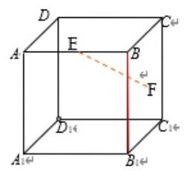

11. (5 分) 【23 静安二模】今年是农历癸卯兔年, 一种以兔子形象命名的牛奶糖深受顾客欢迎. 标识质量为 ${500g}$ 的这种袋装奶糖的质量指标 $X$ 是服从正态分布 $N\left( {{500},{2.5}^{2}}\right)$ 的随机变量. 若质量指标介于 ${495g}$ (含)至 ${505g}$ (含)之间的产品包装为合格包装,则随意买一包这种袋装奶糖,是合格包装的可能性大小为___%. (结果保留一位小数)

(已知 $\Phi \left( 1\right)  \approx  {0.8413},\Phi \left( 2\right)  \approx  {0.9772},\Phi \left( 3\right)  \approx  {0.9987}.\Phi \left( x\right)$ 表示标准正态分布的密度函数从 $- \infty$ 到 $x$ 的累计面积 $)$

12. (5分)【23 静安二模】若 ${10}^{x} - {10}^{y} = {10}$ ，其中 $x$ ， $y \in  R$ ，则 ${2x} - y$ 的最小值为___.

二、选择题 (本大题共有 4 题,满分 18 分,其中 ${13} \sim  {14}$ 题每题 4 分, ${15} \sim  {16}$ 题每题 5 分) 【每题有且只有一个正确答案，考生应在答题纸的相应编号上，将代表答案的小方格涂黑，选对得相应分值， 否则一律得零分. $)$

13. (4 分) 【2023 年上海静安区高考二模数学试卷】若直线 $l$ 的方向向量为 $\overrightarrow{a}$ ，平面 $\alpha$ 的法向量为 $\overrightarrow{n}$ ， 则能使 $l//\alpha$ 的是 ( )

A. $\overrightarrow{a} = \left( {1,0,0}\right) ,\overrightarrow{n} = \left( {-2,0,0}\right)$ B. $\overrightarrow{a} = \left( {1,3,5}\right) ,\overrightarrow{n} = \left( {1,0,1}\right)$

C. $\overrightarrow{a} = \left( {1, - 1,3}\right) ,\overrightarrow{n} = \left( {0,3,1}\right)$ D. $\overrightarrow{a} = \left( {0,2,1}\right) ,\overrightarrow{n} = \left( {-1,0, - 1}\right)$

14. (4 分) 【23 静安二模】摩天轮常被当作一个城市的地标性建筑，如静安大悦城的“ ${SkyRing}$ ” 摩天轮是上海首个悬臂式屋顶摩天轮. 摩天轮最高点离地面高度 106 米, 转盘直径 56 米, 轮上设置 30 个极具时尚感的 4 人轿舱，拥有 360 度的绝佳视野. 游客从离楼顶屋面最近的平台位置进入轿舱,开启后按逆时针匀速旋转 $t$ 分钟后,游客距离地面的高度为 $h$ 米, $h =  - {28}\cos \left( \frac{\pi t}{6}\right)  +$ 78. 若在 ${t}_{1},{t}_{2}$ 时刻,游客距离地面的高度相等,则 ${t}_{1} + {t}_{2}$ 的最小值为 ( )

A. 6 B. 12 C. 18 D. 24

15. (5 分) 【23 静安二模】设直线 ${l}_{1} : x - {2y} - 2 = 0$ 与 ${l}_{2}$ 关于直线 $l : {2x} - y - 4 = 0$ 对称,则直线 ${l}_{2}$ 的方程是 ( )

A. ${11x} + {2y} - {22} = 0$ B. ${11x} + y + {22} = 0$

C. ${5x} + y - {11} = 0$ D. ${10x} + y - {22} = 0$

16. (5 分)【23 静安二模】函数 $y = x\ln x$ ( )

A. 严格增函数 B. 在 $\left( {0,\frac{1}{\mathrm{e}}}\right)$ 上是严格增函数，在 $\left( {\frac{1}{\mathrm{e}}, + \infty }\right)$ 上是严格减函数

C. 严格减函数 D. 在 $\left( {0,\frac{1}{\mathrm{e}}}\right)$ 上是严格减函数,在 $\left( {\frac{1}{\mathrm{e}}, + \infty }\right)$ 上是严格增函数

## 三、解答题(本大题共有 5 题，满分 78 分)

17. (14 分) 【23 静安二模】

已知各项均为正数的数列 $\left\{  {a}_{n}\right\}$ 满足 ${a}_{1} = 1,{a}_{n} = 2{a}_{n - 1} + 3$ (正整数 $n \geq  2$ ).

(1)(8 分)求证:数列 $\left\{  {{a}_{n} + 3}\right\}$ 是等比数列；

(2)(6 分)求数列 $\left\{  {a}_{n}\right\}$ 的前 $n$ 项和 ${S}_{n}$ .

18. (14 分) 【23 静安二模】

如图，在五面体 ${ABCDEF}$ 中， ${FA}\bot$ 平面 ${ABCD},{AD}//{BC}//{FE},{AB}\bot {AD}$ ，若 ${AD} = 2,{AF} \; = {AB} = {BC} = {FE} = 1$ .

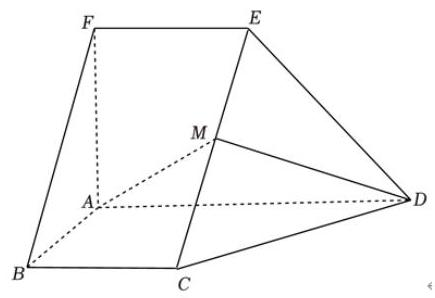

(1)(7分)求五面体 ${ABCDEF}$ 的体积；

(2) (7 分) 若 $M$ 为 ${EC}$ 的中点，求证:平面 ${CDE} \bot$ 平面 ${AMD}$ .

19. (16 分)【23 静安二模】

已知双曲线: $\frac{{x}^{2}}{{a}^{2}} - \frac{{y}^{2}}{{b}^{2}} = 1$ (其中 $a > 0, b > 0$ ) 的左、右焦点分别为 ${F}_{1}\left( {-c,0}\right) \text{ 、 }{F}_{2}\left( {c,0}\right)$ (其中 $c >$ 0).

(1)(8 分)若双曲线过点 $\left( {2,1}\right)$ 且一条渐近线方程为 $y = \frac{\sqrt{2}}{2}x$ ；直线 $l$ 的倾斜角为 $\frac{\pi }{4}$ ，在 $y$ 轴上的截距为 -2 . 直线 $l$ 与该双曲线交于两点 $A\text{ 、 }B, M$ 为线段 ${AB}$ 的中点，求 $\bigtriangleup  M{F}_{1}{F}_{2}$ 的面积；

(2)(8 分)以坐标原点 $O$ 为圆心， $c$ 为半径作圆，该圆与双曲线在第一象限的交点为 $P$ . 过 $P$ 作圆的切线,若切线的斜率为 $- \sqrt{3}$ ,求双曲线的离心率.

20. (16 分) 【23 静安二模】

概率统计在生产实践和科学实验中应用广泛. 请解决下列两个问题.

(1)(8 分)随着中小学 “双减” 政策的深入人心，体育教学和各项体育锻炼迎来时间充沛的春天. 某初中学校学生篮球队从开学第二周开始每周进行训练，第一次训练前共有 6 个篮球，其中 3 个是新球 (即没有用过的球), 3 个是旧球 (即至少用过一次的球). 每次训练, 都是从中不放回任意取出 2 个篮球,训练结束后放回原处. 设第一次训练时取到的新球个数为 $\xi$ ,求随机变量 $\xi$ 的分布和期望.

(2)(8 分)由于手机用微波频率信号传递信息，那么长时间使用手机是否会增加得脑瘤的概率？研究者针对这个问题, 对脑瘤病人进行问卷调查, 询问他们是否总是习惯在固定的一侧接听电话? 如果是, 是哪边? 结果有 88 人喜欢用固定的一侧接电话. 其中脑瘤部位在左侧的病人习惯固定在左侧接听电话的有 14 人，习惯固定在右侧接听电话的有 28 人；脑瘤部位在右侧的病人习惯固定在左侧接听电话的有 19 人，习惯固定在右侧接听电话的有 27 人.

根据上述信息写出下面这张 $2 \times  2$ 列联表中字母所表示的数据,并对患脑瘤在左右侧的部位是否与习惯在该侧接听手机电话相关进行独立性检验. (显著性水平 $\alpha  = {0.05}$ )

<table><tr><td></td><td>习惯固定在左侧接听电话</td><td>习惯固定在右侧接听电话</td><td>总计</td></tr><tr><td>脑瘤部位在左侧的病人</td><td>$a$</td><td>$b$</td><td>4   2</td></tr><tr><td>脑瘤部位在右侧的病人</td><td>$c$</td><td>$d$</td><td>4   6</td></tr><tr><td>总计</td><td>$a + c$</td><td>$b + d$</td><td>8   8</td></tr></table>

参考公式及数据: ${K}^{2} = \frac{n{\left( ad - bc\right) }^{2}}{\left( {a + b}\right) \left( {c + d}\right) \left( {a + c}\right) \left( {b + d}\right) }$ ,其中, $n = a + b + c + d, P\left( {{K}^{2} \geq  {3.841}}\right)  \approx$ 0.05 .

21. (18 分)【23 静安二模】

已知函数 $f\left( x\right)  = \frac{1}{2}{x}^{2} - \left( {a + 1}\right) x + a\ln x$ . (其中 $a$ 为常数).

(1)(4 分)若 $a =  - 2$ ，求曲线 $y = f\left( x\right)$ 在点 $\left( {2, f\left( 2\right) }\right)$ 处的切线方程；

(2)(6 分)当 $a < 0$ 时，求函数 $y = f\left( x\right)$ 的最小值；

(3) (8 分) 当 $0 \leq  a < 1$ 时,试讨论函数 $y = f\left( x\right)$ 的零点个数,并说明理由.

### 2.24 静安一模

一、填空题

1.【25 静安一模】设集合 $A = \{ 1,3,5,7\} , B = \{ 2,3,4,5\}$ ,则 $A \cap  B =$ ___.

2.【25 静安一模】不等式 $\left| {{2x} - 1}\right|  < 3$ 的解集为___

3.【25 静安一模】已知 $\mathrm{i}$ 是虚数单位, $\left( {m + \mathrm{i}}\right) \left( {1 - 2\mathrm{i}}\right)$ 是纯虚数,则实数 $m$ 的值为___.

4.【25 静安一模】设 $\left\{  {a}_{n}\right\}$ 是等差数列， ${a}_{1} =  - 6,{a}_{3} = 0$ ，则该数列的前 8 项的和 ${S}_{8}$ 的值为___.

5.【25 静安一模】到点 ${F}_{1}\left( {-3,0}\right) ,{F}_{2}\left( {3,0}\right)$ 距离之和为 10 的动点 $P$ 的轨迹方程为___.

6.【25 静安一模】在 $\bigtriangleup  {ABC}$ 中，已知 ${BC} = 5,{AC} = 4, A = {2B}$ ，则 $\cos B$ 的值为___.

7.【25 静安一模】已知物体的位移 $d\left( \right.$ 单位: $\left. m\right)$ 与时间 $t$ (单位: $s$ ) 满足函数关系 $d = 5\sin t - 2\cos t$ , 则该物体在 $t = \frac{\pi }{2}\left( s\right)$ 时刻的瞬时速度为___ $\left( {m/s}\right)$ .

8.【25 静安一模】若用 $t$ 替换命题 “对于任意实数 $d$ ，有 ${d}^{2} \geq  0$ ，且等号当且仅当 $d = 0$ 时成立” 中的 $d$ ,即可推出平均值不等式 “任意两个正数的算术平均值不小于它们的几何平均值,且等号当且仅当这两个正数相等时成立”. 则 $t =$ ___.

9.【25静安一模】以双曲线 $\frac{{x}^{2}}{4} - \frac{{y}^{2}}{m} = 1$ 的离心率为半径,以右焦点为圆心的圆与双曲线的渐近线相切，则 $m$ 的值为___.

10.【25 静安一模】如图所示,小明和小宁家都住在东方明珠塔附近的同一幢楼上,小明家在 $A$ 层, 小宁家位于小明家正上方的 $B$ 层,已知 ${AB} = a$ . 小明在家测得东方明珠塔尖的仰角为 $\alpha$ ,小宁在家测得东方明珠塔尖的仰角为 $\beta$ ,则他俩所住的这幢楼与东方明珠塔之间的距离 $d =$ ___.

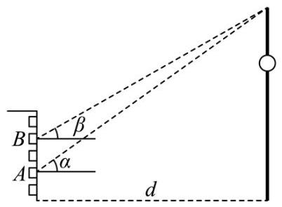

11.【25 静安一模】记 $f\left( x\right)  = {x}^{2} + \left( {{a}^{2} + {b}^{2} - 1}\right) x + {a}^{2} + {2ab} - {b}^{2}$ . 若函数 $y = f\left( x\right)$ 是偶函数，则该函数图象与 $y$ 轴交点的纵坐标的最大值为___.

12.【上海市静安区 2024 - 2025 学年高三上学期

${yk} \nearrow  ,\lg {x}_{5} = k - 2, k \geq  3,$

二、单选题

13.【25静安一模】设 $a, b \in  R$ ,则 “ $a + b > 0$ ” 是 “ $a > 0$ 且 $b > 0$ ” 的 ( )

A. 充分非必要条件 B. 必要非充分条件

C. 充要条件 D. 既非充分又非必要条件

14.【25 静安一模】污水处理厂通过清除污水中的污染物获得清洁用水并生产肥料. 该厂的污水处理装置每小时从处理池清除掉 12% 的污染残留物. 要使处理池中的污染物水平降到最初的 10%, 大约需要的时间为 ( ) (参考数据: $\lg {0.88} \approx   - {0.0555}$ )

A. 14 小时 B. 18 小时 C. 20 小时 D. 24 小时

15.【25 静安一模】我国古代数学著作《九章算术》中将四个面都是直角三角形的空间四面体叫做 “鳖臑”. 如图是一个水平放置的 $\bigtriangleup {ABC},{CD} \bot  {AB},\angle A = {30}^{ \circ  },\angle B = {45}^{ \circ  }$ . 现将 ${Rt}\bigtriangleup {ACD}$ 沿 ${CD}$ 折起,使点 $A$ 移动到点 ${A}^{\prime }$ ,使得空间四面体 ${A}^{\prime }{BCD}$ 恰好是一个 “鳖臑”,则二面角 ${A}^{\prime } \; - {CD} - B$ 的大小为 ( )

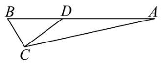

A. 60° B. 90° C. arctan2

D. $\arccos \frac{\sqrt{3}}{3}$

16.【25 静安一模】在四棱锥 $P - {ABCD}$ 中， $\overrightarrow{AB} = \left( {4, - 2,3}\right)$ ， $\overrightarrow{AD} = \left( {-4,1,0}\right)$ ， $\overrightarrow{AP} = \; \left( {-6,2, - 8}\right)$ ,则该四棱锥的高为 ( )

A. 4 B. 3 C. 2 D. 1

三、解答题

17.【25 静安一模】

设函数 $f\left( x\right)  = x + \frac{4}{x}, x \in  \left( {-\infty ,0}\right)  \cup  \left( {0, + \infty }\right)$ .

(1)求函数 $y = f\left( x\right)$ 的单调区间；

(2)求不等式 $f\left( x\right)  < {2x}$ 的解集.

18.【25静安一模】

已知向量 $\overrightarrow{a} = \left( {\cos \frac{3x}{2},\sin \frac{3x}{2}}\right) ,\overrightarrow{b} = \left( {\cos \frac{x}{2}, - \sin \frac{x}{2}}\right)$ ，且 $x \in  \left\lbrack  {0,\frac{\pi }{2}}\right\rbrack$ .

(1)求 $\overrightarrow{a} \cdot  \overrightarrow{b}$ 及 $\left| {\overrightarrow{a} + \overrightarrow{b}}\right|$ ；

(2) 记 $f\left( x\right)  = \overrightarrow{a} \cdot  \overrightarrow{b} - \left| {\overrightarrow{a} + \overrightarrow{b}}\right|$ ,求函数 $y = f\left( x\right)$ 的最小值.

19.【25 静安一模】

如图所示，正三棱锥 $A - {BCD}$ 的侧面是边长为 2 的正三角形.

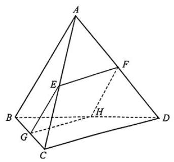

(1) 求正三棱锥 $A - {BCD}$ 的体积 $V$ ；

(2) 设 $E$ 、 $F$ 、 $G$ 分别是线段 ${AC}$ 、 ${AD}$ 、 ${BC}$ 的中点.

求证: ① ${CD}//$ 平面 ${EFG}$ ；②若平面 ${EFG}$ 交 ${BD}$ 于点 $H$ ，则四边形 ${EFHG}$ 是正方形.

20.【25 静安一模】

如图的封闭图形的边缘由抛物线 $\Gamma$ 和垂直于抛物线对称轴的线段 ${AB}$ 组成. 已知 ${AB} = 4$ ,抛物线的顶点到线段 ${AB}$ 所在直线的距离为 2 .

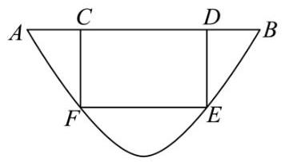

(1)请用数学符号语言表达这个封闭图形的边缘；

(2)在该封闭图形上截取一个矩形 ${CDEF}$ ，其中点 $C$ 、 $D$ 在线段 ${AB}$ 上，点 $E$ 、 $F$ 抛物线 $\Gamma$ 上. 求以矩形 ${CDEF}$ 为侧面， ${CF}$ 为母线的圆柱的体积最大值；

(3)求证:抛物线 $\Gamma$ 的任何两条相互垂直的切线的交点都在同一条直线上.

21.【25 静安一模】

如果函数 $y = f\left( x\right)$ 满足以下两个条件,我们就称函数 $y = f\left( x\right)$ 为 $U$ 型函数.

①对任意的 $x \in  \left\lbrack  {0,1}\right\rbrack$ ，有 $f\left( x\right)  \geq  1$ ， $f\left( 1\right)  = 3$ ；

②对于任意的 $x, y \in  \left\lbrack  {0,1}\right\rbrack$ ,若 $x + y \leq  1$ ，则 $f\left( {x + y}\right)  \geq  f\left( x\right)  + f\left( y\right)  - 1$ . 求证:

(1) $y = {3}^{x}$ 是 $U$ 型函数;

(2) $U$ 型函数 $y = f\left( x\right)$ 在 $\left\lbrack  {0,1}\right\rbrack$ 上为增函数；

(3) 对于 $U$ 型函数 $y = f\left( x\right)$ ,有 $f\left( \frac{1}{{3}^{n}}\right)  \leq  \frac{2}{{3}^{n}} + 1\left( {n\text{ 为正整数 }}\right)$ .

### 3.22 长宁二模

一、填空题

1. 已知集合 $A = \left( {-2,1}\right) , B = (0,3\rbrack$ ，则 $A \cap  B =$ ___.

2. 复数 ${z}_{1} = 2 - 3\mathrm{i}, - {z}_{2} = 1 - 2\mathrm{i}$ ，则 ${z}_{1} \cdot  \overline{{z}_{2}} =$ ___.

3. 已知数列 $\left\{  {a}_{n}\right\}$ 是等差数列,且 ${a}_{1} = 2,{a}_{6} = {17}$ ,则其前 7 项和 ${S}_{7} =$ ___.

4. 某水果店的苹果, 60% 来自 A 基地, 40% 来自 B 基地, A 基地苹果的新鲜率为 90%, B 基地苹果的新鲜率为 85%，从该水果店随机选取一个苹果，则选到新鲜苹果的概率是___.

5. 为了研究吸烟习惯与慢性气管炎患病的关系，某疾病预防中心对相关调查数据进行了研究，假设 ${H}_{0}$ : 患慢性气管炎与吸烟没有关系,并通过计算得到统计量 ${\chi }^{2} \approx  {3.468}$ ,则可推断___原假设 ${H}_{0}$ . (填 “拒绝” 或 “接受”,规定显著性水平 $\alpha  = {0.1}, P\left( {{\chi }^{2} \geq  {2.706}}\right)  \approx  {0.1}$ .

6. 已知随机变量 $X$ 的分布是 $\left( \begin{matrix}  - 1 & 0 & 1 \\  \frac{1}{4} & \frac{1}{4} & \frac{1}{2} \end{matrix}\right)$ ,则其方差 $D\left\lbrack  X\right\rbrack   =$ ___.

7. 已知 ${\log }_{18}9 = a,{18}^{b} = 5$ ，用 $a$ ， $b$ 表示 ${\log }_{36}{45}$ 为___.

8. 顶角为 ${36}^{ \circ  }$ 的等腰三角形被称为黄金三角形,其底边和腰之比正好为黄金比 $\varphi$ ,用黄金比 $\varphi$ 表示 $\cos {36}^{ \circ  } =$ ___.

9. 一项过关游戏的规则规定:在第 $n$ 关要投掷骰子 $n$ 次，如果这 $n$ 次投掷所得的点数之和大于 ${3n}$ ， 则算过关，问一个人连过第一、二关的概率为___.

10. 已知点 $D\text{ 、 }E$ 分别是三角形 ${ABC}$ 的边 ${AC}\text{ 、 }{BC}$ 的中点,且 ${AE} = 2,{BD} = 3$ ,则三角形 ${ABC}$ 的面积的取值范围是___.

11. 现有一块正四面体木料 ${PABC}$ ,其边长为 3,现需要将木料进行切割,要求切割后底面 ${ABC}$ 上任意一点 $Q$ 到顶点 $P$ 的距离不大于 $\sqrt{7}$ ，则切割好后，木料体积的最大值是___. (结果保留 $\pi )$

12. 已知函数 $y = f\left( x\right)$ 和 $y = g\left( x\right)$ ,其中 $f\left( x\right)  = {\log }_{2}x$ ,且 $y = g\left( x\right)$ 是定义在 $R$ 上的函数,其图像关于原点对称,当 $x \in  (0,1\rbrack$ 时, $g\left( x\right)  = {x}^{2} - {mx} - m + 5$ . 若对任意的 ${x}_{1} \in  \left\lbrack  {\frac{1}{2},2}\right\rbrack$ ,存在 ${x}_{2} \in \; \left\lbrack  {-1,1}\right\rbrack$ ,使得 $f\left( {x}_{1}\right)  = g\left( {x}_{2}\right)$ ,则 $m$ 的取值范围是___.

二、单选题

13. 已知非零实数 $a > b$ ,则下列命题中成立的是 ().

A. ${a}^{2} > {b}^{2}$ B. ${ab} > {b}^{2}$ C. ${a}^{2} + {b}^{2} \geq  2\sqrt{ab}$ D. ${a}^{3} > {b}^{3}$

14. 某书店为了分析书籍销量与宣传投入之间的关系,对宣传投入 $x$ (千元) 和书籍销量 $y$ (百本) 的情况进行了调研，并统计得到表中几组对应数据，同时用最小二乘法得到 $y$ 关于 $x$ 的线性回归方

程为 $y = {1.2x} + {1.6}$ ,则下列说法不正确的是 ( )

<table><tr><td>$x$</td><td>3</td><td>4</td><td>5</td><td>6</td></tr><tr><td>$y$</td><td>5</td><td>6.   2</td><td>7.   4</td><td>$m$</td></tr></table>

A. 变量 $x\text{ 、 }y$ 之间呈正相关

B. 预测当宣传投入 2 千元时, 书籍销量约为 400 本

C. $m = {8.8}$

D. 拟合误差 $Q = {0.48}$

15. 如图,等腰直角三角形 ${ABC}$ 中, $\angle A = {90}^{ \circ  }$ ,点 $E$ 是边 ${AC}$ 的中点,点 $D$ 是边 ${BC}$ 上一点 (不与 $C$ 重合),将三角形 ${DCE}$ 沿 ${DE}$ 逆时针翻折,点 $C$ 的对应点是 ${C}_{1}$ ,连接 $C{C}_{1}$ ,设 $\theta$ 为二面角 ${C}_{1} \; - {DE} - C$ 大小, $\theta  \in  \left( {0,\pi }\right)$ . 在翻折过程中,下列说法当中不正确的是 ( )

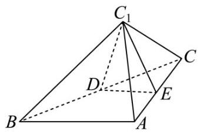

A. 存在点 $D$ 和 $\theta$ ,使得 $D{C}_{1} \bot  {AC}$ B. 存在点 $D$ 和 $\theta$ ,使得 $B{C}_{1} \bot  {AC}$

C. 存在点 $D$ 和 $\theta$ ,使得 $B{C}_{1} \bot  {DE}$ D. 存在点 $D$ 和 $\theta$ ,使得 $C{C}_{1} \bot  {DE}$

16. 椭圆具有如下光学性质: 如图, ${F}_{1}\left( {-c,0}\right) ,{F}_{2}\left( {c,0}\right)$ 分别是椭圆 $\frac{{x}^{2}}{{a}^{2}} + \frac{{y}^{2}}{{b}^{2}} = 1$ 的左、右焦点,从点 ${F}_{1}$ 发出的光线在到达椭圆上的点 $P$ 后,经过到达点的切线反射后经过点 ${F}_{2}$ ,有以下两个命题:

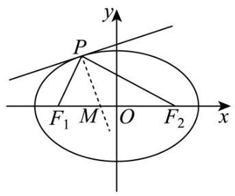

①若 $P$ 是椭圆上除长轴端点外的一点,设法线与 $x$ 轴的交点为 $M\left( {t,0}\right)$ ,则 $t \in  \left( {-\frac{{c}^{2}}{a},\frac{{c}^{2}}{a}}\right)$ ②若从 ${F}_{1}$ 发出的光线,经椭圆两次反射后,第一次回到 ${F}_{1}$ 所经过的路程为 ${8c}$ ,则该椭圆的离心率为 $\frac{1}{2}$ ; 则以下说法正确的是 ( )

A. ①是真命题，②是真命题 B. ①是真命题，②是假命题

C. ①是假命题，②是真命题 D. ①是假命题，②是假命题

三、解答题

17. 已知向量 $\overrightarrow{m} = \left( {\sin x + \cos x,2\sin x}\right)$ ， $\overrightarrow{n} = \left( {\sin x - \cos x,\sqrt{3}\cos x}\right)$ ， $f\left( x\right)  = \overrightarrow{m} \cdot  \overrightarrow{n}$ .

(1)求函数 $y = f\left( x\right)$ 的单调递减区间；

(2)若函数 $y = f\left( x\right)  - a$ 在区间 $\left( {0,\frac{\pi }{2}}\right)$ 上恰有 2 个零点，求实数 $a$ 的取值范围.

18. 如图，在直三棱柱 ${ABC} - {A\prime B\prime C\prime }$ 中， ${AB}\bot {AC},{AC} = {AB} = 2,{A{A}^{\prime }} = {2\sqrt{2}}$ ，点 $D$ 是棱 $A{A}^{\prime }$ 的中点.

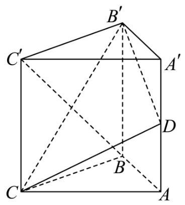

(1)求证:平面 ${CD}{B}^{\prime } \bot$ 平面 ${CB}{B}^{\prime }{C}^{\prime }$ ；

(2)求点 ${C}^{\prime }$ 到平面 ${CD}{B}^{\prime }$ 的距离以及三棱锥 ${C}^{\prime } - {CD}{B}^{\prime }$ 的体积.

19. 为响应国家促进消费的政策，某大型商场举办了“消费满减乐翻天”的优惠活动，顾客消费满 800 元 (含 800 元) 可抽奖一次, 抽奖方案有两种 (顾客只能选择其中的一种)

方案 1:从装有 5 个红球，3 个蓝球 (形状、大小完全相同) 的抽奖盒中，有放回地依次摸出 3 个球. 每摸出 1 次红球, 立减 150 元, 若 3 次都摸到红球, 则额外再减 200 元 (即总共减 650 元);

方案 2:从装有 5 个红球，3 个蓝球 (形状、大小完全相同) 的抽奖盒中，不放回地依次摸出 3 个球. 中奖规则为:若摸出 3 个红球，享受免单优惠；若摸出 2 个红球，则打 5 折；其余情况无优惠.

(1)顾客 $A$ 选择抽奖方案 2，已知他第一次摸出红球，求他能够享受优惠的概率；

(2)顾客 B 恰好消费了 800 元，

①若他选择抽奖方案 1，求他实付金额的分布列和期望 (结果精确到 0.01 )；

②试从实付金额的期望值分析顾客 $B$ 选择何种抽奖方案更合理.

20. 已知双曲线 $\Gamma \frac{{x}^{2}}{{a}^{2}} - \frac{{y}^{2}}{{b}^{2}} = 1$ 的左、右焦点分别为 ${F}_{1},{F}_{2}$ ,点 $A$ 是其左顶点,点 $P$ 是双曲线上一点,且位于第一象限,若双曲线 $\Gamma$ 的离心率 $\mathrm{e} = 2, b = 2\sqrt{3}$ .

(1)求双曲线 $\Gamma$ 的方程；

(2)若三角形 ${AP}{F}_{2}$ 是等腰三角形，求点 $P$ 的坐标；

(3)直线 $P{F}_{2}$ 不垂直于 $x$ 轴,且与曲线 $\Gamma$ 的另一个交点为 $Q$ ,若 $\angle P{F}_{1}Q$ 是锐角,求直线 $P{F}_{2}$ 的斜率的取值范围.

21. 已知函数 $y = f\left( x\right)$ 的定义域 $D \subseteq  R$ ,对任意实数 $a$ ,定义集合 ${Q}_{f}\left( a\right)  = \{ x \mid  f\left( x\right)  \leq  a, x \in  D\}$ .

(1) 已知 $f\left( x\right)  = \frac{1 + x}{1 - x}$ ,求 ${Q}_{f}\left( 2\right)$ .

( 2 )已知 $f\left( x\right)  = {\mathrm{e}}^{x} - {ax}$ ，若集合 ${Q}_{f}\left( a\right)$ 只有一个元素，求 $a$ 的值；

(3) 已知 $f\left( x\right)  =  - \frac{a}{4}{x}^{2} + \frac{a + 2}{2}x - \ln x + \frac{1}{2}$ ,其中 $a \in  R$ 且 $a > 0$ ,求证: 集合 ${Q}_{f}\left( a\right)$ 是一个区间.

### 4.23 浦东二模

一、填空题

1.【23 浦东二模】已知集合 $A = \left\{  {x \mid  {x}^{2} + x - 6 < 0, x \in  R}\right\}  , B = \{ 0,1,2\}$ ,则 $A \cap  B =$ ___.

2.【23 浦东二模】若复数 $z$ 满足 $z\left( {1 - \mathrm{i}}\right)  = 1 + 2\mathrm{i}$ ( $\mathrm{i}$ 是虚数单位),则复数 $z =$ ___.

3.【23 浦东二模】若圆柱的高为 10，底面积为 ${4\pi }$ ，则这个圆柱的侧面积为___.(结果保留 $\pi$ )

4.【23 浦东二模】 ${\left( x + 3\right) }^{5}$ 的二项展开式中 ${x}^{2}$ 项的系数为___.

5.【23 浦东二模】设随机变量 $X$ 服从正态分布 $N\left( {0,{\sigma }^{2}}\right)$ ，且 $P\left( {X - 2}\right)  = {0.9}$ ，则 $P\left( {X2}\right)  =$ ___. 6.【23 浦东二模】双曲线 $C\frac{{x}^{2}}{2} - \frac{{y}^{2}}{4} = 1$ 的右焦点 $F$ 到其一条渐近线的距离为___.

7.【23 浦东二模】投掷一颗骰子,记事件 $A = \{ 2,4,5\} , B = \{ 1,2,4,6\}$ ,则 $P\left( {A \mid  B}\right)  =$ ___.

8.【【试卷】上海市风华中学 2024-2025 学年高三下学期 5 月三模数学试卷】在 $\bigtriangleup  {ABC}$ 中，角 $A\text{ 、 }B\text{ 、 }C$ 的对边分别记为 $a\text{ 、 }b\text{ 、 }c$ ,若 ${5a}\cos A = b\cos C + c\cos B$ ,则 $\sin {2A} =$ ___.

9.【23 浦东二模】函数 $y = {\log }_{2}x + \frac{1}{{\log }_{4}\left( {2x}\right) }$ 在区间 $\left( {\frac{1}{2}, + \infty }\right)$ 上的最小值为___.

10.【23 浦东二模】已知 $\omega  \in  R,\omega  > 0$ ,函数 $y = \sqrt{3}\sin {\omega x} - \cos {\omega x}$ 在区间 $\left\lbrack  {0,2}\right\rbrack$ 上有唯一的最小值 -2,则 $\omega$ 的取值范围为___.

11.【23 浦东二模】已知边长为 2 的菱形 ${ABCD}$ 中， $\angle A = {120}^{ \circ  }, P\text{ 、 }Q$ 是菱形内切圆上的两个动点，且 ${PQ} \bot  {BD}$ ，则 $\overrightarrow{AP} \cdot  \overrightarrow{CQ}$ 的最大值是___.

12. 已知 $0 < a < b < 1$ ,设 $W\left( x\right)  = {\left( x - a\right) }^{3}\left( {x - b}\right) ,{f}_{k}\left( x\right)  = \frac{W\left( x\right)  - W\left( k\right) }{x - k}$ ,其中 $k$ 是整数. 若对一切 $k \in  Z, y = {f}_{k}\left( x\right)$ 都是区间 $\left( {k, + \infty }\right)$ 上的严格增函数. 则 $\frac{b}{a}$ 的取值范围是 ___.

二、单选题

13.【【试卷】上海市风华中学 2024-2025 学年高三下学期 5 月三模数学试卷】已知 $x \in  R$ ,则 “ $\mid  x \; + 1\left| +\right| x - 1 \mid   \leq  2$ ” 是 “ $\frac{1}{x} > 1$ ” 的 ().

A. 充分不必要条件; B. 必要不充分条件;

C. 充要条件; D. 既不充分也不必要条件.

14.【23 浦东二模】某种产品的广告支出 $x$ 与销售额 $y$ (单位:万元) 之间有下表关系, $y$ 与 $x$ 的线性回归方程为 $y = {10.5x} + {5.4}$ ,当广告支出 6 万元时,随机误差的效应即离差 (真实值减去预报值) 为( ).

<table><tr><td></td><td>$x$</td><td>2</td><td>4</td><td>5</td><td>6</td><td>8</td></tr><tr><td></td><td rowspan="2">$y$</td><td>3</td><td>4</td><td>6</td><td>7</td><td>8</td></tr><tr><td></td><td>0</td><td>0</td><td>0</td><td>0</td><td>0</td></tr></table>

A. 1.6 B. 8.4 C. 11.6 D. 7.4

15.【23 浦东二模】在空间中, 下列命题为真命题的是 ( ).

A. 若两条直线垂直于第三条直线，则这两条直线互相平行；

B. 若两个平面分别平行于两条互相垂直的直线, 则这两个平面互相垂直;

C. 若两个平面垂直, 则过一个平面内一点垂直于交线的直线与另外一个平面垂直;

D. 若一条直线平行于一个平面，另一条直线与这个平面垂直，则这两条直线互相垂直.

16.【23 浦东二模】已知函数 $y = f\left( x\right) \left( {x \in  R}\right)$ ,其导函数为 $y = {f}^{\prime }\left( x\right)$ ,有以下两个命题:

①若 $y = {f}^{\prime }\left( x\right)$ 为偶函数，则 $y = f\left( x\right)$ 为奇函数；

②若 $y = {f}^{\prime }\left( x\right)$ 为周期函数，则 $y = f\left( x\right)$ 也为周期函数.

那么 ( ).

A. ①是真命题，②是假命题 B. ①是假命题，②是真命题

C. ①、②都是真命题 D. ①、②都是假命题

## 三、解答题

17.【23捕东二模】

已知数列 $\left\{  {a}_{n}\right\}$ 是首项为 9,公比为 $\frac{1}{3}$ 的等比数列.

(1)求 $\frac{1}{{a}_{1}} + \frac{1}{{a}_{2}} + \frac{1}{{a}_{3}} + \frac{1}{{a}_{4}} + \frac{1}{{a}_{5}}$ 的值；

(2)设数列 $\left\{  {{\log }_{3}{a}_{n}}\right\}$ 的前 $n$ 项和为 ${S}_{n}$ ，求 ${S}_{n}$ 的最大值，并指出 ${S}_{n}$ 取最大值时 $n$ 的取值.

18.【23 浦东二模】

如图，三角形 ${EAD}$ 与梯形 ${ABCD}$ 所在的平面互相垂直， ${AE}\bot {AD}$ ， ${AB}\bot {AD}$ ， ${BC}//{AD}$ ， ${AB} \; = {AE} = {BC} = 2,{AD} = 4, F$ 、 $H$ 分别为 ${ED}$ 、 ${EA}$ 的中点.

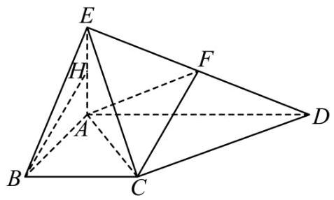

(1)求证: ${BH}//$ 平面 ${AFC}$ ；

(2)求平面 ${ACF}$ 与平面 ${EAB}$ 所成锐二面角的余弦值.

19.【23 浦东二模】

为了庆祝党的二十大顺利召开，某学校特举办主题为 “重温光辉历史展现坚定信心” 的百科知识小测试比赛. 比赛分抢答和必答两个环节, 两个环节均设置 10 道题, 其中 5 道人文历史题和 5 道地理环境题.

(1)在抢答环节，某代表队非常积极，抢到 4 次答题机会，求该代表队至少抢到 1 道地理环境题的概率;

(2)在必答环节，每个班级从 5 道人文历史题和 5 道地理环境题各选 2 题，各题答对与否相互独立， 每个代表队可以先选择人文历史题, 也可以先选择地理环境题开始答题. 若中间有一题答错就退出必答环节, 仅当第一类问题中 2 题均答对, 才有资格开始第二类问题答题. 已知答对 1 道人文历史题得 2 分,答对 1 道地理环境题得 3 分. 假设某代表队答对人文历史题的概率都是 $\frac{3}{5}$ ,答对地理环境题的概率都是 $\frac{1}{3}$ . 请你为该代表队作出答题顺序的选择,使其得分期望值更大,并说明理由.

20.【23捕东二模】

椭圆 $C$ 的方程为 ${x}^{2} + 3{y}^{2} = 4, A\text{ 、 }B$ 为椭圆的左右顶点， ${F}_{1}\text{ 、 }{F}_{2}$ 为左右焦点， $P$ 为椭圆上的动点.

(1)求椭圆的离心率；

(2)若 $\bigtriangleup  {P{F}_{1}{F}_{2}}$ 为直角三角形，求 $\bigtriangleup  {P{F}_{1}{F}_{2}}$ 的面积；

(3)若 $Q\text{ 、 }R$ 为椭圆上异于 $P$ 的点,直线 ${PQ}\text{ 、 }{PR}$ 均与圆 ${x}^{2} + {y}^{2} = {r}^{2}\left( {0 < r < 1}\right)$ 相切,记直线

${PQ}\text{ 、 }{PR}$ 的斜率分别为 ${k}_{1}\text{ 、 }{k}_{2}$ ,是否存在位于第一象限的点 $P$ ,使得 ${k}_{1}{k}_{2} = 1$ ? 若存在,求出点 $P$ 的坐标, 若不存在, 请说明理由.

21.【23 浦东二模】

设 $P$ 是坐标平面 ${xOy}$ 上的一点,曲线 $\Gamma$ 是函数 $y = f\left( x\right)$ 的图象. 若过点 $P$ 恰能作曲线 $\Gamma$ 的 $k$ 条切线 $\left( {k \in  N}\right)$ ,则称 $P$ 是函数 $y = f\left( x\right)$ 的 “ $k$ 度点”.

(1)判断点 $O\left( {0,0}\right)$ 与点 $A\left( {2,0}\right)$ 是否为函数 $y = \ln x$ 的 1 度点，不需要说明理由;

(2) 已知 $0 < m < \pi , g\left( x\right)  = \sin x$ . 证明: 点 $B\left( {0,\pi }\right)$ 是 $y = g\left( x\right) \left( {0 < x < m}\right)$ 的 0 度点;

(3) 求函数 $y = {x}^{3} - x$ 的全体 2 度点构成的集合.

### 5.24 普陀一模

一、填空题

1.【24普陀一模】若抛物线 ${x}^{2} = {my}$ 的顶点到它的准线距离为 $\frac{1}{2}$ ，则正实数 $m =$ ___.

2.【【试卷】天津市部分学校 ${2023} - {2024}$ 学年高三下学期第一次质量调查数学试卷】设 $\mathrm{i}$ 为虚数单位,若复数 $z$ 满足 ${iz} = 1 + 2\mathrm{i}$ . 则 $\left| {z - 1}\right|  =$ ___.

3.【24普陀一模】若圆 $O$ 上的一段圆弧长与该圆的内接正六边形的边长相等,则这段圆弧所对的圆心角的大小为 ___.

4.【24普陀一模】设 ${S}_{n}$ 是等差数列 $\left\{  {a}_{n}\right\}$ 的前 $n$ 项和 $\left( {n \geq  1, n \in  N}\right)$ ,若 ${a}_{2} + {a}_{4} = 9 - {a}_{6}$ ,则 ${S}_{7} =$ ___.

5.【24普陀一模】设 ${\left( 1 - 2x\right) }^{n} = {a}_{0} + {a}_{1}x + {a}_{2}{x}^{2} + {a}_{3}{x}^{3} + {a}_{4}{x}^{4} + \cdots  + {a}_{n}{x}^{n}$ ,若 ${a}_{0} + {a}_{4} = {17}$ . 则 $n =$ ___.

6.【24普陀一模】若函数 $y = \tan {3x}$ 在区间 $\left( {m,\frac{\pi }{6}}\right)$ 上是严格增函数，则实数 $m$ 的取值范围为 ___.

7.【24普陀一模】设集合 $M = \{ 2,0, - 1\} , N = \{ x\left| \right| x - a \mid   < 1\}$ ,若 $M \cap  N$ 的真子集的个数是 1,则正实数 $a$ 的取值范围为___.

8.【24普陀一模】设圆锥的底面中心为 $O$ ， ${PB}$ ， ${PC}$ 是它的两条母线，且 ${BC} = 2$ ，若棱锥 $O - \; {PBC}$ 是正三棱锥，则该圆锥的侧面积为___.

9.【【试卷】第01讲数列的基本知识与概念 (六大题型) - 练习】若数列 $\left\{  {a}_{n}\right\}$ 满足 ${a}_{1} = {12},{a}_{n + 1} = \; {a}_{n} + {2n}\left( {n \geq  1, n \in  N}\right)$ ，则 $\frac{{a}_{n}}{n}$ 的最小值是 ___.

10.【24普陀一模】设函数 $y = \sin \left( {{2x} + \varphi }\right) \left( {0 < \varphi  < \frac{\pi }{2}}\right)$ 的图象与直线 $y = t$ 相交的连续的三个公共点从左到右依次记为 $A, B, C$ ，若 $\left| {BC}\right|  = 2\left| {AB}\right|$ ，则正实数 $t$ 的值为___.

11.【24普陀一模】设函数 $f\left( x\right)  = a{e}^{x} - 2{x}^{2}$ ,若对任意 ${x}_{0} \in  \left( {0,1}\right)$ ,皆有 $\mathop{\lim }\limits_{{x \rightarrow  {x}_{0}}}\frac{f\left( x\right)  - f\left( {x}_{0}\right)  - x + {x}_{0}}{x - {x}_{0}} \; > 0$ 成立，则实数 $a$ 的取值范围是___.

12.【24普陀一模】体积为 $\frac{\sqrt{2}}{12}{a}^{3}$ 的正四面体内有一个球 $O$ ,球 $O$ 与该正四面体的各面均有且只有一个公共点, $M, N$ 是球 $O$ 的表面上的两动点,点 $P$ 在该正四面体的表面上运动,当 $\left| \overrightarrow{MN}\right|$ 最大时, $\overrightarrow{PM} \cdot  \overrightarrow{PN}$ 的最大值是___.

二、单选题

13.【24普陀一模】若椭圆 $\Gamma$ 的两个顶点和焦点都在圆 $O : {x}^{2} + {y}^{2} = 4$ 上，如图所示，则下列结论正确的是 ( )

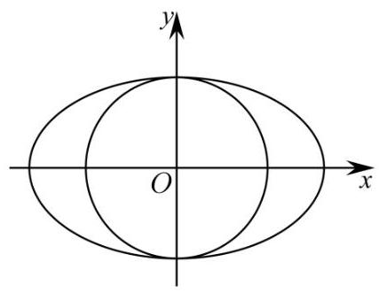

A. 椭圆 $\Gamma$ 的方程是 $\frac{{x}^{2}}{4} + \frac{{y}^{2}}{2} = 1$

B. 过椭圆 $\Gamma$ 上的点作圆 $O$ 的切线,一定有两条

C. 圆 $O$ 上的点与椭圆 $\Gamma$ 上的点的距离的最大值是 $2\left( {\sqrt{2} + 1}\right)$

D. 直线 $x + y + 2\sqrt{2} = 0$ 与椭圆 $\Gamma$ 有交点，与圆 $O$ 无交点

14.【【试卷】上海市浦东新区上海师大附中 2024 届高三下学期 3 月模拟考试数学试题】在 $\bigtriangleup  {ABC}$ 中,角 $A, B, C$ 所对的边分别为 $a, b, c$ ,若 $a = \sqrt{3}$ ,且 $c - {2b} + 2\sqrt{3}\cos C = 0$ ,则该三角形外接圆的半径为 ( )

A. 1 B. $\sqrt{3}$ C. 2 D. $2\sqrt{3}$

15.【24普陀一模】已知一组数据 $3\text{ 、 }1\text{ 、 }5\text{ 、 }3\text{ 、 }2$ ,现加入 $p, q$ 两数对该组数据进行处理,若经过处理后的这组数据的极差为 $p - q$ ,则经过处理后的这组数据与之前的那组数据相比,一定会变大的数字特征是 ( )

A. 平均数 B. 方差 C. 众数 D. 中位数

16.【24普陀一模】已知函数 $f\left( x\right)  = \left\{  \begin{array}{l} x + 1, x \in  \lbrack  - 1,0) \\  \frac{{3x} - 2}{1 - x}, x \in  \lbrack 0,1) \end{array}\right.$ ,若函数 $g\left( x\right)  = f\left( x\right)  - {mx} + \frac{2}{3}m$ 在 $\lbrack  - 1,1)$ 内有且仅有两个零点,则实数 $m$ 的取值范围是 ( )

A. $\left( {-\frac{3}{2},0}\right\rbrack   \cup  \lbrack 3,8)$ B. $\left\lbrack  {-\frac{1}{2},0}\right\rbrack   \cup  \left\lbrack  {3,9}\right\rbrack   \cup  \left( {9, + \infty }\right)$

C. $\left\lbrack  {-\frac{1}{2},0}\right\rbrack   \cup  \left\lbrack  {3,8}\right\rbrack$ D. $m \in  \left( {-\frac{3}{2},0}\right\rbrack   \cup  \lbrack 3,9) \cup  \left( {9, + \infty }\right)$

## 三、解答题

17.【【试卷】2025 届湖南省长沙市岳麓区长沙麓山外国语实验中学高三一模数学试题】

我国随着人口老龄化程度的加剧，劳动力人口在不断减少，“延迟退休”已成为公众关注的热点话题之一，为了了解公众对“延迟退休”的态度，某研究机构对属地所在的一社区进行了调查，并将随机抽取的 50 名被调查者的年龄制成如图所示的茎叶图.

<table><tr><td>女</td><td></td><td>男</td></tr><tr><td>6 7 7 8 9</td><td>2</td><td>78</td></tr><tr><td>1 2 3 3 5 8</td><td>3</td><td>2 3 3 5 6 7</td></tr><tr><td>0 1 3 6 8 9 9</td><td>4</td><td>0 2 3 3 4 4 5 8 9</td></tr><tr><td>2 3 8</td><td>5</td><td>2 3 4 5 7 8</td></tr><tr><td>2 4</td><td>6</td><td>0 4</td></tr></table>

(1)经统计发现，投赞成票的人均年龄恰好是这 50 人年龄的第 60 百分位数，求此百分位数；

(2)经统计年龄在 $\lbrack {50},{59})$ 的被调查者中，投赞成票的男性有 3 人，女性有 2 人，现从该组被调查者中随机选取男女各 2 人进行跟踪调查, 求被选中的 4 人中至少有 3 人投赞成票的概率 (结果用最简分数表示)

18.【24普陀一模】

图 1 所示的是等腰梯形 ${ABCD},{AB}//{DC},{AB} = {2DC} = 4,\angle {ABC} = \frac{\pi }{3},{DE} \bot  {AB}$ 于 $E$ 点,现将 $\bigtriangleup  {ADE}$ 沿直线 ${DE}$ 折起到 $\bigtriangleup  {PDE}$ 的位置，形成一个四棱锥 $P - {EBCD}$ ，如图 2 所示.

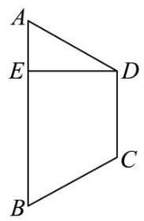

图1

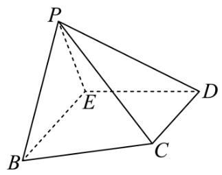

图2

(1) 若 ${PC} = 2\sqrt{2}$ ，求证: ${PE}\bot$ 平面 ${EBCD}$ ；

(2)若直线 ${PE}$ 与平面 ${EBCD}$ 所成的角为 $\frac{\pi }{3}$ ，求二面角 $P - {BC} - E$ 的大小.

19.【24普陀一模】

设函数 $y = f\left( x\right)$ 的表达式为 $f\left( x\right)  = a{e}^{x} + {\mathrm{e}}^{-x}$ .

(1)求证: “ $a = 1$ ” 是 “函数 $y = f\left( x\right)$ 为偶函数” 的充要条件；

(2) 若 $a = 1$ ，且 $f\left( {m + 2}\right)  \leq  f\left( {{2m} - 3}\right)$ ，求实数 $m$ 的取值范围.

20.【24普陀一模】

设双曲线 $\Gamma  : \frac{{x}^{2}}{{t}^{2}} - {y}^{2} = 1\left( {t > 0}\right)$ ,点 ${F}_{1}$ 是 $\Gamma$ 的左焦点,点 $O$ 为坐标原点.

(1)若 $\Gamma$ 的离心率为 $\frac{\sqrt{10}}{3}$ ，求双曲线 $\Gamma$ 的焦距；

( 2 )过点 ${F}_{1}$ 且一个法向量为 $\overrightarrow{n} = \left( {t, - 1}\right)$ 的直线与 $\Gamma$ 的一条渐近线相交于点 $M$ ，若 ${S}_{{\Delta M}O{F}_{1}} = \frac{1}{2}$ ，求双曲线 $\Gamma$ 的方程；

(3)若 $t = \sqrt{2}$ ,直线 $l : {kx} - y + m = 0\left( {k > 0, m \in  R}\right)$ 与 $\Gamma$ 交于 $P, Q$ 两点, $\left| {\overrightarrow{OP} + \overrightarrow{OQ}}\right|  = 4$ ,求直线 $l$ 的斜率 $k$ 的取值范围.

21.【24普陀一模】

若存在常数 $t$ ,使得数列 $\left\{  {a}_{n}\right\}$ 满足 ${a}_{n + 1} - {a}_{1}{a}_{2}{a}_{3}\cdots {a}_{n} = t\left( {n \geq  1, n \in  N}\right)$ ,则称数列 $\left\{  {a}_{n}\right\}$ 为 “ $H\left( t\right)$ 数列”.

(1)判断数列:1，2，3，8，49 是否为 “ $H\left( 1\right)$ 数列”，并说明理由;

(2)若数列 $\left\{  {a}_{n}\right\}$ 是首项为 2 的 “ $H\left( t\right)$ 数列”，数列 $\left\{  {b}_{n}\right\}$ 是等比数列，且 $\left\{  {a}_{n}\right\}$ 与 $\left\{  {b}_{n}\right\}$ 满足 $\mathop{\sum }\limits_{{i = 1}}^{n}{a}_{i}^{2} = \; {a}_{1}{a}_{2}{a}_{3}\cdots {a}_{n} + {\log }_{2}{b}_{n}$ ,求 $t$ 的值和数列 $\left\{  {b}_{n}\right\}$ 的通项公式;

(3)若数列 $\left\{  {a}_{n}\right\}$ 是 “ $H\left( t\right)$ 数列”， ${S}_{n}$ 为数列 $\left\{  {a}_{n}\right\}$ 的前 $n$ 项和， ${a}_{1} > 1$ ， $t > 0$ ，试比较 $\ln {a}_{n}$ 与 ${a}_{n} -$ 1 的大小,并证明 $t > {S}_{n + 1} - {S}_{n} - {\mathrm{e}}^{{S}_{n} - n}$ .

### 6.24 青浦一模

一、填空题

1.【25 青浦一模】在复平面内,复数 $z = 1 + \frac{1}{2}\mathrm{i}$ (其中 $\mathrm{i}$ 是虚数单位) 的共轭复数对应的点位于第 ___象限.

2.【25青浦一模】已知集合 $A = \{ x \mid  x = {2k} - 1, k \in  N\} , B = \{  - 1,0,1,2,3\}$ ,则 $A \cap  B =$ ___.

3.【25 青浦一模】不等式 $\frac{x - 3}{x + 1} \geq  2$ 的解集为___.

4.【25青浦一模】已知直线 ${l}_{1}x + \left( {1 + m}\right) y + m - 2 = 0$ 与直线 ${l}_{2}{mx} + {2y} + 8 = 0$ 平行,则 $m =$ ___.

5.【25 青浦一模】两条渐近线互相垂直的双曲线的离心率为___.

6.【25青浦一模】已知数列 $\left\{  {a}_{n}\right\}$ 满足 ${a}_{1} + 2{a}_{2} + 3{a}_{3} + \cdots  + n{a}_{n} = n\left( {n + 2}\right)$ ，则 ${a}_{66} =$ ___.

7.【25青浦一模】在 $\bigtriangleup  {ABC}$ 中，已知 $\angle {ACB} = {120}^{ \circ  }$ ， ${AB} = {2\sqrt{7}}$ ，若 ${BC} = {2AC}$ ，则 $\bigtriangleup  {ABC}$ 的面积为___.

8.【25青浦一模】已知圆柱 $M$ 的底面半径为 3，高为 $\sqrt{3}$ ，圆锥 $N$ 的底面直径和母线长相等. 若圆柱 $M$ 和圆锥 $N$ 的体积相同,则圆锥 $N$ 的底面半径为 ___.

9.【25青浦一模】 $\left( {x + y}\right) {\left( x - y\right) }^{6}$ 的展开式中， ${x}^{4}{y}^{3}$ 项的系数为___.

10.【25青浦一模】已知函数 $y = f\left( x\right)$ 的定义域为 $\{  - 2, - 1,1,2\}$ ,值域为 $\{  - 2,2\}$ ,则满足条件的函数 $y = f\left( x\right)$ 最多有___个.

11.【上海市青浦区 2024-2025 学年高三上学期期终学业质量调研 (一模) 数学试卷】若函数 $y = \; {\log }_{\frac{1}{2}}\left( {a{x}^{2} - {8x} + {15}}\right)$ 在区间 $\left( {1,2}\right)$ 上严格增,则实数 $a$ 的取值范围___.

12.【25青浦一模】已知 $A, B, C$ 是单位圆上任意不同三点，则 $\frac{\overrightarrow{AB} \cdot  \overrightarrow{AC}}{\left| \overrightarrow{AB}\right| }$ 的取值范围是___.

二、单选题

13.【25青浦一模】已知 $x, y \in  R$ 且满足 $x > y$ ,则下列关系式恒成立的是 ( ).

A. $\frac{1}{{x}^{2} + 1} < \frac{1}{{y}^{2} + 1}$ B. $\ln \left( {{x}^{2} + 1}\right)  > \ln \left( {{y}^{2} + 1}\right)$

C. $\sin x > \sin y$ D. ${x}^{3} > {y}^{3}$

14.【25青浦一模】若点 $P\left( {x, y, z}\right) \left( {{xyz} \neq  0}\right)$ 关于 ${xOy}$ 的对称点为 $A$ ,关于 $z$ 轴的对称点为 $B$ ,则 $A\text{ 、 }B$ 两点的对称是 ( ).

A. 关于 ${xOz}$ 平面对称 B. 关于 $x$ 轴对称

C. 关于 $y$ 轴对称 D. 关于坐标原点对称

15.【25青浦一模】已知函数 $y = f\left( x\right)$ 是定义在 $R$ 上的奇函数,且当 $x > 0$ 时, $f\left( x\right)  = \left( {x - 1}\right) \left( {x - 3}\right) \; + {0.01}$ ,则关于函数 $y = f\left( x\right)$ 在 $R$ 上的零点的说法正确的是 ( ).

A. 有 4 个零点，其中只有一个零点在区间 $\left( {-3, - 1}\right)$ 上

B. 有 4 个零点,其中两个零点在区间 $\left( {-3, - 1}\right)$ 上,另外两个零点在区间 $\left( {1,3}\right)$ 上

C. 有 5 个零点,两个正零点中一个在区间 $\left( {0,1}\right)$ 上,一个在区间 $\left( {3, + \infty }\right)$ 上

D. 有 5 个零点,都不在 $\left( {0,1}\right)$ 上

16.【上海市青浦区 2024-2025 学年高三上学期期终学业质量调研(一模)数学试卷】对于数列 $\left\{  {a}_{n}\right\}$ ,设数列 $\left\{  {a}_{n}\right\}$ 的前 $n$ 项和为 ${S}_{n}$ ,给出下列两个命题: ①存在函数 $y = f\left( x\right)$ ,使得 ${S}_{n} = f\left( {a}_{n}\right)$ ; ②存在函数 $y = g\left( x\right)$ ,使得 $n = g\left( {a}_{n}\right)$ . 则①是②的().

A. 充分不必要条件 B. 必要不充分条件

C. 充要条件 D. 既不充分也不必要条件

三、解答题

17.【25 青浦一模】已知函数 $f\left( x\right)  = \left( {2{\cos }^{2}x - 1}\right) \sin {2x} + \frac{1}{2}\cos {4x}$

( I ) 求 $f\left( x\right)$ 的最小正周期及最大值;

(II) 若 $\alpha  \in  \left( {\frac{\pi }{2},\pi }\right)$ ,且 $f\left( \alpha \right)  = \frac{\sqrt{2}}{2}$ ,求 $\alpha$ 的值.

18.【25青浦一模】

如图，在三棱锥 $P - {ABC}$ 中，平面 ${PAB} \bot$ 平面 ${ABC}$ ， ${AB} = 6$ ， ${BC} = {2\sqrt{3}}$ ， ${AC} = {2\sqrt{6}}$ ， $D$ 、 $E$ 分别为线段 ${AB}$ 、 ${BC}$ 上的点，且 ${AD} = {2DB}$ ， ${CE} = {2EB}$ ， ${PD} \bot  {AC}$ .

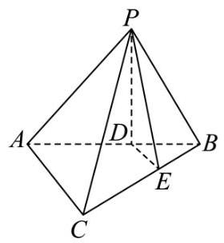

(1)求证: ${DE}//$ 平面 ${PAC}$ ；

(2)求证: ${PD} \bot$ 平面 ${ABC}$ ；

19.【25青浦一模】

第七届中国国际进口博览会于 2024 年 11 月 5 日至 10 日在上海举办，某公司生产的 $A$ 、 $B$ 、 $C$ 三款产品在博览会上亮相，每一种产品均有普通装和精品装两种款式，该公司每天产量如下表:(单位: 个)

<table><tr><td></td><td>产品 $A$</td><td>产品 $B$</td><td>产品 $C$</td></tr><tr><td>普通装</td><td>$n$</td><td>180</td><td>400</td></tr><tr><td>精品装</td><td>300</td><td>420</td><td>600</td></tr></table>

现采用分层抽样的方法在某一天生产的产品中抽取 100 个,其中 $B$ 款产品有 30 个.

(1)求 $n$ 的值；

(2)用分层抽样的方法在 $C$ 款产品中抽取一个容量为 5 的样本，从样本中任取 2 个产品，求其中至少有一个精品装产品的概率;

(3) 对抽取到的 $B$ 款产品样本中某种指标进行统计，普通装产品的平均数为 10，方差为 2，精品装产品的平均数为 12 , 方差为 1.8 , 试估计这天生产的 B 款产品的某种指标的总体方差 (精确到 0.01

).

20.【25青浦一模】

已知椭圆 $C\frac{{x}^{2}}{4} + \frac{{y}^{2}}{3} = 1, F$ 为椭圆 $C$ 的右焦点,过点 $F$ 的直线 $l$ 交椭圆 $C$ 于 $A$ 、 $B$ 两点.

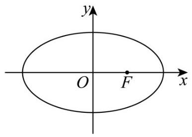

(1)若直线 $l$ 垂直于 $x$ 轴,求椭圆 $C$ 的弦 ${AB}$ 的长度；

(2)设点 $P\left( {-3,0}\right)$ ，当 $\angle {PAB} = {90}^{ \circ  }$ 时，求点 $A$ 的坐标；

(3)设点 $M\left( {3,0}\right)$ ，记 ${MA}$ 、 ${MB}$ 的斜率分别为 ${k}_{1}$ 和 ${k}_{2}$ ，求 ${k}_{1} + {k}_{2}$ 的取值范围.

21.【25青浦一模】

已知函数 $y = f\left( x\right)$ ,其中 $f\left( x\right)  = {\mathrm{e}}^{x - 1} - 2\ln x + x$ .

(1)求函数 $y = f\left( x\right)$ 的单调区间；

(2)设函数 $g\left( x\right)  = f\left( x\right)  + 2\ln x$ ，问:函数 $y = g\left( x\right)$ 的图像上是否存在三点 $A$ ， $B$ ， $C$ ，使得它们的横坐标成等差数列,且直线 ${AC}$ 的斜率等于 $y = g\left( x\right)$ 在点 $B$ 处的切线的斜率? 若存在,求出所有满足条件的点 $B$ 的坐标; 若不存在,说明理由;

(3) 证明: 函数 $y = f\left( x\right)$ 图像上任意一点都不落在函数 $y = {\left( x - 2\right) }^{3} - 3\left( {x - 2}\right)$ 图像的下方

### 7.23 宝山二模

一、填空题

1.【23 宝山二模】已知集合 $A = \left( {1,3}\right) , B = \lbrack 2, + \infty )$ ，则 $A \cap  B =$ ___.

2.【23 宝山二模】不等式 $\frac{x}{x - 1} < 0$ 的解集为___.

3.【23 宝山二模】若幂函数 $y = {x}^{a}$ 的图象经过 $\left( {\sqrt[3]{3},3}\right)$ ，则此幂函数的表达式为___.

4.【23 宝山二模】已知复数 $\left( {{m}^{2} - {3m} - 1}\right)  + \left( {{m}^{2} - {5m} - 6}\right) \mathrm{i} = 3$ (其中 $\mathrm{i}$ 为虚数单位)，则实数 $m =$ ___.

5.【23 宝山二模】已知数列 $\left\{  {a}_{n}\right\}$ 的递推公式为 $\left\{  \begin{array}{l} {a}_{n} = 2{a}_{n - 1} + 1\left( {n \geq  2}\right) \\  {a}_{1} = 2 \end{array}\right.$ ，则该数列的通项公式 ${a}_{n} =$ ___.

6.【23 宝山二模】二项式 ${\left( x + \frac{2}{x}\right) }^{6}$ 的展开式中的常数项是___. (用数字作答)

7.【23 宝山二模】从装有 3 个红球和 4 个蓝球的袋中, 每次不放回地随机摸出一球. 记 “第一次摸球时摸到红球”为 $A$ ，“第二次摸球时摸到蓝球”为 $B$ ，则 $P\left( {B \mid  A}\right)  =$ ___.

8.【【试卷】艺考生文化课高考领航攻略·数学·必刷题集 ——专题 24 等差数列的概念及性质】若数列 $\left\{  {a}_{n}\right\}$ 为等差数列,且 ${a}_{2} = 2,{S}_{5} = {20}$ ,则该数列的前 $n$ 项和为 ${S}_{n} =$ ___.

9.【23 宝山二模】已知 ${ABC}$ 的内角 $A, B, C$ 的对边分别为 $a, b, c$ ,已知 $a\sin \frac{A + C}{2} = b\sin A$ , 则 $B =$ ___.

10.【23 宝山二模】如图是某班一次数学测试成绩的茎叶图 (图中仅列出 $\lbrack {50},{60})$ , $\lbrack {90},{100})$ 的数据) 和频率分布直方图,则 $x - y =$ ___.

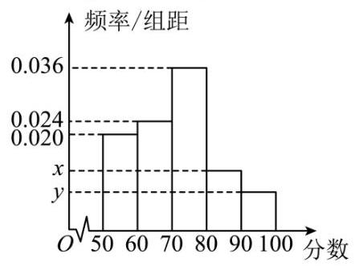

5 4 5 6 8 9

6

7

8

9 2 4

11.【23 宝山二模】已知函数 $f\left( x\right)  = \frac{1}{{a}^{x} + 1} - \frac{1}{2}\left( {a > 0\text{ 且 }a \neq  1}\right)$ ,若关于 $x$ 的不等式 $f\left( {a{x}^{2} + {bx} + c}\right)  >$ 0 的解集为 $\left( {1,2}\right)$ ,其中 $b \in  \left( {-6,1}\right)$ ,则实数 $a$ 的取值范围是___.

12.【23 宝山二模】已知非零平面向量 $\overrightarrow{a},\overrightarrow{b}$ 不共线,且满足 $\overrightarrow{a} \cdot  \overrightarrow{b} = {\overrightarrow{a}}^{2} = 4$ ,记 $\overrightarrow{c} = \frac{3}{4}\overrightarrow{a} + \frac{1}{4}\overrightarrow{b}$ ,当 $\overrightarrow{b}$ , $\overrightarrow{c}$ 的夹角取得最大值时， $\left| {\overrightarrow{a} - \overrightarrow{b}}\right|$ 的值为___.

二、单选题

13.【23 宝山二模】若 $\alpha  : {x}^{2} = 4,\beta  : x = 2$ ,则 $\alpha$ 是 $\beta$ 的 ( )

A. 充分非必要条件 B. 必要非充分条件

C. 充要条件 D. 既非充分又非必要条件

14.【23 宝山二模】已知定义在 $R$ 上的偶函数 $f\left( x\right)  = \left| {x - m + 1}\right|  - 2$ ,若正实数 $a\text{ 、 }b$ 满足 $f\left( a\right)  + \; f\left( {2b}\right)  = m$ ,则 $\frac{1}{a} + \frac{2}{b}$ 的最小值为 ( )

A. $\frac{9}{5}$ B. 9

C. $\frac{8}{5}$ D. 8

15.【23 宝山二模】将正整数 $n$ 分解为两个正整数 ${k}_{1}\text{ 、 }{k}_{2}$ 的积,即 $n = {k}_{1} \cdot  {k}_{2}$ ,当 ${k}_{1}\text{ 、 }{k}_{2}$ 两数差的绝对值最小时,我们称其为最优分解. 如 ${20} = 1 \times  {20} = 2 \times  {10} = 4 \times  5$ ,其中 $4 \times  5$ 即为 20 的最优分解,当 ${k}_{1}\text{ 、 }{k}_{2}$ 是 $n$ 的最优分解时,定义 $f\left( n\right)  = \left| {{k}_{1} - {k}_{2}}\right|$ ,则数列 $\left\{  {f\left( {5}^{n}\right) }\right\}$ 的前 2023 项的和为 ( )

A. 5 ${}^{1012}$ B. ${5}^{1012} - 1$ C. ${5}^{2023}$ D. ${5}^{2023} - 1$

16.【23 宝山二模】在空间直角坐标系 $O - {xyz}$ 中,已知定点 $A\left( {2,1,0}\right) , B\left( {0,2,0}\right)$ 和动点 $C\left( {0, t, t + 2}\right) \left( {t \geq  0}\right)$ . 若 $\bigtriangleup {OAC}$ 的面积为 $S$ ,以 $O, A, B, C$ 为顶点的锥体的体积为 $V$ ,则 $\frac{V}{S}$ 的最大值为 ( )

A. $\frac{2}{15}\sqrt{5}$ B. $\frac{1}{5}\sqrt{5}$ C. $\frac{4}{15}\sqrt{5}$ D. $\frac{4}{5}\sqrt{5}$

三、解答题

17.【23 宝山二模】

已知函数 $f\left( x\right)  = \sin x\cos x - \sqrt{3}{\cos }^{2}x + \frac{\sqrt{3}}{2}$ .

(1)求函数 $y = f\left( x\right)$ 的最小正周期和单调区间；

(2) 若关于 $x$ 的方程 $f\left( x\right)  - m = 0$ 在 $x \in  \left\lbrack  {0,\frac{\pi }{2}}\right\rbrack$ 上有两个不同的实数解,求实数 $m$ 的取值范围.

18.【23 宝山二模】

四棱锥 $P - {ABCD}$ 的底面是边长为 2 的菱形， $\angle {DAB} = {60}^{ \circ  }$ ，对角线 ${AC}$ 与 ${BD}$ 相交于点 $O$ ， ${PO}$ 1 底面 ${ABCD},{PB}$ 与底面 ${ABCD}$ 所成的角为 ${60}^{ \circ  }, E$ 是 ${PB}$ 的中点.

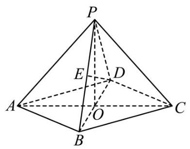

(1)求异面直线 ${DE}$ 与 ${PA}$ 所成角的大小 (结果用反三角函数值表示)；

(2) 证明: ${OE}//$ 平面 ${PAD}$ ，并求点 $E$ 到平面 ${PAD}$ 的距离.

19.【23 宝山二模】

下表是某工厂每月生产的一种核心产品的产量 $x\left( {4 \leq  x \leq  {20}, x \in  Z}\right)$ (件) 与相应的生产成本 $y$ (万元) 的四组对照数据.

<table><tr><td>$x$</td><td>4</td><td>6</td><td>8</td><td>1   0</td></tr><tr><td>$y$</td><td>1</td><td>2</td><td>2</td><td>8</td></tr></table>

<table><tr><td></td><td>2</td><td>0</td><td>8</td><td>4</td></tr></table>

(1)试建立 $x$ 与 $y$ 的线性回归方程；

(2)研究人员进一步统计历年的销售数据发现. 在供销平衡的条件下，市场销售价格会波动变化. 经分析,每件产品的销售价格 $q$ (万元) 是一个与产量 $x$ 相关的随机变量,分布为

<table><tr><td>$q$</td><td>${100} - x$</td><td>${90} - x$</td><td>${80} - x$</td></tr><tr><td>$p$</td><td>$\frac{1}{4}$</td><td>$\frac{1}{2}$</td><td>$\frac{1}{4}$</td></tr></table>

假设产品月利润=月销售量 × 销售价格 - 成本. (其中月销售量 = 生产量)

根据(1)进行计算，当产量 $x$ 为何值时. 月利润的期望值最大？最大值为多少？

20.【23 宝山二模】

已知抛物线 $\Gamma  : {y}^{2} = {4x}$ .

(1)求抛物线 $\Gamma$ 的焦点 $F$ 的坐标和准线 $l$ 的方程；

(2)过焦点 $F$ 且斜率为 $\frac{1}{2}$ 的直线与抛物线 $\Gamma$ 交于两个不同的点 $A$ 、 $B$ ，求线段 ${AB}$ 的长；

(3) 已知点 $P\left( {1,2}\right)$ ，是否存在定点 $Q$ ，使得过点 $Q$ 的直线与抛物线 $\Gamma$ 交于两个不同的点 $M$ 、 $N$ (均不与点 $\mathrm{P}$ 重合),且以线段 ${MN}$ 为直径的圆恒过点 $P$ ? 若存在,求出点 $Q$ 的坐标; 若不存在,请说明理由.

21.【23 宝山二模】

直线族是指具有某种共同性质的直线的全体. 如: 方程 $y = {kx} + 1$ 中,当 $k$ 取给定的实数时,表示一条直线; 当 $k$ 在实数范围内变化时,表示过点 $\left( {0,1}\right)$ 的直线族 $\left( {\text{ 不含 }y\text{ 轴 }}\right)$ . 记直线族

$2\left( {a - 2}\right) x + {4y} - {4a} + {a}^{2} = 0$ (其中 $a \in  R$ ) 为 $\Psi$ ,直线族 $y = 3{t}^{2}x - 2{t}^{3}$ (其中 $t > 0$ ) 为 $\Omega$ .

(1)分别判断点 $A\left( {0,1}\right)$ ， $B\left( {1,2}\right)$ 是否在 $\Psi$ 的某条直线上，并说明理由;

(2)对于给定的正实数 ${x}_{0}$ ，点 $P\left( {{x}_{0},{y}_{0}}\right)$ 不在 $\Omega$ 的任意一条直线上，求 ${y}_{0}$ 的取值范围 (用 ${x}_{0}$ 表示)；

(3)直线族的包络被定义为这样一条曲线: 直线族中的每一条直线都是该曲线上某点处的切线, 且该曲线上每一点处的切线都是该直线族中的某条直线. 求 $\Omega$ 的包络和 $\Psi$ 的包络.

### 8.24 长宁一模

一、填空题

1.【24 长宁一模】已知集合 $A = ( - \infty ,4\rbrack , B = \{ 1,3,5,7\}$ ，则 $A \cap  B =$ ___.

2.【24 长宁一模】复数 $z$ 满足 $z = \frac{1}{1 - i}$ ( $\mathrm{i}$ 为虚数单位),则 $\left| \widehat{z}\right|  =$ ___

3.【24 长宁一模】不等式 $\frac{1}{x} > 1$ 的解集为___

4.【24 长宁一模】设向量 $\overrightarrow{a} = \left( {1, - 2}\right) ,\overrightarrow{b} = \left( {-1, m}\right)$ ，若 $\overrightarrow{a}//\overrightarrow{b}$ ，则 $m =$ ___.

5.【24 长宁一模】将 4 个人排成一排，若甲和乙必须排在一起，则共有___种不同排法.

6.【24 长宁一模】物体位移 $s$ 和时间 $t$ 满足函数关系 $s = {100t} - 5{t}^{2}\left( {0 < t < {20}}\right)$ ,则当 $t = 2$ 时,物体的瞬时速度为___.

7.【24 长宁一模】现利用随机数表法从编号为 00,01,02,...,18,19 的 20 文水笔中随机选取 6 支, 选取方法是从下列随机数表第 1 行的第 9 个数字开始由左到右依次选取两个数字, 则选出来的第 6 支水笔的编号为___.

952260004984012866175168396829274377236627096623

925809564389089006482834597414582977814964608925

8.【24长宁一模】在有声世界，声强级是表示声强度相对大小的指标. 其值 $y$ (单位: $\mathrm{{dB}}$ ) 定义为 $y = {10}\lg \frac{I}{{I}_{0}}$ . 其中 $I$ 为声场中某点的声强度,其单位为 $W/{m}^{2},\;{I}_{0} = {10}^{-{12}}W/{m}^{2}$ 为基准值. 若 $I = \; {10W}/{m}^{2}$ ,则其相应的声强级为___ ${dB}$ .

9.【24 长宁一模】若向量 $\overrightarrow{a} = \left( {1,0,2}\right) ,\overrightarrow{b} = \left( {0,1, - 1}\right)$ ,则 $\overrightarrow{a}$ 在 $\overrightarrow{b}$ 方向上的投影向量的坐标为 ___.

10. 若 “存在 $x > 0$ ,使得 ${x}^{2} + {ax} + 1 < 0$ ” 是假命题，则实数 $a$ 的取值范围___.

11.【24 长宁一模】若函数 $f\left( x\right)  = \sin x + a\cos x$ 在 $\left( {3,6}\right)$ 上是严格单调函数，则实数 $a$ 的取值范围为 ___.

12.【24 长宁一模】设 $f\left( x\right)  = \left| {{\log }_{2}x + {ax} + b}\right| \left( {a0}\right)$ ，记函数 $y = f\left( x\right)$ 在区间 $\left\lbrack  {t, t + 1}\right\rbrack  \left( {t > 0}\right)$ 上的最大值为 ${M}_{t}\left( {a, b}\right)$ ,若对任意 $b \in  R$ ,都有 ${M}_{t}\left( {a, b}\right)  \geq  \frac{a}{2} + 1$ ,则实数 $t$ 的最大值为___.

二、单选题

13.【24 长宁一模】下列函数中既是奇函数又是增函数的是 ( )

A. $f\left( x\right)  = {2x}$ B. $f\left( x\right)  = {x}^{2}$ C. $f\left( x\right)  = \ln x$ D. $f\left( x\right)  = {\mathrm{e}}^{x}$

14.【24 长宁一模】“ $P\left( {A \cap  B}\right)  = P\left( A\right) P\left( B\right)$ ” 是 “事件 $A$ 与事件 $\bar{B}$ 互相独立” ( )

A. 充分不必要条件 B. 必要不充分条件

C. 充要条件 D. 既不充分也不必要条件

15.【24 长宁一模】设点 $P$ 是以原点为圆心的单位圆上的动点,它从初始位置 ${P}_{0}\left( {1,0}\right)$ 出发,沿单位圆按逆时针方向转动角 $\alpha \left( {0 < \alpha  < \frac{\pi }{2}}\right)$ 后到达点 ${P}_{1}$ ,然后继续沿单位圆按逆时针方向转动角 $\frac{\pi }{4}$ 到达 ${P}_{2}$ . 若点 ${P}_{2}$ 的横坐标为 $- \frac{3}{5}$ ,则点 ${P}_{1}$ 的纵坐标 ( )

A. $\frac{\sqrt{2}}{10}$ B. $\frac{\sqrt{2}}{5}$ C. $\frac{3\sqrt{2}}{5}$ D. $\frac{7\sqrt{2}}{10}$

16.【24 长宁一模】豆腐发酵后表面长出一层白绒绒的长毛就成了毛豆腐，将三角形豆腐 ${ABC}$ 悬空挂在发酵空间内,记发酵后毛豆腐所构成的几何体为 $T$ . 若忽略三角形豆腐 ${ABC}$ 的厚度,设 ${AB} = 3,{BC} = 4,{AC} = 5$ ,点 $P$ 在 $\bigtriangleup {ABC}$ 内部. 假设对于任意点 $P$ ,满足 ${PQ} \leq  1$ 的点 $Q$ 都在 $T$ 内,且对于 $T$ 内任意一点 $Q$ ,都存在点 $P$ ,满足 ${PQ} \leq  1$ ,则 $T$ 的体积为 ( )

A. ${12} + {7\pi }$ B. ${12} + \frac{22\pi }{3}$ C. ${14} + {7\pi }$ D. ${14} + \frac{22\pi }{3}$

## 三、解答题

17.【24 长宁一模】

已知等差数列 $\left\{  {a}_{n}\right\}$ 的前 $n$ 项和为 ${S}_{n}$ ,公差 $d = 2$ .

(1)若 ${S}_{10} = {100}$ ，求 $\left\{  {a}_{n}\right\}$ 的通项公式；

(2)从集合 $\left\{  {{a}_{1},{a}_{2},{a}_{3},{a}_{4},{a}_{5},{a}_{6}}\right\}$ 中任取 3 个元素，记这 3 个元素能成等差数列为事件 $A$ ，求事件 $A$ 发生的概率 $P\left( A\right)$ .

18.【24 长宁一模】

如图,在三棱锥 $A - {BCD}$ 中,平面 ${ABD} \bot$ 平面 ${BCD},{AB} = {AD}, O$ 为 ${BD}$ 的中点.

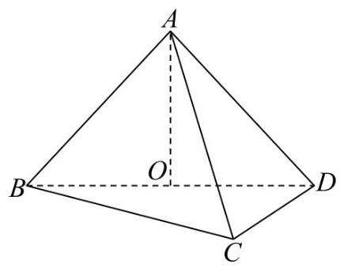

(1)求证: ${AO}\bot {CD}$ ；

(2)若 ${BD}\bot {DC}$ ， ${BD} = {DC}$ ， ${AO} = {BO}$ ，求异面直线 ${BC}$ 与 ${AD}$ 所成的角的大小.

19.【24 长宁一模】

汽车转弯时遵循阿克曼转向几何原理，即转向时所有车轮中垂线交于一点，该点称为转向中心:如图 1,某汽车四轮中心分别为 $A\text{ 、 }B\text{ 、 }C\text{ 、 }D$ ,向左转向,左前轮转向角为 $\alpha$ ,右前轮转向角为 $\beta$ , 转向中心为 $O$ . 设该汽车左右轮距 ${AB}$ 为 $w$ 米,前后轴距 ${AD}$ 为 $l$ 米.

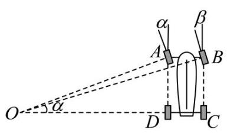

图1

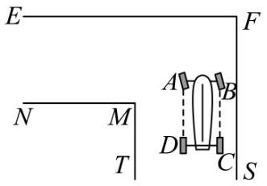

图2

(1)试用 $w$ 、 $l$ 和 $\alpha$ 表示 $\tan \beta$ ；

(2)如图2，有一直角弯道， $M$ 为内直角顶点， ${EF}$ 为上路边，路宽均为3.5米，汽车行驶其中，左轮 $A$ 、 $D$ 与路边 ${FS}$ 相距 2 米. 试依据如下假设，对问题 * 做出判断，并说明理由.

20.【24 长宁一模】

已知椭圆 $\Gamma \frac{{x}^{2}}{4} + \frac{{y}^{2}}{2} = 1,{F}_{1}\text{ 、 }{F}_{2}$ 为 $\Gamma$ 的左、右焦点,点 $A$ 在 $\Gamma$ 上,直线 $l$ 与圆 $C{x}^{2} + {y}^{2} = 2$ 相切.

(1)求 $\bigtriangleup  A{F}_{1}{F}_{2}$ 的周长；

(2)若直线 $l$ 经过 $\Gamma$ 的右顶点，求直线 $l$ 的方程；

(3) 设点 $D$ 在直线 $y = 2$ 上， $O$ 为原点，若 ${OA} \bot  {OD}$ ，求证:直线 ${AD}$ 与圆 $C$ 相切.

21.【24 长宁一模】

若函数 $y = f\left( x\right)$ 与 $y = g\left( x\right)$ 满足: 对任意 ${x}_{1},{x}_{2} \in  R$ ,都有 $\left| {f\left( {x}_{1}\right)  - f\left( {x}_{2}\right) }\right|  \geq  \left| {g\left( {x}_{1}\right)  - g\left( {x}_{2}\right) }\right|$ ,则称函数 $y = f\left( x\right)$ 是函数 $y = g\left( x\right)$ 的 “约束函数”. 已知函数 $y = f\left( x\right)$ 是函数 $y = g\left( x\right)$ 的 “约束函数”.

(1)若 $f\left( x\right)  = {x}^{2}$ ，判断函数 $y = g\left( x\right)$ 的奇偶性，并说明理由:

(2)若 $f\left( x\right)  = {ax} + {x}^{3}\left( {a0}\right) , g\left( x\right)  = \sin x$ ，求实数 $a$ 的取值范围；

(3)若 $y = g\left( x\right)$ 为严格减函数， $f\left( 0\right)  < f\left( 1\right)$ ，且函数 $y = f\left( x\right)$ 的图像是连续曲线，求证: $y = f\left( x\right)$ 是 $\left( {0,1}\right)$ 上的严格增函数.

## 9 25 长宁一模

一、填空题

1.【25 长宁一模】设全集为 $R$ ,集合 $A = \left\{  {x\left| {\;{x}^{2} - {2x} - 3 \geq  0}\right. }\right\}$ ,则 $\bar{A} =$ ___.

2.【25 长宁一模】已知圆锥的底面半径为 1，母线长为 2，则该圆锥的体积是___(结果保留π).

3.【上海市长宁区 2025 届高三一模数学试卷】曲线 $y = \ln x$ 在点 $\left( {1,0}\right)$ 处的切线方程为___.

4.【25 长宁一模】以 $C\left( {3,4}\right)$ 为圆心， $\sqrt{3}$ 为半径的圆的标准方程是___.

5.【25 长宁一模】投掷两枚质地均匀的骰子，观察掷得的点数，则掷得的点数之和为 7 的概率是 ___.

6.【25 长宁一模】 ${\left( x - \frac{1}{x}\right) }^{6}$ 的二项展开式中的常数项是___.

7.【25 长宁一模】已知 $a \in  \left\{  {-1, - \frac{2}{3}, - \frac{1}{3},\frac{1}{3},\frac{2}{3},1,2,3}\right\}$ ,函数 $y = {x}^{a}$ 的大致图像如图所示,则 $a \; =$ ___.

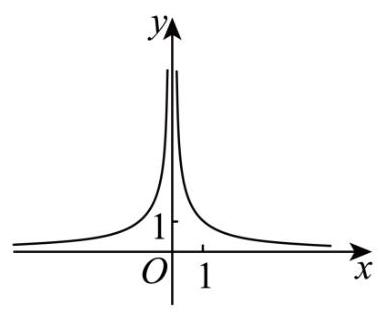

8.【25 长宁一模】已知向量 $\overrightarrow{a} = \left( {1,2}\right) ,\overrightarrow{b} = \left( {3, - 1}\right)$ ，则向量 $\overrightarrow{b}$ 在 $\overrightarrow{a}$ 方向上的投影的坐标是___.

9.【25 长宁一模】已知 $a{2}^{x} + {\log }_{2}x \leq  2,{\beta x} < m$ ,若 $\alpha$ 是 $\beta$ 的充分条件,则实数 $m$ 的取值范围是 ___.

10.【【试卷】第 04 讲基本不等式及其应用 (十八大题型) - 讲义】若正实数 $a, b$ 满足 ${ab} = {2a} + b$ , 则 $a + {2b}$ 的最小值是___.

11.【25 长宁一模】设 $O$ 为坐标原点,从集合 $\{ 1,2,3,4,5,6,7,8,9\}$ 中任取两个不同的元素 $x\text{ 、 }y$ , 组成 $A\text{ 、 }B$ 两点的坐标 $\left( {x, y}\right) \text{ 、 }\left( {y, x}\right)$ ，则 ${S}_{\bigtriangleup {AOB}} \leq  {10}$ 的概率为___.

12.【25 长宁一模】点 $P$ 、 $M$ 、 $N$ 分别位于正方体 ${ABCD} - {A}^{\prime }{B}^{\prime }{C}^{\prime }{D}^{\prime }$ 的面上， ${AB} = 1$ ，则 $\overrightarrow{PM}$ . $\overrightarrow{PN}$ 的最小值是___.

二、单选题

13.【25 长宁一模】已知复数 $z$ 和 $\bar{z}$ ,则下列说法正确的是 ( )

A. $z + \bar{z}$ 一定是实数 B. $z - \bar{z}$ 一定是虚数

C. 若 $z + \bar{z} = 0$ ,则 $z$ 是纯虚数 D. 若 $z - \bar{z} = 0$ ,则 $z$ 是纯虚数

14.【25 长宁一模】已知非零空间向量 $\overrightarrow{a},\overrightarrow{b}$ 和 $\overrightarrow{c}$ ，则下列说法正确的是 ( )

A. 若 $\overrightarrow{a} \bot  \overrightarrow{b},\overrightarrow{a} \bot  \overrightarrow{c}$ ,则 $\overrightarrow{b}//\overrightarrow{c}$ B. 若 $\overrightarrow{a} \bot  \overrightarrow{b},\overrightarrow{a} \bot  \overrightarrow{c}$ ,则 $\overrightarrow{b}//\overrightarrow{c}$

C. 若 $\overrightarrow{a} \bot  \overrightarrow{b},\overrightarrow{a}//\overrightarrow{c}$ ,则 $\overrightarrow{b}//\overrightarrow{c}$ D. 若 $\overrightarrow{a} \bot  \overrightarrow{b},\overrightarrow{a}//\overrightarrow{c}$ ,则 $\overrightarrow{b} \bot  \overrightarrow{c}$

15.【25 长宁一模】已知函数 $y = \sin \left( {{\omega x} + \frac{\pi }{6}}\right) \left( {\omega  > 0}\right)$ 在区间 $\left( {-\frac{\pi }{2},\frac{\pi }{3}}\right)$ 上单调递增,则 $\omega$ 的取值范围是 ( )

A. $(0,1\rbrack$ B. $\left( {0,1}\right)$ C. $\left( {1,\frac{4}{3}}\right)$ D. $\left( {0,\frac{6}{5}}\right\rbrack$

16.【25 长宁一模】数列 $\left\{  {a}_{n}\right\}$ 为严格增数列,且对任意的正整数 $n$ ,都有 $\frac{{a}_{n + 1}}{n + 1} \geq  \frac{{a}_{n}}{n}$ ,则称数列 $\left\{  {a}_{n}\right\}$ 满足 “性质 $\Omega$ ”.

①存在等差数列 $\left\{  {a}_{n}\right\}$ 满足 “性质 $\Omega$ ”;

②任意等比数列 $\left\{  {a}_{n}\right\}$ ，若首项 ${a}_{1} > 0$ ，则 $\left\{  {a}_{n}\right\}$ 满足 “性质 $\Omega$ ”；

下列选项中正确的是 ( )

A. ①是真命题，②是真命题； B. ①是真命题，②是假命题；

C. ①是假命题，②是真命题； D. ①是假命题，②是假命题.

三、解答题

17.【25 长宁一模】

在 $\bigtriangleup {ABC}$ 中,角 $A, B, C$ 所对的边分别为 $a, b, c$ ,且 $b\sin A - \sqrt{3}a\cos B = 0$ .

(1)求角 $B$ 的大小；

(2)若 $b = 2,{\bigtriangleup {ABC}}$ 的面积为 $\sqrt{3}$ ，请判断 ${\bigtriangleup {ABC}}{\text{ 的 }\text{ 形 }\text{ 状 }}$ ，并说明理由.

18.【25 长宁一模】

如图所示,四棱柱 ${ABCD} - {A}_{1}{B}_{1}{C}_{1}{D}_{1}$ 的底面 ${ABCD}$ 是正方形, $O$ 是底面的中心, ${A}_{1}O \bot$ 平面 ${ABCD},{AB} = A{A}_{1} = \sqrt{2}$ .

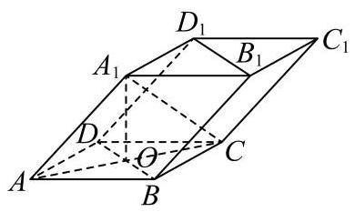

(1)求证: ${A}_{1}C \bot$ 平面 ${BD}{D}_{1}{B}_{1}$ ；

19.【25 长宁一模】

2024 年第七届中国国际进口博览会 (简称进博会) 于 11 月 5 日至 10 日在上海国家会展中心举行. 为了解进博会参会者的年龄结构,某机构随机抽取了年龄在 ${15} - {75}$ 岁之间的 200 名参会者进行调查, 并按年龄绘制了频率分布直方图,分组区间为 $\lbrack {15},{25}),\lbrack {25},{35}),\lbrack {35},{45}),\lbrack {45},{55}),\lbrack {55},{65})$ , $\left\lbrack  {{65},{75}}\right\rbrack$ . 把年龄落在区间 $\lbrack {15},{35})$ 内的人称为 “青年人”,把年龄落在区间 $\lbrack {35},{65})$ 内的人称为 “中年人”，把年龄落在 $\left\lbrack  {{65},{75}}\right\rbrack$ 内的人称为“老年人”.

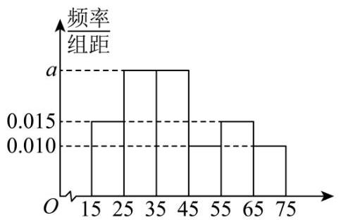

200 名参会者的频率分布直方图

(1)求所抽取的“青年人”的人数；

(2)以分层抽样的方式从 “青年人” “中年人” “老年人” 中抽取 10 名参会者做进一步访谈, 发现其中女性共 4 人，这 4 人中有 3 人是 “中年人”，再用抽签法从所抽取的 10 名参会者中任选 2 人.

20.【25 长宁一模】

已知椭圆的左、右焦点分别为 ${F}_{1}\left( {-1,0}\right)$ ， ${F}_{2}\left( {1,0}\right)$ ，且经过点 $P\left( {-1,\frac{3}{2}}\right)$ .

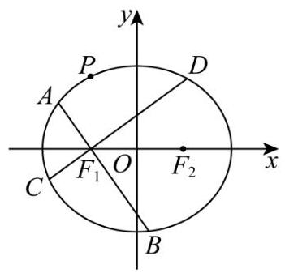

(1)求该椭圆的离心率；

(2)点 $Q$ 为椭圆上一点，且位于第三象限，若 $\bigtriangleup  {PQ}{F}_{2}$ 的面积为3，求点 $Q$ 的坐标；

21.【25 长宁一模】

双曲余弦函数 $\cosh x = \frac{{\mathrm{e}}^{x} + {\mathrm{e}}^{-x}}{2}$ ,双曲正弦函数 $\sinh x = \frac{{\mathrm{e}}^{x} - {\mathrm{e}}^{-x}}{2}$ .

(1)求函数 $\cosh x = \frac{{\mathrm{e}}^{x} + {\mathrm{e}}^{-x}}{2}$ 的单调增区间；

( 2 )若函数 $y = \cosh {2x} - a\sinh x$ 在 $\lbrack 0, + \infty )$ 上的最小值是 $\frac{1}{4}$ ，求实数 $a$ 的值；

## 10. 【23 闵行二模】

一、填空题

1.【23 闵行二模】设全集 $U = \{  - 2, - 1,0,1,2\}$ ,集合 $A = \{  - 2,0,2\}$ ,则 $\bar{A} =$ ___.

2.【23 闵行二模】若实数 $x\text{ 、 }y$ 满足 $\lg x = m\text{ 、 }y = {10}^{1 - m}$ ,则 ${xy} =$ ___.

3.【23 闵行二模】已知复数 $z$ 满足 $z\left( {1 - \mathrm{i}}\right)  = \mathrm{i}$ ( $\mathrm{i}$ 为虚数单位),则 $z$ 的虚部为___.

4.【【试卷】上海市普陀区 2024-2025 学年高三上学期 11 月调研测试 (0.5 模) 数学试卷】已知圆柱的底面积为 ${9\pi }$ ，侧面积为 ${12\pi }$ ，则该圆柱的体积为___.

5.【23 闵行二模】已知常数 $m > 0,{\left( x + \frac{m}{x}\right) }^{6}$ 的二项展开式中 ${x}^{2}$ 项的系数是 60,则 $m$ 的值为 ___.

6.【23 闵行二模】已知事件 $A$ 与事件 $B$ 互斥,如果 $P\left( A\right)  = {0.3}, P\left( B\right)  = {0.5}$ ,那么 $P\left( \overline{A \cup  B}\right)  =$ ___.

7.【23 闵行二模】今年春季流感爆发期间, 某医院准备将 2 名医生和 4 名护士分配到两所学校, 给学校老师和学生接种流感疫苗. 若每所学校分配 1 名医生和 2 名护士，则不同的分配方法数为 ___.

8.【23 闵行二模】 $\mathop{\lim }\limits_{{h \rightarrow  0}}\frac{\ln \left( {h + 4}\right)  - 2\ln 2}{h} =$ ___.

9.【23 闵行二模】若关于 $x$ 的方程 ${\left( \frac{1}{2}\right) }^{x} + m = \sqrt{x + 1}$ 在实数范围内有解,则实数 $m$ 的取值范围是 ___.

10.【23 闵行二模】已知在等比数列 $\left\{  {a}_{n}\right\}$ 中, ${a}_{3}\text{ 、 }{a}_{7}$ 分别是函数 $y = {x}^{3} - 6{x}^{2} + {6x} - 1$ 的两个驻点, 则 ${a}_{5} =$ ___.

注意到 ${a}_{5} = {a}_{3}{q}^{2} > 0$ ,可得 ${a}_{5} = \sqrt{2}$ .

故答案为: $\sqrt{2}$ .

11.【23 闵行二模】已知抛物线 ${C}_{1} : {y}^{2} = {8x}$ ,圆 ${C}_{2} : {\left( x - 2\right) }^{2} + {y}^{2} = 1$ ,点 $M$ 的坐标为 $\left( {4,0}\right) , P$ 、 $Q$ 分别为 ${C}_{1}$ 、 ${C}_{2}$ 上的动点，且满足 $\left| {PM}\right|  = \left| {PQ}\right|$ ，则点 $P$ 的横坐标的取值范围是___.

12.【23 闵行二模】平面上有一组互不相等的单位向量 $O{A}_{1}, O{A}_{2},\cdots , O{A}_{n}$ ,若存在单位向量 $\overrightarrow{OP}$ 满足 $\overrightarrow{OP} \cdot  \overrightarrow{O{A}_{1}} + \overrightarrow{OP} \cdot  \overrightarrow{O{A}_{2}} + \cdots  + \overrightarrow{OP} \cdot  \overrightarrow{O{A}_{n}} = 0$ ，则称 $\overrightarrow{OP}$ 是向量组 $O{A}_{1}$ ， $O{A}_{2}$ ， $\cdots$ ， $O{A}_{n}$ 的平衡向量. 已知 $\overrightarrow{O{A}_{1}},\overrightarrow{O{A}_{2}} = \frac{\pi }{3}$ ，向量 $\overrightarrow{OP}$ 是向量组 $\overrightarrow{O{A}_{1}},\overrightarrow{O{A}_{2}},\overrightarrow{O{A}_{3}}$ 的平衡向量，当 $\overrightarrow{OP} \; \cdot  \overrightarrow{O{A}_{3}}$ 取得最大值时， $\overrightarrow{O{A}_{1}} \cdot  \overrightarrow{O{A}_{3}}$ 值为___.

二、单选题

13.【23 闵行二模】下列函数中, 既不是奇函数, 也不是偶函数的为 ( )

A. $y = 0$

B. $y = \frac{1}{x}$ C. $y = {x}^{2}$ D. $y = {2}^{x}$

14.【【试卷】天津市咸水沽第一中学 2023 届高三押题卷 (五) 数学试题】在某区高三年级举行的一次质量检测中, 某学科共有 3000 人参加考试. 为了解本次考试学生的成绩情况, 从中抽取了部分学生的成绩 (成绩均为正整数,满分为 100 分) 作为样本进行统计,样本容量为 $n$ . 按照 $\lbrack {50},{60}),\lbrack {60},{70}),\lbrack {70},{80}),\lbrack {80},{90}),\left\lbrack  {{90},{100}}\right\rbrack$ 的分组作出频率分布直方图 (如图所示). 已知成绩落在 $\lbrack {50},{60})$ 内的人数为 16 , 则下列结论正确的是 ( )

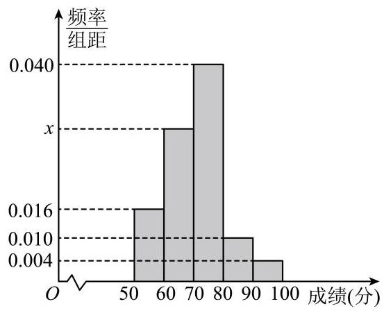

A. 样本容量 $n = {1000}$

B. 图中 $x = {0.025}$

C. 估计全体学生该学科成绩的平均分为 70.6 分

D. 若将该学科成绩由高到低排序,前 15% 的学生该学科成绩为 $A$ 等,则成绩为 78 分的学生该学科成绩肯定不是 $A$ 等

15.【23 闵行二模】已知 $f\left( x\right)  = \cos {2x} - a\sin x$ ,若存在正整数 $n$ ,使函数 $y = f\left( x\right)$ 在区间 $\left( {0,{n\pi }}\right)$ 内有 2023 个零点,则实数 $a$ 所有可能的值为 ( )

A. 1 B. -1 C. 0 D. 1 或 -1

16. 若 ${t}_{1} <  - 1 < 0 < {t}_{2} < 1$ ,即 $\sin x = {t}_{1} <  - 1$ 和 $\sin x = {t}_{2} \in  \left( {0,1}\right)$ ,

结合正弦函数图象可知: $\sin x = {t}_{2} \in  \left( {0,1}\right)$ 在 $\left( {{2k\pi },{2k\pi } + \pi }\right) \left( {k \in  {N}^{ * }}\right)$ 内有两个不相等的实数根, $\sin x = {t}_{1} <  - 1$ 无实数根,

故对任意正整数 $n, y = f\left( x\right)$ 在 $\left( {0,{n\pi }}\right)$ 内有偶数个零点,不合题意;

17. 若 $- 1 < {t}_{1} < 0 < 1 < {t}_{2}$ ,即 $\sin x = {t}_{1} \in  \left( {-1,0}\right)$ 和 $\sin x = {t}_{2} > 1$ ,

结合正弦函数图象可知: $\sin x = {t}_{2} > 1$ 无实数根, $\sin x = {t}_{1} \in  \left( {-1,0}\right)$ 在 $\left( {{2k\pi } + \pi ,{2k\pi } + {2\pi }}\right) \left( {k \in  {N}^{ * }}\right)$ 内有两个不相等的实数根,

故对任意正整数 $n, y = f\left( x\right)$ 在 $\left( {0,{n\pi }}\right)$ 内有偶数个零点,不合题意;

18. 若 $- 1 < {t}_{1} < 0 < {t}_{2} < 1$ ,即 $\sin x = {t}_{1} \in  \left( {-1,0}\right)$ 和 $\sin x = {t}_{2} \in  \left( {0,1}\right)$ ,

结合正弦函数图象可知: $\sin x = {t}_{2} \in  \left( {0,1}\right)$ 在 $\left( {{2k\pi },{2k\pi } + \pi }\right) \left( {k \in  {N}^{ * }}\right)$ 内有两个不相等的实数根,

$\sin x = {t}_{1} \in  \left( {-1,0}\right)$ 在 $\left( {{2k\pi } + \pi ,{2k\pi } + {2\pi }}\right) \left( {k \in  {N}^{ * }}\right)$ 内有两个不相等的实数根,

故对任意正整数 $n, y = f\left( x\right)$ 在 $\left( {0,{n\pi }}\right)$ 内有偶数个零点,不合题意;

19. 若 ${t}_{1} =  - 1,\;{t}_{2} = \frac{1}{2}$ ,即 $\sin x =  - 1$ 和 $\sin x = \frac{1}{2} \in  \left( {0,1}\right)$ ,

结合正弦函数图象可知: $\sin x = \frac{1}{2}$ 在 $\left( {{2k\pi },{2k\pi } + \pi }\right) \left( {k \in  {N}^{ * }}\right)$ 内有两个不相等的实数根, $\sin x =  - 1$ 在 $\left( {{2k\pi } + \pi ,{2k\pi } + {2\pi }}\right) \left( {k \in  {N}^{ * }}\right)$ 内有且仅有一个实数根，

①对任意正奇数 $n, y = f\left( x\right)$ 在 $\left( {0,{n\pi }}\right)$ 内有 $3 \times  \frac{n - 1}{2} + 2 = \frac{{3n} + 1}{2}$ 个零点，

由题意可得 $\frac{{3n} + 1}{2} = {2023}$ ,解得 $n = \frac{4045}{3} \notin  {N}^{ * }$ ,不合题意;

②对任意正偶数 $n, y = f\left( x\right)$ 在 $\left( {0,{n\pi }}\right)$ 内有 $3 \times  \frac{n}{2} = \frac{3n}{2}$ 个零点，

由题意可得 $\frac{3n}{2} = {2023}$ ,解得 $n = \frac{4046}{3} \notin  {N}^{ * }$ ,不合题意;

20. 若 ${t}_{1} =  - \frac{1}{2},{t}_{2} = 1$ ,即 $\sin x =  - \frac{1}{2}$ 和 $\sin x = 1$ ,

结合正弦函数图象可知: $\sin x = 1$ 在 $\left( {{2k\pi },{2k\pi } + \pi }\right) \left( {k \in  {N}^{ * }}\right)$ 内有且仅有一个实数根, $\sin x =  - \frac{1}{2}$

在 $\left( {{2k\pi } + \pi ,{2k\pi } + {2\pi }}\right) \left( {k \in  {N}^{ * }}\right)$ 内有两个不相等的实数根,

①对任意正奇数 $n$ ， $y = f\left( x\right)$ 在 $\left( {0,{n\pi }}\right)$ 内有 $3 \times  \frac{n - 1}{2} + 1 = \frac{{3n} - 1}{2}$ 个零点，

由题意可得 $\frac{{3n} - 1}{2} = {2023}$ ,解得 $n = {1349} \in  {N}^{ * }$ ,符合题意;

②对任意正偶数 $n$ ， $y = f\left( x\right)$ 在 $\left( {0,{n\pi }}\right)$ 内有 $3 \times  \frac{n}{2} = \frac{3n}{2}$ 个零点，

由题意可得 $\frac{3n}{2} = {2023}$ ,解得 $n = \frac{4046}{3} \notin  {N}^{ * }$ ,不合题意;

综上所述: 当 ${t}_{1} =  - \frac{1}{2},{t}_{2} = 1, n = {1349}$ 时,符合题意.

此时 $- \frac{a}{2} =  - \frac{1}{2} + 1 = \frac{1}{2}$ ,解得 $a =  - 1$ .

21.【23 闵行二模】若数列 $\left\{  {b}_{n}\right\}  \text{ 、 }\left\{  {c}_{n}\right\}$ 均为严格增数列,且对任意正整数 $n$ ,都存在正整数 $m$ ,使得 ${b}_{m} \in  \left\lbrack  {{c}_{n},{c}_{n + 1}}\right\rbrack$ ,则称数列 $\left\{  {b}_{n}\right\}$ 为数列 $\left\{  {c}_{n}\right\}$ 的 “ $M$ 数列”. 已知数列 $\left\{  {a}_{n}\right\}$ 的前 $n$ 项和为 ${S}_{n}$ , 则下列选项中为假命题的是 ( )

A. 存在等差数列 $\left\{  {a}_{n}\right\}$ ,使得 $\left\{  {a}_{n}\right\}$ 是 $\left\{  {S}_{n}\right\}$ 的 “ $M$ 数列”

B. 存在等比数列 $\left\{  {a}_{n}\right\}$ ,使得 $\left\{  {a}_{n}\right\}$ 是 $\left\{  {S}_{n}\right\}$ 的 “ $M$ 数列”

C. 存在等差数列 $\left\{  {a}_{n}\right\}$ ,使得 $\left\{  {S}_{n}\right\}$ 是 $\left\{  {a}_{n}\right\}$ 的 “ $M$ 数列”

D. 存在等比数列 $\left\{  {a}_{n}\right\}$ ,使得 $\left\{  {S}_{n}\right\}$ 是 $\left\{  {a}_{n}\right\}$ 的 “ $M$ 数列”

三、解答题

22.【【试卷】陕西省西安市周至县 2024 届高三一模数学 (理) 试题】

在 $\bigtriangleup {ABC}$ 中,角 $A\text{ 、 }B\text{ 、 }C$ 所对的边分别为 $a\text{ 、 }b\text{ 、 }c$ ,已知 $\sin A = \sin {2B}, a = 4, b = 6$ .

(1)求 $\cos B$ 的值；

23.【【试卷】艺考生文化课高考领航攻略·数学·必刷题集 —— 专题 36 空间向量与空间角度、距离】 如图,在四棱锥 $P - {ABCD}$ 中,底面 ${ABCD}$ 为矩形, ${PD} \bot$ 平面 ${ABCD},{PD} = {AD} = 2,{AB} =$ 4,点 $E$ 在线段 ${AB}$ 上,且 ${BE} = \frac{1}{4}{AB}$ .

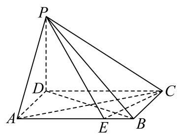

(1)求证: ${CE}\bot$ 平面 ${PBD}$ ；

24.【23 闵行二模】

在临床检测试验中,某地用某种抗原来诊断试验者是否患有某种疾病. 设事件 $A$ 表示试验者的检测结果为阳性,事件 $B$ 表示试验者患有此疾病,据临床统计显示, $P\left( {A \mid  B}\right)  = {0.99}, P\left( {\bar{A} \mid  \bar{B}}\right)  = {0.98}$ . 已知该地人群中患有此种疾病的概率为 0.001 . (下列两小题计算结果中的概率值精确到 0.00001)

(1)对该地某人进行抗原检测，求事件 $A$ 与 $\bar{B}$ 同时发生的概率；

25.【23 闵行二模】

已知 $O$ 为坐标原点,曲线 ${C}_{1} : \frac{{x}^{2}}{{a}^{2}} - {y}^{2} = 1\left( {a > 0}\right)$ 和曲线 ${C}_{2} : \frac{{x}^{2}}{4} + \frac{{y}^{2}}{2} = 1$ 有公共点,直线 ${l}_{1} : y \; = {k}_{1}x + {b}_{1}$ 与曲线 ${C}_{1}$ 的左支相交于 $A\text{ 、 }B$ 两点,线段 ${AB}$ 的中点为 $M$ .

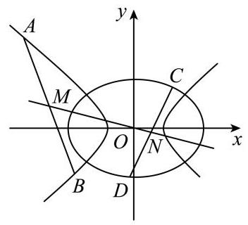

(1)若曲线 ${C}_{1}$ 和 ${C}_{2}$ 有且仅有两个公共点，求曲线 ${C}_{1}$ 的离心率和渐近线方程；

26.【23 闵行二模】

如果曲线 $y = f\left( x\right)$ 存在相互垂直的两条切线,称函数 $y = f\left( x\right)$ 是 “正交函数”. 已知 $f\left( x\right)  = {x}^{2} + \; {ax} + 2\ln x$ ,设曲线 $y = f\left( x\right)$ 在点 $M\left( {{x}_{0}, f\left( {x}_{0}\right) }\right)$ 处的切线为 ${l}_{1}$ .

(1)当 ${f}^{\prime }\left( 1\right)  = 0$ 时，求实数 $a$ 的值；

## 11. 【24 闵行一模】

一、填空题

1.【24 闵行一模】已知集合 $M = \{ 0,1, a + 1\}$ ，若 $- 1 \in  M$ ，则实数 $a =$ ___.

2.【24 闵行一模】若 $\sin \alpha  = \frac{1}{3}$ ，则 $\sin \left( {\pi  - \alpha }\right)  =$ ___

3.【24 闵行一模】若实数 $x, y$ 满足 ${xy} = 1$ ，则 ${x}^{2} + 4{y}^{2}$ 的最小值为___.

4.【【试卷】江苏省扬州市宝应县安宜高级中学 2025 届高三考前适应性训练(最后一卷)数学试题】 已知 ${\left( x - 1\right) }^{4} = {a}_{0} + {a}_{1}x + {a}_{2}{x}^{2} + {a}_{3}{x}^{3} + {a}_{4}{x}^{4}$ ，则 ${a}_{2} =$ ___.

5.【24 闵行一模】已知圆锥的底面周长为 ${4\pi }$ ，母线长为 3，则该圆锥的侧面积为 ___.

6.【【试卷】宁夏回族自治区石嘴山市第三中学 2024 届高三第四次模拟考试文科数学试题】已知双曲线 $\frac{{x}^{2}}{{a}^{2}} - \frac{{y}^{2}}{{b}^{2}} = 1\left( {{a0}, b > 0}\right)$ 的离心率为 $\sqrt{2}$ ，则该双曲线的渐近线方程为___.

7.【24 闵行一模】若将函数 $f\left( x\right)  = \sin \left( {{2x} + \varphi }\right) \left( {0 < \varphi  < \pi }\right)$ 的图象向右平移 $\frac{\pi }{3}$ 个单位长度后得到的图象对应函数为奇函数,则 $\varphi  =$ ___.

8. 已知 $f\left( x\right)  = {x}^{2} - {8x} + {10}, x \in  R$ ,数列 $\left\{  {a}_{n}\right\}$ 是公差为 1 的等差数列,若 $f\left( {a}_{1}\right)  + f\left( {a}_{2}\right)  + f\left( {a}_{3}\right)$ 的值最小,则 ${a}_{1} =$ ___.

9.【24 闵行一模】今年中秋和国庆共有连续 8 天小长假, 某单位安排甲、乙、丙三名员工值班, 每天都需要有人值班. 任选两名员工各值 3 天班，剩下的一名员工值 2 天班，且每名员工值班的日期都是连续的，则不同的安排方法数为___.

10.【24 闵行一模】若平面上的三个单位向量 $\overrightarrow{a}\text{ 、 }\overrightarrow{b}\text{ 、 }\overrightarrow{c}$ 满足 $\left| {\overrightarrow{a} \cdot  \overrightarrow{b}}\right|  = \frac{1}{2},\left| {\overrightarrow{a} \cdot  \overrightarrow{c}}\right|  = \frac{\sqrt{3}}{2}$ ，则 $\overrightarrow{b} \cdot  \overrightarrow{c}$ 的所有可能的值组成的集合为___.

11.【24 闵行一模】已知数列 $\left\{  {a}_{n}\right\}$ 为无穷等比数列,若 $\mathop{\sum }\limits_{{i = 1}}^{{+\infty }}{a}_{i} =  - 2$ ,则 $\mathop{\sum }\limits_{{i = 1}}^{{+\infty }}\left| {a}_{i}\right|$ 的取值范围为 ___.

12.【24 闵行一模】已知点 $P$ 在正方体 ${ABCD} - {A}_{1}{B}_{1}{C}_{1}{D}_{1}$ 的表面上， $P$ 到三个平面 ${ABCD}$ 、 ${AD}{D}_{1}{A}_{1}\text{ 、 }{AB}{B}_{1}{A}_{1}$ 中的两个平面的距离相等,且 $P$ 到剩下一个平面的距离与 $P$ 到此正方体的中心的距离相等，则满足条件的点 $P$ 的个数为___.

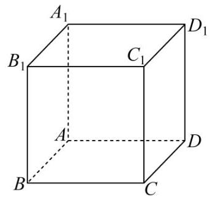

二、单选题

13.【24 闵行一模】已知 $a, b \in  R, a > b$ ,则下列不等式中不一定成立的是 ( )

A. $a + 2 > b + 2$ B. ${2a} > {2b}$ C. ${a}^{2} > {b}^{2}$ D. ${2}^{a} > {2}^{b}$

14.【24 闵行一模】某校读书节期间, 共 120 名同学获奖(分金、银、铜三个等级)，从中随机抽取 24 名同学参加交流会, 若按高一、高二、高三分层随机抽样, 则高一年级需抽取 6 人；若按获奖等级分层随机抽样, 则金奖获得者需抽取 4 人. 下列说法正确的是 ( )

A. 高二和高三年级获奖同学共 80 人 B. 获奖同学中金奖所占比例一定最低

C. 获奖同学中金奖所占比例可能最高 D. 获金奖的同学可能都在高一年级

15.【24 闵行一模】已知复数 ${z}_{1}\text{ 、 }{z}_{2}$ 在复平面内对应的点分别为 $P\text{ 、 }Q,\left| {OP}\right|  = 5\left( {O\text{ 为坐标原点 }}\right)$ , 且 ${z}_{1}^{2} - {z}_{1}{z}_{2} \cdot  \sin \theta  + {z}_{2}^{2} = 0$ ,则对任意 $\theta  \in  R$ ,下列选项中为定值的是 ( )

A. $\left| {OQ}\right|$ B. $\left| {PQ}\right|$ C. $\bigtriangleup {OPQ}$ 的周长 D. $\bigtriangleup {OPQ}$ 的面积

16.【24 闵行一模】已知函数 $y = f\left( x\right)$ 的导函数为 $y = {f}^{\prime }\left( x\right) , x \in  R$ ,且 $y = {f}^{\prime }\left( x\right)$ 在 $R$ 上为严格增函

数, 关于下列两个命题的判断, 说法正确的是 ( )

① “ ${x}_{1} > {x}_{2}$ ” 是 “ $f\left( {{x}_{1} + 1}\right)  + f\left( {x}_{2}\right)  > f\left( {x}_{1}\right)  + f\left( {{x}_{2} + 1}\right)$ ” 的充要条件;

② “对任意 $x < 0$ 都有 $f\left( x\right)  < f\left( 0\right)$ ” 是 “ $y = f\left( x\right)$ 在 $R$ 上为严格增函数” 的充要条件.

A. ①真命题；②假命题 B. ①假命题；②真命题

C. ①真命题；②真命题 D. ①假命题；②假命题

三、解答题

17.【24 闵行一模】

如图,在四棱锥 $P - {ABCD}$ 中,底面 ${ABCD}$ 是边长为 $a$ 的正方形,侧面 ${PAD} \bot$ 底面 ${ABCD}$ , 且 ${PA} = {PD} = \frac{\sqrt{2}}{2}a$ ，设 $E$ 、 $F$ 分别为 ${PC}$ 、 ${BD}$ 的中点.

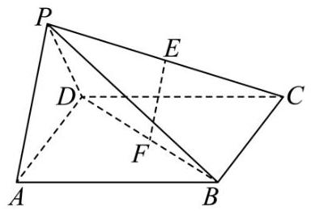

(1)证明:直线 ${EF}//$ 平面 ${PAD}$ ；

(2) 求直线 ${PB}$ 与平面 ${ABCD}$ 所成的角的正切值.

18.【24闵行一模】

在 $\bigtriangleup  {ABC}$ 中，角 $A$ 、 $B$ 、 $C$ 所对边的边长分别为 $a$ 、 $b$ 、 $c$ ，且 $a - {2c}\cos B = c$ .

(1)若 $\cos B = \frac{1}{3}, c = 3$ ，求 $b$ 的值；

19.【24 闵行一模】

2023 年 9 月 23 日至 10 月 8 日，第 19 届亚运会在杭州成功举办，杭州亚运会的志愿者被称为 “小青荷”. 某运动场馆内共有小青荷 36 名, 其中男生 12 名, 女生 24 名, 这些小青荷中会说日语和会说韩语的人数统计如下:

<table><tr><td></td><td>男生小青荷</td><td>女生小青荷</td></tr><tr><td>会说日语</td><td>8</td><td>12</td></tr><tr><td>会说韩语</td><td>$m$</td><td>$n$</td></tr></table>

其中 $m\text{ 、 }n$ 均为正整数, $6 \leq  m \leq  8$ .

(1)从这 36 名小青荷中随机抽取两名作为某活动主持人，求抽取的两名小青荷中至少有一名会说日语的概率;

(2)从这些小青荷中随机抽取一名去接待外宾，用 $A$ 表示事件 “抽到的小青荷是男生”，用 $B$ 表示事件 “抽到的小青荷会说韩语”. 试给出一组 $m\text{ 、 }n$ 的值,使得事件 $A$ 与 $B$ 相互独立,并说明理由.

20.【24 闵行一模】

已知 $0 < p < 4$ ，曲线 ${\Gamma }_{1}\text{ 、 }{\Gamma }_{2}$ 的方程分别为 ${y}^{2} = {2px}\left( {0 \leq  x \leq  8, y \geq  0}\right)$ 和 ${x}^{2} = \; {2py}\left( {0 \leq  y \leq  8, x \geq  0}\right) ,\;{\Gamma }_{1}$ 与 ${\Gamma }_{2}$ 在第一象限内相交于点 $K\left( {{x}_{K},{y}_{K}}\right)$ .

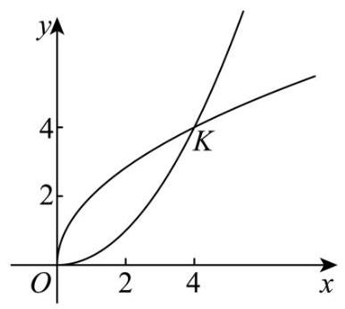

(1)若 $\left| {OK}\right|  = 4\sqrt{2}$ ，求 $p$ 的值；

(2) 若 $p = 2$ ，定点 $T$ 的坐标为 $\left( {4,0}\right)$ ，动点 $M$ 在直线 $y = x$ 上，动点 $N\left( {{x}_{N},{y}_{N}}\right) \left( {0 \leq  {x}_{N} \leq  4}\right)$ 在曲线 ${\Gamma }_{2}$ 上,求 $\left| {MN}\right|  + \left| {MT}\right|$ 的最小值;

(3) 已知点 $A\left( {{x}_{1},{y}_{1}}\right) \left( {0 \leq  {x}_{1} \leq  {x}_{K}}\right) \text{ 、 }B\left( {{x}_{2},{y}_{2}}\right) \left( {{x}_{K} < {x}_{2} \leq  8}\right)$ 在曲线 ${\Gamma }_{1}$ 上,点 $A\text{ 、 }B$ 关于直线 $y = \; x$ 的对称点分别为 $C\text{ 、 }D$ ,设 $\left| {AC}\right|$ 的最大值为 $m,\left| {BD}\right|$ 的最大值为 $t$ ,若 $\frac{m}{t} \in  \left\lbrack  {\frac{1}{2},2}\right\rbrack$ ,求实数 $p$ 的取值范围.

21.【24 闵行一模】

已知 $a \in  R, f\left( x\right)  = \left( {a - 2}\right) {x}^{3} - {x}^{2} + {5x} + \left( {1 - a}\right) \ln x$ .

(1)若 1 为函数 $y = f\left( x\right)$ 的驻点，求实数 $a$ 的值；

(2)若 $a = 0$ ，试问曲线 $y = f\left( x\right)$ 是否存在切线与直线 $x - y - 1 = 0$ 互相垂直？说明理由；

(3)若 $a = 2$ ，是否存在等差数列 ${x}_{1}\text{ 、 }{x}_{2}\text{ 、 }{x}_{3}\left( {0 < {x}_{1} < {x}_{2} < {x}_{3}}\right)$ ，使得曲线 $y = f\left( x\right)$ 在点 $\left( {{x}_{2}, f\left( {x}_{2}\right) }\right)$ 处的切线与过两点 $\left( {{x}_{1}, f\left( {x}_{1}\right) }\right) \text{ 、 }\left( {{x}_{3}, f\left( {x}_{3}\right) }\right)$ 的直线互相平行？若存在,求出所有满足条件的等差数列; 若不存在, 说明理由.

## 12. 【24 黄浦一模】

一、填空题

1.【24 黄浦一模】已知集合 $A = \{ x \mid  x \leq  2\} , B = \{ x \mid  x \geq   - 1\}$ ，则 $A \cap  B =$ ___.

2.【24 黄浦一模】若函数 $y = \left( {x + 1}\right) \left( {x - a}\right)$ 为偶函数,则 $a =$ _____

3.【24 黄浦一模】已知复数 $z = 1 - \mathrm{i}$ ( $\mathrm{i}$ 为虚数单位),则满足 $\widehat{z} \cdot  w = z$ 的复数 $w$ 为___.

4.【24 黄浦一模】若双曲线 $\frac{{x}^{2}}{16} - \frac{{y}^{2}}{m} = 1$ 经过点 $\left( {4\sqrt{2},3}\right)$ ,则此双曲线的离心率为___.

5.【24 黄浦一模】已知向量 $\overrightarrow{a} = \left( {0,2}\right) ,\overrightarrow{b} = \left( {\sqrt{3},1}\right)$ ，则向量 $\overrightarrow{a}$ 与 $\overrightarrow{b}$ 夹角的余弦值为___.

6.【24 黄浦一模】若一个棱长为 2 的正方体的八个顶点在同一个球面上，则该球的体积为___.

7.【24 黄浦一模】某城市 30 天的空气质量指数如下:29, 26, 28, 29, 38, 29, 26, 26, 40, ${31},{35},{44},{33},{28},{80},{86},{65},{53},{70},{34},{36},{4y},{31},{38},{63},{60},{56},{34},$ 74，34. 则这组数据的第 75 百分位数为___.

8.【24 黄浦一模】在 $\bigtriangleup {ABC}$ 中,三个内角 $A, B, C$ 的对边分别为 $a, b, c$ ,若 $5{a}^{2} - 5{b}^{2} + {6bc} - 5{c}^{2} \; = 0$ ，则 $\sin {2A}$ 的值为___.

9.【24 黄浦一模】某校共有 400 名学生参加了趣味知识竞赛(满分:150 分)，且每位学生的竞赛成绩均不低于 90 分. 将这 400 名学生的竞赛成绩分组如下: $\lbrack {90},{100}),\lbrack {100},{110}),\lbrack {110},{120})$ , $\lbrack {120},{130}),\lbrack {130},{140}),\left\lbrack  {{140},{150}}\right\rbrack$ ,得到的频率分布直方图如图所示,则这 400 名学生中竞赛成绩不低于 120 分的人数为___.

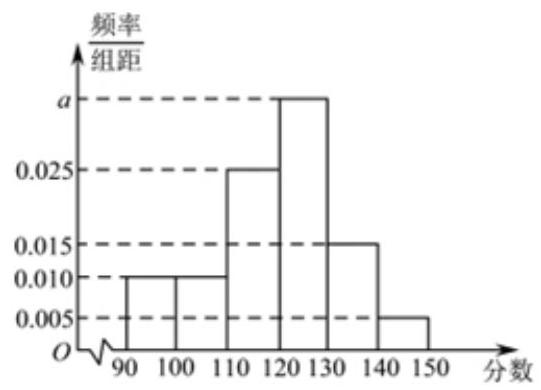

10.【24 黄浦一模】若 $\varphi$ 是一个三角形的内角,且函数 $y = 3\sin \left( {{2x} + \varphi }\right)$ 在区间 $\left\lbrack  {-4,6}\right\rbrack$ 上是单调函数,则 $\varphi$ 的取值范围是___.

11.【24 黄浦一模】设 ${a}_{1},{a}_{2},{a}_{3},\cdots ,{a}_{n}$ 是首项为 3 且公比为 $3\sqrt{3}$ 的等比数列,则满足不等式 ${\log }_{3}{a}_{1} - \; {\log }_{3}{a}_{2} + {\log }_{3}{a}_{3} - {\log }_{3}{a}_{4} + \cdots  + {\left( -1\right) }^{n + 1}{\log }_{3}{a}_{n} > {18}$ 的最小正整数 $n$ 的值为___.

12.【24 黄浦一模】若正三棱锥 $A - {BCD}$ 的底面边长为 6，高为 $\sqrt{13}$ ，动点 $P$ 满足 $\left( {\overrightarrow{DA} + \overrightarrow{CB}}\right)  \bot \; \left( {\overrightarrow{PA} + \overrightarrow{PB} + \overrightarrow{PC} + \overrightarrow{PD}}\right)$ ，则 $\left| {\overrightarrow{PA} + \overrightarrow{PB}}\right|  + 2\left| \overrightarrow{PA}\right|$ 的最小值为___.

二、单选题

13.【24 黄浦一模】设 $x \in  R$ ,则 “ ${x}^{3} > 8$ ” 是 “ $\left| x\right|  > 2$ ” 的

A. 充分而不必要条件 B. 必要而不充分条件

C. 充要条件 D. 既不充分也不必要条件

14.【24 黄浦一模】从 3 名男同学和 2 名女同学中任选 2 名同学参加志愿者服务，则选出的 2 名同学中至少有 1 名女同学的概率是 ( )

A. $\frac{7}{20}$ B. $\frac{7}{10}$ C. $\frac{3}{10}$ D. $\frac{3}{5}$

15.【24 黄浦一模】若实数 $a, b$ 满足 ${a}^{2} + {b}^{2} = 1 + \left| {ab}\right|$ ,则必有 ( )

A. ${a}^{2} + {b}^{2} \geq  2$ B. ${a}^{2} - {b}^{2} \leq  1$ C. $a - b \leq  1$ D. $a + b \leq  2$

16.【24 黄浦一模】在平面直角坐标系 ${xOy}$ 中,对于定点 $P\left( {a, b}\right)$ ,记点集 $\{ \left( {x, y}\right) x - a \mid   \leq  1,\left| {y - b}\right|  \leq  1\}$ 中距离原点 $O$ 最近的点为点 ${Q}_{P}$ ,此最近距离为 $f\left( P\right)$ . 当点 $P$ 在曲线 ${x}^{2} + {y}^{2} - {8x} - {4y} + {16} = 0$ 上运动时,关于下列结论: ①点 ${Q}_{P}$ 的轨迹是一个圆; ② $f\left( P\right)$ 的取值范围是 $\left\lbrack  {\sqrt{10} - 2,\sqrt{10} + 2}\right\rbrack$ . 正确的判断是 ( )

A. ①成立，②成立 B. ①成立，②不成立

C. ①不成立，②成立 D. ①不成立，②不成立

三、解答题

17.【24 黄浦一模】

已知等比数列 $\left\{  {a}_{n}\right\}$ 是严格增数列,其第 3、4、5 项的乘积为 1000 ,并且这三项分别乘以 4 、 3、2 后，所得三个数依次成等差数列.

(1)求数列 $\left\{  {a}_{n}\right\}$ 的通项公式；

(2)若对任意的正整数 $n$ ，数列 $\left\{  {b}_{n}\right\}$ 的前 $n$ 项和 ${S}_{n} = 3\left( {1 - {2}^{n}}\right)$ ，向量 $\left( {{a}_{n},{b}_{n}}\right)$ 的模为 ${t}_{n}$ ，求数列 $\left\{  {t}_{n}\right\}$ 的前 $n$ 项和.

18.【24黄浦一模】

如图,平面 ${ABCD} \bot$ 平面 ${ADEF}$ ,四边形 ${ADEF}$ 是正方形, ${BC}//{AD},\angle {BAD} = \angle {CDA} = \; {45}^{ \circ  },{CD} = 2,{AD} = 4\sqrt{2}$ .

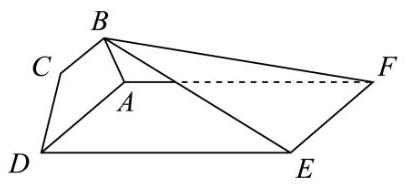

(1)证明: ${CD}\bot$ 平面 ${ABF}$ ；

(2)求二面角 $B - {EF} - A$ 的正切值.

19.【24 黄浦一模】

某公园的一个角形区域 ${AOB}$ 如图所示,其中 $\angle {AOB} = \frac{2\pi }{3}$ . 现拟用长度为 100 米的隔离档板 (折线 ${DCE}$ ) 与部分围墙 (折线 ${DOE}$ ) 围成一个花卉育苗区 ${ODCE}$ ,要求满足 ${OD} = {OC} = {OE}$ .

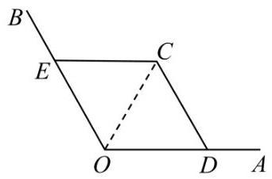

(1)设 $\angle {DOC} = \frac{\pi }{3} + \alpha \left( {-\frac{\pi }{3} < \alpha  < \frac{\pi }{3}}\right)$ ，试用 $\alpha$ 表示 ${OD}$ ；

(2)为使花卉育苗区的面积最大，应如何设计？请说明理由.

20.【24 黄浦一模】

设 $a$ 为实数， ${\Gamma }_{1}$ 是以点 $O\left( {0,0}\right)$ 为顶点，以点 $F\left( {0,\frac{1}{4}}\right)$ 为焦点的抛物线， ${\Gamma }_{2}$ 是以点 $A\left( {0, a}\right)$ 为圆心、半径为 1 的圆位于 $y$ 轴右侧且在直线 $y = a$ 下方的部分.

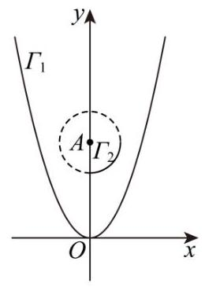

(1)求 ${\Gamma }_{1}$ 与 ${\Gamma }_{2}$ 的方程；

21.【24 黄浦一模】

设函数 $f\left( x\right)$ 与 $g\left( x\right)$ 的定义域均为 $D$ ,若存在 ${x}_{0} \in  D$ ,满足 $f\left( {x}_{0}\right)  = g\left( {x}_{0}\right)$ 且 ${f}^{\prime }\left( {x}_{0}\right)  = {g}^{\prime }\left( {x}_{0}\right)$ ,则称函数 $f\left( x\right)$ 与 $g\left( x\right)$ “局部趋同”.

( 1 )判断函数 ${f}_{1}\left( x\right)  = {5x} + 1$ 与 ${f}_{2}\left( x\right)  = {x}^{3} + {2x}$ 是否“局部趋同”，并说明理由；

13.25 虹口一模

一、填空题

1.【25 虹口一模】已知集合 $A = \{ x \mid  \left| x\right|  < 2\} , B = \{ 1,2,3\}$ ，则 $A \cap  B =$ ___.

2.【25 虹口一模】函数 $y = \ln \frac{x}{x - 1}$ 的定义域是 ___.

3.【25 虹口一模】若 $\tan \alpha  = 5$ ，则 $\tan {2\alpha } =$ ___.

4.【25 虹口一模】在 ${\left( x - 2\right) }^{6}$ 的二项展开式中， ${x}^{3}$ 项的系数为___.

5.【25 虹口一模】设 $a > 0$ 且 $a \neq  1$ ，则函数 $y = 2 + {\log }_{a}x$ 的图像恒过的定点坐标为___.

6.【25 虹口一模】若某圆锥的底面半径为 1 , 高为 1 , 则该圆锥的侧面积为___. (结果保留 $\pi$ )

7.【25 虹口一模】已知非零复数 $z$ 满足 $\left| {z - 1}\right|  = 1,\left| {\bar{z} - \mathrm{i}}\right|  = 1$ ，则 $z$ 的虚部为___.

8.【25 虹口一模】已知 $f\left( x\right)  = \left\{  \begin{array}{ll} {x}^{2} - x, & x \geq  0 \\  f\left( {-x}\right) , & x < 0 \end{array}\right.$ ,则 $f\left( x\right)  \leq  6$ 的解集是___.

9.【25 虹口一模】如图,已知正三角形 ${ABC}$ 和正方形 ${BCDE}$ 的边长均为 2,且二面角 $A - {BC} - D$ 的大小为 $\frac{\pi }{6}$ ,则 $\overrightarrow{AC} \cdot  \overrightarrow{BD} =$ ___.

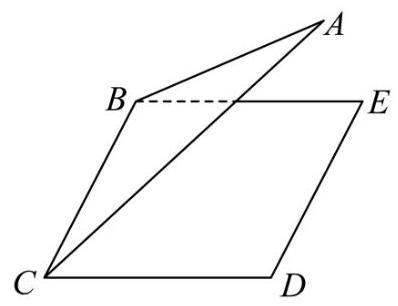

10.【25 虹口一模】双曲线 ${C}_{1}\frac{{x}^{2}}{{a}^{2}} - \frac{{y}^{2}}{{b}^{2}} = 1$ 的左、右焦点分别为 ${F}_{1}$ 和 ${F}_{2}$ ,若以点 ${F}_{2}$ 为焦点的抛物线 ${C}_{2}{y}^{2} = {2px}\left( {p0}\right)$ 与 ${C}_{1}$ 在第一象限交于点 $P$ ，且 $\angle P{F}_{1}{F}_{2} = \frac{\pi }{4}$ ，则 ${C}_{1}$ 的离心率为___.

11.【25 虹口一模】2024 年 10 月 30 日 “神舟十九号”载人飞船发射成功，标志着中国空间站建设进入新阶段. 在飞船竖直升空过程中，某位记者用照相机在同一位置以同一姿势连续拍照两次. 已知 “神舟十九号” 飞船船体实际长度为 $H$ ,且在照片上飞船船体长度为 $h$ ,比较两张照片, 相对于照片中的同一固定参照物飞船上升了 $m$ . 假设该记者连按拍照键间的反应时间为 $t$ ,并忽略相机曝光时长，若用平均速度估算瞬时速度，则拍照时飞船的瞬时速度为___. (用含有 $H\text{ 、 }h\text{ 、 }m\text{ 、 }t$ 的式子表示)

12.【25 虹口一模】已知项数为 10 的数列 $\left\{  {a}_{n}\right\}$ 中任一项均为集合 $\{ x \mid  1 \leq  x \leq  {10}, x \in  N\}$ 中的元素,且相邻两项满足 ${a}_{n} < {a}_{n + 1} + 3, n = 1,2,\cdots ,9$ . 若 $\left\{  {a}_{n}\right\}$ 中任意两项都不相等,则满足条件的数列 $\left\{  {a}_{n}\right\}$ 有___个.

二、单选题

13.【25 虹口一模】已知 $\alpha  \in  \left( {0,\pi }\right)$ ,则 “ $\sin \left( {\pi  - \alpha }\right)  = \frac{1}{2}$ ” 是 “ $\cos \alpha  = \frac{\sqrt{3}}{2}$ ” 的 ( ) 条件.

A. 充要 B. 充分非必要 C. 必要非充分 D. 既非充分又非必要

14.【25 虹口一模】已知事件 $A$ 和事件 $B$ 满足 $A \cap  B = \varnothing$ ,则下列说法正确的是 ( ).

A. 事件 $A$ 和事件 $B$ 组立 B. 事件 $\bar{A}$ 和事件 $\bar{B}$ 互斥

C. 事件 $A$ 和事件 $B$ 对立 D. 事件 $\bar{A}$ 和事件 $B$ 对立

15.【25 虹口一模】已知边长为 2 的正四面体 $A - {BCD}$ 的内切球 (球面与四面体四个面都相切的球) 的球心为 $O$ ,若空间中的动点 $P$ 满足 $\overrightarrow{OP} = x\overrightarrow{OC} + y\overrightarrow{OB} + z\overrightarrow{OD}, x\text{ 、 }y\text{ 、 }z \in  \left\lbrack  {0,1}\right\rbrack$ ,则点 $P$ 的轨迹所形成的几何体的体积为 ( ).

A. $\sqrt{2}$

B. $\frac{\sqrt{2}}{3}$ C. $2\sqrt{3}$ D. $\frac{\sqrt{3}}{3}$

16.【25 虹口一模】设数列 $\left\{  {a}_{n}\right\}$ 的前四项分别为 ${a}_{1}\text{ 、 }{a}_{2}\text{ 、 }{a}_{3}\text{ 、 }{a}_{4}$ ,对于以下两个命题,说法正确的是 ( ).

①存在等比数列 $\left\{  {a}_{n}\right\}$ 以及锐角 $\alpha$ ，使 $\left\{  {\sin \alpha ,\cos \alpha ,\tan \alpha }\right\}   = \left\{  {{a}_{1},{a}_{2},{a}_{3}}\right\}$ 成立.

②对任意等差数列 $\left\{  {a}_{n}\right\}$ 以及锐角 $\alpha$ ，均不能使 $\{ \sin \alpha ,\cos \alpha ,\tan \alpha ,\cot \alpha \}  = \left\{  {{a}_{1},{a}_{2},{a}_{3},{a}_{4}}\right\}$ 成立.

A. ①是真命题，②是真命题 B. ①是真命题，②是假命题

C. ①是假命题，②是真命题 D. ①是假命题，②是假命题

三、解答题

17.【25 虹口一模】

设 $f\left( x\right)  = \sin {\omega x}\left( {\omega 0}\right)$ .

(1) 当函数 $y = f\left( x\right)$ 的最小正周期为 ${2\pi }$ 时,求 $y = f\left( x\right)  + \cos x$ 在 $\left\lbrack  {0,\frac{\pi }{2}}\right\rbrack$ 上的最大值;

18.【25 虹口一模】

如图,已知在四棱柱 ${ABCD} - {EFGH}$ 中, ${EA} \bot$ 平面 ${ABCD}, N\text{ 、 }M$ 分别是 ${EF}\text{ 、 }{HD}$ 的中点.

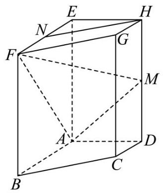

(1)求证: ${HN}//$ 平面 ${AFM}$ ；

19.【25 虹口一模】

2024 年法国奥运会落下帷幕. 某平台为了解观众对本次奥运会的满意度, 随机调查了本市 1000 名观众, 得到他们对本届奥运会的满意度评分 (满分 100 分), 平台将评分分为 [50,60)、 $\lbrack {60},{70})\text{ 、 }\lbrack {70},{80})\text{ 、 }\lbrack {80},{90})\text{ 、 }\left\lbrack  {{90},{100}}\right\rbrack$ 共 5 层,绘制成频率分布直方图 (如图 1 所示). 并在这些评分中以分层抽样的方式从这 5 层中再抽取了共 20 名观众的评分, 绘制成茎叶图, 但由于某种原因茎叶图受到了污损, 可见部分信息如图 2 所示.

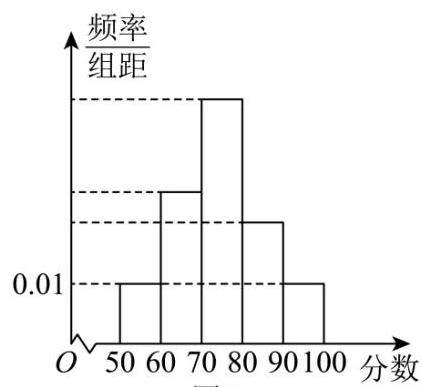

图 1

5 1 4

6 3 5

7 4

8

9

被污损

图2

(1)求图 2 中这 20 名观众的满意度评分的第 35 百分位数；

20.【25 虹口一模】

已知椭圆 $\Gamma \frac{{x}^{2}}{4} + {y}^{2} = 1$ 的左、右焦点分别为 ${F}_{1},{F}_{2}$ ,右顶点为 $A$ ,上顶点为 $B$ ,设 $P$ 为 $\Gamma$ 上的一点.

(1)当 $P{F}_{1} \bot  {F}_{1}{F}_{2}$ 时,求 $\left| {P{F}_{2}}\right|$ 的值;

21.【25 虹口一模】

设 $a \in  R,{F}_{a}\left( x\right)  = \frac{f\left( x\right)  - f\left( a\right) }{x - a}, x \in  \left( {a - 1, a}\right)  \cup  \left( {a, a + 1}\right)$ . 若函数 $y = f\left( x\right)$ 满足 ${F}_{a}\left( x\right)  > 0$ 恒成立,则称函数 $y = f\left( x\right)$ 具有性质 $P\left( a\right)$ .

(1)判断 $y = \sin x$ 是否具有性质 $P\left( 0\right)$ ，并说明理由;

14.2025 徐汇二模

1.【25 徐汇二模】已知全集 $U = \{ x\left| \right| x - 1 \mid   \leq  2, x \in  R\} ,\;A = \left\lbrack  {1,3}\right\rbrack$ ，则 $\bar{A} =$ ___.

2.【25 徐汇二模】复数 $z = \frac{1}{1 - i}$ (其中 $\mathrm{i}$ 为虚数单位) 的虚部是___.

3.【25 徐汇二模】在空间直角坐标系中,向量 $\overrightarrow{a} = \left( {-m,6,3}\right) ,\overrightarrow{b} = \left( {2, n,1}\right)$ ,若 $\overrightarrow{a}//\overrightarrow{b}$ ,则 $m + n =$ ___.

4.【25 徐汇二模】已知幂函数 $y = f\left( x\right)$ 的图像过点 $\left( {3,\frac{\sqrt{3}}{3}}\right)$ ,则该幂函数的值域是___.

5.【25 徐汇二模】如下是一个 $2 \times  2$ 列联表,则 $s =$ ___.

<table><tr><td></td><td>$y$   1</td><td>$y$</td><td>总   计</td></tr><tr><td>${x}_{1}$</td><td>$a$</td><td>3 5</td><td>4</td></tr><tr><td>${x}_{2}$</td><td>7</td><td>$b$</td><td>$n$</td></tr><tr><td>总   计</td><td>$m$</td><td>7   3</td><td>$S$</td></tr></table>

6.【25 徐汇二模】已知 $\cos \theta  =  - \frac{3}{5},\theta  \in  \left( {0,\pi }\right)$ ，则 $\tan \left( {\theta  - \frac{\pi }{4}}\right)$ 的值为___.

7.【25 徐汇二模】已知 ${PA} \bot$ 平面 ${ABC},\bigtriangleup {ABC}$ 是直角三角形,且 ${AB} = {AC} = 2,{PA} = 4$ ,则点 $P$ 到直线 ${BC}$ 的距离是___.

8.【25 徐汇二模】已知 ${ABCD}$ 是正方形,点 $M$ 是 ${AB}$ 的中点,点 $E$ 在对角线 ${AC}$ 上,且 $\overrightarrow{AE} = \; 3\overrightarrow{EC}$ ，则 $\angle {MED}$ 的大小为___.

9.【25 徐汇二模】已知两个随机事件 $A, B$ ,若 $P\left( A\right)  = \frac{1}{5}, P\left( B\right)  = \frac{1}{4}, P\left( {B \mid  A}\right)  = \frac{2}{3}$ ,则 $P\left( {\bar{A} \mid  B}\right)  =$ ___.

10.【25 徐汇二模】已知双曲线 $\frac{{x}^{2}}{{a}^{2}} - \frac{{y}^{2}}{{b}^{2}} = 1\left( {{a0}, b > 0}\right)$ 的左焦点为 ${F}_{1}$ ,右焦点为 ${F}_{2}$ . 若双曲线的右支上存在一点 $P$ ,使得直线 $P{F}_{1}$ 与以双曲线的实轴为直径的圆相切,切点为线段 $P{F}_{1}$ 的中点,则该双曲线的离心率为___.

11.【25 徐汇二模】如图,某处有一块圆心角为 $\frac{2}{3}\pi$ 的扇形绿地 ${AOB}$ ,扇形的半径为 20 米, ${AB}$ 是一条原有的人行直路，由于工程建设需要，现要在绿地中建一条直路 ${OC}$ ，以便在图中阴影部分区域分类堆放物料. 为了尽量减少对绿地的破坏 (不计路宽),则原直路 ${AB}$ 与新直路 ${OC}$ 的交叉点 $D$ 到 $O$ 的距离为___米.

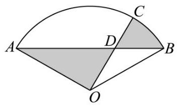

12.【25 徐汇二模】设实数 $\omega  > 0$ ,若 $f\left( x\right)  = \sin {\omega x}$ 满足对任意 ${x}_{1} \in  \left\lbrack  {0,\pi }\right\rbrack$ ,都存在 ${x}_{2} \in  \left\lbrack  {\pi ,{2\pi }}\right\rbrack$ ,使得 $f\left( {x}_{1}\right)  + f\left( {x}_{2}\right)  = 0$ 成立，则 $\omega$ 的最小值是___.

二、单选题

13.【25 徐汇二模】已知 $A\text{ 、 }B$ 为两个随机事件,则 “ $A\text{ 、 }B$ 为互斥事件” 是 “ $A\text{ 、 }B$ 为对立事件” 的 ( )

A. 充分非必要条件 B. 必要非充分条件 C. 充要条件 D. 非充分非必要条件

14.【25 徐汇二模】在研究线性回归模型时,若样本数据 $\left( {{x}_{i},{y}_{i}}\right) \left( {\mathrm{i} = 1,2,3,\cdots , n}\right)$ 所对应的点都在直线 $y =  - \frac{1}{3}x + 2$ 上,则两组数据 ${x}_{i}$ 和 ${y}_{i}\left( {\mathrm{i} = 1,2,3,\cdots , n}\right)$ 的线性相关系数为 ( )

A. -1 B. 1

C. $- \frac{1}{3}$ D. 2

15.【25 徐汇二模】在桌面上有一个质地均匀的正四面体 $D - {ABC}$ . 从该正四面体与桌面贴合的面上的三条棱中等可能地选取一条棱, 沿其翻转正四面体至正四面体的另一个面与桌面贴合, 如此翻转称为一次操作. 如图,开始时,正四面体与桌面贴合的面为 ${ABC}$ ,操作 $n\left( {n = 1,2,3,\cdots }\right)$ 次后,正四面体与桌面贴合的面是 ${ABC}$ 的概率记为 ${P}_{n}$ . 现有下列两个结论: ① ${P}_{2} = \frac{1}{3}$ ; ② ${P}_{25} < {P}_{24}$ . 则下列说法正确的是 ( )

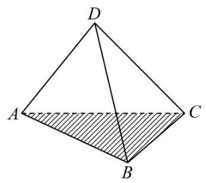

A. ①正确，②错误 B. ①错误，②正确 C. ①、②都正确 D. ①、②都错误

16.【25 徐汇二模】已知函数 $y = f\left( x\right)$ 的定义域和值域都为 $R$ ,且图像是一条连续不断的曲线,其导函数 $y = {f}^{\prime }\left( x\right)$ 的值如下表:

<table><tr><td>$x$</td><td>$( - \infty$</td><td>$\begin{array}{l} x \\  {x}_{1} \end{array}$   1</td><td>( ${x}_{1}$</td><td>x ${}_{2}$ ,</td><td>( ${x}_{2}$ , +∞)</td></tr><tr><td>$f$   1</td><td>+</td><td>0</td><td>-</td><td>0</td><td>+</td></tr></table>

设 $D \subseteq  R$ ,若集合 $\{ y \mid  y = f\left( x\right) , x \in  D\}  = \{ a, b, c\}$ ,其中 $a, b, c$ 为常数,则符合要求的集合 $D$ 的个数不可能是 ( )

A. 3 B. 27 C. 63 D. 343

17. 的取值只要 2 个,若 $y = a, y = b, y = c$ 对应的根的个数为 1,1,2,

则符合要求的集合的个数为 $1 \times  1 \times  \left( {{2}^{2} - 1}\right)  = 3, A$ 有可能;

若 $y = a, y = b, y = c$ 对应的根的个数为2,2,3,

则符合要求的佳合的个数为 $\left( {{2}^{2} - 1}\right)  \times  \left( {{2}^{2} - 1}\right)  \times  \left( {{2}^{3} - 1}\right)  = {63}, C$ 有可能;

若 $y = a, y = b, y = c$ 对应的根的个数为3,3,3,

则符合要求的集合的个数为 $\left( {{2}^{3} - 1}\right)  \times  \left( {{2}^{3} - 1}\right)  \times  \left( {{2}^{3} - 1}\right)  = {343}, D$ 有可能.

三、解答题

18.【25 徐汇二模】

如图, ${ABCD} - {A}_{1}{B}_{1}{C}_{1}{D}_{1}$ 是一块正四棱台形铁料,上、下底面的边长分别为 ${20}\mathrm{\;{cm}}$ 和 ${40}\mathrm{\;{cm}}$ , 高 30cm.

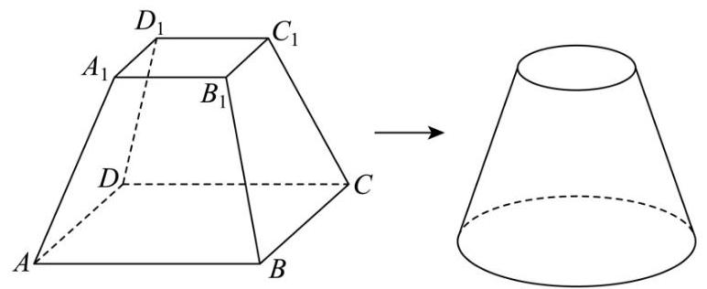

(1)求正四棱台 ${ABCD} - {A}_{1}{B}_{1}{C}_{1}{D}_{1}$ 的侧面 ${BC}{C}_{1}{B}_{1}$ 与底面 ${ABCD}$ 所成二面角的大小；

19.【25 徐汇二模】

已知函数 $y = f\left( x\right)$ ,其中 $f\left( x\right)  = {\log }_{2}x$ .

(1)解关于 $x$ 的不等式 $f\left( {{3x} - 2}\right)  < f\left( {{2x} + 1}\right)$ ；

(2)若存在唯一的实数 ${x}_{0}$ ，使得 $f\left( {x}_{0}\right)$ ， $f\left( {{x}_{0} - a}\right)$ ， $f\left( 2\right)$ 依次成等差数列，求实数 $a$ 的取值范围.

20.【25 徐汇二模】

某公司生产的糖果每包标识 “净含量 500g”，但公司承认实际的净含量存在误差. 已知每包糖果的实际净含量 $\xi$ (单位: $g$ ) 服从正态分布 $N\left( {{500},{2.5}^{2}}\right)$ .

(1)随机抽取一包该公司生产的糖果，求其净含量误差超过 ${5g}$ 的概率(精确到 0.001)；

(2)随机抽取 3 包该公司生产的糖果，记其中净含量小于 497.5g 的包数为 $X$ . 求 $X$ 的分布和期望 (精确到 0.001 ).

21.【25 徐汇二模】

已知抛物线 $C{y}^{2} = {4x}$ ,点 $F$ 是抛物线 $C$ 的焦点.

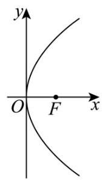

(1)求点 $F$ 的坐标及点 $F$ 到准线 $l$ 的距离；

(2)过点 $F$ 作相互垂直的两条 直线 ${l}_{1},{l}_{2},{l}_{1}$ 交抛物线 $C$ 于点 ${P}_{1}$ 、 ${P}_{2},{l}_{2}$ 交抛物线 $C$ 于点 ${Q}_{1}$ 、 ${Q}_{2}$ ,求证: $\frac{1}{\left| {P}_{1}{P}_{2}\right| } + \frac{1}{\left| {Q}_{1}{Q}_{2}\right| }$ 为定值,并求出该定值;

22.【25 徐汇二模】 000

对于函数 $y = h\left( x\right)$ ,记 ${h}^{\left( 0\right) }\left( x\right)  = h\left( x\right) ,{h}^{\left( 1\right) }\left( x\right)  = {\left( h\left( x\right) \right) }^{\prime },\cdots ,{h}^{\left( n + 1\right) }\left( x\right)  = {\left( {h}^{\left( n\right) }\left( x\right) \right) }^{\prime }\left( {n \in  N}\right)$ . 如果 $n$ 是满足 ${h}^{\left( n\right) }\left( x\right)  = h\left( x\right)$ 的最小正整数,则称 $n$ 是函数 $y = h\left( x\right)$ 的 “最小导周期”.

(1) 已知函数 $y = f\left( x\right)$ ,其中 $f\left( x\right)  = a\sin \left( {x + t}\right)  + b\cos \left( {x + t}\right)$ ,求证: 对任意实数 $a, b, t$ ,都有 ${f}^{\left( 4\right) }\left( x\right)  = f\left( x\right)$ ;

(2)设 $m, n \in  R$ ， $g\left( x\right)  = {\mathrm{e}}^{mx} + n\cos x$ ，若函数 $y = g\left( x\right)$ 的最小导周期为 2，记 $M\left( {a, b}\right)  = \; \sqrt{{\left( a - b\right) }^{2} + {\left( a + 1 + g\left( b\right) \right) }^{2}}$ ,当实数 $a, b$ 变化时,求 $M\left( {a, b}\right)$ 的最小值;

(3) 设 $\omega  > 1, h\left( x\right)  = \cos {\omega x}$ ,若函数 $y = h\left( x\right)$ 满足 ${h}^{\left( 2\right) }\left( x\right)  \leq  x$ 对 $x \in  \left( {0, + \infty }\right)$ 恒成立,且存在 ${x}_{0} \in  \left( {0, + \infty }\right)$ 使得 ${h}^{\left( 2\right) }\left( {x}_{0}\right)  = {x}_{0}$ ,试用 $\omega$ 表示 ${x}_{0}$ ,并证明 $\frac{\pi }{2\omega } < {x}_{0} < \frac{\pi }{\omega }$ .

## 15 【24 普陀二模】

一、填空题

1.【24 普陀二模】已知复数 $z = 1 + \mathrm{i}$ ，其中 $\mathrm{i}$ 为虚数单位，则 $\bar{z}$ 在复平面内所对应的点的坐标为 ___.

2.【24 普陀二模】已知 $a \in  R$ ,设集合 $A = \{ 1, a,4\}$ ,集合 $B = \{ 1, a + 2\}$ ,若 $A \cap  B = B$ ,则 $a =$ ___.

3.【24普陀二模】若 $\cos \left( {\frac{\pi }{3} - \alpha }\right)  = \frac{3}{5}$ ，则 $\sin \left( {\frac{\pi }{6} + \alpha }\right)  =$ ___.

4.【24普陀二模】已知 $X \sim  N\left( {4,{2}^{2}}\right)$ ,若 $P\left( {X < 0}\right)  = {0.02}$ ,则 $P\left( {4 < X < 8}\right)  =$ ___.

5.【【试卷】第 04 讲基本不等式及其应用 (十八大题型) - 练习】若实数 $a, b$ 满足 $a - {2b} \geq  0$ ,则 ${2}^{a} + \frac{1}{{4}^{b}}$ 的最小值为___.

6.【 24 普陀二模】设 ${\left( 1 + x\right) }^{n} = {a}_{0} + {a}_{1}x + {a}_{2}{x}^{2} + \cdots  + {a}_{n}{x}^{n}\left( {n \geq  1, n \in  N}\right)$ ,若 ${a}_{5} > {a}_{4}$ ,且 ${a}_{5} > {a}_{6}$ ,则 $\mathop{\sum }\limits_{{i = 1}}^{n}{a}_{i} =$ ___.

7.【 24 普陀二模】为了提高学生参加体育锻炼的积极性, 某校本学期依据学生特点针对性的组建了五个特色运动社团，学校为了了解学生参与运动的情况，对每个特色运动社团的参与人数进行了统计, 其中一个特色运动社团开学第 1 周至第 5 周参与运动的人数统计数据如表所示.

<table><tr><td>周次 $x$</td><td>1</td><td>2</td><td>3</td><td>4</td><td>5</td></tr><tr><td>参与运动的人</td><td>3</td><td>3</td><td>4</td><td>3</td><td>4</td></tr><tr><td>数 $y$</td><td>5</td><td>6</td><td>0</td><td>9</td><td>5</td></tr></table>

若表中数据可用回归方程 $y = {2.3x} + b\left( {1 \leq  x \leq  {18}, x \in  N}\right)$ 来预测,则本学期第 11 周参与该特色运动社团的人数约为___。(精确到整数)

8.【【试卷】第 02 讲常用逻辑用语 (五大题型) - 练习】设等比数列 $\left\{  {a}_{n}\right\}$ 的公比为 $q\left( {n \geq  1, n \in  N}\right)$ , 则 “ ${12}{a}_{2},{a}_{4},2{a}_{3}$ 成等差数列” 的一个充分非必要条件是___.

9.【【试卷】2024 届广东省广州市普通高中毕业班冲刺训练题(一)数学试题】若向量 $\overrightarrow{a}$ 在向量 $\overrightarrow{b}$ 上的投影向量为 $\frac{1}{3}\overrightarrow{b}$ ，且 $\left| {3\overrightarrow{a} - \overrightarrow{b}}\right|  = \left| {\overrightarrow{a} + \overrightarrow{b}}\right|$ ，则 $\cos \overrightarrow{a},\overrightarrow{b} =$ ___.

10.【24普陀二模】已知抛物线 ${y}^{2} = 4\sqrt{3}x$ 的焦点 $F$ 是双曲线 $\Gamma$ 的右焦点,过点 $F$ 的直线 $l$ 的法向量 $\overrightarrow{n} = \left( {1, - \sqrt{3}}\right) , l$ 与 $y$ 轴以及 $\Gamma$ 的左支分别相交 $A, B$ 两点,若 $\overrightarrow{BF} = 2\overrightarrow{BA}$ ,则双曲线 $\Gamma$ 的实轴长为___.

11.【24普陀二模】设 $k, m, n$ 是正整数， ${S}_{n}$ 是数列 $\left\{  {a}_{n}\right\}$ 的前 $n$ 项和， ${a}_{1} = 2,{S}_{n} = {a}_{n + 1} + 1$ ，若 $m = \mathop{\sum }\limits_{{i = 1}}^{k}{t}_{i}\left( {{S}_{i} - 1}\right)$ ，且 ${t}_{i} \in  \{ 0,1\}$ ，记 $f\left( m\right)  = {t}_{1} + {t}_{2} + \cdots  + {t}_{k}$ ，则 $f\left( {2024}\right)  =$ ___.

12.【24普陀二模】已知 $a \in  R$ ，若关于 $x$ 的不等式 $a\left( {x - 2}\right) {\mathrm{e}}^{-x} - x > 0$ 的解集中有且仅有一个负整数,则 $a$ 的取值范围是___.

二、单选题

13.【【试卷】【济南学校】高二暑假入门测】从放有两个红球、一个白球的袋子中一次任意取出两个球,两个红球分别标记为 $A\text{ 、 }B$ ,白球标记为 $C$ ,则它的一个样本空间可以是 ( )

A. $\{ {AB},{BC}\}$ B. $\{ {AB},{AC},{BC}\}$

C. $\{ {AB},{BA},{BC},{CB}\}$ D. $\{ {AB},{BA},{AC},{CA},{CB}\}$

14.【【试卷】浙江省绍兴市第一中学 2024 届高三下学期 5 月模拟数学试题】若一个圆锥的体积为 $\frac{2\sqrt{2}\pi }{3}$ ,用通过该圆锥的轴的平面截此圆锥,得到的截面三角形的顶角为 $\frac{\pi }{2}$ ,则该圆锥的侧面积为 ( )

A. $\sqrt{2}\pi$ B. ${2\pi }$ C. $2\sqrt{2}\pi$ D. $4\sqrt{2}\pi$

15.【24普陀二模】直线 $l$ 经过定点 $P\left( {2,1}\right)$ ,且与 $x$ 轴正半轴、 $y$ 轴正半轴分别相交于 $A, B$ 两点, $O$ 为坐标原点,动圆 $M$ 在 $\bigtriangleup {OAB}$ 的外部,且与直线 $l$ 及两坐标轴的正半轴均相切,则 $\bigtriangleup {OAB}$ 周长的最小值是 ( )

A. 3 B. 5 C. 10 D. 12

16.【24普陀二模】设 ${S}_{n}$ 是数列 $\left\{  {a}_{n}\right\}$ 的前 $n$ 项和 $\left( {n \geq  1, n \in  N}\right)$ ,若数列 $\left\{  {a}_{n}\right\}$ 满足: 对任意的 $n \geq  2$ , 存在大于 1 的整数 $m$ ,使得 $\left( {{S}_{m} - {a}_{n}}\right) \left( {{S}_{m} - {a}_{n + 1}}\right)  < 0$ 成立,则称数列 $\left\{  {a}_{n}\right\}$ 是 “ $G$ 数列”. 现给出如下两个结论:①存在等差数列 $\left\{  {a}_{n}\right\}$ 是 “ $G$ 数列”；②任意等比数列 $\left\{  {a}_{n}\right\}$ 都不是 “ $G$ 数列”. 则 ( )

A. ①成立②成立 B. ①成立②不成立 C. ①不成立②成立 D. ①不成立②不成立

三、解答题

17.【24普陀二模】

如图，在四棱锥 $S - {ABCD}$ 中，底面 ${ABCD}$ 是边长为 1 的正方形， ${SA} = {SB} = 2$ ， $E$ 、 $F$ 分别是 ${SC}$ 、 ${BD}$ 的中点.

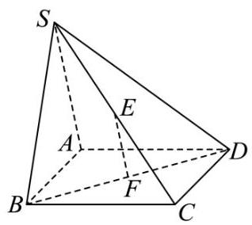

(1)求证: ${EF}//$ 平面 ${SAB}$ ；

(2)若二面角 $S - {AB} - D$ 的大小为 $\frac{\pi }{2}$ ，求直线 ${SD}$ 与平面 ${ABCD}$ 所成角的大小.

18.【24普陀二模】

设函数 $f\left( x\right)  = \sin \left( {{\omega x} + \varphi }\right) ,\omega  > 0,0 < \varphi  < \pi$ ,它的最小正周期为 $\pi$ .

( 1 )若函数 $y = f\left( {x - \frac{\pi }{12}}\right)$ 是偶函数，求 $\varphi$ 的值；

( 2 )在 $\bigtriangleup  {ABC}$ 中，角 $A$ 、 $B$ 、 $C$ 的对边分别为 $a$ 、 $b$ 、 $c$ ，若 $a = 2$ ， $A = \frac{\pi }{6}$ ， $f\left( \frac{B - \varphi }{2}\right)  = \; \frac{\sqrt{3}}{4}c$ ,求 $b$ 的值.

19.【24普陀二模】

张先生每周有 5 个工作日, 工作日出行采用自驾方式, 必经之路上有一个十字路口, 直行车道有三条,直行车辆可以随机选择一条车道通行,记事件 $A$ 为 “张先生驾车从左侧直行车道通行”.

(1)某日张先生驾车上班接近路口时，看到自己车前是一辆大货车，遂选择不与大货车从同一车道通行. 记事件 $B$ 为 “大货车从中间直行车道通行”,求 $P\left( {A \cap  B}\right)$ ;

答案见详解

20.【【试卷】育才中学 2024-2025 学年高三下学期三模数学试卷】

设椭圆 $\Gamma \frac{{x}^{2}}{{a}^{2}} + {y}^{2} = 1\left( {a > 1}\right) ,\Gamma$ 的离心率是短轴长的 $\frac{\sqrt{2}}{4}$ 倍,直线 $l$ 交 $\Gamma$ 于 $A\text{ 、 }B$ 两点, $C$ 是 $\Gamma$ 上异于 $A\text{ 、 }B$ 的一点, $O$ 是坐标原点.

(1)求椭圆 $\Gamma$ 的方程；

(2)若直线 $l$ 过 $\Gamma$ 的右焦点 $F$ ，且 $\overrightarrow{CO} = \overrightarrow{OB}$ ， $\overrightarrow{CF} \cdot  \overrightarrow{AB} = 0$ ，求 ${S}_{\bigtriangleup {CBF}}$ 的值；

$(\sqrt{3},\sqrt{6}\rbrack$

21.【24普陀二模】

对于函数 $y = f\left( x\right) , x \in  {D}_{1}$ 和 $y = g\left( x\right) , x \in  {D}_{2}$ ,设 ${D}_{1} \cap  {D}_{2} = D$ ,若 ${x}_{1},{x}_{2} \in  D$ ,且 ${x}_{1} \neq  {x}_{2}$ , 皆有 $\left| {f\left( {x}_{1}\right)  - f\left( {x}_{2}\right) }\right|  \leq  t\left| {g\left( {x}_{1}\right)  - g\left( {x}_{2}\right) }\right| \left( {t0}\right)$ 成立,则称函数 $y = f\left( x\right)$ 与 $y = g\left( x\right)$ “具有性质 $H\left( t\right)$ ”.

(1)判断函数 $f\left( x\right)  = {x}^{2}, x \in  \left\lbrack  {1,2}\right\rbrack$ 与 $g\left( x\right)  = {2x}$ 是否 “具有性质 $H\left( 2\right)$ ”,并说明理由;

( 2 )若函数 $f\left( x\right)  = 2 + {x}^{2}, x \in  \left( {0,1}\right\rbrack$ 与 $g\left( x\right)  = \frac{1}{x}$ “具有性质 $H\left( t\right)$ ” ，求 $t$ 的取值范围；

(3)若函数 $f\left( x\right)  = \frac{1}{{x}^{2}} + {2\ln x} - 3$ 与 $y = g\left( x\right)$ “具有性质 $H\left( 1\right)$ ”，且函数 $y = g\left( x\right)$ 在区间 $\left( {0, + \infty }\right)$ 上存在两个零点 ${x}_{1},{x}_{2}$ ,求证 ${x}_{1}^{2} + {x}_{2}^{2} > 2$ .

## 16 【24 松江二模】

一、填空题

1.【24 松江二模】函数 $y = \lg \left( {x - 2}\right)$ 的定义域为___

2.【24松江二模】在复平面内,复数 $z$ 对应的点的坐标是 $\left( {1,2}\right)$ ,则 $\mathrm{i} \cdot  z =$ ___.

3.【24 松江二模】已知随机变量 $X$ 服从正态分布 $N\left( {3,{\sigma }^{2}}\right)$ ,且 $P\left( {3 \leq  X \leq  5}\right)  = {0.3}$ ,则 $P\left( {X5}\right)  =$ ___.

4.【24松江二模】已知点 $A$ 的坐标为 $\left( {\frac{1}{2},\frac{\sqrt{3}}{2}}\right)$ ,将 ${OA}$ 绕坐标原点 $O$ 逆时针旋转 $\frac{\pi }{2}$ 至 ${OP}$ ,则点 $P$ 的坐标为___.

5.【24 松江二模】已知 ${x}^{7} = {a}_{0} + {a}_{1}\left( {x - 1}\right)  + {a}_{2}{\left( x - 1\right) }^{2} + \cdots  + {a}_{7}{\left( x - 1\right) }^{7}$ ，则 ${a}_{5} =$ ___.

6.【24 松江二模】若一个圆锥的侧面展开图是面积为 ${2\pi }$ 的半圆面,则此圆锥的体积为___. (结果中保留 $\pi$ )

7.【24松江二模】已知等差数列 $\left\{  {a}_{n}\right\}$ 的公差为 2,前 $n$ 项和为 ${S}_{n}$ ,若 ${a}_{3} = {S}_{5}$ ,则使得 ${S}_{n} < {a}_{n}$ 成立的 $n$ 的最大值为___.

8.【【试卷】第 05 讲对数与对数函数 (八大题型) - 练习】已知函数 $f\left( x\right)  = \left| {{\log }_{2}x}\right|$ ,若 $f\left( {x}_{1}\right)  = \; f\left( {x}_{2}\right) \left( {{x}_{1} \neq  {x}_{2}}\right)$ ,则 $4{x}_{1} + {x}_{2}$ 的最小值为___.

9.【24松江二模】 ${F}_{1},{F}_{2}$ 是双曲线 $\frac{{x}^{2}}{{a}^{2}} - \frac{{y}^{2}}{{b}^{2}} = 1\left( {a > 0, b > 0}\right)$ 的左、右焦点,过 ${F}_{1}$ 的直线 $l$ 与双曲线的左、右两支分别交于 $A\text{ 、 }B$ 两点,若 $\left| {AB}\right|  : \left| {B{F}_{2}}\right|  : \left| {A{F}_{2}}\right|  = 3 : 4 : 5$ ,则双曲线的离心率为 ___

10. 已知正三角形 ${ABC}$ 的边长为 2,点 $D$ 满足 $\overrightarrow{CD} = m\overrightarrow{CA} + n\overrightarrow{CB}$ ,且 $m > 0, n > 0,{2m} + n = 1$ , 则 $\left| \overrightarrow{CD}\right|$ 的取值范围是___.

11.【24 松江二模】已知 $0 < a < 2$ ,函数 $y = \left\{  \begin{matrix} \left( {a - 2}\right) x + {4a} + 1, & x \leq  2 \\  2{a}^{x - 1}, & x > 2 \end{matrix}\right.$ ,若该函数存在最小值,则实数 $a$ 的取值范围是___.

12.【24 松江二模】某校高一数学兴趣小组一共有 30 名学生,学号分别为 $1,2,3,\cdots ,{30}$ ,老师要随机挑选三名学生参加某项活动,要求任意两人的学号之差绝对值大于等于 5 , 则有___ 种不同的选择方法.

二、单选题

13.【24 松江二模】已知集合 $A = \{ x \mid  0 \leq  x \leq  4\} , B = \{ x \mid  x = {2n}, n \in  Z\}$ ,则 $A \cap  B =$ ( )

A. $\{ 1,2\}$ B. $\{ 2,4\}$ C. $\{ 0,1,2\}$ D. $\{ 0,2,4\}$

14.【24 松江二模】垃圾分类是保护环境，改善人居环境、促进城市精细化管理、保障可持续发展的重要举措. 某小区为了倡导居民对生活垃圾进行分类, 对垃圾分类后处理垃圾 x(千克) 所需的费用 $y$ (角) 的情况作了调研,并统计得到下表中几组对应数据,同时用最小二乘法得到 $y$ 关于 $x$ 的线性回归方程为 $y = {0.7x} + {0.4}$ ,则下列说法错误的是 ( )

<table><tr><td>$x$</td><td>2</td><td>3</td><td>4</td><td>5</td></tr><tr><td>$y$</td><td>2</td><td>2.   3</td><td>3.   4</td><td>$m$</td></tr></table>

A. 变量 $x\text{ 、 }y$ 之间呈正相关关系 B. 可以预测当 $x = 8$ 时, $y$ 的值为 6

C. $m = {3.9}$ D. 由表格中数据知样本中心点为 $\left( {{3.5},{2.85}}\right)$

15.【24 松江二模】已知某个三角形的三边长为 $a\text{ 、 }b$ 及 $c$ ,其中 $a < b$ . 若 $a, b$ 是函数 $y = a{x}^{2} - {bx} \; + c$ 的两个零点,则 $a$ 的取值范围是 ( )

A. $\left( {\frac{1}{2},1}\right)$ B. $\left( {\frac{1}{2},\frac{\sqrt{5} - 1}{2}}\right)$ C. $\left( {0,\frac{\sqrt{5} - 1}{2}}\right)$ D. $\left( {\frac{\sqrt{5} - 1}{2},1}\right)$

16.【24 松江二模】设 ${S}_{n}$ 为数列 $\left\{  {a}_{n}\right\}$ 的前 $n$ 项和,有以下两个命题: ①若 $\left\{  {a}_{n}\right\}$ 是公差不为零的等差数列且 $k \in  N, k \geq  2$ ,则 ${S}_{1} \cdot  {S}_{2}\cdots {S}_{{2k} - 1} = 0$ 是 ${a}_{1} \cdot  {a}_{2}\cdots {a}_{k} = 0$ 的必要非充分条件; ②若 $\left\{  {a}_{n}\right\}$ 是等比数列且 $k \in  N, k \geq  2$ ,则 ${S}_{1} \cdot  {S}_{2}\cdots {S}_{k} = 0$ 的充要条件是 ${a}_{k} + {a}_{k + 1} = 0$ . 那么 ( )

A. ①是真命题，②是假命题 B. ①是假命题，①是真命题

C. ①、②都是真命题 D. ①、②都是假命题

三、解答题

17.【24 松江二模】

设 $f\left( x\right)  = {\sin }^{2}\frac{\omega }{2}x + \sqrt{3}\cos \frac{\omega }{2}x\sin \frac{\omega }{2}x\left( {\omega  > 0}\right)$ ,函数 $y = f\left( x\right)$ 图象的两条相邻对称轴之间的距离为 $\pi$ .

(1)求函数 $y = f\left( x\right)$ 的解析式；

(2)在 $\bigtriangleup  {ABC}$ 中，设角 $A$ 、 $B$ 及 $C$ 所对边的边长分别为 $a$ 、 $b$ 及 $c$ ，若 $a = \sqrt{3}$ ， $b = \sqrt{2}$ ， $f\left( A\right) \; = \frac{3}{2}$ ,求角 $C$ .

18.【24松江二模】

如图,在四棱锥 $P - {ABCD}$ 中,底面 ${ABCD}$ 为菱形, ${PD} \bot$ 平面 ${ABCD}, E$ 为 ${PD}$ 的中点.

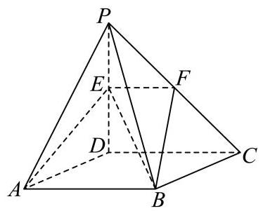

(1)设平面 ${ABE}$ 与直线 ${PC}$ 相交于点 $F$ ，求证: ${EF}//{CD}$ ；

(2)若 ${AB} = 2,{\angle {DAB}} = {60}^{ \circ  },{PD} = 4\sqrt{2}$ ，求直线 ${BE}$ 与平面 ${PAD}$ 所成角的大小.

19.【【试卷】陕西省西安市高新第一中学 2025 届高三第五次模拟测试数学试题】

某素质训练营设计了一项闯关比赛. 规定:三人组队参赛，每次只派一个人，且每人只派一次:如果一个人闯关失败，再派下一个人重新闯关；三人中只要有人闯关成功即视作比赛胜利，无需继续闯关. 现有甲、乙、丙三人组队参赛，他们各自闯关成功的概率分别为 ${p}_{1}$ 、 ${p}_{2}$ 、 ${p}_{3}$ ，假定 ${p}_{1}\text{ 、 }{p}_{2}\text{ 、 }{p}_{3}$ 互不相等，且每人能否闯关成功的事件相互独立.

(1)计划依次派甲乙丙进行闯关，若 ${p}_{1} = \frac{3}{4},{p}_{2} = \frac{2}{3},{p}_{3} = \frac{1}{2}$ ，求该小组比赛胜利的概率；

(2)若依次派甲乙丙进行闯关，则写出所需派出的人员数目 $X$ 的分布，并求 $X$ 的期望 $E\left( X\right)$ ；

(3)已知 $1 > {p}_{1} > {p}_{2} > {p}_{3}$ ，若乙只能安排在第二个派出，要使派出人员数目的期望较小，试确定甲、丙谁先派出.

20.【24 松江二模】000

如图,椭圆 $\Gamma \frac{{y}^{2}}{2} + {x}^{2} = 1$ 的上、下焦点分别为 ${F}_{1}\text{ 、 }{F}_{2}$ ,过上焦点 ${F}_{1}$ 与 $y$ 轴垂直的直线交椭圆于 $M\text{ 、 }N$ 两点,动点 $P\text{ 、 }Q$ 分别在直线 ${MN}$ 与椭圆 $\Gamma$ 上.

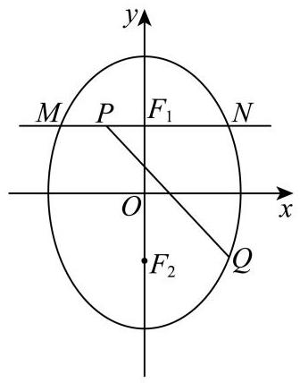

(1)求线段 ${MN}$ 的长；

(2)若线段 ${PQ}$ 的中点在 $x$ 轴上，求 $\bigtriangleup  {F}_{2}{PQ}$ 的面积；

(3)是否存在以 ${F}_{2}Q$ 、 ${F}_{2}P$ 为邻边的矩形 ${F}_{2}{QEP}$ ，使得点 $E$ 在椭圆 $\Gamma$ 上？若存在，求出所有满足条件的点 $Q$ 的纵坐标; 若不存在,请说明理由.

21.【24松江二模】000

已知函数 $y = x \cdot  \ln x + a\left( {a\text{ 为常数 }}\right)$ ,记 $y = f\left( x\right)  = x \cdot  g\left( x\right)$ .

(1)若函数 $y = g\left( x\right)$ 在 $x = 1$ 处的切线过原点，求实数 $a$ 的值；

(2)对于正实数 $t$ ，求证: $f\left( x\right)  + f\left( {t - x}\right)  \geq  f\left( t\right)  - t\ln 2 + a$ ；

(3)当 $a = 1$ 时，求证: $g\left( x\right)  + \cos x < \frac{{\mathrm{e}}^{x}}{x}$ .

## 17. 【25 闵行二模】

一、填空题

1.【25 闵行二模】设全集 $U = \{  - 1,0,1,2\}$ ,若集合 $A = \{ 0,2\}$ ，则 $\bar{A} =$ ___.

2.【25 闵行二模】设 $x \in  R$ ，则不等式 $\left| {x - 2}\right|  \leq  5$ 的解集为___.

3.【25 闵行二模】已知 $\mathrm{i}$ 是虚数单位,则 $\left| \frac{1 + i}{i}\right|  =$ ___.

4.【25 闵行二模】已知圆柱的底面半径为 $\sqrt{3}$ ，高为 3，则圆柱的体积为___.

5.【25 闵行二模】在 ${\left( 2x + \frac{1}{x}\right) }^{6}$ 的二项展开式中，常数项是___. (用数值作答)

6.【25 闵行二模】已知向量 $\overrightarrow{a} = \left( {3,4}\right) ,\overrightarrow{b} = \left( {\cos \theta ,\sin \theta }\right)$ ，若 $\overrightarrow{a}//\overrightarrow{b}$ ，则 $\tan \theta  =$ ___

7.【25 闵行二模】已知数据 ${x}_{1}\text{ 、 }{x}_{2}\text{ 、 }\cdots \text{ 、 }{x}_{100}$ 的平均数为 2，方差为 5，则 ${x}_{1}^{2}\text{ 、 }{x}_{2}^{2}\text{ 、 }\cdots \text{ 、 }{x}_{100}^{2}$ 的平均数为___.

8.【25 闵行二模】已知函数 $f\left( x\right)  = \left\{  \begin{array}{ll} \left( {1 - {2m}}\right) x + {3m}, & x < 1 \\  {x}^{2}, & x \geq  1 \end{array}\right.$ 的值域为 $R$ ,则 $m$ 的取值范围是 ___.

9.【25 闵行二模】某公司生产的糖果每包的标识质量是 500 克，但公司承认实际质量存在误差. 已知每包糖果的实际质量服从正态分布 $N\left( {{500},{\sigma }^{2}}\right)$ ，且任意一包的糖果质量介于 495 克到 505 克之间的可能性为 95.4%，则随意买一包该公司生产的糖果，其质量超过 505 克的可能性约为 ___. (精确到 0.1%)

10.【25 闵行二模】已知数列 $\left\{  {a}_{n}\right\}$ 为等差数列,数列 $\left\{  {b}_{n}\right\}$ 为等比数列,且 ${a}_{1} = {b}_{1} = 1,{a}_{2} = {b}_{2} = t$ , 若 ${a}_{6} + {b}_{6} > {38}$ ，则实数 $t$ 的取值范围为___.

11.【25 闵行二模】已知某星球的球心为 $F$ ,半径为 $R$ ,该星球的卫星的运行轨道是以 $F$ 为一个焦点的椭圆,该椭圆的离心率为 $\frac{3}{5}$ ,卫星运行过程中离该星球表面最近的距离为 $R$ ,若当卫星处于某位置时, 用卫星上的光学仪器观测该星球, 把光学仪器的镜头与星球表面被观测点的连线称为视线，任意两条视线所成的最大夹角称为张角，则卫星运行过程中张角的最小值为___. (精确到 ${0.1}^{ \circ  }$ )

12.【25 闵行二模】定义 $D = \left\lbrack  {a, b}\right\rbrack$ 的区间长度为 $b - a$ . 若 $m < 0$ 且关于 $x$ 的不等式 $\left| {{\left( x - 1\right) }^{3} + m\left( {x - 1}\right) }\right|  \leq  {16}$ 的解集的区间长度之和为 $T$ ,则当 $T$ 取最大值时,实数 $m$ 的值为 ___.

二、单选题

13.【25 闵行二模】两个变量 $x$ 与 $y$ 之间的回归方程 ( )

A. 表示 $x$ 与 $y$ 之间的函数关系;

B. 表示 $x$ 与 $y$ 之间的不确定关系;

C. 反映 $x$ 与 $y$ 之间的真实关系;

D. 是反映 $x$ 与 $y$ 之间的真实关系的一种最佳拟合.

14.【25 闵行二模】已知 $a > 0, b > 0$ ,则 “ $a + b > 2$ ” 是 “ ${ab} > 1$ ” 的 ( )

A. 充分不必要条件 B. 必要不充分条件

C. 充要条件 D. 既不充分也不必要条件

15.【25 闵行二模】已知函数 $y = \cos \left( {\frac{\pi }{6}x + \frac{\pi }{3}}\right)$ 在区间 $\left\lbrack  {a, a + 9}\right\rbrack$ 上既有最大值又有最小值 -1,则关于实数 $a$ 的取值,以下不可能的是 ().

A. 2024 B. 2025 C. 2026 D. 2027

16.【25 闵行二模】设 $n$ 为正整数，空间中 $n$ 个单位向量构成集合 ${A}_{n} = \left\{  {{\overrightarrow{a}}_{1},{\overrightarrow{a}}_{2},\cdots ,{\overrightarrow{a}}_{n}}\right\}$ ，若存在实数 $t$ ,满足对任意 ${\overrightarrow{a}}_{i} \in  {A}_{n},{\overrightarrow{a}}_{j} \in  {A}_{n},{\overrightarrow{a}}_{i} \neq  {\overrightarrow{a}}_{j}$ ,都有 ${\overrightarrow{a}}_{i} \cdot  {\overrightarrow{a}}_{j} = t$ ,则当 $n$ 取得最大值时, $t$ 的值为 ( ).

A. $- \frac{1}{2}$ B. $\frac{1}{2}$ C. $- \frac{1}{3}$ D. $\frac{1}{3}$

三、解答题

17.【25 闵行二模】

如图，在四棱锥 $P - {ABCD}$ 中，底面 ${ABCD}$ 为长方形， ${PA} \bot$ 底面 ${ABCD}$ ， $E$ 是 ${PC}$ 中点， 已知 ${AB} = 2,{AD} = 2\sqrt{2},{PA} = 2$ .

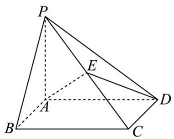

(1)证明: ${AD}\bot {BP}$ ；

18.【【试卷】杨浦区 2024-2025 学年高三下学期 5 月质量检测数学试题】

已知 $f\left( x\right)  = \sin \left( {{\omega x} + \varphi }\right) \left( {{\omega 0},0 < \varphi  < \pi }\right)$ ,函数 $y = f\left( x\right)$ 的部分图像如图所示,图中最高点 $S\left( {\frac{\pi }{3},1}\right)$ ,最低点 $T\left( {\frac{4\pi }{3}, - 1}\right)$ .

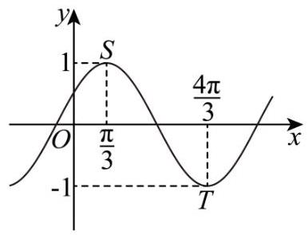

(1)求函数 $y = f\left( x\right)$ 的解析式；

19.【25 闵行二模】

某社团共有 12 名成员，其中高一男生 2 人，女生 4 人，高二男生 3 人，女生 3 人. 现从中随机抽选 2 人参加数学知识问答.

(1)若逐个抽选，求恰好第一个抽选的是男生的概率；

20.【25 闵行二模】

已知双曲线 $\Gamma {x}^{2} - \frac{{y}^{2}}{3} = 1$ 的右焦点为 $F$ ,过点 $F$ 的直线 $l$ 交双曲线 $\Gamma$ 右支于 $A\text{ 、 }B$ 两点 (点 $A$ 在 $x$ 轴上方),点 $C$ 在双曲线 $\Gamma$ 上,直线 ${AC}$ 交 $x$ 轴于点 $Q$ (点 $Q$ 在点 $F$ 的右侧).

(1)求双曲线 $\Gamma$ 的渐近线方程；

21.【25 闵行二模】

已知函数 $y = f\left( x\right)$ 在定义域 $D$ 上存在导函数 ${f}^{\prime }\left( x\right)$ . 对于给定的一个有序实数对 $\left( {k, m}\right)$ ,若存在 ${x}_{1},{x}_{2} \in  D$ ,使得 $\left\lbrack  {k{x}_{1} - f\left( {x}_{1}\right)  + m}\right\rbrack   \cdot  \left\lbrack  {k{x}_{2} - f\left( {x}_{2}\right)  + m}\right\rbrack   < 0$ ,则称 $\left( {k, m}\right)$ 为 $y = f\left( x\right)$ 在定义域 $D$ 上的一个“分割数对”.

(1) 已知 $f\left( x\right)  = {x}^{2}, D = R$ ,判断数对 $\left( {1,0}\right)$ 是否为 $y = f\left( x\right)$ 在 $D$ 上的 “分割数对”,并说明理由;

## 18. 【25 宝山二模】

一、填空题

1.【25 宝山二模】i 是虚数单位,则 $\left| {1 + \mathrm{i}}\right|  =$ ___

2.【25 宝山二模】已知集合 $A = \{ 1,2\} , B = \{ 2,4\}$ ,则 $A \cup  B =$ ___

3.【25 宝山二模】抛物线 ${x}^{2} = {4y}$ 的准线方程是___

4.【25 宝山二模】已知函数 $f\left( x\right)  = \left\{  \begin{array}{l} {x}^{2} + 2, x < 1, \\  f\left( {x - 2}\right) , x \geq  1. \end{array}\right.$ 则 $f\left( 4\right)  =$ ___.

5.【25 宝山二模】若函数 $f\left( x\right)  = \left( {m - 1}\right) {x}^{2} + {3x} + \left( {2 - n}\right)$ 是奇函数，则 $m + n =$ ___.

6.【25 宝山二模】 ${\left( x + \frac{2}{x}\right) }^{6}$ 的二项展开式中， ${x}^{2}$ 项的系数为___.

7.【25 宝山二模】已知函数 $y = {a}^{x + 1} - {\log }_{a}\left( {x + 2}\right)  + 1\left( {{a0}\text{ 且 }a \neq  1}\right)$ 的图像经过定点 $A$ ,则点 $A$ 的坐标为___

8.【25 宝山二模】已知圆柱的底面积为 ${9\pi }$ ，侧面积为 ${18\pi }$ ，则该圆柱的体积为___.

9.【25 宝山二模】已知 $\bigtriangleup {ABC}$ 中, ${AB} = {AC} = 4,\angle {BAC} = \frac{2}{3}\pi$ ,点 $D$ 在线段 ${BC}$ 上,且 ${S}_{\bigtriangleup {ACD}} = \; 2{S}_{\bigtriangleup {ABD}}$ ，则 $\overrightarrow{AB} \cdot  \overrightarrow{AD}$ 的值为___.

10.【25 宝山二模】有 3 件商品的编号分别为 $\mathrm{i}\left( {\mathrm{i} = 1,2,3}\right)$ ,它们的售价 $\left( {\text{ 元 })S\left( \mathrm{i}\right)  \in  }\right) \; \{ 5,7,8,{10},{11},{20}\}$ ，且满足 $S\left( 1\right)  \leq  S\left( 2\right)  \leq  S\left( 3\right)$ ，则这 3 件商品售价的所有可能情况有___ 种.

11.【25 宝山二模】某分公司经销一产品, 每件产品的成本为 5 元, 且每件产品需向总公司交 2 元的管理费,预计每件产品的售价为 $x$ 元 $\left( {8 \leq  x \leq  {11}}\right)$ 时,一年的销售量为 ${\left( {12} - x\right) }^{2}$ 万件,则每件产品售价为___元时，该分公司一年的利润达到最大值. (结果精确到 1 元)

12.【25 宝山二模】空间中有相互垂直的两条异面直线 ${l}_{1}$ 、 ${l}_{2}$ ，点 $A$ 、 $B \in  {l}_{1}$ ， $C$ 、 $D \in  {l}_{2}$ ，且 ${AB} = 4$ ， ${CD} = 1$ ，若 ${DA}\bot {DB}$ ，且 ${AC} = {BC} + 2$ ，则二面角 $D - {AB} - C$ 平面角的余弦值最小为 ___.

二、单选题

13.【25 宝山二模】已知向量 $\overrightarrow{a} = \left( {1, x}\right) ,\;\overrightarrow{b} = \left( {3,1}\right)$ ,若 $\overrightarrow{a}//\overrightarrow{b}$ ,则 $x$ 的值为 ( )

A. -3 B. 3

C. $- \frac{1}{3}$ D. $\frac{1}{3}$

14.【25 宝山二模】“ $a > b$ ” 的一个必要非充分条件是 ( )

A. $\ln \left( {a - b}\right)  > 0$ B. ${2}^{a} > {2}^{b}$ C. ${\left( \frac{1}{2}\right) }^{a - b} \leq  1$ D. ${a}^{3} > {b}^{3}$

15.【25 宝山二模】甲、乙两名篮球运动员在 8 场比赛中的单场得分用茎叶图表示如左下图，茎叶图中甲的得分有部分数据丢失, 但甲得分的折线图完好 (右下图), 则下列结论正确的是 ( )

<table><tr><td>甲</td><td></td><td>乙</td></tr><tr><td>9</td><td>0</td><td>9</td></tr><tr><td>3 2</td><td>1</td><td>4 5 6 7 8 9</td></tr><tr><td>8 6 0</td><td>2</td><td>0</td></tr></table>

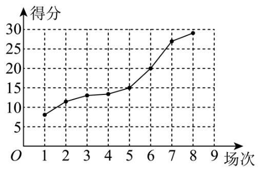

A. 甲得分的极差小于乙得分的极差

B. 甲得分的第 25 百分位数大于乙得分的第 75 百分位数

C. 甲得分的平均数大于乙得分的平均数

D. 甲得分的方差小于乙得分的方差

16.【25 宝山二模】若对任意正整数 $n$ ,数列 $\left\{  {a}_{n}\right\}$ 的前 $n$ 项和 ${S}_{n}$ 都是完全平方数,则称数列 $\left\{  {a}_{n}\right\}$ 为 “完全平方数列”. 有如下两个命题:①若数列 $\left\{  {b}_{n}\right\}$ 的前 $n$ 项和 ${T}_{n} = {\left( n - t\right) }^{2}$ ，( $t$ 为正整数)，则使得数列 $\left\{  \left| {b}_{n}\right| \right\}$ 为 “完全平方数列” 的 $t$ 值有且仅有一个; ②存在无穷多个 “完全平方数列” 的等差数列. 则下列选项中正确的是 ( )

A. ①是真命题，②是真命题； B. ①是真命题，②是假命题；

C. ①是假命题，②是真命题； D. ①是假命题，②是假命题.

三、解答题

17.【25 宝山二模】

如图,在四面体 ${ABCD}$ 中, $\bigtriangleup {BCD}$ 是边长为 2 的正三角形,且 ${AB} = {AD} = \sqrt{2}$ .

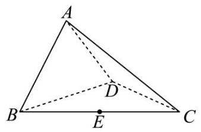

(1)证明: ${BD} \bot  {AC}$ ；

18.【25 宝山二模】

已知函数 $f\left( x\right)  = {a}^{x},\;\left( {a > 0\text{ 且 }a \neq  1}\right)$

(1)若 $f\left( 2\right)  = 4$ ，求方程 $f\left( x\right)  - f\left( {-x}\right)  = 2$ 的解；

19.【【试卷】银川一中 2025 届高三第三次模拟考试数学试卷 (各校区联考)】

某游乐园的活动项目共有三类，分别是 “过山车” 等 10 个体验类项目、“海豚之舞” 等 4 个表演类项目、“智力闯关”等 3 个互动类项目. 因设备维护需要，项目并非每日都全部开放. 以下数据是项目开放的数量 $x$ (个) 和游客平均等待时间 $y$ (分钟/个) 的关系:

<table><tr><td>项目类别</td><td colspan="5">体验类</td><td colspan="2">演出类</td><td colspan="2">互动类</td></tr><tr><td>开放数量 $x$ (个)</td><td>4</td><td>5</td><td>6</td><td>7</td><td>8</td><td>2</td><td>4</td><td>2</td><td>3</td></tr><tr><td rowspan="2">平均等待时间 $y$ (分钟/个)</td><td>7</td><td>7</td><td>6</td><td rowspan="2">$m$</td><td>6</td><td>5</td><td>3</td><td>4</td><td>3</td></tr><tr><td>6</td><td>3</td><td>7</td><td>0</td><td>3</td><td>0</td><td></td><td>0</td></tr></table>

(1)体验类项目中,若 $y$ 关于 $x$ 的回归方程为 $y =  - {4.3x} + {93.8}$ ,请计算 $m$ 的值,并依据该模型预测所有体验类项目均开放时的平均等待时间 (精确到整数);

20.【25 宝山二模】

已知双曲线 $C{x}^{2} - \frac{{y}^{2}}{3} = 1,{F}_{1}\text{ 、 }{F}_{2}$ 分别是其左、右焦点,直线 $l$ 与双曲线 $C$ 的右支交于 $A\text{ 、 }B$ 两点.

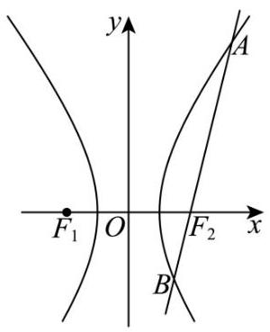

(1)当直线 $l$ 过点 ${F}_{2}$ ，且 $\left| {AB}\right|  = 6$ 时，求 $\bigtriangleup  {AB}{F}_{1}$ 的周长；

(2)已知点 $N\left( {-2,3}\right)$ ，若直线 ${AN}$ 、 ${BN}$ 的斜率之和为___。且 ${casc14}{NB} = \frac{4}{3}$ ，当 ${AN}$ 、 ${BN}$ 分别与 $y$ 轴交于点 $R$ 、 $S$ 时，求 $\bigtriangleup  {RSN}$ 的面积；

21.【25 宝山二模】

定义在 $D$ 上的可导函数 $y = f\left( x\right)$ ,集合 ${A}_{\left( k, m\right) } = \left\{  {f\left( x\right)  \mid  F\left( {x}_{i}\right)  = k,{x}_{i} \in  D}\right.$ , $i = 1,2,\cdots , m, m$ 为正整数 \},其中 $F\left( x\right)  = f\left( x\right)  + {f}^{\prime }\left( x\right)$ 称为 $f\left( x\right)$ 的自和函数, ${x}_{i}$ 称为 $y = f\left( x\right)$ 的固着点. 已知 $f\left( x\right)  = \; a{e}^{x} + {bx} + c\sin x\left( {a, b, c \in  R}\right) .$

(1) 若 $a = c = 0, b = 2, D = R, f\left( x\right)  \in  {A}_{\left( 1, m\right) }$ ,求 $m$ 的值及 $y = f\left( x\right)$ 的固着点;

(2) 若 $a = 0, b = 1, c = 1, D = \left\lbrack  {s, t}\right\rbrack  \left( {s0}\right) , F\left( x\right)$ 是 $f\left( x\right)$ 的自和函数,且 $F\left( x\right)$ 在 $D$ 上是严格增函数,求 $t - s$ 的最大值;

(3) 若 $b =  - 1, c = 0, D = \left( {0, + \infty }\right) , f\left( x\right)  \in  {A}_{\left( 0,1\right) }$ ,且 $t$ 是 $y = f\left( x\right)$ 的固着点,求 $a$ 的取值范围, 并证明: $\frac{1}{2a} < {\mathrm{e}}^{t} < \frac{1}{{a}^{2}}$ .

## 19. 【25 崇明二模】

一、填空题

1.【25 崇明二模】不等式 $\left| {x - 1}\right|  < 2$ 的解集为___.

2.【25 崇明二模】已知复数 $\frac{Z}{i} = 1 - 2\mathrm{i}$ ( $\mathrm{i}$ 为虚数单位),则 $z =$

3.【25 崇明二模】已知全集 $U = R$ ,集合 $A = \{ 1,2,4\} , B = \{ 2,4,5\}$ ,则 $A \cap  {\complement }_{U}B =$ ___.

4.【25 崇明二模】求直线 $x =  - 2$ 与直线 $\sqrt{3}x - y + 1 = 0$ 的夹角为___.

5.【25 崇明二模】已知 $\overrightarrow{a} = \left( {1,0}\right) ,\overrightarrow{b} = \left( {2,1}\right)$ ，则 $\left| {\overrightarrow{a} + 2\overrightarrow{b}}\right|  =$ ___.

6.【25 崇明二模】函数 $y = 2\sin \left( {{\omega x} - \frac{\pi }{16}}\right) \left( {\omega  > 0}\right)$ 的最小正周期是 $\pi$ ，则 $\omega  =$ ___.

7.【25 崇明二模】某次数学考试后，随机选取 14 位学生的成绩，得到如下茎叶图，其中个数部分作为 “叶”，百位数和十位数作为 “茎”，若该组数据的第 25 百分位数是 87，则 $x$ 的值为

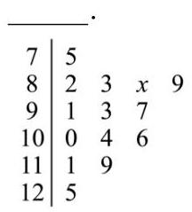

8.【25 崇明二模】在 $\bigtriangleup  {ABC}$ 中，若 $c = 3$ ， $C = \frac{\pi }{3}$ ，其面积为 $\sqrt{3}$ ，则 $a + b =$ ___.

9.【25 崇明二模】若 ${\left( x + 1\right) }^{10} = {a}_{0} + {a}_{1}\left( {x - 1}\right)  + {a}_{2}{\left( x - 1\right) }^{2} + \cdots  + {a}_{10}{\left( x - 1\right) }^{10}$ ,则 ${a}_{0} + {a}_{1} + {a}_{2} + \cdots  + {a}_{10} \; =$

10.【25 崇明二模】已知 $f\left( x\right)  = \left\{  \begin{array}{ll}  - {x}^{2} + {ax}, & x \leq  1 \\  {ax} - 1, & x > 1 \end{array}\right.$ ，若函数 $y = f\left( x\right)$ 有两个极值点，则实数 $a$ 的取值范围是___.

11.【25 崇明二模】已知双曲线 ${x}^{2} - \frac{{y}^{2}}{{b}^{2}} = 1\left( {b > 0}\right)$ 的左、右焦点为 ${F}_{1},{F}_{2}$ ,以 $O$ 为顶点， ${F}_{2}$ 为焦点作抛物线交双曲线于 $P$ ，且 $\angle P{F}_{1}{F}_{2} = {45}^{ \circ  }$ ，则 ${b}^{2} =$ ___.

12.【25 崇明二模】已知集合 $M$ 中的任一个元素都是整数,当存在整数 $a, c \in  M, b \notin  M$ 且 $a < b < c$ 时,称 $M$ 为 “间断整数集”. 集合 $\{ x \mid  1 \leq  x \leq  {10}, x \in  Z\}$ 的所有子集中,是 “间断整数集” 的个数为___.

二、单选题

13.【25 崇明二模】若 $a > b > 0, c > d$ ,则下列结论正确的是 ( )

A. $a - b < 0$ B. ${ac} > {bd}$ C. $a{c}^{2} > b{c}^{2}$

D. $\frac{a}{{c}^{2} + 1} > \frac{b}{{c}^{2} + 1}$

14.【25 崇明二模】已知一个圆锥的轴截面是边长为 2 的等边三角形, 则这个圆锥的侧面积为 ( )

A. ${2\pi }$ B. ${3\pi }$ C. ${4\pi }$

D. $\frac{\sqrt{3}}{3}\pi$

15.【25 崇明二模】抛掷一枚质地均匀的硬币 $n$ 次 (其中 $n$ 为大于等于 2 的整数),设事件 $A$ 表示 “ $n$ 次中既有正面朝上又有反面朝上”，事件 $B$ 表示 “ $n$ 次中至多有一次正面朝上”，若事件 $A$ 与事件 $B$ 是独立的,则 $n$ 的值为 ( )

A. 5 B. 4 C. 3 D. 2

16.【25 崇明二模】数列 $\left\{  {a}_{n}\right\}$ 是等差数列,周期数列 $\left\{  {b}_{n}\right\}$ 满足 ${b}_{n} = \cos \left( {a}_{n}\right)$ ,若集合 $X = \left\{  {x \mid  x = {b}_{n}}\right.$ , $n$ 是正整数 $\}$ 中恰有三个元素,则数列 $\left\{  {b}_{n}\right\}$ 的周期 $T$ 的取值不可能是 ( )

A. 4 B. 5 C. 6 D. 7

三、解答题

17.【25 崇明二模】

如图,在四棱锥 $P - {ABCD}$ 中,底面 ${ABCD}$ 是边长为 2 的正方形,且 ${CB} \bot  {BP},{CD} \bot  {DP}$ , ${PA} = 2$ ,点 $E, F$ 分别为 ${PB},{PD}$ 的中点.

(1)求证: ${PA} \bot$ 平面 ${ABCD}$ ；

18.【25 崇明二模】

已知 $f\left( x\right)  = {\log }_{3}\left( {x + a}\right)  + {\log }_{3}\left( {6 - x}\right)$ .

(1) 是否存在实数 $a$ ,使得函数 $y = f\left( x\right)$ 是偶函数? 若存在,求实数 $a$ 的值,若不存在,请说明理由;

19.【25 崇明二模】

某区 2025 年 3 月 31 日至 4 月 13 日的天气预报如图所示.

<table><tr><td>31       大部分晴 17/9°C</td><td>04月01日       阵雨 18/9°C</td><td>02       阵雨 18/10°C</td><td>03       阵雨 19/10°C</td><td>04       多云 18/9°C</td><td>05       间歇性多云 19/10°C</td><td>06       多云 20/10°C</td></tr><tr><td>07       阵雨 19/10°C</td><td>08       大部分多云 19/10°C</td><td>09       大部分晴 20/8°C</td><td>10       多云 18/8°C</td><td>11       大部分晴 18/10°C</td><td>12       阵雨 17/8°C</td><td>13       阵雨 17/9°C</td></tr></table>

(1)从 3 月 31 日至 4 月 13 日某天开始，连续统计三天，求这三天中至少有两天是阵雨的概率；

20.【25崇明二模】

已知抛物线 $\Gamma {x}^{2} = {4y}$ ,过点 $P\left( {a, b}\right)$ 的直线 $l$ 与抛物线 $\Gamma$ 交于点 $A\text{ 、 }B$ ,与 $y$ 轴交于点 $C$ .

(1)若点 $A$ 位于第一象限，且点 $A$ 到抛物线 $\Gamma$ 的焦点的距离等于 3，求点 $A$ 的坐标；

(2)若点 $A$ 坐标为 $\left( {4,4}\right)$ ，且点 $B$ 恰为线段 ${AC}$ 的中点，求原点 $O$ 到直线 $l$ 的距离；

(3)若抛物线 $\Gamma$ 上存在定点 $D$ 使得满足题意的点 $A$ 、 $B$ 都有 ${DA}\bot {DB}$ ,求 $a$ 、 $b$ 满足的关系式.

21.【25 崇明二模】

已知函数 $y = f\left( x\right)$ ， $P$ 为坐标平面上一点. 若函数 $y = f\left( x\right)$ 的图像上存在与 $P$ 不同的一点 $Q$ ， 使得直线 ${PQ}$ 是函数 $y = f\left( x\right)$ 在点 $Q$ 处的切线,则称点 $P$ 具有性质 ${M}_{f}$ .

(1) 若 $f\left( x\right)  = {x}^{2}$ ,判断点 $P\left( {1,0}\right)$ 是否具有性质 ${M}_{f}$ ,并说明理由;

## 20.【25 秋考】

一、填空题

1.【25 秋考】已知全集 $U = \{ x \mid  2 \leq  x \leq  5, x \in  R\}$ ，集合 $A = \{ x \mid  2 \leq  x < 4, x \in  R\}$ ，则 $\bar{A} =$ ___.

2.【 25 秋考】不等式 $\frac{x - 1}{x - 3} < 0$ 的解集为___.

3.【25 秋考】已知等差数列 $\left\{  {a}_{n}\right\}$ 的首项 ${a}_{1} =  - 3$ ，公差 $d = 2$ ，则该数列的前 6 项和为___.

4.【25 秋考】在二项式 ${\left( 2x - 1\right) }^{5}$ 的展开式中， ${x}^{3}$ 的系数为___.

5.【25 秋考】函数 $y = \cos x$ 在 $\left\lbrack  {-\frac{\pi }{2},\frac{\pi }{4}}\right\rbrack$ 上的值域为___.

6.【25 秋考】已知随机变量 $X$ 的分布为 $\left( \begin{matrix} 5 & 6 & 7 \\  {0.2} & {0.3} & {0.5} \end{matrix}\right)$ ,则期望 $E\left\lbrack  X\right\rbrack   =$ ___.

7.【25 秋考】如图,在正四棱柱 ${ABCD} - {A}_{1}{B}_{1}{C}_{1}{D}_{1}$ 中, ${BD} = 4\sqrt{2}, D{B}_{1} = 9$ ,则该正四棱柱的体积为___.

8.【25 秋考】设 $a, b > 0, a + \frac{1}{b} = 1$ ,则 $b + \frac{1}{a}$ 的最小值为___.

9.【25 秋考】4 个家长和 2 个儿童去爬山, 6 个人需要排成一条队列, 要求队列的头和尾均是家长, 则不同的排列个数有___种.

10.【25 秋考】已知复数 $z$ 满足 ${z}^{2} = {\left( \bar{z}\right) }^{2},\left| z\right|  \leq  1$ ,则 $\left| {z - 2 - 3\mathrm{i}}\right|$ 的最小值是___.

11.【25 秋考】小申同学观察发现, 生活中有些时候影子可以完全投射在斜面上. 某斜面上有两根长为 1 米的垂直于水平面放置的杆子，与斜面的接触点分别为 $A$ 、 $B$ ，它们在阳光的照射下呈现出影子，阳光可视为平行光:其中一根杆子的影子在水平面上，长度为 0.4 米；另一根杆子的影子完全在斜面上，长度为 0.45 米. 则斜面的底角 $\theta  =$ ___. (结果用角度制表示，精确到 0 . $\left. {01}^{ \circ  }\right)$

12.【25 秋考】已知 $f\left( x\right)  = \left\{  \begin{matrix} 1, & x > 0 \\  0, & x = 0 \\   - 1, & x < 0 \end{matrix}\right.$ , $\overrightarrow{a}\text{ 、 }\overrightarrow{b}\text{ 、 }\overrightarrow{c}$ 是平面内三个不同的单位向量. 若 $f\left( {\overrightarrow{a} \cdot  \overrightarrow{b}}\right)  + \; f\left( {\overrightarrow{b} \cdot  \overrightarrow{c}}\right)  + f\left( {\overrightarrow{c} \cdot  \overrightarrow{a}}\right)  = 0$ ，则 $\left| {\overrightarrow{a} + \overrightarrow{b} + \overrightarrow{c}}\right|$ 的取值范围是___.

二、单选题

13.【25 秋考】已知事件 $A\text{ 、 }B$ 相互独立,事件 $A$ 发生的概率为 $P\left( A\right)  = \frac{1}{2}$ ,事件 $B$ 发生的概率为 $P\left( B\right)  = \frac{1}{2}$ ,则事件 $A \cap  B$ 发生的概率 $P\left( {A \cap  B}\right)$ 为 ( )

A. $\frac{1}{8}$ B. $\frac{1}{4}$ C. $\frac{1}{2}$ D. 0

14.【25 秋考】设 $a > 0, s \in  R$ . 下列各项中,能推出 ${a}^{s} > a$ 的一项是 ( )

A. $a > 1$ ,且 $s > 0$ B. $a > 1$ ,且 $s < 0$

C. $0 < a < 1$ ,且 $s > 0$ D. $0 < a < 1$ ，且 $s < 0$

15.【25 秋考】已知 $A\left( {0,1}\right) , B\left( {1,2}\right) , C$ 在 $\Gamma {x}^{2} - {y}^{2} = 1\left( {x \geq  1, y \geq  0}\right)$ 上，则 $\bigtriangleup  {ABC}$ 的面积___∋

A. 有最大值，但没有最小值 B. 没有最大值, 但有最小值

C. 既有最大值, 也有最小值 D. 既没有最大值, 也没有最小值

16.【25 秋考】已知数列 $\left\{  {a}_{n}\right\}$ 、 $\left\{  {b}_{n}\right\}$ 、 $\left\{  {c}_{n}\right\}$ 的通项公式分别为 ${a}_{n} = {10n} - 9,{b}_{n} = {2}^{n}$ 、， ${c}_{n} = \lambda {a}_{n} + \; \left( {1 - \lambda }\right) {b}_{n}$ . 若对任意的 $\lambda  \in  \left\lbrack  {0,1}\right\rbrack  ,{a}_{n}\text{ 、 }{b}_{n}\text{ 、 }{c}_{n}$ 的值均能构成三角形,则满足条件的正整数 $n$ 有 ( )

A. 4 个 B. 3 个 C. 1 个 D. 无数个

三、解答题

17.【25 秋考】

2024 年巴黎奥运会,中国获得了男子 $4 \times  {100}$ 米混合泳接力金牌. 以下是历届奥运会男子 $4 \times$ 100 米混合泳接力项目冠军成绩记录(单位:秒)，数据按照升序排列.

<table><tr><td>206. 78</td><td>207. 46</td><td>207. 95</td><td>209. 34</td><td>209. 35</td></tr><tr><td>210. 68</td><td>213. 73</td><td>214. 84</td><td>216. 93</td><td>216. 93</td></tr></table>

(1)求这组数据的极差与中位数；

18.【25 秋考】

如图, $P$ 是圆锥的顶点, $O$ 是底面圆心, ${AB}$ 是底面直径,且 ${AB} = 2$ .

(1)若直线 ${PA}$ 与圆锥底面的所成角为 $\frac{\pi }{3}$ ，求圆锥的侧面积；

19.【25 秋考】

已知 $f\left( x\right)  = {x}^{2} - \left( {m + 2}\right) x + m\ln x, m \in  R$ .

(1)若 $f\left( 1\right)  = 0$ ，求不等式 $f\left( x\right)  \leq  {x}^{2} - 1$ 的解集；

20.【25 秋考】

已知椭圆 $\Gamma \frac{{x}^{2}}{{a}^{2}} + \frac{{y}^{2}}{5} = 1\left( {a > \sqrt{5}}\right) , M\left( {0, m}\right) \left( {m0}\right) , A$ 是 $\Gamma$ 的右顶点.

(1)若 $\Gamma$ 的焦点 $\left( {2,0}\right)$ ，求离心率 $\mathrm{e}$ ；

21.【25 秋考】

已知函数 $y = f\left( x\right)$ 的定义域为 $R$ . 对于正实数 $a$ ,定义集合 ${M}_{a} = \{ x \mid  f\left( {x + a}\right)  = f\left( x\right) \}$ .

(1)若 $f\left( x\right)  = \sin x$ ，判断 $\frac{\pi }{3}$ 是否是 ${M}_{\pi }$ 中的元素，请说明理由；