## 二模新速递

## 选题列表

1. 上海杨浦·二模 2024·上海奉贤·二模

2. 上海浦东·二模 2024·上海青浦·二模

3. -上海黄浦·二模 2024·上海闵行·二模

4. 上海普陀·二模 2024·上海金山·二模

5. 上海徐汇·二模 2024·上海静安·二模

6. 上海松江·二模 2024·上海长宁·二模

7. 上海嘉定·二模 2024.上海崇明·二模

8. .上海虹口·二模 2024.上海宝山.二模

## 汇编目录

题型一:不等式的性质

题型二: 一元二次不等式 .4

题型三: 基本不等式

## 一、题型一:不等式的性质

1. (2024·上海杨浦·二模) 已知实数 $a, b, c, d$ 满足: $a > b > 0 > c > d$ ,则下列不等式一定正确的是 ( )

A. $a + d > b + c$ B. ${ad} > {bc}$ C. $a + c > b + d$ D. ${ac} > {bd}$

【答案】 $C$

2. (23-24高三下·上海浦东新·期中) 已知 $a \in  R$ ,则下列结论不恒成立的是 ( )

A. $a\left( {1 - a}\right)  \leq  \frac{1}{4}$ B. $a + \frac{1}{a} \geq  2$ C. $\left| {a - 1}\right|  + \left| {a + 2}\right|  \geq  3$ D. $\sin a + \frac{1}{2 + \sin a} \geq  0$

【答案】 $B$

3. (2024·上海静安·二模)在下列关于实数 $a$ 、 $b$ 的四个不等式中，恒成立的是___. (请填入全部正确的序号)

① $a + b \geq  2\sqrt{ab}$ ；② ${\left( \frac{a + b}{2}\right) }^{2} \geq  {ab}$ ；③ $\left| a\right|  - \left| b\right|  \leq  \left| {a - b}\right|$ ；④ ${a}^{2} + {b}^{2} \geq  {2b} - 1$ .

【答案】②③④

4. (2024·上海虹口·二模) 已知集合 $A = \left\{  {x \mid  \tan x < 0}\right\}  , B = \left\{  {x\left| {\;\frac{x - 2}{x} \leq  0}\right. }\right\}$ ，则 $A \cap  B =$ ___.

【答案】 $\left\{  {x\left| {\;\frac{\pi }{2} < x \leq  2}\right. }\right\}$

## 二、题型二:一元二次不等式

1. (2024·上海徐汇·二模) 已知集合 $A = \left\{  {y \mid  y = {x}^{2} + 2}\right\}$ ，集合 $B = \left\{  {x \mid  {x}^{2} - {4x} + 3 \geq  0}\right\}$ ，那么 $A \cap  B =$ ___. 【答案】 $\lbrack 3, + \infty )$

2. (2024·上海崇明·二模) 不等式 $x \circ  \square \left( {x - 1}\right)  < 0$ 的解为___.

【答案】 $\left( {0,1}\right)$

## 三、题型三:基本不等式

1. (2024·上海徐汇·二模) 在下列函数中,值域为 $R$ 的偶函数是 ( )

A. $y = {x}^{\frac{1}{3}}$ B. $y = \lg \left| x\right|$ C. $y = {\mathrm{e}}^{x} + {\mathrm{e}}^{-x}$ D. $y = {x}^{3}\cos x$

【答案】 $B$

2. (2024·上海普陀·二模) 若实数 $a, b$ 满足 $a - {2b} \geq  0$ ,则 ${2}^{a} + \frac{1}{{4}^{b}}$ 的最小值为___.

【答案】 2

3. (2024·上海徐汇·二模)若正数 $a$ 、 $b$ 满足 $\frac{1}{a} + \frac{1}{b} = 1$ ，则 ${2a} + b$ 的最小值为___.

【答案】 $3 + 2\sqrt{2}/2\sqrt{2} + 3$

4. (2024·上海奉贤·二模) 某商品的成本 $C$ 与产量 $q$ 之间满足关系式 $C = C\left( q\right)$ ,定义平均成本 $\bar{C} = \bar{C}\left( q\right)$ , 其中 $\bar{C} = \frac{C\left( q\right) }{q}$ ,假设 $C\left( q\right)  = \frac{1}{4}{q}^{2} + {100}$ ,当产量等于___时,平均成本最少.

【答案】 20

5. (2024·上海金山·二模) 已知平面向量 $\overrightarrow{a}$ 、 $\overrightarrow{b}$ 、 $\overrightarrow{c}$ 满足: $\left| \overrightarrow{a}\right|  = \left| \overrightarrow{b}\right|  = 1$ ， $\overrightarrow{a} \cdot  \overrightarrow{c} = \overrightarrow{b} \cdot  \overrightarrow{c} = 1$ ，则 $\overrightarrow{a} \cdot  \overrightarrow{b} + {\overrightarrow{c}}^{2}$ 的最小值为___.

【答案】 $2\sqrt{2} - 1$

6. (2024·上海长宁·二模) 用铁皮制作一个有底无盖的圆柱形容器，若该容器的容积为 $\pi$ 立方米，则至少需要___平方米铁皮

【答案】 ${3\pi }$

## 专题 11 复数 ()

## 二模新速递

## 选题列表

1. 上海杨浦.二模 2024·上海奉贤·二模

2. 上海浦东.二模 2024·上海青浦·二模

3. 上海黄浦·二模 2024·上海闵行·二模

4. $\cdot$ 上海普陀·二模 2024·上海金山·二模

5. 上海徐汇·二模 2024·上海静安·二模

6. .上海松江·二模 2024.上海长宁·二模

7. 上海嘉定·二模 2024·上海崇明·二模

8. -上海虹口.二模 2024·上海宝山·二模

## 一、单选题

1. (2024·上海虹口·二模) 欧拉公式 ${\mathrm{e}}^{i\theta } = \cos \theta  + i\sin \theta$ 把自然对数的底数 $\mathrm{e}$ ，虚数单位 $\mathrm{i}$ ，三角函数 $\cos \theta$ 和 $\sin \theta$ 联系在一起,被誉为 “数学的天桥”. 若复数 $z$ 满足 $\left( {z + {\mathrm{e}}^{i \cdot  \frac{3\pi }{2}}}\right)  \cdot  \mathrm{i} = 2 - \mathrm{i}$ ,则 $\left| z\right|  =$ ( )

A. $\sqrt{2}$ B. $2\sqrt{2}$ C. $\sqrt{5}$ D. $\sqrt{10}$

【答案】 $A$

2. (2024·上海长宁·二模) 设 $z \in  C$ ,则 “ $z = \bar{z}$ ” 是 “ $z \in  R$ ” 的 ( )

A. 充分不必要条件 B. 必要不充分条件 C. 充要条件 D. 既不充分也不必要条件

【答案】 $C$

3.(23-24高三下·上海杨浦·阶段练习) 已知 $z$ 均为复数，则下列命题不正确的是 ( )

A. 若 $z = \bar{z}$ ,则 $z$ 为实数 B. 若 ${z}^{2} < 0$ ，则 $z$ 为纯虚数

C. 若 $z = \frac{1}{\bar{z}}$ ,则 $z =  \pm  1, \pm  \mathrm{i}$ D. 若 ${z}^{3} = 1$ ,则 $\bar{z} = {z}^{2}$

【答案】 $C$

## 二、填空题

1. (2024·上海普陀·二模) 已知复数 $z = 1 + \mathrm{i}$ ，其中 $\mathrm{i}$ 为虚数单位，则 $\bar{z}$ 在复平面内所对应的点的坐标为 ___.

【答案】 $\left( {1, - 1}\right)$

2. (2024.上海徐汇·二模) 已知复数 $z = \frac{1 - i}{i}$ ( $\mathrm{i}$ 为虚数单位),则 $z \cdot  \bar{z} =$ ___.

【答案】 2

3. (2024.上海杨浦. 二模) 设复数 ${z}_{1}$ 与 ${z}_{2}$ 所对应的点为 ${Z}_{1}$ 与 ${Z}_{2}$ ,若 ${z}_{1} = 1 + \mathrm{i},{z}_{2} = \mathrm{i} \cdot  {z}_{1}$ ,则 $\left| \overrightarrow{{Z}_{1}{Z}_{2}}\right|  =$ ___.

【答案】 2

4. (2024·上海杨浦·二模) 计算 $\frac{2 - i}{3 + i} =$ ___(其中 $\mathrm{i}$ 为虚数单位).

【答案】 $\frac{1}{2} - \frac{1}{2}\mathrm{i}$

5. (2024·上海奉贤·二模)已知复数 $z = \left( {3 - {4i}}\right)  \cdot  {i(i}$ 为虚数单位)，则 $z =$ ___.

【答案】 $4 + 3\mathrm{i}$

6. (2024·上海静安·二模)已知 $\mathrm{i}$ 是虚数单位，复数 $z = \frac{m + i}{2 + i}$ 是纯虚数，则实数 $m$ 的值为___.

【答案】 $- \frac{1}{2}/ - {0.5}$

7. (2024·上海黄浦·二模)若实系数一元二次方程 ${x}^{2} + {ax} + b = 0$ 有一个虚数根的模为 4，则 $a$ 的取值范围是___.

【答案】 $\left( {-8,8}\right)$

8. (2024·上海金山·二模)已知复数 $z$ 满足 $z + {2\bar{z}} = 3 - \mathrm{i}$ ，则 $\bar{z}$ 的模为___.

【答案】 $\sqrt{2}$

9. (2024·上海嘉定·二模)已知 $\mathrm{i}$ 是虚数单位. 则 $\left| \frac{4 + {3i}}{{\left( 1 - 2\mathrm{i}\right) }^{2}}\right|  =$ ___.

【答案】 1

10. (2024·上海青浦·二模)已知复数 $z = \frac{5i}{1 - i}$ ，则 $\operatorname{Im}z =$ ___.

【答案】 $\frac{5}{2}/{2.5}$

11. (2024·上海·二模) 已知复数 $z$ 满足 $z = \frac{2}{1 - i}$ (i 为虚数单位),则 $\operatorname{Im}z =$ ___.

【答案】 1

12. ( 23-24 高三下·上海浦东新·期中)若复数 $z = 1 + {2\mathrm{i}}$ ( i 是虚数单位)，则 $z \cdot  \bar{z} - z =$ ___.

【答案】 $4 - 2\mathrm{i}$

13.(23-24 高三下·上海嘉定·阶段练习) 已知复数 $z$ 满足 $\left( {\sqrt{3} + \mathrm{i}}\right) z = \left| {\sqrt{3} - \mathrm{i}}\right|$ (i 是虚数单位),则 $z =$ 【答案】 $\frac{\sqrt{3}}{2} - \frac{1}{2}\mathrm{i}$

14. ( 23 - 24 高三下·上海·阶段练习)已知 $\mathrm{i}$ 是虚数单位，则 $\operatorname{Im}\left( \frac{1}{1 - i}\right)  =$ ___.

【答案】 $\frac{1}{2}/{0.5}$

15. (23-24 高三下·上海松江·阶段练习)已知复数 $z = \frac{1}{1 + i}$ ，则 $z$ 的虚部为___.

【答案】 $- \frac{1}{2}/ - {0.5}$

16. $\left( {{23} - {24}}\right.$ 高三下. 上海. 阶段练习) 关于 $x$ 的实系数方程 ${x}^{2} - {4x} + 5 = 0$ 和 ${x}^{2} + {2mx} + m = 0$ 有四个不同的根，若这四个根在复平面上对应的点共圆，则 $m$ 的取值范围是 ___.

【答案】 $\left( {0,1}\right)  \cup  \{  - 1\}$

17. (23-24 高三下·上海浦东新·阶段练习)若 $2\mathrm{i} - 3$ (i 为虚数单位)是关于 $x$ 的实系数方程 $2{x}^{2} + {px} + q = 0$ 的一个根,则 $p - q =$ ___.

【答案】 -14

专题 10 概率统计 (四大题型, )

## 二模新速递

## 选题列表

1. 上海杨浦.二模 2024·上海奉贤·二模

2. 上海浦东.二模 2024·上海青浦·二模

3. 上海黄浦·二模 2024·上海闵行·二模

4. 上海普陀·二模 2024·上海金山·二模

5. 上海徐汇·二模 2024·上海静安·二模

6. 上海松江·二模 2024·上海长宁·二模

7. 上海嘉定·二模 2024·上海崇明·二模

8. ·上海虹口·二模 2024.上海宝山.二模

## 汇编目录

题型一:统计

题型二:统计案例 .8

题型三: 概率 .18

题型四: 随机变量及其分布 .24

## 一、题型一: 统计

1. (2024·上海黄浦·二模) 某学校为了解学生参加体育运动的情况，用分层抽样的方法作抽样调查，拟从初中部和高中部两层共抽取 40 名学生, 已知该校初中部和高中部分别有 500 和 300 名学生, 则不同的抽样结果的种数为 ( )

A. ${C}_{500}^{25} + {C}_{300}^{15}$ B. ${C}_{500}^{25} \cdot  {C}_{300}^{15}$ C. ${C}_{500}^{20} + {C}_{300}^{20}$ D. ${C}_{500}^{20} \cdot  {C}_{300}^{20}$

【答案】 $B$

2. (2024·上海虹口·二模) 给出下列 4 个命题:

①若事件 $A$ 和事件 $B$ 互斥，则 $P\left( {A \cap  B}\right)  = P\left( A\right) P\left( B\right)$ ；

②数据2,3,6,7,8,10,11,13的第 70 百分位数为 10 ；

③已知 $y$ 关于 $x$ 的回归方程为 $y =  - {0.5x} + {0.7}$ ，则样本点 $\left( {2, - 1}\right)$ 的离差为 -0.7；

④随机变量 $X$ 的分布为 $\left( \begin{matrix} 0 & 1 & 2 & 3 \\  {0.2} & {0.2} & {0.3} & {0.3} \end{matrix}\right)$ ,则其数学期望 $E\left\lbrack  X\right\rbrack   = {1.6}$ .

其中正确命题的序号为 ( )

A. ①② B. ①③ C. ②③ D. ②④

【答案】 $C$

3. (2024·上海金山·二模) 下列说法不正确的是 ( ).

A. 一组数据10,11,11,12,13,14,16,18,20,22的第 60 百分位数为 14

B. 若随机变量 $X$ 服从正态分布 $N\left( {3,{\sigma }^{2}}\right)$ ，且 $P\left( {X \leq  4}\right)  = {0.7}$ ，则 $P\left( {3 < X < 4}\right)  = {0.2}$

C. 若线性相关系数 $\left| r\right|$ 越接近 1,则两个变量的线性相关程度越高

D. 对具有线性相关关系的变量 $x\text{ 、 }y$ ,且回归方程为 $y = {0.3x} - m$ ,若样本点的中心为 $\left( {m,{2.8}}\right)$ ,则实数 $m$ 的值是 -4

【答案】 $A$

4. (2024·上海普陀·二模) 为了提高学生参加体育锻炼的积极性，某校本学期依据学生特点针对性的组建了五个特色运动社团，学校为了了解学生参与运动的情况，对每个特色运动社团的参与人数进行了统计，其中一个特色运动社团开学第 1 周至第 5 周参与运动的人数统计数据如表所示.

<table><tr><td>周次 $x$</td><td>1</td><td>2</td><td>3</td><td>4</td><td>5</td></tr><tr><td>参与运动的人数 $y$</td><td>35</td><td>36</td><td>40</td><td>39</td><td>45</td></tr></table>

若表中数据可用回归方程 $y = {2.3x} + b\left( {1 \leq  x \leq  {18}, x \in  N}\right)$ 来预测,则本学期第 11 周参与该特色运动社团的人数约为___.(精确到整数)

【答案】 57

5. (2024·上海嘉定·二模)数据1、2、3、4、5的方差为 ${s}_{1}^{2}$ ，数据3、6、9、12、15的方差为 ${s}_{2}^{2}$ ，则 $\frac{{s}_{2}^{2}}{{s}_{1}^{2}} \; =$

【答案】 9

6. (2024·上海奉贤·二模) 某学生兴趣小组随机调查了某市 100 天中每天的空气质量等级和当天到某公园锻炼的人次, 整理数据得到下表 (单位: 天):

<table><tr><td>锻炼人次空气质量等级</td><td>[0,200]</td><td>(200,400]</td><td>(400,600]</td></tr><tr><td>1(优)</td><td>3</td><td>18</td><td>25</td></tr><tr><td>2(良)</td><td>6</td><td>$x$</td><td>14</td></tr><tr><td>3(轻度污染)</td><td>5</td><td>5</td><td>6</td></tr><tr><td>4(中度污染)</td><td>6</td><td>3</td><td>0</td></tr></table>

(1)求一天中到该公园锻炼的平均人次的估计值(同一组中的数据用该组区间的中点值为代表)；

(2)若某天的空气质量等级为 1 或 2，则称这天 “空气质量好”；若某天的空气质量等级为 3 或 4，则称这天 “空气质量不好”. 根据所给数据,完成下面的 $2 \times  2$ 列联表,请根据表中的数据判断: 一天中到该公园锻炼的人次是否与该市当天的空气质量有关? (规定显著性水平 $\alpha  = {0.05}$ )

<table><tr><td></td><td>人次 $\leq  {400}$</td><td>人次> 400</td><td>总计</td></tr><tr><td>空气质量好</td><td></td><td></td><td></td></tr><tr><td>空气质量不好</td><td></td><td></td><td></td></tr><tr><td>总计</td><td></td><td></td><td></td></tr></table>

附: ${\chi }^{2} = \frac{n{\left( ad - bc\right) }^{2}}{\left( {a + b}\right) \left( {c + d}\right) \left( {a + c}\right) \left( {b + d}\right) }, P\left( {{\chi }^{2} \geq  {3.841}}\right)  \approx  {0.05}$ .

【答案】(1)350

(2)列联表见解析，一天中到该公园锻炼的人次与该市当天的空气质量有关

7. (2024·上海虹口·二模) 某企业监控汽车零件的生产过程，现从汽车零件中随机抽取 100 件作为样本，测得质量差 (零件质量与标准质量之差的绝对值) 的样本数据如下表:

<table><tr><td>质量差 (单位:mg)</td><td>54</td><td>57</td><td>60</td><td>63</td><td>66</td></tr><tr><td>件数 (单位: 件)</td><td>5</td><td>21</td><td>46</td><td>25</td><td>3</td></tr></table>

(1) 求样本质量差的平均数 $\bar{x}$ ; 假设零件的质量差 $X \sim  N\left( {\mu ,{\sigma }^{2}}\right)$ ,其中 ${\sigma }^{2} = {16}$ ,用 $\bar{x}$ 作为 $\mu$ 的近似值,求 $P\left( {{56} < X < {68}}\right)$ 的值;

(2)已知该企业共有两条生产汽车零件的生产线，其中全部零件的 $\frac{3}{4}$ 来自第 1 条生产线. 若两条生产线的废品率分别为 0.016 和 0.012 ，且这两条生产线是否产出废品是相互独立的. 现从该企业生产的汽车零件中随机抽取一件.

(i) 求抽取的零件为废品的概率;

(ii) 若抽取出的零件为废品, 求该废品来自第 1 条生产线的概率.

参考数据: 若随机变量 $X \sim  N\left( {\mu ,{\sigma }^{2}}\right)$ ,则 $P\left( {\mu  - \sigma  < X \leq  \mu  + \sigma }\right)  \approx  {0.6827}, P\left( {\mu  - {2\sigma } < X \leq  \mu  + {2\sigma }}\right)  \approx  {0.9545}$ , $P\left( {\mu  - {3\sigma } < X \leq  \mu  + {3\sigma }}\right)  \approx  {0.9973}.$

【答案】 $\left( 1\right) \bar{x} = {60}, P\left( {{56} < X < {68}}\right)  \approx  {0.8186}$

(2)(i)0.015; $\left( {ii}\right) {0.8}$

8. (23-24高三下·上海浦东新·期中)某商店随机抽取了当天 100 名客户的消费金额，并分组如下: $\lbrack 0,{200}),\lbrack {200},{400}),\lbrack {400},{600}),\cdots ,\left\lbrack  {{1000},{1200}}\right\rbrack$ (单位: 元),得到如图所示的频率分布直方图.

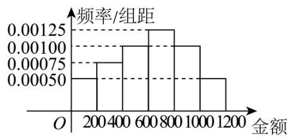

(单位:元)

(1)若该店当天总共有 1350 名客户进店消费，试估计其中有多少客户的消费额不少于 800 元；

(2)若利用分层随机抽样的方法从消费不少于 800 元的客户中共抽取 6 人，再从这 6 人中随机抽取 2 人做进一步调查, 则抽到的 2 人中至少有 1 人的消费金额不少于 1000 元的概率是多少;

(3)为吸引顾客消费，该商店考虑两种促销方案. 方案一:消费金额每满 300 元可立减 50 元，并可叠加使用; 方案二: 消费金额每满 1000 元即可抽奖三次,每次中奖的概率均为 $\frac{1}{3}$ ,且每次抽奖互不影响. 中奖 1 次当天消费金额可打 9 折，中奖 2 次当天消费金额可打 6 折，中奖 3 次当天消费金额可打 3 折. 若两种方案只能选择其中一种, 小王准备购买的商品又恰好标价 1000 元, 请帮助他选择合适的促销方案并说明理由.

【答案】(1)405;

(2) $\frac{3}{5}$ ;

(3)选取方案 2 ，理由见解析.

## 二、题型二:统计案例

1. (2024·上海徐汇·二模)为了研究 $y$ 关于 $x$ 的线性相关关系，收集了 5 组样本数据 (见下表):

<table><tr><td>$x$</td><td>1</td><td>2</td><td>3</td><td>4</td><td>5</td></tr><tr><td>$y$</td><td>0.5</td><td>0.9</td><td>1</td><td>1.1</td><td>1.5</td></tr></table>

若已求得一元线性回归方程为 $y = \widehat{a}x + {0.34}$ ,则下列选项中正确的是 ( )

A. $\widehat{a} = {0.21}$

B. 当 $x = 8$ 时, $y$ 的预测值为 2.2

C. 样本数据 $y$ 的第 40 百分位数为 1

D. 去掉样本点 $\left( {3,1}\right)$ 后, $x$ 与 $y$ 的样本相关系数 $r$ 不会改变

【答案】 $D$

2. (2024·上海闵行·二模) 某疾病预防中心随机调查了 339 名 50 岁以上的公民，研究吸烟习惯与慢性气管炎患病的关系，调查数据如下表:

<table><tr><td></td><td>不吸烟者</td><td>吸烟者</td><td>总计</td></tr><tr><td>不患慢性气管炎者</td><td>121</td><td>162</td><td>283</td></tr><tr><td>患慢性气管炎者</td><td>13</td><td>43</td><td>56</td></tr><tr><td>总计</td><td>134</td><td>205</td><td>339</td></tr></table>

假设 ${H}_{0}$ : 患慢性气管炎与吸烟没有关系,即它们相互独立. 通过计算统计量 ${\chi }^{2}$ ,得 ${\chi }^{2} \approx  {7.468}$ ,根据 ${\chi }^{2}$ 分布概率表: $P\left( {{\chi }^{2} \geq  {6.635}}\right)  \approx  {0.01}, P\left( {{\chi }^{2} \geq  {5.024}}\right)  \approx  {0.025}, P\left( {{\chi }^{2} \geq  {3.841}}\right)  \approx  {0.05}, P\left( {{\chi }^{2} \geq  {2.706}}\right)  \approx  {0.1}$ . 给出下列 3 个命题, 其中正确的个数是 ( )

① “患慢性气管炎与吸烟没有关系”成立的可能性小于 5%；

②有 99% 的把握认为患慢性气管炎与吸烟有关；

③ ${\chi }^{2}$ 分布概率表中的 0.05、0.01 等小概率值在统计上称为显著性水平，小概率事件一般认为不太可能发生.

A. 0 个 B. 1 个 C. 2 个 D. 3 个

【答案】 $D$

3. (23-24高三下・上海浦东新・期中) 通过随机抽样, 我们绘制了如图所示的某种商品每千克价格 (单位: 百元) 与该商品消费者年需求量 (单位:千克) 的散点图. 若去掉图中右下方的点 $A$ 后,下列说法正确的是 ( )

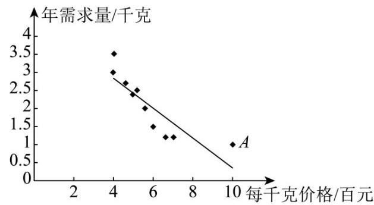

消费者年需求量与商品每千克价格的散点图

A. “每千克价格”与“年需求量”这两个变量由负相关变为正相关

B. “每千克价格”与“年需求量”这两个变量的线性相关程度不变

C. “每千克价格”与“年需求量”这两个变量的线性相关系数变大

D. “每千克价格”与“年需求量”这两个变量的线性相关系数变小

【答案】 $D$

4. (2024·上海金山·二模) 为了考察某种药物预防疾病的效果，进行动物试验，得到如下图所示列联表:

<table id="cross-table-1"><tr><td rowspan="2">药物</td><td colspan="2">疾病</td><td rowspan="2">合计</td></tr><tr><td>未患病</td><td>患病</td></tr><tr><td>服用</td><td>$m$</td><td>${50} - m$</td><td>50</td></tr><tr><td>未服用</td><td>${80} - m$</td><td>m - 30</td><td>50</td></tr><tr><td>合计</td><td>80</td><td>20</td><td>100</td></tr></table>

取显著性水平 $\alpha  = {0.05}$ ,若本次考察结果支持 “药物对疾病预防有显著效果”,则 $m\left( {m \geq  {40}, m \in  N}\right)$ 的最小值为___.

(参考公式: ${\chi }^{2} = \frac{n{\left( ad - bc\right) }^{2}}{\left( {a + b}\right) \left( {c + d}\right) \left( {a + c}\right) \left( {b + d}\right) }$ ; 参考值: $P\left( {{\chi }^{2} \geq  {3.841}}\right)  \approx  {0.05}$ )

【答案】 44

5. ( 2024 - 上海长宁 · 二模)收集数据，利用 2 × 2 列联表，分析学习成绩好与上课注意力集中是否有关时， 提出的零假设为:学习成绩好与上课注意力集中___(填:有关或无关)

【答案】无关

6. (2024·上海徐汇·二模)为了解中草药甲对某疾病的预防效果，研究人员随机调查了 100 名人员，调查数据如表.(单位:个)

<table><tr><td></td><td>未患病者</td><td>患病者</td><td>合计</td></tr><tr><td>未服用中草药甲</td><td>29</td><td>16</td><td>45</td></tr><tr><td>服用   中草药甲</td><td>46</td><td>9</td><td>55</td></tr><tr><td>合计</td><td>75</td><td>25</td><td>100</td></tr></table>

(1)若规定显著性水平 $\alpha  = {0.05}$ ，试分析中草药甲对预防此疾病是否有效；

(2)已知中草药乙对该疾病的治疗有效率数据如下:对未服用过中草药甲的患者治疗有效率为 $\frac{1}{2}$ ，对服用过中草药甲的患者治疗有效率为 $\frac{3}{4}$ . 若用频率估计概率,现从患此疾病的人员中随机选取 2 人 (分两次选取，每次1人，两次选取的结果独立)使用中草药乙进行治疗，记治疗有效的人数为 $X$ ，求 $X$ 的分布和数学期望.

附: ${\chi }^{2} = \frac{n{\left( ad - bc\right) }^{2}}{\left( {a + b}\right) \left( {c + d}\right) \left( {a + c}\right) \left( {b + d}\right) },\;n = a + b + c + d$ .

<table><tr><td>$\alpha$</td><td>0.100</td><td>0.050</td><td>0.010</td><td>0.001</td></tr><tr><td>${x}_{a}$</td><td>2.706</td><td>3.841</td><td>6.635</td><td>10.828</td></tr></table>

【答案】(1)认为中草药甲对预防此疾病有效果

(2)分布列见解析，期望为 $\frac{59}{50}$

7. (2024·上海青浦·二模) 垃圾分类能减少有害垃圾对环境的破坏，同时能提高资源循环利用的效率. 目前上海社区的垃圾分类基本采用四类分类法, 即干垃圾, 湿垃圾, 可回收垃圾与有害垃圾. 某校为调查学生对垃圾分类的了解程度,随机抽取 100 名学生作为样本,按照了解程度分为 $A$ 等级和 $B$ 等级, 得到如下列联表:

<table id="cross-table-2"><tr><td></td><td>男生</td><td>女生</td><td>总计</td></tr><tr><td>$A$ 等级</td><td>40</td><td>20</td><td>60</td></tr><tr><td>$B$ 等级</td><td>20</td><td>20</td><td>40</td></tr><tr><td>总计</td><td>60</td><td>40</td><td>100</td></tr></table>

(1)根据表中的数据回答:学生对垃圾分类的了解程度是否与性别有关(规定:显著性水平 $\alpha  = {0.05})$ ？ 附: ${\chi }^{2} = \frac{n{\left( ad - bc\right) }^{2}}{\left( {a + b}\right) \left( {c + d}\right) \left( {a + c}\right) \left( {b + d}\right) }$ ,其中 $n = a + b + c + d, P\left( {{\chi }^{2} \geq  {3.841}}\right)  \approx  {0.05}$ .

(2)为进一步加强垃圾分类的宣传力度，学校特举办垃圾分类知识问答比赛. 每局比赛由二人参加，主持人 $A$ 和 $B$ 轮流提问，先赢 3 局者获得奖项并结束比赛. 甲，乙两人参加比赛，已知主持人 $A$ 提问甲赢的概率为 $\frac{2}{3}$ ,主持人 $B$ 提问甲赢的概率为 $\frac{1}{2}$ ,每局比赛互相独立,且每局都分输赢. 现抽签决定第一局由主持人 A 提问.

(i) 求比赛只进行 3 局就结束的概率;

(ii) 设 $X$ 为结束比赛时甲赢的局数,求 $X$ 的分布和数学期望 $E\left( X\right)$ .

【答案】(1)无关

(2) (i) $\frac{5}{18};\;\left( {ii}\right)$ 分布列见解析, $\frac{263}{108}$

8. (2024·上海崇明·二模)某疾病预防中心随机调查了 340 名 50 岁以上的公民，研究吸烟习惯与慢性气管炎患病的关系，调查数据如表所示.

<table><tr><td></td><td>不吸烟者</td><td>吸烟者</td><td>总计</td></tr><tr><td>不患慢性气管炎者</td><td>120</td><td>160</td><td>280</td></tr><tr><td>患慢性气管炎者</td><td>15</td><td>45</td><td>60</td></tr><tr><td>总计</td><td>135</td><td>205</td><td>340</td></tr></table>

(1)是否有 95% 的把握认为患慢性气管炎与吸烟有关？

(2)常用 $L\left( {B \mid  A}\right)  = \frac{P\left( {B \mid  A}\right) }{P\left( {\bar{B} \mid  A}\right) }$ 表示在事件 $A$ 发生的条件下事件 $B$ 发生的优势,在统计中称为似然比. 现从 340 人中任选一人，A 表示“选到的人是吸烟者”，B 表示“选到的人患慢性气管炎者”请利用样本数据,估计 $L\left( {B \mid  A}\right)$ 的值;

(3)现从不患慢性气管炎者的样本中，按分层抽样的方法选出 7 人，从这 7 人里再随机选取 3 人，求这 3 人中,不吸烟者的人数 $X$ 的数学期望.

附: ${\chi }^{2}{}^{ \circ  } = \frac{n{\left( ad - bc\right) }^{2}}{\left( {a + b}\right) \left( {c + d}\right) \left( {a + c}\right) \left( {b + d}\right) },\;P{}^{ \circ  }\;\left( {{\chi }^{2} \geq  {3.841}}\right)  \approx  {0.05}$ .

【答案】(1) 有 95% 的把握认为患慢性气管炎与吸烟有关

(2) $\frac{9}{32}$

(3) $\frac{9}{7}$

9. (2024·上海嘉定·二模)据文化和旅游部发布的数据显示，2023年国内出游人次达 48.91 亿次，总花费 4.91 万亿元. 人们选择的出游方式不尽相同, 有自由行, 也有跟团游. 为了了解年龄因素是否影响出游方式的选择，我们按年龄将成年人群分为青壮年组 (大于等于 14 岁，小于 40 岁) 和中老年组 (大于等于 40 岁). 现在 $S$ 市随机抽取 170 名成年市民进行调查,得到如下表的数据:

<table><tr><td></td><td>青壮年</td><td>中老年</td><td>合计</td></tr><tr><td>自由行</td><td>60</td><td>40</td><td></td></tr><tr><td>跟团游</td><td>20</td><td>50</td><td></td></tr><tr><td>合计</td><td></td><td></td><td></td></tr></table>

(1)请补充 $2 \times  2$ 列联表，并判断能否有 95% 的把握认为年龄与出游方式的选择有关；

(2)用分层抽样的方式从跟团游中抽取 14 个人，再从 14 个人中随机抽取 7 个人，用随机变量 $X$ 表示这 7 个人中中老年与青壮年人数之差的绝对值，求 $X$ 的分布和数学期望.

<table><tr><td>$\alpha$</td><td>0.10</td><td>0.05</td><td>0.025</td></tr><tr><td>$P$</td><td>2.706</td><td>3.841</td><td>5.024</td></tr></table>

【答案】(1) 答案见解析, 能;

(2)分布列见解析， $E\left( X\right)  = \frac{439}{143}$

## 三、题型三:概率

1. (2024·上海普陀·二模) 从放有两个红球、一个白球的袋子中一次任意取出两个球，两个红球分别标记为 $A\text{ 、 }B$ ,白球标记为 $C$ ,则它的一个样本空间可以是 ( )

A. $\{ {AB},{BC}\}$ B. $\{ {AB},{AC},{BC}\}$

C. $\{ {AB},{BA},{BC},{CB}\}$ D. $\{ {AB},{BA},{AC},{CA},{CB}\}$

【答案】 $B$

2. (2024·上海长宁·二模) 某运动员 8 次射击比赛的成绩为:9.6、9.7、9.5、9.9、9.4、9.8、9.3、10.0; 已知这组数据的第 $x$ 百分位为 $m$ ,若从这组数据中任取一个数,这个数比 $m$ 大的概率为 0.25,则 $x$ 的取值不可能是 ( )

A. 65 B. 70 C. 75 D. 80

【答案】D

3.、9.4、9.5、9.6、9.7、9.8、9.9、10.0,

因为从这组数据中任取一个数,这个数比 $m$ 大的概率为 0.25 ,

一共有 8 个数,所以比 $m$ 大的数有两个,则 ${9.8} \leq  m < {9.9}$ ,

对于 $A$ ,因为 $8 \times  {0.65} = {5.2}$ ,所以第 65 百分位为第 6 个数,即 9.8,满足题意;

对于 $B$ ,因为 $8 \times  {0.7} = {5.6}$ ,所以第 70 百分位为第 6 个数,即 9.8,满足题意;

对于 $C$ ,因为 $8 \times  {0.75} = 6$ ,

所以第 75 百分位为第 6,7 个数的平均数,即 $\frac{{9.8} + {9.9}}{2} = {9.85}$ ,满足题意;

对于 $D$ ,因为 $8 \times  {0.8} = {6.4}$ ,所以第 80 百分位为第 7 个数,即 9.9,不满足题意.

4. (2024·上海黄浦·二模) 某校高三年级举行演讲比赛，共有 5 名选手参加. 若这 5 名选手甲、乙、丙、丁、 戊通过抽签来决定上场顺序，则甲、乙两位选手上场顺序不相邻的概率为___.

【答案】 $\frac{3}{5}/{0.6}$

5. (2024·上海嘉定·二模)小张、小王两家计划假期来嘉定游玩，他们分别从“古猗园，秋霞圃，州桥老街”这三个景点中随机选择一个游玩，记事件 $A$ 表示 “两家至少有一家选择古猗园”，事件 $B$ 表示 “两家选择景点不同”, 则概率 $P\left( {B \mid  A}\right)  =$ ___.

【答案】 $\frac{4}{5}/{0.8}$

6. (2024·上海崇明·二模) 某学习小组共有 10 名学生，其中至少有 2 名学生在同一月份的出生的概率是 ___. (默认每月天数相同，结果精确到 0.001)

【答案】0.996

7. (2024·上海闵行·二模) ChatGPT 是 OpenAI 研发的一款聊天机器人程序，是人工智能技术驱动的自然语言处理工具，它能够基于在预训练阶段所见的模式和统计规律来生成回答，但它的回答可能会受到训练数据信息的影响, 不一定完全正确. 某科技公司在使用 ChatGPT 对某一类问题进行测试时发现, 如果输入的问题没有语法错误, 它回答正确的概率为 0.98 ; 如果出现语法错误, 它回答正确的概率为

0.18. 假设每次输入的问题出现语法错误的概率为 0.1 ，且每次输入问题，ChatGPT 的回答是否正确相互独立. 该公司科技人员小张想挑战一下 ChatGPT，小张和 ChatGPT 各自从给定的 10 个问题中随机抽取 9 个作答, 已知在这 10 个问题中, 小张能正确作答其中的 9 个.

(1)求小张能全部回答正确的概率；

(2)求一个问题能被 ${ChatGPT}$ 回答正确的概率；

(3)在这轮挑战中，分别求出小张和 ${ChatGPT}$ 答对题数的期望与方差.

【答案】(1) $\frac{1}{10}$ ;

(2)0.9;

(3)小张答对题数的的期望为 8.1，方差为 0.09，ChatGPT 答对题数的期望为 8.1，方差为 0.81 .

8.(2024·上海静安·二模)某高中随机抽取 100 名学生，测得他们的身高(单位:cm)，按照区间 $\lbrack {160},{165}),\;\lbrack {165},{170}),\;\lbrack {170},{175}),\;\lbrack {175},{180}),\;\left\lbrack  {{180},{185}}\right\rbrack$ 分组,得到样本身高的频率分布直方图 (如下图所示).

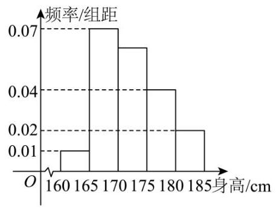

(1)求身高不低于 ${170}\mathrm{\;{cm}}$ 的学生人数；

(2)将身高在 $\lbrack {170},{175}),\lbrack {175},{180}),\left\lbrack  {{180},{185}}\right\rbrack$ 区间内的学生依次记为 $A, B, C$ 三个组，用分层抽样的方法从三个组中抽取 6 人.

① 求从这三个组分别抽取的学生人数；

② 若要从 6 名学生中抽取 2 人，求 $B$ 组中至少有 1 人被抽中的概率.

【答案】(1)60 人；

(2)①30 人，20 人，10 人；② $\frac{3}{5}$

9. $- 5 \times  \left( {{0.07} + {0.04} + {0.02} + {0.01}}\right)  = {0.3}$ ,

故身高在 ${170}\mathrm{\;{cm}}$ 以上的学生人数为 ${100} \times  \left( {{0.3} + {0.04} \times  5 + {0.02} \times  5}\right)  = {60}$ (人).

(2)① $A, B, C$ 三组的人数分别为 ${100} \times  {0.3} = {30},{100} \times  {0.04} \times  5 = {20},{100} \times  {0.02} \times  5 = {10}$ 人.

因此应该从 $A, B, C$ 三组中每组各抽取 ${30} \times  \frac{6}{60} = 3$ (人), ${20} \times  \frac{6}{60} = 2$ (人), ${10} \times  \frac{6}{60} = 1$ (人).

② 设 $A$ 组的 3 位同学为 ${A}_{1},{A}_{2},{A}_{3}, B$ 组的 2 位同学为 ${B}_{1},{B}_{2}, C$ 组的 1 位同学为 ${C}_{1}$ ,

则从 6 名学生中抽取 2 人有 15 种可能:

$\left( {{B}_{1},{B}_{2}}\right) ,\left( {{B}_{1},{C}_{1}}\right) ,\left( {{B}_{2},{C}_{1}}\right) .\left( {{A}_{1},{A}_{2}}\right) ,\left( {{A}_{1},{A}_{3}}\right) ,\left( {{A}_{1},{B}_{1}}\right) ,\left( {{A}_{1},{B}_{2}}\right) ,\left( {{A}_{1},{C}_{1}}\right)$ ,

$\left( {{A}_{2},{A}_{3}}\right) ,\;\left( {{A}_{2},{B}_{1}}\right) ,\;\left( {{A}_{2},{B}_{2}}\right) ,\;\left( {{A}_{2},{C}_{1}}\right) ,\;\left( {{A}_{3},{B}_{1}}\right) ,\;\left( {{A}_{3},{B}_{2}}\right) ,\;\left( {{A}_{3},{C}_{1}}\right) .$

其中 $B$ 组的 2 位学生至少有 1 人被抽中有 9 种可能: $\left( {{B}_{1},{B}_{2}}\right) ,\left( {{B}_{1},{C}_{1}}\right) ,\left( {{B}_{2},{C}_{1}}\right) ,\left( {{A}_{1},{B}_{1}}\right)$ ,

$\left( {{A}_{1},{B}_{2}}\right) ,\;\left( {{A}_{2},{B}_{1}}\right) ,\;\left( {{A}_{2},{B}_{2}}\right) ,\;\left( {{A}_{3},{B}_{1}}\right) ,\;\left( {{A}_{3},{B}_{2}}\right) .$

所以 $B$ 组中至少有 1 人被抽中的概率为 $P = \frac{9}{15} = \frac{3}{5}$ .

10. (2024·上海杨浦·二模) 某工厂为提高生产效率, 开展技术创新活动, 提出了完成某项生产任务的两种新的生产方式. 为比较两种生产方式的效率, 选取 40 名工人, 将他们随机分成两组, 每组 20 人, 第一组工人用第一种生产方式，第二组工人用第二种生产方式. 完成生产任务的工作时间不超过 70 分钟的工人为“优秀”，否则为“合格”. 根据工人完成生产任务的工作时间(单位:分钟)绘制了如下茎叶图:

<table><tr><td>第一种生产方式</td><td></td><td>第二种生产方式</td></tr><tr><td>31</td><td>6</td><td>12355789</td></tr><tr><td>5221</td><td>7</td><td>0022478</td></tr><tr><td>443221</td><td>8</td><td>477</td></tr><tr><td>44322110</td><td>9</td><td>01</td></tr></table>

(1)求40名工人完成生产任务所需时间的第 75 百分数；

(2)独立地从两种生产方式中各选出一个人，求选出的两个人均为优秀的概率；

(3)根据工人完成生产任务的工作时间，两种生产方式优秀与合格的人数填入下面的 $2 \times  2$ 列联表:

<table><tr><td></td><td>第一种生产方式</td><td>第二种生产方式</td><td>总计</td></tr><tr><td>优秀</td><td></td><td></td><td></td></tr><tr><td>合格</td><td></td><td></td><td></td></tr><tr><td>总计</td><td></td><td></td><td></td></tr></table>

根据上面的 $2 \times  2$ 列联表,判断能否有 95% 的把握认为两种生产方式的工作效率有显著差异? $\left( {{\chi }^{2} = }\right. \; \frac{n{\left( ad - bc\right) }^{2}}{\left( {a + b}\right) \left( {c + d}\right) \left( {a + c}\right) \left( {b + d}\right) }$ . 其中 $n = a + b + c + d,\;P\left( {{\chi }^{2} \geq  {3.841}}\right)  \approx  {0.05}).$

【答案】(1)88.5

(2) $\frac{1}{20}$

(3)有 95% 的把握认为两种生产方式的工作效率有显著差异

11.,82,82,83,84,84,84,87,87,90,90,91,91,91,92,92,93,94,94

12. $\times  {75}\%  = {30}$ ,故取第 30 人和第 31 人时间的平均值为 $\frac{{87} + {90}}{2} = {88.5}$ ;

(2)设选出的工人为优秀为事件 $A$ ，第一种正产方式 $A$ 的基本事件数是 2 个，

第二种生产方式 $A$ 的基本事件数是 10 个,

所以独立地从两种生产方式中各选出一个人，选出的两个人均为优秀的概率为 $P = \frac{{C}_{2}^{1}{C}_{10}^{1}}{{C}_{20}^{1}{C}_{20}^{1}} = \frac{1}{20}$ .

(3)

<table id="cross-table-3"><tr><td></td><td>第一种生产方式</td><td>第二种生产方式</td><td>总计</td></tr><tr><td>优秀</td><td>2</td><td>10</td><td>12</td></tr><tr><td>合格</td><td>18</td><td>10</td><td>28</td></tr><tr><td>总计</td><td>20</td><td>20</td><td>40</td></tr></table>

${\chi }^{2} = \frac{n{\left( ad - bc\right) }^{2}}{\left( {a + b}\right) \left( {c + d}\right) \left( {a + c}\right) \left( {b + d}\right) } = \frac{{40}{\left( {20} - {180}\right) }^{2}}{{12} \times  {28} \times  {20} \times  {20}} \approx  {7.619} > {3.841},$

故有 95% 的把握认为两种生产方式的工作效率有显著差异.

## 四、题型四:随机变量及其分布

1.(2024·上海奉贤·二模) 有 6 个相同的球，分别标有数字1,2,3,4,5,6从中有放回地随机取两次, 每次取 1 个球. 甲表示事件 “第一次取出的球的数字是 1 ”，乙表示事件 “第二次取出的球的数字是 2”，丙表示事件 “两次取出的球的数字之和是 5”，丁表示事件 “两次取出的球的数字之和是 6”， 则 ( ).

A. 甲与乙相互独立 B. 乙与丙相互独立 C. 甲与丙相互独立 D. 乙与丁相互独立

【答案】 $A$

2. (2024·上海杨浦·二模) 某区高三年级 3200 名学生参加了区统一考试. 已知考试成绩 $X$ 服从正态分布 $N\left( {{100},{\sigma }^{2}}\right)$ (试卷满分为 150 分). 统计结果显示,考试成绩在 80 分到 120 分之间的人数约为总人数的 $\frac{3}{4}$ ，则此次考试中成绩不低于 120 分的学生人数约为 ( )

A. 350 B. 400 C. 450 D. 500

【答案】 $B$

3. (2024·上海松江·二模)已知随机变量 $X$ 服从正态分布 $N\left( {3,{\sigma }^{2}}\right)$ ，且 $P\left( {3 \leq  X \leq  5}\right)  = {0.3}$ ，则 $P\left( {X > 5}\right)  =$ ___. 【答案】 ${0.2}/\frac{1}{5}$

4. (2024·上海普陀·二模) 已知 $X \sim  N\left( {4,{2}^{2}}\right)$ ，若 $P\left( {X < 0}\right)  = {0.02}$ ，则 $P\left( {4 < X < 8}\right)  =$ ___.

【答案】 0.48

5. (2024·上海徐汇·二模)同时抛掷三枚相同的均匀硬币，设随机变量 $X = 1$ 表示结果中有正面朝上， $X =$ 0 表示结果中没有正面朝上，则 $D\left\lbrack  X\right\rbrack   =$ ___.

【答案】 $\frac{7}{64}$

6. (23-24 高三下·上海浦东新·期中)某校面向高一全体学生共开设 3 门体育类选修课，每人限选一门. 已知这三门体育类 选修课的选修人数之比为 $6 : 3 : 1$ ，考核优秀率分别为 20%、 16% 和 12%，现从该年级所有选择体育类选修课的同学中任取一名，其成绩是优秀的概率为___.

【答案】0.18

7. (2024·上海静安·二模) 某工厂生产的产品以 100 个为一批. 在进行抽样检查时, 只从每批中抽取 10 个来检查, 如果发现其中有次品, 则认为这批产品是不合格的. 假定每一批产品中的次品最多不超过 2 个,并且其中恰有 $\mathrm{i}\left( {\mathrm{i} = 0,1,2}\right)$ 个次品的概率如下:

<table><tr><td>一批产品中有次品的个数 i</td><td>0</td><td>1</td><td>2</td></tr><tr><td>概率</td><td>0.3</td><td>0.5</td><td>0.2</td></tr></table>

则各批产品通过检查的概率为___. (精确到 0.01)

【答案】 $\frac{91}{100}/{0.91}$ ;

8. (2024·上海静安·二模) 某地区高三年级 2000 名学生参加了地区教学质量调研测试，已知数学测试成绩 $X$ 服从正态分布 $N\left( {{100},{\sigma }^{2}}\right)$ (试卷满分 150 分),统计结果显示,有 320 名学生的数学成绩低于 80 分, 则数学分数属于闭区间 $\left\lbrack  {{80},{120}}\right\rbrack$ 的学生人数约为___.

【答案】 1360

9. (2024·上海虹口·二模)已知随机变量 $X \sim  B\left( {{50}, p}\right)$ ，且 $E\left\lbrack  X\right\rbrack   = {20}$ ，则 $D\left\lbrack  X\right\rbrack   =$ ___.

【答案】 12

10. (2024·上海黄浦·二模)随机变量 $X$ 服从正态分布 $N\left( {2,{\sigma }^{2}}\right)$ ，若 $P\left( {2 < X \leq  {2.5}}\right)  = {0.36}$ ，则 $P\left( {\left| {X - 2}\right|  > {0.5}}\right)  =$ ___.

【答案】 ${0.28}/\frac{7}{25}$

11. (2024·上海青浦·二模) 从1,2,3,4,5中任取 2 个不同的数字,设 “取到的 2 个数字之和为偶数” 为事件 $A$ ，“取到的 2 个数字均为奇数” 为事件 $B$ ，则 $P\left( {B \mid  A}\right)  =$ ___.

【答案】 $\frac{3}{4}/{0.75}$

12. (2024·上海青浦·二模) 设随机变量 $\xi$ 服从正态分布 $N\left( {{2}^{ \circ  },{ \circ  }^{ \circ  }1}\right)$ ,若 $P\left( {\xi  < a - 3}\right)  = P\left( {\xi  > 1 - {2a}}\right)$ ,则实数 $a =$ ___.

【答案】 -6

13. $\left( {{23} - {24}\text{ 高三下 } \cdot  \text{ 上海浦东新 } \cdot  \text{ 期中 }}\right)$ 已知随机变量 $X$ 服从正态分布 $N\left( {{95},{\sigma }^{2}}\right)$ ,若 $P\left( {{75} \leq  X \leq  {115}}\right)  =$ 0.4 ，则 $P\left( {X > {115}}\right)  =$ ___.

【答案】 ${0.3}/\frac{3}{10}$

14. (2024·上海松江·二模) 某素质训练营设计了一项闯关比赛. 规定:三人组队参赛，每次只派一个人，且每人只派一次:如果一个人闯关失败，再派下一个人重新闯关；三人中只要有人闯关成功即视作比赛胜利,无需继续闯关. 现有甲、乙、丙三人组队参赛,他们各自闯关成功的概率分别为 ${p}_{1}\text{ 、 }{p}_{2}\text{ 、 }{p}_{3}$ , 假定 ${p}_{1}\text{ 、 }{p}_{2}\text{ 、 }{p}_{3}$ 互不相等,且每人能否闯关成功的事件相互独立.

(1)计划依次派甲乙丙进行闯关，若 ${p}_{1} = \frac{3}{4},{p}_{2} = \frac{2}{3},{p}_{3} = \frac{1}{2}$ ，求该小组比赛胜利的概率；

(2)若依次派甲乙丙进行闯关，则写出所需派出的人员数目 $X$ 的分布，并求 $X$ 的期望 $E\left( X\right)$ ；

(3)已知 $1 > {p}_{1} > {p}_{2} > {p}_{3}$ ，若乙只能安排在第二个派出，要使派出人员数目的期望较小，试确定甲、丙谁先派出.

【答案】(1) $\frac{23}{24}$

(2) ${p}_{1}{p}_{2} - 2{p}_{1} - {p}_{2} + 3$

(3)先派出甲

15. (2024·上海普陀·二模)张先生每周有 5 个工作日，工作日出行采用自驾方式，必经之路上有一个十字路口,直行车道有三条,直行车辆可以随机选择一条车道通行,记事件 $A$ 为 “张先生驾车从左侧直行车道通行”.

(1)某日张先生驾车上班接近路口时，看到自己车前是一辆大货车，遂选择不与大货车从同一车道通行. 记事件 $B$ 为 “大货车从中间直行车道通行”,求 $P\left( {A \cap  B}\right)$ ;

(2)用 $X$ 表示张先生每周工作日出行事件 $A$ 发生的次数，求 $X$ 的分布及期望 $E\left\lbrack  X\right\rbrack$ .

【答案】(1) $\frac{1}{6}$

(2)答案见详解

16. (2024·上海黄浦·二模)某社区随机抽取 200 个成年市民进行安全知识测试，将这 200 人的得分数据进行汇总, 得到如下表所示的统计结果, 并规定得分 60 分及以上为合格.

<table><tr><td>组别</td><td>$\lbrack 0,{20})$</td><td>$\lbrack {20},{40})$</td><td>[40, 60)</td><td>[60, 80)</td><td>[80, 100]</td></tr><tr><td>频数</td><td>9</td><td>26</td><td>65</td><td>53</td><td>47</td></tr></table>

(1)该社区为参加此次测试的成年市民制定了如下奖励方案:①合格的发放 2 个随机红包，不合格的发放 1 个随机红包; ②每个随机红包金额 (单位:元) 的分布为 $\left( \begin{matrix} {20} & {50} \\  {0.8} & {0.2} \end{matrix}\right)$ . 若从这 200 个成年市民中随机选取 1 人，记 $X$ (单位:元) 为此人获得的随机红包总金额，求 $X$ 的分布及数学期望;

(2)已知上述抽测中 60 岁以下人员的合格率约为 56%，该社区所有成年市民中 60 岁以下人员占比为 70%. 假如对该社区全体成年市民进行上述测试, 请估计其中 60 岁及以上人员的合格率以及成绩合格的成年市民中 60 岁以下人数与 60 岁及以上人数之比.

【答案】(1) 分布列见解析, 39

(2)36%，98:27

17. (2024·上海金山·二模)有标号依次为 1，2，...，n(n ≥ 2，n ∈ N) 的n 个盒子，标号为 1 号的盒子里有 3 个红球和 3 个白球, 其余盒子里都是 1 个红球和 1 个白球. 现从 1 号盒子里取出 2 个球放入 2 号盒子,再从 2 号盒子里取出 2 个球放入 3 号盒子, $\cdots$ ,依次进行到从 $n - 1$ 号盒子里取出 2 个球放入 $n$ 号盒子为止.

(1)当 $n = 2$ 时，求 2 号盒子里有 2 个红球的概率；

(2) 设 $n$ 号盒子中红球个数为随机变量 ${X}_{n}$ ，求 ${X}_{3}$ 的分布及 $E\left( {X}_{3}\right)$ ，并猜想 $E\left( {X}_{n}\right)$ 的值 (无需证明此猜想).

【答案】(1) $\frac{3}{5}$

(2)分布列见解析， $E\left( {X}_{3}\right)  = 2$ . 猜想 $E\left( {X}_{n}\right)  = 2$

18. $- {a}_{n} - {b}_{n} = \frac{{C}_{2}^{2}}{{C}_{4}^{2}}{b}_{n - 1} + \frac{{C}_{3}^{2}}{{C}_{4}^{2}}\left( {1 - {a}_{n - 1} - {b}_{n - 1}}\right)  = \frac{1}{2} - \frac{1}{2}{a}_{n - 1} - \frac{1}{3}{b}_{n - 1}$ ,

则 $E\left( {X}_{n}\right)  = 1 \times  \left( {\frac{1}{2} - \frac{1}{2}{a}_{n - 1} - \frac{1}{3}{b}_{n - 1}}\right)  + 2 \times  \left( {\frac{1}{6}{b}_{n - 1} + \frac{1}{2}}\right)  + 3 \times  \left( {\frac{1}{2}{a}_{n - 1} + \frac{1}{6}{b}_{n - 1}}\right)$

$= \frac{1}{2} - \frac{1}{2}{a}_{n - 1} - \frac{1}{3}{b}_{n - 1} + \frac{1}{3}{b}_{n - 1} + 1 + \frac{3}{2}{a}_{n - 1} + \frac{1}{2}{b}_{n - 1} = \frac{3}{2} + \left( {{a}_{n - 1} + \frac{1}{2}{b}_{n - 1}}\right)$ ,

由每个盒子中原本的红球与白球个数相等,

故 $n - 1$ 号盒子中红球个数为 1 与白球个数为 1 的概率相等,

即 ${a}_{n - 1} = \left( {1 - {a}_{n - 1} - {b}_{n - 1}}\right)$ ,即有 ${a}_{n - 1} + \frac{1}{2}{b}_{n - 1} = \frac{1}{2}$ ,

故 $E\left( {X}_{n}\right)  = \frac{3}{2} + \left( {{a}_{n - 1} + \frac{1}{2}{b}_{n - 1}}\right)  = \frac{3}{2} + \frac{1}{2} = 2$ ,

当 $n = 2$ 时,

有 $P\left( {{X}_{2} = 1}\right)  = \frac{{C}_{3}^{2}}{{C}_{6}^{2}} = \frac{1}{5}, P\left( {{X}_{2} = 2}\right)  = \frac{{C}_{3}^{1}{C}_{3}^{1}}{{C}_{6}^{2}} = \frac{3}{5}, P\left( {{X}_{2} = 3}\right)  = \frac{{C}_{3}^{2}}{{C}_{6}^{2}} = \frac{1}{5}$ ,

$E\left( {X}_{2}\right)  = 1 \times  \frac{1}{5} + 2 \times  \frac{3}{5} + 3 \times  \frac{1}{5} = 2,$

故可得 $E\left( {X}_{n}\right)  = 2$ .

19. (2024·上海长宁·二模)盒子中装有大小和质地相同的 6 个红球和 3 个白球；

(1)从盒子中随机抽取出 1 个球，观察其颜色后放回，并同时放入与其颜色相同的球 3 个，然后再从盒子随机取出 1 个球, 求第二次取出的球是红球的概率;

(2)从盒子中不放回地依次随机取出 2 个球，设 2 个球中红球的个数为 $X$ ，求 $X$ 的分布、期望与方差；

【答案】(1) $\frac{2}{3}$

(2)分布见解析,期望 $E\left( X\right)  = \frac{4}{3}, D\left( X\right)  = \frac{7}{18}$

## 专题03 函数 (五大题型, 16 区二模真题速递)

## 二模新速递

选题列表

1. 上海杨浦.二模 2024.上海奉贤·二模

2. 上海浦东.二模 2024·上海青浦·二模

3.·上海黄浦·二模 2024·上海闵行·二模

4. 上海普陀·二模 2024·上海金山·二模

5. 上海徐汇·二模 2024·上海静安·二模

6. 上海松江·二模 2024·上海长宁·二模

7. 上海嘉定·二模 2024·上海崇明·二模

8. - 上海虹口·二模 2024·上海宝山·二模

汇编目录

题型一:函数及其表示

题型二: 函数的基本性质 .3

题型三: 指对幂函数 .9

题型四: 函数的综合应用 .15

题型五: 函数新定义问题 .19

## 一、题型一:函数及其表示

1. (2024·上海黄浦·二模) 设函数 $f\left( x\right)  = \left\{  \begin{array}{ll}  - {x}^{2} + {ax} + {20}, &  - 4 \leq  x \leq  0 \\  a{x}^{2} - {2x} + 3, & 0 < x \leq  4 \end{array}\right.$ ,若 $f\left( x\right)  > 0$ 恒成立,则实数 $a$ 的取值范围是 ( )

A. $\left( {1, + \infty }\right)$ B. $\left( {0,\frac{1}{3}}\right)$ C. $\left( {\frac{5}{16},1}\right)$ D. $\left( {\frac{1}{3},1}\right)$

【答案】 $D$

2. (2024·上海崇明·二模)已知函数 $y = \left\{  \begin{array}{ll} {3}^{x} - x, & x < 0 \\  f\left( x\right) , & x > 0 \end{array}\right.$ 为奇函数，则 $f\left( 2\right)  =$ ___.

【答案】 $- \frac{19}{9}/ - 2\frac{1}{9}$

3. (2024·上海嘉定·二模) 函数 $y = \left| {x - 1}\right|  + \left| {x - 4}\right|$ 的值域为___.

【答案】 $\lbrack 3, + \infty )$

## 二、题型二:函数的基本性质

1. (2024·上海崇明·二模) 已知函数 $y = f\left( x\right)$ 的定义域为 $D,{}^{ \circ  } \circ   \circ  {x}_{1},{}^{ \circ  } \circ   \circ  {x}_{2}{}^{ \circ  } \in  D$ .

命题 $p$ : 若当 $f\left( {x}_{1}\right)  + f\left( {x}_{2}\right)  = 0$ 时,都有 ${x}_{1}{}^{ \circ  } + {x}_{2}{}^{ \circ  } = 0$ ,则函数 $y = f\left( x\right)$ 是 $D$ 上的奇函数.

命题 $q :$ 若当 $f\left( {x}_{1}\right)  < f\left( {x}_{2}\right)$ 时,都有 ${x}_{1}{}^{ \circ  } < {x}_{2}$ ,则函数 $y = f\left( x\right)$ 是 $D$ 上的增函数.

下列说法正确的是 ( )

A. $p\text{ 、 }q$ 都是真命题 B. $p$ 是真命题, $q$ 是假命题

C. $p$ 是假命题, $q$ 是真命题 D. $p\text{ 、 }q$ 都是假命题

【答案】 $C$

2. (2024·上海奉贤·二模)已知函数 $y = f\left( x\right)$ ，其中 $y = {x}^{2} + 1,\;y = g\left( x\right)$ ，其中 $g\left( x\right)  = 4\sin x$ ，则图象如图所示的函数可能是( ).

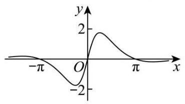

A. $y = \frac{g\left( x\right) }{f\left( x\right) }$ B. $y = \frac{f\left( x\right) }{g\left( x\right) }$

C. $y = f\left( x\right)  + g\left( x\right)  - 1$ D. $y = f\left( x\right)  - g\left( x\right)  - 1$

【答案】 $A$

3. (2024·上海金山·二模) 设 $f\left( x\right)  = {x}^{3} + a{x}^{2} + x\left( {a \in  R}\right)$ ,若 $y = f\left( x\right)$ 为奇函数,则曲线 $y = f\left( x\right)$ 在点 $\left( {0,0}\right)$ 处的切线方程为___.

【答案】 $y = x$

4. (2024·上海奉贤·二模) 已知定义域为 $R$ 的函数 $y = f\left( x\right)$ ,其图象是连续的曲线,且存在定义域也为 $R$ 的导函数 $y = {f}^{\prime }\left( x\right)$ .

(1)求函数 $f\left( x\right)  = {\mathrm{e}}^{x} + {\mathrm{e}}^{-x}$ 在点 $\left( {0, f\left( 0\right) }\right)$ 的切线方程；

(2) 已知 $f\left( x\right)  = a\cos x + b\sin x$ ，当 $a$ 与 $b$ 满足什么条件时，存在非零实数 $k$ ，对任意的实数 $x$ 使得 $f\left( {-x}\right) \; =  - k{f}^{\prime }\left( x\right)$ 恒成立?

(3)若函数 $y = f\left( x\right)$ 是奇函数，且满足 $f\left( x\right)  + f\left( {2 - x}\right)  = 3$ . 试判断 ${f}^{\prime }\left( {x + 2}\right)  = {f}^{\prime }\left( {2 - x}\right)$ 对任意的实数 $x$ 是否恒成立, 请说明理由.

【答案】(1) $y = 2$

(2)答案见解析

(3)恒成立，理由见解析

5. (2024·上海杨浦·二模)已知 $f\left( x\right)  = \sin {\omega x}\left( {\omega  > 0}\right)$ .

(1)若 $y = f\left( x\right)$ 的最小正周期为 ${2\pi }$ ，判断函数 $F\left( x\right)  = f\left( x\right)  + f\left( {x + \frac{\pi }{2}}\right)$ 的奇偶性，并说明理由；

(2) 已知 $\omega  = 2,{\bigtriangleup {ABC}}$ 中， $a, b, c$ 分别是角 $A, B, C$ 所对的边，若 $f\left( {A + \frac{\pi }{3}}\right)  = 0,{a = 2}, b = 3$ ， 求 $c$ 的值.

【答案】(1) 非奇非偶函数,理由见解析;

(2) $c = \frac{3\sqrt{3} \pm  \sqrt{7}}{2}$ .

6. (2024·上海静安·二模) 已知 $k \in  R$ ,记 $f\left( x\right)  = {a}^{x} + k \cdot  {a}^{-x}\left( {a > 0\text{ 且 }a \neq  1}\right)$ .

(1) 当 $a = \mathrm{e}$ (e 是自然对数的底) 时,试讨论函数 $y = f\left( x\right)$ 的单调性和最值;

(2)试讨论函数 $y = f\left( x\right)$ 的奇偶性；

(3)拓展与探究:

① 当 $k$ 在什么范围取值时,函数 $y = f\left( x\right)$ 的图象在 $x$ 轴上存在对称中心？请说明理由；

②请提出函数 $y = f\left( x\right)$ 的一个新性质,并用数学符号语言表达出来. (不必证明)

【答案】(1)详见解析;

(2)详见解析；

(3) ① 当 $k < 0$ 时，函数 $y = f\left( x\right)$ 有对称中心 $\left( {\frac{1}{2}\log \left( {-k}\right) ,0}\right)$ ，理由见解析:② 答案见解析.

1、求极值、最值时，要求步骤规范，含参数时，要讨论参数的大小；

2、求函数最值时，不可想当然地认为极值点就是最值点，要通过比较才能下结论；

3、函数在给定闭区间上存在极值，一般要将极值与端点值进行比较才能确定最值.

## 三、题型三:指对幂函数

1. (2024.上海徐汇.二模) 在下列函数中,值域为 $R$ 的偶函数是 ( )

A. $y = {x}^{\frac{1}{3}}$ B. $y = \lg \left| x\right|$ C. $y = {\mathrm{e}}^{x} + {\mathrm{e}}^{-x}$ D. $y = {x}^{3}\cos x$

【答案】 $B$

2. (2024·上海杨浦·二模) 下列函数中,在区间 $\left( {0, + \infty }\right)$ 上为严格增函数的是 ( )

A. $f\left( x\right)  =  - \ln x$ B. $f\left( x\right)  = \left| {x - 1}\right|$ C. $f\left( x\right)  = \frac{1}{{2}^{x}}$ D. $f\left( x\right)  =  - \frac{1}{x}$

【答案】 $D$

3. (2024·上海闵行·二模)已知 $y = f\left( x\right) , x \in  R$ 为奇函数，当 $x > 0$ 时， $f\left( x\right)  = {\log }_{2}x - 1$ ，则集合 $\{ x \mid  f( \; \left. {-x) - f\left( x\right)  < 0}\right\}$ 可表示为 ( )

A. $\left( {2, + \infty }\right)$ B. $\left( {-\infty , - 2}\right)$

C. $\left( {-\infty , - 2}\right)  \cup  \left( {2, + \infty }\right)$ D. $\left( {-2,0}\right)  \cup  \left( {2, + \infty }\right)$

【答案】 $D$

4. (2024·上海松江·二模) 已知 $0 < a < 2$ ,函数 $y = \left\{  \begin{array}{ll} \left( {a - 2}\right) x + {4a} + 1, & x \leq  2 \\  2{a}^{x - 1}, & x > 2 \end{array}\right.$ ,若该函数存在最小值,则实数 $a$ 的取值范围是___.

【答案】 $\{ a \mid  0 < a \leq  \frac{1}{2}$ 或 $a = 1\}$

5. (2024·上海普陀·二模) 若实数 $a, b$ 满足 $a - {2b} \geq  0$ ,则 ${2}^{a} + \frac{1}{{4}^{b}}$ 的最小值为___.

【答案】 2

6. (2024·上海杨浦·二模) 若函数 $g\left( x\right)  = \left\{  \begin{array}{l} {2}^{x} - 1, x \leq  0, \\  f\left( x\right) , x > 0 \end{array}\right.$ 为奇函数,则函数 $y = f\left( x\right) , x \in  \left( {0, + \infty }\right)$ 的值域为 ___.

【答案】 $\left( {0,1}\right)$

7. (2024·上海静安·二模)函数 $y = \ln \frac{1 - x}{2 + x}$ 的定义域为___.

【答案】 $\left( {-2,1}\right)$

8. (2024·上海金山·二模)已知集合 $M = \{ 1,3,5,7,9\}$ ， $N = \left\{  {x\left| {\;{2}^{x} = 8}\right. }\right\}$ ，则 $M \cap  N =$ ___.

【答案】 \{3\}

9. (2024·上海长宁·二模)已知函数 $y = f\left( x\right)$ 是定义域为 $R$ 的奇函数，当 $x > 0$ 时， $f\left( x\right)  = {\log }_{2}x$ ，若 $f\left( a\right) \; > 1$ ，则实数 $a$ 的取值范围为___.

【答案】 $\{ a \mid   - \frac{1}{2} < a < 0$ 或 $a > 2\}$

10. (2024·上海青浦·二模) 已知 $f\left( x\right)  = \lg x - 1, g\left( x\right)  = \lg x - 3$ ,若 $\left| {f\left( x\right) }\right|  + \left| {g\left( x\right) }\right|  = \left| {f\left( x\right)  + g\left( x\right) }\right|$ ,则满足条件的 $x$ 的取值范围是___.

【答案】 $(0,{10}\rbrack  \cup  \lbrack {1000}, + \infty )$ ;

11. $\left( {{23} - {24}}\right.$ 高三下.上海浦东新·期中) 已知 $f\left( x\right)  = {2}^{x} + x$ ，则不等式 $f\left( \left| {{2x} - 3}\right| \right)  < 3$ 的解集为___.

【答案】 $\left( {1,2}\right)$

12. ( 23 - 24 高三下·上海浦东新·期中)已知 $y = f\left( x\right)$ 是奇函数，当 $x \geq  0$ 时， $f\left( x\right)  = {x}^{\frac{2}{3}}$ ，则 $f\left( {-\frac{8}{125}}\right)$ 的值是___.

【答案】 $- \frac{4}{25}/ - {0.16}$

13. $\left( {{23} - {24}}\right.$ 高三下.上海浦东新.期中 $)$ 已知集合 $A = \{ 0,1,2\}$ ，集合 $B = \left\{  {x \mid  {2}^{x} > 3}\right\}$ ，则 $A \cap  B =$ ___.

【答案】 $\{ 2\}$

14. (2024·上海黄浦·二模) 设 $a \in  R$ ,函数 $f\left( x\right)  = \frac{{2}^{x} + a}{{2}^{x} - 1}$ .

(1)求 $a$ 的值，使得 $y = f\left( x\right)$ 为奇函数；

(2)若 $f\left( 2\right)  = a$ ，求满足 $f\left( x\right)  > a$ 的实数 $x$ 的取值范围.

【答案】 $\left( 1\right) a = 1$

(2) $\left( {0,2}\right)$

## 四、题型四:函数的综合应用

1. (2024·上海松江·二模)已知某个三角形的三边长为 $a$ 、 $b$ 及 $c$ ，其中 $a < b$ . 若 $a$ ， $b$ 是函数 $y = a{x}^{2} - {bx} \; + c$ 的两个零点,则 $a$ 的取值范围是 ( )

A. $\left( {\frac{1}{2},1}\right)$ B. $\left( {\frac{1}{2},\frac{\sqrt{5} - 1}{2}}\right)$ C. $\left( {0,\frac{\sqrt{5} - 1}{2}}\right)$ D. $\left( {\frac{\sqrt{5} - 1}{2},1}\right)$

【答案】 $B$

2. ( 2024 ·上海青浦 · 二模 )对于函数 $y = f\left( x\right)$ ，其中 $f\left( x\right)  = \left\{  \begin{array}{l} {\left( x - 1\right) }^{3},0 \leq  x < 2, \\  \frac{2}{x}, \circ   \circ   \circ  x \geq  2 \end{array}\right.$ ，若关于 $x$ 的方程 $f\left( x\right)  = {kx}$ 有两个不同的根，则实数 $k$ 的取值范围是 ___.

【答案】 $\left( {{0}^{ \circ  },{}^{ \circ  }\frac{1}{2}}\right)$

3. (2024·上海长宁·二模) 甲、乙、丙三辆出租车 2023 年运营的相关数据如下表:

<table><tr><td></td><td>甲</td><td>乙</td><td>丙</td></tr><tr><td>接单量 $t\left( \text{ 单 }\right)$</td><td>7831</td><td>8225</td><td>8338</td></tr><tr><td>油费 $s$ (元)</td><td>107150</td><td>110264</td><td>110376</td></tr><tr><td>平均每单里程 $k$ (公里)</td><td>15</td><td>15</td><td>15</td></tr><tr><td>平均每公里油费 $a$ (元)</td><td>0.7</td><td>0.7</td><td>0.7</td></tr></table>

出租车空驶率 $= \frac{\text{ 出租车没有载客行驶的里程 }}{\text{ 出租车行驶的总里程 }}$ ; 依据以述数据,小明建立了求解三辆车的空驶率的模型 $u \; = f\left( {s, t, k, a}\right)$ ，并求得甲、乙、丙的空驶率分别为23.26%、21.68%、 $x$ %，则 $x =$ ___(精确到 0.01) 【答案】20.68

4. (2024·上海徐汇·二模) 已知函数 $y = f\left( x\right)$ ,其中 $f\left( x\right)  = {\log }_{\frac{1}{2}}\frac{2 + x}{x - 2}$ .

(1)求证: $y = f\left( x\right)$ 是奇函数；

(2)若关于 $x$ 的方程 $f\left( x\right)  = {\log }_{\frac{1}{2}}\left( {x + k}\right)$ 在区间 $\left\lbrack  {3,4}\right\rbrack$ 上有解，求实数 $k$ 的取值范围.

【答案】(1)证明见解析

(2) $\left\lbrack  {-1,2}\right\rbrack$

5. (2024·上海金山·二模)已知函数 $y = f\left( x\right)$ ，记 $f\left( x\right)  = \sin \left( {{\omega x} + \varphi }\right)$ ， $\omega  > 0$ ， $0 < \varphi  < \pi$ ， $x \in  R$ .

(1)若函数 $y = f\left( x\right)$ 的最小正周期为 $\pi$ ，当 $f\left( \frac{\pi }{6}\right)  = 1$ 时，求 $\omega$ 和 $\varphi$ 的值；

(2) 若 $\omega  = 1,\varphi  = \frac{\pi }{6}$ ,函数 $y = {f}^{2}\left( x\right)  - {2f}\left( x\right)  - a$ 有零点,求实数 $a$ 的取值范围.

【答案】 $\left( 1\right) \omega  = 2,\varphi  = \frac{\pi }{6}$

(2) $a \in  \left\lbrack  {-1,3}\right\rbrack$

## 五、题型五:函数新定义问题

1. $\left( {{2024} \cdot  }\right.$ 上海普陀 $\cdot$ 二模 $)$ 对于函数 $y = f\left( x\right) , x \in  {D}_{1}$ 和 $y = g\left( x\right) , x \in  {D}_{2}$ ,设 ${D}_{1} \cap  {D}_{2} = D$ ,若 ${x}_{1},{x}_{2} \in \; D$ ,且 ${x}_{1} \neq  {x}_{2}$ ,皆有 $\left| {f\left( {x}_{1}\right)  - f\left( {x}_{2}\right) }\right|  \leq  t\left| {g\left( {x}_{1}\right)  - g\left( {x}_{2}\right) }\right| \left( {t > 0}\right)$ 成立,则称函数 $y = f\left( x\right)$ 与 $y = g\left( x\right)$ “具有性质 $H\left( t\right)$ ”.

(1)判断函数 $f\left( x\right)  = {x}^{2}, x \in  \left\lbrack  {1,2}\right\rbrack$ 与 $g\left( x\right)  = {2x}$ 是否 “具有性质 $H\left( 2\right)$ ” ，并说明理由;

( 2 )若函数 $f\left( x\right)  = 2 + {x}^{2}, x \in  (0,1\rbrack$ 与 $g\left( x\right)  = \frac{1}{x}$ ___不具有性质 $H\left( t\right)$ ″，求 $t$ 的取值范围；

(3)若函数 $f\left( x\right)  = \frac{1}{{x}^{2}} + {2\ln x} - 3$ 与 $y = g\left( x\right)$ “具有性质 $H\left( 1\right)$ ” ，且函数 $y = g\left( x\right)$ 在区间 $\left( {0, + \infty }\right)$ 上存在两个零点 ${x}_{1},{x}_{2}$ ,求证 ${x}_{1}^{2} + {x}_{2}^{2} > 2$ .

【答案】(1)答案见解析

(2) $\lbrack 2, + \infty )$

(3)证明见解析

2. (2024·上海杨浦·二模) 函数 $y = f\left( x\right) \text{ 、 }y = g\left( x\right)$ 的定义域均为 $R$ ,若对任意两个不同的实数 $a, b$ ,均有 $f\left( a\right)  + g\left( b\right)  > 0$ 或 $f\left( b\right)  + g\left( a\right)  > 0$ 成立,则称 $y = f\left( x\right)$ 与 $y = g\left( x\right)$ 为相关函数对.

(1)判断函数 $f\left( x\right)  = x + 1$ 与 $g\left( x\right)  =  - x + 1$ 是否为相关函数对，并说明理由;

(2)已知 $f\left( x\right)  = {\mathrm{e}}^{x}$ 与 $g\left( x\right)  =  - x + k$ 为相关函数对，求实数 $k$ 的取值范围；

(3) 已知函数 $y = f\left( x\right)$ 与 $y = g\left( x\right)$ 为相关函数对,且存在正实数 $M$ ,对任意实数 $x \in  R$ ,均有 $\left| {f\left( x\right) }\right|  \leq  M$ . 求证: 存在实数 $m, n\left( {m < n}\right)$ ,使得对任意 $x \in  \left( {m, n}\right)$ ,均有 $f\left( x\right)  + g\left( x\right)  \geq   - \frac{1}{2024}$ .

【答案】(1) 是, 理由见解析;

(2) $k \geq   - 1$

(3)证明见解析；

3. (2024·上海黄浦·二模)若函数 $y = f\left( x\right)$ 的图象上的两个不同点处的切线互相重合，则称该切线为函数 $y \; = f\left( x\right)$ 的图象的 “自公切线”,称这两点为函数 $y = f\left( x\right)$ 的图象的一对 “同切点”.

(1)分别判断函数 ${f}_{1}\left( x\right)  = \sin x$ 与 ${f}_{2}\left( x\right)  = \ln x$ 的图象是否存在 “自公切线”，并说明理由；

( 2 )若 $a \in  R$ ，求证:函数 $g\left( x\right)  = \tan x - x + a\left( {x \in  \left( {-\frac{\pi }{2},\frac{\pi }{2}}\right) }\right)$ 有唯一零点且该函数的图象不存在 “自公切线”;

(3) 设 $n \in  {N}^{ * }, h\left( x\right)  = \tan x - x + {n\pi }\left( {x \in  \left( {-\frac{\pi }{2},\frac{\pi }{2}}\right) }\right)$ 的零点为 ${x}_{n}, t \in  \left( {-\frac{\pi }{2},\frac{\pi }{2}}\right)$ ，求证: “存在 $s \in  ({2\pi }$ , $+ \infty )$ ,使得点 $\left( {s,\sin s}\right)$ 与 $\left( {t,\sin t}\right)$ 是函数 $y = \sin x$ 的图象的一对 ‘同切点’” 的充要条件是 “ $t$ 是数列 $\left\{  {x}_{n}\right\}$ 中的项”.

【答案】(1) 函数 ${f}_{1}\left( x\right)$ 的图象存在 “自公切线”; 函数 ${f}_{2}\left( x\right)$ 的图象不存在 “自公切线”,理由见解析;

(2)证明见解析；

(3)证明见解析.

4. ( 2024 ・上海虹口 · 二模)若函数 $y = f\left( x\right)$ 满足:对任意 ${x}_{1},{x}_{2} \in  R,{x}_{1} + {x}_{2} \neq  0$ ，都有 $\frac{f\left( {x}_{1}\right)  + f\left( {x}_{2}\right) }{{x}_{1} + {x}_{2}} > 0$ ， 则称函数 $y = f\left( x\right)$ 具有性质 $P$ .

(1)设 $f\left( x\right)  = {\mathrm{e}}^{x}$ ， $g\left( x\right)  = {x}^{3} + x$ ，分别判断 $y = f\left( x\right)$ 与 $y = g\left( x\right)$ 是否具有性质 $P$ ？并说明理由；

(2)设 $f\left( x\right)  = x + a\sin {2x}$ 函数 $y = f\left( x\right)$ 具有性质 $P$ ，求实数 $a$ 的取值范围；

(3) 已知函数 $y = f\left( x\right)$ 具有性质 $P$ ,且图像是一条连续曲线,若 $y = f\left( x\right)$ 在 $R$ 上是严格增函数,求证: $y \; = f\left( x\right)$ 是奇函数.

【答案】 $\left( 1\right) y = f\left( x\right)$ 不具有性质 $P, y = g\left( x\right)$ 具有性质 $P$

(2) $\left\lbrack  {-\frac{1}{2},\frac{1}{2}}\right\rbrack$

(3)证明见解析

5. (2024·上海金山·二模) 已知函数 $y = f\left( x\right)$ 与 $y = g\left( x\right)$ 有相同的定义域 $D$ . 若存在常数 $a\left( {a \in  R}\right)$ ,使得对于任意的 ${x}_{1} \in  D$ ,都存在 ${x}_{2} \in  D$ ,满足 $f\left( {x}_{1}\right)  + g\left( {x}_{2}\right)  = a$ ,则称函数 $y = g\left( x\right)$ 是函数 $y = f\left( x\right)$ 关于 $a$ 的 “ $S$ 函数”.

(1)若 $f\left( x\right)  = \ln x$ ， $g\left( x\right)  = {\mathrm{e}}^{x}$ ，试判断函数 $y = g\left( x\right)$ 是否是 $y = f\left( x\right)$ 关于 0 的 “ $S$ 函数”，并说明理由；

(2)若函数 $y = f\left( x\right)$ 与 $y = g\left( x\right)$ 均存在最大值与最小值，且函数 $y = g\left( x\right)$ 是 $y = f\left( x\right)$ 关于 $a$ 的“ $S$ 函数”， $y = f\left( x\right)$ 又是 $y = g\left( x\right)$ 关于 $a$ 的 “ $S$ 函数”,证明: ${\left\lbrack  f\left( x\right) \right\rbrack  }_{\min } + {\left\lbrack  g\left( x\right) \right\rbrack  }_{\max } = a$ ;

(3) 已知 $f\left( x\right)  = \left| {x - 1}\right| , g\left( x\right)  = \sqrt{x}$ ,其定义域均为 $\left\lbrack  {0, t}\right\rbrack$ . 给定正实数 $t$ ,若存在唯一的 $a$ ,使得 $y = g\left( x\right)$ 是 $y = f\left( x\right)$ 关于 $a$ 的 “ $S$ 函数”,求 $t$ 的所有可能值.

【答案】(1) 不是, 理由见解析

(2)证明见解析

(3) $t$ 的所有可能值为 1 或 $\frac{3 + \sqrt{5}}{2}$

专题 01 集合与常用逻辑用语 ()

## 二模新速递

## 选题列表

1. 上海杨浦.二模 2024·上海奉贤·二模

2. 上海浦东·二模 2024·上海青浦·二模

3. 上海黄浦·二模 2024·上海闵行·二模

4. 上海普陀·二模 2024·上海金山·二模

5. $\cdot$ 上海徐汇·二模 2024·上海静安·二模

6. 上海松江·二模 2024·上海长宁·二模

7. 上海嘉定·二模 2024·上海崇明·二模

8. $\cdot$ 上海虹口 $\cdot$ 二模 2024·上海宝山·二模

## 汇编目录

题型一:集合，13题

题型二:常用逻辑用语，10题

## 一、题型一:集合，13题

1. (2024·上海松江·二模) 已知集合 $A = \{ x \mid  0 \leq  x \leq  4\} ,\;B = \{ x \mid  x = {2n}, n \in  Z\}$ ，则 $A \cap  B =$ ( )

A. $\{ 1,2\}$ B. $\{ 2,4\}$ C. $\{ 0,1,2\}$ D. $\{ 0,2,4\}$

【答案】 $D$

2. (2024·上海静安·二模) 如果一个非空集合 $G$ 上定义了一个运算 $*$ ,满足如下性质,则称 $G$ 关于运算 $*$ 构成一个群.

(1)封闭性，即对于任意的 $a, b \in  G$ ，有 $a * b \in  G$ ；

(2) 结合律,即对于任意的 $a, b, c \in  G$ ,有 $\left( {a * b}\right)  * c = a * \left( {b * c}\right)$ ;

(3) 对于任意的 $a, b \in  G$ ,方程 $x * a = b$ 与 $a * y = b$ 在 $G$ 中都有解.

例如,整数集 $Z$ 关于整数的加法 (+) 构成群,因为任意两个整数的和还是整数,且满足加法结合律,对于

任意的 $a, b \in  Z$ ,方程 $x + a = b$ 与 $a + y = b$ 都有整数解; 而实数集 $R$ 关于实数的乘法 $\left( \times \right)$ 不构成群,因为方程 $0 \times  y = 1$ 没有实数解.

以下关于 “群” 的真命题有 ( )

① 自然数集 $N$ 关于自然数的加法 (+) 构成群;

②有理数集 $Q$ 关于有理数的乘法 ( $\times$ ) 构成群;

③平面向量集关于向量的数量积 (·) 构成群；

④复数集 $C$ 关于复数的加法 (+) 构成群.

A. 0 个; B. 1 个; C. 2 个; D. 3 个.

【答案】 $B$

3. (2024·上海普陀·二模)已知 $a \in  R$ ，设集合 $A = \{ 1, a,4\}$ ，集合 $B = \{ 1, a + 2\}$ ，若 $A \cap  B = B$ ，则 $a =$ ___.

【答案】 2

4. (2024·上海徐汇·二模) 已知集合 $A = \left\{  {y \mid  y = {x}^{2} + 2}\right\}$ ，集合 $B = \left\{  {x \mid  {x}^{2} - {4x} + 3 \geq  0}\right\}$ ，那么 $A \cap  B =$ ___. 【答案】 $\lbrack 3, + \infty )$

5. (2024·上海杨浦·二模) 已知集合 $A = \left( {0,4}\right)$ ， $B = \left( {1,5}\right)$ ，则 $A \cap  B =$ ___.

【答案】 $\left( {1,4}\right)$

6. (2024·上海闵行·二模)集合 $A = \{ x \mid  {{2x} + 1 \leq  0}\}$ ， $B = \{  - 2, - 1,0\}$ ，则 $A \cap  B =$ ___.

【答案】 $\{  - 2, - 1\}$

7. (2024·上海静安·二模) 中国国旗上所有颜色组成的集合为___.

【答案】\{红, 黄\};

8. (2024·上海虹口·二模)已知集合 $A = \{ x \mid  \tan x < 0\}$ ， $B = \left\{  {x\left| {\;\frac{x - 2}{x} \leq  0}\right. }\right\}$ ，则 $A \cap  B =$ ___.

【答案】 $\left\{  {x\left| {\;\frac{\pi }{2} < x \leq  2}\right. }\right\}$

9. $\left( {{2024} \cdot  \text{ 上海黄浦. 二模 }}\right)$ 若集合 $A = \left\lbrack  {1,4}\right\rbrack  , B = \left\lbrack  {2,5}\right\rbrack$ ，则 $A \cup  B =$ ___.

【答案】 $\left\lbrack  {1,5}\right\rbrack$

10. (2024·上海崇明·二模)若集合 $A = \left\{  {{}^{ \circ  } \circ   - 2,{}^{ \circ  }0,{}^{ \circ  }1}\right\}  , B = \left\{  {{}^{ \circ  } \circ  x \mid  x <  - 1\text{ 或 }x > 0 \circ   \circ  }\right\}  ,$ 则 $A \cap  B \; =$ ___.

【答案】 $\{  - 2,1\} /\{ 1, - 2\}$

11. (2024·上海金山·二模)已知集合 $M = \{ 1,3,5,7,9\}$ ， $N = \left\{  {x\left| {\;{2}^{x} = 8}\right. }\right\}$ ，则 $M \cap  N =$ ___.

【答案】 $\{ 3\}$

12. (2024·上海嘉定·二模) 若规定集合 $E = \{ 0,1,2,\cdots \cdots , n\}$ 的子集 $\left\{  {{a}_{1},{a}_{2},{a}_{3},\cdots ,{a}_{m}}\right\}$ 为 $E$ 的第 $k$ 个子集，其中 $k = {2}^{{a}_{1}} + {2}^{{a}_{2}} + {2}^{{a}_{3}} + \cdots \cdots  + {2}^{{a}_{m}}$ ,则 $E$ 的第 211 个子集是___.

【答案】 $\{ 0,1,4,6,7\}$

13. (2024·上海嘉定·二模)设集合 $A = \left\lbrack  {1,3}\right\rbrack$ ， $B = \left( {2,4}\right)$ ，则 $A \cup  B =$ ___.

【答案】 $\lbrack 1,4)$

## 二、题型二:常用逻辑用语, 10 题

1. (2024·上海松江·二模) 设 ${S}_{n}$ 为数列 $\left\{  {a}_{n}\right\}$ 的前 $n$ 项和,有以下两个命题:①若 $\left\{  {a}_{n}\right\}$ 是公差不为零的等差数列且 $k \in  N, k \geq  2$ ,则 ${S}_{1} \cdot  {S}_{2}\cdots {S}_{{2k} - 1} = 0$ 是 ${a}_{1} \cdot  {a}_{2}\cdots {a}_{k} = 0$ 的必要非充分条件; ②若 $\left\{  {a}_{n}\right\}$ 是等比数列且 $k \in  N, k \geq  2$ ,则 ${S}_{1} \cdot  {S}_{2}\cdots {S}_{k} = 0$ 的充要条件是 ${a}_{k} + {a}_{k + 1} = 0$ . 那么 ( )

A. ①是真命题，②是假命题 B. ①是假命题，①是真命题

C. ①、②都是真命题 D. ①、②都是假命题

【答案】 $C$

2. (2024·上海徐汇·二模) 三棱锥 $P - {ABC}$ 各顶点均在半径为 $2\sqrt{2}$ 的球 $O$ 的表面上， ${AB} = {AC} = {2\sqrt{2}}$ ， $\angle {BAC} = {90}^{ \circ  }$ ,二面角 $P - {BC} - A$ 的大小为 ${45}^{ \circ  }$ ,则对以下两个命题,判断正确的是 ( )

①三棱锥 $O - {ABC}$ 的体积为 $\frac{8}{3}$ ；②点 $P$ 形成的轨迹长度为 $2\sqrt{6}\pi$ .

A. ①②都是真命题 B. ①是真命题，②是假命题

C. ①是假命题，②是真命题 D. ①②都是假命题

【答案】 $A$

3. (2024·上海闵行·二模)已知 $f\left( x\right)  = \sin x$ ，集合 $D = \left\lbrack  {-\frac{\pi }{2},\frac{\pi }{2}}\right\rbrack$ ， $\Gamma  = \{ \left( {x, y}\right)  \mid  {2f}\left( x\right)  + f\left( y\right)  = 0, x, y \in  D\}$ ，

$\Omega  = \{ \left( {x, y}\right)  \mid  {2f}\left( x\right)  + f\left( y\right)  \geq  0, x, y \in  D\}$ . 关于下列两个命题的判断,说法正确的是 ( )

命题①:集合 $\Gamma$ 表示的平面图形是中心对称图形；

命题②: 集合 $\Omega$ 表示的平面图形的面积不大于 $\frac{5{\pi }^{2}}{12}$ .

A. ①真命题；②假命题 B. ①假命题；②真命题

C. ①真命题；②真命题 D. ①假命题；②假命题

【答案】 $A$

4. (2024·上海闵行·二模) 设 $a \in  R$ ,则 “ ${a}^{2} > 1$ ” 是 “ ${a}^{3} > 1$ ” 的 ( )

A. 充分非必要条件 B. 必要非充分条件 C. 充要条件 D. 既非充分又非必要条件

【答案】 $B$

5. (2024·上海崇明·二模)已知函数 $y = f\left( x\right)$ 的定义域为 $D,{}^{ \circ  } \circ  {}^{ \circ  }{x}_{1},{}^{ \circ  } \circ  {}^{ \circ  }{x}_{2}{}^{ \circ  } \in  D$ .

命题 $p$ : 若当 $f\left( {x}_{1}\right)  + f\left( {x}_{2}\right)  = 0$ 时,都有 ${x}_{1}{}^{ \circ  } + {x}_{2}{}^{ \circ  } = 0$ ,则函数 $y = f\left( x\right)$ 是 $D$ 上的奇函数.

命题 $q$ : 若当 $f\left( {x}_{1}\right)  < f\left( {x}_{2}\right)$ 时,都有 ${x}_{1}{}^{ \circ  } < {x}_{2}$ ,则函数 $y = f\left( x\right)$ 是 $D$ 上的增函数.

下列说法正确的是 ( )

A. $p$ 、 $q$ 都是真命题 B. $p$ 是真命题, $q$ 是假命题

C. $p$ 是假命题, $q$ 是真命题 D. $p\text{ 、 }q$ 都是假命题

【答案】 $C$

6. (2024·上海长宁·二模)设 $z \in  C$ ，则 “ $z = \bar{z}$ ” 是 “ $z \in  R$ ” 的 ( )

A. 充分不必要条件 B. 必要不充分条件 C. 充要条件 D. 既不充分也不必要条件

【答案】 $C$

7. $\left( {{23} - {24}}\right.$ 高三下.上海浦东新·期中) “ $a = 1$ ” 是 “直线 ${ax} - {2y} - 2 = 0$ 与直线 $x - \left( {a + 1}\right) y + 1 = 0$ 平行” 的 ( )

A. 充分非必要条件 B. 必要非充分条件 C. 充要条件 D. 既非充分又非必要条件

【答案】 $C$

8. $\left( {{2024} \cdot  }\right.$ 上海青浦 $\cdot$ 二模 $)$ 已知点 $P\left( {2,2\sqrt{2}}\right)$ 是抛物线 $C : {y}^{2} = {2px}\left( {p > 0}\right)$ 上一点到抛抛物线 $C$ 的准线的距离为 $d, M$ 是 $x$ 轴上一点,则 “点 $M$ 的坐标为 $\left( {1,0}\right)$ ” 是 “ $d = \left| {PM}\right|$ ” 的 ( )

A. 充分不必要条件 B. 必要不充分条件

C. 充要条件 D. 既不充分也不必要条件,

【答案】 $A$

9. (2024·上海普陀·二模)设等比数列 $\left\{  {a}_{n}\right\}$ 的公比为 $q\left( {n \geq  1, n \in  N}\right)$ ，则 “ ${12}{a}_{2},{a}_{4},2{a}_{3},{a}_{4},2{a}_{3}$ 成等差数列” 的一个充分非必要条件是___.

【答案】 $q = 3$ (或 $q =  - 2$ ,答案不唯一)

10. (2024·上海青浦·二模) 若无穷数列 $\left\{  {a}_{n}\right\}$ 满足:存在正整数 $T$ ，使得 ${a}_{n + T} = {a}_{n}$ 对一切正整数 $n$ 成立，则称 $\left\{  {a}_{n}\right\}$ 是周期为 $T$ 的周期数列.

(1)若 ${a}_{n} = \sin \left( {\frac{\pi n}{m} + \frac{\pi }{3}}\right)$ (其中正整数 $m$ 为常数， $n \in  N, n \geq  1$ )，判断数列 $\left\{  {a}_{n}\right\}$ 是否为周期数列，并说明理由;

( 2 )若 ${a}_{n + 1} = {a}_{n} + \sin {a}_{n}\left( {n \in  N, n \geq  1}\right)$ ，判断数列 $\left\{  {a}_{n}\right\}$ 是否为周期数列，并说明理由；

(3)设 $\left\{  {b}_{n}\right\}$ 是无穷数列，已知 ${a}_{n + 1} = {b}_{n} + \sin {a}_{n}\left( {n \in  N, n \geq  1}\right)$ . 求证: “存在 ${a}_{1}$ ，使得 $\left\{  {a}_{n}\right\}$ 是周期数列” 的充要条件是 “ $\left\{  {b}_{n}\right\}$ 是周期数列”.

【答案】 $\left( 1\right) \left\{  {a}_{n}\right\}$ 是周期为 ${2m}$ 的周期数列,理由见解析

(2)答案见解析

(3)证明见解析

专题 07 解析几何 (七大题型, )

## 二模新速递

## 选题列表

1. 上海杨浦.二模 2024·上海奉贤·二模

2.·上海浦东·二模 2024·上海青浦·二模

3. ·上海黄浦·二模 2024·上海闵行·二模

4. 上海普陀·二模 2024·上海金山·二模

5. 2024·上海静安·二模

6. 上海松江·二模 2024·上海长宁·二模

7. $\cdot$ 上海嘉定·二模 2024·上海崇明·二模

8. 上海虹口.二模 2024.上海宝山.二模

## 汇编目录

题型一:直线与方程 .2

题型二: 圆与方程 .5

题型三:曲线与方程 .10

题型四:椭圆 .13

题型五:双曲线 .19

题型六:抛物线 .23

题型七:圆锥曲线的综合问题 .26

## 一、题型一: 直线与方程

1. ( 2024 上海杨浦 二模)平面上的向量 $\overrightarrow{a}$ 、 $\overrightarrow{b}$ 满足: $\left| \overrightarrow{a}\right|  = 3$ ， $\left| \overrightarrow{b}\right|  = 4$ ， $\overrightarrow{a} \bot  \overrightarrow{b}$ . 定义该平面上的向量集合 $A \; = \{ \overrightarrow{x}\left| \right| \overrightarrow{x} + \overrightarrow{a}\left|  < \right| \overrightarrow{x} + \overrightarrow{b} \mid  ,\overrightarrow{x} \cdot  \overrightarrow{a} > \overrightarrow{x} \cdot  \overrightarrow{b}\}$ . 给出如下两个结论:

①对任意 $\overrightarrow{c} \in  A$ ，存在该平面的向量 $\overrightarrow{d} \in  A$ ，满足 $\left| {\overrightarrow{c} - \overrightarrow{d}}\right|  = {0.5}$

②对任意 $\overrightarrow{c} \in  A$ ，存在该平面向量 $\overrightarrow{d} \notin  A$ ，满足 $\left| {\overrightarrow{c} - \overrightarrow{d}}\right|  = {0.5}$

则下面判断正确的为 ( )

A. ①正确，②错误 B. ①错误，②正确 C. ①正确，②正确 D. ①错误，②错误

【答案】 $C$

2. $\left( {{23} - {24}}\right.$ 高三下.上海浦东新.二模 $)``a = 1$ ” 是 “直线 ${ax} - {2y} - 2 = 0$ 与直线 $x - \left( {a + 1}\right) y + 1 = 0$ 平行” 的 ( )

A. 充分非必要条件 B. 必要非充分条件 C. 充要条件 D. 既非充分又非必要条件

【答案】 $C$

3. (2024·上海奉贤·二模) 函数 $y = \sin \left( {{wx} + \varphi }\right) \left( {w > 0,\left| \varphi \right|  < \frac{\pi }{2}}\right)$ 的图像记为曲线 $F$ ,如图所示. $A, B, C$ 是曲线 $F$ 与坐标轴相交的三个点,直线 ${BC}$ 与曲线 $F$ 的图像交于点 $M$ ,若直线 ${AM}$ 的斜率为 ${k}_{1}$ ,直线 ${BM}$ 的斜率为 ${k}_{2},{k}_{2} \neq  2{k}_{1}$ ，则直线 ${AB}$ 的斜率为___.(用 ${k}_{1},{k}_{2}$ 表示)

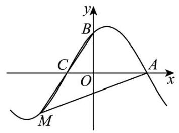

【答案】 $\frac{{k}_{1}{k}_{2}}{2{k}_{1} - {k}_{2}}$

4. (2024·上海青浦·二模) 已知直线 ${l}_{1}$ 的倾斜角比直线 ${l}_{2} : y = x\tan {80}^{ \circ  }$ 的倾斜角小 ${20}^{ \circ  }$ ,则 ${l}_{1}$ 的斜率为 ___.

【答案】 $\sqrt{3}$

5. (2024·上海长宁·二模)直线: ${2x} - y - 3 = 0$ 与直线 $x - {3y} - 5 = 0$ 的夹角大小为___.

【答案】 $\frac{\pi }{4}/{45}^{ \circ  }$

## 二、题型二: 圆与方程

1. (2024·上海普陀·二模) 直线 $l$ 经过定点 $P\left( {2,1}\right)$ ,且与 $x$ 轴正半轴、 $y$ 轴正半轴分别相交于 $A, B$ 两点, $O$ 为坐标原点,动圆 $M$ 在 $\bigtriangleup {OAB}$ 的外部,且与直线 $l$ 及两坐标轴的正半轴均相切,则 $\bigtriangleup {OAB}$ 周长的最小值是 ( )

A. 3 B. 5 C. 10 D. 12

【答案】 $C$

2. (23-24 高三下·上海·七宝模拟) 在平面直角坐标系 ${xOy}$ 中,已知 $P$ 是圆 $C : {\left( x - 3\right) }^{2} + {\left( y - 4\right) }^{2} = 1$ 上的动点,若 $A\left( {-a,0}\right) , B\left( {a,0}\right) , a \neq  0$ ,则 $\left| {\overrightarrow{PA} + \overrightarrow{PB}}\right|$ 的最小值为___.

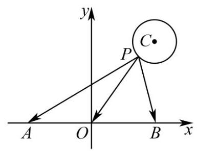

【答案】 8

3. $\left( {{23} - {24}}\right.$ 高三下. 上海浦东新. 二模 $)$ 已知圆 ${C}_{1} : {x}^{2} + {y}^{2} - {2ax} + {a}^{2} - 1 = 0\left( {a > 0}\right)$ ,圆 ${C}_{2} : {x}^{2} + {y}^{2} - {4y} - 5 \; = 0$ ，若两圆相交，则实数 $a$ 的取值范围为___.

【答案】 $\left( {0,2\sqrt{3}}\right)$

4. (2024·上海静安·二模) 江南某公园内正在建造一座跨水拱桥. 如平面图所示, 现已经在地平面以上造好了一个外沿直径为 20 米的半圆形拱桥洞,地平面与拱桥洞外沿交于点 $A$ 与点 $B$ . 现在准备以地平面上的点 $C$ 与点 $D$ 为起点建造上、下桥坡道,要求: ① $\left| {BD}\right|  = \left| {AC}\right|$ ; ②在拱桥洞左侧建造平面图为直线的坡道,坡度为 $1 : 2\sqrt{2}$ (坡度为坡面的垂直高度和水平方向的距离的比); ③在拱桥洞右侧建造平面图为圆弧的坡道; ④在过桥的路面上骑车不颠簸.

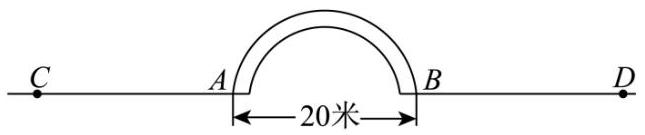

(1)请你设计一条过桥道路，画出大致的平面图，并用数学符号语言刻画与表达出来；

(2)并按你的方案计算过桥道路的总长度；(精确到 0.1 米)

(3)若整个过桥坡道的路面宽为 10 米，且铺设坡道全部使用混凝土. 请设计出所铺设路面的相关几何体， 提出一个实际问题, 写出解决该问题的方案, 并说明理由 (如果需要, 可通过假设的运算结果列式说明, 不必计算).

【答案】(1)答案见解析

(2)答案见解析

(3)答案见解析

## 三、题型三:曲线与方程

1. (2024·上海徐汇·二模)三棱锥 $P - {ABC}$ 各顶点均在半径为 $2\sqrt{2}$ 的球 $O$ 的表面上， ${AB} = {AC} = {2\sqrt{2}}$ ， $\angle {BAC} = {90}^{ \circ  }$ ，二面角 $P - {BC} - A$ 的大小为 ${45}^{ \circ  }$ ，则对以下两个命题，判断正确的是 ( )

①三棱锥 $O - {ABC}$ 的体积为 $\frac{8}{3}$ ；②点 $P$ 形成的轨迹长度为 $2\sqrt{6}\pi$ .

A. ①②都是真命题 B. ①是真命题，②是假命题

C. ①是假命题，②是真命题 D. ①②都是假命题

【答案】 $A$

2. (2024·上海奉贤·二模) 点 $P$ 是棱长为 1 的正方体 ${ABCD} - {A}_{1}{B}_{1}{C}_{1}{D}_{1}$ 棱上一点,则满足 $\left| {PA}\right|  + \left| {P{C}_{1}}\right|  = 2$ 的点 $P$ 的个数为___.

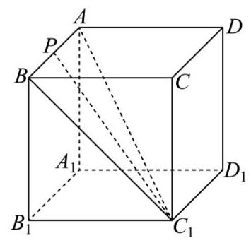

【答案】 6

3. (2024·上海虹口·二模)已知平面向量 $\overrightarrow{a},\overrightarrow{b}$ 满足 $\left| \overrightarrow{a}\right|  = 3$ ， $\left| \overrightarrow{b}\right|  = 4$ ， $\overrightarrow{a} \cdot  \overrightarrow{b} = 4$ ，若平面向量 $\overrightarrow{c}$ 满足 $\left| {\overrightarrow{c} - \overrightarrow{b}}\right|  = 1$ ， 则 $\left| {\overrightarrow{c} - \overrightarrow{a}}\right|$ 的最大值为___.

【答案】 $\sqrt{17} + 1/1 + \sqrt{17}$

4. (2024·上海静安·二模)我们称如图的曲线为 “爱心线”，其上的任意一点 $P\left( {x, y}\right)$ 都满足方程 ${x}^{2} - \; 2\left| x\right| y + {y}^{2} - \sqrt{2}\left| x\right|  + 2\sqrt{2}y = 0$ ,现将一边在 $x$ 轴上,另外两个顶点在爱心线上的矩形称为心吧. 若已知点 $M\left( {\frac{\sqrt{2}}{2}, - \sqrt{2}}\right)$ “爱心线” 上任意一点的最小距离为 $d$ ，则用 $d$ 表示心吧面积的最大值为___.

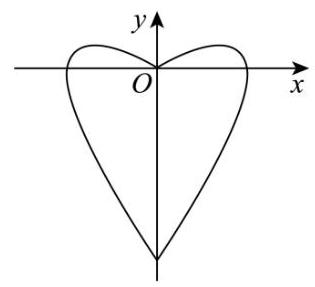

【答案】 $\frac{5}{2} - {d}^{2}$

## 四、题型四:椭圆

1. (2024·上海交大附中·模拟) 椭圆具有如下的声学性质:从一个焦点出发的声波经过椭圆反射后会经过另外一个焦点. 有一个具有椭圆形光滑墙壁的建筑, 某人站在一个焦点处大喊一声, 声音向各个方向传播后经墙壁反射 (不考虑能量损失)，该人先后三次听到了回音，其中第一、二次的回音较弱，第三次的回音较强; 记第一、二次听到回音的时间间隔为 $x$ ,第二、三次听到回音的时间间隔为 $y$ ,则椭圆的离心率为 ( )

A. $\frac{x}{{2x} + y}$ B. $\frac{x}{x + {2y}}$ C. $\frac{y}{{2x} + y}$ D. $\frac{y}{x + {2y}}$

【答案】 $B$

2. (2024·上海金山·二模) 若抛物线 ${y}^{2} = {2px}\left( {p > 0}\right)$ 的焦点是椭圆 $\frac{{x}^{2}}{16} + \frac{{y}^{2}}{4} = 1$ 的一个顶点,则 $p$ 的值为 ( ).

A. 2 B. 3 C. 4 D. 8

【答案】 $D$

3. $\left( {{23} - {24}}\right.$ 高三下，上海·七宝模拟) 若椭圆 $\frac{{x}^{2}}{{m}^{2}} + {y}^{2} = 1$ 的离心率为 $\frac{\sqrt{3}}{2}$ ，则 $m =$ ___.

【答案】 $\pm  2$ 或 $\pm  \frac{1}{2}$

4. (2024·上海青浦·二模) 椭圆 $\frac{{x}^{2}}{{a}^{2}} + {y}^{2} = 1{}^{ \circ  }\;\left( {a > 1}\right)$ 的离心率为 $\frac{\sqrt{3}}{2}$ ，则 $a =$ ___.

【答案】 2

5. (2024·上海浦东新·二模)已知椭圆 $C : \frac{{x}^{2}}{{a}^{2}} + \frac{{y}^{2}}{{b}^{2}} = 1\left( {a > b > 0}\right)$ 的左、右焦点分别是 ${F}_{1}$ 、 ${F}_{2}$ ，其离心率 $\mathrm{e} = \frac{\sqrt{3}}{2}$ ,过 ${F}_{1}$ 且垂直于 $x$ 轴的直线被椭圆 $C$ 截得的线段长为 1 .

(1)求椭圆 $C$ 的方程；

(2)点 $P$ 是椭圆 $C$ 上除长轴端点外的任一点，过点 $P$ 作斜率为 $k$ 的直线 $l$ ，使得 $l$ 与椭圆 $C$ 有且只有一个公共点,设直线 $P{F}_{1}\text{ 、 }P{F}_{2}$ 的斜率分别为 ${k}_{1}\text{ 、 }{k}_{2}$ ,若 $k \neq  0$ ,证明: $\frac{1}{k{k}_{1}} + \frac{1}{k{k}_{2}}$ 为定值,并求出这个定值;

(3) 点 $P$ 是椭圆 $C$ 上除长轴端点外的任一点,设 $\angle {F}_{1}P{F}_{2}$ 的角平分线 ${PM}$ 交椭圆 $C$ 的长轴于点 $M\left( {m,0}\right)$ , 求 $m$ 的取值范围.

【答案】 $\left( 1\right) \frac{{x}^{\circ 2}}{4} + {y}^{\circ 2} = 1$ ;

(2) $\frac{1}{k{k}_{1}} + \frac{1}{k{k}_{2}} =  - 8$ ，证明见解析；

(3) $- \frac{3}{2} < m < \frac{3}{2}$ .

6. (2024·上海普陀·二模)设椭圆 $\Gamma  : \frac{{x}^{2}}{{a}^{2}} + {y}^{2} = 1\left( {a > 1}\right)$ ， $\Gamma$ 的离心率是短轴长的 $\frac{\sqrt{2}}{4}$ 倍，直线 $l$ 交 $\Gamma$ 于 $A$ 、 $B$ 两点, $C$ 是 $\Gamma$ 上异于 $A\text{ 、 }B$ 的一点, $O$ 是坐标原点.

(1)求椭圆 $\Gamma$ 的方程；

(2)若直线 $l$ 过 $\Gamma$ 的右焦点 $F$ ，且 $\overrightarrow{CO} = \overrightarrow{OB}$ ， $\overrightarrow{CF} \cdot  \overrightarrow{AB} = 0$ ，求 ${S}_{\bigtriangleup {CBF}}$ 的值；

(3)设直线 $l$ 的方程为 $y = {kx} + m\left( {k, m \in  R}\right)$ ，且 $\overrightarrow{OA} + \overrightarrow{OB} = \overrightarrow{CO}$ ，求 $\left| \overrightarrow{AB}\right|$ 的取值范围.

【答案】 $\left( 1\right) \frac{{x}^{2}}{2} + {y}^{2} = 1$

(2) ${S}_{\bigtriangleup {CBF}} = 1$

(3) $(\sqrt{3},\sqrt{6}\rbrack$

## 五、题型五:双曲线

1. (2024·上海嘉定·二模) 双曲线: $\frac{{x}^{2}}{4} - \frac{{y}^{2}}{2} = 1$ 和双曲线 ${\Gamma }_{2} : \frac{{y}^{2}}{4} - \frac{{x}^{2}}{2} = 1$ 具有相同的 ( )

A. 焦点 B. 顶点 C. 渐近线 D. 离心率

【答案】 $D$

2. (2024·上海·二模) 双曲线 $\Gamma  : {}^{ \circ  }$ 。 ${x}^{2} - \frac{{y}^{2}}{6} = 1$ 。的左右焦点分别为 ${F}_{1}\text{ 、 }{F}_{2}$ ,过坐标原点的直线与 $\Gamma$ 相交于 $A\text{ 、 }B$ 两点，若 $\left| {{F}_{1}B}\right|  = 2\left| {{F}_{1}A}\right|$ ，则 $\overrightarrow{{F}_{2}A} \cdot  \overrightarrow{{F}_{2}B} =$ ___.

【答案】 4

3. (2024·上海金山·二模)已知双曲线 $C : \frac{{x}^{2}}{{a}^{2}} - \frac{{y}^{2}}{{b}^{2}} = 1\left( {a > 0, b > 0}\right)$ ，给定的四点 ${P}_{1}\left( {4, - 3}\right)$ 、 ${P}_{2}\left( {3,4}\right)$ 、 ${P}_{3}\left( {-4,3}\right) \text{ 、 }{P}_{4}\left( {-2,0}\right)$ 中恰有三个点在双曲线 $C$ 上，则该双曲线 $C$ 的离心率是___.

【答案】 $\frac{\sqrt{7}}{2}$

4. (23-24 高三下・上海浦东新·二模) 已知双曲线 $\frac{{x}^{2}}{{a}^{2}} - \frac{{y}^{2}}{{b}^{2}} = 1\left( {a > 0, b > 0}\right)$ 的焦点分别为 ${F}_{1}\text{ 、 }{F}_{2}, M$ 为双曲线上一点,若 $\angle {F}_{1}M{F}_{2} = \frac{2\pi }{3},{OM} = \frac{\sqrt{21}}{3}b$ ,则双曲线的离心率为___.

【答案】 $\frac{\sqrt{6}}{2}$

5. (2024·上海闵行·二模)我们把形如 ${C}_{1} : \frac{{x}^{2}}{{a}^{2}} - \frac{{y}^{2}}{{b}^{2}} = 1\left( {a > 0, b > 0}\right)$ 和 ${C}_{2} : \frac{{y}^{2}}{{b}^{2}} - \frac{{x}^{2}}{{a}^{2}} = 1\left( {a > 0, b > 0}\right)$ 的两个双曲线叫做共轭双曲线. 设共轭双曲线 ${C}_{1},{C}_{2}$ 的离心率分别为 ${\mathrm{e}}_{1},{\mathrm{e}}_{2}$ ,则 $\frac{2}{{\mathrm{e}}_{1}} + \frac{3}{{\mathrm{e}}_{2}}$ 的最大值是 ___.

【答案】 $\sqrt{13}$

6. (2024·上海普陀·二模) 已知抛物线 ${y}^{2} = 4\sqrt{3}x$ 的焦点 $F$ 是双曲线 $\Gamma$ 的右焦点,过点 $F$ 的直线 $l$ 的法向量 $\overrightarrow{n} = \left( {1, - \sqrt{3}}\right) , l$ 与 $y$ 轴以及 $\Gamma$ 的左支分别相交 $A, B$ 两点,若 $\overrightarrow{BF} = 2\overrightarrow{BA}$ ,则双曲线 $\Gamma$ 的实轴长为 ___.

【答案】 2

## 六、题型六:抛物线

1.(23-24高三下·上海·七宝模拟) 设 $O$ 为坐标原点， $F$ 为抛物线 ${y}^{2} = {4x}$ 的焦点， $A$ 是抛物线上一点， 若 $\overrightarrow{OA} \cdot  \overrightarrow{AF} =  - 4$ ,则点 $A$ 的个数为 ( )

A. 0 B. 1 C. 2 D. 3

【答案】 $C$

2. (2024·上海长宁·二模) 已知抛物线 $\Gamma  : {y}^{2} = {4x}$ 的焦点为 $F$ ，准线为 $l$ ，点 $M$ 在 $\Gamma$ 上， ${MN}\bot l$ ， $\angle {NFM} = \; {30}^{ \circ  }$ ,则点 $M$ 的横坐标为___.

【答案】 $\frac{1}{3}$

3. $\left( {{23} - {24}}\right.$ 高三下.上海 $\cdot$ 七宝模拟 $)$ 已知曲线 $C$ 由抛物线 ${x}^{2} = {4y}$ 及抛物线 ${x}^{2} = {4y}$ 及抛物线 ${x}^{2} =  - {4y}$ 组成，若 $A\left( {4,3}\right)$ ， $B \; \left( {4, - 3}\right) , D, E$ 是曲线 $C$ 上关于 $x$ 轴对称的两点， $A, B, D, E$ 四点不共线，其中点 $D$ 在第一象限，则四边形 ${ABED}$ 周长的最小值为___.

【答案】 $4 + 4\sqrt{5}$

4. (2024·上海交大附中·模拟) 已知 $A$ 、 $B$ 是抛物线 ${y}^{2} = {4x}$ 上的两个不同的点，且 $\left| {AB}\right|  = {10}$ ，若点 $M$ 为线段 $\left| {AB}\right|  = {10}$ 的中点，则 $M$ 到 $y$ 轴的距离的最小值为___.

【答案】 4

5. (2024·上海奉贤·二模)抛物线 ${y}^{2} = {4x}$ 上一点到点 $\left( {1,0}\right)$ 的距离最小值为___.

【答案】 1

## 七、题型七:圆锥曲线的综合问题

1. (2024·上海虹口·二模) 过抛物线 ${y}^{2} = {4x}$ 焦点的弦 ${AB}$ 的中点横坐标为 2,则弦 ${AB}$ 的长度为___.

【答案】 6

2. (2024·上海松江·二模)如图，椭圆 $\Gamma  : \frac{{y}^{2}}{2} + {x}^{2} = 1$ 的上、下焦点分别为 ${F}_{1}$ 、 ${F}_{2}$ ，过上焦点 ${F}_{1}$ 与 $y$ 轴垂直的直线交椭圆于 $M\text{ 、 }N$ 两点,动点 $P\text{ 、 }Q$ 分别在直线 ${MN}$ 与椭圆 $\Gamma$ 上.

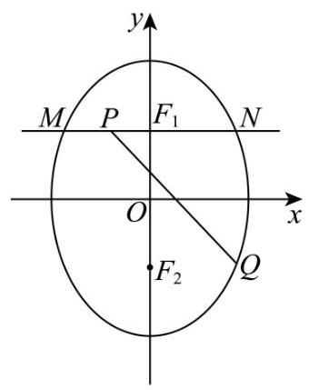

(1)求线段 ${MN}$ 的长；

(2)若线段 ${PQ}$ 的中点在 $x$ 轴上，求 $\bigtriangleup  {F}_{2}{PQ}$ 的面积；

(3)是否存在以 ${F}_{2}Q$ 、 ${F}_{2}P$ 为邻边的矩形 ${F}_{2}{QEP}$ ，使得点 $E$ 在椭圆 $\Gamma$ 上？若存在，求出所有满足条件的点 $Q$ 的纵坐标; 若不存在,请说明理由.

【答案】 $\left( 1\right) \left| {MN}\right|  = \sqrt{2}$

(2) $\frac{\sqrt{2}}{2}$

$\left( 3\right)  - 2 + \sqrt{2}$ 或 -1 .

3. (2024·上海徐汇·二模)已知椭圆 $C : \frac{{x}^{2}}{4} + \frac{{y}^{2}}{3} = 1,{A}_{1}$ 、 ${A}_{2}$ 分别为椭圆 $C$ 的左、右顶点， ${F}_{1}$ 、 ${F}_{2}$ 分别为左、右焦点,直线 $l$ 交椭圆 $C$ 于 $M\text{ 、 }N$ 两点 $\left( l\right.$ 不过点 $\left. {A}_{2}\right)$ .

(1)若 $Q$ 为椭圆 $C$ 上 (除 ${A}_{1}\text{ 、 }{A}_{2}$ 外) 任意一点，求直线 $Q{A}_{1}$ 和 $Q{A}_{2}$ 的斜率之积;

(2)若 $\overrightarrow{N{F}_{1}} = 2\overrightarrow{{F}_{1}M}$ ，求直线 $l$ 的方程；

(3)若直线 $M{A}_{2}$ 与直线 $N{A}_{2}$ 的斜率分别是 ${k}_{1}\text{ 、 }{k}_{2}$ ，且 ${k}_{1}{k}_{2} =  - \frac{9}{4}$ ，求证:直线 $l$ 过定点.

【答案】 $\left( 1\right)  - \frac{3}{4}$

$\left( 2\right) y =  \pm  \frac{\sqrt{5}}{2}\left( {x + 1}\right)$

(3)证明见解析

4. (2024·上海杨浦·二模) 已知椭圆 $\Gamma  : \frac{{x}^{2}}{{a}^{2}} + \frac{{y}^{2}}{{b}^{2}} = 1\left( {a > b > 0}\right)$ 的上顶点为 $A\left( {0,1}\right)$ ,离心率 $\mathrm{e} = \frac{\sqrt{3}}{2}$ ,过点 $P\left( {-2,1}\right)$ 的直线 $l$ 与椭圆 $\Gamma$ 交于 $B, C$ 两点,直线 ${AB}\text{ 、 }{AC}$ 分别与 $x$ 轴交于点 $M\text{ 、 }N$ .

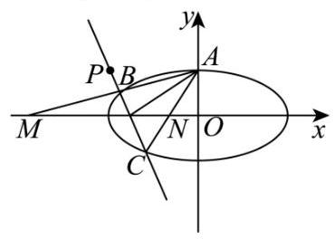

(1)求椭圆 $\Gamma$ 的方程；

(2)已知命题 “对任意直线 $l$ ，线段 ${MN}$ 的中点为定点” 为真命题，求 $\bigtriangleup  {AMN}$ 的重心坐标；

(3)是否存在直线 $l$ ，使得 ${S}_{\bigtriangleup {AMN}} = 2{S}_{\bigtriangleup {ABC}}$ ？若存在，求出所有满足条件的直线 $l$ 的方程，若不存在，请说明理由. (其中 ${S}_{\bigtriangleup {AMN}}$ 、 ${S}_{\bigtriangleup {ABC}}$ 分别表示 $\bigtriangleup  {AMN}$ 、 $\bigtriangleup  {ABC}$ 的面积)

【答案】 $\left( 1\right) \frac{{x}^{2}}{4} + {y}^{2} = 1$

(2) $\left( {-\frac{4}{3},\frac{1}{3}}\right)$

(3) $x + {2y} = 0$

5. (2024·上海奉贤·二模) 已知曲线 $C : \frac{{x}^{2}}{4} + \frac{{y}^{2}}{2} = 1, O$ 是坐标原点,过点 $T\left( {1,0}\right)$ 的直线 ${l}_{1}$ 与曲线 $C$ 交于 $P, Q$ 两点.

(1)当 ${l}_{1}$ 与 $x$ 轴垂直时,求 $\bigtriangleup {OPQ}$ 的面积;

(2)过圆 ${x}^{2} + {y}^{2} = 6$ 上任意一点 $M$ 作直线 ${MA}$ ， ${MB}$ ，分别与曲线 $C$ 切于 $A$ ， $B$ 两 点，求证: ${MA}\bot {MB}$ ；

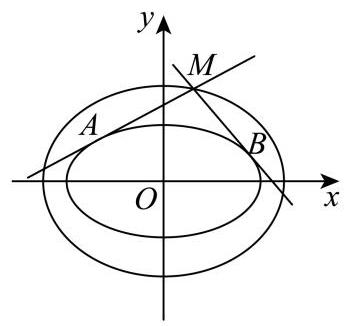

(3) 过点 $N\left( {n,0}\right) \left( {n > 2}\right)$ 的直线 ${l}_{2}$ 与双曲线 $\frac{{x}^{2}}{4} - {y}^{2} = 1$ 交于 $R$ ， $S$ 两点 $\left( {l}_{1}\right. ,{l}_{2}$ 不与 $x$ 轴重合). 记直线 ${TR}$ 的斜率为 ${k}_{TR}$ ,直线 ${TS}$ 斜率为 ${k}_{TS}$ ,当 $\angle {ONP} = \angle {ONQ}$ 时,求证: $n$ 与 ${k}_{TR} + {k}_{TS}$ 都是定值.

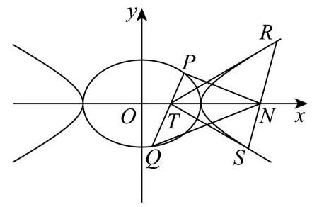

【答案】(1) $\frac{\sqrt{6}}{2}$

(2)证明见解析

(3)证明见解析

6. (2024·上海金山·二模)已知椭圆 $\Gamma  : \frac{{x}^{2}}{4} + \frac{{y}^{2}}{3} = 1$ 的右焦点为 $F$ ，直线 $l$ 与椭圆 $\Gamma$ 交于不同的两点 $M\left( {{x}_{1}\text{ , }}\right. \; \left. {y}_{1}\right) \text{ 、 }N\left( {{x}_{2},{y}_{2}}\right)$ .

(1) 证明: 点 $M$ 到右焦点 $F$ 的距离为 $2 - \frac{{x}_{1}}{2}$ ;

(2)设点 $Q\left( {0,\frac{1}{2}}\right)$ ，当直线 $l$ 的斜率为 $\frac{1}{2}$ ，且 $\overrightarrow{QF}$ 与 $\overrightarrow{QM} + \overrightarrow{QN}$ 平行时，求直线 $l$ 的方程；

(3)当直线 $l$ 与 $x$ 轴不垂直，且 $\bigtriangleup  {MNF}$ 的周长为 4 时，试判断直线 $l$ 与圆 $C : {x}^{2} + {y}^{2} = 3$ 的位置关系，并证明你的结论.

【答案】(1)证明见解析

(2) $y = \frac{1}{2}x + 1$

(3)直线 $l$ 与圆 $C$ 相切，证明见解析

7. (2024·上海·二模)如图，已知椭圆 ${C}_{1} : \frac{{x}^{2}}{4} + {y}^{2} = 1$ 和抛物线 ${C}_{2} : {x}^{2} = {2py}$ 。( $p > 0$ )， ${C}_{2}$ 的焦点 $F$ 是

${C}_{1}$ 的上顶点,过 $F$ 的直线交 ${C}_{2}$ 于 $M\text{ 、 }N$ 两点,连接 ${NO}\text{ 、 }{MO}$ 并延长之,分别交 ${C}_{1}$ 于 $A\text{ 、 }B$ 两点, 连接 ${AB}$ ,设 $\bigtriangleup {OMN}\text{ 、 }\bigtriangleup {OAB}$ 的面积分别为 ${S}_{\bigtriangleup {OMN}}\text{ 、 }{S}_{\bigtriangleup {OAB}}$ .

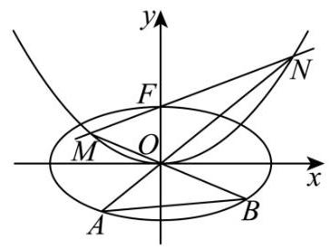

(1)求p的值；

(2)求 $\overrightarrow{OM} \cdot  \overrightarrow{ON}$ 的值；

(3)求 $\frac{{S}_{\bigtriangleup {OMN}}}{{S}_{\bigtriangleup {OAB}}}$ 的取值范围.

【答案】(1) $p = 2$

(2) -3

(3) $\lbrack 2, + \infty )$

8. (2024·上海黄浦·二模)如图，已知 ${\Gamma }_{1}$ 是中心在坐标原点、焦点在 $x$ 轴上的椭圆， ${\Gamma }_{2}$ 是以 ${\Gamma }_{1}$ 的焦点 ${F}_{1}$ ， ${F}_{2}$ 为顶点的等轴双曲线,点 $M\left( {\frac{5}{3},\frac{4}{3}}\right)$ 是 ${\Gamma }_{1}$ 与 ${\Gamma }_{2}$ 的一个交点,动点 $P$ 在 ${\Gamma }_{2}$ 的右支上且异于顶点.

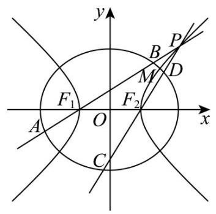

(1)求 ${\Gamma }_{1}$ 与 ${\Gamma }_{2}$ 的方程；

(2)若直线 $P{F}_{2}$ 的倾斜角是直线 $P{F}_{1}$ 的倾斜角的 2 倍，求点 $P$ 的坐标；

(3)设直线 $P{F}_{1}$ ， $P{F}_{2}$ 的斜率分别为 ${k}_{1}$ ， ${k}_{2}$ ，直线 $P{F}_{1}$ 与 ${\Gamma }_{1}$ 相交于点 $A$ ， $B$ ，直线 $P{F}_{2}$ 与 ${\Gamma }_{1}$ 相交于点 $C$ ， $D$ ，

$\left| {A{F}_{1}}\right|  \cdot  \left| {B{F}_{1}}\right|  = m,\left| {C{F}_{2}}\right|  \cdot  \left| {D{F}_{2}}\right|  = n$ ,求证: ${k}_{1}{k}_{2} = 1$ 且存在常数 $s$ 使得 $m + n = {smn}$ .

【答案】 $\left( 1\right) \frac{{x}^{2}}{5} + \frac{{y}^{2}}{4} = 1$ 与 ${x}^{2} - {y}^{2} = 1$

(2) $\left( {2,\sqrt{3}}\right)$

(3)证明见解析

9. (2024·上海崇明·二模)已知椭圆 $\Gamma  : \frac{{x}^{2}}{2} + {y}^{2} \circ   = 1, A$ 为 $\Gamma$ 的上顶点， $P$ 、 $Q$ 是 $\Gamma$ 上不同于点 $A$ 的两点.

(1)求椭圆 $\Gamma$ 的离心率；

(2)若 $F$ 是椭圆 $\Gamma$ 的右焦点， $B$ 是椭圆下顶点， $R$ 是直线 ${AF}$ 上一点. 若 $\bigtriangleup  {ABR}$ 有一个内角为 $\frac{\pi }{3}$ ，求点 $R$ 的坐标;

(3) 作 ${AH} \bot  {PQ}$ ,垂足为 $H$ . 若直线 ${AP}$ 与直线 ${AQ}$ 的斜率之和为 2,是否存在 $x$ 轴上的点 $M$ ,使得 $\left| {{}^{ \circ  }\overrightarrow{MH}{}^{ \circ  }}\right|$ 为定值？若存在,请求出点 $M$ 的坐标,若不存在,请说明理由.

【答案】 $\left( 1\right) \frac{\sqrt{2}}{2}$

(2) $\left( {3 - \sqrt{3}, - 2 + \sqrt{3}}\right)$ 或 $\left( {1 + \frac{\sqrt{3}}{3}, - \frac{\sqrt{3}}{3}}\right)$ ;

(3) 存在, $\left( {-\frac{1}{2},0}\right)$

10. (2024·上海虹口·二模)已知椭圆 $\Gamma  : \frac{{x}^{2}}{{a}^{2}} + \frac{{y}^{2}}{{b}^{2}} = 1\left( {a > b > 0}\right)$ 的焦距为 $2\sqrt{3}$ ，点 $P\left( {0,1}\right)$ 在椭圆 $\Gamma$ 上，动直线 $l$ 与椭圆 $\Gamma$ 相交于不同的两点 $A, B$ ,且直线 ${PA},{PB}$ 的斜率之积为 1 .

(1)求椭圆 $\Gamma$ 的标准方程；

(2)若直线 ${PA}$ 为的法向量为 $\overrightarrow{n} = \left( {1, - 2}\right)$ ，求直线 $l$ 的方程；

(3) 是否存在直线 $l$ ,使得 $\bigtriangleup {PAB}$ 为直角三角形? 若存在,求出直线 $l$ 的斜率; 若不存在,请说明理由.

【答案】 $\left( 1\right) \frac{{x}^{2}}{4} + {y}^{2} = 1$

(2) ${5x} + {6y} + {10} = 0$

(3) 存在,直线 $l$ 的斜率为 $\pm  \frac{\sqrt{2}}{2}$

11. (2024·上海嘉定·二模) 如图:已知三点 $A$ 、 $B$ 、 $P$ 都在椭圆 $\frac{{x}^{2}}{4} + \frac{{y}^{2}}{2} = 1$ 上.

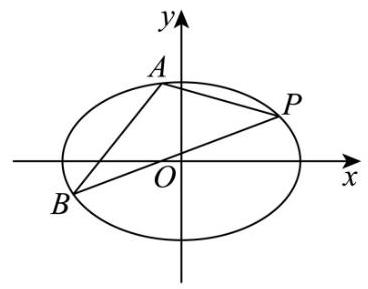

(1)若点 $A$ 、 $B$ 、 $P$ 都是椭圆的顶点，求 $\bigtriangleup  {ABP}$ 的面积；

(2)若直线 ${AB}$ 的斜率为 1，求弦 ${AB}$ 中点 $M$ 的轨迹方程；

(3)若直线 ${AB}$ 的斜率为 2，设直线 ${PA}$ 的斜率为 ${k}_{PA}$ ，直线 ${PB}$ 的斜率为 ${k}_{PB}$ ，是否存在定点 $P$ ，使得 ${k}_{PA} \; + {k}_{PB} = 0$ 恒成立? 若存在,求出所有满足条件的点 $P$ ,若不存在,说明理由.

【答案】 $\left( 1\right) 2\sqrt{2}$

$\left( 2\right) y =  - \frac{1}{2}x,\;x \in  \left( {-\frac{2\sqrt{6}}{3},\frac{2\sqrt{6}}{3}}\right)$

(3) $P\left( {\frac{4\sqrt{2}}{3},\frac{\sqrt{2}}{3}}\right)$ 或 $P\left( {-\frac{4\sqrt{2}}{3}, - \frac{\sqrt{2}}{3}}\right)$

12. (2024·上海青浦·二模) 已知双曲线 $\Gamma  : \frac{{x}^{2}}{4} - \frac{{y}^{2}}{5} = 1,{F}_{1},{F}_{2}$ 分别为其左、右焦点.

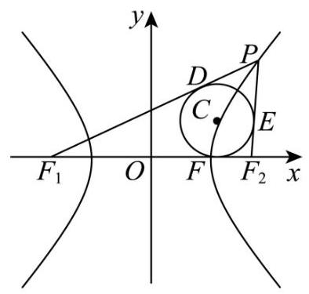

(1)求 ${F}_{1}$ ， ${F}_{2}$ 的坐标和双曲线 $\Gamma$ 的渐近线方程；

(2)如图， $P$ 是双曲线 $\Gamma$ 右支在第一象限内一点，圆 $C$ 是 $\bigtriangleup  P{F}_{1}{F}_{2}$ 的内切圆，设圆与 $P{F}_{1}$ ， $P{F}_{2},{F}_{1}{F}_{2}$ 分别切于点 $D, E, F$ ,当圆 $C$ 的面积为 ${4\pi }$ 时,求直线 $P{F}_{2}$ 的斜率;

(3) 是否存在过点 ${F}_{2}$ 的直线 $l$ 与双曲线 $E$ 的左右两支分别交于 $A, B$ 两点,且使得 $\angle {F}_{1}{AB} = \angle {F}_{1}{BA}$ ,若存在,求出直线 $l$ 的方程; 若不存在,请说明理由.

【答案】 $\left( 1\right) {F}_{1}\left( {-3 \circ  , \circ  0}\right) ,{F}_{2}\left( {3 \circ  , \circ  0}\right) , y =  \pm  \frac{\sqrt{5}}{2}x$

(2) $\frac{4}{3}$ ；

(3)存在， $y =  \pm  \frac{\sqrt{65}}{13}\left( {x - 3}\right)$ .

13. (2024·上海长宁·二模)已知椭圆 $\Gamma  : \frac{{x}^{2}}{6} + \frac{{y}^{2}}{3} = 1$ ， $O$ 为坐标原点；

(1)求 $\Gamma$ 的离心率 $\mathrm{e}$ ；

(2)设点 $N\left( {1,0}\right)$ ，点 $M$ 在 $\Gamma$ 上，求 $\left| {MN}\right|$ 的最大值和最小值；

(3) 点 $T\left( {2,1}\right)$ ，点 $P$ 在直线 $x + y = 3$ 上，过点 $P$ 且与 ${OT}$ 平行的直线 $l$ 与 $\Gamma$ 交于 $A, B$ 两点；试探究:是否存在常数 $\lambda$ ,使得 $\left| {\overrightarrow{PA} \cdot  \overrightarrow{PB}}\right|  = \lambda {\left| \overrightarrow{PT}\right| }^{2}$ 恒成立; 若存在,求出该常数的值; 若不存在,说明理由;

【答案】(1) $\frac{\sqrt{2}}{2}$

(2) $\left| {MN}\right|$ 的最大值为 $1 + \sqrt{6}$ ，最小值为 $\sqrt{2}$

(3) $\lambda  = \frac{5}{4}$

14. (2024·上海·二模) 在 $\bigtriangleup {ABC}$ 中,已知 $B\left( {-1,0}\right) , C\left( {1,0}\right)$ ,设 $G, H, W$ 分别是 $\bigtriangleup {ABC}$ 的重心、垂心、 外心,且存在 $\lambda  \in  R$ 使 $\overrightarrow{GH} = \lambda \overrightarrow{BC}$ .

(1)求点 $A$ 的轨迹 $\Gamma$ 的方程；

(2)求 $\bigtriangleup  {ABC}$ 的外心 $W$ 的纵坐标 $m$ 的取值范围；

(3)设直线 ${AW}$ 与 $\Gamma$ 的另一个交点为 $M$ ，记 $\bigtriangleup  {AWG}$ 与 $\bigtriangleup  {MGH}$ 的面积分别为 ${S}_{1}$ ， ${S}_{2}$ ，是否存在实数 $\lambda$ 使 $\frac{{S}_{1}}{{S}_{2}} = \frac{7}{22}$ ? 若存在,求出 $\lambda$ 的值; 若不存在,请说明理由.

【答案】 $\left( 1\right) {x}^{2} + \frac{{y}^{2}}{3} = 1\left( {y \neq  0}\right)$

(2) $\left\lbrack  {-\frac{\sqrt{3}}{3},0}\right)  \cup  \left( {0,\frac{\sqrt{3}}{3}}\right\rbrack$

(3)存在， $\lambda  =  \pm  \frac{1}{6}$

15. $\left( {{23} - {24}}\right.$ 高三下.上海浦东新.二模 $)$ 已知椭圆 $C : \frac{{x}^{2}}{2} + {y}^{2} = 1$ ，点 ${F}_{1}$ 、 ${F}_{2}$ 分别为椭圆的左、右焦点.

(1)若椭圆上点 $P$ 满足 $P{F}_{2} \bot  {F}_{1}{F}_{2}$ ，求 $\left| {P{F}_{1}}\right|$ 的值；

(2)点 $A$ 为椭圆的右顶点，定点 $T\left( {t,0}\right)$ 在 $x$ 轴上，若点 $S$ 为椭圆上一动点，当 $\left| {ST}\right|$ 取得最小值时点 $S$ 恰与点 $A$ 重合,求实数 $t$ 的取值范围;

(3)已知 $m$ 为常数，过点 ${F}_{2}$ 且法向量为 $\left( {1, - m}\right)$ 的直线 $l$ 交椭圆于 $M$ 、 $N$ 两点，若椭圆 $C$ 上存在点 $R$ 满足 $\overrightarrow{OR} = \lambda \overrightarrow{OM} + \mu \overrightarrow{ON}\left( {\lambda ,\mu  \in  R}\right)$ ,求 ${\lambda \mu }$ 的最大值.

【答案】 $\left( 1\right) \frac{3\sqrt{2}}{2}$

(2) $t \geq  \frac{\sqrt{2}}{2}$

(3) $\frac{{m}^{2} + 2}{4}$

专题08 立体几何(四大题型，)

## 二模新速递

## 选题列表

1. $\cdot$ 上海杨浦 $\cdot$ 二模 2024·上海奉贤·二模

2. 上海浦东. 二模 2024·上海青浦·二模

3. 上海黄浦·二模 2024·上海闵行·二模

4. 上海普陀·二模 2024.上海金山·二模

5. 上海徐汇·二模 2024·上海静安·二模

6. 上海松江·二模 2024·上海长宁·二模

7. 上海嘉定·二模 2024·上海崇明·二模

8. 上海虹口.二模 2024.上海宝山.二模

汇编目录

题型一:空间几何体 .1

题型二:表面积与体积 .5

题型三: 位置关系 .13

题型四: 大题综合 .27

## 一、题型一:空间几何体

1. (2024·上海闵行·二模) 已知空间中有 2 个相异的点，现每增加一个点使得其与原有的点连接成尽可能多的等边三角形. 例如, 空间中 3 个点最多可连接成 1 个等边三角形, 空间中 4 个点最多可连接成 4 个等边三角形. 当增加到 8 个点时, 空间中这 8 个点最多可连接成___个等边三角形.

【答案】20.

2. (2024·上海虹口·二模) 如图，在直四棱柱 ${ABCD} - {A}_{1}{B}_{1}{C}_{1}{D}_{1}$ 中，底面 ${ABCD}$ 为菱形，且 $\angle {BAD} = {60}^{ \circ  }$ . 若 ${AB} = A{A}_{1} = 2$ ，点 $M$ 为棱 $C{C}_{1}$ 的中点，点 $P$ 在 ${A}_{1}B$ 上，则线段 ${PA}$ ， ${PM}$ 的长度和的最小值为 ___.

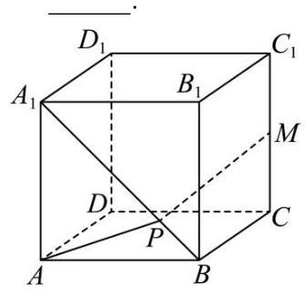

【答案】 $\sqrt{9 + 2\sqrt{10}}$

3. (2024·上海崇明·二模)已知底面半径为 1 的圆柱， $O$ 是其上底面圆心， $A$ 、 $B$ 是下底面圆周上两个不同的点， ${BC}$ 是母线. 若直线 ${OA}$ 与 ${BC}$ 所成角的大小为 $\frac{\pi }{3}$ ，则 ${BC} =$ ___.

【答案】 $\frac{\sqrt{3}}{3}$

4. (2024·上海青浦·二模) 如图，在棱长为 1 的正方体 ${ABCD} - {A}_{1}{B}_{1}{C}_{1}{D}_{1}$ 中， $P$ 、 $Q$ 、 $R$ 在棱 ${AB}$ 、 ${BC}$ 、 $B{B}_{1}$ 上,且 ${PB} = \frac{1}{2},{QB} = \frac{1}{3},{RB} = \frac{1}{4}$ ,以 $\bigtriangleup {PQR}$ 为底面作一个三棱柱 ${PQR} - {P}_{1}{Q}_{1}{R}_{1}$ ,使点 ${P}_{1},{Q}_{1}$ , ${R}_{1}$ 分别在平面 ${A}_{1}{AD}{D}_{1}\text{ 、 }{D}_{1}{DC}{C}_{1}\text{ 、 }{A}_{1}{B}_{1}{C}_{1}{D}_{1}$ 上，则这个三棱柱的侧棱长为___.

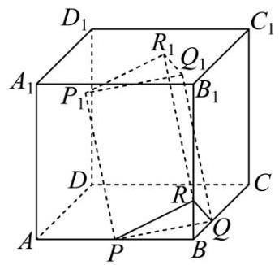

【答案】 $\frac{\sqrt{181}}{12}$

## 二、题型二:表面积与体积

1. (2024·上海普陀·二模) 若一个圆锥的体积为 $\frac{2\sqrt{2}\pi }{3}$ ，用通过该圆锥的轴的平面截此圆锥，得到的截面三角形的顶角为 $\frac{\pi }{2}$ ,则该圆锥的侧面积为 ( )

A. $\sqrt{2}\pi$ B. ${2\pi }$ C. $2\sqrt{2}\pi$ D. $4\sqrt{2}\pi$

【答案】 $C$

2. (2024·上海徐汇·二模) 三棱锥 $P - {ABC}$ 各顶点均在半径为 $2\sqrt{2}$ 的球 $O$ 的表面上， ${AB} = {AC} = {2\sqrt{2}}$ ， $\angle {BAC} = {90}^{ \circ  }$ ，二面角 $P - {BC} - A$ 的大小为 ${45}^{ \circ  }$ ，则对以下两个命题，判断正确的是 ( )

①三棱锥 $O - {ABC}$ 的体积为 $\frac{8}{3}$ ；②点 $P$ 形成的轨迹长度为 $2\sqrt{6}\pi$ .

A. ①②都是真命题 B. ①是真命题，②是假命题

C. ①是假命题，②是真命题 D. ①②都是假命题

【答案】 $A$

3.(2024·上海奉贤·二模) 学生到工厂劳动实践，利用 3D 打印技术制作模型，如图所示. 该模型为长方体 ${ABCD} - {A}_{1}{B}_{1}{C}_{1}{D}_{1}$ 中挖去一个四棱锥 $O - {EFGH}$ ，其中 $O$ 为长方体的中心， $E$ ， $F$ ， $G$ ， $H$ 分别为所在棱的中点， ${AB} = {BC} = {4\mathrm{\;{cm}}}$ ， $A{A}_{1} = {2\mathrm{\;{cm}}}$ ，3D 打印所用原料密度为 ${0.9}\mathrm{\;{g/{cm}^{3}}}$ . 不考虑打印损耗，制作该模型所需原料的质量为___ $g$ .

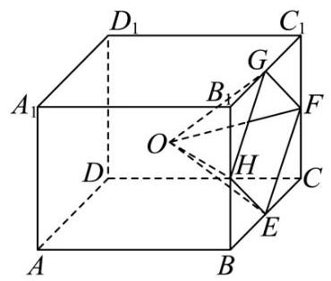

【答案】 ${AB} + {BC} + {DC} + {AD} = 8 + \frac{18}{5} + \frac{24}{5} + {10} = \frac{132}{5}$

4. (2024·上海奉贤·二模) 已知圆锥的底面半径为 $\sqrt{2}$ ，母线长为 2，则该圆锥的侧面积为___.

【答案】 $2\sqrt{2}\pi$

5. (2024·上海松江·二模) 若一个圆锥的侧面展开图是面积为 ${2\pi }$ 的半圆面，则此圆锥的体积为___.(结果中保留 $\pi$ )

【答案】 $\frac{\sqrt{3}}{3}\pi$

6. (2024·上海静安·二模)正四棱锥 P-ABCD 底面边长为2，高为3，则点 $A$ 到不经过点 $A$ 的侧面的距离为___.

【答案】 $\frac{3\sqrt{10}}{5}/\frac{3}{5}\sqrt{10}$

7. (2024·上海黄浦·二模) 在四面体 ${PABC}$ 中， $2\overrightarrow{PD} = \overrightarrow{PA} + \overrightarrow{PB}$ ， $5\overrightarrow{PE} = 2\overrightarrow{PB} + 3\overrightarrow{PC}$ ， $2\overrightarrow{PF} =  - \overrightarrow{PC} + \; 3\overrightarrow{PA}$ ，设四面体 ${PABC}$ 与四面体 ${PDEF}$ 的体积分别为 ${V}_{1}$ 、 ${V}_{2}$ ，则 $\frac{{V}_{2}}{{V}_{1}}$ 的值为___.

【答案】 $\frac{7}{20}/{0.35}$

8. (2024·上海黄浦·二模)若一个圆柱的底面半径为2，母线长为3，则此圆柱的侧面积为___.

【答案】 ${12\pi }$

9. (2024·上海嘉定·二模)已知圆锥的母线长为2，高为1，则其体积为___.

【答案】 $\pi$

10. (23-24 高三下·上海浦东新·期中) 如图,有一底面半径为 1,高为 3 的圆柱. 光源点 $A$ 沿着上底面圆周作匀速运动，射出的光线始终经过圆柱轴截面的中心。 $O$ . 当光源点 $A$ 沿着上底面圆周运动半周时，其射出的光线在圆柱内部 “扫过” 的面积为___.

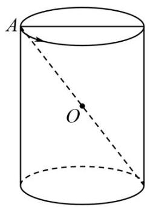

【答案】 $\frac{\sqrt{13}}{2}\pi$

11. (2024·上海长宁·二模) 用铁皮制作一个有底无盖的圆柱形容器，若该容器的容积为 $\pi$ 立方米，则至少需要___平方米铁皮

【答案】 ${3\pi }$

12. (2024·上海静安·二模) 如图 1 所示， ${ABCD}$ 是水平放置的矩形， ${AB} = {2\sqrt{3}}$ ， ${BC} = 2$ . 如图 2 所示， 将 ${ABD}$ 沿矩形的对角线 ${BD}$ 向上翻折，使得平面 ${ABD} \bot$ 平面 ${BCD}$ .

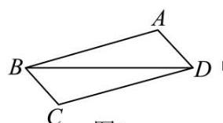

图1

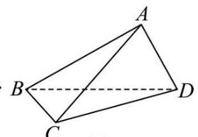

图2

(1)求四面体 ${ABCD}$ 的体积 $V$ ；

(2)试判断与证明以下两个问题:

① 在平面 ${BCD}$ 上是否存在经过点 $C$ 的直线 $l$ ，使得 $l\bot {AD}$ ?

② 在平面 ${BCD}$ 上是否存在经过点 $C$ 的直线 $l$ ，使得 $l//{AD}$ ?

【答案】(1)2;

(2)①证明见解析；②证明见解析.

## 三、题型三:位置关系

1. (2024·上海静安·二模) 设 $m, n$ 是两条不同的直线， $\alpha ,\beta$ 是两个不同的平面，下列命题中真命题是 ( )

A. 若 $m//\alpha , n//\alpha$ ,则 $m//n$ ; B. 若 $m \subset  \alpha , n \subset  \beta , m//n$ ,则 $\alpha //\beta$ ;

C. 若 $m \bot  \alpha , n//\alpha$ ,则 $m \bot  n$ ; D. 若 $m \subset  \alpha , n \subset  \alpha , m//\beta , n//\beta$ ,则 $\alpha //\beta$ .

【答案】 $C$

2. ( 2024 ・上海金山 · 二模 )如图，点 $N$ 为正方形 ${ABCD}$ 的中心， $\bigtriangleup {ECD}$ 为正三角形，平面 ${ECD} \bot$ 平面 ${ABCD}$ ， $M$ 是线段 ${ED}$ 的中点，则以下命题中正确的是 ( ).

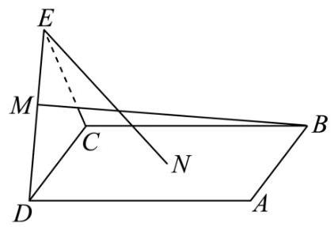

A. ${BM} = {EN}$ B. ${CD} \bot  {MN}$

C. $A\text{ 、 }M\text{ 、 }N$ 三点共线 D. 直线 ${BM}$ 与 ${EN}$ 相交

【答案】 $D$

3. (2024·上海长宁·二模)已知直线 $a, b$ 和平面 $\alpha$ ，则下列判断中正确的是 ( )

A. 若 $a//a, b//\alpha$ ,则 $a//b$ B. 若 $a//b, b//\alpha$ ,则 $a//\alpha$

C. 若 $a//\alpha , b \bot  \alpha$ ,则 $\overrightarrow{a} \bot  \overrightarrow{b}$ D. 若 $a \bot  b, b//\alpha$ ,则 $a \bot  \alpha$

【答案】 $C$

4. (2024·上海杨浦·二模) 正方体 ${ABCD} - {A}_{1}{B}_{1}{C}_{1}{D}_{1}$ 中，异面直线 ${AB}$ 与 $D{C}_{1}$ 所成角的大小为___.

【答案】 ${45}^{ \circ  }/\frac{\pi }{4}$

5. (2024·上海金山·二模)如图，几何体是圆柱的一部分，它是由矩形 ${ABCD}$ (及其内部) 以 ${AB}$ 边所在直线为旋转轴旋转 ${120}^{ \circ  }$ 得到的,点 $G$ 是 $\overset{\text{ ⏜ }}{DF}$ 的中点,点 $P$ 在 $\overset{\text{ ⏜ }}{CE}$ 上,异面直线 ${BP}$ 与 ${AD}$ 所成的角是 ${30}^{ \circ  }$ .

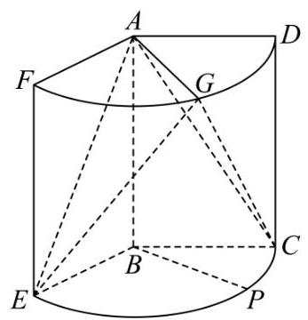

(1)求证: ${AE}\bot {BP}$ ；

(2)若 ${AB} = 3,{AD} = 2$ ，求二面角 $E - {AG} - C$ 的大小.

【答案】(1)证明见解析

(2)60°

6. (2024·上海虹口·二模) 如图,在三棱柱 ${ABC} - {A}_{1}{B}_{1}{C}_{1}$ 中， ${CA} \bot  {CB}$ ， $D$ 为 ${AB}$ 的中点， ${CA} = {CB} =$ 2, $C{C}_{1} = 3$ .

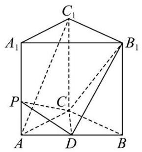

(1)求证: $A{C}_{1}//$ 平面 ${B}_{1}{CD}$ ；

(2)若 $C{C}_{1} \bot$ 平面 ${ABC}$ ，点 $P$ 在棱 $A{A}_{1}$ 上，且 ${PD} \bot$ 平面 ${B}_{1}{CD}$ ，求直线 ${CP}$ 与平面 ${B}_{1}{CD}$ 所成角的正弦值.

【答案】(1)证明见解析

(2) $\frac{\sqrt{55}}{10}$

7. (2024·上海黄浦·二模) 如图,在四棱锥 $P - {ABCD}$ 中,底面 ${ABCD}$ 为矩形,点 $E$ 是棱 ${PD}$ 上的一点, ${PB}//$ 平面 ${AEC}$ .

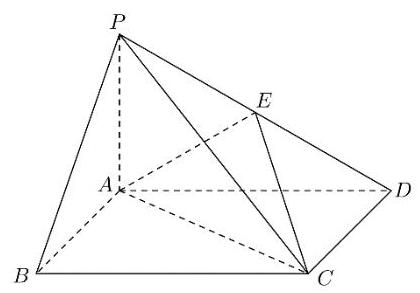

(1)求证:点 $E$ 是棱 ${PD}$ 的中点；

(2)若 ${PA} \bot$ 平面 ${ABCD},{AP} = 2,{AD} = 2\sqrt{3},{PC}$ 与平面 ${ABCD}$ 所成角的正切值为 $\frac{1}{3}$ ，求二面角 $D \; - {AE} - C$ 的大小.

【答案】(1)证明见解析

(2) $\arctan 2\sqrt{2}$

8. (2024·上海嘉定·二模)如图，在三棱柱 ${ABC} - {A}_{1}{B}_{1}{C}_{1}$ 中， ${A}_{1}A\bot$ 平面 ${ABC}$ ， $D$ 是 ${BC}$ 的中点， ${AC} \; = \sqrt{2},\;{A}_{1}A = {AB} = {BC} = 1.$

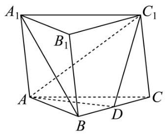

(1)求证: ${A}_{1}B//$ 平面 ${AD}{C}_{1}$ ；

(2)求直线 $D{C}_{1}$ 与 ${A}_{1}B$ 的所成角的大小.

【答案】(1)证明见解析

(2) $\arcsin \frac{\sqrt{15}}{5}$

9. (2024·上海长宁·二模)如图，在长方体 ${ABCD} - {A}_{1}{B}_{1}{C}_{1}{D}_{1}$ 中， ${AB} = {AD} = 2, A{A}_{1} = 1$ ；

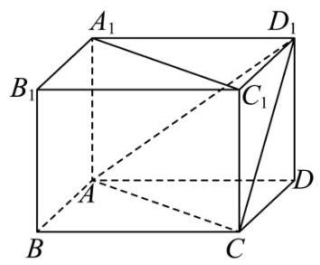

(1)求二面角 ${D}_{1} - {AC} - D$ 的大小；

(2)若点 $P$ 在直线 ${A}_{1}{C}_{1}$ 上，求证:直线 ${BP}//$ 平面 ${D}_{1}{AC}$ ；

【答案】(1) $\arccos \frac{\sqrt{6}}{3}$

(2)见解析

10. (23-24 高三下·上海浦东新·期中)在四棱锥 $P - {ABCD}$ 中，底面 ${ABCD}$ 为等腰梯形，平面 ${PAD} \bot$ 底面 ${ABCD}$ ,其中 ${AD}//{BC},{AD} = {2BC} = 4,{AB} = 3,{PA} = {PD} = 2\sqrt{3}$ ,点 $E$ 为 ${PD}$ 中点.

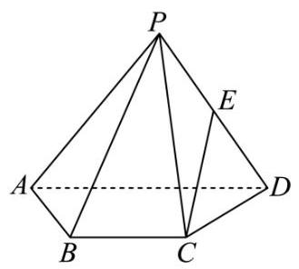

(1)证明: ${EC}//$ 平面 ${PAB}$ ；

(2)求二面角 $P - {AB} - D$ 的大小.

【答案】(1)证明见解析

(2) $\arccos \frac{2\sqrt{13}}{13}$

## 四、题型四:大题综合

1. (2024·上海松江·二模) 如图,在四棱锥 $P - {ABCD}$ 中，底面 ${ABCD}$ 为菱形， ${PD} \bot$ 平面 ${ABCD}$ ， $E$ 为 ${PD}$ 的中点.

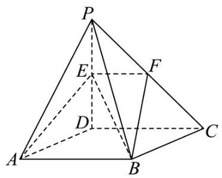

(1)设平面 ${ABE}$ 与直线 ${PC}$ 相交于点 $F$ ，求证: ${EF}//{CD}$ ；

(2)若 ${AB} = 2,{\angle {DAB}} = {60}^{ \circ  },{PD} = {4\sqrt{2}}$ ，求直线 ${BE}$ 与平面 ${PAD}$ 所成角的大小.

【答案】(1)证明见解析

(2) $\frac{\pi }{6}$

2. (2024·上海普陀·二模)如图，在四棱锥 $S - {ABCD}$ 中，底面 ${ABCD}$ 是边长为 1 的正方形， ${SA} = {SB} =$ 2, $E\text{ 、 }F$ 分别是 ${SC}\text{ 、 }{BD}$ 的中点.

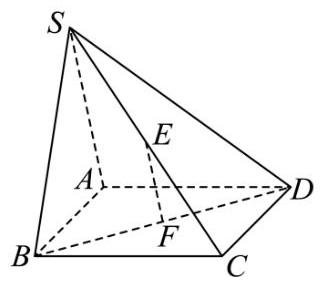

(1)求证: ${EF}//$ 平面 ${SAB}$ ；

(2)若二面角 $S - {AB} - D$ 的大小为 $\frac{\pi }{2}$ ，求直线 ${SD}$ 与平面 ${ABCD}$ 所成角的大小.

【答案】(1)证明见解析;

(2) $\frac{\pi }{3}$

3. (2024·上海徐汇·二模)如图， $D$ 为圆锥的顶点， $O$ 是圆锥底面圆的圆心， ${AE}$ 为圆 $O$ 的直径，且 ${AE} \; = {AD} = 4,\bigtriangleup {ABC}$ 是底面圆 $O$ 的内接正三角形， $P$ 为线段 ${DO}$ 上一点，且 ${DO} = \sqrt{6}{PO}$ .

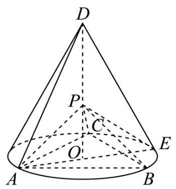

(1)证明: ${PA} \bot$ 平面 ${PBC}$ ；

(2)求直线 ${PB}$ 与平面 ${PCE}$ 所成角的正弦值.

【答案】(1)证明见解析

(2) $\frac{\sqrt{5}}{5}$

4. (2024·上海杨浦·二模) 如图， $P$ 为圆锥顶点， $O$ 为底面中心， $A$ ， $B$ ， $C$ 均在底面圆周上，且 $\bigtriangleup  {ABC}$ 为等边三角形.

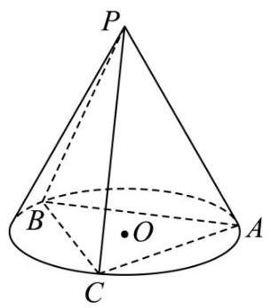

(1)求证:平面 ${POA} \bot$ 平面 ${PBC}$ ；

(2)若圆锥底面半径为 2，高为 $2\sqrt{2}$ ，求点 $A$ 到平面 ${PBC}$ 的距离.

【答案】(1)证明见解析

(2)2√2

5. ( 2024 ・上海奉贤 · 二模)如图 1 是由两个三角形组成的图形，其中 $\angle {APC} = {90}^{ \circ  }$ ， $\angle {PAC} = {30}^{ \circ  }$ ， ${AC} = \; {2AB},\angle {BCA} = {30}^{ \circ  }$ . 将三角形 ${ABC}$ 沿 ${AC}$ 折起，使得平面 ${PAC} \bot$ 平面 ${ABC}$ ，切图 2. 设 $O$ 是 ${AC}$ 的中点, $D$ 是 ${AP}$ 的中点.

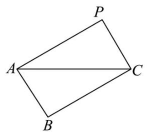

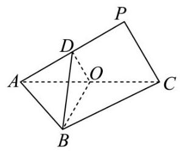

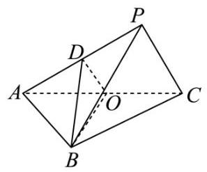

图1 图2

(1)求直线 ${BD}$ 与平面 ${PAC}$ 所成角的大小；

(2)连接 ${PB}$ ，设平面 ${DBO}$ 与平面 ${PBC}$ 的交线为直线 $l$ ，判别 $l$ 与 ${PC}$ 的位置关系，并说明理由.

【答案】(1) $\frac{\pi }{3}$ ;

(2) $l//{PC}$ ，理由见解析.

6. (2024·上海闵行·二模)如图，已知 ${ABCD}$ 为等腰梯形， ${AD}//{BC}$ ， ${\angle {BAD}} = {120}^{ \circ  }$ ， ${PA}\bot$ 平面 ${ABCD},{AB} = {AD} = {AP} = 2$ .

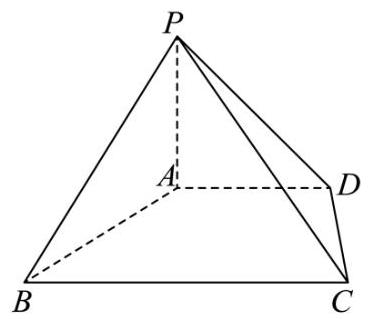

(1)求证: ${PC}\bot {AB}$ ；

(2) 求二面角 $C - {BP} - A$ 的大小.

【答案】(1)证明见解析;

(2) $\arctan \sqrt{6}$ .

专题09 排列组合与二项式定理 (四大题型, )

## 二模新速递

## 选题列表

1. 上海杨浦.二模 2024.上海奉贤·二模

2. 上海浦东·二模 2024·上海青浦·二模

3. -上海黄浦·二模 2024.上海闵行·二模

4. 上海普陀·二模 2024·上海金山·二模

5. 上海徐汇·二模 2024·上海静安·二模

6. - 上海松江·二模 2024.上海长宁.二模

7. 上海嘉定. 二模 2024·上海崇明·二模

8. 上海虹口.二模 2024.上海宝山.二模

汇编目录

题型一:乘法原理 .2

题型二: 排列 .2

题型三: 组合 .4

题型四: 二项式定理 .6

## 一、题型一:乘法原理

1. (2024·上海黄浦·二模) 某学校为了解学生参加体育运动的情况，用分层抽样的方法作抽样调查，拟从初中部和高中部两层共抽取 40 名学生, 已知该校初中部和高中部分别有 500 和 300 名学生, 则不同的抽样结果的种数为 ( )

A. ${C}_{500}^{25} + {C}_{300}^{15}$ B. ${C}_{500}^{25} \cdot  {C}_{300}^{15}$ C. ${C}_{500}^{20} + {C}_{300}^{20}$ D. ${C}_{500}^{20} \cdot  {C}_{300}^{20}$

2. (2024·上海杨浦·二模) 有 5 名志愿者报名参加周六、周日的公益活动, 若每天从这 5 人中安排 2 人参加，则恰有 1 人在这两天都参加的不同安排方式共有___种.

【答案】 60

## 二、题型二: 排列

1. (2024・上海虹口・二模)3 个男孩和 3 个女孩站成一排做游戏，3 个女孩不相邻的站法种数为___.

2. (2024·上海黄浦·二模) 某校高三年级举行演讲比赛，共有 5 名选手参加. 若这 5 名选手甲、乙、丙、丁、 戊通过抽签来决定上场顺序，则甲、乙两位选手上场顺序不相邻的概率为___.

3. (2024·上海崇明·二模)某学习小组共有 10 名学生，其中至少有 2 名学生在同一月份的出生的概率是 ___. (默认每月天数相同, 结果精确到 0.001)

## 三、题型三:组合

1. (2024·上海松江·二模) 某校高一数学兴趣小组一共有 30 名学生，学号分别为 1，2，3，...，30，老师要随机挑选三名学生参加某项活动, 要求任意两人的学号之差绝对值大于等于 5 ，则有___种不同的选择方法.

2. ( 23 - 24 高三下·上海浦东新·阶段练习)若 ${C}_{16}^{{2x} - 5} = {C}_{15}^{x - 1} + {C}_{15}^{x}$ ，则正整数 $x$ 的值为___.

3. ( 23-24 高三下. 上海松江.阶段练习)已知甲同学从学校的 2 个科技类社团、 4 个艺术类社团、 3 个体育类社团中选择报名参加, 若甲报名了两个社团, 则在有一个是艺术类社团的条件下, 另一个是体育类社团的概率为___.

4. (2024·上海浦东新·模拟预测) 如图 ${ABCDEF} - {A}^{\prime }{B}^{\prime }{C}^{\prime }{D}^{\prime }{E}^{\prime }{F}^{\prime }$ 为正六棱柱,若从该正六棱柱的 6 个侧面的 12 条面对角线中, 随机选取两条, 则它们共面的概率是___.

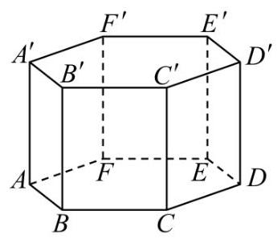

## 四、题型四: 二项式定理

1. (2024·上海普陀·二模) 设 ${\left( 1 + x\right) }^{n} = {a}_{0} + {a}_{1}x + {a}_{2}{x}^{2} + \cdots  + {a}_{n}{x}^{n}\left( {n \geq  1, n \in  N}\right)$ ,若 ${a}_{5} > {a}_{4}$ ,且 ${a}_{5} > {a}_{6}$ , 则 $\mathop{\sum }\limits_{{i = 1}}^{n}{a}_{i} =$ ___.

2. (2024·上海徐汇·二模) 已知 ${a}_{k + 1} = \frac{k + 1 + 1}{k + 1}{a}_{k} + k + 1 + 1 = \frac{k + 2}{k + 1}\left( {k + 1}\right) \left( {k + 2}\right)  + k + 2$ 的二项展开式中各项系数和为 1024 ，则展开式中常数项的值为___.

【答案】 210

3. (2024·上海杨浦·二模)已知二项式 ${\left( 1 + x\right) }^{10}$ ，其展开式中含 ${x}^{2}$ 项的系数为___.

4. (2024·上海奉贤·二模)已知多项式 $\left( {1 + x}\right) {\left( 1 - x\right) }^{5} = {a}_{0} + {a}_{1}x + {a}_{2}{x}^{2} + {a}_{3}{x}^{3} + {a}_{4}{x}^{4} + {a}_{5}{x}^{5} + {a}_{6}{x}^{6}$ 对一切实数 $x$ 恒成立,则 ${a}_{0} + {a}_{3} =$ ___

5. (2024·上海闵行·二模) 在 ${\left( 2x - 1\right) }^{6}$ 的二项展开式中， ${x}^{3}$ 项的系数为___.

6. (2024·上海黄浦·二模)若 ${\left( a{x}^{2} + \frac{1}{x}\right) }^{5}$ 的展开式中 ${x}^{4}$ 的系数是 -80，则实数 $a =$ ___.

7. (2024·上海崇明·二模) 若 ${\left( x + a\right) }^{5}$ 的二项式展开式中 ${x}^{2}$ 的系数为 10，则 $a =$ ___.

8. (2024·上海金山·二模)在 ${\left( 1 + x\right) }^{5}{\left( 1 + y\right) }^{3}$ 的展开式中，记 ${x}^{m}{y}^{n}$ 项的系数为 $f\left( {m, n}\right)$ ，则 $f\left( {3,0}\right)  + f\left( {2,1}\right) \; =$

9. (2024·上海青浦·二模) ${\left( \sqrt{x} + \frac{2}{\sqrt{x}}\right) }^{6}$ 的二项展开式中的常数项为___.

10. (2024·上海长宁·二模)在( $x + \frac{1}{x}{)}^{4}$ 的展开式中 ${x}^{2}$ 的系数为___.

11. $\left( {{23} - {24}}\right.$ 高三下，上海浦东新·期中 $){\left( 3{x}^{2} + \frac{1}{x}\right) }^{5}$ 的二项展开式中 ${x}^{4}$ 项的系数为___.(用数值回答)

12. (2024·上海·二模) 在 ${\left( 2x + 5\right) }^{5}$ 的二项展开式中， ${x}^{3}$ 的系数为___.

## 专题04 三角函数与解三角形(三大题型，)

## 二模新速递

选题列表

1. 上海杨浦.二模 2024.上海奉贤.二模

2.·上海浦东·二模 2024·上海青浦·二模

3. 上海黄浦. 二模 2024·上海闵行·二模

4. 上海普陀·二模 2024·上海金山·二模

5. 上海徐汇·二模 2024·上海静安·二模

6. .上海松江·二模 2024.上海长宁.二模

7. 上海嘉定·二模 2024·上海崇明·二模

8. -上海虹口·二模 2024.上海宝山.二模

## 汇编目录

一、题型一:三角函数 ..2

二、题型二:三角恒等变换 .14

## 三、题型三:解三角形

## 一、题型一:三角函数

1. (2024·上海徐汇·二模) 已知函数 $y = f\left( x\right)$ ,其中 $f\left( x\right)  = 2\sin \left( {{\omega x} + \frac{\pi }{6}}\right)$ ,实数 $\omega  > 0$ ,下列选项中正确的是 ( )

A. 若 $\omega  = 2$ ,函数 $y = f\left( x\right)$ 关于直线 $x = \frac{5}{12}\pi$ 对称

B. 若 $\omega  = \frac{1}{2}$ ，函数 $y = f\left( x\right)$ 在 $\left\lbrack  {0,\pi }\right\rbrack$ 上是增函数

C. 若函数 $y = f\left( x\right)$ 在 $\left\lbrack  {-\pi ,0}\right\rbrack$ 上最大值为 1,则 $\omega  \leq  \frac{4}{3}$

D. 若 $\omega  = 1$ ，则函数 $y = \left| {f\left( x\right) }\right|$ 的最小正周期是 ${2\pi }$

【答案】 $C$

2. (2024·上海奉贤·二模)已知函数 $y = f\left( x\right)$ ，其中 $y = {x}^{2} + 1, y = g\left( x\right)$ ，其中 $g\left( x\right)  = 4\sin x$ ，则图象如图所示的函数可能是 ( ).

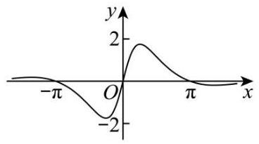

A. $y = \frac{g\left( x\right) }{f\left( x\right) }$ B. $y = \frac{f\left( x\right) }{g\left( x\right) }$

C. $y = f\left( x\right)  + g\left( x\right)  - 1$ D. $y = f\left( x\right)  - g\left( x\right)  - 1$

【答案】 $A$

3. (2024·上海闵行·二模)已知 $f\left( x\right)  = \sin x$ ，集合 $D = \left\lbrack  {-\frac{\pi }{2},\frac{\pi }{2}}\right\rbrack$ ， $\Gamma  = \{ \left( {x, y}\right)  \mid  {2f}\left( x\right)  + f\left( y\right)  = 0, x, y \in  D\}$ ， $\Omega  = \{ \left( {x, y}\right)  \mid  {2f}\left( x\right)  + f\left( y\right)  \geq  0, x, y \in  D\}$ . 关于下列两个命题的判断,说法正确的是 ( )

命题①:集合 $\Gamma$ 表示的平面图形是中心对称图形;

命题②: 集合 $\Omega$ 表示的平面图形的面积不大于 $\frac{5{\pi }^{2}}{12}$ .

A. ①真命题；②假命题 B. ①假命题；②真命题

C. ①真命题；②真命题 D. ①假命题；②假命题

【答案】 $A$

4. (2024·上海嘉定·二模) 已知函数 $y = f\left( x\right) \left( {x \in  R}\right)$ 的最小正周期是 ${T}_{1}$ ,函数 $y = g\left( x\right) \left( {x \in  R}\right)$ 的最小正周期是 ${T}_{2}$ ,且 ${T}_{1} = k{T}_{2}\left( {k > 1}\right)$ ,对于命题甲: 函数 $y = f\left( x\right)  + g\left( x\right) \left( {x \in  R}\right)$ 可能不是周期函数; 命题乙: 若函数 $y = f\left( x\right)  + g\left( x\right) \left( {x \in  R}\right)$ 的最小正周期是 ${T}_{3}$ ,则 ${T}_{3} \geq  {T}_{1}$ . 下列选项正确的是 ( )

A. 甲和乙均为真命题 B. 甲和乙均为假命题

C. 甲为真命题且乙为假命题 D. 甲为假命题且乙为真命题

【答案】 $C$

5. (2024·上海松江·二模)已知点 $A$ 的坐标为 $\left( {\frac{1}{2},\frac{\sqrt{3}}{2}}\right)$ ，将 ${OA}$ 绕坐标原点 $O$ 逆时针旋转 $\frac{\pi }{2}$ 至 ${OP}$ ，则点 $P$ 的坐标为___.

【答案】 $\left( {-\frac{\sqrt{3}}{2},\frac{1}{2}}\right)$

6. $\left( {{2024} \cdot  }\right.$ 上海崇明 $\cdot$ 二模 $)$ 已知实数 ${x}_{1},{x}_{2},{y}_{1},{y}_{2}$ 满足: ${x}_{1}^{2} \circ   + {y}_{1}^{2} \circ   = 1,{x}_{2}^{2} + {y}_{2}^{2} = 1,{x}_{1}{y}_{2} - {y}_{1}{x}_{2} = 1$ ,则 $\left| {{x}_{1} + {y}_{1} - 2}\right|  + \left| {{x}_{2} + {y}_{2}{}^{ \circ  } - 2}\right|$ 的最大值是___.

【答案】 6

7. (2024·上海奉贤·二模)函数 $y = \sin \left( {{wx} + \varphi }\right) \left( {w > 0,\left| \varphi \right|  < \frac{\pi }{2}}\right)$ 的图像记为曲线 $F$ ，如图所示. $A$ ， $B$ ， $C$ 是曲线 $F$ 与坐标轴相交的三个点,直线 ${BC}$ 与曲线 $F$ 的图像交于点 $M$ ,若直线 ${AM}$ 的斜率为 ${k}_{1}$ ,直线 ${BM}$ 的斜率为 ${k}_{2},{k}_{2} \neq  2{k}_{1}$ ,则直线 ${AB}$ 的斜率为___. (用 ${k}_{1},{k}_{2}$ 表示)

【答案】 $\frac{{k}_{1}{k}_{2}}{2{k}_{1} - {k}_{2}}$

8. ( 2024 上海黄浦 - 二模)如图是某公园局部的平面示意图，图中的实线部分 (它由线段 ${CE},{DF}$ 与分别以 ${OC},{OD}$ 为直径的半圆弧组成) 表示一条步道. 其中的点 $C, D$ 是线段 ${AB}$ 上的动点，点 $O$ 为线段 ${AB}$ , ${CD}$ 的中点,点 $E, F$ 在以 ${AB}$ 为直径的半圆弧上,且 $\angle {OCE},\angle {ODF}$ 均为直角. 若 ${AB} = 1$ 百米,则此步道的最大长度为___百米.

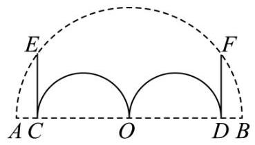

【答案】 $\frac{\sqrt{{\pi }^{2} + 4}}{2}$

9. (2024·上海闵行·二模)始边与 $x$ 轴的正半轴重合的角 $\alpha$ 的终边过点 (3,-4) ，则 $\sin \left( {\alpha  + \pi }\right)  =$ ___.

【答案】 $\frac{4}{5}/{0.8}$

10. (2024·上海虹口·二模)已知集合 $A = \{ x \mid  \tan x < 0\}$ ， $B = \left\{  {x\left| {\;\frac{x - 2}{x} \leq  0}\right. }\right\}$ ，则 $A \cap  B =$ ___.

【答案】 $\left\{  {x\left| {\;\frac{\pi }{2} < x \leq  2}\right. }\right\}$

11. (2024·上海黄浦·二模) 若 $\overrightarrow{a} = \left( {3\cos \theta ,\sin \theta }\right) ,\overrightarrow{b} = \left( {\cos \theta ,3\sin \theta }\right)$ ,其中 $\theta  \in  R$ ,则 $\overrightarrow{a} \cdot  \overrightarrow{b} =$ ___.

【答案】 3

12. (2024·上海青浦·二模) 已知向量 $\overrightarrow{a} = \left( {-1,1}\right)$ ， $\overrightarrow{b} = \left( {3,4}\right)$ ，则 $< \overrightarrow{a}$ 。， $\overrightarrow{b} >  =$ ___.

【答案】 $\arccos \frac{\sqrt{2}}{10}$

13. ( 2024 - 上海闵行.二模)已知定义在 $\left( {0, + \infty }\right)$ 上的函数 $y = f\left( x\right)$ 的表达式为 $f\left( x\right)  = \sin x - x\cos x$ ，其所有的零点按从小到大的顺序组成数列 $\left\{  {x}_{n}\right\}  \left( {n \geq  1, n \in  N}\right)$ .

(1)求函数 $y = f\left( x\right)$ 在区间 $\left( {0,\pi }\right)$ 上的值域；

( 2 )求证:函数 $y = f\left( x\right)$ 在区间 $\left( {{n\pi },\left( {n + 1}\right) \pi }\right) \left( {n \geq  1, n \in  N}\right)$ 上有且仅有一个零点；

(3) 求证: $\pi  < {x}_{n + 1} - {x}_{n} < \frac{\left( {n + 1}\right) \pi }{n}$ .

【答案】 $\left( 1\right) \left( {0,\pi }\right)$

(2)证明见解析

(3)证明见解析

14. (2024·上海金山·二模)已知函数 $y = f\left( x\right)$ ，记 $f\left( x\right)  = \sin \left( {{\omega x} + \varphi }\right)$ ， $\omega  > 0$ ， $0 < \varphi  < \pi$ ， $x \in  R$ .

(1)若函数 $y = f\left( x\right)$ 的最小正周期为 $\pi$ ，当 $f\left( \frac{\pi }{6}\right)  = 1$ 时，求 $\omega$ 和 $\varphi$ 的值；

(2)若 $\omega  = 1$ ， $\varphi  = \frac{\pi }{6}$ ，函数 $y = {f}^{2}\left( x\right)  - {2f}\left( x\right)  - a$ 有零点，求实数 $a$ 的取值范围.

【答案】 $\left( 1\right) \omega  = 2,\varphi  = \frac{\pi }{6}$

(2) $a \in  \left\lbrack  {-1,3}\right\rbrack$

15. (2024·上海青浦·二模)若无穷数列 $\left\{  {a}_{n}\right\}$ 满足:存在正整数 $T$ ，使得 ${a}_{n + T} = {a}_{n}$ 对一切正整数 $n$ 成立，则称 $\left\{  {a}_{n}\right\}$ 是周期为 $T$ 的周期数列.

(1)若 ${a}_{n} = \sin \left( {\frac{\pi n}{m} + \frac{\pi }{3}}\right)$ (其中正整数 $m$ 为常数， $n \in  N, n \geq  1$ )，判断数列 $\left\{  {a}_{n}\right\}$ 是否为周期数列，并说明理由;

(2)若 ${a}_{n + 1} = {a}_{n} + \sin {a}_{n}\left( {n \in  N, n \geq  1}\right)$ ，判断数列 $\left\{  {a}_{n}\right\}$ 是否为周期数列，并说明理由；

(3) 设 $\left\{  {b}_{n}\right\}$ 是无穷数列,已知 ${a}_{n + 1} = {b}_{n} + \sin {a}_{n}\left( {n \in  N, n \geq  1}\right)$ . 求证: “存在 ${a}_{1}$ ,使得 $\left\{  {a}_{n}\right\}$ 是周期数列” 的充要条件是 “ $\left\{  {b}_{n}\right\}$ 是周期数列”.

【答案】(1) $\left\{  {a}_{n}\right\}$ 是周期为 ${2m}$ 的周期数列,理由见解析

(2)答案见解析

(3)证明见解析

## 二、题型二:三角恒等变换

1. (2024·上海虹口·二模) 设 $f\left( x\right)  = \sin {2x} + \sqrt{3}\cos {2x}$ ,将函数 $y = f\left( x\right)$ 的图像沿 $x$ 轴向右平移 $\frac{\pi }{6}$ 个单位, 得到函数 $y = g\left( x\right)$ 的图像,则 ( )

A. 函数 $y = g\left( x\right)$ 是偶函数 B. 函数 $y = g\left( x\right)$ 的图像关于直线 $x = \frac{\pi }{2}$ 对称

C. 函数 $y = g\left( x\right)$ 在 $\left\lbrack  {\frac{\pi }{4},\frac{\pi }{2}}\right\rbrack$ 上是严格增函数 D. 函数 $y = g\left( x\right)$ 在 $\left\lbrack  {\frac{\pi }{6},\frac{2\pi }{3}}\right\rbrack$ 上的值域为 $\left\lbrack  {-\sqrt{3},2}\right\rbrack$

【答案】 $D$

2. (2024·上海静安·二模) 函数 $y = 2\sin x - \cos x\left( {x \in  R}\right)$ 的最小正周期为 ( )

A. ${2\pi }$ B. $\pi$

C. $\frac{3\pi }{2}$ D. $\frac{\pi }{2}$

【答案】 $A$

3. (2024·上海长宁·二模)直线 ${2x} - y - 3 = 0$ 与直线 $x - {3y} - 5 = 0$ 的夹角大小为___.

【答案】 $\frac{\pi }{4}/{45}^{ \circ  }$

4. (2024·上海嘉定·二模) 已知 $f\left( x\right)  = \frac{2}{\sin x} + \frac{2}{\cos x},\;x \in  \left( {0,\frac{\pi }{2}}\right)$ ，则函数 $y = f\left( x\right)$ 的最小值为___.

【答案】 $4\sqrt{2}$

5. (2024.上海崇明. 二模) 已知 $A$ 、 $B$ 、 $C$ 是半径为 1 的圆上的三个不同的点，且 $\left| {{}^{ \circ  }\overrightarrow{AB}{}^{ \circ  }}\right|  = \sqrt{3}$ ，则 $\overrightarrow{AB}$ · $\overrightarrow{AC}$ 的最小值是___.

【答案】 $\frac{3}{2} - \sqrt{3}$

6. (2024.上海奉贤. 二模) 已知 $\alpha  \in  \left\lbrack  {0,\pi }\right\rbrack$ ，且 $2\cos {2\alpha } - 3\cos \alpha  = 5$ ，则 $\alpha  =$ ___.

【答案】 $\pi$

7. (2024·上海杨浦·二模) 已知实数 $a$ 满足:① $a \in  \lbrack 0,{2\pi })$ ；②存在实数 $b, c\left( {a < b < c < {2\pi }}\right)$ ，使得 $a, b$ ， $c$ 是等差数列， $\cos b$ ， $\cos a$ ， $\cos c$ 也是等差数列. 则实数 $a$ 的取值范围是___.

【答案】 $\left( {\arccos \frac{1}{8},\pi }\right)$

8. (2024·上海·二模)固定项链的两端，在重力的作用下项链所形成的曲线是悬链线.1691 年，莱布尼茨等得出 “悬链线” 方程 $y = \frac{c\left( {{\mathrm{e}}^{\frac{x}{c}} + {\mathrm{e}}^{-\delta }\frac{x}{c}}\right) }{2}$ ,其中 $c$ 为参数. 当 $c = 1$ 时,就是双曲余弦函数 ${ch}\left( x\right)  = \; \frac{{\mathrm{e}}^{x} + {\mathrm{e}}^{-x}}{2}$ ,悬链线的原理运用于悬索桥、架空电缆、双曲拱桥、拱坝等工程. 类比三角函数的三种性质: ① 平方关系: ${\sin }^{2}x + {\cos }^{2}x = 1$ ; ②两角和公式: $\cos \left( {x + y}\right)  = \cos x\cos y - \sin x\sin y$ ,③导数: $\left\{  \begin{array}{l} {\left( \sin x\right) }^{\prime } = \cos x, \\  {\left( \cos x\right) }^{\prime } =  - \sin x, \end{array}\right.$ 定义双曲正弦函数 $\operatorname{sh}\left( x\right)  = \frac{{\mathrm{e}}^{x} - {\mathrm{e}}^{-x}}{2}$ .

(1)直接写出 ${sh}\left( x\right)$ ， ${ch}\left( x\right)$ 具有的类似①、②、③的三种性质 (不需要证明)；

(2)当 $x > 0$ 时，双曲正弦函数 $y = {sh}\left( x\right)$ 的图像总在直线 $y = {kx}$ 的上方，求直线斜率 $k$ 的取值范围；

(3)无穷数列 $\left\{  {a}_{n}\right\}$ 满足 ${a}_{1} = a,{a}_{n + 1} = {2{a}_{n}^{2}} - 1$ ，是否存在实数 $a$ ，使得 ${a}_{2024} = \frac{5}{4}$ ？若存在，求出 $a$ 的值， 若不存在, 说明理由.

【答案】(1)答案见解析

(2) $( - \infty ,1\rbrack$

(3)存在， $a =  \pm  \frac{1}{2}\left( {{2}^{\frac{1}{2023}} + {2}^{-\frac{1}{2023}}}\right)$

9. $c{h}^{2}\left( x\right)  - 1 = 2 \times  {\left( \frac{{\mathrm{e}}^{x} + {\mathrm{e}}^{-x}}{2}\right) }^{2} - 1 = \frac{{\mathrm{e}}^{2x} + 2 + {\mathrm{e}}^{-{2x}}}{2} - 1 = \frac{{\mathrm{e}}^{2x} + {\mathrm{e}}^{-{2x}}}{2} = {ch}\left( {2x}\right)$

类比 ${a}_{1} \in  \left\lbrack  {-1,1}\right\rbrack$ 时的数学归纳法,设 $\left| {a}_{1}\right|  = {ch}\left( m\right)$ ,

易证 ${a}_{2} = {2c}{h}^{2}\left( m\right)  - 1 = {ch}\left( {2m}\right) ,\;{a}_{3} = {ch}\left( {{2}^{2}m}\right) ,\;\cdots ,\;{a}_{n} = {ch}\left( {{2}^{n - 1}m}\right) ,\;\cdots ,$

所以若 ${a}_{2024} = {ch}\left( {{2}^{2023}m}\right)  = \frac{5}{4}$ ,

设 $t = {2}^{2023}m$ ,则 ${ch}\left( t\right)  = \frac{{\mathrm{e}}^{t} + {\mathrm{e}}^{-t}}{2} = \frac{5}{4}$ ,解得: ${\mathrm{e}}^{t} = 2$ 或 $\frac{1}{2}$ ,即 $t =  \pm  \ln 2$ ,

所以 $m =  \pm  \frac{\ln 2}{{2}^{2023}}$ ,于是 $\left| {a}_{1}\right|  = {ch}\left( m\right)  = \frac{{\mathrm{e}}^{m} + {\mathrm{e}}^{-m}}{2} = \frac{1}{2}\left( {{2}^{\frac{1}{2023}} + {2}^{-\frac{1}{2023}}}\right)$ .

综上: 存在实数 $a =  \pm  \frac{1}{2}\left( {{2}^{\frac{1}{2023}} + {2}^{-\frac{1}{2023}}}\right)$ 使得 ${a}_{2024} = \frac{5}{4}$ 成立.

10. (2024．上海长宁. 二模)某同学用 “五点法” 画函数 $f\left( x\right)  = \sin \left( {{\omega x} + \varphi }\right) \left( {\omega  > 0}\right)$ 在某一个周期内的图象时, 列表并填入了部分数据, 如下表:

<table id="cross-table-4"><tr><td>${\omega x} + \varphi$</td><td>0</td><td>$\frac{\pi }{2}$</td><td>$\pi$</td><td>$\frac{3\pi }{2}$</td><td>${2\pi }$</td></tr><tr><td>$x$</td><td>$\Delta$</td><td>$\frac{\pi }{6}$</td><td>$\frac{5\pi }{12}$</td><td>$\frac{2\pi }{3}$</td><td>$\frac{11\pi }{12}$</td></tr><tr><td>$\sin \left( {{\omega x} + \varphi }\right)$</td><td>0</td><td>1</td><td>$\Delta$</td><td>-1</td><td>0</td></tr></table>

(1)请在答题卷上将上表 $\Delta$ 处的数据补充完整，并直接写出函数 $y = f\left( x\right)$ 的解析式；

(2)设 $\omega  = 1$ ， $\varphi  = 0$ ， $g\left( x\right)  = {f}^{2}\left( x\right)  + f\left( x\right) f\left( {\frac{\pi }{2} - x}\right) \left( {x \in  \left\lbrack  {0,\frac{\pi }{2}}\right\rbrack  }\right)$ ，求函数 $y = g\left( x\right)$ 的值域；

【答案】(1) 补充表格见解析, $f\left( x\right)  = \sin \left( {{2x} + \frac{\pi }{6}}\right)$

(2) $\left\lbrack  {0,\frac{\sqrt{2} + 1}{2}}\right\rbrack$

11. (2024·上海青浦·二模) 对于函数 $y = f\left( x\right)$ ,其中 $f\left( x\right)  = 2\sin x\cos x + 2\sqrt{3}{\cos }^{2}x - \sqrt{3}$ , $x \in  R$ .

(1)求函数 $y = f\left( x\right)$ 的单调增区间；

(2)在锐角三角形 ${ABC}$ 中，若 $f\left( A\right)  = 1$ ， $\overrightarrow{AB} \cdot  \overrightarrow{AC} = \sqrt{2}$ ，求 $\bigtriangleup  {ABC}$ 的面积.

【答案】( 1 ) $\left\lbrack  {{k\pi } - \frac{5\pi }{12} \circ  , \circ  {k\pi } + \frac{\pi }{12}}\right\rbrack   \circ   \circ  , \circ  \left( {k \in  Z}\right)$

(2) $\frac{\sqrt{2}}{2}$ .

12. ( 2024 上海嘉定. 二模)在 $\bigtriangleup  {ABC}$ 中，角 $A$ 、 $B$ 、 $C$ 的对边分别为 $a$ 、 $b$ 、 $c$ ， ${\cos }^{2}B - {\sin }^{2}B =  - \frac{1}{2}$ .

(1)求角 $B$ ，并计算 $\sin \left( {B + \frac{\pi }{6}}\right)$ 的值；

(2)若 $b = \sqrt{3}$ ，且 $\bigtriangleup  {ABC}$ 是锐角三角形，求 $a + {2c}$ 的最大值.

【答案】 $\left( 1\right) \frac{\pi }{3}$ 或 $\frac{2\pi }{3}$ ; 当 $B = \frac{\pi }{3}$ 时, $\sin \left( {B + \frac{\pi }{6}}\right)  = 1$ ; 当 $B = \frac{2\pi }{3}$ 时, $\sin \left( {B + \frac{\pi }{6}}\right)  = \frac{1}{2}$

(2)2√7

13. (2024·上海静安·二模)在 $\bigtriangleup  {ABC}$ 中，角 $A$ 、 $B$ 、 $C$ 的对边分别为 $a$ 、 $b$ 、 $c$ ，已知 $a = 3$ ， $b = 5$ ， $c = 7$ .

(1)求角 $C$ 的大小；

(2)求 $\sin \left( {A + C}\right)$ 的值.

【答案】 $\left( 1\right) C = \frac{2\pi }{3}$

(2) $\frac{5\sqrt{3}}{14}$ .

14. (2024·上海闵行·二模)在锐角 $\bigtriangleup  {ABC}$ 中，角 $A$ 、 $B$ 、 $C$ 所对边的边长分别为 $a$ 、 $b$ 、 $c$ ，且 ${2b}{\sin A} - \; \sqrt{3}a = 0.$

(1)求角 $B$ ；

(2)求 $\sin A + \sin C$ 的取值范围.

【答案】(1) $\frac{\pi }{3}$

(2) $\left( {\frac{3}{2},\sqrt{3}}\right\rbrack$ .

15. (2024·上海松江·二模) 设 $f\left( x\right)  = {\sin }^{2}\frac{\omega }{2}x + \sqrt{3}\cos \frac{\omega }{2}x\sin \frac{\omega }{2}x\left( {\omega  > 0}\right)$ ,函数 $y = f\left( x\right)$ 图象的两条相邻对称轴之间的距离为 $\pi$ .

(1)求函数 $y = f\left( x\right)$ 的解析式；

(2) 在 $\bigtriangleup {ABC}$ 中,设角 $A\text{ 、 }B$ 及 $C$ 所对边的边长分别为 $a\text{ 、 }b$ 及 $c$ ,若 $a = \sqrt{3}, b = \sqrt{2}, f\left( A\right)  = \frac{3}{2}$ ,求角 $C$ .

【答案】 $\left( 1\right) f\left( x\right)  = \sin \left( {x - \frac{\pi }{6}}\right)  + \frac{1}{2}$

(2) $\frac{\pi }{12}$

## 三、题型三:解三角形

1. (2024·上海嘉定·二模) 嘉定某学习小组开展测量太阳高度角的数学活动. 太阳高度角是指某时刻太阳光线和地平面所成的角. 测量时, 假设太阳光线均为平行的直线, 地面为水平平面. 如图, 两竖直墙面所成的二面角为 ${120}^{ \circ  }$ ,墙的高度均为 3 米. 在时刻 $t$ ,实地测量得在太阳光线照射下的两面墙在地面的阴影宽度分别为 1 米、 1.5 米. 在线查阅嘉定的天文资料，当天的太阳高度角和对应时间的部分数据如表所示,则时刻 $t$ 最可能为 ( )

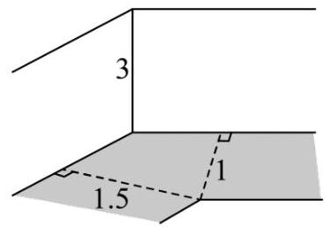

<table><tr><td>太阳高度角</td><td>时间</td><td>太阳高度角</td><td>时间</td></tr><tr><td>${43.13}^{ \circ  }$</td><td>08:30</td><td>68.53°</td><td>10 : 30</td></tr><tr><td>${49.53}^{ \circ  }$</td><td>09:00</td><td>74.49°</td><td>11:00</td></tr><tr><td>${55.93}^{ \circ  }$</td><td>09:30</td><td>79.60°</td><td>11:30</td></tr><tr><td>${62.29}^{ \circ  }$</td><td>10:00</td><td>82.00°</td><td>12:00</td></tr></table>

A. 09:00 B. 10:00 C. ${11} : {00}$ D. ${12} : {00}$

【答案】 $B$

2. (2024·上海嘉定·二模) 已知 $\overrightarrow{OA} = \left( {{x}_{1},{y}_{1}}\right) ,\overrightarrow{OB} = \left( {{x}_{2},{y}_{2}}\right)$ ,且 $\overrightarrow{OA}\text{ 、 }\overrightarrow{OB}$ 不共线,则 $\bigtriangleup {OAB}$ 的面积为 ( )

A. $\frac{1}{2}\left| {{x}_{1}{x}_{2} - {y}_{1}{y}_{2}}\right|$ B. $\frac{1}{2}\left| {{x}_{1}{y}_{2} - {x}_{2}{y}_{1}}\right|$ C. $\frac{1}{2}\left| {{x}_{1}{x}_{2} + {y}_{1}{y}_{2}}\right|$ D. $\frac{1}{2}\left| {{x}_{1}{y}_{2} + {x}_{2}{y}_{1}}\right|$

【答案】 $B$

3.(2024·上海虹口·二模) 已知一个三角形的三边长分别为2,3,4，则这个三角形外接圆的直径为 ___.

【答案】 $\frac{{16}\sqrt{15}}{15}/\frac{16}{15}\sqrt{15}$

4. (2024·上海徐汇·二模) 如图所示，已知 $\bigtriangleup  {ABC}$ 满足 ${BC} = 8$ ， ${AC} = {3AB}$ ， $P$ 为 $\bigtriangleup  {ABC}$ 所在平面内一点. 定义点集 $D = \left\{  {P\left| {\;\overrightarrow{AP} = {3\lambda }\overrightarrow{AB} + \frac{1 - \lambda }{3}\overrightarrow{AC}}\right. ,\lambda  \in  R}\right\}$ . 若存在点 ${P}_{0} \in  D$ ,使得对任意 $P \in  D$ ,满足 $\left| \overrightarrow{AP}\right|  \geq \; \left| \overrightarrow{A{P}_{0}}\right|$ 恒成立，则 $\left| \overrightarrow{A{P}_{0}}\right|$ 的最大值为___.

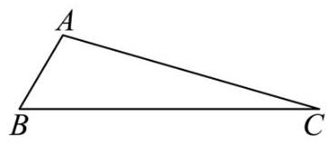

【答案】 3

5. $\leq  t < {10}$ 时, ${f}^{\prime }\left( t\right)  < 0, f\left( t\right)$ 递减, $t > 9$ 时 ${f}^{\prime }\left( t\right)  > 0, f\left( t\right)$ 递增,

所以 $t = {10}$ 时, $f{\left( t\right) }_{\min } = 8,\left( {S}_{\bigtriangleup {ABC}}\right)  = {12}$ ,

综上， $\left( {S}_{\bigtriangleup {ABC}}\right)  = {12}$ ，

此时 ${h}_{\max } = \frac{2{S}_{\bigtriangleup {AMN}}}{\left| MN\right| } = 3$ .

6. ( 2024 ・上海徐汇 · 二模)如图，两条足够长且互相垂直的轨道 ${l}_{1}$ ， ${l}_{2}$ 相交于点 $O$ ，一根长度为 8 的直杆 ${AB}$ 的两端点 $A, B$ 分别在 ${l}_{1},{l}_{2}$ 上滑动 $(A, B$ 两点不与 $O$ 点重合,轨道与直杆的宽度等因素均可忽略不计),直杆上的点 $P$ 满足 ${OP} \bot  {AB}$ ,则 $\bigtriangleup {OAP}$ 面积的取值范围是___.

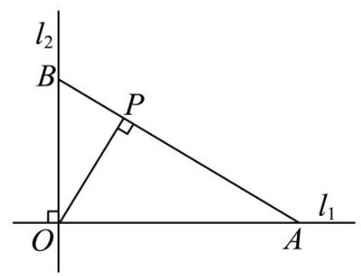

【答案】 $(0,6\sqrt{3}\rbrack$

7. ( 2024 ・上海徐汇 · 二模 )在 $\bigtriangleup {ABC}$ 中， ${AC} = 1$ ， $\angle C = \frac{2\pi }{3}$ ， $\angle A = \frac{\pi }{6}$ ，则 $\bigtriangleup {ABC}$ 的外接圆半径为 ___.

【答案】 1

8. $\left( {{2024} \cdot  }\right.$ 上海闵行.二模 $)$ 双曲线 $\Gamma  : {}^{ \circ  }{}^{ \circ  }{x}^{2} - \frac{{y}^{2}}{6} = 1{}^{ \circ  }$ 的左右焦点分别为 ${F}_{1}\text{ 、 }{F}_{2}$ ,过坐标原点的直线与 $\Gamma$ 相交于 $A\text{ 、 }B$ 两点，若 $\left| {{F}_{1}B}\right|  = 2\left| {{F}_{1}A}\right|$ ，则 $\overrightarrow{{F}_{2}A} \cdot  \overrightarrow{{F}_{2}B} =$ ___.

【答案】 4

9. (2024·上海虹口·二模)如图，在直四棱柱 ${ABCD} - {A}_{1}{B}_{1}{C}_{1}{D}_{1}$ 中，底面 ${ABCD}$ 为菱形，且 $\angle {BAD} = {60}^{ \circ  }$ . 若 ${AB} = A{A}_{1} = 2$ ，点 $M$ 为棱 $C{C}_{1}$ 的中点，点 $P$ 在 ${A}_{1}B$ 上，则线段 ${PA}$ ， ${PM}$ 的长度和的最小值为 ___.

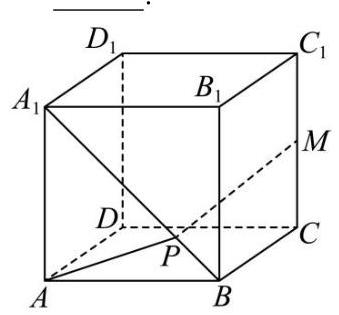

【答案】 $\sqrt{9 + 2\sqrt{10}}$

10. (2024·上海黄浦·二模)在 $\bigtriangleup  {ABC}$ 中， $\cos A =  - \frac{3}{5}$ ， ${AB} = 1$ ， ${AC} = 5$ ，则 ${BC} =$ ___.

【答案】 $4\sqrt{2}$

11. (2024·上海金山·二模) 某临海地区为保障游客安全修建了海上救生栈道，如图，线段 ${BC}$ 、 ${CD}$ 是救生栈道的一部分，其中 ${BC} = {300m}$ ， ${CD} = {800m}$ ， $B$ 在 $A$ 的北偏东 ${30}^{ \circ  }$ 方向， $C$ 在 $A$ 的正北方向， $D$ 在 $A$ 的北偏西 ${80}^{ \circ  }$ 方向，且 $\angle B = {90}^{ \circ  }$ . 若救生艇在 $A$ 处载上遇险游客需要尽快抵达救生栈道 $B - C - \; D$ ,则最短距离为___ $m$ . (结果精确到 $1\mathrm{\;m}$ )

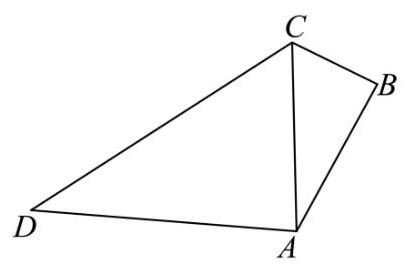

【答案】 475

12. ( 23 - 24 高三下·上海浦东新·期中)已知双曲线 $\frac{{x}^{2}}{{a}^{2}} - \frac{{y}^{2}}{{b}^{2}} = 1\left( {a > 0, b > 0}\right)$ 的焦点分别为 ${F}_{1}\text{ 、 }{F}_{2}$ ， $M$ 为双曲线上一点，若 $\angle {F}_{1}M{F}_{2} = \frac{2\pi }{3}$ ， ${OM} = \frac{\sqrt{21}}{3}b$ ，则双曲线的离心率为___.

【答案】 $\frac{\sqrt{6}}{2}$

13. (2024·上海普陀·二模)设函数 $f\left( x\right)  = \sin \left( {{\omega x} + \varphi }\right) ,\omega  > 0,0 < \varphi  < \pi$ ，它的最小正周期为 $\pi$ .

(1)若函数 $y = f\left( {x - \frac{\pi }{12}}\right)$ 是偶函数，求 $\varphi$ 的值；

(2)在 $\bigtriangleup  {ABC}$ 中，角 $A$ 、 $B$ 、 $C$ 的对边分别为 $a$ 、 $b$ 、 $c$ ，若 $a = 2$ ， $A = \frac{\pi }{6}$ ， $f\left( \frac{B - \varphi }{2}\right)  = \frac{\sqrt{3}}{4}c$ ，求 $b$ 的值.

【答案】 $\left( 1\right) \varphi  = \frac{2\pi }{3}$

$\left( 2\right) b = 2\sqrt{3}$

14. (2024·上海杨浦·二模) 已知 $f\left( x\right)  = \sin {\omega x}\left( {\omega  > 0}\right)$ .

(1)若 $y = f\left( x\right)$ 的最小正周期为 ${2\pi }$ ，判断函数 $F\left( x\right)  = f\left( x\right)  + f\left( {x + \frac{\pi }{2}}\right)$ 的奇偶性，并说明理由；

(2) 已知 $\omega  = 2,{\bigtriangleup {ABC}}$ 中， $a, b, c$ 分别是角 $A, B, C$ 所对的边，若 $f\left( {A + \frac{\pi }{3}}\right)  = 0,{a = 2}, b = 3$ ， 求 $c$ 的值.

【答案】(1) 非奇非偶函数,理由见解析;

$\left( 2\right) c = \frac{3\sqrt{3} \pm  \sqrt{7}}{2}.$

专题 06 数列 (三大题型, )

## 二模新速递

## 选题列表

1.·上海杨浦·二模 2024.上海奉贤·二模

2.·上海浦东·二模 2024·上海青浦·二模

3. 上海黄浦·二模 2024·上海闵行·二模

4. 上海普陀·二模 2024·上海金山·二模

5. 上海徐汇·二模 2024.上海静安·二模

6. 上海松江·二模 2024·上海长宁·二模

7. 上海嘉定·二模 2024·上海崇明·二模

8. 上海虹口.二模 2024·上海宝山·二模

## 汇编目录

题型一:等差数列及其求和 .1

题型二:等比数列及其求和 .6

题型三: 数列极限及新定义问题 .13

## 一、题型一:等差数列及其求和

1.(23-24高三下·上海浦东新·期中) 设 ${f}_{0}\left( x\right)  = {a}_{m}{x}^{m} + {a}_{m - 1}{x}^{m - 1} + \cdots  + {a}_{1}x + {a}_{0}\left( {{a}_{m} \neq  0, m \geq  {10}, m \leq  {10}, m \in  Z}\right)$ , 记 ${f}_{n}\left( x\right)  = {f}_{n - 1}^{\prime }\left( x\right) \left( {n = 1,2,\cdots , m - 1}\right)$ ,令有穷数列 ${b}_{n}$ 为 ${f}_{n}\left( x\right)$ 零点的个数 $\left( {n = 1,2,\cdots , m - 1}\right)$ ,则有以下两个结论: ①存在 ${f}_{0}\left( x\right)$ ,使得 ${b}_{n}$ 为常数列; ②存在 ${f}_{0}\left( x\right)$ ,使得 ${b}_{n}$ 为公差不为零的等差数列. 那么 ( )

A. ①正确，②错误 B. ①错误，②正确 C. ①②都正确 D. ①②都错误

【答案】 $C$

2. (2024·上海松江·二模) 已知等差数列 $\left\{  {a}_{n}\right\}$ 的公差为 2，前 $n$ 项和为 ${S}_{n}$ ，若 ${a}_{3} = {S}_{5}$ ，则使得 ${S}_{n} < {a}_{n}$ 成立的 $n$ 的最大值为___.

【答案】 5

3.(2024·上海杨浦·二模) 已知实数 $a$ 满足: ① $a \in  \lbrack 0,{2\pi })$ ；②存在实数 $b, c\left( {a < b < c < {2\pi }}\right)$ ，使得 $a, b$ ， $c$ 是等差数列， $\cos b,\cos a,\cos c$ 也是等差数列. 则实数 $a$ 的取值范围是___.

【答案】 $\left( {\arccos \frac{1}{8},\pi }\right)$

4. (2024·上海杨浦·二模) 某钢材公司积压了部分圆钢，经清理知共有 2024 根，每根圆钢的直径为 10 厘米. 现将它们堆放在一起. 若堆成纵断面为等腰梯形 (如图每一层的根数比上一层根数多 1 根), 且为考虑安全隐患，堆放高度不得高于 $\frac{3}{2}$ 米，若堆放占用场地面积最小，则最下层圆钢根数为___.

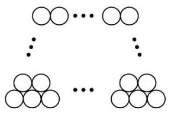

【答案】 134

5. (2024·上海黄浦·二模) 已知数列 $\left\{  {a}_{n}\right\}$ 是给定的等差数列,其前 $n$ 项和为 ${S}_{n}$ ,若 ${a}_{9}{a}_{10} < 0$ ,且当 $m = {m}_{0}$ 与 $n = {n}_{0}$ 时， $\left| {{S}_{m} - {S}_{n}}\right| \left( {m, n \in  \left\{  {x \mid  x \leq  {30}, x \in  {N}^{ * }}\right\}  }\right)$ 取得最大值，则 $\left| {{m}_{0} - {n}_{0}}\right|$ 的值为___.

【答案】 21

6. $\left( {{23} - {24}}\right.$ 高三下. 上海浦东新. 期中) 已知等差数列 $\left\{  {a}_{n}\right\}$ 满足 ${a}_{1} + {a}_{6} = {12},{a}_{4} = 7$ ，则 ${a}_{3} =$ ___.

【答案】 5

7. (2024·上海崇明·二模) 若等差数列 $\left\{  {{}^{ \circ  }{}^{ \circ  }{a}_{n}}\right\}$ 的首项 ${a}_{1}{}^{ \circ  } = 1$ ,前 5 项和 ${S}_{5}{}^{ \circ  } = {25}$ ,则 ${a}_{5}{}^{ \circ  } =$ ___. 【答案】 9

8. (2024·上海虹口·二模)已知等差数列 $\left\{  {a}_{n}\right\}$ 满足 ${a}_{2} = 5,{a}_{9} + 7 = 2{a}_{6}$ .

(1)求 $\left\{  {a}_{n}\right\}$ 的通项公式；

(2)设数列 $\left\{  {b}_{n}\right\}$ 前 $n$ 项和为 ${S}_{n}$ ，且 ${b}_{n} = {a}_{n + 1}^{2} - {a}_{n}^{2}$ ，若 ${S}_{m} > {432}$ ，求正整数 $m$ 的最小值.

【答案】 $\left( 1\right) {a}_{n} = {2n} + 1$

(2)10

## 二、题型二: 等比数列及其求和

1. (2024·上海松江·二模) 设 ${S}_{n}$ 为数列 $\left\{  {a}_{n}\right\}$ 的前 $n$ 项和,有以下两个命题:①若 $\left\{  {a}_{n}\right\}$ 是公差不为零的等差数列且 $k \in  N, k \geq  2$ ,则 ${S}_{1} \cdot  {S}_{2}\cdots {S}_{{2k} - 1} = 0$ 是 ${a}_{1} \cdot  {a}_{2}\cdots {a}_{k} = 0$ 的必要非充分条件; ②若 $\left\{  {a}_{n}\right\}$ 是等比数列且 $k \in  N, k \geq  2$ ,则 ${S}_{1} \cdot  {S}_{2}\cdots {S}_{k} = 0$ 的充要条件是 ${a}_{k} + {a}_{k + 1} = 0$ . 那么 ( )

A. ①是真命题，②是假命题 B. ①是假命题，①是真命题

C. ①、②都是真命题 D. ①、②都是假命题

【答案】 $C$

2. (2024·上海普陀·二模)设 ${S}_{n}$ 是数列 $\left\{  {a}_{n}\right\}$ 的前 $n$ 项和 $\left( {n \geq  1, n \in  N}\right)$ ，若数列 $\left\{  {a}_{n}\right\}$ 满足:对任意的 $n \geq$ 2,存在大于 1 的整数 $m$ ,使得 $\left( {{S}_{m} - {a}_{n}}\right) \left( {{S}_{m} - {a}_{n + 1}}\right)  < 0$ 成立,则称数列 $\left\{  {a}_{n}\right\}$ 是 “ $G$ 数列”. 现给出如下两个结论:①存在等差数列 $\left\{  {a}_{n}\right\}$ 是“ $G$ 数列”；②任意等比数列 $\left\{  {a}_{n}\right\}$ 都不是“ $G$ 数列”. 则( )

A. ①成立②成立 B. ①成立②不成立 C. ①不成立②成立 D. ①不成立②不成立

【答案】 $D$

3. (2024·上海青浦·二模) 设 ${S}_{n}$ 是首项为 ${a}_{1}$ ,公比为 $q$ 的等比数列 $\left\{  {a}_{n}\right\}$ 的前 $n$ 项和,且 ${S}_{2023} < {S}_{2025} < \; {S}_{2024}$ ,则 ( ).

A. ${a}_{1} > 0$ B. $q > 0$ C. $\left| {S}_{n}\right|  \leq  \left| {a}_{1}\right|$ D. $\left| {S}_{n}\right|  < \left| q\right|$

【答案】 $C$

4. (2024·上海长宁·二模) 设数列 $\left\{  {a}_{n}\right\}$ 的前 $n$ 项和为 ${S}_{n}$ ,若存在非零常数 $c$ ,使得对任意正整数 $n$ ,都有 $2\sqrt{{S}_{n}} = {a}_{n} + c$ ,则称数列 $\left\{  {a}_{n}\right\}$ 具有性质 $p$ : ①存在等差数列 $\left\{  {a}_{n}\right\}$ 具有性质 $p$ ; ②不存在等比数列 $\left\{  {a}_{n}\right\}$ 具有性质 $p$ ; 对于以上两个命题,下列判断正确的是 ( )

A. ①真②真 B. ①真②假 C. ①假②真 D. ①假②假

【答案】 $B$

5. (2024·上海普陀·二模)设等比数列 $\left\{  {a}_{n}\right\}$ 的公比为 $q\left( {n \geq  1, n \in  N}\right)$ ，则 “ ${12}{a}_{2},{a}_{4},2{a}_{3},{a}_{4},2{a}_{3}$ 成等差数列” 的一个充分非必要条件是___.

【答案】 $q = 3$ (或 $q =  - 2$ ,答案不唯一)

6. (2024·上海普陀·二模) 设 $k, m, n$ 是正整数， ${S}_{n}$ 是数列 $\left\{  {a}_{n}\right\}$ 的前 $n$ 项和， ${a}_{1} = 2,{S}_{n} = {a}_{n + 1} + 1$ ，若 $m = \mathop{\sum }\limits_{{i = 1}}^{k}{t}_{i}\left( {{S}_{i} - 1}\right)$ ,且 ${t}_{i} \in  \{ 0,1\}$ ,记 $f\left( m\right)  = {t}_{1} + {t}_{2} + \cdots  + {t}_{k}$ ,则 $f\left( {2024}\right)  =$

【答案】 7

7. (2024·上海徐汇·二模)已知数列 $\left\{  {a}_{n}\right\}$ 的前 $n$ 项和为 ${S}_{n}$ ，若 ${S}_{n} = \frac{3}{2}{a}_{n} - \frac{1}{2}$ ( $n$ 是正整数)，则 ${a}_{5} =$ ___.

【答案】81

8. (2024·上海杨浦·二模)各项为正的等比数列 $\left\{  {a}_{n}\right\}$ 满足: ${a}_{1} = 2,{a}_{2} + {a}_{3} = {12}$ ，则通项公式为 ${a}_{n} =$ ___.

【答案】 ${2}^{n}$

9. (2024·上海静安·二模)已知等比数列的前 $n$ 项和为 ${S}_{n} = {\left( \frac{1}{2}\right) }^{n} + a$ ，则 $a$ 的值为___.

【答案】 -1

10. (2024·上海金山·二模)设公比为2的等比数列 $\left\{  {a}_{n}\right\}$ 的前 $n$ 项和为 ${S}_{n}$ ，若 ${S}_{2024} - {S}_{2022} = 6$ ，则 ${a}_{2024} =$ ___.

【答案】 4

11. (2024·上海奉贤·二模) 已知 $\left\{  {a}_{n}\right\}$ 是公差 $d = 2$ 的等差数列,其前 5 项和为 15, $\left\{  {b}_{n}\right\}$ 是公比 $q$ 为实数的等比数列, ${b}_{1} = 1,{b}_{4} - {b}_{2} = 6$ .

(1)求 $\left\{  {a}_{n}\right\}$ 和 $\left\{  {b}_{n}\right\}$ 的通项公式；

(2)设 ${c}_{n} = {2}^{{a}_{n}} + {b}_{2n}\left( {n \geq  1, n \in  N}\right)$ ，计算 $\mathop{\sum }\limits_{{i = 1}}^{n}{c}_{i}$ .

【答案】 $\left( 1\right) {a}_{n} = {2n} - 3,{b}_{n} = {2}^{n - 1}$ ;

(2) $\frac{5}{6}\left( {{4}^{n} - 1}\right)$ .

## 三、题型三:数列极限及新定义问题

1. (2024·上海虹口·二模) 已知等比数列 $\left\{  {a}_{n}\right\}$ 是严格减数列,其前 $n$ 项和为 ${S}_{n},{a}_{1} = 2$ ,若 ${a}_{1},2{a}_{2},3{a}_{3}$ 成等差数列,则 $\mathop{\lim }\limits_{{n \rightarrow  \infty }}{S}_{n} =$ ___.

【答案】 3

2. ${q}^{2} - {4q} + 1 = 0$ ,解得: $q = 1$ 或 $q = \frac{1}{3}$ .

因为等比数列 $\left\{  {a}_{n}\right\}$ 是严格减数列,故 $q = \frac{1}{3}$ .

所以 $\mathop{\lim }\limits_{{n \rightarrow  \infty }}{S}_{n} = \mathop{\lim }\limits_{{n \rightarrow  \infty }}\frac{2\left\lbrack  {1 - {\left( \frac{1}{3}\right) }^{n}}\right\rbrack  }{1 - \frac{1}{3}} = 3$ .

3. (2024·上海黄浦·二模) 设数列 $\left\{  {a}_{n}\right\}$ 的前 $n$ 项和为 ${S}_{n}$ ,若对任意的 $n \in  {N}^{ * },{S}_{n}$ 都是数列 $\left\{  {a}_{n}\right\}$ 中的项, 则称数列 $\left\{  {a}_{n}\right\}$ 为 “ $T$ 数列”. 对于命题:①存在 “ $T$ 数列” $\left\{  {a}_{n}\right\}$ ，使得数列 $\left\{  {S}_{n}\right\}$ 为公比不为 1 的等比数列; ②对于任意的实数 ${a}_{1}$ ,都存在实数 $d$ ,使得以 ${a}_{1}$ 为首项、 $d$ 为公差的等差数列 $\left\{  {a}_{n}\right\}$ 为 “ $T$ 数列”. 下列判断正确的是 ( )

A. ①和②均为真命题 B. ①和②均为假命题

C. ①是真命题，②是假命题 D. ①是假命题，②是真命题

【答案】 $A$

4. (2024·上海徐汇·二模) 已知各项均不为 0 的数列 $\left\{  {a}_{n}\right\}$ 满足 ${a}_{n + 2}{a}_{n} = {a}_{n + 1}{a}_{n} + {a}_{n + 1}^{2}\left( n\right.$ 是正整数), ${a}_{1} = {a}_{2} \; = 1$ ,定义函数 $y = {f}_{n}\left( x\right)  = 1 + \mathop{\sum }\limits_{{k = 1}}^{n}\frac{1}{k!}{x}^{k} \circ   \circ   \circ  \left( {x \geq  0}\right)$ , e 是自然对数的底数.

(1)求证:数列 $\left\{  \frac{{a}_{n + 1}}{{a}_{n}}\right\}$ 是等差数列，并求数列 $\left\{  {a}_{n}\right\}$ 的通项公式；

(2)记函数 $y = {g}_{n}\left( x\right)$ ，其中 ${g}_{n}\left( x\right)  = 1 - {\mathrm{e}}^{-x}{f}_{n}\left( x\right)$ .

(i) 证明: 对任意 $x \geq  0,0 \leq  {g}_{3}\left( x\right)  \leq  {f}_{4}\left( x\right)  - {f}_{3}\left( x\right)$ ;

(ii) 数列 $\left\{  {b}_{n}\right\}$ 满足 ${b}_{n} = \frac{{2}^{n - 1}}{{a}_{n}}$ ,设 ${T}_{n}$ 为数列 $\left\{  {b}_{n}\right\}$ 的前 $n$ 项和. 数列 $\left\{  {T}_{n}\right\}$ 的极限的严格定义为: 若存在一个常数 $T$ ,使得对任意给定的正实数 $u$ (不论它多么小),总存在正整数 $m$ 满足: 当 $n \geq  m$ 时,恒有 $\left| {{T}_{n} - T}\right| \; < u$ 成立,则称 $T$ 为数列 $\left\{  {T}_{n}\right\}$ 的极限. 试根据以上定义求出数列 $\left\{  {T}_{n}\right\}$ 的极限 $T$ .

【答案】(1)证明见解析, ${a}_{n} = \left( {n - 1}\right) !$ ;

(2)(i)证明见解析；(ii) ${\mathrm{e}}^{2}$

5. 基本方法求通项:定义法，累乘法；

6. 不等式的证明，借助构造函数利用导数分析单调性，求最值；

7. 新定义考查, 主要是结合导数的最值分析和不等式的放缩思维, 对于一般学生要求较高, 难度很大.

8. (2024·上海青浦·二模)若无穷数列 $\left\{  {a}_{n}\right\}$ 满足:存在正整数 $T$ ，使得 ${a}_{n + T} = {a}_{n}$ 对一切正整数 $n$ 成立，则称 $\left\{  {a}_{n}\right\}$ 是周期为 $T$ 的周期数列.

(1) 若 ${a}_{n} = \sin \left( {\frac{\pi n}{m} + \frac{\pi }{3}}\right)$ (其中正整数 $m$ 为常数， $n \in  N, n \geq  1$ )，判断数列 $\left\{  {a}_{n}\right\}$ 是否为周期数列，并说明理由;

(2)若 ${a}_{n + 1} = {a}_{n} + \sin {a}_{n}\left( {n \in  N, n \geq  1}\right)$ ，判断数列 $\left\{  {a}_{n}\right\}$ 是否为周期数列，并说明理由；

(3)设 $\left\{  {b}_{n}\right\}$ 是无穷数列，已知 ${a}_{n + 1} = {b}_{n} + \sin {a}_{n}\left( {n \in  N, n \geq  1}\right)$ . 求证: “存在 ${a}_{1}$ ，使得 $\left\{  {a}_{n}\right\}$ 是周期数列” 的充要条件是 “ $\left\{  {b}_{n}\right\}$ 是周期数列”.

【答案】(1) $\left\{  {a}_{n}\right\}$ 是周期为 ${2m}$ 的周期数列,理由见解析

(2)答案见解析

(3)证明见解析

9. (23-24 高三下·上海浦东新·期中)已知函数 $y = f\left( x\right)$ 及其导函数 $y = {f}^{\prime }\left( x\right)$ 的定义域均为 $D$ . 设 ${x}_{0} \in  D$ ， 曲线 $y = f\left( x\right)$ 在点 $\left( {{x}_{0}, f\left( {x}_{0}\right) }\right)$ 处的切线交 $x$ 轴于点 $\left( {{x}_{1},0}\right)$ . 当 $n \geq  1$ 时,设曲线 $y = f\left( x\right)$ 在点 $\left( {{x}_{n}, f\left( {x}_{n}\right) }\right)$ 处的切线交 $x$ 轴于点 $\left( {{x}_{n + 1},0}\right)$ . 依此类推,称得到的数列 $\left\{  {x}_{n}\right\}$ 为函数 $y = f\left( x\right)$ 关于 ${x}_{0}$ 的 “ $N$ 数列”.

(1) 若 $f\left( x\right)  = \ln x,\left\{  {x}_{n}\right\}$ 是函数 $y = f\left( x\right)$ 关于 ${x}_{0} = \frac{1}{\mathrm{e}}$ 的 “ $N$ 数列”,求 ${x}_{1}$ 的值;

( 2 )若 $f\left( x\right)  = {x}^{2} - 4$ ， $\left\{  {x}_{n}\right\}$ 是函数 $y = f\left( x\right)$ 关于 ${x}_{0} = 3$ 的 “ $N$ 数列”，记 ${a}_{n} = {\log }_{3}\frac{{x}_{n} + 2}{{x}_{n} - 2}$ ，证明: $\left\{  {a}_{n}\right\}$ 是等比数列,并求出其公比;

(3)若 $f\left( x\right)  = \frac{x}{a + {x}^{2}}$ ，则对任意给定的非零实数 $a$ ，是否存在 ${x}_{0} \neq  0$ ，使得函数 $y = f\left( x\right)$ 关于 ${x}_{0}$ 的 “ $N$ 数列” $\left\{  {x}_{n}\right\}$ 为周期数列? 若存在,求出所有满足条件的 ${x}_{0}$ ; 若不存在,请说明理由.

【答案】 $\left( 1\right) {x}_{1} = \frac{2}{\mathrm{e}}$

(2)证明见解析，公比为 2

(3)存在 ${x}_{0} =  \pm  \sqrt{\frac{a}{3}}$

专题 05 向量 (三大题型, )

## 二模新速递

## 选题列表

1. 上海杨浦.二模 2024·上海奉贤·二模

2. 上海浦东. 二模 2024·上海青浦·二模

3.·上海黄浦·二模 2024·上海闵行·二模

4. 上海普陀·二模 2024·上海金山·二模

5. ·上海徐汇·二模 2024·上海静安·二模

6. 上海松江·二模 2024.上海长宁.二模

7. 上海嘉定·二模 2024·上海崇明·二模

8. 上海虹口.二模 2024.上海宝山.二模

## 汇编目录

题型一:平面向量 ..2

题型二:空间向量及其运算 .17

题型三: 空间向量的应用 .21

## 一、题型一:平面向量

1. (2024·上海嘉定·二模) 已知 $\overrightarrow{OA} = \left( {{x}_{1},{y}_{1}}\right) ,\overrightarrow{OB} = \left( {{x}_{2},{y}_{2}}\right)$ ,且 $\overrightarrow{OA}\text{ 、 }\overrightarrow{OB}$ 不共线,则 $\bigtriangleup {OAB}$ 的面积为 ( )

A. $\frac{1}{2}\left| {{x}_{1}{x}_{2} - {y}_{1}{y}_{2}}\right|$ B. $\frac{1}{2}\left| {{x}_{1}{y}_{2} - {x}_{2}{y}_{1}}\right|$ C. $\frac{1}{2}\left| {{x}_{1}{x}_{2} + {y}_{1}{y}_{2}}\right|$ D. $\frac{1}{2}\left| {{x}_{1}{y}_{2} + {x}_{2}{y}_{1}}\right|$

【答案】 $B$

2. (2024·上海杨浦·二模) 平面上的向量 $\overrightarrow{a}$ 、 $\overrightarrow{b}$ 满足: $\left| \overrightarrow{a}\right|  = 3,\left| \overrightarrow{b}\right|  = 4$ ， $\overrightarrow{a}\bot \overrightarrow{b}$ . 定义该平面上的向量集合 $A \; = \{ \overrightarrow{x}\left| \right| \overrightarrow{x} + \overrightarrow{a}\left| { < \left| {\overrightarrow{x} + \overrightarrow{b}}\right| ,\overrightarrow{x} \cdot  \overrightarrow{a} > \overrightarrow{x} \cdot  \overrightarrow{b}\} \text{ . 给出如下两个结论: }}\right|$

①对任意 $\overrightarrow{c} \in  A$ ，存在该平面的向量 $\overrightarrow{d} \in  A$ ，满足 $\left| {\overrightarrow{c} - \overrightarrow{d}}\right|  = {0.5}$

②对任意 $\overrightarrow{c} \in  A$ ，存在该平面向量 $\overrightarrow{d} \notin  A$ ，满足 $\left| {\overrightarrow{c} - \overrightarrow{d}}\right|  = {0.5}$

则下面判断正确的为 ( )

A. ①正确，②错误 B. ①错误，②正确 C. ①正确，②正确 D. ①错误，②错误

【答案】 $C$

3. $\left( {{2024} \cdot  }\right.$ 上海金山 $\cdot$ 二模 $)$ 已知向量 $\overrightarrow{a} = \left( {1, - 3}\right) ,\;\overrightarrow{b} = \left( {m,1}\right)$ ，若 $\overrightarrow{a} \bot  \overrightarrow{b}$ ，则实数 $m$ 的值为___.

【答案】 3

4. (2024·上海黄浦·二模) 若 $\overrightarrow{a} = \left( {3\cos \theta ,\sin \theta }\right)$ ， $\overrightarrow{b} = \left( {\cos \theta ,3\sin \theta }\right)$ ，其中 $\theta  \in  R$ ，则 $\overrightarrow{a} \cdot  \overrightarrow{b} =$ ___.

【答案】 3

5. (2024·上海奉贤·二模)已知向量 $\overrightarrow{a} = \left( {1,1}\right)$ ， $\overrightarrow{b} = \left( {2, - 1}\right)$ ，则 $\overrightarrow{b}$ 在 $\overrightarrow{a}$ 方向上的投影向量为___.

【答案】 $\left( {\frac{1}{2},\frac{1}{2}}\right)$

6. $\left( {{23} - {24}}\right.$ 高三下.上海闵行.阶段练习) 在平面直角坐标系 ${xOy}$ 中,已知 $P$ 是圆 $C : {\left( x - 3\right) }^{2} + {\left( y - 4\right) }^{2} = 1$ 上的动点，若 $A\left( {-a,0}\right)$ ， $B\left( {a,0}\right)$ ， $a \neq  0$ ，则 $\left| {\overrightarrow{PA} + \overrightarrow{PB}}\right|$ 的最小值为___.

【答案】 8

7. (2024·上海青浦·二模)已知向量 $\overrightarrow{a} = \left( {-1,1}\right)$ ， $\overrightarrow{b} = \left( {3,4}\right)$ ，则 $< \overrightarrow{a}$ 。， $\overrightarrow{b} >  =$ ___.

【答案】 $\arccos \frac{\sqrt{2}}{10}$

8. (2024·上海闵行·二模)双曲线 $\Gamma  : {}^{ \circ  }$ 。 ${x}^{2} - \frac{{y}^{2}}{6} = 1$ °的左右焦点分别为 ${F}_{1}$ 、 ${F}_{2}$ ，过坐标原点的直线与 $\Gamma$ 相交于 $A\text{ 、 }B$ 两点，若 $\left| {{F}_{1}B}\right|  = 2\left| {{F}_{1}A}\right|$ ，则 $\overrightarrow{{F}_{2}A} \cdot  \overrightarrow{{F}_{2}B} =$ ___.

【答案】 4

9. (2024·上海普陀·二模)若向量 $\overrightarrow{a}$ 在向量 $\overrightarrow{b}$ 上的投影为 $\frac{1}{3}\overrightarrow{b}$ ，且 $\left| {3\overrightarrow{a} - \overrightarrow{b}}\right|  = \left| {\overrightarrow{a} + \overrightarrow{b}}\right|$ ，则 $\cos \langle \overrightarrow{a},\overrightarrow{b}\rangle  =$ ___. 【答案】 $\frac{\sqrt{3}}{3}$

10. (2024·上海静安·二模) 若单位向量 $\overrightarrow{a}$ 、 $\overrightarrow{b}$ 满足 $\overrightarrow{a}\bot \overrightarrow{b}$ ，则 $\left| {\overrightarrow{a} - \sqrt{3}\overrightarrow{b}}\right|  =$ ___.

【答案】 2

11. (2024·上海嘉定·二模) 在平面直角坐标系 ${xOy}$ 中,点 $P$ 在圆 ${x}^{2} + {y}^{2} = 1$ 上运动,定点 $A\text{ 、 }B$ 满足 $\overrightarrow{OA}$ . $\overrightarrow{OB} = \frac{1}{2}$ 且 $\left| \overrightarrow{OA}\right|  = \left| \overrightarrow{OB}\right|  = 1$ ，若 $k \geq  \left| {\overrightarrow{OA} \cdot  \overrightarrow{OP}}\right|  + \left| {\overrightarrow{OB} \cdot  \overrightarrow{OP}}\right|$ 恒成立，则实数 $k$ 的取值范围为___.

【答案】 $\lbrack \sqrt{3}, + \infty )$

12. $\left( {{23} - {24}}\right.$ 高三下.上海浦东新.期中) 已知双曲线 $\frac{{x}^{2}}{{a}^{2}} - \frac{{y}^{2}}{{b}^{2}} = 1\left( {a > 0, b > 0}\right)$ 的焦点分别为 ${F}_{1}\text{ 、 }{F}_{2}, M$ 为双曲线上一点,若 $\angle {F}_{1}M{F}_{2} = \frac{2\pi }{3},{OM} = \frac{\sqrt{21}}{3}b$ ,则双曲线的离心率为___.

【答案】 $\frac{\sqrt{6}}{2}$

13. (2024.上海虹口.二模) 已知平面向量 $\overrightarrow{a},\overrightarrow{b}$ 满足 $\left| \overrightarrow{a}\right|  = 3,\left| \overrightarrow{b}\right|  = 4,\overrightarrow{a} \cdot  \overrightarrow{b} = 4$ ,若平面向量 $\overrightarrow{c}$ 满足 $\left| {\overrightarrow{c} - \overrightarrow{b}}\right|  = 1$ , 则 $\left| {\overrightarrow{c} - \overrightarrow{a}}\right|$ 的最大值为___.

【答案】 $\sqrt{17} + 1/1 + \sqrt{17}$

14. (2024·上海闵行·二模) 已知 $\overrightarrow{a}$ 、 $\overrightarrow{b}$ 是空间中两个互相垂直的单位向量，向量 $\overrightarrow{c}$ 满足 $\left| \overrightarrow{c}\right|  = 3$ ，且 $\overrightarrow{c} \cdot  \overrightarrow{a} = \overrightarrow{c} \cdot \; \overrightarrow{b} = 1$ ，当 $\lambda$ 取任意实数时， $\left| {\overrightarrow{c} - \lambda \left( {\overrightarrow{a} + \overrightarrow{b}}\right) }\right|$ 的最小值为___.

【答案】 $\sqrt{7}$

15. (2024·上海松江·二模)已知正三角形 ${ABC}$ 的边长为2，点 $D$ 满足 $\overrightarrow{CD} = m\overrightarrow{CA} + n\overrightarrow{CB}$ ，且 $m > 0$ ， $n >$ 0, ${2m} + n = 1$ ，则 $\left| \overrightarrow{CD}\right|$ 的取值范围是___.

【答案】 $\left( {1,2}\right)$

16. (2024·上海长宁·二模)已知平面向量 $\overrightarrow{a},\overrightarrow{b},\overrightarrow{c}$ 满足: $\left| \overrightarrow{a}\right|  = \left| \overrightarrow{b}\right|  = \sqrt{10},\left| \overrightarrow{c}\right|  = 2$ ，若 $\left( {\overrightarrow{c} - \overrightarrow{a}}\right)  \cdot  \left( {\overrightarrow{c} - \overrightarrow{b}}\right)  = 0$ ，则 $\left| {\overrightarrow{a} - \overrightarrow{b}}\right|$ 的最小值为___.

【答案】 2

17. (2024·上海金山·二模) 已知平面向量 $\overrightarrow{a}$ 、 $\overrightarrow{b}$ 、 $\overrightarrow{c}$ 满足: $\left| \overrightarrow{a}\right|  = \left| \overrightarrow{b}\right|  = 1$ ， $\overrightarrow{a} \cdot  \overrightarrow{c} = \overrightarrow{b} \cdot  \overrightarrow{c} = 1$ ，则 $\overrightarrow{a} \cdot  \overrightarrow{b} + {\overrightarrow{c}}^{2}$ 的最小值为___.

【答案】 $2\sqrt{2} - 1$

18. (2024·上海崇明·二模)已知 $A$ 、 $B$ 、 $C$ 是半径为 1 的圆上的三个不同的点，且 $\left| {\square \overrightarrow{AB} \cdot  }\right|  = \sqrt{3}$ ，则 $\overrightarrow{AB}$ - $\overrightarrow{AC}$ 的最小值是___.

【答案】 $\frac{3}{2} - \sqrt{3}$

19. (2024·上海徐汇·二模)如图所示，已知 $\bigtriangleup  {ABC}$ 满足 ${BC} = 8,{AC} = {3AB}$ ， $P$ 为 $\bigtriangleup  {ABC}$ 所在平面内一点. 定义点集 $D = \left\{  {P\left| {\;\overrightarrow{AP} = {3\lambda }\overrightarrow{AB} + \frac{1 - \lambda }{3}\overrightarrow{AC}}\right. ,\lambda  \in  R}\right\}$ . 若存在点 ${P}_{0} \in  D$ ,使得对任意 $P \in  D$ ,满足 $\left| \overrightarrow{AP}\right|  \geq \; \left| \overrightarrow{A{P}_{0}}\right|$ 恒成立，则 $\left| \overrightarrow{A{P}_{0}}\right|$ 的最大值为___.

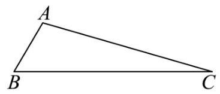

【答案】 3

20. $\leq  t < {10}$ 时, ${f}^{\prime }\left( t\right)  < 0, f\left( t\right)$ 递减, $t > 9$ 时 ${f}^{\prime }\left( t\right)  > 0, f\left( t\right)$ 递增,

所以 $t = {10}$ 时, $f{\left( t\right) }_{\min } = 8,\left( {S}_{\bigtriangleup {ABC}}\right)  = {12}$ ,

综上， $\left( {S}_{\bigtriangleup {ABC}}\right)  = {12}$ ，

此时 ${h}_{\max } = \frac{2{S}_{\bigtriangleup {AMN}}}{\left| MN\right| } = 3$ .

21. (2024·上海青浦·二模)对于函数 $y = f\left( x\right)$ ，其中 $f\left( x\right)  = 2\sin x\cos x + 2\sqrt{3}{\cos }^{2}x - \sqrt{3}$ ， $x \in  R$ .

(1)求函数 $y = f\left( x\right)$ 的单调增区间；

(2)在锐角三角形 ${ABC}$ 中，若 $f\left( A\right)  = 1$ ， $\overrightarrow{AB} \cdot  \overrightarrow{AC} = \sqrt{2}$ ，求 $\bigtriangleup  {ABC}$ 的面积.

【答案】(1) $\left\lbrack  {{k\pi } - \frac{5\pi }{12} \circ  , \circ  {k\pi } + \frac{\pi }{12}}\right\rbrack   \circ   \circ  , \circ  \left( {k \in  Z}\right)$

(2) $\frac{\sqrt{2}}{2}$ .

22. ( 2024 上海崇明 - 二模)已知椭圆 $\Gamma  : \frac{{x}^{2}}{2} + {y}^{2} \circ   = 1, A$ 为 $\Gamma$ 的上顶点， $P$ 、 $Q$ 是 $\Gamma$ 上不同于点 $A$ 的两点.

(1)求椭圆 $\Gamma$ 的离心率；

(2)若 $F$ 是椭圆 $\Gamma$ 的右焦点， $B$ 是椭圆下顶点， $R$ 是直线 ${AF}$ 上一点. 若 $\bigtriangleup  {ABR}$ 有一个内角为 $\frac{\pi }{3}$ ，求点 $R$ 的坐标;

(3) 作 ${AH} \bot  {PQ}$ ,垂足为 $H$ . 若直线 ${AP}$ 与直线 ${AQ}$ 的斜率之和为 2,是否存在 $x$ 轴上的点 $M$ ,使得 $\left| {{}^{ \circ  }\overrightarrow{MH}{}^{ \circ  }}\right|$ 为定值? 若存在,请求出点 $M$ 的坐标,若不存在,请说明理由.

【答案】 $\left( 1\right) \frac{\sqrt{2}}{2}$

(2) $\left( {3 - \sqrt{3}, - 2 + \sqrt{3}}\right)$ 或 $\left( {1 + \frac{\sqrt{3}}{3}, - \frac{\sqrt{3}}{3}}\right)$ ；

(3) 存在, $\left( {-\frac{1}{2},0}\right)$

## 二、题型二:空间向量及其运算

1. (2024·上海黄浦·二模) 在四面体 ${PABC}$ 中， $2\overrightarrow{PD} = \overrightarrow{PA} + \overrightarrow{PB}$ ， $5\overrightarrow{PE} = 2\overrightarrow{PB} + 3\overrightarrow{PC}$ ， $2\overrightarrow{PF} =  - \overrightarrow{PC} + \; 3\overrightarrow{PA}$ ，设四面体 ${PABC}$ 与四面体 ${PDEF}$ 的体积分别为 ${V}_{1}$ 、 ${V}_{2}$ ，则 $\frac{{V}_{2}}{{V}_{1}}$ 的值为___.

【答案】 $\frac{7}{20}/{0.35}$

2. ((2024·上海崇明·二模) 已) 已知向量 $\overrightarrow{a} = \left( {2,\lambda , - 1}\right) ,\overrightarrow{b} = \left( {2,1, - 4}\right)$ ，若 $\overrightarrow{a}\bot \overrightarrow{b}$ ，则 $\lambda  =$ ___.

【答案】-8

3. (2024·上海青浦·二模)如图，在棱长为 1 的正方体 ${ABCD} - {A}_{1}{B}_{1}{C}_{1}{D}_{1}$ 中， $P$ 、 $Q$ 、 $R$ 在棱 ${AB}$ 、 ${BC}$ 、 $B{B}_{1}$ 上,且 ${PB} = \frac{1}{2},{QB} = \frac{1}{3},{RB} = \frac{1}{4}$ ,以 $\bigtriangleup {PQR}$ 为底面作一个三棱柱 ${PQR} - {P}_{1}{Q}_{1}{R}_{1}$ ,使点 ${P}_{1},{Q}_{1}$ , ${R}_{1}$ 分别在平面 ${A}_{1}{AD}{D}_{1}\text{ 、 }{D}_{1}{DC}{C}_{1}\text{ 、 }{A}_{1}{B}_{1}{C}_{1}{D}_{1}$ 上,则这个三棱柱的侧棱长为___.

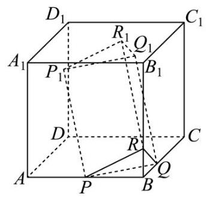

【答案】 $\frac{\sqrt{181}}{12}$

4. $\left( {{23} - {24}}\right.$ 高三下.上海浦东新·期中) 正三棱锥 $S - {ABC}$ 中，底面边长 ${AB} = 2$ ，侧棱 ${AS} = 3$ ，向量 $\overrightarrow{a}$ ， $\overrightarrow{b}$ 满足 $\overrightarrow{a} \cdot  \left( {\overrightarrow{a} + \overrightarrow{AC}}\right)  = \overrightarrow{a} \cdot  \overrightarrow{AB}$ ， $\overrightarrow{b} \cdot  \left( {\overrightarrow{b} + \overrightarrow{AC}}\right)  = \overrightarrow{b} \cdot  \overrightarrow{AS}$ ，则 $\left| {\overrightarrow{a} - \overrightarrow{b}}\right|$ 的最大值为___.

【答案】 4

## 三、题型三:空间向量的应用

1. (2024·上海徐汇·二模) 如图, $D$ 为圆锥的顶点, $O$ 是圆锥底面圆的圆心, ${AE}$ 为圆 $O$ 的直径,且 ${AE} \; = {AD} = 4,\bigtriangleup {ABC}$ 是底面圆 $O$ 的内接正三角形, $P$ 为线段 ${DO}$ 上一点,且 ${DO} = \sqrt{6}{PO}$ .

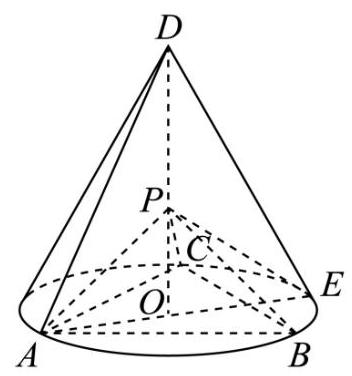

(1)证明: ${PA}\bot$ 平面 ${PBC}$ ；

(2)求直线 ${PB}$ 与平面 ${PCE}$ 所成角的正弦值.

【答案】(1) 证明见解析

(2) $\frac{\sqrt{5}}{5}$

2. (2024·上海虹口·二模)如图，在三棱柱 ${ABC} - {A}_{1}{B}_{1}{C}_{1}$ 中， ${CA}\bot {CB}$ ， $D$ 为 ${AB}$ 的中点， ${CA} = {CB} =$ 2, $C{C}_{1} = 3$ .

(1)求证: $A{C}_{1}//$ 平面 ${B}_{1}{CD}$ ；

(2)若 $C{C}_{1} \bot$ 平面 ${ABC}$ ，点 $P$ 在棱 $A{A}_{1}$ 上，且 ${PD} \bot$ 平面 ${B}_{1}{CD}$ ，求直线 ${CP}$ 与平面 ${B}_{1}{CD}$ 所成角的正弦值.

【答案】(1)证明见解析

(2) $\frac{\sqrt{55}}{10}$

3. ( 2024 - 上海黄浦 - 二模)如图，在四棱锥 $P - {ABCD}$ 中，底面 ${ABCD}$ 为矩形，点 $E$ 是棱 ${PD}$ 上的一点， ${PB}//$ 平面 ${AEC}$ .

(1)求证:点 $E$ 是棱 ${PD}$ 的中点；

(2)若 ${PA}\bot$ 平面 ${ABCD},{AP} = 2,{AD} = {2\sqrt{3}},{PC}$ 与平面 ${ABCD}$ 所成角的正切值为 $\frac{1}{3}$ ，求二面角 $D \; - {AE} - C$ 的大小.

【答案】(1)证明见解析

(2) $\arctan 2\sqrt{2}$

4. (2024·上海长宁·二模) 如图,在长方体 ${ABCD} - {A}_{1}{B}_{1}{C}_{1}{D}_{1}$ 中, ${AB} = {AD} = 2, A{A}_{1} = 1$ ;

(1)求二面角 ${D}_{1} - {AC} - D$ 的大小；

(2)若点 $P$ 在直线 ${A}_{1}{C}_{1}$ 上，求证:直线 ${BP}//$ 平面 ${D}_{1}{AC}$ ；

【答案】(1) $\arccos \frac{\sqrt{6}}{3}$

(2)见解析

5. (23-24 高三下·上海浦东新·期中)在四棱锥 $P - {ABCD}$ 中，底面 ${ABCD}$ 为等腰梯形，平面 ${PAD} \bot$ 底面 ${ABCD}$ ,其中 ${AD}//{BC},{AD} = {2BC} = 4,{AB} = 3,{PA} = {PD} = 2\sqrt{3}$ ,点 $E$ 为 ${PD}$ 中点.

(1)证明: ${EC}//$ 平面 ${PAB}$ ；

(2)求二面角 $P - {AB} - D$ 的大小.

【答案】(1)证明见解析

(2) $\arccos \frac{2\sqrt{13}}{13}$