Shuxue 普通高中

Jiaoxue Cankao Ziliao

湖教学参考资料必修

第三册

上海教育出版社

主 编 李大潜 王建磐

副 主 编 应坚刚 鲍建生

本册编写人员 阮晓明 杨家政 黄 坪 应坚刚 田万国 陈月兰 汪家录

责任编辑 缴 麟

装帧设计 周 吉

插图绘制 朱泽宇

普通高中 数学教学参考资料 必修 第三册

上海市中小学(幼儿园)课程改革委员会组织编写

出 版 上海教育出版社有限公司(上海市闵行区号景路159弄C座)

发 行 上海新华书店

印 刷 上海华顿书刊印刷有限公司

版 次 2021年8月第1版

印 次 2023年6月第3次

开 本 890×1240 1/16

印 张 8.25

字 数 140 千字

书 号 ISBN 978-7-5720-0848-1/G·0664

定 价 25.50 元

版权所有 本未经许可不得采用任何方式擅自复制或使用本产品任何部分 本违者必究

如发现内容质量问题, 请拨打 021-64319241

如发现印、装质量问题, 影响阅读, 请与上海教育出版社有限公司联系. 电话021-64373213

声明 按照《中华人民共和国著作权法》第二十五条有关规定,我们已尽量寻找著作权人支付报酬.著作权人如有关于支付报酬事宜可及时与出版社联系.

## 目 录

绪论 1

第 10 章 空间直线与平面 9

一、本章概述 9

二、教材分析与教学建议 15

三、参考答案或提示 35

四、相关阅读材料 46

第 11 章 简单几何体 49

一、本章概述 49

二、教材分析与教学建议 54

三、参考答案或提示 62

四、相关阅读材料 69

第 12 章 概率初步 70

一、本章概述 70

二、教材分析与教学建议 75

三、参考答案或提示 84

第 13 章 统计 91

一、本章概述 91

二、教材分析与教学建议 95

三、参考答案或提示 113

四、相关阅读材料 126

## 绪 论

本套教学参考资料(以下统称“本套教参”)与李大潜、王建磐主编,上海教育出版社出版的《普通高中教科书·数学》(以下统称“本套教材”)配套使用,本套教材依据中华人民共和国教育部制定并颁布实施的《普通高中数学课程标准(2017 年版 2020 年修订)》(以下简称“国家课程标准”)编制,并经国家教材委员会专家委员会审核通过.

## 一、本套教材的总体结构框架

国家课程标准把高中数学课程分为必修课程、选择性必修课程和选修课程,并规定:必修课程为学生发展提供共同基础,是高中毕业的数学学业水平考试的基本内容, 也是高考的内容要求; 选择性必修课程是供学生选择的课程, 也是高考的内容要求; 选修课程为学生确定发展方向提供引导, 为学生展示数学才能提供平台, 为学生发展数学兴趣提供选择,为大学自主招生提供参考 ${}^{\text{①}}$ .

本套教材仅包含必修课程和选择性必修课程.

国家课程标准把必修课程和选择性必修课程所囊括的数学内容分为预备知识、函数、几何与代数、概率与统计、数学建模活动与数学探究活动 5 个主题 ${}^{\text{②}}$ . 本套教材把这 5 个主题及其具体要求组织成了必修课程 13 章和数学建模 1 册, 选择性必修课程 8 章和数学建模 1 册. 这些章的标题以及各章之间的逻辑联系如下页图所示.

---

① 中华人民共和国教育部. 普通高中数学课程标准 (2017 年版 2020 年修订) [S]. 北京:人民教育出版社, 2020: 9, 11-12.

② 中华人民共和国教育部. 普通高中数学课程标准 (2017 年版 2020 年修订)[S]. 北京:人民教育出版社, 2020: 13-14, 36-37.

---

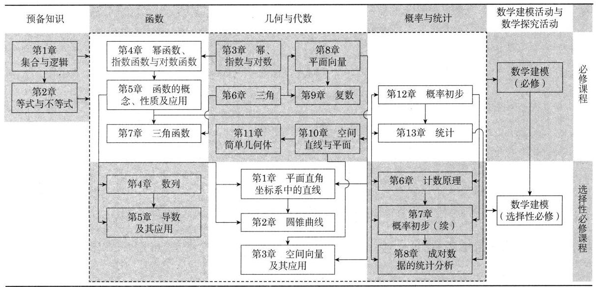

说明:(1)数学是一个整体,教材各章之间或多或少都存在联系,上图仅标出一些主要联系.

(2)预备知识主题下的两章为高中数学学习提供基本语言、基本工具和基本思维方式, 因此它们是整个知识体系的基础; 数学建模是给学生提供解决实际问题的训练和实践, 可以建立在任何数学基础上.

(3)在数学建模活动与数学探究活动主题下,上图只列了两册数学建模,并没有列出数学探究的内容. 其实, 数学探究的内容以“探究与实践”专栏、“课后阅读”专栏、“拓展与思考”的习题以及某些边框分散在教材中. 教师可以利用这些素材引导学生进行自主探究, 也可以根据教学内容自行设计数学探究活动, 让学生学得更加生动活泼.

(4)国家课程标准把幂、指数与对数的运算融在幂函数、指数函数与对数函数中, 把三角的定义、三角恒等变换以及解三角形等非函数内容都归在三角函数标题下,所以相关的内容也就都在“函数”主题下了；本套教材把这些非函数的内容从函数标题下独立出来, 形成了必修课程的第 3 章“幂、指数与对数”及第 6 章“三角”,把这两章归到“几何与代数”主题下是更顺理成章的. 当然,这两章内容与紧接在后面的函数的学习密切相连, 在课程结构的安排上仍把它们归在函数主题一起考虑.

本套教材共有必修课程教材四册.

- 必修第一册:第 1 章至第 5 章;

- 必修第二册:第 6 章至第 9 章;

- 必修第三册:第 10 章至第 13 章;

- 必修第四册:数学建模.

本套教材共有选择性必修课程教材三册.

- 选择性必修第一册:第 1 章至第 4 章;

- 选择性必修第二册:第 5 章至第 8 章;

- 选择性必修第三册:数学建模.

除数学建模外的五册教材可以安排从高中一年级至高中三年级第一学期共五个学期教学. 每册内容没有撑足教学时数, 留一定的机动课时供教师根据实际需要灵活掌握, 可用作重点或难点的强化课、复习课、习题课、数学建模活动、数学探究活动等, 也可用于安排选修课程或校本课程内容的学习. 数学建模内容与数学知识的逻辑结构没有直接的关系, 两册数学建模教材不是前三册或前两册教材的后继, 而是包含比教学课时数要求更多的内容, 供各个年段灵活地、有选择地使用, 以实现数学建模的教学目标.

## 二、本套教材的编写思想与主要特点

本套教材是在上海市教育委员会组织下,由设在复旦大学和华东师范大学的上海市数学教育教学研究基地(上海高校“立德树人”人文社会科学重点研究基地)联合主持编写的, 由李大潜、王建磐担任主编. 教材编写过程中, 我们始终坚持正确的政治方向和价值导向, 科学地处理了教学内容的编排, 反复认真地打磨, 努力做到结构严谨、体例活泼、特色鲜明,体现了理性精神和创新意识,有较高的科学品位和学科人文情怀,希望能为广大师生喜闻乐见,对学生学业水平的提升,数学学科核心素养发展和社会责任感的培育都有促进作用.

我们认为本套教材在编写思想上有所突破, 在内容呈现上有一些特点. 具体体现在以下几个方面.

(1)关注“立德树人”,课程育人. 通过各种素材与知识本体的有机融合,有效落实了立德树人的根本任务,明确体现了“四个自信”和社会主义核心价值观,注重培养学生严谨求实的科学态度.

章首图的选用让学生在最初一瞥中体会中国共产党的光辉历史和祖国社会主义建设的成就; 用现代化建设的新成就作为情景引入数学概念, 让学生在学习知识的同时看到祖国发展的日新月异；例习题和“探究与实践”“课后阅读”等专栏中包含了各种热点问题和重大主题教育的内容; 重视数学史在数学教育中的作用, 许多题附有历史的简述, 既体现人类文化知识的积累和创新的过程, 也帮助学生理解和掌握相关的数学知识; 在数学史阐述中, 特别注意我国历代数学家及其成就以及西方数学的脉络中我国学者(在学术、传播或中国化等方面)的贡献.

(2)体现“国家标准,上海特色,国际水平”. 基于国家课程标准,但同时也对上海两期课改的经验有所继承, 对东部发达地区的国际化大型城市这一特点有所关注, 对数学链条上缺失的关键节点有所弥补.

本套教材在吸收上海两期课改(“一期课改”和“二期课改”)中已经成熟的经验方面,比较典型的例子有:数学归纳法,这是国家课程标准中标有 * 号的选学内容,本套教材将其 * 号去掉,归入正常教学要求；无穷递缩等比数列的和作为极限思想的朴素表述, 与求导呼应; 把反函数、参数方程、极坐标方程等内容以标 * 号的方式加入到本套教材中,供学校和教师选用. 这些内容曾出现在上海“二期课改”的教材中,学生的接受度较高.

对一些数学链条中关键的节点做适当的弥补. 例如,引入反证法,希望以此简化部分数学证明, 提高学生逻辑推理能力; 比较全面地介绍了直线方程的各种形式, 既夯实解析几何的基础, 也建立解析几何与数学其他分支的联结点, 如斜截式方程紧密联系一次函数, 而直线的法向量与点法式方程是立体几何中平面法向量的预演.

(3)以国家课程标准所描述的“函数”“代数与几何”“概率与统计”三个主题为教材发展的三条主线, 主线内部一气呵成 (除了跨越必修与选择性必修的必要隔断外), 形成层层递进的章节设计, 体现了整体性和连贯性, 避免在发展主线间的反复变换, 使学生不仅能更好地了解数学整体的思想和结构, 也能了解数学不同分支之间的差异, 对培养学生的数学素养更有好处.

(4)注重“从特殊到一般,再指导特殊”的认识论规律. 例如,在函数主线内部, 没有从给出函数的一般定义入手,而是先让幂函数、指数函数、对数函数作为“特殊” 出现, 然后提出函数的一般概念, 再在 “一般” 指导下进入三角函数的学习. 这种处理方法在其他专题上也可以找到踪影:学过直线方程、圆锥曲线方程后,引出曲线方程的严格定义, 然后用例题和习题的形式求一些轨迹的方程, 再介绍曲线的参数方程和极坐标方程; 在“简单几何体”一章中, 先讲柱体与锥体, 然后讨论多面体与旋转体, 再“特殊化”到球的学习; “数列”一章, 在学过等差数列、等比数列后, 介绍一般数列的概念与性质,特别关注用递推公式表示的数列,然后引入了数学归纳法,全章最后落笔于用迭代方法求 $\sqrt{2}$ 的近似值,这是用递推公式表示数列的实际例子.

(5)在必修课程第 10 章“空间直线与平面”中,给出“立体几何”相对完整严格的演绎法阐述, 意在努力克服学生的空间直观想象和逻辑推理上的不足. 在选择性必修课程第 3 章“空间向量及其应用”的章末回到立体几何,用向量方法解决立体几何问题, 从几何问题代数化的角度引出解题新思路, 加深对立体几何的理解, 反过来又很好地诠释了学习空间向量的意义.

(6)数学建模单独成册. 国家课程标准把数学建模活动与数学探究活动作为一条单列的主线, 充分体现了对数学建模的重视程度. 数学建模与数学知识的关系是强调已经学得的知识(不一定是刚刚学得的,一般也并不指定哪些具体的知识点)在解决实际问题中的应用, 因此数学建模活动和数学知识体系的发展并无直接的关联性, 数学建模活动的教学不应依附于特定知识性内容的教学, 而应该强调它的活动性、探索性和综合性, 在过程中不断提高学生分析问题、解决问题的能力和综合应用数学知识的能力, 并充分激发学生的创新精神和创造意识.

基于这种想法, 把数学建模内容独立出来, 按必修和选择性必修分别单独成册. 这样做符合课程标准的要求, 符合数学建模内容的特点, 并至少在以下四个方面凸显它的优势:

- 数学建模单独的物理存在给教师和学生在强调数学建模学习和数学建模核心素养培养上更为直观的感受,更能激起数学建模教与学的热情；

- 独立的数学建模分册明确地显示数学建模不是在数学学习的某一特定节点上的内容, 也不是新增的数学知识, 而是在数学教学过程中随时随地可以开展的教学实践活动;

- 单独成册的数学建模教材有较大的容量, 可以提供更多的活动案例, 让教师和学生可以依据自己的兴趣和特长做多样的选择;

- 单独成册的数学建模教材以它的相对系统性和完整性帮助教师理解数学建模的意义和特点, 逐步体会并形成数学建模的教学规范, 从而更好地帮助学生开展相应的数学建模活动, 体验数学建模的全过程, 领悟数学建模的真谛.

(7)本套教材另一个与众不同的地方是采用“娓娓道来”的叙事方式,它使得教材既是一个“教”本,也是一个“读”本,学生可以在阅读中了解数学,喜欢数学,学好数学. 正文的这种叙事方式使教师和学生更加注重数学精髓,体验数学严谨,掌握数学要义,提高数学素养,引导教师在教学中避免“重解题、轻概念、轻思想”的倾向.

## 三、本套教参的主要特点

本套教参编撰的目的是使教师理解教科书编制所依据的《普通高中数学课程标准 (2017 年版 2020 年修订)》,体会教材的编制特色和主要思想,把握教材所包含的数学知识的体系和脉络,掌握教学过程的关键,从而很好地完成从课程标准和教材所描述的 “期望课程”“潜在实施课程”到教学过程的“实施课程”和学生习得的“获得课程”的转变.

本套教参与教材分册和章节安排均一致,即教参的分册和章节目录均与教材一致. 但教参没有直接把教材复制在内, 也不是平铺直叙地解释教材的内容. 教参着重讲出编写者的思想及体会,明确各章的定位,剖析重点和难点,厘清容易混淆的地方, 帮助教师把握课程标准的基本理念和目标要求, 强调数学核心素养的落实, 等等,从而开拓教师思维,优化教学方法. 从这个角度讲,教参又是课本内容的深化和补充,成为教材(潜在实施课程)到教学(实施课程)的中介和桥梁.

教材前言强调,“在任何情况下,都要基于课程标准,贯彻‘少而精’‘简而明’的原则, 精心选择与组织教材内容, 抓住本质, 返璞归真, 尽可能给学生以明快、清新的感受,使学生能更深入地领会数学的真谛,让数学成为广大学生喜闻乐见的一门课程. ”这是本套教材坚持的基本特色. 教材的许多特色隐含在内容选取、编排和行文中. 教参将揭示和突出教材的基本特色以及教材编制过程落实这个特色所采取的具体措施和处理方式, 并充分注意同一主题内前置和后续内容的衔接以及一个主题的内容与其他主题甚至其他学科内容的关联. 这种衔接和关联在章节导言、总结部分以及在相关知识内容阐述中有明确的交代. 这样做的目的是让教师更加深刻地体会整个高中阶段数学是一个知识的网络, 并在教学中把这个认知传递给学生.

教参的每一章因所涉及的内容以及编写者的风格特点可能会有所差异, 但我们追求每章总体结构基本统一, 关键要素基本具备.

每一章的教参包括“本章概述”“教材分析与教学建议”“参考答案或提示”和“相关阅读材料”四个部分.

“本章概述”部分的主要栏目有“总体要求”“课时安排建议”“内容编排与特色”“教学提示”与“评价建议”等. 特别地, “总体要求”中通过与课程标准、“二期课改”教材的联系与对比, 围绕着本章内容的重要性、与前后知识的联系和课程目标等内容进行阐述.

“教材分析与教学建议”部分按节编写,每节有“教学重点”“内容分析”“注意事项” “教学建议”等栏目.

“参考答案或提示”是教参的常规内容, 但我们希望能够尝试给出一些思想或方法的提示.

给出“相关阅读材料”是一个新的尝试,我们希望为教师和学生的课外阅读提供一些提示或指导. 所列文献、材料以中文为主, 但也会包含少量英文文献.

## 四、必修教材第三册中的一些关注点

必修教材第三册包含第 10 章至第 13 章共四章,其中前两章是立体几何初步的内容, 后两章分别是概率初步与统计.

第 10 章讨论三维空间中的直线与平面, 从四个简单直观的公理 (也称为“基本事实”) 出发, 通过演绎推理的方法建立起关于空间的点、直线与平面之间基本关系的比较系统完整的理论. 这方面的要求与“二期课改”教材相比,有明显的提高,因此课程的难度也略有增大. 本绪论前面已经说过, 作这样变化的目的在于克服学生空间直观想象和逻辑推理上的不足. 请老师们把握这个关键, 充分利用教材的内容但不要超越教材的难度, 注意给学生铺设好从平面到立体的台阶, 聚焦培养学生的能力和素养.

在选择性必修课程的第 3 章“空间向量及其应用”的最后一节将介绍空间向量在立体几何中的一些应用, 还会回到立体几何的主题, 提供解决立体几何某些问题的另外一种思路. 但不能因为后面有向量方法而在这一章降低演绎方法的要求.

第 11 章介绍柱体、锥体及球体等常见的空间几何体的形状、性质和度量(如表面积、体积等). 与第 10 章相比, 演绎推理的成分少了, 公式推导与计算的成分多了, 学生的学习难度明显降低. 但要注意, 在这一章中, 部分公式的推导隐含着极限和微积分思想,例如反复使用的祖暅原理以及球面面积公式的严格证明都必须借助于极限和微积分. 教材在讲到相关内容时都回避了证明, 以直观描述取而代之. 要让学生通过教材所提供的直观描述体会并理解相应内容的正确性, 但也应告诉学生将来继续学习时还会有严格的数学证明.

第 12 章学习概率初步. 本教材此前各章学习的数学可以说是确定性或者说必然性的数学, 其特点是在相同的条件下一定推出相同的结果. 但自然界还有一大类现象, 相同条件并不总是导致相同结果, 这一类现象称为随机现象. 概率论就是研究随机现象所蕴藏规律的数学理论.

本章是概率论的入门, 核心概念包括概率论的基本概念、古典概率、频率和独立性等. 内容比较初等, 但学生对随机事件还比较陌生, 真正理解起来并不容易. 因此, 在本章教学中, 重点要引导学生 “换一种思路” “换一套语言”, 体验随机现象, 理解概率的意义, 逐步熟悉概率的语言, 建立起研究具有不确定性的客观世界的思维模式和解决问题的方法.

本章还为下一章统计的学习提供必要的基础.

第 13 章是统计. 统计学关心的是怎样用数据来理解不确定现象和问题,所以统计学的核心是数据分析, 即用适当方法获取研究对象的数据, 并对数据进行整理、分析、推断和决策的过程, “用数据说话”. 统计基本知识贯穿在基础教育的三个学段, 并随着学段的升高逐渐提高要求, 螺旋上升. 本章在义务教育所学内容的基础上从更加理性的角度总结和提升了获取数据的基本思想、基本途径及相关概念,进而学习用样本估计总体. 在学习本章内容时, 要注意统计思维与确定性思维的差异, 体会解决统计问题的一般过程与方法.

## 第 10 章 空间直线与平面

## 一、本章概述

## 总体要求

国家课程标准指出:“数学是研究数量关系和空间形式的一门科学. ”“立体几何研究现实世界中物体的形状、大小与位置关系. ”作为几何学的基础内容,本章是学习立体几何的起始章, 主要学习空间直线与平面的位置关系. 通过本章的学习, 可以帮助学生获得处理三维空间问题的基础知识、基本技能、基本思想方法与基本活动经验, 进一步发展空间观念、提高空间想象能力, 培养学生从几何的角度观察我们生活的三维空间, 进一步提高学生的逻辑推理能力. 作为欧氏几何体系的基础内容之一, 通过立体几何的学习所获得的基础知识、基本技能、基本思想方法与基本活动经验, 不仅是以后学习微积分、拓扑学和其他高等几何的基础, 还可以为高等代数等抽象数学结构提供直观的模型. 同时, 立体几何知识在工程机械、建筑、物理、化学、美术等生产、生活实践中都有广泛的应用.

初中平面几何课程是高中立体几何学习的基础. 平面几何研究的是同一个平面上的图形的形状、大小与位置关系, 经历了几何对象的概括抽象和几何性质的操作确认、推理论证等过程, 体会了运用逻辑推理的方法得到平面图形性质的研究方法, 初步形成了直观想象与逻辑推理的数学素养. 在高中立体几何中, 处理问题的一个基本思路是把三维空间的问题转化为同一个平面中的问题, 从而用平面几何的知识与方法予以解决; 但由于用平面直观图来表示三维空间图形时不能“真实地”反映空间图形的结构与位置关系, 因此培养学生的空间观念与空间想象能力是学习立体几何的关键. 教学中, 应关注空间图形及其位置关系的多种表征方式, 如实物、模型、图形、符号及文字等,并通过不同表征方式的相互转化来帮助学生理解空间概念、图形和解决问题.

在本章的学习中, 长方体是一个直观的模型. 国家课程标准指出: “可以帮助学生以长方体为载体,认识和理解空间点、直线、平面的位置关系；用数学语言表述有关平行、垂直的性质与判定, 并对某些结论进行论证. ” “运用直观感知、操作确认、 推理论证、度量计算等认识和探索空间图形的性质, 建立空间观念. ”

## 课时安排建议

本章的课时安排建议为 14+1+2, 共计 17 课时. 建议如下:

<table><tr><td>章节名</td><td>建议课时</td><td>具体课时分配建议</td></tr><tr><td rowspan="3">10.1 平面及其基本性质</td><td rowspan="3">4</td><td>空间的点、直线与平面 2 课时</td></tr><tr><td>相交平面 1 课时</td></tr><tr><td>空间图形的平面直观图的画法 1 课时</td></tr><tr><td rowspan="3">10.2 关系直线与直线的位置</td><td rowspan="3">3</td><td>空间的平行直线 1 课时</td></tr><tr><td>异面直线 1 课时</td></tr><tr><td>两条异面直线所成的角 1 课时</td></tr><tr><td rowspan="4">10.3 关系直线与平面的位置</td><td rowspan="4">5</td><td>直线与平面平行 2 课时</td></tr><tr><td>直线与平面垂直 1 课时</td></tr><tr><td>直线与平面所成的角 1 课时</td></tr><tr><td>三垂线定理 1 课时</td></tr><tr><td rowspan="2">10.4 4 平面与平面的位置关系</td><td rowspan="2">2</td><td>平面与平面平行 1 课时</td></tr><tr><td>二面角 1 课时</td></tr><tr><td>*10.5 异面直线间的距离</td><td>1</td><td/></tr><tr><td>探究与实践</td><td>1</td><td/></tr><tr><td>复习与小结</td><td>1</td><td/></tr></table>

## 内容编排与特色

立体几何部分采用先研究空间直线与平面位置关系, 后研究简单几何体的编排方式. 如此编排的原因: 一是空间直线与平面位置关系是研究几何体的基础, 符合逻辑顺序; 二是与“二期课改”教材的编排顺序保持一致, 可以参考原有的教学经验.

本章内容共分为五节, 分别是 10.1 平面及其基本性质, 10.2 直线与直线的位置关系, 10.3 直线与平面的位置关系, 10.4 平面与平面的位置关系, *10.5 异面直线间的距离.

教材内容编排的一个基本思路是从实际情境出发, 引出三维空间的基本图形与关系, 然后用数学化的文字语言与符号语言对空间图形及其关系进行自然的描述. 在教学时,教师还可以借助立体几何模型,使学生建立“实际情境一几何模型一空间图形一语言描述一符号表示”之间的相互联系.

教材在描述空间图形关系以及推理过程时, 采取通俗易懂的自然语言叙述, 同时也兼顾符号表达的简洁性.

本章用了较多的篇幅去阐明定理的证明过程, 力求对一些重要结论的形成给予充分地推导, 这对培养学生的空间想象能力和逻辑推理能力至关重要, 是本教材的一大特色.

“10.1 平面及其基本性质”主要包括平面及其基本性质和空间图形的平面直观图画法等内容, 是本章的基础.

在平面及其基本性质部分, 教材在对生活实景的观察、长方体模型直观认识的基础上, 通过抽象概括和类比想象形成平面的概念, 介绍平面的图形语言和符号语言表示. 对空间点与直线、点与平面间的位置关系进行逻辑分类, 并用集合符号语言表示. 平面的基本性质主要学习平面的三条公理, 教材介绍了三条公理的文字语言、图形语言和符号语言表示, 指出公理 1 是判定直线在平面上的依据, 公理 2 及其三个推论是确定平面的依据, 公理 3 是相交平面的特征. 同时还介绍空间直线与平面位置关系的逻辑分类和三种数学语言表示法. 与“二期课改”教材相比,公理 2 与公理 3 的编排顺序不同, 本教材是先确定平面, 再讨论平面与平面的位置关系.

与“二期课改”教材相比,本教材把空间图形的平面直观图的画法前置在这一节中. 这样做的目的是便于学生理解与习惯教材中的各种图形, 使学生有更多机会通过自己作图, 培养“空间感”. 教材通过两道例题的形式分别介绍了斜二测画法画水平放置正六边形的直观图和长方体的直观图, 旨在示范斜二测画法画直观图的作图方法和步骤, 其中画水平放置的多边形的直观图的关键是确定多边形顶点的位置, 画空间图形直观图的关键是画出水平放置平面图形的直观图.

“10.2 直线与直线的位置关系”主要包括空间的平行直线和异面直线等内容. 与相交直线一样, 两条直线的平行关系可以看作是同一个平面上的位置关系, 这意味着空间两条直线的平行问题可以在同一平面上处理. 但平面几何中的直线平行关系的传递性却不能直接推广到空间, 所以可以设置公理 4 来保证.

异面直线是本章的教学难点, 教材在对生活实景的观察、长方体模型直观认识的基础上, 形成异面直线的概念, 给出异面直线的定义, 介绍了异面直线的画法和异面直线判定定理. 证明两条直线异面的方法主要有两种: 一是反证法, 如教材中异面直线判定定理的证明; 二是利用异面直线判定定理, 如教材中的例 3 和例 4 , 当然例 4 也可以用反证法来证明.

对于异面直线所成的角, 教材通过实际情境来体会研究两条异面直线所成角的必要性, 较详细地展现了用平移的方法将两条异面直线转化为两条相交直线, 利用相交直线的夹角来刻画两条异面直线所成角的研究方法和思维过程. 在两条异面直线所成角的定义中, 还规定了两条异面直线所成角的范围, 并举例说明两条异面直线所成角的大小的求法.

“10.3 直线与平面的位置关系”是立体几何的核心内容之一,系统地阐述了直线与平面的平行关系、直线与平面的垂直关系. 与“二期课改”教材相比,增加了部分定理及其证明, 通过直线与平面平行的判定定理和性质定理、直线与平面垂直的判定定理和性质定理、三垂线定理等问题的研究, 力求比较系统地帮助学生建立空间观念. 同时, 把直线与平面所成的角、直线与平面之间的距离等度量的计算主要留给选择性必修中的空间向量部分解决, 这里着重于“角”“距离”的概念的理解及其相对应的位置关系的认识, 其目的还是为了加强空间观念的建立与逻辑推理能力的发展.

本节中, 除了线面垂直的判定定理的证明没有给出 (留在选择性必修第 3 章空间向量及其应用一章中学习), 其余的定理都给出了证明过程. 这样处理的目的是希望学生通过学习立体几何定理的证明过程, 不仅加深对定理本身的理解和运用, 而且作为培养学生空间想象能力和逻辑推理能力的有效载体. 特别是本节在学习直线与平面所成的角的有关内容之后,及时安排了三垂线定理的教学,把三垂线定理作为沟通平面与空间的一个桥梁.

“10.4 平面与平面的位置关系”也是立体几何的核心内容之一,系统地阐述了平面与平面的平行关系、平面与平面的垂直关系. 与“二期课改”教材相比,增加了平面与平面平行的判定定理和性质定理、平面与平面垂直的判定定理和性质定理. 对于平面与平面所成的二面角, 也是着重于位置关系的认识, 而把如何计算两个平面之间的 “角”和“距离”的大小问题,放在选择性必修的空间向量及其应用时再具体处理.

“10.5 异面直线间的距离”是标注星号的选学内容, 虽然有一定的难度, 但完善了学生对空间中两条直线的位置关系的认知结构. 仅仅考察两条异面直线所成的角, 并不能完全刻画出两条异面直线的相对位置,还要考察两条异面直线的距离问题. 这也是本教材的特色之一.

本章教材按照平面及其基本性质、直线与直线的位置关系、直线与平面的位置关系、平面与平面的位置关系、异面直线间的距离顺序编排. 各小节之间纵向联系密切, 前面小节的概念、结论等是后面小节学习的基础和根据, 后面小节的学习又可加深和巩固前面学习的内容. 通过本章的学习, 可以帮助学生形成空间直线和平面位置关系相对完整的知识体系和逻辑体系.

## 教学提示

国家课程标准指出:“立体几何初步的教学重点是帮助学生逐步形成空间观念, 应遵循从具体到抽象的原则, 提供丰富的实物模型或利用计算机软件呈现空间几何体, 帮助学生认识空间几何体的结构特征, 进一步掌握在平面上表示空间图形的方法和技能. 通过对图形的观察和操作, 引导学生发现和提出描述基本图形平行、垂直关系的命题, 逐步学会用准确的数学语言表达这些命题, 直观解释命题的含义和表述证明的思路,并证明其中一些命题. ”

为了帮助学生更好地体会空间图形的抽象过程和研究方法, 教材注意从实际情境出发, 通过对实际情境的观察和分析, 提炼出立体模型, 抽象出典型的空间图形. 在对空间图形及其关系进行数学化的文字语言和符号语言描述的基础上, 进一步研究空间图形中各元素间的相互关系, 形成对空间图形系统研究的一般步骤和方法.

学生已有的平面几何知识可以为立体几何的学习打下基础, 但由于平面几何中涉及的所有基本图形都在同一个平面上, 因此其中的一些结论和思维方式会给立体几何的学习带来一定程度上的负迁移. 在教学过程中, 一方面要引导学生认识到几何图形在空间中与在平面上的区别, 逐步培养学生从三维空间研究几何图形的思维习惯; 同时也要帮助学生沟通立体几何与平面几何的内在联系, 逐步形成将空间问题转化为平面问题进行处理的思考方法. 立体几何中的几个公理主要是讨论基本图形的空间定位问题, 是将空间问题转化为平面问题进行处理的依据.

用适当的语言和符号来准确、简洁地表述研究对象, 是数学思维的一个基本特点. 借用集合符号语言表示空间中点、直线、平面间的关系是一种新的表达方式, 常常需要文字语言、符号语言、图形语言之间的相互转化,初学时会有一定的困难,需要通过一定数量的训练才能熟练掌握.

空间想象能力是学好立体几何的基础, 也是不少学生的薄弱之处. 现实生活中与立体几何学习相关的事物随处可见, 在教学中要充分利用教室内外的各种生活实景等,努力为学生提供丰富的感性认识素材,指导学生从空间点线面关系的视角观察生活中的几何对象、空间图形. 长方体等立体几何教具模型既具有良好的直观性, 又能很好地揭示空间线面关系, 在空间想象能力的培养中具有重要的教学作用. 教学中还应充分利用包括计算机软件在内的各种现代信息技术, 呈现和快速绘制出生动、形象的立体图形, 让学生在感性认识的基础上再进行理性的思考, 循序渐进地帮助学生形成空间观念, 提高空间想象能力.

对于推理论证的规则和技能, 学生在初中平面几何学习中已经熟悉, 要让学生清楚这些规则和技能在立体几何的证明中仍然适用. 教材从四条公理出发, 努力构建相对完整的立体几何逻辑体系, 教学中要注意渗透数学公理化的思想. 在推理论证方面, 以能够直接运用相关公理、定理进行简单的推理论证为宜, 不建议在推理论证方面对学生提过高的要求.

教材以“直线与直线”“直线与平面”“平面与平面”位置关系的逻辑主线编排,力求在逻辑结构保持清晰的前提下,努力体现由易到难、循序渐进的教学原则. 教学中还可以在适当的阶段引导学生以“平行”“垂直”“角”“距离”等主题进行梳理,形成个性化的知识和方法体系.

## 评价建议

在基础知识和基本技能上, 能准确理解空间点、线、面的概念和相对位置关系, 理解空间角、距离的概念并能进行简单的计算, 理解四条公理的实质并能简单应用, 了解线面、面面平行与垂直的判定定理和性质定理, 三垂线定理的内容, 了解这些定理的论证方法并能简单应用.

在数学思想方法上, 形成长方体、空间四边形等基本的空间图形模型, 了解模型的结构特征, 利用模型思考和解决相关问题. 理解在平面内的平行和垂直、角和距离与空间中的平行和垂直、角和距离之间的内在联系, 理解将空间问题化归为平面问题的思维方法.

在数学表达上, 能用适当的方式表示空间几何元素和图形, 能在文字语言、符号语言和图形语言间进行相互转化, 能够用立体几何一般的概念解释具体现象, 能用数学符号语言有条理地表达推理论证和度量计算过程, 论述过程遵循逻辑推理的规则, 做到有理有据.

在数学核心素养方面,能够在熟悉的实际情境中抽象出空间图形,形成空间直线、平面、异面直线、线面平行(垂直)、面面平行(垂直)、空间各种角和距离等概念, 具有一定的数学抽象核心素养; 能够掌握研究空间图形与图形之间关系的基本方法, 理解斜二测画法画空间图形直观的规则和方法, 具有初步的识图读图能力, 并能根据画图规则画出简单平面图形的直观图, 具有一定的直观想象核心素养; 能够理解立体几何中相关概念、命题、定理之间的逻辑关系, 初步建立网状的知识结构. 掌握教材中一些基本命题与定理的证明, 能从教材中的公理和定理出发, 利用推理规则 (包括反证法)对一些简单的立体几何命题进行证明, 并有条理地表述论证过程. 初步了解立体几何的公理化思想, 了解立体几何中的逻辑推理体系, 具有一定的逻辑推理核心素养.

## 二、教材分析与教学建议

### 10.1 平面及其基本性质

## 教学重点

通过公理给出空间基本元素点、线、面的确定方法及其位置关系. 会用文字语言、图形语言和符号语言表示平面,表示空间点、直线、平面间的关系. 通过观察、 验证和类比等途径理解公理 1、公理 2 及其推论、公理 3 ,并会在简单的情形下应用它们作为推理的依据. 了解空间图形的平面直观图的画图规则和步骤, 能画出简单平面图形的直观图. 初步形成空间观念, 体验公理化思想.

## 内容分析

本节是立体几何的起始章节,主要包括平面及其基本性质和空间图形的平面直观图的画法两部分内容.

由于空间的点、直线、平面是不加定义的概念, 因此要通过对生活实景抽象概括形成直观的概念, 并借助长方体等学生熟知的空间图形, 介绍空间点与直线、点与平面间的位置关系,以及图形语言和符号语言表示.

在平面的基本性质部分, 教材通过三个公理来确定空间中的点、直线、平面及其位置关系. 公理 1 是直线在一个平面上的判定依据, 也是判定一个点是否在一个平面上的基本方法; 在公理 1 的基础上, 教材介绍空间直线与平面的位置关系、图形语言和符号语言表示. 借助三脚架的平衡作用等生活经验, 类比两点确定一条直线, 教材通过公理 2 给出了确定一个平面的基本方法, 公理 2 的三个推论除了用于确定平面外, 也是空间问题转化为平面问题的基本途径. 教材对其中的推论 1 给予了证明 (推论 2 请学生证明, 推论 3 作为习题). 从观察生活实景中得到启发, 教材提出了公理 3,并介绍了空间平面与平面的位置关系、图形语言和符号语言表示. 教材为三条公理各配了一道例题, 以说明公理的应用.

空间图形的直观图在小学、初中阶段的教材中都曾出现过, 初中六年级还介绍过长方体的画法, 学生对此并不陌生. 教材仅仅以两道例题的形式, 简要介绍了斜二测画法.

例 1 给出了证明一个点在一个平面上的基本方法, 即找到这个点所在的某条直线, 在这条直线上找到两个在给定平面上的点, 这样就可以利用公理 1 得到证明. 此题是一个典型问题, 其他一些由三角形确定的特殊点都可以类似证明. 通过对这类问题的证明, 可以加深对公理 1 的理解和巩固, 以及对集合语言符号的运用, 体会立体几何中证明的方法和步骤. 三角形的重心在立体几何中经常遇到, 有必要对其进行回顾.

公理 2 的三个推论的证明是立体几何中典型的构造性证明, 即要证明几个点或几条直线共面, 一般先构造一个平面, 再证明这些点或直线在这个平面上. 这里要注意的是 “确定一个平面” 指的是 “存在唯一的平面”, 这类命题的证明一般需要从 “存在性” 与“唯一性”两个方面考虑,但由于这样做对学生的要求较高,因此可以适当简化书写方面的要求. 教材中给出了推论 1 的证明, 下面给出推论 2 的证明过程.

公理 2 的推论 2 的证明:

已知: $l\text{、}m$ 是两条直线,且 $l \cap  m = A$ . 求证: $l\text{、}m$ 确定一个平面.

证明: 在 $l$ 上取异于 $A$ 的一点 $B$ ,在 $m$ 上取异于 $A$ 的一点 $C$ ,则 $A\text{、}B\text{、}C$ 不在同一直线上. 由公理 2,知 $A\text{、}B\text{、}C$ 三点可确定一个平面 $\alpha$ . 因为 $A \in  \alpha , B \in  \alpha$ ,由公理 1,知 ${AB} \subset  \alpha$ ,即 $l \subset  \alpha$ ,同理 $m \subset  \alpha$ ,所以 $l\text{、}m$ 确定一个平面.

例 2 旨在加深对公理 2 及其推论的理解和巩固, 以及对集合语言符号的运用, 证明过程还涉及公理 1.

例 3 是在学生所熟悉的简单几何体 ——长方体中研究两平面交线问题,旨在加深对公理 3 的理解和巩固, 体会在立体几何中作出言必有据的判断. 长方体是学习立体几何的基本图形, 不仅可以帮助学生直观理解空间中几何元素的位置关系, 而且可以为空间直角坐标系提供直观模型. 教学时要利用长方体教具帮助学生建立模型与图形的联系.

例 4 以正六边形为例, 介绍水平放置平面多边形作法的规则与步骤. 例 5 介绍长方体的画法,与例 4 相比,增加了垂直方向 ( $z$ 轴) 的处理规则. 这两个例题的功能类似, 目的是增长学生的见识, 并动手绘制一些不同形状、不同位置的空间直观图. 教学时可以请学生上台绘制不同的图形, 如三棱柱、水平放置的梯形等.

## 注意事项

平面的基本性质中的三个公理, 是研究空间图形的理论基础, 教学中应给予足够的重视. 事实上, 把空间图形中的问题转化为平面图形中的问题, 是解决空间图形问题的重要思想方法, 而能够进行这种转化的前提是空间图形中涉及的几何元素在同一平面上, 公理 1 和公理 2 及其三个推论是判断几何元素在同一平面上最基本的依据. 因此, 在公理 1 和公理 2 的教学中要让学生体会到证明点、线共面的思想方法. 公理 3 是判断两个不同平面上的点在同一直线上的依据, 平面的交线是沟通两个平面的桥梁. 在公理 3 的教学中, 要让学生体会到证明三点共线的思想方法.

在本节的教学中还应注意以下几点:

(1)如无特别说明,本章所说的两个点、两条直线、两个平面等均指它们不相重合的情形. 从理论上讲, 重合应该看作平行的特殊情形, 这样处理一些问题会更方便. 但由于初中阶段学生已经习惯把平行与重合看作不同的位置关系, 因此本套教材还是尊重了初中教学的习惯.

(2)与平面几何中点、直线的概念类似,平面概念也是不加定义的原始概念. 按照希尔伯特的观点, 这些概念本身不重要, 重要的是它们之间的关系. 因此, 本节的几个公理本质上是处理点与平面、直线与平面、平面与平面之间的关系. 对平面没有厚薄、没有边界等性质可以类比平面几何中的点与直线, 建立直觉的认识即可.

(3)立体几何画图时,有一个约定“看得见,画实线；看不见,画虚线”,即被平面遮住的部分应画成虚线或者不画；空间图形中虚、实线的选择以是否被平面遮住为标准, 即便是后添的辅助线, 如不被平面遮住, 也应画成实线, 这与初中平面几何中的标准不同.

(4)立体几何借用集合语言符号来描述点、直线、平面间的位置关系时,可以把直线和平面都看成由点组成的集合, 这样便于理解集合符号的选用问题. 使用时仍要遵循立体几何的习惯,如点 $A$ 在平面 $\alpha$ 上,记作 $A \in  \alpha$ ,但仍应读成“点 $A$ 在平面 $\alpha$ 上”; 直线 $a$ 与 $b$ 相交于点 $A$ ,记作 $a \cap  b = A$ ,而不记作 $a \cap  b = \{ A\}$ . 由于直线与平面上的点都有无限多个, 因此处理立体几何的一条基本思路是 “化无限为有限”. 比如, 由公理 1 知, 一条直线上只要有两个点在一个平面上, 那么这条直线上所有的点都在这个平面上.

(5)国家课程标准称“公理”为“基本事实”,教材中仍称之为“公理”,这之间没有本质的区别. 另外, 本教材的公理 2 “不在同一直线上的三点确定一个平面”, 在 “二期课改”教材中作为公理 3,在国家课程标准中作为“基本事实 I ”,其顺序都有所不同, 这并不矛盾.

(6)与“二期课改”教材不同,本教材将空间图形的平面直观图的画法前移到本节,是希望借助直观图画法的学习,帮助学生解决识图、画图困难,尽快形成空间观念.

## 教学建议

平面概念的教学, 可借助多媒体技术展示平静的水面、平整的墙面、太阳能反射板等大量现实生活中的情景, 帮助学生感知平面, 通过归纳、提炼、抽象形成平面的概念, 引入课题.

在平面的基本性质中, 公理 1 的教学可先提出问题: 直线在一个平面上的含义是什么？直线可由两个点确定, 当一条直线有两个点在平面上时, 是否就可以断定这条直线在平面上? 从而引出公理 1 .

公理 2 和公理 3 可以分别从生活经验和观察教室里相邻墙面来引入,也可以考虑从类比推理的角度提出猜想. 例如,公理 2 的引入:两个点可以确定一条直线,三个点是否就可以确定一个平面？通过验证发现, 这三个点还必须不能在同一条直线上. 公理 3 的引入可以是:从集合的角度考虑,两条相交直线的公共元素只有一个点,两个相交平面的公共元素是否只能是一条直线?

平面及其基本性质的教学中, 学生认同和接受平面的概念并不困难, 难点主要集中在以下三个方面:

一是用符号语言表示. 用集合语言符号表示几何元素间关系, 从本质上说是一种约定, 只要充分了解其规则, 再辅以一定数量的训练, 学生还是可以掌握的.

二是识图、画图与空间想象. 由于三维空间图形只能通过二维的平面直观图表示, 维度上的差异造成了视觉上的“失真”, 因此立体几何中的识图、画图是一种需要在充分了解规则的基础上, 通过训练才能掌握的基本技能. 除了教师规范的示范外, 可设计学生板演、错画的找错纠错等教学活动, 及时发现和纠正出现的问题. 识图和画图技能相辅相成, 是发展空间想象能力的重要途径. 不少学生的空间想象能力较为薄弱, 要遵循循序渐进的原则, 指导学生从空间点线面关系的视角观察生活中的几何对象、观察空间图形. 可通过组织学生对 “1 个平面、 2 个平面、 3 个平面分别可能将空间分成几部分” “2 个平面、3 个平面、4 个平面分别可能有几条交线” 等问题进行讨论、指导学生制作立体几何模型、借助计算机软件对正方体的截面进行探究 (本章最后部分的“探究与实践”)等活动进行培养.

三是推理论证. 学生通过初中平面几何学习, 对推理论证的规则和过程并不陌生, 要让学生明白平面几何的结论在空间的某个平面上也仍然成立. 学生对证明过程中常用的集合符号语言会感到陌生, 这需要一个熟悉的过程. 本节主要掌握利用公理 1 和公理 2 证明点、线共面的方法, 利用公理 3 证明三点共线的方法, 不建议在推理论证方面对学生提其他过高的要求.

教材空间图形的平面直观图的画法中的两道例题在教学中应该边讲边画, 完整板演. 可利用计算机软件展示包括旋转体在内的更多的空间图形直观图的绘制过程, 以拓宽学生的视野.

### 10.2 直线与直线的位置关系

## 教学重点

通过观察实景与长方体模型, 不难发现两条直线平行关系的传递性可以从平面推广到空间 (公理 4), 要求学生理解并会应用公理 4 证明空间直线的平行关系. 理解等角定理, 体会等角定理证明过程中的思想方法.

通过观察, 抽象形成异面直线的概念, 理解异面直线的定义, 理解空间直线与直线位置关系的分类. 会用异面直线判定定理与反证法判断和证明两条直线是异面直线.

类比平面上相交直线的夹角, 理解异面直线所成角的概念, 会在简单的情形中通过平移求两条异面直线所成的角的大小. 初步体会空间问题平面化的思想.

空间直线与直线位置关系的研究思路和方法, 对后续直线与平面、平面与平面位置关系的研究具有指导作用, 也是研究直线与平面、平面与平面位置关系的基础.

## 内容分析

本节内容主要包括空间的平行直线和异面直线两部分.

在前一节学习了平面基本性质的基础上, 从本节开始, 空间线面关系的研究将沿着直线与直线、直线与平面、平面与平面的逻辑顺序展开.

对于空间直线的平行关系, 可类比平面上平行线的传递性, 发现空间的平行线传递性(公理 4),并通过例 1 说明其应用. 受长方体中的特殊情形启发,发现了等角定理, 并对等角定理进行了证明, 进而给出等角定理的两个推论, 为异面直线所成的角的研究作准备. 通过例 2 介绍空间四边形的概念, 进一步说明公理 4 的应用. 此外, 由于平面直观图的斜二测画法是一种平行投影的方法, 而平行关系具有平行投影的不变性, 因此任何位置的两条平行线都必须画成“平行”的样子.

在异面直线部分, 通过生活实景的观察, 发现空间的两直线存在既不相交也不平行的情况,进而将此定义为异面直线. 对空间两条直线的位置关系分别以“是否共面” 和“是否有公共点”两个维度进行分类,并介绍了异面直线的画法. 教材中给出了两条异面直线的三种典型的画法, 可以先让学生通过观察实际情境或模型直观理解其中的道理, 在学习了异面直线判定定理之后再给出进一步的解释.

在给出异面直线的定义后, 教材随即介绍了异面直线判定定理, 并用反证法加以证明, 通过两道例题说明异面直线的判断和证明方法. 由于异面直线定义中有 “不同在任何一个平面上”这样的说法,因此通常都需要用反证法来证明两条直线的异面关系. 要让学生尽快熟悉反证法的过程及其使用情形.

在异面直线概念的基础上, 进一步研究两条异面直线所成的角. 通过生活实景体会研究两条异面直线所成角的必要性, 并提出通过平移的方法将两条异面直线转化为相交直线, 用相交直线的夹角来刻画两条异面直线所成角的设想. 在用等角定理说明直线无论平移到空间的哪个位置, 这个角的大小均保持不变的基础上, 给出两条异面直线所成的角的定义. 定义规定了两条异面直线所成角的范围,并举例说明如何求两条异面直线所成的角的大小. 两条异面直线所成角的定义过程反映了立体几何的基本研究方法, 即将空间问题转化为平面上的问题.

例 1 旨在加深对公理 4 的理解和巩固, 构建平行四边形来证明两条直线平行, 是立体几何的常用方法. 本例第( 3 )小题的证明虽然用的是等腰直角三角形的性质,但也可以用三角形全等来证明. 可以告诉学生,因为三角形全等体现了刚体运动的不变性, 所以三角形全等的判定定理与性质定理在空间仍然成立. 本例同时也为等角定理的发现作铺垫.

例 2 旨在说明公理 4 的应用, 并介绍立体几何中的一个常见图形——空间四边形. 此问题的平面情形在初中阶段学生学习三角形中位线时一般都见识过, 可以让学生比较空间与平面的区别与联系. 另外, 关于空间四边形的问题一般都可以看作四面体的问题.

例 3 旨在说明异面直线判定定理的应用. 在长方体这样的简单多面体中, 要判断两条直线是否为异面直线, 一般都可以用异面直线判定定理来证明.

例 4 介绍了四面体的概念, 并用反证法证明两条直线异面, 当然此题也可以用异面直线的判定定理来证明. 结合边框让学生体会判定定理和反证法是证明两条直线异面的两种常用方法.

例 5 旨在帮助学生理解异面直线所成角的定义, 并以正方体为背景给出求两条异面直线所成角的方法, 即把两条异面直线平移至相交位置后, 利用已知条件, 或构造三角形来求出两条相交直线的夹角.

## 注意事项

教材依据是否共面及是否有公共点的情况对空间两条直线的位置关系进行分类. 这样的分类看起来简单, 但实际操作时学生可能容易混淆. 例如, 当两条直线分别在两个不同平面上时, 它们仍然有可能相交或平行; “看上去相交”的两条直线有可能是异面直线; 正方体中的两条线段延长后也可能是相交的. “眼见不一定为实”,这是平面几何与立体几何的区别. 教学中要处理好空间直觉与逻辑推理之间的关系. 特别是开始的时候, 尽可能要求学生依据定义、公理和定理来解释对位置关系的判断. 例如, 如果空间的两条直线有交点, 根据公理 2 的推论 2 知, 它们一定在某个平面上, 从而转化为平面上的两条直线; 如果空间的两条直线没有交点, 但它们都平行于第三条直线时, 可以利用公理 4 判断出它们是平行的, 根据公理 2 的推论 3 知, 它们也一定在某个平面上, 从而转化为平面上的两条直线.

等角定理是研究异面直线所成角的前提. 考虑到直接提出等角定理会略显唐突, 教材安排了例 1 作为过渡. 等角定理的两个推论的目的是加深对等角定理的理解, 方便学生解题时应用, 在教学中不必过多展开.

异面是空间两条直线所特有的情况, 在平面几何中没有此类情形. 异面直线的判定和证明, 可依据异面直线判定定理或反证法. 异面直线所成角大小的度量, 要有依据地通过平移找到与其相等的角, 再根据相关条件计算得到. 要确定两条异面直线的位置, 除了度量它们的所成角外, 还需要度量它们之间的距离. 但异面直线间距离的度量难度较大, 教材以选学内容的形式安排在本章最后部分.

在本节的教学中还应注意以下几点:

(1)等角定理中的“方向相同”,是指角的两边所对应的两条“射线”的方向相同. 由于现阶段判定两条射线的方向是否相同缺乏数学的方法, 因此一般用等角定理的推论 1 先判断两个角相等或互补, 再结合具体的图形和题设确定是相等还是互补. 在学习了选择性必修的空间向量之后, 就可以用向量的方向来确定射线的方向.

(2)对于异面直线,教材的定义“不同在任何一个平面上的两条直线”是一种否定性的叙述方式. 数学中只有极少数概念是用否定性的叙述方式下定义的,如无理数等, 这种定义方式学生不一定习惯, 也不容易理解. 可通过图示举例说明“不同在一个平面上”的含义, 也可适当介绍异面直线的定义等价的说法, 如“不可能在一个平面上的两条直线” “不能同在任何一个平面上的两条直线” “既不相交也不平行的两条直线”等帮助学生理解. 对于这种用否定形式定义的概念,在用定义来判定和证明时通常用反证法.

(3)两条异面直线所成角的范围是 ${0}^{ \circ  } < \theta  \leq  {90}^{ \circ  }$ . 将两条异面直线平移至相交位置, 此时两条相交直线所形成的角中,范围在 ${0}^{ \circ  } < \theta  \leq  {90}^{ \circ  }$ 中的角才是两条异面直线所成的角. 在本章中, 有关异面直线所成角的例习题主要目的是帮助学生熟悉概念的形成过程以及空间直线的位置关系. 角的大小度量在空间向量中处理更为方便.

(4)在纸上画直观图,其位置关系并不能得到准确地反映. 因此,在判断图形中两条直线的位置关系时, 要在观察、空间想象的基础上, 结合逻辑推理进行判断, 要养成言必有据的习惯.

(5)与“二期课改”教材不同,本教材增加了异面直线判定定理和等角定理的两个推论, 主要是便于学生直接运用定理和推论进行判断与证明.

## 教学建议

空间的平行直线的教学, 可以先用类比的方法提出问题: 平面上的平行线具有传递性, 空间的平行线是否还具有传递性? 引入课题后, 通过对实际情境和长方体模型的观察和思考, 可以直观地发现空间的平行线仍具有传递性, 进而提炼出公理 4.

这部分的难点是等角定理的证明. 证明时需要添加多条辅助线, 图形较为复杂, 对空间想象能力要求较高, 证明转折较多、过程较长. 如果能借助多媒体技术, 动画演示辅助线的添加过程、展示适当视角下图形的真实面貌, 有助于学生的理解和掌握.

在教学过程中可组织学生对例 2 边框中的问题进行讨论, 还可对“等角定理在平面上成立吗”“证明空间两条直线平行已有哪些方法”“关于平面图形的结论是否都可以推广到空间图形中来”等问题进行讨论.

异面直线的教学,可以先提出问题: 平面上的两直线只有平行和相交这两种位置关系, 空间的两直线是否还有其他的位置关系? 通过对实际情境和长方体模型的观察和思考, 发现空间的两直线还存在既不相交也不平行的情形, 进而将此位置关系定义为异面直线.

两条异面直线所成角的教学, 可以先通过道路指示牌等实际情境, 让学生体会到研究两条异面直线所成角的必要性. 然后让学生思考与讨论, 如何将两条异面直线所成角转化为两条相交直线的夹角? 如果通过平移的方法, 是否可以确保平移到不同位置后, 异面直线所成角的大小是唯一的?

异面直线部分的难点主要集中在以下三个方面:

(1)异面直线的概念. 异面直线是学生接触到的一种新的位置关系,要通过长方体等实物模型让学生真切感受到其存在性. 对异面直线的定义, 要在解释文字含义的基础上, 通过一定数量的正例、反例加深理解. 可组织学生对 “分别在两个平面上的两条直线一定是异面直线吗”等问题进行讨论.

(2)异面直线的判定与证明. 异面直线的判定与证明主要有异面直线的判定定理和反证法两种途径. 用判定定理证明两条直线异面, 首先要找到一个平面, 使得第一条直线上有两个点在此平面上, 第二条直线也有一个点在这个平面上, 然后只需证明第二条直线上有一个点在平面外即可. 判定定理的正确性是用反证法证明的, 学生之前对反证法的逻辑推理结构已有所了解, 但对其在几何中的应用不太熟悉, 建议在教学时此处应规范板书,详细讲解,因为反证法是证明两条直线异面的常用方法.

(3)异面直线所成的角. 异面直线所成的角是新定义的几何量,新几何量的定义首先要保证其值具有唯一性. 对此, 除了用等角定理解释外, 还可利用教具或计算机软件将两条异面直线平移至不同的相交位置, 测量其夹角的大小发现均保持不变, 以加深对异面直线所成的角概念的理解. 由于不能直接通过异面直线测量其所成角的大小,需要构造对应的相交直线,可组织学生对“求异面直线所成角一般需要哪些步骤” 等问题进行讨论.

### 10.3 直线与平面的位置关系

## 教学重点

认识和理解直线与平面的各种位置关系, 通过探索、发现并证明直线与平面平行的判定定理和性质定理、直线与平面垂直的判定定理和性质定理以及三垂线定理等, 理解直线与平面所成的角的概念, 会用数学语言对一些结论进行论证, 认识到空间中的问题常常要转化到平面上来解决, 感受到平面和空间的相互转化的思想方法.

本节内容是在空间直线与直线的位置关系基础上进一步研究直线与平面的位置关系, 因此, 一个基本思路是把直线与平面的位置关系转化为空间直线与直线的位置关系. 同时, 直线与平面的位置关系也是进一步研究平面与平面的位置关系的基础.

## 内容分析

直线与平面的位置关系是在研究直线与直线的位置关系的基础上进一步讨论的一个重要的空间位置关系. 本节内容的编排顺序是直线与平面平行的判定、性质; 直线与平面垂直的判定、性质; 直线与平面所成的角; 三垂线定理. 其中, 判定定理和性质定理的证明以及三垂线定理的理解和运用是难点所在.

直线与平面平行的判定定理和性质定理是互逆的, 可以合起来表述为: 如果过平面外一直线的平面与已知平面相交, 得到一条交线, 那么平面外的这一直线与已知平面平行的充要条件是这条直线与该交线平行. 教材用反证法证明了线面平行的判定定理, 简明扼要. 而对于线面平行的性质定理, 虽然也可以用反证法证明, 但教材是用直接法证明的, 其意在于为教学提供不同的处理角度.

直线与平面平行的判定定理是通过直线间的平行, 进而证明直线和平面平行, 这是处理空间位置关系的一种基本方法, 即将直线和平面平行关系 (空间问题) 转化为直线与直线平行关系(平面问题), 体现了 “直线与直线平行” 与 “直线与平面平行” 互相转化的数学思想.

反过来, 直线与平面平行的性质定理是由直线与平面平行, 进而证明直线与直线平行, 是根据直线与平面平行的定义以及平行线的定义来证明的, 仍然是将空间问题转化为平面问题. 直线与平面平行的性质定理是证明直线与直线平行的一个重要依据.

例 1 和例 2 都是线面平行的判定定理的直接运用, 所呈现的正方体与空间四边形模型都是典型的, 在下一节学习面面平行的判定定理时还将会用到.

例 3 是直线与平面平行关系的一个实际应用. 可以让学生自己找一些空间直线与平面位置关系在建筑、工程中的实际应用.

直线与平面垂直的定义涉及平面上的无穷多条直线, 在现阶段不具有操作性, 需要把无限转化为有限情形, 所以教材给出直线与平面垂直的判定定理. 判定定理体现了 “直线与平面垂直”与“直线与直线垂直”互相转化的数学思想, 也反映了数学的一种简洁美, 即将直线与平面内所有直线的垂直转化为直线与平面内两条相交直线的垂直.

例 4 实际上可以用于判定直线与平面垂直. 虽然教材没有把它作为定理, 不能直接使用, 但学生在掌握此例的证明过程后, 也可以成为解决相关问题的一种思路. 在学习了平面的法向量概念后, 例 4 的结论变得更加直接明了.

在研究线面垂直的性质定理后, 教材及时给出了两条推论: 过一点有且只有一个平面与给定的直线垂直; 过一点有且只有一条直线与给定的平面垂直. 这不仅丰富学生对线面垂直位置关系的体验, 促进空间观念的形成, 也为后续学习带来方便. 这两条推论的证明过程用的是反证法的思想, 虽然不难, 但图形比较复杂, 对一般的学生可以不作要求.

本节练习 10.3(4)第 3 题是对例 7 的复习和巩固,考虑到学生的实际情况,还可以作适当引申,为后面的三垂线定理教学服务.

在讨论了直线与平面的两种特殊位置关系——平行与垂直后, 教材进一步讨论空间直线与平面的一般位置关系, 即通常讲的 “斜交”, 我们把这样的直线称为平面的一条斜线. 为了确定平面的斜线与平面的位置关系, 教材引进了直线与平面所成角的概念. 其思路仍然是转化为两条相交直线的夹角. 虽然平面的斜线与平面有唯一的交点, 但平面内经过交点的直线有无穷多条, 为了保证斜线与平面所成角的唯一性, 我们想到了斜线在平面上的投影. 于是我们将斜线与其在平面上的投影所成的锐角定义为斜线与平面所成的角.

例 6 保证了用垂线段定义点到平面距离的合理性 (垂线段是该点与平面上任意一点所连线段中最短的), 例 7 则保证了斜线与平面所成的角的定义的合理性, 即斜线与平面上的射影所成的锐角是它与平面上任意一条直线所成角中的最小角. 这两个例题反映了几何中度量的一个基本特征, 即所定义的几何量必须是最小的, 也是唯一的.

三垂线定理是讨论空间直线垂直关系时常用的工具, 也有助于帮助学生建立空间观念. 虽然学生对定理的理解有一定的难度, 课程标准也不再作为基本要求, 本套教材还是保留了这个经典定理, 并用充要条件的形式把原定理与逆定理合二为一. 这样使得定理的表述更为简洁, 也省去了区分原定理和逆定理的麻烦.

例 9 是一个应用三垂线定理解决实际问题的典型例题, 很好地诠释了三垂线定理的工具性.

## 注意事项

本章中说理证明的例题比较多, 在证明过程的书写中, 应该重视的是富有逻辑的严格推理的思维表达. 对于教材上的练习,要多引导学生正确地画出示意图.

本章定理的学习要借助实际情境或教学模型, 通过动手操作、多角度观察, 发现其中的规律, 引导学生运用数学语言表达规律, 尝试严格的演绎论证.

线面垂直的判定定理的证明比较繁琐, 如果利用空间向量的有关知识来证明则很简洁, 所以在本章教学中, 通过实验观察、操作发现, 抽象确认定理的成立即可, 严格的证明可以留待空间向量中完成.

三垂线定理是本章的一个重点, 要体现其教育教学价值, 而不是仅仅为了解题方便, 更不需要增加运用的深度和难度. 虽然淡化了定理与逆定理的区别, 但要清楚充分性和必要性的含义.

本节内容与“二期课改”教材相比,除了线面垂直的判定定理外,增加了线面平行的判定定理和性质定理、线面垂直的性质定理等一些重要结论, 增加的内容比较多, 特别是增加了对一些几何结论的推理论证要求. 但淡化了直线与平面所成的角、距离的计算问题.

注意直线与平面各种位置关系的直观图的正确画法, 注意正确使用符号语言表示直线与平面的各种位置关系.

积极运用多媒体信息技术,发展学生的空间想象能力.

## 教学建议

(1)直线与平面的位置关系.

直线与平面的位置关系的研究, 是在直线与直线的位置关系的研究基础上进行的. 要充分地利用教室空间中的实物、学生熟悉的实例、教具等基本几何模型, 通过观察模型, 抽象出直线与平面之间的各种位置关系, 以培养学生的空间想象能力和抽象概括能力.

以公理 1 为基础进行分析, 对直线与平面的位置关系的探究, 可从它们的公共点个数出发, 分类讨论, 达到知识之间相互联系的目的.

(2)直线与平面平行.

房门两边是平行的,当房门绕着一边转动时,另一边所在的直线始终和门框所在的平面平行. 观察长方体中, 棱所在的直线和哪些平面平行. 通过关注现实世界中大量的直线与平面的平行关系, 从实例出发, 引入直线与平面平行的判定定理. 引导学生积极地发现规律, 准确地用数学语言表达定理, 并加以严格的证明.

直线与平面平行的性质定理也可以用反证法证明:

已知: 直线 $a$ 与平面 $\alpha$ 平行,过直线 $a$ 的一个平面 $\beta$ 与平面 $\alpha$ 相交于直线 $b$ (图 10-R1).

求证: $a//b$ .

证明: 假设 $a$ 不平行于 $b$ . 因为 $a\text{、}b$ 都在平面 $\beta$ 上,所以 $a$ 与 $b$ 相交,设交点为 $P$ . 又因为 $P$ 在 $b$ 上, $b$ 在平面 $\alpha$ 上,所以点 $P$ 在平面 $\alpha$ 上. 而 $P$ 在 $a$ 上,所以 $P$ 是 $a$ 与 $\alpha$ 的交点. 这与 $a//\alpha$ 矛盾. 假设不成立,所以 $a//b$ .

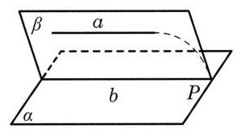

图 ${10} - \mathrm{R}1$

为了便于记忆, 直线与平面平行的判定定理可简述为“线线平行则线面平行”,性质定理可简述为“线面平行则线线平行”.

(3) 直线与平面垂直.

直线与平面垂直是直线与平面相交的一种特殊情形, 是一种重要的位置关系, 是构建空间观念的一个重要途径. 在实际生活中有很多直观的例子, 对此可以启发学生观察直立的旗杆与其在地面上的投影的位置关系, 抽象形成直线与平面垂直的定义. 通过提问“直线垂直于平面上的无穷多条直线, 是否确定直线垂直于平面”, 帮助学生辨析“无数条直线”与“任意一条直线”的区别,以正确理解概念.

直线与平面垂直的判定定理可以通过教材上介绍的实验引入,这里要着重引导学生动手操作,折出折痕与底边不垂直和垂直两种情形,观察折痕所在的直线与桌面所在的平面上的直线满足怎样的位置关系, 才能使得直线与平面垂直. 使学生经历 “实验操作一观察探索一模型抽象一概括确认”这样的认识过程.

直线与平面垂直的判定定理将直线与平面垂直的判定转化为直线与直线垂直的判定, 即只要在平面上找到两条相交直线都和这条直线垂直就可以了. 这里必须强调平面上的两条直线是相交直线. 直线与平面垂直的判定定理也是平面法向量存在的基础.

直线与平面垂直的性质定理又是用反证法证明的, 在证明过程中要注意的是, 其中与直线 $a$ 平行的直线 ${b}^{\prime }$ 是在点 $B$ 与直线 $a$ 确定的平面上作出的.

线面垂直的性质定理是判断两条直线平行的重要依据.

由线面垂直的定义和性质定理可以直接得出两条重要结论: “过一点有且只有一个平面与给定的直线垂直.” “过一点有且只有一条直线与给定的平面垂直.”

(4) 直线与平面所成的角.

直线与平面所成的角用来刻画直线与平面的位置关系. 生活中的实例, 如固定电线杆的斜拉绳与地面、标枪投掷着地后标枪与地面等都给我们以直线与平面斜交的形象, 观察它们位置关系的差异, 说明用角度刻画直线与平面位置关系的必要性.

异面直线所成的角是通过转化为同一平面上的两条相交直线所成的角来定义的. 那么, 直线与平面所成的角是否也可以通过转化为同一平面上两条相交直线所成的角来定义呢? 因为斜线和平面上不同直线所成的角不都相同, 所以要探寻用哪个角来表示斜线与平面的倾斜程度最合适.

用斜线与它在平面上的投影所成的角来刻画直线与平面的倾斜程度, 是因为斜线在平面上的投影是唯一的, 并且斜线与投影所成的角是这条斜线与平面上任何直线所成角中的最小的角. 教材上例 7 就是证明了这个结论.

直线与平面所成的角的定义说明了求直线与平面所成的角的方法: (1)确定斜线与平面的交点即斜足; (2)由斜线上(不是斜足)的任意一点作平面的垂线, 确定垂足; (3)连接斜足和垂足得到斜线在平面上的投影；何时平面所成的角. 及时指出,关于直线垂直于平面、直线平行于平面或在平面上的情形, 要注意教材上的约定.

(5) 三垂线定理是研究空间直线与直线垂直关系的重要命题. 没有分别叙述为定理与

三垂线定理是研究空间直线与直线垂直关系的重要命题. 没有分别叙述为定理与逆定理, 而是使用“充要条件”来表达三垂线定理中两个条件的意义.

从逻辑上看, 三垂线定理只是把一个常用的推理过程“压缩”成一个工具性的定理, 并没有增加新的结论. 作为定理的意义, 除了方便使用、缩短相关的推理过程外, 也有利于直观地判断空间直线的垂直关系. 例如, 在用切纸刀切纸时, 假设 ${PA}$ 是刀口, ${AB}$ 是刀槽, ${MN}$ 是被切的纸条. 根据三垂线定理,只要将被切的纸条 ${MN}$ 放在和刀槽 ${AB}$ 垂直的位置, 就可以保证 ${MN}$ 也和刀口 ${PA}$ 垂直(图 10-R2).

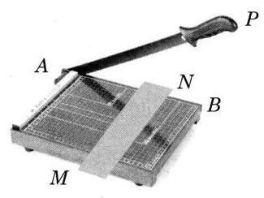

图 10-R2

三垂线定理阐明了平面的斜线、垂线, 斜线在平面上的射影以及平面上的直线之间的内在联系, 是处理有关空间直线的垂直关系的重要工具, 是实现平面与空间相互转化的一个有效途径. 三垂线定理的证明方法体现了“线线垂直”与“线面垂直”互相转化的思想. 要重视体现三垂线定理的教学价值,关注学生对三垂线定理的学习,更好地发展学生的空间观念.

在本套教材选择性必修第 3 章“空间向量及其应用”的 3.4 节“空间向量在立体几何中的应用”中还将给出三垂线定理的向量证明, 但没有重述三垂线定理的重要性. 希望老师们都能认真讲好本节所给的定理的意义及其纯几何证明, 让学生掌握这一重要的几何知识, 也为学生将来学习向量的应用, 理解几何方法和向量方法的相辅相成做好铺垫.

### 10.4 平面与平面的位置关系

## 3 教学重点

本节内容是在空间直线与直线的位置关系、直线与平面的位置关系的基础上进一步研究平面与平面的位置关系. 认识和理解平面与平面的各种位置关系, 通过探索、 发现并证明平面与平面平行的判定定理和性质定理、平面与平面垂直的判定定理和性质定理等, 理解二面角的概念, 认识到空间中的问题常常要转化到平面上来解决, 进一步感悟平面和空间相互转化的思想方法.

## 内容分析

教材在“10.1 平面及其基本性质”中根据公理 3 ,按照平面与平面有没有公共点已经讨论了两个平面的位置关系. 平面与平面的位置关系是在研究直线与平面的位置关系的基础上进一步讨论的又一重要的空间图形的位置关系. 本节内容的编排顺序是平面与平面平行的判定、性质; 平面与平面所成的角; 平面与平面垂直的判定、性质. 其中, 判定定理和性质定理的证明是难点所在.

由平面与平面平行的定义可知, 如果两个平面平行, 那么其中一个平面上的任意一条直线都平行于另一个平面；反之亦然. 但由于一个平面上有无穷多条直线,因此需要把“无限”转化为“有限”, 由此引进了平面与平面平行的判定定理. 判定定理是通过直线与平面的平行, 进而达到证明平面与平面平行的目的, 这是处理空间位置关系的一种常用方法,体现了“直线与平面平行”和“平面与平面平行”互相转化的数学思想.

反过来, 平面与平面平行的性质定理是由平面与平面平行, 进而证明直线与直线平行, 是根据平面与平面平行的定义以及平行线的定义来证明的, 仍然是将空间问题转化为平面问题. 平面与平面平行的性质定理是证明直线与直线平行的一个重要依据, 体现了“平面与平面平行”和“直线与直线平行”互相转化的数学思想.

例 1 是运用平面与平面平行的判定定理讨论长方体模型中两个截面的平行问题. 长方体是研究平面与平面平行关系的一个直观模型, 教学时可以不限制于教材中给定的截面. 可以让学生从长方体的表面开始, 到一些简单的截面, 充分讨论长方体表面与截面的各种平行位置. 熟悉定理的同时, 理解平面与平面平行的充分与必要条件.

两个平面平行的性质定理的推理过程并不复杂, 难的是看清复杂空间图形中的各种位置关系. 教学时可以让学生先看长方体教具模型, 然后让他们自己尝试去画一画题设图形, 在这一过程中可以培养空间想象能力.

例 2 是两个平面平行的性质定理的简单应用. 教材给出的证明是基于直线与平面垂直的定义的, 教学时也可以让学生运用直线与平面垂直的判定定理来完成.

二面角是刻画两个相交平面位置关系的一个度量. 在国家课程标准中没有对二面角的概念提出要求, 本套教材之所以把它列入教学内容, 一方面是为了知识体系的完整性, 因为二面角是确定两个平面一般位置的基本方法; 另一方面也是为学生进一步发展直观想象与空间推理能力提供机会. 教学的重点可以放在二面角的平面角的构造上, 角的度量大小可以在后期的空间向量中重点解决.

教材从直二面角引入平面与平面垂直的概念, 这样就把平面与平面垂直看作是二面角的一种特殊情况. 平面与平面垂直的判定定理体现了“直线与平面垂直”和“平面与平面垂直”互相转化的数学思想. 由于两个平面垂直的判断以后可以利用平面的法向量来解决, 因此这里只要求学生能够处理正方体和长方体中的一些相关问题.

## 注意事项

在探究两个平面的位置关系时可以类比平面几何中的两条直线的位置关系, 其研究思路则是转化为直线与平面的位置关系. 对于平面与平面的位置关系所要研究的内容和方法, 要始终结合直线与平面的位置关系所研究的内容和方法, 引导学生进行类比. 如果直线与直线、直线与平面的位置关系在头脑中牢固建立了, 那么平面与平面的位置关系的学习就会轻车熟路.

平面与平面平行的判定定理的证明用的是反证法, 并不难证明, 但需要一定的空间想象能力. 平面与平面垂直的判定定理的证明, 是先作出二面角, 然后说明这个二面角是直二面角, 从而根据定义就证明了平面与平面垂直. 这些都是培养学生的逻辑推理能力的有利时机.

本节内容与“二期课改”教材相比,增加了面面平行的判定定理和性质定理、面面垂直的判定定理和性质定理等一些重要结论, 尤其是增加了对推理论证的要求.

二面角的学习不仅仅是为定义面面垂直服务, 更是为了完善平面与平面的位置关系, 培养学生的空间想象能力. 这里可以淡化平面与平面所成的角、距离的计算问题.

注意平面与平面各种位置关系的直观图的正确画法, 注意正确使用符号语言表示平面与平面的各种位置关系.

## 教学建议

(1)平面与平面平行.

借助实际情境,如教室、长方体模型、三角板等,通过观察、实验、操作,探索发现平面与平面平行的判定定理和性质定理. 通过演绎论证, 尝试证明判定定理和性质定理. 平面与平面平行的判定定理说明, 可以通过直线与平面平行证明平面与平面平行. 平面与平面平行的性质定理说明, 可以通过平面与平面平行证明直线与直线平行.

教材用反证法简明扼要地证明了平面与平面平行的判定定理, 而对于平面与平面平行的性质定理, 也可以引导学生用反证法证明.

教材中通过水平仪应用的例子, 说明了判定定理的应用性, 不但帮助学生理解定理的内涵,还和实际的生活工作相联系,丰富学生的生活知识,为提高学生的实践能力作准备.

在平面几何中, 有结论 “若一条直线垂直于两条平行直线中的一条, 则它必垂直于另一条直线”. 那么在立体几何中,是否有类似的结论成立呢？这就引出了例 2 的教学.

这里, 可以根据学生的实际情况, 引入国家课程标准中的“案例 11 正方体截面的探究”. 结合正方体截面设计的问题串, 引导学生完成探究、发现、证明新问题的过程, 积累数学探究的经验.

【案例 11】用一个平面截正方体, 截面的形状将会是什么样的? 启发学生提出逐渐深入的系列问题, 引导学生进行逐渐深刻的思考. 学生可以自主或在教师引导下提出一些问题, 例如:

(1)给出截面图形的分类原则,找到截得这些形状截面的方法,画出这些截面的示意图. 例如, 可以按照截面图形的边数进行分类(图 10-R3).

(2)如果截面是三角形,可以截出几类不同的三角形？为什么？

(3)如果截面是四边形, 可以截出几类不同的四边形? 为什么?

(4)还能截出哪些多边形？为什么？

然后进一步探讨:

(5)能否截出正五边形？为什么？

(6)能否截出直角三角形？为什么？

(7)有没有可能截出边数超过 6 的多边形? 为什么?

(8)是否存在正六边形的截面？为什么？

(9)截面面积最大的三角形是什么形状的三角形？为什么？

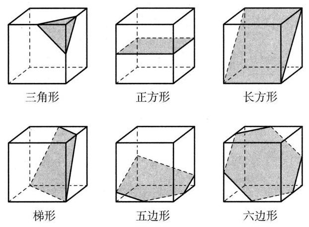

图 10-R3

这是一个跨度很大的数学问题串, 可以针对不同学生, 设计不同的教学方式, 通过多种方法实施探究. 例如,可以通过切萝卜块观察,启发思路；也可以在透明的正方体盒子中注入有颜色的水,观察不同摆放位置、不同水量时的液体表面的形状；还可以借助信息技术直观快捷地展示各种可能的截面. 但是, 观察不能代替证明. 探究的难点是分类找出所有可能的截面, 并证明哪些形状的截面一定存在或者一定不存在. 可以鼓励学生通过操作观察, 形成猜想, 证明结论. 经历这样逐渐深入的探究过程, 有利于培养学生发现问题、分类讨论、作图表达、推理论证等能力, 在具体情境中提升直观想象、数学抽象、逻辑推理等素养,积累数学探究活动经验.

(2)二面角.

二面角是平面上“角”的概念的类比,是两个相交平面位置关系的描述. 可以从开门、翻书、笔记本电脑打开时的状态等生活中的实例引入二面角的概念. 角的大小可以测量, 并得到一个确定的量, 二面角的大小也必须用一个量来刻画, 所以引入了二面角的平面角的概念, 用平面角的大小来刻画二面角的大小. 这里要强调的是, 虽然二面角的平面角不唯一, 但所有平面角的大小是一样的, 从而给出一个确定的量来刻画二面角的大小. 在此基础上, 再类比平面上的直角, 就定义了直二面角以及平面与平面的垂直关系.

平面与平面垂直的判定定理和性质定理说明, 直线与平面的垂直关系和平面与平面的垂直关系的互相转化, 是解决空间图形问题的一种重要思想方法.

## *10.5 异面直线间的距离

## 教学重点

认识和理解两条异面直线的公垂线以及公垂线的存在性与唯一性, 进一步完善空间中直线与直线的位置关系、直线与平面的位置关系以及研究方法, 进一步发展直观想象和逻辑推理核心素养.

## 内容分析

教材首先启发思考仅考察两条异面直线所成的角还不能完整地刻画两条异面直线的位置关系, 而与两条异面直线都垂直并且相交的直线是存在且唯一的, 证明这个定理之后, 定义了两条异面直线的公垂线概念. 这样就完善了对空间中两条异面直线的位置关系的全面认识.

因为公垂线段难以作出来, 所以求两条异面直线间的距离一般是比较困难的. 这就常常要将异面直线间的距离转化为线面或面面间的距离.

本节的定理的存在性证明过程, 也提供了如何去寻找两条异面直线的公垂线的方法.

例 1 是在正方体中求简单情形下的异面直线间的距离, 其中第 (1) 小题能够直接找到公垂线段, 第 (2) 小题需要将异面直线间的距离转化为直线与平面之间的距离. 这两种情况具有一定的典型性.

例 2 是在四面体中解决异面直线间的距离问题, 其中需要综合二面角等有关知识.

练习 10.5 的第 3 题虽然是求分别在两条异面直线上的两点间的距离问题, 但实际上也是间接地给出了求异面直线间距离的一种方法.

## 注意事项

在学习两条异面直线的公垂线的概念时, 应注意强调 “与两条异面直线都垂直且相交”中的“相交”二字,因为空间中的两条直线垂直不一定相交,但这里必须相交, 才能确定公垂线段.

本节内容的处理方式和要求与“二期课改”教材不同,这也是为了完善发展学生的空间观念而编写的, 供学有余力的学生学习, 在解题上不宜要求过高, 只需要知道相关的概念即可.

## 教学建议

生活中有大量的异面直线的公垂线的例子, 例如桥面中心直线与桥下船只行驶的路线是异面直线, 不难找到公垂线. 借助生活中的实例, 如教室、长方体模型等, 找到或者作出两条异面直线的公垂线.

认识和理解两条异面直线的公垂线概念及其距离, 是本节教学的重点, 初步感受求异面直线间的距离的多种方法.

练习 10.5 的第 3 题也从具体问题中说明了, 两条异面直线间的距离是两条异面直线上两点间的距离的最小值.

## 三、参考答案或提示

### 10.1 平面及其基本性质

练习 $\mathbf{{10}.1\left( 1\right) }$

1. (1) $A \in  a, B \in  a, A \in  \alpha , B \in  \beta$ . (2) $P \in  l, P \in  a, P \in  b, P \in  \alpha$ , $P \in  \beta ,\;a \subset  \alpha , b \subset  \beta ,\alpha  \cap  \beta  = l, a \cap  l = P, b \cap  l = P, a \cap  b = P.$

2. 已知: 四边形 ${ABCD},{AD} \subset  \alpha ,{AB} \subset  \alpha ,{BC} \subset  \alpha$ . 求证: ${CD} \subset  \alpha$ .

证明: 因为 ${AD} \subset  \alpha ,{BC} \subset  \alpha$ ,所以 $D \in  \alpha , C \in  \alpha$ . 由公理 1,知 ${CD} \subset  \alpha$ .

练习 $\mathbf{{10.1}\left( 2\right) }$

1. 因为直线 $c$ 与 $a\text{、}b$ 都相交,所以可设 $a \cap  c = A, b \cap  c = B$ . 又已知 $a//b$ ,由推论 3,可知 $a\text{、}b$ 确定一个平面,设该平面是 $\alpha$ . 因为 $a \subset  \alpha , b \subset  \alpha$ ,所以 $A \in  \alpha , B \; \in  \alpha$ . 再由公理 1,知 ${AB} \subset  \alpha$ ,即 $c \subset  \alpha$ ,所以 $a\text{、}b\text{、}c$ 在同一平面上.

2. 就是 ${A}_{1}B$ 与 $A{B}_{1}$ 的交点. 理由: 因为 ${A}_{1}B$ 与 $A{B}_{1}$ 都在平面 ${AB}{B}_{1}{A}_{1}$ 上.

3. 略.

练习 ${10.1}\left( 3\right)$

1. 略.

2. 略.

3. (1) ${BD}{D}_{1}{B}_{1},{ABCD}$ (答案不唯一).

练习 10.1(4)

1. 略.

2. 略.

习题 10.1

A 组

1.(1)∈. (6) ${A}_{1}$ . (7) C.

2.(1) $A \in  \alpha$ . (2) ${AC} \subset  \alpha$ . (3) $B \notin  \beta$ . (4) ${BC}//\beta$ ,图略.

3.(1)是,不共线的三点确定一个平面. (2)是,两条平行直线确定一个平面. (3)不是,如空间四边形. (4)是,两条平行直线确定一个平面.

4.(1)假命题,如四点为平行四边形的四个顶点时.

(2)真命题,若三点共线而另一点在线外,由公理 2 推论 1 可得共面；若四点共线, 则显然共面.

(3)假命题,如四点为平行四边形的四个顶点时.

(4)真命题,用反证法即可证明.

5. 已知: $l\text{、}m$ 是两条直线, $l \cap  m = A$ . 求证: $l\text{、}m$ 确定一个平面.

证明: 在 $l$ 上取异于 $A$ 的一点 $B$ ,在 $m$ 上取异于 $A$ 的一点 $C$ ,则 $A\text{、}B\text{、}C$ 不在同一直线上. 由公理 2,知 $A\text{、}B\text{、}C$ 三点可确定一个平面 $\alpha$ . 因为 $A \in  \alpha , B \in  \alpha$ ,由公理 1,知 ${AB} \subset  \alpha$ ,即 $l \subset  \alpha$ ,同理 $m \subset  \alpha$ ,所以 $l\text{、}m$ 确定一个平面.

6. C.

7. 因为 ${AC}//{BD}$ ,由推论 3,可知 ${AC}$ 与 ${BD}$ 确定一个平面 $\beta$ ,所以 $A \in  \beta , B \in  \beta$ . 由公理 1,知 ${AB} \subset  \beta$ ,即 $l \subset  \beta$ . 因为 $O \in  l$ ,所以 $O \in  \beta$ ,因为 $C \in  \beta , D \in  \beta , O \in  \alpha$ , $C \in  \alpha , D \in  \alpha$ ,记 $\alpha  \cap  \beta  = m$ ,则 $O \in  m, C \in  m, D \in  m$ ,所以 $O\text{、}C\text{、}D$ 三点共线.

8. 略.

B 组

1.4 或 6 或 7 或 8 .

2. D.

3. 三点共线.

4. 因为 $O \notin  l$ ,由公理 2 推论 1,知 $O$ 与 $l$ 可确定平面 $\alpha$ ,所以 $O \in  \alpha , l \subset  \alpha$ . 因为 $A\text{、}B\text{、}C$ 在直线 $l$ 上,所以 $A \in  \alpha , B \in  \alpha , C \in  \alpha$ . 由公理 1,知 ${OA} \subset  \alpha ,{OB} \subset  \alpha$ , ${OC} \subset  \alpha$ .

5. 由公理 2,知 $A\text{、}B\text{、}C$ 可确定一个平面 $\beta$ ,所以 ${AC} \subset  \beta$ . 因为 $D \in  {AC}$ ,所以 $D \in  \beta$ ,又因为 $D \in  \alpha$ ,所以 $D \in  \alpha  \cap  \beta$ . 同理 $E \in  \alpha  \cap  \beta , P \in  \alpha  \cap  \beta$ ,由公理 3,知点 $P$ 在直线 ${DE}$ 上.

6. 因为 ${EF} \cap  {HG} = Q$ ,所以 $Q \in  {EF}$ ,又因为 ${EF} \subset$ 平面 ${ABCD}$ ,所以 $Q \in$ 平面 ${ABCD}$ . 同理可得, $Q \in$ 平面 ${DC}{C}_{1}{D}_{1}$ . 又平面 ${ABCD} \cap$ 平面 ${DC}{C}_{1}{D}_{1} = {DC}$ ,所以 $Q \in  {DC}$ .

### 10.2 直线与直线的位置关系

## 练习 $\mathbf{{10}.2\left( 1\right) }$

1. 相交. 在长方体 ${ABCD} - {A}_{1}{B}_{1}{C}_{1}{D}_{1}$ 中, ${A}_{1}{D}_{1}//{AD},{A}_{1}{D}_{1} = {AD}$ ,且 ${BC}// \; {AD},{BC} = {AD}$ ,所以 ${A}_{1}{D}_{1}//{BC},{A}_{1}{D}_{1} = {BC}$ ,故四边形 ${A}_{1}{BC}{D}_{1}$ 为平行四边形. 又 ${A}_{1}C$ 与 $B{D}_{1}$ 为其对角线,所以 ${A}_{1}C$ 与 $B{D}_{1}$ 相交于一点.

2. 解法 1: 如图 10-R4,过 $M$ 作 $M{M}_{1} \bot  {AB}$ ,垂足为 ${M}_{1}$ ,过 $N$ 作 $N{N}_{1} \bot  {CD}$ ,垂足为 ${N}_{1}$ ,由 $M{M}_{1}// \; A{A}_{1}, N{N}_{1}//D{D}_{1}$ . 又 $A{A}_{1}//D{D}_{1}$ ,所以 $M{M}_{1}//N{N}_{1}$ , 故 $M{M}_{1}{N}_{1}N$ 为平行四边形,从而 ${MN}//{M}_{1}{N}_{1}$ . 故只需在平面 ${ABCD}$ 上过 $P$ 作 ${M}_{1}{N}_{1}$ 的平行线.

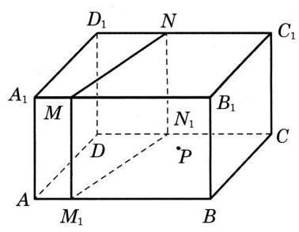

图 $\mathbf{{10} - {R4}}$

解法 2: 如图 10-R4,分别在 ${AB}\text{、}{CD}$ 上取点 ${M}_{1}$ 、 ${N}_{1}$ ,使得 $A{M}_{1} = {A}_{1}M, D{N}_{1} = {D}_{1}N$ ,则 $M{M}_{1}//N{N}_{1}$ 且 $M{M}_{1} = N{N}_{1}$ ,故四边形 $M{M}_{1}{N}_{1}N$ 为平行四边形,即 ${MN}//{M}_{1}{N}_{1}$ ,过 $P$ 作 $l// \; {M}_{1}{N}_{1}$ ,所以 $l//{MN}$ .

3. 提示: 利用等角定理证明.

练习 10.2(2)

1. 略.

2. 相交或异面.

3. 图略, ${AF}\text{、}{BM}\text{、}{ME}$ .

练习 10.2(3)

1.4 条.

2. 图略, $\angle {D}_{1}B{C}_{1}$ (答案不唯一).

习题 10.2

A 组

1. 已知: $l\text{、}m$ 是两条直线,且 $l//m$ . 求证: $l\text{、}m$ 确定一个平面.

证明: 存在性. 在直线 $l$ 上取一点 $A$ ,因为 $l//m$ ,所以 $A \notin  m$ ,由公理 2 的推论 1 知,经过直线 $m$ 和 $m$ 外的一点 $A$ 存在一个平面 $\alpha$ . 在平面 $\alpha$ 内过点 $A$ 作直线 ${l}^{\prime }// \; m$ ,由公理 4 知, ${l}^{\prime }$ 和 $l$ 只能重合,即 $l \subset  \alpha$ 且 $m \subset  \alpha$ . 唯一性. 假设存在另一个不同于 $\alpha$ 的平面 $\beta$ ,使得 $l \subset  \beta$ 且 $m \subset  \beta$ . 在直线 $l$ 上取一点 $A$ ,因为 $l//m$ ,所以 $A \notin  m$ ,此时经过直线 $m$ 和 $m$ 外的一点 $A$ 有两个不同的平面 $\alpha$ 和 $\beta$ ,与公理 2 的推论 1 相矛盾. 唯一性得证. 所以 $l\text{、}m$ 确定一个平面.

2. D.

3. 提示: 因为 ${MN}//{AC},{AC}//{A}_{1}{C}_{1}$ ,所以 ${MN}//{A}_{1}{C}_{1}$ .

4. ③④.

5. (1)不成立. 直线 $C{C}_{1} \subset$ 平面 ${DC}{C}_{1}{D}_{1}, M \in$ 平面 ${DC}{C}_{1}{D}_{1}, M \notin  C{C}_{1}, A \notin$ 平面 ${DC}{C}_{1}{D}_{1}$ ,由异面直线判定定理知,直线 ${AM}$ 与直线 $C{C}_{1}$ 是异面直线,故直线 ${AM}$ 与直线 $C{C}_{1}$ 不相交.

(2)不成立. 取 $D{D}_{1}$ 中点 $P$ ,连接 ${PN}$ 、 ${PA}$ . 由 ${PN}//{DC}$ , ${AB}//{DC}$ 知 ${PN}// \; {AB}$ ,所以 ${PNBA}$ 四点共面. 因为 ${BN} \subset$ 平面 ${PNBA}, A \in$ 平面 ${PNBA}, A \notin  {BN}$ , $M \notin$ 平面 ${PNBA}$ ,由异面直线判定定理知,直线 ${AM}$ 与直线 ${BN}$ 是异面直线,故直线 ${AM}$ 与直线 ${BN}$ 不平行.

(3)成立. 直线 $D{D}_{1} \subset$ 平面 ${A}_{1}{AD}{D}_{1}, A \in$ 平面 ${A}_{1}{AD}{D}_{1}, A \notin  D{D}_{1}, M \notin$ 平面 ${A}_{1}{AD}{D}_{1}$ ,由异面直线判定定理知,直线 ${AM}$ 与直线 $D{D}_{1}$ 是异面直线.

6. 假设直线 ${AC}$ 与 ${BD}$ 不是异面直线,则直线 ${AC}$ 与 ${BD}$ 共面,所以直线 ${AB}$ 与 ${CD}$ 共面,与直线 ${AB}\text{、}{CD}$ 成异面直线矛盾,所以假设不成立.

7. 如图 10-R5,取 ${AC}$ 的中点 $M$ ,连接 ${EM}\text{、}{FM}$ . 因为 $E$ 是 ${BC}$ 的中点,所以 ${EM}//{AB}$ ,所以 $\angle {FEM}$ 或其补角就是异面直线 ${EF}$ 与 ${AB}$ 所成的角,且 ${EM} = \frac{1}{2}{AB}$ . 又因为 $F$ 是 ${AD}$ 的中点,所以 ${FM}//{DC}$ 且 ${FM} = \frac{1}{2}{DC}$ . 因为 ${EM}//{AB},{FM}//{DC},{AB} \bot  {CD}$ ,所以 ${FM} \bot  {EM}$ . 因为 ${FM} = \frac{1}{2}{DC},{EM} = \frac{1}{2}{AB},{AB} = {CD}$ ,所以 ${EM} = {FM}$ ,所以 $\bigtriangleup  {FEM}$ 是等腰直角三角形,因此异面直线 ${EF}$ 与 ${AB}$ 所成角的大小为 ${45}^{ \circ  }$ .

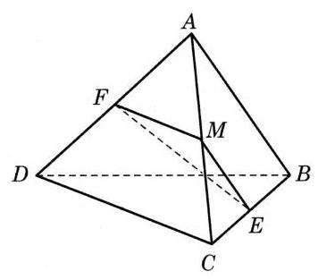

图 $\mathbf{{10} - {R5}}$

## B 组

1. B.

2. 提示: 两个都是等边三角形, 也可用等角定理证明.

3. (1)平行.

(2)异面.

(3)相交.

(4)异面.

4. 假设 ${MN}$ 和 ${PQ}$ 不是异面直线,则它们共面,不妨记为 $\beta$ ,则 ${MN} \subset  \beta ,{PQ} \subset \; \beta$ ,所以 $Q \in  \beta , M \in  \beta , P \in  \beta$ . 由公理 1,可知 ${MP} \subset  \beta$ ,即 $a \subset  \beta$ ,又 $O \in  a$ ,所以 $O \in  \beta$ . 由公理 1,可知 ${OQ} \subset  \beta$ ,即 $c \subset  \beta$ ; 同理 $b \subset  \beta$ . 这与 $a\text{、}b\text{、}c$ 不在一个平面上矛盾,假设不成立,所以 ${MN}$ 和 ${PQ}$ 是异面直线.

5. 如图 10-R6,取 ${BC}$ 的中点 $E$ ,连接 ${EM}\text{、}{EN}$ . 因为 $E$ 是 ${BC}$ 的中点,所以 ${ME}//{AC},{EN}//{BD}$ ,所以 $\angle {MEN}$ 或其补角就是异面直线 ${AC}$ 与 ${BD}$ 所成的角,所以 $\angle {MEN} = {90}^{ \circ  }$ . 又因为 ${EM} = \frac{1}{2}{AC} = 4,{EN} = \frac{1}{2}{BD} = 3$ , 所以 ${MN} = \sqrt{{3}^{2} + {4}^{2}} = 5$ .

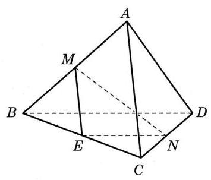

图 $\mathbf{{10} - {R6}}$

6. 当 ${AC}$ 与 ${BD}$ 垂直时, ${EFGH}$ 是矩形; 当 ${AC}$ 与 ${BD}$ 相等时, ${EFGH}$ 是菱形; 当 ${AC}$ 与 ${BD}$ 既垂直又相等时, ${EFGH}$ 是正方形.

### 10.3 直线与平面的位置关系

## 练习 $\mathbf{{10}.3\left( 1\right) }$

1. (1)平面 ${A}_{1}{B}_{1}{C}_{1}{D}_{1}$ ,平面 ${DC}{C}_{1}{D}_{1}$ . (2)平面 ${BC}{C}_{1}{B}_{1}$ .

2.(1)假命题. 因为当直线 $a$ 与平面 $\alpha$ 相交时,除交点外其余的点有无数个,且不在平面 $\alpha$ 上.

(2)假命题. 因为若将平面 $\alpha$ 上与 $a$ 平行的直线记为 $b$ ,则在平面 $\alpha$ 上与 $b$ 相交的直线都不与 $a$ 平行.

(3)假命题. 反例:若 $a//b, a//\alpha , b$ 在平面 $\alpha$ 上,显然 $b$ 与平面 $\alpha$ 不平行.

(4)真命题. 由直线和平面平行的判定定理可知.

3. 此时,直线 $l$ 与平面 $\alpha$ 相交,设 $l \cap  \alpha  = P$ .

(1)不成立. 因为平面 $\alpha$ 上过点 $P$ 的直线与 $l$ 不是异面直线的关系.

(2)成立. 如果存在与 $l$ 平行的直线,那么 $l$ 就平行于平面 $\alpha$ ,这与已知矛盾.

(3)不成立. 理由同(2).

(4)不成立. 平面 $\alpha$ 上不过点 $P$ 的直线都与 $l$ 不相交.

## 练习 $\mathbf{{10}.3\left( 2\right) }$

1.(1)假命题. 记 $a\text{、}b$ 确定的平面为 $\alpha$ ,则 $\alpha$ 经过 $b$ ,且 $a$ 在平面 $\alpha$ 上, $a$ 不平行于平面 $\alpha$ .

(2)假命题. 设过 $a$ 的平面与平面 $\alpha$ 交于直线 $b$ ,在平面 $\alpha$ 上与 $b$ 相交的直线与 $a$ 都不平行.

(3)假命题. $a\text{、}b$ 都与平面 $\alpha$ 平行时,则 $a\text{、}b$ 可以是平行或者相交或者异面直线关系.

(4)真命题. 因为 $a$ 平行于平面 $\alpha$ ,所以直线 $a$ 与平面 $\alpha$ 上的任意直线都没有公共点,所以 $a$ 与 $b$ 不是平行关系就是异面关系.

2. 已知 $a//\alpha , a//b, b$ 不在 $\alpha$ 上,求证: $b//\alpha$ .

证明: 过 $a$ 作平面 $\beta$ 与平面 $\alpha$ 相交于 $l$ ,则由线面平行的性质定理,可得 $a//l$ . 因为 $a//b$ ,所以 $b//l$ ,而 $l$ 在平面 $\alpha$ 上, $b$ 不在平面 $\alpha$ 上,故由线面平行的判定定理可得 $b//\alpha$ .

3. 设过直线 $a$ 任意作平面 $\beta ,\gamma ,\delta ,\cdots ,\alpha  \cap  \beta  = b,\alpha  \cap  \gamma  = c,\alpha  \cap  \delta  = d,\cdots$ ,由线面平行的性质定理,可得 $a//b, a//c, a//d,\cdots$ . 由公理 4,可得 $a//b//c// \; d//\cdots$ .

## 练习 $\mathbf{{10}.3\left( 3\right) }$

1. 侧面都是矩形, 说明每条侧棱都垂直于上下两个面上的两条邻边, 即一条直线垂直于平面上的两条相交直线. 所以六条侧棱一定都垂直于螺母的上下两个面.

2. 5 或 $\sqrt{65}$ .

3. 因为 ${PA} \bot  \alpha , l \subset  \alpha$ ,所以 ${PA} \bot  l$ . 同理 ${PB} \bot  l$ . 又 ${PA} \cap  {PB} = P$ ,所以 $l \bot$ 平面 ${PAB}$ .

## 练习 $\mathbf{{10}.3\left( 4\right) }$

1. ${60}^{ \circ  }$ .

2. (1) $\arctan \frac{\sqrt{2}}{2}$ . (2) $\arctan \frac{2\sqrt{5}}{5}$ .

3. $\angle {AOC} = {60}^{ \circ  } > {45}^{ \circ  }$ .

## 练习 $\mathbf{{10}.3\left( 5\right) }$

1. (1)外.

2. 因为 ${PO} \bot$ 平面 ${ABC}$ ,所以 ${AO}$ 是 ${PA}$ 在平面 ${ABC}$ 上的投影. 又 ${AO} \bot  {BC}$ , 由三垂线定理,知 ${PA} \bot  {BC}$ .

3.(1)因为 ${PA} \bot$ 平面 ${ABCD}$ ,所以 ${AB}$ 是 ${PB}$ 在平面 ${ABCD}$ 上的投影. 又 ${AB}\bot {BC}$ ,由三垂线定理,知 ${PB}\bot {BC}$ ,所以 $\angle {PBC} = {90}^{ \circ  }$ .

(2)因为 ${PA} \bot$ 平面 ${ABCD}$ ,所以 ${AC}$ 是 ${PC}$ 在平面 ${ABCD}$ 上的投影. 又 ${PC} \bot \; {BD}$ ,由三垂线定理,知 ${AC} \bot  {BD}$ . 而 ${ABCD}$ 是矩形,所以四边形 ${ABCD}$ 是正方形.

## 习题 10.3

A 组

1. 平行. 提示: 设 ${AC}$ 与 ${BD}$ 相交于 $O$ ,只需证明 $B{D}_{1}//{EO}$ .

2. 提示: ${MN}//{AC}$ .

3. 提示: ${AB}//{CD},{AB}//{EF}$ .

4. 因为 ${AB}//$ 平面 ${EFG},{AB} \subset$ 平面 ${ABC}$ ,平面 ${ABC} \cap$ 平面 ${EFG} = {EG}$ ,所以 ${AB}//{EG}$ . 又 $E$ 为 ${BC}$ 的中点,所以 $G$ 为 ${AC}$ 的中点.

5. 略.

6. 提示: ${AB} \bot$ 平面 ${PCD}$ .

7. 斜线段 ${AB}$ 与平面 $\alpha$ 所成角的大小为 $\arccos \frac{1}{8}$ 或 $2\arccos \frac{3}{4}$ ; 斜线段 ${AC}$ 与平面 $\alpha$ 所成角的大小为 $\arccos \frac{3}{4}$ .

8. $2\sqrt{2}a$ .

9. 略.

10. 因为 $B{C}_{1}$ 是 $B{D}_{1}$ 在平面 ${BC}{C}_{1}{B}_{1}$ 上的射影,又 $B{C}_{1} \bot  {B}_{1}C$ ,由三垂线定理, 知 ${B}_{1}C \bot  B{D}_{1}$ . 同理 ${AC} \bot  B{D}_{1}$ . 因为 ${B}_{1}C \cap  {AC} = C$ ,所以 $B{D}_{1} \bot$ 平面 $A{B}_{1}C$ .

## B 组

1. 平面 ${ABC}$ ,平面 ${ABD}$ . 提示: ${EF}//{AB}$ .

2. 因为 ${BD}$ 为圆 $O$ 的直径,所以 ${CD}\bot {BC}$ . 又因为 ${AC}\bot {CD}$ , ${AC} \cap  {BC} = C$ ,所以 ${CD} \bot$ 平面 ${ABC}$ . 因为 ${EF}//{CD}$ ,所以 ${EF} \bot$ 平面 ${ABC}$ .

3.(1)提示: ${C}_{1}F//{DG}$ .

4. 已知 $\angle {AOB},{CO}$ 为平面 ${AOB}$ 的一条斜线, $\angle {COA} = \angle {COB}$ ,过 $C$ 作 ${CH} \bot$ 平面 ${AOB}$ . 求证: ${OH}$ 是 $\angle {AOB}$ 的角平分线. 提示: 过 $H$ 作 ${HD}\bot {OA}$ 于 $D$ ,过 $H$ 作 ${HE}\bot {OB}$ 于 $E$ ,连接 ${CD}\text{、}{CE}$ . 反复利用直角三角形全等证明结论成立.

5. 提示: 方法一利用 ${AN} = {NC} = \frac{1}{2}{BD}$ ; 方法二取 ${AB}$ 的中点 $P$ ,证明 ${AC} \bot$ 平面 ${MNP}$ .

### 10.4 平面与平面的位置关系

## 练习 $\mathbf{{10.4}}\left( 1\right)$

1. (1) 假命题. (2)真命题. (3)真命题. (4)真命题.

(5) 真命题.

2. (1) $\sqrt{2}a$ . (2) $a$ . (3) $a$ . (4) $a$ .

3. 已知 $\alpha //\beta , A \in  \alpha , B \in  \alpha ,{A}_{1} \in  \beta ,{B}_{1} \in  \beta , A{A}_{1}//B{B}_{1}$ . 求证: $A{A}_{1} = B{B}_{1}$ .

证明: 因为 $A{A}_{1}//B{B}_{1}$ ,所以由 $A{A}_{1}$ 和 $B{B}_{1}$ 可确定平面 $\gamma$ . 由两个平面平行的性质定理,知 ${AB}//{A}_{1}{B}_{1}$ ,所以 ${AB}{B}_{1}{A}_{1}$ 为平行四边形,从而 $A{A}_{1} = B{B}_{1}$ .

## 练习 $\mathbf{{10.4}}\left( 2\right)$

1.(1)不正确. (2)正确. (3)不正确. (4)不正确.

2. 平面 ${ABC} \bot$ 平面 ${BCD}$ ,平面 ${ABD} \bot$ 平面 ${BCD}$ ,平面 ${ACD} \bot$ 平面 ${ABC}$ .

3. 已知 $\alpha  \bot  \beta , P \in  \alpha , P \in  a, a \bot  \beta$ . 求证: $a \subset  \alpha$ .

证明: 设 $\alpha  \cap  \beta  = c$ ,过点 $P$ 在平面 $\alpha$ 上作直线 $b \bot  c$ . 根据平面与平面垂直的性质定理,可知 $b \bot  \beta$ . 又 $a \bot  \beta$ ,所以 $a//b$ . 而 $a \cap  b = P$ ,所以 $a$ 与 $b$ 重合,即 $a \subset  \alpha$ .

## 习题 10.4

A 组

1.(1)假命题,理由略. (4)真命题,理由略.

2. 提示: 因为 $E{E}_{1}$ 与 $A{A}_{1}$ 平行且相等, $F{F}_{1}$ 与 $A{A}_{1}$ 平行且相等,所以 $E{E}_{1}$ 与 $F{F}_{1}$ 平行且相等,故四边形 $E{E}_{1}{F}_{1}F$ 为平行四边形,得证.

3. 因为 $A{A}_{1}$ 与 $B{B}_{1}$ 平行且相等,所以 $A{A}_{1}{B}_{1}B$ 为平行四边形,故平面 ${A}_{1}{B}_{1}{C}_{1}$ 外的直线 ${AB}$ 平行于此平面上的直线 ${A}_{1}{B}_{1}$ ,所以 ${AB}//$ 平面 ${A}_{1}{B}_{1}{C}_{1}$ . 同理 ${AC}//$ 平面 ${A}_{1}{B}_{1}{C}_{1}$ . 又 ${AB} \cap  {AC} = A$ ,得证.

4. 提示: 过 $b$ 作平面 $\gamma$ ,使 $\alpha  \cap  \gamma  = c$ . 因为 $\alpha //\beta , b \subset  \beta$ ,所以 $b//c$ . 因为 $a$ 与 $b$ 异面,所以 $a$ 与 $c$ 相交. 因为 $l \bot  b$ , $b//c$ ,所以 $l \bot  c$ . 又 $l \bot  a$ , $a$ 与 $c$ 相交,所以 $l \bot  \alpha$ . 因为 $\alpha //\beta$ ,所以 $l \bot  \beta$ .

5. 提示: 以直线 $a\text{、}b$ 是否共面分类讨论. 当直线 $a$ 与 $b$ 共面时,由平面与平面平行的性质定理可知 ${AD}//{BE}//{CF}$ ,易证结论成立; 当直线 $a$ 与 $b$ 不共面时,过点 $A$ 作直线 $b$ 的平行线,分别与平面 $\beta \text{、}\gamma$ 交于 ${B}_{1}\text{、}{C}_{1}$ 点,易证 $\frac{AB}{BC} = \frac{A{B}_{1}}{{B}_{1}{C}_{1}}$ ,且 $\frac{A{B}_{1}}{{B}_{1}{C}_{1}} = \frac{DE}{EF}$ , 由此得证.

6. ${90}^{ \circ  }$ 和 ${45}^{ \circ  }$ . 平面 ${AB}{C}^{\prime }{D}^{\prime }$ 与平面 ${AD}{D}^{\prime }{A}^{\prime }$ 、平面 ${BC}{C}^{\prime }{B}^{\prime }$ 所成的二面角大小均为 ${90}^{ \circ  }$ ; 平面 ${AB}{C}^{\prime }{D}^{\prime }$ 与平面 ${ABCD}$ 、平面 ${A}^{\prime }{B}^{\prime }{C}^{\prime }{D}^{\prime }$ 、平面 ${AB}{B}^{\prime }{A}^{\prime }$ 、平面 ${DC}{C}^{\prime }{D}^{\prime }$ 所成的二面角大小均为 ${45}^{ \circ  }$ .

7. ${20}\mathrm{\;{cm}}$ .

8. ${60}^{ \circ  }$ . 取 ${BC}$ 的中点 $O$ ,连接 ${DO}\text{、}{AO}$ ,则 $\angle {AOD}$ 为所求.

9.(1)假命题,理由略. (2)真命题,理由略.

10. 提示: 利用 ${CD} \bot$ 平面 ${ABC}$ ,即可证明.

11. 在 $l$ 上取一点 $P$ ,过 $P$ 作 ${l}^{\prime } \bot  \gamma$ ,则由 $P \in  l \subset  \alpha$ 及 $\alpha  \bot  \gamma$ ,得 ${l}^{\prime } \subset  \alpha$ . 同理 ${l}^{\prime } \subset \; \beta$ . 所以 ${l}^{\prime }$ 是 $\alpha \text{、}\beta$ 的交线,即 $l\text{、}{l}^{\prime }$ 重合,从而 $l \bot  \gamma$ .

## B 组

1. 提示: ${l}_{1}//{l}_{2}$ .

2. 可以判定. 因为 ${VA} = {VB},{AD} = {BD}$ ,所以 ${AB} \bot  {VD}$ . 又因为 ${VO} \bot$ 平面 ${ABC}$ ,根据三垂线定理,得 ${AB} \bot  {CD}$ . 因为 ${AD} = {BD}$ ,所以 ${AC} = {BC}$ .

3. 略.

4. 略.

5. 略.

## *10.5 异面直线间的距离

## 练习 10.5

1. (1) 1. (2) 1.

2. $m\text{、}n$ 为异面直线,过 $m\text{、}n$ 分别作两个平行平面 $\alpha \text{、}\beta$ . 现假设 ${PQ}$ 为异面直线的公垂线段,且 $P \in  m, Q \in  n$ ,则 ${PQ} \bot  m,{PQ} \bot  n$ ,所以 ${PQ} \bot  \alpha ,{PQ} \bot  \beta$ ,即 ${PQ}$ 也是 $\alpha$ 与 $\beta$ 的距离.

3. $\sqrt{101}\mathrm{\;m}$ 或者 $\sqrt{301}\mathrm{\;m}$ . 提示: 分两点在公垂线的同侧和异侧进行讨论研究.

习题 10.5

A 组

1. B.

2. (1) $\frac{\sqrt{2}}{2}a$ . (2) $a$ .

3. $\frac{\sqrt{2}}{2}a$ . 提示: ${MN}$ 为所求,其中 $M\text{、}N$ 分别为 ${DC}\text{、}{AB}$ 的中点.

4. $2\sqrt{17}\mathrm{\;{cm}}$ .

5. D.

6. 已知 $a$ 与 $b$ 是异面直线, ${AB}$ 是异面直线的公垂线, $a \bot  \alpha , b \bot  \beta ,\alpha  \cap  \beta  = c$ . 求证: $c//{AB}$ .

证明: 过点 $A$ 作 ${b}^{\prime } \bot  \beta$ . 因为 $b \bot  \beta$ ,所以 $b//{b}^{\prime }$ . 因为 ${AB}$ 是 $a$ 与 $b$ 的公垂线,故 ${AB} \bot  a,{AB} \bot  b,{AB} \bot  {b}^{\prime }$ ,所以 ${AB}$ 垂直于 $a\text{、}{b}^{\prime }$ 所确定的平面. 又 $a \bot  \alpha , c \subset  \alpha$ , 则 $a \bot  c$ . 同理 ${b}^{\prime } \bot  c$ . 所以 $c$ 垂直于 $a\text{、}{b}^{\prime }$ 所确定的平面,故 $c//{AB}$ .

B 组

1. ${CD} = {26}\mathrm{\;{cm}},{AB}$ 和 ${CD}$ 之间的距离为 $\frac{{24}\sqrt{17}}{17}\mathrm{\;{cm}}$ .

2. $\frac{ab}{\sqrt{{a}^{2} + {b}^{2}}}$ . 提示: $B{B}_{1}//$ 平面 ${AC}{C}_{1}$ .

3. $\frac{\sqrt{3}}{3}$ . 提示: 转化成两个平行平面之间的距离进行求解.

## 复习题

A 组

1. $\arccos \frac{1}{5}$ .

2.(1)正确,理由略. (2)正确,理由略. (3) 正确, 理由略. 正确. $M \in$ 平面 ${PBC}$ . (5) 不正确. $M \in$ 平面 ${PBC}$ .

3.(1)提示: ${EF}$ 与 $\frac{1}{2}{DB}$ 平行且相等. (2) $\frac{9}{8}{a}^{2}$ . 提示:在梯形 ${EFBD}$ 上, 过 $F$ 作下底边 ${BD}$ 的垂线,垂足为 $M.{FM}$ 为 ${EF}$ 与 ${BD}$ 间的距离.

4.(1)假命题,理由略. (2)真命题,理由略. (4)假命题,理由略.

5. 平行或相交. 图略.

6. 提示: 因为 $A{A}^{\prime }$ 与 $B{B}^{\prime }$ 相交于 $O$ ,且 ${AO} = {A}^{\prime }O,{BO} = {B}^{\prime }O$ ,所以 ${AB}//{A}^{\prime }{B}^{\prime }$ , 从而 ${AB}//$ 平面 ${A}^{\prime }{B}^{\prime }{C}^{\prime }$ . 同理 ${BC}//$ 平面 ${A}^{\prime }{B}^{\prime }{C}^{\prime }$ . 由 ${AB} \cap  {BC} = B$ ,得证.

7. (1) 真命题, 理由略. (2)假命题,理由略. (3)真命题,理由略. (4)假命题,理由略.

8. $\frac{\sqrt{6}}{6}$ .

9. $\sqrt{7}a,\sqrt{7}a,\frac{\sqrt{19}}{2}a$ .

B 组

1.(1)假命题,理由略. (2)假命题,理由略. (3)假命题, 理由略.

2. 因为 $\alpha  \bot  \beta$ ,可在平面 $\alpha$ 上作与两平面交线垂直的直线 $c$ ,使 $c \bot  \beta$ . 又 $a \bot  \beta$ , 所以 $a//c$ . 而 $c \subset  \alpha , a$ 不在平面 $\alpha$ 上,根据线面平行的判定定理,可知 $a//\alpha$ .

3. 略.

4. 提示: 取 ${AB}$ 的中点 $G$ ,连接 ${FG}\text{、}{CG}$ . (1) 只需证明 ${FD}//{CG}$ . $\bigtriangleup {ABE}$ 为等腰三角形,得到 ${AF} \bot  {BE}$ . 利用 ${CG} \bot$ 平面 ${ABE}$ ,得 ${CG} \bot  {AF}$ ,进而 ${FD} \bot  {AF}$ .

5. 略.

6. 提示: (1) $\angle {BDC}$ 为平面 ${ABD}$ 与平面 ${ACD}$ 所成二面角的平面角. ${CD} = a$ ,则 ${AC} = {AB} = {BC} = \sqrt{2}a$ .

7. 略.

8. 因为 $a \bot  {OA}, a \bot  {PA},{OA} \cap  {PA} = A$ ,所以 $a \bot$ 平面 ${POA}$ ,故 ${PO} \bot  a$ . 又 ${PO} \bot  {OA}, a$ 与 ${OA}$ 相交,所以 ${PO} \bot  \alpha$ .

9. 提示: 因为 ${DA} \bot  \alpha$ ,又 ${CA} \bot  {AB}$ ,所以由三垂线定理,得 ${CA} \bot  {DB}$ . 又 ${CA} \bot$ 平面 ${DAB}$ ,且 ${AE} \bot  {DB}$ ,由三垂线定理,得 ${CE} \bot  {DB}$ .

## 拓展与思考

1. 是的. 是位于两平面中间, 且到两平面距离相等的一个平面.

2. 2.

## 四、相关阅读材料

## 阅读材料

## 几何学寻踪

几何学是数学中最古老的分支之一, 也是数学这个领域里最基础的分支之一. 几何学伴随人类文明而诞生,其绚丽的画卷在人类历史的长河中无处不见. 中国、古巴比伦、古埃及、古印度、古希腊都是几何学的重要发源地.

公元前 300 年前后, 古希腊数学家欧几里得 (Euclid, 约公元前 330一前 275) 在前人工作的基础上,写成了《几何原本》[1] 这一数学巨著. 此书共十三卷,其中五卷为平面几何,三卷为立体几何,五卷为数和比例. 在这部著作里,全部几何知识都是从最初的几个假设出发, 运用逻辑推理的方法展开和叙述的. 欧几里得首先构造了一个由一些定义、公设和公理构成的系统, 由此演绎推导出一系列定理和其他各种结论, 几乎囊括了当时的全部几何学成就. 《几何原本》的伟大意义在于, 它是用公理法建立起演绎的数学体系的最早典范, 这本书对数学发展的影响超过任何其他的书. 它被誉为 “数学的圣经”.

在几何学的发展历程里, 欧几里得第五公设占有极其重要的地位. 这个第五公设又被称为平行公设, 它有许多等价命题, 其中最简单的表述是, “过直线外一点, 有且只有一条直线与已知直线平行”. 自《几何原本》问世起,有许多数学家——也许包括欧几里得本人都对《几何原本》中的第五公设不满意,因为它不如其他公理、公设那样简明. 于是在其后二千多年的岁月里, 有很多的数学家孜孜不倦地试图证明第五公设, 结果他们都没有获得成功. 当时间的舞步来到 19 世纪 20 年代, 终于有数学家另辟蹊径,把欧几里得的第五公设替换成“过已知直线外一点至少可以作两条直线与已知直线平行”, 建立了现在称为罗巴切夫斯基几何或双曲几何的非欧几何. 有三位数学家在其中做出了决定性的贡献, 他们是俄国数学家罗巴切夫斯基 (H. И. Лобачевский, 1792—1856)、匈牙利数学家波尔约 (J. Bolyai, 1802—1860) 和德国数学家高斯 (C. F. Gauss, 1777—1855). 还有另一种非欧几何, 把欧几里得的第五公设替换成 “过已知直线外一点不能作直线与已知直线平行”,球面几何是其最自然的原型. 这种几何现在称为黎曼的非欧几何或者椭圆几何, 它是德国数学家黎曼 (G. F. B. Riemann, 1826-1866)从空间度量的角度进行研究的. 黎曼的理论把通常的欧几里得几何和两种非欧几何统一在黎曼几何的大旗下,只不过是空间度量曲率的差别而已. 当然, 这个理论的复杂与深入不是中学数学所能够涉猎的.

非欧几何的诞生在数学的历史上具有里程碑意义, 它彻底解决了欧几里得第五公设问题, 引起了数学家们对几何基础的研究, 扩展了空间概念, 解放了人们的思想, 对数学乃至其他学科的发展具有深远的影响. 李忠的小册子《并不神秘的非欧几何》[2] 对非欧几何的前世今生有一个深入浅出的介绍.

几何学的故事还可以有其他的主线: 比如从帕普斯 (Pappus, 约公元前 400 一前 300)到射影几何学,笛卡尔(R. Descartes,1596-1650)与解析几何,高斯、黎曼与微分几何学,庞加莱(J. H. Poincaré, 1854-1912)与拓扑学,等等. 如果你喜欢现代数学严密的公理化的体系,或许你可以来阅读《希尔伯特几何基础》[3]一书,由此, 数学基础将变得更加牢固.

## 参考文献

[1] 欧几里得. 几何原本[M]. 燕晓东,译. 南京:江苏人民出版社,2011.

[2] 李忠. 并不神秘的非欧几何[M]. 北京:高等教育出版社,2013.

[3] 希尔伯特. 希尔伯特几何基础[M]. 江泽涵,朱鼎勋,译. 北京:北京大学出版社, 2009.

## 第 11 章 简单几何体

## 一、本章概述

## 总体要求

几何体是由空间点、线、面组成的, 由若干平面或曲面所围成的空间图形. 通过本章的学习, 可以帮助学生进一步理解空间点、线、面的各种位置关系; 通过空间图形的平面直观图认识一些简单几何体的概念、特征及其体积与表面积的计算; 能够运用简单几何体的基本性质与度量关系解决数学问题与实际问题; 通过直观感知、操作确认、推理论证、度量计算等, 建立空间观念, 发展数学核心素养.

与立体几何初步的第 10 章“空间直线与平面”一样, 本章的教学难点和重点仍然是发展学生的几何直观、空间想象, 及其相关的逻辑推理能力. 教学时应遵循从具体到抽象的原则, 提供丰富的实物、模型或利用计算机软件呈现空间几何体, 帮助学生建立空间图形与平面直观图之间的直觉联系, 直观理解空间几何体的结构特征, 进一步掌握运用平面直观图表示、处理、分析空间图形的方法和技能; 要注意培养学生的看图、画图、构图能力, 并根据需要进行实物、模型、图形、符号、文字之间的表征转换.

简单几何体在现实生活中有大量的应用, 从建筑物的空间结构, 到表面积、体积的计算；从 $3\mathrm{D}$ 打印,到艺术设计,立体几何可以为学生的数学探究与跨学科实践活动提供丰富的素材. 教师可以指导和帮助学生选择一些立体几何问题作为数学探究活动的课题, 组织学生收集、阅读几何学发展的历史资料, 结合内容撰写报告, 论述几何学发展过程中的重要结果、主要人物、关键事件及其对人类文明作出的贡献.

## 课时安排建议

本章的课时安排建议为 9+1,共计 10 课时. 建议如下:

<table><tr><td>章节名</td><td>建议课时</td><td>具体课时分配建议</td></tr><tr><td rowspan="3">11.1 柱体</td><td rowspan="3">3</td><td>棱柱与圆柱 1 课时</td></tr><tr><td>柱体的体积 1 课时</td></tr><tr><td>柱体的表面积 1 课时</td></tr><tr><td rowspan="3">11.2 锥体</td><td rowspan="3">3</td><td>棱锥与圆锥 1 课时</td></tr><tr><td>锥体的体积 1 课时</td></tr><tr><td>锥体的表面积 1 课时</td></tr><tr><td>11.3 多面体与旋转体</td><td>1</td><td/></tr><tr><td rowspan="2">11.4 球</td><td rowspan="2">2</td><td>球 1 课时</td></tr><tr><td>球的体积和表面积 1 课时</td></tr><tr><td>复习与小结</td><td>1</td><td/></tr></table>

## 内容编排与特色

在立体几何的整体结构上,本教材延续了“二期课改”教材的内容编排顺序:先学习空间点、线、面的基本位置关系 (第 10 章), 再学习本章的简单几何体. 这样编排的意图: 一是通过第 10 章的学习, 为本章理解几何体各个元素之间的位置关系提供逻辑基础; 二是利用简单几何体模型, 帮助学生进一步掌握空间图形的位置关系.

在本章内容的编排上, 本教材与 “二期课改” 教材有以下两点不同: (1) 本教材突出了柱体与锥体的核心地位, 先系统学习柱体与锥体的概念与基本性质, 再给出一般多面体和旋转体的概念, 这样做符合从具体到一般的心理规律. (2) “二期课改”教材先讲各种几何体的概念与基本性质, 再讲一些特殊几何体的表面积, 最后讨论体积; 本教材则按照柱体、锥体、球进行分类, 每一类几何体从概念、性质, 到体积, 再到表面积, 相对独立, 一气呵成. 应该讲, 这两种处理顺序各有优点, 本教材关注了各类几何体在体积、表面积计算方法上的统一性, 突出了本章在体积与表面积度量计算上的特点与要求.

为了减轻学生的负担,本教材不单独研究台体,而是把台体看成是用与锥体的底面平行的截面截去一个小锥体后所得的几何体, 这为处理台体问题提供了一条思路, 即转化为锥体的问题. 台体的概念及其体积计算公式是通过例题引入的, 这意味着只要求对台体本身作一些简单的讨论即可. 不要求用台体的体积公式去解决其他的问题.

本章分为四节, 分别是 11.1 柱体, 11.2 锥体, 11.3 多面体与旋转体, 11.4 球.

“11.1 柱体”沿着先讲棱柱、圆柱的概念,后讲其体积,再讲其表面积的线索展开, 其中的体积公式是根据等积变换的祖暅原理得到的, 其体积为底面积乘高; 柱体表面积是侧面积加上、下底面的面积.

与全国其他一些版本的教材不同, 本套教材是在学习了空间点、直线与平面的位置关系之后学习简单多面体, 这样就可以精确地描述空间几何体的概念及其元素之间的位置关系. 例如, 在小学与初中阶段, 学生虽然也学习过简单的柱体及其体积公式, 但当时属于直观的认识, 其中的一些概念如“柱体的高”并没有给出明确的定义, 因为这涉及点到平面之间的距离和两个平行平面之间的距离. 因此, 本章对简单多面体的认识不只是直观的描述, 而是严格的定义.

与“二期课改”教材在柱体与锥体的引入部分没有安排例题不同, 本教材在柱体与锥体的概念之后, 都安排了两道针对性的例题. 例如, 本节安排的两道例题中, 例 1 是斜三棱柱, 其教学目的至少有以下几个: 一是在讨论空间关系的基础上熟悉柱体的相关概念; 二是认识一种小学与初中阶段不熟悉的柱体, 即斜棱柱; 三是利用简单几何体讨论空间的点、直线、平面的位置关系. 例 2 讨论的是圆柱的性质, 其目的一方面便于学生与棱柱进行对照, 另一方面使学生进一步熟悉空间几何推理与证明的过程.

在柱体的概念之后,本教材在长方体体积的基础上,利用祖暅原理推出了一般柱体的体积公式. 这里把棱柱与圆柱放在一起讨论的优点是突出了柱体体积公式的统一性, 同时也提示学生, 可以把圆柱看作是棱柱的一种特殊(极端)情形.

关于柱体的表面积, 本教材只是给出了直棱柱与圆柱的公式, 对一般棱柱的表面积没有提出要求.

"11.2 锥体"也是沿着先讲棱锥、圆锥的概念, 后根据祖暅原理证明锥体体积公式, 再得出锥体的表面积公式. 从逻辑上看, 本节的编排与前一节相同, 在进行类别区分的同时可以突出柱体与锥体的不同特点.

本教材中, 台体的概念是在一道例题之后引入的, 这意味着台体在课程中的地位与柱体和锥体不同, 不要求记忆台体的体积公式和表面积公式, 仅作为例题和习题, 能够推导出其体积公式和表面积公式即可.

关于锥体体积公式的推导, 教材作为探究与实践的内容, 其中运用了祖暅原理与化归的思想, 但由于对学生的空间想象能力要求较高, 所以仅供有余力的学生学习.

"11.3 多面体和旋转体"是对前两节提出的柱体和锥体的总结和概括. 在多面体部分,教材重点介绍了五种正多面体,但对其导出过程不作要求；在旋转体部分,教材将圆柱、圆锥与圆台统一为平面图形(矩形、直角三角形、直角梯形) 沿一边所在的直线 (矩形一边、一条直角边、垂直于底边的腰) 旋转一周得到的几何体. 一方面可以使学生初步见识三维空间中的“直曲面”,另一方面也为选择性必修中的圆锥截线作铺垫.

在教材的“课后阅读”中介绍了多面体的欧拉定理. 欧拉定理具有重要的文化内涵, 在数学上的意义也非常丰富. 可以根据学生的实际情况介绍一些拓扑变换的思想, 作为拓展的学习内容.

“11.4 球”同样是先讲概念, 再讲球的体积公式和表面积公式. 球的体积公式是可以通过祖暅原理证明的, 但球的表面积公式只从极限的概念给出直观的解释, 不要求给出严格的证明.

在球的概念之后, 教材讨论了球被一个平面所截得到的截面的情形, 并通过一道例题引入了地球经线和纬线的概念. 这两个概念一方面属于常识, 另一方面也便于和地理的学习建立跨学科的联系. 与“二期课改”教材不同的是,本教材不再对球面距离提出要求.

教材编写基于数学学习的认知理论, 依据数学知识的发生、发展过程, 遵循学生学习的规律和特点, 和以往教材在编写的体例上有许多不同的地方. 例如, 以往是先讲多面体再讲旋转体, 本教材则是从柱体到锥体, 从简单到复杂, 从特殊到一般; 以往的教材通常是先讲表面积再讲体积, 本教材是先讲体积后讲表面积, 这不仅因为体积是三维空间图形的本质属性, 而且因为表面积的求解是通过空间图形到平面图形的转化得到的, 是在对简单几何体整体认识基础上的度量计算. 这样形成的四节内容, 在认识层次上是通过类比和归类, 层层递进的. 其意图是为了发展学生的空间观念, 培养学生的逻辑演绎能力, 培养学生将平面几何的知识向空间拓展的能力和将空间几何的问题转化到平面上解决的能力, 进一步发展直观想象、逻辑推理等数学核心素养.

## 教学提示

本章的研究对象是由多面体和旋转体组成的简单的几何体; 研究的内容是柱体、 锥体 (含台体)、球的体积和表面积. 应通过简单几何体的教具模型、动态几何软件中的三视图等, 帮助学生建立空间图形与平面直观图之间的感性经验, 学会从三维空间的视角观察、思考问题, 表达问题. 由于空间图形的平面直观图的画法已经前置到第 10 章, 这里可以根据学生的掌握情况进行适当的复习与练习.

要引导学生借助几何直观和空间想象,从具体事物的背景中抽象和提炼出柱、 锥、台、球, 从简单几何体的形成中发现一般的规律和结构, 并运用公式进行演绎推理和运算. 在教学上采用“抽象模型、求作图形、求解表述、演绎证明”的模式,提高几何直观和空间想象能力,提升学生的数学核心素养.

空间点、线、面的位置关系是立体几何的核心内容, 也是培养空间观念与空间想象能力的重要途径. 因此,教学时应把简单几何体作为载体,适当地复习与讨论第 10 章中的相关知识与问题.

除了讨论简单几何体的基本性质外, 本章的主要问题是体积与表面积的计算. 在解决这类计算题时, 不能只是列出公式, 还应该进行必要的推理, 如证明某条线段是给定棱柱的高等, 使学生进一步发展空间想象能力与逻辑推理能力.

现实生活中有许多问题涉及体积与表面积的计算,可以适当补充一些关于柱体、 锥体和球及其简单组合体与体积面积相关的应用题, 甚至建模问题.

## 评价建议

本章所学习的简单几何体, 学生在小学与初中阶段大多已经见识过, 但当时只是直观地认识. 因此, 本章要求学生能够根据空间点、线、面的位置关系, 运用第 10 章所学的知识对简单几何体进行重新认识, 能够对简单几何体的基本性质进行逻辑推理.

在第 10 章中, 主要借助长方体和正方体模型来讨论空间中直线与平面的位置关系, 通过本章的学习, 可以把更多的简单几何体作为理解空间位置关系的具体模型.

简单几何体在现实生活中一般都可以找到具体的模型, 要求学生能够通过平面直观图理解空间图形及其实际情境, 掌握基本空间图形及其简单组合体的概念和基本特征, 解决简单的实际问题. 在解决实际问题中, 还可以适当地联系其他数学领域的知识与方法.

本章的考查重点仍然是空间观念、空间想象能力和逻辑推理能力. 要求学生能够运用图形的概念描述图形的基本关系和基本结果; 能够证明简单的几何体中涉及的平行或垂直的关系; 通过探究, 推出体积和表面积公式, 发现不同公式之间的逻辑联系; 并能运用空间观念、空间想象和逻辑推理解决问题.

## 二、教材分析与教学建议

### 11.1 柱体

## 教学重点

本节的教学重点是棱柱和圆柱的概念, 祖暅原理, 棱柱和圆柱的体积公式, 棱柱和圆柱的表面积公式. 通过研究柱体的基本性质, 进一步掌握空间点、线、面之间的位置关系, 培养学生的直观想象和逻辑推理能力.

## 内容分析

先讲棱柱的概念, 前前后后涉及 12 个概念, 从点、线、面、体的角度理出逻辑线索. 为了讲清棱柱的概念, 先定义多面体, 再定义多面体的面、棱和顶点, 然后定义棱柱, 理出底面、侧面、侧棱、高的概念, 并对棱柱的种类作出分类. 为了帮助学生理解棱柱的概念, 教材特别给出了三种“非标准”的棱柱图形, 其中一种是斜三棱柱, 一种是底面为一般四边形的四棱柱, 一种是非 “竖直” 放立的六棱柱, 这三种图形有一定的代表性, 可以让学生通过观察不同摆放位置的棱柱模型, 多角度地理解概念.

例 1 举了一个斜三棱柱的例子. 第一小问求棱柱的高, 这里根据 “高”的定义, 需要把两个底面之间的距离转化为某个底面上的一点到另一个底面的距离, 然后利用直角三角形求解, 有一定的典型性; 其他两小问是证明题, 目的是在斜三棱柱的背景下讨论空间的线面关系. 解题过程突出了立体几何中的典型求解步骤: 一求作、二推理、三求解.

在介绍圆柱的概念时, 一方面可以采用类比的方法, 与棱柱进行对比, 归纳柱体的一般特点与共同性质, 一方面要突出圆柱作为旋转体的特征, 如有一条“轴”, 圆柱也可以看作是由 “轴截面” 旋转而成的几何体.

例 2 讨论了圆柱的两种主要截面及其性质, 可以让学生先直观地给出解释, 再用语言进行严格的证明. 在讲解此例时, 可以让学生对比棱柱的情形, 从而发现第一小问的结论是圆柱的特征, 而第二小问的结论则对所有的柱体都成立, 因此, 这是柱体的一条基本特征.

在已知长方体体积公式的基础上, 教材运用祖暅原理推导一般柱体的体积. 关于祖暅原理的学习,教材采用的是直观理解的方式,通过盛水容器与书本堆砌直观地渗透积分的思想. 教学时还可以用矩形与平行四边形的面积关系进行类比. 在引入祖暅原理之后, 应该以教材的边框为线索鼓励学生搜索祖冲之父子在中国古代数学研究中的贡献, 弘扬中国的传统文化.

例 3 沿用例 1 的斜三棱柱, 其主要目的是介绍柱体体积公式的运用. 柱体体积的计算主要是求点到平面的距离及平面图形的面积, 除了安排一些简单的实际应用题外, 教学的重点仍然是空间的点、线、面的位置关系, 目的是培养学生的直观想象与逻辑推理.

多面体的表面积本质上是求平面图形的面积, 教材只对直棱柱与圆柱的情况给出了求表面积的公式, 这两种柱体表面都可以展开成平面图形. 由此可以生成一些将平面图形“折叠”成空间图形的问题,或者通过平面展开图求空间图形表面最短路径的问题.

## 注意事项

棱柱与圆柱虽然同为柱体, 其体积公式本质上相同, 但两者的内涵是有差异的, 要注意两者的共同点与差别. 特别是, 棱柱可以是 “斜” 的, 而圆柱只讨论 “直” 的情况. 另外, 圆柱是学生所认识的第一个可以用直线段构造曲面的情况, 可以简单说明数学中“曲”与“直”的辩证关系.

除了长方体与正方体外, 学生对一般柱体的平面直观图并不熟悉. 如果有必要, 可以在这里适当补充或者复习直观图的斜二测画法. 同时, 应该让学生见识一些不同位置的柱体的直观图, 如把一般柱体 “水平放置”或 “倒放”. 需要注意的是, 实景图或照片中的几何体采用的是透视图的画法, 与斜二测的平行投影是有差别的.

与“二期课改”教材不同的是,本套教材在对四棱柱的分类中没有提出平行六面体的概念, 但平行六面体作为一种简单柱体, 并不影响教师介绍平行六面体的图形及讨论简单的性质. 祖暅原理是通过“实验”的方法直观引入的. 在教学中, 要从平面到空间, 从数学史的角度, 从数学实证的角度, 让学生知晓和掌握祖暅原理.

根据学生的实际情况, 可以适当补充一些简单几何体表面上的最短路径和截面问题, 作为数学探究的内容. 如国家课程标准附录中的“案例 27 包装彩绳”“案例 31 圆柱体截面问题”. 这些问题是沟通平面与空间、培养学生直观想象与空间推理能力的良好素材. 但要注意的是,这类问题一般都有一定的难度,应当适可而止.

## 教学建议

本节是立体几何中研究简单几何体的入门课, 应该帮助学生初步形成一般的研究思路, 其中包括空间形式与数量关系两个方面. 在空间形式上, 通过对实物情景、立体模型的观察, 抽象出简单几何体的概念, 再借助平面直观图讨论其基本性质; 在数量关系上, 主要是求简单几何体的体积与表面积, 其本质是距离的度量, 可用于解决现实生活中的一些简单的测量问题.

虽然空间图形在现实生活中随处可见, 但要在学生头脑中形成空间几何体的表象需要一定的训练. 教学中可以经常性地利用一些多角度展示柱体模型或动态几何软件, 也可以让学生自己动手将平面展开图折叠成空间图形. 使学生不断积累处理空间表象的经验, 发展空间想象能力.

祖暅原理是中国古代数学的辉煌成果, 利用祖暅原理证明探究体积公式, 也是这一章的亮点. 教学中应该充分利用祖暅原理的文化价值,培养学生的爱国主义情怀.

### 11.2 锥体

## 教学重点

理解锥体的概念及其基本性质, 掌握锥体的体积和表面积公式并能够运用这些公式解决相关的实际问题.

了解锥体与柱体之间的区别与联系, 进一步积累研究空间几何体的一般思路.

以锥体为背景研究空间点、线、面的位置关系, 进一步发展空间观念、直观想象与逻辑推理的素养.

## 内容分析

锥体的概念可以通过与柱体的概念类比得到, 其研究的思路也类似. 此外, 还可以把棱锥与平面几何中的三角形进行联系与类比. 首先, 棱锥的侧面都是三角形, 计算棱锥的体积与表面积时常用到三角形的相关知识. 其次, 三角形是平面几何中的基本图形, 一般的平面多边形都可以分割为若干个三角形, 同样, 一般的多面体也都可以分割为若干个棱锥; 三角形的一些性质 (如中位线性质) 也可以类比地推广到棱锥的情形.

本章的难点是锥体体积公式的推导, 即锥体体积是等底等高的柱体体积的三分之一. “二期课改”教材给出了完整的推导过程:先是用祖暅原理证明“等底同高的三棱锥体积相等”, 然后将一个三棱锥补成一个同底等高的三棱柱得到三棱锥的体积公式, 再通过将一般的棱锥分割为若干个三棱锥的方法得出一般棱锥的体积公式. 这一过程不仅体现了数学的化归思想, 建立了棱锥与棱柱的联系, 而且突出了三棱锥的重要地位以及求三棱锥体积的灵活性. 但由于对学生的空间想象能力要求较高, 把其作为 “探索与实践”的内容, 供学有余力的学生学习.

锥体这一节,教材共安排了七道例题,其意图是:

例 1 讨论的是正三棱锥的一个性质, 如图 11-R1, 即如果平面的一条斜线 ${PC}$ 与平面上过斜足 $C$ 的两条相交直线 ${AC}$ 与 ${BC}$ 所成的角相等,那么斜线段在此平面上的射影在 $\angle {ACB}$ 的平分线 (或补角的平分线) 上. 这一结论虽然不能作为定理使用, 但在运用三垂线定理、求棱锥体积时可以提供解题的思路.

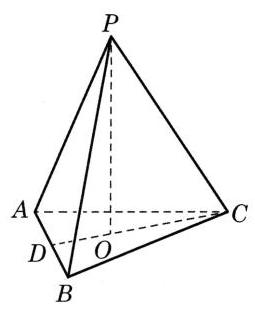

图 11-R1

例 2 提供了一个处理圆锥问题的一般方法, 即利用圆锥的轴截面, 从而转化为平面几何的问题, 因为圆锥本质上可以由轴截面确定. 通过轴截面, 此题就可以转化为三角形的平行分割问题, 其特殊情形就是三角形的中位线.

例 3 是正方体中构造的三棱锥体积的定值问题. 此题的依据是两条直线平行、直线与平面平行时点线距离、点面距离的不变性, 利用这种不变性, 常常可以灵活地计算三棱锥的体积.

例 4 是利用三棱锥的等积变换求点到平面的距离. 这种方法类似于平面几何中的面积法, 由于四面体的体积可以通过多种方法来计算, 因此可以建立某种相等关系, 然后利用方程的思想解决问题.

例 5 实质是推导台体的体积公式. 教材没有给出图示, 因此, 教师可以根据班级实际情况灵活处理. 如果想降低推理过程的难度, 可以考查圆锥的情形, 并与上述的例 2 联系, 在得出结果后再考虑推理的一般性. 此例可以启发学生把圆柱与圆锥看作是圆台的特殊情形.

例 6 是求正三棱锥的表面积. 此例给出了求正棱锥表面积的一般方法, 实质是求底面正多边形的边长与侧面等腰三角形上的斜高, 其中通常需要处理空间点、线、面的位置关系.

例 7 是求圆锥侧面上的最短距离问题, 其思路是将侧面展开为平面图形, 转化为求平面上两点距离的问题.

练习 11.2(3)的第 3 题推导正棱台的侧面积公式, 是一道开放性习题, 可以推导正三棱台、正四棱台或一般的正 $n$ 棱台的表面积, 已知条件也是不确定的, 可以自行给出. 若给出的是上、下底面的周长 ${c}_{1}\text{、}{c}_{2}$ 和斜高 ${h}^{\prime }$ ,则侧面积公式为 $S = \frac{{c}_{1} + {c}_{2}}{2}{h}^{\prime }$ .

## 注意事项

与棱柱不同的是, 我们这里区分了一般的棱锥与正棱锥. 棱锥的体积公式对一般的棱锥都成立, 但表面积公式只是针对正棱锥的. 由于棱锥的表面积的计算实际上是平面多边形的面积的计算, 因此即使没有一般的公式, 也可以解决一些非正棱锥的简单多面体的表面积问题.

在讲了锥体的体积和表面积之后,“二期课改”教材是不讲台体的. 国家课程标准要求讲台体的概念、体积和表面积. 我们没有单独讲解台体,而是从锥体的角度,把台体看成是用平行于锥体底面的截面截得的两个几何体, 去掉小的那个锥体, 余下的那个几何体即为台体, 这样台体的体积就可以用原来的锥体体积减去小的锥体体积得到. 其公式为本节例 5 , 我们仅作为例题, 不作为学生强行识记的公式. 其侧面积安排在练习 11.2(3) 的第 3 题, 其表面积只需在侧面积的基础上加上上、下底面的面积即可. 这样的处理, 减轻了学生的记忆负担, 使得知识的“生成”性更强.

四面体是一种特殊的棱锥, 也是一般多面体的基本图形, 其作用可类比平面几何中的三角形. 就像三角形一样, 计算四面体的体积时可以把任意一个面看作是“底面”. 在解决具体问题时, 有一定的灵活性.

在求棱锥的体积时, 容易出现的困难主要是求棱锥的高. 由于点到平面的距离可以转化为直线到平行平面的距离以及两个平行平面之间的距离, 有一定的技巧, 一定要控制好难度. 对于比较困难的问题, 可以放到选择性必修的内容学习之后, 利用空间向量求高.

## 教学建议

证明锥体的体积是等底等高的柱体体积的三分之一, 教材是作为探究与实践的内容展开的, 不能只讲结论, 重在探究与思考, 可以通过数学猜想或通过实验验证, 得出结论, 再用补体或割体的方法进行证明, 通过等积变换得到锥体的体积公式.

锥体体积是等底等高的柱体体积的三分之一, 既是教材的难点, 也是教材的亮点. 这部分教学不能匆匆得出结论, 重在探索研究, 可以把这部分内容作为探究实践的内容实施教学.

### 11.3 多面体与旋转体

## 教学重点

本节是在柱体和锥体的基础上给出一般多面体和旋转体的概念, 使得相关的知识系统化, 也便于以后在需要时进行拓展. 这一节以了解为主, 目的是拓展学生的视野.

## 内容分析

在多面体的概念中, 特别提出正多面体的概念, 正多面体满足两个条件: 一是这个多面体的所有面都是全等的正多边形; 二是每个顶点聚集的棱的条数相等. 利用 “课后阅读”中的欧拉定理, 可以验证只有五种正多面体, 即正四面体、正六面体、正八面体、正十二面体和正二十面体.

旋转体是一种在现实生活中常见的几何体, 其构造过程虽然简单, 但所形成的形状却十分丰富,在制造、设计中有广泛的应用,在自然现象中也随处可见. 本节没有安排例题, 其目的除了可以利用圆柱或圆锥的体积公式计算一些复合型的旋转体的体积外, 主要是让学生见识各种旋转体, 欣赏数学的美.

## 注意事项

在无穷多个多面体中只有五种正多面体, 这是一个令人惊奇的结论. 教材中是让学生从多面体的欧拉定理出发, 让学生分析多面体的顶点数、棱数、面数以及每面的边数和每顶点聚集的棱数而得出这个结论. 事实上, 如果仅求正多面体的每面的边数 $n$ 和每个顶点聚集的棱数 $m$ ( $m\text{、}n$ 都是不小于 3 的正整数) 的关系,下面的推导过程是非常简单的: 注意到每个正 $n$ 边形的内角大小是 $\frac{\left( {n - 2}\right) \pi }{n}$ ,聚集在一个顶点上的这样的内角一共有 $m$ 个,而这些角的大小之和小于 ${2\pi }$ (否则所有这些角在一个平面内), 于是 $m \cdot  \frac{\left( {n - 2}\right) \pi }{n} < {2\pi }$ ,得 $m\left( {n - 2}\right)  < {2n}$ ,即 $\left( {m - 2}\right) \left( {n - 2}\right)  < 4$ ,于是 $\left( {m, n}\right)  = \; \left( {3,3}\right) ,\left( {4,3}\right) ,\left( {3,4}\right) ,\left( {5,3}\right) ,\left( {3,5}\right) .$

这实际上推出了教材表 11-1 的后两列数据. 依据已有的正多边形的例子, 可以把表 11-1 的数据补充完整. 必须注意的是, 这并没有证明只有这五种正多面体. 为了证明只有五种正多面体, 必须证明对这里得到的每一数组, 只有一种正多面体满足要求. 这不得不借助于欧拉定理了.

欧拉定理在本教材中只作为“课后阅读”出现. 定理的结论非常简洁, 但其证明是拓扑学的, 思路与欧式几何完全不同. 教材没有给出证明过程, 但提示了一些拓扑学的思想(例如 “简单多面体” 是在拓扑学意义下的概念),教师可以向学生作简单介绍, 以拓宽学生的视野.

## 教学建议

我们前面两节研究的是简单多面体, 非简单多面体教材在介绍欧拉定理时举了一个中间有一个长方体空洞的十六面体的例子. 对于旋转体, 除了前面学习的圆柱、圆锥和圆台, 又拓展为一条平面曲线绕其所在平面上的一条直线旋转一周所形成的空间图形, 其表面称为旋转面, 如一个圆绕同一平面内与它不相交的一条直线旋转而成的轮胎面.

本节虽然没有安排例题, 但练习 11.3 中的三道题目都有一定的难度并可以作进一步拓展, 教师可以根据学生的实际水平组织讨论.

本节可以拓展的内容较多, 应视学生的实际情况量力而行. 例如, 可以根据各种花瓶的形状介绍一些复合旋转体; 可以按照欧拉定理对几何体进行分类; 可以展示像莫比乌斯带、克莱因瓶那样的单面曲面; 也可以欣赏各种几何体在建筑、雕塑等艺术作品中的应用.

### 11.4 球

## 教学重点

理解球的概念及其基本性质, 会用球的体积公式和表面积公式解决简单的度量问题.

## 内容分析

教材采用的仍然是和柱体、锥体同样的研究思路, 即先介绍球的概念及其基本性质, 再讨论球的体积与表面积.

球的概念是在一般旋转体概念的基础上引入的, 即把球看作是由一个半圆面绕其直径旋转而成的几何体. 按照这样的定义, 从理论上讲, 球面上任意一点到球心等距的性质是需要证明的, 在教学中可以给出直观的解释.

在给出球的定义后, 教材讨论了球面的一个基本性质, 即球面和一个平面相交时, 得到的交线是一个圆; 当平面经过球心时, 得到的是球的大圆; 否则, 得到的是球的一个小圆, 此时小圆的圆心与球心所在的直线与给定平面垂直. 关于这一性质的证明, 教材依据的是勾股定理, 也可以从旋转体的形成给出直观的解释.

球的体积公式的推导用的是祖暅原理,难在构造一个和半球体积相等的几何体. 教材的思路是由半球的平行于底面的截面面积公式, 联想到圆环的面积, 再进一步构造一个高为半径的圆柱挖去一个同高、同底的倒圆锥的几何体. 球的表面积公式用的是直观解释, 其中蕴含了极限的思路, 不作严格的证明.

例 1 是求给定球被一个平面所截得到的小圆的半径, 这是球面的基本性质. 教材中之所以画出完整的图形, 是帮助学生理解球与平面的位置关系, 教学时可以辅之以主截面的图形. 此题可以为用祖暅原理推导球体积公式提供启示.

例 2 实际上是地球经纬度定义的数学解释. 解题过程虽然不难, 只是运用了二面角及斜线与平面所成角的定义, 但图形比较复杂. 教学时, 可以根据所要解决的问题分解为几个图形.

例 3 是球体积公式的应用.

例 4 讨论的是球与其外切圆柱的面积关系. 其推理过程比较简单, 可以根据学生的实际情况作一些简单的拓展. 例如, 讨论球面与圆柱侧面的交线形状 (球的大圆); 经过圆柱旋转轴的平面与圆柱及球的交线的关系(正方形与其内切圆的关系) 等. 这些问题与后继解析几何内容有关, 可以直观地探讨.

## 注意事项

“二期课改”教材有球面距离的内容, 本教材降低了要求, 对球面距离公式不作要求, 但作为一种常识, 可以让学生有所了解. 练习 11.4(1) 第 3 题中所求的是同一条经线和同一条纬线上两点的(地面)距离问题, 其中涉及了地球经纬度的定义, 二面角及线面所成角的计算. 在此基础上, 可以拓展为求地球上两点之间所在大圆的劣弧长度.

球面具有丰富的对称性, 但研究三维空间图形的对称性需要较高的空间想象能力, 因此不宜作为对学生的要求. 可以在直观的层面上讨论一些简单的性质, 如球的任意一条直径都可以作为旋转轴, 每个大圆都把球分成相同的两半等.

球的体积公式的推导用的是构造法, 球面面积公式的推导用的是极限思想, 都有一定的难度, 让学生大致了解即可, 不要求所有学生都掌握.

## 教学建议

球这部分的习题很多是实际问题, 如地球和钢球等, 在球的例题中, 也注重了球与其他几何体的关联. 在逻辑推理、数学建模以及数学运算上要求较高.

在讲解地球的经纬度概念时, 可以借助地球仪, 并与地理学科的相关内容建立跨学科的联系.

## 三、参考答案或提示

### 11.1 柱体

练习 11.1(1)

1. 因为每一个侧面的侧棱都平行, 又因为上、下底面平行, 这个侧面与上、下底面的交线, 即上、下底面对应的多边形的棱分别平行, 所以侧面是平行四边形.

2. 由于截面与上、下底面平行, 得到两个新的几何体, 其中一个新的几何体的侧棱平行, 上、下底面多边形的一边和截面对应的一边平行, 就可以证明截面和上、下底面多边形的对应边平行且相等, 从而得证.

3. 水平放置的圆柱水面是圆面, 放倒的圆柱水面是矩形面. 图略.

练习 11.1(2)

1. $V = {S}_{\text{底 }}h = \frac{2 + 4}{2} \times  {1000} = {3000}\left( {\mathrm{\;m}}^{3}\right)$ .

2. $V = \pi {r}^{2}h = {250\pi }\left( {\mathrm{{dm}}}^{3}\right)  = {250\pi }\left( \mathrm{L}\right)  \approx  {785}\left( \mathrm{\;L}\right)$ .

3. 设内孔半径为 $r$ ,六边形的边长为 $a$ ,螺母高为 $h$ ,

$V = \left( {6 \times  \frac{\sqrt{3}}{4}{a}^{2} - \pi {r}^{2}}\right) h = \left( {\frac{3\sqrt{3}}{2}{a}^{2} - \pi {r}^{2}}\right) h.$

练习 $\mathbf{{11.1}\left( 3\right) }$

1. $V = {3}^{2}\pi  \times  {25} + 6 \times  \frac{\sqrt{3}}{4} \times  {12}^{2} \times  5 \approx  {2577.1}\left( {\mathrm{\;{cm}}}^{3}\right)$ .

$S = 2 \times  {3\pi } \times  {25} + 6 \times  {12} \times  5 + 2 \times  6 \times  \frac{\sqrt{3}}{4} \times  {12}^{2} \approx  {1579.5}\left( {\mathrm{\;{cm}}}^{2}\right) .$

2. $S = {2\pi }\left\lbrack  {\left( {{0.05} + {0.04}}\right)  + \left( {{0.05}^{2} - {0.04}^{2}}\right) }\right\rbrack   \times  1 \times  {10}^{4} \times  {0.11} \approx  {628.26}\left( \mathrm{\;{kg}}\right)$ .

3. 若 $a > 0, b > 0, c > 0$ ,则 $\left( {a + b}\right)  + \left( {c + \sqrt[3]{abc}}\right)  \geq  2\sqrt{ab} + 2\sqrt{c\sqrt[3]{abc}} \geq  4\sqrt[3]{abc}$ , 即 $a + b + c \geq  3\sqrt[3]{abc}$ ,且当且仅当 $a = b = c$ 时取等号. 设长方体的长、宽、高分别为 $a\text{、}b\text{、}c$ ,则 $S = 2\left( {{ab} + {bc} + {ca}}\right)  \geq  3\sqrt[3]{{2ab} \cdot  {2bc} \cdot  {2ca}} = 6{V}^{\frac{2}{3}}, V \leq  {\left( \frac{S}{6}\right) }^{\frac{3}{2}}$ ,当且仅当 $a \; = b = c$ 时,即长方体为正方体时体积最大.

习题 11.1

A 组

1. ${2\pi }$ .

2. ${4\pi }$ .

3. ${24}\sqrt{3}$ .

4. ${12}{a}^{2}$ .

5.40.

6. $\arctan \sqrt{5}$ .

7. $\arctan \frac{\sqrt{5}}{5}$ .

8. 设底面三边长分别为 $a\text{、}b\text{、}c$ ,高为 $h$ ,由 $\left\{  \begin{array}{l} a + b > c, \\  b + c > a, \\  a + c > b, \end{array}\right.$ 得 $\left\{  \begin{array}{l} {ah} + {bh} > {ch}, \\  {bh} + {ch} > {ah}, \\  {ah} + {ch} > {bh}, \end{array}\right.$ 得证.

## B 组

1. $v = {l}^{3}\sin \alpha \sin \beta \sin \gamma$ .

2. 三棱柱的体积为 9.

3. 设 $\bigtriangleup {ABC}$ 的面积为 $m$ ,则由 $\frac{3m}{4} \times  8 = {mh}$ ,得 $h = 6$ .

### 11.2 锥体

## 练习 11.2(1)

1. 小棱锥与大棱锥的底面面积之比为 ${h}_{1}^{2} : {h}_{2}^{2}$ .

2.(1)以母线为两腰的等腰三角形. 当轴截面顶角小于等于 ${90}^{ \circ  }$ 时,截面为轴截面时面积最大; 当轴截面顶角大于 ${90}^{ \circ  }$ 时,并非截面为轴截面时面积最大,而是顶角为 ${90}^{ \circ  }$ 的等腰三角形面积最大.

3. 如果给出的几何体不是四棱台, 就得不到一个棱锥.

练习 11.2(2)

1. ${V}_{P - {ABCD}} = \frac{1}{3} \times  {6}^{2} \times  8 = {96}$ .

2. ${V}_{B - {A}^{\prime }{B}^{\prime }{C}^{\prime }} = \frac{1}{3}{V}_{{ABC} - {A}^{\prime }{B}^{\prime }{C}^{\prime }} = \frac{1}{3} \times  \frac{1}{2} \times  5 \times  7 \times  \frac{\sqrt{3}}{2} \times  9 = \frac{{105}\sqrt{3}}{4}$ .

3. 由例 5 的结果直接得到.

练习 11.2(3)

1. 侧面积为 ${3\pi }$ ,表面积为 ${4\pi }$ .

2. $\sqrt{3}$ .

3. 记正棱台的上底面周长为 ${c}_{1}$ ,下底面周长为 ${c}_{2}$ ,斜高为 ${h}^{\prime }$ ,则侧面积公式为 $\frac{{c}_{1} + {c}_{2}}{2}{h}^{\prime }.$

习题 11.2

A 组

1. 9.

2. (1) $\frac{12}{5}$ . (2) 32.

3. $1 + \frac{\sqrt{3}}{2}$ .

4. 证明略.

5. ${3\pi }$ .

6. $\frac{40}{3}\mathrm{\;{cm}}$ .

7. $6\sqrt{2}$ .

8. $\frac{\sqrt{2{S}_{1}{S}_{2}{S}_{3}}}{3}$ .

B 组

1. $\frac{1}{2},\frac{\sqrt{2}}{12}$ .

2. $2 : 1$ .

3. ${60}\sqrt{3}$ .

4. 如图 11-R2,设 $x$ 是截去的小圆锥的母线长,则 ${S}_{\text{圆台侧 }} = \; \frac{1}{2}c\left( {l + x}\right)  - \frac{1}{2}{c}^{\prime }x = \frac{1}{2}{cl} + \frac{1}{2}\left( {c - {c}^{\prime }}\right) x$ . 因为 $\frac{{c}^{\prime }}{c} = \frac{x}{x + l}$ ,所以 $x = \; \frac{{c}^{\prime }l}{c - {c}^{\prime }}$ . 代入,得 ${S}_{\text{圆台侧 }} = \frac{1}{2}{cl} + \frac{1}{2}{c}^{\prime }l = \frac{1}{2}\left( {{c}^{\prime } + c}\right) l = \pi \left( {{r}^{\prime } + r}\right) l$ .

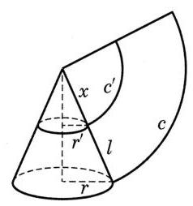

图 11-R2

### 11.3 多面体与旋转体

## 练习 11.3

1. 如图 11-R3, 先作一个底面为直角三角形的直棱柱 (《九章算术》中称为 “堑堵”) ${AEF} - {BDC}$ ,其中 $\angle {BCD}$ 是直角. 用平面 ${ACD}$ 截此直三棱柱,则几何体 $A - {BCD}$ 就是满足要求的“鳖臑”,这是因为 ${AB} \bot$ 平面 ${BCD}$ ,所以 $\bigtriangleup  {ABD}$ 、 $\bigtriangleup  {ABC}$ 是直角三角形；又已知 $\angle {BCD}$ 为直角,所以 $\bigtriangleup  {BCD}$ 是直角三角形；最后,由 ${CD} \bot$ 平面 ${ABCF}$ ,推出 ${CD} \bot  {CA}$ ,即 $\angle {ACD}$ 为直角,所以 $\bigtriangleup {ACD}$ 是直角三角形. 这样几何体 $A - {BCD}$ 的四个面都是直角三角形,即它是一个“鳖臑”. (在上述过程中, “堑堵”截取“鳖臑”后余下的几何体是底面为矩形、一棱垂直于底面的四棱锥, 这样的几何体在《九章算术》中称为“阳马”)

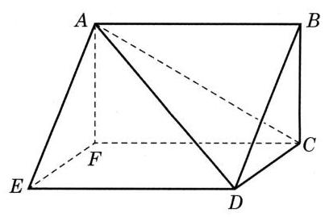

图 11-R3

2. 不一定是棱柱. 从棱柱的定义很容易推出棱柱的侧面都是平行四边形, 所以棱柱的定义条件强于本题所给的条件. 图 11-R4 给出两个反例, 其要领都是除了两个平行面的边以外, 多面体的其他棱还可能相交 (从而不符合棱柱的定义条件).

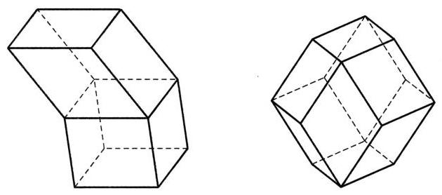

图 11-R4

3.(1)截面是两个关于旋转轴对称的圆. 示意图略. (2)当截面离地面的高度大于 0 并小于游泳圈高度时, 截面两个同心圆组成圆环; 当截面离地面的高度等于 0 或等于游泳圈高度时,圆环收缩成一个圆；在其余情况,截面是空的. 示意图略.

习题 11.3

A 组

1. 12 条棱,8 个面. 表面积为 $\sqrt{3}$ ,体积为 $\frac{1}{6}$ .

2. ( 1 )即证 $\bigtriangleup  {EFG}$ 是正三角形, ${B}_{1}$ 在 $\bigtriangleup  {EFG}$ 平面的射影是 $\bigtriangleup  {EFG}$ 的中心. (2) $\frac{\sqrt{3}}{6}$ . (3)剩余的多面体有 12 个顶点、24 条棱、14 个面. 表面积为 $3 + \sqrt{3}$ ,体积 $\frac{5}{6}$ .

3. 表面积为 $8 + 8\sqrt{3}$ ,体积为 $\frac{{10}\sqrt{2}}{3}$ .

4. 表面积为 $\frac{3 + \sqrt{3}}{2}\pi$ ,体积为 $\frac{\pi }{2}$ .

B 组

1. ①③⑤⑦.

2. 设正三角形纸片的边长为 $a$ ,则剪拼的三棱锥的边长为 $\frac{a}{2},{V}_{\text{三棱锥 }} = \frac{\sqrt{2}}{12}{\left( \frac{a}{2}\right) }^{3} = \; \frac{\sqrt{2}}{96}{a}^{3}$ . 设三棱柱的高为 $h$ ,底面边长为 $x$ ,则 $\sqrt{3}h = \frac{a - x}{2}$ . 因为 $\frac{\sqrt{3}}{4}{x}^{2} = {3h} \cdot  \sqrt{3}h \Rightarrow  x = \; 2\sqrt{3}h \Rightarrow  x = \frac{a}{2}$ ,故 ${V}_{\text{三棱柱 }} = \frac{\sqrt{3}}{4}{\left( \frac{a}{2}\right) }^{2}\frac{a}{4\sqrt{3}} = \frac{1}{64}{a}^{3}$ ,所以 ${V}_{\text{三棱锥 }} < {V}_{\text{三棱柱 }}$ .

### 11.4 球

练习 $\mathbf{{11.4}}\left( 1\right)$

1. $d = \sqrt{{r}^{2} - {r}_{1}{}^{2}}$ .

2.13.

3. (1) ${1}^{ \circ  }{20}^{\prime }.\;\left( 2\right) {6371.004} \times  \left( {\sin {31}^{ \circ  }{53}^{\prime } - \sin {30}^{ \circ  }{40}^{\prime }}\right)  \approx  {115.626}\left( \mathrm{\;{km}}\right)$ .

练习 $\mathbf{{11.4}}\left( 2\right)$

1. ${510060000}{\mathrm{\;{km}}}^{2}$ .

2. $\frac{\sqrt[3]{3}}{3}R$ .

3. $\frac{500}{3}\pi {\mathrm{{cm}}}^{3}$ .

习题 11.4

A 组

1. ${4\pi }$ .

2. ${40\pi }$ .

3. $\sqrt{2}$ .

4. 2 .

5. $\frac{9}{4}\pi$ .

B 组

1. $\frac{16\pi }{3}$ .

2. $\frac{13}{2}$ .

3. 1320.

4. ${2\pi }{R}^{2}$ .

## 复习题

A 组

1. A. 图略.

2.(1)正确. (2)错误. (3)错误. (4) 错误.

3. $\frac{\pi }{3}$ .

4. $1 : 3 : 5$ .

5. $\frac{5}{6}$ .

6. ${50\pi }$ .

7. ${S}_{\text{球 }} < {S}_{\text{圆柱 }} < {S}_{\text{正方体 }}$ .

8. $2 : 1$ .

9. $\sqrt{3}\mathrm{\;{cm}}$ .

B 组

1. 6 .

2. 4 : 9 .

3. 1 : 9.

4. ${16} - 5\sqrt{2}$ .

5. $\frac{1}{2}$ .

6. $3\sqrt[3]{2}\mathrm{\;{cm}}$ .

7. $3\sqrt{2}\mathrm{\;{cm}}$ .

8. (1) $2\sqrt{3}$ . (2) $\arccos \frac{2\sqrt{3}}{5}$ .

9. (1)先证 ${AF} \bot$ 平面 ${BDE}$ . (2) $\arctan \frac{\sqrt{5}}{5}$ .

10. ${S}_{\text{半球 }} = {27\pi },{V}_{\text{半球 }} = {18\pi }$ .

## 拓展与思考

1. $x = \frac{\sqrt{2}{rh}}{\sqrt{2}r + h}$ .

2. 不会溢出来.

3. (1) $a = \frac{\sqrt{1 + {h}^{2}}}{1 + {h}^{2}}, h > 0$ . (2)当 $h = 1$ 时, ${V}_{\max } = \frac{1}{6}{\mathrm{\;m}}^{3}$ .

4. (1) $S = {100} - {20x}\left( {x \in  \left( {0,5}\right) }\right)$ . (2) $V = \frac{4}{3}{\left( 5 - x\right) }^{2}\sqrt{{10x} - {x}^{2}}\left( {x \in  \left( {0,5}\right) }\right)$ .

## 四、相关阅读材料

## 参考文献

[1] 龚昇. 从刘徽割圆谈起[M]. 北京: 科学出版社, 2002.

[2] 江泽涵. 多面形的欧拉定理和闭曲面的拓扑分类[M]. 北京: 科学出版社,2002.

## 第 12 章 概率初步

## 一、本章概述

## 总体要求

在初中阶段, 学生已经学习了一些概率的知识, 通过日常生活中的事例, 感知不确定性事件及其可能性大小, 意识到生活中处处有概率问题, 并逐步积累了一些有关随机事件、等可能试验、概率、频率等的初步概念. 学生已经能根据经验对一些随机事件发生的可能性大小进行定性的描述, 通过大量重复的随机试验、利用频率来估计随机事件的概率, 认识频率及概率之间的区别和联系, 掌握了等可能试验中事件的概率计算公式, 会运用枚举法分析等可能性试验的所有结果, 学习了画树形图. 学生在经历解释生活实际中一些现象、体会关于概率问题的分析和思考方法、了解概率知识的一些应用之后, 已初步树立了概率意识, 为在高中阶段进一步学习概率奠定了基础.

和必然性现象一样, 随机现象同样是现实世界中大量出现的现象, 了解它的规律有着重要的理论和实际意义, 概率论就是研究随机现象所蕴藏的规律的数学理论. 为理解概率思想及古典概率模型的特征, 本章的总体编写意图是理解与思考随机现象, 分析游戏怎么变成数学、直觉怎么变成定理, 用数学的眼光观察世界; 理解概率的意义, 应用概率的语言和分析问题的思路, 用数学的语言表达世界; 掌握概率这一衡量随机事件发生可能性大小的度量, 为人们认识具有不确定性的客观世界提供重要的思维模式和解决问题的方法, 用数学的思维思考世界. 统计的研究对象是数据, 核心是数据分析, 概率为统计的研究及发展提供了理论基础.

本章的核心概念有: 概率 (随机现象、样本空间、基本事件、事件、随机事件、 必然事件、不可能事件), 古典概率 (等可能性、互斥事件、对立事件、可加性), 频率(伯努利试验、大数定律)和独立性(独立随机试验).

通过本章的学习, 结合具体实例, 可以帮助学生理解样本点、有限样本空间、随机事件, 会计算古典概型中简单随机事件的概率, 加深对随机现象的认识和理解.

内容包括:随机事件与概率、随机事件的独立性.

(1)随机事件与概率

① 结合具体实例, 理解样本点和样本空间的含义, 理解随机事件与样本点的关系. 了解随机事件的并、交与互斥的含义, 能结合实例进行随机事件的并、交运算.

② 结合具体实例,理解古典概型,能计算古典概型中简单随机事件的概率.

③ 通过实例, 理解概率的性质, 掌握随机事件概率的运算法则.

④ 结合实例,会用频率估计概率.

(2)随机事件的独立性

结合有限样本空间, 了解两个随机事件独立性的含义. 结合古典概型, 利用独立性计算概率.

## 课时安排建议

本章的课时安排建议为 9+1,共计 10 课时. 建议如下:

<table><tr><td>章节名</td><td>建议课时</td><td>具体课时分配建议</td></tr><tr><td rowspan="2">12.1 随机现象与样本空间</td><td rowspan="2">2</td><td>随机现象 1 课时</td></tr><tr><td>样本空间与事件 1 课时</td></tr><tr><td rowspan="4">12.2 古典概率</td><td rowspan="4">4</td><td>等可能性与概率 1 课时</td></tr><tr><td>等可能性(续) 1 课时</td></tr><tr><td>事件关系和运算 1 课时</td></tr><tr><td>可加性 1 课时</td></tr><tr><td>12.3 频率与概率</td><td>1</td><td>频率与概率 1 课时</td></tr><tr><td rowspan="2">12.4 随机事件的独立性</td><td rowspan="2">2</td><td>独立随机事件 1 课时</td></tr><tr><td>事件的独立性 1 课时</td></tr><tr><td>复习与小结</td><td>1</td><td/></tr></table>

## 内容编排与特色

本章内容共分为四节,分别是 12.1 随机现象与样本空间、12.2 古典概率、12.3 频率与概率、 12.4 随机事件的独立性.

概率教学旨在让学生了解随机现象与概率的意义. 本章从不同的角度来理解概率. 从直观的角度看, 人们对随机性之中的可能性大小有一个心理预期, 即心理概率. 对满足有限性和等可能性的随机事件即古典概率模型给出了概率计算公式 $P\left( A\right)  = \frac{\left| A\right| }{\left| \Omega \right| }$ . 独立地重复一个伯努利试验 $n$ 次,其中成功的次数 ${S}_{n}$ ,成功的频率 $\frac{{S}_{n}}{n}$ 就是经验概率. 后者是概率的频率定义, 实际上也是求一个事件的概率的基本方法: 进行大量的重复试验, 用这个事件发生的频率近似地作为它的概率. 在一定条件下, 在做大量重复试验时, 随着试验次数的增加, 一个事件出现的频率总在一个固定数的附近摆动, 显示出其稳定性. 这个固定的数就是该事件的概率, 这是概率的统计定义, 由伯努利大数定律可保证其正确性. 这样通过多角度多层次的学习, 有利于从不同的视角理解概率的意义, 感悟概率的思想.

有鉴于此, 在整个概率的教学过程中, 没有直接给出概率的公理化定义, 也没有明确从定义在事件域上的函数观点来理解和认识概率, 而是将概率空间、事件对应的子集及概率应具备的三条公理(非负性、规范性、可列可加性)分散在各节中学习,并推出了一些在计算概率时很有用的性质. 这样做, 在数学上简单易懂, 有利于将注意力集中在概率思想与体系的发展, 将直觉与理论密切结合起来, 可以凸显概率的基础知识, 逐步理解概率的思想, 培养相应的数学素养, 也为将来在大学进一步学习概率奠定一个良好的基础.

随机事件在一次试验中是否发生自然是随机的, 但随机性中仍含有规律性, 认识了这种随机性中的规律性, 就能比较准确地预测随机事件发生的可能性. 实际上, 随机事件的随机性与稳定性是偶然性与必然性的辩证统一. 本章应用概率的语言阐述问题和分析问题, 抽象出概率论固有的一些基本概念, 通过推理得到概率的基本性质, 并借用了集合论的语言和符号来表述事件的关系和运算, 逐步构建概率思想的框架.

教材重点讨论古典概率, 讲述怎么列举等可能的样本空间, 并在解决古典概型问题时,重视对古典概率模型的分析,明确概率的运算性质,使体系更加严密,凸显概率的语言和分析问题的思路; 注意较多地以经典概率问题为案例进行分析, 其中有些问题在历史上就是概率问题研究的起始, 或是大众甚至当时的数学家所困惑的, 能很好地再现概率研究的发展历程及研究方法的创新; 同时, 更加重视对概率空间的认识及理解, 重视模型的建立, 使理论更加直观, 也使学生容易正确理解.

教材对频率逼近概率的意义多做了一点解释, 引入了伯努利大数定律. 阐述了概率的频率定义、统计定义, 有利于理解概率的意义, 感悟概率的思想.

遵循从具体到抽象、从特殊到一般的认知规律, 教材力求结构严谨、说理清楚、推理严格, 符合学生的实际学习状况. 概率论中的很多术语直接使用生活中的语言, 但有其特殊的含义, 为了准确理解并掌握概率的基本概念, 教材中内容的呈现尽量从实例出发, 每节内容都从设置熟悉的情境引入, 结合具体实例, 采用娓娓道来的叙事方式,自然地展现知识与方法的产生、形成与发展的过程. 例如: (1)学习随机现象,先看几个生活中常见的例子:抛掷硬币,落地时哪一面朝上； 到达目的地的具体时间; 股市中一年的收益; 每一天的天气情况; 等等. (2)学习等可能性, 从最简单的掷硬币来学习与概率相关的概念. 抛一枚硬币这个随机试验一共有两个可能的结果: 正面朝上与反面朝上, 其中有且只有一个结果会出现. 古典概型中简单的随机事件的概率计算和性质分析, 加深了学生对随机现象的认识和理解. (3)学习独立随机试验, 从一个放了两种颜色的球的罐子里摸一个球, 放回去摇匀再摸一个球, 这两次摸球作为实验是独立的; 但若摸一个球不放回、再摸一个球, 两次摸球的结果就会有联系, 它们之间不独立. 引入集合语言通过枚举法帮助学生理解随机事件与概率、随机事件的独立性. 从抛硬币有限样本空间出发, 定义了随机事件的独立性, 并利用独立性计算概率, 等等. 这些都强调了概率与实际生活之间的紧密联系.

教材以概率初步的相关知识为主线, 凸显了知识的内在逻辑和重要的处理方法, 并强调数学与实际生活之间的紧密联系, 创设合理的教学情境, 启发学生不断深入思考, 把握概率问题的本质. 通过数学史知识的渗透, 激发学生的学习兴趣, 引导学生感悟数学的科学价值、应用价值与文化价值. 本章章首语、教材边框、课后阅读、拓展思考等栏目的设计力求信息清晰、素材广泛,渗透数学文化,促进学生的自主学习和实践能力, 有效引发思考, 并拓展视野, 在润物无声之中培育学生的思维能力与综合素质.

## 教学提示

在概率的教学中, 应引导学生通过日常生活中的实例了解随机事件与概率的意义, 培养学生从直观现象出发去认识理论, 并学习怎么把一个实际问题数学化. 在随机事件和样本空间的教学中, 应引导学生通过古典概型认识样本空间, 理解随机事件发生的含义; 理解古典概型的特征、试验结果的有限性和每一个试验结果出现的等可能性, 知道只有在这种特征下, 才能定义古典概型中随机事件发生的概率. 教学中要适当介绍基本计数方法 (如树状图、列表等), 以计算古典概率中随机事件发生的概率. 理解独立性, 学会用独立性来计算概率.

概率教学的核心问题是让学生了解随机现象与概率的意义, 加强与实际生活的联系, 以科学的态度评价身边的一些随机现象. 适当地增加学生间合作学习交流的机会, 尽量让学生自己举出生活和学习中与古典概型有关的实例, 并进行相互讨论, 使学生在体会概率意义的同时, 感受与他人合作的重要性以及培养实事求是的科学态度和锲而不舍的求学精神.

在数学建模、数据分析、逻辑推理、数学运算等方面落实抽象思维能力的培养, 体会几何直观之外的直观, 培养学生的核心素养.

应该注意, 在所有的概率性质中最重要的是可加性和独立性, 教师应让学生认识到事件不相交时的加法公式与事件独立时的乘积公式是概率的自然特性.

鼓励学生尽可能运用实例和实物来熟悉随机现象,也可以运用计算器、计算机进行模拟活动, 处理数据, 更好地体会概率的意义和统计思想. 例如, 利用计算器产生随机数来模拟掷硬币试验等, 利用计算机来计算样本量较大的数据的样本均值、样本方差等.

## 评价建议

在过程性评价中, 关注对基础知识、基本方法的掌握. 要能够掌握古典概率的基本特征, 根据实际问题构建概率模型, 解决简单的实际问题. 要能够借助古典概型初步认识有限样本空间、随机事件, 以及随机事件的概率.

在终结性评价中, 要关注理解概念、提升能力、培育素养. 要能够区别统计思维与确定性思维的差异、归纳推断与演绎证明的差异. 能够结合具体问题, 理解统计推断结果的或然性, 正确运用统计结果解释实际问题. 重点提升从直观到抽象的思维能力、逻辑推理能力和数学运算素养.

## 二、教材分析与教学建议

### 12.1 随机现象与样本空间

## 数学重点

(1)通过具体事例,理解随机现象的概念；

(2)理解样本空间、基本事件的概念；

(3)能够对具体问题写出样本空间和事件.

核心概念: 随机现象、样本空间.

核心素养:数学建模、逻辑推理.

## 内容分析

内容要求:通过具体实例,理解随机现象,理解随机试验; 会选取基本事件以构成样本空间.

“随机现象与样本空间”是一节与生活实际联系紧密的概念课, 旨在在理解随机现象定义的基础上理解其核心思想一一随机思想, 有助于培养学生用一分为二、对立统一的辩证唯物主义观点分析问题和认识世界. 生活中存在着大量的随机现象, 如天气、保险、彩票等, 随机思想在当今社会中有着广泛的应用. 在我们生活的世界中, 处处充满了不确定性. 无论是自然界中的风和日丽或地震、海啸, 还是经济、 政治、社会生活中的风险与机遇,面对各种可能发生也可能不发生的事件,人们常常必须做出“选择”和“决策”,尽可能使损失减少到最小或收益达到最大. 研究随机性有助于探究大自然和生活中种种事件发生的规律,从而指导人们的生产和生活. 在概率成为普通生活常识的今天, 对随机现象有一个较清楚的认识, 是每一个公民文化素质的基本要求. 用数学方法研究这些不确定现象(通常称为随机现象)是概率论的任务.

随机现象表面上看来似乎杂乱无章, 但有一定的规律可循. 随机现象揭示的是条件和结果之间的非确定性联系, 其数量关系无法用确定的函数关系描述. 在一次观察中随机现象的结果具有偶然性, 但在大量试验或观察中, 结果具有一定的统计规律性, 概率论就是研究随机现象所具有的本质规律的一门数学学科.

随机现象是通过试验来研究的. 对随机现象进行观察或为了某种目的而进行的实验统称为试验, 把观察结果或实验结果称为试验结果. 对于随机现象, 当在相同的条件下重复进行试验时, 尽管不能预知每次试验的具体结果, 但这个试验的所有可能结果往往是可知的. 例如, 抛掷一枚骰子做试验, 观察骰子掷出的点数, 共有 6 种可能的结果: 点数为1,2,3,4,5,6,但在每次抛掷之前,并不能确定骰子最终掷出的点数.

随机事件就是在某种条件 $S$ 下,不能事先预测结果的事件. 当条件 $S$ 改变时,事件的性质也可能发生变化, 结果也会因此改变. 在判断事件类型时, 一定要明确前提条件 $S$ ,它决定着事件的属性,没有这个条件就无法判断一个事件是否发生. 例如, “常温常压下,水沸腾”是不可能事件,但“100℃常压下,水沸腾”就成为必然事件了. 有时结果比较复杂, 要准确理解结果所包含的各种情况. 对于同一个随机现象, 由于观察结果的角度不同, 样本空间也可以不同, 如例 4.

把事件与集合相类比, 将样本空间看成全集, 每个事件都可以看成该全集的一个子集, 这样, 就可以将事件与集合对应起来. 借用已有集合的知识和语言, 有利于对概念的理解和掌握. 在学习概率的时候, 要注意体会和熟悉其独特的语言表述方式.

## 注意事项

概率是描述一个随机现象中某事件发生的可能性(或者机会)大小的一种度量. 要理解概率, 首先要理解随机现象或者随机性, 其次要理解人们对随机性之中可能性大小的预期.

学习概率论, 要学会概率论的一套语言. 由于概率论中的很多术语直接借用生活中的语言, 要格外注意它们在概率论与生活中使用时的语义区别, 其中最重要的三个术语是样本空间、事件与概率.

## 教学建议

为确定样本空间, 必须明确事件发生的条件, 根据题意, 按一定的次序列出问题的答案, 按规律去写, 要做到既不重复也不遗漏.

教学中要注意通过生活中的实例与数学模型理解基本事件的概念. 求基本事件个数主要是采用枚举法, 通过列表和画出树状图等方式写出所有的基本事件, 化解由于还没有学习排列组合所引起的困惑. 重点在于培养学生的数学应用意识.

列表法: 将基本事件用表格的方式表示出来, 可以清楚基本事件的总数, 以及要求的事件所包含的基本事件数. 列表法适合较简单的试验, 基本事件较多的试验不适合用列表法.

树状图法: 树状图法是用树状的图形把基本事件列举出来的一种方法. 树状图法便于分析基本事件间的结构关系, 对于较复杂的问题, 可以作为一种分析问题的主要手段. 树状图法适合于较复杂的试验的题目.

注意, 对于一个随机现象来说, 有以下三点值得注意:

(1)样本空间可能因为观察角度的不同而不同,不同的观察角度导致不同的答案, 不能算作错误;

(2)事件的概率由随机现象本身决定,不会因为样本空间的不同而不同；

(3)基本事件(样本点)是样本空间的元素,而事件是样本空间的子集.

### 12.2 古典概率

## 教学重点

(1)理解组成古典概率模型的两个基本条件;

(2)掌握互斥事件、对立事件的概念；

(3)通过具体实例,理解概率的意义；

(4)掌握并应用概率的基本性质及运算法则；

(5)通过事件关系和运算,计算古典概型中简单随机事件的概率.

核心概念: 古典概率、等可能性、事件关系.

核心素养:数学建模、数学运算.

## 内容分析

内容要求:通过对古典概率模型的分析,应用概率的语言和分析问题的思路,学习求解基本概率问题.

在现实生活中, 我们常听到“概率”这个词. 例如, 买彩票时, 总关心中奖的概率有多大; 正规的足球比赛, 为了体现比赛的公平性, 比赛前主裁判往往以抛硬币的方式, 根据正反面来确定参赛球队的进攻方向, 这些都和概率有关. 那么, 什么是概率呢? 怎么求得概率的大小呢? 知道概率的大小又有什么意义呢?

若一个随机试验的所有结果出现的可能性都一样, 则称之为具有等可能性, 它在许多场合下是直观自然的. 如果一个随机试验满足下面两个条件: (1)包含有限个可能出现的结果(基本事件); (2)这些结果出现是等可能的, 那么这样的随机试验就称为古典概率模型.

古典概型是一种特殊的数学模型, 也是一种最基本的概率模型, 在概率论中占有相当重要的地位. 古典概型的引入避免了大量的重复实验, 而且可得到概率的准确值, 学好它可以为学习其他概率奠定基础, 同时有利于理解概率的概念, 有助于计算一些事件的概率, 有利于解释生活中的一些问题, 起到承前启后的作用. 本节课将感性认识与理性认识相结合, 利用生活中大量实例归纳总结相关的数学概念及计算公式, 用系统的眼光看待以前已经接触的一些知识, 构建相应的数学模型.

判断一个随机试验是否为古典概型, 要看这个试验是否具有古典概型的两个特征一一有限性和等可能性, 二者缺一不可. 例如, 在适宜的条件下种下一粒种子, 观察它是否发芽. 这个试验的基本事件只有两个: 发芽、不发芽. 而“发芽”和“不发芽” 这两种结果出现的机会一般是不均等的, 所以它不属于古典概型. 又如, 从质量为 ${2500}\mathrm{\;g} \pm  {25}\mathrm{\;g}$ 的一批袋装大米中任意抽取一袋,设其质量 $M, M$ 的值可能是从 2475g到 2525g之间的任何一个值, 所有可能的结果有无限多个, 这个试验也不属于古典概型.

判断事件间的关系时, 可以根据常识来判断. 一要考虑试验的前提条件, 无论是包含、相等还是互斥、对立, 其发生的条件都应是一样的. 二要考虑事件间的结果是否有交事件,可利用维恩图分析. 对较难判断的,就得严格按照事件之间关系的定义来推理, 也可先列出全部结果, 再进行分析.

进行事件的运算时, 一要紧扣运算的定义, 二要全面考查同一条件下的试验可能出现的全部结果, 必要时可利用维恩图或列出全部的试验结果进行分析.

互斥事件的概率加法公式 $P\left( {A \cup  B}\right)  = P\left( A\right)  + P\left( B\right)$ 是一个非常重要的公式,运用该公式解题时, 首先要分清事件是否互斥, 同时要学会把一个事件分拆为几个互斥事件, 求出各个事件的概率, 再用加法公式得出结果. 当直接计算符合条件的事件个数比较烦琐时, 可先计算其对立事件的个数, 求得对立事件的概率, 然后利用对立事件的概率的加法公式 $P\left( A\right)  + P\left( \bar{A}\right)  = 1$ ,求出符合条件的事件的概率.

概率的基本性质:

(1)必然事件的概率是 1,不可能事件的概率是 0,即 $P\left( \Omega \right)  = 1, P\left( \varnothing \right)  = 0$ ；

(2)对于随机事件 $A$ ,有 $0 \leq  P\left( A\right)  \leq  1$ ；

(3)两个不可能同时发生的事件中至少有一个发生的概率是这两个事件的概率之和,即如果 $A \cap  B = \varnothing$ ,那么 $P\left( {A \cup  B}\right)  = P\left( A\right)  + P\left( B\right)$ ;

(4)对任一给定的随机事件,其发生的概率与不发生的概率的和总是 1 ,即成立 $P\left( A\right)  + P\left( \bar{A}\right)  = 1.$

## 注意事项

再次强调, 随机现象的样本空间的选取依赖于观察的角度, 但事件的概率与观察角度这一主观因素无关, 是确定唯一的. 在古典概率模型中, 随着观察角度的不同, 并非所有观察角度所引导的样本空间都有等可能性. 对复杂的随机试验, 为了得到一个等可能的样本空间, 通常要将一个随机试验依次分解为若干个等可能的随机试验来处理.

注意, 只有那些能够选取到有限的等可能样本空间的随机现象才称为古典概率模型. 这时, 为了计算方便, 我们总是选一个这样的样本空间.

解古典概型问题时, 要牢牢抓住它的两个特点及其计算公式. 但是这类问题的解法多样, 技巧性强, 在解决此类问题时需要注意以下三点:

(1)试验必须具有古典概型的两大特征——有限性和等可能性；

(2)计算基本事件的数目时,需做到不重不漏；

(3)利用事件间的关系.

在求解较复杂事件的概率时, 可将其分解为几个互斥的简单事件的和事件, 由公式

$$
P\left( {{A}_{1} \cup  {A}_{2} \cup  \cdots  \cup  {A}_{n}}\right)  = P\left( {A}_{1}\right)  + P\left( {A}_{2}\right)  + \cdots  + P\left( {A}_{n}\right)
$$

求得,或转化为求其对立事件,再用公式 $P\left( A\right)  = 1 - P\left( \bar{A}\right)$ 求得.

解决有序和无序的问题时应注意:关于不放回抽样,计算基本事件个数时,不论看做是有顺序的或是无顺序的, 最后结果都是一致的. 但不论选择哪一种方式, 观察的角度必须一致,否则会产生错误. 关于有放回抽样,应注意在连续取出两次的过程中,因为先后顺序不同,所以 $\left( {a, b}\right) \text{、}\left( {b, a}\right)$ 不是同一个基本事件. 解题的关键是要清楚无论是“不放回抽取”还是“有放回抽取”,每一件产品被取出的机会都是均等的.

## 教学建议

本节内容的学习加深了学生对随机现象的理解.

注意, 应该让学生明白概率论能做什么和不能做什么. 概率论不可能确切地告诉我们一个随机事件会不会发生, 而只能告诉我们该事件发生的可能性有多大. 两者有着巨大的差别.

概率是定义在集合上的函数, 每一个随机事件都对应着一个确定的概率值, 这与函数概念中的对应关系是类似的. 可以类比函数性质的研究过程来学习概率的性质.

### 12.3 频率与概率

## 教学重点

(1)结合实例,理解频率的意义,会用频率估计概率；

(2)了解伯努利大数定律的意义.

核心概念: 频率、伯努利大数定律.

核心素养:数据分析.

## 内容分析

内容要求:理解概率的统计意义,了解伯努利大数定律.

独立地重复一个伯努利试验 $n$ 次,如果成功的次数为 ${S}_{n}$ ,那么成功的频率为 $\frac{{S}_{n}}{n}$ . 这是经验概率,是概率的频率定义,但频数 ${S}_{n}$ 与 $n$ 之间并无一个确定的函数关系. 在一定条件下,在做大量重复试验时,随着试验次数的增加,一个事件出现的频率 $\frac{{S}_{n}}{n}$ 总在一个固定数的附近摆动, 显示出其稳定性, 这个固定数就是该事件的概率, 这是概率的统计定义. 但频数 ${S}_{n}$ 不是 $n$ 的具确定性的函数关系,频率 $\frac{{S}_{n}}{n}$ 仍然是不确定的, 具有随机性.

伯努利大数定律可以通俗地理解为: 具体来说,当 $n$ 充分大时,频率 $\frac{{S}_{n}}{n}$ 与概率 $p$ 任意接近的概率为 1 . 伯努利大数定律告诉我们: 在 $n$ 重伯努利试验中,如果事件 $A$ 发生的次数为 ${S}_{n}$ ,而事件 $A$ 在每次试验中发生的概率为 $p$ ,那么对任意给定且充分小的 $\varepsilon  > 0$ ,概率 $P\left( {\left| {\frac{{S}_{n}}{n} - p}\right|  < \varepsilon }\right)$ 当 $n \rightarrow   + \infty$ 时越来越接近 1 .

一般地说,在大量重复进行同一试验时,如果事件 $A$ 发生的频率总是接近于某个常数,在其附近摆动,那么这个常数就叫做事件 $A$ 的概率,记作 $P\left( A\right)$ . 概率从数量上反映了一个事件发生的可能性的大小: 概率越大, 表明事件发生的频率越大, 即发生的可能性越大; 概率越小, 其发生的可能性也越小. 应该注意: 概率是事件的本质属性, 是一个确定的数, 是客观存在的, 它与每次试验无关, 不随试验次数变化, 是频率的一个稳定值. 而频率则是概率的近似值, 它也反映了事件发生可能性的大小, 但只提供了一种“可能性”, 并不是精确值. 频率本身是随机的, 在试验前不能确定, 做同样次数或不同次数的重复试验得到的事件的频率都有可能不同.

概率体现了随机事件发生的可能性, 在现实生活中可以根据随机事件概率的大小去预测事件能否发生, 从而作出相应的决策. 在一个随机事件的概率未知时, 可用样本出现的频率去近似估计该事件发生的概率.

通过对概率知识的学习, 可以知道一个随机事件的发生既有随机性 (对单次试验来说), 又存在着统计规律性 (对大量重复试验来说), 这说明了偶然性中有必然性, 体现了事物之间既对立又统一的辨证唯物主义思想.

## 注意事项

鼓励学生结合日常生活中的实例, 动手试验, 正确理解随机事件发生的不确定性及其频率的稳定性,尝试澄清一些日常生活的错误认识. 概率是随机事件 $A$ 发生可能性大小的度量值, 是客观存在的, 而随机试验是在相同条件下可独立重复进行的. 在具体情境中, 了解随机事件发生的不确定性和频率的稳定性, 进一步了解概率的意义以及频率与概率的区别: 概率是频率的稳定值而非极限值.

频率与概率的关系:

<table><tr><td/><td>区别</td><td>联系</td></tr><tr><td>频率</td><td>本身是随机的, 在试验之前无法确定, 大多会随着试验次数的改变而改变. 做同样次数的重复试验, 得到的频率值也可能会不同.</td><td rowspan="2">频率是概率的近似值, 随着试验次数的增加, 频率会越来越接近概率. 在实际问题中, 事件的概率通常是未知的, 常可用频率估计概率.</td></tr><tr><td>概率</td><td>一个属于 $\left\lbrack  {0,1}\right\rbrack$ 的确定值,不随试验结果的改变而改变.</td></tr></table>

## 教学建议

理解概率的意义. 概率是随机事件发生可能性大小的度量, 是随机事件的本质属性,随机事件 $A$ 发生的概率是大量重复试验中事件 $A$ 发生的频率的近似值. 由概率的定义可以知道,随机事件 $A$ 在一次试验中是否发生是随机的,但随机中含有规律性, 而概率就是其规律性在数量上的反映. 要清楚概率与频率的区别与联系. 对具体的问题, 不能局限于某一次试验或某一个具体的事件, 要从全局和整体上去看待.

通过数学试验对概率进行研究, 就是利用频率估计概率. 当试验次数较大时, 频率渐趋稳定的那个常数就叫概率. 通过对实例的剖析, 体会生活中我们利用事件发生的频率估计概率的实践经验, 可以了解虽然随机事件在一次试验中其发生与否不可确定, 但是在大量重复试验的情况下其频率值会存在一定的规律性, 会接近于一个常数, 即此随机现象的概率. 可体会偶然性与必然性之间的联系, 体会现象与本质的关系. 事实上, 一个个现象背后往往隐藏着重要的规律, 可体会规律的客观存在性, 体会数学源于生活又可应用于生活, 体会概率对于我们在生产生活中做出正确决策的重要性.

教师应该对学生强调,大数定律反映了概率作为可能性大小的实际意义. 但是, 它的成立需要一个条件, 即随机现象可以重复做很多次, 如掷硬币. 实践中还有很多随机现象是不能够重复的, 如某地地震、某人得某种罕见的疾病等, 这时概率的实际意义就不存在了.

### 12.4 随机事件的独立性

## B 教学重点

(1)通过具体事例,理解随机事件独立性的含义；

(2)结合古典概型,利用独立性计算概率.

核心概念: 独立随机试验、独立事件.

核心素养:数学建模、数据分析、逻辑推理.

## 内容分析

内容要求:掌握独立事件的条件,进一步应用事件关系和运算,提高解决复杂概率问题的能力.

独立随机试验. 从一个放了两种颜色的球的罐子里摸一个球, 放回去摇匀再摸一个球, 这两次摸球作为试验是独立的; 相反, 若摸一个球后不放回, 再摸一个球, 两次摸球的结果之间就会有联系, 它们不独立.

独立重复试验, 是在同样条件下进行的、各次之间相互独立的一种试验.

特点:(1)是在同样条件下重复地进行的一种试验；

(2)各次试验之间相互独立,即结果互相之间没有影响；

(3)每一次试验只有两种结果,即某事要么发生,要么不发生,且在任意一次试验中发生的概率都是一样的.

直观地,如果随机事件 $A$ 发生与否和事件 $B$ 发生与否互相之间没有影响,那么称事件 $A$ 和事件 $B$ 相互独立,即一个事件的发生并不影响另一个事件的发生. 事件的独立性是概率中一个重要概念, 在实际应用中通常是靠直观和实践经验, 对事件的本质加以分析来进行判断.

两个事件 $A$ 与 $B$ 相互独立的充分必要条件是它们同时发生的概率等于它们各自发生概率的乘积,即 $P\left( {A \cap  B}\right)  = P\left( A\right) P\left( B\right)$ .

例 2 给出了随机事件独立性的一个重要性质: 若事件 $A$ 与 $B$ 相互独立,则 $A$ 与 $\bar{B}\text{、}\bar{A}$ 与 $B$ ,以及 $\bar{A}$ 与 $\bar{B}$ 也相互独立.

必然事件 $\Omega$ 和不可能事件 $\varnothing$ 与任何事件都是相互独立的.

## 注意事项

对于复杂的试验, 判断两个事件是否相互独立需要特别谨慎. 例如, 甲、乙两地的气象情况可能存在某些内在联系, 就不一定相互独立. 对于这类复杂的问题要依靠统计资料进行分析, 看是否符合事件独立性的条件.

三个事件相互独立. 设 $A\text{、}B\text{、}C$ 为三个随机事件,如果满足等式

$$
\left\{  \begin{array}{l} P\left( {A \cap  B}\right)  = P\left( A\right) P\left( B\right) , \\  P\left( {A \cap  C}\right)  = P\left( A\right) P\left( C\right) , \\  P\left( {B \cap  C}\right)  = P\left( B\right) P\left( C\right) , \\  P\left( {A \cap  B \cap  C}\right)  = P\left( A\right) P\left( B\right) P\left( C\right) , \end{array}\right.
$$

那么称事件 $A\text{、}B\text{、}C$ 相互独立.

类似地,可以给出 $n$ 个事件相互独立的定义.

如果事件 ${A}_{1},{A}_{2},\cdots ,{A}_{n}$ 相互独立,那么这 $n$ 个事件都发生的概率等于每个事件发生的概率的积, 即成立

$$
P\left( {{A}_{1} \cap  {A}_{2} \cap  \cdots  \cap  {A}_{n}}\right)  = P\left( {A}_{1}\right) P\left( {A}_{2}\right) \cdots P\left( {A}_{n}\right) ,
$$

且上式中任一个事件 ${A}_{i}$ 换成其对立事件后等式仍然成立.

## 教学建议

事件的独立性是概率中的一个重要概念, 通常靠直观和实践经验就可以做出判断,见例 1; 可通过实例感受两个事件相互独立的概念,见例 4; 也要重视由例 2 给出的随机事件独立性的一个重要性质, 并且理解其应用, 见例 5、例 6.

注意, 本教材中并没有明确给出随机现象独立性的概念, 但是教师如果通过随机现象独立性来解释事件的独立性, 可能更加直观. 实际上, 古典概率模型中的独立性基本上是指随机现象的独立性.

例 6 最终解决了本章第一节提出的两位法国数学家费马和帕斯卡于 1654 年对赌徒提出的分奖金问题的通信讨论, 这是概率论研究的起源问题.

## 三、参考答案或提示

### 12.1 随机现象与样本空间

## 练习 12.1(1)

1. (1)确定性现象. (2)随机现象. (3)确定性现象. (4)随机现象.

确定性现象:铁块扔水池中会下沉；冬天的平均气温低于夏天的平均气温.

随机现象: 小汽车老化发生自燃; 明天数学考试李明得第一名.

2.(1)冬天存在下雪的可能性,本身就具有随机性. 而今年冬天是否下雪更无法预知,具有随机性. (2)参加高考能否正常发挥或者超水平发挥是无法事先预知的, 具有随机性.

练习 12.1(2)

1.(1) $\Omega  = \{ {HHH},{THH},{HTH},{HHT},{HTT},{THT},{TTH},{TTT}\}$ ,共 8 个元素. (2)设三个小球分别用标号 $1\text{、}2\text{、}3$ 表示,三个容器分别用 $A\text{、}B\text{、}C$ 表示, 如果放置的结果是 1 号球在 $A$ 容器、 2 号球在 $B$ 容器、 3 号球在 $C$ 容器,那么用 123 来表示, 其他类似.

$$
\Omega  = \{ {123},{132},{213},{231},{312},{321}\} \text{,共 6 个元素.}
$$

2. 样本空间 $\Omega  = \{ 1,2,3,4,5,6\}$ .

(1) $A = \{ 2,3,4,5,6\}$ . (2) $B = \{ 1,3,5\}$ . (3) $C = \{ 3,4,5,6\}$ .

3. 设两个男生分别用 $A\text{、}B$ 表示,女生分别用 $C\text{、}D$ 表示.

(1) $\left\{  {{AB},{AC},{AD},{BC},{BD},{CD}}\right\}$ . (2) $\{ {AC},{AD},{BC},{BD}\}$ .

习题 12.1

A 组

(2)随机事件. (3)随机事件.

2.(1)错误. 出现全部正面向上是一个随机现象. (2)错误. 至少 1 枚正面向上是一个随机现象. (3)正确. 这是一个随机现象.

3. $\Omega  = \{$ 红白,红黑,白黑 $\}$ .

4. D.

B 组

1.(1)(2)是不确定的事件.

2. 样本空间 $\Omega  = \{$ 白黑,白红,黑黑,黑红,红红 $\}$ .

(1)\{白黑,白红\}. (2)\{白黑,黑黑,黑红\}.

3. 设两个男生分别用 $A\text{、}B$ 表示,女生分别用 $C\text{、}D$ 表示.

(1) $\Omega  = \{ {ABCD},{ABDC},{ACBD},{ACDB},{ADBC},{ADCB},{BACD},{BADC},{BCDA}$ , ${BCAD},{BDAC},{BDCA},{CABD},{CADB},{CBAD},{CBDA},{CDAB},{CDBA},{DABC}$ , ${DACB},{DBAC},{DBCA},{DCAB},{DCBA}\}$ ,共 24 个元素. $\;\left( 2\right) \;\{ {ACBD},{ADBC}$ , ${CADB},{DACB},{BCAD},{BDAC},{CBDA},{DBCA}\}$ ,共 8 个元素. $\;\left( 3\right) \{ {ACBD}$ , ${ADBC},{CADB},{DACB},{ACDB},{ADCB},{CABD},{DABC},{BCAD},{BDAC},{CBDA}$ , ${DBCA},{BCDA},{BDCA},{CBAD},{DBAC}\}$ ,共 16 个元素.

### 12.2 古典概率

练习 $\mathbf{{12}.2\left( 1\right) }$

1. (1) $\frac{5}{36}$ . (2) $\frac{5}{12}$ .

2. (1) $\frac{3}{8}$ . (2) $\frac{1}{2}$

## 练习 $\mathbf{{12}.2\left( 2\right) }$

1. 点数之和为 7 的概率最大,等于 $\frac{1}{6}$ .

2. $P\left( {A}_{0}\right)  = \frac{1}{3}, P\left( {A}_{1}\right)  = \frac{1}{2}, P\left( {A}_{2}\right)  = 0, P\left( {A}_{3}\right)  = \frac{1}{6}$ .

练习 $\mathbf{{12.2}\left( 3\right) }$

1. $A = \{ \left( {1,2}\right) ,\left( {1,4}\right) ,\left( {1,6}\right) ,\left( {2,1}\right) ,\left( {2,2}\right) ,\left( {2,3}\right) ,\left( {2,4}\right) ,\left( {2,5}\right) ,\left( {2,6}\right) ,\left( {3,2}\right)$ , $\left( {3,4}\right) ,\left( {3,6}\right) ,\left( {4,1}\right) ,\left( {4,2}\right) ,\left( {4,3}\right) ,\left( {4,4}\right) ,\left( {4,5}\right) ,\left( {4,6}\right) ,\left( {5,2}\right) ,\left( {5,4}\right) ,\left( {5,6}\right) ,\left( {6,1}\right) , \; \left( {6,2}\right) ,\left( {6,3}\right) ,\left( {6,4}\right) ,\left( {6,5}\right) ,\left( {6,6}\right) \}$ ;

$B = \{ \left( {1,1}\right) ,\left( {1,3}\right) ,\left( {1,5}\right) ,\left( {2,2}\right) ,\left( {2,4}\right) ,\left( {2,6}\right) ,\left( {3,1}\right) ,\left( {3,3}\right) ,\left( {3,5}\right) ,\left( {4,2}\right) , \; \left( {4,4}\right) ,\left( {4,6}\right) ,\left( {5,1}\right) ,\left( {5,3}\right) ,\left( {5,5}\right) ,\left( {6,2}\right) ,\left( {6,4}\right) ,\left( {6,6}\right) \}$ ;

$A \cup  B = \Omega , A \cap  B = \{ \left( {2,2}\right) ,\left( {2,4}\right) ,\left( {2,6}\right) ,\left( {4,2}\right) ,\left( {4,4}\right) ,\left( {4,6}\right) ,\left( {6,2}\right) ,\left( {6,4}\right) , \; \left( {6,6}\right) \}$ .

2. $\left( 1\right) A \cup  B = \{ 2,3,4,6,8,9,{10}\} .\;\left( 2\right) A \cap  B = \{ 6\}$ .

## 练习 $\mathbf{{12}.2\left( 4\right) }$

1. 证明: 因为 $A\text{、}B\text{、}C$ 是两两不同时发生的事件,所以 $\left| {A \cup  B \cup  C}\right|  = \left| A\right|  + \; \left| B\right|  + \left| C\right|$ ,因此 $P\left( {A \cup  B \cup  C}\right)  = \frac{\left| A \cup  B \cup  C\right| }{\left| \Omega \right| } = \frac{\left| A\right|  + \left| B\right|  + \left| C\right| }{\left| \Omega \right| } = P\left( A\right)  + P\left( B\right)  + \; P\left( C\right)$ .

2. 证明: $\left( {A \cap  \bar{B}}\right)  \cap  \left( {A \cap  B}\right)  = A \cap  \left( {\bar{B} \cap  B}\right)  = A \cap  \varnothing  = \varnothing$ ,

$\left( {A \cap  \bar{B}}\right)  \cup  \left( {A \cap  B}\right)  = A \cap  \left( {\bar{B} \cup  B}\right)  = A \cap  \Omega  = A,$

所以 $P\left( A\right)  = P\left( {A \cap  \bar{B}}\right)  + P\left( {A \cap  B}\right)$ ,即 $P\left( {A \cap  \bar{B}}\right)  = P\left( A\right)  - P\left( {A \cap  B}\right)$ .

3.0.9.

习题 12.2

A 组

1. $\frac{1}{10}$ .

2. D.

3. (1) $\{ 5,7,9\}$ . (2) $\{ 0,2,4,5,6,7,8,9\}$ . (3) $\varnothing$ .

4. B.

5. 0.10.

6. $\frac{4}{5}$ .

B 组

1. 无放回抽取是一个等可能事件,所以这四名学生的中奖概率都为 $\frac{1}{4}$ .

2. (1) $\frac{3}{5}$ . (2) $\frac{3}{10}$ .

3. (1) $\frac{1}{2}$ . (2) $\frac{1}{6}$ . (3) $\frac{1}{2}$ .

4. $P\left( {A \cup  B}\right)  = 1 - P\left( \overline{A \cup  B}\right)  = 1 - P\left( {\bar{A} \cap  \bar{B}}\right)  = 1 - \frac{2}{5} = \frac{3}{5}$ ,

又 $P\left( {A \cup  B}\right)  = P\left( A\right)  + P\left( B\right)  = \frac{3}{2}P\left( A\right)$ ,所以 $P\left( A\right)  = \frac{2}{5}, P\left( \bar{A}\right)  = \frac{3}{5}$ .

5. 设事件 $A\text{、}B\text{、}C\text{、}D$ 分别表示取得红球、黑球、黄球、绿球, $A\text{、}B\text{、}C\text{、}D$ 两两为互斥事件,那么 $P\left( A\right)  = \frac{1}{3}, P\left( {B \cup  C}\right)  = P\left( B\right)  + P\left( C\right)  = \frac{5}{12}, P\left( {C \cup  D}\right)  = \; P\left( C\right)  + P\left( D\right)  = \frac{5}{12}$ ,又 $P\left( A\right)  + P\left( B\right)  + P\left( C\right)  + P\left( D\right)  = 1$ ,得 $P\left( B\right)  = \frac{1}{4}, P\left( C\right)  = \; \frac{1}{6}, P\left( D\right)  = \frac{1}{4}.$

### 12.3 频率与概率

## 练习 12.3

1. 略.

2. (1) $\frac{{36} + {20}}{98} = \frac{4}{7}$ . (2) $\frac{9 + 3 + 1}{98} = \frac{13}{98} \approx  {0.13}$ .

3. $\widehat{P}\left( A\right)  = \frac{15}{1000}$ . 设水库中有鱼 $n$ 条,那么 $\frac{1000}{n} = \frac{15}{1000}$ ,得 $n \approx  {66667}$ 条.

习题 12.3

A 组

1. $\frac{3}{100}$ .

2. (1) $\frac{3}{4}$ . (2) 15 个.

## B 组

1.(1)设事件 $A$ 表示:取出的两球颜色相同,事件 $B$ 表示:取出的两球颜色不同,则 $A$ 与 $B$ 是对立事件,那么 $P\left( A\right)  = \frac{3 \times  2 + 3 \times  2}{9 \times  6} = \frac{2}{9}$ ,所以 $P\left( B\right)  = \frac{7}{9}$ . (2)用计算器产生1,2,3和2,3,4的两组随机数,每组各有 $N$ 个随机数. 设 1 表示取得红球、2 表示取得黑球、3 表示取得白球、4 表示取得黄球; 统计两组对应的 $N$ 对随机数中,每对中的两个数字不同的对数 $n$ ; 计算 $\frac{n}{N}$ 的值,并以此作为取出的两个球颜色不同的经验概率.

### 12.4 随机事件的独立性

练习 $\mathbf{{12.4}}\left( \mathbf{1}\right)$

1. (1) $\frac{1}{4}$ . (2) $\frac{1}{2}$ .

2.0.18, 0.12.

练习 12.4(2)

1. (1)用 $A$ 表示事件“两颗骰子的点数和为 7”, $B$ 表示事件“白色骰子的点数为 1”,则 $P\left( A\right)  = \frac{6}{6 \times  6} = \frac{1}{6}, P\left( B\right)  = \frac{6}{6 \times  6} = \frac{1}{6}, P\left( {AB}\right)  = \frac{1}{6 \times  6} = \frac{1}{36} = P\left( A\right) P\left( B\right)$ ,所以事件 $A$ 与 $B$ 是独立的. ( 2 )略.

2. (1) ${pq}$ . (2) $\left( {1 - p}\right) \left( {1 - q}\right)$ . (3) $1 - \left( {1 - p}\right) \left( {1 - q}\right)  = p + q - {pq}$ . (4) $p\left( {1 - q}\right)  + q\left( {1 - p}\right)  + \left( {1 - p}\right) \left( {1 - q}\right)  = 1 - {pq}$ .

3. 用事件 $A$ 表示: $A$ 最终获胜；事件 ${A}_{1}$ 表示:接下去第一局 $A$ 胜；事件 ${A}_{2}$ 表示: 接下去第二局 $A$ 胜. 因为 $A$ 已经胜两局,由五局三胜的规则, $A$ 最终获胜当且仅当 $A$ 再胜一局.

$A = {A}_{1} \cup  \left( {\overline{{A}_{1}} \cap  {A}_{2}}\right)$ ,所以 $P\left( A\right)  = \frac{3}{4}, B$ 最终获胜的概率为 $\frac{1}{4}$ ,因此 $A\text{、}B$ 两人应按 3 :1 来分奖金.

习题 12.4

A 组

1. $\frac{3}{4}$ .

2. (1) $\frac{1}{3}$ . (2) $\frac{1}{4}$ .

3. C.

B 组

1. (1) $\frac{5}{6}$ . (2) $\frac{1}{6}$ . (3) $\frac{2}{3}$ . (4) $\frac{1}{2}$ .

2. (1) $P\left( A\right)  = 1 - \left( {1 - {0.95}}\right) \left( {1 - {0.9}}\right)  = {0.995}$ . (2) $P\left( B\right)  = {0.95}\left( {1 - {0.9}}\right)  =$ 0.095 .

3.(1)用事件 $A$ 表示: $A$ 最终获胜；事件 ${A}_{1}$ 表示:接下去第一局 $A$ 胜；

事件 ${A}_{2}$ 表示: 接下去第二局 $A$ 胜; 事件 ${A}_{3}$ 表示: 接下去第三局 $A$ 胜.

因为 $A$ 已经胜两局,由五局三胜的规则, $A$ 最终获胜当且仅当 $A$ 再胜一局.

$A = {A}_{1} \cup  \left( {\overline{{A}_{1}} \cap  {A}_{2}}\right)  \cup  \left( {\overline{{A}_{1}} \cap  \overline{{A}_{2}} \cup  {A}_{3}}\right)$ ,所以 $P\left( A\right)  = \frac{7}{8}, B$ 最终获胜的概率为 $\frac{1}{8}$ ,

因此 $A\text{、}B$ 两人应按 $7 : 1$ 来分奖金.

(3)用事件 $A$ 表示: $A$ 最终获胜；事件 ${A}_{1}$ 表示:接下去第一局 $A$ 胜；

事件 ${A}_{2}$ 表示: 接下去第二局 $A$ 胜; 事件 ${A}_{3}$ 表示: 接下去第三局 $A$ 胜;

事件 ${A}_{4}$ 表示: 接下去第四局 $A$ 胜.

因为 $A$ 已经胜第一局,由五局三胜的规则, $A$ 最终获胜当且仅当 $A$ 再胜两局.

$$
A = \left( {{A}_{1} \cap  {A}_{2}}\right)  \cup  \left( {{A}_{1} \cap  \overline{{A}_{2}} \cap  {A}_{3}}\right)  \cup  \left( {{A}_{1} \cap  \overline{{A}_{2}} \cap  \overline{{A}_{3}} \cap  {A}_{4}}\right)  \cup  \left( {\overline{{A}_{1}} \cap  {A}_{2} \cap  {A}_{3}}\right)
$$

$$
\cup  \left( {\overline{{A}_{1}} \cap  {A}_{2} \cap  \overline{{A}_{3}} \cap  {A}_{4}}\right)  \cup  \left( {\overline{{A}_{1}} \cap  \overline{{A}_{2}} \cap  {A}_{3} \cap  {A}_{4}}\right) ,
$$

所以 $P\left( A\right)  = \frac{11}{16}, B$ 最终获胜的概率为 $\frac{5}{16}$ ,因此 $A\text{、}B$ 两人应按 ${11} : 5$ 来分奖金.

## 复习题

A 组

1. $\frac{2}{5}$ .

2. $\frac{3}{10}$ .

3. $\frac{2}{3}$ .

4. $\frac{3}{5}$ .

5. $\frac{3}{10}$ .

6.(1)设3个白球分别为 $a, b, c,2$ 个黑球分别为 $d, e,\Omega  = \{ {ab},{ac},{ad},{ae}$ , ${bc},{bd},{be},{cd},{ce},{de}\} .$ (2) $\frac{3}{10}$ . (3) $\frac{3}{5}$ .

7. 0.95 .

8. (1) 0.60 . (2) 0.78 . (3) 0.22 .

B 组

1. $\frac{9}{16}$ . 2. $\frac{2}{3}$ . 3. (1) $\frac{1}{2}$ .

## 拓展与思考

1. 掷硬币出现正面的概率为 $\frac{1}{2}$ ,大约有 100 人回答了第一个问题; 又摸得白球的概率为 $\frac{1}{2}$ ,所以在回答第一个问题的 100 人中大约有 50 人回答“是”,因此 6 人回答 “是”的人服用过兴奋剂. $\widehat{P}\left( A\right)  = \frac{6}{100} = 6\%$ .

2. 如果 $A\text{、}B\text{、}C$ 三人答对的题目不重复,即彼此互斥,那么 $P\left( {A \cup  B \cup  C}\right)  = \; P\left( A\right)  + P\left( B\right)  + P\left( C\right)  = \frac{47}{60} > P\left( D\right)  = \frac{2}{3}$ ,所以 $A\text{、}B\text{、}C$ 三人组队胜. 如果 $A\text{、}B\text{、}C$ 三人答对的题目有重复,那么三人组队未必能胜.

## 第 13 章 统计

## 一、本章概述

## 总体要求

随着信息技术的迅猛发展,我们已经迈入了大数据时代,“用数据说话”即是这个时代的特征, 也是全社会的共识. 为了适应社会、科学技术的发展, 统计与概率从无到有, 到如今已成为高中数学课程的一个主题. 在高中课程中, “概率与统计”主题由概率与统计两部分组成, 其中统计内容主要包括一些基本概念, 数据分析的整个过程, 以及几个基本问题. 必修部分主要介绍前两块的内容, 包括获取数据的基本途径及相关概念、抽样、统计图表、用样本估计总体, 以及数据分析的整个过程; 选择性必修部分将通过案例来介绍统计的几个基本问题: 成对数据的相关性, 回归分析, 独立性检验.

统计知识贯穿在基础教育的三个学段, 在每个学段都要学习收集、整理、描述和分析数据的基本方法, 但教学的要求随着学段的升高逐渐提高, 螺旋上升. 通过本章的学习, 可以帮助学生进一步学习数据收集和整理的方法、数据直观图表的表示方法、数据统计特征的刻画方法; 通过具体实例, 感悟在实际生活中进行科学决策的必要性和可能性; 体会统计思维与确定性思维的差异, 归纳推断与演绎证明的差异; 通过实际操作、计算机模拟等活动, 积累数据分析的经验. 通过经历较为系统的数据处理全过程, 初步体会解决统计问题的一般过程与方法.

与传统数学不同的是, 统计学研究的是不确定性的现象, 它强调的是根据研究问题的背景, 寻找合适的统计模型与方法, 从数据出发, 通过归纳推理得出推断或决策, 所得的结论具有或然性. 因此, 在学习本章内容时, 要注意统计思维与确定性思维的差异.

统计学的核心是数据分析, 是指针对研究对象获取数据, 运用数学方法对数据进行整理、分析、推断和决策的过程. 教育部制定的《普通高中数学课程标准(2017 年版)》第一次将“数据分析”和“数学抽象、逻辑推理、直观想象、数学运算和数学建模” 并列作为高中数学核心素养,同时指出:“数据分析是研究随机现象的重要数学技术, 是大数据时代数学应用的主要方法, 也是 “互联网十” 相关领域的主要数学方法, 数据分析已经深入到科学、技术、工程和现代社会生活的各个方面. ”

## 课时安排建议

本章的课时安排建议为 ${10} + 1$ ,共计 11 课时. 建议如下:

<table><tr><td>章节名</td><td>建议课时</td><td>具体课时分配建议</td></tr><tr><td>13.1 总体与样本</td><td>1</td><td/></tr><tr><td>13.2 数据的获取</td><td>1</td><td/></tr><tr><td rowspan="2">13.3 抽样方法</td><td rowspan="2">2</td><td>简单随机抽样 1 课时</td></tr><tr><td>分层随机抽样 1 课时</td></tr><tr><td rowspan="2">13.4 统计图表</td><td rowspan="2">2</td><td>频率分布表和频率分布直方图 1 课时</td></tr><tr><td>茎叶图和散点图 1 课时</td></tr><tr><td rowspan="3">13.5 统计估计</td><td rowspan="3">3</td><td>估计总体的分布 1 课时</td></tr><tr><td>估计总体的数字特征 1 课时</td></tr><tr><td>估计百分位数 1 课时</td></tr><tr><td>13.6 统计活动</td><td>1</td><td/></tr><tr><td>复习与小结</td><td>1</td><td/></tr></table>

## 内容编排与特色

本章首先介绍了总体、样本等统计的核心概念, 然后介绍如何获取样本数据, 如何分析和呈现数据, 再通过样本来估计总体, 最后以一个完整的统计活动作为总结. 从统计的核心概念, 到数据分析的每一个步骤, 最后通过一个典型案例让学生经历数据分析的全过程. 与“二期课改”教材强调“基本统计方法”不同,本教材更关注真实、 有意义的统计活动.

本章内容共分为六节, 分别是 13.1 总体与样本, 13.2 数据的获取, 13.3 抽样方法, 13.4 统计图表, 13.5 统计估计, 13.6 统计活动. 除了最后一节, 前五节实际上是按照一个统计活动的逻辑顺序展开的.

"13.1 总体与样本"的目的是明确研究对象. 在统计活动中, 首先要根据研究问题确定研究对象, 当所有研究对象组成的总体容量比较大或者不确定时, 需要从总体中抽取一部分样本, 通过样本统计量去推断总体参数. 因此, 总体与样本是统计的核心概念.

“13.2 数据的获取”反映了统计活动的出发点,即用“用数据说话”. 统计活动是否有意义取决于数据的来源及其真实性, 因此, 数据的获取方式十分重要. 按照数据的不同获取方式, 本节介绍了数据的两种类型: 观测数据与实验数据, 以及普查和抽查的概念.

"13.3 抽样方法"是用样本推断总体的必要技术. 由于样本在一定程度上会出现偏差和变异性, 用样本来估计总体也会造成一定程度的偏差与变异性, 因此要保证样本的代表性, 减少抽样误差. 从理论上讲, 样本的容量越大, 随机性越小, 其抽样误差就会越小, 但工作量与可行性也会降低, 因此, 需要根据研究问题和实际情况选择合适的抽样方法. 本节介绍了两种常用的抽样方法一一简单随机抽样和分层随机抽样.

“13.4 统计图表”的目的是将获取的数据可视化,以便直观地表示数据的分布特征, 从变异中发现统计规律. 本节主要介绍了几类常见的统计图表: 频率分布表、频率分布直方图、茎叶图和散点图. 教材通过一些典型的例子, 使学生初步认识到: 不同的统计图表有不同的用处.

"13.5 统计估计"是统计活动的核心. 分别通过样本的分布、样本的集中趋势和离散程度以及样本的百分位数来估计总体的分布、总体的集中趋势和离散程度以及总体的百分位数. 由于目前还缺乏各种统计模型及相关的概率知识, 因此本节的“估计”仍是描述性的, 也就是说, 直接用样本分布和统计量去“描述”总体的分布与参数.

"13.6 统计活动"以一个较为完整的统计活动作为典型案例, 让学生经历较为系统的数据分析的全过程, 从实际问题中识别或凝练统计问题, 根据实际问题选择不同的抽样方法获取数据, 用适当的统计图表描述和表达数据, 并从样本数据中提取需要的数字特征, 进而估计总体的统计规律, 解决相应的实际问题, 从而初步体会解决统计问题的一般过程与方法.

学生的体质测试是本章的一条“暗线”, 从 13.1 节的学生身高、 13.3 节通过分层随机抽样抽取不同年级的学生测量其身高, 13.4 节绘制学生身高的频率分布直方图, 体重的茎叶图以及身高和体重的散点图, 13.5 节根据分层抽样得到的男生和女生身高的信息来计算原样本的信息, 以及 13.6 节调查、分析学生的体质健康, 贯穿了本章的内容.

本章还设置了“制作随机数表”“抽样调查本校学生的运动时间”和“调查本校学生户外活动的时间与视力”三个操作活动,使学生亲历抽样调查的过程,不断积累活动经验. 通过对数据的分析、整理, 得到数据所蕴含的信息, 初步培养学生运用统计思维思考现实世界中的问题, 运用统计方法分析、解决问题, 并用统计语言予以表达的能力.

真实的统计活动离不开计算机和统计软件. 本章共有三个利用信息技术的操作活动:“利用计算机或计算器产生随机数”“绘制统计图表”以及“计算样本数据的数字特征”,使学生充分认识到信息技术在统计中的作用,包括海量数据的整理、计算、可视化等, 在摆脱繁琐计算的同时, 也便于启发学生探索数据的规律, 有利于培养学生对数据的直观感悟. 由于涉及版权等问题, 教材中没有指明所用的统计软件, 教学中可以根据学校的实际情况介绍与演示相关统计软件.

本章的末尾提供了一篇阅读材料——“统计学与流行病的预防”,通过介绍霍乱罹患率与饮用水源距离之间的统计关系, 揭示了霍乱是通过饮用水传播的, 帮助学生理解统计学擅长揭示事物之间的关系, 而不是解释事物本身.

## 教学提示

在统计的教学中, 应关注学生对于概念、方法、结论等的统计意义的理解. 应重视信息技术的运用, 鼓励学生尽可能运用计算机或计算器处理数据, 不仅能避免繁琐的运算, 而且通过学生自己的观察、尝试、思考及分析, 给出判断, 更好地积累数据分析的经验, 体会统计思想. 例如, 在遇到计算样本量较大的数据的样本平均数、样本方差时, 可以利用计算机来实现; 观察改变一个或者多个样本数据时, 样本平均数、样本方差的改变, 进而体会样本平均数、样本方差的变异性.

对统计中的基本概念 (如总体与样本) 或方法 (如抽样方法) 等, 在引入严格定义的同时, 应结合大量的实例进行描述性的说明或解释. 在教学过程中, 教师应创设真实、丰富的问题情境, 帮助学生理解数据分析在大数据时代的重要性. 此外, 还应培养学生用统计的眼光去观察世界、发现问题, 用统计思维去分析问题, 用统计语言去表达问题.

统计学作为一门学科, 其核心是数据分析, 数据分析是指针对研究对象获取数据, 运用数学方法对数据进行整理、分析和推断, 形成关于研究对象知识的素养. 数据分析的培养应着重引导学生参与统计活动的全过程, 应充分运用真实的统计案例, 使学生亲身经历从实际的问题情境到提出统计问题, 再到数据的收集、整理、分析, 并进行推断、决策这样一个完整的过程, 使得学生不断积累数据分析的活动经验, 初步体会解决统计问题的一般过程与方法. 由于教材在编写体例上的限制, 教材中的例题和习题往往只表现统计活动的某个方面, 因此教学中应尽可能还原问题的背景与意义.

## 评价建议

本章的评价应关注以下几点:

(1)关注学生对于统计基本概念的理解,如对总体、样本、平均值等统计含义的理解, 淡化计算.

(2)关注学生统计思维和统计意识的培养,学生是否具有用统计眼光观察世界、 运用统计方法解决问题的意识,是否理解统计思维与传统数学思维的差异、归纳推断与演绎证明的差异. 很多统计问题, 没有简单意义上的对与错, 只有结合具体情境或目标的好与坏. 比如, 对于一组数据, 往往可以用很多种统计图表来表示, 为了表达一种信息、解决某一问题, 用某些图表比较合适, 就可以说这些图表比较“好”.

(3)注重过程评价,作为高中数学学科核心素养之一,数据分析的主要表现为: 收集和整理数据, 理解和处理数据, 获得和解释结论, 概括和形成知识. 教学中可以围绕这些行为表现设计真实的情境,考察学生从实际问题中提炼有意义的统计问题、 运用数据分析的方法和思路解决问题, 并根据实际背景解释统计结果的能力.

## 二、教材分析与教学建议

### 13.1 总体与样本

## 教学重点

通过实例分析, 了解现实生活中的很多实际问题可以转化为统计问题, 掌握总体、样本和样本量的概念, 理解总体和样本的关系. 初步感悟统计学研究对象的广泛性和不确定性.

## 内容分析

一般地, 当研究问题明确后, 研究对象的范围也随之确定, 研究对象的全体就是总体. 总体中的每一个对象叫做个体. 通常总体中的每个个体可以通过观测或实验对应成数值, 然后运用数学工具对这些数值进行处理, 产生一些统计量, 利用统计量去描述或推断总体的分布.

教材安排了四个有实际意义的问题情境和一道例题. 主要目的是感受统计研究对象的广泛性, 理解总体、样本与个体的关系及其统计意义, 初步认识统计量的作用, 感受统计中的变异性. 由于统计的问题情境一般都有背景介绍, 阅读量较大, 教学时应该引导学生在理解背景和问题的基础上, 明确相关的总体、个体与样本, 并在需要的时候添加适当的数据.

问题情境(1)考察学生的身高,可以根据具体的研究问题确定总体与样本. 比如, 想了解学生自己班级的身高情况,那么全班同学的身高就是总体,每个同学的身高是个体. 通过测量每个同学的身高可以得到一组数据, 通过对数据的分析可以了解本班同学的身高情况,如平均身高是多少,最高和最矮的是多少等,这些都属于统计量. 由于测量会有误差, 因此数据具有变异性, 对应的统计量也会变异. 如果考察的是上海高一学生的身高,那么总体是全体上海高一学生的身高,本班同学的身高是这个总体中的一个样本, 虽然也可以用本班的数据来推测上海全体高一学生的身高情况, 但由于样本量较小, 并且具有较大的随机性, 因此这种推测可能会产生误差.

问题情境(2)是关于我国四年级、八年级学生体质健康状况的调查,其结果具有普遍意义,从而可以作为一种标准. 在这个问题中,总体的容量很大,为了提高效率、节约成本,研究者抽取了部分学生 (572 314 名) 进行调查. 这里抽取的部分学生即是总体的一个样本, 如果样本具有很好的代表性, 就可以通过分析样本数据来推测总体的分布, 从而制定我国学生的体质健康标准. 用少量的样本数据推测总体的情况, 正是统计的价值所在.

问题情境(3)考察的是小明从家到学校所需的时间,因为时间是一个连续量,所以这是一个无限的总体. 因为小明有两种走法, 所以这里涉及两个总体, 小明的目的是对这两个总体进行比较. 为此他分别记录了两种走法各 50 次所花的时间,得到了两个针对不同总体、容量都为 50 的样本. 通过分析样本数据来推测总体的分布特征, 进而通过某种统计量来比较两种走法的优劣. 例如, 可以通过样本的平均数来比较两种走法的平均用时, 通过样本的方差比较两种走法的稳定性等.

问题情境(4)中的总体是某银行客户对柜台服务的满意程度,而某工作日 100 位客户的评分是其中的一个样本. 这里的评分一般用数字 1 ~ 5 表示,其中数字 1 表示 “非常满意”,2 表示“比较满意”,3 表示“一般”,4 表示“不满意”,5 表示“非常不满意”. 这些数字表示的是对应引号内的等级, 称为等级数据 (或顺序数据), 属于分类数据的一种. 另一种分类数据则不能区分等级, 如人的性别可以分为 “男”“女”两类, 虽然也可以用 “1” “2” 表示,但不具有等级的意义. 数值型数据与分类数据所适用的统计方法有所不同.

本节只给出了一道例题, 目的是为后面的练习与习题起示范作用.

从上述问题情境与例题可以看到, 统计学的研究范围是很广的, 针对不同的研究问题, 有不同的总体. 由于总体通常是未知的, 需要通过样本来描述或推断, 而样本具有一定的随机性, 样本数据是对其中每个个体的观测或实验的结果, 也有一定的变异性. 因此, 统计的研究对象和方法与传统数学内容相比有较大的差异.

## 注意事项

本节的重点是通过个体、总体和样本理解统计学的研究对象, 感悟统计学中的广泛性与变异性.

按照教材的定义,我们把所有研究对象的全体叫做总体. 考虑到研究对象的概念比较宽泛,为了减少混淆,我们建议对调查对象、研究问题与统计(数据分析)的对象作适当的区分. 例如, 在问题情境(2)中, 调查对象是 2018 年度我国四年级、八年级的学生, 研究的问题是学生的体质健康状况, 考察的指标是肺活量、 50 米跑等. 针对每个指标, 被调查的学生都对应一个数据, 这些数据才是统计研究的对象, 它们全体就构成了针对该指标的数据分析的总体.

为了区分总体与样本, 统计学中一般会对一些相关的“指标”进行区分. 若用于描述总体,则叫做总体参数；若用于描述样本,则叫做样本统计量. 例如,平均数是反映样本集中趋势的一个统计量, 可以通过计算获得, 均值则是反映总体的期望, 是总体参数. 它是一种加权平均, 与概率有关, 一般不能直接计算. 对于这些比较专业的说法, 教学中可以适当地淡化, 只要学生能够大致理解其统计意义即可.

## 教学建议

对于总体、样本和样本量等基本概念, 在引入定义后应结合具体问题进行释义, 帮助学生理解; 也可以先结合具体问题进行描述性说明, 在此基础上再引入严格的定义.

要让学生感受到统计的价值就是以小见大, 即通过一个相对较小的样本数据去描述和推断一个容量较大的总体的情况, 获得针对总体的一些统计结论. 这样既可以节约成本、提高效率, 也可以完成一些在总体上“不可能完成的任务”. 例如, 要考察某工厂生产的一批灯管的防爆性能,需要做破坏性的实验,当然不可能把所有灯管都 “破坏”一次. 但这种以小见大的做法属于归纳推理, 会带来一定的风险. 要减少风险, 就需要对样本的代表性及数据的可靠性有一定的要求.

此外, 本节所举的例子均为学生日常生活中常见的一些问题, 在课堂上也可以增加一些关于科学、技术、工程等不同情境的例子, 尤其是大数据相关的例子, 使学生感受到统计已经深入到现代社会的各个方面.

对于体质健康状况这个例子, 总体的容量具体是多少, 这里可以埋一个伏笔, 在 13.2 节中, 学生将会学习通过统计年鉴等获取一些统计数据.

### 13.2 数据的获取

## 教学重点

能够根据收集数据的不同方法, 判断所收集的数据类型是观测数据还是实验数据, 知道获取数据的基本途径包括普查、抽样调查以及统计报表、年鉴或互联网等, 知道普查和抽样调查的优缺点.

根据实际调查的问题理解数据的意义, 初步感悟数据的变异性和数据来源对形成统计结论的重要性.

## 内容分析

在统计研究中, 首先遇到的问题是如何获取数据. 根据数据收集方法的不同, 主要分为两类, 一类是通过调查收集数据, 一类是通过实验制造数据. 前者我们称为观测数据, 后者称为实验数据. 这里要注意的是, 观测数据和实验数据这两个概念本身并不是教学重点, 只是这两类数据往往有不同的分析方法.

观测数据的获得可以是普查, 抽样调查, 也可以是通过统计报表、年鉴或互联网等途径获取. 教材通过大家熟悉的全国人口普查来引入普查的概念及特点,然后通过突出普查的一些限制来引入抽样调查的必要性和重要性; 通过抽样调查来估计 LED 灯管的使用寿命, 使学生理解抽取的样本必须能够反映总体的特征, 也即是抽取的样本要具有代表性, 让学生初步体会样本的代表性与统计推断结论的可靠性之间的关系.

例 1 要求区分所要收集或者已经收集到的数据是观测数据还是实验数据, 两者的区别主要在于是否仅仅是通过观测得到的, 还是在某种实验设计下通过操作或者控制实验对象所得到的. 无论是全国人口普查, 还是考察 LED 灯管的使用寿命, 都是通过观测现实世界时收集到的数据, 是观测数据. 当想要寻找造成结果的原因, 如每天服用一定剂量的维生素C能否预防感冒,也就是说每天服用了一定剂量的维生素C和感冒预防是否具有因果关系, 这时需要进行对照实验: 控制一个变量, 让一部分人每天服用一定剂量的维生素C,另一部分人不服用维生素C,然后观察实验结果,即两组对象的感冒发病情况, 此时得到的数据即是实验数据. 实验是检验因果关系的一种研究方法, 也即是说要确定因果关系, 需要通过随机对照试验.

例 2 主要是示范如何通过互联网来获得来源可靠的已有的统计数据, 这也是互联网时代获取数据的一种重要方式. 我们可以从互联网上获取国家(或者地区)统计局定期开展的调查数据(如统计报表)或收录的经济、社会等各个方面的统计数据(如年鉴),以及企业的调查报告、文献,等等. 这些数据都是间接获取的,也称为二手数据. 通过查询来获取数据的成本较低, 但需要核实数据的来源、真实性、适用性等.

## 注意事项

根据数据的收集方法, 我们可以将数据分为观测数据和实验数据. 事实上, 数据的分类方式还有很多, 如根据所采用的计量尺度不同, 我们可以将数据分为分类数据、顺序数据和数值型数据. 并且对于不同类型的数据, 往往需要采用不同的统计方法来处理和分析.

变量也是统计中的基本概念, 它是反映数据变异性的概念. 例如, “学生的身高” “LED灯管的寿命”等都是变量. 对于同一个变量, 不同的个体可能有不同的取值. 样本中所有个体在一个变量上的取值就构成了一组样本数据. 例如, 通过测量本班所有同学的身高,就得到了本班同学“身高”这个变量的一组数据.

一般的数值型数据, 无论是观测得到还是实验结果, 在测量时都会产生误差. 例如, 测量身高时, 由于测量仪器或观测的原因, 得到的数值与实际的身高之间会产生一定的差距. 如果这种差距是不可预测的, 有时多一点, 有时又少一点, 我们就把这种误差称为随机误差. 随机误差往往是不可避免的, 减少随机误差的常用方法是多次测量, 取其平均数. 如果每次测量的结果都比实际数值多, 那就属于系统误差, 也称偏差. 当随机误差比较小时, 我们说测量是可靠的; 当系统误差比较大时, 我们会认为测量结果不可信. 因此, 在获取数据时, 应该尽可能避免系统误差, 减小随机误差.

## 教学建议

数据是数据分析的基础, 没有数据, 数据分析就是无米之炊. 在教学过程中, 要注意以下几个方面:

(1)让学生知道数据无处不在,我们可能从连续几个月的报纸或电视中看不到一个数学公式, 但可以肯定, 每天都一定会看到各种各样的数据. 通过让学生认识各种各样的数据, 培养学生对数据的感悟能力.

(2)知道数据的来源很重要,数据的真实性与可靠性会影响到统计的结果. 在统计学界有一个普遍的说法:数据不会骗人,骗人的是会利用数据的人.

(3)能够理解数据蕴含着信息,统计中的数据与数学中的“数”是不同的,每个数据都有真实的背景, 需要通过背景来理解或解释数据的意义.

(4)能够理解数据中的随机性是联系概率与统计的桥梁.

### 13.3 抽样方法

## 教学重点

通过实例, 了解简单随机抽样的含义及过程, 掌握两种简单随机抽样的方法: 抽签法和随机数法. 通过实例, 了解分层随机抽样的特点和适用范围, 掌握各层样本量比例分配的方法. 能根据实际问题的特点, 设计恰当的抽样方法解决问题.

简单随机抽样是最基本的抽样方法, 在分层抽样中, 在每一层抽取样本时, 也要使用简单随机抽样的思想.

## 内容分析

在上一节, 学生了解到可以通过抽样调查来获取样本. 本节开头以河中取水的例子来形象地说明, 要使样本能够反映总体的分布特征, 必须使抽取的样本具有代表性. 但是抽样前我们并不知道总体的分布情况, 因此要用随机抽样来克服抽样者由主观性产生的偏差. 然后引入本节将要介绍的两种常用的随机抽样方法.

简单随机抽样是一种简单且基本的抽样方法, 是很多抽样方法的基础. 本节首先介绍了简单随机抽样的概念, 然后通过从牛奶箱中抽查牛奶为例来介绍利用抽签法抽取样本的过程, 从制作号签和抽签的过程可以知道抽签法仅适用于容量不大的情形. 接着引入适用于总体容量较大时的随机数法. 随机数法克服了制作号签和搅拌号签的成本, 也避免了号签搅拌不均匀的情况.

抽签法和随机数法本质上都是产生随机数, 它们都是通过对个体进行编号, 然后用随机产生的号码 (随机数) 代表要抽取的个体的编号. 抽签法简单易行, 日常生活中比较常见. 随机数法则适用于总体容量较大的情形, 随机数不仅可以通过试验生成, 也可以利用计算器、软件等生成, 方便快捷. 教材以举例的形式简述了抽签法的步骤, 在教学时也可以将抽样过程细化为如下三步:

第一步: 将总体的所有 $N$ 个个体从 1 到 $N$ (或者从 0 到 $N - 1$ )进行编号;

第二步:准备 $N$ 个号签分别标上这些编号,并将其放在容器中搅拌均匀,每次抽取一个号签,不放回地连续取 $n$ 次;

第三步: 取出的 $n$ 个号签上的号码所对应的 $n$ 个个体即为所抽取的样本.

简单随机抽样使得总体中的每一个个体被抽中的机会均等, 从而避免了人为造成的抽样偏差, 但是并不意味着抽取的样本一定具有代表性. 由于抽样的随机性, 抽取的样本有可能出现偏离总体的情形. 教材以“了解高一年级新生的身高情况”为例, 当总体中个体之间差异比较大时, 由于样本抽取具有随机性, 因而简单随机抽样可能导致出现“坏”样本,如可能出现大部分都是高个子或者矮个子的样本,用这样的样本来估计总体就会出现偏差. 因而当总体中个体差异比较大时, 我们可以借助已知的辅助信息“男生的身高和女生的身高具有比较大的差异” 将总体分组(层),分成“男生组”和 “女生组”, 使得在同一组的个体具有相同的特征, 组内差异较小. 此时, 再对各组进行简单随机抽样, 抽取的样本分布在各组中, 从而不会出现某一组的代表被选取得太多或太少,因而可以减少“坏”样本出现的可能性,使得样本具有更好的代表性.

例 1 和例 3 分别让学生熟悉简单随机抽样和分层随机抽样的步骤, 使学生获得抽样的经验. 例 2 是对简单随机抽样的概念辨析, 例 4 则是考察学生能否根据实际问题的特点选择恰当的抽样方法.

利用计算机或计算器产生的随机数, 是按照一定的算法模拟产生的, 所以说是一种伪随机数, 不过它们在统计性质上与真正的随机数几乎没有差别, 因此被广泛应用.

## 注意事项

要理解抽样方法, 首先需要理解为什么要抽样. 从本质上看, 统计研究的目标是分析总体的参数, 进而确定总体的分布. 虽然总体参数在理论上是确定的, 但实际上却很难或者不可能获取. 例如, 2020 年全国人均消费一定是个确定的数值, 因为人数是确定的, 每个人一年内的消费也是确定的, 但显然不可能算出这个数值. 这就需要通过样本来估计. 样本一旦确定, 就可以算出统计量; 而当样本变化时, 统计量也会发生变化. 因此, 我们需要考虑如何抽样才能使得样本的统计量最有可能表示总体的参数, 或者说减少样本统计量与总体参数的偏差. 研究表明, 采用简单随机抽样, 可以得到总体参数的无偏估计.

一般来说, 大样本统计量的变异要小于小样本, 这样用大样本统计量就越有可能准确估计总体参数. 但在实际抽样时, 样本容量的大小应当根据取样的成本以及实际问题所允许的误差范围 (通常用置信区间表示) 确定, 并不一定是样本的容量越大越好.

在介绍利用随机数表法产生随机数时, 关于如何确定随机数表号与初始点, 其实现的方法有很多种. 例 1 所提到的 “在随机数表中从任意一个随机数开始”, 此外可以参考《中华人民共和国国家标准》“随机数的产生及其在产品质量抽样检验中的应用程序"(GB/T10111-2008).

在分层随机抽样计算各层应该抽取的个体数目 ${N}_{i} \times  \frac{n}{N}$ 时,学生遇到的题目中一般 ${N}_{i} \times  \frac{n}{N}$ 都为整数,但在实际应用中经常会遇到 ${N}_{i} \times  \frac{n}{N}$ 不是整数的情况,此时可以先取 ${N}_{i} \times  \frac{n}{N}$ 的整数部分进行样本量的分配,对于剩余的样本量,再按各层 ${N}_{i} \times  \frac{n}{N}$ 小数部分的大小从大到小进行分配,使得各层所抽取的个体之和为 $n$ 即可. 事实上,分层随机抽样适用于总体较大的情况,此时,样本量也较大,一层多抽取一个或少抽取一个对估计的准确性影响很小.

与“二期课改”教材相比,本教材对系统抽样不作要求.

## 教学建议

在教学中, 应引导学生体会随机抽样的必要性和重要性. 要使得样本能够反映总体的分布特征, 必须使抽取的样本具有代表性, 但由于总体的分布情况未知, 因此要用随机抽样来克服抽样者由主观性产生的偏差. 在引导学生感受随机抽样所得到的样本具有随机性时,可以联系第 12 章概率初步,从 $N$ 个相同的小球中任意抽取 $n$ 个, 其样本空间有多少个元素, 也即是有多少个样本, 以及抽到相同样本的概率有多低.

在教学过程中, 可以利用例题、课堂练习题等, 组织学生用抽签法、随机数表法, 或统计软件生成的随机数来选取样本, 使学生在课堂上体会随机抽样的过程, 获得随机抽样的活动经验.

本节有两个操作活动, 一个是制作随机数表, 一个是抽样调查本校学生的运动时间. 制作随机数表的活动可以在课堂上让学生分组进行, 使学生感受随机数的 “随机性”. 抽样调查本校学生的运动时间是本章的第一个统计实践活动, 操作提示引导学生根据性别和年级进行分层, 不仅可以帮助学生学习如何进行分层随机抽样, 而且使学生参与到统计活动的真实情境中, 同时也为后面的操作活动做好准备. 这个活动需要教师提供每个年级的学生名单等相关信息. 获取样本数据后, 还可以让学生计算各自所抽取的样本的平均数, 从而得出结论: 虽然样本容量相同, 但是由于各个样本是不同的, 其平均数等往往是不同的. 让学生切身感受到样本的随机性及样本统计量的变异性.

### 13.4 统计图表

## 数学重点

学会制作频率分布表, 绘制频率分布直方图、茎叶图和散点图, 体会它们各自的特点和适用范围. 频率分布表、频率分布直方图、茎叶图等都是表示样本分布的方法, 在学习过程中体会分布的意义和作用, 为下一节用样本分布估计总体分布做好铺垫.

要求根据不同的问题选择不同的统计图表, 会制作统计表, 绘制统计图, 并用简单的语言描述统计图表呈现的信息.

## 内容分析

在本节的引言中我们讨论了通过随机抽样获取数据之后, 还需要在数据中寻找所包含的信息. 在数据文件中可以直接看到数据, 但是数据往往很多, 甚至是海量的, 以至于我们无法全部理解, 因此必须要有一些方法使我们能够从数据中提取信息, 并转化为可用的形式. 统计表把看起来杂乱无章的数据有条理地组织在一张简明的表中, 统计图则把数据形象地呈现出来, 使得数据一目了然、清晰可懂.

教材列出了通过抽样调查获得的 66 名学生的身高和体重数据, 通过探究学生的身高和体重的分布,引导学生制作频率分布表,绘制频率分布直方图. 在初中阶段, 学生已学习过频率分布表和频率分布直方图,但仅仅是识表和识图,高中阶段则进一步要求学生学会制作(绘制)统计图表.

与初中学习的频数分布表 (频数分布直方图) 相比,频率分布表 (频率分布直方图) 的区别在于, 前者是统计数据落在各个小区间的频数(频数/组距), 后者是统计数据落在各个小区间的频率(频率/组距). 我们可以用样本在某个区间内的频率来估计总体在相应区间内的比例, 但是无法用样本在某区间的频数直接估计总体在相应区间内的频数, 需要将样本在某区间的频数乘样本容量与总体容量的比例, 而总体的容量我们往往不得而知. 此外, 频率分布直方图的纵坐标是用 “频率/组距”, 而不是直接用 “频率”. 这是因为, 当纵坐标是“频率/组距”时, 全部小长方形的面积之和为 1 , 这与总体落在全部取值范围内的频率之和为 1 是一致的.

第二课时介绍了另外两种常见的统计图:茎叶图和散点图. 茎叶图将数组中的数按位数进行比较, 将数的大小基本不变或变化不大的位数作为一个主干(茎),将变化大的位数作为分枝(叶),列在主干的后面,这样就可以清楚地看到每个主干后面有几个数,每个数具体是多少. 茎叶图其实是“侧躺”的直方图,“茎”相当于频数分布表中的分组, “茎”上“叶”的数目相当于频数分布表中指定区间组的频数. 茎叶图、频率分布表和频率分布直方图都是用来描述样本数据的分布情况的. 茎叶图由所有样本数据构成,没有损失任何样本信息,可以边抽样边记录,适合用于数据量较少的情形；而频率分布表和频率分布直方图则损失了样本的一些信息, 必须在抽样完成后才能制作. 由于茎叶图记录了所有的样本数据, 因此通过茎叶图可以制作频率分布表和频率分布直方图, 反之则不可以.

例 1 旨在进一步熟悉茎叶图的画法, 并且对于同类型的数据可以共有一个“茎”, 画在一张图上, 进而可以对其分布进行大致地比较.

前面介绍的统计图描述的都是单个变量的数据, 散点图不同于前面介绍的图, 它是在二维坐标系上展示两个变量之间的一种图形, 横轴代表一个变量, 纵轴代表另一个变量,每组数据在坐标系中用一个点表示, $n$ 组数据在坐标系中形成的 $n$ 个点称为散点, 由坐标及散点形成的数据图称为散点图. 这里还需要注意, 散点图用于描述成对数据, 也就是说每对数据都是同一个研究对象的数据, 如 A 校学生的身高和体重, 而 A 校学生的身高和 B 校学生的身高则不是成对数据, 自然也就无法用散点图来描述.

教材仍以 A 校 66 名高一年级学生的身高和体重为例, 来说明如何绘制散点图, 以及从散点图中可以看出身高和体重具有一定的关系:身材较高的人,体重往往也较重. 例 2 通过画出钻石的质量和颜色与钻石的价格的散点图, 并观察随着钻石的质量和颜色的变化, 钻石的价格是如何变化的. 通过身高和体重的散点图以及例 2 , 可以看出通过绘制散点图我们可以大致判断两组数据的关系, 这个“关系”也是我们在选择性必修将要学习的两组数据之间的“相关”关系.

## 注意事项

统计图表是数据组织的一种可视化工具, 其主要作用是直观地描述数据的分布. 要注意各种统计图表的特征与适用范围. 例如, 初中阶段学习的饼图与条形图适用于分类数据, 其中饼图主要描述某个整体的各个部分所占的百分比, 条形图适用于显示各个项目之间的比较情况. 折线图可用于考察统计变量随时间推移而变化的情况. 而本节学习的直方图则是描述数值型变量分布的最常用的方法; 茎叶图可以显示数据的更多的信息, 常用于比较同一个变量的两组数据的分布情况, 也容易转化为直方图, 但通常用于容量较小的样本; 散点图的目的是考察两个变量之间的关系, 在选择性必修的统计部分, 我们将利用成对数据的散点图判断两个变量是否线性相关.

茎叶图中数据的茎和叶的划分,可以根据数据的特点灵活地决定,但需要注意茎叶图上每个枝上的叶的位数一般不超过 1 , 否则我们就不易从图中发现数据分布的特点了.

在观察与解释统计图时, 一般要注意三个方面: 一是图的一般形态, 如是否两边对称, 是否“单峰”; 二是异于一般形态的显著偏差, 如显著右偏; 三是有无异常值落在一般形态之外.

在频率分布直方图的基础上可以画出频率分布折线图, 样本的容量越大, 分组越多, 这条折线就越光滑, 也就越接近密度曲线. 需要注意的是, 在一般的统计软件中, 密度曲线是直接根据数据绘制的, 不必通过频率直方图.

## 教学建议

频率分布直方图的形状与组数 (组距) 有关, 对于同一组数据, 当频率分布直方图的组数少、组距大时, 会导致直方图中少数矩形的高度较高, 且无法看出每组内的数据分布情况; 反之, 如果组数过多, 可能会导致一些组内的数据太少, 使得整体形状 “起伏”较大. 频率分布直方图的外观还和坐标系的单位长度有关, 在教学中可以让学生自己分不同的组数 (可利用统计软件) 来绘制频率分布直方图, 并对不同的分组所绘制的频率分布直方图进行比较.

在教学中, 引导学生针对实际问题的需求, 根据各种统计图表的特点及使用范围选择适当的统计图表呈现数据, 并用语言简单地描述统计图表所呈现的信息. 由于制作统计图表的操作性很强, 在教学中应鼓励学生自己动手制作统计图表, 熟练后可以让学生尝试用计算机软件来绘制图表.

这一节的操作活动是要调查本校学生的户外活动时间与视力的关系, 学生可以利用上一节的随机抽样获得的样本来进行调查. 根据调查所获得的数据绘制合适的统计图表, 探究本校学生的户外活动时间、视力分别有什么样的规律, 初步猜测户外活动时间和视力可能具有什么样的关系,为以后的相关分析做铺垫. 此外,还可以引导学生通过查阅文献资料, 来比较调查所得到的结论与文献资料的结论是否一致, 如果不一致,思考原因.

### 13.5 统计估计

## 教学重点

体会总体分布的意义和作用,理解集中趋势参数、离散程度参数以及百分位数是描述总体分布的数值方法.

体会用样本估计总体的思想, 结合实例, 会用样本的频率分布估计总体分布, 会用样本的集中趋势、离散程度以及百分位数来估计总体的集中趋势、离散程度以及百分位数.

其中, 百分位数是数据分析中很常用的一个量, 是国家课程标准中新增的内容, 随着大数据时代的到来, 百分位数显得越来越重要.

## 内容分析

对总体分布的刻画主要有两个途径,一个是利用频率分布表和频率分布直方图、 密度曲线描述总体的分布规律; 另一个是利用统计参数, 如均值、标准差、百分位数等描述分布的数字特征. 本节通过某医学期刊的调查结果推测我国成年人患高血压的人数, 来说明当总体的信息难以或者无法获取时, 可以通过随机抽样获取具有代表性的样本, 利用样本的信息来估计总体的信息. 在初中基础上, 本节进一步学习刻画数据统计特征的方法, 并用样本统计量来估计总体参数.

在“估计总体的分布”中, 首先通过举例来说明总体分布的含义, 然后介绍用样本估计总体的思想来源:依据大数定理,如果样本数据是随机抽取的,那么当样本量不断增大时, 样本的频率分布可以看作是总体分布的近似, 从而可以用来估计总体的分布.

例 1 以“某高校 100 名女大学生的每日摄取热量”这个样本的频率分布表来估计 “该高校全体女大学生”这个总体的分布. 此外, 也可以用频率分布直方图来估计. 频率分布表和频率分布直方图都是分布的一种呈现方式, 我们可以根据实际需要选取. 接着介绍了总体密度曲线, 总体密度曲线描绘的是总体的分布, 即反映了总体中的个体落在各个范围内的概率. 如果总体的分布已知, 就可以得到总体密度曲线的函数表达式, 从而画出精确的密度曲线. 在实际情况下总体分布往往是未知的, 这时候频率分布折线图可以作为它的一种近似.

在“估计总体的数字特征”这一节中,我们用样本统计量来估计总体参数. 教材首先给出刻画或描述一组数据的两个角度:一个是集中趋势,如平均数、中位数、众数; 另一个是离散程度, 如极差、方差、标准差等. 这些我们都称之为统计变量的数字特征.

引例通过某公司 15 名员工的薪资水平来估计该公司的薪资水平, 这里就是用一组数据的集中趋势——众数、中位数和平均数——来衡量薪资水平的. 关于众数、中位数和平均数, 应注意以下几点:

(1)能正确认识“薪资水平”等关于“平均”的模糊性的表述,它可以是指平均数, 也可能是指众数或中位数. 使用者往往是选取符合自己利益的描述数据中心位置的数字特征, 应学会甄别.

(2)样本的众数和中位数都只能表达样本数据中很少一部分信息,不易受极端值的影响. 平均数受样本中的每一个数据的影响, 因而对极端值比较敏感.

(3)平均数和中位数的大小关系可以帮助我们分析数据中的极端值的情况. 如果样本平均数大于样本中位数, 说明数据中存在许多较大的极端值; 反之, 说明数据中存在许多较小的极端值.

例 2 要求通过样本的频数分布表来估计总体的集中趋势. 我们知道, 样本的平均数、中位数和众数可以作为总体均值、中位数和众数的估计. 但是当无法获知样本的原始数据时, 我们还可以根据样本的统计图或者统计表来估计样本的集中趋势. 在例 2 的频数分布表中, 我们无法知道每个组内的数据是如何分布的, 此时可以假设它们在组内均匀分布, 故可以用区间中点 (也称为组中值) 近似, 这样就可以得到样本平均数的近似估计, 进而估计总体均值. 同理, 我们也可以通过样本的频率分布直方图等来估计样本的集中趋势, 进而估计总体的集中趋势.

方差、标准差、极差均为样本数据离散程度的统计指标. 极差作为一种“自然”的度量数据离散程度的指标, 只涉及了数据中最大、最小两个值的信息, 没有涉及其他数据的取值情况,所含的信息量较少. 而样本的方差和标准差,从公式可以看出,它们反映了样本中每一个数据与样本平均数的“距离”,标准差越小,表明样本中的数据越“靠近”样本平均数, 样本中的各个数据在样本平均数的周围越集中. 它们是用来描述样本数据最常用的方法, 在实际应用中, 标准差往往用于衡量一组数据的稳定性.

例 3 是分层抽样时常见的问题情境: 知道分层抽样每一层的样本量、样本平均数和方差, 但由于某种原因原始数据不可得, 如何计算所有数据的样本平均数和方差. 例子借用表 13-2 所列按性别分层随机抽样的 A 校 66 名高一学生身高数据完成这样的计算, 即只用男生和女生的样本量、样本平均数与方差, 而不引用原始的身高数据来计算全部 66 个样本的样本平均数与方差. 因为计算过程必须使用求和符号 “ $\sum$ ”, 本教材提前在定义样本平均数时介绍了这个符号 (以分散难点), 并在方差和标准差定义中给出了用求和符号表示的式子, 让学生逐步熟悉. 求和符号的介绍以够用为准, 不要冲淡统计学习的主题.

边框提请注意, 每个分层的样本量在解决问题中也不是必要的, 只要知道了每层样本量之比就可以了. 下面多层抽样中依然如此.

虽然例 3 只对具体问题推导和计算, 而且只涉及两个分层, 但实际上这里的方法是通用的,容易推广: 如果将总体分为 $k$ 层,第 $j$ 层 $\left( {j = 1,2,\cdots , k}\right)$ 抽取的样本为 ${x}_{j1}\text{、}{x}_{j2}\text{、}\cdots \text{、}{x}_{j{n}_{j}}$ ,从而这一层的样本量是 ${n}_{j}$ . 设其样本平均数为 ${\bar{x}}_{j}$ ,样本方差为 ${s}_{j}^{2}$ . 记 $\mathop{\sum }\limits_{{j = 1}}^{k}{n}_{j} = n$ ,它是总的样本量,模仿例 3 的推理过程可以得到所有数据的样本平均数和方差:

$$
\begin{gather} \bar{x} = \frac{1}{n}\mathop{\sum }\limits_{{j = 1}}^{k}\mathop{\sum }\limits_{{t = 1}}^{{n}_{j}}{x}_{jt} = \frac{1}{n}\mathop{\sum }\limits_{{j = 1}}^{k}\left( {{n}_{j}{\bar{x}}_{j}}\right) , \\ {s}^{2} = \frac{1}{n}\mathop{\sum }\limits_{{j = 1}}^{k}\mathop{\sum }\limits_{{t = 1}}^{{n}_{j}}{\left( {x}_{jt} - \bar{x}\right) }^{2} = \frac{1}{n}\mathop{\sum }\limits_{{j = 1}}^{k}{n}_{j}\left\lbrack  {{s}_{j}^{2} + {\left( {\bar{x}}_{j} - \bar{x}\right) }^{2}}\right\rbrack  . \end{gather}
$$

在这个推广过程中, 无论分成几层, 推导和计算上没有实质差异. 但需要注意的是, 当层次较多时不得不使用双重求和符号, 数学符号比较繁杂, 要充分考虑到学生的理解力, 谨慎处理. 例如, 可以在两层(至多三层)的情况下把例题的具体数字推广到字母表达.

例 4 是通过所抽取的 10 棵苹果树的产量的平均数来预估该果园 120 棵苹果树的产量. 此外, 我们还可以将已发生的事件所产生的数据作为样本数据, 把包含将要发生的事件的所有数据作为总体来估计. 比如, 我们可以用运动员以往的成绩来估计他将要参加比赛的成绩, 当然, 这里我们假定运动员发挥稳定.

百分位数是新课标增加的内容, 它是数据分析中很常用的一个量, 随着大数据时代的到来, 百分位数显得越来越重要. 虽然百分位数的定义适用于任何一组数据, 也就是说任何一组数据都存在任意的百分位数, 但是百分位数主要应用于数据量较大的时候, 这是因为百分位是用来 “定位”的. 对于一组数据, 我们对它进行有序排列 (从小到大或者从大到小), 如果知道某几个百分位数的值, 也就知道了这些数在这个排列中处于什么位置, 进而对这组数据的分布也就有了一定的概念. 类似于数据的集中程度和离散趋势, 教材中给出的是一组数据的百分位数的定义, 如果这组数据是样本值, 那么该定义就是样本的百分位数, 它是样本的一个统计量, 随样本的不同而改变, 可以用样本百分位数估计总体百分位数.

我们在初中已学习了中位数, 中位数是第 50 百分位数, 它与第 25 百分位数、第 75 百分位数将一组由小到大排列的数据分成四个相等的部分, 因此称为四分位数. 其中, 第 25 百分位数也称为第一四分位数或下四分位数, 第 75 百分位数也称为第三四分位数或上四分位数. 此外, P1、P5、P95 和 P99 也都是统计中常用的百分位数.

例 5 体现了百分位数的“定位”作用, 只要知道自己的身高所处的百分位数, 或者百分位数的区间, 也就大致知道了自己的身高在人群中的位置. 百分位数用途很广泛, 如很多大型考试, 如果我们知道了某个成绩所处的百分位数, 也就是知道了成绩的大致排名位置.

例 6 的“如何确定阶梯电价的电量临界值”可以转化为“如何确定该市居民用电量的百分位数”, 也就是求总体分布的百分位数. 如何确定阶梯电价的问题就转化为用样本的数字特征来估计总体的数字特征, 也即用收集到的“200 户居民的用电量”这一样本的百分位数来估计“该市居民用电量”这个总体的百分位数,从而确定阶梯电价的电量临界值. 在实际应用中, 很多统计问题的解答都可以转化为估计总体的分布信息.

## 注意事项

一些常见的分布可以由总体参数完全确定, 因此, 可以通过样本估计总体参数, 从而确定总体的分布. 例如, 假设已知总体服从正态分布, 而正态分布由总体均值与方差确定, 所以只要通过样本平均数和方差估计总体均值与方差即可. 因此, 参数估计是统计推断的核心任务之一.

对于样本的方差,通常有两种表达方式: $\frac{1}{n}\mathop{\sum }\limits_{{i = 1}}^{n}{\left( {x}_{i} - \bar{x}\right) }^{2}$ 和 $\frac{1}{n - 1}\mathop{\sum }\limits_{{i = 1}}^{n}{\left( {x}_{i} - \bar{x}\right) }^{2}$ , 当样本量很大时, 两者相差不大. 如果只是要描述样本数据间的离散程度, 那么采用 $\frac{1}{n}\mathop{\sum }\limits_{{i = 1}}^{n}{\left( {x}_{i} - \bar{x}\right) }^{2}$ ; 对于有放回简单随机抽样得到的样本, $\frac{1}{n - 1}\mathop{\sum }\limits_{{i = 1}}^{n}{\left( {x}_{i} - \bar{x}\right) }^{2}$ 是总体方差的无偏估计, 很多软件用此作为样本方差的计算公式, 在使用时需要注意.

在正在修订的九年义务教育数学课程标准中, 引入了箱线图的概念. 这是一种通过样本的五个特征值(即最小最大数和三个四分位数)直观描述分布的方法,常用于同一变量的两组数据的比较. 百分位数除了教材上的定义以外,还有其他不同的定义, 不同软件计算百分位数的方法也不同. 如果一组数据个数比较少, 那么不同的定义得到的结果可能相差很大; 当数据量很大时, 每种定义的结果都很接近.

## 教学建议

在教学过程中, 需要强调的是, 对于一个具体的统计问题, 总体的分布、集中趋势、离散程度以及百分位数等在理论上都是确定的, 但往往是未知的, 需要我们通过样本去估计. 而样本具有随机性, 所以样本的分布、集中趋势、离散程度以及百分位数等都有随机性. 所以说, 由样本推断总体时, 其统计结果不是确定的, 具有或然性.

我们知道平均数会受样本中每一个数据的影响, 而中位数和众数则不易受到极端值的影响, 在教学过程中可以利用计算机模拟, 向学生展示改变样本中的某个数据对于它们的影响, 如理解一些体育比赛中要去掉一个最高分和一个最低分的原因.

在教学中还应强调, 在现实生活中遇到的看似非统计的问题可以转化为统计问题, 而统计问题的解答需要知道总体分布的某些信息, 由于总体分布往往很难获得, 故需要用样本来估计.

### 13.6 统计活动

## 教学重点

本节是一个统计活动课. 学生身体综合素质如何, 不仅是每位学生、家长关心的, 也是社会和政府所关注的问题. 教材围绕完成一份“高一年级学生的体质健康报告”展开,让学生经历从实际问题出发,首先思考监测体质需要监测哪些指标开始, 然后上网查阅《国家学生体质健康标准》,制定活动计划,即“明确研究问题一设计调查方案一收集数据一整理与分析数据一初步结论”,最后按计划实施,经历完整的统计过程. 在不断积累统计活动经验的同时, 增强学生的统计意识, 加深理解统计思想与方法, 发展学生的统计观念.

## 内容分析

教材安排这个统计活动, 一方面是在前面学习了获取数据的基本途径及相关概念, 抽样、统计图表、用样本估计总体等统计的基本知识和基本技能之后, 在此通过统计活动的方式进行知识总结和综合应用; 另一方面在积累基本活动经验的同时, 让学生应用所学的统计基础知识和基本技能去发现问题、分析问题和解决实际问题, 在体会统计与现实生活密切联系的同时, 培养学生的理性思维, 明确统计活动的几个主要步骤, 在活动中认识到统计发挥的作用, 针对不同的问题选择合适的统计方法, 在这一系列过程中发展学生的统计观念, 提高数据分析和处理的数学素养.

练习 13.6 第 1 题是调查本班学生的体重和平均每日课外体育活动时间, 目的是应用统计方法研究这两组数据的关系,一方面培养学生的统计意识,另一方面复习前面的散点图知识. 练习 13.6 第 2 题让学生思考一个统计活动主题, 从而按照教材介绍的统计活动基本步骤完成任务, 是一个开放题. 一方面复习本节的内容, 另一方面巩固建立的统计观念、统计知识和思维方式.

习题 13.6A 组有两道题目, 第一题比较简单, 第二题需要设计统计活动, 具有一定的思维量. B 组也有两道题目, 第一题是 “调查上海市小型乘用车的销售情况”, 涉及的统计知识有如何获得数据、分析数据等, 进而解决问题. 该问题与学生的实际生活联系紧密,有利于巩固学生的统计知识、统计意识和统计思维. 第二题是讨论影响健康因素的问题, 也是一个开放题. 影响健康的因素很多, 习题通过让学生记录一天的睡眠、运动、娱乐和学习时间,进而思考哪些可以作为统计问题,此题对培养学生的问题意识有积极作用. 习题体现了一定的层次性和拓展性.

## 注意事项

从统计活动的要求上, 教材也涉及了不同的层次. 这里的统计活动, 教材只是给出了活动的主要步骤, 数据的收集、整理、呈现、分析以及得出结论的过程, 具体操作希望通过学生的活动自己来完成, 并在此基础上能进一步发展他们的统计意识.

## 教学建议

教师可以在前一节课结束时让学生在“学生体质健康网”上下载《国家学生体质健康标准》.

课前,在进行统计活动之前,教师可以鼓励学生根据自己对身边同学的观察、根据经验对学生体质监测需要从哪些方面(也就是构建指标)进行监测比较有效,先做个猜测. 然后查阅资料,包括国内的《国家学生体质健康标准》,甚至国外的,以增强学生参与活动的积极性. 另外该活动需要的数据较多,故可以分小组收集各指标数据, 做好活动的准备工作.

课中主要是实施和讨论. 首先要说明统计活动的重要性, 以及开展活动制定计划的必要性; 然后按照计划将收集的数据进行整理, 利用表格和统计图呈现数据, 通过寻找数据特征, 对照标准, 从而解决问题. 在每个环节教师要提出一些值得思考的问题, 如选择怎样的统计表、统计图呈现比较合理, 检测耐力看哪些指标, 立定跳远可以检测什么体能等, 让大家都要参与到统计活动中. 结果出来后, 教师要带着学生思考所得结论与现实是否吻合, 反思选择的这些指标是否能说明问题, 是否需要增加或减少, 指标的标准值是否合理等.

课后主要是通过查阅资料写一两点的反思, 为今后修订该标准提供参考.

## 三、参考答案或提示

### 13.1 总体与样本

## 练习 13.1

1. 总体为某区居民用户的月平均用水量, 样本为 100 户居民用户的月平均用水量.

2.(1)总体为大学四年级学生毕业后的就业意愿,样本为 972 名大学四年级学生毕业后的就业意愿,样本量为 972 . (2)总体为各种品牌的饼干的价格,样本为某超市 10 种品牌的饼干的价格, 样本量为 10 .

3. 总体为上海 15 岁初中生的数学成绩, 样本为 2012 年上海 155 所学校的 6374 名学生的 PISA 数学成绩.

## 习题 13.1

A 组

1. 总体为三个品种的小麦的发芽情况, 样本为三个品种共 500 粒麦种的发芽情况, 样本量为 500 .

2.(1)总体为上海市新生儿的性别,小王的样本为最近一个月在 A 医院出生的 320 名新生儿的性别,小张的样本为最近一周在 B 医院出生的 18 名新生儿的性别. (2)不同意,无论是小王选取的样本还是小张选取的样本都无法代表上海市新生儿的性别情况. (3) 不可以, 小王和小张选取的样本都不具有代表性.

3. 总体为池塘不同位置的深度, 样本为池塘的 150 个测量点的深度.

## B 组

1.(1)总体为高一(3)班学生的数学应用问题的解决能力,样本为高一(3)班学生的期中数学测验中一道应用题的答题情况. (2)可以引导同学们讨论一道应用题的答题情况能否代表学生的数学应用问题的解决能力.

2. 略.

### 13.2 数据的获取

## 练习 13.2

(3)实验数据.

2. (1)26 894, 7233.7. (2)2034.3, 7.4. 提示:可以登录国家统计局网站, 找出《第三次全国经济普查主要数据公报(第二号)》.

3. 略.

习题 13.2

A 组

1. 总体为小明每天花在体育锻炼上的时间, 样本为小明连续 10 天花在体育锻炼上的时间.

2.(1)观测数据. (2)观测数据. (3)实验数据.

3. 提示: 可以登录国家统计局网站, 在首页找到 “数据查询” 版块的 “年度数据”, 点击进去后找到 “教育” 指标, 下拉菜单中有各级各类学校数以及学生数等.

## B 组

1. 总体为某行业从业者的月收入. 样本为随机抽取的 1000 名该行业从业者的月收入.

2. (1)2083. (2)提示:可以引导学生讨论参与这次调查的 2083 位网民对于该网站的满意度能否都代表所有浏览该网站的网民对于该网站的满意度.

### 13.3 抽样方法

练习 13.3(1) '

1. (1)不是. (2)不是.

2. 写出 10 首歌的名字, 并对 10 首歌从 1 到 10 进行编号, 将 1 到 10 分别写在 10 张相同的卡片(或者其他号签)上,放入一个容器并搅拌均匀,每次不放回地从中抽取一张卡片(或者其他号签),连续抽取 3 次,得到的 3 张卡片的编号就对应 3 首歌的编号.

3. 略.

练习 13.3(2)

1.(1)简单随机抽样. (2)分层随机抽样.

2.13, 4, 6, 2.

3. 应当先采用分层随机抽样的方法求出不同年级志愿者的抽样人数,再用简单随机抽样的方法在不同年级进行抽取. 高一、高二、高三年级分别应抽取 18 人、22 人、 10 人.

习题 13.3

A 组

1. D.

2. 200.

3. 略.

## B 组

1. 提示: 从 12 个班, 540 人中按照 1 : 30 的比例进行抽取, 则应抽取 18 人. 现将 12 个班的学生从 1 到 540 进行编号.

<table><tr><td>班级</td><td>一班</td><td>二班</td><td>三班</td><td>四班</td><td>五班</td><td>六班</td></tr><tr><td>人数</td><td>43</td><td>47</td><td>47</td><td>43</td><td>47</td><td>43</td></tr><tr><td>编号</td><td>1~43</td><td>44~90</td><td>91~137</td><td>138~180</td><td>181~227</td><td>228~270</td></tr><tr><td>班级</td><td>七班</td><td>八班</td><td>九班</td><td>十班</td><td>十一班</td><td>十二班</td></tr><tr><td>人数</td><td>44</td><td>47</td><td>46</td><td>43</td><td>47</td><td>43</td></tr><tr><td>编号</td><td>271~314</td><td>315~361</td><td>362~407</td><td>408~450</td><td>451~497</td><td>498~540</td></tr></table>

然后利用随机数表抽取 18 个编号, 这 18 个编号对应的学生即是所要抽取的.

### 13.4 统计图表

## 练习 13.4(1)

1. 略.

2. 这组数据的最大值为 97 , 最小值为 44 , 极差为 53 , 选取组距为 8 , 制作频率分布表如下.

<table><tr><td>体重分组</td><td>频数</td><td>频率</td></tr><tr><td>[44,52)</td><td>16</td><td>0.24</td></tr><tr><td>$\lbrack {52},{60})$</td><td>16</td><td>0.24</td></tr><tr><td>[60,68)</td><td>17</td><td>0.26</td></tr><tr><td>[68,76)</td><td>10</td><td>0.15</td></tr><tr><td>[76,84)</td><td>3</td><td>0.05</td></tr><tr><td>[84,92)</td><td>1</td><td>0.02</td></tr><tr><td>[92,100]</td><td>3</td><td>0.05</td></tr></table>

绘制频率分布直方图如下:

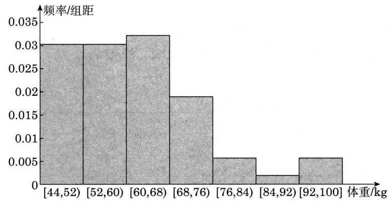

图 13-R1

练习 13.4(2)

1. 绘制气温与海水表层温度的茎叶图如下:

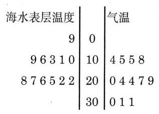

图 13-R2

从上图可以看出,海水表层温度和气温都主要集中在 ${20}^{ \circ  }\mathrm{C}$ 到 ${30}^{ \circ  }\mathrm{C}$ 之间,海水表层温度整体上略低于气温.

2. B.

3. 绘制该栎树高和胸径的散点图如下:

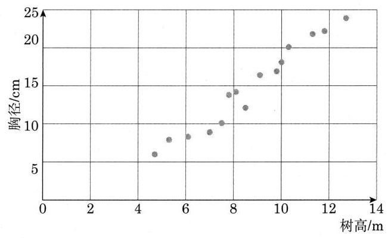

图 13-R3

从上图可以看出, 随着树高的增加, 栎树的胸径有增加的趋势.

习题 13.4

A 组

1. (1)和(3).

2. 这组数据的最大值为 5.32 , 最小值为 2.06 , 极差为 3.26 , 选取组距为 0.5 , 制作频率分布表如下:

<table><tr><td>分组</td><td>频数</td><td>频率</td></tr><tr><td>$\lbrack {2.06},{2.56})$</td><td>4</td><td>0.08</td></tr><tr><td>$\lbrack {2.56},{3.06})$</td><td>11</td><td>0.22</td></tr><tr><td>$\lbrack {3.06},{3.56})$</td><td>12</td><td>0.24</td></tr><tr><td>[3.56,4.06)</td><td>16</td><td>0.32</td></tr></table>

(续表)

<table><tr><td>分组</td><td>频数</td><td>频率</td></tr><tr><td>[4.06,4.56)</td><td>3</td><td>0.06</td></tr><tr><td>[4.56,5.06)</td><td>3</td><td>0.06</td></tr><tr><td>[5.06,5.56]</td><td>1</td><td>0.02</td></tr></table>

绘制频率分布直方图及频率分布折线图如下:

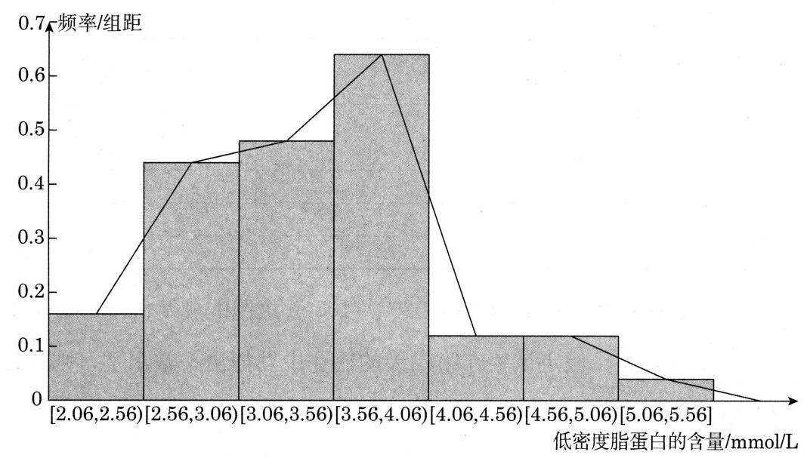

图 13-R4

3. 绘制频率分布直方图如下:

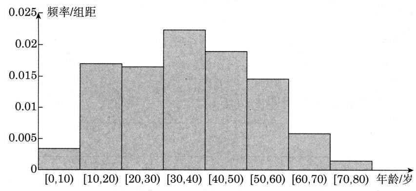

图 13-R5

从上图可以看出, 龋齿病患者较少发于 10 岁以下的儿童及 60 岁以上的老人,在 10 到 60 岁之间均易患病,在 30 到 40 岁之间患病率最高.

4. 略.

B 组

1. 提示: 注意观察图像的纵轴刻度的取值范围.

2. 略.

3. 略.

### 13.5 统计估计

练习 13.5(1)

1.(1)制作频率分布表如下:

<table><tr><td>分组</td><td>频数</td><td>频率</td></tr><tr><td>[12.5,13.0)</td><td>4</td><td>0.20</td></tr><tr><td>[13.0,13.5)</td><td>3</td><td>0.15</td></tr><tr><td>[13.5,14.0)</td><td>4</td><td>0.20</td></tr><tr><td>[14.0,14.5)</td><td>3</td><td>0.15</td></tr><tr><td>[14.5,15.0)</td><td>3</td><td>0.15</td></tr><tr><td>[15.0,15.5]</td><td>3</td><td>0.15</td></tr></table>

(2)从频率分布表中可以看出该生在 20 次 ${100}\mathrm{\;m}$ 短跑的成绩低于 ${14}\mathrm{\;s}$ 的频率为 0.20+0.15+0.20=0.55,假定该生在第二天的比赛中发挥出平常水平,则可估计该生在比赛中用时低于 ${14}\mathrm{\;s}$ 的可能性为 0.55 .

2. 可以算出该展览馆 2018 年所抽取的 5 周的客流量超过 200 的一共有 16 天,超过 200 天的频率为 $\frac{16}{35} \approx  {45.7}\%$ ,我们可以估计 2018 年客流量超过 200 的频率为 45.7%,由 365×45.7%≈167,可以估计 2018 年超过 200 天的天数为 167.

## 练习 $\mathbf{{13.5}\left( 2\right) }$

1. A.

2. (1)绘制频率分布条形图如下所示:

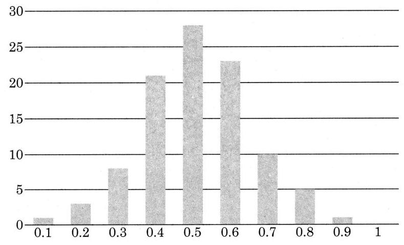

图 $\mathbf{{13} - {R6}}$

( 2 )偶数出现比例的平均值为

$$
\frac{{0.1} \times  1 + {0.2} \times  3 + \cdots  + {1.0} \times  0}{100} = {0.512}.
$$

偶数出现比例的标准差为

$$
\sqrt{\frac{\left( {{0.512} - {0.1}}\right) {)}^{2} \times  1 + \left( {{0.512} - {0.2}}\right) {)}^{2} \times  3 + \cdots  + \left( {{0.512} - 1}\right) {)}^{2} \times  0}{100}} \approx  {1.478}.
$$

3. 经计算可得

$$
{\bar{x}}_{\text{甲 }} = {190},{s}_{\text{甲 }} \approx  {6.31};
$$

$$
{\bar{x}}_{\mathrm{Z}} = {190},{s}_{\mathrm{Z}} \approx  {4.65}.
$$

${\bar{x}}_{\text{甲 }} = {\bar{x}}_{\text{乙 }},{s}_{\text{甲 }} > {s}_{\text{乙 }}$ ,故甲品种的苹果和乙品种的苹果的质量的平均值相同,但是乙品种的苹果质量标准差较小, 说明乙品种的苹果质量更均匀.

练习 13.5(3)

1. 首先对这组数据进行排序:

40 40 46 48 53 56 60 60 60 60

$$
\begin{array}{llllllllll} {65} & {66} & {68} & {69} & {70} & {71} & {72} & {74} & {74} & {76} \end{array}
$$

$$
\begin{array}{llllllllll} {77} & {77} & {78} & {79} & {82} & {82} & {82} & {83} & {83} & {84} \end{array}
$$

$$
\begin{array}{llllllllll} {85} & {86} & {86} & {87} & {88} & {88} & {88} & {89} & {89} & {89} \end{array}
$$

$$
\begin{array}{llllll} {90} & {91} & {93} & {95} & {96} & {97} \end{array}
$$

经计算可求得该组数据的第 67 百分位数为 85 , 第 69 百分位数为 86 , 该生的成绩为 85,我们可以估计该生的成绩在该校大学一年级学生的成绩中大致处于第 67 百分位数.

习题 13.5

A 组

1. 经计算可得

$$
\begin{aligned}  & {\bar{x}}_{\text{甲 }} \approx  {9.807},{s}_{\text{甲 }} \approx  {0.341}; \\  & {\bar{x}}_{乙} \approx  {9.807},{s}_{乙} \approx  {0.595}. \end{aligned}
$$

${\bar{x}}_{\text{甲 }} = {\bar{x}}_{\text{乙 }},{s}_{\text{甲 }} < {s}_{\text{乙 }}$ ,所以说,甲运动员和乙运动员射击比赛得分的平均值相同, 但是甲运动员比赛得分的标准差较小, 说明甲运动员的射击水平更稳定.

2. 经计算, 可得该公司这 20 名员工上班单程花费时间的平均数为 28.5 , 众数为 25,中位数为 25.5.由于这 25 名员工是随机调查的,故我们可以估计该公司上班单程时间的平均数为 28.5 , 中位数为 25.5 , 上班单程花费时间为 25 分钟的人最多.

3.(1)最小值为 16.2,最大值为 29.4,极差为 13.2 . 选取组距为 2,制作频率分布表如下:

<table><tr><td>分组</td><td>频数</td><td>频率</td></tr><tr><td>$\lbrack {16.0},{18.0})$</td><td>3</td><td>0.075</td></tr><tr><td>$\lbrack {18.0},{20.0})$</td><td>5</td><td>0.125</td></tr><tr><td>$\lbrack {20.0},{22.0})$</td><td>9</td><td>0.225</td></tr><tr><td>$\lbrack {22.0},{24.0})$</td><td>8</td><td>0.2</td></tr><tr><td>$\lbrack {24.0},{26.0})$</td><td>8</td><td>0.2</td></tr><tr><td>$\lbrack {26.0},{28.0})$</td><td>6</td><td>0.15</td></tr><tr><td>$\lbrack {28.0},{30.0})$</td><td>1</td><td>0.025</td></tr></table>

(2)绘制频率分布直方图和频率分布折线图如下:

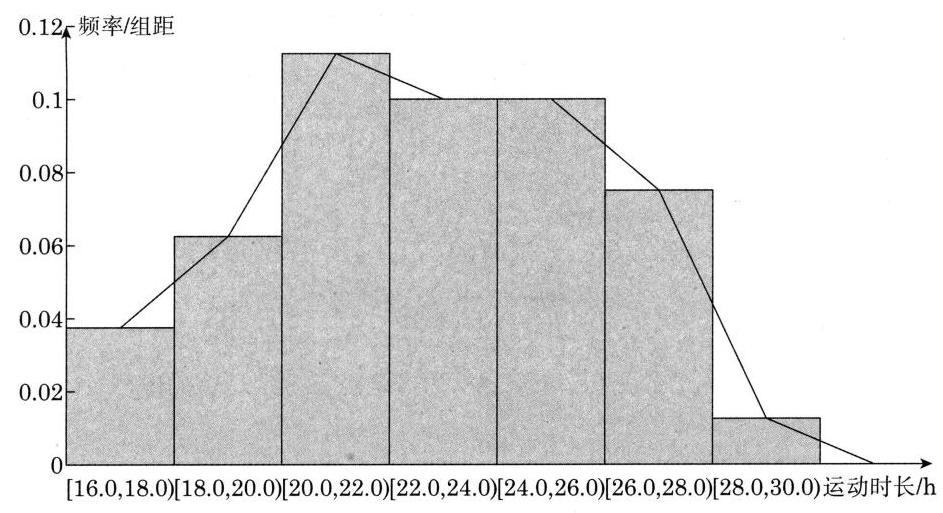

图 13-R7

每天运动 $1\mathrm{\;h}$ 的比例超过 25% 的小区比例为

$$
{0.2} \times  \frac{1}{2} + {0.25} + {0.025} = {0.275}.
$$

4. 平均数为 10.13 , 标准差为 6.87 .

5. 记男生样本每周锻炼时间的平均数为 ${\bar{x}}_{\text{男 }}$ ,方差为 ${s}_{\text{男 }}^{2}$ ; 女生样本每周锻炼时间的平均数为 ${\bar{y}}_{\text{女 }}$ ,方差为 ${s}_{\text{女 }}^{2}$ ,所有学生样本每周锻炼时间的平均数为 ${\bar{z}}_{\text{总 }}$ ,方差为 ${s}_{\text{总 }}^{2}$ , 模仿例 3 的推导过程, 得到

$$
{\bar{z}}_{\text{总 }} = \frac{{48}{\bar{x}}_{\text{男 }} + {27}{\bar{y}}_{\text{女 }}}{{48} + {27}} = {7.168}\text{ (小时),}
$$

并且

$$
{s}_{\text{总 }}^{2} = \frac{1}{{48} + {27}}\left\lbrack  {{48}{s}_{\text{男 }}^{2} + {48}{\left( {\bar{x}}_{\text{男 }} - {\bar{z}}_{\text{总 }}\right) }^{2} + {27}{s}_{\text{女 }}^{2} + {27}{\left( {\bar{y}}_{\text{女 }} - {\bar{z}}_{\text{总 }}\right) }^{2}}\right\rbrack   = {7.884}.
$$

所以所有样本数据的平均数为 7.168 小时, 方差为 7.884 , 据此可以估计该校学生每周锻炼时间的平均数为 7.168 小时, 方差为 7.884 .

## B 组

1. 经计算可得该学生这两周每天阅读书籍页数的平均数为 6.5 , 由于该生每天坚持阅读课外书籍,可以估计该生一年阅读书籍的平均数为 6.5 ,那么一年阅读书籍的总页数则为

$$
{6.5} \times  {365} = {2372.5}\text{.}
$$

假设平均一本书为 200 页,由

$$
{2372.5} \div  {200} \approx  {11.9}\text{,}
$$

可估计该生一年阅读的书籍仅 12 本.

2. (1)

<table><tr><td>年降水量/mm</td><td>频数</td><td>组中值 ${x}_{m}$</td><td>$f \cdot  {x}_{m}$</td></tr><tr><td>[50.5,100.5)</td><td>1</td><td>75.5</td><td>75.5</td></tr><tr><td>$\lbrack {100.5},{150.5})$</td><td>2</td><td>125.5</td><td>251</td></tr><tr><td>$\lbrack {150.5},{200.5})$</td><td>3</td><td>175.5</td><td>526.5</td></tr><tr><td>$\lbrack {200.5},{250.5})$</td><td>5</td><td>225.5</td><td>1127.5</td></tr><tr><td>$\lbrack {250.5},{300.5})$</td><td>4</td><td>275.5</td><td>1102</td></tr><tr><td>$\lbrack {300.5},{350.5})$</td><td>3</td><td>325.5</td><td>976.5</td></tr><tr><td>$\lbrack {350.5},{400.5})$</td><td>2</td><td>375.5</td><td>751</td></tr></table>

(2) $\frac{{75.5} + {251} + {526.5} + {1127.5} + {1102} + {976.5} + {751}}{20} = {240.5}$ ,估计年平均降水量为 ${240.5}\mathrm{\;{mm}}$ .

3. 甲班成绩的平均数、中位数和众数分别为 ${72.6}\text{、}{73}\text{、}{84}$ 和 67; 乙班成绩的平均数、中位数和众数分别为 76、78、66 . 可以看出乙班成绩的平均数和中位数均高于甲班, 所以说甲班的成绩更好.

4. 根据题意, 应选取人体的“小腿加足高”的尺寸的第 5 和第 95 百分位数作为工作椅座高的上、下限. 现已知随机调查的 200 名成年女性和 200 名成年男性的坐姿的小腿加足高的数据, 先计算由 200 名成年女性和 200 名成年男性组成的 400 人样本的第 5 和第 95 百分位数. 将这 200 名女性和 200 名男性的坐姿的小腿加足高的数据放在一起进行排序, 得到一个有序样本.

由 ${400} \times  5\%  = {20}$ ,可得第 5 百分位数为有序样本中第 20 个数 350 和第 21 个数 351 的平均数,为 350.5. ${400} \times  {95}\%  = {380}$ ,所以第 95 百分位数为有序样本中第 380 个数 439 和第 381 个数 440 的平均数, 为 439.5 . 由于样本是随机抽取的, 我们可以估计成年人坐姿的小腿加足高的第 5 百分位数和第 95 百分位数分别为 350.5 和 439.5 因而我们可以将工作椅座高的上、下限设为 350.5 mm 和 439 mm.

### 13.6 统计活动

练习 13.6

1. 略.

2. 略.

习题 13.6

A 组

1. (1)不是.

2. 略.

B 组

1. 略.

2. (1)略. (2)可以讨论全班同学一天平均睡眠时间、运动时间、娱乐时间和学习时间；查阅资料获取这个年龄段学生正常的睡眠小时,找差异；男女生有否差异；身高与睡眠时间有无关系等.

## 复习题

A 组

1. B.

2. A.

3. 应采用分层随机抽样, 共分为 6 层: A 类舒适型、A 类经济型、B 类舒适型、 B 类经济型、C 类舒适型、C 类经济型, 总体容量为

$$
{35} + {50} + {28} + {72} + {15} + {40} = {240}.
$$

故每层应抽取的样本量为

$$
{35} \times  \frac{20}{240} \approx  {2.92};
$$

$$
\begin{gather} {50} \times  \frac{20}{240} \approx  {4.17} \\ {28} \times  \frac{20}{240} \approx  {2.33} \\ {72} \times  \frac{20}{240} = 6; \\ {15} \times  \frac{20}{240} = {1.25}; \\ {40} \times  \frac{20}{240} \approx  {3.33}. \end{gather}
$$

A 类舒适型、A 类经济型、B 类舒适型、B 类经济型、C 类舒适型、C 类经济型的轿车不妨应抽取量:3、4、2、6、1、4.

4. 这组数据最小值为 11.7, 最大值为 21.4, 极差为 9.7. 取组距为 2, 可制作频率分布表如下:

<table><tr><td>分组</td><td>频数</td><td>频率</td></tr><tr><td>[11.7,13.7)</td><td>3</td><td>0.1</td></tr><tr><td>[13.7,15.7)</td><td>7</td><td>0.23</td></tr><tr><td>[15.7,17.7)</td><td>12</td><td>0.4</td></tr><tr><td>[17.7,19.7)</td><td>5</td><td>0.17</td></tr><tr><td>[19.7,21.7)</td><td>3</td><td>0.1</td></tr></table>

绘制频率分布直方图如下:

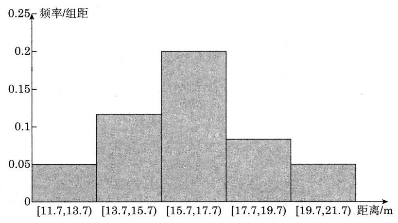

图 13-R8

5. 绘制茎叶图如下:

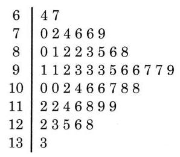

图 13-R9

6. (1) $\overline{x} \approx  {124.51}$ , $s \approx  {1.55}$ .

(2) $\overline{x} - s = {122.96}$ , $\overline{x} + s = {126.06}$ ,质量位于 ${122.96}\mathrm{g}$ 和 ${126.06}\mathrm{g}$ 的茶叶共有 12 罐,所占百分比为 $\frac{12}{20} = {60}\%$ .

7. 设数据 ${x}_{1},{x}_{2},\cdots ,{x}_{n}$ 的平均数为 $\bar{x}$ ,数据 ${y}_{1},{y}_{2},\cdots ,{y}_{n}$ 的平均数为 $\bar{y}$ , 可得

$$
\bar{y} = \frac{1}{n}\mathop{\sum }\limits_{{i = 1}}^{n}\left( {a{x}_{i} + b}\right)  = \frac{1}{n}\left( {\mathop{\sum }\limits_{{i = 1}}^{n}a{x}_{i} + {nb}}\right)  = a \cdot  \frac{1}{n}\mathop{\sum }\limits_{{i = 1}}^{n}a{x}_{i} + b = a\bar{x} + b,
$$

于是

$$
{s}_{y}^{2} = \frac{1}{n}\mathop{\sum }\limits_{{i = 1}}^{n}{\left\lbrack  a{x}_{i} + b - \left( a\bar{x} + b\right) \right\rbrack  }^{2} = \frac{1}{n}\mathop{\sum }\limits_{{i = 1}}^{n}{\left( a{x}_{i} - a\bar{x}\right) }^{2} = {a}^{2} \cdot  \frac{1}{n}\mathop{\sum }\limits_{{i = 1}}^{n}{\left( {x}_{i} - \bar{x}\right) }^{2} = {a}^{2}{s}_{x}^{2}.
$$

## B 组

1.(1)找出每一年的 12 个月份的月平均气温的极小值:

<table><tr><td>年份</td><td>2007</td><td>2008</td><td>2009</td><td>2010</td><td>2011</td><td>2012</td><td>2013</td><td>2014</td><td>2015</td><td>2016</td></tr><tr><td>气温极小值月份</td><td>1月</td><td>2月</td><td>1月</td><td>1 月</td><td>1 月</td><td>2月</td><td>1月</td><td>12 月</td><td>1月</td><td>1月</td></tr><tr><td>气温极小值</td><td>5.9</td><td>4.2</td><td>4.3</td><td>5.7</td><td>1.9</td><td>4.8</td><td>4.6</td><td>5.7</td><td>6</td><td>4.4</td></tr></table>

由上表可知, 10 年中每年最冷的月份并不相同.

(2)气温的波动用极差来衡量,我们可以计算 2007 年到 2016 年这 10 年间 1 到 12 月份的月平均气温的极差分别为:

<table><tr><td>月份</td><td>1</td><td>2</td><td>3</td><td>4</td><td>5</td><td>6</td><td>7</td><td>8</td><td>9</td><td>10</td><td>11</td><td>12</td></tr><tr><td>极差</td><td>4.7</td><td>5.6</td><td>2.6</td><td>4.3</td><td>2.4</td><td>3</td><td>5.3</td><td>4.7</td><td>2.3</td><td>2.1</td><td>4.3</td><td>4.1</td></tr></table>

由上表可知, 2 月份的极差最大, 所以说 10 年中 2 月份的气温波动最大.

(3)我们可以计算 2007 年到 2016 年这 10 年间每一年的月平均气温的极差分别为:

<table><tr><td>年份</td><td>2007</td><td>2008</td><td>2009</td><td>2010</td><td>2011</td><td>2012</td><td>2013</td><td>2014</td><td>2015</td><td>2016</td></tr><tr><td>极差</td><td>24.5</td><td>26.2</td><td>24.7</td><td>25.2</td><td>28.3</td><td>25.1</td><td>27.4</td><td>21.7</td><td>21.8</td><td>25.5</td></tr></table>

由上表可知, 2011 年的月平均气温的极差最大, 所以说 10 年中 2011 年的气温波动最大.

(4)10 年中 7 月份和 8 月份月平均气温的折线图如下:

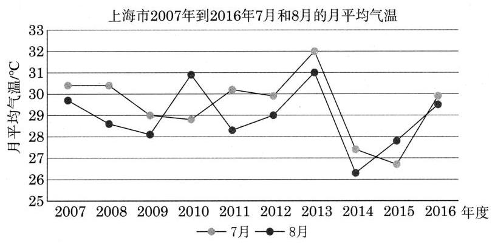

图 13-R10

从折线图上看, 在不同的年份 7 月份和 8 月份的气温有高有低, 但是整体看 7 月份(蓝色折线)的气温略高于 8 月份(橘色折线). 通过计算十年间 7 月份和 8 月份的月平均气温的平均值分别为 ${29.47}^{ \circ  }\mathrm{C}$ 和 ${28.92}^{ \circ  }\mathrm{C}$ ,可见确实 7 月份的月平均气温高于 8 月份.

2. 提示: 可以采用分层随机抽样, 分层可考虑年级、性别等因素.

3. 可以计算这 10 名同学的四次成绩的均值和标准差, 并按照平均值从大到小进行排序:

<table><tr><td>学生编号</td><td>平均值</td><td>标准差</td></tr><tr><td>4</td><td>96.3</td><td>2.8</td></tr><tr><td>2</td><td>95.5</td><td>6.9</td></tr><tr><td>8</td><td>95.5</td><td>8.9</td></tr><tr><td>1</td><td>92.3</td><td>6.9</td></tr><tr><td>5</td><td>92.3</td><td>3.1</td></tr><tr><td>7</td><td>91.8</td><td>0.8</td></tr><tr><td>10</td><td>91</td><td>7.8</td></tr><tr><td>6</td><td>90.5</td><td>8.3</td></tr><tr><td>3</td><td>88.3</td><td>10.8</td></tr><tr><td>9</td><td>84.8</td><td>7.2</td></tr></table>

我们从上表中可以看出 4 号同学的四次测验成绩的均值最大, 标准差也不大, 所以如果只推荐一位同学参加比赛, 那么可以推荐 4 号同学. 而如果需要 4 名同学参加比赛, 从平均值来看, 1 号和 5 号的平均值相同, 但是 5 号的标准差较小, 成绩相对较为稳定, 所以可以推荐 4 号、2 号、8 号和 5 号同学参赛.

4. 要保证 50% 的员工能拿到基本奖励,拿到基本奖励的员工中至多 10% 的人能够拿到额外奖励, 则需要知道该客服部门员工通话数量的第 50 百分位数和第 90 百分位数. 现有随机抽取的 30 名员工的通话数量, 先算出该样本的第 50 百分位数和第 90 百分位数.

对样本从小到大进行排序:

$\begin{array}{llllllllll} {901} & {902} & {921} & {931} & {968} & {1032} & {1041} & {1051} & {1083} & {1099} \end{array}$

110011241130 1197 1223 1239 1282 1319 1344 1354

1378 1381 1428 1445 1463 1549 1607 1610 1752 1804

由 ${30} \times  {50}\%  = {15}$ ,得第 50 百分位数为有序样本中第 15 个数 1223 和第 16 个数 1239 的平均数,为 1226 . 由 ${30} \times  {90}\%  = {27}$ ,得第 90 百分位数为有序样本中第 27 个数 1607 和第 28 个数 1610 的平均数, 为 1608.5 , 为便于操作, 我们取 1609 . 由于样本是随机抽取的, 我们可以估计该客服部门员工通话数量的第 50 百分位数和第 90 百分位数分别为 1226 和 1609 . 我们可以规定奖励方案如下:每个月与客户通话数量高于 1226 的员工可以拿到基本奖励; 每个月与客户通话数量高于 1609 的员工还可以拿到额外奖励.

## 四、相关阅读材料

## 参考文献

[1] 戴维・穆尔,威廉·诺茨. 统计学的世界(第 8 版)[M]. 郑磊,译. 北京: 中信出版社,2017.

## 后 记

本套教学参考资料与李大潜、王建磐主编,上海教育出版社出版的《普通高中教科书·数学》配套使用,本套教材根据中华人民共和国教育部制定并颁布实施的《普通高中数学课程标准(2017 年版 2020 年修订)》编制,并经国家教材委员会专家委员会审核通过.

本套教材是由设在复旦大学和华东师范大学的两个上海市数学教育教学研究基地 (上海高校“立德树人”人文社会科学重点研究基地)联合主持编写的. 编写工作依据高中数学课程标准的具体要求,努力符合教育规律和高中学生的认知规律,结合上海城市发展定位和课程改革基础, 并力求充分体现特色. 希望我们的这一努力能经得起实践和时间的检验, 对扎实推进数学的基础教育发挥积极的作用.

本书是与必修第三册教材配套的教学参考资料, 共为四章, 各章编写人员分别为阮晓明、杨家政(第 10 章)

黄坪(第 11 章)

应坚刚、田万国(第 12 章)

陈月兰、汪家录(第 13 章)

限于编写者的水平, 也由于新编教材尚缺乏教学实践的检验, 不妥及疏漏之处在所难免, 恳请广大师生及读者不吝赐教. 宝贵意见请通过邮箱 gaozhongshuxue@seph.com.cn 反馈, 不胜感激.

2021 年 7 月

图书在版编目 (CIP) 数据

普通高中数学教学参考资料:必修. 第三册/上海市中小学 (幼儿园)课程改革委员会组织编写. 一 上海:上海教育出版社, 2021.8(2023.6重印)

ISBN 978-7-5720-0848-1

I. ①普... II. ①上··· III. ①中学数学课 - 高中 - 教学参考资料 IV. ①G634.603

中国版本图书馆CIP数据核字(2021)第152875号