## 第一讲 等差数列与等比数列

## 一、等差数列与等比数列的基本性质

等差数列 $\left\{  {a}_{n}\right\}$ 的公差 $d \in  R,{a}_{n} \in  R$ ; 等比数列 $\left\{  {b}_{n}\right\}$ 的公比 $q \neq  0,{b}_{n} \neq  0$

等差数列 $\left\{  {a}_{n}\right\}$ 和等比数列 $\left\{  {b}_{n}\right\}$ 都可以以任意第 $m$ 项为首项写出通项公式:

$$
{a}_{n} = {a}_{m} + \left( {n - m}\right) d\text{ (等差) }\;{b}_{n} = {b}_{m}{q}^{n - m}\text{ (等比) }
$$

其中 $m, n \in  {N}^{ * }$

等差数列 $\left\{  {a}_{n}\right\}$ 与等比数列 $\left\{  {b}_{n}\right\}$ 均满足配对原理: 若 $n + m = {n}^{\prime } + {m}^{\prime }$ ,则

$$
{a}_{n} + {a}_{m} = {a}_{n} + {a}_{m}\;{b}_{n}{b}_{m} = {b}_{n}{b}_{m}
$$

也就是下标和相同的等差数列和、等比数列积也相同。

根据配对原理,可以定义等差数列 $\left\{  {a}_{n}\right\}$ 的等差中项和等比数列 $\left\{  {b}_{n}\right\}$ 的等比中项。

任取 $k$ 个正整数下标 ${n}_{1},{n}_{2},\cdots ,{n}_{k}$ ,若 $\frac{{n}_{1} + {n}_{2} + \cdots  + {n}_{k}}{k} = m \in  {N}^{ * }$ ,则

$\frac{1}{k}\left\lbrack  {{a}_{{n}_{1}} + {a}_{{n}_{2}} + \cdots  + {a}_{{n}_{k}}}\right\rbrack   = {a}_{m}$ ,称 ${a}_{m}$ 为 ${a}_{{n}_{1}},{a}_{{n}_{2}},\cdots ,{a}_{{n}_{k}}$ 的等差中项 ${\left\lbrack  {b}_{{n}_{1}}{b}_{{n}_{2}}\cdots {b}_{{n}_{k}}\right\rbrack  }^{\frac{1}{k}} = {b}_{m}$ ,称 ${b}_{m}$ 为 ${b}_{{n}_{1}},{b}_{{n}_{2}},\cdots ,{b}_{{n}_{k}}$ 的等比中项

1. 在等差数列 $\left\{  {a}_{n}\right\}$ 中， ${a}_{1} + {a}_{2} + {a}_{4} + {a}_{15} + {a}_{18} = {120}$ ，则 ${a}_{8} =$ ___.

2. 等差数列 $\left\{  {a}_{n}\right\}$ 满足: ① ${a}_{1} < 0,{a}_{2} > \frac{3}{2}$ ,②在区间 $\left( {{11},{20}}\right)$ 中的项恰好比区间 $\left\lbrack  {{41},{50}}\right\rbrack$ 中的项少 2 项，则数列 $\left\{  {a}_{n}\right\}$ 的通项公式为 ${a}_{n} =$ ___

3. 对于给定数列 $\left\{  {a}_{n}\right\}$ ，若数列 $\left\{  {a}_{n}\right\}$ 中任意 (不同) 两项之和仍是该数列中的一项，则称该数列是 “封闭数列”.

(1)已知数列 $\left\{  {a}_{n}\right\}$ 的通项公式为 ${a}_{n} = {3}^{n}$ ，试判断 $\left\{  {a}_{n}\right\}$ 是否为封闭数列，并说明理由；

(3)证明:等差数列 $\left\{  {a}_{n}\right\}$ 成为“封闭数列”的充要条件是:存在整数 $m \geq   - 1$ ，使 ${a}_{1} = {md}$ .

4. 设 $\left\{  {a}_{n}\right\}$ 和 $\left\{  {b}_{n}\right\}$ 是两个等差数列,记 ${c}_{n} = \max \left\{  {{b}_{1} - {a}_{1}n,{b}_{2} - {a}_{2}n,\cdots {b}_{n} - {a}_{n}n}\right\}$ ,其中 $n \in  {N}^{ * }$ , $\max \left\{  {{x}_{1},{x}_{2},\cdots {x}_{s}}\right\}$ 表示 ${x}_{1},{x}_{2},\cdots {x}_{s}$ 这 $s$ 个数中最大的数。

(1)若 ${a}_{n} = n,{b}_{n} = {2n} - 1$ ，求 ${c}_{1},{c}_{2},{c}_{3}$ 的值，并证明 $\left\{  {c}_{n}\right\}$ 是等差数列；

(3)证明:或者对任意正数 $M$ ，存在正整数 $m$ ，当 $n \geq  m$ 时， $\frac{{c}_{n}}{n} > M$ ；或者存在正整数 $m$ ，使得 ${c}_{m},{c}_{m + 1},{c}_{m + 2},\cdots$ 是等差数列。

## 二、等差数列的和数列

等差数列 $\left\{  {a}_{n}\right\}$ 的求和式 ${S}_{n}$ 可由以下两个公式计算得到:

① ${S}_{n} = n{a}_{1} + \frac{1}{2}n\left( {n - 1}\right) d$ ② ${S}_{n} = \frac{1}{2}n\left( {{a}_{1} + {a}_{n}}\right)$ ③ ${S}_{n} = \frac{1}{2}n\left( {{a}_{p} + {a}_{q}}\right) \;\left( {p + q = n + 1}\right)$

若 $\left\{  {a}_{n}\right\}$ 为等差数列,则 $\frac{{S}_{n}}{n}$ 也为等差数列,且公差为 $\frac{d}{2}$

等差数列 $\left\{  {a}_{n}\right\}$ 的和数列 ${S}_{n}$ 的单调性判定方式:

① ${a}_{n} > 0$ 则递增， ${a}_{n} < 0$ 则递减， ${a}_{n} = 0$ 不变

② 将 ${S}_{n} = \frac{d}{2}{n}^{2} + \left( {{a}_{1} - \frac{d}{2}}\right) n$ 视为一个过原点的二次函数

5. 等差数列 $\left\{  {a}_{n}\right\}  \text{ 、 }\left\{  {b}_{n}\right\}$ 的前 $n$ 项和分别为 ${S}_{n}\text{ 、 }{T}_{n}$ ,若对于任意自然数 $n$ ,都 ${S}_{n} : {T}_{n} = \left( {{2n} - 3}\right)  : \left( {{4n} - 3}\right)$ , 则 $\frac{{a}_{9}}{{b}_{5} + {b}_{7}} + \frac{{a}_{3}}{{b}_{8} + {b}_{4}}$ 的值为___.

6. 等差数列 $\left\{  {a}_{n}\right\}$ 中， ${S}_{p} = \frac{p}{q}$ ， ${S}_{q} = \frac{q}{p}\left( {p \neq  q}\right)$ ，则 ${S}_{p + q}$ 的值为( )

(A) 大于 4 (B) 等于 4 (C) 小于 4 (D) 以上皆错

7. 若 ${a}_{1} > 0$ ， ${a}_{2014} + {a}_{2015} > 0$ ， ${a}_{2014} \cdot  {a}_{2015} < 0$ ，则使 ${S}_{n}$ 取最大值时的最大自然数 $n$ 是___；使得 ${S}_{n} > 0$ 成立的最大自然数 $n$ 是___；

8. 已知数列 $\left\{  {a}_{n}\right\}$ 满足 ${a}_{n} = a{n}^{2} + n$ ,若满足 ${a}_{1} < {a}_{2} < {a}_{3} < {a}_{4} < {a}_{5} < {a}_{6}$ 且对任意 $n \in  \lbrack 9, + \infty )$ ,都有 ${a}_{n} > {a}_{n + 1}$ , 则实数 $a$ 的取值范围是___.

9. 设各项均为实数的等差数列 $\left\{  {a}_{n}\right\}$ 和 $\left\{  {b}_{n}\right\}$ 的前 $n$ 项和分别为 ${S}_{n}$ 和 ${T}_{n}$ ,对于方程① ${2025}{x}^{2} - {S}_{2025}x + {T}_{2025} = 0$ ,② ${x}^{2} - {a}_{1}x + {b}_{1} = 0$ ,③ ${x}^{2} + {a}_{2025}x + {b}_{2025} = 0$ . 下列判断正确的是 ( )

A. 若①有实根，②有实根，则③有实根

B. 若①有实根，②无实根，则③有实根

C. 若①无实根，②有实根，则③无实根

D. 若①无实根，②无实根，则③无实根

## 三、等比数列的单调性

10. 对于等比数列 $\left\{  {a}_{n}\right\}$ ,

(1)当 $q = 1$ 时， ${a}_{n}$ 为___，

(2)当___， ${a}_{n}$ 为单调增数列；当___， ${a}_{n}$ 为单调减数列

(3)当 $q < 0$ 时， ${a}_{n}$ 在正负间震荡，不具有单调性，但 $\left\{  {a}_{2k}\right\}$ 或 $\left\{  {a}_{{2k} - 1}\right\}$ 内正负保持一致，具有单调性

11. 若 $a, b$ 为两个不相等的正数,且 $a, x, y, b$ 成等差数列, $a, m, n, b$ 成等比数列, $x + y$ ___ $m + n$ .

12. 等比数列 $\left\{  {a}_{n}\right\}$ 首项 ${a}_{1} > 0, q > 1$ ,记 $I = \left\{  {x - y \mid  x, y \in  \left\lbrack  {{a}_{1},{a}_{2}}\right\rbrack   \cup  \left\lbrack  {{a}_{n},{a}_{n + 1}}\right\rbrack  }\right\}$ ,若对任意正整数 $n, I$ 是闭区间,则 $q$ 的范围是___.

13. 若数列 $\left\{  {c}_{n}\right\}$ 和 $\left\{  {d}_{n}\right\}$ 满足 ${c}_{n} > 0,{d}_{n} > 0$ ,且 ${c}_{n + 1} = \frac{{c}_{n} + {d}_{n}}{\sqrt{{c}_{n}^{2} + {d}_{n}^{2}}}, n \in  {\mathbf{N}}^{ * }$ ,则称数列 $\left\{  {d}_{n}\right\}$ 是数列 $\left\{  {c}_{n}\right\}$ 的 “伴随数列”. 已知数列 $\left\{  {b}_{n}\right\}$ 是 $\left\{  {a}_{n}\right\}$ 的伴随数列,解答下列问题:

(1)若 ${b}_{n} = {a}_{n}\left( {n \in  {\mathbf{N}}^{ * }}\right)$ ， ${b}_{1} = \sqrt{2}$ ，求数列 $\left\{  {a}_{n}\right\}$ 的通项公式 ${a}_{n}$ ；

(2)若 ${b}_{n + 1} = 1 + \frac{{b}_{n}}{{a}_{n}}\left( {n \in  {\mathbf{N}}^{ * }}\right)$ ， $\frac{{b}_{1}}{{a}_{1}}$ 为常数，求证:数列 $\left\{  {\left( \frac{{b}_{n}}{{a}_{n}}\right) }^{2}\right\}$ 是等差数列；

(3)若 ${b}_{n + 1} = \sqrt{2}\frac{{b}_{n}}{{a}_{n}}\left( {n \in  {\mathbf{N}}^{ * }}\right)$ ，数列 $\left\{  {a}_{n}\right\}$ 是等比数列，求 ${a}_{1}$ 、 ${b}_{1}$ 的数值.

## 四、等比数列的和数列

等比数列 $\left\{  {a}_{n}\right\}$ 的前 $n$ 项和 ${S}_{n} = \left\{  \begin{array}{l} n{a}_{1}, q = 1 \\  \frac{{a}_{1}}{1 - q}\left( {1 - {q}^{n}}\right) , q \neq  1 \end{array}\right.$

当且仅当 $q \in  \left( {-1,0}\right)  \cup  (0,1\rbrack$ 时,等比数列 $\left\{  {a}_{n}\right\}$ 存在极限,且 $\mathop{\lim }\limits_{{n \rightarrow  \infty }}{a}_{n} = \left\{  \begin{array}{ll} {a}_{1} & , q = 1 \\  0 & ,0 < \left| q\right|  < 1 \end{array}\right.$

当且仅当 $q \in  \left( {-1,0}\right)  \cup  \left( {0,1}\right)$ 时,等比数列的和数列 $\left\{  {S}_{n}\right\}$ 存在极限,且 $\mathop{\lim }\limits_{{n \rightarrow  \infty }}{S}_{n} = \frac{{a}_{1}}{1 - q}$

14. 若数列 $\left\{  {b}_{n}\right\}  \text{ 、 }\left\{  {c}_{n}\right\}$ 均为严格增数列,且对任意正整数 $n$ ,都存在正整数 $m$ ,使得 ${b}_{m} \in  \left\lbrack  {{c}_{n},{c}_{n + 1}}\right\rbrack$ ,则称数列 $\left\{  {b}_{n}\right\}$ 为数列 $\left\{  {c}_{n}\right\}$ 的 “ $M$ 数列”. 已知数列 $\left\{  {a}_{n}\right\}$ 的前 $n$ 项和为 ${S}_{n}$ ,则下列选项中为假命题的是 ( )

A. 存在等差数列 $\left\{  {a}_{n}\right\}$ ，使得 $\left\{  {a}_{n}\right\}$ 是 $\left\{  {S}_{n}\right\}$ 的 “ $M$ 数列”

B. 存在等比数列 $\left\{  {a}_{n}\right\}$ ，使得 $\left\{  {a}_{n}\right\}$ 是 $\left\{  {S}_{n}\right\}$ 的 “ $M$ 数列”

C. 存在等差数列 $\left\{  {a}_{n}\right\}$ ,使得 $\left\{  {S}_{n}\right\}$ 是 $\left\{  {a}_{n}\right\}$ 的 “ $M$ 数列”

D. 存在等比数列 $\left\{  {a}_{n}\right\}$ ,使得 $\left\{  {S}_{n}\right\}$ 是 $\left\{  {a}_{n}\right\}$ 的 “ $M$ 数列”

15. 设数列 $\left\{  {a}_{n}\right\}$ 的前 $n$ 项的和为 ${S}_{n}$ ,若对任意的 $n \in  {\mathbf{N}}^{ * }$ ,都有 ${S}_{n} < {a}_{n + 1}$ ,则称数列 $\left\{  {a}_{n}\right\}$ 为 “ $K$ 数列”. 关于命题: ①存在等差数列 $\left\{  {a}_{n}\right\}$ ,使得它是 “ $K$ 数列”; ②若 $\left\{  {a}_{n}\right\}$ 是首项为正数、公比为 $q$ 的等比数列,则 $q \in  \lbrack 2, + \infty )$ 是 $\left\{  {a}_{n}\right\}$ 为 “ $K$ 数列” 的充要条件. 下列判断正确的是 ( )

A. ①和②都为真命题 B. ①为真命题，②为假命题

C. ①为假命题，②为真命题 D. ①和②都为假命题

16. 已知等比数列 $\left\{  {a}_{n}\right\}$ 的前 $n$ 项和为 ${S}_{n}$ ,且 ${a}_{1} = 1,{a}_{2} = a$ ,对于任意的 $n \geq  2\left( {n \in  {\mathbf{N}}^{ * }}\right)$ ,都存在 $m \in  {\mathbf{N}}^{ * }$ ，使得 $\left( {{S}_{m} - {a}_{n}}\right) \left( {{S}_{m} - {a}_{n + 1}}\right)  < 0$ ，则正实数 $a$ 的取值集合为___

17. 已知数列 ${a}_{1},{a}_{2},\cdots ,{a}_{10}$ 满足: 对任意 $i, j \in  \{ 1,2,3,\cdots ,{10}\}$ ,若 $i \neq  j$ ,则 ${a}_{i} \neq  {a}_{j}$ ,且 ${a}_{i} \in  \left\{  {{2}^{1},{2}^{2},{2}^{3},{2}^{4},{2}^{5},{2}^{6},{2}^{7},{2}^{8},{2}^{9},{2}^{10}}\right\}$ ,设 $A = \left\{  {{a}_{i} + {a}_{i + 1} + {a}_{i + 2} \mid  i = 1,2,3,4,5,6,7,8}\right\}$ ,集合 $A$ 中元素的最小值记为 $m\left( A\right)$ ,则 $m\left( A\right)$ 的最大值为___

## 课后练习 1

1. 已知 $\left\{  {a}_{n}\right\}$ 为等差数列,前 10 项的和 ${S}_{10} = {100}$ ,前 100 项的和 ${S}_{100} = {10}$ ,则 ${S}_{110} =$ ___;

2. 已知 ${a}_{1},{a}_{2},{a}_{3}$ 为一等差数列, ${b}_{1},{b}_{2},{b}_{3}$ 为一等比数列,且这 6 个数都为实数,则下面四个结论: $\text{ ① }{a}_{1} < {a}_{2}$ 与 ${a}_{2} > {a}_{3}$ 可能同时成立; ② ${b}_{1} < {b}_{2}$ 与 ${b}_{2} > {b}_{3}$ 可能同时成立; ③若 ${a}_{1} + {a}_{2} < 0$ ，则 ${a}_{2} + {a}_{3} < 0$ ④若 ${b}_{1} \cdot  {b}_{2} < 0$ ， 则 ${b}_{2} \cdot  {b}_{3} > 0$ 。其中正确的是( )

A. ①③ B. ②④ C. ①④ D. ②③

3. 已知数列 $\left\{  {a}_{n}\right\}  \text{ 、 }\left\{  {b}_{n}\right\}$ 都是等差数列, ${S}_{n},{T}_{n}$ 分别是它们的前 $n$ 项和,且 $\frac{{S}_{n}}{{T}_{n}} = \frac{{7n} + 1}{n + 3}$ ,则 $\frac{{a}_{2} + {a}_{5} + {a}_{17} + {a}_{22}}{{b}_{8} + {b}_{10} + {b}_{12} + {b}_{16}} = \frac{}{}$

4. 设数列 $\left\{  {a}_{n}\right\}$ 是等差数列,且 ${a}_{2} =  - 6,{a}_{8} = 6,{S}_{n}$ 是数列 $\left\{  {a}_{n}\right\}$ 的前 $n$ 项和,则 ( )

A、 ${S}_{4} < {S}_{5}$ B、 ${S}_{4} = {S}_{5}$ C、 ${S}_{6} < {S}_{5}$ D、 ${S}_{6} = {S}_{5}$

5. 等差数列 $\left\{  {a}_{n}\right\}$ 的前 $n$ 项和 ${S}_{n}\left( {n = 1,2,3\cdots }\right)$ ,当首项 ${a}_{1}$ 和公差 $d$ 变化时,若 ${a}_{5} + {a}_{8} + {a}_{11}$ 是一个定值,则下列各数中为定值的是( )

A、 ${S}_{16}$ B、 ${S}_{15}$ C、 ${S}_{17}$ D、 ${S}_{18}$

6. 设等差数列 $\left\{  {a}_{n}\right\}$ 的前 $n$ 项和为 ${S}_{n}$ ,若 ${S}_{3} = 9,{S}_{6} = {36}$ ,则 ${a}_{7} + {a}_{8} + {a}_{9} =$

A. 63 B. 45 C. 36 D. 27

7. 已知等差数列共有 10 项，其中奇数项之和 15，偶数项之和为 30，则其公差是___。

8. 已知数列 $\left\{  {a}_{n}\right\}$ 为等差数列，且 ${a}_{2} + {a}_{8} + {a}_{14} = 3$ ，则 ${\log }_{2}\left( {{a}_{3} + {a}_{13}}\right)  =$ ___。

9. 在等比数列 $\left\{  {a}_{n}\right\}$ 中,已知 ${a}_{1}{a}_{3}{a}_{11} = 8$ ，那么 ${a}_{2}{a}_{8} =$ ( )

A. 3 B. 4 C. 12 D. 16

10. 已知数列 $\left\{  {a}_{n}\right\}$ 是等比数列,且 ${a}_{n} > 0,{a}_{1} = 1,{a}_{2}{a}_{3}{a}_{4} = 8$ ,则数列 $\left\{  {a}_{n}\right\}$ 的公比 $q =$ ___。

11. 已知等比数列 $\left\{  {a}_{n}\right\}$ 的前三项依次为 $a - 1, a + 1, a + 4$ ，则 ${a}_{3} =$ ___。

12. 首项为 -24 的等差数列从第 10 项起开始为正数，则公差 $d$ 的取值范围是( )

A. $d > \frac{8}{3}$ B. $d < 3$ C. $\frac{8}{3} \leq  d < 3$ D. $\frac{8}{3} < d \leq  3$

13. 对于给定数列 $\left\{  {a}_{n}\right\}$ ,若数列 $\left\{  {b}_{n}\right\}$ 满足: 对任意 $n \in  {\mathbf{N}}^{ * }$ ,都有 $\left( {{a}_{n} - {b}_{n}}\right) \left( {{a}_{n + 1} - {b}_{n + 1}}\right)  < 0$ ,则称数列 $\left\{  {b}_{n}\right\}$ 是数列 $\left\{  {a}_{n}\right\}$ 的“相伴数列”.

(1)若 ${b}_{n} = {a}_{n} + {c}_{n}$ ，且数列 $\left\{  {b}_{n}\right\}$ 是 $\left\{  {a}_{n}\right\}$ 的 “相伴数列”，试写出 $\left\{  {c}_{n}\right\}$ 的一个通项公式，并说明理由；

(2)设 ${a}_{n} = {2n} - 1$ ，证明:不存在等差数列 $\left\{  {b}_{n}\right\}$ ，使得数列 $\left\{  {b}_{n}\right\}$ 是 $\left\{  {a}_{n}\right\}$ 的“相伴数列”；

(3)设 ${a}_{n} = {2}^{n - 1},{b}_{n} = b \cdot  {q}^{n - 1}$ (其中 $q < 0$ )，若 $\left\{  {b}_{n}\right\}$ 是 $\left\{  {a}_{n}\right\}$ 的 “相伴数列”，试分析实数 $b$ 、 $q$ 的取值应满足的条件.

## 第二讲 数列通项式的求解

## 一、积累型结构

1. 已知数列 $\left\{  {a}_{n}\right\}$ 中， ${a}_{2} = 3{a}_{1}$ ，记 $\left\{  {a}_{n}\right\}$ 的前 $n$ 项和为 ${S}_{n}$ ，且满足 ${S}_{n + 1} + {S}_{n} + {S}_{n - 1} = 3{n}^{2} + 2 \; \left( {n \geq  2, n \in  {\mathbf{N}}^{ * }}\right)$ . 若对任意 $n \in  {\mathbf{N}}^{ * }$ ，都有 ${a}_{n} < {a}_{n + 1}$ ，则首项 ${a}_{1}$ 的取值范围是___.

2. 设 ${S}_{n}$ 是一个无穷数列 $\left\{  {a}_{n}\right\}$ 的前 $n$ 项和,若一个数列满足对任意的正整数 $n$ ,不等式 $\frac{{S}_{n}}{n} < \frac{{S}_{n + 1}}{n + 1}$ 恒成立,则称数列 $\left\{  {a}_{n}\right\}$ 为和谐数列,有下列 3 个命题:

① 若对任意的正整数 $n$ 均有 ${a}_{n} < {a}_{n + 1}$ ，则 $\left\{  {a}_{n}\right\}$ 为和谐数列；

② 若等差数列 $\left\{  {a}_{n}\right\}$ 是和谐数列，则 ${S}_{n}$ 一定存在最小值；

③若 $\left\{  {a}_{n}\right\}$ 的首项小于零，则一定存在公比为负数的一个等比数列是和谐数列.

以上 3 个命题中真命题的个数有( )个

A. 0 B. 1 C. 2 D. 3

3. 设 $M$ 为部分正整数组成的集合，数列 $\left\{  {a}_{n}\right\}$ 的首项 ${a}_{1} = 1$ ，前 $n$ 项的和为 ${S}_{n}$ ，已知对任意整数 $k \in  M$ ,当 $n > k$ 时, ${S}_{n + k} + {S}_{n - k} = 2\left( {{S}_{n} + {S}_{k}}\right)$ 都成立,设 $M = \{ 3,4\}$ ,则数列 $\left\{  {a}_{n}\right\}$ 的通项公式为___

4. 已知数列 $\left\{  {a}_{n}\right\}  \left( {n \in  {\mathbf{N}}^{ * }}\right)$ 满足 ${a}_{n + 1} = \left| {{a}_{2} - {a}_{1}}\right|  + \left| {{a}_{3} - {a}_{2}}\right|  + \cdots  + \left| {{a}_{n} - {a}_{n - 1}}\right| \left( {n \geq  2}\right)$ ,且 ${a}_{1} = 1$ , ${a}_{2} = a\;\left( {a > 1}\right)$ ，则 ${a}_{1} + {a}_{2} + {a}_{3} + \cdots  + {a}_{24} =$ ___(结果用含 $a$ 的式子表示)

## 二、N 配对型结构

5. 已知函数 $f\left( x\right)  = \sin \frac{\pi x}{3}$ ，数列 $\left\{  {a}_{n}\right\}$ 满足 ${a}_{1} = 1$ ，且 ${a}_{n + 1} = \left( {1 + \frac{1}{n}}\right) {a}_{n} + \frac{1}{n}$ ( $n$ 为正整数)，则 $f\left( {a}_{2022}\right)  =$ ___

6. 在数列 $\left\{  {b}_{n}\right\}$ 中,若有 ${b}_{m} = {b}_{n}\left( {m, n}\right.$ 均为正整数,且 $m \neq  n$ ),就有 ${b}_{m + 1} = {b}_{n + 1}$ ,则称数列 $\left\{  {b}_{n}\right\}$ 为“递等数列”. 已知数列 $\left\{  {a}_{n}\right\}$ 满足 ${a}_{5} = 5$ ，且 ${a}_{n} = n\left( {{a}_{n + 1} - {a}_{n}}\right)$ ，将“递等数列” $\left\{  {b}_{n}\right\}$ 前 $n$ 项和记为 ${S}_{n}$ ，若 ${b}_{1} = {a}_{1} = {b}_{4},\;{b}_{2} = {a}_{2},\;{S}_{5} = {a}_{10}$ ，则 ${S}_{2025} =$ ___

7. 已知 $\left\{  {a}_{n}\right\}$ 满足 ${a}_{1} = \frac{3}{2},{a}_{n} = \frac{{3n}{a}_{n - 1}}{2{a}_{n - 1} + n - 1}\left( {n \geq  2}\right)$ ，求 $\left\{  {a}_{n}\right\}$ 的通项公式。

8. 设数列 $\left\{  {a}_{n}\right\}$ 的前 $n$ 项和为 ${S}_{n}$ 。已知 ${a}_{1} = 1,\frac{2{S}_{n}}{n} = {a}_{n + 1} - \frac{1}{3}{n}^{2} - n - \frac{2}{3}, n \in  {N}^{ * }$ 。

## 三、周期规律型

9. 数列 $\left\{  {a}_{n}\right\}$ 的前 $n$ 项和为 ${S}_{n},{a}_{1} = m$ ,且对任意的 $n \in  {\mathbf{N}}^{ * }$ 都有 ${a}_{n} + {a}_{n + 1} = {2n} + 1$ ,则下列三个命题中, 所有真命题的序号是( )

① 存在实数 $m$ ，使得 $\left\{  {a}_{n}\right\}$ 为等差数列；

② 存在实数 $m$ ，使得 $\left\{  {a}_{n}\right\}$ 为等比数列；

③ 若存在 $k \in  {\mathbf{N}}^{ * }$ ,使得 ${S}_{k} = {S}_{k + 1} = {55}$ ,则实数 $m$ 唯一;

A. ① B. ①② C. ①③ D. ①②③

10. 若数列 $\left\{  {a}_{n}\right\}$ 满足 ${a}_{n} + {a}_{n + 1} + {a}_{n + 2} + \cdots  + {a}_{n + k} = 0\left( {n \in  {\mathbf{N}}^{ * }, k \in  {\mathbf{N}}^{ * }}\right)$ ,则称数列 $\left\{  {a}_{n}\right\}$ 为 “ $k$ 阶相消数列”. 已知 “ 2 阶相消数列” $\left\{  {b}_{n}\right\}$ 的通项公式为 ${b}_{n} = 2\cos {\omega n}$ ，记 ${T}_{n} = {b}_{1}{b}_{2}\cdots {b}_{n},1 \leq  n \leq  {2021}, n \in  {\mathbf{N}}^{ * }$ ，则当 $n \; =$ ___时, ${T}_{n}$ 取得最小值.

11. 已知定义在实数集 $\mathbf{R}$ 上的函数 $f\left( x\right)$ 满足 $f\left( {x + 1}\right)  = \frac{1}{2} + \sqrt{f\left( x\right)  - {f}^{2}\left( x\right) }$ ,则 $f\left( 0\right)  + f\left( {2021}\right)$ 的最大值为___

A. $\frac{1}{2}$ B. $\frac{3}{2}$ C. $1 - \frac{\sqrt{2}}{2}$ D. $1 + \frac{\sqrt{2}}{2}$

12. 已知数列 $\left\{  {a}_{n}\right\}$ 满足 ${a}_{1} = 1,{a}_{n + 1} - {a}_{n} = {\left( -\frac{1}{2}\right) }^{n}$ ,存在正偶数 $n$ 使得 $\left( {{a}_{n} - \lambda }\right) \left( {{a}_{n + 1} + \lambda }\right)  > 0$ ,且对任意正奇数 $n$ 有 $\left( {{a}_{n} - \lambda }\right) \left( {{a}_{n + 1} + \lambda }\right)  < 0$ ，则实数 $\lambda$ 的取值范围是___

## 四、数列的函数性质

13. 已知 $D = \left( {{10}, t}\right)$ ，数列 $\left\{  {a}_{n}\right\}$ 满足 ${a}_{n + 1}{}^{2} + {a}_{n}{}^{2} = 2\left( {{a}_{n + 1} + 1}\right) \left( {{a}_{n} - 1}\right)  + 1$ ， $n \in  {\mathbf{N}}^{ * }$ . 若对任意正实数 $\lambda$ ，总存在 ${a}_{1} \in  D$ 和相邻两项 ${a}_{k}$ 、 ${a}_{k + 1}$ ，使得 ${a}_{k + 1} + \lambda {a}_{k} = 0$ 成立，则实数 $t$ 的最小值为___.

14. 已知数列 $\left\{  {a}_{n}\right\}$ 、 $\left\{  {b}_{n}\right\}$ 、 $\left\{  {c}_{n}\right\}$ 的通项公式分别为 ${a}_{n} = \frac{40}{n}$ 、 ${b}_{n} = \frac{80}{s}$ 、 ${c}_{n} = \frac{60}{t}$ ,其中 $n + s + t = {100}$ , $s = {kn}, n, s, k \in  {\mathbf{N}}^{ * }$ ,令 ${M}_{n} = \max \left\{  {{a}_{n},{b}_{n},{c}_{n}}\right\}  ,\left( {\max \left\{  {{a}_{n},{b}_{n},{c}_{n}}\right\}  }\right.$ 表示 ${a}_{n}\text{ 、 }{b}_{n}\text{ 、 }{c}_{n}$ 三者中的最大值)，则对于任意 $k \in  {\mathbf{N}}^{ * }$ ， ${M}_{n}$ 的最小值为___.

## 第三讲 数列递推式的求解

一、Casio Ans

1. 已知数列 $\left\{  {a}_{n}\right\}$ 满足 ${a}_{n + 1} = {a}_{n}^{2} - 3{a}_{n} + 4,{a}_{1} = 3$ ，则下列选项错误的是( )

A. 数列 $\left\{  {a}_{n}\right\}$ 单调递增 B. 数列 $\left\{  {a}_{n}\right\}$ 无界

C. $\mathop{\lim }\limits_{{n \rightarrow   + \infty }}\left( {\frac{1}{{a}_{1} - 1} + \cdots  + \frac{1}{{a}_{n} - 1}}\right)  = 1$ D. ${a}_{100} = {101}$

2. 下列用递推公式表示的数列中,使得 $\mathop{\lim }\limits_{{n \rightarrow   + \infty }}{a}_{n} = \sqrt{2}$ 成立的是( )

A. $\left\{  \begin{array}{l} {a}_{n} = \frac{1}{2}\left( {{a}_{n - 1} + \frac{2}{{a}_{n - 1}}}\right) \left( {n \geq  2}\right) \\  {a}_{1} =  - 1 \end{array}\right.$ B. $\left\{  \begin{array}{l} {a}_{n} = \frac{{a}_{n - 1} + {99}}{{49}{a}_{n - 1} + 1}\left( {n \geq  2}\right) \\  {a}_{1} = 1 \end{array}\right.$

C. $\left\{  \begin{array}{l} {a}_{n} = \frac{2 - 3{a}_{n - 1}}{{a}_{n - 1} - 3}\left( {n \geq  2}\right) \\  {a}_{1} = 1 \end{array}\right.$ D. $\left\{  \begin{array}{l} {a}_{n} = \frac{2 + {a}_{n - 1}\ln {a}_{n - 1}}{{a}_{n - 1} + \ln {a}_{n - 1}}\left( {n \geq  2}\right) \\  {a}_{1} = 1 \end{array}\right.$

3. 对于数列 $\left\{  {x}_{n}\right\}$ ，若存在正数 $M$ ，使得对一切正整数 $n$ ，恒有 $\left\{  {x}_{n}\right\}   \leq  M$ ，则称数列 $\left\{  {x}_{n}\right\}$ 有界；若这样的正数 $M$ 不存在,则称数列 $\left\{  {x}_{n}\right\}$ 无界,已知数列 $\left\{  {a}_{n}\right\}$ 满足: ${a}_{1} = 1,{a}_{n + 1} = \ln \left( {\lambda {a}_{n} + 1}\right) \left( {\lambda  > 0}\right)$ ,记数列 $\left\{  {a}_{n}\right\}$ 的前 $n$ 项和为 ${S}_{n}$ ，数列 $\left\{  {a}_{n}^{2}\right\}$ 的前 $n$ 项和为 ${T}_{n}$ ，则下列结论正确的是( )

A. 当 $\lambda  = 1$ 时，数列 $\left\{  {S}_{n}\right\}$ 有界 B. 当 $\lambda  = 1$ 时，数列 $\left\{  {T}_{n}\right\}$ 有界

C. 当 $\lambda  = 2$ 时,数列 $\left\{  {S}_{n}\right\}$ 有界 D. 当 $\lambda  = 2$ 时,数列 $\left\{  {T}_{n}\right\}$ 有界

## 二、不动点图

4. 无穷数列 $\left\{  {a}_{n}\right\}$ 满足: $0 < {a}_{1} < 1$ ,且对任意的正整数 $n$ ,均有 ${\mathrm{e}}^{{a}_{n + 1}} = \left( {3 - {a}_{n}}\right) {\mathrm{e}}^{{a}_{n}}$ ,则下列说法正确的是 ( )

A. 数列 $\left\{  {a}_{n}\right\}$ 为严格减数列 B. 存在正整数 $n$ ,使得 ${a}_{n} < 0$

C. 数列 $\left\{  {a}_{n}\right\}$ 中存在某一项为最大项 D. 存在正整数 $n$ ,使得 ${a}_{n} > \frac{4}{3}$

5. 已知数列 $\left\{  {a}_{n}\right\}$ 满足 ${a}_{1} = 2,{a}_{n + 1} - 1 = \ln \left( {{a}_{n} + b}\right)  - b\left( {n \in  {\mathbf{N}}^{ * }}\right)$ . 若 $\left\{  {a}_{n}\right\}$ 有无穷多个项，则( )

A. $b \geq  0$ B. $b \geq   - 1$ C. $b \geq  1$ D. $b \geq   - 2$

6. 已知 $n \in  {\mathrm{N}}^{ * }$ ，记 $\max \left\{  {{x}_{1},\cdots ,{x}_{n}}\right\}$ 表示 ${x}_{1}$ ， $\cdots$ ， ${x}_{n}$ 中的最大值， $\min \left\{  {{y}_{1},\cdots ,{y}_{n}}\right\}$ 表示 ${y}_{1},\cdots ,{y}_{n}$ 中的最小值. 若 $f\left( x\right)  = {x}^{2} - {3x} + 2, g\left( x\right)  = {2}^{x} - 1$ ，数列 $\left\{  {a}_{n}\right\}$ 和 $\left\{  {b}_{n}\right\}$ 满足 ${a}_{n + 1} = \min \left\{  {f\left( {a}_{n}\right) , g\left( {a}_{n}\right) }\right\}  ,{b}_{n + 1} = \max \left\{  {{b}_{n}, g\left( {b}_{n}\right) }\right\}$ , ${a}_{1} = a,{b}_{1} = b, a\text{ 、 }b \in  \mathrm{R},$

则下列说法中正确的是( )

A. 若 $a \geq  4$ ,则存在正整数 $m$ ,使得 ${a}_{m + 1} < {a}_{m}$

B. 若 $a \leq  2$ ,则 $\mathop{\lim }\limits_{{n \rightarrow   + \infty }}{a}_{n} = 0$ C. 若 $b \geq  2$ ,则 $\mathop{\lim }\limits_{{n \rightarrow   + \infty }}{b}_{n} = 0$

D. 若 $b \in  \mathrm{R}$ ，则存在正整数 $m$ ，使得 ${b}_{m + 1} < {b}_{m}$

7. 【2025 黄浦一模 16】设函数 $y = f\left( x\right)$ 在区间 $I$ 上有导函数 $y = {f}^{\prime }\left( x\right)$ ，且 ${f}^{\prime }\left( x\right)  < 0$ 在区间 $I$ 上恒成立， 对任意的 $x \in  I$ ，有 $f\left( x\right)  \in  I$ . 对于各项均不相同的数列 $\left\{  {a}_{n}\right\}$ ， ${a}_{1} \in  I$ ， ${a}_{n + 1} = f\left( {a}_{n}\right)$ ，下列结论正确的是( )

A. 数列 $\left\{  {a}_{{2n} - 1}\right\}$ 与 $\left\{  {a}_{2n}\right\}$ 均是严格增数列

B. 数列 $\left\{  {a}_{{2n} - 1}\right\}$ 与 $\left\{  {a}_{2n}\right\}$ 均是严格减数列

C. 数列 $\left\{  {a}_{{2n} - 1}\right\}$ 与 $\left\{  {a}_{2n}\right\}$ 中的一个是严格增数列,另一个是严格减数列

D. 数列 $\left\{  {a}_{{2n} - 1}\right\}$ 与 $\left\{  {a}_{2n}\right\}$ 均既不是严格增数列也不是严格减数列

8. 【2025 闵行一模 16】已知数列 $\left\{  {a}_{n}\right\}$ 满足 ${a}_{n + 1} = \left| {{a}_{n} + 1}\right|  + \lambda \left| {{a}_{n} - 1}\right|$ ，其中 $\lambda$ 为常数，对于下述两个命题:

① 对于任意的 $\lambda  > 0$ ，任意的 ${a}_{1} \in  \mathbf{R}$ ，都有 $\left\{  {a}_{n}\right\}$ 是严格增数列；

② 对于任意的 $\lambda  < 0$ ，存在 ${a}_{1} \in  \mathbf{R}$ ，使得 $\left\{  {a}_{n}\right\}$ 是严格减数列.

以下说法正确的为( )

A. ①是真命题，②是假命题 B. ①是假命题，②是真命题

C. ①是真命题，②是真命题 D. ①是假命题，②是假命题

9. 【2025 嘉定一模 16】已知数列 $\left\{  {a}_{n}\right\}$ 满足 ${a}_{n + 1} = r{a}_{n}\left( {1 - {a}_{n}}\right) \left( {n = 1,2,3,\cdots }\right)$ ， ${a}_{1} \in  \left( {0,1}\right)$ ，给出以下四个结论:

① 当 $r = 2$ 时,存在有限个 ${a}_{1}$ ,使得对任意正整数 $n$ ,都有 ${a}_{n + 1} > {a}_{n}$ ;

② 当 $r = 2$ 时,存在 ${a}_{1}$ 和正整数 $p$ ,当 $n > P$ 时, ${a}_{n + 1} - {a}_{n} < \frac{1}{2025}$ ;

③ 当 $r = 3$ 时,存在 ${a}_{1}$ 和正整数 $P$ ,当 $n > P$ 时, ${a}_{n + 1} = {a}_{n}$ ;

④ 当 $r =  - 3$ 时,不存在 ${a}_{1}$ ,使得对任意正整数 $n$ ,且 $n \geq  3$ ,都有 ${a}_{n} > 0$ . 其中正确结论是( )

A. ①② B. ②③ C. ③④ D. ②④

## 三、其他情況

10. 【2025 宝山一模 16】设 $\bigtriangleup {A}_{n}{B}_{n}{C}_{n}$ 的三边长分别为 ${a}_{n}\text{ 、 }{b}_{n}\text{ 、 }{c}_{n}$ ,面积为 ${S}_{n}$ (n 为正整数). 若 ${b}_{1} - {c}_{1} = \frac{1}{2}{a}_{1}$ , 其中 ${c}_{1} > \frac{1}{4}{a}_{1},{a}_{n + 1} = {a}_{n},{b}_{n + 1} = {c}_{n} + \frac{1}{4}{a}_{n},{c}_{n + 1} = {b}_{n} + \frac{1}{4}{a}_{n}$ ,则(   )

A. $\left\{  {S}_{n}\right\}$ 为严格减数列

B. $\left\{  {S}_{n}\right\}$ 为严格增数列

C. $\left\{  {S}_{{2n} - 1}\right\}$ 为严格增数列, $\left\{  {S}_{2n}\right\}$ 为严格减数列

D. $\left\{  {S}_{{2n} - 1}\right\}$ 为严格减数列, $\left\{  {S}_{2n}\right\}$ 为严格增数列

11. 【2025 杨浦一模 16】设无穷数列 $\left\{  {a}_{n}\right\}$ 的前 $n$ 项和为 ${S}_{n}$ ，且对任意的正整数 $n$ ， ${a}_{n + 1} = \frac{{S}_{n}}{{a}_{n}}$ ，则 $\mathop{\sum }\limits_{{i = 1}}^{5}{a}_{2i} - \mathop{\sum }\limits_{{i = 1}}^{6}{a}_{{2i} - 1}$ 的值可能为( )

A. -6 B. 0 C. 6 D. 12

12. 若数列: $\cos \alpha ,\cos {2\alpha },\cos {4\alpha },\cdots ,\cos {2}^{n}\alpha ,\cdots$ 中的每一项都为负数,则实数 $\alpha$ 的所有取值组成的集合 - 为___.

## 第四讲 基本计数模型

## 一、排位

1. 甲、乙两所学校各有 3 名志愿者参加一次公益活动，活动结束后，站成前后两排合影留念，每排 3 人， 若每排同一个学校的两名志愿者不相邻，则不同的站法种数有___

2. 某公司门前有一排 9 个车位的停车场,从左往右数第三个，第七个车位分别停着 $A$ 车和 $B$ 车，同时进来 $C, D$ 两车. 在 $C, D$ 不相邻的情况下， $C$ 和 $D$ 至少有一辆与 $A$ 和 $B$ 车相邻的概率是___

3. 校园某处并排连续有 6 个停车位，现有 3 辆汽车需要停放，为了方便司机上下车，规定:当汽车相邻停放时，则相邻车辆车头必须同向，不相邻的车辆不用必须同向，则不同的停车方法共有___种

## 二、排序

4. 定义数列 $\left\{  {a}_{n}\right\}$ 如下: 存在 $k \in  {\mathbf{N}}^{ * }$ ,满足 ${a}_{k} < {a}_{k + 1}$ ,且存在 $s \in  {N}^{ * }$ ,满足 ${a}_{s} > {a}_{s + 1}$ ,已知数列 $\left\{  {a}_{n}\right\}$ 共 4 项,若 ${a}_{l} \in  \{ t, x, y, z\} \left( {i = 1,2,3,4}\right)$ 且 $t < x < y < z$ ,则数列 $\left\{  {a}_{n}\right\}$ 共有___种

5. 设 $\left( {{x}_{1},{x}_{2},{x}_{3},{x}_{4},{x}_{5}}\right)$ 是1,2,3,4,5的一个排列,若 $\left( {{x}_{i} - {x}_{i + 1}}\right) \left( {{x}_{i + 1} - {x}_{i + 2}}\right)  < 0$ 对一切 $i \in  \{ 1,2,3\}$ 恒成立, 就称该排列是 “交替” 的, “交替” 的排列的数目是___

6. 验证码就是将一串随机产生的数字或符号，生成一幅图片，图片里加上一些干扰象素(防止 ${OCR}$ )， 由用户肉眼识别其中的验证码信息, 输入表单提交网站验证, 验证成功后才能使用某项功能. 很多网站利用验证码技术来防止恶意登录，以提升网络安全在抗疫期间，某居民小区电子出入证的登录验证码由 $0,1,2,\ldots ,9$ 中的五个数字随机组成. 将中间数字最大,然后向两边对称递减的验证码称为 “钟型验证码” (例如: 如 14532, 12543), 已知某人收到了一个“钟型验证码”, 则该验证码的中间数字是 7 的概率为___.

## 三、错配

7. 甲、乙、丙、丁、戊五位妈妈相约各带一个小孩去观看花卉展，她们选择共享电动车出行，每辆电动车只能载两人，其中孩子们表示都不坐自己妈妈的车，甲的小孩一定要坐戊妈妈的车，则她们坐车不同的搭配方式有___种

8. 分别编有 1,2,3,4,5 号码的人与椅,其中 $i$ 号人不坐 $i$ 号椅 $\left( {i = 1,2,3,4,5}\right)$ 的不同坐法有多少种？

## 四、最短路径

9. 某人射击 8 枪，命中 4 枪，小枪命中恰好有 3 枪连在一起的情形的不同种数为___.

10. 如图所示，某城市有南北街道和东西街道各 10 条，一邮递员从该城市西北角的邮局 $\mathrm{A}$ 出发，送信到东南角 B 地，要求所走路程最短，则该邮递员途径 C 地的概率为___。

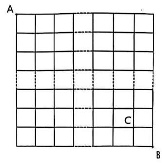

11. 如图，甲从 $A$ 到 $B$ ，乙从 $C$ 到 $D$ ，两人每次都只能向上或者向右走一格，如果两个人的线路不相交，则称这两个人的路径为一对孤立路，那么不同的孤立路一共有___对

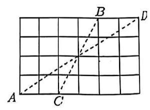

## 六、传球

12. 某篮球队的 5 名队员正在来回传球,若共传了 $n$ 次球,那么篮球能够以多少种不同的顺序在场上的 5 名选手之间传递?

13. 某球队的 $m$ 名队员正在来回传球,若共传了 $n$ 次球,如果第一个传球人是 $A$ ,请讨论 $n$ 次传球后,球回到 $A$ 手中的概率是多少。 $\left( {m \geq  2, n \geq  2}\right)$

## 第五讲 球盒模型

## 一、第一类球盒分配

1. 某高级中学将 2022 年获得省级表彰的 6 个三好学生的名额分给本校高三年级的 4 个班级, 则这 4 个班级中每个班级至少获得一个三好学生名额的概率为___

2. 16 个球中有 7 个红球, 9 个蓝球。假设相同颜色的球无法区分, 将它们放入 4 个不同的盒子中, 每个盒子放 4 个球，一共有___种放法。

3. 知两个实数集合 $A = \left\{  {{a}_{1},{a}_{2},\cdots ,{a}_{100}}\right\}  , B = \left\{  {{b}_{1},{b}_{2},\cdots ,{b}_{50}}\right\}$ ,若函数 $f\left( x\right)$ 的定义域和值域分别为 $A$ 和 $B$ ,且使得 $f\left( {a}_{1}\right)  \leq  f\left( {a}_{2}\right)  \leq  \cdots  \leq  f\left( {a}_{100}\right)$ ,求这样的函数有多少个?

## 二、第二类球盒分配

4. 某学校安排 3 名教师指导 6 个学生社团，每名教师至少指导一个社团，每个社团只需一位指导老师， 则不同的安排方式共有___

5. 将 6 名北京冬奥会志愿者分配到花样滑冰、短道速滑、冰球和冰壶 4 个项目进行服务，每名志原者只: 分配到 1 个项目，每个项目至少分配 1 名志愿者，则不同的分配方案共有___

6. 某市践行“干部村村行”活动，现有 3 名干部可供选派，下乡到 5 个村蹲点指导工作，每个村均有有 1 名干部，每个干部至多住 3 个村，则不同的选派方案共___

7. 在中国空间站某项建造任务中，需 6 名航天员在天和核心舱、问天实验舱和梦天实验舱这三个舱内同时进行工作，由于空间限制，每个舱至少 1 人，至多 3 人，则不同的安排方案共有___种。

8. 今有 6 个人组成的旅游团，包括 4 个大人 2 个孩子，准备同时乘缆车观光，现有三辆不同的缆车可供选择，每辆缆车最多可乘 3 人，为了安全起见，孩子乘缆车必须要大人陪同，则不同的乘车方式有___ 种

- 三家人出游，共 6 个大人，4 个小孩，约定星期日乘红色、白色、黑色三辆轿车结伴郊游，每辆车最多乘坐 4 人，其中两个小孩不能开车，则不同的乘车方法种数是___.

## 第六讲 计数 Plus

## 一、发现关键控制项

1. 设 ${x}_{1},{x}_{2},{x}_{3},{x}_{4} \in  \{  - 1,0,2\}$ ,那么满足 $2 \leq  \left| {x}_{1}\right|  + \left| {x}_{2}\right|  + \left| {x}_{3}\right|  + \left| {x}_{4}\right|  \leq  4$ 的所有有序数对 $\left( {{x}_{1},{x}_{2},{x}_{3},{x}_{4}}\right)$ 的组数为___

2. 从 1 到 2015 中选出三个不同的数 ${a}_{1} < {a}_{2} < {a}_{3}$ 。

(1)若三个数依次构成等差数列，有多少种取法？

(2)若 ${a}_{3} - {a}_{2} \geq  3,{a}_{2} - {a}_{1} \geq  2$ ，有多少种取法？

3. 【2024 松江二模 12】空间中有三个点 $A, B, C$ ，且 ${AB} = {BC} = {CA} = 1$ ，在空间中任取 $N - 2$ 个不同的点，使得它们与 $A, B, C$ 恰好成为一个正 $N$ 棱锥(高为小于 1 的一个定值)的 $N + 1$ 个顶点，则不同的取法有___种

4. 将前 12 个正整数构成的集合 $M = \{ 1,2,\cdots ,{12}\}$ 中的元素分成 ${M}_{1},{M}_{2},{M}_{3},{M}_{4}$ 四个三元子集，使得每个三元子集中的三个数都满足: 其中一数等于另外两数之和, 则不同的分法种数为___

5. 设 ${x}_{1},{x}_{2},{x}_{3},{x}_{4}$ 为自然数 1、2、3、4 的一个全排列,且满足 $\left| {{x}_{1} - 1}\right|  + \left| {{x}_{2} - 2}\right|  + \left| {{x}_{3} - 3}\right|  + \left| {{x}_{4} - 4}\right|  = 6$ ,则这样的排列有___个.

6. 如果数列同时满足以下四个条件:(1) ${u}_{i} \in  \mathbf{Z}\left( {i = 1,2,\cdots ,{10}}\right)$ ；(2)点 $\left( {{u}_{5},{2}^{{u}_{2} + {u}_{6}}}\right)$ 在函数 $y = {4}^{x}$ 的图像上; (3) 向量 $\bar{a} = \left( {1,{u}_{1}}\right)$ 与 $\bar{b} = \left( {3,{u}_{10}}\right)$ 互相平行; (4) ${u}_{i + 1} - {u}_{i}$ 与 $\frac{2}{{u}_{i + 1} - {u}_{i}}$ 的等差中项为 $\frac{3}{2} \; \left( {i = 1,2,\cdots ,9}\right)$ ; 那么，这样的数列 ${u}_{1}$ ， ${u}_{2}$ ， $\cdots$ ， ${u}_{10}$ 的个数为___

## 二、集合计数

7. 已知集合 $A = \left\{  {x = {a}_{0} + 3{a}_{1} + {3}^{2}{a}_{2} + {3}^{3}{a}_{3}}\right\}$ ，其中 ${a}_{i} \in  \{ 0,1,2\} \left( {i = 0,1,2,3}\right)$ ，且 ${a}_{3} \neq  0$ ，则 $A$ 中所有元素之和为___。

8. 有限集 $S$ 的全部元素的积称为该数集的 “积数”,例如 $\{ 2\}$ 的 “积数” 为 2, $\{ 2,3\}$ 的 “积数” 为 6, $\left\{  {1,\frac{1}{2},\frac{1}{3},\cdots ,\frac{1}{n}}\right\}$ 的 “积数” 为 $\frac{1}{n!}$ ，则数集 $M = \left\{  {x\left| {\;x = \frac{1}{n}}\right. ,2 \leq  n \leq  {2021}, n \in  {\mathbf{N}}^{ * }}\right\}$ 的所有非空子集的 “积数” 的和为___

9. 设集合 $M = \{ 1,2,3,\cdots , n\}$ ，对 $M$ 的任一非空子集 $A, A$ 中的最大数与最小数的和称为 $A$ 的特征，记为 $m\left( A\right)$ ，则 $M$ 的所有非空子集的特征的平均数为___.

10. 已知集合 $U = \{ 1,2,\cdots , n\} \left( {n \in  {\mathrm{N}}^{ * }, n \geq  2}\right)$ ，对于集合 $U$ 的两个非空子集 $A$ 、 $B$ ，若 $A \cap  B = \varnothing$ ，则称 $\left( {A, B}\right)$ 为集合 $U$ 的一组“互斥子集”. 记集合的所有“互斥子集”的组数为 $f\left( n\right)$ (视 $\left( {A, B}\right)$ 与 $\left( {B, A}\right)$ 为同一组“互斥子集”),则 $f\left( 4\right)  =$ ___.

## 三、空间几何

11. 【2023 上海高考 12】空间中有三个点 $A, B, C$ ，且 ${AB} = {BC} = {CA} = 1$ ，在空间中任取 2 个不同的点，使得它们与 $A, B, C$ 恰好成为一个正 4 棱锥的 4 个顶点,则不同的取法有___种

12. 空间中有三个点 $A, B, C$ ,且 ${AB} = {BC} = {CA} = 1$ ，在空间中任取 5 个不同的点，使得它们与 $A, B, C$ 恰好成为一个正 7 棱锥的 8 个顶点, 则不同的取法有___种

## 13. 正方体的 12 条棱中共有多少条异面直线?

## 14. 用正方体的八个顶点中的两点连线, 可构成多少对异面直线?

## 15. 以正方体的 8 个顶点中的 4 个为顶点, 可组成多少个四面体?

16. 四面体的棱中点和顶点共 10 个点:

(1)从中任取 3 个点确定一个平面, 共能确定多少个平面?

## (2)以这 10 个点为顶点，共能确定多少格凸棱锥?

## 第七讲 概率

## 一、条件概率

<table><tr><td>定义</td><td>一般地,当事件 $B$ 发生的概率大于 0 时(即 $P\left( B\right)  > 0$ ),已知事件 $\underline{B}$ 发生的条件下事件 $A$ 发生的概率,称为事件概率</td></tr><tr><td>表示</td><td>$P\left( {A \mid  B}\right)$</td></tr><tr><td>计算   公式</td><td>$P\left( {A \mid  B}\right)  = \frac{P\left( {A \cap  B}\right) }{P\left( B\right) }$</td></tr></table>

条件概率的性质

(1) $0 \leq  P\left( {B \mid  A}\right)  \leq  1$ ；

(2) $P\left( {A \mid  A}\right)  = \underline{1}$ ；

(3)如果 $B$ 与 $C$ 互斥，则 $P\left( {B \cup  C \mid  A}\right)  = P\left( {B \mid  A}\right)  + P\left( {C \mid  A}\right)$ .

【两点说明】

1. 如果知道事件 $A$ 发生会影响事件 $B$ 发生的概率,那么 $P\left( B\right)  \neq  P\left( {B \mid  A}\right)$ ;

2. 已知 $A$ 发生,在此条件下 $B$ 发生,相当于 ${AB}$ 发生,要求 $P\left( {B \mid  A}\right)$ ,相当于把 $A$ 看作新的基本事件空间计算 ${AB}$ 发生的概率,即 $P\left( {B \mid  A}\right)  = \frac{n\left( {AB}\right) }{n\left( A\right) } = \frac{\frac{n\left( {AB}\right) }{n\left( \Omega \right) }}{\frac{n\left( A\right) }{n\left( \Omega \right) }} = \frac{P\left( {AB}\right) }{P\left( A\right) }$ .

1. 一个袋中有 2 个黑球和 3 个白球,如果不放回地抽取两个球,记事件“第一次抽到黑球”为 $A$ ; 事件“第二次抽到黑球”为 $B$ .

(1)分别求事件 $A, B, A \cap  B$ 发生的概率；

(2)求 $P\left( {B \mid  A}\right)$ .

2. 现有 6 个节目准备参加比赛，其中 4 个舞蹈节目，2 个语言类节目，如果不放回地依次抽取 2 个节目, 求:

(1)第 1 次抽到舞蹈节目的概率；

(2)第 1 次和第 2 次都抽到舞蹈节目的概率；

(3)在第 1 次抽到舞蹈节目的条件下，第 2 次抽到舞蹈节目的概率.

3. 在一个袋子中装有 10 个球, 设有 1 个红球, 2 个黄球, 3 个黑球, 4 个白球, 从中依次摸 2 个球, 求在第一个球是红球的条件下，第二个球是黄球或黑球的概率.

## 二、全概率公式

(1) $P\left( B\right)  = P\left( A\right) P\left( {B \mid  A}\right)  + P\left( \bar{A}\right) P\left( {B \mid  \bar{A}}\right)$ ;

(2)定理 1 若样本空间 $\Omega$ 中的事件 ${A}_{1},{A}_{2},\ldots ,{A}_{n}$ 满足:

①任意两个事件均互斥，即 ${A}_{i}{A}_{j} = \varnothing , i, j = 1,2,\ldots , n$ ， i +j;

② ${A}_{1} + {A}_{2} + \ldots  + {A}_{n} = \Omega$ ；

③ $P\left( {A}_{i}\right)  > 0, i = 1,2,\ldots , n$ .

则对 $\Omega$ 中的任意事件 $B$ ,都有 $B = B{A}_{1} + B{A}_{2} + \ldots  + B{A}_{n}$ ,且

$$
P\left( B\right)  = \mathop{\sum }\limits_{{l = 1}}^{n}P\left( {B{A}_{l}}\right)  = \mathop{\sum }\limits_{{i = 1}}^{n}P\left( {A}_{i}\right) P\left( {B \mid  {A}_{i}}\right) .
$$

> 贝叶斯公式

(1)一般地，当 $0 < P\left( A\right)  < 1$ 且 $P\left( B\right)  > 0$ 时，有

$$
P\left( {A \mid  B}\right)  = \frac{P\left( A\right) P\left( {B \mid  A}\right) }{P\left( B\right) }
$$

$= \frac{P\left( A\right) P\left( {B \mid  A}\right) }{P\left( A\right) P\left( {B \mid  A}\right)  + P\left( \bar{A}\right) P\left( {B \mid  \bar{A}}\right) }.$

(2)定理 2 若样本空间 $\Omega$ 中的事件 ${A}_{1},{A}_{2},\ldots ,{A}_{n}$ 满足:

①任意两个事件均互斥，即 ${A}_{i}{A}_{j} = \varnothing , i, j = 1,2,\ldots , n$ ， $i \neq  j$ ；

$$
\text{ ② }{A}_{1} + {A}_{2} + \ldots  + {A}_{n} = \Omega \text{ ； }
$$

③ $1 > P\left( {A}_{i}\right)  > 0, i = 1,2,\ldots , n$ .

则对 $\Omega$ 中的任意概率非零的事件 $B$ ,有

$$
P\left( {{A}_{j} \mid  B}\right)  = \frac{P\left( {A}_{j}\right) P\left( {B \mid  {A}_{j}}\right) }{P\left( B\right) } = \frac{P\left( {A}_{j}\right) P\left( {B \mid  {A}_{j}}\right) }{\mathop{\sum }\limits_{{i = 1}}^{n}P\left( {A}_{i}\right) P\left( {B \mid  {A}_{i}}\right) }.
$$

(3)贝叶斯公式充分体现了 $P\left( {A \mid  B}\right) , P\left( A\right) , P\left( B\right) , P\left( {B \mid  A}\right) , P\left( {B \mid  \bar{A}}\right) , P\left( {AB}\right)$ 之间的转化. 即 $P\left( {A \mid  B}\right)  = \; \frac{P\left( {AB}\right) }{P\left( B\right) }, P\left( {AB}\right)  = P\left( {A \mid  B}\right) P\left( B\right)  = P\left( {B \mid  A}\right) P\left( A\right) , P\left( B\right)  = P\left( A\right) P\left( {B \mid  A}\right)  + P\left( \bar{A}\right) P\left( {B \mid  \bar{A}}\right)$ 之间的内在联系.

4. 甲箱的产品中有 5 个正品和 3 个次品, 乙箱的产品中有 4 个正品和 3 个次品.

(1)从甲箱中任取 2 个产品，求这 2 个产品都是次品的概率；

(2)若从甲箱中任取 2 个产品放入乙箱中，然后再从乙箱中任取一个产品，求取出的这个产品是正品的概率.

5. 一项血液化验用来鉴别是否患有某种疾病. 在患有此种疾病的人群中，通过化验有 ${95}\%$ 的人呈阳性反应, 而健康的人通过化验也会有 1%的人呈阳性反应. 某地区此种病的患者仅占人口的 0.5%. 若某人化验结果为阳性, 问此人确实患有此病的概率是多大?

6. 假定具有症状 $S = \left\{  {{S}_{1},{S}_{2},{S}_{3},{S}_{4}}\right\}$ 的疾病有 ${d}_{1},{d}_{2},{d}_{3}$ 三种，现从 20000 份患有疾病 ${d}_{1},{d}_{2},{d}_{3}$ 的病历卡中统计得到下列数字:

<table><tr><td>疾病</td><td>人数</td><td>出现 $S$ 症状人数</td></tr><tr><td>${d}_{1}$</td><td>7 750</td><td>7500</td></tr><tr><td>${d}_{2}$</td><td>5 250</td><td>4 200</td></tr><tr><td>${d}_{3}$</td><td>7000</td><td>3500</td></tr></table>

试问当一个具有 $S$ 中症状的病人前来要求诊断时，他患有疾病的可能性是多少？在没有别的资料可依据的诊断手段情况下，诊断该病人患有这三种疾病中哪一种较合适？

## 三、事件的独立性

(1)事件 $A$ 与 $B$ 相互独立的充要条件是

$P\left( {AB}\right)  = P\left( A\right) P\left( B\right) .$

(2)当 $P\left( B\right)  > 0$ 时， $A$ 与 $B$ 独立的充要条件是 $P\left( {A \mid  B}\right)  = P\left( A\right)$ .

(3)如果 $P\left( A\right)  > 0, A$ 与 $B$ 独立，则 $P\left( {B \mid  A}\right)  = P\left( B\right)$ 成立. $P\left( {B \mid  A}\right)  = \frac{P\left( {AB}\right) }{P\left( A\right) } = \frac{P\left( A\right) P\left( B\right) }{P\left( A\right) } = P\left( B\right)$ .

7. 判断下列各对事件是否是相互独立事件.

(1)甲组3 名男生，2 名女生；乙组 2 名男生，3 名女生. 现从甲、乙两组中各选1 名同学参加演讲比赛, “从甲组中选出 1 名男生”与“从乙组中选出 1 名女生”;

(2)容器内盛有 5 个白乒乓球和 3 个黄乒乓球，“从 8 个球中任意取出 1 个，取出的是白球”与“从剩下的 7 个球中任意取出 1 个, 取出的还是白球”;

(3)掷一颗骰子一次，“出现偶数点”与“出现 3 点或 6 点”.

8. 面对某种流感病毒，各国医疗科研机构都在研究疫苗，现有 $A, B, C$ 三个独立的研究机构在一定的时期内能研制出疫苗的概率分别是 $\frac{1}{5},\frac{1}{4},\frac{1}{3}$ . 求:

(1)他们都研制出疫苗的概率；

(2)他们都失败的概率；

(3)他们能够研制出疫苗的概率.

9. 在一段线路中并联着 3 个自动控制的常开开关, 只要其中 1 个开关能够闭合, 线路就能正常工作. 假定在某段时间内每个开关能够闭合的概率都是 0.7 , 计算在这段时间内线路正常工作的概率.

10. 一枚质地均匀的正方体骰子,其六个面分别刻有1,2,3,4,5,6六个数字,投掷这枚骰子两次, $A$ 表示事件“第一次向上一面的数字是 1”， $B$ 表示事件“第二次向上一面的数字是 2”， $C$ 表示事件“两次向上一面的数字之和是 7”， $D$ 表示事件“两次向上一面的数字之和是 8”，则()

A. $C$ 与 $D$ 相互独立 B. $A$ 与 $D$ 相互独立

C. $B$ 与 $D$ 相互独立 D. $A$ 与 $C$ 相互独立

11. 甲箱中有 5 个红球, 2 个白球和 3 个黑球, 乙箱中有 4 个红球, 3 个白球和 3 个黑球。假设同颜色球无法分辨,先从甲箱中随机取出一球放入乙箱中有 4 个红球,3 个白球和 3 个黑球。假设同颜色球和黑球的事件,再从乙箱中随机取出一球放入乙箱,分别以 ${A}_{1},{A}_{2},{A}_{3}$ 表示由甲箱中取出的球是红球、白球确的是___

①事件 ${A}_{1},{A}_{2}$ 相互独立; ② $P\left( {A}_{3}\right)  = \frac{1}{5}$ ；③ $P\left( B\right)  = \frac{9}{22}$ ；④ $P\left( {B \mid  {A}_{2}}\right)  = \frac{4}{11}$ ；⑤ $P\left( {{A}_{1} \mid  B}\right)  = \frac{5}{9}$

12. 已知 $A, B$ 是两个事件，且 $0 < P\left( B\right)  < 1$ ，则事件 $A, B$ 相互独立的充分必要条件可以是___

① $P\left( {AB}\right)  = 0$ ；② $P\left( {A\bar{B}}\right)  = P\left( A\right) P\left( \bar{B}\right)$ ；③ $P\left( {A \mid  B}\right)  = P\left( {A \mid  \bar{B}}\right)$

④ ${P}^{2}\left( {AB}\right)  + {P}^{2}\left( {\overline{A}B}\right)  + {P}^{2}\left( {A\overline{B}}\right)  + {P}^{2}\left( {\overline{A}\overline{B}}\right)  = \frac{1}{4}$

## 第八讲 统计

## 一、随机抽样

## 简单随机抽样

(1)放回简单随机抽样与不放回简单随机抽样

(2)简单随机抽样需满足:① 被抽取的样本和总体的个体数有限；②逐个抽取；③等可能抽取。

(3)简单随机抽样常用抽签法(适用于总体中个体数较少的情况)、随机数法(适用于总体中个体数较多的情况)。

(4)在使用随机数法时，编号位数要相同，如遇到三位数(或四位数)，可从选择的随机数表中的某行某列的数字计起,每三个(或四个)作为一个单位,按某种顺序依次选取,有超过总体号码或出现重复号码的数字舍去。

(5)总体与样本的均值

总体中有 $N$ 个个体,它们的变量值分别为 ${Y}_{1},{Y}_{2},\ldots ,{Y}_{N}$ ,则总体均值 $\bar{Y} = \frac{{Y}_{1} + {Y}_{2} + \cdots  + {Y}_{N}}{N} = \frac{1}{N}\mathop{\sum }\limits_{{i = 1}}^{N}{Y}_{i}$ 。

从总体中抽取一个容量为 $n$ 的样本,它们的变量值分别为 ${y}_{1},{y}_{2},\ldots ,{y}_{n}$ ,则样本均值 $\bar{y} = \frac{{y}_{1} + {y}_{2} + \cdots  + {y}_{n}}{n} = \; \frac{1}{n}\mathop{\sum }\limits_{{i = 1}}^{n}{yi}$ 。

1. 下列抽样试验中,适合用抽签法的是( )

A. 从某工厂生产的 3 000 件产品中抽取 600 件进行质量检验

B. 从某工厂生产的两箱(每箱 15 件)产品中抽取 6 件进行质量检验

C. 从甲、乙两厂生产的两箱(每箱 15 件)产品中抽取 6 件进行质量检验

D.从某厂生产的 3000 件产品中抽取 10 件进行质量检验

2. 从总体量为 $N$ 的一批零件中使用简单随机抽样的方法抽取一个容量为 40 的样本。若某个零件在第 2 次抽取时被抽到的可能性为 1%，则 $N =$ ___

3. 总体由编号为 01,02,...,29,30 的 30 个个体组成。利用下面的随机数表选取 6 个个体，选取方法是从如下随机数表的第 1 行的第 6 列和第 7 列数字开始由左到右依次选取两个数字，则选出来的第 6 个个体的编号为___

7816623208026242

6252536997280198

3204923449358200

3623486969387481

## 分层随机抽样

(1)定义:一般地，按一个或多个变量把总体划分成若干个子总体，每个个体属于且仅属于一个子总体，在每个子总体中独立地进行简单随机抽样，再把所有子总体中抽取的样本合在一起作为总样本，这样的抽样方法称为分层随机抽样，每一个子总体称为层。

$$
\text{ 抽样比 } = \frac{\text{ 该层样本量 }\mathrm{n}}{\text{ 总样本量 }\mathrm{N}} = \frac{\text{ 该层抽取的个体数 }}{\text{ 该层的个体数 }}\text{ 。 }
$$

(2)比例分配:在分层随机抽样中，如果每层样本量都与层的大小成比例，那么称这种样本量的分配方式为比例分配。

(3)分层随机抽样平均数的计算:如果层数分为 2 层,第 1 层和第 2 层包含的个体数分别为 $M$ 和 $N$ ,抽取的样本量分别为 $m$ 和 $n$ ,总体平均数分别为 $\bar{X}$ 和 $\bar{Y}$ ,样本平均数分别为 $\bar{x}$ 和 $\bar{y}$ ,总体平均数为 $\bar{W}$ ,样本平均数为 $\bar{w}$ , 则 $\bar{W} = \frac{M\bar{X} + N\bar{Y}}{M + N},\bar{w} = \frac{m\bar{x} + n\bar{y}}{m + n}$ 。

请注意:

✓ 在比例分配的分层随机抽样中,可以直接用样本平均数 $\bar{w}$ 估计总体平均数 $\bar{W}$ 。

$\times$ 不是比例分配的分层随机抽样中不能用样本平均数 $\bar{w}$ 估计总体平均数 $\bar{W}$ 。

4. 在调查某中学的学生身高时,利用比例分配的分层随机抽样的方法抽取男生 20 人,女生 15 人,得到了男生身高的平均值为 170 cm，女生身高的平均值为 165 cm。则该中学所有学生的平均身高约为___cm。 (保留两位小数)

5. 已知我国某省二、三、四线城市的数量之比为 1:3:6。2023 年 3 月份调查得知该省二、三、四线城市的总房产均价为 0.8 万元/平方米、总方差为 11，其中三、四线城市的房产均价分别为 1 万元/平方米、 0.5 万元/平方米,三、四线城市房价的方差分别为 10,8,则二线城市的房产均价为___万元/平方米。

## 二、统计图表

(1)常见的统计图表有条形图、扇形图、折线图、频率分布直方图等。

(2)作频率分布直方图的步骤:

①求极差; ②决定组距与组数; ③将数据分组;④ 列频率分布表;⑤画频率分布直方图。

(3)统计图表的主要应用

扇形图:直观描述各类数据占总数的比例;

折线图:描述数据随时间的变化趋势;

条形图:直观描述不同类别或分组数据的频数和频率。

6. 某中学组织三个年级的学生进行党史知识竞赛,经统计,得到前 200 名学生分布的扇形图(如图①)和前 200 名中高一学生排名分布的频率条形图(如图②),则下列选项正确的是___

A. 成绩前 200. 名的 200 人中，高一人数比高二人数多 30

B. 成绩第 1~100 名的 100 人中,高一人数不超过一半

C. 成绩第 1~50 名的 50 人中,高三最多有 32 人

D. 成绩第 51~100 名的 50 人中,高二人数比高一的多

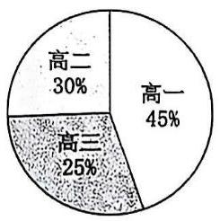

①

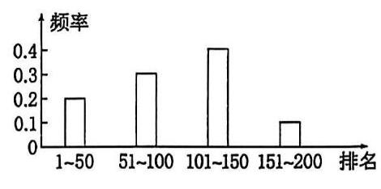

7. 如图是甲、乙两人高考前 10 次数学模拟成绩的折线图,则下列说法错误的是( )

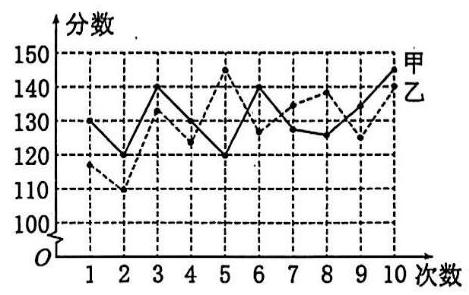

A. 甲的数学成绩最后 3 次逐渐升高

B. 甲的数学成绩在 130 分及以上的次数多于乙的数学成绩在 130 分及以上的次数

C. 甲有 5 次考试成绩比乙高

D. 甲数学成绩的极差小于乙数学成绩的极差

8. 某研究小组经过研究发现某种疾病的患病者与未患病者的某项医学指标有明显差异，经过大量调查，得到如下的患病者和未患病者该指标的频率分布直方图:

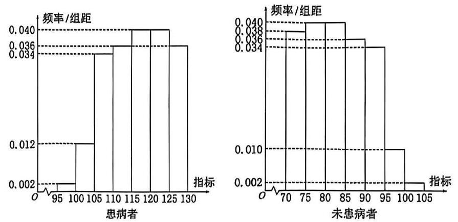

利用该指标制定一个检测标准,需要确定临界值 $c$ ,将该指标大于 $c$ 的人判定为阳性,小于或等于 $c$ 的人判定为阴性。此检测标准的漏诊率是将患病者判定为阴性的概率，记为 $p\left( c\right)$ ；误诊率是将未患病者判定为阳性的概率， 记为 $q\left( c\right)$ 。假设数据在组内均匀分布，以事件发生的频率作为相应事件发生的概率。

(1)当漏诊率 $p\left( c\right)  = {0.5}\%$ 时，求临界值 $c$ 和误诊率 $q\left( c\right)$ ；

(2)设函数 $f\left( c\right)  = p\left( c\right)  + q\left( c\right)$ 。当 $c \in  \left\lbrack  {{95},{105}}\right\rbrack$ 时，求 $f\left( c\right)$ 的解析式，并求 $f\left( c\right)$ 在区间 $\left\lbrack  {{95},{105}}\right\rbrack$ 的最小值。

## 三、统计量

## 百分位数

(1)一般地，一组数据的第 $p$ 百分位数是这样一个值，它使得这组数据中至少有 $p\%$ 的数据小于或等于这个值， 且至少有 $\left( {{100} - p}\right) \%$ 的数据大于或等于这个值。

(2)四分位数。常用的分位数有第 25 百分位数,第 50 百分位数(即中位数),第 75 百分位数。这三个分位数把一组由小到大排列后的数据分成四等份，因此称为四分位数。其中第 25 百分位数也称为第一四分位数或下四分位数等，第 75 百分位数也称为第三四分位数或上四分位数等。

(3)确定要求的 $p\%$ 分位数所在分组 $\lbrack A, B)$ ，由频率分布表或频率分布直方图可知，样本中小于 $A$ 的频率为 $a$ ， 小于 $B$ 的频率为 $b$ ，所以 $p\%$ 分位数 $= A +$ 组距 $\times  \frac{p\%  - a}{b - a}$ 。

9. 某车间 12 名工人一天生产某产品(单位: $\mathrm{{kg}}$ )的数量分别为13.8,13,13.5,15.7,13.6,14.8,14,14.6,15,15.2,15.8, 15.4,则所给数据的第 25,75 百分位数分别是___

10. 如图所示是某市 3 月 1 日至 3 月 10 日最低气温(单位: ${}^{ \circ  }\mathrm{C}$ )的情况绘制的折线统计图，由图可知这 10 天最低气温的第 80 百分位数是___

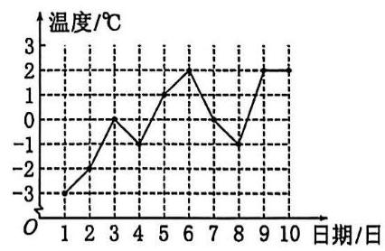

11. 为了解“双减”政策实施后学生每天的体育活动时间，研究人员随机调查了某地区 1 000 名学生每天进行体育运动的时间，按照时长 (单位: $\mathrm{{min}}$ ) 分成 6 组:第一组 [30,40)，第二组 [40,50)，第三组 [50,60)，第四组 [60,70),第五组[70,80),第六组[80,90],经整理得到如图所示的频率分布直方图,则可以估计该地区学生每天体育活动时间的第 25 百分位数约为___min。

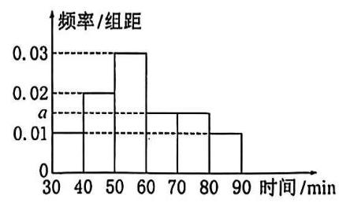

众数、中位数、平均数(数据集中估计量)

<table><tr><td>数字特征</td><td>样本数据</td><td>频率分布直方图</td></tr><tr><td>众数</td><td>出现次数最多的数据</td><td>取最高的小矩形底边中点的横坐标</td></tr><tr><td>中位数</td><td>将数据按大小依次排列，处在最中间位置的一个数据(或最中间两个数据的平均数)</td><td>把频率分布直方图划分为左右两个面积相等的部分,分界线与 $x$ 轴交点的横坐标</td></tr><tr><td>平均数</td><td>样本数据的算术平均数 $\bar{x} = \frac{1}{n}\left( {{x}_{1} + {x}_{2} + \ldots  + {x}_{n}}\right)$</td><td>每个小矩形的面积乘小矩形底边中点的横坐标之和</td></tr></table>

12. 样本数据 16,24,14,10,20,30,12,14,40 的中位数为___

13. 为了解某校今年准备报考飞行员的学生的体重情况，将所得的数据整理后，画出了频率分布直方图(如图) 已知图中从左到右的前 3 个小组的频率之比为 $1 : 2 : 3$ ，第 1 个小组的频数为 6 ，则报考飞行员的学生人数是 ___

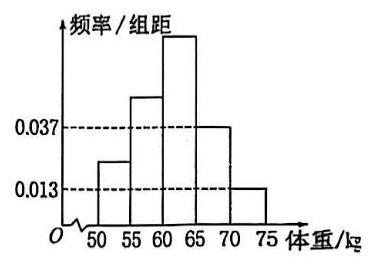

14. 10 名工人某天生产同一零件，生产的件数是:15,17,14,10,15,17,17,16,14,12，设其平均数为 $a$ ，中位数为 $b$ ，众数为 $c$ ，则将它们按从小到大排序为___

## 方差和标准差(数据离散程度估计量)

(1)假设一组数据是 ${x}_{1},{x}_{2},\ldots ,{x}_{n}$ ，用 $\bar{x}$ 表示这组数据的平均数，则我们称 $\frac{1}{n}\mathop{\sum }\limits_{{i = 1}}^{n}{\left( {x}_{i} - \bar{x}\right) }^{2}$ 为这组数据的方差。有时为了计算方差的方便,我们还把方差写成 $\frac{1}{n}\mathop{\sum }\limits_{{i = 1}}^{n}{x}_{i}^{2} - {\bar{x}}^{2}$ 的形式。为了与原始数据的单位一致,我们对方差开平方,取它的算术平方根 $\sqrt{\frac{1}{n}\mathop{\sum }\limits_{{i = 1}}^{n}{\left( {x}_{i} - \bar{x}\right) }^{2}}$ ,称为这组数据的标准差。

(2)方差和标准差刻画了数据的离散程度或波动幅度。

方差: $\frac{{s}^{2} - \frac{1}{n}\left\lbrack  {{\left( {x}_{1} - \bar{x}\right) }^{2} + {\left( {x}_{2} - \bar{x}\right) }^{2} + \ldots  + {\left( {x}_{n} - \bar{x}\right) }^{2}}\right\rbrack  }{2}$ 。标准差: $s = \sqrt{\frac{1}{n}\left\lbrack  {{\left( {x}_{1} - \bar{x}\right) }^{2} + {\left( {x}_{2} - \bar{x}\right) }^{2} + \cdots  + {\left( {x}_{n} - \bar{x}\right) }^{2}}\right\rbrack  }$ 。

(3)分层随机抽样的均值与方差。

分层随机抽样中,如果样本量是按比例分配,记总的样本平均数为 $\bar{w}$ ,样本方差为 ${s}^{2}$ 。

以分两层抽样的情况为例。假设第一层有 $m$ 个数，分别为 ${x}_{1}$ ， ${x}_{2}$ ， ${x}_{3}$ ，平均数为 $\bar{x}$ ，方差为 ${s}_{1}^{2}$ ；第二层有 $n$ 个数,分别为 ${y}_{1},{y}_{2},\ldots ,{y}_{n}$ ,平均数为 $\bar{y}$ ,方差为 ${s}_{2}^{2}$ ,则 $\bar{x} = \frac{1}{m}\mathop{\sum }\limits_{{i = 1}}^{m}{xi},{s}_{1}^{2} = \frac{1}{m}\mathop{\sum }\limits_{{i = 1}}^{m}\left( {{xi} - \bar{x}}\right) 2,\bar{y} = \frac{1}{n}\mathop{\sum }\limits_{{i = 1}}^{n}{yi},{s}_{2}^{2} = \; \frac{1}{n}\mathop{\sum }\limits_{{i = 1}}^{n}\left( {{yi} - \bar{y}}\right) 2$

则 $\left( \overline{\lambda }\right) \bar{w} = \frac{m}{m + n}\bar{x} + \frac{n}{m + n}\bar{y}$ ;

② ${s}^{2} = \frac{1}{m + n}\left\{  {m\left\lbrack  {{s}_{1}^{2} + {\left( \bar{x} - \bar{w}\right) }^{2}}\right\rbrack   + n\left\lbrack  {{s}_{2}^{2} + {\left( \bar{y} - \bar{w}\right) }^{2}}\right\rbrack  }\right\}$ 。

15. 如图所示，样本 $A$ 和 $B$ 分别取自两个不同的总体，它们的样本平均数分别为 ${\bar{x}}_{A}$ 和 ${\bar{x}}_{B}$ ，样本标准差分别为 ${s}_{A}$ 和 ${s}_{{B}_{3}}$ 则(   )

A. ${\bar{x}}_{A} > {\bar{x}}_{B},{s}_{A} > {s}_{B}$ B. ${\bar{x}}_{A} < {\bar{x}}_{B},{s}_{A} > {s}_{B}$ C. ${\bar{x}}_{A} > {\bar{x}}_{B},{s}_{A} < {s}_{B}$ D. ${\bar{x}}_{A} < {\bar{x}}_{B},{s}_{A} < {s}_{B}$

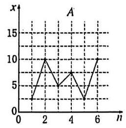

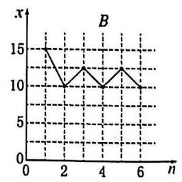

16. 有一组样本数据 ${x}_{1},{x}_{2},\ldots ,{x}_{n}$ ,由这组数据得到新样本数据 ${y}_{1},{y}_{2},\ldots ,{y}_{n}$ ,其中 ${y}_{i} = {x}_{i} + c\left( {i = 1,2,\ldots , n}\right) , c$ 为非零常数. 则( )

A. 两组样本数据的样本平均数相同 B. 两组样本数据的样本中位数相同

C. 两组样本数据的样本标准差相同 D. 两组样本数据的样本极差相同

17. 某厂为比较甲、乙两种工艺对橡胶产品伸缩率的处理效应,进行 10 次配对试验,每次配对试验选用材质相同的两个橡胶产品,随机地选其中一个用甲工艺处理,另一个用乙工艺处理,测量处理后的橡胶产品的伸缩率,甲、乙两种工艺处理后的橡胶产品的伸缩率分别记为 ${x}_{i},{y}_{i}\left( {i = 1,2,\ldots ,{10}}\right)$ ,试验结果如下:

<table><tr><td>试验序号 $i$</td><td>1</td><td>2</td><td>3</td><td>4</td><td>5</td><td>6</td><td>7</td><td>8</td><td>9</td><td>10</td></tr><tr><td>伸缩率 ${x}_{i}$</td><td>545</td><td>533</td><td>551</td><td>522</td><td>575</td><td>544</td><td>541</td><td>568</td><td>596</td><td>548</td></tr><tr><td>伸缩率 ${y}_{i}$</td><td>536</td><td>527</td><td>543</td><td>530</td><td>560</td><td>533</td><td>522</td><td>550</td><td>576</td><td>536</td></tr></table>

记 ${z}_{i} = {x}_{i} - {y}_{i}\left( {i = 1,2,\ldots ,{10}}\right) ,{z}_{1},{z}_{2},\ldots ,{z}_{10}$ 的样本平均数为 $\bar{z}$ ,样本方差为 ${s}^{2}$ 。

(1)求 $\bar{z}$ ， ${s}^{2}$ ；

(2)判断甲工艺处理后的橡胶产品的伸缩率较乙工艺处理后的橡胶产品的伸缩率是否有显著提高(如果 $\bar{z} \geq \; 2\sqrt{\frac{{s}^{2}}{10}}$ ,则认为甲工艺处理后的橡胶产品的伸缩率较乙工艺处理后的橡胶产品的伸缩率有显著提高,否则不认为有显著提高)。

## 第九讲 随机分布

1. 某同学在课外阅读时了解到概率统计中的 Markov 不等式,该不等式描述的是对非负的随机变量 $X$ 和任意的正数 $a$ ,都有 $P\left( {X \geq  a}\right)  \leq  f\left( {E\left\lbrack  X\right\rbrack  , a}\right)$ ,其中 $f\left( {E\left\lbrack  X\right\rbrack  , a}\right)$ 是关于数学期望 $E\left\lbrack  X\right\rbrack$ 和 $a$ 的表达式。 由于记忆模糊,该同学只能确定 $f\left( {E\left\lbrack  X\right\rbrack  , a}\right)$ 是下列选项中的某一个,根据你的理解,该形式为 ( )

(A) ${aE}\left\lbrack  X\right\rbrack$ (B) $\frac{1}{{aE}\left\lbrack  X\right\rbrack  }$ (C) $\frac{a}{E\left\lbrack  X\right\rbrack  }$ (D) $\frac{E\left\lbrack  X\right\rbrack  }{a}$

## 2. 本市对全区高中生的身高(单位:厘米)进行统计，得到如下的频率分布直方图:

## (1)若数据分布均匀，记随机变量 $X$ 为各区间中点所代表的身高，写出 $X$ 的分布及期望；

(2)已知本市身高在区间 $\left\lbrack  {{180},{210}}\right\rbrack$ 的市民人数约占全市总人数的 10%，且全市高中生约占全市总人数的 1.2%，现在要以该区本次统计数据估算全市高中生身高情况，从本市市民中任取 1 人，若此人的身高位于区间 $\left\lbrack  {{180},{210}}\right\rbrack$ ,试估算此人是高中生的概率;

(3)现从身高在区间 $\lbrack {170},{190})$ 的高中生中分层抽样抽取一个 80 人的样本，若身高在区间 $\lbrack {170},{180})$ 中样本的均值为 ${176}\mathrm{\;{cm}}$ ,方差为 10; 身高在区间 $\lbrack {180},{190})$ 中样本的均值为 ${184}\mathrm{\;{cm}}$ ,方差为 16; 试求这 80 人的方差。

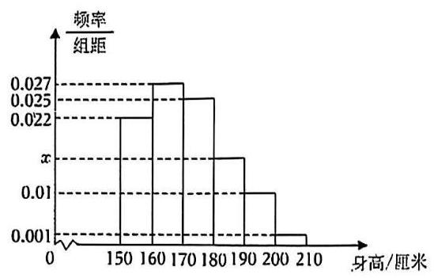

## 二、随机数的离散分布

## > 均匀分布 (Uniform distribution)

状态空间 $\Omega$ 中共有 $n$ 个事件，每个事件发生的概率完全相同，均为 $\frac{1}{n}$ 。这是最简单的一种分布，也是大部分概率讨论的基础假设。

$>$ 二项分布(Binomial distribution)

某事件发生情况 $A$ 的概率为 $p$ ,不发生的情况为 $1 - p$ 。则重复 $n$ 次这样的事件(且相互独立)，情况 $A$ 发生的次数构成的分布列,称为二项分布,记作 $X \sim  B\left( {n, p}\right)$ :

$P\left( {X = k}\right)  = {C}_{n}^{k}{p}^{k}{\left( 1 - p\right) }^{n - k}$ (表示情况 $A$ 发生 $k$ 次 $\left( {k = 0,1,2,\cdots , n}\right)$ 的概率)， $E\left( X\right)  = {np}$ ，

$D\left( x\right)  = {np}\left( {1 - p}\right)$

证明: $E\left( X\right)  = \mathop{\sum }\limits_{{k = 0}}^{n}k \cdot  P\left( {X = k}\right)  = 0 \cdot  P\left( {X = 0}\right)  + \mathop{\sum }\limits_{{k = 1}}^{n}k{C}_{n}^{k}{p}^{k}{\left( 1 - p\right) }^{n - k} = \mathop{\sum }\limits_{{k = 1}}^{n}k{C}_{n}^{k}{p}^{k}{\left( 1 - p\right) }^{n - k}$

由于 $k{C}_{n}^{k} = n{C}_{n - 1}^{k - 1}$ ,再令 $m = k - 1$ ,有

$$
E\left( X\right)  = \mathop{\sum }\limits_{{k = 1}}^{n}n{C}_{n - 1}^{k - 1}{p}^{k}{\left( 1 - p\right) }^{n - k} = n\mathop{\sum }\limits_{{m = 0}}^{{n - 1}}{C}_{n - 1}^{m}{p}^{m + 1}{\left( 1 - p\right) }^{n - 1 - m} = {np}\mathop{\sum }\limits_{{m = 0}}^{{n - 1}}{C}_{n - 1}^{m}{p}^{m}{\left( 1 - p\right) }^{n - 1 - m}
$$

$$
= {np}{\left\lbrack  1 + \left( 1 - p\right) \right\rbrack  }^{n - 1} = {np}
$$

$$
E\left( {X}^{2}\right)  = \mathop{\sum }\limits_{{k = 0}}^{n}{k}^{2} \cdot  P\left( {X = k}\right)  = 0 \cdot  P\left( {X = 0}\right)  + \mathop{\sum }\limits_{{k = 1}}^{n}{k}^{2}{C}_{n}^{k}{p}^{k}{\left( 1 - p\right) }^{n - k} = {np}\mathop{\sum }\limits_{{k = 1}}^{n}k{C}_{n - 1}^{k - 1}{p}^{k - 1}{\left( 1 - p\right) }^{n - k}
$$

$$
= {np}\mathop{\sum }\limits_{{k = 1}}^{n}\left( {k - 1}\right) {C}_{n - 1}^{k - 1}{p}^{k - 1}{\left( 1 - p\right) }^{n - k} + {np}\mathop{\sum }\limits_{{k = 1}}^{n}{C}_{n - 1}^{k - 1}{p}^{k - 1}{\left( 1 - p\right) }^{n - k}
$$

$$
= {np} \cdot  0 \cdot  {C}_{n - 1}^{0}{p}^{0}{\left( 1 - p\right) }^{n - 1} + {np}\mathop{\sum }\limits_{{k = 2}}^{n}\left( {k - 1}\right) {C}_{n - 1}^{k - 1}{p}^{k - 1}{\left( 1 - p\right) }^{n - k} + {np}{\left\lbrack  p + \left( 1 - p\right) \right\rbrack  }^{n - 1}
$$

$$
= {np}\mathop{\sum }\limits_{{k = 2}}^{n}\left( {n - 1}\right) {C}_{n - 2}^{k - 2}{p}^{k - 1}{\left( 1 - p\right) }^{n - k} + {np} = n\left( {n - 1}\right) {p}^{2}\mathop{\sum }\limits_{{k = 2}}^{n}{C}_{n - 2}^{k - 2}{p}^{k - 2}{\left( 1 - p\right) }^{n - k} + {np} = n\left( {n - 1}\right) {p}^{2} + {np}
$$

因此 $D\left( X\right)  = E\left( {X}^{2}\right)  - {E}^{2}\left( X\right)  = n\left( {n - 1}\right) {p}^{2} + {np} - {n}^{2}{p}^{2} =  - n{p}^{2} + {np} = {np}\left( {1 - p}\right)$

## 超几何分布 (Hypergeometric Distribution)

从有限的 $\mathrm{N}$ 个球(其中包含 $\mathrm{M}$ 个红球和 $\mathrm{N} - \mathrm{M}$ 个白球)中抽出 $\mathrm{n}$ 个且不放回，成功抽出 $k$ 个 $\left( {k = 0,1,2,\cdots , M}\right)$ 的概率分布列,称为超几何分布,记作 $X \sim  H\left( {N, n, M}\right)$ : $P\left( {X = k}\right)  = \frac{{C}_{M}^{k}{C}_{N - M}^{n - k}}{{C}_{N}^{n}};E\left( X\right)  = \frac{nM}{N};D\left( X\right)  = \frac{{nM}\left( {N - M}\right) \left( {N - n}\right) }{{N}^{2}\left( {N - 1}\right) }$ (证明略)

3. 从1,2,3,4,5,6组成的没有重复数字的六位数中任取 10 个不同的数，其中满足 1、3 都不与 5 相邻的六位偶数的个数为随机变量 $X$ ,则 $P\left( {X = 4}\right)  =$

4. 某家畜研究机构发现每头成年牛感染病的概率是 $p\left( {0 < p < 1}\right)$ ,且每头成年牛是否感染病相互独立.

(1)记 10 头成年牛中恰有 3 头感染病的概率是 $f\left( p\right)$ ，求当概率 $p$ 取何值时， $f\left( p\right)$ 有最大值？

(2)若以(1)中确定的 $p$ 值作为感染病的概率，设 10 头成年牛中恰有 $k$ 头感染病的概率是 $g\left( k\right)$ ，求当 $k$ 为何值时, $g\left( k\right)$ 有最大值?

5. 一款击鼓小游戏的规则如下:每盘游戏都需击鼓三次，每次击鼓后要么出现一次音乐，要么不出现音乐；每盘游戏击鼓三次后，出现三次音乐获得 150 分，出现两次音乐获得 100 分，出现一次音乐获得 50 分,没有出现音乐则获得 -300 分. 设每次击鼓出现音乐的概率为 $p\left( {0 < p < \frac{2}{5}}\right)$ ,且各次击鼓出现音乐相互独立.

(1)若一盘游戏中仅出现一次音乐的概率为 $f\left( p\right)$ ，求 $f\left( p\right)$ 的最大值点 ${p}_{0}$ ；

(2)以(1)中确定的 ${p}_{0}$ 作为 $p$ 的值，玩 3 盘游戏，出现音乐的盘数为随机变量 $X$ ，求每盘游戏出现音乐的概率 ${p}_{1}$ ,及随机变量 $X$ 的期望 ${EX}$ ;

(3)玩过这款游戏的许多人都发现，若干盘游戏后，与最初的分数相比，分数没有增加反而减少了. 请运用概率统计的相关知识分析分数减少的原因.

6. 为了治疗某种疾病，研制了甲、乙两种新药，希望知道哪种新药更有效，为此进行动物试验. 试验方案如下:每一轮选取两只白鼠对药效进行对比试验. 对于两只白鼠，随机选一只施以甲药，另一只施以乙药. 一轮的治疗结果得出后, 再安排下一轮试验. 当其中一种药治愈的白鼠比另一种药治愈的白鼠多 4 只时，就停止试验，并认为治愈只数多的药更有效。为了方便描述问题，约定:对于每轮试验，若施以甲药的白鼠治愈且施以乙药的白鼠未治愈则甲药得 1 分，乙药得 -1 分；若施以乙药的白鼠治愈且施以甲药的白鼠未治愈则乙药得 1 分，甲药得 -1 分；若都治愈或都未治愈则两种药均得 0 分。甲、乙两种药的治愈率分别记为 $\alpha$ 和 $\beta$ ，一轮试验中甲药的得分记为 $X$ .

(1)求 $X$ 的分布列；

(2)若甲药、乙药在试验开始时都赋予 4 分， ${p}_{i}\left( {i = 0,1,\cdots ,8}\right)$ 表示“甲药的累计得分为 $i$ 时，最终认为甲药比乙药更有效”的概率,则 ${p}_{0} = 0,{p}_{8} = 1,{p}_{i} = a{p}_{i - 1} + b{p}_{i} + c{p}_{i + 1}\left( {i = 1,2,\cdots ,7}\right)$ ，其中 $a = P\left( {X =  - 1}\right)$ ， $b = P\left( {X = 0}\right) , c = P\left( {X = 1}\right)$ . 假设 $\alpha  = {0.5},\beta  = {0.8}$ .

(i)证明: $\left\{  {{p}_{i + 1} - {p}_{i}}\right\}  \left( {i = 0,1,2,\cdots ,7}\right)$ 为等比数列;

(ii) 求 ${p}_{4}$ ,并根据 ${p}_{4}$ 的值解释这种试验方案的合理性.

## 三、正态分布

一般地,如果对于任何实数 $a\text{ 、 }b\left( {a < b}\right)$ ,随机变量 $X$ 满足 $P\left( {a < X \leq  b}\right)  = {\int }_{a}^{b}{\varphi }_{\mu ,\sigma }\left( x\right) {dx}$ ,则称随机变量 $X$ 服从正态分布 (Normal Distribution),正态分布完全由参数 $\mu$ 和 $\sigma$ 确定,因此正态分布常记作 $N\left( {\mu ,{\sigma }^{2}}\right)$ . 如果随机变量 $X$ 服从正态分布,则记为 $X \sim  N\left( {\mu ,{\sigma }^{2}}\right)$

(2)正态曲线的性质:

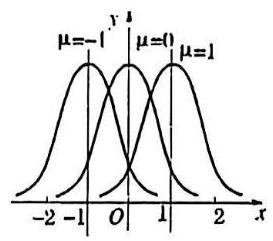

甲

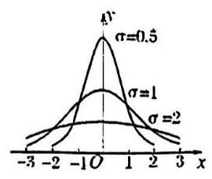

乙

①曲线位于 $x$ 轴上方，与 $x$ 轴不相交；

②曲线是单峰的，它关于直线 $x = \mu$ 对称；

③曲线在 $x = \mu$ 处达到峰值 $\frac{1}{\sqrt{2\pi }\sigma }$ ；

④曲线与 $x$ 轴之间的面积为 1;

⑤当σ一定时，曲线的位置由 $\mu$ 确定，曲线随着 $\mu$ 的变化而沿 $x$ 轴平移，如图甲所示；

⑥当μ一定时，曲线的形状由 $\sigma$ 确定， $\sigma$ 越大，曲线越 “矮胖”，总体分布越分散； $\sigma$ 越小. 曲线越 “瘦高”. 总体分布越集中, 如图乙所示:

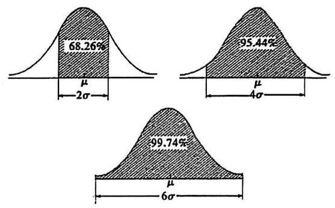

## (三) 正态总体三个特殊区间内取值的概率值

① $P\left( {\mu  - \sigma  < X \leq  \mu  + \sigma }\right)  = {0.6826}$ ；

② $P\left( {\mu  - {2\sigma } < X \leq  \mu  + {2\sigma }}\right)  = {0.9544}$ ；

③ $P\left( {\mu  - {3\sigma } < X \leq  \mu  + {3\sigma }}\right)  = {0.9974}$ .

7. 设 $\eta$ 服从 $N\left( {{1.5},{2}^{2}}\right)$ 试求:

(1) $P\left( {\eta  < {3.5}}\right)$ ； (2) $P\left( {\eta  <  - 4}\right)$ ； (3) $P\left( {\eta  \geq  2}\right)$ ; (4) $P\left( {\left| \eta \right|  < 3}\right)$ .

8. 已知: 从某批材料中任取一件时,取得的这件材料强度 $\xi$ 服从 $N\left( {{200},{18}^{ \circ  }}\right)$ .

(1)计算取得的这件材料的强度不低于 180 的概率.

(2)如果所用的材料要求以 99% 的概率保证强度不低于 150，问这批材料是否符合这个要求.

9. 第 24 届冬季奥林匹克运动会, 将于 2022 年 2 月 4 日至 2022 年 2 月 20 日在北京举行实践“绿色奥运、科技奥运、人文奥运”理念，举办一届“有特色、高水平”的奥运会，是中国和北京的庄严承诺，也是全世界的共同期待. 为宣传北京冬奥会, 激发人们参与冬奥会的热情, 某市开展了关于冬奥知识的有奖问答.从参与的人中随机抽取 100 人，得分情况如下:

(1)得分在 80 分以上称为“优秀成绩”，从抽取的 100 人中任取 2 人，记“优秀成绩”的人数为 $X$ ，求 $X$ 的分布列及数学期望；

(2)由直方图可以认为，问卷成绩值 $Y$ 服从正态分布 $N\left( {\mu ,{\sigma }^{2}}\right)$ ，其中 $\mu$ 近似为样本平均数， ${\sigma }^{2}$ 近似为样本方差.

① 求 $P\left( {{77.2} < Y < {89.4}}\right)$ ；

②用所抽取 100 人样本的成绩去估计城市总体，从城市总人口中随机抽出 2000 人，记 $Z$ 表示这 2000 人中分数值位于区间 $\left( {{77.2},{89.4}}\right)$ 的人数,利用①的结果求 $E\left( Z\right)$ .

参考数据: $\sqrt{150} \approx  {12.2},\sqrt{146} \approx  {12.1}, P\left( {\mu  - \sigma  < Y < \mu  + \sigma }\right)  = {0.6826}, P\left( {\mu  - {2\sigma } < Y < \mu  + {2\sigma }}\right)  = {0.9544}$ , $P\left( {\mu  - {3\sigma } < Y < \mu  + {3\sigma }}\right)  = {0.9974}.$

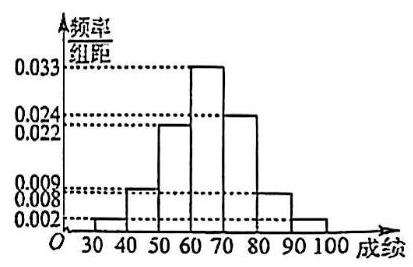

10. 在刚刚过去的寒假，由于新冠疫情的影响，哈尔滨市的 $A$ 、 $B$ 两所同类学校的高三学年分别采用甲、乙两种方案进行线上教学，为观测其教学效果，分别在两所学校的高三学年各随机抽取 60 名学生，对每名学生进行综合测试评分, 记综合评分为 80 及以上的学生为优秀学生, 经统计得到两所学校抽取的学生中共有 72 名优秀学生.

(1)用样本估计总体，以频率作为概率，若在 $A$ 、 $B$ 两个学校的高三学年随机抽取 3 名学生，求所抽取的学生中的优秀学生数的分布列和数学期望;

(2)已知 $A$ 学校抽出的优秀学生占该校抽取总人数的 $\frac{2}{3}$ ，填写下面的列联表，并判断能否在犯错误的概率不超过 0.1 的前提下认为学生综合测试评分优秀与教学方案有关.

<table><tr><td></td><td>优秀学生</td><td>非优秀学生</td><td>合计</td></tr><tr><td>甲方案</td><td></td><td></td><td></td></tr><tr><td>乙方案</td><td></td><td></td><td></td></tr><tr><td>合计</td><td></td><td></td><td></td></tr></table>

附:

<table><tr><td>$P\left( {{K}^{2} \geq  {k}_{0}}\right)$</td><td>0.15</td><td>0.10</td><td>0.05</td><td>0.025</td><td>0.010</td><td>0.005</td><td>0.001</td></tr><tr><td>${k}_{0}$</td><td>2.072</td><td>2.706</td><td>3.841</td><td>5.024</td><td>6.635</td><td>7.879</td><td>10.828</td></tr></table>

${K}^{2} = \frac{n{\left( ad - bc\right) }^{2}}{\left( {a + b}\right) \left( {c + d}\right) \left( {a + c}\right) \left( {b + d}\right) }$ ,其中 $n = a + b + c + d$ .

## 第十讲 导数计算——变量迂回与构造

1. 已知函数 $f\left( x\right)  = 2{\mathrm{e}}^{x} - {x}^{2} + {2ax} - {a}^{2}$ (e 为自然对数的底数)，若 $f\left( x\right)  \geq   - 3$ 在 $x \in  \left( {0, + \infty }\right)$ 上恒成立，则实数 $a$ 的取值范围是___.

2. 已知 $f\left( x\right)  = x{e}^{x} + \frac{1}{e} + {e}^{2}, g\left( x\right)  =  - {\left( x + 1\right) }^{2} + a\ln \left( {x + 1}\right)$ ,若存在 ${x}_{1} \in  \mathbf{R},{x}_{2} \in  \left( {-1, + \infty }\right)$ ,使得 $f\left( {x}_{1}\right)  \leq  g\left( {x}_{2}\right)$ 成立，则实数 $a$ 的取值范围是___.

3. 设函数 $f\left( x\right)  = {x}^{2} + a\ln \left( {x + 1}\right)$ 的两个极值点为 ${x}_{1},{x}_{2}$ ,且 ${x}_{1} < {x}_{2}$ 。证明: $f\left( {x}_{2}\right)  > \frac{1 - 2\ln 2}{4}$

4. 已知函数 $f\left( x\right)  =  - \ln x + x{e}^{x} + \left( {1 - b}\right) x$ 对任意 $x \in  \left( {0, + \infty }\right)$ ，都有 $f\left( x\right)  \geq  1$ 恒成立，则实数 $b$ 的取值范围为___

5. 设 ${x}_{1}\text{ 、 }{x}_{2}$ 是函数 $f\left( x\right)  = \frac{1}{2}a{x}^{2} - {e}^{x} + 1$ ，且 $\frac{{x}_{2}}{{x}_{1}} \geq  2$ ，则实数 $a$ 的取值范围是___.

6. 已知 ${x}_{1},{x}_{2}$ 是函数 $f\left( x\right)  = {x}^{2} + m\ln x - {2x}, m \in  R$ 的两个极值点，若 ${x}_{1} < {x}_{2}$ ，则 $\frac{f\left( {x}_{1}\right) }{{x}_{2}}$ 的取值范围为

7. 已知函数 $g\left( x\right)  = \frac{1}{2}{x}^{2} - \left( {b + 1}\right) x + \ln x$ ,设 ${x}_{1}\text{ 、 }{x}_{2}\left( {{x}_{1} < {x}_{2}}\right)$ 是函数 $y = g\left( x\right)$ 的两个极值点,若 $b \geq  \frac{3}{2}$ ,且 $g\left( {x}_{1}\right)  - g\left( {x}_{2}\right)  \geq  k$ 恒成立，则实数 $k$ 的取值范围为___

8. 设函数 $f\left( x\right)  = \frac{1}{x} - x + a\ln x\left( {a \in  R}\right)$ 的两个极值点分别为 ${x}_{1},{x}_{2}$ ,若 $\frac{f\left( {x}_{1}\right)  - f\left( {x}_{2}\right) }{{x}_{1} - {x}_{2}} \leq  \frac{2e}{{e}^{2} - 1}a - 2$ 恒成立,则实数 $a$ 的取值范围是___.

## 第十一讲 三角类压轴小题提升

## 一、三角函数的图像变换

- 对于正弦标准形 $f\left( x\right)  = A\sin \left( {{\omega x} + \varphi }\right)  + B$ ,

② 纵向上，相当于将 $y = \sin x$ 先放大 $A$ 倍，再上移 $B$ ；或者先上移 ${AB}$ ，再放大 $A$ 倍。

② 横向上，相当于将 $y = \sin x$ 先左移 $\varphi$ ，再缩小 $\omega$ 倍；或者先缩小 $\omega$ 倍，再左移 $\frac{\varphi }{\omega }$ 。

1. 若函数 $y = f\left( x\right)$ 的图像可由函数 $y = 3\sin {2x} - \sqrt{3}\cos {2x}$ 的图像向右平移 $\varphi \left( {0 < \varphi  < \pi }\right)$ 个单位所得到,且函数 $y = f\left( x\right)$ 在区间 $\left\lbrack  {0,\frac{\pi }{2}}\right\rbrack$ 上是严格减函数,则 $\varphi  =$ ___.

2. 已知 $\omega  > 0$ ,曲线 $y = \sin \left( {{\omega x} + \frac{\pi }{4}}\right)$ 在区间 $\left( {0,1}\right)$ 内恰有一条对称轴和一个对称中心,给出下述两个命题,命题 $p$ : 对任意 $\omega$ ,存在 ${x}_{0} \in  \left( {0,1}\right)$ ,使得 $\sin \left( {\omega {x}_{0} + \frac{\pi }{4}}\right)  < 0$ ; 命题 $q$ : 存在 ${x}_{0} \in  \left( {0,1}\right)$ ,对任意 $\omega$ ，满足 $\sin \left( {\omega {x}_{0} + \frac{\pi }{4}}\right)  < 0$ . 下列说法正确的是( )

(A) 命题 $p$ 是真命题，命题 $q$ 是假命题； (B) 命题 $p$ 是假命题,命题 $q$ 是真命题;

(C) 命题 $p$ 和 $q$ 都是真命题; (D) 命题 $p$ 和 $q$ 都是假命题;

## 二、三角比取值范围的利用

三角比以某种莫名的方式出现在题目中时,值域为 $\left\lbrack  {-1,1}\right\rbrack$ 很可能是它给题目带来的唯一价值

3. 已知 $\left\{  {a}_{n}\right\}$ 是公差为 $d\left( {d > 0}\right)$ 的等差数列,若存在实数 ${x}_{1},{x}_{2},{x}_{3},\cdots ,{x}_{9}$ 满足方程组 $\left\{  \begin{array}{l} \sin {x}_{1} + \sin {x}_{2} + \sin {x}_{3} + \cdots  + \sin {x}_{9} = 0 \\  {a}_{1}\sin {x}_{1} + {a}_{2}\sin {x}_{2} + {a}_{3}\sin {x}_{3} + \cdots  + {a}_{9}\sin {x}_{9} = {25} \end{array}\right.$ ，则 $d$ 的最小值为___

4. 若 ${\sin }^{2026}\alpha  - {\left( 2 - \cos \beta \right) }^{2025} \geq  \left( {3 - \cos \beta  - {\cos }^{2}\alpha }\right) \left( {1 - \cos \beta  + {\cos }^{2}\alpha }\right)$ ，则 $\sin \left( {\alpha  + \frac{\beta }{2}}\right)  =$ ___

5. $k \in  {\mathbf{N}}^{ * }$ 且 $1 \leq  k \leq  {2022}$ ，则满足方程 $\sin {1}^{ \circ  } + \sin {2}^{ \circ  } + \cdots  + \sin {k}^{ \circ  } = \sin {1}^{ \circ  } \cdot  \sin {2}^{ \circ  }\cdots \cdots \sin {k}^{ \circ  }$ 的 $k$ 有___个

## 三、等间距点列问题

<table><tr><td></td><td colspan="2">等间隔点列问题等价条件总结</td></tr><tr><td rowspan="3">第一类</td><td>在 $\left\lbrack  {{x}_{0},{x}_{0} + a}\right\rbrack$ 上至少有 $n$ 个点</td><td>${x}_{0} + a \geq  {x}_{n},{x}_{n}$ 为自 ${x}_{0}$ 起第 $n$ 个点的横坐标</td></tr><tr><td>在 $\left\lbrack  {{x}_{0},{x}_{0} + a}\right\rbrack$ 上至多有 $n$ 个点</td><td>${x}_{0} + a < {x}_{n + 1},{x}_{n + 1}$ 为自 ${x}_{0}$ 起第 $n + 1$ 个点的横坐标</td></tr><tr><td>在 $\left\lbrack  {{x}_{0},{x}_{0} + a}\right\rbrack$ 上有且仅有 $n$ 个点</td><td>${x}_{n} \leq  {x}_{0} + a < {x}_{n + 1}$</td></tr><tr><td rowspan="3">第二类</td><td>对 $\forall {x}_{0} \in  R$ ,在 $\left\lbrack  {{x}_{0},{x}_{0} + a}\right\rbrack$ 上至少有 $n$ 个点</td><td>$a \geq  \operatorname{Max}\{ n$ 个相邻间隔 $\}$</td></tr><tr><td>对 $\forall {x}_{0} \in  R$ ,在 $\left\lbrack  {{x}_{0},{x}_{0} + a}\right\rbrack$ 上至多有 $n$ 个点</td><td>$a < \min \{ n$ 个相邻间隔 $\}$</td></tr><tr><td>对 $\forall {x}_{0} \in  R$ ,在 $\left\lbrack  {{x}_{0},{x}_{0} + a}\right\rbrack$ 上有且仅有 $n$ 个点</td><td>$a$ 无解</td></tr><tr><td rowspan="3">第三类</td><td>$\exists {x}_{0} \in  R$ ,在 $\left\lbrack  {{x}_{0},{x}_{0} + a}\right\rbrack$ 上至少有 $n$ 个点</td><td>$a \geq  \min \{ n - 1$ 个相邻间隔 $\}$</td></tr><tr><td>$\exists {x}_{0} \in  R$ ,在 $\left\lbrack  {{x}_{0},{x}_{0} + a}\right\rbrack$ 上至多有 $n$ 个点</td><td>$a < \operatorname{Max}\{ n + 1$ 个相邻间隔 $\}$</td></tr><tr><td>$\exists {x}_{0} \in  R$ ,在 $\left\lbrack  {{x}_{0},{x}_{0} + a}\right\rbrack$ 上有且仅有 $n$ 个点</td><td>$\min \{ n - 1$ 个相邻间隔 $\}  \leq  a < \operatorname{Max}\{ n + 1$ 个相邻间隔 $\}$</td></tr></table>

6. 已知函数 $f\left( x\right)  = 2\sin \left( {\omega x}\right) \left( {\omega  > 0}\right)$ 的图像相邻两条对称轴之间的距离为 $\frac{\pi }{2}$ ，将 $f\left( x\right)$ 的图像向右平移 $\frac{\pi }{6}$ 个单位,再向下平移 1 个单位,得到函数 $y = g\left( x\right)$ 的图像。若方程 $g\left( x\right)  = 0$ 在区间 $\left\lbrack  {0, b}\right\rbrack  \left( {b > 0}\right)$ 上至少含有 10 个零点，则 $b$ 的最小值为___。

7. 为了使 $y = \sin \left( {\omega x}\right) \left( {\omega  > 0}\right)$ 在区间 $\left\lbrack  {0,1}\right\rbrack$ 上至少出现 50 次最大值，则 $\omega$ 的最小值是___；若对任何实数 ${x}_{0}$ ，函数 $y = \sin \left( {\omega x}\right) \left( {\omega  > 0}\right)$ 在区间 $\left\lbrack  {{x}_{0},{x}_{0} + 1}\right\rbrack$ 上至少出现 50 次最大值，则 $\omega$ 的最小值是___

8. 已知函数 $y = 5\cos \left( {\frac{{2k} + 1}{3}{\pi x} - \frac{\pi }{6}}\right)$ (其中 $k \in  \mathbf{N}$ )，对任意实数 $a$ ，在区间 $\left\lbrack  {a, a + 3}\right\rbrack$ 上要使函数值 $\frac{5}{2}\sqrt{2}$ 出现的次数不少于 3 次且不多于 9 次，则 $k$ 的取值集合为___

## 四、单位圆盘

涉及到 $\frac{2\pi }{n}$ 的相关问题,单位圆盘一般是比较适合将问题直观化的武器

9. 函数 $f\left( x\right)  = \cos \frac{2\pi }{n}x, x \in  \mathbf{Z}$ 的值域有 6 个实数组成，则非零整数 $n$ 的值是___

10. 设 ${a}_{n} = \frac{1}{n}\cos \frac{n\pi }{10},{S}_{n} = {a}_{1} + {a}_{2} + \cdots  + {a}_{n}$ ,在 ${S}_{1},{S}_{2},\cdots ,{S}_{20}$ 中,正数的个数是___

11. 对开区间 $I = \left( {a, b}\right)$ ，定义 $\left| I\right|  = b - a$ ，当实数集合 $M$ 为 $n$ 段( $n$ 为正整数)互不相交的开区间 ${I}_{1}\text{ 、 }{I}_{2}\text{ 、 }\cdots \text{ 、 }{I}_{n}$ 的并集时,定义 $\left| M\right|  = \mathop{\sum }\limits_{{k = 1}}^{n}\left| {I}_{k}\right|$ ,若对任意上述形式的 $\left( {0,{2\pi }}\right)$ 的子集 $\mathrm{A}$ ,总存在 $k \in  \mathrm{Z}$ ,使得 $\left| {A}_{k}\right|  \geq  \lambda \left| A\right|$ ，其中 ${A}_{k} = \left\{  {x\left| {x \in  A,}\right| \tan \left( {x + \frac{k\pi }{4}}\right)  \mid   < \sqrt{2} - 1}\right\}$ ，则 $\lambda$ 的最大值为___.

12. 已知 $\theta  > 0$ ，若存在实数 $\varphi$ ，使得对任意 $n \in  {\mathbf{N}}^{ * }$ 都有 $\cos \left( {{n\theta } + \varphi }\right)  < \frac{\sqrt{3}}{2}$ ，则 $\theta$ 的最小值是___

13. 设数列 $\left\{  {\alpha }_{n}\right\}$ 的通项为 ${\alpha }_{n} = \left( {n - 1}\right) \frac{2\pi }{k} + \varphi , n \in  {N}^{ * }$ ,其中 $k$ 为常数且 $\varphi  \in  \left( {0,\frac{\pi }{2}}\right)$ . 若存在整数 $k \in  \left\lbrack  {3,{40}}\right\rbrack$ ，使 $\left\{  {\alpha }_{n}\right\}$ 的前 $k$ 项中存在 ${\alpha }_{i}$ ， ${\alpha }_{j}\left( {i \neq  j}\right)$ 满足 $\cos {\alpha }_{i} = \cos {\alpha }_{j}$ ，则 $\varphi$ 的最大值为___.

## 第十二讲 定点、定值、定直线问题提升

1. 已知椭圆 $C : \frac{{x}^{2}}{4} + \frac{{y}^{2}}{3} = 1$ 的右焦点为 $F$ ，过 $F$ 且斜率为 1 的直线交椭圆 $C$ 于 $A$ 、 $B$ 两点， $M$ 是直线 $x = 4$ 上任意一点，求证:直线 ${MA}$ 、 ${MF}$ 、 ${MB}$ 的斜率成等差数列。

2. 曲线 $C : \frac{{x}^{2}}{4} + \frac{{y}^{2}}{1} = 1$ 的上顶点为 $B$ ，左、右顶点为 ${A}_{1}\text{ 、 }{A}_{2}$ ；点 $P$ 为椭圆除 $B$ 外的任意一点，直线 ${BP}$ 交 $x$ 轴于点 $N$ ，直线 ${A}_{1}B$ 交直线 ${A}_{2}P$ 于点 $M$ ，设 ${A}_{2}P$ 的斜率为 $k$ ， ${MN}$ 的斜率为 $m$ 。证明: ${2m} - k$ 为定值。

3. 曲线 $C : \frac{{x}^{2}}{4} - \frac{{y}^{2}}{1} = 1$ 的弦 ${AB}$ 过定点 $N\left( {4,0}\right)$ ，交直线 $l : x = 1$ 于 $M$ ，已知点 $P$ 坐标为 $\left( {4,\sqrt{3}}\right)$ 。记 ${PA}\text{ 、 }{PB}\text{ 、 }{PM}$ 的斜率分别为 ${k}_{1}\text{ 、 }{k}_{2}\text{ 、 }{k}_{3}$ 。那么是否存在实数 $\lambda$ ,使得对于任意不过点 $P$ 的弦 ${AB}$ , 等式 ${k}_{1} + {k}_{2} = \lambda {k}_{3}$ 恒成立? 若存在,请求出 $\lambda$ 的值; 若不存在,请说明理由。

4. 如图，已知椭圆 $C : \frac{{x}^{2}}{4} + \frac{{y}^{2}}{3} = 1$ 的左焦点为 ${F}_{1}$ ，点 $P$ 是椭圆 $C$ 上位于第一象限的点， $M$ ， $N$ 是 $y$ 轴上的两个动点 (点 $M$ 位于 $x$ 轴上方),满足 ${PM} \bot  {PN}$ 且 ${F}_{1}M \bot  {F}_{1}N$ ,线段 ${PN}$ 交 $x$ 轴于点 $Q$ .

(1)若 $\left| {{F}_{1}P}\right|  = \frac{5}{2}$ ，求点 $P$ 的坐标；

(2)若四边形 ${F}_{1}{MPN}$ 为矩形，求点 $M$ 的坐标；

(3)证明: $\frac{\left| PQ\right| }{\left| QN\right| }$ 为定值.

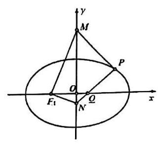

5. 已知椭圆 $\Gamma  : \frac{{x}^{2}}{{a}^{2}} + \frac{{y}^{2}}{{b}^{2}} = 1\left( {a > b > 0}\right)$ 过点 $\left( {0,2}\right)$ ，其长轴长、焦距和短轴长三者的平方依次成等差数列. 直线 $l$ 与 $x$ 轴的正半轴和 $y$ 轴分别交于点 $Q, P$ ,与椭圆 $\Gamma$ 相交于两点 $M, N$ ,各点互不重合,且满足 $\overrightarrow{PM} = {\lambda }_{1}\overrightarrow{MQ},\overrightarrow{PN} = {\lambda }_{2}\overrightarrow{NQ}$ .

(1)求椭圆 $\Gamma$ 的标准方程；

(2)若直线 $l$ 的方程为 $y =  - x + 1$ ，求 $\frac{1}{{\lambda }_{1}} + \frac{1}{{\lambda }_{2}}$ 的值；

(3)若 ${\lambda }_{1} + {\lambda }_{2} =  - 3$ ，证明:直线 $l$ 恒过定点，并求此定点的坐标.

6. 在 ${xOy}$ 平面上,设椭圆 $\Gamma  : \frac{{x}^{2}}{{m}^{2}} + {y}^{2} = 1\left( {m > 1}\right)$ ,梯形 ${ABCD}$ 的四个顶点均在 $\Gamma$ 上,且 ${AB}//{CD}$ ,设直线 ${AB}$ 的方程为 $y = {kx}\left( {k \in  R}\right)$ .

(1)若 ${AB}$ 为 $\Gamma$ 的长轴，梯形 ${ABCD}$ 的高为 $\frac{1}{2}$ ，且 $C$ 在 ${AB}$ 上的射影为 $\Gamma$ 的焦点，求 $m$ 的值；

(2)设 $m = \sqrt{2}$ ，直线 ${CD}$ 经过点 $P\left( {0,2}\right)$ ，求 $\overrightarrow{OC} \cdot  \overrightarrow{OD}$ 的取值范围；

(3)设 $m = \sqrt{2}$ ， $\left| {AB}\right|  = 2\left| {CD}\right|$ ， ${AD}$ 与 ${BC}$ 的延长线相交于点 $M$ ，当 $k$ 变化时， $\bigtriangleup  {MAB}$ 的面积是否为定值？ 若是, 求出该定值; 若不是, 请说明理由.

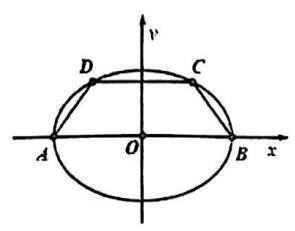

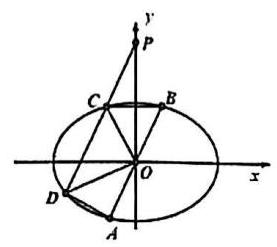

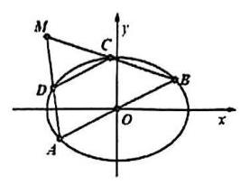

7. 已知双曲线 $C : \frac{{x}^{2}}{{a}^{2}} - \frac{{y}^{2}}{{b}^{2}} = 1\left( {a > 0, b > 0}\right)$ 的一条渐近线的方程为 $y = \sqrt{13}x$ ，它的右顶点与抛物线 $\Gamma$ : ${y}^{2} = 4\sqrt{3}x$ 的焦点重合,经过点 $A\left( {-9,0}\right)$ 且不垂直于 $x$ 轴的直线与双曲线 $C$ 交于 $M, N$ 两点.

(1)求双曲线 $C$ 的标准方程；

(2)若点 $M$ 是线段 ${AN}$ 的中点，求点 $N$ 的坐标；

(3)设 $P, Q$ 是直线 $x =  - 9$ 上关于 $x$ 轴对称的两点，证明:直线 ${PM}$ 与 ${QN}$ 的交点必在直线 $x =  - \frac{1}{3}$ 上.

## 第十三讲 抽象函数分析

1. 对于正实数 $\alpha$ ,记 ${M}_{\alpha }$ 为满足下述条件的函数 $f\left( x\right)$ 构成的集合: $\forall {x}_{1},{x}_{2} \in  R$ 且 ${x}_{2} > {x}_{1}$ ,有 $- \alpha \left( {{x}_{2} - {x}_{1}}\right)  < f\left( {x}_{2}\right)  - f\left( {x}_{1}\right)  < \alpha \left( {{x}_{2} - {x}_{1}}\right)$ . 下列结论中正确的是

A. 若 $f\left( x\right)  \in  {M}_{{\alpha }_{1}}, g\left( x\right)  \in  {M}_{{\alpha }_{2}}$ ,则 $f\left( x\right)  + g\left( x\right)  \in  {M}_{{\alpha }_{1} + {\alpha }_{2}}$

B. 若 $f\left( x\right)  \in  {M}_{{\alpha }_{1}}, g\left( x\right)  \in  {M}_{{\alpha }_{2}}$ 且 ${\alpha }_{1} > {\alpha }_{2}$ ,则 $f\left( x\right)  - g\left( x\right)  \in  {M}_{{\alpha }_{1} - {\alpha }_{2}}$

C. 若 $f\left( x\right)  \in  {M}_{{\alpha }_{1}}, g\left( x\right)  \in  {M}_{{\alpha }_{2}}$ ,则 $f\left( x\right)  \cdot  g\left( x\right)  \in  {M}_{{\alpha }_{1} \cdot  {\alpha }_{2}}$

D. 若 $f\left( x\right)  \in  {M}_{{\alpha }_{1}}, g\left( x\right)  \in  {M}_{{\alpha }_{2}}$ 且 $g\left( x\right)  \neq  0$ ,则 $\frac{f\left( x\right) }{g\left( x\right) } \in  {M}_{\frac{{\alpha }_{1}}{{\alpha }_{2}}}$

2. 设函数 $y = f\left( x\right)$ 定义域为 $\mathrm{R}$ ,则 “存在常数 $a, b$ ,使得 $f\left( x\right)  \leq  a\left| x\right|  + b$ 是 “ $\forall {x}_{1},{x}_{2} \in  R$ ,存在常数 $\omega$ , 使得 $\left| {f\left( {x}_{1}\right)  - f\left( {x}_{2}\right) }\right|  \leq  w\left| {{x}_{1} - {x}_{2}}\right|$ 的___条件。

3. 已知定义在 $R$ 上的函数 $y = f\left( x\right)$ 对任意 ${x}_{1} < {x}_{2}$ ,都有 $\frac{f\left( {x}_{1}\right)  - f\left( {x}_{2}\right) }{{x}_{1} - {x}_{2}} > a$ 成立，且满足 $f\left( 0\right)  =  - {a}^{2}$ (其中 $a$ 为常数)，关于 $x$ 的方程: $f\left( {a + x}\right)  = {ax}$ 的解的情况，下面判断正确的是( )

A. 存在常数 $a$ ，使得该方程无实数解 B. 对任意常数 $a$ ，使得该方程有且仅有 1 个解

C. 存在常数 $a$ ,使得该方程有无数解 D. 对任意常数 $a$ ,方程解的个数大于 2

4. 【2020 上海春考 21】已知非空集合 $A \subseteq  R, f\left( x\right)$ 定义域为 $D$ ,对 $\forall t \in  A$ 且 $x \in  D, f\left( x\right)  \leq  f\left( {x + t}\right)$ 恒成立,则称 $f\left( x\right)$ 具有 $A$ 性质。当 $A = \{  - 2, m\} , m \in  Z$ ,若 $D$ 为整数集且具有 $A$ 性质的函数均为常值函数,求所有符合合条件的 $m$ 的值

5. 【2020 高考 16】给出命题 $p$ :若存在 $a \in  R$ 且 $a \neq  0$ ，对任意的 $x \in  R$ ，均有 $f\left( {x + a}\right)  < f\left( x\right)  + f\left( a\right)$ 恒成立;

已知命题 ${q}_{1} : f\left( x\right)$ 单调递减，且 $f\left( x\right)  > 0$ 恒成立；命题 ${q}_{2} : f\left( x\right)$ 单调递增，且存在 ${x}_{0} < 0$ ，使得 $f\left( {x}_{0}\right)  = 0$ ； 则以下说法正确的是( )

A. ${q}_{1}\text{ 、 }{q}_{2}$ 都是 $p$ 的充分条件 B. 只有 ${q}_{1}$ 是 $p$ 的充分条件

C. 只有 ${q}_{2}$ 是 $p$ 的充分条件 D. ${q}_{1}\text{ 、 }{q}_{2}$ 都不是 $p$ 的充分条件

6. 已知函数 $f\left( x\right)  = \frac{{3}^{x}}{1 + {3}^{x}}$ ，设 ${x}_{i}\left( {i = 1,2,3}\right)$ 为实数，且 ${x}_{1} + {x}_{2} + {x}_{3} = 0$ ，给出下列结论:①若 ${x}_{1}{x}_{2}{x}_{3} > 0$ ,则 $f\left( {x}_{1}\right)  + f\left( {x}_{2}\right)  + f\left( {x}_{3}\right)  < \frac{3}{2}$ ; ②若 ${x}_{1}{x}_{2}{x}_{3} < 0$ ,则 $f\left( {x}_{1}\right)  + f\left( {x}_{2}\right)  + f\left( {x}_{3}\right)  > \frac{3}{2}$ . 其中正确的为( )

(A) ①与②均正确 (B) ①正确，②不正确

(C) ①不正确，②正确 (D) ①与②均不正确

7. 已知函数 $y = f\left( x\right)$ 与 $y = g\left( x\right)$ 满足: 对任意 ${x}_{1},{x}_{2} \in  R$ ,都有 $\left| {f\left( {x}_{1}\right)  - f\left( {x}_{2}\right) }\right|  \geq  \left| {g\left( {x}_{1}\right)  - g\left( {x}_{2}\right) }\right|$ .

命题 $p :$ 若 $y = f\left( x\right)$ 是增函数,则 ${y}_{1} = f\left( x\right)  - g\left( x\right) ,{y}_{2} = f\left( x\right)  + g\left( x\right)$ 都是增函数;

命题 $q$ : 若 $y = f\left( x\right)$ 有最大值和最小值,则 $y = g\left( x\right)$ 也有最大值和最小值.

则下列判断正确的是( )

(A) $p$ 和 $q$ 都是真命题; (B) $p$ 和 $q$ 都是假命题;

(C) $p$ 是真命题, $q$ 是假命题; (D) $p$ 是假命题, $q$ 是真命题.

8. 已知定义在 $\mathrm{R}$ 上的函数 $y = f\left( x\right)$ . 对任意区间 $\left\lbrack  {a, b}\right\rbrack$ 和 $c \in  \left\lbrack  {a, b}\right\rbrack$ ，若存在开区间 $I$ ，使得 $c \in  I \cap  \left\lbrack  {a, b}\right\rbrack$ ， 且对任意 $x \in  I \cap  \left\lbrack  {a, b}\right\rbrack  \left( {x \neq  c}\right)$ 都成立 $f\left( x\right)  < f\left( c\right)$ ,则称 $c$ 为 $f\left( x\right)$ 在 $\left\lbrack  {a, b}\right\rbrack$ 上的一个 “ $M$ 点”. 有以下两个命题:

① 若 $f\left( {x}_{0}\right)$ 是 $f\left( x\right)$ 在区间 $\left\lbrack  {a, b}\right\rbrack$ 上的最大值，则 ${x}_{0}$ 是 $f\left( x\right)$ 在区间 $\left\lbrack  {a, b}\right\rbrack$ 上的一个 $M$ 点；

② 若对任意 $a < b$ ， $b$ 都是 $f\left( x\right)$ 在区间 $\left\lbrack  {a, b}\right\rbrack$ 上的一个 $M$ 点，则 $f\left( x\right)$ 在 $\mathrm{R}$ 上严格增.

那么 ( )

A. ①是真命题，②是假命题 B. ①是假命题，②是真命题

C. ①②都是具命题 D. ①②都是假命题

9. 【2024 高考 16】已知 $f\left( x\right)$ 定义域为 $R$ ，定义集合 $M = \left\{  {{x}_{0} \mid  {x}_{0} \in  R, x \in  \left( {-\infty ,{x}_{0}}\right) , f\left( x\right)  < f\left( {x}_{0}\right) }\right\}$ ，若 $M = \left\lbrack  {-1,1}\right\rbrack$ ，则下列命题成立的是( )

A. 存在 $f\left( x\right)$ 是偶函数 B. 存在 $f\left( x\right)$ ,在 $x = 2$ 处取最大值

C. 存在 $f\left( x\right)$ 严格增 D. 存在 $f\left( x\right)$ ,在 $x =  - 1$ 处取到极小值

10. 已知 $\max \{ a, b, c\}$ 表示 $a\text{ 、 }b\text{ 、 }c$ 中的最大值，定义在 $\mathbf{R}$ 上的函数 $f\left( x\right) , g\left( x\right) , h\left( x\right)$

依次是严格增函数、严格减函数与周期函数,记 $K\left( x\right)  = \max \{ f\left( x\right) , g\left( x\right) , h\left( x\right) \}$ . 则对于下列

命题: ① 若 $K\left( x\right)$ 是严格增函数,则 $K\left( x\right)  = f\left( x\right)$ ; ② 若 $K\left( x\right)$ 是严格减函数,

则 $K\left( x\right)  = g\left( x\right)$ ；③ 若 $K\left( x\right)$ 是周期函数，则 $K\left( x\right)  = h\left( x\right)$ . 其中正确的有( )

A. 无一正确 B. ①② C. ③ D. ①②③

11. 【2024 嘉定二模 16】已知函数 $y = f\left( x\right) \left( {x \in  \mathbf{R}}\right)$ 的最小正周期是 ${T}_{1}$ ,函数 $y = g\left( x\right) \left( {x \in  \mathbf{R}}\right)$ 的最小正周期是 ${T}_{2}$ ,且 ${T}_{1} = k{T}_{2}\left( {k > 1}\right)$ ,对于命题甲: 函数 $y = f\left( x\right)  + g\left( x\right) \left( {x \in  \mathbf{R}}\right)$ 可能不是周期函数; 命题乙:若函数 $y = f\left( x\right)  + g\left( x\right) \left( {x \in  \mathbf{R}}\right)$ 的最小正周期是 ${T}_{3}$ ，则 ${T}_{3} \geq  {T}_{1}$ . 下列选项正确的是( )

A. 甲和乙均为真命题 B. 甲和乙均为假命题

C. 甲为真命题且乙为假命题 D. 甲为假命题且乙为真命题

12. 定义在 $\mathrm{R}$ 上的函数 $y = f\left( x\right)$ 和 $y = g\left( x\right)$ 的最小周期分别是 ${T}_{1}$ 和 ${T}_{2}$ ,已知 $y = f\left( x\right)  + g\left( x\right)$ 的最小正周期为 1 , 则下列选项中可能成立的是 ( )

A. ${T}_{1} = 1,{T}_{2} = 2$ B. ${T}_{1} = \frac{1}{2},{T}_{2} = \frac{3}{4}$ C. ${T}_{1} = \frac{3}{4},{T}_{2} = \frac{5}{4}$ D. ${T}_{1} = \frac{3}{2},{T}_{2} = 3$

13. 【2024 崇明二模 16】已知函数 $y = f\left( x\right)$ 的定义域为 $D,{x}_{1}\text{ 、 }{x}_{2} \in  D$ .

命题 $p$ : 若当 $f\left( {x}_{1}\right)  + f\left( {x}_{2}\right)  = 0$ 时,都有 ${x}_{1} + {x}_{2} = 0$ ,则函数 $y = f\left( x\right)$ 是 $D$ 上的奇函数.

命题 $q :$ 若当 $f\left( {x}_{1}\right)  < f\left( {x}_{2}\right)$ 时,都有 ${x}_{1} < {x}_{2}$ ,则函数 $y = f\left( x\right)$ 是 $D$ 上的增函数.

下列说法正确的是( )

A. $p$ 、 $q$ 都是真命题 B. $p$ 是真命题， $q$ 是假命题

C. $p$ 是假命题, $q$ 是真命题 D. $p\text{ 、 }q$ 都是假命题

## 第十四讲 概率与期望

## 基本结论

(1) $E\left( {{aX} + b}\right)  = {aE}\left( X\right)  + b$

(2) $D\left( X\right)  = E\left( {X}^{2}\right)  - {E}^{2}\left( X\right)$

(3) $E\left( {{X}_{1} + {X}_{2}}\right)  = E\left( {X}_{1}\right)  + E\left( {X}_{2}\right)$

## > 进阶结论

若 ${X}_{1},{X}_{2}$ 相互独立,则

(5) $E\left( {{X}_{1}{X}_{2}}\right)  = E\left( {X}_{1}\right) E\left( {X}_{2}\right)$

(6) $D\left( {{X}_{1} + {X}_{2}}\right)  = D\left( {X}_{1}\right)  + D\left( {X}_{2}\right)$

若 ${X}_{1},{X}_{2}$ 相互独立,且 $E\left( {X}_{1}\right)  = E\left( {X}_{2}\right)  = 0$ ,则

(7) $D\left( {{X}_{1}{X}_{2}}\right)  = D\left( {X}_{1}\right) D\left( {X}_{2}\right)$

1. 现有足够多的纸牌共 $N$ 张，其中有 3 张 $\mathrm{A}$ 牌，经过随机洗牌后，从顶上开始一张接一张地翻牌，一直翻到第 2 张 A 牌出现为止，此时翻过的牌数的数学期望是___

2. $n$ 个球随机放入 $m$ 个盒子，设其中空盒的个数是 $X$ ，则 $E\left\lbrack  X\right\rbrack   =$ ___

3. 甲有 101 个硬币,乙有 100 个硬币,同时抛硬币,甲正面比乙多的概率为___

4. 随机选取 1、2、...、n 的一个排列 $\sigma  = \left\{  {{x}_{1},{x}_{2},\cdots ,{x}_{n}}\right\}$ ,若 ${x}_{i} = i$ ,则称 $i$ 为 $\sigma$ 的一个不动点。排列中不动点的个数记作随机变量 ${X}_{n}$ 。则 ${X}_{n}$ 的期望 $E\left( {X}_{n}\right)  =$

5. 有一只蚂蚁在一个 $3 \times  3$ 方块平铺成的方形桌面的中央，每次有相等的几率向四周相邻(有公共边) 的方格内移动一格，若移动出桌面则会掉下去，过程结束。若该蚂蚁移动 2024 次仍未掉下桌面，且恰好回到桌面中央的概率为___。

6. 甲、乙两人玩游戏,规则如下: 第奇数局,甲属的概率为 $\frac{3}{4}$ ; 第偶数局,乙赢的概率也为 $\frac{3}{4}$ ; 每一局没有平局。规定:当其中一人赢的局数比另一人赢的局数多 2 次时游戏结束。那么当游戏结束时，游戏局数的数学期望为___

7. 在如图所示的试验容器中，容器由三个仓组成，某粒子作布朗运动时每次会从所在仓的通道口中随机选择一个到达相邻仓或者容器外，一旦粒子到达容器外就会被外部捕获装置所捕获，此时试验结束.已知该粒子初始位置在 1 号仓，则试验结束时该粒子是从 1 号仓到达容器外的概率为___.

8. 甲乙两人进行射击比赛，约定:对于每轮射击，若甲命中靶心而乙未命中，甲得 1 分，乙得 -1 分；若乙命中靶心而甲未命中，甲得 -1 分，乙得 1 分；若都命中或都未命中则两人均得 0 分。当其中一人得分达到 4 分后比赛结束。已知甲、乙两人的靶心命中率分别为 0.5 和 0.8 ，且互相独立。则甲最终赢得比赛的概率为___

9. 投掷一枚硬币 $n$ 次,记不出现连续三次正面向上的概率为 ${P}_{n}$ ,

(1)求 ${P}_{n}$ 的递推关系，并求其单调性；(2) $\mathop{\lim }\limits_{{n \rightarrow   + \infty }}{P}_{n}$ 是否存在？有何统计意义？

10. 一个袋子里有 $a$ 个白球和 $b$ 个黑球, $a, b \in  {N}^{ * }$ ,从中任取一球,如果取出的是白球,则把它放回袋中; 如果取出的是黑球,则黑球不再放回袋中,另外补一个白球放回袋中,在重复 $n$ 次这样的操作后,记袋中白球的个数为 ${X}_{n}$ 。

(1)求 ${X}_{1}$ 的分布和数学期望 $E\left\lbrack  {X}_{1}\right\rbrack$ ；

(2)设 $P\left( {{X}_{n} = a + k}\right)  = {p}_{k}, k = 0,1,2,\cdots , b$ ，求 $P\left( {{X}_{n + 1} = a + k}\right)$ 的值；

(3)证明: ${X}_{n + 1}$ 的数学期望 $E\left\lbrack  {X}_{n + 1}\right\rbrack   = \left( {1 - \frac{1}{a + b}}\right) E\left\lbrack  {X}_{n}\right\rbrack   + 1$