每日三题合集 20250225-20250430 14 每日三题 0225

【练习】1. (2024 届交附) 函数 $y = f\left( x\right)$ 是最小正周期为 4 的偶函数，且在 $x \in  \left\lbrack  {-2,0}\right\rbrack$ 时， $f\left( x\right)  = {{2x} + 1}$ ，若存在 ${x}_{1},{x}_{2},\cdots ,{x}_{n}$ 满足 $0 \leq  {x}_{1} < {x}_{2} < \cdots  < {x}_{n}$ ,且 $\left| {f\left( {x}_{1}\right)  - f\left( {x}_{2}\right) }\right|  + \left| {f\left( {x}_{2}\right)  - f\left( {x}_{3}\right) }\right|  + \cdots \; + \left| {f\left( {x}_{n - 1}\right)  - f\left( {x}_{n}\right) }\right|  = {2023}$ ，则 $n + {x}_{n}$ 最小值为___

【答案】 $\frac{3037}{2}$

【解析】因为函数 $y = f\left( x\right)$ 是最小正周期为 4 的偶函数,

且在 $x \in  \left\lbrack  {-2,0}\right\rbrack$ 时, $f\left( x\right)  = {2x} + 1$ ,

所以函数的值域为 $\left\lbrack  {-3,1}\right\rbrack$ ,对任意 ${x}_{i}\text{ 、 }{x}_{j}\left( {\mathrm{i}\text{ 、 }j = 1,2,3,\cdots , m}\right)$ ,

都有 $\left| {f\left( {x}_{i}\right)  - f\left( {x}_{j}\right) }\right|  \leq  f{\left( x\right) }_{\max } - f{\left( x\right) }_{\min } = 4$ ,

要使 $n + {x}_{n}$ 取得最小值,尽可能多让 ${x}_{i}\left( {\mathrm{i} = 1,2,3,\cdots , m}\right)$ 取得最高点,

且 $f\left( 0\right)  = 1, f\left( 2\right)  =  - 3$ ,因为 $0 \leq  {x}_{1} < {x}_{2} < \cdots  < {x}_{m}$ ,

$\left| {f\left( {x}_{1}\right)  - f\left( {x}_{2}\right) }\right|  + \left| {f\left( {x}_{2}\right)  - f\left( {x}_{3}\right) }\right|  + \cdots  + \left| {f\left( {x}_{n - 1}\right)  - f\left( {x}_{n}\right) }\right|  = {2023},$

所以 $n$ 的最小值为 $\left\lbrack  \frac{2023}{4}\right\rbrack   + 1 = {507}$ ,相应的 ${x}_{n}$ 最小值为 1011.5,

则 $n + {x}_{n}$ 的最小值为 $\frac{3037}{2}$

【练习】2. (2024 届华二) 已知两两不相等的正数 ${x}_{1}\text{ 、 }{y}_{1}\text{ 、 }{x}_{2}\text{ 、 }{y}_{2}\text{ 、 }{x}_{3}\text{ 、 }{y}_{3}$ ,同时满足① ${x}_{1} < {y}_{1}\text{ ， }{x}_{2} < {y}_{2}\text{ ， }{x}_{3} < \; {y}_{3}$ ; ② ${x}_{1}{y}_{1} = {x}_{2}{y}_{2} = {x}_{3}{y}_{3}$ ; ③ $\left( {{x}_{1} + {y}_{1}}\right) \left( {{x}_{3} + {y}_{3}}\right)  = {\left( {x}_{2} + {y}_{2}\right) }^{2}$ ，则下列选项中恒成立的是 ( )

A. $2{y}_{2} < {y}_{1} + {y}_{3}$ B. $2{y}_{2} > {y}_{1} + {y}_{3}$ C. ${y}_{2}^{2} < {y}_{1}{y}_{3}$ D. ${y}_{2}^{2} > {y}_{1}{y}_{3}$

【答案】 $D$

【解析】设 ${x}_{1}{y}_{1} = {x}_{2}{y}_{2} = {x}_{3}{y}_{3} = {a}^{2} > 0$ ,则 ${x}_{i} = \frac{a}{{q}_{i}},{y}_{i} = a{q}_{i}$ ,其中 ${q}_{i} > 1\left( {\mathrm{i} = 1,2,3}\right)$

$\left( {{x}_{1} + {y}_{1}}\right) \left( {{x}_{3} + {y}_{3}}\right)  = {\left( {x}_{2} + {y}_{2}\right) }^{2} \Rightarrow  \left( {\frac{1}{{q}_{1}} + 1}\right) \left( {\frac{1}{{q}_{3}} + 1}\right)  = {\left( \frac{1}{{q}_{2}} + 1\right) }^{2}$

$\Rightarrow  {q}_{1}{q}_{3} + \frac{1}{{q}_{1}{q}_{3}} + \left( {\frac{{q}_{3}}{{q}_{1}} + \frac{{q}_{1}}{{q}_{3}}}\right)  = {q}_{2}^{2} + \frac{1}{{q}_{2}^{2}} + 2$ ,因为 $\frac{{q}_{3}}{{q}_{1}} + \frac{{q}_{1}}{{q}_{3}} > 2$ ,

所以 ${q}_{1}{q}_{3} + \frac{1}{{q}_{1}{q}_{3}} < {q}_{2}^{2} + \frac{1}{{q}_{2}^{2}}$ ,构造函数 $f\left( x\right)  = x + \frac{1}{x}, x \in  \left( {1, + \infty }\right)$ 严格增,

由 $f\left( {q}_{2}^{2}\right)  > f\left( {{q}_{1}{q}_{3}}\right)$ ,所以 ${y}_{2}^{2} > {y}_{1}{y}_{3}$ ,故选 $D$ .

【练习】3. (2025 届交附) 已知函数 $y = f\left( x\right)$ 的定义域为 $\left( {0, + \infty }\right)$ ,若存在常数 $T > 0$ ,使得对任意的 $x \in \; \left( {0, + \infty }\right)$ ,都有 $f\left( {Tx}\right)  = f\left( x\right)  + T$ ,则称函数 $y = f\left( x\right)$ 具有性质 $P\left( T\right)$ .

(1)若函数 $y = f\left( x\right)$ 具有性质 $P\left( 3\right)$ ，求: $f\left( 3\right)  - f\left( 1\right)$ 的值；

( 2 )设 $f\left( x\right)  = {\log }_{\frac{1}{2}}x$ ，求证:存在常数 $T > 0$ ，使得 $y = f\left( x\right)$ 具有性质 $P\left( T\right)$ ；

(3)若函数 $y = f\left( x\right)$ 具有性质 $P\left( T\right)$ ，且 $y = f\left( x\right)$ 的图像是一条连续不断的曲线，求证: 函数 $y = f\left( x\right)  - 1$ 在 $\left( {0, + \infty }\right)$ 存在零点.

【解析】(1) 函数 $f\left( x\right)$ 具有性质 $P\left( 3\right)$ ,所以对任意 $x \in  \left( {0, + \infty }\right)$ ,都有 $f\left( {3x}\right)  = f\left( x\right)  + 3$ ,

令 $x = 1$ ,则 $f\left( 3\right)  = f\left( 1\right)  + 3$ ,所以 $f\left( 3\right)  - f\left( 1\right)  = 3$ .

( 2 )由函数 $f\left( x\right)$ 具有性质 $P\left( T\right)$ 得存在 $T > 0$ ，使得 ${\log }_{\frac{1}{2}}\left( {Tx}\right)  = {\log }_{\frac{1}{2}}x + T$ ，

即 ${\log }_{\frac{1}{2}}T = T$ ,设 $g\left( x\right)  = {\log }_{\frac{1}{2}}x - x$ ,

因为 $g\left( 1\right)  =  - 1 < 0, g\left( \frac{1}{2}\right)  = \frac{1}{2} > 0$ ,

所以在区间 $\left( {\frac{1}{2},1}\right)$ 上函数 $g\left( x\right)$ 存在零点 ${x}_{0}$ ,

取 $T = {x}_{0}$ ,则 ${\log }_{\frac{1}{2}}T = T$ ,此时函数 $f\left( x\right)$ 具有性质 $P\left( T\right)$ .

(3)令 $g\left( x\right)  = f\left( x\right)  - 1$ ，得 $g\left( x\right)$ 的图像是一条连续不断的曲线，

因为函数 $f\left( x\right)$ 具有性质 $P\left( T\right)$ ,所以 $f\left( {Tx}\right)  = f\left( x\right)  + T$ ,

即 $f\left( {Tx}\right)  - 1 = f\left( x\right)  - 1 + T$ ,得 $g\left( {Tx}\right)  = g\left( x\right)  + T$ ,

即函数 $g\left( x\right)$ 具有性质 $P\left( T\right)$ ,若 $g\left( 1\right)  = 0$ ,则 1 即为零点;

因为 $g\left( {Tx}\right)  = g\left( x\right)  + T$ ,若 $T = 1$ ,则 $g\left( x\right)  = g\left( x\right)  + 1$ ,矛盾,故 $T \neq  1$ ,

若 $g\left( 1\right)  = M < 0$ ,则 $g\left( T\right)  = g\left( 1\right)  + T, g\left( {T}^{2}\right)  = g\left( T\right)  + T = g\left( 1\right)  + {2T}$ ,

以此类推,得 $g\left( {T}^{k}\right)  = g\left( {T}^{k - 1}\right)  + T = g\left( 1\right)  + {kT}$ ,其中 $k \in  {N}^{ * }$ .

取 $k >  - \frac{M}{T}$ ,即可使得 $g\left( {T}^{k}\right)  = M + {kT} > 0$ ,

又因为 $g\left( x\right)$ 的图像连续不断,

所以,当 $T > 1$ 时,函数 $g\left( x\right)$ 在 $\left( {1,{T}^{k}}\right)$ 上存在零点,

当 $0 < T < 1$ 时,函数 $g\left( x\right)$ 在 $\left( {{T}^{k},1}\right)$ 上存在零点,

若 $g\left( 1\right)  = M > 0$ ,则由 $g\left( 1\right)  = g\left( \frac{1}{T}\right)  + T$ ,得 $g\left( \frac{1}{T}\right)  = g\left( 1\right)  - T$ ,

由 $g\left( \frac{1}{T}\right)  = g\left( \frac{1}{{T}^{2}}\right)  + {Tg}\left( \frac{1}{{T}^{2}}\right)  = g\left( \frac{1}{T}\right)  - T = g\left( 1\right)  - {2T}$ ,

由 $g\left( \frac{1}{{T}^{k - 1}}\right)  = g\left( \frac{1}{{T}^{k}}\right)  + {Tg}\left( \frac{1}{{T}^{k}}\right)  = g\left( \frac{1}{{T}^{k - 1}}\right)  - T = g\left( 1\right)  - {kT}$ ,

得其中 $k \in  {N}^{ * }$ 取 $k > \frac{M}{T}$ ，即可使得 $g\left( \frac{1}{{T}^{k}}\right)  = M - {kT} < 0$ ，

又因为 $g\left( x\right)$ 的图像连续不断,

所以,当 $T > 1$ 时,函数 $g\left( x\right)$ 在 $\left( {\frac{1}{{T}^{k}},1}\right)$ 上存在零点,

当 $0 < T < 1$ 时,函数 $g\left( x\right)$ 在 $\left( {1,\frac{1}{{T}^{k}}}\right)$ 上存在零点,

综上所述，函数 $g\left( x\right)$ 在 $\left( {0, + \infty }\right)$ 内存在零点，

即函数 $y = f\left( x\right)  - 1$ 在 $\left( {0, + \infty }\right)$ 存在零点.

## C4 每日三题 0226

【练习】1. (2024 届建平)存在 $b, c \in  R$ ，对于任意的 $x \in  \left\lbrack  {-1,1}\right\rbrack$ ，都有 $\left| {a{x}^{2} + {bx} + c}\right|  \leq  1$ ，则实数 $a$ 的最大值为___.

【答案】 2

【解析】令 $f\left( x\right)  = a{x}^{2} + {bx} + c$ ,由于对任意的 $x \in  \left\lbrack  {-1,1}\right\rbrack$ ,都有 $\left| {a{x}^{2} + {bx} + c}\right|  \leq  1$ ,

故 $\left| {f\left( 1\right) }\right|  = \left| {a + b + c}\right|  \leq  1,\left| {f\left( {-1}\right) }\right|  = \left| {a - b + c}\right|  \leq  1,\left| {f\left( 0\right) }\right|  = \left| c\right|  \leq  1$ ,

$\left| {a + b + c}\right|  + \left| {a - b + c}\right|  \leq  2 \Rightarrow  \left| {a + b + c + a - b + c}\right|  \leq  2,$

因此 $\left| {a + c}\right|  \leq  1$ ,故 $- 1 \leq  a + c \leq  1$ ,又 $\left| c\right|  \leq  1, - 1 \leq   - c \leq  1$ ,故 $- 2 \leq  a \leq  2$ ,

当 $c =  - 1, b = 0$ ,即可取到等号,此时 $f\left( x\right)  = 2{x}^{2} - 1$ ,

满足 $\left| {f\left( x\right) }\right|  \leq  1$ 在 $\left\lbrack  {-1,1}\right\rbrack$ 上恒成立，故实数 $a$ 的最大值为 2 .

【练习】2.(2024 届七宝)对于定义在 $\left\lbrack  {0,1}\right\rbrack$ 上的函数 $f\left( x\right)$ 如果同时满足以下三个条件:

① $f\left( 1\right)  = 1$ ；

②对任意 $x \in  \left\lbrack  {0,1}\right\rbrack$ ， $f\left( x\right)  \geq  0$ 成立；

③ 当 ${x}_{1} \geq  0,{x}_{2} \geq  0,{x}_{1} + {x}_{2} \leq  1$ 时，总有 $f\left( {x}_{1}\right)  + f\left( {x}_{2}\right)  \leq  f\left( {{x}_{1} + {x}_{2}}\right)$ 成立. 则称 $f\left( x\right)$ 为“理想函数”.

有下列两个命题:命题 $\alpha$ :若 $f\left( x\right)$ 为“理想函数”，则对任意 $0 \leq  {x}_{1} < {x}_{2} \leq  1$ ，都有 $f\left( {x}_{1}\right)  \leq  f\left( {x}_{2}\right)$ ； 命题 $\beta$ :若 $f\left( x\right)$ 为“理想函数”，则对任意 $x \in  \left\lbrack  {0,1}\right\rbrack$ ，都有 $f\left( x\right)  \leq  {2x}$ 成立. 则下列说法正确的是 ( )

A. 命题 $\alpha$ 、命题 $\beta$ 都是真命题 B. 命题 $\alpha$ 为真命题，命题 $\beta$ 为假命题

C. 命题 $\alpha$ 为假命题，命题 $\beta$ 为真命题 D. 命题 $\alpha$ 、命题 $\beta$ 都是假命题

【答案】 $A$

【解析】因为 $0 \leq  {x}_{1} < {x}_{2} \leq  1$ ,则 $0 < {x}_{2} - {x}_{1} < 1$ ,

所以 $f\left( {x}_{2}\right)  = f\left( {{x}_{2} - {x}_{1} + {x}_{1}}\right)  \geq  f\left( {{x}_{2} - {x}_{1}}\right)  + f\left( {x}_{1}\right)  \geq  f\left( {x}_{1}\right)$ ,故有 $f\left( {x}_{1}\right)  \leq  f\left( {x}_{2}\right)$ ,

则命题 $\alpha$ 为真命题;

在 $f\left( {x}_{1}\right)  + f\left( {x}_{2}\right)  \leq  f\left( {{x}_{1} + {x}_{2}}\right)$ 中,令 ${x}_{1} = {x}_{2} = x$ ,得 ${2f}\left( x\right)  \leq  f\left( {2x}\right)$ ,

所以 ${4f}\left( x\right)  \leq  {2f}\left( {2x}\right)  \leq  f\left( {4x}\right) ,\cdots ,{2}^{n}f\left( x\right)  \leq  f\left( {{2}^{n}x}\right)$ ,

对于任意的 $x \in  \left\lbrack  {0,1}\right\rbrack$ ,当 $x = 0$ 时,满足 $f\left( x\right)  \leq  {2x}$ ,

当 $x \in  (0,1\rbrack$ 时,存在自然数 $\mathrm{i}$ ,使得 $x \in  \left( {\frac{1}{{2}^{i + 1}},\frac{1}{{2}^{i}}}\right\rbrack$ ,

则 ${2}^{i}f\left( x\right)  \leq  f\left( {{2}^{i}x}\right)  \leq  f\left( 1\right)  = 1$ ,所以 $f\left( x\right)  \leq  \frac{1}{{2}^{i}}$ ,而 ${2x} \in  \left( {\frac{1}{{2}^{i}},\frac{1}{{2}^{i - 1}}}\right\rbrack$ ,

所以 $f\left( x\right)  \leq  {2x}$ ,故命题 $\beta$ 为真命题;

故选 $A$ .

【练习】3. (2024 届建平)若函数 $f\left( x\right)$ 满足:对任意正数 $s$ 、 $t$ ，都有 $f\left( s\right)  > 0$ 、 $f\left( t\right)  > 0$ ，且 $f\left( s\right)  + f\left( t\right)  < \; f\left( {s + t}\right)$ ,则称函数 $f\left( x\right)$ 为“ $L$ 函数”.

(1)判断函数 ${f}_{1}\left( x\right)  = {x}^{2}$ 与 ${f}_{2}\left( x\right)  = {2}^{x}$ 是否是 “ $L$ 函数”；

( 2 )若函数 $g\left( x\right)  = {3}^{x} - 1 + {2a}\left( {{3}^{-x} - 1}\right)$ 为“ $L$ 函数”,求实数 $a$ 的取值范围；

(3)若函数 $f\left( x\right)$ 为“ $L$ 函数”，且 $f\left( 1\right)  = 1$ ，求证:对任意 $x \in  \left( {{2}^{k - 1},{2}^{k}}\right)$ 为极角 $f\left( x\right)  - f\left( \frac{1}{x}\right)  > \; \frac{x}{2} - \frac{2}{x}.$

【答案】 $\left( 1\right) {f}_{1}\left( x\right)  = {x}^{2}$ 是 “ $L$ 函数”, ${f}_{2}\left( x\right)  = {2}^{x}$ 不是 “ $L$ 函数”; (2) $\left\lbrack  {-\frac{1}{2},\frac{1}{2}}\right\rbrack$ ; (3) 证明见解析.

【解析】(1) 利用 ( $L$ 函数” 的定义判断两个函数即可求解;

(2) 由题意可得 $\left( {{3}^{x} - 1}\right) \left( {{3}^{x} - {2a}}\right)  > 0$ 对任意 $x > 0$ 恒成立,可得 $a \leq  \frac{1}{2}$ ,由 $g\left( s\right)  + g\left( t\right)  < g\left( {s + t}\right)$ 可得 ${3}^{s + t} + {2a} > 0$ 求出 $a \geq   - \frac{1}{2}$ 即可求解；

(3)根据定义，令 $s = t$ 可得 $\frac{f\left( {2s}\right) }{f\left( s\right) } > 2$ ，对于任意的正整数 $k$ 与正数 $s$ 都有 $\frac{f\left( {{2}^{k}s}\right) }{f\left( s\right) } = \frac{f\left( {{2}^{k}s}\right) }{f\left( {{2}^{k - 1}s}\right) }$ . $\frac{f\left( {{2}^{k - 1}s}\right) }{f\left( {{2}^{k - 2}s}\right) }\cdots \frac{f\left( {2s}\right) }{f\left( s\right) } > {2}^{k}$ ,进而可得出结论.

(1)对于函数 ${f}_{1}\left( x\right)  = {x}^{2}$ ,当 $t > 0, s > 0$ 时， ${f}_{1}\left( t\right)  = {t}^{2} > 0,{f}_{1}\left( s\right)  = {s}^{2} > 0$ ,

又 ${f}_{1}\left( t\right)  + {f}_{1}\left( s\right)  - {f}_{1}\left( {t + s}\right)  = {t}^{2} + {s}^{2} - {\left( t + s\right) }^{2} =  - {2ts} < 0$ ,

所以 ${f}_{1}\left( s\right)  + {f}_{1}\left( t\right)  < {f}_{1}\left( {s + t}\right)$ ,故 ${f}_{1}\left( x\right)  = {x}^{2}$ 是 “ $L$ 函数”;

对于函数 ${f}_{2}\left( x\right)  = {2}^{x}$ ,当 $t = s = 1$ 时, ${f}_{2}\left( t\right)  + {f}_{2}\left( s\right)  = {f}_{2}\left( {t + s}\right)  = 4$ ,

故 ${f}_{2}\left( x\right)  = {2}^{x}$ 不是 “ $L$ 函数”;

(2) 由 $g\left( x\right)  = {3}^{x} - 1 + {2a}\left( {\frac{1}{{3}^{x}} - 1}\right)$ 是 “ $L$ 函数”,可知 $\forall x > 0$ ,有 $g\left( x\right)  = {3}^{x} - 1 + {2a} \cdot  \frac{1 - {3}^{x}}{{3}^{x}} > 0$

$\because {3}^{x} - 1 > {01} - \frac{2a}{{3}^{x}} > 0 \Rightarrow  {2a} < {3}^{x}$ 对任意 $x > 0$ 恒成立 $\Rightarrow  a \leq  \frac{1}{2}$ ,

当 $s > 0, t > 0$ 时,由 $g\left( s\right)  + g\left( t\right)  < g\left( {s + t}\right)$ ,可得 ${3}^{s + t} - {3}^{s} - {3}^{t} + 1 + {2a}\left( {\frac{1}{{3}^{s + t}} - \frac{1}{{3}^{s}} - \frac{1}{{3}^{t}} + 1}\right)  > 0 \; \Rightarrow  {3}^{s}\left( {{3}^{t} - 1}\right)  - \left( {{3}^{t} - 1}\right)  + {2a}\left( {\frac{1 - {3}^{t}}{{3}^{s + t}} + \frac{{3}^{t} - 1}{{3}^{t}}}\right)  > 0$

$\because {3}^{t} - 1 > 0\therefore {3}^{s} - 1 + {2a}\left( {\frac{-1}{{3}^{s + t}} + \frac{1}{{3}^{t}}}\right)  > 0 \Rightarrow  {3}^{s} - 1 + {2a} \cdot  \frac{{3}^{s} - 1}{{3}^{s + t}} > 0$ ,

$\because {3}^{s} - 1 > 0\therefore 1 + {2a} \cdot  \frac{1}{{3}^{s + t}} > 0 \Rightarrow  a >  - \frac{{3}^{s + t}}{2}$ 对任意正数 $s\text{ 、 }t$ 恒成立 $\Rightarrow  \frac{1}{2} \geq  a \geq   - \frac{1}{2}$ ;

即实数 $a$ 的取值范围是 $\left\lbrack  {-\frac{1}{2},\frac{1}{2}}\right\rbrack$ ;

(3)由函数 $f\left( x\right)$ 为“ $L$ 函数”，可知对任意正数 $s$ ， $t$ ，都有 $f\left( s\right)  > 0$ ， $f\left( t\right)  > 0$ ，

且 $f\left( s\right)  + f\left( t\right)  < f\left( {s + t}\right)$ ,

令 $s = t$ ,可得 $f\left( {2s}\right)  > {2f}\left( s\right)$ ,即 $\frac{f\left( {2s}\right) }{f\left( s\right) } > 2$ ,

故对任意正整数 $k$ 与正数 $s$ ,都有 $\frac{f\left( {{2}^{k}s}\right) }{f\left( {{2}^{k - 1}s}\right) } > 2,\frac{f\left( {{2}^{k - 1}s}\right) }{f\left( {{2}^{k - 2}s}\right) } > 2,\frac{f\left( {{2}^{k - 2}s}\right) }{f\left( {{2}^{k - 3}s}\right) } > 2,\cdots ,\frac{f\left( {2s}\right) }{f\left( s\right) } \; > 2 \; \Rightarrow  \frac{f\left( {{2}^{k}s}\right) }{f\left( s\right) } > {2}^{k} \Rightarrow  f\left( {{2}^{k}s}\right)  > {2}^{k}f\left( s\right) ,$

对任意 $x \in  \left( {{2}^{k - 1},{2}^{k}}\right) \left( {k \in  {N}^{ * }}\right)$ ,可得 $\frac{1}{x} \in  \left( {{2}^{-k},{2}^{1 - k}}\right)  \Rightarrow  \frac{2}{x} \in  \left( {{2}^{1 - k},{2}^{2 - k}}\right)$ ,

$f\left( x\right)  = f\left( {x - {2}^{k - 1} + {2}^{k - 1}}\right)  > f\left( {x - {2}^{k - 1}}\right)  + f\left( {2}^{k - 1}\right)  > f\left( {2}^{k - 1}\right)  > {2}^{k - 1}f\left( 1\right)  = {2}^{k - 1} = \frac{{2}^{k}}{2} > \frac{x}{2}$ ①,

令 $s = {2}^{1 - k}$ ,则 $f\left( 2\right)  > {2}^{k}f\left( {2}^{1 - k}\right)  \Rightarrow  f\left( {2}^{1 - k}\right)  < {2}^{-k}f\left( {1 + 1}\right)  < {2}^{-k}\left\lbrack  {f\left( 1\right)  + f\left( 1\right) }\right\rbrack   = {2}^{1 - k}$

$\Rightarrow  f\left( \frac{1}{x}\right)  < f\left( {2}^{1 - k}\right)  - f\left( {{2}^{1 - k} - \frac{1}{x}}\right)  < f\left( {2}^{1 - k}\right)  < {2}^{1 - k} < \frac{2}{x} \Rightarrow   - f\left( \frac{1}{x}\right)  >  - \frac{2}{x}$ ②,

①+②，得 $f\left( x\right)  - f\left( \frac{1}{x}\right)  > \frac{x}{2} - \frac{2}{x}$ .

## CH 每日三题 0227

【练习】1. (2025 届复附) 一个项数为 6 的正整数数列 $\left\{  {a}_{n}\right\}$ 满足 ${a}_{1} = 3$ ,且 ${a}_{k + 1} \geq  {a}_{k}\left( {1 \leq  k \leq  5, k \in  N}\right)$ ,若 ${a}_{6}$ 为不大于 10 的偶数，则符合条件的数列 $\left\{  {a}_{n}\right\}$ 共有___个

【答案】 496

【解析】法一: (分类枚举法)

由题意, ${a}_{1} = 3$ ,且 ${a}_{k + 1} \geq  {a}_{k}\left( {1 \leq  k \leq  5, k \in  N}\right)$ ,

当 ${a}_{6} = 4$ 时， ${a}_{1} = 3$ ，则 ${a}_{2},{a}_{3},{a}_{4},{a}_{5}$ 可以取 3 或 4，且逐项不减小，

此时满足条件的数列 $\left\{  {a}_{n}\right\}$ 的个数有 5 个;

当 ${a}_{6} = 6,{a}_{1} = 3$ ,则 ${a}_{2},{a}_{3},{a}_{4},{a}_{5}$ 可以取 3 或 4 或 5 或 6,且逐项不减小,

此时满足条件的数列 $\left\{  {a}_{n}\right\}$ 的个数有 ${C}_{4}^{4} + {C}_{4}^{3} \times  3 + {C}_{4}^{2} \times  3 + {C}_{4}^{1} = {35}$ 个;

当 ${a}_{6} = 8,{a}_{1} = 3$ ,则 ${a}_{2},{a}_{3},{a}_{4},{a}_{5}$ 可以取 3 或 4 或 5 或 6 或 7 或 8,且逐项不减小,

此时满足条件的数列 $\left\{  {a}_{n}\right\}$ 的个数有 ${C}_{6}^{4} + {C}_{6}^{3} \times  3 + {C}_{6}^{2} \times  3 + {C}_{6}^{1} = {126}$ 个;

当 ${a}_{6} = {10},{a}_{1} = 3$ ,则 ${a}_{2},{a}_{3},{a}_{4},{a}_{5}$ 可以取 3 或 4 或 5 或 6 或 7 或 8 或 9 或 10,

且逐项不减小,

此时满足条件的数列 $\left\{  {a}_{n}\right\}$ 的个数有 ${C}_{8}^{4} + {C}_{8}^{3} \times  3 + {C}_{8}^{2} \times  3 + {C}_{8}^{1} = {330}$ 个;

综上,满足条件的数列 $\left\{  {a}_{n}\right\}$ 共有 $5 + {35} + {126} + {330} = {496}$

法二:(隔板法)

当 ${a}_{6} = 4$ 时， ${a}_{1} = 3$ ，记 ${b}_{k} = {a}_{k + 1} - {a}_{k}$ ，则 $\mathop{\sum }\limits_{{k = 1}}^{5}{b}_{k} = 1$ ，且 ${b}_{k} \geq  0\left( {1 \leq  k \leq  5, k \in  N}\right)$

我们可以把这个问题理解为 5 个自然数的和是 1 , 有多少种情况? 那么就利用隔板法, 我们把他看成 5 个人分 1 个球的问题, 先问每个人要 1 个小球, 因此总共有 6 个小球, 分给 5 个人需要插 4 块板,6 个小球有 5 个缝隙可以插板,有 ${C}_{5}^{4} = 5$ 种

当 ${a}_{6} = 4$ 时, ${a}_{1} = 3$ ,记 ${b}_{k} = {a}_{k + 1} - {a}_{k}$ ,则 $\mathop{\sum }\limits_{{k = 1}}^{5}{b}_{k} = 1$ ,且 ${b}_{k} \geq  0\left( {1 \leq  k \leq  5, k \in  N}\right)$

我们可以把这个问题理解为 5 个自然数的和是 3 , 有多少种情况? 那么就利用隔板法, 我们把他看成 5 个人分 3 个球的问题, 先问每个人要 1 个小球, 因此总共有 8 个小球, 分给 5 个人需要插 4 块板，8个小球有 7 个缝隙可以插板，有 ${C}_{7}^{4} = {35}$ 种

以此类推,共有 ${C}_{5}^{4} + {C}_{7}^{4} + {C}_{9}^{4} + {C}_{11}^{4} = {496}$ 种

法三: (构造成互不相等的递增数列)

${a}_{k + 1} \geq  {a}_{k} \Leftrightarrow  {a}_{k + 1} + 1 > {a}_{k}$ ,从而有 $3 = {a}_{1} < {a}_{2} + 1 < {a}_{3} + 2 < {a}_{4} + 3 < {a}_{5} + 4 < {a}_{6} + 5$

当 ${a}_{6} = 4$ 时, $3 = {a}_{1} < {a}_{2} + 1 < {a}_{3} + 2 < {a}_{4} + 3 < {a}_{5} + 4 < {a}_{6} + 5 = 9$ ,3 到 9 中有 5 个正整数供 ${a}_{2}$ 到 ${a}_{5}$ 选择 (已有顺序,所以不排队),所以 ${C}_{5}^{4} = 5$ 种

以此类推,共有 ${C}_{5}^{4} + {C}_{7}^{4} + {C}_{9}^{4} + {C}_{11}^{4} = {496}$ 种

【练习】2. (2024 届华二) 已知无穷实数列 $\left\{  {a}_{n}\right\}$ 的前 $n$ 项和为 ${S}_{n}$ . 若数列 $\left\{  {S}_{n}\right\}$ 既有最大项,也有最小项, 有下列两个命题:①存在 $\left\{  {a}_{n}\right\}$ ，使得 ${a}_{1} > 0$ 且数列 $\left\{  \left| {a}_{n}\right| \right\}$ 严格减②存在 $\left\{  {a}_{n}\right\}$ ，使得 ${a}_{1} < 0$ 且数列 $\left\{  \left| {a}_{n}\right| \right\}$ 严格增. 则 ( )

A. ①真命题②假命题 B. ①假命题②真命题

C. ①真命题②真命题 D. ①真命题②假命题

【答案】 $C$

【解析】对①，我们把他看成 5 个人分 1 个球的问题，先问每个人要 1 个小球，因此总共有 6 个小球，分给 5 个人需要插 4 块板,6 个小球有 5 个缝隙可以插板,有 ${C}_{5}^{4} = 5$ 种取 ${a}_{n} = {\left( -\frac{1}{2}\right) }^{n - 1}$ 即可.

对②，我们可以构造一个前几项就让数列的和取到了最大值和最小值，而后续是摆动的，对数列的最值影响非常小的数列，比如取 ${a}_{1} =  - 1,{a}_{2} =  - 2,{a}_{3} =  - 3,{a}_{4} =  - {3.1},{a}_{5} = {3.11}$ ，

当 $n \geq  6$ 时， ${a}_{n} = {\left( -1\right) }^{n}{3.11}\cdots 1\left( {n - 3\text{ 个 1 }}\right)$ ，这样后续每相邻两个 ${a}_{n}$ 对 ${Sn}$ 的影响只有约等于 $\pm  3$ ， 则 ${S}_{n}$ 的最大、最小值分别为 ${S}_{1} =  - 1,{S}_{4} =  - {9.1}$ .

故选 $C$ .

【练习】3. (2024 届华二) 设定义域为 $R$ 的函数 $y = f\left( x\right)$ 在 $R$ 上可导,导函数为 $y = {f}^{\prime }\left( x\right)$ .

若区间 $I$ 及实数 $t$ 满足: $f\left( {x + t}\right)  \geq  t \cdot  {f}^{\prime }\left( x\right)$ 对任意 $x \in  I$ 成立,则称函数 $y = f\left( x\right)$ 为 $I$ 上的“ $M\left( t\right)$ 函数”.

(1)判断 $y = {x}^{2} + {3x}$ 是否为 $\left( {0, + \infty }\right)$ 上的 $M\left( 1\right)$ 函数，说明理由;

(2) 若实数 $t$ 满足: $y = \sin x$ 为 $\left\lbrack  {0,\frac{\pi }{2}}\right\rbrack$ 上的 $M\left( t\right)$ 函数,求 $t$ 的取值范围;

(3)已知函数 $y = f\left( x\right)$ 存在最大值. 对于 $P :$ 对任意 $x \in  R$ ， ${f}^{\prime }\left( x\right)  \leq  0$ 与 $f\left( x\right)  \geq  0$ 恒成立，

$Q$ : 对任意正整数 $n, y = f\left( x\right)$ 都是 $R$ 上的 $M\left( n\right)$ 函数,问: $P$ 是否为 $Q$ 的充分条件? $P$ 是否为 $Q$ 的必要条件? 证明你的结论.

【解析】(1) ${\left( {x}^{2} + 3x\right) }^{\prime } = {2x} + 3$ . 由于 ${\left( x + 1\right) }^{2} + 3\left( {x + 1}\right)  \geq  1 \cdot  \left( {{2x} + 3}\right)$ 等价于 ${x}^{2} + {3x} + 1 \geq  0$ ,在 $x \in \; \left( {0, + \infty }\right)$ 时恒成立,所以 $y = {x}^{2} + {3x}$ 是 $\left( {0, + \infty }\right)$ 上的 $M\left( 1\right)$ 函数.

(2) 实数 $t$ 满足 $\sin \left( {x + t}\right)  \geq  t\cos x\left( {\forall x \in  \left\lbrack  {0,\frac{\pi }{2}}\right\rbrack  }\right)$ ，

即 $\cos t \cdot  \sin x + \left( {\sin t - t}\right)  \cdot  \cos x \geq  0$ , $\forall x \in  \left\lbrack  {0,\frac{\pi }{2}}\right)$ ①,

特别地,在①中取 $x = 0,\frac{\pi }{2}$ ,得 $\left\{  \begin{array}{l} \sin t - t \geq  0 \\  \cos t \geq  0 \end{array}\right.$ ,

反之,当 $\left\{  \begin{array}{l} \sin t - t \geq  0 \\  \cos t \geq  0 \end{array}\right.$ 时,①成立.

令 $\varphi \left( t\right)  = \sin t - t$ ，由于 ${\varphi }^{\prime }\left( t\right)  = \cos t - 1 \leq  0$ ，且 ${\varphi }^{\prime }\left( t\right)  = 0$ 的 $t$ 为离散的点，

故 $y = \varphi \left( t\right)$ 为严格减函数,又 $\varphi \left( 0\right)  = 0$ ,所以 $\sin t - t \geq  0 \Leftrightarrow  t \leq  0$ .

又 $\cos t \geq  0 \Leftrightarrow  t \in  \underset{k \in  Z}{ \cup  }\left\lbrack  {{2k\pi } - \frac{\pi }{2},{2k\pi } + \frac{\pi }{2}}\right\rbrack$ .

从而 $t$ 的取值范围是 $t \leq  0$ 且 $t \in  \underset{k = z}{ \cup  }\left\lbrack  {{2k\pi } - \frac{\pi }{2},{2k\pi } + \frac{\pi }{2}}\right\rbrack$ .

(3)若 $P$ 成立，则对任意正整数 $n$ ，有 $f\left( {x + n}\right)  \geq  0 \geq  n \cdot  {f}^{\prime }\left( x\right) \left( {\forall x \in  R}\right)$ ，

即 $y = f\left( x\right)$ 为 $R$ 上的 $M\left( n\right)$ 函数, $Q$ 成立. 故 $P$ 为 $Q$ 的充分条件.

若 $Q$ 成立,即对任意正整数 $n$ ,有 $f\left( {x + n}\right)  \geq  n \cdot  {f}^{\prime }\left( x\right) \left( {\forall x \in  R}\right)$ ②,

记函数 $y = f\left( x\right)$ 的最大值为 $K$ .

先证明 ${f}^{\prime }\left( x\right)  \leq  0$ 恒成立.

反证法,假如存在 ${x}_{1} \in  R$ 使得 ${f}^{\prime }\left( {x}_{1}\right)  > 0$ ,则取正整数 $n$ ,使得 $n \cdot  {f}^{\prime }\left( {x}_{1}\right)  > K$ ,

时有 $n \cdot  {f}^{\prime }\left( {x}_{1}\right)  > K \geq  f\left( {{x}_{1} + n}\right)$ ,与②矛盾. 这意味着 $y = f\left( x\right)$ 为 $R$ 上的单调减函数.

再证明 $f\left( x\right)  \geq  0$ 恒成立.

取 ${x}_{0}$ 为 $y = f\left( x\right)$ 的一个最大值点,

则当 $x \leq  {x}_{0}$ 时,由单调性得 $f\left( x\right)  \geq  f\left( {x}_{0}\right)  = K$ ,但 $f\left( x\right)  \leq  K$ ,

所以 $f\left( x\right)  = K\left( {\forall x \leq  {x}_{0}}\right)$ ,于是 ${f}^{\prime }\left( x\right)  = 0\left( {\forall x \leq  {x}_{0}}\right)$ .

对任意 ${x}_{2} \in  R$ ,可取一个与 ${x}_{2}$ 有关的正整数 $n$ ,使得 ${x}_{2} - n < {x}_{0}$ ,

由②得 $f\left( {x}_{2}\right)  \geq  n \cdot  {f}^{\prime }\left( {{x}_{2} - n}\right)  = 0$ ，于是 $P$ 成立.

故 $P$ 也为 $Q$ 的必要条件.

## CH 每日三题 0228

【练习】1. (2024 届复附浦东) 已知非空集合 $M$ 满足 $M \subseteq  \{ 0,1,2,\cdots , n\} \left( {n \geq  2, n \in  {N}^{ + }}\right)$ . 若存在非负整数 $k\left( {k \leq  n}\right)$ ,使得当 $a \in  M$ 时,均有 ${2k} - a \in  M$ ,则称集合 $M$ 具有性质 $P$ . 设具有性质 $P$ 的集合 $M$ 的个数为 $f\left( n\right)$ ，求 $f\left( 9\right)  - f\left( 8\right)$ 的值为___.

【答案】 31

【解析】当 $n = 2$ 时, $M = \{ 0\} \text{ 、 }\{ 1\} \text{ 、 }\{ 2\} \text{ 、 }\{ 0,2\} \text{ 、 }\{ 0,1,2\}$ 具有性质 $P$ ,

对应的 $k$ 分别为0,1,2,1,1,故 $f\left( 2\right)  = 5$ .

当 $n = k$ 时,具有性质 $P$ 的集合 $M$ 的个数为 $f\left( t\right)$ ,

则当 $n = k + 1$ 时, $f\left( {t + 1}\right)  = f\left( t\right)  + g\left( {t + 1}\right)$ ,

其中 $g\left( {t + 1}\right)$ 表达 $t + 1 \in  M$ 也具有性质 $P$ 的集合 $M$ 的个数,

下面计算 $g\left( {t + 1}\right)$ 关于 $t$ 的表达式,

此时应有 ${2k} \geq  t + 1$ ,即 $k \geq  \frac{t + 1}{2}$ ,故对 $n = t$ 分奇偶讨论,

① 当 $t$ 为偶数时， $t + 1$ 为奇数，故应该有 $k \geq  \frac{t + 2}{2}$ ，

则对每一个 $k, t + 1$ 和 ${2k} - t - 1$ 必然属于集合 $M$ ,

且 $t$ 和 ${2k} - t,\cdots , k$ 和 $k$ 共有 $t + 1 - k$ 组数,

每一组数中的两个数必然同时属于或不属于集合 $M$ ,

故对每一个 $k$ ,对应的具有性质 $P$ 的集合 $M$ 的个数

为 ${C}_{t + 1 - k}^{0} + {C}_{t + 1 - k}^{1} + {C}_{t + 1 - k}^{2} + \cdots  + {C}_{t + 1 - k}^{t + 1 - k} = {2}^{t + 1 - k}$ ,

所以 $g\left( {t + 1}\right)  = {2}^{\frac{t}{2}} + {2}^{\frac{t - 2}{2}} + \cdots  + 2 + 1 = 2 \times  {2}^{\frac{t}{2}} - 1$ .

②当 $t$ 为奇数时， $t + 1$ 为偶数，故应该有 $k \geq  \frac{t + 1}{2}$ ，

同理 $g\left( {t + 1}\right)  = {2}^{\frac{t + 1}{2}} + {2}^{\frac{t - 1}{2}} + \cdots  + 2 + 1 = 2\sqrt{2} \times  {2}^{\frac{t}{2}} - 1$ ，

所以 $f\left( {t + 1}\right)  = \left\{  \begin{array}{l} f\left( t\right)  + 2 \times  {2}^{\frac{t}{2}} - 1, t\text{ 为偶数 } \\  f\left( t\right)  + 2\sqrt{2} \times  {2}^{\frac{t}{2}} - t - 5, t\text{ 为奇数 } \end{array}\right.$

由累加法得 $f\left( n\right)  = \left\{  \begin{array}{l} 6 \times  {2}^{\frac{n}{2}} - n - 5, n\text{ 为偶数 } \\  4 \times  {2}^{\frac{n + 1}{2}} - n - 5, n\text{ 为奇数 } \end{array}\right.$ ,

所以 $f\left( 9\right)  - f\left( 8\right)  = 4 \times  {2}^{5} - 9 - 5 - \left( {6 \times  {2}^{4} - 8 - 5}\right)  = {31}$ .

【练习】2. (2024 届上中) 已知定义在 $R$ 上的函数 $f\left( x\right) , g\left( x\right) , h\left( x\right)$ 依次是严格增函数、严格减函数与周期函数,记 $K\left( x\right)  = \max \{ f\left( x\right) , g\left( x\right) , h\left( x\right) \}$ . 则对于下列命题:

①若 $K\left( x\right)$ 是严格增函数，则 $K\left( x\right)  = f\left( x\right)$ ；

②若 $K\left( x\right)$ 是严格减函数，则 $K\left( x\right)  = g\left( x\right)$ ；

③若 $K\left( x\right)$ 是周期函数，则 $K\left( x\right)  = h\left( x\right)$ . 正确的有 ( )

A. 无一正确 B. ①② C. ③ D. ①②③

【答案】 $D$

【解析】对于①,设 $h\left( x\right)$ 周期为 $T\left( {T > 0}\right)$ ,如果 $K\left( {x}_{0}\right)  > f\left( {x}_{0}\right)$ ,

则 $K\left( {x}_{0}\right)  = g\left( {x}_{0}\right)$ 或 $K\left( {x}_{0}\right)  = h\left( {x}_{0}\right)$ ,两种情况下均有 $K\left( {{x}_{0} - T}\right)  \geq  K\left( {x}_{0}\right)$ ,

与 $K\left( x\right)$ 为严格增函数矛盾,所以①是正确的;

②与①道理完全相同，

对于③，设 $K\left( x\right)$ 的周期为 $S\left( {S > 0}\right)$ ，

如果 $K\left( {x}_{0}\right)  > h\left( {x}_{0}\right)$ ,则 $K\left( {x}_{0}\right)  = f\left( {x}_{0}\right)$ 或 $K\left( {x}_{0}\right)  = g\left( {x}_{0}\right)$ ,

对于前者, $K\left( {{x}_{0} + S}\right)  \geq  f\left( {{x}_{0} + S}\right)  > f\left( {x}_{0}\right)  = K\left( {x}_{0}\right)$ ,与周期为 $S$ 矛盾;

对于后者, $K\left( {{x}_{0} - S}\right)  \geq  g\left( {{x}_{0} - S}\right)  > g\left( {x}_{0}\right)  = K\left( {x}_{0}\right)$ ,与周期为 $S$ 矛盾;

所以③也正确；

故选 $D$ .

【练习】3. (2024 届曹二) 设函数 $y = f\left( x\right)$ 的定义域为开区间 $I$ ，若存在 ${x}_{0} \in  I$ ，使得 $y = f\left( x\right)$ 在 $x = {x}_{0}$ 处的切线 $l$ 与 $y = f\left( x\right)$ 的图像只有唯一的公共点,则称 $y = f\left( x\right)$ 为“ $L$ 函数”,切线 $l$ 为一条“ $L$ 切线”.

(1)判断 $y = x - 1$ 是否是函数 $y = \ln x$ 的一条 ${}^{u}L$ 切线 ${}^{m}$ ，并说明理由;

(2)设 $g\left( x\right)  = {\mathrm{e}}^{2x} - {6x}$ ，求证: $y = g\left( x\right)$ 存在无穷多条“ $L$ 切线”；

(3) 设 $f\left( x\right)  = {x}^{3} + a{x}^{2} + 1\left( {0 < x < c}\right)$ ，求证:对任意实数 $a$ 和正数 $c$ ， $y = f\left( x\right)$ 都是“ $L$ 函数”.

【解析】(1) 记 $f\left( x\right)  = \ln x$ ,则 ${f}^{\prime }\left( x\right)  = \frac{1}{x}$ ,

由切线方程为 $y = x - 1$ 得 ${f}^{\prime }\left( {x}_{0}\right)  = 1$ ,则 $\frac{1}{{x}_{0}} = 1$ ,解得 ${x}_{0} = 1$ .

所以切点为 $\left( {1,0}\right)$ ,下面证明直线 $y = x - 1$ 与 $f\left( x\right)  = \ln x$ 的图象只有唯一的

公共点,将 $y = x - 1$ 与函数 $y = \ln x$ 联立,得 $\ln x - x + 1 = 0$ .

记 $g\left( x\right)  = \ln x - x + 1$ ,则 ${g}^{\prime }\left( x\right)  = \frac{1}{x} - 1$ ,

当 $x \in  \left( {0,1}\right)$ 时 ${g}^{\prime }\left( x\right)  > 0$ ,当 $x \in  \left( {1, + \infty }\right)$ 时 ${g}^{\prime }\left( x\right)  < 0$ ,

故 $g\left( x\right)$ 在 $\left( {0,1}\right)$ 上严格增,在 $\left( {1, + \infty }\right)$ 上严格减, $g{\left( x\right) }_{\max } = g\left( 1\right)  = 0$ ,

故函数 $g\left( x\right)  = \ln x - x + 1$ 只有一个零点 $x = 1$ ，故 $y = x - 1$ 是一条“ $L$ 切线”；

(2) ${g}^{\prime }\left( x\right)  = 2{\mathrm{e}}^{2x} - 6$ ,

将点 $P\left( {{x}_{0}, g\left( {x}_{0}\right) }\right)$ 处的切线 $l$ 的方程与 $y = g\left( x\right)$ 联立,

得 $g\left( x\right)  - g\left( {x}_{0}\right)  = {g}^{\prime }\left( {x}_{0}\right) \left( {x - {x}_{0}}\right)$ ,

记 $h\left( x\right)  = g\left( x\right)  - g\left( {x}_{0}\right)  - {g}^{\prime }\left( {x}_{0}\right) \left( {x - {x}_{0}}\right)$ ,

则直线 $l$ 为 “ $L$ 切线” 的函数 $h\left( x\right)$ 有且仅有一个零点 ${x}_{0}$

(此时，一个 ${x}_{0}$ 对应一条 “ $L$ 切线”)，显然 ${x}_{0}$ 是 $h\left( x\right)$ 的零点，

故只要 $h\left( x\right)$ 没其他零点,此时 ${h}^{\prime }\left( x\right)  = {g}^{\prime }\left( x\right)  - {g}^{\prime }\left( {x}_{0}\right)  = 2{\mathrm{e}}^{2x} - 2{\mathrm{e}}^{2{x}_{0}}$ ,

当 $x < {x}_{0}$ 时, ${h}^{\prime }\left( x\right)  < 0$ ,当 $x > {x}_{0}$ 时, ${h}^{\prime }\left( x\right)  > 0$ ,

故此时 ${x}_{0}$ 为 $h\left( x\right)$ 唯一的极小值点 (也是最小值点),而 $h\left( {x}_{0}\right)  = 0$ ,

故 $h\left( x\right)$ 无其他零点,故直线 $l$ 为“ $L$ 切线”,

由 ${x}_{0}$ 的任意性,故函数 $y = g\left( x\right)$ 存在无穷多条“ $L$ 切线”,

(3) $f\left( x\right)  = {x}^{3} + a{x}^{2} + 1\left( {x \in  \left( {0, c}\right) }\right)$ ,

设点 $P\left( {{x}_{0},{y}_{0}}\right)$ 在函数 $y = f\left( x\right)$ 的图象上,

则点 $P$ 处的切线为 $l : y - f\left( {x}_{0}\right)  = {f}^{\prime }\left( {x}_{0}\right) \left( {x - {x}_{0}}\right)$ ,与 $y = f\left( x\right)$ 联立,

得 $f\left( x\right)  - f\left( {x}_{0}\right)  = {f}^{\prime }\left( {x}_{0}\right) \left( {x - {x}_{0}}\right)$

$\Leftrightarrow  \left( {{x}^{3} + a{x}^{2} - {x}_{0}^{3} - a{x}_{0}^{2}}\right)  = \left( {3{x}_{0}^{2} + {2a}{x}_{0}}\right) \left( {x - {x}_{0}}\right)$

$\Leftrightarrow  \left( {x - {x}_{0}}\right) \left( {{x}^{2} + {x}_{0}x + {x}_{0}^{2} + {ax} + a{x}_{0}}\right)  = \left( {3{x}_{0}^{2} + {2a}{x}_{0}}\right) \left( {x - {x}_{0}}\right)$

$\Leftrightarrow  \left( {x - {x}_{0}}\right) \left( {{x}^{2} + {x}_{0}x - 2{x}_{0}^{2} + {ax} - a{x}_{0}}\right)  = 0 \Leftrightarrow  {\left( x - {x}_{0}\right) }^{2}\left( {x + 2{x}_{0} + a}\right)  = 0\left( *\right)$ ,

由题意得直线 $l$ 为 “ $L$ 切线”，故方程 (*) 在 $\left( {0, c}\right)$ 上有且仅有一解 ${x}_{0}$ ，

则 ${x}_{0} =  - 2{x}_{0} - a \in  \left( {0, c}\right)$ 或 $\left\{  \begin{matrix} {x}_{0} \in  \left( {0, c}\right) \\   - 2{x}_{0} - a \notin  \left( {0, c}\right)  \end{matrix}\right.$ ,

若 $a \geq  0$ ,则 ${x}_{0} \in  \left( {0, c}\right)$ 是方程 (*) 的唯一解 (此时有无数条“ $L$ 切线”切点横坐标为 $\left( {0, c}\right)$ 上的任意值).

若 $a < 0$ ,则 $\left\{  \begin{array}{l} c \geq   - \frac{a}{3} \\  {x}_{0} =  - \frac{a}{3} \end{array}\right.$ (此时只有一条“ $L$ 切线”,切点的横坐标为 $- \frac{a}{3}$ )

或 $\left\{  \begin{array}{l} 0 < c <  - \frac{a}{3} \\  {x}_{0} \in  \left( {0, c}\right)  \end{array}\right.$ (此时有无数条“ $L$ 切线”,切点横坐标为 $\left( {0, c}\right)$ 上的任意值),

综上, $a \in  R$ ,即证.

## C 每日三题 0301

【练习】1. (2025 届交附) 在直角坐标平面 ${xOy}$ 中,已知两定点 ${F}_{1}\left( {-2,0}\right)$ 与 ${F}_{2}\left( {2,0}\right)$ 位于动直线 $l : {ax} + {by} \; + c = 0$ 的同侧,设集合 $P = \left\{  {l \mid  \text{ 点 }{F}_{1}\text{ 与点 }{F}_{2}\text{ 到直线 }l\text{ 的距离之差等于 }2\sqrt{2}}\right\}  , Q =$

$\{ \left( {x, y}\right)  \mid  {x}^{2} + {y}^{2} \leq  2, y \in  R\}$ ,记 $S = \{ \left( {x, y}\right)  \mid  \left( {x, y}\right)  \notin  l, l \in  P\} , T = \{ \left( {x, y}\right)  \mid  \left( {x, y}\right)  \in  Q \cap  S\}$ . 则由 $T$ 中的所有点所组成的图形的面积是___

【答案】 ${2\pi }$

【解析】过 ${F}_{1}\left( {-2,0}\right)$ 与 ${F}_{2}\left( {2,0}\right)$ 分别作直线 $l$ 的垂线,垂足分别为 $B\text{ 、 }C$ ,作 ${F}_{2}A \bot  {F}_{1}B$ 于 $A$

由题意得 ${F}_{1}B - {F}_{2}C = 2\sqrt{2}$ ,即 ${F}_{1}A = 2\sqrt{2}$ ,又 ${F}_{1}{F}_{2} = 4$ ,所以 $A\left( {0,2}\right)$ 或 ${A}^{\prime }\left( {0, - 2}\right)$

所以集合 $P$ 对应的轨迹为直线 $A{F}_{2}$ 的上方部分还有直线 ${A}^{\prime }{F}_{2}$ 的下方部分

$Q$ 对应的区域为圆心是原点，且半径为 $\sqrt{2}$ 的圆及其内部，

由 $T$ 的定义得 $T$ 中的所有点所组成的图形面积就是这个圆的面积

(因为刚好圆和边界直线相切了)

所以阴影部分的面积为 ${2\pi }$

【练习】2.(2024 届格致)已知数列 $\left\{  {a}_{n}\right\}$ ，若存在数列 $\left\{  {b}_{n}\right\}$ 满足对任意正整数 $n$ ，都有 $\left( {{a}_{n} - {b}_{n}}\right) \left( {{a}_{n + 1} - {b}_{n + 1}}\right) \; < 0$ ，则称数列 $\left\{  {b}_{n}\right\}$ 是 $\left\{  {a}_{n}\right\}$ 的交错数列.

有下列两个命题:

①对任意给定的等差数列 $\left\{  {a}_{n}\right\}$ ，不存在等差数列 $\left\{  {b}_{n}\right\}$ ，使得 $\left\{  {b}_{n}\right\}$ 是 $\left\{  {a}_{n}\right\}$ 的交错数列；

②对任意给定的等比数列 $\left\{  {a}_{n}\right\}$ ，都存在等比数列 $\left\{  {b}_{n}\right\}$ ，使得 $\left\{  {b}_{n}\right\}$ 是 $\left\{  {a}_{n}\right\}$ 的交错数列. 下列结论正确的是 ( )

A. ①与②都是真命题 B. ①为真命题，②为假命题

C. ①为假命题，②为真命题 D. ①与②都是假命题

【答案】 $A$

【解析】对于①:因为数列 $\left\{  {a}_{n}\right\}$ ， $\left\{  {b}_{n}\right\}$ 均为等差数列，

设 ${a}_{n} = {kn} + m,{b}_{n} = {cn} + d$ ,则 ${a}_{n} - {b}_{n} = \left( {k - c}\right) n + m - d$ ,

若 $k - c > 0$ ,则当 $n >  - \frac{m - d}{k - c}$ 时, ${a}_{n} - {b}_{n} > 0$ 恒成立,不满足交错数列;

若 $k - c = 0$ ,则 ${a}_{n} - {b}_{n}$ 的符号不变,不满足交错数列;

若 $k - c < 0$ ,则当 $n >  - \frac{m - d}{k - c}$ 时, ${a}_{n} - {b}_{n} < 0$ 恒成立,不满足交错数列;

综上所述，对任意等差数列 $\left\{  {a}_{n}\right\}$ ， $\left\{  {b}_{n}\right\}$ ， $\left\{  {b}_{n}\right\}$ 均不是是显示，的位错恰

对于②:因为数列 $\left\{  {a}_{n}\right\}$ 为等比数列，设 ${a}_{n} = a{q}^{n}$ ， ${aq} \neq  0$ ，

等比数列 $\left\{  {a}_{n}\right\}$ 的公比为 $q$ ，

不妨假设 $a > 0, q > 0,{b}_{n} = a{\left( -2q\right) }^{n}$ ,此时等比数列 $\left\{  {b}_{n}\right\}$ 的公比为 $- {2q} < 0$ ,

当 $n$ 为奇数,则 ${b}_{n} =  - a{q}^{n} \cdot  {2}^{n} < a{q}^{n} = {a}_{n}$ ;

当 $n$ 为偶数,则 ${b}_{n} = a{q}^{n} \cdot  {2}^{n} > a{q}^{n} = {a}_{n}$ ;

满足 $\left\{  {b}_{n}\right\}$ 是 $\left\{  {a}_{n}\right\}$ 的交错数列,

若等比数列 $\left\{  {a}_{n}\right\}$ 的公比为 $q < 0$ ，由对称结构，上述结论依然成立，

同理若 $a < 0$ ，根据对称结构，上述结论依然成立；

综上所述，对任意给定的等比数列 $\left\{  {a}_{n}\right\}$ ，都存在等比数列 $\left\{  {b}_{n}\right\}$ ，

使得 $\left\{  {b}_{n}\right\}$ 是 $\left\{  {a}_{n}\right\}$ 的交错数列,故②正确；

故选 $A$ .

【练习】3. (2024 届复附) 已知无穷数列 $\left\{  {a}_{n}\right\}$ 满足 ${a}_{n} = \max \left\{  {{a}_{n + 1},{a}_{n + 2}}\right\}   - \min \left\{  {{a}_{n + 1},{a}_{n + 2}}\right\}  \left( {n = 1,2,3,\cdots ,}\right)  :$ , 其中 $\max \{ x, y\}$ 表示 $x\text{ 、 }y$ 中最大的数, $\min \{ x, y\}$ 表示 $x\text{ 、 }y$ 中最小的数

(1)当 ${a}_{1} = 1,{a}_{2} = 2$ 时,写出 ${a}_{4}$ 的所有可能值;

(2)若数列 $\left\{  {a}_{n}\right\}$ 中的项存在最大值，证明:0 为数列 $\left\{  {a}_{n}\right\}$ 中的项；

(3)若 ${a}_{n} > 0\left( {n = 1,2,3,\cdots \text{ , }}\right)$ ,是否存在正实数 $M$ ,使得对任意的正整数 $n$ ,都有 ${a}_{n} \leq  M$ ? 如果存在,写出一个满足条件的 $M$ ; 如果不存在,说明理由

【解析】(1) 由 ${a}_{n} = \max \left\{  {{a}_{n + 1},{a}_{n + 2}}\right\}   - \min \left\{  {{a}_{n + 1},{a}_{n + 2}}\right\}   \geq  0,{a}_{1} = \max \left\{  {2,{a}_{3}}\right\}   - \min \left\{  {2,{a}_{3}}\right\}   = 1$ ,

若 ${a}_{3} > 2$ ,则 ${a}_{3} - 2 = 1$ ,即 ${a}_{3} = 3$ ,此时 ${a}_{2} = \max \left\{  {3,{a}_{4}}\right\}   - \min \left\{  {3,{a}_{4}}\right\}   = 2$ ,

当 ${a}_{4} > 3$ ,则 ${a}_{4} - 3 = 2$ ,即 ${a}_{4} = 5$ ;

当 ${a}_{4} < 3$ ,则 $3 - {a}_{4} = 2$ ,即 ${a}_{4} = 1$ ;

若 ${a}_{3} < 2$ ,则 $2 - {a}_{3} = 1$ ,即 ${a}_{3} = 1$ ,此时 ${a}_{2} = \max \left\{  {1,{a}_{4}}\right\}   - \min \left\{  {1,{a}_{4}}\right\}   = 2$ ,

当 ${a}_{4} > 1$ ,则 ${a}_{4} - 1 = 2$ ,即 ${a}_{4} = 3$ ;

当 ${a}_{4} < 1$ ,则 $1 - {a}_{4} = 2$ ,即 ${a}_{4} =  - 1$ (舍);

综上, ${a}_{4}$ 的所有可能值为 $\{ 1,3,5\}$

(2) 由 (1) 得 ${a}_{n} \geq  0$ ,则 $\min \left\{  {{a}_{n + 1},{a}_{n + 2}}\right\}   \geq  0$ ,

数列 $\left\{  {a}_{n}\right\}$ 中的项存在最大值,故存在 ${n}_{0} \in  {N}^{ * }$ 使 ${a}_{n} \leq  {a}_{{n}_{0}}\left( {n = 1,2,3,\cdots }\right)$ ,

由 ${a}_{{n}_{0}} = \max \left\{  {{a}_{{n}_{0} + 1},{a}_{{n}_{0} + 2}}\right\}   - \min \left\{  {{a}_{{n}_{0} + 1},{a}_{{n}_{0} + 2}}\right\}   \leq  \max \left\{  {{a}_{{n}_{0} + 1},{a}_{{n}_{0} + 2}}\right\}   \leq  {a}_{{n}_{0}}$ ,

所以 $\min \left\{  {{a}_{{n}_{0} + 1},{a}_{{n}_{0} + 2}}\right\}   = 0$ ,故存在 $k \in  \left\{  {{n}_{0} + 1,{n}_{0} + 2}\right\}$ 使 ${a}_{k} = 0$ ,

所以 0 为数列 $\left\{  {a}_{n}\right\}$ 中的项;

(3)不存在，理由如下:

由 ${a}_{n} > 0\left( {n = 1,2,3}\right) \cdots$ ,则 ${a}_{n} \neq  {a}_{n + 1}\left( {n = 2,3,\cdots }\right)$ ,

设 $S = \left\{  {n \mid  {a}_{n} > {a}_{n + 1}, n \geq  1}\right\}$ ,

① 若 $S = \varnothing$ ，则 ${a}_{1} \leq  {a}_{2},{a}_{i} < {a}_{i + 1}\left( {\mathrm{i} = 2,3,\cdots }\right)$ ，

对任意 $M > 0$ ，取 ${n}_{1} = \left\lbrack  \frac{M}{{a}_{1}}\right\rbrack   + 2$ ( $\left\lbrack  x\right\rbrack$ 表示不超过 $x$ 的最大整数)，

当 $n > {n}_{1}$ 时, ${a}_{n} = \left( {{a}_{n} - {a}_{n - 1}}\right)  + \left( {{a}_{n - 1} - {a}_{n - 2}}\right)  + \cdots  + \left( {{a}_{3} - {a}_{2}}\right)  + {a}_{2} = {a}_{n - 2} + {a}_{n - 3} + \cdots  + {a}_{1} + {a}_{2} \geq \; \left( {n - 1}\right) {a}_{1} > M$

② 若 $S = \left\{  {n \mid  {a}_{n} > {a}_{n + 1}, n \geq  1}\right\}   \neq  \varnothing$ ，且 $S$ 为有限集，设 $m = \max \left\{  {n \mid  {a}_{n} > {a}_{n + 1}, n \geq  1}\right\}$ ，则 ${a}_{m + i} < \; {a}_{m + i + 1}\left( {\mathrm{i} = 1,2,\cdots }\right) .$

对任意 $M > 0$ ,取 ${n}_{2} = \left\lbrack  \frac{M}{{a}_{m + 1}}\right\rbrack   + m + 1$ (其中 $\left\lbrack  x\right\rbrack$ 表示不超过 $x$ 的最大整数),则当 $n > {n}_{2}$ 时,

${a}_{n} = \left( {{a}_{n} - {a}_{n - 1}}\right)  + \left( {{a}_{n - 1} - {a}_{n - 2}}\right)  + \cdots  + \left( {{a}_{m + 2} - {a}_{m + 1}}\right)  + {a}_{m + 1} = {a}_{n - 2} + {a}_{n - 3} + \cdots  + {a}_{m} + {a}_{m + 1} > \; \left( {n - m}\right) {a}_{m + 1} > M.$

③若 $S = \left\{  {n \mid  {a}_{n} > {a}_{n + 1}, n \geq  1}\right\}   \neq  \varnothing$ ，且 $S$ 为无限集，

设 ${p}_{1} = \min \left\{  {n \mid  {a}_{n} > {a}_{n + 1}, n \geq  1}\right\}  ,{p}_{i + 1} = \min \left\{  {n \mid  {a}_{n} > {a}_{n + 1}, n > {p}_{i}}\right\}  \left( {\mathrm{i} = 1,2,\cdots }\right)$ .

若 ${p}_{i + 1} - {p}_{i} = 1$ ,则 ${a}_{{p}_{i}} > {a}_{{p}_{i} + 1} > {a}_{{p}_{i} + 2}$ . 又 ${a}_{{p}_{i}} < \max \left\{  {{a}_{{p}_{i} + 1},{a}_{{p}_{i} + 2}}\right\}$ ,矛盾.

所以 ${p}_{i + 1} - {p}_{i} \geq  2\left( {\mathrm{i} = 1,2,\cdots }\right)$ .

记 ${m}_{i} = {a}_{{p}_{i} + 1}\left( {\mathrm{i} = 1,2,\cdots }\right)$ .

当 ${p}_{i + 1} - {p}_{i} = 2$ 时, ${a}_{{p}_{i}} > {a}_{{p}_{i} + 1},{a}_{{p}_{i} + 1} < {a}_{{p}_{i}} + 2,{a}_{{p}_{i}} + 2 > {a}_{{p}_{i}} + 3$ .

因为 ${a}_{{p}_{i} + 1} = {a}_{{p}_{i} + 2} - {a}_{{p}_{i} + 3}$ ,所以 ${m}_{i + 1} = {a}_{{p}_{i + 1} + 1} = {a}_{{p}_{i} + 2} - {a}_{{p}_{i} + 1} = {a}_{{p}_{i}} > {a}_{{p}_{i} + 1} = {m}_{i}$ .

当 ${p}_{i + 1} - {p}_{i} \geq  3$ 时, ${a}_{{p}_{i}} > {a}_{{p}_{i} + 1},{a}_{{p}_{i} + 1} < {a}_{{p}_{i}} + 2 < \cdots  < {a}_{{p}_{i + 1}},{a}_{{p}_{i + 1}} > {a}_{{p}_{i + 1} + 1}$ .

因为 ${a}_{{p}_{i + 1} - 1} = {a}_{{p}_{i + 1}} - {a}_{{p}_{i + 1} + 1}$ ,所以 ${m}_{i + 1} = {a}_{{p}_{i + 1} + 1} = {a}_{{p}_{i + 1}} - {a}_{{p}_{i + 1} - 1} = {a}_{{p}_{i + 1} - 2} \geq  {a}_{{p}_{i} + 1} = {m}_{i}$ .

所以 ${m}_{i} \leq  {m}_{i + 1}\left( {\mathrm{i} = 1,2,\cdots }\right)$ .

因为 ${a}_{{p}_{i + 1}} = {a}_{{p}_{i + 1} + 2} - {a}_{{p}_{i + 1} + 1}$ ,

所以 ${a}_{{p}_{i + 1} + 2} = {a}_{{p}_{i + 1}} + {a}_{{p}_{i + 1} + 1} = {a}_{{p}_{i + 1}} + {m}_{i + 1} \geq  {a}_{{p}_{i + 1}} + {m}_{1} \geq  {a}_{{p}_{i} + 2} + {m}_{1}\left( {\mathrm{i} = 1,2,\cdots }\right)$ .

所以 ${a}_{{p}_{i + 1}} + 2 - {a}_{{p}_{i}} + 2 \geq  {m}_{1}\left( {\mathrm{i} = 1,2,\cdots }\right)$ ,且 ${a}_{{p}_{1}} + 2 > {a}_{{p}_{1}} + 1 = {m}_{1}$ .

对任意 $M > 0$ ，

取 ${n}_{3} = \left\lbrack  \frac{M}{{m}_{1}}\right\rbrack   + 1$ (其中 $\left\lbrack  x\right\rbrack$ 表示不超过 $x$ 的最大整数),则当 $k > {n}_{3}$ 时, ${a}_{{p}_{k} + 2} = \left( {{a}_{{p}_{k}} + 2 - {a}_{{p}_{k - 1}} + 2}\right)  +$

$\left( {{a}_{{p}_{k - 1}} + 2 - {a}_{{p}_{k - 2}} + 2}\right)  + \cdots  + \left( {{a}_{{p}_{2}} + 2 - {a}_{{p}_{1}} + 2}\right)  + {a}_{{p}_{1}} + 2 \geq  \left( {k - 1}\right) {m}_{1} + {a}_{{p}_{1}} + 2 > {\mathrm{{km}}}_{1} > M.$

综上,不存在正实数 $M$ ,使得对任意的正整数 $n$ ,都有 ${a}_{n} \leq  M$ .

## CD 每日三题 0302

【练习】1. (2024 届华二)空间中有三个点 $A$ 、 $B$ 、 $C$ ，且 ${AB} = {BC} = {CA} = 1$ ，在空间中任取 4 个不同的点， 使得它们与 $A$ 、 $B$ 、 $C$ 恰好成为一个正六棱锥的七个顶点，则不同的取法数为___.

【答案】无数

【解析】法一: $\bigtriangleup {ABC}$ 在正六棱锥中的位置可能有以下三类情况:

① $\bigtriangleup  {ABC}$ 整体落在底面上. 此时底面的其他三个顶点的选法唯一,

棱锥的顶点有两个方向, 但是棱锥的高不确定, 因此有无数种.

② $\bigtriangleup  {ABC}$ 的一条边 (三种可能) 在底面，两条为侧棱， $\bigtriangleup  {ABC}$ 两侧各有两个顶点.

此时 $A\text{ 、 }B\text{ 、 }C$ 均可能成为棱锥的顶点，

相应的底面其他四个顶点的选法唯一, 共 3 种.

③ $\bigtriangleup  {ABC}$ 的一条边在底面，两条为侧棱， $\bigtriangleup  {ABC}$ 两侧分别有一个、三个顶点，

此时 $A\text{ 、 }B\text{ 、 }C$ 均可能成为棱锥的顶点，相应的底面其他四个顶点有两个选择，

共 6 种;

综上,共无数种.

法二:① 若 $A$ 、 $B$ 、 $C$ 都在底面，则底面只有一类正六边形，顶点有两种方向选择，高度可以任意所以有无数种;

②若 $A$ 、 $B$ 、 $C$ 不全在底面，不妨设 $A$ 是顶点，先画出以 $A$ 为顶点的正六棱锥，

若 $B$ 、 $C$ 关于中心对称，则底面边长为 $\frac{1}{2}$ ，底面正六边形确定，共 1 种；

若 $B\text{ 、 }C$ 之间还有一个顶点,则根据该顶点在哪一侧,底面正六边形有两种,

每种边长都为 $\frac{\sqrt{3}}{3}$ ,共 2 种;

若 $B\text{ 、 }C$ 相邻,则底面边长也为 1,但注意到正六棱锥的侧棱长大于底面边长, 这种情况不可能；

综上,共无数种.

【练习】2. (2024 届七宝) 已知函数 $f\left( x\right)  = \sin \left( {{\omega x} + \varphi }\right) , x \in  \left\lbrack  {0,1}\right\rbrack$ ,其中 $\omega  > 0,\varphi  \in  \left( {-\frac{\pi }{2},\frac{\pi }{2}}\right)$ , 则命题 $p :$ 对任意 $\varphi  \in  \left( {-\frac{\pi }{2},\frac{\pi }{2}}\right)$ ,存在 $\omega  > 0$ ,使 $f\left( x\right)  \in  \left\lbrack  {\sin \varphi ,1}\right\rbrack$ ; 命题 $q$ : 存在 $\omega  > 0$ ,对任意 $\varphi  \in  \left( {-\frac{\pi }{2},\frac{\pi }{2}}\right)$ ,使 $f\left( x\right)  \in  \left\lbrack  {\sin \varphi ,1}\right\rbrack$ ; 下列说法正确的是 ( )

A. 命题 $p$ , $q$ 都是真命题 B. 命题 $p$ 是真命题,命题 $q$ 是假命题

C. 命题 $q$ 是真命题，命题 $p$ 是假命题 D. 命题 $p, q$ 都是假命题

【答案】 $B$

【解析】命题 $p : x \in  \left\lbrack  {0,1}\right\rbrack  ,{\omega x} + \varphi  \in  \left\lbrack  {\varphi ,\omega  + \varphi }\right\rbrack$ ,只需 $\frac{\pi }{2} \leq  \omega  + \varphi  \leq  \pi  - \varphi$ 即可,

此时 $\frac{\pi }{2} - \varphi  \leq  \omega  \leq  \pi  - {2\varphi }$ ,而 $\pi  - {2\varphi } - \frac{\pi }{2} + \varphi  = \frac{\pi }{2} - \varphi  > 0$ ,

故对任意 $\varphi  \in  \left( {-\frac{\pi }{2},\frac{\pi }{2}}\right)$ ，都存在正实数 $\omega$ 满足题意. 命题 $p$ 成立.

命题 $q :$ 即存在 $\omega  > 0$ ,使 $\frac{\pi }{2} \leq  \omega  + \varphi  \leq  \pi  - \varphi$ 对任意 $\varphi  \in  \left( {-\frac{\pi }{2},\frac{\pi }{2}}\right)$ 恒成立,

则 $\left\{  {\begin{array}{l} \omega  \geq  {\left( \frac{\pi }{2} - \varphi \right) }_{\max } = \pi \\  \omega  \leq  {\left( \pi  - 2\varphi \right) }_{\min } = 0 \end{array} \Rightarrow  \omega  \in  \varnothing }\right.$ ,故不存在满足条件的 $\omega$ ,命题 $q$ 不成立. 故选 $B$ .

【练习】3. (2024 届复附浦东) 已知函数 $f\left( x\right)  = x\left( {{\mathrm{e}}^{x} - 1}\right)  - a{x}^{2}$ .

(1) 若 $a = \frac{1}{2}$ ，求 $f\left( x\right)$ 的单调区间；

(2)若 $x \in  \left( {0,1}\right\rbrack$ 时 $f\left( x\right)  \leq  0$ 恒成立，求实数 $a$ 的取值范围.

(3) 定义函数 $y = f\left( x\right)$ ，对于数列 $\left\{  {a}_{n}\right\}$ 、 $\left\{  {b}_{n}\right\}$ ，若 ${a}_{n} = f\left( n\right)$ ， $f\left( {b}_{n}\right)  = n$ ，则称 $\left\{  {a}_{n}\right\}$ 为函数 $y = f\left( x\right)$ 的 “生成数列”, $\left\{  {b}_{n}\right\}$ 为函数 $y = f\left( x\right)$ 的一个“源数列”.

①已知 $f\left( x\right)  = {\mathrm{e}}^{x}$ ， $\left\{  {b}_{n}\right\}$ 为函数 $y = f\left( x\right)$ 的“源数列”，求证:对任意正整数 $n$ ，均有 ${b}_{n} \leq  {\left( n - 1\right) }^{2}$ ；

②已知 $f\left( x\right)  = {2}^{x} + x$ ， $\left\{  {a}_{n}\right\}$ 为函数 $y = f\left( x\right)$ 的“生成数列”， $\left\{  {b}_{n}\right\}$ 为函数 $y = f\left( x\right)$ 的“源数列”， $\left\{  {a}_{n}\right\}$ 与 $\left\{  {b}_{n}\right\}$ 的公共项按从小到大的顺序构成数列 $\left\{  {c}_{n}\right\}$ ,试问在数列 $\left\{  {c}_{n}\right\}$ 中是否存在连续三项构成等比数列? 请说明理由.

【解析】(1) 当 $a = \frac{1}{2}$ 时, $f\left( x\right)  = x\left( {{\mathrm{e}}^{x} - 1}\right)  - \frac{1}{2}{x}^{2},{f}^{\prime }\left( x\right)  = {\mathrm{e}}^{x} - 1 + x{e}^{x} - x = \left( {{\mathrm{e}}^{x} - 1}\right) \left( {x + 1}\right)$ ,

令 ${f}^{\prime }\left( x\right)  = 0$ ,则 $\left( {{\mathrm{e}}^{x} - 1}\right) \left( {x + 1}\right)  = 0$ ,解得 $x = 0$ 或 $x =  - 1$ ,

当 $x \in  \left( {-\infty , - 1}\right)  \cup  \left( {0, + \infty }\right)$ 时, ${f}^{\prime }\left( x\right)  > 0$ ; 当 $x \in  \left( {-1,0}\right)$ 时, ${f}^{\prime }\left( x\right)  < 0$ ;

所以 $f\left( x\right)$ 的单调递增区间为 $\left( {-\infty , - 1}\right)$ 和 $\left( {0, + \infty }\right)$ ,单调递减区间为 $\left( {-1,0}\right)$ .

(2) $f\left( x\right)  = x\left( {{\mathrm{e}}^{x} - 1}\right)  - a{x}^{2} \leq  0 \Rightarrow  a \geq  \frac{{\mathrm{e}}^{x} - 1}{x}, x \in  (0,1\rbrack$

设 $g\left( x\right)  = \frac{{\mathrm{e}}^{x} - 1}{x}, x \in  (0,1\rbrack$ ,则 ${g}^{\prime }\left( x\right)  = \frac{{\mathrm{e}}^{x}\left( {x - 1}\right)  + 1}{{x}^{2}}$

$h\left( x\right)  = {\mathrm{e}}^{x}\left( {x - 1}\right)  + 1, x \in  (0,1\rbrack$ ,则 ${h}^{\prime }\left( x\right)  = x{e}^{x} > 0$

所以 $h\left( x\right)$ 在 $x \in  (0,1\rbrack$ 单调递增,故 $h\left( x\right)  > h\left( 0\right)  = 0$

则 ${g}^{\prime }\left( x\right)  = \frac{h\left( x\right) }{{x}^{2}} > 0$ ，所以 $g\left( x\right)$ 在 $x \in  (0,1\rbrack$ 单调递增， $g{\left( x\right) }_{\max } = g\left( 1\right)  = \mathrm{e} - 1$

所以 $a \geq  \mathrm{e} - 1$

(3) ① $f\left( x\right)  = {\mathrm{e}}^{x}, f\left( {b}_{n}\right)  = {\mathrm{e}}^{{b}_{n}} = n$ ，故 ${b}_{n} = \ln n$ ，

构造函数 $h\left( x\right)  = {\left( x - 1\right) }^{2} - \ln x, x \geq  2$ ,则 ${h}^{\prime }\left( x\right)  = 2\left( {x - 1}\right)  - \frac{1}{x}$ ,

函数 ${h}^{\prime }\left( x\right)$ 在 $\lbrack 2, + \infty )$ 上严格增, ${h}^{\prime }\left( 2\right)  = \frac{3}{2} > 0$ ,

故 ${h}^{\prime }\left( x\right)  > 0$ 在 $\lbrack 2, + \infty )$ 恒成立, $h\left( x\right)$ 严格增,

故 $h\left( n\right)  = {\left( n - 1\right) }^{2} - \ln n \geq  h\left( 2\right)  = 1 - \ln 2 > 0$ ,即 ${\left( n - 1\right) }^{2} > \ln n, n \geq  2$ ,

当 $n = 1$ 时， ${\left( n - 1\right) }^{2} = \ln n = 0$ ，综上所述， ${\left( n - 1\right) }^{2} \geq  \ln n$ 恒成立，即 ${b}_{n} \leq  {\left( n - 1\right) }^{2}$ ；

② $f\left( x\right)  = {2}^{x} + x$ ，则 ${a}_{n} = f\left( n\right)  = {2}^{n} + n$ ， $f\left( {b}_{n}\right)  = {2}^{{b}_{n}} + {b}_{n} = n$ ，

设 ${a}_{p} = {b}_{q}$ ,即 ${2}^{p} + p = {b}_{q}$ ,则 ${2}^{{2}^{p} + p} + {2}^{p} + p = q$ ,

设函数 $k\left( x\right)  = {2}^{x} + x$ ，函数严格增，对于任意 $p \in  {N}^{ * }$ ，

有唯一的 $q \in  {N}^{ * }$ 与之对应，即数列 ${a}_{n}$ 中每一项，都有 ${b}_{n}$ 中的项与之相等，

${a}_{n} = {2}^{n} + n$ 严格增,故 ${c}_{n} = {2}^{n} + n$ ,

假设数列 $\left\{  {c}_{n}\right\}$ 中存在连续三项构成等比数列, ${c}_{m}^{2} = {c}_{m + 1} \cdot  {c}_{m - 1}, m \geq  2, m \in  {N}^{ * }$ ,

故 ${\left( {2}^{m} + m\right) }^{2} = \left( {{2}^{m + 1} + m + 1}\right)  \cdot  \left( {{2}^{m - 1} + m - 1}\right)$ ,整理得 $\left( {\frac{m}{2} - \frac{3}{2}}\right) {2}^{m} = 1$ ,

无正整数解. 故假设不成立, 即不存在连续三项构成等比数列.

## (1) 每日三题 0303

【练习】1. (2024 届七宝)已知函数 $f\left( x\right)  = \sqrt{{x}^{3} + {2x} - {2a}}$ ，若曲线 $y =  - {x}^{2} + {2x}$ 上存在点 $\left( {{x}_{0},{y}_{0}}\right)$ 使得 $f\left( {f\left( {y}_{0}\right) }\right)  = {y}_{0}$ ,则 $a$ 的取值范围是___

【答案】 $\left\lbrack  {0,1}\right\rbrack$

【解析】 ${y}_{0} =  - {x}_{0}^{2} + 2{x}_{0} \leq  1$

设 $f\left( {y}_{0}\right)  = t$

则 $f\left( {y}_{0}\right)  = t = \sqrt{{y}_{0}^{3} + 2{y}_{0} - {2a}} \geq  0,{y}_{0} = f\left( t\right)  \in  \left\lbrack  {0,1}\right\rbrack$

法 $1 : \left\{  {\begin{array}{l} t = \sqrt{{y}_{0}^{3} + 2{y}_{0} - {2a}} \\  {y}_{0} = \sqrt{{t}^{3} + {2t} - {2a}} \end{array} \Rightarrow  \left( {t - {y}_{0}}\right) \left( {{t}^{2} + {y}_{0}t + {y}_{0}^{2} + {y}_{0} + t + 2}\right)  = 0 \Rightarrow  t = {y}_{0}}\right.$

法 2: 由 $f\left( x\right)$ 严格增,所以当 $f\left( {y}_{0}\right)  = t, f\left( t\right)  = {y}_{0} \Rightarrow  t = {y}_{0}$

所以关于 $x$ 的方程 $\sqrt{{x}^{3} + {2x} - {2a}} = x\left( {x \in  \left\lbrack  {0,1}\right\rbrack  }\right)$ 有解 $\Rightarrow  {x}^{3} - {x}^{2} + {2x} = {2a}\left( {x \in  \left\lbrack  {0,1}\right\rbrack  }\right)$ 有解,

令 $h\left( x\right)  = {x}^{3} - {x}^{2} + {2x} \Rightarrow  {h}^{\prime }\left( x\right)  = 3{x}^{2} - {2x} + 2,\Delta  = {2}^{2} - 4 \times  2 \times  3 < 0$ ,

即 ${h}^{\prime }\left( x\right)  > 0 \Rightarrow  h\left( x\right)$ 在 $\left\lbrack  {0,1}\right\rbrack$ 上严格增,

所以 ${2a} \in  \left\lbrack  {h\left( 0\right) , h\left( 1\right) }\right\rbrack   \Rightarrow  a \in  \left\lbrack  {0,1}\right\rbrack$ .

【练习】2. (2024 届建平) 已知 $f\left( x\right)$ 是定义在 $R$ 上的函数，其图像是一条连续不断的曲线，设函数 ${g}_{a}\left( x\right)  = \; \frac{f\left( x\right)  - f\left( a\right) }{x - a}\left( {a \in  R}\right)$ ,下列说法正确的是 ( )

A. 若 $f\left( x\right)$ 在 $R$ 上严格单调递增,则存在实数 $a$ ,使得 ${g}_{a}\left( x\right)$ 在 $\left( {a, + \infty }\right)$ 上严格单调递增

B. 对于任意实数 $a$ ,若 ${g}_{a}\left( x\right)$ 在 $\left( {a, + \infty }\right)$ 上单调递增,则 $f\left( x\right)$ 在 $R$ 上单调递增

C. 对于任意实数 $a$ ,若存在实数 ${M}_{1} > 0$ ,使得 $\left| {f\left( x\right) }\right|  < {M}_{1}$ ,则存在实数 ${M}_{2} > 0$ ,使得 $\left| {{g}_{a}\left( x\right) }\right|  < {M}_{2}$

D. 若函数 ${g}_{a}\left( x\right)$ 满足: 当 $x \in  \left( {a, + \infty }\right)$ 时, ${g}_{a}\left( x\right)  \geq  0$ ,当 $x \in  \left( {-\infty , a}\right)$ 时, ${g}_{a}\left( x\right)  \leq  0$ ,则 $f\left( a\right)$ 为 $f\left( x\right)$ 的最小值

【答案】 $D$

【解析】函数 ${g}_{a}\left( x\right)  = \frac{f\left( x\right)  - f\left( a\right) }{x - a}\left( {a \in  R}\right)$ 表达的是函数 $f\left( x\right)$ 图象上两点割线的斜率,

当 $x \rightarrow  a$ 时,表示切线斜率,

对于 $A$ : 因为 $f\left( x\right)$ 是定义在 $R$ 上的函数,其图象是一条连续不断的曲线,

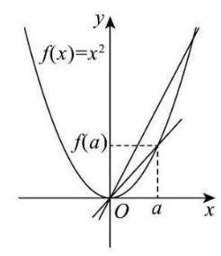

且 $f\left( x\right)$ 在 $R$ 上单调递增,所以设 $f\left( x\right)  = x$ ,则 $f\left( a\right)  = a$ ,

此时 ${g}_{a}\left( x\right)  = \frac{f\left( x\right)  - f\left( a\right) }{x - a} = \frac{x - a}{x - a} = 1\left( {a \in  R}\right)$ 为常数,

即任意两点的割线的斜率为常数，故 $A$ 错误；

对于 $B$ : 设 $f\left( x\right)  = {x}^{2}$ ,由图象得，

当 $x \in  R$ 时，随 $x$ 增大，点 $\left( {x, f\left( x\right) }\right)$ 与点 $\left( {a, f\left( a\right) }\right)$ 连线的割线斜率越来越大，

即单调递增，但 $f\left( x\right)$ 在 $R$ 上不是单调函数，故 $B$ 错误；

对于 $C$ : 因为对于任意实数 $a$ 存在实数 ${M}_{1} > 0$ ,使得 $\left| {f\left( x\right) }\right|  < {M}_{1}$ ,说明 $f\left( x\right)$ 为有界函数,

构造 $f\left( x\right)  = \left\{  \begin{array}{l} {x}^{1/3}, x \in  \left\lbrack  {-1,1}\right\rbrack  \\  1, x > 1 \\   - 1, x <  - 1 \end{array}\right.$ ,当 $a = 0, x \rightarrow  {0}^{ + }$ 时,割线的斜率趋于正无穷,故 $C$ 错误;

对于 $D$ : 因为函数 ${g}_{a}\left( x\right)$ 满足: 当 $x \in  \left( {a, + \infty }\right)$ 时, ${g}_{a}\left( x\right)  \geq  0$ ,

即 ${g}_{a}\left( x\right)  = \frac{f\left( x\right)  - f\left( a\right) }{x - a} \geq  0 \Rightarrow  \left\lbrack  {f\left( x\right)  - f\left( a\right) }\right\rbrack  \left( {x - a}\right)  \geq  0,\left( {x \neq  a}\right)$ ,

因为 $x > a, x - a > 0$ ,所以 $f\left( x\right)  \geq  f\left( a\right)$ ;

同理,当 $x \in  \left( {-\infty , a}\right)$ 时, ${g}_{a}\left( x\right)  \leq  0$ ,

即 ${g}_{a}\left( x\right)  = \frac{f\left( x\right)  - f\left( a\right) }{x - a} \leq  0 \Rightarrow  \left\lbrack  {f\left( x\right)  - f\left( a\right) }\right\rbrack  \left( {x - a}\right)  \leq  0,\left( {k \neq  a}\right)$ ,

因为 $x < a, x - a < 0$ ,所以 $f\left( x\right)  \geq  f\left( a\right)$ ;

所以 $f\left( a\right)$ 为 $f\left( x\right)$ 的最小值,故 $D$ 正确.

故选 $D$ .

【练习】3. (2024 届建平) 若函数 $y = f\left( x\right) , x \in  D$ 满足: 对于任意 ${x}_{1},{x}_{2} \in  D$ ,均有 $\left| {f\left( {x}_{1}\right)  - f\left( {x}_{2}\right) }\right|  \leq  {\left| {x}_{1} - {x}_{2}\right| }^{n}$ ( $n$ 为正整数) 成立,则称函数 $y = f\left( x\right)$ 具有“ $n$ 级”性质.

(1) 分别判断 $f\left( x\right)  = {x}^{2}, g\left( x\right)  = \frac{1}{2}x$ 是否具有“1级”性质,并说明理由;

(2) 已知定义域为 $R$ 的函数 $y = f\left( x\right)$ 具有“2级”性质,求证:对于任意的 $a, b \in  R$ ,都有

$\left| {f\left( a\right)  - f\left( b\right) }\right|  \leq  \frac{1}{2}{\left( a - b\right) }^{2};$

(3)已知定义域为 $R$ 的函数 $y = f\left( x\right)$ 具有“3级”性质,求证:函数 $y = f\left( x\right)$ 为常值函数.

【答案】(1)函数 $f\left( x\right)  = {x}^{2}$ 不具有 “ 1 级” 性质; 函数 $g\left( x\right)  = \frac{1}{2}x$ 具有 “ 1 级” 性质

(2)略(3)略

【解析】(1) 对于函数 $f\left( x\right)  = {x}^{2}$ ,取 ${x}_{1} = 2,{x}_{2} = 0, f\left( {x}_{1}\right)  - f\left( {x}_{2}\right)  = 4 > {x}_{1} - {x}_{2} = 2$ ,

所以函数 $f\left( x\right)  = {x}^{2}$ 不具有 “ 1 级” 性质;

对于函数 $g\left( x\right)  = \frac{1}{2}x, g\left( {x}_{1}\right)  - g\left( {x}_{2}\right)  \leq  \frac{1}{2}\left| {{x}_{1} - {x}_{2}}\right|  \leq  \left| {{x}_{1} - {x}_{2}}\right|$ ,

所以函数 $g\left( x\right)  = \frac{1}{2}x$ 具有 “ 1 级” 性质.

(2)若 $a = b$ ，显然成立；

若 $a \neq  b$ ，不妨设 $a < b$ ，由题意得 $f\left( y\right)  - f\left( x\right)  \leq  {\left( y - x\right) }^{2}$ ，

由 $x\text{ 、 }y$ 的任意性,同时也有 $f\left( x\right)  - f\left( y\right)  \leq  {\left( y - x\right) }^{2}$ ,

即 $\left| {f\left( y\right)  - f\left( x\right) }\right|  \leq  {\left| x - y\right| }^{2}$ ,

将区间进行 2 等分,记 $a = {x}_{0}, a + \frac{b - a}{2} = {x}_{1}, b = {x}_{2}$ ,

所以 $\left| {f\left( b\right)  - f\left( a\right) }\right|  = \left| {f\left( {x}_{2}\right)  - f\left( {x}_{1}\right)  + f\left( {x}_{1}\right)  - f\left( {x}_{0}\right) }\right|$

$\leq  {\left| {x}_{2} - {x}_{1}\right| }^{2} + {\left| {x}_{1} - {x}_{0}\right| }^{2} = {\left( \frac{b - a}{2}\right) }^{2} \times  2 = \frac{1}{2}{\left( b - a\right) }^{2},$

所以 $\left| {f\left( a\right)  - f\left( b\right) }\right|  \leq  \frac{1}{2}{\left( a - b\right) }^{2}$ ,证毕;

(3) 对于任意的 $a, b \in  R$ 且 $a \neq  b$ ,不妨令 $a < b$ ,

取区间 $\left\lbrack  {a, b}\right\rbrack$ 的 $n\left( {n \geq  2, n \in  {N}^{ * }}\right)$ 等分点 ${x}_{i}\left( {\mathrm{i} = 1,2,3,\cdots , n - 1}\right)$ ,

则 ${x}_{i} = a + \mathrm{i} \cdot  \frac{b - a}{n}\left( {\mathrm{i} = 1,2,3,\cdots , n - 1}\right)$ ,

此时 $\left| {f\left( a\right)  - f\left( b\right) }\right|  = \left| {f\left( a\right)  - f\left( {x}_{1}\right)  + f\left( {x}_{1}\right)  - f\left( {x}_{2}\right)  + f\left( {x}_{2}\right)  - f\left( {x}_{3}\right)  + \cdots  - f\left( {x}_{n - 1}\right)  + f\left( {x}_{n - 1}\right)  - f\left( b\right) }\right|$

$\leq  \left| {f\left( a\right)  - f\left( {x}_{1}\right) }\right|  + \left| {f\left( {x}_{1}\right)  - f\left( {x}_{2}\right) }\right|  + \left| {f\left( {x}_{2}\right)  - f\left( {x}_{3}\right) }\right|  + \cdots  + \left| {f\left( {x}_{n - 1}\right)  - f\left( b\right) }\right|$

$\leq  {\left| a - {x}_{1}\right| }^{3} + {\left| {x}_{1} - {x}_{2}\right| }^{3} + {\left| {x}_{2} - {x}_{3}\right| }^{3} + \cdots  + {\left| {x}_{n - 1} - b\right| }^{3}$

$= {\left| \frac{b - a}{n}\right| }^{3} \cdot  n = \frac{{\left( b - a\right) }^{3}}{{n}^{2}}$

假设 $f\left( a\right)  \neq  f\left( b\right)$ ,记 $\left| {f\left( a\right)  - f\left( b\right) }\right|  = m$ ,则 $m \leq  \frac{{\left( b - a\right) }^{3}}{{n}^{2}}\left( *\right)$ ,

当 $n$ 足够大时,可以取 $n > \sqrt{\frac{{\left( b - a\right) }^{3}}{m}}$ ,则 $m > \frac{{\left( b - a\right) }^{3}}{{n}^{2}}$ ,与 $\left( *\right)$ 矛盾,

所以假设不成立,即对任意的 $a, b \in  R$ 且 $a \neq  b$ ,都有 $f\left( a\right)  = f\left( b\right)$ ,

所以函数 $y = f\left( x\right)$ 为常值函数.

## CH 每日三题 0304

【练习】1. (2024 届华二)已知 $\bigtriangleup  {ABC}$ 是边长为 4 的正三角形，平面上两动点 $O$ ， $P$ 满足 $\overrightarrow{OP} = {\lambda }_{1}\overrightarrow{OA} + \; {\lambda }_{2}\overrightarrow{OB} + {\lambda }_{3}\overrightarrow{OC}\left( {{\lambda }_{1} + {\lambda }_{2} + {\lambda }_{3} = 1\text{ 且 }{\lambda }_{1},{\lambda }_{2},{\lambda }_{3} \geq  0}\right)$ . 若 $\left| \overrightarrow{OP}\right|  = 1$ ，则 $\overrightarrow{OA} \cdot  \overrightarrow{OB}$ 的最大值为___.

【答案】 $9 + 4\sqrt{3}$

【解析】由已知 $\overrightarrow{OP} = {\lambda }_{1}\overrightarrow{OA} + {\lambda }_{2}\overrightarrow{OB} + {\lambda }_{3}\overrightarrow{OC},{\lambda }_{1} + {\lambda }_{2} + {\lambda }_{3} = 1$ ,

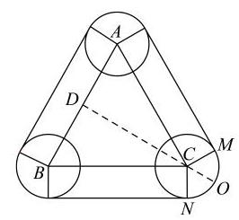

则 $\overrightarrow{OP} = {\lambda }_{1}\left( {\overrightarrow{OP} + \overrightarrow{PA}}\right)  + {\lambda }_{2}\left( {\overrightarrow{OP} + \overrightarrow{PB}}\right)  + {\lambda }_{3}\left( {\overrightarrow{OP} + \overrightarrow{PC}}\right)$ ,

则 ${\lambda }_{1}\overrightarrow{PA} + {\lambda }_{2}\overrightarrow{PB} + {\lambda }_{3}\overrightarrow{PC} = \overrightarrow{0}$ ,即 ${\lambda }_{1}\overrightarrow{PA} + {\lambda }_{2}\left( {\overrightarrow{PA} + \overrightarrow{AB}}\right)  + {\lambda }_{3}\left( {\overrightarrow{PA} + \overrightarrow{AC}}\right)  = \overrightarrow{0}$ ,

则 $\overrightarrow{AP} = {\lambda }_{2}\overrightarrow{AB} + {\lambda }_{3}\overrightarrow{AC}$ ,又 ${\lambda }_{1} + {\lambda }_{2} + {\lambda }_{3} = 1$ ,且 ${\lambda }_{1},{\lambda }_{2},{\lambda }_{3} \geq  0$ ,

则 $0 \leq  {\lambda }_{2} + {\lambda }_{3} \leq  1$ ,则点 $P$ 在 $\bigtriangleup {ABC}$ 内部或边上,

又 $\left| \overrightarrow{OP}\right|  = 1$ ，所以点 $O$ 在以 $P$ 为圆心，1为半径的圆上，设 ${AB}$ 中点为 $D$ ，

则 $\overrightarrow{OA} \cdot  \overrightarrow{OB} = \left( {\overrightarrow{OD} + \overrightarrow{DA}}\right)  \cdot  \left( {\overrightarrow{OD} + \overrightarrow{DB}}\right)  = {\overrightarrow{OD}}^{2} - {\overrightarrow{AD}}^{2} = {\overrightarrow{OD}}^{2} - 4$ ，

易得当点 $O$ 为直线 ${DC}$ 与 $\overset{\text{ ⏜ }}{MN}$ 交点时, ${OD}$ 最大为 $2\sqrt{3} + 1$ ,

即 $\overrightarrow{OA} \cdot  \overrightarrow{OB} = {\overrightarrow{OD}}^{2} - 4$ 的最大值为 ${\left( 2\sqrt{3} + 1\right) }^{2} - 4 = 9 + 4\sqrt{3}$ .

【练习】2. (2024 届华二) 已知数列 $\left\{  {a}_{n}\right\}$ 不是常数列,前 $n$ 项和为 ${S}_{n}$ ,且 ${a}_{1} > 0$ . 若对任意正整数 $n$ ,存在正整数 $m$ ,使得 $\left| {{a}_{n} - {S}_{m}}\right|  \leq  {a}_{1}$ ,则称 $\left\{  {a}_{n}\right\}$ 是 “可控数列”. 现给出两个命题: ①存在等差数列 $\left\{  {a}_{n}\right\}$ 是 “可控数列”; ②存在等比数列 $\left\{  {a}_{n}\right\}$ 是 “可控数列”. 则下列判断正确的是 ( )

A. ①与②均为真命题 B. ①与②均为假命题

C. ①为真命题，②为假命题 D. ①为假命题，②为真命题

【答案】 $D$

【解析】对于①,数列 $\left\{  {a}_{n}\right\}$ 不是常数列,则 $d \neq  0$ ,则 ${a}_{n}$ 以一次函数形式变化,

由 $\left| {{a}_{n} - {S}_{m}}\right|  \leq  {a}_{1}$ 得 ${S}_{m} - {a}_{1} \leq  {a}_{n} \leq  {S}_{m} + {a}_{1},{S}_{m}$ 以二次函数形式变化,

当 $n$ 充分大时,显然不成立;

对于②，取 ${a}_{n} = {2}^{n}$ ，则 ${S}_{n} = \frac{2\left( {1 - {2}^{n}}\right) }{1 - 2} = {2}^{n + 1} - 2 = {a}_{n + 1} - {a}_{1}$ ，

当 $n = 1$ 时，取 $m = 1$ ，满足 $\left| {{a}_{n} - {S}_{m}}\right|  \leq  {a}_{1}$ ；

当 $n \geq  2$ 时，取 $m = n - 1$ ，满足 $\left| {{a}_{n} - {S}_{m}}\right|  \leq  {a}_{1}$ ；故选 $D$ .

【练习】3. (2024 届七宝)若斜率为 $k$ 的两条平行直线 ${l}_{1}$ ， ${l}_{2}$ ，曲线 $C : y = f\left( x\right)$ 满足以下两条性质:

(I) ${l}_{1},{l}_{2}$ 分别与曲线 $C$ 至少有两个切点;

(II) 曲线 $C$ 上的所有点都在 ${l}_{1},{l}_{2}$ 之间或两条直线上. 则称直线 ${l}_{1},{l}_{2}$ 为曲线 $C$ 的一对“双夹线”, 把 “双夹线” 之间的距离称为曲线 $C$ 在 “ $k$ 方向上的宽度”，记为 $d\left( k\right)$ .

已知曲线 $C : f\left( x\right)  = {mx} + n\sin x$ .

(1) 判断 $m = 0, n = 1$ 时,曲线 $C$ 是否存在 “双夹线”,并说明理由;

(2) 若 $m = 1, n =  - 1$ ,试问: ${l}_{1} : y = x + 1$ 和 ${l}_{2} : y = x - 1$ 是否是函数 $y = f\left( x\right)$ 的一对“双夹线”? 若是，求此时 $d\left( k\right)$ 的值；若不是，请说明理由.

(3)对于任意的正实数 $m, n$ ，函数 $y = f\left( x\right)$ 是否都存在 “双夹线” ? 若是，求 $d\left( k\right)$ 的所有取值构成的集合; 若不是, 请说明理由.

【解析】 $\left( 1\right) m = 0, n = 1$ 时, $f\left( x\right)  = \sin x$ ,取 ${l}_{1} : y = 1,{l}_{2} : y =  - 1$ 符合题意,

因此曲线 $C$ 此时存在 “双夹线”; 4 分

(2) $m = 1, n =  - 1$ 时, $f\left( x\right)  = x - \sin x,{l}_{1} : y = x + 1$ 和 ${l}_{2} : y = x - 1$ 对应斜率 $k = 1$ .

由 ${f}^{\prime }\left( x\right)  = 1 - \cos x = 1$ 得 $\cos x = 0$ ,

当 $x =  - \frac{\pi }{2}$ 时, $\cos x = 0, f\left( {-\frac{\pi }{2}}\right)  =  - \frac{\pi }{2} + 1$ ,代入 ${l}_{1} : y = x + 1$ 得 $y =  - \frac{\pi }{2} + 1$ ;

当 $x = \frac{3\pi }{2}$ 时, $\cos x = 0, f\left( \frac{3\pi }{2}\right)  = \frac{3\pi }{2} + 1$ ,代入 ${l}_{1} : y = x + 1$ 得 $y = \frac{3\pi }{2} + 1$ ;

所以 $\left( {-\frac{\pi }{2}, - \frac{\pi }{2} + 1}\right)$ 和 $\left( {\frac{3\pi }{2},\frac{3\pi }{2} + 1}\right)$ 是直线 ${l}_{1}$ 与曲线 $C$ 相切的两个切点.

同理可得 $\left( {\frac{\pi }{2},\frac{\pi }{2} - 1}\right)$ 和 $\left( {-\frac{3\pi }{2}, - \frac{3\pi }{2} - 1}\right)$ 是直线 ${l}_{2}$ 与曲线 $C$ 相切的两个切点.

性质 $\left( I\right)$ 成立;

又考虑对于任意的 $x \in  R$ ，

$g\left( x\right)  = f\left( x\right)  - x - 1 = x - \sin x - x - 1 =  - \sin x - 1 \leq  0$ ,所以 $f\left( x\right)  \leq  x + 1$ .

同理可得 $f\left( x\right)  \geq  x - 1$ 对于任意的 $x \in  R$ 也恒成立,

说明性质 (II) 也成立.

因此 ${l}_{1} : y = x + 1$ 和 ${l}_{2} : y = x - 1$ 是函数 $y = f\left( x\right)$ 的“双夹线”,

此时 $d\left( k\right)$ 记为 ${l}_{1} : y = x + 1$ 和 ${l}_{2} : y = x - 1$ 之间的距离,

即有 $d\left( k\right)  = d\left( 1\right)  = \frac{2}{\sqrt{1 + 1}} = \sqrt{2}$ .

(3) 推测: ${l}_{1} : y = {mx} - n$ 和 ${l}_{2} : y = {mx} + n$ 是曲线 $C : f\left( x\right)  = {mx} + n\sin x$ 的一对“双夹线”

先验证性质 $\left( I\right)  : {l}_{1} : y = {mx} - n$ 和 ${l}_{2} : y = {mx} + n$ 对应的斜率为 $m$ .

由 ${f}^{\prime }\left( x\right)  = m + n\cos x = m$ 得 $\cos x = 0$ ,

令 $x = {2k\pi } - \frac{\pi }{2}, f\left( x\right)  = m\left( {{2k\pi } - \frac{\pi }{2}}\right)  - n$ ,对应 $y = m\left( {{2k\pi } - \frac{\pi }{2}}\right)  - n$ .

即 ${l}_{1} : y = {mx} - n$ 与曲线 $C : f\left( x\right)  = {mx} + n\sin x$ 相切且有无数个切点

$\left( {{2k\pi } - \frac{\pi }{2}, m\left( {{2k\pi } - \frac{\pi }{2}}\right)  - n}\right)$

同理, ${l}_{2} : y = {mx} + n$ 与曲线 $C : f\left( x\right)  = {mx} + n\sin x$ 也相切且有无数个切点

$\left( {{2k\pi } + \frac{\pi }{2}, m\left( {{2k\pi } + \frac{\pi }{2}}\right)  + n}\right)$

再验证性质 $\left( {II}\right)  :$ 不妨设 ${g}_{1}\left( x\right)  = f\left( x\right)  - {mx} + n,{g}_{2}\left( x\right)  = f\left( x\right)  - {mx} - n$ ,

易得 ${g}_{1}\left( x\right)  = n\left( {1 - \sin x}\right) ,{g}_{2}\left( x\right)  = n\left( {\sin x - 1}\right)$ ,

得 $n > 0$ 时, ${g}_{1}\left( x\right)  = n\left( {1 - \sin x}\right)  \geq  0,{g}_{2}\left( x\right)  = n\left( {\sin x - 1}\right)  \leq  0$ .

综上: ${l}_{1} : y = {mx} - n$ 和 ${l}_{2} : y = {mx} + n$ 是曲线 $C : f\left( x\right)  = {mx} + n\sin x$ 的一对“双夹线”.

此时, $d\left( k\right)  = d\left( m\right)  = \frac{2n}{\sqrt{1 + {m}^{2}}}\left( {n > 0}\right)$ .

下证唯一性: ① 先证斜率为 $m$ ,截距不等于 $n$ 或 $- n$ 的任何一对平行线不是曲线 $C : f\left( x\right)  = {mx} + \; n\sin x$ 的“双夹线”:

假设为 ${l}_{1} : y = {mx} + {n}_{1},\left( {{n}_{1} \neq  n,{n}_{1} \neq   - n}\right)$ 为曲线 $C$ 的一对“双夹线”中的一条,

由 ${f}^{\prime }\left( x\right)  = m + n\cos x = m$ 得 $\cos x = 0$ ,

令 $x = {2k\pi } - \frac{\pi }{2}, f\left( x\right)  = m\left( {{2k\pi } - \frac{\pi }{2}}\right)  - n \neq  m\left( {{2k\pi } - \frac{\pi }{2}}\right)  + {n}_{1}$ ;

令 $x = {2k\pi } + \frac{\pi }{2}, f\left( x\right)  = m\left( {{2k\pi } - \frac{\pi }{2}}\right)  + n \neq  m\left( {{2k\pi } - \frac{\pi }{2}}\right)  + {n}_{1}$ ;

不满足性质 $\left( I\right)$ ,所以假设不成立.

②假如斜率为 $k\left( {k \neq  m}\right)$ 的两条平行直线 ${l}_{1},{l}_{2}$ ，

分别设为 ${l}_{1} : y = {kx} + {b}_{1},{l}_{2} : y = {kx} + {b}_{2}\left( {{b}_{1} < {b}_{2}}\right)$ 为曲线 $C$ 的一对“双夹线”,

考虑性质 (II),则有 ${kx} + {b}_{2} \geq  {mx} + n\sin x$ .

即有 $\left( {m - k}\right) x + n\sin x - {b}_{2} \leq  0$ 对于任意的 $x \in  R$ 均成立.

取 $x = {a\pi }\left( {a \in  Z}\right)$ ,得 $a\left( {m - k}\right) \pi  \leq  {b}_{2}$

已知 $k \neq  m$ ，不妨考虑 $m > k$ ，则有 $a \leq  \frac{{b}_{2}}{\left( {m - k}\right) \pi }$ ，这与性质(II)矛盾.

由①②得曲线 $C : f\left( x\right)  = {mx} + n\sin x$ 的“双夹线”存在且唯一，

所以求 $d\left( k\right)$ 的所有取值构成的集合为 $\left\{  {\frac{2n}{\sqrt{1 + {m}^{2}}}\left( {n > 0}\right) }\right\}$

## CH 每日三题 0305

【练习】1. (2024 届华二) 已知函数 $f\left( x\right)  = {x}^{2} + \left( {a - 4}\right) x + 3 - a$ . 若对于任意的 $a \in  \left( {0,4}\right)$ ，存在 $x \in  \left\lbrack  {0,2}\right\rbrack$ ， 使得 $\left| {f\left( x\right) }\right|  \geq  t$ ，则实数 $t$ 的取值范围是___.

【答案】 $t \leq  1$

【解析】法一: 数形结合, 见视频

法二: $\left| {f\left( x\right) }\right|  = \left| {{\left( x - 1\right) }^{2} + \left( {a - 2}\right) \left( {x - 1}\right) }\right|  \leq  {\left( x - 1\right) }^{2} + \left| {\left( {a - 2}\right) \left( {x - 1}\right) }\right|  \leq  1 + \left| {a - 2}\right|$ ,

当且仅当 $x = 0$ 时取等号,又 ${\left( 1 + \left| a - 2\right| \right) }_{\min } = 1$ ,所以 $t \leq  1$ .

【练习】2. (2024 届华二) 定义全集 $X$ 的子集 $A \subseteq  X$ 的特征函数 $y = {f}_{A}\left( x\right)$ ，其中 ${f}_{A}\left( x\right)  = \left\{  \begin{array}{l} 1, x \in  A \\  0, x \in  \bar{A} \end{array}\right.$ ，对于 $A\text{ 、 }B \subseteq  X$ ,下列命题中不正确的是 ( )

A. $A \subseteq  B \Leftrightarrow$ 任意 $x \in  X,{f}_{A}\left( x\right)  \leq  {f}_{B}\left( x\right)$ B. 任意 $x \in  X$ , ${f}_{\bar{A}}\left( x\right)  = 1 - {f}_{A}\left( x\right)$

C. 任意 $x \in  X,{f}_{A \cap  B}\left( x\right)  = {f}_{A}\left( x\right) {f}_{B}\left( x\right)$ D. 任意 $x \in  X,{f}_{A \cup  B}\left( x\right)  = {f}_{A}\left( x\right)  + {f}_{B}\left( x\right)$

【答案】 $D$

【解析】对于 $A,{f}_{A}\left( x\right)  = \left\{  {\begin{array}{l} 1, x \in  A \\  0, x \in  \bar{A} \end{array},{f}_{B}\left( x\right)  = \left\{  \begin{array}{l} 1, x \in  B \\  0, x \in  \bar{B} \end{array}\right. }\right.$ ,

而 $\bar{A}$ 中可能有 $B$ 的元素,但 $\bar{B}$ 中不可能有 $A$ 的元素,所以 ${f}_{A}\left( x\right)  \leq  {f}_{B}\left( x\right)$ ,正确;

对于 $B,{f}_{\bar{A}}\left( x\right)  = \left\{  \begin{array}{l} 1, x \in  \bar{A} \\  0, x \in  A \end{array}\right.$ ,又 ${f}_{A}\left( x\right)  = \left\{  \begin{array}{l} 1, x \in  A \\  0, x \in  \bar{A} \end{array}\right.$ ,

所以 ${f}_{\bar{A}}\left( x\right)  = 1 - {f}_{A}\left( x\right)$ ,正确;

对于 $C,{f}_{A \cap  B}\left( x\right)  = \left\{  {\begin{array}{l} 1, x \in  \overline{A \cap  B} \\  0, x \in  \overline{A \cap  B} \end{array} = \left\{  {\begin{array}{l} 1, x \in  A \\  0, x \in  \bar{A} \end{array}.}\right. }\right. \;\left\{  {\begin{array}{l} 1, x \in  B \\  0, x \in  \bar{B} \end{array} = {f}_{A}\left( x\right)  \cdot  {f}_{B}\left( x\right) }\right.$ ,正确;

对于 $D,{f}_{A \cup  B}\left( x\right)  = \left\{  \begin{array}{l} 1, x \in  \overline{A \cup  B} \\  0, x \in  \overline{A \cup  B} \end{array}\right.$ ,

若存在某个元素同时在 $x$ 在 $A$ 和 $B$ 中, ${f}_{A \cup  B}\left( x\right)  = 1$ ,而 ${f}_{A}\left( x\right)  = 1$ 且 ${f}_{B}\left( x\right)  = 1$ ,得 ${f}_{A \cup  B}\left( x\right)  \neq  {f}_{A}\left( x\right) \; + {f}_{B}\left( x\right)$ ,故不正确. $\left( {{f}_{A \cup  B}\left( x\right)  = 1 - {f}_{\bar{A}}\left( x\right) {f}_{\bar{B}}\left( x\right) }\right.$ 是正确的 $)$

故选 $D$ .

【练习】3. (2024 届华二) 已知 $f\left( x\right)  = {\mathrm{e}}^{x}, a \in  R$ . 若曲线 $y = f\left( x\right)$ 在点 $\left( {a, f\left( a\right) }\right)$ 处的切线与直线 $y = x$ 相交,记其交点的横坐标为 ${a}_{2}$ . 一般地,对 $n \in  N, n \geq  2$ ,若曲线 $y = f\left( x\right)$ 在点 $\left( {{a}_{n}, f\left( {a}_{n}\right) }\right)$ 处的切线与直线 $y = x$ 相交,记其交点的横坐标为 ${a}_{n + 1}$ ; 若两直线不相交,则上述过程结束. 由这些项构成数列 $\left\{  {a}_{n}\right\}$ . 其中 ${a}_{1} = a$ .

(1)若 $\left\{  {a}_{n}\right\}$ 只有两项，求 $a$ 的值；

(2)证明:有且仅有两个不同的 $a$ ，使得 $\left\{  {a}_{n}\right\}$ 是恰有三项的有限数列；

(3) 是否存在 $a \in  R$ ，使得 $\left\{  {a}_{n}\right\}$ 是严格减的无限数列? 若存在，求 $a$ 的取值范围；否则，说明理由.

【解析】(1) 由题意得第 1 条切线 ${l}_{1} : y = {\mathrm{e}}^{a}\left( {x - a}\right)  + {\mathrm{e}}^{a}$ 与 $y = x$ 相交,

且第 2 条切线 ${l}_{2} : y = {\mathrm{e}}^{{a}_{2}}\left( {x - {a}_{2}}\right)  + {\mathrm{e}}^{{a}_{2}}$ 与 $y = x$ 不相交,故 ${\mathrm{e}}^{{a}_{2}} = 1$ 即 ${a}_{2} = 0$ ,

则第 1 条切线 ${l}_{1} : y = {\mathrm{e}}^{a}\left( {x - a}\right)  + {\mathrm{e}}^{a}$ 与 $y = x$ 相交于点 $\left( {{a}_{2},{a}_{2}}\right)$ ,即点 $\left( {0,0}\right)$ ,

$0 = {\mathrm{e}}^{a} \cdot  \left( {-a}\right)  + {\mathrm{e}}^{a}$ ,解得 $a = 1$ .

(2)同(1)，此时 $a$ 满足的条件为 ${a}_{3} = 0$ 且 ${a}_{2} \neq  0$ ，也即 ${a}_{2} = 1$ .

因为 $\left( {{a}_{2},{a}_{2}}\right)$ 是直线 $y = {\mathrm{e}}^{a}\left( {x - a}\right)  + {\mathrm{e}}^{a}$ 与 $y = x$ 的交点,

所以 $1 = {\mathrm{e}}^{a}\left( {1 - a}\right)  + {\mathrm{e}}^{a}$ ,故数列 $\left\{  {a}_{n}\right\}$ 恰有三项当且仅当 $a + {\mathrm{e}}^{-a} = 2$ .

考虑 $h\left( a\right)  = a + {\mathrm{e}}^{-a}$ ,则 ${h}^{\prime }\left( a\right)  = 1 - {\mathrm{e}}^{-a}$ ,

故当 $a < 0$ 时,函数 $y = h\left( a\right)$ 严格减; 当 $a > 0$ 时,函数 $y = h\left( a\right)$ 严格增.

从而函数 $y = h\left( a\right)$ 在 $a = 0$ 处有最小值 $h\left( 0\right)  = 1$ .

另一方面，因为 $h\left( 2\right)  > 2$ 且 $h\left( {-\ln 4}\right)  = 4 - \ln 4 > 2$ ，

由零点存在定理,函数 $y = h\left( a\right)  - 2$ 在 $\left( {-\infty ,0}\right)$ 和 $\left( {0, + \infty }\right)$ 上均恰有一个零点,

即有且仅有两个不同的 $a$ ,使得 $\left\{  {a}_{n}\right\}$ 是恰有三项的有限数列.

(3) 同 (2), $\left( {{a}_{n + 1},{a}_{n + 1}}\right)$ 是直线 $y = {\mathrm{e}}^{{a}_{n}}\left( {x - {a}_{n}}\right)  + {\mathrm{e}}^{{a}_{n}}$ 与 $y = x$ 的交点,

所以对一切正整数 $n,{a}_{n + 1} = \frac{{\mathrm{e}}^{{a}_{n}}}{{\mathrm{e}}^{{a}_{n}} - 1}\left( {{a}_{n} - 1}\right)$ 都成立.

若存在满足要求的数列 $\left\{  {a}_{n}\right\}$ ,则 ${a}_{n} > \frac{{\mathrm{e}}^{{a}_{n}}}{{\mathrm{e}}^{{a}_{n}} - 1}\left( {{a}_{n} - 1}\right)$ 对一切正整数 $n$ 恒成立.

移项作差得 $\frac{{a}_{n} - {\mathrm{e}}^{{a}_{n}}}{{\mathrm{e}}^{{a}_{n} - 1}} < 0$ 对一切正整数 $n$ 但成立,

但是 ${\mathrm{e}}^{{a}_{n}} \geq  {a}_{n} + 1 > {a}_{n}$ ,故 ${a}_{n} > 0$ 恒成立.

另一方面，因为 $\left\{  {a}_{n}\right\}$ 严格减，所以 ${a}_{n + 1} - {a}_{n} = \frac{{\mathrm{e}}^{{a}_{n}} - {a}_{n}}{1 - {\mathrm{e}}^{{a}_{n}}} \leq  \frac{1}{1 - {\mathrm{e}}^{{a}_{n}}} \leq  \frac{1}{1 - {\mathrm{e}}^{a}}$ .

所以 ${a}_{n + 1} - {a}_{1} = \left( {{a}_{n + 1} - {a}_{n}}\right)  + \left( {{a}_{n} - {a}_{n - 1}}\right)  + \cdots  + \left( {{a}_{2} - {a}_{1}}\right)  \leq  \frac{n}{1 - {\mathrm{e}}^{a}}$ ,

故当 $n > a\left( {{\mathrm{e}}^{a} - 1}\right)$ 时, ${a}_{n + 1} - {a}_{1} <  - a$ ,即 ${a}_{n + 1} < 0$ ,与 ${a}_{m} > 0$ 矛盾.

故不存在满足要求的实数 $a$ .

## CI 每日三题 0306

【练习】1. (2024 届华二) 已知抛物线 $y = a{x}^{2}\left( {a > 0}\right)$ ，在 $y$ 轴正半轴上存在一点 $P$ ，使过 $P$ 的任意直线交抛物线于 $M$ ， $N$ ，都有 $\frac{1}{{\left| MP\right| }^{2}} + \frac{1}{{\left| NP\right| }^{2}}$ 为定值，则点 $P$ 的坐标为___.

【答案】 $\left( {0,\frac{1}{2a}}\right)$

【解析】法一:极限思想，见视频

考虑垂直和水平的两条直线,设 $P\left( {0, t}\right)$ ,

垂直时, $\frac{1}{{\left| MP\right| }^{2}} + \frac{1}{{\left| NP\right| }^{2}} = \frac{1}{{t}^{2}}$ ,水平时, $\frac{1}{{\left| MP\right| }^{2}} + \frac{1}{{\left| NP\right| }^{2}} = \frac{2}{{x}^{2}} = \frac{2a}{t}$ ,

所以 $\frac{1}{{t}^{2}} = \frac{2a}{t}$ ,所以 $t = \frac{1}{2a}$ ,所以点 $P$ 的坐标为 $\left( {0,\frac{1}{2a}}\right)$ .

法二:直线的参数方程计算，见视频

法三:常规计算，设 $P\left( {0, t}\right)$ ，过 $P$ 的直线方程为 $y = {kx} + t$ ，

由 $\left\{  \begin{array}{l} y = a{x}^{2}\left( {a > 0}\right) \\  y = {kx} + t \end{array}\right.$ 得 $a{x}^{2} - {kx} - t = 0$ ,设 $M\left( {{x}_{1},{y}_{1}}\right) , N\left( {{x}_{2},{y}_{2}}\right)$ ,

则 $\frac{1}{{\left| MP\right| }^{2}} + \frac{1}{{\left| NP\right| }^{2}} = \frac{1}{{x}_{1}^{2} + {\left( {y}_{1} - t\right) }^{2}} + \frac{1}{{x}_{2}^{2} + {\left( {y}_{2} - t\right) }^{2}} = \frac{1}{1 + {k}^{2}}\left( {\frac{1}{{x}_{1}^{2}} + \frac{1}{{x}_{2}^{2}}}\right)$

$= \frac{1}{1 + {k}^{2}} \cdot  \frac{{\left( {x}_{1} + {x}_{2}\right) }^{2} - 2{x}_{1}{x}_{2}}{{x}_{1}^{2}{x}_{2}^{2}} = \frac{1}{1 + {k}^{2}} \cdot  \frac{\frac{{k}^{2}}{{a}^{2}} + \frac{2t}{a}}{\frac{{t}^{2}}{{a}^{2}}} = \frac{1}{1 + {k}^{2}} \cdot  \frac{{k}^{2} + {2at}}{{t}^{2}}$ 为定值，

则 $\frac{1}{{t}^{2}} = \frac{2at}{{t}^{2}}$ (系数成比例),所以 $t = \frac{1}{2a}$ ,所以点 $P$ 的坐标为 $\left( {0,\frac{1}{2a}}\right)$ .

【练习】2. (2025 届复兴) 对于锐角 $\bigtriangleup {ABC}$ 和实数 $k \in  \left\lbrack  {0,1}\right\rbrack$ ,有两个命题:

命题 $p$ : 存在 $k$ ,对任意 $A$ ,都存在 $\bigtriangleup {ABC}$ ,使得 $\left| {\cos B - \cos A}\right|  + \left| {\cos C - \cos A}\right|  = k$ ;

命题 $q$ :存在 $A$ ，对任意 $k$ ，都存在 $\bigtriangleup  {ABC}$ ，使得 $\left| {\cos B - \cos A}\right|  + \left| {\cos C - \cos A}\right|  = k$ . 则下列判断正确的是 ( )

A. $p$ 是真命题, $q$ 是真命题 B. $p$ 是真命题, $q$ 是假命题

C. $p$ 是假命题, $q$ 是真命题 D. $p$ 是假命题, $q$ 是假命题

【答案】 $D$

【解析】对于命题 $p$ : 当 $A \rightarrow  0$ 时, $B, C \rightarrow  \frac{\pi }{2}$ ,

此时 $\left| {\cos B - \cos A}\right|  + \left| {\cos C - \cos A}\right|  \rightarrow  2$ ; 因为 $k \in  \left\lbrack  {0,1}\right\rbrack$ ,所以不成立.

对于命题 $q$ : 必要性: $k = 0$ 时能成立,此时 $A = \frac{\pi }{3}$

充分性: 当 $A = \frac{\pi }{3}$ 时,不妨设 $B \leq  A \leq  C$ ,则 $\left| {\cos B - \cos A}\right|  + \left| {\cos C - \cos A}\right|  = \cos B - \cos C < 1 - \; 0 = 1$ ,此时取 $k = 1$ ,三角形 ${ABC}$ 无解,故选 $D$ .

【练习】3. (2024 届华二) 已知椭圆 $\Gamma  : \frac{{x}^{2}}{4} + \frac{{y}^{2}}{3} = 1$ ,点 $A\left( {2,0}\right)$ 和直线 $l : x = t\left( {t \leq   - 2}\right)$ . 设 $P\left( {{x}_{0},{y}_{0}}\right)$ 是 $\Gamma$ 上异于 $A$ 的一点,且 $\Gamma$ 在 $P$ 点处的切线交直线 $l$ 于点 $T$ .

(1)若 $T$ 的坐标为 $\left( {-3,0}\right)$ ,求 ${x}_{0}$ ;

(2)若 $t =  - 4$ 且 $\left| {PT}\right|  = \left| {PA}\right|$ ，求 $\bigtriangleup  {ATP}$ 的面积:

(3)设直线 ${AP}$ 交 $l$ 于点 $Q$ . 若当 $P$ 运动时， $\left| {TQ}\right|  \geq  3$ 恒成立，求 $t$ 的取值范围.

【解析】(1) 点 $P$ 处 $\Gamma$ 的切线方程为 $\frac{{x}_{0}}{4}x + \frac{{y}_{0}}{3}y = 1$ ,

因为 $T$ 在切线上,所以 $\frac{{x}_{0}}{4} \cdot  \left( {-3}\right)  = 1,{x}_{0} =  - \frac{4}{3}$ .

( 2 )当 $t =  - 4$ 时，同( 1 )解得 $T$ 的坐标为 $\left( {-4,\frac{3}{{y}_{0}}\left( {1 + {x}_{0}}\right) }\right)$ .

代入 $\left| {PT}\right|  = \left| {PA}\right|$ ，

由两点距离公式得 ${\left( {x}_{0} + 4\right) }^{2} + {\left( {y}_{0} - \frac{3\left( {1 + {x}_{0}}\right) }{{y}_{0}}\right) }^{2} = {\left( {x}_{0} - 2\right) }^{2} + {y}_{0}^{2}$ .

因此 $6\left( {1 + {x}_{0}}\right)  + \frac{9{\left( 1 + {x}_{0}\right) }^{2}}{{y}_{0}^{2}} = 0$ ,解得 ${x}_{0} =  - 1$ 或 ${y}_{0}^{2} =  - \frac{3}{2}\left( {1 + {x}_{0}}\right)$ .

将 $\Gamma$ 的方程代入，得 $- \frac{3}{2}\left( {1 + {x}_{0}}\right)  = {y}_{0}^{2} = 3\left( {1 - \frac{{x}_{0}^{2}}{4}}\right)$ .

因此 ${x}_{0} =  - 1$ 或 $1 - \sqrt{7}\left( {{x}_{0} = 1 + \sqrt{7} > 2\text{ ,舍 }}\right)$ .

经检验, ${x}_{0} =  - 1$ 或 $1 - \sqrt{7}$ 均符合题意,

相应的 $\bigtriangleup  {ATP}$ 的面积分别为 $\frac{9}{2}$ 或 $\left( {\sqrt{7} - \frac{1}{2}}\right) \sqrt{4 + 2\sqrt{7}}$ .

(3) 同(2) 解得 $T\left( {t,\frac{3}{{y}_{0}}\left( {1 - \frac{{x}_{0}}{4}t}\right) }\right)$ .

直线 ${AP}$ 的方程为 $y = \frac{{y}_{0}}{{x}_{0} - 2}\left( {x - 2}\right)$ ，因此 $Q$ 的坐标为 $\left( {t,{y}_{0}\frac{t - 2}{{x}_{0} - 2}}\right)$ .

因此 $\left| {TQ}\right|  = \left| {\frac{3}{{y}_{0}}\left( {1 - \frac{{x}_{0}}{4}t}\right)  - {y}_{0}\frac{t - 2}{{x}_{0} - 2}}\right|  = \left| {\left( {\frac{3{x}_{0}}{4{y}_{0}} + \frac{{y}_{0}}{{x}_{0} - 2}}\right) t - \left( {\frac{3}{{y}_{0}} + \frac{2{y}_{0}}{{x}_{0} - 2}}\right) }\right|$ .

将 $3{x}_{0}^{2} + 4{y}_{0}^{2} = {12}$ 代入，得 $\frac{3{x}_{0}}{4{y}_{0}} + \frac{{y}_{0}}{{x}_{0} - 2} = \frac{3{x}_{0}\left( {{x}_{0} - 2}\right)  + 4{y}_{0}^{2}}{4{y}_{0}\left( {{x}_{0} - 2}\right) } =  - \frac{3}{2{y}_{0}}$ ，

$\frac{3}{{y}_{0}} + \frac{2{y}_{0}}{{x}_{0} - 2} = \frac{3\left( {{x}_{0} - 2}\right)  + 2{y}_{0}^{2}}{{y}_{0}\left( {{x}_{0} - 2}\right) } = \frac{3{x}_{0}}{2{y}_{0}},$

因此 $\left| {TQ}\right|  = \left| \frac{3}{2{y}_{0}}\right| \left| {t - {x}_{0}}\right|  \geq  3$ 恒成立,又因为 $t \leq   - 2$ ,

所以等价于 $t \leq  {x}_{0} - \left| {2{y}_{0}}\right|$ 恒成立.

由柯西不等式得 ${x}_{0} - \left| {2{y}_{0}}\right|  \geq   - \left| {x}_{0}\right|  - \left| {2{y}_{0}}\right|  \geq   - \sqrt{\left( {4 + {12}}\right) \left( {\frac{{x}_{0}^{2}}{4} + \frac{{y}_{0}^{2}}{3}}\right) } =  - 4$ ,

故 $t \leq   - 4$ 为所求.

或 ${x}_{0} - \left| {2{y}_{0}}\right|  = 2\cos \theta  - 2\sqrt{3}\sin \theta  =  - 4\sin \left( {\theta  - \frac{\pi }{6}}\right) ,\theta  \in  (0,\pi \rbrack$ ,

因此 ${x}_{0} - \left| {2{y}_{0}}\right|  \geq   - 4$ ,所以 $t \leq   - 4$ .

## C4 每日三题 0307

【练习】1. (2024 届七宝)已知 $k$ 是正整数，且 $1 \leq  k \leq  {2024}$ ，则满足方程 $\sin {1}^{ \circ  } + \sin {2}^{ \circ  } + \cdots  + \sin {k}^{ \circ  } = \sin {1}^{ \circ  }$ . $\sin {2}^{ \circ  }\cdots \sin {k}^{ \circ  }$ 的 $k$ 有___个.

【答案】 11

【解析】由正弦函数性质得 $\sin {1}^{ \circ  } \cdot  \sin {2}^{ \circ  }\cdots \sin {k}^{ \circ  } < 1$ ,

① $k = 1$ ，等式两边成立；

②等式的两边都为 0 时等式才成立，

$k = {359},{360},{719},{720},{1079},{1080},{1439},{1440},{1799},{1800}$ 时等式成立.

综上 $k = 1,{359},{360},{719},{720},{1079},{1080},{1439},{1440},{1799},{1800}$ ,

共 11 个.

【练习】2.(2024 届华二)已知 $\alpha \text{ 、 }\beta \text{ 、 }\gamma \text{ 、 }\delta$ 均为锐角，在 $\sin \alpha \cos \beta \text{ 、 }\sin \beta \cos \gamma \text{ 、 }\sin \gamma \cos \delta \text{ 、 }\sin \delta \cos \alpha$ 四个值中,大于 $\frac{1}{2}$ 的个数的最大值为 $m$ ,小于 $\frac{1}{4}$ 的个数的最大值为 $n$ ,则 $m + n =$ ( )

A. 8 B. 7 C. 6 D. 5

【答案】 $B$

【解析】由基本不等式得 $\sin \alpha \cos \beta  \leq  \frac{{\sin }^{2}\alpha  + {\cos }^{2}\beta }{2}$ ,当仅当 $\sin \alpha  = \cos \beta$ 时取等号,

同理可得 $\sin \beta \cos \gamma  \leq  \frac{{\sin }^{2}\beta  + {\cos }^{2}\gamma }{2},\sin \gamma \cos \delta  \leq  \frac{{\sin }^{2}\gamma  + {\cos }^{2}\delta }{2}$ ,

$\sin \delta \cos \alpha  \leq  \frac{{\sin }^{2}\delta  + {\cos }^{2}\alpha }{2}$ ,四式相加得 $\sin \alpha \cos \beta  + \sin \beta \cos \gamma  + \sin \gamma \cos \delta  + \sin \delta \cos \alpha  \leq  2$ ,

很明显, $\sin \alpha \cos \beta ,\sin \beta \cos \gamma ,\sin \gamma \cos \delta ,\sin \delta \cos \alpha$ 不可能均大于 $\frac{1}{2}$ ,

又 $0 < \sin \alpha \cos \beta \sin \beta \cos \gamma \sin \gamma \cos \delta \sin \delta \cos \alpha  = \frac{1}{16}\sin {2\alpha }\sin \beta \sin \gamma \sin \delta  \leq  \frac{1}{16}$ ,

故最多可以 4 个均小于 $\frac{1}{4}$ ,

取 $\alpha  = {45}^{ \circ  },\beta  = {44}^{ \circ  },\gamma  = {30}^{ \circ  },\delta  = {60}^{ \circ  }$ ,

此时满足 $\sin \alpha \cos \beta  + \sin \beta \cos \gamma  + \sin \gamma \cos \delta  + \sin \delta \cos \alpha  \leq  2$ ,故 $m = 3$ ,

取 $\alpha  = \beta  = \gamma  = \delta  = {80}^{ \circ  }$ ,

此时满足 $0 < \sin \alpha \cos \beta \sin \beta \cos \gamma \sin \gamma \cos \delta \sin \delta \cos \alpha  \leq  \frac{1}{16}$ ,故 $n = 4$ ,

所以 $m + n = 7$ ,故选 $B$ .

【练习】3. (2025 届复附) 已知函数 $y = f\left( x\right)$ 定义域为 $I, D \subseteq  I$ ,若对任意 $x \in  D$ ,存在 $t \in  D$ ,当 $x < t$ 时,都有 $f\left( x\right)  < f\left( t\right)$ . 则称 $t$ 为 $f\left( x\right)$ 在 $D$ 上的 “ $\Omega$ 点”

(1)求函数 $y = \ln \left( {1 + x}\right)  - x$ 在 $\left( {-1, + \infty }\right)$ 上的最大 “ $\Omega$ 点”；

( 2 )若函数 $f\left( x\right)  = \left( {2 + {ax}}\right) \ln \left( {1 + x}\right)  - {2x}$ 在 $\left\lbrack  {0,1}\right\rbrack$ 上不存在 “ $\Omega$ 点”，求 $a$ 的取值范围；

(2)设 $D = \{ 1,2,\cdots , m\} \left( {m \in  {N}^{ * }}\right)$ ，且 $f\left( 1\right)  = 0, f\left( x\right)  - f\left( {x - 1}\right)  \leq  1$ . 证明: $y = f\left( x\right)$ 在 $D$ 上的“ $\Omega$ 点”个数不小于 $f\left( m\right)$

【解析】 $\left( 1\right) y = \ln \left( {1 + x}\right)  - x,{y}^{\prime } = \frac{1}{1 + x} - 1 = \frac{1 - \left( {1 + x}\right) }{1 + x} =  - \frac{x}{1 + x}$ ,

则当 $x \in  \left( {-1,0}\right)$ 时, ${y}^{\prime } > 0$ ,当 $x \in  \left( {0, + \infty }\right)$ 时, ${y}^{\prime } < 0$ ,

即 $y = \ln \left( {1 + x}\right)  - x$ 在 $\left( {-1,0}\right)$ 上严格增,在 $\left( {0, + \infty }\right)$ 上严格减,

即对 $\forall x \in  ( - 1,0\rbrack ,\exists t \in  ( - 1,0\rbrack$ ,当 $x < t$ 时,都有 $f\left( x\right)  < f\left( t\right)$ ,

即 $y = \ln \left( {1 + x}\right)  - x$ 在 $\left( {-1, + \infty }\right)$ 上的最大 “ $\Omega$ 点”为 0 ;

( 2 )由题意得 $f\left( x\right)  \leq  f\left( 0\right)$ 在 $x \in  \left\lbrack  {0,1}\right\rbrack$ 时恒成立，

${f}^{\prime }\left( x\right)  = a\ln \left( {1 + x}\right)  + \frac{2 + {ax}}{x + 1} - 2,$

令 $g\left( x\right)  = a\ln \left( {1 + x}\right)  + \frac{2 + {ax}}{x + 1} - 2, x \in  \left\lbrack  {0,1}\right\rbrack$ ,

令 ${g}^{\prime }\left( x\right)  = \frac{a}{1 + x} + \frac{a\left( {x + 1}\right)  - \left( {2 + {ax}}\right) }{{\left( x + 1\right) }^{2}} = \frac{{ax} + {2a} - 2}{{\left( x + 1\right) }^{2}}$ ,

当 $a \leq  0$ 时, ${g}^{\prime }\left( x\right)  < 0$ 恒成立,故 $g\left( x\right)$ 在 $\left\lbrack  {0,1}\right\rbrack$ 上严格减,

则 ${f}^{\prime }\left( x\right)  = g\left( x\right)  \leq  g\left( 0\right)  = a\ln 1 + \frac{2 + 0}{0 + 1} - 2 = 0$ ,

故 $f\left( x\right)$ 在 $\left\lbrack  {0,1}\right\rbrack$ 上严格减，此时 $f\left( x\right)  \leq  f\left( 0\right)$ ，符合要求；

当 $a > 0$ 时,令 ${ax} + {2a} - 2 = 0$ ,则 $x = \frac{2 - {2a}}{a} = \frac{2}{a} - 2$ ,

则当 $\frac{2}{a} - 2 \leq  0$ ,即 $a \geq  1$ 时, ${g}^{\prime }\left( x\right)  \geq  0$ ,即 $g\left( x\right)$ 在 $\left\lbrack  {0,1}\right\rbrack$ 上严格增,

则 ${f}^{\prime }\left( x\right)  = g\left( x\right)  \geq  g\left( 0\right)  = 0$ ,即 $f\left( x\right)$ 在 $\left\lbrack  {0,1}\right\rbrack$ 上严格增,

有 $f\left( x\right)  \geq  f\left( 0\right)$ ，不符合要求，故舍去；

当 $\frac{2}{a} - 2 \geq  1$ ,即 $0 < a \leq  \frac{2}{3}$ 时, ${g}^{\prime }\left( x\right)  < 0$ 恒成立,故 $g\left( x\right)$ 在 $\left\lbrack  {0,1}\right\rbrack$ 上严格减,

则 ${f}^{\prime }\left( x\right)  = g\left( x\right)  \leq  g\left( 0\right)  = 0$ ,故 $f\left( x\right)$ 在 $\left\lbrack  {0,1}\right\rbrack$ 上严格减,

此时 $f\left( x\right)  \leq  f\left( 0\right)$ ,符合要求;

当 $\frac{2}{a} - 2 \in  \left( {0,1}\right)$ ,即 $\frac{2}{3} < a < 1$ 时,

若 $x \in  \left( {0,\frac{2}{a} - 2}\right) ,{g}^{\prime }\left( x\right)  < 0$ ,若 $x \in  \left( {\frac{2}{a} - 2,1}\right) ,{g}^{\prime }\left( x\right)  > 0$ ,

即 $g\left( x\right)$ 在 $\left( {0,\frac{2}{a} - 2}\right)$ 上严格减，在 $\left( {\frac{2}{a} - 2,1}\right)$ 严格增，

若需 $f\left( x\right)  \leq  f\left( 0\right)$ 恒成立，解得 $a \leq  \frac{2}{\ln 2} - 2$ ，

由 $\frac{2}{\ln 2} - 2 - 1 = \frac{2 - 3\ln 2}{\ln 2} = \frac{\ln {e}^{2} - \ln {2}^{3}}{\ln 2} = \frac{\ln \frac{{\mathrm{e}}^{2}}{8}}{\ln 2} < 0$ ,得 $\frac{2}{\ln 2} - 2 < 1$ ,

由 $\frac{2}{\ln 2} - 2 - \frac{2}{3} = \frac{2\left( {3 - 4\ln 2}\right) }{3\ln 2} = \frac{2\left( {\ln {e}^{3} - \ln {2}^{4}}\right) }{3\ln 2} = \frac{\ln \frac{{\mathrm{e}}^{3}}{16}}{\ln 2} > 0$ ,得 $\frac{2}{\ln 2} - 2 > \frac{2}{3}$ ,

即当 $\frac{2}{3} < a \leq  \frac{2}{\ln 2} - 2$ 时,符合要求;

综上所述， $a \leq  \frac{2}{\ln 2} - 2$ ；

(3)若 $f\left( x\right)$ 在 $D$ 上的“ $\Omega$ 点”个数为0，则 $f\left( m\right)  \leq  f\left( 1\right)  = 0$ ，符合要求；

若 $f\left( x\right)$ 在 $D$ 上的“ $\Omega$ 点”个数为 $S \in  {N}^{ * }$ ,

令 $f\left( x\right)$ 在 $D$ 上的“ $\Omega$ 点”分别为 ${\mathrm{i}}_{1}\text{ 、 }{\mathrm{i}}_{2}\text{ 、 }\cdots \text{ 、 }{\mathrm{i}}_{s}$ ,

其中 ${\mathrm{i}}_{1} < {\mathrm{i}}_{2} < \cdots  < {\mathrm{i}}_{s} \leq  m\text{ 、 }s \leq  m - 1 \in  {N}^{ * }$ ,

${\mathrm{i}}_{1}\text{ 、 }{\mathrm{i}}_{2}\text{ 、 }\cdots \text{ 、 }{\mathrm{i}}_{s} \in  \{ 2,\cdots , m\} \left( {m \in  {N}^{ * }}\right) ,$

若 $s = 1$ ,

则若 ${\mathrm{i}}_{1} - 1 = 1$ ,由 $f\left( x\right)  - f\left( {x - 1}\right)  \leq  1$ ,则 $0 < f\left( {\mathrm{i}}_{1}\right)  - f\left( 1\right)  \leq  1$ ,即 $0 < f\left( {\mathrm{i}}_{1}\right)  \leq  1$ ,

若 ${\mathrm{i}}_{k} - 1 = j > 1$ ,由题意 $f\left( {{\mathrm{i}}_{1} - 1}\right)  < f\left( \mathrm{i}\right) , f\left( 1\right)  < f\left( {\mathrm{i}}_{1}\right) , f\left( {{\mathrm{i}}_{1} - 1}\right)  \leq  f\left( 1\right)$ ,

故 $0 < f\left( {\mathrm{i}}_{1}\right)  - f\left( 1\right)  \leq  1$ ,即 $0 < f\left( {\mathrm{i}}_{1}\right)  \leq  1$ ,

又 $f\left( m\right)  \leq  f\left( {\mathrm{i}}_{1}\right)$ ,故 $f\left( m\right)  \leq  1$ ,符合要求;

若 $s \geq  2$ ,

则 $f\left( {\mathrm{i}}_{1}\right)  - f\left( 1\right)  = f\left( {\mathrm{i}}_{1}\right)  > 0, f\left( {\mathrm{i}}_{2}\right)  - f\left( {\mathrm{i}}_{1}\right)  > 0,\cdots , f\left( {\mathrm{i}}_{s}\right)  - f\left( {\mathrm{i}}_{s - 1}\right)  > 0$ ,

由 $f\left( x\right)  - f\left( {x - 1}\right)  \leq  1$ ,则 $0 < f\left( {\mathrm{i}}_{k}\right)  - f\left( {{\mathrm{i}}_{k} - 1}\right)  \leq  1$ ,

若 ${\mathrm{i}}_{k} - {\mathrm{i}}_{k - 1} = 1$ ,即 ${\mathrm{i}}_{k - 1} = {\mathrm{i}}_{k} - 1$ ,则 $0 < f\left( {\mathrm{i}}_{k}\right)  - f\left( {\mathrm{i}}_{k - 1}\right)  \leq  1$ ,

若 ${\mathrm{i}}_{k} - {\mathrm{i}}_{k - 1} = j > 1$ ,由题意 $f\left( {{\mathrm{i}}_{k - 1} + j - 1}\right)  = f\left( {{\mathrm{i}}_{k} - 1}\right)  < f\left( {\mathrm{i}}_{k}\right)$ ,

$f\left( {\mathrm{i}}_{k - 1}\right)  < f\left( {\mathrm{i}}_{k}\right)$ ,且 $f\left( {{\mathrm{i}}_{k} - 1}\right)  \leq  f\left( {\mathrm{i}}_{k - 1}\right)$ ,

又 $0 < f\left( {\mathrm{i}}_{k}\right)  - f\left( {{\mathrm{i}}_{k} - 1}\right)  \leq  1$ ,故 $0 < f\left( {\mathrm{i}}_{k}\right)  - f\left( {\mathrm{i}}_{k - 1}\right)  \leq  1$ ,即 $0 < f\left( {\mathrm{i}}_{2}\right)  - f\left( {\mathrm{i}}_{1}\right)  \leq  1$ ,

$0 < f\left( {\mathrm{i}}_{3}\right)  - f\left( {\mathrm{i}}_{2}\right)  \leq  1,\cdots ,0 < f\left( {\mathrm{i}}_{s}\right)  - f\left( {\mathrm{i}}_{s - 1}\right)  \leq  1,$

即有 $0 < f\left( {\mathrm{i}}_{2}\right)  - f\left( {\mathrm{i}}_{1}\right)  + f\left( {\mathrm{i}}_{3}\right)  - f\left( {\mathrm{i}}_{2}\right)  + \cdots  - f\left( {\mathrm{i}}_{s - 1}\right)  \leq  s - 1$ ,

即 $0 < f\left( {\mathrm{i}}_{s}\right)  - f\left( {\mathrm{i}}_{1}\right)  \leq  s - 1$ ,由 $0 < f\left( {\mathrm{i}}_{1}\right)  \leq  1$ ,故 $0 < f\left( {\mathrm{i}}_{s}\right)  \leq  s$ ,

又 $f\left( m\right)  \leq  f\left( {\mathrm{i}}_{s}\right)$ ,故 $f\left( m\right)  \leq  s$ ,

即 $f\left( x\right)$ 在 $D$ 上的“ $\Omega$ 点”个数不小于 $f\left( m\right)$

## C 每日三题 0308

【练习】1. (2024 届华二) 椭圆 $\Gamma  : \frac{{x}^{2}}{2024} + {y}^{2} = 1$ 的内接等腰三角形,其中它有至少两个顶点是椭圆的顶点,这样的等腰三角形的个数为___.

【答案】 24

【解析】椭圆四个顶点中任选三个,有 4 种可行的等腰三角形.

以下设选出 $\bigtriangleup {ABC}, A, B$ 为 $\Gamma$ 的顶点, $C$ 不是 $\Gamma$ 的顶点.

若 ${AB}$ 为长轴，可排除.

若 ${AB}$ 为短轴,可由图形观察出 $C$ 共有 4 处 (到 $A, B$ 之一距离为 2).

若 $A, B$ 一个是长轴端点、一个是短轴端点,则 $\{ A, B\}$ 有 4 种选法,

固定每种选法,由图形观察出,使 ${AC} = {BC}$ 的点 $C$ 有两处,

使 ${BC} = {AB}$ 的点 $C$ 有两处 (两个长轴端点附近,严格定量计算可确认)，

使 ${AC} = {AB}$ 的点 $C$ 只有另一个短轴端点,舍去,

这种三角形有 $4 \times  \left( {2 + 2}\right)  = {16}$ 个.

综上,有 $4 + 4 + {16} = {24}$ 个.

【练习】2.(2024届七宝)已知动圆 $C$ 的方程为 ${\left( x - \cos \theta \right) }^{2} + {\left( y - \sin \theta \right) }^{2} = \theta$ ，其中 $\theta$ 为常数， $\theta  \in  \lbrack \pi ,{2\pi })$ ，有下列两个命题:

① 存在 $\theta  \in  \lbrack \pi ,{2\pi })$ ，使圆 $C$ 与圆 ${C}_{1} : {\left( x + \cos \theta \right) }^{2} + {\left( y + \sin \theta \right) }^{2} = 1$ 相切；

②对任意 $\theta  \in  \lbrack \pi ,{2\pi })$ ，直线 $l : x\cos \theta  + y\sin \theta  + 1 = 0$ 上都存在点 $P$ ，圆 $C$ 上都存在两点 $A$ ， $B$ ，使 ${PA} \; \bot  {PB}$ . 则 ( )

A. ①②都为真命题 B. ①为真命题，②为假命题

C. ①为假命题，②为真命题 D. ①②都为假命题

【答案】 $C$

【解析】由 ${\left( x - \cos \theta \right) }^{2} + {\left( y - \sin \theta \right) }^{2} = \theta$ ,得圆心 $C\left( {\cos \theta ,\sin \theta }\right)$ ,半径为 $r = \sqrt{\theta }$ ,

由 ${C}_{1} : {\left( x + \cos \theta \right) }^{2} + {\left( y + \sin \theta \right) }^{2} = 1$ ,得 ${C}_{1}\left( {-\cos \theta , - \sin \theta }\right)$ ,半径 $R = 1$ ,

由 $\left| {{C}_{1}C}\right|  = \sqrt{{\left( 2\cos \theta \right) }^{2} + {\left( 2\sin \theta \right) }^{2}} = 2$ ,所以 $r - R < \left| {C{C}_{1}}\right|  < R + r$ ,

所以两圆相交,

故不存在 $\theta  \in  \lbrack \pi ,{2\pi })$ ,使圆 $C$ 与圆 ${C}_{1} : {\left( x + \cos \theta \right) }^{2} + {\left( y + \sin \theta \right) }^{2} = 1$ 相切,

故①为假命题;

因为 $- {\cos }^{2}\theta  - {\sin }^{2}\theta  + 1 = 0$ ,

所以直线 $l : x\cos \theta  + y\sin \theta  + 1 = 0$ 过点 ${C}_{1}\left( {-\cos \theta , - \sin \theta }\right)$ ,

当 ${C}_{1}A$ 与圆 $C$ 相切时,得 $\sin \angle A{C}_{1}C = \frac{\left| A{C}_{1}\right| }{\left| C{C}_{1}\right| } = \frac{\sqrt{\theta }}{2} > \frac{\sqrt{2}}{2}$ ,所以 $\angle A{C}_{1}C > \frac{\pi }{4}$ ,

所以对任意 $\theta  \in  \lbrack \pi ,{2\pi })$ ，直线 $l : x\cos \theta  + y\sin \theta  + 1 = 0$ 上都存在点 $P$ ，

圆 $C$ 上都存在两点 $A, B$ ,使 ${PA} \bot  {PB}$ . 故②正确.

故选 $C$ .

【练习】3. (2024 届交附) 设 $\left\{  {a}_{n}\right\}$ 和 $\left\{  {b}_{n}\right\}$ 是两个等差数列,记 ${c}_{n} = \min \left\{  {{b}_{1} + {a}_{1}n,{b}_{2} + {a}_{2}n,\cdots ,{b}_{n} + {a}_{n}n}\right\} \; \left( {n = 1,2,3,\cdots }\right)$ ,其中 $\min \left\{  {{x}_{1},{x}_{2},\cdots ,{x}_{s}}\right\}$ 表示 ${x}_{1}\text{ 、 }{x}_{2}\text{ 、 }\cdots \text{ 、 }{x}_{s}$ 这 $s$ 个数中最小的数

(1) 若 ${a}_{n} = n,{b}_{n} = {2n} - 1$ ，求 ${c}_{1}$ 、 ${c}_{2}$ 、 ${c}_{3}$ 的值；

(2)若 $\left\{  {a}_{n}\right\}$ 为常数列，证明 $\left\{  {c}_{n}\right\}$ 是等差数列；

(3)证明:或者对任意实数 $M$ ，存在正整数 $m$ ，当 $n \geq  m$ 时， $\frac{{c}_{n}}{n} < M$ ；或者存在正整数 $m$ ，使得 ${c}_{m}$ 、 ${c}_{m + 1}\text{ 、 }{c}_{m + 2}\text{ 、 }\cdots$ 是等差数列

【解析】(1) ${a}_{1} = 1,{a}_{2} = 2,{a}_{3} = 3,{b}_{1} = 1,{b}_{2} = 3,{b}_{3} = 5$ ,

${c}_{1} = \min \left\{  {{b}_{1} + {a}_{1}}\right\}   = \min \{ 2\}  = 2,$

${c}_{2} = \min \left\{  {{b}_{1} + 2{a}_{1},{b}_{2} + 2{a}_{2}}\right\}   = \min \{ 3,7\}  = 3,$

${c}_{3} = \min \left\{  {{b}_{1} + 3{a}_{1},{b}_{2} + 3{a}_{2},{b}_{3} + 3{a}_{3}}\right\}   = \min \{ 4,9,{14}\}  = 4;$

(2)设 ${a}_{n} = a$ ， $\left\{  {b}_{n}\right\}$ 的公差为 $d$ ，

则 $\left( {{b}_{n} + {a}_{n}n}\right)  - \left( {{b}_{n - 1} + {a}_{n - 1}\left( {n - 1}\right) }\right)  = d + a$ 为定值，

若 $d + a \geq  0$ ,则 ${c}_{n} = {b}_{1} + {a}_{1}n$ 是等差数列,

若 $d + a < 0$ ,则 ${c}_{n} = {b}_{n} + {a}_{n}n$ 是等差数列,

综上, $\left\{  {c}_{n}\right\}$ 是等差数列;

(3)设数列 $\left\{  {a}_{n}\right\}$ 和 $\left\{  {b}_{n}\right\}$ 的公差分别为 ${d}_{1}$ 、 ${d}_{2}$ ，

则 ${b}_{k} + n{a}_{k} = {b}_{1} + \left( {k - 1}\right) {d}_{2} + \left\lbrack  {{a}_{1} + \left( {k - 1}\right) {d}_{1}}\right\rbrack  n = {b}_{1} + {a}_{1}n + \left( {{d}_{2} + n{d}_{1}}\right) \left( {k - 1}\right)$ ,

所以 ${c}_{n} = \left\{  \begin{matrix} {b}_{1} + {a}_{1}n + \left( {n - 1}\right) \left( {{d}_{2} + n{d}_{1}}\right) ,{d}_{2} + n{d}_{1} < 0 \\  {b}_{1} + {a}_{1}n,{d}_{2} + n{d}_{1} \geq  0 \end{matrix}\right.$ ,

① 当 ${d}_{1} > 0$ 时，取正整数 $m >  - \frac{{d}_{2}}{{d}_{1}}$ ，则当 $n \geq  m$ 时， ${d}_{2} + n{d}_{1} > 0$ ，

因此 ${c}_{n} = {b}_{1} + {a}_{1}n$ . 此时， ${c}_{m}$ 、 ${c}_{m + 1}$ 、 ${c}_{m + 2}$ 、 $\cdots$ 是等差数列

② 当 ${d}_{1} = 0$ 时，对任意 $n \geq  1$ ，

${c}_{n} = {b}_{1} + {a}_{1}n + \left( {n - 1}\right) \min \left\{  {{d}_{2}{.0}}\right\}   = {b}_{1} + {a}_{1} + \left( {n - 1}\right) \left( {\min \left\{  {{d}_{2},0}\right\}   + {a}_{1}}\right) ,$

此时, ${c}_{1}\text{ 、 }{c}_{2}\text{ 、 }{c}_{3}\text{ 、 }\cdots \text{ 、 }{c}_{n},\cdots$ 是等差数列

③ 当 ${d}_{1} < 0$ 时，当 $n >  - \frac{{d}_{2}}{{d}_{1}}$ 时，有 ${d}_{2} + n{d}_{1} < 0$ ，

所以 $\frac{{c}_{n}}{n} = \frac{{b}_{1} + {a}_{1}n + \left( {n - 1}\right) \left( {{d}_{2} + n{d}_{1}}\right) }{n} = n{d}_{1} - {d}_{1} + {a}_{1} + {d}_{2} + \frac{{b}_{1} - {d}_{2}}{n}$

$\leq  n{d}_{1} - {d}_{1} + {a}_{1} + {d}_{2} + \left| {{b}_{1} - {d}_{2}}\right| ,$

对任意正数 $M$ ，取正整数 $m > \max \left\{  {\frac{M + {d}_{1} - {a}_{1} - {d}_{2} - \left| {{b}_{1} - {d}_{2}}\right| }{{d}_{1}}, - \frac{{d}_{2}}{{d}_{1}}}\right\}$ ，

故当 $n \geq  m$ 时， $\frac{{c}_{n}}{n} < M$

## CH 每日三题 0309

【练习】1. (2024 届大同)已知数列 $\left\{  {a}_{n}\right\}  \left( {n \leq  9}\right)$ 各项均为正整数,对任意的 $k \in  N\left( {2 \leq  k \leq  8}\right)$ , ${a}_{k} = {a}_{k - 1} + 1$ 和 ${a}_{k} = {a}_{k + 1} - 1$ 中有且仅有一个成立,且 ${a}_{1} = 6,{a}_{9} = {12}$ . 记 ${S}_{9} = {a}_{1} + {a}_{2} + \cdots  + {a}_{9}$ . 给出下列四个结论:① $\left\{  {a}_{n}\right\}$ 不可能是等差数列；② $\left\{  {a}_{n}\right\}$ 中最大项为 ${a}_{9}$ ；③ ${S}_{9}$ 不存在最大值；④ ${S}_{9}$ 的最小值为 34; 其中所有正确结论的序号是___.

【答案】①③④

【解析】当 $k \in  {N}^{ * }\left( {2 \leq  k \leq  8}\right)$ 时,由 ${a}_{k} = {a}_{k - 1} + 1$ 得 ${a}_{k} - {a}_{k - 1} = 1$ ,

由 ${a}_{k} = {a}_{k + 1} - 1$ 得 ${a}_{k + 1} - {a}_{k} = 1$ ，于是 ${a}_{k} - {a}_{k - 1}$ 与 ${a}_{k - 1} - {a}_{k}$ 有仅只一个为 1 ，

即 ${a}_{k} - {a}_{k - 1} \neq  {a}_{k + 1} - {a}_{k}$ ，因此数列 $\left\{  {a}_{n}\right\}$ 不能是等差数列，①正确；

因为 $\left\{  {a}_{n}\right\}$ 里面可以有任意数,②错误;

因为 $\left\{  {a}_{n}\right\}$ 里面可以有任意数,③正确;

当数列为6,7,1,2,1,2,1,2,12时, ${S}_{9}$ 的最小值为 34,④正确;

故正确的是①③④.

【练习】2. (2024 届格致) 双曲线 $\frac{{x}^{2}}{3} - {y}^{2} = 1$ 绕坐标原点 $O$ 旋转适当角度可以成为函数 $f\left( x\right)$ 的图象,关于此函数 $f\left( x\right)$ 有如下四个命题:① $f\left( x\right)$ 是奇函数；② $f\left( x\right)$ 的图象过点 $\left( {\frac{\sqrt{3}}{2},\frac{3}{2}}\right)$ 或 $\left( {\frac{\sqrt{3}}{2}, - \frac{3}{2}}\right)$ ；③ $f\left( x\right)$ 的值域是 $\left( {-\infty , - \frac{3}{2}}\right\rbrack   \cup  \left\lbrack  {\frac{3}{2}, + \infty }\right)$ ; ④函数 $y = f\left( x\right)  - x$ 有两个零点.

则其中所有真命题的序号为 ( )

A. ①②③ B. ①② C. ①③ D. ①②④

【答案】 $B$

【解析】要成为函数图象,则必定逆时针旋转 ${60}^{ \circ  }$ 或顺时针旋转 ${60}^{ \circ  }$ ,

由此可得图以及表达方式为 $y = \frac{\sqrt{3}}{3}x + \frac{\frac{\sqrt{3}}{2}}{x}$ 或 $y =  - \frac{\sqrt{3}}{3}x - \frac{\frac{\sqrt{3}}{2}}{x}$ . 函数是奇函数.

${1}^{ \circ  },\left\{  {\begin{array}{l} y = \frac{\sqrt{3}}{3}x + \frac{\frac{\sqrt{3}}{2}}{x} \\  y = \sqrt{3}x \end{array}\text{ 解得点 }\left( {\frac{\sqrt{3}}{2},\frac{3}{2}}\right) }\right.$ 或 $\left( {\frac{-\sqrt{3}}{2}, - \frac{3}{2}}\right)$ .

${2}^{ \circ  },\left\{  \begin{array}{l} y =  - \frac{\sqrt{3}}{3}x - \frac{\frac{\sqrt{3}}{2}}{x}\text{ 解得点 }\left( {\frac{-\sqrt{3}}{2},\frac{3}{2}}\right) \text{ 或 }\left( {\frac{\sqrt{3}}{2}, - \frac{3}{2}}\right) , \\  y =  - \sqrt{3}x \end{array}\right.$

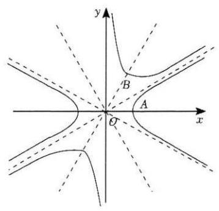

${3}^{ \circ  }$ 由基本不等式 $y = \frac{\sqrt{3}}{3}x + \frac{\frac{\sqrt{3}}{2}}{x} \geq  \sqrt{2}\left( {x > 0}\right)$ 或 $y = \frac{\sqrt{3}}{3}x + \; \frac{\frac{\sqrt{3}}{2}}{x} \leq   - \sqrt{2}\left( {x < 0}\right) .$

${4}^{ \circ  }$ 函数 $y = \frac{\sqrt{3}}{3}x + \frac{\frac{\sqrt{3}}{2}}{x}$ ，函数 $y = f\left( x\right)  - x$ 有两个零点.

函数 $y =  - \frac{\sqrt{3}}{3}x - \frac{\frac{\sqrt{3}}{2}}{x}$ ,函数 $y = f\left( x\right)  - x$ 没有零点. 所以④不正确.

由此可得①②对，③④错.

故选 $B$ .

【练习】3. $({2024}$ 届七宝)已知函数 $y = f\left( x\right)$ ，若其定义域为 $\left( {0, + \infty }\right)$ ，且满足 $x{f}^{\prime }\left( x\right)  - f\left( x\right)  >  - 1$ 对一切 $x \; \in  \left( {0, + \infty }\right)$ 恒成立，则称 $f\left( x\right)$ 为一个“逆构造函数”.

(1) 设 $g\left( x\right)  = {x}^{3} + 1\left( {x > 0}\right)$ ，判断 $y = g\left( x\right)$ 是否为“逆构造函数”，并说明理由；

(2) 若函数 $y = {ax} - 3 - \ln x - \frac{1 - a}{x}$ 是 “逆构造函数”，求 $a$ 的取值范围；

(3)已知 “逆构造函数” $y = f\left( x\right)$ 满足对任意的 ${x}_{1},{x}_{2} > 0$ ，都有 $f\left( {{x}_{1} + {x}_{2}}\right)  \leq  f\left( {x}_{1}\right) f\left( {x}_{2}\right)$ ，且 $f\left( 1\right)  =$

2. 求证: 对任意 $a \leq  1$ ,关于 $x$ 的方程 $f\left( x\right)  = a$ 无解.

【解析】(1) 由于 ${g}^{\prime }\left( x\right)  = 3{x}^{2}$ ,故对 $x \in  \left( {0, + \infty }\right)$ ,

有 $x{g}^{\prime }\left( x\right)  - g\left( x\right)  = 3{x}^{3} - {x}^{3} - 1 = 2{x}^{3} - 1 >  - 1$ ,

所以 $y = g\left( x\right)$ 是 “逆构造函数”;

(2) 由于 ${y}^{\prime } = a - \frac{1}{x} + \frac{1 - a}{{x}^{2}}$ ,

故 $x{y}^{\prime } - y = {ax} - 1 + \frac{1 - a}{x} - {ax} + 3 + \ln x + \frac{1 - a}{x} = 2 + \ln x + \frac{2\left( {1 - a}\right) }{x}$ .

一方面,若函数 $y = {ax} - 3 - \ln x - \frac{1 - a}{x}$ 是 “逆构造函数”,则 $x{y}^{\prime } - y >  - 1$ ,

即 $2 + \ln x + \frac{2\left( {1 - a}\right) }{x} >  - 1$ ,所以 ${3x} + x\ln x + 2\left( {1 - a}\right)  > 0$ 对任意 $x > 0$ 成立.

令 $h\left( x\right)  = {3x} + x\ln x + 2\left( {1 - a}\right)$ ,则 ${h}^{\prime }\left( x\right)  = 4 + \ln x$ ,

易得 $h{\left( x\right) }_{\min } = h\left( {\mathrm{e}}^{-4}\right)  =  - \frac{1}{{\mathrm{e}}^{4}} + 2\left( {1 - a}\right)  > 0$ ,所以 $a < 1 - \frac{1}{2{\mathrm{e}}^{4}}$ ;

综上, $a$ 的取值范围是 $\left( {-\infty ,1 - \frac{1}{2{\mathrm{e}}^{4}}}\right)$ .

(3)法一:设 $h\left( x\right)  = \frac{f\left( x\right)  - 1}{x}$ ，

则 ${h}^{\prime }\left( x\right)  = \frac{x{f}^{\prime }\left( x\right)  - \left( {f\left( x\right)  - 1}\right) }{{x}^{2}} = \frac{x{f}^{\prime }\left( x\right)  - f\left( x\right)  + 1}{{x}^{2}} > \frac{-1 + 1}{{x}^{2}} = 0$ ,

所以 $h\left( x\right)$ 在 $\left( {0, + \infty }\right)$ 上严格增.

一方面,对 $x \geq  1$ ,有 $\frac{f\left( x\right)  - 1}{x} = h\left( x\right)  \geq  h\left( 1\right)  = \frac{f\left( 1\right)  - 1}{1} = \frac{2 - 1}{1} = 1 > 0$ .

所以对任意 $x \geq  1$ ，有 $f\left( x\right)  > 1$ ；

另一方面,对 $0 < x < 1$ ，假设 $f\left( x\right)  \leq  0$ ，

由 $f\left( 1\right)  = 2 > 0$ 及零点存在定理，存在 $\eta  \in  \lbrack x,1)$ 使得 $f\left( \eta \right)  = 0$ .

再由条件 $f\left( {{x}_{1} + {x}_{2}}\right)  \leq  f\left( {x}_{1}\right) f\left( {x}_{2}\right)$ ,

得 $2 = f\left( 1\right)  = f\left( {\eta  + \left( {1 - \eta }\right) }\right)  \leq  f\left( \eta \right) f\left( {1 - \eta }\right)  = 0 \cdot  f\left( {1 - \eta }\right)  = 0$ ,矛盾;

所以对任意 $0 < x < 1$ ，有 $f\left( x\right)  > 0$ .

假设存在 $0 < {x}_{0} < 1$ 使得 $f\left( {x}_{0}\right)  \leq  1$ ，

由 $f\left( 1\right)  = 2 > 1$ 及零点存在定理，存在 $u \in  \left\lbrack  {{x}_{0},1}\right)$ 使得 $f\left( u\right)  = 1$ .

从而对任意 $x > 0$ ,有 $f\left( {x + u}\right)  \leq  f\left( x\right) f\left( u\right)  = f\left( x\right)$ .

但由 $u > 0$ ,得 $\frac{f\left( {1 + u}\right)  - 1}{1 + u} = h\left( {1 + u}\right)  > h\left( 1\right)  = \frac{f\left( 1\right)  - 1}{1}$

$\geq  \frac{f\left( 1\right)  - 1}{1 + u} \geq  \frac{f\left( {1 + u}\right)  - 1}{1 + u}$ ,矛盾.

所以对任意 $0 < x < 1$ ，都有 $f\left( x\right)  > 1$ .

综合两方面得,对任意的 $x > 0$ ,都有 $f\left( x\right)  > 1$ .

所以对任意 $a \leq  1$ ，关于 $x$ 的方程 $f\left( x\right)  = a$ 一定无解.

法二: 设 $F\left( x\right)  = \frac{f\left( x\right)  - 1}{x}, x \in  \left( {0, + \infty }\right)$ ,

因为 $f\left( x\right)$ 为 “逆构造函数”，所以 $x \cdot  {f}^{\prime }\left( x\right)  - f\left( x\right)  >  - 1$ ，

则 ${F}^{\prime }\left( x\right)  = \frac{x{f}^{\prime }\left( x\right)  - f\left( x\right)  + 1}{{x}^{2}} > 0$ ，所以 $F\left( x\right)$ 在 $\left( {0, + \infty }\right)$ 上严格增，

因为 ${x}_{1} > 0,{x}_{2} > 0$ ,所以 ${x}_{1} + {x}_{2} > {x}_{1} > 0$ 且 ${x}_{1} + {x}_{2} > {x}_{2} > 0$ ,

即 $F\left( {{x}_{1} + {x}_{2}}\right)  > F\left( {x}_{1}\right)$ ,

即 $\frac{f\left( {{x}_{1} + {x}_{2}}\right)  - 1}{{x}_{1} + {x}_{2}} > \frac{f\left( {x}_{1}\right)  - 1}{{x}_{1}}$ 且 $\frac{f\left( {{x}_{1} + {x}_{2}}\right)  - 1}{{x}_{1} + {x}_{2}} > \frac{f\left( {x}_{2}\right)  - 1}{{x}_{2}}$ ,

两式相加化简得 $f\left( {{x}_{1} + {x}_{2}}\right)  > f\left( {x}_{1}\right)  + f\left( {x}_{2}\right)  - 1$

对任意 ${x}_{1},{x}_{2} \in  \left( {0, + \infty }\right)$ 恒成立,

因为 $f\left( {{x}_{1} + {x}_{2}}\right)  \leq  f\left( {x}_{1}\right) f\left( {x}_{2}\right)$ 对任意 ${x}_{1},{x}_{2} \in  \left( {0, + \infty }\right)$ 恒成立,

故 $f\left( {x}_{1}\right) f\left( {x}_{2}\right)  > f\left( {x}_{1}\right)  + f\left( {x}_{2}\right)  - 1$ ,

即 $\left\lbrack  {f\left( {x}_{1}\right)  - 1}\right\rbrack   \cdot  \left\lbrack  {f\left( {x}_{2}\right)  - 1}\right\rbrack   > 0$ 对任意 ${x}_{1},{x}_{2} \in  \left( {0, + \infty }\right)$ 恒成立,

令 ${x}_{1} = 1,{x}_{2} = x$ ,即 $f\left( x\right)  - 1 > 0$ ,

即证对任意 $a \leq  1$ ，关于 $x$ 的方程 $f\left( x\right)  = a$ 无解.

## C 每日三题 0310

【练习】1. (2025 届华二) 已知 $q > 0$ ,对任意正整数 $n$ ,令 ${J}_{n} = \left\{  {x + y \mid  x, y \in  \left\lbrack  {{q}^{n},{q}^{n + 1}}\right\rbrack   \cup  \left\lbrack  {{q}^{2n},{q}^{{2n} + 1}}\right\rbrack  }\right\}$ . 若存在 $n$ ,使得 ${J}_{n} = \left\lbrack  {{a}_{n},{b}_{n}}\right\rbrack   \cup  \left\lbrack  {{c}_{n},{d}_{n}}\right\rbrack   \cup  \left\lbrack  {{x}_{n},{y}_{n}}\right\rbrack$ ,且 ${b}_{n} < {c}_{n},{d}_{n} < {x}_{n}$ ,则 $q$ 的取值范围是___.

【答案】 $1 < q < 2$

【解析】因为 $n = 1$ 时, $\left\lbrack  {q,{q}^{2}}\right\rbrack$ 是区间,所以 $q > 1$ .

对 $x\text{ 、 }y$ 的范围分类讨论,

得 ${J}_{n} = \left\lbrack  {2{q}^{n},2{q}^{n + 1}}\right\rbrack   \cup  \left\lbrack  {{q}^{n} + {q}^{2n},{q}^{n + 1} + {q}^{{2n} + 1}}\right\rbrack   \cup  \left\lbrack  {2{q}^{2n},2{q}^{{2n} + 1}}\right\rbrack$ ,

故存在 $n$ 使得 $2{q}^{n + 1} < {q}^{n} + {q}^{2n}$ 且 ${q}^{n + 1} + {q}^{{2n} + 1} < 2{q}^{2n}$ .

因为 ${q}^{n} + {q}^{2n} \geq  2{q}^{\frac{3n}{2}} > 2{q}^{n + 1}\left( {q > 1}\right)$ ,所以只需 ${q}^{n + 1} + {q}^{{2n} + 1} < 2{q}^{2n}$ .

这又等价于存在 $n$ 使得 $q < {q}^{n}\left( {2 - q}\right)$ ,于是 $q < 2$ .

而当 $1 < q < 2$ 时,故存在 $n > {\log }_{q}\frac{q}{2 - q}$ ,使得要求被满足,故 $1 < q < 2$ 所求.

【练习】2. (2025 届华二) 已知函数 $y = f\left( x\right)$ 的定义域为 $R$ ，集合 $M = \left\{  {{x}_{0} \mid  \text{ 存在 }x < {x}_{0}\text{ ，使得 }f\left( x\right)  < f\left( {x}_{0}\right) }\right\}$ . 若 $f\left( x\right)$ 使得 $M = \left\lbrack  {-1,1}\right\rbrack$ ,则 ( )

A. $y = f\left( x\right)$ 可能为奇函数 B. $y = f\left( x\right)$ 可能在 $x = 2$ 处取最小值

C. $y = f\left( x\right)$ 可能是增函数 D. $y = f\left( x\right)$ 可能在 $x =  - 1$ 处取极小值

【答案】 $B$

【解析】 $- 1 \in  M$ ,所以存在 $a <  - 1$ ,使得 $f\left( a\right)  < f\left( {-1}\right)$ .

若 $y = f\left( x\right)$ 是奇函数,则 $- a > 1$ 且 $f\left( {-a}\right)  =  - f\left( a\right)  >  - f\left( {-1}\right)  = f\left( 1\right)$ ,

从而 $- a \in  M$ ,故 $A$ 错误.

例如: $f\left( x\right)  = \left\{  \begin{array}{ll} 0, & \left| x\right|  > 1 \\  1, & \left| x\right|  \leq  1 \end{array}\right.$ ,故 $B$ 正确.

$1 \in  M$ ,所以存在 $a < 1$ ,使得 $f\left( a\right)  < f\left( 1\right)$ ,

若 $y = f\left( x\right)$ 是增函数,则 $f\left( 2\right)  \geq  f\left( 1\right)  > f\left( a\right)$ ,从而 $2 \in  M$ ,故 $C$ 错误.

$- 1 \in  M$ ,所以存在 $a <  - 1$ ,使得 $f\left( a\right)  < f\left( {-1}\right)$ .

若 $x =  - 1$ 处 $y = f\left( x\right)$ 极小,则存在 $h > 0$ 使得当 $- 1 - h < x <  - 1$ 时,

总有 $f\left( x\right)  \geq  f\left( {-1}\right)$ ,于是存在 ${x}_{0} \in  \left( {\max \left\{  {-1 - h,\frac{a - 1}{2}}\right\}  , - 1}\right)$ ,

使得 $f\left( {x}_{0}\right)  \geq  f\left( {-1}\right)  > f\left( a\right)$ ,从而 ${x}_{0} \in  M$ ,故 $D$ 错误.

故选 $B$ .

【练习】3. (2025 届交附) 已知 $k, m \in  R$ ，函数 $y = f\left( x\right)$ 的定义域为 $R$ ，直线 $l$ 的方程为 $y = {kx} + m$ ，记集合 ${A}_{l} = \{ x \mid  f\left( x\right)  \geq  {kx} + m\} .$

(1) 若 $f\left( x\right)  = {2}^{x},{k}^{2} + {\left( m - 1\right) }^{2} = 0$ ，求集合 ${A}_{l}$ ；

(2)若 $f\left( x\right)  =  - {x}^{4} + {x}^{3} + b{x}^{2}$ ，且存在实数 $k$ ， $m$ 使得集合 ${A}_{l}$ 中有且只有两个元素，求实数 $b$ 的取值. 范围;

(3)若函数 $y = f\left( x\right)$ 的图像是一条连续曲线，且其导函数是定义域为 $R$ 的严格减函数，求证:“集合 ${A}_{l}$ 是单元素集合 $\{ t\}$ ”是“直线 $l$ 是函数 $y = f\left( x\right)$ 在点 $P\left( {t, f\left( t\right) }\right)$ 处的切线”的充要条件.

【解析】(1) 因为 ${k}^{2} + {\left( m - 1\right) }^{2} = 0$ ,所以 $k = 0, m = 1$ ,

由 $f\left( x\right)  = {2}^{x}$ ,得 ${2}^{x} \geq  1$ ,解得 $x \geq  0$ ,所以 ${A}_{l} = \lbrack 0, + \infty )$ .

(2)法一:设存在实数 $k$ ， $m$ 使得集合 ${A}_{l} = \left\{  {{x}_{1},{x}_{2}}\right\}$ ，

则 $- {x}^{4} + {x}^{3} + b{x}^{2} \geq  {kx} + m$ 的解集为 $\left\{  {{x}_{1},{x}_{2}}\right\}$ ,

即 ${x}^{4} - {x}^{3} - b{x}^{2} + {kx} + m \leq  0$ 的解集为 $\left\{  {{x}_{1},{x}_{2}}\right\}$ ,

所以方程 ${x}^{4} - {x}^{3} - b{x}^{2} + {kx} + m = 0$ 有重根 $x = {x}_{1}$ 及 $x = {x}_{2}$ .

因此 ${x}^{4} - {x}^{3} - b{x}^{2} + {kx} + m = {\left( x - {x}_{1}\right) }^{2}{\left( x - {x}_{2}\right) }^{2}$ 恒成立,

故有 $\left\{  \begin{array}{l}  - 2{x}_{1} - 2{x}_{2} =  - 1 \\  {x}_{1}^{2} + {x}_{2}^{2} + 4{x}_{1}{x}_{2} =  - b \end{array}\right.$ ,

则 ${x}_{1},{x}_{2}$ 是二次方程 ${x}^{2} - \frac{1}{2}x - \frac{1}{2}b - \frac{1}{8} = 0$ 的两个不相等的实数解,

所以 $\Delta  = \frac{1}{4} + {2b} + \frac{1}{2} > 0$ ，所以实数 $b$ 的取值范围是 $\left( {-\frac{3}{8}, + \infty }\right)$ .

法二:严谨证明见视频

(3) 记 $g\left( x\right)  = f\left( x\right)  - \left( {{kx} + m}\right)$ ,则 ${g}^{\prime }\left( x\right)  = {f}^{\prime }\left( x\right)  - k$ ,在 $R$ 上严格减函数,

①若直线 $l$ 是函数 $y = f\left( x\right)$ 在点 $P\left( {t, f\left( t\right) }\right)$ 处的切线，

则有 $\left\{  \begin{array}{l} f\left( t\right)  = {kt} + m \\  {f}^{\prime }\left( t\right)  = k \end{array}\right.$ ,所以 $\left\{  \begin{array}{l} g\left( t\right)  = 0 \\  {g}^{\prime }\left( t\right)  = 0 \end{array}\right.$ ,

当 $x > t$ 时, ${g}^{\prime }\left( x\right)  < 0$ ,所以函数 $y = g\left( x\right)$ 在 $\left( {t, + \infty }\right)$ 上严格减,

$g\left( x\right)  < g\left( t\right)  = 0;$

$x < t$ 时, ${g}^{\prime }\left( x\right)  > 0$ ,所以函数 $y = g\left( x\right)$ 在 $\left( {-\infty , t}\right)$ 上严格增,

$g\left( x\right)  < g\left( t\right)  = 0;$

所以 $g\left( x\right)  = f\left( x\right)  - \left( {{kx} + m}\right)  \geq  0$ 的解集为 $\{ t\}$ ,集合 ${A}_{l}$ 是单元素集合 $\{ t\}$ ;

②若集合 ${A}_{l}$ 是单元素集合 $\{ t\}$ ，故 $x \neq  t$ 时 $g\left( x\right)  < 0$ ， $g\left( t\right)  = f\left( t\right)  - \left( {{kt} + m}\right)  \geq  0$ ，

而函数 $y = f\left( x\right)$ 的图象是一条连续曲线，所以 $g\left( t\right)  = f\left( t\right)  - \left( {{kt} + m}\right)  = 0$ ，

则在 $x = t$ 的附近其他自变量对应的函数值都小于 $g\left( t\right)$ ,

故函数 $y = f\left( x\right)$ 在 $x = t$ 处取得极大值,所以 ${g}^{\prime }\left( t\right)  = {f}^{\prime }\left( t\right)  - k = 0$ ,

所以函数 $y = f\left( x\right)$ 在点 $P\left( {t, f\left( t\right) }\right)$ 处的切线方程为 $y = {f}^{\prime }\left( t\right) \left( {x - t}\right)  + f\left( t\right)$ ,

即 $y = {kx} + m$ ,直线 $l$ 是函数 $y = f\left( x\right)$ 在点 $P\left( {t, f\left( t\right) }\right)$ 处的切线.

综上,“集合 ${A}_{l}$ 是单元素集合 $\{ t\}$ ”是

“直线 $l$ 是函数 $y = f\left( x\right)$ 在点 $P\left( {t, f\left( t\right) }\right)$ 处的切线”的充要条件.

## 四 每日三题 0311

【练习】1. (2025 届七宝) 已知 $k \in  R$ ，存在 $\theta  \in  R$ ，当 $x \in  \left( {0, + \infty }\right)$ 时，都有 $\cos \theta \left( {x - k}\right)  + \sin \theta \left( {\ln x - 1 + k}\right) \; < 0$ ，则 $k$ 的取值范围是___.

【答案】 $\left( {-\infty ,1}\right)$

【解析】法一: 见视频

法二: (来自其他公众号) 令 $x - k = t \in  \left( {-k, + \infty }\right)$ ,故 $x = t + k$ ,

故原不等式可化为: $t\cos \theta  + \sin \theta \left( {\ln \left( {t + k}\right)  - 1 + k}\right)  < 0$ ,令 $P\left( {\cos \theta ,\sin \theta }\right) , Q\left( {t,\ln \left( {t + k}\right)  - 1 + k}\right)$ ,

故点 $P$ 在圆心为原点的单位圆上,点 $Q$ 在函数 $f\left( t\right)  = \ln \left( {t + k}\right)  - 1 + k$ ,

故不等式的几何意义是:向量 $\overrightarrow{OP}$ 与 $\overrightarrow{OQ}$ 的夹角大于 $\frac{\pi }{2}$ ，作出大致图像，

又由 $x \geq  1 + \ln x$ ,故 $k = 1$ 时，函数 $f\left( t\right)$ 与直线 $y = t$ 恰好相切，切点为原点，

易知存在 $\theta  \in  R$ ，在 $k < 1$ 时使得 $t\cos \theta  + \sin \theta \left( {\ln \left( {t + k}\right)  - 1 + k}\right)  < 0$ 恒成立，

当 $k \geq  1$ 时，不存在一个给定的 $\theta  \in  R$ ，使得 $t\cos \theta  + \sin \theta \left( {\ln \left( {t + k}\right)  - 1 + k}\right)  < 0$ 恒成立，

综上, $k$ 的取值范围是 $\left( {-\infty ,1}\right)$ .

【练习】2. (2025 届复附)已知平面向量 $\overrightarrow{a},\overrightarrow{b}$ 满足 $\left| \overrightarrow{a}\right|  = 3\left| \overrightarrow{b}\right|  = 3$ ，若 $\overrightarrow{c} = \left( {2 - {2\lambda }}\right) \overrightarrow{a} + {3\lambda }\overrightarrow{b}\left( {\lambda  \in  R}\right)$ ，且 $\frac{\overrightarrow{c} \cdot  \overrightarrow{a}}{\left| \overrightarrow{a}\right| } = \; \frac{\overrightarrow{c} \cdot  \overrightarrow{b}}{\left| \overrightarrow{b}\right| }$ ，则 $\cos  < \overrightarrow{a}$ ， $3\overrightarrow{a} - \overrightarrow{c} >$ 的最小值为___.

【答案】 $\frac{3\sqrt{5}}{7}$

【解析】设 $\overrightarrow{a} = \overrightarrow{OA},\overrightarrow{b} = \overrightarrow{OB},\overrightarrow{c} = \overrightarrow{OC},2\overrightarrow{a} = {\overrightarrow{OA}}_{1},3\overrightarrow{a} = {\overrightarrow{OA}}_{2},3\overrightarrow{b} = {\overrightarrow{OB}}_{1}$ ,

因为 $\overrightarrow{c} = \left( {2 - {2\lambda }}\right) \overrightarrow{a} + {3\lambda }\overrightarrow{b}\left( {\lambda  \in  R}\right)$ ,所以 $\overrightarrow{c} = \left( {1 - \lambda }\right) {\overrightarrow{OA}}_{1} + \mathrm{i}\overrightarrow{O{B}_{1}}\left( {\lambda , \in  R}\right)$ ,

因此点 $C$ 在直线 ${A}_{1}{B}_{1}$ 上,又由于 $\frac{\overrightarrow{c} \cdot  \overrightarrow{a}}{\left| \overrightarrow{a}\right| } = \frac{\overrightarrow{c} \cdot  \overrightarrow{b}}{\left| \overrightarrow{b}\right| }$ ,因此 ${OC}$ 是 $\angle {AOB}$ 的角平分线,

因此点 $C$ 是直线 ${A}_{1}{B}_{1}$ 与 $\angle {AOB}$ 的角平分线的交点,

法一:(几何法)由角平分线的性质，得 $\frac{{B}_{1}C}{C{A}_{1}} = \frac{O{B}_{1}}{O{A}_{1}} = \frac{3}{6} = \frac{1}{2}$ ,

过点 $C$ 作 $O{B}_{1}$ 的平行线交 $O{A}_{1}$ 于点 $M$ ，则 ${OM} = \frac{1}{3}O{A}_{1} = 2,{CM} = \frac{2}{3}O{B}_{1} = 2$ ，

因此点 $C$ 在以 $M$ 为圆心,半径为 2 的圆上运动,

由于 $\cos \langle \overrightarrow{a},3\overrightarrow{a} - \overrightarrow{c}\rangle  = \cos \left\langle  {\overrightarrow{OA},\overrightarrow{C{A}_{2}}}\right\rangle   = \cos \angle C{A}_{2}O$ ,

由此当直线 ${A}_{2}C$ 相切于 $M$ 时, $\angle C{A}_{2}O$ 有最大值, $\cos \angle C{A}_{2}O$ 有最小值,

设此时切点为 ${C}_{0}$ ,则 $M{C}_{0} = 2, M{A}_{2} = 7$ ,故 $\cos \angle {C}_{0}{A}_{2}O = \frac{3\sqrt{5}}{7}$ ,

综合上述, $\cos \langle \overrightarrow{a},3\overrightarrow{a} - \overrightarrow{c}\rangle$ 的最小值为 $\frac{3\sqrt{5}}{7}$ .

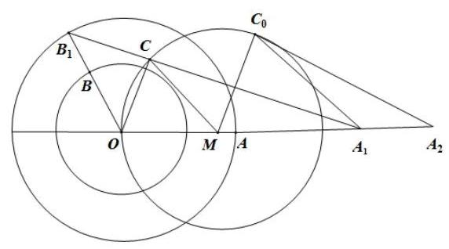

法二:(代数法)，见视频

【练习】3. (2025 届复附)已知 $f\left( x\right)  = {2a}{x}^{3} - \left( {{3a} + 1}\right) {x}^{2} + {2x}$ ，若对于给定的 $a \in  R$ 及平面上一点 $M$ ，函数 $y = f\left( x\right)$ 的图像上存在与 $M$ 不同的一点 $Q\left( {q, f\left( q\right) }\right)$ ,使得直线 ${MQ}$ 为函数 $y = f\left( x\right)$ 在 $Q$ 点的切线, 则称点 $M$ 具有 “性质 ${P}_{a}$ ”.

(1)判断点 $M\left( {1,2}\right)$ 是否具有“性质 ${P}_{1}$ ”,并说明理由;

(2)证明: “点 $M\left( {x, y}\right)$ 具有性质 ${P}_{0}$ ”的充分必要条件是 “ $y > {2x} - {x}^{2}$ ”；

(3)若对于任意的非零实数 $a$ ，直线 $x = c$ 上的所有点均具有“性质 ${P}_{a}$ ”，求实数 $c$ 的值.

【解析】(1) 当 $a = 1$ ,函数 $f\left( x\right)  = 2{x}^{3} - 4{x}^{2} + {2x}$ ,故 ${f}^{\prime }\left( x\right)  = 6{x}^{2} - {8x} + 2$ ,

于是过点 $Q\left( {q, f\left( q\right) }\right)$ 的切线方程为 $y - f\left( q\right)  = {f}^{\prime }\left( q\right) \left( {x - q}\right)$ ,

把点 $M\left( {1,2}\right)$ 坐标带入上面切线方程,化简得 $q\left( {2{q}^{2} - {5q} + 4}\right)  = 0$ ,

故 $q = 0$ ，存在点 $Q\left( {0,0}\right)$ ，故点 $M\left( {1,2}\right)$ 具有“性质 ${P}_{1}$ ”.

(2)当 $a = 0$ 时， $f\left( x\right)  =  - {x}^{2} + {2x}$ ，故 ${f}^{\prime }\left( x\right)  =  - {2x} + 2$ ，

必要性: $\frac{f\left( q\right)  - y}{q - x} = {f}^{\prime }\left( q\right)$ ,整理得 ${q}^{2} - {2xq} - y + {2x} = 0$ ,

故 $\Delta  = 4{x}^{2} - 4\left( {-y + {2x}}\right)  \geq  0$ ,整理得 $y \geq   - {x}^{2} + {2x}$ ,

特别地,当 $y =  - {x}^{2} + {2x}$ 时,点 $Q$ 与点 $M$ 重合,不合题意,故 $y >  - {x}^{2} + {2x}$ ;

充分性: 若 $y >  - {x}^{2} + {2x}$ 时,则 ${q}^{2} - {2xq} - y + {2x} = 0$ 有解,

即存在点 $Q\left( {q, f\left( q\right) }\right)$ 使得直线 ${MQ}$ 为函数 $y = f\left( x\right)$ 在 $Q$ 点的切线,

即点 $M\left( {x, y}\right)$ 具有性质 ${P}_{0}$ ,

综上,“点 $M\left( {x, y}\right)$ 具有性质 ${P}_{0}$ ”的充分必要条件是 “ $y > {2x} - {x}^{2}$ ”;

(3) 设 $M\left( {c, y}\right) , f\left( x\right)  = {2a}{x}^{3} - \left( {{3a} + 1}\right) {x}^{2} + {2x}$ ,

故 ${f}^{\prime }\left( x\right)  = {6a}{x}^{2} - 2\left( {{3a} + 1}\right) x + 2, a \neq  0$ ,

由题意得 $\frac{f\left( q\right)  - y}{q - c} = {f}^{\prime }\left( q\right)$ ,

整理得 ${4a}{q}^{3} - \left( {{6ac} + {3a} + 1}\right) {q}^{2} + \left( {{6ac} + {2c}}\right) q + y - {2c} = 0$ ,

由于 $M\left( {c, y}\right)$ 的任意性,不妨取 $y = f\left( c\right)$ ,代入上式,

整理得 ${4a}{q}^{3} - \left( {{6ac} + {3a} + 1}\right) {q}^{2} + \left( {{6ac} + {2c}}\right) q + {2a}{c}^{3} - \left( {{3a} + 1}\right) {c}^{2} = 0$ ,

令 $h\left( q\right)  = {4a}{q}^{3} - \left( {{6ac} + {3a} + 1}\right) {q}^{2} + \left( {{6ac} + {2c}}\right) q + {2a}{c}^{3} - \left( {{3a} + 1}\right) {c}^{2}$ ,

则函数 $h\left( q\right)  = 0$ ,除了 $q = c$ 之外,至少还要有 1 个根,

${h}^{\prime }\left( q\right)  = {12a}{q}^{2} - 2\left( {{6ac} + {3a} + 1}\right) q + \left( {{6ac} + {2c}}\right)  = 2\left\lbrack  {{6aq} - \left( {{3a} + 1}\right) }\right\rbrack  \left( {q - c}\right) ,$

故 $c \neq  \frac{{3a} + 1}{6a} = \frac{1}{6a} + \frac{1}{2}$ ，由 $a$ 的任意性，则 $c = \frac{1}{2}$ ，

下面对 $c = \frac{1}{2}$ 进行检验, $h\left( q\right)  = {4a}{q}^{3} - \left( {{6a} + 1}\right) {q}^{2} + \left( {{3a} + 1}\right) q - \frac{1}{2}a - \frac{1}{4}$ ,

故 ${h}^{\prime }\left( q\right)  = {12a}{q}^{2} - 2\left( {{6a} + 1}\right) q + \left( {{3a} + 1}\right)  = 2\left\lbrack  {{6aq} - \left( {{3a} + 1}\right) }\right\rbrack  \left( {q - \frac{1}{2}}\right)$ ,

故 ${q}_{1} = \frac{1}{2},{q}_{2} = \frac{1}{6a} + \frac{1}{2}$ ,故此时存在点 $Q\left( {{q}_{2}, f\left( {q}_{2}\right) }\right)$ 满足题意,

若 $y \neq  f\left( c\right)$ ,由三次函数性质,方程 ${4a}{q}^{3} - \left( {{6ac} + {3a} + 1}\right) {q}^{2} + \left( {{6ac} + {2c}}\right) q + y - {2c} = 0$ 对 $y \neq  f\left( c\right)$ 必有解,

综上, $c = \frac{1}{2}$ ,对于任意的非零实数 $a$ ,

直线 $x = c$ 上的所有点均具有 “性质 ${P}_{a}$ ”.

## 四 每日三题 0312

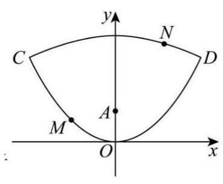

【练习】1. (2025 届某市重)已知抛物线 $y = \frac{1}{4}{x}^{2}$ 和 $y =  - \frac{1}{16}{x}^{2} + 5$ 所围成的封闭曲线 $E$ 如图所示，点 $M$ 、 $N$ 在曲线 $E$ 上，给定点 $A\left( {0, a}\right)$ ，则下列说法中正确的是___.

①任意 $a \in  \left( {0,5}\right)$ ，都存在点 $M$ 、 $N$ ，使得 $\left| {AM}\right|  = \left| {AN}\right|$

②任意 $a \in  \left( {0,5}\right)$ ，都存在点 $M$ 、 $N$ ，满足这对点关于点 $A$ 对称

③存在 $a \in  \left( {0,5}\right)$ ，当点 $M$ 、 $N$ 运动时，使得 $\left| {AM}\right|  + \left| {AN}\right|  \leq  {10}$

④任意 $a \in  \left( {0,5}\right)$ ，恰有三对不同的点 $M$ 、 $N$ ，满足每对点 $M$ 、 $N$ 关于点 $A$ 对称

【答案】①②③

【解析】抛物线 $y = \frac{1}{4}{x}^{2}$ 和 $y =  - \frac{1}{16}{x}^{2} + 5$ 的对称轴都为 $y$ 轴,

因此封闭曲线 $E$ 关于 $y$ 轴对称,

对于①，任意 $a \in  \left( {0,5}\right)$ ，在曲线 $E$ 上取关于 $y$ 轴对称的两点 $M$ 、 $N$ ，

而点 $A\left( {0, a}\right)$ 在 $y$ 轴上,有 $\left| {AM}\right|  = \left| {AN}\right|$ ,① 正确;

对于②，对每个 $a$ 值，

过点 $A$ 垂直于 $y$ 轴的直线与曲线 $E$ 的交点 $M\text{ 、 }N$ 关于点 $A$ 对称，②正确；

对于 ③，联立 $y = \frac{1}{4}{x}^{2}$ 与 $y =  - \frac{1}{16}{x}^{2} + 5$ 解得 $\left\{  \begin{array}{l} x =  - 4 \\  y = 4 \end{array}\right.$ 或 $\left\{  \begin{array}{l} x = 4 \\  y = 4 \end{array}\right.$ ，

取 $a = 1$ ，即 $A\left( {0,1}\right)$ ，

抛物线 $y = \frac{1}{4}{x}^{2}$ ，即 ${x}^{2} = {4y}$ 的焦点为 $\left( {0,1}\right)$ ，准线方程为 $y =  - 1$ ，

点 $M\left( {t, s}\right)$ 在 $y = \frac{1}{4}{x}^{2}\left( {0 \leq  y \leq  4}\right)$ 上运动时, $0 \leq  s \leq  4,\left| {MA}\right|  = s + 1 \in  \left\lbrack  {1,5}\right\rbrack$ ,

抛物线 $y =  - \frac{1}{16}{x}^{2} + 5$ 可由抛物线 $y =  - \frac{1}{16}{x}^{2}$ 向上平移 5 个单位而得,

抛物线 $y =  - \frac{1}{16}{x}^{2}$ ,即 ${x}^{2} =  - {16y}$ 的焦点为 $\left( {0, - 4}\right)$ ,准线为 $y = 4$ ,

则抛物线 $y =  - \frac{1}{16}{x}^{2} + 5$ 的焦点为 $\left( {0,1}\right)$ ，准线方程为 $y = 9$ ，

点 $M\left( {t, s}\right)$ 在 $y =  - \frac{1}{16}{x}^{2} + 5\left( {4 \leq  y \leq  5}\right)$ 上运动时, $4 \leq  s \leq  5,\left| {MA}\right|  = 9 - s \in  \left\lbrack  {4,5}\right\rbrack$ ,

因此当点 $M\text{ 、 }N$ 运动时, $1 \leq  \left| {MA}\right|  \leq  5,1 \leq  \left| {NA}\right|  \leq  5$ ,恒有 $\left| {AM}\right|  + \left| {AN}\right|  \leq  {10}$ ,

③正确；

对于④，取 $a = 1$ ，即 $A\left( {0,1}\right)$ ，

直线 $y = 1$ 与抛物线 $y = \frac{1}{4}{x}^{2}$ 的两个交点关于点 $A$ 对称，

在此抛物线上关于点 $A$ 对称的两点就只有一对,

在抛物线 $y =  - \frac{1}{16}{x}^{2} + 5$ 上不存在两点关于点 $A$ 对称,

另外关于点 $A$ 对称的两点分别在 $y = \frac{1}{4}{x}^{2}$ 和 $y =  - \frac{1}{16}{x}^{2} + 5$ 上,

不妨令 $M\left( {u,\frac{1}{4}{u}^{2}}\right)$ ，此点关于点 $A$ 对称的点 $\left( {-u,2 - \frac{1}{4}{u}^{2}}\right)$ 必在 $y =  - \frac{1}{16}{x}^{2} + 5$ 上，

而方程 $2 - \frac{1}{4}{u}^{2} =  - \frac{1}{16}{u}^{2} + 5$ ,即 $\frac{3}{16}{u}^{2} =  - 3$ 无解,

则此时不存在关于点 $A$ 对称的两点分别在两条抛物线上,④错误.

故正确的是①②③.

【练习】2. (2024 届七宝) 已知函数 $f\left( x\right)  = \left| {x + 1}\right|  + \left| {{ax} - 2}\right|$ ，函数 $f\left( x\right)$ 的最小值记为 $M\left( a\right)$ ，给出下面四个结论:

① 对任意实数 $a, M\left( a\right)  > 0$ ；

② $M\left( a\right)$ 的最大值为 3 ；

③若 $f\left( x\right)$ 在 $\left( {-\infty , - 1}\right)$ 上为减函数，则 $a$ 的取值范围为 $\left( {-\infty , - 2\rbrack \cup \lbrack 0, + \infty }\right)$ ；

④满足存在 $t \in  R$ ，对于任意的 $x \in  R$ ， $f\left( {t + x}\right)  = f\left( {t - x}\right)$ 的 $a$ 的值共有 4 个； 则全部正确命题的序号为___.

【答案】②④

【解析】当 $a =  - 2$ 时, $f\left( x\right)  = 3\left| {x + 1}\right|$ ,所以 $M\left( a\right)  = f\left( {-1}\right)  = 0$ ,故①错误;

当 $a = 0$ 时, $f\left( x\right)  = \left| {x + 1}\right|  + 2$ ,所以 $M\left( a\right)  = f\left( {-1}\right)  = 2$ ,

当 $a \neq  0$ 时, $M\left( a\right)  = \min \left\{  {\left| {a + 2}\right| ,\left| {\frac{2}{a} + 1}\right| }\right\}$ ,画出 $\min$ 函数图像,

得 $M{\left( a\right) }_{\max } = M\left( 1\right)  = 3$ ，故②正确；

当 $- 1 < a < 0$ 时,函数 $f\left( x\right)$ 在 $( - \infty , - 1\rbrack$ 上也单调递减,故③错误;

当 $a = 0$ 或 $a =  - 2$ 时,函数 $y = f\left( x\right)$ 的图象关于直线 $x =  - 1$ 对称,

当 $a > 0$ 时,当且仅当 $a - 1 = 0$ ,即 $a = 1$ 时,

函数 $f\left( x\right)  = \left\{  \begin{array}{l}  - {2x} + 1, x \leq   - 1 \\  3, - 1 < x < 2 \\  {2x} - 1, x \geq  1 \end{array}\right.$ 的图象关于直线 $x = \frac{1}{2}$ 对称,

当 $- 2 < a < 0$ 时,当且仅当 $a + 1 = 0$ ,即 $a =  - 1$ 时,

函数 $f\left( x\right)  = \left\{  \begin{array}{l}  - {2x} - 3, x \leq   - 2 \\  1, - 2 < x <  - 1 \\  {2x} + 3, x \geq   - 1 \end{array}\right.$ 的图象关于直线 $x =  - \frac{3}{2}$ 对称,

当 $a <  - 2$ 时,不存在直线 $x = t$ ,使得函数 $y = f\left( x\right)$ 的图象关于直线 $x = t$ 对称,

则当 $t \in  \left\{  {-\frac{3}{2}, - 1,\frac{1}{2}}\right\}$ 时，对于任意的 $x \in  R$ ， $f\left( {t + x}\right)  = f\left( {t - x}\right)$ 成立，

此时 $a \in  \{  - 2, - 1,0,1\}$ ，故④正确.

故全部正确命题的序号为②④.

【练习】3. (2024 届格致)函数 $y = f\left( x\right)$ 的导函数为 $y = {f}^{\prime }\left( x\right)$ ,令 $g\left( x\right)  = f\left( x\right) {f}^{\prime }\left( x\right)$ ,称 $y = g\left( x\right)$ 是 $y = f\left( x\right)$ 的特征函数. 若 $g\left( x\right)  \geq  0$ 对一切 $x \in  \left( {m, n}\right)$ 恒成立，则称函数 $y = f\left( x\right)$ 是 $\left( {m, n}\right)$ 上的绝对增函数.

(1)已知 $f\left( x\right)  = x{e}^{x}$ ，判断函数 $y = f\left( x\right)$ 是否是 $\left( {0, + \infty }\right)$ 上的绝对增函数，并说明理由；

( 2 )已知 $f\left( x\right)  = \sin \left( {x + \theta }\right)$ ，函数 $y = f\left( x\right)$ 是 $\left( {0,\frac{\pi }{2}}\right)$ 上的绝对增函数，求 $\theta$ 的值；

(3) 函数 $y = f\left( x\right)$ 是 $\left( {m, n}\right)$ 上的绝对增函数，其特征函数 $y = g\left( x\right)$ 在 $\left( {m, n}\right)$ 上有唯一的零点 ${x}_{0}$ ， 求证: ${x}_{0}$ 是函数 $y = {f}^{\prime }\left( x\right)$ 的极值点.

【解析】(1) 函数 $y = f\left( x\right)$ 是 $\left( {0, + \infty }\right)$ 上的绝对增函数,理由如下:

因为 $f\left( x\right)  = x{\mathrm{e}}^{x}$ ,所以 ${f}^{\prime }\left( x\right)  = \left( {x + 1}\right) {\mathrm{e}}^{x}$ ,得 $g\left( x\right)  = x\left( {x + 1}\right) {\mathrm{e}}^{2x}$ ,

且 $x > 0$ ,则 $x + 1 > 0,{\mathrm{e}}^{2x} > 0$ ,得 $g\left( x\right)  = x\left( {x + 1}\right) {\mathrm{e}}^{2x} > 0$ ,

所以函数 $y = f\left( x\right)$ 是 $\left( {0, + \infty }\right)$ 上的绝对增函数.

(2) 因为 $f\left( x\right)  = \sin \left( {x + \theta }\right)$ ，所以 ${f}^{\prime }\left( x\right)  = \cos \left( {x + \theta }\right)$ ，

得 $g\left( x\right)  = \sin \left( {x + \theta }\right) \cos \left( {x + \theta }\right)  = \frac{1}{2}\sin \left( {{2x} + {2\theta }}\right)$ ,

若函数 $y = f\left( x\right)$ 是 $\left( {0,\frac{\pi }{2}}\right)$ 上的绝对增函数,

则 $g\left( x\right)  = \frac{1}{2}\sin \left( {{2x} + {2\theta }}\right)  \geq  0$ 在 $\left( {0,\frac{\pi }{2}}\right)$ 内恒成立,

即 $\sin \left( {{2x} + {2\theta }}\right)  \geq  0$ 在 $\left( {0,\frac{\pi }{2}}\right)$ 内恒成立,

因为 $0 < x < \frac{\pi }{2}$ ,所以 ${2\theta } < {2x} + {2\theta } < {2\theta } + \pi$ ,

令 $\sin x \geq  0$ ,解得 ${2k\pi } \leq  x \leq  {2k\pi } + \pi , k \in  Z$ ,得 ${2\theta } = {2k\pi }, k \in  Z$ ,

所以 $\theta  = {k\pi }, k \in  Z$ .

(3)显然 $y = f\left( x\right) , y = {f}^{\prime }\left( x\right)$ 均在 $\left( {m, n}\right)$ 上连续不断,

若函数 $y = f\left( x\right)$ 是 $\left( {m, n}\right)$ 上的绝对增函数,则 $g\left( x\right)  = f\left( x\right) {f}^{\prime }\left( x\right)  \geq  0$ 恒成立,

又因为函数 $y = g\left( x\right)$ 在 $\left( {m, n}\right)$ 上有唯一的零点 ${x}_{0}$ ,

所以函数 $y = f\left( x\right) , y = {f}^{\prime }\left( x\right)$ 均在 $\left( {m, n}\right)$ 上至多有一个零点 ${x}_{0}$ ,

且必有一个函数有零点,

先证: $y = {f}^{\prime }\left( x\right)$ 在 $\left( {m, n}\right)$ 上有唯一的零点 ${x}_{0}$ ,

假设 $y = {f}^{\prime }\left( x\right)$ 在 $\left( {m, n}\right)$ 上没有零点,

则 $y = f\left( x\right)$ 在 $\left( {m, n}\right)$ 上有唯一的零点 ${x}_{0}$ ,

所以 ${f}^{\prime }\left( x\right)  > 0$ (或 ${f}^{\prime }\left( x\right)  < 0$ ) 恒成立,

不妨设 ${f}^{\prime }\left( x\right)  > 0$ 恒成立，则 $f\left( x\right)  \geq  0$ 恒成立，

所以 $y = f\left( x\right)$ 在 $\left( {m, n}\right)$ 上严格增,

当 $x \in  \left( {m,{x}_{0}}\right)$ 时, $f\left( x\right)  < f\left( {x}_{0}\right)  = 0$ ,两者相矛盾;

所以假设不成立,即 $y = {f}^{\prime }\left( x\right)$ 在 $\left( {m, n}\right)$ 上有唯一的零点 ${x}_{0}$ ;

再证: ${x}_{0}$ 是函数 $y = {f}^{\prime }\left( x\right)$ 的极值点，

假设 ${x}_{0}$ 不是函数 $y = {f}^{\prime }\left( x\right)$ 的极值点，

则存在 $\delta  > 0$ ，使得 $\left( {{x}_{0} - \delta ,{x}_{0} + \delta }\right)  \subseteq  \left( {m, n}\right)$ ，

且 $y = {f}^{\prime }\left( x\right)$ 在 $\left( {{x}_{0} - \delta ,{x}_{0} + \delta }\right)$ 上为严格单调函数,

不妨设 $y = {f}^{\prime }\left( x\right)$ 在 $\left( {{x}_{0} - \delta ,{x}_{0} + \delta }\right)$ 上严格增,

当 $x \in  \left( {{x}_{0} - \delta ,{x}_{0}}\right)$ 时, ${f}^{\prime }\left( x\right)  < 0$ ,

所以 $y = f\left( x\right)$ 在 $\left( {{x}_{0} - \delta ,{x}_{0}}\right)$ 上严格减，且 $f\left( x\right)  \leq  0$ ，则 $f\left( {x}_{0}\right)  < 0$ ； 当 $x \in  \left( {{x}_{0},{x}_{0} + \delta }\right)$ 时， ${f}^{\prime }\left( x\right)  > 0$ ，

所以 $y = f\left( x\right)$ 在 $\left( {{x}_{0},{x}_{0} + \delta }\right)$ 上严格增,且 $f\left( x\right)  \geq  0$ ,则 $f\left( {x}_{0}\right)  \geq  0$ ;

两者相矛盾,假设不成立,所以 ${x}_{0}$ 是函数 $y = {f}^{\prime }\left( x\right)$ 的极值点.

## CH 每日三题 0313

【练习】1. (2024 届大同) 若不等式 $k{\sin }^{2}B + \sin A\sin C > {19}\sin B\sin C$ 对任意 $\bigtriangleup  {ABC}$ 都成立，则实数 $k$ 的最小值为___.

【答案】100

【提示】 $c < b + a$

【解析】由正弦定理得 $k{b}^{2} + {ac} > {19bc}$ ,所以 $k > \frac{c\left( {{19b} - a}\right) }{{b}^{2}}$ ,

又 $c < b + a$ ，所以 $\frac{c\left( {{19b} - a}\right) }{{b}^{2}} < \frac{\left( {a + b}\right) \left( {{19b} - a}\right) }{{b}^{2}} = {100} - {\left( \frac{a}{b} - 9\right) }^{2}$

当 $\frac{a}{b} = 9$ 时, ${100} - {\left( \frac{a}{b} - 9\right) }^{2}$ 取得最大值 100 ,

所以 $k \geq  {100}$ ,即实数 $k$ 的最小值为 100 .

【练习】2. (2024 届华二) 设有一组圆 ${C}_{k} : {\left( x - k + 1\right) }^{2} + {\left( y - 3k\right) }^{2} = 2{k}^{4}$ ( $k$ 是正整数). 下列四个命题:

①存在一条定直线与所有的圆均相切; ②存在一条定直线与所有的圆均相交;

③存在一条定直线与所有的圆均不相交;④所有的圆均不经过原点.

其中真命题的个数为 ( )

A. 0 B. 1 C. 2 D. 3

【答案】 $C$

【提示】圆心在直线上离散变化,而半径的增长速度相对更快

【解析】圆心 $\left( {k - 1,{3k}}\right)$ ,圆心在直线 $y = 3\left( {x + 1}\right)$ 上,

故存在直线 $y = 3\left( {x + 1}\right)$ 与所有圆都相交,选项②正确；

考虑两圆的位置关系,圆 $k$ : 圆心 $\left( {k - 1,{3k}}\right)$ ,半径为 $\sqrt{2}{k}^{2}$ ,

圆 $k + 1$ : 圆心 $\left( {k - 1 + 1,3\left( {k + 1}\right) }\right)$ ,即 $\left( {k,{3k} + 3}\right)$ ,半径为 $\sqrt{2}{\left( k + 1\right) }^{2}$ ,

两圆的圆心距 $d = \sqrt{{\left( k - k + 1\right) }^{2} + {\left( 3k - 3k - 3\right) }^{2}} = \sqrt{10}$ ,

两圆的半径之差 $R - r = \sqrt{2}{\left( k + 1\right) }^{2} - \sqrt{2}{k}^{2} = 2\sqrt{2}k + \sqrt{2}$ ,

任取 $k = 1$ 或 2 时, $\left( {R - r > d}\right) ,{C}_{k}$ 含于 ${C}_{k + 1}$ 之中,选项①错误;

若 $k$ 取无穷大,则可以认为所有直线都与圆相交,选项③错误;

将 $\left( {0,0}\right)$ 代入圆的方程,则有 ${\left( -k + 1\right) }^{2} + 9{k}^{2} = 2{k}^{4}$ ,即 ${10}{k}^{2} - {2k} + 1 = 2{k}^{4}\left( {k \in  {N}^{ * }}\right)$ ,

因为左边为奇数，右边为偶数，故不存在 $k$ 使上式成立，

即所有圆不过原点, 选项④正确.

则真命题的代号是②④，故选 $C$ .

【练习】3. (2024 届交附)仰晖楼有 $A$ ， $B$ 两部电梯. 已知电梯每上一层需要 5 秒，电梯在某层楼停留时开门到关门所花时间为 10 秒 (人员均能在电梯开关门时间内完成进出电梯和按楼层等操作). 某天清晨，楼上还没有人，1楼已经有若干人均欲乘坐电梯上楼，目的地分别是 2~10 楼. 现两部电梯均恰好在 1 楼 (两部电梯互相独立运行，可以独立开关门，在 1 楼按下按钮后将同时打开门)，且每部电梯容量足够容纳所有人. 定义 ${T}_{A}\left( {T}_{B}\right)$ 为: 从 $A\left( B\right)$ 电梯开门时刻算起,到电梯内最后一人到达目标楼层后 $A\left( B\right)$ 电梯门关闭为止,所花时间. 记“运输完成时间”: ${T}_{0} = \max \left\{  {{T}_{A},{T}_{B}}\right\}$ .

(1)若所有人均乘坐一部电梯，求 ${T}_{0}$ ；

(2)为了研究 ${T}_{0}$ 的最小值，我们需要对电梯的“乘坐安排”作出一些合理假设. 例如:假设两部电梯都有人乘坐. 理由:分开乘坐，比如去 2 层的人都坐电梯 $A$ ，其余人坐电梯 $B$ ，则 ${T}_{A}$ ， ${T}_{B}$ 均小于

(1) 中 ${T}_{0}$ ，故“运输完成时间” 也小于 (1) 中 ${T}_{0}$ ，所以要使得 ${T}_{0}$ 最小，两部电梯一定都有人乘坐. 请你在此基础上再提出 1 至 2 条关于电梯 “乘坐安排” 的合理假设, 并简述作出这些假设的理由

(若有多条假设,请按重要性从高到低写出最重要的两条);

(3) 求出 ${T}_{0}$ 最小值.

【答案】(1)145 秒

(2)假设一:目的地为同一层楼的人都坐同一部电梯；

假设二:一部电梯停留层数均小于另一部电梯停留层数

(3) ${T}_{0}$ 取得最小值 95 秒，即一部电梯目的地为 $7 \sim  {10}$ 层，另一部电梯目的地为 $2 \sim  6$ 层.

【提示】(2)假设二:如果停留的电梯层数有交叉，可以交换乘坐节约时间

【解析】(1) 包括 1 楼, 电梯共开关门 10 次数, 上升 9 层,

所以完成运输所花时间为 ${10} \times  {10} + 9 \times  5 = {145}$ 秒;

(2)假设一:目的地为同一层楼的人都坐同一部电梯，

即 $A, B$ 电梯所到楼层不重叠.

理由:将目的地为同一层楼的人调整到同一部电梯可以使得其中一部电梯至少节约 10 秒，这样调整后方案的“运输完成时间”必然不大于原方案.

假设二:不妨设 $A$ 电梯到达 10 层，则可假设 $B$ 电梯停留层数均小于 $A$ 电梯停留层数.

理由: 记 $B$ 电梯最高到达 $b\left( {b < {10}}\right)$ 楼,若存在 $A$ 电梯到达 $a$ 楼,

且 $a < b$ 的情况. 两部电梯交换这两层的人,则 ${T}_{A}$ 不变, ${T}_{B}$ 至少减少 5 秒,

新方案“运输完成时间”必然不大于原方案；

(3) 设 $A$ 电梯到达楼层为 $a \sim  {10}$ 层, ${10} \geq  a \geq  3, B$ 电梯到达楼层为 $2 \sim  a - 1$ 层,

${T}_{A} = \left( {{12} - a}\right)  \times  {10} + 9 \times  5 = {165} - {10a},$

${T}_{B} = \left( {a - 1}\right)  \times  {10} + \left( {a - 2}\right)  \times  5 = {15a} - {20},$

${T}_{0} = \max \left\{  {{T}_{A},{T}_{B}}\right\}   = \left\{  {\begin{array}{l} {165} - {10a},3 \leq  a \leq  7 \\  {15a} - {20},8 \leq  a \leq  {10} \end{array},}\right.$

当 $a = 7$ 时, ${T}_{0}$ 取得最小值 95 秒,

即 $A$ 电梯目的地为 $7 \sim  {10}$ 层, $B$ 电梯目的地为 $2 \sim  6$ 层.

## C 每日三题 0314

【练习】1. (2025 届 spd 公众号模拟卷)设 $d > 0$ ，集合 $M = \{ \left( {x, y}\right) \left| \right| x\left| +\right| y \mid   \leq  \sqrt{2}\}$ . 若对任意 $\overrightarrow{a} \in  M$ ，均存在 $\overrightarrow{b},\overrightarrow{c} \in  M$ 和 $\lambda  \in  \left\lbrack  {0,1}\right\rbrack$ ，满足 $\left| {\overrightarrow{b} - \overrightarrow{c}}\right|  \geq  d$ ， $\overrightarrow{a} = \lambda \overrightarrow{b} + \left( {1 - \lambda }\right) \overrightarrow{c}$ ，则 $d$ 的最大值为___.

【答案】 $\sqrt{5}$

【提示】思考 $A$ 取正方形的特殊点时的情况

【解析】集合 $M = \{ \left( {x, y}\right) \left| \right| x\left| +\right| y \mid   \leq  \sqrt{2}\}$ 表示的是一个边长为 2 的正方形,且 $A$ 在 ${BC}$ 线段上,要求对于任意满足题意的 $A$ 点， ${BC}$ 线段长度的最大值

当 $A$ 取正方形边上的中点时， ${BC} \leq  \sqrt{5}$ ，而其他情况都能找到 ${BC} \geq  \sqrt{5}$ ，故最值是 $\sqrt{5}$

【练习】2. (2025 届八校联考)已知 $A$ 、 $B$ 为非空实数集， $\Omega$ 为平面直角坐标系中的一些点构成的集合，集合 $C = \{ y \mid$ 对任意 $x \in  A$ ，有 $\left( {x, y}\right)  \in  \Omega \}$ ，集合 $D = \{ x \mid$ 对任意 $y \in  B$ ，有 $\left( {x, y}\right)  \in  \Omega \}$ ，对于下列两个命题:①若 $C \subseteq  B$ ，则 $D \subseteq  A$ ；②若 $C \supseteq  B$ ，则 $D \subseteq  A$ ；其中判断正确的是 ( )

A. ①②都正确 B. ①②都错误 C. ①正确②错误 D. ①错误②正确

【答案】 $B$

【提示】Ω过于任意, 没有任何限制, 极大概率思考两个命题的反例

【解析】 $\Omega$ 为四条直线 $x = 1, x = 2, y = 1, y = 2$ 围成的正方形及其内部,加上一个点 $\left( {3,{1.5}}\right)$ , 取 $A = \left\lbrack  {1,2}\right\rbrack$ ,得 $C = \left\lbrack  {1,2}\right\rbrack$ ,取 $B = \left\lbrack  {1,2}\right\rbrack$ ,则 $D = \left\lbrack  {1,2}\right\rbrack   \cup  \{ 3\}$ ,故①②都错误

【练习】3. (2025 届八校联考)设定义域为 $R$ 的函数 $y = f\left( x\right)$ ，对于 $r > 0$ ，定义 ${S}_{r} = \left\{  {x \mid  {x}^{2} + {f}^{2}\left( x\right)  \leq  {r}^{2}}\right\}$ .

(1) 设 $f\left( x\right)  = {2x} + 1$ ，求 ${S}_{1}$ ；

(2)设 $f\left( x\right)  = 4{x}^{2} + a$ ，是否存在 $a$ ，使得 ${S}_{1}$ 是一段闭区间？若存在，求 $a$ 的取值范围；若不存在，请说明理由;

(3) 若对任意 $r > 0$ , ${S}_{r} = \left\lbrack  {-u\left( r\right) , v\left( r\right) }\right\rbrack$ ,其中 $y = u\left( x\right) , y = v\left( x\right)$ 均是 $\left( {0, + \infty }\right)$ 上的恒正函数.

“ ${f}^{2}\left( {-a}\right)  = {f}^{2}\left( a\right)$ 对任意 $a > 0$ 成立”的充要条件是 “任取 ${r}_{1},{r}_{2}\left( {0 < {r}_{1} < {r}_{2}}\right)$ 均有 $u\left( {r}_{1}\right)  \leq  v\left( {r}_{2}\right)$ 且 $v\left( {r}_{1}\right)  \leq  u\left( {r}_{2}\right)$ ".

【答案】(1) $\left\lbrack  {-\frac{4}{5},0}\right\rbrack$

(2) $\lbrack  - 1,1)$

(3)提示:必要性即证明 ${S}_{r}$ 的两端相等; 充分性用反证法，把 $- a$ 和 $a$ 卡在两个区间的内外

【解析】由题意得 ${S}_{1} = \left\{  {x \mid  {x}^{2} + {\left( 2x + 1\right) }^{2} \leq  1}\right\}$ ,

将 ${x}^{2} + {\left( 2x + 1\right) }^{2} \leq  1$ 化简得 $5{x}^{2} + {4x} \leq  0$ . 2 分

解得 $x \in  \left\lbrack  {-\frac{4}{5},0}\right\rbrack$ ,故 ${S}_{1} = \left\lbrack  {-\frac{4}{5},0}\right\rbrack$ . 4 分

(2)法一:因为 $f\left( x\right)  = 4{x}^{2} + a$ ，代入定义得 ${16}{x}^{4} + \left( {{8a} + 1}\right) {x}^{2} + \left( {{a}^{2} - 1}\right)  \leq  0$

令 $t = {x}^{2}$ ,则设 ${16}{t}^{2} + \left( {{8a} + 1}\right) t + \left( {{a}^{2} - 1}\right)  = 0$ 的两根为 ${t}_{1},{t}_{2},{t}_{1} \leq  {t}_{2}$

则 ${t}_{1} \leq  {x}^{2} \leq  {t}_{2}$

若 ${t}_{1} > 0$ ,则 $x \in  \left\lbrack  {-\sqrt{{t}_{2}}, - \sqrt{{t}_{1}}}\right\rbrack   \cup  \left\lbrack  {\sqrt{{t}_{1}},\sqrt{{t}_{2}}}\right\rbrack$ ,不合题意

所以 ${t}_{1} \leq  0$

当 ${t}_{1} = 0,{t}_{2} > 0$ 时,解得 $a =  - 1$

当 ${t}_{1} < 0,{t}_{2} > 0$ 时,解得 $a \in  \left( {-1,1}\right)$

综上, $a \in  \lbrack  - 1,1)$

法二: 因为 $f\left( x\right)  = 4{x}^{2}, -  + a$ ,代入定义得 ${16}{x}^{4} + \left( {{8a} + 1}\right) {x}^{2} + \left( {{a}^{2} - 1}\right)  \leq  0$ 5 分

构造函数 $g\left( x\right)  = {16}{x}^{4} + \left( {{8a} + 1}\right) {x}^{2} + \left( {{a}^{2} - 1}\right)$ ,

故 ${g}^{\prime }\left( x\right)  = {64}{x}^{3} + 2\left( {{8a} + 1}\right) x = x\left( {{64}{x}^{2} + {16a} + 2}\right)$ ,令 ${g}^{\prime }\left( x\right)  = 0$ ,

当 $a <  - \frac{1}{8}$ 时,存在 $t \in  R,{g}^{\prime }\left( t\right)  = 0$ ; 所以当 $x = 0, x =  \pm  t$ 时, ${g}^{\prime }\left( x\right)  = 0$ ,

进一步,列表得

<table><tr><td>$x$</td><td>$\left( {-\infty , - t}\right)$</td><td>$- t$</td><td>(−†,0)</td><td>0</td><td>(0, t)</td><td>$t$</td><td>$\left( {t, + \infty }\right)$</td></tr><tr><td>${g}^{\prime }\left( x\right)$</td><td>-</td><td>0</td><td>+</td><td>0</td><td>-</td><td>0</td><td>+</td></tr><tr><td>$g\left( x\right)$</td><td>↘</td><td>极小值</td><td>↗</td><td>极大值</td><td>↘</td><td>极小值</td><td>↗</td></tr></table>

由此 $x = 0$ 是函数 $y = g\left( x\right)$ 的极大值点,故当 $g\left( 0\right)  < 0$ 时, ${S}_{1}$ 是一段闭区间,

因此 $a \in  \left( {-1, - \frac{1}{8}}\right)$ , 7 分

特别地,当 $a =  - 1$ 时, $g\left( t\right)  < 0, g\left( 0\right)  = 0, g\left( {-t}\right)  < 0$ ,故 ${S}_{1}$ 仍是一段闭区间,

故 $a \in  \left\lbrack  {-1, - \frac{1}{8}}\right)$ . 8 分

当 $a \geq   - \frac{1}{8}$ 时,当且仅当 $x = 0$ 时, ${g}^{\prime }\left( x\right)  = 0$ .

同理, $x = 0$ 是函数 $y = g\left( x\right)$ 的极小值点,且取得最小值,

当 $g\left( 0\right)  < 0$ 时, ${S}_{1}$ 是一段闭区间,由此得 $a \in  \left( {-\frac{1}{8},1}\right)$ ,

综上所述，存在满足条件的 $a$ ，且 $a \in  \lbrack  - 1,1)$ . 10 分

(3)必要性:因为 ${f}^{2}\left( {-a}\right)  = {f}^{2}\left( a\right)$ 对任意 $a > 0$ 成立，

所以 ${\left( -a\right) }^{2} + {f}^{2}\left( {-a}\right)  = {a}^{2} + {f}^{2}\left( a\right)$ ,即 $x = a$ 与 $x =  - a$ 成对出现在集合 ${S}_{r}$ 中,

故 $u\left( r\right)  = v\left( r\right)$ ;

当 $0 < {r}_{1} < {r}_{2}$ 时, ${S}_{{r}_{1}} \subseteq  {S}_{{r}_{2}}$ ,从而 $u\left( {r}_{1}\right)  = v\left( {r}_{1}\right)  \leq  u\left( {r}_{2}\right)  = v\left( {r}_{2}\right)$ ,

即 $u\left( {r}_{1}\right)  \leq  v\left( {r}_{2}\right)$ 且 $v\left( {r}_{1}\right)  \leq  u\left( {r}_{2}\right)$ . 13 分

充分性:不妨设 ${f}^{2}\left( {-a}\right)  < {f}^{2}\left( a\right)$ ，

取 $0 < {r}_{1} < {r}_{2}$ 满足 ${\left( -a\right) }^{2} + {f}^{2}\left( {-a}\right)  \leq  {r}_{1}^{2} < {r}_{2}^{2} < {a}^{2} + {f}^{2}\left( a\right) \left( *\right)$ ,

则 $- a \in  {S}_{{r}_{1}} = \left\lbrack  {-u\left( {r}_{1}\right) , v\left( {r}_{1}\right) }\right\rbrack   \Rightarrow  a \in  \left\lbrack  {-v\left( {r}_{1}\right) , u\left( {r}_{1}\right) }\right\rbrack$ ,

而 $u\left( {r}_{1}\right)  \leq  v\left( {r}_{2}\right) , v\left( {r}_{1}\right)  \leq  u\left( {r}_{2}\right)$ ,所以 $\left\lbrack  {-v\left( {r}_{1}\right) , u\left( {r}_{1}\right) }\right\rbrack   \subseteq  \left\lbrack  {-u\left( {r}_{2}\right) , v\left( {r}_{2}\right) }\right\rbrack   = {S}_{{r}_{2}}$ ,

则 $a \in  {S}_{{r}_{2}}$ ,即 ${a}^{2} + {f}^{2}\left( a\right)  \leq  {r}_{2}^{2}$ ,与 (*) 矛盾.

同理可证 ${f}^{2}\left( {-a}\right)  > {f}^{2}\left( a\right)$ 时也矛盾.

所以对任意 $a > 0$ ，都有 ${f}^{2}\left( {-a}\right)  = {f}^{2}\left( a\right)$ ，得证. 18 分

## C 每日三题 0315

【练习】1. (2025 届华二) 设 $f\left( x\right) \text{ 、 }g\left( x\right) \text{ 、 }h\left( x\right)$ 都是 $R$ 上的任意奇函数、减函数,如下定义两个函数 $\left( {{f}^{ \circ  }g}\right) \left( x\right)$ 和 $\left( {f \cdot  g}\right) \left( x\right)$ : 对任意 $x \in  R,\left( {{f}^{ \circ  }g}\right) \left( x\right)  = f\left( {g\left( x\right) }\right) ;\left( {f \cdot  g}\right) \left( x\right)  = f\left( x\right) g\left( x\right)$ , 则对于命题:

① $\left( {\left( {{f}^{ \circ  }g}\right)  \cdot  h}\right) \left( x\right)$ 与 $\left( {{\left( f \cdot  h\right) }^{ \circ  }\left( {g \cdot  h}\right) }\right) \left( x\right)$ 奇偶性相同;

② $\left( {\left( {{f}^{ \circ  }g}\right)  \cdot  h}\right) \left( x\right)$ 与 $\left( {{\left( f \cdot  h\right) }^{ \circ  }\left( {g \cdot  h}\right) }\right) \left( x\right)$ 单调性相同;

下列判断正确的是( )

A. ①和②均为真命题 B. ①和②均为假命题

C. ①为真命题，②为假命题 D. ①为假命题，②为真命题

【答案】 $C$

【提示】命题①直接推，命题②举例子

【解析】因为 $\left( {\left( {{f}^{ \circ  }g}\right)  \cdot  h}\right) \left( x\right)  = \left( {{f}^{ \circ  }g}\right) \left( x\right) h\left( x\right)  = f\left( {g\left( x\right) }\right) h\left( x\right)$ ,

所以 $\left( {\left( {{f}^{ \circ  }g}\right)  \cdot  h}\right) \left( {-x}\right)  = f\left( {g\left( {-x}\right) }\right) h\left( {-x}\right)  = f\left( {g\left( x\right) }\right) h\left( x\right)$ ,

所以 $\left( {\left( {{f}^{ \circ  }g}\right)  \cdot  h}\right) \left( x\right)$ 是偶函数;

因为 $\left( {{\left( f \cdot  h\right) }^{ \circ  }\left( {g \cdot  h}\right) }\right) \left( x\right)  = \left( {f \cdot  h}\right) \left( {\left( {g \cdot  h}\right) \left( x\right) }\right)  = f\left( {g\left( x\right) h\left( x\right) }\right) h\left( {g\left( x\right) h\left( x\right) }\right)$ ,

所以 $\left( {{\left( f \cdot  h\right) }^{ \circ  }\left( {g \cdot  h}\right) }\right) \left( {-x}\right)  = f\left( {g\left( {-x}\right) h\left( {-x}\right) }\right) h\left( {g\left( {-x}\right) h\left( {-x}\right) }\right)$

$= f\left( {g\left( x\right) h\left( x\right) }\right) h\left( {g\left( x\right) h\left( x\right) }\right)$ ,所以 $\left( {{\left( f \cdot  h\right) }^{ \circ  }\left( {g \cdot  h}\right) }\right) \left( x\right)$ 是偶函数; 故①正确；

当 $x \geq  0$ 时,因为 $\left( {\left( {{f}^{ \circ  }g}\right)  \cdot  h}\right) \left( x\right)  = f\left( {g\left( x\right) }\right) h\left( x\right)$ 是减函数,

$\left( {{\left( f \cdot  h\right) }^{ \circ  }\left( {g \cdot  h}\right) }\right) \left( x\right)  = f\left( {g\left( x\right) h\left( x\right) }\right) h\left( {g\left( x\right) h\left( x\right) }\right)$ 是增函数,故②错误;

故选 $C$ .

【练习】2. (2025 届华二) 某抽奖活动中,参与者面前有四个盲盒,其中只有一个盒中放着奖品,另外三个盒子都是空的. 参与者随机选择了其中一个盲盒, 然后主持人打开了另一个个, 发现盒子是空的. 此时参与者可以更改选择, 也可以坚持原来的选择.

有以下两个论断:

①若主持人事先不知道奖品在哪个盒子，则无论是否更改选择，中奖概率都相同；

②若主持人事先知道奖品在哪个盒子，则更改选择后的中奖概率为 $\frac{3}{8}$ . 那么 ( )

A. ①正确，②错误 B. ①错误，②正确 C. ①②都正确 D. ①②都错误

【答案】 $C$

【提示】三门问题的变式, 第二次主持人不会打开会中奖的盒子

【解析】①正确，更改后，我们也求无条件概率，这样就不能限制主持人打开的一定是空盒子了，主持人和参与者都是开盲盒，改还是不改，当然没有任何区别；

②正确，此时还剩两个盒子，若主持人是从剩余的空盒子中随机打开一个，

则这两个盒子的地位是对等的，既然不更改中奖的概率为 $\frac{1}{4}$ ，不管参与者如何选，更改后的中奖概率都为 $\frac{1}{2}\left( {1 - \frac{1}{4}}\right)  = \frac{3}{8}$ ;

故选 $C$ .

【练习】3. (2024 届华二) 已知函数 $f\left( x\right)  = \frac{x + 3}{{x}^{2} + 1}, g\left( x\right)  = x - \ln \left( {x - p}\right)$ .

( 1 )求函数 $f\left( x\right)$ 的图象在点 $\left( {\frac{1}{3}, f\left( \frac{1}{3}\right) }\right)$ 处的切线方程；

(2)判断函数 $g\left( x\right)$ 的零点个数，并说明理由;

(3)已知数列 $\left\{  {a}_{n}\right\}$ 满足: $0 < {a}_{n} \leq  3$ ， $n$ 为正整数，且 $3\left( {{a}_{1} + {a}_{2} + \cdots  + {a}_{2023}}\right)  = {2023}$ . 若不等式 $f\left( {a}_{1}\right) \; + f\left( {a}_{2}\right)  + \cdots  + f\left( {a}_{2023}\right)  \leq  g\left( x\right)$ 在 $x \in  \left( {p, + \infty }\right)$ 时恒成立,求实数 $p$ 的最小值.

【答案】(1) 因为 $f\left( x\right)  = \frac{x + 3}{{x}^{2} + 1}$ ,所以 ${f}^{\prime }\left( x\right)  = \frac{-{x}^{2} - {6x} + 1}{{\left( {x}^{2} + 1\right) }^{2}}$ ,所以 ${f}^{\prime }\left( \frac{1}{3}\right)  =  - \frac{9}{10}$ ,又 $f\left( \frac{1}{3}\right)  = 3$ , 所以函数 $f\left( x\right)$ 的图象在点 $\left( {\frac{1}{3}, f\left( \frac{1}{3}\right) }\right)$ 的切线方程为 $y - 3 =  - \frac{9}{10}\left( {x - \frac{1}{3}}\right)$ ,

即 $y =  - \frac{9}{10}x + \frac{33}{10}$ .

(2) ${g}^{\prime }\left( x\right)  = \frac{x - p - 1}{x - p}\left( {x > p}\right)$ ,

当 $x \in  \left( {p, p + 1}\right)$ 时, ${g}^{\prime }\left( x\right)  < 0$ ,所以 $g\left( x\right)$ 在 $\left( {p, p + 1}\right)$ 严格减;

当 $x \in  \left( {p + 1, + \infty }\right)$ 时, ${g}^{\prime }\left( x\right)  > 0$ ,所以 $g\left( x\right)$ 在 $\left( {p + 1, + \infty }\right)$ 严格增;

所以当 $x = p + 1$ 时， $g{\left( x\right) }_{\min } = g\left( {p + 1}\right)  = p + 1$ .

① 当 $p + 1 > 0$ ，即 $p >  - 1$ 时， $g\left( x\right)$ 的零点个数为 0 ；

② 当 $p + 1 = 0$ ，即 $p =  - 1$ 时， $g\left( x\right)$ 的零点个数为 1 ；

③ 当 $p + 1 < 0$ ，即 $p <  - 1$ 时，此时 $g\left( {p + 1}\right)  < 0$ ， $g\left( 0\right)  =  - \ln \left( {-p}\right)  > 0$ ， $x \rightarrow  p$ ， $g\left( x\right)  \rightarrow   + \infty$ ，

因为 $g\left( x\right)$ 在定义域上连续，由零点存在定理及 $g\left( x\right)$ 的单调性，

得 $g\left( x\right)$ 在 $\left( {p, p + 1}\right)$ 有且只有一个零点, $g\left( x\right)$ 在 $\left( {p + 1, + \infty }\right)$ 有且只有一个零点,

所以当 $p <  - 1$ 时, $g\left( x\right)$ 的零点个数为 2 .

综上所述，当 $p <  - 1$ 时， $g\left( x\right)$ 的零点个数为 2 ；

$p =  - 1$ 时， $g\left( x\right)$ 的零点个数为1； $p >  - 1$ 时， $g\left( x\right)$ 的零点个数为 0 .

(3) 因为 $3\left( {{a}_{1} + {a}_{2} + \cdots  + {a}_{2023}}\right)  = {2023}$ ,当 ${a}_{1} = {a}_{2} = \cdots  = {a}_{2023} = \frac{1}{3}$ 时,有 $f\left( \frac{1}{3}\right)  = 3$ .

所以 $f\left( {a}_{1}\right)  + f\left( {a}_{2}\right)  + \cdots  + f\left( {a}_{2023}\right)  = {2023} \times  f\left( \frac{1}{3}\right)  = {6069}$ .

接下来证明: $f\left( {a}_{1}\right)  + f\left( {a}_{2}\right)  + \cdots  + f\left( {a}_{2023}\right)  \leq  {6069}$ .

由 (1) 得函数 $f\left( x\right)  = \frac{x + 3}{{x}^{2} + 1}$ ,在点 $\left( {\frac{1}{3}, f\left( \frac{1}{3}\right) }\right)$ 的切线方程为 $y =  - \frac{9}{10}x + \frac{33}{10}$ .

而当 $0 < x \leq  3$ 时, $f\left( x\right)  = \frac{x + 3}{{x}^{2} + 1} \leq   - \frac{9}{10}x + \frac{33}{10} \Leftrightarrow  \left( {x - 3}\right) {\left( x - \frac{1}{3}\right) }^{2} \leq  0$ 成立,

所以当 $0 < {a}_{n} \leq  3, n \in  {N}^{ * }$ 时,有 $f\left( {a}_{n}\right)  \leq   - \frac{9}{10}{a}_{n} + \frac{33}{10} = \frac{3}{10}\left( {{11} - 3{a}_{n}}\right)$ .

所以 $f\left( {a}_{1}\right)  + f\left( {a}_{2}\right)  + \cdots  + f\left( {a}_{2023}\right)  \leq  \frac{3}{10}\left\lbrack  {{11} \times  {2023} - 3\left( {{a}_{1} + {a}_{2} + \cdots  + {a}_{2023}}\right) }\right\rbrack   = {6069}$ ,

所以当 ${a}_{1} = {a}_{2} = \cdots  = {a}_{2023} = \frac{1}{3}$ 时, $f\left( {a}_{1}\right)  + f\left( {a}_{2}\right)  + \cdots  + f\left( {a}_{2023}\right)$ 的最大值为 6069 .

再由 (2) 得 $g{\left( x\right) }_{\min } = g\left( {p + 1}\right)  = p + 1$ ，所以 6069 $\leq  p + 1$ 得 $p \geq  {6068}$ ，

所以 $p$ 的最小值为 6068 .

## C 每日三题 0316

【练习】1. (2025 届上中) 向量集合 $S = \{ \overrightarrow{a} \mid  \overrightarrow{a} = \left( {x, y}\right) , x, y \in  R\}$ ,对于任意 $\overrightarrow{a}\text{ 、 }\overrightarrow{b} \in  S$ ,以及任意 $t \in  \left\lbrack  {0,1}\right\rbrack$ ,都有 $t\overrightarrow{a} + \left( {1 - t}\right) \overrightarrow{b} \in  S$ ,则称集合 $S$ 是 “凸集”,现有 4 个命题:

①集合 $M = \left\{  {\overrightarrow{a} \mid  \overrightarrow{a} = \left( {x, y}\right) , y \geq  {x}^{2}}\right\}$ 是 “凸集”；

②若 $S$ 是 “凸集”，则集合 $T = \{ 2\overrightarrow{a} \mid  \overrightarrow{a} \in  S\}$ 也是 “凸集”；

③若 ${A}_{1}\text{ 、 }{A}_{2}$ 都是“凸集”，则 ${A}_{1} \cup  {A}_{2}$ 也一点是“凸集”；

④若 ${A}_{1}\text{ 、 }{A}_{2}$ 都是“凸集”，且交集非空，则 ${A}_{1} \cap  {A}_{2}$ 也是“凸集”；

其中所有正确的命题的序号是___.

【答案】①②④

【解析】由题意得,若对于任意 $\overrightarrow{OA}\text{ 、 }\overrightarrow{OB} \in  S$ ,线段 ${AB}$ 上任意一点 $C$ ,都有 $\overrightarrow{OC} \in  S$ ,

则集合 $S$ 是 “凸集”，由此对结论逐一分析:

对于①， $M = \left\{  {\overrightarrow{a} \mid  \overrightarrow{a} = \left( {x, y}\right) , y \geq  {x}^{2}}\right\}$ ，

若对于任意 $A\left( {{x}_{1},{y}_{1}}\right) , B\left( {{x}_{2},{y}_{2}}\right)$ 满足 ${y}_{1} \geq  {x}_{1}^{2},{y}_{2} \geq  {x}_{2}^{2}$ ,则 $\overrightarrow{OA}\text{ 、 }\overrightarrow{OB} \in  M$ ,

由函数 $y = {x}^{2}$ 的图象得对线段 ${AB}$ 上任意一点 $C\left( {{x}_{3},{y}_{3}}\right)$ ，都有 ${y}_{3} \geq  {x}_{3}^{2}$ ，

即 $\overrightarrow{OC} \in  M$ ，故 $M$ 为“凸集”，①正确；

对于②，对于任意 $2\overrightarrow{a}\text{ 、 }2\overrightarrow{b} \in  S$ ，以及任意 $t \in  \left\lbrack  {0,1}\right\rbrack$ ，都有 ${t2}\overrightarrow{a} + \left( {1 - t}\right) 2\overrightarrow{b} \in  S$ ，

故②正确；

对于③，可举反例，若 ${A}_{1} = \{ \overrightarrow{a} \mid  \overrightarrow{a} = \left( {x, y}\right) , y = x\} ,{A}_{2} = \{ \overrightarrow{a} \mid  \overrightarrow{a} = \left( {x, y}\right) , y =  - x\}$ ，

易得 ${A}_{1}\text{ 、 }{A}_{2}$ 都是“凸集”,而 ${A}_{1} \cup  {A}_{2}$ 不是“凸集”,故③错误

对于④,若 ${A}_{1}\text{ 、 }{A}_{2}$ 都是“凸集”,则对于任意 $\overrightarrow{a}\text{ 、 }\overrightarrow{\beta } \in  {A}_{1} \cap  {A}_{2}$ ,任意 $\lambda  \in  \left\lbrack  {0,1}\right\rbrack$ ,

则 $\lambda \overrightarrow{\alpha } + \left( {1 - \lambda }\right) \overrightarrow{\beta } \in  {A}_{1}$ ,且 $\lambda \overrightarrow{\alpha } + \left( {1 - \lambda }\right) \overrightarrow{\beta } \in  {A}_{2}$ ,

故 $\lambda \overrightarrow{\alpha } + \left( {1 - \lambda }\right) \overrightarrow{\beta } \in  {A}_{1} \cap  {A}_{2}$ ,故 ${A}_{1} \cap  {A}_{2}$ 也是“凸集”,故④正确.

故正确的命题的序号是①②④.

【练习】2. (2024 届上中) 已知 $f\left( x\right)$ 是定义在 $R$ 上的不恒为零的函数，且 $f\left( 3\right)  = \frac{1}{3}$ ，则下列说法正确的是 ( )

① 若对任意 $x\text{ 、 }y \in  R$ ,总有 $f\left( {xy}\right)  = {yf}\left( x\right)  + {xf}\left( y\right)$ ,则 $f\left( x\right)$ 是奇函数

②若对任意 $x\text{ 、 }y \in  R$ ，总有 $f\left( {x + y}\right)  = f\left( x\right)  + f\left( y\right)$ ，则 $f\left( x\right)$ 是偶函数

③若对任意 $x\text{ 、 }y \in  R$ ; 总有 $f\left( {xy}\right)  = {yf}\left( x\right)  + {xf}\left( y\right)$ ,则 $f\left( {-\frac{1}{3}}\right)  = \frac{1}{27}$

④若对任意 $x\text{ 、 }y \in  R$ ，总有 $f\left( {x + y}\right)  = f\left( x\right)  + f\left( y\right)$ ，则 $f\left( {-\frac{1}{3}}\right)  =  - \frac{1}{27}$

A. ②③ B. ①④ C. ③④ D. ①③④

【答案】 $D$

【解析】因为对任意 $x\text{ 、 }y \in  R$ ,总有 $f\left( {xy}\right)  = {yf}\left( x\right)  + {xf}\left( y\right)$ ,

令 $x = y = 0$ ,得 $f\left( 0\right)  = 0$ ,令 $x = y = 1$ ,得 $f\left( 1\right)  = f\left( 1\right)  + f\left( 1\right)$ ,所以 $f\left( 1\right)  = 0$ ,

令 $x = y =  - 1$ ,得 $f\left( 1\right)  =  - f\left( {-1}\right)  - f\left( {-1}\right)$ ,所以 $f\left( {-1}\right)  = 0$ ,

令 $y =  - 1$ ,得 $f\left( {-x}\right)  =  - f\left( x\right)  + {xf}\left( {-1}\right)$ ,又 $f\left( {-1}\right)  = 0$ ,所以 $f\left( {-x}\right)  =  - f\left( x\right)$ ,

所以函数 $f\left( x\right)$ 是奇函数，故①正确；

因为对任意 $x$ 、 $y \in  R$ ，总有 $f\left( {x + y}\right)  = f\left( x\right)  + f\left( y\right)$ ，

所以令 $x = y = 0$ ,得 $f\left( 0\right)  = f\left( 0\right)  + f\left( 0\right)$ ,所以 $f\left( 0\right)  = 0$ ,

令 $y =  - x$ ,得 $f\left( 0\right)  = f\left( x\right)  + f\left( {-x}\right)$ ,即 $0 = f\left( x\right)  + f\left( {-x}\right)$ ,所以 $f\left( {-x}\right)  =  - f\left( x\right)$ ,

所以函数 $f\left( x\right)$ 是奇函数，故②不正确；

对于③，令 $x = 3, y =  - \frac{1}{3}$ ，得 $f\left( {-1}\right)  =  - \frac{1}{3}f\left( 3\right)  + {3f}\left( {-\frac{1}{3}}\right)$ ，

由①得 $f\left( {-1}\right)  = 0$ ，又 $f\left( 3\right)  = \frac{1}{3}$ ，解得 $f\left( {-\frac{1}{3}}\right)  = \frac{1}{27}$ ，故③正确；

对于④,令 $x = 1, y = 2$ ,则 $f\left( 3\right)  = f\left( 1\right)  + f\left( 2\right)  = f\left( 1\right)  + f\left( 1\right)  + f\left( 1\right)  = \frac{1}{3}$ ,

解得 $f\left( 1\right)  = \frac{1}{9}$ ，

令 $x = \frac{1}{3}, y = \frac{2}{3}$ ,则 $f\left( 1\right)  = f\left( \frac{1}{2}\right)  + f\left( \frac{2}{3}\right)  = f\left( \frac{1}{3}\right)  + f\left( \frac{1}{3}\right)  + f\left( \frac{1}{3}\right)  = \frac{1}{9}$ ,

解得 $f\left( \frac{1}{3}\right)  = \frac{1}{27}$ ,由②选项得 $f\left( x\right)$ 是奇函数，

所以 $f\left( {-\frac{1}{3}}\right)  =  - f\left( \frac{1}{3}\right)  =  - \frac{1}{27}$ ,故④正确.

故选 $D$ .

【练习】3. (2024 届上中)设 $p$ 为实数，若无穷数列 $\left\{  {a}_{n}\right\}$ 满足如下三个性质，则称 $\left\{  {a}_{n}\right\}$ 为 ${\Re }_{p}$ 数列:

① ${a}_{1} + p \geq  0$ ，且 ${a}_{2} + p = 0$ ；

② ${a}_{{4n} - 1} < {a}_{4n},\left( {n = 1,2,\cdots }\right)$ ；

③ ${a}_{m + n} \in  \left\{  {{a}_{m} + {a}_{n} + p,{a}_{m} + {a}_{n} + p + 1}\right\}  ,\left( {m = 1,2,\cdots ;n = 1,2,\cdots }\right)$ .

(1) 如果数列 $\left\{  {a}_{n}\right\}$ 的前 4 项为 $2, - 2, - 2, - 1$ ，那么 $\left\{  {a}_{n}\right\}$ 是否可能为 ${R}_{2}$ 数列？说明理由；

(2)若数列 $\left\{  {a}_{n}\right\}$ 是 ${R}_{0}$ 数列，求 ${a}_{5}$ ；

(3) 设数列 $\left\{  {a}_{n}\right\}$ 的前 $n$ 项和为 ${S}_{n}$ ,是否存在 ${R}_{p}$ 数列 $\left\{  {a}_{n}\right\}$ ,使得 ${S}_{n} \geq  {S}_{10}$ 恒成立? 如果存在,求出所有的 $p$ ; 如果不存在,说明理由.

【解析】(1) 因为 $p = 2,{a}_{1} = 2,{a}_{2} =  - 2$ ,所以 ${a}_{1} + {a}_{2} + p = 2,{a}_{1} + {a}_{2} + p + 1 = 3$ ,

因为 ${a}_{3} =  - 2$ ,所以 ${a}_{3} \notin  \left\{  {{a}_{1} + {a}_{2} + 2,{a}_{1} + {a}_{2} + 2 + 1}\right\}$ ,

所以数列 $\left\{  {a}_{n}\right\}$ 不可能是 ${R}_{2}$ 数列;

(2)性质① ${a}_{1} \geq  0,{a}_{2} = 0$ ，由性质③得 ${a}_{m + 2} \in  \left\{  {{a}_{m},{a}_{m} + 1}\right\}$ ，

因此 ${a}_{3} = {a}_{1}$ 或 ${a}_{3} = {a}_{1} + 1,{a}_{4} = 0$ 或 ${a}_{4} = 1$ ，

由性质 ② 得 ${a}_{3} < {a}_{4}$ ，即 ${a}_{1} < {a}_{4}$ 或 ${a}_{1} + 1 < {a}_{4}$ ，则 ${a}_{4} = 1$ ， ${a}_{3} = {a}_{1} = 0$ .

则 $\left\{  {a}_{n}\right\}$ 前四项为0,0,0,1,

又 ${a}_{5} \in  \left\{  {{a}_{2} + {a}_{3},{a}_{2} + {a}_{3} + 1}\right\}   = \{ 0,1\}$ ,且 ${a}_{5} \in  \left\{  {{a}_{1} + {a}_{4},{a}_{1} + {a}_{4} + 1}\right\}   = \{ 1,2\}$ ,

所以 ${a}_{5} = 1$ ;

(3) 令 ${b}_{n} = {a}_{n} + p$ ，由性质 ③ 得 $\forall m, n \in  {N}^{ * }$ ，

${b}_{m + n} = {a}_{m + n} + p \in  \left\{  {{a}_{m} + p + {a}_{n} + p,{a}_{m} + p + {a}_{n} + p + 1}\right\}   = \left\{  {{b}_{m} + {b}_{n},{b}_{m} + {b}_{n} + 1}\right\}  ,$

由于 ${b}_{1} = {a}_{1} + p \geq  0,{b}_{2} = {a}_{2} + p = 0,{b}_{{4n} - 1} = {a}_{{4n} - 1} + p < {a}_{4n} + p = {b}_{4n}$ ,

因此数列 $\left\{  {b}_{n}\right\}$ 为 ${R}_{0}$ 数列.

由 (2) 得 ${b}_{1} = {b}_{2} = {b}_{3} = 0,{b}_{4} = {b}_{5} = 1$ ,

下面用数学归纳法证明 ${b}_{{4n} + 1} = n\left( {\mathrm{i} = 1,2,3}\right) ,{b}_{{4n} + 4} = n + 1\left( {n \in  N}\right)$ :

当 $n = 0$ 时,经验证命题成立,

假设当 $n \leq  k\left( {k \geq  0}\right)$ 时命题成立,

当 $n = k + 1$ 时,若 $\mathrm{i} = 1$ ,则 ${b}_{4\left( {k + 1}\right)  + 1} = {b}_{{4k} + 5} = {b}_{j + \left( {{4k} + 5 - j}\right) }$ ,

利用性质③得 $\left\{  {{b}_{j} + {b}_{{4k} + 5 - j} \mid  j \in  {N}^{ * },1 \leq  j \leq  {4k} + 4}\right\}   = \{ k, k + 1\}$ ，

此时 ${b}_{{4k} + 5} \in  \{ k, k + 1\}$ ,又 ${b}_{{4k} + 5} \in  \{ k + 1, k + 2\}$ ,得 ${b}_{{4k} + 5} = k + 1$ ;

同理可得 $\left\{  {{a}_{j} + {a}_{{4k} + 6 - j} \mid  j \in  {N}^{ * },1 \leq  j \leq  {4k} + 5}\right\}   = \{ k, k + 1\}$ ,有 ${a}_{{4k} + 6} = k + 1$ ;

$\left\{  {{a}_{j} + {a}_{{4k} + 8 - j} \mid  j \in  {N}^{ * },2 \leq  j \leq  {4k} + 6}\right\}   = \{ k + 1, k + 2\}$ ,有 ${a}_{{4k} + 8} = k + 2$ ;

$\left\{  {{a}_{j} + {a}_{{4k} + 7 - j} \mid  j \in  {N}^{ * },1 \leq  j \leq  {4k} + 6}\right\}   = \{ k + 1\}$ ,又因为 ${a}_{{4k} + 7} < {a}_{{4k} + 8}$ ,

有 ${a}_{{4k} + 7} = k + 1$ ,

即当 $n = k + 1$ 时命题成立,证毕;

则 $\forall n \in  N,{a}_{{4n} + i} = n - p\left( {\mathrm{i} = 1,2,3}\right) ,{a}_{{4n} + 4} = n + 1 - p$ ;

${S}_{11} - {S}_{10} = {a}_{11} = {a}_{4 \times  2 + 3} = 2 - p \geq  0,{S}_{9} - {S}_{10} =  - {a}_{10} =  - {a}_{4 \times  2 + 2} =  - \left( {2 - p}\right)  \geq  0$ ,

因此 $p = 2$ ,此时 ${a}_{1},{a}_{2},\cdots ,{a}_{10} \leq  0,{a}_{j} \geq  0\left( {j \geq  {11}}\right)$ ,满足题意.

## C4 每日三题 0317

【练习】1. (2026 届上实)正整数 $n$ 使得集合 $\{ 1,2,3,\cdots ,{2008}\}$ 的每一个 $n$ 元子集中都有 2 个元素 (可以相同)，它们的和是 2 的正整数幂. 则 $n$ 的最小值是___.

【答案】1003

【提示】抽屉原理,寻找元素最多但任意两项之和都不是 2 的幂的情况

【解析】一个经典问题是从 $1,2,3,\cdots ,{101}$ 中选 $n$ 个数,使得其中不存在三个数,其中的两个之和为第三个. 考虑选出的最大数,假设是 $a$ ,那么 $1, a - 1$ 中最多选一个, $2, a - 2$ 中最多选一个, $\cdots$ ,可以证明最多可以选 $\left\lbrack  \frac{a - 1}{2}\right\rbrack   + 1$ 个数,选 ${51} \sim  {101}$ 即可,最后的答案是 51 .

本题逻辑转化自然,就是找一个 $n$ 元集合,它其中任何两个元素和都不是 2 的正整数次幂元素个数最大化的情况类似,和不能是 $2,4,8,\cdots ,{2048}$ ,

所以 $\left( {{2008},{40}}\right) ,\left( {{2007},{41}}\right) ,\cdots ,\left( {{1025},{1023}}\right)$ 每组最多选一个,1024 显然不能选,

剩余 $1 - {39}$ 中, $\left( {{39},{25}}\right) ,\left( {{38},{26}}\right) ,\cdots ,\left( {{33},{31}}\right)$ 每组最多选一个,32 不能选,

剩余 $1 - {24}$ 中, $\left( {{24},8}\right) ,\left( {{23},9}\right) ,\cdots ,\left( {{17},{15}}\right)$ 每组最多选一个,16 不能选,

剩余 $1 - 7$ 中, $\left( {1,7}\right) ,\left( {2,6}\right) ,\left( {3,5}\right)$ 每组最多选一个,4 不能选,

所以最多可以选 ${984} + 7 + 8 + 3 = {1002}$ 个数,

选择的元素可以是 $5,6,7,{17},{18},\cdots ,{24},{33},{34},\cdots ,{39},{1025},{1026},\cdots$ ,

2008，最后再多加 1 个元素，就可以使得每个 $n$ 元子集都存在两个元素使得其和为 2 的正整数幂, 所以本题答案 1003.

【练习】2. (鱼老师改编) 对于平面直角坐标系上的点 $P$ ，若曲线 $\Gamma$ 上，存在三个不同的点 $A, B, C$ ，使得 $P$ 为 $\bigtriangleup {ABC}$ 的重心，则称 $P$ 为曲线 $\Gamma$ 的“自稳定点”. 现有如下两个命题，则说法正确的是 ( )

①对于任意椭圆，其内部的任意点 $P$ 都是该椭圆的“自稳定点”；

②存在双曲线，使得双曲线的对称中心是该双曲线的“自稳定点”.

A. ①是假命题，②是真命题 B. ①是真命题，②是假命题

C. ①②都是假命题 D. ①②都是真命题

【答案】 $B$

【提示】作图猜测,小心求证

【解析】命题①,对于椭圆而言,对于任意内部的点 $P$ ,取一个 $A$ 点,延长 ${AP} = {2PM}$ ,并且点 $M$ 也在曲线内部,过 $M$ 作弦 ${BC}$ ,使得 $M$ 是 ${BC}$ 中点即可,故命题①是真命题

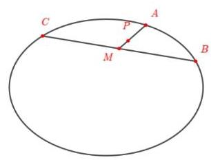

命题②，不妨设双曲线为 $\frac{{x}^{2}}{{a}^{2}} - \frac{{y}^{2}}{{b}^{2}} = 4$ ，

$A\left( {a\left( {{t}_{1} + \frac{1}{{t}_{1}}}\right) , b\left( {{t}_{1} - \frac{1}{{t}_{1}}}\right) }\right) , B\left( {a\left( {{t}_{2} + \frac{1}{{t}_{2}}}\right) , b\left( {{t}_{2} - \frac{1}{{t}_{2}}}\right) }\right) ,$

$C\left( {a\left( {{t}_{3} + \frac{1}{{t}_{3}}}\right) , b\left( {{t}_{3} - \frac{1}{{t}_{3}}}\right) }\right) ,$

则 $\left\{  \begin{array}{l} {t}_{1} + {t}_{2} + {t}_{3} + \left( {\frac{1}{{t}_{1}} + \frac{1}{{t}_{2}} + \frac{1}{{t}_{3}}}\right)  = 0 \\  {t}_{1} + {t}_{2} + {t}_{3} - \left( {\frac{1}{{t}_{1}} + \frac{1}{{t}_{2}} + \frac{1}{{t}_{3}}}\right)  = 0 \end{array}\right.$ ,可得 $\left\{  \begin{array}{l} {t}_{1} + {t}_{2} =  - {t}_{3} \\  \frac{1}{{t}_{1}} + \frac{1}{{t}_{2}} =  - \frac{1}{{t}_{3}} \end{array}\right.$ .

不妨设 ${t}_{1},{t}_{2},{t}_{3}$ 中, ${t}_{1},{t}_{2}$ 同号 (不然换位置即可),则 $\left| {{t}_{1} + {t}_{2}}\right| \left| {\frac{1}{{t}_{1}} + \frac{1}{{t}_{2}}}\right|  \geq  4$ ,与 $\left| {{t}_{1} + {t}_{2}}\right| \left| {\frac{1}{{t}_{1}} + \frac{1}{{t}_{2}}}\right|  = 1$ 矛盾，因而不存在三个不同的点 $A$ ， $B$ ， $C$ ，使得 $O$ 为 ${\Delta ABC}$ 的重心，故命题②是假命题.

综上所述:①是真命题，②是假命题，选 $B$

【练习】3. (2024 届上中)给定自然数 i. 称非空集合 $A$ 为减 $\mathrm{i}$ 集，若 $A$ 满足:

(i) $A \subseteq  {\mathbb{N}}^{ * }, A \neq  \{ 1\}$ ;

(ii) 对任意 $x, y \in  {\mathbb{N}}^{ * }$ ,只要 $x + y \in  A$ ,就有 ${xy} - \mathrm{i} \in  A$ . 问:

(1) 直接判断 $P = \{ 1,2\}$ 是否为减 0 集,是否为减 1 集;

(2)是否存在减 2 集? 若存在，求出所有的减 2 集；若不存在，请说明理由；

(3) 是否存在减 1 集? 若存在, 求出所有的减 1 集; 若不存在, 请说明理由.

【答案】(1) 是;不是; (2) 不存在; (3) $\{ 1,3\} ,\{ 1,3,5\} ,\{ x \mid  x = {2n} - 1, n \in  {\mathbb{N}}^{ * }\}$ .

【解析】(1)因为 $P \subseteq  {\mathbb{N}}^{ * }, P \neq  \{ 1\}$ ,且 $1 + 1 = 2 \in  P,1 \times  1 - 0 = 1 \in  P$ ,所以 $P$ 是 “减 0 集”;

因为 $P \subseteq  {\mathbb{N}}^{ * }, P \neq  \{ 1\}$ ,但是 $1 + 1 = 2 \in  P,1 \times  1 - 1 = 0 \notin  P$ ,所以 $P$ 不是 “减 1 集”.

(2)解法 1:假设存在 “减 2 集” $A$ ，则 $x + y \in  A \Rightarrow  {xy} - 2 \in  A$ ；

当 $x + y = {xy} - 2 > 1$ 时，有 $\left( {x - 1}\right) \left( {y - 1}\right)  = 3$ . 因为 $x, y \in  {\mathbb{N}}^{ * }$ ，所以 $x, y$ 中一个是2，一个是 4，因此此时集合 $A$ 中除 1 以外的最小元素是 6，但 $3 + 3 = 6 \in  A,3 \times  3 - 2 = 7 \notin  A$ ，

这与集合 $A$ 是 “减 2 集” 矛盾;

当 $x + y = {xy} - 1$ 或 $x + y = {xy} - m\left( {m > 2}\right)$ ;

若 $x + y = {xy} - 1 > 1$ ,有 $\left( {x - 1}\right) \left( {y - 1}\right)  = 2$ . 因为 $x, y \in  {\mathbb{N}}^{ * }$ ,所以 $x, y$ 中一个是 2,一个是 3,所以集合 $A$ 中除 1 以外最小元素为 5 ; 但 $2 + 3 = 5 \in  A,2 \times  3 - 2 = 4 \notin  A$ ,这与集合 $A$ 是 “减 2 集”矛盾;

若 $x + y = {xy} - m\left( {m > 2}\right)$ ,有 $\left( {x - 1}\right) \left( {y - 1}\right)  = m + 1$ ; 不妨设 $x = a, y = b\left( {a > 2, b > 2}\right)$ ,

则 $\left( {a - 1}\right) \left( {b - 1}\right)  = m + 1$ ，此时集合 $A$ 中除 1 以外最小元素为 $x + y = a + b \in  A$ ，

但 $1 < {xy} - 2 = a + b - 2 < a + b$ ,因此 ${xy} - 2 \notin  A$ ,与集合 $A$ 是 “减 2 集” 矛盾;

综上所述: 不存在集合 $A$ 是 “减 2 集”.

解法 2: 假设存在 “减 2 集” $A$ ,取 $A$ 中大于 1 的最小元素 $a$ ,因为 $1 + \left( {a - 1}\right)  = a \in  A$ ,所以 $1 \times \; \left( {1 - a}\right)  - 2 = a - 3 \in  A;$

取 $b$ 为 $A$ 中除 1 以外的最小数，所以 $b - 3 \in  A$ ，即 $b - 3 = 1 \Rightarrow  b = 4$ ，所以 $2 + 2 = 4 \in  A,2 \times  2 - 2 \; = 2 \in  A$ 与 $b = 4$ 除 1 外最小数数矛盾,所以不存在 “减 2 集” $A$ .

(3) 取 $a \geq  2, a \in  A \Rightarrow  1 \times  \left( {a - 1}\right)  - 1 = a - 2 \in  A$ ;

取 $b$ 为 $A$ 中除 1 外最小数,则 $b - 2 = 1 \Rightarrow  b = 3$ ,则集合 $A = \{ 1,3\}$ ;

取 $b$ 为 $A$ 中除 1,3 外最小数,则 $b - 2 = 3 \Rightarrow  b = 5$ ,则集合 $A = \{ 1,3,5\}$ ;

设 ${bA}$ 中除 $1\text{ 、 }3\text{ 、 }5$ 以外有其他数, $7 \in  A,2 + 5 = 7 \in  A,2 \times  5 - 1 = 9 \in  A$ ;

猜想所有奇数都在集合 $A$ 中,即 $A = \left\{  {x \mid  x = {2n} - 1, n \in  {\mathbb{N}}^{ * }}\right\}$ ,

设 $x = k$ 时,即 $A = \{ 1,3,5,\cdots ,{2k} - 1\}$ 为“减 1 集”,所以当 $x = k + 1$ 时,有 $1 + {2k} = {2k} + 1 \in  A,1 \; \times  {2k} - 1 = {2k} - 1 \in  A$ ,所以 $A = \{ 1,3,5,\cdots ,{2k} + 1\}$ 为“减 1 集”.

假设 $A$ 是 “减 1 集” 中出现了正偶数 2,则 $1 + 1 = 2 \in  A,1 \times  1 - 1 = 0 \notin  A$ 矛盾,所以 $A$ 中不存在 2;

若 $A$ 中正偶数 4,则 $1 + 3 = 4 \in  A,1 \times  3 - 1 = 2 \notin  A$ ,所以 $A$ 中没有 4;

依次类推,若 $A$ 中有正整数 ${2n}$ ,则 $1 + \left( {{2n} - 1}\right)  = {2n} \in  A,1 \times  \left( {{2n} - 1}\right)  - 1 = {2n} - 2 \notin  A$ ,所以 $A$ 中无正偶数.

综上所述: 存在 “ 减 1 集 ” $\{ 1,3\} ,\{ 1,3,5\} ,\{ x \mid  x = {2n} - 1, n \in  {\mathbb{N}}^{ * }\}$

## C 每日三题 0318

【练习】1. (2024 届进才)椭圆 $C : \frac{{x}^{2}}{{a}^{2}} + \frac{{y}^{2}}{{b}^{2}} = 1\left( {a > b > 0}\right)$ 的左、右焦点分别为 ${F}_{1}\text{ 、 }{F}_{2}$ ，点 $P$ 在椭圆上且同时满足:

① $\bigtriangleup  {F}_{1}{F}_{2}P$ 是等腰三角形; ② $\bigtriangleup  {F}_{1}{F}_{2}P$ 是钝角三角形；

③ 线段 ${F}_{1}{F}_{2}$ 为 $\bigtriangleup  {F}_{1}{F}_{2}P$ 的腰；④椭圆 $C$ 上恰好有 4 个不同的点 $P$ .

则椭圆 $C$ 的离心率的取值范围是___.

【答案】 $\left( {\frac{1}{3},\sqrt{2} - 1}\right)$

【提示】找两个极端情况即可, 平角和直角

【解析】如图,不妨设 $P$ 在第二象限,

由题意得, $\left| {P{F}_{1}}\right|  = \left| {{F}_{1}{F}_{2}}\right|  = {2c}$ ,则 $\left| {P{F}_{2}}\right|  = {2a} - {2c}$ ,

由椭圆的对称性,在四个象限内各存在一个满足条件的点 $P$ ,

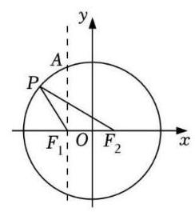

在 $\bigtriangleup  {P{F}_{1}{F}_{2}}$ 中，任意两边之和大于第三边，则 ${4c} > {2a} - {2c}$ ，

所以离心率为 $\mathrm{e} = \frac{c}{a} > \frac{1}{3}$ ,

过点 ${F}_{1}$ 作直线 $A{F}_{1}$ 垂直于 $x$ 轴,与椭圆交于 $A$ 点,则 $\left| {A{F}_{1}}\right|  = \frac{{b}^{2}}{a}$ ,

因为 $\bigtriangleup {F}_{1}{F}_{2}P$ 是钝角三角形,所以 $\left| {A{F}_{1}}\right|  > \left| {P{F}_{1}}\right|$ ,即 $\frac{{b}^{2}}{a} > {2c}$ ,得 ${\mathrm{e}}^{2} + 2\mathrm{e} - 1 < 0$ ,

解得 $\mathrm{e} < \sqrt{2} - 1$ ,

综上,椭圆离心率的取值范围为 $\left( {\frac{1}{3},\sqrt{2} - 1}\right)$ .

【练习】2. (2025 届浙江模拟)在 $\bigtriangleup  {ABC}$ 中，“ ${\sin }^{2}A + {\sin }^{2}B = \sin \left( {A + B}\right)$ ”是“ $C$ 为直角”的( )条件

A. 充分非必要 B. 必要非充分 C. 充要 D. 既非充分也非必要

【答案】 $B$

【提示】必要性显然, 充分性考场上可以用计算器赋值解

【解析】必要性: $C = \frac{\pi }{2}$ 时, $A = \frac{\pi }{2} - B$ ,所以 ${\sin }^{2}A + {\sin }^{2}B = {\cos }^{2}B + {\sin }^{2}B = 1 = \sin \left( {A + B}\right)$ ,必要性成立

充分性:

法 1: 计算器赋值,令 $A = {100}^{ \circ  }$ ,可以 solve 得 $B \approx  {3.3}^{ \circ  }$ ,充分性不成立

法 2: 原式条件非常有趣,我们知道 $C$ 为直角一定是对的,因此不妨思考反证法,看看若 $C$ 不是直角, 是否一定有矛盾。

若 $C$ 不是直角,则 ${\sin }^{2}A + {\sin }^{2}B = \sin C > {\sin }^{2}C$ ,因而 ${a}^{2} + {b}^{2} > {c}^{2}$ ,所以 $C$ 是锐角

因为 $A$ 或者 $B$ 中必然还有一个角是锐角,不妨设 $A$ 为锐角

若 $B$ 为锐角,由 $A + B > \frac{\pi }{2}$ ,得 $\sin A > \cos B,\sin B > \cos A$ ,

所以 ${\sin }^{2}A + {\sin }^{2}B > \sin A\cos B + \sin B\cos A = \sin C$ ,矛盾

若 $B$ 为直角, ${\sin }^{2}A + {\sin }^{2}B > 1 > \sin C$ ,矛盾

若 $B$ 为钝角时,考虑两个极端情况,令 $A = 0,{\sin }^{2}A + {\sin }^{2}B < \sin B = \sin \left( {A + B}\right)$

令 $A = \pi  - B,{\sin }^{2}A + {\sin }^{2}B = 2{\sin }^{2}B > 0 = \sin \left( {A + B}\right)$

因此我们对于一个确定的 $B$ ,我们可以构造函数 $f\left( A\right)  = {\sin }^{2}A + {\sin }^{2}B - \sin \left( {A + B}\right)$ ,在 $A \in \; \left( {0,\pi  - B}\right)$ 上一定有解,所以不矛盾

所以充分性不成立

【练习】3. (2023 届复附)若点 $\left( {{x}_{0},{y}_{0}}\right)$ 在函数 $f\left( x\right)$ 的图像上，且满足 ${y}_{0} \cdot  f\left( {y}_{0}\right)  \geq  0$ ，则称 ${x}_{0}$ 是 $f\left( x\right)$ 的 $\xi$ 点， 函数 $f\left( x\right)$ 的所有 $\xi$ 点构成的集合称为 $f\left( x\right)$ 的 $\xi$ 集.

(1)判断 $\frac{4\pi }{3}$ 是否是函数 $f\left( x\right)  = \tan x$ 的 $\xi$ 点，并说明理由;

( 2 )若函数 $f\left( x\right)  = \sin \left( {{\omega x} + \varphi }\right) \left( {\omega  > 0}\right)$ 的 $\xi$ 集为 $R$ ，求 $\omega$ 的最大值；

(3)若定义域为 $R$ 的连续函数 $f\left( x\right)$ 的 $\xi$ 集 $D$ 是 $R$ 的真子集，求证: $\{ x \mid  f\left( x\right)  = 0\}  \neq  \varnothing$

【答案】(1) 不是

(2)π(和25届徐汇一模第三问一样)

(3)注意到 $D$ 是真子集，找一个不在 $D$ 中的元素即可

【解析】(1) $\frac{4\pi }{3}$ 不是函数 $f\left( x\right)  = \tan x$ 的 $\xi$ 点,理由如下:

设 ${x}_{0} = \frac{4\pi }{3}$ ,则 ${y}_{0} = \tan \frac{4\pi }{3} = \sqrt{3}, f\left( {y}_{0}\right)  = \tan \sqrt{3}$ .

因为 $\frac{\pi }{2} < \sqrt{3} < \pi$ ,所以 $f\left( {y}_{0}\right)  < 0$ .

因为 ${y}_{0}f\left( {y}_{0}\right)  < 0$ ,

所以 $\frac{4\pi }{3}$ 不是函数 $f\left( x\right)  = \tan x$ 的 $\xi$ 点.

(2) 先证明 $\omega  \leq  \pi$ . 若不然,则函数 $f\left( x\right)$ 的最小正周期 $T = \frac{2\pi }{\omega } < 2$ .

因为函数 $f\left( x\right)  = \sin \left( {{\omega x} + \varphi }\right) \left( {\omega  > 0}\right)$ 的 $\xi$ 集为 $R$ ，所以对 $\forall {x}_{0} \in  R$ ， ${x}_{0}$ 是 $f\left( x\right)$ 的 $\xi$ 点.

令 ${y}_{0} = f\left( {x}_{0}\right)$ ,则 ${y}_{0} \cdot  f\left( {y}_{0}\right)  \geq  0$ .

因为函数 $f\left( x\right)  = \sin \left( {{\omega x} + \varphi }\right) \left( {\omega  > 0}\right)$ 的值域为 $\left\lbrack  {-1,1}\right\rbrack$ ，所以当 ${y}_{0} \in  \left\lbrack  {0,1}\right\rbrack$ 时， $f\left( {y}_{0}\right)  \geq  0$ ，

即 $f\left( x\right)  = \sin \left( {{\omega x} + \varphi }\right)  \geq  0, x \in  \left\lbrack  {0,1}\right\rbrack$ 恒成立.

所以 $f\left( x\right)$ 的最小正周期 $T \geq  2$ ,与 $T < 2$ 矛盾.

再证明 $\omega$ 的值可以等于 $\pi$ .

令 $f\left( x\right)  = \sin {\pi x}$ ,对 $\forall {x}_{0} \in  R$ ,

当 ${y}_{0} = f\left( {x}_{0}\right)  \in  \left\lbrack  {0,1}\right\rbrack$ 时, $f\left( {y}_{0}\right)  \in  \left\lbrack  {0,1}\right\rbrack$ ,

${y}_{0} \cdot  f\left( {y}_{0}\right)  \geq  0$ ; 当 ${y}_{0} = f\left( {x}_{0}\right)  \in  \lbrack  - 1,0)$ 时,

$f\left( {y}_{0}\right)  \in  \left\lbrack  {-1,0}\right\rbrack  ,{y}_{0} \cdot  f\left( {y}_{0}\right)  \geq  0.$

所以 ${x}_{0}$ 是 $f\left( x\right)$ 的 $\xi$ 点,即函数 $f\left( x\right)  = \sin {\pi x}$ 的 $\xi$

集为 $R$ .

综上所述， $\omega$ 的最大值是 $\pi$ .

(3) 因为函数 $f\left( x\right)$ 的 $\xi$ 集 $D$ 满足 $D \subset  R$ ，所以存在 ${x}_{0} \in  R$ ，且 ${x}_{0} \neq  0$ ，使得 ${y}_{0} = f\left( {x}_{0}\right)$ 且 ${y}_{0} \cdot  f\left( {y}_{0}\right)  <$

0,即 $f\left( {x}_{0}\right)  \cdot  f\left( {y}_{0}\right)  < 0$ . 因为若 ${x}_{0} = {y}_{0}$ ,则 $f\left( {x}_{0}\right)  \cdot  f\left( {y}_{0}\right)  = {\left( f\left( {y}_{0}\right) \right) }^{2} \geq  0$ ,所以 ${x}_{0} \neq  {y}_{0}$ .

不妨设 ${x}_{0} < {y}_{0}$ ，因为函数 $f\left( x\right)$ 的图象是连续不断的，

所以 $f\left( x\right)$ 存在零点 $m \in  \left( {{x}_{0},{y}_{0}}\right)$ ,使 $f\left( m\right)  = 0$ ，即 $\{ x \mid  f\left( x\right)  = 0\}  \neq  \varnothing$ .

## C4 每日三题 0319

【练习】1. (2025 届某市重)已知集合 $M = \{ x \mid  x \in  N,0 < x \leq  {15}\} ,{A}_{1}\text{ 、 }{A}_{2}\text{ 、 }{A}_{3}$ 满足:① ${A}_{1} \cup  {A}_{2} \cup  {A}_{3} = M$ ； ② 每个集合都恰有 5 个元素. 集合 ${A}_{i}\left( {\mathrm{i} = 1,2,3}\right)$ 中最大元素与最小元素之和称为 ${A}_{i}$ 的特征数，记为 ${X}_{i}\left( {\mathrm{i} = 1,2,3}\right)$ ,则 ${X}_{1} + {X}_{2} + {X}_{3}$ 的值不可能为 ( )

A. 37 B. 39 C. 48 D. 57

【答案】 $A$

【提示】把最大的情况和最小的情况罗列出来即可

【解析】因为集合 $M = \{ x \mid  x \in  N,0 < x \leq  {15}\}  = \{ 1,2,3,\cdots ,{15}\}$ ,

又因为集合 ${A}_{1},{A}_{2},{A}_{3}$ 中,每个集合恰有 5 个元素,且 ${A}_{1} \cup  {A}_{2} \cup  {A}_{3} = M$ 有 15 个元素,

所以集合 ${A}_{1},{A}_{2},{A}_{3}$ 中没有重复元素,

因为 1 是集合 $M$ 中数值最小的元素，15 是集合 $M$ 中数值最大的元素，

所以在 ${A}_{j}$ 的特征数构成中,必有 1 和 15,不妨设 $1 \in  {A}_{1},{15} \in  {A}_{1}$ ,

要使 ${X}_{1} + {X}_{2} + {X}_{3}$ 最大,则应该在集合 ${A}_{1}$ 中首先放置数值较小的元素,即 ${A}_{1} = \{ 1,2,3,4,{15}\}$ , 所以 5 与 14 是剩下元素中数值最小或最大的元素,

同理,不妨设 $5 \in  {A}_{2},{14} \in  {A}_{2}$ ,接着在 ${A}_{2}$ 中再次放置数值较小的元素,即 ${A}_{2} = \{ 5,6,7,8,{14}\}$ , 则 ${A}_{3} = \{ 9,{10},{11},{12},{13}\}$ ,

此时 ${X}_{1} + {X}_{2} + {X}_{3}$ 有最大值为 $1 + {15} + 5 + {14} + 9 + {13} = {57}$ ,即 ${X}_{1} + {X}_{2} + {X}_{3} \leq  {57}$ ;

要使 ${X}_{1} + {X}_{2} + {X}_{3}$ 最小,则在集合 ${A}_{1}$ 中首先放置数值较大的元素,即 ${A}_{1} = \{ 1,{12},{13},{14},{15}\}$ , 所以 2 与 11 是剩下元素中数值最小或最大的元素,

同理,不妨设 $2 \in  {A}_{2},{11} \in  {A}_{2}$ ,接着在 ${A}_{2}$ 中再次放置数值较大的元素,即 ${A}_{2} = \{ 2,8,9,{10},{11}\}$ , 则 ${A}_{3} = \{ 3,4,5,6,7\}$ ,

此时 ${X}_{1} + {X}_{2} + {X}_{3}$ 有最小值为 $1 + {15} + 2 + {11} + 3 + 7 = {39}$ ,即 ${X}_{1} + {X}_{2} + {X}_{3} \geq  {39}$ ,

综上: ${39} \leq  {X}_{1} + {X}_{2} + {X}_{3} \leq  {57}$ ,

显然,选项 $A$ 不满足 ${39} \leq  {X}_{1} + {X}_{2} + {X}_{3} \leq  {57}$ ,故 $A$ 正确;

选项 ${BCD}$ 都满足 ${39} \leq  {X}_{1} + {X}_{2} + {X}_{3} \leq  {57}$ ,故 ${BCD}$ 错误,故选: $A$ .

拓展: 如果问当 ${X}_{1} + {X}_{2} + {X}_{3}$ 的值取到最小值时,这样的有序的 ${A}_{1}\text{ 、 }{A}_{2}\text{ 、 }{A}_{3}$ 有多少个? 答案是 36 个

【练习】2. (2024届七宝) 设集合 $U = \left\{  {\left( {x, y}\right)  \mid  {x}^{2} + {y}^{2} \neq  0, x \in  R, y \in  R}\right\}$ ,点 $P$ 的坐标为 $\left( {x, y}\right)$ ,满足 “对任意 $\left( {a, b}\right)  \in  U$ ,都有 $\left| {{ax} + {by}}\right|  + \left| {{bx} - {ay}}\right|  \leq  4\sqrt{{a}^{2} + {b}^{2}}$ ” 的点 $P$ 构成的图形为 ${\Omega }_{1}$ ,满足“存在 $\left( {a, b}\right)  \in  U$ , 使得 $\left| {{ax} + {by}}\right|  + \left| {{bx} - {ay}}\right|  \leq  4\sqrt{{a}^{2} + {b}^{2}}$ ” 的点 $P$ 构成的图形为 ${\Omega }_{2}$ .

对于下述两个结论:

① ${\Omega }_{1}$ 为正方形以及该正方形内部区域;

② ${\Omega }_{2}$ 的面积大于32. 以下说法正确的为( ).

A. ①、②都正确 B. ①正确，②不正确

C. ①不正确，②正确 D. ①、②都不正确

【答案】 $C$

【提示】构造距离公式, 把图形的情况大概画出来即可

【解析】因为 $U = \left\{  {\left( {x, y}\right)  \mid  {x}^{2} + {y}^{2} \neq  0, x \in  R, y \in  R}\right\}$ ,表示除原点外的平面内的所有点. $\left| {{ax} + {by}}\right|  + \left| {{bx} - {ay}}\right| \; \leq  4\sqrt{{a}^{2} + {b}^{2}} \Rightarrow  \frac{\left| ax + by\right| }{\sqrt{{a}^{2} + {b}^{2}}} + \frac{\left| bx - ay\right| }{\sqrt{{a}^{2} + {b}^{2}}} \leq  4$ ,所以 $P\left( {x, y}\right)$ 表示到直线 ${ax} + {by} = 0$ 和 ${bx} - {ay} = 0$ 的距离之和不大于 4 的点. 如图,易知直线 ${ax} + {by} = 0$ 和 ${bx} - {ay} = 0$ 垂直,

则 $\left| {OE}\right|  + \left| {OF}\right|  \leq  4,{\left| OP\right| }^{2} = {\left| OE\right| }^{2} + {\left| OF\right| }^{2}$ .

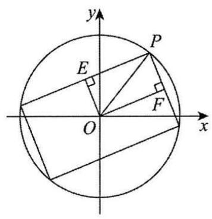

当 $\left| {OE}\right|  + \left| {OF}\right|  = 4$ 时, ${\left| OP\right| }^{2} = {\left| OE\right| }^{2} + {\left( 4 - \left| OE\right| \right) }^{2} =$

$2\left\lbrack  {{\left( \left| OE\right|  - 2\right) }^{2} + 4}\right\rbrack$ .

因为 $0 < \left| {OE}\right|  < 4$ ,所以 $8 \leq  {\left| OP\right| }^{2} < {16} \Rightarrow  2\sqrt{2} \leq  \left| {OP}\right|  \leq  4$ .

因为 ${\Omega }_{1}$ 要求任意，所以 ${\Omega }_{1}$ 是以原点为圆心，半径为 $2\sqrt{2}$ 的圆形以及该圆形的内部区域,因为 ${\Omega }_{2}$ 要求存在,所以 ${\Omega }_{2}$ 是以原点为圆心,半径为 4 的圆形以及该圆形的内部区域，故①不正确；

${S}_{2} = {16\pi } > {32}$ ,故②正确.

故选: $C$

【练习】3. (2024 届建平)设 $y = f\left( x\right)$ 是定义域为 $R$ 的函数，如果对任意的 ${x}_{1}\text{ 、 }{x}_{2} \in  R\left( {{x}_{1} \neq  {x}_{2}}\right)$ ， $\left| {f\left( {x}_{1}\right)  - f\left( {x}_{2}\right) }\right|  < \left| {{x}_{1} - {x}_{2}}\right|$ 均成立，则称 $y = f\left( x\right)$ 是 “平缓函数”.

(1) 若 ${f}_{1}\left( x\right)  = \frac{1}{{x}^{2} + 1},{f}_{2}\left( x\right)  = \sin x$ ，试判断 $y = {f}_{1}\left( x\right)$ 和 $y = {f}_{2}\left( x\right)$ 是否为 “平缓函数”? 并说明理由; (参考公式: $x > 0$ 时, $\sin x < x$ 恒成立)

( 2 )若函数 $y = f\left( x\right)$ 是 “平缓函数”，且 $y = f\left( x\right)$ 是以 1 为周期的周期函数，证明:对任意的 ${x}_{1}\text{ 、 }{x}_{2} \in \; R$ ,均有 $\left| {f\left( {x}_{1}\right)  - f\left( {x}_{2}\right) }\right|  < \frac{1}{2}$ ;

(3) 设 $y = g\left( x\right)$ 为定义在 $R$ 上函数,且存在正常数 $A > 1$ 使得函数 $y = A \cdot  g\left( x\right)$ 为 “平缓函数”. 现定义数列 $\left\{  {x}_{n}\right\}$ 满足: ${x}_{1} = 0,{x}_{n} = g\left( {x}_{n - 1}\right) \left( {n = 2,3,4,\cdots }\right)$ ,试证明: 对任意的正整数 $n, g\left( {x}_{n}\right)  \leq \; \frac{A\left| {g\left( 0\right) }\right| }{A - 1}.$

【答案】(1) 对于函数 $y = {f}_{1}\left( x\right)$ ,由对任意的 ${x}_{1}\text{ 、 }{x}_{2} \in  R$ ,

$\left| {\sin {x}_{1} - \sin {x}_{2}}\right|  = \left| {2\sin \frac{{x}_{1} - {x}_{2}}{2}\cos \frac{{x}_{1} + {x}_{2}}{2}}\right|  \leq  2\left| {\sin \frac{{x}_{1} - {x}_{2}}{2}}\right|  < 2\left| \frac{{x}_{1} - {x}_{2}}{2}\right|  = \left| {{x}_{1} - {x}_{2}}\right|$ ,

可知函数 $y = {f}_{1}\left( x\right)$ 是 $R$ 上的“平缓函数”. 对于函数 $y = {f}_{2}\left( x\right)$ ,由对任意的 ${x}_{1}\text{ 、 }{x}_{2} \in  R$ ,

$\left| {\frac{1}{{x}_{1}^{2} + 1} - \frac{1}{{x}_{2}^{2} + 1}}\right|  = \left| \frac{\left( {{x}_{2} - {x}_{1}}\right) \left( {{x}_{2} + {x}_{1}}\right) }{\left( {{x}_{1}^{2} + 1}\right) \left( {{x}_{2}^{2} + 1}\right) }\right|  = \left| {{x}_{2} - {x}_{1}}\right|  \cdot  \left| \frac{{x}_{2} + {x}_{1}}{\left( {{x}_{1}^{2} + 1}\right) \left( {{x}_{2}^{2} + 1}\right) }\right|$

$< \left| {{x}_{2} - {x}_{1}}\right| \left( {\left| \frac{{x}_{1}}{\left( {{x}_{1}^{2} + 1}\right) \left( {{x}_{2}^{2} + 1}\right) }\right|  + \left| \frac{{x}_{2}}{\left( {{x}_{1}^{2} + 1}\right) \left( {{x}_{2}^{2} + 1}\right) }\right| }\right)  < {x}_{2} - {x}_{1}\left| \left( {\left| \frac{{x}_{1}}{{x}_{1}^{2} + 1}\right| \left| \frac{{x}_{2}}{{x}_{2}^{2} + 1}\right| }\right) \right|$

$< \left| {{x}_{2} - {x}_{1}}\right| \left( {\left| \frac{{x}_{1}}{2{x}_{1}}\right|  + \left| \frac{{x}_{2}}{2{x}_{2}}\right| }\right)  = \left| {{x}_{2} - {x}_{1}}\right| ,$

因此函数 $y = {f}_{2}\left( x\right)$ 也是 $R$ 上的“平缓函数”;

(2) 由已知可得 $f\left( 0\right)  = f\left( 1\right)$ ，由于函数 $y = f\left( x\right)$ 是周期函数，

故不妨设 ${x}_{1}\text{ 、 }{x}_{2} \in  \left\lbrack  {0,1}\right\rbrack$ .

当 $\left| {{x}_{1} - {x}_{2}}\right|  \leq  \frac{1}{2}$ 时,由 $y = f\left( x\right)$ 为 $R$ 上的 “平缓函数” 得 $\left| {f\left( {x}_{1}\right)  - f\left( {x}_{2}\right) }\right|  < \left| {{x}_{1} - {x}_{2}}\right|  \leq  \frac{1}{2}$ ;

当 $\left| {{x}_{1} - {x}_{2}}\right|  > \frac{1}{2}$ 时，不妨设 $0 \leq  {x}_{1} < {x}_{2} \leq  1$ ， ${x}_{2} - {x}_{1} \geq  \frac{1}{2}$ ，此时由 $y = f\left( x\right)$ 为 $R$ 上的“平缓函数” 得:

$\left| {f\left( {x}_{1}\right)  - f\left( {x}_{2}\right) }\right|  = \left| {f\left( {x}_{1}\right)  - f\left( 0\right)  + f\left( 1\right)  - f\left( {x}_{2}\right) }\right|  \leq  \left| {f\left( {x}_{1}\right)  - f\left( 0\right) }\right|  + \left| {f\left( 1\right)  - f\left( {x}_{2}\right) }\right|$

$< \left| {{x}_{1} - 0}\right|  + \left| {1 - {x}_{2}}\right|  = {x}_{1} - {x}_{2} + 1 \leq   - \frac{1}{2} + 1 = \frac{1}{2}$ .

综上所述，命题得证；

(3) 由 $y = g\left( x\right)$ 为 $R$ 上的 “平缓函数”,且 $A > 1$ ,得 $\left| {g\left( {x}_{1}\right)  - g\left( {x}_{2}\right) }\right|  < \frac{1}{A}\left| {{x}_{1} - {x}_{2}}\right|$ ,

则对任意的 $n \geq  2$ ，

$\left| {g\left( {x}_{n}\right)  - g\left( {x}_{n - 1}\right) }\right|  < \frac{1}{A}\left| {{x}_{n} - {x}_{n - 1}}\right|  = \frac{1}{A}\left| {g\left( {x}_{n - 1}\right)  - g\left( {x}_{n - 2}\right) }\right|  < \frac{1}{{A}^{2}}\left| {{x}_{n - 1} - {x}_{n - 2}}\right|  < \cdots  < \frac{1}{{A}^{n - 1}}\left| {{x}_{2} - {x}_{1}}\right|  =$

$\frac{1}{{A}^{n - 1}}\left| {g\left( 0\right) }\right| ,$

因此 $g\left( {x}_{n}\right)  = \left| {g\left( {x}_{n}\right)  - g\left( {x}_{n - 1}\right)  + g\left( {x}_{n - 1}\right)  - g\left( {x}_{n - 2}\right)  + \cdots  + g\left( {x}_{1}\right) }\right|  < \left| {g\left( {x}_{n}\right)  - g\left( {x}_{n - 1}\right) }\right|  + \cdots \; + \left| {g\left( {x}_{2}\right)  - g\left( {x}_{1}\right) }\right|  + \left| {g\left( {x}_{1}\right) }\right|$

$< \left( {1 + \frac{1}{A} + \frac{1}{{A}^{2}} + \cdots  + \frac{1}{{A}^{n - 1}}}\right) \left| {g\left( 0\right) }\right|  < \frac{1}{1 - \frac{1}{A}}\left| {g\left( 0\right) }\right|  = \frac{A}{A - 1}\left| {g\left( 0\right) }\right| .$

## C 每日三题 0320

【练习】1. (模考改)定义域和值域都是 $R$ 的连续函数 $y = f\left( x\right)$ 恰有 2025 个驻点,导函数 $y = {f}^{\prime }\left( x\right)$ 的定义域 $R$ 被这些驻点分割成 2026 个小区间,其中恰有 1013 个区间能使 ${f}^{\prime }\left( x\right)  > 0$ 恒成立,若记 $y = \; f\left( x\right)$ 的零点个数为 $n$ ，则 $n$ 的最大值为___.

【答案】 2025

【解析】定义域和值域都是 $R$ 的连续函数 $y = f\left( x\right)$ 恰有 2025 个驻点,导函数 $y = {f}^{\prime }\left( x\right)$ 的定义域 $R$ 被这些驻点分割成 2026 个小区间,

因为其中恰有 1013 个区间能使 ${f}^{\prime }\left( x\right)  > 0$ 恒成立,所以恰有 1013 个区间能使 ${f}^{\prime }\left( x\right)  < 0$ 恒成立,

为使零点个数最多,需使每个单调区间都存在零点,因此零点最多有 2026 个,

但因为函数是值域是 $R$ 的连续函数,所以 $y = f\left( x\right)$ 的最右侧区间与最左侧区间单调性相同,

从而必存在两个相邻的小区间的单调性相同,即此时对应的驻点非极值点,

因此这两个相邻小区上最多存在一个零点, 即整个定义域上最多存在 2025 个零点

所以若记 $y = f\left( x\right)$ 的零点个数为 $n$ ,则 $n$ 的最大值为 2025 .

【练习】2. (模考改) 已知奇函数 $y = f\left( x\right)$ 及其导函数 $y = {f}^{\prime }\left( x\right)$ 的定义域均为 $R$ ,且 $f\left( x\right)  = f\left( {9 - x}\right)$ 对一切 $x \in  R$ 成立. 关于数列 $F : {a}_{n} = {f}^{\prime }\left( n\right) , n = 1,2,3,\cdots ,{2025}$ 有以下两个论断:

①存在 $f\left( x\right)$ ，使得数列 $F$ 中恰有 112 项为 1，此时记这些项分别为 ${a}_{{b}_{1}}$ ， ${a}_{{b}_{2}}$ ， ${a}_{{b}_{2}}$ ，则 $\mathop{\sum }\limits_{{i = 1}}^{{112}}{b}_{i}$ 为定值； ②存在 $f\left( x\right)$ ，使得数列 $F$ 中恰有 450 项为 0，此时记这些项分别为 ${a}_{{b}_{1}}$ ， ${a}_{{b}_{2}}$ ， ${a}_{{b}_{2}}$ ，则， $\mathop{\sum }\limits_{{i = 1}}^{{450}}{b}_{i}$ 为定值. 下列说法正确的是 ( )

A. ①是真命题，②是假命题 B. ①是假命题，②是真命题

C. ①、②都是真命题 D. ①、②都是假命题

【答案】 $C$

【解析】由 $y = f\left( x\right)$ 是奇函数得 $y = {f}^{\prime }\left( x\right)$ 是偶函数; 由 $f\left( x\right)  = f\left( {9 - x}\right)$ 得 ${f}^{\prime }\left( x\right)  =  - {f}^{\prime }\left( {9 - x}\right)$ ,联立得 ${f}^{\prime }\left( x\right) \; =  - {f}^{\prime }\left( {x - 9}\right)  =  - {f}^{\prime }\left( {x + 9}\right)$ ,故 ${f}^{\prime }\left( {x + {18}}\right)  = {f}^{\prime }\left( x\right)$ ,

所以 ${f}^{\prime }\left( x\right)$ 的一个周期是 18,且关于 $x = 0, x = 9,\left( {{4.5},0}\right) ,\left( {{13.5},0}\right)$ 对称

简单推理, 可知

① 113 项相等的有这些:下标以 1 为首项，18 为公差的 113 项均相等；下标以 2 为首项，18 为公差的 113 项均相等; 一直到下标以 9 为首项，18 为公差的 113 项均相等;

② 112 项相等的有这些:下标以 10 为首项，18 为公差的 112 项均相等；下标以 11 为首项，18 为公差的 113 项均相等; 一直到下标以 18 为首项, 18 为公差的 112 项均相等;

再根据轴对称性，可知 1 和 17 对应项相等，2 和 16 对应项相等，一直到 8 和 10 对应项相等；

中心对称性，可知 1 和 8 对应项相反，2 和 7 对应项相反，一直到 9 和 18 对应项相反

因此若 $F$ 中恰有 112 项为 1,只能取下标为 18 的那组等差数列,此时下标和确定

因此若 $F$ 中恰有 450 项为 0,可以取下标为1,8,10,17的; 也可以取2,7,11,16; 也可以3,6,12,

15; 也可以4,5,13,14,此时虽然每组下标不一样,但是求和时下标和也是确定的

所以两个说法都正确

【练习】3. (2025 届复附)已知双曲线 $C : \frac{{x}^{2}}{{a}^{2}} - \frac{{y}^{2}}{{b}^{2}} = 1\left( {a > 0, b > 0}\right)$ 的虚轴长为 4，渐近线方程为 $y =  \pm  {2x}$

(1)求双曲线 $C$ 的标准方程；

(2)设 $A\left( {m,0}\right) , P$ 是双曲线上的动点，求 $\left| {PA}\right|$ 的最小值；

(3)过右焦点 $F$ 的直线 $l$ 与双曲线 $C$ 的左、右两支分别交于点 $A$ 、 $B$ ，点 $M$ 是线段 ${AB}$ 的中点，过点

$F$ 且与 $l$ 垂直的直线 ${l}^{\prime }$ 交直线 ${OM}$ 于点 $P$ ，点 $Q$ 满足 $\overrightarrow{PQ} = \overrightarrow{PA} + \overrightarrow{PB}$ ，求四边形 ${PAQB}$ 面积的最小值

【解析】(1) 因为双曲线 $C$ 的虚轴长为 4,渐近线方程为 $y =  \pm  {2x}$ ,

所以 $\left\{  \begin{array}{l} {2b} = 4 \\  \frac{b}{a} = 2 \end{array}\right.$ ,解得 $a = 1, b = 2$ ,则双曲线 $C$ 的标准方程为 ${x}^{2} - \frac{{y}^{2}}{4} = 1$ ;

(2) 设 $P\left( {x, y}\right) ,\left| {PA}\right|  = \sqrt{{\left( x - m\right) }^{2} + {y}^{2}} = \sqrt{{\left( x - m\right) }^{2} + 4{x}^{2} - 4}$

$= \sqrt{5{x}^{2} - {2mx} + {m}^{2} - 4}$ ,因为 $x \leq   - 1$ 或 $x \geq  1$ ,

当 $\frac{m}{5} \leq   - 1$ 或 $\frac{m}{5} \geq  1$ ,即 $m \leq   - 5$ 或 $m \geq  5$ 时,

${\left| PA\right| }_{\min } = \sqrt{\frac{{20}\left( {{m}^{2} - 4}\right)  - 4{m}^{2}}{20}} = \sqrt{\frac{4{m}^{2} - {20}}{5}};$

当 $- 1 < \frac{m}{5} \leq  0$ ,即 $- 5 < m \leq  0$ 时, ${\left| PA\right| }_{\min } = \left| {m + 1}\right|  =  - m - 1$ ;

当 $0 < \frac{m}{5} < 1$ ,即 $0 < m < 5$ 时, ${\left| PA\right| }_{\min } = \left| {m - 1}\right|$ ;

所以当 $x = 1$ 时取得最小值 1 ;

(3)由(1)得 $F\left( {\sqrt{5},0}\right)$ ，

不妨设直线 ${AB}$ 的方程为 $x = {my} + \sqrt{5}, A\left( {{x}_{1},{y}_{1}}\right) , B\left( {{x}_{2},{y}_{2}}\right) , M\left( {{x}_{0},{y}_{0}}\right)$ ,

由 $\left\{  \begin{array}{l} x = {my} + \sqrt{5} \\  4{x}^{2} - {y}^{2} = 4 \end{array}\right.$ 得 $\left( {4{m}^{2} - 1}\right) {y}^{2} + 8\sqrt{5}{my} + {16} = 0$ ,此时 $\bigtriangleup   = {64}\left( {{m}^{2} + 1}\right)$ ,

由韦达定理得 ${y}_{1} + {y}_{2} =  - \frac{8\sqrt{5}}{4{m}^{2} - 1}$ ,

所以 ${y}_{0} = \frac{{y}_{1} + {y}_{2}}{2} =  - \frac{4\sqrt{5}m}{4{m}^{2} - 1},{x}_{0} = m{y}_{0} + \sqrt{5} =  - \frac{\sqrt{5}}{4{m}^{2} - 1}$ ,

因为 $O\text{ 、 }M\text{ 、 }P$ 三点共线,所以 $\frac{{y}_{0}}{{x}_{0}} = \frac{{y}_{P}}{{x}_{P}} = {4m}$ ①,

因为 ${PF} \bot  {AB}$ ,所以 ${k}_{PF} \cdot  {k}_{AB} =  - 1$ ,即 $\frac{{y}_{P} - 0}{{x}_{P} - \sqrt{5}} \cdot  \left( \frac{1}{m}\right)  =  - 1$ ②,

由①②得 $P\left( {\frac{1}{\sqrt{5}},\frac{4m}{\sqrt{5}}}\right)$ ，因为 $\overrightarrow{PQ} = \overrightarrow{PA} + \overrightarrow{PB}$ ，

所以四边形 ${PAQB}$ 是平行四边形,此时 ${S}_{\text{ 四边形 }{PAQB}} = 2{S}_{\Delta PAB} = {d}_{P - l} \cdot  \left| {AB}\right|$ ,

因为 ${d}_{P - 1} = \frac{\left| \frac{1}{\sqrt{5}} - \frac{4{m}^{2}}{\sqrt{5}} - \sqrt{5}\right| }{\sqrt{1 + {m}^{2}}} = \frac{4}{\sqrt{5}}\sqrt{1 + {m}^{2}}$ ,

$\left| {PQ}\right|  = \sqrt{1 + {m}^{2}} \cdot  \left| {{y}_{1} - {y}_{2}}\right|  = \sqrt{1 + {m}^{2}} \cdot  \frac{8\sqrt{{m}^{2} + 1}}{\left| 4{m}^{2} - 1\right| } = \frac{8\left( {{m}^{2} + 1}\right) }{\left| 4{m}^{2} - 1\right| },$

所以 ${S}_{PAQB} = \frac{4}{\sqrt{5}}\sqrt{1 + {m}^{2}} \cdot  \frac{8\left( {{m}^{2} + 1}\right) }{\left| 4{m}^{2} - 1\right| } = \frac{32}{\sqrt{5}} \cdot  \frac{{\left( {m}^{2} + 1\right) }^{\frac{3}{2}}}{\left| 4{m}^{2} - 1\right| } = \frac{32}{\sqrt{5}} \cdot  \sqrt{\frac{{\left( {m}^{2} + 1\right) }^{3}}{{\left( 4{m}^{2} - 1\right) }^{2}}}$ ,

不妨令 $t = 4{m}^{2} - 1,{m}^{2} = \frac{t + 1}{4}$ ，此时 ${S}_{PAQB} = \frac{4}{\sqrt{5}} \cdot  \sqrt{\frac{{\left( t + 5\right) }^{3}}{{t}^{2}}}$ ，

不妨令 $f\left( t\right)  = \frac{{\left( t + 5\right) }^{3}}{{t}^{2}}$ ，函数定义域为 $\left( {0, + \infty }\right)$ ，

得 ${f}^{\prime }\left( t\right)  = \frac{3{\left( t + 5\right) }^{2} \cdot  {t}^{2} - {2t} \cdot  {\left( t + 5\right) }^{3}}{{t}^{4}} = \frac{{\left( t + 5\right) }^{2}\left( {t - {10}}\right) }{{t}^{3}}$ ,

当 $0 < x < {10}$ 时, ${f}^{\prime }\left( t\right)  < 0, f\left( t\right)$ 单调递减;

当 $x > {10}$ 时, ${f}^{\prime }\left( t\right)  > 0, f\left( t\right)$ 单调递增,

所以当 $x = {10}$ 时,函数 $f\left( t\right)$ 取得最小值,最小值 $f\left( {10}\right)  = \frac{135}{4}$ ,

则 ${\left( {S}_{PABQ}\right) }_{\min } = \frac{4}{\sqrt{5}} \times  \frac{3\sqrt{15}}{2} = 6\sqrt{3}$ ,

当且仅当 $t = {10}$ ,即 $m =  \pm  \frac{\sqrt{11}}{2}$ 时取等号

## CI 每日三题 0321

【练习】1. (2026 届某市重)已知函数 $y = \left| {x - a}\right|  + \cos x$ 在 $\left\lbrack  {0, b}\right\rbrack$ 上值域为 $\left\lbrack  {-1,\frac{3\pi }{2}}\right\rbrack$ ，则 $\frac{b}{a}$ 的值为___. 【答案】 $\frac{5}{2}$

【解析】因为 $\left| {x - a}\right|  \geq  0,\cos x \geq   - 1$ ,所以当且仅当 $\left| {x - a}\right|  = 0$ 且 $\cos x =  - 1$ 时 $f\left( x\right)  =  - 1$ ,

所以 $a = x = \pi  + {2k\pi }, k \in  N$ ,又 $f\left( 0\right)  = \left| a\right|  + 1 \in  \left\lbrack  {-1,\frac{3\pi }{2}}\right\rbrack$ ,所以 $a = \pi$ ,

所以 $f\left( x\right)  = \left| {x - \pi }\right|  + \cos x$ ,易得 $f\left( x\right)$ 在 $\left( {0,\pi }\right)$ 上严格减,在 $\left( {\pi , + \infty }\right)$ 上严格增,

所以当 $b \leq  \pi$ 时, $f\left( x\right)  \leq  f\left( 0\right)  = \pi  + 1$ ,不满足题意;

当 $b > \pi$ 时,因为 $f{\left( x\right) }_{\max } = \frac{3\pi }{2}$ ,所以 $f\left( b\right)  = b - \pi  + \cos b = \frac{3\pi }{2}$ ,

注意到 $f\left( \frac{5\pi }{2}\right)  = \frac{3\pi }{2}$ ,且 $f\left( x\right)$ 在 $\left( {\pi , + \infty }\right)$ 严格增,所以 $b = \frac{5\pi }{2}$ ,所以 $\frac{b}{a} = \frac{5}{2}$ .

【练习】2. (2022 水球卷) 定义在 $\{ x \mid  x \neq  0,1\}$ 上的函数 $f\left( x\right)$ 满足 $\left\{  {x \mid  f\left( x\right)  > f\left( \frac{1}{1 - x}\right) }\right\}   = \left( {a, b}\right) \left( {1 < a < b}\right)$ , 记 $f\left( x\right)$ 的最小值为 $M$ ,最大值为 $N, S = \{ x \mid  f\left( x\right)  = M\} , T = \{ x \mid  f\left( x\right)  = N\}$ ,则下列命题正确的是 ( )

A. 若 $S$ 是单元素集,则 $S$ 是 $\left( {a, b}\right)$ 的子集 B. 若 $S$ 不是单元素集,则 $S$ 是 $\left( {a, b}\right)$ 的子集

C. 若 $T$ 是单元素集,则 $T$ 是 $\left( {a, b}\right)$ 的子集 D. 若 $T$ 不是单元素集,则 $T$ 是 $\left( {a, b}\right)$ 的子集

【答案】 $B$

【解析】对于选项 $A$ ,若 $\left| S\right|  = 1$ ,不妨设 $S = \{ x \mid  f\left( x\right)  = M\}$ 中仅有 1 个元素 $t$ ,即 $f\left( x\right)$ 的最小值为 $f\left( t\right)  = \; M$ ,若 $S \subseteq  \left( {a, b}\right)$ ,根据 $\left\{  {x \mid  f\left( x\right)  > f\left( \frac{1}{1 - x}\right) }\right\}   = \left( {a, b}\right) \left( {1 < a < b}\right)$ ,有 $a < t < b$ ,故 $f\left( t\right)  \geq  f\left( \frac{1}{1 - t}\right)$ , 与 $f\left( t\right)$ 为最小值矛盾,故选项 $A$ 错误;

对于选项 $B$ ,若 $\left| T\right|  = 1$ ,不妨设 $T = \{ x \mid  f\left( x\right)  = N\}$ 中仅有 1 个元素 $t$ ,即 $f\left( x\right)$ 的最大值为 $f\left( t\right)  = \; N$ ,若 $T \subseteq  \left( {a, b}\right)$ ,根据 $\left\{  {x \mid  f\left( x\right)  > f\left( \frac{1}{1 - x}\right) }\right\}   = \left( {a, b}\right) \left( {1 < a < b}\right)$ ,有 $a < t < b$ ,故 $f\left( t\right)  > f\left( \frac{1}{1 - t}\right)$ ,因为 $f\left( t\right)$ 为最大值,且若 $t = \frac{1}{1 - t}$ ,则 ${t}^{2} - t + 1 = 0$ ,无解,故 $t \neq  \frac{1}{1 - t}$ ,故不等式 $f\left( t\right)  > f\left( \frac{1}{1 - t}\right)$ 必成立，故选项 $B$ 正确；

对于选项 $C$ ,若 $\left| S\right|  \neq  1$ ,则 $\left| S\right|  \geq  2$ ,同 $A$ 可得 $C$ 错误;

对于选项 $D$ ,若 $\left| T\right|  \neq  1$ ,则 $\left| T\right|  \geq  2$ ,不妨设 $f\left( x\right)  = N$ 有两根 ${x}_{1},{x}_{2}$ ,且 $a < {x}_{1} < {x}_{2} < b$ ,则若存在 ${x}_{1} \; < {x}_{0} < {x}_{2}$ 使得 $f\left( {x}_{0}\right)  = M$ ,则由 $A$ 可得 ${x}_{0} \notin  \left( {a, b}\right)$ ,此时 $\left\{  {x \mid  f\left( x\right)  > f\left( \frac{1}{1 - x}\right) }\right\}   = \left( {a, b}\right) \left( {1 < a < b}\right)$ 不成立，故选项 $D$ 错误.

故选: $B$ .

【练习】3. (2025 届上中) 若定义在 $R$ 上的函数 $y = f\left( x\right)$ 和 $y = g\left( x\right)$ 分别存在导函数 ${f}^{\prime }\left( x\right)$ 和 ${g}^{\prime }\left( x\right)$ . 且对任意实数 $x$ ,都存在常数 $k$ ,使 ${f}^{\prime }\left( x\right)  \geq  {\operatorname{kg}}^{\prime }\left( x\right)$ 成立,则称函数 $y = f\left( x\right)$ 是函数 $y = g\left( x\right)$ 的 " $k -$ 控制函数 ",称 $k$ 为控制系数.

(1)求证:函数 $f\left( x\right)  = {2x}$ 是函数 $g\left( x\right)  = \sin x$ 的 " 2 - 控制函数 ";

(2)若函数 $f\left( x\right)  =  - {x}^{4} - 4{x}^{3} - {12}{x}^{2} - {20x}$ 是函数 $g\left( x\right)  = {\mathrm{e}}^{x}$ 的 “ $k$ - 控制函数”,求控制系数 $k$ 的取值范围;

(3) 若 $p\left( x\right)  = {\mathrm{e}}^{x} + m{e}^{-x}$ ，函数 $y = q\left( x\right)$ 为偶函数，函数 $y = p\left( x\right)$ 是函数 $y = q\left( x\right)$ 的“ $1 -$ 控制函数”,求证: “ $m = 1$ ” 的充要条件是 “存在常数 $c$ ,使得 $p\left( x\right)  - q\left( x\right)  = c$ 恒成立”.

【解析】(1) 由 ${f}^{\prime }\left( x\right)  = 2,{g}^{\prime }\left( x\right)  = \cos x$ ,因为 ${f}^{\prime }\left( x\right)  \geq  2{g}^{\prime }\left( x\right)$ ,

所以函数 $f\left( x\right)  = {2x}$ 是函数 $g\left( x\right)  = \sin x$ 的 “ 2 - 控制函数”;

(2) ${f}^{\prime }\left( x\right)  =  - 4{x}^{3} - {12}{x}^{2} - {24x} - {20},{g}^{\prime }\left( x\right)  = {\mathrm{e}}^{x}$ ,

$- 4{x}^{3} - {12}{x}^{2} - {24x} - {20} \geq  k{e}^{x}$ 恒成立，则 $k \leq  {\left( \frac{-4{x}^{3} - {12}{x}^{2} - {24x} - {20}}{{\mathrm{e}}^{x}}\right) }_{\min }$ ,

令 $h\left( x\right)  = \frac{-4{x}^{3} - {12}{x}^{2} - {24x} - {20}}{{\mathrm{e}}^{x}},{h}^{\prime }\left( x\right)  = \frac{4{x}^{3} - 4}{{\mathrm{e}}^{x}}$ ,

$x < 1$ 时, ${h}^{\prime }\left( x\right)  < 0, x > 1,{h}^{\prime }\left( x\right)  > 0,{\left( h\left( x\right) \right) }_{\min } = h\left( 1\right)  =  - \frac{60}{\mathrm{e}}$ 时,

所以, $k \leq   - \frac{60}{\mathrm{e}}$ ,

(3)充分性:若存在常数 $c$ 使得 $p\left( x\right)  - q\left( x\right)  = c$ 恒成立，

则 $p\left( x\right)  = q\left( x\right)  + c$ 为偶函数，

因为函数 $y = q\left( x\right)$ 为偶函数，所以 $q\left( x\right)  = q\left( {-x}\right)$ ，

则 $p\left( x\right)  = p\left( {-x}\right)$ ，即 ${\mathrm{e}}^{x} + m{e}^{-x} = {\mathrm{e}}^{-x} + m{e}^{x}$ ，

所以 $\left( {m - 1}\right) \left( {{\mathrm{e}}^{x} - {\mathrm{e}}^{-x}}\right)  = 0$ 恒成立，所以 $m = 1$ ；

必要性:若 $m = 1$ ，则 $p\left( x\right)  = {\mathrm{e}}^{x} + {\mathrm{e}}^{-x} = p\left( {-x}\right)$ ，所以函数 $p\left( x\right)$ 为偶函数，

函数 $y = p\left( x\right)$ 是函数 $y = q\left( x\right)$ 的 “ 1 - 控制函数”，因此 ${p}^{\prime }\left( x\right)  \geq  {q}^{\prime }\left( x\right)$ ，

又 $q\left( {-x}\right)  = q\left( x\right) , p\left( {-x}\right)  = p\left( x\right)$ ,

函数 $y = p\left( {-x}\right)$ 是函数 $y = q\left( {-x}\right)$ 的“ $1 -$ 控制函数”,

所以 $- {p}^{\prime }\left( {-x}\right)  \geq   - {q}^{\prime }\left( {-x}\right)$ ,即 ${p}^{\prime }\left( {-x}\right)  \leq  {q}^{\prime }\left( {-x}\right)$ 恒成立,

用 $- x$ 代换 $x$ 有 ${p}^{\prime }\left( x\right)  \leq  {q}^{\prime }\left( x\right)$ ,

综上, ${p}^{\prime }\left( x\right)  = {q}^{\prime }\left( x\right)$ ,

记 $h\left( x\right)  = p\left( x\right)  - q\left( x\right)$ ,则 ${h}^{\prime }\left( x\right)  = {p}^{\prime }\left( x\right)  - {q}^{\prime }\left( x\right)  = 0$ ,

因此存在常数 $c$ 使得 $p\left( x\right)  - q\left( x\right)  = c$ 恒成立;

综上,“ $m = 1$ ”的充要条件是“存在常数 $c$ ,使得 $p\left( x\right)  - q\left( x\right)  = c$ 恒成立”.

## CH 每日三题 0322

【练习】1. (2026 届复附)光线沿直线 $l$ 以 ${30}^{ \circ  }$ 的入射角 (指入射光线与入射表面法线的夹角) 照射到镜面 $\alpha$ 上的点 $A$ ,反射光线为射线 ${AB}, l$ 在平面 $\alpha$ 上的射影为 ${l}^{\prime }$ ,现将镜面以 ${l}^{\prime }$ 为轴旋转 ${45}^{ \circ  }$ ,反射光线变为射线 ${AC}$ ，则 $\angle {BAC}$ 的大小为___.

【答案】 $\arccos \frac{1}{4}$

【提示】构造一个长方体

【解析】在长方体中, ${DA}$ 表示入射线,平面 ${EFA}$ 为平面 $\alpha ,{DA}$ 在平面 $\alpha$ 的射影为 ${FA}$ ,因为直线 ${DA}$ 照射到平面 $\alpha$ 的入射角为 ${30}^{ \circ  }$ ,所以 $\angle {DAF} = {60}^{ \circ  }$ .

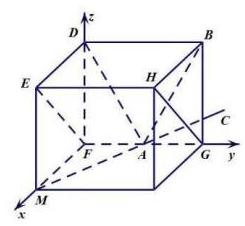

不妨令 ${FD} = {FM} = \sqrt{3},{FA} = 1$ ,

将平面 $\alpha$ 绕 ${FA}$ 轴旋转 ${45}^{ \circ  }$ 得平面 ${EFGH}$ ,

则 $A\left( {0,1,0}\right)$ ,可取 $B\left( {0,2,\sqrt{3}}\right)$ ,

则反射光线 ${AB}$ 的方向向量为 $\overrightarrow{AB} = \left( {0,1,\sqrt{3}}\right)$ .

因为点 $D$ 关于平面 ${EFGH}$ 的对称点为 $M\left( {\sqrt{3},0,0}\right)$ ,

所以反射线 ${AC}$ 的方向向量为 $\overrightarrow{MA} = \left( {-\sqrt{3},1,0}\right)$ ,

所以 $\cos \angle {BAC} = \frac{\overrightarrow{AB} \cdot  \overrightarrow{MA}}{\left| \overrightarrow{AB}\right|  \cdot  \left| \overrightarrow{MA}\right| } = \frac{1}{2 \times  2} = \frac{1}{4}$ ，所以 $\angle {BAC} = \arccos \frac{1}{4}$ .

【练习】2. (2027 届交附) 已知函数 $f\left( x\right)$ 定义域和值域均为 $R$ ,有两个命题:

命题 $p$ : 若对任意 ${x}_{1},{x}_{2} \in  R$ ,且 $f\left( {x}_{1}\right)  < f\left( {x}_{2}\right)$ ,都有 ${x}_{1} < {x}_{2}$ ,则 $y = f\left( x\right)$ 是增函数;

命题 $q$ : 若对任意 ${x}_{1},{x}_{2} \in  R$ ,且 $\left| {f\left( {x}_{1}\right) }\right|  = \left| {f\left( {x}_{2}\right) }\right|$ ,都有 $\left| {x}_{1}\right|  = \left| {x}_{2}\right|$ ,则 $y = f\left( x\right)$ 是奇函数; 则正确的说法是 ( )

A. 命题 $p$ 是真命题,命题 $q$ 也是真命题 B. 命题 $p$ 是真命题,命题 $q$ 是假命题

C. 命题 $p$ 是假命题,命题 $q$ 是真命题 D. 命题 $p$ 是假命题,命题 $q$ 也是假命题

【答案】 $A$

【提示】值域为 $R$

【解析】命题 $p$ 显然是真命题,否则若 $f\left( x\right)$ 不是增函数,则存在 ${x}_{1} > {x}_{2}, f\left( {x}_{1}\right)  < f\left( {x}_{2}\right)$ ,与题设矛盾

命题 $q$ 的主要易错点在于值域为 $R$ ,因而对于任意 ${y}_{0} \in  R$ ,都存在 ${x}_{0} \in  R$ ,使得 $f\left( {x}_{0}\right)  = {y}_{0}$

我们任取 ${y}_{0} \neq  0$ ,则存在 $f\left( {x}_{0}\right)  = {y}_{0}, f\left( {{x}_{0}{}^{\prime }}\right)  =  - {y}_{0}$ ,

由于 $\left| {f\left( {x}_{0}\right) }\right|  = \left| {f\left( {{x}_{0}{}^{\prime }}\right) }\right|$ ,所以 $\left| {x}_{0}\right|  = \left| {{x}_{0}{}^{\prime }}\right|$ ,若 ${x}_{0} = {x}_{0}{}^{\prime }$ ,与函数定义矛盾,所以 ${x}_{0} =  - {x}_{0}{}^{\prime }$

又因为值域为 $R$ ,所以 $f\left( 0\right)  = 0$

因而 $y = f\left( x\right)$ 是奇函数

【练习】3. (2027 届华二)对任意正整数 n，记集合 ${A}_{n} = \left\{  {\left( {{a}_{1},{a}_{2},\cdots ,{a}_{n}}\right)  \mid  {a}_{1},{a}_{2},\cdots ,{a}_{n}}\right.$ 均为非负整数，且 $\left. {{a}_{1} + {a}_{2} + \cdots  + {a}_{n} = n}\right\}$ ,集合 ${B}_{n} = \left\{  {\left( {{b}_{1},{b}_{2},\cdots ,{b}_{n}}\right)  \mid  {b}_{1},{b}_{2},\cdots ,{b}_{n}}\right.$ 均为非负整数,且

$\left. {{b}_{1} + {b}_{2} + \cdots  + {b}_{n} = {2n}}\right\}$ . 设 $\alpha  = \left( {{a}_{1},{a}_{2},\cdots ,{a}_{n}}\right)  \in  {A}_{n},\beta  = \left( {{b}_{1},{b}_{2},\cdots ,{b}_{n}}\right)  \in  {B}_{n}$ ,若对任意 $\mathrm{i} \in  \{ 1,2,\cdots$ , $n\}$ 都有 ${a}_{i} \leq  {b}_{i}$ ,则记 $\alpha  < \beta$ .

(1) 写出集合 ${A}_{2}$ 和 ${B}_{2}$ ;

(2)证明:对任意 $\alpha  \in  {A}_{n}$ ，存在 $\beta  \in  {B}_{n}$ ，使得 $\alpha  \prec  \beta$ ；

(2)设集合 ${S}_{n} = \left\{  {\left( {\alpha ,\beta }\right)  \mid  \alpha  \in  {A}_{n},\beta  \in  {B}_{n},\alpha  < \beta }\right\}$ ，求证: ${S}_{n}$ 中的元素个数是完全平方数.

【解析】 $\left( 1\right) {A}_{2} = \{ \left( {0,2}\right) ,\left( {1,1}\right) ,\left( {2,0}\right) \} ,{B}_{2} = \{ \left( {0,4}\right) ,\left( {1,3}\right) ,\left( {2,2}\right) ,\left( {3,1}\right) ,\left( {4,0}\right) \}$ ;

(2)对任意 $\alpha  = \left( {{a}_{1},{a}_{2},\cdots ,{a}_{n}}\right)  \in  {A}_{n}$ ，设 ${b}_{i} = {a}_{i} + 1\left( {\mathrm{i} = 1,2,3,\cdots , n}\right)$ ，

则 ${b}_{1},{b}_{2},\cdots ,{b}_{n}$ 均为非负整数,且 ${a}_{i} \leq  {b}_{i}\left( {\mathrm{i} = 1,2,3,\cdots , n}\right)$ .

令 $\beta  = \left( {{b}_{1},{b}_{2},\cdots ,{b}_{n}}\right)$ ,则 ${b}_{1} + {b}_{2} + \cdots  + {b}_{n}$

$= \left( {{a}_{1} + 1}\right)  + \left( {{a}_{2} + 1}\right)  + \cdots  + \left( {{a}_{n} + 1}\right)  = \left( {{a}_{1} + {a}_{2} + \cdots  + {a}_{n}}\right)  + n = {2n}$ ,

所以 $\beta  \in  {B}_{n}$ ,且 $\alpha  < \beta$ .

(3) 对任意 $\alpha  = \left( {{a}_{1},{a}_{2},\cdots ,{a}_{n}}\right)  \in  {A}_{n},{\alpha }^{\prime } = \left( {{a}_{1}{}^{\prime },{a}_{2}{}^{\prime },\cdots ,{a}_{n}{}^{\prime }}\right)  \in  {A}_{n}$ ,

记 $\alpha  + {\alpha }^{\prime } = \left( {{a}_{1} + {a}_{1}{}^{\prime },{a}_{2} + {a}_{2}{}^{\prime },\cdots ,{a}_{n} + {a}_{n}{}^{\prime }}\right)$ ,

则 ${a}_{1} + {a}_{1}{}^{\prime },{a}_{2} + {a}_{2}{}^{\prime },\cdots ,{a}_{n} + {a}_{n}{}^{\prime }$ 均为非负整数,

且 $\left( {{a}_{1} + {a}_{1}{}^{\prime }}\right)  + \left( {{a}_{2} + {a}_{2}{}^{\prime }}\right)  + \cdots  + \left( {{a}_{n} + {a}_{n}{}^{\prime }}\right)$

$= \left( {{a}_{1} + {a}_{2} + \cdots  + {a}_{n}}\right)  + \left( {{a}_{1}{}^{\prime } + {a}_{2}{}^{\prime } + \cdots  + {a}_{n}{}^{\prime }}\right)  = n + n = {2n}$ ,

所以 $\alpha  + {\alpha }^{\prime } \in  {B}_{n}$ ,且 $\alpha  \prec  \alpha  + {\alpha }^{\prime },{\alpha }^{\prime } \prec  \alpha  + {\alpha }^{\prime }$ .

设集合 ${A}_{n}$ 中的元素个数为 $t$ ,设 ${A}_{n} = \left\{  {{\alpha }_{1},{\alpha }_{2},\cdots ,{\alpha }_{t}}\right\}$ .

设集合 ${T}_{n} = \left\{  {\left( {{\alpha }_{i},{\alpha }_{i} + {\alpha }_{j}}\right)  \mid  \mathrm{i} = 1,2,\cdots , t, j = 1,2,\cdots , t}\right\}$ .

对任意 ${\alpha }_{i} \in  {A}_{n}\left( {\mathrm{i} = 1,2,\cdots , t}\right)$ ,都有 ${\alpha }_{i} + {\alpha }_{1},{\alpha }_{i} + {\alpha }_{2},\cdots ,{\alpha }_{i} + {\alpha }_{t} \in  {B}_{n}$ ,

且 ${\alpha }_{i} \prec  {\alpha }_{i} + {\alpha }_{j}, j = 1,2,\cdots , t$ ,所以 ${T}_{n} \subseteq  {S}_{n}$ .

若 $\left( {\alpha ,\beta }\right)  \in  {S}_{n}$ ,其中 $\alpha  = \left( {{a}_{1},{a}_{2},\cdots ,{a}_{n}}\right)  \in  {A}_{n},\beta  = \left( {{b}_{1},{b}_{2},\cdots ,{b}_{n}}\right)  \in  {B}_{n}$ ,

设 ${c}_{i} = {b}_{i} - {a}_{i}\left( {\mathrm{i} = 1,2,\cdots , n}\right)$ ,因为 ${a}_{i} \leq  {b}_{i}$ ,所以 ${c}_{i} = {b}_{i} - {a}_{i} \geq  0$ ,

记 ${\alpha }^{\prime } = \left( {{c}_{1},{c}_{2},\cdots ,{c}_{n}}\right)$ ,

则 ${c}_{1} + {c}_{2} + \cdots  + {c}_{n} = \left( {{b}_{1} - {a}_{1}}\right)  + \left( {{b}_{2} - {a}_{2}}\right)  + \cdots \left( {{b}_{n} - {a}_{n}}\right)$

$= \left( {{b}_{1} + {b}_{2} + \cdots  + {b}_{n}}\right)  - \left( {{a}_{1} + {a}_{2} + \cdots  + {a}_{n}}\right)  = {2n} - n = n$ ,

所以 ${\alpha }^{\prime } \in  {A}_{n}$ ,并且有 $\beta  = \alpha  + {\alpha }^{\prime }$ ,所以 $\left( {\alpha ,\beta }\right)  \in  {T}_{n}$ ,所以 ${S}_{n} \subseteq  {T}_{n}$ ,

所以 ${S}_{n} = {T}_{n}$ .

因为集合 ${T}_{n}$ 中的元素个数为 ${t}^{2}$ ,所以 ${S}_{n}$ 中的元素个数为 ${t}^{2}$ ,是完全平方数.

## CH 每日三题 0323

【练习】1. (2023 届复附) 若函数 $y = f\left( x\right)$ 对定义域 $D$ 内的每一个 ${x}_{1}$ ,都存在唯一的 ${x}_{2} \in  D$ ,使得 $f\left( {x}_{1}\right)$ . $f\left( {x}_{2}\right)  = 1$ 成立，则称 $f\left( x\right)$ 为“自倒函数”.

给出下列命题:

①单调函数一定是自倒函数；

②自倒函数 $f\left( x\right)$ 可以是奇函数；___

③ 自倒函数 $f\left( x\right)$ 的值域可以是 $R$ ;

④若 $y = f\left( x\right) , y = g\left( x\right)$ 都是自倒函数，且定义域相同，则 $y = f\left( x\right)  \cdot  g\left( x\right)$ 也是自倒函数。

则以上命题正确的是___(写出所有正确命题的序号)

【答案】②

【解析】对于 ①,因为函数 $y = \ln x$ 有零点,即当 ${x}_{1} = 1$ 时, $y = \ln {x}_{1} = 0$ ,

所以当 ${x}_{1} = 1$ 时，不存在 ${x}_{2}$ 满足 $f\left( {x}_{1}\right) f\left( {x}_{2}\right)  = 1$ 成立，

所以函数 $y = \ln x$ 不是自倒函数,故①不正确;

对于②， $f\left( x\right)$ 是奇函数时，不妨设 $f\left( x\right)  = \frac{1}{x}$ ， $x \in  \left( {-\infty ,0}\right)  \cup  \left( {0, + \infty }\right)$ ，

则任取 ${x}_{1} \in  \left( {-\infty ,0}\right)  \cup  \left( {0, + \infty }\right)$ ,有 $f\left( {x}_{1}\right)  = \frac{1}{{x}_{1}}\left( {-\infty ,0}\right)  \cup  \left( {0, + \infty }\right)$ ,

由 $f\left( {x}_{1}\right) f\left( {x}_{2}\right)  = \frac{1}{{x}_{1}} \cdot  \frac{1}{{x}_{2}} = 1$ ,得 ${x}_{2} = \frac{1}{{x}_{1}}$ ,其中 ${x}_{2} \in  \left( {-\infty ,0}\right)  \cup  \left( {0, + \infty }\right)$ ,

所以 $f\left( x\right)$ 是定义域上的自倒函数，故②正确；

对于③，因为 $f\left( x\right)$ 的值域是 $R$ ，所以当 $f\left( {x}_{1}\right)  = 0$ 时， $f\left( {x}_{1}\right)  \cdot  f\left( {x}_{2}\right)  = 0$ ，

命题不成立，所以 $f\left( x\right)$ 不是自倒函数，故③不正确；

对于④，当 $y = f\left( x\right) , y = g\left( x\right)$ 都是自倒函数，且定义域相同时，

函数 $y = f\left( x\right) g\left( x\right)$ 不一定是自倒函数,

例如 $f\left( x\right)  = g\left( x\right)  = \frac{1}{x}$ ,其中 $x \in  \left( {-\infty ,0}\right)  \cup  \left( {0, + \infty }\right)$ ,

则 $y = f\left( x\right) g\left( x\right)  = \frac{1}{{x}^{2}}$ 不是自倒函数,

因为由 $\frac{1}{{x}_{1}^{2}} \cdot  \frac{1}{{x}_{2}^{2}} = 1$ ,得 ${x}_{2}^{2} = \frac{1}{{x}_{1}^{2}}$ ,所以 ${x}_{2} =  \pm  \frac{1}{{x}_{1}}$ 不唯一,命题不成立;

综上,正确的命题是②

【练习】2. (2023 届复附) 设数集 $S = \{ a, b, c, d\}$ 满足下列两个条件:

(I) 对任意的 $x\text{ 、 }y \in  S,{xy} \in  S$ ;

(II) 对任意的 $x\text{ 、 }y\text{ 、 }z \in  S$ 或 $x \neq  y$ ,则 ${xz} \neq  {yz}$ .

现给出如下论断:

① $a$ 、 $b$ 、 $c$ 、 $d$ 中必有一个为 0 ； ② $a\text{ 、 }b\text{ 、 }c\text{ 、 }d$ 中必有一个为 1 ;

③若 $x \in  S$ 且 ${xy} = 1$ ，则 $y \in  S$ ；④存在互不相等的 $x$ 、 $y$ 、 $z \in  S$ ，使得 ${x}^{2} = y$ ， ${y}^{2} = z$ . 其中正确论断的个数是 ( )

A. 1 B. 2 C. 3 D. 4

【答案】 $C$

【解析】由 (2) 得 0 不属于 $S$ (①不成立),由 (1) 可推出对于任意 $a\text{ 、 }b\text{ 、 }c\text{ 、 }d \in  S$ ,

${abcd} \in  S$ ,所以 ${abcd}$ 等于 $a\text{ 、 }b\text{ 、 }c\text{ 、 }d$ 中的某一个,不妨设 ${abcd} = a$ ,

因为 $a \neq  0$ ，所以 ${bcd} = 1$ (由 (1) 得②成立)，

若③中 $x = b$ ，则 $y = {cd}$ ，由 (1) 得 ${cd} \in  S$ ，即 $y \in  S$ ，所以 $x = b$ 时③成立，

同理有 $x = c$ 时 ③成立和 $x = d$ 时 ③成立，

下面讨论 $x = a$ 时,

因为 $1 \in  S$ ,所以若 $a = 1$ ,则 $y = 1 \in  S$ ,

③成立 (最后会证到 $a$ 即 ${abcd}$ 不可能等于 1 )，

若 $a \neq  1$ ,则 $b\text{ 、 }c\text{ 、 }d$ 中的某个等于 1,不妨设 $b = 1$ ,由 ${bcd} = 1$ 得 ${cd} = 1$ ,

由 (1) 得 ${ac} \in  S$ ,又因为 ${ac} \neq  a\left( {\text{ 即 }c \neq  1}\right) ,{ac} \neq  b\left( {\text{ 即 }a \neq  d}\right) ,{ac} \neq  c\left( {\text{ 即 }a \neq  1}\right)$ ,

所以 ${ac} = d$ ,同理有 ${ad} = c$ ,所以 ${ac} \cdot  {ad} = {dc}$ ,所以 ${a}^{2} = 1$ ,所以 $a =  - 1$ ,

所以 $y =  - 1 \in  S$ ,所以③成立,

综上,对于任意 $x \in  S,{xy} = 1$ ,有 $y \in  S$ 成立,即③成立,

由 $a \neq  1$ 即 ${abcd} \neq  1$ 的讨论得,当 ${abcd} \neq  1$ 时, $S = \{ 1, - 1,\mathrm{i}, - \mathrm{i}\}$ (联立 ${cd} = 1,{ac} = d$ ,

${ad} = c$ ,解出 $a\text{ 、 }c\text{ 、 }d)$ ,此时,④成立,

若 $a = 1$ 即 ${abcd} = 1$ ,则 ${bcd} = 1 = a$ ,由①得 ${cd} \in  S$ ,

若 ${cd} = a = 1$ ,则 $b = {bcd} = a$ ,不可能,若 ${cd} = c$ ,则 $d = 1 = a$ ,不可能,

若 ${cd} = d$ ,则 $c = 1 = a$ ,不可能,所以 ${cd} = b$ ,所以 ${b}^{2} = b \cdot  {cd} = a$ ,

同理有 ${c}^{2} = a,{d}^{2} = a$ ,

因为 $a$ 的平方根有且只有两个值,那么 $b\text{ 、 }c\text{ 、 }d$ 中至少有两个相同,

这与 $b\text{ 、 }c\text{ 、 }d$ 同属于 $S$ 矛盾,所以不存在 $a = 1$ 即 ${abcd} = 1$ 的情况,所以④成立

故选 $C$

【练习】3. (2023 届上中) 已知定义域为 $D$ 的函数 $y = f\left( x\right)$ .

当 $a \in  D$ 时,若 $g\left( x\right)  = \frac{f\left( x\right)  - f\left( a\right) }{x - a}\left( {x \in  D, x \neq  a}\right)$ 是严格增函数,则称 $f\left( x\right)$ 是一个“ $T\left( a\right)$ 函数”.

(1) 判断函数 $y = 2{x}^{2} + x + 2\left( {x \in  R}\right)$ 是否为 $T\left( 1\right)$ 函数,并说明理由;

( 2 )若定义域为 $\lbrack 0, + \infty )$ 的 $T\left( 0\right)$ 函数 $y = s\left( x\right)$ 满足 $s\left( 0\right)  = 0$ ，解关于 $\lambda$ 的不等式 $s\left( {2\lambda }\right)  < {\lambda s}\left( 2\right)$ ；

(3)设 $P$ 是满足下列条件的定义域为 $R$ 的函数 $y = W\left( x\right)$ 组成的集合:

①对任意 $u \in  R$ ， $W\left( x\right)$ 都是 $T\left( u\right)$ 函数；

② $W\left( 0\right)  = W\left( 2\right)  = 2, W\left( {-1}\right)  = W\left( 3\right)  = 3$ .

若 $W\left( x\right)  \geq  m$ 对一切 $W\left( x\right)  \in  P$ 和所有 $x \in  R$ 成立,求实数 $m$ 的最大值.

【解析】(1) 因为 $g\left( x\right)  = \frac{\left( {2{x}^{2} + x + 2}\right)  - \left( {2 \times  {1}^{2} + 1 + 2}\right) }{x - 1} = {2x} + 3\left( {x \in  R, x \neq  1}\right)$ 为严格增函数,

故 $y = 2{x}^{2} + x + 2\left( {x \in  R}\right)$ 是 $T\left( 1\right)$ 函数.

(2) 因为 $y = s\left( x\right)$ 是 $T\left( 0\right)$ 函数,且 $s\left( 0\right)  = 0$ ,

所以 $g\left( x\right)  = \frac{s\left( x\right) }{x}$ 是 $\lbrack 0, + \infty )$ 上的严格增函数,

因为 $s\left( {2\lambda }\right)$ 有意义，所以 $\lambda  \geq  0$ ，显然， $\lambda  = 0$ 时不等式不成立，下设 $\lambda  > 0$ ，

此时 $s\left( {2\lambda }\right)  < {\lambda s}\left( 2\right)$ 等价于 $\frac{s\left( {2\lambda }\right) }{2\lambda } < \frac{s\left( 2\right) }{2}$ ,

由 $g\left( x\right)$ 的单调性得 ${2\lambda } < 2$ ,即所求不等式的解集为 $\left( {0,1}\right)$ .

(3)由题意得 $W\left( x\right)$ 是 $T\left( 0\right)$ 函数，故 $y = \frac{W\left( x\right)  - 2}{x}$ 是严格增函数，

从而当 $x < 0$ 时, $\frac{W\left( x\right)  - 2}{x} < \frac{W\left( 2\right)  - 2}{2} = 0$ ,即 $W\left( x\right)  > 2$ ;

而 $W\left( x\right)$ 是 $T\left( 2\right)$ 函数,故 $y = \frac{W\left( x\right)  - 2}{x - 2}$ 是严格增函数,

从而当 $x > 2$ 时, $\frac{W\left( x\right)  - 2}{x - 2} > \frac{W\left( 0\right)  - 2}{0 - 2} = 0$ ,即 $W\left( x\right)  > 2$ ,

当 $0 < x < 2$ 时,同理可得 $\frac{W\left( x\right)  - 2}{x} > \frac{W\left( {-1}\right)  - 2}{-1} =  - 1$ ,

且 $\frac{W\left( x\right)  - 2}{x - 2} < \frac{W\left( 3\right)  - 2}{3 - 2} = 1$ ,故 $W\left( x\right)  > 2 - x$ 且 $W\left( x\right)  > x$ ,

故 $W\left( x\right)  > \max \{ x,2 - x\}  = 1 + \left| {x - 1}\right|  \geq  1$ .

因此,当 $m \leq  1$ 时, $W\left( x\right)  \geq  m$ 对一切 $x \in  R$ 成立.

下证,任意 $m > 1$ 均不满足要求,由条件②得 $m \leq  2$ .

另一方面，对任意 $M \in  (1,2\rbrack$ ，

定义函数 ${W}_{M}\left( x\right)  = \frac{M - 1}{4}{\left| x - 1\right| }^{2} + \frac{7 - {3M}}{4}\left| {x - 1}\right|  + \frac{M + 1}{2}$ ，

容易验证条件②成立.

对条件①,任取 $u \in  R$ ,

有 $\frac{{W}_{M}\left( x\right)  - {W}_{M}\left( u\right) }{x - u} = \frac{M - 1}{4}\left( {x + u - 2}\right)  + \frac{7 - {3M}}{4}\frac{\left| {x - 1}\right|  - \left| {u - 1}\right| }{x - u}$ ,

注意到 $y = x + u - 2$ 是严格增函数,

而对 $h\left( x\right)  = \frac{\left| {x - 1}\right|  - \left| {u - 1}\right| }{x - u}$ ,当 $u < 1$ 时, $h\left( x\right)  = \left\{  \begin{array}{l}  - 1, x < 1, x \neq  u \\  1 - \frac{2 - {2u}}{x - u}, x \geq  1 \end{array}\right.$ ;

当 $u \geq  1$ 时, $h\left( x\right)  = \left\{  \begin{array}{l}  - 1 - \frac{{2u} - 2}{x - u}, x < 1 \\  1, x \geq  1, x \neq  u \end{array}\right.$ ,均单调不减.

因为 $\frac{M - 1}{4},\frac{7 - {3M}}{4} > 0$ ，所以条件①成立，从而 ${W}_{M}\left( x\right)  \in  P$ .

此时， ${W}_{M}\left( 1\right)  = \frac{M + 1}{2} < M$ ，故 $m < M$ ，从而 $m = 1$ 为所求最大值.

## CH 每日三题 0324

【练习】1. (2024 届上中) 对任意数集 $A = \left\{  {{a}_{1},{a}_{2},{a}_{3}}\right\}$ ,满足表达式为 $y = {x}^{3} + {x}^{2} - x - 1$ 且值域为 $A$ 的函数个数为 $p$ . 记所有可能的 $p$ 的值组成集合 $B$ ，则集合 $B$ 中元素之和为___.

【答案】643

【提示】从公共点个数 $\left( {1\text{ 、 }2\text{ 、 }3}\right)$ 入手分类讨论

【解析】因为函数值域为 $\left\{  {{a}_{1},{a}_{2},{a}_{3}}\right\}$ ,

所以 $y = {a}_{i}\left( {\mathrm{i} = 1,2,3}\right)$ 的图像与 $y = {x}^{3} + {x}^{2} - x - 1$ 的图像

可能有 1 或 2 或 3 个公共点.

若公共点个数为 1 ，则能且仅能为定义域提供 1 个元素，共 1 种情况；

若公共点个数为 2 ，则为定义域提供元素的情况共 ${2}^{2} - 1 = 3$ 种；

若公共点个数为 3,则能为定义域提供元素的情况共 ${2}^{3} - 1 = 7$ 种.

若不存在 $y = {a}_{i}\left( {\mathrm{i} = 1,2,3}\right)$ 的图像与 $y = {x}^{3} + {x}^{2} - x - 1$ 的图像有 2 个公共点，

则共有 ${7}^{0} + {7}^{1} + {7}^{2} + {7}^{3}$ 种不同的定义域；

若仅存在 1 条 $y = {a}_{i}\left( {\mathrm{i} = 1,2,3}\right)$ 的图像与 $y = {x}^{3} + {x}^{2} - x - 1$ 的图像有 2 个公共点,

则共有 $3 \cdot  \left( {{7}^{0} + {7}^{1} + {7}^{2}}\right)$ 种不同的定义域;

若仅存在 2 条 $y = {a}_{i}\left( {\mathrm{i} = 1,2,3}\right)$ 的图像与 $y = {x}^{3} + {x}^{2} - x - 1$ 的图像有 2 个公共点,

则共有 ${3}^{2} \cdot  \left( {{7}^{0} + {7}^{1}}\right)$ 种不同的定义域;

所以共 643 种不同的定义域,即集合 $B$ 中元素个数为 643 .

【练习】2. (2024届七宝)对于 $n$ ， $k \in  {N}^{ * }$ ，若正整数组 $F\left( {{a}_{1},{a}_{2},\cdots ,{a}_{k}}\right)$ 满足 ${a}_{1} \leq  {a}_{2} \leq  \cdots  \leq  {a}_{k}$ ， ${a}_{1} + {a}_{2} + \cdots \; + {a}_{k} = n$ ，则称 $F$ 为 $n$ 的一个拆，设 $F$ 中全为奇数，偶数时拆的个数分别为 $S\left( n\right) , T\left( n\right)$ ，则()___

A. 存在 $n \geq  {2025}$ ,使得 $S\left( n\right)  = 0$ B. 不存在 $n \geq  {2025}$ ,使得 $T\left( n\right)  = 0$

C. 存在 $n \geq  {2025}$ ,使得 $S\left( n\right)  = T\left( n\right)$ D. 不存在 $n \geq  {2025}$ ,使得 $S\left( n\right)  < T\left( n\right)$

【答案】 $D$

【提示】全拆成 1

【解析】任意的 $n \geq  {2025}$ ,至少存在一个全为 1 的拆分,判断选项 $A$ ; 当 $n$ 为奇数时,判断能否是全偶拆分, 判断选项 $B;C, D$ 选项,可以举例发现规律,判断选项.

对于任意的 $n \geq  {2025}$ ，至少存在一个全为 1 的拆分，故 $A$ 错误；

当 $n$ 为奇数时， $T\left( n\right)  = 0$ ，故 $B$ 错误；

当 $n$ 为偶数时, $\left( {{a}_{1},{a}_{2},\cdots ,{a}_{k}}\right)$ 是每个数均为偶数的分拆,则它至少对应了 $\left( {1,1,\cdots ,1}\right)$ 和

$\left( {1,1,\cdots ,{a}_{1} - 1,{a}_{2} - 1,\cdots ,{a}_{k} - 1}\right)$ 的均为奇数的拆,

当 $n = 2$ 时,偶数拆为 $\left( 2\right)$ ,奇数拆为 $\left( {1,1}\right) , S\left( 2\right)  = T\left( 2\right)  = 1$ ;

当 $n = 4$ 时,偶数拆为 $\left( {2,2}\right) ,\left( 4\right)$ ,奇数拆为 $\left( {1,1,1,1}\right) ,\left( {1,3}\right)$ ;

故当 $n \geq  6$ 时,对于偶数的拆,除了各项不全为 1 的奇数拆分外,至少多出一项各项均为 1 的拆,故 $S\left( n\right)  > T\left( n\right)$ ,故 $C$ 错误, $D$ 正确.

故选: $D$

【练习】3. (2024 届七宝) 已知函数 $f\left( x\right)  = {x}^{3} - {ax} - b, x \in  R$ .

(1)若 $f\left( x\right)$ 的一个极值点为 2，求实数 $a$ 的值；

(2)若 $b > 0$ ，方程 $f\left( x\right)  = 0$ 有两个解 $\alpha ,\beta$ ，且 $\alpha  < \beta$ ，求 ${2\alpha } + \beta$ 的值；

(3) 若 $b = 0$ ，函数 $f\left( x\right)  = {x}^{3} - {ax}$ 的图象上存在四个点 ${A}_{i}\left( {{x}_{i},{y}_{i}}\right)$ ，过 ${A}_{i}$ 的切线为

${l}_{i}\left( {\mathrm{i} = 1,2,3,4\text{ ,其中 }{l}_{1}//{l}_{3}}\right)$ ,且 ${l}_{1},{l}_{2},{l}_{3},{l}_{4}$ 围成的图形是正方形,求实数 $a$ 的取值范围.

【解析】 $\left( 1\right) {f}^{\prime }\left( x\right)  = 3{x}^{2} - a$ ,所以 $3 \times  {2}^{2} - a = 0, a = {12}$ ,当 $a = {12}$ 时, ${f}^{\prime }\left( x\right)  = 3{x}^{2} - {12}, x \in  \left( {-2,2}\right) ,{f}^{\prime }\left( x\right) \; < 0, x \in  \left( {2, + \infty }\right) ,{f}^{\prime }\left( x\right)  > 0,2$ 是 $f\left( x\right)$ 的一个极值点,故 $a = {12}$ ;

( 2 )即函数 $y = {x}^{3}$ 的图像与直线 $y = {ax} + b\left( {b > 0}\right)$ 有两个交点 $A\left( {\alpha ,{\alpha }^{3}}\right) , B\left( {\beta ,{\beta }^{3}}\right)$ ，则 $y = {x}^{3}$ 与直线 $y = {ax} + b\left( {b > 0}\right)$ 在点 $A$ 处相切，在点 $B$ 处相交，则切线方程为 $y - {\alpha }^{3} = 3{a}^{2}\left( {x - \alpha }\right)$ ，即 $y = 3{\alpha }^{2}x - \; 2{a}^{3}$ ，联立 $\left\{  \begin{array}{l} y = {x}^{3} \\  y = 3{a}^{2}x - 2{a}^{3} \end{array}\right.$ ，得 ${x}^{3} = 3{a}^{2}x - 2{a}^{3}$ ，则 ${x}^{3} - {a}^{2}x - 2{a}^{2}x + 2{a}^{3} = x\left( {{x}^{2} - {a}^{2}}\right)  - 2{a}^{2}\left( {x - a}\right)  = \; {\left( x - \alpha \right) }^{2}\left( {x + {2\alpha }}\right)  = 0$ ,方程的两根为 $\alpha ,\beta$ ,则 $\beta  =  - {2\alpha } \Rightarrow  {2\alpha } + \beta  = 0$ ;

(3)若 $a \leq  0$ ，则 ${k}_{i} = 3{x}_{i}^{2} - a \geq  0\left( {\mathrm{i} = 1,2,3,4}\right)$ ， ${k}_{1}{k}_{2} =  - 1$ 不成立，所以 $a > 0$ . 又 $f\left( x\right)$ 为奇函数，有 $\left\{  {\begin{array}{l} 3{x}_{1}^{2} - a = {k}_{1} = 3{x}_{3}^{2} - a \Rightarrow  {x}_{1} =  - {x}_{3} \\  3{x}_{2}^{2} - a = {k}_{2} = 3{x}_{4}^{2} - a \Rightarrow  {x}_{2} =  - {x}_{4} \end{array},{l}_{i} : y - {y}_{i} = {k}_{i}\left( {x - {x}_{i}}\right) \text{ ,代入 }{y}_{i} = {x}_{i}^{3} - a{x}_{i}, a = 3{x}_{i}^{2} - {k}_{i}\text{ ,得 }{l}_{i} : y - }\right. \; {k}_{i}x - 2{x}_{i}^{3} = 0\left( {\mathrm{i} = 1,2,3,4}\right)$ ,不妨设 ${x}_{1} > 0,{x}_{2} > 0,{k}_{1} > 0,{k}_{2} < 0,{l}_{1}$ 与 ${l}_{3}$ 的距离, ${l}_{2}$ 与 ${l}_{4}$ 的距离分别设为 $d$ 与 ${d}^{\prime }$ ,则 $d = \frac{\left| -2{x}_{1}^{3} + 2{x}_{3}^{3}\right| }{\sqrt{1 + {k}_{1}^{2}}} = \frac{4{x}_{1}^{3}}{\sqrt{1 + {k}_{1}^{2}}},{d}^{\prime } = \frac{4{x}_{2}^{3}}{\sqrt{1 + {k}_{2}^{2}}}$ ,因为 ${l}_{1},{l}_{2},{l}_{3},{l}_{4}$ 围成正方形,所以 $\left\{  {\begin{array}{l} \frac{4{x}_{1}^{3}}{\sqrt{1 + {k}_{1}^{2}}} = \frac{4{x}_{2}^{3}}{\sqrt{1 + {k}_{2}^{2}}} \\  {k}_{1}{k}_{2} =  - 1 \end{array},}\right.$

所以 ${x}_{1}^{3} = {k}_{1} \cdot  {x}_{2}^{3}$ ,则 $\left\{  \begin{array}{l} {x}_{1}^{3} = {k}_{1}{x}_{2}^{3} \\  {k}_{1} = 2{x}_{1}^{2} - a \\  {k}_{2} = 2{x}_{2}^{2} - a \\  {k}_{1}{k}_{2} =  - 1 \end{array}\right.$ ,令 ${k}_{1} = {t}^{3}$ ,则 ${x}_{1} = t{x}_{2}\left( {t > 0}\right)$ ,

得 $a = \frac{{t}^{4} + 1}{{t}^{3} - t}$ ,又 $a > 0, t > 0,\frac{{t}^{4} + 1}{{t}^{3} - t} > 0$ ,解得 $t > 1$ .

法一:令 $f\left( x\right)  = \frac{{x}^{4} + 1}{{x}^{3} - x}\left( {x > 1}\right)$ ，

则 ${f}^{\prime }\left( x\right)  = \frac{{x}^{6} - 3{x}^{4} - 3{x}^{2} + 1}{{\left( {x}^{3} - x\right) }^{2}} = \frac{\left( {{x}^{2} + 1}\right) \left( {{x}^{2} + \sqrt{3} - 2}\right) \left( {{x}^{2} - \sqrt{3} - 2}\right) }{{\left( {x}^{3} - x\right) }^{2}}$

因为 $x > 1$ ,所以当 ${x}^{2} > \sqrt{3} + 2$ 时, ${f}^{\prime }\left( x\right)  > 0$ ,

当 $1 < {x}^{2} < 2 + \sqrt{3}$ 时, ${f}^{\prime }\left( x\right)  < 0$ ,

故 $f\left( x\right)$ 在 $\left( {1,2 + \sqrt{3}}\right)$ 上严格减，在 $\left( {\sqrt{3} + 2, + \infty }\right)$ 上严格增，

当 ${x}^{2} = 2 + \sqrt{3}$ 时, $f\left( x\right)$ 取得最小值,从而 $a$ 取得最小值,

所以 ${a}_{\min } = \frac{{\left( 2 + \sqrt{3}\right) }^{2} + 1}{\sqrt{2 + \sqrt{3}}\left( {\sqrt{3} + 1}\right) } = 2\sqrt{2}, a$ 的取值范围是 $\lbrack 2\sqrt{2}, + \infty )$ .

法二: 令 $f\left( x\right)  = \frac{{x}^{4} + 1}{{x}^{3} - x}\left( {x > 1}\right)$ ,则 $f\left( x\right)  = \frac{{x}^{2} + \frac{1}{{x}^{2}}}{x - \frac{1}{x}} = x - \frac{1}{x} + \frac{2}{x - \frac{1}{x}}$ ,

因为 $x > 1$ ,所以 $x - \frac{1}{x} > 0$ ,

由基本不等式得 $f\left( x\right)  = x - \frac{1}{x} + \frac{2}{x - \frac{1}{x}} \geq  2\sqrt{\left( {x - \frac{1}{x}}\right)  \cdot  \frac{2}{x - \frac{1}{x}}} = 2\sqrt{2}$ ,

当且仅当 $x - \frac{1}{x} = \frac{2}{x - \frac{1}{x}}$ ,即 ${x}^{2} = 2 + \sqrt{3}$ 时取等号,所以 ${a}_{\min } = 2\sqrt{2}$ ,

所以 $a$ 的取值范围是 $\lbrack 2\sqrt{2}, + \infty )$ .

## CH 每日三题 0325

【练习】1. (2023 届复附) 已知定义在 $R$ 上的函数 $f\left( x\right)$ 满足,对一切实数 $x\text{ 、 }y$ ,均有 $f\left( {{x}^{2} + {2y}}\right)  + {2y} \geq \; f\left( {{x}^{2} + {3y}}\right)$ ，且 $f\left( {100}\right)  = {100}$ ，则 $f\left( {200}\right)  =$ ___

【答案】300

【提示】代数字卡答案

【解析】对一切实数 $x\text{ 、 }y$ ,均有 $f\left( {{x}^{2} + {2y}}\right)  + {2y} \geq  f\left( {{x}^{2} + {3y}}\right) , f\left( {100}\right)  = {100}$ ,

令 ${x}^{2} + {2y} = {100}$ ,得 $f\left( {100}\right)  + {2y} \geq  f\left( {{100} + y}\right)$ ,

令 $y = {100}$ ,得 $f\left( {100}\right)  + {200} \geq  f\left( {200}\right)$ ,则 $f\left( {200}\right)  \leq  {300}$

令 ${x}^{2} + {2y} = {200}$ ,得 $f\left( {200}\right)  + {2y} \geq  f\left( {{200} + y}\right)$ ,

令 $y =  - {100}$ ,得 $f\left( {200}\right)  - {200} \geq  f\left( {100}\right)$ ,则 $f\left( {200}\right)  \geq  {300}$

故 $f\left( {200}\right)  = {300}$

【练习】2. (2024 届上中) 已知定义在 $\left\lbrack  {0,1}\right\rbrack$ 上的非常数函数 $f\left( x\right)$ 满足:

① $f\left( 0\right)  = f\left( 1\right)  = 0$ ；

②对所有 $x\text{ 、 }y \in  \left\lbrack  {0,1}\right\rbrack$ ，且 $x \neq  y$ ，有 $\left| {f\left( x\right)  - f\left( y\right) }\right|  < \frac{1}{2}\left| {x - y}\right|$ .

若对所有 $x\text{ 、 }y \in  \left\lbrack  {0,1}\right\rbrack  ,\left| {f\left( x\right)  - f\left( y\right) }\right|  < k$ 恒成立，则 $k$ 的最小值为 ( )

A. $\frac{1}{2}$ B. $\frac{1}{4}$ C. $\frac{1}{6}$ D. $\frac{1}{8}$

【答案】 $B$

【提示】用极端原理卡答案

【解析】由题意得定义在 $\left\lbrack  {0,1}\right\rbrack$ 上的函数 $y = f\left( x\right)$ 的斜率 $\left| k\right|  < \frac{1}{2}$ ,

设 $m > 0$ ,构造函数 $f\left( x\right)  = \left\{  {\begin{array}{l} {mx},0 \leq  x \leq  \frac{1}{2} \\  m - {mx},\frac{1}{2} \leq  x \leq  1 \end{array}\left( {0 < m < \frac{1}{2}}\right) }\right.$ ,

满足 $f\left( 0\right)  = f\left( 1\right)  = 0,\left| {f\left( x\right)  - f\left( y\right) }\right|  < \frac{1}{2}\left| {x - y}\right|$ .

当 $x \in  \left\lbrack  {0,\frac{1}{2}}\right\rbrack$ ,且 $y \in  \left\lbrack  {0,\frac{1}{2}}\right\rbrack$ 时,

$\left| {f\left( x\right)  - f\left( y\right) }\right|  = \left| {{mx} - {my}}\right|  = m\left| {x - y}\right|  \leq  m\left| {\frac{1}{2} - 0}\right|  = m \times  \frac{1}{2} < \frac{1}{4};$

当 $x \in  \left\lbrack  {0,\frac{1}{2}}\right\rbrack$ ,且 $y \in  \left\lbrack  {\frac{1}{2},1}\right\rbrack$ ,

$\left| {f\left( x\right)  - f\left( y\right) }\right|  = \left| {{mx} - \left( {m - {my}}\right) }\right|  = \left| {m\left( {x + y}\right)  - m}\right|  \leq  \left| {m\left( {1 + \frac{1}{2}}\right)  - m}\right|  = \frac{m}{2} < \frac{1}{4};$

当 $x \in  \left\lbrack  {\frac{1}{2},1}\right\rbrack$ ,且 $y \in  \left\lbrack  {0,\frac{1}{2}}\right\rbrack$ 时,同理可得, $\left| {f\left( x\right)  - f\left( y\right) }\right|  < \frac{1}{4}$ ;

当 $x \in  \left\lbrack  {\frac{1}{2},1}\right\rbrack$ ,且 $y \in  \left\lbrack  {\frac{1}{2},1}\right\rbrack$ 时,

$\left| {f\left( x\right)  - f\left( y\right) }\right|  = \left| {\left( {m - {mx}}\right)  - \left( {m - {my}}\right) }\right|  = m\left| {x - y}\right|  \leq  m \times  \left( {1 - \frac{1}{2}}\right)  = \frac{k}{2} < \frac{1}{4};$

综上所述，对所有 $x\text{ 、 }y \in  \left\lbrack  {0,1}\right\rbrack  ,\left| {f\left( x\right)  - f\left( y\right) }\right|  < \frac{1}{4}$ ,

因为对所有 $x\text{ 、 }y \in  \left\lbrack  {0,1}\right\rbrack  ,\left| {f\left( x\right)  - f\left( y\right) }\right|  < k$ 恒成立,

所以 $k \geq  \frac{1}{4}$ ,即 $k$ 的最小值为 $\frac{1}{4}$ . 故选 $B$ .

【练习】3. (2023 届复附)设函数 $f\left( x\right)$ 是定义在 $\lbrack 0, + \infty )$ 上的函数. 若 $f\left( x\right)  \geq  0$ 恒成立，且对于任意的 ${x}_{1}$ 、 ${x}_{2} \in  \lbrack 0, + \infty )\left( {{x}_{1} \neq  {x}_{2}}\right)$ 以及任意的 $\lambda  \in  \left( {0,1}\right) , f\left( {\lambda {x}_{1} + \left( {1 - \lambda }\right) {x}_{2}}\right)  < {\lambda f}\left( {x}_{1}\right)  + \left( {1 - \lambda }\right) f\left( {x}_{2}\right)$ 均成立，则称 $f\left( x\right)$ 具有“性质破晓”

(1)判断函数 $y = \sqrt{x}$ 是否具有性质破晓,并说明理由;

(2) 设 $f\left( 0\right)  = 0$ 且函数 $y = f\left( x\right)$ 具有性质破晓,证明: $y = f\left( x\right)$ 为 $\lbrack 0, + \infty )$ 上的严格增函数;

(3) 设函数 $y = f\left( x\right)$ 和 $y = g\left( x\right)$ 都是定义在 $\lbrack 0, + \infty )$ 上、且都具有性质破晓的严格增函数,求证: 函数 $y = f\left( x\right)  \cdot  g\left( x\right)$ 也具有性质破晓

【解析】(1) 函数 $y = \sqrt{x}$ 不具有性质破晓，取 $\lambda  = \frac{1}{2}$ 易验证；

(2)因为 $f\left( x\right)$ 具有性质破晓，因此 $f\left( x\right)$ 非负，

故对任意的 $x > 0$ 有 $f\left( x\right)  \geq  0 = f\left( 0\right)$ ,

若某点 ${x}^{ * } > 0$ ,使得 $f\left( {x}^{ * }\right)  = 0$ ,则对于 $\lambda  = \frac{1}{2}$ 及 ${x}_{1} = 0,{x}_{2} = {x}^{ * }$ ,

就有 $f\left( \frac{{x}^{ * }}{2}\right)  = f\left( {\lambda {x}_{1} + \left( {1 - \lambda }\right) {x}_{2}}\right)  < {\lambda f}\left( {x}_{1}\right)  + \left( {1 - \lambda }\right) f\left( {x}_{2}\right)  = 0 + \frac{1}{2}f\left( \frac{{x}^{ * }}{2}\right)  = 0$ ,

这就与 $f\left( x\right)$ 是非负的矛盾,

因此对于任意的 $x > 0$ ,有 $f\left( x\right)  > 0$ ,对任意的 $b > a > 0$ ,

取 ${x}_{1} = 0,{x}_{2} = b,\lambda  = \frac{b - a}{b} \in  \left( {0,1}\right)$ ,

则由 $f\left( x\right)$ 具有性质破晓得 $f\left( a\right)  < \frac{b - a}{b}f\left( 0\right)  + \frac{a}{b}f\left( b\right)$ ,

于是 $f\left( b\right)  - f\left( a\right)  > \left( {\frac{b}{a} - 1}\right) f\left( a\right)  > 0$ ,

综上,对任意 $b > a \geq  0, f\left( b\right)  - f\left( a\right)  > 0$ ,

因此 $f\left( x\right)$ 为 $\lbrack 0, + \infty )$ 上的严格增函数;

(3) 由 $f\left( x\right)$ 和 $g\left( x\right)$ 都是非负的函数，因此 $f\left( x\right)  \cdot  g\left( x\right)$ 也是非负的函数，

于是证明 $f\left( x\right)  \cdot  g\left( x\right)$ 具有性质破晓，即证明

$f\left( {\lambda {x}_{1} + \left( {1 - \lambda }\right) {x}_{2}}\right)  \cdot  g\left( {\lambda {x}_{1} + \left( {1 - \lambda }\right) {x}_{2}}\right)$

$\leq  {\lambda f}\left( {x}_{1}\right)  \cdot  g\left( {x}_{1}\right)  + \left( {1 - \lambda }\right) f\left( {x}_{2}\right)  \cdot  g\left( {x}_{2}\right)$ ①,

由 $f\left( x\right)$ 和 $g\left( x\right)$ 都具有性质破晓,

故 $0 \leq  f\left( {\lambda {x}_{1} + \left( {1 - \lambda }\right) {x}_{2}}\right)  < {\lambda f}\left( {x}_{1}\right)  + \left( {1 - \lambda }\right) f\left( {x}_{2}\right)$ ,

$0 \leq  g\left( {\lambda {x}_{1} + \left( {1 - \lambda }\right) {x}_{2}}\right)  < {\lambda g}\left( {x}_{1}\right)  + \left( {1 - \lambda }\right) g\left( {x}_{2}\right) ,$

那么, $f\left( {\lambda {x}_{1} + \left( {1 - \lambda }\right) {x}_{2}}\right)  \cdot  g\left( {\lambda {x}_{1} + \left( {1 - \lambda }\right) {x}_{2}}\right)$

$< \left\lbrack  {{\lambda f}\left( {x}_{1}\right)  + \left( {1 - \lambda }\right) f\left( {x}_{2}\right) }\right\rbrack   \cdot  \left\lbrack  {{\lambda g}\left( {x}_{1}\right)  + \left( {1 - \lambda }\right) g\left( {x}_{2}\right) }\right\rbrack  ,$

而 $\left. {f\left( {x}_{1}\right)  \cdot  g\left( {x}_{1}\right)  + \left( {1 - \lambda }\right) f\left( {x}_{2}\right)  \cdot  g\left( {x}_{2}\right) }\right\rbrack$

$- \left\lbrack  {{\lambda f}\left( {x}_{1}\right)  + \left( {1 - \lambda }\right) f\left( {x}_{2}\right) }\right\rbrack  \left\lbrack  {{\lambda g}\left( {x}_{1}\right)  + \left( {1 - \lambda }\right) g\left( {x}_{2}\right) }\right\rbrack$

$= \left( {\lambda  - {\lambda }^{2}}\right) f\left( {x}_{1}\right)  \cdot  g\left( {x}_{1}\right)  - \left( {\lambda  - {\lambda }^{2}}\right) f\left( {x}_{1}\right)  \cdot  g\left( {x}_{2}\right)$

$- \left( {\lambda  - {\lambda }^{2}}\right) f\left( {x}_{2}\right)  \cdot  g\left( {x}_{1}\right)  + \left( {\lambda  - {\lambda }^{2}}\right) f\left( {x}_{2}\right) g\left( {x}_{2}\right)$

$= \lambda \left( {1 - \lambda }\right) \left\lbrack  {f\left( {x}_{1}\right)  - f\left( {x}_{2}\right) }\right\rbrack  \left\lbrack  {g\left( {x}_{1}\right)  - g\left( {x}_{2}\right) }\right\rbrack  ,$

而 $f\left( x\right)$ 和 $g\left( x\right)$ 都是严格增函数,

因此对于任意的 ${x}_{1}\text{ 、 }{x}_{2} \in  \lbrack 0, + \infty )\left( {x \neq  {x}_{2}}\right)$ ,上式右侧的代数式大于 0,

于是①式成立，故 $f\left( x\right)  \cdot  g\left( x\right)$ 也具有性质破晓

## C4 每日三题 0326(2025 崇明二模)

【练习】1. (2025崇明二模)已知集合 $M$ 中的任一个元素都是整数，当存在整数 $a$ ， $c \in  M$ ， $b \notin  M$ 且 $a < b \; < c$ 时，称 $M$ 为“间断整数集”. 集合 $\{ x \mid  1 \leq  x \leq  {10}, x \in  Z\}$ 的所有子集中，是“间断整数集”的个数为___.

【答案】968

【解析】法一:(直接法)

① 考虑集合中最小元素为 1 个单独元素，

以 1 为最小元素的集合,只要不选 2 ,其余元素在 3-10 中任意取,但是不能不取,

有 ${2}^{8} - 1$ (理解成非空子集或 ${C}_{8}^{1} + {C}_{8}^{2} + \cdots  + {C}_{8}^{8} = {2}^{8} - 1$ ) 种;

以 2 为最小元素的集合,只要不选 3 , 其余元素在 4-10 任意取,但是不能不取,

有 ${2}^{7} - 1$ (理解成非空子集或 ${C}_{7}^{1} + {C}_{7}^{2} + \cdots  + {C}_{7}^{7} = {2}^{7} - 1$ ) 种;

...

以 8 为最小元素的集合,最后一个元素必须选 10 ,有 ${2}^{1} - 1 = 1$ 种;

此时共有 $\left( {{2}^{8} - 1}\right)  + \left( {{2}^{7} - 1}\right)  + \cdots  + \left( {{2}^{1} - 1}\right)  = \frac{2\left( {1 - {2}^{8}}\right) }{1 - 2} - 8 = {2}^{9} - {10}$ 种;

② 考虑集合中最小元素为 2 个连续元素，

以 1,2 为最小元素的集合，只要不选 3，其余元素在 4-10 任意取，但是不能不取，

有 ${2}^{7} - 1$ (理解成非空子集或 ${C}_{7}^{1} + {C}_{7}^{2} + \cdots  + {C}_{7}^{7} = {2}^{7} - 1$ ) 种;

以 2,3 为最小元素的集合,只要不选 4 , 其余元素在 5-10 任意取,但是不能不取,

有 ${2}^{6} - 1$ (理解成非空子集或 ${C}_{6}^{1} + {C}_{6}^{2} + \cdots  + {C}_{6}^{6} = {2}^{6} - 1$ ) 种;

...

以 7,8 为最小元素的集合,最后一个元素必须选 10,有 ${2}^{1} - 1 = 1$ 种;

此时共有 $\left( {{2}^{7} - 1}\right)  + \left( {{2}^{6} - 1}\right)  + \cdots  + \left( {{2}^{1} - 1}\right)  = \frac{2\left( {1 - {2}^{7}}\right) }{1 - 2} - 7 = {2}^{8} - 9$ 种;

③ 考虑集合中最小元素为 3 个连续元素，

以 1,2,3 为最小元素的集合，只要不选 4，其余元素在 5-10 任意取，

但是不能不取,有 ${2}^{6} - 1$ (理解成非空子集或 ${C}_{6}^{1} + {C}_{6}^{2} + \cdots  + {C}_{6}^{6} = {2}^{6} - 1$ ) 种;

以 2,3,4 为最小元素的集合,只要不选 5,其余元素在 6-10 任意取,

但是不能不取,有 ${2}^{5} - 1$ (理解成非空子集或 ${C}_{5}^{1} + {C}_{5}^{2} + \cdots  + {C}_{5}^{5} = {2}^{5} - 1$ ) 种; ...

以 6,7,8 为最小元素的集合，最后一个元素必须选 10 ，有 2 ${}^{1} - 1 = 1$ 种；

此时共有 $\left( {{2}^{6} - 1}\right)  + \left( {{2}^{5} - 1}\right)  + \cdots  + \left( {{2}^{1} - 1}\right)  = \frac{2\left( {1 - {2}^{6}}\right) }{1 - 2} - 6 = {2}^{7} - 8$ 种;

...

有了以上的铺垫,最后一种情况是以1,2,3,4,5,6,7,8为最小元素的集合,

最后一个元素必须选 10,此时共有 ${2}^{2} - 3$ 种;

综上,共有 $\left( {{2}^{9} - {10}}\right)  + \left( {{2}^{8} - 9}\right)  + \cdots  + \left( {{2}^{2} - 3}\right)  = \frac{4\left( {1 - {2}^{8}}\right) }{1 - 2} - \frac{8 \times  \left( {3 + {10}}\right) }{2}$

$= {2}^{10} - 4 - {52} = {968}$ 个“间断整数集”.

法二:(直接法)

①分析“3个”元素的子集，

从集合 $\{ 1,2,\cdots ,{10}\}$ 中选 3 个元素 $a, b, c\left( {a < b < c}\right)$ 构成子集，

当 $a, c$ 中间只有 1 个数时, $a, c$ 的选法有 8 种,

对于每一种选法,剩下的元素可以构成 ${2}^{1} - 1$ 种非空子集,

因为除了 $a$ 和 $c$ 外只有 1 个元素,它的非空子集个数为 ${2}^{1} - 1$ ,

所以 3 个元素的子集中满足 “间断整数集” 的个数为 $8 \times  \left( {{2}^{1} - 1}\right)$ ;

② 分析 “4 个”元素的子集，

从集合中选 4 个元素 $a,{b}_{1},{b}_{2}, c\left( {a < {b}_{1} < {b}_{2} < c}\right)$ ,

当 $a, c$ 中间只有 2 个数时, $a, c$ 的选法有 7 种,

对于每一种选法,剩下的元素可以构成 ${2}^{2} - 1$ 种非空子集,

因为除了 $a$ 和 $c$ 外有 2 个元素,它的非空子集个数为 ${2}^{2} - 1$ ,

所以 4 个元素的子集中满足 “间断整数集” 的个数为 $7 \times  \left( {{2}^{2} - 1}\right)$ ;

以此类推,对于 “ 5 个”元素的子集,满足条件的个数为 $6 \times  \left( {{2}^{3} - 1}\right)$ ,

...

对于 “ 10 个”元素的子集,满足条件的个数为 $1 \times  \left( {{2}^{8} - 1}\right)$ ,

全部的情况有 $8 \times  \left( {{2}^{1} - 1}\right)  + 7 \times  \left( {{2}^{2} - 1}\right)  + 6 \times  \left( {{2}^{3} - 1}\right)  + \cdots  + 1 \times  \left( {{2}^{8} - 1}\right)  = {968}$ 个.

法三: (间接法) 全部的子集有 ${2}^{10}$ 个,

不符合条件的子集, 即子集中所有元素都要连续,

不符合条件的 1 元子集有 10 个;

不符合条件的 2 元子集有 9 个;

...

不符合条件的 10 元子集有 1 个;

不要忘记,还有一个空集不符合条件,

故共有 ${2}^{10} - \left( {{10} + 9 + \cdots  + 1}\right)  - 1 = {968}$ 个“间断整数集”.

【练习】2. (2025崇明二模)数列 $\left\{  {a}_{n}\right\}$ 是等差数列，周期数列 $\left\{  {b}_{n}\right\}$ 满足 ${b}_{n} = \cos \left( {a}_{n}\right)$ . 若集合 $X = \{ x \mid  x = \; {b}_{n}, n$ 是正整数 $\}$ 中恰有三个元素,则数列 $\left\{  {b}_{n}\right\}$ 的周期 $T$ 的取值不可能是 ( )

A. 4 B. 5 C. 6 D. 7

【答案】 $D$

【解析】结合单位圆中三角函数线去理解,余弦值对应横坐标,

当 $T = 4$ 时,取 ${b}_{n} = \cos \left( {a}_{n}\right)  = \cos \left( {\frac{n\pi }{2} + \frac{\pi }{2}}\right)$ ,满足题意;

当 $T = 5$ 时,取 ${b}_{n} = \cos \left( {a}_{n}\right)  = \cos \left( {\frac{2n\pi }{5} + \frac{\pi }{2}}\right)$ ,满足题意;

当 $T = 6$ 时,取 ${b}_{n} = \cos \left( {a}_{n}\right)  = \cos \left( {\frac{n\pi }{3} + \frac{\pi }{2}}\right)$ ,满足题意;

若 $T = 7$ ,因为 ${b}_{1} \sim  {b}_{7}$ 对应着 3 个余弦值,所以必有一个余弦值对应着 3 个点,

(可以用抽屉原理或者反证法理解)

而一个周期中,一个余弦值对应着 2 个点,所以这 3 个点中,

必然有 2 个点相差完整的周期, 从这两个点开始, 后续所有点都是符合周期,

从而数列 $\left\{  {b}_{n}\right\}$ 的周期小于 7,矛盾;

故选 $D$ .

【练习】3. (2025崇明二模)已知函数 $y = f\left( x\right)$ ， $P$ 为坐标平面上一点. 若函数 $y = f\left( x\right)$ 的图像上存在与 $P$ 不同的一点 $Q$ ,使得直线 ${PQ}$ 是函数 $y = f\left( x\right)$ 在点 $Q$ 处的切线,则称点 $P$ 具有性质 ${M}_{f}$ .

(1)若 $f\left( x\right)  = {x}^{2}$ ，判断点 $P\left( {1,0}\right)$ 是否具有性质 ${M}_{f}$ ，并说明理由；

(2)若 $f\left( x\right)  = 2{x}^{3} - 4{x}^{2} + {2x}$ ，证明:线段 $x = \frac{1}{2}\left( {-1 \leq  y \leq  1}\right)$ 上的所有点均具有性质 ${M}_{f}$ ；

(3)若 $f\left( x\right)  = {\mathrm{e}}^{x}$ ，证明: “点 $P\left( {x, y}\right)$ 具有性质 ${M}_{f}$ ”的充要条件是 “ $y < {\mathrm{e}}^{x}$ ”.

【解析】(1) 点 $P\left( {1,0}\right)$ 具有性质 ${M}_{f}$ ,理由如下:

设 $Q\left( {q,{q}^{2}}\right)$ ,因为 ${f}^{\prime }\left( x\right)  = {2x}$ ,

所以曲线 $y = f\left( x\right)$ 在点 $Q$ 处的切线方程为 $y = {2qx} - {q}^{2}$ ,

将点 $P\left( {1,0}\right)$ 坐标代入，得 ${2q} - {q}^{2} = 0$ ，所以 $q = 0$ 或 2，

即函数 $y = f\left( x\right)$ 的图像上存在与 $P$ 不同的一点 $Q\left( {0,0}\right)$ ,

使得直线 ${PQ}$ 是函数 $y = f\left( x\right)$ 图像在点 $Q$ 处的切线，

故点 $P\left( {1,0}\right)$ 具有性质 ${M}_{f}$

(2) ${f}^{\prime }\left( x\right)  = 6{x}^{2} - {8x} + 2$ ,

设 $P\left( {\frac{1}{2}, y}\right) \left( {-1 \leq  y \leq  1}\right) , Q\left( {q,2{q}^{3} - 4{q}^{2} + {2q}}\right)$ ,

函数 $y = f\left( x\right)$ 的图像在 $Q$ 处的切线方程

为 $y = \left( {6{q}^{2} - {8q} + 2}\right) \left( {x - q}\right)  + 2{q}^{3} - 4{q}^{2} + {2q}$ ①,

当 $y = \frac{1}{4}$ 时,点 $P$ 在函数 $y = f\left( x\right)$ 的图像上,

将 $x = \frac{1}{2}, y = \frac{1}{4}$ 代入 ① 式，得 $4{q}^{3} - 7{q}^{2} + {4q} - \frac{3}{4} = 0$ ②，

令 $g\left( q\right)  = 4{q}^{3} - 7{q}^{2} + {4q} - \frac{3}{4}$ ,则 $g\left( {0.6}\right)  =  - \frac{3}{500} < 0, g\left( 1\right)  = \frac{1}{4} > 0$ ,

所以关于 $q$ 的方程②必有实数解 $x = q$ ，且 $q \neq  \frac{1}{2}$ ，

故函数 $y = f\left( x\right)$ 的图像上存在与 $P$ 不同的一点 $Q$ ,

使得直线 ${PQ}$ 是函数 $y = f\left( x\right)$ 图像在点 $Q$ 处的切线,

即点 $\left( {\frac{1}{2},\frac{1}{4}}\right)$ 具有性质 ${M}_{f}$

当 $y \neq  \frac{1}{4}$ 时,点 $P$ 不在函数 $y = f\left( x\right)$ 的图像上,

将 $x = \frac{1}{2}$ 代入 ① 式，得 $y =  - 4{q}^{3} + 7{q}^{2} - {4q} + 1$ ③，

令 $h\left( q\right)  =  - 4{q}^{3} + 7{q}^{2} - {4q} + 1$ ,则 $h\left( 0\right)  = 1, h\left( 2\right)  =  - {11} <  - 1$ ,

所以当 $- 1 \leq  y \leq  1$ 时,关于 $q$ 的方程③必有解,

故函数 $y = f\left( x\right)$ 的图像上存在与 $P$ 不同的一点 $Q$ ,

使得直线 ${PQ}$ 是函数 $y = f\left( x\right)$ 图像在点 $Q$ 处的切线,

即点 $P\left( {\frac{1}{2}, y}\right) \left( {-1 \leq  y \leq  1, y \neq  \frac{1}{4}}\right)$ 具有性质 ${M}_{f}$ ,

综上所述，线段 $x = \frac{1}{2}\left( {-1 \leq  y \leq  1}\right)$ 上的所有点均具有性质 ${M}_{f}$

(3) 设 $Q\left( {q,{\mathrm{e}}^{q}}\right)$ ,

函数 $y = f\left( x\right)$ 的图像在 $Q$ 处的切线方程为 $y = {\mathrm{e}}^{q}x - {\mathrm{e}}^{q} \cdot  q + {\mathrm{e}}^{q}$ ,

必要性: 若点 $P\left( {x, y}\right)$ 具有性质 ${M}_{f}$ ,

则点 $P\left( {x, y}\right)$ 应满足方程 $y = {\mathrm{e}}^{q}x - {\mathrm{e}}^{q} \cdot  q + {\mathrm{e}}^{q}$ ,

令 $g\left( x\right)  = {\mathrm{e}}^{x} - y = {\mathrm{e}}^{x} - {\mathrm{e}}^{q}x + {\mathrm{e}}^{q} \cdot  q - {\mathrm{e}}^{q}$ ,由 ${g}^{\prime }\left( x\right)  = {\mathrm{e}}^{x} - {\mathrm{e}}^{q} = 0$ ,得 $x = q$ , 当 $x < q$ 时, ${g}^{\prime }\left( x\right)  < 0$ ,当 $x > q$ 时, ${g}^{\prime }\left( x\right)  > 0$ ,

故函数 $y = g\left( x\right)$ 在 $x = q$ 时取得最小值 $g\left( q\right)  = 0$ ,

因为 $P$ 与 $Q$ 是不相同的点,所以点 $P$ 的横坐标 $x \neq  q$ ,因此 ${\mathrm{e}}^{x} - y > 0$ , 即 $y < {\mathrm{e}}^{x}$

充分性: 当 $y < {\mathrm{e}}^{x}$ 时,令 $h\left( q\right)  = x{e}^{q} - q{e}^{q} + {\mathrm{e}}^{q} - y = \left( {x - q + 1}\right) {\mathrm{e}}^{q} - y$ ,

对于函数 $t = h\left( q\right)$ ，当 $q$ 趋向 $+ \infty$ 时， $h\left( q\right)$ 趋向 $- \infty$ ，

又 $h\left( x\right)  = {\mathrm{e}}^{x} - y > 0$ ,故关于 $q$ 的方程 $h\left( q\right)  = 0$ 必然有解,

即存在点 $Q\left( {q,{\mathrm{e}}^{q}}\right)$ 使得直线 ${PQ}$ 是函数 $y = f\left( x\right)$ 的图像的切线,

所以点 $P\left( {x, y}\right)$ 具有性质 ${M}_{f}$ ,

综上所述，“点 $P\left( {x, y}\right)$ 具有性质 ${M}_{f}$ ”的充要条件是 “ $y < {\mathrm{e}}^{xy}$

【注】对于充分性中,寻找 $h\left( q\right)$ 小于 0 的地方,可以取点如下:

$h\left( q\right)  = \left( {x - q + 1}\right) {\mathrm{e}}^{q} - y, y < {\mathrm{e}}^{x},$

若 $y \geq  0$ ,则 $h\left( {x + 1}\right)  =  - y \leq  0$ ;

若 $y < 0$ ,取 $q > \max \{ x + 2,\ln \left( {-y}\right) \}$ ,则 $h\left( q\right)  <  - {\mathrm{e}}^{q} - y < y - y = 0$ .

## CH 每日三题 0327

【练习】1. (上中) 对于有限数列 $\left\{  {a}_{n}\right\}$ ,定义集合 $S\left( k\right)  = \left\{  {s\left| {\;s = \frac{{a}_{{i}_{1}} + {a}_{{i}_{2}} + \cdots  + {a}_{{i}_{k}}}{k}}\right. ,1 \leq  {\mathrm{i}}_{1} < {\mathrm{i}}_{2} < \cdots  < {\mathrm{i}}_{k} \leq  {10}}\right\}$ , 其中 $k \in  Z$ 且 $1 \leq  k \leq  {10}$ ，若 ${a}_{n} = n\left( {1 \leq  n \leq  {10}, n \in  N}\right)$ ，则 $S\left( 3\right)$ 的所有元素之和为___.

【答案】660

【解析】 $S\left( 3\right)  = \left\{  {s\left| {\;s = \frac{{a}_{{i}_{1}} + {a}_{{i}_{2}} + {a}_{{i}_{3}}}{3}}\right. ,1 \leq  {\mathrm{i}}_{1} < {\mathrm{i}}_{2} < {\mathrm{i}}_{3} \leq  {10}}\right\}   = \left\{  {s\left| {\;s = \frac{{i}_{1} + {i}_{2} + {i}_{3}}{3}}\right. ,1 \leq  {\mathrm{i}}_{1} < {\mathrm{i}}_{2} < {\mathrm{i}}_{3} \leq  {10}}\right\}$ , 所以 $S\left( 3\right)$ 的所有元素之和为 $\frac{{C}_{9}^{2}\left( {1 + 2 + 3 + \cdots  + {10}}\right) }{3} = \frac{\frac{9 \times  8}{2} \times  \frac{{10} \times  {11}}{2}}{3} = {660}$ .

【练习】2. (2023 届复附) 已知定义在 $R$ 上的两个函数 $y = f\left( x\right) \text{ 、 }y = g\left( x\right)$ 的最大值、最小值分别为 ${M}_{f},{m}_{f}$ 与 ${M}_{g},{m}_{g}$ . 给出如下两个命题:

①若 ${M}_{f} < {m}_{g}$ ，则不等式 $f\left( x\right)  \leq  a \leq  g\left( x\right)$ 对一切 $x \in  R$ 恒成立的充要条件是 ${M}_{f} \leq  a \leq  {m}_{g}$ ；

② 若 ${m}_{f} < {M}_{g}$ ，则不等式 $f\left( x\right)  \leq  a \leq  g\left( x\right)$ 在 $x \in  R$ 上有解的充要条件是 ${m}_{f} \leq  a \leq  {M}_{g}$ . 关于两个命题的真假，下面判断正确的是 ( )

A. 命题①、②均为真命题 B. 命题①为真命题，命题②为假命题

C. 命题①、②均为假命题 D. 命题①为假命题，命题②为真命题

【答案】 $B$

【解析】①是正确的,② 错误, $y = f\left( x\right)$ 的最小值小于 $y = g\left( x\right)$ 的最大值,但是 $f\left( x\right)  > g\left( x\right)$ 可以恒成立,故选 $B$

【练习】3. (2023 届复附) 已知函数 ${f}_{a}\left( x\right)  = \left| x\right|  + \left| {x - a}\right|$ ，其中 $a \in  R$

(1)判断函数 $y = {f}_{a}\left( x\right)$ 的奇偶性，并说明理由;

(2) 记点 $P\left( {{x}_{0},{y}_{0}}\right)$ ，求证:存在实数 $a$ ，使得点 $P$ 在函数 $y = {f}_{a}\left( x\right)$ 图像上的充要条件是 ${y}_{0} \geq  \left| {x}_{0}\right|$ ；

(3)对于给定的非负实数 $a$ ，求最小的实数 $l\left( a\right)$ ，使得关于 $x$ 的不等式 ${f}_{a}\left( {x + 1}\right)  \geq  {f}_{a}\left( x\right)$ 对一切 $x \in \; \lbrack l\left( a\right) , + \infty )$ 恒成立

【答案】(1) 函数 $y = {f}_{a}\left( x\right)$ 的定义域为 ${R1}$ 分

当 $a = 0$ 时, ${f}_{a}\left( x\right)  = 2\left| x\right|$ 为偶函数; 1 分

当 $a \neq  0$ 时,由 $f\left( a\right)  = \left| a\right| , f\left( {-a}\right)  = 3\left| a\right|$ ,得 $f\left( {-a}\right)  \neq  f\left( a\right)$ ,

且 $f\left( {-a}\right)  \neq   - f\left( a\right) {f}_{a}\left( x\right)  = \left| x\right|  + \left| {x - a}\right|$ 为非奇非偶函数. 2 分

(2)充分性:已知 ${y}_{0} \geq  \left| {x}_{0}\right|$ ，取 ${a}_{0} = {x}_{0} + {y}_{0} - \left| {x}_{0}\right|$ ，

则 ${f}_{{a}_{0}}\left( {x}_{0}\right)  = \left| {x}_{0}\right|  + \left| {{x}_{0} - {a}_{0}}\right|  = \left| {x}_{0}\right|  + \left| {{x}_{0} - \left( {{x}_{0} + {y}_{0} - \left| {x}_{0}\right| }\right) }\right|  = \left| {x}_{0}\right|  + \left| {y - }\right| {x}_{0}//$

$= \left| {x}_{0}\right|  + {y}_{0} - \left| {x}_{0}\right|  = {y}_{0}$

所以点 $P$ 在函数 $y = {f}_{{a}_{0}}\left( x\right)$ 图像上. 4 分

必要性: 已知存在实数 $a$ ,使得点 $P$ 在函数 $y = {f}_{a}\left( x\right)$ 图像上,

则 ${y}_{0} = {f}_{a}\left( {x}_{0}\right)  = \left| {x}_{0}\right|  + \left| {{x}_{0} - a}\right|  \geq  \left| {x}_{0}\right|$ 2 分

(3) 由于 $a \geq  0$ 得 ${f}_{a}\left( x\right)  = \left\{  \begin{matrix} {2x} - a & x \geq  a \\  a & 0 \leq  x < a \\  a - {2x} & x < 0 \end{matrix}\right.$ 具有如下两个性质:

1) 对任意 $0 \leq  {x}_{1} < {x}_{2}$ ,均有 ${f}_{a}\left( {x}_{1}\right)  \leq  {f}_{a}\left( {x}_{2}\right)$ ;

2) 对任意负实数 ${x}_{0}$ ,不等式 ${f}_{a}\left( x\right)  < {f}_{a}\left( {x}_{0}\right)$ 的解集为 $\left( {{x}_{0}, a - {x}_{0}}\right)$ ;

①当 $a \geq  1$ 时， $l\left( a\right)$ 的最小值为 0，理由如下:

若 $l\left( a\right)  < 0$ ，取 ${x}_{0} = l\left( a\right)$ ， ${x}_{0} < {x}_{0} + 1 = l\left( a\right)  + 1 \leq  a < a - {x}_{0}$

由性质 2) 得 ${f}_{a}\left( {x}_{0}\right)  > {f}_{a}\left( {{x}_{0} + 1}\right)$ ,即 $l\left( a\right)  < 0$ 不满足,

由性质 1) 得 $l\left( a\right)  = 0$ 满足. 3 分

②当 $0 \leq  a < 1$ 时， $l\left( a\right)$ 的最小值为 $\frac{a - 1}{2}$ ，理由如下:

若 $l\left( a\right)  < \frac{a - 1}{2}$ ,取 ${x}_{0} = l\left( a\right) ,{x}_{0} < {x}_{0} + 1 = l\left( a\right)  + 1 \leq  a - l\left( a\right)  = a - {x}_{0}$ ,

由性质 2) 得 ${f}_{a}\left( {x}_{0}\right)  > {f}_{a}\left( {{x}_{0} + 1}\right)$ ,即 $l\left( a\right)  < \frac{a - 1}{2}$ 不满足,

若 $l\left( a\right)  = \frac{a - 1}{2}$ ,当 $x \geq  0$ 时,由性质 1) 得 ${f}_{a}\left( {x + 1}\right)  \geq  {f}_{a}\left( x\right)$

当 $\frac{a - 1}{2} \leq  x < 0$ 时, $x + 1 > a - x$ ,由性质 2) 得 ${f}_{a}\left( {x + 1}\right)  \geq  {f}_{a}\left( x\right)$ ,

所以 ${f}_{a}\left( {x + 1}\right)  \geq  {f}_{a}\left( x\right)$ 对任意 $x \in  \left\lbrack  {\frac{a - 1}{2}, + \infty }\right)$ 恒成立,即 $l\left( a\right)  = \frac{a - 1}{2}$ 满足,

综上, ${\left( l\left( a\right) \right) }_{\min } = \left\{  \begin{matrix} 0 & a \geq  1 \\  \frac{a - 1}{2} & 0 \leq  a < 1 \end{matrix}\right.$ 5 分

## CH 每日三题 0328

【练习】1. (2023 届复附) 已知集合 $A = \left\lbrack  {s, s + \frac{1}{6}}\right\rbrack   \cup  \left\lbrack  {t, t + 1}\right\rbrack$ ，其中 $1 \notin  A$ 且 $s + \frac{1}{6} < t$ ，记 $f\left( x\right)  = \frac{x + 1}{x - 1}$ ，且对任意 $x \in  A$ ，都有 $f\left( x\right)  \in  A$ ，则 $s + t$ 的值是___

【答案】 $\frac{3}{2}$ 或 $\frac{11}{2}$ (提示: 端点对应相等,讨论同侧和异侧)

【解析】 $f\left( x\right)  = \frac{x + 1}{x - 1} = 1 + \frac{2}{x - 1}$ ,所以 $f\left( x\right)$ 在 $\left( {-\infty ,1}\right)$ 和 $\left( {1, + \infty }\right)$ 上严格减,

若 $\left\lbrack  {s, s + \frac{1}{6}}\right\rbrack  ,\left\lbrack  {t, t + 1}\right\rbrack$ 在 $f\left( x\right)  = \frac{x + 1}{x - 1}$ 图像的同侧,

则点 $\left( {t, s + \frac{1}{6}}\right) ,\left( {t + 1, s}\right)$ 在 $f\left( x\right)  = \frac{x + 1}{x - 1}$ 的图像上,

所以 $\frac{t + 1}{t - 1} = \frac{t + 2}{t} + \frac{1}{6}$ ,解得 $t =  - 3$ 或 $t = 4$ ,检验得 $t = 4$ ,此时 $s = \frac{3}{2}$ ,

所以 $s + t = \frac{11}{2}$ ;

若 $\left\lbrack  {s, s + \frac{1}{6}}\right\rbrack  ,\left\lbrack  {t, t + 1}\right\rbrack$ 在 $f\left( x\right)  = \frac{x + 1}{x - 1}$ 图像的两侧,

则点 $\left( {s + \frac{1}{6}, s}\right) ,\left( {t, t + 1}\right)$ 在 $f\left( x\right)  = \frac{x + 1}{x - 1}$ 的图像上,

所以 $s = \frac{s + \frac{7}{6}}{s - \frac{5}{6}}, t + 1 = \frac{t + 1}{t - 1}$ ,解得 $s =  - \frac{1}{2}$ 或 $s = \frac{7}{3}, t = 2$ 或 $t =  - 1$ ,

检验得 $s =  - \frac{1}{2}, t = 2$ ,此时 $s + t = \frac{3}{2}$ ;

综上, $s + t = \frac{11}{2}$ 或 $s + t = \frac{3}{2}$

【练习】2. (2024 届复附) 已知 $\left\{  {a}_{n}\right\}$ 是公差为 $d\left( {d > 0}\right)$ 的等差数列,若存在实数 ${x}_{1},{x}_{2},{x}_{3},\cdots ,{x}_{9}$ 满足方程组 $\left\{  \begin{array}{l} \sin {x}_{1} + \sin {x}_{2} + \sin {x}_{3} + \cdots  + \sin {x}_{9} = 0 \\  {a}_{1}\sin {x}_{1} + {a}_{2}\sin {x}_{2} + {a}_{3}\sin {x}_{3} + \cdots  + {a}_{9}\sin {x}_{9} = {25} \end{array}\right.$ ,则 $d$ 的最小值为___

【答案】 $\frac{5}{4}$ (提示: 都用 ${a}_{5}$ 化简)

【解析】把方程组中的 ${a}_{n}$ 都用 ${a}_{1}$ 和 $d$ 表示得:

${a}_{1}\sin {x}_{1} + \left( {{a}_{1} + d}\right) \sin {x}_{2} + \left( {{a}_{1} + {2d}}\right) \sin {x}_{3} + \cdots  + \left( {{a}_{1} + {8d}}\right) \sin {x}_{9} = {25},$

把 $\sin {x}_{1} + \sin {x}_{2} + \cdots  + \sin {x}_{9} = 0$ 代入得:

$d = \frac{25}{\sin {x}_{2} + 2\sin {x}_{3} + \cdots  + 8\sin {x}_{9}}$ ,根据分母结构特点及 $\sin {x}_{1} + \sin {x}_{2} + \cdots  + \sin {x}_{9} = 0$ 可知:

当 $\sin {x}_{1} = \sin {x}_{2} = \sin {x}_{3} = \sin {x}_{4} =  - 1,\sin {x}_{5} = 0,\sin {x}_{6} = \sin {x}_{7} = \sin {x}_{8} = \sin {x}_{9} = 1$ 时,

$d$ 取最小值为 $\frac{25}{-1 - 2 - 3 + 4 \times  0 + 5 + 6 + 7 + 8} = \frac{5}{4}$ .

【练习】3. (2025 届延安) 已知点 $A\left( {a,0}\right)$ (其中 $a > 0$ ), ${P}_{1}\text{ 、 }{P}_{2}\text{ 、 }{P}_{3}$ 是平面直角坐标系上的三点,且 $\left| {A{P}_{1}}\right|$ 、 $\left| {A{P}_{2}}\right| \text{ 、 }\left| {A{P}_{3}}\right|$ 成等差数列,公差为 $d$ .

(1) 若 $a = 1,{P}_{1}$ 坐标为 $\left( {1, - 1}\right) , d = 2$ ,点 ${P}_{3}$ 在直线 ${3x} - y - {18} = 0$ 上时,求点 ${P}_{3}$ 的坐标;

(2)若 ${P}_{1}\text{ 、 }{P}_{2}\text{ 、 }{P}_{3}$ 都在抛物线 ${y}^{2} = {4x}$ 上，点 ${P}_{2}$ 的横坐标为3，且 $a = 1$ ，求证:线段 ${P}_{1}{P}_{3}$ 的垂直平分线与 $x$ 轴的交点为一定点,并求该定点的坐标;

(3) 若 ${P}_{1}\text{ 、 }{P}_{2}\text{ 、 }{P}_{3}$ 都在椭圆 $\frac{{x}^{2}}{25} + \frac{{y}^{2}}{16} = 1$ ,且 $d = 3$ ,求实数 $a$ 的取值范围.

【答案】(1) $\left( {5, - 3}\right)$ 或 $\left( {6,0}\right)$

(2) $\left( {5,0}\right)$

(3) $\lbrack 3, + \infty )$ (提示: ${PA}$ 的最大值和最小值之差大于等于 6 即可)

【解析】(1)因为 $\left| {A{P}_{1}}\right| \text{ 、 }\left| {A{P}_{2}}\right| \text{ 、 }\left| {A{P}_{3}}\right|$ 成等差数列,且 $\left| {A{P}_{1}}\right|  = 1, d = 2$ ,

所以 $\left| {A{P}_{3}}\right|  = 5$ ,设 ${P}_{3}\left( {x, y}\right)$ ,

由 $\left\{  \begin{array}{l} {\left( x - 1\right) }^{2} + {y}^{2} = {25} \\  {3x} - y - {18} = 0 \end{array}\right.$ 得 ${x}^{2} - {11x} + {30} = 0$ ,解得 ${x}_{1} = 5,{x}_{2} = 6$ ,

所以 ${P}_{3}$ 的坐标为 $\left( {5, - 3}\right)$ 或 $\left( {6,0}\right)$ ;

(2)因为抛物线方程为 ${y}^{2} = {4x}$ ，所以 $A\left( {1,0}\right)$ 是它的焦点坐标，

点 ${P}_{2}$ 的横坐标为 3,即 $\left| {A{P}_{2}}\right|  = 4$ ,设 ${P}_{1}\left( {{x}_{1},{y}_{1}}\right) ,{P}_{3}\left( {{x}_{3},{y}_{3}}\right)$ ,

则 $\left| {A{P}_{1}}\right|  = {x}_{1} + 1,\left| {A{P}_{3}}\right|  = {x}_{3} + 1,\left| {A{P}_{1}}\right|  + \left| {A{P}_{3}}\right|  = 2\left| {A{P}_{2}}\right|$ ,

所以 ${x}_{1} + {x}_{3} = 2{x}_{2} = 6$ ,

直线 ${P}_{1}{P}_{3}$ 的斜率 $k = \frac{{y}_{3} - {y}_{1}}{{x}_{3} - {x}_{1}} = \frac{4}{{y}_{3} + {y}_{1}}$ ,

则线段 ${P}_{1}{P}_{3}$ 的垂直平分线 $l$ 的斜率 ${k}_{l} =  - \frac{{y}_{3} + {y}_{1}}{4}$ ,

则线段 ${P}_{1}{P}_{3}$ 的垂直平分线 $l$ 的方程为 $y - \frac{{y}_{3} + {y}_{1}}{2} =  - \frac{{y}_{3} + {y}_{1}}{4}\left( {x - 3}\right)$ ,

直线 $l$ 与 $x$ 轴的交点为定点 $\left( {5,0}\right)$ ;

(3) 设 $P\left( {x, y}\right)$ 是椭圆 $\frac{{x}^{2}}{25} + \frac{{y}^{2}}{16} = 1$ 上一点,则 ${y}^{2} = {16}\left( {1 - \frac{{x}^{2}}{25}}\right) , - 5 \leq  x \leq  5$ .

已知 $A\left( {a,0}\right) \left( {a > 0}\right) ,\left| {AP}\right|  = \sqrt{{\left( x - a\right) }^{2} + {y}^{2}} = \sqrt{{\left( x - a\right) }^{2} + {16}\left( {1 - \frac{{x}^{2}}{25}}\right) }$

$\left| {AP}\right|  = \sqrt{{\left( x - a\right) }^{2} + {y}^{2}} = \sqrt{{\left( x - a\right) }^{2} + {16}\left( {1 - \frac{{x}^{2}}{25}}\right) } = \sqrt{{x}^{2} - {2ax} + {a}^{2} + {16} - \frac{{16}{x}^{2}}{25}} =$ ,

令 $f\left( x\right)  = \frac{9{x}^{2}}{25} - {2ax} + {a}^{2} + {16}, x \in  \left\lbrack  {-5,5}\right\rbrack$ ,其对称轴为 $x = \frac{25a}{9}$ .

因为 $\left| {A{P}_{1}}\right| ,\left| {A{P}_{2}}\right| ,\left| {A{P}_{3}}\right|$ 成等差数列,公差 $d = 3$ ,

所以 $\left| {AP}\right|$ 的最大值与最小值之差不小于 6 .

① 当 $0 < \frac{25a}{9} \leq  5$ ，即 $0 < a \leq  \frac{9}{5}$ 时，

$f{\left( x\right) }_{\min } = f\left( \frac{25a}{9}\right)  = {a}^{2} + {16} - \frac{{25}{a}^{2}}{9} = {16} - \frac{{16}{a}^{2}}{9},$

$f{\left( x\right) }_{\max } = f\left( {-5}\right)  = 9 + {10a} + {a}^{2} + {16} = {a}^{2} + {10a} + {25},$

所以 $\sqrt{{a}^{2} + {10a} + {25}} - \sqrt{{16} - \frac{{16}{a}^{2}}{9}} \geq  6$ ,所以 $a + 5 - \sqrt{{16} - \frac{{16}{a}^{2}}{9}} \geq  6$ ,

所以 $a - 1 \geq  \sqrt{{16} - \frac{{16}{a}^{2}}{9}}$ ,则有 $a \geq  1$ ,

解得 $a \leq  \frac{9 - {24}\sqrt{6}}{25}$ 或 $a \geq  \frac{9 + {24}\sqrt{6}}{25}$ ,都不符合 $0 < a \leq  \frac{9}{5}$ ,均舍去;

② 当 $\frac{25a}{9} > 5$ ，即 $a > \frac{9}{5}$ 时，

$f{\left( x\right) }_{\min } = f\left( 5\right)  = 9 - {10a} + {a}^{2} + {16} = {a}^{2} - {10a} + {25},$

$f{\left( x\right) }_{\max } = f\left( {-5}\right)  = {a}^{2} + {10a} + {25},$

所以 $\sqrt{{a}^{2} + {10a} + {25}} - \sqrt{{a}^{2} - {10a} + {25}} \geq  6$ ,所以 $a + 5 - \left| {a - 5}\right|  \geq  6$ ,

结合 $a > \frac{9}{5}$ ,得 $a \geq  3$ .

综上,实数 $a$ 的取值范围是 $\lbrack 3, + \infty )$ .

## 14 每日三题 0329

【练习】1. (2023 届复附) 设函数 $f\left( x\right)  = \left\{  \begin{array}{l} {2}^{x}, x \leq  0 \\  {\log }_{2}x, x > 0 \end{array}\right.$ ,若对任意给定的 $y \in  \left( {2, + \infty }\right)$ ,都存在唯一的 $x \in  R$ , 满足 $f\left( {f\left( x\right) }\right)  = 2{a}^{2}{y}^{2} + {ay}$ ，则正实数 $a$ 的最小值是___.

【答案】 $\frac{1}{4}$

【解析】易得 $f\left( x\right)$ 得值域为 $R$ ,又因为 $f\left( x\right)  = {2}^{x}\left( {x \leq  0}\right)$ ,值域为 $(0,1\rbrack$ ;

当 $f\left( x\right)  = {\log }_{2}x,\left( {x > 0}\right)$ 时,其值域为 $R$ ,

所以可以看出 $f\left( x\right)$ 的值域为 $(0,1\rbrack$ 上有两个解,

要想 $f\left( {f\left( x\right) }\right)  = 2{a}^{2}{y}^{2} + {ay}$ 在 $y \in  \left( {2, + \infty }\right)$ 上只有唯一 $x \in  R$ 满足,

必有 $f\left( {f\left( x\right) }\right)  > 1$ (因为 $2{a}^{2}{y}^{2} + {ay} > 0$ ) 所以 $f\left( x\right)  > 2$ ,解得 $x > 4$ ,

当 $x > 4$ 时, $x$ 与 $f\left( {f\left( x\right) }\right)$ 存在一一对应的关系,

所以 $2{a}^{2}{y}^{2} + {ay} > 1, y \in  \left( {2, + \infty }\right)$ ,且 $a > 0$ ,

所以 $\left( {{2ay} - 1}\right) \left( {{ay} + 1}\right)  > 0$ ,解得 $y > \frac{1}{2a}$ 或者 $y <  - \frac{1}{a}$ (舍去),

所以 $\frac{1}{2a} \leq  2$ ，所以 $a \geq  \frac{1}{4}$

【练习】2. (2024 届华二)定义在 $R$ 上的函数 $y = f\left( x\right)$ 满足:存在常数 $m \in  R$ ，对任意 $x \in  R$ ，都成立 $f\left( {x + 1}\right)  = f\left( x\right)  + f\left( m\right) .$

命题 $p$ : 若 $y = f\left( x\right)$ 是偶函数,则 $y = f\left( x\right)$ 存在零点.

命题 $q$ : 若 $y = f\left( x\right)$ 存在最大值,则 $y = f\left( x\right)$ 存在零点.

下列关于命题 $p$ 与 $q$ 的判断，正确的是 ( )

A. 命题 $p$ 与 $q$ 都是真命题 B. 命题 $p$ 是真命题,命题 $q$ 是假命题

C. 命题 $p$ 是假命题,命题 $q$ 是真命题 D. 命题 $p$ 与 $q$ 都是假命题

【答案】 $A$

【解析】对于命题 $p$ ,令 $x =  - \frac{1}{2}$ ,得 $f\left( m\right)  = 0$ ,为真命题;

对于命题 $q$ ,不妨设 $f{\left( x\right) }_{\max } = f\left( {x}_{0}\right)$ ,

由 $f\left( {{x}_{0} + 1}\right)  = f\left( {x}_{0}\right)  + f\left( m\right)$ 得 $f\left( m\right)  \leq  0$ ,

由 $f\left( {x}_{0}\right)  = f\left( {{x}_{0} - 1}\right)  + f\left( m\right)$ 得 $f\left( m\right)  \geq  0$ ,

所以 $f\left( m\right)  = 0$ ，为真命题；

故选 $A$ .

【练习】3. $\left( {{2024}\text{ 届南模 }}\right)$ 对于函数 $y = f\left( x\right)$ 的导函数 ${y}^{\prime } = {f}^{\prime }\left( x\right)$ ,若在其定义域内存在实数 ${x}_{0}\text{ 、 }t$ ,使得 $f\left( {{x}_{0} + t}\right)  = \left( {t + 1}\right) {f}^{\prime }\left( {x}_{0}\right)$ 成立，则称 $y = f\left( x\right)$ 是 “跃点” 函数，并称 ${x}_{0}$ 是函数 $y = f\left( x\right)$ 的 “ $t$ 跃点”.

(1)若函数 $y = \sin x - m, x \in  R$ 是 “ $\frac{\pi }{2}$ 跃点”函数，求 $m$ 的取值范围；

(2)若函数 $y = {x}^{2} - {ax} + 1$ 是定义在 $\left( {-1,3}\right)$ 上的“1 跃点”函数，且在定义域内存在两个不同的“1 跃点”,求实数 $a$ 的取值范围;

(3)若函数 $y = {\mathrm{e}}^{x} + {bx}, x \in  R$ 是 “1跃点”函数，且在定义域内恰存在一个 “1跃点”，求 $b$ 的取值范围.

【解析】(1) 函数 $y = \sin x - m$ 的导函数 ${y}^{\prime } = \cos x$ ,

若函数 $y = \sin x - m$ 是 “ $\frac{\pi }{2}$ 跃点”函数，

则方程 $\sin \left( {{x}_{0} + \frac{\pi }{2}}\right)  - m = \left( {\frac{\pi }{2} + 1}\right) \cos {x}_{0}$ 有解,

即 $- m = \frac{\pi }{2}\cos {x}_{0}$ 有解,又 $\cos {x}_{0} \in  \left\lbrack  {-1,1}\right\rbrack$ ,所以 $- m \in  \left\lbrack  {-\frac{\pi }{2},\frac{\pi }{2}}\right\rbrack$ ,

所以 $m \in  \left\lbrack  {-\frac{\pi }{2},\frac{\pi }{2}}\right\rbrack$ .

( 2 )函数 $y = {x}^{2} - {ax} + 1$ 的导函数 ${y}^{\prime } = {2x} - a$ .

若该函数是 “ 1 跃点 ”函数，且在定义域内存在两个不同的 “ 1 跃点 ”，

则方程 ${\left( x + 1\right) }^{2} - a\left( {x + 1}\right)  + 1 = 2\left( {{2x} - a}\right)$ 在 $\left( {-1,3}\right)$ 上有 2 个解,

即 ${x}^{2} - \left( {a + 2}\right) x + 2 + a = 0$ 在 $\left( {-1,3}\right)$ 上有 2 个解,

令 $f\left( x\right)  = {x}^{2} - \left( {a + 2}\right) x + 2 + a$ ,则 $\left\{  \begin{array}{l} \Delta  = {\left( a + 2\right) }^{2} - 4\left( {a + 2}\right)  > 0 \\   - 1 < \frac{a + 2}{2} < 3 \\  f\left( {-1}\right)  = {2a} + 5 > 0 \\  f\left( 3\right)  =  - {2a} + 5 > 0 \end{array}\right.$ ,

所以 $\left\{  \begin{array}{l} a <  - 2\text{ 或 }a > 2 \\   - 4 < a < 4 \\   - \frac{5}{2} < a < \frac{5}{2} \end{array}\right.$ ,所以 $- \frac{5}{2} < a <  - 2$ 或 $2 < a < \frac{5}{2}$ ;

(3)函数 $y = {\mathrm{e}}^{x} + {bx}\left( {x \in  R}\right)$ 的导函数为 ${y}^{\prime } = {\mathrm{e}}^{x} + b$ ，因为函数 $y = {\mathrm{e}}^{x} + {bx}\left( {x \in  R}\right)$ 是 11 跃点 "函数， 且在定义域内恰存在一个 "1 跃点 ",则方程 ${\mathrm{e}}^{{x}_{0} + 1} + b\left( {{x}_{0} + 1}\right)  = 2\left( {{\mathrm{e}}^{{x}_{0}} + b}\right)$ ,显然 ${x}_{0} \neq  1$ ,所以 $- b = \frac{{\mathrm{e}}^{{x}_{0} + 1} - 2{\mathrm{e}}^{{x}_{0}}}{{x}_{0} - 1}$ 在 $R$ 上恰有一个实数根,

令 $g\left( x\right)  = \frac{{\mathrm{e}}^{x + 1} - 2{\mathrm{e}}^{x}}{x - 1} = \frac{\left( {\mathrm{e} - 2}\right) {\mathrm{e}}^{x}}{x - 1}$ ,求导得 ${g}^{\prime }\left( x\right)  = \frac{\left( {\mathrm{e} - 2}\right) \left( {x - 2}\right) {\mathrm{e}}^{x}}{{\left( x - 1\right) }^{2}}$ ,由 ${g}^{\prime }\left( x\right)  > 0$ ,得 $x > 2$ ;

由 ${g}^{\prime }\left( x\right)  < 0$ ,得 $x < 2$ 且 $x \neq  1, g\left( 2\right)  = {\mathrm{e}}^{2}\left( {\mathrm{e} - 2}\right)$ ,

所以函数 $y = g\left( x\right)$ 在 $\left( {-\infty ,1}\right)$ 上单调递减, $g\left( x\right)  < 0$ 恒成立,函数 $y = g\left( x\right)$ 的取值集合是 $\left( {-\infty ,0}\right)$ ,在 $(1,2\rbrack$ 上单调递减,函数 $y = g\left( x\right)$ 的取值集合是 $\left\lbrack  {{\mathrm{e}}^{2}\left( {\mathrm{e} - 2}\right) , + \infty }\right.$ ,

在 $\lbrack 2, + \infty )$ 上单调递增,函数 $y = g\left( x\right)$ 的取值集合是 $\left. {{\mathrm{e}}^{2}\left( {\mathrm{e} - 2}\right) , + \infty }\right)$ ,作出函数 $y = g\left( x\right)$ 的图象, 如图所示: 当 $- b \in  \left( {-\infty ,0}\right)  \cup  \left\{  {{\mathrm{e}}^{2}\left( {\mathrm{e} - 2}\right) }\right\}$ 时,直线 $y =  - b$ 与函数 $y = g\left( x\right)$ 的图象有唯一公共点,即方程 $- b = \frac{{\mathrm{e}}^{x + 1} - 2{\mathrm{e}}^{x}}{x - 1}$ 恰有一个实数根,从而 $b \in  \left( {-\infty ,0}\right)  \cup  \left\{  {{\mathrm{e}}^{2}\left( {2 - \mathrm{e}}\right) }\right\}$ ,

所以 $b$ 的取值范围为 $\left( {-\infty ,0}\right)  \cup  \left\{  {{\mathrm{e}}^{2}\left( {2 - \mathrm{e}}\right) }\right\}$ .

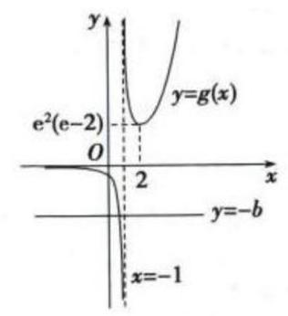

## C. 每日三题 0330

【练习】1. (2022上海春考)已知 ${P}_{1}\left( {{x}_{1},{y}_{1}}\right)$ ， ${P}_{2}\left( {{x}_{2},{y}_{2}}\right)$ 两点均在双曲线 $\Gamma  : \frac{{x}^{2}}{{a}^{2}} - {y}^{2} = 1\left( {a > 0}\right)$ 的右支上，若 ${x}_{1}{x}_{2} > {y}_{1}{y}_{2}$ 恒成立，则实数 $a$ 的取值范围为___.

【答案】 $a \geq  1$ (提示, $\left. {{P}_{3}\left( {{x}_{2}, - {y}_{2}}\right) }\right)$

【解析】法一: 设 ${P}_{3}\left( {{x}_{2}, - {y}_{2}}\right)$ ,则 $\overrightarrow{O{P}_{1}} \cdot  \overrightarrow{O{P}_{3}} = {x}_{1}{x}_{2} - {y}_{1}{y}_{2} > 0$ ,所以 $\angle {P}_{1}O{P}_{3}$ 恒为锐角,

数形结合,只要两条渐近线的夹角小于等于 ${90}^{ \circ  }$ 即可,

所以其中一条渐近线 $y = \frac{1}{a}x$ 的斜率 $\frac{1}{a} \leq  1$ ，所以 $a \geq  1$ ；

法二: 任取双曲线 $\Gamma$ 右支上两个不相同的点 ${P}_{1}\left( {{x}_{1},{y}_{1}}\right) ,{P}_{2}\left( {{x}_{2},{y}_{2}}\right)$ ,

都有 ${x}_{1}{x}_{2} - {y}_{1}{y}_{2} > 0$ 成立,即 $1 - \frac{{y}_{1}{y}_{2}}{{x}_{1}{x}_{2}} > 0$ ,即 ${k}_{O{P}_{1}} \cdot  {k}_{O{P}_{2}} < 1$ 恒成立,

当 ${P}_{1}\left( {{x}_{1},{y}_{1}}\right) ,{P}_{2}\left( {{x}_{2},{y}_{2}}\right)$ 坐标越大时,斜率越大,且趋向于渐近线 (取不到),

故只要渐近线的斜率 $\frac{1}{a}$ 满足 $\frac{1}{a} \cdot  \frac{1}{a} \leq  1$ ，所以 $a \geq  1$ ；

法三:由于双曲线的渐近线为 $y =  \pm  \frac{1}{a}x$ ,

故对于双曲线右支上的点 ${P}_{1}\left( {{x}_{1},{y}_{1}}\right) ,{P}_{2}\left( {{x}_{2},{y}_{2}}\right)$ ,都有 $\left| {y}_{1}\right|  < \frac{1}{a}{x}_{1},\left| {y}_{2}\right|  < \frac{1}{a}{x}_{2}$ ,

所以 $\left| {{y}_{1}{y}_{2}}\right|  < \frac{1}{{a}^{2}}{x}_{1}{x}_{2}$ ,因为 ${x}_{1}{x}_{2} - {y}_{1}{y}_{2} > 0$ 恒成立,

所以 ${x}_{1}{x}_{2} > {y}_{1}{y}_{2}$ 恒成立，所以 ${x}_{1}{x}_{2} \geq  \frac{1}{{a}^{2}}{x}_{1}{x}_{2}$ ，所以 $a \geq  1$ .

【练习】2. (2025 届复附) 若函数 $y = f\left( x\right)$ 的定义域为 $R$ ，命题“对任意实数 ${\Delta x} > 0$ 和任意实数 $x$ ，

$f\left( {x + {\Delta x}}\right)  > f\left( x\right)$ 恒成立，则 $y = f\left( x\right)$ 为 $R$ 上的严格增函数”是真命题.

给出以下命题:

命题 $p$ : 若对任意有理数 ${\Delta x} > 0$ 和任意实数 $x, f\left( {x + {\Delta x}}\right)  > f\left( x\right)$ 恒成立,则 $y = f\left( x\right)$ 为 $R$ 上的严格增函数;

命题 $q$ : 若对任意无理数 ${\Delta x} > 0$ 和任意实数 $x, f\left( {x + {\Delta x}}\right)  > f\left( x\right)$ 恒成立,则 $y = f\left( x\right)$ 为 $R$ 上的严格增函数; 则下列说法正确的是 ( )

A. $p\text{ 、 }q$ 都是真命题 B. $p$ 是真命题, $q$ 是假命题

C. $p$ 是假命题, $q$ 是真命题 D. $p\text{ 、 }q$ 都是假命题

【答案】 $C$ (提示: $p$ 狄利克雷型反例; $q$ 用两个无理数夹出来有理数)

【解析】 $p$ : 可以构造狄利克雷型反例 $y = \left\{  \begin{array}{l} x, x \in  Q \\  x + 1, x \notin  Q \end{array}\right.$ , $p$ 错误

$q$ : 对于任意有理数 ${\Delta x}$ ,我们取两个不同的无理数 $\Delta {x}_{1}$ 和 $\Delta {x}_{2}$ 把它构造出来即可, $f\left( {x + \Delta {x}_{1}}\right)  >$

$f\left( x\right)  > f\left( {x - \Delta {x}_{2}}\right)$ ,其中 $\Delta {x}_{1} - \Delta {x}_{2} = {\Delta x}$ ,所以 $f\left( {x + {\Delta x}}\right)  > f\left( x\right)$ 恒成立,那么根据题目中给的命

题,有理数和无理数型的 ${\Delta x}$ 都有了,即可得到严格增, $q$ 正确

【练习】3. (2025 届某市重) 设集合 $M = \left\{  {f\left( x\right)  \mid  x \in  \left( {0, + \infty }\right) , f\left( x\right)  = f\left( \frac{1}{x}\right) }\right\}$ .

(1)已知函数 $f\left( x\right)  = \frac{x}{1 + {x}^{2}}\left( {x > 0}\right)$ ，求证: $f\left( x\right)  \in  M$ ；

(2)对于 (1) 中的函数 $f\left( x\right)$ ，求证:存在定义域为 $\lbrack 2, + \infty )$ 的函数 $g\left( x\right)$ ，使得 $g\left( {x + \frac{1}{x}}\right)  = f\left( x\right)$ 对任意 $x > 0$ 成立.

(3)对于任意 $f\left( x\right)  \in  M$ ，求证:存在定义域为 $\lbrack 2, + \infty )$ 的函数 $g\left( x\right)$ ，使得等式 $g\left( {x + \frac{1}{x}}\right)  = f\left( x\right)$ 对任意 $x > 0$ 成立.

【答案】(1) 由 $f\left( x\right)  = \frac{x}{1 + {x}^{2}}\left( {x > 0}\right)$ 得 $f\left( \frac{1}{x}\right)  = \frac{\frac{1}{x}}{1 + \frac{1}{{x}^{2}}} = \frac{x}{1 + {x}^{2}}$ ,

因此 $f\left( x\right)  = f\left( \frac{1}{x}\right)$ . 又 $x > 0$ ,所以 $f\left( x\right)  \in  M$ .

(2) 由 $f\left( x\right)  = \frac{x}{1 + {x}^{2}} = \frac{1}{x + \frac{1}{x}}$ ,

设函数 $g\left( x\right)  = \frac{1}{x}\left( {x \geq  2}\right)$ ,当 $x > 0$ 时, $x + \frac{1}{x} \geq  2\sqrt{x \cdot  \frac{1}{x}} = 2$ .

则 $g\left( {x + \frac{1}{x}}\right)  = \frac{1}{x + \frac{1}{x}} = \frac{x}{1 + {x}^{2}} = f\left( x\right)$ .

即存在定义域为 $\lbrack 2, + \infty )$ 的函数 $g\left( x\right)$ ,使得等式 $g\left( {x + \frac{1}{x}}\right)  = f\left( x\right)$ 对任意 $x > 0$ 成立.

(3) 当 $x > 0$ 时,设 $x + \frac{1}{x} = t$ ,则 $t \geq  2$ ,

得 ${x}^{2} - {tx} + 1 = 0$ ,解得 $x = \frac{t \pm  \sqrt{{t}^{2} - 4}}{2}$ ,

设函数 $g\left( x\right)  = f\left( \frac{t + \sqrt{{t}^{2} - 4}}{2}\right) \left( {x \geq  2}\right)$ ,当 $x > 0$ 时, $x + \frac{1}{x} \geq  2\sqrt{x \cdot  \frac{1}{x}} = 2$ .

则 $g\left( {x + \frac{1}{x}}\right)  = f\left( \frac{x + \frac{1}{x} + \sqrt{{\left( x + \frac{1}{x}\right) }^{2} - 4}}{2}\right)  = f\left( \frac{x + \frac{1}{x} + \left| {x - \frac{1}{x}}\right| }{2}\right)$ .

当 $0 < x < 1$ 时， $x \leq  \frac{1}{x}$ ， $g\left( {x + \frac{1}{x}}\right)  = f\left( \frac{x + \frac{1}{x} - x + \frac{1}{x}}{2}\right)  = f\left( \frac{1}{x}\right)  = f\left( x\right)$ ；

当 $x > 1$ 时, $x > \frac{1}{x}, g\left( {x + \frac{1}{x}}\right)  = f\left( \frac{x + \frac{1}{x} + x - \frac{1}{x}}{2}\right)  = f\left( x\right)$ .

即存在定义域为 $\lbrack 2, + \infty )$ 的函数 $g\left( x\right)$ ,使得等式 $g\left( {x + \frac{1}{x}}\right)  = f\left( x\right)$ 对任意 $x > 0$ 成立.

## C4 每日三题 0331(2025 浦东二模)

【练习】1. (2025 浦东二模) 已知数列 $\left\{  {a}_{n}\right\}  ,{a}_{1} = 1,{a}_{n} \in  \{ 1, - 1\} ,\left( {n \geq  2}\right)$ ，并且前 $n$ 项的和 ${S}_{n}$ 满足:

①存在小于 1013 的正整数 $t$ ，使得 ${S}_{{2t} + 1} =  - 1$ ；

②对任意的正整数 $k$ 和 $m$ ，都有 $\left| {{S}_{2m} - {S}_{{2k} - 1}}\right|  \leq  1$ .

则满足以上条件的数列 $\left\{  {S}_{n}\right\}  \left( {1 \leq  n \leq  {2025}}\right)$ 共有___个.

【答案】 ${2}^{1012} - 1$ (提示: 和的偶数项都是 0)

【解析】由条件②,对任意的正整数 $m$ ,都有 $\left| {{S}_{2m} - {S}_{1}}\right|  \leq  1$ ,且 ${S}_{2m}$ 为整数,

得 ${S}_{2m} = 0,1,2$ ;

由条件①和条件②，对任意的正整数 $m$ ，都有 $\left| {{S}_{2m} - {S}_{{2t} + 1}}\right|  \leq  1$ ，

且 ${S}_{2m}$ 为整数,得 ${S}_{2m} =  - 2, - 1,0$ ;

因此，所有的 ${S}_{2m} = 0$ ，

又对任意的正整数 $k$ 和 $m$ ，都有 $\left| {{S}_{2m} - {S}_{{2k} - 1}}\right|  \leq  1$ ，且 ${a}_{n} \in  \{ 1, - 1\} ,\left( {n \geq  2}\right)$ ，

所以 ${S}_{{2k} - 1} =  \pm  1$ ,由条件①,存在小于 1013 的正整数 $t$ ,使得 ${S}_{{2t} + 1} =  - 1$ ,

则数列 $\left\{  {S}_{n}\right\}  \left( {1 \leq  n \leq  {2025}}\right)$ 的个数为全部情况中,减去 ${S}_{{2k} - 1}$ 都为 1 的情况,

有 ${2}^{1012} - 1$ 个.

【练习】2. (2025 浦东二模) 已知圆锥曲线 $\Gamma$ 的对称中心为原点 $O$ ,若对于 $\Gamma$ 上的任意一点 $A$ ,均存在 $\Gamma$ 上两点 $B, C$ ,使得原点 $O$ 到直线 ${AB},{AC}$ 和 ${BC}$ 的距离都相等,则称曲线 $\Gamma$ 为“完美曲线”. 现有如下两个命题:① 任意椭圆都是 “完美曲线”; ② 存在双曲线是 “完美曲线”; 下列判断正确的是 ( )

A. ①是真命题，②是假命题 B. ①是假命题，②是真命题

C. ①②都是真命题 D. ①②都是假命题

【答案】 $A$ (提示: 双曲线用顶点证伪,椭圆用零点存在定理猜测,背景是彭赛列闭合定理)

【解析】“完美曲线”的定义，即为对 $\bigtriangleup {ABC}$ ，圆 $O$ 是 ${\Delta ABC}$ 的内切圆，

对于①，即为“彭赛列闭合定理”，对于任意一点 $A$ ，任取其它一个点 $B$ ，

取原点到直线 ${AB}$ 的距离为半径，作圆 $O$ ，再过点 $A$ 作圆 $O$ 的另一条切线，

交椭圆于点 $C$ ，由彭赛列闭合定理得 ${BC}$ 也与圆 $O$ 相切，

任意椭圆都是“完美曲线”;

对于②，取 $A$ 为双曲线的顶点，要使得原点 $O$ 到直线 ${AB}$ ， ${AC}$ 的距离相等，

则 $B, C$ 两点必关于 $x$ 轴对称,

从而原点 $O$ 到直线 ${AB},{AC}$ 的距离小于双曲线的 $a$ ,

此时 ${BC}$ 垂直于 $x$ 轴,原点 $O$ 到直线 ${BC}$ 的距离大于双曲线的 $a$ ,矛盾,

故不存在双曲线是“完美曲线”;

故选 $A$ .

【练习】3. (2025 浦东二模)已知椭圆 ${C}_{1}$ 的方程为 $\frac{{x}^{2}}{3} + {y}^{2} = 1$ ，右顶点为 $A$ ，上顶点为 $B$ ，椭圆 ${C}_{2}$ 的中心位于坐标原点,两个椭圆的离心率相等.

(1) 若椭圆 ${C}_{2}$ 的方程是 $\frac{{x}^{2}}{{a}^{2}} + \frac{{y}^{2}}{2a} = 1\left( {a > 0}\right)$ ，焦点在 $x$ 轴上，求 $a$ 的值；

(2)设椭圆 ${C}_{2}$ 的焦点在 $x$ 轴上，直线 ${AB}$ 与 ${C}_{2}$ 相交于点 $C$ ， $D$ ，若 $\left| {CD}\right|  = 3\left| {AB}\right|$ ，求 ${C}_{2}$ 的标准方程；

(3) 设椭圆 ${C}_{2}$ 的焦点在 $y$ 轴上，点 $P$ 在 ${C}_{1}$ 上，点 $Q$ 在 ${C}_{2}$ 上. 若存在 ${\Delta APQ}$ 是等腰直角三角形，且 $\left| {AP}\right|  = \left| {AQ}\right|$ ,求 ${C}_{2}$ 的长轴的取值范围.

【答案】(1) 由题意得椭圆 ${C}_{1}$ 的离心率为 $\frac{\sqrt{6}}{3}$ ，椭圆 ${C}_{2}$ 的离心率为 $\frac{\sqrt{{a}^{2} - {2a}}}{a}$ 2 分

$\frac{\sqrt{6}}{3} = \frac{\sqrt{{a}^{2} - {2a}}}{a}$ ,解得 $\frac{\sqrt{6}}{3} = \frac{\sqrt{{a}^{2} - {2a}}}{a},1/2\widehat{\mathrm{a}}\mu \widetilde{\mathrm{A}}a = 6$ ;

4 分

(2)由题意得 $A\left( {\sqrt{3},0}\right) , B\left( {0,1}\right)$ ，所以 $\left| {AB}\right|  = 2$ ，

直线 ${AB}$ 的方程为 $y =  - \frac{\sqrt{3}}{3}x + 1$ 2 分

设 ${C}_{2}$ 的方程为 ${x}^{2} + 3{y}^{2} = \lambda \left( {\lambda  > 0}\right) , C\left( {{x}_{1},{y}_{1}}\right) , D\left( {{x}_{2},{y}_{2}}\right)$ ,

由 $\left\{  \begin{array}{l} y =  - \frac{\sqrt{3}}{3}x + 1 \\  {x}^{2} + 3{y}^{2} = \lambda  \end{array}\right.$ 得 $2{x}^{2} - 2\sqrt{3}x + 3 - \lambda  = 0$ ,

故 $\left| {CD}\right|  = \sqrt{1 + {\left( -\frac{\sqrt{3}}{3}\right) }^{2}}\left| {{x}_{1} - {x}_{2}}\right|  = \frac{2}{\sqrt{3}}\frac{\sqrt{{12} - 8\left( {3 - \lambda }\right) }}{2} = 3\left| {AB}\right|  = 6$ ,

即 $\sqrt{{12} - 8\left( {3 - \lambda }\right) } = 6\sqrt{3}$ ,解得 $\lambda  = {15}$ ,

所以 ${C}_{2}$ 的标准方程为 $\frac{{x}^{2}}{15} + \frac{{y}^{2}}{5} = 1$ . 6 分

(3)设 ${C}_{2}$ 的方程为 $3{x}^{2} + {y}^{2} = \lambda \left( {\lambda  > 0}\right)$ ，

由题意得 ${AP} \bot  {AQ}$ 且 ${\left| AP\right| }^{2} = {\left| AQ\right| }^{2}$ ,任取 ${C}_{1}$ 上一点 $P\left( {{x}_{0},{y}_{0}}\right)$ (不与点 $A$ 重合),

则 ${\left| AP\right| }^{2} = {\left( {x}_{0} - \sqrt{3}\right) }^{2} + {y}_{0}^{2},{k}_{AP} = \frac{{y}_{0}}{{x}_{0} - \sqrt{3}}$ ,

设 $Q\left( {{x}_{Q},{y}_{Q}}\right)$ ,则 ${\left| AQ\right| }^{2} = {\left( {x}_{Q} - \sqrt{3}\right) }^{2} + {y}_{Q}^{2}$ 2 分

直线 ${AQ}$ 的方程为 $x = \frac{1}{{k}_{AQ}}y + \sqrt{3} =  - {k}_{AP}y + \sqrt{3}$ ,故 ${x}_{Q} - \sqrt{3} =  - {k}_{AP}{y}_{Q}$ ,

代入得 ${\left| AQ\right| }^{2} = {\left( {x}_{Q} - \sqrt{3}\right) }^{2} + {y}_{Q}^{2} = \left( {{k}_{AP}^{2} + 1}\right) {y}_{Q}^{2} = \frac{{\left( {x}_{0} - \sqrt{3}\right) }^{2} + {y}_{0}^{2}}{{\left( {x}_{0} - \sqrt{3}\right) }^{2}}{y}_{Q}^{2} = \frac{{\left| AP\right| }^{2}}{{\left( {x}_{0} - \sqrt{3}\right) }^{2}}{y}_{Q}^{2}$ ,

因为 ${\left| AP\right| }^{2} = {\left| AQ\right| }^{2}$ ,所以 ${y}_{Q}^{2} = {\left( {x}_{0} - \sqrt{3}\right) }^{2}$ ,

由对称性,不妨设 ${y}_{Q} = {x}_{0} - \sqrt{3}$ ,

代回直线 ${AQ}$ 方程可解得 $Q\left( {\sqrt{3} - {y}_{0},{x}_{0} - \sqrt{3}}\right) \cdots \cdots 4$ 分

而点 $Q$ 位于 ${C}_{2}$ 上,所以 $\lambda  = 3{\left( \sqrt{3} - {y}_{0}\right) }^{2} + {\left( {x}_{0} - \sqrt{3}\right) }^{2}$

$= 3\left( {{y}_{0}^{2} - 2\sqrt{3}{y}_{0} + 3}\right)  + {x}_{0}^{2} - 2\sqrt{3}{x}_{0} + 3 = \left( {{x}_{0}^{2} + 3{y}_{0}^{2}}\right)  + {12} - 2\sqrt{3}\left( {{x}_{0} + 3{y}_{0}}\right)$ ,

$P\left( {{x}_{0},{y}_{0}}\right)$ 为 ${C}_{1}$ 上任一点,所以 ${x}_{0}^{2} + 3{y}_{0}^{2} = 3$ 为定值,

化简得 $\lambda  = {15} - 2\sqrt{3}\left( {{x}_{0} + 3{y}_{0}}\right)$ 6 分

设 ${x}_{0} + 3{y}_{0} = b, P\left( {{x}_{0},{y}_{0}}\right)$ 为 ${C}_{1}$ 上任一点,即 $\left\{  \begin{array}{l} \frac{{x}_{0}^{2}}{3} + {y}_{0}^{2} = 1 \\  {x}_{0} + 3{y}_{0} = b \end{array}\right.$ 有解,

整理得 ${12}{y}_{0}^{2} - {6b}{y}_{0} + {b}^{2} - 3 = 0,\Delta  = {36}{b}^{2} - {48}\left( {{b}^{2} - 3}\right)  = {12}\left( {{12} - {b}^{2}}\right)  \geq  0$ ,

解得 $b \in  \left\lbrack  {-2\sqrt{3},2\sqrt{3}}\right\rbrack$ ,所以 $\lambda  = {15} - 2\sqrt{3}b \in  \left\lbrack  {3,{27}}\right\rbrack$ ,

故 ${C}_{2}$ 的长轴长 $2\sqrt{\lambda } \in  \left\lbrack  {2\sqrt{3},6\sqrt{3}}\right\rbrack$ . 8 分

【注】这里求 $b$ 的取值范围时,也可以令 ${x}_{0} = \sqrt{3}\cos \theta ,{y}_{0} = \sin \theta$ ,

则 $b \in  \left\lbrack  {-2\sqrt{3},2\sqrt{3}}\right\rbrack$ .

## C 每日三题 0401

【练习】1. (2023 届复附) 已知点 $A\left( {1, - 1}\right)$ ， $B\left( {4,0}\right)$ ， $C\left( {2,2}\right)$ ，平面区域 $D$ 是由所有满足 $\overrightarrow{AP} = \lambda \overrightarrow{AB} + \mu \overrightarrow{AC}$ (其中 $\lambda  \in  \left\lbrack  {1, a}\right\rbrack  ,\mu  \in  \left\lbrack  {1, b}\right\rbrack$ ) 的点 $P\left( {x, y}\right)$ 组成的区域,若区域 $D$ 的面积为 8,则 ${4a} + b$ 的最小值为

【答案】 9

【解析】如图所示,以 ${AB}\text{ 、 }{AC}$ 为邻边作平行四边形 ${ABCD}$

分别作 $\overrightarrow{CE} = \lambda \overrightarrow{CD} = \lambda \overrightarrow{AB},\overrightarrow{BF} = \mu \overrightarrow{BD} = \mu \overrightarrow{AC}$ ,

由所有满足 $\overrightarrow{AP} = \lambda \overrightarrow{AB} + \mu \overrightarrow{AC}\left( {\lambda  \in  \left\lbrack  {1, a}\right\rbrack  ,\mu  \in  \left\lbrack  {1, b}\right\rbrack  }\right)$ 表示的平面区域 $D$ 为平行四边形 ${DEQF}$

$\overrightarrow{DE} = \left( {\lambda  - 1}\right) \overrightarrow{AB},\overrightarrow{DF} = \left( {1 - \mu }\right) \overrightarrow{AC})\left( {\lambda  \in  \left\lbrack  {1, a}\right\rbrack  ,\mu  \in  \left\lbrack  {1, b}\right\rbrack  }\right) ,$

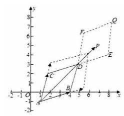

因为 $\overrightarrow{AB} = \left( {3,1}\right) ,\overrightarrow{AC} = \left( {1,3}\right) ,\overrightarrow{BC} = \left( {-2,2}\right)$ ,

所以 $\left| \overrightarrow{AB}\right|  = \sqrt{10},\left| \overrightarrow{AC}\right|  = \sqrt{10},\left| \overrightarrow{BC}\right|  = 2\sqrt{2}$ ,

所以 $\cos \angle {CAB} = \frac{\overrightarrow{AC} \cdot  \overrightarrow{AB}}{\left| \overrightarrow{AC}\right| \left| \overrightarrow{AB}\right| } = \frac{6}{\sqrt{10} \times  \sqrt{10}} = \frac{3}{5}$ ,

则 $\sin \angle {CAB} = \sqrt{1 - {\cos }^{2}\angle {CAB}} = \frac{4}{5}$ ，因为区域 $D$ 的面积为 8，

则四边形 ${DEQF}$ 的面积 $S = \left| {\overrightarrow{DE}//\overrightarrow{DF}}\right| \sin \angle {CAB} = \left( {a - 1}\right) \left( {b - 1}\right)  \times  \sqrt{10} \times  \sqrt{10} \times  \frac{4}{5}$

$= 8\left( {a - 1}\right) \left( {b - 1}\right)  = 8$ ,所以 $\left( {a - 1}\right) \left( {b - 1}\right)  = 1$ ,即 $\frac{1}{a} + \frac{1}{b} = 1$

所以 ${4a} + b = \left( {{4a} + b}\right) \left( {\frac{1}{a} + \frac{1}{b}}\right)  = 5 + \frac{b}{a} + \frac{4a}{b} \geq  5 + 2\sqrt{\frac{b}{a} \cdot  \frac{4a}{b}} = 9$ ,

当且仅当 $b = {2a} = 3$ 时取等号,所以 ${4a} + b$ 的最小值为 9

【练习】2. (2024 届华二) 对于两个定义在 $R$ 上的函数 $y = f\left( x\right)$ 与 $y = g\left( x\right)$ ,构造新函数 $y = h\left( x\right)$ 如下:对任意 ${x}_{0} \in  R, h\left( {x}_{0}\right)  = f\left( {x}_{0}\right)  + g\left( {x}_{0}\right)$ . 现已知 $y = h\left( x\right)$ 是严格增函数,对于以下两个命题:

① $y = f\left( x\right)$ 与 $y = g\left( x\right)$ 中至少有一个是严格增函数;

② $y = f\left( x\right)$ 与 $y = g\left( x\right)$ 中至少有一个函数无最大值. 其中 ( )

A. ①和②都是真命题 B. 只有①是真命题

C. 只有②是真命题 D. 没有真命题

【答案】 $D$

【解析】令 $f\left( x\right)  = \left\{  {\begin{array}{l} \sin x, x \leq  0 \\   - \sin x, x > 0 \end{array}, g\left( x\right)  = \left\{  \begin{array}{l}  - \sin x - {\mathrm{e}}^{-x}, x \leq  0 \\  \sin x - {\mathrm{e}}^{-x}, x > 0 \end{array}\right. }\right.$ ,则没有真命题,故选 $D$ .

【练习】3. (2023 届复附) 若定义域为 $R$ 的函数 $y = h\left( x\right)$ 满足: 对于任意 $x \in  R$ ,都有 $h\left( {x + {2\pi }}\right)  = h\left( x\right)  + \; h\left( {2\pi }\right)$ ,则称函数 $y = h\left( x\right)$ 具有性质 $P$

(1)设函数 $y = f\left( x\right) , y = g\left( x\right)$ 的表达式分别为 $f\left( x\right)  = \sin x + x, g\left( x\right)  = \cos x$ ，判断函数 $y = f\left( x\right)$ 与 $y = g\left( x\right)$ 是否具有性质 $P$ ,说明理由;

(2) 设函数 $y = f\left( x\right)$ 的表达式为 $f\left( x\right)  = \sin \left( {{\omega x} + \varphi }\right)$ ,是否存在 $0 < \omega  < 1$ 以及 $- \pi  < \varphi  < \pi$ ,使得函数 $f\left( x\right)  = \sin \left( {{\omega x} + \varphi }\right)$ 具有性质 $P$ ? 若存在,求出 $\omega \text{ 、 }\varphi$ 的值; 若不存在,说明理由;

(3) 设函数 $y = f\left( x\right)$ 具有性质 $P$ ，且在 $\left\lbrack  {0,{2\pi }}\right\rbrack$ 上的值域恰为 $\left\lbrack  {f\left( 0\right) , f\left( {2\pi }\right) }\right\rbrack$ ，以 ${2\pi }$ 为周期的函数 $y = \; g\left( x\right)$ 的表达式为 $g\left( x\right)  = \sin \left\lbrack  {f\left( x\right) }\right\rbrack$ ，且在开区间 $\left( {0,{2\pi }}\right)$ 上有且仅有一个零点，求证: $f\left( {2\pi }\right)  = {2\pi }$

【解析】(1) 函数 $f\left( x\right)  = \sin x + x$ 具有性质 $P, g\left( x\right)  = \cos x$ ,不具有性质 $p$ ,说明如下:

因为 $g\left( {x + {2\pi }}\right)  = \cos \left( {x + {2\pi }}\right)  = \cos x$ ,而 $g\left( x\right)  + g\left( {2\pi }\right)  = \cos x + 1$ ,

所以 $g\left( {x + {2\pi }}\right)  \neq  g\left( x\right)  + g\left( {2\pi }\right)$ ,所以 $g\left( x\right)  = \cos x$ 不具有性质 $P$ ;

$f\left( x\right)  = \sin x + x, f\left( {x + {2\pi }}\right)  = \sin \left( {x + {2\pi }}\right)  + x + {2\pi } = \sin x + x + {2\pi },$

$f\left( x\right)  + f\left( {2\pi }\right)  = \sin x + x + {2\pi },$

对任意 $x \in  R$ ，都有 $f\left( {x + {2\pi }}\right)  = f\left( x\right)  + f\left( {2\pi }\right)$ ，

所以 $f\left( x\right)  = \sin x + x$ 具有性质 $P$ ; (2) 若函数 $y = f\left( x\right)$ 具有性质 $P$ ,则 $f\left( {0 + {2\pi }}\right)  = f\left( 0\right)  + f\left( {2\pi }\right)$ ,

即 $f\left( 0\right)  = 0$ ,

于是 $\sin \varphi  = 0$ ,结合 $- \pi  < \varphi  < \pi$ ,得 $\varphi  = 0$ ,因此 $f\left( x\right)  = \sin \left( {\omega x}\right)$ ;

若 $f\left( {2\pi }\right)  \neq  0$ ，不妨设 $f\left( {2\pi }\right)  > 0$ ，

由 $f\left( {x + {2\pi }}\right)  = f\left( x\right)  + f\left( {2\pi }\right)$ 得 $f\left( {2k\pi }\right)  = f\left( 0\right)  + {kf}\left( {2\pi }\right)$ (记作 *),

其中 $k \in  Z$ ,只要 $k$ 充分大时, ${kf}\left( {2\pi }\right)$ 将大于 1 ,

考虑到 $y = f\left( x\right)$ 的值域为 $\left\lbrack  {-1,1}\right\rbrack$ ,等式 (*) 将无法成立,

综上所述，必有 $f\left( {2\pi }\right)  = 0$ ，即 $\sin \left( {{2\omega }\pi }\right)  = 0$ ；

再由 $0 < \omega  < 1,0 < {2\omega \pi } < {2\pi }$ ,从而 ${2\omega \pi } = \pi$ ,而 $\omega  = \frac{1}{2}$ ,

当 $\omega  = \frac{1}{2}$ 时， $f\left( x\right)  = \sin \frac{x}{2}, f\left( {x + {2\pi }}\right)  = \sin \left( {\frac{x}{2} + \pi }\right)  =  - \sin \frac{x}{2}$ ，

而 $f\left( x\right)  + f\left( {2\pi }\right)  = \sin \frac{x}{2}$ ,显然两者不恒相等 (比如 $x = \frac{\pi }{2}$ 时),

综上所述，不存在 $0 < \omega  < 1$ 以及 $- \pi  < \varphi  < \pi$ ，

使得 $f\left( x\right)  = \sin \left( {{\omega x} + \varphi }\right)$ 具有性质 $P$ ;

(3) 由函数 $y = f\left( x\right)$ 具有性质 $P$ 以及 (2) 得 $f\left( 0\right)  = 0$ ,

由函数 $y = g\left( x\right)$ 是以 ${2\pi }$ 为周期的周期函数,有 $g\left( {2\pi }\right)  = g\left( 0\right)$ ,

即 $\sin \left( {f\left( {2\pi }\right) }\right)  = \sin \left( {f\left( 0\right) }\right)  = 0$ ,也即 $f\left( {2\pi }\right)  = {k\pi }, k \in  Z$ ,

由 $f\left( 0\right)  = 0, f\left( {2\pi }\right)  = {k\pi }, k \in  Z$ 及题设,

得 $y = f\left( x\right)$ 在 $\left\lbrack  {0,{2\pi }}\right\rbrack$ 的值域为 $\left\lbrack  {0,{k\pi }}\right\rbrack  , k \in  Z$ ,

当 $k > 2$ 时,当 $f\left( x\right)  = \pi$ 及 $f\left( {2\pi }\right)  = {k\pi }, k \in  Z$ 时,均有 $g\left( x\right)  = \sin \left( {f\left( x\right) }\right)$ ,

这与零点唯一性矛盾,因此 $k = 1$ 或 $k = 2$ ,

当 $k = 1$ 时, $f\left( {2\pi }\right)  = \pi , y = f\left( x\right)$ 在 $\left\lbrack  {0,{2\pi }}\right\rbrack$ 的值域为 $\left\lbrack  {0,\pi }\right\rbrack$ ,

此时 $f\left( {x + {2\pi }}\right)  = f\left( x\right)  + \pi$ ,

于是 $y = f\left( x\right)$ 在 $\left\lbrack  {{2\pi },{4\pi }}\right\rbrack$ 上的值域为 $\left\lbrack  {\pi ,{2\pi }}\right\rbrack$ ,

由正弦函数的性质，此时 $\sin \left( {f\left( x\right) }\right)$ 当 $x \in  \left\lbrack  {0,{2\pi }}\right\rbrack$ 时和 $x \in  \left\lbrack  {{2\pi },{4\pi }}\right\rbrack$ 的

取值范围不同，因而 $k = 2$ ，即 $f\left( {2\pi }\right)  = {2\pi }$

例 每日三题 0402

命题:艺扬飞翔

【练习】1. 设函数 $y = f\left( x\right)$ 定义域为 $R$ ,若对曲线 $y = f\left( x\right) \left( {x < 0}\right)$ 上任意一点 $P$ ,均存在曲线 $y = \; f\left( x\right) \left( {x > 0}\right)$ 上点 $Q$ ,使 $\left| {OP}\right|  = \left| {OQ}\right|$ 且 $\angle {POQ} = \frac{3\pi }{4}$ ,则称 $y = f\left( x\right)$ 是 “旋转函数”. 若存在旋转函数 $y = g\left( x\right)$ ,使 $\{ y \mid  y = g\left( x\right) , x \leq  0\}  = \{ y \mid  y = g\left( x\right) ,\left| {x - {10}}\right|  < a\}  = \left\lbrack  {-1,1}\right\rbrack$ ,则正实数 $a$ 的最大值是 ___.

【答案】 $\frac{\sqrt{2}}{2}$

【解析】首先直接转过去肯定不可能值域是 $\left\lbrack  {-1,1}\right\rbrack$ ,而题目中不需要正半轴和负半轴完全对应,只要负的能转到正的那部分就行，因此我们可以让画极端情况，在 10 附近的那一段，让两个图像错开，那样 10 附近的那一段可以随便取任意的函数值,他想 $\pm  {1000000000}$ 都随意

所以关键是图里面红色和绿色的部分转过去能理解就可以了

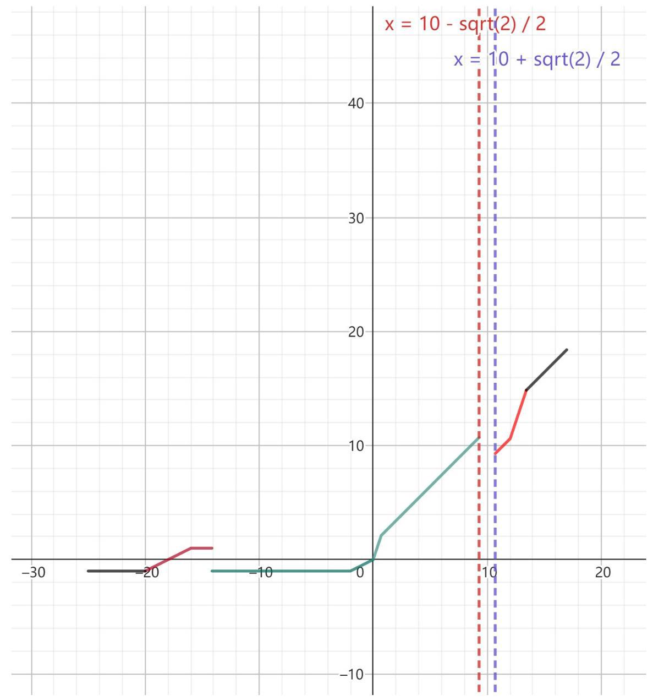

【练习】2. 若曲线 $\Gamma$ 上存在三点 $A, B, C$ ,使 $\bigtriangleup {ABC}$ 为等边三角形,其中 $A$ 在 $x$ 轴上,则称 $\Gamma$ 为“稳定曲线". 下列说法正确的是 ( )

(1)对于任意正实数 $a, b\left( {a > b}\right)$ ，椭圆 $\frac{{x}^{2}}{{a}^{2}} + \frac{{y}^{2}}{{b}^{2}} = 1$ 都是“稳定曲线”；

(2)对于任意正实数 $a, b\left( {a > b}\right)$ ，双曲线 $\frac{{x}^{2}}{{a}^{2}} - \frac{{y}^{2}}{{b}^{2}} = 1$ 都是“稳定曲线”.

A. (1) 对 (2) 错 B. (1) 错 (2) 对 C. (1)、(2) 都错 D. (1)、(2) 都对

【答案】 $A$

【解析】(1) 在顶点画两条斜率为 $\pm  \frac{\sqrt{3}}{3}$ 的直线即可

(2)取渐近线斜率为 $\pm  \frac{\sqrt{3}}{3}$ 的直线，即为反例

【练习】3. 已知函数 $y = f\left( x\right)$ 定义域为 $R$ ,若 $A\text{ 、 }B$ 为非空集合,对于任意 ${x}_{1},{x}_{2}$ ,其中 ${x}_{1} \in  A$ , ${x}_{2} \in  B$ ,都有 ${x}_{1} < {x}_{2}$ ,则称 $B$ 优于 $A$ .

(1)若 $A = \left\{  {y \mid  y = {x}^{2} - {3x}, x > 0}\right\}  , B = \{ a\}$ ,若 $A$ 优于 $B$ ,求 $a$ 的取值范围;

(2) 设 $f\left( x\right)  = x + 2\cos x$ ，证明:存在 $a$ ，使 $\left\{  {y \mid  y = f\left( x\right) , x \geq  a}\right\}$ 优于 $\{ y \mid  y = f\left( x\right) , x < a\}$ ；

(3) 记 ${A}_{t} = \{ x \mid  f\left( x\right)  > f\left( t\right) \} ,{B}_{t} = \{ x \mid  f\left( x\right)  < f\left( t\right) \}$ ,已知 ${A}_{0}$ 优于 ${B}_{0}$ . 若对任意 $t \in  R$ ,

有 “ ${A}_{t}$ 优于 ${B}_{t}$ ” 或 “ ${B}_{t}$ 优于 ${A}_{t}$ ” 中的一个成立,且 ${C}_{t} = \{ x \mid  f\left( x\right)  = f\left( t\right) \}$ 是有限集,

证明: $y = f\left( x\right)$ 是 $R$ 上的严格增函数.

【解析】(1) $a < {x}^{2} - {3x}$ 恒成立 $\Rightarrow  a < {\left( {x}^{2} - 3x\right) }_{\min } =  - \frac{9}{4}$

$a$ 的范围是 $\left( {-\infty , - \frac{9}{4}}\right)$

(2) 取 $a =  - \frac{\pi }{2} : {f}^{\prime }\left( x\right)  = 1 - 2\sin x$

① $x \geq  a$ : 当 $x \in  \left\lbrack  {-\frac{\pi }{2},\frac{\pi }{6}}\right\rbrack$ 时， ${f}^{\prime }\left( x\right)  \geq  0\;f\left( x\right)  \geq  f\left( {-\frac{\pi }{2}}\right)  =  - \frac{\pi }{2}$

当 $x > \frac{\pi }{6}$ 时 $f\left( x\right)  = x + 2\cos x > \frac{\pi }{6} - 2 >  - \frac{\pi }{2}$

$\therefore$ 对 $\forall t \in  \{ y \mid  y = f\left( x\right) , x \geq  a\}$ . 均有 $t \geq   - \frac{\pi }{2}$

② $x < a$ :同理有:对 $\forall t \in  \{ y \mid  y = f\left( x\right) , x < a\}$ . 均有 $t <  - \frac{\pi }{2}$

(3)对于 $\forall x \in  R$ ，当 $f\left( x\right)  \geq  f\left( 0\right)$ 时:

假设 ${B}_{x}$ 优于 ${A}_{x}$ ,取 ${t}_{x} \in  {A}_{x},{t}_{0} \in  {B}_{0}$ :

则对 $\forall t < {t}_{x}$ 且 $t < {t}_{0}$ ,有 $f\left( t\right)  \leq  f\left( 0\right)$ 且 $f\left( t\right)  > f\left( x\right)  \Rightarrow  f\left( x\right)  = f\left( 0\right)  = f\left( t\right)$ ,此时与 $C$ 是有限集矛盾 $\therefore \forall x$ ,有 ${A}_{x}$ 优于 ${B}_{x}, f\left( x\right)  < f\left( 0\right)$ 时同理可证.

假设 $\exists {x}_{1},{x}_{2}\left( {{x}_{1} < {x}_{2}}\right)$ ,满足 $f\left( {x}_{1}\right)  > f\left( {x}_{2}\right)$ ,则对于 $m \in  \left( {{x}_{1},{x}_{2}}\right)$ :

① $f\left( m\right)  > f\left( {x}_{1}\right)$ : 则 $m \in  {A}_{{x}_{1}},{x}_{2} \in  {B}_{{x}_{1}}$ ,矛盾;

② $f\left( m\right)  < f\left( {x}_{2}\right)$ :则 ${x}_{1} \in  {A}_{{x}_{2}}, m \in  {B}_{{x}_{2}}$ ，矛盾；

③ $f\left( {x}_{2}\right)  < f\left( m\right)  < f\left( {x}_{1}\right)$ : 则 ${x}_{1} \in  {A}_{m},{x}_{2} \in  {B}_{m}$ ,矛盾.

又 $\because C$ 为有限集, $m \in  \left( {{x}_{1},{x}_{2}}\right)$ 时, $f\left( m\right)$ 不可能始终取 $f\left( {x}_{1}\right)$ 或 $f\left( {x}_{2}\right)$ ,矛盾.

$\therefore$ 函数 $y = f\left( x\right)$ 为增函数.

假设 $\exists {x}_{1},{x}_{2}\;\left( {{x}_{1} < {x}_{2}}\right)$ ,满足 $f\left( {x}_{1}\right)  = f\left( {x}_{2}\right)$ :

则对于 $\forall t \in  \left( {{x}_{1},{x}_{2}}\right)$ 若 $f\left( t\right)  > f\left( {x}_{1}\right)$ 或 $f\left( t\right)  < f\left( {x}_{2}\right)$ ,则与 $y = f\left( x\right)$ 为增函数矛盾

$\therefore$ 函数 $y = f\left( x\right)$ 为严格增函数,证毕.

## C4 每日三题 0403

【练习】1. (2024 届上中) 若函数 $f\left( x\right)  = {x}^{3} - {ax}\left( {a > 0}\right)$ 的零点都在区间 $\left\lbrack  {-{10},{10}}\right\rbrack$ 上，则使得方程 $f\left( x\right)  =$ 1000 有正整数解的实数 $a$ 的取值个数为___.

【答案】 3

【解析】因为函数 $f\left( x\right)  = {x}^{3} - {ax}\left( {a > 0}\right)$ 的零点都在区间 $\left\lbrack  {-{10},{10}}\right\rbrack$ 上,

又 $f\left( x\right)  = {x}^{3} - {ax} = x\left( {{x}^{2} - a}\right)  = 0$ ,令 $f\left( x\right)  = 0$ ,所以 $x = 0$ 或 $x =  \pm  \sqrt{a}$ ,

函数 $f\left( x\right)  = {x}^{3} - {ax}\left( {a > 0}\right)$ 的零点都在区间 $\left\lbrack  {-{10},{10}}\right\rbrack$ 上,所以 $\sqrt{a} \leq  {10}$ ,

所以 $a \leq  {100}$ ,因为 ${f}^{\prime }\left( x\right)  = 3{x}^{2} - a$ ,令 $f{\left( x\right) }^{\prime } = 0$ ,解得 $x =  \pm  \sqrt{\frac{a}{3}}$ ,

所以当 $x > \sqrt{\frac{a}{3}}$ 或 $x <  - \sqrt{\frac{a}{3}}$ 时, $f{\left( x\right) }^{\prime } > 0$ ,为增函数;

当 $- \sqrt{\frac{a}{3}} < x < \sqrt{\frac{a}{3}}$ 时, $f{\left( x\right) }^{\prime } < 0$ ,为减函数;

当 $x =  - \sqrt{\frac{a}{3}}$ 时,有极大值, $f\left( {-\sqrt{\frac{a}{3}}}\right)  = {\left( -\sqrt{\frac{a}{3}}\right) }^{3} - a \times  \left( {-\sqrt{\frac{a}{3}}}\right)  = \frac{{2a}\sqrt{a}}{3\sqrt{3}} \leq  \frac{2000}{3\sqrt{3}}$ ,

因为 $\frac{2000}{3\sqrt{3}} < {1000}, f\left( {10}\right)  = {1000} - {10a} < {1000}$ ,

结合函数的单调性 $f\left( x\right)  = {x}^{3} - {ax}\left( {a > 0}\right)$ ,

得方程 $f\left( x\right)  = {1000}$ 有正整数解在区间 $\lbrack {10}, + \infty )$ 上,此时令 ${x}^{3} - {ax} = {1000}$ ,

得 ${x}^{2} - a = \frac{1000}{x}$ ,此时有 $a = {x}^{2} - \frac{1000}{x}$ ,由于 $x$ 为大于 10 的整数,

由上得 ${x}^{2} - \frac{1000}{x} \leq  {100}$ ,令 $x = {11},{12},{13}$ 时,不等式成立,

当 $x = {14}$ 时,有 ${14}^{2} - \frac{1000}{14} = {196} - {71}\frac{6}{14} > {100}$ ,

故 $a$ 的值有三个.

【练习】2. (2025 届格致) 数列 $\left\{  {a}_{n}\right\}$ 满足 ${a}_{1} = {a}_{2} = 1,{a}_{n} = {a}_{n - 1} + {a}_{n - 2}\left( {n \geq  3, n \in  {N}^{ * }}\right)$ ,给出下列四个结论: 其中所有正确结论的是 ( )

①不存在 $m \in  {N}^{ * }$ ，使得 ${a}_{m}$ 、 ${a}_{m + 1}$ 、 ${a}_{m + 2}$ 成等差数列；

②存在 $m \in  {N}^{ * }$ ，使得 ${a}_{m}$ 、 ${a}_{m + 1}$ 、 ${a}_{m + 2}$ 成等比数列；

③存在常数 $t$ ，使得对任意 $n \in  {N}^{ * }$ ，都有 ${a}_{n}$ 、 $t{a}_{n + 2}$ 、 ${a}_{n + 4}$ 成等差数列；

④存在正整数 ${\mathrm{i}}_{1}\text{ 、 }{\mathrm{i}}_{2}\text{ 、 }\cdots \text{ 、 }{\mathrm{i}}_{m}$ ，且 ${\mathrm{i}}_{1} < {\mathrm{i}}_{2} < \cdots  < {\mathrm{i}}_{m}$ ，使得 ${a}_{{i}_{1}} + {a}_{{i}_{2}} + \cdots  + {a}_{{i}_{m}} = {2025}$ .

A. ①③ B. ②③ C. ③④ D. ②④

【答案】 $C$

【解析】对于①,由 ${a}_{2} = 1,{a}_{3} = 2,{a}_{4} = 3$ ,得 $2{a}_{3} = {a}_{2} + {a}_{4}$ ,

即 ${a}_{2}\text{ 、 }{a}_{3}\text{ 、 }{a}_{4}$ 成等差数列,故①错误;

对于②,若存在 $m \in  {N}^{ * }$ ,使得 ${a}_{m}\text{ 、 }{a}_{m + 1}\text{ 、 }{a}_{m + 2}$ 成等比数列,得 ${a}_{m}{a}_{m + 2} = {a}_{m + 1}^{2}$ ,

又 ${a}_{m} + {a}_{m + 1} = {a}_{m + 2}$ ,即 ${a}_{m + 1}^{2} - {a}_{m}{a}_{m + 1} - {a}_{m}^{2} = 0$ ,解得 ${a}_{m + 1} = \frac{1 + \sqrt{5}}{2}{a}_{m}$ ,

这与相邻两项的比为有理数矛盾, 故②错误;

对于③， ${a}_{n + 4} = {a}_{n + 3} + {a}_{n + 2} = 2{a}_{n + 2} + {a}_{n + 1} = 3{a}_{n + 2} - {a}_{n}$ ，

得 $t = \frac{3}{2}$ 时，对任意 $n \in  {N}^{ * }$ ，都有 ${a}_{n}$ 、 $\frac{3}{2}{a}_{n + 2}$ 、 ${a}_{n + 4}$ 成等差数列，故③正确；

对于④，写出数列中的项1,1,2,3,5,8,13,21,34,55,89,144,233,

${377},{610},{987},{1597},\cdots$ ,得 ${1597} + {377} + {34} + {13} + 2 + 1 + 1 = {2025}$ ,故④正确.

故选 $C$ .

【练习】3. (2025 届格致) 已知常数 $T$ 且 $T > 0$ ，若函数 $y = f\left( x\right)$ 满足对任意的 $x \in  \left( {0, + \infty }\right)$ ，都有 $f\left( x\right)  - \; f\left( \frac{x}{T}\right)  = T$ ,则称 $f\left( x\right)$ 为“ $T$ 倍等差函数”.

(1)若 $f\left( x\right)$ 是 “ 2 倍等差函数”， $f\left( 2\right)  = 2$ ，设 ${a}_{n} = f\left( {2}^{n}\right)$ ，求数列 $\left\{  {a}_{n}\right\}$ 前 $n$ 项和 ${S}_{n}$ ；

(2)证明:不存在正常数 $T$ ，使得 $f\left( x\right)  = {\mathrm{e}}^{T} + \ln x$ 是 “ $T$ 倍等差函数”；

(3)若函数 $f\left( x\right)$ 是 “ $T$ 倍等差函数” 且 $f\left( x\right)$ 的图象是一条连续不断的曲线，证明:对任意的正数 $k$ ，___。 方程 $f\left( x\right)  = k$ 在 $\left( {0, + \infty }\right)$ 上有实根.

【答案】(1) 由于函数 $f\left( x\right)$ 是 “ 2 倍等差函数”,因此 $f\left( x\right)  - f\left( \frac{x}{2}\right)  = 2$ ,

取 $x = {2}^{n + 1}$ ,得 $f\left( {2}^{n + 1}\right)  - f\left( {2}^{n}\right)  = 2$ ,

由于 $f\left( 2\right)  = 2$ ,因此 $\left\{  {f\left( {2}^{n}\right) }\right\}$ 是公差为 2,首项为 2 的等差数列,

因此 $f\left( {2}^{n}\right)  = 2 + 2\left( {n - 1}\right)  = {2n}$ ,

因此 $\mathop{\sum }\limits_{{i = 1}}^{n}f\left( {2}^{n}\right)  = 2 + 4 + 6 + \cdots  + {2n} = 2 \times  \frac{n\left( {n + 1}\right) }{2} = {n}^{2} + n$ .

(2)假设存在正常数 $T$ ，使得函数 $f\left( x\right)$ 是 “ $T$ 倍等差函数”，

那么 $f\left( x\right)  - f\left( \frac{x}{T}\right)  = T$ ,所以 ${\mathrm{e}}^{T} + \ln x - \left( {{\mathrm{e}}^{T} + \ln \frac{x}{T}}\right)  = T$ ,

整理得 $\ln T - T = 0$ .

设函数 $g\left( T\right)  = \ln T - T$ ,那么导函数 ${g}^{\prime }\left( T\right)  = \frac{1 - T}{T}$ ,

当 $T \in  \left( {1, + \infty }\right)$ 时, ${g}^{\prime }\left( T\right)  < 0, g\left( T\right)$ 严格减;

当 $T \in  \left( {0,1}\right)$ 时,导函数 ${g}^{\prime }\left( T\right)  > 0, g\left( T\right)$ 严格增;

因此 $g\left( T\right)  \leq  g\left( 1\right)  =  - 1 < 0$ ,因此 $\ln T - T < 0$ 恒成立,

因此不存在正常数 $T$ ,使得 $f\left( x\right)  - f\left( \frac{x}{T}\right)  = T$ ,

所以不存在正常数 $T$ ,使得函数 $f\left( x\right)  = {\mathrm{e}}^{T} + \ln x$ 是 “ $T$ 倍等差函数”.

(3)设函数 $h\left( x\right)  = f\left( x\right)  - k$ ，那么函数 $h\left( x\right)$ 的图象是一条连续不断的曲线，

因此问题可转化为函数 $h\left( x\right)$ 在 $\left( {0, + \infty }\right)$ 上有零点.

由于函数 $f\left( x\right)$ 是 “ $T$ 倍等差函数”,因此 $f\left( x\right)  - f\left( \frac{x}{T}\right)  = T$ ,

因此 $f\left( x\right)  - k - \left\lbrack  {f\left( \frac{x}{T}\right)  - k}\right\rbrack   = T$ ,所以 $h\left( x\right)  - h\left( \frac{x}{T}\right)  = T$ ,

因此函数 $h\left( x\right)$ 是 “ $T$ 倍等差函数”.

当 $T = 1$ 时,不满足 $f\left( x\right)  - f\left( \frac{x}{T}\right)  = T$ ,因此 $T \neq  1$ ,

如果 $h\left( 1\right)  = 0$ ,那么 1 是函数 $h\left( x\right)$ 的零点.

如果 $h\left( 1\right)  = a < 0$ ,那么对于 $h\left( x\right)  - h\left( \frac{x}{T}\right)  = T$ ,

取 $x = T$ ,得 $h\left( T\right)  = h\left( 1\right)  + T$ ,

取 $x = {T}^{2}$ ,得 $h\left( {T}^{2}\right)  = h\left( T\right)  + T$ ,

因此 $h\left( {T}^{n}\right)  = h\left( {T}^{n - 1}\right)  + T = \cdots  = h\left( 1\right)  + {nT} = a + {nT}$ ,

因此当 $n >  - \frac{a}{T}$ 时, $h\left( {T}^{n}\right)  > 0$ ,

因此当 $0 < T < 1$ 时，函数 $h\left( x\right)$ 在 $\left( {{T}^{n},1}\right)$ 上有零点；

当 $T > 1$ 时，函数 $h\left( x\right)$ 在 $\left( {1,{T}^{n}}\right)$ 上有零点，

如果 $h\left( 1\right)  = a > 0$ ,那么对于 $h\left( x\right)  - h\left( \frac{x}{T}\right)  = T$ ,

取 $x = 1$ ,得 $h\left( \frac{1}{T}\right)  = h\left( 1\right)  - T$ ,

取 $x = \frac{1}{T}$ ,得 $h\left( \frac{1}{{T}^{2}}\right)  = h\left( \frac{1}{T}\right)  - T$ ,

因此 $h\left( \frac{1}{{T}^{n}}\right)  = h\left( \frac{1}{{T}^{n - 1}}\right)  - T = \cdots  = h\left( 1\right)  - {nT} = a - {nT}$ ,

所以当 $n > \frac{a}{T}$ 时, $h\left( \frac{1}{{T}^{n}}\right)  < 0$ ,

因此当 $T > 1$ 时, $h\left( x\right)$ 在 $\left( {\frac{1}{{T}^{n}},1}\right)$ 上有零点;

当 $0 < T < 1$ 时, $h\left( x\right)$ 在 $\left( {1,\frac{1}{{T}^{n}}}\right)$ 上有零点.

综上, $h\left( x\right)$ 在 $\left( {0, + \infty }\right)$ 上有零点,

所以对于任意的正数 $k$ ,方程 $f\left( x\right)  = k$ 在 $\left( {0, + \infty }\right)$ 上有实根.

## C4 每日三题 0404

【练习】1. (2024 届建平)严格单调递增的数列 $\left\{  {a}_{n}\right\}$ 中共有 $N$ 项，且对任意 $\mathrm{i}, j, k\left( {1 \leq  \mathrm{i} < j < k \leq  N}\right)$ ， ${a}_{i} + \; {a}_{j},{a}_{j} + {a}_{k}$ 和 ${a}_{k} + {a}_{i}$ 中至少有一个是 $\left\{  {a}_{n}\right\}$ 中的项，则 $N$ 的最大值为___

【答案】 $C$

【解析】假设 $0 < a < b < c < d$ 是 $\left\{  {a}_{n}\right\}$ 中大于 0 的最大的 4 项,由题意得 $b + c, b + d$ 和 $c + d$ 中至少有一个是 $\left\{  {a}_{n}\right\}$ 中的项,得到 $b + c = d$ ,进而得到 $a + d$ 和 $c + d$ 都不是 $\left\{  {a}_{n}\right\}$ 中的项,再由题意得 $b + c, b \; + d$ 和 $c + d$ 中至少有一个是 $\left\{  {a}_{n}\right\}$ 中的项,得到以 $a + c = d$ ,得出 $\left\{  {a}_{n}\right\}$ 中大于 0 的最多有 3 项,进而得出存在数列 $\left\{  {a}_{n}\right\}$ 满足题意,得到答案.

假设 $0 < a < b < c < d$ 是 $\left\{  {a}_{n}\right\}$ 中大于 0 的最大的 4 项,对于 $b, c, d$ 来说,

因为 $b + d > d, c + d > d$ ,所以 $b + d$ 和 $c + d$ 都不是 $\left\{  {a}_{n}\right\}$ 中的项,

又由题意得 $b + c, b + d$ 和 $c + d$ 中至少有一个是 $\left\{  {a}_{n}\right\}$ 中的项,

所以 $b + c$ 是 $\left\{  {a}_{n}\right\}$ 中的项,且 $b + c > c$ ,所以 $b + c = d$ ,

对于 $a, c, d$ 来说,因为 $a + d > d, c + d > d$ ,所以 $a + d$ 和 $c + d$ 都不是 $\left\{  {a}_{n}\right\}$ 中的项,

又由题意得 $b + c, b + d$ 和 $c + d$ 中至少有一个是 $\left\{  {a}_{n}\right\}$ 中的项,

所以 $a + c$ 是 $\left\{  {a}_{n}\right\}$ 中的项,且 $a + c > c$ ,所以 $a + c = d$ ,

所以 $a = d$ ,矛盾,所以 $\left\{  {a}_{n}\right\}$ 中大于 0 的最多有 3 项,

同理, $\left\{  {a}_{n}\right\}$ 中小于 0 的最多有 3 项,加上 0,故 $N$ 的最大值为 7,

此时存在数列 $\left\{  {a}_{n}\right\}   :  - 3, - 2, - 1,0,1,2,3$ 满足题意.

故选 $C$ .

【练习】2. (2024 届华二) 设 $U = \{ 1,2,3,\cdots ,{100}\}$ ，从中选取三个不同的数组成集合 $M = \{ a, b, c\}$ ，集合 $M$ 的各元素之和为 $a + b + c$ ，现在从剩下的 97 个数中再任选三个不同的数，如果它们的和恒小于 $a + \; b + c$ ，则称集合 $M$ 是一个“唯一最大集”，则“唯一最大集”的个数为___.

【答案】 12

【解析】如果同时没有选 100 和 99, 那么 ${98} + {97} + {96} = {291} < {100} + {99} + {95} = {294}$ ,不可能

所以 $M$ 中必然有 100 或者 99

情况一:如果同时 100 和 99，因为 100 + 99 + 93 > 98 + 97 + 96，所以另一个数只要不小于 93 即可,一共有 6 种

情况二:如果只有 100，没有 99，如果同时没有 98，只有 1009796 这1种；如果有 98，有 3 种

情况三:如果只有 99，没有 100，由 99 + 98 + 97 - (100 + 95 + 96) = 3，所以只能 96 和 97 换位置， 有 2 种

【练习】3. (2024 届建平)已知函数 $y = f\left( x\right)$ ，其中 $f\left( x\right)  = \frac{1}{3}{x}^{3} - k{x}^{2}$ ， $k \in  R$ . 若点 $A$ 在函数 $y = f\left( x\right)$ 的图像上,且经过点 $A$ 的切线与函数 $y = f\left( x\right)$ 图像的另一个交点为点 $B$ ,则称点 $B$ 为点 $A$ 的一个“上位点”. 现有函数 $y = f\left( x\right)$ 图像上的点列 ${M}_{1},{M}_{2},\cdots ,{M}_{n},\cdots$ ,使得对任意正整数 $n$ ,点 ${M}_{n}$ 都是点 ${M}_{n + 1}$ 的一个“上位点”.

(1) 若 $k = 0$ ，请判断原点 $O$ 是否存在“上位点”，并说明理由；

(2)若点 ${M}_{1}$ 的坐标为 $\left( {{3k},0}\right)$ ，请分别求出点 ${M}_{2}$ 、 ${M}_{3}$ 的坐标；

(3)若 ${M}_{1}$ 的坐标为 $\left( {3,0}\right)$ ，记点 ${M}_{n}$ 到直线 $y = m$ 的距离为 ${d}_{n}$ . 问是否存在实数 $m$ 和正整数 $T$ ，使得无穷数列 ${d}_{T},{d}_{T + 1},\cdots ,{d}_{T + n},\cdots$ 严格减? 若存在,求出实数 $m$ 的所有可能值; 若不存在,请说明理由.

【解析】(1) 已知 $f\left( x\right)  = \frac{1}{3}{x}^{3}$ ,则 ${f}^{\prime }\left( x\right)  = {x}^{2},1$ 分

得 ${f}^{\prime }\left( 0\right)  = 0,2$ 分

故函数经过点 $A$ 的切线方程为 $y = 0,3$ 分

其与函数 $f\left( x\right)  = \frac{1}{3}{x}^{3}$ 图像无其他交点,

所以原点 $O$ 不存在“上位点”. 4 分

(2)设点 ${M}_{n}$ 的横坐标为 ${t}_{n}$ ， $n$ 为正整数，

则函数 $y = f\left( x\right)$ 图像在点 ${M}_{n + 1}$ 处的切线方程

为 $y - f\left( {t}_{n + 1}\right)  = {f}^{\prime }\left( {t}_{n + 1}\right) \left( {x - {t}_{n + 1}}\right) ,1$ 分

代入其 “上位点” ${M}_{n}\left( {{t}_{n}, f\left( {t}_{n}\right) }\right)$ ,

得 $f\left( {t}_{n}\right)  - f\left( {t}_{n + 1}\right)  = {f}^{\prime }\left( {t}_{n + 1}\right) \left( {{t}_{n} - {t}_{n + 1}}\right) ,2$ 分

化简得 $\frac{1}{3}\left( {{t}_{n}{}^{2} + {t}_{n}{t}_{n + 1} + {t}_{n + 1}{}^{2}}\right)  - k\left( {{t}_{n} + {t}_{n + 1}}\right)  = {t}_{n + 1}{}^{2} - {2k}{t}_{n + 1},3$ 分

进一步化简得 $2{t}_{n + 1} + {t}_{n} = {3k}$ (*),4 分

又点 ${M}_{1}$ 的坐标为 $\left( {{3k},0}\right)$ ,

所以点 ${M}_{2}$ 的坐标为 $\left( {0,0}\right)$ ,点 ${M}_{3}$ 的坐标为 $\left( {\frac{3k}{2}, - \frac{9}{8}{k}^{3}}\right) .6$ 分

(或者没有写出递推公式,直接求出 ${M}_{2}$ 的坐标给 4 分, ${M}_{3}$ 的坐标给 2 分).

(3) 将 $\left( {3,0}\right)$ 代入 $y = f\left( x\right)$ ，解得 $k = 1.$ 1 分

由 $\left( *\right)$ 得, $2{t}_{n + 1} + {t}_{n} = {32}$ 分

即 ${t}_{n + 1} - 1 =  - \frac{1}{2}\left( {{t}_{n} - 1}\right)$ ,所以 ${t}_{n} = 1 + {\left( -1\right) }^{n - 1} \cdot  {2}^{2 - n},3$ 分

${d}_{n} = \left| {f\left( {t}_{n}\right)  - m}\right|$ . 令 ${u}_{n} = \left| {{t}_{n} - 1}\right|$ ,则 ${u}_{n} = {2}^{2 - n}$ 严格减.

因为 ${\left( 3x - {x}^{3}\right) }^{\prime } = 3 - 3{x}^{2}$ ,所以函数 $y = {3x} - {x}^{3}$ 在区间 $\left( {0,1}\right)$ 上严格增 ...4 分

当 $m =  - \frac{2}{3}$ 时， ${d}_{n} = \frac{1}{3}\left( {3{u}_{n} - {u}_{n}^{3}}\right)$ ，

于是当 $n \geq  3$ 时， $\left\{  {d}_{n}\right\}$ 严格减，符合要求. 5 分

当 $m \neq   - \frac{2}{3}$ 时， ${d}_{n} = \left| {f\left( {t}_{n}\right)  + \frac{2}{3} - \left( {\frac{2}{3} + m}\right) }\right|$ .

因为 $n \geq  3$ 时 $\left| {f\left( {t}_{n}\right)  + \frac{2}{3}}\right|  = \frac{1}{3}\left( {3{u}_{n} - {u}_{n}^{3}}\right)  < {u}_{n} = {2}^{2 - n},6$ 分

所以当 $n > {\log }_{2}\left| {m + \frac{2}{3}}\right|  + 2$ 时,

${d}_{n} = \left| {\frac{2}{3} + m}\right|  - \left| {f\left( {t}_{n}\right)  + \frac{2}{3}}\right|  = \left| {\frac{2}{3} + m}\right|  - \frac{1}{3}\left( {3{u}_{n} - {u}_{n}^{3}}\right) ,$

从而当 $n > {\log }_{2}\left| {m + \frac{2}{3}}\right|  + 2$ 时, $\left\{  {d}_{n}\right\}$ 严格增,不存在正整数 $T$ ,

使得无穷数列 ${d}_{T},{d}_{T + 1},\cdots ,{d}_{T + n},\cdots$ 严格减. 7 分

综上, $m =  - \frac{2}{3}$ .-8分

## 四 每日三题 0405

【练习】1. (2023 届复附) 已知 $A\left( {-2,0}\right) , B\left( {2,0}\right)$ ,若曲线 $\left( {\frac{x}{a} + \frac{y}{b}}\right) \left( {\frac{x}{a} - \frac{y}{b}}\right)  = 0\left( {a > 0, b > 0}\right)$ 上存在点 $P$ 满足 $\left| {PA}\right|  - \left| {PB}\right|  = 2$ ，则 $\frac{b}{a}$ 的取值范围是___.

【答案】 $\left( {0,\sqrt{3}}\right)$

【解析】由题意得 $\left| {AB}\right|  = 4$ ,所以 $\left| {PA}\right|  - \left| {PB}\right|  = 2 < \left| {AB}\right|$ ,

则 $P$ 在以 $A\text{ 、 }B$ 为焦点的双曲线的右支上,且焦距 ${2c} = 4$ ,实轴长 $2{a}^{\prime } = 2$ ,

即 $c = 2,{a}^{\prime } = 1$ ,所以 ${b}^{\prime 2} = {c}^{2} - {a}^{\prime 2} = 3$ ,

所以双曲线的方程为 ${x}^{2} - \frac{{y}^{2}}{3} = 1\left( {x > 0}\right)$ ，所以双曲线的渐近线的方程为 $y =  \pm  \sqrt{3}x$ ，

曲线 $\left( {\frac{x}{a} + \frac{y}{b}}\right) \left( {\frac{x}{a} - \frac{y}{b}}\right)  = 0\left( {a > 0, b > 0}\right)$ ,整理得 $y =  \pm  \frac{b}{a}x$ ,

由曲线 $\left( {\frac{x}{a} + \frac{y}{b}}\right) \left( {\frac{x}{a} - \frac{y}{b}}\right)  = 0\left( {a > 0, b > 0}\right)$ 上存在点 $P$ 满足 $\left| {PA}\right|  - \left| {PB}\right|  = 2$ ,

即 $y =  \pm  \frac{b}{a}x$ 与双曲线 ${x}^{2} - \frac{{y}^{2}}{3} = 1\left( {x > 0}\right)$ 有交点,

所以 $\frac{b}{a} \in  \left( {0,\sqrt{3}}\right)$

【练习】2. (2024 届上中) 设函数 $f\left( x\right)$ 的定义域为 $D$ ,如果对于任意 ${x}_{1} \in  D$ ,存在唯一的 ${x}_{2} \in  D$ 使 $f\left( {x}_{1}\right)  + \; f\left( {x}_{2}\right)  = c\left( {c\text{ 为常数 }}\right)$ 成立，则称函数 $y = f\left( x\right)$ 在 $D$ 上 “与常数 $c$ 关联”.

现有函数: ① $y = {2x}$ ; ② $y = 2\sin x$ ; ③ $y = {\log }_{2}x$ ; ④ $y = {2}^{x}$ ，其中满足在其定义域上“与常数 4 关联” 的所有函数是 ( )

A. ①② B. ③④ C. ①③④ D. ①③

【答案】 $D$

【解析】对于函数 ① $y = {2x}$ 定义域为任意实数，取任意的 ${x}_{1} \in  R$ ,

$f\left( {x}_{1}\right)  + f\left( {x}_{2}\right)  = 2{x}_{1} + 2{x}_{2} = 4$ ,解得 ${x}_{2} = 2 - {x}_{1}$ ,可以得到唯一的 ${x}_{2} \in  R$ .

故“与常数 4 关联”成立；

对于函数 ② $y = 2\sin x$ ，明显不成立，因为 $y = 2\sin x$ 是 $R$ 上的周期函数，

存在无穷个的 ${x}_{2} \in  D$ ,使 $f\left( {x}_{1}\right)  + f\left( {x}_{2}\right)  = 4$ 成立. 故不满足条件;

对于函数③ $y = {\log }_{2}x$ ，定义域为 $x > 0$ ，值域为 $R$ 且单调，

显然必存在唯一的 ${x}_{2} \in  D$ ,使 $f\left( {x}_{1}\right)  + f\left( {x}_{2}\right)  = 4$ 成立. 故 “与常数 4 关联”成立;

对于函数④ $y = {2}^{x}$ 定义域为 $R$ ，值域为 $y > 0$ . 对于 ${x}_{1} = 3, f\left( {x}_{1}\right)  = 8$ .

要使 $f\left( {x}_{1}\right)  + f\left( {x}_{2}\right)  = 4$ 成立，则 $f\left( {x}_{2}\right)  =  - 4 < 0$ ，不成立，故不满足条件；

所以满足条件的选项应该是①③，故选 $D$ .

【练习】3. (2024 届交附) 高三新教学楼启用后, 从一些教室窗口就能看到殷高路对面居民房平改坡后的屋顶 (如图). 其中 ${AB}$ 是屋脊线, ${MN}$ 是屋檐线, ${ABMN}$ 是屋顶坡面, ${CDE}$ 是一个与水平面垂直的带气窗的竖直面， ${EF}$ 是气窗屋顶的屋脊线且 ${EF}$ 与竖直面 ${CDE}$ 垂直

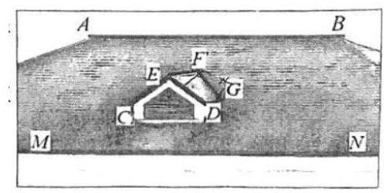

小张和小王对屋顶进行研究，提出了下面一些假设:

①两条屋脊线 ${AB}$ 与 ${EF}$ 互相垂直且都与水平面平行；

②气窗屋顶的两个坡面 ${EFC}$ 与 ${EFGD}$ 互相垂直且与水平面的所成角相等；

③屋顶坡面 ${ABMN}$ 与水平面所成角为 ${30}^{ \circ  }$

(1)小张认为还需假设屋脊线 ${AB}$ 与带气窗的竖直面 ${CDE}$ 是平行关系. 而小李认为前面的假设已经够了, 不需要再提出这个假设. 请你判断哪位同学正确? 证明你的判断

(2)根据小张和小王的假设，试求气窗屋顶的一个坡面 ${DEFG}$ 与屋顶坡面 ${ABMN}$ 构成的阴脊线 ${FG}$ (是平面 ${ABMN}$ 与平面 ${EFGD}$ 的交线) 与水平面所成角的大小. (用反三角函数表示)

【答案】(1) 小李正确,证明见解析; (2) $\arcsin \frac{\sqrt{5}}{5}$

【解析】(1) 不需再提假设

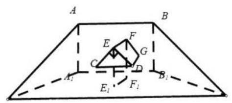

在水平面上分别取 $A, B, E, F$ 的射影 ${A}_{1},{B}_{1},{E}_{1},{F}_{1}$ ,

连接 $A{A}_{1}, B{B}_{1}, E{E}_{1}, F{F}_{1},{A}_{1}{B}_{1},{E}_{1}{F}_{1}$ ,

则 $A, B,{A}_{1},{B}_{1}$ 四点共面，又 ${AB}//$ 水平面，平面 ${AB}{B}_{1}{A}_{1} \cap$ 水平面 $= {A}_{1}{B}_{1}$ ，

则 ${AB}//{A}_{1}{B}_{1}$ ,同理 ${EF}//{E}_{1}{F}_{1}$ ,又 ${EF} \bot  {AB}$ ,所以 ${E}_{1}{F}_{1} \bot  {AB}$ ,

又 $A{A}_{1} \bot$ 水平面, ${E}_{1}{F}_{1} \subset$ 水平面,则 $A{A}_{1} \bot  {E}_{1}{F}_{1}$ ,

$A{A}_{1} \cap  {AB} = A, A{A}_{1},{AB} \subset$ 平面 ${AB}{B}_{1}{A}_{1}$ ,则 ${E}_{1}{F}_{1} \bot$ 平面 ${AB}{B}_{1}{A}_{1}$ ,

即 ${EF} \bot$ 平面 ${AB}{B}_{1}{A}_{1}$ ,又 ${EF} \bot$ 平面 ${CDE}$ ,则平面 ${AB}{B}_{1}{A}_{1}//$ 平面 ${CDE}$ ,

因为 ${AB} \subset$ 平面 ${AB}{B}_{1}{A}_{1}$ ,所以 ${AB}//$ 平面 ${CDE}$

(2)把气窗脱离出来，即三棱柱被斜面截到的部分即多面体 ${ECD} - {FNG}$ ， 则屋顶坡面 ${ABMN}$ 即为平面 ${FNG}$ ,如图,

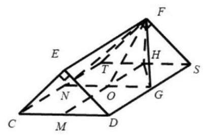

则平面 ${CDST}//$ 水平面,分别取 ${ST},{CD}$ 中点 $H, M$ ,连接 ${HM}$ ,

过 $G$ 作 ${GN}//{CD}$ ,交 ${HM},{CT}$ 于 $O, N$ ,连接 ${FO},{HG}$ ,

则 ${FH} \bot$ 平面 ${CDST},{GN} \subset$ 平面 ${CDST}$ ,则 ${FH} \bot  {GN}$ ,

又 ${CD} \bot  {HM}$ ,即 ${GN} \bot  {HM},{FH} \cap  {HO} = H$ ,

${FH},{HO} \subset$ 平面 ${FHO}$ ,则 ${GN} \bot$ 平面 ${FHO}$ ,

又平面 ${FNG} \cap$ 平面 ${CDST} = {GN}$ ,

则 $\angle {FOH}$ 为屋顶坡面 ${ABMN}$ 与水平面所成角为 ${30}^{ \circ  }$ ,

在 ${Rt}\bigtriangleup {FHO}$ 中,设 ${FH} = 1$ ,则 ${HO} = \sqrt{3},{FO} = 2$ ,

则在等腰 ${Rt}\bigtriangleup {FHS},{HS} = 1$ ,则 ${OG} = 1$ ,

在 Rt $\bigtriangleup {HOG},{HG} = \sqrt{H{O}^{2} + O{G}^{2}} = 2$ ,

则在 ${Rt}\bigtriangleup {FHG},{FG} = \sqrt{H{G}^{2} + F{H}^{2}} = \sqrt{5}$ ,

又 ${FH} \bot$ 平面 ${CDST}$ ,则 ${HG}$ 为 ${FG}$ 在平面 ${CDST}$ 的射影,

则 $\angle {FGH}$ 为 ${FG}$ 与水平面所成角,则 $\sin \angle {FGH} = \frac{FH}{FG} = \frac{1}{\sqrt{5}} = \frac{\sqrt{5}}{5}$ ,

则 ${FG}$ 与水平面所成角为 $\arcsin \frac{\sqrt{5}}{5}$

## C4 每日三题 0406

【练习】1. (2025 届复附) 设数列 $\left\{  {a}_{n}\right\}$ 的各项均为非零的整数，其前 $n$ 项和为 ${S}_{n}$ . 若 $j - \mathrm{i}\left( {\mathrm{i}, j \in  {N}^{ * }}\right)$ 为正偶数,均有 ${a}_{j} \geq  2{a}_{i}$ ,且 ${S}_{2} = 0$ ,则 ${S}_{10}$ 的最小值为___

【答案】 22

【解析】因为 ${S}_{2} = {a}_{1} + {a}_{2} = 0$ ,所以 ${a}_{1}\text{ 、 }{a}_{2}$ 互为相反数,不妨设 ${a}_{1} > 0,{a}_{2} < 0$ ,

为了 ${S}_{10}$ 取最小值，取奇数项为正值，取偶数项为负值，且各项尽可能小，

由题意得 ${a}_{3}$ 满足 ${a}_{3} \geq  2{a}_{1}$ ,取 ${a}_{3}$ 的最小值为 $2{a}_{1}$ ,

${a}_{5}$ 满足 $\left\{  \begin{array}{l} {a}_{5} \geq  2{a}_{1} \\  {a}_{5} \geq  2{a}_{3} \geq  4{a}_{1} \end{array}\right.$ ,因为 ${a}_{1} > 0,4{a}_{1} > 2{a}_{1}$ ,所以取 ${a}_{5}$ 的最小值 $4{a}_{1}$ ,

${a}_{7}$ 满足 $\left\{  \begin{array}{l} {a}_{7} \geq  2{a}_{1} \\  {a}_{7} \geq  2{a}_{3} \geq  4{a}_{1} \\  {a}_{7} \geq  2{a}_{5} \geq  4{a}_{3} \geq  8{a}_{1} \end{array}\right.$ ,

因为 ${a}_{1} > 0,8{a}_{1} > 4{a}_{1} > 2{a}_{1}$ ,所以取 ${a}_{7}$ 的最小值 $8{a}_{1}$ ,

同理,取 ${a}_{9}$ 的最小值 ${16}{a}_{1}$ ,

所以 ${a}_{1} + {a}_{3} + {a}_{5} + {a}_{7} + {a}_{9} = {a}_{1} + 2{a}_{1} + 4{a}_{1} + 8{a}_{1} + {16}{a}_{1} = {31}{a}_{1}$ ,

${a}_{4}$ 满足 ${a}_{4} \geq  2{a}_{2}$ ,取 ${a}_{4}$ 的最小值 $2{a}_{2}$ ,

${a}_{6}$ 满足 $\left\{  \begin{array}{l} {a}_{6} \geq  2{a}_{2} \\  {a}_{6} \geq  2{a}_{4} \geq  4{a}_{2} \end{array}\right.$ ,因为 ${a}_{2} < 0$ ,所以 $2{a}_{2} > 4{a}_{2}$ ,取 ${a}_{6}$ 的最小值 $2{a}_{2}$ ,

${a}_{8}$ 满足 $\left\{  \begin{array}{l} {a}_{8} \geq  2{a}_{2} \\  {a}_{8} \geq  2{a}_{4} \geq  4{a}_{2} \\  {a}_{8} \geq  2{a}_{6} \geq  4{a}_{4} \geq  8{a}_{2} \end{array}\right.$ ,因为 ${a}_{2} < 0$ ,所以 $2{a}_{2} > 4{a}_{2} > 8{a}_{2}$ ,

取 ${a}_{8}$ 的最小值 $2{a}_{2}$ ,

同理,取 ${a}_{10}$ 的最小值 $2{a}_{2}$ ,

所以 ${a}_{2} + {a}_{4} + {a}_{6} + {a}_{8} + {a}_{10} = {a}_{2} + 2{a}_{2} + 2{a}_{2} + 2{a}_{2} + 2{a}_{2} = 9{a}_{2}$ ,

所以 ${S}_{10} = {31}{a}_{1} + 9{a}_{2} = {31}{a}_{1} - 9{a}_{1} = {22}{a}_{1}$ ,

因为数列 $\left\{  {a}_{n}\right\}$ 的各项均为非零的整数, ${a}_{1} > 0$ ,所以当 ${a}_{1} = 1$ 时, ${S}_{10}$ 有最小值 22

【练习】2. (2024 届华二) 已知各项均为整数的数列 ${A}_{N} : {a}_{1},{a}_{2},\cdots ,{a}_{N}\left( {N \geq  3}\right)$ 满足 ${a}_{1}{a}_{N} < 0$ ,且对任意 $2 \leq \; k \leq  N$ ,都成立 $\left| {{a}_{k} - {a}_{k - 1}}\right|  \leq  1$ . 设 $S\left( {A}_{N}\right)  = \mathop{\sum }\limits_{{k = 1}}^{N}{a}_{k}$ ,且 $S\left( {A}_{N}\right)$ 是 $N$ 的整数倍. 有以下两个命题:① 数列 ${A}_{N}$ 的各项可能均不为 0 ; ② 数列 ${A}_{N}$ 中存在一项 ${a}_{r}$ ，使得 $S\left( {A}_{N}\right)  = N \cdot  {a}_{r}$ . 则 ( )

A. ①是真命题，②是假命题 B. ①是假命题，②是真命题

C. ①、②都是真命题 D. ①、②都是假命题

【答案】 $B$

【解析】因为 ${a}_{1}{a}_{N} < 0$ ,所以 ${a}_{1},{a}_{N}$ 异号,

假设 ${a}_{1} < 0,{a}_{N} > 0$ ,设 $T = \left\{  {\left| {{a}_{i} \vartriangleleft  0\mathrm{i}}\right| B,}\right\}  N$ . 因为 ${a}_{1} < 0$ ,所以 $T \neq  \varnothing$ ,

又因为 $T$ 是有限自然数集,所以可设 $T$ 中的最大数为 $m\left( {1 \leq  m \leq  N - 1}\right)$ ,

令 $k = m + 1$ ,则 ${a}_{k} \geq  0$ ,因为 $\left| {{a}_{k} - {a}_{k - 1}}\right|  = {a}_{k} - {a}_{k - 1} \leq  1$ ,

所以 ${a}_{k} \leq  1 + {a}_{k - 1} = 1 + {a}_{m} < 1$ ,因为 $0 \leq  {a}_{k} < 1$ ,且 ${a}_{k}$ 为整数,所以 ${a}_{k} = 0$ ,

所以若数列 ${A}_{N} : {a}_{1},{a}_{2},\cdots ,{a}_{N}\left( {N \geq  3}\right)$ 满足 ${a}_{1} < 0,{a}_{N} > 0$ ,

且对任意 $\mathrm{i} = 2,3,\cdots , N$ 都有 $\left| {{a}_{k} - {a}_{k - 1}}\right|  \leq  1$ ,则存在 ${a}_{k}$ ,使得 ${a}_{k} = 0$ ,

若 ${a}_{1} > 0,{a}_{N} < 0$ ,则数列 $- {a}_{1}, - {a}_{2},\cdots , - {a}_{N}$ 满足 $- {a}_{1} < 0, - {a}_{N} > 0$ ,

且对任意 $k = 2,3,\cdots , N$ ,都有 $\left| {\left( {-{a}_{k}}\right)  - \left( {-{a}_{k - 1}}\right) }\right|  = \left| {{a}_{k} - {a}_{k - 1}}\right|  \leq  1$ ,

所以存在 $- {a}_{k}$ ,使得 $- {a}_{k} = 0$ ,即存在 ${a}_{k}$ ,使得 ${a}_{k} = 0$ ,

所以数列 ${A}_{N}$ 中存在 ${a}_{k}$ 使得 ${a}_{k} = 0$ . 故①错误；

设 $t = \frac{S\left( {A}_{N}\right) }{N}$ ,则 $t \in  Z$ ,

设数列 ${A}_{N} : {a}_{1},{a}_{2},\cdots ,{a}_{N}$ 中最大的值为 $M > 0$ ,最小值为 $m < 0$ ,

因为 ${N}_{m} < S\left( {A}_{N}\right)  < {N}_{M}$ ,所以 $m < t = \frac{{a}_{1} + {a}_{2} + \cdots  + {a}_{N}}{N} < M$ ,

设在数列 ${A}_{N}$ 中, ${a}_{i} = m,{a}_{j} = M$ ,

若 $\mathrm{i} < j$ ,因为 $\left| {{a}_{i} - {a}_{j}}\right|  = M - m \geq  1 - \left( {-1}\right)  = 2$ ,所以 $j \geq  \mathrm{i} + 2$ ,

设数列 $B : {a}_{i} - t,{a}_{i + 1} - t,\cdots ,{a}_{j} - t$ ,则数列 $B$ 至少有 3 项,

因为 $\left( {{a}_{i} - t}\right) \left( {{a}_{j} - t}\right)  = \left( {m - t}\right) \left( {M - t}\right)  < 0$ ,且对任意 $k = 1,2,\cdots , j - 1$ ,

都有 $\left| {\left( {{a}_{i + k} - t}\right)  - \left( {{a}_{i + k - 1} - t}\right) }\right|  = \left| {{a}_{i + k} - {a}_{i + k - 1}}\right|  \leq  1$ ,

由①得存在 ${a}_{r} - t$ ，使得 ${a}_{r} - t = 0\left( {r \in  \{ \mathrm{i} + 1,\mathrm{i} + 2,\cdots , j - 1\} }\right)$ ，即 $t = \frac{S\left( {A}_{N}\right) }{N} = {a}_{r}$ ，

若 $\mathrm{i} > j$ ,设数列 $t - {a}_{j}, t - {a}_{j + 1},\cdots , t - {a}_{i}$ ,

同理,存在 $t - {a}_{r}$ ,使得 $t - {a}_{r} = 0\left( {r \in  \{ j + 1, j + 2,\cdots ,\mathrm{i} - 1\} }\right)$ ,即 $t = \frac{S\left( {A}_{N}\right) }{N} = {a}_{r}$ ,

综上,若 $S\left( {A}_{N}\right)$ 是 $N$ 的整数倍,则数列 ${A}_{N}$ 中存在 ${a}_{r}$ ,使得 $S\left( {A}_{N}\right)  = N \cdot  {a}_{r}$ .

故②正确；

故选 $B$ .

【练习】3. (2024 届交附) 已知抛物线 $C : {y}^{2} = {4x}$ ，过点 $M\left( {a,0}\right) \left( {a \neq  0}\right)$ 与 $x$ 轴不垂直的直线 $l$ 与 $C$ 交于 $A\left( {{x}_{1},{y}_{1}}\right) \text{ 、 }B\left( {{x}_{2},{y}_{2}}\right)$ 两点

(1)求证: $\overrightarrow{OA} \cdot  \overrightarrow{OB}$ 是定值(D是坐标原点)；

(2) ${AB}$ 的垂直平分线与 $x$ 轴交于 $N\left( {n,0}\right)$ ，求 $n$ 的取值范围；

(3) 设 $A$ 关于 $x$ 轴的对称点为 $D$ ，求证:直线 ${BD}$ 过定点，并求出定点的坐标

【解析】(1) 因为点 $M\left( {a,0}\right)$ ,设直线 $l : x = {ty} + a$ ,

由 $\left\{  \begin{array}{l} {y}^{2} = {4x} \\  x = {ty} + a \end{array}\right.$ 得 ${y}^{2} - {4ty} - {4a} = 0$ ,

所以 ${y}_{1}{y}_{2} =  - {4a}$ ,则 ${x}_{1}{x}_{2} = \frac{{\left( {y}_{1}{y}_{2}\right) }^{2}}{16} = {a}^{2}$ ,

则 $\overrightarrow{OA} \cdot  \overrightarrow{OB} = {x}_{1}{x}_{2} + {y}_{1}{y}_{2} = {a}^{2} - {4a}$ 为定值;

(2) 设过点 $M$ 的直线方程为 $x = {ty} + a$ ，代入 ${y}^{2} = {4x}$ ，得 ${y}^{2} - {4ty} - {4a} = 0$ ，

则 ${y}_{1} + {y}_{2} = {4t},{y}_{1}{y}_{2} =  - {4a},{x}_{1} + {x}_{2} = t\left( {{y}_{1} + {y}_{2}}\right)  + {2a} = 4{t}^{2} + {2a}$ ,

所以 ${AB}$ 的中点坐标为 $\left( {2{t}^{2} + a,{2t}}\right)$ ,

那么线段 ${AB}$ 的垂直平分线方程为 $y - {2t} =  - t\left( {x - a - 2{t}^{2}}\right)$ ,

令 $y = 0$ ,得 $x = a + 2 + 2{t}^{2}$ ,即 $n = a + 2 + 2{t}^{2}$ ,

又 $\Delta  = {16}{t}^{2} + {16a} > 0$ ,即 ${t}^{2} >  - a$ ,所以 $n > a + 2 - {2a} = 2 - a$ ;

(3)由于 $A$ 关于 $x$ 轴的对称点为 $D$ ，则 $D$ 的坐标为 $\left( {{x}_{1}, - {y}_{1}}\right)$ ，

那么直线 ${BD}$ 的斜率为 ${k}_{BD} = \frac{{y}_{2} + {y}_{1}}{{x}_{2} - {x}_{1}}$ ,

则直线 ${BD}$ 的方程为 $y + {y}_{1} = \frac{{y}_{2} + {y}_{1}}{{x}_{2} - {x}_{1}}\left( {x - {x}_{1}}\right)$ ,

整理得 $y = \frac{{y}_{2} + {y}_{1}}{{x}_{2} - {x}_{1}}x + \frac{-{y}_{1}{x}_{2} - {y}_{2}{x}_{1}}{{x}_{2} - {x}_{1}}$ ,

而 ${y}_{1}{x}_{2} + {y}_{2}{x}_{1} = {y}_{1}\left( {t{y}_{2} + a}\right)  + {y}_{2}\left( {t{y}_{1} + a}\right)  = {2t}{y}_{1}{y}_{2} + a\left( {{y}_{1} + {y}_{2}}\right) \; =  - {8at} + {4at} =  - {4at}$ ,

所以直线 ${BD}$ 的方程为 $y = \frac{4t}{{x}_{2} - {x}_{1}}\left( {x + a}\right)$ ,且恒过点 $\left( {-a,0}\right)$

## C 每日三题 0407

【练习】1. (2023年少有为杯)函数 $f\left( x\right)  = A\sin \left( {{\omega x} + \varphi }\right) \left( {A > 0,\omega  > 0}\right)$ 满足:存在公差为 3 的无穷等差数列 $\left\{  {a}_{n}\right\}$ ,使得对任意 $k \in  N, k \geq  1$ ,均有 $f\left( {a}_{k}\right)  \in  Z$ . 对于所有这样的函数 $y = A\sin \left( {{\omega x} + \varphi }\right) ,\omega$ 的最小值为___.

拓展:当 $\omega$ 取最小值时， $A$ 的最小值为___

【答案】 $\frac{\pi }{9},\frac{2\sqrt{3}}{3}$

【解析】见视频

【练习】2. (2024 届复附)设 $\left\{  {a}_{n}\right\}$ 是由正整数组成且项数为 $m$ 的数列，满足当 $1 \leq  t \leq  m - 1$ ，都有 ${a}_{i} \leq \; {a}_{t + 1}$ . 已知 ${a}_{1} = 1,{a}_{m} = {100}$ ,数列 $\left\{  {a}_{n}\right\}$ 任意相邻两项的差的绝对值不超过 1,若对于 $\left\{  {a}_{n}\right\}$ 中任意序数不同的两项 ${a}_{s}$ 和 ${a}_{t}$ ，在剩下的项中总存在序数不同的两项 ${a}_{p}$ 和 ${a}_{q}$ ，使得 ${a}_{s} + {a}_{t} = {a}_{p} + {a}_{q}$ ，则 $\mathop{\sum }\limits_{{i = 1}}^{m}{a}_{i}$ 的最小值为

【答案】5454

【解析】法一: 因为数列 $\left\{  {a}_{n}\right\}$ 任意相邻两项的差的绝对值不超过 $1,{a}_{1} = 1$ ,

所以 $0 \leq  {a}_{2} \leq  2$ ,

又 $\left\{  {a}_{n}\right\}$ 是由正整数组成且项数为 $m$ 的增数列,所以 ${a}_{2} = 1$ 或 ${a}_{2} = 2$ ,

当 ${a}_{2} = 2$ 时， ${a}_{4} \geq  {a}_{3} \geq  2$ ，此时 ${a}_{1} + {a}_{2} = 3 < {a}_{3} + {a}_{4}$ ，

与在剩下的项中总存在序数不同的两项 ${a}_{p}$ 和 ${a}_{q}$ ,使得 ${a}_{s} + {a}_{t} = {a}_{p} + {a}_{q}$ 矛盾,

所以 ${a}_{2} = 1$ ,类似地,必有 ${a}_{3} = 1,{a}_{4} = 1,{a}_{5} = 2,{a}_{6} = 2$ ,

由 ${a}_{s} + {a}_{t} = {a}_{p} + {a}_{q}$ 得前 6 项任意两项之和小于等于 3 时,均符合,

$\mathop{\sum }\limits_{{i = 1}}^{m}{a}_{i} = {a}_{1} + {a}_{2} + \cdots  + {a}_{m}$ 要最小,则每一项尽可能小,

则 ${a}_{5} + {a}_{6} = 4 = {a}_{1} + {a}_{7} \Rightarrow  {a}_{7} = 3$ ,

同理, ${a}_{8} = 4,{a}_{9} = 5,\cdots ,{a}_{m - 6} = {98}$ ,

由对称性得最后 6 项为 ${a}_{m} = {a}_{m - 1} = {a}_{m - 2} = {a}_{m - 3} = {100},{a}_{m - 4} = {a}_{m - 5} = {99}$ ,

则 $\mathop{\sum }\limits_{{i = 1}}^{m}{a}_{i} = {a}_{1} + {a}_{2} + \cdots  + {a}_{m}$ 的最小值 $= \frac{\left( {1 + {99}}\right)  \cdot  {99}}{2} + 4 \times  {100} + 3 \times  1 + 2 + {99}$

$= {5454}$ .

法二: 令 $s = 1, t = 2 \Rightarrow  {a}_{s} + {a}_{t} = 1 + {a}_{t} = {a}_{p} + {a}_{q}$ ,

因为数列 $\left\{  {a}_{n}\right\}$ 递增,所以,至少要有 4 个1,

即 ${a}_{1} = {a}_{2} = {a}_{3} = {a}_{4} = 1$ ,同理,令 $s = m - 1, t = m \Rightarrow  {a}_{s} + {a}_{t} = {a}_{m - 1} + {100} = {a}_{p} + {a}_{q}$ ,

因为数列 $\left\{  {a}_{n}\right\}$ 递增,至少需要 4 个 100 ,

继续枚举计算,得 ${a}_{5} = {a}_{6} = 2,{a}_{7} = 3,{a}_{8} = 4,\cdots$ ,

${a}_{m - 6} = {98},{a}_{m - 5} = {a}_{m - 4} = {99},{a}_{m - 3} = {a}_{m - 2} = {a}_{m - 1} = {a}_{m} = {100},$

故此数列,可安排为 $1,1,1,1,2,2,3,4,5,\cdots ,{97},{98},{99},{99},{100},{100},{100},{100}$ ,

则 $\mathop{\sum }\limits_{i}^{m}{a}_{i} = 4 + {400} + {101} + \frac{\left( {2 + {99}}\right)  \times  {98}}{2} = {5454}$ .

【练习】3. (2024 届复附)对于函数 $y = f\left( x\right)$ ，若实数 ${x}_{0}$ 满足 $f\left( {x}_{0}\right) f\left( {{x}_{0} + F}\right)  = D$ ，其中 $F$ 、 $D$ 为实数，则 ${x}_{0}$ 称为函数 $f\left( x\right)$ 的“ $F - D -$ 笃志点”.

(1)若 $f\left( x\right)  = x + 1$ ，求函数 $f\left( x\right)$ 的“ $1 - 2 -$ 笃志点”；

(2)已知函数 $f\left( x\right)  = \left\{  \begin{array}{ll} {\mathrm{e}}^{x} & x > 0 \\  \frac{1}{x + a} & x < 0, x \neq   - a \end{array}\right.$ ，且函数 $f\left( x\right)$ 有且只有 3 个 “1-1- 笃志点”，求正实数 $a$ 的取值范围;

(3)定义在 $R$ 上的函数 $y = f\left( x\right)$ 满足. 存在唯一实数 $m$ ，对任意的实数 $x$ ，使得 $f\left( {m + x}\right)  = \; f\left( {m - x}\right)$ 恒成立或 $f\left( {m + x}\right)  =  - f\left( {m - x}\right)$ 恒成立. 对于有序实数对 $\left( {F, D}\right)$ ,讨论函数 $y = f\left( x\right)$ 的 “ $F - D -$ 笃志点”个数的奇偶性,并说明理由.

【解析】(1) $\left( {x + 1}\right) \left( {x + 2}\right)  = 2, x =  - 3,0$ ,函数 $f\left( x\right)$ 的“ $1 - 2 -$ 笃志点”为 -3 和 0 ;

(2) 令 $g\left( x\right)  = \frac{1}{f\left( {x + 1}\right) }$ ,故 $g\left( x\right)  = \left\{  \begin{matrix} {\mathrm{e}}^{-x - 1} & x >  - 1 \\  x + a + 1 & x <  - 1 \end{matrix}\right.$ ,

$f\left( x\right)$ 有且只有 3 个“1-1- 一笃志点”

表明 $f\left( x\right)$ 与 $g\left( x\right)$ 图像有且只有 3 个交点,

当 $x > 0$ 时, $f\left( x\right)$ 与 $g\left( x\right)$ 图像无交点,

当 $- 1 < x < 0$ 时, $f\left( x\right)$ 与 $g\left( x\right)$ 图像有交点时, $\frac{1}{x + a} = {\mathrm{e}}^{-x - 1}$ ,

即 $a = {\mathrm{e}}^{x + 1} - x$ ,对于函数 $y = {\mathrm{e}}^{x + 1} - x,{y}^{\prime } = {\mathrm{e}}^{x + 1} - 1$ ,

当 $- 1 < x < 0$ 时, ${y}^{\prime } > 0$ ,故函数 $y = {\mathrm{e}}^{x + 1} - x$ 严格增,

$y = {\mathrm{e}}^{x + 1} - x \in  \left( {2,\mathrm{e}}\right)$ ,所以当 $a \in  \left( {2,\mathrm{e}}\right)$ 时有 1 个交点, $a \notin  \left( {2,\mathrm{e}}\right)$ 无交点,

当 $x <  - 1$ 时, $f\left( x\right)$ 与 $g\left( x\right)$ 图像有交点时, $x + a + 1 = \frac{1}{x + a}$ ,

$f\left( x\right)$ 有且只有 3 个“ $1 -$ 笃志点”表明 $a \in  \left( {2,\mathrm{e}}\right)$ ,

且 ${x}^{2} + \left( {{2a} + 1}\right) x + {a}^{2} + a - 1 = 0$ 在 $\left( {-\infty , - 1}\right)$ 有 2 解,

令 $h\left( x\right)  = {x}^{2} + \left( {{2a} + 1}\right) x + {a}^{2} + a - 1$ ,所以 $\left\{  \begin{matrix} \Delta  > 0 \\  h\left( {-1}\right)  > 0 \\   - \frac{{2a} + 1}{2} <  - 1 \end{matrix}\right.$ ,解得 $a > \frac{1 + \sqrt{5}}{2}$ ,

综上,当 $a \in  \left( {2,\mathrm{e}}\right)$ 时,有且只有 3 个“ $1 - 1 -$ 笃志点”;

(3) 设函数 $u\left( x\right)  = f\left( x\right) f\left( {x + F}\right)$ ,

注意到 $u\left( {m - \frac{F}{2} - x}\right)  = f\left( {m - \frac{F}{2} - x}\right) f\left( {m + \frac{F}{2} - x}\right)$ ,

$u\left( {m - \frac{F}{2} + x}\right)  = f\left( {m - \frac{F}{2} + x}\right) f\left( {m + \frac{F}{2} + x}\right) ,$

${1}^{ \circ  }$ . 若 $f\left( {m + x}\right)  = f\left( {m - x}\right)$ 恒成立,

故有 $f\left( {m - \frac{F}{2} + x}\right) f\left( {m + \frac{F}{2} + x}\right)  = f\left( {m + \frac{F}{2} - x}\right) f\left( {m - \frac{F}{2} - x}\right)$

$= u\left( {m - \frac{F}{2} - x}\right) ,$

故 $u\left( x\right)$ 关于直线 $x = m - \frac{F}{2}$ 对称;

${2}^{ \circ  }$ . 若 $f\left( {m + x}\right)  =  - f\left( {m - x}\right)$ 恒成立,

故有 $f\left( {m - \frac{F}{2} + x}\right) f\left( {m + \frac{F}{2} + x}\right)  =  - f\left( {m + \frac{F}{2} - x}\right) \left\lbrack  {-f\left( {m - \frac{F}{2} - x}\right) }\right\rbrack$

$= u\left( {m - \frac{F}{2} - x}\right)$ ,故 $u\left( x\right)$ 也关于直线 $x = m - \frac{F}{2}$ 对称;

所以,当 $D = f\left( {m - \frac{F}{2}}\right) f\left( {m + \frac{F}{2}}\right)$ 时,

函数 $f\left( x\right)$ “ $F - D -$ 笃志点”个数有奇数个;

当 $D \neq  f\left( {m - \frac{F}{2}}\right) f\left( {m + \frac{F}{2}}\right)$ 时,

函数 $f\left( x\right)$ “ $F - D -$ 笃志点” 个数有偶数个.

## 14 每日三题 0408(2025 闵行二模)

【练习】1. (2025 闵行二模)定义 $D = \left\lbrack  {a, b}\right\rbrack$ 的区间长度为 $b - a$ . 若 $m < 0$ 且关于 $x$ 的不等式 $\left| {{\left( x - 1\right) }^{3} + m\left( {x - 1}\right) }\right|  \leq  {16}$ 的解集的区间长度之和为 $T$ ，则当 $T$ 取最大值时，实数 $m$ 的值为___.

【答案】 -12

【解析】等价于分析不等式 $\left| {{t}^{3} + {mt}}\right|  \leq  {16}$ 的解集 (向右平移 1 个单位,解集长度不变),

即分析不等式 $- {16} \leq  {t}^{3} + {mt} \leq  {16}$ 的解集长度最大,

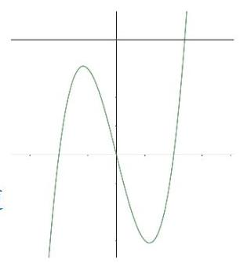

令 $f\left( t\right)  = {t}^{3} + {mt}$ ,这个函数是奇函数,

由 ${f}^{\prime }\left( t\right)  = 3{t}^{2} + m = 0$ 得 ${t}^{2} =  - \frac{m}{3}$ ,

极大值为 $f\left( {-\sqrt{-\frac{m}{3}}}\right)  = t\left( {{t}^{2} + m}\right)  =  - \sqrt{-\frac{m}{3}} \cdot  \frac{2m}{3}$ ,如图,

这里的绿色即为三次函数,黑色的为 $y = {16}$ ,

要使得区间长度最大,先考虑 $y = {16}$ 在极大值上面,这样整体区间长度更长,

此时极大值 $- \sqrt{-\frac{m}{3}} \cdot  \frac{2m}{3} \leq  {16}$ ,即 ${\left( \sqrt{-\frac{m}{3}}\right) }^{3} \leq  8$ ,解得 $m \geq   - {12}$ ,

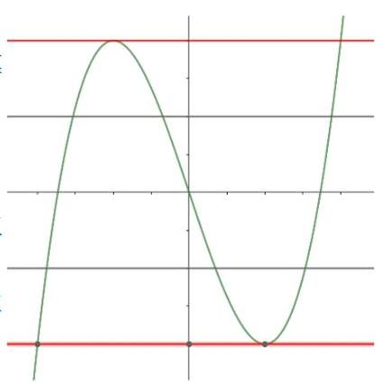

由 ${t}^{3} + {mt} = {16}$ 得 $m = \frac{{16} - {t}^{3}}{t} = \frac{16}{t} - {t}^{3} \geq   - {12}$ ,得 $t \leq  4$ ,

这里的 4 即为黑色直线和绿色三次函数的交点，区间长度 $T \leq$ 8,

要使得区间长度最大,则上述过程必须都取等号,则 $m =  - {12}$ . 当 $y = {16}$ 在极大值下面时, $m <  - {12}$ ,

这种情况下区间长度 $T$ 为绿色三次函数被两条黑色直线夹住三段,

显然 $T$ 小于两条红色夹住长度,而红色长度已经在上述过程解决,

故当 $T$ 取最大值时, $m =  - {12}$ .

【练习】2.(2025闵行二模)设 $n$ 为正整数，空间中 $n$ 个单位向量构成集合 ${A}_{n} = \left\{  {{\overrightarrow{a}}_{1},{\overrightarrow{a}}_{2},\cdots ,{\overrightarrow{a}}_{n}}\right\}$ ，若存在实数 $t$ ,满足对任意 ${\overrightarrow{a}}_{i} \in  {A}_{n},{\overrightarrow{a}}_{j} \in  {A}_{n},{\overrightarrow{a}}_{i} \neq  {\overrightarrow{a}}_{j}$ ,都有 ${\overrightarrow{a}}_{i} \cdot  {\overrightarrow{a}}_{j} = t$ ,则当 $n$ 取得最大值时, $t$ 的值为 ( )

A. $- \frac{1}{2}$ B. $\frac{1}{2}$ C. $- \frac{1}{3}$ D. $\frac{1}{3}$

【答案】 $C$

【解析】由题意得任意两个向量 $\overrightarrow{{a}_{i}},\overrightarrow{{a}_{j}}$ 的夹角相等,已经有一个具体例子是正四面体,

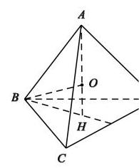

设正四面体 $A - {BCD}$ 中心为 $O$ ,则四个向量 $\overrightarrow{OA},\overrightarrow{OB},\overrightarrow{OC},\overrightarrow{OD}$ 刚好符合题意,

$n \geq  5$ 时,新增加的向量必须和已知的 $\overrightarrow{OA},\overrightarrow{OB},\overrightarrow{OC},\overrightarrow{OD}$ 构成新的正四面体,

这是不可能的，所以 $n$ 取得最大值 4 ，

设正四面体边长为 $x$ ,则 ${BH} = \frac{\sqrt{3}}{3}x,{AH} = \sqrt{{x}^{2} - {\left( \frac{\sqrt{3}}{3}x\right) }^{2}} = \frac{\sqrt{6}}{3}x$ ,

在 Rt $\bigtriangleup {OBH}$ 中, $O{H}^{2} + B{H}^{2} = O{B}^{2}$ ,所以 ${\left( \frac{\sqrt{6}}{3}x - 1\right) }^{2} + {\left( \frac{\sqrt{3}}{3}x\right) }^{2} = {1}^{2}$ ,

解得 $x = \frac{2\sqrt{6}}{3}$ ,则 ${\overrightarrow{a}}_{i} \cdot  {\overrightarrow{a}}_{j} = t = \cos  < \overrightarrow{OA},\overrightarrow{OB} >  = \frac{{1}^{2} + {1}^{2} - {\left( \frac{2\sqrt{6}}{3}\right) }^{2}}{2 \times  1 \times  1} =  - \frac{1}{3}$ ,

故选 $C$ .

【练习】3. (2025 闵行二模) 已知函数 $y = f\left( x\right)$ 在定义域 $D$ 上存在导函数 ${f}^{\prime }\left( x\right)$ . 对于给定的一个有序实数对 $\left( {k, m}\right)$ ,若存在 ${x}_{1},{x}_{2} \in  D$ ,使得 $\left\lbrack  {k{x}_{1} - f\left( {x}_{1}\right)  + m}\right\rbrack   \cdot  \left\lbrack  {k{x}_{2} - f\left( {x}_{2}\right)  + m}\right\rbrack   < 0$ ,则称 $\left( {k, m}\right)$ 为 $y = \; f\left( x\right)$ 在定义域 $D$ 上的一个“分割数对”.

(1)已知 $f\left( x\right)  = {x}^{2}, D = R$ ，判断数对 $\left( {1,0}\right)$ 是否为 $y = f\left( x\right)$ 在 $D$ 上的“分割数对”，并说明理由；

(2) 已知 $f\left( x\right)  = \ln x, D = \left( {1,2}\right)$ ,若 $\left( {\ln 2, m}\right)$ 为 $y = f\left( x\right)$ 在区间 $D$ 上的 “分割数对”,求实数 $m$ 的取值范围;

(3) 已知 $f\left( x\right)  = \left( {{x}^{2} + {ax} + b}\right)  \cdot  {\mathrm{e}}^{x}, D = R$ ,若有且仅有一个实数 $a$ 满足对任意 $t \in  R,\left( {{f}^{\prime }\left( t\right) , f\left( t\right)  - }\right. \; t{f}^{\prime }\left( t\right) )$ 都不是 $y = f\left( x\right)$ 在 $D$ 上的“分割数对”,求实数 $b$ 的值.

【解析】(1) 是, $\cdots \cdots 2$ 分

以下例子不唯一.

存在 ${x}_{1} = \frac{1}{2},{x}_{2} = 2$ ,有 $\left\lbrack  {1 \cdot  \frac{1}{2} - \frac{1}{4} + 0}\right\rbrack   \cdot  \left\lbrack  {1 \cdot  2 - 4 + 0}\right\rbrack   = \frac{1}{4} \cdot  \left( {-2}\right)  < 0$ 满足 $\cdots 4$ 分

( 2 )令 $d\left( x\right)  = x\ln 2 - \ln x + m$ ，而 ${d}^{\prime }\left( x\right)  = \ln 2 - \frac{1}{x}$ ，

所以当 $1 < x < \frac{1}{\ln 2}$ 时, ${d}^{\prime }\left( x\right)  < 0$ ; 当 $\frac{1}{\ln 2} < x < 2$ 时, ${d}^{\prime }\left( x\right)  > 0,\cdots$ . 6 分

所以 $y = d\left( x\right)$ 在 $x = \frac{1}{\ln 2}$ 处取得极小值,也是最小值,

所以 $y = d\left( x\right)$ 在区间 $\left( {1,2}\right)$ 上的值域为 $\lbrack 1 + m + \ln \left( {\ln 2}\right) , m + \ln 2)$ , 8 分

若 $\left( {\ln 2, m}\right)$ 为 $y = f\left( x\right)$ 在区间 $D$ 上的“分割数对”,

即要满足 $y = d\left( x\right)$ 在区间 $\left( {1,2}\right)$ 上的函数值有正有负,

所以 $\left\{  \begin{array}{l} m + \ln 2 > 0 \Rightarrow  m >  - \ln 2 \\  1 + m + \ln \left( {\ln 2}\right)  < 0 \Rightarrow  m <  - 1 - \ln \left( {\ln 2}\right)  \end{array}\right.$ ,

即实数 $m$ 的取值范围为 $\left( {-\ln 2, - 1 - \ln \left( {\ln 2}\right) }\right) ;\cdots \cdots {10}$ 分

(3)对于任意 $t \in  R$ ，考虑 $d\left( x\right)  = {f}^{\prime }\left( t\right) x - f\left( x\right)  + f\left( t\right)  - t{f}^{\prime }\left( t\right)$ ，

则 $\left( {{f}^{\prime }\left( t\right) , f\left( t\right)  - t{f}^{\prime }\left( t\right) }\right)$ 不是 $y = f\left( x\right)$ 在 $D$ 上的“分割数对”

等价于 $d\left( x\right)  \geq  0$ 恒成立或 $d\left( x\right)  \leq  0$ 恒成立, $\cdots \cdots {12}$ 分

显然, $d\left( t\right)  = t{f}^{\prime }\left( t\right)  - f\left( t\right)  + f\left( t\right)  - t{f}^{\prime }\left( t\right)  = 0$ ,

由于 ${d}^{\prime }\left( x\right)  = {f}^{\prime }\left( t\right)  - {f}^{\prime }\left( x\right)$ ,显然 ${d}^{\prime }\left( t\right)  = {f}^{\prime }\left( t\right)  - {f}^{\prime }\left( t\right)  = 0$ , 14 分

令 $h\left( x\right)  = {d}^{\prime }\left( x\right)  = {f}^{\prime }\left( t\right)  - {f}^{\prime }\left( x\right)$ ,

因为 ${f}^{\prime }\left( x\right)  = \left( {{x}^{2} + \left( {a + 2}\right) x + a + b}\right)  \cdot  {\mathrm{e}}^{x}$ ,

所以 $h\left( x\right)  = {f}^{\prime }\left( t\right)  - \left( {{x}^{2} + \left( {a + 2}\right) x + a + b}\right)  \cdot  {\mathrm{e}}^{x}$ ,

所以 ${h}^{\prime }\left( x\right)  =  - \left( {{x}^{2} + \left( {a + 4}\right) x + {2a} + b + 2}\right) {\mathrm{e}}^{x}$ ,

结合函数 $y = {h}^{\prime }\left( x\right)$ 的性质得 “ ${h}^{\prime }\left( x\right)  \leq  0$ 恒成立”

等价于 “对任意 $t \in  R, d\left( x\right)  \leq  0$ 恒成立” $\cdots \cdots {16}$ 分

即 ${x}^{2} + \left( {a + 4}\right) x + {2a} + b + 2 \geq  0$ 在 $R$ 上恒成立,即 $\Delta  = {a}^{2} - {4b} + 8 \leq  0$ ,

由题意，满足 ${a}^{2} - {4b} + 8 \leq  0$ 的实数 $a$ 有且仅有一个，则 $b = 2$ .

## 14 每日三题 0409(2025 虹口二模)

【练习】1. (2025 虹口二模) 记 $\left| A\right|$ 为有限集合 $A$ 中的元素个数. 设 $\omega  > 0,{S}_{\omega } = \left\{  {\theta  \mid  {2}^{2025} + \omega  \cdot  \theta }\right.$ 能被 7 整除 \},若对于任意实数 $a$ 和任意正整数 $n$ ,恒有 $\left| {{S}_{\omega } \cap  \left( {a, a + n{e}^{-{0.5n}}}\right) }\right|  \leq  3$ ,则实数 $\omega$ 的取值范围是 ___.

【答案】 $\left( {0,\frac{{21}\mathrm{e}}{2}}\right\rbrack$

【解析】注意到 ${2}^{2025} = {\left( {2}^{3}\right) }^{675} = {\left( 7 + 1\right) }^{675}$ ,由二项式定理得 ${2}^{2025}$ 除以 7 的余数为 1,

又 ${2}^{2025} + \omega  \cdot  \theta$ 能被 7 整除,则 $1 + \omega  \cdot  \theta  = {7k}, k \in  Z$ ,所以 $\theta  = \frac{{7k} - 1}{\omega }$ ,

则 ${S}_{\omega } = \left\{  {\cdots ,\frac{6}{\omega },\frac{13}{\omega },\frac{20}{\omega },\frac{27}{\omega },\cdots }\right\}$ ,

因为 $\left| {{S}_{\omega } \cap  \left( {a, a + n{e}^{-{0.5n}}}\right) }\right|  \leq  3$ ,所以区间 $\left( {a, a + n{e}^{-{0.5n}}}\right)$ 中最多有 3 个 ${S}_{\omega }$ 中的数,

所以区间长度 $n{e}^{-{0.5n}} \leq  \frac{27}{\omega } - \frac{6}{\omega } = \frac{21}{\omega }$ (其他数类似),

令 $f\left( x\right)  = x{e}^{-\frac{x}{2}}$ ,则 ${f}^{\prime }\left( x\right)  = {\mathrm{e}}^{-\frac{x}{2}} + x \cdot  \left( {-\frac{1}{2}}\right) {\mathrm{e}}^{-\frac{x}{2}} = \left( {1 - \frac{x}{2}}\right) {\mathrm{e}}^{-\frac{x}{2}}$ ,

易得 $f{\left( x\right) }_{\max } = f\left( 2\right)  = \frac{2}{\mathrm{e}}$ ，所以 $\frac{2}{\mathrm{e}} \leq  \frac{21}{\omega }$ ，所以 $\omega  \in  \left( {0,\frac{{21}\mathrm{e}}{2}}\right\rbrack$ .

【练习】2. $\left( {{2025}\text{ 虹口二模 }}\right)$ 在空间中,点 $O$ 为定点,设集合 $S = \left\{  {P\left| \right| \overrightarrow{OP}\left| {{}^{2} - 2\overrightarrow{OA} \cdot  \overrightarrow{OP} \leq  1,}\right| \overrightarrow{OA} \mid   = 1}\right\}$ ,则以下说法正确的是 ( )

①若 $\overrightarrow{OP}$ 在 $\overrightarrow{OA}$ 上的数量投影为 $- \frac{1}{5}$ ，则线段 ${OP}$ 在运动过程中所形成的几何体体积为 $\frac{14}{375}\pi$ ； ②对于任意的 ${P}_{i} \in  S$ 以及任意的正实数 ${a}_{i}$ ，设 $\overrightarrow{OQ} = \mathop{\sum }\limits_{{i = 1}}^{4}{a}_{i}\overrightarrow{O{P}_{i}}$ ，若 $\mathop{\sum }\limits_{{i = 1}}^{4}{a}_{i} = 1$ ，则 $Q \in  S$ .

A. ①是真命题，②是真命题 B. ①是真命题，②是假命题

C. ①是假命题，②是真命题 D. ①是假命题，②是假命题

【答案】 $A$

【解析】以点 $O$ 为原点, $\overrightarrow{OA}$ 所在直线为 $x$ 轴建立空间直角坐标系.

设 $A\left( {1,0,0}\right) , P\left( {x, y, z}\right)$ ,那么 $\overrightarrow{OP} = \left( {x, y, z}\right) ,\overrightarrow{OA} = \left( {1,0,0}\right)$ .

已知 ${\left| \overrightarrow{OP}\right| }^{2} - 2\overrightarrow{OA} \cdot  \overrightarrow{OP} \leq  1$ ，则不等式可化为 ${\left( \sqrt{{x}^{2} + {y}^{2} + {z}^{2}}\right) }^{2} - {2x} \leq  1$ ，

即 ${x}^{2} + {y}^{2} + {z}^{2} - {2x} \leq  1$ ,进一步整理得 ${\left( x - 1\right) }^{2} + {y}^{2} + {z}^{2} \leq  2$ ,

这表示点 $P$ 在以 $\left( {1,0,0}\right)$ 为球心, $\sqrt{2}$ 为半径的球内部及球面上.

对于①,若 $\overrightarrow{OP}$ 在 $\overrightarrow{OA}$ 上的数量投影为 $- \frac{1}{5}$ ,

则 $\overrightarrow{OP}$ 在 $\overrightarrow{OA}$ 上的投影为 $\frac{\overrightarrow{OP} \cdot  \overrightarrow{OA}}{\left| \overrightarrow{OA}\right| } = x =  - \frac{1}{5}$ .

将 $x =  - \frac{1}{5}$ 代入 ${\left( x - 1\right) }^{2} + {y}^{2} + {z}^{2} \leq  2$ ，得 ${\left( -\frac{1}{5} - 1\right) }^{2} + {y}^{2} + {z}^{2} \leq  2$ ，

即 ${y}^{2} + {z}^{2} \leq  2 - {\left( \frac{6}{5}\right) }^{2} = 2 - \frac{36}{25} = \frac{{50} - {36}}{25} = \frac{14}{25}$ .

此时 $P$ 点的轨迹是以 $O$ 为顶点, $\overrightarrow{OA}$ 所在直线为轴的圆锥的一部分,

圆锥底面半径 $r = \sqrt{\frac{14}{25}}$ ,高 $h = \frac{1}{5}$ ,

圆锥体积 $V = \frac{1}{3}\pi {r}^{2}h = \frac{1}{3}\pi  \times  \frac{14}{25} \times  \frac{1}{5} = \frac{14}{375}\pi$ ,所以①是真命题.

对于②，法一:设 ${P}_{i}\left( {{x}_{i},{y}_{i},{z}_{i}}\right)$ ，因为 ${P}_{i} \in  S$ ，所以 ${\left( {x}_{i} - 1\right) }^{2} + {y}_{i}^{2} + {z}_{i}^{2} \leq  2$ ，

即 ${x}_{i}^{2} + {y}_{i}^{2} + {z}_{i}^{2} - 2{x}_{i} \leq  1,\mathrm{i} = 1,2,3,4$ .

已知 $\overrightarrow{OQ} = \mathop{\sum }\limits_{{i = 1}}^{4}{a}_{i}\overrightarrow{O{P}_{i}},\mathop{\sum }\limits_{{i = 1}}^{4}{a}_{i} = 1$ ,设 $\overrightarrow{OQ} = \left( {x, y, z}\right)$ ,

则 $x = \mathop{\sum }\limits_{{i = 1}}^{4}{a}_{i}{x}_{i}, y = \mathop{\sum }\limits_{{i = 1}}^{4}{a}_{i}{y}_{i}, z = \mathop{\sum }\limits_{{i = 1}}^{4}{a}_{i}{z}_{i}$ ,

计算 ${\left( x - 1\right) }^{2} + {y}^{2} + {z}^{2} = {\left( \mathop{\sum }\limits_{{i = 1}}^{4}{a}_{i}{x}_{i} - 1\right) }^{2} + {\left( \mathop{\sum }\limits_{{i = 1}}^{4}{a}_{i}{y}_{i}\right) }^{2} + {\left( \mathop{\sum }\limits_{{i = 1}}^{4}{a}_{i}{z}_{i}\right) }^{2}$ ,

因为 $\mathop{\sum }\limits_{{i = 1}}^{4}{a}_{i} = 1$ ,所以 $\mathop{\sum }\limits_{{i = 1}}^{4}{a}_{i}{x}_{i} - 1 = \mathop{\sum }\limits_{{i = 1}}^{4}{a}_{i}\left( {{x}_{i} - 1}\right)$ ,

${\left( x - 1\right) }^{2} + {y}^{2} + {z}^{2} = {\left( \mathop{\sum }\limits_{{i = 1}}^{4}{a}_{i}\left( {x}_{i} - 1\right) \right) }^{2} + {\left( \mathop{\sum }\limits_{{i = 1}}^{4}{a}_{i}{y}_{i}\right) }^{2} + {\left( \mathop{\sum }\limits_{{i = 1}}^{4}{a}_{i}{z}_{i}\right) }^{2}$

由柯西一施瓦茨不等式 ${\left( \mathop{\sum }\limits_{{i = 1}}^{n}{a}_{i}{b}_{i}\right) }^{2} \leq  \left( {\mathop{\sum }\limits_{{i = 1}}^{n}{a}_{i}^{2}}\right) \left( {\mathop{\sum }\limits_{{i = 1}}^{n}{b}_{i}^{2}}\right)$ ,这里 $n = 4$ ,

${\left( \mathop{\sum }\limits_{{i = 1}}^{4}{a}_{i}\left( {x}_{i} - 1\right) \right) }^{2} + {\left( \mathop{\sum }\limits_{{i = 1}}^{4}{a}_{i}{y}_{i}\right) }^{2} + {\left( \mathop{\sum }\limits_{{i = 1}}^{4}{a}_{i}{z}_{i}\right) }^{2} \leq  \mathop{\sum }\limits_{{i = 1}}^{4}{a}_{i}^{2}\left( {{\left( {x}_{i} - 1\right) }^{2} + {y}_{i}^{2} + {z}_{i}^{2}}\right)$

又因为 ${\left( {x}_{i} - 1\right) }^{2} + {y}_{i}^{2} + {z}_{i}^{2} \leq  2,\mathop{\sum }\limits_{{i = 1}}^{4}{a}_{i}^{2} \leq  {\left( \mathop{\sum }\limits_{{i = 1}}^{4}{a}_{i}\right) }^{2} = 1$ ,

当且仅当 ${a}_{1} = {a}_{2} = {a}_{3} = {a}_{4} = \frac{1}{4}$ 时取等号,所以 ${\left( x - 1\right) }^{2} + {y}^{2} + {z}^{2} \leq  2$ ,即 $Q \in  S$ ,

所以②是真命题.

法二:因为 $\overrightarrow{OQ} = {a}_{1}\overrightarrow{O{P}_{1}} + {a}_{2}\overrightarrow{O{P}_{2}} + {a}_{3}\overrightarrow{O{P}_{3}} + {a}_{4}\overrightarrow{O{P}_{4}}$

$= {a}_{1}\left( {\overrightarrow{OQ} + \overrightarrow{Q{P}_{1}}}\right)  + {a}_{2}\left( {\overrightarrow{OQ} + \overrightarrow{Q{P}_{2}}}\right)  + {a}_{3}\left( {\overrightarrow{OQ} + \overrightarrow{Q{P}_{3}}}\right)  + {a}_{4}\left( {\overrightarrow{OQ} + \overrightarrow{Q{P}_{4}}}\right)$

$= \left( {{a}_{1} + {a}_{2} + {a}_{3} + {a}_{4}}\right) \overrightarrow{OQ} + {a}_{1}\overrightarrow{Q{P}_{1}} + {a}_{2}\overrightarrow{Q{P}_{2}} + {a}_{3}\overrightarrow{Q{P}_{3}} + {a}_{4}\overrightarrow{Q{P}_{4}}$

$= \overrightarrow{OQ} + {a}_{1}\overrightarrow{Q{P}_{1}} + {a}_{2}\overrightarrow{Q{P}_{2}} + {a}_{3}\overrightarrow{Q{P}_{3}} + {a}_{4}\overrightarrow{Q{P}_{4}}$ ,

所以 ${a}_{1}\overrightarrow{Q{P}_{1}} + {a}_{2}\overrightarrow{Q{P}_{2}} + {a}_{3}\overrightarrow{Q{P}_{3}} + {a}_{4}\overrightarrow{Q{P}_{4}} = \overrightarrow{0}$ ，

所以 ${a}_{1}\overrightarrow{Q{P}_{1}} + {a}_{2}\left( {\overrightarrow{Q{P}_{1}} + \overrightarrow{{P}_{1}{P}_{2}}}\right)  + {a}_{3}\left( {\overrightarrow{Q{P}_{1}} + \overrightarrow{{P}_{1}{P}_{3}}}\right)  + {a}_{4}\left( {\overrightarrow{Q{P}_{1}} + \overrightarrow{{P}_{1}{P}_{4}}}\right)  = \overrightarrow{0}$ ，

所以 $\left( {{a}_{1} + {a}_{2} + {a}_{3} + {a}_{4}}\right) \overrightarrow{Q{P}_{1}} =  - {a}_{2}\overrightarrow{{P}_{1}{P}_{2}} - {a}_{3}\overrightarrow{{P}_{1}{P}_{3}} - {a}_{4}\overrightarrow{{P}_{1}{P}_{4}}$ ,

所以 $\overrightarrow{{P}_{1}Q} = {a}_{2}\overrightarrow{{P}_{1}{P}_{2}} + {a}_{3}\overrightarrow{{P}_{1}{P}_{3}} + {a}_{4}\overrightarrow{{P}_{1}{P}_{4}}$ ,

因为 ${a}_{i}$ 是正实数, $\mathop{\sum }\limits_{{i = 1}}^{4}{a}_{i} = 1$ ,所以 $0 < {a}_{2} + {a}_{3} + {a}_{4} < 1$ ,

所以 $Q$ 在四面体 ${P}_{1}{P}_{2}{P}_{3}{P}_{3}$ 内部,而 ${P}_{i} \in  S$ ,所以 $Q \in  S$ ,所以②是真命题.

故选 $A$ .

【练习】3. $\left( {{2025}\text{ 虹口二模 }}\right)$ 对于定义在 $R$ 上的函数 $y = f\left( x\right)$ 和 $y = g\left( x\right) , a \in  R$ ,

设 ${M}_{a} = \{ t \mid  t = f\left( x\right)  - g\left( a\right) , x \geq  a\}$ .

(1)若 $f\left( x\right)  = {2}^{x} - 1, g\left( x\right)  = \cos x$ ，求 ${M}_{0}$ ；

( 2 )若 $f\left( x\right)  = {x}^{3} - 3{x}^{2}, g\left( x\right)  =  - x,{M}_{a} \subseteq  \lbrack 0, + \infty )$ ，求实数 $a$ 的取值范围；

(3) 已知对任意 $a \in  R$ ，均有 ${M}_{a} = \lbrack 0, + \infty )$ ，记 $h\left( x\right)  = g\left( x\right)  - a$ ，求证:“对任意 $a \in  R$ ，函数 $y = h\left( x\right)$ 零点个数均有限”的充要条件是“ $y = f\left( x\right)$ 在 $R$ 上是严格增函数”.

【解析】(1) 记 $F\left( x\right)  = f\left( x\right)  - g\left( 0\right)  = {2}^{x} - 1 - \cos 0 = {2}^{x} - 2$ , －－－－２分

函数 $y = F\left( x\right) , x \geq  0$ 上的值域为 $\lbrack  - 1, + \infty )$ ,即 ${M}_{0} = \lbrack  - 1, + \infty )$ . 4 分

(2) 设 $G\left( x\right)  = f\left( x\right)  - g\left( a\right)  = {x}^{3} - 3{x}^{2} + a$ 在 $x \in  \lbrack a, + \infty )$ 上的最小值 ${G}_{\min } \geq  0$ .

${G}^{\prime }\left( x\right)  = 3{x}^{2} - {6x} = {3x}\left( {x - 2}\right) ,$

当 $x \in  \left( {-\infty ,0}\right)$ 时, ${G}^{\prime }\left( x\right)  > 0, G\left( x\right)$ 严格增;

当 $x \in  \left( {0,2}\right)$ 时， ${G}^{\prime }\left( x\right)  < 0, G\left( x\right)$ 严格减;

当 $x \in  \left( {2, + \infty }\right)$ 时, ${G}^{\prime }\left( x\right)  > 0, G\left( x\right)$ 严格增.

当 $x = 2$ 时 $G\left( x\right)$ 取得极小值. 6 分

当 $a \leq  2$ 时, $\left\{  {\begin{array}{l} G\left( a\right)  \geq  0 \\  G\left( 2\right)  \geq  0 \end{array} \Rightarrow  \left\{  \begin{array}{l} {a}^{3} - 3{a}^{2} + a \geq  0 \\   - 4 + a \geq  0 \end{array}\right. }\right.$

$\Rightarrow  \left\{  \begin{array}{l} a\left( {{a}^{2} - {3a} + 1}\right)  \geq  0 \\  a \geq  4 \end{array}\right.$ 舍去 -8 分

当 $a > 2$ 时, $G\left( a\right)  \geq  0 \Rightarrow  a\left( {{a}^{2} - {3a} + 1}\right)  \geq  0, a \geq  \frac{3 + \sqrt{5}}{2}$ . 10 分

综上, $a \geq  \frac{3 + \sqrt{5}}{2}$ .

(3)(充分性)若 $y = f\left( x\right)$ 是严格增函数，

则 $y = f\left( x\right)  - g\left( a\right) , x \geq  a$ 的最小值为 $f\left( a\right)  - g\left( a\right)$ ,而 ${M}_{a} = \lbrack 0, + \infty )$ ,

故对任意 $a \in  R$ ，都有 $f\left( a\right)  = g\left( a\right)$ ，

即 $y = g\left( x\right)$ 与 $y = f\left( x\right)$ 是相同函数. 12 分。

故 $y = g\left( x\right)$ 是严格增函数，所以 $y = h\left( x\right)$ 严格增函数，

故对任意 $a \in  R, h\left( x\right)  = g\left( x\right)  - a$ 的零点个数有限；

(必要性) 对任意 $a \in  R$ ，都有 ${M}_{a} = \lbrack 0, + \infty )$ ，

故 $y = f\left( x\right) , x \geq  a$ 的值域为 $\lbrack g\left( a\right) , + \infty )$ ,

即 $y = f\left( x\right)$ 在 $x \in  \lbrack a, + \infty )$ 上的最小值为 $g\left( a\right)$ .

先证 $y = g\left( x\right)$ 是严格增函数,

对任意 ${a}_{1} < {a}_{2}$ ,函数 $y = f\left( x\right) , x \geq  {a}_{1}$ 和 $y = f\left( x\right) , x \geq  {a}_{2}$ 的最小值

分别为 $g\left( {a}_{1}\right)$ 和 $g\left( {a}_{2}\right)$ ,

由最小值的定义, $g\left( {a}_{1}\right)  \leq  g\left( {a}_{2}\right)$ ,故函数 $y = g\left( x\right)$ 是增函数. 14 分

假设存在 ${a}_{1} < {a}_{2}$ ,使得 $g\left( {a}_{1}\right)  = g\left( {a}_{2}\right)$ ,

则对任意 $x \in  \left\lbrack  {{a}_{1},{a}_{2}}\right\rbrack$ ,均有 $g\left( {a}_{1}\right)  \leq  g\left( x\right)  \leq  g\left( {a}_{2}\right)$ ,

从而方程 $g\left( x\right)  = g\left( {a}_{2}\right)$ 的解有无限多个,

与条件“对任意 $a \in  R$ ，函数 $y = h\left( x\right)$ 零点个数均有限”矛盾，

故假设不成立，从而 $y = g\left( x\right)$ 是严格增函数.

-16 分

再证对任意 $a \in  R$ ，函数 $y = f\left( x\right)$ ， $x \geq  a$ 的最小值为 $f\left( a\right)$ .

法一:假设存在 ${x}_{0} > a$ 使得 $f\left( {x}_{0}\right)  = g\left( a\right)$ ，取 $c \in  \left( {a,{x}_{0}}\right)$ ，

则 $y = f\left( x\right) , x \geq  c$ 的最小值为 $g\left( c\right)$ .

由 $y = g\left( x\right)$ 严格增得 $g\left( c\right)  > g\left( a\right)$ ,

而 ${x}_{0} \in  \lbrack c, + \infty )$ ,故 $f\left( {x}_{0}\right)  \geq  g\left( c\right)  > g\left( a\right)$ ,矛盾,所以假设不成立,

对任意 $a \in  R$ ，函数 $y = f\left( x\right)$ ， $x \geq  a$ 的最小值为 $f\left( a\right)$ . - 18 分

法二: $f\left( a\right)  \geq  g\left( a\right)$ .

假设 $f\left( a\right)  > g\left( a\right)$ ,由 $y = f\left( x\right)$ 在 $x \in  \lbrack a, + \infty )$ 上的最小值为 $g\left( a\right)$ ,

存在 ${x}_{0} > a$ 使得 $f\left( {x}_{0}\right)  = g\left( a\right)$ ,

故 $y = f\left( x\right)$ 在 $x \in  \left\lbrack  {{x}_{0}, + \infty }\right)$ 上的最小值为 $g\left( a\right)$ .

取 $c \in  \left( {a,{x}_{0}}\right)$ ,则 $y = f\left( x\right)$ 在 $x \in  \lbrack c, + \infty )$ 上的最小值为 $g\left( c\right)$ ,

故 $g\left( a\right)  = g\left( c\right)$ .

但由 $y = g\left( x\right)$ 为严格增函数,知 $g\left( c\right)  > g\left( a\right)$ ,矛盾,所以假设不成立,

所以 $f\left( a\right)  = g\left( a\right)$ .

即对任意 $a \in  R$ ，函数 $y = f\left( x\right)$ ， $x \geq  a$ 的最小值为 $f\left( a\right)$ . 18 分

而对任意 $a \in  R, y = f\left( x\right) , x \geq  a$ 的值域为 $\lbrack g\left( a\right) , + \infty )$ ,

故 $f\left( a\right)  = g\left( a\right)$ 于是 $y = g\left( x\right)$ 与 $y = f\left( x\right)$ 是相同函数, 所以 $y = f\left( x\right)$ 是严格增函数.

## 10 每日三题 0410 (2025 宝山二模)

【练习】1. (2025 宝山二模)空间中有相互垂直的两条异面直线 ${l}_{1},{l}_{2}$ ，点 $A, B \in  {l}_{1}, C, D \in  {l}_{2}$ ，且 ${AB} = 4$ ， ${CD} = 1$ ，若 ${DA}\bot {DB}$ ，且 ${AC} = {BC} + 2$ ，则二面角 $D - {AB} - C$ 平面角的余弦值最小为___.

【答案】 $\frac{4\sqrt{3}}{9}$

【解析】以 ${AB}$ 中点 $O$ 为原点, $\overrightarrow{AB}$ 为 $x$ 轴正方向构建平面直角坐标系 ${xOy}$ ,

设 $A\left( {-2,0}\right) , B\left( {2,0}\right)$ ,

因为 ${DA} \bot  {DB}$ ,所以 $D$ 在以 ${AB}$ 为直径的圆上,即 ${x}^{2} + {y}^{2} = 4$ ,

所以 $D$ 在 ${x}^{2} + {y}^{2} = 4$ 绕 $x$ 轴旋转的球上.

过 $D$ 作 ${DH} \bot  {AB}$ 于点 $H$ ,设点 $H\left( {x,0}\right)$ ,所以 ${DH} = \left| y\right|  = \sqrt{4 - {x}^{2}}$ ,

因为 ${AC} = {BC} + 2$ ,所以 $C$ 在双曲线 ${x}^{2} - \frac{{y}^{2}}{3} = 1\left( {x > 0}\right)$ 的一支上,

所以 $C$ 在 ${x}^{2} - \frac{{y}^{2}}{3} = 1\left( {x > 0}\right)$ 绕 $x$ 轴旋转的曲面上,所以 ${CH} = \left| y\right|  = \sqrt{3{x}^{2} - 3}$ .

因为 ${CD}\bot {AB}$ ，所以 $\angle {DHC}$ 即二面角 $D - {AB} - C$ 的平面角，设 $\angle {DHC} = \theta$ ，

所以 $\cos \theta  = \frac{4 - {x}^{2} + 3{x}^{2} - 3 - 1}{2\sqrt{4 - {x}^{2}}\sqrt{3{x}^{2} - 3}} = \frac{{x}^{2}}{\sqrt{-3{x}^{4} + {15}{x}^{2} - {12}}}$

$= \frac{1}{\sqrt{3}\sqrt{-4{\left( \frac{1}{{x}^{2}} - \frac{5}{8}\right) }^{2} + \frac{9}{16}}} \geq  \frac{4\sqrt{3}}{9}$ ,当 $x = \frac{2\sqrt{10}}{5}$ 时,取 $\cos \theta$ 最小值为 $\frac{4\sqrt{3}}{9}$ .

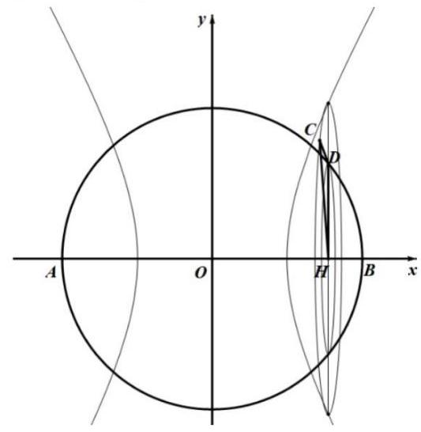

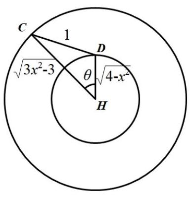

【练习】2. (2025 宝山二模)若对任意正整数 $n$ ，数列 $\left\{  {a}_{n}\right\}$ 的前 $n$ 项和 ${S}_{n}$ 都是完全平方数，则称数列 $\left\{  {a}_{n}\right\}$ 为“完全平方数列”. 有如下两个命题:①若数列 $\left\{  {b}_{n}\right\}$ 的前 $n$ 项和 ${T}_{n} = {\left( n - t\right) }^{2}$ ( $t$ 为正整数)，则使得数列 $\left\{  \left| {b}_{n}\right| \right\}$ 为“完全平方数列”的 $t$ 值有且仅有一个; ②存在无穷多个“完全平方数列”的等差数列. 则下列选项中正确的是 ( )

A. ①是真命题，②是真命题 B. ①是真命题，②是假命题

C. ①是假命题，②是真命题 D. ①是假命题，②是假命题

【答案】 $A$

【解析】对于①,当 $n = 1$ 时, ${b}_{1} = {\left( 1 - t\right) }^{2}$ ;

当 $n \geq  2$ 时, ${b}_{n} = {T}_{n} - {T}_{n - 1} = {\left( n - t\right) }^{2} - {\left( n - 1 - t\right) }^{2} = {2n} - {2t} - 1$ ;

当 $t = 1$ 时， ${b}_{1} = 0$ ， ${b}_{n} = {2n} - 3, n \geq  2$ ，则 ${S}_{n} = {T}_{n} = {\left( n - 1\right) }^{2}$ ，满足题意；

当 $t \geq  2$ 时， ${b}_{t} =  - 1$ ， ${b}_{t + 1} = 1$ ，

假设 ${S}_{n}$ 为完全平方数,则 ${S}_{t + 1} = {S}_{t} + {a}_{t + 1} = {S}_{t} + 1$ ,

而除了 1 和 2 以外，其他完全平方数不可能只相差 1 ，故不存在；

综上， $t = 1$ ，故①正确；

对于②，注意到 ${a}_{n} = {{2n} - 1}$ ， ${S}_{n} = {n}^{2}$ 满足题意，

那么形如 ${S}_{n} = k{n}^{2}$ 的也满足题意，故②正确；

故选 $A$ .

【练习】3. (2025 宝山二模)已知双曲线 $C : {x}^{2} - \frac{{y}^{2}}{3} = 1,{F}_{1},{F}_{2}$ 分别是其左、右焦点,直线 $l$ 与双曲线 $C$ 的右支交于 $A, B$ 两点.

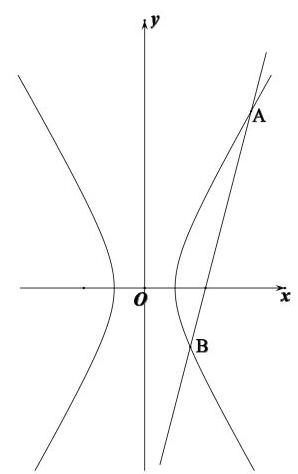

(1)当直线 $l$ 过点 ${F}_{2}$ ，且 $\left| {AB}\right|  = 6$ 时，求 ${\Delta AB}{F}_{1}$ 的周长;

(2) 已知点 $N\left( {-2,3}\right)$ ,若直线 ${AN},{BN}$ 的斜率之和为 0，且 $\tan \angle {ANB} \; = \frac{4}{3}$ ，当 ${AN},{BN}$ 分别与 $y$ 轴交于点 $R$ ， $S$ 时，求 ${\Delta R}{SN}$ 的面积；

(3) 已知直线 $l$ 过点 ${F}_{2}, P$ 是双曲线 $C$ 上一点且位于第一象限，且满足 $\overrightarrow{OQ} = 2\overrightarrow{OP}$ 的点 $Q$ 在线段 ${AB}$ 上，若 $\overrightarrow{AB} = 2\overrightarrow{Q{F}_{2}}$ ，求点 $P$ 的坐标.

【解析】(1) 由双曲线定义得 $\left| {A{F}_{1}}\right|  - \left| {A{F}_{2}}\right|  = 2,\left| {B{F}_{1}}\right|  - \left| {B{F}_{2}}\right|  = 2$

... 2 分

两式相加得 $\left| {A{F}_{1}}\right|  + \left| {B{F}_{1}}\right|  - \left( {\left| {A{F}_{2}}\right|  + \left| {B{F}_{2}}\right| }\right)  = 4$ ,

即 $\left| {A{F}_{1}}\right|  + \left| {B{F}_{1}}\right|  - \left| {AB}\right|  = 4$ ,

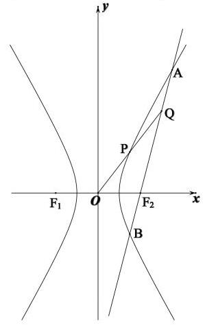

由已知 $\left| {AB}\right|  = 6$ 得 $\left| {A{F}_{1}}\right|  + \left| {B{F}_{1}}\right|  = {10}$ ,

所以 ${\Delta AB}{F}_{1}$ 的周长为 16 .

......... 4 分

(2)设直线 ${AN},{BN}$ 的倾斜角分别为 $\alpha ,\beta$ ，

由已知 ${k}_{AN} + {k}_{BN} = 0$ 得 $\alpha  + \beta  = \pi$ .

...... 5 分

不妨设 $0 < \alpha  < \frac{\pi }{2} < \beta  < \pi$ ,则 $\angle {ANB} = {2\alpha }$ ,

则 $\tan \angle {ANB} = \tan {2\alpha } = \frac{4}{3}$ 可求得 $\tan \alpha  = \frac{1}{2}$ 或-2(舍), $\tan \beta  =  - \frac{1}{2}$ .

... 7 分

所以直线 ${AN} : y - 3 = \frac{1}{2}\left( {x + 2}\right)$ ,解得 $R\left( {0,4}\right)$ ,

直线 ${BN} : y - 3 =  - \frac{1}{2}\left( {x + 2}\right)$ ,解得 $S\left( {0,2}\right)$ ,

所以 ${\Delta RSN}$ 的面积为 $\frac{1}{2}\left| {RS}\right|  \cdot  \left| {x}_{N}\right|  = \frac{1}{2} \times  2 \times  2 = 2$ . 9 分

(3)设 $P\left( {{x}_{0},{y}_{0}}\right) ,\left( {{x}_{0} > 0,{y}_{0} > 0}\right)$ ，由 $\overrightarrow{OQ} = 2\overrightarrow{OP}$ 得 $Q\left( {2{x}_{0},2{y}_{0}}\right)$ ，

若直线 $l$ 斜率不存在,则 $l : x = 2$ ,此时 $P\left( {1,0}\right) , Q\left( {2,0}\right)$ 与点 ${F}_{2}\left( {2,0}\right)$ 重合,

不符题意，舍. 10 分

设直线 $l$ 方程为 $y = k\left( {x - 2}\right)$ ,

由 $\left\{  \begin{array}{l} {x}^{2} - \frac{{y}^{2}}{3} = 1 \\  y = k\left( {x - 2}\right)  \end{array}\right.$ 得 $\left( {{k}^{2} - 3}\right) {x}^{2} - 4{k}^{2}x + 4{k}^{2} + 3 = 0$ ,

${k}^{2} - 3 \neq  0,\Delta  > 0$ 显然成立，设交点 $A\left( {{x}_{1},{y}_{1}}\right)$ ， $B\left( {{x}_{2},{y}_{2}}\right)$ ，

由韦达定理得 ${x}_{1} + {x}_{2} = \frac{4{k}^{2}}{{k}^{2} - 3},{x}_{1}{x}_{2} = \frac{4{k}^{2} + 3}{{k}^{2} - 3}$ 11 分

由 $\overrightarrow{AB} = 2\overrightarrow{Q{F}_{2}}$ 得 $\left( {{x}_{2} - {x}_{1},{y}_{2} - {y}_{1}}\right)  = 2\left( {2 - 2{x}_{0}, - 2{y}_{0}}\right)$ ,

从而 ${x}_{2} - {x}_{1} = 2\left( {2 - 2{x}_{0}}\right)$ ,即 ${\left( {x}_{1} - {x}_{2}\right) }^{2} = {16}{\left( {x}_{0} - 1\right) }^{2}$ ,

将韦达定理代入 ${\left( \frac{4{k}^{2}}{{k}^{2} - 3}\right) }^{2} - 4 \times  \frac{4{k}^{2} + 3}{{k}^{2} - 3} = {16}{\left( {x}_{0} - 1\right) }^{2}$ ,

化简得 $9\left( {{k}^{2} + 1}\right)  = 4{\left( {x}_{0} - 1\right) }^{2}{\left( {k}^{2} - 3\right) }^{2}$ (   ) 13 分

因为 $k = {k}_{Q{F}_{2}} = \frac{2{y}_{0}}{2{x}_{0} - 2} = \frac{{y}_{0}}{{x}_{0} - 1}$ ,即 ${y}_{0} = k\left( {{x}_{0} - 1}\right)$ ,

由已知 $P\left( {{x}_{0},{y}_{0}}\right)$ 在双曲线上,得 $3{x}_{0}^{2} - {y}_{0}^{2} = 3$ ,

从而 $3{x}_{0}^{2} - {\left( k\left( {x}_{0} - 1\right) \right) }^{2} = 3$ ,得 ${k}^{2} = \frac{3{x}_{0}^{2} - 3}{{\left( {x}_{0} - 1\right) }^{2}} = \frac{3\left( {{x}_{0} + 1}\right) }{{x}_{0} - 1}$ ,

代入( c )式，得 $9\left( {\frac{3{x}_{0} + 3}{{x}_{0} - 1} + 1}\right)  = 4{\left( {x}_{0} - 1\right) }^{2}{\left( \frac{3{x}_{0} + 3}{{x}_{0} - 1} - 3\right) }^{2}$ ，

化简得 $9\frac{4{x}_{0} + 2}{{x}_{0} - 1} = 4{\left( {x}_{0} - 1\right) }^{2}{\left( \frac{6}{{x}_{0} - 1}\right) }^{2}$ ,即 $9\frac{4{x}_{0} + 2}{{x}_{0} - 1} = 4 \times  {36}$ ,

解得 ${x}_{0} = \frac{3}{2}$ 15 分

点 $P$ 的坐标为 $\left( {\frac{3}{2},\frac{\sqrt{15}}{2}}\right)$ 16 分

## C4 每日三题 0411(2025 黄浦二模)

【练习】1. (2025 黄浦二模) 设 $a, b$ 为常数， $f\left( x\right)  = \left| {a + \sin x}\right|  + \left| {a - \sin x}\right|$ ，若对任意的 $b \in  \left( {1,2}\right)$ ，函数 $y = \; f\left( x\right)  - b$ 在区间 $\left\lbrack  {0,{2\pi }}\right\rbrack$ 上恰有 4 个零点，则 $a$ 的取值范围是___.

【答案】 $\left\lbrack  {-\frac{1}{2},\frac{1}{2}}\right\rbrack$

【解析】当 $a \geq  1$ 时, $f\left( x\right)  = a + \sin x + a - \sin x = {2a}$ ,显然不合题意;

当 $a \leq   - 1$ 时， $f\left( x\right)  =  - a - \sin x - a + \sin x =  - {2a}$ ，显然不合题意；

所以 $- 1 < a < 1$ ,则 $f\left( x\right)  = \left\{  \begin{array}{ll} 2\left| a\right| , &  - \left| a\right|  < \sin x < \left| a\right| \\  2\sin x, & \sin x > \left| a\right| \\   - 2\sin x, & \sin x <  - \left| a\right|  \end{array}\right.$ ,

若对任意的 $b \in  \left( {1,2}\right)$ ，函数 $y = f\left( x\right)  - b$ 在区间 $\left\lbrack  {0,{2\pi }}\right\rbrack$ 上恰有 4 个零点，

则 $2\left| a\right|  \leq  1$ ，所以 $a \in  \left\lbrack  {-\frac{1}{2},\frac{1}{2}}\right\rbrack$ ，此时另外两段各有 2 个零点，故 $a \in  \left\lbrack  {-\frac{1}{2},\frac{1}{2}}\right\rbrack$ .

【练习】2. (2025 黄浦二模) 给定四面体 ${ABCD}$ . 平面 $\alpha$ 满足: ① $A, B, C, D$ 四个点均不在平面 $\alpha$ 上,也不在 $\alpha$ 的同侧: ② 若平面 $\alpha$ 与四面体 ${ABCD}$ 的棱有公共点，则该公共点一定是此棱的中点或两个三等分点之一. 设 $A, B, C, D$ 四个点到平面 $\alpha$ 的距离分别为 ${d}_{i}\left( {\mathrm{i} = 1,2,3,4}\right)$ ,那么 ${d}_{i}$ 的所有不同值的个数组成的集合为 ( )

A. $\{ 1,2,3,4\}$ B. $\{ 1,2,3\}$ C. $\{ 1,2\}$ D. $\{ 1\}$

【答案】 $B$

【解析】若平面 $\alpha$ 平行于四面体的一个平面,则 ${d}_{i}$ 有 1 个值 (过三条棱中点)

或 2 个值 (过三条棱同一个位置的三等分点);

若平面 $\alpha$ 过一条棱的三等分点,另外两条棱相对位置的三等分点,

则 ${d}_{i}$ 有 3 个值;

对于 ${d}_{i}$ 有 4 个值的情况，并不存在，故选 $B$ .

【练习】3. $\left( {{2025}\text{ 黄浦二模 }}\right)$ 椭圆 $\Gamma  : \frac{{x}^{2}}{{a}^{2}} + \frac{{y}^{2}}{{b}^{2}} = 1\left( {a > b > 0}\right)$ 的左,右焦点分别为 ${F}_{1}\left( {-c,0}\right) ,{F}_{2}\left( {c,0}\right) (c > \; 0)$ ,过点 ${F}_{1}$ 的直线 $l$ 与 $\Gamma$ 交于点 $P$ .

(1)若 $c = 2$ ，点 $P$ 的坐标为 $\left( {2,\sqrt{2}}\right)$ ，求点 ${F}_{2}$ 到直线 $l$ 的距离；

(2)当 $b \leq  c$ 时,求满足 $P{F}_{1} \bot  P{F}_{2}$ 的点 $P$ 的个数;

(3)设直线 $l$ 与 $\Gamma$ 的另一个交点为 $Q,\overrightarrow{{F}_{1}Q} = \lambda \overrightarrow{QP}\left( {\lambda  \in  R}\right)$ ，点 $P$ 的横坐标为 $\frac{c}{2}$ ，若 $\Gamma$ 的离心率 $\mathrm{e} > \; \frac{1}{2}$ ，求 $\lambda$ 的取值范围.

【解析】(1) 由题意得直线 $l$ 的方程为 $\sqrt{2}x - {4y} + 2\sqrt{2} = 0$ ，(2 分)

因此，点 ${F}_{2}\left( {2,0}\right)$ 到直线 $l$ 的距离 $d = \frac{\left| \sqrt{2} \times  2 - 4 \times  0 + 2\sqrt{2}\right| }{3\sqrt{2}} = \frac{4}{3}.$ (4 分)

(2)设点 $P$ 的坐标为 $\left( {{x}_{0},{y}_{0}}\right)$ . 由 $P{F}_{1} \bot  P{F}_{2}$ ，得 ${x}_{0}^{2} + {y}_{0}^{2} = {c}^{2}$ .

由方程组 $\left\{  {\begin{array}{l} {x}_{0}^{2} + {y}_{0}^{2} = {c}^{2} \\  \frac{{x}_{0}^{2}}{{a}^{2}} + \frac{{y}_{0}^{2}}{{b}^{2}} = 1 \end{array}\text{ (*) 消 }{x}_{0},\text{ 得 }{y}_{0}^{2} = \frac{{b}^{4}}{{c}^{2}}}\right.$ . (6 分)

由 $b \leq  c$ ,得 $0 < \frac{{b}^{2}}{{c}^{2}} \leq  1$ ,进而 $0 < \frac{{b}^{4}}{{c}^{2}} \leq  {b}^{2}$ ,即 $0 < {y}_{0}^{2} \leq  {b}^{2}$ . (8 分)

当 $b = c$ 时， ${x}_{0} = 0$ ， ${y}_{0} =  \pm  b$ ，满足 $P{F}_{1}\bot P{F}_{2}$ 的点 $P$ 的个数为两个；(9 分)

当 $b < c$ 时, $0 < {y}_{0}^{2} < {b}^{2},{y}_{0}$ 有两解,方程组 (*) 有四组不同的解,

即满足 $P{F}_{1} \bot  P{F}_{2}$ 的点 $P$ 有四个. (10 分)

(3) 设点 $P$ 的纵坐标为 ${y}_{P}$ ，点 $Q$ 的坐标为 $\left( {{x}_{Q},{y}_{Q}}\right)$ .

由 $\overrightarrow{{F}_{1}Q} = \lambda \overrightarrow{QP}$ ,得 ${x}_{Q} = \frac{c\left( {\lambda  - 2}\right) }{2\left( {1 + \lambda }\right) },{y}_{Q} = \frac{\lambda {y}_{p}}{1 + \lambda }$ . (12 分)

代入 $\Gamma$ 方程，得 $\frac{{\left( \lambda  - 2\right) }^{2}{c}^{2}}{4{\left( 1 + \lambda \right) }^{2}{a}^{2}} + \frac{{\lambda }^{2}{y}_{p}^{2}}{{\left( 1 + \lambda \right) }^{2}{b}^{2}} = 1\left( {* * }\right)$ ,

由点 $P$ 在 $\Gamma$ 上,得 $\frac{{c}^{2}}{4{a}^{2}} + \frac{{y}_{p}^{2}}{{b}^{2}} = 1$ ,进而 $\frac{{y}_{p}^{2}}{{b}^{2}} = 1 - \frac{{c}^{2}}{4{a}^{2}}$ . (14 分)

代入 (**) 式，结合离心率 $\mathrm{e} = \frac{c}{a}$ ，化简得 $\lambda  = \frac{{\mathrm{e}}^{2} - 1}{{\mathrm{e}}^{2} + 2}$ .(16 分)

由 $\frac{1}{2} < \mathrm{e} < 1$ ，得 $- \frac{1}{3} < \lambda  < 0$ . ( 18 分)

因此 $\lambda$ 的取值范围是 $\left( {-\frac{1}{3},0}\right)$ .

## 10 每日三题 0412 (2025 青浦二模)

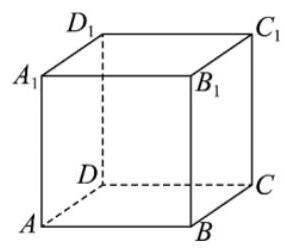

【练习】1. (2025 青浦二模)如图，正方体 ${ABCD} - {A}_{1}{B}_{1}{C}_{1}{D}_{1}$ 绕直线 $D{B}_{1}$ 旋转 $\frac{\pi }{3}$ ,直线 ${AB}$ 旋转至直线 ${A}^{\prime }{B}^{\prime }$ ,则直线 ${AB}$ 与直线 ${A}^{\prime }{B}^{\prime }$ 所成角的大小为___.

【答案】 $\arccos \frac{2}{3}$

【解析】因为平行直线旋转后仍保持平行,将 ${AB}$ 改成平行直线 ${A}_{1}{B}_{1}$ ,

转到 ${A}_{1}{}^{\prime }{B}_{1}$ ,设 ${A}_{1}$ 在直线 $D{B}_{1}$ 上的投影为 $O$ ,则 $\angle {A}_{1}O{A}_{1}{}^{\prime } = \frac{\pi }{3}$ ,

设正方体棱长为 1,在 $\Delta {A}_{1}D{B}_{1}$ 中, ${A}_{1}D = \sqrt{2},{A}_{1}{B}_{1} = 1, D{B}_{1} = \sqrt{3}$ ,

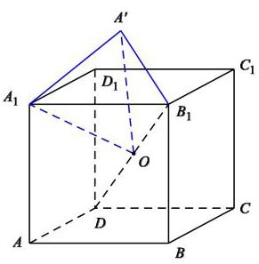

$\cos \angle {A}_{1}{B}_{1}D = \frac{{1}^{2} + {\left( \sqrt{3}\right) }^{2} - {\left( \sqrt{2}\right) }^{2}}{2 \times  1 \times  \sqrt{3}} = \frac{\sqrt{3}}{3},\sin \angle {A}_{1}{B}_{1}D = \frac{\sqrt{6}}{3},$

则 ${A}_{1}O = {A}_{1}{B}_{1}\sin \angle {A}_{1}{B}_{1}D = \frac{\sqrt{6}}{3}$ ，因为 $\angle {A}_{1}O{A}_{1}{}^{\prime } = \frac{\pi }{3}$ ，所以 ${A}_{1}{A}^{\prime } = A \; {A}_{1}O = \frac{\sqrt{6}}{3},$

由余弦定理得 $\cos \angle {A}_{1}{B}_{1}{A}_{1}{}^{\prime } = \frac{{1}^{2} + {1}^{2} - {\left( \frac{\sqrt{6}}{3}\right) }^{2}}{2 \times  1 \times  1} = \frac{2}{3}$ ,

故直线 ${AB}$ 与直线 ${A}^{\prime }{B}^{\prime }$ 所成角的大小为 $\arccos \frac{2}{3}$ .

【练习】2. (2025 青浦二模) 数学上用符号 $\mathop{\prod }\limits_{{i = 1}}^{n}{a}_{i}$ 表示 $n$ 个实数 ${a}_{1},{a}_{2},\cdots ,{a}_{n}$ 的积. 设 ${y}_{200}$ 为互不相同的实数,已知 $\mathop{\prod }\limits_{{j = 1}}^{{200}}\left( {{x}_{i} + {y}_{j}}\right)  = {2025}\left( {\mathrm{i} = 1,2,\cdots ,{200}}\right)$ ,则 $\mathop{\prod }\limits_{{i = 1}}^{{200}}\left( {{x}_{i} + {y}_{j}}\right)  =$ ( )

A. -2025 B. 2025 C. -2026 D. 2026

【答案】 $A$

【解析】令 $f\left( x\right)  = \mathop{\prod }\limits_{{j = 1}}^{{200}}\left( {x + {y}_{j}}\right)  - {2025} = \left( {x + {y}_{1}}\right) \left( {x + {y}_{2}}\right) \cdots \left( {x + {y}_{200}}\right)  - {2025}$ ①,

因为 $\mathop{\prod }\limits_{{j = 1}}^{{200}}\left( {{x}_{i} + {y}_{j}}\right)  = {2025}\left( {\mathrm{i} = 1,2,\cdots ,{200}}\right)$ ,

所以 $f\left( {x}_{1}\right)  = f\left( {x}_{2}\right)  = \cdots  = f\left( {x}_{200}\right)  = 0$ ,

所以 ${x}_{1},{x}_{2},\cdots ,{x}_{200}$ 是 200 次函数 $f\left( x\right)$ 的所有零点,

则 $f\left( x\right)  = \left( {x - {x}_{1}}\right) \left( {x - {x}_{2}}\right) \cdots \left( {x - {x}_{200}}\right)$ ,

所以 $f\left( {-{y}_{i}}\right)  = \left( {-{y}_{i} - {x}_{1}}\right) \left( {-{y}_{i} - {x}_{2}}\right) \cdots \left( {-{y}_{i} - {x}_{200}}\right)  = \mathop{\prod }\limits_{{i = 1}}^{{200}}\left( {{x}_{i} + {y}_{j}}\right)$ ,

把 $- {y}_{i}$ 代入①，得 $\mathop{\prod }\limits_{{i = 1}}^{{200}}\left( {{x}_{i} + {y}_{j}}\right)  =  - {2025}$ ，故选 $A$ .

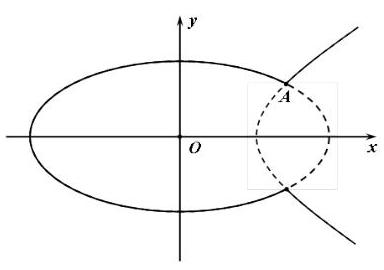

【练习】3. (2025 青浦二模) 如图,椭圆 ${C}_{1} : \frac{{x}^{2}}{8} + \frac{{y}^{2}}{{b}^{2}} = 1\left( {0 < b < 2\sqrt{2}}\right)$

与双曲线 ${C}_{2} : \frac{{x}^{2}}{{b}^{2}} - {y}^{2} = 1$ 在第一象限的公共点为 $A\left( {{x}_{A},{y}_{A}}\right) \left( {x}_{A}\right. \; > 0)$ . 曲线 $\Gamma$ 由两段曲线组成:

当 $x \leq  {x}_{A}$ 时,曲线 $\Gamma$ 与椭圆 ${C}_{1}$ 重合,当 $x > {x}_{A}$ 时,曲线 $\Gamma$ 与双曲线 ${C}_{2}$ 重合.

(1)当 ${x}_{A} = 2$ 时,求 $b$ 的值;

(2) 已知 $b = \sqrt{2}$ ，直线 $l$ 过点 $D\left( {2,0}\right)$ 与曲线 $\Gamma$ 交于 $E$ ， $F$ 两点，若 $\overrightarrow{AD} \cdot  \overrightarrow{EF} = 2$ ，求直线 $l$ 的方程；

(3)已知 $A\left( {2,1}\right)$ ，斜率为 $k\left( {k \geq  1}\right)$ 的直线 $m$ 过点 $P\left( {0,1}\right)$ 与曲线 $\Gamma$ 交于 $M$ ， $N$ 两点，若 ${S}_{{\Delta A}{MN}} = \; \lambda \tan \angle {MAN}$ ,求实数 $\lambda$ 的最大值.

【解析】(1) 由题意得 $\left\{  \begin{array}{l} \frac{1}{2} + \frac{{y}^{2}}{{b}^{2}} = 1 \\  \frac{4}{{b}^{2}} - {y}^{2} = 1 \end{array}\right.$ ,解得 $b = \sqrt{2}$ .

(2) 由 $\left\{  \begin{array}{l} \frac{{x}^{2}}{8} + \frac{{y}^{2}}{2} = 1 \\  \frac{{x}^{2}}{2} - {y}^{2} = 1 \end{array}\right.$ 得 $A\left( {2,1}\right)$ ,

于是,曲线 $\Gamma$ 的方程为: 当 $x \leq  2$ 时, $\frac{{x}^{2}}{8} + \frac{{y}^{2}}{2} = 1$ ,当 $x > 2$ 时, $\frac{{x}^{2}}{2} - {y}^{2} = 1$ .

易得 $\overrightarrow{AD} = \left( {0, - 1}\right)$ ，

由于 $\overrightarrow{AD} \cdot  \overrightarrow{EF} = 2$ ，故向量 $\overrightarrow{EF}$ 在向量 $\overrightarrow{AD}$ 方向上得数量投影大小为 -2 .

①当直线 $l$ 的斜率不存在时, $l$ 与曲线 $\Gamma$ 的两个交点为 $\left( {2,1}\right) \text{ 、 }\left( {2, - 1}\right)$ ,

取 $E, F$ 两点分别为 $\left( {2, - 1}\right) \text{ 、 }\left( {2,1}\right)$ ,满足条件,此时直线 $l$ 的方程为 $x = 2$ .

②当直线 $l$ 的斜率存在时,设直线 $l$ 方程为 $x - 2 = {ty}$ ,

由对称性,只需考虑当 $t > 0$ 的情况.

因为直线 $l$ 与曲线 $\Gamma$ 交于 $E, F$ 两点,所以 $t \in  \left( {0,\sqrt{2}}\right)$ .

由 $\left\{  \begin{array}{l} \frac{{x}^{2}}{2} - {y}^{2} = 1 \\  x - 2 = {ty} \end{array}\right.$ 得 $\left( {{t}^{2} - 2}\right) {y}^{2} + {4ty} + 2 = 0$ ,解得 $y = \frac{{2t} \pm  \sqrt{2{t}^{2} + 4}}{2 - {t}^{2}}$ ,

由于 $4{t}^{2} - \left( {2{t}^{2} + 4}\right)  = 2\left( {{t}^{2} - 2}\right)  < 0$ ,取 ${y}_{1} = \frac{{2t} + \sqrt{2{t}^{2} + 4}}{2 - {t}^{2}} > 0$ ,

又 ${y}_{1} - 1 = \frac{{2t} + \sqrt{2{t}^{2} + 4}}{2 - {t}^{2}} - 1 = \frac{{2t} + \sqrt{2{t}^{2} + 4} + {t}^{2} - 2}{2 - {t}^{2}}$ ,

因为 $t \in  \left( {0,\sqrt{2}}\right)$ ,所以 ${y}_{1} > 1$ ,

由 $\left\{  \begin{array}{l} \frac{{x}^{2}}{8} + \frac{{y}^{2}}{2} = 1 \\  x - 2 = {ty} \end{array}\right.$ 得 $\left( {{t}^{2} + 4}\right) {y}^{2} + {4ty} - 4 = 0$ ,解得 $y = \frac{-{2t} \pm  2\sqrt{2{t}^{2} + 4}}{{t}^{2} + 4}$ ,

取 ${y}_{2} =  - \frac{{2t} + 2\sqrt{2{t}^{2} + 4}}{{t}^{2} + 4} < 0$ ,因为 $t \in  \left( {0,\sqrt{2}}\right)$ ,所以 ${2t} > {t}^{2}$ ,

又 $2\sqrt{2{t}^{2} + 4} > 4$ ,所以 $\frac{{2t} + 2\sqrt{2{t}^{2} + 4}}{{t}^{2} + 4} > 1$ ,故 ${y}_{2} <  - 1$ ,

所以向量 $\overrightarrow{EF}$ 在向量 $\overrightarrow{AD}$ 方向上的数量投影绝对值 $\left| {{y}_{1} - {y}_{2}}\right|  > 1$ ,

即当直线 $l$ 的斜率存在时,满足条件的直线 $l$ 均不存在.

所以,满足条件的直线 $l$ 的方程为 $x = 2$ .

(3)易得直线 $m$ 只能与曲线 $\Gamma$ 上 $x \leq  2$ 时的曲线段相交.

令直线 $m$ 方程为 $y = {kx} + 1\left( {k \geq  1}\right)$ ,

由 $\left\{  \begin{array}{l} \frac{{x}^{2}}{8} + \frac{{y}^{2}}{2} = 1 \\  y = {kx} + 1 \end{array}\right.$ 得 $\left( {4{k}^{2} + 1}\right) {x}^{2} + {8kx} - 4$ ,设 $M\left( {{x}_{1},{y}_{1}}\right) , N\left( {{x}_{2},{y}_{2}}\right)$ ,

由韦达定理得 $\left\{  \begin{array}{l} \Delta  = {64}{k}^{2} + {16}\left( {4{k}^{2} + 1}\right)  > 0 \\  {x}_{1} + {x}_{2} =  - \frac{8k}{4{k}^{2} + 1} \\  {x}_{1}{x}_{2} =  - \frac{4}{4{k}^{2} + 1} \end{array}\right.$ ,

由 ${S}_{\bigtriangleup {AMN}} = \lambda \tan \angle {MAN}$ ,得 $\frac{1}{2}\left| \overrightarrow{AM}\right| \left| \overrightarrow{AN}\right| \sin \angle {MAN} = \lambda \frac{\sin \angle {MAN}}{\cos \angle {MAN}}$ ,

变形得 $\overrightarrow{AM} \cdot  \overrightarrow{AN} = {2\lambda }$ ,

$\overrightarrow{AM} = \left( {{x}_{1} - 2,{y}_{1} - 1}\right)  = \left( {{x}_{1} - 2, k{x}_{1}}\right) ,\overrightarrow{AN} = \left( {{x}_{2} - 2,{y}_{2} - 1}\right)  = \left( {{x}_{2} - 2, k{x}_{2}}\right)$ ,

于是 $\left( {{x}_{1} - 2}\right) \left( {{x}_{2} - 2}\right)  + {k}^{2}{x}_{1}{x}_{2} = {2\lambda }$ ,

化简得 ${x}_{1}{x}_{2} - 2\left( {{x}_{1} + {x}_{2}}\right)  + 4 + {k}^{2}{x}_{1}{x}_{2} = {2\lambda }$ ,

即 $\frac{-4}{4{k}^{2} + 1} + 2\frac{8k}{4{k}^{2} + 1} + 4 - \frac{4{k}^{2}}{4{k}^{2} + 1} = {2\lambda }$ ,变形得 $\lambda  = \frac{6{k}^{2} + {8k}}{4{k}^{2} + 1}, k \geq  1$ ,

设 $f\left( x\right)  = \frac{3{x}^{2} + {4x}}{4{x}^{2} + 1}, x \geq  1$ ，求导得 ${f}^{\prime }\left( x\right)  = \frac{-{16}{x}^{2} + {6x} + 4}{{\left( 4{x}^{2} + 1\right) }^{2}}$ ，

由于 $x \geq  1$ ，所以 ${f}^{\prime }\left( x\right)  < 0$ ，所以 $f\left( x\right)  = \frac{3{x}^{2} + {4x}}{4{x}^{2} + 1}$ 是 $\lbrack 1, + \infty )$ 是严格减函数，

版当 $x = 1$ 时， $f{\left( x\right) }_{\max } = \frac{7}{5}$ ，所以实数 $\lambda$ 的最大值为 $\frac{14}{5}$ .

## C4 每日三题 0413(2025 金山二模)

【练习】1.(2025 金山二模)设 ${x}_{1},{x}_{2},{x}_{3},{x}_{4},{x}_{5}$ 均是正整数，且 $\left\{  {x \mid  x = {x}_{m}{x}_{n}{x}_{p}{x}_{q},1 \leq  m < n < p < q \leq  5}\right\} \; = \{ {108},{144},{288},{432}\}$ ，则 ${x}_{1} + {x}_{2} + {x}_{3} + {x}_{4} + {x}_{5}$ 的值为___.

【答案】 22

【解析】考虑到五个正整数中任意四个相乘,所有的结果有 ${C}_{5}^{4} = 5$ 个,

而集合中只有 4 个数，说明有两个数重复，那么先把这个重复的数找出来，

进行因数分解, $\left\{  \begin{array}{l} {108} = {2}^{2} \times  {3}^{3} \\  {144} = {2}^{4} \times  {3}^{2} \\  {288} = {2}^{5} \times  {3}^{2} \\  {432} = {2}^{4} \times  {3}^{3} \end{array}\right. \left( *\right)$ ,

在不考虑重复的情况下,把 5 个结果相乘, ${x}_{1},{x}_{2},{x}_{3},{x}_{4},{x}_{5}$ 各出现了 4 次,

所以这 5 个结果的乘积应为某个数的四次幂, 则这个结果因数分解后,

各次幂都应该是 4 的倍数,在 (*) 中,只有 288 再出现一次,才能满足,

从而 ${\left( {x}_{1}{x}_{2}{x}_{3}{x}_{4}{x}_{5}\right) }^{4} = {108} \times  {144} \times  {288} \times  {288} \times  {432} = {2}^{20} \times  {3}^{12}$ ,

则 ${x}_{1}{x}_{2}{x}_{3}{x}_{4}{x}_{5} = {2}^{5} \times  {3}^{3}$ ,和 (*) 中的四个数相除,

即可得到 ${x}_{1},{x}_{2},{x}_{3},{x}_{4},{x}_{5}$ 分别为2,3,3,6,8,从而 ${x}_{1} + {x}_{2} + {x}_{3} + {x}_{4} + {x}_{5} = {22}$ .

【练习】2. (2025金山二模)已知椭圆 $\Gamma  : \frac{{x}^{2}}{4} + \frac{{y}^{2}}{3} = 1$ ，左右焦点分别为 ${F}_{1},{F}_{2}$ ，上下顶点分别为 $A, B$ ，左右顶点分别为 $C, D, P, Q$ 是 $\Gamma$ 上异于椭圆顶点的两点.

(1)求 ${\Delta A}{F}_{1}{F}_{2}$ 的周长;

(2)若点 $Q$ 在第一象限且满足 ${\Delta ABQ}$ 的面积比 ${\Delta {F}_{1}{F}_{2}Q}$ 的面积大，求点 $Q$ 的横坐标的取值范围；

(3) 记点 $A$ 在直线 ${PQ}$ 上的投影为 $H$ ，且直线 ${CP}$ 的斜率是直线 ${DQ}$ 的斜率的 3 倍，试判断:过点

$A, H, O\left( {O\text{ 为坐标原点 }}\right)$ 三点的圆是否为定圆? 若是,求出该圆的方程; 若不是,请说明理由.

【解析】(1) 由题意得 ${a}^{2} = 4,{b}^{2} = 3,{c}^{2} = {a}^{2} - {b}^{2} = 4 - 3 = 1$ ,得 $a = 2, c = 1,\cdots \cdots 2$ 分

因此 ${\Delta A}{F}_{1}{F}_{2}$ 的周长为 ${2a} + {2c} = 6.\cdots \cdots 4$ 分

(2) 设 $Q\left( {x, y}\right) \left( {x > 0, y > 0}\right) , A\left( {0,\sqrt{3}}\right) , B\left( {0, - \sqrt{3}}\right) ,{F}_{1}\left( {-1,0}\right) ,{F}_{2}\left( {1,0}\right)$ ,

${S}_{\Delta ABQ} = \frac{1}{2}\left| {AB}\right|  \cdot  \left| x\right|  = \sqrt{3}x,{S}_{\Delta {F}_{1}{F}_{2}Q} = \frac{1}{2}\left| {{F}_{1}{F}_{2}}\right|  \cdot  \left| y\right|  = y,\cdots \cdots 6$ 分

由 $\left\{  \begin{array}{l} \sqrt{3}x > y > 0 \\  \frac{{x}^{2}}{4} + \frac{{y}^{2}}{3} = 1 \end{array}\right.$ ,解得 $x \in  \left( {\frac{2\sqrt{5}}{5},2}\right)$ ,

即点 $Q$ 的横坐标取值范围为 $\left( {\frac{2\sqrt{5}}{5},2}\right)$ . 10 分

(3)过点 $A, H, O\left( {O\text{ 为坐标原点 }}\right)$ 三点的圆是定圆.

法一:设 ${l}_{PQ} : x = {my} + n$ ，

由 $\left\{  \begin{array}{l} x = {my} + n \\  3{x}^{2} + 4{y}^{2} = {12} \end{array}\right.$ 得 $\left( {3{m}^{2} + 4}\right) {y}^{2} + {6mny} + 3{n}^{2} - {12} = 0$ ,

$\Delta  = {36}{m}^{2}{n}^{2} - 4\left( {3{m}^{2} + 4}\right) \left( {3{n}^{2} - {12}}\right)  = {48}\left( {3{m}^{2} - {n}^{2} + 4}\right)  > 0,$

设 $P\left( {{x}_{1},{y}_{1}}\right) , Q\left( {{x}_{2},{y}_{2}}\right) ,{y}_{1} + {y}_{2} = \frac{-{6mn}}{3{m}^{2} + 4},{y}_{1}{y}_{2} = \frac{3{n}^{2} - {12}}{3{m}^{2} + 4}$ 13 分

由题意得 ${k}_{CP} = 3{k}_{DQ}$ ,即 $\frac{{y}_{1}}{{x}_{1} + 2} = \frac{3{y}_{2}}{{x}_{2} - 2}$ ,

${y}_{1}\left( {m{y}_{2} + n - 2}\right)  = 3{y}_{2}\left( {m{y}_{1} + n + 2}\right) \cdots \cdots {14}$ 分

即 ${2m}{y}_{1}{y}_{2} + 3\left( {n + 2}\right) {y}_{2} - \left( {n - 2}\right) {y}_{1} = 0$ ,

$\frac{{2m}\left( {3{n}^{2} - {12}}\right) }{3{m}^{2} + 4} + 4\left( {n + 1}\right) {y}_{2} - \left( {n - 2}\right) \left( {{y}_{1} + {y}_{2}}\right)  = 0,$

$\frac{{6m}\left( {{n}^{2} - 4}\right) }{3{m}^{2} + 4} - \left( {n - 2}\right)  \cdot  \frac{-{6mn}}{3{m}^{2} + 4} + 4\left( {n + 1}\right) {y}_{2} = 0,$

$\frac{{12m}\left( {n - 2}\right) \left( {n + 1}\right) }{3{m}^{2} + 4} + 4\left( {n + 1}\right) {y}_{2} = 0,4\left( {n + 1}\right) \left\lbrack  {\frac{{3m}\left( {n - 2}\right) }{3{m}^{2} + 4} + {y}_{2}}\right\rbrack   = 0,$

$n =  - 1$ ,即 ${l}_{PQ}$ 过定点 $\left( {-1,0}\right)$ .

设 $H\left( {x, y}\right) ,\left( {x + 1}\right) x + y\left( {y - \sqrt{3}}\right)  = 0$ 过原点,

即过点 $A, H, O\left( {O\text{ 为坐标原点 }}\right)$ 三点的圆是定圆

${\left( x + \frac{1}{2}\right) }^{2} + {\left( y - \frac{\sqrt{3}}{2}\right) }^{2} = 1.$

法二: 设 ${l}_{CP} : y = {3k}\left( {x + 2}\right) ,{l}_{DQ} : y = k\left( {x - 2}\right) \left( {k \neq  0}\right)$ , 12 分

由 $\left\{  \begin{array}{l} \frac{{x}^{2}}{4} + \frac{{y}^{2}}{3} = 1 \\  y = k\left( {x - 2}\right)  \end{array}\right.$ ,得 $\left( {4{k}^{2} + 3}\right) {x}^{2} - {16}{k}^{2}x + {16}{k}^{2} - {12} = 0$ ,

则 $2{x}_{Q} = \frac{{16}{k}^{2} - {12}}{4{k}^{2} + 3}$ ,得 $Q\left( {\frac{8{k}^{2} - 6}{4{k}^{2} + 3},\frac{-{12k}}{4{k}^{2} + 3}}\right)$ ,

同理由 $\left\{  \begin{array}{l} \frac{{x}^{2}}{4} + \frac{{y}^{2}}{3} = 1 \\  y = {3k}\left( {x + 2}\right)  \end{array}\right.$ ,得 $\left( {{12}{k}^{2} + 1}\right) {x}^{2} + {48}{k}^{2}x + {48}{k}^{2} - 4 = 0$ ,

则 $- 2 \cdot  {x}_{p} = \frac{{48}{k}^{2} - 4}{{12}{k}^{2} + 1}$ ,得 $P\left( {\frac{-{24}{k}^{2} + 2}{{12}{k}^{2} + 1},\frac{12k}{{12}{k}^{2} + 1}}\right) \cdots \cdots {14}$ 分

① 当 ${x}_{p} \neq  {x}_{Q}$ ，即 ${k}^{2} \neq  \frac{1}{4}$ 时， ${k}_{PQ} = \frac{\frac{12k}{{12}{k}^{2} + 1} - \frac{-{12k}}{4{k}^{2} + 3}}{\frac{-{24}{k}^{2} + 2}{{12}{k}^{2} + 1} - \frac{8{k}^{2} - 6}{4{k}^{2} + 3}} = \frac{4k}{1 - 4{k}^{2}}$ ，

${l}_{PQ} : y + \frac{12k}{4{k}^{2} + 3} = \frac{4k}{1 - 4{k}^{2}}\left( {x - \frac{8{k}^{2} - 6}{4{k}^{2} + 3}}\right)$ ,即 $y = \frac{4k}{1 - 4{k}^{2}}\left( {x + 1}\right)$ ,

过 $\left( {-1,0}\right) .\cdots \cdots {15}$ 分

② 当 ${x}_{P} = {x}_{Q}$ ，即 ${k}^{2} = \frac{1}{4}$ 时，此时 ${x}_{P} = {x}_{Q} =  - 1$ ，也过 $\left( {-1,0}\right)$ ，

故 ${l}_{PQ}$ 过定点 $\left( {-1,0}\right) ,\cdots \cdots {16}$ 分

设 $H\left( {x, y}\right) ,\left( {x + 1}\right) x + y\left( {y - \sqrt{3}}\right)  = 0$ 过原点,

即过点 $A, H, O\left( {O\text{ 为坐标原点 }}\right)$ 三点的圆是定圆

${\left( x + \frac{1}{2}\right) }^{2} + {\left( y - \frac{\sqrt{3}}{2}\right) }^{2} = 1.$

【练习】3. (2025金山二模)若函数 $y = f\left( x\right)$ 和 $y = g\left( x\right)$ 同时满足下列条件:①对任意 $x \in  R$ ，都有 $f\left( x\right)  \leq \; g\left( x\right)$ 成立；② 存在 ${x}_{0} \in  R$ ，使得 $f\left( {x}_{0}\right)  = g\left( {x}_{0}\right)$ ，则称函数 $y = g\left( x\right)$ 为 $y = f\left( x\right)$ 的“ $W$ 函数”，其中 ${x}_{0}$ 称为“ $W$ 点”.

(1)已知图像为一条直线的函数 $y = g\left( x\right)$ 是 $y = \sin x$ 的“ $W$ 函数”,请求出所有的 “ $W$ 点 ”;

(2) 设函数 $y = g\left( x\right)$ 为 $y = f\left( x\right)$ 的“ $W$ 函数”,其“ $W$ 点”组成集合 $M$ ; 函数 $y = h\left( x\right)$ 为 $y = g\left( x\right)$ 的 “ $W$ 函数”,其“ $W$ 点”组成集合 $N$ .

试证明: “函数 $y = h\left( x\right)$ 为 $y = f\left( x\right)$ 的 ‘ $W$ 函数 ’ ” 的一个充分必要条件是 ‘ $M \cap  N \neq  \varnothing$ ”;

(3) 记 $f\left( x\right)  = \frac{x}{{\mathrm{e}}^{x}}$ (e 为自然对数的底数), $g\left( x\right)  = {kx} + m\left( {k, m \in  R}\right)$ ,若 $y = g\left( x\right)$ 为 $y = f\left( x\right)$ 的 “ $W$ 函数”,且 “ $W$ 点” ${x}_{0} > 0$ ,求实数 $m$ 的最大值.

【解析】 $\left( 1\right) y = \sin x$ 的 “ $W$ 函数”为 $y = 1,\cdots \cdots 2$ 分

“ $W$ 点”为 ${2k\pi } + \frac{\pi }{2}\left( {k \in  Z}\right)$ .

(2)(充分性)当 $M \cap  N \neq  \varnothing$ 时，存在 ${x}_{0} \in  M \cap  N$ ，则 ${x}_{0} \in  M$ ， ${x}_{0} \in  N$ ，

故 $f\left( {x}_{0}\right)  = g\left( {x}_{0}\right)  = h\left( {x}_{0}\right)$ .

又 $y = g\left( x\right)$ 为 $y = f\left( x\right)$ 的“ $W$ 函数”, $y = h\left( x\right)$ 为 $y = g\left( x\right)$ 的“ $W$ 函数”,

则对任意 $x \in  R$ ，都有 $h\left( x\right)  \geq  g\left( x\right)  \geq  f\left( x\right)$ ，

故函数 $y = h\left( x\right)$ 为 $y = f\left( x\right)$ 的“ $W$ 函数”; $\cdots \cdots 7$ 分

(必要性) 当函数 $y = h\left( x\right)$ 为 $y = f\left( x\right)$ 的“ $W$ 函数”时,

存在 ${x}_{0} \in  R$ ,使得 $f\left( {x}_{0}\right)  = h\left( {x}_{0}\right)$ .

又 $y = g\left( x\right)$ 为 $y = f\left( x\right)$ 的“ $W$ 函数”, $y = h\left( x\right)$ 为 $y = g\left( x\right)$ 的“ $W$ 函数”,

则对任意 $x \in  R$ ，都有 $h\left( x\right)  \geq  g\left( x\right)  \geq  f\left( x\right)$ ，从而 $f\left( {x}_{0}\right)  = g\left( {x}_{0}\right)  = h\left( {x}_{0}\right)$ ，

故 ${x}_{0} \in  M,{x}_{0} \in  N$ ,即 ${x}_{0} \in  M \cap  N$ ,从而 $M \cap  N \neq  \varnothing .\;\cdots \cdots {10}$ 分

(3) 令 $F\left( x\right)  = g\left( x\right)  - f\left( x\right)  = {kx} + m - \frac{x}{{\mathrm{e}}^{x}}$ ，则 ${F}^{\prime }\left( x\right)  = k - \frac{1 - x}{{\mathrm{e}}^{x}}$ ，

因为 $y = g\left( x\right)$ 为 $y = f\left( x\right)$ 的 “ $W$ 函数”，且 “ $W$ 点” 为 ${x}_{0}$ ，

所以对于任意 $x \in  R$ ，均有函数 $F\left( x\right)  \geq  0$ ，且 $F\left( {x}_{0}\right)  = 0$ ，进而 ${F}^{\prime }\left( {x}_{0}\right)  = 0$ ，

所以 $k = \frac{1 - {x}_{0}}{{\mathrm{e}}^{{x}_{0}}}, m = \frac{{x}_{0}}{{\mathrm{e}}^{{x}_{0}}} - k{x}_{0} = \frac{{x}_{0}^{2}}{{\mathrm{e}}^{{x}_{0}}},\cdots \cdots$

得 $F\left( x\right)  = \frac{1 - {x}_{0}}{{\mathrm{e}}^{{x}_{0}}}x + \frac{{x}_{0}^{2}}{{\mathrm{e}}^{{x}_{0}}} - \frac{x}{{\mathrm{e}}^{x}}$ ,

当 ${x}_{0} > 1$ 时,设 ${x}_{1} = \frac{{x}_{0}^{2}}{{x}_{0} - 1}$ ,则 $F\left( {x}_{1}\right)  =  - \frac{{x}_{1}}{{\mathrm{e}}^{{x}_{1}}} < 0$ ,与 $F\left( x\right)  \geq  0$ 恒成立矛盾.

所以 $0 < {x}_{0} \leq  1.\cdots \cdots {14}$ 分

令 $G\left( x\right)  = \frac{{x}^{2}}{{\mathrm{e}}^{x}}\left( {x > 0}\right)$ ,则 ${G}^{\prime }\left( x\right)  = \frac{{2x} - {x}^{2}}{{\mathrm{e}}^{x}}$ ,

当 $0 < x \leq  1$ 时， ${G}^{\prime }\left( x\right)  > 0$ ，从而 $y = G\left( x\right)$ 在 $(0,1\rbrack$ 上是严格增函数，

于是 $G\left( x\right)  \leq  G\left( 1\right)  = \frac{1}{\mathrm{e}}$ ,即 $m = \frac{{x}_{0}^{2}}{{\mathrm{e}}^{{x}_{0}}} \leq  \frac{1}{\mathrm{e}}.\cdots \cdots {16}$ 分

当 $m = \frac{1}{\mathrm{e}}$ 时, ${x}_{0} = 1, k = 0,{F}^{\prime }\left( x\right)  = \frac{x - 1}{{\mathrm{e}}^{x}}, F\left( x\right)  = 1 - \frac{x}{{\mathrm{e}}^{x}}$ ,

<table><tr><td>$x$</td><td>$\left( {-\infty ,1}\right)$</td><td>1</td><td>$\left( {1, + \infty }\right)$</td></tr><tr><td>${F}^{\prime }\left( x\right)$</td><td>-</td><td>0</td><td>+</td></tr><tr><td>$F\left( x\right)$</td><td>严格减</td><td>有极小值 $F\left( 1\right)  = 0$</td><td>严格增</td></tr></table>

所以当 $m = \frac{1}{\mathrm{e}}$ 时, $y = g\left( x\right)$ 为 $y = f\left( x\right)$ 的“ $W$ 函数”,

$m$ 的最大值为 $\frac{1}{\mathrm{e}}\cdots \cdots {18}$ 分

## C4 每日三题 0414(2025 徐汇二模)

【练习】1.(2025 徐汇二模)设实数 $\omega  > 0$ ，若 $f\left( x\right)  = \sin {\omega x}$ 满足对任意 ${x}_{1} \in  \left\lbrack  {0,\pi }\right\rbrack$ ，都存在 ${x}_{2} \in  \left\lbrack  {\pi ,{2\pi }}\right\rbrack$ ，使得 $f\left( {x}_{1}\right)  + f\left( {x}_{2}\right)  = 0$ 成立，则 $\omega$ 的最小值是___.

【答案】 $\frac{3}{4}$

【解析】问题等价于 $\sin x$ 在 $\left\lbrack  {{\omega \pi },{2\omega \pi }}\right\rbrack$ 上的值域包含 $- \sin x$ 在 $\left\lbrack  {0,{\omega \pi }}\right\rbrack$ 的值域, 因为后者可以取到负数,所以 $\omega  > \frac{1}{2}$ ,此时后者可取到 -1,所以 $\omega  \geq  \frac{3}{4}$ , 验证符合,故 $\omega$ 的最小值是 $\frac{3}{4}$ .

【练习】2. (2025 徐汇二模)已知抛物线 $C : {y}^{2} = {4x}$ ，点 $F$ 是抛物线 $C$ 的焦点.

(1)求点 $F$ 的坐标及点 $F$ 到准线 $l$ 的距离；

(2)过点 $F$ 作相互垂直的两条直线 ${l}_{1},{l}_{2},{l}_{1}$ 交抛物线 $C$ 于点 ${P}_{1},{P}_{2},{l}_{2}$ 交抛物线 $C$ 于点 ${Q}_{1},{Q}_{2}$ ，求证: $\frac{1}{\left| {P}_{1}{P}_{2}\right| } + \frac{1}{\left| {Q}_{1}{Q}_{2}\right| }$ 为定值,并求出该定值;

(3)过点 $F$ 且斜率为 $\sqrt{3}$ 的直线交抛物线 $C$ 于 $A, B$ 两点，设点 $P$ 不在直线 ${AB}$ 上且 ${PF}$ 为 ${\Delta PAB}$ 的内角平分线，求 $\bigtriangleup  {PAB}$ 面积的最大值.

【解析】(1) 由已知得 ${2p} = 4$ ，即 $p = 2$ ，所以点 $F$ 的坐标为 $\left( {1,0}\right)$ ，

点 $F$ 到准线 $l$ 的距离为 2 .

(2)由已知得直线 ${l}_{1},{l}_{2}$ 的斜率存在且不等于 0 并过点 $F\left( {1,0}\right)$ ，

设 ${l}_{1}$ 的方程为 $y = k\left( {x - 1}\right) \left( {k \neq  0}\right) ,{l}_{1}$ 与 $C$ 相交于 ${P}_{1}\left( {{x}_{1},{y}_{1}}\right) ,{P}_{2}\left( {{x}_{2},{y}_{2}}\right)$ ,

由 $\left\{  \begin{array}{l} {y}^{2} = {4x} \\  y = k\left( {x - 1}\right)  \end{array}\right.$ 得 ${k}^{2}{x}^{2} - \left( {2{k}^{2} + 4}\right) x + {k}^{2} = 0$ ,则 ${x}_{1} + {x}_{2} = \frac{2{k}^{2} + 4}{{k}^{2}},{x}_{1}{x}_{2} = 1$ ,

$\left| {{P}_{1}{P}_{2}}\right|  = {x}_{1} + {x}_{2} + 2 = \frac{2{k}^{2} + 4}{{k}^{2}} + 2 = \frac{4{k}^{2} + 4}{{k}^{2}},$

同理可得 $\left| {{Q}_{1}{Q}_{2}}\right|  = \frac{4{\left( -\frac{1}{k}\right) }^{2} + 4}{{\left( -\frac{1}{k}\right) }^{2}} = 4{k}^{2} + 4$ ,

所以 $\frac{1}{\left| {P}_{1}{P}_{2}\right| } + \frac{1}{\left| {Q}_{1}{Q}_{2}\right| } = \frac{{k}^{2}}{4{k}^{2} + 4} + \frac{1}{4{k}^{2} + 4} = \frac{1}{4}$ .

(3)由已知得直线 ${AB}$ 的方程为 $y = \sqrt{3}\left( {x - 1}\right)$ ，

由 $\left\{  \begin{array}{l} y = \sqrt{3}\left( {x - 1}\right) \\  {y}^{2} = {4x} \end{array}\right.$ ,解得 $\left\{  {\begin{array}{l} {x}_{1} = \frac{1}{3} \\  {y}_{1} =  - \frac{2\sqrt{3}}{3} \end{array},\left\{  \begin{array}{l} {x}_{1} = 3 \\  {y}_{1} = 2\sqrt{3} \end{array}\right. }\right.$ ,

不妨令 $B\left( {\frac{1}{3}, - \frac{2\sqrt{3}}{3}}\right) , A\left( {3,2\sqrt{3}}\right)$ ,

则 $\left| {AB}\right|  = \frac{1}{3} + 1 + 3 + 1 = \frac{16}{3},\frac{\left| AF\right| }{\left| BF\right| } = \frac{3 + 1}{\frac{1}{3} + 1} = 3$ ,

在 $\bigtriangleup {PAF}$ 中, $\frac{\left| PA\right| }{\sin \angle {PFA}} = \frac{\left| AF\right| }{\sin \angle {APF}}$ ,

在 ${\Delta PBF}$ 中, $\frac{\left| PB\right| }{\sin \angle {PFB}} = \frac{\left| BF\right| }{\sin \angle {BPF}}$ ,

由 $\angle {PFA} + \angle {PFB} = \pi$ 及 $\angle {APF} = \angle {BPF}$ 得 $\frac{\left| PA\right| }{\left| PB\right| } = \frac{\left| AF\right| }{\left| BF\right| } = 3$ ,

设点 $P\left( {x, y}\right)$ ，于是 $\sqrt{{\left( x - 3\right) }^{2} + {\left( y - 2\sqrt{3}\right) }^{2}} = 3\sqrt{{\left( x - \frac{1}{3}\right) }^{2} + {\left( y + \frac{2\sqrt{3}}{3}\right) }^{2}}$ ，

整理得 ${x}^{2} + {\left( y + \sqrt{3}\right) }^{2} = 4$ ,

所以点 $P$ 在以点 $\left( {0, - \sqrt{3}}\right)$ 为圆心,2 为半径的圆上

(除去与直线 ${AB}$ 的两个交点),

因为圆心 $\left( {0, - \sqrt{3}}\right)$ 在直线 ${AB}$ 上,则点 $P$ 到直线 ${AB}$ 距离的最大值为 2,

所以 $\bigtriangleup {PAB}$ 面积最大值为 $\frac{1}{2} \times  2 \times  \frac{16}{3} = \frac{16}{3}$ .

【练习】3. (2025 徐汇二模)对于函数 $y = h\left( x\right)$ ，记 ${h}^{\left( 0\right) }\left( x\right)  = h\left( x\right)$ ， ${h}^{\left( 1\right) }\left( x\right)  = {\left( h\left( x\right) \right) }^{\prime }$ ， $\cdots$ ，

${h}^{\left( n + 1\right) }\left( x\right)  = {\left( {h}^{\left( n\right) }\left( x\right) \right) }^{\prime }\left( {n \in  N}\right)$ . 如果 $n$ 是满足 ${h}^{\left( n\right) }\left( x\right)  = h\left( x\right)$ 的最小正整数,则称 $n$ 是函数 $y = h\left( x\right)$ 的“最小导周期”.

(1)已知函数 $y = f\left( x\right)$ ，其中 $f\left( x\right)  = a\sin \left( {x + t}\right)  + b\cos \left( {x + t}\right)$ ，求证:对任意实数 $a, b, t$ ，都有 ${f}^{\left( 4\right) } \; \left( x\right)  = f\left( x\right) ;$

(2) 设 $m, n \in  R, g\left( x\right)  = {\mathrm{e}}^{mx} + n\cos x$ ,若函数 $y = g\left( x\right)$ 的最小导周期为 2,记 $M\left( {a, b}\right)  = \; \sqrt{{\left( a - b\right) }^{2} + {\left( a + 1 + g\left( b\right) \right) }^{2}}$ ,当实数 $a, b$ 变化时,求 $M\left( {a, b}\right)$ 的最小值;

(3) 设 $\omega  > 1, h\left( x\right)  = \cos {\omega x}$ ,若函数 $y = h\left( x\right)$ 满足 ${h}^{\left( 2\right) }\left( x\right)  \leq  x$ 对 $x \in  \left( {0, + \infty }\right)$ 恒成立,且存在 ${x}_{0} \in \; \left( {0, + \infty }\right)$ 使得 ${h}^{\left( 2\right) }\left( {x}_{0}\right)  = {x}_{0}$ ,试用 $\omega$ 表示 ${x}_{0}$ ,并证明 $\frac{\pi }{2\omega } < {x}_{0} < \frac{\pi }{\omega }$ .

【解析】(1) 因为 ${f}^{\left( 1\right) }\left( x\right)  = a\cos \left( {x + t}\right)  - b\sin \left( {x + t}\right)$ ,

${f}^{\left( 2\right) }\left( x\right)  =  - a\sin \left( {x + t}\right)  - b\cos \left( {x + t}\right) ,$

${f}^{\left( 3\right) }\left( x\right)  =  - a\cos \left( {x + t}\right)  + b\sin \left( {x + t}\right) ,$

${f}^{\left( 4\right) }\left( x\right)  = a\sin \left( {x + t}\right)  + b\cos \left( {x + t}\right)  = f\left( x\right) ,$

所以，对任意实数 $a, b, t$ ，都有 ${f}^{\left( 4\right) }\left( x\right)  = f\left( x\right)$ .

(2) $g\left( x\right)  = {\mathrm{e}}^{mx} + n\cos x,{g}^{\left( 1\right) }\left( x\right)  = m{\mathrm{e}}^{mx} - n\sin x,{g}^{\left( 2\right) }\left( x\right)  = {m}^{2}{\mathrm{e}}^{mx} - n\cos x$ ,

由题意得 ${\mathrm{e}}^{mx} + n\cos x = {m}^{2}{\mathrm{e}}^{mx} - n\cos x$ 对任意实数 $x$ 恒成立,

令 $x = 0$ ,则 $1 + n = {m}^{2} - n$ ,即 ${m}^{2} = 1 + {2n}$ ,

令 $x = \frac{\pi }{2}$ ,则 ${\mathrm{e}}^{\frac{m\pi }{2}} = {m}^{2}{\mathrm{e}}^{\frac{m\pi }{2}}$ ,则 ${m}^{2} = 1$ ,所以 $m = 1, n = 0$ 或 $m =  - 1, n = 0$ ,

若 $m = 1, n = 0$ ,则 $g\left( x\right)  = {\mathrm{e}}^{x},{g}^{\left( 1\right) }\left( x\right)  = {\mathrm{e}}^{x} = g\left( x\right)$ ,最小导周期不是 2,矛盾;

若 $m =  - 1, n = 0$ ,则 $g\left( x\right)  = {\mathrm{e}}^{-x},{g}^{\left( 1\right) }\left( x\right)  =  - {\mathrm{e}}^{-x},{g}^{\left( 2\right) }\left( x\right)  = {\mathrm{e}}^{-x} = g\left( x\right)$ ,

最小导周期为 2,符合要求,所以 $g\left( x\right)  = {\mathrm{e}}^{-x}$ .

$M\left( {a, b}\right)  = \sqrt{{\left( a - b\right) }^{2} + {\left( a + 1 + g\left( b\right) \right) }^{2}} = \sqrt{{\left( a - b\right) }^{2} + {\left( -a - 1 - {\mathrm{e}}^{-b}\right) }^{2}},$

可视为点 $P\left( {a, - a - 1}\right)$ 与点 $Q\left( {b,{\mathrm{e}}^{-b}}\right)$ 之间的距离,

当实数 $a, b$ 变化时,点 $P\left( {a, - a - 1}\right)$ 在直线 $y =  - x - 1$ 上运动,

点 $Q\left( {b,{\mathrm{e}}^{-b}}\right)$ 在曲线 $y = {\mathrm{e}}^{-x}$ 上运动,

因此所求最小值可转化为曲线 $y = {\mathrm{e}}^{-x}$ 上的点到直线 $y =  - x - 1$ 距离的最小值,

而曲线 $y = {\mathrm{e}}^{-x}$ 在直线 $y =  - x - 1$ 上方,

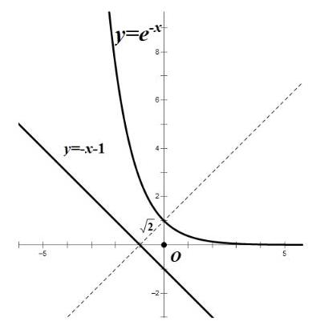

平移直线 $y =  - x - 1$ 使其与曲线 $y = {\mathrm{e}}^{-x}$ 相切,

则切点到直线 $y =  - x - 1$ 的距离即为所求,

设切点 $M\left( {{x}_{0},{\mathrm{e}}^{-{x}_{0}}}\right) ,{y}^{\prime } =  - {\mathrm{e}}^{-x}$ ,切线斜率 $- {\mathrm{e}}^{-{x}_{0}} =  - 1$ ,

得 ${x}_{0} = 0$ ,切点为 $\left( {0,1}\right)$ ,

点 $\left( {0,1}\right)$ 到直线 $y =  - x - 1$ 距离 $d = \frac{\left| 1 + 0 + 1\right| }{\sqrt{{1}^{2} + {1}^{2}}} = \sqrt{2}$ ,

即 $M\left( {a, b}\right)$ 的最小值为 $\sqrt{2}$ .

(3) ${h}^{\left( 1\right) }\left( x\right)  =  - \omega \sin \left( {\omega x}\right) ,{h}^{\left( 2\right) }\left( x\right)  =  - {\omega }^{2}\cos \left( {\omega x}\right)$ ,

记 $\varphi \left( x\right)  = {h}^{\left( 2\right) }\left( x\right)  - x$ ,即 $\varphi \left( x\right)  =  - {\omega }^{2}\cos {\omega x} - x$ .

由 $\varphi \left( x\right)  = {h}^{\left( 2\right) }\left( x\right)  - x \leq  0$ 在 $\left( {0, + \infty }\right)$ 上恒成立,

及存在 ${x}_{0} > 0$ 使 $\varphi \left( {x}_{0}\right)  = {h}^{\left( 2\right) }\left( {x}_{0}\right)  - {x}_{0} = 0$ ,

得 $x = {x}_{0}$ 是函数 $y = \varphi \left( x\right)$ 的极大值点,于是 ${\varphi }^{\prime }\left( {x}_{0}\right)  = {\omega }^{3}\sin \omega {x}_{0} - 1 = 0$ , 则 $\sin \omega {x}_{0} = \frac{1}{{\omega }^{3}}$ ①,

又 $\varphi \left( {x}_{0}\right)  =  - {\omega }^{2}\cos \omega {x}_{0} - {x}_{0} = 0$ ,则 $\cos \omega {x}_{0} = \frac{-{x}_{0}}{{\omega }^{2}}$ ②,

① ${}^{2} +$ ② ${}^{2}$ ，得 $\frac{1}{{\omega }^{6}} + \frac{{x}_{0}^{2}}{{\omega }^{4}} = 1$ ， 则 ${x}_{0} = \frac{\sqrt{{\omega }^{6} - 1}}{\omega }$ ，

又因为 $\sin \omega {x}_{0} = \frac{1}{{\omega }^{3}} > 0,\cos \omega {x}_{0} = \frac{-{x}_{0}}{{\omega }^{2}} < 0$ ,

所以 ${2k\pi } + \frac{\pi }{2} < \omega {x}_{0} < {2k\pi } + \pi \left( {k \in  Z}\right)$ ,由 $\omega {x}_{0} > 0$ 得 $k \geq  0$ ,

又因为 $\frac{\pi }{2\omega } < {x}_{0} - \frac{2k\pi }{\omega } < \frac{\pi }{\omega }\left( {k \in  Z}\right)$ ,

所以 $\varphi \left( {{x}_{0} - \frac{2k\pi }{\omega }}\right)  =  - {\omega }^{2}\cos \left\lbrack  {\omega \left( {{x}_{0} - \frac{2k\pi }{\omega }}\right) }\right\rbrack   - \left( {{x}_{0} - \frac{2k\pi }{\omega }}\right)$

$=  - {\omega }^{2}\cos \omega {x}_{0} - {x}_{0} + \frac{2k\pi }{\omega } = \frac{2k\pi }{\omega } \leq  0$ ,有 $k \leq  0$ ,于是 $k = 0$ ,

所以 $\frac{\pi }{2\omega } < {x}_{0} < \frac{\pi }{\omega }$ .

## C4 每日三题 0415(2025 杨浦二模)

【练习】1. (2025 杨浦二模) 由若干个多边形所覆盖的区域, 称为这些多边形的并集, 例如图中, 梯形 ${ACDE}$ 是 $\bigtriangleup  {ACE}$ 与矩形 ${BCDE}$ 的并集. 已知 $n$ 是正整数，在平面直角坐标系 ${xOy}$ 中，直线 ${l}_{n}$ 的方程为 $y =  - {2}^{n}x + n$ ,若直线 ${l}_{n}$ 交 $x$ 轴于点 ${A}_{n}$ ,交 $y$ 轴于点 ${B}_{n}$ ,则 $\Delta {A}_{1}O{B}_{1},\Delta {A}_{2}O{B}_{2},\cdots ,\Delta {A}_{10}O{B}_{10}$ 的并集，其面积为___.

【答案】 $\frac{767}{1024}$

【解析】在 $y =  - {2}^{n}x + n$ 中,令 $x = 0$ ,得 $y = n$ ,所以 ${B}_{n}\left( {0, n}\right)$ ,

令 $y = 0$ ,得 $x = \frac{n}{{2}^{n}}$ ,所以 ${A}_{n}\left( {\frac{n}{{2}^{n}},0}\right)$ ,

令 $\frac{{x}_{n + 1}}{{x}_{n}} = \frac{n + 1}{{2}^{n + 1}} \cdot  \frac{{2}^{n}}{n} = \frac{n + 1}{{2}^{n}} \geq  1$ 得 $n \leq  1$ ,

所以 ${x}_{1} = {x}_{2} = \frac{1}{2}$ ,当 $n \geq  2$ 时, $\left\{  {x}_{n}\right\}$ 严格减,

当 $n \geq  2$ 时,由 ${l}_{n}$ 到 ${l}_{n + 1}$ ,并集增加的 $S = {S}_{{\Delta P}{B}_{n}{B}_{n + 1}}$ ,

由 $\left\{  \begin{array}{l} y =  - {2}^{n}x + n \\  y =  - {2}^{n + 1}x + n + 1 \end{array}\right.$ 得 ${x}_{p} = \frac{1}{{2}^{n}}$ ,

${S}_{{\Delta P}{B}_{n}{B}_{n + 1}} = \frac{1}{2}{B}_{n}{B}_{n + 1} \cdot  {x}_{p} = \frac{1}{2} \times  1 \times  \frac{1}{{2}^{n}} = \frac{1}{{2}^{n + 1}},$

${S}_{\text{ 并 }} = {S}_{\bigtriangleup {A}_{1}O{B}_{2}} + \frac{1}{{2}^{3}} + \frac{1}{{2}^{4}} + \cdots  + \frac{1}{{2}^{10}} = \frac{1}{2} \times  \frac{1}{2} \times  2 + \frac{\frac{1}{{2}^{3}}\left\lbrack  {1 - {\left( \frac{1}{2}\right) }^{8}}\right\rbrack  }{1 - \frac{1}{2}} = \frac{767}{1024}.$

【练习】2. (2025 杨浦二模) 设 $A$ 是由 $k$ 个二次函数组成的集合,对于连续的正整数 $1,2,3,\cdots ,{2025}$ ,存在二次函数 $y = {f}_{1}\left( x\right)  \in  A\left( {1 \leq  \mathrm{i} \leq  {2025},\mathrm{i} \in  Z, y = {f}_{1}\left( x\right) \text{ 可重复),使得 }{f}_{1}\left( 1\right) ,{f}_{2}\left( 2\right) ,{f}_{3}\left( 3\right) ,\cdots ,{f}_{2025}}\right)$ (2025)是等差数列，则 $k$ 的最小可能值是 ( )

A. 507 B. 1013 C. 1519 D. 2025

【答案】 $B$

【解析】因为 ${f}_{1}\left( 1\right) ,{f}_{2}\left( 2\right) ,{f}_{3}\left( 3\right) ,\cdots ,{f}_{2025}\left( {2025}\right)$ 是等差数列,

所以点 $\left( {1, f\left( 1\right) }\right) ,\left( {2, f\left( 2\right) }\right) ,\cdots ,\left( {{2025},{f}_{2025}\left( {2025}\right) }\right)$ 在同一条直线上,

而一个二次函数和一条直线方程最多只有 2 个交点, ${2025} \div  2 = {1012.5}$ ,

故 $k$ 的最小可能值是 1013,故选 $B$ .

【练习】3. $\left( {{2025}\text{ 杨浦二模 }}\right)$ 已知双曲线 $\Gamma$ 的标准方程为 ${x}^{2} - \frac{{y}^{2}}{2} = 1$ ，点 $P$ 是双曲线 $\Gamma$ 右支上的一个动点.

(1)求双曲线 $\Gamma$ 的焦点坐标和渐近线方程；

(2)过点 $P$ 分别向两条渐近线作垂线，垂足为点 ${P}_{1},{P}_{2}$ ，求 $\overrightarrow{P{P}_{1}} \cdot  \overrightarrow{P{P}_{2}}$ 的值；

(3)若 $\left| {OP}\right|  > \sqrt{2}$ ，如图，过 $P$ 作圆 $O : {x}^{2} + {y}^{2} = 2$ 的切线 $l$ ，切点为 $M$ ，交双曲线 $\Gamma$ 的左支于点 $Q$ ，分别交两条渐近线于点 $A, B$ . 设 $\left| {PQ}\right|  = \lambda \left| {AB}\right|$ ,求实数 $\lambda$ 的取值范围.

【解析】(1) 双曲线 $\Gamma$ 的焦点坐标为 $\left( {\sqrt{3},0}\right)$ 和 $\left( {-\sqrt{3},0}\right)$ ,

渐近线方程为 $y = \sqrt{2}x$ 和 $y =  - \sqrt{2}x\cdots \cdots 4$

(2)设 $P\left( {{x}_{0},{y}_{0}}\right)$ ，则 ${x}_{0}^{2} - \frac{{y}_{0}^{2}}{2} = 1$ ，

不妨设 $\overrightarrow{P{P}_{1}}$ 垂直于直线 $y = \sqrt{2}x,\overrightarrow{P{P}_{2}}$ 垂直于直线 $y =  - \sqrt{2}x$ ,

则 $\overrightarrow{{n}_{1}} = \left( {-\sqrt{2},1}\right)$ 是与 $\overrightarrow{P{P}_{1}}$ 同向的一个向量,

$\overrightarrow{{n}_{2}} = \left( {-\sqrt{2}, - 1}\right)$ 是与 $\overrightarrow{P{P}_{2}}$ 同向的一个向量,

得 $\cos  < \overrightarrow{P{P}_{1}},\overrightarrow{P{P}_{2}} >  = \cos  < \overrightarrow{{n}_{1}},\overrightarrow{{n}_{2}} >  = \frac{{\left( -\sqrt{2}\right) }^{2} - 1}{\sqrt{1 + 2} \cdot  \sqrt{1 + 2}} = \frac{1}{3}$ , .7

$\left| \overrightarrow{P{P}_{1}}\right|  = \frac{\left| \sqrt{2}{x}_{0} - {y}_{0}\right| }{\sqrt{2 + 1}} = \frac{\left| \sqrt{2}{x}_{0} - {y}_{0}\right| }{\sqrt{3}},\left| \overrightarrow{P{P}_{2}}\right|  = \frac{\left| \sqrt{2}{x}_{0} + {y}_{0}\right| }{\sqrt{2 + 1}} = \frac{\left| \sqrt{2}{x}_{0} + {y}_{0}\right| }{\sqrt{3}}$ .9

$\overrightarrow{P{P}_{1}} \cdot  \overrightarrow{P{P}_{2}} = \left| \overrightarrow{P{P}_{1}}\right|  \cdot  \left| \overrightarrow{P{P}_{2}}\right|  \cdot  \cos  < \overrightarrow{P{P}_{1}},\overrightarrow{P{P}_{2}} >  = \frac{\left| 2{x}_{0}^{2} - {y}_{0}^{2}\right| }{3} \cdot  \frac{1}{3} = \frac{2}{9}$ 10

(3)设 $M\left( {{x}_{0},{y}_{0}}\right)$ ，则 ${x}_{0}^{2} + {y}_{0}^{2} = 2$ 且 ${x}_{0} \in  \left( {-\frac{2\sqrt{3}}{3},\frac{2\sqrt{3}}{3}}\right)$ ， 12

由 $\overrightarrow{OM} = \left( {{x}_{0},{y}_{0}}\right)$ ,则切线 $l$ 的方程为 ${x}_{0}\left( {x - {x}_{0}}\right)  + {y}_{0}\left( {y - {y}_{0}}\right)  = 0$ ,

化简得 ${x}_{0}x + {y}_{0}y = 2$ ,

由 $\left\{  \begin{array}{l} {x}_{0}x + {y}_{0}y = 2 \\  {x}^{2} - \frac{{y}^{2}}{2} = 1 \end{array}\right.$ 得 $\left( {{x}_{0}^{2} - 2{y}_{0}^{2}}\right) {x}^{2} - 4{x}_{0}x + 2{y}_{0}^{2} + 4 = 0$ , 14

因为 ${x}_{0}^{2} + {y}_{0}^{2} = 2$ ,整理得 $\left( {3{x}_{0}^{2} - 4}\right) {x}^{2} - 4{x}_{0}x + 8 - 2{x}_{0}^{2} = 0$ ,

因为 ${x}_{0} \in  \left( {-\frac{2\sqrt{3}}{3},\frac{2\sqrt{3}}{3}}\right)$ ,所以 $3{x}_{0}^{2} - 4 < 0$ ,

$\Delta  = {\left( -4{x}_{0}\right) }^{2} - 4\left( {3{x}_{0}^{2} - 4}\right) \left( {8 - 2{x}_{0}^{2}}\right)  = 8\left( {3{x}_{0}^{2} - 8}\right) \left( {{x}_{0}^{2} - 2}\right)  > 0,$

设 $P\left( {{x}_{1},{y}_{1}}\right) , Q\left( {{x}_{2},{y}_{2}}\right)$ ,则 ${x}_{1} + {x}_{2} = \frac{4{x}_{0}}{3{x}_{0}^{2} - 4},{x}_{1}{x}_{2} = \frac{8 - 2{x}_{0}^{2}}{3{x}_{0}^{2} - 4}$ ,

$\left| {PQ}\right|  = \sqrt{1 + {\left( -\frac{{x}_{0}}{{y}_{0}}\right) }^{2}}\left| {{x}_{1} - {x}_{2}}\right|  = \sqrt{\frac{{y}_{0}^{2} + {x}_{0}^{2}}{{y}_{0}^{2}}} \cdot  \sqrt{{\left( {x}_{1} + {x}_{2}\right) }^{2} - 4{x}_{1}{x}_{2}}$

$= \frac{\sqrt{2}}{\left| {y}_{0}\right| } \cdot  \frac{\sqrt{8\left( {3{x}_{0}^{2} - 8}\right) \left( {-{y}_{0}^{2}}\right) }}{4 - 3{x}_{0}^{2}} = \frac{4\sqrt{8 - 3{x}_{0}^{2}}}{4 - 3{x}_{0}^{2}},$

渐近线方程为 $y = \sqrt{2}x$ 和 $y =  - \sqrt{2}x$ ,

由 $\left\{  \begin{array}{l} {x}_{0}x + {y}_{0}y = 2 \\  y = \sqrt{2}x \end{array}\right.$ 得 $x = \frac{2}{{x}_{0} + \sqrt{2}{y}_{0}}$ ; 由 $\left\{  \begin{array}{l} {x}_{0}x + {y}_{0}y = 2 \\  y =  - \sqrt{2}x \end{array}\right.$ 得 $x = \frac{2}{{x}_{0} - \sqrt{2}{y}_{0}}$ ;

$\left| {AB}\right|  = \sqrt{1 + {\left( -\frac{{x}_{0}}{{y}_{0}}\right) }^{2}}\left| {\frac{2}{{x}_{0} + \sqrt{2}{y}_{0}} - \frac{2}{{x}_{0} - \sqrt{2}{y}_{0}}}\right|$

$= \frac{\sqrt{2}}{\left| {y}_{0}\right| } \cdot  \frac{\left| 4\sqrt{2}{y}_{0}\right| }{\left| {x}_{0}^{2} - 2{y}_{0}^{2}\right| } = \frac{8}{4 - 3{x}_{0}^{2}}$ ·16

$\lambda  = \frac{\left| PQ\right| }{\left| AB\right| } = \frac{\frac{4\sqrt{8 - 3{x}_{0}^{2}}}{4 - 3{x}_{0}^{2}}}{\frac{8}{4 - 3{x}_{0}^{2}}} = \frac{\sqrt{8 - 3{x}_{0}^{2}}}{2},{x}_{0} \in  \left( {-\frac{2\sqrt{3}}{3},\frac{2\sqrt{3}}{3}}\right) ,$

则 ${x}_{0}^{2} \in  \left\lbrack  {0,\frac{4}{3}}\right) ,\lambda  \in  (1,\sqrt{2}\rbrack$ 18

# C 每日三题 0416(2025 普陀二模)

【练习】1. (2025 普陀二模)设 $k \geq  2, n \geq  1, k, n \in  N$ ， ${S}_{n}$ 是数列 $\left\{  {a}_{n}\right\}$ 的前 $n$ 项和，且满足 $2{S}_{n} = 3{a}_{n} - 1$ ， 数列 $\left\{  {b}_{n}\right\}$ 是由 $k$ 个大于 -2 的整数组成的有穷数列,若 ${b}_{1} \neq  0,\mathop{\sum }\limits_{{i = 1}}^{k}{b}_{i}{a}_{k - i + 1} = 0$ ，则称数列 $\left\{  {b}_{n}\right\}$ 是数列 $\left\{  {a}_{n}\right\}$ 的 “ $T$ 数列”. 对于数列 $\left\{  {b}_{n}\right\}$ 有如下两个命题:①若 ${b}_{1} > 0$ ，则数列 $\left\{  {b}_{n}\right\}$ 不是数列 $\left\{  {a}_{n}\right\}$ 的 “ $T$ 数列”; ②若 $k \geq  3$ ，则数列 $\left\{  {a}_{n}\right\}$ 的“ $T$ 数列”至少有 5 个. 则下列结论中正确的是 ( ) ( )

A. ①为真②为真 B. ①为真②为假 C. ①为假②为真 D. ①为假②为假

【答案】 $A$

【解析】当 $n = 1$ 时, $2{a}_{1} = 3{a}_{1} - 1,{a}_{1} = 1$ ;

当 $n \geq  2$ 时， ${a}_{n} = {S}_{n} - {S}_{n - 1} = \frac{3}{2}{a}_{n} - \frac{3}{2}{a}_{n - 1}$ ，所以 ${a}_{n} = 3{a}_{n - 1}$ ，所以 ${a}_{n} = {3}^{n - 1}$ ；

若 ${b}_{1} \neq  0,\mathop{\sum }\limits_{{i = 1}}^{k}{b}_{i}{a}_{k - i + 1} = 0$ ,则 ${b}_{1}{a}_{k} + {b}_{2}{a}_{k - 1} + \cdots  + {b}_{k}{a}_{1} = 0\left( *\right)$ ,

对于①,若 ${b}_{1} > 0$ ,则 ${b}_{1} \geq  1$ ,

则 ${b}_{1}{a}_{k} + {b}_{2}{a}_{k - 1} + \cdots  + {b}_{k}{a}_{1} \geq  {a}_{k} - {a}_{k - 1} - {a}_{k - 2} - \cdots  - {a}_{1}$

$= {3}^{k - 1} - \frac{1 - {3}^{k - 1}}{1 - 3} = \frac{{3}^{k - 1} + 1}{2} > 0$ ,与 (*) 矛盾,故①正确；

对于②，由①得 ${b}_{1}$ 只能为 -1，先考虑 $k = 3$ ，

代入 (*) 得 ${b}_{1}{a}_{3} + {b}_{2}{a}_{2} + {b}_{3}{a}_{1} = 0$ ,所以 $3{b}_{2} + {b}_{3} = 9$ ,

此时 $\left( {{b}_{2},{b}_{3}}\right)  = \left( {3,0}\right) ,\left( {2,3}\right) ,\left( {1,6}\right) ,\left( {0,9}\right) ,\left( {-1,{12}}\right)$ ,已经有 5 种情况,故②正确；

故选 $A$ .

【练习】2. (2025 普陀二模) 设 $a > b > 0, m > 0$ ,点 $A, F$ 分别是椭圆 $\Gamma  : \frac{{x}^{2}}{{a}^{2}} + \frac{{y}^{2}}{{b}^{2}} = 1$ 的上顶点与右焦点, 且 $\left| {AF}\right|  = 2$ ,直线 $l : x - {my} - 1 = 0$ 经过点 $F$ 与 $\Gamma$ 交于 $P, Q$ 两点, $O$ 是坐标原点.

(1)求椭圆 $\Gamma$ 的方程；

(2) 若 $m = \sqrt{3}$ ，点 $M$ 是 $x$ 轴上的一点，且 ${\Delta M}{PQ}$ 的面积为 $\frac{6}{13}$ ，求点 $M$ 的坐标；

(3)若点 $G$ 在直线 $x = 5$ 上，向量 $\overrightarrow{PG}$ 在直线 $l$ 上的投影为向量 $\overrightarrow{PF}$ ，证明 $\angle {PGQ} < \frac{\pi }{4}$ .

【解析】(1) 由直线 $l : x - {my} - 1 = 0$ 经过点 $F$ ,得点 $F\left( {1,0}\right)$ ,

又 $\left| {AF}\right|  = 2$ ,则 $a = 2,\cdots \cdots 2$ 分

即 ${b}^{2} = {a}^{2} - {c}^{2} = 3$ ,则所求的椭圆 $\Gamma$ 的方程为 $\frac{{x}^{2}}{4} + \frac{{y}^{2}}{3} = 1$ . 4 分

(2) 设 $P\left( {{x}_{1},{y}_{1}}\right) , Q\left( {{x}_{1},{y}_{1}}\right) , M\left( {{x}_{0},0}\right)$ ,

由 $\left\{  \begin{array}{l} \frac{{x}^{2}}{4} + \frac{{y}^{2}}{3} = 1 \\  x = {my} + 1 \end{array}\right.$ 得 $\left( {4 + 3{m}^{2}}\right) {y}^{2} + {6my} - 9 = 0,\cdots \cdots 2$ 分

则 ${y}_{1} + {y}_{2} = \frac{-{6m}}{4 + 3{m}^{2}},{y}_{1}{y}_{2} = \frac{-9}{4 + 3{m}^{2}}$ ,

又 $m = \sqrt{3}$ ,则 $\left| {{y}_{1} - {y}_{2}}\right|  = \sqrt{{\left( {y}_{1} + {y}_{2}\right) }^{2} - 4{y}_{1}{y}_{2}} = \frac{24}{13}$ ,

又 $\bigtriangleup  {MPQ}$ 的面积为 $\frac{6}{13}$ ，则 ${S}_{\bigtriangleup {MPQ}} = \frac{1}{2}\left| {MF}\right|  \cdot  \left| {{y}_{1} - {y}_{2}}\right|  = \frac{1}{2} \times  \frac{24}{13}\left| {{x}_{0} - 1}\right|  = \frac{6}{13}$ ，

即 $\left| {{x}_{0} - 1}\right|  = \frac{1}{2}$ ,即 ${x}_{0} = \frac{1}{2}$ 或 $\frac{3}{2}$ ,

则所求的点 $M$ 的坐标为 $\left( {\frac{1}{2},0}\right)$ 或 $\left( {\frac{3}{2},0}\right)$ .

(3)由点 $G$ 在直线 $x = 5$ 上，向量 $\overrightarrow{PG}$ 在直线 $l$ 上的投影为向量 $\overrightarrow{PF}$ ，

得 ${GF}\bot {PQ}$ ，且点 $G$ 的坐标为 $\left( {5, - {4m}}\right)$ ，

又 ${x}_{1} = m{y}_{1} + 1,{x}_{2} = m{y}_{2} + 1$ ,

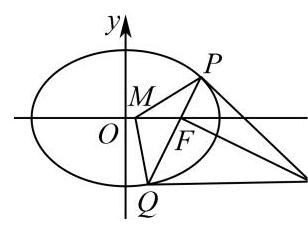

则 $\left| {QF}\right|  = \sqrt{1 + {m}^{2}}\left| {y}_{2}\right| ,\left| {PF}\right|  = \sqrt{1 + {m}^{2}}\left| {y}_{1}\right| ,\left| {GF}\right|  = 4\sqrt{1 + {m}^{2}}$ ,

因为 $m > 0,{GF} \bot  {PQ}$ ,所以在 ${\Delta GFP}$ 和 ${\Delta GFQ}$ 中,

分别有 $\tan \angle {PGF} = \frac{\left| PF\right| }{\left| GF\right| } = \frac{\left| {y}_{1}\right| }{4},\tan \angle {QGF} = \frac{\left| QF\right| }{\left| GF\right| } = \frac{\left| {y}_{2}\right| }{4}$ ,

则 $\tan \angle {PGQ} = \tan \left( {\angle {PGF} + \angle {QGF}}\right)  = \frac{\frac{\left| {y}_{1}\right| }{4} + \frac{\left| {y}_{2}\right| }{4}}{1 - \frac{\left| {y}_{1}\right| }{4} \cdot  \frac{\left| {y}_{2}\right| }{4}}$ ,

化简整理得 $\tan \angle {PGQ} = \frac{4\left( {\left| {y}_{1}\right|  + \left| {y}_{2}\right| }\right) }{{16} - \left| {y}_{1}\right| \left| {y}_{2}\right| } = \frac{4\left| {{y}_{1} - {y}_{2}}\right| }{{16} - \left| {{y}_{1}{y}_{2}}\right| }$ , 4 分

由 (2) 得 ${y}_{1} + {y}_{2} = \frac{-{6m}}{4 + 3{m}^{2}},{y}_{1}{y}_{2} = \frac{-9}{4 + 3{m}^{2}}$ ,

则 $\tan \angle {PGQ} = \frac{{48}\sqrt{1 + {m}^{2}}}{{48}{m}^{2} + {55}}$ ，

令 $h = \sqrt{1 + {m}^{2}}$ ,则 $\tan \angle {PGQ} = \frac{48}{{48h} + \frac{7}{h}}$ ,

设函数 $g\left( h\right)  = {48h} + \frac{7}{h}$ ,则 ${g}^{\prime }\left( h\right)  = {48} - \frac{7}{{h}^{2}}$ ,

因为 $m > 0$ ,所以 $h > 1$ ,则 ${g}^{\prime }\left( h\right)  > 0$ ,

即函数 $g\left( h\right)  = {48h} + \frac{7}{h}$ 在区间 $\left( {1, + \infty }\right)$ 上是严格增函数,则 $g\left( h\right)  > g\left( 1\right)  = {55}$ ,

即 $0 < \tan \angle {PGQ} < \frac{48}{55} < 1$ ,则 $\angle {PGQ} < \frac{\pi }{4}$ .

【练习】3. (2025 浦东二模)定义域为 $R$ 的可导函数 $y = f\left( x\right)$ 满足，在曲线 $y = f\left( x\right)$ 上存在三个不同的点 $A \; \left( {{x}_{1},{y}_{1}}\right) , B\left( {{x}_{2},{y}_{2}}\right) , C\left( {{x}_{3},{y}_{3}}\right) \left( {{x}_{1} < {x}_{2} < {x}_{3}}\right)$ ,使得直线 ${AC}$ 与曲线 $y = f\left( x\right)$ 在点 $B$ 处的切线平行 (或重合). 若 ${x}_{1},{x}_{2},{x}_{3}$ 成等差数列,则称 $f\left( x\right)$ 为“等差函数”; 若 ${x}_{1},{x}_{2},{x}_{3}$ 成等差数列且 ${x}_{1},{x}_{2}$ , ${x}_{3}$ 均为整数，则称 $f\left( x\right)$ 为“整数等差函数”.

(1)设 $f\left( x\right)  = {x}^{2} + x$ ， $g\left( x\right)  = \sin x$ ，分别判断 $f\left( x\right)$ 和 $g\left( x\right)$ 是否为“整数等差函数”，直接写出结论；

(2)若 $f\left( x\right)  = \frac{1}{{x}^{2} + m}$ 为 “整数等差函数”，且 ${x}_{1},{x}_{2},{x}_{3}$ 均为正整数，求实数 $m$ 的最小值；

(3) 已知 $y = f\left( x\right)$ 的导函数 $y = {f}^{\prime }\left( x\right)$ 在 $R$ 上为增函数,且存在一个正常数 $T$ ,使得对任意 $x \in  R$ , $f\left( {x + T}\right)  = {f}^{\prime }\left( x\right)$ 成立，证明: $f\left( x\right)$ 为“等差函数”的充要条件是 $f\left( x\right)$ 为常值函数.

【解析】(1) 假设 ${x}_{1},{x}_{2},{x}_{3}$ 成等差数列,得 ${x}_{2} = \frac{{x}_{1} + {x}_{3}}{2}$ ,

设公差为 $d$ ,则 $d = {x}_{2} - {x}_{1} = {x}_{3} - {x}_{2} > 0$ ,

对于 $f\left( x\right)$ ，直线 ${AC}$ 的斜率 ${k}_{AC} = \frac{{y}_{3} - {y}_{1}}{{x}_{3} - {x}_{1}} = \frac{{x}_{3}^{2} + {x}_{3} - {x}_{1}^{2} - {x}_{1}}{{x}_{3} - {x}_{1}} = {x}_{3} + {x}_{1} + 1$ ，

因为 ${f}^{\prime }\left( x\right)  = {2x} + 1$ ，所以曲线 $y = f\left( x\right)$ 在点 $B$ 处的切线斜率为 ${k}_{B} = 2{x}_{2} + 1$ ，

由题意得 ${k}_{AC} = {k}_{B} \Rightarrow  {x}_{3} + {x}_{1} + 1 = 2{x}_{2} + 1$ 恒成立,

取 ${x}_{2} = 0, d = 1$ ,则 ${x}_{1},{x}_{2},{x}_{3}$ 成等差数列且均为整数,

故 $f\left( x\right)$ 是 “整数等差函数”.

对于 $g\left( x\right)$ ，直线 ${AC}$ 的斜率 ${k}_{AC} = \frac{{y}_{3} - {y}_{1}}{{x}_{3} - {x}_{1}} = \frac{\sin {x}_{3} - \sin {x}_{1}}{{x}_{3} - {x}_{1}}$

$= \frac{\sin \left( {{x}_{2} + d}\right)  - \sin \left( {{x}_{2} - d}\right) }{2d} = \frac{\cos {x}_{2}\sin d}{d},$

因为 ${f}^{\prime }\left( x\right)  = \cos x$ ，所以曲线 $y = f\left( x\right)$ 在点 $B$ 处的切线斜率为 ${k}_{B} = \cos {x}_{2}$ ，

由题意得 ${k}_{AC} = {k}_{B} \Rightarrow  \frac{\cos {x}_{2}\sin d}{d} = \cos {x}_{2} \Rightarrow  \cos {x}_{2}\left( {\sin d - d}\right)  = 0$ ,

若 ${x}_{2} \in  Z$ ,则 ${x}_{2} \neq  \left( {k + \frac{1}{2}}\right) \pi , k \in  Z \Rightarrow  \cos {x}_{2} \neq  0$ ,

同时,由 $d > 0$ ,得 $\sin d - d < 0$ 恒成立,故 $f\left( x\right)$ 不是 “整数等差函数”.

(2)因为 $f\left( x\right)$ 为 “整数等差函数”，

所以 ${x}_{1},{x}_{2},{x}_{3}$ 成等差数列且 ${x}_{1},{x}_{2},{x}_{3}$ 均为正整数,

设公差为 $d$ ,则 $d = {x}_{2} - {x}_{1} = {x}_{3} - {x}_{2} > 0$ ,且 $d \in  Z$ ,

直线 ${AC}$ 的斜率 ${k}_{AC} = \frac{{y}_{3} - {y}_{1}}{{x}_{3} - {x}_{1}} = \frac{\frac{1}{{x}_{3}^{2} + m} - \frac{1}{{x}_{1}^{2} + m}}{{x}_{3} - {x}_{1}} = \frac{{x}_{1} + {x}_{3}}{\left( {{x}_{1}^{2} + m}\right) \left( {{x}_{3}^{2} + m}\right) }$ ,

因为 ${f}^{\prime }\left( x\right)  =  - \frac{2x}{{\left( {x}^{2} + m\right) }^{2}}$ ,

所以曲线 $y = f\left( x\right)$ 在点 $B$ 处的切线斜率为 ${k}_{B} =  - \frac{2{x}_{2}}{{\left( {x}_{2}^{2} + m\right) }^{2}}$ ,

由题意得 ${k}_{AC} = {k}_{B} \Rightarrow   - \frac{{x}_{1} + {x}_{3}}{\left( {{x}_{1}^{2} + m}\right) \left( {{x}_{3}^{2} + m}\right) } =  - \frac{2{x}_{2}}{{\left( {x}_{2}^{2} + m\right) }^{2}}$ ,

因为 ${x}_{1} = {x}_{2} - d,{x}_{3} = {x}_{2} + d$ ,所以 ${\left( {x}_{2}^{2} + m\right) }^{2} = \left( {{x}_{1}^{2} + m}\right) \left( {{x}_{3}^{2} + m}\right)$

$\Rightarrow  {x}_{2}^{4} + {2m}{x}_{2}^{2} = {\left( {x}_{2} - d\right) }^{2}{\left( {x}_{2} + d\right) }^{2} + m\left( {{\left( {x}_{2} - d\right) }^{2} + {\left( {x}_{2} + d\right) }^{2}}\right)$

$\Rightarrow  {x}_{2}^{4} + {2m}{x}_{2}^{2} = {x}_{2}^{4} - 2{x}_{2}^{2}{d}^{2} + {d}^{4} + {2m}{x}_{2}^{2} + {2m}{d}^{2} \Rightarrow  m = \frac{2{x}_{2}^{2} - {d}^{2}}{2}$ ,

因为 ${x}_{2} = {x}_{1} + d \geq  1 + d$ ,所以 $m \geq  \frac{2{\left( 1 + d\right) }^{2} - {d}^{2}}{2} = \frac{{d}^{2} + {4d} + 2}{2} \geq  \frac{7}{2}$ ,

可取 $d = 1,{x}_{2} = 2$ 使等号成立,故 $m$ 的最小值为 $\frac{7}{2}$ .

(3)充分性:因为 $f\left( x\right)$ 为常值函数，所以 ${f}^{\prime }\left( x\right)  = 0$ ，

任意取等差数列 ${x}_{1},{x}_{2},{x}_{3}$ ,则直线 ${AC}$ 的斜率 ${k}_{AC} = \frac{{y}_{3} - {y}_{1}}{{x}_{3} - {x}_{1}} = 0$ ,

曲线 $y = f\left( x\right)$ 在点 $B$ 处的切线斜率为 ${k}_{B} = {f}^{\prime }\left( {x}_{2}\right)  = 0$ ,

因为 ${k}_{AC} = {k}_{B}$ ，所以 $f\left( x\right)$ 为“等差函数”.

必要性: 因为 $f\left( x\right)$ 为 “等差函数”，所以 ${x}_{1},{x}_{2},{x}_{3}$ 成等差数列，

设公差为 $d$ ,则 $d = {x}_{2} - {x}_{1} = {x}_{3} - {x}_{2} > 0$ ,

直线 ${AC}$ 的斜率 ${k}_{AC} = \frac{{y}_{3} - {y}_{1}}{{x}_{3} - {x}_{1}} = \frac{f\left( {x}_{3}\right)  - f\left( {x}_{1}\right) }{{x}_{3} - {x}_{1}}$ ,

曲线 $y = f\left( x\right)$ 在点 $B$ 处的切线斜率为 ${k}_{B} = {f}^{\prime }\left( {x}_{2}\right)$ ,

由题意得 ${k}_{AC} = {k}_{B} \Rightarrow  \frac{f\left( {x}_{3}\right)  - f\left( {x}_{1}\right) }{{x}_{3} - {x}_{1}} = {f}^{\prime }\left( {x}_{2}\right)$

$\Rightarrow  f\left( {{x}_{2} + d}\right)  - f\left( {{x}_{2} - d}\right)  = {2d}{f}^{\prime }\left( {x}_{2}\right)$ ,

令 $g\left( x\right)  = f\left( {{x}_{2} + x}\right)  - f\left( {{x}_{2} - x}\right)  - {2x}{f}^{\prime }\left( {x}_{2}\right) , x > 0$ ,

${g}^{\prime }\left( x\right)  = {f}^{\prime }\left( {{x}_{2} + x}\right)  + {f}^{\prime }\left( {{x}_{2} - x}\right)  - 2{f}^{\prime }\left( {x}_{2}\right)$

$= f\left( {{x}_{2} + x + T}\right)  + f\left( {{x}_{2} - x + T}\right)  - {2f}\left( {{x}_{2} + T}\right) ,$

令 $h\left( x\right)  = f\left( {{x}_{2} + x + T}\right)  + f\left( {{x}_{2} - x + T}\right)  - {2f}\left( {{x}_{2} + T}\right)$ ,

则 ${h}^{\prime }\left( x\right)  = {f}^{\prime }\left( {{x}_{2} + x + T}\right)  - {f}^{\prime }\left( {{x}_{2} - x + T}\right)$ ,

因为 ${f}^{\prime }\left( x\right)$ 在 $R$ 上为增函数,所以 ${h}^{\prime }\left( x\right)  \geq  0, h\left( x\right)$ 在 $\left( {0, + \infty }\right)$ 上为增函数,

因为 $h\left( 0\right)  = 0$ ,所以 ${g}^{\prime }\left( x\right)  = h\left( x\right)  \geq  0, g\left( x\right)$ 在 $R$ 上为增函数,

因为 $g\left( 0\right)  = 0$ ,所以 $g\left( x\right)  \geq  0$ 在 $\left( {0, + \infty }\right)$ 上恒成立,

又 $g\left( d\right)  = 0$ ,由 $g\left( x\right)$ 的单调惟得 $g\left( x\right)  = 0, x \in  \left( {0, d}\right)$ ,

故 ${g}^{\prime }\left( x\right)  = 0, x \in  \left( {0, d}\right) ,{h}^{\prime }\left( x\right)  = 0, x \in  \left( {0, d}\right)$ ,

所以 ${f}^{\prime }\left( x\right)  = C, x \in  \left( {{x}_{2} - d + T,{x}_{2} + d + T}\right) , C$ 为常数,

所以 $f\left( x\right)  = C, x \in  \left( {{x}_{2} - d + {2T},{x}_{2} + d + {2T}}\right)$ ,

所以 ${f}^{\prime }\left( x\right)  = 0, x \in  \left( {{x}_{2} - d + {2T},{x}_{2} + d + {2T}}\right)$ ,

所以 $f\left( x\right)  = 0, x \in  \left( {{x}_{2} - d + {3T},{x}_{2} + d + {3T}}\right)$ ,

接下来,一方面,因为 $f\left( {x + t}\right)  = {f}^{\prime }\left( x\right)$ ,且 ${f}^{\prime }\left( x\right)$ 在 $R$ 上为增函数,

所以 $f\left( x\right)$ 在 $R$ 上为增函数,故 ${f}^{\prime }\left( x\right)  \geq  0, f\left( x\right)  \geq  0$ ,

由 $f\left( x\right)  = 0, x \in  \left( {{x}_{2} - d + {3T},{x}_{2} + d + {3T}}\right)$ ,

得 $f\left( x\right)  = 0, x \in  \left( {-\infty ,{x}_{2} + d + {3T}}\right)$ ,

另一方面，因为 $f\left( {x + T}\right)  = {f}^{\prime }\left( x\right)$ ，

所以 ${f}^{\prime }\left( x\right)  = 0, x \in  \left( {-\infty ,{x}_{2} + d + {3T}}\right)$ ,得 $f\left( x\right)  = 0, x \in  \left( {-\infty ,{x}_{2} + d + {4T}}\right)$ ,

以此类推, $f\left( x\right)  = 0$ 在 $R$ 上恒成立,即 $f\left( x\right)$ 为常值函数. 命题得证!

## 10 每日三题 0417 (2025 长宁二模)

【练习】1. (2025长宁二模)椭圆具有如下光学性质:如图， ${F}_{1}\left( {-c,0}\right)$ ， ${F}_{2}\left( {c,0}\right)$ 分别是椭圆 $\frac{{x}^{2}}{{a}^{2}} + \frac{{y}^{2}}{{b}^{2}} = 1$ 的左、右焦点,从点 ${F}_{1}$ 发出的光线在到达椭圆上的点 $P$ 后,经过到达点的切线反射后经过点 ${F}_{2}$ ,有以下两个命题:

①若 $P$ 是椭圆上除长轴端点外的一点，设法线与 $x$ 轴的交点为 $M\left( {t,0}\right)$ ，则 $t \in  \left( {-\frac{{c}^{2}}{a},\frac{{c}^{2}}{a}}\right)$ ；

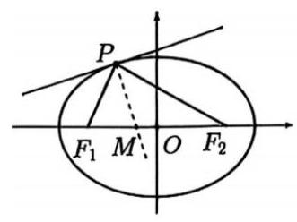

②若从 ${F}_{1}$ 发出的光线，经椭圆两次反射后，第一次回到 ${F}_{1}$ 所经过的路程为 ${8c}$ ，则该椭圆的离心率为 $\frac{1}{2}$ ;

则以下说法正确的是 ( )

A. ①是真命题，②是真命题

B. ①是真命题，②是假命题

C. ①是假命题，②是真命题

D. ①是假命题，②是假命题

【答案】 $A$

【解析】设 $P\left( {{x}_{0},{y}_{0}}\right) ,{y}_{0} \neq  0$ ,对椭圆方程 $\frac{{x}^{2}}{{a}^{2}} + \frac{{y}^{2}}{{b}^{2}} = 1$ 两边同时对 $x$ 求导,

得 $\frac{2x}{{a}^{2}} + \frac{{2y} \cdot  {y}^{\prime }}{{b}^{2}} = 0$ ,解出 ${y}^{\prime } =  - \frac{{b}^{2}x}{{a}^{2}y}$ ,

(此处也可以直接用结论,椭圆在点 $P\left( {{x}_{0},{y}_{0}}\right)$ 处的切线方程为 $\frac{{x}_{0}x}{{a}^{2}} + \frac{{y}_{0}y}{{b}^{2}} = 1$ )

则椭圆在点 $P\left( {{x}_{0},{y}_{0}}\right)$ 处的切线斜率 $k =  - \frac{{b}^{2}{x}_{0}}{{a}^{2}{y}_{0}}$ ,

因为法线与切线垂直,所以在点 $P$ 处的法线斜率 ${k}^{\prime } = \frac{{a}^{2}{y}_{0}}{{b}^{2}{x}_{0}}$ ,

则点 $P\left( {{x}_{0},{y}_{0}}\right)$ 处的法线方程为 $y - {y}_{0} = \frac{{a}^{2}{y}_{0}}{{b}^{2}{x}_{0}}\left( {x - {x}_{0}}\right)$ ,

令 $y = 0$ ,得 $- {y}_{0} = \frac{{a}^{2}{y}_{0}}{{b}^{2}{x}_{0}}\left( {x - {x}_{0}}\right)$ ,

因为 ${y}_{0} \neq  0$ ，两边同时除以 ${y}_{0}$ 得 $- 1 = \frac{{a}^{2}}{{b}^{2}{x}_{0}}\left( {x - {x}_{0}}\right)$ ，

${a}^{2}x = \left( {{a}^{2} - {b}^{2}}\right) {x}_{0}$ ,又因为 ${a}^{2} - {b}^{2} = {c}^{2}$ ,所以 $x = \frac{{c}^{2}}{{a}^{2}}{x}_{0}$ ,

已知 ${x}_{0} \in  \left( {-a, a}\right)$ 且 ${x}_{0} \neq   \pm  a$ ，那么 $x = \frac{{c}^{2}}{{a}^{2}}{x}_{0} \in  \left( {-\frac{{c}^{2}}{a},\frac{{c}^{2}}{a}}\right)$ ，

所以命题①是真命题；

由椭圆的定义，椭圆上任意一点到两焦点距离之和等于长轴 ${2a},$

从 ${F}_{1}$ 发出的光线经椭圆两次反射后第一次回到 ${F}_{1}$ 所经过的路程为 ${4a}$ ,

已知该路程为 ${8c}$ ,则 ${4a} = {8c}$ ,得 $\mathrm{e} = \frac{c}{a} = \frac{1}{2}$ ,所以命题②是真命题;

故选 $A$ .

【练习】2.(2025 长宁二模)已知双曲线 $\Gamma  : \frac{{x}^{2}}{{a}^{2}} - \frac{{y}^{2}}{{b}^{2}} = 1$ 的左，右焦点分别为 ${F}_{1},{F}_{2}$ ，点 $A$ 是其左顶点，点 $P$ 是双曲线上一点,且位于第一象限,若双曲线 $\Gamma$ 的离心率 $\mathrm{e} = 2, b = 2\sqrt{3}$ .

(1)求双曲线 $\Gamma$ 的方程；

(2)若三角形 ${AP}{F}_{2}$ 是等腰三角形，求点 $P$ 的坐标；

(3)直线 $P{F}_{2}$ 不垂直于 $x$ 轴,且与双曲线的另一个交点为 $Q$ ,若 $\angle P{F}_{1}Q$ 是锐角,求直线 $P{F}_{2}$ 的斜率的取值范围.

【解析】(1) 因为 $\mathrm{e} = \frac{c}{a} = 2$ ,所以 $c = {2a}$ ,

由 ${c}^{2} = {a}^{2} + {b}^{2}$ ,得 $c = 4, a = 2,\cdots \cdots 2$ 分

所以双曲线 $\Gamma$ 的方程为 $\frac{{x}^{2}}{4} - \frac{{y}^{2}}{12} = 1$ ;

(2)若 ${AP} = {P{F}_{2}}$ ，则 $P$ 在直线 $x = 1$ 上，

直线 $x = 1$ 与双曲线不相交,所以不存在满足条件的点 $P,\cdots \cdots 2$ 分

设 $P\left( {x, y}\right)$ ,若 ${AP} = A{F}_{2} = 6$ ,则 $\left\{  \begin{array}{l} {\left( x + 2\right) }^{2} + {y}^{2} = {36} \\  3{x}^{2} - {y}^{2} = {12} \end{array}\right.$ ,

得 $P\left( {\frac{-1 + 3\sqrt{5}}{2},\sqrt{\frac{{45} - 9\sqrt{5}}{2}}}\right)$ 2 分

若 $P{F}_{2} = A{F}_{2} = 6$ ,则 $\left\{  \begin{array}{l} {\left( x - 4\right) }^{2} + {y}^{2} = {36} \\  3{x}^{2} - {y}^{2} = {12} \end{array}\right.$ ,得 $P\left( {4,6}\right)$ ,

综上,点 $P$ 的坐标是 $P\left( {\frac{-1 + 3\sqrt{5}}{2},\sqrt{\frac{{45} - 9\sqrt{5}}{2}}}\right) , P\left( {4,6}\right)$ .

(3) 设直线 ${PQ}$ 的解析式为 $y = k\left( {x - 4}\right) , P\left( {{x}_{1},{y}_{1}}\right) , Q\left( {{x}_{2},{y}_{2}}\right)$

由 $\left\{  \begin{array}{l} y = k\left( {x - 4}\right) \\  {x}^{2} - 3{y}^{2} = {12} \end{array}\right.$ ,得 $\left( {3 - {k}^{2}}\right) {x}^{2} + 8{k}^{2}x - {16}{k}^{2} - {12} = 0,\cdots \cdots 2$ 分

$\Delta  = {144}{k}^{2} + {144} > 0$ ,直线 ${PQ}$ 与双曲线有两个交点,所以 ${k}^{2} \neq  3$ ,

${x}_{1} + {x}_{2} = \frac{-8{k}^{2}}{3 - {k}^{2}},{x}_{1}{x}_{2} = \frac{-{16}{k}^{2} - {12}}{3 - {k}^{2}},\cdots \cdots 2$ 分

因为点 $P$ 在第一象限，所以 $k > \sqrt{3}$ 或 $k < 0$ ，

由 $\overrightarrow{P{F}_{1}} \cdot  \overrightarrow{Q{F}_{1}} > 0$ 得 $\frac{7{k}^{2} - 9}{{k}^{2} - 3} > 0,\cdots \cdots 2$ 分

得 ${k}^{2} > 3$ 或 $0 < {k}^{2} < \frac{9}{7}$ ,

所以直线 ${PQ}$ 斜率的取值范围是 $\left( {-\infty , - \sqrt{3}}\right)  \cup  \left( {-\frac{3\sqrt{7}}{7},0}\right)  \cup  \left( {\sqrt{3}, + \infty }\right) \cdots 2$ 分

【练习】3. (2025长宁二模)已知函数 $y = f\left( x\right)$ 的定义域 $D \subseteq  R$ ，对任意实数 $a$ ，定义集合 ${Q}_{f}\left( a\right)  = \{ x \mid  f\left( x\right) \; \left. { \leq  a, x \in  D}\right\}$ .

(1)已知 $f\left( x\right)  = \frac{1 + x}{1 - x}$ ，求 ${Q}_{f}\left( 2\right)$ ；

(2)已知 $f\left( x\right)  = {\mathrm{e}}^{x} - {ax}$ ，若集合 ${Q}_{f}\left( a\right)$ 只有一个元素，求 $a$ 的值；

(3) 已知 $f\left( x\right)  =  - \frac{a}{4}{x}^{2} + \frac{a + 2}{2}x - \ln x + \frac{1}{2}$ ,其中 $a \in  R$ 且 $a > 0$ ,求证: 集合 ${Q}_{f}\left( a\right)$ 是一个区间.

【解析】(1) 由题意得 $\frac{1 + x}{1 - x} \leq  2,\cdots \cdots 2$ 分

解得 $x > 1$ 或 $x \leq  \frac{1}{3}$ ,即 ${Q}_{f}\left( 2\right)  = \left\{  {x \mid  x > 1\text{ 或 }x \leq  \frac{1}{3}}\right\}  ,\cdots \cdots 2$ 分

(2)集合 ${Q}_{f}\left( a\right)$ 只有一个元素,则满足 ${\mathrm{e}}^{x} - {ax} - a \leq  0$ 的 $x$ 有且只有 1 个，

令 $g\left( x\right)  = {\mathrm{e}}^{x} - {ax} - a,{g}^{\prime }\left( x\right)  = {\mathrm{e}}^{x} - a$ ,

若 $a < 0$ ,则 ${g}^{\prime }\left( x\right)  = {\mathrm{e}}^{x} - a > 0$ ,函数 $y = g\left( x\right)$ 单调增,

当 $x$ 趋于 $- \infty$ 时, $g\left( x\right)  = {\mathrm{e}}^{x} - {ax} - a$ 趋于 $- \infty$ ,

所以满足 ${\mathrm{e}}^{x} - {ax} - a \leq  0$ 的 $x$ 不止 1 个,舍 $;\cdots \cdots 2$ 分

若 $a = 0$ ，由于 ${\mathrm{e}}^{x} > 0$ ，所以 ${\mathrm{e}}^{x} - {ax} - a \leq  0$ 的解集为空集，舍； $\cdots \cdots 1$ 分

若 $a > 0$ ,则函数 $y = g\left( x\right)$ 在 $\left( {-\infty ,\ln a}\right)$ 上单调增,在 $\left( {\ln a, - \infty }\right)$ 上单调减,

即有 $g\left( x\right)  \geq  g\left( {\ln a}\right)  =  - a\ln a$ ,

由于满足 ${\mathrm{e}}^{x} - {ax} - a \leq  0$ 的 $x$ 有且只有 1 个,

所以 $- a\ln a = 0$ ,即 $a = 1;\cdots \cdots 3$ 分

(3) ${f}^{\prime }\left( x\right)  =  - \frac{a}{2}x + \frac{a + 2}{2} - \frac{1}{x} =  - \frac{\left( {{ax} - 2}\right) \left( {x - 1}\right) }{2x}$ , 2 分

若 $a = 2$ ,则 ${f}^{\prime }\left( x\right)  \leq  0$ ,且仅当 $x = 1$ 时, ${f}^{\prime }\left( x\right)  = 0$ ,

所以函数 $y = f\left( x\right)$ 在 $\left( {0,1}\right)$ 上严格单调减,

当 $x$ 趋于 0 时, $y = f\left( x\right)$ 趋于 $+ \infty$ ,当 $x$ 趋于 $+ \infty$ 时, $y = f\left( x\right)$ 趋于 $- \infty$ ,

又 $f\left( 1\right)  = 2$ ，所以 ${Q}_{f}\left( a\right)  = \lbrack 1, + \infty )$ 为区间， $\cdots \cdots 2$ 分

若 $0 < a < 2$ ,则函数 $y = f\left( x\right)$ 在 $\left( {0,1}\right)$ 上严格单调减,

在 $\left( {1,\frac{2}{a}}\right)$ 上严格单调增,在 $\left( {\frac{2}{a}, + \infty }\right)$ 上严格单调减,

且当 $x$ 趋于 0 时, $y = f\left( x\right)$ 趋于 $+ \infty$ ,当 $x$ 趋于 $+ \infty$ 时, $y = f\left( x\right)$ 趋于 $- \infty$ ,

即函数 $y = f\left( x\right)$ 在 $x = 1$ 处取得极小值,在 $x = \frac{2}{a}$ 处取得极大值,

因为 $0 < a < 2$ ,所以 $a < \frac{a}{4} + \frac{3}{2}$ ,即 $a < f\left( 1\right)$ ,

由于 $f\left( \frac{2}{a}\right)  > f\left( 1\right)$ ，且 $x$ 趋于 $+ \infty$ 时， $y = f\left( x\right)$ 趋于 $- \infty$ ，

所以由零点存在定理,得存在 ${x}_{1} \in  \left( {\frac{2}{a}, + \infty }\right)$ ,使得 $f\left( {x}_{1}\right)  = f\left( 1\right)$ ,

又由于 $f\left( {x}_{1}\right)  > a$ ,所以存在 ${x}_{2} \in  \left( {{x}_{1}, + \infty }\right)$ ,使得 $f\left( {x}_{2}\right)  = a$ ,

则 ${Q}_{f}\left( a\right)  = \left\lbrack  {{x}_{2}, + \infty }\right)$ 为区间,

同理,若 $a > 2$ ,函数 $y = f\left( x\right)$ 在 $x = \frac{2}{a}$ 处取得极小值,

在 $x = 1$ 处取得极大值,

因为 $a > 2$ ,所以 $a > \frac{a}{4} + \frac{3}{2}$ ,即 $a > f\left( 1\right)$ ,

由于 $f\left( \frac{2}{a}\right)  < f\left( 1\right)$ ,且 $x$ 趋于 0 时, $y = f\left( x\right)$ 趋于 $+ \infty$ ,

所以存在 ${x}_{3} \in  \left( {0,\frac{2}{a}}\right)$ ,使得 $f\left( {x}_{3}\right)  = f\left( 1\right)$ ,

又由于 $a > f\left( {x}_{3}\right)$ ,所以存在 ${x}_{4} \in  \left( {0,{x}_{3}}\right)$ ,使得 $f\left( {x}_{4}\right)  = a$ ,

则 ${Q}_{f}\left( a\right)  = \left\lbrack  {{x}_{4}, + \infty }\right)$ 为区间.

## 14 每日三题 0418

【练习】1. (2025 奉贤二模)若 ${5\pi }$ 是函数 $y = \cos {nx}\sin \frac{2000}{{n}^{2}}x$ 的一个周期，则正整数 $n$ 所有可能取值个数是 ( )

A. 2 B. 3 C. 4 D. 9

【答案】 $B$

【解析】法一: 由题意得 $\cos {nx}\sin \frac{2000}{{n}^{2}}x = \cos n\left( {x + {5\pi }}\right) \sin \frac{2000}{{n}^{2}}\left( {x + {5\pi }}\right)$ 恒成立,

令 $x = 0$ ,得 $\cos 0\sin 0 = 0 = \cos {5n\pi }\sin \frac{10000\pi }{{n}^{2}}$ ,

因为 $n$ 为正整数,所以 $\cos {5n\pi } =  \pm  1$ ,所以 $\sin \frac{10000\pi }{{n}^{2}} = 0$ ,

所以 $\frac{10000\pi }{{n}^{2}} = {k\pi }$ ,所以 $\frac{10000}{{n}^{2}} = k$ ,

则 ${n}^{2}$ 为 10000 的正因数,且 ${n}^{2}$ 为完全平方数,

则 ${n}^{2} = 1,4,{16},{25},{100},{400},{625},{2500},{10000}$ ,检验得 $n = 2,5,{10}$ ,故选 $B$ .

法二: 由题意得 $\cos n\left( {x + {5\pi }}\right)  \cdot  \sin \frac{2000}{{n}^{2}}\left( {x + {5\pi }}\right)  = \cos {nx}\sin \frac{2000}{{n}^{2}}x$ ,

则 ${5n\pi } = 2{k}_{1}\pi ,{k}_{1} \in  Z,\frac{10000}{{n}^{2}}\pi  = 2{k}_{2}\pi ,{k}_{2} \in  Z$ ,

或 ${5n\pi } = 2{k}_{1}\pi  + \pi ,{k}_{1} \in  Z,\frac{10000}{{n}^{2}}\pi  = 2{k}_{2}\pi  + \pi ,{k}_{2} \in  Z$ ,

解得 $n = \frac{2}{5}{k}_{1},{k}_{1} \in  Z, n = {50}\sqrt{\frac{2}{{k}_{2}}},{k}_{2} \in  Z$ ,

或 $n = \frac{2{k}_{1} + 1}{5},{k}_{1} \in  Z, n = {100}\sqrt{\frac{1}{2{k}_{2} + 1}},{k}_{2} \in  Z$ ,

①由 $n$ 为正整数，且 50 的因数为1,2,5,10,25,50，

则 ${k}_{2}$ 的取值可能有2,8,50,200,1250,5000,此时 $n$ 的可能取值有50,25,10,5,2,1,

由 ${k}_{1} \in  Z$ ,则 $n$ 为 2 的倍数,故 $n$ 的可能取值有50,10,2.

② 由 $n$ 为正整数，且 100 的因数为1,2,4,5,10,20,25,50,100,

则奇数 $\sqrt{2{k}_{2} + 1}$ 的取值只可能有 5,25,

此时 $n$ 的可能取值有 20,4,由 ${k}_{1} \in  Z$ ,则 $n$ 奇数,所以此时 $n$ 无取值.

故选 $B$ .

【练习】2. (2025嘉定二模)已知椭圆 $C : \frac{{x}^{2}}{9} + {y}^{2} = 1, F$ 为椭圆的右焦点，过椭圆上一点 $P\left( {3,0}\right)$ 的直线 ${l}_{1}$ 交椭圆于另一点 $Q$ ，点 $M$ 为椭圆上任意一点.

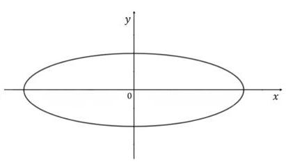

(1)求 $\left| {MF}\right|$ 的最小值；

(2)当直线 ${l}_{1}$ 的斜率为 1 时,求 ${\Delta PQM}$ 面积的最大值及此时点 $M$ 的坐标;

(3)若直线 ${PQ}$ 与直线 ${l}_{2} : x =  - 3$ 交于点 $D$ ，点 $D$ 不在 $x$ 轴上， $Q$ 关于原点的对称点为点 $R$ ，直线 ${PR}$ 与 ${l}_{2}$ 交于点 $E$ ，求线段 $\left| {DE}\right|$ 的取值范围.

【解析】(1) 椭圆的标准方程为 $\frac{{x}^{2}}{9} + {y}^{2} = 1$ ,

故长半轴 $a = 3$ ,短半轴 $b = 1$ ,焦距 $c = \sqrt{{a}^{2} - {b}^{2}} = 2\sqrt{2}$ ,

右焦点 $F$ 的坐标为 $\left( {2\sqrt{2},0}\right)$ .

椭圆上任意一点到右焦点的距离的最小值为右顶点到右焦点的距离

${\left| MF\right| }_{\min } = \left| {3 - 2\sqrt{2}}\right|  = 3 - 2\sqrt{2};$

(2) 直线 ${l}_{1}$ 的方程为 $y = x - 3$ ，由 $\left\{  \begin{array}{l} \frac{{x}^{2}}{9} + {y}^{2} = 1 \\  y = x - 3 \end{array}\right.$ 得 $\frac{10}{9}{x}^{2} - {2x} + 8 = 0$ ，

解得 $x = 3$ 或 $x = \frac{12}{5}$ ,分别对应点 $P\left( {3,0}\right)$ 和点 $Q\left( {\frac{12}{5}, - \frac{3}{5}}\right)$ .

则 ${PQ} = \sqrt{{\left( \frac{12}{5} - 3\right) }^{2} + {\left( -\frac{3}{5} + 0\right) }^{2}} = \sqrt{\frac{9}{25} + \frac{9}{25}} = \frac{3\sqrt{2}}{5}$ .

法一:设直线 $y = x + b$ 与椭圆相切，

将其代入椭圆方程得 ${10}{x}^{2} + {18bx} + 9{b}^{2} - 9 = 0$ ,

此时 $\Delta  = {\left( {18}b\right) }^{2} - 4 \times  {10} \times  \left( {9{b}^{2} - 9}\right)  =  - {36}{b}^{2} + {360} = 0$ ,得 $b =  \pm  \sqrt{10}$ ,

取距离 ${PQ}$ 更远的切线 $y = x + \sqrt{10}$ ，其与 ${PQ}$ 的距离为 $\frac{\sqrt{10} + 3}{\sqrt{2}}$ ，

将 $y = x + \sqrt{10}$ 代入椭圆方程，解得切点为 $M\left( {-\frac{9\sqrt{10}}{10},\frac{\sqrt{10}}{10}}\right)$ ，

面积最大值 ${S}_{\max } = \frac{1}{2} \times  \frac{3\sqrt{2}}{5} \times  \frac{\sqrt{10} + 3}{\sqrt{2}} = \frac{3\sqrt{10} + 9}{10}$ ,

所以面积最大值为 $\frac{3\sqrt{10} + 9}{10}$ ,点 $M$ 坐标为 $\left( {-\frac{9\sqrt{10}}{10},\frac{\sqrt{10}}{10}}\right)$ .

法二: 设点 $M$ 的坐标为 $\left( {3\cos \theta ,\sin \theta }\right)$ .

点 $M$ 到直线 ${l}_{1}$ 的距离为 $d = \frac{\left| 3\cos \theta  - \sin \theta  - 3\right| }{\sqrt{2}}$

$= \frac{\left| \sqrt{10}\left( \frac{3\sqrt{10}}{10}\cos \theta  - \frac{\sqrt{10}}{10}\sin \theta \right)  - 3\right| }{\sqrt{2}} = \frac{\left| \sqrt{10}\sin \left( \varphi  - \theta \right)  - 3\right| }{\sqrt{2}},$

当 $\sin \left( {\varphi  - \theta }\right)  =  - 1$ 时, $d$ 取到最大值 $\frac{\sqrt{10} + 3}{\sqrt{2}}$ ,

得面积最大值 ${S}_{\max } = \frac{1}{2} \times  \frac{3\sqrt{2}}{5} \times  \frac{\sqrt{10} + 3}{\sqrt{2}} = \frac{3\sqrt{10} + 9}{10}$ ,

此时 $\theta  = \varphi  - \frac{3\pi }{2}$ ,则 $\cos \theta  =  - \sin \varphi  =  - \frac{3\sqrt{10}}{10},\sin \theta  = \cos \varphi  = \frac{\sqrt{10}}{10}$ ,

因此点 $M$ 坐标为 $\left( {-\frac{9\sqrt{10}}{10},\frac{\sqrt{10}}{10}}\right)$ ,

所以面积最大值为 $\frac{3\sqrt{10} + 9}{10}$ ,点 $M$ 坐标为 $\left( {-\frac{9\sqrt{10}}{10},\frac{\sqrt{10}}{10}}\right)$ .

(3)法一:设点 $Q\left( {{x}_{0},{y}_{0}}\right)$ 满足椭圆方程 $\frac{{x}^{2}}{9} + {y}^{2} = 1$ ，

由题意 ${y}_{0} \neq  0$ ,则对称点 $R\left( {-{x}_{0}, - {y}_{0}}\right)$ ,

直线 ${PQ}$ 的方程为 $y = \frac{{y}_{0}}{{x}_{0} - 3}\left( {x - 3}\right)$ ,

当 $x =  - 3$ 时, ${y}_{D} = \frac{-6{y}_{0}}{{x}_{0} - 3}$ ,故 $D\left( {-3,\frac{-6{y}_{0}}{{x}_{0} - 3}}\right)$ ,

直线 ${PR}$ 的方程为 $y = \frac{-{y}_{0}}{-{x}_{0} - 3}\left( {x - 3}\right)$ ,

当 $x =  - 3$ 时, ${y}_{D} = \frac{-6{y}_{0}}{{x}_{0} - 3}$ ,故 $E\left( {-3,\frac{-6{y}_{0}}{{x}_{0} + 3}}\right)$ ,

所以 ${DE}\left| { = \frac{-6{y}_{0}}{{x}_{0} - 3} - \frac{-6{y}_{0}}{{x}_{0} + 3}}\right|  = \left| \frac{-6{y}_{0}\left( {{x}_{0} + 3}\right)  + 6{y}_{0}\left( {{x}_{0} - 3}\right) }{{x}_{0}^{2} - 9}\right|  = \left| \frac{-{36}{y}_{0}}{{x}_{0}^{2} - 9}\right|$ ,

由椭圆方程得 ${x}_{0}^{2} = 9\left( {1 - {y}_{0}^{2}}\right)$ ,

代入分母 ${x}_{0}^{2} - 9 =  - 9{y}_{0}^{2} \Rightarrow  \left| {DE}\right|  = \left| \frac{-{36}{y}_{0}}{-9{y}_{0}^{2}}\right|  = \frac{4}{\left| {y}_{0}\right| }$ ,

由题意得 $0 < \left| {y}_{0}\right|  < 1$ ，所以 $\left| {DE}\right|  \geq  4$ .

法二:参数方程法

设椭圆上点 $Q\left( {3\cos \theta ,\sin \theta }\right) ,\sin \theta  \neq  0$ ,

其关于原点的对称点 $R\left( {-3\cos \theta , - \sin \theta }\right)$ .

所以直线 ${PQ}$ 的方程为 $y = \frac{\sin \theta }{3\left( {\cos \theta  - 1}\right) }\left( {x - 3}\right)$ ,

当 $x =  - 3$ 时, ${y}_{D} = \frac{2\sin \theta }{1 - \cos \theta }$ ,因此 $D\left( {-3,\frac{2\sin \theta }{1 - \cos \theta }}\right)$ ;

直线 ${PR}$ 的方程为 $y = \frac{\sin \theta }{3\left( {\cos \theta  + 1}\right) }\left( {x - 3}\right)$ ,

当 $x =  - 3$ 时, $y = \frac{-2\sin \theta }{1 + \cos \theta }$ ,因此, $E\left( {-3,\frac{-2\sin \theta }{1 + \cos \theta }}\right)$ ;

$\left| {DE}\right|  = \left| {\frac{2\sin \theta }{1 - \cos \theta } - \frac{-2\sin \theta }{1 + \cos \theta }}\right|  = \left| {\frac{2\sin \theta }{1 - \cos \theta } + \frac{2\sin \theta }{1 + \cos \theta }}\right|$

$= \left| \frac{2\sin \theta \left( {1 + \cos \theta }\right)  + 2\sin \theta \left( {1 - \cos \theta }\right) }{\left( {1 - \cos \theta }\right) \left( {1 + \cos \theta }\right) }\right|  = \left| \frac{4\sin \theta }{{\sin }^{2}\theta }\right|  = \frac{4}{\left| \sin \theta \right| }$ ,

因为 $0 \leq  \sin \theta  \mid   \leq  1$ ,所以 $\left| {DE}\right|  \geq  4$ .

【练习】3. (2025 虹口二模)已知点 ${F}_{1}$ 和 ${F}_{2}$ 是双曲线 $C : \frac{{x}^{2}}{{a}^{2}} - {y}^{2} = 1\left( {a > 0}\right)$ 的左、右焦点.

(1)若 $y = x$ 是双曲线 $C$ 的一条渐近线，求 $C$ 的离心率；

( 2 )当 $a = \sqrt{2}$ 时，若双曲线 $C$ 上存在一点 $P$ 满足 $\left| {P{F}_{1}}\right|  + \left| {P{F}_{2}}\right|  = 4$ ，求 ${\Delta P}{F}_{1}{F}_{2}$ 的面积；

(3)若在双曲线 $C$ 上分别存在两点 $A$ 和 $B$ ，点 $A$ 在第一象限，点 $B$ 在第二象限，使得四边形 ${F}_{1}{BA}{F}_{2}$ 的面积为 $2\sqrt{{a}^{2} + 1}$ ，且存在实数 $\lambda$ 使 $\overrightarrow{{F}_{2}A} = \lambda \overrightarrow{{F}_{1}B}$ ，求实数 $a$ 的取值范围.

【解析】(1) 双曲线 $C$ 的渐近线为 $y =  \pm  \frac{1}{a}x$ ,

由于 $y = x$ 是双曲线 $C$ 的一条渐近线,故 $a = 1$ .

－－－－２分

所以 ${c}^{2} = {a}^{2} + 1 = 2$ ,故 $\mathrm{e} = \frac{c}{a} = \sqrt{2}$ . 4 分

(2)由于点 $P$ 满足 $\left| {P{F}_{1}}\right|  + \left| {P{F}_{2}}\right|  = 4 > 2\sqrt{2}$ ,

所以点 $P$ 落在椭圆 $\frac{{x}^{2}}{4} + {y}^{2} = 1$ 上. 6 分

设 $P\left( {x, y}\right)$ ,则 $\left\{  \begin{array}{l} \frac{{x}^{2}}{2} - {y}^{2} = 1 \\  \frac{{x}^{2}}{4} + {y}^{2} = 1 \end{array}\right.$ ,解得 ${y}^{2} = \frac{1}{3}$ . 8 分

由于 $\left| {{F}_{1}{F}_{2}}\right|  = 2\sqrt{3}$ ，所以 ${\Delta P}{F}_{1}{F}_{2}$ 的面积 $S = \frac{1}{2} \times  2\sqrt{3} \times  \frac{\sqrt{3}}{3} = 1$ . 10 分

(3)由于存在实数 $\lambda$ 使 $\overrightarrow{{F}_{2}A} = \lambda \overrightarrow{{F}_{1}B}$ ,故 ${F}_{2}A//{F}_{1}B$ .

延长 $A{F}_{2}$ 交双曲线 $C$ 于点 ${B}^{\prime }$ ，由双曲线的对称性，得 ${B}^{\prime }$ 与 $B$ 关于原点对称，

故四边形 ${F}_{1}{BA}{F}_{2}$ 的面积与三角形 ${BA}{B}^{\prime }$ 的面积相等. 12 分

设 $A{B}^{\prime }$ 的直线方程为 $x = {ty} + c$ ,其中 $c = \sqrt{{a}^{2} + 1}$ ,设 $A\left( {{x}_{1},{y}_{1}}\right) ,{B}^{\prime }\left( {{x}_{2},{y}_{2}}\right)$ .

由 $\left\{  \begin{array}{l} x = {ty} + c \\  {x}^{2} - {a}^{2}{y}^{2} = {a}^{2} \end{array}\right.$ 得 $\left( {{t}^{2} - {a}^{2}}\right) {x}^{2} + {2tcy} + {c}^{2} - {a}^{2} = 0$ ,

故 ${y}_{1} + {y}_{2} =  - \frac{2tc}{{t}^{2} - {a}^{2}},{y}_{1}{y}_{2} = \frac{{c}^{2} - {a}^{2}}{{t}^{2} - {a}^{2}} = \frac{1}{{t}^{2} - {a}^{2}}$ ,

由于 $A\left( {{x}_{1},{y}_{1}}\right)$ 在第一象限, ${B}^{\prime }\left( {{x}_{2},{y}_{2}}\right)$ 在第四象限,

故 ${y}_{1}{y}_{2} = \frac{{c}^{2} - {a}^{2}}{{t}^{2} - {a}^{2}} = \frac{1}{{t}^{2} - {a}^{2}} < 0$ ,解得 ${t}^{2} \in  \left\lbrack  {0,{a}^{2}}\right)$ .

分

所以三角形 ${BA}{B}^{\prime }$ 的面积 $S = \frac{1}{2}\left| {{F}_{1}{F}_{2}}\right|  \cdot  \left| {{y}_{1} - {y}_{2}}\right|  = \frac{2ac}{{a}^{2} - {t}^{2}}\sqrt{{t}^{2} + 1}$ . 16 分

由 $S = 2\sqrt{{a}^{2} + 1} = {2c}$ ,故 $\frac{2ac}{{a}^{2} - {t}^{2}}\sqrt{{t}^{2} + 1} = {2c}$ 对 ${t}^{2} \in  \left\lbrack  {0,{a}^{2}}\right)$ 有解,

化简得 ${t}^{4} - 3{a}^{2}{t}^{2} + {a}^{4} - {a}^{2} = 0$ 对 ${t}^{2} \in  \left\lbrack  {0,{a}^{2}}\right)$ 有解.

设 $m = {t}^{2} \in  \left\lbrack  {0,{a}^{2}}\right)$ ,则 ${m}^{2} - 3{a}^{2}m + {a}^{4} - {a}^{2} = 0$ 对 ${t}^{2} \in  \left\lbrack  {0,{a}^{2}}\right)$ 有解.

设 $f\left( m\right)  = {m}^{2} - 3{a}^{2}m + {a}^{4} - {a}^{2}$ ,

得 $f\left( {a}^{2}\right)  = {a}^{4} - 3{a}^{4} + {a}^{4} - {a}^{2} =  - {a}^{4} - {a}^{2} < 0$ 恒成立，故 $f\left( 0\right)  \geq  0$ ，

即 ${a}^{4} - {a}^{2} \geq  0$ ,由 $a > 0$ ,解得 $a \geq  1$ .

---18 分

【解析】(1) 由直线 $l : x - {my} - 1 = 0$ 经过点 $F$ ,得点 $F\left( {1,0}\right)$ ,

又 $\left| {AF}\right|  = 2$ ,则 $a = 2,\cdots \cdots 2$ 分

即 ${b}^{2} = {a}^{2} - {c}^{2} = 3$ ,则所求的椭圆 $\Gamma$ 的方程为 $\frac{{x}^{2}}{4} + \frac{{y}^{2}}{3} = 1$ . 4 分

(2)设 $P\left( {{x}_{1},{y}_{1}}\right) , Q\left( {{x}_{1},{y}_{1}}\right) , M\left( {{x}_{0},0}\right)$ ，

由 $\left\{  \begin{array}{l} \frac{{x}^{2}}{4} + \frac{{y}^{2}}{3} = 1 \\  x = {my} + 1 \end{array}\right.$ 得 $\left( {4 + 3{m}^{2}}\right) {y}^{2} + {6my} - 9 = 0$ ,

则 ${y}_{1} + {y}_{2} = \frac{-{6m}}{4 + 3{m}^{2}},{y}_{1}{y}_{2} = \frac{-9}{4 + 3{m}^{2}}$ ,

又 $m = \sqrt{3}$ ，则 $\left| {{y}_{1} - {y}_{2}}\right|  = \sqrt{{\left( {y}_{1} + {y}_{2}\right) }^{2} - 4{y}_{1}{y}_{2}} = \frac{24}{13}$ ，

又 $\bigtriangleup {MPQ}$ 的面积为 $\frac{6}{13}$ ，则 ${S}_{\bigtriangleup {MPQ}} = \frac{1}{2}\left| {MF}\right|  \cdot  \left| {{y}_{1} - {y}_{2}}\right|  = \frac{1}{2} \times  \frac{24}{13}\left| {{x}_{0} - 1}\right|  = \frac{6}{13}$ ，

即 $\left| {{x}_{0} - 1}\right|  = \frac{1}{2}$ ,即 ${x}_{0} = \frac{1}{2}$ 或 $\frac{3}{2}$ ,

则所求的点 $M$ 的坐标为 $\left( {\frac{1}{2},0}\right)$ 或 $\left( {\frac{3}{2},0}\right)$ . 6 分

(3)由点 $G$ 在直线 $x = 5$ 上,向量 $\overrightarrow{PG}$ 在直线 $l$ 上的投影为向量 $\overrightarrow{PF}$ ，

得 ${GF} \bot  {PQ}$ ,且点 $G$ 的坐标为 $\left( {5, - {4m}}\right) ,\cdots \cdots 6$ 分

又 ${x}_{1} = m{y}_{1} + 1,{x}_{2} = m{y}_{2} + 1$ ,

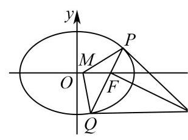

则 $\left| {QF}\right|  = \sqrt{1 + {m}^{2}}\left| {y}_{2}\right| ,\left| {PF}\right|  = \sqrt{1 + {m}^{2}}\left| {y}_{1}\right| ,\left| {GF}\right|  = 4\sqrt{1 + {m}^{2}}$ ,

因为 $m > 0,{GF} \bot  {PQ}$ ,所以在 ${\Delta GFP}$ 和 ${\Delta GFQ}$ 中,

分别有 $\tan \angle {PGF} = \frac{\left| PF\right| }{\left| GF\right| } = \frac{\left| {y}_{1}\right| }{4},\tan \angle {QGF} = \frac{\left| QF\right| }{\left| GF\right| } = \frac{\left| {y}_{2}\right| }{4}$ ,

则 $\tan \angle {PGQ} = \tan \left( {\angle {PGF} + \angle {QGF}}\right)  = \frac{\frac{\left| {y}_{1}\right| }{4} + \frac{\left| {y}_{2}\right| }{4}}{1 - \frac{\left| {y}_{1}\right| }{4} \cdot  \frac{\left| {y}_{2}\right| }{4}}$ ,

化简整理得 $\tan \angle {PGQ} = \frac{4\left( {\left| {y}_{1}\right|  + \left| {y}_{2}\right| }\right) }{{16} - \left| {y}_{1}\right| \left| {y}_{2}\right| } = \frac{4\left| {{y}_{1} - {y}_{2}}\right| }{{16} - \left| {{y}_{1}{y}_{2}}\right| }$ 4 分

由 (2) 得 ${y}_{1} + {y}_{2} = \frac{-{6m}}{4 + 3{m}^{2}},{y}_{1}{y}_{2} = \frac{-9}{4 + 3{m}^{2}}$ ,

则 $\tan \angle {PGQ} = \frac{{48}\sqrt{1 + {m}^{2}}}{{48}{m}^{2} + {55}}$ ,

令 $h = \sqrt{1 + {m}^{2}}$ ,则 $\tan \angle {PGQ} = \frac{48}{{48h} + \frac{7}{h}}$ ,

设函数 $g\left( h\right)  = {48h} + \frac{7}{h}$ ,则 ${g}^{\prime }\left( h\right)  = {48} - \frac{7}{{h}^{2}}$ ,

因为 $m > 0$ ,所以 $h > 1$ ,则 ${g}^{\prime }\left( h\right)  > 0$ ,

即函数 $g\left( h\right)  = {48h} + \frac{7}{h}$ 在区间 $\left( {1, + \infty }\right)$ 上是严格增函数,则 $g\left( h\right)  > g\left( 1\right)  = {55}$ ,

即 $0 < \tan \angle {PGQ} < \frac{48}{55} < 1$ ,则 $\angle {PGQ} < \frac{\pi }{4}$ .

## CH 每日三题 0419

【练习】1. 在 $1,2,3,\cdots ,{99}$ 这 99 个正整数中,任意取出 $k$ 个数,使得其中必有两个数 $a, b\left( {a \neq  b}\right)$ 满足 $\frac{1}{2} \; \leq  \frac{b}{a} \leq  2$ ，则 $k$ 的最小值为___.

【答案】 7

【解析】将 ${19}^{ \circ  }9$ 这 99 个正整数分为 6 组,

使得每组中任意两个数的比值都在闭区间 $\left\lbrack  {\frac{1}{2},2}\right\rbrack$ 中,且每组元素个数尽量地多.

分组如下: ${A}_{1} = \{ 1,2\} ,{A}_{2} = \{ 3,4,5,6\} ,{A}_{3} = \{ 7,8,\cdots ,{14}\}$ ,

${A}_{4} = \{ {15},{16},\cdots ,{30}\} ,{A}_{5} = \{ {31},{32},\cdots ,{62}\} ,{A}_{6} = \{ {63},{64},\cdots ,{99}\} ,$

当任取 6 个数时,比如在 ${A}_{1},{A}_{2},{A}_{3},{A}_{4},{A}_{5},{A}_{6}$ 中各取一个数时,

如取1,3,7,15,31,63,这 6 个数中任 2 个数的比值都不在闭区间 $\left\lbrack  {\frac{1}{2},2}\right\rbrack$ 中,

可见 $k > 6$ ,所以 $k \geq  7$ .

当 $k = 7$ 时,在 99 个数中任取 7 个数,

由抽屉原则得,必有 2 个数属于同一个 ${A}_{i}\left( {1 \leq  \mathrm{i} \leq  6}\right)$ ,

这两个数的比值在闭区间 $\left\lbrack  {\frac{1}{2},2}\right\rbrack$ 中. 综上所述， $k$ 的最小值为 7 .

【练习】2. (集英苑) 次可加函数在泛函分析和概率论中有广泛的应用. 若定义域为 $Z$ ,函数值为整数的函数 $f\left( x\right)$ 满足对任意的 $n, m \in  Z$ ,均有 $f\left( {m + n}\right)  \leq  f\left( m\right)  + f\left( n\right)$ ,则称 $f\left( x\right)$ 为 "离散次可加函数". 设 $f\left( x\right)$ 为离散次可加函数，若 $f\left( 0\right)  = 0$ ， $f\left( 1\right)  = 1$ ，则 $f\left( 2\right)$ 可能的取值有( )

A. 1 种 B. 2 种 C. 3 种 D. 无穷种

【答案】 $D$

【解析】对 $k \in  {Z}_{ \leq  1}$ ,考虑函数 $f\left( x\right)  = \left\{  \begin{array}{ll} k\left( {x - 1}\right)  + 1, & x \neq  0, \\  0, & x = 0, \end{array}\right.$

不难发现这个函数满足条件，且可以让 $f\left( 2\right)$ 有无穷种不同取值，因此选 $D$ .

【练习】3. “工艺折纸”是一种把纸张折成各种不同形状物品的艺术活动, 在我国源远流长. 某些折纸活动蕴含丰富的数学内容，例如:用一张圆形纸片，按如下步骤折纸(如图)

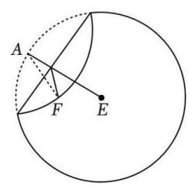

步骤 1: 设圆心是 $E$ ,在圆内异于圆心处取一点,标记为 $F$ ;

步骤 2: 把纸片折叠,使圆周正好通过点 $F$ ;

步骤 3: 把纸片展开,并留下一道折痕;

步骤 4: 不停重复步骤 2 和 3 ，就能得到越来越多的折痕.

现对这些折痕所围成的图形进行建模研究. 若取半径为 6 的圆形纸片，如图,设定点 $F$ 到圆心 $E$ 的距离为 4,按上述方法折纸. 以点 $F\text{ 、 }E$ 所在的直线为 $x$ 轴,线段 ${EF}$ 中点为原点建立平面直角坐标系.

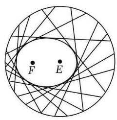

(1)若已研究出折痕所围成的图形即是折痕与线段 ${AE}$ 交点的轨迹，求折痕围成的椭圆的标准方程;

(2) 直线 $x = 1$ 与 $C$ 在第一象限内交于点 $B$ ，直线 $l : y = \frac{1}{2}x + m$ 与 $C$ 交于 $G$ 、 $H$ 两点 (均异于点 $B$ ),则直线 ${BG}\text{ 、 }{BH}$ 的斜率之和是否为定值? 若为定值,求出该定值; 若不为定值, 请说明理由;

(3) 记 (1) 问所得图形为曲线 $C$ ,若过点 $Q\left( {1,0}\right)$ 且不与 $y$ 轴垂直的直线 $l$ 与椭圆 $C$ 交于 $M\text{ 、 }N$ 两点,在 $x$ 轴的正半轴上是否存在定点 $T\left( {t,0}\right)$ ,使得直线 ${TM}\text{ 、 }{TN}$ 斜率之积为定值? 若存在, 求出该定点和定值; 若不存在, 请说明理由.

【解析】(1) 如图,以 ${EF}$ 所在的直线为 $x$ 轴, ${EF}$ 的中点 $O$ 为原点建立平面直角坐标系,

设 $M\left( {x, y}\right)$ 为椭圆上一点,由题意得 $\left| {MF}\right|  + \left| {ME}\right|  = \left| {AE}\right|  = 6 > \left| {EF}\right|  = 4$ ,

所以点 $M$ 的轨迹是以 $E\text{ 、 }F$ 为焦点,长轴 ${2a} = \left| {MF}\right|  + \left| {ME}\right|  = 6$ 的椭圆,因为 ${2a} = 6,{2c} = 4$ ,所以 $a = 3, c = 2,$

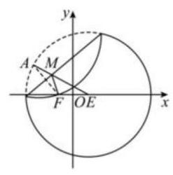

所以 ${b}^{2} = {a}^{2} - {c}^{2} = 5$ ,则椭圆的标准方程为 $\frac{{x}^{2}}{9} + \frac{{y}^{2}}{5} = 1$ ,

(2) $B\left( {1,\frac{2\sqrt{10}}{3}}\right)$ ,设 $G\left( {{x}_{1},{y}_{1}}\right) , H\left( {{x}_{2},{y}_{2}}\right) ,{x}_{1} \neq  {x}_{2} \neq  1$ ,

由 $\left\{  \begin{array}{l} \frac{{x}^{2}}{9} + \frac{{y}^{2}}{5} = 1 \\  y = \frac{1}{2}x + m \end{array}\right.$ 得 ${29}{x}^{2} + {36mx} + {36}{m}^{2} - {180} = 0$ ,

则 ${x}_{1} + {x}_{2} =  - \frac{36m}{29},{x}_{1}{x}_{2} = \frac{{36}{m}^{2} - {180}}{29}$ ,

则 ${k}_{BG} + {k}_{BH} = \frac{{y}_{1} - \frac{2\sqrt{10}}{3}}{{x}_{1} - 1} + \frac{{y}_{2} - \frac{2\sqrt{10}}{3}}{{x}_{2} - 1}$

$= \frac{\left( {{y}_{1} - \frac{2\sqrt{10}}{3}}\right) \left( {{x}_{2} - 1}\right)  + \left( {{y}_{2} - \frac{2\sqrt{10}}{3}}\right) \left( {{x}_{1} - 1}\right) }{\left( {{x}_{1} - }\right) \left( {{x}_{2} - 1}\right) }$

$= \frac{\left( {\frac{1}{2}{x}_{1} + m - \frac{2\sqrt{10}}{3}}\right) \left( {{x}_{2} - 1}\right)  + \left( {\frac{1}{2}{x}_{2} + m - \frac{2\sqrt{10}}{3}}\right) \left( {{x}_{1} - 1}\right) }{{x}_{1}{x}_{2} - \left( {{x}_{1} + {x}_{2}}\right)  + 1}$

$= \frac{{x}_{1}{x}_{2} + \left( {m - \frac{2\sqrt{10}}{3} - \frac{1}{2}}\right) \left( {{x}_{1} + {x}_{2}}\right)  - {2m} + \frac{4\sqrt{10}}{3}}{{x}_{1}{x}_{2} - \left( {{x}_{1} + {x}_{2}}\right)  + 1}$ 不为定值;

(3) 设直线 $l$ 的方程为 $x = {my} + 1$ ，

由 $\left\{  \begin{array}{l} \frac{{x}^{2}}{9} + \frac{{y}^{2}}{5} = 1 \\  x = {my} + 1 \end{array}\right.$ 得 $\left( {5{m}^{2} + 9}\right) {y}^{2} + {10my} - {40} = 0$ ,

设 $M\left( {{x}_{1},{y}_{1}}\right) , N\left( {{x}_{2},{y}_{2}}\right) ,{y}_{1} + {y}_{2} = \frac{-{10m}}{5{m}^{2} + 9},{y}_{1}{y}_{2} = \frac{-{40}}{5{m}^{2} + 9}$ ,

则 ${k}_{TM} \cdot  {k}_{TN} = \frac{{y}_{1}}{{x}_{1} - t} \cdot  \frac{{y}_{2}}{{x}_{2} - t} = \frac{{y}_{1}{y}_{2}}{\left( {m{y}_{1} + 1 - t}\right) \left( {m{y}_{2} + 1 - t}\right) }$

$= \frac{{y}_{1}{y}_{2}}{{m}^{2}{y}_{1}{y}_{2} + m\left( {1 - t}\right) \left( {{y}_{1} + {y}_{2}}\right)  + {\left( 1 - t\right) }^{2}},$

消去 ${y}_{1} + {y}_{2}$ 和 ${y}_{1} \cdot  {y}_{2}$ 得 ${k}_{TM} \cdot  {k}_{TN} = \frac{-{40}}{5\left( {{t}^{2} - 9}\right) {m}^{2} + 9{\left( 1 - t\right) }^{2}}$ ,

要使 ${k}_{TM} \cdot  {k}_{TN}$ 为定值,则 ${t}^{2} - 9 = 0$ ,

因为 $t > 0$ ，所以 $t = 3$ ，此时 ${k}_{TM} \cdot  {k}_{TN} =  - \frac{10}{9}$ ，

所以存在点 $T\left( {3,0}\right)$ 使得 ${k}_{TM}$ 和 ${k}_{TN}$ 之积为 $- \frac{10}{9}$ .

## 1 每日三题 0420

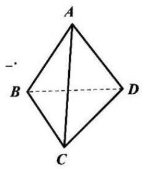

【练习】1. (2024 届华二) 已知四面体 ${ABCD}$ 中, ${AB} = 3,{CD} = 2$ ,则 $\overrightarrow{BC} \cdot  \overrightarrow{AD} - \overrightarrow{BD}$ . $\overrightarrow{AC}$ 的取值范围是___

【答案】 $\left( {-6,6}\right)$

【解析】 $\overrightarrow{BC} \cdot  \overrightarrow{AD} - \overrightarrow{BD} \cdot  \overrightarrow{AC} = \overrightarrow{BC} \cdot  \left( {\overrightarrow{BD} - \overrightarrow{BA}}\right)  - \overrightarrow{BD} \cdot  \left( {\overrightarrow{BC} - \overrightarrow{BA}}\right)$

$= \overrightarrow{BD} \cdot  \overrightarrow{BA} - \overrightarrow{BC} \cdot  \overrightarrow{BA} = \overrightarrow{CD} \cdot  \overrightarrow{BA} \in  \left( {-6,6}\right)$ .

【练习】2. (2024 届徐汇三模) 对于函数 $y = f\left( x\right)$ ,设 ${p}_{1}$ : 对任意的 $x \in  R$ ,均有 $f\left( {-x}\right)  = \left| {f\left( x\right) }\right| ,{p}_{2}$ : 对任意的 $x \in  R$ ,均有 $f\left( {-x}\right)  = f\left( \left| x\right| \right) , q :$ 函数 $y = f\left( x\right)$ 为偶函数,则 ( )

A. ${p}_{1}\text{ 、 }{p}_{2}$ 中仅 ${p}_{1}$ 是 $q$ 的充分条件 B. ${p}_{1}\text{ 、 }{p}_{2}$ 中仅 ${p}_{2}$ 是 $q$ 的充分条件

C. ${p}_{1}\text{ 、 }{p}_{2}$ 均是 $q$ 的充分条件 D. ${p}_{1}\text{ 、 }{p}_{2}$ 均不是 $q$ 的充分条件

【答案】 $C$

【解析】对于条件 ${p}_{1}$ ,由 $f\left( {-x}\right)  = \left| {f\left( x\right) }\right|$ 对任意 $x \in  R$ 恒成立得 $f\left\lbrack  {-\left( {-x}\right) }\right\rbrack   = \left| {f\left( {-x}\right) }\right|$ ,

即对任意 $x \in  R$ 均有 $f\left( x\right)  = \left| {f\left( {-x}\right) }\right|  \geq  0$ ,

由 $f\left( {-x}\right)  = \left| {f\left( x\right) }\right|$ 得 $f\left( {-x}\right)  = f\left( x\right)$ 对任意 $x \in  R$ 恒成立,

所以函数 $y = f\left( x\right)$ 是偶函数;

对于条件 ${p}_{2}$ ,由 $f\left( {-x}\right)  = f\left( \left| x\right| \right)$ 对任意 $x \in  R$ 恒成立得 $f\left\lbrack  {-\left( {-x}\right) }\right\rbrack   = f\left( \left| {-x}\right| \right)$ ,

即 $f\left( x\right)  = f\left( \left| {-x}\right| \right)$ ,由 $f\left( {-x}\right)  = f\left( \left| x\right| \right)$ 得 $f\left( {-x}\right)  = f\left( x\right)$ 对任意 $x \in  R$ 恒成立,

所以函数 $y = f\left( x\right)$ 是偶函数.

所以条件 ${p}_{1}\text{ 、 }{p}_{2}$ 均为结论 $q$ 的充分条件,故选 $C$ .

【练习】3. 设函数 $f\left( x\right)$ 的定义域为 $D$ ,对于区间 $I = \left\lbrack  {a, b}\right\rbrack  \left( {a < b, I \subseteq  D}\right)$ ,若满足以下两条性质之一,则称 $I$ 为 $f\left( x\right)$ 的一个“ $\Omega$ 区间”.

性质 1 : 对任意 $x \in  I$ ,有 $f\left( x\right)  \in  I$ ;

性质 2: 对任意 $x \in  I$ ,有 $f\left( x\right)  \notin  I$ .

(1)分别判断区间 $\left\lbrack  {1,2}\right\rbrack$ 是否为下列两函数的“Ω区间” (直接写出结论.)

① $y = 3 - x$ ; ② $y = \frac{3}{x}$

(2)若 $\left\lbrack  {0, m}\right\rbrack  \left( {m > 0}\right)$ 是函数 $f\left( x\right)  =  - {x}^{2} + {2x}$ 的“ $\Omega$ 区间”，求 $m$ 的取值范围:

(3) 已知定义在 $R$ 上,且图像连续不断的函数 $f\left( x\right)$ 满足: 对任意 $a,{x}_{1},{x}_{2} \in  R$ ,且 ${x}_{1} \neq  {x}_{2}$ ,有 $\frac{f\left( {x}_{2}\right)  - f\left( {x}_{1}\right) }{{x}_{2} - {x}_{1}} <  - 1$ . 求证: $f\left( x\right)$ 存在 “ $\Omega$ 区间”,且存在 ${x}_{0} \in  R$ ,使得 ${x}_{0}$ 不属于 $f\left( x\right)$ 的任意一个 “ $\Omega$ 区间”.

【解析】(1) ① 是，②不是；

(2) 记 $I = \left\lbrack  {0, m}\right\rbrack  , S = \{ f\left( x\right)  \mid  x \in  I\}$ ,易知 $f\left( 0\right)  = 0 \in  \left\lbrack  {0, m}\right\rbrack$ ,

故若 $I$ 为 $f\left( x\right)$ 的“ $\Omega$ 区间”，则不满足性质 (2)，必满足性质 (1)，即 $S \subseteq  I$ ；

$f\left( x\right)  =  - {x}^{2} + {2x} =  - {\left( x - 1\right) }^{2} + 1,$

当 $0 < m < 1$ 时, $f\left( x\right)$ 在 $\left\lbrack  {0, m}\right\rbrack$ 上单调递增,且 $f\left( m\right)  - m =  - m\left( {m - 1}\right)  > 0$ ,

所以 $S = \left\lbrack  {0, f\left( m\right) }\right\rbrack$ 不包含于 $I = \left\lbrack  {0, m}\right\rbrack$ ,不合题意;

当 $1 \leq  m \leq  2$ 时, $S = \left\lbrack  {f\left( 0\right) , f\left( 1\right) }\right\rbrack   = \left\lbrack  {0,1}\right\rbrack   \subseteq  \left\lbrack  {0, m}\right\rbrack   = I$ ,符合题意;

当 $m > 2$ 时, $f\left( m\right)  < f\left( 2\right)  = f\left( 0\right)  = 0$ ,所以 $f\left( m\right)  \notin  I$ ,不合题意; 综上可知, $m \in  \left\lbrack  {1,2}\right\rbrack$ ;

(3)证明:对于任意区间 $I = \left\lbrack  {a, b}\right\rbrack  \left( {a < b}\right)$ ，记 $S = \{ f\left( x\right)  \mid  x \in  I\}$ ，

由已知得 $f\left( x\right)$ 在 $I$ 上单调递减,故 $S = \left\lbrack  {f\left( b\right) , f\left( a\right) }\right\rbrack$ ,因为 $\frac{f\left( b\right)  - f\left( a\right) }{b - a} <  - 1$ ,故 $f\left( a\right)  - f\left( b\right)  > b - a$ , 即 $S$ 的长度大于 $I$ 的长度,故不满足性质 (1),

所以若 $I$ 为 $f\left( x\right)$ 的 “ $\Omega$ 区间”,必须满足性质 (2),即 $S \cap  I = \varnothing$ ,

即只存在 $a \in  R$ 使得 $f\left( a\right)  < a$ ，或存在 $b \in  R$ ，使得 $f\left( b\right)  > b$ ，

因为 $f\left( x\right)  = x$ 不恒成立，所以上述条件满足，所以 $f\left( x\right)$ 一定存在 “ $\Omega$ 区间”；记 $g\left( x\right)  = f\left( x\right)  - x$ ，先证明 $g\left( x\right)$ 有唯一零点,

因为 $f\left( x\right)$ 在 $R$ 上是减函数，所以 $g\left( x\right)$ 在 $R$ 上是减函数，

则若 $f\left( 0\right)  = 0$ ,则 ${x}_{0} = 0$ 是 $g\left( x\right)$ 的唯一零点,

若 $f\left( 0\right)  = t > 0$ ,则 $f\left( t\right)  < f\left( 0\right)  = t$ ,即 $g\left( 0\right)  > 0, g\left( t\right)  < 0$ ,

由零点存在性定理,结合 $g\left( x\right)$ 的单调性,可知存在唯一 ${x}_{0} \in  \left( {0, t}\right)$ ,使得 $g\left( {x}_{0}\right)  = 0$ ,综上可知, $g\left( x\right)$ 有唯一零点 ${x}_{0}$ ,即 $f\left( {x}_{0}\right)  = {x}_{0}$ ,

所以 $f\left( x\right)$ 的所有 “ $\Omega$ 区间” $I$ 都满足性质 (2),故 ${x}_{0} \notin  I$ .

## CH 每日三题 0421

【练习】1.2023年“国际进口博览会”即将在上海举行，现要在场馆入口布且一个大型立体花卉景观，景观的框架由中空钢管搭建的而成, 外型是由若干个小正方体叠加而成的大正方体, 已知搭建此立体花卉景观的脚手架钢管安装呈现东一西、南一北、上一下的网络状，每三根钢管相交处需要焊接， 这些焊接点 (小正方体的顶点) 称为格点, 相邻焊接点之间的距离都为 1 米 (即每个小正方体的棱长都为 1 米). 若以互相垂直的三条钢管为轴建立空间直角坐标系, 现要在一个格点处接入水源, 并在下述 6 个格点: $\left( {-2,2,0}\right) ,\left( {3,1, - 1}\right) ,\left( {3,4,2}\right) ,\left( {4,5,1}\right) ,\left( {6,6, - 2}\right) ,\left( {0,0,3}\right)$ 处安装喷淋,使 6 处喷淋与水源接入口所排水管的总长度最小，则此时水管总长度的最小值为___米(水管必须在连通的钢管内部穿行，不计各接头处的水管损耗).

【答案】33

【解析】设水源接入口的坐标为 $\left( {x, y, z}\right)$ ,

设 ${y}_{1} = \left| {x + 2}\right|  + \left| {x - 3}\right|  + \left| {x - 3}\right|  + \left| {x - 4}\right|  + \left| {x - 6}\right|  + \left| x\right|$ ,

${y}_{2} = \left| {y - 2}\right|  + \left| {y - 1}\right|  + \left| {y - 4}\right|  + \left| {y - 5}\right|  + \left| {y - 6}\right|  + \left| y\right| ,$

${y}_{3} = \left| z\right|  + \left| {z + 1}\right|  + \left| {z - 2}\right|  + \left| {z - 1}\right|  + \left| {z + 2}\right|  + \left| {z - 3}\right| ,$

则 6 处喷淋与水源接入口所排水管总长度为 ${y}_{1} + {y}_{2} + {y}_{3}$ ,

当 $x = 3$ 时， ${y}_{1}$ 取最小值 12，当 $2 \leq  y \leq  4$ 时， ${y}_{2}$ 取最小值 12，

当 $0 \leq  z \leq  1$ 时， ${y}_{3}$ 取最小值 9，故水管总长度的最小值为 ${12} + {12} + 9 = {33}$ 米.

【练习】2. (2025 届华二) 已知 $n$ 个大于 2 的实数 ${x}_{1}\text{ 、 }{x}_{2}\text{ 、 }\cdots \text{ 、 }{x}_{n}$ ,对任意 ${x}_{i}\left( {\mathrm{i} = 1,2,\cdots , n}\right)$ ,存在 ${y}_{i} \geq  2$ 满足 ${y}_{i} \; < {x}_{i}$ ,且 ${x}_{i}^{{y}_{i}} = {y}_{i}^{{x}_{i}}$ ,则使得 ${x}_{1} + {x}_{2} + \cdots  + {x}_{n - 1} \leq  {15}{x}_{n}$ 成立的最大正整数 $n$ 为 ( )

A. 14 B. 16 C. 21 D. 23

【答案】 $D$

【解析】由 ${x}_{i}^{{y}_{i}} = {y}_{i}^{{x}_{i}}$ ,且 ${y}_{i} \geq  2,{x}_{i} > 2$ ,故 ${y}_{i}\ln {x}_{i} = {x}_{i}\ln {y}_{i}$ 即 $\frac{\ln {x}_{i}}{{x}_{i}} = \frac{\ln y}{{y}_{i}}$ ,

令 $f\left( x\right)  = \frac{\ln x}{x}\left( {x \geq  2}\right) ,{f}^{\prime }\left( x\right)  = \frac{1 - \ln x}{{x}^{2}}$ ,

故当 $x \in  \left( {2,\mathrm{e}}\right)$ 时, ${f}^{\prime }\left( x\right)  > 0$ ,当 $x \in  \left( {\mathrm{e}, + \infty }\right)$ 时, ${f}^{\prime }\left( x\right)  < 0$ ,

即 $f\left( x\right)$ 在 $\left( {2,\mathrm{e}}\right)$ 上严格增,在 $\left( {\mathrm{e}, + \infty }\right)$ 上严格减,

由 $\frac{\ln {x}_{i}}{{x}_{i}} = \frac{\ln y}{{y}_{i}}$ ,即 $f\left( {x}_{i}\right)  = f\left( {y}_{i}\right)$ ,故 ${x}_{1} > \mathrm{e},2 \leq  {y}_{i} < \mathrm{e}$ ,

又 $f\left( 2\right)  = \frac{\ln 2}{2} = \frac{\ln 4}{4} = f\left( 4\right)$ ,故 ${x}_{i} \leq  4$ ,即 $\mathrm{e} < {x}_{i} \leq  4$ ,

若 ${x}_{1} + {x}_{2} + \cdots  + {x}_{n - 1} \leq  {15}{x}_{n}$ ,则有 ${15} \geq  \frac{{x}_{1} + {x}_{2} + \cdots  + {x}_{n - 1}}{{x}_{n}} \geq  \frac{\left( {n - 1}\right) \mathrm{e}}{4}$ ,

即 $n \leq  \frac{60}{\mathrm{e}} + 1$ ，由 $\mathrm{e} \approx  {2.72}$ ，故 $\frac{60}{\mathrm{e}} + 1 \approx  {22.06} + 1 = {23.06}$ ，

故最大正整数 $n$ 为 23 . 故选 $D$ .

【练习】3. 已知函数 $y = f\left( x\right)$ 的定义域为区间 $D$ ,若对于给定的非零实数 $m$ ,存在 ${x}_{0}$ , 使得 $f\left( {x}_{0}\right)  = f\left( {{x}_{0} + m}\right)$ ,则称函数 $y = f\left( x\right)$ 在区间 $D$ 上具有性质 $P\left( m\right)$ .

(1)判断函数 $f\left( x\right)  = {x}^{2}$ 在区间 $\left\lbrack  {-1,1}\right\rbrack$ 上是否具有性质 $P\left( \frac{1}{2}\right)$ ，并说明理由；

(2)若函数 $f\left( x\right)  = \sin x$ 在区间 $\left( {0, n}\right) \left( {n > 0}\right)$ 上具有性质 $P\left( \frac{\pi }{4}\right)$ ，求 $n$ 的取值范围；

(3)已知函数 $y = f\left( x\right)$ 的图像是连续不断的曲线，且 $f\left( 0\right)  = f\left( 2\right)$ ，求证:函数 $y = f\left( x\right)$ 在区间 $\left\lbrack  {0,2}\right\rbrack$ 上具有性质 $P\left( \frac{1}{3}\right)$ .

【解析】(1) 函数 $f\left( x\right)  = {x}^{2}$ 在 $\left\lbrack  {-1,1}\right\rbrack$ 上具有性质 $P\left( \frac{1}{2}\right)$ . 1 分

若 ${x}_{0}^{2} = {\left( {x}_{0} + \frac{1}{2}\right) }^{2}$ ,则 ${x}_{0} =  - \frac{1}{4},.$ 2 分

因为 $- \frac{1}{4} \in  \left\lbrack  {-1,1}\right\rbrack$ ,且 $- \frac{1}{4} + \frac{1}{2} = \frac{1}{4} \in  \left\lbrack  {-1,1}\right\rbrack$ ,

所以函数 $f\left( x\right)  = {x}^{2}$ 在 $\left\lbrack  {-1,1}\right\rbrack$ 上具有性质 $P\left( \frac{1}{2}\right) ..4$ 分

( 2 )由题意得存在 ${x}_{0} \in  \left( {0, n}\right)$ ，使得 $\sin {x}_{0} = \sin \left( {{x}_{0} + \frac{\pi }{4}}\right)$ ，

由正弦线的定义得 ${x}_{0} + \frac{\pi }{4} = {x}_{0} + {2k\pi }$ (舍) 或 ${x}_{0} + \frac{\pi }{4} = {2k\pi } + \pi  - {x}_{0}\left( {k \in  Z}\right)$ ,

则 ${x}_{0} = {k\pi } + \frac{3\pi }{8}..2$ 分

因为 ${x}_{0} = {k\pi } + \frac{3\pi }{8} > 0$ ,所以 $k \in  N..4$ 分

又因为 ${x}_{0} = {k\pi } + \frac{3\pi }{8} \in  \left( {0, n}\right)$ 且 ${x}_{0} + \frac{\pi }{4} = {k\pi } + \frac{5\pi }{8} \in  \left( {0, n}\right) \left( {k \in  N}\right)$ ,

所以 $n > \frac{5\pi }{8}$ ,即所求 $n$ 的取值范围是 $\left( {\frac{5\pi }{8}, + \infty }\right)$ . 6 分

(3)设 $g\left( x\right)  = f\left( x\right)  - f\left( {x + \frac{1}{3}}\right) , x \in  \left\lbrack  {0,\frac{5}{3}}\right\rbrack  .$ . 2 分

则 $g\left( 0\right)  = f\left( 0\right)  - f\left( \frac{1}{3}\right) , g\left( \frac{1}{3}\right)  = f\left( \frac{1}{3}\right)  - f\left( \frac{2}{3}\right) , g\left( \frac{2}{3}\right)  = f\left( \frac{2}{3}\right)  - f\left( 1\right) ,\cdots$

$g\left( \frac{k - 1}{3}\right)  = f\left( \frac{k - 1}{3}\right)  - f\left( \frac{k}{3}\right) ,\cdots , g\left( \frac{5}{3}\right)  = f\left( \frac{5}{3}\right)  - f\left( 2\right) \left( {k \in  \{ 1,2,3,\cdots ,6\} }\right) .$

以上各式相加得 $g\left( 0\right)  + g\left( \frac{1}{3}\right)  + \cdots  + g\left( \frac{k - 1}{3}\right)  + \cdots  + g\left( \frac{5}{3}\right)  = f\left( 2\right)  - f\left( 0\right)$ ,

即 $g\left( 0\right)  + g\left( \frac{1}{3}\right)  + \cdots  + g\left( \frac{k - 1}{3}\right)  + \cdots  + g\left( \frac{5}{3}\right)  = 0\left( {k \in  \{ 1,2,3,\cdots ,6\} }\right) .\cdots 4$ 分

(i) 当 $g\left( 0\right) \text{ 、 }g\left( \frac{1}{3}\right) \text{ 、 }\cdots \text{ 、 }g\left( \frac{k - 1}{3}\right) \text{ 、 }\cdots \text{ 、 }g\left( \frac{5}{3}\right)$ 中有一个为 0 时,

不妨设 $g\left( \frac{i - 1}{3}\right)  = 0,\mathrm{i} \in  \{ 1,2,3,\cdots ,6\}$ ,即 $g\left( \frac{i - 1}{3}\right)  = f\left( \frac{i - 1}{3}\right)  - f\left( \frac{i}{3}\right)  = 0$ ,

即 $f\left( \frac{i - 1}{3}\right)  = f\left( {\frac{i - 1}{3} + \frac{1}{3}}\right) ,\mathrm{i} \in  \{ 1,2,3,\cdots ,6\}$ ,

所以函数 $y = f\left( x\right)$ 在区间 $\left\lbrack  {0,2}\right\rbrack$ 上具有性质 $P\left( \frac{1}{3}\right) ..6$ 分

(ii) 当 $g\left( 0\right) \text{ 、 }g\left( \frac{1}{3}\right) \text{ 、 }\cdots \text{ 、 }g\left( \frac{n - 1}{3}\right) \text{ 、 }\cdots \text{ 、 }g\left( \frac{5}{3}\right)$ 中均不为 0 时,由于其和为 0,

则其中必存在正数和负数，不妨设 $g\left( \frac{i - 1}{3}\right)  > 0$ ， $g\left( \frac{j - 1}{3}\right)  < 0$ ，

其中 $\mathrm{i} \neq  j,\mathrm{i}, j \in  \{ 1,2,3,\cdots ,6\}$ .

由于函数 $y = g\left( x\right)$ 的图像是连续不断的曲线,

所以当 $\mathrm{i} < j$ 时,至少存在一个实数 ${x}_{0} \in  \left( {\frac{i - 1}{3},\frac{j - 1}{3}}\right)$ (当 $\mathrm{i} > j$ 时,至少存在

一个实数 $\left. {{x}_{0} \in  \left( {\frac{j - 1}{3},\frac{i - 1}{3}}\right) }\right)$ ,其中 $\mathrm{i}, j \in  \{ 1,2,3,\cdots ,6\}$ ,使得 $g\left( {x}_{0}\right)  = 0$ ,

即 $g\left( {x}_{0}\right)  = f\left( {x}_{0}\right)  - f\left( {{x}_{0} + \frac{1}{3}}\right)  = 0$ ,即存在 ${x}_{0}$ ,使得 $f\left( {x}_{0}\right)  = f\left( {{x}_{0} + \frac{1}{3}}\right)$ ,

所以函数 $y = f\left( x\right)$ 在区间 $\left\lbrack  {0,2}\right\rbrack$ 上也具有性质 $P\left( \frac{1}{3}\right)$ .

综上,函数 $y = f\left( x\right)$ 在区间 $\left\lbrack  {0,2}\right\rbrack$ 上具有性质 $P\left( \frac{1}{3}\right) ..8$ 分

## 四 每日三题 0422

【练习】1. 函数 $f\left( x\right)  = \sqrt{1 - {x}^{2}}, - \frac{1}{2} \leq  x \leq  \frac{1}{2}$ 的图像绕着原点旋转弧度 $\theta \left( {0 \leq  \theta  \leq  \pi }\right)$ ,若得到的图像仍是函数图像，则 $\theta$ 可取值的集合为___.

【答案】 $\left\lbrack  {0,\frac{\pi }{3}}\right\rbrack   \cup  \left\lbrack  {\frac{2\pi }{3},\pi }\right\rbrack$

【解析】画出函数 $f\left( x\right)  = \sqrt{1 - {x}^{2}}, - \frac{1}{2} \leq  x \leq  \frac{1}{2}$ 的图象,如图 1 所示:

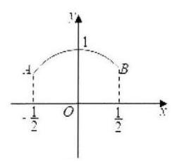

图 1

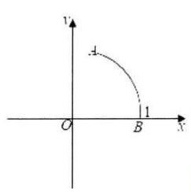

图 2

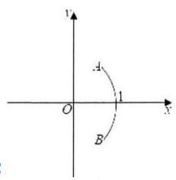

图 3

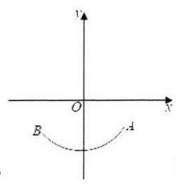

图 4

圆弧所在圆的方程为 ${x}^{2} + {y}^{2} = 1, A\left( {-\frac{1}{2},\frac{\sqrt{3}}{2}}\right) , B\left( {\frac{1}{2},\frac{\sqrt{3}}{2}}\right)$ ,

在图象绕原点旋转的过程中,当点 $B$ 从图 1 的位置旋转到 $\left( {1,0}\right)$ 点时,

由函数的定义得这个旋转过程所得的图形均为函数的图象,如图 2 所示:

此时绕着原点旋转弧度为 $0 \leq  \theta  \leq  \frac{\pi }{3}$ .

若函数图象在图 2 位置绕着原点继续旋转，

当点 $B$ 在 $x$ 轴下方,点 $A$ 在 $x$ 轴上方时,

由函数的定义得,所得图形不是函数的图象,如图 3 所示:

此时转过的角度为 $\frac{\pi }{3} < \theta  < \frac{2\pi }{3}$ ,不满足题意;

若函数图象在图 3 位置绕着原点继续旋转，当整个图象都在 $x$ 轴下方时，

由函数的定义得，所得图形是函数的图象，如图 4 所示:

此时转过的角度为 $\frac{2\pi }{3} \leq  \theta  \leq  \pi$ ;

综上, $\theta$ 的可取值集合为 $\left\lbrack  {0,\frac{\pi }{3}}\right\rbrack   \cup  \left\lbrack  {\frac{2\pi }{3},\pi }\right\rbrack$ .

【练习】2. (2025 届复附) 设集合 $P = \{  - 1,1\} , Q = \{ x \mid  x > 0$ 且 $x \neq  1\}$ ,函数 $f\left( x\right)  = {a}^{x} + \; \lambda {a}^{-x}\left( {a > 0\text{ 且 }a \neq  1}\right)$ ,下列四个命题:

① 对任意 $\lambda  \in  P$ ，存在 $a \in  Q$ ，使得 $y = f\left( x\right)$ 是增函数；

② 存在 $\lambda  \in  P$ ，对任意 $a \in  Q$ ， $y = f\left( x\right)$ 是减函数；

③对任意 $\lambda  \in  P$ ，存在 $a \in  Q$ ，使得 $y = f\left( x\right)$ 是奇函数；

④ 存在 $\lambda  \in  P$ ，对任意 $a \in  Q$ ， $y = f\left( x\right)$ 是偶函数

其中真命题的个数是 ( )

A. 1 个 B. 2 个 C. 3 个 D. 4 个

【答案】 $A$

【解析】 $< 1 >$ 当 $\lambda  = 1\text{ ， }a \in  \left( {0,1}\right)$ 时， $f\left( x\right)  = {a}^{x} + {a}^{-x}$ ，

则 ${f}^{\prime }\left( x\right)  = {a}^{x}\ln a - {a}^{-x}\ln a = \ln a\left( {{a}^{x} - {a}^{-x}}\right)$ ，因为 $a \in  \left( {0,1}\right)$ ，所以 $\ln a < 0$ ，

所以当 $x \in  \left( {-\infty ,0}\right)$ 时， ${a}^{x} - {a}^{-x} > 0$ ，即 ${f}^{\prime }\left( x\right)  < 0$ ；

当 $x \in  \left( {0, + \infty }\right)$ 时, ${a}^{x} - {a}^{-x} < 0$ ,即 ${f}^{\prime }\left( x\right)  > 0$ ,

所以 $f\left( x\right)$ 严格减区间为 $\left( {-\infty ,0}\right)$ ,严格增区间为 $\left( {0, + \infty }\right)$

因为 $f\left( {-x}\right)  = {a}^{-x} + {a}^{x} = f\left( x\right)$ ，所以 $f\left( x\right)$ 为偶函数

$< 2 >$ 当 $\lambda  = 1, a \in  \left( {1, + \infty }\right)$ 时, $f\left( x\right)  = {a}^{x} + {a}^{-x}$ ,

则 ${f}^{\prime }\left( x\right)  = {a}^{x}\ln a - {a}^{-x}\ln a = \ln a\left( {{a}^{x} - {a}^{-x}}\right)$ ,因为 $a \in  \left( {1, + \infty }\right)$ ,所以 $\ln a > 0$ ,

所以当 $x \in  \left( {-\infty ,0}\right)$ 时, ${a}^{x} - {a}^{-x} < 0$ ,即 ${f}^{\prime }\left( x\right)  < 0$ ;

当 $x \in  \left( {0, + \infty }\right)$ 时, ${a}^{x} - {a}^{-x} > 0$ ,即 ${f}^{\prime }\left( x\right)  > 0$ ,

所以 $f\left( x\right)$ 严格减区间为 $\left( {-\infty ,0}\right)$ ,严格增区间为 $\left( {0, + \infty }\right)$

因为 $f\left( {-x}\right)  = {a}^{-x} + {a}^{x} = f\left( x\right)$ ，所以 $f\left( x\right)$ 为偶函数

$< 3 >$ 当 $\lambda  =  - 1, a \in  \left( {0,1}\right)$ 时, $f\left( x\right)  = {a}^{x} - {a}^{-x}$ ,

则 ${f}^{\prime }\left( x\right)  = {a}^{x}\ln a + {a}^{-x}\ln a = \ln a\left( {{a}^{x} + {a}^{-x}}\right)$ ,因为 $a \in  \left( {0,1}\right)$ ,所以 $\ln a < 0$ ,

又因为 ${a}^{x} + {a}^{-x} > 0$ 恒成立，所以 ${f}^{\prime }\left( x\right)  < 0$ 恒成立，所以 $f\left( x\right)$ 是减函数

因为 $f\left( {-x}\right)  = {a}^{-x} - {a}^{x} =  - f\left( x\right)$ ，所以 $f\left( x\right)$ 为奇函数

$< 4 >$ 当 $\lambda  =  - 1, a \in  \left( {1, + \infty }\right)$ 时， $f\left( x\right)  = {a}^{x} - {a}^{-x}$ ，

则 ${f}^{\prime }\left( x\right)  = {a}^{x}\ln a + {a}^{-x}\ln a = \ln a\left( {{a}^{x} + {a}^{-x}}\right)$ ，因为 $a \in  \left( {1, + \infty }\right)$ ，所以 $\ln a > 0$ ，

又因为 ${a}^{x} + {a}^{-x} > 0$ 恒成立，所以 ${f}^{\prime }\left( x\right)  > 0$ 恒成立，

所以 $f\left( x\right)  = {a}^{x} - {a}^{-x}$ 是增函数

因为 $f\left( {-x}\right)  = {a}^{-x} - {a}^{x} =  - f\left( x\right)$ ,所以 $f\left( x\right)$ 为奇函数

综上,对于 ①,由上述 $\langle 1\rangle ,\langle 2\rangle$ 得,当 $\lambda  = 1,\forall a \in  Q$ 时, $y = f\left( x\right)$ 不是增函数,

故①不正确；

对于②，由上述 $< 1 > , < 2 >$ 得，当 $\lambda  = 1$ ， $\forall a \in  Q$ 时， $y = f\left( x\right)$ 不是减函数，

由上述 $\langle 3\rangle ,\langle 4\rangle$ 得,当 $\lambda  =  - 1, a \in  \left( {1, + \infty }\right)$ 时, $f\left( x\right)$ 是增函数,故②不正确；

对于 ③，由上述 $\langle 1\rangle ,\langle 2\rangle$ 得，当 $\lambda  = 1$ ， $\forall a \in  Q$ 时， $y = f\left( x\right)$ 是偶函数，

故③不正确；

对于④，由上述 $\langle 3\rangle ,\langle 4\rangle$ 得，当 $\lambda  =  - 1$ ， $\forall a \in  Q$ 时， $y = f\left( x\right)$ 是奇函数，

故④正确

故选 $A$

【练习】3. (2024 届华二) 已知直线 $l : y = {kx} + t$ 与双曲线 $C : \frac{{x}^{2}}{2} - {y}^{2} = 1$ 相切于点 $Q$ .

(1)试在集合 $\left\{  {\frac{1}{2},\frac{\sqrt{2}}{2},\frac{\sqrt{3}}{2},1}\right\}$ 中选择一个数作为 $k$ 的值，使得相应的 $t$ 的值存在，并求相应的 $t$ 的值;

(2)设直线 $m$ 过点 $M\left( {-3\sqrt{2},0}\right)$ 且其法向量 $\overrightarrow{n} = \left( {k, - 1}\right)$ ，证明:当 $k > \frac{\sqrt{2}}{2}$ 时，在双曲线 $C$ 的右支上不存在点 $N$ ，使之到直线 $m$ 的距离为 $\sqrt{6}$ ；

(3)已知过点 $Q$ 且与直线 $l$ 垂直的直线 ${l}^{\prime }$ 分别交 $x, y$ 轴于 $A, B$ 两点，又 $P$ 是线段 ${AB}$ 中点，求点 $P$ 的轨迹方程.

【解析】(1) 由 $\left\{  \begin{matrix} y = {kx} + t \\  {x}^{2} - 2{y}^{2} = 2 \end{matrix}\right.$ 得 $\left( {1 - 2{k}^{2}}\right) {x}^{2} - {4ktx} - 2{t}^{2} - 2 = 0$ ,

所以 $1 - 2{k}^{2} \neq  0$ ,且 $\Delta  = {16}{k}^{2}{t}^{2} + 4\left( {1 - 2{k}^{2}}\right) \left( {2{t}^{2} + 2}\right)  = 8\left( {{t}^{2} + 1 - 2{k}^{2}}\right)  = 0$ ,

即 ${t}^{2} + 1 = 2{k}^{2},{k}^{2} \neq  \frac{1}{2}$ ,

所以当 $k = \frac{\sqrt{3}}{2}$ 时, $t =  \pm  \frac{\sqrt{2}}{2}$ ; 当 $k = 1$ 时, $t =  \pm  1$ .

(2)法一:设过原点且平行于 $m$ 的直线 $b : {kx} - y = 0$ ，

则直线 $m$ 与 $b$ 的距离 $d = \frac{3\sqrt{2}\left| k\right| }{\sqrt{1 + {k}^{2}}}$ ,当 $k > \frac{\sqrt{2}}{2}$ 时, $d > \sqrt{6}$ ;

又双曲线 $C$ 的渐近线为 $x \pm  \sqrt{2}y = 0$ ，所以双曲线 $C$ 的右支在直线 $b$ 的右下方，

因此双曲线 $C$ 右支上的任意点到直线 $l$ 的距离大于 $\sqrt{6}$ ,

故在双曲线 $C$ 的右支上不存在点 $N$ ,使之到直线 $l$ 的距离为 $\sqrt{6}$ .

法二: 假设双曲线 $C$ 右支上存在点 $N\left( {{x}_{0},{y}_{0}}\right)$ 到直线 $m$ 的距离为 $\sqrt{6}$ ,

则 $\left\{  \begin{array}{l} \frac{\left| k{x}_{0} - {y}_{0} + 3\sqrt{2}k\right| }{\sqrt{1 + {k}^{2}}} = \sqrt{6}\text{ ①, } \\  {x}_{0}^{2} - 2{y}_{0}^{2} = 2\text{ ② } \end{array}\right.$

由 ① 得 ${y}_{0} = k{x}_{0} + 3\sqrt{2}k \pm  \sqrt{6} \cdot  \sqrt{1 + {k}^{2}}$ ,设 $t = 3\sqrt{2}k \pm  \sqrt{6} \cdot  \sqrt{1 + {k}^{2}}$ ,

当 $k > \frac{\sqrt{2}}{2}$ 时， $t = 3\sqrt{2}k + \sqrt{6} \cdot  \sqrt{1 + {k}^{2}} > 0$ ，

$t = 3\sqrt{2}k - \sqrt{6} \cdot  \sqrt{1 + {k}^{2}} = \sqrt{6} \times  \frac{2{k}^{2} - 1}{\sqrt{3{k}^{2}} + \sqrt{1 + {k}^{2}}} > 0,$

将 ${y}_{0} = k{x}_{0} + t$ 代入② 得 $\left( {1 - 2{k}^{2}}\right) {x}_{0}^{2} - {4kt}{x}_{0} - 2\left( {{t}^{2} + 1}\right)  = 0$ (*)，

因为 $k > \frac{\sqrt{2}}{2}, t > 0$ ,所以 $1 - 2{k}^{2} < 0, - {4kt} < 0, - 2\left( {{t}^{2} + 1}\right)  < 0$ ,

所以方程 (*) 不存在正根，即假设不成立；

故在双曲线 $C$ 的右支上不存在点 $N$ ，使之到直线 $l$ 的距离为 $\sqrt{6}$ .

(3)由(1)得 ${x}_{Q} = \frac{2kt}{1 - 2{k}^{2}},{y}_{Q} = k{x}_{Q} + t = \frac{t}{1 - 2{k}^{2}}$ ，

所以 ${l}^{\prime }$ 的方程为 $y =  - \frac{1}{k}\left( {x - \frac{2kt}{1 - 2{k}^{2}}}\right)  + \frac{t}{1 - 2{k}^{2}} =  - \frac{1}{k}x + \frac{3t}{1 - 2{k}^{2}}$ ,

令 $x = 0$ ,得 $B\left( {0,\frac{3t}{1 - 2{k}^{2}}}\right)$ ; 令 $y = 0$ ,得 $A\left( {\frac{3kt}{1 - 2{k}^{2}},0}\right)$ .

所以线段 ${AB}$ 的中点 $P\left( {\frac{3kt}{2\left( {1 - 2{k}^{2}}\right) },\frac{3t}{2\left( {1 - 2{k}^{2}}\right) }}\right)$ ,即 $P\left( {\frac{3}{4}{x}_{Q},\frac{3}{2}{y}_{Q}}\right)$ , 而 $\frac{{x}_{Q}^{2}}{2} - {y}_{Q}^{2} = 1$ ,所以 $\frac{8{x}_{p}^{2}}{9} - \frac{4{y}_{p}^{2}}{9} = 1$

因此点 $P$ 的轨迹方程为 $\frac{8{x}^{2}}{9} - \frac{4{y}^{2}}{9} = 1, y \neq  0$ .

## CH 每日三题 0423

【练习】1. (2024 届华二) 点 $O$ 是正四面体 ${A}_{1}{A}_{2}{A}_{3}{A}_{4}$ 的中心, $\left| {O{A}_{i}}\right|  = 1\left( {\mathrm{i} = 1,2,3,4}\right)$ .

若 $\overrightarrow{OP} = {\lambda }_{1}\overrightarrow{O{A}_{1}} + {\lambda }_{2}\overrightarrow{O{A}_{2}} + {\lambda }_{3}\overrightarrow{O{A}_{3}} + {\lambda }_{4}\overrightarrow{O{A}_{4}}$ ,其中 $0 \leq  {\lambda }_{i} \leq  1\left( {\mathrm{i} = 1,2,3,4}\right)$ ,则动点 $P$ 扫过的区域的体积为___.

【答案】 $\frac{{16}\sqrt{3}}{9}$

【解析】本题较为复杂,考虑 ${\lambda }_{i}$ 取 0 到 1 的端点值,

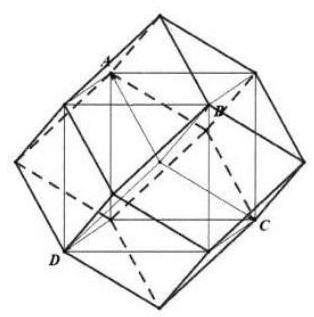

考虑两个 ${\lambda }_{i}$ 取 1,其余两个取 0 ; 考虑三个 ${\lambda }_{i}$ 取 1,其余 1 个取 0 ;

把该四面体嵌入正方体中作图,

所求体积为两倍的正方体,计算得 $\frac{{16}\sqrt{3}}{9}$ .

【练习】2. 已知数列 $\left\{  {a}_{n}\right\}$ 共有 9 项,其中, ${a}_{1} = {a}_{9} = 1$ ,且对每个 $\mathrm{i} \in  \{ 1,2,\cdots ,8\}$ ,均有 $\frac{{a}_{i + 1}}{{a}_{i}} \in  \left\{  {2,1, - \frac{1}{2}}\right\}$ ,则数列 $\left\{  {a}_{n}\right\}$ 的个数为___

【答案】491

【解析】令 ${b}_{i} = \frac{{a}_{i + 1}}{{a}_{i}}\left( {1 \leq  \mathrm{i} \leq  8}\right)$ ,则对每个符合条件的数列 $\left\{  {a}_{n}\right\}$ ,

满足 $\mathop{\prod }\limits_{{i = 1}}^{8}{b}_{i} = \mathop{\prod }\limits_{{i = 1}}^{8}\frac{{a}_{i + 1}}{{a}_{i}} = \frac{{a}_{2}}{{a}_{1}} \cdot  \frac{{a}_{3}}{{a}_{2}} \cdot  \frac{{a}_{4}}{{a}_{3}} \cdot  \frac{{a}_{5}}{{a}_{4}} \cdot  \frac{{a}_{6}}{{a}_{5}} \cdot  \frac{{a}_{7}}{{a}_{6}} \cdot  \frac{{a}_{8}}{{a}_{9}} = 1$ ,

且 ${b}_{i} \in  \left\{  {2,1, - \frac{1}{2}}\right\}  ,\mathrm{i} \in  \{ 1,2,\cdots ,8\}$ .

反之,由符合上述条件的八项数列 $\left\{  {b}_{n}\right\}$ 可唯一确定一个符合题意的九项数列 $\left\{  {a}_{n}\right\}$ .

记符合条件的数列 $\left\{  {b}_{n}\right\}$ 的个数为 $N$ ,

由题意得 ${b}_{i}\left( {1 \leq  \mathrm{i} \leq  8}\right)$ 中有 ${2k}$ 个 $- \frac{1}{2},{2k}$ 个 $2,8 - {4k}$ 个 1,

且 $k$ 的所有可能取值为0,1,2. 共有 $1 + {C}_{8}^{2}{C}_{6}^{2} + {C}_{8}^{4}{C}_{4}^{4} = {491}$ 个

【练习】3. (2024 届进才)若函数 $y = f\left( x\right)$ 对任意的 $x \in  R$ 均有 $f\left( {x - 1}\right)  + f\left( {x + 1}\right)  > {2f}\left( x\right)$ ，则称函数具有性质 $P$ .

(1)判断函数 $y = {a}^{x}\left( {a > 1}\right)$ 是否具有性质 $P$ ，并说明理由;

(2) 全集为 $R$ ，函数 $g\left( x\right)  = \left\{  \begin{array}{l} x\left( {x - 1}\right) , x \in  Q \\  {x}^{2}, x \in  \bar{Q} \end{array}\right.$ ，试证明 $y = g\left( x\right)$ 具有性质 $P$ ；

(3) $y = f\left( x\right)$ 具有性质 $P$ ，且 $f\left( 0\right)  = f\left( n\right)  = 0\left( {n > 2, n \in  N}\right)$ ，求证:对任意 $1 \leq  k \leq  n - 1, k \in  N$ 均有 $f\left( k\right)  \leq  0.$

【解析】(1) 若 $y = {a}^{x}\left( {a > 1}\right)$ ,

则 $f\left( {x - 1}\right)  + f\left( {x + 1}\right)  - {2f}\left( x\right)  = {a}^{x - 1} + {a}^{x + 1} - 2 \times  {a}^{x} = \left( {\frac{1}{a} + a - 2}\right) {a}^{x}$

$> \left( {2\sqrt{a \times  \frac{1}{a}} - 2}\right) {a}^{x} = 0$ (因为 $a > 1$ ,所以取不到等号),

所以 $f\left( {x - 1}\right)  + f\left( {x + 1}\right)  - {2f}\left( x\right)  = \left( {\frac{1}{a} + a - 2}\right) {a}^{x} > 0$ ,

即 $f\left( {x - 1}\right)  + f\left( {x + 1}\right)  > {2f}\left( x\right)$ 任意的 $x \in  R$ 成立,

即函数 $y = {a}^{x}\left( {a > 1}\right)$ 具有性质 $P$ ;

(2) ①若 $x$ 为有理数时， $g\left( x\right)$ 具有性质 $P$ ，理由如下:

$g\left( {x - 1}\right)  + g\left( {x + 1}\right)  = \left( {x - 1}\right) \left( {x - 2}\right)  + x\left( {x + 1}\right)  = 2{x}^{2} - {2x} + 2,$

${2g}\left( x\right)  = {2x}\left( {x - 1}\right)  = 2{x}^{2} - {2x},$

所以 $2{x}^{2} - {2x} + 2 > 2{x}^{2} - {2x}$ 恒成立,

即 $g\left( {x - 1}\right)  + g\left( {x + 1}\right)  > {2g}\left( x\right)$ 对于任意有理数 $x$ 恒成立,故具有性质 $P$ ;

②当 $x$ 为无理数时，具有性质 $P$ ，理由如下:

$g\left( {x - 1}\right)  + g\left( {x + 1}\right)  - {2g}\left( x\right)  = {\left( x - 1\right) }^{2} + {\left( x + 1\right) }^{2} - 2{x}^{2} = 2 > 0$ ,

故具有性质 $P$ ,

综上所述,当 $x \in  R$ 时,均有 $g\left( {x - 1}\right)  + g\left( {x + 1}\right)  > {2g}\left( x\right)$ ,

故函数 $y = g\left( x\right)$ 具有性质 $P$ ;

(3) 假设 $f\left( k\right)$ 为 $f\left( 1\right) \text{ 、 }f\left( 2\right) \text{ 、 }\cdots \text{ 、 }f\left( {n - 1}\right)$ 中首个大于 0 的值,

则 $f\left( k\right)  - f\left( {k - 1}\right)  > 0$ ,

由于 $f\left( x\right)$ 具有性质 $P$ ,

所以 $f\left( {n + 1}\right)  - f\left( n\right)  > f\left( n\right)  - f\left( {n - 1}\right)  > \cdots  > f\left( k\right)  - f\left( {k - 1}\right)  > 0$ ,

所以 $f\left( n\right)  = \left\lbrack  {f\left( n\right)  - f\left( {n - 1}\right) }\right\rbrack   + \left\lbrack  {f\left( {n - 1}\right)  - f\left( {n - 2}\right) }\right\rbrack   + \cdots  + f\left( 1\right)  > 0$ ,

这与 $f\left( n\right)  = 0\left( {n > 2, n \in  N}\right)$ 矛盾,故假设不成立,

所以对任意 $1 \leq  k \leq  n - 1, k \in  N$ 均有 $f\left( k\right)  \leq  0$ .

## C4 每日三题 0424

【练习】1. 若函数 $y = f\left( x\right)$ 的图像上存在不同的两点 $M\left( {{x}_{1},{y}_{1}}\right)$ 和 $N\left( {{x}_{2},{y}_{2}}\right)$ ,满足 $\left| {{x}_{1}{x}_{2} + {y}_{1}{y}_{2}}\right|  \geq  \sqrt{{x}_{1}^{2} + {y}_{1}^{2}}$ . $\sqrt{{x}_{2}^{2} + {y}_{2}^{2}}$ ,则称函数 $y = f\left( x\right)$ 具有性质 $p$ . 给出下列函数:

① $f\left( x\right)  = \sin x, x \in  R$ ； ② $f\left( x\right)  = {x}^{2} \cdot  x \in  R$ ；

③ $f\left( x\right)  = x + \frac{1}{x}, x \in  \left( {0, + \infty }\right)$ ； ④ $f\left( x\right)  = \left| x\right|  + 1$ .

其中具有性质 $p$ 的函数为___ $($ 填上所有正确序号).

【答案】①②

【解析】 $\overrightarrow{OM} \cdot  \overrightarrow{ON} = {x}_{1}{x}_{2} + {y}_{1}{y}_{2} = \left| \overrightarrow{OM}\right| \left| \overrightarrow{ON}\right| \cos  < \overrightarrow{OM},\overrightarrow{ON} > ,\left| \overrightarrow{OM}\right|  = \sqrt{{x}_{1}^{2} + {y}_{1}^{2}},\left| \overrightarrow{ON}\right|  = \sqrt{{x}_{2}^{2} + {y}_{2}^{2}}$ ,所以 $\left| {{x}_{1}{x}_{2} + {y}_{1}{y}_{2}}\right|  \geq  \sqrt{{x}_{1}^{2} + {y}_{1}^{2}} \cdot  \sqrt{{x}_{2}^{2} + {y}_{2}^{2}} \Leftrightarrow  \left| {\cos  < \overrightarrow{OM},\overrightarrow{ON} > }\right|  \geq  1$ ,即 $\cos  < \overrightarrow{OM},\overrightarrow{ON} >  =  \pm  1$ ,即 $O, M$ , $N$ 三点共线，即过点 $O$ 的直线与函数图象存在至少两个不同的交点，由图像得①②符合.

【练习】2. (2023 年少有为杯) 定义在 $R$ 上的连续函数 $y = f\left( x\right)$ 满足: 对任意 $x \in  R$ ,存在 $m \in  R$ ,使得 $f\left( {x + 1}\right)  = f\left( x\right)  + f\left( m\right)$ 都成立.

命题 $p$ : 若 $y = f\left( x\right)$ 是偶函数,则 $y = f\left( x\right)$ 存在零点.

命题 $q$ : 若 $y = f\left( x\right)$ 存在最大值,则 $y = f\left( x\right)$ 存在零点.

下列关于命题 $p$ 与 $q$ 的判断,正确的是 ( )

A. 命题 $p$ 与 $q$ 都是真命题 B. 命题 $p$ 是真命题,命题 $q$ 是假命题

C. 命题 $p$ 是假命题,命题 $q$ 是真命题 D. 命题 $p$ 与 $q$ 都是假命题

【答案】 $A$

【解析】对于命题 $p$ ,令 $x =  - \frac{1}{2}$ ,得 $f\left( m\right)  = 0$ ,为真命题;

对于命题 $q$ ,不妨设 $f{\left( x\right) }_{\max } = f\left( {x}_{0}\right)$ ,

由 $f\left( {{x}_{0} + 1}\right)  = f\left( {x}_{0}\right)  + f\left( {m}_{1}\right)$ 得 $f\left( {m}_{1}\right)  \leq  0$ ,

由 $f\left( {x}_{0}\right)  = f\left( {{x}_{0} - 1}\right)  + f\left( {m}_{2}\right)$ 得 $f\left( {m}_{2}\right)  \geq  0$ ,

利用零点存在定理,所以 $\exists {m}_{0} \in  \left\lbrack  {{m}_{1},{m}_{2}}\right\rbrack  , f\left( {m}_{0}\right)  = 0$ ,为真命题;

故选 $A$ .

【练习】3. 函数 $f\left( x\right)$ 的定义域为 $R$ ,若 $f\left( x\right)$ 满足对任意 ${x}_{1}\text{ 、 }{x}_{2} \in  R$ ,当 ${x}_{1} - {x}_{2} \in  M$ 时,都有 $f\left( {x}_{1}\right)  - f\left( {x}_{2}\right)  \in \; M$ ,则称 $f\left( x\right)$ 是 $M$ 连续的.

(1)请写出一个是 $\{ 1\}$ 连续的函数 $f\left( x\right)$ (不必说明理由);

(2)证明:若 $f\left( x\right)$ 是 $\left\lbrack  {2,3}\right\rbrack$ 连续的，则 $f\left( x\right)$ 是 $\{ 2\}$ 连续且是 $\{ 3\}$ 连续的；

(3) 当 $x \in  \left\lbrack  {-\frac{1}{2},\frac{1}{2}}\right\rbrack$ 时, $f\left( x\right)  = a{x}^{3} + \frac{1}{2}{bx} + 1\left( {a, b \in  N}\right)$ ,且 $f\left( x\right)$ 是 $\left\lbrack  {2,3}\right\rbrack$ 连续的,求 $a\text{ 、 }b$ 的值.

【解析】(1) 函数 $f\left( x\right)  = x$ 是 $\{ 1\}$ 连续的,由 ${x}_{1} - {x}_{2} = 1$ ,有 $f\left( {x}_{1}\right)  - f\left( {x}_{2}\right)  = {x}_{1} - {x}_{2} = 1$ ;

(2)因为 $f\left( x\right)$ 是 $\left\lbrack  {2,3}\right\rbrack$ 连续的，由定义得对任意 ${x}_{1},{x}_{2} \in  R$ ，当 $2 \leq  {x}_{1} - {x}_{2} \leq  3$ 时，有 $2 \leq  f\left( {x}_{1}\right)  -$

$f\left( {x}_{2}\right)  \leq  3$ ,所以有 $f\left( {x + 6}\right)  - f\left( x\right)  = f\left( {x + 6}\right)  - f\left( {x + 4}\right)  + f\left( {x + 4}\right)  - f\left( {x + 2}\right)  + f\left( {x + 2}\right)  - f\left( x\right)  \geq$

6,且 $f\left( {x + 6}\right)  - f\left( x\right)  = f\left( {x + 6}\right)  - f\left( {x + 3}\right)  + f\left( {x + 3}\right)  - f\left( x\right)  \leq  6$ ,所以 $f\left( {x + 6}\right)  - f\left( x\right)  = 6$ ,所以

$f\left( {x + 6}\right)  - f\left( {x + 4}\right)  = f\left( {x + 4}\right)  - f\left( {x + 2}\right)  = f\left( {x + 2}\right)  - f\left( x\right)  = 2$ ,即 $f\left( x\right)$ 是 $\{ 2\}$ 连续的,同理可得

$f\left( {x + 6}\right)  - f\left( {x + 3}\right)  = f\left( {x + 3}\right)  - f\left( x\right)  = 3$ ,即 $f\left( x\right)$ 是 $\{ 3\}$ 连续的.

(3) 已知 $f\left( x\right)$ 是 $\left\lbrack  {2,3}\right\rbrack$ 连续的,由 (2) 得 $f\left( {x + 2}\right)  - f\left( x\right)  = 2, f\left( {x + 3}\right)  - f\left( x\right)  = 3$ ,两式相减得

$f\left( {x + 3}\right)  - f\left( {x + 2}\right)  = 1$ ,即 $f\left( {x + 1}\right)  - f\left( x\right)  = 1, f\left( x\right)$ 是 $\{ 1\}$ 连续的,进一步有 $f\left( {x + n}\right)  - f\left( x\right)  = n$ ,

$n \in  {N}^{ * }, f\left( x\right)$ 是 $\{ n\}$ 连续的. 由已知 $x \in  \left\lbrack  {-\frac{1}{2},\frac{1}{2}}\right\rbrack$ 时, $f\left( x\right)  = a{x}^{3} + \frac{1}{2}{bx} + 1$ ,

若 $a = b = 0$ 时, $f\left( x\right)  = 1$ ,则 $f\left( \frac{1}{2}\right)  = f\left( {-\frac{1}{2}}\right)  = 1$ ,不满足 $f\left( {x + 1}\right)  - f\left( x\right)  = 1$ .

又对任意 ${x}_{1}\text{ 、 }{x}_{2} \in  R$ ,当 $0 \leq  {x}_{1} - {x}_{2} \leq  1$ 时,有 $2 \leq  {x}_{1} + 2 - {x}_{2} \leq  3$ ,

因为 $f\left( x\right)$ 是 $\left\lbrack  {2,3}\right\rbrack$ 连续的,所以 $2 \leq  f\left( {{x}_{1} + 2}\right)  - f\left( {x}_{2}\right)  \leq  3$ ,

又 $f\left( {{x}_{1} + 2}\right)  = f\left( {x}_{1}\right)  + 2$ ，所以 $2 \leq  f\left( {x}_{1}\right)  + 2 - f\left( {x}_{2}\right)  \leq  3$ ，

所以 $0 \leq  f\left( {x}_{1}\right)  = f\left( {x}_{2}\right)  \leq  1$ ,

即对任意 ${x}_{1}\text{ 、 }{x}_{2} \in  R$ ,当 $0 \leq  {x}_{1} - {x}_{2} \leq  1$ 时,都有 $0 \leq  f\left( {x}_{1}\right)  - f\left( {x}_{2}\right)  \leq  1$ ,

故 $f\left( x\right)$ 是 $\left\lbrack  {0,1}\right\rbrack$ 连续的.

由上述分析得 $\left\{  \begin{array}{l} f\left( {-\frac{1}{2}}\right)  + 1 = f\left( \frac{1}{2}\right) \\  {f}^{\prime }\left( x\right)  \geq  0 \end{array}\right.$ ,

则当 $x \in  \left\lbrack  {-\frac{1}{2},\frac{1}{2}}\right\rbrack  , f\left( x\right)  = a{x}^{3} + \frac{1}{2}{bx} + 1$ ,其中 $a\text{ 、 }b \in  Z$ ,

有 $\left\{  \begin{array}{l} \frac{a}{4} + \frac{b}{2} = 1 \\  {3a}{x}^{2} + \frac{1}{2}b \geq  0 \end{array}\right.$ ,所以 ${3a}{x}^{2} - \frac{a}{4} + 1 \geq  0, x \in  \left\lbrack  {-\frac{1}{2},\frac{1}{2}}\right\rbrack$ 恒成立.

设 $\varphi \left( x\right)  = {3a}{x}^{2} - \frac{a}{4} + 1$ ,对称轴为 $x = \frac{1}{24}$ .

当 $a = 0$ 时, $b = 2$ ,不等式 $1 \geq  0$ 恒成立,满足题意;

当 $a > 0$ 时,由 ${3a}{x}^{2} - \frac{a}{4} + 1 \geq  0$ 恒成立, $x \in  \left\lbrack  {-\frac{1}{2},\frac{1}{2}}\right\rbrack$ ,

则 $\varphi {\left( x\right) }_{\min } = \varphi \left( \frac{1}{12}\right)  \geq  0$ ,即 $a \leq  \frac{48}{11}$ ,又 $a \in  Z$ ,则 $0 < a \leq  4$ .

由 $b \in  Z$ ，且 $b = 2 - \frac{a}{2}$ ，则 $a = 2$ 或 4，

所以 $a = 4, b = 0$ 与 $a = 2, b = 1$ 时，都满足题意；

综上所述, $a = 0, b = 2$ 或 $a = 4, b = 0$ 或 $a = 2, b = 1$ .

## CH 每日三题 0425

【练习】1. (2025 届交附) 满足定义域为 $\{ 1,2,3,4\}$ 且值域为 $\{ 1,2,3\}$ 的函数共有___个

【答案】36

【解析】 ${C}_{4}^{2}{P}_{3}^{3} = {36}$ 个

【练习】2. (2024 届进才) 关于函数 $f\left( x\right)  = \frac{\left| x\right| }{\left| \right| x\left| {-1}\right| }$ ,给出下列两个结论:

$P :$ 方程 $f\left( x\right)  = {kx} + b\left( {k \neq  0}\right)$ 一定有实数解:

$Q$ : 如果方程 $f\left( x\right)  = m\left( {m\text{ 为常数 }}\right)$ 有解,则解的个数一定是偶数;

则 ( )

A. $P$ 正确， $Q$ 正确 B. $P$ 错误， $Q$ 错误 C. $P$ 正确， $Q$ 错误 D. $P$ 错误， $Q$ 正确

【答案】 $C$

【解析】函数 $f\left( x\right)  = f\left( x\right)  = \frac{\left| x\right| }{\left| \;\right| x\left| {-1}\right| }$ ,是偶函数,

当 $x > 0$ 时, $y = f\left( x\right)$ 在区间 $\left( {0,1}\right)$ 上是单调递增的函数,

$\left( {1, + \infty }\right)$ 上是单调递减的函数;

当 $k > 0$ 时,函数 $y = f\left( x\right)$ 与 $y = {kx}$ 在第一象限内一定有交点;

由对称性得当 $x < 0$ 且 $k > 0$ 时,函数 $y = f\left( x\right)$ 与 $y = {kx}$ 在第二象限内一定有交点;

所以方程 $f\left( x\right)  = {kx} + b\left( {k \neq  0}\right)$ 一定有解; 命题 $P$ 正确;

③ 函数 $f\left( x\right)  = \frac{\left| x\right| }{//x\left| {-1}\right| }$ ，是偶函数，且 $f\left( x\right)  = 0$ ，

当 $k = 0$ 时，函数 $y = f\left( x\right)$ 与 $y = k$ 的图象只有一个交点，

所以方程 $f\left( x\right)  = k$ 的解的个数是奇数; 命题 $Q$ 错误;

故选 $C$ .

【练习】3. 设 $y = f\left( x\right) , y = g\left( x\right) , y = h\left( x\right)$ 是定义域均为 $D$ 的三个函数. $M$ 是 $D$ 的一个子集.

若对任意 $x \in  M$ ，点 $\left( {x, g\left( x\right) }\right)$ 与点 $\left( {x, h\left( x\right) }\right)$ 都关于点 $\left( {x, f\left( x\right) }\right)$ 对称，则称 $y = h\left( x\right)$ 是 $y = g\left( x\right)$ 关于 $y = f\left( x\right)$ 的“ $M$ 对称函数”.

(1)若 $y = g\left( x\right)$ 和 $y = \sin x$ 是关于 $y = \cos x$ 的“ $R$ 对称函数”,求 $g\left( {\frac{2024}{3}\pi }\right)$ ;

(2)若 $y = g\left( x\right)$ 是 $y = 1$ 关于 $y = {\cos }^{2}x$ 的“ $\left\lbrack  {a, b}\right\rbrack$ 对称函数”. 判断并证明: “ $b - a \geq  \frac{\pi }{2}$ ” 是 “ $y = \; g\left( {\frac{\pi }{4} - x}\right)$ 的值域为 $\left\lbrack  {-1,1}\right\rbrack$ ” 的什么条件?

(3) 已知 $y = \sqrt{1 - x}$ 是 $y = \sqrt{3x}$ 关于 $y = f\left( x\right)$ 的“ $\left\lbrack  {0,1}\right\rbrack$ 对称函数”. 且对任意 $s \in  \left\lbrack  {0,1}\right\rbrack$ ，存在 $t \in \; \left\lbrack  {0,1}\right\rbrack$ ,使得 ${2f}\left( s\right)  = 4{t}^{3} - {3t} + a$ ,求实数 $a$ 的取值范围.

【解析】(1) 由题意得 $y = g\left( x\right)$ 和 $y = \sin x$ 是关于 $y = \cos x$ 的“ $R$ 对称函数”,

所以 $\frac{g\left( x\right)  + \sin x}{2} = \cos x$ ,即 $g\left( x\right)  = 2\cos x - \sin x$ ,

所以 $g\left( {\frac{2023}{3}\pi }\right)  = 2\cos \left( {\frac{2023}{3}\pi }\right)  - \sin \left( {\frac{2023}{3}\pi }\right)$

$= 2\cos \frac{\pi }{3} - \sin \frac{\pi }{3} = 1 - \frac{\sqrt{3}}{2}$ .

(2)因为 $y = g\left( x\right)$ 是 $y = 1$ 关于 $y = {\cos }^{2}x$ 的“ $\left\lbrack  {a, b}\right\rbrack$ 对称函数”，

所以 $2{\cos }^{2}x = g\left( x\right)  + 1$ ,即 $g\left( x\right)  = 2{\cos }^{2}x - 1 = \cos {2x}$ ,

$y = g\left( {\frac{\pi }{4} - x}\right)  = \cos \left\lbrack  {2\left( {\frac{\pi }{4} - x}\right) }\right\rbrack   = \sin {2x},$

令 $a = 0, b = \frac{\pi }{2}$ ,满足 $b - a \geq  \frac{\pi }{2}$ ,

此时函数 $y = \sin {2x}, x \in  \left\lbrack  {0,\frac{\pi }{2}}\right\rbrack$ 的值域为 $\left\lbrack  {0,1}\right\rbrack   \neq  \left\lbrack  {-1,1}\right\rbrack$ ,

所以 $y = g\left( {\frac{\pi }{4} - x}\right)$ 的值域为 $\left\lbrack  {-1,1}\right\rbrack$ 不成立,所以不充分;

若 $y = g\left( {\frac{\pi }{4} - x}\right)$ 的值域为 $\left\lbrack  {-1,1}\right\rbrack$ ,即 $y = \sin {2x}, x \in  \left\lbrack  {a, b}\right\rbrack$ 的值域为 $\left\lbrack  {-1,1}\right\rbrack$ ,

因为函数 $y = \sin {2x}$ 的周期 $T = \frac{2\pi }{2} = \pi$ ，则 $b - a \geq  \frac{T}{2} = \frac{\pi }{2}$ ，所以必要；

因此 “ $b - a \geq  \frac{\pi }{2}$ ” 是 “ $y = g\left( {\frac{\pi }{4} - x}\right)$ 的值域为 $\left\lbrack  {-1,1}\right\rbrack$ ” 的必要不充分条件.

(3) $y = \sqrt{1 - x}$ 是 $y = \sqrt{3x}$ 关于 $y = f\left( x\right)$ 的“ $\left\lbrack  {0,1}\right\rbrack$ 对称函数”,

所以 ${2f}\left( x\right)  = \sqrt{1 - x} + \sqrt{3x} = 1 \cdot  \sqrt{1 - x} + \sqrt{3} \cdot  \sqrt{x}$ ,

设 $\sqrt{x} = \cos \theta$ ,则 $\sqrt{1 - x} = \sin \theta ,\theta  \in  \left\lbrack  {0,\frac{\pi }{2}}\right\rbrack$ ,

所以 ${2f}\left( x\right)  = 2\sin \left( {\theta  + \frac{\pi }{3}}\right)  \in  \left\lbrack  {1,2}\right\rbrack$ .

另一方面,由于 ${\left( 4{t}^{3} - 3t + a\right) }^{\prime } = {12}{t}^{2} - {3t}$ ,

所以函数 $y = 4{t}^{3} - {3t} + a$ 在 $\left( {0,1}\right)$ 上恰有一个驻点 $t = \frac{1}{2}$ ,

从而当 $t \in  \left\lbrack  {0,1}\right\rbrack$ 时,比较 $t = 0, t = 1$ 和 $t = \frac{1}{2}$ 处的函数值,

得 $4{t}^{3} - {3t} + a \in  \left\lbrack  {a - 1, a + 1}\right\rbrack$ ,因此 $\left\lbrack  {1,2}\right\rbrack   \subseteq  \left\lbrack  {a - 1, a + 1}\right\rbrack$ ,故 $1 \leq  a \leq  2$ , 即 $a \in  \left\lbrack  {1,2}\right\rbrack$ .

## 四 每日三题 0426

【练习】1. (2024 届复附) 已知 $\bigtriangleup  {ABC}$ 的三边长分别为 $a$ 、 $b$ 、 $c$ ，角 $A$ 是钝角，则 $\frac{b\left( {c - b}\right) }{{a}^{2}}$ 的取值范围是 【答案】 $\left( {-1,\frac{\sqrt{2} - 1}{2}}\right)$

【解析】已知 $\bigtriangleup  {ABC}$ 的三边长分别为 $a$ 、 $b$ 、 $c$ ，角 $A$ 是钝角，故 ${a}^{2} > {b}^{2} + {c}^{2}$ ，

① 当 $c > b$ 时，令 $\frac{c}{b} = t > 1$ ，则 $\frac{b\left( {c - b}\right) }{{a}^{2}} < \frac{{bc} - {b}^{2}}{{b}^{2} + {c}^{2}} = \frac{\frac{c}{b} - 1}{{\left( \frac{c}{b}\right) }^{2} + 1} = \frac{t - 1}{{t}^{2} + 1}$

$= \frac{t - 1}{{\left( t - 1\right) }^{2} + 2\left( {t - 1}\right)  + 2} = \frac{1}{t - 1 + \frac{2}{t - 1} + 2} \leq  \frac{1}{2\sqrt{\left( {t - 1}\right)  \times  \frac{1}{\left( t - 1\right) }} + 2}$

$= \frac{1}{2\sqrt{2} + 2} = \frac{\sqrt{2} - 1}{2}$ ,当且仅当 $t = \sqrt{2} + 1$ 时取等号,即有 $0 < \frac{b\left( {c - b}\right) }{{a}^{2}} < \frac{\sqrt{2} - 1}{2}$ ;

②当 $c \leq  b$ 时，令 $\frac{c}{b} = t \in  (0,1\rbrack$ ，所以 $\frac{b\left( {c - b}\right) }{{a}^{2}} > \frac{{bc} - {b}^{2}}{{b}^{2} + {c}^{2}} = \frac{\frac{c}{b} - 1}{{\left( \frac{c}{b}\right) }^{2} + 1} = \frac{t - 1}{{t}^{2} + 1}$ ，

设 $f\left( t\right)  = \frac{t - 1}{{t}^{2} + 1}, t \in  (0,1\rbrack$ ,所以 ${f}^{\prime }\left( t\right)  = \frac{\left( {{t}^{2} + 1}\right)  - {2t}\left( {t - 1}\right) }{{\left( {t}^{2} + 1\right) }^{2}} = \frac{-{t}^{2} + {2t} + 1}{{\left( {t}^{2} + 1\right) }^{2}} > 0$ ,

所以函数 $f\left( t\right)$ 在 $t \in  (0,1\rbrack$ 上严格增,故 $f\left( 0\right)  < f\left( t\right)  \leq  f\left( 1\right)$ ,即 $- 1 < \frac{b\left( {c - b}\right) }{{a}^{2}} \leq  0$

综上所述，所以 $\frac{b\left( {c - b}\right) }{{a}^{2}}$ 的取值范围是 $\left( {-1,\frac{\sqrt{2} - 1}{2}}\right)$

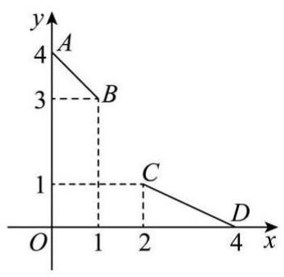

【练习】2. (2025届建平)如图，将线段 ${AB}$ 、 ${CD}$ 用一条连续不间断的曲线 $y \; = f\left( x\right)$ 连接在一起,需满足要求: 曲线 $y = f\left( x\right)$ 经过点 $B\text{ 、 }C$ ,并且在点 $B$ 、 $C$ 处的切线分别为直线 ${AB}$ 、 ${CD}$ ，那么下列结论正确的是 ( )

命题甲:存在曲线 $y = \frac{\sin {ax} + \cos {bx}}{2} + c\left( {a\text{ 、 }b\text{ 、 }c \in  R}\right)$ 满足要求命题乙:若曲线 $y = {f}_{1}\left( x\right)$ 和 $y = {f}_{2}\left( x\right)$ 满足要求，则对任意实数 $\lambda$ 、 $\mu$ ， 当 $\lambda  + \mu  = 1$ 时，曲线 $y = \lambda {f}_{1}\left( x\right)  + \mu {f}_{2}\left( x\right)$ 满足要求

A. 命题甲正确，命题乙正确

B. 命题甲错误, 命题乙正确

C. 命题甲正确, 命题乙错误

D. 命题甲错误, 命题乙错误

【答案】 $B$

【解析】由图象得 $A\left( {0,4}\right) , B\left( {1,3}\right) , C\left( {2,1}\right) , D\left( {4,0}\right)$ ,

所以直线 ${AB}$ 的方程为 $y =  - x + 4$ ,直线 ${CD}$ 的方程为 $y =  - \frac{1}{2}x + 2$ ,

所以 $y = f\left( x\right)$ 需满足 $f\left( 1\right)  = 3,{f}^{\prime }\left( 1\right)  =  - 1, f\left( 2\right)  = 1,{f}^{\prime }\left( 2\right)  =  - \frac{1}{2}$ ,

对于命题甲，三角函数可以用振幅进行判断，若成立，

由于 $- 2 \leq  \sin {ax} + \cos {bx} \leq  2$ ，所以 $c$ 必为 2，

因为 $y = \frac{\sin {ax} + \cos {bx}}{2}$ 的振幅至多为 1,

所以 $\sin a + \cos b = 2,\sin {2a} + \cos {2b} =  - 2$ ,

所以 $a = \frac{\pi }{2} + 2{k}_{1}\pi$ ①， ${2a} = \frac{3\pi }{2} + 2{k}_{2}\pi$ ②， $b = 2{k}_{3}\pi$ ③， ${2b} = \left( {2{k}_{4} + 1}\right) \pi$ ④，

${k}_{i} \in  Z,\mathrm{i} = 1,2,3,4$ ,显然①与②矛盾,③与④矛盾,故命题甲错误;

对于命题乙，因为 ${f}_{i}\left( 1\right)  = 3,{f}_{i}\left( 2\right)  = 1,{f}_{i}^{\prime }\left( 1\right)  =  - 1,{f}_{i}^{\prime }\left( 2\right)  =  - \frac{1}{2},\mathrm{i} = 1,2$ ,

所以对于 $g\left( x\right)  = \lambda {f}_{1}\left( x\right)  + \mu {f}_{2}\left( x\right) , g\left( 1\right)  = \lambda {f}_{1}\left( 1\right)  + \mu {f}_{2}\left( 1\right)  = 3\left( {\lambda  + \mu }\right)  = 3$ ,

$g\left( 2\right)  = \lambda {f}_{1}\left( 2\right)  + \mu {f}_{2}\left( 2\right)  = \lambda  + \mu  = 1,\;{g}^{\prime }\left( x\right)  = \lambda {f}_{1}^{\prime }\left( x\right)  + \mu {f}_{2}^{\prime }\left( x\right) ,$

所以 ${g}^{\prime }\left( 1\right)  = \lambda {f}_{1}^{\prime }\left( 1\right)  + \mu {f}_{2}^{\prime }\left( 1\right)  =  - \left( {\lambda  + \mu }\right)  =  - 1$ ,

${g}^{\prime }\left( 2\right)  = \lambda {f}_{2}^{\prime }\left( 2\right)  + \mu {f}_{2}^{\prime }\left( 2\right)  =  - \frac{1}{2}\left( {\lambda  + \mu }\right)  =  - \frac{1}{2}$ ,故命题乙正确.

故选 $B$ .

【练习】3. (2024 届大同)已知椭圆 $\Gamma  : \frac{{x}^{2}}{4} + \frac{{y}^{2}}{3} = 1$ 的左、右、下顶点分别为点 $A, B, T$ ，点 $P$ 为椭圆 $\Gamma$ 上的动点,点 $Q\left( {1,0}\right)$ .

(1)过点 $Q$ 且斜率为 1 的直线与椭圆 $\Gamma$ 相交于 $E, F$ 两点,求线段 ${EF}$ 的长；

(2)求 $\bigtriangleup  {PQT}$ 面积的最大值；

(3)过点 $Q$ 的直线与椭圆 $\Gamma$ 交于 $C, D$ 两点(异于点 $A, B)$ ，试探究 ${AC},{BD}$ 的交点的横坐标是否为定值？若是，求出该定值；若不是，说明理由.

【解析】(1) 由 $\left\{  \begin{array}{l} \frac{{x}^{2}}{4} + \frac{{y}^{2}}{3} = 1 \\  y = x - 1 \end{array}\right.$ 解得 ${x}_{1} = \frac{4 + 6\sqrt{2}}{7},{x}_{2} = \frac{4 - 6\sqrt{2}}{7}$ ,故弦长为 $\sqrt{2}\left| {{x}_{1} - {x}_{2}}\right|  = \frac{24}{7}$ .

(2) $T\left( {0, - \sqrt{3}}\right) , Q\left( {1,0}\right) ,\left| {QT}\right|  = 2$ ，直线 ${QT}$ 的方程为 $\sqrt{3}x - y - \sqrt{3} = 0$ .

设点 $P\left( {2\cos \theta ,\sqrt{3}\sin \theta }\right)$ .

点 $P$ 到直线 $\sqrt{3}x - y - \sqrt{3} = 0$ 的距离 $d = \frac{\left| \sqrt{3} \times  2\cos \theta  - \sqrt{3}\sin \theta  - \sqrt{3}\right| }{2}$

$= \frac{\sqrt{3}}{2}\left| {\sin \theta  - 2\cos \theta  + 1}\right|  = \frac{\sqrt{3}}{2}\left| {\sqrt{5}\sin \left( {\theta  + \varphi }\right)  + 1}\right| , d \leq  \frac{\sqrt{15} + \sqrt{3}}{2},$

${S}_{\bigtriangleup {PQT}} \leq  \frac{1}{2} \times  2 \times  \frac{\sqrt{15} + \sqrt{3}}{2} = \frac{\sqrt{15} + \sqrt{3}}{2},\bigtriangleup {PQT}$ 面积的最大值为 $\frac{\sqrt{15} + \sqrt{3}}{2}$ .

(3) $A\left( {-2,0}\right)$ ， $B\left( {2,0}\right)$ . 若直线 ${CD}$ 与 $x$ 轴重合，则 ${CD}$ 与 ${AB}$ 重合，不合题意.

设直线 ${CD}$ 的直线方程为 $x = {my} + 1, C\left( {{x}_{1},{y}_{1}}\right) , D\left( {{x}_{2},{y}_{2}}\right)$ .

由 $\left\{  \begin{array}{l} \frac{{x}^{2}}{4} + \frac{{y}^{2}}{3} = 1 \\  x = {my} + 1 \end{array}\right.$ 得 $\left( {3{m}^{2} + 4}\right) {y}^{2} + {6my} - 9 = 0$ ,

由韦达定理得 ${y}_{1} + {y}_{2} = \frac{-{6m}}{3{m}^{2} + 4},{y}_{1}{y}_{2} = \frac{-9}{3{m}^{2} + 4}$ .

直线 ${AC}$ 的方程为 $y = \frac{{y}_{1}}{{x}_{1} + 2}\left( {x + 2}\right)$ ,直线 ${BD}$ 的方程为 $y = \frac{{y}_{2}}{{x}_{2} - 2}\left( {x - 2}\right)$ ,

联立两方程,解得 $x = 2 \cdot  \frac{{y}_{1}\left( {{x}_{2} - 2}\right)  + {y}_{2}\left( {{x}_{1} + 2}\right) }{{y}_{2}\left( {{x}_{1} + 2}\right)  - {y}_{1}\left( {{x}_{2} - 2}\right) }$ .

将 ${x}_{1} = m{y}_{1} + 1,{x}_{2} = m{y}_{2} + 1$ 代入,得 $x = 2 \cdot  \frac{{2m}{y}_{1}{y}_{2} + 3\left( {{y}_{1} + {y}_{2}}\right)  - 4{y}_{1}}{3\left( {{y}_{1} + {y}_{2}}\right)  - 2{y}_{1}}$ ,

将 ${y}_{1}{y}_{2} = \frac{-{6m}}{3{m}^{2} + 4},{y}_{1}{y}_{2} = \frac{-9}{3{m}^{2} + 4}$ 代入,

得 $x = 2 \cdot  \frac{{2m} \times  \frac{-9}{3{m}^{2} + 4} + 3 \times  \frac{-{6m}}{3{m}^{2} + 4} - 4{y}_{1}}{3 \times  \frac{-{6m}}{3{m}^{2} + 4} - 2{y}_{1}} = 4 \cdot  \frac{\frac{9m}{3{m}^{2} + 4} + {y}_{1}}{\frac{9m}{3{m}^{2} + 4} + {y}_{1}} = 4$ ,

因此,直线 ${AC},{BD}$ 的交点的横坐标为定值 4 .

## CH 每日三题 0427

【练习】1. (2024 届华二) 已知正整数 $m, n$ 满足 $m < n \leq  {24}$ ，若关于 $x$ 的方程 $\frac{1}{2 - \sin \left( {mx}\right) } + \; \frac{1}{2 - \sin \left( {nx}\right) } = 2$ 有实数解,则符合条件的 $\left( {m, n}\right)$ 共有___对.

【答案】37

【解析】因为 $\sin \left( {mx}\right)  \in  \left\lbrack  {-1,1}\right\rbrack$ ,所以 $\frac{1}{2 - \sin \left( {mx}\right) } \in  \left\lbrack  {\frac{1}{3},1}\right\rbrack$ ,同理 $\frac{1}{2 - \sin \left( {nx}\right) } \in  \left\lbrack  {\frac{1}{3},1}\right\rbrack$ ,

又 $\frac{1}{2 - \sin \left( {mx}\right) } + \frac{1}{2 - \sin \left( {nx}\right) } = 2$ ,所以 $\sin {mx} = \sin {nx} = 1$ ,

所以 ${mx} = \left( {2{k}_{1} + \frac{1}{2}}\right) \pi ,{nx} = \left( {2{k}_{2} + \frac{1}{2}}\right) \pi$ ,从而 $m\left( {4{k}_{2} + 1}\right)  = n\left( {4{k}_{1} + 1}\right)$ ,

即 $m \equiv  n\left( {\;\operatorname{mod}\;4}\right)$ ,

①因为模 4 余 1 和余 3 的数关于乘法构成群,

所以当 $m, n$ 模 4 都余 1 或都余 3 时都可以,共有 $2 \times  {C}_{6}^{2} = {30}$ 种;

②若 $m, n$ 模 4 余 2，则 $m, n \in  \{ 2,6,{10},{14},{18},{22}\}$ ，从而 $\frac{m}{2},\frac{n}{2} \in  \{ 1,3,5,7,9,{11}\}$ ，

类似可知，共有 $2 \times  {C}_{3}^{2} = 6$ 种；

③若 $m, n$ 模 4 余 0,则 $m, n \in  \{ 4,8,{12},{16},{20},{24}\}$ ，从而 $\frac{m}{4},\frac{n}{4} \in  \{ 1,2,3,4,5,6\}$ ，

模 4 余 1 的是 $\left( {1,5}\right)$ ,可以; 模 4 余 2 的是 $\left( {2,6}\right)$ ,不可以,共有 1 种;

综上,符合条件的 $\left( {m, n}\right)$ 共有 37 对.

【注】本题改自 2023 中等数学增刊一模拟 9 第 6 题, 数论味道较浓, 解法也比较多, 问题的难点在于分类混乱和漏解,一种比较暴力的方法是直接对 $n$ 来枚举,但要注意, $n$ 不一定要模 4 余 1,因为分数 $\frac{m}{n}$ ,分子分母可能同乘或同除一个数后,也可以写成 $\frac{4{k}_{1} + 1}{4{k}_{2} + 1}$ 的形式.

【练习】2. (2024 届大同)已知数列 $\left\{  {a}_{n}\right\}$ 为无穷数列. 若存在正整数 $l$ ，使得对任意的正整数 $n$ ，均有 ${a}_{n + l} \leq \; {a}_{n}$ ，则称数列 $\left\{  {a}_{n}\right\}$ 为“ $l$ 阶弱减数列”. 有以下两个命题:

①数列 $\left\{  {b}_{n}\right\}$ 为无穷数列且 ${b}_{n} = \cos n - \frac{\pi }{8}n\left( {n\text{ 为正整数 }}\right)$ ，则 $l \geq  5$ 是数列 $\left\{  {b}_{n}\right\}$ 为“ $l$ 阶弱减数列”的充分条件;

②数列 $\left\{  {c}_{n}\right\}$ 为无穷数列且 ${c}_{n} = \left( {1 - n}\right) \left( {n - 5 + a}\right) \left( {n - 5 - a}\right)  + 1(n$ 为正整数)，则存在 $a \in  \left\lbrack  {0,4}\right\rbrack$ ,使得数列 $\left\{  {c}_{n}\right\}$ 是 “ $l$ 阶弱减数列” 的充要条件是 $l \geq  4$ ; 那么 ( )

A. ①是真命题，②是假命题 B. ①是假命题，②是真命题

C. ①、②都是真命题 D. ①、②都是假命题

【答案】 $A$

【解析】 ${b}_{n + l} - {b}_{n} = \left\lbrack  {\cos \left( {n + l}\right)  - \frac{\pi }{8}\left( {n + l}\right) }\right\rbrack   - \left( {\cos n - \frac{\pi }{8}n}\right)$

$= \cos \left( {n + l}\right)  - \cos n - \frac{l}{8}\pi  =  - 2\sin \left( {n + \frac{l}{2}}\right) \sin \frac{l}{2} - \frac{l}{8}\pi$ ,

数列 $\left\{  {b}_{n}\right\}$ 为 “ $l$ 阶弱减数列”,即 ${b}_{n + 1} - {b}_{n} =  - 2\sin \left( {n + \frac{l}{2}}\right) \sin \frac{l}{2} - \frac{l}{8}\pi  \leq  0$ 恒成立,

$2\sin \frac{l}{2} - \frac{l}{8}\pi  \leq  0, l = 5$ 时, $2\sin \frac{5}{2} - \frac{5}{8}\pi  \approx   - {1.87625} < 0$ ,

$l \geq  6$ 时， $2\sin \frac{l}{2} - \frac{l}{8}\pi  < 2 - \frac{l}{8}\pi  \leq  2 - \frac{6}{8}\pi  \approx   - {0.356} < 0$ ，故①正确；

${c}_{n + 1} - {c}_{n} = \left( {1 - n - l}\right) \left( {n + l - 5 + a}\right) \left( {n + l - 5 - a}\right)  - \left( {1 - n}\right) \left( {n - 5 + a}\right) \left( {n - 5 - a}\right)$

$= \left( {1 - n - l}\right) \left\lbrack  {{\left( n + l - 5\right) }^{2} - {a}^{2}}\right\rbrack   - \left( {1 - n}\right) \left\lbrack  {{\left( n - 5\right) }^{2} - {a}^{2}}\right\rbrack$

$= \left( {1 - n - l}\right) {\left( n + l - 5\right) }^{2} - \left( {1 - n}\right) {\left( n - 5\right) }^{2} + l \cdot  {a}^{2},$

存在 $a \in  \left\lbrack  {0,4}\right\rbrack$ ,使得数列 $\left\{  {c}_{n}\right\}$ 是 “ $l$ 阶弱减数列”,

则 ${\left( {c}_{n + 1} - {c}_{n}\right) }_{\min } = \left( {1 - n - l}\right) {\left( n + l - 5\right) }^{2} - \left( {1 - n}\right) {\left( n - 5\right) }^{2} \leq  0$ ,

即 $\left( {n - 1}\right) {\left( n - 5\right) }^{2} \leq  \left( {n + l - 1}\right) {\left( n + l - 5\right) }^{2}$ 恒成立,

设 $f\left( x\right)  = \left( {x - 1}\right) {\left( x - 5\right) }^{2}$ ,则 $f\left( x\right)  \leq  f\left( {x + l}\right) \left( {x \in  {N}^{ * }}\right)$ 恒成立,

当 $l = 4$ 时, $f\left( 2\right)  = 9 > f\left( 6\right)  = 5$ 与 $f\left( x\right)  \leq  f\left( {x + 4}\right) \left( {x \in  {N}^{ * }}\right)$ 恒成立矛盾,

故②错误；

故选 $A$ .

【练习】3. (2024 届华二)对于函数 $y = f\left( x\right)$ 的导函数 $y = {f}^{\prime }\left( x\right)$ ，若在其定义域内存在实数 ${x}_{0}$ 和 $t$ ，使得 $f\left( {t{x}_{0}}\right)  = t{f}^{\prime }\left( {x}_{0}\right)$ 成立，则称 $y = f\left( x\right)$ 是 “卓然”函数，并称 $t$ 是 $y = f\left( x\right)$ 的 “卓然值”.

(1)试分别判断函数 $y = {x}^{2} + 1, x \in  R$ 和 $y = \frac{1}{x}, x \in  \left( {0, + \infty }\right)$ 是不是“卓然”函数？并说明理由；

(2)若 $f\left( x\right)  = \sin x - m$ 是 “卓然”函数，且 “卓然值”为 2，求实数 $m$ 的取值范围；

(3)证明: $g\left( x\right)  = {\mathrm{e}}^{x} + x\left( {x \in  R}\right)$ 是“卓然”函数，并求出该函数“卓然值”的取值范围.

【解析】(1) 函数 $y = {x}^{2} + 1, x \in  R$ 是 “卓然”函数, $y = \frac{1}{x}, x \in  \left( {0, + \infty }\right)$ 不是 “卓然”函数;

(2) 由题意 $\sin {2x} - m = 2\cos x$ 有解,即求 $m = h\left( x\right)  = \sin {2x} - 2\cos x$ 的值域.

函数 $m = h\left( x\right)$ 的性质:①周期函数 $T = {2\pi }$ ；

②单调增区间: $\left\lbrack  {{2k\pi } - \frac{\pi }{6},{2k\pi } + \frac{7\pi }{6}}\right\rbrack  \left( {k \in  Z}\right)$ ，

单调增区间: $\left\lbrack  {{2k\pi } + \frac{7\pi }{6},{2k\pi } + \frac{11\pi }{6}}\right\rbrack  \left( {k \in  Z}\right)$ ,

③ 值域: $\left\lbrack  {-\frac{3\sqrt{3}}{2},\frac{3\sqrt{3}}{2}}\right\rbrack$ .

所以实数 $m$ 的取值范围是 $\left\lbrack  {-\frac{3\sqrt{3}}{2},\frac{3\sqrt{3}}{2}}\right\rbrack$ .

(3) 因为 $g\left( x\right)  = {\mathrm{e}}^{x} + x$ ,所以 ${g}^{\prime }\left( x\right)  = {\mathrm{e}}^{x} + 1$ ,设 $G\left( x\right)  = g\left( {tx}\right)  - {\mathrm{{tg}}}^{\prime }\left( x\right)$ ,

则 $G\left( x\right)  = {\mathrm{e}}^{tx} - t{e}^{x} + t\left( {x - 1}\right) ,{G}^{\prime }\left( x\right)  = t\left( {{\mathrm{e}}^{tx} - {\mathrm{e}}^{x} + 1}\right)$ ,

当 $t = 0$ 时, $G\left( x\right)  = 1\forall x \in  R$ 恒成立,

此时不存在 ${x}_{0}$ 使得 $f\left( {t{x}_{0}}\right)  = t{f}^{\prime }\left( {x}_{0}\right)$ 成立，不合题意；

当 $t < 0$ 时, $y = {\mathrm{e}}^{tx} - {\mathrm{e}}^{x} + 1$ 在 $R$ 上单调减,所以 ${G}^{\prime }\left( x\right)$ 在 $R$ 上单调增,

因为 ${G}^{\prime }\left( 0\right)  = t < 0,{G}^{\prime }\left( 1\right)  = t\left( {{\mathrm{e}}^{t} - \mathrm{e} + 1}\right)  > t\left( {2 - \mathrm{e}}\right)  > 0$ ,

所以存在 $m \in  \left( {0,1}\right)$ 使得 ${G}^{\prime }\left( m\right)  = 0$ ,即 ${\mathrm{e}}^{tm} - {\mathrm{e}}^{m} + 1 = 0$ ,

当 $x \in  \left( {-\infty , m}\right)$ 时, ${G}^{\prime }\left( x\right)  < 0, G\left( x\right)$ 单调递减,

当 $x \in  \left( {m, + \infty }\right)$ 时, ${G}^{\prime }\left( x\right)  > 0, G\left( x\right)$ 单调递增,

所以 $G\left( x\right)  \geq  G\left( m\right)  = {\mathrm{e}}^{tm} - t{e}^{m} + t\left( {m - 1}\right)  = \left( {1 - t}\right) {\mathrm{e}}^{m} + {tm} - t - 1$ ,

易证得 ${\mathrm{e}}^{m} \geq  m + 1$ ,所以 $G\left( x\right)  \geq  \left( {1 - t}\right) \left( {m + 1}\right)  + {tm} - t - 1 = m - {2t} > 0$ ,

此时不存在 ${x}_{0}$ 使得 $f\left( {t{x}_{0}}\right)  = t{f}^{\prime }\left( {x}_{0}\right)$ 成立，不合题意；

当 $t > 0$ 时,若 $x \leq  0$ ,则 ${\mathrm{e}}^{tx} - {\mathrm{e}}^{x} + 1 > 0$ ,从而 $G\left( x\right)  > 0$ ,

所以 $G\left( x\right)$ 在 $( - \infty ,0\rbrack$ 上单调增,

当 $x > 0$ 时,设 $M\left( x\right)  = {\mathrm{e}}^{tx} - {\mathrm{e}}^{x} + 1$ ,则 ${M}^{\prime }\left( x\right)  = t{\mathrm{e}}^{tx} - {\mathrm{e}}^{x} = {\mathrm{e}}^{x}\left( {t{\mathrm{e}}^{\left( {t - 1}\right) x} - 1}\right)$ ,

设 $N\left( x\right)  = t{e}^{\left( {t - 1}\right) x} - 1$ ,当 $t > 1$ 时, $N\left( x\right)$ 在 $\left( {0, + \infty }\right)$ 上单调增,

且 $N\left( 0\right)  = t - 1 > 0$ ,所以 $N\left( x\right)  > 0$ ,从而 ${M}^{\prime }\left( x\right)  > 0$ ,

所以 $M\left( x\right)$ 在 $\left( {0, + \infty }\right)$ 上单调增,所以 $M\left( x\right)  > M\left( 0\right)  = 1 > 0$ ,

从而 ${G}^{\prime }\left( x\right)  > 0$ ,所以 $G\left( x\right)$ 在 $R$ 上单调增,

又 $G\left( 0\right)  = 1 - {2t} < 0, G\left( 1\right)  = {\mathrm{e}}^{t} - {te} > 0$ ,

由零点存在性定理,存在 ${x}_{0} \in  \left( {0,1}\right)$ 使得 $G\left( {x}_{0}\right)  = 0$ ,

即 $f\left( {t{x}_{0}}\right)  = t{f}^{\prime }\left( {x}_{0}\right)$ 成立，符合题意；

当 $t = 1$ 时， $G\left( x\right)  = x - 1$ ，显然存在零点符合题意；

当 $0 < t < 1$ 时， $N\left( x\right)$ 在 $\left( {0, + \infty }\right)$ 上单调减，

且 $N\left( 0\right)  = t - 1 < 0$ ,所以 $N\left( x\right)  < 0$ ,从而 ${M}^{\prime }\left( x\right)  < 0$ ,

所以 $M\left( x\right)$ 在 $\left( {0, + \infty }\right)$ 上单调减,

又 $M\left( 0\right)  = 1 > 0, x \rightarrow   + \infty$ 时, $M\left( x\right)  \rightarrow   - \infty$ ,

存在 $n \in  \left( {0, + \infty }\right)$ ,使得 $M\left( n\right)  = 0$ ,即 ${G}^{\prime }\left( x\right)  = 0$ ,

当 $x \in  \left( {-\infty , n}\right)$ 时, ${G}^{\prime }\left( x\right)  > 0, G\left( x\right)$ 单调递增,

当 $x \in  \left( {n, + \infty }\right)$ 时, ${G}^{\prime }\left( x\right)  < 0, G\left( x\right)$ 单调递减,

又 $G\left( 1\right)  = {\mathrm{e}}^{t} - {te} > 0, x \rightarrow   - \infty$ 时, $G\left( x\right)  \rightarrow   - \infty$ ,

由零点存在性定理,存在 ${x}_{0} \in  \left( {-\infty ,1}\right)$ 使得 $G\left( {x}_{0}\right)  = 0$ ,

即 $f\left( {t{x}_{0}}\right)  = t{f}^{\prime }\left( {x}_{0}\right)$ 成立，符合题意；

综上， $g\left( x\right)$ 为“卓然”函数，该函数“卓然”的取值范围是 $\left( {0, + \infty }\right)$ .

## 14 每日三题 0428

【练习】1. 设曲线 $C$ 与函数 $f\left( x\right)  = \frac{\sqrt{3}}{12}{x}^{2}\left( {0 \leq  x \leq  m}\right)$ 的图像关于直线 $y = \sqrt{3}x$ 对称,若曲线 $C$ 仍为某函数的图像,则实数 $m$ 的取值范围为___.

【答案】 $(0,2\rbrack$

【解析】法一: 设函数 $f\left( x\right)  = \frac{\sqrt{3}}{12}{x}^{2}\left( {0 \leq  x \leq  m}\right)$ 上的点 $P\left( {{x}_{0},{y}_{0}}\right)$ 关于直线 $y = \sqrt{3}x$ 的

对称点为 ${P}^{\prime }\left( {x, y}\right)$ ,由 $\left\{  \begin{array}{l} \frac{y - {y}_{0}}{x - {x}_{0}} =  - \frac{\sqrt{3}}{3} \\  \frac{y + {y}_{0}}{2} = \sqrt{3}\frac{{x}_{0} + x}{2} \end{array}\right.$ ,解得 $x = \frac{\sqrt{3}}{2}{y}_{0} - \frac{1}{2}{x}_{0} = \frac{1}{8}{x}_{0}^{2} - \frac{1}{2}{x}_{0}$ ,

要使 $0 \leq  {x}_{0} \leq  m$ 时, $x = \frac{1}{8}{x}_{0}^{2} - \frac{1}{2}{x}_{0}$ 单调,则 $m \leq  2$ .

故实数 $m$ 的取值范围是 $(0,2\rbrack$ .

法二: 设 $l$ 是函数 $f\left( x\right)  = \frac{\sqrt{3}}{12}{x}^{2}\left( {0 \leq  x \leq  m}\right)$ 在点 $M\left( {m,\frac{\sqrt{3}}{12}{m}^{2}}\right)$ 的切线,

因为曲线 $C$ 与函数 $f\left( x\right)  = \frac{\sqrt{3}}{12}{x}^{2}\left( {0 \leq  x \leq  m}\right)$ 的图像关于直线 $y = \sqrt{3}x$ 对称,

所以直线 $l$ 关于 $y = \sqrt{3}x$ 对称后的直线方程必为 $x = a$ ,

曲线 $C$ 才能是某函数的图像,

如图所示,直线 $y = \sqrt{3}x$ 与 $x = a$ 的夹角为 ${30}^{ \circ  }$ ,所以直线 $l$ 的倾斜角为 ${30}^{ \circ  }$ ,

则直线 $l$ 的方程为 $l : y = \frac{\sqrt{3}}{3}\left( {x - m}\right)  + \frac{\sqrt{3}}{12}{m}^{2}$ ,

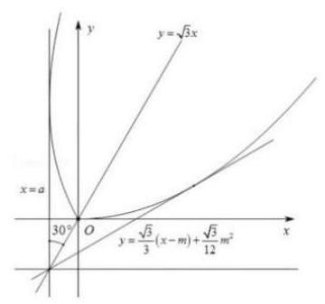

由 $\left\{  \begin{array}{l} y = \frac{\sqrt{3}}{3}\left( {x - m}\right)  + \frac{\sqrt{3}}{12}{m}^{2} \\  y = \frac{\sqrt{3}}{12}{x}^{2} \end{array}\right.$ 得 ${x}^{2} - {4x} + {4m} - {m}^{2} = 0$ ,

则 $\Delta  = {16} - {16m} + 4{m}^{2} = 0$ ,解得 $m = 2$ ,由图像得 $0 < m \leq  2$ ,

所以实数 $m$ 的取值范围为 $(0,2\rbrack$ .

【练习】2. (2024 届交附) 已知点 $A\left( {a,\sin a}\right)$ 在函数 $y = \sin x$ 的图像上,若 $y = \sin x$ 过点 $A$ 的切线与函数 $y \; = \sin x$ 的图像有 $n$ 个公共点 (含切点),称 $a$ 是 $y = \sin x$ 的“ $n$ 关键点”. 研究归纳得到了下面的命题:

①全体“1 关键点”构成的集合是 $\{ {k\pi } \mid  k \in  Z\}$ ；

②集合 $\{ {k\pi } + 2 \mid  k \in  Z\}$ 中的元素都是 2 关键点;

③若 ${a}_{0}$ 是 “ ${n}_{0}$ 关键点”，则 ${k\pi } \pm  {a}_{0}\left( {k \in  Z}\right)$ 也是 “ ${n}_{0}$ 关键点”；

④若 $\tan {a}_{0} = {a}_{0}$ ，则 ${a}_{0}$ 一定是 “ $\left\lbrack  \left| \frac{2{a}_{0}}{\pi }\right| \right\rbrack   + 1$ 关键点”. (其中 $\left\lbrack  x\right\rbrack$ 表示不超过 $x$ 的最大整数)其中， 真命题的个数是 ( )

A. 1 个 B. 2 个 C. 3 个 D. 4 个

【答案】 $D$

【解析】① “ ”指过点 $A\left( {a,\sin a}\right)$ 的切线与函数 $y = \sin x$ 的图像有 1 个公共点

(含切点),则称 $a$ 是 “1关键点”

因此点 $A$ 是函数 $y = \sin x$ 与 $x$ 轴的交点,

因此全体 1 关键点”构成的集合是 $\{ {k\pi } \mid  k \in  Z\}$ . 判断正确;

②作出 $y = \sin x$ 过点 $A\left( {2,\sin 2}\right)$ 的切线，

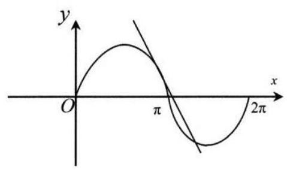

则该切线与 $y = \sin x$ 有 2 个公共点 (含切点),

因此 2 是 $y = \sin x$ 的 2 关键点 “ 2 关键点”,

由正弦函数的周期为 ${2\pi }$ ,对称轴为 $x = \pi$ ,

则集合 $\{ {k\pi } + 2 \mid  k \in  Z\}$ 中的元素都是 2 关键点. 判断正确;

③若 ${a}_{0}$ 是 “ ${n}_{0}$ 关键点”，由 $y = \sin x$ 为奇函数得 $- {a}_{0}$ 也是 “ ${n}_{0}$ 关键点”,

又 $y = \sin x$ 的最小正周期为 ${2\pi }$ ,且每个周期内都有两条对称轴,

则 ${k\pi } \pm  {a}_{0}\left( {k \in  Z}\right)$ 也是 “ ${n}_{0}$ 关键点”. 判断正确;

④ 当 $\tan {a}_{0} = {a}_{0}$ ,若 ${a}_{0} = 0$ ,则 $\tan 0 = 0$ ,符合要求,

过点 $A\left( {0,\sin 0}\right)$ 的切线与函数 $y = \sin x$ 的图像有 1 个公共点 (含切点),

则 0 是 “ 1 关键点”,此时 $\left\lbrack  \left| \frac{2{a}_{0}}{\pi }\right| \right\rbrack   + 1 = 1$ ,判断正确;

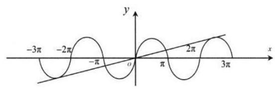

若 ${a}_{0} > 0$ ,则 ${a}_{0}$ 为第一或第三象限角,

$A\left( {{a}_{0},\sin {a}_{0}}\right)$ 位于 $y = \sin x$ 的图像的增区间,且 $\sin {a}_{0} > 0$ ,

由 $y = \sin x$ ,得 ${y}^{\prime } = \cos x$ ,则 $A\left( {{a}_{0},\sin {a}_{0}}\right)$ 处切线斜率为 $\cos {a}_{0}$ ,又 $\tan {a}_{0} = {a}_{0}$ ,

则 $\cos {a}_{0} = \frac{\sin {a}_{0}}{\tan {a}_{0}} = \frac{\sin {a}_{0}}{{a}_{0}} = \frac{0 - \sin {a}_{0}}{0 - {a}_{0}}$ ,

则切线斜率与过 $A\left( {{a}_{0},\sin {a}_{0}}\right)$ 与原点两点的斜率相等,则该切线过原点,

则该切线与 $y = \sin x$ 的公共点的个数为 $\left\lbrack  \left| \frac{2{a}_{0}}{\pi }\right| \right\rbrack   + 1$ ,

同理可得 ${a}_{0} < 0$ 时,判断正确

故 ${a}_{0}$ 一定是 “ $\left\lbrack  \left| \frac{2{a}_{0}}{\pi }\right| \right\rbrack   + 1$ 关键点”. (其中 $\left\lbrack  x\right\rbrack$ 表示不超过 $x$ 的最大整数),故选 $D$

【练习】3. (2024 届进才)已知椭圆 $C : \frac{{x}^{2}}{{a}^{2}} + \frac{{y}^{2}}{{b}^{2}} = 1\left( {a > 0, b > 0\text{ 且 }a \neq  b}\right)$ ，点 $B\left( {{x}_{0},{y}_{0}}\right)$ 在椭圆 $C$ 上，点 $A\left( {1,3}\right)$ ,原点为 $O$ .

(1)若点 $A$ 在曲线 $C$ 上，且长轴长为 $2\sqrt{82}$ ，求椭圆 $C$ 的短轴长；

(2)若点 $B$ 在第二象限，且 $\bigtriangleup  {OBA}$ 是以 $\angle {OBA}$ 为直角的等腰直角三角形，求 ${a}^{2} + {b}^{2}$ 的最小值；

(3)若椭圆 $C$ 的焦点在 $x$ 轴上，是否存在 $a \in  \left( {0,\frac{\sqrt{10}}{2}}\right\rbrack$ ，使得点 $B$ 在线段 ${OA}$ 的中垂线上? 若存在，求实数 $a$ 的取值范围；若不存在，请说明理由.

【解析】(1) 当焦点在 $x$ 轴上时，短轴长 ${2b} = \frac{2\sqrt{82}}{3}$ ；

当焦点在 $y$ 轴上时，短轴长 ${2b} = \frac{2\sqrt{5986}}{73}$ ；

(2) ${OA} = \sqrt{10}$ ，所以 ${OB} = \frac{OA}{\sqrt{2}} = \sqrt{5}$ ，所以 $\cos \alpha  = \frac{1}{\sqrt{10}}$ ， $\sin \alpha  = \frac{3}{\sqrt{10}}$ ，

所以 ${x}_{B} = \sqrt{5}\cos \left( {\alpha  + \frac{\pi }{4}}\right)  =  - 1,{y}_{B} = \sqrt{5}\sin \left( {\alpha  + \frac{\pi }{4}}\right)  = 2$ ,所以 $B\left( {-1,2}\right)$ ,

代入椭圆方程得 $\frac{1}{{a}^{2}} + \frac{4}{{b}^{2}} = 1$ ，

所以 ${a}^{2} + {b}^{2} = \left( {{a}^{2} + {b}^{2}}\right) \left( {\frac{1}{{a}^{2}} + \frac{4}{b}}\right)  = 5 + \frac{{b}^{2}}{{a}^{2}} + \frac{4{a}^{2}}{{b}^{2}} \geq  9$ ,

当且仅当 ${b}^{2} = 2{a}^{2}$ 时取等号,所以 ${a}^{2} + {b}^{2}$ 的最小值为 9 ;

(3) $A\left( {1,3}\right)$ ，线段 ${OA}$ 的中垂线方程为 $x - \frac{1}{2} + 3\left( {y - \frac{3}{2}}\right)  = 0$ ，即 $x + {3y} - 5 = 0$ ，

由 $\left\{  \begin{array}{l} \frac{{x}^{2}}{{a}^{2}} + \frac{{y}^{2}}{{b}^{2}} = 1 \\  x + {3y} - 5 = 0 \end{array}\right.$ 得 $\left( {{a}^{2} + 9{b}^{2}}\right) {y}^{2} - {30}{b}^{2}y + {25}{b}^{2} - {a}^{2}{b}^{2} = 0$ ,

所以 $\Delta  = {900}{b}^{4} - 4\left( {{a}^{2} + 9{b}^{2}}\right) \left( {{25}{b}^{2} - {a}^{2}{b}^{2}}\right)  \geq  0$ ，所以 ${a}^{2} + 9{b}^{2} \geq  {25}$ ，

因为 $a \in  \left( {0,\frac{\sqrt{10}}{2}}\right\rbrack$ ,所以 $0 < {a}^{2} \leq  \frac{5}{2}$ ,所以 $9{b}^{2} \geq  {25} - {a}^{2} \geq  {25} - \frac{5}{2} = \frac{45}{2}$ ,所以 $b \geq  \frac{\sqrt{10}}{2}$ ,与椭圆 $C$ 的焦点在 $x$ 轴上矛盾,故不存在.

## CH 每日三题 0429

【练习】1. 已知 $f\left( x\right)  = \left\{  \begin{array}{l} {\log }_{4}x, x < a \\  {\left( x - 3\right) }^{2}, x \geq  a \end{array}\right.$ ,若函数 $y = f\left( x\right)$ 的值域为 $R$ ,则实数 $a$ 的取值范围是___.

【答案】 $\left\lbrack  {1,4}\right\rbrack$

【解析】可画出 $y = {\log }_{4}x$ 和 $y = {\left( x - 3\right) }^{2}$ 的图象如下图所示:

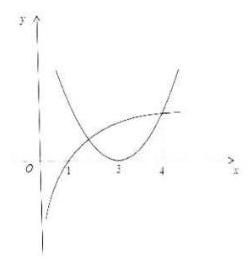

① $a < 1$ 时， $x < a$ 时， $f\left( x\right)  < {\log }_{4}a < 0$ ； $x \geq  a$ 时， $f\left( x\right)  \geq  0$ ，

此时 $f\left( x\right)$ 的值域不是 $R$ ,即 $a < 1$ 不合题意; ② $1 \leq  a \leq  3$ 时, $x < a$ 时, $f\left( x\right)  < {\log }_{4}a$ ,且 ${\log }_{4}a > \; 0 : x \geq  a$ 时, $f\left( x\right)  \geq  0$ ,满足 $f\left( x\right)$ 的值域为 $R$ ; ③ $3 < a \leq  4$ 时, $x < a$ 时, $f\left( x\right)  < {\log }_{4}a$ ,且 $0 < \; {\log }_{4}a \leq  1;x \geq  a$ 时, $f\left( x\right)  \geq  {\left( a - 3\right) }^{2}$ ,且 $0 < {\left( a - 3\right) }^{2} \leq  1$ ,由图象得满足 $f\left( x\right)$ 的值域为 $R$ ; ④ $a > 4$ 时,由图象得 $f\left( x\right)$ 的值域不是 $R$ ,即 $a > 4$ 不合题意,综上, $a$ 的取值范围为 $\left\lbrack  {1,4}\right\rbrack$ .

【练习】2. 已知 $\alpha ,\beta  \in  R$ ,关于等式,以下两个命题:

①对任意的 $\alpha  \in  \left\lbrack  {0,{2\pi }}\right\rbrack$ ，总存在 $\beta  \in  \left\lbrack  {0,{2\pi }}\right\rbrack$ ，使得等式 $\cos \alpha  + \cos \beta  = \sin \left( {\alpha  + \beta }\right)$ 成立；

②对任意的 $\alpha  \in  \left\lbrack  {0,{2\pi }}\right\rbrack$ ，总存在 $\beta  \in  \left\lbrack  {0,{2\pi }}\right\rbrack$ ，使得等式 $\sin \alpha  + \sin \beta  = \cos \left( {\alpha  + \beta }\right)$ 成立. 则下列判断正确的是 ( )

A. ①与②都正确 B. ①正确，②不正确

C. ①不正确，②正确 D. ①与②都不正确

【答案】 $B$

【解析】① 任意的 $\alpha  \in  \left\lbrack  {0,{2\pi }}\right\rbrack$ ,当 $\beta  = \frac{\pi }{2}$ 时, $\cos \alpha  + \cos \beta  = \cos \alpha$ ,

$\sin \left( {\alpha  + \beta }\right)  = \sin \left( {\alpha  + \frac{\pi }{2}}\right)  = \cos \alpha$ ,满足 $\cos \alpha  + \cos \beta  = \sin \left( {\alpha  + \beta }\right)$ ,故①正确；

② 当 $\alpha  = \frac{3\pi }{2}$ 时， $\sin \alpha  + \sin \beta  =  - 1 + \sin \beta$ ， $\cos \left( {\alpha  + \beta }\right)  = \cos \left( {\frac{3\pi }{2} + \beta }\right)  = \sin \beta$ ，

则不存在 $\beta  \in  \left\lbrack  {0,{2\pi }}\right\rbrack$ ,使得等式 $\sin \alpha  + \sin \beta  = \cos \left( {\alpha  + \beta }\right)$ 成立，故②不正确.

故选 $B$ .

【练习】3. 一组空间向量 ${\overrightarrow{a}}_{1},{\overrightarrow{a}}_{2},{\overrightarrow{a}}_{3},\cdots ,{\overrightarrow{a}}_{n}\left( {n \in  {N}^{ * }}\right)$ ,记 ${\overrightarrow{S}}_{n} = {\overrightarrow{a}}_{1} + {\overrightarrow{a}}_{2} + {\overrightarrow{a}}_{3} + \cdots  + {\overrightarrow{a}}_{n}$ ,如果存在 ${\overrightarrow{a}}_{p}\left( {p \in  \{ 1,2,3,\cdots , n\} }\right)$ ,使得 $\left| {\overrightarrow{a}}_{p}\right|  \geq  \left| {{\overrightarrow{S}}_{n} - {\overrightarrow{a}}_{p}}\right|$ ,那么称 ${\overrightarrow{a}}_{p}$ 是该向量组的“ $h$ 向量”.

(1)已知 ${\overrightarrow{a}}_{1} = \left( {0,5,4}\right) ,{\overrightarrow{a}}_{2} = \left( {1,0,3}\right) ,{\overrightarrow{a}}_{3} = \left( {5, t,0}\right)$ ，若 ${\overrightarrow{a}}_{3}$ 是向量组 ${\overrightarrow{a}}_{1}$ ， ${\overrightarrow{a}}_{2}$ ，或者。 取值范围;

(2)四面体 ${PABC}$ 内接于以 $O$ 为球心，1 为半径的球，且 $3 \cdot  \overrightarrow{OA} + 4 \cdot  \overrightarrow{OB} + 5 \cdot  \overrightarrow{OC} = \overrightarrow{0}$ ，

(i) 记 ${\overrightarrow{a}}_{1} = \overrightarrow{OA},{\overrightarrow{a}}_{2} = \overrightarrow{OB},{\overrightarrow{a}}_{3} = \overrightarrow{OC}$ ,向量组 ${\overrightarrow{a}}_{1},{\overrightarrow{a}}_{2},{\overrightarrow{a}}_{3}$ 中是否存在 “ $h$ 向量”,若有,指出哪个是 “ $h$ 向量”并证明; 若没有, 请说明理由.

(ii) 求四面体 ${PABC}$ 体积的最大值.

【解析】(1) 由题意得 $\overrightarrow{{S}_{3}} = \left( {6, t + 5,7}\right) ,\overrightarrow{{S}_{3}} - \overrightarrow{{a}_{3}} = \left( {1,5,7}\right)$ ,

又因为 $\overrightarrow{{a}_{3}}$ 是向量组 $\overrightarrow{{a}_{1}},\overrightarrow{{a}_{2}},\overrightarrow{{a}_{3}}$ 的“ $h$ 向量”,所以 $\left| \overrightarrow{{a}_{3}}\right|  \geq  \left| {\overrightarrow{{S}_{3}} - \overrightarrow{{a}_{3}}}\right|$ ,

即 $\sqrt{{5}^{2} + {t}^{2}} \geq  \sqrt{{1}^{2} + {5}^{2} + {7}^{2}} \Leftrightarrow  {t}^{2} \geq  {50}$ ,解得 $t \leq   - 5\sqrt{2}$ 或 $t \geq  5\sqrt{2}$ ,

故 $t$ 的取值范围为 $\left( {-\infty , - 5\sqrt{2}}\right)  \cup  \left( {5\sqrt{2}, + \infty }\right)$ .

(2)(i)由题意得，因为四面体 ${PABC}$ 内接于球 $O$ ，所以 $\left| \overrightarrow{{a}_{1}}\right|  = \left| \overrightarrow{{a}_{2}}\right|  = \left| \overrightarrow{{a}_{3}}\right|  = 1$ ，

因为 $3{\overrightarrow{a}}_{1} + 4{\overrightarrow{a}}_{2} + 5{\overrightarrow{a}}_{3} = \overrightarrow{0}$ ，所以 $3{\overrightarrow{a}}_{1} + 4{\overrightarrow{a}}_{2} =  - 5{\overrightarrow{a}}_{3}$ ，

两边同时平方得 $9{\left( {\overrightarrow{a}}_{1}\right) }^{2} + {16}{\left( {\overrightarrow{a}}_{2}\right) }^{2} + {24}{\overrightarrow{a}}_{1} \cdot  {\overrightarrow{a}}_{2} = {25}{\left( {\overrightarrow{a}}_{3}\right) }^{2}$ ,

所以 ${\overrightarrow{a}}_{1} \cdot  {\overrightarrow{a}}_{2} = 0$ ,即 ${\overrightarrow{a}}_{1} \bot  {\overrightarrow{a}}_{2},\overrightarrow{OA} \bot  \overrightarrow{OB}$ ,且 $A, B, C, O$ 在同一平面内.

以 $O$ 为原点, ${OA},{OB}$ 分别为 $x, y$ 轴建立平面直角坐标系,

则 $A\left( {1,0}\right) , B\left( {0,1}\right) ,\overrightarrow{{a}_{1}} = \left( {1,0}\right) ,\overrightarrow{{a}_{2}} = \left( {0,1}\right)$ ,

代入 $3\overrightarrow{{a}_{1}} + 4\overrightarrow{{a}_{2}} + 5\overrightarrow{{a}_{3}} = \overrightarrow{0}$ 得 $\overrightarrow{{a}_{3}} = \left( {-\frac{3}{5}, - \frac{4}{5}}\right)$ ，

于是 $\left| \overrightarrow{{a}_{1}}\right|  = 1 \geq  \left| {\overrightarrow{{S}_{3}} - \overrightarrow{{a}_{1}}}\right|  = \left| {\overrightarrow{{a}_{2}} + \overrightarrow{{a}_{3}}}\right|  = \sqrt{{\left( 0 - \frac{3}{5}\right) }^{2} + {\left( 1 - \frac{4}{5}\right) }^{2}} = \frac{\sqrt{10}}{5}$ ,

$\left| {\overrightarrow{a}}_{2}\right|  = 1 \geq  \left| {{\overrightarrow{S}}_{3} - {\overrightarrow{a}}_{2}}\right|  = \left| {{\overrightarrow{a}}_{1} + {\overrightarrow{a}}_{3}}\right|  = \sqrt{{\left( 1 - \frac{3}{5}\right) }^{2} + {\left( 0 - \frac{4}{5}\right) }^{2}} = \frac{2\sqrt{5}}{5},$

$\left| {\overrightarrow{a}}_{3}\right|  = 1 \leq  \left| {{\overrightarrow{S}}_{3} - {\overrightarrow{a}}_{3}}\right|  = \left| {{\overrightarrow{a}}_{1} + {\overrightarrow{a}}_{2}}\right|  = \sqrt{2},$

所以由 “ $h$ 向量” 的定义, ${\overrightarrow{a}}_{1},{\overrightarrow{a}}_{2}$ 都是 “ $h$ 向量”.

(ii) 由 (i) 得, $\overrightarrow{OA} \bot  \overrightarrow{OB}$ ,且 $A, B, C, O$ 在同一平面内,

所以 $\bigtriangleup {ABC}$ 在过球心 $O$ 的截面上,

又 $3 \cdot  \overrightarrow{OA} + 4 \cdot  \overrightarrow{OB} + 5 \cdot  \overrightarrow{OC} = \overrightarrow{0},3 \cdot  \overrightarrow{OA} + 5 \cdot  \overrightarrow{OC} =  - 4\overrightarrow{OB}$ ,

两边平方得 $\overrightarrow{OA} \cdot  \overrightarrow{OC} =  - \frac{3}{5}$ ，即 $\cos \angle {AOC} =  - \frac{3}{5}$ ， $\sin \angle {AOC} = \frac{4}{5}$ ，

同理 $4 \cdot  \overrightarrow{OB} + 5 \cdot  \overrightarrow{OC} =  - 3\overrightarrow{OA}$ ，两边平方得 $\overrightarrow{OB} \cdot  \overrightarrow{OC} =  - \frac{4}{5}$ ，

即 $\cos \angle {BOC} =  - \frac{4}{5},\sin \angle {BOC} = \frac{3}{5}$ ，于是 ${S}_{\bigtriangleup {ABC}} = {S}_{\bigtriangleup {AOB}} + {S}_{\bigtriangleup {AOC}} + {S}_{\bigtriangleup {BOC}} \; = \frac{1}{2}\left| \overrightarrow{OA}\right|  \cdot  \left| \overrightarrow{OB}\right|  + \frac{1}{2}\left| \overrightarrow{OA}\right|  \cdot  \left| \overrightarrow{OC}\right|  \cdot  \sin \angle {AOC} + \frac{1}{2}\left| \overrightarrow{OB}\right|  \cdot  \left| \overrightarrow{OC}\right|  \cdot  \sin \angle {BOC} \; = \frac{6}{5}$ ,所以当 ${OP} \bot$ 平面 ${ABC}$ 时,四面体 ${PABC}$ 体积取得最大值,

此时 ${V}_{PABC} = \frac{1}{3}{S}_{\bigtriangleup {ABC}} \cdot  \left| {OP}\right|  = \frac{1}{3} \times  \frac{6}{5} \times  1 = \frac{2}{5}$ .

## CI 每日三题 0430

【练习】1. (2024 届控江)已知集合 $A = \left\lbrack  {t, t + 1}\right\rbrack   \cup  \left\lbrack  {t + 2, t + 4}\right\rbrack  ,0 \notin  A$ . 若存在正数 $\lambda$ ，使得对任意 $a \in  A$ . 都有 $\frac{\lambda }{a} \in  A$ 恒成立，则实数 $t$ 的值为___.

【答案】 $= 2$ 或 $- \frac{8}{5}$

【解析】①当 $t > 0$ 时,因为 $a \in  \left\lbrack  {t, t + 1}\right\rbrack   \cup  \left\lbrack  {t + 2, t + 4}\right\rbrack$ ,

所以 $\frac{1}{a} \in  \left\lbrack  {\frac{1}{t + 4},\frac{1}{t + 2}}\right\rbrack   \cup  \left\lbrack  {\frac{1}{t + 1},\frac{1}{t}}\right\rbrack$ ,且 $\lambda  > 0$ ,得 $\frac{\lambda }{a} \in  \left\lbrack  {\frac{\lambda }{t + 4},\frac{\lambda }{t + 2}}\right\rbrack   \cup  \left\lbrack  {\frac{\lambda }{t + 1},\frac{\lambda }{t}}\right\rbrack$ ,

因为 $\frac{\lambda }{a} \in  A$ ,所以 $\left\{  \begin{array}{l} \frac{\lambda }{t + 4} \geq  t \\  \frac{\lambda }{t + 2} \leq  t + 1 \end{array}\right.$ 且 $\left\{  \begin{array}{l} \frac{\lambda }{t + 1} \geq  t + 2 \\  \frac{\lambda }{t} \leq  t + 4 \end{array}\right.$ ,

得 $\left\{  \begin{array}{l} t\left( {t + 4}\right)  \leq  \lambda  \leq  t\left( {t + 4}\right) \\  \left( {t + 1}\right) \left( {t + 2}\right)  \leq  \lambda  \leq  \left( {t + 1}\right) \left( {t + 2}\right)  \end{array}\right.$ ,则 $\lambda  = t\left( {t + 4}\right)  = \left( {t + 1}\right) \left( {t + 2}\right)$ ,解得 $t = 2$ ;

②当 $t + 4 < 0$ 即 $t <  - 4$ 时，与①构造方程相同，即 $t = 2$ ，不合题意，舍去；

③ 当 $\left\{  \begin{array}{l} t + 1 < 0 \\  t + 2 > 0 \end{array}\right.$ ，即 $- 2 < t <  - 1$ 时，得 $\left\{  \begin{array}{l} \frac{\lambda }{t + 1} \geq  t \\  \frac{\lambda }{t} \leq  t + 1 \end{array}\right.$ 且 $\left\{  \begin{array}{l} \frac{\lambda }{t + 4} \geq  t + 2 \\  \frac{\lambda }{t + 2} \leq  t + 4 \end{array}\right.$ ，

得 $\lambda  = t\left( {t + 1}\right)  = \left( {t + 2}\right) \left( {t + 4}\right)$ ，解得 $t =  - \frac{8}{5}$ ；

综上所述， $t = 2$ 或 $- \frac{8}{5}$ .

【练习】2. 已知 $f\left( x\right)  = {x}^{3} - {3x}$ ,函数 $y = f\left( x\right)$ 的定义域为 $\left\lbrack  {a, b}\right\rbrack  \left( {a, b \in  Z}\right) , y = f\left( x\right)$ 的值域为 $\left\lbrack  {a, b}\right\rbrack$ 的子集, 则这样的函数的个数为 ( )

A. 1 B. 2 C. 3 D. 无数个

【答案】 $A$

【解析】因为 $f\left( x\right)  = {x}^{3} - {3x}$ ,所以 ${f}^{\prime }\left( x\right)  = 3{x}^{2} - 3 = 3(x + 1\left( {x - 1}\right)$ ,

显然 $f\left( x\right)$ 在 $\left( {-\infty ,1}\right)$ 上严格增,在 $\left( {-1,1}\right)$ 上严格减,在 $\left( {1, + \infty }\right)$ 上严格增,

① 当 $a < b \leq   - 1, f\left( x\right)$ 在区间 $\left\lbrack  {a, b}\right\rbrack$ 上严格增，则 $\left\{  {\begin{array}{l} f\left( a\right)  \geq  a \\  f\left( b\right)  \leq  b \end{array} \Rightarrow  \left\{  \begin{array}{l} {a}^{3} - {3a} \geq  a \\  {b}^{3} - {3b} \leq  b \end{array}\right. }\right.$ ，

解得 $- 2 \leq  a \leq  0$ 或 $a \geq  2,0 \leq  b \leq  2$ 或 $b \leq   - 2$ ,又 $a < b \leq   - 1$ ,此时无解;

②当 $a \leq   - 1$ 且 $- 1 < b \leq  1$ 时，因为 $f{\left( x\right) }_{\max } = f\left( {-1}\right)  = 2 > 2$ ，矛盾，不合题意；

③ 当 $a \leq   - 1$ 且 $b \geq  1$ 时，因为 $f\left( {-1}\right)  = 2, f\left( 1\right)  =  - 2$ 都在函数的值域内，

故 $a \leq   - 2, b \geq  2$ ,又 $\left\{  {\begin{array}{l} f\left( a\right)  \geq  a \\  f\left( b\right)  \leq  b \end{array} \Rightarrow  \left\{  \begin{array}{l} {a}^{3} - {3a} \geq  a \\  {b}^{3} - {3b} \leq  b \end{array}\right. }\right.$ ,

解得 $- 2 \leq  a \leq  0$ 或 $a \geq  2,0 \leq  b \leq  2$ 或 $b \leq   - 2$ ,

从而 $a =  - 2, b = 2$ ,经验证符合题意;

④ 当 $- 1 \leq  a < b \leq  1$ 时， $f\left( x\right)$ 在区间 $\left\lbrack  {a, b}\right\rbrack$ 上严格减，

$\left\{  {\begin{array}{l} f\left( a\right)  \geq  a \\  f\left( b\right)  \leq  b \end{array} \Rightarrow  \left\{  {\begin{array}{l} {a}^{3} - {3a} \geq  a \\  {b}^{3} - {3b} \leq  b \end{array}\left( *\right) ,\text{ 而 }a, b \in  Z,}\right. }\right.$

经检验,满足 $- 1 \leq  a < b \leq  1$ 的整数组 $a, b$ 均不满足 (*) 式;

⑤ 当 $- 1 < a < 1$ 且 $b \geq  1$ 时， $f{\left( x\right) }_{\min } = f\left( 1\right)  =  - 2 < a$ ，矛盾，不合题意；

⑥ 当 $b > a \geq  1$ 时， $f\left( x\right)$ 在区间 $\left\lbrack  {a, b}\right\rbrack$ 上递增，所以 $\left\{  {\begin{array}{l} f\left( a\right)  \geq  a \\  f\left( b\right)  \leq  b \end{array} \Rightarrow  \left\{  \begin{array}{l} {a}^{3} - {3a} \geq  a \\  {b}^{3} - {3b} \leq  b \end{array}\right. }\right.$ ，

解得 $- 2 \leq  a \leq  0$ 或 $a \geq  2,0 \leq  b \leq  2$ 或 $b \leq   - 2$ ,又 $b > a \geq  1$ ,此时无解;

因此，所求整数 $a$ ， $b$ 的值为 $a =  - 2$ ， $b = 2$ . 这样的函数只有 1 个，故选 $A$ .

【练习】3. 若函数 $y = f\left( x\right)$ 在区间 $I$ 上有定义，且对任意的 $x \in  I$ ，有 $f\left( x\right)  \in  I$ ，则称 $I$ 是 $f\left( x\right)$ 的一个“封闭区间”.

(1) 已知函数 $f\left( x\right)  = x + \sin x$ ，区间 $I = \left\lbrack  {0, r}\right\rbrack  \left( {r > 0}\right)$ 且 $f\left( x\right)$ 的一个“封闭区间”，求 $r$ 的取值集合;

(2)已知函数 $g\left( x\right)  = \ln \left( {x + 1}\right)  + \frac{3}{4}{x}^{3}$ ，设集合 $P = \{ x \mid  g\left( x\right)  = x\}$ .

①求集合 $P$ 中元素的个数；

②用 $b - a$ 表示区间 $\left\lbrack  {a, b}\right\rbrack  \left( {a < b}\right)$ 的长度，设 $m$ 为集合 $P$ 中的最大元素.

求证: 存在唯一长度为 $m$ 的闭区间 $D$ ,使得 $D$ 是 $g\left( x\right)$ 的一个 “封闭区间”.

【解析】(1) 因为区间 $I = \left\lbrack  {0, r}\right\rbrack  \left( {r > 0}\right)$ 且 $f\left( x\right)$ 的一个“封闭区间”,

所以 $\forall x \in  \left\lbrack  {0, r}\right\rbrack  , f\left( x\right)  \in  \left\lbrack  {0, r}\right\rbrack$ ,

因为 ${f}^{\prime }\left( x\right)  = 1 + \cos x \geq  0$ 恒成立，所以 $f\left( x\right)$ 在 $\left\lbrack  {0, r}\right\rbrack$ 上单调递增，

所以 $f\left( x\right)  \in  \left\lbrack  {0, r + \sin r}\right\rbrack$ ,所以 $\left\lbrack  {0, r + \sin r}\right\rbrack   \subseteq  \left\lbrack  {0, r}\right\rbrack$ ,所以 $r + \sin r \leq  r$ ,

即 $\sin r \leq  0\left( {r > 0}\right)$ ,解得 $\left( {{2k} - 1}\right) \pi  \leq  r \leq  {2k\pi }\left( {k \in  {N}^{ * }}\right)$ ,

所以 $r$ 的取值集合为 $\left\lbrack  {\left( {{2k} - 1}\right) \pi ,{2k\pi }}\right\rbrack  \left( {k \in  {N}^{ * }}\right)$ .

(2)①记函数 $h\left( x\right)  = g\left( x\right)  - x = \ln \left( {x + 1}\right)  + \frac{3}{4}{x}^{3} - x\left( {x >  - 1}\right)$ ，

则 ${h}^{\prime }\left( x\right)  = \frac{1}{x + 1} + \frac{9}{4}{x}^{2} - 1 = \frac{x\left( {{3x} + 4}\right) \left( {{3x} - 1}\right) }{4\left( {x + 1}\right) }\left( {x >  - 1}\right)$ ,

由 ${h}^{\prime }\left( x\right)  > 0$ 得 $- 1 < x < 0$ 或 $x > \frac{1}{3}$ ; 由 ${h}^{\prime }\left( x\right)  < 0$ 得 $0 < x < \frac{1}{3}$ ;

所以函数 $h\left( x\right)$ 在 $\left( {-1,0}\right)$ 和 $\left( {\frac{1}{3}, + \infty }\right)$ 单调递增,在 $\left( {0,\frac{1}{3}}\right)$ 单调递减.

其中 $h\left( 0\right)  = 0$ ，因此当 $x \in  \left( {-1,0}\right)  \cup  \left( {0,\frac{1}{3}}\right)$ 时， $h\left( x\right)  < 0$ ，不存在零点；

$h\left( \frac{1}{3}\right)  < h\left( 0\right)  = 0$ ,而 $h\left( 1\right)  = \ln 2 - \frac{1}{4} > 0, h\left( x\right)$ 在 $\left( {0,\frac{1}{3}}\right)$ 单调递减,

由零点存在定理得存在唯一的 ${x}_{0} \in  \left( {\frac{1}{3},1}\right)$ 使得 $h\left( {x}_{0}\right)  = 0$ ;

当 $x \in  \left( {1, + \infty }\right)$ 时, $h\left( x\right)  > 0$ ,不存在零点. 综上所述,函数 $h\left( x\right)$ 有 0 和 ${x}_{0}$ 两个零点,即集合 $P$ 中元素的个数为 2 .

②由①得 $m = {x}_{0}$ ，

假设长度为 $m$ 的闭区间 $D = \left\lbrack  {a, a + {x}_{0}}\right\rbrack$ 是 $g\left( x\right)$ 的一个“封闭区间” $\left( {a >  - 1}\right)$ ，

则对 $\forall x \in  \left\lbrack  {a, a + {x}_{0}}\right\rbrack  , g\left( x\right)  \in  \left\lbrack  {a, a + {x}_{0}}\right\rbrack$ ,

当 $- 1 < a < 0$ 时,由①得 $h\left( x\right)$ 在 $\left( {-1,0}\right)$ 单调递增,

所以 $h\left( a\right)  = g\left( a\right)  - a < h\left( 0\right)  = 0$ ,即 $g\left( a\right)  < a$ ,不满足要求;

当 $a > 0$ 时,由 (i) 得 $h\left( x\right)$ 在 $\left( {{x}_{0}, + \infty }\right)$ 单调递增,

所以 $h\left( {a + {x}_{0}}\right)  = g\left( {a + {x}_{0}}\right)  - \left( {a + {x}_{0}}\right)  > h\left( {x}_{0}\right)  = 0$ ,

即 $g\left( {a + {x}_{0}}\right)  > a + {x}_{0}$ ,也不满足要求;

当 $a = 0$ 时,闭区间 $D = \left\lbrack  {0,{x}_{0}}\right\rbrack$ ,而 $g\left( x\right)$ 显然在 $\left( {-1, + \infty }\right)$ 单调递增,

所以 $g\left( 0\right)  \leq  g\left( x\right)  \leq  g\left( {x}_{0}\right)$ ,

由①得 $g\left( 0\right)  = h\left( 0\right)  + 0 = 0, g\left( {x}_{0}\right)  = h\left( {x}_{0}\right)  + {x}_{0} = {x}_{0}$ ,

所以 $g\left( x\right)  \in  \left\lbrack  {0,{x}_{0}}\right\rbrack   = D$ ,满足要求.

综上,存在唯一的长度为 $m$ 的闭区间 $D = \left\lbrack  {0, m}\right\rbrack$ ,

使得 $D$ 是 $g\left( x\right)$ 的一个“封闭区间”.