高二(上)暑假班立几+解几+概率

第一讲:空间平面的基本性质 1~8

第二讲:空间两条直线的位置关系 -9~15

第三讲:空间直线与平面的位置关系 16~27

第四讲:空间平面与平面的位置关系 28~36

第五讲:简单几何体 37~42

第六讲:旋转体及其表面积和体积 43~50

第七讲:球 51~56

第八讲:空间向量在立体几何中的应用 1 ·57~64

第九讲:空间向量在立体几何中的应用 2 65~71

解几第一讲:直线方程 -72~75

解几第二、三讲:两条直线的位置关系及圆的方程 76~81

解几第四讲:直线与圆的位置关系 ·82~88

解几第五、六讲:椭圆方程及直线与椭圆的位置关系 89~95

解几第七、八讲: 双曲线方程及直线与双曲线的位置关系 96~103

解几第九讲:抛物线方程及直线与抛物线的位置关系 104~108

概率统计一、二 109~123

## 第一讲: 平面及其基本性质

立体几何概述: 主要研究对象为点、线、面、体, 即空间的点, 直线, 平面和简单几何体, 主要任务归纳为:研究点、线、面之间的位置关系和数量关系，位置关系包括:平行、垂直等特殊的位置关系; 数量关系包括: 成角、距离、面积、体积等。

教学目标: 1、了解平面的基本性质

2、会画出平面, 并知道平面的表示方法

3、能用集合语言表示点、直线和平面的位置关系

4、掌握三个定理和三个推论

教学难点: 证明三点共线和三线共点问题

## 一、平面的概念

1、平面的相关概念: 平面是一个描述且不定义的, 只需理解的最基本的原始概念。是从生活中抽象出来的，且是理想化的。如桌子的表面、黑板面、平静的水平等。

(1)平面的两个特征:①无限延展 ②平的(没有厚度)

(2)平面的画法:通常画平行四边形来表示平面(有时也用三角形或其它平面图形表示)。 一个平面的画法: 当平面是水平放置的时候,通常把平行四边形的锐角画成 ${45}^{ \circ  }$ ,横边画成邻边的 2 倍长。

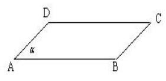

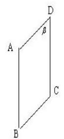

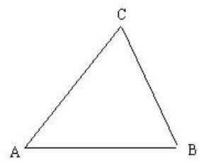

2、平面的表示方法: 平面可以用一个大写字母或一个希腊字母表示:

如平面 $M$ 、平面 $N$ 、平面 $\alpha$ 等; 可以用平行四边形的四个顶点的字母表示或平行四边形的对角线的两个字母表示: 如平面 ${ABCD}$ 、平面 ${AC}$ 等; 也可用三角形的顶点的字母表示: 如平面 ${ABC}$ 等。

## 二、空间的点、直线与平面的位置关系及其集合语言表示

1、点与直线的位置关系:

2、点与平面的位置关系:

<table><tr><td></td><td>位置关系</td><td>符号表示</td><td>图形表示</td></tr><tr><td rowspan="2">点与直线</td><td>点 $A$ 在直线 $l$ 上,也称直线 $l$ 经过点 $A$</td><td>$A \in  l$</td><td></td></tr><tr><td>点 $B$ 不在直线 $l$ 上,也称直线 $l$ 不经过点 $B$</td><td>$B \notin  l$</td><td></td></tr><tr><td rowspan="2">点与平面</td><td>点 $A$ 在平面 $\alpha$ 上,也称平面 $\alpha$ 经过点 $A$</td><td>$A \in  \alpha$</td><td></td></tr><tr><td>点 $B$ 不在平面 $\alpha$ 上,也称平面 $\alpha$ 不经过点 $B$</td><td>$B \notin  \alpha$</td><td></td></tr></table>

3、直线与平面的位置关系:

直线 $l$ 在平面 $\alpha$ 上 (或 平面经过直线): 记作 $l \subset  \alpha$

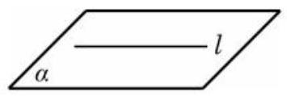

直线 $l$ 在平面 $\alpha$ 外(包括:直线与平面平行或只有一个交点)记作: $l \text{ ⊄ } \alpha$ 。

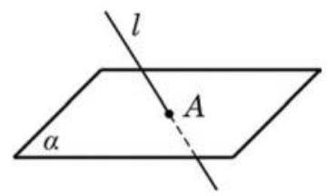

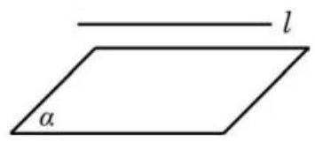

只有一个交点记为: $l \cap  \alpha  = A$

平行记为: $l//\alpha$ 或 $l \cap  \alpha  = \phi$

三、平面的基本性质 (3 个公理和 3 个推论) (注意集合语言的正确使用)

公理 1 如果一条直线上有两点在某个平面上, 那么这条直线上所有的点都在这个平面上. 集合语言: 若 $A \in  \alpha , B \in  \alpha$ ,则 ${AB} \subset  \alpha$ 。

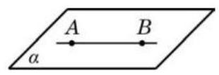

公理 1 主要用于判断一条直线是否在平面内或者判断点在平面内。

①判定直线在平面内; ②判定点在平面内. 模式: $\left\{  {\begin{array}{l} a \subset  \alpha \\  A \in  a \end{array} \Rightarrow  A \in  \alpha }\right.$ .

例 1 设三角形 ${ABC}$ 的三个顶点 $A\text{ 、 }B\text{ 、 }C$ 都在平面 $\alpha$

上. 证明: 该三角形的重心 $G$ 也在平面 $\alpha$ 上.

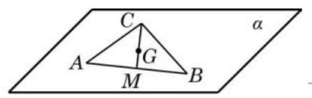

公理 2 不在同一直线上的三点确定一个平面.

(即有且只有一个平面)

实际事例:(1)门:两个合页，一把锁；(2)摄像机的三角支架；53)自行车的撑脚。 符号表示:

$\left. \begin{array}{l} A, B, C\text{ 不共线 } \\  A, B, C \in  \alpha \\  A, B, C \in  \beta  \end{array}\right\}   \Rightarrow  \alpha$ 与 $\beta$ 重合

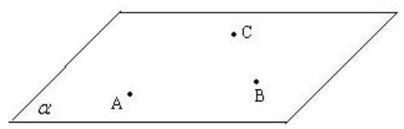

推论 1 一条直线和直线外的一点确定一个平面.

推论 2 两条相交直线确定一个平面.

推论 3 两条平行直线确定一个平面. 主要应用:是确定共面的依据。

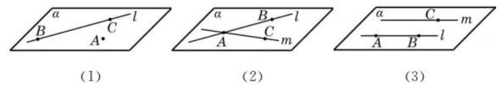

推论 1: 若 $A \notin  l$ ,则存在唯一的平面 $\alpha$ ,使得 $A \in  \alpha , l \subset  \alpha$ 。

推论 1 证明: 在直线 $l$ 上任取两个不同的点 $B, C$ ,则 $A, B, C$ 三点不共线,由公理 $2, A, B, C$ 可以确定一个平面; 又因为 $B, C \in  \alpha$ ,由公理 1,可知直线 ${BC} \subset  \alpha$ ,即 $l \subset  \alpha$ ,从而平面 $\alpha$ 是由点 $A$ 和直线 $l$ 所确定的平面。

例 2 已知三条直线 ${l}_{1}\text{ 、 }{l}_{2}$ 和 ${l}_{3}$ 两两相交,且不共点. 求证: 直线 ${l}_{1}\text{ 、 }{l}_{2}$ 和 ${l}_{3}$ 在同一平面上.

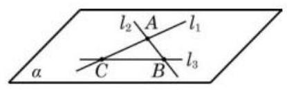

## 四、相交平面

公理 3 如果两个不同的平面有一个公共点,那么它们有且只有一条过该点的公共直线.

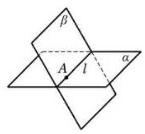

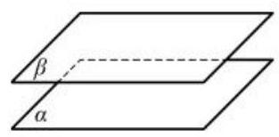

公理 3 集合语言: 若 $A \in  \alpha , A \in  \beta$ ,则 $\alpha  \cap  \beta  = l, A \in  l$ 。 两个平面的位置关系: 平行 (记作: $\alpha //\beta$ 或 $\alpha  \cap  \beta  = \phi$ ) 或相交 (记作: $\alpha  \cap  \beta  = l$ )

画两个相交平面时, 若一个平面的一部分被另一个平面遮住, 应把被遮住部分的线段画成虚线或不画。

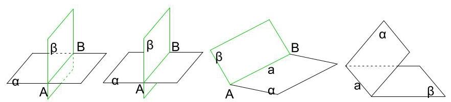

图 2

公理 3 主要应用: 判定两个平面的交线位置, 证明三点共线和三线共点的主要依据。

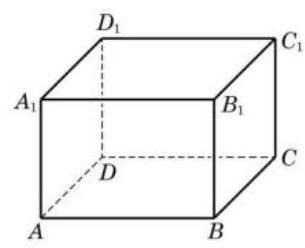

例 3 如图 10-1-13,在长方体 ${ABCD} - {A}_{1}{B}_{1}{C}_{1}{D}_{1}$ 中, 找出下列各对平面的交线:

(1)平面 ${ABCD}$ 与平面 $A{A}_{1}{B}_{1}B$ ；

(2)平面 ${A}_{1}{BD}$ 与平面 ${C}_{1}{BD}$ ；

(3)平面 ${AC}{C}_{1}{A}_{1}$ 与平面 ${B}_{1}{BD}{D}_{1}$ ;

(4)平面 ${ABCD}$ 与平面 $B{B}_{1}{D}_{1}$ .

## 巩固练习

## 一、平面的概念题

1、一个平面将空间分成___个部分，两个平面将空间分成___个部分，三个平面将空间分成___ 部分。

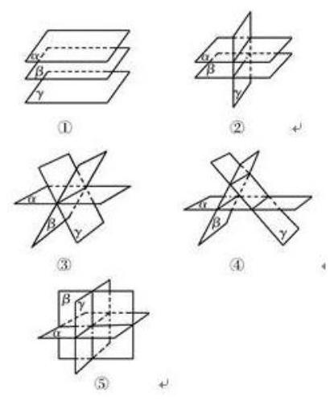

2、正方体各面所在的平面将空间分成___个部分。

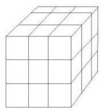

3、空间的三个平面，公共直线的条数可能是___。

## 二、公理和推论的概念题

1、用集合的语言表示下列语句

(1)点 A 在平面 $\alpha$ 内，但在平面 $\beta$ 外

(2)直线 $a$ 经过平面 $\alpha$ 外一点 $M$

(3)直线 $a$ 在平面 $\alpha$ 内,又在平面 $\beta$ 内,由此认定平面 $\alpha$ 与平面 $\beta$ 相交于直线 $a$

2、(1)不共面的四点可以确定几个平面？

(2)三条直线两两平行，但不共面，可以确定几个平面？

(3)共点的三条直线可以确定几个平面？

(4)经过三点可以确定几个平面？

(5)两两相交且不共点的三条直线可以确定几个平面？

3、下列命题中正确的个数是( )

①梯形可以确定一个平面；

②若两条直线和第三条直线所成的角相等，则这两条直线平行；

③两两相交的三条直线最多可以确定三个平面；

④ 若两个平面有三个公共点，则这两个平面重合。

A. 0 B. 1

4、以下四个命题中，正确命题的个数是( )

①不共面的四点中，任意三点不共线；

②若点 $A, B, C, D$ 共面，点 $A, B, C, E$ 共面，则 $A, B, C, D, E$ 共面；

③若直线 $a, b$ 共面，直线 $a, c$ 共面，则直线 $b, c$ 共面；

④依次首尾相接的四条线段必共面。

A. 0 B. 1 C. 2 D. 3

## 三、公理的应用

1、证明线共面

2、证明三点共线

3、证明三线共点

4、证明四点共面

例 1、三个平面两两相交于三条直线，若这三条直线不平行，则它们相交于同一点。

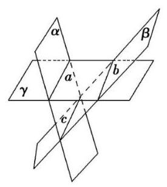

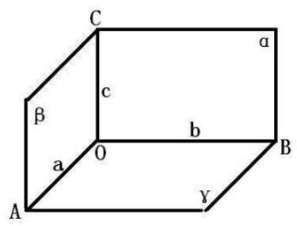

练习: 已知: $a//b, c$ 与 $a, b$ 都相交,求证: 直线 $a, b, c$ 共面。

例 2、在正方体 ${ABCD} - {A}_{1}{B}_{1}{C}_{1}{D}_{1}$ 中， $E, F$ 分别是 ${AB}$ 和 $A{A}_{1}$ 的中点，求证:

(1) $E, C,{D}_{1}, F$ 四点共面；

(2) ${CE},{D}_{1}F,{DA}$ 三线共点。

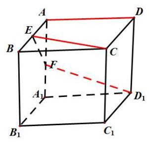

例 3、在正方体 ${ABCD} - {A}_{1}{B}_{1}{C}_{1}{D}_{1}$ 中，对角线 ${A}_{1}C$ 与平面 ${BD}{C}_{1}$ 交于点 $O,{AC},{BD}$ 交于点 $M$ ， 求证: 点 ${C}_{1}, O, M$ 共线。

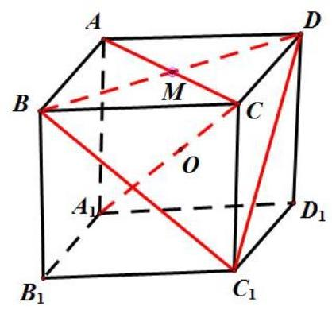

结论:(1)证明线共点问题，常用的方法是:先证其中两条直线交于一点，再证交点在第三条直线上.

(2)证明点或线共面问题，一般有以下两种途径:

① 首先由所给条件中的部分线(或点)确定一个平面，然后再证其余线(或点)均在这个平面内;

②将所有条件分为两部分，然后分别确定平面，再证平面重合.

## 第二讲: 空间两条直线的位置关系

## 一、截面: 与多面体的表面的交线围成的多边形称为截面

1、课本练习题

5. 如图,设点 $P$ 是给定长方体的棱 ${D}_{1}{C}_{1}$ 的中点.

(1)画出 $B\text{ 、 }D\text{ 、 }P$ 三点确定的平面；

(2)分别画出平面 ${BDP}$ 与长方体的六个面所在平面的交线.

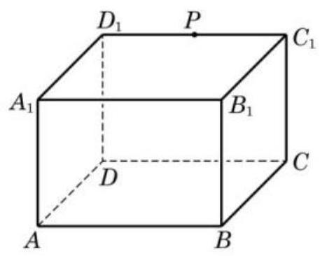

2、如图，正方体 ${ABCD} - {A}_{1}{B}_{1}{C}_{1}{D}_{1}$ 中， $E, F, G$ 分别在 ${AB},{BC},{DD}_{1}$ 上，作过 $E, F, G$ 三点的截面。

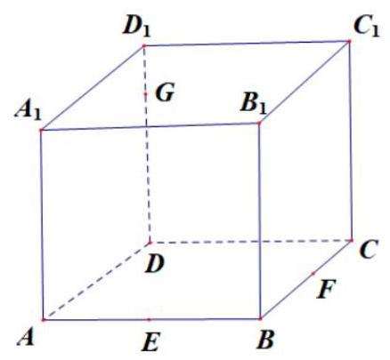

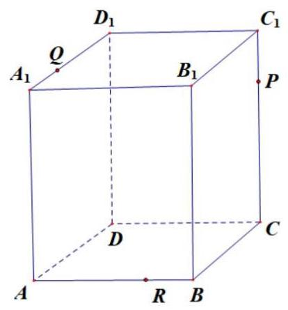

3、已知 $P, Q, R$ 三点分别在长方体 $A{C}_{1}$ 的棱 $C{C}_{1},{A}_{1}{D}_{1},{AB}$ 上,试画出过 $P, Q, R$ 三点的截面。(没有两点共面一一作辅助平面)

## 二、空间的平行直线

公理 4 平行于同一条直线的两条直线互相平行.

公理 4 集合语言: 若 $a//b$ ,且 $a//c$ ,则 $b//c$ 。即平行具有传递性。

例 1 如图 10-2-3,在正方体 ${ABCD} - {A}_{1}{B}_{1}{C}_{1}{D}_{1}$ 中,

(1)找出与 ${AB}$ 平行的所有棱,并解释你的结论;

(2)求证: ${AC}//{A}_{1}{C}_{1}$ ；

(3)求证: $\angle {BAC} = \angle {{B}_{1}{A}_{1}{C}_{1}}$ .

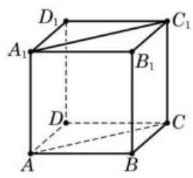

定理 如果一个角的两边和另一个角的两边分别平行并且方向相同, 那么这两个角相等.

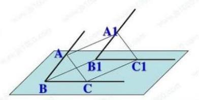

推论 1 如果一个角的两边和另一个角的两边分别平行,那么这两个角相等或者互补.

推论 2 如果两条相交直线和另两条相交直线分别平行, 那么这两组直线所成的锐角 (或直角) 相等.

例 2 如图 10-2-5, ${ABC}$ 是一张三角形的纸片, $D$ 是边 ${AC}$ 上的一点. 我们将此三角形纸片沿 ${BD}$ 折成一个空间四边形 ${ABCD}$ . 在这个空间四边形 ${ABCD}$ 中,以 $E\text{ 、 }F\text{ 、 }G\text{ 、 }H$ 分别为边 ${AB}\text{ 、 }{BC}\text{ 、 }{CD}\text{ 、 }{DA}$ 的中点.

求证: 四边形 ${EFGH}$ 是平行四边形.

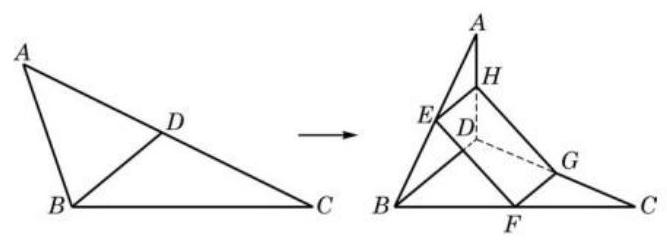

图 10-2-5

## 三、空间直线与直线的位置关系

1、位置关系

(1)相交一一有且只有一个公共点;

(2)平行一一在同一平面内, 没有公共点;

(3)异面——不同在任何一个平面内，没有公共点。(既不平行也不相交) 2、异面直线的画法:

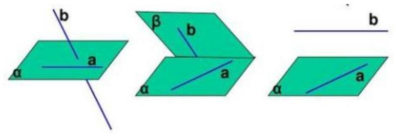

定理 过平面外一点与平面上一点的直线,和此平面上不经过该点的任何一条给定的直线都是异面直线.

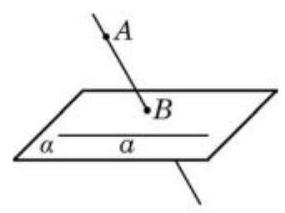

如图 10-2-10,已知直线 $a$ 在平面 $\alpha$ 上,点 $A$ 不在平面 $\alpha$ 上, 直线 ${AB}$ 与平面 $\alpha$ 交于点 $B$ ，点 $B$ 在平面 $\alpha$ 上但不在直线 $a$ 上.

求证: 直线 ${AB}$ 和 $a$ 是异面直线.

3、异面直线所成的角

(1)定义:在空间中任意取一点 $O$ ，过此点分别作两条异面直线 $a, b$ 的平行线 ${a}^{\prime }$ ，所得到的两条相交直线 ${a}^{\prime }$ ， ${b}^{\prime }$ 所成的锐角(或直角)叫做异面直线 $a$ ， $b$ 所成的角。

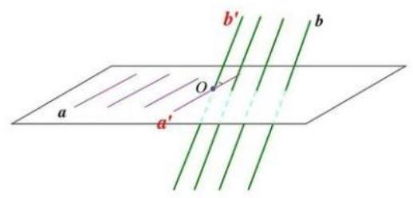

(2)范围: $\left( {0,\frac{\pi }{2}}\right\rbrack$

(3)在求异面直线所成的角时，一般可选取某一个特殊点，通过平移法，求成异面直线所成的角。

(*)3、异面直线公垂线的概念

(1)和两条异面直线都垂直相交的直线为异面直线的公垂线；

(2)公垂线是唯一存在的；

(3)两条异面直线公垂线的长度即为异面直线间的距离。

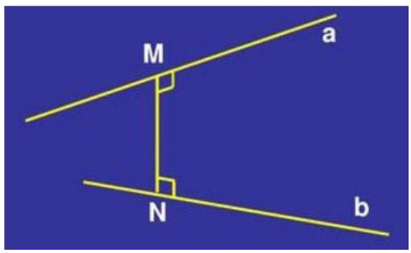

## 一、概念题

1、已知 $a, b$ 是异面直线，直线 $c$ 平行于直线 $a$ ，那么 $c$ 与 $b$ ()

A. 一定是异面直线 B. 一定是相交直线

C. 不可能是平行直线 D. 不可能是相交直线

2、如果直线 $l$ 和 $m$ 是异面直线,点 $A, C$ 在直线 $l$ 上,点 $B, D$ 在直线 $m$ 上,那么直线 ${AB}$ 和 ${CD}$ 一定是( )

A. 平行直线 B. 相交直线 C. 异面直线 D. 平行直线或异面直线

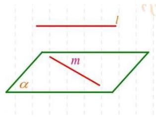

3、如果两条异面直线称做“一对”，那么在正方体的十二条棱中，共有___线。

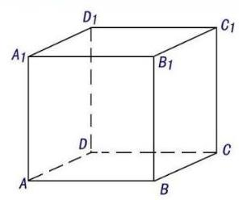

4、空间四边形的对角线互相垂直且相等，顺次连结这个四边形的各边的中点所得到的四边形是___；

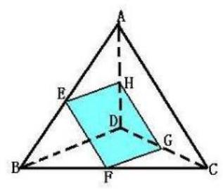

## 二、公理 4 的应用(证明两直线平行)

例: 在空间四边形 ${ABCD}$ 中, $E, F, G, H$ 分别是边 ${AB},{BC},{CD},{DA}$ 的中点,求证: 四边形 EFGH 是平行四边形。

## 三、异面直线的证明(反证法)

例 1、证明: 过平面外一点与平面内一点的直线, 和平面内不经过该点的直线是异面直线。

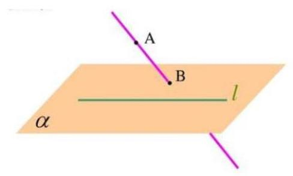

例 2、过一点 $\mathrm{O}$ 的三条直线 ${OA},{OB},{OC}$ 不共面，且 $D, E$ 在 ${OA}$ 上， $F$ 在 ${OB}$ 上， $G$ 在 ${OC}$ 上,求证: ${DF}$ 与 ${EG}$ 是异面直线。

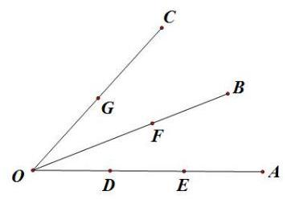

## 四、求异面直线所成的角

1、在长方体 ${ABCD} - {A}_{1}{B}_{1}{C}_{1}{D}_{1}$ 中，若 ${AB} = {BC} = 1,{A{A}_{1}} = \sqrt{2}$ ，则异面直线 $B{D}_{1}$ 与 $C{C}_{1}$ 所成角的大小为___.

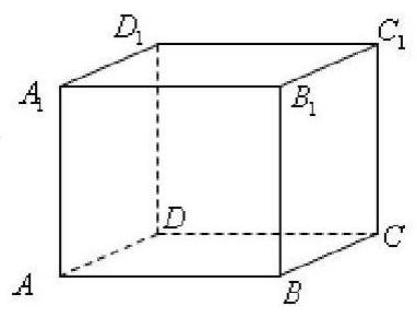

2、在正方体 ${ABCD} - {A}_{1}{B}_{1}{C}_{1}{D}_{1}$ 中,

(1)求 ${AC}$ 与 ${A}_{1}D$ 所成的角的大小；

(2)若 $E, F$ 分别是 ${AB}$ 和 ${AD}$ 的中点，求 ${A}_{1}{C}_{1}$ 与 ${EF}$ 所成角的大小。

(3)若 $E$ 是棱 ${BC}$ 的中点，求 ${A}_{1}C$ 与 ${DE}$ 所成角的大小。

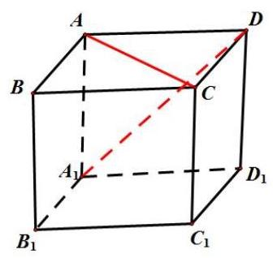

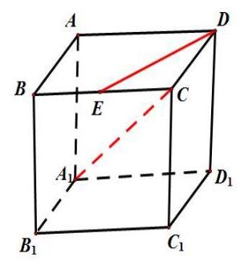

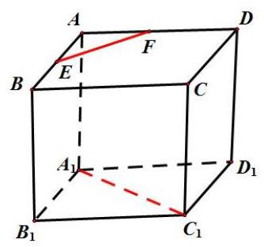

3、已知 $A$ 是 $\bigtriangleup  {BCD}$ 平面外的一点， $E$ ， $F$ 分别是 ${BC}$ 和 ${AD}$ 的中点。

(1)求证:直线 ${EF}$ 与 ${BD}$ 是异面直线；

(2)若 ${AC}\bot {BD}$ 且 ${AC} = {BD}$ ，求 ${EF}$ 与 ${BD}$ 所成的角。

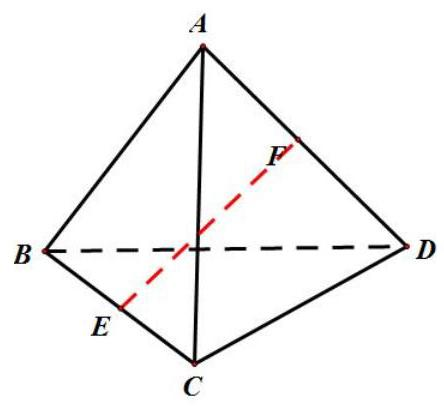

4、在长方体 ${ABCD} - {A}_{1}{B}_{1}{C}_{1}{D}_{1}$ 中,已知 ${AB} = a,{BC} = b\left( {a > b}\right) ,{A{A}_{1}} = c$ ，求异面直线 ${D}_{1}B$ 与 ${AC}$ 所成角的余弦值。

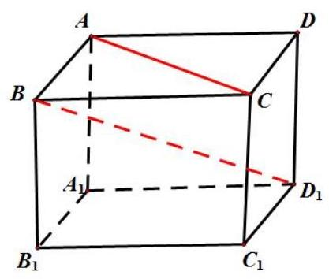

## 第三讲: 空间直线与平面位置关系

## 一、空间直线与平面的位置关系

一条直线和一个平面的位置关系有且只有以下三种:

1. 直线在平面上一一有无数个公共点;

2. 直线和平面相交一一只有一个公共点;

3. 直线和平面平行一一没有公共点.

直线和平面相交或平行的情况又可统称为直线在平面外.

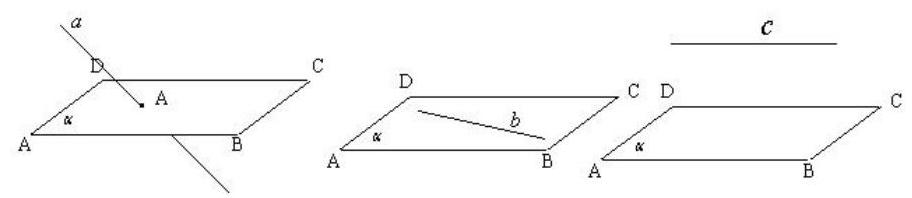

## 二、直线与平面平行

1、判定定理:

直线和平面平行的判定定理 如果平面外一条直线和这个平面上的一条直线平行,那么该直线和这个平面平行.

已知: 如图 10-3-1,平面 $\alpha$ 外一条直线 $a$ 与平面 $\alpha$ 上一条直线 $b$ 平行.

求证: 直线 $a$ 平行于平面 $\alpha$ .

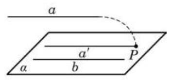

图 10-3-1

例 1 在长方体 ${ABCD} - {A}_{1}{B}_{1}{C}_{1}{D}_{1}$ 上,证明直线 ${BD}$ 平行于平面 $A{B}_{1}{D}_{1}$ .

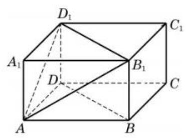

## 2、性质定理

定理 若一条直线和一个平面平行, 过这条直线的一个平面与此平面相交,则其交线必和该直线平行.

定理证明: 已知直线 $a$ 与平面 $\alpha$ 平行,过直线 $a$ 的任意平面 $\beta$ 与平面 $\alpha$ 相交于直线 $b$ 。

求证: $a//b$

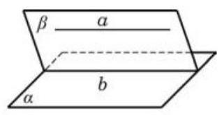

例 3 在如图 10-3-5 所示的一块木料中,棱 ${BC}$ 平行于面 ${A}^{\prime }{B}^{\prime }{C}^{\prime }{D}^{\prime }$ .

(1)要经过面 ${A}^{\prime }{B}^{\prime }{C}^{\prime }{D}^{\prime }$ 内的一点 $P$ 和棱 ${BC}$ 将木料锯开,应怎样画线?

(2)所画的线与平面 ${ABCD}$ 是什么位置关系？

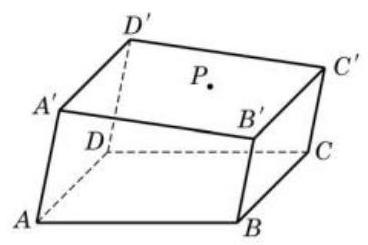

图 10-3-5

## 三、直线与平面垂直

定义 如果一条直线与平面上的任意一条直线都垂直, 就说这条直线与这个平面互相垂直.

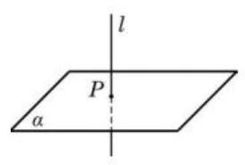

记作: $l \bot  \alpha$

1、直线与平面垂直的判定定理

直线与平面垂直的判定定理 若一条直线与一个平面上的两条相交直线都垂直, 则此直线与该平面垂直.

例4 求证: 如果两条平行直线 $a$ 、 $b$ 中的一条 $a$ 垂直于一个平面 $\alpha$ ，那么另一条 $b$ 也垂直于这个平面 $\alpha$ .

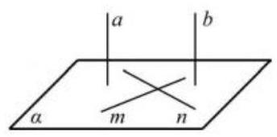

定理 垂直于同一个平面的两条直线平行.

已知: $a$ 、 $b$ 是两条直线，且 $a\bot \alpha$ ， $b\bot \alpha$ (图 10-3-12).

求证: $a//b$ .

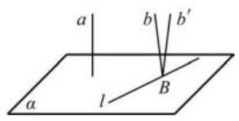

推论 1 过一点有且只有一个平面与给定的直线垂直.

推论 2 过一点有且只有一条直线与给定的平面垂直.

## 2、点到面的距离和直线到平面的距离:

由推论 2,如图10-3-13(1),过平面 $\alpha$ 外任意给定的一点 $M$ ,有且只有一条直线与平面 $\alpha$ 垂直，从而把点 $M$ 与垂足 $N$ 之间的距离叫做点 $M$ 到平面 $\alpha$ 的距离. 利用线面平行和线面垂直的性质定理可以证明,如果一条直线 $l$ 平行于一个平面 $\alpha$ ,那么直线 $l$ 上任意给定的一点到平面 $\alpha$ 的距离都相等,从而就可以把直线 $l$ 上一点 $M$ 到平面 $\alpha$ 的距离定义为直线 $l$ 到平面 $\alpha$ 的距离 (图10-3-13(2)).

图 10-3-13

例 5 如图 10-3-14,在正方体 ${ABCD} - {A}_{1}{B}_{1}{C}_{1}{D}_{1}$ 上,

(1)判断直线 ${AC}$ 与平面 $B{B}_{1}{D}_{1}D$ ，以及直线 ${AC}$ 与平面 ${A}_{1}{BD}$ 是否垂直，并证明你的结论；

(2)设正方体的棱长为 1,分别求点 $A$ 及直线 $A{A}_{1}$ 到平面 $B{B}_{1}{D}_{1}D$ 的距离.

## 四、直线与平面所成的角:

1、斜线: 直线与平面相交但不垂直，则称为斜交，交点称为斜足。

2、射影:过直线上任意一点作平面的垂线，连续垂足和斜足，所成的直线，即为射影。

3、定义: 平面内的一条斜线和它在这个平面内的射影所成的锐角, 叫做这条直线和这个平面所成的角。范围: $\left( {0,\frac{\pi }{2}}\right)$

(1)

(2)

4、线面角 $\theta$ 的范围: $\theta  \in  \left\lbrack  {0,\frac{\pi }{2}}\right\rbrack$

三垂线定理 平面上的一条直线和这个平面的一条斜线垂直的充要条件, 是它和这条斜线在平面上的射影垂直.

已知: ${PO}\text{ 、 }{PA}$ 分别是平面 $\alpha$ 的垂线和斜线, ${OA}$ 是斜线 ${PA}$ 在平面 $\alpha$ 上的射影,直线 $a$ 在平面 $\alpha$ 上 (图 10-3-17).

求证: $a \bot  {PA} \Leftrightarrow  a \bot  {OA}$ .

例 7 如图 10-3-18,已知正方体 ${ABCD} - {A}_{1}{B}_{1}{C}_{1}{D}_{1}$ , 求证: ${AC} \bot  B{D}_{1}$ .

图 10-3-18

## 例题精讲

一、概念:

1、在空间， $\alpha$ 表示平面， $m$ ， $n$ 表示两条直线，则下列命题中错误的是( )

A. 若 $m//\alpha , m\text{ 、 }n$ 不平行，则 $n$ 与 $\alpha$ 不平行

B. 若 $m//\alpha , m\text{ 、 }n$ 不垂直，则 $n$ 与 $\alpha$ 不垂直

$C$ . 若 $m \bot  \alpha , m\text{ 、 }n$ 不平行,则 $n$ 与 $\alpha$ 不垂直

D. 若 $m \bot  \alpha , m\text{ 、 }n$ 不垂直,则 $n$ 与 $\alpha$ 不平行

2、给定空间中的直线 $l$ 与平面 $\alpha$ ,则 “直线 $l$ 与平面 $\alpha$ 垂直”是“直线 $l$ 垂直于平面 $\alpha$ 上无数条直线”的( ).

A. 充分非必要条件 B. 必要非充分条件

C. 充要条件 D. 既不充分也不必要条

3、已知空间两条直线 $m, n$ ，两个平面 $\alpha ,\beta$ ，给出下面四个命题:

① $m//n, m \bot  \alpha  \Rightarrow  n \bot  \alpha$ ;

② $\alpha //\beta , m \subset  \alpha , n \subset  \beta  \Rightarrow  m//n$ ;

③ $m//n, m//\alpha  \Rightarrow  n//\alpha$ ;

④ $\alpha //\beta , m//n, m \bot  \alpha  \Rightarrow  n \bot  \beta$ . 其中正确的序号是 ( ).

A. ① ④ B. ② ③ C. ① ② ④ D. ① ③ ④

4、设 $\overrightarrow{a}\text{ 、 }\overrightarrow{b}$ 分别是两条异面直线 ${l}_{1}\text{ 、 }{l}_{2}$ 的方向向量，向量 $\overrightarrow{a}\text{ 、 }\overrightarrow{b}$ 的夹角的取值范围为 $A,{l}_{1}\text{ 、 }{l}_{2}$ 所成的角的取值范围为 $B$ ,则 “ $\alpha  \in  A$ ” 是 “ $\alpha  \in  B$ ” 的 ( )

(A) 充要条件 (B) 充分不必要条件

(C) 必要不充分条件 (D) 既不充分也不必要条件

5、两条平行直线在同一平面上的射影是( )

A. 两条平行直线 B. 两条平行直线或一条直线

C. 两条平行直线或两个点 D. 两条平行直线或一条直线或两个点

## 二、直线与平面平行

1、在正方体 ${ABCD} - {A}_{1}{B}_{1}{C}_{1}{D}_{1}$ 中， $G$ 是 $C{C}_{1}$ 的中点，求证: $A{C}_{1}//$ 平面 ${GBD}$ .

## 三、直线与平面垂直

1、已知 ${AB},{CD}$ 是两条不在同一平面内的线段，且 ${AC} = {AD},{BC} = {BD}$ ，求证: ${AB}\bot {CD}$

2、直角梯形 ${ABCD}$ 所在平面外一点 $P$ 满足 ${PA} \bot$ 平面 ${ABCD}$ , $\angle {BAD} = {90}^{ \circ  },{AD}//{BC},{AE} \bot  {PD}, E$ 为垂足,求证: ${BE} \bot  {PD}$ .

3、在空间四边形 ${ABCD}$ 中, $E, F$ 分别为 ${AD},{BC}$ 的中点,若 ${AC} = {BD} = a,{EF} = \frac{\sqrt{2}}{2}a,\angle {BDC} = {90}^{ \circ  }$ ,求证: ${BD} \bot$ 平面 ${ACD}$

4、在正方体 ${ABCD} - {A}_{1}{B}_{1}{C}_{1}{D}_{1}$ 中, $O$ 为底面 ${ABCD}$ 的中心, ${B}_{1}H \bot  {D}_{1}O, H$ 是垂足,求证: ${B}_{1}H \bot$ 平面 $A{D}_{1}C$ 。

5、在正方体 ${ABCD} - {A}_{1}{B}_{1}{C}_{1}{D}_{1}$ 中, $G$ 为 $C{C}_{1}$ 的中点, ${AC}$ 交 ${BD}$ 于点 $O$ ,求证: ${A}_{1}O \bot$ 平面 ${GBD}$ .

6、在 $\bigtriangleup {ABC}$ 中,已知 $\angle {ABC} = {90}^{ \circ  },{SA} \bot$ 平面 ${ABC}$ ,点 $A$ 在 ${SB},{SC}$ 上的射影分别为 $M, N$ ,求证: (1) ${BC} \bot$ 平面 ${SAB}$ ; (2) ${AM} \bot$ 平面 ${SBC}$ ; (3) ${SC} \bot  {MN}$ 两个模型:

## 四、直线与平面所成的角

1、、在正方体 ${ABCD} - {A}_{1}{B}_{1}{C}_{1}{D}_{1}$ 中，

(1)求 ${A}_{1}C$ 与平面 ${ABCD}$ 所成角的大小；

(2)求 ${A}_{1}B$ 和平面 ${A}_{1}{B}_{1}{CD}$ 所成的角的大小；

3、在正方体 ${ABCD} - {A}_{1}{B}_{1}{C}_{1}{D}_{1}$ 中，

(1)证明: $B{D}_{1} \bot$ 平面 $A{B}_{1}C$ ；

(2)求 $\overset{\text{ ⏜ }}{AB}$ 和平面 $A{B}_{1}C$ 所成角的大小。

4、点 $P$ 是 $\bigtriangleup  {ABC}$ 所在平面外的一点， $O$ 是 $P$ 在平面 ${ABC}$ 上的射影，若 ${PA} = {PB} = {PC}$ ， 则点 $O$ 是 $\bigtriangleup  {ABC}$ 的___心；若点 $P$ 到 $\bigtriangleup  {ABC}$ 的三边的距离相等，且点 $O$ 在 $\bigtriangleup  {ABC}$ 的内部,则 点 $O$ 是 $\bigtriangleup  {ABC}$ 的___心; 若 ${PA},{PB},{PC}$ 两两垂直，则点 $O$ 是 $\bigtriangleup  {ABC}$ 的___心。

B

B

5、如图， ${ABCD}$ 是矩形， ${SA} \bot$ 平面 ${ABCD}$ ，过 $A$ 作 ${SC}$ 的垂面分别交 ${SB},{SC},{SD}$ 于 $E, F, G$ ,求证: ${SB} \bot  {AE}$ 。

## 五、距离问题

1、在梯形 ${ABCD}$ 中， ${AD}//{BC},\angle {ABC} = {90}^{ \circ  },{AB} = a,{PA} \bot$ 平面 ${ABCD},{PA} = a$ ，求点 $A$ 到平面 ${PBC}$ 的距离。

2、已知 ${AB} \bot$ 平面 $\alpha ,{BC}$ 在平面 $\alpha$ 内， ${CD} \bot  {BC}$ ，且 ${CD}$ 与平面 $\alpha$ 成 ${30}^{ \circ  }$ 的角， $E$ 为 $D$ 在平面 $\alpha$ 上的射影， ${AB},{CD}$ 在平面 $\alpha$ 的同侧， ${AB} = {BC} = {CD} = 2$ ，求:

(1) $A, D$ 两点之间的距离；

(2) $D$ 点到平面 ${ABC}$ 的距离；

(3)A点到 ${CD}$ 的距离。

3、已知正方体 ${ABCD} - {A}_{1}{B}_{1}{C}_{1}{D}_{1}$ 的棱长为 $a$ ，求 ${A}_{1}B$ 和 ${D}_{1}{B}_{1}$ 的距离。

## 异面直线的距离

1、 $a$ ， $b$ 的距离

$= A$ 到 $\alpha$ 的距离

$= A$ 到 $\alpha$ 的距离

$= a$ 与 $\alpha$ 的距离

$= \alpha$ 与 $\beta$ 的距离

## 2、异面直线距离的求法:

(1)定义法:找(或作)公垂线段

(2)转化法:线面距离、面面距离

## 第四讲: 空间平面与平面的位置关系

## 一、平面与平面平行

思考:

(1)如果平面 $\alpha$ 平行于平面 $\beta$ ，那么这两个平面上的一切直线都相互平行吗?

(2)如果平面 $\alpha$ 上有一条直线与平面 $\beta$ 平行，那么能保证这两个平面平行吗?

(3)如果平面 $\alpha$ 上有两条相交直线与平面 $\beta$ 平行，那么能保证这两个平面平行吗?

两个平面平行的判定定理 若一个平面上的两条相交直线与另一个平面平行, 则这两个平面平行.

证明 不妨排除 $\alpha$ 及 $\beta$ 重合的这一特殊情况. 假设 $\alpha$ 不平行于 $\beta$ ,那么 $\alpha$ 与 $\beta$ 相交于直线 $l$ . 由于 $\alpha$ 上有两条相交直线 $a$ 及 $b$ 与 $\beta$ 平面平行,由线面平行的性质知,线 $a$ 及 $b$ 均平行于 $l$ ,从而 $a//\beta$ . $b$ . 这与已知 $a$ 、 $b$ 是相交直线矛盾. 由反证法，所以 $\alpha //\beta$ .

由此,我们就得到了下面的定理.

例 1 求证: 长方体 ${ABCD} - {A}_{1}{B}_{1}{C}_{1}{D}_{1}$ 上的截面 $A{B}_{1}{D}_{1}$ 平行于截面 ${C}_{1}{DB}$ .

定理 如果两个平行平面同时和第三个平面相交, 那么它们的交线平行.

例 2 若一条直线 $l$ 垂直于两个平行平面中的一个平面 $\alpha$ , 则它必垂直于另一个平面 $\beta$ .

证明 如图 10-4-5,记 $A$ 为直线 $l$ 与平面 $\alpha$ 的交点 (垂足). 设 $b$ 是平面 $\beta$ 内任意给定的一条直线,而平面 $\gamma$ 是经过点 $A$ 与直线 $b$ 的平面. 设 $\gamma  \cap  \alpha  = a$ .

因为平面 $\alpha //$ 平面 $\beta$ ,平面 $\gamma$ 与平面 $\alpha$ 和平面 $\beta$ 的交线分别为直线 $a$ 和直线 $b$ ，所以 $a//b$ . 又因为直线 $l$ 垂直于平面 $\alpha$ ，所以 $l\bot$ b. 由直线与平面垂直的定义,知 $l \bot  \beta$ .

图 10-4-5

前面我们已经定义过点到平面的距离,以及直线到与它平行的平面的距离,现在可以定义两个平行平面之间的距离. 设平面 $\alpha$ 平行于平面 $\beta$ ,在平面 $\alpha$ 上任取一点 $M$ ,我们把点 $M$ 到平面 $\beta$ 的距离叫做平面 $\alpha$ 和平面 $\beta$ 点之间的距离 (图 10-4-6).

## 二、二面角

1、定义

如图 10-4-7, 从一条直线出发的两个半平面所组成的图形叫做二面角. 这条直线叫做二面角的棱, 这两个半平面叫做二面角的面. 棱为 ${AB}$ 、两个面为 $\alpha$ 、 $\beta$ 的二面角，记作二面角 $\alpha  - {AB} - \beta$ ；也可以在 $\alpha$ 、 $\beta$ 上(棱以外的半平面部分)分别取点 $P$ 、 $Q$ ，将这个二面角记作二面角 $P - {AB} - Q$ . 如果棱记作 $l$ ,那么这个二面角也可以记作二面角 $\alpha  - l - \beta$ 或 $P - l - Q$ .

图 10-4-7

## 2、二面角的大小

如图 10-4-8,若在二面角 $\alpha  - l - \beta$ 的棱 $l$ 上任取一点 $O$ ,且过 $O$ 分别在面 $\alpha$ 、 $\beta$ 上作棱 $l$ 的垂线 ${OA}$ 和 ${OB}$ ，容易证明射线 ${OA}$ 和 ${OB}$ 构成的角 $\angle {AOB}$ 的大小与点 $O$ 的取法无关. 因此,我们可

以用 $\angle {AOB}$ 来表示二面角 $\alpha  - l - \beta$ 的大小,并称其为二面角 $\alpha  - l \; - \beta$ 的平面角. 二面角的取值区间约定为 $\left\lbrack  {{0}^{ \circ  },{180}^{ \circ  }}\right\rbrack$ . 当二面角 $\alpha  - l - \; \beta$ 的大小等于直角时,我们称这个二面角为直二面角.

图 10-4-8

二面角 $\alpha  - l - \beta$ 的平面角除了上述作法,还有两种常用的作法.

(1)如图10-4-9(1),当二面角 $\alpha  - l - \beta$ 的平面角是锐角时, 在平面 $\alpha$ 上取一点 $P$ ，过 $P$ 作半平面 $\beta$ 的垂线 ${PA}$ ， $A$ 为垂足. 在平面 $\beta$ 上作 ${AO}$ 与 $l$ 垂直于点 $O$ ,连接 ${OP}$ . 由三垂线定理,知 ${PO} \bot  l$ , 从而 $\angle {POA}$ 就是二面角 $\alpha  - l - \beta$ 的平面角. (当二面角 $\alpha  - l - \beta$ 的平面角是直角或钝角时,请同学们自己考虑)

(2)如图10-4-9(2),在二面角 $\alpha  - l - \beta$ 内任取一点 $P$ ，过 $P$ 作 ${PA} \bot  \alpha ,{PB} \bot  \beta , A\text{ 、 }B$ 为相应的垂足.过相交直线 ${PA}$ 与 ${PB}$ 作平面,分别交平面 $\alpha$ 及 $\beta$ 于 ${OA}$ 和 ${OB}$ . 由线面垂直的定义及判定定理,可知 ${OA} \bot  l,{OB} \bot  l$ ,从而 $\angle {AOB}$ 就是二面角 $\alpha  - l - \beta$ 的平面角.

3、平面与平面垂直:当两个平面相交所成的二面角是直角时, 则两个平面垂直。

## 4、面面垂直的判定定理

定理 如果一个平面经过另一个平面的一条垂线, 那么这两个平面垂直.

证明 设平面 $\beta$ 经过另一平面 $\alpha$ 的垂线为 ${OA}$ ,过点 $O$ 在平面 $\alpha$ 上作 ${OA}$ 的垂线 ${OB}$ ,则 $\angle {AOB}$ 为二面角 $\alpha  - l - \beta$ 的平面角. 因为 ${OA} \bot  \alpha ,{OB} \subset  \beta$ ,所以 $\angle {AOB}$ 为直角. 由平面与平面垂直的定义,知 $\alpha  \bot  \beta$ .

图 10-4-11

## 5、面面垂直的性质定理

定理 若两个平面垂直, 则一个平面内垂直于两平面交线的直线与另一个平面垂直.

例 3 如图 10-4-12,已知对正方体 ${ABCD} - {A}_{1}{B}_{1}{C}_{1}{D}_{1}$ .

(1)作出二面角 ${A}_{1} - {BD} - {C}_{1}$ 的一个平面角;

(2)求证:平面 ${A}_{1}{AC}{C}_{1} \bot$ 平面 ${D}_{1}{DB}{B}_{1}$ .

图 10-4-12

## 例题精讲:

1、判断题:

(1)过平面外一点有且只有一个平面和这个平面平行。()

(2)如果平面 $\alpha //$ 平面 $\beta$ ，直线 $a \subset  \alpha$ ，那么 $a//\beta$ 。()

(3)平行于同一直线的两个平面平行。()

(4)分别经过两条平行直线的两个平面互相平行。()

(5)分别在两个平行平面内的两条直线互相平行。()

2、对于直线 $\mathrm{m}$ 、 $\mathrm{n}$ 和平面 $\alpha ,\beta$ 能得出 $\alpha  \bot  \beta$ 的一个条件是( )

A. $m \bot  n, m//\alpha , n//\beta$ B. $m \bot  n,\alpha  \cap  \beta  = m, n \subset  \alpha$

C. $m//n, n \bot  \beta , m \subset  \alpha$ D. $m//n, m \bot  \alpha , n \bot  \beta$

3、若一个平面内不共线的三点到另一个平面的距离相等且不为 0 , 则这两个平面的位置关系是( )

A. 平行 B. 相交 C. 平行或相交 D. 重合

4、两个平行平面之间的距离是 12,一条直线和它们相交成 ${60}^{ \circ  }$ 角,则这条直线上夹在这两个平行平面之间的线段的长为___；

5、在边长为 $a$ 正方体 ${ABCD} - {A}_{1}{B}_{1}{C}_{1}{D}_{1}$ 中,

(1)求证:平面 $A{B}_{1}{D}_{1}//$ 平面 $B{C}_{1}D$ ；

(2)求平面 $A{B}_{1}{D}_{1}$ 与平面 $B{C}_{1}D$ 的距离。

6、已知直线 ${PA}$ 垂直于正方形 ${ABCD}$ 所在的平面，求证:平面 ${PAC} \bot$ 平面 ${PBD}$ 。

7、正方体 ${ABCD} - {A}_{1}{B}_{1}{C}_{1}{D}_{1}$

求:(1)二面角 ${AB} - {A}_{1}{B}_{1} - {C}_{1}{D}_{1}$ 的大小；二面角 ${BC} - {A}_{1}{D}_{1} - {B}_{1}{C}_{1}$ 的大小？

(2)二面角 $D - {A}_{1}{C}_{1} - {D}_{1}$ 的大小; 二面角 $B - {A}_{1}{C}_{1} - D$ 的大小?

8、长方体 ${ABCD} - {A}_{1}{B}_{1}{C}_{1}{D}_{1}$ 的棱 ${AB},{A{A}_{1}},{AD}$ 的长分别为1,2,3，求二面角 ${A}_{1} - {BD} - A$ 的大小。

9、已知边长为 $a$ 的正方形 ${ABCD}$ 外有一点 $P$ ,且 ${PA} \bot$ 平面 ${ABCD},{PA} = a$ ,求二面角 $B - {PA} - C$ 和 $P - {BC} - A$ 的大小。

10、 $P$ 是二面角 $\alpha  - {AB} - \beta$ 的棱 ${AB}$ 上一点，分别在 $\alpha ,\beta$ 内引射线 ${PM},{PN}$ ，如果 $\angle {BPM} = \angle {BPN} = {45}^{ \circ  },\angle {MPN} = {60}^{ \circ  }$ ,求二面角 $\alpha  - {AB} - \beta$ 的大小。

11、如图所示，在二面角 $\alpha  - l - \beta$ 中， $A$ 和 $B$ 在平面 $\alpha$ 上， $C$ 和 $D$ 在棱 $l$ 上， ${ABCD}$ 为矩形, $P \in  \beta ,{PA} \bot  \alpha$ ,且 ${PA} = {AD}, M, N$ 依次是 ${AB},{PC}$ 的中点。

(1)求二面角 $\alpha  - l - \beta$ 的平面角；

(2)求证: ${MN}\bot {AB}$

(3)求异面直线 ${PA}$ 与 ${MN}$ 所成的角。

12、直角梯形 ${ABCD}$ 中， ${AB}\bot {AD},{BC}//{AD},{SA}\bot$ 平面 ${ABCD}$ ，且 ${SA} = {AB} = {BC} = a$ ， ${AD} = {2a}$ ,求:

(1)二面角 $S - {CD} - A$ 的平面角；

(2)点 $A$ 到平面 ${SCD}$ 的距离；

(3)二面角 $A - {SD} - C$ 的平面角。

## 第五讲: 简单几何体

## 一、多面体

1、棱柱: 有两个全等的多边形的面相互平行, 且不在这两个面上的棱都平行。

(1)斜棱柱:侧棱不垂直于底面的棱柱

(2)直棱柱:侧棱垂直于底面的棱柱;

(3) 正棱柱: 底面是正多边形的直棱柱

(4)平行六面体:底面是平行四边形的棱柱

(5)直平行六面体:底面是平行四边形的直棱柱

(6)长方体:底面是矩形的直平行六面体

(7)正方体:棱长都相等的长方体

问题: 1、直四棱柱一定是长方体吗?

2、正四棱柱一定是正方体吗?

例 1 已知斜三棱柱 ${ABC} - {A}^{\prime }{B}^{\prime }{C}^{\prime }$ 的底面是正三角形,侧棱 $A{A}^{\prime } \bot  {BC}$ ,并且与底面所成角是 ${60}^{ \circ  }$ . 设侧棱长为 $l$ .

(1)求此三棱柱的高；

(2)证明:侧面 $B{B}^{\prime }{C}^{\prime }C$ 是矩形;

(3)证明: ${A}^{\prime }$ 在平面 ${ABC}$ 上的射影 $O$ 在 $\angle {BAC}$ 的平分线上.

2、棱锥:有一个面是多边形，且不在这个面上的棱都有一个公共点。

(1)正棱锥:底面是正多边形，且顶点在底面的射影是底面正多边形的中心。

常用的有:正三棱锥，正四棱锥

(2)正四面体:由四个全等正三角形围成的空间多面体，有四个面，六条棱。

## 巩固练习

## 一、概念

1、写出下列棱柱或棱锥的底面或侧面的特点:

(1)斜棱柱:底面是___；侧面是___；

(2)直棱柱:底面是___；侧面是___.

(3)正棱柱:底面是___；侧面是___；

(4)正棱锥:底面是___；侧面是___；

(5)正四棱柱:底面是___；侧面是___；

6)直平行六面体:底面是___；侧面是___；

2、给出四个命题:

①各侧面都是正方形的棱柱一定是正棱柱；

②各对角面是全等矩形的平行六面体一定是长方体；

③有两个侧面垂直于底面的棱柱一定是直棱柱；

④长方体一定是正四棱柱。

其中真命题的个数是( )

A. 0 B. 1 C. 2 D. 3

3、下列四个命题:

①各侧面是全等的等腰三角形的四棱锥是正四棱锥;

②底面是正多边形的棱锥是正棱锥;

③棱锥的所有面可能都是直角三角形；

④四棱锥中侧面最多有四个直角三角形。

真命题有___个

A. 1 B. 2 C. 3 D. 4

4、长方体的一个顶点处的三条棱长之比为1:2:3, 它的表面积为 88, 则它的体对角线长为( )

A. 12 B. 24 C. $2\sqrt{14}$ D. $4\sqrt{14}$

5、若正四棱柱 ${ABCD} - {A}_{1}{B}_{1}{C}_{1}{D}_{1}$ 的底面边长为 2,高为 4,则异面直线 $B{D}_{1}$ 与 ${AD}$ 所成角的大小是___； $B{D}_{1}$ 与 ${C}_{1}D$ 所成角的大小是___。(结果用反三角函数值表示)

6、已知长方体的一条对角线与其相交的三个平面的夹角分别为 $\alpha ,\beta ,\gamma$ ，则 ${\cos }^{2}\alpha  + {\cos }^{2}\beta  + {\cos }^{2}\gamma  =$ ___。

7、底面是菱形的直棱柱 ${ABCD} - {A}_{1}{B}_{1}{C}_{1}{D}_{1}$ ，它的对角线 ${B}_{1}D$ 与 ${A}_{1}C$ 的长分别是 $9\mathrm{\;{cm}}$ 和 ${15}\mathrm{\;{cm}}$ ，侧棱 $A{A}_{1}$ 的长为 $5\mathrm{\;{cm}}$ ，求这个直棱柱的底面边长。

8、已知正四棱锥 $V - {ABCD}$ ，底面面积为 16，一条侧棱长为 $2\sqrt{11}$ 。

(1)计算它的高 ${VO}$ 和斜高 ${VM}$ ；

(2)求侧棱与侧面分别于底面所成角的大小。

9、如图，在正四棱锥 $P - {ABCD}$ 中， ${PA} = {AB} = a, E$ 是棱 ${PC}$ 的中点.

(1)求证: ${PC}\bot {BD}$ ；

(2)求直线 ${BE}$ 与 ${PA}$ 所成角的余弦值.

10、如图，在四棱锥 $P - {ABCD}$ 中，底面 ${ABCD}$ 是矩形， ${PA}\bot$ 底面 ${ABCD}$ ， $E$ 是 ${PC}$ 的中点,已知 ${AB} = 2,{AD} = 2\sqrt{2},{PA} = 2$ ,求:

(1)三角形 ${PCD}$ 的面积

(2)异面直线 ${BC}$ 与 ${AE}$ 所成的角的大小；

11、如图，三棱柱 ${ABC} - {A}_{1}{B}_{1}{C}_{1}$ 中，平面 ${CB}{B}_{1}{C}_{1}\bot$ 平面 ${ABC},\angle {C}_{1}{CB} = {60}^{ \circ  },\angle {ACB} \; = {90}^{ \circ  }$ ,且 ${CB} = C{C}_{1} = 2,{CA} = \sqrt{3}$ .

求:(1)二面角 ${C}_{1} - {AB} - C$ 的大小；

(2)异面直线 ${A}_{1}B$ 与 $A{C}_{1}$ 所成的角的大小。

## 第六讲: 旋转体的概念

## 一、旋转体的概念:

1、圆柱: 矩形绕着任一条边所在的直线旋转而形成的图形。

记作: 圆柱00'

2、圆锥: 直角三角形绕任一条直角边旋转而成的图形。

圆锥的特征:

康形

侧而展开

圆形

从圆锥的顶点到底面圆心的

距离叫做圆锥的高。

## 二、多面体的表面积和体积

祖暅原理:夹在两个平行平面之间的两个几何体，如果用平行于这两个平面的平面去截这两个几何体，所得的截面面积总相等，则这两个几何体的体积相等。

1、直棱柱的表面积和体积

${S}_{\text{ 表 }} = {S}_{\text{ 测 }} + 2{\mathrm{\;S}}_{\text{ 底 }} = {C}_{\bigtriangleup {ABC}\text{ 周长 }} \cdot  \mathrm{h} + 2{\mathrm{\;S}}_{\text{ 底 }}\;;\;V = {S}_{\text{ 底 }}h$

特殊的,若正方体的棱长为 $a$ ,则 ${S}_{\text{ 表 }} = 6{a}^{2};V = {a}^{3}$

例 5 已知三棱柱的底面 $\bigtriangleup {ABC}$ 的三边长分别是 ${AB} = \; {13}\mathrm{\;{cm}},{BC} = 5\mathrm{\;{cm}},{CA} = {12}\mathrm{\;{cm}}$ ,侧棱 $A{A}^{\prime } = {20}\mathrm{\;{cm}}$ ,且侧棱 $A{A}^{\prime }$ 与底面所成的角为 ${60}^{ \circ  }$ ,求这个三棱柱的体积.

2、棱锥的表面积和体积:

(1)正棱锥的表面积和体积:

${S}_{\text{ 表 }} = {S}_{\text{ 底 }} + 3{S}_{\text{ 侧 }}$ ; $V = \frac{1}{3}{S}_{\text{ 底 }}h$

(2)棱锥的体积公式推导:(割补法)

(3)正四面体的表面积和体积公式，设正四面体的棱长为 $a$ ；

## 3、台体

(1)棱台

(2)圆台

例 2 如图 11-3-5,用平行于圆锥 $P - {O}_{1}$ 底面的平面截这个圆锥,得到一个小圆锥 $P - {O}_{2}$ . 如果这两个圆锥的高分别是 ${h}_{1},{h}_{2}$ ,求这两个圆锥的底面面积之比.

## 三、旋转体的表面积和体积

1、圆柱的表面积和体积 ${S}_{\text{ 圆柱侧 }} = C \cdot  h = {2\pi rh};\;{S}_{\text{ 表 }} = {2\pi }{r}^{2} + {2\pi rh}\;;\;{V}_{\text{ 体 }} = {sh} = \pi {r}^{2}h$

2、圆锥的表面积和体积 ${S}_{\text{ 侧 }} = {\pi rl};\;{S}_{\text{ 表 }} = \pi {r}^{2} + {\pi rl}\;;\;{V}_{\text{ 体 }} = \frac{1}{3}{sh} = \frac{1}{3}\pi {r}^{2}h$

## 3、台体的体积:

设台体上、下底面积分为为 ${S}^{\prime }$ 和 $S$ ,高为 $h$ ,证明: ${V}_{\text{ 台 }} = \frac{1}{3}\left( {{S}^{\prime } + \sqrt{S{S}^{\prime }} + S}\right) h$ 。

## 一、基本练习:

1、(1)棱长为 3,4,5 的长方体的表面积为___；体积为___；

(2)已知四棱锥 $P - {ABCD}$ 的底面是边长为 6 的正方形，侧棱 ${PA}\bot$ 底面 ${ABCD}$ ，且 ${PA} = 8$ ，则该四棱锥的体积是___.

(3)侧面均为面积为 4 的正方形的正三棱柱的表面积为___；___ 体积为___；

(4)棱长为 1 的正四面体的表面积为___；体积为___；

2、(1)高与底面直径都是 2 的圆柱体的侧面积为___；表面积为___. 体积为___；

(2)圆锥的轴截面是边长为 2 的等比三角形，则它的侧面积是___.

(3)一个高为 2 的圆柱，底面周长为 ${2\pi }$ ，该圆柱的表面积为___.

3、一个圆柱的侧面展开图是一个正方形，这个圆柱的全面积与侧面积的比是( )

A. $\frac{1 + {2\pi }}{2\pi }$ B. $\frac{1 + {4\pi }}{4\pi }$ C. $\frac{1 + {2\pi }}{\pi }$ D. $\frac{1 + {4\pi }}{2\pi }$

4、若等腰直角三角形的直角边长为 2,则以一直角边所在的直线为轴旋转一周所成的几何体体积是___.

5、若圆锥的侧面积为 ${2\pi }$ ，底面面积为 $\pi$ ，则该圆锥的体积为___.

6、若一个圆锥的侧面展开图是面积为 ${2\pi }$ 的半圆面，则该圆锥的体积为___.

7、若圆锥的侧面积与过轴的截面面积之比为 ${2\pi }$ ，则其母线与轴的夹角的大小为___.

8、设圆锥的母线长等于其高的 2 倍，求过其顶点且具有最大面积的截面与底面所成的二面角(锐角)的大小。

9、一个六棱锥的体积为 $2\sqrt{3}$ ，其底面是边长为 2 的正六边形，侧棱长都相等，则该六棱锥的侧面积为___.

## 二、体积及其应用

1、如图，在棱长为 1 的正方体 ${ABCD} - {A}_{1}{B}_{1}{C}_{1}{D}_{1}$ 中，点 $P$ 在截面 ${A}_{1}{DB}$ 上,则线段 ${AP}$ 的最小值等于

A. $\frac{1}{3}$ B. $\frac{1}{2}$ C. $\frac{\sqrt{3}}{3}$ D. $\frac{\sqrt{2}}{2}$

2、 $P$ 为 $\bigtriangleup {ABC}$ 外一点， ${PA},{PB},{PC}$ 两两垂直， ${PA} = {PB} = {PC} = a$ ，求点 $P$ 到平面 ${ABC}$ 的距离。

3、如图，在三棱柱 ${A}_{1}{B}_{1}{C}_{1} - {ABC}$ 中， $D$ ， $E$ ， $F$ 分别是 ${AB},{AC},{AA}{A}_{1}$ 的中点. 设三棱锥 $F - {ADE}$ 的体积为 ${V}_{1}$ ，三棱柱 ${A}_{1}{B}_{1}{C}_{1} - {ABC}$ 的体积为 ${V}_{2}$ ,则 ${V}_{1} : {V}_{2} =$ ___.

4、设三棱柱 ${ABC} - {A}_{1}{B}_{1}{C}_{1}$ 的体积为 $V$ ， $P$ 为侧棱 $B{B}_{1}$ 上任意一点，求四棱锥 $P - {AC}{C}_{1}{A}_{1}$ 的体积。

5、设三棱柱 ${ABC} - {A}_{1}{B}_{1}{C}_{1}$ 的侧面 $A{A}_{1}{C}_{1}C$ 的面积为 $S$ ，相对棱 $B{B}_{1}$ 上的任意一点到侧面 $A{A}_{1}{C}_{1}C$ 的距离为 $h$ ,求三棱柱 ${ABC} - {A}_{1}{B}_{1}{C}_{1}$ 的体积 $V$ 。

## 第七讲:球

一、球: 半圆绕着直径所在的直线旋转而成的图形。

## 二、球体的表面积和体积。

球的截面的性质: 用一个平面去截球, 截面是圆面; 球心和截面圆的距离 d 与球的半径 R 及截面圆半径 $\mathrm{r}$ 之间的关系是 $\mathrm{r} = \sqrt{{R}^{2} - {d}^{2}}$ 。

球的体积计算公式: $V = \frac{4}{3}\pi {R}^{3}$

球的表面积计算公式: $S = {4\pi }{R}^{2}$

## 三、球体积公式的推导(祖暅原理的应用)

四、球表面积公式的推导 (极限思想)

$\frac{1}{3}R{S}_{1} + \frac{1}{3}R{S}_{2} + \frac{1}{3}R{S}_{3} + \cdots  = \frac{1}{3}R\left( {{S}_{1} + {S}_{2} + {S}_{3} + \cdots }\right)  \approx  {V}_{\text{ 球 }}.$

例 4 如图 11-4-9,已知圆柱的底面直径与高都等于球的直径, 求证:

(1)球的表面积等于圆柱的侧面积;

(2)球的表面积等于圆柱表面积的 $\frac{2}{3}$ .

图 11-4-9

## 一、球基本概念题

1、用一个平面截半径为 ${25}\mathrm{\;{cm}}$ 的球，若截面面积为 ${49\pi }{\mathrm{{cm}}}^{2}$ ，则球心到截面的距离为___；若球心到截面的距离恰为半径的一半，则截面的面积是___；

2、(1)与球的一条直径垂直的大圆有___个；

(2)过球面上任意两点 $P, Q$ 作球 $O$ 的大圆，若 $P, Q, O$ 不共线，则可作大圆的个；若 $P, Q, O$ 共线，可作大圆___个；

3、一条直线被一个半径为 5 的球截得的线段长为 8，则球心到直线的距离为___；

4、已知球 $O$ 的半径为 5，若两平行平面分别截球所得的截面面积为 ${9\pi },{21\pi }$ ，则这两个平行平面之间的距离是___；

## 二、球的表面积和体积

1、(1)球的大圆周长为 ${16\pi cm}$ ，则这个球的表面积是___；

(2)半径之比为 1:2 的两个球的表面积之比为___；体积之比为___；

2、若球 ${O}_{1},{O}_{2}$ 的面积之比 $\frac{{S}_{1}}{{S}_{2}} = 4$ ，则它们的半径之比 $\frac{{R}_{1}}{{R}_{2}} =$ ___.

3、过半径为 2 的球 $O$ 表面上一点 $A$ 作球 $O$ 的截面,若 ${OA}$ 与该截面所成的角是 ${60}^{ \circ  }$ ,则该截面的面积是___.

4、已知三个球的半径 ${R}_{1},{R}_{2},{R}_{3}$ 满足 ${R}_{1} + 2{R}_{2} = 3{R}_{3}$ ,则它们的表面积 ${S}_{1},{S}_{2},{S}_{3}$ 满足的等量关系是___.

5、在底面直径为 6 的圆柱形容器中, 放入一个半径为 2 的冰球, 当冰球全部溶化后, 容器中液面的高度为___. (相同质量的冰与水的体积比为 10 : 9)

## 三、球与其它多面体的位置关系

1、正方体的全面积是 $6{a}^{2}$ ，它的顶点都在球面上，这个球的表面积是___。

2、已知正方体棱长为 $a$ ，它的外接球与内切球的半径之比是___；

3、已知正方体的八个顶点中，有四个点恰好为正四面体的顶点，则该正四面体的体积与正方体的体积之比为( )

A. $1 : \sqrt{3}$ B. 1: 2 C. 2: 3 D. 1: 3

4、设正方体的全面积为 ${24}{\mathrm{\;{cm}}}^{2}$ ，一个球内切于该正方体，那么这个球的体积是( )

A. $\sqrt{6}{\pi c}{m}^{3}$ B. $\frac{32}{3}\pi {\mathrm{{cm}}}^{3}$ C. $\frac{8}{3}\pi {\mathrm{{cm}}}^{3}$ D. $\frac{4}{3}\pi {\mathrm{{cm}}}^{3}$

5、一个球与一个正三棱柱的三个侧面和两个底面都相切,已知这个球的体积是 $\frac{32}{3}\pi$ ,求该三棱柱的体积。

6、棱长为 1 的正四面体的外接球的体积为___；

7、正四面体的外接球与内切球的半径之比是___；表面积之比是___。

(拓展)8、四面体一对对棱长为 6，其余棱长为 5，其内切球的半径为___。

## 第八讲: 空间向量的概念及其运算

## 一、空间向量有关概念

1、把空间中具有大小和方向的量叫做空间向量，空间向量的加法、减法、数乘运算及运算律都是平面向量的对应推广。

2、如果表示向量的有向线段所在的直线平行或重合, 则这些向量叫做共线向量 (平行向量)。

3、共面向量: 如果一组向量可以通过平行移动放到同一个平面内, 那么这组向量是共面的, 显然空间中任何两个向量都是共面的。

## 二、空间向量的线性运算(类比平面向量)

例 2 如图 3-1-2,给定长方体 ${ABCD} - {A}_{1}{B}_{1}{C}_{1}{D}_{1}$ ,点 $E$ 在棱 $C{C}_{1}$ 的延长线上,且 $\left| {{C}_{1}E}\right|  = \left| {C{C}_{1}}\right|$ . 设 $\overrightarrow{A{A}_{1}} = \overrightarrow{a},\overrightarrow{AB} = \overrightarrow{b}$ , $\overrightarrow{AD} = \overrightarrow{c}$ ，试用 $\overrightarrow{a}$ 、 $\overrightarrow{b}$ 、 $\overrightarrow{c}$ 的线性组合表示下列向量:

图 3-1-3

例 3 如图 3-1-3,已知正方体 ${ABCD} - {A}_{1}{B}_{1}{C}_{1}{D}_{1}$ 的棱长为 $a$ ,点 $E$ 是棱 $C{C}_{1}$ 的中点.

(1)求 $\overrightarrow{D{D}_{1}} \cdot  \overrightarrow{D{C}_{1}}$ ；

(2)求 $\overrightarrow{AE} \cdot  \overrightarrow{{C}_{1}{A}_{1}}$ ；

(3)求 $\overrightarrow{AE}$ 与 $\overrightarrow{{C}_{1}{A}_{1}}$ 夹角的度数；(精确到 ${1}^{\prime }$ )

(4)判断 $\overrightarrow{AE}$ 与 $\overrightarrow{DB}$ 是否垂直.

## 三、向量的几个定理

1、共线向量定理: 对空间任意两个向量 $\overrightarrow{a},\overrightarrow{b}\left( {\overrightarrow{b} \neq  \overrightarrow{0}}\right) ,\overrightarrow{a}//\overrightarrow{b}$ 的充要条件是存在实数 $\lambda$ , 使得 $\overrightarrow{a} = \lambda \overrightarrow{b}$ 。

例 4 如图 3-1-4,在平行六面体 ${ABCD} - {A}_{1}{B}_{1}{C}_{1}{D}_{1}$ 中,点 $M$ 在对角线 ${A}_{1}B$ 上,且 $\left| {{A}_{1}M}\right|  = \frac{1}{2}\left| {MB}\right|$ ,点 $N$ 在对角线 ${A}_{1}C$ 上,且 $\left| {{A}_{1}N}\right|  = \frac{1}{3}\left| {NC}\right|$ . 求证: $M\text{ 、 }N\text{ 、 }{D}_{1}$ 三点共线.

2、共面向量定理: 若两个向量 $\overrightarrow{a},\overrightarrow{b}$ 不共线,则向量 $\overrightarrow{p}$ 与向量 $\overrightarrow{a},\overrightarrow{b}$ 共面的充要条件是存在唯一实数对 $\left( {x, y}\right)$ ,使得 $\overrightarrow{p} = x\overrightarrow{a} + y\overrightarrow{b}$ 。

例 1 如图 3-2-2,在长方体 ${ABCD} - {A}_{1}{B}_{1}{C}_{1}{D}_{1}$ 中,点 $E$ 是棱 $A{A}_{1}$ 的中点,点 $O$ 是面对角线 $B{C}_{1}$ 与 ${B}_{1}C$ 的交点,试判断向量 $\overrightarrow{EO}$ 与 $\overrightarrow{AB}\text{ 、 }\overrightarrow{AD}$ 是否共面.

3、空间向量基本定理: 如果三个向量 $\overrightarrow{a},\overrightarrow{b},\overrightarrow{c}$ 不共面,那么对空间任一向量 $\overrightarrow{p}$ ,存在唯一实数组 $\{ x, y, z\}$ ,使得 $\overrightarrow{p} = x\overrightarrow{a} + y\overrightarrow{b} + z\overrightarrow{c}$ ,其中 $\{ \overrightarrow{a},\overrightarrow{b},\overrightarrow{c}\}$ 是空间向量的一组基底, $\overrightarrow{a},\overrightarrow{b},\overrightarrow{c}$ 都叫做基本向量。

2. 如图，在长方体 ${ABCD} - {A}_{1}{B}_{1}{C}_{1}{D}_{1}$ 中， ${AB}$ ； ${A{A}_{1}}$ ； ${AD} = 2 : 1 : 1$ ，点 $E$ 与 $F$ 分别是棱 ${AB}$ 与 ${DC}$ 的中点. 设 $\overrightarrow{A{A}_{1}} = \overrightarrow{a},\overrightarrow{AB} = \overrightarrow{b},\overrightarrow{AD} = \overrightarrow{c}$ .

(第 2 题)

(1)用向量 $\overrightarrow{a}$ 、 $\overrightarrow{b}$ 、 $\overrightarrow{c}$ 表示 $\overrightarrow{B{D}_{1}}$ 、 $\overrightarrow{{A}_{1}F}$ ；

(2)求 $\overrightarrow{{A}_{1}F} \cdot  \overrightarrow{{B}_{1}C}$ ；

(3)判断 $\overrightarrow{{A}_{1}F}$ 与 $\overrightarrow{DE}$ 是否垂直.

四、空间向量坐标表示:(建系)

$\overrightarrow{p} = x\overrightarrow{i} + y\overrightarrow{j} + z\overrightarrow{k}.$

## 五、空间向量的运算

1、数量积运算: $\overrightarrow{a} \cdot  \overrightarrow{b} = \left| \overrightarrow{a}\right| \left| \overrightarrow{b}\right| \cos \theta$ ,其中 $\theta$ 为两个向量的夹角,且 $\theta  \in  \left\lbrack  {0,\pi }\right\rbrack$ 。

2、当 $\theta  = \frac{\pi }{2}$ 时， $\overrightarrow{a} \cdot  \overrightarrow{b} = 0$

3、空间直角坐标系的建立:

4、若 $\overrightarrow{a} = \left( {{a}_{1},{a}_{2},{a}_{3}}\right) ,\overrightarrow{b} = \left( {{b}_{1},{b}_{2},{b}_{3}}\right)$

则 $\overrightarrow{a} + \overrightarrow{b} =$

$k\overrightarrow{a} =$

$\overrightarrow{a} \cdot  \overrightarrow{b} =$

$\left| \overrightarrow{a}\right|  =$

$\cos \theta  =$ ___

## 一、基本练习

1、如果向量 $\overrightarrow{b}$ 与 $\overrightarrow{a} = \left( {2, - 1,2}\right)$ 平行，且 $\overrightarrow{a} \cdot  \overrightarrow{b} =  - {18}$ ，那么 $\overrightarrow{b}$ 的坐标为___。

2、已知向量 $\overrightarrow{a} = \left( {-2,2, - 1}\right) ,\overrightarrow{b} = \left( {0,3, - 4}\right)$ ，那么向量 $\overrightarrow{a}$ 在向量 $\overrightarrow{b}$ 上的投影是___。

3、在平行六面体 ${ABCD} - {A}_{1}{B}_{1}{C}_{1}{D}_{1}$ 中, $M$ 是 $B{B}_{1}$ 的中点,若 $\overrightarrow{AB} = \overrightarrow{a},\overrightarrow{AD} = \overrightarrow{b},\overrightarrow{A{A}_{1}} = \overrightarrow{c}$ , 向量 $\overrightarrow{DM}$ 用 $\overrightarrow{a},\overrightarrow{b},\overrightarrow{c}$ 表示为___。

4、在三棱锥 $O - {ABC}$ 中, $E, F$ 分别是 ${AB},{OC}$ 的中点,用向量 $\overrightarrow{OA}\text{ 、 }\overrightarrow{OB}\text{ 、 }\overrightarrow{OC}$ 表示 $\overrightarrow{EF} =$ ___.

5、在空间直角坐标 $O - {xyz}$ 中，点 $P\left( {2,1, - 3}\right)$ 关于平面 $y{oz}$ 对称点的坐标为___。

6、已知向量 $\overrightarrow{a} = \left( {m,1,3}\right) ,\overrightarrow{b} = \left( {2,3, n}\right)$ ，若 $\overrightarrow{a}//\overrightarrow{b}$ ，则 $m + n =$ ___。

7、已知点 $A\left( {1,2,1}\right) , B\left( {3,1,2}\right) , C\left( {\lambda ,5, - 2}\right)$ ，若 $\overrightarrow{AB}$ 和 $\overrightarrow{AC}$ 所成的角为钝角，则 $\lambda$ 的取值范围为___.

## 二、解答题

8、已知向量 $\overrightarrow{a},\overrightarrow{b},\overrightarrow{c}$ 两两夹角均为 ${60}^{ \circ  }$ ，且 $\left| \overrightarrow{a}\right|  = \left| \overrightarrow{b}\right|  = 1,\left| \overrightarrow{c}\right|  = 2$ ，求

(1) $\left( {\overrightarrow{a} + 2\overrightarrow{b}}\right)  \cdot  \left( {\overrightarrow{b} - \overrightarrow{c}}\right)$

(2)向量 $\left( {\overrightarrow{a} + \overrightarrow{b} - \overrightarrow{c}}\right)$ 与 $\overrightarrow{a}$ 的夹角。

9、已知 $\overrightarrow{a} = \left( {3,1,1}\right) ,\overrightarrow{b} = \left( {1,2, - 1}\right)$ ,设 $\overrightarrow{m} = \overrightarrow{a} + t\overrightarrow{b},\overrightarrow{n} = t\overrightarrow{a} + \overrightarrow{b},\left( {t \in  R}\right)$

(1)求 $t$ 的值，使 $\left| \overrightarrow{m}\right|$ 有最小值，并求最小值；

(2)若 $\overrightarrow{m}$ 与 $\overrightarrow{n}$ 的夹角为锐角,求 $t$ 的取值范围。

10、已知空间三点 $A\left( {1,0,3}\right) , B\left( {2,1,4}\right) , C\left( {0,0,2}\right)$

(1)求以 $\overrightarrow{AB},\overrightarrow{AC}$ 为边的平行四边形的面积 $S$ ；

(2)求平面 ${ABC}$ 的一个法向量 $\overrightarrow{n}$ 。

## 三、用空间向量证明平行和垂直

1、在正方体 ${ABCD} - {A}_{1}{B}_{1}{C}_{1}{D}_{1}$ 中，证明: $B{D}_{1} \bot$ 平面 $A{B}_{1}C$ ；

2、如图所示，平面 ${PAD} \bot$ 平面 ${ABCD}$ ， ${ABCD}$ 为正方形， ${\Delta PAD}$ 是直角三角形，且 ${PA} = {AD} = 2, E, F, G$ 分别是线段 ${PA},{PD},{CD}$ 的中点。

求证: ${PB}//$ 平面 ${EFG}$

3、已知直三棱柱 ${ABC} - {A}_{1}{B}_{1}{C}_{1}$ 中， ${\angle {ACB}} = {90}^{ \circ  },{AC} = {BC} = 2,{A{A}_{1}} = 4, D$ 是棱 $A{A}_{1}$ 的中点,如图所示。求证: $D{C}_{1} \bot$ 平面 ${BCD}$ .

4、如图所示，已知直三棱柱 ${ABC} - {A}_{1}{B}_{1}{C}_{1}$ 中， ${\Delta ABC}$ 为等腰三角形， $\angle {BAC} = {90}^{ \circ  }$ ，且 ${AB} = A{A}_{1}, D, E, F$ 分别是 ${B}_{1}A,{C}_{1}C,{BC}$ 的中点。

求证:(1) ${DE}//$ 平面 ${ABC}$ ；

(2) ${B}_{1}F \bot$ 平面 ${AEF}$ .

5、如图，在四棱锥 $P - {ABCD}$ 中，底面 ${ABCD}$ 是正方形， ${PA} \bot$ 底面 ${ABCD}$ ，且 ${PA} = {AB}, M, N$ 分别是 ${PA},{BC}$ 的中点。

(1)求证: ${MN}//$ 平面 ${PCD}$ ；

(2)在棱 ${PC}$ 上是否存在点 $E$ ，使得 ${AE}\bot$ 平面 ${PBD}$ ？如果存在，求出 ${AE}$ 与平面 ${PBC}$ 所成角的正弦值，若不存在，说明理由。

## 第九讲:空间向量在立体几何中的应用

## 一、用空间向量解决立体几何问题

## 1、利用空间向量求异面直线所成的角

设两异面直线 $a, b$ 所成的角为 $\theta ,\overrightarrow{a},\overrightarrow{b}$ 分别是两条异面直线 $a, b$ 的方向向量,注意到异面直线所成角的范围是 $\left( {0,\frac{\pi }{2}}\right\rbrack$ ,则有 $\cos \theta  = \frac{\left| \overrightarrow{a} \cdot  \overrightarrow{b}\right| }{\left| \overrightarrow{a}\right| \left| \overrightarrow{b}\right| }$

例 1、已知正方体 ${ABCD} - {A}_{1}{B}_{1}{C}_{1}{D}_{1}$ 的棱长为 1,求异面直线 $A{C}_{1}$ 与 $C{D}_{1}$ 所成的角的大小。

## 2、利用空间向量求线面角

图 2

如图 2,点 $P$ 在平面 $\alpha$ 外, $M$ 为 $\alpha$ 内一点,斜线 ${MP}$ 和平面 $\alpha$ 所成的角为 $\theta$ , $\overrightarrow{n}$ 为 $\alpha$ 的一个法向量,注意到斜线和平面所成角的范围是 $\left( {0,\frac{\pi }{2}}\right)$ ,

设 $\overrightarrow{MP}$ 与 $\overrightarrow{n}$ 的夹角为 $\alpha$ ,则 $\cos \alpha  = \frac{\overrightarrow{MP} \cdot  \overrightarrow{n}}{\left| \overrightarrow{MP}\right| \left| \overrightarrow{n}\right| }$ ,则 $\theta  = \left| {\frac{\pi }{2} - \alpha }\right|$ 例 2、已知正方体 ${ABCD} - {A}_{1}{B}_{1}{C}_{1}{D}_{1}$ 的棱长为 1,求直线 ${AB}$ 与平面 $A{B}_{1}C$ 所成角的大小。

3、利用空间向量求二面角

$l$ 图 4

如图, ${OA},{O}^{\prime }B$ 分别在二面角 $\alpha  - l - \beta$ 的两个面内且垂直于棱, $\mathbf{m},\mathbf{n}$ 分别是 $\alpha ,\beta$ 的一个法向量,则可利用向量的夹角公式结合以下角度关系之一求二面角的大小:

方法一: $\left\langle  {\overrightarrow{OA},\overrightarrow{{O}^{\prime }B}}\right\rangle$ 等于二面角的平面角；

方法二: $\langle \mathbf{m},\mathbf{n}\rangle$ 与二面角的平面角相等或互补.

例 3、长方体 ${ABCD} - {A}_{1}{B}_{1}{C}_{1}{D}_{1}$ 的棱 ${AB}, A{A}_{1},{AD}$ 的长分别为1,2,3,求二面角 $B - {A}_{1}{C}_{1} - D$ 的大小。

## 4、利用空间向量求点面距离

已知 ${AB}$ 为平面 $\alpha$ 的一条斜线段， $\mathbf{n}$ 为平面 $\alpha$ 的法向量，则点 $A$ 到平面 $\alpha$ 的距离

$$
\left| \overrightarrow{AC}\right|  = \frac{\left| \overrightarrow{AB} \cdot  \mathbf{n}\right| }{\left| \mathbf{n}\right| }.
$$

例 4、长方体 ${ABCD} - {A}_{1}{B}_{1}{C}_{1}{D}_{1}$ 的棱 ${AB},{A{A}_{1}},{AD}$ 的长分别为1,2,3，求点 $B$ 到平面 ${A}_{1}{C}_{1}D$ 的距离。

## 二、巩固练习

1、如图，在四棱锥 $P - {ABCD}$ 中，底面 ${ABCD}$ 是矩形， ${PA}\bot$ 平面 ${ABCD}$ ， ${PB}$ 、 ${PD}$ 与平面 ${ABCD}$ 所成的角依次是 $\frac{\pi }{4}$ 和 $\arctan \frac{1}{2},{AP} = 2, E\text{ 、 }F$ 依次是 ${PB}\text{ 、 }{PC}$ 的中点.

(1)求异面直线 ${EC}$ 与 ${PD}$ 所成角的大小(结果用反三角函数值表示)；

(2)求三棱锥 $P - {AFD}$ 的体积.

2、如图所示，已知三棱锥 $P - {ABC}$ 中， ${PA}\bot$ 平面 ${ABC},{AB}\bot {AC},{PA} = {AC} = \frac{1}{2}{AB}, N$ 为 ${AB}$ 上一点， ${AB} = {4AN}, M, S$ 分别为 ${PB},{BC}$ 的中点。

(1)证明: ${CM} \bot  {SN}$ ；

(2)求 ${SN}$ 与平面 ${CMN}$ 所成角的大小。

3、如图在直三棱柱 ${ABC} - {A}_{1}{B}_{1}{C}_{1}$ 中， ${AC} = {BC} = \frac{1}{2}A{A}_{1}$ ， $D$ 是棱 $A{A}_{1}$ 的中点， $D{C}_{1} \bot  {BD}$ .

(1)证明: $D{C}_{1} \bot  {BC}$ ；

(2)求二面角 ${A}_{1} - {BD} - {C}_{1}$ 的大小.

4、如图，三棱锥 $P - {ABC}$ 中， ${PA} = {PB} = {PC} = \sqrt{3},{CA} = {CB} = \sqrt{2},{AC}\bot {BC}$ .

(1)求点 $B$ 到平面 ${PAC}$ 的距离

(2)求二面角 $C - {PA} - B$ 的大小。

5、如图,斜三棱柱 ${ABC} - {A}_{1}{B}_{1}{C}_{1}$ 的顶点 $A$ 在空间直角坐标系的原点 $O$ , $\overrightarrow{AC} = \left( {0,2,0}\right) ,\overrightarrow{BC} = \left( {-\sqrt{3},1,0}\right) ,{A}_{1}$ 在底面内的射影 $G$ 是 $\bigtriangleup {ABC}$ 的重心, $\overrightarrow{A{A}_{1}} \cdot  \overrightarrow{AB} = \left| \overrightarrow{A{A}_{1}}\right|$ .

(1)求异面直线 ${A}_{1}C$ 与 $B{C}_{1}$ 所成角的大小

(2)求直线 ${A}_{1}B$ 与平面 ${BC}{C}_{1}{B}_{1}$ 所成角的大小。

6、如图，在四棱锥 $P - {ABCD}$ 中，底面 ${ABCD}$ 是边长为 1 的菱形， $\angle {ABC} = {45}^{ \circ  },{PA}\bot$ 平面 ${ABCD},{PA} = 2, M$ 为 ${PA} \mathbin{\text{ 中 }\text{ 点 }} , N$ 为 ${BC} \mathbin{\text{ 中 }\text{ 点 }} ,{\text{ 以 }A}$ 为原点，建立合适的空间坐标系， 证明: 直线 ${MN}//$ 平面 ${PCD}$

7、在棱长为 $a$ 的正方体 ${ABCD} - {A}_{1}{B}_{1}{C}_{1}{D}_{1}$ 中， $M, N$ 分别是 ${A}_{1}B,{B}_{1}D$ 上的点， ${BM} = x$ ， ${B}_{1}N = y\left( {x, y \in  R}\right)$ ，当 $x, y$ 满足什么条件时， ${MN}//$ 平面 ${A}_{1}{AD}{D}_{1}$ ？证明你的结论。

8、如图，在四棱锥 $P - {ABCD}$ 中， ${PA}\bot$ 底面 ${ABCD},{AD}\bot {AB},{AB}//{DC}$ ， ${AD} = {DC} = {AP} = 2,{AB} = 1$ ,点 $E$ 为棱 ${PC}$ 的中点。

(1)证明: ${BE}\bot {DC}$ ；

(2)求直线 ${BE}$ 与平面 ${PBD}$ 所成角的正弦值；

(3)若 $F$ 为棱 ${PC}$ 上一点，满足 ${BF}\bot {AC}$ ，求二面角 $F - {AB} - P$ 的余弦值。

## 解几第一讲:直线方程

## 知识点整理:

## 1、直线的倾斜角与斜率

(1)直线的倾斜角

定义:在平面直角坐标系中，对于一条与 $x$ 轴相交的直线，把 $x$ 轴所在的直线绕着交点按逆时针方向旋转到和直线重合时所转过的最小正角称为这条直线的倾斜角. 当直线 $l$ 与 $x$ 轴平行或重合时,规定它的倾斜角为 ${0}^{ \circ  }$ .

(2)直线的斜率

①定义:一条直线的倾斜角 $\alpha$ 的正切值叫做这条直线的斜率，斜率常用小写字母 $k$ 表示， 即 $k = \tan \angle \alpha$ ,倾斜角是 ${90}^{ \circ  }$ 的直线斜率不存在.

②过两点的直线的斜率公式

经过两点 $P\left( {{x}_{1},{y}_{1}}\right) , Q\left( {{x}_{2},{y}_{2}}\right)$ 如果 ${x}_{1} \neq  {x}_{2}$ ,那么直线的斜率公式为 $k = \frac{{y}_{2} - {y}_{1}}{{x}_{2} - {x}_{1}}\left( {{x}_{1} \neq  {x}_{2}}\right)$ .

③ 倾斜角和斜率之间的关系:

## 2、直线方程的六种形式

<table><tr><td>名称</td><td>方程</td><td>适用范围</td></tr><tr><td>点方向式</td><td></td><td></td></tr><tr><td>点法向式</td><td></td><td></td></tr><tr><td>斜截式</td><td></td><td></td></tr><tr><td>截距式</td><td></td><td></td></tr><tr><td>点斜式</td><td></td><td></td></tr><tr><td>一般式</td><td></td><td></td></tr></table>

3、过 ${P}_{1}\left( {{x}_{1},{y}_{1}}\right) ,{P}_{2}\left( {{x}_{2},{y}_{2}}\right)$ 的直线方程

(1)若 ${x}_{1} = {x}_{2}$ ，且 ${y}_{1} \neq  {y}_{2}$ 时，直线垂直于 $x$ 轴，方程为 $x = {x}_{1}$ ；

(2)若 ${x}_{1} \neq  {x}_{2}$ ,且 ${y}_{1} = {y}_{2}$ 时,直线垂直于 $y$ 轴,方程为 $y = {y}_{1}$ ;

(3)若 ${x}_{1} = {x}_{2} = 0$ ,且 ${y}_{1} \neq  {y}_{2}$ 时,直线即为 $y$ 轴,方程为 $x = 0$ ;

(4)若 ${x}_{1} \neq  {x}_{2}$ ，且 ${y}_{1} = {y}_{2} = 0$ 时，直线即为 $x$ 轴，方程为 $y = 0$ .

## 4、线段的中点坐标公式

若点 ${P}_{1}\text{ 、 }{P}_{2}$ 的坐标分别为 $\left( {{x}_{1},{y}_{1}}\right) \text{ 、 }\left( {{x}_{2},{y}_{2}}\right)$ ,且线段 ${P}_{1}{P}_{2}$ 坐标为 $\left( {x, y}\right)$ ,则 $\left\{  {\begin{array}{l} x = \frac{{x}_{1} + {x}_{2}}{2} \\  y = \frac{{y}_{1} + {y}_{2}}{2} \end{array}\;,\text{ 此公式为线段 }{P}_{1}{P}_{2}}\right.$ 的中点坐标公式.

## 题型归纳:

## 一、直线的倾斜角和斜率

1、直线 ${3x} + y + 2 = 0$ 的倾斜角 $\theta  =$ ___；

2、直线 $x\cos \alpha  + \sqrt{3}y - 2 = 0$ 的倾斜角的范围是___；

3、若直线 $l$ 的倾斜角是连接 $\left( {3, - 5}\right) ,\left( {0,9}\right)$ 两点的直线倾斜角的两倍，则 $l$ 的斜率为___；

4、已知两点 $A\left( {-3,4}\right) , B\left( {3,2}\right)$ ，过点 $P\left( {2, - 1}\right)$ 的直线 $l$ 与线段 ${AB}$ 有公共点，

(1)求直线 $l$ 的斜率 $k$ 的取值范围;

(2)求直线 $l$ 的倾斜角 $\alpha$ 的取值范围。

5、直线 $l$ 过点 $A\left( {1,2}\right) , B\left( {m,3}\right)$ ，求直线 $l$ 的倾斜角。

## 二、直线方程

1、过点 $\left( {-4,0}\right)$ ，且倾斜角的正弦值为 $\frac{\sqrt{10}}{10}$ 的直线方程为___；

2、已知点 $P\left( {2, - 4}\right)$ ， $Q\left( {0,8}\right)$ ，则线段 ${PQ}$ 的垂直平分线方程为___；

3、与直线 ${3x} + {4y} + 5 = 0$ 的方向向量共线的一个单位向量是___；

4、过点 $\left( {1,2}\right)$ ，且与原点距离最大的直线方程为___；

5、过点 $\left( {-3,4}\right)$ ，且在两坐标轴上的截距之和为12的直线方程为___；

6、过点 $A\left( {3,2}\right)$ ，且在两坐标轴上截距相等的直线方程是___；

7、过点 $\left( {2, - 1}\right)$ 且倾斜角比直线 $x - {3y} + 4 = 0$ 的倾斜角大 ${45}^{ \circ  }$ 的直线方程为___；

8、原点在直线 $l$ 上的投影为 $N\left( {-1,2}\right)$ ，则直线 $l$ 的方程为___；

9、不论 $m$ 为何实数，直线 $\left( {m - 1}\right) x - y + {2m} + 1 = 0$ 恒过定点___；

10、已知点 $A\left( {-2,3}\right) , B\left( {3, - 2}\right) , C\left( {4, m}\right)$ 三点在同一直线上,则实数 $\mathrm{m} =$ ___；

11、由方程 $\left| x\right|  + \left| y\right|  = 1$ 确定的曲线所围成的图形的面积为___；

12、不等式 $\left| x\right|  + \left| {y - 1}\right|  \leq  2$ 表示的平面区域的面积是___；

13、已知点 $M\left( {1,3}\right) , N\left( {5, - 2}\right)$ ，在 $x$ 轴上取一点 $P$ ，使 $\parallel {PM}\left| -\right| {PN}\parallel$ 最大，则 $P$ 的坐标为___。

## 解几第二、三讲: 两条直线的位置关系

## 知识点整理

## 1、两条直线平行与垂直的判定

(1)两条直线平行

对于两条不重合的直线 ${l}_{1}\text{ 、 }{l}_{2}$ ,其斜率分别为 ${k}_{1}\text{ 、 }{k}_{2}$ ,则有 ${l}_{1}//{l}_{2} \Leftrightarrow  {k}_{1} = {k}_{2}$ . 特别地,当直线 ${l}_{1}\text{ 、 }{l}_{2}$ 的斜率都不存在时, ${l}_{1}$ 与 ${l}_{2}$ 平行.

(2)两条直线垂直

如果两条直线 ${l}_{1},{l}_{2}$ 斜率存在,设为 ${k}_{1},{k}_{2}$ ,则 ${l}_{1} \bot  {l}_{2} \Leftrightarrow  {k}_{1} \cdot  {k}_{2} =  - 1$ ,当一条直线斜率为零, 另一条直线斜率不存在时, 两条直线垂直.

## 2、两直线相交

交点: 直线 ${l}_{1} : {A}_{1}x + {B}_{1}y + {C}_{1} = 0$ 和 ${l}_{2} : {A}_{2}x + {B}_{2}y + {C}_{2} = 0$ 的公共点的坐标与方程组 $\left\{  \begin{array}{l} {A}_{1}x + {B}_{1}y + {C}_{1} = 0 \\  {A}_{2}x + {B}_{2}y + {C}_{2} = 0 \end{array}\right.$ 的解一一对应.

相交 $\Leftrightarrow$ 方程组有唯一解,交点坐标就是方程组的解; 平行 $\Leftrightarrow$ 方程组无解;

重合 $\Leftrightarrow$ 方程组有无数个解.

## 3、两条直线的夹角:

## 4、三种距离公式

(1)点 $A\left( {{x}_{1},{y}_{1}}\right)$ 、 $B\left( {{x}_{2},{y}_{2}}\right)$ 间的距离:

$$
{AB} = \sqrt{{\left( {x}_{2} - {x}_{1}\right) }^{2} + {\left( {y}_{2} - {y}_{1}\right) }^{2}}.
$$

(2)点 $P\left( {{x}_{0},{y}_{0}}\right)$ 到直线 $l : {Ax} + {By} + C = 0$ 的距离: $d = \frac{\left| A{x}_{0} + B{y}_{0} + C\right| }{\sqrt{{A}^{2} + {B}^{2}}}.$

(3)两平行直线 ${l}_{1} : {Ax} + {By} + {C}_{1} = 0$ 与 ${l}_{2} : {Ax} + {By} + {C}_{2} = 0\left( {{C}_{1} \neq  {C}_{2}}\right)$ 间的距离为 $d = \frac{\left| {C}_{2} - {C}_{1}\right| }{\sqrt{{A}^{2} + {B}^{2}}}$ .

## 5、对称问题:

(1)点关于点对称

(2)点关于线对称

(3)线关于线对称

## 一、两条直线的位置关系

## (1)平行或垂直

1、直线 $x + {2y} + m = 0$ 与直线 ${2x} - y + n = 0$ 的位置关系是___；

2、若直线 ${2ax} + {3y} + \frac{3}{2} = 0$ 与直线 ${a}^{2}x - y + 3 = 0$ 平行，则 $a =$ ___；

3、“ $m = \frac{1}{2}$ ” 是 “直线 $\left( {m + 2}\right) x + {3my} + 1 = 0$ 与直线 $\left( {m - 2}\right) x + \left( {m + 2}\right) y - 3 = 0$ 相互垂直”的___条件；

## (2)相交和夹角问题

1、直线 $\sqrt{3}x - y + 4 = 0$ 与直线 $x + 2 = 0$ 的夹角为___；

2、若直线 ${l}_{1} : y = {kx} + k + 2$ 与 ${l}_{2} : y =  - {2x} + 4$ 交点在第一象限内，则实数 $\mathrm{k}$ 的取值范围是 ___；

3、已知三条直线 $x - y = 0, x + y - 1 = 0,{mx} + y + 3 = 0$ 不能构成三角形,则 $m$ 的取值范围是___；

4、求经过点 $P\left( {2\text{ ,3 }}\right)$ 且被两条平行直线 ${3x} + {4y} - 7 = 0$ 和 ${3x} + {4y} + 3 = 0$ 截得的线段长为 $\sqrt{5}$ 的直线方程。

5、直线 $l$ 过点 $\left( {1,0}\right)$ ,且与直线 ${l}_{1} : \sqrt{3}x + y - \sqrt{3} = 0$ 的夹角为 $\frac{\pi }{6}$ ,求直线 $l$ 的方程。

## 二、距离问题

1、点 $A\left( {0,5}\right)$ 到直线 $y = {2x}$ 的距离是___；

2、直线 ${2x} - y + 1 = 0$ 与直线 ${4x} - {2y} + 3 = 0$ 的距离为___；

3、若 $0 \leq  \theta  \leq  \frac{\pi }{2}$ ,当点 $\left( {1,\cos \theta }\right)$ 到直线 $l : x\sin \theta  + y\cos \theta  - 1 = 0$ 的距离是 $\frac{1}{4}$ 时,直线 $l$ 的斜率是___；

4、两条平行直线分别过点 $A\left( {6,2}\right)$ 和 $B\left( {-3, - 1}\right)$ ，各自绕 $A$ ， $B$ 旋转，若这两条平行线距离最大时，两条直线方程是___；

5、已知 ${a}^{2}\sin \theta  + a\cos \theta  - 1 = 0$ 与 ${b}^{2}\sin \theta  + b\cos \theta  - 1 = 0\left( {a \neq  b}\right)$ ,直线 ${MN}$ 过点 $M\left( {a,{a}^{2}}\right)$ 与点 $N\left( {b,{b}^{2}}\right)$ ，则坐标原点到直线 ${MN}$ 的距离是___。

6、设 ${x}_{1},{x}_{2}$ 是关于 $x$ 的方程 ${x}^{2} + {mx} - {m}^{2} + m - 1 = 0$ 的两个不相等的实数根,写出过两点 $A\left( {{x}_{1},{x}_{1}^{2}}\right) , B\left( {{x}_{2},{x}_{2}^{2}}\right)$ 的直线方程。

7、已知两条直线 ${l}_{1} : {a}_{1}x + {b}_{1}y + 3 = 0$ 和 ${l}_{2} : {a}_{2}x + {b}_{2}y + 3 = 0$ 交于点 $\left( {2,3}\right)$ ,则过点 $A\left( {{a}_{1},{b}_{1}}\right)$ 和 $B\left( {{a}_{2},{b}_{2}}\right)$ 的直线方程为___。

## 三、对称问题

1、点 $A\left( {1,2}\right)$ 关于直线 $y = {{2x} + 3}$ 对称的点的坐标为___；

2、设直线 $x + {4y} - 5 = 0$ 的倾斜角为 $\theta$ ,则它关于直线 $y - 3 = 0$ 对称的直线的倾斜角是___；

3、求直线 ${l}_{1} : y = {2x} + 3$ 关于直线 $l : y = x + 1$ 对称的直线 ${l}_{2}$ 的方程。

4、光线入射线在在直线 ${l}_{1} : {2x} - y - 3 = 0$ 上，经过 $x$ 轴反射到直线 ${l}_{2}$ 上，再经过 $y$ 轴反射到直线 ${l}_{3}$ 上，则 ${l}_{3}$ 的直线方程为___；

5、已知点 $N\left( {3,1}\right)$ ，点 $A, B$ 分别在直线 $y = x$ 和 $y = 0$ 上则 $\bigtriangleup  {ABN}$ 的周长的最小值是___；

6、过点 $\mathrm{M}\left( {0,1}\right)$ 作直线,使它被两已知直线 ${l}_{1} : x - {3y} + {10} = 0,{l}_{2} : {2x} + y - 8 = 0$ 所截得的线段恰好被 $M$ 所平分,求此直线的方程。

## 四、巩固练习:

1、已知点 $O$ 为坐标原点，点 $A$ 的坐标为 $\left( {4,2}\right) , P$ 为线段 ${OA}$ 垂直平分线上的一点，若 $\angle {OPA}$ 为锐角，则点 $P$ 的横坐标 $x$ 的取值范围是___；

2、若点 $P\left( {a, b}\right)$ 在直线 $x + y + 1 = 0$ 上，则 $\sqrt{{a}^{2} + {b}^{2} - {2a} - {2b} + 2}$ 的最小值为___；

3、由方程 $\frac{\left| x\right| }{3} + 2\left| y\right|  = 1$ 所表示的曲线所围成的图形的面积为___。

4、直线 ${l}_{1} : y = {mx} + 1$ 和 ${l}_{2} : x =  - {my} + 1$ 相交于点 $P$ ,其中常数 $m$ 满足 $\left| m\right|  < 1$ ,

(1)求证: ${l}_{1},{l}_{2}$ 分别过定点 $A, B$ ；

(2)用 $m$ 表示点 $P$ 的坐标；

(3)用 $m$ 表示 $\bigtriangleup  {ABP}$ 的面积 $S$ ；

(4)当 $m$ 为何值时，面积 $S$ 最大？并求出这个最大值。

5、设直线 $l$ 的方程为 $x + {2y} - 1 = 0$

(1)求 $\mathrm{P}\left( {-2,4}\right)$ 关于 $l$ 的对称点 $\mathrm{Q}$ 的坐标；

(2)设直线 ${l}_{1} : {2x} + y - 5 = 0$ 关于直线 $l$ 的对称直线为 ${l}_{2} : {ax} - y + b = 0$ ，求 $a, b$ 的值。

6、过点 $P\left( {2,1}\right)$ 的直线 $l$ 交 $x$ 轴， $y$ 轴正半轴于 $\mathrm{A}$ 、 $\mathrm{B}$ 两点，求使

(1) $\bigtriangleup {ABO}$ 面积最小时 $l$ 的方程；

(2)求直线在两个坐标轴上截距之和的最小值；

(3)求当 $\left| {{PA}\parallel {PB}}\right|$ 最小时 $l$ 的方程。

## 解几第四讲:圆的方程

## 知识点梳理:

## 1、圆的定义

在平面内, 到定点的距离等于定长的点的集合叫圆.

2、确定一个圆最基本的要素是圆心和半径.

## 3、圆的标准方程

${\left( x - a\right) }^{2} + {\left( y - b\right) }^{2} = {r}^{2}\left( {r > 0}\right)$ ,其中 $\left( {a, b}\right)$ 为圆心, $r$ 为半径.

## 4、圆的一般方程

${x}^{2} + {y}^{2} + {Dx} + {Ey} + F = 0$ 表示圆的充要条件是 ${D}^{2} + {E}^{2} - {4F} > 0$ ,其中圆心为 $\left( {-\frac{D}{2}, - \frac{E}{2}}\right)$ ,半径 $r = \frac{\sqrt{{D}^{2} + {E}^{2} - {4F}}}{2}$ .

## 5、确定圆的方程的方法和步骤

确定圆的方程主要方法是待定系数法, 大致步骤为

(1)根据题意，选择标准方程或一般方程；

(2)根据条件列出关于 $a, b, r$ 或 $D$ 、 $E$ 、 $F$ 的方程组；

(3)解出 $a\text{ 、 }b\text{ 、 }r$ 或 $D\text{ 、 }E\text{ 、 }F$ 代入标准方程或一般方程.

## 6、点与圆的位置关系

点和圆的位置关系有三种.

圆的标准方程 ${\left( x - a\right) }^{2} + {\left( y - b\right) }^{2} = {r}^{2}$ ,点 $M\left( {{x}_{0},{y}_{0}}\right)$

(1)点在圆上: ${\left( {x}_{0} - a\right) }^{2} + {\left( {y}_{0} - b\right) }^{2} = {r}^{2}$ ;

(2)点在圆外: ${\left( {x}_{0} - a\right) }^{2} + {\left( {y}_{0} - b\right) }^{2} > {r}^{2}$ ；

(3)点在圆内: ${\left( {x}_{0} - a\right) }^{2} + {\left( {y}_{0} - b\right) }^{2} < {r}^{2}$ .

## 7、直线与圆的位置关系

设直线 $l : {Ax} + {By} + C = 0\left( {{A}^{2} + {B}^{2} \neq  0}\right)$ ，

圆: ${\left( x - a\right) }^{2} + {\left( y - b\right) }^{2} = {r}^{2}\left( {r > 0}\right)$ ,

$d$ 为圆心 $\left( {a, b}\right)$ 到直线 $l$ 的距离,联立直线和圆的方程,消元后得到的一元二次方程的判别式为 $\Delta$ .

<table><tr><td>方法   位置关系</td><td>几何法</td><td>代数法</td></tr><tr><td>相交</td><td>$d < r$</td><td>$\Delta  > 0$</td></tr><tr><td>相切</td><td>$d = r$</td><td>$\Delta  = 0$</td></tr><tr><td>相离</td><td>$d > r$</td><td>$\Delta  < 0$</td></tr></table>

## 8、圆与圆的位置关系

设圆 ${O}_{1} : {\left( x - {a}_{1}\right) }^{2} + {\left( y - {b}_{1}\right) }^{2} = {r}_{1}^{2}\left( {{r}_{1} > 0}\right)$ ,

圆 ${O}_{2} : {\left( x - {a}_{2}\right) }^{2} + {\left( y - {b}_{2}\right) }^{2} = {r}_{2}^{2}\left( {{r}_{2} > 0}\right)$ .

<table><tr><td>方法   位置关系</td><td>几何法: 圆心距 $d$ 与 ${r}_{1},{r}_{2}$ 的关系</td><td>代数法: 两圆方程联立组成方程组的解的情况</td></tr><tr><td>相离</td><td>$d > {r}_{1} + {r}_{2}$</td><td>无解</td></tr><tr><td>外切</td><td>$d = {r}_{1} + {r}_{2}$</td><td>一组实数解</td></tr><tr><td>相交</td><td>$\left| {{r}_{1} - {r}_{2}}\right|  < d < {r}_{1} + {r}_{2}$</td><td>两组不同的实数解</td></tr><tr><td>内切</td><td>$d = \left| {{r}_{1} - {r}_{2}}\right| \left( {{r}_{1} \neq  {r}_{2}}\right)$</td><td>一组实数解</td></tr><tr><td>内含</td><td>$0 \leq  d < \left| {{r}_{1} - {r}_{2}}\right| \left( {{r}_{1} \neq  {r}_{2}}\right)$</td><td>无解</td></tr></table>

## 一、圆的方程

1、若方程 ${x}^{2} + {y}^{2} - x + y + m = 0$ 表示圆，则实数 $m$ 的取值范围是___；

2、圆 ${x}^{2} + {y}^{2} - {2x} + {4y} + 3 = 0$ 的圆心到直线 $x - y = 1$ 的距离为___；

3、已知 A(1，-2)，B(4，-6)则以 AB 为直径的圆的方程为___；

4、从原点向圆 ${x}^{2} + {y}^{2} - {12y} + {27} = 0$ 作两条切线,则该圆夹在两条切线间的劣弧的长为___；

5、过点 A(2,-3), B(-2,-5)，圆心在直线 $x - {2y} - 3 = 0$ 上的圆的方程是___；

6、圆 ${C}_{1} : {x}^{2} + {y}^{2} = 1$ 和圆 ${C}_{2} : {x}^{2} + {y}^{2} + {2x} = 0$ 交于 $\mathrm{A}$ 、 $\mathrm{B}$ 两点,则直线 $\mathrm{{AB}}$ 所在的直线方程为___；

7、M(3,0)是圆 ${x}^{2} + {y}^{2} - {8x} - {2y} + {10} = 0$ 内一点，过 M 点最长的弦所在的直线方程是___

8、已知点 $P\left( {{x}_{0},{y}_{0}}\right)$ 是圆 ${x}^{2} + {y}^{2} = {a}^{2}$ 内异于圆心的一点,则直线 ${x}_{0}x + {y}_{0}y = {a}^{2}$ 与此圆的交点个数是___；

9、圆 ${x}^{2} + {y}^{2} - x + {2y} = 0$ 关于直线 $x - y + 1 = 0$ 的对称的圆的方程为___；

10、若圆 ${\left( x - 3\right) }^{2} + {\left( y + 5\right) }^{2} = {r}^{2}$ 上有且只有两个点到直线 ${4x} - {3y} = 2$ 的距离等于 1,则半径 $r$ 的取值范围是___。

11、曲线 ${x}^{2} + {y}^{2} + 2{d}_{1}x + 2{e}_{1}y + {f}_{1} = 0$ 与曲线 ${x}^{2} + {y}^{2} + 2{d}_{2}x + 2{e}_{2}y + {f}_{2} = 0$ 相交于 ${P}_{1},{P}_{2}$ 两点,求直线 ${P}_{1}{P}_{2}$ 的方程。

12、在平面直角坐标系中，点 $A\left( {1,2}\right) , B\left( {3,1}\right)$ 到直线 $L$ 的距离分别为 1 和 2，则符号条件的直线条数为___。

13、已知点 $P\left( {x, y}\right)$ 在圆 ${\left( x - 2\cos \alpha \right) }^{2} + {\left( y - 2\sin \alpha \right) }^{2} = 1$ 上运动,当 $\alpha  \in  R$ 变化时,点 $P\left( {x, y}\right)$ 运动区域的面积是___。

14、平面直角坐标系中,给出点 $A\left( {1,0}\right) \text{ 、 }B\left( {4,0}\right)$ ,若直线 $x + {my} - 1 = 0$ 上存在点 $P$ ,使得 $\left| {PA}\right|  = 2\left| {PB}\right|$ ，则实数 $m$ 的取值范围是___。

## 二、直线和圆的位置关系(相离、相切、相交)

1、已知圆 $C : {\left( x - \sqrt{2}\right) }^{2} + {y}^{2} = 1$ ,直线 $l : \sqrt{2}x - y + m = 0$ ,试问 $\mathrm{m}$ 为何值时,直线与圆 $\mathrm{C}$ 相切、相交、相离?

2、已知直线 $l : x - y + 4 = 0$ 与圆 $C : {\left( x - 1\right) }^{2} + {\left( y - 1\right) }^{2} = 2$ ,则 $\mathrm{C}$ 上各点到 $l$ 的距离的最小值为___

3、求经过下列各点的圆 ${x}^{2} + {y}^{2} = 4$ 的切线方程(1)A(1， $\sqrt{3}$ )(2)B(2，3)

4、过原点且倾斜角为 ${60}^{ \circ  }$ 的直线被圆 ${x}^{2} + {y}^{2} - {4y} = 0$ 所截得的弦长为___；

5、直线 $y = {kx} + 3$ 与圆 $C : {\left( x - 3\right) }^{2} + {\left( y - 2\right) }^{2} = 4$ 相交与 M, N 两点,若 $\left| {MN}\right|  \geq  2\sqrt{3}$ ,则 $k$ 的取值范围是___；

6、若圆 ${x}^{2} + {y}^{2} = 4$ 与圆 ${x}^{2} + {y}^{2} + {2ay} - 6 = 0\left( {a > 0}\right)$ 的公共弦长为 $2\sqrt{3}$ ,则 $a =$ ___；

7、与圆 ${x}^{2} + {y}^{2} - {6y} + 8 = 0$ 相切，且在两坐标轴上截距相等的直线有___条；

## 三、和圆相关的最值问题

1、若 $A\left( {\sqrt{2}, - \sqrt{2}}\right) , B\left( {\cos \theta ,\sin \theta }\right) \left( {\theta  \in  R}\right)$ ，则 $\left| {AB}\right|$ 的最大值为___。

2、点 $P$ 在圆 ${x}^{2} + {y}^{2} - {8x} - {4y} + {11} = 0$ 上，点 $Q$ 在圆 ${x}^{2} + {y}^{2} + {4x} + {2y} - 1 = 0$ 上，则 $\left| {PQ}\right|$ 的最小值是___；

3、设点 $P\left( {x, y}\right)$ 是圆 ${x}^{2} + {y}^{2} = 1$ 上的任意一点，则 $\frac{y - 2}{x + 1}$ 的取值范围是___；

(变式: (1) 求 $y - x$ 的最小值; (2) 求 ${x}^{2} + {y}^{2} - {4x} - {8y} + {20}$ 的最大值。)

4、已知实数 $a, b, c$ 成等差数列，点 $P\left( {-3,0}\right)$ 在动直线 ${ax} + {by} + c = 0\left( {ab}\right.$ 不同时为 0 $)$ 上的射影为 $M$ ，若点 $N$ 的坐标为 $\left( {2,3}\right)$ ，则 $\left| {MN}\right|$ 的取值范围是___。

5、由直线 $y = x + 1$ 上的点向圆 ${\left( x - 3\right) }^{2} + {\left( y + 2\right) }^{2} = 1$ 引切线，则切线长的最小值为___。

## 四、综合应用

1、已知直线 $l : \left( {{2m} + 1}\right) x + \left( {m + 1}\right) y = {7m} + 4$ ,圆 $C : {\left( x - 1\right) }^{2} + {\left( y - 2\right) }^{2} = {25}$

(1)证明: $m \in  R$ 时， $l$ 与圆 C 恒相交。

(2)求相交弦长的最小值及相应的 $\mathrm{m}$ 的值。

2、已知过点 $\mathrm{A}\left( {0,1}\right)$ ,且方向向量为 $\overrightarrow{a} = \left( {1, k}\right)$ 的直线 $l$ 与圆 $C : {\left( x - 2\right) }^{2} + {\left( y - 3\right) }^{2} = 1$ 相交于 M、N 两点.

(1)求实数 $k$ 的取值范围；

(2)求证: $\overrightarrow{AM} \cdot  \overrightarrow{AN}$ 为定值；

(3)若0为坐标原点，且 $\overrightarrow{OM} \cdot  \overrightarrow{ON} = {12}$ ，求 $\mathrm{k}$ 的值。

3、已知: 以点 $C\left( {t,\frac{2}{t}}\right) \left( {t \in  R, t \neq  0}\right) \mathrm{C}\left( {\mathrm{t},\frac{2}{\mathrm{t}}}\right)$ 为圆心的圆与 $x$ 轴交于点 $O, A$ ,与 $y$ 轴交于点 $O, B$ ,其中 $O$ 为原点.

(1)求证: ${\Delta OAB}$ 的面积为定值；

(2)设直线 $y =  - {2x} + 4$ 与圆 $C$ 交于点 $M, N$ ，若 ${OM} = {ON}$ ，求圆 $C$ 的方程。

## 解几第五、六讲:椭圆的方程

## 知识点整理:

## 1、椭圆的概念

在平面内与两定点 ${F}_{1}\text{ 、 }{F}_{2}$ 的距离的和等于常数 (大于 ${F}_{1}{F}_{2}$ ) 的点的轨迹叫做椭圆. 这两个定点叫做椭圆的焦点, 两焦点间的距离叫做椭圆的焦距.

集合 $P = \left\{  {M \mid  M{F}_{1} + M{F}_{2} = {2a}}\right\}  ,{F}_{1}{F}_{2} = {2c}$ ,其中 $a > 0, c > 0$ ,且 $a, c$ 为常数:

①若 $a > c$ ，则集合 $P$ 为椭圆；

②若 $a = c$ ，则集合 $P$ 为线段；

③若 $a < c$ ，则集合 $P$ 为空集.

## 2、椭圆的标准方程和几何性质

<table><tr><td colspan="2">标准方程</td><td>$\frac{{x}^{2}}{{a}^{2}} + \frac{{y}^{2}}{{b}^{2}} = 1\left( {a > b > 0}\right)$</td><td>$\frac{{y}^{2}}{{a}^{2}} + \frac{{x}^{2}}{{b}^{2}} = 1\left( {a > b > 0}\right)$</td></tr><tr><td colspan="2">图形</td><td></td><td></td></tr><tr><td rowspan="6">性质</td><td>范围</td><td>$- a \leq  x \leq  a - b \leq  y \leq  b$</td><td>$- b \leq  x \leq  b - a \leq  y \leq  a$</td></tr><tr><td>对称性</td><td colspan="2">对称轴: 坐标轴对称中心: 原点</td></tr><tr><td>顶点</td><td>${A}_{1}\left( {-a,0}\right) ,\;{A}_{2}\left( {a,0}\right) \; {B}_{1}\left( {0, - b}\right) ,{B}_{2}\left( {0, b}\right)$</td><td>${A}_{1}\left( {0, - a}\right) ,{A}_{2}\left( {0, a}\right)$   ${B}_{1}\left( {-b,0}\right) ,{B}_{2}\left( {b,0}\right)$</td></tr><tr><td>轴</td><td colspan="2">长轴 ${A}_{1}{A}_{2}$ 的长为 ${2a}$ ; 短轴 ${B}_{1}{B}_{2}$ 的长为 ${2b}$</td></tr><tr><td>焦距</td><td colspan="2">${F}_{1}{F}_{2} = {2c}$</td></tr><tr><td>$a, b, c$ 的关系</td><td colspan="2">${c}^{2} = {a}^{2} - {b}^{2}$</td></tr></table>

## 3、直线与椭圆的位置关系:

判断方法: 联立方程组, 判别式法

弦长公式: $l = \sqrt{1 + {k}^{2}}\left| {{x}_{1} - {x}_{2}}\right|  = \sqrt{1 + \frac{1}{{k}^{2}}}\left| {{y}_{1} - {y}_{2}}\right|$

## 4、焦点三角形的面积公式:

## 一、和椭圆方程相关的题目

1、椭圆 $3{x}^{2} + {{16}{y}^{2}} = {48}$ 的焦点坐标为___；

2、已知方程 $\frac{{x}^{2}}{k - 7} - \frac{{y}^{2}}{k - {13}} = 1$ 表示焦点在 $y$ 轴上的椭圆,则 $k =$ ___；

3、与椭圆 ${x}^{2} + \frac{{y}^{2}}{81} = 1$ 有相同的焦点，且经过点 $\mathrm{P}\left( {3, - 3}\right)$ 的椭圆方程为___；

4、两焦点为 ${F}_{1}\left( {-4,0}\right) ,{F}_{2}\left( {4,0}\right)$ ，点 $\mathrm{P}$ 在椭圆上， ${\Delta P}{F}_{1}{F}_{2}$ 面积的最大值为 12 的椭圆方程为___；

5、 $P$ 是椭圆 $\frac{{x}^{2}}{9} + \frac{{y}^{2}}{4} = 1$ 上的一点， ${F}_{1}$ 、 ${F}_{2}$ 是两个焦点，且 $\angle {F}_{1}P{F}_{2} = \frac{\pi }{6}$ ，求 ${S}_{\Delta {F}_{1}P{F}_{2}} =$ ___。

## 二、和椭圆定义相关的题目

1、已知椭圆 $\frac{{x}^{2}}{25} + \frac{{y}^{2}}{9} = 1$ 的焦点分别为 $A, B$ ，一条直线经过点 $A$ 与椭圆交于 $P, Q$ 两点连接 ${PB},{QB}$ 所以 $\bigtriangleup  {PQB}$ 的周长为___；

2、椭圆 ${x}^{2} + 4{y}^{2} = {12}$ 的焦点为 ${F}_{1}\text{ 、 }{F}_{2}$ ,点 $P$ 在椭圆上,若线段 $P{F}_{1}$ 的中点在 $y$ 轴上,则 $\left| {P{F}_{1}}\right|  :  \mid  P{F}_{2} \mid   =$ ___ $\therefore$

3、已知动圆 $P$ 过定点 $A\left( {-3,0}\right)$ ，并且在定圆 $\mathrm{B} : {\left( x - 3\right) }^{2} + {y}^{2} = {64}$ 的内部与定圆相切，求动圆的圆心 $P$ 的轨迹方程。

4、已知 ${F}_{1},{F}_{2}$ 是椭圆 $\frac{{x}^{2}}{25} + \frac{{y}^{2}}{9} = 1$ 的两个焦点， $P$ 是椭圆上的任意一点，则 $\left| {P{F}_{1}}\right|  \cdot  \left| {P{F}_{2}}\right|$ 的最大值为___；

5、(2017 松江一模)设 $P\left( {x, y}\right)$ 是曲线 $C : \sqrt{\frac{{x}^{2}}{25}} + \sqrt{\frac{{y}^{2}}{9}} = 1$ 上的点， ${F}_{1}\left( {-4,0}\right) ,{F}_{2}\left( {4,0}\right)$ ， 则 $\left| {P{F}_{1}}\right|  + \left| {P{F}_{2}}\right|$ 的最大值 $=$ ___.

6、椭圆 $\frac{{x}^{2}}{{a}^{2}} + \frac{{y}^{2}}{{b}^{2}} = 1\left( {a > b > 0}\right)$ 上的点 $\mathrm{P}\left( {{x}_{0},{y}_{0}}\right)$ 与椭圆的两个焦点连线 ${\mathrm{{PF}}}_{1}\text{ 、 }{\mathrm{{PF}}}_{2}$ ,过焦点作三角形 $\bigtriangleup P{F}_{1}{F}_{2}$ 的外角平分线的垂线,垂足为 $M$ ,则 $M$ 恒在圆 ${x}^{2} + {y}^{2} = {a}^{2}$ 上.

## 三、椭圆中的最值问题

1、已知 $P$ 是椭圆 $\frac{{x}^{2}}{16} + \frac{{y}^{2}}{4} = 1$ 上一点,求 ${3x} + {4y}$ 的最值。

2、点 $P$ 在椭圆 $\frac{{x}^{2}}{16} + \frac{{y}^{2}}{12} = 1$ ，点 $F\left( {2,0}\right)$ ， $Q\left( {1,1}\right)$ ，则 $\left| {PF}\right|  + \left| {PQ}\right|$ 的范围是___。

3、求椭圆 $\frac{{x}^{2}}{9} + {y}^{2} = 1$ 上的点到点 $M\left( {m,0}\right) \left( {m > 0}\right)$ 的距离的最值。

4、(2017 杨浦二模)设 $A$ 是椭圆 $\frac{{x}^{2}}{{a}^{2}} + \frac{{y}^{2}}{{a}^{2} - 4} = 1\left( {a > 0}\right)$ 上的动点，点 $F$ 的坐标为 $\left( {-2,0}\right)$ ， 若满足 $\left| {AF}\right|  = {10}$ 的点 $A$ 有且仅有两个，则实数 $a$ 的取值范围为___.

5、斜率为 1 的直线 $l$ 与椭圆 $\frac{{x}^{2}}{4} + \frac{{y}^{2}}{2} = 1$ 交于两点 $A, B, O$ 是坐标原点，当 $\bigtriangleup  {AOB}$ 面积最大时,求直线 $l$ 的方程。

6、已知直线 $l$ 过椭圆 $\frac{{x}^{2}}{9} + \frac{{y}^{2}}{5} = 1$ 的左焦点交椭圆于 $A, B$ 两点，求 $\bigtriangleup  {AOB}$ 面积的最大值。

## 四、直线与椭圆的位置关系(相离、相切、相交)

1、已知 $P$ 是椭圆 $\frac{{x}^{2}}{9} + \frac{{y}^{2}}{4} = 1$ 上的一点，求点 $P$ 到直线 $y = x + {10}$ 的最短距离。

2、设 ${F}_{1}\text{ 、 }{F}_{2}$ 是椭圆 $\frac{{x}^{2}}{2} + {y}^{2} = 1$ 的两个焦点，过 ${F}_{2}$ 作倾斜角为 $\frac{\pi }{4}$ 的直线 ${AB}$ 与椭圆交于 $A, B$ 两点; (1) 求弦长 $\left| {AB}\right|$ ; (2) 求 $\Delta {F}_{1}{AB}$ 的周长; (3) 求 $\Delta {F}_{1}{AB}$ 的面积

## 五、中点弦问题和对称问题

1、斜率为 2 的直线 $l$ 交椭圆 ${x}^{2} + 2{y}^{2} = 1$ 于两点 $A, B$ ，求线段 ${AB}$ 中点的轨迹方程。

2、已知椭圆 $\frac{{x}^{2}}{2} + {y}^{2} = 1$

(1)过椭圆的左焦点 $F$ 引椭圆的割线，求截得的弦的中点 $P$ 的轨迹方程；

(2)求斜率为 2 的平行弦的中点 $Q$ 的轨迹方程；

(3)求过点 $M\left( {\frac{1}{2},\frac{1}{2}}\right)$ 且被 $M$ 平分的弦所在的直线方程。

3、已知椭圆 C: $3{x}^{2} + 4{y}^{2} = {12}$ ，试确定 $m$ 的取值范围，使得对于直线 $l$ : $y = {4x} + m$ ， 求椭圆 $C$ 上有不同的两点关于这条直线对称。

## 六、垂直问题和定值问题

1、已知直线 $y = x - 1$ 交椭圆 $\frac{{x}^{2}}{m} + \frac{{y}^{2}}{m - 1} = 1\left( {m > 1}\right)$ 于 $A, B$ 两点，若以 ${AB}$ 为直径的圆过椭圆的左焦点,求实数 $m$ 的值。

2、设 ${F}_{1},{F}_{2}$ 分别是椭圆 $\frac{{x}^{2}}{{a}^{2}} + \frac{{y}^{2}}{{b}^{2}} = 1\left( {a > b > 0}\right)$ 的左右焦点

(1)设椭圆 $C$ 上的点 $\left( {\sqrt{3},\frac{\sqrt{3}}{2}}\right)$ 到两点距离之和等于4，写出椭圆 C 的方程和焦点坐标；

(2)设 $K$ 是(1)中所得椭圆上的动点，求线段 $K{F}_{1}$ 的中点 $B$ 的轨迹方程；

(3)设点 $P$ 是椭圆 $C$ 上的任意一点，过原点的直线 $l$ 与椭圆相交于 $M, N$ 两点，直线 ${PM},{PN}$ 的斜率都存在,并记为 ${k}_{PM},{k}_{PN}$ ,试探索 ${k}_{PM},{k}_{PN}$ 的值是否与点 $P$ 及直线 $l$ 有关,并证明你的结论.。

## 解几第七、八讲: 双曲线方程

## 知识点整理:

## 1、双曲线的定义:

平面内动点 $P$ 与两个定点 ${F}_{1}\text{ 、 }{F}_{2}\left( {{F}_{1}{F}_{2} = {2c} > 0}\right)$ 的距离之差的绝对值为常数 ${2a}\left( {{2a} < {2c}}\right)$ ,则点 $P$ 的轨迹叫双曲线. 这两个定点叫双曲线的焦点,两焦点间的距离叫焦距.

集合 $P = \left\{  {M\left| \right| M{F}_{1} - M{F}_{2} \mid   = {2a}}\right\}  ,{F}_{1}{F}_{2} = {2c}$ ,其中 $a\text{ 、 }c$ 为常数且 $a > 0, c > 0$ :

① 当 $a < c$ 时， $P$ 点的轨迹是双曲线；

②当 $a = c$ 时， $P$ 点的轨迹是两条射线；

③ 当 $a > c$ 时， $P$ 点不存在.

## 2、双曲线的标准方程和几何性质:

<table><tr><td colspan="2">标准方程</td><td>$\frac{{x}^{2}}{{a}^{2}} - \frac{{y}^{2}}{{b}^{2}} = 1\left( {a > 0, b > 0}\right)$</td><td>$\frac{{y}^{2}}{{a}^{2}} - \frac{{x}^{2}}{{b}^{2}} = 1\left( {a > 0, b > 0}\right)$</td></tr><tr><td colspan="2">图形</td><td></td><td></td></tr><tr><td rowspan="5">性质</td><td>范围</td><td>$x \geq  a$ 或 $x \leq   - a, y \in  \mathbf{R}$</td><td>$x \in  \mathbf{R}, y \leq   - a$ 或 $y \geq  a$</td></tr><tr><td>对称性</td><td>对称轴:坐标轴 对称中心:原点</td><td></td></tr><tr><td>顶点</td><td>${A}_{1}\left( {-a,0}\right) ,{A}_{2}\left( {a,0}\right)$</td><td>${A}_{1}\left( {0, - a}\right) ,{A}_{2}\left( {0, a}\right)$</td></tr><tr><td>渐近线</td><td>$y =  \pm  \frac{b}{a}x$</td><td>$y =  \pm  \frac{a}{b}x$</td></tr><tr><td>实虚轴</td><td colspan="2">线段 ${A}_{1}{A}_{2}$ 叫做双曲线的实轴,它的长 ${A}_{1}{A}_{2} = {2a}$ ; 线段 ${B}_{1}{B}_{2}$ 叫做双曲线的虚轴,它的长 ${B}_{1}{B}_{2} = {2b};a$ 叫做双曲线的实半轴长, $b$ 叫做双曲线的虚半轴长</td></tr><tr><td colspan="2">$a\text{ 、 }b\text{ 、 }c$ 的关系</td><td colspan="2">${c}^{2} = {a}^{2} + {b}^{2}\left( {c > a > 0, c > b > 0}\right)$</td></tr></table>

## 3、两条渐近线的夹角:

## 4、等轴双曲线:

5、焦点三角形的面积公式:

## 6、直线与双曲线的位置关系:

## 一、和双曲线方程相关的题目:

1、双曲线 $4{x}^{2} - 2{y}^{2} = 1$ 的焦点坐标为___，顶点坐标为___，渐近方程为___，两条渐近线的夹角为___；

2、双曲线 ${8k}{x}^{2} - k{y}^{2} = 8$ 的一个焦点为 $\left( {0,3}\right)$ ，则 $\mathrm{k}$ 的值为___；

3、已知双曲线 $\frac{{x}^{2}}{6} - \frac{{y}^{2}}{3} = 1$ 的焦点为 ${F}_{1},{F}_{2}$ ，点 $\mathrm{M}$ 在双曲线上，且 $M{F}_{1} \bot  x$ 轴，则 ${F}_{1}$ 到直线 ${F}_{2}M$ 的距离为___；

4、设 ${\mathrm{F}}_{1}$ 和 ${\mathrm{F}}_{2}$ 为双曲线 $\frac{{x}^{2}}{4} - {y}^{2} = 1$ 的两个焦点,点 $\mathrm{P}$ 在双曲线上且 $\angle {F}_{1}P{F}_{2} = {90}^{ \circ  }$ ,则 $\Delta {F}_{1}P{F}_{2}$ 的面积是___；

5、求过点 (-2,2) 且与双曲线 $\frac{{x}^{2}}{2} - {y}^{2} = 1$ 有公共渐近线的双曲线方程___；

6、求过点 (2,2) 且与双曲线 ${x}^{2} - \frac{{y}^{2}}{4} = 1$ 有共同焦点的双曲线方程___；

7、以椭圆 $\frac{{x}^{2}}{169} + \frac{{y}^{2}}{144} = 1$ 的右焦点为圆心,且与双曲线 $\frac{{x}^{2}}{9} - \frac{{y}^{2}}{16} = 1$ 的渐近线相切的圆方程是 ___。

8、设圆过双曲线 $\frac{{x}^{2}}{9} - \frac{{y}^{2}}{16} = 1$ 的一个顶点和一个焦点,圆心在此双曲线上,则圆心到双曲线中心的距离是___；

9、设点 $P$ 为双曲线 $\frac{{x}^{2}}{{a}^{2}} - \frac{{y}^{2}}{{b}^{2}} = 1$ 上的任意一点，则点 $P$ 到两条渐近线距离之积为___。

10、已知 $F$ 是双曲线 $C : \frac{{x}^{2}}{{a}^{2}} - \frac{{y}^{2}}{{b}^{2}} = 1\left( {a > 0, b > 0}\right)$ 的右焦点， $O$ 是双曲线 $C$ 的中心，直线 $y = \sqrt{m}x$ 是双曲线 $C$ 的一条渐近线. 以线段 ${OF}$ 为边作正三角形 ${MOF}$ ,若点 $M$ 在双曲线 $C$ 上，则 $m$ 的值为___.

11、曲线 $2{x}^{2} - {y}^{2} = 2$ 的焦点作直线 $l$ 交双曲线与 $A, B$ 两点

(1)若 $\left| {AB}\right|  = 4$ ，问这样的直线有几条？(2)若 $\left| {AB}\right|  = m\left( {m > 0}\right)$ 问这样的直线有几条？

## 二、和双曲线定义相关的题目

1、动圆过定点 $A\left( {-3,0}\right)$ ，且与定圆 $C : {\left( x - 3\right) }^{2} + {y}^{2} = 4$ 相切，求动圆圆心 $P$ 的轨迹方程。

2、已知 $F$ 是双曲线 $\frac{{x}^{2}}{4} - \frac{{y}^{2}}{12} = 1$ 的左焦点， $A\left( {1,4}\right)$ ， $P$ 是双曲线右支上的动点，则 $\left| {PF}\right|  + \left| {PA}\right|$ 的最小值为___。

3、 $F$ 是双曲线 $\frac{{x}^{2}}{16} - \frac{{y}^{2}}{9} = 1$ 的右焦点,直线 $y = k\left( {x + 5}\right)$ 交双曲线与 $A, B$ 两点,且满足 $\left| {AB}\right|  = 6$ ，则 $\bigtriangleup  {ABF}$ 的周长是___。

4、已知双曲线 ${x}^{2} - {y}^{2} = 1$ ，点 ${F}_{1}$ ， ${F}_{2}$ 为其两个焦点，点 $\mathrm{P}$ 为双曲线上一点，若 $P{F}_{1} \bot  P{F}_{2}$ ， 则 $\left| {P{F}_{1}}\right|  + \left| {P{F}_{2}}\right|$ 的值为___。

5、 $P$ 为双曲线 ${x}^{2} - \frac{{y}^{2}}{12} = 1$ 上一点， ${F}_{1}\text{ 、 }{F}_{2}$ 分别是左、右焦点，若 $\left| {P{F}_{1}}\right|  : \left| {P{F}_{2}}\right|  = 3 : 2$ ， 则 ${\Delta P}{F}_{1}{F}_{2}$ 的面积是( )

A. $6\sqrt{3}$ B. ${12}\sqrt{3}$ C. 12 D. 24

6、从双曲线 $\frac{{x}^{2}}{{a}^{2}} - \frac{{y}^{2}}{{b}^{2}} = 1\left( {a > 0, b > 0}\right)$ 的左焦点 $F$ 引圆 ${x}^{2} + {y}^{2} = {a}^{2}$ 的切线，切点为 $\mathrm{T}$ ，延长 FT 交双曲线支于点 $\mathrm{P}$ ,若点 $\mathrm{M}$ 是线段 $\mathrm{{FP}}$ 的中点, $\mathrm{O}$ 为坐标原点,则 $\left| {MO}\right|  - \left| {MT}\right|$ 的值是___。

7、双曲线 $\frac{{x}^{2}}{{a}^{2}} - \frac{{y}^{2}}{{b}^{2}} = 1\left( {a, b > 0}\right)$ 上的点 $P\left( {{x}_{0},{y}_{0}}\right)$ 与双曲线的两个焦点连线 $P{F}_{1}, P{F}_{2}$ ,过焦点作三角形 ${\Delta P}{F}_{1}{F}_{2}$ 的角 $\angle {F}_{1}P{F}_{2}$ 平分线的垂线,垂足为 $M$ ,则 $M$ 恒在圆 ${x}^{2} + {y}^{2} = {a}^{2}$ 上.

8、点 $\mathrm{P}$ 是双曲线 $\frac{{x}^{2}}{4} - \frac{{y}^{2}}{12} = 1$ 右支上任意一点， ${F}_{1},{F}_{2}$ 分别为左右焦点，设 $\angle P{F}_{1}{F}_{2} = \alpha ,\angle P{F}_{2}{F}_{1} = \beta$ ,求证: $3\tan \frac{\alpha }{2} = \tan \frac{\beta }{2}$

## 三、直线与双曲线的位置关系

1、直线 $y = {kx} + 1$ 与双曲线 ${x}^{2} - \frac{{y}^{2}}{4} = 1$ 交于 $\mathrm{A},\mathrm{B}$ 两点，且 $\left| {AB}\right|  = 8\sqrt{2}$ ，求实数 $\mathrm{K}$ 的值。

2、直线 $y = {kx} + 1$ 与双曲线 $3{x}^{2} - {y}^{2} = 1$

(1)当 $k$ 为何范围时,直线与双曲线只有一个公共点;

(2)当 $k$ 为何范围时,直线与双曲线有两个交点 $A, B$ ，且 $A, B$ 两点都在双曲线的左支上；

(3)当 $k$ 为何范围时,直线与双曲线有两个交点 $A, B$ ，以 ${AB}$ 为直径的圆经过坐标原点 $O$ 。

## 四、中点弦问题

1、双曲线 ${x}^{2} - \frac{{y}^{2}}{2} = 1$ ，过点 $\mathrm{A}$ (2,1)的直线与已知双曲线交于点 ${P}_{1},{P}_{2}$ ，求线段 ${P}_{1}{P}_{2}$ 的中点 P 的轨迹方程。

2、已知双曲线 $9{x}^{2} - {16}{y}^{2} = {144}$ ,求被点 $\left( {8,3}\right)$ 平分的弦所在的直线方程。

3、已知双曲线 ${x}^{2} - \frac{{y}^{2}}{2} = 1$ ，过点 $A\left( {1,1}\right)$ 能否作直线 $\mathrm{m}$ ，使 $\mathrm{m}$ 与已知双曲线交于两点 ${P}_{1},{P}_{2}$ ， 且 $\mathrm{A}$ 是线段 ${P}_{1}{P}_{2}$ 的中点? 若存在，求出直线方程；若不存在，说明理由。

4、直线 $l$ 交双曲线 $\frac{{x}^{2}}{{a}^{2}} - \frac{{y}^{2}}{{b}^{2}} = 1\left( {a > 0, b > 0}\right)$ 于 $A, B$ 两点,交双曲线的渐近线于 $C, D$ 两点, 求证: 交于渐近线和双曲线的线段 ${AC}$ 和 ${BD}$ 相等。

## 解几第九讲:抛物线方程

## 知识点整理:

## 1、抛物线的定义:

平面内与一个定点 $F$ 和一条定直线 $l\left( {F \notin  l}\right)$ 的距离相等的点的轨迹叫做抛物线. 点 $F$ 叫做抛物线的焦点,直线 $l$ 叫做抛物线的准线.

## 2、抛物线的标准方程与几何性质:

<table><tr><td rowspan="2">标准   方程</td><td>${y}^{2} = {2px}\left( {p > 0}\right)$</td><td>${y}^{2} =  - {2px}\left( {p > 0}\right)$</td><td>${x}^{2} = {2py}\left( {p > 0}\right)$</td><td>${x}^{2} =  - {2py}\left( {p > 0}\right)$</td></tr><tr><td colspan="4">$p$ 的几何意义: 焦点 $F$ 到准线 $l$ 的距离</td></tr><tr><td>图形</td><td></td><td></td><td></td><td></td></tr><tr><td>顶点</td><td colspan="4">$O\left( {0,0}\right)$</td></tr><tr><td>对称轴</td><td colspan="2">$y = 0$</td><td colspan="2">$x = 0$</td></tr><tr><td>焦点</td><td>$F\left( {\frac{p}{2},0}\right)$</td><td>$F\left( {-\frac{p}{2},0}\right)$</td><td>$F\left( {0,\frac{p}{2}}\right)$</td><td>$F\left( {0, - \frac{p}{2}}\right)$</td></tr><tr><td>准线方程</td><td>$x =  - \frac{p}{2}$</td><td>$x = \frac{p}{2}$</td><td>$y =  - \frac{p}{2}$</td><td>$y = \frac{p}{2}$</td></tr><tr><td>范围</td><td>$x \geq  0, y \in  \mathbf{R}$</td><td>$x \leq  0, y \in  \mathbf{R}$</td><td>$y \geq  0, x \in  \mathbf{R}$</td><td>$y \leq  0, x \in  \mathbf{R}$</td></tr><tr><td>开口方向</td><td>向右</td><td>向左</td><td>向上</td><td>向下</td></tr></table>

## 3、直线与抛物线的位置关系:

## 一、和抛物线的方程相关的题目

1、抛物线 $y = a{x}^{2}$ 的焦点坐标为___；

2、抛物线 $x = 8{y}^{2}$ 的准线方程为___；

3、若抛物线 ${y}^{2} = {2px}\left( {p > 0}\right)$ 的准线经过双曲线 ${x}^{2} - {y}^{2} = 1$ 的一个焦点，则 $p =$ ___；

4、若正三角形的一个顶点在原点，另两个顶点在抛物线 ${y}^{2} = {2px}\left( {p > 0}\right)$ 上,则这个三角形的面积是___；

5、设抛物线 $C : {y}^{2} = {8x}$ 的焦点为 $F$ ，准线与 $x$ 轴相交于点 $K$ ，点 $A$ 在 $\mathrm{C}$ 上且 $\left| {AK}\right|  = \sqrt{2}\left| {AF}\right|$ ，则 $\bigtriangleup  {AFK}$ 的面积为___。

## 二、和抛物线的定义相关的题目

1、已知抛物线 ${x}^{2} = {4y}$ 上一点 $A$ 的纵坐标为 4，则点 $A$ 与抛物线焦点的距离为___；

2、已知 $F$ 是抛物线 ${y}^{2} = {8x}$ 的焦点， $A$ 是抛物线上一点，且 $\left| {AF}\right|  = 8$ ，则点 $A$ 的坐标为 ___；

3、已知 $F$ 是抛物线 ${y}^{2} = {4x}$ 的焦点， $M$ 是这抛物线上的一个动点， $P\left( {3,1}\right)$ 是一个定点，则 $\left| {MP}\right|  + \left| {MF}\right|$ 的最小值是___；

4、已知直线 ${l}_{1} : {4x} - {3y} + 6 = 0$ 和直线 ${l}_{2} : x =  - 1$ ，抛物线 ${y}^{2} = {4x}$ 上一动点 $P$ 到直线 ${l}_{1}$ 和直线 ${l}_{2}$ 的距离之和的最小值是___。

5、点 $M\left( {{20},{40}}\right)$ ，抛物线 ${y}^{2} = {2px}\left( {p > 0}\right)$ 的焦点为 $F$ ,若对于抛物线上的任意点 $P$ ， $\left| {PM}\right|  + \left| {PF}\right|$ 的最小值为 41，则 $p$ 的值等于___。

6、若点 $P$ 在抛物线 ${y}^{2} = x$ 上，点 $Q$ 在圆 ${\left( x - 3\right) }^{2} + {y}^{2} = 1$ 上，则 $\left| {PQ}\right|$ 的最小值为___；

7、已知抛物线的顶点在坐标原点，焦点在 $x$ 轴的正半轴上， $F$ 为焦点， $\mathrm{A},\mathrm{B},\mathrm{C}$ 为抛物线上三点,且满足 $\overrightarrow{FA} + \overrightarrow{FB} + \overrightarrow{FC} = \overrightarrow{0},\left| \overrightarrow{FA}\right|  + \left| \overrightarrow{FB}\right|  + \left| \overrightarrow{FC}\right|  = 6$ ,则抛物线的方程为___。

8、抛物线 ${y}^{2} = {4mx}\left( {m > 0}\right)$ 的焦点为 $F$ ，点 $P$ 为该抛物线上的动点，又点 $A\left( {-m,0}\right)$ ，则 $\frac{\left| PF\right| }{\left| PA\right| }$ 的最小值为___。

9、已知点 $A\left( {2,0}\right)$ ，抛物线 $C : {y}^{2} = {2px}\left( {p > 0}\right)$ 的焦点为 $\mathrm{F}$ ，射线 ${FA}$ 与抛物线 $C$ 相交于点 $M$ ，与其准线相交于点 $N$ ，若 $\frac{\left| FM\right| }{\left| MN\right| } = \frac{\sqrt{5}}{5}$ ，则 $p$ 的值为___；

10、已知 ${F}_{1},{F}_{2}$ 分别是双曲线 $3{x}^{2} - {y}^{2} = 3{a}^{2}\left( {a > 0}\right)$ 的左、右焦点, $P$ 是抛物线 ${y}^{2} = {8ax}$ 与双曲线的一个交点，若 $\left| {P{F}_{1}}\right|  + \left| {P{F}_{2}}\right|  = {12}$ ，则抛物线的准线方程为___。

## 三、直线与抛物线的位置关系

1、在抛物线 ${y}^{2} = {64x}$ 上求一点 $P$ 使它到直线 ${4x} + {3y} + {46} = 0$ 的距离最小,并求出这个最小值。

2、求过定点 $P\left( {0,1}\right)$ 且与抛物线 ${y}^{2} = {2x}$ 只有一个公共点的直线方程。

3、若直线 $y = {kx} - 2$ 交抛物线 ${y}^{2} = {8x}$ 于 A, B 两点，且 AB 中点的横坐标为 2，求 $\left| {AB}\right|$ 。

4、若抛物线 ${y}^{2} = {4x}$ 的焦点弦长为 5,求焦点弦所在的直线方程。

5、当 $0 < k < \frac{1}{3}$ 时，关于 $\mathrm{x}$ 的方程 $\sqrt{\left| 2 - x\right| } = {kx}$ 的实数根的个数为___；

6、若曲线 ${y}^{2} = \left| x\right|  + 1$ 与直线 $y = {kx} + b$ 没有公共点,则 $k, b$ 分别应满足的条件是___。

## 四、中点弦问题和对称问题

1、过点 $P\left( {1,2}\right)$ 作直线与抛物线 ${y}^{2} = {2x}$ 交于 $A, B$ 两点，

(1)求线段 ${PA}$ 的中点的轨迹方程；

(2)弦 ${AB}$ 中点的轨迹方程。

2、已知抛物线 C: ${y}^{2} = {2px}\left( {p > 0}\right)$ ，若抛物线 $C$ 上存在两点关于直线 $y =  - x + 1$ 对称， 求 $P$ 的取值范围。

## 五、抛物线中的定点和定值问题

1、过抛物线 ${y}^{2} = {2px}\left( {p > 0}\right)$ 的焦点 $\mathrm{F}$ 作直线交抛物线于 $\mathrm{A}$ 、 $\mathrm{B}$ 两点， $A\left( {{x}_{1},{y}_{1}}\right) , B\left( {{x}_{2},{y}_{2}}\right)$

求证: (1) ${x}_{1}{x}_{2} = \frac{{p}^{2}}{4}$ ; (2) ${y}_{1}{y}_{2} =  - {p}^{2}$

(3) $\overrightarrow{QA} \cdot  \overrightarrow{OB} =  - \frac{3}{4}{p}^{2}$ ； (4) $\frac{1}{\left| AF\right| } + \frac{1}{\left| BF\right| } = \frac{2}{P}$

2、已知抛物线 ${y}^{2} = {2px}$ ,直线 $l$ 交抛物线于 $A, B$ 两点，若 ${OA}\bot {OB}$ ,求证:直线 ${AB}$ 恒过定点。

## 第一讲:概率初步 1

## 知识点梳理:

## 1、随机现象:

随机是确定的反义词, 现实世界具有确定的现象, 也有不确定的现象, 比如: 天有不测风云, 人有旦夕祸福, 许多事件是人们无法预知的。我们把具有不确定的现象称为随机现象, 或者说具有随机性。

比如: (1) 扔一枚硬币, 哪一面朝上不确定;

(2)投资一笔钱，若年利率确定，那年息也是确定的，但如果说投资股票，一年后的收益就不确定了;

对于随机现象, 尽管我们无法预测准确的结果, 但对于出现某一结果的可能性大小还是可以预测的。比如投一枚硬币,经过多次实验,人们会发现出现两种状态的可能性都是 $\frac{1}{2}$ ; 比如我们无法确切的知道明天是否会下雨，但通过气象研究，气象台可以对明天下雨的可能性大小作出预测。也就是随机现象中存在某种规律性, 这种规律就是概率轮所要研究的目标。 概率就是描述随机现象中某些结果出现可能性的大小。

2、样本空间:

定义 1: 一个随机现象中依某个角度观察其所有可能出现 (发生) 的结果所组成的集合称为一个样本空间,用 $\Omega$ 表示,其中的元素称为基本事件或样本点。

例 1、写出下列随机试验的样本空间

(1)抛掷一枚硬币，观察朝上的面；

(2)掷一枚骰子，观察朝上的点数；

(3)从装有标号为 1,2,3 的三个球的袋子中依次取两个球(第一次取出的球不放回)，观察标号, 不考虑标号的顺序;

(4)从装有标号为 1,2,3 的三个球的袋子中依次取两个球(第一次取出的球不放回)，观察标号, 考虑标号的顺序;

(5)连续抛掷一枚骰子一直到 6 点出现为止，观察抛掷的次数；

(6)往一个墙面随机掷飞镖，观察其落点。

定义 2: 一个事件是指满足所述条件的所有基本事件全体, 如果其中某个基本事件发生, 就说这个事件发生, 因为样本空间是基本事件的全体, 所以事件是样本空间的一个子集。

例 2: 掷一颗骰子, 写出下列事件对应的基本事件的子集。

(1)6 没出现; 其中样本空间 $\Omega  = \{ 1,2,3,4,5,6\}$ ，基本事件 $\{ 1,2,3,4,5\}$

(2)出现偶数；基本事件 $\{ 2,4,6\}$

(3)点数不超过 2 ; 基本事件 $\{ 1,2\}$ 例 3:掷两颗骰子，试表示其样本空间以及掷出的两个点都是偶数这个事件所对应的子集。

定义 3: 在一个随机试验中, 有两个特别的事件, 一个称为必然事件, 它对应的子集就是样本空间 $\Omega$ ,即所以基本事件的集合。另一个称为不可能事件,对应的子集是空集 $\phi$ ,其它的事件通常称为随机事件。

例 4: 写出抛掷两枚硬币的样本空间。

例 5、从两男两女四人中随机选出两人。

(1)写出样本空间；

(2)写出两人恰好是一男一女这个事件对应的子集。

## 3、古典概率:

定义 1: 如果一个随机试验的所以结果出现的可能性都一样, 则称之为具有等可能性。比如随机的抛掷一枚材质均匀的硬币, 出现正面和反面的可能性为等可能的。

定义 2: 如果一个随机试验满足下面两个条件: 一、只有有限个可能出现的结果; 二、这些结果出现是等可能的, 那么这样的随机试验就称为古典概率模型。它是最常见的也是最简单的概率模型。

古典概率公式: $P\left( A\right)  = \frac{\text{ 事件中的基本事件数 }}{\text{ 总的基本事件数 }} = \frac{\left| A\right| }{\left| \Omega \right| }$

其中: $P\left( A\right)$ 表示事件 $A$ 发生的概率, $\left| A\right|$ 表示事件 $A$ 中基本事件个数, $\left| \Omega \right|$ 表示样本空集中的基本事件总数。概率即事件中的元素个数与样本空间总元素总是的比值。

概率性质 1: 必然事件的概率为 1 , 不可能事件的概率为 0 ;

概率性质 2: 设 $A$ 是一个事件,则 $0 \leq  P\left( A\right)  \leq  1$

例 6、掷一枚硬币正面朝上和掷一颗骰子得 6 点得概率分别是多少？

例 7、同时掷两颗骰子

(1)点数之和为 5 得概率;

(2)点数相等的概率；

(3)点数都是偶数的概率；

(4)点数相差 2 的概率；

例 8、抛掷 3 枚硬币，求下列事件的概率

(1)有且仅有两枚出现正面；

(2)至少出现一个正面;

## 4、事件关系和运算:

1、事件关系:设事件 $A$ 对应子集 $A$ ，事件 $B$ 对应子集 $B$

(1)包含关系:事件 $A$ 都在事件 $B$ 中，比如例 8，抛掷 3 枚硬币， $A$ :出现两个正面； $B$ : 至少出现一个正面,则 $A \subset  B$ 。

(2) $A \cup  B$ :表示两个事件至少有一个事件发生；

(3) $A \cap  B :$ 表示两个事件同时发生；

(4)若 $A \cap  B = \phi$ ，则说明两个事件是互斥事件；即不可能同时发生。

(5) $\bar{A}$ : 表示事件 $A$ 的对立事件。 $A \cap  \bar{A} = \phi , A \cup  \bar{A} = \Omega$

例 9、掷两颗骰子,观察掷得的点数,至少一个是偶数是事件 $A$ ; 至少一个是奇数是事件 $B$ ; 两个点数的乘积是偶数是事件 $C$ ; 两个点数的和是奇数是事件 $D$ ,讨论:

(1) $A$ 与 $B$ 的关系；

(2) $A$ 与 $C$ 的关系；

(3) $A, B, D$ 的关系；

(4)C与 $D$ 的关系；

例 10、掷两颗骰子，观察掷得的点数，至少一个是偶数是事件 $A$ ；点数之和是偶数是事件 $B$

求(1) $A \cup  B$

(2) $A \cap  B$

2、可加性:设事件 $A$ 和事件 $B$ 不可能同时发生，即 $A \cap  B = \phi$ ，事件 $A$ 与事件 $B$ 至少有一个发生的事件是 $A \cup  B, A \cup  B$ 的元素个数是 $A$ 和 $B$ 元素个数之和。

$$
P\left( {A \cup  B}\right)  = \frac{\left| A \cup  B\right| }{\left| \Omega \right| } = \frac{\left| A\right| }{\left| \Omega \right| } + \frac{\left| B\right| }{\left| \Omega \right| } = P\left( A\right)  + P\left( B\right)
$$

概率性质 3: 两个不可能同时发生的事件至少有一个发生的概率是这两个事件的概率之和, 即若 $A \cap  B = \phi$ ,则 $P\left( {A \cup  B}\right)  = P\left( A\right)  + P\left( B\right)$

概率性质 4: 对任一给定的事件, 其发生的概率与不发生的概率的总和是 1 , 即

$$
P\left( A\right)  = 1 - P\left( \bar{A}\right)
$$

例 11、抛掷三枚硬币

(1)求至少出现两个正面的概率；

(2)求至少出现一个正面的概率。

例 12、甲乙两人下棋, 甲获胜的概率为 0.4 ，甲不输的概率为 0.9 ，求甲、乙两人下成和棋的概率。

例 13、甲、乙各抛掷若干枚硬币，甲的硬币总数恰比乙少一枚，问甲得到的正面数比乙的正面数少的概率。

应用:

1、一枚质地均匀的硬币如果连续抛掷 100 次，那么第 99 次出现反面朝上的概率为___；

2、在分别写有数字0,1,2,3,4,5,6,7,8,9的 10 个形状大小一样的卡片中随机抽取一张，设事件 $A$ :出现奇数；事件 $B$ :出现偶数；事件 $C$ :大于 4；写出下列事件对应的集合:

(1) $A, C$ 同时发生；

(2) $B, C$ 至少有一个发生；

(3) $A, B$ 同时发生。

3、已知 5 件产品中有 2 件次品，3 件合格品，从 5 件产品中任取 2 件，求:

(1)恰有一件次品的概率;

(2)2 件都是合格品的概率。

4、已知事件 $A$ 与事件 $B$ 互斥,它们都不发生的概率为 $\frac{2}{5}$ ,且 $P\left( A\right)  = {2P}\left( B\right)$ ,求 $P\left( \bar{A}\right)$ .

5、袋中有 12 个小球，分别为红球，黑球，黄球，绿球，从中任取一球，得到红球的概率是 $\frac{1}{3}$ ,得到黑球或黄球的概率是 $\frac{5}{12}$ ,得到黄球和绿球的概率是 $\frac{5}{12}$ ,求得到黑球,黄球,绿球的概率分别为多少。

## 第二讲:概率初步 2

## 知识点梳理:

5、频率与概率: 抛掷硬币试验

<table><tr><td>实验者</td><td>抛掷硬币次数</td><td>出现正面次数</td><td>频率</td></tr><tr><td>蒲丰</td><td>4040</td><td>2048</td><td>0.5069</td></tr><tr><td>费勒</td><td>10000</td><td>4979</td><td>0.4979</td></tr><tr><td>皮尔森</td><td>12000</td><td>6019</td><td>0.5016</td></tr><tr><td>皮尔森</td><td>24000</td><td>12012</td><td>0.5005</td></tr></table>

(1)以上试验称为伯努利试验，前提是可以独立重复的试验;

(2)在试验 $n$ 次中，成功的次数记为 ${S}_{n}$ ，则称 $\frac{{S}_{n}}{n}$ 为成功的频率；

(3)伯努利大数定理:当 $n$ 很大时，频率 $\frac{{S}_{n}}{n}$ 逼近概率；

(4)频率是一个不确定的量，概率是一个确定的量；

(5)在实际生活中，可以把频率作为概率(的估计值)来应用，频率也称为经验概率。

例 1、某药物公司实验一种降低胆固醇的新药，在 500 个病人中进行实验，结果如下表所示。

<table><tr><td>胆固醇降低的人数</td><td>没有起作用的人数</td><td>胆固醇升高的人数</td></tr><tr><td>307</td><td>120</td><td>73</td></tr></table>

求下列事件的经验概率:

(1)使用药物后胆固醇降低；

(2)使用药物后没有起作用;

(3)使用药物后胆固醇升高。

## 6、随机事件的独立性

定义:如果两个随机事件 $A$ 与 $B$ 同时发生的概率等于它们各自发生的概率的乘积,即 $P\left( {A \cap  B}\right)  = P\left( A\right) P\left( B\right)$ 成立，则称事件 $A$ 与 $B$ 独立。

例 2、抛掷 10 枚硬币, 求:

(1)都是正面的概率；

(2)恰有一个反面的概率； 例 3、如果 $A$ 与 $B$ 两个事件独立，证明: $A$ 与 $\bar{B}$ 也独立。

例 4:两个篮球运动员 $A$ 与 $B$ 罚球命中的概率分别是 0.7 和 0.6，两人独立各投一次，求至少一人命中的概率。

## 三、两个经典的概率问题

例 5、一个实际的问题: 两个人比赛，对于弱者(赢的概率较小)来说，一局定胜负和三局两胜比较, 哪个更有利? 这儿所说的 “三局两胜” 是常见模式, 指先赢两局者为胜, 最多三局结束。

巩固练习

## 一、基本事件及其概率

1、同时投掷两颗骰子一次

(1)“点数之和为 13 ”是什么事件？其概率是多少？

(2)“点数之和在 2~13 范围之内” 是什么事件？概率是多少？

(3)“点数之和是 7 ” 是什么事件？其概率是多少？

2、盒子中装有 5 个红球 6 个黑球, 从中任取一个球:

(1)“取出的球是黄球” 是什么事件？它的概率是多少？

(2)“取出的球是红球” 是什么事件？它的概率是多少？

(3)“取出的球是红球或黑球” 是什么事件？它的概率是多少？

## 二、古典概型的概率

1、某市一公交线路某区间内共设置六个站点,分别是 ${A}_{0,}{A}_{1},{A}_{2},{A}_{3},{A}_{4},{A}_{5}$ ,现有甲乙两人同时从 ${A}_{0}$ 站点上车，且他们中的每个人在站点 ${A}_{i}\left( {i = 1,2,3,4,5}\right)$ 下车是等可能的。

(1)求甲在 ${A}_{2}$ 站点下车的概率。

(2)甲、乙两人不在同一站点下车的概率。

2、现有 6 道题，其中 4 道甲类题，2 道乙类题，张同学从中任取 2 道题解答。求:

(1)所取的 2 道题都是甲类题的概率；

(2)所取的 2 道题不是同一类题的概率。

## 三、互斥事件的概率

1、某商场有奖销售中，购满 100 元商品得 1 张奖券，多购多得。1000 张奖券为一个开奖单位，设特等奖 1 个，一等奖 10 个，二等奖 50 个 。设 1 张奖券中特等奖、一等奖、二等奖的事情分别为 $A, B, C$ 。求:

(1) $P\left( A\right) , P\left( B\right) , P\left( C\right)$ ；

(2)1 张奖券中奖的概率；

(3)1 张奖券不中特等奖且不中一等奖的概率。

2、书架上有 10 本不同的教学参考书, 其中不同的语文参考书 4 本, 不同的数学参考书 3 本，不同的英语参考书 3 本，现从中取出 3 本书，求下列事件的概率:

(1)3 本书是同一科目的书；

(2)3 本书中至少有 1 本是数学书。

## 四、相互独立事件的概率

1、甲、乙两人独立的破译一个密码,他们能破译出密码的概率分别为 $\frac{1}{3}$ 和 $\frac{1}{4}$ ,求:

(1)两人都破译出密码的概率；

(2)两人都破译不出密码的概率；

(3)恰有一人破译出密码的概率；

(4)至多一人破译出密码的概率；

(5)至少一人破译出密码的概率。

2、甲、乙两个篮球运动员互不影响地在同一位置投球，命中率分别为 $\frac{1}{2}$ 与 $p$ ,且乙投球 2 次均未命中的概率为 $\frac{1}{16}$ 。

(1)求乙投球的命中率 $p$ 。

(2)求甲投球 2 次，至少命中 1 次的概率；

(3)若甲、乙两人各投球 2 次，求两人共命中 2 次的概率。

## 本章内容提要

1. 概率论是研究随机现象的工具.

2. 随机试验的所有可能结果组成的集合称为样本空间.

3. 随机事件对应样本空间的一个子集.

4. 概率是衡量一个随机事件发生可能性大小的度量.

5. 古典概率模型是满足下面两个条件的随机试验: (1) 有限多结果; (2) 等可能性.

6. 古典概率的定义:

$$
P\left( A\right)  = \frac{\left| A\right| }{\left| \Omega \right| }.
$$

7. 概率的性质:

(a) 必然事件的概率是 1 , 不可能事件的概率是 0 ;

(b) 事件的概率是 0 与 1 之间的一个数;

(c) 可加性: 如果事件 $\mathbf{A},\mathbf{B}$ 不同时发生,那么

$$
\mathbf{P}\left( {\mathbf{A} \cup  \mathbf{B}}\right)  = \mathbf{P}\left( \mathbf{A}\right)  + \mathbf{P}\left( \mathbf{B}\right) ;
$$

(d) $P\left( \bar{A}\right)  = 1 - P\left( A\right)$ .

8. 大数定律: 多次重复一个随机试验,事件发生的频率趋向于概率.

9. 事件的独立性:两事件同时发生的概率是各自发生的概率的乘积.

## 第三讲:统计

## 知识点梳理:

1、总体和样本:在统计问题中，把研究对象的全体叫做总体，总体中的每一个对象叫做个体，总体中所含个体的个数，称为总体的容量。从总体中抽取的一部分个体叫做这个总体的一个样本，样本所包含的个体的数量称为样本量。

例 1: 为客观了解上海市民家庭存书量, 上海市统计局社情民意调查中心通过 12340 电话调查系统开展专项调查，成功访问了 2007 位市民，在这个调查中，总体和样本分别是什么？ 样本量是多少?

2、数据的获取:统计研究离不开数据。数据的收集方法:观测数据和实验数据。观测数据指通过调查或观测而收集到的数据。如全国人口普查。实验数据是指在实验中控制实验对象而收集到的数据。高中阶段的统计主要是观测数据。

3、普查和抽样调查:对总体的每个个体进行调查称为普查。从总体中抽取样本的过程称为抽样, 通过抽样进行调查研究的方法叫做抽样调查。

## 4、抽样方法:

(1)简单随机抽样:在抽样的过程中通过逐个抽取的方法，且总体的每一个个体都有同样的可能性被选入样本。

(2)分层随机抽样:当总体由差异明显的几个部分组成时, 先把总体分成若干部分, 然后在每个部分进行随机抽样的方法, 称为分层抽样。

常用的分层抽样的方法如下: 先将容量为 $N$ 的总体按照要求

分成 $k$ 层,每层的个体数分别记为 ${N}_{1}\text{ 、 }{N}_{2}\text{ 、 }\cdots \text{ 、 }{N}_{k}$ ,在每层中分别

随机抽取 ${n}_{1}\text{ 、 }{n}_{2}\text{ 、 }\cdots \text{ 、 }{n}_{k}$ 个个体组成容量为 $n$ 的样本,使得

$$
N = {N}_{1} + {N}_{2} + \cdots  + {N}_{k},
$$

$$
n = {n}_{1} + {n}_{2} + \cdots  + {n}_{k},
$$

$$
\frac{n}{N} = \frac{{n}_{1}}{{N}_{1}} = \frac{{n}_{2}}{{N}_{2}} = \cdots  = \frac{{n}_{k}}{{N}_{k}}.
$$

显然,这里每个个体被抽到的概率均为 $\frac{n}{N}$ .

例 2: 某校高一年级共有学生 425 名, 其中男生 221 名, 女生 204 名, 为了解该校高一年级学生的身高情况, 现在抽取 50 名学生测量身高, 应当如何抽取, 男女各要抽多少名?

## 5、统计图表:

(1)频数分布表和频率分布直方图

例:A 高中高一共有学生 330 名，为了了解该校高一学生的身高及体重情况，决定做一次抽样调查, 按照性别分层随机抽样的方法抽取 66 名学生, 测量他们的身高和体重, 记录在表:

表 13-2 A 校高一 66 名学生身高、体重数据

<table><tr><td>性别</td><td>身高</td><td>体重</td><td>性别</td><td>身高</td><td>体重</td><td>性别</td><td>身高</td><td>体重</td></tr><tr><td>女</td><td>152</td><td>46</td><td>女</td><td>164</td><td>52</td><td>男</td><td>172</td><td>92</td></tr><tr><td>女</td><td>153</td><td>47</td><td>男</td><td>165</td><td>54</td><td>男</td><td>172</td><td>64</td></tr><tr><td>女</td><td>154</td><td>63</td><td>男</td><td>165</td><td>60</td><td>女</td><td>172</td><td>69</td></tr><tr><td>女</td><td>155</td><td>50</td><td>男</td><td>165</td><td>48</td><td>男</td><td>173</td><td>75</td></tr><tr><td>女</td><td>156</td><td>48</td><td>女</td><td>165</td><td>51</td><td>男</td><td>173</td><td>72</td></tr><tr><td>女</td><td>156</td><td>50</td><td>女</td><td>165</td><td>55</td><td>男</td><td>174</td><td>55</td></tr><tr><td>女</td><td>156</td><td>51</td><td>女</td><td>165</td><td>58</td><td>男</td><td>174</td><td>56</td></tr><tr><td>女</td><td>157</td><td>51</td><td>女</td><td>165</td><td>63</td><td>男</td><td>174</td><td>63</td></tr><tr><td>女</td><td>157</td><td>50</td><td>男</td><td>166</td><td>64</td><td>男</td><td>174</td><td>74</td></tr><tr><td>女</td><td>159</td><td>49</td><td>男</td><td>167</td><td>54</td><td>男</td><td>175</td><td>53</td></tr><tr><td>女</td><td>159</td><td>51</td><td>男</td><td>167</td><td>52</td><td>男</td><td>176</td><td>64</td></tr><tr><td>女</td><td>160</td><td>47</td><td>男</td><td>167</td><td>53</td><td>男</td><td>176</td><td>60</td></tr><tr><td>女</td><td>160</td><td>62</td><td>女</td><td>167</td><td>69</td><td>男</td><td>177</td><td>63</td></tr><tr><td>女</td><td>160</td><td>50</td><td>女</td><td>167</td><td>61</td><td>男</td><td>177</td><td>75</td></tr><tr><td>女</td><td>160</td><td>63</td><td>男</td><td>168</td><td>97</td><td>男</td><td>178</td><td>62</td></tr><tr><td>女</td><td>161</td><td>53</td><td>女</td><td>168</td><td>60</td><td>男</td><td>178</td><td>60</td></tr><tr><td>女</td><td>162</td><td>84</td><td>女</td><td>168</td><td>44</td><td>男</td><td>178</td><td>73</td></tr><tr><td>女</td><td>163</td><td>66</td><td>男</td><td>170</td><td>53</td><td>男</td><td>178</td><td>68</td></tr><tr><td>女</td><td>163</td><td>53</td><td>男</td><td>170</td><td>54</td><td>男</td><td>179</td><td>78</td></tr><tr><td>女</td><td>164</td><td>63</td><td>男</td><td>170</td><td>57</td><td>男</td><td>181</td><td>80</td></tr><tr><td>女</td><td>164</td><td>68</td><td>男</td><td>170</td><td>47</td><td>男</td><td>182</td><td>92</td></tr><tr><td>女</td><td>164</td><td>52</td><td>男</td><td>170</td><td>69</td><td>男</td><td>184</td><td>78</td></tr></table>

绘制频数分布表:

① 求极差:最大值与最小值的差称为极差。(表示波动范围)

② 确定组距和组数:组数= 组距

③统计每组的频数及频率

④绘制频数分布表

<table><tr><td>身高</td><td>频数</td><td>频率</td><td>累计频数</td></tr><tr><td>$\lbrack {151.5},{154.5})$</td><td>3</td><td>0.05</td><td>3</td></tr><tr><td>$\lbrack {154.5},{157.5})$</td><td>6</td><td>0.09</td><td>9</td></tr><tr><td>$\lbrack {157.5},{160.5})$</td><td>6</td><td>0.09</td><td>6</td></tr><tr><td>$\lbrack {160.5},{163.5})$</td><td>4</td><td>0.06</td><td>10</td></tr><tr><td>$\lbrack {163.5},{166.5})$</td><td>11</td><td>0.17</td><td>11</td></tr><tr><td>$\lbrack {166.5},{169.5})$</td><td>9</td><td>0.14</td><td>20</td></tr><tr><td>$\lbrack {169.5},{172.5})$</td><td>8</td><td>0.12</td><td>8</td></tr><tr><td>$\lbrack {172.5},{175.5})$</td><td>7</td><td>0.11</td><td>15</td></tr><tr><td>$\lbrack {175.5},{178.5})$</td><td>8</td><td>0.12</td><td>8</td></tr><tr><td>$\lbrack {178.5},{181.5})$</td><td>2</td><td>0.03</td><td>10</td></tr><tr><td>$\left\lbrack  {{181.5},{184.5}}\right\rbrack$</td><td>2</td><td>0.03</td><td>2</td></tr></table>

⑤制作频率分布直方图

图 13-4-2 A 校 66 名高一学生身高的频率分布直方图

⑥频率分布折线图例 3: 某校从高二年级期中考试的学生中抽取 60 名学生, 其成绩 (均为整数) 的频率分布直方图如右图所示, 现从成绩 70 分以上 (包括 70 分) 的学生中任选两人，则他们的分数在同一分数段的概率为___

(2)茎叶图:

根据上图表的数据，分别绘制女生和男生的体重分布茎叶图，并比较女生和男生的体重分布。

解 因为表 13-2 中的数据不是很多, 而且学生的体重都是两位数, 所以可以比较方便地制作茎叶图. 我们把表示体重的两位数的十位数字作为“茎”，从小到大排列在中间，男女生体重的个位数字作为“叶”分列在两边，便于比较，就得到下面的茎叶图:

图 13-4-4

(3)散点图:

我们把表 13-2 中学生的身高作为横坐标, 体重作为纵坐标, 在直角坐标系中绘制出相应的点, 就得到了身高和体重的散点图.

图 13-4-5 身高体重散点图

6、统计估计:平均数、中位数、众数、方差和标准差

## 巩固练习:

1、某样本平均数为 $a$ ，总体平均数为 $m$ ，则()

A. $a = m$ B. $a > m$ C. $a < m$ D. $a$ 是 $m$ 的估计值

2、某校共有师生 1800 人，现用分层抽样的方法，从所有师生中抽取一个容量为 150 的样本， 已知从学生中抽取的人数为 140 人，则该校的教师人数是___；

3、惠州市某厂 10 名工人某天生产同一类型的零件，生产的件数分别是10,12,14,14， 15,15,16,17,17,17,17,记这组数据的平均数为 $a$ ,中位数为 $b$ ,众数为 $c$ ,则 $a + b + c =$ ___，这组数据的方差为___；

<table><tr><td>甲</td><td></td><td></td><td colspan="5">乙</td></tr><tr><td>8</td><td>8</td><td>0</td><td>9</td><td></td><td></td><td></td><td></td></tr><tr><td>3</td><td>2</td><td>1</td><td>1</td><td>3</td><td>4</td><td>8</td><td>9</td></tr><tr><td>7 6 5 4 2</td><td>0</td><td>2</td><td>0</td><td>1</td><td>1</td><td>3</td><td></td></tr><tr><td></td><td>7</td><td>3</td><td></td><td></td><td></td><td></td><td></td></tr></table>

4、某甲、乙两人练习跳绳，每人练习 10 组，每组不间断跳绳计数的茎叶图如图，则下面结论中所有正确的序号是___

① 甲比乙的极差大; ② 乙的中位数是 18;

③ 甲的平均数比乙的大；④ 乙的众数是 21.

5、若数据 ${x}_{1},{x}_{2},\cdots {x}_{n}$ 的平均数 $\bar{x} = 5$ ,方差 ${\sigma }^{2} = 2$ ,则数据 $4{x}_{1} + 1,4{x}_{2} + 1,\cdots ,4{x}_{n} + 1$ 的平均数为___，标准差为___；

高二(上)综合提高

第一讲:立体几何复习 1 1~6

第二讲:立体几何复习 2 ·7~10

第三讲:计数原理 11~16

第四讲:排列与组合的性质和题型归纳 17~22

第五讲:二项式定理 23~28

第六讲:计数原理在概率中的应用 29~35

第七讲:条件概率和相关公式 36~39

第八讲:随机变量的分布 40~46

第九讲:成对数据的统计分析 47~54

第十讲:基本题型归纳(直线与椭圆) ·55~59

第十一讲:轨迹方程和两曲线的位置关系 60~65

第十二讲:圆锥曲线的统一定义和应用 ·66~74

第十三讲:参数方程和极坐标方程 75~81

第十四讲:转化思想在解析几何中的应用 1 82~86

第十五讲:转化思想在解析几何中的应用 2 ·87~93

第十六讲:构造思想在解析几何中的应用 -94~99

第十七讲:解析几何中的最值问题 100~107

第十八讲:期末复习 108~113

## 第一讲: 立体几何综合提高 1

1. 在棱长为 $a$ 的正方体 ${ABCD} - {A}_{1}{B}_{1}{C}_{1}{D}_{1}$ 中:

(1)异面直线 $A{A}_{1}$ 与 ${CD}$ 所成角的大小是___；距离是___，距离是___.

(2)异面直线 ${BC}$ 与 $A{D}_{1}$ 所成角的大小是___；距离是___

(3)异面直线 $A{C}_{1}$ 与 ${BD}$ 所成角的大小是___；距离是___

(4)异面直线 $A{C}_{1}$ 与 ${BD}$ 所成角的大小是___，距离是___

(5)直线 ${A}_{1}C$ 与平面 ${AB}{B}_{1}{A}_{1}$ 所成角的大小是___

(6)直线 ${A}_{1}{B}_{1}$ 与平面 ${AB}{C}_{1}{D}_{1}$ 的距离是___.

(7)二面角 ${D}_{1} - {AB} - D$ 的大小是___

(8)二面角 ${A}_{1} - {BD} - {C}_{1}$ 的大小是___

2、如图，正方体 ${ABCD} - {A}_{1}{B}_{1}{C}_{1}{D}_{1}$ 中， $E, F, G$ 分别在 ${AB},{BC}, D{D}_{1}$ 上，作过 $E, F, G$ 三点的截面。(两点共面)

3、已知 $P, Q, R$ 三点分别在直四棱柱 $A{C}_{1}$ 的棱 $C{C}_{1},{A}_{1}{D}_{1},{AB}$ 上,试画出过 $P, Q, R$ 三点的截面。(没有两点共面——作辅助平面)

4、在棱长 $a$ 为的正方体 ${ABCD} - {A}_{1}{B}_{1}{C}_{1}{D}_{1}$ 中，过点 ${D}_{1}$ 且与 ${B}_{1}D$ 垂直的截面面积为___

5、正方体 ${ABCD} - {A}_{1}{B}_{1}{C}_{1}{D}_{1}$ 中，点 $P$ 在侧面 ${BC}{C}_{1}{B}_{1}$ 及其边界上运动，并且总保持 ${AP}\bot {B{D}_{1}}$ ，在动点 $P$ 的轨迹是( )

A. 线段 ${B}_{1}C \; B.B{B}_{1}$ 中点与 $C{C}_{1}$ 中点连成的线段

C. 线段 $B{C}_{1} \; D.{BC}$ 中点与 ${B}_{1}{C}_{1}$ 中点连成的线段

6、平面 $\alpha$ 过正方体 ${ABCD} - {A}_{1}{B}_{1}{C}_{1}{D}_{1}$ 的顶点 $A,\alpha //$ 平面 $C{B}_{1}{D}_{1},\alpha  \cap$ 平面 ${ABCD} = m$ , $\alpha  \cap$ 平面 ${AC}{C}_{1}{A}_{1} = n$ ，则 $m$ 与 $n$ 的夹角大小为___

7、(2020 上海高考)在棱长为 10 的正方体 ${ABCD} - {A}_{1}{B}_{1}{C}_{1}{D}_{1}$ 中，

$P$ 为左侧面 ${AD}{D}_{1}{A}_{1}$ 上一点,已知点 $P$ 到 ${A}_{1}{D}_{1}$ 的距离为 $3, P$ 到 $A{A}_{1}$ 的距离为 2,则过点 $P$ 且与 ${A}_{1}C$ 平行的直线相交的面是( )

A. ABCD B. $B{B}_{1}{C}_{1}C$

C. $C{C}_{1}{D}_{1}D$ D. $A{A}_{1}{B}_{1}B$

8、在棱长为 $a$ 的正方体 ${ABCD} - {A}_{1}{B}_{1}{C}_{1}{D}_{1}$ 中， $P$ 是 ${A}_{1}{D}_{1}$ 的中点， $Q$ 是 ${A}_{1}{B}_{1}$ 上任意一点， $E, F$ 是 ${CD}$ 上任意两点,现有如下结论: (1) 异面直线 ${PQ}$ 与 ${EF}$ 所成的角为定值; (2) 点 $P$ 到平面 ${QEF}$ 的距离为定值; (3) 直线 ${PQ}$ 与平面 ${PEF}$ 所成的角为定值; (4) 二面角 $P - {EF} - Q$ 的大小为定值，其中正确的结论序号为___；

9、设 $\alpha  - l - \beta$ 是直二面角，直线 $a$ 在平面 $\alpha$ 内，直线 $b$ 在平面 $\beta$ 内，且 $a$ 、 $b$ 与 $l$ 均不垂直，则( ).

A. $a$ 与 $b$ 可能垂直，但不可能平行 B. $a$ 与 $b$ 可能垂直，也可能平行

C. $a$ 与 $b$ 不可能垂直，但可能平行 D. $a$ 与 $b$ 不可能垂直，不可能平行

10、在斜三棱柱 ${ABC} - {A}_{1}{B}_{1}{C}_{1}$ 中， $\angle {BAC} = {90}^{ \circ  }$ ， $B{C}_{1} \bot  {AC}$ ，则 ${C}_{1}$ 在底面 ${ABC}$ 上的射影 $H$ 必在( )

A. 直线 ${AB}$ 上 B. 直线 ${BC}$ 上 C. 直线 ${AC}$ 上 D. $\bigtriangleup {ABC}$ 内部

11、在长方体 ${ABCD} - {A}_{1}{B}_{1}{C}_{1}{D}_{1}$ 中， ${AD} = 2,{AB} = {AE} = 1 \; M$ 为矩形 ${AEHD}$ 内一点,若 $\angle {MGF} = \angle {MGH},{MG}$ 与平面 ${EFGH}$ 所成角的正切值为 $\frac{1}{2}$ ,那么点 $M$ 到平面 ${EFGH}$ 的距离是___

12、在 Rt $\bigtriangleup {ABC}$ 中， $\angle A = \frac{\pi }{2},{AB} = 3,{AC} = 4,{PA}$ 是平面 ${ABC}$ 的斜线， $\angle {PAB} = \angle {PAC} = \frac{\pi }{3}.$

(1)求 ${PA}$ 与平面 ${ABC}$ 所成的角的大小；

(2)当 ${PA}$ 的长度等于多少时，点 $P$ 在平面 ${ABC}$ 内的射影恰好落在边 ${BC}$ 上？

13、在矩形 ${ABCD}$ 中， ${AB} = \sqrt{3},{BC} = 1$ ，将 $\bigtriangleup  {ABC}$ 与 ${\Delta ADC}$ 沿 ${AC}$ 所在的直线进行任意翻折，在翻折过程中直线 ${AD}$ 与直线 ${BC}$ 所成角的取值范围是___

14、已知异面直线 $a\text{ 、 }b$ 所成角的大小是 ${m}^{ \circ  }, O$ 是空间中一点,有且仅有三条直线满足过点 $O$ 且与 $a$ 和 $b$ 所成角都是 ${70}^{ \circ  }$ ,则 $m =$ ___

变式: 已知异面直线 $a\text{ 、 }b$ 所成角的大小是 ${50}^{ \circ  }, O$ 是空间中一点,则过点 $O$ 且与 $a$ 和 $b$ 所成角都是 30 的直线有且仅有___ 条

15、如图，棱长为 2 的正方体 ${ABCD} - {A}_{1}{B}_{1}{C}_{1}{D}_{1}$ 中， $E$ 为 $C{C}_{1}$ 的中点，点 $P$ 、 $Q$ 分别为面 ${A}_{1}{B}_{1}{C}_{1}{D}_{1}$ 和线段 ${B}_{1}C$ 上的动点，则 $\bigtriangleup  {PEQ}$ 周长的最小值为( )

A. $2\sqrt{2}$ B. $\sqrt{10}$ C. $\sqrt{11}$ D. $\sqrt{12}$

16、在正方体 ${ABCD} - {A}_{1}{B}_{1}{C}_{1}{D}_{1}$ 的棱长为 1,点 $M$ 在棱 ${AB}$ 上,且 ${AM} = \frac{1}{3}$ ,点 $P$ 是平面 ${ABCD}$ 上的动点,且动点 $P$ 到直线 ${A}_{1}{D}_{1}$ 的距离与动点 $P$ 到点 $M$ 的距离的平方差为 1,则动点 $P$ 的轨迹为( )

A. 圆 B. 抛物线 C. 双曲线 D. 直线

17、在正方体 ${ABCD} - {A}_{1}{B}_{1}{C}_{1}{D}_{1}$ 中， $M$ 是 ${AB}$ 中点，平面 ${A}_{1}{BC}{D}_{1}$ 的斜线 ${C}_{1}M$ 的斜足为 $N$ ， 求:

(1) ${C}_{1}M$ 与平面 ${A}_{1}{BC}{D}_{1}$ 所成角的大小;

(2) ${C}_{1}N : {NM}$ .

## 第二讲:立体几何复习 2

1. 棱长为 $a$ 的正四面体，其一个顶点到对面的距离为___，相对两棱所成角为___， 相对两棱之间的距离为___，该四面体的全面积为___，体积为___

2. 三棱柱 ${ABC} - {A}_{1}{B}_{1}{C}_{1}$ 中，侧面 ${BC}{C}_{1}{B}_{1}$ 的面积为 $S$ ，侧棱柱 $A{A}_{1}$ 到侧面 ${BC}{C}_{1}{B}_{1}$ 的距离为 $d$ ， 则该棱柱的体积为___

3. 已知直三棱柱 ${ABC} - {A}_{1}{B}_{1}{C}_{1}$ 中， $\angle {ABC} = {120}^{ \circ  }$ ， ${AB} = 2$ ， ${BC} = {C{C}_{1}} = 1$ ，则异面直线 $A{B}_{1}$ 与 $B{C}_{1}$ 所成角的余弦值为___

4. 已知正四棱锥 $P - {ABCD}$ 的各棱长均相等，以 ${ABCD}$ 为一个面，在正四棱锥的另一侧作一个正方体 ${ABCD} - {EFGH}$ ，则异面直线 ${PA}$ 与 ${CF}$ 所成角的余弦值为___

5、设 $P$ 为正方体 $A{C}_{1}$ 的棱 ${AB}$ 上的动点，则平面 ${PD}{B}_{1}$ 与平面 ${AD}{D}_{1}{A}_{1}$ 所成二面角大小的最小值为___ $\arccos \frac{\sqrt{6}}{3}$

6、如图，已知正四面体 $D - {ABC}$ ， $P$ 、 $Q$ 、 $R$ 分别为 ${AB}$ 、 ${BC}$ 、 ${CA}$ 上的点， ${AP} = {PB}$ ， $\frac{BQ}{QC} = \frac{CR}{RA} = 2$ ，分别记二面角 $D - {PR} - Q$ 、 $D - {PQ} - R$ 、 $D - {QR} - P$ 的平面角为 $\alpha$ 、 $\beta$ 、 $\gamma$ ，则()

A. $\gamma  < \alpha  < \beta$ B. $\alpha  < \gamma  < \beta$ C. $\alpha  < \beta  < \gamma$ D. $\beta  < \gamma  < \alpha$

7、在四面体 ${ABCD}$ 中，面 ${ABC}$ 与面 ${BCD}$ 成 ${60}^{ \circ  }$ 的二面角，顶点 $A$ 在面 ${BCD}$ 上的射影 $H$ 为 $\bigtriangleup {BCD}$ 的垂心， $G$ 为 $\bigtriangleup {ABC}$ 的重心，若 ${AH} = 4$ ， ${AB} = {AC}$ ，则 ${GH} =$ ___ $\frac{4\sqrt{21}}{9}$

8、体积相等的正方体、球、等边圆柱 (轴截面为正方形的圆柱) 全面积分别为 ${S}_{1}\text{ 、 }{S}_{2}\text{ 、 }{S}_{3}$ , 那么它们的大小关系为( )C

A. ${S}_{1} < {S}_{2} < {S}_{3}$ B. ${S}_{1} < {S}_{3} < {S}_{2}$

C. ${S}_{2} < {S}_{3} < {S}_{1}$ D. ${S}_{2} < {S}_{1} < {S}_{3}$

9、(闵行区高三二模) 如图，在正方体 ${ABCD} - {A}_{1}{B}_{1}{C}_{1}{D}_{1}$ 中， $E$ 是 $A{A}_{1}$ 的中点， $P$ 为底面 ${ABCD}$ 内一动点,设 $P{D}_{1}\text{ 、 }{PE}$ 与底面 ${ABCD}$ 所成的角分别为 ${\theta }_{1}\text{ 、 }{\theta }_{2}\left( {{\theta }_{1}\text{ 、 }{\theta }_{2}}\right.$ 均不为 $0)$ . 若 ${\theta }_{1} = {\theta }_{2}$ ,则动点 $P$ 的轨迹为哪种曲线的一部分 ( ).

(A)直线 (B)圆 (C) 椭圆 (D) 抛物线

10、已知一个三棱锥的六条棱长分别为 $1,1,1,1,\sqrt{2}, a$ ，且长为 $a$ 的棱与长为 $\sqrt{2}$ 的棱所在的直线是异面直线，则该三棱锥的体积的最大值是___。

11、(2021 奉贤一模) 在棱长为 1 的正方体 ${ABCD} - {A}_{1}{B}_{1}{C}_{1}{D}_{1}$ 中，点 ${P}_{1}$ 、 ${P}_{2}$ 分别是线段 ${AB}$ 、 $B{D}_{1}$ (不包括端点) 上的动点,且线段 ${P}_{1}{P}_{2}$ 平行于平面 ${A}_{1}{AD}{D}_{1}$ ,则四面体 ${P}_{1}{P}_{2}A{B}_{1}$ 的体积的最大值是___ $\frac{1}{24}$

12、如图，在棱长为 2 的正方体 ${ABCD} - {A}_{1}{B}_{1}{C}_{1}{D}_{1}$ 中，点 $P$ 是平面 ${AC}{C}_{1}{A}_{1}$ 上一动点，且满足 ${D}_{1}P \cdot  {CP} = 0$ ，则满足条件的所有点 $P$ 所围成的平面区域的面积是___

13、课本上介绍用祖暅原理求球体体积公式的做法:可构造一个底面半径和高都与球半径相等的圆柱, 然后在圆柱内挖去一个以圆柱下底面圆心为顶点, 圆柱上底面为底面的圆锥, 用这样一个几何体与半球应用祖暅原理(图 1)，即可求得球的体积公式。请研究和理解球的体积公式求法的基础上,解答以下问题: 已知椭圆的标准方程为 $\frac{{x}^{2}}{4} + \frac{{y}^{2}}{25} = 1$ ,将此椭圆绕 $y$ 轴旋转一周后，得一橄榄状的几何体(图 2)，其体积等于___

## 第一讲:计数原理

## 知识点梳理:

一、乘法原理:完成一件事需要 $n$ 个步骤，第 1 步有 ${m}_{1}$ 种不同的方法，第 2 步有 ${m}_{2}$ 种不同的方法, $\cdots \cdots$ ,第 $n$ 步有 ${m}_{n}$ 种不同的方法,那么完成这件事共有 $N = {m}_{1}{m}_{2}\cdots {m}_{n}$ 种不同的方法。乘法原理也称分步计数原理。

例 1: 从甲地经过乙地到丙地,已知从甲地到乙地有三条路线 ${A}_{1},{A}_{2},{A}_{3}$ ,从乙地到丙地有两条路线 ${B}_{1},{B}_{2}$ ,问从甲地到丙地有多少种不同的走法?

例 2: 一个三层书架上共有 9 本书, 其中第一层放有 4 本不同的语文书, 第二层防御 3 本不同的数学书, 第三层放有 2 本不同的英语书, 若从书架的第一、二、三层各取一本书, 共有多少中不同的取法?

例 3: 用1,2,3,4,5可以组成多少个没有重复数字的三位数?

二、加法原理: 完成一件事有 $n$ 类方法,第 1 类方法中有 ${m}_{1}$ 种不同的方法,第 2 类方法中有 ${m}_{2}$ 种不同的方法, $\cdots \cdots$ ,第 $n$ 类方法中有 ${m}_{n}$ 种不同的方法,那么完成这件事共有 $N = {m}_{1} + {m}_{2} + \cdots  + {m}_{n}$ 种不同的方法。加法原理也称分类计数原理。

例 1: 从甲地到乙地, 可以乘飞机, 可以乘高铁, 可以坐汽车, 一天中飞机有 4 班, 高铁有 3 班, 汽车有 3 班, 问一天中乘坐这些交通工具从甲地到乙地共有多少种不同的走法?

例 2: 书架上放有 6 本不同的数学书和 5 本不同的语文书, 从中任取一本, 有多少种不同的取法?

例 3: 用1,2,3,4,5这五个数可以组成多少个十位数大于个位数字的两位数?

1、一个袋子里放有 6 个球, 另一个袋子里放有 8 个球, 每个球各不相同, 从两个袋子里各取一个球，则不同的取法的种数为___；

2、满足 $a, b \in  \{  - 1,0,1,2\}$ ，且关于 $x$ 的方程 $a{x}^{2} + {2x} + b = 0$ 有实数解的有序数对 $\left( {a, b}\right)$ 的个数为___；13

3、从0,1,2,3,4,5这六个数字中，任取两个不同数字相加，其和为偶数的不同取法的种数为___；

4、正整数 540 有多少个正约数?

5、用 0,1,2,3,4,5,6 这 7 个数字可以组成___个无重复数字的四位偶数。

6、在 3000 和 8000 之间，有多少个没有重复数字的奇数?

## 三、排列

1、排列: 从 $n$ 个不同元素中取出 $m\left( {m \leq  n}\right)$ 个元素,按照一定的次序排成一列,叫做从 $n$ 个不同元素中取出 $m$ 个元素的一个排列。

例 1: 从甲, 乙, 丙 3 名同学中选出 2 名同学, 一名担任正班长, 一名担任副班长, 问有多少中不同的选法?

例 2: 已知抛物线的方程为 $y = a{x}^{2} + {bx} + c$ ,其中 $a, b, c \in  \{ 1,2,3,4\}$ ,且 $a, b, c$ 两两不同, 求这样的抛物线的个数?

例 3: 写出从 $a, b, c, d$ 四个元素中任取两个不同元素的所有排列。

例 4: 将 6 本不同的书排成一排, 共有多少中不同的排法?

2、排列数: 从 $n$ 个不同元素中取出 $m\left( {m \leq  n}\right)$ 个元素的所有排列的个数叫做从 $n$ 个不同元素中取出 $m$ 个元素的排列数。用 ${P}_{n}^{m}$ 表示。

解释 ${P}_{n}^{3}$ :

3、排列数公式: ${P}_{n}^{m} = n\left( {n - 1}\right) \left( {n - 2}\right) \cdots \left( {n - m + 1}\right)$ ,其中 $n, m$ 为正整数,且 $m \leq  n$ 例 1: 用 0 到 5 这六个数字, 可以组成多少个没有重复数字的三位数?

例 2: 7 个人排成一排, 若甲和乙不能相邻排列, 有多少种不同的排法?

例 3: 要将 8 本各不相同的教科书排成一排放在书架上, 其中数学书 3 本, 外语书 2 本, 物理书 3 本, 如果 3 本数学书要排在一起, 2 本外语书要排在一起, 那么有多少种不同的排法?

例 4: 将 $a, b, c, d, e, f$ 六个不同的元素排成一排,其中 $a$ 不在首位, $b$ 不在末位,问有多少种不同的排法?

## 四、组合

1、组合: 从 $n$ 个不同元素中取出 $m\left( {m \leq  n}\right)$ 个元素组成一组,叫做从 $n$ 个不同元素中取出 $m$ 个元素的一个组合。

例 1: 从甲、乙、丙 3 名同学中选出 2 名, 有多少种不同的选法?

例 2: 甲、乙、丙、丁 4 个篮球队举行单循环赛 (即任意两个球队都要比赛一场)

(1)写出每场比赛的两支球队；

(2)写出冠亚军所有可能的情况。

2、组合数: 从 $n$ 个不同元素中取出 $m\left( {m \leq  n}\right)$ 个元素的所有组合的个数叫做从 $n$ 个不同元素中取出 $m$ 个元素的组合数。用 ${C}_{n}^{m}$ 表示。

解释 ${C}_{4}^{2}$ :

解释 ${P}_{4}^{2}$ :

进一步解释 ${P}_{n}^{m}$ :

3、组合数公式: ${C}_{n}^{m} = \frac{n\left( {n - 1}\right) \left( {n - 2}\right) \cdots \left( {n - m + 1}\right) }{m!}$ 其中 $n, m$ 为正整数,且 $m \leq  n$ 例 1: 圆上有 10 个不同的点, 以其中的 3 个点为顶点, 可以组成多少个不同的三角形?

例 2: 有甲、乙、丙三项任务, 其中甲需 2 人承担, 乙、丙各需 1 人承担, 现从 10 人中选派 4 人承担这三项任务，问不同的选法有多少种？

例 3: 某班要选举班干部, 现有 10 名候选人。

(1)从这 10 名候选人种选出 5 人组成班委，有多少种不同的选法？

(2)从这 10 名候选人种选出 5 人分别担任五项不同的职务，每项职务由一人担任，每人只担任一项职务, 有多少种不同的选法?

## 巩固练习:

1、某班有 20 名男生，18 名女生，现从中选出 5 人组成一个宣传小组，其中男生和女生都有的选法有多少种?

2、将 6 本不同的书分给甲、乙、丙三人，在下列条件下，分别有几种分法?

(1)甲分得 1 本，乙分得 2 本，丙分得 3 本；

(2)平均分给甲、乙、丙三人。

3、从 1，2，3，4，5 这五个数字中任取两个不同的奇数和两个不同的偶数

(1)一共有多少种不同的选法？

(2)可以组成多少个没有重复数字的四位奇数？

4、5 本不同的书全部分给 3 名学生，每人至少一本，问有多少种不同的分法?

5、安排 3 名志愿者完成 4 项工作，每人至少完成 1 项，每项工作由 1 人完成，则不同的安排方式共有多少种?

6、设有编号为 1，2，3，4，5 的五个球和编号为 1，2，3，4，5 的五个盒子，现将这五个球放入 5 个盒子内。

(1)若只有一个盒子空着，问共有多少种投放的方法?

(2)若没有一个盒子空着，但球的编号与盒子的编号不全相同，问有多少种不同的投放方法?

(3)若每个盒子内投放一球，并且恰好有三个球的编号与盒子编号是相同的，问共有多少种投放的方法?

## 第二讲:排列组合的性质和题型归纳

知识点梳理:

一、排列数公式: ${P}_{n}^{m} = n\left( {n - 1}\right) \left( {n - 2}\right) \cdots \left( {n - m + 1}\right)  = \frac{n!}{\left( {n - m}\right) !}\left( {m \leq  n}\right)$

规定: $0! = 1,{P}_{n}^{n} = n! = n\left( {n - 1}\right) \left( {n - 2}\right) \cdots 2 \cdot  1;{P}_{n}^{1} = n,{P}_{1}^{1} = 1$

例 1、计算下列各题:

(1) ${P}_{15}^{2}$ ；

(2) $\frac{{P}_{n - 1}^{m - 1} \cdot  {P}_{n - m}^{n - m}}{{P}_{n - 1}^{n - 1}}$ ；

例 2: 解关于正整数 $n$ 的方程: ${P}_{{2n} + 1}^{4} = {140}{P}_{n}^{3}$

例 3: 已知 $m, n$ 是正整数,且 $m \leq  n$ ,求证:

(1) ${P}_{n}^{m} = n{P}_{n - 1}^{m - 1}$

(2) ${P}_{n}^{m} + m{P}_{n}^{m - 1} = {P}_{n + 1}^{m}$

(3) ${P}_{n + 1}^{m + 1} = {P}_{n}^{m} + {n}^{2}{P}_{n - 1}^{m - 1}$

例 1: 求证: (1) ${C}_{n}^{m} = \frac{m!\left( {m - 1}\right) \left( {n - 2}\right) \cdots \left( {n - m + 1}\right) }{m!} = \frac{n!}{m!\left( {n - m}\right) !}$

(2) ${C}_{n}^{m} + {C}_{n}^{m - 1} = {C}_{n + 1}^{m}$

(3) ${C}_{n}^{m} = \frac{m + 1}{n + 1}{C}_{n + 1}^{m + 1}$

三、组合数性质: (1) ${C}_{n}^{m} = {C}_{n}^{n - m}$ (2) ${C}_{n}^{m} + {C}_{n}^{m - 1} = {C}_{n + 1}^{m}\;$ (3) ${C}_{n}^{0} = 1$ , (3) ${C}_{n}^{0} = 1,{C}_{n}^{n} = 1,{C}_{1}^{0} = 1$

## 例 2: 计算:

(1)计算 ${C}_{100}^{97}$

(2)已知 ${C}_{10}^{2x} - {C}_{10}^{x + 1} = 0$ ，则 $x =$ ___；

(3)计算: ${C}_{2}^{2} + {C}_{3}^{2} + \cdots  + {C}_{10}^{2}$

(4)设 $n$ 为正整数，求值: ${C}_{{2n} - 3}^{n - 1} + {C}_{n + 1}^{{2n} - 3}$

(5)设 $n$ 为正整数，求值: ${C}_{{13} + n}^{3n} + {C}_{{12} + n}^{{3n} - 1} + {C}_{{11} + n}^{{3n} - 2} + \cdots  + {C}_{2n}^{{17} - n}$

## 三、排列组合题型归纳

## (一) 排队问题

9 名同学站成一排:(分别用 A，B，C 等作代号)

1、如果 A 必站在中间，有多少种排法?

2、如果 A 不能站在中间，有多少种排法?

3、如果 A 必须站在排头, B 必须站在排尾, 有多少种排法?

4、如果 A 不能在排头, B 不能在排尾, 有多少种排法?

5、如果 A，B 必须排在两端，有多少种排法?

6、 A、B 之间恰好有两个人的排法?

## (二)组合问题

若从这 9 名同学中选出 3 名出席一会议

1、若 A，B 两名必在其内，有多少种选法?

2、若 A，B 两名都不在内，有多少种选法？

3、若 A，B 两名有且只有一名在内，有多少种选法?

4、若 A，B 两名中至少有一名在内，有多少种选法?

## (三) 求和问题

1、由 1、2、3、······50、51、52 这 52 个自然数中任选两个求和，问有多少和数？

2、若从自然数 1 到 100 中，每次取出两个数，使其和大于 100，则有多少中取法？

## (四) 求幂问题

1、把 3 封不同的信投入 4 个信箱, 有多少种投法?

## (五)隔板法(隔开问题)和捆绑法(相邻问题)

1、一个晚会的节目有 4 个舞蹈，2 个相声，3 个独唱，舞蹈节目不能连续出场，则节目的出场顺序有多少种?

2、某班新年联欢会原定的 5 个节目已排成节目单, 开演前又增加了两个新节目, 如果将这两个节目插入原定节目单中, 有多少种不同的插法?

3、把 12 本相同的笔记本全部分给 7 位同学，每人至少一本，有多少种分法?

4、4 个不同的小球全部随意放入 3 个不同的盒子里，使每个盒子都不空的方法种数为___；

## (六)数字问题

1、若取 1、2、3、4、······、9 这九个数字中的两个分别作为一个对数的底数和真数，所得到的值有多少个?

2、求 1800 正约数的个数。

3、已知在区间(400,800)上，有多少个能被 5 整除且数字允许重复的整数？有多少个能被 5 整除且数字不重复的整数?

4、用 0 到 9 这 10 个数字, 可以组成没有重复数字的三位偶数的个数。

## (七) 全能与专项

1、车间有 11 名工人，其中 5 名男工是钳工，4 名女工是车工，另外两名老师傅既能当车工又能当钳工现在要在这 11 名工人里选派 4 名钳工, 4 名车工修理一台机床, 有多少种选派方法?

1、四个不同的小球放入编号为 1,2,3,4 的四个盒子中，则恰有一个空盒的放法共有多少种?

2、将数字 1，2，3，4 填在标号为 1，2，3，4 的四个方格里，每格填上一个数字且每个方格的标号与所填的数字均不相同的填法有多少种?

## (九)几何问题

1、四面体的一个顶点为 $\mathrm{A}$ ，从其它顶点和各棱的中点中取 3 个点，使它们和点 $\mathrm{A}$ 在同一个平面上, 有多少种不同的取法?

2、四面体的顶点和各棱中点共 10 个点, 在其中取 4 个不共面的点, 有多少种不同的取法?

## (十)平均分组、分配问题

6 本不同的书, 按照以下要求处理, 各有几种分法?

1、一堆一本，一堆两本，一堆三本

2、甲得一本，乙得两本，丙得三本

3、一人得一本，一人得两本，一人得三本

4、平均分给甲、乙、丙三人

5、平均分成三堆

## (十一)取鞋问题

在 5 双不同的鞋子中, 任取 4 只

1、要求 4 只恰好 2 只是同一双的可能取法有多少种?

2、要求 4 只至少有 2 只是同一双的可能取法有多少种?

## 历年题目赏析:

1、现有 6 辆不同颜色的小汽车排成一队，其中红色车与蓝色车不能相邻，黑色车与白色车相邻，则不同的排队方法共有___种；144

2、已知集合 $A \cup  B \cup  C = \left\{  {{a}_{1},{a}_{2},{a}_{3},{a}_{4},{a}_{5}}\right\}$ ，且 $A \cap  B = \left\{  {{a}_{1},{a}_{2},{a}_{3}}\right\}$ ，则集合 $A$ 、 $B$ 、 $C$ 所有可能的情况有___种；49

3、某幢楼从二楼到三楼的楼梯共 10 级，上楼可以一步上一级，也可以一步上两级，若规定从二楼到三楼用 8 步走完,则方法有( )C

A. 45 种 B. 36 种 C. 28 种 D. 25 种

4、已知直线 ${ax} + {by} - 1 = 0$ ( $a$ 、 $b$ 不全为 0)与圆 ${x}^{2} + {y}^{2} = {50}$ 有公共点，且公共点的横、 纵坐标均为整数，那么这样的直线共有( )C

A. 60 条 B. 66 条 C. 72 条 D. 78 条

5、将 6 个相同的小球放入 3 个不同的盒子中，每个盒子至多可以放 3 个小球，且允许有空盒子, 则不同的放法共有( )种A

A. 10 B. 16 C. 22 D. 28

## 第三讲:二项式定理

## 知识点梳理:

## 一、介绍杨辉三角

## 二、二项式定理

${\left( a + b\right) }^{n} = {C}_{n}^{0}{a}^{n} + {C}_{n}^{1}{a}^{n - 1}b + {C}_{n}^{2}{a}^{n - 2}{b}^{2} + \cdots  + {C}_{n}^{r}{a}^{n - r}{b}^{r} + \cdots  + {C}_{n}^{n}{b}^{n}\left( {n \in  {N}^{ * }}\right)$

1、二项式的系数: ${C}_{n}^{r}\left( {r = 0,1,2,\cdots , n}\right)$

2、二项展开式的通项: ${T}_{r + 1} = {C}_{n}^{r}{a}^{n - r}{b}^{r}\left( {r = 0,1,2,\cdots , n}\right)$

3、二项展开式的特点: 每一项中 $a, b$ 的指数和都等于 $n$ ,其中 $a$ 按降幂排列,从 $n$ 逐项减少到 0,字母 $b$ 是按升幂排列，从 0 逐项增大到 $n$ 。

4、二项展开式共有 $n + 1$ 项,其中的第 $r + 1$ 项,用 ${T}_{r + 1}$ 表示,即 ${T}_{r + 1} = {C}_{n}^{r}{a}^{n - r}{b}^{r}$ 。

## 三、二项式系数的性质

1、对称性: 与首末两端 “等距离” 的两项的二项式系数相等,即 ${C}_{n}^{r} = {C}_{n}^{n - r}$

2、最值性: 在 ${\left( a + b\right) }^{n}$ 的二项展开式中,若 $n$ 为偶数,中间一项的二项式系数 ${C}_{n}^{\frac{n}{2}}$ 取得最大值; 若 $n$ 为奇数,中间两项的二项式系数 ${C}_{n}^{\frac{n - 1}{2}},{C}_{n}^{\frac{n + 1}{2}}$ 相等,且同时取得最大值。

3、各二项式系数的和:

当 $a = b = 1$ 时,可得 ${C}_{n}^{0} + {C}_{n}^{1} + \cdots  + {C}_{n}^{n - 1} + {C}_{n}^{n} = {2}^{n}$

当 $a = 1, b =  - 1$ 时,可得奇数项的二项式系数的和等于偶数项的二项式系数的和,即

${C}_{n}^{0} + {C}_{n}^{2} + \cdots  + {C}_{n}^{2r} + \cdots  = {C}_{n}^{1} + {C}_{n}^{3} + \cdots  + {C}_{n}^{{2r} + 1} + \cdots  = {2}^{n - 1}$

一、(1)求 ${\left( x + \frac{1}{x}\right) }^{5}$ 的二项展开式。

(2)证明: ${15}^{30} - 1$ 是 7 的倍数。

## 二、求二项展开式的指定项或指定项系数

1、 ${\left( \sqrt[3]{x} - \frac{1}{\sqrt{x}}\right) }^{15}$ 的二项展开式中的常数项的值是___；

2、在 ${\left( 2x + \sqrt{x}\right) }^{4}$ 的展开式中，含 ${x}^{3}$ 项的二项式系数为___；含 ${x}^{3}$ 项的系数为___；

3、已知 ${\left( \frac{a}{x} - \sqrt{\frac{x}{2}}\right) }^{9}$ 的展开式中 ${x}^{3}$ 的系数为 $\frac{9}{4}$ ，则常数 $a$ 的值为___；

4、在 ${\left( 1 - x\right) }^{5} + {\left( 1 - x\right) }^{6} + {\left( 1 - x\right) }^{7} + {\left( 1 - x\right) }^{8}$ 的展开式中，含 ${x}^{3}$ 的项的系数为___；

5、求 ${\left( x + \frac{1}{x} - 2\right) }^{3}$ 展开式的常数项为___；

6、在 ${\left( 1 + x + \frac{1}{{x}^{2015}}\right) }^{10}$ 的展开式中， ${x}^{2}$ 项的系数为___；

7、已知 ${\left( \sqrt{x} - \frac{1}{2\sqrt[4]{x}}\right) }^{n}$ 的展开式中，前三项系数的绝对值依次成等差数列，求展开式中所有的有理项。

8、 ${\left( {x}^{2} + x + y\right) }^{5}$ 的展开式中， ${x}^{5}{y}^{2}$ 的系数为___。

## 三、二项式系数和或各项系数和

1、已知 ${\left( a + 3b\right) }^{n}$ 展开式中，各项系数的和与各项二项式系数的和之比为64，则 $n =$ ___.

2、在 ${\left( 2x - 3y\right) }^{10}$ 的展开式中，求:

(1)二项式系数的和；

(2)各项系数的和；

(3)奇数项的二项式系数和与偶数项的二项式系数和；

(4)奇数项系数和与偶数项系数和；

(5) $x$ 的奇次项系数和与 $x$ 的偶次项系数和。

3、已知 ${\left( 1 - 2x\right) }^{7} = {a}_{0} + {a}_{1}x + {a}_{2}{x}^{2} + \cdots  + {a}_{7}{x}^{7}$ ,求:

(1) ${a}_{1} + {a}_{2} + \cdots  + {a}_{7}$ ；

(2) ${a}_{0} + {a}_{2} + {a}_{4} + {a}_{6}$ ；

(3) $\left| {a}_{0}\right|  + \left| {a}_{1}\right|  + \left| {a}_{2}\right|  + \cdots  + \left| {a}_{7}\right|$

## 四、二项展开式的系数的最值

1、已知 ${\left( \sqrt[3]{3} + {x}^{2}\right) }^{2n}$ 的展开式的二项式系数和比 ${\left( 3x - 1\right) }^{n}$ 的展开式的二项式系数和大 992, 求 ${\left( 2x - \frac{1}{x}\right) }^{2n}$ 的展开式中:

(1)二项式系数最大的项；

(2)展开式中系数的绝对值最大的项。

2、已知 ${\left( 1 + 3x\right) }^{n}$ 的展开式中，末三项的二项式系数的和等于 121，求:

(1)二项式系数最大的项；

(2)展开式中系数最大的项。

## 五、二项式定理的应用

1、求证: $1 + 2 + {2}^{2} + \cdots  + {2}^{{5n} - 1}\left( {n \in  {N}^{ * }}\right)$ 能被 31 整除。

2、证明: $1 + 4{C}_{n}^{1} + 7{C}_{n}^{2} + {10}{C}_{n}^{3} + \cdots  + \left( {{3n} + 1}\right) {C}_{n}^{n} = \left( {{3n} + 2}\right)  \cdot  {2}^{n - 1}$

3、当 $n > 2, n \in  {N}^{ * }$ 时，证明: ${3}^{n} > \left( {n + 2}\right)  \cdot  {2}^{n - 1}$

## 六、历年模拟题

1、设常数 $a > 0,{\left( x + \frac{a}{\sqrt{x}}\right) }^{9}$ 展开式中 ${x}^{6}$ 的系数为 4,则 $\mathop{\lim }\limits_{{n \rightarrow  \infty }}\left( {a + {a}^{2} + \cdots  + {a}^{n}}\right)  =$ ___.

2、设函数 $f\left( x\right)  = \left\{  \begin{array}{l} {x}^{6}\;x \geq  1 \\   - {2x} - 1\;x \leq   - 1 \end{array}\right.$ ，则当 $x \leq   - 1$ 时，则 $f\left\lbrack  {f\left( x\right) }\right\rbrack$ 表达式的展开式中含 ${x}^{2}$ 项的系数是___.

3、已知 ${\left( {x}^{2} - \frac{1}{\sqrt{5}{x}^{3}}\right) }^{5}$ 展开式中的常数项为 $T, f\left( x\right)$ 是以 $T$ 为周期的偶函数,且当 $x \in  \left\lbrack  {0,1}\right\rbrack  , f\left( x\right)  = x$ ,若在区间 $\left\lbrack  {-1,3}\right\rbrack$ 内,函数 $g\left( x\right)  = f\left( x\right)  - {kx} - k$ 有 4 个零点,则实数 $k$ 的取值范围是___

4、若 ${\left( 1 - 2x\right) }^{2009} = {a}_{0} + {a}_{1}x + \cdots  + {a}_{2009}{x}^{2009}\left( {x \in  R}\right)$ ，则 $\frac{{a}_{1}}{2} + \frac{{a}_{2}}{{2}^{2}} + \cdots  + \frac{{a}_{2009}}{{2}^{2009}}$ 的值为___。

5、若 ${\left( 1 - 2x\right) }^{7} = {a}_{0} + {a}_{1}x + {a}_{2}{x}^{2} + \cdots  + {a}_{7}{x}^{7}$ ，则 $\left| {a}_{0}\right|  + \left| {a}_{1}\right|  + \left| {a}_{2}\right|  + \cdots  + \left| {a}_{7}\right|  =$ ( )

A. -1 B. 1 C. 0 D. ${3}^{7}$

6、 $f\left( x\right)  = \left( {x - {173}}\right) \left( {x + {386}}\right) \left( {x - {1094}}\right) \left( {x - {2591}}\right) \left( {x + {4182}}\right)$ 展开式中， ${x}^{4}$ 的系数为___；

## 第四讲:计数原理在概率中的应用

## 一、随机事件与确定事件

1、在一定条件下,必定出现的事件叫做必然事件,记作 $\Omega$ 。

2、在一定条件下，不可能出现的事件叫做不可能事件，记作 $\Phi$ 。

3、必然事件与不可能事件统称为确定事件。

4、在一定条件下，可能发生也可能不发生的事件叫做随机事件。

5、确定事件和随机事件统称为事件,一般用大写字母 $A, B, C\cdots$ 表示。

## 二、频率与概率

1、对于随机事件 $\mathrm{A}$ ,如果在 $n$ 次试验中出现了 $m$ 次,那么称 $m$ 为事件 $\mathrm{A}$ 出现的频数, $\frac{m}{n}$ 称为事件 A 出现的频率。

(1)在大量的试验中，事件出现的频率与其概率很接近。

(2)当试验次数无限增大时, 事件出现的频率与概率相差较大的可能性趋于 0 .

2、在大量重复进行同一试验时,事件 A 发生的频率 $\frac{m}{n}$ 总接近于某个常数,在它附近摆动, 这是就把这个常数叫做事件的概率,记作 $P\left( A\right)$ 。

## 三、古典概型

1、如果一个随机试验的所以结果出现的可能性都一样, 则称之为具有等可能性。比如随机的抛掷一枚材质均匀的硬币, 出现正面和反面的可能性为等可能的。

2、如果一个随机试验满足下面两个条件:一、只有有限个可能出现的结果；二、这些结果出现是等可能的, 那么这样的随机试验就称为古典概率模型。它是最常见的也是最简单的概率模型。

古典概率公式: $P\left( A\right)  = \frac{\text{ 事件中的基本事件数 }}{\text{ 总的基本事件数 }} = \frac{\left| A\right| }{\left| \Omega \right| }$

其中: $P\left( A\right)$ 表示事件 $A$ 发生的概率, $\left| A\right|$ 表示事件 $A$ 中基本事件个数, $\left| \Omega \right|$ 表示样本空间中的基本事件总数。概率即事件中的元素个数与样本空间总元素总数的比值。

概率性质 1: 必然事件的概率为 1, 不可能事件的概率为 0 ;

概率性质 2: 设 $A$ 是一个事件,则 $0 \leq  P\left( A\right)  \leq  1$

## 四、概率的几个基本性质

1、不可能事件的概率为 0,即 $P\left( \Phi \right)  = 0$ ;

2、必然事件的概率为 1,即 $P\left( \Omega \right)  = 1$ ;

3、对任意随机事件 $\mathrm{A}$ ,有 $0 \leq  P\left( A\right)  \leq  1$ ;

4、若 $\Omega  = \left\{  {{\omega }_{1},{\omega }_{2},\cdots ,{\omega }_{n}}\right\}$ ,则 $P\left( {\omega }_{1}\right)  + P\left( {\omega }_{2}\right)  + \cdots  + P\left( {\omega }_{n}\right)  = 1$ ;

5、对立事件的概率: $P\left( A\right)  + P\left( \bar{A}\right)  = 1$

## 五、事件和、事件积与互斥事件的概念

1、设 $A, B$ 为两个随机事件，把 “事件 $A$ 与事件 $B$ 至少有一个出现” 叫做事件 $A$ 与事件 $B$ 的和,它也是一个随机事件,记作 $A \cup  B$ .

2、设 $A, B$ 为两个随机事件，把 “事件 $A$ 与事件 $B$ 同时出现” 叫做事件 $A$ 与事件 $B$ 的积,它也是一个随机事件,记作 $A \cap  B$ 或 ${AB}$ .

3、不可能同时出现的两个事件叫做互不相容事件或互斥事件。 $A \cap  B = \phi$

4、 $\bar{A}$ : 表示事件 $A$ 的对立事件。 $A \cap  \bar{A} = \phi , A \cup  \bar{A} = \Omega$

5、两个随机事件和概率: $P\left( {A \cup  B}\right)  = P\left( A\right)  + P\left( B\right)  - P\left( {AB}\right)$

6、若 $A, B$ 为互斥事件，则 $P\left( {A \cup  B}\right)  = P\left( A\right)  + P\left( B\right)$

7、相互独立事件:如果两个随机事件 $A$ 与 $B$ 同时发生的概率等于它们各自发生的概率的乘积,即 $P\left( {A \cap  B}\right)  = P\left( A\right) P\left( B\right)$ 成立,则称事件 $A$ 与 $B$ 独立。

8、区别:互斥事件，对立事件，独立事件。

互斥事件: 不可能同时发生；

对立事件:不可能同时发生但两者必有一个发生；对立事件是互斥事件的特殊情况，互斥不一定对立，对立一定互斥。

独立事件:一个事件发生对另一个事件发生没有影响。

## 巩固练习

## 一、基本事件及其概率

1、同时投掷两颗骰子一次

(1)“点数之和为 13” 是什么事件？其概率是多少？

(2)“点数之和在 2~12 范围之内” 是什么事件？概率是多少？

(3)“点数之和是 7 ” 是什么事件？其概率是多少？

2、盒子中装有 5 个红球 6 个黑球, 从中任取一个球:

(1)“取出的球是黄球” 是什么事件？它的概率是多少？

(2)“取出的球是红球” 是什么事件？它的概率是多少？

(3)“取出的球是红球或黑球” 是什么事件？它的概率是多少？

## 二、古典概型的概率

1、某市一公交线路某区间内共设置六个站点,分别是 ${A}_{0,}{A}_{1},{A}_{2},{A}_{3},{A}_{4},{A}_{5}$ ,现有甲乙两人同时从 ${A}_{0}$ 站点上车,且他们中的每个人在站点 ${A}_{i}\left( {i = 1,2,3,4,5}\right)$ 下车是等可能的。

(1)求甲在 ${A}_{2}$ 站点下车的概率。

(2)甲、乙两人不在同一站点下车的概率。

2、现有 6 道题, 其中 4 道甲类题, 2 道乙类题, 张同学从中任取 2 道题解答。求:

(1)所取的 2 道题都是甲类题的概率；

(2)所取的 2 道题不是同一类题的概率。

## 三、互斥事件的概率

1、某商场有奖销售中, 购满 100 元商品得 1 张奖券, 多购多得。1000 张奖券为一个开奖单位，设特等奖 1 个，一等奖 10 个，二等奖 50 个 。设 1 张奖券中特等奖、一等奖、二等奖的事情分别为 $A, B, C$ 。求:

(1) $P\left( A\right) , P\left( B\right) , P\left( C\right)$ ；

(2)1 张奖券中奖的概率；

(3)1 张奖券不中特等奖且不中一等奖的概率。

2、书架上有 10 本不同的教学参考书, 其中不同的语文参考书 4 本, 不同的数学参考书 3 本, 不同的英语参考书 3 本, 现从中取出 3 本书, 求下列事件的概率:

(1)3 本书是同一科目的书；

(2)3 本书中至少有 1 本是数学书。

## 四、相互独立事件的概率

1、甲、乙两人独立的破译一个密码,他们能破译出密码的概率分别为 $\frac{1}{3}$ 和 $\frac{1}{4}$ ,求:

(1)两人都破译出密码的概率；

(2)两人都破译不出密码的概率；

(3)恰有一人破译出密码的概率；

(4)至多一人破译出密码的概率；

(5)至少一人破译出密码的概率。

2、甲、乙两个篮球运动员互不影响地在同一位置投球，命中率分别为 $\frac{1}{2}$ 与 $p$ ,且乙投球 2 次均未命中的概率为 $\frac{1}{16}$ 。

(1)求乙投球的命中率 $p$ 。

(2)求甲投球 2 次，至少命中 1 次的概率；

(3)若甲、乙两人各投球 2 次，求两人共命中 2 次的概率。 $\frac{11}{32}$

3、存放某种产品的盒子中有 5 件合格品和 3 件次品，从盒子中任取 4 件产品，计算:

(1)所取 4 件都是合格品的概率；

(2)所取 4 件中恰 2 件次品的概率；

(3) 所取 4 件中至少有 2 件次品的概率。

## 五、历年考题

1、甲、乙、丙三人 100 米跑的成绩(互不影响)合格的概率分别为 $\frac{2}{5}$ 、 $\frac{3}{4}$ 、 $\frac{1}{3}$ ，若对这三人进行一次 100 米跑检测, 则三人都合格的概率是___(结果用最简分数表示)

2、两个人射击，互相独立. 已知甲射击一次中靶概率是 0.6，乙射击一次中靶概率是 0.3， 现在两人各射击一次，中靶至少一次就算完成目标，则完成目标的概率为___

3、从正方体的八个顶点中随机选取 3 个点，这 3 个点可以构成直角三角形的概率为___ $\frac{6}{7}$

4、在 100 张奖券中，有 4 张中奖，从中任取 2 张，则 2 张都中奖的概率是_______

5、某学校的数学课外小组有 4 个女生，3 个男生，要从他们中挑选 3 人组成代表队去参加比赛，则代表队男生、女生都有的概率为___

6、从正方体的 6 个面中取 3 个，其中有 2 个面不相邻的概率为___(用最简分数表示) $\frac{3}{5}$

7、从 0,1,2,...,9 这 10 个整数中任意取 3 个不同的数作为二次函数 $f\left( x\right)  = a{x}^{2} + {bx} + c$ 的系数，则使得 $\frac{f\left( 1\right) }{2} \in  z$ 的概率为___

8、将 $1,2,\cdots ,9$ 这 9 个数平均分成三组，则每组的三个数都成等差数列的概率为___； $\frac{1}{56}$

9、从 4 名男生和 2 名女生中任选 3 人参加演讲比赛。(1)求所选 3 人都是男生的概率；(2) 求所选 3 人中恰有 1 名女生的概率; (2) 求所选 3 人中至少有 1 名女生的概率。

10、某人有 5 把钥匙，但忘记了开房门的是哪一把，于是，他逐把不重复地试开，问:(1) 恰好第三次打开房门锁的概率是多少? (2) 三次内打开的概率是多少? (3) 如果 5 把内有 2 把房门钥匙,那么三次内打开的概率是多少? $\frac{1}{5},\frac{3}{5},\frac{9}{10}$

11、一只袋里装有大小相同的 2 个红球和 8 个黄球, 从中随机选取三个小球, 每次取 1 个。 记 “恰有一个红球” 为事件 A，“第三个球是红球” 为事件 B，在 (1) 不返回抽样，(2) 返回抽样两种情况,分别求事件 A, B 的概率。 $\frac{7}{15},\frac{1}{5};\frac{48}{125},\frac{1}{5}$

12、在教室内有 10 个学生，分别佩带着从 1 号到 10 号的校徽，任意选 3 人记录其校徽的号码。(1)求最小号码为 5 的概率; (2) 求 3 个号码中至多有一个偶数的概率; (3) 求 3 个号码之和不超过 9 的概率。

13、一射手对同一目标独立地射击 4 次,已知至少命中一次的概率为 $\frac{80}{81}$ ,则此射手每次射击命中的概率为( )

A. $\frac{1}{3}$ B. $\frac{2}{3}$ C. $\frac{1}{4}$ D. $\frac{2}{5}$

14、将 7 个人(含甲、乙)分成三个组，一组 3 人，另两组 2 人，不同的分组数为 $a$ ，甲、 乙分到同一组的概率为 $p$ ,则 $a\text{ 、 }p$ 的值分别为( )

A. $a = {105}, p = \frac{5}{21}$ B. $a = {105}, p = \frac{4}{21}$

C. $a = {210}, p = \frac{5}{21}$ D. $a = {210}, p = \frac{4}{21}$

15、为了庆祝六一儿童节，某食品厂制作了 3 种不同的精美卡片，每袋食品随机装入一张卡片，集齐 3 种不同卡片可获奖，现购买该种食品 5 袋，能获奖的概率为( )D

A. $\frac{31}{81}$ B. $\frac{33}{81}$ C. $\frac{48}{81}$ D. $\frac{50}{81}$

## 第五讲:条件概率与相关公式

## 一、复习回顾

1、古典概率模型

(1)古典概率模型的特征:①随机试验的结果是有限的②这些结果是等可能的

(2)古典概率模型中，事件 A 发生的概率: $P\left( A\right)  = \frac{\text{ 事件中的基本事件数 }}{\text{ 总的基本事件数 }} = \frac{\left| A\right| }{\left| \Omega \right| }$

$\left| A\right|$ 表示事件事件 $\mathrm{A}$ 基本事件个数,即集合 $\mathrm{A}$ 中元素的个数。

2、事件的关系和运算

(1)如果事件 A 和事件 B 不可能同时发生，即互斥时，两个事件至少有一个发生的概率记为 $P\left( {A \cup  B}\right)  = P\left( A\right)  + P\left( B\right)$ ——可加性

(2)频率和概率中:伯努利大数定律，在实验次数足够多时，频率具有稳定性，会稳定地趋向于概率, 利用频率的稳定性, 通过大数次的试验, 来估计事件的概率。

(3)独立随机事件:若 $P\left( {A \cap  B}\right)  = P\left( A\right) P\left( B\right)$ 即两个事件同时发生的概率等于各自概率之积, 则两个事件 A 和 B 相互独立。(为什么？)

## 二、条件概率

问题 1: 一个袋子里装有大小与质地相同的 2 个黑球, 3 个白球, 甲、乙两人依次随机不放回地摸一个球;

(1)甲摸到黑球的概率;

(2)乙摸到黑球的概率;

(3)甲、乙都摸到黑球的概率；

分析: 记事件 A 表示甲摸到黑球, 事件 B 表示乙摸到黑球; 则

$\left| \Omega \right|  = \left| A\right|  = \left| B\right|  = \left| {A \cap  B}\right|  =$

问题 2: 一个袋子里装有大小与质地相同的 2 个黑球, 3 个白球, 甲、乙两人依次随机不放回地摸一个球; 求在甲摸到黑球的条件下, 乙摸到黑球的概率。

注意分析此时的样本空间事件数, 和基本事件事件数, 用古典概型的公式为:

条件概率的定义: 设 $\mathrm{A},\mathrm{B}$ 为两个随机事件,且 $P\left( A\right)  > 0$ ,称 $P\left( {B \mid  A}\right)  = \frac{P\left( {A \cap  B}\right) }{P\left( A\right) }$ 为在事件 $\mathrm{A}$ 发生的条件下，事件 $\mathrm{B}$ 发生的概率。

比较问题 1 和 2 的几个事件的概率:

① 乙摸到黑球的概率—— $P\left( B\right)$

②在甲摸到黑球的条件下，乙摸到黑球的概率—— $P\left( {B \mid  A}\right)$

③ 甲、乙都摸到黑球的概率—— $P\left( {A \cap  B}\right)$

问题 3: 假设袋子装有大小和质地相同的 3 个白球和 4 个黑球, 一次取出 2 个球, 在取出的 2 个球同色的条件下, 求取出的 2 个球同为黑球的概率。

概率的乘法公式: $P\left( {A \cap  B}\right)  = P\left( A\right) P\left( {B \mid  A}\right)$

问题 4: 条件概念 $P\left( {B \mid  A}\right)$ 满足什么要求时,事件 $A, B$ 是相互独立的。

若 $P\left( {B \mid  A}\right)  = P\left( B\right)$ ,则事件 $\mathrm{A}$ 与 $\mathrm{B}$ 相互独立。

命题: 若 $P\left( A\right)  > 0, P\left( {B \mid  A}\right)  = P\left( B\right)  \Leftrightarrow  A, B$ 独立。

## 三、例题讲解，巩固概念

1、已知 $\mathrm{A},\mathrm{B}$ 独立,若 $P\left( {A \mid  B}\right)  = {0.66}$ ,则 $P\left( \bar{A}\right)  =$ ___；

2、袋中有 10 个大小质地相同的球，其中红球 3 个，白球 7 个，每次从袋中随机摸出 1 个球， 摸出的球不再放回, 求:

(1)第一次摸出红球的概率；

(2)在第一次摸出红球的条件下，第二次摸出红球的概率；

(3)第二次摸出红球的概率。

3、已知 $P\left( A\right)  = {0.4}, P\left( {B \mid  A}\right)  = {0.75}$ ，求 $P\left( {\bar{B} \mid  A}\right)$ 以及 $P\left( {\bar{B} \cap  A}\right)$ .

## 四、全概率公式

引例: 假设某产品的一个部件来自三个供应商,供货占比分别为 $\frac{1}{2},\frac{1}{6},\frac{1}{3}$ ,而它们的良品率分别为0.96,0.90,0.93,问: 该部件的总体良品率是多少?

思考: (1) 总体良品率是不是 0.96, 0.90, 0.93 的平均值?

(2)如果供货占比均为 $\frac{1}{3}$ ，总体良品率是多少?

(3)本题总体良品率是多少?

全概率公式: 设样本空间 $\Omega$ 可以分成 $n$ 个两两不同时发生 (两两互斥) 的事件 ${\Omega }_{1},{\Omega }_{2},\cdots ,{\Omega }_{n}$ ,则 $\Omega  = {\Omega }_{1} \cup  {\Omega }_{2} \cup  \cdots  \cup  {\Omega }_{n}$

做一个随机试验,必定是这 $n$ 种情况之一发生,一个事件发生自然也可以看出是在不同情况下分别发生,即 $A = \left( {A \cap  {\Omega }_{1}}\right)  \cup  \left( {A \cap  {\Omega }_{2}}\right)  \cup  \cdots  \cup  \left( {A \cap  {\Omega }_{n}}\right)$

由概率的可加性和乘法公式, 得

$$
P\left( A\right)  = P\left( {A \cap  {\Omega }_{1}}\right)  + P\left( {A \cap  {\Omega }_{2}}\right)  + \cdots  + P\left( {A \cap  {\Omega }_{n}}\right)
$$

$$
= P\left( {A \mid  {\Omega }_{1}}\right) P\left( {\Omega }_{1}\right)  + P\left( {A \mid  {\Omega }_{2}}\right) P\left( {\Omega }_{2}\right)  + \cdots  + P\left( {A \mid  {\Omega }_{n}}\right) P\left( {\Omega }_{n}\right)
$$

即事件 $\mathrm{A}$ 发生的概率为条件概率 $P\left( {A \mid  {\Omega }_{k}}\right)$ 的加权平均,权重为 $P\left( {\Omega }_{k}\right)$

例 1: 假设袋子里装有大小质地相同的 3 个白球, 2 个黑球, 5 个人依次不放回的摸球, 求第二个, 第三个人摸到白球的概率。

例 2: 假设有 3 箱同种型号零件, 里面分别装有 50 件, 30 件, 40 件, 而且一等品分别有 20 件, 12 件和 24 件, 现在任取一箱, 从中不放回地先后取出两个零件, 试求:

(1)先取出的零件是一等品的概率；

(2)两次取出的零件均为一等品的概率。

## 第六讲:随机变量的分布

## 一、随机变量的分布与特征

随机现象无处不在, 且与我们的生活息息相关, 概率论是研究随机现象背后所蕴含规律的数学理论, 在前面概率的学习中, 我们了解了样本空间, 随机事件, 概率等基本概念, 我们知道很多随机现象的结果可以用数值来表示。如教材中所举的例子:

(1)掷一颗骰子，用 $X$ 表示点数， $X = 6$ 表示掷出 6 点， $X = 1$ 表示掷出 1 点.

(2)抛掷 10 次硬币，用 $X$ 表示得到正面的次数，例如， $X = 5$ 表示 5 次是正面.

(3)从一个放有 10 个白球、 10 个黑球的罐子中摸出 5 个球，

用 $X$ 表示其中白球的个数.

定义 1: 一个随机现象的结果用数表示, 就表示随机变量。

定义 2: 随机变量所有可能的取值以及相应取值的概率, 称为随机变量的分布。

例 1、分别抛掷 1,2,3,4 枚硬币,计算其中正面次数 $X$ 的分布。

(1)1 枚硬币:

(2)2 枚硬币:

(3)3 枚硬币:

(4)4 枚硬币:

例 2: 抛一枚骰子

(1)求点数 $X$ 的分布；

(2)只关心 6 是否出现,记 $X = 6$ ，否则记 $X = 0$ ，求 $X$ 的分布。

当随机变量取所有值的概率均相等时, 称它是等可能分布或均匀分布的,如例 1(1) 与例 2(1). 另外, 只取两个值的随机变量称为伯努利型, 其分布称为伯努利分布, 如例 1(1) 与例 2(2).

分布体现的是随机变量概率取值的分布, 把概率作为权重, 对随机变量的取值进行加权平均后所得到的值, 称为随机变量的期望。

定义 1 如果随机变量 $X$ 的分布是

$$
\left( \begin{array}{lllll} {x}_{1} & {x}_{2} & \cdots & \cdots & {x}_{n} \\  {p}_{1} & {p}_{2} & \cdots & \cdots & {p}_{n} \end{array}\right)
$$

那么它的期望定义为如下的加权平均:

$$
E\left\lbrack  X\right\rbrack   = {x}_{1}{p}_{1} + {x}_{2}{p}_{2} + \cdots  + {x}_{n}{p}_{n}.
$$

例 1: (1) 掷一枚骰子, 求朝上一面点数的期望;

(2)掷两枚骰子，求朝上一面点数和的期望；

随机变量的期望是一个确定的数, 它满足下面两个性质, 称为期望的线性性质.

1. 如果 $X$ 是一个随机变量,而 $a$ 是一个实数,那么

$$
E\left\lbrack  {aX}\right\rbrack   = {aE}\left\lbrack  X\right\rbrack  .
$$

2. 如果 $X\text{ 、 }Y$ 是两个随机变量,那么

$$
E\left\lbrack  {X + Y}\right\rbrack   = E\left\lbrack  X\right\rbrack   + E\left\lbrack  Y\right\rbrack  .
$$

## 三、方差

定义 2 随机变量 $X$ 的方差 $D\left\lbrack  X\right\rbrack$ 定义为

$$
D\left\lbrack  X\right\rbrack   = E\left\lbrack  {\left( X - E\left\lbrack  X\right\rbrack  \right) }^{2}\right\rbrack  .
$$

$D\left\lbrack  X\right\rbrack   = E\left\lbrack  {X}^{2}\right\rbrack   - {\left( E\left\lbrack  X\right\rbrack  \right) }^{2}.$

例 1: 掷一枚骰子, 求朝上一面点数的方差;

1. 如果 $a$ 是常数，那么

$$
D\left\lbrack  {aX}\right\rbrack   = {a}^{2}D\left\lbrack  X\right\rbrack  .
$$

2. 如果 $X\text{ 、 }Y$ 分别是两个独立的随机试验所对应的随机变量, 那么

$$
D\left\lbrack  {X + Y}\right\rbrack   = D\left\lbrack  X\right\rbrack   + D\left\lbrack  Y\right\rbrack  .
$$

例 2: 抛两枚骰子,点数分别为 $X, Y$ ,求点数和 $X + Y$ 与点数差 $X - Y$ 的期望和方差。

## 巩固练习:

1、一袋中装有 6 个大小和质地相同的白球,编号为 $1\text{ 、 }2\text{ 、 }3\text{ 、 }4\text{ 、 }5\text{ 、 }6$ 。从该袋内随机取出 3 个球,记被取出的球的最大号码数为 $X$ ,写出随机变量 $X$ 的分布。

2、掷两颗骰子，用 $X$ 表示较大的点数，求 $X$ 的分布和期望。

3、设某射手打靶环数 $X$ 的分布是 $\left( \begin{matrix} 7 & 8 & 9 & {10} \\  a & {0.1} & {0.3} & b \end{matrix}\right)$ ，已知期望 $E\left\lbrack  X\right\rbrack   = {8.9}$ ，求 $a$ 和 $b$ 的值。

4、(2023 上海高考)2023 年 6 月 7 日，21 世纪汽车博览会在上海举行. 已知某汽车模型公司共有 25 个汽车模型, 其外观和内饰的颜色分布如下表所示:

<table><tr><td></td><td>红色外观</td><td>蓝色外观</td></tr><tr><td>棕色内饰</td><td>2</td><td>3</td></tr><tr><td>米色内饰</td><td>8</td><td>12</td></tr></table>

(1)若小明从这些模型中随机拿一个模型,记事件 $A$ 为小明取到红色外观的模型,事件 $B$ 为小明取到棕色内饰的模型. 求 $P\left( B\right)$ 和 $P\left( {B \mid  A}\right)$ ,并据此判断事件 $A$ 和事件 $B$ 是否独立;

(2)该公司举行了一个抽奖活动，规定在一次抽奖中，每人可以一次性从这些模型中拿两个汽车模型, 给出以下假设:

假设 1: 拿到的两个模型会出现三种结果, 即外观和内饰均为同色、外观和内饰都异色、以及仅外观或仅内饰同色;

假设 2: 按结果的可能性大小, 概率越小奖项越高;

假设 3: 该抽奖活动的奖金额为: 一等奖 600 元、二等奖 300 元、三等奖 150 元;

请你分析奖项对应的结果,设 $X$ 为奖金额,写出 $X$ 的分布列并求出 $X$ 的数学期望.

## 四、常用分布

## (1)0-1 分布 (即伯努利分布) 表示只取两个值的随机变量的分布。

## (2)二项分布(试验次数为 $n$ 次的伯努利试验)

问题 1: 设有一个伯努利试验,其成功概率为 $p\left( {0 < p < 1}\right)$ ,失败的概率为 $q$ ,且 $p + q = 1$ 。 若伯努利试验成功,则随机变量 $X$ 取值为 1,若伯努利试验失败,则随机变量 $X$ 取值为 0, 写出随机变量 $X$ 的分布,并求 $E\left\lbrack  X\right\rbrack$ 和 $D\left\lbrack  X\right\rbrack$ 的值。

问题 2: 一次测试共有 4 道选择题, 每题备有 4 个选项, 其中只有 1 个正确, 如果某学生随意猜测答案，每次答题的结果互不影响。

(1)这位同学随意猜测作答某一道选择题，并将他答对第 $i\left( {i = 1,2,3,4}\right)$ 题记为事件 ${A}_{i}$ ，求 $P\left( {A}_{i}\right)$ 。

(2)这位学生只答对前三题的概率是多少？这位学生答对三题的概率是多少？

问题 3: 设有一个伯努利试验,其成功概率为 $p\left( {0 < p < 1}\right)$ ,失败的概率为 $q$ ,且 $p + q = 1$ 。 独立地重复该伯努利试验 $n$ 次,用 $X$ 表示成功地次数,求事件 $X = k\left( {k = 0,1,2,\cdots , n}\right)$ 的概率 $P\left( {X = k}\right)$ ,并写出 $X$ 的分布。

用 $X$ 表示 $n$ 次试验中 “成功” 的次数,则

$P\left( {X = k}\right)  = {\mathrm{C}}_{n}^{k}{p}^{k}{q}^{n - k},$

定义 重复 $n$ 次成功概率为 $p$ 的伯努利试验,其成功次数的分布称为二项分布,亦称成功次数 $X$ 服从二项分布 $B\left( {n, p}\right)$ .

## 二项分布的特征:

如何理解: 独立地重复伯努利试验进

1、伯努利试验: 是指一次试验只有两个结果, 一个是成功, 一个是失败

2、独立:每次试验地结果互不影响

3、重复:每一次试验的条件相同，因此每次试验成功的概率不变，都为 $p$ 。 结论: 若 $X$ 服从二项分布 $B\left( {n, p}\right)$ ,则 $E\left\lbrack  X\right\rbrack   = {np}, D\left\lbrack  X\right\rbrack   = {np}\left( {1 - p}\right)$

## (3)超几何分布

问题: 设一个盒子里有 6 个白球, 4 个黑球, 分别有放回的和无放回的依次摸 5 个球, 摸到白球的个数分别记为 $X$ 和 $Y$ ,分别求 $X$ 和 $Y$ 的分布。

## 超几何分布:

由此,若袋中有 $a$ 个白球 $b$ 个黑球,随机取 $n$ 个球,其中的白球数记为 $X$ ,那么 $X$ 的分布是

$$
P\left( {X = k}\right)  = \frac{{\mathrm{C}}_{a}^{k}{\mathrm{C}}_{b}^{n - k}}{{\mathrm{C}}_{a + b}^{n}}.
$$

其中, $k \leq  n, k \leq  a, n - k \leq  b$

$$
E\left\lbrack  X\right\rbrack   = E\left\lbrack  {X}_{1}\right\rbrack   + \cdots  + E\left\lbrack  {X}_{n}\right\rbrack   = \frac{na}{a + b},
$$

## 超几何分布和二项分布的联系和区别:

1、超几何分布是不放回，每次概率在变化；

2、二项分布是有放回抽取，每次独立重复，概率相同；

3、当超几何分布的样本容量足够大的时候, 即使不放回, 概率影响不大, 超几何分布可以看成为二项分布。

## 巩固练习:

1、8 个试题中甲能答对 6 个，从 8 个题中任选 4 个进行作答，用 $X$ 表示甲答对题的个数， 求随机变量 $X$ 的数学期望。超几何分布: $E\left( X\right)  = \frac{na}{a + b}$

2、8 个试题中甲能答对 6 个，每次取出一个答题，取出放回，连续取 4 次

(1)求乙答对个数 $X$ 的数学期望和方差；二项分布: $X \sim  B\left( {n, p}\right) \; E\left\lbrack  X\right\rbrack   = {np}, D\left\lbrack  X\right\rbrack   = {np}\left( {1 - p}\right)$

3、某学校为了解学生课后进行体育运动的情况，对该校学生简单随机抽样，获得 20 名学生一周进行体育运动得时间数据如表，其中运动时间在(7,11]的学生称为运动达人。

<table><tr><td>分组区间(单位:小时)</td><td>(1,3]</td><td>(3,5]</td><td>(5,7]</td><td>(7,9]</td><td>(9,11]</td></tr><tr><td>人数</td><td>1</td><td>3</td><td>4</td><td>7</td><td>5</td></tr></table>

(1)从上述抽取的学生中任取 2 人，设 $X$ 为运动达人的人数，求 $X$ 得分布列。

(2)以频率估计概率，从该校学生中任取 2 人，设 $Y$ 为运动达人的人数，求 $Y$ 的分布列。

## 第七讲: 成对数据的统计分析

## 一、成对数据的相关分析

在必修 3 中, 我们研究了单一数据的统计特征, 比如平均数, 方差, 频率分布直方图等。 但现实生活中, 许多事物和现象之间都有关联, 比如: 抽烟与得肺癌, 数学好与物理好, 商品降价与销量等。因此研究两组数据的统计分析非常必要。在必修 3 中, 散点图即为两组数据分析的基础。

## (1)成对数据的关系

我们把两组变量称为成对数据, 把研究成对数据相关性的方法称为相关分析。

图 13-4-6 钻石的价格与重量、颜色散点图

从上图我们发现, 多数情况下, 宝石的价格是随着质量的增加而增加, 这说明钻石的价格和质量有一定的相关性, 而价格的增减与颜色的深度变化之间看不出明显的规律, 说明价格与颜色相关程度不高。

例 1: 通过随机抽样, 我们获得某种商品消费者年需求量与该商品每千克价格之间的一组调查数据，如下表所示:

表 8-1 消费者年需求量与商品每千克价格

<table><tr><td>价格(百元)</td><td>4</td><td>4</td><td>4.6</td><td>5</td><td>5.2</td><td>5.6</td><td>6</td><td>6.6</td><td>7</td><td>10</td></tr><tr><td>需求量(千克)</td><td>3.5</td><td>3</td><td>2.7</td><td>2.4</td><td>2.5</td><td>2</td><td>1.5</td><td>1.2</td><td>1.2</td><td>1</td></tr></table>

请画出上述数据的散点图，并依据散点图观察两组数据的相关性。(excel 完成)

线性相关: 当所有点都在一条直线的附近波动, 在这种情况下, 我们说两个变量之间具有一种线性相关关系, 此时可以用一条直线来拟合这两组数据。

从上面例子可以发现, 我们可以通过绘制散点图来观察成对数据是否具有线性相关性。散点图虽然直观, 但无法确切反应成对数据的相关程度, 即无法量化线性相关程度的大小。

如何描述成对数据的线性相关程度呢?

一般的,在统计中,用相关系数 $r$ 来衡量两个变量之间线性关系的大小。设由变量 $x$ 和 $y$ 获

得的两组数据分别为 ${x}_{i}$ 和 ${y}_{i}\left( {i = 1,2,3,\cdots , n}\right)$ ,其对应关系如下表所示:

<table><tr><td>$x$</td><td>${x}_{1}$</td><td>${x}_{2}$</td><td>${x}_{3}$</td><td>${x}_{4}$</td><td>${x}_{5}$</td><td>${x}_{6}$</td><td>...</td><td>${x}_{n}$</td></tr><tr><td>$y$</td><td>${y}_{1}$</td><td>${y}_{2}$</td><td>${y}_{3}$</td><td>${y}_{4}$</td><td>${y}_{5}$</td><td>${y}_{6}$</td><td>...</td><td>${y}_{n}$</td></tr></table>

两个变量的相关系数的计算公式为

$$
r = \frac{\mathop{\sum }\limits_{{i = 1}}^{n}\left( {{x}_{i} - \bar{x}}\right) \left( {{y}_{i} - \bar{y}}\right) }{\sqrt{\mathop{\sum }\limits_{{i = 1}}^{n}{\left( {x}_{i} - \bar{x}\right) }^{2}\mathop{\sum }\limits_{{i = 1}}^{n}{\left( {y}_{i} - \bar{y}\right) }^{2}}}.
$$

其中 $\bar{x} = \frac{1}{n}\mathop{\sum }\limits_{{i = 1}}^{n}{x}_{i},\bar{y} = \frac{1}{n}\mathop{\sum }\limits_{{i = 1}}^{n}{y}_{i}$ 分别是这两组数据的平均数.

可以证明, $\left| r\right|  \leq  1.\left| r\right|$ 越接近 1,线性相关程度越高; $\left| r\right|$ 越接近 0,线性相关程度越低. 当 $r > 0$ 时, $x$ 的值由小变大时, $y$ 的值有由小变大的趋势,这时称这种相关为正相关; 当 $r < 0$ 时, $x$ 的值由小变大时, $y$ 的值有由大变小的趋势,这时称这种相关为负相关.

例: 为了了解某市高中男生身高与体重的关系, 随机抽样得到三所高中学校, 获得这些学校全部男生的身高与体重的数据，为了减少篇幅，我们随机选取 10 名男生的身高和体重的数据, 如下表所示, 试将表中数据制成散点图, 并求出相关系数。 相关系数主要用于分析成对数据之间的线性关系的方向和强度, 但有时, 我们还需要进一步了解其中一个变量随另一个变量的波动情况, 我们需要学习回归分析的方法。

<table><tr><td>编号</td><td>1</td><td>2</td><td>3</td><td>4</td><td>5</td><td>6</td><td>7</td><td>8</td><td>9</td><td>10</td></tr><tr><td>身高(cm)</td><td>174</td><td>176</td><td>176</td><td>181</td><td>182</td><td>179</td><td>169</td><td>168</td><td>171</td><td>180</td></tr><tr><td>体重(kg)</td><td>55</td><td>58</td><td>62</td><td>74</td><td>88</td><td>68</td><td>54</td><td>52</td><td>56</td><td>86</td></tr></table>

本例中, $r \approx  {0.872555}$ ,说明身高和体重有很高的相关性,并且是正相关。

如何找到一条直线, 使得这些点最贴合这条直线?

假设直线方程为: $\widehat{y} = {ax} + b$ ①

在这里,当变量 $x$ 取值 ${x}_{i}\left( {i = 1,2,3,\cdots , n}\right)$ 时, ${\widehat{y}}_{i}$ 是由方程得到的计算值. 一般情况下, ${\widehat{y}}_{i}$ 与变量 $y$ 的实际观察值 ${y}_{i}$ 并不相等,它们之间的误差 ${y}_{i} - {\widehat{y}}_{i}$ 称为在 ${x}_{i}$ 处的离差 (dispersion),当 ${y}_{i} - {\widehat{y}}_{i} \geq  0$ 时称为正离差, ${y}_{i} - {\widehat{y}}_{i} < 0$ 时称为负离差.

由于离差可正可负, 所以我们像计算方差时那样, 用离差的平方和 $\mathop{\sum }\limits_{{i = 1}}^{n}{\left( {y}_{i} - {\widehat{y}}_{i}\right) }^{2}$ 来刻画直线与点之间的拟合程度. $Q = \; \mathop{\sum }\limits_{{i = 1}}^{n}{\left( {y}_{i} - {\widehat{y}}_{i}\right) }^{2}$ 称为拟合误差. 当拟合误差最小时,方程 ① 称为变量 $y$ 随 $x$ 波动的回归方程，对应的直线称为回归直线， $x$ 称为解释变量, $y$ 称为反应变量. 依据成对数据求回归方程的统计方法称为回归分析 (regression analysis),其中的模型参数 $a$ 和 $b$ 称为回归系数.

那么,怎样找到方程 $\widehat{y} = {ax} + b$ 中的回归系数 $a$ 和 $b$ ,使得拟合误差 $Q = \mathop{\sum }\limits_{{i = 1}}^{n}{\left( {y}_{i} - {\widehat{y}}_{i}\right) }^{2}$ 最小呢? 其中一个最基本的方法叫做最小二乘法.

用最小二乘法求线性回归系数的公式如下:

$$
\left\{  \begin{array}{l} \widehat{a} = \frac{\mathop{\sum }\limits_{{i = 1}}^{n}\left( {{x}_{i} - \bar{x}}\right) \left( {{y}_{i} - \bar{y}}\right) }{\mathop{\sum }\limits_{{i = 1}}^{n}{\left( {x}_{i} - \bar{x}\right) }^{2}} = \frac{\mathop{\sum }\limits_{{i = 1}}^{n}{x}_{i}{y}_{i} - n\bar{x}\bar{y}}{\mathop{\sum }\limits_{{i = 1}}^{n}{x}_{i}^{2} - n{\bar{x}}^{2}}, \\  \widehat{b} = \bar{y} - a\bar{x} = \frac{\mathop{\sum }\limits_{{i = 1}}^{n}{y}_{i} - \widehat{a}\mathop{\sum }\limits_{{i = 1}}^{n}{x}_{i}}{n}. \end{array}\right.
$$

由最小二乘法得到的回归方程为:

$$
y = \widehat{a}x + \widehat{b}.
$$

$\widehat{a}\text{ 、 }\widehat{b}$ 称为模型参数 $a$ 和 $b$ 的最小二乘估计

表 8-1 消费者年需求量与商品每千克价格

<table><tr><td>价格(百元)</td><td>4</td><td>4</td><td>4.6</td><td>5</td><td>5.2</td><td>5.6</td><td>6</td><td>6.6</td><td>7</td><td>10</td></tr><tr><td>需求量(千克)</td><td>3.5</td><td>3</td><td>2.7</td><td>2.4</td><td>2.5</td><td>2</td><td>1.5</td><td>1.2</td><td>1.2</td><td>1</td></tr></table>

计算此表的回归直线方程: $\widehat{y} =  - {0.412952646x} + {4.495125348}$

备注: 1、线性回归直线必过样本数据的中心点 $\left( {\bar{x},\bar{y}}\right)$

2、回归直线在散点图中可能不经过任一样本数据点。

## 巩固练习:

1、已知 $x, y$ 取值如表:

<table><tr><td>$x$</td><td>2</td><td>3</td><td>4</td><td>5</td><td>6</td></tr><tr><td>$y$</td><td>6</td><td>4</td><td>5</td><td>5.6</td><td>7.4</td></tr></table>

画散点图分析可知: $y$ 与 $x$ 线性相关,且求得回归方程为 $y = \widehat{b}x + \frac{13}{2}$ ,则 $\widehat{b}$

2、对成对数据 $\left( {{x}_{1},{y}_{1}}\right) \text{ 、 }\left( {{x}_{2},{y}_{2}}\right) \text{ 、 }\cdots \text{ 、 }\left( {{x}_{n},{y}_{n}}\right)$ 用最小二乘法求回归方程是为了使 ( )

A. $\mathop{\sum }\limits_{{i = 1}}^{n}\left( {{y}_{i} - \bar{y}}\right)  = 0$ B. $\mathop{\sum }\limits_{{i = 1}}^{n}\left( {{y}_{i} - {\widehat{y}}_{i}}\right)  = 0$ C. $\mathop{\sum }\limits_{{i = 1}}^{n}\left( {{y}_{i} - {\widehat{y}}_{i}}\right)$ 最小 D. $\mathop{\sum }\limits_{{i = 1}}^{n}{\left( {y}_{i} - {\widehat{y}}_{i}\right) }^{2}$ 最小

## 三、2×2 列联表

在实际问题中经常遇到要证实两类变量是相关联的, 或者反过来证实它们是相互独立的。如何利用取自这两个变量的样本来判断它们是否相互独立呢?

例 1 某疾病预防中心随机调查了 339 名 50 岁以上的公民，研究吸烟习惯与慢性气管炎患病的关系，测得数据如表 8-5 所示.试问慢性气管炎患病与吸烟是否相互独立? 像上表中, 按照是否吸烟, 是否患慢性气管炎进行分类, 像这类变量称为分类变量。两个分类变量分别占两行和两列, 形成 4 个格子, 每个格子中的数分别满足所在行和列对应的类别的频数。列出两个分类变量的频数表称为 $2 \times  2$ 列联表。

表 8-5

<table><tr><td></td><td>不吸烟者</td><td>吸烟者</td><td>总计</td></tr><tr><td>不患慢性气管炎者</td><td>121</td><td>162</td><td>283</td></tr><tr><td>患慢性气管炎者</td><td>13</td><td>43</td><td>56</td></tr><tr><td>总计</td><td>134</td><td>205</td><td>339</td></tr></table>

要检验两个随机变量是否有关系, 统计上一般先假设它们没有关系, 再进行统计检验, 这样的假设称为原假设。例如上面的例子, 我们可以提出原假设:

${H}_{0}$ : 慢性气管炎患病与吸烟无关,它们相互独立。

下面我们引入一个统计量卡方 ${\chi }^{2}$ ，计算公式如下:

<table><tr><td></td><td>A 组</td><td>B 组</td><td>总计</td></tr><tr><td>0</td><td>$a$</td><td>$b$</td><td>$a + b$</td></tr><tr><td>1</td><td>$c$</td><td>$d$</td><td>$c + d$</td></tr><tr><td>总计</td><td>$a + c$</td><td>$b + d$</td><td>$a + b + c + d$</td></tr></table>

其中, $a\text{ 、 }b\text{ 、 }c\text{ 、 }d$ 为实际观察值.

由 ${\chi }^{2} = \sum \frac{{\left( \text{ 观察值 } - \text{ 预期值 }\right) }^{2}}{\text{ 预期值 }}$ ,经过变形可得 ${\chi }^{2}$ 的一般计算公式:

$$
{\chi }^{2} = \frac{n{\left( ad - bc\right) }^{2}}{\left( {a + b}\right) \left( {c + d}\right) \left( {a + c}\right) \left( {b + d}\right) }.
$$

①

其中, $n = a + b + c + d$ .

本例所用的检验方法在统计学中称为列联表独立性检验 (independence test in contingency table).

显然, ${\chi }^{2}$ 值越大,说明观察值与预期值的总体偏差越大,原假设成立的可能性就越小. 那么 ${\chi }^{2}$ 多大时,我们才可以拒绝原假设呢? 这涉及 ${\chi }^{2}$ 分布. 通过查 ${\chi }^{2}$ 分布概率表,可以得到 ${\chi }^{2}$ 值超过某些界限的概率. 如

$$
P\left( {{\chi }^{2} \geq  {6.635}}\right)  \approx  {0.01},
$$

$$
P\left( {{\chi }^{2} \geq  {5.024}}\right)  \approx  {0.025},
$$

$$
P\left( {{\chi }^{2} \geq  {3.841}}\right)  \approx  {0.05},
$$

$$
P\left( {{\chi }^{2} \geq  {2.706}}\right)  \approx  {0.1}.
$$

上述概率值的解释是: 如果原假设成立,那么 ${\chi }^{2} \geq  {3.841}$ 的概率约为 0.05 . 这是一个小概率事件, 不太可能发生. 由于在例 1 中, ${\chi }^{2} = {7.469} \geq  {3.841}$ ,因此,我们可以推断原假设 “慢性气管炎患病与吸烟没有关系”成立的可能性小于 5%. 或者说,我们有 95% 的把握认为慢性气管炎患病与吸烟有关.

1、某市政府调查市民收入增减与旅游需求的关系时，采用独立性检验法抽查了 5000 人，计算发现 ${K}^{2} = {6.109}$ ，根据这一数据查阅下表，市政府断言市民收入增减与旅游需求有关的可信度是___%.

附

<table><tr><td>$P\left( {{K}^{2} \geq  k}\right)$</td><td>...</td><td>0.100</td><td>0.025</td><td>0.010</td><td>0.005</td><td>...</td></tr><tr><td>$k$</td><td>...</td><td>2.706</td><td>5.024</td><td>6.635</td><td>7.879</td><td>...</td></tr></table>

2、下列表述中，正确的个数是( )

①将一组数据中的每一个数据都加上同一个常数后，方差不变；

②设有一个回归方程 $\widehat{y} = 3 - {5x}$ ，变量 $x$ 增加 1 个单位时， $y$ 平均增加 5 个单位；

③设具有相关关系的两个变量 $x$ ， $y$ 的相关系数为 $r$ ，那么 $\left| r\right|$ 越接近于0， $x$ ， $y$ 之间的线性相关程度越高;

④在一个 $2 \times  2$ 列联表中,根据表中数据计算得到 ${K}^{2}$ 的观测值 $k$ ,若 $k$ 的值越大,则认为两个变量间有关的把握就越大.

A. 0 B. 1 C. 2 D. 3

3、某工厂为提高生产效率，开展技术创新活动，提出了完成某项生产任务的两种新的生产方式. 为比较两种生产方式的效率, 选取 40 名工人, 将他们随机分成两组, 每组 20 人，第一组工人用第一种生产方式, 第二组工人用第二种生产方式. 根据工人完成生产任务的工作时间 (单位:min) 绘制了如下茎叶图:

<table><tr><td>第一种生产方式</td><td></td><td></td><td colspan="8">第二种生产方式</td></tr><tr><td></td><td>8</td><td>6</td><td>5</td><td>5</td><td>6</td><td>8</td><td>9</td><td></td><td></td><td></td></tr><tr><td>9 7 6</td><td>2</td><td>7</td><td>0</td><td>1</td><td>2</td><td>2</td><td>3</td><td>4 5</td><td>6</td><td>6 8</td></tr><tr><td>9 8 7 7 6 5 4 3 3</td><td>2</td><td>8</td><td>1</td><td>4</td><td>4</td><td>5</td><td></td><td></td><td></td><td></td></tr><tr><td>2 1 1 0</td><td>0</td><td>9</td><td>0</td><td></td><td></td><td></td><td></td><td></td><td></td><td></td></tr></table>

(1)根据茎叶图判断哪种生产方式的效率更高？并说明理由;

(2)求 40 名工人完成生产任务所需时间的中位数 $m$ ，并将完成生产任务所需时间超过 $m$ 和不超过 $m$ 的工人数填入下面的列联表:

<table><tr><td></td><td>超过 $m$</td><td>不超过 $m$</td></tr><tr><td>第一种生产方式</td><td></td><td></td></tr><tr><td>第二种生产方式</td><td></td><td></td></tr></table>

(3)根据(2)中的列联表，能否有 99%的把握认为两种生产方式的效率有差异？

附: ${K}^{2} = \frac{n{\left( ad - bc\right) }^{2}}{\left( {a + b}\right) \left( {c + d}\right) \left( {a + c}\right) \left( {b + d}\right) }$ ,

<table><tr><td>$P\left( {{K}^{2} \geq  k}\right)$</td><td>0.050</td><td>0.010</td><td>0.001</td></tr><tr><td>$k$</td><td>3.841</td><td>6.635</td><td>10.828</td></tr></table>

4、雅言传承文明，经典滋润人生，中国的经典诗文是中华民族精神文明的重要组成部分. 某社区拟开展 “诵读国学经典，积淀文化底蕴” 活动. 为了调查不同年龄人对此项活动所持的态度. 研究人员随机抽取了 300 人，并将所得结果统计如下表所示.

<table><tr><td>分组区间</td><td>[20,30)</td><td>[30,40)</td><td>[40,50)</td><td>[50,60)</td><td>[60,70]</td></tr><tr><td>人数</td><td>30</td><td>75</td><td>105</td><td>60</td><td>30</td></tr><tr><td>支持态度人数</td><td>24</td><td>66</td><td>90</td><td>42</td><td>18</td></tr></table>

(1)完成下列 $2 \times  2$ 列联表，并判断是否有 95%的把握认为年龄与所持态度有关；

<table><tr><td></td><td>年龄在 50 周岁及以上</td><td>年龄在 50 周岁以下</td><td>总计</td></tr><tr><td>支持态度人数</td><td></td><td></td><td></td></tr><tr><td>不支持态度人数</td><td></td><td></td><td></td></tr><tr><td>总计</td><td></td><td></td><td></td></tr></table>

(2)以(1)中的频率估计概率，若在该地区所有年龄在 50 周岁及以上的人中随机抽取 4 人，记 $X$ 为 4 人中持支持态度的人数，求 $X$ 的分布以及数学期望.

参考公式: ${\chi }^{2} = \frac{n{\left( ad - bc\right) }^{2}}{\left( {a + b}\right) \left( {c + d}\right) \left( {a + c}\right) \left( {b + d}\right) }$ ; 参考数据: $P\left( {{\chi }^{2} \geq  {3.841}}\right)  \approx  {0.05}$ .

## 解几专题 1: 直线与椭圆基本题归纳

## 一、直线方程

1、已知直线 $l$ 的方程为 $\left( {\sin \alpha  + \cos \alpha }\right) x + y - 1 = 0$ ，则 $l$ 倾斜角的范围是___；

2、已知直线 $l$ 过点 $P\left( {-1,2}\right)$ ，且与以 $A\left( {-2, - 3}\right)$ ， $B\left( {3,0}\right)$ 为端点的线段相交，则直线斜率的取值范围是___；

3、已知点 $N\left( {3,1}\right)$ ，点 $A, B$ 分别在直线 $y = x + 1$ 和 $y = 0$ 上则 $\bigtriangleup  {ABN}$ 的周长的最小值是___；

4、已知直线 $l$ 经过点 $P\left( {1,2}\right)$ 与 $x$ 轴， $y$ 轴的正半轴分别交于点 $A, B$ ，试求满足下列条件

(1) $P$ 是线段 ${AB}$ 的中点；

(2) $\overrightarrow{AP} = 2\overrightarrow{PB}$ ；

(3)截距相等;

(4)O 到直线 $l$ 的距离最大；

(5) $\left| \overrightarrow{OA}\right|  + \left| \overrightarrow{OB}\right|$ 最小;

(6) $\left| {{PA}\parallel {PB}}\right|$ 最小;

(7) ${\Delta ABC}$ 面积最小；

(8) $\left| \overrightarrow{AB}\right|$ 最小；(难)

## 二、椭圆一题十二问(定点定值问题，最值问题)

1、已知椭圆方程: $\frac{{x}^{2}}{4} + \frac{{y}^{2}}{3} = 1,{F}_{1},{F}_{2}$ 为椭圆的左右焦点,直线 $l$ 过焦点 ${F}_{1}$ 交椭圆于 $A, B$ 两点, 根据下列条件, 求解:

(1)若 $D$ 为 ${AB}$ 的中点，求证: ${k}_{OD} \cdot  {k}_{AB}$ 为定值;

(2) $M, N$ 为椭圆上关于原点对称的两个点，点 $P$ 是椭圆上除 $M, N$ 以外的任意一点，当直线 ${PM},{PN}$ 的斜率都存在时,求证: ${k}_{PM} \cdot  {k}_{PN}$ 为定值;

(3)是否存在以 ${AB}$ 为直径的圆经过原点，若存在，求出直线 $l$ 的方程；若不存在，说明理由;

(4)在 $x$ 轴上是否存在一定点 $D$ ，使得 $\overrightarrow{DA} \cdot  \overrightarrow{DB}$ 为定值；

(5)若 $P\left( {3,0}\right)$ ，求 ${S}_{\Delta PAB}$ 面积达到最大值时，直线 $l$ 的方程；

(6)若 $P\left( {a,0}\right) \left( {a > 0}\right)$ ， $Q$ 为椭圆上一个动点，求 $\left| {PQ}\right|$ 的最小值；

(7)已知椭圆内有一点 $P\left( {1, - 1}\right)$ ，在椭圆上有一动点 $M$ ，则求 $\left| {MP}\right|  + \left| {M{F}_{2}}\right|$ 的最大值和最小值分别为多少;

(8) 设 $A\left( {{x}_{1},{y}_{1}}\right) , B\left( {{x}_{2},{y}_{2}}\right)$ ,求 $\frac{{y}_{1}}{{y}_{2}}$ 的取值范围;

(9)若 $A, B$ 分别为椭圆的左右顶点，直线 $l$ 经过点 $B$ 垂直于 $x$ 轴,点 $P$ 是椭圆上异于 $A, B$ 的任意一点，直线 ${AP}$ 交 $l$ 于点 $M$ ，设过点 $M$ 垂直于 ${PB}$ 的直线为 $m$ ，求证:直线 $m$ 过定点, 并求出此定点的坐标;

(10)若直线 $l$ 过左焦点 ${F}_{1}$ 交椭圆于 $A, B$ 两点， $M$ 为右顶点，直线 ${MA}$ ， ${MB}$ 分别交直线 $x =  - 4$ 于 $C, D$ 两点,直线 $x =  - 4$ 交 $x$ 轴于点 $N$ ,求证: $\left| {NC}\right|  \cdot  \left| {ND}\right|$ 为定值。(或证明: 以 ${CD}$ 为直径的圆恒过两个定点)

(11)若动直线 $l : y = {kx} + m$ 与椭圆有且仅有一个公共点，点 $M, N$ 是直线 $l$ 上的两点，且 ${F}_{1}M \bot  l,{F}_{2}N \bot  l$ ,求四边形 ${F}_{1}{MN}{F}_{2}$ 面积 $S$ 的最大值;

(12)若过点 ${F}_{2}$ 且与坐标轴不垂直的直线交椭圆于 $P, Q$ 两点，试探究:线段 $O{F}_{2}$ 上是否存在点 $M\left( {m,0}\right)$ 使得 $\overrightarrow{QP} \cdot  \overrightarrow{MP} = \overrightarrow{PQ} \cdot  \overrightarrow{MQ}$ ,若存在,求出实数 $m$ 的取值范围; 若不存在,说明理由。

## 解几专题 2: 两曲线的位置关系和轨迹方程

## 知识点梳理:

1、由曲线方程的定义可知，两曲线的交点坐标就是两曲线的方程所构成的方程组的公共解。

2、直线与二次曲线的交点: 一般通过联立两个方程得到关于 $\mathrm{x}$ 或关于 $\mathrm{y}$ 的一元二次方程的判别式来判断。当 $\Delta  > 0$ 时,有两个交点; 当 $\Delta  < 0$ 时,无交点; 当 $\Delta  = 0$ 时,有一个交点 (这时称直线与二次曲线相切)。

3、直线与二次曲线的一部分的位置关系的判断采用数形结合。

## 类型 1: 直线与曲线常规解法

1、直线 $y = {ax} - 1$ 与曲线 ${y}^{2} = {2x}$ ，求实数 $a$ 的取值范围使直线与曲线只有一个交点？两个交点? 无交点?

## 类型 2: 直线与部分曲线或不规则曲线 (数形结合)

2、已知直线 $y = {mx} + {3m}$ 和曲线 $y = \sqrt{4 - {x}^{2}}$ 有两个不同交点,则实数 $\mathrm{m}$ 的取值范围是 ___；

3、曲线 $y = \left| {{x}^{2} - 2}\right|$ 与直线 $y = {3x} + k$ 恰有三个公共点，则 $\mathrm{k}$ 的值为___；

4、已知函数 $f\left( x\right)  = \left| {{x}^{2} - {4x} + 3}\right|$ ,且关于 $x$ 的方程 $f\left( x\right)  - a = x$ 至少有三个不相等的实数根,求实数 $a$ 的取值范围。

## 类型 3:曲线与线段有两个交点或有交点

5、已知曲线 $C : y =  - {x}^{2} + {mx} - 1$ ，点 $A\left( {3,0}\right)$ ， $B\left( {0,3}\right)$ ，求曲线 $C$ 与线段 ${AB}$ 有两个不同交点时实数 $m$ 的取值范围。

6、已知集合 $A = \left\{  {\left( {x, y}\right)  \mid  {x}^{2} + {mx} - y + 2 = 0}\right\}  , B = \{ \left( {x, y}\right)  \mid  x - y + 1 = 0,0 \leq  x \leq  2\}$ ,若 $A \cap  B \neq  \phi$ ,求实数 $\mathrm{m}$ 的-取值范围。

7、已知曲线 $\tau  : 2\left( {a - 2}\right) x - b{y}^{2} + b - 4 = 0\left( {a, b \in  R}\right)$

(1)若 $a = b = 4$ ，求经过点 $\left( {-1,0}\right)$ 且与曲线 $\tau$ 只有一个公共点的直线方程；

(2)若 $a = 4$ ，请在直角坐标平面内找出纵坐标不同的两个点，此两点满足条件:无论 $b$ 如何变化,这两个点都不在曲线上。

(3)若曲线 $\tau$ 与线段 $y = x\left( {0 \leq  x \leq  1}\right)$ 有公共点，求 ${a}^{2} + {b}^{2}$ 的最小值。

8、讨论: 曲线 $C : {y}^{2} = x$ 与 ${\left( x - a\right) }^{2} + {y}^{2} = 1$ 的交点个数。

## 二、求轨迹方程

## 1、求轨迹方程(直接法、代入法、参数法、定义法)

## 2、.求曲线方程的步骤

步骤: 建系一一设点一一列式 (不同方法操作有所不同) 一一化简一一验证、堵漏、去杂

## 直接法: (直接列出关系式)

1、到两坐标轴距离之差为 1 的动点 P 的轨迹方程是 ___；

2、等腰 $\bigtriangleup  {ABC}$ 底边的两个顶点为 $B\left( {2,1}\right) , C\left( {0, - 2}\right)$ ，则顶点 $\mathrm{A}$ 的轨迹方程为___；

## 代入法: (用动点坐标表示相关动点的坐标, 再代入相关动点所在的曲线方程)

1、已知 $\bigtriangleup  {ABC}$ 的两顶点 $\mathrm{A}$ 、 $\mathrm{B}$ 的坐标分别为 $\mathrm{A}\left( {0,0}\right) \mathrm{B}\left( {6,0}\right)$ ，顶点 $\mathrm{C}$ 在曲线 $y = {x}^{2} + 3$ 上运动,求 $\bigtriangleup {ABC}$ 重心的轨迹方程。

2、已知 A 为圆 $O : {x}^{2} + {y}^{2} = 1$ 上的点， $B\left( {3,0}\right)$ ，若 $\overrightarrow{AP} = 2\overrightarrow{PB}$ ，则 P 点的轨迹方程为 ___。

## 定义法: (判断曲线类型, 由曲线定义写出方程)

1、已知 $A, B$ 是两个定点，且 $\left| {AB}\right|  = 2$ ，动点 $M$ 到定点 $A$ 的距离为 4，线段 ${MB}$ 的垂直平分线 $l$ 交线段 ${MA}$ 于点 $P$ ,求动 $P$ 点的轨迹方程。

2、已知点 $P$ 在焦点为 ${F}_{1},{F}_{2}$ 的双曲线 $\frac{{x}^{2}}{{a}^{2}} - \frac{{y}^{2}}{{b}^{2}} = 1\left( {a > b > 0}\right)$ 右支上运动，则 ${\Delta P}{F}_{1}{F}_{2}$ 的内切圆的圆心一定在( )

A. 一条直线上 B. 一个圆上 C. 一个椭圆上 D. 一个抛物线上

## 参数法: 通过某个 (某几个) 参数联系动点坐标,再消参,参数通常有斜率 $k$ ,角参数 $\theta$ , 点的坐标参数, 等等)

1、直线 $\frac{x}{a} + \frac{y}{2 - a} = 1$ 与 $x, y$ 轴交点的中点的轨迹方程是___。

2、过原点作直线与曲线 $y = {x}^{2} + 1$ 交于 ${P}_{1},{P}_{2}$ 两点，求弦 ${P}_{1}{P}_{2}$ 的中点的轨迹方程。(或点差法)

3、过点 $P\left( {2,4}\right)$ 做两条互相垂直的直线 ${l}_{1},{l}_{2},{l}_{1}$ 交 $x$ 轴于点 $A,{l}_{2}$ 交 $y$ 轴于 $B$ 点，求线段 ${AB}$ 的中点 $M$ 的轨迹方程。

## 阿波罗尼斯圆

1、已知两定点 $A\left( {-2,0}\right) , B\left( {1,0}\right)$ ,如果动点 $P$ 满足 $\left| {PA}\right|  = 2\left| {PB}\right|$ ,则点 $P$ 的轨迹所包含的图形的面积为___；

2、在 $\bigtriangleup  {ABC}$ 中， ${AB} = 2,{AC} = {2BC}$ ，则 ${S}_{\bigtriangleup {ABC}}$ 的最大值为___；

补充:

(1) $\frac{\left| PA\right| }{\left| PB\right| } = \lambda \left( {\lambda  \neq  1}\right)$ ——阿波罗尼斯圆

(2) $\left| {PA}\right|  + \left| {PB}\right|  = {2a}\left( {{2a} > {2c}}\right)$ ——椭圆

(3) $\parallel {PA}\left| -\right| {PB}\parallel  = {2a}\left( {{2a} < {2c}}\right)$ ——双曲线

(4) $\left| {{PA}\parallel {PB}}\right|  = {a}^{2}\left( {a > 0}\right)$ ——卡西尼卵形线(到两定点(焦点 $\left| {AB}\right|  = {2c}$ )距离之积为常数)

## 三、曲线的对称问题

1、与曲线 $2{x}^{2} + {3y} - 6 = 0$ 关于点 $\left( {1, - 1}\right)$ 对称的曲线方程为___；

2、曲线 $y = a{x}^{2} + 2$ 与曲线 ${y}^{2} = {3x} - b$ 关于直线 $y = x$ 对称，则 a=___；

## 四、最大张角定理:

补充:

米勒定理(最大张角定理):当 ${\Delta MNP}$ 的外接圆与 $x$ 轴相切时， $\angle {MPN}$ 最大；若在 $x$ 上取一点 $Q$ ,则 $\angle {MPN} > \angle {MQN}$ 。求点 $P$ 用切割线定理,延长 ${NM}$ 交 $x$ 轴与点 $O$ ,则 $O{P}^{2} = {OM} \cdot  {ON}$ ,可求得点 $P$ 的坐标。

1、在平面直角坐标系 ${xoy}$ 中,给定两点 $M\left( {-1,2}\right) , N\left( {1,4}\right)$ ,点 $P$ 在 $x$ 轴上移动,当 $\angle {MPN}$ 取最大值时，点 $P$ 的横坐标为___；

2、已知椭圆 $\frac{{x}^{2}}{16} + \frac{{y}^{2}}{4} = 1$ 的左右焦点分别为 ${F}_{1},{F}_{2}$ ,点 $P$ 在直线 $l : x - \sqrt{3}y + 8 + 2\sqrt{3} = 0$ 上，当 $\angle {F}_{1}P{F}_{2}$ 取最大值时， $\frac{\left| P{F}_{1}\right| }{\left| P{F}_{2}\right| }$ 的值为___；(最大张角定理)

## 解几专题 3: 圆锥曲线的统一定义及其应用

## 知识点梳理:

## 1、离心率:

(1)椭圆: $\frac{{x}^{2}}{{a}^{2}} + \frac{{y}^{2}}{{b}^{2}} = 1$ ，离心率 $e = \frac{c}{a}$ 表示焦距与长轴长之比，且 $0 < e < 1$ 当 $e \rightarrow  1$ ,即 $c \rightarrow  a$ ,则 $b = \sqrt{{a}^{2} - {c}^{2}}$ 越小,此时椭圆越扁; 当 $e \rightarrow  0$ ,即 $c \rightarrow  0$ ,则 $b \rightarrow  a$ ,则椭圆接近于圆。

(2)双曲线: $\frac{{x}^{2}}{{a}^{2}} - \frac{{y}^{2}}{{b}^{2}} = 1$ ，离心率 $e = \frac{c}{a}$ 表示焦距与实轴长之比，且 $e > 1$ 其中: $\frac{b}{a} = \frac{\sqrt{{c}^{2} - {a}^{2}}}{a} = \sqrt{{e}^{2} - 1}$ ,则 $e$ 越大,表示双曲线的张口越大。

## 2、圆锥曲线的统一定义的推导

回忆椭圆方程的推导过程: 设 $M\left( {x, y}\right)$ 是椭圆上任意一点, $\left| {M{F}_{1}}\right|  + \left| {M{F}_{2}}\right|  = {2a}$ 即 $\sqrt{{\left( x + c\right) }^{2} + {y}^{2}} + \sqrt{{\left( x - c\right) }^{2} + {y}^{2}} = {2a}$

化简可得: $\frac{\sqrt{{\left( x - c\right) }^{2} + {y}^{2}}}{\left| x - \frac{{a}^{2}}{c}\right| } = \frac{c}{a} = e\;$ 或 $\frac{\sqrt{{\left( x + c\right) }^{2} + {y}^{2}}}{\left| x + \frac{{a}^{2}}{c}\right| } = \frac{c}{a} = e$

(左焦点与左准线) (右焦点与右准线)

即表示: 椭圆上任意一点到定点的距离与到定直线的距离之比为定值 $e$ 。

(1)若 $0 < e < 1$ 为椭圆；

(2)若 $e > 1$ 为双曲线；

(3)若 $e = 1$ 为抛物线。

$\frac{{x}^{2}}{{a}^{2}} + \frac{{y}^{2}}{{b}^{2}} = 1\left( {a > b > 0}\right) \;\frac{{x}^{2}}{{a}^{2}} - \frac{{y}^{2}}{{b}^{2}} = 1\left( {a > 0, b > 0}\right)$

准线: $x =  \pm  \frac{{a}^{2}}{c}$ 定义式: $\frac{P{F}_{1}}{{d}_{1}} = \frac{P{F}_{2}}{{d}_{2}} = e$

3、圆锥曲线的统一定义:圆锥曲线是到一定点 $F$ 和一定直线 $l$ ( $F \notin  l$ )距离之比为定值 $e$ 的点的轨迹。其中, $F$ 为焦点, $l$ 为准线; 若 $0 < e < 1$ 为椭圆; 若 $e > 1$ 为双曲线; 若 $e = 1$ 为抛物线。

(1)椭圆 $\frac{{x}^{2}}{{a}^{2}} + \frac{{y}^{2}}{{b}^{2}} = 1$ :准线方程 $x =  \pm  \frac{{a}^{2}}{c}$ ，点 $P\left( {{x}_{0},{y}_{0}}\right)$ 为椭圆上任意一点， ${F}_{1},{F}_{2}$ 为椭圆的左右两个焦点,则 $\frac{\left| P{F}_{1}\right| }{{d}_{1}} = e$

左焦半径 $\mid  P{F}_{1} \mid   = {d}_{1}e = \left( {{x}_{0} + \frac{{a}^{2}}{c}}\right)  \cdot  \frac{c}{a} = a + e{x}_{0}$ ;

右焦半径 $\left| {P{F}_{2}}\right|  = {2a} - \left| {P{F}_{1}}\right|  = a - e{x}_{0}$

(2)双曲线 $\frac{{x}^{2}}{{a}^{2}} - \frac{{y}^{2}}{{b}^{2}} = 1$ :准线方程 $x =  \pm  \frac{{a}^{2}}{c}$ ，点 $P\left( {{x}_{0},{y}_{0}}\right)$ 为双曲线上任意一点，

${F}_{1},{F}_{2}$ 为双曲线的左右两个焦点,则 $\frac{\left| P{F}_{1}\right| }{{d}_{1}} = e$

若 $P$ 在右支, $\left| {P{F}_{1}}\right|  = e{x}_{0} + a,\left| {P{F}_{2}}\right|  = e{x}_{0} - a$

若 $P$ 在左支, $\left| {P{F}_{1}}\right|  =  - \left( {e{x}_{0} + a}\right) ,\left| {P{F}_{2}}\right|  =  - \left( {e{x}_{0} - a}\right)$

(3)抛物线 ${y}^{2} = {2px}$ ， $\left| {PF}\right|  = {x}_{0} + \frac{p}{2}$

## 应用:

1、曲线上点 $M\left( {x, y}\right)$ 到定点 $F\left( {2,0}\right)$ 的距离和它到定直线 $x = 8$ 的距离之比是 0.5,则点 $M$ 的轨迹方程为___；

2、曲线上点 $M\left( {x, y}\right)$ 到定点 $F\left( {-4,0}\right)$ 的距离和它到定直线 $x =  - 1$ 的距离之比是 2,则点 $M$ 的轨迹方程为___；

3、已知点 $M\left( {x, y}\right)$ 的坐标满足方程 $\sqrt{{\left( x - 3\right) }^{2} + {\left( y - 1\right) }^{2}} = \left| {x + y - 6}\right|$ ，则 $M$ 点的轨迹为___；

4、讨论满足下列方程的点的轨迹: $\sqrt{{\left( x - m\right) }^{2} + {\left( y - n\right) }^{2}} = \lambda \left| {x + y + 3}\right|$

5、椭圆 $\frac{{x}^{2}}{100} + \frac{{y}^{2}}{64} = 1$ 上有一点 $P$ ，它到椭圆的左准线的距离等于 10，则点 $P$ 到它的右焦点的距离为___；

6、过抛物线 ${y}^{2} = {4x}$ 的焦点 $F$ 作直线交抛物线于点 $A\left( {{x}_{1},{y}_{1}}\right) , B\left( {{x}_{2},{y}_{2}}\right) ,{x}_{1} + {x}_{2} = 6$ ,则 $\left| {AB}\right|$ 的长为___；

7、设椭圆 $\frac{{x}^{2}}{{a}^{2}} + \frac{{y}^{2}}{{b}^{2}} = 1\left( {a > b > 0}\right)$ 的右焦点为 ${F}_{1}$ ,右准线为 ${l}_{1}$ ,若过点 ${F}_{1}$ 且垂直于 $x$ 轴的弦的长度等于 ${F}_{1}$ 到准线 ${l}_{1}$ 的距离，则椭圆的离心率为___；

8、已知椭圆 $\frac{{x}^{2}}{{a}^{2}} + \frac{{y}^{2}}{{b}^{2}} = 1\left( {a > b > 0}\right) ,{F}_{1},{F}_{2}$ 为椭圆的左右焦点,若椭圆上存在点 $P$ ,使得 $\angle {F}_{1}P{F}_{2} = {90}^{ \circ  }$ ，则椭圆离心率的取值范围是___；

9、双曲线 ${x}^{2} - \frac{{y}^{2}}{3} = 1$ 的右支上一点 $P$ ，到左焦点 ${F}_{1}$ 与到右焦点 ${F}_{2}$ 的距离之比为2:1，则点 $P$ 的坐标为___；

10、已知 $A\left( {-2,\sqrt{3}}\right)$ ，设 $F$ 为椭圆 $\frac{{x}^{2}}{16} + \frac{{y}^{2}}{12} = 1$ 的右焦点，点 $M$ 为椭圆上一动点，则 $\left| {MA}\right|  + 2\left| {MF}\right|$ 的最小值为___；

11、定长为 3 的线段 ${AB}$ 的两个端点在抛物线 ${y}^{2} = x$ 上移动，设点 $M$ 为线段 ${AB}$ 的中点， 则 $M$ 到 $y$ 轴距离的最小值为___；

12、已知双曲线 $\frac{{x}^{2}}{{a}^{2}} - \frac{{y}^{2}}{{b}^{2}} = 1$ 的离心率 $e > 1 + \sqrt{2},{F}_{1},{F}_{2}$ 为双曲线的左右焦点,左准线为 $l$ , 能否在双曲线的左支上找一点 $P$ ,使得 ${\left| P{F}_{1}\right| }^{2} = \left| {P{F}_{2}}\right|  \cdot  d$ ( $d$ 是 $P$ 到 $l$ 的距离)。

13、已知点 $P$ 在双曲线 $\frac{{x}^{2}}{16} - \frac{{y}^{2}}{9} = 1$ 上,并且 $P$ 到这条双曲线的右准线的距离恰好是 $P$ 到这条双曲线的两个焦点的距离的等差中项,求 $P$ 的坐标。

## 解几专题 4: 圆锥曲线的参数方程及其应用

知识点梳理:

2、参数方程: $\left\{  \begin{array}{l} x = f\left( t\right) \\  y = g\left( t\right)  \end{array}\right.$ ( $t$ 为参数) 称为参数方程。 $F\left( {x, y}\right)  = 0$ 称为普通方程。 例: 求所有斜率为 1 的直线被椭圆 $\frac{{x}^{2}}{4} + {y}^{2} = 1$ 所截的线段的中点的轨迹方程。

## 3、常用曲线的参数方程

(1)直线的参数方程:

设直线经过点 $M\left( {{x}_{0},{y}_{0}}\right)$ ,倾斜角为 $\alpha \left( {\alpha  \neq  \frac{\pi }{2}}\right)$ ,单位向量 $\overrightarrow{e} = \left( {\cos \alpha ,\sin \alpha }\right) \; \overrightarrow{{M}_{0}M}//\overrightarrow{e}$ ,则 $\overrightarrow{{M}_{0}M} = t\overrightarrow{e}$

则直线的参数方程为 $\left\{  \begin{array}{l} x = {x}_{0} + t\cos \alpha \\  y = {y}_{0} + t\sin \alpha  \end{array}\right.$ ( $t$ 为参数)

其中参数 $t$ 的几何意义: $\left| t\right|$ 是直线上任意一点到点 $M\left( {{x}_{0},{y}_{0}}\right)$ 的距离。

参数 $t$ 可看出是有向线段 ${M}_{0}M$ 的数量, $M$ 在上方, $t > 0;M$ 在下方, $t < 0$ ; 若直线上两点 $A, B$ 所对应的参数为 ${t}_{1},{t}_{2}$ ,则 $\left| {AB}\right|  = \left| {{t}_{1} - {t}_{2}}\right|$ ;

$A, B$ 两点的中点对应的参数为 $\frac{{t}_{1} + {t}_{2}}{2}$

(2)圆的参数方程:

${x}^{2} + {y}^{2} = {r}^{2} \Rightarrow  \left\{  \begin{array}{l} x = \cos \theta \\  y = \sin \theta  \end{array}\right.$ ( $\theta$ 为参数)

${\left( x - a\right) }^{2} + {\left( y - b\right) }^{2} = {r}^{2} \Rightarrow  \left\{  \begin{array}{l} x = a + r\cos \theta \\  y = b + r\sin \theta  \end{array}\right.$ ( $\theta$ 为参数)

(3)椭圆的参数方程:

$\frac{{x}^{2}}{{a}^{2}} + \frac{{y}^{2}}{{b}^{2}} = 1 \Rightarrow  \left\{  {\begin{array}{l} x = a\cos \theta \\  y = b\sin \theta  \end{array}\left( {\theta \text{ 为参数, }\theta \text{ 是离心角, }\theta  \in  \lbrack 0,{2\pi })}\right) }\right. \; \frac{{y}^{2}}{{a}^{2}} + \frac{{x}^{2}}{{b}^{2}} = 1 \Rightarrow  \left\{  {\begin{array}{l} x = b\cos \theta \\  y = a\sin \theta  \end{array}\left( {\theta \text{ 为参数, }\theta \text{ 是离心角, }\theta  \in  \lbrack 0,{2\pi })}\right) }\right.$

(4)* 双曲线的参数方程:

$\frac{{x}^{2}}{{a}^{2}} - \frac{{y}^{2}}{{b}^{2}} = 1 \Rightarrow  \left\{  {\begin{array}{l} x = a\sec \theta \\  y = b\tan \theta  \end{array}\left( {\theta \text{ 为参数 }}\right) }\right.$

(5)*抛物线的参数方程:

${y}^{2} = {2px} \Rightarrow  \left\{  \begin{array}{l} x = {2p}{t}^{2} \\  y = {2pt} \end{array}\right.$ ( $t$ 为参数)

1、点 $P\left( {a,\sqrt{1 - {a}^{2}}}\right)$ 的轨迹为___；

2、过点 $P\left( {1,2}\right)$ ，倾斜角为 ${135}^{ \circ  }$ 的直线的参数方程为___；

3、直线 $\left\{  \begin{array}{l} x = 3 + t\sin {20}^{ \circ  } \\  y = t\cos {20}^{ \circ  } \end{array}\right.$ 的倾斜角为___；

4、已知点 $M\left( {x, y}\right)$ 在椭圆 $\frac{{x}^{2}}{16} + \frac{{y}^{2}}{9} = 1$ 上，则 ${2x} + {3y}$ 的最大值为___；此时点 $M$ 的坐标为___；

5、已知椭圆 $\frac{{x}^{2}}{16} + \frac{{y}^{2}}{9} = 1$ 有一内接矩形 ${ABCD}$ ，则矩形面积的最大值为___；

6、 $\theta$ 取一切实数时，连接 $A\left( {4\sin \theta ,6\cos \theta }\right)$ 和 $B\left( {-4\cos \theta ,6\sin \theta }\right)$ 两点的线段的中点轨迹方程是___；

7、把参数方程 $\left\{  \begin{array}{l} x = {2}^{t} - {2}^{-t} \\  y = {2}^{t} + {2}^{-t} \end{array}\right.$ ( $t$ 为参数) 化为普通方程为___;

8、已知点 $A\left( {-2,0}\right) , B\left( {0,2}\right)$ ，若点 $C$ 是圆 ${x}^{2} - {2x} + {y}^{2} = 0$ 上的点，则 $\bigtriangleup  {ABC}$ 面积的最小值为___；

9、已知直线方程 $x + y - 1 = 0$ 与抛物线 $y = {x}^{2}$ 交于 $A, B$

(1)求弦长 ${AB}$ ；

(2)求点 $M\left( {-1,2}\right)$ 到 $A, B$ 两点的距离之积。

## 解几专题 5:圆锥曲线的极坐标方程及其应用

## 知识点梳理:

## 4、极坐标系

(1)极坐标系:用方向和距离表示实数对。比如，某物体在南偏东30°方向 20 千米处。

(2)极坐标系的定义:在平面上取定一点 $O$ ，以点 $O$ 为端点引射线 ${ox}$ ，再选定一个单位长度和旋转角的正方向 (规定逆时针方向为正),对于平面上异于 $O$ 的任意一点 $M$ , 设 $\rho  = \left| {OM}\right| ,\theta$ 表示以射线 ${ox}$ 为始边,射线 ${OM}$ 为终边的角,则点 $M$ 的位置可以用有序数对 $\left( {\rho ,\theta }\right)$ 表示。其中: $O$ 称为极点; ${ox}$ 称为极轴; $\left( {\rho ,\theta }\right)$ 称为点 $M$ 的坐标; $\rho$ 称为极径; $\theta$ 称为极角。

## 备注:

(1)点的极坐标不唯一，点 $M\left( {\rho ,\theta }\right)$ 也可以表示为 $\left( {\rho ,\theta  + {2n}\pi }\right) \left( {n \in  Z}\right)$

(2)极径 $\rho$ 可以为负，当 $\rho  < 0$ 时，规定 $\left( {\rho ,\theta }\right)$ 对应的点为 $\left( {-\rho ,\theta  + \pi }\right)$ 比如: $\left( {-3,{240}^{ \circ  }}\right)$ 和 $\left( {3,{60}^{ \circ  }}\right)$ 表示同一个点。所有极径为负时,可以理解为正极径方向延长线。

(3) $\left( {-\rho ,\theta }\right)  = \left( {\rho ,\theta  + \pi }\right)$ 与 $\left( {\rho ,\theta }\right)$ 关于极点对称；( $\rho ,\theta$ )与( $\rho , - \theta$ )关于极坐轴对称。

(4)规定极点的坐标为 $\left( {0,\theta }\right)$ ， $\theta$ 可取任意角。

(5)若规定 $\rho  > 0,\theta  \in  \lbrack 0,{2\pi })$ ，则极坐标内除极点外每一个点的极坐标都唯一确定。 例: 写出下列各点的极坐标 :

## 5、极坐标与直角坐标之间的转化:

$$
x = \rho \cos \theta , y = \rho \sin \theta ,{\rho }^{2} = {x}^{2} + {y}^{2},\tan \theta  = \frac{y}{x}\left( {x \neq  0}\right)
$$

3、曲线与极坐标方程:平面内的一条曲线可以用含 $\rho ,\theta$ 两个变量的方程 $F\left( {\rho ,\theta }\right)  = 0$ 来表示。 $F\left( {\rho ,\theta }\right)  = 0$ 叫做这条曲线的极坐标方程。

曲线与方程的关系如下:

(1)以方程 $F\left( {\rho ,\theta }\right)  = 0$ 的解为坐标的点都在曲线上;

(2)曲线上每一个点的极坐标中，至少有一个点的极坐标是方程 $F\left( {\rho ,\theta }\right)  = 0$ 的解。

4、圆锥曲线统一极坐标方程:设定点 $F$ (焦点)到相对定直线 $l$ (准线)的距离为 $p$ ，以 $F$ 为极点建立极坐标系,设动点 $M$ 的极坐标为 $\left( {\rho ,\theta }\right)$ ,则由圆锥曲线的统一定义可得: $\frac{\left| MF\right| }{d} = e$ ,即 $\left| {MF}\right|  = \rho  = {de} = \left( {p + \rho \cos \theta }\right) e \Rightarrow  \rho  = \frac{ep}{1 - e\cos \theta } \; \rho  = \frac{ep}{1 - e\cos \theta }$ 即为圆锥曲线的统一极坐标方程。其中 $\rho$ 的几何意义即为焦半径。

备注:

(1)当 $0 < e < 1$ 时,表示左焦点在极点的椭圆; 当 $e = 1$ 表示焦点在极点开口向右的抛物线; 当 $e > 1$ 表示右焦点在极点的双曲线的右支。

(2)如果是过椭圆的右焦点，定直线为右准线；或双曲线左焦点，左准线；或开口向左的抛物线,则 $\left| {MF}\right|  = \rho  = \frac{ep}{1 + e\cos \theta }$ (尝试推导)

## 5、圆锥曲线焦半径的统一性质:

(1)过椭圆左焦点 $F$ 的直线交椭圆于 $A, B$ 两点，焦点弦长公式推导:

$$
\left| {AB}\right|  = \left| {FA}\right|  + \left| {FB}\right|  = \frac{ep}{1 - e\cos \theta } + \frac{ep}{1 + e\cos \theta } = \frac{2ep}{1 - {e}^{2}{\cos }^{2}\theta }
$$

( 2 )当 $e = 1$ 时， $\left| {AB}\right|  = \frac{2p}{{\sin }^{2}\theta }$

(3)焦半径调和数性质推导:

$\frac{1}{\left| FA\right| } + \frac{1}{\left| FB\right| } = \frac{1 - e\cos \theta }{ep} + \frac{1 + e\cos \theta }{ep} = \frac{2}{ep} = \frac{2}{\frac{c}{a}\left( {\frac{{a}^{2}}{c} - c}\right) } = \frac{2}{\frac{{b}^{2}}{a}} = \frac{2a}{{b}^{2}} = \frac{4}{g}\left( {g\text{ 为通径 }}\right)$

即过圆锥曲线上的任一焦点 $F$ 作直线 (若是双曲线,要求交于双曲线的同一支),则有: $\frac{1}{\left| AF\right| } + \frac{1}{\left| BF\right| } = \frac{2a}{{b}^{2}}$

若交双曲线于左右两支,则 $\left| {\frac{1}{\left| AF\right| } - \frac{1}{\left| BF\right| }}\right|  = \frac{2a}{{b}^{2}}$ (试着推导)

若为抛物线,则 $\frac{1}{\left| AF\right| } + \frac{1}{\left| BF\right| } = \frac{2}{p}$

## 一、参数方程、普通方程、极坐标方程、直角坐标方程之间的转化及应用

1、点 $M$ 的直角坐标是 $\left( {-1,\sqrt{3}}\right)$ ，则点 $M$ 的一个极坐标是___；

2、把直角坐标方程 ${x}^{2} + {y}^{2} = 1$ 化为极坐标方程为___；

3、把极坐标方程 $\rho  = 2\cos \theta  + 4\sin \theta$ 化为直角坐标方程为___；

4、把极坐标方程 ${4\rho } \cdot  {\sin }^{2}\frac{\theta }{2} = 5$ 化为直角坐标方程为___；

5、已知直线的极坐标方程为 $\rho \sin \left( {\theta  + \frac{\pi }{4}}\right)  = \frac{\sqrt{2}}{2}$ ，则极点到该直线的距离是___；

6、极坐标方程 ${\rho }^{2}\cos \theta  - \rho  = 0$ 化为直角坐标方程为___；

7、已知曲线 ${C}_{1}$ 的参数方程为 $\left\{  {\begin{array}{l} x =  - 2 + \sqrt{10}\cos \theta \\  y = \sqrt{10}\sin \theta  \end{array}(\theta }\right.$ 为参数 $)$ ,曲线 ${C}_{2}$ 的极坐标方程为 $\rho  = 2\cos \theta  + 6\sin \theta$ ，则 ${C}_{1}$ 与 ${C}_{2}$ 相交所成的公共弦的长为___；

8、已知曲线 $C : \left\{  {\begin{array}{l} x = \sqrt{3} + 2\cos \theta \\  y = 1 + 2\sin \theta  \end{array}\text{ ( }\theta }\right.$ 为参数, $\left. {0 \leq  \theta  < {2\pi }}\right)$ ,则该曲线以直角坐标系的原点为极点， $x$ 轴非负半轴为极轴的极坐标系下的极坐标方程为___；

## 二、求曲线的极坐标方程

步骤:1、建立适当的极坐标系；

2、在曲线上任取一点 $M\left( {\rho ,\theta }\right)$

3、根据曲线上点所满足的条件写出等式；

4、用极坐标 $\rho ,\theta$ 表示上述等式，并化简得曲线得极坐标方程；

1、求过极点,且倾斜角为 $\frac{\pi }{4}$ 的射线的极坐标方程。

2、求过点 $A\left( {a,0}\right) \left( {a > 0}\right)$ ,且垂直于极轴的直线的极坐标方程。

3、求圆心是 $C\left( {a,0}\right)$ ,半径是 $a$ 的圆的极坐标方程。

4、求半径为 3,圆心为 $C\left( {6,\frac{\pi }{6}}\right)$ 的圆的极坐标方程。

5、求以极点 $O$ 与点 $C\left( {-4,0}\right)$ 连 的线段为直径的圆的极坐标方程。

## 三、极坐标方程的应用

1、已知圆 $C$ 的圆心为(0,1)，半径为 1，直线 $l$ 过点(0,3)且垂直于 $y$ 轴

(1)求圆和直线的参数方程；

(2)过原点 $O$ 作射线分别交圆和直线于 $M, N$ ,求证: $\left| {OM}\right|  \cdot  \left| {ON}\right|$ 为定值。

2、在平面直角坐标系 ${xoy}$ 中， $P$ 是直线 ${2x} + {2y} - 1 = 0$ 上的一点， $Q$ 是射线 ${OP}$ 上一点， 满足 $\left| {OP}\right|  \cdot  \left| {OQ}\right|  = 1$

(1)求 $Q$ 点的轨迹 $C$ ；

(2)设点 $M\left( {x, y}\right)$ 是 $C$ 上的任意一点，求 $x + {7y}$ 的最大值。

## 三、焦半径性质的应用

1、过抛物线 ${y}^{2} = {2x}$ 的焦点 $F$ 作直线交抛物线于 $A, B$ 两点，且 $\left| {AB}\right|  = \frac{25}{12},\left| {AF}\right|  < \left| {BF}\right|$ ， 则 $\left| {AF}\right|  =$ ___；

2、已知以 $F$ 为焦点的抛物线 ${y}^{2} = {4x}$ 上的两点 $A, B$ 满足 $\overrightarrow{AF} = 3\overrightarrow{FB}$ ，则弦 ${AB}$ 的中点到准线的距离为___；

3、过双曲线 ${x}^{2} - {y}^{2} = 4$ 的右焦点 $F$ 作倾斜角为 ${120}^{ \circ  }$ 的直线交双曲线于 $P, Q$ 两点，则 $\left| {FP}\right|  \cdot  \left| {FQ}\right|$ 的值为___；

4、已知过双曲线 $\frac{{x}^{2}}{{a}^{2}} - \frac{{y}^{2}}{{b}^{2}} = 1\left( {a > 0, b > 0}\right)$ 右焦点 $F$ ，且斜率为 $\sqrt{3}$ 的直线交双曲线于 $A, B$ 两点，若 $\overrightarrow{AF} = 4\overrightarrow{FB}$ ，则双曲线的离心率为___；

## 四、补充练习

1、在曲线 ${C}_{1} : \left\{  {\begin{array}{l} x = 1 + \cos \theta \\  y = \sin \theta  \end{array}\text{ ( }\theta }\right.$ 为参数) 上求一点，使得它到直线 ${C}_{2} : \left\{  \begin{array}{l} x =  - 2\sqrt{2} + \frac{1}{2}t \\  y = 1 - \frac{1}{2}t \end{array}\right.$ ( $t$ 为参数) 的距离最小,并求出该点坐标和最小距离。

2、在直角坐标系 ${xoy}$ 中,动圆 $\mathrm{d}{x}^{2} + {y}^{2} - {8x}\cos \theta  - {6y}\sin \theta  + 7{\cos }^{2}\theta  + 8 = 0\left( {\theta  \in  R}\right)$ 的圆心为 $P\left( {x, y}\right)$ ,求 ${2x} - y$ 的取值范围。

3、已知曲线 $C$ 的极坐标是 $\rho  = 2\sin \theta$ ，设直线 $l$ 的参数方程是 $\left\{  \begin{array}{l} x =  - \frac{3}{5}t + 2 \\  y = \frac{4}{5}t \end{array}\right.$ ( $t$ 为参数)， 则直线与 $x$ 轴的交点到曲线 $C$ 上的点距离的最大值为___；

4、已知直线 $l$ 经过点 $P\left( {1,1}\right)$ ，倾斜角 $\alpha  = \frac{\pi }{6}$

(1)写出直线 $l$ 的参数方程；

(2)设 $l$ 与圆 ${x}^{2} + {y}^{2} = 4$ 相交与两点 $A, B$ ，求出 $P$ 到 $A, B$ 两点的距离之积。

5、已知 $F$ 是抛物线 ${y}^{2} = {4x}$ 的焦点,过 $F$ 且斜率为 1 的直线交抛物线于 $A, B$ 两点,且 $\left| {FA}\right|  > \left| {FB}\right|$ ，则 $\left| {FA}\right|$ 与 $\left| {FB}\right|$ 的比值等于___

## 解几专题 6: 转化思想在解析几何中的应用

## 知识点梳理:

1、角的问题一一斜率问题 (或数量积)

2、三点共线一一斜率

3、距离 $\times$ 距离一一向量数量积

4、距离 $= k$ 一一向量数量积

## 题型梳理:圆锥曲线考察题型:求方程，求面积或其最值，定点定值问题

## 类型 1: 垂直问题

1、已知过点 $P\left( {0,3}\right)$ 的直线交椭圆 $\frac{{x}^{2}}{9} + \frac{{y}^{2}}{4} = 1$ 于 $A, B$ 两点，试问:以 ${AB}$ 为直径的圆能否经过坐标原点?

2、(闵行 2018 一模) 已知椭圆 $\frac{{x}^{2}}{10} + \frac{{y}^{2}}{9} = 1$ 的右焦点是抛物线 $\Gamma  : {y}^{2} = {2px}$ 的焦点,直线 $l$ 与 $\Gamma$ 相交于不同的两点 $A\left( {{x}_{1},{y}_{1}}\right) , B\left( {{x}_{2},{y}_{2}}\right)$ .

(1)求 $\Gamma$ 的方程；

(2)若直线 $l$ 经过点 $P\left( {2,0}\right)$ ，求 $\bigtriangleup  {OAB}$ 的面积的最小值(O为坐标原点)；

(3)已知点 $C\left( {1,2}\right)$ ，直线 $l$ 经过点 $Q\left( {5, - 2}\right)$ ， $D$ 为线段 ${AB}$ 的中点， 求证: $\left| {AB}\right|  = 2\left| {CD}\right|$ .

(第22题图)

3、(虹口区 2016 届高三二模 22) 已知直线 $y = {2x}$ 是双曲线 $C : \frac{{x}^{2}}{{a}^{2}} - \frac{{y}^{2}}{{b}^{2}} = 1$ 的一条渐近线,点 $A\left( {1,0}\right) \text{ 、 }M\left( {m, n}\right) \left( {n \neq  0}\right)$ 都在双曲线 $C$ 上,直线 ${AM}$ 与 $y$ 轴相交于点 $P$ ,设坐标原点为 $O$ .

(1)求双曲线 $C$ 的方程，并求出点 $P$ 的坐标 (用 $m\text{ 、 }n$ 表示)；

(2)设点 $M$ 关于 $y$ 轴的对称点为 $N$ ，直线 ${AN}$ 与 $y$ 轴相交于点 $Q$ . 问: 在 $x$ 轴上是否存在定点 $T$ , 使得 ${TP} \bot  {TQ}$ ? 若存在,求出点 $T$ 的坐标; 若不存在, 请说明理由.

(3) 若过点 $D\left( {0,2}\right)$ 的直线 $l$ 与双曲线 $C$ 交于 $R\text{ 、 }S$ 两点,且 $\left| {\overrightarrow{OR} + \overrightarrow{OS}}\right|  = \left| \overrightarrow{RS}\right|$ ,试求直线 $l$ 的方程.

类型 2: 角的问题

1、(2018 全国高考题)设椭圆 $C : \frac{{x}^{2}}{2} + {y}^{2} = 1$ 的右焦点为 $\mathrm{F}$ ，过 $F$ 的直线 $l$ 与 $C$ 交于 $A, B$ 两点,点 $M$ 的坐标为 $\left( {2,0}\right)$ 。

(1)当 $l$ 与 $x$ 轴垂直时,求直线 ${AM}$ 的方程；

(2)设 $O$ 为坐标原点，证明: $\angle {OMA} = \angle {OMB}$ (透过现象很本质)

2、(长宁、青浦、宝山、嘉定四区 2016 届高三二模) 如图,设 $F$ 是椭圆 $\frac{{x}^{2}}{3} + \frac{{y}^{2}}{4} = 1$ 的下焦点,直线 $y = {kx} - 4\left( {k > 0}\right)$ 与椭圆相交于 $A\text{ 、 }B$ 两点,与 $y$ 轴交于 $P$ 点.

(1)若 $\overrightarrow{PA} = \overrightarrow{AB}$ ，求 $k$ 的值；

(2)求证: $\angle {AFP} = \angle {BFO}$ ；

(3)求 $\bigtriangleup  {ABF}$ 面积的最大值.

3、已知抛物线 $C : {y}^{2} = {2px}\left( {p > 0}\right)$ 的焦点为 $F$

(1)设抛物线 $C$ 上一点 $M$ 的纵坐标为 $\frac{p}{2}$ ，求点 $M$ 到抛物线 $C$ 的焦点 $F$ 的距离；

(2)如图， $P\left( {{x}_{0},{y}_{0}}\right)$ 是抛物线 $C$ 上的一个定点， $A\left( {{x}_{1},{y}_{1}}\right)$ ， $B\left( {{x}_{2},{y}_{2}}\right)$ 是抛物

线 $C$ 上异于点 $P$ 的两个动点,直线 ${PA},{PB}$ 的倾斜角互补,

求 $\frac{{y}_{1} + {y}_{2}}{{y}_{0}}$ 的值,并证明直线 ${AB}$ 的斜率是非零常数 $\left( {{y}_{0} > 0}\right)$

## 类型 3、特殊到一般的思想的应用

1、(虹口区 2016 高三三摸 22) 设椭圆 C: $\frac{{x}^{2}}{{a}^{2}} + \frac{{y}^{2}}{{b}^{2}} = 1\left( {a > b > 0}\right)$ ，定义椭圆 C 的 “相关圆" E 为 ${x}^{2} + {y}^{2} = \frac{{a}^{2}{b}^{2}}{{a}^{2} + {b}^{2}}$ ,若抛物线 ${y}^{2} = {4x}$ 的焦点与椭圆 $\mathrm{C}$ 的右焦点重合,且椭圆的短轴长与焦距相等;

(1)求椭圆 C 及其 “相关圆” E 的方程；

(2)过 “相关圆” E 上任意一点 P 作其切线 I，若 I 与椭圆 C 交于 A、B 两点，求证: $\angle {AOB}$ 为定值 ( $\mathrm{O}$ 为坐标原点) (特殊到一般的思想)

(3)在(2)的条件下，求 $\bigtriangleup  {AOB}$ 面积的取值范围。

2、已知椭圆 $\frac{{x}^{2}}{8} + \frac{{y}^{2}}{4} = 1$ ，是否存在以原点为圆心的圆，过圆的任意切线与椭圆交于 $\mathrm{A}$ 、 $\mathrm{B}$ 两点,使得 $\overrightarrow{OA} \cdot  \overrightarrow{OB} = 0$ ,若存在,求出圆的方程; 若不存在,说明理由。(特殊到一般的思想)

## 解几专题 7: 转化思想在解析几何中的应用 2

## 知识点梳理:

5、角的问题一一斜率问题 (或数量积)

6、三点共线一一斜率

7、距离 $\times$ 距离一一向量数量积

8、距离 $= k$ 一一向量数量积

## 题型梳理:圆锥曲线考察题型:求方程，求面积或其最值，定点定值问题

## 类型 4: 三点共线问题

1、已知 $A, B$ 分别是椭圆 $C : \frac{{x}^{2}}{{a}^{2}} + \frac{{y}^{2}}{{b}^{2}} = 1\left( {a > b > 0}\right)$ 的左右顶点， $F$ 为其右焦点，2 是 $\left| {AF}\right| ,\left| {BF}\right|$ 的等差中项， $\sqrt{3}$ 是 $\left| {AF}\right| ,\left| {BF}\right|$ 的等比中项

(1)求椭圆 $C$ 的方程；

(2)已知 $P$ 是椭圆 $C$ 上异于 $A, B$ 的动点，直线 $l$ 过点 $A$ 且垂直于 $x$ 轴，若过 $F$ 作直线 ${FQ} \bot  {AP}$ ，并交直线 $l$ 于点 $Q$ ，证明: $Q, P, B$ 三点共线。

2、已知椭圆 $\Gamma  : \frac{{x}^{2}}{{a}^{2}} + \frac{{y}^{2}}{{b}^{2}} = 1\left( {a > b > 0}\right)$ 的左、右焦点分别为 ${F}_{1}\text{ 、 }{F}_{2}$ ,且 ${F}_{1}\text{ 、 }{F}_{2}$ 与短轴的一个端点 $Q$ 构成一个等腰直角三角形,点 $P\left( {\frac{\sqrt{2}}{2},\frac{\sqrt{3}}{2}}\right)$ 在椭圆 $\Gamma$ 上,过点 ${F}_{2}$ 作互相垂直且与 $x$ 轴不重合的两直线 ${AB}\text{ 、 }{CD}$ 分别交椭圆 $\Gamma$ 于 $A\text{ 、 }B\text{ 、 }C\text{ 、 }D$ ,且 $M\text{ 、 }N$ 分别是弦 ${AB}$ 、 ${CD}$ 的中点.

(1)求椭圆 $\Gamma$ 的标准方程；

(2)求证:直线 ${MN}$ 过定点 $R\left( {\frac{2}{3},0}\right)$ ；

(3)求 ${\mathit{\Delta }\mathit{{MN}{F}_{2}}}\;$ 面积的最大值.

3、(浦东 2018 一模) 已知椭圆 $\Gamma  : \frac{{x}^{2}}{{a}^{2}} + \frac{{y}^{2}}{{b}^{2}} = 1\left( {a > b > 0}\right)$ 的左、右焦点分别为 ${F}_{1}\text{ 、 }{F}_{2}$ ; 设点 $A\left( {0, b}\right)$ ，在 $\bigtriangleup  {A{F}_{1}{F}_{2}}$ 中， $\angle {F}_{1}A{F}_{2} = \frac{2\pi }{3}$ ，周长为 $4 + 2\sqrt{3}$ .

(1)求椭圆 $\Gamma$ 方程；

(2)设不经过点 $A$ 的直线 $l$ 与椭圆 $\Gamma$ 相交于 $B$ 、 $C$ 两点. 若直线 ${AB}$ 与 ${AC}$ 的斜率之和为 -1 , 求证: 直线 $l$ 过定点, 并求出该定点的坐标;

(3)记第(2)问所求的定点为 $E$ ，点 $P$ 为椭圆 $\Gamma$ 上一个动点，试根据 $\bigtriangleup  {AEP}$ 面积 $S$ 的不同取值范围,讨论 ${\Delta AEP}$ 存在的个数,并说明理由.

4、(崇明 2018 一模) 在平面直角坐标系中,已知椭圆 $C : \frac{{x}^{2}}{{a}^{2}} + {y}^{2} = 1\left( {a > 0, a \neq  1}\right)$ 的两个焦点分别是 ${F}_{1},{F}_{2}$ ,直线 $l : y = {kx} + m\left( {k, m \in  R}\right)$ 与椭圆交于 $A, B$ 两点.

(1)若 $M$ 为椭圆短轴的上的一个顶点,且 $\bigtriangleup M{F}_{1}{F}_{2}$ 是直角三角形,求 $a$ 的值；

(2)若 $k = 1$ ，且 $\bigtriangleup {OAB}$ 是以 $O$ 为直角顶点的直角三角形，求 $a$ 与 $m$ 满足的关系；

(3)若 $a = 2$ ，且 ${k}_{OA} \cdot  {k}_{OB} =  - \frac{1}{4}$ ，求证: $\bigtriangleup  {OAB}$ 的面积为定值.

## 类型 5:距离 $x$ 距离问题

1、已知椭圆 $\frac{{x}^{2}}{4} + \frac{{y}^{2}}{3} = 1$ ，是否存在过点 $A$ (4,0)的直线 $m$ 与椭圆交于不同的两点 $M, N$ ， 使得 $\left| {AM}\right|  \cdot  \left| {AN}\right|  = \frac{81}{7}$ 。若存在,求出直线方程; 若不存在,说明理由。

2、已知椭圆 $\Gamma  : \frac{{x}^{2}}{{a}^{2}} + \frac{{y}^{2}}{{b}^{2}} = 1$ 的离心率为 $\frac{\sqrt{3}}{2}$ ，且过点 $B\left( {0,1}\right)$ ，若点 $A$ 是椭圆的右顶点， 点 $P\left( {{x}_{0},{y}_{0}}\right) \left( {{y}_{0} > 1}\right)$ 在以 ${AB}$ 为直径的圆上,延长 ${PB}$ 交椭圆于点 $Q$ ,求 $\left| {BP}\right|  \cdot  \left| {BQ}\right|$ 的最大值。

类型 6: 距离 $= k$ 问题

1、(2018 黄浦一模)已知椭圆 $E : \frac{{x}^{2}}{{a}^{2}} + \frac{{y}^{2}}{{b}^{2}} = 1\left( {a > b > 0}\right)$ 的右焦点为 $F\left( {1,0}\right)$ ，点 $B\left( {0, b}\right)$ 满足 $\left| {FB}\right|  = 2$ .

(1)求实数 $a$ 、 $b$ 的值；

(2)过点 $F$ 作直线 $l$ 交椭圆 $E$ 于 $M$ 、 $N$ 两点，若 ${\Delta BFM}$ 与 ${\Delta BFN}$ 的面积之比为___2，求直线 $l$ 的方程.

2、已知 $A\left( {2,0}\right) , B\left( {0,1}\right)$ 是椭圆 $\frac{{x}^{2}}{{a}^{2}} + \frac{{y}^{2}}{{b}^{2}} = 1$ 的两个顶点,直线 $y = {kx}\left( {k > 0}\right)$ 与直线 ${AB}$ 相较于点 $D$ ,与椭圆相交于 $E, F$ 两点,若 $\overrightarrow{ED} = 6\overrightarrow{DF}$ ,求直线方程。

3、设直线 $l$ 过点 $P\left( {0,3}\right)$ 和椭圆 $\frac{{x}^{2}}{9} + \frac{{y}^{2}}{4} = 1$ 交于 $A, B$ 两点(A在 $B$ 上方)，求 $\frac{\left| AP\right| }{\left| PB\right| }$ 的取值范围。

3、(浦东新区 2016 届高三二模) 教材曾有介绍: 圆 ${x}^{2} + {y}^{2} = {r}^{2}$ 上的点 $\left( {{x}_{0},{y}_{0}}\right)$ 处的切线方程为 ${x}_{0}x + {y}_{0}y = {r}^{2}$ 。我们将其结论推广: 椭圆 $\frac{{x}^{2}}{{a}^{2}} + \frac{{y}^{2}}{{b}^{2}} = 1\left( {a > b > 0}\right)$ 上的点 $\left( {{x}_{0},{y}_{0}}\right)$ 处的切线方程为 $\frac{{x}_{0}x}{{a}^{2}} + \frac{{y}_{0}y}{{b}^{2}} = 1$ ,在解本题时可以直接应用。已知,直线 $x - y + \sqrt{3} = 0$ 与椭圆 $E : \frac{{x}^{2}}{{a}^{2}} + {y}^{2} = 1\left( {a > 1}\right)$ 有且只有一个公共点。

(1)求 $a$ 的值；

(2)设 $O$ 为坐标原点，过椭圆 $E$ 上的两点 $A$ 、 $B$ 分别作该椭圆的两条切线 ${l}_{1}\text{ 、 }{l}_{2}$ ,且 ${l}_{1}$ 与 ${l}_{2}$ 交于点 $M\left( {2, m}\right)$ 。 当 $m$ 变化时,求 $\bigtriangleup {OAB}$ 面积的最大值;

(3)在(2)的条件下，经过点 $M\left( {2, m}\right)$ 作直线 $l$ 与该椭圆 $E$ 交于 $C\text{ 、 }D$ 两点,在线段 ${CD}$ 上存在点 $N$ ,使 $\frac{\left| CN\right| }{\left| ND\right| } = \frac{\left| MC\right| }{\left| MD\right| }$ 成立,试问: 点 $N$ 是否在直线 ${AB}$ 上, 请说明理由。

1、设 $A, B$ 分别是椭圆 $\frac{{x}^{2}}{{a}^{2}} + \frac{{y}^{2}}{{b}^{2}} = 1\left( {a > b > 0}\right)$ 的左右顶点,椭圆长半轴的长等于焦距,且椭圆上的点到右焦点距离的最小值为 1 .

(1)求椭圆方程；

(2)设 $P$ 为直线 $\mathrm{x} = 4$ 上不同于点 $\left( {4,0}\right)$ 的任意一点，若直线 ${AP},{BP}$ 分别与椭圆相交于异于 $A, B$ 的点 $M, N$ ，证明:点 $B$ 在以 ${MN}$ 为直径的圆内。

2、(2021 崇明二模) 双曲线 $C : {x}^{2} - \frac{{y}^{2}}{{b}^{2}} = 1\left( {b > 0}\right)$ 的左顶点为 $A$ ,右焦点为 $F$ ,点 $B$ 是双曲线 $C$ 上一点.

(1)当 $b = 2$ 时，求双曲线两条渐近线的夹角；

(2)若直线 ${BF}$ 的倾斜角为 $\frac{\pi }{4}$ ，与双曲线 $C$ 的另一交点为 $D$ ，且 $\left| {BD}\right|  = 8$ ，求 $b$ 的值；

(3) 若 ${AF} \cdot  {BF} = 0$ ，且 $\left| {AF}\right|  = \left| {BF}\right|$ ，点 $E$ 是双曲线 $C$ 上位于第一象限的动点，

求证: $\angle {EFA} = 2\angle {EAF}$ .

3、已知椭圆 $\frac{{x}^{2}}{{a}^{2}} + \frac{{y}^{2}}{{b}^{2}} = 1\left( {a > b > 0}\right)$ 的一个焦点是 $F\left( {1,0}\right) , O$ 是坐标原点。

(1)若椭圆的短轴的两个三等分点与一个焦点构成正三角形，求椭圆方程；

(2)设过点 $F$ 且不垂直 $x$ 轴的直线 $l$ 交椭圆于 $A, B$ 两点，若直线 $l$ 绕点 $F$ 任意转到，恒有 ${\left| OA\right| }^{2} + {\left| OB\right| }^{2} < {\left| AB\right| }^{2}$ ,求 $a$ 的取值范围。

## 解几专题 8: 构造法在解析几何中的应用

## 类型 1、构造直线方程

1、已知 ${a}^{2}\sin \theta  + a\cos \theta  - 1 = 0$ 与 ${b}^{2}\sin \theta  + b\cos \theta  - 1 = 0\left( {a \neq  b}\right)$ ,直线 ${MN}$ 过点 $M\left( {a,{a}^{2}}\right)$ 与点 $N\left( {b,{b}^{2}}\right)$ ，则坐标原点到直线 ${MN}$ 的距离是___。

2、设 ${x}_{1},{x}_{2}$ 是关于 $x$ 的方程 ${x}^{2} + {mx} - {m}^{2} + m - 1 = 0$ 的两个不相等的实数根,写出过两点 $A\left( {{x}_{1},{x}_{1}^{2}}\right) , B\left( {{x}_{2},{x}_{2}^{2}}\right)$ 的直线方程。

3、已知两条直线 ${l}_{1} : {a}_{1}x + {b}_{1}y + 3 = 0$ 和 ${l}_{2} : {a}_{2}x + {b}_{2}y + 3 = 0$ 交于点 $\left( {2,3}\right)$ ,则过点 $A\left( {{a}_{1},{b}_{1}}\right)$ 和 $B\left( {{a}_{2},{b}_{2}}\right)$ 的直线方程为___。

4、已知点 $P\left( {{x}_{0},{y}_{0}}\right)$ 在椭圆 $\frac{{x}^{2}}{{a}^{2}} + \frac{{y}^{2}}{{b}^{2}} = 1\left( {a > b > 0}\right)$ 上，如果经过点 $P$ 的直线与椭圆只有一个公共点时,称直线为椭圆的切线,此时点 $P$ 称为切点,这条切线方程可以表示为: $\frac{{x}_{0}x}{{a}^{2}} + \frac{{y}_{0}y}{{b}^{2}} = 1$ ; 根据以上性质,解决以下问题:

已知椭圆 $L : \frac{{x}^{2}}{16} + \frac{{y}^{2}}{9} = 1$ ，若 $Q\left( {u, v}\right)$ 是椭圆 $L$ 外一点(其中 $u$ 、 $v$ 为定值)，经过 $Q$ 点作椭圆 $L$ 的两条切线，切点分别为 $A$ 、 $B$ ，则直线 ${AB}$ 的方程是___。

5、过椭圆 $\frac{{x}^{2}}{9} + \frac{{y}^{2}}{4} = 1$ 上的点 $H$ 作圆 ${x}^{2} + {y}^{2} = 2$ 的两条切线， $A, B$ 为两个切点，过 ${AB}$ 的直线交 $x$ 轴, $y$ 轴为 $P, Q$ 两点,求 $\bigtriangleup {POQ}$ 面积的最小值。

## 类型 2、构造同构二次方程应用韦达定理

1、(2021 年闵行区一模)已知椭圆 $\Gamma  : \frac{{x}^{2}}{{a}^{2}} + \frac{{y}^{2}}{{b}^{2}} = 1\left( {a > b > 0}\right)$ 过点 $\left( {0,2}\right)$ ，其长轴长、 焦距和短轴长三者的平方依次成等差数列,直线 $l$ 与 $x$ 轴的正半轴和 $y$ 轴分别交于点 $Q\text{ 、 }P$ , 与椭圆 $\Gamma$ 相交于两点 $M\text{ 、 }N$ ,各点互不重合,且满足 ${PM} = {\lambda }_{1}{MQ},{PN} = {\lambda }_{2}{NQ}$ .

(1)求椭圆 $\Gamma$ 的标准方程；

(2)若直线 $l$ 的方程为 $y =  - x + 1$ ，求 $\frac{1}{{\lambda }_{1}} + \frac{1}{{\lambda }_{2}}$ 的值；

(3)若 ${\lambda }_{1} + {\lambda }_{2} =  - 3$ ，试证明直线 $l$ 恒过定点，并求此定点的坐标.

2、(2020 杨浦二模)已知双曲线 $H : {x}^{2} - \frac{{y}^{2}}{{b}^{2}} = 1\left( {b > 0}\right)$ ，经过点 $D\left( {2,0}\right)$ 的直线 $l$ 与该双曲线交于 $M$ 、 $N$ 两点.

(1)若 $l$ 与 $x$ 轴垂直，且 $\left| {MN}\right|  = 6$ ，求 $b$ 的值；

(2)若 $b = \sqrt{2}$ ，且 $M$ 、 $N$ 的横坐标之和为-4，证明: $\angle {MON} = {90}^{ \circ  }$ ；

(3)设直线 $l$ 与 $y$ 轴交于点 $E,{EM} = \lambda  \cdot  {MD},{EN} = \mu  \cdot  {ND}$ ，求证: $\lambda  + \mu$ 为定值.

3、(松江 2018 一模) 已知椭圆 $E : \frac{{x}^{2}}{{a}^{2}} + \frac{{y}^{2}}{{b}^{2}} = 1\left( {a > b > 0}\right)$ 经过点 $\left( {1,\frac{\sqrt{3}}{2}}\right)$ ，其左焦点为 $F\left( {-\sqrt{3},0}\right)$ . 过 $F$ 点的直线 $l$ 交椭圆于 $A$ 、 $B$ 两点，交 $y$ 轴的正半轴于点 $M$ .

(1)求椭圆 $E$ 的方程；

(2)过点 $F$ 且与 $l$ 垂直的直线交椭圆于 $C$ 、 $D$ 两点，若四边形 ${ACBD}$ 的面积为 $\frac{4}{3}$ ，求直线 $l$ 的方程;

(3)设 $\overrightarrow{MA} = {\lambda }_{1}\overrightarrow{AF},\overrightarrow{MB} = {\lambda }_{2}\overrightarrow{BF}$ ，求证: ${\lambda }_{1} + {\lambda }_{2}$ 为定值.

## 类型 3、一般是斜率之和或斜率之积

1、已知过点 $P\left( {0,3}\right)$ 的直线交椭圆 $\frac{{x}^{2}}{9} + \frac{{y}^{2}}{4} = 1$ 于 $A, B$ 两点，试求以 ${AB}$ 为直径的圆能否经过坐标原点时, 直线方程。

2、(2018 全国高考题)设椭圆 $C : \frac{{x}^{2}}{2} + {y}^{2} = 1$ 的右焦点为 $F$ ，过 $F$ 的直线 $l$ 与 $C$ 交于 $A, B$ 两点,点 $M$ 的坐标为 $\left( {2,0}\right)$ 。

(3)当 $l$ 与 $x$ 轴垂直时,求直线 ${AM}$ 的方程；

(4)设 $O$ 为坐标原点，证明: $\angle {OMA} = \angle {OMB}$

3、(浦东 2018 一模)已知椭圆 $\Gamma  : \frac{{x}^{2}}{{a}^{2}} + \frac{{y}^{2}}{{b}^{2}} = 1\left( {a > b > 0}\right)$ 的左、右焦点分别为 ${F}_{1}\text{ 、 }{F}_{2}$ ; 设点 $A\left( {0, b}\right)$ ，在 $\bigtriangleup  {A{F}_{1}{F}_{2}}$ 中， $\angle {F}_{1}A{F}_{2} = \frac{2\pi }{3}$ ，周长为 $4 + {2\sqrt{3}}$ .

(1)求椭圆 $\Gamma$ 方程；

(2)设不经过点 $A$ 的直线 $l$ 与椭圆 $\Gamma$ 相交于 $B$ 、 $C$ 两点. 若直线 ${AB}$ 与 ${AC}$ 的斜率之和为 -1 , 求证: 直线 $l$ 过定点,并求出该定点的坐标;

(3)记第(2)问所求的定点为 $E$ ，点 $P$ 为椭圆 $\Gamma$ 上一个动点，试根据 $\bigtriangleup  {AEP}$ 面积 $S$ 的不同取值范围，讨论 ${\Delta AEP}$ 存在的个数，并说明理由.

4、(崇明 2018 一模) 在平面直角坐标系中,已知椭圆 $C : \frac{{x}^{2}}{{a}^{2}} + {y}^{2} = 1\left( {a > 0, a \neq  1}\right)$ 的两个焦点分别是 ${F}_{1},{F}_{2}$ ,直线 $l : y = {kx} + m\left( {k, m \in  R}\right)$ 与椭圆交于 $A, B$ 两点.

(1)若 $M$ 为椭圆短轴的上的一个顶点,且 $\bigtriangleup M{F}_{1}{F}_{2}$ 是直角三角形,求 $a$ 的值；

(2)若 $k = 1$ ，且 $\bigtriangleup {OAB}$ 是以 $O$ 为直角顶点的直角三角形，求 $a$ 与 $m$ 满足的关系；

(3)若 $a = 2$ ，且 ${k}_{OA} \cdot  {k}_{OB} =  - \frac{1}{4}$ ，求证: $\bigtriangleup  {OAB}$ 的面积为定值.

## 解几专题 9: 解析几何中的最值问题

## 类型 1: 两条线段距离之和的最值问题

利用圆锥曲线的定义, 转化为两个点之间的距离

1、已知点 $F$ 是双曲线 $\frac{{x}^{2}}{4} - \frac{{y}^{2}}{12} = 1$ 的左焦点,定点 $A\left( {1,4}\right)$ ,点 $P$ 为双曲线右支上的任意一点,求 $\left| {PA}\right|  + \left| {PF}\right|$ 的最小值。

2、已知点 $A\left( {6,4}\right)$ ，点 $F$ 为抛物线 ${y}^{2} = {4x}$ 的焦点，若点 $P$ 在抛物线上,求使得 $\left| {PA}\right|  + \left| {PF}\right|$ 取最小值的点 $P$ 的坐标。

3、已知椭圆 $\frac{{x}^{2}}{25} + \frac{{y}^{2}}{9} = 1$ 的右焦点为 $F$ ，且有定点 $A\left( {1,1}\right)$ ，又点 $M$ 是椭圆上一动点，求 $\left| {MA}\right|  + \left| {MF}\right|$ 的最值。

## 类型 2: 圆锥曲线上的点到某条直线距离的最值 (切线法)

1、求椭圆 $\frac{{x}^{2}}{2} + {y}^{2} = 1$ 上的点到直线 $y = x + 2\sqrt{3}$ 的距离的最大值和最小值,并求取得最值时椭圆上点的坐标。

2、动点 $P$ 在抛物线 ${y}^{2} = x$ 上，则点 $P$ 到直线 $y = x + 4$ 的距离最小时，点 $P$ 的坐标为___。

3、已知 $x \neq  0, y \in  R$ ，求 ${\left( x - y\right) }^{2} + {\left( \frac{2}{x} + 2y\right) }^{2}$ 的最小值。

## 类型 3: 圆锥曲线上的点到 x 轴 (y 轴) 上的点距离的最值

1、已知双曲线 $C : \frac{{x}^{2}}{4} - {y}^{2} = 1, P$ 为 $C$ 上任一点，点 $A\left( {3,0}\right)$ ，求 $\left| {PA}\right|$ 的最小值。

2、求椭圆 $\frac{{x}^{2}}{9} + {y}^{2} = 1$ 上的点 $P$ 到点 $M\left( {m,0}\right) \left( {m > 0}\right)$ 的距离的最值。

3、已知 $x \neq  0$ ,求 ${\left( x + 1\right) }^{2} + {\left( \frac{2}{x} + 1\right) }^{2}$ 的最小值。

## 类型 4: 求圆锥曲线上的动点到圆的距离的最值

1、已知点 $M$ 是抛物线 ${y}^{2} = {8x}$ 上的动点，点 $N$ 是圆 ${\left( x - 3\right) }^{2} + {y}^{2} = 1$ 上的动点，求 $\left| {MN}\right|$ 的最小值。

2、已知 $x \neq  0, y \in  \left\lbrack  {-1,1}\right\rbrack$ ,求 ${x}^{2} + \frac{16}{{x}^{2}} - {2xy} - \frac{8}{x}\sqrt{1 - {y}^{2}}$ 的最小值。

## 类型 5: 面积的最值

1、斜率为 1 的直线 $l$ 与椭圆 $\frac{{x}^{2}}{4} + \frac{{y}^{2}}{2} = 1$ 交于两点 $A, B, O$ 是坐标原点,当 $\bigtriangleup {AOB}$ 面积最大时,求直线 $l$ 的方程。

2、已知直线 $l$ 过椭圆 $\frac{{x}^{2}}{9} + \frac{{y}^{2}}{5} = 1$ 的左焦点交椭圆于 $\mathrm{A},\mathrm{B}$ 两点,求 $\bigtriangleup {AOB}$ 面积的最大值。

## 类型 6: 代数式的最值

1、已知 $x, y$ 满足 ${x}^{2} + {y}^{2} - {8x} - {6y} + {24} = 0$

(1)当 $x \neq  3$ ，求 $P = \frac{y + 1}{x - 3}$ 的取值范围。

(2)求 $s = {2x} - y$ 的最大值与最小值。

(3) 求 $T = {x}^{2} + {y}^{2} - {10x} + {2y} + {26}$ 的最值。

2、(2018 上海高考 12)已知常数 ${x}_{1}\text{ 、 }{x}_{2}\text{ 、 }{y}_{1}\text{ 、 }{y}_{2}$ 满足: ${x}_{1}^{2} + {y}_{1}^{2} = 1,{x}_{2}^{2} + {y}_{2}^{2} = 1$ ， ${x}_{1}{x}_{2} + {y}_{1}{y}_{2} = \frac{1}{2}$ ，则 $\frac{\left| {x}_{1} + {y}_{1} - 1\right| }{\sqrt{2}} + \frac{\left| {x}_{2} + {y}_{2} - 1\right| }{\sqrt{2}}$ 的最大值为___；

3、已知实数 ${x}_{1}\text{ 、 }{x}_{2}\text{ 、 }{y}_{1}\text{ 、 }{y}_{2}$ 满足: ${x}_{1}^{2} + {y}_{1}^{2} = 1,{x}_{2}^{2} + {y}_{2}^{2} = 1,{x}_{1}{x}_{2} + {y}_{1}{y}_{2} = \frac{1}{2}$ ,则 $\frac{\left| {x}_{1} + {y}_{1} - 1\right| }{\sqrt{2}} + \sqrt{2}\left| {{x}_{2} + {y}_{2} - 1}\right|$ 的最大值为___；

4、已知 $x, y$ 为实数且满足 ${x}^{2} + {y}^{2} - {2x} - {2y} - 2 \leq  0$ ,求 $\left| {x + y + 3}\right|$ 的最大值和最小值。

5、若实数 $x, y$ 满足 ${x}^{2} + {y}^{2} = 1$ ，则 $\left| {x + y - 1}\right|  + \left| {6 - {2x} - {3y}}\right|$ 的最大值为___；

(后面绝对值恒为正, 讨论前面的正负, 数形结合, 线性规划)

6、当实数 $x\text{ 、 }y$ 满足 ${x}^{2} + {y}^{2} = 1$ 时， $\left| {x + {2y} + a}\right|  + \left| {3 - x - {2y}}\right|$ 的取值与 $x\text{ 、 }y$ 均无关， 则实数 $a$ 的取值范围是___

7、(2018 青浦二模 12)已知 $M = \frac{{a}^{2} - a\sin \theta  + 1}{{a}^{2} - a\cos \theta  + 1}\left( {a,\theta  \in  \mathbf{R}, a \neq  0}\right)$ ，则 $M$ 的取值范围是___。

## 类型 7: (难) 折线段距离之和的最小值(曼哈顿距离)

1、在平面直角坐标系中，定义: $d\left( {P, Q}\right)  = \left| {{x}_{1} - {x}_{2}}\right|  + \left| {{y}_{1} - {y}_{2}}\right|$ 为两点 $P\left( {{x}_{1},{y}_{1}}\right) , Q\left( {{x}_{2},{y}_{2}}\right)$ 之间的 “折线距离”，则坐标原点 $O$ 与直线 ${2x} + y - 2\sqrt{5} = 0$ 上一点的 “折线距离” 的最小值为___；圆 ${x}^{2} + {y}^{2} = 1$ 上一点与直线 ${2x} + y - 2\sqrt{5} = 0$ 上一点的 “折线距离” 的最小值为___。

1、设 $B$ 是椭圆 $\frac{{x}^{2}}{{a}^{2}} + {y}^{2} = 1\left( {a > 1}\right)$ 短轴的一个端点， $P$ 为椭圆上的一个动点，求 $\left| {BP}\right|$ 的最大值。

2、给出问题: ${F}_{1},{F}_{2}$ 是双曲线 $\frac{{x}^{2}}{16} - \frac{{y}^{2}}{20} = 1$ 的焦点，点 $\mathrm{P}$ 在双曲线上。若点 $\mathrm{P}$ 到焦点 ${F}_{1}$ 的距离等于 9 ，求点 $\mathrm{P}$ 到焦点 ${F}_{2}$ 的距离。

3、 $P$ 为双曲线 $C : \frac{{x}^{2}}{9} - \frac{{y}^{2}}{16} = 1$ 右支上一点， $M, N$ 分别是圆 ${F}_{1} : {\left( x + 5\right) }^{2} + {y}^{2} = 4$ 和 ${F}_{2} : {\left( x - 5\right) }^{2} + {y}^{2} = 1$ 上的点，则 $\left| {PM}\right|  - \left| {PN}\right|$ 的最大值是___。

4、已知 $A\left( {4,0}\right) , B\left( {2,2}\right)$ 是椭圆 $C : \frac{{x}^{2}}{25} + \frac{{y}^{2}}{9} = 1$ 内的点， $M$ 是椭圆上的动点，求 $\left| {MA}\right|  + \left| {MB}\right|$ 的最大值与最小值。

5、求抛物线 $y =  - {x}^{2}$ 上的点到直线 $l : {4x} + {3y} - 8 = 0$ 距离的最小值。

6、求椭圆 $\frac{{x}^{2}}{4} + {y}^{2} = 1$ 上的点到直线 $l : x - y + 3 = 0$ 距离的最小值。

## 提高练习 2

1、已知抛物线方程为 ${y}^{2} = {4x}$ ,直线的方程为 $x - y + 4 = 0$ ,在抛物线上有一动点 $P$ 到 $y$ 轴的距离为 ${d}_{1}$ ， $P$ 到直线的距离为 ${d}_{2}$ ，则 ${d}_{1} + {d}_{2}$ 的最小值为___。

2、已知双曲线 ${x}^{2} - {y}^{2} = 1$ 的左顶点为 ${A}_{1}$ ，右焦点为 ${F}_{2},\mathrm{P}$ 为双曲线右支上一点，则 $\overrightarrow{P{A}_{1}} \cdot  \overrightarrow{P{F}_{2}}$ 的最小值为___。

3、已知椭圆 $\frac{{x}^{2}}{12} + \frac{{y}^{2}}{3} = 1$ 和直线 $l : x - y + 9 = 0$ ，在 $l$ 上取一点 $M$ ，经过点 $M$ 且以椭圆的焦点 ${F}_{1},{F}_{2}$ 为焦点作椭圆,求 $\mathrm{M}$ 在何处时所作椭圆的长轴最短,并求此椭圆方程。

${x}^{2} +$

$\frac{1}{{x}^{2}} - {2x}\cos \theta  - \frac{2\sin \theta }{x}$ 的最小值。

5、已知不等式 ${x}^{2} + \frac{81}{{x}^{2}} - {2xy} - \frac{18}{x}\sqrt{2 - {y}^{2}} - {3a} \geq  0$ 恒成立,求 $a$ 的取值范围。

6、已知 ${F}_{1}$ 为椭圆 $\frac{{x}^{2}}{6} + \frac{{y}^{2}}{2} = 1$ 的左焦点， $\mathrm{T}$ 为直线 $x =  - 3$ 上一点，过 ${F}_{1}$ 作 ${F}_{1}T$ 的垂线交椭圆于 $P, Q$ 两点,当四边形 $\mathrm{{OPTQ}}$ 是平行四边形时,求四边形 $\mathrm{{OPTQ}}$ 的面积。

## 高二(上)期末复习

立体几何、解析几何、数列

## 一、立体几何

1、异面直线 $a, b$ 成 ${80}^{ \circ  }$ 角,点 $P$ 是 $a, b$ 外的一定点,若过 $P$ 点有且仅有 2 条直线与 $a, b$ 所成的角相等且等于 $\theta$ ,则 $\theta$ 的范围是___；

2、正方体 ${ABCD} - {A}_{1}{B}_{1}{C}_{1}{D}_{1}$ 的棱长为 2，则异面直线 $B{D}_{1}$ 与 ${AC}$ 之间的距离为___；

3、已知 $P$ 是单位正方体 ${EFGH} - {E}_{1}{F}_{1}{G}_{1}{H}_{1}$ 的对角线 $F{H}_{1}$ 上的点,且 ${FP} : P{H}_{1} = 1 : 5$ ,过 $P$ 作此正方体的垂直于 $F{H}_{1}$ 的截面,则这个截面的面积等于___； $\frac{\sqrt{3}}{8}$

4、已知直三棱柱 ${ABC} - {A}_{1}{B}_{1}{C}_{1}$ 中，点 $M, N$ 分别是 $B{B}_{1},{A}_{1}{C}_{1}$ 的中点，若直线 ${B}_{1}{C}_{1}$ 个平面 ${AMN} = Q$ ,则 $\frac{{B}_{1}Q}{{C}_{1}Q} =$ ___； $\frac{1}{2}$

5、已知圆柱的底面半径为 1，高为 2， ${AB}$ 为该圆柱的上底面直径，点 $C$ 是下底面圆弧上的一个动点，当点 $C$ 绕着下底面旋转一周时， $\bigtriangleup  {ABC}$ 的面积的取值范围是___；

$\left\lbrack  {2,\sqrt{5}}\right\rbrack$

6、侧棱长为 $3\sqrt{3}$ 的正三棱锥 $V - {ABC}$ 中， $\angle {AVB} = \angle {BVC} = \angle {CVA} = {40}^{ \circ  }$ ，过点 $A$ 作截面 ${AEF}$ ，则截面 ${AEF}$ 周长的最小值为___；9

7、正三棱锥 $V - {ABC}$ 的底面边长为 $2, E, F, G, H$ 分别是 ${VA},{VB},{BC},{AC}$ 的中点，则四边形 ${EFGH}$ 面积的取值范围是___； $\left( {\frac{\sqrt{3}}{3}, + \infty }\right)$

8、如图，在梯形 ${ABCD}$ 中， ${AD}//{BC},\angle {ABC} = \frac{\pi }{2},{AB} = {BC} = a,\angle {ADC} = \arccos \frac{2\sqrt{5}}{5}$ ， ${PA} \bot$ 平面 ${ABCD}$ ,且 ${PA} = a$ 。

(1)求直线 ${AD}$ 到平面 ${PBC}$ 的距离；

(2)求出点 $A$ 到直线 ${PC}$ 的距离。

## 二、解析几何

1、直线 $x + y\cos a - 8 = 0\left( {\alpha  \in  R}\right)$ 的倾斜角的取值范围是___；

2、直线 $l$ 的方向向量 $\overrightarrow{d} = \left( {{t}^{2} + 1, t}\right)$ ，当 $t \in  R$ 时，直线倾斜角的取值范围是___；

3、已知直线 ${l}_{1} : {mx} + {3y} + m + 3 = 0,{l}_{2} : x + \left( {m - 2}\right) y + 2 = 0$ ，当 $m =$ ___时，两直线平行。

4、直线 $x + {a}^{2}y + 1 = 0$ 与直线 $\left( {{a}^{2} + 1}\right) x - {by} + 3 = 0$ 互相垂直， ${ab} \in  R,{ab} \neq  0$ ，则 $\left| {ab}\right|$ 的最小值为___；

5、若点 $M\left( {m, n}\right)$ 为直线 $l : {3x} + {4y} + 2 = 0$ 上的动点，则 ${m}^{2} + {n}^{2}$ 的最小值为___；

6、已知两点 $O\left( {0,0}\right) , A\left( {4, - 1}\right)$ 到直线 ${mx} + {m}^{2}y + 6 = 0$ 的距离相等，则实数 $m$ 不同的取值可能有___个；

7、设直线 $l : \left( {2 + {3k}}\right) x + \left( {k - 1}\right) y + {2k} + 3 = 0, k \in  R$ ,点 $P\left( {2,2}\right)$ 到直线 $l$ 的距离 $d$ 是否存在最大值?

8、已知直线 $l : y = k\left( {x - 2}\right)  + 3$ ，且 $l$ 与 $x$ 轴， $y$ 轴交于 $A, B$ 两点，若使 $\bigtriangleup  {AOB}$ 的面积为 $m$ 的直线 $l$ 共有四条,则正实数 $m$ 的取值范围是___；

9、过点 $\left( {3,1}\right)$ 作圆 ${\left( x - 1\right) }^{2} + {y}^{2} = 1$ 的两条切线，切点分别为 $A, B$ ，则直线 ${AB}$ 所在的直线方程是___；

10、已知圆 ${C}_{1} : {\left( x - 2\right) }^{2} + {\left( y - 3\right) }^{2} = 1,{C}_{2} : {\left( x - 3\right) }^{2} + {\left( y - 4\right) }^{2} = 9, M, N$ 分别是圆 ${C}_{1},{C}_{2}$ 上的动点， $P$ 是 $x$ 轴上动点，则 $\left| {PN}\right|  - \left| {PM}\right|$ 的最大值为___；

11、点 $M\left( {x, y}\right)$ 在曲线 $C : {x}^{2} - {4x} + {y}^{2} - {21} = 0$ 上运动， $t = {x}^{2} + {y}^{2} + {12x} - {12y} - {{150} - a}$ ， 且 $t$ 的最大值为 $b, a > 0, b > 0$ ，则 $\frac{1}{a + 1} + \frac{1}{b}$ 的最小值为___.

12、设直线系 $M : x\cos \theta  + \left( {y - 2}\right) \sin \theta  = 1\left( {0 \leq  \theta  \leq  {2\pi }}\right)$ ，对于下列四个命题:

(1) $M$ 中所有的直线均过一个定点；

(2)存在一个圆与所有直线相交;

(3)存在一个圆与所有直线不相交；

(4)存在一个圆与所有直线都相切；

(5)对于任意整数 $n\left( {n \geq  3}\right)$ ，存在 $n$ 边形，其所有边均在 $M$ 中的直线上；

(6) $M$ 中的直线所围成的正三角形的面积相等。

其中真命题的序号为___；

1、已知数列 $\left\{  {a}_{n}\right\}$ 与 $\left\{  {b}_{n}\right\}$ 的前 $n$ 项和分别为 ${A}_{n}$ 和 ${B}_{n}$ ,且对任意 $n \in  {N}^{ * }$ , ${a}_{n + 1} - {a}_{n} = 2\left( {{b}_{n + 1} - {b}_{n}}\right)$ 恒成立。

(1)若 ${A}_{n} = {n}^{2},{b}_{1} = 2$ ，求 ${B}_{n}$ ；

(2)若对任意 $n \in  {N}^{ * }$ ，都有 ${a}_{n} = {B}_{n}$ 及 $\frac{{b}_{2}}{{a}_{1}{a}_{2}} + \frac{{b}_{3}}{{a}_{2}{a}_{3}} + \frac{{b}_{4}}{{a}_{3}{a}_{4}} + \cdots  + \frac{{b}_{n + 1}}{{a}_{n}{a}_{n + 1}} < \frac{1}{3}$ 成立，求正实数 ${b}_{1}$ 的取值范围;

(3)若 ${a}_{1} = 2,{b}_{n} = {2}^{n}$ ，是否存在两个互不相等的整数 $s, t\left( {1 < s < t}\right)$ ，使 $\frac{{A}_{1}}{{B}_{1}},\frac{{A}_{s}}{{B}_{s}},\frac{{A}_{t}}{{B}_{t}}$ 成等差数列? 若存在,求出 $s, t$ 的值; 若不存在,说明理由。

2、若数列 $\left\{  {A}_{n}\right\}$ 对任意 $n \in  {N}^{ * }$ ，都有 ${A}_{n + 1} = {A}_{n}^{k}\left( {k \neq  0}\right)$ ，且 ${A}_{n} \neq  0$ ，则称数列 $\left\{  {A}_{n}\right\}$ 为“ $k$ 级创新数列”

(1)已知数列 $\left\{  {a}_{n}\right\}$ 满足 ${a}_{n + 1} = 2{a}_{n}{}^{2} + 2{a}_{n}$ ，且 ${a}_{1} = \frac{1}{2}$ ，试判断数列 $\left\{  {2{a}_{n} + 1}\right\}$ 是否为“2级创新数列”, 并说明理由;

(2)已知正数数列 $\left\{  {b}_{n}\right\}$ 为“ $k$ 级创新数列” 且 $k \neq  1$ ，若 ${b}_{1} = {10}$ ，求数列 $\left\{  {b}_{n}\right\}$ 的前 $n$ 项积 ${T}_{n}$ ;

(3)设 $\alpha ,\beta$ 是方程 ${x}^{2} - x - 1 = 0$ 的两个实根 $\left( {\alpha  > \beta }\right)$ ，令 $k = \frac{\beta }{\alpha }$ ，在( 2 )的条件下，记数列 $\left\{  {c}_{n}\right\}$ 的通项 ${c}_{n} = {\beta }^{n - 1} \cdot  {\log }_{{b}_{n}}{T}_{n}$ ,求证: ${c}_{n + 2} = {c}_{n + 1} + {c}_{n}, n \in  {N}^{ * }$ 。

导 数 目 录

第一讲:导数的概念及其几何意义 1~6

第二讲:导数的四则运算及复合函数的导数 -7~13

第三讲:利用导数处理单调性问题和极值问题 14~19

第四讲:利用导数研究恒成立问题 20~24

第五讲:利用导数研究函数零点问题 25~30

第六讲:导数中的分类讨论、切线问题 31~36

第七讲:导数中的图像问题 37~41

第八讲:导数中的构造思想 42~48

## 第一讲:导数的概念及其几何意义

## 知识点梳理:

运动: 1、匀速运动: 速度为定值

2、匀变速运动: 用加速度来衡量速度变化的快慢

3、变速运动:

例:以自由落体运动为例，物体下落的距离 $S$ (单位: $m$ ) 与时间 $t$ (单位: $s$ ) 满足关系 $S\left( t\right)  = \frac{1}{2}g{t}^{2}$ ,其中 $g$ 是重力加速度,若近似地取 $g = {10m}/{s}^{2}$ ,则有 $S\left( t\right)  = 5{t}^{2}$ 。此时,用平均速度难以准确地描述一个变速运动过程, 比如考虑从第 1 秒到第 3 秒 (用区间 $\left\lbrack  {1,3}\right\rbrack$ ) 时间段里地自由落体运动,它地平均速度是 $\frac{S\left( 3\right)  - S\left( 1\right) }{3 - 1} = {20}\left( {m/s}\right)$ ,阅读教材. 172 页若把区间 $\left\lbrack  {1,3}\right\rbrack$ 无限细分,可得到在某一时刻的瞬时速度,也即运动物体在临近指定时刻的某个时间段的平均速度在时间长度越来越小的变化过程中趋于一个稳定值。这个稳定值即为在指定时刻的瞬时速度, 这样可以对运动状态进行更准确的描述。

1、平均速度:物体的位移与发生这一位移所用的时间的比值；描述的是物体在一段时间内运动的平均快慢和方向;

设物体运动路程与时间的关系是 $y = s\left( t\right)$ ,则从 ${t}_{0}$ 到 ${t}_{0} + {\Delta t}$ 这段时间内,物体运动的平均速度 $\overrightarrow{v} = \frac{\Delta s}{\Delta t} = \frac{s\left( {{t}_{0} + {\Delta t}}\right)  - s\left( {t}_{0}\right) }{\Delta t}$

2、瞬时速度:物体在某一时刻或经过某一位置的速度；描述物体在某一时刻运动的快慢和方向; 匀速运动: 平均速度与瞬时速度相等。

当 ${\Delta t} \rightarrow  0$ 时, $\frac{s\left( {{t}_{0} + {\Delta t}}\right)  - s\left( {t}_{0}\right) }{\Delta t} \rightarrow  A$ 趋近于某个常数,这个常数称为 ${t}_{0}$ 时刻的瞬时速度,即: 瞬时速度 $v = \mathop{\lim }\limits_{{{\Delta t} \rightarrow  0}}\frac{\Delta s}{\Delta t} = \mathop{\lim }\limits_{{{\Delta t} \rightarrow  0}}\frac{s\left( {{t}_{0} + {\Delta t}}\right)  - s\left( {t}_{0}\right) }{\Delta t}$

例 1: 自由落体运动中,物体下落的距离 $S$ (单位: $m$ ) 与时间 $t$ (单位: $s$ ) 满足关系近似的满足 $S\left( t\right)  = 5{t}^{2}$ ,试求物体在 $t = 2$ 时的瞬时速度。

解: 当 $h \neq  0$ 时,在 $t = 2$ 的附件时间段 $\left\lbrack  {2 + h,2}\right\rbrack  \left( {h < 0}\right)$ 或 $\left\lbrack  {2,2 + h}\right\rbrack  \left( {h > 0}\right)$ 的平均速度是:

$$
\bar{v} = \frac{S\left( {2 + h}\right)  - S\left( 2\right) }{h} = {20} + {5h}
$$

当 $h \rightarrow  0$ 时, $\bar{v} \rightarrow  {20}$ ,所以在 $t = 2$ 时的瞬时速度为 ${20}\mathrm{\;m}/\mathrm{s}$ 。

3、导数的定义: 设函数 $y = f\left( x\right)$ 在 ${x}_{0}$ 及附近有定义,当自变量在 $x = {x}_{0}$ 附件改变量为 ${\Delta x}$ 时,对应函数值的改变量 ${\Delta y} = f\left( {{x}_{0} + {\Delta x}}\right)  - f\left( {x}_{0}\right)$ ,当 ${\Delta x} \rightarrow  0$ 时, $\frac{f\left( {{x}_{0} + {\Delta x}}\right)  - f\left( {x}_{0}\right) }{\Delta x} \rightarrow$ 常数 $k$ ,记作: $\mathop{\lim }\limits_{{{\Delta x} \rightarrow  0}}\frac{f\left( {{x}_{0} + {\Delta x}}\right)  - f\left( {x}_{0}\right) }{\Delta x} = k$

$k$ 称为函数 $y = f\left( x\right)$ 在 ${x}_{0}$ 处的导数,并记作为 ${f}^{\prime }\left( {x}_{0}\right)$ , ${f}^{\prime }\left( {x}_{0}\right)  = \mathop{\lim }\limits_{{{\Delta x} \rightarrow  0}}\frac{f\left( {{x}_{0} + {\Delta x}}\right)  - f\left( {x}_{0}\right) }{\Delta x}$ ,导数即相当于瞬时速度。

4、其中: $\frac{f\left( {{x}_{0} + {\Delta x}}\right)  - f\left( {x}_{0}\right) }{\Delta x}$ 称为以 ${x}_{0},{x}_{0} + {\Delta x}$ 为端点的区间上的平均变化率, ${f}^{\prime }\left( {x}_{0}\right)  = \mathop{\lim }\limits_{{{\Delta x} \rightarrow  0}}\frac{f\left( {{x}_{0} + {\Delta x}}\right)  - f\left( {x}_{0}\right) }{\Delta x}$ 为函数 $f\left( x\right)$ 在 $x = {x}_{0}$ 处的瞬时变化率。

例 2: 在室内使用某种杀菌剂 $t$ 小时后的细菌数量为 $b = f\left( t\right)  = {10}^{5} + {10}^{4}t - {10}^{3}{t}^{2}$

(1)求 ${f}^{\prime }\left( {10}\right)$

(2) ${f}^{\prime }\left( {10}\right)$ 的实际意义是什么?

## 5、导数的几何意义:

(1)平均变化率:函数 $y = f\left( x\right)$ 在区间 $\left\lbrack  {{x}_{1},{x}_{2}}\right\rbrack$ 上的平均变化率: $\frac{\Delta y}{\Delta x} = \frac{f\left( {x}_{2}\right)  - f\left( {x}_{1}\right) }{{x}_{2} - {x}_{1}}$ 即为割线 ${AB}$ 的斜率 $k = \frac{\Delta y}{\Delta x} = \frac{f\left( {x}_{2}\right)  - f\left( {x}_{1}\right) }{{x}_{2} - {x}_{1}}$

(2)瞬间变化率:

瞬时速度即割线的斜率的极限值, 即为切线的斜率

$$
k = \mathop{\lim }\limits_{{{\Delta x} \rightarrow  0}}\frac{\Delta y}{\Delta x} = \mathop{\lim }\limits_{{{\Delta x} \rightarrow  0}}\frac{f\left( {{x}_{0} + {\Delta x}}\right)  - f\left( {x}_{0}\right) }{\Delta x}
$$

(3) 导数的几何意义: 函数 $y = f\left( x\right)$ 在 ${x}_{0}$ 处的几何意义,就是曲线 $y = f\left( x\right)$ 在点 $P\left( {{x}_{0}, f\left( {x}_{0}\right) }\right)$ 处的切线的斜率,即曲线 $y = f\left( x\right)$ 在点 $P\left( {{x}_{0}, f\left( {x}_{0}\right) }\right)$ 处的切线的斜率是 ${f}^{\prime }\left( {x}_{0}\right)$ 或 ${\left. {y}^{\prime }\right| }_{x = {x}_{0}},\;{k}_{\text{ 切线 }} = {f}^{\prime }\left( {x}_{0}\right)  = \mathop{\lim }\limits_{{{\Delta x} \rightarrow  0}}\frac{f\left( {{x}_{0} + {\Delta x}}\right)  - f\left( {x}_{0}\right) }{\Delta x}$

故: 曲线 $y = f\left( x\right)$ 在点 $P\left( {{x}_{0}, f\left( {x}_{0}\right) }\right)$ 处的切线方程为: $y - f\left( {x}_{0}\right)  = {f}^{\prime }\left( {x}_{0}\right) \left( {x - {x}_{0}}\right)$

例 3: 已知 $y = {x}^{2}$ ,求曲线在点 $P\left( {1,1}\right)$ 处的切线方程。

例 4: 已知 $y = {x}^{3}$ ,求曲线在点 $P\left( {0,0}\right)$ 处的切线方程。

(4)驻点:导数为 0 的点称为曲线的驻点，驻点处的切线是水平直线。

例 5、(1)求曲线 $y = {x}^{2} + 1$ 在点 $P\left( {1,2}\right)$ 处的切线方程。

(2)求函数 $y = 3{x}^{2}$ 在点 $\left( {1,3}\right)$ 处的导数。

(3)求函数 $f\left( x\right)  =  - {x}^{2} + x$ 在 $x =  - 1$ 附近的平均变化率，并求出在该点处的导数。

## 6、基本初等函数的导数:

(1)导函数的概念:如果用 $x$ 表示自变量，则 ${f}^{\prime }\left( x\right)$ 是一个关于 $x$ 的函数，则称 ${f}^{\prime }\left( x\right)$ 为

$f\left( x\right)$ 的导函数 (简称导数),记作: ${f}^{\prime }\left( x\right)  = \mathop{\lim }\limits_{{h \rightarrow  0}}\frac{f\left( {x + h}\right)  - f\left( x\right) }{h}$

(2)求一个函数导函数的过程简称求导。

例 6、依次求出下列初等函数的导数

(1) $f\left( x\right)  = c\left( {c\text{ 为常数 }}\right)$

(2) $f\left( x\right)  = {kx} + b\left( {k \neq  0}\right)$

(3) $f\left( x\right)  = {x}^{2}$

(4) $f\left( x\right)  = {x}^{-1}$

(5) $f\left( x\right)  = {x}^{\frac{1}{2}}$

## 7、常用的函数的导数:公式(记熟)

(1) ${\left( C\right) }^{\prime } = 0$ (C为常数)

(2) ${\left( {x}^{\alpha }\right) }^{\prime } = \alpha {x}^{\alpha  - 1}$ ， $\alpha$ 为常数

(3) ${\left( {e}^{x}\right) }^{\prime } = {e}^{x}$

(4) ${\left( \ln x\right) }^{\prime } = \frac{1}{x}$

(5) ${\left( \sin x\right) }^{\prime } = \cos x$

(6) ${\left( \cos x\right) }^{\prime } =  - \sin x$

## 巩固练习:

1、曲线 $y =  - 2{x}^{2} + 1$ 在点 $\left( {0,1}\right)$ 的切线斜率是___；

2、曲线 $y = \frac{1}{2}{x}^{2}$ 在点 $\left( {1,\frac{1}{2}}\right)$ 处切线的倾斜角为___；

3、已知函数 $f\left( x\right)  = \frac{1}{{x}^{2}}$ ，求 ${f}^{\prime }\left( 2\right)$ ；

4、求正弦函数 $f\left( x\right)  = \sin x$ 的驻点。

5、已知 $f\left( x\right)$ 为偶函数,当 $x \leq  0$ 时, $f\left( x\right)  = {e}^{-x - 1} - x$ ,则曲线 $y = f\left( x\right)$ 在点 $\left( {1,2}\right)$ 处的切线方程是___。

6、已知点 $P\left( {-1,1}\right)$ ，点 $Q\left( {2,4}\right)$ 是曲线 $y = {x}^{2}$ 上的两点，求与直线 ${PQ}$ 平行的曲线的切线方程。

7、由曲线 $y = {x}^{3}$ 在点 $\left( {1,1}\right)$ 处的切线与 $x$ 轴、直线 $x = 2$ 所围成的三角形的面积为___。

8、函数 $f\left( x\right)  = {x}^{3} - {x}^{2} - x + 1$ 的图像上有两点 $A\left( {0,1}\right)$ 和 $B\left( {1,0}\right)$ ，在区间 $\left( {0,1}\right)$ 内求实数 $a$ ，使得函数 $f\left( x\right)$ 的图像在 $x = a$ 处的切线平行于直线 ${AB}$ 。

9、已知直线 $y =  - x + 1$ 是函数 $f\left( x\right)  =  - \frac{1}{a} \cdot  {e}^{x}$ 图像的切线，则实数 $a =$ ___。

10、若曲线 $y = {x}^{2} + {ax} + b$ 在点 $\left( {1, b}\right)$ 处的切线方程是 $x - y + 1 = 0$ ,则(   )。

A、 $a =  - 1, b =  - 2$ B、 $a =  - 1, b = 2$

C、 $a = 1, b =  - 2$ D、 $a = 1, b = 2$

## 第二讲:导数的四则运算和简单的复合函数的导数

知识点梳理:

## 一、导数的四则运算

(1) ${\left( f\left( x\right)  \pm  g\left( x\right) \right) }^{\prime } = {f}^{\prime }\left( x\right)  \pm  {g}^{\prime }\left( x\right)$

(2) ${\left( f\left( x\right) g\left( x\right) \right) }^{\prime } = {f}^{\prime }\left( x\right) g\left( x\right)  + f\left( x\right) {g}^{\prime }\left( x\right)$

(3) ${\left( \frac{f\left( x\right) }{g\left( x\right) }\right) }^{\prime } = \frac{{f}^{\prime }\left( x\right) g\left( x\right)  - f\left( x\right) {g}^{\prime }\left( x\right) }{{\left( g\left( x\right) \right) }^{2}}$

## 推导积的求导公式:

$$
f\left( {x + h}\right) g\left( {x + h}\right)  - f\left( x\right) g\left( x\right)  = f\left( {x + h}\right) g\left( {x + h}\right)  - f\left( x\right) g\left( {x + h}\right)  + f\left( x\right) g\left( {x + h}\right)  - f\left( x\right) g\left( x\right)
$$

$$
= \left\lbrack  {f\left( {x + h}\right)  - f\left( x\right) }\right\rbrack  g\left( {x + h}\right)  + f\left( x\right) \left\lbrack  {g\left( {x + h}\right)  - g\left( x\right) }\right\rbrack
$$

可得: $\frac{f\left( {x + h}\right) g\left( {x + h}\right)  - f\left( x\right) g\left( x\right) }{h} = \frac{f\left( {x + h}\right)  - f\left( x\right) }{h}g\left( {x + h}\right)  - f\left( x\right) \frac{g\left( {x + h}\right)  - g\left( x\right) }{h}$

当 $h \rightarrow  0$ 时, ${\left( f\left( x\right) g\left( x\right) \right) }^{\prime } = {f}^{\prime }\left( x\right) g\left( x\right)  + f\left( x\right) {g}^{\prime }\left( x\right)$

## 推导商的求导公式:

$$
\frac{f\left( {x + h}\right) }{g\left( {x + h}\right) } - \frac{f\left( x\right) }{g\left( x\right) } = \frac{f\left( {x + h}\right) g\left( x\right)  - g\left( {x + h}\right) f\left( x\right) }{g\left( {x + h}\right) g\left( x\right) } = \frac{f\left( {x + h}\right) g\left( x\right)  - f\left( x\right) g\left( x\right)  + f\left( x\right) g\left( x\right)  - g\left( {x + h}\right) f\left( x\right) }{g\left( {x + h}\right) g\left( x\right) }
$$

$$
= \frac{\left\lbrack  {f\left( {x + h}\right)  - f\left( x\right) }\right\rbrack  g\left( x\right)  - \left\lbrack  {g\left( {x + h}\right)  - g\left( x\right) }\right\rbrack  f\left( x\right) }{g\left( {x + h}\right) g\left( x\right) }
$$

可得: $\frac{\frac{f\left( {x + h}\right) }{g\left( {x + h}\right) } - \frac{f\left( x\right) }{g\left( x\right) }}{h} = \frac{\frac{f\left( {x + h}\right)  - f\left( x\right) }{h}g\left( x\right)  - \frac{g\left( {x + h}\right)  - g\left( x\right) }{h}f\left( x\right) }{g\left( {x + h}\right) g\left( x\right) }$

当 $h \rightarrow  0$ 时, ${\left( \frac{f\left( x\right) }{g\left( x\right) }\right) }^{\prime } = \frac{{f}^{\prime }\left( x\right) g\left( x\right)  - f\left( x\right) {g}^{\prime }\left( x\right) }{{\left( g\left( x\right) \right) }^{2}}$

推导 ${\left( Cf\left( x\right) \right) }^{\prime } = C{f}^{\prime }\left( x\right)$ :

例 1: 求下列函数的导数 (基本初等函数的四则运算)

(1) $f\left( x\right)  = {x}^{2}\sin x$

(2) $f\left( x\right)  = \frac{{x}^{2}}{x + 2}$

(3) $f\left( x\right)  = {\left( x - 2\right) }^{2}$

## 二、简单复合函数的导数

1、复合函数: 一个函数 $y = f\left( u\right)$ 的自变量 $u$ 又是另一个变量 $x$ 的函数 $u = g\left( x\right)$ ,我们把将 $y$ 直接看成变量 $x$ 的函数即 $y = f\left( {g\left( x\right) }\right)$ 称为两个函数的复合函数。

比如: $y = {\left( x - 2\right) }^{2}, y = {\log }_{2}{2x}, y = {\left( {2}^{x}\right) }^{2} + {2}^{x} + 1$

2、 $f\left( {{ax} + b}\right)$ 型函数的求导法则:令 $u = {ax} + b$

$$
\frac{f\left( {a\left( {x + h}\right)  + b}\right)  - f\left( {{ax} + b}\right) }{h} = a \cdot  \frac{f\left( {u + {ah}}\right)  - f\left( u\right) }{ah}
$$

$$
\mathop{\lim }\limits_{{h \rightarrow  0}}\frac{f\left( {a\left( {x + h}\right)  + b}\right)  - f\left( {{ax} + b}\right) }{h} = a\mathop{\lim }\limits_{{{ah} \rightarrow  0}}\frac{f\left( {u + {ah}}\right)  - f\left( u\right) }{ah} = a \cdot  {f}^{\prime }\left( u\right)
$$

即: ${\left( f\left( ax + b\right) \right) }^{\prime } = a{f}^{\prime }\left( u\right)$

例 2: 用两种方法对函数 $y = {\left( 3x - 2\right) }^{2}$ 求导。

例 3: 求函数 $y = \sin \left( {{2x} + 1}\right)$ 的导数

例 4: 设 $a > 0, a \neq  1$ ,求证: ${\left( {\log }_{a}x\right) }^{\prime } = \frac{1}{x\ln a}$

## 3、简单复合函数的求导:确定复合关系，由外向内逐层求导。

$$
y = f\left( u\right) , u = g\left( x\right) ,{\left\lbrack  f\left( g\left( x\right) \right) \right\rbrack  }^{\prime } = f{\left( u\right) }^{\prime } \cdot  g{\left( x\right) }^{\prime }
$$

例 5: 求下列函数的导数

(1) $y = \cos \left( \frac{x}{3}\right)$ 则 ${y}^{\prime } = {\left( \cos u\right) }^{\prime }{\left( \frac{x}{3}\right) }^{\prime } =  - \sin \frac{x}{3} \cdot  \frac{1}{3} =  - \frac{1}{3}\sin \frac{x}{3}$

(2) $y = {\left( {2}^{x}\right) }^{2} + {2}^{x} + 1$ ，则 $y = {u}^{2} + u + 1, u = {2}^{x}$ ；

${y}^{\prime } = {\left( {u}^{2} + u + 1\right) }^{\prime }{\left( {2}^{x}\right) }^{\prime } = \left( {{2u} + 1}\right)  \cdot  \ln 2 \cdot  {2}^{x} = \left( {2 \cdot  {2}^{x} + 1}\right)  \cdot  \ln 2 \cdot  {2}^{x}$

例 6: 设实数 $a > 0, a \neq  1$ ,求证: ${\left( {a}^{x}\right) }^{\prime } = {a}^{x} \cdot  \ln a$

例 7: 求下列复合函数的导数

(1) $y = \ln \left( {2 - {5x}}\right)$

(2) $y = {\left( {x}^{3} - 2\right) }^{2}$

(3) $y = {\sin }^{2}x + \sin x - 1$

(4) $y = \frac{1}{1 - {2x}}$

(5) $y = \ln \left( {{x}^{2} + {2x}}\right)$

---

## 基本初等函数求导公式:

	(7) ${\left( C\right) }^{\prime } = 0$ (C为常数)

	(8) ${\left( kx + b\right) }^{\prime } = k$

	(9) ${\left( Cf\left( x\right) \right) }^{\prime } = C{f}^{\prime }\left( x\right)$

	(10) ${\left( {x}^{\alpha }\right) }^{\prime } = \alpha {x}^{\alpha  - 1}$ ， $\alpha$ 为常数

	(11) ${\left( {e}^{x}\right) }^{\prime } = {e}^{x}$

	(12) ${\left( \ln x\right) }^{\prime } = \frac{1}{x}$

	(13) ${\left( \sin x\right) }^{\prime } = \cos x$

	(14) ${\left( \cos x\right) }^{\prime } =  - \sin x$

	(15) ${\left( {a}^{x}\right) }^{\prime } = {a}^{x} \cdot  \ln a$

	(16) ${\left( {\log }_{a}x\right) }^{\prime } = \frac{1}{x\ln a}$

---

## 综合应用

1、函数 $y = \frac{\cos x}{x}$ 的导数是___；

2、函数 $f\left( x\right)  = \frac{1}{{x}^{3} + {2x} + 1}$ 的导数是___；

3、设 $f\left( x\right)  = \frac{1 - {x}^{2}}{\sin x}$ ,则 ${f}^{\prime }\left( x\right)  =$ (   )

A、 $\frac{-{2x}\sin x - \left( {1 - {x}^{2}}\right) \cos x}{{\sin }^{2}x}$ B、 $\frac{-{2x}\sin x + \left( {1 - {x}^{2}}\right) \cos x}{{\sin }^{2}x}$

C、 $\frac{-{2x}\sin x + \left( {1 - {x}^{2}}\right) }{\sin x}$ D、 $\frac{-{2x}\sin x - \left( {1 - {x}^{2}}\right) }{\sin x}$

4、函数 $f\left( x\right)  = \left( {{2x} + 1}\right)  \cdot  {e}^{x}$ 的导函数为 ${f}^{\prime }\left( x\right)$ ，则 ${f}^{\prime }\left( 0\right)  =$ ___；

5、曲线 $y = x \cdot  {\left( 1 - ax\right) }^{2}\left( {a > 0}\right)$ ，且 ${\left. {y}^{\prime }\right| }_{x = 2} = 5$ ，则实数 $a$ 的值为___；

7、求曲线 $y = {2}^{1 - {3x}}$ 在点 $\left( {0,2}\right)$ 处的切线方程。

8、求曲线 $y = {x}^{3} - {3x} + 5$ 平行于 $x$ 轴的切线及其切点坐标。

9、求曲线 $y = \frac{1}{x}$ 的平行于直线 $y =  - x$ 的切线及其切点坐标。

9、已知 $f\left( x\right)  = 3{x}^{4} - {e}^{x} + 5\cos x - \sin 1$ ，求 ${f}^{\prime }\left( x\right)$ 和 ${f}^{\prime }\left( 0\right)$

10、已知 $f\left( x\right)  = {e}^{x}\left( {\sin x + \cos x}\right)$ ,求 ${f}^{\prime }\left( x\right)$

11、已知 $f\left( x\right)  = \tan x$ ,求 ${f}^{\prime }\left( x\right)$

12、曲线 $y = x \cdot  \left( {3\ln x + 1}\right)$ 在点 $\left( {1,1}\right)$ 处的切线方程为___。

13、已知 $y = {\left( 1 + \cos 2x\right) }^{2}$ ，则 ${y}^{\prime } =$ ___。

14、 $y = \frac{1 - x}{\left( {1 + {x}^{2}}\right) \cos x}$ ，则 ${y}^{\prime } =$ ___。

## 第三讲:利用导数研究单调性和极值问题

## 一、利用导数求单调区间:

在区间 $I$ 上,若 ${f}^{\prime }\left( x\right)  > 0$ ,则函数在该区间严格递增; 若 ${f}^{\prime }\left( x\right)  < 0$ ,则函数在该区间严格递减。

例 1: 确定函数 $f\left( x\right)  = {x}^{2} + {4x} - 2$ 的单调区间。

例 2: 确定函数 $f\left( x\right)  = {x}^{3} + {x}^{2} - x - 1$ 的单调区间。

例 3: 确定函数 $f\left( x\right)  = {x}^{3}$ 的单调区间。

例 4: 确定函数 $f\left( x\right)  = {x}^{-2}$ 的单调区间。

备注:1、驻点并不一定是函数严格递增与严格递减的分界点;

2、函数没有定义的点，有可能成为严格递增与严格递减的分界点。

## 二、利用导数求极值与最值

导读: 如图, 存在一些特殊的点, 这些点的左右两边单调性发生改变, 如函数在点 $\left( {{x}_{1}, f\left( {x}_{1}\right) }\right)$ 的左侧递增,右侧递减,此时出现了 “山峰”,在点 $\left( {{x}_{2}, f\left( {x}_{2}\right) }\right)$ 的左侧递减,右侧递减,此时出现了 “低谷”,即在 $x = {x}_{1}$ 的附件一个小区间里其它自变量所对应的函数值都不大于 $f\left( {x}_{1}\right)$ ,此时,我们称函数在 $x = {x}_{1}$ 处取得极大值 $f\left( {x}_{1}\right)$ ; 同理在 $x = {x}_{2}$ 处取得极小值 $f\left( {x}_{2}\right)$ ,点 ${x}_{1}$ 成为函数的极大值点; 点 ${x}_{2}$ 称为函数的极小值点。

备注:1、在导数存在的前提下，极值点一定是函数递增和递减的分界点，因此是函数的驻点,此处函数曲线在该点的切线是水平的。反之,驻点并不一定是极值点,如函数 $y = {x}^{3}$ , $x = 0$ 是驻点,但不是极值点。

2、判断驻点是否是极值点:

设 $x = {x}_{0}$ 是函数的驻点,

(1)若在 ${x}_{0}$ 的左侧附近有 ${f}^{\prime }\left( x\right)  > 0$ ，而在 ${x}_{0}$ 的右侧附近有 ${f}^{\prime }\left( x\right)  < 0$ ，则函数 $f\left( x\right)$ 在 ${x}_{0}$ 取得极大值;

(2)若在 ${x}_{0}$ 的左侧附近有 ${f}^{\prime }\left( x\right)  < 0$ ，而在 ${x}_{0}$ 的右侧附近有 ${f}^{\prime }\left( x\right)  > 0$ ，则函数 $f\left( x\right)$ 在 ${x}_{0}$ 取得极小值;

例 1: 求函数 $f\left( x\right)  =  - 3{x}^{2} + {6x} - 1$ 的单调区间和极值。

解: 令 ${f}^{\prime }\left( x\right)  =  - {6x} + 6 = 0$ 解得 $x = 1$ 是函数的唯一驻点,列表如下:

<table><tr><td>$x$</td><td>(−∞,1)</td><td>1</td><td>(1,十ω)</td></tr><tr><td>${f}^{\prime }\left( x\right)$</td><td>+</td><td>0</td><td>-</td></tr><tr><td>$f\left( x\right)$</td><td>↗</td><td>极大值 2</td><td>↘</td></tr></table>

因此: $f\left( x\right)$ 在 $\left( {-\infty ,1}\right)$ 内严格递增,在区间 $\left( {1, + \infty }\right)$ 内严格递减,在 $x = 1$ 取得极大值 $f\left( 1\right)  = 2$ 。 例 2: 求正弦函数 $f\left( x\right)  = \sin x$ 的单调区间和极值。

解: 令 ${f}^{\prime }\left( x\right)  = \cos x = 0$ ,可得 $x = {2k\pi } \pm  \frac{\pi }{2}\left( {k \in  Z}\right)$ ,将函数 $f\left( x\right)  = \sin x$ 从一个驻点到驻点一个周期列表如下:

<table><tr><td>$x$</td><td>${2k\pi } - \frac{\pi }{2}$</td><td>$\left( {{2k\pi } - \frac{\pi }{2},}\right.$   ${2k\pi } + \left. \frac{\pi }{2}\right)$</td><td>${2k\pi } + \frac{\pi }{2}$</td><td>$\left( {{2k\pi } + \frac{\pi }{2},}\right.$   $\left. {2\left( {k + 1}\right) \pi  - \frac{\pi }{2}}\right)$</td><td>$2\left( {k + 1}\right) \pi  - \frac{\pi }{2}$</td></tr><tr><td>${f}^{\prime }\left( x\right)$</td><td>0</td><td>+</td><td>0</td><td>-</td><td>0</td></tr><tr><td>$f\left( x\right)$</td><td>极小值 -1</td><td>↗</td><td>极大值 1</td><td>↘</td><td>极小值 -1</td></tr></table>

因此: 正弦函数 $f\left( x\right)  = \sin x$ 在区间 $\left( {{2k\pi } - \frac{\pi }{2},{2k\pi } + \frac{\pi }{2}}\right) \left( {k \in  Z}\right)$ 内严格递增,在区间 $\left( {{2k\pi } + \frac{\pi }{2},2\left( {k + 1}\right) \pi  - \frac{\pi }{2}}\right) \left( {k \in  Z}\right)$ 内严格递减,在 $x = {2k\pi } - \frac{\pi }{2}, k \in  Z$ 取得极小值-1,在 $x = {2k\pi } + \frac{\pi }{2}, k \in  Z$ 取得最大值。

极值和最值的差别: 最值反映了函数在定义域上整体情况, 极值仅考虑函数在某点附近局部特征, 有时候极值和最值一致, 有时不一致, 也有可能最值和极值都不存在, 但如果考虑一个在闭区间上的连续函数, 最大值和最小值一定存在。

例 3: 已知函数 $f\left( x\right)  = \frac{1}{3}{x}^{3} - x + 2$

(1)求 $f\left( x\right)$ 的单调区间和极值；

(2)求 $f\left( x\right)$ 在 $\left\lbrack  {0,3}\right\rbrack$ 上的最大值和最小值。

解: 令 ${f}^{\prime }\left( x\right)  = {x}^{2} - 1 = 0$ ,则 $x =  \pm  1$ ,列表如下:

<table><tr><td>$x$</td><td>$\left( {-\infty , - 1}\right)$</td><td>-1</td><td>(-1,1)</td><td>1</td><td>(1,十 ))</td></tr><tr><td>${f}^{\prime }\left( x\right)$</td><td>+</td><td>0</td><td>-</td><td>0</td><td>+</td></tr><tr><td>$f\left( x\right)$</td><td>↗</td><td>极大值 $\frac{8}{3}$</td><td>↘</td><td>极小值 $\frac{4}{3}$</td><td>↗</td></tr></table>

因此: (1) 的结论。

比较: $f\left( 0\right)  = 2, f\left( 1\right)  = \frac{4}{3}, f\left( 3\right)  = 8$ ,函数在区间 $\left\lbrack  {0,3}\right\rbrack$ 上的最大值是 8,最小值为 $\frac{4}{3}$ 。 备注:对驻点和区间端点处的函数值进行比较，其中最大的就是最大值，最小的就是最小值。

## 三、利用导数解决实际问题(研究函数在某区间上的最值)

1、用已知边长为 3 的正方形硬纸板，在四角截去边长为 $x$ 的四个小正方形，再折叠成无盖纸盒,当截去的小正方形边长 $x$ 发生变化时,纸盒的容积 $V$ 会随之变化,问 $x$ 在什么范围变化时,容积 $V$ 随着 $x$ 的增大而增大? 问 $x$ 在什么范围变化时,容积 $V$ 随着 $x$ 的增大而减小? $x$ 取什么值时容积 $V$ 最大? 最大值是多少?

2、已知某商品的成本 $C$ 与产量 $q$ 满足函数关系 $C\left( q\right)  = {100} + \frac{1}{4}{q}^{2}$ 。

(1)比较 ${C}^{\prime }\left( {10}\right)$ 和 ${C}^{\prime }\left( {20}\right)$ ，解释两者的大小代表了怎样的实际意义；

(2)当产量为多少时, 平均成本最少?

## 四、巩固训练

1、证明函数 $y = x - \frac{1}{x}$ 没有极值点。

2、利用导数判断函数 $f\left( x\right)  = \frac{1}{\cos x}, x \in  \left( {-\frac{\pi }{2},\frac{\pi }{2}}\right)$ 的单调性和极值。

3、求函数 $y =  - {x}^{3} + {12x} - 1$ 的严格递减区间。

4、求函数 $y =  - {x}^{3} + {12x} - 1, x \in  \left\lbrack  {0,3}\right\rbrack$ 的值域。

5、已知函数 $y = {x}^{3} + {2m}{x}^{2} - {nx} + m$ 在 $x = 1$ 处极值为 0,求 $m + n$ 的值。

6、已知函数 $f\left( x\right)  = x \cdot  \ln x$ 。

(1)求 $f\left( x\right)$ 的最小值;

(2)若对所有 $x \geq  1$ 都有 $f\left( x\right)  \geq  {ax} - 1$ ，求实数 $a$ 的取值范围。

7、若函数 $f\left( x\right)  = {x}^{2} + {ax} + \frac{1}{x}$ 在 $\left( {\frac{1}{2}, + \infty }\right)$ 上是增函数，则 $a$ 的取值范围是( )D

A、 $\left\lbrack  {-1,0}\right\rbrack$ B、 $\left\lbrack  {-1, + \infty }\right\rbrack$ C、 $\left\lbrack  {0,3}\right\rbrack$ D、 $\left\lbrack  {3, + \infty }\right)$

8、若函数 $f\left( x\right)  = {x}^{2} + {ax} + \frac{1}{x}$ 在 $\left( {\frac{1}{2}, + \infty }\right)$ 上存在减区间,求实数 $a$ 的取值范围是(   )A

A、 $\left( {-\infty ,3}\right)$ B、 $\left\lbrack  {-1,0}\right\rbrack$ C、 $\left\lbrack  {0,3}\right\rbrack$ D、 $\left\lbrack  {3, + \infty }\right)$

9、函数 $f\left( x\right)  = a\left( {x - \frac{1}{x}}\right)  - 2\ln x\left( {a \in  R}\right) , g\left( x\right)  =  - \frac{a}{x}$ ,若至少存在一个 ${x}_{0} \in  \left\lbrack  {1, e}\right\rbrack$ ,使得 $f\left( {x}_{0}\right)  > g\left( {x}_{0}\right)$ 成立，则实数 $a$ 的范围为( )B

A、 $\lbrack 0, + \infty )$ B、 $\left( {0, + \infty }\right)$ C、 $\lbrack 1, + \infty )$ D、 $\left( {1, + \infty }\right)$

10、设函数 $f\left( x\right)  = {x}^{3} - {6x} + 5$ ， $x \in  R$ 。

(1)求 $f\left( x\right)$ 的单调区间和极值；

(2)若关于 $x$ 的方程 $f\left( x\right)  = a$ 有 3 个不同实根，求实数 $a$ 的取值范围。

(3)已知当 $x \in  \left( {1, + \infty }\right)$ 时， $f\left( x\right)  \geq  k\left( {x - 1}\right)$ 恒成立，求实数 $k$ 的取值范围。

11、已知函数 $f\left( x\right)  = a{x}^{2} + 2\ln \left( {1 - x}\right)$ ( $a$ 为实数)。

(1)若 $f\left( x\right)$ 在 $x =  - 1$ 处有极值，求 $a$ 的值；

(2)若 $f\left( x\right)$ 在 $\left\lbrack  {-3, - 2}\right\rbrack$ 上是增函数，求 $a$ 的取值范围。

12、已知函数 $f\left( x\right)  = \frac{1}{2}{x}^{2} + \ln x$ 。

(1)求函数 $f\left( x\right)$ 在 $\left\lbrack  {1, e}\right\rbrack$ 上的最大值、最小值；

(2)求证:在区间 $\lbrack 1, + \infty )$ 上，函数 $f\left( x\right)$ 的图像在函数 $g\left( x\right)  = \frac{2}{3}{x}^{3}$ 图像的下方。

## 第四讲:利用导数研究恒成立问题和存在问题

## 方法梳理:

## 恒成立问题、存在问题: 分离参数(参变分离)，数形结合，变主元

## 一、不等式恒成立基础题型:

1、若不等式 $a < \left| {x - 4}\right|  + \left| {x - 3}\right|$ 在 $x \in  R$ 上恒成立，则实数 $a$ 的取值范围是___；

2、不等式 ${x}^{2} - 1 \geq  {ax} - a$ 在 $x \in  \left\lbrack  {3,4}\right\rbrack$ 上有解，则实数 $a$ 的取值范围是___；

3、已知 $x > 0, y > 0$ ,且 $\frac{2}{x} + \frac{1}{y} = 1$ ,若 $x + {2y} < {m}^{2} + {2m}$ 恒成立,则实数 $m$ 的取值范围是___；

4、当 $m \in  \left\lbrack  {-2,1}\right\rbrack$ 时，不等式 ${2x} - 1 > m\left( {{x}^{2} - 1}\right)$ 恒成立，则实数 $x$ 的取值范围是___；

5、若不等式 $3{x}^{2} - {\log }_{a}x < 0$ 在 $x \in  \left( {0,\frac{1}{3}}\right)$ 内恒成立，则实数 $a$ 的取值范围是___；

6、已知函数 $f\left( x\right)  = {2x} + a, g\left( x\right)  = {x}^{2} - {6x} + 1$ ，对于任意的 ${x}_{1} \in  \left\lbrack  {-1,1}\right\rbrack$ 都能找到 ${x}_{2} \in  \left\lbrack  {-1,1}\right\rbrack$ ,使得 $g\left( {x}_{2}\right)  = f\left( {x}_{1}\right)$ ,则实数 $a$ 的取值范围是___；

## 二、利用导数处理恒成立问题

1、设函数 $f\left( x\right)  = {x}^{3} - \frac{1}{2}{x}^{2} - {2x} + 5$ ，若对于任意 $x \in  \left\lbrack  {-1,2}\right\rbrack$ 都有 $f\left( x\right)  < m$ 成立，求实数 $m$ 的取值范围。

2、若对任意 $x\text{ 、 }y \in  \lbrack 0, + \infty )$ ,不等式 ${4ax} \leq  {e}^{x + y - 2} + {e}^{x - y - 2} + 2$ 恒成立,则实数 $a$ 的最大值是( )

A、 $\frac{1}{4}$ B、 $\frac{1}{2}$ C、 1 D、 2

3、已知函数 $f\left( x\right)  = \frac{1 - {3}^{x}}{1 + {3}^{x}}$ ，且对于任意的 $x \in  \left( {1,2}\right\rbrack$ ， $f\left( \frac{x + 1}{x - 1}\right)  + f\left\lbrack  \frac{m}{{\left( x - 1\right) }^{2}\left( {6 - x}\right) }\right\rbrack   > 0$ 恒成立， 则 $m$ 的取值范围为( )

A、 $\left( {-\infty , - {12}}\right)$ B、 $\left\lbrack  {-{13}, - 1}\right\rbrack$ C、 $\lbrack  - 1,1) \cup  \left( {6, + \infty }\right)$ D、 $\left\lbrack  {1,6}\right)  \cup  \left( {6,{13}}\right)$

4、已知函数 $f\left( x\right)  = \lg \left( {x + \sqrt{{x}^{2} + 1}}\right)$ ，且对于任意的 $x \in  \left( {1,2}\right\rbrack$ ， $f\left( \frac{x + 1}{x - 1}\right)  + f\left\lbrack  \frac{m}{{\left( x - 1\right) }^{2}\left( {x - 6}\right) }\right\rbrack   > 0$ 恒成立，则 $m$ 的取值范围为( ) (巩固练习)

A、 $\left( {-\infty ,0}\right)$ B、 $( - \infty ,0\rbrack$ C、 $\lbrack 4, + \infty )$ D、 $\left( {{12}, + \infty }\right)$

5、已知函数 $f\left( x\right)  = \frac{1}{3}{x}^{3} - m{x}^{2} - x + \frac{1}{3}m, m \in  R$ ,若对任意的 ${x}_{1},{x}_{2} \in  \left\lbrack  {-1,1}\right\rbrack$ 都有 $\left| {{f}^{\prime }\left( {x}_{1}\right)  - {f}^{\prime }\left( {x}_{2}\right) }\right|  \leq  4$ ,求实数 $m$ 的取值范围。 $\left\lbrack  {-1,1}\right\rbrack$

6、已知函数 $f\left( x\right)  = \ln x - \frac{x}{4} + \frac{3}{4x} - 1, g\left( x\right)  = {x}^{2} - {2bx} + 4$ ,若对任意 ${x}_{1} \in  \left( {0,2}\right)$ ,存在 ${x}_{2} \in  \left\lbrack  {1,2}\right\rbrack$ ,使 $f\left( {x}_{1}\right)  \geq  g\left( {x}_{2}\right)$ ,则实数 $b$ 的取值范围是 ( )

A、 $\lbrack 1, + \infty )$ B、 $\left( {2,\frac{17}{8}}\right\rbrack$ C、 $\lbrack 2, + \infty )$ D、 $\left\lbrack  {\frac{17}{8}, + \infty }\right)$

7、已知函数 $f\left( x\right)$ 满足 $f\left( x\right)  = {2f}\left( {x + 2}\right)$ ,且当 $x \in  \left( {0,2}\right)$ 时, $f\left( x\right)  = \ln x + {ax}\left( {a <  - \frac{1}{2}}\right)$ ,当 $x \in  \left( {-4, - 2}\right)$ 时, $f\left( x\right)$ 的最大值为 -4 .

(1)求实数 $a$ 的值；

(2)设 $b \neq  0$ ，函数 $g\left( x\right)  = \frac{1}{3}b{x}^{3} - {bx}, x \in  \left( {1,2}\right)$ . 若对任意 ${x}_{1} \in  \left( {1,2}\right)$ ，总存在 ${x}_{2} \in  \left( {1,2}\right)$ ，使 $f\left( {x}_{1}\right)  = g\left( {x}_{2}\right)$ ,求实数 $b$ 的取值范围

8、已知函数 $f\left( x\right)  = \frac{\ln x}{x} + {ax} + b$ 的图像在点 $A\left( {1, f\left( 1\right) }\right)$ 处的切线与直线 $l : {2x} - {4y} + 3 = 0$ 平行,记函数 $g\left( x\right)  = {xf}\left( x\right)  + c$ ,若 $g\left( x\right)  \leq  0$ 对一切 $x \in  \left( {0, + \infty }\right) , b \in  \left( {0,\frac{3}{2}}\right)$ 恒成立,求 $c$ 的取值范围。

9、已知函数 $f\left( x\right)  = a{x}^{2} - \ln x$ ( $a$ 为常数),若 $a < 0$ ,且对任意的 $x \in  \left\lbrack  {1, e}\right\rbrack  , f\left( x\right)  \geq  \left( {a - 2}\right) x$ 恒成立,求实数 $a$ 的取值范围。

10、若存在 ${x}_{0} \in  \left( {0,1}\right)$ ，使得 $\left( {2 - {x}_{0}}\right) {e}^{a{x}_{0}} \geq  2 + {x}_{0}$ ，则实数 $a$ 的取值范围是( )

A、 $\left( {0, + \infty }\right)$ B、 $\left( {\frac{1}{2}, + \infty }\right)$ C、 $\left( {1, + \infty }\right)$ D、 $\left( {\ln 3, + \infty }\right)$

11、已知 $f\left( x\right)  = {x}^{2} + {mx} + 1\left( {m \in  R}\right) , g\left( x\right)  = {e}^{x}$ ,若 $m \in  \left( {-1,0}\right)$ , 设函数 $G\left( x\right)  = \frac{f\left( x\right) }{g\left( x\right) }, H\left( x\right)  =  - \frac{1}{4}x + \frac{5}{4}$ ,求证: 对任意 ${x}_{1},{x}_{2} \in  \left\lbrack  {1,1 - m}\right\rbrack  , G\left( {x}_{1}\right)  < H\left( {x}_{2}\right)$ 恒成立。

## 第五讲:利用导数研究函数零点问题

知识点复习:

1、函数的零点: 对于函数 $y = f\left( x\right) \left( {x \in  D}\right)$ ,若存在实数 $c \in  D$ 使得 $f\left( c\right)  = 0$ ,则称 $x = c$ 是函数 $y = f\left( x\right)$ 的零点。

2、零点存在定理: 如果函数 $f\left( x\right)$ 在区间 $\left\lbrack  {a, b}\right\rbrack$ 上的图像是一条连续不断的曲线并且有 $f\left( a\right) f\left( b\right)  < 0$ ,那么函数 $f\left( x\right)$ 在区间 $\left( {a, b}\right)$ 内有零点。

3、设函数 $f\left( x\right)  = g\left( x\right)  - h\left( x\right)$ ,则 $f\left( x\right)$ 的零点有三种求法:

(1)求 $f\left( x\right)  = 0$ 的根，就是 $f\left( x\right)$ 的零点，此法一般只应用于能求根或能因式分解的函数， 如二次函数;

(2)作函数 $f\left( x\right)$ 的图像，则 $f\left( x\right)$ 的图像与 $x$ 轴的交点就是就是 $f\left( x\right)$ 的零点，此法只应用于能画出图像函数;

(3)把函数 $y = f\left( x\right)$ 拆成 $y = g\left( x\right)$ 和 $y = h\left( x\right)$ 两个函数，分别作出 $y = g\left( x\right)$ 、 $y = h\left( x\right)$ 的图像,则这两个函数图像的交点就是 $f\left( x\right)$ 的零点,此法一般只应用于能画出 $y = g\left( x\right)$ 、 $y = h\left( x\right)$ 的图像的函数。

## 一、基础题型

1、设 ${x}_{0}$ 为函数 $f\left( x\right)  = {2}^{x} + x - 2$ 的零点，则 ${x}_{0} \in$ (   )

A. $\left( {-2, - 1}\right)$ ; B. $\left( {-1,0}\right)$ ; C. $\left( {0,1}\right)$ ; D. $\left( {1,2}\right)$ ;

2、函数 $f\left( x\right)  = {x}^{2} - {kx} + k - 1$ 在[2,6]上有零点，则实数 $k$ 的取值范围是___。

3、若函数 $f\left( x\right)  = {4}^{x} - a \cdot  {2}^{x} + a + 1$ 在 $\left( {0, + \infty }\right)$ 上有两个零点，则实数 $a$ 的取值范围是___。

4、方程 ${2}^{\left| x\right| } + x = 2$ 的实数根的个数为___；

5、若直线 $y = {3a}$ 与函数 $y = \left| {{a}^{x + 1} - 1}\right| \left( {a > 0, a \neq  1}\right)$ 的图像有两个公共点,则实数 $a$ 的取值范围是___；

## 二、利用导数处理零点问题

1、已知函数 $f\left( x\right)  = \frac{1}{3}{x}^{3} - m{x}^{2} - x + \frac{1}{3}m$ ，其中 $m \in  R$ ，求函数 $f\left( x\right)$ 的零点个数.

2、已知函数 $f\left( x\right)  = {x}^{3} - \frac{3}{2}a{x}^{2}$ ，且关于 $x$ 的方程 $f\left( x\right)  + a = 0$ 有三个不等的实数根，则实数 $a$ 的取值范围是___；

3、已知函数 $f\left( x\right)  = x \cdot  \left( {\ln x - {ax}}\right)$ 有两个极值点，则实数 $a$ 的取值范围是___

4、函数 $f\left( x\right)  = \left\{  \begin{array}{ll} 1 - {x}^{2}, & x \leq  1 \\  \ln x, & x > 1 \end{array}\right.$ ,若方程 $f\left( x\right)  = {mx} - \frac{1}{2}$ 恰有四个不相等的实数根,则实数 $m$ 范围是___

5、设函数 $f\left( x\right)  = {e}^{x}\left( {{2x} - 1}\right)  - {ax} + a$ ,其中 $a < 1$ ,若存在唯一的整数 ${x}_{0}$ 使得 $f\left( {x}_{0}\right)  < 0$ ,则 $a$ 的取值范围是( )

A、 $\left\lbrack  {-\frac{3}{2e},\frac{3}{4}}\right)$ B、 $\left\lbrack  {-\frac{3}{2e},1}\right)$ C、 $\left\lbrack  {\frac{3}{2e},\frac{3}{4}}\right)$ D、 $\left\lbrack  {\frac{3}{2e},1}\right)$

6、已知函数 $f\left( x\right)  = a + \sqrt{x}\ln x\left( {a \in  R}\right)$

(1)求 $f\left( x\right)$ 的单调区间；

(2)试求 $f\left( x\right)$ 的零点个数，并证明你的结论。

三、隐零点问题: 零点存在却无法求出，称之为隐零点，通过对零点设而不求，整体代换， 从而解决问题，称这类问题为 “隐零点问题” (处理不等式问题)

1、已知函数 $f\left( x\right)  = a{e}^{x} - b\ln x$ 在点 $\left( {1, f\left( 1\right) }\right)$ 处的切线方程为 $y = \left( {e - 1}\right) x + 1$

(1)求 $a$ ， $b$ 的值；

(2)求证: $f\left( x\right)  > 2$

2、设函数 $f\left( x\right)  = {e}^{2x} - a\ln x$ .

(1)讨论 $f\left( x\right)$ 的导函数 ${f}^{\prime }\left( x\right)$ 的零点的个数；

(2)证明:当 $a > 0$ 时 $f\left( x\right)  \geq  {2a} + a\ln \frac{2}{a}$ .

3、已知函数 $f\left( x\right)  = \frac{\ln x}{{\left( x + a\right) }^{2}}$ ,其中 $a$ 为常数.

(1)若 $a = 0$ ，求函数 $f\left( x\right)$ 的极值；

(2)若函数 $f\left( x\right)$ 在 $\left( {0, - a}\right)$ 上单调递增，求实数 $a$ 的取值范围；

(3)若 $a =  - 1$ ，设函数 $f\left( x\right)$ 在 $\left( {0,1}\right)$ 上的极值点为 ${x}_{0}$ ，求证: $f\left( {x}_{0}\right)  <  - 2$ .

## 四、双零点的加工处理

1、已知函数 $f\left( x\right)  = x - a\ln x,\left( {a \in  R}\right)$ .

(1)研究函数 $f\left( x\right)$ 的单调性;

(2)设函数 $f\left( x\right)$ 有两个不同的零点 ${x}_{1},{x}_{2}$ ，求 $a$ 的取值范围；

2、已知函数 $f\left( x\right)  = {e}^{x} - {ax}\left( {a \in  R}\right)$

(1)若曲线 $y = f\left( x\right)$ 在点 $\left( {0, f\left( 0\right) }\right)$ 处的切线为 $x + y - 1 = 0$ ，求实数 $a$ 的值；

(2)讨论 $f\left( x\right)$ 的单调性；

(3)若函数 $f\left( x\right)$ 有两个零点 ${x}_{1},{x}_{2}$ ，求证: ${x}_{1} + {x}_{2} > 2$ 。

# 第六讲:利用导数分析函数图像

## 一、函数图像的分析

1、如图,函数 $y = f\left( x\right)$ 的图像在点 $P$ 处的切线方程是 $y =  - x + 8$ ,则 $f\left( 5\right)  + {f}^{\prime }\left( 5\right)  = \left( \;\right) \mathrm{C}$

A、 0

B、 1

C、 2

D、 3

2、函数 $y = f\left( x\right)$ 的图像如右图所示,则导函数 $y = {f}^{\prime }\left( x\right)$ 的图像的大致形状是( )D

A、

B、

C、

D、

3、已知 $f\left( x\right)  = a{x}^{3} + b{x}^{2} + {cx} + d$ 的图像如图，则( )A

A、 $b \in  \left( {-\infty ,0}\right)$

B、 $b \in  \left( {0,1}\right)$

C、 $b \in  \left( {1,2}\right)$

D、 $b \in  \left( {2, + \infty }\right)$

4、函数 $f\left( x\right)  = a{x}^{3} + b{x}^{2} + {cx} + d$ 的图像如图所示，则下列结论成立的是( )C

A、 $a < 0, b < 0, c > 0, d > 0$

B、 $a > 0, b < 0, c < 0, d > 0$

C、 $a > 0, b < 0, c > 0, d > 0$

D、 $a > 0, b > 0, c > 0, d < 0$

5、已知函数 $f\left( x\right)  = a{x}^{3} + {bx} + c\left( {{ac} < 0}\right)$ ，则函数 $y = f\left( x\right)$ 的图像可能是( )B

A、

B、

C、

D、

6、(练习)已知函数 $f\left( x\right)$ 是定义域为 $R$ 的奇函数，且 $f\left( {-5}\right)  =  - 1$ ， $f\left( x\right)$ 的导函数 $y = {f}^{\prime }\left( x\right)$ 的图像如图所示。若正数 $a$ 满足 $f\left( {{2a} + 1}\right)  < 1$ ，则 $- \frac{1}{a}$ 的取值范围是( )A

A、 $\left( {-\infty , - \frac{1}{2}}\right)$ B、 $\left( {-2,0}\right)$

C、 $\left( {-\frac{1}{2},0}\right)$ D、 $\left( {-\frac{1}{2}, + \infty }\right)$

7、(练)已知函数 $f\left( x\right)  = {e}^{x} - {2x} - 1$ (其中 $e$ 为自然对数的底数)，则 $y = f\left( x\right)$ 图像大致为( )

A、

B、

C、

D、

8、设函数 $f\left( x\right)$ 在 $R$ 上可导,其导函数为 ${f}^{\prime }\left( x\right)$ ,且函数 $y = \left( {1 - x}\right)  \cdot  {f}^{\prime }\left( x\right)$ 的图像如图所示, 则下列结论中一定成立的是( )B

A、函数 $f\left( x\right)$ 有极大值 $f\left( {-2}\right)$ 和极小值 $f\left( 1\right)$

B、函数 $f\left( x\right)$ 有极大值 $f\left( {-2}\right)$ 和极小值 $f\left( 2\right)$

C、函数 $f\left( x\right)$ 有极大值 $f\left( 2\right)$ 和极小值 $f\left( {-2}\right)$

D、函数 $f\left( x\right)$ 有极大值 $f\left( 2\right)$ 和极小值 $f\left( 1\right)$

9、已知函数 $y = x \cdot  {f}^{\prime }\left( x\right)$ 的图像如右图所示,则 $y = f\left( x\right)$ 的图像大致是下面四个图像中的

( )C

A、

B、

C、

D、

10、函数 $f\left( x\right)  = \frac{3\ln \left| x\right| }{2{e}^{x}}$ 的大致图像是( )A

A、

B、

C、

D、

11、设曲线 $f\left( x\right)  = m \cdot  \cos x\left( {m \in  {R}^{ + }}\right.$ ) 上任意一点 $P\left( {x, y}\right)$ 处切线斜率为 $g\left( x\right)$ ,则函数 $y = {x}^{2} \cdot  g\left( x\right)$ 的部分图像可以为( )A

A、

B、

C、

D、

12、若函数 $f\left( x\right)  = \frac{1}{{e}^{x} - {2x} - 1}$ ( $e$ 为自然对数的底数)，则 $y = f\left( x\right)$ 图像大致为( )C

A、

B、

C、

D、

## 二、双极值点问题(韦达定理，整体代换，超越变简单)

1、已知函数 $f\left( x\right)  = a{x}^{2} - x - \ln \frac{1}{x}$

(1)若 $f\left( x\right)$ 在点 $\left( {1, f\left( 1\right) }\right)$ 处的切线与直线 $y = {2x} + 1$ 平行,求 $f\left( x\right)$ 在点 $\left( {1, f\left( 1\right) }\right)$ 处的切线方程;

(2)若函数 $f\left( x\right)$ 在定义域内有两个极值点 ${x}_{1},{x}_{2}$ ，求证: $f\left( {x}_{1}\right)  + f\left( {x}_{2}\right)  < 2\ln 2 - 3$ 。

2、已知函数 $f\left( x\right)  = \ln x + \frac{1}{2}a{x}^{2} - {2x} + \frac{3}{2}\left( {a \geq  0}\right)$

(1)讨论函数 $f\left( x\right)$ 的极值点的个数;

(2)若 $f\left( x\right)$ 有两个极值点 ${x}_{1},{x}_{2}$ ，证明: $f\left( {x}_{1}\right)  + f\left( {x}_{2}\right)  < 0$

3、已知函数 $f\left( x\right)  = \frac{1}{3}{x}^{3} + {x}^{2} + {ax}$ .

(1)讨论 $f\left( x\right)$ 的单调性;

(2)设 $f\left( x\right)$ 有两个极值点 ${x}_{1},{x}_{2}$ ，若过两点 $\left( {{x}_{1}, f\left( {x}_{1}\right) }\right) ,\left( {{x}_{2}, f\left( {x}_{2}\right) }\right)$ 的直线 $l$ 与 $x$ 轴的交点在曲线 $y = f\left( x\right)$ 上,求 $a$ 的值。

(3)若函数 $y = f\left( x\right)$ 的图像与 $x$ 轴只有一个交点，求实数 $a$ 的取值范围。

4、已知函数 $f\left( x\right)  = \frac{{\left( x + a\right) }^{2}}{2} + \ln x\left( {a \in  R}\right)$ 的导函数为 ${f}^{\prime }\left( x\right)$

(1)若曲线 $y = f\left( x\right)$ 在 $x = 1$ 处的切线与直线 $x + {3y} + 1 = 0$ 垂直，求 $a$ 的值；

(2)若 ${f}^{\prime }\left( x\right)$ 的两个零点从小到大依次为 ${x}_{1},{x}_{2}$ ，证明: $f\left( {x}_{2}\right)  > \frac{{x}_{1}}{2}$

## 三、独立双变量问题的处理(指数型:取对数；排序，构造函数，求导证明单调性)

1、已知 $m > n > 1, m, n \in  {N}^{ * }$ ,求证: ${\left( 1 + m\right) }^{n} < {\left( 1 + n\right) }^{m}$ 。

2、设函数 $f\left( x\right)  = \ln x + \frac{m}{x}, m \in  R$ ,对任意 $b > a > 1$ ,有 $\frac{f\left( b\right)  - f\left( a\right) }{b - a} < 1$ 恒成立,求 $m$ 的取值范围。

3 、已知函数 $f\left( x\right)  = \left( {a + 1}\right) \ln x + a{x}^{2} + 1$ ，若 $a <  - 1$ ，当 ${x}_{1},{x}_{2} \in  \left( {0, + \infty }\right)$ 时， $\left| {f\left( {x}_{1}\right)  - f\left( {x}_{2}\right) }\right|  \geq  4\left| {{x}_{1} - {x}_{2}}\right|$ 恒成立,求实数 $a$ 的取值范围。

## 第七讲:导数处理函数图像的切线问题

类型 1: 求曲线在某点处的切线方程

类型 2: 求曲线过某点处的切线方程 (点不在曲线上)

类型 3: 一曲线不同切线的关系研究

类型 4: 不同曲线的公切线问题

类型 5:

1、已知函数 $y = x\ln x$ ，求这个函数的图像在点 $x = 1$ 处的切线方程。

2、已知函数 $f\left( x\right)  = {x}^{3} - {3x}$ 的图像为曲线 $\mathrm{C}$ ,曲线 $\mathrm{C}$ 的切线 $l$ 经过点 $A\left( {2,2}\right)$ ,求切线 $l$ 的方程。

3、曲线 $f\left( x\right)  = {x}^{3} - {3x}$ 过点 $A\left( {2,1}\right)$ 的切线最多有___条。

4、设函数 $f\left( x\right)  = \frac{1}{3}{x}^{3} - \frac{a}{2}{x}^{2} + 1\left( {a \in  R}\right)$ ,若过点 $\left( {0,2}\right)$ 可作曲线 $y = f\left( x\right)$ 的三条不同的切线,求实数 $a$ 的取值范围。

5、已知函数 $f\left( x\right)  = \sqrt{x}, g\left( x\right)  = a\ln x, a \in  R$ ,若曲线 $y = f\left( x\right)$ 与 $y = g\left( x\right)$ 相交,且在交点处有相同的切线,求 $a$ 的值及该切线的方程。

6、若存在过点 $\left( {1,0}\right)$ 的直线与曲线 $y = {x}^{3}$ 和 $y = a{x}^{2} + \frac{15}{4}x - 9$ 都相切，求实数 $a$ 的值。

7、若直线 $l$ 是曲线 $y = {e}^{x} + 1$ 的切线，也是曲线 $y = {e}^{x + 2}$ 的切线，求直线 $l$ 的方程。

8、已知函数 $f\left( x\right)  = a\ln x - b{x}^{2}$ 图像上一点 $P\left( {2, f\left( 2\right) }\right)$ 处的切线方程为 $y =  - {3x} + 2\ln 2 + 2$

(1)求 $a, b$ 的值；

(2)若方程 $f\left( x\right)  + m = 0$ 在 $\left\lbrack  {\frac{1}{e}, e}\right\rbrack$ 内有两个不相等的根，求实数 $m$ 的取值范围。

9、已知函数 $f\left( x\right)  = {x}^{3} - x$

(1)求曲线 $y = f\left( x\right)$ 在点 $M\left( {t, f\left( t\right) }\right)$ 处的切线方程；

(2)设 $a > 0$ ，如果过点 $\left( {a, b}\right)$ 可作曲线 $y = f\left( x\right)$ 的三条切线，证明: $- a < b < f\left( a\right)$

10、设函数 $f\left( x\right)  =  - {x}^{3} + m{x}^{2} - m\left( {m > 0}\right)$ ,若存在 $t \leq  0$ ,使得函数 $f\left( x\right)$ 图象上有且仅有两个不同的点,且函数 $f\left( x\right)$ 的图象在这两点处的两条切线都经过点 $\left( {2, t}\right)$ ,试求 $m$ 的取值范围.

11、已知函数 $f\left( x\right)  = a{x}^{3} + 3{x}^{2} - {6ax} - {11}, g\left( x\right)  = 3{x}^{2} + {6x} + {12}$ ,和直线 $l : y = {kx} + 9$ ,又 ${f}^{\prime }\left( {-1}\right)  = 0$

(1)求 $a$ 的值；

(2)是否存在 $k$ 的值，使直线 $l$ 既是曲线 $y = f\left( x\right)$ 的切线，又是 $y = g\left( x\right)$ 的切线，若存在， 求出 $k$ 的值,若不存在,说明理由;

(3)若对于所有的 $x \geq   - 2$ ，都有 $f\left( x\right)  \leq  {kx} + 9 \leq  g\left( x\right)$ 成立，求实数 $k$ 的取值范围。

12、已知函数 $f\left( x\right)  = m\ln x\left( {m \in  R}\right)$ .

(1)若函数 $y = f\left( x\right)  + x$ 的最小值为 0，求 $m$ 的值；

(2)试给出一个实数 $m$ 的值，使得函数 $y = f\left( x\right)$ 与 $h\left( x\right)  = \frac{x - 1}{2x}\left( {x > 0}\right)$ 的图象有且只有一条公切线, 并说明此时两函数图象有且只有一条公切线的理由.

13、已知函数 $f\left( x\right)  = {x}^{2} - x + t, t \geq  0, g\left( x\right)  = \ln x$ 。

(1)令 $h\left( x\right)  = f\left( x\right)  + g\left( x\right)$ ，求证: $h\left( x\right)$ 是增函数；

(2)直线 $l$ 与函数 $f\left( x\right) , g\left( x\right)$ 的图象都相切. 对于确定的正实数 $t$ ，讨论直线 $l$ 的条数， 并说明理由.

## 第八讲:导数中的构造思想

## 导函数的构造模型:

1、 $x{f}^{\prime }\left( x\right)  - {nf}\left( x\right) \;$ 构造函数 $g\left( x\right)  = \frac{f\left( x\right) }{{x}^{n}}$

2、 $x{f}^{\prime }\left( x\right)  + {nf}\left( x\right) \;$ 构造函数 $g\left( x\right)  = {x}^{n}f\left( x\right)$

3、 ${f}^{\prime }\left( x\right)  - x\;$ 构造函数 $g\left( x\right)  = f\left( x\right)  - \frac{{x}^{2}}{2}$

4、 $f\left( x\right)  + {f}^{\prime }\left( x\right) \;$ 构造函数 $g\left( x\right)  = {e}^{x} \cdot  f\left( x\right)$

5、 $f\left( x\right)  - {f}^{\prime }\left( x\right) \;$ 构造函数 $g\left( x\right)  = \frac{f\left( x\right) }{{e}^{x}}$

6、 ${f}^{\prime }\left( x\right)  - {nf}\left( x\right) \;$ 构造函数 $g\left( x\right)  = \frac{f\left( x\right) }{{e}^{nx}}$

7、 ${f}^{\prime }\left( x\right)  \cdot  \sin x - f\left( x\right) \cos x\;$ 构造函数 $g\left( x\right)  = \frac{f\left( x\right) }{\sin x}$

8、 $\cos x \cdot  {f}^{\prime }\left( x\right)  + f\left( x\right)  \cdot  \sin x\;$ 构造函数 $g\left( x\right)  = \frac{f\left( x\right) }{\cos x}$

## 一、方法提炼

1、已知 $f\left( x\right)$ 、 $g\left( x\right)$ 都是定义在 $R$ 上的函数,且 ${f}^{\prime }\left( x\right)  \cdot  g\left( x\right)  < f\left( x\right)  \cdot  {g}^{\prime }\left( x\right)$ 恒成立,设 ${a}^{x} = \frac{f\left( x\right) }{g\left( x\right) }\left( {a > 0\text{ 且 }a \neq  1}\right)$ ，又有 $a + {a}^{-1} = \frac{5}{2}$ ，则 $a$ 的值为___。 $\frac{1}{2}$

2、已知函数 $f\left( x\right)$ 满足 $f\left( x\right)  =  - f\left( {-x}\right)$ ，且当 $x \in  \left( {-\infty ,0}\right)$ 时，不等式 $f\left( x\right)  + x \cdot  {f}^{\prime }\left( x\right)  < 0$ 恒成立,若 $a = \left( {2}^{0.1}\right)  \cdot  f\left( {2}^{0.1}\right) , b = \left( {\ln 2}\right)  \cdot  f\left( {\ln 2}\right) , c = \left( {{\log }_{2}\frac{1}{8}}\right)  \cdot  f\left( {{\log }_{2}\frac{1}{8}}\right)$ ,则 $a\text{ 、 }b\text{ 、 }c$ 的大小关系是( )C

A、 $a > b > c$ B、 $a > c > b$ C、 $c > a > b$ D、 $c > b > a$

3、设函数 ${f}^{\prime }\left( x\right)$ 是奇函数 $f\left( x\right) \left( {x \in  R}\right)$ 的导函数， $f\left( {-1}\right)  = 0$ ，当 $x > 0$ 时， $x \cdot  {f}^{\prime }\left( x\right)  - f\left( x\right)  < 0$ ， 则使得 $f\left( x\right)  > 0$ 成立的 $x$ 的取值范围是( )B

A、 $\left( {-\infty , - 1}\right)  \cup  \left( {-1,0}\right)$ B、 $\left( {-\infty , - 1}\right)  \cup  \left( {0,1}\right)$ C、 $\left( {-1,0}\right)  \cup  \left( {1, + \infty }\right)$ D、 $\left( {0,1}\right)  \cup  \left( {1, + \infty }\right)$

4、设函数 $f\left( x\right)$ 是定义在 $\left( {-\infty ,0}\right)$ 上的可导函数,其导函数为 ${f}^{\prime }\left( x\right)$ ,且有 ${2f}\left( x\right)  + x \cdot  {f}^{\prime }\left( x\right)  > {x}^{2}$ ,则不等式 ${\left( x + {2021}\right) }^{2} \cdot  f\left( {x + {2021}}\right)  - 4 \cdot  f\left( {-2}\right)  < 0$ 的解集为 ( ) B

A、 $\left( {-\infty , - {2023}}\right)$ B、 $\left( {-{2023}, - {2021}}\right)$ C、(-2023,0) D、(-2021,0)

5、已知函数 $f\left( x\right)$ 对定义域 $R$ 内的任意 $x$ 都有 $f\left( x\right)  = f\left( {4 - x}\right)$ ,且当 $x \neq  2$ 时其导函数 ${f}^{\prime }\left( x\right)$ 满足 $x{f}^{\prime }\left( x\right)  > {2f}\left( x\right)$ ，若 $2 < a < 4$ 则( )B

A. $f\left( {2}^{a}\right)  < f\left( 3\right)  < f\left( {{\log }_{2}a}\right)$

B. $f\left( {{\log }_{2}a}\right)  < f\left( 3\right)  < f\left( {2}^{a}\right)$

C. $f\left( 3\right)  < f\left( {{\log }_{2}a}\right)  < f\left( {2}^{a}\right)$

D. $f\left( {\log {}_{2}{}^{a}}\right)  < f\left( {2}^{a}\right)  < f\left( 3\right)$

6、已知定义在 $R$ 上的函数 $f\left( x\right)$ 满足 $f\left( 2\right)  = 1$ ,且 $f\left( x\right)$ 的导函数 ${f}^{\prime }\left( x\right)  > x - 1$ ,则不等式 $f\left( x\right)  < \frac{1}{2}{x}^{2} - x + 1$ 的解集为 $\left( \;\right) \mathrm{C}$

A. $\{ x \mid   - 2 < x < 2\}$ B. $\{ x \mid  x > 2\}$ C. $\{ x \mid  x < 2\}$ D. $\{ x \mid  x <  - 2$ 或 $x > 2\}$

7、若定义在 $R$ 上的函数 $f\left( x\right)$ 满足 $f\left( x\right)  + {f}^{\prime }\left( x\right)  > 1, f\left( 0\right)  = 4$ ,则不等式 ${e}^{x} \cdot  f\left( x\right)  > {e}^{x} + 3$ (其中 $e$ 为自然对数的底数) 的解集为( )C

A、 $\left( {-\infty ,0}\right)  \cup  \left( {0, + \infty }\right)$ B、 $\left( {-\infty ,0}\right)  \cup  \left( {3, + \infty }\right)$ C、 $\left( {0, + \infty }\right)$ D、 $\left( {3, + \infty }\right)$

8、定义在 $R$ 上的函数 $f\left( x\right)$ 满足: ${f}^{\prime }\left( x\right)  > f\left( x\right)$ 恒成立,若 ${x}_{1} < {x}_{2}$ ,则 ${e}^{{x}_{1}} \cdot  f\left( {x}_{2}\right)$ 与 ${e}^{{x}_{2}} \cdot  f\left( {x}_{1}\right)$ 的大小关系为( )A

A、 ${e}^{{x}_{1}} \cdot  f\left( {x}_{2}\right)  > {e}^{{x}_{2}} \cdot  f\left( {x}_{1}\right)$ B、 ${e}^{{x}_{1}} \cdot  f\left( {x}_{2}\right)  < {e}^{{x}_{2}} \cdot  f\left( {x}_{1}\right)$

C、 ${e}^{{x}_{1}} \cdot  f\left( {x}_{2}\right)  = {e}^{{x}_{2}} \cdot  f\left( {x}_{1}\right)$ D、 ${e}^{{x}_{1}} \cdot  f\left( {x}_{2}\right)$ 与 ${e}^{{x}_{2}} \cdot  f\left( {x}_{1}\right)$ 的大小关系不确定

9、已知 $f\left( x\right)$ 是定义在 $R$ 上的函数， ${f}^{\prime }\left( x\right)$ 是 $f\left( x\right)$ 的导函数，且满足 ${f}^{\prime }\left( x\right)  > {3f}\left( x\right)$ ， $f\left( \frac{1}{3}\right)  = e$ ， 则 $f\left( {\ln x}\right)  < {x}^{3}$ 的解集为( )A

A、 $\left( {0,{e}^{\frac{1}{3}}}\right)$ B、 $\left( {0, e}\right)$ C、 $\left( {1, e}\right)$ D、 $\left( {1,{e}^{\frac{1}{3}}}\right)$

10、已知偶函数 $y = f\left( x\right)$ 对于任意的 $x \in  \left\lbrack  {0,\frac{\pi }{2}}\right)$ 满足 ${f}^{\prime }\left( x\right)  \cdot  \cos x + f\left( x\right)  \cdot  \sin x > 0$ (其中 ${f}^{\prime }\left( x\right)$ 是函数 $f\left( x\right)$ 的导函数)，则下列不等式中不成立的是( )A

A、 $\sqrt{2}f\left( {-\frac{\pi }{3}}\right)  < f\left( \frac{\pi }{4}\right)$ B、 $\sqrt{2}f\left( {-\frac{\pi }{3}}\right)  > f\left( \frac{\pi }{4}\right)$

C、 $f\left( 0\right)  < \sqrt{2}f\left( {-\frac{\pi }{4}}\right)$ D、 $f\left( \frac{\pi }{6}\right)  < \sqrt{3}f\left( \frac{\pi }{3}\right)$

11、定义在 $\left( {0,\frac{\pi }{2}}\right)$ 上的函数 $f\left( x\right) ,{f}^{\prime }\left( x\right)$ 是它的导函数,且恒有 $f\left( x\right)  < {f}^{\prime }\left( x\right)  \cdot  \tan x$ 成立,则 ( )D

A、 $\sqrt{3}f\left( \frac{\pi }{4}\right)  > \sqrt{2}f\left( \frac{\pi }{3}\right)$ B、 $f\left( 1\right)  < {2f}\left( \frac{\pi }{6}\right)  \cdot  \sin 1$

C、 $\sqrt{2}f\left( \frac{\pi }{6}\right)  > f\left( \frac{\pi }{4}\right)$ D、 $\sqrt{3}f\left( \frac{\pi }{6}\right)  < f\left( \frac{\pi }{3}\right)$

12、定义在区间 $\left( {0, + \infty }\right)$ 上的函数 $f\left( x\right)$ 使不等式 ${2f}\left( x\right)  < x{f}^{\prime }\left( x\right)  < {3f}\left( x\right)$ 恒成立,其中 ${f}^{\prime }\left( x\right)$ 为 $f\left( x\right)$ 的导数，则( )B

A. $8 < \frac{f\left( 2\right) }{f\left( 1\right) } < {16}$ B. $4 < \frac{f\left( 2\right) }{f\left( 1\right) } < 8$

C. $3 < \frac{f\left( 2\right) }{f\left( 1\right) } < 4$ D. $2 < \frac{f\left( 2\right) }{f\left( 1\right) } < 3$

13、设定义在 $R$ 上的奇函数 $f\left( x\right)$ 满足,对任意 ${x}_{1},{x}_{2} \in  \left( {0, + \infty }\right)$ ,且 ${x}_{1} \neq  {x}_{2}$ ,都有 $\frac{f\left( {x}_{2}\right)  - f\left( {x}_{1}\right) }{{x}_{2} - {x}_{1}} < 1$ ,且 $f\left( 3\right)  = 3$ ,则不等式 $\frac{f\left( x\right) }{x} > 1$ 的解集为 $\left( \;\right) A$

A. $\left( {-3,0}\right)  \cup  \left( {0,3}\right)$ B. $\left( {-\infty , - 3}\right)  \cup  \left( {0,3}\right)$

C. $\left( {-\infty , - 3}\right)  \cup  \left( {3, + \infty }\right)$ D. $\left( {-3,0}\right)  \cup  \left( {3, + \infty }\right)$

## 二、巩固提高

1、已知定义在 $R$ 上的可导函数 $f\left( x\right)$ 的导函数为 ${f}^{\prime }\left( x\right)$ ,若对于任意实数 $x$ ,都有 $f\left( x\right)  > {f}^{\prime }\left( x\right)$ ，且 $y = f\left( x\right)  - 1$ 为奇函数，则不等式 $f\left( x\right)  < {e}^{x}$ 的解集为( )

A、 $\left( {-\infty ,0}\right)$ B、 $\left( {-\infty ,{e}^{4}}\right)$ C、 $\left( {0, + \infty }\right)$ D、 $\left( {{e}^{4}, + \infty }\right)$

2、已知定义在 $R$ 上的可导函数 $f\left( x\right)$ 的导函数 ${f}^{\prime }\left( x\right)$ ,满足 ${f}^{\prime }\left( x\right)  < f\left( x\right)$ ,且 $f\left( {x + 2}\right)  = f\left( {x - 2}\right) ,\;f\left( 4\right)  = 1$ ，则不等式 $f\left( x\right)  < {e}^{x}$ 的解集为 ( )

A. $\left( {0, + \infty }\right)$ B. $\left( {1, + \infty }\right)$ C. $\left( {4, + \infty }\right)$ D. $\left( {-2, + \infty }\right)$

3、若定义在 $R$ 上的函数 $f\left( x\right)$ 满足 $f\left( x\right)  + {f}^{\prime }\left( x\right)  > 1, f\left( 0\right)  = 4$ ,则不等式 $f\left( x\right)  > \frac{3}{{e}^{x}} + 1(e$ 为自然对数的底数)的解集为( )

A. $\left( {0, + \infty }\right)$ B. $\left( {-\infty ,0}\right)  \cup  \left( {3, + \infty }\right)$

C. $\left( {-\infty ,0}\right)  \cup  \left( {0, + \infty }\right)$ D. $\left( {3, + \infty }\right)$

4、函数 $f\left( x\right)$ 的导函数为 ${f}^{\prime }\left( x\right)$ ，对 $\forall x \in  R$ ，都有 $2{f}^{\prime }\left( x\right)  > f\left( x\right)$ 成立，若 $f\left( {\ln 4}\right)  = 2$ ，则不等式 $f\left( x\right)  > {e}^{\frac{x}{2}}$ 的解是 ( )

A. $x > 1$ B. $0 < x < 1$ C. $x > \ln 4$ D. $0 < x < \ln 4$

5、已知函数 $f\left( x\right)$ 的导函数为 ${f}^{\prime }\left( x\right)$ ,若 $\forall x \in  \left( {0, + \infty }\right)$ ,都有 $x{f}^{\prime }\left( x\right)  < {2f}\left( x\right)$ 成立,则 ( )

A. ${2f}\left( \sqrt{3}\right)  > {3f}\left( \sqrt{2}\right)$ B. ${2f}\left( 1\right)  < {3f}\left( \sqrt{2}\right)$

C. ${4f}\left( \sqrt{3}\right)  < {3f}\left( 2\right)$ D. ${4f}\left( 1\right)  > f\left( 2\right)$

6、设 $f\left( x\right)$ 是定义在 $R$ 上的奇函数,且 $f\left( 2\right)  = 0$ ,当 $x > 0$ 时,有 $\frac{x{f}^{\prime }\left( x\right)  - f\left( x\right) }{{x}^{2}} < 0$ 恒成立, 则不等式 ${xf}\left( x\right)  > 0$ 的解集是(   )

A. $\left( {-2,0}\right)  \cup  \left( {2, + \infty }\right)$ B. $\left( {-2,0}\right)  \cup  \left( {0,2}\right)$

C. $\left( {-\infty , - 2}\right)  \cup  \left( {0,2}\right)$ D. $\left( {-\infty , - 2}\right)  \cup  \left( {2, + \infty }\right)$

7、已知函数 $f\left( x\right)$ 的定义域为 $\left( {-\infty ,0}\right)  \cup  \left( {0, + \infty }\right)$ ,图象关于 $y$ 轴对称,且当 $x < 0$ 时, ${f}^{\prime }\left( x\right)  > \frac{f\left( x\right) }{x}$ 恒成立，设 $a > 1$ ，则 $\frac{{4a}{f\left( {a + 1}\right) }}{a + 1},2\sqrt{a}f\left( {2\sqrt{a}}\right) ,\left( {a + 1}\right) f\left( \frac{4a}{a + 1}\right)$ 的大小关系为( )

A. $\frac{{4af}\left( {a + 1}\right) }{a + 1} > 2\sqrt{a}f\left( {2\sqrt{a}}\right)  > \left( {a + 1}\right) f\left( \frac{4a}{a + 1}\right)$

B. $\frac{{4af}\left( {a + 1}\right) }{a + 1} < 2\sqrt{a}f\left( {2\sqrt{a}}\right)  < \left( {a + 1}\right) f\left( \frac{4a}{a + 1}\right)$

C. $2\sqrt{a}f\left( {2\sqrt{a}}\right)  > \frac{{4af}\left( {a + 1}\right) }{a + 1} > \left( {a + 1}\right) f\left( \frac{4a}{a + 1}\right)$

D. $2\sqrt{a}f\left( {2\sqrt{a}}\right)  < \frac{{4af}\left( {a + 1}\right) }{a + 1} < \left( {a + 1}\right) f\left( \frac{4a}{a + 1}\right)$

8、已知函数 $f\left( x\right)$ 的导函数为 ${f}^{\prime }\left( x\right)$ ,若 $f\left( x\right)  < x{f}^{\prime }\left( x\right)  < {2f}\left( x\right)  - x$ 对 $x \in  \left( {0, + \infty }\right)$ 恒成立,则下列不等式中，一定成立的是( )

A. $\frac{f\left( 2\right) }{3} + \frac{1}{2} < f\left( 1\right)  < \frac{f\left( 2\right) }{2}$ B. $\frac{f\left( 2\right) }{4} + \frac{1}{2} < f\left( 1\right)  < \frac{f\left( 2\right) }{2}$

C. $\frac{{3f}\left( 2\right) }{8} < f\left( 1\right)  < \frac{f\left( 2\right) }{3} + \frac{1}{2}$ D. $\frac{f\left( 2\right) }{4} + \frac{1}{2} < f\left( 1\right)  < \frac{{3f}\left( 2\right) }{8}$

## 目 录

第一讲:直线方程复习 1~5

第二讲:直线与圆综合复习 6~10

第三讲:圆锥曲线的定义和方程总复习 11~15

第四讲:圆锥曲线基本题型归纳 16~23

第五讲:转化思想在解析几何中的应用 1 24~28

第六讲:转化思想在解析几何中的应用 2 29~34

第七讲:圆锥曲线的统一定义 35~42

第八讲:圆锥曲线的极坐标方程 43~49

第九讲:圆锥曲线的最值归纳 50~55

第十讲:数列综合复习 1 56~62

第十一讲:数列综合复习 2 63~68

高中数学概率和统计归纳 69~76

第十二讲:期末复习 ·77~83

高三第一轮复习 (6 节)

第一讲:集合及其运算 84~89

第二讲:逻辑语言 90~94

第三讲:解不等式和绝对值三角不等式 95~100

第四讲:基本不等式 101~106

第五讲:恒成立问题和有解问题 107~111

第六讲:函数的概念及函数的值域 112~116

## 第一讲:直线方程复习 1

## 一、直线的倾斜角和斜率复习

1、直线 ${2x} + {3y} - 1 = 0$ 的倾斜角为___

2、 $l : {ax} + {by} + c = 0$ 的一个方向向量为 $\left( {1,\sqrt{3}}\right)$ ，则此直线的倾斜角为___

3、若一条直线的斜率 $k \in  \left( {-1,1}\right)$ ，则该直线的倾斜角的取值范围是___

4、若 $a \in  \mathbf{R}$ ，则直线 ${2x} + {3y} \cdot  \cos \alpha  + 1 = 0$ 的倾斜角的范围是___

5、已知点 $A\left( {2, - 3}\right)$ ， $B\left( {-3, - 2}\right)$ ，直线 $l$ 过点 $P\left( {1,1}\right)$ 且与直线 ${AB}$ 有交点，则直线 $l$ 的斜率 $k$ 的取值范围是___

## 二、直线方程和两条直线的位置关系

1、过点 $\left( {2, - 1}\right)$ 且法向量为 $\left( {2, - 1}\right)$ 的直线方程是___

2、已知直线 $l$ 过点 $P\left( {2,3}\right)$ ，它的一个方向向量为 $\overset{u}{d} = \left( {1,5}\right)$ ，则直线 $l$ 的点方向式方程为___

3、过点 $\left( {-1,0}\right)$ ，且与直线 $\frac{x + 1}{5} = \frac{y + 1}{-3}$ 有相同方向向量的直线的方程为( )

A. ${3x} + {5y} - 3 = 0$ B. ${3x} + {5y} + 3 = 0$ C. ${3x} + {5y} - 1 = 0$ D. ${5x} - {3y} + 5 = 0$

4、直线 ${l}_{1} : {ax} + {2y} + 6 = 0$ 与直线 ${l}_{2} : x + \left( {a - 1}\right) y + \left( {{a}^{2} - 1}\right)  = 0$ 平行，则 $a =$ ___

6、若直线 ${l}_{1} : {ax} + {3y} - 5 = 0$ 与 ${l}_{2} : x + {2y} - 1 = 0$ 互相垂直，则实数 $a$ 的值为___

6、“两条直线的斜率乘积为 -1 ”是“两条直线互相垂直” 的( )

A. 充分不必要条件 B. 必要不充分条件

C. 充要条件 D. 既不充分又不必要条件

7、直线 ${2x} - y + 2 = 0$ 与 ${4x} + {2y} - 3 = 0$ 的夹角是___

8、两平行线 $x + y + 1 = 0$ 和 $x + y + 3 = 0$ 的距离等于___

9、两条平行直线 ${3x} - {4y} - 1 = 0$ 和 ${mx} - {2y} + 5 = 0$ 之间的距离是___

10、已知 $a, b \in  \mathbf{R}$ ,若直线 $x + {2y} + 3 = 0$ 与直线 $\left( {a - 1}\right) x + {by} = 2$ 互相垂直,则 ${ab}$ 的最大值等于___

11、过点 $p\left( {3,6}\right)$ ，且在两个坐标轴上的截距相等的直线 $l$ 的方程为___；

12、已知直线 $l$ 经过点 $P\left( {-3,4}\right)$ ，若直线在两个坐标轴上的截距之和为 12，则直线方程为 ___；

## 三、距离问题和对称问题

1、已知直线 $l : x - y - 1 = 0,{l}_{1} : {2x} - y - 2 = 0$ ，若直线 ${l}_{2}$ 与 ${l}_{1}$ 关于直线 $l$ 对称，则直线 ${l}_{2}$ 的方程为___

2、点 $\left( {5,2}\right)$ 到直线 $\left( {m - 1}\right) x + \left( {{2m} - 1}\right) y = m - 5$ 的距离的最大值为___

3、直线 $x - {3y} + 5 = 0$ 关于直线 $y = x$ 对称的直线方程为___(用一般式表示)

4、已知点 $A\left( {4,5}\right)$ ，点 $B$ 在 $x$ 轴上，点 $C$ 在 ${2x} - y + 2 = 0$ 上，则 $\bigtriangleup  {ABC}$ 的周长最小值为 ___，此时点 $C$ 的坐标为___

## 四、构造思想

1、已知两条直线 ${l}_{1} : {a}_{1}x + {b}_{1}y + 3 = 0$ 和 ${l}_{2} : {a}_{2}x + {b}_{2}y + 3 = 0$ 交于点 $\left( {2,3}\right)$ ,则过点 $A\left( {{a}_{1},{b}_{1}}\right)$ 和 $B\left( {{a}_{2},{b}_{2}}\right)$ 的直线方程为___。

2、已知 ${a}^{2}\sin \theta  + a\cos \theta  - 1 = 0$ 与 ${b}^{2}\sin \theta  + b\cos \theta  - 1 = 0\left( {a \neq  b}\right)$ ,直线 ${MN}$ 过点 $M\left( {a,{a}^{2}}\right)$ 与点 $N\left( {b,{b}^{2}}\right)$ ，则坐标原点到直线 ${MN}$ 的距离是___。

## 五、解答题

1、已知 $\bigtriangleup {ABC}$ 的顶点 $A\left( {2,1}\right)$ ， ${AB}$ 边上的中线所在直线的方程为 ${2x} + {3y} - 1 = 0$ ， $\angle B$ 的平分线所在直线的方程为 $x - {2y} + 5 = 0$ .

(1)求 $B$ 点坐标；

(2)求 ${BC}$ 边所在的直线方程.

2、在平面直角坐标系中，已知 $\bigtriangleup  {ABC}$ 的顶点 $A\left( {0,1}\right)$ ， $B\left( {3,2}\right)$ .

(1)若 $C$ 点坐标为 $\left( {1,0}\right)$ ，求 ${AB}$ 边上的高所在的直线方程；

(2)若点 $M\left( {1,1}\right)$ 为边 ${AC}$ 的中点，求边 ${BC}$ 所在的直线方程.

3、已知 ${xOy}$ 平面上的直线 $l : {kx} - y + 1 + {2k} = 0, k \in  \mathbf{R}$ .

(1)直线 $l$ 恒过定点的坐标；

(2)直线 $l$ 与 $x$ 轴负半轴和 $y$ 轴正半轴坐标轴围成的三角形面积为 $\frac{9}{2}$ ，求 $k$ 的值.

4、如图，平面直角坐标系内， $O$ 为坐标原点，点 $A$ 在 $x$ 轴正半轴上，点 $B$ 在第一象限内， $\angle {AOB} = {60}^{ \circ  }$ .

(1)若 ${AB}$ 过点 $M\left( {3,\sqrt{3}}\right)$ ，当 $\bigtriangleup  {OAB}$ 的面积取最小值时，求直线 ${AB}$ 的斜率；

(2)若 ${AB} = 4$ ，求 $\bigtriangleup  {OAB}$ 的面积的最大值；

(3)设 $\left| {OA}\right|  = a,\left| {OB}\right|  = b$ ，若 $\frac{1}{a} + \frac{1}{b} = 4$ ，求证:直线 ${AB}$ 过一定点，并求出此定点坐标.

## 第二讲:直线方程复习 2

## 一、直线中的最值问题

1、若直线 $l : f\left( {x, y}\right)  = 0$ 不过点 $\left( {{x}_{0},{y}_{0}}\right)$ ,则方程 $f\left( {x, y}\right)  - f\left( {{x}_{0},{y}_{0}}\right)  = 0$ 表示( )

A. 与 $l$ 重合的直线 B. 与 $l$ 平行的直线

C. 与 $l$ 相交的直线 D. 可能不表示直线

2、设 $a\text{ 、 }b\text{ 、 }c$ 是 $\bigtriangleup {ABC}$ 三个内角 $A\text{ 、 }B\text{ 、 }C$ 所对应的边,且 ${b}^{2} = {ac}$ ,那么直线 $x{\sin }^{2}A + y\sin A - a = 0$ 与直线 $x{\sin }^{2}B + y\sin C - c = 0$ 的位置关系是___；

3、不等式 $\left| x\right|  + \left| {y - 1}\right|  \leq  2$ 表示的平面区域的面积是___。

4、若点 $M\left( {m, n}\right)$ 为直线 $l : {3x} + {4y} + 2 = 0$ 上的动点，则 ${m}^{2} + {n}^{2}$ 的最小值为___；

5、在平面直角坐标系中,已知点 $P\left( {-2,2}\right)$ ,对于任意不全为 0 的实数 $a, b$ ,直线 $l : {ax} + {by} + {2b} - a = 0$ ，若点 $P$ 到直线 $l$ 的距离为 $d$ ，则 $d$ 的取值范围是___。

6、已知两点 $O\left( {0,0}\right) , A\left( {4, - 1}\right)$ 到直线 ${mx} + {m}^{2}y + 6 = 0$ 的距离相等，则实数 $m$ 不同的取值可能有___个；

7、若点 $A, B$ 分别在直线 ${l}_{1} : x + y - 7 = 0$ 和 ${l}_{2} : x + y - 5 = 0$ 上，则 ${AB}$ 中点 $M$ 到原点距离的最小值为___；

8、已知直线 $l$ 经过点 $P\left( {1,2}\right)$ 与 $x$ 轴, $y$ 轴的正半轴分别交于点 $A, B$ ,试求满足下列条件

(1) $P$ 是线段 ${AB}$ 的中点；

(2) $\overrightarrow{AP} = 2\overrightarrow{PB}$ ；

(3)截距相等;

(4) $O$ 到直线 $l$ 的距离最大；

(5) $\left| \overrightarrow{OA}\right|  + \left| \overrightarrow{OB}\right|$ 最小；

(6) $\left| {{PA}\parallel {PB}}\right|$ 最小;

(7) ${\Delta ABC}$ 面积最小；

## 二、直线和圆

1、方程 ${x}^{2} + {y}^{2} + {4mx} - {2y} + {5m} = 0$ 表示的圆的充要条件是___；

2、直线 $l\left( {{2m} + 1}\right) x + \left( {m + 1}\right) y = {7m} + 4$ ,圆 $C : {\left( x - 1\right) }^{2} + {\left( y - 2\right) }^{2} = {25}$ ,则直线与圆的位置关系为___；

3、过点 $P\left( {2,\sqrt{3}}\right)$ 所作圆 $C : {\left( x - 1\right) }^{2} + {y}^{2} = 4$ 的切线方程为___；

4、已知两点 $A\left( {-1,0}\right) , B\left( {0,2}\right)$ ，点 $P$ 是圆 ${\left( x - 1\right) }^{2} + {y}^{2} = 1$ 上任意一点，则 $\bigtriangleup  {PAB}$ 面积的最大值是___；

5、已知圆 ${x}^{2} + {y}^{2} = {r}^{2}$ 在曲线 $\left| x\right|  + \left| y\right|  = 4$ 的内部(含边界)，则半径 $r$ 的范围是___；

6、设集合 $M = \left\{  {\left( {x, y}\right)  \mid  {\left( x + 1\right) }^{2} + {y}^{2} = 1, x, y \in  R}\right\}  , N = \{ \left( {x, y}\right)  \mid  x + y - c \geq  0, x, y \in  R\}$ ，则使得 $M \cap  N = M$ 的实数 $c$ 的取值范围是___。

7、已知实数 $x\text{ 、 }y$ 满足 ${\left( x - 2\cos \alpha  - 3\right) }^{2} + {\left( y - 2\sin \alpha  - 4\right) }^{2} = 1,\alpha  \in  \mathbf{R}$ ,则 ${x}^{2} + {y}^{2}$ 的最大值为___

8、若关于 x 的方程 $\sqrt{1 - {x}^{2}} = {kx} + 2$ 有唯一的实数解,则实数 k 的取值范围是___；

9、已知函数 $f\left( x\right)  = \left\{  \begin{array}{ll} \sqrt{-{x}^{2} + {4x} - 3}, & 1 \leq  x \leq  3 \\  {2}^{x} - 8, & x > 3 \end{array}\right.$ ，若 $F\left( x\right)  = f\left( x\right)  - {kx}$ 在其定义域内有 3 个零点,则实数 $k \in$ ___；

10、设直线系 $M : x\cos \theta  + \left( {y - 2}\right) \sin \theta  = 1,0 \leq  \theta  \leq  {2\pi }$ ,对于下列四个命题:

(1) $M$ 中所有直线均经过一个定点；

(2)存在定点 $P$ 不在 $M$ 中的任意一条直线上;

(3)对于任意整数 $n, n \geq  3$ ,存在正 $n$ 边形,其所有边均在 $M$ 中的直线上;

(4) $M$ 中的直线所能围成的正三角形面积都相等;

其中真命题的是( )

A. (2) (3) B. (1) (4) C. (2) (3) (4) D. (1) (2)

11、将直线 ${l}_{2} : {nx} + y - n = 0\text{ 、 }{l}_{3} : x + {ny} - n = 0\left( {n \in  {\mathbf{N}}^{ * }, n \geq  2}\right) x$ 轴、 $y$ 轴围成的封闭图形的面积记为 ${S}_{n}$ ,则 $\mathop{\lim }\limits_{{n \rightarrow  \infty }}{S}_{n} =$

12、设 ${P}_{n}\left( {{x}_{n},{y}_{n}}\right)$ 是直线 ${2x} - y = \frac{n}{n + 1}\left( {n \in  {N}^{ * }}\right)$ 与圆 ${x}^{2} + {y}^{2} = 2$ 在第一象限的交点,则极限 $\mathop{\lim }\limits_{{n \rightarrow  \infty }}\frac{{y}_{n} - 1}{{x}_{n} - 1} =$ (   )

(A) -1

(B) $- \frac{1}{2}$ (C) 1 (D) 2

13、已知圆 ${x}^{2} + {y}^{2} = 1$ 与直线 ${ax} + \sqrt{3}{by} + 1 = 0\left( {a, b}\right.$ 为非零实数 $)$ 相切,则 $\frac{1}{{a}^{2}} + \frac{3}{{b}^{2}}$ 的最小值为___；

14、已知动点 $P$ 在圆 ${\left( x - 2\right) }^{2} + {\left( y - 4\right) }^{2} = 1$ 上，点 $Q$ 坐标为 $\left( {-2,4}\right) , x$ 轴上有一动点 $A$ ， 当 $\left| {AP}\right|  + \left| {AQ}\right|$ 取到最小值时,点 $A$ 的坐标为___

# 第三讲:圆锥曲线的定义和方程总复习

## 一、椭圆

1、方程 $\sqrt{{\left( x - 1\right) }^{2} + {y}^{2}} + \sqrt{{\left( x + 1\right) }^{2} + {y}^{2}} = 2$ 表示的轨迹是( )

A. 线段 B. 圆 C. 椭圆 D. 双曲线

2、已知方程 $\frac{{x}^{2}}{k - 7} - \frac{{y}^{2}}{k - {13}} = 1$ 表示焦点在 $x$ 轴上的椭圆，则 $k$ 的取值范围是___；

3、 $P$ 是椭圆 $\frac{{x}^{2}}{9} + \frac{{y}^{2}}{4} = 1$ 上的一点， ${F}_{1}\text{ 、 }{F}_{2}$ 是两个焦点，且 $\angle {F}_{1}P{F}_{2} = \frac{\pi }{6}$ ，求 ${S}_{\Delta {F}_{1}P{F}_{2}} =$ ___；

4、已知动圆 $P$ 过定点 $A\left( {-3,0}\right)$ ，并且在定圆 B: ${\left( x - 3\right) }^{2} + {y}^{2} = {64}$ 的内部与定圆相切，则动圆的圆心 $P$ 的轨迹方程是___；

5、已知 $A\left( {-\frac{1}{2},0}\right) , B$ 是圆 $F : {\left( x - \frac{1}{2}\right) }^{2} + {y}^{2} = 4\left( F\right.$ 为圆心) 上一动点,线段 ${AB}$ 的垂直平分线交 ${BF}$ 于 $P$ ，则动点 $P$ 的轨迹方程是___；

6、已知椭圆 $C$ 的中心为原点 $O$ ， $F\left( {-2\sqrt{5},0}\right)$ 为 $C$ 的左焦点， $P$ 为 $C$ 上一点，满足 $\left| {OP}\right|  = \left| {OF}\right|$ 且 $\left| {PF}\right|  = 4$ ，则椭圆 $C$ 的方程为___；

7、已知直线 $y = x + 1$ 与椭圆 $\frac{{x}^{2}}{9} + \frac{{y}^{2}}{4} = 1$ 交于 $A, B$ 两点，则 $\left| {AB}\right|  =$ ___；

8、直线 $y = {kx} + 1$ 与焦点在 $\mathrm{x}$ 轴上的椭圆 $\frac{{x}^{2}}{5} + \frac{{y}^{2}}{m} = 1$ 总有公共点，则 $\mathrm{m}$ 的取值范围是___。

9、设椭圆 $\frac{{x}^{2}}{4} + \frac{{y}^{2}}{3} = 1$ 的左、右焦点分别为 ${F}_{1}\text{ 、 }{F}_{2}$ ,过焦点 ${F}_{1}$ 的直线交椭圆于 $M\text{ 、 }N$ 两点，若 $\bigtriangleup  {{MN}{F}_{2}}$ 的内切圆的面积为 $\pi$ ，则 ${S}_{{\Delta M}N{F}_{2}} =$ ___

10、已知点 $P\left( {{x}_{0},{y}_{0}}\right)$ 在椭圆 $\frac{{x}^{2}}{{a}^{2}} + \frac{{y}^{2}}{{b}^{2}} = 1\left( {a > b > 0}\right)$ 上，如果经过点 $P$ 的直线与椭圆只有一个公共点时,称直线为椭圆的切线,此时点 $P$ 称为切点,这条切线方程可以表示为: $\frac{{x}_{0}x}{{a}^{2}} + \frac{{y}_{0}y}{{b}^{2}} = 1$ ; 根据以上性质,解决以下问题:

已知椭圆 $L : \frac{{x}^{2}}{16} + \frac{{y}^{2}}{9} = 1$ ，若 $Q\left( {u, v}\right)$ 是椭圆 $L$ 外一点(其中 $u$ 、 $v$ 为定值)，经过 $Q$ 点作椭圆 $L$ 的两条切线，切点分别为 $A$ 、 $B$ ，则直线 ${AB}$ 的方程是___。

## 二、双曲线

1、已知椭圆 $\frac{{x}^{2}}{{a}^{2}} + \frac{{y}^{2}}{4} = 1\left( {a > 0}\right)$ 与双曲线 $\frac{{x}^{2}}{9} - \frac{{y}^{2}}{3} = 1$ 有相同的焦点，则 $a$ 的值为___；

2、双曲线 ${8k}{x}^{2} - k{y}^{2} = 8$ 的一个焦点为 $\left( {0,3}\right)$ ，则 $k$ 的值为___；

3、设 ${F}_{1}$ 和 ${F}_{2}$ 为双曲线 $4{x}^{2} - 2{y}^{2} = 1$ 的两个焦点，点 $P$ 在双曲线上，且满足 $\angle {F}_{1}P{F}_{2} = {60}^{ \circ  }$ ， 则 $\Delta {F}_{1}P{F}_{2}$ 的面积是___；

4、双曲线 ${x}^{2} - \frac{{y}^{2}}{3} = 1$ 的一条渐近线的方向向量 $\overrightarrow{d} = \left( {u, v}\right)$ ，则 $\frac{v}{u} =$ ___；

5、双曲线 $\frac{{x}^{2}}{4} - \frac{{y}^{2}}{{b}^{2}} = 1$ 的左右焦点分别为 ${F}_{1}\text{ 、 }{F}_{2}, P$ 为右支上一点,且 $\left| \overrightarrow{P{F}_{1}}\right|  = 6$ , $\overrightarrow{P{F}_{1}} \cdot  \overrightarrow{P{F}_{2}} = 0$ ，则双曲线渐近线的夹角为___；

6、 $P$ 是双曲线 $\frac{{x}^{2}}{9} - \frac{{y}^{2}}{18} = 1$ 上任意一点， ${F}_{1},{F}_{2}$ 分别为左、右焦点， $\left| {P{F}_{1}}\right|  = 4$ ， $\left| {P{F}_{2}}\right|  =$ ___；

7、已知定点 $P\left( {-4,0}\right)$ 和定圆 $Q : {x}^{2} + {y}^{2} = {8x}$ ，动圆 $M$ 和圆 $Q$ 外切，且经过点 $P$ ，则圆心 $M$ 的轨迹方程___；

8、已知双曲线 $C : \frac{{x}^{2}}{9} - \frac{{y}^{2}}{8} = 1$ ，左、右焦点分别为 ${F}_{1}$ 、 ${F}_{2}$ ，过点 ${F}_{2}$ 作一直线与双曲线 $C$ 的右半支交于 $P\text{ 、 }Q$ 两点，使得 $\angle {F}_{1}{PQ} = {90}^{ \circ  }$ ，则 $\Delta {F}_{1}{PQ}$ 的内切圆的半径 $r =$ ___；

9、已知 $F$ 是双曲线 $\frac{{x}^{2}}{4} - \frac{{y}^{2}}{12} = 1$ 的左焦点， $A\left( {1,4}\right)$ ， $P$ 是双曲线右支上的动点， $\left| {PF}\right|  + \left| {PA}\right|$ 的最小值为___；

## 三、抛物线

1、抛物线 ${x}^{2} = {4y}$ 的焦点到准线的距离为___；

2、曲线 $y = p{x}^{2}$ 的准线方程为___；

3、已知动点 $P\left( {x, y}\right)$ 满足 $5\sqrt{{\left( x - 1\right) }^{2} + {\left( y - 2\right) }^{2}} = \left| {{3x} + {4y} - {11}}\right|$ ，则 $\mathrm{P}$ 点的轨迹是( )

A. 直线 B. 抛物线 C. 双曲线 D. 椭圆

4、已知抛物线 ${y}^{2} = {4x}$ 的焦点 $F$ 和点 $A\left( {1,1}\right)$ ，点 $P$ 为抛物线上的动点，则 $\left| {PA}\right|  + \left| {PF}\right|$ 取到最小值时点 $P$ 的坐标为___；

5、已知直线 ${l}_{1} : {4x} - {3y} + 6 = 0$ 和直线 ${l}_{2} : x =  - 1$ ，则抛物线 ${y}^{2} = {4x}$ 上一动点 $P$ 到直线 ${l}_{1}$ 和直线 ${l}_{2}$ 的距离之和的最小值是( )

A. $\frac{37}{16}$ B. $\frac{11}{5}$ C. 2

D. $\frac{7}{4}$

6、点 $M\left( {{20},{40}}\right)$ ，抛物线 ${y}^{2} = {2px}$ ( $p > 0$ )的焦点为 $F$ ,若对于抛物线上的任意点 $P$ ， $\left| {PM}\right|  + \left| {PF}\right|$ 的最小值为 41 ，则 $p$ 的值等于___；

7、若 $F$ 是抛物线 ${y}^{2} = {4x}$ 的焦点，点 ${P}_{i}\left( {i = 1,2,3,\ldots ,{100}}\right)$ 在抛物线上，且 $\overrightarrow{{P}_{1}F} + \overrightarrow{{P}_{2}F} \; + \ldots  + \overrightarrow{{P}_{100}F} = \overrightarrow{0}$ ，则 $\left| \overrightarrow{{P}_{1}F}\right|  + \left| \overrightarrow{{P}_{2}F}\right|  + \ldots  + \left| \overrightarrow{{P}_{100}F}\right|  =$ ___；

8、抛物线 $C$ 的顶点为原点 $O$ ,焦点 $F$ 在 $x$ 轴正半轴,过焦点且倾斜角为 $\frac{\pi }{4}$ 的直线 $l$ 交抛物线于点 $A$ 、 $B$ ，若 ${AB}$ 中点的横坐标为3，则抛物线 $C$ 的方程为___；

9、已知直线 $y = a\left( {x + 1}\right)  - 1$ 与抛物线 ${y}^{2} = {ax}$ 恰有一个公共点，则实数 $a =$ ___；

10、已知直线 $y = {2x} - 4$ 交抛物线 ${y}^{2} = {2x}$ 于 $A, B$ 两点，在曲线 ${AB}$ 上找一定 $P$ ,使得 ${\Delta ABP}$ 面积最大，则面积的最大值为___.

## 第四讲:圆锥曲线基本题型归纳

## 椭圆结论:

1、 ${a}^{2} = {b}^{2} + {c}^{2}$

2、通径 $\frac{2{b}^{2}}{a}$

3、焦点三角形面积公式: ${S}_{\Delta {F}_{1}P{F}_{2}} = {b}^{2}\tan \frac{\alpha }{2}$

4、弦长公式: $\left| {AB}\right|  = \sqrt{1 + {k}^{2}}\left| {{x}_{1} - {x}_{2}}\right|  = \sqrt{1 + {k}^{2}}\sqrt{{\left( {x}_{1} + {x}_{2}\right) }^{2} - 4{x}_{1}{x}_{2}}$

5、距离:椭圆上的点到左焦点 ${F}_{1}$ 的距离最小值为 $a - c$ ，最大值为 $a + c$

6、过椭圆上任意一点 $P\left( {{x}_{0},{y}_{0}}\right)$ 作椭圆 $\frac{{x}^{2}}{{a}^{2}} + \frac{{y}^{2}}{{b}^{2}} = 1$ 的切线方程为: $\frac{x{x}_{0}}{{a}^{2}} + \frac{y{y}_{0}}{{b}^{2}} = 1$

## 双曲线结论:

1、 ${c}^{2} = {a}^{2} + {b}^{2}$

2、通径:即过焦点作垂直于对称轴的直线交双曲线与 A, B 两点,交于同一支时弦长为通径长度为 $\frac{2{b}^{2}}{a}$ ,交于两支时弦长最短为 ${2a}$ 。

3、焦点三角形面积公式: ${S}_{\Delta {F}_{1}P{F}_{2}} = {b}^{2}\cot \frac{\alpha }{2}$

4、弦长公式: $\left| {AB}\right|  = \sqrt{1 + {k}^{2}}\left| {{x}_{1} - {x}_{2}}\right|  = \sqrt{1 + {k}^{2}}\sqrt{{\left( {x}_{1} + {x}_{2}\right) }^{2} - 4{x}_{1}{x}_{2}}$

5、过双曲线上任意一点 $P\left( {{x}_{0},{y}_{0}}\right)$ 作双曲线 $\frac{{x}^{2}}{{a}^{2}} - \frac{{y}^{2}}{{b}^{2}} = 1$ 的切线方程为: $\frac{x{x}_{0}}{{a}^{2}} - \frac{y{y}_{0}}{{b}^{2}} = 1$

6、双曲线上任意一点 $P\left( {{x}_{0},{y}_{0}}\right)$ 到双曲线 $\frac{{x}^{2}}{{a}^{2}} - \frac{{y}^{2}}{{b}^{2}} = 1$ 的两条渐近线 $y =  \pm  \frac{b}{a}x$ 的距离之积为定值 $\frac{{a}^{2}{b}^{2}}{{a}^{2} + {b}^{2}}$ 。

## 抛物线的结论:

1、过抛物线 ${y}^{2} = {2px}$ 的焦点的弦长公式为: $\left| {AB}\right|  = {x}_{1} + {x}_{2} + p$

2、过抛物线 ${y}^{2} = {2px}$ 的顶点作两条互相垂直的射线交抛物线于 $A, B$ 两点，则直线 ${AB}$ 恒过定点 $\left( {{2p},0}\right)$

## 直线与圆锥曲线基本量:

<table><tr><td>基本图形</td><td>代数表示</td><td>基本要素</td></tr><tr><td>直线</td><td>$y - {y}_{0} = k\left( {x - {x}_{0}}\right)$ 或 $x = {my} + n$</td><td>$\left( {{x}_{0},{y}_{0}}\right) , k$</td></tr><tr><td>圆</td><td>${\left( x - a\right) }^{2} + {\left( y - b\right) }^{2} = {r}^{2}$</td><td>$a, b, r$</td></tr><tr><td>椭圆</td><td>$\frac{{x}^{2}}{{a}^{2}} + \frac{{y}^{2}}{{b}^{2}} = 1$ 或 $\frac{{y}^{2}}{{a}^{2}} + \frac{{x}^{2}}{{b}^{2}} = 1$</td><td>$a, b$</td></tr><tr><td>双曲线</td><td>$\frac{{x}^{2}}{{a}^{2}} - \frac{{y}^{2}}{{b}^{2}} = 1$ 或 $\frac{{y}^{2}}{{a}^{2}} - \frac{{x}^{2}}{{b}^{2}} = 1$</td><td>$a, b$</td></tr><tr><td>抛物线</td><td>${y}^{2} =  \pm  {2px}$ 或 ${x}^{2} =  \pm  {2py}$</td><td>$p$</td></tr></table>

## 圆锥曲线题型归纳:

1、求直线或曲线的方程(最基础问题，笛卡尔说一切问题都可以转化为数学问题，数学问题都可转化为代数问题, 代数问题都可转化为方程问题, 解决解析几何的最基本方法通过方程把几何问题转化为代数问题)

2、判断直线与直线或曲线的位置关系

3、度量计算:求弦长，求渐近线方程，求夹角(包括垂直、锐角、钝角一一转化为向量问题), 求三角形或四边形的面积 (包括求面积的最值)

4、最值问题

5、探究可变图像的不变性，动中求静 (即定点定值问题)

解答题技巧:1、直线方程的假设技巧；2、面积公式的选择:3、计算技巧；

4、等价转化思想的应用

## 一、面积的最值

1、斜率为 1 的直线 $l$ 与椭圆 $\frac{{x}^{2}}{4} + \frac{{y}^{2}}{2} = 1$ 交于两点 $\mathrm{A},\mathrm{B},\mathrm{O}$ 是坐标原点,当 $\bigtriangleup {AOB}$ 面积最大时,求直线 $l$ 的方程。

2、已知直线 $l$ 过椭圆 $\frac{{x}^{2}}{9} + \frac{{y}^{2}}{5} = 1$ 的左焦点交椭圆于 $A, B$ 两点，求 $\bigtriangleup  {AOB}$ 面积的最大值。

## 二、直线与圆锥曲线的位置关系

1、若直线 $y = x + 1$ 与双曲线 $a{x}^{2} - {y}^{2} = 3$ 仅有一个公共点，求实数 $\mathrm{a}$ 的取值范围。

2、直线 $y = {kx} + 1$ 与曲线 $3{x}^{2} - {y}^{2} = 1$ 的左支交于两点，求实数 $\mathrm{k}$ 的取值范围。

3、已知双曲线 $C : \frac{{x}^{2}}{2} - {y}^{2} = 1$ ,设过点 $A\left( {-3\sqrt{2},0}\right)$ 的直线 $l$ 的方向向量 $\overrightarrow{e} = \left( {1, k}\right)$

(1)当直线 $l$ 与双曲线 $\mathrm{C}$ 的一条渐近线 $m$ 平行时，求直线 $l$ 的方程及 $l$ 与 $\mathrm{m}$ 的距离。

( 2 )证明:当 $k > \frac{\sqrt{2}}{2}$ 时，在双曲线 $\mathrm{C}$ 的右支上不存在到直线 $l$ 的距离为 $\sqrt{6}$ 的点 $\mathrm{Q}$ 。

## 三、中点弦问题

1、已知椭圆 $\frac{{x}^{2}}{16} + \frac{{y}^{2}}{4} = 1$ ,过点 $P\left( {1,2}\right)$ 引一弦,使弦在这点被平分,求此弦所在直线的方程。

2、已知双曲线 ${x}^{2} - \frac{{y}^{2}}{2} = 1$ ,过点 $A\left( {1,1}\right)$ 能否作直线 $m$ ,使 $m$ 与已知双曲线交于两点 ${P}_{1},{P}_{2}$ , 且 $A$ 是线段 ${P}_{1}{P}_{2}$ 的中点? 若存在,求出直线方程; 若不存在,说明理由。

3、已知椭圆 $C : 3{x}^{2} + 4{y}^{2} = {12}$ ，试确定 $m$ 的取值范围，使得对于直线 $l : y = {4x} + m$ ，椭圆 $C$ 上有不同的两点关于这条直线对称。

4、已知抛物线 $C : {y}^{2} = {2px}\left( {p > 0}\right)$ ，若抛物线 $\mathrm{C}$ 上存在两点关于直线 $y =  - x + 1$ 对称，求 $p$ 的取值范围。

## 四、定点和定值问题

1、已知点 $\mathrm{P}$ 是椭圆 $\frac{{x}^{2}}{{a}^{2}} + \frac{{y}^{2}}{{b}^{2}} = 1$ 上任一点，且 $\mathrm{M}$ 、 $\mathrm{N}$ 是椭圆上关于原点对称的两点，若 $\mathrm{{PM}}$ 、 PN 的斜率都存在,求证 ${k}_{PM}{k}_{PN}$ 为定值。

2、、已知点 $\mathrm{P}$ 是双曲线 $\frac{{x}^{2}}{{a}^{2}} - \frac{{y}^{2}}{{b}^{2}} = 1$ 上任一点,且 $\mathrm{M}\text{ 、 }\mathrm{\;N}$ 是双曲线上关于原点对称的两点, 若PM、PN 的斜率都存在，求证 ${k}_{PM}{k}_{PN}$ 为定值。

3、过 $\frac{{x}^{2}}{{a}^{2}} + \frac{{y}^{2}}{{b}^{2}} = 1$ 上任一点 $\mathrm{P}$ 作切线 $\mathrm{{PQ}}$ ,若 $\mathrm{{OP}}\text{ 、 }\mathrm{{PQ}}$ 的斜率都存在,求证 ${k}_{OP}{k}_{PQ}$ 为定值。

4、过 $\frac{{x}^{2}}{{a}^{2}} - \frac{{y}^{2}}{{b}^{2}} = 1$ 上任一点 $\mathrm{P}$ 作切线 $\mathrm{{PQ}}$ ,若 $\mathrm{{OP}}\text{ 、 }\mathrm{{PQ}}$ 的斜率都存在,求证 ${k}_{OP}{k}_{PQ}$ 为定值。

5、已知点P是椭圆 $\frac{{x}^{2}}{{a}^{2}} + \frac{{y}^{2}}{{b}^{2}} = 1$ 的弦 $\mathrm{{AB}}$ 的中点，若 $\mathrm{{OP}}$ 、 $\mathrm{{AB}}$ 的斜率都存在，求证 ${k}_{OP}{k}_{AB}$ 为定值。

6、已知点 $\mathrm{P}$ 是双曲线 $\frac{{x}^{2}}{{a}^{2}} - \frac{{y}^{2}}{{b}^{2}} = 1$ 的弦 $\mathrm{{AB}}$ 的中点，若 $\mathrm{{OP}}$ 、 $\mathrm{{AB}}$ 的斜率都存在，求证 ${k}_{OP}{k}_{AB}$ 为定值。

7、证明: 双曲线 $\frac{{x}^{2}}{{a}^{2}} - \frac{{y}^{2}}{{b}^{2}} = 1$ 上任意一点到两渐进线距离之积为定值。

8、已知抛物线 ${y}^{2} = {2px}$ ,直线 $l$ 交抛物线于 $\mathrm{A}\text{ 、 }\mathrm{\;B}$ 两点,若 ${OA}\bot {OB}$ ,求证 $\mathrm{{AB}}$ 过定点;

9、已知 $\mathrm{{AB}}$ 过抛物线 ${y}^{2} = {2px}\left( {p > 0}\right)$ 的焦点的弦， $\mathrm{F}$ 为抛物线的焦点，点 $A\left( {{x}_{1},{y}_{1}}\right) , B\left( {{x}_{2},{y}_{2}}\right)$

求证: (1) ${y}_{1}{y}_{2} =  - {p}^{2},{x}_{1}{x}_{2} = \frac{{p}^{2}}{4}$

(2) $\left| {AB}\right|  = {x}_{1} + {x}_{2} + p = \frac{2p}{{\sin }^{2}\theta }$ ; $\theta$ 为 $\mathrm{{AB}}$ 的倾斜角

(3) $\frac{1}{\left| AF\right| } + \frac{1}{\left| BF\right| }$ 为定值。

(4)以 $\mathrm{{AB}}$ 为直径的圆与准线相切

(5)设 $\mathrm{A}$ 在准线上的射影为 $\mathrm{P},\mathrm{B}$ 在准线上的射影为 $\mathrm{Q}$ ，则 $\angle {PFQ}$ 为直角。

## 二、椭圆一题十二问(定点定值问题，最值问题)

1、已知椭圆方程: $\frac{{x}^{2}}{4} + \frac{{y}^{2}}{3} = 1,{F}_{1},{F}_{2}$ 为椭圆的左右焦点,直线 $l$ 过焦点 ${F}_{1}$ 交椭圆于 $A, B$ 两点, 根据下列条件, 求解:

(1)若 $D$ 为 ${AB}$ 的中点，求证: ${k}_{OD} \cdot  {k}_{AB}$ 为定值；

(2) $M, N$ 为椭圆上关于原点对称的两个点，点 $P$ 是椭圆上除 $M, N$ 以外的任意一点，当直线 ${PM},{PN}$ 的斜率都存在时,求证: ${k}_{PM} \cdot  {k}_{PN}$ 为定值;

(3)是否存在以 ${AB}$ 为直径的圆经过原点，若存在，求出直线 $l$ 的方程；若不存在，说明理由;

(4)在 $x$ 轴上是否存在一定点 $D$ ，使得 $\overrightarrow{DA} \cdot  \overrightarrow{DB}$ 为定值；

(5)若 $P\left( {3,0}\right)$ ，求 ${S}_{\Delta PAB}$ 面积达到最大值时，直线 $l$ 的方程；

(6)若 $P\left( {a,0}\right) \left( {a > 0}\right)$ ， $Q$ 为椭圆上一个动点，求 $\left| {PQ}\right|$ 的最小值；

(7)已知椭圆内有一点 $P\left( {1, - 1}\right)$ ，在椭圆上有一动点 $M$ ，则求 $\left| {MP}\right|  + \left| {M{F}_{2}}\right|$ 的最大值和最小值分别为多少;

(8)设 $A\left( {{x}_{1},{y}_{1}}\right) , B\left( {{x}_{2},{y}_{2}}\right)$ ，求 $\frac{{y}_{1}}{{y}_{2}}$ 的取值范围；

(9)若 $A, B$ 分别为椭圆的左右顶点，直线 $l$ 经过点 $B$ 垂直于 $x$ 轴，点 $P$ 是椭圆上异于 $A, B$ 的任意一点，直线 ${AP}$ 交 $l$ 于点 $M$ ，设过点 $M$ 垂直于 ${PB}$ 的直线为 $m$ ，求证:直线 $m$ 过定点, 并求出此定点的坐标;

(10)若直线 $l$ 过左焦点 ${F}_{1}$ 交椭圆于 $A, B$ 两点， $M$ 为右顶点，直线 ${MA},{MB}$ 分别交直线 $x =  - 4$ 于 $C, D$ 两点,直线 $x =  - 4$ 交 $x$ 轴于点 $N$ ,求证: $\left| {NC}\right|  \cdot  \left| {ND}\right|$ 为定值。(或证明: 以 ${CD}$ 为直径的圆恒过两个定点)

## 第五讲:转化思想在解析几何中的应用 1

## 知识点梳理:

1、垂直问题一一向量的数量积

2、角的问题——斜率问题(或数量积)

3、三点共线一一斜率

4、距离 $\times$ 距离一一向量数量积

5、距离 $= k$ 一一向量数量积

## 题型梳理:圆锥曲线考察题型:求方程，求面积或其最值，定点定值问题

## 类型 1: 垂直问题

1、已知过点 $P\left( {0,3}\right)$ 的直线交椭圆 $\frac{{x}^{2}}{9} + \frac{{y}^{2}}{4} = 1$ 于 $A, B$ 两点，试问:以 ${AB}$ 为直径的圆能否经过坐标原点?

2、(闵行 2018 一模) 已知椭圆 $\frac{{x}^{2}}{10} + \frac{{y}^{2}}{9} = 1$ 的右焦点是抛物线 $\Gamma  : {y}^{2} = {2px}$ 的焦点,直线 $l$ 与 $\Gamma$ 相交于不同的两点 $A\left( {{x}_{1},{y}_{1}}\right) , B\left( {{x}_{2},{y}_{2}}\right)$ .

(1)求 $\Gamma$ 的方程；

(2)若直线 $l$ 经过点 $P\left( {2,0}\right)$ ，求 $\bigtriangleup  {OAB}$ 的面积的最小值 (O 为坐标原点)；

(3)已知点 $C\left( {1,2}\right)$ ，直线 $l$ 经过点 $Q\left( {5, - 2}\right)$ ， $D$ 为线段 ${AB}$ 的中点， 求证: $\left| {AB}\right|  = 2\left| {CD}\right|$ .

(第22题图)

3、(虹口区 2016 届高三二模 22) 已知直线 $y = {2x}$ 是双曲线 $C : \frac{{x}^{2}}{{a}^{2}} - \frac{{y}^{2}}{{b}^{2}} = 1$ 的一条渐近线,点 $A\left( {1,0}\right) \text{ 、 }M\left( {m, n}\right) \left( {n \neq  0}\right)$ 都在双曲线 $C$ 上,直线 ${AM}$ 与 $y$ 轴相交于点 $P$ ,设坐标原点为 $O$ .

(1) 求双曲线 $C$ 的方程,并求出点 $P$ 的坐标 (用 $m\text{ 、 }n$ 表示);

(2) 设点 $M$ 关于 $y$ 轴的对称点为 $N$ ,直线 ${AN}$ 与 $y$ 轴相交于点 $Q$ . 问: 在 $x$ 轴上是否存在定点 $T$ , 使得 ${TP} \bot  {TQ}$ ? 若存在,求出点 $T$ 的坐标; 若不存在,请说明理由.

(3) 若过点 $D\left( {0,2}\right)$ 的直线 $l$ 与双曲线 $C$ 交于 $R\text{ 、 }S$ 两点,且 $\left| {\overrightarrow{OR} + \overrightarrow{OS}}\right|  = \left| \overrightarrow{RS}\right|$ ,试求直线 $l$ 的方程.

类型 2: 角的问题

1、(2018 全国高考题)设椭圆 $C : \frac{{x}^{2}}{2} + {y}^{2} = 1$ 的右焦点为 $\mathrm{F}$ ，过 $F$ 的直线 $l$ 与 $C$ 交于 $A, B$ 两点,点 $M$ 的坐标为 $\left( {2,0}\right)$ 。

(1)当 $l$ 与 $x$ 轴垂直时,求直线 ${AM}$ 的方程；

(2)设 $O$ 为坐标原点，证明: $\angle {OMA} = \angle {OMB}$ (透过现象很本质)

2、(长宁、青浦、宝山、嘉定四区 2016 届高三二模) 如图,设 $F$ 是椭圆 $\frac{{x}^{2}}{3} + \frac{{y}^{2}}{4} = 1$ 的下焦点,直线 $y = {kx} - 4\left( {k > 0}\right)$ 与椭圆相交于 $A\text{ 、 }B$ 两点,与 $y$ 轴交于 $P$ 点.

(1)若 $\overrightarrow{PA} = \overrightarrow{AB}$ ，求 $k$ 的值；

(2)求证: $\angle {AFP} = \angle {BFO}$ ；

(3)求 $\bigtriangleup  {ABF}$ 面积的最大值.

3、已知抛物线 $C : {y}^{2} = {2px}\left( {p > 0}\right)$ 的焦点为 $F$

(1)设抛物线 $C$ 上一点 $M$ 的纵坐标为 $\frac{p}{2}$ ，求点 $M$ 到抛物线 $C$ 的焦点 $F$ 的距离；

(2)如图， $P\left( {{x}_{0},{y}_{0}}\right)$ 是抛物线 $C$ 上的一个定点， $A\left( {{x}_{1},{y}_{1}}\right)$ ， $B\left( {{x}_{2},{y}_{2}}\right)$ 是抛物

线 $C$ 上异于点 $P$ 的两个动点,直线 ${PA},{PB}$ 的倾斜角互补,

求 $\frac{{y}_{1} + {y}_{2}}{{y}_{0}}$ 的值,并证明直线 ${AB}$ 的斜率是非零常数 $\left( {{y}_{0} > 0}\right)$

## 类型 3、特殊到一般的思想的应用

1、(虹口区 2016 高三三摸 22 ) 设椭圆 C: $\frac{{x}^{2}}{{a}^{2}} + \frac{{y}^{2}}{{b}^{2}} = 1\left( {a > b > 0}\right)$ ，定义椭圆 C 的 “相关圆" E 为 ${x}^{2} + {y}^{2} = \frac{{a}^{2}{b}^{2}}{{a}^{2} + {b}^{2}}$ ,若抛物线 ${y}^{2} = {4x}$ 的焦点与椭圆 $\mathrm{C}$ 的右焦点重合,且椭圆的短轴长与焦距相等;

(1)求椭圆 C 及其 “相关圆” E 的方程；

(2)过 “相关圆” E 上任意一点 P 作其切线 I，若 I 与椭圆 C 交于 A、B 两点，求证: $\angle {AOB}$ 为定值(O 为坐标原点)(特殊到一般的思想)

(3)在(2)的条件下，求 $\bigtriangleup  {AOB}$ 面积的取值范围。

2、已知椭圆 $\frac{{x}^{2}}{8} + \frac{{y}^{2}}{4} = 1$ ，是否存在以原点为圆心的圆，过圆的任意切线与椭圆交于 $\mathrm{A}$ 、 $\mathrm{B}$ 两点,使得 $\overrightarrow{OA} \cdot  \overrightarrow{OB} = 0$ ,若存在,求出圆的方程; 若不存在,说明理由。(特殊到一般的思想)

## 第六讲:转化思想在解析几何中的应用 2

## 知识点梳理:

1、角的问题——斜率问题(或数量积)

2、三点共线一一斜率

3、距离 $\times$ 距离一一向量数量积

4、距离 $= k$ 一一向量数量积

## 题型梳理:圆锥曲线考察题型:求方程，求面积或其最值，定点定值问题

## 类型 4: 三点共线问题

1、已知 $A, B$ 分别是椭圆 $C : \frac{{x}^{2}}{{a}^{2}} + \frac{{y}^{2}}{{b}^{2}} = 1\left( {a > b > 0}\right)$ 的左右顶点， $F$ 为其右焦点，2 是 $\left| {AF}\right| ,\left| {BF}\right|$ 的等差中项， $\sqrt{3}$ 是 $\left| {AF}\right| ,\left| {BF}\right|$ 的等比中项

(1)求椭圆 $C$ 的方程；

(2)已知 $P$ 是椭圆 $C$ 上异于 $A, B$ 的动点，直线 $l$ 过点 $A$ 且垂直于 $x$ 轴，若过 $F$ 作直线 ${FQ} \bot  {AP}$ ,并交直线 $l$ 于点 $Q$ ,证明: $Q, P, B$ 三点共线。

2、已知椭圆 $\Gamma  : \frac{{x}^{2}}{{a}^{2}} + \frac{{y}^{2}}{{b}^{2}} = 1\left( {a > b > 0}\right)$ 的左、右焦点分别为 ${F}_{1}\text{ 、 }{F}_{2}$ ,且 ${F}_{1}\text{ 、 }{F}_{2}$ 与短轴的一个端点 $Q$ 构成一个等腰直角三角形,点 $P\left( {\frac{\sqrt{2}}{2},\frac{\sqrt{3}}{2}}\right)$ 在椭圆 $\Gamma$ 上,过点 ${F}_{2}$ 作互相垂直且与 $x$ 轴不重合的两直线 ${AB}\text{ 、 }{CD}$ 分别交椭圆 $\Gamma$ 于 $A\text{ 、 }B\text{ 、 }C\text{ 、 }D$ ,且 $M\text{ 、 }N$ 分别是弦 ${AB}$ 、 ${CD}$ 的中点.

(1)求椭圆 $\Gamma$ 的标准方程；

(2)求证:直线 ${MN}$ 过定点 $R\left( {\frac{2}{3},0}\right)$ ；

(3)求 ${\mathit{\Delta }\mathit{{MN}{F}_{2}}}\;$ 面积的最大值.

3、(浦东 2018 一模) 已知椭圆 $\Gamma  : \frac{{x}^{2}}{{a}^{2}} + \frac{{y}^{2}}{{b}^{2}} = 1\left( {a > b > 0}\right)$ 的左、右焦点分别为 ${F}_{1}\text{ 、 }{F}_{2}$ ; 设点 $A\left( {0, b}\right)$ ，在 $\bigtriangleup  {A{F}_{1}{F}_{2}}$ 中， $\angle {F}_{1}A{F}_{2} = \frac{2\pi }{3}$ ，周长为 $4 + 2\sqrt{3}$ .

(1)求椭圆 $\Gamma$ 方程；

(2)设不经过点 $A$ 的直线 $l$ 与椭圆 $\Gamma$ 相交于 $B$ 、 $C$ 两点. 若直线 ${AB}$ 与 ${AC}$ 的斜率之和为 -1 , 求证: 直线 $l$ 过定点,并求出该定点的坐标;

(3)记第(2)问所求的定点为 $E$ ，点 $P$ 为椭圆 $\Gamma$ 上一个动点，试根据(为过 $P$ 画积 $S$ 的不同取值范围，讨论 $\bigtriangleup  {AEP}$ 存在的个数，并说明理由.

4、(崇明 2018 一模) 在平面直角坐标系中,已知椭圆 $C : \frac{{x}^{2}}{{a}^{2}} + {y}^{2} = 1\left( {a > 0, a \neq  1}\right)$ 的两个焦点分别是 ${F}_{1},{F}_{2}$ ,直线 $l : y = {kx} + m\left( {k, m \in  R}\right)$ 与椭圆交于 $A, B$ 两点.

(1)若 $M$ 为椭圆短轴的上的一个顶点,且 $\bigtriangleup M{F}_{1}{F}_{2}$ 是直角三角形,求 $a$ 的值；

(2)若 $k = 1$ ，且 $\bigtriangleup  {OAB}$ 是以 $O$ 为直角顶点的直角三角形，求 $a$ 与 $m$ 满足的关系；

(3)若 $a = 2$ ，且 ${k}_{OA} \cdot  {k}_{OB} =  - \frac{1}{4}$ ，求证: $\bigtriangleup  {OAB}$ 的面积为定值.

## 类型 5:距离 $x$ 距离问题

1、已知椭圆 $\frac{{x}^{2}}{4} + \frac{{y}^{2}}{3} = 1$ ，是否存在过点 $A$ (4,0)的直线 $m$ 与椭圆交于不同的两点 $M, N$ ， 使得 $\left| {AM}\right|  \cdot  \left| {AN}\right|  = \frac{81}{7}$ 。若存在,求出直线方程; 若不存在,说明理由。

2、已知椭圆 $\Gamma  : \frac{{x}^{2}}{{a}^{2}} + \frac{{y}^{2}}{{b}^{2}} = 1$ 的离心率为 $\frac{\sqrt{3}}{2}$ ，且过点 $B\left( {0,1}\right)$ ，若点 $A$ 是椭圆的右顶点， 点 $P\left( {{x}_{0},{y}_{0}}\right) \left( {{y}_{0} > 1}\right)$ 在以 ${AB}$ 为直径的圆上,延长 ${PB}$ 交椭圆于点 $Q$ ,求 $\left| {BP}\right|  \cdot  \left| {BQ}\right|$ 的最大值。

类型 6: 距离 $= k$ 问题

1、(2018 黄浦一模)已知椭圆 $E : \frac{{x}^{2}}{{a}^{2}} + \frac{{y}^{2}}{{b}^{2}} = 1\left( {a > b > 0}\right)$ 的右焦点为 $F\left( {1,0}\right)$ ，点 $B\left( {0, b}\right)$ 满足 $\left| {FB}\right|  = 2$ .

(1)求实数 $a$ 、 $b$ 的值；

(2)过点 $F$ 作直线 $l$ 交椭圆 $E$ 于 $M$ 、 $N$ 两点，若 ${\Delta BFM}$ 与 ${\Delta BFN}$ 的面积之比为32，求直线 $l$ 的方程.

2、已知 $A\left( {2,0}\right) , B\left( {0,1}\right)$ 是椭圆 $\frac{{x}^{2}}{{a}^{2}} + \frac{{y}^{2}}{{b}^{2}} = 1$ 的两个顶点，直线 $y = {kx}\left( {k > 0}\right)$ 与直线 ${AB}$ 相较于点 $D$ ,与椭圆相交于 $E, F$ 两点,若 $\overrightarrow{ED} = 6\overrightarrow{DF}$ ,求直线方程。

3、设直线 $l$ 过点 $P\left( {0,3}\right)$ 和椭圆 $\frac{{x}^{2}}{9} + \frac{{y}^{2}}{4} = 1$ 交于 $A, B$ 两点(A在 $B$ 上方)，求 $\frac{\left| AP\right| }{\left| PB\right| }$ 的取值范围。

3、(2021 年闵行区一模)已知椭圆 $\Gamma  : \frac{{x}^{2}}{{a}^{2}} + \frac{{y}^{2}}{{b}^{2}} = 1\left( {a > b > 0}\right)$ 过点 $\left( {0,2}\right)$ ，其长轴长、 焦距和短轴长三者的平方依次成等差数列,直线 $l$ 与 $x$ 轴的正半轴和 $y$ 轴分别交于点 $Q\text{ 、 }P$ , 与椭圆 $\Gamma$ 相交于两点 $M\text{ 、 }N$ ,各点互不重合,且满足 ${PM} = {\lambda }_{1}{MQ},{PN} = {\lambda }_{2}{NQ}$ .

(1)求椭圆 $\Gamma$ 的标准方程；

(2)若直线 $l$ 的方程为 $y =  - x + 1$ ，求 $\frac{1}{{\lambda }_{1}} + \frac{1}{{\lambda }_{2}}$ 的值；

(3)若 ${\lambda }_{1} + {\lambda }_{2} =  - 3$ ，试证明直线 $l$ 恒过定点，并求此定点的坐标.

4、(2020 杨浦二模)已知双曲线 $H : {x}^{2} - \frac{{y}^{2}}{{b}^{2}} = 1\left( {b > 0}\right)$ ，经过点 $D\left( {2,0}\right)$ 的直线 $l$ 与该双曲线交于 $M\text{ 、 }N$ 两点.

(1)若 $l$ 与 $x$ 轴垂直，且 $\left| {MN}\right|  = 6$ ，求 $b$ 的值；

(2)若 $b = \sqrt{2}$ ，且 $M\text{ 、 }N$ 的横坐标之和为 -4，证明: $\angle {MON} = {90}^{ \circ  }$ ；

(3)设直线 $l$ 与 $y$ 轴交于点 $E,{EM} = \lambda  \cdot  {MD},{EN} = \mu  \cdot  {ND}$ ，求证: $\lambda  + \mu$ 为定值.

## 第七讲:圆锥曲线的统一定义及其应用

## 知识点梳理:

## 1、离心率:

(1)椭圆: $\frac{{x}^{2}}{{a}^{2}} + \frac{{y}^{2}}{{b}^{2}} = 1$ ,离心率 $e = \frac{c}{a}$ 表示焦距与长轴长之比,且 $0 < e < 1$ 当 $e \rightarrow  1$ ,即 $c \rightarrow  a$ ,则 $b = \sqrt{{a}^{2} - {c}^{2}}$ 越小,此时椭圆越扁; 当 $e \rightarrow  0$ ,即 $c \rightarrow  0$ ,则 $b \rightarrow  a$ ,则椭圆接近于圆。

(2)双曲线: $\frac{{x}^{2}}{{a}^{2}} - \frac{{y}^{2}}{{b}^{2}} = 1$ ，离心率 $e = \frac{c}{a}$ 表示焦距与实轴长之比，且 $e > 1$ 其中: $\frac{b}{a} = \frac{\sqrt{{c}^{2} - {a}^{2}}}{a} = \sqrt{{e}^{2} - 1}$ ,则 $e$ 越大,表示双曲线的张口越大。

## 2、圆锥曲线的统一定义的推导

回忆椭圆方程的推导过程: 设 $M\left( {x, y}\right)$ 是椭圆上任意一点, $\left| {M{F}_{1}}\right|  + \left| {M{F}_{2}}\right|  = {2a}$ 即 $\sqrt{{\left( x + c\right) }^{2} + {y}^{2}} + \sqrt{{\left( x - c\right) }^{2} + {y}^{2}} = {2a}$

化简可得: $\frac{\sqrt{{\left( x - c\right) }^{2} + {y}^{2}}}{\left| x - \frac{{a}^{2}}{c}\right| } = \frac{c}{a} = e\;$ 或 $\frac{\sqrt{{\left( x + c\right) }^{2} + {y}^{2}}}{\left| x + \frac{{a}^{2}}{c}\right| } = \frac{c}{a} = e$

(左焦点与左准线) (右焦点与右准线)

即表示: 椭圆上任意一点到定点的距离与到定直线的距离之比为定值 $e$ 。

(1)若 $0 < e < 1$ 为椭圆；

(2)若 $e > 1$ 为双曲线；

(3)若 $e = 1$ 为抛物线。

$\frac{{x}^{2}}{{a}^{2}} + \frac{{y}^{2}}{{b}^{2}} = 1\left( {a > b > 0}\right) \;\frac{{x}^{2}}{{a}^{2}} - \frac{{y}^{2}}{{b}^{2}} = 1\left( {a > 0, b > 0}\right)$

准线: $x =  \pm  \frac{{a}^{2}}{c}$ 定义式: $\frac{P{F}_{1}}{{d}_{1}} = \frac{P{F}_{2}}{{d}_{2}} = e$

3、圆锥曲线的统一定义:圆锥曲线是到一定点 $F$ 和一定直线 $l$ ( $F \notin  l$ )距离之比为定值 $e$ 的点的轨迹。其中, $F$ 为焦点, $l$ 为准线; 若 $0 < e < 1$ 为椭圆; 若 $e > 1$ 为双曲线; 若 $e = 1$ 为抛物线。

(1)椭圆 $\frac{{x}^{2}}{{a}^{2}} + \frac{{y}^{2}}{{b}^{2}} = 1$ : 准线方程 $x =  \pm  \frac{{a}^{2}}{c}$ ,点 $P\left( {{x}_{0},{y}_{0}}\right)$ 为椭圆上任意一点， ${F}_{1},{F}_{2}$ 为椭圆的左右两个焦点,则 $\frac{\left| P{F}_{1}\right| }{{d}_{1}} = e$

左焦半径 $\left| {P{F}_{1}}\right|  = {d}_{1}e = \left( {{x}_{0} + \frac{{a}^{2}}{c}}\right)  \cdot  \frac{c}{a} = a + e{x}_{0}$ ;

右焦半径 $\left| {P{F}_{2}}\right|  = {2a} - \left| {P{F}_{1}}\right|  = a - e{x}_{0}$

(2)双曲线 $\frac{{x}^{2}}{{a}^{2}} - \frac{{y}^{2}}{{b}^{2}} = 1$ :准线方程 $x =  \pm  \frac{{a}^{2}}{c}$ ，点 $P\left( {{x}_{0},{y}_{0}}\right)$ 为双曲线上任意一点，

${F}_{1},{F}_{2}$ 为双曲线的左右两个焦点,则 $\frac{\left| P{F}_{1}\right| }{{d}_{1}} = e$

若 $P$ 在右支, $\left| {P{F}_{1}}\right|  = e{x}_{0} + a,\left| {P{F}_{2}}\right|  = e{x}_{0} - a$

若 $P$ 在左支, $\left| {P{F}_{1}}\right|  =  - \left( {e{x}_{0} + a}\right) ,\left| {P{F}_{2}}\right|  =  - \left( {e{x}_{0} - a}\right)$

(3)抛物线 ${y}^{2} = {2px}$ ， $\left| {PF}\right|  = {x}_{0} + \frac{p}{2}$

## 应用:

1、曲线上点 $M\left( {x, y}\right)$ 到定点 $F\left( {2,0}\right)$ 的距离和它到定直线 $x = 8$ 的距离之比是 0.5,则点 $M$ 的轨迹方程为___；

2、曲线上点 $M\left( {x, y}\right)$ 到定点 $F\left( {-4,0}\right)$ 的距离和它到定直线 $x =  - 1$ 的距离之比是 2,则点 $M$ 的轨迹方程为___；

3、已知点 $M\left( {x, y}\right)$ 的坐标满足方程 $\sqrt{{\left( x - 3\right) }^{2} + {\left( y - 1\right) }^{2}} = \left| {x + y - 6}\right|$ ,则 $M$ 点的轨迹为___；

4、讨论满足下列方程的点的轨迹: $\sqrt{{\left( x - m\right) }^{2} + {\left( y - n\right) }^{2}} = \lambda \left| {x + y + 3}\right|$

5、椭圆 $\frac{{x}^{2}}{100} + \frac{{y}^{2}}{64} = 1$ 上有一点 $P$ ，它到椭圆的左准线的距离等于 10，则点 $P$ 到它的右焦点的距离为___；

6、过抛物线 ${y}^{2} = {4x}$ 的焦点 $F$ 作直线交抛物线于点 $A\left( {{x}_{1},{y}_{1}}\right) , B\left( {{x}_{2},{y}_{2}}\right) ,{x}_{1} + {x}_{2} = 6$ ，则 $\left| {AB}\right|$ 的长为___；

7、设椭圆 $\frac{{x}^{2}}{{a}^{2}} + \frac{{y}^{2}}{{b}^{2}} = 1\left( {a > b > 0}\right)$ 的右焦点为 ${F}_{1}$ ，右准线为 ${l}_{1}$ ，若过点 ${F}_{1}$ 且垂直于 $x$ 轴的弦的长度等于 ${F}_{1}$ 到准线 ${l}_{1}$ 的距离，则椭圆的离心率为___；

8、已知椭圆 $\frac{{x}^{2}}{{a}^{2}} + \frac{{y}^{2}}{{b}^{2}} = 1\left( {a > b > 0}\right) ,{F}_{1},{F}_{2}$ 为椭圆的左右焦点,若椭圆上存在点 $P$ ,使得 $\angle {F}_{1}P{F}_{2} = {90}^{ \circ  }$ ，则椭圆离心率的取值范围是___；

9、双曲线 ${x}^{2} - \frac{{y}^{2}}{3} = 1$ 的右支上一点 $P$ ，到左焦点 ${F}_{1}$ 与到右焦点 ${F}_{2}$ 的距离之比为 $2 : 1$ ，则点 $P$ 的坐标为___；

10、已知 $A\left( {-2,\sqrt{3}}\right)$ ，设 $F$ 为椭圆 $\frac{{x}^{2}}{16} + \frac{{y}^{2}}{12} = 1$ 的右焦点，点 $M$ 为椭圆上一动点，则 $\left| {MA}\right|  + 2\left| {MF}\right|$ 的最小值为___；

11、定长为 3 的线段 ${AB}$ 的两个端点在抛物线 ${y}^{2} = x$ 上移动，设点 $M$ 为线段 ${AB}$ 的中点， 则 $M$ 到 $y$ 轴距离的最小值为___；

12、已知双曲线 $\frac{{x}^{2}}{{a}^{2}} - \frac{{y}^{2}}{{b}^{2}} = 1$ 的离心率 $e > 1 + \sqrt{2},{F}_{1},{F}_{2}$ 为双曲线的左右焦点,左准线为 $l$ , 能否在双曲线的左支上找一点 $P$ ,使得 ${\left| P{F}_{1}\right| }^{2} = \left| {P{F}_{2}}\right|  \cdot  d$ ( $d$ 是 $P$ 到 $l$ 的距离)。

13、已知点 $P$ 在双曲线 $\frac{{x}^{2}}{16} - \frac{{y}^{2}}{9} = 1$ 上,并且 $P$ 到这条双曲线的右准线的距离恰好是 $P$ 到这条双曲线的两个焦点的距离的等差中项,求 $P$ 的坐标。

## 参数方程

1、参数方程: $\left\{  \begin{array}{l} x = f\left( t\right) \\  y = g\left( t\right)  \end{array}\right.$ ( $t$ 为参数) 称为参数方程。 $F\left( {x, y}\right)  = 0$ 称为普通方程。

## 2、常用曲线的参数方程

(1)直线的参数方程:

设直线经过点 $M\left( {{x}_{0},{y}_{0}}\right)$ ,倾斜角为 $\alpha \left( {\alpha  \neq  \frac{\pi }{2}}\right)$ ,单位向量 $\overrightarrow{e} = \left( {\cos \alpha ,\sin \alpha }\right) \; \overrightarrow{{M}_{0}M}//\overrightarrow{e}$ ,则 $\overrightarrow{{M}_{0}M} = t\overrightarrow{e}$

则直线的参数方程为 $\left\{  {\begin{array}{l} x = {x}_{0} + t\cos \alpha \\  y = {y}_{0} + t\sin \alpha  \end{array}(t}\right.$ 为参数 $)$

(2)圆的参数方程:

${x}^{2} + {y}^{2} = {r}^{2} \Rightarrow  \left\{  \begin{array}{l} x = \cos \theta \\  y = \sin \theta  \end{array}\right.$ ( $\theta$ 为参数)

${\left( x - a\right) }^{2} + {\left( y - b\right) }^{2} = {r}^{2} \Rightarrow  \left\{  \begin{array}{l} x = a + r\cos \theta \\  y = b + r\sin \theta  \end{array}\right.$ ( $\theta$ 为参数)

(3)椭圆的参数方程:

$\frac{{x}^{2}}{{a}^{2}} + \frac{{y}^{2}}{{b}^{2}} = 1 \Rightarrow  \left\{  {\begin{array}{l} x = a\cos \theta \\  y = b\sin \theta  \end{array}\left( {\theta \text{ 为参数, }\theta \text{ 是离心角, }\theta  \in  \lbrack 0,{2\pi })}\right) }\right. \; \frac{{y}^{2}}{{a}^{2}} + \frac{{x}^{2}}{{b}^{2}} = 1 \Rightarrow  \left\{  {\begin{array}{l} x = b\cos \theta \\  y = a\sin \theta  \end{array}\left( {\theta \text{ 为参数, }\theta \text{ 是离心角, }\theta  \in  \lbrack 0,{2\pi })}\right) }\right.$

## 一、基础题训练

1、点 $P\left( {a,\sqrt{1 - {a}^{2}}}\right)$ 的轨迹为___；

2、过点 $P\left( {1,2}\right)$ ，倾斜角为 ${135}^{ \circ  }$ 的直线的参数方程为___；

3、直线 $\left\{  \begin{array}{l} x = 3 + t\sin {20}^{ \circ  } \\  y = t\cos {20}^{ \circ  } \end{array}\right.$ 的倾斜角为___；

4、已知点 $M\left( {x, y}\right)$ 在椭圆 $\frac{{x}^{2}}{16} + \frac{{y}^{2}}{9} = 1$ 上，则 ${2x} + {3y}$ 的最大值为___；此时点 $M$ 的坐标为___；

5、已知椭圆 $\frac{{x}^{2}}{16} + \frac{{y}^{2}}{9} = 1$ 有一内接矩形 ${ABCD}$ ，则矩形面积的最大值为___；

6、 $\theta$ 取一切实数时,连接 $A\left( {4\sin \theta ,6\cos \theta }\right)$ 和 $B\left( {-4\cos \theta ,6\sin \theta }\right)$ 两点的线段的中点轨迹方程是___；

7、把参数方程 $\left\{  \begin{array}{l} x = {2}^{t} - {2}^{-t} \\  y = {2}^{t} + {2}^{-t} \end{array}\right.$ ( $t$ 为参数) 化为普通方程为___;

8、已知点 $A\left( {-2,0}\right) , B\left( {0,2}\right)$ ,若点 $C$ 是圆 ${x}^{2} - {2x} + {y}^{2} = 0$ 上的点,则 $\bigtriangleup {ABC}$ 面积的最小值为___；

## 第八讲: 圆锥曲线的极坐标方程及其应用

## 知识点梳理:

## 3、极坐标系

(1)极坐标系:用方向和距离表示实数对。比如，某物体在南偏东30°方向 20 千米处。

(2)极坐标系的定义:在平面上取定一点 $O$ ，以点 $O$ 为端点引射线 ${ox}$ ，再选定一个单位长度和旋转角的正方向 (规定逆时针方向为正),对于平面上异于 $O$ 的任意一点 $M$ , 设 $\rho  = \left| {OM}\right| ,\theta$ 表示以射线 ${ox}$ 为始边,射线 ${OM}$ 为终边的角,则点 $M$ 的位置可以用有序数对 $\left( {\rho ,\theta }\right)$ 表示。其中: $O$ 称为极点; ${ox}$ 称为极轴; $\left( {\rho ,\theta }\right)$ 称为点 $M$ 的坐标; $\rho$ 称为极径; $\theta$ 称为极角。

## 备注:

(1)点的极坐标不唯一，点 $M\left( {\rho ,\theta }\right)$ 也可以表示为 $\left( {\rho ,\theta  + {2n}\pi }\right) \left( {n \in  Z}\right)$

(2)极径 $\rho$ 可以为负，当 $\rho  < 0$ 时，规定 $\left( {\rho ,\theta }\right)$ 对应的点为 $\left( {-\rho ,\theta  + \pi }\right)$ 比如: $\left( {-3,{240}^{ \circ  }}\right)$ 和 $\left( {3,{60}^{ \circ  }}\right)$ 表示同一个点。所有极径为负时,可以理解为正极径方向延长线。

(3) $\left( {-\rho ,\theta }\right)  = \left( {\rho ,\theta  + \pi }\right)$ 与 $\left( {\rho ,\theta }\right)$ 关于极点对称；( $\rho ,\theta$ )与( $\rho , - \theta$ )关于极坐轴对称。

(4)规定极点的坐标为 $\left( {0,\theta }\right)$ ， $\theta$ 可取任意角。

(5)若规定 $\rho  > 0,\theta  \in  \lbrack 0,{2\pi })$ ，则极坐标内除极点外每一个点的极坐标都唯一确定。 例: 写出下列各点的极坐标:

## 4、极坐标与直角坐标之间的转化:

$$
x = \rho \cos \theta , y = \rho \sin \theta ,{\rho }^{2} = {x}^{2} + {y}^{2},\tan \theta  = \frac{y}{x}\left( {x \neq  0}\right)
$$

3、曲线与极坐标方程:平面内的一条曲线可以用含 $\rho ,\theta$ 两个变量的方程 $F\left( {\rho ,\theta }\right)  = 0$ 来表示。 $F\left( {\rho ,\theta }\right)  = 0$ 叫做这条曲线的极坐标方程。

曲线与方程的关系如下:

(1)以方程 $F\left( {\rho ,\theta }\right)  = 0$ 的解为坐标的点都在曲线上;

(2)曲线上每一个点的极坐标中，至少有一个点的极坐标是方程 $F\left( {\rho ,\theta }\right)  = 0$ 的解。

4、圆锥曲线统一极坐标方程:设定点 $F$ (焦点)到相对定直线 $l$ (准线)的距离为 $p$ ，以 $F$ 为极点建立极坐标系,设动点 $M$ 的极坐标为 $\left( {\rho ,\theta }\right)$ ,则由圆锥曲线的统一定义可得: $\frac{\left| MF\right| }{d} = e$ ,即 $\left| {MF}\right|  = \rho  = {de} = \left( {p + \rho \cos \theta }\right) e \Rightarrow  \rho  = \frac{ep}{1 - e\cos \theta } \; \rho  = \frac{ep}{1 - e\cos \theta }$ 即为圆锥曲线的统一极坐标方程。其中 $\rho$ 的几何意义即为焦半径。

备注:

(1)当 $0 < e < 1$ 时,表示左焦点在极点的椭圆; 当 $e = 1$ 表示焦点在极点开口向右的抛物线; 当 $e > 1$ 表示右焦点在极点的双曲线的右支。

(2)如果是过椭圆的右焦点，定直线为右准线；或双曲线左焦点，左准线；或开口向左的抛物线,则 $\left| {MF}\right|  = \rho  = \frac{ep}{1 + e\cos \theta }$ (尝试推导)

## 5、圆锥曲线焦半径的统一性质:

(1)过椭圆左焦点 $F$ 的直线交椭圆于 $A, B$ 两点，焦点弦长公式推导:

$$
\left| {AB}\right|  = \left| {FA}\right|  + \left| {FB}\right|  = \frac{ep}{1 - e\cos \theta } + \frac{ep}{1 + e\cos \theta } = \frac{2ep}{1 - {e}^{2}{\cos }^{2}\theta }
$$

( 2 )当 $e = 1$ 时， $\left| {AB}\right|  = \frac{2p}{{\sin }^{2}\theta }$

(3)焦半径调和数性质推导:

$\frac{1}{\left| FA\right| } + \frac{1}{\left| FB\right| } = \frac{1 - e\cos \theta }{ep} + \frac{1 + e\cos \theta }{ep} = \frac{2}{ep} = \frac{2}{\frac{c}{a}\left( {\frac{{a}^{2}}{c} - c}\right) } = \frac{2}{\frac{{b}^{2}}{a}} = \frac{2a}{{b}^{2}} = \frac{4}{g}\left( {g\text{ 为通径 }}\right)$

即过圆锥曲线上的任一焦点 $F$ 作直线 (若是双曲线,要求交于双曲线的同一支),则有: $\frac{1}{\left| AF\right| } + \frac{1}{\left| BF\right| } = \frac{2a}{{b}^{2}}$

若交双曲线于左右两支,则 $\left| {\frac{1}{\left| AF\right| } - \frac{1}{\left| BF\right| }}\right|  = \frac{2a}{{b}^{2}}$ (试着推导)

若为抛物线,则 $\frac{1}{\left| AF\right| } + \frac{1}{\left| BF\right| } = \frac{2}{p}$

## 一、参数方程、普通方程、极坐标方程、直角坐标方程之间的转化及应用

1、点 $M$ 的直角坐标是 $\left( {-1,\sqrt{3}}\right)$ ，则点 $M$ 的一个极坐标是___；

2、把直角坐标方程 ${x}^{2} + {y}^{2} = 1$ 化为极坐标方程为___；

3、把极坐标方程 $\rho  = 2\cos \theta  + 4\sin \theta$ 化为直角坐标方程为___；

4、把极坐标方程 ${4\rho } \cdot  {\sin }^{2}\frac{\theta }{2} = 5$ 化为直角坐标方程为___；

5、已知直线的极坐标方程为 $\rho \sin \left( {\theta  + \frac{\pi }{4}}\right)  = \frac{\sqrt{2}}{2}$ ，则极点到该直线的距离是___；

6、极坐标方程 ${\rho }^{2}\cos \theta  - \rho  = 0$ 化为直角坐标方程为___；

7、已知曲线 ${C}_{1}$ 的参数方程为 $\left\{  {\begin{array}{l} x =  - 2 + \sqrt{10}\cos \theta \\  y = \sqrt{10}\sin \theta  \end{array}(\theta }\right.$ 为参数 $)$ ,曲线 ${C}_{2}$ 的极坐标方程为 $\rho  = 2\cos \theta  + 6\sin \theta$ ，则 ${C}_{1}$ 与 ${C}_{2}$ 相交所成的公共弦的长为___；

8、已知曲线 $C : \left\{  {\begin{array}{l} x = \sqrt{3} + 2\cos \theta \\  y = 1 + 2\sin \theta  \end{array}\text{ ( }\theta }\right.$ 为参数, $\left. {0 \leq  \theta  < {2\pi }}\right)$ ,则该曲线以直角坐标系的原点为极点, $x$ 轴非负半轴为极轴的极坐标系下的极坐标方程为___；

## 二、求曲线的极坐标方程

步骤:1、建立适当的极坐标系；

2、在曲线上任取一点 $M\left( {\rho ,\theta }\right)$

3、根据曲线上点所满足的条件写出等式；

4、用极坐标 $\rho ,\theta$ 表示上述等式，并化简得曲线得极坐标方程；

1、求过极点,且倾斜角为 $\frac{\pi }{4}$ 的射线的极坐标方程。

2、求过点 $A\left( {a,0}\right) \left( {a > 0}\right)$ ，且垂直于极轴的直线的极坐标方程。

3、求圆心是 $C\left( {a,0}\right)$ ,半径是 $a$ 的圆的极坐标方程。

4、求半径为 3,圆心为 $C\left( {6,\frac{\pi }{6}}\right)$ 的圆的极坐标方程。

5、求以极点 $O$ 与点 $C\left( {-4,0}\right)$ 连 的线段为直径的圆的极坐标方程。

## 三、极坐标方程的应用

1、已知圆 $C$ 的圆心为 $\left( {0,1}\right)$ ,半径为 1,直线 $l$ 过点 $\left( {0,3}\right)$ 且垂直于 $y$ 轴

(1)求圆和直线的参数方程；

(2)过原点 $O$ 作射线分别交圆和直线于 $M, N$ ，求证: $\left| {OM}\right|  \cdot  \left| {ON}\right|$ 为定值。

2、在平面直角坐标系 ${xoy}$ 中， $P$ 是直线 ${2x} + {2y} - 1 = 0$ 上的一点， $Q$ 是射线 ${OP}$ 上一点， 满足 $\left| {OP}\right|  \cdot  \left| {OQ}\right|  = 1$

(1)求 $Q$ 点的轨迹 $C$ ；

(2)设点 $M\left( {x, y}\right)$ 是 $C$ 上的任意一点，求 $x + {7y}$ 的最大值。

## 三、焦半径性质的应用

1、过抛物线 ${y}^{2} = {2x}$ 的焦点 $F$ 作直线交抛物线于 $A, B$ 两点，且 $\left| {AB}\right|  = \frac{25}{12},\left| {AF}\right|  < \left| {BF}\right|$ ， 则 $\left| {AF}\right|  =$ ___；

2、已知以 $F$ 为焦点的抛物线 ${y}^{2} = {4x}$ 上的两点 $A, B$ 满足 $\overrightarrow{AF} = 3\overrightarrow{FB}$ ，则弦 ${AB}$ 的中点到准线的距离为___；

3、过双曲线 ${x}^{2} - {y}^{2} = 4$ 的右焦点 $F$ 作倾斜角为 ${120}^{ \circ  }$ 的直线交双曲线于 $P, Q$ 两点，则 $\left| {FP}\right|  \cdot  \left| {FQ}\right|$ 的值为___；

4、已知过椭圆 $E : \frac{{x}^{2}}{2} + {y}^{2} = 1$ 的左焦点 $F$ 的直线 $l$ 交 $E$ 于 $A\text{ 、 }B$ 两点,则 $\left| {AF}\right|  + 2\left| {BF}\right|$ 的最小值是___

5、在平面直角坐标系 ${xOy}$ 中,已知椭圆 $\Gamma  : \frac{{x}^{2}}{{a}^{2}} + \frac{{y}^{2}}{{b}^{2}} = 1\left( {a > b > 0}\right)$ 的左、右顶点分别为 $A\text{ 、 }B$ ,右焦点为 $F$ ,且椭圆 $\Gamma$ 过点 $\left( {0,\sqrt{5}}\right) \text{ 、 }\left( {2,\frac{5}{3}}\right)$ ,过点 $F$ 的直线 $l$ 与椭圆 $\Gamma$ 交于 $P\text{ 、 }Q$ 两点 (点 $P$ 在 $x$ 轴的上方).

(1)求椭圆 $\Gamma$ 的标准方程；

(2)若 $\overrightarrow{PF} + 2\overrightarrow{QF} = \overrightarrow{0}$ ，求点 $P$ 的坐标；

(3)设直线 ${AP}\text{ 、 }{BQ}$ 的斜率分别为 ${k}_{1}\text{ 、 }{k}_{2}$ ， 是否存在常数 $\lambda$ ,使得 ${k}_{1} + \lambda {k}_{2} = 0$ ? 若存在, 请求出 $\lambda$ 的值; 若不存在,请说明理由.

## 第九讲:解析几何中的最值问题

## 类型 1: 两条线段距离之和的最值问题

利用圆锥曲线的定义,转化为两个点之间的距离

1、已知点 $F$ 是双曲线 $\frac{{x}^{2}}{4} - \frac{{y}^{2}}{12} = 1$ 的左焦点,定点 $A\left( {1,4}\right)$ ,点 $P$ 为双曲线右支上的任意一点,求 $\left| {PA}\right|  + \left| {PF}\right|$ 的最小值。

2、已知点 $A\left( {6,4}\right)$ ，点 $F$ 为抛物线 ${y}^{2} = {4x}$ 的焦点，若点 $P$ 在抛物线上，求使得 $\left| {PA}\right|  + \left| {PF}\right|$ 取最小值的点 $P$ 的坐标。

3、已知椭圆 $\frac{{x}^{2}}{25} + \frac{{y}^{2}}{9} = 1$ 的右焦点为 $F$ ，且有定点 $A\left( {1,1}\right)$ ，又点 $M$ 是椭圆上一动点，求 $\left| {MA}\right|  + \left| {MF}\right|$ 的最值。

4、已知 $A\left( {-2,\sqrt{3}}\right)$ ，设 $F$ 为椭圆 $\frac{{x}^{2}}{16} + \frac{{y}^{2}}{12} = 1$ 的右焦点，点 $M$ 为椭圆上一动点，则 $\left| {MA}\right|  + 2\left| {MF}\right|$ 的最小值为___；

5、已知过椭圆 $E : \frac{{x}^{2}}{2} + {y}^{2} = 1$ 的左焦点 $F$ 的直线 $l$ 交 $E$ 于 $A\text{ 、 }B$ 两点，则 $\left| {AF}\right|  + 2\left| {BF}\right|$ 的最小值是___

## 类型 2: 圆锥曲线上的点到某条直线距离的最值 (切线法)

1、求椭圆 $\frac{{x}^{2}}{2} + {y}^{2} = 1$ 上的点到直线 $y = x + 2\sqrt{3}$ 的距离的最大值和最小值,并求取得最值时椭圆上点的坐标。

2、动点 $P$ 在抛物线 ${y}^{2} = x$ 上，则点 $P$ 到直线 $y = x + 4$ 的距离最小时，点 $P$ 的坐标为___。

3、已知 $x \neq  0, y \in  R$ ，求 ${\left( x - y\right) }^{2} + {\left( \frac{2}{x} + {2y}\right) }^{2}$ 的最小值。

## 类型 3: 圆锥曲线上的点到 x 轴 (Y 轴) 上的点距离的最值

1、已知双曲线 $C : \frac{{x}^{2}}{4} - {y}^{2} = 1, P$ 为 $C$ 上任一点，点 $A\left( {3,0}\right)$ ，求 $\left| {PA}\right|$ 的最小值。

2、求椭圆 $\frac{{x}^{2}}{9} + {y}^{2} = 1$ 上的点 $P$ 到点 $M\left( {m,0}\right) \left( {m > 0}\right)$ 的距离的最值。

3、已知 $x \neq  0$ ，求 ${\left( x + 1\right) }^{2} + {\left( \frac{2}{x} + 1\right) }^{2}$ 的最小值。

## 类型 4: 求圆锥曲线上的动点到圆的距离的最值

1、已知点 $M$ 是抛物线 ${y}^{2} = {8x}$ 上的动点，点 $N$ 是圆 ${\left( x - 3\right) }^{2} + {y}^{2} = 1$ 上的动点，求 $\left| {MN}\right|$ 的最小值。

2、已知 $x \neq  0, y \in  \left\lbrack  {-1,1}\right\rbrack$ ,求 ${x}^{2} + \frac{16}{{x}^{2}} - {2xy} - \frac{8}{x}\sqrt{1 - {y}^{2}}$ 的最小值。

## 类型 5:面积的最值

3、斜率为 1 的直线 $l$ 与椭圆 $\frac{{x}^{2}}{4} + \frac{{y}^{2}}{2} = 1$ 交于两点 $\mathrm{A},\mathrm{B},\mathrm{O}$ 是坐标原点,当 $\bigtriangleup {AOB}$ 面积最大时,求直线 $l$ 的方程。

4、已知直线 $l$ 过椭圆 $\frac{{x}^{2}}{9} + \frac{{y}^{2}}{5} = 1$ 的左焦点交椭圆于 $\mathrm{A},\mathrm{B}$ 两点，求 $\bigtriangleup  {AOB}$ 面积的最大值。

## 类型 6: 代数式的最值

1、已知 $x, y$ 满足 ${x}^{2} + {y}^{2} - {8x} - {6y} + {24} = 0$

(1)当 $x \neq  3$ ，求 $P = \frac{y + 1}{x - 3}$ 的取值范围。

(2)求 $s = {2x} - y$ 的最大值与最小值。

(3)求 $T = {x}^{2} + {y}^{2} - {10x} + {2y} + {26}$ 的最值。

2、(2018 上海高考 12)已知常数 ${x}_{1}\text{ 、 }{x}_{2}\text{ 、 }{y}_{1}\text{ 、 }{y}_{2}$ 满足: ${x}_{1}^{2} + {y}_{1}^{2} = 1,{x}_{2}^{2} + {y}_{2}^{2} = 1$ ， ${x}_{1}{x}_{2} + {y}_{1}{y}_{2} = \frac{1}{2}$ ，则 $\frac{\left| {x}_{1} + {y}_{1} - 1\right| }{\sqrt{2}} + \frac{\left| {x}_{2} + {y}_{2} - 1\right| }{\sqrt{2}}$ 的最大值为___；

## 类型 7: (难) 折线段距离之和的最小值(曼哈顿距离)

1、在平面直角坐标系中,定义: $d\left( {P, Q}\right)  = \left| {{x}_{1} - {x}_{2}}\right|  + \left| {{y}_{1} - {y}_{2}}\right|$ 为两点 $P\left( {{x}_{1},{y}_{1}}\right) , Q\left( {{x}_{2},{y}_{2}}\right)$ 之间的 “折线距离”，则坐标原点 $O$ 与直线 ${2x} + y - 2\sqrt{5} = 0$ 上一点的 “折线距离” 的最小值为___；圆 ${x}^{2} + {y}^{2} = 1$ 上一点与直线 ${2x} + y - 2\sqrt{5} = 0$ 上一点的 “折线距离” 的最小值为___。

## 第十讲:数列综合提高 1

## 题型归纳:

1、和等差数列、等比数列定义和性质相关的问题

2、求通项

(1)已知数列前几项，求通项公式

(2)已知常规递推关系求通项

(3)已知 ${a}_{n}$ 与 ${S}_{n}$ 的关系式，求通项

(4)复杂递推求通项

3、求数列前 $n$ 项和

4、数列的单调性和最值问题

5、数列的周期性问题

6、数列中的奇偶性讨论问题

7、数列中的恒成立问题

8、数列中的存在性探索问题

## 题型一:数列的通项问题

类型 1: 已知 ${S}_{n}$ 和 ${a}_{n}$ 的关系式,求通项公式 ${a}_{n}$ 。公式法: ${a}_{n} = \left\{  \begin{array}{ll} {S}_{1} & n = 1 \\  {S}_{n} - {S}_{n - 1} & n \geq  2 \end{array}\right.$

1、已知 ${S}_{n} = 2{n}^{2} + n - 1$ ，求数列 $\left\{  {a}_{n}\right\}$ 的通项公式。

2、设数列 $\left\{  {a}_{n}\right\}$ 的前 $n$ 项和为 ${S}_{n}$ ,若 ${a}_{1} = 1,{S}_{n} - \frac{1}{2}{a}_{n + 1} = 0\left( {n \in  {\mathbf{N}}^{ * }}\right)$ ,则 $\left\{  {a}_{n}\right\}$ 的通项公式为___；

3、已知 $\left\{  {a}_{n}\right\}$ 是正项数列，前 $n$ 项和 ${S}_{n}$ 满足: $4{S}_{\mathrm{n}} = \left( {{a}_{n} - 1}\right) \left( {{a}_{n} + 3}\right)$ ，则 ${a}_{n} =$ ___；

类型 2: 已知递推关系, 求通项公式。

常见类型: 已知 ${a}_{1} = 1$

① ${a}_{n + 1} - {a}_{n} = f\left( n\right)$ 累加法

② $\frac{{a}_{n + 1}}{{a}_{n}} = f\left( n\right) \;$ 累乘法

③ ${a}_{n + 1} = p{a}_{n} + q$ 待定系数法

④ ${a}_{n + 1} = \frac{m{a}_{n}}{p{a}_{n} + q}$ 取倒数

⑤ ${a}_{n + 1} = p{a}_{n}{}^{q}\;$ 取对数

1、已知数列 $\left\{  {a}_{n}\right\}$ 满足 ${a}_{1} = {15}$ ， ${a}_{n + 1} - {a}_{n} = {2n}$ ( $n \in  {\mathbf{N}}^{ * }$ )，则 $\frac{{a}_{n}}{n}$ 的最小值为___；

2、设数列 $\left\{  {a}_{n}\right\}$ 满足 ${a}_{1} = \frac{3}{5},{a}_{n + 1} = \frac{3{a}_{n}}{{a}_{n} + 2}\left( {n \in  {\mathbf{N}}^{ * }}\right)$ ，则数列的通项公式 ${a}_{n} =$ ___；

## 类型 3: 复杂递推求通项

1、数列 ${a}_{n}$ 满足 ${a}_{1} + 2{a}_{2} + 3{a}_{3} + \cdots  + n{a}_{n} = 2{n}^{2} - n$ ，则其通项 ${a}_{n} =$ ___；

2、已知数列 $\left\{  {a}_{n}\right\}$ 对于任意 $p, q \in  N$ 有 ${a}_{p} + {a}_{q} = {a}_{p + q}$ ，若 ${a}_{1} = \frac{1}{9}$ ，则通项 ${a}_{n} =$ ___；

3、已知数列 $\left\{  {a}_{n}\right\}$ 满足: ${a}_{1} = {a}_{2} = 1,{a}_{n + 1} = \frac{{{a}_{n}}^{2}}{{a}_{n - 1}} + {a}_{n}\left( {n \in  N, n \geq  2}\right)$ ，则 $\frac{{a}_{100}}{{a}_{99}} =$ ___；

4、设数列 $\left\{  {a}_{n}\right\}$ 满足 ${a}_{1} = 2,{a}_{n + 1} = 1 - \frac{1}{{a}_{n}}$ ，记数列前 $n$ 项的积为 ${P}_{n}$ ，则 ${P}_{2016}$ 的值为___；

5、对于正项数列 $\left\{  {a}_{n}\right\}$ ，定义 ${M}_{n} = \frac{n}{{a}_{1} + \frac{{a}_{2}}{2} + \frac{{a}_{3}}{3} + \cdots  + \frac{{a}_{n}}{n}}$ 为 $\left\{  {a}_{n}\right\}$ 的 “势均值”，若数列 $\left\{  {a}_{n}\right\}$ 的 “势均值” 为 ${M}_{n} = \frac{2}{n + 1}$ ，则数列 $\left\{  {a}_{n}\right\}$ 的通项公式为 ${a}_{n} =$ ___；

## 题型二: 数列的前 $n$ 项和问题

1、已知 ${a}_{n} = \frac{1}{\left( {{3n} - 2}\right) \left( {{3n} + 1}\right) }$ ,求此数列的前 $n$ 项和。

2、已知 ${a}_{n} = \left( {{2n} - 1}\right)  \cdot  {3}^{n}$ ，求此数列的前 $n$ 项和。

3、若数列 $\left\{  {a}_{n}\right\}$ 的通项公式为 ${a}_{n} = n \cdot  \cos \frac{n\pi }{2}\left( {n \in  {\mathbf{N}}^{ * }}\right)$ ，其前 $n$ 项和为 ${S}_{n}$ ，则 ${S}_{2020} =$ ___；

4、设 ${a}_{n} = \frac{1}{n}\sin \frac{n\pi }{25}\left( {n \in  {\mathbf{N}}^{ * }}\right)$ ， ${S}_{n} = {a}_{1} + {a}_{2} + \cdots  + {a}_{n}$ ，则在 ${S}_{1},{S}_{2},\cdots ,{S}_{100}$ 这 100 个数中， 值大于零的有___个；

5、已知数列 $\left\{  {a}_{n}\right\}  ,{\Pi }_{n}$ 表示前 $n$ 项之积, ${a}_{1} = 3,{a}_{2} = 1,{a}_{n} = {a}_{n + 1} \cdot  {a}_{n - 1}\left( {n \geq  2}\right)$ , 则 ${\Pi }_{2011} =$ ___；

6、设等差数列 $\left\{  {a}_{n}\right\}$ 的前 $n$ 项和为 ${S}_{n}$ ,若 ${a}_{2}{a}_{4}{a}_{6}{a}_{8} = {120}$ ,且 $\frac{1}{{a}_{4}{a}_{6}{a}_{8}} + \frac{1}{{a}_{2}{a}_{6}{a}_{8}} + \frac{1}{{a}_{2}{a}_{4}{a}_{8}} + \frac{1}{{a}_{2}{a}_{4}{a}_{6}} = \frac{7}{60}$ ,则 ${S}_{9} =$ ___；

7 、已知定义在 $\lbrack 0, + \infty )$ 上的函数 $f\left( x\right)$ 满足 $f\left( x\right)  = {3f}\left( {x + 2}\right)$ ，当 $x \in  \lbrack 0,2)$ 时 $f\left( x\right)  =  - {x}^{2} + {2x}$ ,设 $f\left( x\right)$ 在 $\lbrack {2n} - 2,{2n})$ 上的最大值为 ${a}_{n}$ ,且数列 $\left\{  {a}_{n}\right\}$ 的前 $n$ 项和为 ${S}_{n}$ ,则 $\mathop{\lim }\limits_{{n \rightarrow  \infty }}{S}_{n} =$ ___；

8、有限数列 $A = \left( {{a}_{1},{a}_{2},\cdots ,{a}_{n}}\right) ,{S}_{n}$ 为其前 $n$ 项和,定义 $\frac{{S}_{1} + {S}_{2} + \cdots  + {S}_{n}}{n}$ 为 $A$ 的 “凯森和”: 如有 99 项的数列 $\left( {{a}_{1},{a}_{2},\cdots ,{a}_{99}}\right)$ 的 “凯森和” 为 1000,则有 100 项的数列 $\left( {1,{a}_{1},{a}_{2},\cdots ,{a}_{99}}\right)$ 的“凯森和”为___；

## 题型三: 数列的周期性问题

1、已知数列 $\left\{  {a}_{n}\right\}$ 满足 ${a}_{1} = 0,{a}_{n + 1} = \frac{{a}_{n} - \sqrt{3}}{\sqrt{3}{a}_{n} + 1}\left( {n \in  {\mathbf{N}}^{ * }}\right)$ ，则 ${a}_{2020} =$ ___；

2、已知数列 $\left\{  {a}_{n}\right\}$ 满足 ${a}_{n + 1} = \left| {{a}_{n} - 1}\right| ,{a}_{1} = \frac{9}{5}$ ，则数列的通项公式为___；

3、数列 $\left\{  {a}_{n}\right\}$ 满足 ${a}_{1} = a \in  (0,1\rbrack$ ,且 ${a}_{n + 1} = \left\{  \begin{array}{l} \frac{{a}_{n} - 1}{{a}_{n}},{a}_{n} > 1 \\  2{a}_{n},{a}_{n} \leq  1 \end{array}\right.$ ,若对于任意的 $n \in  {N}^{ * }$ ,总有 ${a}_{n + 3} = {a}_{n}$ 成立，则 $a$ 的值为___；

4、若 ${a}_{n} = \sin \frac{n\pi }{3}\left( {n \in  {N}^{ * }}\right)$ ，则数列 $\left\{  {a}_{n}\right\}$ 的前 102 项和为___；

## 解答题:

1、设函数 $y = f\left( x\right)$ 定义域为 $\mathbf{R}$ ,当 $x < 0$ 时, $f\left( x\right)  > 1$ ,且对于任意 $x, y \in  \mathbf{R}$ ,都有 $f\left( {x + y}\right)  = f\left( x\right)  \cdot  f\left( y\right)$ 成立,数列 $\left\{  {a}_{n}\right\}$ 满足 ${a}_{1} = f\left( 0\right)$ 且 $f\left( {a}_{n + 1}\right)  = \frac{1}{f\left( {-2 - {a}_{n}}\right) }$ .

(1)求 $f\left( 0\right)$ 的值;

(2)求数列 $\left\{  {a}_{n}\right\}$ 的通项公式；

(3)是否存在正数 $K$ ，使得 $K \leq  \left( {1 + \frac{1}{{a}_{1}}}\right) \left( {1 + \frac{1}{{a}_{2}}}\right) \cdots \left( {1 + \frac{1}{{a}_{n}}}\right)  \cdot  \frac{1}{\sqrt{{2n} + 1}}$ 对于一切正整数 $n$ 恒成立? 若存在,求出 $K$ 的最大值,若不存在,说明理由.

2、若数列 $\left\{  {a}_{n}\right\}$ 共有 $k\left( {k \in  {\mathbf{N}}^{ * }, k \geq  4}\right)$ 项,且同时满足 ${a}_{1} + {a}_{2} + \cdots  + {a}_{k} = 0$ ,

$\left| {a}_{1}\right|  + \left| {a}_{2}\right|  + \cdots  + \left| {a}_{k}\right|  = 1$ ,则称数列 $\left\{  {a}_{n}\right\}$ 为 $P\left( k\right)$ 数列.

(1)若等比数列 $\left\{  {a}_{n}\right\}$ 为 $P\left( 4\right)$ 数列,求 ${a}_{1}$ 的值;

( 2 )已知 $m$ 为给定的正整数，且 $m \geq  2$ ，

① 若公差为 $d\left( {d > 0}\right)$ 的等差数列 $\left\{  {a}_{n}\right\}$ 是 $P\left( {{2m} + 3}\right)$ 数列，求公差 $d$ ；

② 若数列 $\left\{  {b}_{n}\right\}$ 的通项公式为 ${b}_{n} = \left\{  {\begin{matrix} \frac{{q}^{n - 1}}{3} & 1 \leq  n \leq  m \\  \frac{m - n}{12} & m + 1 \leq  n \leq  {2m} \end{matrix}\left( {n \in  {\mathbf{N}}^{ * }}\right) }\right.$ ，其中常数 $q <  - 1$ ， 判断数列 $\left\{  {b}_{n}\right\}$ 是否为 $P\left( {2m}\right)$ 数列,并说明理由.

## 第十一讲:数列综合提高 2

## 题型四: 等差数列和等比数列问题

1、已知 $q$ 是等比数列 $\left\{  {a}_{n}\right\}$ 的公比，则 “ $q > 1$ ” 是 “数列 $\left\{  {a}_{n}\right\}$ 是递增数列” 的( )

A. 充分不必要条件 B. 必要不充分条件

C. 充要条件 D. 既不充分也不必要条件

2、等差数列 $\left\{  {a}_{n}\right\}$ 的前 $n$ 项和为 ${S}_{n}$ ,若 ${S}_{7} > {S}_{8} > {S}_{6}$ ,则下列结论: ① ${a}_{7} = 0$ ; ② ${a}_{8} < 0$ ; ③ ${S}_{13} > 0$ ；④ ${S}_{14} < 0$ ；其中正确的结论有( )个

A. 1 B. 2 C. 3 D. 4

3、已知函数 $f\left( x\right)$ 是定义在 $\mathbf{R}$ 上的单调递减函数,且 $f\left( x\right)$ 为奇函数,数列 $\left\{  {a}_{n}\right\}$ 是等差数列, ${a}_{158} > 0$ ,则 $f\left( {a}_{1}\right)  + f\left( {a}_{2}\right)  + f\left( {a}_{3}\right)  + \mathrm{L} + f\left( {a}_{313}\right)  + f\left( {a}_{314}\right)  + f\left( {a}_{315}\right)$ 的值 (   )

A. 恒为负数 B. 恒为正数 C. 恒为 0 D. 可正可负

4、已知两个等差数列 $\left\{  {a}_{n}\right\}$ 和 $\left\{  {b}_{n}\right\}$ 的前 $n$ 项和分别为 ${S}_{n}$ 和 ${T}_{n}$ ,且 $\frac{{S}_{n}}{{T}_{n}} = \frac{{7n} + {36}}{n + 2}$ ,则使得 $\frac{{a}_{2k}}{{b}_{k}}$ 为整数的正整数 $k$ 有___个;

5、设等比数列 $\left\{  {a}_{n}\right\}$ 的公比为 $q$ ,其前 $n$ 项之积为 ${T}_{n}$ ,并且满足条件: ${a}_{1} > 1,{a}_{2016}{a}_{2017} > 1$ , $\frac{{a}_{2016} - 1}{{a}_{2017} - 1} < 0$ ,给出下列结论: ① $0 < q < 1$ ; ② ${a}_{2016}{a}_{2018} - 1 > 0$ ; ③ ${T}_{2016}$ 是数列 $\left\{  {T}_{n}\right\}$ 中的最大项；④使 ${T}_{n} > 1$ 成立的最大自然数等于 4031; 其中正确结论的序号为___；

6、实数 $a\text{ 、 }b$ 满足 ${ab} > 0$ 且 $a \neq  b$ ，由 $a\text{ 、 }b\text{ 、 }\frac{a + b}{2}\text{ 、 }\sqrt{ab}$ 按一定顺序构成的数列( )

A. 可能是等差数列, 也可能是等比数列

B. 可能是等差数列, 但不可能是等比数列

C. 不可能是等差数列, 但可能是等比数列

D. 不可能是等差数列, 也不可能是等比数列

7、设数列 $\left\{  {a}_{n}\right\}$ 是等差数列,其首项 ${a}_{1} = 1$ ，公差 $d < 0$ ， $\left\{  {a}_{n}\right\}$ 的前 $n$ 项和为 ${S}_{n}$ ，且对任意 $n \in  {\mathbf{N}}^{ * }$ ，总存在 $m \in  {\mathbf{N}}^{ * }$ ，使得 ${S}_{n} = {a}_{m}$ ，则 $d =$ ___；

8、在正项等比数列 $\left\{  {a}_{n}\right\}$ 中,已知 ${a}_{1} < {a}_{2015} = 1$ ,若集合

$A = \left\{  {t\left| {\;\left( {{a}_{1} - \frac{1}{{a}_{1}}}\right)  + \left( {{a}_{2} - \frac{1}{{a}_{2}}}\right)  + \cdots  + \left( {{a}_{t} - \frac{1}{{a}_{t}}}\right)  \leq  0}\right. , t \in  {\mathbf{N}}^{ * }}\right\}$ ，则 $A$ 中元素个数为___；

## 题型五:数列的单调性问题

1、数列 $\left\{  {a}_{n}\right\}$ 满足 ${a}_{n} = \lambda {n}^{2} - {5n} + 3$ ( $\lambda$ 为实数)，且数列 $\left\{  {a}_{n}\right\}$ 为严格单调递增数列，则实数 $\lambda$ 的取值范围是___；

2、已知函数 $f\left( x\right)  = \left\{  \begin{array}{l} \left( {3 - a}\right) x - 3\;x \leq  7 \\  {a}^{x - 6}\;x > 7 \end{array}\right.$ ,数列 $\left\{  {a}_{n}\right\}$ 满足 ${a}_{n} = f\left( n\right)$ 且 $\left\{  {a}_{n}\right\}$ 是严格递增数列，则实数 $a$ 的取值范围是___；

## 题型六:数列的最值问题

1、已知数列 $\left\{  {a}_{n}\right\}$ 的通项 ${a}_{n} = \frac{n}{{n}^{2} + {28}}$ ，此数列的最大项为第___项；

2、数列 $\left\{  {a}_{n}\right\}$ 满足 ${a}_{n} = \frac{n - \sqrt{2021}}{n - \sqrt{2022}}$ ，最小项为第___项，最大项为第___________项；

3、数列 $\left\{  {a}_{n}\right\}$ 满足 ${a}_{n} = \frac{n + \lambda }{{2n} - {17}}$ ，最大项为 ${a}_{8}$ ，最小项为 ${a}_{9}$ ，则实数 $\lambda$ 的取值范围是___；

4、等差数列 $\left\{  {a}_{n}\right\}$ 的前 $n$ 和 ${S}_{n}$ 满足: ${S}_{16} > 0,{S}_{17} < 0$ ，则当 $n =$ ___。

5、等差数列 $\left\{  {a}_{n}\right\}$ 的前 $n$ 项和为 ${S}_{n}$ ，已知 ${S}_{10} = 0,{S}_{15} = {25}$ ，则 $n{S}_{n}$ 的最小值为___；

6、已知数列 $\left\{  {a}_{n}\right\}$ 的通项公式为 ${a}_{n} = {\left( \frac{4}{9}\right) }^{n - 1} - {\left( \frac{2}{3}\right) }^{n - 1}$ ，则数列 $\left\{  {a}_{n}\right\}$ 的最大值为___

## 题型七: 数列中的恒成立问题

1、等比数列 $\left\{  {a}_{n}\right\}$ 的公比 $q > 1$ ，第 17 项的平方等于第 24 项，使得不等式 ${a}_{1} + {a}_{2} + \cdots  + {a}_{n} > \frac{1}{{a}_{1}} + \frac{1}{{a}_{2}} + \cdots  + \frac{1}{{a}_{n}}$ 恒成立的正整数 $n$ 的取值范围是___；

2、若 ${a}_{n} = n + \frac{c}{n}\left( {n \in  N, n \geq  1}\right)$ ，且 ${a}_{n} \geq  {a}_{3}$ ，则实数 $c$ 的取值范围是___；

3、若数列 $\left\{  {a}_{n}\right\}  \text{ 、 }\left\{  {b}_{n}\right\}$ 的通项公式分别为 ${a}_{n} = {\left( -1\right) }^{n + {2020}}a,{b}_{n} = 2 + \frac{{\left( -1\right) }^{n + {2021}}}{n}$ ,且 ${a}_{n} < {b}_{n}$ 对一切正整数 $n$ 恒成立,则实数 $a$ 的取值范围为(   )

A. $\lbrack  - 2,1)$

B. $\left\lbrack  {-2,\frac{3}{2}}\right)$ C. $\left\lbrack  {-1,\frac{1}{2}}\right)$ D. $\lbrack  - 1,1)$

4、设 ${S}_{n}$ 是数列 $\left\{  {a}_{n}\right\}$ 的前 $n$ 项和,若不等式 ${a}_{n}{}^{2} + \frac{{S}_{n}{}^{2}}{{n}^{2}} \geq  \lambda {a}_{1}{}^{2}$ 对任意等差数列 $\left\{  {a}_{n}\right\}$ 及任意正整数 $n$ 恒成立，则 $\lambda$ 的最大值为___；

5、已知数列 $\left\{  {a}_{n}\right\}$ 满足 $3{a}_{n + 1} + {a}_{n} = 4\left( {n \in  N, n \geq  1}\right)$ ，且 ${a}_{1} = 9$ ，其前 $n$ 项和为 ${S}_{n}$ ，则满足不等式 $\left| {{S}_{n} - n - 6}\right|  < \frac{1}{125}$ 恒成立的最小正整数 $n =$ ___；

## 题型八:数列的奇偶讨论问题

1、数列 $\left\{  {a}_{n}\right\}$ 前 $n$ 项和为 ${S}_{n} = 1 - 5 + 9 - {13} + {17} + \cdots  + {\left( -1\right) }^{n + 1}\left( {{4n} - 3}\right)$ ,则 ${S}_{15} + {S}_{22} - {S}_{31}$ 的值为___；

2、已知等比数列 $\left\{  {a}_{n}\right\}$ 的首项 ${a}_{1} = {2012}$ ，公比 $q =  - \frac{1}{2}$ ，数列 $\left\{  {a}_{n}\right\}$ 前 $n$ 项和为 ${S}_{n}$ ，求数列 $\left\{  {S}_{n}\right\}$ 的最大值和最小值。

3、数列 $\left\{  {a}_{n}\right\}$ 满足 ${a}_{n + 1} + {a}_{n} = {4n} - 3$ ，当 ${a}_{1} = 2$ 时，则数列 $\left\{  {a}_{n}\right\}$ 的通项公式为___；

## 高中数学概率与统计

## 一、随机事件

## 二、古典概型:

满足两个条件: 一、只有有限个可能出现的结果; 二、这些结果出现是等可能的, 那么这样的随机试验就称为古典概率模型。它是最常见的也是最简单的概率模型。

古典概率公式: $P\left( A\right)  = \frac{\text{ 事件中的基本事件数 }}{\text{ 总的基本事件数 }} = \frac{\left| A\right| }{\left| \Omega \right| }$

必然事件: $P\left( A\right)  = 1$

不可能事件: $P\left( A\right)  = 0$

独立事件: $P\left( {A \cap  B}\right)  = P\left( A\right) P\left( B\right)$

互斥事件: $A \cap  B = \phi$

对立事件: 即 $A$ 与 $\bar{A}$ ,满足: $A \cap  \bar{A} = \phi , A \cup  \bar{A} = \Omega$

$A \cap  B$ : 两个事件同时发生

$A \cup  B$ : 两个事件至少有一个发生

## 三、互斥事件的概率可加性: 若 A 与 B 互斥,则 $P\left( {A \cup  B}\right)  = P\left( A\right)  + P\left( B\right)$

## 四、独立事件的概率

定义: 如果两个随机事件 $A$ 与 $B$ 同时发生的概率等于它们各自发生的概率的乘积,即 $P\left( {A \cap  B}\right)  = P\left( A\right) P\left( B\right)$ 成立,则称事件 $A$ 与 $B$ 独立。

性质: 如果 $\mathrm{A}$ 与 $\mathrm{B}$ 相互独立,则 $\mathrm{A}$ 与 $\bar{B},\bar{A}$ 与 $\mathrm{B},\bar{A}$ 与 $\bar{B}$ 也都相互独立。

独立事件是指事件 $\mathrm{A}$ 发生与事件 $\mathrm{B}$ 发生相互之间没有影响,则称事件 $\mathrm{A}$ 与事件 $\mathrm{B}$ 相互独立事件。

五、条件概型: 设 $A, B$ 为两个事件,且 $P\left( A\right)  > 0$ ,称 $P\left( {B \mid  A}\right)$ 为事件 $\mathrm{A}$ 发生的条件下,事

件 $\mathrm{B}$ 发生的概念: $P\left( {B \mid  A}\right)  = \frac{P\left( {A \cap  B}\right) }{P\left( A\right) }$

乘法公式: $P\left( {A \cap  B}\right)  = P\left( A\right) P\left( {B \mid  A}\right)$

$$
P\left( {B \mid  A}\right)  = 1 - P\left( {\bar{B} \mid  A}\right)
$$

若 $A$ 与 $B$ 相互独立,则 $P\left( {B \mid  A}\right)  = \frac{P\left( {A \cap  B}\right) }{P\left( A\right) } = \frac{P\left( A\right) P\left( B\right) }{P\left( A\right) } = P\left( B\right)$

## 六、全概率公式:

做一个随机试验,必定是这 $n$ 种情况之一发生.一个事件发生自然也可以看成是在不同情况下分别发生，即

$$
A = \left( {A \cap  {\Omega }_{1}}\right)  \cup  \cdots  \cup  \left( {A \cap  {\Omega }_{n}}\right) ,
$$

因此, 由概率的可加性和乘法公式, 得

$$
P\left( A\right)  = P\left( {A \cap  {\Omega }_{1}}\right)  + \cdots  + P\left( {A \cap  {\Omega }_{n}}\right)
$$

$$
= P\left( {A \mid  {\Omega }_{1}}\right) P\left( {\Omega }_{1}\right)  + \cdots  + P\left( {A \mid  {\Omega }_{n}}\right) P\left( {\Omega }_{n}\right) .
$$

于是我们得到全概率公式: 设事件 ${\Omega }_{1},\cdots ,{\Omega }_{n}$ 两两不同时发生且必有一个发生,则事件 $A$ 发生的概率为

$$
P\left( A\right)  = \mathop{\sum }\limits_{{k = 1}}^{n}P\left( {A \mid  {\Omega }_{k}}\right) P\left( {\Omega }_{k}\right) .
$$

$$
\mathop{\sum }\limits_{{k = 1}}^{n}P\left( {\Omega }_{k}\right)  = 1,
$$

所以 $P\left( A\right)$ 实际上是条件概率 $P\left( {A \mid  {\Omega }_{k}}\right)$ 的加权平均,而条件概率 $P\left( {A \mid  {\Omega }_{k}}\right)$ 的权重为 $P\left( {\Omega }_{k}\right) , k = 1,\cdots , n$ .

## 七、贝叶斯公式*

## 八、随机变量分布:

1、随机变量的分布

2、随机变量的期望: (也称均值)

定义 1 如果随机变量 $X$ 的分布是

$$
\left( \begin{array}{lllll} {x}_{1} & {x}_{2} & \cdots & \cdots & {x}_{n} \\  {p}_{1} & {p}_{2} & \cdots & \cdots & {p}_{n} \end{array}\right)
$$

那么它的期望定义为如下的加权平均:

$$
E\left\lbrack  X\right\rbrack   = {x}_{1}{p}_{1} + {x}_{2}{p}_{2} + \cdots  + {x}_{n}{p}_{n}.
$$

1. 如果 $X$ 是一个随机变量,而 $a$ 是一个实数,那么

$$
E\left\lbrack  {aX}\right\rbrack   = {aE}\left\lbrack  X\right\rbrack  .
$$

2. 如果 $X\text{ 、 }Y$ 是两个随机变量,那么

$$
E\left\lbrack  {X + Y}\right\rbrack   = E\left\lbrack  X\right\rbrack   + E\left\lbrack  Y\right\rbrack  .
$$

3、随机变量的方差:

定义 2 随机变量 $X$ 的方差 $D\left\lbrack  X\right\rbrack$ 定义为

$$
D\left\lbrack  X\right\rbrack   = E\left\lbrack  {\left( X - E\left\lbrack  X\right\rbrack  \right) }^{2}\right\rbrack  .
$$

$$
D\left\lbrack  X\right\rbrack   = E\left\lbrack  {X}^{2}\right\rbrack   - {\left( E\left\lbrack  X\right\rbrack  \right) }^{2}.
$$

1. 如果 $a$ 是常数，那么

$$
D\left\lbrack  {aX}\right\rbrack   = {a}^{2}D\left\lbrack  X\right\rbrack  .
$$

2. 如果 $X\text{ 、 }Y$ 分别是两个独立的随机试验所对应的随机变量, 那么

$$
D\left\lbrack  {X + Y}\right\rbrack   = D\left\lbrack  X\right\rbrack   + D\left\lbrack  Y\right\rbrack  .
$$

九、两点分布 (0-1 分布):只有两种可能结果(试验次数为 1 次的伯努利试验)

<table><tr><td>$X$</td><td>0</td><td>1</td></tr><tr><td>$P$</td><td>$p$</td><td>$1 - p$</td></tr></table>

## 十、二项分布 (试验次数为 $n$ 次的伯努利试验)

定义 重复 $n$ 次成功概率为 $p$ 的伯努利试验,其成功次数的分布称为二项分布,亦称成功次数 $X$ 服从二项分布 $B\left( {n, p}\right)$ .

二项分布的特征:

进行 $n$ 次试验,满足下列条件:

1、每次试验只有两个相互对立的结果，可以分别称为 “成功” 和 “失败”

2、每次试验 “成功” 的概率相等，均为 $p$ ；“失败” 的概率为 $1 - p$ 。(放回)

3、每次试验是相互独立的。

用 $X$ 表示 $n$ 次试验中 “成功” 的次数,则

$$
P\left( {X = k}\right)  = {\mathrm{C}}_{n}^{k}{p}^{k}{q}^{n - k},
$$

若 $X$ 服从二项分布 $B\left( {n, p}\right)$ ,则 $E\left\lbrack  X\right\rbrack   = {np}, D\left\lbrack  X\right\rbrack   = {np}\left( {1 - p}\right)$

## 十一、超几何分布

由此,若袋中有 $a$ 个白球 $b$ 个黑球,随机取 $n$ 个球,其中的白球数记为 $X$ ,那么 $X$ 的分布是

$$
P\left( {X = k}\right)  = \frac{{\mathrm{C}}_{a}^{k}{\mathrm{C}}_{b}^{n - k}}{{\mathrm{C}}_{a + b}^{n}}.
$$

$$
E\left\lbrack  X\right\rbrack   = E\left\lbrack  {X}_{1}\right\rbrack   + \cdots  + E\left\lbrack  {X}_{n}\right\rbrack   = \frac{na}{a + b},
$$

## 超几何分布和二项分布的联系和区别:

1、事件分类:非黑即白

2、超几何分布是不放回，每次概率在变化;

3、二项分布是有放回抽取，每次独立重复，概率相同；

4、当超几何分布的样本容量足够大的时候, 超几何分布可以看出二项分布。

例 1、8 个试题中甲能答对 6 个，从 8 个题中任选 4 个进行作答，用 $X$ 表示甲答对题的个数， 求随机变量 $X$ 的数学期望。超几何分布: $X \sim  H\left( {n, M, N}\right) \;E\left( X\right)  = \frac{nM}{N}$

例 2、8 个试题中甲能答对 6 个，每次取出一个答题，取出放回，连续取 4 次

(1)求乙答对个数 $X$ 的数学期望和方差；二项分布: $X \sim  B\left( {n, p}\right) \; E\left\lbrack  X\right\rbrack   = {np}, D\left\lbrack  X\right\rbrack   = {np}\left( {1 - p}\right)$

(2)若答对一题得 5 分，答错或不答得 0 分，记乙答题的得分为 $Y$ ，求 $Y$ 的分布列及数学期望和方差。 $Y = {5XE}\left( Y\right)  = E\left( {5X}\right)  = {5E}\left( X\right) ;D\left( Y\right)  = D\left( {5X}\right)  = {25D}\left( X\right)$

例 3、某学校为了解学生课后进行体育运动的情况，对该校学生简单随机抽样，获得 20 名学生一周进行体育运动得时间数据如表, 其中运动时间在 (7,11] 的学生称为运动达人。

<table><tr><td>分组区间(单位:小时)</td><td>(1,3]</td><td>(3,5]</td><td>(5,7]</td><td>(7,9]</td><td>(9,11]</td></tr><tr><td>人数</td><td>1</td><td>3</td><td>4</td><td>7</td><td>5</td></tr></table>

(1)从上述抽取的学生中任取 2 人，设 $X$ 为运动达人的人数，求 $X$ 得分布列。

(2)以频率估计概率，从该校学生中任取 2 人，设 $Y$ 为运动达人的人数，求 $Y$ 的分布列。

## 十二、正态分布 *

数学上的正态分布是指由下面的函数所表达的分布:

$$
{\varphi }_{\mu ,{\sigma }^{2}}\left( x\right)  = \frac{1}{\sqrt{{2\pi }{\sigma }^{2}}}{\mathrm{e}}^{-\frac{{\left( x - \mu \right) }^{2}}{2{\sigma }^{2}}},
$$

其中有两个参数:

1. $\mu$ 是该分布的期望或均值;

2. ${\sigma }^{2}$ 是该分布的方差,且总是假设 $\sigma  > 0$ .

定义 设 $X$ 是一个取实数值的随机变量. 如果对任何给定的实数 $a$ 与 $b\left( {a < b}\right) , X$ 落在区间 $\left( {a, b}\right)$ 上的概率 $P\left( {a < X < b}\right)$ 等于三条直线: $y = 0\text{ 、 }x = a\text{ 、 }x = b$ 与正态密度函数图像 $y = {\varphi }_{\mu ,{\sigma }^{2}}$ 所围的区域面积(或者简单说此函数在该区间上的面积),就说 $X$ 服从正态分布,或更精确地说, $X$ 服从参数为 $\mu \text{ 、 }{\sigma }^{2}$ 的正态分布,记为

$$
X \sim  N\left( {\mu ,{\sigma }^{2}}\right) .
$$

备注:1、正态分布曲线关于 $x = \mu$ 对称

2、正态曲线与 $x$ 轴之间的面积为 1

3、当随机变量落在区间 $\left( {a, b}\right)$ 上的概率即为即为 $x$ 轴, $x = a, x = b$ 和正态曲线所围成的区域的面积。

4、学会利用对称性解题

例 1: 已知某高山速降运动员的速度 $\alpha$ 服从正态分布 $\left( {{100},{\sigma }^{2}}\right) \left( {\sigma  > 0}\right)$ ,若 $\alpha$ 在 $\left( {{80},{120}}\right)$ 内的概率为 0.8,求他的速度 $\alpha$ 超过 120 的概率。

例 2: 已知洋葱养鸡场的所有母鸡共下了 10000 个鸡蛋，它们的质量 $X$ 近似服从正态分布 $N\left( {{50},{5}^{2}}\right)$ ,并且 $P\left( {{35} < X < {65}}\right)  = {0.997}$ ,问大约有多少个质量大于 65 的鸡蛋。

## 十三、成对数据分析

1、相关系数:

<table><tr><td>$x$</td><td>${x}_{1}$</td><td>${x}_{2}$</td><td>${x}_{3}$</td><td>${x}_{4}$</td><td>${x}_{5}$</td><td>${x}_{6}$</td><td>...</td><td>${x}_{n}$</td></tr><tr><td>$y$</td><td>${y}_{1}$</td><td>${y}_{2}$</td><td>${y}_{3}$</td><td>${y}_{4}$</td><td>${y}_{5}$</td><td>${y}_{6}$</td><td>...</td><td>${y}_{n}$</td></tr></table>

两个变量的相关系数的计算公式为

$$
r = \frac{\mathop{\sum }\limits_{{i = 1}}^{n}\left( {{x}_{i} - \bar{x}}\right) \left( {{y}_{i} - \bar{y}}\right) }{\sqrt{\mathop{\sum }\limits_{{i = 1}}^{n}{\left( {x}_{i} - \bar{x}\right) }^{2}\mathop{\sum }\limits_{{i = 1}}^{n}{\left( {y}_{i} - \bar{y}\right) }^{2}}}.
$$

①

其中 $\bar{x} = \frac{1}{n}\mathop{\sum }\limits_{{i = 1}}^{n}{x}_{i},\bar{y} = \frac{1}{n}\mathop{\sum }\limits_{{i = 1}}^{n}{y}_{i}$ 分别是这两组数据的平均数.

可以证明, $\left| r\right|  \leq  1.\left| r\right|$ 越接近 1,线性相关程度越高; $\left| r\right|$ 越接近 0,线性相关程度越低. 当 $r > 0$ 时, $x$ 的值由小变大时, $y$ 的值有由小变大的趋势,这时称这种相关为正相关; 当 $r < 0$ 时, $x$ 的值由小变大时, $y$ 的值有由大变小的趋势,这时称这种相关为负相关.

## 2、一元线性回归分析

用最小二乘法求线性回归系数的公式如下:

$$
\left\{  \begin{array}{l} \widehat{a} = \frac{\mathop{\sum }\limits_{{i = 1}}^{n}\left( {{x}_{i} - \bar{x}}\right) \left( {{y}_{i} - \bar{y}}\right) }{\mathop{\sum }\limits_{{i = 1}}^{n}{\left( {x}_{i} - \bar{x}\right) }^{2}} = \frac{\mathop{\sum }\limits_{{i = 1}}^{n}{x}_{i}{y}_{i} - n\bar{x}\bar{y}}{\mathop{\sum }\limits_{{i = 1}}^{n}{x}_{i}^{2} - n{\bar{x}}^{2}}, \\  \widehat{b} = \bar{y} - a\bar{x} = \frac{\mathop{\sum }\limits_{{i = 1}}^{n}{y}_{i} - a\mathop{\sum }\limits_{{i = 1}}^{n}{x}_{i}}{n}. \end{array}\right.
$$

由最小二乘法得到的回归方程为:

$$
y = \widehat{a}x + \widehat{b}.
$$

备注:1、线性回归直线必过样本数据的中心点 $\left( {\bar{x},\bar{y}}\right)$

3、回归直线在散点图中可能不经过任一样本数据点。

## 提高练习:

1、甲乙两人进行围棋比赛，约定先连胜两局者直接赢得比赛，若赛完 5 局仍未出现连胜， 则判定获胜局数多者赢得比赛，假设每局甲获胜的概率为 $\frac{2}{3}$ ，乙获胜的概率为 $\frac{1}{3}$ ，各局比赛结果相互独立.

(1)求甲在 4 局以内(含 4 局)赢得比赛的概率；

(2)记 $X$ 为比赛决出胜负时的总局数，求 $X$ 的分布列和均值(数学期望).

(1) $P\left( A\right)  = P\left( {{A}_{1}{A}_{2}}\right)  + P\left( {{B}_{1}{A}_{2}{A}_{3}}\right)  + P\left( {{A}_{1}{B}_{2}{A}_{3}{A}_{4}}\right) \; = P\left( {A}_{1}\right) P\left( {A}_{2}\right)  + P\left( {B}_{1}\right) P\left( {A}_{2}\right) P\left( {A}_{3}\right)  + P\left( {A}_{1}\right) P\left( {B}_{2}\right) P\left( {A}_{3}\right) P\left( {A}_{4}\right) \; = {\left( \frac{2}{3}\right) }^{2} + \frac{1}{3} \times  {\left( \frac{2}{3}\right) }^{2} + \frac{2}{3} \times  \frac{1}{3} \times  {\left( \frac{2}{3}\right) }^{2} = \frac{56}{81}$ .

(2) $X$ 的可能取值为2,3,4,5.

$$
P\left( {X = 2}\right)  = P\left( {{A}_{1}{A}_{2}}\right)  + P\left( {{B}_{1}{B}_{2}}\right)  = P\left( {A}_{1}\right) P\left( {A}_{2}\right)  + P\left( {B}_{1}\right) P\left( {B}_{2}\right)  = \frac{5}{9}.
$$

$P\left( {X = 3}\right)  = P\left( {{B}_{1}{A}_{2}{A}_{3}}\right)  + P\left( {{A}_{1}{B}_{2}{B}_{3}}\right)  = P\left( {B}_{1}\right) P\left( {A}_{2}\right) P\left( {A}_{3}\right)  + P\left( {A}_{1}\right) P\left( {B}_{2}\right) P\left( {B}_{3}\right)  = \frac{2}{9}$

$P\left( {X = 4}\right)  = P\left( {{A}_{1}{B}_{2}{A}_{3}{A}_{4}}\right)  + P\left( {{B}_{1}{A}_{2}{B}_{3}{B}_{4}}\right)  = P\left( {A}_{1}\right) P\left( {B}_{2}\right) P\left( {A}_{3}\right) P\left( {A}_{4}\right)  + P\left( {B}_{1}\right) P\left( {A}_{2}\right) P\left( {B}_{3}\right) P\left( {B}_{4}\right)  = \frac{10}{81}$

$$
P\left( {X = 5}\right)  = 1 - P\left( {X = 2}\right)  - P\left( {X = 3}\right)  - P\left( {X = 4}\right)  = \frac{8}{81}.
$$

故 $X$ 的分布列为

<table><tr><td>$X$</td><td>2</td><td>3</td><td>4</td><td>5</td></tr><tr><td>$P$</td><td>5 9</td><td>2 9</td><td>$\frac{10}{81}$</td><td>$\frac{8}{81}$</td></tr></table>

所以 ${EX} = 2 \times  \frac{5}{9} + 3 \times  \frac{2}{9} + 4 \times  \frac{10}{81} + 5 \times  \frac{8}{81} = \frac{224}{81}$ .

考点:1.概率的求解；2.期望的求解.

2、某食品厂为了检查一条自动包装流水线的生产情况，随机抽取该流水线上的 40 件产品作为样本称出它们的重量(单位:克)，重量的分组区间为 $({490},{495}\rbrack$ ， $({495},{500}\rbrack$ ，...， (510,515). 由此得到样本的频率分布直方图, 如图所示:

( I ) 根据频率分布直方图, 求重量超过 505 克的产品数量;

( II ) 在上述抽取的 40 个产品中任取 2 件,设 $\xi$ 为重量超过 505 克的产品数量,求 $\xi$ 的分布列;

(III) 若以上述样本中的频率作为概率, 从流水线上任取 5 件产品, 估计其中恰有 2 件产品的重量超过 505 克的概率.

解: (I) 重量超过 505 克的产品数量是 ${40} \times  \left( {{0.05} \times  5 + {0.01} \times  5}\right)  = {12}$ 件-----2 分

( II ) $\xi$ 的所有可能取值为 0,1,2 $P\left( {\xi  = 0}\right)  = \frac{{C}_{28}^{2}}{{C}_{40}^{2}} = \frac{63}{130},$

$P\left( {\xi  = 1}\right)  = \frac{{C}_{12}^{1}{C}_{28}^{1}}{{C}_{40}^{2}} = \frac{56}{130}P\left( {\xi  = 2}\right)  = \frac{{C}_{12}^{2}}{{C}_{40}^{2}} = \frac{11}{130},$

$\xi$ 的分布列为

<table><tr><td>$\xi$</td><td>0</td><td>1</td><td>2</td></tr><tr><td>$P$</td><td>63</td><td>56 130</td><td>11 130</td></tr></table>

(III) 由 (I) 的统计数据知, 抽取的 40 件产品中有 12 件产品的重量超过 505 克, 其频率为 0.3,可见从流水线上任取一件产品,其重量超过 505 克的概率为 0.3,令 $\xi$ 为任取的 5 件产品中重量超过 505 克的产品数,则 $\xi  \sim  B\left( {5,{0.3}}\right)$ ,

故所求的概率为 $p\left( {\xi  = 2}\right)  = {C}_{5}^{2}{\left( {0.3}\right) }^{2}{\left( {0.7}\right) }^{3} = {0.3087}$

## 第十二讲:高二(下)期末复习

——立体几何、解析几何、概率统计、数列、导数

## 一、填空题

1、二项式 ${\left( x - \frac{1}{{x}^{2}}\right) }^{6}$ 展开式中 ${x}^{3}$ 项的系数为___；

2、已知 $n \in  {\mathbf{N}}^{ * }$ ，若 ${C}_{n}^{1} + 2{C}_{n}^{2} + {2}^{2}{C}_{n}^{3} + \cdots  + {2}^{n - 2}{C}_{n}^{n - 1} + {2}^{n - 1} = {40}$ ，则 $n =$ ___；

3、有一组数据 ${x}_{1}\text{ 、 }{x}_{2}\text{ 、 }\cdots \text{ 、 }{x}_{n}$ ,其平均值为 3,方差为 2 . 则新的数据 $2{x}_{1} - 1\text{ 、 }2{x}_{2} - 1$ 、 $\cdots \text{ 、 }2{x}_{n} - 1$ 的标准差为___；

4、设 $a \in  \mathbf{Z}$ ，且 $0 \leq  a < {13}$ ，若 ${51}^{2012} - a$ 能被 13 整除，则 $a$ 的值为___；

5、甲、乙两人在每次猜谜活动中各猜一个谜语，若一方猜对且另一方猜错，则猜对的一方获胜,否则本次平局,已知每次活动中,甲、乙猜对的概率分别为 $\frac{5}{6}$ 和 $\frac{1}{5}$ ,且每次活动中甲、乙猜对与否互不影响，各次活动也互不影响，则 3 次活动中，甲至少获胜 2 次的概率为___；

6、已知 $x, y$ 取值如表:

<table><tr><td>$x$</td><td>0</td><td>1</td><td>3</td><td>5</td><td>6</td></tr><tr><td>$y$</td><td>1</td><td>m</td><td>3m</td><td>5.6</td><td>7.4</td></tr></table>

画散点图分析可知: $y$ 与 $x$ 线性相关，且求得回归方程为 $\widehat{y} = x + 1$ ，则 $m =$ ___

7、某种品牌摄像头的使用寿命名 (单位:年) 服从正态分布, 且使用寿命不少于 2 年的概率为 0.8 ，使用寿命不少于 6 年的概率为 0.2 ，某校在大门口同时安装了两个该种品牌的摄像头, 则在 4 年内这两个摄像头都能正常工作的概率为___

8、在一次对一年级学生上、下两学期数学成绩的统计调查中发现，上、下两学期成绩均得优的学生占 5%，仅上学期得优的占 7.9%，仅下学期得优的占 8.9%，则下列描述正确的序号为___

① 已知某学生上学期得优，则下学期也得优的概率约为 0.388 ;

② 己知某学生上学期得优，则下学期也得优的概率约为 0.139 ;

③ 上、下两学期均未得优的概率约为 0.782 ;

④ 上、下两学期均未得优的概率约为 0.95 .

9、篮子里装有 2 个红球，3 个白球和 4 个黑球，某人从篮子中随机取出两个球，记事件 A: 取出的两个球颜色不同，事件 B:取出一个红球，一个黑球，则 $P\left( {B \mid  A}\right)  =$ ___

10、将点的直角坐标 $\left( {-2,2\sqrt{3}}\right)$ 化成极坐标为___(要求 $\rho  > 0,0 \leq  \theta  < {2\pi }$ )

11、在极坐标系中,如果一个圆的方程为 $\rho  = 2\cos \theta  - 4\sin \theta$ ,那么过圆心且与极轴垂直的直线方程为___

12、设 $m \in  \mathbf{R}$ ，已知直线 ${l}_{1} : \left( {m + 1}\right) x + {my} + 2 - m = 0$ ，过点 $\left( {1,2}\right)$ 作直线 ${l}_{2}$ ，且 ${l}_{1}//{l}_{2}$ ，则直线 ${l}_{1}$ 与 ${l}_{2}$ 之间距离的最大值是___

13、已知圆 ${x}^{2} + {y}^{2} - {6x} = 0$ ，过点 $\left( {1,2}\right)$ 的直线被该圆所截得的弦的长度的最小值为___

14、设 $F$ 为双曲线 $C : \frac{{x}^{2}}{{a}^{2}} - \frac{{y}^{2}}{{b}^{2}} = 1\left( {a > 0, b > 0}\right)$ 的右焦点， $O$ 为坐标原点，以 ${OF}$ 为直径的圆与圆 ${x}^{2} + {y}^{2} = {a}^{2}$ 交于 $P\text{ 、 }Q$ 两点，若 $\left| {PQ}\right|  = \left| {OF}\right|$ ，则 $C$ 的离心率为___

15、已知 $A\left( {2,0}\right) \text{ 、 }B\left( {8,0}\right) \text{ 、 }C\left( {4,2}\right)$ ,且动点 $P$ 满足 $\frac{\left| PA\right| }{\left| PB\right| } = \frac{1}{2}$ ,则 $2\left| {PC}\right|  + \left| {PB}\right|$ 取得最小值时,点 $P$ 的坐标是___

16、平面直角坐标系 ${xOy}$ 中, $O$ 为坐标原点,定义 $P\left( {{x}_{1},{y}_{1}}\right) \text{ 、 }Q\left( {{x}_{2},{y}_{2}}\right)$ 两点之间的 “直角距离” 为 $d\left( {P, Q}\right)  = \left| {{x}_{1} - {x}_{2}}\right|  + \left| {{y}_{1} - {y}_{2}}\right|$ ,已知点 $B\left( {1,0}\right)$ ,点 $M$ 是直线 ${kx} - y + k + 3 = 0$ ( $k \geq  1$ )上的动点， $d\left( {B, M}\right)$ 的最小值为___

17、曲线 $y = \frac{{2x} - 1}{x + 2}$ 在点 $\left( {-1, - 3}\right)$ 处的切线方程为___

18、已知函数 $f\left( x\right)  = \left| {\lg x}\right|  - {kx} - 2$ ，给出下列四个结论:

① 若 $k = 0, f\left( x\right)$ 恰有 2 个零点；② 存在负数 $k$ ，使得 $f\left( x\right)$ 恰有 1 个零点；

③ 存在负数 $k$ ，使得 $f\left( x\right)$ 恰有 3 个零点；④ 存在正数 $k$ ，使得 $f\left( x\right)$ 恰有 3 个零点. 其中所有正确结论的序号是___

19、若函数 $f\left( x\right)  = \frac{1}{2}{x}^{2} - 9\ln x$ 在区间 $\left\lbrack  {m - 1, m + 1}\right\rbrack$ 上严格减函数,则实数 $m$ 的取值范围是 ___

20、已知函数 $f\left( x\right)  = \left( {x + a - 1}\right) {\mathrm{e}}^{x}, g\left( x\right)  = \frac{1}{2}{x}^{2} + {ax}$ ,其中 $a$ 为常数,若对任意 $x \in  \lbrack 0, + \infty )$ , 不等式 $f\left( x\right)  \geq  g\left( x\right)$ 恒成立，则实数 $a$ 的取值范围为___

21、已知等比数列 $\left\{  {a}_{n}\right\}$ 的前 $n$ 项和 ${S}_{n} = {4}^{n} + a$ ，则 $a =$ ___；

22、在等比数列 $\left\{  {a}_{n}\right\}$ 中，已知 ${a}_{n} > 0,{a}_{4} \cdot  {a}_{7} = {27}$ ，则 ${\log }_{3}{a}_{1} + {\log }_{3}{a}_{2} + \cdots {\log }_{3}{a}_{10} =$ ___；

23、在数列 $\left\{  {a}_{n}\right\}$ 中， ${a}_{1} = 1$ ， ${a}_{n + 1} = 2{a}_{n} + 1\left( {n \in  {N}^{ * }}\right)$ ，则数列 $\left\{  \frac{1}{1 + {a}_{n}}\right\}$ 的各项和为___.

24、在无穷等比数列 $\left\{  {a}_{n}\right\}$ 中， ${a}_{1} = 1$ ，公比 $q = \frac{1}{2}$ ，记 ${T}_{n} = {a}_{2}^{2} + {a}_{4}^{2} + {a}_{6}^{2} + \cdots  + {a}_{2n}^{2}$ ， 则 $\mathop{\lim }\limits_{{n \rightarrow  \infty }}{T}_{n} =$

## 二、选择题

1、某地区气象台统计，该地区下雨的概率是 $\frac{4}{15}$ ，刮风的概率为 $\frac{2}{15}$ ，在下雨天里，刮风的概率为 $\frac{3}{8}$ ,则既刮风又下雨的概率为( )

A. $\frac{8}{225}$ B. $\frac{1}{2}$ C. $\frac{1}{10}$ D. $\frac{3}{4}$

2、已知直线 ${l}_{1} : {4x} - {3y} + 6 = 0$ 和直线 ${l}_{2} : x =  - 1$ ，则抛物线 ${y}^{2} = {4x}$ 上一动点 $P$ 到直线 ${l}_{1}$ 和直线 ${l}_{2}$ 的距离之和的最小值是 ( )

A. $\frac{37}{16}$ B. $\frac{11}{5}$ C. 2

D. $\frac{7}{4}$

3、某相关变量 $X\text{ 、 }Y$ 的散点图如图所示,现对这两个变量进行回归分析,

方案一:根据图中所有数据分析，可得到线性回归方程 $Y = {\widehat{b}}_{1}X + {\widehat{a}}_{1}$ ,样本相关系数为 ${r}_{1}$ ; 方案二: 剔除点 $\left( {{10},{32}}\right)$ ,根据剩下数据分析,可得到线性回归方程 $Y = {\widehat{b}}_{2}X + {\widehat{a}}_{2}$ ,样本相关系数为 ${r}_{2}$ . 则( )

A. $- 1 < {r}_{1} < {r}_{2} < 0$ B. $- 1 < {r}_{2} < {r}_{1} < 0$

C. $0 < {r}_{1} < {r}_{2} < 1$ D. $0 < {r}_{2} < {r}_{1} < 1$

4、有 $N$ 件产品，其中有 $M$ 件次品，从中不放回地抽 $n$ 件产品，抽到的次品数的均值是( )

A. $n$

B. $\frac{\left( {n - 1}\right) M}{N}$ C. $\frac{nM}{N}$ D. $\frac{\left( {n + 1}\right) M}{N}$

5、设 $0 < a < 1$ ,随机变量 $X$ 的分布列是

<table><tr><td>X</td><td>0</td><td>a</td><td>1</td></tr><tr><td>$P$</td><td>1</td><td>1 3</td><td>$\frac{1}{3}$</td></tr></table>

则当 $a$ 在 $\left( {0,1}\right)$ 内增大时( )

A. $D\left( X\right)$ 增大 B. $D\left( X\right)$ 减小

C. $D\left( X\right)$ 先增大后减小 D. $D\left( X\right)$ 先减小后增大

6、函数 $f\left( x\right)  = \frac{{e}^{x} - {e}^{-x}}{{x}^{2}}$ 的图像大致为( )

A.

B.

C.

D.

7、设数列 $\left\{  {a}_{n}\right\}$ 前 $n$ 项和为 ${S}_{n}$ ，已知 ${a}_{1} = \frac{4}{5},{a}_{n + 1} = \left\{  \begin{array}{l} 2{a}_{n},0 \leq  {a}_{n} \leq  \frac{1}{2} \\  2{a}_{n} - 1,\frac{1}{2} < {a}_{n} \leq  1 \end{array}\right.$ ，则 ${S}_{820} =$ ( )

A. 410 B. 408

C. $\frac{2048}{5}$ D. $\frac{2049}{5}$

## 三. 解答题

1、如图，在长方体 ${ABCD} - {A}_{1}{B}_{1}{C}_{1}{D}_{1}$ 中， ${AB} = 2,{AD} = 1,{A}_{1}A = 1$ .

(1)求直线 $B{C}_{1}$ 与平面 $C{C}_{1}{D}_{1}$ 所成的角的大小;

(2)求直线 $B{C}_{1}$ 到平面 ${AC}{D}_{1}$ 的距离.

2、已知曲线 ${C}_{1}\text{ 、 }{C}_{2}$ 参数方程分别为 ${C}_{1} : \left\{  {\begin{array}{l} x = 4{\cos }^{2}\theta \\  y = 4{\sin }^{2}\theta  \end{array}\text{ ( }\theta }\right.$ 为参数), ${C}_{2} : \left\{  \begin{array}{l} x = t + \frac{1}{t} \\  y = t - \frac{1}{t} \end{array}\right.$ ( $t$ 为参数).

(1)将 ${C}_{1}$ 、 ${C}_{2}$ 的参数方程化为普通方程;

(2)以坐标原点为极点， $x$ 轴正半轴为极轴建立极坐标系. 设 ${C}_{1}$ 、 ${C}_{2}$ 的交点为 $P$ ，求圆心在极轴上,且经过极点和 $P$ 的圆的极坐标方程.

3、已知 $f\left( x\right)  =  - {x}^{3} + 3{x}^{2} + {9x} + {2a}$ .

(1)求 $f\left( x\right)$ 的单调减区间；

(2)若 $f\left( x\right)$ 在 $\left\lbrack  {-2,2}\right\rbrack$ 上的最大值为 20，求它在该区间上的最小值.

4、已知点 $A\left( {-2,0}\right) \text{ 、 }B\left( {2,0}\right)$ ,动点 $M\left( {x, y}\right)$ 满足直线 ${AM}$ 与 ${BM}$ 的斜率之积为 $- \frac{1}{2}$ , 记 $M$ 的轨迹为曲线 $C$ .

(1)求 $C$ 的方程，并说明 $C$ 是什么曲线；

(2)过坐标原点的直线交 $C$ 于 $P\text{ 、 }Q$ 两点，点 $P$ 在第一象限， ${PE} \bot  x$ 轴，垂足为 $E$ ， 连结 ${QE}$ 并延长交 $C$ 于点 $G$ .

① 判断 $\bigtriangleup  {PQG}$ 的形状；② 求 $\bigtriangleup  {PQG}$ 面积的最大值.

## 高三第一轮第一讲:集合的概念及其运算

## 概念梳理:

1、集合的概念，集合的元素，集合的分类，集合的表示方法

(1)元素的特征:确定性、互异性、无序性

(2)集合的表示方法:列举法、描述法

2、集合的关系

(1) $A = B$ ；

(2) $A \subseteq  B$ ；

(3) $A$ 是 $B$ 的真子集:

性质归纳: (1) $\phi  \subseteq  A$

(2)集合的子集个数:

(3) $A \cap  B = A \Leftrightarrow  A \subseteq  B;A \cup  B = A \Leftrightarrow  B \subseteq  A$

3、集合的运算 全集 $\mathrm{U} :$ 如 $\mathrm{U} = \mathrm{R}$

交集: $A \cap  B = \{ x \mid  x \in  A$ 且 $x \in  B\}$

并集: $A \cup  B = \{ x \mid  x \in  A$ 或 $x \in  B\}$

补集: $\bar{A} = \{ x \mid  x \in  U$ 且 $x \notin  A\}$

## 例题精讲:

## 一、代表元问题

1、设集合 $A = \{ x\parallel x - 2 \mid   \leq  2, x \in  R\} , B = \left\{  {y \mid  y =  - {x}^{2}, - 1 \leq  x \leq  2}\right\}$ ，则 ${C}_{R}\left( {A \cap  B}\right)  =$ ___.

2、集合 $A = \left\{  {x \mid  {x}^{2} - {2x} + a = 0, x \in  \mathbf{R}}\right\}   \neq  \varnothing$ ，则集合中所有元素的和为___

3、设集合 $A = \{ 0,1\}$ ，集合 $B = \{ x \mid  x \subseteq  A\}$ ，则集合 $A$ 与集合 $B$ 的关系是___。

4、十个元素组成的集合 $M = \{ {19},{93}, - 1,0,{25}, - {78}, - {94},1,{17}, - 2\} , M$ 的所有非空子集记为 ${M}_{i}\left( {i = 1,2,\cdots ,{2013}}\right)$ ,每一个非空子集中所有元素的乘积记为 ${m}_{i}\left( {i = 1,2,\cdots ,{2013}}\right)$ ,则 ${m}_{1} + {m}_{2} + \cdots  + {m}_{1023} =$ _____

## 二、集合的关系

1、已知全集 $U = \left\{  {x \mid  1 \leq  x \leq  {10}, x \in  {N}^{ * }}\right\}  , A \subseteq  U, B \subseteq  U$ ,

且 ${C}_{U}A \cap  B = \{ 5,7,{10}\} , A \cap  B = \{ 1,9\} ,{C}_{U}A \cap  {C}_{U}B = \{ 2,4,8\}$ ,求集合 $A, B$ .

2、设集合 ${P}_{1} = \left\{  {x \mid  {x}^{2} + {ax} + 1 > 0}\right\}  ,{P}_{2} = \left\{  {x \mid  {x}^{2} + {ax} + 2 > 0}\right\}  \left( {a \in  \mathbf{R}}\right)$ ,下列说法正确的是( )

A. 对任意 $a,{P}_{1}$ 是 ${P}_{2}$ 的子集 B. 对任意 $a,{P}_{1}$ 不是 ${P}_{2}$ 的子集

C. 存在 $a$ ,使得 ${P}_{1}$ 不是 ${P}_{2}$ 的子集 D. 存在 $a$ ,使得 ${P}_{2}$ 是 ${P}_{1}$ 的子集

3、已知集合 $A = \left\{  {x \mid  {x}^{2} - {3x} + 2 = 0}\right\}  , B = \left\{  {x \mid  {x}^{2} - {mx} + 2 = 0}\right\}$ ，且 $B \subseteq  A$ ， 求实数 $\mathrm{m}$ 的取值范围。

4、已知集合 $A = \left\{  {x \mid  {x}^{2} - {3x} - {10} \leq  0}\right\}  , B = \{ x \mid  p + 1 \leq  x \leq  {2p} - 1\}$ ，且 $B \subseteq  A$ ，求实p 的取值范围。

5、已知函数 $f\left( x\right)  = m \cdot  {2}^{x} + {x}^{2} + {nx}$ ,记集合 $A = \{ x \mid  f\left( x\right)  = 0, x \in  \mathbf{R}\}$ ,集合 $B = \{ x \mid  f\left\lbrack  {f\left( x\right) }\right\rbrack   = 0, x \in  \mathbf{R}\}$ ，若 $A = B$ ，且都不是空集，则 $m + n$ 的取值范围是( )

A. $\lbrack 0,4)$ B. $\left\lbrack  {-1,4}\right\rbrack$ C. $\left\lbrack  {-3,5}\right\rbrack$ D. $\lbrack 0,7)$

## 三、集合的运算

1、若 $A = \left\{  {x \mid  {x}^{2} < a}\right\}  , B = \{ x \mid  x <  - 2\}$ 且 $A \cap  B = \phi$ ，则 $a$ 的取值范围是___

2、已知正整数集合 $A = \left\{  {{a}_{1},{a}_{2},{a}_{3},{a}_{4}}\right\}  , B = \left\{  {{a}_{1}^{2},{a}_{2}^{2},{a}_{3}^{2},{a}_{4}^{2}}\right\}$ ,其中 ${a}_{1} < {a}_{2} < {a}_{3} < {a}_{4}$ ,若 $A \cap  B = \left\{  {{a}_{1},{a}_{4}}\right\}$ ,且 ${a}_{1} + {a}_{4} = {10}, A \cup  B$ 中所有元素的和为 124,求 $A$ .

3、已知 $A = \left\{  {x \mid  {x}^{2} + \left( {p + 2}\right) x + 1 = 0, x \in  R}\right\}  , A \cap  {R}^{ + } = \phi$ ,求实数 $p$ 的取值范围。

4、集合 $A = \left\{  {x \mid  {x}^{2} + \left( {{2a} - 3}\right) x - {3a} = 0, a \in  R}\right\}  , B = \left\{  {x \mid  {x}^{2} + \left( {a - 3}\right) x + {a}^{2} - {3a} = 0, a \in  R}\right\}$ , 若集合 $A \neq  B, A \cap  B \neq  \phi$ ,试用列举法表示 $A \cup  B$ .

5、已知集合 $A = \left\{  {x \mid  {x}^{2} - {5x} + 4 \leq  0}\right\}$ 与 $B = \left\{  {x \mid  {x}^{2} - {2ax} + a + 2 \leq  0, a \in  R}\right\}$ 满足 $B \subseteq  A$ , 求 $\mathrm{a}$ 的取值范围。

6、集合 $A = \{ \left( {x, y}\right) \left| \right| y = a\left| x\right| \} , B = \{ \left( {x, y}\right)  \mid  y = x + a\} , C = A \cap  B$ ，且集合 C 为单元素集合, 则实数 a 的取值范围为___。

7、已知集合 $A = \left\{  {\left( {x, y}\right) \left| {\;\frac{y - 3}{x - 2} = a + 1}\right. }\right\}  , B = \left\{  {\left( {x, y}\right) \left| {\;\left( {{a}^{2} - 1}\right) x + \left( {a - 1}\right) y = {15}}\right. }\right\}$ ,当 $a$ 为何实数时, $A \cap  B = \phi$ ?

8、已知集合 $A = \{ \left( {x, y}\right)  \mid  {x}^{2} + {my} - y + 2 = 0\} , B = \{ \left( {x, y}\right)  \mid  x - y + 1 = 0,0 \leq  x \leq  2\}$ ,若 $A \cap  B \neq  \phi$ ，则实数 $m$ 的取值范围是___；

## 四、集合新定义

1、若集合 ${A}_{1}$ 、 ${A}_{2}$ 满足 ${A}_{1} \cup  {A}_{2} = A$ ，则称 $\left( {{A}_{1},{A}_{2}}\right)$ 为集合 $A$ 的一个分拆，并规定:当且仅当 ${A}_{1} = {A}_{2}$ 时, $\left( {{A}_{1},{A}_{2}}\right)$ 与 $\left( {{A}_{2},{A}_{1}}\right)$ 为集合 $A$ 的同一种分拆,则集合 $A = \left\{  {{a}_{1},{a}_{2},{a}_{3}}\right\}$ 的不同分拆种数是( )

A. 8 ; B. 9 ; C. 26 ; D. 27;

2、设集合 $S = \left\{  {{A}_{0},{A}_{1},{A}_{2},{A}_{3}}\right\}$ ，在 $S$ 上定义运算 $\oplus   : {A}_{i} \oplus  {A}_{j} = {A}_{k}$ ，其中 $k$ 为 $i + j$ 被 4 除的余数， $i, j = 0,1,2,3$ ，则满足关系式 $\left( {x \oplus  x}\right)  \oplus  {A}_{2} = {A}_{0}$ 的 $x\left( {x \in  S}\right)$ 的个数为___

3、已知有限集 $A = \left\{  {{a}_{1},{a}_{2},\cdots ,{a}_{n}}\right\}  \left( {n \geq  2, n \in  \mathbf{N}}\right)$ ,如果 $A$ 中元素 ${a}_{i}\left( {i = 1,2,\cdots , n}\right)$ 满足: ${a}_{1} \times  2{a}_{2} \times  \cdots  \times  n{a}_{n} = {a}_{1} + 2{a}_{2} + \cdots  + n{a}_{n}$ ,就称 $A$ 为 $n$ 元 “均衡集”.

若 $\left\{  {{a}_{1},{a}_{2}}\right\}$ 是二元 “均衡集”,则 $2{a}_{1} + {a}_{2}$ 的取值范围是___

## 高三第一轮第二讲:逻辑语言

## 概念梳理:

1、命题:

(1)真命题

(2)假命题

2、条件的概念

若 $p \Rightarrow  q$ 则 $p$ 是 $q$ 的充分条件

若 $q \Rightarrow  p$ 则 $p$ 是 $q$ 的必要条件

若 $p \Leftrightarrow  q$ 则 $p$ 是 $q$ 的充要条件

3、条件与推出关系以及子集关系

4、反证法:

表 1-2 一些常用的否定形式

<table><tr><td>陈述句 $\beta$</td><td>$\beta$ 的否定形式</td></tr><tr><td>$x > 5$ 或 $x < 1$</td><td>$x \leq  5$ 且 $x \geq  1$</td></tr><tr><td>至少有 2 个</td><td>最多有 1 个</td></tr><tr><td>所有的 $a \in  A$ 满足性质 $\alpha$</td><td>至少存在一个 $a \in  A$ 不满足性质 $\alpha$</td></tr><tr><td>所有的 $a \in  A$ 不满足性质 $\alpha$</td><td>至少存在一个 $a \in  A$ 满足性质 $\alpha$</td></tr></table>

## 一、命题

1、“ $a = 0$ 且 $b = 0$ ” 的否定形式为___；

2、若 “对任意 $x \in  \mathbf{R}$ ， ${x}^{2} + {4cx} + 1 > 0$ ” 是真命题，则实数 $c$ 的取值范围是___

3、已知命题 p: 存在 $x \in  R,{x}^{2} + {2ax} + a \leq  0$ ，若命题 p 假命题，则实数 a 的取值范围是 ___；

4、已知命题 “若 $f\left( x\right)  = {m}^{2}{x}^{2}, g\left( x\right)  = m{x}^{2} - {2m}$ ,则集合 $\{ x \mid  f\left( x\right)  < g\left( x\right) ,\frac{1}{2} \leq  x \leq  1\}  = \phi$ ” 是假命题，求实数 $m$ 的取值范围。

5、“存在 ${x}_{0} \in  A$ ，使得 ${x}_{0}$ 满足性质 $P$ ”的否定形式为( )

A. 存在 ${x}_{0} \in  A$ ,使得 ${x}_{0}$ 不满足性质 $P$ B. 存在 ${x}_{0} \notin  A$ ,使得 ${x}_{0}$ 满足性质 $P$

C. 对任意 ${x}_{0} \notin  A$ ，都有 ${x}_{0}$ 不满足性质 $P$ D. 对任意 ${x}_{0} \in  A$ ,都有 ${x}_{0}$ 不满足性质 $P$

6、命题 “对任意的 $x \in  \mathbf{R}$ ，恒有 ${x}^{3} - {x}^{2} + 1 \leq  0$ ” 的否定是( )

A. 不存在 $x \in  \mathbf{R}$ ,使得 ${x}^{3} - {x}^{2} + 1 \leq  0$ B. 存在 $x \in  \mathbf{R}$ ,使得 ${x}^{3} - {x}^{2} + 1 \leq  0$

C. 存在 $x \in  \mathbf{R}$ ,使得 ${x}^{3} - {x}^{2} + 1 > 0$ D. 对任意 $x \in  \mathbf{R}$ ,使得 ${x}^{3} - {x}^{2} + 1 > 0$

7、下列叙述中正确的是( )

A. 若 $a, b, c \in  \mathbf{R}$ ,则 “ $a{b}^{2} > c{b}^{2}$ ” 的充要条件是 “ $a > c$ ”

B. 集合 $\left\{  {x \mid  a{x}^{2} + {bx} + c = 0, x \in  \mathbf{R}}\right\}$ 的元素个数有两种可能性

C. 陈述句 “ $x = 1$ 或 $y > 2$ ” 的否定是 “ $x \neq  1$ 且 $y \leq  2$ ”

D. 若 $a, b, c \in  \mathbf{R}$ ,则 “ $a{x}^{2} + {bx} + c \geq  0$ 对一切实数 $x$ 都成立”的充分条件是 “ ${b}^{2} - {4ac} \leq  0$ ”

8、下列五个命题中正确的是___(填序号)

① 若 $\bigtriangleup  {ABC}$ 为锐角三角形，且满足 $\sin B\left( {1 + 2\cos C}\right)  = 2\sin A\cos C + \cos A\sin C$ ，则 $a = {2b}$

② 在 ${\left( 1 - x\right) }^{7}$ 的二项展开式中， ${x}^{2}$ 项的系数为 -21

③ 函数 $y = f\left( {1 + x}\right)$ 与函数 $y = f\left( {1 - x}\right)$ 关于直线 $x = 1$ 对称

④ 设等差数列 $\left\{  {a}_{n}\right\}$ 的前 $n$ 项和为 ${S}_{n}$ ,若 ${S}_{2020} - {S}_{1} = 1$ ,则 ${S}_{2021} > 1$

⑤ 函数 $f\left( x\right)  = \frac{{x}^{2} + 5}{\sqrt{{x}^{2} + 4}}$ 的最小值为 2

## 二、条件

1、完成下列表格

<table><tr><td>p</td><td>q</td><td>$P$ 是 $q$ 的什么条件</td></tr><tr><td>$\left| x\right|  = x$</td><td>${x}^{2} \geq   - x$</td><td></td></tr><tr><td>对于实数 $x\text{ 、 }y, x + y \neq  8$</td><td>$x \neq  2$ 或 $y \neq  6$</td><td></td></tr><tr><td>在 $\bigtriangleup {ABC}$ 中, $A > \frac{\pi }{6}$</td><td>$\sin A > \frac{1}{2}$</td><td></td></tr><tr><td>$\bigtriangleup {ABC}$ 有一个内角是 ${60}^{ \circ  }$</td><td>$\bigtriangleup {ABC}$ 的三个内角成等差数列</td><td></td></tr><tr><td>在 $\bigtriangleup {ABC}$ 中, $a > b$</td><td>$\sin A > \sin B$</td><td></td></tr><tr><td>$\alpha  = \beta$</td><td>$\sin \alpha  = \sin \beta$</td><td></td></tr><tr><td>$\alpha  = \beta$</td><td>$\tan \alpha  = \tan \beta$</td><td></td></tr><tr><td>直线与抛物线相切</td><td>直线与抛物线只有一个交点</td><td></td></tr></table>

2、已知 $p : \left\{  {\begin{array}{l} a >  - 3 \\  b >  - 3 \end{array}, q : \left\{  \begin{array}{l} a + b >  - 6 \\  {ab} > 9 \end{array}\right. }\right.$ ,则 $p$ 是 $q$ 的(   )条件

A. 充分不必要 B. 必要不充分 C. 充要 D. 既不充分也不必要

3、设 $a \in  R$ ，则 $a < 1$ 是方程 $a{x}^{2} + {2x} + 1 = 0$ 有两个不相等实根的___条件；

4、若 $a\text{ 、 }b\text{ 、 }c\text{ 、 }d$ 均为不等于零的实数， $f\left( x\right)  = \frac{{ax} + b}{{cx} + d}$ ，则 ${f}^{-1}\left( x\right)  = f\left( x\right)$ 的充要条件是___

5、不等式 $\frac{\left| a + b\right| }{\left| a\right|  + \left| b\right| } \leq  1$ 成立的充要条件是( )

A. ${ab} \neq  0$ B. ${a}^{2} + {b}^{2} \neq  0$ C. ${ab} > 0$ D. ${ab} < 0$

6、命题 “任意 $x \in  \left\lbrack  {1,2}\right\rbrack$ ， ${x}^{2} - a \leq  0$ ” 为真命题的一个充分非必要条件是( )

A $a \geq  4$ B $a \leq  4$ C $a \geq  5$ D $a \leq  5$

7、已知函数 $y = f\left( x\right)$ 在区间 $\left\lbrack  {a, b}\right\rbrack$ 内的图像为连续不断的一条曲线，

则 “ $f\left( a\right)  \cdot  f\left( b\right)  < 0$ ” 是 “函数 $y = f\left( x\right)$ 在区间 $\left\lbrack  {a, b}\right\rbrack$ 内有零点” 的( )条件

A. 充分非必要 B. 必要非充分 C. 充要 D. 非充分非必要

8、条件甲:函数 $f\left( x\right)$ 满足 $\frac{f\left( {-x}\right) }{f\left( x\right) } = 1$ ，条件乙:函数 $f\left( x\right)$ 是偶函数，则甲是乙的( )

A. 充分非必要条件 B. 必要非充分条件

C. 充要条件 D. 既非充分也非必要条件

9、已知无穷数列 $\left\{  {a}_{n}\right\}$ 是公比为 $q$ 的等比数列， ${S}_{n}$ 为其前 $n$ 项和，则 “ $0 < \left| q\right|  < 1$ ” 是 “存在 $M > 0$ ,使得 $\left| {S}_{n}\right|  < M$ 对一切 $n \in  {\mathbf{N}}^{ * }$ 恒成立” 的( )

A. 充分非必要条件 B. 必要非充分条件

C. 充分且必要条件 D. 既非充分也非必要条件

10、若 $m, n \in  {\mathbf{N}}^{ * }$ ,则 $a < b$ 是 $\left( {{a}^{m} - {b}^{m}}\right) \left( {{a}^{n} - {b}^{n}}\right)  > 0$ 成立的( )条件

A. 充分非必要 B. 必要非充分 C. 充要 D. 既非充分又非必要

11、已知集合 $A = \left\{  {y\left| {\;y = {x}^{2} - \frac{3}{2}x + 1}\right. , x \in  \left\lbrack  {\frac{3}{4},2}\right\rbrack  }\right\}  , B = \left\{  {x\left| {\;x + {m}^{2} \geq  1}\right. }\right\}$ ,若 “ $x \in  A$ ” 是 “ $x \in  B$ ” 的充分条件,求实数 $m$ 的取值范围。

12、已知 $f\left( x\right)  = {3x} + 1\left( {x \in  \mathbf{R}}\right)$ ,若 $\left| {f\left( x\right)  - 4}\right|  < a$ 的充分条件是 $\left| {x - 1}\right|  < b\left( {a, b > 0}\right)$ , 则 $a\text{ 、 }b$ 之间的关系是( ).

A. $a \leq  \frac{b}{3}$ B. $b \leq  \frac{a}{3}$ C. $b > \frac{a}{3}$ D. $a > \frac{b}{3}$

## 三、反证法的应用

1、对于命题 “若 $a \in  \mathbf{R}$ 且 $a - \sqrt{2}$ 是有理数，则 $a$ 是无理数”，用反证法证明时，假设 $a$ 是有理数后下面导出矛盾的方法:

① $\because a$ 是有理数， $\sqrt{2}$ 是无理数， $\therefore a - \sqrt{2}$ 是无理数，这与 $a - \sqrt{2}$ 是有理数矛盾；

② $\because a - \sqrt{2}$ 是有理数， $\sqrt{2}$ 是无理数， $\therefore a$ 是无理数，这与 $a$ 是有理数矛盾；

③ $\because a$ 是有理数， $a - \sqrt{2}$ 是有理数， $\therefore a - a + \sqrt{2} = \sqrt{2}$ 是有理数，这与 $\sqrt{2}$ 是无理数矛盾. 其中，推理正确的序号是___

2、设 $x\text{ 、 }y\text{ 、 }z \in  \left( {0, + \infty }\right) , a = x + \frac{1}{y}, b = y + \frac{1}{z}, c = z + \frac{1}{x}$ ，则 $a\text{ 、 }b\text{ 、 }c$ 三数( )

A. 至少有一个不大于 2 B. 都小于 2

C. 至少有一个不小于 2 D. 都大于 2

3、求证: $\sqrt{5}$ 是无理数.

## 高三第一轮第三讲:不等式

## 概念梳理:

## 1、不等式的性质

性质 1 如果 $a > b, b > c$ ,那么 $a > c$ :

性质 2 如果 $a > b$ ,那么 $a + c > b + c$ ;

性质 3 如果 $a > b, c > 0$ ,那么 ${ac} > {bc}$ : 如果 $a > b, c < 0$ ,那么 ${ac} < {bc}$ ;

性质 4 如果 $a > b, c > d$ ,那么 $a + c > b + d$ :

性质 5 如果 $a > b > 0, c > d > 0$ ,那么 ${ac} > {bd}$ ;

性质 6 如果 $a > b > 0$ ,那么 $0 < \frac{1}{a} < \frac{1}{b}$ :

性质 7 如果 $a > b > 0$ ,那么 ${a}^{n} > {b}^{n}\left( {n \in  {\mathbf{N}}^{ * }}\right)$ ;

性质 8 如果 $a > b > 0$ ,那么 $\sqrt[n]{a} > \sqrt[n]{b}\left( {n \in  {\mathbf{N}}^{ * }, n > 1}\right)$ ;

## 2、解不等式

(1)一元二次不等式

化 $a > 0$ ,求判别式 $\Delta$ ,再数形结合

若 $a{x}^{2} + {bx} + c = 0$ 有两实根 $\alpha ,\beta \left( {\alpha  < \beta }\right)$ ,则

$$
a{x}^{2} + {bx} + c < 0\text{ 解集 }\left( {\alpha ,\beta }\right)
$$

$a{x}^{2} + {bx} + c > 0$ 解集 $\left( {-\infty ,\alpha }\right)  \cup  \left( {\beta , + \infty }\right)$

(2)其它不等式解法

$$
\left| x\right|  < a \Leftrightarrow   - a < x < a \Leftrightarrow  {x}^{2} < {a}^{2}
$$

$$
\left| x\right|  > a \Leftrightarrow  x > a\text{ 或 }x <  - a \Leftrightarrow  {x}^{2} > {a}^{2}
$$

$$
\frac{f\left( x\right) }{g\left( x\right) } > 0 \Leftrightarrow  f\left( x\right) g\left( x\right)  > 0
$$

$$
{a}^{f\left( x\right) } > {a}^{g\left( x\right) } \Leftrightarrow  f\left( x\right)  > g\left( x\right) \;\left( {a > 1}\right)
$$

$$
{\log }_{a}f\left( x\right)  > {\log }_{a}g\left( x\right)  \Leftrightarrow  \left\{  {\begin{array}{l} f\left( x\right)  > 0 \\  f\left( x\right)  < g\left( x\right)  \end{array}\;\left( {0 < a < 1}\right) }\right.
$$

## 3、绝对值三角不等式

三角不等式:对任意的实数 $a, b$ ,有 $\left| {a + b}\right|  \leq  \left| a\right|  + \left| b\right|$ ,当且仅当 ${ab} \geq  0$ 时等号成立。

补充: 对任意的实数 $a, b$ ,有 $\left| {a + b}\right|  \geq  \left| a\right|  - \left| b\right|$ ,当且仅当 ${ab} \leq  0$ 时等号成立。

结论 1: 对任意的实数 $a, b$ ,有 $\left| a\right|  - \left| b\right|  \leq  \left| {a \pm  b}\right|  \leq  \left| a\right|  + \left| b\right|$

结论 2: 如果 $a, b, c$ 为实数,那么 $\left| {a - c}\right|  \leq  \left| {a - b}\right|  + \left| {b - c}\right|$ ,当且仅当 $\left( {a - b}\right) \left( {b - c}\right)  \geq  0$ 时等号成立。

## 一、填空题

1、对任意实数 $x$ ，等式 $a{x}^{4} + b{x}^{3} + c{x}^{2} + {dx} + e = x\left( {x - 2}\right) \left( {{x}^{2} + 3}\right)$ 恒成立，则关于 $x$ 的不等式 $a{x}^{4} + c{x}^{2} + d + e - b \leq  0$ 的解集是___；

2、已知 $a\text{ 、 }b\text{ 、 }c \in  R$ ，则下列推理中正确的是___( )

A. $a > b \Rightarrow  a{m}^{2} > b{m}^{2}$ B. $\frac{a}{c} > \frac{b}{c} \Rightarrow  a > b$

C. ${a}^{3} > {b}^{3},{ab} > 0 \Rightarrow  \frac{1}{a} < \frac{1}{b}$ D. ${a}^{2} > {b}^{2},{ab} > 0 \Rightarrow  \frac{1}{a} < \frac{1}{b}$

3、已知 $- 1 < a + b < 3$ 且 $2 < a - b < 4$ ，则 ${2a} + {3b}$ 的取值范围为___；

4、已知 $a, b \in  \mathbf{R}$ ，写出不等式 $\left| a\right|  + \left| b\right|  \leq  \left| {a + b}\right|  + \left| {a - b}\right|$ 等号成立的所有条件___；

5、对于实数 $x, y$ ，若 $\left| {x - 1}\right|  \leq  1,\left| {y - 2}\right|  \leq  1$ ，则 $\left| {x - {2y} + 1}\right|$ 的最大值为___；

6、已知关于 $x$ 的不等式 $\left( {a + b}\right) x + \left( {{2a} - {3b}}\right)  < 0$ 的解集为 $\left( {-\infty , - \frac{1}{3}}\right)$ ，则关于 $x$ 的不等式 $\left( {a - {3b}}\right) x + \left( {b - {2a}}\right)  > 0$ 的解集为___；

7、不等式 $a{x}^{2} + {bx} + c > 0$ 的解集为 $\{ x \mid  2 < x < 3\}$ ,则不等式 $a{x}^{2} - {bx} + c > 0$ 的解集为 ___；

8、已知 $a \in  R$ ，不等式 $\frac{x - 3}{x + a} \geq  1$ 的解集为 P，且 $- 2 \notin  P$ ，则 $a$ 的取值范围是 ___；

9、已知函数 $f\left( x\right)  = {x}^{2} + {ax} + b\left( {a, b \in  R}\right)$ 的值域为 $\lbrack 0, + \infty )$ ，若关于 $\mathrm{x}$ 的不等式 $f\left( x\right)  < c$ 的解集为 $\left( {m, m + 6}\right)$ ，则实数 c 的值为___；

10、已知不等式 $p{x}^{2} - {qx} + r \geq  0$ 的解集为 $\{ x \mid  x \leq   - 2$ 或 $x \geq  3\}$ ，则不等式 $\left( {q{x}^{2} + {px} + r}\right) \left( {x - 1}\right)  > 0$ 的解集为___；

11、不等式 $7\left| {x + 1}\right|  < 5 - x$ 的解集为___；

12、若关于 $x$ 的不等式 $a{x}^{2} + x - 1 \geq  0$ 只有一个解，则满足条件的实数 $a$ 组成的集合是___；

13、已知关于 $x$ 的不等式 $1 \leq  k{x}^{2} + {2x} + k \leq  2$ 有唯一实数解,则实数 $k$ 的取值集合是___；

14、已知不等式 $a \leq  \frac{3}{4}{x}^{2} - {3x} + 4 \leq  b$ 的解集为 $\left\lbrack  {a, b}\right\rbrack$ ，则 $a + b$ 的值为___。

15、若关于 $x$ 的不等式 $\left( {{kx} - {k}^{2} - 4}\right) \left( {x - 4}\right)  < 0$ 有且只有一个整数解，则实数 $k$ 的取值范围是___

## 二、选择题

1、已知 $a\text{ 、 }b\text{ 、 }c$ 是互不相等的正数，则下列不等式中正确的是( )

A. $\left| {a - b}\right|  < \left| {a - c}\right|  + \left| {c - b}\right|$ B. ${a}^{2} + \frac{1}{{a}^{2}} \leq  a + \frac{1}{a}$

C. $\left| {a - b}\right|  + \frac{1}{a - b} \geq  2$ D. $\sqrt{a + 3} - \sqrt{a + 1} \leq  \sqrt{a + 2} - \sqrt{a}$

2、若关于 $x$ 的不等式 $\left( {1 + {k}^{2}}\right) x \leq  {k}^{4} + 4$ 的解集是 $M$ ，则对任意实常数 $k$ ，总有( )

A. $2 \in  M,0 \in  M$ B. $2 \notin  M,0 \notin  M$

C. $2 \in  M,0 \notin  M$ D. $2 \notin  M,0 \in  M$

3、已知 $m\text{ 、 }n$ 是非零常数，不等式 $m\left( {x + 1}\right) \left( {x - 3}\right)  \geq  0$ 的解集为 $A$ ，不等式 $n\left( {x + 1}\right) \left( {x - 3}\right)  > 0$ 的解集为 $B$ ,则 “ ${mn} < 0$ ” 是 “ $A \cup  B = \mathbf{R}$ ” 的( )

A. 充分非必要条件 B. 必要非充分条件

C. 充要条件 D. 非充分非必要条件

4、已知实数 $a < b$ ，关于 $x$ 的不等式 ${x}^{2} - \left( {a + b}\right) x + {ab} + 1 < 0$ 的解集为 $\left( {{x}_{1},{x}_{2}}\right)$ ，则实数 $a\text{ 、 }b\text{ 、 }{x}_{1}\text{ 、 }{x}_{2}$ 从小到大的排列是( )

A. $a < {x}_{1} < {x}_{2} < b$ B. ${x}_{1} < a < b < {x}_{2}$

C. $a < {x}_{1} < b < {x}_{2}$ D. ${x}_{1} < a < {x}_{2} < b$

## 三、解答题

1、定义区间 $\left( {m, n}\right) \text{ 、 }\left\lbrack  {m, n}\right\rbrack  \text{ 、 }\left( {m, n}\right) \text{ 、 }\lbrack m, n)$ 的长度均为 $n - m$ ,其中 $n > m$ .

(1)不等式组 $\left\{  \begin{array}{l} 1 \leq  \frac{7}{1 + x} \leq  7 \\  {x}^{2} + {3tx} - 4 < 0 \end{array}\right.$ 解集构成的各区间的长度和等于 6,求实数 $t$ 的范围;

(2)已知实数 $a > b$ ，求满足不等式 $\frac{1}{x - a} + \frac{1}{x - b} \geq  1$ 的解集的各区间长度之和.

2、设 $k, m \in  \mathbf{R}$ ,已知集合 $A = \left\{  {x\left| \right| x - \frac{3k}{2} \mid   < \frac{k}{2}}\right\}$ ,

集合 $B = \left\{  {x \mid  {x}^{2} - \left( {{3m} + 1}\right) x + 2{m}^{2} + m < 0}\right\}$ .

(1)若 $1 \in  A$ ，求 $k$ 的取值范围；

(2)若 $k = 2$ 时， $A \cap  B \neq  \phi$ ，求 $m$ 的取值范围；

(3)设集合 $C = A \cap  Z$ ，若 $C$ 中元素个数恰为 3 个，求 $k$ 的取值范围.

## 高三第一轮第四讲:基本不等式

## 知识点概述:

## 一、基本不等式

1、若 $a, b \in  R$ ，则 ${a}^{2} + {b}^{2} \geq  {2ab}$ (当且仅当 $a = b$ 时等号成立)

2、若 $a > 0$ 且 $b > 0$ ，则 $a + b \geq  2\sqrt{ab}$ (当且仅当 $a = b$ 时等号成立)

其中 $\frac{a + b}{2}$ 和 $\sqrt{ab}$ 分别叫做正数 $a, b$ 的算术平均数和几何平均数。

推广: 如果 $a, b, c \in  {R}^{ + }$ ,那么 ${a}^{3} + {b}^{3} + {c}^{3} \geq  {3abc}$ ,当且仅当 $a = b = c$ 时等号成立。

如果 $a, b, c \in  {R}^{ + }$ ,那么 $\frac{a + b + c}{3} \geq  3\sqrt[3]{abc}$ ,当且仅当 $a = b = c$ 时等号成立。

## 二、常用的基本不等式

1、 ${a}^{2} + {b}^{2} \geq  {2ab}\left( {a, b \in  R}\right)$

2、 ${ab} \leq  {\left( \frac{a + b}{2}\right) }^{2}\left( {a, b \in  R}\right)$

3、 $\frac{{a}^{2} + {b}^{2}}{2} \geq  {\left( \frac{a + b}{2}\right) }^{2}\left( {a, b \in  R}\right)$

## 三、基本不等式求最值

1、若求 $a + b$ 的最小值，必须满足的三个条件:(一正，二定，三等)

① $a > 0$ 且 $b > 0$ ② ${ab}$ 是定值③等号要成立

2、若求 ${ab}$ 的最大值，必须满足的三个条件:(一正，二定，三等)

① $a > 0$ 且 $b > 0$ ② $a + b$ 是定值③等号要成立

## 一、基本概念题

1、若 $a, b \in  R$ ，且 ${ab} > 0$ ，则下列不等式中，恒成立的是( )

A. ${a}^{2} + {b}^{2} > {2ab}$

2、若 $a, b$ 是正数,则 $\frac{a + b}{2},\sqrt{ab},\frac{2ab}{a + b},\sqrt{\frac{{a}^{2} + {b}^{2}}{2}}$ 这四个数的大小顺序是

3、设 $a, b \in  \mathbf{R}$ ,已知命题 $p : a > 0$ 且 $b > 0$ ,命题 $q : \frac{a + b}{2} \leq  \sqrt{\frac{{a}^{2} + {b}^{2}}{2}}$ ,则 $p$ 是 $q$ 成立的 ( )

A. 充分不必要条件 B. 必要不充分条件

C. 充分必要条件 D. 既不充分也不必要条件

4、已知 $a > 0, b > 0, a + b = 2$ ,则在下列不等式① ${ab} \leq  1$ ; ② ${a}^{2} + {b}^{2} \geq  2$ ;

③ $\sqrt{a} + \sqrt{b} \leq  \sqrt{2}$ ；④ $\frac{1}{a} + \frac{1}{b} \geq  2$ ；⑤ ${a}^{3} + {b}^{3} \geq  3$ 中恒成立的是___

(写出所有正确命题的序号)

## 二、基本不等式求最值的基本题

1、若正实数 $a, b$ 满足 $a + b = 1$ ，则()

A. $\frac{1}{a} + \frac{1}{b}$ 有最大值 4 B. ${ab}$ 有最小值 $\frac{1}{4}$

C. $\sqrt{a} + \sqrt{b}$ 有最大值

D. ${a}^{2} + {b}^{2}$ 有最小值 $\frac{\sqrt{2}}{2}$

2、下列函数中，最小值为 2 的是 ( )

A $y = \sqrt{{x}^{2} + 2} + \frac{1}{\sqrt{{x}^{2} + 2}}$ B $y = \frac{{x}^{2} + 1}{x}$

C $y = x\left( {2\sqrt{2} - x}\right) \left( {0 < x < 2\sqrt{2}}\right)$ D $y = \frac{{x}^{2} + 2}{\sqrt{{x}^{2} + 1}}$

3、 $f\left( x\right)  = {4x} + \frac{9}{x - 5}\left( {x > 5}\right)$ 的最小值为___；

4、 $f\left( x\right)  = x\sqrt{1 - {x}^{2}}$ 的取值范围为___；

5、若正数 $a, b$ 满足 ${ab} = a + b + 3$ ，则 $\mathrm{{ab}}$ 的取值范围为___；

6、若实数 $x\text{ 、 }y$ 满足 ${x}^{2} + {y}^{2} = 1$ ，则 ${xy}$ 的取值范围是___；

## 三、“1”的代换的应用

1、已知 $x, y > 0$ 且 $x + y = 1$ ，则 $\frac{2}{x} + \frac{1}{y}$ 的最小值___。

2、已知正实数 $x$ 、 $y$ 满足 $x + {2y} = {xy}$ ，则 ${2x} + y$ 的最小值等于___.

3、已知 $0 < x < 4$ ，则 $\frac{4}{x} + \frac{1}{4 - x}$ 的最小值为___。

4、已知 $x, y$ 均为正实数,且 $\frac{1}{2 + x} + \frac{1}{2 + y} = \frac{1}{3}$ ,求 $x + y$ 的最小值。

5、设 $0 < m < \frac{1}{2}$ ，若 $\frac{1}{m} + \frac{2}{1 - {2m}} \geq  k$ 恒成立，则 $k$ 的最大值为___.

6、不等式 $\frac{1}{a - b} + \frac{1}{b - c} + \frac{\lambda }{c - a} > 0$ 对满足 $a > b > c$ 恒成立，则 $\lambda$ 的取值范围是___；

7、已知不等式 $\left( {x + y}\right) \left( {\frac{1}{x} + \frac{a}{y}}\right)  \geq  9$ 对任意正实数 $x, y$ 恒成立，则正实数 $a$ 的最小值为___；

8、若正数 $x, y$ 满足 ${2x} + y = 3$ ，则 $\frac{x + {2y}}{xy}$ 的最小值为___；

9、已知正实数 $x$ 、 $y$ 满足 ${2x} + {3y} + {xy} = 4$ ，则 $x + y$ 的最小值等于___.

10、已知 $a > b > o$ ,求 ${a}^{2} + \frac{1}{ab} + \frac{1}{a\left( {a - b}\right) }$ 的最小值。

11、已知 $x > y > 0$ ,求 $x + \frac{16}{y\left( {x - y}\right) }$ 的最小值。

## 四、综合练习

1、已知: 不等式 $\left( {x + y}\right) \left( {\frac{1}{x} + \frac{a}{y}}\right)  \geq  9$ 对任意正实数 $x, y$ 恒成立,求 $a$ 的最小值。

2、设 $x, y$ 为正实数，满足 $x - {2y} + {3z} = 0$ ，求 $\frac{{y}^{2}}{xz}$ 的最小值。

3、若 $x > 0, y > 0$ ，且 $y = \frac{8x}{x - 2}$ ，则 $x + y$ 的最小值为___.

4、若 ${\log }_{a}{2b} =  - 1$ ，则 $a + b$ 的最小值为___；

5、设 ${\log }_{a}x = {\log }_{b}y = 2, a + b = 2$ ，则 $x + y$ 的取值范围是___

6、已知实数 $x, y$ 仅满足 ${xy} > 0$ ，且 $\frac{8}{xy} + \frac{1}{x} + \frac{1}{y} = 1$ ，试求 ${xy}$ 的取值范围。

7、若不等式 ${x}^{2} + 2\sqrt{2}{xy} \leq  a\left( {{x}^{2} + {y}^{2}}\right)$ 对于一切正实数 $x, y$ 恒成立,求实数 $a$ 的最小值。

8、已知 $x > 0, y > 0, x + {2y} + {2xy} = 8$ ，求 $x + {2y}$ 的最小值。

## 高三第一轮第五讲:不等式恒成立问题和有解问题

## 概念梳理:

## 1、不等式恒成立方法归纳

## (1)分离参数

$$
a > f\left( x\right) \text{ 恒成立 } \Leftrightarrow  a > f{\left( x\right) }_{\max }
$$

$$
a < f\left( x\right) \text{ 恒成立 } \Leftrightarrow  a < f{\left( x\right) }_{\min }
$$

## 备注: 若 $f\left( x\right)$ 的最值取不到,端点要另行考虑

## (2)函数思想

(3)数形结合

## 2、不等式有解问题

## 例题精讲

## 一、基本练习

1、(方法提炼)

(1)已知 ${x}^{2} - {ax} + 1 - {4a} \geq  0$ 的解集为 $\mathrm{R}$ ，求实数 $\mathrm{a}$ 的取值范围。

(2)已知 ${x}^{2} - {ax} + 1 - {4a} \geq  0$ 在 $x \in  \left\lbrack  {-2,2}\right\rbrack$ 上恒成立，求实数 a 的取值范围。

(3)已知 ${x}^{2} - {ax} + 1 - {4a} \geq  0$ 在 $x \in  \left\lbrack  {-2,2}\right\rbrack$ 上有解，求实数 a 的取值范围。

(4)已知 ${x}^{2} - {ax} + 1 - {4a} \geq  0$ 在 $a \in  \left\lbrack  {-2,2}\right\rbrack$ 上恒成立，求实数 x 的取值范围。

2、(方法巩固)

(1)对一切实数 x，不等式 $\left| {x - 3}\right|  - \left| {x + 2}\right|  > a$ 恒成立，求实数 a 的范围。

(2)若不等式 $\left| {x - 3}\right|  - \left| {x + 2}\right|  > a$ 有解，求实数 a 的范围。

(3)若方程 $\left| {x - 3}\right|  - \left| {x + 2}\right|  = a$ 有解，求实数 a 的范围。

(4)已知不等式 $\left| {x - 4}\right|  + \left| {x - 3}\right|  < a$ 在实数集 $\mathrm{R}$ 上的解集不是空集，求实数 $a$ 的取值范围.

3、已知函数 $f\left( x\right)  = {x}^{2} - {2ax} + 1, g\left( x\right)  = x - a$ ,其中 $a > 0, x \neq  0$ .

(1)对任意 $x \in  \left\lbrack  {1,2}\right\rbrack$ ，都有 $f\left( x\right)  > g\left( x\right)$ 恒成立，求实数 $a$ 的取值范围；

(2)对任意 ${x}_{1} \in  \left\lbrack  {-2, - 1}\right\rbrack  ,{x}_{2} \in  \left\lbrack  {2,4}\right\rbrack$ ，都有 $f\left( {x}_{1}\right)  > g\left( {x}_{2}\right)$ 恒成立，求实数 $a$ 的取值范围；

(3)对任意 ${x}_{1} \in  \left\lbrack  {-2, - 1}\right\rbrack$ ，存在 ${x}_{2} \in  \left\lbrack  {2,4}\right\rbrack$ ，使得 $f\left( {x}_{1}\right)  = g\left( {x}_{2}\right)$ 恒成立，求实数 $a$ 的取值范围。

高二春季班 解几+数列综合+高三第一轮

4、(子集问题转化为恒成立问题)

(1)集合 $A = \left\{  {x\left| {\;\frac{1}{4} \leq  {2}^{x} \leq  \frac{1}{2}}\right. }\right\}  , B = \left\{  {x\left| {\;{x}^{2} - {2tx} + 1 \leq  0}\right. }\right\}$ ，若 $A \cap  B = A$ ，则实数 $\mathrm{t}$ 的取值范围是___.

(2)设 $A = \{ x \mid   - 1 \leq  x \leq  2\} , B = \{ x\parallel f\left( x\right)  - m \mid   < 3\}$ ,若 $f\left( x\right)  = {x}^{2} + 1, A \subseteq  B$ ,则 $\mathrm{m}$ 的取值范围是___。

(3)已知集合 $P = \left\{  {x\left| {\;\frac{1}{2} \leq  x \leq  3}\right. }\right\}$ ，函数 $f\left( x\right)  = {\log }_{2}\left( {a{x}^{2} - {2x} + 2}\right)$ 的定义域为M，若 $P \cap  M = \Phi$ ，则实数 $a$ 的取值范围是___。

## 二、综合提高(变主元，参变分离，数形结合，函数思想，导数)

1、设不等式 $\left( {{2x} - 1}\right)  > m\left( {{x}^{2} - 1}\right)$ 对满足 $\left| m\right|  \leq  2$ 的一切实数 $m$ 的值都成立，则 $x$ 的取值范围 ___；

2、已知 $f\left( x\right)  = {x}^{2} + {2mx} + {m}^{2} - \frac{1}{2}m - \frac{3}{2}$ ，若 $x > 0$ 时恒有 $f\left( x\right)  > 0$ ，则实数 $m$ 的取值范围是___；

3、已知关于 $x$ 的不等式 $\left| {{2}^{x} - m}\right|  - \frac{1}{{2}^{x}} < 0$ 在区间 $\left\lbrack  {0,1}\right\rbrack$ 上恒成立,则实数 $m$ 的取值范围是 ___；

4、已知不等式 ${xy} \leq  a{x}^{2} + 2{y}^{2}$ 对于 $x \in  \left\lbrack  {1,2}\right\rbrack$ ， $y \in  \left\lbrack  {2,3}\right\rbrack$ 恒成立，则 $a$ 的取值范围___；

5、设实数 $x, y$ 满足 ${x}^{2} + {\left( y - 1\right) }^{2} = 1$ ,当 $x + y + c \geq  0$ 时恒成立,则实数 $c$ 的取值范围是 ___；

6、若不等式 ${\left( -1\right) }^{n} \cdot  a < 3 + \frac{{\left( -1\right) }^{n + 1}}{n + 1}$ 对任意正整数 $n$ 恒成立,则实数 $a$ 的取值范围是___；

7、若不等式 $3{x}^{2} - {\log }_{a}x < 0$ 在 $x \in  \left( {0,\frac{1}{3}}\right)$ 内恒成立，则实数 $a$ 的取值范围是___；

8、设 $a \in  R$ ，若 $x > 0$ 时均有 $\left\lbrack  {\left( {a - 1}\right) x - 1}\right\rbrack  \left( {{x}^{2} - {ax} - 1}\right)  \geq  0$ ，则 $a$ 的值为___；

9、若不等式 $\left( {\left| {x - a}\right|  - b}\right) \sin \left( {{\pi x} + \frac{\pi }{6}}\right)  \leq  0$ 对 $x \in  \left\lbrack  {-1,1}\right\rbrack$ 恒成立，则 $a + b$ 的值等于( )

A. $\frac{2}{3}$ B. $\frac{5}{6}$ C. 1 D. 2

10、设函数 $f\left( x\right)  = {x}^{3} - \frac{1}{2}{x}^{2} - {2x} + 5$ ，若对于任意 $x \in  \left\lbrack  {-1,2}\right\rbrack$ 都有 $f\left( x\right)  < m$ 成立，求实数 $m$ 的取值范围。

11、函数 $f\left( x\right)  = a\left( {x - \frac{1}{x}}\right)  - 2\ln x\left( {a \in  R}\right) , g\left( x\right)  =  - \frac{a}{x}$ ,若至少存在一个 ${x}_{0} \in  \left\lbrack  {1, e}\right\rbrack$ ,使得 $f\left( {x}_{0}\right)  > g\left( {x}_{0}\right)$ 成立，则实数 $a$ 的范围为___；

12、已知函数 $f\left( x\right)  = {x}^{3} + {mx}$ ,若 $f\left( {e}^{x}\right)  \geq  f\left( {x - 1}\right)$ 对 $x \in  \mathbf{R}$ 恒成立,则实数 $m$ 的取值范围为___；

# 高三第一轮第六讲:函数的概念及函数的值域

## 一、函数的概念

1、给出下列四组函数: (1) $f\left( x\right)  = x, g\left( x\right)  = {\left( {x}^{\frac{1}{2}}\right) }^{2};\left( 2\right) f\left( x\right)  = x - 2, g\left( x\right)  = \sqrt{{x}^{2} - {4x} + 4}$ ;

(3) $f\left( x\right)  = \frac{1}{x}, g\left( x\right)  = {f}^{-1}\left( x\right)$ ; (4) $f\left( x\right)  = \left| {\lg {\left( \frac{1}{2}\right) }^{x}}\right| , g\left( x\right)  = \left| x\right| \lg 2$ ,表示相同函数有( )

A. 1 组 B. 2 组 C. 3 组 D. 4 组

2、已知函数 $y = f\left( x\right)$ 的定义域为 $A = \{ 1,2,3\}$ ，值域为 $B = \{ 0,1\}$ ，则定义域为 $\mathrm{A}$ ，值域为 $\mathrm{B}$ 的所有不同函数的个数为___；

## 二、函数的定义域

1、求函数 $y = \sqrt{\frac{4 - x}{{2x} + 3}}$ 的定义域___

2、设 $f\left( x\right)  = \lg \frac{2 + x}{2 - x}$ ，则 $f\left( \frac{x}{2}\right)  + f\left( \frac{2}{x}\right)$ 的定义域为___；

3、已知函数 $y = f\left( {{x}^{2} - 2}\right)$ 的定义域是 $\left\lbrack  {-1,1}\right\rbrack$ ，则 $f\left( x\right)$ 的定义域为___；

4、已知 $f\left( x\right)$ 的定义域是 $\left\lbrack  {-1,1}\right\rbrack$ ，则函数 $y = f\left( {{x}^{2} - 2}\right)$ 的定义域为___；

5、若函数 $y = \sqrt{\left( {{a}^{2} - 1}\right) {x}^{2} + \left( {a - 1}\right) x + \frac{2}{a + 1}}$ 的定义域为 $R$ ，则 $a$ 的取值范围是___；

## 三、函数关系的建立

1、(1)已知 $f\left( {{2x} + 1}\right)  = {x}^{2} - {4x} + 1$ ，求 $\mathrm{f}\left( \mathrm{x}\right)$ .

(2)已知 $f\left( {x + \frac{1}{x}}\right)  = {x}^{2} + \frac{1}{{x}^{2}}$ ,求 $\mathrm{f}\left( \mathrm{x}\right)$ .

(3)已知 $f\left( x\right)  + {2f}\left( \frac{1}{x}\right)  = {3x}$ ，求 $\mathrm{f}\left( \mathrm{x}\right)$ .

## 四、一元二次函数的值域

1、设 $f\left( x\right)  = {x}^{2} - {4x} - 4, x \in  \left\lbrack  {t, t + 1}\right\rbrack$ ，求函数 $f\left( x\right)$ 的最大值。

2、已知函数 $f\left( x\right)  = {x}^{2} + {ax} + 3$ 在区间 $\left\lbrack  {-1,1}\right\rbrack$ 的最小值为 -3，则实数 $a$ 的值为___；

3、若函数 $f\left( x\right)  = {x}^{2} - {3x} - 4$ 的定义域为 $\left\lbrack  {0, m}\right\rbrack$ ，值域为 $\left\lbrack  {-\frac{25}{4}, - 4}\right\rbrack$ ，则 $m$ 的取值范围是___；

## 五、分式函数的值域问题

1、 $y = x + \frac{2}{x}, x \in  \left\lbrack  {1,3}\right\rbrack$

2、 $y = \frac{{2x} - 1}{x + 1}$

3、 $y = \frac{x}{{x}^{2} + {3x} + 3}$

4、 $y = \frac{{x}^{2} - {2x} + 3}{x + 2}\;x \in  \left\lbrack  {2,4}\right\rbrack$

5、函数 $y = \frac{2{e}^{x} - 1}{{e}^{x} + 1}$ 的值域为___。

6、函数 $y = \frac{2{x}^{2} - 3}{{x}^{2} + 1}$ 的为值域___。

7、已知 $y = \frac{m{x}^{2} + {8x} + n}{{x}^{2} + 1}$ 的定义域为 $R$ ，值域为 $\left\lbrack  {1,9}\right\rbrack$ ，求 $m, n$ 的值。

8、下列函数中，最小值为 4 的是( )

A. $y = \tan \theta  + 4\cot \theta$

B. $y = \cos x + \frac{4}{\cos x}\left( {-\frac{\pi }{2} < x < \frac{\pi }{2}}\right)$

C. $y = 4{e}^{x} + {e}^{-x}$ D. $y = {\log }_{3}x + 4{\log }_{x}3$

## 六、绝对值函数最值问题

1、函数 $y = \left| {x - 1}\right|  + \left| {x + 4}\right|$ 的值域为___。

2、函数 $y = \left| {x - 1}\right|  - \left| {x + 4}\right|$ 的值域为___。

3、函数 $y = \left| {x - 2}\right|  + \left| {x - 5}\right|  + \left| {x - 7}\right|$ 的值域为___。

## 七、无理函数的值域问题

1、函数 $y = x + \sqrt{x - 3}$ 的值域为___。

2、 $f\left( x\right)  = \sqrt{\frac{1}{2} - x} + \sqrt{x - \frac{1}{3}}$ ，函数最大值为 $a$ ，最小值为 $b$ ，则 $a + b =$ ___；

3、若函数 $y = \sqrt{k{x}^{2} - {6kx} + \left( {k + 8}\right) }$ 的值域为 $\lbrack 0, + \infty )$ ，则 $k$ 的取值范围是___；

4、函数 $y = \sqrt{{x}^{2} - {2x} + 5} + \sqrt{{x}^{2} - {6x} + {25}}$ 的最小值为___；

## 八、复合函数的值域问题

1、函数 $y = {\left( \frac{1}{3}\right) }^{{x}^{2} - {2x}}$ 的值域为___；

2、函数 $y = {4}^{x} + {2}^{x + 1} + 1$ 的值域为___；

3、函数 $y = {\log }_{\frac{1}{2}}\left( {-{x}^{2} + {3x} + 4}\right)$ 的值域为___；

4、已知函数 $f\left( x\right)  = {\log }_{2}\left\lbrack  {2{x}^{2} + \left( {m + 3}\right) x + {2m}}\right\rbrack$ ,若 $f\left( x\right)$ 的定义域是 $\mathbf{R}$ ,则实数 $m$ 的取值集合为 $A$ ,若 $f\left( x\right)$ 的值域是 $\mathbf{R}$ ,则实数 $m$ 的取值集合为 $B$ ,那么集合 $A\text{ 、 }B$ 满足的关系 ___；

5、已知函数 $f\left( x\right)$ 的定义域是 $\mathbf{R}$ ,对任意 $x, y \in  \mathbf{R}$ ,都有 $f\left( {x + y}\right)  = f\left( x\right)  + f\left( y\right)$ ,且 $x > 0$ 时, $f\left( x\right)  < 0$ ， $f\left( 1\right)  =  - 2$ ，则 $f\left( x\right)$ 在 $\left\lbrack  {-3,3}\right\rbrack$ 上的最大值为___，最小值为___；