## 高三第一轮第一讲:集合的概念及其运算

## 概念梳理:

1、集合的概念，集合的元素，集合的分类，集合的表示方法

(1)元素的特征:确定性、互异性、无序性

(2)集合的表示方法:列举法、描述法

2、集合的关系

(1) $A = B$ ；

(2) $A \subseteq  B$ ；

(3) $A$ 是 $B$ 的真子集:

性质归纳: (1) $\phi  \subseteq  A$

(2)集合的子集个数:

(3) $A \cap  B = A \Leftrightarrow  A \subseteq  B;A \cup  B = A \Leftrightarrow  B \subseteq  A$

3、集合的运算 全集 $\mathrm{U} :$ 如 $\mathrm{U} = \mathrm{R}$

交集: $A \cap  B = \{ x \mid  x \in  A$ 且 $x \in  B\}$

并集: $A \cup  B = \{ x \mid  x \in  A$ 或 $x \in  B\}$

补集: $\bar{A} = \{ x \mid  x \in  U$ 且 $x \notin  A\}$

## 例题精讲:

## 一、代表元问题

1、设集合 $A = \{ x\parallel x - 2 \mid   \leq  2, x \in  R\} , B = \left\{  {y \mid  y =  - {x}^{2}, - 1 \leq  x \leq  2}\right\}$ ，则 ${C}_{R}\left( {A \cap  B}\right)  =$ ___.

2、集合 $A = \left\{  {x \mid  {x}^{2} - {2x} + a = 0, x \in  \mathbf{R}}\right\}   \neq  \varnothing$ ，则集合中所有元素的和为___

3、设集合 $A = \{ 0,1\}$ ，集合 $B = \{ x \mid  x \subseteq  A\}$ ，则集合 $A$ 与集合 $B$ 的关系是___。

4、十个元素组成的集合 $M = \{ {19},{93}, - 1,0,{25}, - {78}, - {94},1,{17}, - 2\} , M$ 的所有非空子集记为 ${M}_{i}\left( {i = 1,2,\cdots ,{2013}}\right)$ ,每一个非空子集中所有元素的乘积记为 ${m}_{i}\left( {i = 1,2,\cdots ,{2013}}\right)$ ,则 ${m}_{1} + {m}_{2} + \cdots  + {m}_{1023} =$ _____

## 二、集合的关系

1、已知全集 $U = \left\{  {x \mid  1 \leq  x \leq  {10}, x \in  {N}^{ * }}\right\}  , A \subseteq  U, B \subseteq  U$ ,

且 ${C}_{U}A \cap  B = \{ 5,7,{10}\} , A \cap  B = \{ 1,9\} ,{C}_{U}A \cap  {C}_{U}B = \{ 2,4,8\}$ ,求集合 $A, B$ .

2、设集合 ${P}_{1} = \left\{  {x \mid  {x}^{2} + {ax} + 1 > 0}\right\}  ,{P}_{2} = \left\{  {x \mid  {x}^{2} + {ax} + 2 > 0}\right\}  \left( {a \in  \mathbf{R}}\right)$ ,下列说法正确的是( )

A. 对任意 $a,{P}_{1}$ 是 ${P}_{2}$ 的子集 B. 对任意 $a,{P}_{1}$ 不是 ${P}_{2}$ 的子集

C. 存在 $a$ ,使得 ${P}_{1}$ 不是 ${P}_{2}$ 的子集 D. 存在 $a$ ,使得 ${P}_{2}$ 是 ${P}_{1}$ 的子集

3、已知集合 $A = \left\{  {x \mid  {x}^{2} - {3x} + 2 = 0}\right\}  , B = \left\{  {x \mid  {x}^{2} - {mx} + 2 = 0}\right\}$ ，且 $B \subseteq  A$ ， 求实数 $\mathrm{m}$ 的取值范围。

4、已知集合 $A = \left\{  {x \mid  {x}^{2} - {3x} - {10} \leq  0}\right\}  , B = \{ x \mid  p + 1 \leq  x \leq  {2p} - 1\}$ ，且 $B \subseteq  A$ ，求实p 的取值范围。

5、已知函数 $f\left( x\right)  = m \cdot  {2}^{x} + {x}^{2} + {nx}$ ,记集合 $A = \{ x \mid  f\left( x\right)  = 0, x \in  \mathbf{R}\}$ ,集合 $B = \{ x \mid  f\left\lbrack  {f\left( x\right) }\right\rbrack   = 0, x \in  \mathbf{R}\}$ ，若 $A = B$ ，且都不是空集，则 $m + n$ 的取值范围是( )

A. $\lbrack 0,4)$ B. $\left\lbrack  {-1,4}\right\rbrack$ C. $\left\lbrack  {-3,5}\right\rbrack$ D. $\lbrack 0,7)$

## 三、集合的运算

1、若 $A = \left\{  {x \mid  {x}^{2} < a}\right\}  , B = \{ x \mid  x <  - 2\}$ 且 $A \cap  B = \phi$ ，则 $a$ 的取值范围是___

2、已知正整数集合 $A = \left\{  {{a}_{1},{a}_{2},{a}_{3},{a}_{4}}\right\}  , B = \left\{  {{a}_{1}^{2},{a}_{2}^{2},{a}_{3}^{2},{a}_{4}^{2}}\right\}$ ,其中 ${a}_{1} < {a}_{2} < {a}_{3} < {a}_{4}$ ,若 $A \cap  B = \left\{  {{a}_{1},{a}_{4}}\right\}$ ,且 ${a}_{1} + {a}_{4} = {10}, A \cup  B$ 中所有元素的和为 124,求 $A$ .

3、已知 $A = \left\{  {x \mid  {x}^{2} + \left( {p + 2}\right) x + 1 = 0, x \in  R}\right\}  , A \cap  {R}^{ + } = \phi$ ,求实数 $p$ 的取值范围。

4、集合 $A = \left\{  {x \mid  {x}^{2} + \left( {{2a} - 3}\right) x - {3a} = 0, a \in  R}\right\}  , B = \left\{  {x \mid  {x}^{2} + \left( {a - 3}\right) x + {a}^{2} - {3a} = 0, a \in  R}\right\}$ , 若集合 $A \neq  B, A \cap  B \neq  \phi$ ,试用列举法表示 $A \cup  B$ .

5、已知集合 $A = \left\{  {x \mid  {x}^{2} - {5x} + 4 \leq  0}\right\}$ 与 $B = \left\{  {x \mid  {x}^{2} - {2ax} + a + 2 \leq  0, a \in  R}\right\}$ 满足 $B \subseteq  A$ , 求 $\mathrm{a}$ 的取值范围。

6、集合 $A = \{ \left( {x, y}\right) \left| \right| y = a\left| x\right| \} , B = \{ \left( {x, y}\right)  \mid  y = x + a\} , C = A \cap  B$ ，且集合 C 为单元素集合, 则实数 a 的取值范围为___。

7、已知集合 $A = \left\{  {\left( {x, y}\right) \left| {\;\frac{y - 3}{x - 2} = a + 1}\right. }\right\}  , B = \left\{  {\left( {x, y}\right) \left| {\;\left( {{a}^{2} - 1}\right) x + \left( {a - 1}\right) y = {15}}\right. }\right\}$ ,当 $a$ 为何实数时, $A \cap  B = \phi$ ?

8、已知集合 $A = \{ \left( {x, y}\right)  \mid  {x}^{2} + {my} - y + 2 = 0\} , B = \{ \left( {x, y}\right)  \mid  x - y + 1 = 0,0 \leq  x \leq  2\}$ ,若 $A \cap  B \neq  \phi$ ，则实数 $m$ 的取值范围是___；

## 四、集合新定义

1、若集合 ${A}_{1}$ 、 ${A}_{2}$ 满足 ${A}_{1} \cup  {A}_{2} = A$ ，则称 $\left( {{A}_{1},{A}_{2}}\right)$ 为集合 $A$ 的一个分拆，并规定:当且仅当 ${A}_{1} = {A}_{2}$ 时, $\left( {{A}_{1},{A}_{2}}\right)$ 与 $\left( {{A}_{2},{A}_{1}}\right)$ 为集合 $A$ 的同一种分拆,则集合 $A = \left\{  {{a}_{1},{a}_{2},{a}_{3}}\right\}$ 的不同分拆种数是( )

A. 8 ; B. 9 ; C. 26 ; D. 27;

2、设集合 $S = \left\{  {{A}_{0},{A}_{1},{A}_{2},{A}_{3}}\right\}$ ，在 $S$ 上定义运算 $\oplus   : {A}_{i} \oplus  {A}_{j} = {A}_{k}$ ，其中 $k$ 为 $i + j$ 被 4 除的余数， $i, j = 0,1,2,3$ ，则满足关系式 $\left( {x \oplus  x}\right)  \oplus  {A}_{2} = {A}_{0}$ 的 $x\left( {x \in  S}\right)$ 的个数为___

3、已知有限集 $A = \left\{  {{a}_{1},{a}_{2},\cdots ,{a}_{n}}\right\}  \left( {n \geq  2, n \in  \mathbf{N}}\right)$ ,如果 $A$ 中元素 ${a}_{i}\left( {i = 1,2,\cdots , n}\right)$ 满足: ${a}_{1} \times  2{a}_{2} \times  \cdots  \times  n{a}_{n} = {a}_{1} + 2{a}_{2} + \cdots  + n{a}_{n}$ ,就称 $A$ 为 $n$ 元 “均衡集”.

若 $\left\{  {{a}_{1},{a}_{2}}\right\}$ 是二元 “均衡集”,则 $2{a}_{1} + {a}_{2}$ 的取值范围是___

## 高三第一轮第二讲:逻辑语言

## 概念梳理:

1、命题:

(1)真命题

(2)假命题

2、条件的概念

若 $p \Rightarrow  q$ 则 $p$ 是 $q$ 的充分条件

若 $q \Rightarrow  p$ 则 $p$ 是 $q$ 的必要条件

若 $p \Leftrightarrow  q$ 则 $p$ 是 $q$ 的充要条件

3、条件与推出关系以及子集关系

4、反证法:

表 1-2 一些常用的否定形式

<table><tr><td>陈述句 $\beta$</td><td>$\beta$ 的否定形式</td></tr><tr><td>$x > 5$ 或 $x < 1$</td><td>$x \leq  5$ 且 $x \geq  1$</td></tr><tr><td>至少有 2 个</td><td>最多有 1 个</td></tr><tr><td>所有的 $a \in  A$ 满足性质 $\alpha$</td><td>至少存在一个 $a \in  A$ 不满足性质 $\alpha$</td></tr><tr><td>所有的 $a \in  A$ 不满足性质 $\alpha$</td><td>至少存在一个 $a \in  A$ 满足性质 $\alpha$</td></tr></table>

## 一、命题

1、“ $a = 0$ 且 $b = 0$ ” 的否定形式为___；

2、若 “对任意 $x \in  \mathbf{R}$ ， ${x}^{2} + {4cx} + 1 > 0$ ” 是真命题，则实数 $c$ 的取值范围是___

3、已知命题 p: 存在 $x \in  R,{x}^{2} + {2ax} + a \leq  0$ ，若命题 p 假命题，则实数 a 的取值范围是 ___；

4、已知命题 “若 $f\left( x\right)  = {m}^{2}{x}^{2}, g\left( x\right)  = m{x}^{2} - {2m}$ ,则集合 $\{ x \mid  f\left( x\right)  < g\left( x\right) ,\frac{1}{2} \leq  x \leq  1\}  = \phi$ ” 是假命题，求实数 $m$ 的取值范围。

5、“存在 ${x}_{0} \in  A$ ，使得 ${x}_{0}$ 满足性质 $P$ ”的否定形式为( )

A. 存在 ${x}_{0} \in  A$ ,使得 ${x}_{0}$ 不满足性质 $P$ B. 存在 ${x}_{0} \notin  A$ ,使得 ${x}_{0}$ 满足性质 $P$

C. 对任意 ${x}_{0} \notin  A$ ，都有 ${x}_{0}$ 不满足性质 $P$ D. 对任意 ${x}_{0} \in  A$ ,都有 ${x}_{0}$ 不满足性质 $P$

6、命题 “对任意的 $x \in  \mathbf{R}$ ，恒有 ${x}^{3} - {x}^{2} + 1 \leq  0$ ” 的否定是( )

A. 不存在 $x \in  \mathbf{R}$ ,使得 ${x}^{3} - {x}^{2} + 1 \leq  0$ B. 存在 $x \in  \mathbf{R}$ ,使得 ${x}^{3} - {x}^{2} + 1 \leq  0$

C. 存在 $x \in  \mathbf{R}$ ,使得 ${x}^{3} - {x}^{2} + 1 > 0$ D. 对任意 $x \in  \mathbf{R}$ ,使得 ${x}^{3} - {x}^{2} + 1 > 0$

7、下列叙述中正确的是( )

A. 若 $a, b, c \in  \mathbf{R}$ ,则 “ $a{b}^{2} > c{b}^{2}$ ” 的充要条件是 “ $a > c$ ”

B. 集合 $\left\{  {x \mid  a{x}^{2} + {bx} + c = 0, x \in  \mathbf{R}}\right\}$ 的元素个数有两种可能性

C. 陈述句 “ $x = 1$ 或 $y > 2$ ” 的否定是 “ $x \neq  1$ 且 $y \leq  2$ ”

D. 若 $a, b, c \in  \mathbf{R}$ ,则 “ $a{x}^{2} + {bx} + c \geq  0$ 对一切实数 $x$ 都成立”的充分条件是 “ ${b}^{2} - {4ac} \leq  0$ ”

8、下列五个命题中正确的是___(填序号)

① 若 $\bigtriangleup  {ABC}$ 为锐角三角形，且满足 $\sin B\left( {1 + 2\cos C}\right)  = 2\sin A\cos C + \cos A\sin C$ ，则 $a = {2b}$

② 在 ${\left( 1 - x\right) }^{7}$ 的二项展开式中， ${x}^{2}$ 项的系数为 -21

③ 函数 $y = f\left( {1 + x}\right)$ 与函数 $y = f\left( {1 - x}\right)$ 关于直线 $x = 1$ 对称

④ 设等差数列 $\left\{  {a}_{n}\right\}$ 的前 $n$ 项和为 ${S}_{n}$ ,若 ${S}_{2020} - {S}_{1} = 1$ ,则 ${S}_{2021} > 1$

⑤ 函数 $f\left( x\right)  = \frac{{x}^{2} + 5}{\sqrt{{x}^{2} + 4}}$ 的最小值为 2

## 二、条件

1、完成下列表格

<table><tr><td>p</td><td>q</td><td>$P$ 是 $q$ 的什么条件</td></tr><tr><td>$\left| x\right|  = x$</td><td>${x}^{2} \geq   - x$</td><td></td></tr><tr><td>对于实数 $x\text{ 、 }y, x + y \neq  8$</td><td>$x \neq  2$ 或 $y \neq  6$</td><td></td></tr><tr><td>在 $\bigtriangleup {ABC}$ 中, $A > \frac{\pi }{6}$</td><td>$\sin A > \frac{1}{2}$</td><td></td></tr><tr><td>$\bigtriangleup {ABC}$ 有一个内角是 ${60}^{ \circ  }$</td><td>$\bigtriangleup {ABC}$ 的三个内角成等差数列</td><td></td></tr><tr><td>在 $\bigtriangleup {ABC}$ 中, $a > b$</td><td>$\sin A > \sin B$</td><td></td></tr><tr><td>$\alpha  = \beta$</td><td>$\sin \alpha  = \sin \beta$</td><td></td></tr><tr><td>$\alpha  = \beta$</td><td>$\tan \alpha  = \tan \beta$</td><td></td></tr><tr><td>直线与抛物线相切</td><td>直线与抛物线只有一个交点</td><td></td></tr></table>

2、已知 $p : \left\{  {\begin{array}{l} a >  - 3 \\  b >  - 3 \end{array}, q : \left\{  \begin{array}{l} a + b >  - 6 \\  {ab} > 9 \end{array}\right. }\right.$ ,则 $p$ 是 $q$ 的(   )条件

A. 充分不必要 B. 必要不充分 C. 充要 D. 既不充分也不必要

3、设 $a \in  R$ ，则 $a < 1$ 是方程 $a{x}^{2} + {2x} + 1 = 0$ 有两个不相等实根的___条件；

4、若 $a\text{ 、 }b\text{ 、 }c\text{ 、 }d$ 均为不等于零的实数， $f\left( x\right)  = \frac{{ax} + b}{{cx} + d}$ ，则 ${f}^{-1}\left( x\right)  = f\left( x\right)$ 的充要条件是___

5、不等式 $\frac{\left| a + b\right| }{\left| a\right|  + \left| b\right| } \leq  1$ 成立的充要条件是( )

A. ${ab} \neq  0$ B. ${a}^{2} + {b}^{2} \neq  0$ C. ${ab} > 0$ D. ${ab} < 0$

6、命题 “任意 $x \in  \left\lbrack  {1,2}\right\rbrack$ ， ${x}^{2} - a \leq  0$ ” 为真命题的一个充分非必要条件是( )

A $a \geq  4$ B $a \leq  4$ C $a \geq  5$ D $a \leq  5$

7、已知函数 $y = f\left( x\right)$ 在区间 $\left\lbrack  {a, b}\right\rbrack$ 内的图像为连续不断的一条曲线，

则 “ $f\left( a\right)  \cdot  f\left( b\right)  < 0$ ” 是 “函数 $y = f\left( x\right)$ 在区间 $\left\lbrack  {a, b}\right\rbrack$ 内有零点” 的( )条件

A. 充分非必要 B. 必要非充分 C. 充要 D. 非充分非必要

8、条件甲:函数 $f\left( x\right)$ 满足 $\frac{f\left( {-x}\right) }{f\left( x\right) } = 1$ ，条件乙:函数 $f\left( x\right)$ 是偶函数，则甲是乙的( )

A. 充分非必要条件 B. 必要非充分条件

C. 充要条件 D. 既非充分也非必要条件

9、已知无穷数列 $\left\{  {a}_{n}\right\}$ 是公比为 $q$ 的等比数列， ${S}_{n}$ 为其前 $n$ 项和，则 “ $0 < \left| q\right|  < 1$ ” 是 “存在 $M > 0$ ,使得 $\left| {S}_{n}\right|  < M$ 对一切 $n \in  {\mathbf{N}}^{ * }$ 恒成立” 的( )

A. 充分非必要条件 B. 必要非充分条件

C. 充分且必要条件 D. 既非充分也非必要条件

10、若 $m, n \in  {\mathbf{N}}^{ * }$ ,则 $a < b$ 是 $\left( {{a}^{m} - {b}^{m}}\right) \left( {{a}^{n} - {b}^{n}}\right)  > 0$ 成立的( )条件

A. 充分非必要 B. 必要非充分 C. 充要 D. 既非充分又非必要

11、已知集合 $A = \left\{  {y\left| {\;y = {x}^{2} - \frac{3}{2}x + 1}\right. , x \in  \left\lbrack  {\frac{3}{4},2}\right\rbrack  }\right\}  , B = \left\{  {x\left| {\;x + {m}^{2} \geq  1}\right. }\right\}$ ,若 “ $x \in  A$ ” 是 “ $x \in  B$ ” 的充分条件,求实数 $m$ 的取值范围。

12、已知 $f\left( x\right)  = {3x} + 1\left( {x \in  \mathbf{R}}\right)$ ,若 $\left| {f\left( x\right)  - 4}\right|  < a$ 的充分条件是 $\left| {x - 1}\right|  < b\left( {a, b > 0}\right)$ , 则 $a\text{ 、 }b$ 之间的关系是( ).

A. $a \leq  \frac{b}{3}$ B. $b \leq  \frac{a}{3}$ C. $b > \frac{a}{3}$ D. $a > \frac{b}{3}$

## 三、反证法的应用

1、对于命题 “若 $a \in  \mathbf{R}$ 且 $a - \sqrt{2}$ 是有理数，则 $a$ 是无理数”，用反证法证明时，假设 $a$ 是有理数后下面导出矛盾的方法:

① $\because a$ 是有理数， $\sqrt{2}$ 是无理数， $\therefore a - \sqrt{2}$ 是无理数，这与 $a - \sqrt{2}$ 是有理数矛盾；

② $\because a - \sqrt{2}$ 是有理数， $\sqrt{2}$ 是无理数， $\therefore a$ 是无理数，这与 $a$ 是有理数矛盾；

③ $\because a$ 是有理数， $a - \sqrt{2}$ 是有理数， $\therefore a - a + \sqrt{2} = \sqrt{2}$ 是有理数，这与 $\sqrt{2}$ 是无理数矛盾. 其中，推理正确的序号是___

2、设 $x\text{ 、 }y\text{ 、 }z \in  \left( {0, + \infty }\right) , a = x + \frac{1}{y}, b = y + \frac{1}{z}, c = z + \frac{1}{x}$ ，则 $a\text{ 、 }b\text{ 、 }c$ 三数()

A. 至少有一个不大于 2 B. 都小于 2

C. 至少有一个不小于 2 D. 都大于 2

3、求证: $\sqrt{5}$ 是无理数.

## 高三第一轮第三讲:不等式

## 概念梳理:

## 1、不等式的性质

性质 1 如果 $a > b, b > c$ ,那么 $a > c$ :

性质 2 如果 $a > b$ ,那么 $a + c > b + c$ ;

性质 3 如果 $a > b, c > 0$ ,那么 ${ac} > {bc}$ : 如果 $a > b, c < 0$ ,那么 ${ac} < {bc}$ :

性质 4 如果 $a > b, c > d$ ,那么 $a + c > b + d$ :

性质 5 如果 $a > b > 0, c > d > 0$ ,那么 ${ac} > {bd}$ ;

性质 6 如果 $a > b > 0$ ,那么 $0 < \frac{1}{a} < \frac{1}{b}$ :

性质 7 如果 $a > b > 0$ ,那么 ${a}^{n} > {b}^{n}\left( {n \in  {\mathbf{N}}^{ * }}\right)$ ;

性质 8 如果 $a > b > 0$ ,那么 $\sqrt[n]{a} > \sqrt[n]{b}\left( {n \in  {\mathbf{N}}^{ * }, n > 1}\right)$ ;

## 2、解不等式

(1)一元二次不等式

化 $a > 0$ ,求判别式 $\Delta$ ,再数形结合

若 $a{x}^{2} + {bx} + c = 0$ 有两实根 $\alpha ,\beta \left( {\alpha  < \beta }\right)$ ,则

$$
a{x}^{2} + {bx} + c < 0\text{ 解集 }\left( {\alpha ,\beta }\right)
$$

$a{x}^{2} + {bx} + c > 0$ 解集 $\left( {-\infty ,\alpha }\right)  \cup  \left( {\beta , + \infty }\right)$

(2)其它不等式解法

$$
\left| x\right|  < a \Leftrightarrow   - a < x < a \Leftrightarrow  {x}^{2} < {a}^{2}
$$

$$
\left| x\right|  > a \Leftrightarrow  x > a\text{ 或 }x <  - a \Leftrightarrow  {x}^{2} > {a}^{2}
$$

$$
\frac{f\left( x\right) }{g\left( x\right) } > 0 \Leftrightarrow  f\left( x\right) g\left( x\right)  > 0
$$

$$
{a}^{f\left( x\right) } > {a}^{g\left( x\right) } \Leftrightarrow  f\left( x\right)  > g\left( x\right) \;\left( {a > 1}\right)
$$

$$
{\log }_{a}f\left( x\right)  > {\log }_{a}g\left( x\right)  \Leftrightarrow  \left\{  {\begin{array}{l} f\left( x\right)  > 0 \\  f\left( x\right)  < g\left( x\right)  \end{array}\;\left( {0 < a < 1}\right) }\right.
$$

## 3、绝对值三角不等式

三角不等式:对任意的实数 $a, b$ ,有 $\left| {a + b}\right|  \leq  \left| a\right|  + \left| b\right|$ ,当且仅当 ${ab} \geq  0$ 时等号成立。

补充: 对任意的实数 $a, b$ ,有 $\left| {a + b}\right|  \geq  \left| a\right|  - \left| b\right|$ ,当且仅当 ${ab} \leq  0$ 时等号成立。

结论 1: 对任意的实数 $a, b$ ,有 $\left| a\right|  - \left| b\right|  \leq  \left| {a \pm  b}\right|  \leq  \left| a\right|  + \left| b\right|$

结论 2: 如果 $a, b, c$ 为实数,那么 $\left| {a - c}\right|  \leq  \left| {a - b}\right|  + \left| {b - c}\right|$ ,当且仅当 $\left( {a - b}\right) \left( {b - c}\right)  \geq  0$ 时等号成立。

## 一、填空题

1、对任意实数 $x$ ，等式 $a{x}^{4} + b{x}^{3} + c{x}^{2} + {dx} + e = x\left( {x - 2}\right) \left( {{x}^{2} + 3}\right)$ 恒成立，则关于 $x$ 的不等式 $a{x}^{4} + c{x}^{2} + d + e - b \leq  0$ 的解集是___；

2、已知 $a\text{ 、 }b\text{ 、 }c \in  R$ ，则下列推理中正确的是___( )

A. $a > b \Rightarrow  a{m}^{2} > b{m}^{2}$ B. $\frac{a}{c} > \frac{b}{c} \Rightarrow  a > b$

C. ${a}^{3} > {b}^{3},{ab} > 0 \Rightarrow  \frac{1}{a} < \frac{1}{b}$ D. ${a}^{2} > {b}^{2},{ab} > 0 \Rightarrow  \frac{1}{a} < \frac{1}{b}$

3、已知 $- 1 < a + b < 3$ 且 $2 < a - b < 4$ ，则 ${2a} + {3b}$ 的取值范围为___；

4、已知 $a, b \in  \mathbf{R}$ ，写出不等式 $\left| a\right|  + \left| b\right|  \leq  \left| {a + b}\right|  + \left| {a - b}\right|$ 等号成立的所有条件___；

5、对于实数 $x, y$ ，若 $\left| {x - 1}\right|  \leq  1,\left| {y - 2}\right|  \leq  1$ ，则 $\left| {x - {2y} + 1}\right|$ 的最大值为___；

6、已知关于 $x$ 的不等式 $\left( {a + b}\right) x + \left( {{2a} - {3b}}\right)  < 0$ 的解集为 $\left( {-\infty , - \frac{1}{3}}\right)$ ，则关于 $x$ 的不等式 $\left( {a - {3b}}\right) x + \left( {b - {2a}}\right)  > 0$ 的解集为___；

7、不等式 $a{x}^{2} + {bx} + c > 0$ 的解集为 $\{ x \mid  2 < x < 3\}$ ,则不等式 $a{x}^{2} - {bx} + c > 0$ 的解集为 ___；

8、已知 $a \in  R$ ，不等式 $\frac{x - 3}{x + a} \geq  1$ 的解集为 P，且 $- 2 \notin  P$ ，则 $a$ 的取值范围是 ___；

9、已知函数 $f\left( x\right)  = {x}^{2} + {ax} + b\left( {a, b \in  R}\right)$ 的值域为 $\lbrack 0, + \infty )$ ，若关于 $\mathrm{x}$ 的不等式 $f\left( x\right)  < c$ 的解集为 $\left( {m, m + 6}\right)$ ，则实数 c 的值为___；

10、已知不等式 $p{x}^{2} - {qx} + r \geq  0$ 的解集为 $\{ x \mid  x \leq   - 2$ 或 $x \geq  3\}$ ，则不等式 $\left( {q{x}^{2} + {px} + r}\right) \left( {x - 1}\right)  > 0$ 的解集为___；

11、不等式 $7\left| {x + 1}\right|  < 5 - x$ 的解集为___；

12、若关于 $x$ 的不等式 $a{x}^{2} + x - 1 \geq  0$ 只有一个解，则满足条件的实数 $a$ 组成的集合是___；

13、已知关于 $x$ 的不等式 $1 \leq  k{x}^{2} + {2x} + k \leq  2$ 有唯一实数解,则实数 $k$ 的取值集合是___；

14、已知不等式 $a \leq  \frac{3}{4}{x}^{2} - {3x} + 4 \leq  b$ 的解集为 $\left\lbrack  {a, b}\right\rbrack$ ，则 $a + b$ 的值为___。

15、若关于 $x$ 的不等式 $\left( {{kx} - {k}^{2} - 4}\right) \left( {x - 4}\right)  < 0$ 有且只有一个整数解，则实数 $k$ 的取值范围是___

## 二、选择题

1、已知 $a\text{ 、 }b\text{ 、 }c$ 是互不相等的正数，则下列不等式中正确的是( )

A. $\left| {a - b}\right|  < \left| {a - c}\right|  + \left| {c - b}\right|$ B. ${a}^{2} + \frac{1}{{a}^{2}} \leq  a + \frac{1}{a}$

C. $\left| {a - b}\right|  + \frac{1}{a - b} \geq  2$ D. $\sqrt{a + 3} - \sqrt{a + 1} \leq  \sqrt{a + 2} - \sqrt{a}$

2、若关于 $x$ 的不等式 $\left( {1 + {k}^{2}}\right) x \leq  {k}^{4} + 4$ 的解集是 $M$ ，则对任意实常数 $k$ ，总有( )

A. $2 \in  M,0 \in  M$ B. $2 \notin  M,0 \notin  M$

C. $2 \in  M,0 \notin  M$ D. $2 \notin  M,0 \in  M$

3、已知 $m\text{ 、 }n$ 是非零常数，不等式 $m\left( {x + 1}\right) \left( {x - 3}\right)  \geq  0$ 的解集为 $A$ ，不等式 $n\left( {x + 1}\right) \left( {x - 3}\right)  > 0$ 的解集为 $B$ ,则 “ ${mn} < 0$ ” 是 “ $A \cup  B = \mathbf{R}$ ” 的( )

A. 充分非必要条件 B. 必要非充分条件

C. 充要条件 D. 非充分非必要条件

4、已知实数 $a < b$ ，关于 $x$ 的不等式 ${x}^{2} - \left( {a + b}\right) x + {ab} + 1 < 0$ 的解集为 $\left( {{x}_{1},{x}_{2}}\right)$ ，则实数 $a\text{ 、 }b\text{ 、 }{x}_{1}\text{ 、 }{x}_{2}$ 从小到大的排列是( )

A. $a < {x}_{1} < {x}_{2} < b$ B. ${x}_{1} < a < b < {x}_{2}$

C. $a < {x}_{1} < b < {x}_{2}$ D. ${x}_{1} < a < {x}_{2} < b$

## 三、解答题

1、定义区间 $\left( {m, n}\right) \text{ 、 }\left\lbrack  {m, n}\right\rbrack  \text{ 、 }\left( {m, n}\right) \text{ 、 }\lbrack m, n)$ 的长度均为 $n - m$ ,其中 $n > m$ .

(1)不等式组 $\left\{  \begin{array}{l} 1 \leq  \frac{7}{1 + x} \leq  7 \\  {x}^{2} + {3tx} - 4 < 0 \end{array}\right.$ 解集构成的各区间的长度和等于 6,求实数 $t$ 的范围;

(2)已知实数 $a > b$ ，求满足不等式 $\frac{1}{x - a} + \frac{1}{x - b} \geq  1$ 的解集的各区间长度之和.

2、设 $k, m \in  \mathbf{R}$ ,已知集合 $A = \left\{  {x\left| \right| x - \frac{3k}{2} \mid   < \frac{k}{2}}\right\}$ ,

集合 $B = \left\{  {x \mid  {x}^{2} - \left( {{3m} + 1}\right) x + 2{m}^{2} + m < 0}\right\}$ .

(1)若 $1 \in  A$ ，求 $k$ 的取值范围；

(2)若 $k = 2$ 时， $A \cap  B \neq  \phi$ ，求 $m$ 的取值范围；

(3)设集合 $C = A \cap  Z$ ，若 $C$ 中元素个数恰为 3 个，求 $k$ 的取值范围.

## 高三第一轮第四讲:基本不等式

## 知识点概述:

## 一、基本不等式

1、若 $a, b \in  R$ ，则 ${a}^{2} + {b}^{2} \geq  {2ab}$ (当且仅当 $a = b$ 时等号成立)

2、若 $a > 0$ 且 $b > 0$ ，则 $a + b \geq  2\sqrt{ab}$ (当且仅当 $a = b$ 时等号成立)

其中 $\frac{a + b}{2}$ 和 $\sqrt{ab}$ 分别叫做正数 $a, b$ 的算术平均数和几何平均数。

推广: 如果 $a, b, c \in  {R}^{ + }$ ,那么 ${a}^{3} + {b}^{3} + {c}^{3} \geq  {3abc}$ ,当且仅当 $a = b = c$ 时等号成立。

如果 $a, b, c \in  {R}^{ + }$ ,那么 $\frac{a + b + c}{3} \geq  3\sqrt[3]{abc}$ ,当且仅当 $a = b = c$ 时等号成立。

## 二、常用的基本不等式

1、 ${a}^{2} + {b}^{2} \geq  {2ab}\left( {a, b \in  R}\right)$

2、 ${ab} \leq  {\left( \frac{a + b}{2}\right) }^{2}\left( {a, b \in  R}\right)$

3、 $\frac{{a}^{2} + {b}^{2}}{2} \geq  {\left( \frac{a + b}{2}\right) }^{2}\left( {a, b \in  R}\right)$

## 三、基本不等式求最值

1、若求 $a + b$ 的最小值，必须满足的三个条件:(一正，二定，三等)

① $a > 0$ 且 $b > 0$ ② ${ab}$ 是定值③等号要成立

2、若求 ${ab}$ 的最大值，必须满足的三个条件:(一正，二定，三等)

① $a > 0$ 且 $b > 0$ ② $a + b$ 是定值③等号要成立

## 一、基本概念题

1、若 $a, b \in  R$ ，且 ${ab} > 0$ ，则下列不等式中，恒成立的是( )

A. ${a}^{2} + {b}^{2} > {2ab}$

2、若 $a, b$ 是正数,则 $\frac{a + b}{2},\sqrt{ab},\frac{2ab}{a + b},\sqrt{\frac{{a}^{2} + {b}^{2}}{2}}$ 这四个数的大小顺序是

3、设 $a, b \in  \mathbf{R}$ ,已知命题 $p : a > 0$ 且 $b > 0$ ,命题 $q : \frac{a + b}{2} \leq  \sqrt{\frac{{a}^{2} + {b}^{2}}{2}}$ ,则 $p$ 是 $q$ 成立的 ( )

A. 充分不必要条件 B. 必要不充分条件

C. 充分必要条件 D. 既不充分也不必要条件

4、已知 $a > 0, b > 0, a + b = 2$ ,则在下列不等式① ${ab} \leq  1$ ; ② ${a}^{2} + {b}^{2} \geq  2$ ;

③ $\sqrt{a} + \sqrt{b} \leq  \sqrt{2}$ ；④ $\frac{1}{a} + \frac{1}{b} \geq  2$ ；⑤ ${a}^{3} + {b}^{3} \geq  3$ 中恒成立的是___

(写出所有正确命题的序号)

## 二、基本不等式求最值的基本题

1、若正实数 $a, b$ 满足 $a + b = 1$ ，则()

A. $\frac{1}{a} + \frac{1}{b}$ 有最大值 4 B. ${ab}$ 有最小值 $\frac{1}{4}$

C. $\sqrt{a} + \sqrt{b}$ 有最大值

D. ${a}^{2} + {b}^{2}$ 有最小值 $\frac{\sqrt{2}}{2}$

2、下列函数中，最小值为 2 的是 ( )

A $y = \sqrt{{x}^{2} + 2} + \frac{1}{\sqrt{{x}^{2} + 2}}$ B $y = \frac{{x}^{2} + 1}{x}$

C $y = x\left( {2\sqrt{2} - x}\right) \left( {0 < x < 2\sqrt{2}}\right)$ D $y = \frac{{x}^{2} + 2}{\sqrt{{x}^{2} + 1}}$

3、 $f\left( x\right)  = {4x} + \frac{9}{x - 5}\left( {x > 5}\right)$ 的最小值为___；

4、 $f\left( x\right)  = x\sqrt{1 - {x}^{2}}$ 的取值范围为___；

5、若正数 $a, b$ 满足 ${ab} = a + b + 3$ ，则 $\mathrm{{ab}}$ 的取值范围为___；

6、若实数 $x\text{ 、 }y$ 满足 ${x}^{2} + {y}^{2} = 1$ ，则 ${xy}$ 的取值范围是___；

## 三、“1”的代换的应用

1、已知 $x, y > 0$ 且 $x + y = 1$ ，则 $\frac{2}{x} + \frac{1}{y}$ 的最小值___。

2、已知正实数 $x$ 、 $y$ 满足 $x + {2y} = {xy}$ ，则 ${2x} + y$ 的最小值等于___.

3、已知 $0 < x < 4$ ，则 $\frac{4}{x} + \frac{1}{4 - x}$ 的最小值为___。

4、已知 $x, y$ 均为正实数,且 $\frac{1}{2 + x} + \frac{1}{2 + y} = \frac{1}{3}$ ,求 $x + y$ 的最小值。

5、设 $0 < m < \frac{1}{2}$ ，若 $\frac{1}{m} + \frac{2}{1 - {2m}} \geq  k$ 恒成立，则 $k$ 的最大值为___.

6、不等式 $\frac{1}{a - b} + \frac{1}{b - c} + \frac{\lambda }{c - a} > 0$ 对满足 $a > b > c$ 恒成立，则 $\lambda$ 的取值范围是___；

7、已知不等式 $\left( {x + y}\right) \left( {\frac{1}{x} + \frac{a}{y}}\right)  \geq  9$ 对任意正实数 $x, y$ 恒成立，则正实数 $a$ 的最小值为___；

8、若正数 $x, y$ 满足 ${2x} + y = 3$ ，则 $\frac{x + {2y}}{xy}$ 的最小值为___；

9、已知正实数 $x$ 、 $y$ 满足 ${2x} + {3y} + {xy} = 4$ ，则 $x + y$ 的最小值等于___.

10、已知 $a > b > o$ ,求 ${a}^{2} + \frac{1}{ab} + \frac{1}{a\left( {a - b}\right) }$ 的最小值。

11、已知 $x > y > 0$ ,求 $x + \frac{16}{y\left( {x - y}\right) }$ 的最小值。

## 四、综合练习

1、已知: 不等式 $\left( {x + y}\right) \left( {\frac{1}{x} + \frac{a}{y}}\right)  \geq  9$ 对任意正实数 $x, y$ 恒成立,求 $a$ 的最小值。

2、设 $x, y$ 为正实数，满足 $x - {2y} + {3z} = 0$ ，求 $\frac{{y}^{2}}{xz}$ 的最小值。

3、若 $x > 0, y > 0$ ，且 $y = \frac{8x}{x - 2}$ ，则 $x + y$ 的最小值为___.

4、若 ${\log }_{a}{2b} =  - 1$ ，则 $a + b$ 的最小值为___；

5、设 ${\log }_{a}x = {\log }_{b}y = 2, a + b = 2$ ，则 $x + y$ 的取值范围是___

6、已知实数 $x, y$ 仅满足 ${xy} > 0$ ，且 $\frac{8}{xy} + \frac{1}{x} + \frac{1}{y} = 1$ ，试求 ${xy}$ 的取值范围。

7、若不等式 ${x}^{2} + 2\sqrt{2}{xy} \leq  a\left( {{x}^{2} + {y}^{2}}\right)$ 对于一切正实数 $x, y$ 恒成立,求实数 $a$ 的最小值。

8、已知 $x > 0, y > 0, x + {2y} + {2xy} = 8$ ，求 $x + {2y}$ 的最小值。

## 高三第一轮第五讲:不等式恒成立问题和有解问题

## 概念梳理:

## 1、不等式恒成立方法归纳

## (1)分离参数

$$
a > f\left( x\right) \text{ 恒成立 } \Leftrightarrow  a > f{\left( x\right) }_{\max }
$$

$$
a < f\left( x\right) \text{ 恒成立 } \Leftrightarrow  a < f{\left( x\right) }_{\min }
$$

## 备注: 若 $f\left( x\right)$ 的最值取不到,端点要另行考虑

## (2)函数思想

(3)数形结合

## 2、不等式有解问题

## 例题精讲

## 一、基本练习

1、(方法提炼)

(1)已知 ${x}^{2} - {ax} + 1 - {4a} \geq  0$ 的解集为 $\mathrm{R}$ ，求实数 $\mathrm{a}$ 的取值范围。

(2)已知 ${x}^{2} - {ax} + 1 - {4a} \geq  0$ 在 $x \in  \left\lbrack  {-2,2}\right\rbrack$ 上恒成立，求实数 a 的取值范围。

(3)已知 ${x}^{2} - {ax} + 1 - {4a} \geq  0$ 在 $x \in  \left\lbrack  {-2,2}\right\rbrack$ 上有解，求实数 a 的取值范围。

(4)已知 ${x}^{2} - {ax} + 1 - {4a} \geq  0$ 在 $a \in  \left\lbrack  {-2,2}\right\rbrack$ 上恒成立，求实数 x 的取值范围。

2、(方法巩固)

(1)对一切实数 x，不等式 $\left| {x - 3}\right|  - \left| {x + 2}\right|  > a$ 恒成立，求实数 a 的范围。

(2)若不等式 $\left| {x - 3}\right|  - \left| {x + 2}\right|  > a$ 有解，求实数 a 的范围。

(3)若方程 $\left| {x - 3}\right|  - \left| {x + 2}\right|  = a$ 有解，求实数 a 的范围。

(4)已知不等式 $\left| {x - 4}\right|  + \left| {x - 3}\right|  < a$ 在实数集 $\mathrm{R}$ 上的解集不是空集，求实数 $a$ 的取值范围.

3、已知函数 $f\left( x\right)  = {x}^{2} - {2ax} + 1, g\left( x\right)  = x - a$ ,其中 $a > 0, x \neq  0$ .

(1)对任意 $x \in  \left\lbrack  {1,2}\right\rbrack$ ，都有 $f\left( x\right)  > g\left( x\right)$ 恒成立，求实数 $a$ 的取值范围；

(2)对任意 ${x}_{1} \in  \left\lbrack  {-2, - 1}\right\rbrack  ,{x}_{2} \in  \left\lbrack  {2,4}\right\rbrack$ ，都有 $f\left( {x}_{1}\right)  > g\left( {x}_{2}\right)$ 恒成立，求实数 $a$ 的取值范围；

(3)对任意 ${x}_{1} \in  \left\lbrack  {-2, - 1}\right\rbrack$ ，存在 ${x}_{2} \in  \left\lbrack  {2,4}\right\rbrack$ ，使得 $f\left( {x}_{1}\right)  = g\left( {x}_{2}\right)$ 恒成立，求实数 $a$ 的取值范围。

高二春季班 解几+数列综合+高三第一轮

4、(子集问题转化为恒成立问题)

(1)集合 $A = \left\{  {x\left| {\;\frac{1}{4} \leq  {2}^{x} \leq  \frac{1}{2}}\right. }\right\}  , B = \left\{  {x\left| {\;{x}^{2} - {2tx} + 1 \leq  0}\right. }\right\}$ ，若 $A \cap  B = A$ ，则实数 $\mathrm{t}$ 的取值范围是___.

(2)设 $A = \{ x \mid   - 1 \leq  x \leq  2\} , B = \{ x\parallel f\left( x\right)  - m \mid   < 3\}$ ,若 $f\left( x\right)  = {x}^{2} + 1, A \subseteq  B$ ,则 $\mathrm{m}$ 的取值范围是___。

(3)已知集合 $P = \left\{  {x\left| {\;\frac{1}{2} \leq  x \leq  3}\right. }\right\}$ ，函数 $f\left( x\right)  = {\log }_{2}\left( {a{x}^{2} - {2x} + 2}\right)$ 的定义域为M，若 $P \cap  M = \Phi$ ，则实数 $a$ 的取值范围是___。

## 二、综合提高(变主元，参变分离，数形结合，函数思想，导数)

1、设不等式 $\left( {{2x} - 1}\right)  > m\left( {{x}^{2} - 1}\right)$ 对满足 $\left| m\right|  \leq  2$ 的一切实数 $m$ 的值都成立，则 $x$ 的取值范围 ___；

2、已知 $f\left( x\right)  = {x}^{2} + {2mx} + {m}^{2} - \frac{1}{2}m - \frac{3}{2}$ ，若 $x > 0$ 时恒有 $f\left( x\right)  > 0$ ，则实数 $m$ 的取值范围是___；

3、已知关于 $x$ 的不等式 $\left| {{2}^{x} - m}\right|  - \frac{1}{{2}^{x}} < 0$ 在区间 $\left\lbrack  {0,1}\right\rbrack$ 上恒成立,则实数 $m$ 的取值范围是 ___；

4、已知不等式 ${xy} \leq  a{x}^{2} + 2{y}^{2}$ 对于 $x \in  \left\lbrack  {1,2}\right\rbrack$ ， $y \in  \left\lbrack  {2,3}\right\rbrack$ 恒成立，则 $a$ 的取值范围___；

5、设实数 $x, y$ 满足 ${x}^{2} + {\left( y - 1\right) }^{2} = 1$ ,当 $x + y + c \geq  0$ 时恒成立,则实数 $c$ 的取值范围是 ___；

6、若不等式 ${\left( -1\right) }^{n} \cdot  a < 3 + \frac{{\left( -1\right) }^{n + 1}}{n + 1}$ 对任意正整数 $n$ 恒成立,则实数 $a$ 的取值范围是___；

7、若不等式 $3{x}^{2} - {\log }_{a}x < 0$ 在 $x \in  \left( {0,\frac{1}{3}}\right)$ 内恒成立，则实数 $a$ 的取值范围是___；

8、设 $a \in  R$ ，若 $x > 0$ 时均有 $\left\lbrack  {\left( {a - 1}\right) x - 1}\right\rbrack  \left( {{x}^{2} - {ax} - 1}\right)  \geq  0$ ，则 $a$ 的值为___；

9、若不等式 $\left( {\left| {x - a}\right|  - b}\right) \sin \left( {{\pi x} + \frac{\pi }{6}}\right)  \leq  0$ 对 $x \in  \left\lbrack  {-1,1}\right\rbrack$ 恒成立，则 $a + b$ 的值等于( )

A. $\frac{2}{3}$ B. $\frac{5}{6}$ C. 1 D. 2

10、设函数 $f\left( x\right)  = {x}^{3} - \frac{1}{2}{x}^{2} - {2x} + 5$ ，若对于任意 $x \in  \left\lbrack  {-1,2}\right\rbrack$ 都有 $f\left( x\right)  < m$ 成立，求实数 $m$ 的取值范围。

11、函数 $f\left( x\right)  = a\left( {x - \frac{1}{x}}\right)  - 2\ln x\left( {a \in  R}\right) , g\left( x\right)  =  - \frac{a}{x}$ ,若至少存在一个 ${x}_{0} \in  \left\lbrack  {1, e}\right\rbrack$ ,使得 $f\left( {x}_{0}\right)  > g\left( {x}_{0}\right)$ 成立，则实数 $a$ 的范围为___；

12、已知函数 $f\left( x\right)  = {x}^{3} + {mx}$ ,若 $f\left( {e}^{x}\right)  \geq  f\left( {x - 1}\right)$ 对 $x \in  \mathbf{R}$ 恒成立,则实数 $m$ 的取值范围为___；

# 高三第一轮第六讲:函数的概念及函数的值域

## 一、函数的概念

1、给出下列四组函数: (1) $f\left( x\right)  = x, g\left( x\right)  = {\left( {x}^{\frac{1}{2}}\right) }^{2};\left( 2\right) f\left( x\right)  = x - 2, g\left( x\right)  = \sqrt{{x}^{2} - {4x} + 4}$ ;

(3) $f\left( x\right)  = \frac{1}{x}, g\left( x\right)  = {f}^{-1}\left( x\right)$ ; (4) $f\left( x\right)  = \left| {\lg {\left( \frac{1}{2}\right) }^{x}}\right| , g\left( x\right)  = \left| x\right| \lg 2$ ,表示相同函数有( )

A. 1 组 B. 2 组 C. 3 组 D. 4 组

2、已知函数 $y = f\left( x\right)$ 的定义域为 $A = \{ 1,2,3\}$ ，值域为 $B = \{ 0,1\}$ ，则定义域为 $\mathrm{A}$ ，值域为 $\mathrm{B}$ 的所有不同函数的个数为___；

## 二、函数的定义域

1、求函数 $y = \sqrt{\frac{4 - x}{{2x} + 3}}$ 的定义域___

2、设 $f\left( x\right)  = \lg \frac{2 + x}{2 - x}$ ，则 $f\left( \frac{x}{2}\right)  + f\left( \frac{2}{x}\right)$ 的定义域为___；

3、已知函数 $y = f\left( {{x}^{2} - 2}\right)$ 的定义域是 $\left\lbrack  {-1,1}\right\rbrack$ ，则 $f\left( x\right)$ 的定义域为___；

4、已知 $f\left( x\right)$ 的定义域是 $\left\lbrack  {-1,1}\right\rbrack$ ，则函数 $y = f\left( {{x}^{2} - 2}\right)$ 的定义域为___；

5、若函数 $y = \sqrt{\left( {{a}^{2} - 1}\right) {x}^{2} + \left( {a - 1}\right) x + \frac{2}{a + 1}}$ 的定义域为 $R$ ，则 $a$ 的取值范围是___；

## 三、函数关系的建立

1、(1)已知 $f\left( {{2x} + 1}\right)  = {x}^{2} - {4x} + 1$ ，求 $\mathrm{f}\left( \mathrm{x}\right)$ .

(2)已知 $f\left( {x + \frac{1}{x}}\right)  = {x}^{2} + \frac{1}{{x}^{2}}$ ,求 $\mathrm{f}\left( \mathrm{x}\right)$ .

(3)已知 $f\left( x\right)  + {2f}\left( \frac{1}{x}\right)  = {3x}$ ，求 $\mathrm{f}\left( \mathrm{x}\right)$ .

## 四、一元二次函数的值域

1、设 $f\left( x\right)  = {x}^{2} - {4x} - 4, x \in  \left\lbrack  {t, t + 1}\right\rbrack$ ，求函数 $f\left( x\right)$ 的最大值。

2、已知函数 $f\left( x\right)  = {x}^{2} + {ax} + 3$ 在区间 $\left\lbrack  {-1,1}\right\rbrack$ 的最小值为 -3，则实数 $a$ 的值为___；

3、若函数 $f\left( x\right)  = {x}^{2} - {3x} - 4$ 的定义域为 $\left\lbrack  {0, m}\right\rbrack$ ，值域为 $\left\lbrack  {-\frac{25}{4}, - 4}\right\rbrack$ ，则 $m$ 的取值范围是___；

## 五、分式函数的值域问题

1、 $y = x + \frac{2}{x}, x \in  \left\lbrack  {1,3}\right\rbrack$

2、 $y = \frac{{2x} - 1}{x + 1}$

3、 $y = \frac{x}{{x}^{2} + {3x} + 3}$

4、 $y = \frac{{x}^{2} - {2x} + 3}{x + 2}\;x \in  \left\lbrack  {2,4}\right\rbrack$

5、函数 $y = \frac{2{e}^{x} - 1}{{e}^{x} + 1}$ 的值域为___。

6、函数 $y = \frac{2{x}^{2} - 3}{{x}^{2} + 1}$ 的为值域___。

7、已知 $y = \frac{m{x}^{2} + {8x} + n}{{x}^{2} + 1}$ 的定义域为 $R$ ，值域为 $\left\lbrack  {1,9}\right\rbrack$ ，求 $m, n$ 的值。

8、下列函数中，最小值为 4 的是( )

A. $y = \tan \theta  + 4\cot \theta$

B. $y = \cos x + \frac{4}{\cos x}\left( {-\frac{\pi }{2} < x < \frac{\pi }{2}}\right)$

C. $y = 4{e}^{x} + {e}^{-x}$ D. $y = {\log }_{3}x + 4{\log }_{x}3$

## 六、绝对值函数最值问题

1、函数 $y = \left| {x - 1}\right|  + \left| {x + 4}\right|$ 的值域为___。

2、函数 $y = \left| {x - 1}\right|  - \left| {x + 4}\right|$ 的值域为___。

3、函数 $y = \left| {x - 2}\right|  + \left| {x - 5}\right|  + \left| {x - 7}\right|$ 的值域为___。

## 七、无理函数的值域问题

1、函数 $y = x + \sqrt{x - 3}$ 的值域为___。

2、 $f\left( x\right)  = \sqrt{\frac{1}{2} - x} + \sqrt{x - \frac{1}{3}}$ ，函数最大值为 $a$ ，最小值为 $b$ ，则 $a + b =$ ___；

3、若函数 $y = \sqrt{k{x}^{2} - {6kx} + \left( {k + 8}\right) }$ 的值域为 $\lbrack 0, + \infty )$ ，则 $k$ 的取值范围是___；

4、函数 $y = \sqrt{{x}^{2} - {2x} + 5} + \sqrt{{x}^{2} - {6x} + {25}}$ 的最小值为___；

## 八、复合函数的值域问题

1、函数 $y = {\left( \frac{1}{3}\right) }^{{x}^{2} - {2x}}$ 的值域为___；

2、函数 $y = {4}^{x} + {2}^{x + 1} + 1$ 的值域为___；

3、函数 $y = {\log }_{\frac{1}{2}}\left( {-{x}^{2} + {3x} + 4}\right)$ 的值域为___；

4、已知函数 $f\left( x\right)  = {\log }_{2}\left\lbrack  {2{x}^{2} + \left( {m + 3}\right) x + {2m}}\right\rbrack$ ,若 $f\left( x\right)$ 的定义域是 $\mathbf{R}$ ,则实数 $m$ 的取值集合为 $A$ ,若 $f\left( x\right)$ 的值域是 $\mathbf{R}$ ,则实数 $m$ 的取值集合为 $B$ ,那么集合 $A\text{ 、 }B$ 满足的关系 ;

5、已知函数 $f\left( x\right)$ 的定义域是 $\mathbf{R}$ ，对任意 $x, y \in  \mathbf{R}$ ，都有 $f\left( {x + y}\right)  = f\left( x\right)  + f\left( y\right)$ ，且 $x > 0$ 时， $f\left( x\right)  < 0, f\left( 1\right)  =  - 2$ ，则 $f\left( x\right)$ 在 $\left\lbrack  {-3,3}\right\rbrack$ 上的最大值为___，最小值为___；

高三第一轮复习目录

第八讲:函数的周期性和对称性 1~7

第九讲:函数的图像和零点 8~12

第十讲:三角公式梳理及其应用 13~18

第十一讲:解三角形 19~23

第十二讲:三角函数 24~29

第十三讲:向量基本概念复习 30~36

第十四讲:向量综合应用 37~42

第十五讲:复数复习 43~49

第十六讲:立体几何复习 1 50~55

第十七讲:立体几何复习 2 56~60

第十八讲:等差数列和等比数列 61~66

第十九讲:求数列通项公式和前 $\mathrm{n}$ 项和 67~71

第二十讲:概率、统计、排列组合、二项式定理 72~78

第二十一讲:概率和统计(续) 79~89

第二十二讲:导数专题 1:函数的性质 90~94

第二十三讲:导数专题 2:双变量问题 95~99

第二十四讲:解析几何复习 1 100~107

第二十五讲:解析几何复习 2 108~113

## 第八讲:函数的周期性和对称性

## 一、函数周期性的定义

如果对于函数 $f\left( x\right)$ ，存在非零常数 T 使得对于定义域内的任意 $x$ ，都有___成立,那么这个函数 $f\left( x\right)$ 叫做周期函数,其中最小的正数 $T$ 叫做函数的最小正周期。

## 二、函数周期性的主要结论

1、 $f\left( {x \pm  T}\right)  = f\left( x\right) \left( {T \neq  0}\right)  \Rightarrow  y = f\left( x\right)$ 的周期为 $T,{kT}\left( {k \in  Z}\right)$ 也是函数的周期

2、 $f\left( {x + a}\right)  = f\left( {x + b}\right)  \Rightarrow  y = f\left( x\right)$ 的周期为 $T = b - a$

3、 $f\left( {x + a}\right)  =  - f\left( x\right)  \Rightarrow  y = f\left( x\right)$ 的周期为 $T = {2a}$

4、 $f\left( {x + a}\right)  = \frac{\mathrm{k}}{f\left( x\right) } \Rightarrow  y = f\left( x\right)$ 的周期为 $T = {2a}$

5、 $f\left( {x + a}\right)  =  - \frac{1}{f\left( x\right) } \Rightarrow  y = f\left( x\right)$ 的周期为 $T = {2a}$

6、 $f\left( {x + a}\right)  = \frac{1 - f\left( x\right) }{1 + f\left( x\right) } \Rightarrow  y = f\left( x\right)$ 的周期为 $T = {2a}$

7、 $f\left( {x + a}\right)  =  - \frac{1}{f\left( x\right)  + 1} \Rightarrow  y = f\left( x\right)$ 的周期为 $T = {2a}$

8、 $f\left( {x + a}\right)  = \frac{1 + f\left( x\right) }{1 - f\left( x\right) } \Rightarrow  y = f\left( x\right)$ 的周期为 $T = {4a}$

9、 $f\left( {x + {2a}}\right)  = f\left( {x + a}\right)  - f\left( x\right)  \Rightarrow  y = f\left( x\right)$ 的周期为 $T = {6a}$

10、 $f\left( x\right) f\left( {x + a}\right)  = k \Rightarrow  y = f\left( x\right)$ 的周期为 $T = {2a}$

11、 $f\left( x\right)  + f\left( {x + a}\right)  = k \Rightarrow  y = f\left( x\right)$ 的周期为 $T = {2a}$

练习:

(1) $f\left( {x + 4}\right)  = f\left( x\right)$ (2) $f\left( {x + 2}\right)  =  - f\left( x\right)$

(3) $f\left( {x + 2}\right)  = \frac{1}{f\left( x\right) }$ (4) $f\left( {x + 2}\right)  =  - \frac{1}{f\left( x\right) }$

(5) $f\left( {x + 2}\right)  = f\left( {x - 2}\right)$ (6) $f\left( {x + 1}\right)  =  - f\left( {x - 1}\right)$

(7) $f\left( {x + 2}\right)  = \frac{1 - f\left( x\right) }{1 + f\left( x\right) }$ (8) $f\left( {x + 2}\right)  = \frac{1 + f\left( x\right) }{1 - f\left( x\right) }$

(9) $f\left( x\right)  = f\left( {x - 1}\right)  + f\left( {x + 1}\right)$

## 三、函数对称性的主要结论

(1)自身对称

1、 $f\left( {x + a}\right)  = f\left( {b - x}\right)  \Rightarrow  y = f\left( x\right)$ 关于直线 $x = \frac{a + b}{2}$ 对称

2、 $f\left( {x + a}\right)  + f\left( {b - x}\right)  = {2c} \Rightarrow  y = f\left( x\right)$ 的图像关于点 $\left( {\frac{a + b}{2}, c}\right)$ 对称

练习:

1、 $f\left( x\right)  = f\left( {{2a} - x}\right)$

2、 $f\left( {-x}\right)  + f\left( {{2a} + x}\right)  = {2b}$

(2)两个函数的对称

1、 $y = f\left( x\right)$ 与 $y = f\left( {-x}\right)$ 的图像关于 $y$ 轴对称

2、 $y = f\left( x\right)$ 与 $y =  - f\left( {-x}\right)$ 的图像关于原点中心对称

3、 $y = f\left( x\right)$ 与 $y = {f}^{-1}\left( x\right)$ 的图像关于 $y = x$ 轴对称

4、 $y = f\left( {a + x}\right)$ 与 $y = f\left( {b - x}\right)$ 的图像关于 $x = \frac{b - a}{2}$ 轴对称

## 四、双对称出周期

1、 $y = f\left( x\right)$ 有两条对称轴 $x = a$ 和 $x = b\left( {b > a}\right)  \Rightarrow  y = f\left( x\right)$ 周期 $T = 2\left( {b - a}\right)$

推论: 偶函数 $y = f\left( x\right)$ 满足 $f\left( {a + x}\right)  = f\left( {a - x}\right)  \Rightarrow  y = f\left( x\right)$ 周期 $T = {2a}$

2、 $y = f\left( x\right)$ 有两条对称中心 $\left( {a,0}\right)$ 和 $\left( {b,0}\right) \left( {b > a}\right)  \Rightarrow  y = f\left( x\right)$ 周期 $T = 2\left( {b - a}\right)$

推论: 奇函数 $y = f\left( x\right)$ 满足 $f\left( {a + x}\right)  = f\left( {a - x}\right)  \Rightarrow  y = f\left( x\right)$ 周期 $T = {4a}$

3、 $y = f\left( x\right)$ 有一条对称轴 $x = a$ 和一个对称中心 $\left( {b,0}\right) \left( {b > a}\right)$

$\Rightarrow  y = f\left( x\right)$ 周期 $T = 4\left( {b - a}\right)$

## 例题精讲

## 一、基本概念问题

1、对于定义在 $\mathrm{R}$ 上的函数 $f\left( x\right)$ ,有下述命题:

①若 $f\left( x\right)$ 是奇函数，则 $f\left( {x - 1}\right)$ 的图像关于点 $A\left( {1,0}\right)$ 对称；

② 若函数 $f\left( {x - 1}\right)$ 的图像关于直线 $x = 1$ 对称，则 $f\left( x\right)$ 为偶函数；

③ 若对 $x \in  R$ ，有 $f\left( {x - 1}\right)  =  - f\left( x\right)$ ，则 2 是函数的一个周期；

④函数 $y = f\left( {x - 1}\right)$ 与 $y = f\left( {1 - x}\right)$ 的图像关于 $x = 1$ 对称。

其中正确的命题是___。(写出所有正确命题的序号)

2、设 $f\left( x\right)  = \lg x$

(1)若 $g\left( x\right)$ 与 $f\left( x\right)$ 的图像关于 $x$ 轴对称，那么 $g\left( x\right)  =$ ___；

(2)若 $g\left( x\right)$ 与 $f\left( x\right)$ 的图像关于 $y$ 轴对称，那么 $g\left( x\right)  =$ ___；

(3) $g\left( x\right)$ 与 $f\left( x\right)$ 的图像关于原点对称，那么 $g\left( x\right)  =$ ___；

(4) $g\left( x\right)$ 与 $f\left( x\right)$ 的图像关于直线 $y = x$ 对称，那么 $g\left( x\right)  =$ ___；

(5) $g\left( x\right)$ 与 $f\left( x\right)$ 的图像关于点 $\left( {1,2}\right)$ 对称，那么 $g\left( x\right)  =$ ___；

3、已知函数 $y = f\left( x\right)$ 是 $\mathrm{R}$ 上偶函数,对任意 $x \in  R$ ,有 $f\left( {x + 4}\right)  = f\left( x\right)  + f\left( 2\right)$ 成立,当 ${x}_{1},{x}_{2} \in  \left\lbrack  {0,2}\right\rbrack$ 且 ${x}_{1} \neq  {x}_{2}$ ,都有 $\frac{f\left( {x}_{1}\right)  - f\left( {x}_{2}\right) }{{x}_{1} - {x}_{2}} > 0$ ,给出下列命题

(1) $f\left( 2\right)  = 0$ 且 $T = 4$ 是函数 $f\left( x\right)$ 的一个周期

(2)直线 $x = 4$ 是函数 $y = f\left( x\right)$ 的一条对称轴

(3)函数 $y = f\left( x\right)$ 在 $\left\lbrack  {-6, - 4}\right\rbrack$ 上是增函数

(4)函数 $y = f\left( x\right)$ 在 $\left\lbrack  {-6,6}\right\rbrack$ 上有四个零点其中正确命题的序号为___；

## 二、周期性的应用

1、定义在 $\left( {-\infty , + \infty }\right)$ 上的函数 $f\left( x\right)$ 满足 $f\left( {x + 1}\right)  =  - f\left( x\right)$

(1)若 $f\left( x\right)$ 是偶函数，且当 $x \in  \left( {0,1}\right)$ 时， $f\left( x\right)  = x + 1$ ，则 $f\left( {15.5}\right)  =$ ___

(2)若 $f\left( x\right)$ 是奇函数，且当 $x \in  \left( {0,1}\right)$ 时， $f\left( x\right)  = x + 1$ ，则 $f\left( x\right)$ 在 $\left( {1,2}\right)$ 上的解析式是 ___

(3)若 $f\left( {1 + x}\right)  = f\left( {1 - x}\right)$ ，则函数 $f\left( x\right)$ 的奇偶性是___。

2、已知 ${\left( {x}^{2} - \frac{1}{\sqrt{5}{x}^{3}}\right) }^{5}$ 展开式中的常数项为 $T, f\left( x\right)$ 是以 $T$ 为周期的偶函数， 且当 $x \in  \left\lbrack  {0,1}\right\rbrack  , f\left( x\right)  = x$ ,若在区间 $\left\lbrack  {-1,3}\right\rbrack$ 内,函数 $g\left( x\right)  = f\left( x\right)  - {kx} - k$ 有 4 个零点,则实数 $k$ 的取值范围是___；

3、设 $f\left( x\right)$ 是定义在 $\mathrm{R}$ 上的函数,对 $x \in  R$ ,有 $f\left( {x + 1}\right)  = \frac{1 - f\left( x\right) }{1 + f\left( x\right) }$ ,当 $- 1 < x < 0$ 时, $f\left( x\right)  = {x}^{2}$ ,则 $f\left( {5.5}\right)  =$ ___;

4、已知函数 $f\left( x\right)$ 满足 $f\left( 1\right)  = \frac{1}{4},{4f}\left( x\right) f\left( y\right)  = f\left( {x + y}\right)  + f\left( {x - y}\right) , x, y \in  R$ ,则 $f\left( {2010}\right)  =$

5、已知函数 $y = f\left( x\right)$ 是 $R$ 上的偶函数,且满足 $f\left( {x + 1}\right)  + f\left( x\right)  = 3$ ,当 $x \in  \left\lbrack  {-1,0}\right\rbrack$ 时, $f\left( x\right)  = 2 + x$ ,则 $f\left( {-{2007.5}}\right)  =$ ___；

6、设函数 $f\left( x\right)$ 满足 $f\left( {x + \pi }\right)  = f\left( x\right)  + \sin x$ ,当 $x \in  \lbrack 0,\pi )$ 时, $f\left( x\right)  = 0$ ,则 $f\left( \frac{23\pi }{6}\right)  =$ ___；

7、设 $g\left( x\right)$ 是定义在 $\mathbf{R}$ 上，以 1 为周期的函数，若函数 $f\left( x\right)  = x + g\left( x\right)$ 在区间 $\left\lbrack  {3,4}\right\rbrack$ 上的值域为 $\left\lbrack  {-2,5}\right\rbrack$ ,则 $f\left( x\right)$ 在区间 $\left\lbrack  {-{10},{10}}\right\rbrack$ 上的值域为( )

A. $\left\lbrack  {-{16},{12}}\right\rbrack$ B. $\left\lbrack  {-{12},{10}}\right\rbrack$ C. $\left\lbrack  {-{15},{11}}\right\rbrack$ D. $\left\lbrack  {-{18},{14}}\right\rbrack$

8、定义在 $R$ 上的函数 $f\left( x\right)$ 满足 $f\left( {x + 2}\right)  = {2f}\left( x\right)$ ,当 $x \in  \left\lbrack  {0,2}\right\rbrack$ 时, $f\left( x\right)  = {x}^{2} - {2x}$ ,则当 $x \in  \left\lbrack  {{2n},{{2n} + 2}}\right\rbrack  , n \in  Z$ 时，函数 $f\left( x\right)$ 的解析式为___。

## 三、对称性的应用

1、(1)若函数 $y = {x}^{2} + \left( {a + 2}\right) x + 3, x \in  \left\lbrack  {a, b}\right\rbrack$ 的图象关于直线 $x = 1$ 对称， $b =$ ___；

(2) $y = {\log }_{2}\left( {x + 1}\right)$ 的图象与 $y = f\left( x\right)$ 的图象关于直线 $x = 1$ 对称，则 $f\left( x\right)$ 的表达式是 ___；

(3)函数 $f\left( x\right)  = {\log }_{2}\left| {{3x} + a}\right|$ 的图象关于直线 $x = 2$ 对称，则常数 $a =$

(4)函数 $f\left( x\right)  = {\left( x - 2\right) }^{3} + x - 1$ 的对称中心为___；

(5)函数 $f\left( x\right)  =  - \frac{2}{{2}^{x} + 1}$ 的对称中心为___；

2、已知 $f\left( x\right)  = a\left| {x - b}\right|  + c$ ，则对任意非零实数 $a$ 、 $b$ 、 $c$ 、 $m$ 、 $n$ 、 $t$ ，方程 $m{f}^{2}\left( x\right)  + \; {nf}\left( x\right)  + t = 0$ 的解集不可能为( )

A. \{2019\} B. $\{ {2018},{2019}\}$ C. $\{ 1,2,{2018},{2019}\}$ D. $\{ 1,9,{81},{729}\}$

3、设函数 $y = f\left( x\right)$ 的定义域为 $D$ ,若对于任意 ${x}_{1}\text{ 、 }{x}_{2} \in  D$ ,当 ${x}_{1} + {x}_{2} = {2a}$ 时,恒有 $f\left( {x}_{1}\right)  + f\left( {x}_{2}\right)  = {2b}$ ,则称点 $\left( {a, b}\right)$ 为函数 $y = f\left( x\right)$ 图像的对称中心. 研究函数 $f\left( x\right)  = x + \sin {\pi x} - 3$ 的某一个对称中心,并利用对称中心的上述定义,可得到 $f\left( \frac{1}{2016}\right)  + f\left( \frac{2}{2016}\right)  + f\left( \frac{3}{2016}\right)  + \cdots  + f\left( \frac{4030}{2016}\right)  + f\left( \frac{4031}{2016}\right)$ 的值为 ( )

A. -4031 B. 4031 C. -8062 D. 8062

4、已知函数 $y = f\left( x\right)$ 为定义域为 $\mathrm{R}$ 的奇函数，且在 $R$ 上单调递增，函数 $g\left( x\right)  = f\left( {x - 5}\right)  + x$ ,数列 $\left\{  {a}_{n}\right\}$ 为等差数列,且公差不为 0,若 $g\left( {a}_{1}\right)  + g\left( {a}_{2}\right)  + \cdots  + g\left( {a}_{9}\right)  = {45}$ ，则 ${a}_{1} + {a}_{2} + \cdots  + {a}_{9} =$ _____

5、设函数的最大值为 $y = \frac{2{x}^{2} - 3\sin x + 4{\cos }^{2}x}{{x}^{2} + 2{\cos }^{2}x}\left( {x \in  \left\lbrack  {-a, a}\right\rbrack  , a > 0}\right) M$ ,最小值为 $m$ ,则 $M + m =$ ___；

6、已知函数 $f\left( x\right)  = x + \frac{2}{1 + {e}^{x}}$ ，若正实数 $m$ ， $n$ 满足 $f\left( {m - 9}\right)  + f\left( {2n}\right)  = 2$ ，则 $\frac{2}{m} + \frac{1}{n}$ 的最小值为___；

7、已知 $y = f\left( x\right)$ 是定义在 $R$ 上的函数,方程 $f\left( {{2015} + x}\right)  \cdot  f\left( {{2017} - x}\right)  = 0$ 恰有 7 个解, 则这 7 个解得和为___；

## 第九讲:函数的图像和零点

## 知识点概述

## 一、函数图像的变换

1、平移变换

①水平平移:把函数 $y = f\left( x\right)$ 的图像___即可得到函数 $y = f\left( {x + a}\right)$ 的图像；

②竖直平移:把函数 $y = f\left( x\right)$ 的图像___即可得到函数 $y = f\left( x\right)  + a$ 的图像。

2、对称变换

①将函数 $y = f\left( x\right)$ 的图像___即得函数 $y = f\left( {-x}\right)$ 的图像；

②将函数 $y = f\left( x\right)$ 的图像___即得函数 $y =  - f\left( x\right)$ 的图像；

③将函数 $y = f\left( x\right)$ 的图像___即得函数 $y =  - f\left( {-x}\right)$ 的图像；

④将函数 $y = f\left( x\right)$ 的图像___即得到函数 $y = {f}^{-1}\left( x\right)$ 的图像。

3、伸缩变换

①将函数 $y = f\left( x\right)$ 的图像___得到函数 $y = {af}\left( x\right) \left( {a > 0}\right)$ 的图像；

②将函数 $y = f\left( x\right)$ 的图像___得到函数 $y = f\left( {ax}\right) \left( {a > 0}\right)$ 的图像。

4、翻折变换

①将函数 $y = f\left( x\right)$ 的图像___即可得到函数 $y = \left| {f\left( x\right) }\right|$ 的图像； ③将函数 $y = f\left( x\right)$ 的图像___即可得到函数 $y = f\left( \left| x\right| \right)$ 的图像

## 二、函数的零点

1、函数的零点对于函数 $y = f\left( x\right) \left( {x \in  D}\right)$ ,若存在实数 $c \in  D$ 使得 $f\left( c\right)  = 0$ ,则称 $x = c$ 是函数 $y = f\left( x\right)$ 的零点。

2、零点存在定理: 如果函数 $f\left( x\right)$ 在区间 $\left\lbrack  {a, b}\right\rbrack$ 上的图像是一条连续不断的曲线并且有 $f\left( a\right) f\left( b\right)  < 0$ ,那么函数 $f\left( x\right)$ 在区间 $\left( {a, b}\right)$ 内有零点。

3、零点唯一存在: 若 $f\left( x\right)$ 在 $\left\lbrack  {a, b}\right\rbrack$ 上是单调函数且连续,则 $f\left( a\right) f\left( b\right)  < 0 \Rightarrow  f\left( x\right)$ 在 $\left( {a, b}\right)$ 的零点唯一。

## 一、二次函数零点问题

1、若函数 $f\left( x\right)  = {x}^{2} + \left( {{3a} - 2}\right) x + a - 1$ 在区间 $\left\lbrack  {-1,3}\right\rbrack$ 有且仅有一个零点,则实数 $a$ 的取值范围是___；

2、若函数 $f\left( x\right)  = {3a}{x}^{2} - {2ax} + 1$ 在 $\left( {-1\text{ , }1}\right)$ 上有两个零点，则实数 $a$ 的取值范围是___；

3、函数 $f\left( x\right)  = {x}^{2} - {kx} + k - 1$ 在 $\left\lbrack  {2,6}\right\rbrack$ 上有零点，则实数 $k$ 的取值范围是___；

4、(2020 徐汇二模 12)设二次函数 $f\left( x\right)  = \left( {{2m} + 1}\right) {x}^{2} + {nx} - m - 2\left( {m, n \in  R\text{ 且 }m \neq   - \frac{1}{2}}\right)$ 在区间 $\left\lbrack  {2,3}\right\rbrack$ 上至少有一个零点,则 ${m}^{2} + {n}^{2}$ 的最小值为___；

## 二、综合

1、已知函数 $f\left( x\right)  = \left| {\lg \left( {x - 1}\right) }\right|$ ，若 $a \neq  b$ 且 $f\left( a\right)  = f\left( b\right)$ ，则 $a + b$ 的取值范围是___；

2、设 $a > 0, a \neq  1$ ，函数 $f\left( x\right)  = {a}^{x} + 2\left| {\sin {2\pi x}}\right|  - 2\left( {x > 0}\right)$ 有四个零点，则 $a$ 的值为___；

3、(2020 浦东二模 10)已知函数 $f\left( x\right)  = {x}^{2} + a{\log }_{2}\left( {{x}^{2} + 2}\right)  + a - 2$ 的零点有且只有一个， 则实数 $a$ 的取值集合为___；

4、已知函数 $f\left( x\right)  = {e}^{x} - {2x} + a$ 有零点，则实数 $a$ 的取值范围是___；

5、函数 $f\left( x\right)  = x\ln x$ ，正确的命题是( )

A. 值域为 $\mathbf{R}$ B. 在 $\left( {1, + \infty }\right)$ 上是增函数

C. $f\left( x\right)$ 有两个不同的零点 D. 过 $\left( {1,0}\right)$ 点的切线有两条

6、设 ${x}_{1}\text{ 、 }{x}_{2}$ 分别是函数 $f\left( x\right)  = x - {a}^{-x}$ 和 $g\left( x\right)  = x{\log }_{a}x - 1$ 的零点 (其中 $a > 1$ ),则 ${x}_{1} + {{2020}{x}_{2}}$ 的取值范围是___；

7、已知 $a \in  \mathbf{R}$ ，函数 $f\left( x\right)  = \left\{  \begin{array}{ll} a + \frac{2}{x} & \left( {x > 0}\right) \\  {x}^{2} + 1 & \left( {x \leq  0}\right)  \end{array}\right.$ ，若存在不相等的实数 ${x}_{1}$ 、 ${x}_{2}$ 、 ${x}_{3}$ ，使得 $\frac{f\left( {x}_{1}\right) }{{x}_{1}} = \frac{f\left( {x}_{2}\right) }{{x}_{2}} = \frac{f\left( {x}_{3}\right) }{{x}_{3}} =  - 2$ ，则 $a$ 的取值范围是___

8、(2020 金山二模 16)函数 $f\left( x\right)$ 是定义在 $\mathrm{R}$ 上的奇函数，且 $f\left( {x - 1}\right)$ 为偶函数，当 $x \in  \left\lbrack  {0,1}\right\rbrack$ 时， $f\left( x\right)  = \sqrt{x}$ ，若函数 $g\left( x\right)  = f\left( x\right)  - x - m$ 有三个零点，则实数 $m$ 的取值范围是( )

A. $\left( {-\frac{1}{4},\frac{1}{4}}\right)$ B. $\left( {1 - \sqrt{2},\sqrt{2} - 1}\right)$

C. $\left( {{4k} - \frac{1}{4},{4k} + \frac{1}{4}}\right) \left( {k \in  \mathrm{Z}}\right)$ D. $\left( {{4k} + 1 - \sqrt{2},{4k} + \sqrt{2} - 1}\right) \left( {k \in  Z}\right)$

9、已知函数 $f\left( x\right)$ 满足 $f\left( x\right)  = f\left( {3x}\right)$ ，当 $x \in  \lbrack 1,3)$ ， $f\left( x\right)  = \ln x$ ，若在区间 $\lbrack 1,9)$ 内， 函数 $g\left( x\right)  = f\left( x\right)  - {ax}$ 有三个不同零点，则实数 $a$ 的取值范围是___；

10、已知函数 $f\left( x\right)  = \left| {x + \frac{1}{x}}\right|  - \left| {x - \frac{1}{x}}\right|$ ,关于 $x$ 的方程 ${f}^{2}\left( x\right)  + a\left| {f\left( x\right) }\right|  + b = 0\left( {a, b \in  R}\right)$ 恰有 6 个不同实数解，则 $a$ 的取值范围是___；

11、已知函数 $f\left( x\right)  = x - \ln x - 2$ .

(1)求曲线 $y = f\left( x\right)$ 在 $x = 1$ 处的切线方程；

(2)函数 $f\left( x\right)$ 在区间 $\left( {k, k + 1}\right) \left( {k \in  \mathbf{N}}\right)$ 上有零点，求 $k$ 的值；

(3)记函数 $g\left( x\right)  = \frac{1}{2}{x}^{2} - {bx} - 2 - f\left( x\right)$ ，设 ${x}_{1},{x}_{2}\left( {{x}_{1} < {x}_{2}}\right)$ 是函数 $g\left( x\right)$ 的两个极值点， 若 $b \geq  \frac{3}{2}$ ,且 $g\left( {x}_{1}\right)  - g\left( {x}_{2}\right)  \geq  k$ 恒成立,求实数 $k$ 的最大值.

## 第十讲:三角公式梳理及其应用

## 公式梳理

## 一、任意角

1、角度与弧度的转化: 1 弧度 $= {\left( \frac{180}{\pi }\right) }^{ \circ  },{1}^{ \circ  } = \frac{\pi }{180}$ 弧度

2、扇形的弧长公式: $l = \left| \alpha \right| R$ ( $\alpha$ 为弧度)

3、扇形的面积公式: $S = \frac{1}{2}{lR} = \frac{1}{2}\left| \alpha \right| {R}^{2}$

4、与角 $\alpha$ 终边相同的角: $\{ \beta  \mid  \beta  = \alpha  + {2k\pi }, k \in  Z\}$

5、任意角的三角比: $\sin \alpha  = \frac{y}{r},\cos \alpha  = \frac{x}{r},\tan \alpha  = \frac{y}{x}$

## 二、三角恒等式:

${\sin }^{2}\alpha  + {\cos }^{2}\alpha  = 1,\tan \alpha  = \frac{\sin \alpha }{\cos \alpha },\tan \alpha  \cdot  \cot \alpha  = 1$

## 三、诱导公式: 奇变偶不变, 符号看象限

$$
\sin \left( {\frac{\pi }{4} - x}\right)  = \cos \left( {\frac{\pi }{4} + x}\right) ;\sin \left( {\frac{\pi }{6} + x}\right)  = \cos \left( {\frac{\pi }{3} - x}\right)  = \cos \left( {x - \frac{\pi }{3}}\right)
$$

$$
\sin \left( \frac{A + B}{2}\right)  = \cos \frac{C}{2};\sin \left( {A + B}\right)  = \sin C;\cos \left( {A + B}\right)  =  - \cos C
$$

## 四、两角和与差的三角比:

$\cos \left( {\alpha  \mp  \beta }\right)  = \cos \alpha \cos \beta  \pm  \sin \alpha \sin \beta$

$\sin \left( {\alpha  \pm  \beta }\right)  = \sin \alpha \cos \beta  \pm  \cos \alpha \sin \beta$

$\tan \left( {\alpha  + \beta }\right)  = \frac{\tan \alpha  + \tan \beta }{1 - \tan \alpha \tan \beta }$

当 $\alpha  \in  \left( {0,\frac{\pi }{2}}\right)$ 时, $\sin \alpha  < \alpha  < \tan \alpha$

当 $\alpha  + \beta  = \frac{\pi }{4} + {k\pi }$ 时, $\left( {1 + \tan \alpha }\right) \left( {1 + \tan \beta }\right)  = 2$

在非直角 ${\Delta ABC}$ 中, $\tan A + \tan B + \tan C = \tan A\tan B\tan C$

在非直角三角形 ${ABC}$ 中, $\tan \frac{A}{2}\tan \frac{B}{2} + \tan \frac{B}{2}\tan \frac{C}{2} + \tan \frac{C}{2}\tan \frac{A}{2} = 1$

## 五、倍角公式

$\sin {2\alpha } = 2\sin \alpha \cos \alpha ,\cos {2\alpha } = {\cos }^{2}\alpha  - {\sin }^{2}\alpha  = 2{\cos }^{2}\alpha  - 1 = 1 - 2{\sin }^{2}\alpha$

$\tan {2\alpha } = \frac{2\tan \alpha }{1 - {\tan }^{2}\alpha }$

降幂公式: ${\sin }^{2}x = \frac{1 - \cos {2x}}{2};{\cos }^{2}x = \frac{1 + \cos {2x}}{2}$

## 六、半角公式

$\sin \frac{\alpha }{2} =  \pm  \sqrt{\frac{1 - \cos \alpha }{2}},\cos \frac{\alpha }{2} =  \pm  \sqrt{\frac{1 + \cos \alpha }{2}},$

$\tan \frac{\alpha }{2} =  \pm  \sqrt{\frac{1 - \cos \alpha }{1 + \cos \alpha }} = \frac{1 - \cos \alpha }{\sin \alpha } = \frac{\sin \alpha }{1 + \cos \alpha }$

## 七、最简三角方程

(1) $\sin \alpha  = \sin \beta  \Rightarrow  \alpha  = {k\pi } + {\left( -1\right) }^{k} \cdot  \beta , k \in  Z$

(2) $\cos \alpha  = \cos \beta  \Rightarrow  \alpha  = {2k\pi } \pm  \beta , k \in  Z$

(3) $\tan \alpha  = \tan \beta  \Rightarrow  \alpha  = {k\pi } + \beta , k \in  Z$

## 八、反三角

(1)若 $\sin x = a\left( {0 \leq  a \leq  1}\right) , x \in  \left\lbrack  {0,\frac{\pi }{2}}\right\rbrack$ ，则 $x = \arcsin a$

(2)若 $\cos x = a\left( {0 \leq  a \leq  1}\right) , x \in  \left\lbrack  {0,\frac{\pi }{2}}\right\rbrack$ ，则 $x = \arccos a$

(3)若 $\tan x = a\left( {0 \leq  a \leq  1}\right) , x \in  \left\lbrack  {0,\frac{\pi }{2}}\right\rbrack$ ，则 $x = \arctan a$

九、辅助角公式: $a\sin \alpha  + b\cos \alpha  = \sqrt{{a}^{2} + {b}^{2}}\left( {\frac{a}{\sqrt{{a}^{2} + {b}^{2}}}\sin \alpha  + \frac{b}{\sqrt{{a}^{2} + {b}^{2}}}\cos \alpha }\right)$

设 $\cos \varphi  = \frac{a}{\sqrt{{a}^{2} + {b}^{2}}},\sin \varphi  = \frac{b}{\sqrt{{a}^{2} + {b}^{2}}}$ ; 则 $a\sin \alpha  + b\cos \alpha  = \sqrt{{a}^{2} + {b}^{2}}\sin \left( {\alpha  + \varphi }\right)$

## 十、积化和差与和差化积公式

$\sin \alpha \cos \beta  = \frac{1}{2}\left\lbrack  {\sin \left( {\alpha  + \beta }\right)  + \sin \left( {\alpha  - \beta }\right) }\right\rbrack  \;\sin \alpha  + \sin \beta  = 2\sin \frac{\alpha  + \beta }{2}\cos \frac{\alpha  - \beta }{2}$

$\cos \alpha \sin \beta  = \frac{1}{2}\left\lbrack  {\sin \left( {\alpha  + \beta }\right)  - \sin \left( {\alpha  - \beta }\right) }\right\rbrack  \;\sin \alpha  - \sin \beta  = 2\cos \frac{\alpha  + \beta }{2}\sin \frac{\alpha  - \beta }{2}$

$\cos \alpha \cos \beta  = \frac{1}{2}\left\lbrack  {\cos \left( {\alpha  + \beta }\right)  + \cos \left( {\alpha  - \beta }\right) }\right\rbrack  \;\cos \alpha  + \cos \beta  = 2\cos \frac{\alpha  + \beta }{2}\cos \frac{\alpha  - \beta }{2}$

$\sin \alpha \sin \beta  =  - \frac{1}{2}\left\lbrack  {\cos \left( {\alpha  + \beta }\right)  - \cos \left( {\alpha  - \beta }\right) }\right\rbrack  \;\cos \alpha  - \cos \beta  =  - 2\sin \frac{\alpha  + \beta }{2}\sin \frac{\alpha  - \beta }{2}$ 积化和差: 异名取正弦, 同名取余弦;

和差化积: 正+正, 正在前; 正一正, 余在前; 余+余, 余并肩; 余一余, 负正弦

## 一、熟练应用公式

1、已知 $\sin \frac{\alpha }{2} =  - \frac{3}{5},\tan \frac{\alpha }{2} = \frac{3}{4}$ ，则 $\alpha$ 是第___象限的角。

2、已知角 $\alpha$ 的终边上一点的坐标为 $\left( {\sin \frac{5\pi }{6},\cos \frac{5\pi }{6}}\right)$ ，则角 $\alpha$ 的最小正值为___；

3、已知 $\alpha$ 是第三象限角，则 $y = \frac{\left| \sin \frac{\alpha }{2}\right| }{\sin \frac{\alpha }{2}} + \frac{\left| \cos \frac{\alpha }{2}\right| }{\cos \frac{\alpha }{2}}$ 的值为___；

4、已知 $\alpha$ 满足 $\tan \alpha  = \sqrt{2}$ ，那么 $2{\sin }^{2}\alpha  - {\cos }^{2}\alpha  =$ ___；

5、已知 $\cos \alpha  = k, k \in  \left( {-1,1}\right) ,\alpha  \in  \left( {\frac{\pi }{2},\pi }\right)$ ，则 $\sin \left( {\pi  + \alpha }\right)  =$ ( )

A. $- \sqrt{1 - {k}^{2}}$ B. $\sqrt{1 - {k}^{2}}$ C. $\pm  \sqrt{1 - {k}^{2}}$ D. $1 - k$

6、已知 $\cos \left( {\frac{\pi }{6} - \alpha }\right)  = \frac{4}{5}, - \frac{\pi }{4} < \alpha  < 0$ ，则 $\cos \alpha  =$ ___；

7、已知 $\cos \left( {\alpha  + \beta }\right)  = \frac{4}{5},\cos \left( {\alpha  - \beta }\right)  =  - \frac{3}{5}$ ，则 $\tan \alpha \tan \beta  =$ ___；

8、化简: $2\sin \left( {\frac{\pi }{4} + \alpha }\right) \sin \left( {\frac{\pi }{4} - \alpha }\right)  =$

9、 $\tan x =  - 3, x \in  \left( {\frac{\pi }{2},\frac{3\pi }{2}}\right)$ ，则 $x =$ ___；

10、若 $3\sin \alpha  + \cos \alpha  = \sqrt{10}\sin \left( {\alpha  + \varphi }\right) ,\varphi  \in  \left( {-\pi ,\pi }\right)$ ，则 $\varphi  =$ ___；

11、已知 $\cos \left( {x - \frac{\pi }{4}}\right)  = \frac{\sqrt{2}}{10}, x \in  \left( {\frac{\pi }{2},\frac{3\pi }{4}}\right)$ ，则 $\sin \left( {{2x} + \frac{\pi }{3}}\right)  =$ ___；

12、已知 $\tan \frac{\alpha }{2} = 3$ ，则 $\frac{2\sin \alpha  - 3\cos \alpha }{3\sin \alpha  + 2\cos \alpha } =$ ___；

13、已知 $\alpha  \in  \left( {0,\pi }\right) ,\sin \alpha  + \cos \alpha  = \frac{1}{3}$ ，则 $\cos {2\alpha } =$ ___；

14、已知: $\sin \alpha  + \sin \beta  = \frac{1}{3},\cos \alpha  + \cos \beta  = \frac{1}{2}$ ,则 $\cos \left( {\alpha  - \beta }\right)  =$

15、设 $0 < \alpha  < \beta  < \frac{\pi }{4}$ ，且 $a = \sin \alpha  + \cos \alpha , b = \sin \beta  + \cos \beta$ ，则()

(A) $a < b$ (B) $a > b$ (C) ${ab} < 1$ (D) ${ab} > 2$

16、已知 $\frac{\pi }{2} < \alpha  < \frac{3\pi }{4},\tan \alpha  + \cot \alpha  =  - \frac{10}{3}$ .

(1)求 $\tan \alpha$ 的值；(2)求 $5{\sin }^{2}\frac{\alpha }{2} + 8\sin \frac{\alpha }{2}\cos \frac{\alpha }{2} + {11}{\cos }^{2}\frac{\alpha }{2}$ 的值.

17、已知 $\sin \left( {\frac{\pi }{4} - \alpha }\right)  = \frac{5}{13},\alpha  \in  \left( {0,\frac{\pi }{4}}\right)$ ,求 $\frac{\cos \alpha }{\cos \left( {\frac{\pi }{4} + \alpha }\right) }$ 。

18、在 ${\Delta ABC}$ 中， ${\sin A} = \frac{3}{5},{\cos B} = \frac{5}{13}$ ，求 ${\cos C}$  。

## 二、综合提高

1、已知 $\bigtriangleup  {ABC}$ 中， $\tan \frac{A + B}{2} = {\sin C}$ ，给出以下四个结论，其中正确结论的序号是___

① $\tan A \cdot  \cot B = 1$ ； ② $0 < \sin A + \sin B \leq  \sqrt{2}$ ；

③ ${\sin }^{2}A + {\cos }^{2}B = 1$ ； ④ ${\cos }^{2}A + {\cos }^{2}B = {\sin }^{2}C$ ;

2、若 $\alpha  \in  \left\lbrack  {0,\pi }\right\rbrack  ,\beta  \in  \left\lbrack  {-\frac{\pi }{4},\frac{\pi }{4}}\right\rbrack  ,\lambda  \in  \mathbf{R}$ ,满足 ${\left( \alpha  - \frac{\pi }{2}\right) }^{3} - \cos \alpha  - {2\lambda } = 0$ , $4{\beta }^{3} + \sin \beta \cos \beta  + \lambda  = 0$ ，则 $\cos \left( {\frac{\alpha }{2} + \beta }\right)$ 的值是( )

A. 0

B. $\frac{\sqrt{2}}{2}$ C. $- \frac{\sqrt{2}}{2}$ D. 1

3、设 ${\alpha }_{1},{\alpha }_{2} \in  \mathbf{R}$ ，且 $\frac{1}{2 + \sin {\alpha }_{1}} + \frac{2021}{2 + \sin \left( {2{\alpha }_{2}}\right) } = {2022}$ ，则 $\tan \left( {{\alpha }_{1} + {\alpha }_{2}}\right)  =$ ___；

4、已知 $\alpha ,\beta$ 为锐角，且 $\frac{1 + \sin \alpha  - \cos \alpha }{\sin \alpha } \cdot  \frac{1 + \sin \beta  - \cos \beta }{\sin \beta } = 2$ ，则 $\tan \alpha \tan \beta  =$ ___；

5、(2022 新高考 1 卷)记 $\bigtriangleup  {ABC}$ 的内角 $A, B, C$ 的对应边分别为 $a, b, c$ ，已知 $\frac{\cos A}{1 + \sin A} = \frac{\sin {2B}}{1 + \cos {2B}}$  。

(1)若 $C = \frac{2\pi }{3}$ ，求 $B$ ；

(2)求 $\frac{{a}^{2} + {b}^{2}}{{c}^{2}}$ 的最小值。

## 第十一讲:解三角形

## 知识点梳理

1. 三角形内的边角关系:

2. 三角形面积计算公式: ${S}_{\Delta } = \frac{1}{2}{ab}\sin C = \frac{1}{2}{bc}\sin A = \frac{1}{2}{ac}\sin B = \frac{1}{2}a{h}_{a} = \frac{1}{2}b{h}_{b} = \frac{1}{2}c{h}_{c}$

3. 正弦定理: $\frac{a}{\sin A} = \frac{b}{\sin B} = \frac{c}{\sin C} = {2R}$ (R为 $\bigtriangleup {ABC}$ 的外接圆半径)

$$
{a}^{2} = {b}^{2} + {c}^{2} - {2bc}\cos A,\;\cos A = \frac{{b}^{2} + {c}^{2} - {a}^{2}}{2bc}
$$

4. 余弦定理: ${b}^{2} = {a}^{2} + {c}^{2} - {2ac}\cos B,\cos B = \frac{{a}^{2} + {c}^{2} - {b}^{2}}{2ac}$ ;

$$
{c}^{2} = {a}^{2} + {b}^{2} - {2ab}\cos C,\;\cos C = \frac{{a}^{2} + {b}^{2} - {c}^{2}}{2ab}
$$

## 一、基础练习

1、在 $\bigtriangleup  {ABC}$ 中， $\sin A : \sin B : \sin C = 3 : 2 : 4$ 则 $\cos C =$ ___；

2、设 $\bigtriangleup  {ABC}$ 的内角 $A, B, C$ 所对的边分别为 $a, b, c$ ，若 $b\cos C + c\cos B = a\sin A$ ，则 $\bigtriangleup  {ABC}$ 的形状为( )

A. 锐角三角形 B. 直角三角形

C. 钝角三角形 D. 不确定

3、已知角 $A\text{ 、 }B$ 是 $\bigtriangleup  {ABC}$ 的内角，则 “ $A < B$ ” 是 “ $\sin A < \sin B$ ” 的( )条件

A. 充分不必要 B. 必要不充分 C. 充要 D. 既不充分也不必要

4、在非等边斜三角形 ${ABC}$ 中, $R$ 为 $\bigtriangleup {ABC}$ 的外接圆半径, $S$ 为 $\bigtriangleup {ABC}$ 的面积,下列式子中正确的是 ( )

A. $\cos A = \sin \frac{B + C}{2}$ B. $\frac{a}{\cos A} = \frac{b}{\cos B} = \frac{c}{\cos C}$

C. $\tan A + \tan B + \tan C = \tan A \cdot  \tan B \cdot  \tan C$ D. $S = {2R} \cdot  \sin A \cdot  \sin B \cdot  \sin C$

5、在 $\bigtriangleup {ABC}$ 中， $A = {60}^{ \circ  }$ ， $b = 1$ ，其面积为 $\sqrt{3}$ ，则 $\frac{a + b + c}{\sin A + \sin B + \sin C} =$ ___；

6、设 $\bigtriangleup  {ABC}$ 的内角 $A$ 、 $B$ 、 $C$ 的对边长分别为 $a$ 、 $b$ 、 $c$ ，且 $a\cos B - b\cos A = \frac{3}{5}c$ ，则 $\tan A\cot B$ 的值为( )

A. 2 B. 4 C. 6 D. 以上都不对

7、在 $\bigtriangleup {ABC}$ 中，角 $A, B, C$ 的对边分别为 $a, b, c$ ，若 $\left( {{a}^{2} + {c}^{2} - {b}^{2}}\right) \tan B = \sqrt{3}{ac}$ ，则角 $B$ 的值为( )

A. $\frac{\pi }{6}$ B. $\frac{\pi }{3}$ C. $\frac{\pi }{6}$ 或 $\frac{5\pi }{6}$ D. $\frac{\pi }{3}$ 或 $\frac{2\pi }{3}$

8、在 $\bigtriangleup {ABC}$ 中,角 $A\text{ 、 }B\text{ 、 }C$ 所对的边分别为 $a\text{ 、 }b\text{ 、 }c$ ,若 $b = 2, A = {30}^{ \circ  }$ ,且该三角形有唯一解,则 $a$ 的取值范围为___

9、 $\bigtriangleup  {ABC}$ 中， $a, b, c$ 分别是 $\angle A,\angle B,\angle C$ 的对边且 ${ac} + {c}^{2} = {b}^{2} - {a}^{2}$ ，若 $\bigtriangleup  {ABC}$ 最大边长是 $\sqrt{7}$ 且 $\sin C = 2\sin A$ ，则 $\bigtriangleup  {ABC}$ 最小边的边长为___。

10、在 $\bigtriangleup {ABC}$ 中, $a, b, c$ 分别是角 $A, B, C$ 的对边,且 $8{\sin }^{2}\frac{B + C}{2} - 2\cos {2A} = 7$ . 则角 $A =$ ___；

## 二、综合提高

1、在钝角 $\bigtriangleup {ABC}$ 中，角 $A\text{ 、 }B\text{ 、 }C$ 所对的边分别为 $a\text{ 、 }b\text{ 、 }c$ ，若 $a = 1, b = 2$ ，则最大边 $c$ 的取值范围是( )

A. $\left( {\sqrt{5}, + \infty }\right)$ B. $\left( {2,\sqrt{5}}\right)$ C. $\left( {\sqrt{5},2\sqrt{2}}\right)$ D. $\left( {\sqrt{5},3}\right)$

2、设 $\bigtriangleup {ABC}$ 的内角 $A\text{ 、 }B\text{ 、 }C$ 所对的边长分别为 $a\text{ 、 }b\text{ 、 }c$ ,则下列命题: ① 若 ${ab} > {c}^{2}$ , 则 $C < \frac{\pi }{3}$ ; ② 若 $\tan A \leq  \tan B$ ，则 $\sin A \leq  \sin B$ ；③ 若 $\sin A < \cos B$ ，则 $\bigtriangleup  {ABC}$ 为钝角三角形; ④ 若 $\tan A \cdot  \tan B > 1$ ，则 $\tan A \cdot  \tan B \cdot  \tan C > 2$ . 真命题的个数是( )

A. 1 B. 2 C. 3 D. 4

3、已知 $\bigtriangleup  {ABC}$ 的三边长分别为 $\sqrt{a}$ 、 $\sqrt{b}$ 、 $\sqrt{c}$ ，若存在角 $\theta  \in  \left( {0,\pi }\right)$ 使得: ${a}^{2} = {b}^{2} + {c}^{2} - {2bc}\cos \theta$ ，则 $\bigtriangleup  {ABC}$ 的形状为( )

A. 锐角三角形 B. 直角三角形 C. 钝角三角形 D. 以上都不对

4、在 $\bigtriangleup {ABC}$ 中，内角 $A, B, C$ 的对边分别为 $a, b, c$ ，若 ${a}^{2} + {b}^{2} + {c}^{2} = 2\sqrt{3}{bc}\sin A$ ， 则 $A =$ ___；

5、在 $\bigtriangleup {ABC}$ 中，角 $A\text{ 、 }B\text{ 、 }C$ 的对边分别为 $a\text{ 、 }b\text{ 、 }c$ ，设 $\bigtriangleup {ABC}$ 的面积为 $S$ ，若 $3{a}^{2} = \; 2{b}^{2} + {c}^{2}$ ，则 $\frac{S}{{b}^{2} + 2{c}^{2}}$ 的最大值为___

6、在锐角 $\bigtriangleup {ABC}$ 中, $a, b, c$ 分别是 $\angle A,\angle B,\angle C$ 的对边长, $\frac{b}{a} + \frac{a}{b} = 6\cos C$ ,则 $\frac{\tan C}{\tan A} + \frac{\tan C}{\tan B} =$ ___；

7、(2021 上海春考)已知 $A$ 、 $B$ 、 $C$ 为 $\bigtriangleup {ABC}$ 的三个内角， $a$ 、 $b$ 、 $c$ 是其三条边， $a = 2$ ， $\cos C =  - \frac{1}{4}$

(1)若 $\sin A = 2\sin B$ ，求 $b$ 、 $c$ ；

(2)若 $\cos \left( {A - \frac{\pi }{4}}\right)  = \frac{4}{5}$ ，求 $c$ .

8、(2021 上海高考)已知在 $\bigtriangleup  {ABC}$ 中， $A$ 、 $B$ 、 $C$ 所对边分别为 $a$ 、 $b$ 、 $c$ ，且 $a = 3$ ， $b = {2c}$ .

(1)若 $A = \frac{2\pi }{3}$ ，求 $\bigtriangleup  {ABC}$ 的面积；

(2)若 $2\sin B - \sin C = 1$ ，求 $\bigtriangleup  {ABC}$ 的周长.

9、(2022 上海春考)如图，矩形 ${ABCD}$ 区域内， $D$ 处有一棵古树，为保护古树，以 $D$ 为圆心， ${DA}$ 为半径划定圆 $D$ 作为保护区域，已知 ${AB} = {30}\mathrm{\;m}$ ， ${AD} = {15}\mathrm{\;m}$ ，点 $E$ 为 ${AB}$ 上的动点,点 $F$ 为 ${CD}$ 上的动点,满足 ${EF}$ 与圆 $D$ 相切.

(1)若 $\angle {ADE} = {20}^{ \circ  }$ ，求 ${EF}$ 的长；

(2)当点 $E$ 在 ${AB}$ 的什么位置时，梯形 ${FEBC}$ 的面积有最大值，最大面积为多少？

(长度精确到 ${0.1}\mathrm{\;m}$ ,面积精确到 ${0.01}{\mathrm{\;m}}^{2}$ )

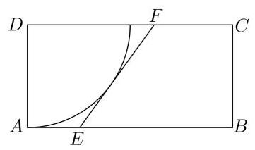

## 第十二讲:三角函数

## 知识点梳理:

1、正弦函数

2、余弦函数

3、正切函数

三角函数主要研究函数的图像、零点、值域、单调性、对称性、周期性等性质。

## 一、基础练习

1、函数 $f\left( x\right)  = {\sin }^{2}x - {\cos }^{2}x$ 的最小正周期为___；

2、 $y = \sin {ax}$ ( $a \neq  0$ )的最小正周期为 ${2\pi }$ ，则实数 $a =$ ___；

3、函数 $f\left( x\right)  = \sin \left( {\frac{3\pi }{2} + x}\right)$ 的奇偶性为___函数. (填“奇”、“偶”或“非奇非偶”)

4、函数 $f\left( x\right)  = \cos x, x \in  \left\lbrack  {-\frac{\pi }{4},\frac{5\pi }{6}}\right\rbrack$ 的值域为___；

5、函数 $y = \lg \left( {2\cos x - \sqrt{3}}\right)$ 的定义域为___；

6、若函数 $f\left( x\right)  = 2\sin \left( {x + \alpha }\right)$ 的图像关于直线 $x = \frac{\pi }{6}$ 对称，则 $\alpha$ 的一个可能的值为___；

7、方程 $\cos {2x} - \cos x = 0$ 在区间 $\left\lbrack  {0,\pi }\right\rbrack$ 上的解集为___；

8、已知 $f\left( x\right)  = a\tan x + b\sin {2x} - 3$ ，且 $f\left( 2\right)  =  - 1$ ，则 $f\left( {-2}\right)  =$ ___；

9、函数 $y =  - 2\sin \left( {{2x} - \frac{\pi }{3}}\right)$ 在 $\left\lbrack  {-\pi ,0}\right\rbrack$ 的严格单调增区间为___；

10、函数 $y = \arcsin x + \sin x$ 的值域是___；

11、函数 $f\left( x\right)  = \cos {x}^{2} + \sin x$ 在区间 $\left\lbrack  {-\frac{\pi }{4},\frac{\pi }{4}}\right\rbrack$ 上的最小值为___；

12、已知 $- 5{\sin }^{2}\alpha  + {\sin }^{2}\beta  = 4\sin \alpha$ ，则函数 $y = {\sin }^{2}\alpha  + {\sin }^{2}\beta$ 的最小值为___；

13、将函数 $y = \sin x$ 的图像上每点的横坐标缩小为原来的 $\frac{1}{2}$ (纵坐标不变),再把所得图像向左平移 $\frac{\pi }{6}$ 个单位，得到的函数解析式为( )

A. $y = \sin \left( {{2x} + \frac{\pi }{6}}\right)$ B. $y = \sin \left( {{2x} + \frac{\pi }{3}}\right)$ C. $y = \sin \left( {\frac{x}{2} + \frac{\pi }{6}}\right)$ D. $y = \sin \left( {\frac{x}{2} + \frac{\pi }{12}}\right)$

14、设函数 $f\left( x\right)  = \left| {\sin \left( {{2x} + \frac{\pi }{3}}\right) }\right|$ ,则下列说法正确的是( )

A. $f\left( x\right)$ 是偶函数 B. $f\left( x\right)$ 的最小正周期是 $\pi$

C. $f\left( x\right)$ 在区间 $\left\lbrack  {\frac{\pi }{3},\frac{7\pi }{12}}\right\rbrack$ 上是增函数 D. $f\left( x\right)$ 的图像关于点 $\left( {-\frac{\pi }{6},0}\right)$ 对称

15、将函数 $y =  - \frac{1}{x}$ 的图象按向量 $\overrightarrow{a} = \left( {1,0}\right)$ 平移，得到的函数图象与函数 $y = 2\sin {\pi x} \; \left( {-2 \leq  x \leq  4}\right)$ 的图象的所有交点的横坐标之和等于( )

A. 2 B. 4 C. 6 D. 8

## 二、综合提高

1、函数 $y = {\sin }^{2}x + 2\cos x$ 的定义域为 $\left\lbrack  {-\frac{2\pi }{3},\alpha }\right\rbrack$ ，值域为 $\left\lbrack  {-\frac{1}{4},2}\right\rbrack$ ，则 $\alpha$ 的取值范围是___；

2、设函数 $f\left( x\right)  = \sin \left( {x - \frac{\pi }{6}}\right)$ ,若对于任意的 ${x}_{1} \in  \left\lbrack  {-\frac{5\pi }{6}, - \frac{\pi }{2}}\right\rbrack$ ,在区间 $\left\lbrack  {0, m}\right\rbrack$ 上总存在唯一确定的 ${x}_{2}$ ,使得 $f\left( {x}_{1}\right)  + f\left( {x}_{2}\right)  = 0$ ,则 $m$ 的取值范围是___；

3、数学中一般用 $\min \{ a, b\}$ 表示 $\mathrm{a}\text{ 、 }\mathrm{\;b}$ 中的较小值，关于函数

$f\left( x\right)  = \min \{ \sin x + \sqrt{3}\cos x,\sin x - \sqrt{3}\cos x\}$ 有如下四个命题:

① $f\left( x\right)$ 的最小正周期为 $\pi$ ；② $f\left( x\right)$ 的图像关于直线 $x = \frac{3\pi }{2}$ 对称；

③ $f\left( x\right)$ 的值域为 $\left\lbrack  {-2,2}\right\rbrack$ ；④ $f\left( x\right)$ 在区间 $\left( {-\frac{\pi }{6},\frac{\pi }{4}}\right)$ 上单调递增. 其中是真命题的个数是( )个

A. 1 B. 2 C. 3 D. 4

4、函数 $f\left( x\right)  = \sin x, x \in  \left( {\alpha ,\beta }\right)$ ，且 $\left( {\alpha ,\beta }\right)  \subseteq  \left\lbrack  {0,\pi }\right\rbrack$ ，若任意 ${x}_{1}$ ， ${x}_{2}$ ， ${x}_{3} \in  \left( {\alpha ,\beta }\right)$ ， $f\left( {x}_{1}\right)$ 、 $f\left( {x}_{2}\right) \text{ 、 }f\left( {x}_{3}\right)$ 都能构成某个三角形的三条边,则 $\beta  - \alpha$ 的最大值为 ( )

A. $\frac{\pi }{6}$ B. $\frac{\pi }{3}$ C. $\frac{2\pi }{3}$ D. $\pi$

5、设 $f\left( x\right)  = \sin \left( {{\omega x} + \frac{\pi }{4}}\right) \left( {\omega  > 0}\right)$ 在 $\left( {\frac{\pi }{2},\pi }\right)$ 上单调递减，则 $\omega$ 的取值范围是___；

6、已知函数 $f\left( x\right)  = \cos \left( {{\omega x} - \frac{\pi }{4}}\right) \left( {\omega  \in  {\mathbf{N}}^{ * }}\right)$ 在 $\left( {\frac{\pi }{3},\frac{\pi }{2}}\right)$ 上不单调,则 $\omega$ 的最小值为___

7、设函数 $f\left( x\right)  = 2\sin {\omega x} - 1\left( {\omega  > 0}\right)$ ，在区间 $\left\lbrack  {\frac{\pi }{4},\frac{3\pi }{4}}\right\rbrack$ 上至少有 2 个不同的零点，至多有 3 个不同的零点,则 $\omega$ 的取值范围是( )

A. $\left\lbrack  {\frac{26}{9},\frac{10}{3}}\right\rbrack$ B. $\left\lbrack  {\frac{26}{9},\frac{58}{9}}\right)$ C. $\left\lbrack  {\frac{34}{9},\frac{58}{9}}\right)$ D. $\left\lbrack  {\frac{26}{9},\frac{10}{3}}\right\rbrack   \cup  \left\lbrack  {\frac{34}{9},\frac{58}{9}}\right)$

8、设函数 $f\left( x\right)  = \sin \left( {{\omega x} + \varphi }\right) \left( {\omega  > 0,\varphi  \in  \mathbf{R}}\right)$ ，若存在常数 $T\left( {T < 0}\right)$ ，满足 $\forall x \in  \mathbf{R}$ 有 $f\left( {x + T}\right)  = {Tf}\left( x\right)$ ，则 $\omega$ 可取到的最小值为___

9、已知函数 $f\left( x\right)  = \frac{1}{2}\sin x + \frac{\sqrt{3}}{2}\cos x$ ，若方程 $3{\left\lbrack  f\left( x\right) \right\rbrack  }^{2} - f\left( x\right)  + m = 0$ 在区间 $\left\lbrack  {-\frac{\pi }{3},\frac{2\pi }{3}}\right\rbrack$ 内有且仅有两解,则实数 $m$ 的取值范围是___

10、函数 $f\left( x\right)  = 6{\cos }^{2}\frac{\omega x}{2} + \sqrt{3}\sin \left( {\omega x}\right)  - 3\left( {\omega  > 0}\right)$ 在一个周期内的图像如图所示, $A$ 为图像的最高点, $B\text{ 、 }C$ 为图像与 $x$ 轴的交点,且 $\bigtriangleup {ABC}$ 为正三角形.

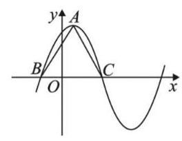

(1)求函数 $f\left( x\right)$ 的解析式;

(2)若 $f\left( {x}_{0}\right)  = \frac{6\sqrt{3}}{5}$ ，且 ${x}_{0} \in  \left( {-\frac{10}{3},\frac{2}{3}}\right)$ ，求 $f\left( {{x}_{0} + 1}\right)$ 的值；

(3)若 $y = {f}^{2}\left( x\right)  - {af}\left( x\right)  + 1$ 的最小值为 $\frac{1}{2}$ ，求 $a$ 的取值.

## 第十三讲:向量基本概念复习

## 知识点梳理:

## 一、平面向量的有关概念

(1)向量的基本概念

(2)向量的加减运算及实数与向量的乘法运算

(3)向量的坐标表示及坐标运算

(4)两非零向量平行的充要条件

二、平面向量基本定理: 如果 $\overrightarrow{{e}_{1}},\overrightarrow{{e}_{2}}$ 是同一平面内的两个不平行的向量,那么对于这一平面内的任意向量 $\overrightarrow{a}$ ,有且只有一对实数 ${\lambda }_{1},{\lambda }_{2}$ ,使得 $\overrightarrow{a} = {\lambda }_{1}\overrightarrow{{e}_{1}} + {\lambda }_{2}\overrightarrow{{e}_{2}}$ ,其中 $\overrightarrow{{e}_{1}},\overrightarrow{{e}_{2}}$ 向量称为平面向量的一个基。即: 平面上任意两个不平行的向量都组成平面向量的一个基。

三、三点共线: 给定平面上不共线的三个点 $O, A, B$ ,根据向量基本定理,对平面上任意一个点 $P$ ,都由实数 $\lambda$ 和 $\mu$ ,使得 $\overrightarrow{OP} = \lambda \overrightarrow{OA} + \mu \overrightarrow{OB}$ ,如果 $A, B, P$ 三点共线,则 $\lambda  + \mu  = 1$ 。即

$$
\overrightarrow{OP} = \left( {1 - \mu }\right) \overrightarrow{OA} + \mu \overrightarrow{OB}
$$

## 四、向量的数量积及其应用

1、向量的投影和数量投影的概念

(1)向量 $\overrightarrow{b}$ 在向量 $\overrightarrow{a}$ 方向上的投影为: $\left| \overrightarrow{b}\right| \cos  < \overrightarrow{a},\overrightarrow{b} > \overrightarrow{{a}_{0}} = \left| \overrightarrow{b}\right| \cos  < \overrightarrow{a},\overrightarrow{b} > \frac{\overrightarrow{a}}{\left| \overrightarrow{a}\right| }$

(2) $\left| \overrightarrow{b}\right| \cos  < \overrightarrow{a},\overrightarrow{b} >$ 称为 $\overrightarrow{b}$ 在向量 $\overrightarrow{a}$ 方向上的数量投影。

2、向量数量积: 如果两个非零向量 $\overrightarrow{a},\overrightarrow{b}$ ,定义向量 $\overrightarrow{a}$ 和向量 $\overrightarrow{b}$ 的数量积, $\overrightarrow{a} \bullet  \overrightarrow{b} = \left| \overrightarrow{a}\right| \left| \overrightarrow{b}\right| \cos  < \overrightarrow{a},\overrightarrow{b} >$ ,规定 $\overrightarrow{0} \bullet  \overrightarrow{a} = 0;\overrightarrow{a} \cdot  \overrightarrow{a}$ 简记为 ${\overrightarrow{a}}^{2}$ ,且 $\overrightarrow{a} \cdot  \overrightarrow{a} = {\overrightarrow{a}}^{2} = {\left| \overrightarrow{a}\right| }^{2}$

## 四、平面向量的应用

(1)定比分点公式:设 $P$ 是直线 ${P}_{1}{P}_{2}$ 上一点，且满足 $\overrightarrow{{P}_{1}P} = \lambda \overrightarrow{P{P}_{2}}$ ，其中 $P\left( {x, y}\right)$ ， ${P}_{1}\left( {{x}_{1},{y}_{1}}\right) ,{P}_{2}\left( {{x}_{2},{y}_{2}}\right)$ ,则

$$
\left\{  \begin{array}{l} x = \frac{{x}_{1} + \lambda {x}_{2}}{1 + \lambda }, \\  y = \frac{{y}_{1} + \lambda {y}_{2}}{1 + \lambda }. \end{array}\right.
$$

(2)处理平面两条直线平行或垂直的关系

给定向量 $\overrightarrow{a} = \left( {{x}_{1},{y}_{1}}\right)$ 与 $\overrightarrow{b} = \left( {{x}_{2},{y}_{2}}\right)$ ,则

(1) $\overrightarrow{a} \bot  \overrightarrow{b}$ 的充要条件是 ${x}_{1}{x}_{2} + {y}_{1}{y}_{2} = 0$ ；

(2) $\overrightarrow{a}//\overrightarrow{b}$ 的充要条件是 ${x}_{1}{y}_{2} = {x}_{2}{y}_{1}$ .

(3)两角差的余弦公式的推导

例 6 用向量方法证明:

$$
\cos \left( {\alpha  - \beta }\right)  = \cos \alpha \cos \beta  + \sin \alpha \sin \beta .
$$

(4)三角形面积公式

例 4 在 $\bigtriangleup {ABC}$ 中,设 $\overrightarrow{CA} = \overrightarrow{a},\overrightarrow{CB} = \overrightarrow{b}$ ,记 $\bigtriangleup {ABC}$ 的面积为 $S$ .

(1)求证: $S = \frac{1}{2}\sqrt{{\left| \overrightarrow{a}\right| }^{2}{\left| \overrightarrow{b}\right| }^{2} - {\left( \overrightarrow{a} \cdot  \overrightarrow{b}\right) }^{2}}$ ；

(2) 设 $\overrightarrow{a} = \left( {{x}_{1},{y}_{1}}\right) ,\overrightarrow{b} = \left( {{x}_{2},{y}_{2}}\right)$ . 求证: $S = \; \frac{1}{2}\left| {{x}_{1}{y}_{2} - {x}_{2}{y}_{1}}\right|$ .

(5)不等式的证明(柯西不等式)

例 8 已知 ${x}_{1}\text{ 、 }{x}_{2}\text{ 、 }{y}_{1}\text{ 、 }{y}_{2}$ 都是实数,求证:

$$
{\left( {x}_{1}{x}_{2} + {y}_{1}{y}_{2}\right) }^{2} \leq  \left( {{x}_{1}^{2} + {y}_{1}^{2}}\right) \left( {{x}_{2}^{2} + {y}_{2}^{2}}\right) ,
$$

并且等式成立的充要条件是 ${x}_{1}{y}_{2} = {x}_{2}{y}_{1}$ .

## 五、常用结论(三点共线、极化恒等式和奔驰定理)

1、若存在非零实数 $m$ ，使得 $\overrightarrow{OA} = m\overrightarrow{OB} + \left( {1 - m}\right) \overrightarrow{OC}$ ，则 $A, B, C$ 三点共线

2、 $O$ 在 $\bigtriangleup  {ABC}$ 内，则 ${S}_{\bigtriangleup {OBC}} \cdot  \overrightarrow{OA} + {S}_{\bigtriangleup {OAC}} \cdot  \overrightarrow{OB} + {S}_{\bigtriangleup {OAB}} \cdot  \overrightarrow{OC} = \overrightarrow{0}$

3、重心: $\overrightarrow{OA} + \overrightarrow{OB} + \overrightarrow{OC} = \overrightarrow{0}$

垂心: $\overrightarrow{OA} \cdot  \overrightarrow{OB} = \overrightarrow{OB} \cdot  \overrightarrow{OC} = \overrightarrow{OC} \cdot  \overrightarrow{OA}$

外心: $\left( {\overrightarrow{OA} + \overrightarrow{OB}}\right)  \cdot  \overrightarrow{AB} = \left( {C\overrightarrow{OB} + \overrightarrow{OC}}\right)  \cdot  \overrightarrow{BC} = \left( {\overrightarrow{OC} + \overrightarrow{OA}}\right)  \cdot  \overrightarrow{CA}$

内心: $\overrightarrow{OA} \cdot  \left( {\frac{\overrightarrow{AB}}{\left| \overrightarrow{AB}\right| } - \frac{\overrightarrow{AC}}{\left| \overrightarrow{AC}\right| }}\right)  = \overrightarrow{OB} \cdot  \left( {\frac{\overrightarrow{BA}}{\left| \overrightarrow{BA}\right| } - \frac{\overrightarrow{BC}}{\left| \overrightarrow{BC}\right| }}\right)  = \overrightarrow{OC} \cdot  \left( {\frac{\overrightarrow{CA}}{\left| \overrightarrow{CA}\right| } - \frac{\overrightarrow{CB}}{\left| \overrightarrow{CB}\right| }}\right)  = 0$

4、极化恒等式: 在 $\bigtriangleup {ABC}$ 中, $D$ 是边 ${BC}$ 的中点,则 $\overrightarrow{AB} \cdot  \overrightarrow{AC} = {\left| \overrightarrow{AD}\right| }^{2} - {\left| \overrightarrow{DB}\right| }^{2}$

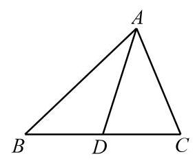

## 一、基本题型

1、已知向量 $\overrightarrow{a} = \left( {\sqrt{3},1}\right) ,\overrightarrow{b} = \left( {\sin \alpha  - m,\cos \alpha }\right) \alpha  \in  R$ ，若 $\overrightarrow{a}//\overrightarrow{b}$ ，则实数 $m$ 的最小值为___；

2、设 $\overrightarrow{a} = \left( {2,4}\right) ,\overrightarrow{b} = \left( {1,1}\right)$ ，若 $\overrightarrow{b} \bot  \left( {\overrightarrow{a} + m\overrightarrow{b}}\right)$ ，则实数 $m =$ ___；

3、设平行四边形 ${ABCD}$ 中， $\bigtriangleup {BCD}$ 的重心为 $H$ ， $\overrightarrow{AH} = \lambda \overrightarrow{AB} + \mu \overrightarrow{AD}$ ，则 ${\mu }^{3\lambda } =$ ___；

4、已知向量 $\overrightarrow{a},\overrightarrow{b}$ 满足 $\left| \overrightarrow{a}\right|  = 2,\left| \overrightarrow{b}\right|  = 3,\left| {2\overrightarrow{a} + \overrightarrow{b}}\right|  = \sqrt{37}$ ，则 $\overrightarrow{a},\overrightarrow{b}$ 的夹角为___；

5、已知向量 $\overrightarrow{a}$ 、 $\overrightarrow{b}$ ， $\left| \overrightarrow{a}\right|  = 2$ ， $\left| \overrightarrow{b}\right|  = 1$ ，则 $\left| {2\overrightarrow{b} - \overrightarrow{a}}\right|$ 的取值范围是___；

6、已知 $\overrightarrow{a} = \left( {1, - 2}\right) ,\overrightarrow{b} = \left( {3,4}\right)$ ，则 $\overrightarrow{a}$ 在 $\overrightarrow{b}$ 方向上的投影为___；

7、在 $\bigtriangleup {ABC}$ 中， ${AC} = 3$ ，向量 $\overrightarrow{AB}$ 在 $\overrightarrow{AC}$ 上的投影向量为 $- 2\frac{\overrightarrow{AC}}{\left| \overrightarrow{AC}\right| }$ ， ${S}_{\bigtriangleup {ABC}} = 3$ ，则 ${BC} =$ ( )

A. 5 B. $2\sqrt{7}$ C. $\sqrt{29}$ D. $4\sqrt{2}$

8、向量 $\overrightarrow{a} = \left( {1, - 2}\right)$ 、 $\overrightarrow{b} = \left( {\lambda ,1}\right)$ 的夹角为钝角，则实数 $\lambda$ 的取值范围是___；

9、在等腰三角形 ${ABC}$ 中， ${AB} = {AC} = \sqrt{5},{BC} = 2$ ，若 $P$ 为边 ${BC}$ 上的动点，则 $\overrightarrow{AP} \cdot  \left( {\overrightarrow{AB} + \overrightarrow{AC}}\right)  =$ (   )

A. 4 B. 8 C. -4 D. -8

10、已知 ${\Delta ABC}$ 的三个顶点坐标分别为 $A\left( {1,2}\right) , B\left( {4,2}\right) , C\left( {5,7}\right)$ ，则 $\bigtriangleup  {ABC}$ 的面积为___；

11、已知 $A\text{ 、 }B\text{ 、 }C$ 三点共线,对该直线外任意一点 $O$ ,都有 $\overrightarrow{OC} = {4m}\overrightarrow{OA} + n\overrightarrow{OB}\left( {m, n > 0}\right)$ , 则 $\frac{1}{m} + \frac{4}{n}$ 的最小值为___；

12、已知 $O, N, P$ 在 $\bigtriangleup {ABC}$ 所在平面内,且 $\left| \overrightarrow{OA}\right|  = \left| \overrightarrow{OB}\right|  = \left| \overrightarrow{OC}\right| ,\overrightarrow{NA} + \overrightarrow{NB} + \overrightarrow{NC} = \overrightarrow{0}$ , $\overrightarrow{PA} \cdot  \overrightarrow{PB} = \overrightarrow{PB} \cdot  \overrightarrow{PC} = \overrightarrow{PC} \cdot  \overrightarrow{PA}$ ,则 $O, N, P$ 依次是 ${\Delta ABC}$ 的___；

13、若等边 $\bigtriangleup {ABC}$ 的边长为 $2\sqrt{3}$ ,平面内一点 $M$ 满足 $\overrightarrow{CM} = \frac{1}{6}\overrightarrow{CB} + \frac{2}{3}\overrightarrow{CA}$ ,则 $\overrightarrow{MA} \cdot  \overrightarrow{MB} =$ ___；

14、在 $\bigtriangleup {ABC}$ 中, $A = \frac{\pi }{2},{AB} = {AC} = 2$ ,有下述三个结论:

① 若 $G$ 为 $\bigtriangleup {ABC}$ 的重心，则 $\overrightarrow{AG} = \frac{1}{3}\overrightarrow{AB} + \frac{1}{3}\overrightarrow{AC}$ ；

② 若 $P$ 为 ${BC}$ 边上的一个动点，则 $\overrightarrow{AP} \cdot  \left( {\overrightarrow{AB} + \overrightarrow{AC}}\right)$ 为定值 2;

③ 若 $M\text{ 、 }N$ 为 ${BC}$ 边上的两个动点,且 ${MN} = \sqrt{2}$ ,则 $\overrightarrow{AM} \cdot  \overrightarrow{AN}$ 的最小值为 $\frac{3}{2}$ ;

④已知 $P$ 为 $\bigtriangleup {ABC}$ 内一点,若 ${BP} = 1$ ,且 $\overrightarrow{AP} = \lambda \overrightarrow{AB} + \mu \overrightarrow{AC}$ ,则 $\lambda  + \sqrt{3}\mu$ 的最大值为 2 ; 其中所有正确结论的编号___；

15、给出下列结论:①若 $\overrightarrow{a} \neq  \overrightarrow{0}$ ，且 $\overrightarrow{a} \cdot  \overrightarrow{b} = \overrightarrow{a} \cdot  \overrightarrow{c}$ ，则 $\overrightarrow{b} = \overrightarrow{c}$ ；② ${\left( \overrightarrow{a} \cdot  \overrightarrow{b}\right) }^{2} = {\overrightarrow{a}}^{2} \cdot  {\overrightarrow{b}}^{2}$ ；③ “ $\left| {\overrightarrow{a} + \overrightarrow{b}}\right|  = {\left| \overrightarrow{a}\right| }^{2} + {\left| \overrightarrow{b}\right| }^{2}$ ” 是 “ $\overrightarrow{a} \bot  \overrightarrow{b}$ ” 的充要条件；④函数 $y = f\left( x\right)$ 的图像沿向量 $\overrightarrow{d} = \left( {1,2}\right)$ 平移,所得图像的解析式为 $y = f\left( {x + 1}\right)  + 2$ ,其中真命题的个数为___；

## 二、解答题

1、证明下列不等式:

(1)已知 $a > 0, b > 0, a + b = 1$ ,求证: $\sqrt{{2a} + 1} + \sqrt{{2b} + 1} \leq  2\sqrt{2}$

(2)已知 $a, b$ 均为正数，且 $a + b = 1$ ，求证: ${\left( a + 2\right) }^{2} + {\left( b + 3\right) }^{2} \geq  {18}$

2、已知 $\left| \overrightarrow{a}\right|  = \sqrt{2},\left| \overrightarrow{b}\right|  = 3,\overrightarrow{a}$ 和 $\overrightarrow{b}$ 夹角为 ${45}^{ \circ  }$ ,当向量 $\overrightarrow{a} + \lambda \overrightarrow{b}$ 与 $\lambda \overrightarrow{a} + \overrightarrow{b}$ 的夹角为锐角，求 $\lambda$ 的取值范围。

3、设 $\overrightarrow{a},\overrightarrow{b}$ 是两个不共线的非零向量( $t \in  R$ )

(1)记 $\overrightarrow{OA} = \overrightarrow{a},\overrightarrow{OB} = t\overrightarrow{b},\overrightarrow{OC} = \frac{1}{3}\left( {\overrightarrow{a} + \overrightarrow{b}}\right)$ ，那么实数 $t$ 为何值时， $A, B, C$ 三点共线？

(2)若 $\left| \overrightarrow{a}\right|  = \left| \overrightarrow{b}\right|  = 1$ ，且 $\overrightarrow{a}$ 与 $\overrightarrow{b}$ 夹角为 ${120}^{ \circ  }$ ，那么实数 $x$ 为何值时， $\left| {\overrightarrow{a} - x\overrightarrow{b}}\right|$ 的值最小？

4、如图，已知正方形 ${ABCD}$ 的边长为 2,过中心 $O$ 的直线 $l$ 与两边 ${AB}\text{ 、 }{CD}$ 分别交于交于点 $M\text{ 、 }N$ .

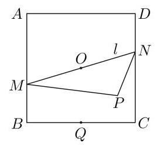

(1)求 $\overrightarrow{BD} \cdot  \overrightarrow{DC}$ 的值；

(2)若 $Q$ 是 ${BC}$ 的中点，求 $\overrightarrow{QM} \cdot  \overrightarrow{QN}$ 的取值范围；

(3)若 $P$ 是平面上一点，且满足 $2\overrightarrow{OP} = \lambda \overrightarrow{OB} + \left( {1 - \lambda }\right) \overrightarrow{OC}$ ， 求 $\overrightarrow{PM} \cdot  \overrightarrow{PN}$ 的最小值.

5、在平面直角坐标系中，点 ${A}_{n}$ 满足 $\overrightarrow{O{A}_{1}} = \left( {0,1}\right)$ ，且 $\overrightarrow{{A}_{n}{A}_{n + 1}} = \left( {1,1}\right)$ ，点 ${B}_{n}$ 满足 $\overrightarrow{O{B}_{1}} = \left( {3,0}\right)$ ， 且 $\overrightarrow{{B}_{n}{B}_{n + 1}} = \left( {3 \cdot  {\left( \frac{2}{3}\right) }^{n},0}\right)$ ，其中 $n \in  {N}^{ * }$

(1)证明:点 ${A}_{n}$ 在直线 $y = x + 1$ 上；

(2)记四边形 ${A}_{n}{B}_{n}{B}_{n + 1}{A}_{n + 1}$ 的面积为 ${a}_{n}$ ，求 ${a}_{n}$ 的表达式；

(3)对于(2)中的 ${a}_{n}$ ，求最小的正整数 $P$ ，使得对任意 $n \in  {N}^{ * }$ ，都有 ${a}_{n} < P$ 成立。

## 第十四讲:向量综合应用

## 知识点梳理

## 1、向量中重心、内心、外心、垂心:

三角形重心、内心、垂心、外心的概念及简单的三角形形状判断方法。

重心: ${\Delta ABC}$ 中每条边上所对应的中线的交点;

垂心: ${\Delta ABC}$ 中每条边上所对应的垂线上的交点;

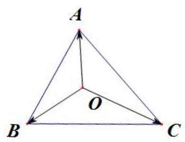

内心: $\bigtriangleup {ABC}$ 中每个角的角平分线的交点 (内切圆的圆心);

外心: ${\Delta ABC}$ 中每条边上所对应的中垂线的交点 (外接圆的圆心)。

## 2、向量的结论:

向量中的“奔驰定理”: 设点 $O$ 为 $\bigtriangleup {ABC}$ 内的任意一点,则:

${S}_{\Delta BOC} \cdot  \overrightarrow{OA} + {S}_{\Delta AOC} \cdot  \overrightarrow{OB} + {S}_{\Delta BOA} \cdot  \overrightarrow{OC} = \overrightarrow{0}$

(1) $O$ 为重心: ${S}_{\Delta AOB} = {S}_{\Delta BOC} = {S}_{\Delta AOC},\overrightarrow{OA} + \overrightarrow{OB} + \overrightarrow{OC} = \overrightarrow{0}$

(2)垂心: $\overrightarrow{OA} \cdot  \overrightarrow{OB} = \overrightarrow{OB} \cdot  \overrightarrow{OC} = \overrightarrow{OC} \cdot  \overrightarrow{OA}$ ；

${S}_{\bigtriangleup {BOC}} : {S}_{\bigtriangleup {AOC}} : {S}_{\bigtriangleup {AOB}} = \tan A : \tan B : \tan C$

则 $\tan A \cdot  \overrightarrow{OA} + \tan B \cdot  \overrightarrow{OB} + \tan C \cdot  \overrightarrow{OC} = \overrightarrow{0}$

(3)外心: $\left| \overrightarrow{OA}\right|  = \left| \overrightarrow{OB}\right|  = \left| \overrightarrow{OC}\right|$ 或 $\left( {\overrightarrow{OA} + \overrightarrow{OB}}\right)  \cdot  \overrightarrow{AB} = \left( {\overrightarrow{OB} + \overrightarrow{OC}}\right)  \cdot  \overrightarrow{BC} = \left( {\overrightarrow{OC} + \overrightarrow{OA}}\right)  \cdot  \overrightarrow{CA}$

${S}_{\bigtriangleup {BOC}} : {S}_{\bigtriangleup {AOC}} : {S}_{\bigtriangleup {AOB}} = \sin {2A} : \sin {2B} : \sin {2C}$

则 $\sin {2A} \cdot  \overrightarrow{OA} + \sin {2B} \cdot  \overrightarrow{OB} + \sin {2C} \cdot  \overrightarrow{OC} = \overrightarrow{0}$

(4)内心: $a \cdot  \overrightarrow{OA} + b \cdot  \overrightarrow{OB} + c \cdot  \overrightarrow{OC} = \overrightarrow{0}$ 或 $\sin A \cdot  \overrightarrow{OA} + \sin B \cdot  \overrightarrow{OB} + \sin C \cdot  \overrightarrow{OC} = \overrightarrow{0}$

${S}_{\bigtriangleup {BOC}} : {S}_{\bigtriangleup {AOC}} : {S}_{\bigtriangleup {AOB}} = a : b : c$

## 一、系数的最值

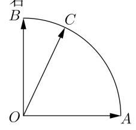

1、如图，点 $C$ 是半径为 1 的扇形圆弧 ${AB}$ 上一点， $\overrightarrow{OA} \cdot  \overrightarrow{OB} = 0$ ， $\left| \overrightarrow{OA}\right|  = \left| \overrightarrow{OB}\right|  = 1$ ，若 $\overrightarrow{OC} = x\overrightarrow{OA} + y\overrightarrow{OB}$ ,则 ${2x} + y$ 的最小值是( )

A. $- \sqrt{5}$ B. 1 C. 2 D. $\sqrt{5}$

2、已知向量 $\left| \overrightarrow{a}\right|  = \left| \overrightarrow{b}\right|  = \overrightarrow{a} \cdot  \overrightarrow{b} = 2,\overrightarrow{c} = \lambda \overrightarrow{a} + \mu \overrightarrow{b}\left( {\lambda ,\mu  \in  \mathbf{R}}\right)$ ，且 $\left| {\overrightarrow{c} - \frac{\overrightarrow{a} + \overrightarrow{b}}{2}}\right|  = \left| \frac{\overrightarrow{a} - \overrightarrow{b}}{2}\right|$ ，则 $\lambda  + \mu$ 的取值范围是___；

3、已知 $O$ 为 $\bigtriangleup {ABC}$ 的外心， $\angle {ABC} = \frac{\pi }{3}$ ， $\overrightarrow{BO} = \lambda \overrightarrow{BA} + \mu \overrightarrow{BC}$ ，则 $\lambda  + \mu$ 的最大值为___；

4、已知 $\bigtriangleup {ABC}$ 的内角 $A\text{ 、 }B\text{ 、 }C$ 的对边分别为 $a\text{ 、 }b\text{ 、 }c$ ,且 $\cos A = \frac{7}{8}, I$ 为 $\bigtriangleup {ABC}$ 内部的一点，且 $a\overrightarrow{IA} + b\overrightarrow{IB} + c\overrightarrow{IC} = \overrightarrow{0}$ ，若 $\overrightarrow{AI} = x\overrightarrow{AB} + y\overrightarrow{AC}$ ，则 $x + y$ 的最大值为( )

A. $\frac{5}{4}$ B. $\frac{1}{2}$ C. $\frac{5}{6}$ D. $\frac{4}{5}$

## 二、数量积的最值

1、如图，等边 $\bigtriangleup  {ABC}$ 是半径为 2 的圆 $O$ 的内接三角形, $M$ 是边 ${BC}$ 的中点, $P$ 是圆外一点,且 ${OP} = 4$ , 当 $\bigtriangleup {ABC}$ 绕圆心 $O$ 旋转时,则 $\overrightarrow{OB} \cdot  \overrightarrow{PM}$ 的取值范围为___；

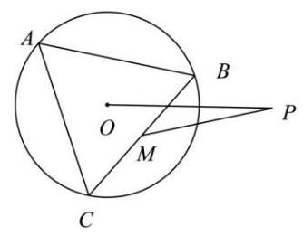

2、平面向量 $\overrightarrow{a},\overrightarrow{b},\overrightarrow{e}$ 满足 $\left| \overrightarrow{e}\right|  = 1,\overrightarrow{a} \cdot  \overrightarrow{e} = 1,\overrightarrow{b} \cdot  \overrightarrow{e} = 2,\left| {\overrightarrow{a} - \overrightarrow{b}}\right|  = 2$ ，则 $\overrightarrow{a} \cdot  \overrightarrow{b}$ 的最小值为______；

3、已知 $P$ 是边长为 4 的正三角形 ${ABC}$ 所在平面内一点，且 $\overrightarrow{AP} = \lambda \overrightarrow{AB} + \left( {2 - {2\lambda }}\right) \overrightarrow{AC} \; \left( {\lambda  \in  \mathbf{R}}\right)$ ，则 $\overrightarrow{PA} \cdot  \overrightarrow{PC}$ 的最小值为___；

4、已知 $A\text{ 、 }B$ 是单位圆 $O$ 上的两点 $\left( O\right.$ 为圆心 $),\angle {AOB} = {120}^{ \circ  }$ ，点 $C$ 是线段 ${AB}$ 上不与

$A\text{ 、 }B$ 重合的动点. ${MN}$ 是圆 $O$ 的一条直径,则 $\overrightarrow{CM} \cdot  \overrightarrow{CN}$ 的取值范围是 ( )

A. $\left\lbrack  {-\frac{3}{4},0}\right)$ B. $\left\lbrack  {-\frac{3}{4},0}\right\rbrack$ C. $\left\lbrack  {-\frac{1}{2},1}\right)$ D. $\left\lbrack  {-\frac{1}{2},1}\right\rbrack$

## 三、模的最值

1、已知 $\overrightarrow{a},\overrightarrow{b},\overrightarrow{c}$ 是平面内的三个单位向量，且 $\overrightarrow{a}\bot \overrightarrow{b}$ ，则 $\left| {\overrightarrow{a} + 2\overrightarrow{b} + \overrightarrow{c}}\right|$ 的取值范围是( )

A. $\left\lbrack  {0,4}\right\rbrack$ B. $\left\lbrack  {\sqrt{2} - 1,\sqrt{2} + 1}\right\rbrack$

C. $\left\lbrack  {\sqrt{3} - 1,\sqrt{3} + 1}\right\rbrack$ D. $\left\lbrack  {\sqrt{5} - 1,\sqrt{5} + 1}\right\rbrack$

2、已知向量 $\overrightarrow{a},\overrightarrow{b},\left| \overrightarrow{a}\right|  = 1,\left| \overrightarrow{b}\right|  = 2$ ,若对任意单位向量 $\overrightarrow{e}$ ,均有 $\left| {\overrightarrow{a} \cdot  \overrightarrow{e}}\right|  + \left| {\overrightarrow{b} \cdot  \overrightarrow{e}}\right|  \leq  \sqrt{6}$ ,则 $\overrightarrow{a} \cdot  \overrightarrow{b}$ 的最大值为( )

A. $\frac{1}{2}$ B. $\frac{\sqrt{2}}{2}$ C. 1 D. 2

3、已知向量 $\overrightarrow{a}$ 、 $\overrightarrow{b}$ 夹角为 $\frac{\pi }{3}$ ， $\left| \overrightarrow{b}\right|  = 2$ ，对任意 $x \in  \mathbf{R}$ ，有 $\left| {\overrightarrow{b} - x\overrightarrow{a}}\right|  \geq  \left| {\overrightarrow{a} - \overrightarrow{b}}\right|$ ， 则 $\left| {t\overrightarrow{b} - 3\overrightarrow{a}}\right|  + \left| {t\overrightarrow{b} - \overrightarrow{a}}\right| \left( {t \in  \mathbf{R}}\right)$ 的最小值是___；

4、已知平面向量 $\overrightarrow{a}\text{ 、 }\overrightarrow{b}\text{ 、 }\overrightarrow{c}$ 满足 $\left| \overrightarrow{a}\right|  = 1,\left| \overrightarrow{b}\right|  = \left| \overrightarrow{c}\right|  = 2$ ，且 $\overrightarrow{b} \cdot  \overrightarrow{c} = 0$ ，则当 $0 \leq  \lambda  \leq  1$ 时， $\left| {\overrightarrow{a} - \lambda \overrightarrow{b} - \left( {1 - \lambda }\right) \overrightarrow{c}}\right|$ 的取值范围是___

## 四、三角形的“四心”

1、已知 $\bigtriangleup  {ABC}$ 的三个内角 $A$ 、 $B$ 、 $C$ 的对边分别为 $a$ 、 $b$ 、 $c$ ， $O$ 为 $\bigtriangleup  {ABC}$ 内一点， 则满足下列四个条件: ① $a\overrightarrow{OA} + b\overrightarrow{OB} + c\overrightarrow{OC} = \overrightarrow{0}$ ; ② $\tan A \cdot  \overrightarrow{OA} + \tan B \cdot  \overrightarrow{OB} + \tan C \cdot  \overrightarrow{OC} = \overrightarrow{0}$ ; ③ $\sin {2A} \cdot  \overrightarrow{OA} + \sin {2B} \cdot  \overrightarrow{OB} + \sin {2C} \cdot  \overrightarrow{OC} = \overrightarrow{0}$ ；④ $\overrightarrow{OA} + \overrightarrow{OB} + \overrightarrow{OC} = \overrightarrow{0}$ 的点 $O$ 依次为 $\bigtriangleup {ABC}$ 的( )

A. 外心、内心、垂心、重心 B. 内心、外心、垂心、重心

C. 垂心、内心、重心、外心 D. 内心、垂心、外心、重心

2、点 $O$ 在 $\bigtriangleup  {ABC}$ 所在的平面内，则以下说法正确的有___

① 若 $\overrightarrow{OA} + \overrightarrow{OB} + \overrightarrow{OC} = \overrightarrow{0}$ ，则点 $O$ 为 $\bigtriangleup  {ABC}$ 的重心；

② 若 $\overrightarrow{OA} \cdot  \left( {\frac{\overrightarrow{AC}}{\left| \overrightarrow{AC}\right| } - \frac{\overrightarrow{AB}}{\left| \overrightarrow{AB}\right| }}\right)  = \overrightarrow{OB} \cdot  \left( {\frac{\overrightarrow{BC}}{\left| \overrightarrow{BC}\right| } - \frac{\overrightarrow{BA}}{\left| \overrightarrow{BA}\right| }}\right)  = 0$ ，则点 $O$ 为 $\bigtriangleup  {ABC}$ 的垂心；

③ 若 $\left( {\overrightarrow{OA} + \overrightarrow{OB}}\right)  \cdot  \overrightarrow{AB} = \left( {\overrightarrow{OB} + \overrightarrow{OC}}\right)  \cdot  \overrightarrow{BC} = 0$ ,则点 $O$ 为 $\bigtriangleup {ABC}$ 的外心.

3、已知 $O$ 是锐角 $\bigtriangleup {ABC}$ 的外接圆圆心, $\angle A = {60}^{ \circ  },\frac{\cos B}{\sin C}\overrightarrow{AB} + \frac{\cos C}{\sin B}\overrightarrow{AC} = {2m}\overrightarrow{AO}$ ,则实数 $m$ 的值为___

4、设锐角 $\bigtriangleup {ABC}$ 的外心为 $O$ ,且 $\frac{1}{4\cos A}\overrightarrow{OA} + \frac{\cos B}{\sin C}\overrightarrow{AB} + \frac{\cos C}{\sin B}\overrightarrow{AC} = \overrightarrow{0}$ ,则 $\tan A + \cot A =$ ___

5、设 $H$ 是 $\bigtriangleup {ABC}$ 的垂心，且 $3\overrightarrow{HA} + 4\overrightarrow{HB} + 5\overrightarrow{HC} = \overrightarrow{0}$ ，则 $\cos \angle {ABC} =$ ___

6、已知 $O$ 是 $\bigtriangleup {ABC}$ 的外心， ${AB} = 4,{AC} = 6,\overrightarrow{AO} = x\overrightarrow{AB} + y\overrightarrow{AC}$ ，且 ${3x} + {8y} = 4$ ， 若 $x \neq  0$ ，则 $\cos \angle {BAC}$ 的值为( )

A. $\frac{9}{16}$ B. $\frac{5}{9}$ C. $\frac{5}{12}$ D. $\frac{5}{16}$

## 第十五讲:复数复习

## 知识点梳理:

## 一、复数的概念

复数可以按以下方式分类:

复数 $\left( {z = a + b\mathrm{i}, a\text{ 、 }b \in  \mathbf{R}}\right) \left\{  \begin{array}{l} \text{ 实数 }\left( {b = 0}\right) \\  \text{ 虚数 }\left( {b \neq  0}\right)  \end{array}\right.$

一纯虚数 $\left( {b \neq  0, a = 0}\right)$

## 二、复数的运算

当 $z \neq  0$ 时,规定 ${z}^{0} = 1$ ; 当 $z \neq  0, n \in  N$ 时,规定 ${z}^{-n} = \frac{1}{{z}^{n}}$ .

${z}^{m}{z}^{n} = {z}^{m + n},{\left( {z}^{m}\right) }^{n} = {z}^{mn},{\left( {z}_{1}{z}_{2}\right) }^{n} = {z}_{1}^{n}{z}_{2}^{n}$

当 $n \in  z$ 时， ${i}^{4\mathrm{n}} = 1$ ， ${i}^{4\mathrm{n} + 1} = i$ ， ${i}^{4\mathrm{n} + 2} =  - 1$ ， ${i}^{4\mathrm{n} + 3} =  - i$ ，(周期性)

## 三、共轭复数

1、共轭复数的定义: $a + {bi}$ 与 $c + {di}$ 共轭 $\Leftrightarrow$ ___

2、 $z \in  R$ 的充要条件是 $z = \bar{z}$

3、 $z$ 是纯虚数的充要条件是 $z + \bar{z} = 0$ 且 $z \neq  0$

4、共轭复数的运算性质

(1) $\overline{{z}_{1} \pm  {z}_{2}} = \overline{{z}_{1}} \pm  \overline{{z}_{2}}$

(2) $\overline{\left( {z}_{1}{z}_{2}\right) } = \overline{{z}_{1}{z}_{2}};\;\overline{\left( \frac{{z}_{1}}{{z}_{2}}\right) } = \frac{\overline{{z}_{1}}}{\overline{{z}_{2}}}$

5、(1)若 $z$ 为实数， ${\left| z\right| }^{2} = {z}^{2}$

(2)若 $z$ 为虚数， ${\left| z\right| }^{2} \neq  {z}^{2}$

(3) $z \cdot  \bar{z} = {\left| z\right| }^{2}$

## 四、复数的模及模的几何意义

1、 $\left| z\right|  = \sqrt{{a}^{2} + {b}^{2}}$ ，表示复数在复平面所对应的点 $z\left( {a, b}\right)$ 到原点的距离；

2、复数模的运算性质:

(1) $\left| z\right|  = \left| \overset{ - }{z}\right| ,\overset{ - }{z\overline{z}} = {\left| z\right| }^{2}$

(2) $\left| {{z}_{1}{z}_{2}}\right|  = \left| {z}_{1}\right| \left| {z}_{2}\right| ;\left| \frac{{z}_{1}}{{z}_{2}}\right|  = \frac{\left| {z}_{1}\right| }{\left| {z}_{2}\right| }\left( {{z}_{2} \neq  0}\right)$

(3) $\begin{Vmatrix}{z}_{1}\end{Vmatrix} - \left| {z}_{2}\right|  \leq  \left| {{z}_{1} \pm  {z}_{2}}\right|  \leq  \left| {z}_{1}\right|  + \left| {z}_{2}\right|$

3、 $\left| {{z}_{1} - {z}_{2}}\right|$ 表示复平面内两个点之间的距离；

## 五、1 的立方根

1 的立方根是 $1, - \frac{1}{2} \pm  \frac{\sqrt{3}}{2}i; - 1$ 的立方根是 -1, $\frac{1}{2} \pm  \frac{\sqrt{3}}{2}i$

“ 1 ” 的立方根 $\omega  =  - \frac{1}{2} \pm  \frac{\sqrt{3}}{2}i$ 的性质:

① ${\omega }^{3} = 1$ ② ${\omega }^{2} = \overline{\omega }$ ③ $1 + \omega  + {\omega }^{2} = 0$ ④ $\omega  + \frac{1}{\omega } =  - 1$ ⑤ $\frac{1}{\omega } = \overline{\omega }$

## 六、实系数一元二次方程

对于实系数一元二次方程 $a{x}^{2} + {bx} + c = 0\left( {a, b, c \in  R, a \neq  0}\right)$ ,记 $\Delta  = {b}^{2} - {4ac}$ (称为根的判别式),那么

(1) $\Delta  > 0 \Leftrightarrow$ 方程有两个不相等的实根 ${x}_{1,2} = \frac{-b + \sqrt{{b}^{2} - {4ac}}}{2a}$

(2) $\Delta  = 0 \Leftrightarrow$ 方程有两个相等的实根 ${x}_{1} = {x}_{2} =  - \frac{b}{2a}$

(3) $\Delta  < 0 \Leftrightarrow$ 方程有两个共轭虚根 ${x}_{1,2} = \frac{-b \pm  \sqrt{-\left( {{b}^{2} - {4ac}}\right) i}}{2a},{x}_{1} = \overline{{x}_{2}}$ ，此时有

${x}_{1}{x}_{2} = {\left| {x}_{1}\right| }^{2} = {\left| {x}_{2}\right| }^{2} = \frac{c}{a}$

注意 1: 在 $\Delta  < 0$ 的情况下,方程的根与系数关系 (韦达定理) 仍然成立。

2:虚系数一元二次方程有实根的问题，不能用判别式法，一般用两个复数相等求解。

1、已知 ${x}_{1},{x}_{2}$ 是实系数一元二次方程 $a{x}^{2} + {bx} + c = 0$ 的两个根,求 $\left| {{x}_{1} - {x}_{2}}\right|$ 的方法。

(1)当 $\Delta  = {b}^{2} - {4ac} \geq  0$ 时, $\left| {{x}_{1} - {x}_{2}}\right|  = \sqrt{{\left( {x}_{1} + {x}_{2}\right) }^{2} - 4{x}_{1}{x}_{2}} = \frac{\sqrt{{b}^{2} - {4ac}}}{\left| a\right| }$

( 2 )当 $\Delta  = {b}^{2} - {4ac} < 0$ 时， $\left| {{x}_{1} - {x}_{2}}\right|  = \sqrt{\left| {\left( {x}_{1} + {x}_{2}\right) }^{2} - 4{x}_{1}{x}_{2}\right| } = \frac{\sqrt{{4ac} - {b}^{2}}}{\left| a\right| }$

2、已知 ${x}_{1},{x}_{2}$ 是实系数一元二次方程 $a{x}^{2} + {bx} + c = 0$ 的两个根，

求 $\left| {x}_{1}\right|  + \left| {x}_{2}\right|$ 的方法。

(1)当 ${\Delta  = {b}^{2} - {4ac}} \geq  0$ 时

① ${x}_{1} \cdot  {x}_{2} \geq  0$ ，即 $\frac{c}{a} \geq  0$ ，则 $\left| {x}_{1}\right|  + \left| {x}_{2}\right|  = \left| {{x}_{1} + {x}_{2}}\right|  = \left| \frac{b}{a}\right|$

② ${x}_{1} \cdot  {x}_{2} < 0$ ，即 $\frac{c}{a} < 0$

则 $\left| {x}_{1}\right|  + \left| {x}_{2}\right|  = \left| {{x}_{1} - {x}_{2}}\right|  = \sqrt{{\left( {x}_{1} + {x}_{2}\right) }^{2} - 4{x}_{1}{x}_{2}} = \frac{\sqrt{{b}^{2} - {4ac}}}{\left| a\right| }$

(2)当 $\Delta  = {b}^{2} - {4ac} < 0$ 时， $\left| {x}_{1}\right|  + \left| {x}_{2}\right|  = 2\left| {x}_{1}\right|  = 2\sqrt{\frac{c}{a}}$

七、复数的三角形式 (*)

1、辐角: 复数 $Z = a + {bi}\left( {a, b \in  R}\right)$ 对应复平面的点 $Z\left( {a, b}\right)$ ,以 $x$ 轴的正半轴为始边,射线 OZ 为终边所成的角称为复数的辐角,记为 ${Argz}$ 。辐角可以是任意的角,相差 ${2\pi }$ 的整数倍。 如: 复数 $i$ 的辐角为 $\frac{\pi }{2} + {2k\pi }, k \in  Z$

规定:复数 0 的辐角大小为任意角

在复数的所有辐角中,满足 $0 \leq  \theta  < {2\pi }$ 的辐角 $\theta$ 称为

$z$ 的辐角主值,记为 $\arg z$ ,非零复数分辐角主值唯一确定。

2、复数的三角形式: $z = a + {bi} = r\left( {\cos \theta  + i\sin \theta }\right)$ ,其中 $r = \sqrt{{a}^{2} + {b}^{2}}$

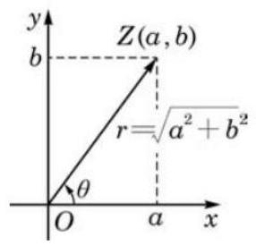

3、设复数 ${z}_{1} = r\left( {\cos \alpha  + i\sin \alpha }\right) ,{z}_{2} = s\left( {\cos \beta  + i\sin \beta }\right)$ 则:

${z}_{1}{z}_{2} = {rs}\left\lbrack  {\cos \left( {\alpha  + \beta }\right)  + \mathrm{i}\sin \left( {\alpha  + \beta }\right) }\right\rbrack  ;$

$\frac{{z}_{1}}{{z}_{2}} = \frac{r}{s}\left\lbrack  {\cos \left( {\alpha  - \beta }\right)  + \mathrm{i}\sin \left( {\alpha  - \beta }\right) }\right\rbrack  \left( {{z}_{2} \neq  0}\right) .$

4、设复数 $z = r\left( {\cos \alpha  + i\sin \alpha }\right) , r = \left| z\right|  \geq  0$

${z}^{n} = {r}^{n}\left( {\cos {n\alpha } + \mathrm{i}\sin {n\alpha }}\right) ;$

$z$ 的 $n$ 次方根为

$\sqrt[n]{r}\left( {\cos \frac{\alpha  + {2k\pi }}{n} + \mathrm{i}\sin \frac{\alpha  + {2k\pi }}{n}}\right) , k = 0,1,2,\cdots , n - 1.$

## 一、基础练习

1、已知复数 $z = \frac{{\left( \sqrt{3} + \mathrm{i}\right) }^{3}}{{\left( 3 - 4\mathrm{i}\right) }^{2}}$ ，则 $\left| z\right|  =$ ___；

2、 $3 + {4i}$ 的平方根为___；

3、已知 $\left| z\right|  = 2$ ，求 $\left| {1 - \sqrt{3}i + z}\right|$ 的的最大值是___；

4、已知复数 ${z}_{1}\text{ 、 }{z}_{2}$ 满足 $\left| {z}_{1}\right|  = \left| {z}_{2}\right|  = \left| {{z}_{1} - {z}_{2}}\right|  = 1$ ，则 $\left| {{z}_{1} + {z}_{2}}\right|  =$ ___；

5、求满足 $\left| {z + 1}\right|  + \left| {z - 1}\right|  = 2$ 条件的复数 $z$ 对应的点的轨迹方程是___；

6、若 $\left| z\right|  = 1$ ，则 $\left| {z + \frac{1}{z}}\right|$ 的取值范围是___；

7、若 $z$ 为虚数,且 $z + \frac{9}{z} \in  R$ ,则 $\left| z\right|  =$ ___； $\left| {z + 3 + {4i}}\right|$ 的取值范围是___；

8、已知 $\alpha ,\beta$ 为实系数二次方程 $a{x}^{2} + {bx} + c = 0$ 两根， $\alpha$ 为虚数，且 $\frac{{\alpha }^{2}}{\beta } \in  R$ 则 $\frac{\alpha }{\beta } =$ ___；

9、若复数 $z = 1 + \mathrm{i}$ ( $\mathrm{i}$ 为虚数单位)是方程 ${x}^{2} + {cx} + d = 0$ ( $c\text{ 、 }d$ 均为实数)的一个根， 则 $\left| {c + d\mathrm{i}}\right|  =$ ___； 10、已知 $1 - {2i}$ 是方程 ${x}^{2} - {4x} + k = 0$ 的一个根，则 $k =$ ___；

## 二、综合提高

1、已知 $a\text{ 、 }b \in  \mathbf{R},\mathrm{i}$ 是虚数单位， ${z}_{1} = a - \mathrm{i}\text{ 、 }{z}_{2} = 2 + b\mathrm{i}$ 在复平面上对应的点分别为 $A\text{ 、 }B$ , 设 $O$ 为坐标原点,记 $\overrightarrow{OC} = \overrightarrow{OA} + \overrightarrow{OB}$ ,若 $\overrightarrow{OA} \bot  \overrightarrow{OB}$ ,且点 $C$ 在 $y$ 轴上,则 $\overrightarrow{OA}$ 与 $\overrightarrow{AB}$ 的夹角为___；

2、实系数一元二次方程 $a{x}^{2} + {bx} + 1 = 0\left( {{ab} \neq  0}\right)$ 的两个虚根 ${z}_{1}\text{ 、 }{z}_{2},{z}_{1}$ 的实部 $\operatorname{Re}\left( {z}_{1}\right)  < 0$ , 则 $\frac{{20}^{m} + {21}^{m} - {2020}{z}_{1}}{{29}^{m} - {2020}{z}_{2}}$ 的模等于 1,则实数 $m =$ ___；

3、已知复数 ${z}_{1} = \cos \alpha  + \mathrm{i}\sin \alpha ,{z}_{2} = \cos \beta  - \mathrm{i}\sin \beta$ ，且 ${z}_{1} - {z}_{2} = \frac{5}{13} + \frac{12}{13}\mathrm{i}$ ，其中 $\mathrm{i}$ 是虚数单位，则 $\cos \left( {\alpha  + \beta }\right)$ 的值为___；

4、已知复数 $z$ 满足 $\left( {z + 1}\right) \left( {\bar{z} + 1}\right)  = {\left| z\right| }^{2}$ ，且 $\frac{z - 1}{z + 1}$ 为纯虚数，则 $z$ 的辐角主值为___；

5、已知关于 $x$ 的方程 ${x}^{2} - \left( {6 + \mathrm{i}}\right) x + 9 + a\mathrm{i} = 0\;\left( {a \in  \mathbf{R}}\right)$ 有实数根 $b$ ,若复数 $z$ 满足 $\left| {\bar{z} - a - b\mathrm{i}}\right|  = 2\left| z\right|$ ,则 $\left| z\right|$ 的最小值为___；

6、设两个复数集 $M = \left\{  {z \mid  z = a + \left( {1 - {a}^{2}}\right) \mathrm{i}, a \in  \mathbf{R}}\right\}  , N = \left\{  {z \mid  z = \sin \theta  + \left( {m - \frac{\sqrt{3}}{2}\sin {2\theta }}\right) \mathrm{i},}\right. \; \left. {m \in  \mathbf{R},\theta  \in  \left\lbrack  {0,\frac{\pi }{2}}\right\rbrack  }\right\}$ ，已知 $M \cap  N \neq  \varnothing$ ，则实数 $m$ 的取值范围为___；

7、在复平面内,设点 $A\text{ 、 }P$ 所对应的复数分别为 $\pi \mathrm{i}\text{ 、 }\cos \left( {{2t} - \frac{\pi }{3}}\right)  + \mathrm{i}\sin \left( {{2t} - \frac{\pi }{3}}\right)$ (i 为虚数

单位),则当 $t$ 由 $\frac{\pi }{12}$ 连续变到 $\frac{\pi }{4}$ 时,向量 $\overrightarrow{AP}$ 所扫过的图形区域的面积是___；

8、设非零复数 $x\text{ 、 }y$ 满足 ${x}^{2} + {xy} + {y}^{2} = 0$ ，则 ${\left( \frac{x}{x + y}\right) }^{2020} + {\left( \frac{y}{x + y}\right) }^{2020}$ 的值为___；

9、在复数范围内，下列命题中为真命题的个数为___；

A. 若 ${z}_{1} - {z}_{2} > 0$ ,则 ${z}_{1} > {z}_{2}$ B. 若 ${\left( {z}_{1} - {z}_{2}\right) }^{2} + {\left( {z}_{2} - {z}_{3}\right) }^{2} = 0$ ,则 ${z}_{1} = {z}_{2} = {z}_{3}$

C. $\left| {{z}_{1} - {z}_{2}}\right|  = \sqrt{{\left( {z}_{1} + {z}_{2}\right) }^{2} - 4{z}_{1}{z}_{2}}$ D. 若 ${z}_{1}^{2} = {z}_{2}^{2}$ ,则 ${z}_{1} \cdot  \overline{{z}_{1}} = {z}_{2} \cdot  \overline{{z}_{2}}$

10、已知复数 ${z}_{1}$ 和 ${z}_{2}$ 满足 $\left| {{z}_{1} - 8 - {14}\mathrm{i}}\right|  = \sqrt{5}\left| {{z}_{1} - 4 - 6\mathrm{i}}\right| ,\left| {{z}_{1} - {z}_{2}}\right|  = 3$ ,则 $\left| \overline{{z}_{2}}\right|$ 的取值范围是___；

11、已知向量 $\overrightarrow{a} = \left( {\cos {2\theta }, - 2}\right) ,\overrightarrow{b} = \left( {1, - {\sin }^{2}\theta }\right) , m = \overrightarrow{a} \cdot  \overrightarrow{b} + 2$ ,在复平面坐标系中, $\mathrm{i}$ 为虚数单位,复数 ${z}_{1} = \frac{m + \mathrm{i}}{1 - \mathrm{i}}$ 对应的点为 ${Z}_{1}$ .

(1)求 $\left| {z}_{1}\right|$ ；

(2) $Z$ 为曲线 $\left| {z - 2\overline{{z}_{1}}}\right|  = 1$ ( $\overline{{z}_{1}}$ 为 ${z}_{1}$ 的共轭复数)上的动点，求 $Z$ 与 ${Z}_{1}$ 之间的最小距离；

(3)若 $\theta  = \frac{\pi }{6}$ ，求 $\overrightarrow{a}$ 在 $\overrightarrow{b}$ 上的投影向量 $\overrightarrow{n}$ .

12、已知关于 $x$ 的方程 ${x}^{2} + x + m = 0\left( {m \in  \mathbf{R}}\right)$ 的两根为 $\alpha \text{ 、 }\beta$ .

(1)若 $\left| {\alpha  - \beta }\right|  = 5$ ，求 $m$ 的值；

(2)求 $\left| \alpha \right|  + \left| \beta \right|$ 的值.

13、设 $z$ 是虚数,满足 $\omega  = z + \frac{1}{z}$ 是实数,且 $- 1 < \omega  < 2$ .

(1)求 $\left| z\right|$ 的值及 $z$ 的实部的取值范围；

(2)设 $u = \frac{1 - z}{1 + z}$ ，求证: $u$ 是纯虚数；

(3)求 $\omega  - {u}^{2}$ 的最小值。

## 第十六讲:立体几何复习 1

## 立体几何主要研究空间点、线、面、多面体、旋转体的位置关系和数量关系, 位置关系主 要是研究两个特殊的关系: 平行和垂直; 数量关系包括: 距离、角、表面积和体积。

## 立体几何中的几个难点问题:

一、反证法的书写(证明题)

二、异面直线的距离问题

三、截面作图

四、二面角和三垂线定理的应用

五、斜几何体中的角、距离、表面积和体积问题

六、祖暅原理的应用

七、立体几何中的轨迹问题

八、立体几何中的最值问题

九、空间向量的应用

## 一、证明题

1、已知直线 $a$ 与平面 $\alpha$ 平行，过直线 $a$ 的任意平面 $\beta$ 与平面 $\alpha$ 相交于直线 $b$ 。

求证: $a//b$

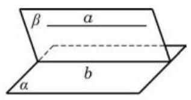

2、(1)请用文字语言叙述直线与平面平行的判定定理;

(2)把(1)中的定理写成 “已知: ······，求证: ……” 的形式，并用反证法证明；

(3)如图，在正方体 ${ABCD} - {A}_{1}{B}_{1}{C}_{1}{D}_{1}$ 中，点 $N$ 在 ${BD}$ 上，点 $M$ 在 ${B}_{1}C$ 上，且 ${CM} = {DN}$ ， 求证: ${MN}//$ 平面 $A{A}_{1}{B}_{1}B$ . (用 (1) 中所写定理证明)

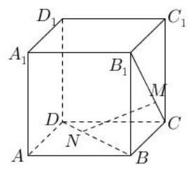

## 二、截面问题

1、如图，正方体 ${ABCD} - {A}_{1}{B}_{1}{C}_{1}{D}_{1}$ 中， $E, F, G$ 分别在 ${AB},{BC},{DD}_{1}$ 上，作过 $E, F, G$ 三点的截面。(两点共面)

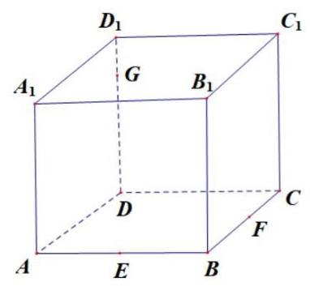

2、如图，正方体 ${ABCD} - {A}_{1}{B}_{1}{C}_{1}{D}_{1}$ 的棱长为 1， $P$ 为 ${BC}$ 的中点， $Q$ 为线段 $C{C}_{1}$ 上的动点， 过点 $A, P, Q$ 的平面截正方体所得的截面记为 $S$ ，则下列正确命题的序号为___；

① 当 $0 < {CQ} < \frac{1}{2}$ 时， $S$ 为四边形；② 当 ${CQ} = \frac{1}{2}$ 时， $S$ 为等腰梯形；③ 当 ${CQ} = \frac{3}{4}$ 时， $S$ 与 ${C}_{1}{D}_{1}$ 的交点 $R$ 满足 ${C}_{1}R = \frac{1}{3}$ ; ④当 $\frac{3}{4} < {CQ} < 1$ 时， $S$ 为六边形。

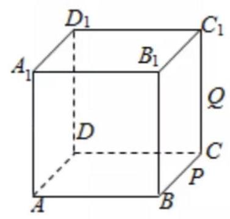

3、如图所示，底面直径为 20 的圆柱，被与底面成 ${60}^{ \circ  }$ 的二面角的平面所截，截面是一个椭圆, 则椭圆的焦距为___.

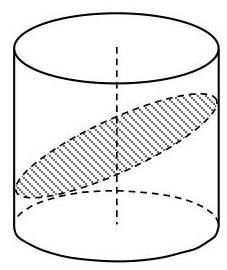

## 三、异面直线之间的距离

1、在棱长为 1 的正方体 ${ABCD} - {A}_{1}{B}_{1}{C}_{1}{D}_{1}$ 中；

(1)求异面直线 $A{B}_{1}$ 与 ${CD}$ 的距离；

(2)求异面直线 $B{D}_{1}$ 与 ${A}_{1}{C}_{1}$ 的距离；

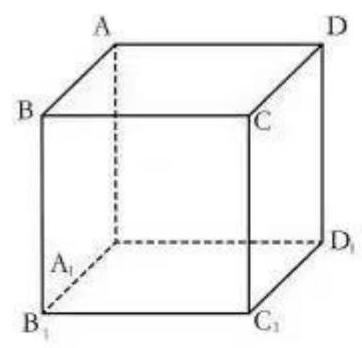

## 四、祖暅原理的应用

1、由曲线 ${x}^{2} = {2y},{x}^{2} =  - {2y}, x = 2, x =  - 2$ 围成的图形绕 $y$ 轴旋转一周得到的旋转体的体积为 ${V}_{1}$ ,满足: ${x}^{2} + {y}^{2} \leq  4,{x}^{2} + {\left( y - 1\right) }^{2} \geq  1,{x}^{2} + {\left( y + 1\right) }^{2} \geq  1$ 的点组成的图形绕 $y$ 轴旋转一周所得到的旋转体的体积为 ${V}_{2}$ ，试写出 ${V}_{1}$ 与 ${V}_{2}$ 的一个关系式___.

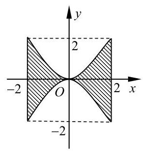

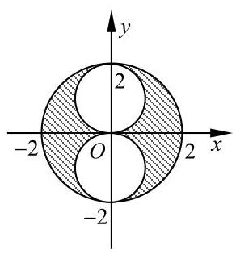

2、在 ${xOy}$ 平面上，将两个半圆弧 ${\left( x - 1\right) }^{2} + {y}^{2} = 1\left( {x \geq  1}\right)$ 和 ${\left( x - 3\right) }^{2} + {y}^{2} = 1\left( {x \geq  3}\right)$ 、两条直线 $y = 1$ 和 $y =  - 1$ 围成的封闭图形记为 $D$ ,如图中阴影部分. 记 $D$ 绕 $y$ 轴旋转一周而成的几何体为 $\Omega$ ,过 $\left( {0, y}\right) \left( {\left| y\right|  \leq  1}\right)$ 作 $\Omega$ 的水平截面,所得截面面积为 ${4\pi }\sqrt{1 - {y}^{2}} + {8\pi }$ ,试利用祖暅原理、一个平放的圆柱和一个长方体，得出 $\Omega$ 的体积值为___.

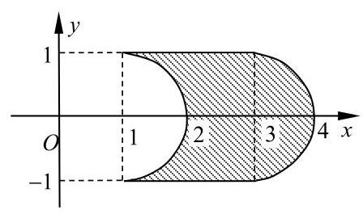

## 五、轨迹问题

1、在正方体 ${ABCD} - {A}_{1}{B}_{1}{C}_{1}{D}_{1}$ 的棱长为 1，点 $M$ 在棱 ${AB}$ 上，且 ${AM} = \frac{1}{3}$ ，点 $P$ 是平面 ${ABCD}$ 上的动点，且动点 $P$ 到直线 ${A}_{1}{D}_{1}$ 的距离与动点 $P$ 到点 $M$ 的距离的平方差为 1 ，则动点 $P$ 的轨迹为( )

B. 抛物线 C. 双曲线 D. 直线

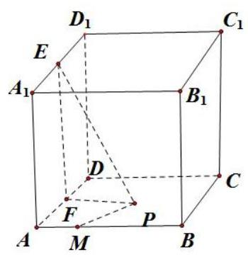

2、正方体 ${ABCD} - {A}_{1}{B}_{1}{C}_{1}{D}_{1}$ 中,面 ${AB}{B}_{1}{A}_{1}$ 上的点 $P$ 到异面直线 ${AB},{A}_{1}{D}_{1}$ 的距离相等,且 ${PA} = {PB}$ ，则 ${AC}$ 与 ${AP}$ 所成角的大小为___.

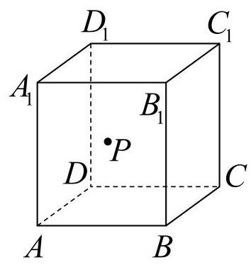

3、如图， $P$ 是棱长为 1 的正方体 ${ABCD} - {A}_{1}{B}_{1}{C}_{1}{D}_{1}$ 表面上的动点，且 ${AP} = \sqrt{2}$ ，则动点 $P$ 的轨迹长度为___

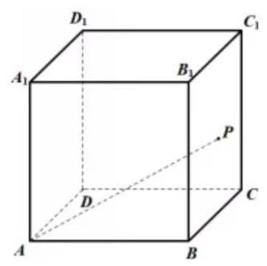

4、在棱长为 1 的正方体 ${ABCD} - {A}_{1}{B}_{1}{C}_{1}{D}_{1}$ 中，以 $A$ 为球心半径为 $\frac{2\sqrt{3}}{3}$ 的球面与正方体表面的交线的长为___；

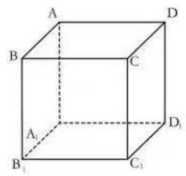

5、如图，在棱长为 6 的正方体 ${ABCD} - {A}_{1}{B}_{1}{C}_{1}{D}_{1}$ 中，长度为 4 的线段 ${MN}$ 的一个端点 $N$ 在 $D{D}_{1}$ 上运动,另一个端点 $M$ 在底面 ${ABCD}$ 上运动,则 ${MN}$ 的中点 $P$ 的轨迹与过顶点 $D$ 的正方体的三个面所围成的几何体的体积为___；

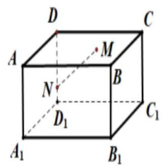

## 六、二面角和三垂线定理

1、锐二面角 $\alpha  - l - \beta$ ，直线 ${AB} \subset  \alpha$ ， ${AB}$ 与 $l$ 所成的角为 ${45}^{ \circ  }$ ， ${AB}$ 与平面 $\beta$ 成 ${30}^{ \circ  }$ 角， 则二面角 $\alpha  - l - \beta$ 的大小为___.

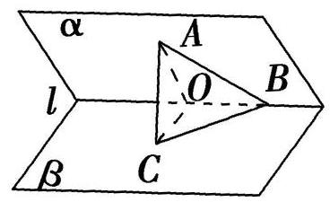

2、如图所示，在四棱锥 $P - {ABCD}$ 中，底面 ${ABCD}$ 为矩形， ${PA}\bot$ 平面 ${ABCD}$ ，点 $E$ 在线段 ${PC}$ 上， ${PC} \bot$ 平面 ${BDE}$ 。

(1)证明: ${BD} \bot$ 平面 ${PAC}$ ；

(2)若 ${PA} = 1,{AD} = 2$ ，求二面角 $B - {PC} - A$ 的正切值；

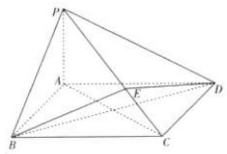

3、在直三棱柱 ${ABC} - {A}_{1}{B}_{1}{C}_{1}$ 中， $\angle {BAC} = {90}^{ \circ  }$ ， ${AB} = {B{B}_{1}} = 1$ ，直线 ${B}_{1}C$ 与平面 ${ABC}$ 成 ${30}^{ \circ  }$ 角,求二面角 $B - {B}_{1}C - A$ 的正弦值。

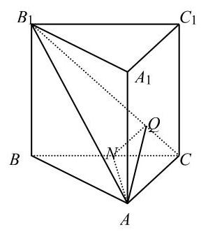

## 第十七讲:立体几何复习 2

## 一、填空题

1、已知三棱锥 $P - {ABC}$ 的三条侧棱两两垂直，且它们的长度分别为 1、1、 $\sqrt{2}$ ，则此三棱锥的高为___

2、已知异面直线 $a, b$ 所成角为 ${70}^{ \circ  }$ ，过空间定点 $P$ 与 $a, b$ 成 ${55}^{ \circ  }$ 角的直线共有___条

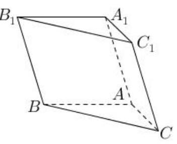

3、如图，在斜三棱柱 ${ABC} - {A}_{1}{B}_{1}{C}_{1}$ 的底面 $\bigtriangleup  {ABC}$ 中， $\angle {BAC} = {90}^{ \circ  }$ ，且 $B{C}_{1}\bot {AC}$ ，过 ${C}_{1}$ 作 ${C}_{1}H\bot$ 底面 ${ABC}$ 垂足为 $H$ ,则点 $H$ 在( )

A. 直线 ${AC}$ 上 B. 直线 ${AB}$ 上

C. 直线 ${BC}$ 上 D. $\bigtriangleup {ABC}$ 内部

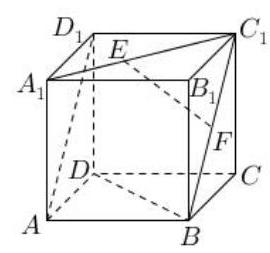

4、如图，已知正方体 ${ABCD} - {A}_{1}{B}_{1}{C}_{1}{D}_{1}$ 中， $F$ 为线段 $B{C}_{1}$ 的中点， $E$ 为线段 ${A}_{1}{C}_{1}$ 上的动点，则下列四个结论正确的是( )

A. 存在点 $E$ ,使 ${EF}//{BD}$

B. 存在点 $E$ ,使 ${EF} \bot$ 平面 $A{B}_{1}{C}_{1}D$

C. ${EF}$ 与 $A{D}_{1}$ 所成的角不可能等于 ${60}^{ \circ  }$

D. 三棱锥 ${B}_{1} - {ACE}$ 的体积随动点 $E$ 变化而变化

5、我们知道，在平面几何中，已知 $\bigtriangleup  {ABC}$ 三边边长分别为 $a, b, c$ ，面积为 $S$ ，在 $\bigtriangleup  {ABC}$ 内一点到三条边的距离相等设为 $r$ ,则有 $S = \frac{1}{2}\left( {a + b + c}\right) r$ . 现有三棱锥 $A - {BCD}$ 的两条棱 ${AB} = {CD} = 6$ ，其余各棱长均为 5，三棱锥 $A - {BCD}$ 内有一点 $O$ 到四个面的距离相等，则此距离等于___

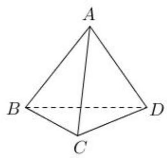

## 二、斜几何体体积问题

1、如图，在斜三棱柱 ${ABC} - {A}_{1}{B}_{1}{C}_{1}$ 中， $\angle {A}_{1}{AC} = \angle {ACB} = \frac{\pi }{2}$ ， $\angle {A{A}_{1}C} = \frac{\pi }{6}$ ，侧棱 $B{B}_{1}$ 与底面所成的角为 $\frac{\pi }{3}, A{A}_{1} = 4\sqrt{3},{BC} = 4$ . 求斜三棱柱 ${ABC} - {A}_{1}{B}_{1}{C}_{1}$ 的体积 $V$ .

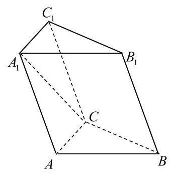

2、三棱锥 $S - {ABC}$ 中， $E, F, G, H$ 分别为 ${SA},{AC},{BC},{SB}$ 的中点，则截面 ${EFGH}$ 将三棱锥 $S - {ABC}$ 分成两部分的体积之比为___.

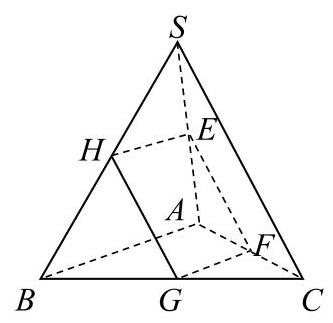

## 三、立体几何中的最值问题

1、正方体 ${ABCD} - {A}_{1}{B}_{1}{C}_{1}{D}_{1}$ 的棱长为 $1, M$ 、 $N$ 分别在线段 ${A}_{1}{C}_{1}$ 与 ${BD}$ 上，求 ${MN}$ 的最小值。

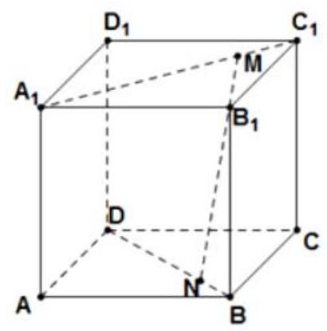

2、正三棱柱 ${ABC} - {A}_{1}{B}_{1}{C}_{1}$ 中，各棱长均为 $2, M$ 为 $A{A}_{1}$ 中点， $N$ 为 ${BC}$ 的中点，则在棱柱的表面上从点 $M$ 到点 $N$ 的最短距离是多少?

3、一个圆锥轴截面的顶角为 $\frac{5\pi }{6}$ ，母线为 2，过顶点作圆锥的截面中，最大截面面积为___；

4、如图，在正方体 ${ABCD} - {A}_{1}{B}_{1}{C}_{1}{D}_{1}$ 中，点 $P$ 在线段 ${A}_{1}C$ 上运动，异面直线 ${BP}$ 与 $A{D}_{1}$ 所成角为 $\theta$ ,则 $\theta$ 的最小值为___

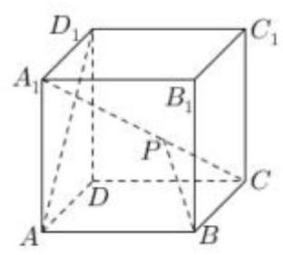

5、已知在 $\bigtriangleup  {ABC}$ 中， $\angle C = {90}^{ \circ  }$ ， ${PA}\bot$ 平面 ${ABC}$ ， ${AE}\bot {PB}$ 于 $E$ ， ${AF}\bot {PC}$ 于 $F$ ， ${AP} = {AB} = 2$ ， $\angle {AEF} = \theta$ ，当 $\theta$ 变化时，求三棱锥 $P - {AEF}$ 体积的最大值。

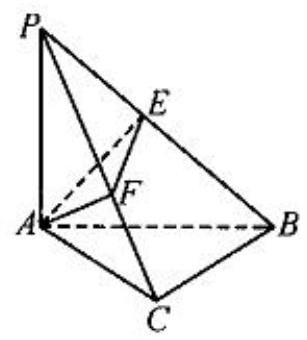

6、在棱长为 1 的正方体 ${ABCD} - {A}_{1}{B}_{1}{C}_{1}{D}_{1}$ 中，点 ${P}_{1},{P}_{2}$ 分别是线段 ${AB}, B{D}_{1}$ (不包括端点)。 上的动点,且线段 ${P}_{1}{P}_{2}$ 平行于平面 ${A}_{1}{AD}{D}_{1}$ ,则四面体 ${P}_{1}{P}_{2}A{B}_{1}$ 的体积的最大值是

A. $\frac{1}{24}$ B. $\frac{1}{12}$ C. $\frac{1}{6}$ D. $\frac{1}{2}$

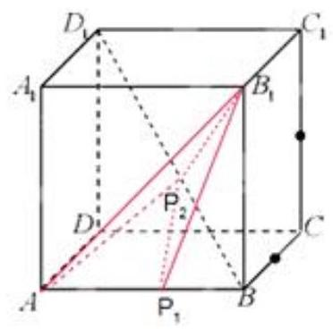

## 四、空间向量处理立体几何问题

1、如图，在四棱锥 $P - {ABCD}$ 中，底面为直角梯形， ${AD}//{BC}$ ， $\angle {BAD} = {90}^{ \circ  }$ ， ${PA}$ 垂直于底面 ${ABCD},{PA} = {AD} = {AB} = {2BC} = 2, M\text{ 、 }N$ 分别为 ${PC}\text{ 、 }{PB}$ 的中点.

(1)求证: ${PB}\bot {DM}$ ；(2)求 ${BD}$ 与平面 ${ADMN}$ 所成的角.

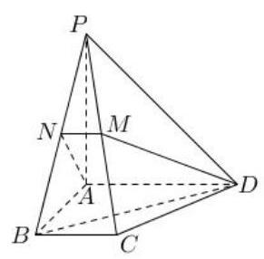

2、如图，三棱柱 ${ABC} - {A}_{1}{B}_{1}{C}_{1}$ 的底面是等腰直角三角形， $\angle {ACB} = \angle {BC}{C}_{1} = {90}^{ \circ  }$ ， 四边形 ${AC}{C}_{1}{A}_{1}$ 是菱形， $\angle {{AC}{C}_{1}} = {120}^{ \circ  }$ .

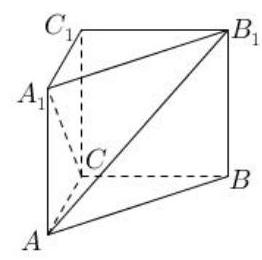

(1)证明: ${A}_{1}C \bot  A{B}_{1}$ ；

( 2 )若 ${AC} = 2$ ，求点 ${C}_{1}$ 到平面 ${AB}{B}_{1}{A}_{1}$ 的距离.

3、如图，四棱锥 $P - {ABCD}$ 中， $\angle {ABC} = \angle {ACD} = {90}^{ \circ  }$ ， $\angle {BAC} = \angle {CAD} = {60}^{ \circ  }$ ， ${PA} \bot$ 平面 ${ABCD},{PA} = 2,{AB} = 1$ ,设 $M\text{ 、 }N$ 分别为 ${PD}\text{ 、 }{AD}$ 的中点.

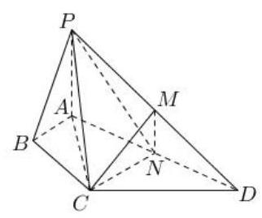

(1)求证:平面 ${CMN}//$ 平面 ${PAB}$ ；

(2)求三棱锥 $A - {CMN}$ 的侧面积.

## 第十八讲:等差数列和等比数列

## 知识点梳理:

## 一、等差数列

1、等差数列的定义: ${a}_{n} - {a}_{n - 1} = d\left( {n \geq  2, n \in  N}\right)$ 或 ${a}_{n + 1} - {a}_{n} = d\left( {n \geq  1, n \in  N}\right)$

2、单调性: $d = 0$ 常数列； $d > 0$ 严格递增数列； $d < 0$ 严格递减数列

3、等差数列的通项公式: ${a}_{n} = {a}_{1} + \left( {n - 1}\right) d$ ,其中 ${a}_{1}$ 为首项

4、 ${a}_{n} = {a}_{m} + \left( {n - m}\right) d \Rightarrow  d = \frac{{a}_{n} - {a}_{m}}{n - m}$

5、若数列相邻三项之间存在以下关系: $2{a}_{n} = {a}_{n - 1} + {a}_{n + 1}\left( {n \geq  2}\right)$ ,则该数列是等差数列。

6、等差数列的前 $\mathrm{n}$ 项和: $\;{S}_{\mathrm{n}} = \frac{n\left( {{a}_{1} + {a}_{n}}\right) }{2} = n{a}_{1} + \frac{n\left( {n - 1}\right) }{2}d$

7、等差数列的性质:

性质 1:. $p + q = m + n \Rightarrow  {a}_{p} + {a}_{q} = {a}_{m} + {a}_{n}$

性质 2: $p, q, r$ 成等差数列 $\Rightarrow  {a}_{p},{a}_{q},{a}_{r}$ 成等差数列

性质 3: ${S}_{m},{S}_{2m} - {S}_{m},{S}_{3m} - {S}_{2m}$ 成等差数列

性质 4: 若 $\left\{  {a}_{n}\right\}  ,\left\{  {b}_{n}\right\}$ 均为等差数列,则 $\left\{  {{a}_{n} \pm  {b}_{n}}\right\}$ 或 $\left\{  {k{a}_{n} \pm  {b}_{n}}\right\}$ 也是等差数列

8、等差数列的判定方法:

(1)定义法:

(2)中项法:

(3)通项公式法: ${a}_{n} = {kn} + b$

(4)前 $n$ 项和公式法: ${S}_{n} = A{n}^{2} + {Bn}$

9、等差数列通项 ${a}_{n}$ 与前 $n$ 项和 ${S}_{\mathrm{n}}$ 的关系: ${a}_{n} = \left\{  \begin{array}{l} {S}_{1}\;n = 1 \\  {S}_{n} - {S}_{n - 1}\;n \geq  2 \end{array}\right.$

## 二、等比数列

1、等比数列的定义: $\frac{{a}_{n}}{{a}_{n - 1}} = q\left( {n \geq  2, n \in  N}\right)$ 或 $\frac{{a}_{n + 1}}{{a}_{n}} = q\left( {n \geq  1, n \in  N}\right)$

2、等比数列的通项公式: ${a}_{n} = {a}_{1} \cdot  {q}^{n - 1}$ 或 ${a}_{n} = {a}_{m} \cdot  {q}^{n - m}$

3、等比数列单调性的研究:

4、等比中项: 若 $a, b, c$ 三个数成等比数列,则 $b$ 叫做 $a$ 和 $c$ 的等比中项,此时 ${b}^{2} = {ac}$

5、若数列相邻三项之间存在以下关系: ${a}_{n}{}^{2} = {a}_{n - 1} \cdot  {a}_{n + 1}$ ,则该数列是等比数列。

6、等比数列的前 $\mathrm{n}$ 项和公式及其推导过程: ${S}_{n} = \left\{  \begin{array}{l} n{a}_{1}, q = 1 \\  \frac{{a}_{1}\left( {1 - {q}^{n}}\right) }{1 - q}, q \neq  1 \end{array}\right.$

6、等比数列的性质:

性质 1: 若 $m + n = p + q$ ,则 ${a}_{m} \cdot  {a}_{n} = {a}_{p} \cdot  {a}_{q}$

性质 2: ${S}_{m},{S}_{2m} - {S}_{m},{S}_{3m} - {S}_{2m}$ 成等比数列,公比为___

7、等比数列通项和前 $n$ 项和的特征: ${S}_{n} = A{q}^{n} - A$

## 一、基础题训练

1、在等差数列 $\left\{  {a}_{n}\right\}$ 中，若 ${a}_{1} = 2,{a}_{12} = {62}$ ，则前 15 项之和 ${S}_{15} =$ ___；

2、在首项为 21，公比为 $\frac{1}{2}$ 的等比数列中，最接近于 1 的项是第___项

3、记等差数列 $\left\{  {a}_{n}\right\}$ 的前 $n$ 项和为 ${S}_{n}$ ,若公差 $d > 0,\left( {{S}_{8} - {S}_{5}}\right) \left( {{S}_{9} - {S}_{5}}\right)  < 0$ ,则 ( )

A. ${a}_{7} = 0$ B. $\left| {a}_{7}\right|  = \left| {a}_{8}\right|$ C. $\left| {a}_{7}\right|  > \left| {a}_{8}\right|$ D. $\left| {a}_{7}\right|  < \left| {a}_{8}\right|$

4、各项均为实数的等比数列前 $n$ 项为 ${S}_{n}$ ，已知 ${S}_{10} = {10},{S}_{30} = {70}$ ，则 ${S}_{40} =$ ___

5、在等差数列 $\left\{  {a}_{n}\right\}$ 中， ${a}_{5} + {a}_{8} + {a}_{11} + {a}_{14} = {36}$ ，则前 18 项之和。___；

6、在等差数列 $\left\{  {a}_{n}\right\}$ 中， ${a}_{1} = {25},{S}_{9} = {\mathrm{S}}_{17}$ ，则数列前___项之和最大；

7、设 ${S}_{n},{T}_{n}$ 分别是等差数列 $\left\{  {a}_{n}\right\}  ,\left\{  {b}_{n}\right\}$ 的前 $\mathrm{n}$ 项，若 $\frac{{S}_{n}}{{T}_{n}} = \frac{2n}{{3n} + 1}$ ，则 $\frac{{a}_{n}}{{b}_{n}} =$ ( ).

(A) $\frac{2}{3}$ (B) $\frac{{2n} - 1}{{3n} - 1}$ (C) $\frac{{2n} + 1}{{3n} + 1}$ (D) $\frac{{2n} - 1}{{3n} + 4}$

8、已知项数为偶数的等比数列 $\left\{  {a}_{n}\right\}$ 中, ${a}_{1} = 1$ ,奇数项和为 85,偶数项和为 170,则它的公比与项数分别是 $\;$ (   )

(A)-2,4 (B) 2,4 (C) -2,8 (D) 2,8

9、已知数列 $\left\{  {a}_{n}\right\}$ 的通项为 ${a}_{n} = \left( {8 - n}\right)  \cdot  {2}^{n - 3}\left( {n \in  {\mathbf{N}}^{ * }}\right)$ ,则 $\left\{  {a}_{n}\right\}$ 中最大项的值是___

10、若等差数列 $\left\{  {a}_{n}\right\}$ 的首项为 $\left\{  {a}_{1}\right\}$ ，公差为 $d$ ，前项的和为 ${S}_{n}$ ，则数列 $\left\{  \frac{{S}_{n}}{n}\right\}$ 为等差数列， 且通项为 $\frac{{S}_{n}}{n} = {a}_{1} + \left( {n - 1}\right)  \cdot  \frac{d}{2}$ 。类似地,请完成下列命题: 若各项均为正数的等比数列 $\left\{  {b}_{n}\right\}$ 的首项为 ${b}_{1}$ ，公比为 $q$ ，前项的积为 ${T}_{n}$ ，则___。

## 二、综合提高

1、已知数列 $\left\{  {a}_{n}\right\}$ 是以 -2 为公差的等差数列， ${S}_{n}$ 是其前 $n$ 项和，若 ${S}_{7}$ 是数列 $\left\{  {a}_{n}\right\}$ 中的唯一最大项，则 ${a}_{1}$ 的取值范围为___

2、 $\left\{  {a}_{n}\right\}$ 是由实数构成的无穷等比数列， ${S}_{n} = {a}_{1} + {a}_{2} + \cdots  + {a}_{n}$ ，关于数列 $\left\{  {S}_{n}\right\}$ ，给出下列命题:① 数列 $\left\{  {S}_{n}\right\}$ 中任意一项均不为 0 ；② 数列 $\left\{  {S}_{n}\right\}$ 中必有一项为 0 ；③ 数列中或者任意一项不为 0 ; 或者有无穷多项为 0 ; ④ 数列 $\left\{  {S}_{n}\right\}$ 中一定不可能出现 ${S}_{n} = {S}_{n + 2}$ ; ⑤ 数列 $\left\{  {S}_{n}\right\}$ 中一定不可能出现 ${S}_{n} = {S}_{n + 3}$ . 其中正确的命题是( )

A. ①③ B. ②④ C. ③⑤ D. ②⑤

3、数列 $\left\{  {a}_{n}\right\}$ 满足 ${a}_{n + 1} = \left| {{a}_{n} - 4}\right|  + 2\left( {n \in  {\mathbf{N}}^{ * }}\right)$ ，如果 $\left\{  {a}_{n}\right\}$ 是一个等差数列，则 ${a}_{1} =$ ___

4、正项等比数列 $\left\{  {a}_{n}\right\}$ 中,存在两项 ${a}_{m}\text{ 、 }{a}_{n}$ 使得 $\sqrt{{a}_{m}{a}_{n}} = 3{a}_{1}$ ,且 ${a}_{6} = 2{a}_{5} + 3{a}_{4}$ , 则 $\frac{1}{m} + \frac{4}{n}$ 的最小值为( )

A. $\frac{7}{3}$ B. $\frac{5}{2}$ C. $\frac{9}{4}$ D. 2

5、设 ${A}_{n}\text{ 、 }{B}_{n}$ 分别为等比数列 $\left\{  {a}_{n}\right\}  \text{ 、 }\left\{  {b}_{n}\right\}$ 的前 $n$ 项和,若 $\frac{{A}_{n}}{{B}_{n}} = \frac{{2}^{n} + a}{{3}^{n} + b}\left( {a\text{ 、 }b}\right)$ 为常数, 则 $\frac{{a}_{7}}{{b}_{4}} =$ (   )

A. $\frac{128}{81}$ B. $\frac{127}{80}$ C. $\frac{32}{27}$ D. $\frac{27}{26}$

6、已知无穷等比数列 $\left\{  {a}_{n}\right\}$ 的公比为 $q$ ,前 $n$ 项和为 ${S}_{n}$ ，且 $\mathop{\lim }\limits_{{n \rightarrow  \infty }}{S}_{n} = S$ ，下列条件中，使得 $2{S}_{n} < S\left( {n \in  {\mathbf{N}}^{ * }}\right)$ 恒成立的是( )

A. ${a}_{1} > 0,{0.6} < q < {0.7}$ B. ${a}_{1} < 0, - {0.7} < q <  - {0.6}$

C. ${a}_{1} > 0,{0.7} < q < {0.8}$ D. ${a}_{1} < 0, - {0.8} < q <  - {0.7}$

7、已知等差数列 $\left\{  {a}_{n}\right\}$ 的前 $n$ 项和 ${S}_{n}$ ，公差 $d \neq  0$ ，且 $\frac{{a}_{1}}{d} \leq  1$ ，记 ${b}_{1} = {S}_{2}$ ， ${b}_{n + 1} = {S}_{{2n} + 2} - {S}_{2n}$ ， $n \in  {\mathbf{N}}^{ * }$ ，下列等式不可能成立的是( )

A. $2{a}_{4} = {a}_{2} + {a}_{6}$ B. $2{b}_{4} = {b}_{2} + {b}_{6}$ C. ${a}_{4}^{2} = {a}_{2}{a}_{8}$ D. ${b}_{4}^{2} = {b}_{2}{b}_{8}$

8、在二项式 ${\left( 1 + 3x\right) }^{n}$ 和 ${\left( 2x + 5\right) }^{n}$ 的展开式中,各项系数之和分别记为 ${a}_{n}\text{ 、 }{b}_{n}, n \in  {\mathbf{N}}^{ * }$ , 则 $\mathop{\lim }\limits_{{n \rightarrow  \infty }}\frac{{a}_{n} - 2{b}_{n}}{3{a}_{n} - 4{b}_{n}} =$ ___

9、将各项均为正数的等比数列 $\left\{  {a}_{n}\right\}$ 的前 $n$ 项和为 ${S}_{n}$ ,若 $\mathop{\lim }\limits_{{n \rightarrow  \infty }}\frac{{S}_{n} - {a}_{n}}{{S}_{n} + {a}_{n}} < \frac{1}{3}$ ,则 $q$ 的取值范围是( )

A. $\left( {0,1}\right)$ B. $\left( {2, + \infty }\right)$ C. $(0,1\rbrack  \cup  \left( {2, + \infty }\right)$ D. $\left( {0,2}\right)$

10、数列 $\left\{  {a}_{n}\right\}$ 中, ${a}_{1} = \frac{37}{39},{a}_{n} = 2 - \frac{1}{{a}_{n - 1}}\left( {n \geq  2, n \in  {\mathbf{N}}^{ * }}\right)$ ,数列 $\left\{  {b}_{n}\right\}$ 满足 ${b}_{n} = \frac{1}{{a}_{n} - 1}$ .

(1)求证:数列 $\left\{  {b}_{n}\right\}$ 是等差数列；

(2)求数列 $\left\{  {a}_{n}\right\}$ 中的最大项与最小项，并说明理由.

11、已知在数列 $\left\{  {a}_{n}\right\}$ 中, ${a}_{1} = {2a},{a}_{n} = {2a} - \frac{{a}^{2}}{{a}_{n - 1}}\left( {n \in  {\mathbf{N}}^{ * }, n \geq  2}\right)$ .

(1)写出 ${a}_{2}\text{ 、 }{a}_{3}\text{ 、 }{a}_{4}$ ；

(2)猜想 ${a}_{n}$ 的表达式，并且用数学归纳法来证明.

12、在无穷数列 $\left\{  {a}_{n}\right\}$ 中， ${a}_{n} \in  {\mathbf{N}}^{ * }$ ，且 ${a}_{n + 1} = \left\{  \begin{array}{l} \frac{{a}_{n}}{2},{a}_{n}\text{ 是偶数 } \\  {a}_{n} + 3,{a}_{n}\text{ 是奇数 } \end{array}\right.$ ，记 $\left\{  {a}_{n}\right\}$ 的前 $n$ 项和为 ${S}_{n}$ .

(1)若 ${a}_{1} = {10}$ ，求 ${S}_{9}$ 的值；

(2)若 ${S}_{3} = {17}$ ，求 ${a}_{1}$ 的值；

(3)证明: $\left\{  {a}_{n}\right\}$ 中必有一项为 1 或 3 .

## 第十九讲:求数列的通项和前 $n$ 项和

## 知识点梳理:

## 一、数列求和方法

1、公式法:

(1)等差数列 $\left\{  {a}_{n}\right\}$ 前 $\mathrm{n}$ 项和: ${S}_{n} = {a}_{1} + {a}_{2} + \cdots  + {a}_{n} = \frac{\left( {{a}_{1} + {a}_{2}}\right) n}{2} = n{a}_{1} + \frac{n\left( {n - 1}\right) }{2}d$

(2)等比数列 $\left\{  {a}_{n}\right\}$ 的前 $\mathrm{n}$ 项和:

$$
{S}_{n} = \left\{  {\begin{array}{ll} n{a}_{1} & q = 1 \\  \frac{{a}_{1}\left( {1 - {q}^{n}}\right) }{1 - q} & q \neq  1 \end{array}\;\text{ 变式 }{S}_{n} = \left\{  \begin{array}{ll} n{a}_{1} & q = 1 \\  \frac{{a}_{1} - {a}_{n}q}{1 - q} & q \neq  1 \end{array}\right. }\right.
$$

(3) ${1}^{2} + {2}^{2} + {3}^{2} + \cdots  + {n}^{2} = \frac{1}{6}n\left( {n + 1}\right) \left( {{2n} + 1}\right)$

(4) ${1}^{3} + {2}^{3} + {3}^{3} + \cdots  + {n}^{3} = {\left\lbrack  \frac{1}{2}n\left( n + 1\right) \right\rbrack  }^{2}$

强调: 等差数列 $\left\{  {a}_{n}\right\}$ 求前 $\mathrm{n}$ 项和公式推导方法: 倒序相加

等比数列 $\left\{  {a}_{n}\right\}$ 求前 $\mathrm{n}$ 项和公式推导方法: 错位相减(突出错项相减的目的性)

2、其它求和方法:

(1)分组求和法:

(2)倒序相加法:

(3)裂项相消法:

(4)错位相减法:

(5)通项化归法:

(6) 奇偶分类讨论法:

## 二、递推求通项

常见类型: 已知 ${a}_{1} = 1$

① ${a}_{n + 1} - {a}_{n} = f\left( n\right)$ 累加法

② $\frac{{a}_{n + 1}}{{a}_{n}} = f\left( n\right) \;$ 累乘法

③ ${a}_{n + 1} = p{a}_{n} + q$ 待定系数法

④ ${a}_{n + 1} = \frac{m{a}_{n}}{p{a}_{n} + q}$ 取倒数

⑤ ${a}_{n + 1} = p{a}_{n}{}^{q}\;$ 取对数

## 一、基础题型

1、已知数列 $\left\{  {a}_{n}\right\}$ 满足 ${a}_{1} = 4,{a}_{n} = 2{a}_{n - 1} + 1\left( {n \geq  2, n \in  \mathbf{N}}\right)$ ,则数列 $\left\{  {a}_{n}\right\}$ 的通项公式为___；

2、已知数列 $\left\{  {a}_{n}\right\}$ 中, ${a}_{1} = 1,{a}_{n} = \frac{2{a}_{n - 1}}{{a}_{n - 1} + 2}\left( {n \geq  2, n \in  \mathbf{N}}\right)$ ,若 $\frac{1}{{a}_{1}} + \frac{1}{{a}_{2}} + \cdots  + \frac{1}{{a}_{m}} = {45}$ , 则 $m =$ ___；

3、已知各项均不为零的数列 $\left\{  {a}_{n}\right\}$ ，定义向量 $\overrightarrow{{c}_{n}} = \left( {{a}_{n},{a}_{n + 1}}\right) ,\overrightarrow{{b}_{n}} = \left( {n, n + 1}\right) , n \in  {\mathbf{N}}^{ * }$ ， 下列命题中真命题是( )

A. 若对任意的 $n \in  {\mathbf{N}}^{ * }$ ，都有 $\overrightarrow{{c}_{n}}//\overrightarrow{{b}_{n}}$ 成立，则数列 $\left\{  {a}_{n}\right\}$ 是等差数列

B. 若对任意的 $n \in  {\mathbf{N}}^{ * }$ ，都有 $\overrightarrow{{c}_{n}}//\overrightarrow{{b}_{n}}$ 成立，则数列 $\left\{  {a}_{n}\right\}$ 是等比数列

C. 若对任意的 $n \in  {\mathbf{N}}^{ * }$ ，都有 $\overrightarrow{{c}_{n}} \bot  \overrightarrow{{b}_{n}}$ 成立，则数列 $\left\{  {a}_{n}\right\}$ 是等差数列

D. 若对任意的 $n \in  {\mathbf{N}}^{ * }$ ，都有 $\overrightarrow{{c}_{n}} \bot  \overrightarrow{{b}_{n}}$ 成立，则数列 $\left\{  {a}_{n}\right\}$ 是等比数列

4、设数列 $\left\{  {a}_{n}\right\}$ 的前 $n$ 项和为 ${S}_{n}$ ，且 ${a}_{n} = {\log }_{2}\left( {1 + \frac{1}{n}}\right)$ ，则满足 ${S}_{n} > {10}$ 的 $n$ 最小值为_________:___

5、设数列 $\left\{  {a}_{n}\right\}$ 的前 $n$ 项和为 ${S}_{n}$ ， ${a}_{1} = 1$ ， ${a}_{n + 1} = {S}_{n}$ ，则 $\mathop{\sum }\limits_{{i = 1}}^{\infty }\frac{1}{{a}_{i}} =$ ___；

6、已知数列 $\left\{  {a}_{n}\right\}$ 的前 $n$ 项和 ${S}_{n}$ 满足 ${S}_{n} = \frac{n\left( {n + 1}\right) }{2}$ ，则数列 $\left\{  \frac{1}{{a}_{n}{a}_{n + 1}}\right\}$ 的前 10 项的和为___；

7、已知数列 $\left\{  {a}_{n}\right\}$ 的前 $n$ 项和 ${S}_{n} = 2{n}^{2} - {12n}$ ,记数列 $\left\{  \left| {a}_{n}\right| \right\}$ 的前 $n$ 项和为 ${T}_{n}$ ,则 $\frac{{T}_{n}}{n}$ 的最小值为___

8、已知数列 $\left\{  {a}_{n}\right\}$ 中, ${a}_{1} = 1,{a}_{1} + 2{a}_{2} + 3{a}_{3} + \cdots  + n{a}_{n} = \frac{n + 1}{2}{a}_{n + 1}\left( {n \in  {\mathbf{N}}^{ * }}\right)$ ,若存在 $n \in  {\mathbf{N}}^{ * }$ ，使得关于 $n$ 的不等式 ${a}_{n} \leq  \left( {n + 1}\right) \lambda$ 成立，则实数 $\lambda$ 的最小值为___

9、已知数列 $\left\{  {a}_{n}\right\}$ 的通项公式为 ${a}_{n} =  - 2{n}^{2} + {9n}\left( {n \in  {\mathbf{N}}^{ * }}\right)$ ,若数列 $\left\{  {a}_{n}\right\}$ 的前 $n$ 项和为 ${S}_{n}$ , 则 ${S}_{n}$ 取得最大值时 $n$ 的值为___

10、对于函数 $y = f\left( x\right)$ ,部分 $x$ 与 $y$ 的对应关系如下表所示:

<table><tr><td>$x$</td><td>1</td><td>2</td><td>3</td><td>4</td><td>5</td><td>6</td><td>7</td><td>8</td><td>9</td></tr><tr><td>$y$</td><td>8</td><td>4</td><td>9</td><td>6</td><td>1</td><td>2</td><td>5</td><td>3</td><td>7</td></tr></table>

数列 $\left\{  {x}_{n}\right\}$ 满足: ${x}_{1} = 2$ ,且对于任意的 $x \in  {\mathbf{N}}^{ * }$ ,点 $\left( {{x}_{n},{x}_{n + 1}}\right)$ 都在函数 $y = f\left( x\right)$ 图像上, 则 ${x}_{1} + {x}_{2} + \cdots  + {x}_{2022} =$ ___

## 二、综合提高

1、已知数列 $\left\{  {a}_{n}\right\}$ 的通项公式为 ${a}_{n} = {2}^{n - 1} + 1$ ，则 ${a}_{1}{C}_{n}^{0} + {a}_{2}{C}_{n}^{1} + {a}_{3}{C}_{n}^{3} + \cdots  + {a}_{n + 1}{C}_{n}^{n} =$ ___.

2、数列 $\left\{  {a}_{n}\right\}$ 中, ${a}_{1} = \frac{1}{5},{a}_{n} + {a}_{n + 1} = \frac{6}{{5}^{n + 1}}, n \in  {\mathbf{N}}^{ * }$ ,则 $\mathop{\lim }\limits_{{n \rightarrow   + \infty }}\mathop{\sum }\limits_{{i = 1}}^{n}{a}_{i} =$

3、数列 $\left\{  {c}_{n}\right\}$ 满足 ${c}_{n} = \frac{{2}^{n + 1}}{\left( {{2}^{n + 1} - 2}\right) \left( {{2}^{n + 1} - 1}\right) }$ ,其前 $n$ 项和为 ${T}_{n}$ ,若 ${T}_{n} < \frac{999}{1000}$ 成立,则 $n$ 的最大值为( )

A. 8 B. 9 C. 10 D. 11

4、已知数列 $\left\{  {a}_{n}\right\}$ 的前 $n$ 项和为 ${S}_{n}$ ,且满足 ${a}_{1} = 1,{a}_{n} > 0,{a}_{n + 1}{}^{2} = 4{S}_{n} + {4n} + 1$ ,若不等式 $4{n}^{2} - {8n} + 3 < \left( {5 - m}\right) {2}^{n} \cdot  {a}_{n}$ 对任意的正整数 $n$ 恒成立，则整数 $m$ 的最大值为( )

A. 3 B. 4 C. 5 D. 6

5、已知数列 $\left\{  {a}_{n}\right\}$ 的前 $n$ 项和 ${S}_{n}$ 满足 ${S}_{n} - {\left( -1\right) }^{n}{a}_{n} = {2n} - 6 + \frac{1}{{2}^{n}}\left( {n \in  {\mathbf{N}}^{ * }}\right)$ ，则 ${S}_{2022} =$ ___

6、已知数列 $\left\{  {a}_{n}\right\}$ 满足 ${a}_{n + 1} = 2{a}_{n} + \frac{2}{{a}_{n}} - 3\left( {n \in  {\mathbf{N}}^{ * }}\right)$ ,若数列 $\left\{  {a}_{n}\right\}$ 是严格增数列,则 ${a}_{1}$ 的取值范围是___

## 第二十讲:概率统计综合应用

## 知识点梳理:

## 一、概率初步

1、样本空间

2、随机事件

3、概率

4、古典概型(1)有限多个结果(2)等可能

5、古典概率的定义: $P\left( A\right)  = \frac{\left| A\right| }{\left| \Omega \right| }$

6、概率的性质:(1)必然事件的概率是 1，不可能事件的概率为 0

(2) $0 \leq  P\left( A\right)  \leq  1$

(3)可加性:如果两个事件不同时发生，则 $P\left( {A \cup  B}\right)  = P\left( A\right)  + P\left( B\right)$

(4)对立事件 $P\left( \bar{A}\right)  = 1 - P\left( A\right)$

7、大数定律:多次重复一个随机试验，事件发生的频率趋于概率

8、事件的独立性:两事件同时发生的概率是两个事件的概率之积。

## 二、统计的相关概念

1、总体与样本

2、抽样调查的方法:简单的随机抽样和分层抽样

3、统计图表:频数分布表、频率分布直方图、茎叶图、散点图

4、统计估计:用样本数据对总体数据进行估计。包括: 总体分布, 数字特征 (平均数、标准差、百分位数)

5、统计活动

## 三、计数原理

1、乘法原理: 分步

2、加法原理: 分类

3、排列组合:

排列数公式: ${P}_{n}^{m} = n\left( {n - 1}\right) \left( {n - 2}\right) \cdots \left( {n - m + 1}\right)  = \frac{n!}{\left( {n - m}\right) !}\left( {m \leq  n}\right)$

规定: $0! = 1,{P}_{n}^{n} = n! = n\left( {n - 1}\right) \left( {n - 2}\right) \cdots 2 \cdot  1;{P}_{n}^{1} = n,{P}_{1}^{1} = 1$

组合数公式: ${C}_{n}^{m} = \frac{n\left( {n - 1}\right) \left( {n - 2}\right) \cdots \left( {n - m + 1}\right) }{m!} = \frac{n!}{m!\left( {n - m}\right) !}\left( {m \leq  n}\right)$

组合数性质: $\left( 1\right) {C}_{n}^{m} = {C}_{n}^{n - m}\;\left( 2\right) {C}_{n}^{m} + {C}_{n}^{m - 1} = {C}_{n + 1}^{m}$ (3) ${C}_{n}^{0} = 1,{C}_{n}^{n} = 1,{C}_{1}^{0} = 1$

## 4、二项式定理

${\left( a + b\right) }^{n} = {C}_{n}^{0}{a}^{n} + {C}_{n}^{1}{a}^{n - 1}b + {C}_{n}^{2}{a}^{n - 2}{b}^{2} + \cdots  + {C}_{n}^{r}{a}^{n - r}{b}^{r} + \cdots  + {C}_{n}^{n}{b}^{n}\left( {n \in  {N}^{ * }}\right)$

1、二项式的系数: ${C}_{n}^{r}\left( {r = 0,1,2,\cdots , n}\right)$

2、二项展开式的通项: ${T}_{r + 1} = {C}_{n}^{r}{a}^{n - r}{b}^{r}\left( {r = 0,1,2,\cdots , n}\right)$

3、二项式系数和: ${C}_{n}^{0} + {C}_{n}^{1} + \cdots  + {C}_{n}^{n - 1} + {C}_{n}^{n} = {2}^{n}$

## 概率初步

1、同时掷两枚骰子，则点数和为 7 的概率是___；

2、一次期中考试，小金同学数学超过 90 分的概率是 0.5 ，物理超过 90 分的概率是 0.7 ，两门课都超过 90 分的概率是 0.3 , 则他的数学和物理至少有一门超过 90 分的概率为___；

3、学生李明上学要经过 4 个路口，前三个路口遇到红灯的概率均为 $\frac{1}{2}$ ，第四个路口遇到红灯的概率为 $\frac{1}{3}$ ,设在各个路口是否遇到红灯互不影响,则李明从家到学校恰好遇到一次红灯的概率为___；

4、某样本平均数为 $a$ ，总体平均数为 $m$ ，则()

A. $a = m$ B. $a > m$ C. $a < m$ D. $a \geq  m$

5、某校共有师生 1800 人，现用分层抽样的方法，从所有师生中抽取一个容量为 150 的样本， 已知从学生中抽取的人数为 140 人，则该校的教师人数是___；

6、惠州市某厂 10 名工人某天生产同一类型的零件，生产的件数分别是 10，12，14，14， 15,15,16,17,17,17,记这组数据的平均数为 $a$ ,中位数为 $b$ ,众数为 $c$ ,则 $a + b + c =$ ，这组数据的方差为___；

7、已知某样本的容量为 50，平均数为 70，方差为 75，现发现在收集这些数据时，其中的两个数据记录有误，一个错将 80 记录为 60 ，另一个错将 70 记录为 90 ，在对错误的数据进行更正后，重新求得新的样本的平均数 $\bar{x}$ ,方差为 ${s}^{2}$ ，则()

A. $\bar{x} = {70},{s}^{2} < {75}$ B. $\bar{x} = {70},{s}^{2} > {75}$

C. $\bar{x} > {70},{s}^{2} < {75}$ D. $\bar{x} < {70},{s}^{2} > {75}$

8、下列命题中假命题是( )

A. 一组数据的极差可以表示这组数据的波动范围的大小；

B. 任意给定的统计数据，都可以绘制散点图；

$C$ . 茎叶图既可以用于呈现单组数据,也可以用于对两组同类数据的比较分析;

$D$ . 一组数据中的百分位数既可以是这组数据中的数,也可能不是这组数据中的数

9、某天上政治，语文，数学，英语，化学，体育 6 节课，其中第一节不能上体育，第六节课不能上数学, 共有___种排课方法;

10、六元一次不定方程 ${x}_{1} + {x}_{2} + \cdots  + {x}_{6} = {10}$ 的正整数解有___组

11、从 $\{  - 3, - 2, - 1,0,1,2,3,4\}$ 中取三个不同的数作为函数 $f\left( x\right)  = a{x}^{2} + {bx} + c$ 的系数，那么能得到过原点且顶点在第一或第三象限的抛物线___条

12、4 个不同的小球全部随意放入 3 个不同的盒子里，使每个盒子都不空的方法种数为___；

13、把 12 本相同的笔记本全部分给 7 位同学，每人至少一本，有___种分法；

14、马路上有 10 盏路灯，为节约用电，又不影响照明，要同时关掉 3 盏灯，但要求 3 盏灯或两盏灯不可相邻，也不在马路的两端，则不同的关灯方法有___种；(用数字作答)

15、若 ${C}_{n + 1}^{n - 1} = \frac{1}{6}{P}_{n + 1}^{3}$ ，则 $n =$ ___；

16、已知 $n \in  \mathbf{N}$ ，若 ${C}_{6}^{n} = {P}_{5}^{2}$ ，则 $n =$ ___

17、已知 ${\left( a + 3b\right) }^{n}$ 展开式中，各项系数的和与各项二项式系数的和之比为64，则 $n =$ ___.

18、已知 ${\left( 1 - 3x\right) }^{9} = {a}_{0} + {a}_{1}x + {a}_{2}{x}^{2} + \cdots  + {a}_{9}{x}^{9}$ ,

则 $\left| {a}_{0}\right|  + \left| {a}_{1}\right|  + \left| {a}_{2}\right|  + \cdots  + \left| {a}_{9}\right|  =$

19、在 ${\left( 2\sqrt{x} + \sqrt[3]{x}\right) }^{2022}$ 的展开式中，有理项的项数为___.

20、若数据 ${x}_{1},{x}_{2},\cdots {x}_{n}$ 的平均数 $\bar{x} = 5$ ，方差 ${\sigma }^{2} = 2$ ，则数据 $4{x}_{1} + 1,4{x}_{2} + 1,\cdots ,4{x}_{n} + 1$ 的平均数为___，标准差为___；

21、某校从高二年级期中考试的学生中抽取 60 名学生，其成绩(均为整数)的频率分布直方图如右图所示，现从成绩 70 分以上(包括 70 分)的学生中任选两人，则他们的分数在同一分数段的概率为___

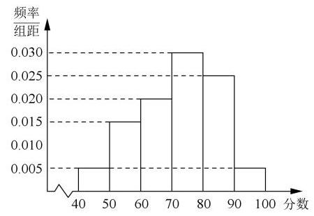

22、在某区高三年级举行的一次质量检测中，某学科共有 3000 人参加考试. 为了解本次考试学生的成绩情况，从中抽取了部分学生的成绩(成绩均为正整数，满分为 100 分)作为样本进行统计,样本容量为 $n$ . 按照 $\lbrack {50},{60}),\lbrack {60},{70}),\lbrack {70},{80}),\lbrack {80},{90}),\left\lbrack  {{90},{100}}\right\rbrack$ 的分组作出频率分布直方图(如图所示). 已知成绩落在 [50,60) 内的人数为 16，则下列结论正确的是( )

A. 样本容量 $n = {1000}$ B. 图中 $x = {0.025}$

C. 估计全体学生该学科成绩的平均分为 70.6 分

D. 将该学科成绩由高到低排序，前 15% 的学生该学科成绩为 A 等，则成绩为 78 分的学生该学科成绩肯定不是 $A$ 等

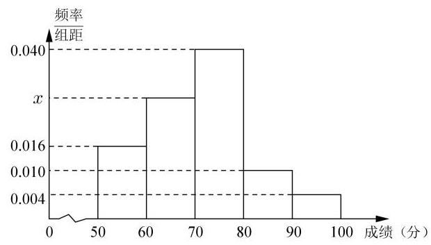

<table><tr><td colspan="2">甲</td><td></td><td></td><td></td><td>乙</td><td></td></tr><tr><td>8</td><td>8</td><td>0</td><td>9</td><td></td><td></td><td></td></tr><tr><td>3</td><td>2</td><td>1</td><td>1</td><td>3</td><td>4 8</td><td>9</td></tr><tr><td>7 6 5 4 2</td><td>0</td><td>2</td><td>0</td><td>1</td><td>1 3</td><td></td></tr><tr><td></td><td>7</td><td>3</td><td></td><td></td><td></td><td></td></tr></table>

23、某甲、乙两人练习跳绳，每人练习 10 组，每组不间断跳绳计数的茎叶图如图，则下面结论中所有正确的序号是___

① 甲比乙的极差大；② 乙的中位数是 18；

③ 甲的平均数比乙的大；④ 乙的众数是 21.

24、以下数据为参加数学竞赛决赛的 15 人的成绩(单位:分)，分数从低到高依次:56、 70、72、78、79、80、81、83、84、86、88、90、91、94、98 . 则这 15 人成绩的第 80 百分位数是___

25、某小组有 1 名男生和 2 名女生，从中任选 2 名学生参加围棋比赛，事件“至少有 1 名男生”与事件 “至少有 1 名女生” ( )

A. 是对立事件 B. 都是不可能事件

C. 是互斥事件但不是对立事件 D. 不是互斥事件

## 概率初步(续)

1、一个不透明的袋子中，放有大小相同的 5 个小球，其中 3 个黑球，2 个白球，如果不放回的依次取出 2 个球, 在第一次取出的黑球的条件下, 第二次取出的是白球的概率是( )

A. $\frac{1}{2}$ B. $\frac{3}{10}$ C. $\frac{3}{5}$ D. $\frac{2}{5}$

2、把一枚骰子连续掷两次，记事件 $M$ 为 “两次所得点数均为奇数”， $N$ 为 “至少有一次点数为 5 ”，则 $P\left( {N \mid  M}\right)$ 等于( )

A. $\frac{2}{3}$ B. $\frac{5}{9}$ C. $\frac{1}{2}$ D. $\frac{1}{3}$

3、在 20 张百元纸币中混有 4 张假币, 从中任意抽取 2 张, 将其中一张在验钞机上检验发现是假币, 则这两张都是假币的概率是 ( )

A. $\frac{3}{35}$ B. $\frac{3}{38}$ C. $\frac{2}{17}$ D. 以上都不正确

4、当 $P\left( A\right)  > 0$ 时，若 $P\left( {B \mid  A}\right)  + P\left( \overline{B}\right)  = 1$ ，则事件 $A$ 与 $B$ ( )

A. 互斥 B. 对立 C. 独立 D. 不独立

## 第二十一讲:概率统计 2

## 公式梳理

## 一、条件概率与相关公式

1、条件概率: 事件 A 发生的条件下,事件 B 发生的概率,记为 $P\left( {B \mid  A}\right)$

$$
P\left( {B \mid  A}\right)  = \frac{\left| A \cap  B\right| }{\left| A\right| } = \frac{P\left( {A \cap  B}\right) }{P\left( A\right) }
$$

2、全概率公式: 随机事件的结果可以分为 $n$ 种结果,设样本空间可分为 $n$ 个两两不同时发生且必有一个发生事件 ${\Omega }_{1},{\Omega }_{2},\cdots {\Omega }_{n}$ ,做一个随机试验,必然是这 $n$ 种情况之一,则事件 $A$ 发生是在不同情况下分别发生,即 $A = \left( {A \cap  {\Omega }_{1}}\right)  \cup  \left( {A \cap  {\Omega }_{2}}\right) \cdots  \cup  \left( {A \cap  {\Omega }_{n}}\right)$

因此 $P\left( A\right)  = \mathop{\sum }\limits_{{k = 1}}^{n}P\left( {A \mid  {\Omega }_{k}}\right) P\left( {\Omega }_{k}\right)$ 。全概率是条件概率。

即 $P\left( A\right)$ 实际上是条件概率 $P\left( {A \mid  {\Omega }_{k}}\right)$ 的加权平均数,权重为 $P\left( {\Omega }_{k}\right)$ 。其中 $\mathop{\sum }\limits_{{k = 1}}^{n}P\left( {\Omega }_{k}\right)  = 1$ 。

## 二、随机变量的分布与特征

1、随机变量:一个随机现象的结果用数来表示，就称为随机变量。

2、随机变量所有可能的取值以及相应取值的概率, 称为随机变量的分布。

3、期望: 如果随机变量 $X$ 的分布是

$\left( \begin{array}{lllll} {x}_{1} & {x}_{2} & \cdots & \cdots & {x}_{n} \\  {p}_{1} & {p}_{2} & \cdots & \cdots & {p}_{n} \end{array}\right)$ ,那么它的期望定义为如下的加权平均:

$$
E\left\lbrack  X\right\rbrack   = {x}_{1}{p}_{1} + {x}_{2}{p}_{2} + \cdots  + {x}_{n}{p}_{n}
$$

4、期望的线性性质:

1. 如果 $X$ 是一个随机变量,而 $a$ 是一个实数,那么

$$
E\left\lbrack  {aX}\right\rbrack   = {aE}\left\lbrack  X\right\rbrack  .
$$

2. 如果 $X\text{ 、 }Y$ 是两个随机变量,那么

$$
E\left\lbrack  {X + Y}\right\rbrack   = E\left\lbrack  X\right\rbrack   + E\left\lbrack  Y\right\rbrack  .
$$

$E\left\lbrack  {{aX} + b}\right\rbrack   = {aE}\left\lbrack  X\right\rbrack   + b$

5、方差: 随机变量 $X$ 的随机性的大小，称为 $X$ 的方差，记为 $D\left\lbrack  X\right\rbrack$ .

$$
D\left\lbrack  X\right\rbrack   = E{\left\lbrack  X - E\left\lbrack  X\right\rbrack  \right\rbrack  }^{2} = E\left\lbrack  {X}^{2}\right\rbrack   - \left( {\left\lbrack  E\left\lbrack  X\right\rbrack  \right) }^{2}\right.
$$

6、方差的性质:

---

	1. 如果 $a$ 是常数，那么

$$
D\left\lbrack  {aX}\right\rbrack   = {a}^{2}D\left\lbrack  X\right\rbrack  .
$$

	2. 如果 $X\text{ 、 }Y$ 分别是两个独立的随机试验所对应的随

机变量, 那么

$$
D\left\lbrack  {X + Y}\right\rbrack   = D\left\lbrack  X\right\rbrack   + D\left\lbrack  Y\right\rbrack  .
$$

---

## 三、随机变量常用分布

1、二项分布:

定义 重复 $n$ 次成功概率为 $p$ 的伯努利试验,其成功次数的分布称为二项分布,亦称成功次数 $X$ 服从二项分布 $B\left( {n, p}\right)$ .

$$
\left( \begin{matrix} 0 & 1 & 2 & \cdots & k & \cdots & n \\  {q}^{n} & {\mathrm{C}}_{n}^{1}p{q}^{n - 1} & {\mathrm{C}}_{n}^{2}{p}^{2}{q}^{n - 2} & \cdots & {\mathrm{C}}_{n}^{k}{p}^{k}{q}^{n - k} & \cdots & {p}^{n} \end{matrix}\right)
$$

二项分布的特征:

进行 $n$ 次试验,满足下列条件:

1、每次试验只有两个相互对立的结果，可以分别称为 “成功” 和 “失败”

2、每次试验 “成功” 的概率相等，均为 $p$ ；“失败” 的概率为 $1 - p$ 。(放回)

3、每次试验是相互独立的。

用 $X$ 表示 $n$ 次试验中 “成功” 的次数,则

$$
P\left( {X = k}\right)  = {\mathrm{C}}_{n}^{k}{p}^{k}{q}^{n - k},\;\mathop{\sum }\limits_{{k = 0}}^{n}{\mathrm{C}}_{n}^{k}{p}^{k}{q}^{n - k} = \mathop{\sum }\limits_{{k = 0}}^{n}P\left( {X = k}\right)  = 1.
$$

若 $X$ 服从二项分布 $B\left( {n, p}\right)$ ,则 $E\left\lbrack  X\right\rbrack   = {np}, D\left\lbrack  X\right\rbrack   = {np}\left( {1 - p}\right)$

## 2、超几何分布

由此,若袋中有 $a$ 个白球 $b$ 个黑球,随机取 $n$ 个球,其中的白球数记为 $X$ ,那么 $X$ 的分布是

$$
P\left( {X = k}\right)  = \frac{{\mathrm{C}}_{a}^{k}{\mathrm{C}}_{b}^{n - k}}{{\mathrm{C}}_{a + b}^{n}}.
$$

$$
E\left\lbrack  X\right\rbrack   = E\left\lbrack  {X}_{1}\right\rbrack   + \cdots  + E\left\lbrack  {X}_{n}\right\rbrack   = \frac{na}{a + b},
$$

## 超几何分布和二项分布的联系和区别:

1、事件分类:非黑即白

2、超几何分布是不放回，每次概率在变化；

3、二项分布是有放回抽取，每次独立重复，概率相同；

4、当超几何分布的样本容量足够大的时候, 超几何分布可以看出二项分布。

## 3、正态分布*

数学上的正态分布是指由下面的函数所表达的分布:

$$
{\varphi }_{\mu ,{\sigma }^{2}}\left( x\right)  = \frac{1}{\sqrt{{2\pi }{\sigma }^{2}}}{\mathrm{e}}^{-\frac{{\left( x - \mu \right) }^{2}}{2{\sigma }^{2}}},
$$

其中有两个参数:

1. $\mu$ 是该分布的期望或均值;

2. ${\sigma }^{2}$ 是该分布的方差,且总是假设 $\sigma  > 0$ .

定义 设 $X$ 是一个取实数值的随机变量. 如果对任何给定的实数 $a$ 与 $b\left( {a < b}\right) , X$ 落在区间 $\left( {a, b}\right)$ 上的概率 $P\left( {a < X < b}\right)$ 等于三条直线: $y = 0\text{ 、 }x = a\text{ 、 }x = b$ 与正态密度函数图像 $y = {\varphi }_{\mu ,{\sigma }^{2}}$ 所围的区域面积(或者简单说此函数在该区间上的面积),就说 $X$ 服从正态分布,或更精确地说, $X$ 服从参数为 $\mu \text{ 、 }{\sigma }^{2}$ 的正态分布,记为

$$
X \sim  N\left( {\mu ,{\sigma }^{2}}\right) .
$$

备注:1、正态分布曲线关于 $x = \mu$ 对称

2、正态曲线与 $x$ 轴之间的面积为 1

3、当随机变量落在区间 $\left( {a, b}\right)$ 上的概率即为即为 $x$ 轴, $x = a, x = b$ 和正态曲线所围成的区域的面积。

4、学会利用对称性解题

## 四、成对数据的相关分析

1、相关系数:

<table><tr><td>$x$</td><td>${x}_{1}$</td><td>${x}_{2}$</td><td>${x}_{3}$</td><td>${x}_{4}$</td><td>${x}_{5}$</td><td>${x}_{6}$</td><td>...</td><td>${x}_{n}$</td></tr><tr><td>$y$</td><td>${y}_{1}$</td><td>${y}_{2}$</td><td>${y}_{3}$</td><td>${y}_{4}$</td><td>${y}_{5}$</td><td>${y}_{6}$</td><td>...</td><td>${y}_{n}$</td></tr></table>

两个变量的相关系数的计算公式为

$$
r = \frac{\mathop{\sum }\limits_{{i = 1}}^{n}\left( {{x}_{i} - \bar{x}}\right) \left( {{y}_{i} - \bar{y}}\right) }{\sqrt{\mathop{\sum }\limits_{{i = 1}}^{n}{\left( {x}_{i} - \bar{x}\right) }^{2}\mathop{\sum }\limits_{{i = 1}}^{n}{\left( {y}_{i} - \bar{y}\right) }^{2}}}.
$$

①

其中 $\bar{x} = \frac{1}{n}\mathop{\sum }\limits_{{i = 1}}^{n}{x}_{i},\bar{y} = \frac{1}{n}\mathop{\sum }\limits_{{i = 1}}^{n}{y}_{i}$ 分别是这两组数据的平均数.

可以证明, $\left| r\right|  \leq  1.\left| r\right|$ 越接近 1,线性相关程度越高; $\left| r\right|$ 越接近 0,线性相关程度越低. 当 $r > 0$ 时, $x$ 的值由小变大时, $y$ 的值有由小变大的趋势,这时称这种相关为正相关; 当 $r < 0$ 时, $x$ 的值由小变大时, $y$ 的值有由大变小的趋势,这时称这种相关为负相关.

## 2、一元线性回归分析

用最小二乘法求线性回归系数的公式如下:

$$
\left\{  \begin{array}{l} \widehat{a} = \frac{\mathop{\sum }\limits_{{i = 1}}^{n}\left( {{x}_{i} - \bar{x}}\right) \left( {{y}_{i} - \bar{y}}\right) }{\mathop{\sum }\limits_{{i = 1}}^{n}{\left( {x}_{i} - \bar{x}\right) }^{2}} = \frac{\mathop{\sum }\limits_{{i = 1}}^{n}{x}_{i}{y}_{i} - n\bar{x}\bar{y}}{\mathop{\sum }\limits_{{i = 1}}^{n}{x}_{i}^{2} - n{\bar{x}}^{2}}, \\  \widehat{b} = \bar{y} - a\bar{x} = \frac{\mathop{\sum }\limits_{{i = 1}}^{n}{y}_{i} - \widehat{a}\mathop{\sum }\limits_{{i = 1}}^{n}{x}_{i}}{n}. \end{array}\right.
$$

由最小二乘法得到的回归方程为:

$$
y = \widehat{a}x + \widehat{b}.
$$

备注: (1) 线性回归直线必过样本数据的中心点 $\left( {\bar{x},\bar{y}}\right)$

(2)回归直线在散点图中可能不经过任一样本数据点。

## 3、 $2 \times  2$ 列联表

<table><tr><td></td><td>A 组</td><td>B 组</td><td>总计</td></tr><tr><td>0</td><td>$a$</td><td>$b$</td><td>$a + b$</td></tr><tr><td>1</td><td>$c$</td><td>$d$</td><td>$c + d$</td></tr><tr><td>总计</td><td>$a + c$</td><td>$b + d$</td><td>$a + b + c + d$</td></tr></table>

其中, $a\text{ 、 }b\text{ 、 }c\text{ 、 }d$ 为实际观察值.

由 ${\chi }^{2} = \sum \frac{{\left( \text{ 观察值 } - \text{ 预期值 }\right) }^{2}}{\text{ 预期值 }}$ ,经过变形可得 ${\chi }^{2}$ 的一般计算公式:

$$
{\chi }^{2} = \frac{n{\left( ad - bc\right) }^{2}}{\left( {a + b}\right) \left( {c + d}\right) \left( {a + c}\right) \left( {b + d}\right) }.
$$

①

其中, $n = a + b + c + d$ .

本例所用的检验方法在统计学中称为列联表独立性检验 (independence test in contingency table).

## 一、条件概率和全概率

1、根据历年气象统计资料，某地四月份吹东风的概率为 $\frac{9}{30}$ ，下雨的概率为 $\frac{11}{30}$ ，既吹东风又下雨的概率为 $\frac{8}{30}$ ，则在下雨条件下吹东风的概率为___；

2、袋中有 5 个球 (3 个白球, 2 个黑球) 现每次取一球，无放回抽取 2 次，则在第一次抽到白球的条件下，第二次抽到白球的概率为___；

3、投掷红、蓝两颗均匀的骰子，设事件 A: 蓝色骰子的点数为 5 或 6 ；事件 $B$ : 两骰子的点数之和大于 9,则在事件 $B$ 发生的条件下事件 $\mathrm{A}$ 发生的概率 $P\left( {A \mid  B}\right)  =$ ___.

4、有 3 台车床加工同一型号的零件，第 1 台加工的次品率为 6%，第 2，3 台加工的次品率为 5%，加工出来的零件混放在一起，已知 1,2,3 台车床加工的零件数分布占总数的 25%， 30%，45%。

(1)任取一个零件，计算它是次品的概率；

(2)如果取到的零件是次品，计算它是第 $i\left( {i = 1,2,3}\right)$ 台车床加工的概率。

5、甲、乙两名教师进行乒乓球比赛，采用七局四胜制(先胜四局者获胜). 若每一局比赛甲获胜的概率为 $\frac{2}{3}$ ,乙获胜的概率为 $\frac{1}{3}$ . 现已赛完两局,乙暂时以 2:0 领先.

(1)求甲获得这次比赛胜利的概率；

(2)设比赛结束时比赛的总局数为随机变量 $X$ ，求随机变量 $X$ 的分布列和数学期望 $E\left( X\right)$ .

## 二、随机变量的分布与特征

1、抛掷 2 颗骰子，所得点数之和 $\xi$ 是一个随机变量，则 $P\left( {\xi  \leq  4}\right)$ 等于( )

A. $\frac{1}{9}$ B. $\frac{5}{36}$ C. $\frac{1}{6}$ D. $\frac{1}{4}$

2、设随机变量 $X$ 的分布列为 $P\left( {X = k}\right)  = m{\left( \frac{2}{3}\right) }^{k}, k = 1,2,3$ ，则 $m$ 的值为___；

3、已知随机变量 $X$ 的分布列为

<table><tr><td>$X$</td><td>-2</td><td>1</td><td>3</td></tr><tr><td>$P$</td><td>0.16</td><td>0.44</td><td>0.40</td></tr></table>

则 $E\left( {{2X} + 5}\right)  =$ (   )

A. 1.32 B. 1.71 C. 2.94 D. 7.64

4、变量 $\xi$ 的分布列如又图所示,其中 $a, b, c$ 成等差数列,若 $E\left( \xi \right)  = \frac{1}{3}$ ,则 $D\left( \xi \right)$ 的值是 ( )

<table><tr><td>$\xi$</td><td>-1</td><td>0</td><td>1</td></tr><tr><td>$P$</td><td>$a$</td><td>$b$</td><td>$C$</td></tr></table>

A. $\frac{1}{3}$ B. $\frac{5}{9}$ C. $\frac{2}{3}$ D. $\frac{11}{27}$

5、已知 $0 < a < \frac{1}{2}$ ，随机变量 $\xi$ 的分布列如下，则当 $a$ 增大时( )

<table><tr><td>$\xi$</td><td>-1</td><td>0</td><td>1</td></tr><tr><td>$P$</td><td>$a$</td><td>$\frac{1}{2} - a$</td><td>$\frac{1}{2}$</td></tr></table>

A. $E\left( \xi \right)$ 增大， $D\left( \xi \right)$ 增大 B. $E\left( \xi \right)$ 减小， $D\left( \xi \right)$ 增大

C. $E\left( \xi \right)$ 增大, $D\left( \xi \right)$ 减小 D. $E\left( \xi \right)$ 减小, $D\left( \xi \right)$ 减小

6、已知随机变量 $X$ 的分布列如下:

<table><tr><td>$X$</td><td>1</td><td>2</td><td>3</td></tr><tr><td>$P$</td><td>$a$</td><td>$b$</td><td>${2b} - a$</td></tr></table>

则 $D\left( {{3X} - 1}\right)$ 的最大值为( )

A. $\frac{2}{3}$ B. 3

C. 6 D. 5

## 三、常用分布(二项分布与超几何分布，正态分布*)

1、如果随机变量 $\xi  \sim  B\left( {n, p}\right)$ ，且 $E\left( \xi \right)  = {10}$ ， $D\left( \xi \right)  = 8$ ，则 $p$ 等于 ( )

A. $\frac{1}{7}$ B. $\frac{1}{6}$ C. $\frac{1}{5}$ D. $\frac{1}{4}$

2、某群体中的每位成员使用移动支付的概率都为 $p$ ,各成员的支付方式相互独立,设 $X$ 为该群体的 10 位成员中使用移动支付的人数, $D\left( X\right)  = {2.4}, P\left( {X = 4}\right)  < P\left( {X = 6}\right)$ ,则 $p =$ A. 0.7 B. 0.6

3、一批产品的二等品率为 0.02 ，从这批产品中每次随机取一件，有放回地抽取 100 次， $X$ 表示抽到的二等品件数，则 $D\left( X\right)  =$ ___；

4、8 个试题中甲能答对 6 个，从 8 个题中任选 4 个进行作答，用 $X$ 表示甲答对题的个数， 则 $E\left( X\right)  =$

5、某学校为了解学生课后进行体育运动的情况，对该校学生简单随机抽样，获得 20 名学生一周进行体育运动的时间数据如表，其中运动时间在 $(7,{11}\rbrack$ 的学生称为运动达人。

<table><tr><td>分组区间(单位:小时)</td><td>(1,3]</td><td>(3,5]</td><td>(5,7]</td><td>(7,9]</td><td>(9,11]</td></tr><tr><td>人数</td><td>1</td><td>3</td><td>4</td><td>7</td><td>5</td></tr></table>

(1)从上述抽取的学生中任取 2 人，设 $X$ 为运动达人的人数，求 $X$ 得分布列。

(2)以频率估计概率，从该校学生中任取 2 人，设 $Y$ 为运动达人的人数，求 $Y$ 的分布列。

6、下列说法错误的是( )

A. 设随机变量 $X$ 等可能取 $1,2,3,\ldots , n$ ,如果 $P\left( {X < 4}\right)  = {0.3}$ ,则 $n = {10}$

B. 设随机变量 $X$ 服从二项分布 $B\left( {6,\frac{1}{2}}\right)$ ，则 $P\left( {X = 3}\right)  = \frac{5}{16}$

C. 设离散型随机变量 $\eta$ 服从两点分布,若 $P\left( {\eta  = 1}\right)  = {2P}\left( {\eta  = 0}\right)$ ,则 $P\left( {\eta  = 0}\right)  = \frac{1}{3}$

D. 已知随机变量 $X$ 服从正态分布 $N\left( {2,{\sigma }^{2}}\right)$ 且 $P\left( {X < 4}\right)  = {0.9}$ ,则 $P\left( {0 < X < 2}\right)  = {0.3}$

7、为了解目前全市高一学生身体素质状况，对某校高一学生进行了体能抽测，得到学生的体育成绩 $X \sim  N\left( {{70},{100}}\right)$ ,其中 60 分及以上为及格,90 分及以上为优秀,则下列说法正确的是( )附:若 $X \sim  N\left( {\mu ,{\sigma }^{2}}\right)$ ，则 $P\left( {\mu  - \sigma  \leq  X < \mu  + \sigma }\right)  = {0.6826}$ ， $P\left( {\mu  - {2\sigma } \leq  X < \mu  + {2\sigma }}\right)  = {0.9544}.$

A. 该校学生体育成绩的方差为 10

B. 该校学生体育成绩的期望为 100

C. 该校学生体育成绩的及格率不到 85%

D. 该校学生体育成绩的优秀率超过 4%

8、设两个正态分布 $N\left( {{\mu }_{1},{\sigma }_{1}^{2}}\right) \left( {{\sigma }_{1} > 0}\right)$ 和 $N\left( {{\mu }_{2},{\sigma }_{2}^{2}}\right) \left( {{\sigma }_{2} > 0}\right)$ 的正态密度函数图像如图所示，则( )

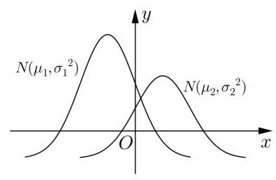

A. ${\mu }_{1} < {\mu }_{2},{\sigma }_{1} < {\sigma }_{2}$

B. ${\mu }_{1} < {\mu }_{2},{\sigma }_{1} > {\sigma }_{2}$

C. ${\mu }_{1} > {\mu }_{2},{\sigma }_{1} < {\sigma }_{2}$

D. ${\mu }_{1} > {\mu }_{2},{\sigma }_{1} > {\sigma }_{2}$

## 四、成对数据分析

1、已知 $x, y$ 取值如表:

<table><tr><td>$x$</td><td>2</td><td>3</td><td>4</td><td>5</td><td>6</td></tr><tr><td>$y$</td><td>6</td><td>4</td><td>5</td><td>5.6</td><td>7.4</td></tr></table>

画散点图分析可知: $y$ 与 $x$ 线性相关，且求得回归方程为 $y = \widehat{b}x + \frac{13}{2}$ ，则 $\widehat{b}$

2、2020 年初，新型冠状病毒引起的肺炎疫情爆发以来，各地医疗机构采取了各种针对性的治疗方法，取得了不错的成效，某医疗机构开始使用中西医结合方法后，每周治愈的患者人数如下表所示:

<table><tr><td>第 $x$ 周</td><td>1</td><td>2</td><td>3</td><td>4</td><td>5</td></tr><tr><td>治愈人数 $y$ (单位:十人)</td><td>3</td><td>8</td><td>10</td><td>14</td><td>15</td></tr></table>

由上表可得 $y$ 关于 $x$ 的线性回归方程为 $y = \widehat{a}x + 1$ ,则此回归模型第 5 周的离差 (实际值减去预报值)为( )

A. 1 B. 2 C. 3 D. 4

3、对成对数据 $\left( {{x}_{1},{y}_{1}}\right) \text{ 、 }\left( {{x}_{2},{y}_{2}}\right) \text{ 、 }\cdots \text{ 、 }\left( {{x}_{n},{y}_{n}}\right)$ 用最小二乘法求回归方程是为了使( )

A. $\mathop{\sum }\limits_{{i = 1}}^{n}\left( {{y}_{i} - \bar{y}}\right)  = 0$ B. $\mathop{\sum }\limits_{{i = 1}}^{n}\left( {{y}_{i} - {\widehat{y}}_{i}}\right)  = 0$ C. $\mathop{\sum }\limits_{{i = 1}}^{n}\left( {{y}_{i} - {\widehat{y}}_{i}}\right)$ 最小

4、下列表述中，正确的个数是( )

①将一组数据中的每一个数据都加上同一个常数后，方差不变；

②设有一个回归方程 $\widehat{y} = 3 - {5x}$ ，变量 $x$ 增加 1 个单位时， $y$ 平均增加 5 个单位；

③设具有相关关系的两个变量 $x, y$ 的相关系数为 $r$ ，那么 $\left| r\right|$ 越接近于 $0, x, y$ 之间的线性相关程度越高;

④在一个 $2 \times  2$ 列联表中,根据表中数据计算得到 ${K}^{2}$ 的观测值 $k$ ,若 $k$ 的值越大,则认为两个变量间有关的把握就越大.

A. 0 B. 1 C. 2 D. 3

5、某外语学校要求学生从德语和日语中选择一种作为“第二外语”进行学习，为了解选择第二外语的倾向与性别的关系，随机抽取 100 名学生，得到下面的数据表:

<table><tr><td></td><td>选择德语</td><td>选择日语</td></tr><tr><td>男生</td><td>15</td><td>35</td></tr><tr><td>女生</td><td>30</td><td>20</td></tr></table>

根据表中提供的数据可知( )

附: ${K}^{2} = \frac{n{\left( ad - bc\right) }^{2}}{\left( {a + b}\right) \left( {c + d}\right) \left( {a + c}\right) \left( {b + d}\right) },\;n = a + b + c + d$ .

<table><tr><td>$P\left( {{K}^{2} \geq  {k}_{0}}\right)$</td><td>0.100</td><td>0.050</td><td>0.010</td><td>0.005</td><td>0.001</td></tr><tr><td>${k}_{0}$</td><td>2.706</td><td>3.841</td><td>6.635</td><td>7.879</td><td>10.828</td></tr></table>

A. 在犯错误的概率不超过 0.1% 的前提下，认为选择第二外语的倾向与性别无关

B. 在犯错误的概率不超过 0.1% 的前提下，认为选择第二外语的倾向与性别有关

C. 有99.5% 的把握认为选择第二外语的倾向与性别无关

D. 有99.5% 的把握认为选择第二外语的倾向与性别有关

6、某市政府调查市民收入增减与旅游需求的关系时，采用独立性检验法抽查了 5000 人，计算发现 ${K}^{2} = {6.109}$ ，根据这一数据查阅下表，市政府断言市民收入增减与旅游需求有关的可信度是___%.

附

<table><tr><td>$P\left( {{K}^{2} \geq  k}\right)$</td><td>...</td><td>0.100</td><td>0.025</td><td>0.010</td><td>0.005</td><td>...</td></tr><tr><td>$k$</td><td>...</td><td>2.706</td><td>5.024</td><td>6.635</td><td>7.879</td><td>...</td></tr></table>

7、社会实践是大学生课外教育的一个重要方面，在校大学生利用要期参加社会实践活动， 是认识社会、了解社会、提高自我能力的重要机会. 某省统计了该省其中的 4 所大学 2023 年毕业生的人数及参加过暑期社会实践活动的人数(单位:千人)，得到如下表格:

<table><tr><td>大学</td><td>$A$ 大学</td><td>$B$ 大学</td><td>$C$ 大学</td><td>$D$ 大学</td></tr><tr><td>2023 年毕业生人数 $x$ (千人)</td><td>7</td><td>6</td><td>5</td><td>4</td></tr><tr><td>2023 年毕业生中参加过社会实践人数 $y$ (千人)</td><td>0.5</td><td>0.4</td><td>0.3</td><td>0.2</td></tr></table>

(1)已知 $y$ 与 $x$ 具有较强的线性相关性,求 $y$ 关于 $x$ 的线性回归方程 $y = \widehat{a}x + \widehat{b}$ ;

(2)假设该省对参加过暑期社会实践活动的大学生每人发放 0.5 万元的补贴.

① 若该省大学 2023 年毕业生人数为 12 万人，估计该省要发放补贴的总金额；

② 若 2023 年毕业生中的小李、小王参加过暑期社会实践活动的概率分别为 $p$ 、 ${3p} - 1$ ， 该省对小李、小王两人补贴总金额的期望不超过 0.75 万元,求 $p$ 的取值范围.

参考公式: $\widehat{a} = \frac{\mathop{\sum }\limits_{{i = 1}}^{n}\left( {{x}_{i} - \bar{x}}\right) \left( {{y}_{i} - \bar{y}}\right) }{\mathop{\sum }\limits_{{i = 1}}^{n}{\left( {x}_{i} - \bar{x}\right) }^{2}} = \frac{\mathop{\sum }\limits_{{i = 1}}^{n}\left( {{x}_{i}{y}_{i} - n\bar{x} \cdot  \bar{y}}\right) }{\mathop{\sum }\limits_{{i = 1}}^{n}{x}_{i}^{2} - n{\bar{x}}^{2}},\widehat{b} = \bar{y} - \widehat{a}\bar{x}$ .

## 第二十二讲:导数复习——函数的性质

## 导数处理函数的问题包括:

1、函数零点、极值点问题

2、函数单调性问题

3、函数的对称问题: 奇偶函数的对称性

4、函数的最值问题

5、切线问题: 不同曲线公切线, 一条曲线的几条切线

6、与不等式有关的证明

导数中常用的放缩不等式: ① ${e}^{x} \geq  x + 1$ ② $\ln \left( {x + 1}\right)  \leq  x$

## 历年高考卷

1、(202*新高考 1 卷 10 多选)已知函数 $f\left( x\right)  = {x}^{3} - x + 1$ ，则( ) ${AC}$

$A : f\left( x\right)$ 有两个极值点 $B : f\left( x\right)$ 有三个零点

$C :$ 点 $\left( {0,1}\right)$ 是曲线的对称中心 $D :$ 直线 $y = {2x}$ 是曲线 $y = f\left( x\right)$ 的切线

2、(202*新高考 1 卷 15)若曲线 $y = \left( {x + a}\right) {e}^{x}$ 有两条过原点的切线，则 $a$ 的取值范围是___；(0，+∞)

3、(202 新高考 1 卷 12 多选)已知函数 $f\left( x\right)$ 及其导函数 ${f}^{\prime }\left( x\right)$ 的定义域为 $R$ ，记 $g\left( x\right)  = {f}^{\prime }\left( x\right)$ ,若 $f\left( {\frac{3}{2} - {2x}}\right) , g\left( {2 + x}\right)$ 均为偶函数,则 $\left( \;\right) {BC}$

$A : f\left( 0\right)  = 0 \; B : g\left( {-\frac{1}{2}}\right)  = 0 \; C : f\left( {-1}\right)  = f\left( 4\right) \; D : g\left( {-1}\right)  = g\left( 2\right)$

4、(202*全国乙理科 16)已知 $x = {x}_{1}$ 和 $x = {x}_{2}$ 分别是函数 $f\left( x\right)  = 2{a}^{x} - e{x}^{2}\left( {a > 0, a \neq  1}\right)$ 的极小值点和极大值点,若 ${x}_{1} < {x}_{2}$ ,则 $a$ 的取值范围是___；

5、(202*全国 1 卷)函数 $f\left( x\right)  = \left| {{2x} - 1}\right|  - {2\ln x}$ 的最小值为___；

6、(202*全国乙卷)设 $a \neq  0$ ，若 $x = a$ 为函数 $f\left( x\right)  = a{\left( x - a\right) }^{2}\left( {x - b}\right)$ 的极大值点，则())

A. $a < b$ B. $a > b$ C. ${ab} < {a}^{2}$ D. ${ab} > {a}^{2}$

7、已知 $f\left( x\right)$ 为偶函数,当 $x < 0$ 时, $f\left( x\right)  = \ln \left( {-x}\right)  + {3x}$ ,则曲线 $y = f\left( x\right)$ 在点 $\left( {1, - 3}\right)$ 处的切线方程为___；

8、已知曲线 $f\left( x\right)  = x + \ln x$ 在点 $\left( {1,1}\right)$ 处的切线与曲线 $y = a{x}^{2} + \left( {a + 2}\right) x + 1$ 相切,则 $a =$ _____

9、(202 * 全国理科)若直线 $l$ 与曲线 $y = \sqrt{x}$ 和 ${x}^{2} + {y}^{2} = \frac{1}{5}$ 都相切，则直线 $l$ 的方程为 ___；

10、若直线 $y = {kx} + b$ 是曲线 $y = \ln x + 2$ 的切线,也是曲线 $y = \ln \left( {x + 1}\right)$ 的切线,则 $b =$ ___；

11、(202*全国 1 卷)若过点 $\left( {a, b}\right)$ 可以作曲线 $y = {e}^{x}$ 的两条切线，则()

A. ${e}^{b} < a$ B. ${e}^{a} < b$ C. $0 < a < {e}^{b}$ D. $0 < b < {e}^{a}$

12、设点 $P$ 在曲线 $y = \frac{1}{2}{e}^{x}$ 上，点 $Q$ 在曲线 $y = \ln \left( {2x}\right)$ 上，则 $\left| {PQ}\right|$ 的最小值为___；

13、若函数 $f\left( x\right)  = x - \frac{1}{3}\sin {2x} + a\sin x$ 在 $R$ 上严格单调递增，则 $a$ 的取值范围是___；

14、已知函数 $f\left( x\right)  = a{x}^{3} - 3{x}^{2} + 1$ ，若 $f\left( x\right)$ 存在唯一的零点 ${x}_{0}$ ，且 ${x}_{0} < 0$ ，则 $a$ 的取值范围是( )

A. $\left( {2, + \infty }\right)$ B. $\left( {1, + \infty }\right)$ C. $\left( {-\infty , - 2}\right) \; \left( {-\infty , - 1}\right)$

15、已知函数 $f\left( x\right)  = {x}^{2} - {2x} + a\left( {{e}^{x - 1} + {e}^{-x + 1}}\right)$ 有唯一零点,则 $a =$ ___；

16、设函数 $f\left( x\right)  = {e}^{x}\left( {{2x} - 1}\right)  - {ax} + a, a < 1$ ，若存在唯一的整数 ${x}_{0}$ ，使得 $f\left( {x}_{0}\right)  < 0$ ，则 $a$ 的取值范围是( )

A. $\left\lbrack  {-\frac{3}{2e},1}\right)$ B. $\left\lbrack  {-\frac{3}{2e},\frac{3}{4}}\right)$ C. $\left\lbrack  {\frac{3}{2e},\frac{3}{4}}\right)$ D. $\left\lbrack  {\frac{3}{2e},1}\right)$

## 拓展 1:

分析: 同底指数函数与对数函数的交点问题

分析: 同底幂函数与指数函数的交点问题

1、已知函数 $f\left( x\right)  = {a}^{x} - {\log }_{a}x\left( {a > 0, a \neq  1}\right)$ ，那么下列有关函数 $f\left( x\right)$ 的零点叙述正确序号是___；④

① 当 $a > 1$ 时，函数 $f\left( x\right)$ 没有零点；

② 当 $0 < a < 1$ 时，函数 $f\left( x\right)$ 有唯一零点；

③ 当 $a > 0, a \neq  1$ 时，函数 $f\left( x\right)$ 最多有两个零点；

④存在这样的 $a$ 的值，使函数 $f\left( x\right)$ 有三个零点。

2、已知函数 $f\left( x\right)  = {x}^{a} - {a}^{x}\left( {a > 0, a \neq  1}\right) \left( {x > 0}\right)$ 有两个零点,实数 $a$ 的取值范围是___；

## 第二十三讲:导数复习 2——双变量问题

## 双变量处理策略:

## 一、分离两个变量: 同构思想

1、已知函数 $f\left( x\right)  = {x}^{2} - {2ax} + 2\left( {a + 1}\right) \ln x$ .

(1)若函数 $f\left( x\right)$ 有两个极值点，求 $a$ 的取值范围；

(2)证明:若 $- 1 < a < 3$ ，则对于任意的 ${x}_{1}$ ， ${x}_{2} \in  \left( {0, + \infty }\right)$ ， ${x}_{1} \neq  {x}_{2}$ ，有 $\frac{f\left( {x}_{1}\right)  - f\left( {x}_{2}\right) }{{x}_{1} - {x}_{2}} > 2$ .

2、已知函数 $f\left( x\right)  = \left( {a + 1}\right) \ln x + a{x}^{2} + 1$ ；

(1)讨论函数 $f\left( x\right)$ 的单调性;

(2)设 $a <  - 1$ ，如果对于任意 ${x}_{1},{x}_{2} \in  \left( {0, + \infty }\right)$ ， $\left| {f\left( {x}_{1}\right)  - f\left( {x}_{2}\right) }\right|  \geq  4\left| {{x}_{1} - {x}_{2}}\right|$ ，求实数 $a$ 的取值范围。

## 二、双变量变单变量: 韦达代换(一般处理双极值点问题)

1、已知函数 $f\left( x\right)  = a\ln x + \frac{1}{2}{x}^{2} - {ax}$ ( $a$ 为常数) 有两个极值点 ${x}_{1},{x}_{2}$ ;

(1)求实数 $a$ 的取值范围；

(2)若不等式 $f\left( {x}_{1}\right)  + f\left( {x}_{2}\right)  < \lambda \left( {{x}_{1} + {x}_{2}}\right)$ 恒成立，求 $\lambda$ 的最小值。

2、已知函数 $f\left( x\right)  = {x}^{2} - {2x} + \operatorname{aln}x\left( {a > 0}\right)$ .

(1)当 $a = 2$ 时，试求函数图象在点 $\left( {1, f\left( 1\right) }\right)$ 处的切线方程；

(2)若函数 $f\left( x\right)$ 有两个极值点 ${x}_{1}\text{ 、 }{x}_{2}\left( {{x}_{1} < {x}_{2}}\right)$ ，且不等式 $f\left( {x}_{1}\right)  \geq  m{x}_{2}$ 恒成立，试求实数 $m$ 的取值范围.

三、孤立双变量: 主元法 (若 ${x}_{1} < {x}_{2}$ ,一般把 ${x}_{2}$ 作主元)

1、已知函数 $f\left( x\right)  = \ln \left( {x + 1}\right)  - x, g\left( x\right)  = x\ln x$

(1)求函数 $f\left( x\right)$ 的最大值;

(2)设 $0 < a < b$ ，证明: $0 < g\left( a\right)  + g\left( b\right)  - {2g}\left( \frac{a + b}{2}\right)  < \left( {b - a}\right) \ln 2$

2、设函数 $f\left( x\right)  = x\ln x$ .

(1)求 $f\left( x\right)$ 的极值;

(2)设 $g\left( x\right)  = f\left( {x + 1}\right)$ ，若对任意的 $x \geq  0$ ，都有 $g\left( x\right)  \geq  {mx}$ 成立，求实数 $m$ 的取值范围；

(3)若 $0 < a < b$ ,证明: $0 < f\left( a\right)  + f\left( b\right)  - {2f}\left( \frac{a + b}{2}\right)  < \left( {b - a}\right) \ln 2$ .

## 四、糅合变量, 比值代换 (对数型) 或差值代换 (指数型)

1、已知 $f\left( x\right)  = \ln x, g\left( x\right)  = f\left( x\right)  + a{x}^{2} + {bx}$ ,其中 $g\left( x\right)$ 图像在 $\left( {1, g\left( 1\right) }\right)$ 处的切线平行于 $x$ 轴

(1)确定 $a$ 和 $b$ 的关系;

(2)设斜率为 $k$ 的直线与 $f\left( x\right)$ 的图像交于 $A\left( {{x}_{1},{y}_{1}}\right) , B\left( {{x}_{2},{y}_{2}}\right) \left( {{x}_{1} < {x}_{2}}\right)$ ，

求证: $\frac{1}{{x}_{2}} < k < \frac{1}{{x}_{1}}$ 。

2、已知函数 $f\left( x\right)  = a{e}^{x} + b$ 在 $\left( {0, f\left( 0\right) }\right)$ 处的切线为 $x - y + 1 = 0$ 。

(1)求函数 $f\left( x\right)$ 的解析式；

(2)设 $A\left( {{x}_{1},{y}_{1}}\right) , B\left( {{x}_{2},{y}_{2}}\right) \left( {{x}_{1} < {x}_{2}}\right)$ ， $k$ 表示直线 ${AB}$ 的斜率；

求证: ${f}^{\prime }\left( {x}_{1}\right)  < k < {f}^{\prime }\left( {x}_{2}\right)$

3、设 $a > b > 0, a \neq  b$ ,求证: $\sqrt{ab} < \frac{a - b}{\ln a - \ln b} < \frac{a + b}{2}$ (对数均值不等式)

## 巩固练习:

1、已知函数 $f\left( x\right)  =  - {x}^{2} + {ax} - \ln x$

(1)判断 $f\left( x\right)$ 的单调性;

(2)若 $f\left( x\right)$ 存在极值，求这些极值的和的取值范围。

2、已知函数 $f\left( x\right)  = {e}^{x} - {ax}$

(1)当 $a > 0$ 时,设函数 $f\left( x\right)$ 的最小值为 $g\left( a\right)$ ，证明: $g\left( a\right)  \leq  1$ ；

(2)若函数 $h\left( x\right)  = f\left( x\right)  - \frac{1}{2}{x}^{2}$ 有两个极值点 ${x}_{1},{x}_{2}\left( {{x}_{1} < {x}_{2}}\right)$ ，证明: $h\left( {x}_{1}\right)  + h\left( {x}_{2}\right)  > 2$

## 第二十四讲:解析几何复习 1

## 知识点梳理:

## 一、椭圆结论:

1、 ${a}^{2} = {b}^{2} + {c}^{2}$

2、通径 $\frac{2{b}^{2}}{a}$ ,准线方程 $x =  \pm  \frac{{a}^{2}}{c}$ ,

3、焦点三角形面积公式: ${S}_{\Delta {F}_{1}P{F}_{2}} = {b}^{2}\tan \frac{\alpha }{2}$

4、弦长公式: $\left| {AB}\right|  = \sqrt{1 + {k}^{2}}\left| {{x}_{1} - {x}_{2}}\right|  = \sqrt{1 + {k}^{2}}\sqrt{{\left( {x}_{1} + {x}_{2}\right) }^{2} - 4{x}_{1}{x}_{2}}$

5、距离:椭圆上的点到左焦点 ${F}_{1}$ 的距离最小值为 $a - c$ ，最大值为 $a + c$

6、过椭圆上任意一点 $P\left( {{x}_{0},{y}_{0}}\right)$ 作椭圆 $\frac{{x}^{2}}{{a}^{2}} + \frac{{y}^{2}}{{b}^{2}} = 1$ 的切线方程为: $\frac{x{x}_{0}}{{a}^{2}} + \frac{y{y}_{0}}{{b}^{2}} = 1$

7、椭圆: $\frac{{x}^{2}}{{a}^{2}} + \frac{{y}^{2}}{{b}^{2}} = 1$ ,离心率 $e = \frac{c}{a}$ 表示焦距与长轴长之比,且 $0 < e < 1$

## 二、双曲线结论:

1、 ${c}^{2} = {a}^{2} + {b}^{2}$ ，准线方程 $x =  \pm  \frac{{a}^{2}}{c}$

2、通径:即过焦点作垂直于对称轴的直线交双曲线与 $\mathrm{A},\mathrm{B}$ 两点，交于同一支时弦长为通径长度为 $\frac{2{b}^{2}}{a}$ ,交于两支时弦长最短为 ${2a}$ 。

3、焦点三角形面积公式: ${S}_{\Delta {F}_{1}P{F}_{2}} = {b}^{2}\cot \frac{\alpha }{2}$

4、弦长公式: $\left| {AB}\right|  = \sqrt{1 + {k}^{2}}\left| {{x}_{1} - {x}_{2}}\right|  = \sqrt{1 + {k}^{2}}\sqrt{{\left( {x}_{1} + {x}_{2}\right) }^{2} - 4{x}_{1}{x}_{2}}$

5、过双曲线上任意一点 $P\left( {{x}_{0},{y}_{0}}\right)$ 作双曲线 $\frac{{x}^{2}}{{a}^{2}} - \frac{{y}^{2}}{{b}^{2}} = 1$ 的切线方程为: $\frac{x{x}_{0}}{{a}^{2}} - \frac{y{y}_{0}}{{b}^{2}} = 1$

6、双曲线上任意一点 $P\left( {{x}_{0},{y}_{0}}\right)$ 到双曲线 $\frac{{x}^{2}}{{a}^{2}} - \frac{{y}^{2}}{{b}^{2}} = 1$ 的两条渐近线 $y =  \pm  \frac{b}{a}x$ 的距离之积为定值 $\frac{{a}^{2}{b}^{2}}{{a}^{2} + {b}^{2}}$ 。

7、双曲线: $\frac{{x}^{2}}{{a}^{2}} - \frac{{y}^{2}}{{b}^{2}} = 1$ ,离心率 $e = \frac{c}{a}$ 表示焦距与实轴长之比,且 $e > 1$

## 三、抛物线的结论:

1、过抛物线 ${y}^{2} = {2px}$ 的焦点的弦长公式为: $\left| {AB}\right|  = {x}_{1} + {x}_{2} + p$

2、过抛物线 ${y}^{2} = {2px}$ 的顶点作两条互相垂直的射线交抛物线于 $A, B$ 两点，则直线 ${AB}$ 恒过定点 $\left( {{2p},0}\right)$

## 四、直线与圆锥曲线基本量:

<table><tr><td>基本图形</td><td>代数表示</td><td>基本要素</td></tr><tr><td>直线</td><td>$y - {y}_{0} = k\left( {x - {x}_{0}}\right)$ 或 $x = {my} + n$</td><td>$\left( {{x}_{0},{y}_{0}}\right) , k$</td></tr><tr><td>圆</td><td>${\left( x - a\right) }^{2} + {\left( y - b\right) }^{2} = {r}^{2}$</td><td>$a, b, r$</td></tr><tr><td>椭圆</td><td>$\frac{{x}^{2}}{{a}^{2}} + \frac{{y}^{2}}{{b}^{2}} = 1$ 或 $\frac{{y}^{2}}{{a}^{2}} + \frac{{x}^{2}}{{b}^{2}} = 1$</td><td>$a, b$</td></tr><tr><td>双曲线</td><td>$\frac{{x}^{2}}{{a}^{2}} - \frac{{y}^{2}}{{b}^{2}} = 1$ 或 $\frac{{y}^{2}}{{a}^{2}} - \frac{{x}^{2}}{{b}^{2}} = 1$</td><td>$a, b$</td></tr><tr><td>抛物线</td><td>${y}^{2} =  \pm  {2px}$ 或 ${x}^{2} =  \pm  {2py}$</td><td>$p$</td></tr></table>

五、圆锥曲线的统一定义:圆锥曲线是到一定点 $F$ 和一定直线 $l\left( {F \notin  l}\right)$ 距离之比为定值 $e$ 的点的轨迹。其中, $F$ 为焦点, $l$ 为准线; 若 $0 < e < 1$ 为椭圆; 若 $e > 1$ 为双曲线; 若 $e = 1$ 为抛物线。

(1)椭圆 $\frac{{x}^{2}}{{a}^{2}} + \frac{{y}^{2}}{{b}^{2}} = 1$ : 准线方程 $x =  \pm  \frac{{a}^{2}}{c}$ ,点 $P\left( {{x}_{0},{y}_{0}}\right)$ 为椭圆上任意一点， ${F}_{1},{F}_{2}$ 为椭圆的左右两个焦点,则 $\frac{\left| P{F}_{1}\right| }{{d}_{1}} = e$

左焦半径 $\left| {P{F}_{1}}\right|  = {d}_{1}e = \left( {{x}_{0} + \frac{{a}^{2}}{c}}\right)  \cdot  \frac{c}{a} = a + e{x}_{0}$ ;

右焦半径 $\left| {P{F}_{2}}\right|  = {2a} - \left| {P{F}_{1}}\right|  = a - e{x}_{0}$

(2)双曲线 $\frac{{x}^{2}}{{a}^{2}} - \frac{{y}^{2}}{{b}^{2}} = 1$ :准线方程 $x =  \pm  \frac{{a}^{2}}{c}$ ，点 $P\left( {{x}_{0},{y}_{0}}\right)$ 为双曲线上任意一点，

${F}_{1},{F}_{2}$ 为双曲线的左右两个焦点,则 $\frac{\left| P{F}_{1}\right| }{{d}_{1}} = e$

若 $P$ 在右支, $\left| {P{F}_{1}}\right|  = e{x}_{0} + a,\left| {P{F}_{2}}\right|  = e{x}_{0} - a$

若 $P$ 在左支, $\left| {P{F}_{1}}\right|  =  - \left( {e{x}_{0} + a}\right) ,\left| {P{F}_{2}}\right|  =  - \left( {e{x}_{0} - a}\right)$

(3)抛物线 ${y}^{2} = {2px}$ ， $\left| {PF}\right|  = {x}_{0} + \frac{p}{2}$

## 六、极坐标方程和参数方程

1、极坐标与直角坐标之间的转化:

$$
x = \rho \cos \theta , y = \rho \sin \theta ,{\rho }^{2} = {x}^{2} + {y}^{2},\tan \theta  = \frac{y}{x}\left( {x \neq  0}\right)
$$

2、圆与椭圆的参数方程:

3、圆锥曲线统一极坐标方程:设定点 $F$ (焦点)到相对定直线 $l$ (准线)的距离为 $p$ ，以 $F$ 为极点建立极坐标系,设动点 $M$ 的极坐标为 $\left( {\rho ,\theta }\right)$ ,则由圆锥曲线的统一定义可得: $\frac{\left| MF\right| }{d} = e$ ,即 $\left| {MF}\right|  = \rho  = {de} = \left( {p + \rho \cos \theta }\right) e \Rightarrow  \rho  = \frac{ep}{1 - e\cos \theta } \; \rho  = \frac{ep}{1 - e\cos \theta }$ 即为圆锥曲线的统一极坐标方程。其中 $\rho$ 的几何意义即为焦半径。

4、过椭圆左焦点 $F$ 的直线交椭圆于 $A, B$ 两点,焦点弦长公式推导:

$$
\left| {AB}\right|  = \left| {FA}\right|  + \left| {FB}\right|  = \frac{ep}{1 - e\cos \theta } + \frac{ep}{1 + e\cos \theta } = \frac{2ep}{1 - {e}^{2}{\cos }^{2}\theta }
$$

## 圆锥曲线客观题题型归纳:

1、轨迹问题

2、面积问题

3、弦长和焦半径问题

4、最值范围问题

5、定义应用

6、定点定值问题

## 一、基础练习

1、直线 $x + {2y} - 5 = 0$ 的倾斜角的大小为___；

2、方程 $\frac{{x}^{2}}{k} + \frac{{y}^{2}}{2 - k} = 1$ 表示椭圆，则实数 $k$ 的取值范围是___；

3、已知直线 $\left( {{3a} + 2}\right) x + \left( {1 - {4a}}\right) y + 8 = 0$ 和 $\left( {{5a} - 2}\right) x + \left( {a + 4}\right) y - 7 = 0$ 互相垂直,则实数 $a$ 的值为___；

4、直线 ${ax} + y + {3a} - 1 = 0$ 恒过定点 $M$ ,则直线 ${2x} + {3y} - 6 = 0$ 关于 $M$ 点对称的直线方程为___；

5、已知点 $M\left( {x, y}\right)$ 在曲线 ${x}^{2} + 2{y}^{2} = 4$ 上运动，点 $A\left( {8,2}\right)$ ，则 ${MA}$ 中点 $P$ 的轨迹方程是 ;

6、设椭圆 $\frac{{x}^{2}}{25} + \frac{{y}^{2}}{9} = 1$ 的左右焦点分别为 ${F}_{1}\text{ 、 }{F}_{2}\text{ ， }P$ 为椭圆上一点，且 $\angle {F}_{1}P{F}_{2} = {60}^{ \circ  }$ ，则 $\bigtriangleup  {F}_{1}P{F}_{2}$ 的面积为___；

7、极坐标方程 $\rho  = {10}\sin \left( {\theta  - \frac{\pi }{3}}\right)$ 所表示的曲线围成的图形面积为___；

8、在方程 $\left\{  \begin{array}{l} x = 1 + {t}^{2} \\  y = 1 - \frac{1}{2}{t}^{2} \end{array}\right.$ ( $t$ 为参数, $t \in  \mathbf{R}$ )所表示的曲线上任取一点 $P\left( {a, b}\right)$ ,则 ${a}^{2} + {b}^{2}$ 的最小值为___；

9、已知 ${x}_{1},{x}_{2}$ 是关于 $x$ 的方程 ${x}^{2} + {mx} - \left( {{2m} + 1}\right)  = 0$ 的两个实数根，则经过两点 $A\left( {{x}_{1},{x}_{1}^{2}}\right)$ 、 $B\left( {{x}_{2},{x}_{2}^{2}}\right)$ 的直线与圆 ${\left( x - 2\right) }^{2} + {y}^{2} = 1$ 公共点的个数是___；

10、在坐标平面内，与点 $A\left( {1,2}\right)$ 距离为 1，且与点 $B\left( {3,1}\right)$ 距离为 2 的直线共有( ) 条

A. 1 B. 2 C. 3 D. 4

## 二、综合提高

1、直线 $y = x + 3$ 与曲线 $\frac{{y}^{2}}{9} - \frac{x\left| x\right| }{4} = 1$ 的交点个数是___；

2、已知椭圆 $\frac{{x}^{2}}{2} + {y}^{2} = 1$ 上存在两点 $M, N$ 关于直线 $y =  - x + t$ 对称，且 ${MN}$ 的中点在抛物线 ${y}^{2} = x$ 上，则实数 $t$ 的值为___；

3、已知 $P, Q$ 分别为圆 $M : {\left( x - 6\right) }^{2} + {\left( y - 3\right) }^{2} = 4$ 与圆 $N : {\left( x + 4\right) }^{2} + {\left( y - 2\right) }^{2} = 1$ 的动点,已 $A$ 为 $x$ 轴上一动点，则 $\left| {AP}\right|  + \left| {AQ}\right|$ 的最小值为___；

4、(202*新高考 1 卷)写出与圆 ${x}^{2} + {y}^{2} = 1$ 和 ${\left( x - 3\right) }^{2} + {\left( y - 4\right) }^{2} = {16}$ 都相切的一条直线方程___；

5、(202*新高考 1 卷)已知椭圆 $C : \frac{{x}^{2}}{{a}^{2}} + \frac{{y}^{2}}{{b}^{2}} = 1\left( {a > b > 0}\right)$ ， $C$ 的上顶点为 $A$ ，两个焦点为 ${F}_{1},{F}_{2}$ ,离心率为 $\frac{1}{2}$ ,过 ${F}_{1}$ 且垂直于 $A{F}_{2}$ 的直线于 $C$ 交于 $D, E$ 两点, $\left| {DE}\right|  = 6$ ,则 ${\Delta ADE}$ 的周长为___；

6、已知椭圆的 $C$ 焦点为 ${F}_{1}\left( {-1,0}\right) ,{F}_{2}\left( {1,0}\right)$ ，过 ${F}_{2}$ 的直线与 $C$ 交于 $A, B$ 两点， 若 $\left| {A{F}_{2}}\right|  = 2\left| {{F}_{2}B}\right| ,\left| {AB}\right|  = \left| {B{F}_{1}}\right|$ ，则 $C$ 的方程为___；

7、已知实数 $x, y$ 满足: $x\left| x\right|  + y\left| y\right|  = 1$ ，则 $\left| {x + y + \sqrt{2}}\right|$ 的取值范围是___；

8、已知函数 $y = x + \frac{1}{x}$ 的图像是双曲线，则以该双曲线实轴为直径的圆的面积为___；

9、设 $P$ 是双曲线 ${x}^{2} - \frac{{y}^{2}}{8} = 1$ 上的动点，直线 $\left\{  \begin{array}{l} x = 3 + t\cos \theta \\  y = t\sin \theta  \end{array}\right.$ ( $t$ 为参数) 与圆 ${\left( x - 3\right) }^{2} + {y}^{2} \; = 1$ 相交于 $A\text{ 、 }B$ 两点，则 $\overrightarrow{PA} \cdot  \overrightarrow{PB}$ 的最小值是___；

10、已知抛物线的方程为 ${y}^{2} = {4x}$ ，过其焦点 $F$ 的直线交此抛物线于 $M$ 、 $N$ 两点，交 $y$ 轴于点 $E$ ,若 $\overrightarrow{EM} = {\lambda }_{1}\overrightarrow{MF},\overrightarrow{EN} = {\lambda }_{2}\overrightarrow{NF}$ ,则 ${\lambda }_{1} + {\lambda }_{2} =$ ( )

A. -2

B. $- \frac{1}{2}$ C. 1 D. -1

11、设直线 $l : {3x} + {4y} + m = 0$ ，圆 $C : {x}^{2} + {y}^{2} - {4x} + 2 = 0$ ，若在圆 $C$ 上存在两点 $P, Q$ ， 在直线 $l$ 上存在点 $M$ ，使 $\angle {PMQ} = {90}^{ \circ  }$ ，则 $m$ 的取值范围为( )

A. $\left\lbrack  {-{16},4}\right\rbrack$ B. $\left\lbrack  {-{18},4}\right\rbrack$ C. $\left\lbrack  {-6 - 5\sqrt{2}, - 6 + 5\sqrt{2}}\right\rbrack$ D. $\left\lbrack  {6 - 5\sqrt{2},6 + 5\sqrt{2}}\right\rbrack$

12、已知 $a\text{ 、 }b \in  \mathbf{R}$ ,复数 $z = a + {2b}\mathrm{i}$ (其中 $\mathrm{i}$ 为虚数单位)满足 $z \cdot  \bar{z} = 4$ ，给出下列结论:

① ${a}^{2} + {b}^{2}$ 的取值范围是 $\left\lbrack  {1,4}\right\rbrack$ ; ② $\sqrt{{\left( a - \sqrt{3}\right) }^{2} + {b}^{2}} + \sqrt{{\left( a + \sqrt{3}\right) }^{2} + {b}^{2}} = 4$ ；

③ $\frac{b - \sqrt{5}}{a}$ 的取值范围是 $\left( {-\infty , - 1\rbrack \cup \lbrack 1, + \infty }\right)$ ；④ $\frac{1}{{a}^{2}} + \frac{1}{{b}^{2}}$ 的最小值为 2 .

其中正确结论的个数为( )

A. 1 B. 2 C. 3 D. 4

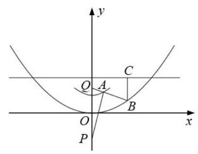

13、点 $A$ 是曲线 $y = \sqrt{{x}^{2} + 2}$ ( $y \leq  2$ )上的任意一点， $P\left( {0, - 2}\right) , Q\left( {0,2}\right)$ ,射线 ${QA}$ 交曲线 $y = \frac{1}{8}{x}^{2}$ 于 $B$ 点, ${BC}$ 垂直于直线 $y = 3$ ,垂足为点 $C$ ,则下列结论:

① $\left| {AP}\right|  - \left| {AQ}\right|$ 为定值 $2\sqrt{2}$ ；

② $\left| {QB}\right|  + \left| {BC}\right|$ 为定值 5 ;

③ $\left| {PA}\right|  + \left| {AB}\right|  + \left| {BC}\right|$ 为定值 $5 + \sqrt{2}$ ；

其中正确结论的序号是___；

14、已知点 $A\left( {-1,0}\right) \text{ 、 }B\left( {1,0}\right) \text{ 、 }C\left( {0,1}\right)$ ,直线 $y = {ax} + b\;\left( {a > 0}\right)$ 将 $\bigtriangleup {ABC}$ 分成面积相等的两部分，则 $b$ 的取值范围是( )

A. $\left( {0,1}\right)$

B. $\left( {1 - \frac{\sqrt{2}}{2},\frac{1}{2}}\right)$ C. $\left( {1 - \frac{\sqrt{2}}{2},\frac{1}{3}}\right\rbrack$ D. $\left\lbrack  {\frac{1}{3},\frac{1}{2}}\right)$

## 第二十五讲:解析几何复习 2

## 圆锥曲线解答题题型归纳:

1、求直线或曲线的方程

2、判断直线与直线或曲线的位置关系

3、度量计算:求弦长，求渐近线方程，求夹角(包括垂直、锐角、钝角一一转化为向量问题)，求三角形或四边形的面积(包括求面积的最值)

4、最值问题

5、探究可变图像的不变性，动中求静(即定点定值问题)

6、转化思想的应用

1、(2021 上海春考)( 1 )团队在 $O$ 点西侧、东侧 20 千米处设有 $A$ 、 $B$ 两站点，测量距离发现一点 $P$ 满足 $\left| {PA}\right|  - \left| {PB}\right|  = {20}$ 千米,可知 $P$ 在 $A\text{ 、 }B$ 为焦点的双曲线上,以 $O$ 点为原点, 东侧为 $x$ 轴正半轴,北侧为 $y$ 轴正半轴,建立平面直角坐标系, $P$ 在北偏东 ${60}^{ \circ  }$ 处,求双曲线标准方程和 $P$ 点坐标.

(2)团队又在南侧、北侧 15 千米处设有 $C\text{ 、 }D$ 两站点，测量距离发现 $\left| {QA}\right|  - \left| {QB}\right|  = {30}$ 千米, $\left| {QC}\right|  - \left| {QD}\right|  = {10}$ 千米,求 $\left| {OQ}\right|$ (精确到 1 米) 和 $Q$ 点位置 (精确到 1 米, ${1}^{ \circ  }$ )

2、(2021 上海高考)已知椭圆 $\Gamma  : \frac{{x}^{2}}{2} + {y}^{2} = 1,{F}_{1}\text{ 、 }{F}_{2}$ 是其左右焦点,直线 $l$ 过点 $P\left( {m,0}\right) \left( {m <  - \sqrt{2}}\right)$ 交椭圆 $\Gamma$ 于 $A, B$ 两点,且 $A, B$ 在 $x$ 轴上方,点 $A$ 在线段 ${BP}$ 上.

(1)若 $B$ 是上顶点， $\left| \overrightarrow{B{F}_{1}}\right|  = \left| \overrightarrow{P{F}_{1}}\right|$ ，求 $m$ 的值；

(2)若 $\overrightarrow{{F}_{1}A} \cdot  \overrightarrow{{F}_{2}A} = \frac{1}{3}$ ，且原点 $O$ 到直线 $l$ 的距离为 $\frac{4\sqrt{15}}{15}$ ，求直线 $l$ 的方程；

(3)对于任意点 $P$ ，是否存在唯一直线 $l$ ，使得 $\overrightarrow{{F}_{1}A}//\overrightarrow{{F}_{2}B}$ 成立，若存在，求出直线 $l$ 的斜率, 若不存在, 请说明理由.

3、(202*新高考 1 卷)已知点 $A\left( {2,1}\right)$ 在双曲线 $C : \frac{{x}^{2}}{{a}^{2}} - \frac{{y}^{2}}{{a}^{2} - 1} = 1\left( {a > 1}\right)$ 上，直线 $l$ 交 $C$ 于 $P, Q$ 两点,直线 ${AP},{AQ}$ 的斜率之和为 0 .

(1)求 $l$ 的斜率；

(2)若 $\tan \angle {PAQ} = 2\sqrt{2}$ ，求 $\bigtriangleup  {PAQ}$ 的面积。

4、(202*北京卷)已知椭圆 $E : \frac{{x}^{2}}{{a}^{2}} + \frac{{y}^{2}}{{b}^{2}} = 1\left( {a > b > 0}\right)$ 的一个顶点为 $A\left( {0,1}\right)$ ，焦距为 $2\sqrt{3}$ 。

(1)求椭圆 $E$ 的方程；

(2)过点 $P\left( {-2,1}\right)$ 作斜率为 $k$ 的直线与椭圆 $E$ 交于不同的两点 $B, C$ ，直线 ${AB},{AC}$ 分别与 $x$ 轴交于点 $M, N$ ，当 $\left| {MN}\right|  = 2$ 时，求 $k$ 的值。

5、(202*全国乙卷) 已知椭圆 $E$ 的中心为坐标原点,对称轴为 $x$ 轴, $y$ 轴,且过点 $A\left( {0, - 2}\right) , B\left( {\frac{3}{2}, - 1}\right)$ 两点

(1)求 $E$ 的方程；

(2)设过点 $P\left( {1, - 2}\right)$ 的直线交 $E$ 于 $M, N$ 两点，过 $M$ 且平行于 $x$ 轴的直线与线段 ${AB}$ 交于点 $T$ ，点 $H$ 满足 $\overrightarrow{MT} = \overrightarrow{TH}$ ，证明:直线 ${HN}$ 过定点。

6、(202*新高考 2 卷)已知双曲线 $C : \frac{{x}^{2}}{{a}^{2}} - \frac{{y}^{2}}{{b}^{2}} = 1\left( {a > 0, b > 0}\right)$ 的右焦点为 $F\left( {2,0}\right)$ ，渐近线方程为 $y =  \pm  \sqrt{3}x$

(1)求 $C$ 的方程；

(2)过 $F$ 的直线与 $C$ 的两条渐近线分别交于 $A, B$ 两点，点 $P\left( {{x}_{1},{y}_{1}}\right) , Q\left( {{x}_{2},{y}_{2}}\right)$ 在 $C$ 上， 且 ${x}_{1} > {x}_{2} > 0,{y}_{1} > 0$ ,过 $P$ 且斜率为 $- \sqrt{3}$ 的直线与过 $Q$ 且斜率为 $\sqrt{3}$ 的直线交于点 $M$ , 请从下面①②③中选取两个作为条件，证明另一个条件成立:

① $M$ 在 ${AB}$ 上；② ${PQ}//{AB}$ ；③ $\left| {MA}\right|  = \left| {MB}\right|$ .

7、(202 * 全国甲卷)设抛物线 $C : {y}^{2} = {2px}\left( {p > 0}\right)$ 的焦点为 $F$ ,点 $D\left( {p,0}\right)$ ，过 $F$ 的直线交 $C$ 于 $M, N$ 两点,当直线 ${MD}$ 垂直于 $x$ 轴时, $\left| {MF}\right|  = 3$ .

(1)求 $C$ 的方程；

(2)设直线 ${MD},{ND}$ 与 $C$ 的另一个交点分别为 $A, B$ ，记直线 ${MN},{AB}$ 的倾斜角分别为 $\alpha ,\beta$ ,当 $\alpha  - \beta$ 取得最大值时,求直线 ${AB}$ 的方程。

8、(2024*浙江卷)如图，已知椭圆 $\frac{{x}^{2}}{12} + {y}^{2} = 1, A, B$ 是椭圆上异于点 $P\left( {1,0}\right)$ 的两点， $Q\left( {0,\frac{1}{2}}\right)$ 是直线 ${AB}$ 上一点,直线 ${PA},{PB}$ 交直线 $y =  - \frac{1}{2}x + 3$ 于 $C, D$ 两点。

(1)求点 $P$ 到椭圆上一点的最大距离；

(2)求 $\left| {CD}\right|$ 的最小值。

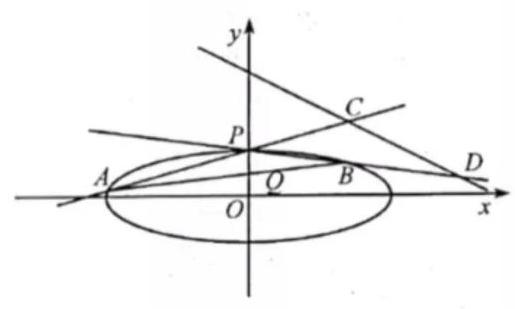

9、(202*天津卷)已知椭圆 $E : \frac{{x}^{2}}{{a}^{2}} + \frac{{y}^{2}}{{b}^{2}} = 1\left( {a > b > 0}\right)$ ， $F$ 为右焦点， $A$ 为右顶点， $B$ 为上顶点,且 $\frac{\left| BF\right| }{\left| AB\right| } = \frac{\sqrt{3}}{2}$ .

(1)求椭圆的离心率；

( 2 )已知直线 $l$ 与椭圆有唯一交点 $M$ ，直线 $l$ 交 $y$ 轴于点 $N,\left| {OM}\right|  = \left| {ON}\right|$ ， $\bigtriangleup {OMN}$ 的面积为 $\sqrt{3}$ ,求椭圆的标准方程。

## 高三数学第二轮复习

## (线下985)

第一讲:集合不等式综合 -1~4

第二讲:函数客观题综合 .5~9

第三讲:函数的不动点和稳定点研究(难点突破 1) ·10~14

第四讲:函数值域问题(等值域、任意存在、最大值的最小值)(难点突破 2)…15~19

第五讲:九月十月月考难题精讲 20~23

第六讲:复合函数专题研究(难点突破 3) 24~28

第七讲:三角函数综合 29~35

第八讲:数列综合 36~40

第九讲:应用题 41~47

第十讲:同构思想在高中数学中的应用(难点突破 4) 48~52

第十一讲:解析几何综合 ·53~57

第十二讲:导数客观题题型归纳 ·58~65

第十三讲:极值点偏移问题(难点突破 5) ·66~72

第十四讲:虚设零点和数列中的不等式(难点突破 6) -73~76

第十五讲:概率统计立体几何等 ·77~83

第十六讲:解析几何解答题 ·84~88

第十七讲:综合卷训练 1 89~93

第十八讲:综合卷训练 2 -94~98

## 第一讲:集合、不等式综合

## 一、填空题

1、已知集合 $M = \{ x \mid  \left( {x - a}\right) \left( {{x}^{2} - {ax} + a - 1}\right)  = 0\}$ 各元素之和等于 3,则实数 $a$ 的值是___；

2、集合 $A = \left\{  {x\left| {\;\frac{1}{4} \leq  {2}^{x} \leq  \frac{1}{2}}\right. , x \in  \mathbf{R}}\right\}  , B = \left\{  {x\left| {\;{x}^{2} - {2tx} + 1 \leq  0}\right. }\right\}$ ,若 $A \subseteq  B$ ,则实数 $t$ 的取值范围是___；

3、集合 $M = \{ 1,2,3,\cdots ,{100}\}$ 所有子集的所有元素之和为___；

4、若 $x \in  A$ ，则 $2 - x \in  A$ ，就称 $A$ 是 “对偶关系” 集合，若集合 $\{ a, - 4, - 2,0,2,4,6,7\}$ 的所有非空子集中是 “对偶关系” 的集合一共 15 个，则实数 $a$ 的取值集合为___；

5、设集合 $A = \left\{  {x \mid  {x}^{2} + {2x} - 3 > 0}\right\}$ ,集合 $B = \left\{  {x \mid  {x}^{2} - {2ax} - 1 \leq  0, a > 0}\right\}$ . 若 $A \cap  B$ 中恰含有 2 个整数，则实数 $a$ 的取值范围是___；

6、已知集合 $A = \left\{  {\left( {x, y}\right)  \mid  y =  - {x}^{2} + {ax} - 1}\right\}  ,\;A = \{ \left( {x, y}\right)  \mid  x + y = 3,0 \leq  x \leq  3\}$ ,若 $A \cap  B$ 中有且仅有一个元素，则实数 $a$ 的取值范围是___；

7、 $f\left( x\right)$ 是定义在 $\mathbf{R}$ 上的奇函数，当 $x \geq  0$ 时， $f\left( x\right)  = {x}^{2}$ ，若对任意 $x \in  \left\lbrack  {a, a + 2}\right\rbrack$ ， $f\left( {x + a}\right)  \geq  {2f}\left( x\right)$ 恒成立，则实数 $a$ 的取值范围为___

8、已知函数 $f\left( x\right)  = \left| {x + \frac{1}{x} + a}\right|$ ,若对任意实数 $a$ ,关于 $x$ 的不等式 $f\left( x\right)  \geq  m$ 在区间 $\left\lbrack  {\frac{1}{2},3}\right\rbrack$ 上总有解,则实数 $m$ 的取值范围为___

9、 已知集合 $A = \left\lbrack  {t, t + 1}\right\rbrack   \cup  \left\lbrack  {t + 4, t + 9}\right\rbrack  ,0 \notin  A$ ，存在正数 $\lambda$ ，使得对任意 $a \in  A$ ，都有 $\frac{\lambda }{a} \in  A$ ,则 $t$ 的值是___

## 二、选择题

10、有下列三个命题:① “ $x + y \neq  4$ ” 是 “ $x \neq  1$ 且 $y \neq  3$ ” 的必要非充分条件; ② ${xy} < 0$ 是 $\left| {x - y}\right|  = \left| x\right|  + \left| y\right|$ 的充要条件; ③ 已知 $m, n \in  \mathbf{Z}$ ,则 ${m}^{2} + {n}^{2} < 5$ 是 $m + n \leq  2$ 的充分非必要条件; 其中的真命题有( )

A. 0 个 B. 1 个 C. 2 个 D. 3 个

11、设函数 $f\left( x\right)  = {x}^{3} + \frac{{2}^{x} - 1}{{2}^{x} + 1}$ ,若对任意实数 $a \in  \left( {-1,1}\right) , b \in  \left( {-1,1}\right)$ ,则 $a + b \geq  0$ 是 $f\left( a\right)  + f\left( b\right)  \geq  0$ 的(   )

A. 充分不必要条件 B. 必要不充分条件

C. 充要条件 D. 既不充分也不必要条件

12、不等式 ${xy} \leq  a{x}^{2} + 2{y}^{2}$ 对任意 $x \in  \left\lbrack  {1,2}\right\rbrack$ 及 $y \in  \left\lbrack  {2,3}\right\rbrack$ 恒成立，则实数 $a$ 的范围是( )

A. $- 1 \leq  a \leq  1$ B. $a \geq   - 3$ C. $a \geq   - 1$ D. $- 3 \leq  a \leq   - 1$

13、已知 $f\left( x\right)  = \left( {{x}^{2} - {6x} + {c}_{1}}\right) \left( {{x}^{2} - {6x} + {c}_{2}}\right) \left( {{x}^{2} - {6x} + {c}_{3}}\right) \left( {{x}^{2} - {6x} + {c}_{4}}\right)$ , 集合 $M = \left\{  {x \mid  f\left( x\right)  = 0}\right\}   = \left\{  {{x}_{1},{x}_{2},\cdots ,{x}_{7}}\right\}   \subseteq  \mathbf{Z}$ ,且 ${c}_{1} < {c}_{2} < {c}_{3} < {c}_{4}$ ,则 ${c}_{4} - {c}_{1}$ 不可能的值是( )

A. 9 B. 16 C. 25 D. 35

## 三、解答题

14、设全集是实数集 $\mathrm{R}, A = \left\{  {x \mid  2{x}^{2} - {7x} + 3 \leq  0}\right\}  , B = \left\{  {x \mid  {x}^{2} + a < 0}\right\}$ ,若 $\bar{A} \cap  B = B$ ,求实数 $\mathrm{a}$ 的取值范围。

15、二次函数 $f\left( x\right)  = a{x}^{2} + {bx} + c\left( {a \neq  0}\right)$ ,其中 $a, b, c$ 均为整数,且 $f\left( 0\right) , f\left( 1\right)$ 均为奇数, 求证: $f\left( x\right)  = 0$ 无整数解。

16、已知二次函数 $f\left( x\right)  = {x}^{2} + {px} + q$ ，证明: $\left| {f\left( 1\right) }\right| ,\left| {f\left( 2\right) }\right| ,\left| {f\left( 3\right) }\right|$ 中至少有一个不小于 $\frac{1}{2}$ 。

## 第二讲:函数综合 1

## 一、填空题

1、函数 $y = \sqrt{{x}^{2} - {2x} - 1}$ 的单调递减区间为___；

2、若函数 $f\left( x\right)  = \frac{{ax} + 1}{x + 2}$ 在区间 $\left( {-2, + \infty }\right)$ 上是增函数，则实数 $a$ 的取值范围是___；

3、若 $f\left( 1\right)  =  - 1$ ，且 $f\left( {x + 2}\right)  = \frac{1}{1 - f\left( x\right) }$ ，则 $f\left( {2019}\right)  =$ ___；

4、设函数 $f\left( x\right)  = \lg \left( {1 + \left| x\right| }\right)  - \frac{1}{1 + {x}^{2}}$ ，则使 $f\left( {2x}\right)  < f\left( {{3x} - 2}\right)$ 成立的 $x$ 取值范围是___；

5、已知函数 $f\left( x\right)  = {x}^{3} + x$ ，关于 $x$ 的不等式 $f\left( {{mx} - 2}\right)  + f\left( x\right)  < 0$ 在区间 $\left\lbrack  {1,2}\right\rbrack$ 上有解，则实数 $m$ 的取值范围为___；

6、若函数 $f\left( x\right)  = \left\{  \begin{matrix} \left| {\lg \left( {x - 1}\right) }\right| & x > 1 \\  \sin x & x < 0 \end{matrix}\right.$ ，则 $y = f\left( x\right)$ 图像上关于原点 $O$ 对称的点共有___对；

7、已知函数 $f\left( x\right)  = \left\{  \begin{matrix} {2}^{-x} - 1 & \left( {x \leq  0}\right) \\  f\left( {x - 1}\right) & \left( {x > 0}\right)  \end{matrix}\right.$ ,若方程 $f\left( x\right)  = x + a$ 有且只有两个不相等的实数根，则 $a$ 的取值范围___；

8、已知关于 $x$ 的方程 $\left| {x + {a}^{2}}\right|  + \left| {x - {a}^{2}}\right|  =  - {x}^{2} + {2x} - 1 + 2{a}^{2}$ 有解,则实数 $a$ 的取值范围是 ___；

9、已知函数 $g\left( x\right)$ 的定义域为 $\mathbf{R}$ ,对任何实数 $m\text{ 、 }n$ ,都有 $g\left( {m + n}\right)  = g\left( m\right)  + g\left( n\right)  - 3$ , 且函数 $f\left( x\right)  = \frac{x\sqrt{1 - {x}^{2}}}{{x}^{2} + 1} + g\left( x\right)$ 的最大值为 $p$ ,最小值为 $q$ ,则 $p + q$ 的值为___；

10、设 $a \in  \mathbf{R}$ ,函数 $f\left( x\right)  = \left\{  \begin{array}{l} {\left( x - a\right) }^{2}, x \leq  0 \\  x + \frac{1}{x} + a, x > 0 \end{array}\right.$ ,若函数 $g\left( x\right)  = f\left( x\right)  - 3$ 有且仅有 3 个零点, 则 $a$ 的取值范围是___；

11、已知 $a > 0$ ，函数 $f\left( x\right)  = \frac{x}{1 + {x}^{2}}, g\left( x\right)  = x - \frac{a}{3}$ ，若对任意 ${x}_{1} \in  \left\lbrack  {-a, a}\right\rbrack$ ，总存在 ${x}_{2} \in  \left\lbrack  {-a, a}\right\rbrack$ ,使得 $f\left( {x}_{2}\right)  \geq  g\left( {x}_{1}\right)$ ,则 $a$ 的最大值为___；

12、已知 $a$ 为实数，函数 $f\left( x\right)  = a\sqrt{1 - {x}^{2}} + \sqrt{1 + x} + \sqrt{1 - x}$ 的最大值为 $g\left( a\right)  =$ ___；

## 二、选择题

13、若规定 $E = \left\{  {{a}_{1},{a}_{2},\cdots ,{a}_{n}}\right\}$ 的子集 $\left\{  {{a}_{{l}_{1}},{a}_{{l}_{2}},\cdots ,{a}_{{l}_{n}}}\right\}$ 为 $E$ 的第 $k$ 个子集,其中 $k = {2}^{{l}_{1} - 1} + {2}^{{l}_{2} - 1} + \cdots  + {2}^{{l}_{n} - 1}$ ,称 ${l}_{1} + {l}_{2} + \cdots  + {l}_{n}$ 为第 $k$ 个子集的下标之和,则 $E$ 的第 211 个子集的下标之和为( )

A. 17 B. 23 C. 29 D. 33

14、已知实数 $a > 0, b > 0$ ，对于定义在 $\mathbf{R}$ 上的函数 $f\left( x\right)$ ，有下述命题:

① “ $f\left( x\right)$ 是奇函数” 的充要条件是 “函数 $f\left( {x - a}\right)$ 的图像关于点 $A\left( {a,0}\right)$ 对称”;

② “ $f\left( x\right)$ 是偶函数” 的充要条件是 “函数 $f\left( {x - a}\right)$ 的图像关于直线 $x = a$ 对称”;

③ “ ${2a}$ 是 $f\left( x\right)$ 的一个周期” 的充要条件是 “对任意的 $x \in  \mathbf{R}$ ,都有 $f\left( {x - a}\right)  =  - f\left( x\right)$ ”;

④ “函数 $y = f\left( {x - a}\right)$ 与 $y = f\left( {b - x}\right)$ 的图像关于 $y$ 轴对称” 的充要条件是 “ $a = b$ ”; 其中正确命题的序号是( )

A. ①② B. ②③ C. ①④ D. ③④

15、函数 $f\left( x\right)  = x, g\left( x\right)  = {x}^{2} - x + 2$ ,若存在 ${x}_{1},{x}_{2},\cdots ,{x}_{n} \in  \left\lbrack  {0,\frac{9}{2}}\right\rbrack$ ,使得

$f\left( {x}_{1}\right)  + f\left( {x}_{2}\right)  + \cdots  + f\left( {x}_{n - 1}\right)  + g\left( {x}_{n}\right)  = g\left( {x}_{1}\right)  + g\left( {x}_{2}\right)  + \cdots  + g\left( {x}_{n - 1}\right)  + f\left( {x}_{n}\right)$ ,则 $n$ 的最大值是 ( )

A. 11 B. 13 C. 14 D. 18

## 三、解答题

16、已知函数 $f\left( x\right)  = {ax} - b{x}^{2}$ .

(1)当 $b > 0$ 时，若对于任意 $x \in  R$ 都有 $f\left( x\right)  \leq  1$ ，求证: $a \leq  2\sqrt{b}$ 。

(2)当 $b > 1$ 时，求证:对于任意 $x \in  \left\lbrack  {0,1}\right\rbrack$ ， $\left| {f\left( x\right) }\right|  \leq  1$ 的充要条件是 $b - 1 \leq  a \leq  2\sqrt{b}$ 。

17、已知函数 $f\left( x\right)  = {2}^{x} + \frac{a}{{2}^{x}}, a$ 为实常数.

(1)若函数 $f\left( x\right)$ 为奇函数，求 $a$ 的值；

(2)若 $x \in  \left\lbrack  {0,1}\right\rbrack$ 时 $f\left( x\right)$ 的最小值为2，求 $a$ 的值；

(3)若方程 $f\left( x\right)  = 6$ 有两个不等的实根 ${x}_{1}\text{ 、 }{x}_{2}$ ，且 $\left| {{x}_{1} - {x}_{2}}\right|  \leq  1$ ，求 $a$ 的取值范围.

## 难点突破专题: 函数的不动点和稳定点

一、不动点:已知函数 $y = f\left( x\right) , x \in  D$ ，若存在 ${x}_{0} \in  D$ ，使得 $f\left( {x}_{0}\right)  = {x}_{0}$ ，则称 ${x}_{0}$ 为函数 $y = f\left( x\right)$ 的不动点。

不动点的几何意义: 即为 $y = f\left( x\right)$ 与 $y = x$ 两者函数图像交点的横坐标。

二、稳定点: 已知函数 $y = f\left( x\right) , x \in  D$ ,若存在 ${x}_{0} \in  D$ ,使得 $f\left( {f\left( {x}_{0}\right) }\right)  = {x}_{0}$ ,则称 ${x}_{0}$ 为函数 $y = f\left( x\right)$ 的稳定点。

稳定点的几何意义: 为 $y = f\left( x\right)$ 与其反函数 (多值) 的交点的横坐标。

例 1: 求 $y = {2x} - 1$ 的不动点;

例 2: 求 $y = 2{x}^{2} - 1$ 的不动点;

例 3: 求 $y = {2x} - 1$ 的稳定点;

例 4: 求 $y = 2{x}^{2} - 1$ 的稳定点; 该函数的不动点为 $x =  - \frac{1}{2},1$ ; 该函数的稳定点为 $x =  - \frac{1}{2},1,\frac{-1 \pm  \sqrt{5}}{4}$ 。如下图:

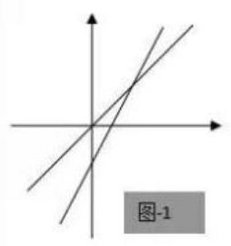

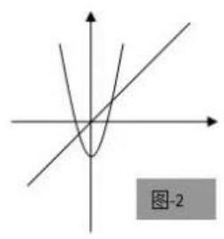

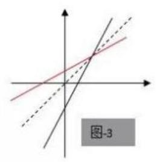

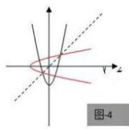

由图可发现: 不动点是函数 $y = f\left( x\right)$ 与直线 $y = x$ 交点的横坐标; 而稳定点是函数 $y = f\left( x\right)$ 的图像与它反函数图像 (可以是多值的) 的交点的横坐标。其中不动点一定是稳定点, 稳定点并不一定是不动点。

## 三、性质归纳

(1)若函数 $y = f\left( x\right)$ 有不动点 ${x}_{0}$ ，则不动点一定是稳定点。

即 $\{ x \mid  f\left( x\right)  = x\}  \subseteq  \{ x \mid  f\left( {f\left( x\right) }\right)  = x\}$

(2)若函数 $y = f\left( x\right)$ 是单增，则它的不动点与稳定点相同或者都没有。

证明: 若函数 $y = f\left( x\right)$ 有不动点 ${x}_{0}$ ,显然它也有稳定点 ${x}_{0}$ 。

若函数 $y = f\left( x\right)$ 有稳定点 ${x}_{0}$ ,即 $f\left( {f\left( {x}_{0}\right) }\right)  = {x}_{0}$ ,设 $f\left( {x}_{0}\right)  = {y}_{0}$ ,则 $f\left( {y}_{0}\right)  = {x}_{0}$ ,即 $\left( {{x}_{0},{y}_{0}}\right) ,\left( {{y}_{0},{x}_{0}}\right)$ 都在函数 $y = f\left( x\right)$ 的图像上。

假设 ${x}_{0} > {y}_{0}$ ,因为函数 $y = f\left( x\right)$ 单增,则 $f\left( {x}_{0}\right)  > f\left( {y}_{0}\right)$ ,即 ${y}_{0} > {x}_{0}$ ,矛盾;

假设 ${x}_{0} < {y}_{0}$ ,因为函数 $y = f\left( x\right)$ 单增,则 $f\left( {x}_{0}\right)  < f\left( {y}_{0}\right)$ ,即 ${y}_{0} < {x}_{0}$ ,矛盾;

故 ${x}_{0} = {y}_{0}$ ,即 $f\left( {x}_{0}\right)  = {x}_{0}, y = f\left( x\right)$ 有不动点 ${x}_{0}$ 。

即: 若 $y = f\left( x\right)$ 单增, $\{ x \mid  f\left( x\right)  = x\}  = \{ x \mid  f\left( {f\left( x\right) }\right)  = x\}$

(3)若函数 $y = f\left( x\right)$ 单减，稳定点不一定是不动点。举反例: $y = \frac{1}{x}$

## 巩固练习

1、对于函数 $f\left( x\right)$ ，若 $f\left( x\right)  = x$ ，则称 $x$ 为 $f\left( x\right)$ 的 “不动点”；若 $f\left\lbrack  {f\left( x\right) }\right\rbrack   = x$ ，则称 $x$ 为 $f\left( x\right)$ 的 “稳定点”,函数 $f\left( x\right)$ 的 “不动点” 和 “稳定点” 的集合分别记为 $A$ 和 $B$ ,即 $A = \{ x \mid  f\left( x\right)  = x\} ,\;B = \{ x \mid  f\left( {f\left( x\right) }\right)  = x, x \in  R\}$  。

(1)证明: $A \subseteq  B$ ；

(2)若设 $f\left( x\right)  = {x}^{2} + {px} + q\left( {p, q \in  R}\right)$ ，当 $A = \{  - 1,3\}$ 时，求 B。

(3)若设 $f\left( x\right)  = a{x}^{2} - 1\left( {a, x \in  R}\right)$ ，且 $A = B \neq  \phi$ ，求 $a$ 的取值范围。

2、函数 $f\left( x\right)  = a{x}^{2} + {bx} + c\left( {a \neq  0}\right)$ ,且 $f\left( x\right)  = x$ 没有实数根,问, $f\left( {f\left( x\right) }\right)  = x$ 是否有实数根,并证明你的结论。

3、已知函数 $f\left( x\right)  = {x}^{2} + {ax} + a$ 对于任意实数 $x, f\left( {f\left( x\right) }\right)  > x$ 恒成立,求 $a$ 的取值范围。

4、已知 $f\left( x\right)  = a{x}^{2} + {bx} + c\left( {a \neq  0}\right)$ ,且方程 $f\left( x\right)  = x$ 无实数根。现有四个命题 ① 方程 $f\left\lbrack  {f\left( x\right) }\right\rbrack   = x$ 也一定没有实数根; ② 若 $a > 0$ ，则不等式 $f\left\lbrack  {f\left( x\right) }\right\rbrack   > x$ 对一切 $x \in  R$ 成立；

③若 $a < 0$ ，则必存在实数 ${x}_{0}$ 使不等式 $f\left\lbrack  {f\left( {x}_{0}\right) }\right\rbrack   > {x}_{0}$ 成立；④若 $a + b + c = 0$ ，则不等式 $f\left\lbrack  {f\left( x\right) }\right\rbrack   < x$ 对一切 $x \in  R$ 成立；则真命题的序号为___；

5、对于函数 $f\left( x\right)$ ，若 $f\left( {x}_{0}\right)  = {x}_{0}$ ，则称 ${x}_{0}$ 为函数 $y = f\left( x\right)$ 的不动点，若 $f\left( {f\left( {x}_{0}\right) }\right)  = {x}_{0}$ ， 则称 ${x}_{0}$ 为函数 $y = f\left( x\right)$ 的稳定点。如果 $f\left( x\right)  = {x}^{2} + a\left( {a \in  R}\right)$ 的 “稳定点” 恰是它的 “不动点”函数，那么 $a$ 的取值范围是( )

A. $\left( {-\infty ,\frac{1}{4}}\right\rbrack$ B. $\left( {-\frac{3}{4}, + \infty }\right)$ C. $\left( {-\frac{3}{4},\frac{1}{4}}\right)$ D. $\left\lbrack  {-\frac{3}{4},\frac{1}{4}}\right\rbrack$

6、方程 $f\left( x\right)  = x$ 的根称为函数的不动点,若函数 $f\left( x\right)  = \frac{x}{a\left( {x + 1}\right) }$ 有唯一不动点,且 ${x}_{1} = {1000},{x}_{n + 1} = \frac{1}{f\left( \frac{1}{{x}_{n}}\right) }, n = 1,2,3,\cdots$ ,则 ${x}_{2017} = \frac{}{}$ 。

7、已知 $f\left( x\right)  = {x}^{3} - {bx}$ ,若 $f\left( x\right)$ 在 $\lbrack 1, + \infty )$ 上单调

(1)求 $b$ 的取值范围；

(2)已知 $f\left( x\right)  = {x}^{3} - {bx}$ ，若设 ${x}_{0} \geq  1, f\left( {x}_{0}\right)  \geq  1$ ，且满足 $f\left( {f\left( {x}_{0}\right) }\right)  = {x}_{0}$ ，求证: $f\left( {x}_{0}\right)  = {x}_{0}$ 。

8、已知函数 $f\left( x\right)  = {2}^{x} + {2x} - a$ ,若方程 $f\left( {f\left( x\right) }\right)  = x$ 在区间 $\left\lbrack  {1,2}\right\rbrack$ 上有解,求实数 $a$ 的取值范围。

9、设函数 $f\left( x\right)  = \sqrt{{e}^{x} + x - a}\left( {a \in  R, e\text{ 为自然对数的底数 }}\right)$ ,若曲线 $y = \sin x$ 上存在点 $\left( {{x}_{0},{y}_{0}}\right)$ 使得 $f\left( {f\left( {y}_{0}\right) }\right)  = {y}_{0}$ ,则 $a$ 的取值范围是( )

A. $\left\lbrack  {1, e}\right\rbrack$ B. $\left\lbrack  {{e}^{-1} - 1,1}\right\rbrack$ C. $\left\lbrack  {1,1 + e}\right\rbrack$ D. $\left\lbrack  {{e}^{-1} - 1, e + 1}\right\rbrack$

10、设函数 $y = f\left( x\right)$ 的定义域为 $D$ ,值域为 $A$ ,如果存在函数 $x = g\left( t\right)$ ,使得函数 $y = f\left( {g\left( t\right) }\right)$ 的值域仍是 $A$ ,那么称 $x = g\left( t\right)$ 是函数 $y = f\left( x\right)$ 的一个等值域变换。

(1)判断下列函数 $x = g\left( t\right)$ 是不是函数 $y = f\left( x\right)$ 的一个等值域变换？说明你的理由;

① $f\left( x\right)  = {\log }_{2}x, x > 0, x = g\left( t\right)  = t + \frac{1}{t}, t > 0$

② $f\left( x\right)  = {x}^{2} - x + 1, x \in  R, x = g\left( t\right)  = {2}^{t}, t \in  R$

(2)设函数 $y = f\left( x\right)$ 的定义域为 $D$ ,值域为 $A$ ,函数 $g\left( t\right)$ 的定义域为 ${D}_{1}$ ，值域为 ${A}_{1}$ ， 那么 “ $D = {A}_{1}$ ” 是否为 “ $x = g\left( t\right)$ 是 $y = f\left( x\right)$ 的一个等值域变换” 的一个必要条件? 请说明理由。

(3)设 $f\left( x\right)  = {\log }_{2}x$ 的定义域为 $x \in  \left\lbrack  {2,8}\right\rbrack$ ，已知 $x = g\left( t\right)  = \frac{m{t}^{2} - {3t} + n}{{t}^{2} + 1}$ 是 $y = f\left( x\right)$ 的一个等值域变换,且函数 $y = f\left( {g\left( t\right) }\right)$ 的定义域为 $R$ ,求实数 $m, n$ 的值。

# 难点突破专题: 函数的值域

## 等值域问题、任意存在问题、最大值的最小值问题

## 一、保值(倍值)问题

1、若函数 $f\left( x\right)  = \sqrt{x - 1} + m$ 在区间 $\left\lbrack  {a, b}\right\rbrack$ 的值域为 $\left\lbrack  {\frac{a}{2},\frac{b}{2}}\right\rbrack$ ,则实数 $m$ 的取值范围是___；

2、对于函数 $y = f\left( x\right)$ ,若存在区间 $\left\lbrack  {a, b}\right\rbrack$ ,当 $x \in  \left\lbrack  {a, b}\right\rbrack$ 时, $f\left( x\right)$ 的值域为 $\left\lbrack  {{ka},{kb}}\right\rbrack  \left( {k > 0}\right)$ , 则称 $y = f\left( x\right)$ 为 $k$ 倍值函数。若 $f\left( x\right)  = \ln x + x$ 为 $k$ 倍值函数,则实数 $k$ 的取值范围是 ___；

## 二、复合函数等值域变换

1、设函数 $y = f\left( x\right)$ 的定义域为 $D$ ,值域为 $A$ ,如果存在函数 $x = g\left( t\right)$ ,使得函数 $y = f\left( {g\left( t\right) }\right)$ 的值域仍是 $A$ ,那么称 $x = g\left( t\right)$ 是函数 $y = f\left( x\right)$ 的一个等值域变换。

(4)判断下列函数 $x = g\left( t\right)$ 是不是函数 $y = f\left( x\right)$ 的一个等值域变换？说明你的理由；

① $f\left( x\right)  = {\log }_{2}x, x > 0, x = g\left( t\right)  = t + \frac{1}{t}, t > 0$

② $f\left( x\right)  = {x}^{2} - x + 1, x \in  R, x = g\left( t\right)  = {2}^{t}, t \in  R$

(5)设函数 $y = f\left( x\right)$ 的定义域为 $D$ ，值域为 $A$ ，函数 $g\left( t\right)$ 的定义域为 ${D}_{1}$ ，值域为 ${A}_{1}$ ， 那么 “ $D = {A}_{1}$ ” 是否为 “ $x = g\left( t\right)$ 是 $y = f\left( x\right)$ 的一个等值域变换” 的一个必要条件? 请说明理由。

(6)设 $f\left( x\right)  = {\log }_{2}x$ 的定义域为 $x \in  \left\lbrack  {2,8}\right\rbrack$ ，已知 $x = g\left( t\right)  = \frac{m{t}^{2} - {3t} + n}{{t}^{2} + 1}$ 是 $y = f\left( x\right)$ 的一个等值域变换,且函数 $y = f\left( {g\left( t\right) }\right)$ 的定义域为 $R$ ,求实数 $m, n$ 的值。

2、已知函数 $f\left( x\right)  = a\ln x - x + 2\left( {a > 1, a \in  Z}\right)$ ,若 $y = f\left( x\right)$ 与 $y = f\left( {f\left( x\right) }\right)$ 的值域相同, 则实数 $a$ 的最小值是___；5

3、(2022 上海高考 12)已知函数 $f\left( x\right)$ 的定义域为 $\lbrack 0, + \infty )$ ，且满足 $f\left( x\right)  = f\left( \frac{1}{1 + x}\right)$ ，函数的值域为 $A$ ,若集合 $\{ y \mid  y = f\left( x\right) , x \in  \left\lbrack  {0, a}\right\rbrack  \}$ 可取得 $A$ 中所有值,则实数 $a$ 的取值范围为 ___；

## 三、任意和存在问题

(1)不等关系(任反存同)

① 任意 ${x}_{1} \in  {D}_{1}$ ,任意 ${x}_{2} \in  {D}_{2}, f\left( {x}_{1}\right)  > g\left( {x}_{2}\right)  \Rightarrow  f{\left( x\right) }_{\min } > g{\left( x\right) }_{\max }$

② 任意 ${x}_{1} \in  {D}_{1}$ ，存在 ${x}_{2} \in  {D}_{2}$ ，

③ 存在 ${x}_{1} \in  {D}_{1}$ ，任意 ${x}_{2} \in  {D}_{2}$ ，

④ 存在 ${x}_{1} \in  {D}_{1}$ ，存在 ${x}_{2} \in  {D}_{2}$ ，

(2)相等关系(任意是存在的子集)

① 任意 ${x}_{1} \in  {D}_{1}$ ，存在 ${x}_{2} \in  {D}_{2}$ ， $f\left( {x}_{1}\right)  \subseteq  g\left( {x}_{2}\right)$

② 存在 ${x}_{1} \in  {D}_{1}$ ，存在 ${x}_{2} \in  {D}_{2}$ ， $f\left( {x}_{1}\right)$ 与 $g\left( {x}_{2}\right)$ 的值域有交集

1、已知函数 $f\left( x\right)  = x + \frac{a}{x}, g\left( x\right)  = 2{x}^{2} - x + 2 - a\left( {a > 0}\right)$ ,对于任意 ${x}_{1},{x}_{2} \in  (0,2\rbrack$ , $f\left( {x}_{1}\right)  > g\left( {x}_{2}\right)$ 恒成立,求实数 $a$ 的取值范围。

2、设函数 $f\left( x\right)  = {2}^{x} - \frac{1}{x}, g\left( x\right)  = {ax} - \frac{1}{2}$ ,对于任意 ${x}_{1} \in  \left\lbrack  {1,2}\right\rbrack$ ,存在 ${x}_{2} \in  \left\lbrack  {2,4}\right\rbrack$ ,使得 $f\left( {x}_{1}\right)  = g\left( {x}_{2}\right)$ ,求实数 $a$ 的取值范围。

四、函数 $y = \left| {f\left( x\right)  - \left( {{ax} + b}\right) }\right|$ 的最大值的最小值

(1)平口单峰函数

( 2 )函数 $y = \left| {f\left( x\right)  - \left( {{ax} + b}\right) }\right|$ 的几何意义

(3)函数 $y = \left| {f\left( x\right)  - \left( {{ax} + b}\right) }\right|$ 最大值的最小值

(4)拉格朗日中值定理

(5)切比雪夫最佳逼近直线

(6)绝对值三角不等式(三点或四点控制法)

1、设函数 $f\left( x\right)  = \left| {x + \frac{1}{x} - {ax} - b}\right| , a, b \in  R$ ,当 $x \in  \left\lbrack  {\frac{1}{2},2}\right\rbrack$ 时, $f\left( x\right)$ 的最大值为 $M\left( {a, b}\right)$ , 则 $M\left( {a, b}\right)$ 的最小值为___；

2、设函数 $f\left( x\right)  = \left| {\frac{1}{x} - {ax} - b}\right| , a, b \in  R$ ,若对于任意实数 $a, b$ ,总存在实数 ${x}_{0} \in  \left\lbrack  {1,2}\right\rbrack$ ,使得不等式 $f\left( {x}_{0}\right)  \geq  m$ 成立，则实数 $m$ 的取值范围是___；

3、已知函数 $f\left( x\right)  = {x}^{3} + {ax} + b$ 的定义域为 $\left\lbrack  {-1,2}\right\rbrack$ ,记 $\left| {f\left( x\right) }\right|$ 的最大值为 $M$ ,则 $M$ 的最小值为___。

4、若函数 $f\left( x\right)  = \left| {\sin x + \frac{2}{3 + \sin x} + t}\right| \left( {x, t \in  R}\right)$ 的最大值记为 $g\left( t\right)$ ,则函数 $g\left( t\right)$ 的最小值为___；

5、(2020 松江一模)已知 $b, c \in  \mathbf{R}$ ，若 $\left| {{x}^{2} + {bx} + c}\right|  \leq  M$ 对任意的 $x \in  \left\lbrack  {0,4}\right\rbrack$ 恒成立，则()

A. $M$ 的最小值为 1 B. $M$ 的最小值为 2

C. $M$ 的最小值为 4 D. $M$ 的最小值为 8

6、设函数 $f\left( x\right)  = \left| {\sqrt{x} - {ax} - b}\right| , a, b \in  R$ ,若对于任意实数 $a, b$ ,总存在实数 ${x}_{0} \in  \left\lbrack  {0,4}\right\rbrack$ , 使得不等式 $f\left( {x}_{0}\right)  \geq  m$ 成立，则实数 $m$ 的取值范围是___；

# 第五讲:九月、十月份月考题精讲

控江

10. 已知常数 $b\text{ 、 }c \in  \mathbf{R}$ ,若函数 $f\left( x\right)  = \left( {{x}^{2} + x - 2}\right) \left( {{x}^{2} + {bx} + c}\right)$ 为偶函数,则 $b + c =$

11. 记 $a\text{ 、 }b\text{ 、 }c\text{ 、 }d\text{ 、 }e\text{ 、 }f$ 为 $1\text{ 、 }2\text{ 、 }3\text{ 、 }4\text{ 、 }5\text{ 、 }6$ 的任意一个排列,则使得 $\left( {a + b}\right) \left( {c + d}\right) \left( {e + f}\right)$ 为奇数的排列共有___个

12. 已知函数 $f\left( x\right)  = \left| {x + \frac{1}{x} + a}\right|$ ,若对任意实数 $a$ ,关于 $x$ 的不等式 $f\left( x\right)  \geq  m$ 在区间 $\left\lbrack  {\frac{1}{2},3}\right\rbrack$ 上总有解,则实数 $m$ 的取值范围为___

16. 已知函数 $y = f\left( x\right)$ 的定义域为 $\left( {0, + \infty }\right)$ ,满足对任意 $x \in  \left( {0, + \infty }\right)$ ,恒有 $f\left\lbrack  {f\left( x\right)  - \frac{1}{x}}\right\rbrack   = 4$ , 若函数 $y = f\left( x\right)  - 4$ 的零点个数为有限的 $n\left( {n \in  {\mathbf{N}}^{ * }}\right)$ 个，则 $n$ 的最大值为( )

A. 1 B. 2 C. 3 D. 4

## 控江

9. 已知 $\alpha  : 1 \leq  x \leq  4,\beta  : {\log }_{2}{}^{2}x - {4a} \cdot  {\log }_{4}x + 1 \leq  0$ ，若 $\alpha$ 是 $\beta$ 成立的必要条件，则实数 $a$ 的取值范围是___；

10. 设 $m \in  \mathbf{R}$ ,若对于任意实数 $a$ ,都存在 $x \in  \left\lbrack  {-2,2}\right\rbrack$ 满足 $\left| {{x}^{2} - 1}\right|  + \left| {x - a}\right|  > m$ ,则 $m$ 的取值范围是___；

12. 函数 $f\left( x\right)  = \sqrt{3}x + \frac{1}{x}\left( {x > 0}\right)$ 的图像绕着坐标原点旋转 $\theta \left( {0 < \theta  < {2\pi }}\right)$ 弧度,若仍是函数图像，则 $\theta$ 可取值的集合为___；

上实

10. 现有下列四个结论中, 其中正确结论是___(请填写序号)

① 幂函数 $y = {x}^{k}$ ( $k \in  \mathbf{Q}$ )的图像与函数 $y = \frac{1}{x}$ 的图像至少有两个交点;

② 函数 $y = k \cdot  {3}^{x}\left( {k > 0}\right)$ ( $k$ 为常数) 的图像可由函数 $y = {3}^{x}$ 的图像经过平移得到;

③ 函数 $y = x\left( {\frac{1}{{3}^{x} - 1} + \frac{1}{2}}\right) \left( {x \neq  0}\right)$ 是偶函数；

④ 函数 $y = \lg \frac{{x}^{2} + 1}{\left| x\right| }$ 无最大值,也无最小值;

11. 已知集合 $X = \{ 1,2,5,7,{11},{13},{16},{17}\}$ ，设 ${x}_{i},{x}_{j} \in  X$ ，若方程 ${x}_{i} - {x}_{j} = k$ ( $k > 0$ )至少有三组不同的解，写出 $k$ 的所有可能取值为___；

12. 已知函数 $y = f\left( x\right)$ 是定义域为 $\mathbf{R}$ 的偶函数,当 $x \geq  0$ 时, $f\left( x\right)  = \left\{  {\begin{matrix}  - \frac{1}{4}{x}^{2} & 0 \leq  x \leq  2 \\   - {\left( \frac{1}{2}\right) }^{x} - \frac{3}{4} & x > 2 \end{matrix},\text{ 若关于 }x}\right.$ 的方程 ${\left\lbrack  f\left( x\right) \right\rbrack  }^{2} + {af}\left( x\right)  + \frac{7a}{16} = 0, a \in  \mathbf{R},$ 有且仅有 8 个不同实数根，则实数 $a$ 的取值范围是___；

## 交附

11. 已知有限集 $A = \left\{  {{a}_{1},{a}_{2},\cdots ,{a}_{n}}\right\}  \left( {n \geq  2, n \in  {\mathbf{N}}^{ * }}\right)$ ,如果 $A$ 中元素 ${a}_{i}\left( {i = 1,2,\cdots , n}\right)$ 满足: ${a}_{1} \times  2{a}_{2} \times  \cdots  \times  n{a}_{n} = {a}_{1} + 2{a}_{2} + \cdots  + n{a}_{n}$ ,就称 $A$ 为 $n$ 元 “均衡集”,若 $\left\{  {{a}_{1},{a}_{2}}\right\}$ 是二元 “均衡集”，则 $2{a}_{1} + {a}_{2}$ 的取值范围是___；

12. 已知 $a > 0$ ,若集合 $A = \left\{  {x\begin{Vmatrix}{2{x}^{2} - x - a - 2}\end{Vmatrix} \mid  2{x}^{2} - x + a - 2 \mid   - {2a} = 0, x \in  \mathbf{R}}\right\}  , A \cap  \mathbf{Z}$ 中的元素有且仅有 2 个，则实数 $a$ 的取值范围为___；

16. 已知 $M\text{ 、 }N\text{ 、 }P \subseteq  \mathbf{R}, M = \{ x \mid  f\left( x\right)  = 0\} , N = \{ x \mid  g\left( x\right)  = 0\} , P = \{ x \mid  f\left( x\right) g\left( x\right)  = 0\}$ , 则集合 $P$ 恒满足的关系为( )

A. $P = M \cup  N$ B. $P \neq  \varnothing$ C. $P = \varnothing$ D. $P \subseteq  \left( {M \cup  N}\right)$

## 复附

10. 已知函数 $f\left( x\right)  = {\log }_{\frac{1}{3}}\left( {{3}^{x} + 1}\right)  + \frac{1}{2}{abx}$ 为偶函数， $g\left( x\right)  = {2}^{x} + \frac{a + b}{{2}^{x}}$ 为奇函数，其中 $a$ 、 $b$ 为常数，则 $\left( {a + b}\right)  + \left( {{a}^{2} + {b}^{2}}\right)  + \left( {{a}^{3} + {b}^{3}}\right)  + \mathrm{L} + \left( {{a}^{2020} + {b}^{2020}}\right)  =$ ___；

11. 设 $a\text{ 、 }b > 0$ ，且满足:对任意 $x \in  \left\lbrack  {1,4}\right\rbrack$ ，均有 ${ax} + b - 3 \leq  0$ ，则 $\frac{1}{a} - b$ 的最小值为___.

12. 已知函数 $f\left( x\right)  = \sqrt{x - a}$ ,若存在实数 ${x}_{0}$ 满足 $f\left\lbrack  {f\left( {x}_{0}\right) }\right\rbrack   = {x}_{0}$ ,则实数 $a$ 的取值范围是___

## 难点突破: 复合函数

## 复合函数值域问题、方程问题、不等式问题、零点问题

## 一、复合函数的定义域

1、已知函数 $f\left( x\right)$ 的定义域为 $\left( {a, b}\right)$ ，且 $b - a > 2$ ，则 $f\left( x\right)  = f\left( {{3x} - 1}\right)  - f\left( {{3x} + 1}\right)$ 的定义域为___；

## 二、复合函数的值域

1、函数 $y = {\log }_{2}\left( {-{x}^{2} + {2x} + 3}\right)$ 的值域为___；

2、已知函数 $f\left( x\right)  = {\log }_{3}x + 2, x \in  \left\lbrack  {1,9}\right\rbrack$ ，求函数 $y = {\left\lbrack  f\left( x\right) \right\rbrack  }^{2} + f\left( {x}^{2}\right)$ 的值域。

3、已知函数 $f\left( x\right)  = {e}^{x} - x - b$ ，记函数 $f\left( x\right)$ 的值域为 $M$ ，函数 $g\left( x\right)  = f\left( {f\left( x\right) }\right)$ 的值域为 $N$ ，且 $M \subseteq  N$ ，则实数 $b$ 的取值范围是___；

## 三、复合函数的单调性

1、函数 $y = {\log }_{2}\left( {-{x}^{2} + {2x} + 3}\right)$ 的单调递减区间为___；

2、函数 $f\left( x\right)  = {\log }_{a}\left( {1 - {ax}}\right)$ 在区间 $\left\lbrack  {1,2}\right\rbrack$ 上严格递增，则实数 $a$ 的取值范围是___；

## 四、复合函数零点问题

1、(复附) 已知函数 $y = f\left( x\right)$ 和 $y = g\left( x\right)$ 在 $\left\lbrack  {-2,2}\right\rbrack$ 上的图像如图所示. 给出下列四个命题:

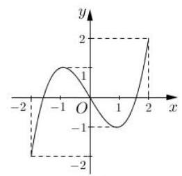

$f\left( x\right)$

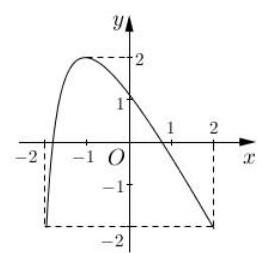

$g\left( x\right)$

① 方程 $f\left\lbrack  {g\left( x\right) }\right\rbrack   = 0$ 有且仅有 6 个根; ② 方程 $g\left\lbrack  {f\left( x\right) }\right\rbrack   = 0$ 有且仅有 3 个根;

③ 方程 $f\left\lbrack  {f\left( x\right) }\right\rbrack   = 0$ 有且仅有 5 个根; ④ 方程 $g\left\lbrack  {g\left( x\right) }\right\rbrack   = 0$ 有且仅有 4 个根. 其中正确的命题的个数为( )

A. 1 B. 2 C. 3 D. 4

2、已知函数 $f\left( x\right)  = \left\{  \begin{array}{l} \frac{{2}^{x} + 2}{2}, x \leq  1 \\  \left| {{\log }_{2}\left( {x - 1}\right) }\right| , x > 1 \end{array}\right.$ ,则函数 $F\left( x\right)  = f\left( {f\left( x\right) }\right)  - {2f}\left( x\right)  - \frac{3}{2}$ 的零点个数为___；

3、已知 $f\left( x\right)  = {x}^{2} + {2x} + a, g\left( x\right)  = f\left( {f\left( x\right) }\right)  - f\left( x\right)$ 有且只有三个零点,则实数 $a$ 的取值范围是___；

4、已知函数 $f\left( x\right)  = \left\{  {\begin{array}{l} {x}^{2} - {2ax} - a + 1, x \geq  0 \\  \ln \left( {-x}\right) , x < 0 \end{array}, g\left( x\right)  = {x}^{2} + 1 - {2a}}\right.$ ,若函数 $y = f\left( {g\left( x\right) }\right)$ 有 4 个零点,则实数 $a$ 的取值范围是___；

5、函数 $f\left( x\right)  = {e}^{x} - x - b$ ，若函数 $g\left( x\right)  = f\left( {f\left( x\right)  - \frac{1}{2}}\right)$ 恰有 4 个零点，则实数 $b$ 的取值范围是___；

6、设函数 $f\left( x\right)  = \left\{  {\begin{array}{l} x + 1, x \leq  0 \\  {\left( x - 1\right) }^{2}, x > 0 \end{array}, g\left( x\right)  = {x}^{2} - x + a}\right.$ ,若函数 $g\left( {f\left( x\right) }\right)$ 有 6 个零点,则实数 $a$ 的取值范围是___；

7、设函数 $f\left( x\right)  = \left\{  {\begin{array}{l} x + 4, x \leq  0 \\  {\left( x - 2\right) }^{2}, x > 0 \end{array}, g\left( x\right)  = \frac{x}{{e}^{x}}}\right.$ ,若方程 $g\left( {f\left( x\right) }\right)  - k = 0\left( {k \in  R}\right)$ 有 4 个实根, 则实数 $k$ 的取值范围是___；

## 五、复合不等式问题

1、已知 $f\left( x\right)  = {x}^{2} + {4x} + 1 + a$ ，对于任意 $x, f\left( {f\left( x\right) }\right)  \geq  0$ 恒成立，则实数 $a$ 的取值范围是 ___；

2、已知函数 $f\left( x\right)  = {x}^{2} - {2ax} + {a}^{2} - 1$ ，若关于 $x$ 的不等式 $f\left( {f\left( x\right) }\right)  < 0$ 解集为空集，则实数 $a$ 的取值范围是___；

3、(2019 浦东二模) 已知 $f\left( x\right)  = 2{x}^{2} + {2x} + b$ 是定义在 $\left\lbrack  {-1,0}\right\rbrack$ 上的函数，若 $f\left\lbrack  {f\left( x\right) }\right\rbrack   \leq  0$ 在定义域上恒成立,而且存在实数 ${x}_{0}$ 满足: $f\left\lbrack  {f\left( {x}_{0}\right) }\right\rbrack   = {x}_{0}$ 且 $f\left( {x}_{0}\right)  \neq  {x}_{0}$ ,则实数 $b$ 的取值范围是___.

## 第七讲:三角函数综合训练

## 公式再复习:

1、同角三角比的关系:

倒数关系: $\tan \alpha  \cdot  \cot \alpha  = 1,\sin \alpha  \cdot  \csc \alpha  = 1,\cos \alpha  \cdot  \sec \alpha  = 1$

商数关系: $\tan \alpha  = \frac{\sin \alpha }{\cos \alpha },\cot \alpha  = \frac{\cos \alpha }{\sin \alpha }$ (实现弦切之间的转化)

平方关系: ${\sin }^{2}\alpha  + {\cos }^{2}\alpha  = 1,1 + {\tan }^{2}\alpha  = {\sec }^{2}\alpha ,1 + {\cot }^{2}\alpha  = {\csc }^{2}\alpha$

2、诱导公式:奇变偶不变，符号看象限

比如: $\sin \left( {\frac{\pi }{2} + \alpha }\right)  = \cos \alpha ,\cos \left( {\pi  + \alpha }\right)  =  - \cos \alpha ,\tan \left( {{3\pi } - \alpha }\right)  =  - \tan \alpha$

特例: $\sin \left( {\frac{\pi }{4} - \alpha }\right)  = \cos \left( {\frac{\pi }{4} + \alpha }\right) ,\cos \left( {\alpha  - \frac{\pi }{6}}\right)  = \sin \left( {\frac{\pi }{3} + \alpha }\right)$

3、两角和与差的三角比

$$
\cos \left( {\alpha  + \beta }\right)  = \cos \alpha \cos \beta  - \sin \alpha \sin \beta
$$

$$
\sin \left( {\alpha  - \beta }\right)  = \sin \alpha \cos \beta  - \cos \alpha \sin \beta
$$

$$
\tan \left( {\alpha  + \beta }\right)  = \frac{\tan \alpha  + \tan \beta }{1 - \tan \alpha \tan \beta }
$$

4、倍角公式:

$\sin {2\alpha } = 2\sin \alpha \cos \alpha$

$\cos {2\alpha } = {\cos }^{2}\alpha  - {\sin }^{2}\alpha  = 2{\cos }^{2}\alpha  - 1 = 1 - 2{\sin }^{2}\alpha$

$$
\tan {2\alpha } = \frac{2\tan \alpha }{1 - {\tan }^{2}\alpha }
$$

5、半角公式

$$
\sin \frac{\alpha }{2} =  \pm  \sqrt{\frac{1 - \cos \alpha }{2}},\cos \frac{\alpha }{2} =  \pm  \sqrt{\frac{1 + \cos \alpha }{2}}
$$

$$
\tan \frac{\alpha }{2} =  \pm  \sqrt{\frac{1 - \cos \alpha }{1 + \cos \alpha }} = \frac{\sin \alpha }{1 + \cos \alpha } = \frac{1 - \cos \alpha }{\sin \alpha }
$$

6、降幂公式

${\sin }^{2}\alpha  = \frac{1 - \cos {2\alpha }}{2};{\cos }^{2}\alpha  = \frac{1 + \cos {2\alpha }}{2}$ (非常重要)

$$
1 + \sin {2\alpha } = {\left( \sin \alpha  + \cos \alpha \right) }^{2};1 - \sin {2\alpha } = {\left( \sin \alpha  - \cos \alpha \right) }^{2}
$$

7、万能公式

$$
\sin {2\alpha } = \frac{2\tan \alpha }{1 + {\tan }^{2}\alpha };\cos {2\alpha } = \frac{1 - {\tan }^{2}\alpha }{1 + {\tan }^{2}\alpha };\tan {2\alpha } = \frac{2\tan \alpha }{1 - {\tan }^{2}\alpha }
$$

8、辅助角公式

$$
a\sin \alpha  + b\cos \alpha  = \sqrt{{a}^{2} + {b}^{2}}\sin \left( {\alpha  + \phi }\right)
$$

9、正弦定理

$\frac{a}{\sin A} = \frac{b}{\sin B} = \frac{c}{\sin C} = {2R}$ (2R是 ${\Delta ABC}$ 外接圆的直径)

10、余弦定理

$$
\cos A = \frac{{b}^{2} + {c}^{2} - {a}^{2}}{2bc}
$$

$$
{a}^{2} = {b}^{2} + {c}^{2} - {2bc}\cos A
$$

11、面积公式

$$
{S}_{\Delta } = \frac{1}{2}a{h}_{a} = \frac{1}{2}{ab}\sin C
$$

12、反三角函数

$$
y = \arcsin x, x \in  \left\lbrack  {-1,1}\right\rbrack  , y \in  \left\lbrack  {-\frac{\pi }{2},\frac{\pi }{2}}\right\rbrack
$$

$$
y = \arccos x, x \in  \left\lbrack  {-1,1}\right\rbrack  , y \in  \left\lbrack  {0,\pi }\right\rbrack
$$

$$
y = \arctan x, x \in  R, y \in  \left( {-\frac{\pi }{2},\frac{\pi }{2}}\right)
$$

13、最简三角方程

$$
\sin x = a\left( {\left| a\right|  \leq  1}\right) , x = {k\pi } + {\left( -1\right) }^{k}\arcsin a, k \in  Z
$$

$$
\cos x = a\left( {\left| a\right|  \leq  1}\right) , x = {2k\pi } \pm  \arccos \alpha , k \in  Z
$$

$$
\tan x = a, x = {k\pi } + \arctan a
$$

$\sin \alpha  = \sin \beta  \Rightarrow  \alpha  = \beta  + {2k\pi }$ 或 $\alpha  = \pi  - \beta  + {2k\pi }, k \in  Z$

$\cos \alpha  = \cos \beta  \Rightarrow  \alpha  =  \pm  \beta  + {2k\pi }, k \in  Z$

$\tan \alpha  = \tan \beta  \Rightarrow  \alpha  = \beta  + {k\pi }, k \in  Z$

高三数学第二轮专题复习

## 一、填选

1、已知点 $P\left( {\sin \alpha  - \cos \alpha ,\tan \alpha }\right)$ 在第一象限，则在 $\lbrack 0,{2\pi })$ 内 $\alpha$ 的取值范围是___；

2、已知角 $\alpha$ 为第二象限的角，其终边上一点 $P\left( {x,\sqrt{5}}\right)$ ，且 $\cos \alpha  = \frac{\sqrt{2}}{4}x$ ，则 $\sin \alpha  =$ ___；

3、下列命题正确的有___

① 若 $- \frac{\pi }{2} < \alpha  < \beta  < \frac{\pi }{2}$ ，则 $\alpha  - \beta$ 的范围为 $\left( {-\pi ,\pi }\right)$

② 若 $\alpha$ 在第一象限，则 $\frac{\alpha }{2}$ 在一三象限

③ 若 $\sin \theta  = \frac{m - 3}{m + 5},\cos \theta  = \frac{4 - {2m}}{m + 5}$ ，则 $m \in  \left( {3,9}\right)$

④ $\sin \frac{\theta }{2} = \frac{3}{5},\cos \frac{\theta }{2} =  - \frac{4}{5}$ ，则 $\theta$ 在一三象限

4、若 $\sin \left( {\pi  + \alpha }\right)  = \frac{1}{3}$ ，则 $\cos \left( {\frac{3\pi }{2} + {2\alpha }}\right)  =$ ___；

5、已知 $\sin \alpha  + \cos \alpha  =  - \frac{7}{13},\alpha  \in  \left( {-\frac{\pi }{2},0}\right)$ ，则 $\tan \alpha  =$ ___；

6、求值: ${\sin }^{2}{1}^{ \circ  } + {\sin }^{2}{2}^{ \circ  } + {\sin }^{2}{3}^{ \circ  } + \cdots  + {\sin }^{2}{88}^{ \circ  } + {\sin }^{2}{89}^{ \circ  } =$

7、已知 $\sin \alpha  = \sqrt{2}\cos \beta ,\tan \alpha  = \sqrt{3}\cot \beta , - \frac{\pi }{2} < \alpha  < \frac{\pi }{2},0 < \beta  < \pi$ ，则 $\alpha  =$ ___， $\beta  =$ ___；

8、若 $\alpha  \in  \left( {0,\frac{\pi }{2}}\right)$ ，且 $\cos \left( {\alpha  + \frac{\pi }{6}}\right)  =  - \frac{\sqrt{2}}{4}$ ，则 $\cos \alpha  =$ ___；

9、已知 $\sin \alpha  + \sin \beta  = \frac{1}{4},\cos \alpha  + \cos \beta  = \frac{1}{3}$ ，则 $\cos \left( {\alpha  - \beta }\right)  =$ ___；

10、已知 $8\cos \left( {{2\alpha } + \beta }\right)  + 5\cos \beta  = 0$ ，则 $\tan \left( {\alpha  + \beta }\right)  \cdot  \tan \alpha  =$ ___；

11、 $\tan \left( {\alpha  + \beta }\right)  = 0$ 是 $\tan \alpha  + \tan \beta  = 0$ 的___条件；

12、已知 $\frac{3\pi }{2} < \alpha  < {2\pi }$ ，化简: $\sqrt{\frac{1}{2} + \frac{1}{2}\sqrt{\frac{1}{2} + \frac{1}{2}\cos {2\alpha }}} =$ ___；

13、已知 $\cos \left( {\frac{\pi }{4} + x}\right)  = \frac{3}{5}$ ，且 $\frac{5\pi }{4} < x < \frac{7\pi }{4}$ ，则 $\frac{\sin {2x} + 2{\sin }^{2}x}{1 - \tan x} =$ ___；

14、若 $\alpha  \in  \left\lbrack  {0,\pi }\right\rbrack  ,\beta  \in  \left\lbrack  {-\frac{\pi }{4},\frac{\pi }{4}}\right\rbrack  ,\lambda  \in  R$ ,满足: ${\left( \alpha  - \frac{\pi }{2}\right) }^{3} - \cos \alpha  - {2\lambda } = 0$ , $4{\beta }^{3} + \sin \beta \cos \beta  + \lambda  = 0$ ，则 $\cos \left( {\frac{\alpha }{2} + \beta }\right)  =$ ___；

15、 $\bigtriangleup {ABC}$ 中，角 $A, B, C$ 所对边分别为 $a, b, c, a = 2,2\sin A = \sin C$ ，若 $B$ 是钝角， $\cos {2C} =  - \frac{1}{4}$ ，则 $\bigtriangleup  {ABC}$ 的面积为___；

16、下列条件中， $\bigtriangleup  {ABC}$ 是锐角三角形的是( )

A. $\sin A + \cos A = \frac{1}{5}$ B. $\overrightarrow{AB} \cdot  \overrightarrow{BC} > 0$

C. $\tan A + \tan B + \tan C > 0$ D. $b = 3, c = 3\sqrt{3}, B = {30}^{ \circ  }$

17、设函数 $f\left( x\right)  = \sin \left( {{4x} + \frac{\pi }{4}}\right) \left( {x \in  \left\lbrack  {0,\frac{9\pi }{16}}\right\rbrack  }\right)$ ,若函数 $y = f\left( x\right)  + a\left( {a \in  \mathbf{R}}\right)$ 恰有三个零点 ${x}_{1}\text{ 、 }{x}_{2}\text{ 、 }{x}_{3}\left( {{x}_{1} < {x}_{2} < {x}_{3}}\right)$ ,则 ${x}_{1} + 2{x}_{2} + {x}_{3}$ 的值是( )

A. $\frac{\pi }{2}$ B. $\frac{3\pi }{4}$ C. $\frac{5\pi }{4}$ D. $\pi$

18、直线 $y = 1$ 与函数 $f\left( x\right)  = 2\sin \left( {{2x} - \frac{\pi }{6}}\right)$ 的图像在 $y$ 轴右侧交点的横坐标从左到右依次为 ${a}_{1}\text{ 、 }{a}_{2}\text{ 、 }\cdots \text{ 、 }{a}_{n}$ ,下列结论: ① $f\left( {x - \frac{\pi }{3}}\right)  =  - 2\cos {2x}$ ; ② $f\left( x\right)$ 在 $\left\lbrack  {\frac{\pi }{6},\frac{5\pi }{12}}\right\rbrack$ 上是减函数; ③ ${a}_{1}\text{ 、 }{a}_{2}\text{ 、 }\cdots \text{ 、 }{a}_{n}$ 为等差数列；④ ${a}_{1} + {a}_{2} + \cdots  + {a}_{12} = {34\pi }$ . 其中正确的个数是( )

A. 3 B. 2 C. 1 D. 0

19、函数 $y = \frac{1}{1 - x}$ 的图像与函数 $y = 2\sin {\pi x}\;\left( {x \in  \left\lbrack  {-k - 2, k + 4}\right\rbrack  , k \in  \mathbf{Z}}\right)$ 的图像所有交点的横坐标之和等于 2020,则满足条件的所有整数 $k$ 的值是___

20、对任意 $x \in  \left( {\frac{\pi }{6},\frac{3\pi }{4}}\right\rbrack$ ， $a$ 为正实数， $\left| {{2a}\sin x - b}\right|  \leq   - {2b}\cos {2x} + {2b} + a$ 恒成立，则实数 $\frac{b}{a}$ 的取值范围是___ $\lbrack \frac{1}{5}, + \infty )$

## 二、解答题:

1、在 $\bigtriangleup {ABC}$ 中,内角 $A\text{ 、 }B\text{ 、 }C$ 所对的边分别为 $a\text{ 、 }b\text{ 、 }c$ ,已知 $b\sin A = a\cos \left( {B - \frac{\pi }{6}}\right)$ .

(1)求角 $B$ 的大小；

(2)设 $a = 2, c = 3$ ，求 $b$ 和 $\sin \left( {{2A} - B}\right)$ 的值.

2、在 $\bigtriangleup {ABC}$ 中，角 $A$ 、 $B$ 、 $C$ 所对的边分别为 $a$ 、 $b$ 、 $c$ ，且 $\sqrt{2}\sin B = \sqrt{3\cos B}$ .

(1)若 $\cos A = \frac{1}{3}$ ，求 $\sin C$ 的值；

(2)若 $b = \sqrt{7}$ ， $\sin A = 3\sin C$ ，求 $\bigtriangleup  {ABC}$ 的面积.

3、(1)已知 $\tan \alpha ,\tan \beta$ 是关于 $x$ 的一元二次方程 ${x}^{2} + {px} + 2 = 0$ ( $p$ 为常数)的两实根,求 $\frac{\sin \left( {\alpha  + \beta }\right) }{\cos \left( {\alpha  - \beta }\right) }$ 值;

(2)已知 $\theta  \in  \left( {0,\pi }\right)$ ，且 $\sin \theta \text{ 、 }\cos \theta$ 是关于 $x$ 的一元二次方程 $5{x}^{2} - x + m = 0\left( {m \in  \mathbf{R}}\right)$ 的两根,求 ${\sin }^{3}\theta  + {\cos }^{3}\theta$ 的值.

## 第八讲:数列综合

## 一、基础题

1、若数列 $\left\{  {a}_{n}\right\}$ 满足 ${a}_{1} = {13},{a}_{n + 1} - {a}_{n} = n$ ，则 $\frac{{a}_{n}}{n}$ 的最小值为___.

2、数列 $\left\{  {a}_{n}\right\}$ 中， ${a}_{1} = 1,{a}_{n + 1} = {2}^{n}{a}_{n}$ ，则 ${a}_{n} =$ ___；

3、已知数列 $\left\{  {a}_{n}\right\}$ 满足以下关系: ${a}_{1} = \frac{1}{2},{a}_{n + 1} = \frac{{a}_{n}}{3{a}_{n} + 1}$ ，则 ${a}_{n} =$ ___；

4、设 ${S}_{n}$ 是数列 $\left\{  {a}_{n}\right\}$ 的前 $n$ 项和,且 ${a}_{1} =  - 1,{a}_{n + 1} = {S}_{n}{S}_{n + 1}$ ,则 ${S}_{n} =$ ___;

5、数列 $\left\{  {a}_{n}\right\}$ 中， ${a}_{1} = 1,\left( {n + 1}\right) {a}_{n} - n{a}_{n + 1} - {5n}\left( {n + 1}\right)  = 0$ ，则 ${a}_{n} =$ ___；

6、数列 $\left\{  {a}_{n}\right\}$ 中， ${a}_{1} = 1$ ，对所有的 $n \geq  2$ 都有 ${a}_{1}{a}_{2}{a}_{3}\cdots {a}_{n} = {n}^{2}$ ，则 ${a}_{n} =$ ___；

7、数列 $\left\{  {a}_{n}\right\}$ 满足 $\frac{{a}_{1}}{2} + \frac{{a}_{2}}{{2}^{2}} + \cdots  + \frac{{a}_{n}}{{2}^{n}} = {2n} + 5$ ， $n \in  {N}^{ * }$ ，则 ${a}_{n} =$ ___； 8、数列 $- 1,4, - 7,\cdots ,{\left( -1\right) }^{n}\left( {{3n} - 2}\right)$ 的前 $\mathrm{n}$ 项和 ${S}_{n} =$ ___；

9、已知 ${a}_{n} = n\cos \frac{n\pi }{2}$ ，则数列 $\left\{  {a}_{n}\right\}$ 的前 2020 项和___；

10、已知无穷等比数列 $\left\{  {a}_{n}\right\}$ 的前 $n$ 项和 ${S}_{n} = a - {\left( \frac{1}{3}\right) }^{n}$ ，其中 $a$ 为常数，则 $\mathop{\lim }\limits_{{n \rightarrow  \infty }}{S}_{n} =$ ___；

11、已知无穷等比数列 $\left\{  {a}_{n}\right\}$ 的首项为 ${a}_{1}$ ，公比为 $q$ ，且 $\mathop{\lim }\limits_{{n \rightarrow  \infty }}\left( {\frac{3 + q}{{a}_{1}} - {q}^{n}}\right)  = 1$ ，则首项 ${a}_{1}$ 的取值范围是___；

12、设数列 $\left\{  {a}_{n}\right\}$ 的通项公式为 ${a}_{n} = \left\{  \begin{matrix} n & 1 \leq  n \leq  3 \\  {\left( -\frac{1}{2}\right) }^{n} & n > 3 \end{matrix}\right.$ ，则 $\mathop{\lim }\limits_{{n \rightarrow  \infty }}\left( {{a}_{1} + {a}_{2} + \cdots  + {a}_{n}}\right)  =$

13、用数学归纳法证明 “ $1 + \frac{1}{2} + \frac{1}{3} + \cdots  + \frac{1}{{2}^{n} - 1} < n\left( {n \in  {N}^{ * }, n > 1}\right)$ ” 时,由 $n = k\left( {k > 1}\right)$ 不等式成立,推证 $n = k + 1$ 时,左边应增加的项数共___项。

## 二、提高题

1、等比数列 $\left\{  {a}_{n}\right\}$ 中, ${a}_{1} = {512}$ ,公比 $q =  - \frac{1}{2}$ ,用 ${T}_{n}$ 表示 $\left\{  {a}_{n}\right\}$ 的前 $\mathrm{n}$ 项积: ${T}_{n} = {a}_{1}{a}_{2}\cdots {a}_{n}$ , 则数列 $\left\{  {T}_{n}\right\}$ 的最大项为第___项;

2、设函数 $f\left( x\right)  = {\left( x - 3\right) }^{3} + x - 1$ ，数列 $\left\{  {a}_{n}\right\}$ 是等差数列，且公差 $d \neq  0$ ，若 $f\left( {a}_{1}\right)  + f\left( {a}_{2}\right)  + \cdots  + f\left( {a}_{7}\right)  = {14}$ ，则 ${a}_{1} + {a}_{2} + \cdots  + {a}_{7} =$ ___；

3、已知数列 $\left\{  {a}_{n}\right\}$ 的前 $n$ 项和为 ${S}_{n}$ ,且 ${a}_{1} = 1,2{S}_{n} = {a}_{n}{a}_{n + 1}\left( {n \in  {N}^{ * }}\right)$ ,若 ${b}_{n} = {\left( -1\right) }^{n}\frac{{2n} + 1}{{a}_{n}{a}_{n + 1}}$ , 则数列 $\left\{  {b}_{n}\right\}$ 的前 $n$ 项和 ${T}_{n} =$ ___

4、设为数列 $\left\{  {a}_{n}\right\}$ 的前 $\mathrm{n}$ 项和 ${S}_{n} = {\left( -1\right) }^{n}{a}_{n} - \frac{1}{{2}^{n}}, n \in  {N}^{ * }$ ,则 ${S}_{1} + {S}_{2} + \cdots  + {S}_{100} =$

5、已知 ${S}_{n}$ 为数列 $\left\{  {a}_{n}\right\}$ 的前 $n$ 项和, ${a}_{1} = {a}_{2} = 1$ ,平面内三个不共线的向量 $\overrightarrow{OA}\text{ 、 }\overrightarrow{OB}\text{ 、 }\overrightarrow{OC}$ 满足 $\overrightarrow{OC} = \left( {{a}_{n - 1} + {a}_{n + 1}}\right) \overrightarrow{OA} + \left( {1 - {a}_{n}}\right) \overrightarrow{OB}, n \geq  2, n \in  {N}^{ * }$ ,若 $A\text{ 、 }B\text{ 、 }C$ 在同一直线上,则 ${S}_{2018} =$ ___

6、在 $\bigtriangleup {ABC}$ 中， $D$ 是 ${BC}$ 的中点，点列 ${P}_{n}\left( {n \in  {N}^{ * }}\right.$ ) 在直线 ${AC}$ 上，且满足 $\overrightarrow{{P}_{n}A} = {a}_{n + 1} \cdot  \overrightarrow{{P}_{n}B} + {a}_{n}\overrightarrow{{P}_{n}D}$ ,若 ${a}_{1} = 1$ ,则数列 $\left\{  {a}_{n}\right\}$ 的通项公式 ${a}_{n} =$ ___

7、设 $f\left( x\right)$ 是定义在 $\mathbf{R}$ 上恒不为零的函数,对任意实数 $x\text{ 、 }y$ ,都有 $f\left( {x + y}\right)  = f\left( x\right) f\left( y\right)$ , 若 ${a}_{1} = \frac{1}{2},{a}_{n} = f\left( n\right) \left( {n \in  {\mathbf{N}}^{ * }}\right)$ ,数列 $\left\{  {a}_{n}\right\}$ 的前 $n$ 项和 ${S}_{n}$ 组成数列 $\left\{  {S}_{n}\right\}$ ,则有 ( )

A. 数列 $\left\{  {S}_{n}\right\}$ 递增,最大值为 1 B. 数列 $\left\{  {S}_{n}\right\}$ 递减,最大值为 1

C. 数列 $\left\{  {S}_{n}\right\}$ 递增,最小值为 $\frac{1}{2}$ D. 数列 $\left\{  {S}_{n}\right\}$ 递减,最小值为 $\frac{1}{2}$

8、已知数列 $\left\{  {a}_{n}\right\}$ 的通项公式为 ${a}_{n} = 2{q}^{n} + q$ ( $q < 0$ ， $n \in  {N}^{ * }$ )，若对任意 $m, n \in  {N}^{ * }$ 都有 $\frac{{a}_{m}}{{a}_{n}} \in  \left( {\frac{1}{6},6}\right)$ ，则实数 $q$ 的取值范围为___

9、已知等比数列 $\left\{  {a}_{n}\right\}$ 的首项为 2，公比为 $- \frac{1}{3}$ ，其前 $n$ 项和记为 ${S}_{n}$ ，若对任意的 $n \in  {\mathbf{N}}^{ * }$ ， 均有 $A \leq  3{S}_{n} - \frac{1}{{S}_{n}} \leq  B$ 恒成立，则 $B - A$ 的最小值为( )

A. $\frac{7}{2}$ B. $\frac{9}{4}$ C. $\frac{11}{4}$ D. $\frac{13}{6}$

## 二、解答题

1、设 ${A}_{n}$ 为数列 $\left\{  {a}_{n}\right\}$ 前 $n$ 项的和， ${A}_{n} = 2\left( {{a}_{n} - 1}\right) \left( {n \in  {\mathbf{N}}^{ * }}\right)$ ，数列 $\left\{  {b}_{n}\right\}$ 的通项公式 ${b}_{n} = {3n} + 2\left( {n \in  {\mathbf{N}}^{ * }}\right) .$

(1)求数列 $\left\{  {a}_{n}\right\}$ 的通项公式；

(2)若 $d \in  \left\{  {{a}_{1},{a}_{2},\cdots {a}_{n},\cdots }\right\}   \cap  \left\{  {{b}_{1},{b}_{2},\cdots {b}_{n},\cdots }\right\}$ ，则称 $d$ 为数列 $\left\{  {a}_{n}\right\}$ 与 $\left\{  {b}_{n}\right\}$ 的公共项， 将数列 $\left\{  {a}_{n}\right\}$ 与 $\left\{  {b}_{n}\right\}$ 的公共项,按它们在原数列中的先后顺序排成一个新数列 $\left\{  {d}_{n}\right\}$ , 求 $\frac{1}{{d}_{1}} + \frac{1}{{d}_{2}} + \frac{1}{{d}_{3}} + \cdots  + \frac{1}{{d}_{n}} + \cdots$ 的值.

2、设数列 $\left\{  {a}_{n}\right\}$ 的前 $n$ 项和为 ${S}_{n}$ ,已知 ${a}_{1} = 1,{S}_{n} = n{a}_{n} - {3n}\left( {n - 1}\right) \left( {n \in  {\mathbf{N}}^{ * }}\right)$ .

(1)求证:数列 $\left\{  {a}_{n}\right\}$ 为等差数列，并求出其通项公式；

(2)设 ${b}_{n} = \frac{2}{{a}_{n}{a}_{n + 1}}$ ，又 ${b}_{1} + {b}_{2} + \cdots  + {b}_{n} < {3m}$ 对一切 $n \in  {\mathbf{N}}^{ * }$ 恒成立，求实数 $m$ 的取值范围；

(3)已知 $k$ 为正整数且 $k \geq  2$ ，数列 $\left\{  {c}_{n}\right\}$ 共有 ${2k}$ 项，设 ${c}_{n} = \frac{{a}_{n}}{{12k} - 1}$ ，

又 $\left| {{c}_{1} - \frac{1}{2}}\right|  + \left| {{c}_{2} - \frac{1}{2}}\right|  + \cdots  + \left| {{c}_{{2k} - 1} - \frac{1}{2}}\right|  + \left| {{c}_{2k} - \frac{1}{2}}\right|  < 8$ ,求 $k$ 的所有可取值.

## 第九讲:应用题

考点:(1)函数:重点考察绝对值或分段函数，主要考察函数的单调性和最值

(2)三角函数:主要是实际生活的抽象出来的模型，以解三角形为主

(3)数列:等差或等比数列

(4)解析几何

(5)立体几何

## 模型 1: 函数问题

1、(2017 高考 19)根据预测，某地第 $n\left( {n \in  {\mathbf{N}}^{ * }}\right)$ 个月共享单车的投放量和损失量分别为 ${a}_{n}$ 和 ${b}_{n}$ (单位: 辆),

其中 ${a}_{n} = \left\{  {\begin{array}{l} 5{n}^{4} + {15},1 \leq  n \leq  3 \\   - {10n} + {470}, n \geq  4 \end{array},{b}_{n} = n + 5}\right.$ ,第 $n$ 个月底的共享单车的保有量是前 $n$ 个月的累计投放量与累计损失量的差.

(1)求该地区第 4 个月底的共享单车的保有量；

(2)已知该地共享单车停放点第 $n$ 个月底的单车容纳量 ${S}_{n} =  - 4{\left( n - {46}\right) }^{2} + {8800}$ (单位:辆). 设在某月底, 共享单车保有量达到最大, 问该保有量是否超出了此时停放点的单车容纳量?

2、(2018 高考 19) 某群体的人均通勤时间，是指单日内该群体中成员从居住地到工作地的平均用时,某地上班族 $S$ 中的成员仅以自驾或公交方式通勤,分析显示: 当 $S$ 中 $x\%$ ( $0 < x < {100}$ ) 的成员自驾时,自驾群体的人均通勤时间为

$$
f\left( x\right)  = \left\{  \begin{matrix} {30} & 0 < x \leq  {30} \\  {2x} + \frac{1800}{x} - {90} & {30} < x < {100} \end{matrix}\right. \text{ (单位: 分钟) }
$$

而公交群体的人均通勤时间不受 $x$ 影响，恒为 40 分钟，试根据上述分析结果回答下列问题:

(1)当 $x$ 在什么范围内时，公交群体的人均通勤时间少于自驾群体的人均通勤时间？

(2)求该地上班族 $S$ 的人均通勤时间 $g\left( x\right)$ 的表达式，讨论 $g\left( x\right)$ 的单调性，并说明其实际意义.

3、某温室大棚规定:一天中，从中午 12 点到第二天上午 8 点为保温时段，其余 4 小时为工人作业时段，从中午 12 点连续测量 20 小时，得出此温室大棚的温度 $y$ (单位:度)与时间 $t$ (单位: 小时, $t \in  \left\lbrack  {0,{20}}\right\rbrack$ ) 近似地满足函数关系 $y = \left| {t - {13}}\right|  + \frac{b}{t + 2}$ ,其中, $b$ 为大棚内一天中保温时段的通风量.

(1)若一天中保温时段的通风量保持 100 个单位不变，求大棚一天中保温时段的最低温度 (精确到 ${0.1}{}^{ \circ  }\mathrm{C}$ );

(2)若要保持大棚一天中保温时段的最低温度不小于 ${17}^{ \circ  }C$ ,求大棚一天中保温时段通风量的最小值.

4、(2020 年高考)在研究某市交通情况时，道路密度是指该路段上一定时间内通过的车辆数除以时间, 车辆密度是该路段一定时间内通过的车辆数除以该路段的长度, 现定义交通流量为 $v = \frac{q}{x}, x$ 为道路密度, $q$ 为车辆密度, $v = f\left( x\right)  = \left\{  \begin{array}{ll} {100} - {135}{\left( \frac{1}{3}\right) }^{\frac{80}{x}} & 0 < x < {40} \\   - k\left( {x - {40}}\right)  + {85} & {40} \leq  x \leq  {80} \end{array}\right.$ , $k > 0$

(1)若交通流量 $v > {95}$ ，求道路密度 $x$ 的取值范围；

(2)若道路密度 $x = {80}$ 时,测得交通流量 $v = {50}$ ，求车辆密度 $q$ 的最大值.

5、(2020 年春考)有一条长为 120 米的步行道 ${OA}, A$ 是垃圾投放点 ${\omega }_{1}$ ，若以 $O$ 为原点， ${OA}$ 为 $x$ 轴正半轴建立直角坐标系,设点 $B\left( {x,0}\right)$ ,现要建设另一座垃圾投放点 ${\omega }_{2}\left( {t,0}\right)$ ,函数 ${f}_{t}\left( x\right)$ 表示与 $B$ 点距离最近的垃圾投放点的距离.

(1)若 $t = {60}$ ，求 ${f}_{60}\left( {10}\right)$ 、 ${f}_{60}\left( {80}\right)$ 、 ${f}_{60}\left( {95}\right)$ 的值，并写出 ${f}_{60}\left( x\right)$ 的函数解析式；

(2)若可以通过 ${f}_{t}\left( x\right)$ 与坐标轴围成的面积来测算扔垃圾的便利程度，面积越小越便利. 问: 垃圾投放点 ${\omega }_{2}$ 建在何处才能比建在中点时更加便利?

模型 2: 三角

1、(2019 高考 19)如图， $A - B - C$ 为海岸线， ${AB}$ 为线段， $\overset{\text{ ⏜ }}{BC}$ 为四分之一圆弧， ${BD} = {39.2}\mathrm{\;{km}},\angle {BDC} = {22}^{ \circ  },\angle {CBD} = {68}^{ \circ  },\angle {BDA} = {58}^{ \circ  }$ .

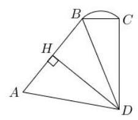

(1)求 $\overset{\text{ ⏜ }}{BC}$ 的长度；

(2)若 ${AB} = {{40}\mathrm{\;{km}}}$ ，求 $D$ 到海岸线 $A - B - C$ 的最短距离.

(精确到 ${0.001}\mathrm{\;{km}}$ )

2、(2022 高考)如图 ${AB} = {CD} = 6,{BC} = {20},\angle {ABC} = \angle {DCB} = {120}^{ \circ  }, O$ 为 ${BC}$ 中点，曲线 ${AMD}$ 上所有的点到 $O$ 的距离相等， ${MO}\bot {BC}, P$ 为曲线 ${DM}$ 上的一动点，点 $Q$ 与点 $P$ 关于 ${OM}$ 对称.

(1)若 $P$ 在点 $D$ 的位置，求 $\angle {POC}$ 的大小；

(2)求五边形 ${MQADP}$ 面积的最大值.

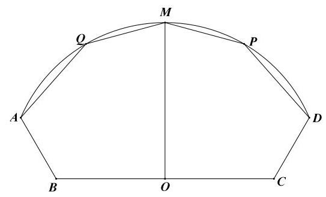

## 模型 3: 数列

1、(2021 年高考)已知某企业今年(2021 年)第一季度的营业额为 1.1 亿元，以后每个季度的营业额比上个季度增加 0.05 亿元，该企业第一季度的利润为 0.16 亿，以后每季度比前一季度增长 4%.

(1)求 2021 年起前 20 季度营业额的总和；

(2)请问哪一季度的利润首次超过该季度营业额的 18%？

2、某科技创新公司投资 400 万元研发了一款网络产品，产品上线第 1 个月的收入为 40 万元，预计在今后若干个月内，该产品每月的收入平均比上一月增长 50% ，同时，该产品第 1 个月的维护费支出为 100 万元，以后每月的维护费支出平均比上一个月增加 50 万元.

(1)分别求出第 6 个月该产品的收入和维护费支出，并判断第 6 个月该产品的收入是否足够支付第 6 个月的维护费支出?

(2)从第几个月起，该产品的总收入首次超过总支出？

(总支出包括维护费支出和研发投资支出)

3、对年利率为 $r$ 的连续复利,要在 $x$ 年后达到本利和 $A$ ,则现在投资值为 $B = A{e}^{-{rx}}, e$ 是自然对数的底数. 如果项目 $P$ 的投资年利率为 $r = 6\%$ 的连续复利.

(1)现在投资 5 万元，写出满 $n$ 年的本利和，并求满 10 年的本利和；(精确到 0.1 万元)；

(2)一个家庭为刚出生的孩子设立创业基金，若每年初一次性给项目 P 投资 2 万元，那么， 至少满多少年基金共有本利和超过一百万元? (精确到 1 年)

## 模型 4: 解析几何

1、(2018 春考)利用《平行于圆锥母线的平面截圆锥面，所得截线是抛物线”的几何原理, 某快餐店用两个射灯 (射出的光锥为圆锥) 在广告牌上投影出其标识, 如图 1 所示, 图 2 是投影射出的抛物线的平面图, 图 3 是一个射灯投影的直观图, 在图 2 与图 3 中, 点 $O$ 、 $A\text{ 、 }B$ 在抛物线上, ${OC}$ 是抛物线的对称轴, ${OC} \bot  {AB}$ 于 $C,{AB} = 3$ 米, ${OC} = {4.5}$ 米.

(1)求抛物线的焦点到准线的距离；

(2)在图 3 中，已知 ${OC}$ 平行于圆锥的母线 ${SD}$ ， ${AB}\text{ 、 }{DE}$ 是圆锥底面的直径，求圆锥的母线与轴的夹角的大小(精确到 ${0.01}^{ \circ  }$ ).

(图 1)

(图 2)

(图 3)

## 课后训练:

1、上海地铁四通八达，给市民出行带来便利，已知某条线路运行时，地铁的发车时间间隔 $t$ (单位: 分字) 满足: $2 \leq  t \leq  {20}, t \in  \mathbf{N}$ ,经测算,地铁载客量 $p\left( t\right)$ 与发车时间间隔 $t$ 满足 $p\left( t\right)  = \left\{  \begin{matrix} {1200} - {10}{\left( {10} - t\right) }^{2} & 2 \leq  t < {10} \\  {1200} & {10} \leq  t \leq  {20} \end{matrix}\right.$ ,其中 $t \in  \mathbf{N}.$

(1)请你说明 $p\left( 5\right)$ 的实际意义;

(2)若该线路每分钟的净收益为 $Q = \frac{{6p}\left( t\right)  - {3360}}{t} - {360}$ (元)，问当发车时间间隔为多少时, 该线路每分钟的净收益最大? 并求最大净收益.

2、某热力公司每年燃料费约 24 万元，为了“环评”达标，需要安装一块面积为 $x\left( {x \geq  0}\right)$ (单位: 平方米) 可用 15 年的太阳能板,其工本费为 $\frac{x}{2}$ (单位: 万元),并与燃料供热互补工作,从此,公司每年的燃料费为 $\frac{k}{{20x} + {100}}\left( k\right.$ 为常数) 万元,记 $y$ 为该公司安装太阳能板的费用与 15 年的燃料费之和.

(1)求 $k$ 的值，并建立 $y$ 关于 $x$ 的函数关系式；

(2)求 $y$ 的最小值，并求出此时所安装太阳能板的面积.

## 难点突破专题: 同构思想在高中数学中的应用

“同构式” 指 “结构相同的式子”, 是指除了变量不同, 其余结构相同的方程或不等式。 同构思想的思路: 先化同构式, 再利用单调性

①合理变形，得到两个结构相同的式子；(左右各一个变量，结构相同)

②构造函数，利用单调性解方程或不等式

类型一、同构思想解方程

1、已知 ${\left( 3x + y\right) }^{2007} + {x}^{2007} + {4x} + y = 0$ ,求 ${4x} + y$ 的值。

2、设 $x, y \in  R$ ，且满足 $\left\{  \begin{array}{l} {\left( x + 4\right) }^{5} + {2018}{\left( x + 4\right) }^{\frac{1}{3}} =  - 4 \\  {\left( y - 1\right) }^{5} + {2018}{\left( y - 1\right) }^{\frac{1}{3}} = 4 \end{array}\right.$ ，求 $x + y$ 的值。

3、设 $x, y \in  R$ ，且满足 $\left\{  \begin{array}{l} {\left( x - 1\right) }^{5} + {2x} + \sin \left( {x - 1}\right)  = 3 \\  {\left( y - 1\right) }^{5} + {2y} + \sin \left( {y - 1}\right)  = 1 \end{array}\right.$ ，求 $x + y$ 的值。

4、已知实数 $a, b \in  \left( {0,2}\right)$ ，且满足 ${a}^{2} - {b}^{2} - 4 = \frac{4}{{2}^{b}} - {2}^{a} - {4b}$ ，则 $a + b =$ ___；

## 类型二、同构思想解不等式

1、若 $x - \sqrt[3]{2 - x} \geq  \left( {-y}\right)  - \sqrt[3]{2 + y}$ ，则()

A. $x - y \geq  0$ B. $x - y \leq  0$ C. $x + y \geq  0$ D. $x + y \leq  0$

2、解不等式: $\frac{8}{{\left( x + 1\right) }^{3}} + \frac{10}{x + 1} - {x}^{3} - {5x} > 0$

3、解不等式: $\frac{{e}^{x}}{3} + x - \ln 3 > {e}^{2} + 2$

## 类型三、倍值区间问题

1、已知函数 $f\left( x\right)  = \sqrt{x - 1} + m$ 在区间 $\left\lbrack  {a, b}\right\rbrack$ 上的值域为 $\left\lbrack  {\frac{a}{2},\frac{b}{2}}\right\rbrack  \left( {b > a \geq  1}\right)$ ,则实数 $m$ 的取值范围是___；

2、已知函数 $f\left( x\right)  = {\log }_{m}\frac{x - 3}{x + 3}\left( {0 < m < 1}\right)$ ,

(1)若函数 $f\left( x\right)$ 的定义域为 $\left\lbrack  {\alpha ,\beta }\right\rbrack  \left( {\beta  > \alpha  > 0}\right)$ ，判断 $f\left( x\right)$ 在定义域上的单调性，并说明理由;

(2)是否存在实数 $m$ ,使 $f\left( x\right)$ 在定义域 $\left\lbrack  {\alpha ,\beta }\right\rbrack$ 上的值域为 $\left\lbrack  {1 + {\log }_{m}\left( {\beta  - 1}\right) ,1 + {\log }_{m}\left( {\alpha  - 1}\right) }\right\rbrack$ . 若存在,求出实数 $m$ 的范围; 若不存在,说明理由.

## 类型四: 同构思想在解析几何中的应用

1、已知 ${a}^{2}\sin \theta  + a\cos \theta  - 1 = 0$ 与 ${b}^{2}\sin \theta  + b\cos \theta  - 1 = 0\left( {a \neq  b}\right)$ ,直线 ${MN}$ 过点 $M\left( {a,{a}^{2}}\right)$ 与点 $N\left( {b,{b}^{2}}\right)$ ，则坐标原点到直线 ${MN}$ 的距离是___。

2、已知点 $P\left( {{x}_{0},{y}_{0}}\right)$ 在椭圆 $\frac{{x}^{2}}{{a}^{2}} + \frac{{y}^{2}}{{b}^{2}} = 1\left( {a > b > 0}\right)$ 上，如果经过点 $P$ 的直线与椭圆只有一个公共点时,称直线为椭圆的切线,此时点 $P$ 称为切点,这条切线方程可以表示为: $\frac{{x}_{0}x}{{a}^{2}} + \frac{{y}_{0}y}{{b}^{2}} = 1$ ; 根据以上性质,解决以下问题:

已知椭圆 $L : \frac{{x}^{2}}{16} + \frac{{y}^{2}}{9} = 1$ ，若 $Q\left( {u, v}\right)$ 是椭圆 $L$ 外一点(其中 $u$ 、 $v$ 为定值)，经过 $Q$ 点作椭圆 $L$ 的两条切线，切点分别为 $A$ 、 $B$ ，则直线 ${AB}$ 的方程是___。

## 类型五、导数中的同构思想(双变量不等式)

1、已知函数 $f\left( x\right)  = \left( {a + 1}\right) \ln x + a{x}^{2} + 1$ ;

(1)讨论函数 $f\left( x\right)$ 的单调性;

(2)设 $a <  - 1$ ，如果对于任意 ${x}_{1},{x}_{2} \in  \left( {0, + \infty }\right)$ ， $\left| {f\left( {x}_{1}\right)  - f\left( {x}_{2}\right) }\right|  \geq  4\left| {{x}_{1} - {x}_{2}}\right|$ ，求实数 $a$ 的取值范围。

2、已知函数 $f\left( x\right)  = a\ln x + \frac{1}{2}{x}^{2}$ ,在其定义域内任取两个不等实数 ${x}_{1},{x}_{2}$ ,不等式 $\frac{f\left( {{x}_{1} + a}\right)  - f\left( {{x}_{2} + a}\right) }{{x}_{1} - {x}_{2}} \geq  3$ 恒成立,则实数 $a$ 的取值范围是___；

3、若对于任意 ${x}_{1},{x}_{2} \in  \left( {m, + \infty }\right)$ ,且 ${x}_{1} < {x}_{2}$ ,都有 $\frac{{x}_{1}\ln {x}_{2} - {x}_{2}\ln {x}_{1}}{{x}_{2} - {x}_{1}} < 1$ ,则 $m$ 的最小值为 ___；

## 类型六:同构处理恒成立问题(不能分参，不能数形结合)

常见的指对数变形

① $x{e}^{x} = {e}^{x + \ln x}$ ② $x + \ln x = \ln \left( {x{e}^{x}}\right)$ ③ $x = \ln {e}^{x} = {e}^{\ln x}$

④ $a{e}^{a} \leq  b\ln b\xrightarrow[]{\text{ 三种同构式 }}\left\{  \begin{array}{l} \text{ 同左: }a{e}^{a} \leq  \left( {\ln b}\right) {e}^{\ln b}\cdots  \rightarrow  f\left( x\right)  = x{e}^{x} \\  \text{ 同右: }{e}^{a}\ln {e}^{a} \leq  b\ln b\cdots  \rightarrow  f\left( x\right)  = x\ln x \\  \text{ 取对数: }a + \ln a \leq  \ln b + \ln \left( {\ln b}\right) \cdots  \rightarrow  f\left( x\right)  = x + \ln x \end{array}\right.$

⑤ $\frac{{e}^{a}}{a} < \frac{b}{\ln b}\xrightarrow[]{\text{ 三种同构式 }}\left\{  \begin{array}{l} \text{ 同左: }\frac{{e}^{a}}{a} < \frac{{e}^{\ln b}}{\ln b}\cdots  \rightarrow  f\left( x\right)  = \frac{{e}^{x}}{x} \\  \text{ 同右: }\frac{{e}^{a}}{\ln {e}^{a}} < \frac{b}{\ln b}\cdots  \rightarrow  f\left( x\right)  = \frac{x}{\ln x} \\  \text{ 取对数: }a - \ln a < \ln b - \ln \left( {\ln b}\right) \cdots  \rightarrow  f\left( x\right)  = x - \ln x \end{array}\right.$

⑥ ${e}^{a} \pm  a > b \pm  \ln b\xrightarrow[]{\text{ 两种同构方式 }}\left\{  \begin{array}{l} \text{ 同左: }{e}^{a} \pm  a > {e}^{\ln b} \pm  \ln b \\  \text{ 同右: }{e}^{a} \pm  \ln {e}^{a} > b + \ln b \end{array}\right.$

1、设实数 $m > 0, x \in  \left( {1, + \infty }\right)$ ，不等式 $2{e}^{2mx} - \frac{\ln x}{m} \geq  0$ 恒成立，则实数 $m$ 的取值范围是 ;

2、对任意 $x \in  \left( {0, + \infty }\right)$ ，不等式 $a\left( {{e}^{ax} + 1}\right)  \geq  2\left( {x + \frac{1}{x}}\right) \ln x$ 恒成立，则实数 $a$ 的取值范围是 ___；

3、已知函数 $f\left( x\right)  = a{e}^{x}\ln x\left( {a > 0}\right) , g\left( x\right)  = {x}^{2} + x\ln a$

(1)讨论函数 $f\left( x\right)$ 的单调性;

(2)设函数 $h\left( x\right)  = g\left( x\right)  - f\left( x\right)$ ，若 $h\left( x\right)  > 0$ 对任意的 $x \in  \left( {0,1}\right)$ 恒成立，求实数 $a$ 的取值范围。

## 第十一讲:解析几何综合训练

## 一、填选

1、已知 $m\text{ 、 }n\text{ 、 }s\text{ 、 }t \in  {\mathbf{R}}^{ * }, m + n = 4,\frac{m}{s} + \frac{n}{t} = 9$ 其中 $m\text{ 、 }n$ 是常数,且 $s + t$ 的最小值是 $\frac{8}{9}$ ,满足条件的点 $\left( {m, n}\right)$ 是双曲线 $\frac{{x}^{2}}{2} - \frac{{y}^{2}}{8} = 1$ 一弦的中点,则此弦所在的直线方程为 ___；

2、已知椭圆 $\frac{{x}^{2}}{16} + \frac{{y}^{2}}{4} = 1$ ，过右焦点 $F$ 且斜率为 $k\left( {k > 0}\right)$ 的直线与椭圆交于 $A$ ， $B$ 两点， 若 $\overrightarrow{AF} = 3\overrightarrow{FB}$ ,则 $k =$ ___；

3、已知椭圆 $C : \frac{{x}^{2}}{{a}^{2}} + \frac{{y}^{2}}{{b}^{2}} = 1\left( {a > b > 0}\right)$ 的焦距为6，焦点为 ${F}_{1}\text{ 、 }{F}_{2}$ ，长轴的端点为 ${A}_{1}\text{ 、 }{A}_{2}$ ， 点 $M$ 是椭圆上异于长轴端点的一点,椭圆 $C$ 的离心率为 $e$ ,则下列说法正确的是( )

A. 若 $\bigtriangleup M{F}_{1}{F}_{2}$ 的周长为 16,则椭圆的方程为 $\frac{{x}^{2}}{25} + \frac{{y}^{2}}{16} = 1$

B. 若 $\bigtriangleup M{F}_{1}{F}_{2}$ 的面积最大时, $\angle {F}_{1}M{F}_{2} = {120}^{ \circ  }$ ,则 $e = \frac{\sqrt{3}}{2}$

$C$ . 若椭圆 $C$ 上存在点 $M$ 使 $\overrightarrow{M{F}_{1}} \cdot  \overrightarrow{M{F}_{2}} = 0$ ,则 $e \in  \left( {0,\frac{\sqrt{2}}{2}}\right\rbrack$

D. 以 $M{F}_{1}$ 为直径的圆与以 ${A}_{1}{A}_{2}$ 为直径的圆内切

4、已知椭圆 $C$ 的焦点为 ${F}_{1}\left( {-2,0}\right) ,{F}_{2}\left( {2,0}\right)$ ，过 ${F}_{2}$ 的直线与 $C$ 交于 $A$ ， $B$ 两点，若 $\left| {A{F}_{2}}\right|  = 2\left| {{F}_{2}B}\right|$ ， $\left| {AB}\right|  = \left| {B{F}_{1}}\right|$ ，则 $C$ 的方程为___；

5、已知椭圆 $C : \frac{{x}^{2}}{a} + \frac{{y}^{2}}{b} = 1\left( {a > b > 0}\right)$ 的左、右焦点分别为 ${F}_{1},{F}_{2}$ 且 $\left| {{F}_{1}{F}_{2}}\right|  = 2$ ，点 $P\left( {1,1}\right)$ 在椭圆内部,点 $Q$ 在椭圆上,则以下说法正确的是 ( )

A. $\left| {Q{F}_{1}}\right|  + \left| {QP}\right|$ 的最小值为 $2\sqrt{a} - 1$ B. 椭圆 $C$ 的短轴长可能为 2

C. 椭圆 $C$ 的离心率的取值范围为 $\left( {0,\frac{\sqrt{5} - 1}{2}}\right)$ D. 若 $\overrightarrow{P{F}_{1}} = \overrightarrow{{F}_{1}Q}$ ,则椭圆 $C$ 的长轴长为 $\sqrt{5} + \sqrt{17}$

6、如图,已知椭圆 $C : \frac{{x}^{2}}{{a}^{2}} + \frac{{y}^{2}}{{b}^{2}} = 1\left( {a > b > 0}\right)$ 的左、右焦点分别为 ${F}_{1},{F}_{2}, P$ 为椭圆 $C$ 上一点， $P{F}_{2} \bot  {F}_{1}{F}_{2}$ ，直线 $P{F}_{1}$ 与 $y$ 轴交于点 $Q$ ，若 $\left| {OQ}\right|  = \frac{b}{4}$ ，则椭圆 $C$ 的离心率为___；

7、设椭圆 $C : \frac{{x}^{2}}{{a}^{2}} + \frac{{y}^{2}}{4} = 1\left( {a > 2}\right)$ 的左、右焦点分别为 ${F}_{1},{F}_{2}$ ,直线 $l : y = x + t$ 交椭圆 $C$ 于点 $A, B$ ，若 $\bigtriangleup  {F}_{1}{AB}$ 的周长的最大值为12，则 $C$ 的离心率为___；

8、已知双曲线 ${x}^{2} - \frac{{y}^{2}}{2} = 1$ 上存在两点 $M, N$ 关于直线 $y =  - x + b$ 对称,且 ${MN}$ 的中点在抛物线 ${y}^{2} = {3x}$ 上,则实数 $b$ 的值为( )

A. 0 或 $\frac{9}{4}$ B. 0

C. $\frac{9}{4}$ D. -8

9、已知椭圆 $C : \frac{{x}^{2}}{{a}^{2}} + \frac{{y}^{2}}{{b}^{2}} = 1\left( {a > b > 0}\right)$ 的右焦点为 $F\left( {c,0}\right)$ ，上顶点为 $A\left( {0, b}\right)$ ，直线 $x = \frac{{a}^{2}}{c}$ 上存在一点 $P$ 满足 $\overrightarrow{FP} \cdot  \overrightarrow{AP} =  - \overrightarrow{FA} \cdot  \overrightarrow{AP}$ ,则椭圆的离心率的取值范围为( )

A. $\left\lbrack  {\frac{1}{2},1}\right)$ B. $\left\lbrack  {\frac{\sqrt{2}}{2},1}\right)$ C. $\left\lbrack  {\frac{\sqrt{5} - 1}{2},1}\right)$ D. $\left( {0,\frac{\sqrt{2}}{2}}\right\rbrack$

10、已知离心率为 $\frac{1}{2}$ 的椭圆 $\frac{{y}^{2}}{{a}^{2}} + \frac{{x}^{2}}{{b}^{2}} = 1\left( {a > b > 0}\right)$ 内有个内接三角形 ${ABC}$ ， $O$ 为坐标原点，边 ${AB}$ 、 ${BC}$ 、 ${AC}$ 的中点分别为 $D$ 、 $E$ 、 $F$ ，直线 ${AB}$ 、 ${BC}$ 、 ${AC}$ 的斜率分别为 ${k}_{1},{k}_{2},{k}_{3}$ ,且故不为 0,若直线 ${OD}\text{ 、 }{OE}\text{ 、 }{OF}$ 斜率之和为 1,则 $\frac{1}{{k}_{1}} + \frac{1}{{k}_{2}} + \frac{1}{{k}_{3}} =$ ( )

A. $- \frac{4}{3}$ B. $\frac{4}{3}$ C. $- \frac{3}{4}$ D. $\frac{3}{4}$

11、已知 $A, B$ 是椭圆 $\frac{{x}^{2}}{{a}^{2}} + \frac{{y}^{2}}{{b}^{2}} = 1$ 和双曲线 $\frac{{x}^{2}}{{a}^{2}} - \frac{{y}^{2}}{{b}^{2}} = 1$ 的公共顶点,其中 $a > b > 0, P$ 是双曲线上的动点, $M$ 是椭圆上的动点 $\left( {P, M\text{ 都 }\text{ 解开 }A, B}\right)$ ,且满 $\overrightarrow{PA} + \overrightarrow{PB} = \lambda \left( {\overrightarrow{MA} + \overrightarrow{MB}}\right) \; \left( {\lambda  \in  R}\right)$ ,设直线 ${AP},{BP},{AM},{BM}$ 的斜率分别为 ${k}_{1},{k}_{2},{k}_{3},{k}_{4}$ ,若 ${k}_{1} + {k}_{2} = \sqrt{3}$ ,则 ${k}_{3} + {k}_{4} =$ ___.

## 二、解答题

1、设 $F$ 为椭圆 $C : \frac{{x}^{2}}{2} + {y}^{2} = 1$ 的右焦点,过点 $\left( {2,0}\right)$ 的直线 $l$ 与椭圆 $C$ 相交于 $A, B$ 两点,

(1)若点 $B$ 为椭圆 $C$ 的上顶点，求直线 ${AF}$ 的方程；

(2)设直线 ${AF},{BF}$ 的斜率分别为 ${k}_{1},{k}_{2}\left( {{k}_{2} \neq  0}\right)$ ，求证: $\frac{{k}_{1}}{{k}_{2}}$ 为定值。

2、已知点 $F$ 是抛物线 $C : {y}^{2} = {2px}\left( {p > 0}\right)$ 的焦点,若点 $P\left( {{x}_{0},4}\right)$ 在抛物线 $C$ 上,且 $\left| {PF}\right|  = \frac{5}{2}P$

(1)求抛物线方程；

(2)动直线 $l : x = {my} + 1\left( {m \in  R}\right)$ 与抛物线 $C$ 相交于 $A, B$ 两点，问,在 $x$ 轴上是否存在定点 $D\left( {t,0}\right) \left( {t \neq  0}\right)$ ,使得向量 $\frac{\overrightarrow{DA}}{\left| \overrightarrow{DA}\right| } + \frac{\overrightarrow{DB}}{\left| \overrightarrow{DB}\right| }$ 与向量 $\overrightarrow{OD}$ 共线? 若存在,求出点 $D$ 的坐标; 若不存在, 请说明理由。

3、已知中心在原点 $O$ ,左焦点为 ${F}_{1}\left( {-1,0}\right)$ 的椭圆 ${C}_{1}$ 的左顶点为 $A$ ,上顶点为 $B,{F}_{1}$ 到直线 ${AB}$ 的距离为 $\frac{\sqrt{7}}{7}\left| {OB}\right|$ .

(1)求椭圆 ${C}_{1}$ 的方程；

(2)过点 $P\left( {3,0}\right)$ 作直线 $l$ ，使其交椭圆 ${C}_{1}$ 于 $R$ 、 $S$ 两点，交直线 $x = 1$ 于 $Q$ 点. 问:是否存在这样的直线 $l$ ,使 $\left| {PQ}\right|$ 是 $\left| {PR}\right| \text{ 、 }\left| {PS}\right|$ 的等比中项? 若存在,求出直线 $l$ 的方程; 若不存在, 说明理由.

## 第十二讲:导数客观题题型归纳

## 一、基础题型 (导数的定义、求切线、单调区间、最值)

1、已知函数 $f\left( x\right)$ 在 $x = {x}_{0}$ 处可导,若 $\mathop{\lim }\limits_{{{\Delta x} \rightarrow  0}}\frac{f\left( {{x}_{0} + {3\Delta x}}\right)  - f\left( {x}_{0}\right) }{\Delta x} = 1$ ,则 ${f}^{\prime }\left( {x}_{0}\right)  =$ ___；

2、曲线 $y = \frac{2x}{{x}^{2} + 1}$ 在点 $\left( {1,1}\right)$ 处的切线方程为___；

3、直线 $y = {kx} + 2$ 与曲线 $y = {x}^{3} + {2ax} + b$ 相切于点 $\left( {1,4}\right)$ ，则 ${4a} + b$ 的值为___；

4、函数 $y = \frac{1}{2}{x}^{2} - \ln x$ 的单调递减区间为___；

5、若函数 $f\left( x\right)  = {x}^{2} + {ax} + \frac{1}{x}$ 在 $\left( {\frac{1}{2}, + \infty }\right)$ 上是增函数，则 $a$ 的取值范围是___；

6、若函数 $f\left( x\right)  = \frac{{x}^{3}}{3} - \frac{a}{2}{x}^{2} + x + 1$ 在区间 $\left\lbrack  {\frac{1}{2},3}\right\rbrack$ 上有极值点,则实数 $a$ 的取值范围是___；

## 二、导数中的距离问题 (一直一曲, 两曲)

1、设曲线 $f\left( x\right)  = 4\ln x$ 在点 $\left( {1,0}\right)$ 处的切线上有一动点 $P$ ,曲线 $g\left( x\right)  = 3{x}^{2} - 2\ln x$ . 上有一点 $Q$ ,则线段 ${PQ}$ 长度的最小值为 ( )

A. $\frac{\sqrt{17}}{17}$ B. $\frac{2\sqrt{17}}{17}$ C. $\frac{3\sqrt{17}}{17}$ D. $\frac{4\sqrt{17}}{17}$

2、设函数 $f\left( x\right)  =  - \frac{2}{\pi }\sin {\pi x}$ 在 $\left( {0, + \infty }\right)$ 上最小的零点为 ${x}_{0}$ ,曲线 $y = f\left( x\right)$ 在点 $\left( {{x}_{0},0}\right)$ 处的切线上有一点 $P$ ，曲线 $y = \frac{3}{2}{x}^{2} - \ln x$ 上有一点 $Q$ ，则 $\left| {PQ}\right|$ 的最小值为___

3、已知实数 $a, b, c, d$ 满足 $\frac{{e}^{a - 1}}{b} = \frac{c - 1}{d} = \frac{1}{e}$ ，则 ${\left( a - c\right) }^{2} + {\left( b - d\right) }^{2}$ 的最小值为___

4、若 $x, a, b$ 为任意实数，且 ${\left( a + 2\right) }^{2} + {\left( b - 3\right) }^{2} = 1$ ，则 ${\left( x - a\right) }^{2} + {\left( \ln x - b\right) }^{2}$ 的最小值为( )

A. $\sqrt[3]{2}$ B. 18 C. $3\sqrt{2} - 1$ D. ${19} - 6\sqrt{2}$

5、设点 $P$ 在曲线 $y = 2{e}^{x}$ 上,点 $\mathrm{Q}$ 在曲线 $y = \ln x - \ln 2$ 上,则 $\left| \mathrm{{PQ}}\right|$ 的最小值为

A. $1 - \ln 2$ B. $\sqrt{2}\left( {1 - \ln 2}\right)$ C. $2\left( {1 + \ln 2}\right)$ D. $\sqrt{2}\left( {1 + \ln 2}\right)$

## 三、零点问题和整数解问题

1、已知函数 $f\left( x\right)  = x\left( {\ln x - {ax}}\right)$ 有两个极值点，则实数 $a$ 的取值范围是___；

2、已知函数 $f\left( x\right)  = a{x}^{3} - 3{x}^{2} + 1$ ，若 $f\left( x\right)$ 存在唯一的零点 ${x}_{0}$ ，且 ${x}_{0} > 0$ ，则 $a$ 的取值范围是( )

A. $\left( {2, + \infty }\right)$ B. $\left( {1, + \infty }\right)$

D. $\left( {-\infty , - 1}\right)$

3、函数 $f\left( x\right)  = \left\{  \begin{array}{l} {2x} - x\ln x, x > 0 \\   - {x}^{2} - \frac{3}{2}x, x \leq  0 \end{array}\right.$ ,若方程 $f\left( x\right)  = {kx} + 1$ 有四个不相等实根,则实数 $k$ 范围 ( )

A. $\left( {\frac{1}{3},1}\right)$ B. $\left( {\frac{1}{3},2}\right)$ C. $\left( {\frac{1}{2},\frac{4}{5}}\right)$ D. $\left( {\frac{1}{2},1}\right)$

4、已知 $a, b \in  R$ ，函数 $f\left( x\right)  = \left\{  \begin{array}{l} x, x < 0 \\  \frac{1}{3}{x}^{3} - \frac{1}{2}\left( {a + 1}\right) {x}^{2} + {ax}, x \geq  0 \end{array}\right.$ ，若函数 $y = f\left( x\right)  - {ax} - b$ 恰有三个零点，则( )

A. $a <  - 1, b < 0$ B. $a <  - 1, b > 0$

C. $a >  - 1, b < 0$ D. $a >  - 1, b > 0$

5、设函数 $f\left( x\right)  = \frac{1}{2}{x}^{2} - \left( {a + 1}\right) x + 1 + \ln x\left( {a > 0}\right)$ ,若存在唯一的正整数 ${x}_{0}$ 使得 $f\left( {x}_{0}\right)  < 0$ , 则 $a$ 的取值范围是( )

A. $\left( {0,1}\right)$ B. $(0,1\rbrack$ C. $\left( {0,2 + \ln 2}\right)$ D. $\left( {\frac{1}{2},\frac{1 + \ln 2}{2}}\right\rbrack$

## 四、公切线问题

1、已知函数 $f\left( x\right)  = a{\mathrm{e}}^{x}\left( {a > 0}\right)$ 与 $g\left( x\right)  = 2{x}^{2} - m\left( {m > 0}\right)$ 的图象在第一象限有公共点, 且在该点处的切线相同,当实数 $m$ 变化时,实数 $a$ 的取值范围为 ( )

A. $\left( {\frac{4}{{e}^{2}}, + \infty }\right)$ B. $\left( {\frac{8}{{\mathrm{e}}^{2}}, + \infty }\right)$ c. $\left( {0,\frac{4}{{\mathrm{e}}^{2}}}\right)$ D. $\left( {0,\frac{8}{{e}^{2}}}\right)$

2、函数 $f\left( x\right)  = \ln x + \frac{mx}{x + 1}$ 与 $g\left( x\right)  = {x}^{2} + 1$ 有公切线 $y = {ax},\left( {a > 0}\right)$ ，则实数 $m$ 的值为 ( )

A. 4 B. 2 C. 1

D. $\frac{1}{2}$

3、若函数 $f\left( x\right)  = \ln x\left( {0 < x \leq  1}\right)$ 与函数 $g\left( x\right)  = {x}^{2} + a$ 有两条公切线,则实数 $a$ 的取值范围是( )

A. $\left( {-\ln \sqrt{2} - \frac{1}{2}, + \infty }\right)$ B. $\left( {-\ln \sqrt{2} - \frac{1}{2}, - \frac{3}{4}}\right)$

C. $\left( {-\ln \sqrt{2}, - \frac{3}{4}}\right\rbrack$ D. $\left( {-\ln \sqrt{2} - \frac{1}{2}, - \frac{3}{4}}\right\rbrack$

## 五、导数中的构造思想

(1) $x{f}^{\prime }\left( x\right)  - {nf}\left( x\right)$ 构造函数 $g\left( x\right)  = \frac{f\left( x\right) }{{x}^{n}}$

(2) $x{f}^{\prime }\left( x\right)  + {nf}\left( x\right) \;$ 构造函数 $g\left( x\right)  = {x}^{n}f\left( x\right)$

(3) ${f}^{\prime }\left( x\right)  - x\;$ 构造函数 $g\left( x\right)  = f\left( x\right)  - \frac{{x}^{2}}{2}$

(4) $f\left( x\right)  + {f}^{\prime }\left( x\right) \;$ 构造函数 $g\left( x\right)  = {e}^{x} \cdot  f\left( x\right)$

(5) $f\left( x\right)  - {f}^{\prime }\left( x\right)$ 构造函数 $g\left( x\right)  = \frac{f\left( x\right) }{{e}^{x}}$

(6) ${f}^{\prime }\left( x\right)  - {nf}\left( x\right) \;$ 构造函数 $g\left( x\right)  = \frac{f\left( x\right) }{{e}^{nx}}$

(7) ${f}^{\prime }\left( x\right)  \cdot  \sin x - f\left( x\right) \cos x\;$ 构造函数 $g\left( x\right)  = \frac{f\left( x\right) }{\sin x}$

(8) $\cos x \cdot  {f}^{\prime }\left( x\right)  + f\left( x\right)  \cdot  \sin x\;$ 构造函数 $g\left( x\right)  = \frac{f\left( x\right) }{\cos x}$

1、已知 $f\left( x\right) , g\left( x\right)$ 分别定义在 $R$ 上的奇函数和偶函数,当 $x < 0$ 时, ${f}^{\prime }\left( x\right) g\left( x\right)  + f\left( x\right) {g}^{\prime }\left( x\right)  < 0$ ，且 $f\left( {-1}\right)  = 0$ ，则不等式 $f\left( x\right) g\left( x\right)  < 0$ 的解集为( )

A. $\left( {-1,0}\right)  \cup  \left( {1, + \infty }\right)$ B. $\left( {-1,0}\right)  \cup  \left( {0,1}\right)$ C. $\left( {-\infty , - 1}\right)  \cup  \left( {1, + \infty }\right)$ D. $\left( {-\infty , - 1}\right)  \cup  \left( {0,1}\right)$

2、已知定义在 $\left( {-\infty ,0}\right)$ 上的函数 $f\left( x\right)$ 满足 ${2f}\left( x\right)  + x{f}^{\prime }\left( x\right)  <  - {x}^{2}, f\left( {-1}\right)  = e$ ,则下列不等式中一定成立的是( )

A. $f\left( {-e}\right)  > \frac{1}{e}$ B. $f\left( {-e}\right)  > \frac{1}{{e}^{2}}$ C. $f\left( {-e}\right)  < \frac{1}{e}$

3、设函数 $f\left( x\right)$ 是定义在 $\left( {-\infty ,0}\right)$ 上的可导函数,其导函数为 ${f}^{\prime }\left( x\right)$ ,且有 ${3f}\left( x\right)  + x{f}^{\prime }\left( x\right)  > 0$ ,则不等式 ${\left( x + {2019}\right) }^{3}f\left( {x + {2019}}\right)  + {27f}\left( {-3}\right)  > 0$ 的解集为___；

4、定义在 $R$ 上的函数 $f\left( x\right)$ 满足: $f\left( x\right)  > 1 - {f}^{\prime }\left( x\right) , f\left( 0\right)  = 0,{f}^{\prime }\left( x\right)$ 是 $f\left( x\right)$ 的导函数,则不等式 ${e}^{x}f\left( x\right)  > {e}^{x} - 1$ 的解集为___；

## 难点突破专题: 极值点偏移问题

## 一、极值点偏移问题的定义

对于函数 $y = f\left( x\right)$ 在区间 $\left( {a, b}\right)$ 内只有一个极值点 ${x}_{0}$ ,方程 $f\left( x\right)  = 0$ (或 $f\left( x\right)  = m$ ) 的解为 ${x}_{1},{x}_{2}$ ,且 $a < {x}_{1} < {x}_{2} < b$ ,若 $\frac{{x}_{1} + {x}_{2}}{2} \neq  {x}_{0}$ ,则称函数 $y = f\left( x\right)$ 在区间 $\left( {a, b}\right)$ 上极值点 ${x}_{0}$ 偏移。

(1)若 $\frac{{x}_{1} + {x}_{2}}{2} > {x}_{0}$ ，则称函数 $y = f\left( x\right)$ 在区间 $\left( {a, b}\right)$ 上极值点 ${x}_{0}$ 左偏；

(2)若 $\frac{{x}_{1} + {x}_{2}}{2} < {x}_{0}$ ，则称函数 $y = f\left( x\right)$ 在区间 $\left( {a, b}\right)$ 上极值点 ${x}_{0}$ 右偏。

(左右对称,无偏移,如二次函数; 若 $f\left( {x}_{1}\right)  = f\left( {x}_{2}\right)$ ,则 ${x}_{1} + {x}_{2} = 2{x}_{0}$ ) (左陡右缓,极值点向左偏移; 若 $f\left( {x}_{1}\right)  = f\left( {x}_{2}\right)$ ,则 ${x}_{1} + {x}_{2} > 2{x}_{0}$ )

极值点左偏

极值点右偏

题型特征: 已知函数 $y = f\left( x\right)$ 在区间上有一极值点 ${x}_{0}$ ,且满足 $f\left( {x}_{1}\right)  = f\left( {x}_{2}\right) ,{x}_{1} \neq  {x}_{2}$ , 证明: ${x}_{1} + {x}_{2} > 2{x}_{0}\left( { < 2{x}_{0}}\right)$

常规方法解题步骤: 1、可设 ${x}_{1} < {x}_{0} < {x}_{2}$ ,则 ${x}_{1}$ 与 $2{x}_{0} - {x}_{2}$ 在 $f\left( x\right)$ 的同一单调区间内

2、要证 ${x}_{1} > 2{x}_{0} - {x}_{2}$ ,即证 $f\left( {x}_{1}\right)$ 与 $f\left( {2{x}_{0} - {x}_{2}}\right)$ 比较大小,即 $f\left( {x}_{2}\right)$ 与 $f\left( {2{x}_{0} - {x}_{2}}\right)$ 比较大小

3、构造函数 $g\left( x\right)  = f\left( x\right)  - f\left( {2{x}_{0} - x}\right)$ 并求导确定与 0 的大小关系。

## 二、简单极值点偏移问题

1、已知函数 $f\left( x\right)  = x{e}^{-x}\left( {x \in  R}\right)$ .

(1)求函数 $f\left( x\right)$ 的单调区间和极值；

(2)若 ${x}_{1} \neq  {x}_{2}$ ，且 $f\left( {x}_{1}\right)  = f\left( {x}_{2}\right)$ ，证明: ${x}_{1} + {x}_{2} > 2$ .

2、已知函数 $f\left( x\right)  = \ln x + \frac{a}{x} - 2$ ,若函数 $y = f\left( x\right)$ 的两个零点为 ${x}_{1},{x}_{2}\left( {{x}_{1} < {x}_{2}}\right)$ , 证明: ${x}_{1} + {x}_{2} > {2a}$

3、已知 ${x}_{1},{x}_{2}$ 是函数 $f\left( x\right)  = x\ln x - \frac{k}{x}\left( {k \in  R}\right)$ 的两个零点,且 ${x}_{1} < {x}_{2}$ ;

(1)求实数 $k$ 的取值范围；

(2)求证: ${x}_{1} + {x}_{2} < \frac{2}{\sqrt{e}}$

## 三、极值点偏移问题变式

1、已知 $f\left( x\right)  = \ln x - {ax}$ 有两个零点 ${x}_{1},{x}_{2}$ ，求证: ${x}_{1}{x}_{2} > {e}^{2}$ 。

方法 1: 对称构造函数 (双变量变成单变量) (直接法)

证明: $a = \frac{\ln x}{x}$

$g\left( x\right)  = \frac{\ln x}{x},{g}^{\prime }\left( x\right)  = \frac{1 - \ln x}{{x}^{2}} = 0 \Rightarrow  x = e$ (配图)

不妨设 $1 < {x}_{1} < e < {x}_{2}$

要证: ${x}_{1}{x}_{2} > {e}^{2}$ ,即证: ${x}_{1} > \frac{{e}^{2}}{{x}_{2}}$

因为 $1 < {x}_{1} < e < {x}_{2}$ ,所以 $\frac{{e}^{2}}{{x}_{2}} < e, g\left( x\right)$ 在 $\left( {0, e}\right)$ 单增

只要证: $g\left( {x}_{1}\right)  > g\left( \frac{{a}^{2}}{{x}_{2}}\right)$ 即 $g\left( {x}_{2}\right)  > g\left( \frac{{a}^{2}}{{x}_{2}}\right)$ 即 $g\left( x\right)  > g\left( \frac{{a}^{2}}{x}\right) \left( {x > e}\right)$

构造函数 $G\left( x\right)  = g\left( x\right)  - g\left( \frac{{a}^{2}}{x}\right)$

方法 2: 对称构造函数 (双变量变成单变量) (间接法)

要证 ${x}_{1}{x}_{2} > {e}^{2}$ 即证: $\ln {x}_{1} + \ln {x}_{2} > 2 \Leftrightarrow  a{x}_{1} + a{x}_{2} > 2 \Leftrightarrow  {x}_{1} + {x}_{2} > \frac{2}{a}$

$\Leftrightarrow  {x}_{1} > \frac{2}{a} - {x}_{2}$ 分析: 构造函数 $F\left( x\right)  = f\left( x\right)  - f\left( {\frac{2}{a} - x}\right) \left( {x > \frac{1}{a}}\right)$

方法 3: 换元构造函数 (整体比值 $\frac{{x}_{2}}{{x}_{1}} = t$ 换元)

证明: 要证 ${x}_{1}{x}_{2} > {e}^{2}$ ,即证: $\ln {x}_{1} + \ln {x}_{2} > 2$

$\left\{  {\begin{array}{l} \ln {x}_{1} = a{x}_{1} \\  \ln {x}_{2} = a{x}_{2} \end{array} \Rightarrow  \frac{\ln {x}_{2}}{\ln {x}_{1}} = \frac{{x}_{2}}{{x}_{1}} = t}\right.$ (不妨设 ${x}_{1} < {x}_{2}$ ,则 $t > 1$ )

$\left\{  {\begin{array}{l} \ln {x}_{1} = \frac{\ln t}{t - 1} \\  \ln {x}_{2} = \frac{t\ln t}{t - 1} \end{array} \Rightarrow  \ln {x}_{1} + \ln {x}_{2} = \frac{\left( {t + 1}\right) \ln t}{t - 1}}\right.$

构造函数 $h\left( t\right)  = \frac{\left( {t + 1}\right) \ln t}{t - 1}\left( {t > 1}\right)$ 分析该函数

方法 4: 利用对数均值不等式

$\left\{  {\begin{array}{l} \ln {x}_{1} = a{x}_{1} \\  \ln {x}_{2} = a{x}_{2} \end{array} \Rightarrow  \ln {x}_{1} - \ln {x}_{2} = a\left( {{x}_{1} - {x}_{2}}\right)  \Rightarrow  \frac{{x}_{2} - {x}_{1}}{\ln {x}_{2} - \ln {x}_{1}} = \frac{1}{a} < \frac{{x}_{1} + {x}_{2}}{2}}\right.$ ,得证

2、函数 $f\left( x\right)  = \ln x - a{x}^{2} + \left( {2 - a}\right) x$

(1)讨论函数的单调性；

(2)若 $y = f\left( x\right)$ 与 $x$ 轴交于 $A, B$ 两点，线段 ${AB}$ 的中点为 ${x}_{0}$ ，证明: ${f}^{\prime }\left( {x}_{0}\right)  < 0$ 证明: 要证: ${f}^{\prime }\left( {x}_{0}\right)  < 0$ 即证: ${f}^{\prime }\left( \frac{{x}_{1} + {x}_{2}}{2}\right)  < 0$ ,即证: $\frac{{x}_{1} + {x}_{2}}{2} > \frac{1}{a}$

3、已知 $f\left( x\right)  = x - \ln x$ ,若 ${x}_{1} \neq  {x}_{2}, f\left( {x}_{1}\right)  = f\left( {x}_{2}\right)$

求证: ${f}^{\prime }\left( {x}_{1}\right)  + {f}^{\prime }\left( {x}_{2}\right)  < 0$

4、已知函数 $f\left( x\right)  = \ln x - x$ ;

(1)求函数 $f\left( x\right)$ 的单调区间；

(2)若方程 $f\left( x\right)  = m\left( {m <  - 2}\right)$ 有两个相异实根 ${x}_{1},{x}_{2}$ ，且 ${x}_{1} < {x}_{2}$ ，证明: ${x}_{1}{x}_{2}{}^{2} < 2$ 。

## 巩固练习:

1、已知函数 $f\left( x\right)  = {e}^{x} + \frac{3}{{e}^{x}} + {2x} - a\left( {a \in  R}\right)$ 有两个零点 ${x}_{1},{x}_{2}$

(1)求实数 $a$ 的取值范围;

(2)证明: ${x}_{1} + {x}_{2} > 0$

2、已知函数 $f\left( x\right)  = {e}^{x} - {ax}$ ( $a$ 为常数)， ${f}^{\prime }\left( x\right)$ 是 $f\left( x\right)$ 的导函数

(1)讨论 $f\left( x\right)$ 的单调性;

(2)当 $a > 0$ 且 $x > 0$ 时，求证: $f\left( {\ln a + x}\right)  > f\left( {\ln a - x}\right)$ ；

(3)已知 $f\left( x\right)$ 有两个零点 ${x}_{1},{x}_{2}\left( {{x}_{1} < {x}_{2}}\right)$ ，求证: ${f}^{\prime }\left( \frac{{x}_{1} + {x}_{2}}{2}\right)  < 0$

3、已知 $f\left( x\right)  = \frac{1 + x}{1 - x}{e}^{x}, g\left( x\right)  = a\left( {x + 1}\right)$

当 $a > 0$ 时,若关于 $x$ 的方程 $f\left( x\right)  + g\left( x\right)  = 0$ 存在两个实数根 ${x}_{1},{x}_{2}\left( {{x}_{1} < {x}_{2}}\right)$

证明: ${x}_{1}{x}_{2} < {x}_{1} + {x}_{2}$

## 难点突破专题: 虚设零点和数列不等式问题

## 一、隐零点问题

1、已知函数 $f\left( x\right)  = {x}^{2} + {2x} - {e}^{x}$ ，记 ${x}_{0}$ 为函数 $f\left( x\right)$ 的极大值点，求证: $\frac{1}{4} < f\left( {x}_{0}\right)  < 2$

步骤: 1、证明隐零点存在

1、对 $f\left( {x}_{0}\right)$ 进行化简，指对数消除

2、考虑 ${x}_{0}$ 的范围，尽量小，可借助于所证明的结论去寻找范围。

2、已知函数 $f\left( x\right)  = \frac{\ln x}{{\left( x - 1\right) }^{2}}$ ,若 $f\left( x\right)$ 在 $\left( {0,1}\right)$ 上的极值点为 ${x}_{0}$ ,求证: $f\left( {x}_{0}\right)  <  - 2$

3、已知函数 $f\left( x\right)  = x{e}^{x} - {ax}$

(1)若函数 $f\left( x\right)$ 有两个极值点，求实数 $a$ 的取值范围；

(2)若函数 $g\left( x\right)  = \frac{f\left( x\right) }{x} - \ln \left( {x + 2}\right)$ ，当 $a = 0$ 时，证明:对于任意 $x \in  \left( {-2,0}\right)$ ， $g\left( x\right)  > 0$

4、已知函数 $f\left( x\right)  = \ln x + 2, g\left( x\right)  = \frac{1}{a}{e}^{2x} - \ln \frac{2}{a}\left( {a > 0}\right)$

(1)设函数 $h\left( x\right)  = f\left( {x + 1}\right)  - x - 2$ ，求 $h\left( x\right)$ 的最大值；

(2)证明: $f\left( x\right)  \leq  g\left( x\right)$

## 二、数列不等式问题

1、已知函数 $f\left( x\right)  = \ln x - \frac{a\left( {x - 1}\right) }{x + 1}\left( {a > 0}\right)$

(1)求函数 $f\left( x\right)$ 的单调区间；

(2)求证: $\ln \left( {n + 1}\right)  > \frac{1}{3} + \frac{1}{5} + \frac{1}{7} + \cdots  + \frac{1}{{2n} + 1}$ 。

2、设函数 $f\left( x\right)  = \ln \left( {x + 1}\right) \left( {x \geq  0}\right) , g\left( x\right)  = \frac{x\left( {x + a + 1}\right) }{x + 1}\left( {x \geq  0}\right)$

(1)证明: $f\left( x\right)  \geq  x - {x}^{2}$ ；

(2)若 $f\left( x\right)  + x \geq  g\left( x\right)$ 恒成立，求 $a$ 的取值范围；

(3)证明:当 $n \in  {N}^{ * }$ 时， $\ln \left( {{n}^{2} + {3n} + 2}\right)  > \frac{1}{4} + \frac{2}{9} + \cdots  + \frac{n - 1}{{n}^{2}}$

3、已知函数 $f\left( x\right)  = x - 1 - a\ln x$

(1)若 $f\left( x\right)  \geq  0$ ，求 $a$ 的值；

(2)设 $m$ 为整数，且对于任意正整数 $n,\left( {1 + \frac{1}{2}}\right) \left( {1 + \frac{1}{{2}^{2}}}\right) \cdots \left( {1 + \frac{1}{{2}^{n}}}\right)  < m$ ，求 $m$ 的最小值。

第十五讲:排列组合、二项式定理、概率统计、立体几何知识点梳理:

一、标准差、方差、及标准差方差的点估计值

标准差: $\sigma  = \sqrt{\frac{{\left( {x}_{1} - \bar{x}\right) }^{2} + {\left( {x}_{2} - \bar{x}\right) }^{2} + \cdots  + {\left( {x}_{n} - \bar{x}\right) }^{2}}{n}}$ ;

方差: ${\sigma }^{2}$

标准差的点估计值: $\sigma  = \sqrt{\frac{{\left( {x}_{1} - \bar{x}\right) }^{2} + {\left( {x}_{2} - \bar{x}\right) }^{2} + \cdots  + {\left( {x}_{n} - \bar{x}\right) }^{2}}{n - 1}}$

结论: 若 ${x}_{1},{x}_{2},\cdots ,{x}_{n}$ 的标准差为 $\sigma$ ,则 $k{x}_{1} + b, k{x}_{2} + b,\cdots , k{x}_{n} + b$ 的标准差为 ${k\sigma }$ ,方差为 ${k}^{2}{\sigma }^{2}$

1、若 ${x}_{1},{x}_{2},\cdots ,{x}_{n}$ 的标准差为 5，则 $3{x}_{1} - 1,3{x}_{2} - 1,\cdots ,3{x}_{n} - 1$ 的方差为___；

2、将一个总数为 $A, B, C$ 三层，其个体数之比为 5:3:2。若用分层抽样方法抽取容量为 100 的样本，则应从 $C$ 中抽取___个个体；

3、有一个容量为 200 的样本，其频率分布直方图如图所示，根据样本的频率分布直方图估计，样本数据落在区间 $\lbrack {10},{12})$ 内的频数为 ( )

A. 18 B. 36 C. 54 D. 72

4、某公司对 4 月份员工的奖金情况统计如下:

<table><tr><td>奖金(单位:元)</td><td>8000</td><td>5000</td><td>4000</td><td>2000</td><td>1000</td><td>800</td><td>700</td><td>600</td><td>500</td></tr><tr><td>员工(单位:人)</td><td>1</td><td>2</td><td>4</td><td>6</td><td>12</td><td>8</td><td>20</td><td>5</td><td>2</td></tr></table>

根据上表中的数据，可得该公司 4 月份员工的奖金:① 中位数为 800 元；② 平均数为 1373 元; ③ 众数为 700 元, 其中判断正确的个数为( )

A. 0 B. 1 C. 2 D. 3

5、如图是 6 株圣女果植株挂果个数(两位数)的茎叶图, 则 6 株圣女果植株挂果个数的中位数为( )

A. 21 B. 21.5 C. 22 D. 22.5

6、已知某射击爱好者打靶成绩(单位:环)的茎叶图如图所示，其中整数部分为“茎”，小数部分为“叶”， 则这组数据的标准差为(精确到 0.01)()

A. 0.35 B. 0.59 C. 0.40 D. 0.63

## 二、二项式定理

${\left( a + b\right) }^{n} = {C}_{n}^{0}{a}^{n}{b}^{0} + {C}_{n}^{1}{a}^{n - 1}{b}^{1} + \cdots  + {C}_{n}^{r}{a}^{n - r}{b}^{r} + \cdots  + {C}_{n}^{n}{a}^{0}{b}^{n}$

二项式系数和: ${C}_{n}^{0} + {C}_{n}^{1} + {C}_{n}^{2} + \cdots  + {C}_{n}^{n} = {2}^{n}$

各项系数和: 赋值法

1、若 ${\left( \sqrt{x} + \frac{2}{{x}^{2}}\right) }^{n}$ 的展开式中只有第六项的二项式系数最大,则展开式中的常数项为___；

2、 $1 - 2{C}_{n}^{1} + {2}^{2}{C}_{n}^{2} - {2}^{3}{C}_{n}^{3} + \cdots  - {2}^{n}{C}_{n}^{n} =$ ___；

3、在 ${\left( \sqrt[3]{x} - \frac{2}{x}\right) }^{n}$ 的二项展开式中，若所有项的二项式系数之和为 256，则各项系数和等于 ___；

4、若 ${\left( 2x + \sqrt{3}\right) }^{4} = {a}_{0} + {a}_{1}x + {a}_{2}{x}^{2} + {a}_{3}{x}^{3} + {a}_{4}{x}^{4}$ ,则 ${\left( {a}_{0} + {a}_{2} + {a}_{4}\right) }^{2} - {\left( {a}_{1} + {a}_{3}\right) }^{2} =$

5、若 ${\left( 1 - 2x\right) }^{2009} = {a}_{0} + {a}_{1}x + \cdots  + {a}_{2009}{x}^{2009}\left( {x \in  R}\right)$ ,则 $\frac{{a}_{1}}{2} + \frac{{a}_{2}}{{2}^{2}} + \cdots  + \frac{{a}_{2009}}{{2}^{2009}}$ 的值为___。

6、若 ${\left( 1 - 2x\right) }^{7} = {a}_{0} + {a}_{1}x + {a}_{2}{x}^{2} + \cdots  + {a}_{7}{x}^{7}$ ，则 $\left| {a}_{0}\right|  + \left| {a}_{1}\right|  + \left| {a}_{2}\right|  + \cdots  + \left| {a}_{7}\right|  =$ ( )

A. -1 B. 1 C. 0 D. ${3}^{7}$

## 三、排列组合和概率

1、排列数公式: ${P}_{n}^{m} = n\left( {n - 1}\right) \left( {n - 2}\right) \cdots \left( {n - m + 1}\right)  = \frac{n!}{\left( {n - m}\right) !}\left( {m \leq  n}\right)$

规定: $0! = 1,{P}_{n}^{n} = n! = n\left( {n - 1}\right) \left( {n - 2}\right) \cdots 2 \cdot  1;{P}_{n}^{1} = n,{P}_{1}^{1} = 1$

2、组合数公式: ${C}_{n}^{m} = \frac{n\left( {n - 1}\right) \left( {n - 2}\right) \cdots \left( {n - m + 1}\right) }{m!} = \frac{n!}{m!\left( {n - m}\right) !}\left( {m \leq  n}\right)$

3、组合数性质: (1) ${C}_{n}^{m} = {C}_{n}^{n - m}$ (2) ${C}_{n}^{m} + {C}_{n}^{m - 1} = {C}_{n + 1}^{m}$ (3) ${C}_{n}^{0} = 1,{C}_{n}^{n} = 1,{C}_{1}^{0} = 1$

4、若 $A, B$ 是两个随机事件，则事件A 和事件B 至少有一个出现，称为事件的和，记为 $A \cup  B$ 。 事件 A 和事件 B 同时出现,称为事件的积,记为 $A \cap  B$ ;

$P\left( {A \cup  B}\right)  = P\left( A\right)  + P\left( B\right)  - P\left( {A \cap  B}\right)$ ,其中 $P\left( {A \cap  B}\right)  = P\left( A\right) P\left( B\right)$

不可能同时出现的两个事件称为互斥事件， $P\left( {A \cup  B}\right)  = P\left( A\right)  + P\left( B\right)$

5、条件概型: 设 $A, B$ 为两个事件,且 $P\left( A\right)  > 0$ ,称 $P\left( {B \mid  A}\right)$ 为事件 $\mathrm{A}$ 发生的条件下,事件 B 发生的概念: $P\left( {B \mid  A}\right)  = \frac{P\left( {A \cap  B}\right) }{P\left( A\right) }$

1、若 ${C}_{n + 1}^{n - 1} = \frac{1}{6}{P}_{n + 1}^{3}$ ，则 $n =$ ___；

2、4 个不同的小球放入编号 1, 2, 3, 4 的四个盒子，则至少有一个空盒的放法有___种；

3、甲、乙两队进行排球决赛，现在的情形是甲队只要再赢一局就获冠军，乙队需要再赢两局才能得冠军，若两队在每局赢的概率都是 0.5 ，则甲队获得冠军的概率为___；

4、已知 $E$ 、 $F$ 是互斥事件， $P\left( E\right)  = {0.2}$ ， $P\left( {E \cup  F}\right)  = {0.8}$ ，则 $P\left( F\right)  =$ ___；

5、在某段时间内，甲地不下雨的概率为 ${P}_{1}\left( {0 < {P}_{1} < 1}\right)$ ，乙地不下雨的概率为 ${P}_{2} \; \left( {0 < {P}_{2} < 1}\right)$ ，若在这段时间内两地下雨相互独立，则这段时间内两地都下雨的概率为( )

A. ${P}_{1}{P}_{2}$ B. $1 - {P}_{1}{P}_{2}$ C. ${P}_{1}\left( {1 - {P}_{2}}\right)$ D. $\left( {1 - {P}_{1}}\right) \left( {1 - {P}_{2}}\right)$

6、集合 $S = \{ 1,2,3,4,5\}$ ，从 $S$ 的所有非空子集中，等可能地取出一个，设 $A \subseteq  S$ ，若 $x \in  A$ ， 则 $6 - x \in  A$ ，就称子集 $A$ 满足性质 $P$ ，则所取出的非空子集满足性质 $P$ 的概率为___

7、一批产品的二等品率为 0.02，从这批产品中每次随机取一件，有放回地抽取 100 次， $X$ 表示抽到的二等品件数，则 ${DX} =$ ___.

8、把一枚骰子连续掷两次，记事件 $M$ 为 “两次所得点数均为奇数”， $N$ 为 “至少有一次点数为3”，则 $P\left( {N \mid  M}\right)$ 等于___

## 四、立体几何

1、圆锥的侧面积公式 ${\pi rl}$ ; 若圆锥侧面展开是半圆则 $l = {2r}$

2、球的表面积 ${4\pi }{R}^{2}$ ,球的体积公式 $\frac{4}{3}\pi {R}^{3}$

3、两条异面直线的夹角公式: $\cos \theta  = \frac{\left| \overrightarrow{{d}_{1}} \cdot  \overrightarrow{{d}_{2}}\right| }{\left| \overrightarrow{{d}_{1}}\right| \left| \overrightarrow{{d}_{2}}\right| }$

4、直线与平面所成的角: $\sin \alpha  = \frac{\left| \overrightarrow{d} \cdot  \overrightarrow{n}\right| }{\left| \overrightarrow{d}\right| \left| \overrightarrow{n}\right| }$

5、二面角: $\arccos \frac{\left| \overrightarrow{{n}_{1}} \cdot  \overrightarrow{{n}_{2}}\right| }{\left| \overrightarrow{{n}_{1}}\right| \left| \overrightarrow{{n}_{2}}\right| }$ 或 $\pi  - \arccos \frac{\left| \overrightarrow{{n}_{1}} \cdot  \overrightarrow{{n}_{2}}\right| }{\left| \overrightarrow{{n}_{1}}\right| \left| \overrightarrow{{n}_{2}}\right| }$

6、点到面的距离: $d = \frac{\left| \overrightarrow{AB} \cdot  \overrightarrow{n}\right| }{\left| \overrightarrow{n}\right| }$

1、圆锥的侧面展开为扇形，其弧长为 ${2\pi }$ ，半径为 $\sqrt{2}$ ，则圆锥的体积为___；

2、棱长为 1 的正方体 ${ABCD} - {A}_{1}{B}_{1}{C}_{1}{D}_{1}$ 的 8 个顶点都在球 $O$ 的表面上， $E, F$ 分别是棱 $A{A}_{1}, D{D}_{1}$ 的中点,则直线 ${EF}$ 被球 $O$ 截得的线段长为___.

3、正方体 ${ABCD} - {A}_{1}{B}_{1}{C}_{1}{D}_{1}$ 中,面 ${AB}{B}_{1}{A}_{1}$ 上的点 $P$ 到异面直线 ${AB},{A}_{1}{D}_{1}$ 的距离相等,且 ${PA} = {PB}$ ，则 ${AC}$ 与 ${AP}$ 所成角的大小为___.

4、如图所示，底面直径为 20 的圆柱，被与底面成 ${60}^{ \circ  }$ 的二面角的平面所截，截面是一个椭圆, 则椭圆的焦距为___.

5、一个圆锥轴截面的顶角为 $\frac{5\pi }{6}$ ，母线为 2，过顶点作圆锥的截面中，最大截面面积为___；

6、如图所示，已知直角梯形 ${OABC}$ 上下两底分别为 2 和 4,高为 $2\sqrt{2}$ ,则利用斜二测画法所得其直观图的面积为___；

7、已知三棱柱的底面是正三角形 ${ABC},{AB} = 4$ ，侧棱 $A{A}_{1}$ 的长为 6， $\angle {A}_{1}{AB} = \angle {A}_{1}{AC} = {60}^{ \circ  }$ ，则这个三棱柱的体积为___；

8、如图，正方体 ${ABCD} - {A}_{1}{B}_{1}{C}_{1}{D}_{1}$ 的棱长为 6，动点 $E, F$ 在棱 ${A}_{1}{B}_{1}$ 上，动点 $P, Q$ 分别在棱 ${AB},{CD}$ 上，若 ${EF} = 2.{DQ} = x$ ， ${AP} = y$ ，则四面体 ${PEFQ}$ 的体积( )

A. 与 $x, y$ 都无关

B. 与 $x$ 有关,与 $y$ 无关

C. 与 $x, y$ 都有关

D. 与 $x$ 无关,与 $y$ 有关

9、如图，四棱锥 $P - {ABCD}$ 的底面为梯形， ${AB}//{CD}$ ， ${PA} = {2AB} = 4$ ， ${PD} = {CD} = 3$ ， ${AD} = 5$ ， $\angle {BAP} = \angle {CDP} = {90}^{ \circ  }$ ，求平面 PBA 与平面 PBC 所成二面角的大小.

## 五、向量

1、已知向量 $\overrightarrow{a} = \left( {1,\sqrt{3}}\right) ,\overrightarrow{b} = \left( {3, m}\right)$ ，若向量 $\overrightarrow{b}$ 在 $\overrightarrow{a}$ 方向上的数量投影为3，则实数 $m =$ ___；

2、已知 $\overrightarrow{a} = \left( {2,1}\right) ,\overrightarrow{b}$ 在 $\overrightarrow{a}$ 上的投影为 $- 2\overrightarrow{a}$ ，则 $\overrightarrow{a} \cdot  \overrightarrow{b} =$ ___.

3、已知 $\left| \overrightarrow{a}\right|  = 1,\left| \overrightarrow{b}\right|  = \sqrt{2},\left( {\overrightarrow{a} - \overrightarrow{b}}\right)  \cdot  \overrightarrow{a} = 0$ ，则向量 $\overrightarrow{a}$ 与 $\overrightarrow{b}$ 的夹角为___；

4、坐标平面上三个点 $A\left( {1,2}\right) , B\left( {3,4}\right) , C\left( {2, - 1}\right)$ ，则 ${\Delta ABC}$ 的面积为___；

5、已知点 $A\left( {1, - 1}\right)$ 、 $B\left( {3,0}\right)$ 、 $C\left( {2,1}\right)$ ，若平面区域 $M$ 由所有满足 $\overrightarrow{AP} = \lambda \overrightarrow{AB} + \mu \overrightarrow{AC} \; \left( {1 \leq  \lambda  \leq  2,0 \leq  \mu  \leq  1}\right)$ 的点 $P$ 组成,则平面区域 $M$ 的面积为___

6、如图梯形 ${ABCD}$ ， ${AB}//{CD}$ 且 ${AB} = 5,{AD} = {2DC} = 4$ ， $E$ 在线段 ${BC}$ 上， $\overrightarrow{AC} \cdot  \overrightarrow{BD} = 0$ ，则 $\overrightarrow{AE} \cdot  \overrightarrow{DE}$ 的最小值为___

## 第十六讲: 解析几何解答题训练

1、已知椭圆 $C : \frac{{x}^{2}}{4{a}^{2}} + \frac{{y}^{2}}{3{a}^{2}} = 1\left( {a > 0}\right)$ 的右焦点为 $F$ ,直线 $l : x + y - 4 = 0$ .

(1)若 $F$ 到直线 $l$ 的距离为 $2\sqrt{2}$ ，求 $a$ ；

(2)若直线 $l$ 与椭圆 $C$ 交于 $A$ 、 $B$ 两点，且 $\bigtriangleup  {ABO}$ 的面积为 $\frac{48}{7}$ ，求 $a$ ；

(3)若椭圆 $C$ 上存在点 $P$ ，过 $P$ 作直线 $l$ 的垂线 ${l}_{1}$ ，垂足为 $H$ ，满足直线 ${l}_{1}$ 和直线 ${FH}$ 的夹角为 $\frac{\pi }{4}$ ,求 $a$ 的取值范围.

2、已知椭圆 $\Gamma  : \frac{{x}^{2}}{{m}^{2}} + \frac{{y}^{2}}{2} = 1\left( {m > 0, m \neq  \sqrt{2}}\right)$ ，点 $A$ 、 $B$ 分别是椭圆 $\Gamma$ 与 $y$ 轴的交点(点 $A$ 在点 $B$ 的上方),过点 $D\left( {0,1}\right)$ 且斜率为 $k$ 的直线 $l$ 交椭圆 $\Gamma$ 于 $E\text{ 、 }G$ 两点.

(1)若椭圆 $\Gamma$ 焦点在 $x$ 轴上，且其离心率是 $\frac{\sqrt{2}}{2}$ ，求实数 $m$ 的值；

(2)若 $m = k = 1$ ，求 $\bigtriangleup  {BEG}$ 的面积；

(3)设直线 ${AE}$ 与直线 $y = 2$ 交于点 $H$ ，证明: $B$ 、 $G$ 、 $H$ 三点共线.

3、若直线和抛物线的对称轴不平行且与抛物线只有一个公共点, 则称该直线是抛物线在该点处的切线,该公共点为切点. 已知抛物线 ${C}_{1} : {y}^{2} = {4ax}$ 和 ${C}_{2} : {x}^{2} = {4y}$ ,其中 $a > 0.{C}_{1}$ 与 ${C}_{2}$ 在第一象限内的交点为 $P.{C}_{1}$ 与 ${C}_{2}$ 在点 $P$ 处的切线分别为 ${l}_{1}$ 和 ${l}_{2}$ ,定义 ${l}_{1}$ 和 ${l}_{2}$ 的夹角为曲线 ${C}_{1}\text{ 、 }{C}_{2}$ 的夹角.

(1)求点 $P$ 的坐标；

( 2 )若 ${C}_{1}$ 、 ${C}_{2}$ 的夹角为 $\arctan \frac{3}{4}$ ，求 $a$ 的值；

(3)若直线 ${l}_{3}$ 既是 ${C}_{1}$ 也是 ${C}_{2}$ 的切线，切点分别为 $Q$ 、 $R$ ，当 $\bigtriangleup  {PQR}$ 为直角三角形时， 求出相应的 $a$ 的值.

4、已知 $O$ 为坐标原点，曲线 ${C}_{1} : \frac{{x}^{2}}{{a}^{2}} - {y}^{2} = 1\left( {a > 0}\right)$ 和曲线 ${C}_{2} : \frac{{x}^{2}}{4} + \frac{{y}^{2}}{2} = 1$ 有公共点, 直线 ${l}_{1} : y = {k}_{1}x + {b}_{1}$ 与曲线 ${C}_{1}$ 的左支相交于 $A\text{ 、 }B$ 两点,线段 ${AB}$ 的中点为 $M$ .

(1)若曲线 ${C}_{1}$ 和 ${C}_{2}$ 有且仅有两个公共点,求曲线 ${C}_{1}$ 的离心率和渐近线方程;

(2)若直线 ${OM}$ 经过曲线 ${C}_{2}$ 上的点 $T\left( {\sqrt{2}, - 1}\right)$ ，且 ${a}^{2}$ 为正整数，求 $a$ 的值；

(3)若直线 ${l}_{2} : y = {k}_{2}x + {b}_{2}$ 与曲线 ${C}_{2}$ 相交于 $C$ 、 $D$ 两点，且直线 ${OM}$ 经过线 ${CD}$ 中点 $N$ ， 求证: ${k}_{1}^{2} + {k}_{2}^{2} > 1$ .

5、已知动点 $M\left( {x, y}\right)$ 到点 $F\left( {1,0}\right)$ 的距离和它到直线 $x = 2$ 的距离之比等于 $\frac{\sqrt{2}}{2}$ ,动点 $M$ 的轨迹记为曲线 $C$ ,过点 $F$ 的直线 $l$ 与曲线 $C$ 相交于 $P\text{ 、 }Q$ 两点.

(1)求曲线 $C$ 的方程；

(2)若 $\overrightarrow{FP} =  - 2\overrightarrow{FQ}$ ，求直线 $l$ 的方程；

(3)已知 $A\left( {-\sqrt{2},0}\right)$ ，直线 ${AP}$ 、 ${AQ}$ 分别与直线 $x = 2$ 相交于 $M$ 、 $N$ 两点， 求证: 以 ${MN}$ 为直径的圆经过点 $F$ .

6、已知双曲线 $\Gamma  : \frac{{x}^{2}}{{a}^{2}} - \frac{{y}^{2}}{{b}^{2}} = 1$ (其中 $a > 0, b > 0$ ) 的左、右焦点分别为 ${F}_{1}\left( {-c,0}\right) \text{ 、 }{F}_{2}\left( {c,0}\right)$ (其中 $c > 0$ ).

(1)若双曲线 $\Gamma$ 过点 $\left( {2,1}\right)$ 且一条渐近线方程为 $y = \frac{\sqrt{2}}{2}x$ ,直线 $l$ 的倾斜角为 $\frac{\pi }{4}$ ，在 $y$ 轴上的截距为 -2 . 直线 $l$ 与该双曲线 $\Gamma$ 交于两点 $A\text{ 、 }B, M$ 为线段 ${AB}$ 的中点，求 $\bigtriangleup M{F}_{1}{F}_{2}$ 的面积;

(2)以坐标原点 $O$ 为圆心， $c$ 为半径作圆，该圆与双曲线 $\Gamma$ 在第一象限的交点为 $P$ . 过 $P$ 作圆的切线,若切线的斜率为 $- \sqrt{3}$ ,求双曲线 $\Gamma$ 的离心率.

## 高三数学调研试卷

## 一. 填空题

1. 已知全集 $U = \{ 1,2,3,4,5\}$ ，集合 $A = \{ 4,5\}$ ，则 $\overline{A} =$ ___

2. 不等式 $\frac{x}{x - 1} < 1$ 的解集为___

3. 某圆柱两个底面面积之和等于其侧面面积, 则该圆柱底面半径与高的比值为___

4. 直线 $y = 2$ 与直线 ${3x} - y + 1 = 0$ 的夹角的正弦值为___

5. 盲盒是指消费者不能提前得知具体产品款式的商品盒子. 已知某盲盒产品共有两种不同玩偶,抽到的概率都是 $\frac{1}{2}$ ,小明若一次购买 2 个盲盒,则他能集齐两种玩偶的概率是___

6. 已知 $A\left( {3,5, - 7}\right) \text{ 、 }B\left( {-2,4,3}\right)$ ,设点 $A\text{ 、 }B$ 在 ${yOz}$ 平面上的射影分别为 ${A}_{1}\text{ 、 }{B}_{1}$ ,则向量 $\overrightarrow{{A}_{1}{B}_{1}}$ 的坐标为___

7. 已知实数 $a > 0,{\left( 1 + a\right) }^{12}$ 的二项展开式中的第 9 项是 7920,则 $a =$ ___

8. 已知 $t \in  \mathbf{R}$ ,向量 $\overrightarrow{a} = \left( {2, - 1}\right) ,\overrightarrow{b} = \left( {1, t}\right)$ ,且 $\left| {\overrightarrow{a} - \overrightarrow{b}}\right|  = \left| {\overrightarrow{a} + \overrightarrow{b}}\right|$ ,则 $t =$

9. 已知 $A \in  \mathbf{R}$ ,实数 $\omega  > 0, f\left( x\right)  = A\sin \left( {{\omega x} + \frac{\pi }{6}}\right)$ , 函数 $y = f\left( x\right)$ 的部分图像如图所示,若该函数的最小正零点是 $\frac{5\pi }{12}$ ,则 $\omega  =$

10. 已知数列 $\left\{  {a}_{n}\right\}$ 是公比为 $q\left( {q \neq  1}\right)$ 的等比数列, ${S}_{n}$ 为其前 $n$ 项和,已知 ${a}_{1} \cdot  {a}_{3} = {16},\frac{{S}_{3}}{q} = {12}$ ,给出下列四个结论:

① $q < 0$ ；

② 若存在 $m$ 使得 ${a}_{1}\text{ 、 }{a}_{2}\text{ 、 }\cdots \text{ 、 }{a}_{m}$ 的乘积最大，则 $m$ 的一个可能值是 3;

③ 若存在 $m$ 使得 ${a}_{1}\text{ 、 }{a}_{2}\text{ 、 }\cdots \text{ 、 }{a}_{m}$ 的乘积最大，则 $m$ 的一个可能值是 4;

④ 若存在 $m$ 使得 ${a}_{1}\text{ 、 }{a}_{2}\text{ 、 }\cdots \text{ 、 }{a}_{m}$ 的乘积最小,则 $m$ 的值只能是 2 . 其中所有正确结论的序号是___

11. 如图,直三棱柱 ${ABC} - {A}_{1}{B}_{1}{C}_{1}$ 中, ${AC} \bot  {BC},{AC} = \sqrt{7}$ , ${BC} = 3$ ，点 $P$ 在棱 $B{B}_{1}$ 上，且 ${PA}\bot {P{C}_{1}}$ ，当 $\bigtriangleup  {AP}{C}_{1}$ 的面积取最小值时，三棱锥 $P - {ABC}$ 的外接球的表面积为___

12. 定义两个点集 $S\text{ 、 }T$ 之间的距离集为 $d\left( {S, T}\right)  = \{ \left| {{PQ}\parallel P \in  S, Q \in  T\} \text{ ,其中 }}\right| {PQ} \mid$ 表示两点 $P\text{ 、 }Q$ 之间的距离,已知 $k\text{ 、 }t \in  \mathbf{R}, S = \{ \left( {x, y}\right)  \mid  y = {kx} + t, x \in  \mathbf{R}\}$ , $T = \{ \left( {x, y}\right)  \mid  y = \sqrt{4{x}^{2} + 1}, x \in  \mathbf{R}\}$ ，若 $d\left( {S, T}\right)  = \left( {1, + \infty }\right)$ ，则 $t$ 的值为___

## 二. 选择题

13. 如图是根据 $x\text{ 、 }y$ 的观测数据 $\left( {{x}_{i},{y}_{i}}\right) \left( {i = 1,2,\cdots ,{10}}\right)$ 得到的散点图,可以判断变量 $x$ 、 $y$ 具有线性相关关系的图是 ( )

① ② ③ ④

A. ①② B. ②③ C. ③④ D. ①④

14. 已知复数 $z \neq  0$ ,则 “ $\left| z\right|  = 1$ ” 是 “ $z + \frac{1}{z} \in  \mathbf{R}$ ” 的( )条件

A. 充分不必要 B. 必要不充分 C. 充要 D. 既不充分也不必要

15. 已知直线 $m\text{ 、 }n$ 及平面 $\alpha$ ,其中 $m//n$ ,那么在平面 $\alpha$ 内到两条直线 $m\text{ 、 }n$ 距离相等的点的集合可能是:① 一条直线；② 一个平面；③ 一个点；④ 空集. 其中正确的是( )

A. ①②③ B. ①②④ C. ①④ D. ②④

16. 在体育选修课排球模块的基本功(发球)测试中，计分规则如下:

① 每人可发球 7 次，每成功一次记 1 分；② 若连续两次发球成功加 0.5 分，连续三次发球成功加 1 分, 连续四次发球成功加 1.5 分, 以此类推, ..., 连续七次发球成功加 3 分. 例如: 同学甲前 2 次发球成功, 第 3、4 次发球失败, 后 3 次发球成功, 则得分为 6.5 分.

假设某同学每次发球成功的概率为 $\frac{2}{3}$ ，且各次发球之间相互独立，则该同学在测试中恰好得 5 分的概率是( )

A. $\frac{{2}^{5}}{{3}^{5}}$ B. $\frac{{2}^{5}}{{3}^{6}}$ C. $\frac{{2}^{6}}{{3}^{5}}$ D. $\frac{{2}^{6}}{{3}^{6}}$

## 三. 解答题

17. 在 $\bigtriangleup {ABC}$ 中,角 $A\text{ 、 }B\text{ 、 }C$ 的对边分别是 $a\text{ 、 }b\text{ 、 }c,{a}^{2} - {ab} + {b}^{2} - {c}^{2} = 0$ .

(1)求 $C$ ；(2)若 $c = \sqrt{3}$ ， $\bigtriangleup {ABC}$ 的面积是 $\frac{\sqrt{3}}{2}$ ，求 $\bigtriangleup {ABC}$ 的周长.

18. 已知 $\lambda  \in  \mathbf{R}$ ,各项均不为零的数列 $\left\{  {a}_{n}\right\}$ 的前 $n$ 项和为 ${S}_{n},{a}_{1} = 1,{a}_{n}{a}_{n + 1} = \lambda {S}_{n} - 1$ .

(1)证明: ${a}_{n + 2} - {a}_{n} = \lambda$ ；

(2)是否存在 $\lambda$ ，使得 $\left\{  {a}_{n}\right\}$ 为等差数列? 并说明理由.

19. 某公司计划购买 2 台机器, 该种机器使用三年后即被淘汰, 机器有一易损零件, 在购进机器时, 可以额外购买这种零件作为备件, 每个 200 元, 在机器使用期间, 如果备件不足再购买，则每个 500 元，现需决策在购买机器时应同时购买几个易损零件，为此搜集并整理了 100 台这种机器在三年使用期内更换的易损零件数, 得到其频数分布图 (如图所示). 若将这 100 台机器在三年内更换的易损零件数的频率视为 1 台机器在三年内更换的易损零件数发生的概率,记 $X$ 表示 2 台机器三年内共需更换的易损零件数, $n$ 表示购买 2 台机器的同时购买的易损零件数.

(1)求 $X$ 的分布；

(2)以购买易损零件所需费用的期望值为决策依据，在 $n = {19}$ 与 $n = {20}$ 之中选其一， 应选用哪个? 并说明理由.

20. 已知曲线 $C : 3{x}^{2} + 4{y}^{2} = {12}$ 的左、右焦点分别为 ${F}_{1}\text{ 、 }{F}_{2}$ ,直线 $l$ 经过 ${F}_{1}$ 且与 $C$ 相交于 $A\text{ 、 }B$ 两点.

(1)求 $\bigtriangleup  {F}_{1}A{F}_{2}$ 的周长；

(2)若以 ${F}_{2}$ 为圆心的圆截 $y$ 轴所得的弦长为 $2\sqrt{2}$ ，且 $l$ 与圆 ${F}_{2}$ 相切，求 $l$ 的方程；

(3)设 $I$ 的斜率为 $k$ ，在 $x$ 轴上是否存在一点 $M$ ，使得 $\left| {MA}\right|  = \left| {MB}\right|$ 且 $\tan \angle {MAB} = \frac{\sqrt{5}}{5}$ ？ 若存在,求出 $M$ 的坐标; 若不存在,请说明理由.

21. 已知 $a > 1, f\left( x\right)  = \frac{1}{2}{x}^{2} - {ax} + \left( {a - 1}\right) \ln x$ .

(1)若曲线 $y = f\left( x\right)$ 在点 $P\left( {2, f\left( 2\right) }\right)$ 处的切线与 $x$ 轴平行，求实数 $a$ 的值；

(2)讨论函数 $y = f\left( x\right)$ 的单调性；

(3)证明:若 $a < 5$ ，则对任意 ${x}_{1}\text{ 、 }{x}_{2} \in  \left( {0, + \infty }\right)$ ， ${x}_{1} \neq  {x}_{2}$ ，有 $\frac{f\left( {x}_{1}\right)  - f\left( {x}_{2}\right) }{{x}_{1} - {x}_{2}} >  - 1$ .

## 参考答案

## 一. 填空题

1. $\{ 1,2,3\}$ 2. $\left( {-\infty ,1}\right)$ 3.1

4. $\frac{3\sqrt{10}}{10}$ 5. $\frac{1}{4}$ 6. $\left( {0, - 1,{10}}\right)$

7. $\sqrt{2}$ 8.2 9.2 10. ①②③ 11. ${28\pi }$ 12. $- \sqrt{5}$

## 二. 选择题

13. C 14. A 15. B 16. A

## 三. 解答题

17. (1) $\frac{\pi }{3};\left( 2\right) 3 + \sqrt{3}$

18.(1)略；(2)4

19.(1) $\left( \begin{matrix} {16} & {17} & {18} & {19} & {20} & {21} & {22} \\  \frac{1}{25} & \frac{4}{25} & \frac{6}{25} & \frac{6}{25} & \frac{1}{25} & \frac{2}{25} & \frac{1}{25} \end{matrix}\right)$ ; (2) $n = {19}$

20. ( 1 )6 ( 2 ) $y =  \pm  \sqrt{3}\left( {x + 1}\right)$ ；( 3 ) $\left( {-\frac{4}{19},0}\right)$

21.(1)3 (2)当 $a = 2$ 时，在 $\left( {0, + \infty }\right)$ 为增函数；当 $1 < a < 2$ 时，在 $\left( {1, + \infty }\right)$ 和 $\left( {0, a - 1}\right)$ 上为增函数,在 $\left( {a - 1,1}\right)$ 上为减函数; 当 $a > 2$ 时,在 $\left( {a - 1, + \infty }\right)$ 和 $\left( {0,1}\right)$ 上为增函数,在 $\left( {1, a - 1}\right)$ 上为减函数；(3)略

# 第十八讲:高三数学春考模拟卷

## 一、填空题

1、在空间直角坐标系中，点 $A\left( {1,2, - 3}\right)$ 关于 ${xOz}$ 平面对称的点的坐标是___

2、已知 $m \in  \mathbf{R}$ ，直线 ${l}_{1} : \sqrt{3}x - y + 7 = 0,{l}_{2} : {mx} + y - 1 = 0$ ，若 ${l}_{1}//{l}_{2}$ ，则 ${l}_{1}$ 与 ${l}_{2}$ 之间的距离为___

3、已知直线 $l$ 经过点 $P\left( {1,2}\right)$ ，倾斜角 $\alpha$ 的正弦值为 $\frac{4}{5}$ ，则 $l$ 的点斜式方程为___.

4、曲线 $f\left( x\right)  = \sin x - 2\cos x - 1$ 在点 $\left( {\frac{\pi }{2},0}\right)$ 处的切线方程为___

5、已知集合 $A = \left( {-\infty , - 1}\right)  \cup  \lbrack 3, + \infty )$ ，集合 $B = \{ x \mid  {ax} + 1 \leq  0\}$ ，若 $B \subseteq  A$ ，则实数 $a$ 的取值范围是___

6、已知数列 $\left\{  {a}_{n}\right\}$ 的通项公式为 ${a}_{n} = \frac{{6n} - {31}}{{3n} - {17}}$ ，则该数列 ${a}_{n}$ 取得最大时，正整数 $n =$ ___

7、已知 $f\left( x\right)  = 3{x}^{2} - {\mathrm{e}}^{x}$ ，函数 $f\left( x\right)$ 的零点从小到大依次为 ${x}_{i}, i = 1$ 、2、 $\cdots$ ，若 ${x}_{i} \in  \lbrack m, m + 1)$ ( $m \in  \mathbf{Z}$ )，请写出所有的 $m$ 所组成的集合___

8、在 $\bigtriangleup  {ABC}$ 中， $\angle A = \frac{\pi }{3}$ ， ${AB} = 2$ ， ${AC} = 3$ ，则 $\bigtriangleup  {ABC}$ 的外接圆半径为___.

9、已知有 1、2、3、4 四个数字组成无重复数字，则比 2134 大的四位数的个数为___

10、已知定义在 $\left( {-3,3}\right)$ 上的奇函数 $y = f\left( x\right)$ 的导函数是 ${f}^{\prime }\left( x\right)$ , 当 $x \geq  0$ 时, $y = f\left( x\right)$ 的图像如图所示,则关于 $x$ 的不等式 $\frac{{f}^{\prime }\left( x\right) }{x} > 0$ 的解集为___

11、已知双曲线 $\frac{{x}^{2}}{{a}^{2}} - {y}^{2} = 1\left( {a > 0}\right)$ ,双曲线上右支上有任意两点 ${P}_{1}\left( {{x}_{1},{y}_{1}}\right) ,{P}_{2}\left( {{x}_{2},{y}_{2}}\right)$ , 满足 ${x}_{1}{x}_{2} - {y}_{1}{y}_{2} > 0$ 恒成立,则 $a$ 的取值范围是___

12、已知 ${x}_{1}\text{ 、 }{x}_{2}$ 是函数 $f\left( x\right)  = {x}^{2} + m\ln x - {2x}\left( {m \in  \mathbf{R}}\right)$ 的两个极值点,若 ${x}_{1} < {x}_{2}$ ,则 $\frac{f\left( {x}_{1}\right) }{{x}_{2}}$ 的取值范围为___

## 二、选择题

13、计算: $\mathop{\lim }\limits_{{n \rightarrow  \infty }}\frac{{3}^{n} + {5}^{n}}{{3}^{n - 1} + {5}^{n - 1}} =$ (   )

A. 3

B. $\frac{5}{3}$ C. $\frac{3}{5}$ D. 5

14、若 $\alpha \text{ 、 }\beta  \in  \left\lbrack  {-\frac{\pi }{2},\frac{\pi }{2}}\right\rbrack$ ,且 $\alpha \sin \alpha  - \beta \sin \beta  > 0$ ,则下列结论一定正确的是 ( )

A. $\alpha  > \beta$ B. $\alpha  + \beta  > 0$ C. $\alpha  < \beta$ D. ${\alpha }^{2} > {\beta }^{2}$

15、已知函数 $y = f\left( x\right)$ 的定义域为 $\mathbf{R}$ ,下列是 $f\left( x\right)$ 无最大值的充分条件是( )

A. $f\left( x\right)$ 为偶函数且关于点 $\left( {1,1}\right)$ 对称 B. $f\left( x\right)$ 为偶函数且关于直线 $x = 1$ 对称

C. $f\left( x\right)$ 为奇函数且关于点 $\left( {1,1}\right)$ 对称 D. $f\left( x\right)$ 为奇函数且关于直线 $x = 1$ 对称

16、已知 $f\left( x\right)  = 3\sin x + 2$ ，对任意的 ${x}_{1} \in  \left\lbrack  {0,\frac{\pi }{2}}\right\rbrack$ ，都存在 ${x}_{2} \in  \left\lbrack  {0,\frac{\pi }{2}}\right\rbrack$ ，使得 $f\left( {x}_{1}\right)  + {2f}\left( {{x}_{2} + \theta }\right)  = 3$ 成立，则下列选项中， $\theta$ 可能的值为( )

A. $\frac{3\pi }{5}$ B. $\frac{4\pi }{5}$ C. $\frac{6\pi }{5}$ D. $\frac{7\pi }{5}$

## 三、解答题

17、在 $\bigtriangleup {ABC}$ 中，角 $A\text{ 、 }B\text{ 、 }C$ 所对应的边分别为 $a\text{ 、 }b\text{ 、 }c$ ，且 $a + b = {11}, c = 7$ ， $\cos A =  - \frac{1}{7}$ . 求:(1) $a$ 的值；(2) $\sin C$ 和 $\bigtriangleup {ABC}$ 的面积.

18、如图，在圆柱 $O{O}_{1}$ 中，底面半径为 $1, A{A}_{1}$ 为圆柱母线.

(1)若 $A{A}_{1} = 4, M$ 为 $A{A}_{1}$ 中点，求直线 $M{O}_{1}$ 与底面的夹角大小；

(2)若圆柱的轴截面为正方形，求该圆柱的侧面积和体积.

19、已知数列 $\left\{  {a}_{n}\right\}  ,{a}_{2} = 1,\left\{  {a}_{n}\right\}$ 的前 $n$ 项和为 ${S}_{n}$ .

(1)若 $\left\{  {a}_{n}\right\}$ 为等比数列， ${S}_{2} = 3$ ，求 $\mathop{\lim }\limits_{{n \rightarrow  \infty }}{S}_{n}$ ；

(2)若 $\left\{  {a}_{n}\right\}$ 为等差数列，公差为 $d$ ，对任意 $n \in  {\mathbf{N}}^{ * }$ ，均满足 ${S}_{2n} \geq  n$ ，求 $d$ 的取值范围.

20、已知双曲线 $C : \frac{{x}^{2}}{{a}^{2}} - \frac{{y}^{2}}{{b}^{2}} = 1$ 经过点 $\left( {2,3}\right)$ ,离心率为 2,直线 $l$ 交双曲线于 $A\text{ 、 }B$ 两点.

(1)求双曲线 $C$ 的方程；

( 2 )若 $l$ 过原点， $P$ 为双曲线上异于 $A$ 、 $B$ 的一点，且直线 ${PA}$ 、 ${PB}$ 的斜率 ${k}_{PA}$ 、 ${k}_{PB}$ 均存在,求证: ${k}_{PA} \cdot  {k}_{PB}$ 为定值;

(3)若 $l$ 过双曲线的右焦点 ${F}_{2}$ ，是否存在 $x$ 轴上的点 $M\left( {m,0}\right)$ ，使得直线 $l$ 绕点 ${F}_{2}$ 无论怎么转动,都有 $\overrightarrow{MA} \cdot  \overrightarrow{MB} = 0$ 成立? 若存在,求出 $M$ 的坐标; 若不存在,请说明理由.

21、已知函数 $f\left( x\right)  = x - \ln x - 2$ .

(1)求曲线 $y = f\left( x\right)$ 在 $x = 1$ 处的切线方程；

(2)函数 $f\left( x\right)$ 在区间 $\left( {k, k + 1}\right) \left( {k \in  \mathbf{N}}\right)$ 上有零点，求 $k$ 的值；

(3)记函数 $g\left( x\right)  = \frac{1}{2}{x}^{2} - {bx} - 2 - f\left( x\right)$ ，设 ${x}_{1}$ 、 ${x}_{2}\left( {{x}_{1} < {x}_{2}}\right)$ 是函数 $g\left( x\right)$ 的两个极值点， 若 $b \geq  \frac{3}{2}$ ,且 $g\left( {x}_{1}\right)  - g\left( {x}_{2}\right)  \geq  k$ 恒成立,求实数 $k$ 的取值范围.

## 高三数学寒假班

第一讲:集合与不等式分类汇编 1~4

第二讲:函数分类汇编 5~9

第三讲:导数分类汇编 10~16

第四讲:三角函数分类汇编 17~21

第五讲:立体几何分类汇编 22~27

第六讲:数列分类汇编 28~33

第七讲:解析几何分类汇编 34~38

第八讲:概率统计向量分类汇编 39~44

## 第一讲:集合与不等式汇编

1、关于 $x$ 的方程 $\left| {{2x} - 3}\right|  + \left| {-x + 2}\right|  = \left| {x - 1}\right|$ 的解集为___

2、设 $p > 0, q > 0$ ，且满足 ${\log }_{16}p = {\log }_{20}q = {\log }_{25}\left( {p + q}\right)$ ，则 $\frac{p}{q} =$ ___

3、若集合 $A = \left\{  {\left( {x, y}\right)  \mid  {\left( x + y\right) }^{2} + x + y - 2 \leq  0}\right\}$ ,

$B = \left\{  {\left( {x, y}\right)  \mid  {\left( x - a\right) }^{2} + {\left( y - 2a - 1\right) }^{2} \leq  {a}^{2} - 1}\right\}$ ,且 $A \cap  B \neq  \varnothing$ ,则实数 $a$ 的取值范围是___

4、已知正实数 $a\text{ 、 }b$ 满足 ${3a} + {2b} = 6$ ，则 $b + \sqrt{{a}^{2} + {b}^{2} - {2b} + 1}$ 的最小值为___

5、已知三个互不相同的实数 $a\text{ 、 }b\text{ 、 }c$ 满足 $a + b + c = 1,{a}^{2} + {b}^{2} + {c}^{2} = 3$ ，则 ${abc}$ 的取值范围为___.

6、设 ${a}_{1}\text{ 、 }{a}_{2}\text{ 、 }{a}_{3}$ 均为正数且 ${a}_{1}^{2} + {a}_{2}^{2} = {a}_{3}^{2}$ ,则使得不等式 $\frac{1}{{a}_{1}} + \frac{1}{{a}_{2}} + \frac{1}{{a}_{3}} \geq  \frac{k}{{a}_{1} + {a}_{2} + {a}_{3}}$ 总成立的 $k$ 的取值范围为___

7、已知集合 $A = \left\{  {x \mid  {x}^{2} + {2x} - 8 \geq  0}\right\}  , B = \left\{  {x \mid  {x}^{2} - {2ax} + 4 \leq  0}\right\}$ ，若 $a > 0$ ，且 $A \cap  B \cap  N$ 中恰有 2 个元素,则 $a$ 的取值范围是___； $\left\lbrack  {\frac{13}{6},\frac{5}{2}}\right)$

8、若关于 $x$ 的不等式 $k\left| x\right|  > \left| {x - 2}\right|$ 恰好有 4 个整数解，则实数 $k$ 的取值范围为___； $(\frac{3}{5},\frac{2}{3}\rbrack$

9、若不等式 $\left( {\left| {x - a}\right|  - b}\right) \sin \left( {{\pi x} + \frac{\pi }{6}}\right)  \leq  0$ 对 $x \in  \left\lbrack  {-1,1}\right\rbrack$ 恒成立，则 $a + b$ 的值等于( )

A. $\frac{2}{3}$ B. $\frac{5}{6}$ C. 1 D. 2

10、已知 $f\left( x\right)  = x\left| x\right|$ ，若对任意 $x \in  \left\lbrack  {a - 2, a + 2}\right\rbrack  , f\left( {x + a}\right)  < {2f}\left( x\right)$ 恒成立，则实数 $a$ 的取值范围是___；

11、记方程①: ${x}^{2} + {a}_{1}x + 1 = 0$ ,方程②: ${x}^{2} + {a}_{2}x + 2 = 0$ ,方程③: ${x}^{2} + {a}_{3}x + 4 = 0$ , 其中 ${a}_{1}\text{ 、 }{a}_{2}\text{ 、 }{a}_{3}$ 是正实数. 当 ${a}_{1}\text{ 、 }{a}_{2}\text{ 、 }{a}_{3}$ 成等比数列时,下列选项中,能推出方程③有两个不相等的实根的是( )

A. 方程①有实根，且②有实根 B. 方程①有实根，且②无实根

C. 方程①无实根，且②有实根 D. 方程①无实根，且②无实根

12、设集合 ${P}_{1} = \left\{  {x \mid  {x}^{2} + {ax} + 1 > 0}\right\}  ,{P}_{2} = \left\{  {x\left| {\;{x}^{2} + {ax} + 2 > 0}\right. }\right\}  ,{Q}_{1} = \left\{  {x\left| {\;{x}^{2} + x + b > 0}\right. }\right\}$ , ${Q}_{2} = \left\{  {x\left| {\;{x}^{2} + {2x} + b > 0}\right. }\right\}$ ,其中 $a, b \in  \mathbf{R}$ ,给出下列两个命题: 命题 ${q}_{1}$ : 对任意的 $a$ , ${P}_{1}$ 是 ${P}_{2}$ 的子集; 命题 ${q}_{2}$ : 对任意的 $b,{Q}_{1}$ 不是 ${Q}_{2}$ 的子集. 下列说法正确的是 ( )

A. 命题 ${q}_{1}$ 是真命题,命题 ${q}_{2}$ 是假命题 B. 命题 ${q}_{1}$ 是假命题,命题 ${q}_{2}$ 是真命题

C. 命题 ${q}_{1}\text{ 、 }{q}_{2}$ 都是真命题 D. 命题 ${q}_{1}\text{ 、 }{q}_{2}$ 都是假命题

13、设 ${A}_{1}\text{ 、 }{A}_{2}\text{ 、 }{A}_{3}\text{ 、 }\cdots \text{ 、 }{A}_{7}$ 是均含有 2 个元素的集合，且 ${A}_{1} \cap  {A}_{7} = \varnothing \text{ ， }{A}_{i} \cap  {A}_{i + 1} = \varnothing \; \left( {i = 1,2,3,\cdots ,6}\right)$ ，记 $B = {A}_{1} \cup  {A}_{2} \cup  {A}_{3} \cup  \cdots  \cup  {A}_{7}$ ，则 $B$ 中元素个数的最小值是( )

A. 5 B. 6 C. 7 D. 8

14、设集合 $S = \{ 1,2,3,\cdots ,{2020}\}$ ,设集合 $A$ 是集合 $S$ 的非空子集, $A$ 中的最大元素和最小元素之差称为集合 $A$ 的直径,那么集合 $S$ 所有直径为 71 的子集的元素个数之和为( )

C

A. 71.1949 B. ${2}^{70} \cdot  {1949}$ C. ${2}^{70} \cdot  {37} \cdot  {1949}$ D. ${2}^{70} \cdot  {72} \cdot  {1949}$

15、设集合 $A = \{ 1,2,\cdots ,{100}\} , X\text{ 、 }Y$ 均为 $A$ 的非空子集(允许 $X = Y$ ). $X$ 中的最大元素与 $Y$ 中的最小元素分别记为 $M\text{ 、 }m$ ,则满足 $M > m$ 的有序集合对 $\left( {X, Y}\right)$ 的个数为 ( ) .

(A) ${2}^{200} - {100} \cdot  {2}^{100}$ (B) ${2}^{200} - {101} \cdot  {2}^{100}$

(C) ${2}^{201} - {100} \cdot  {2}^{100}$ (D) ${2}^{201} - {101} \cdot  {2}^{100}$

## 第二讲:函数汇编

1、已知 $y = f\left( x\right)$ 是定义在 $\left( {-1,1}\right)$ 上的函数,若 $f\left( x\right)  = {3x} + \sin x$ ,且 $f\left( {1 - {a}^{2}}\right)  + f\left( {1 - a}\right)  < 0$ ,则实数 $a$ 的取值范围为___.

2、设 $a\text{ 、 }b \in  \mathbf{R}$ 且 $a \leq  b$ . 若函数 $y = f\left( x\right)$ 的表达式为 $f\left( x\right)  = \left| {x - 1}\right| \left( {x \in  \mathbf{R}}\right)$ ,且 $f\left( a\right)  = f\left( {b + 1}\right)$ ，则 $a \cdot  \left( {b + 1}\right)$ 的最大值为___

3、已知数列 $\left\{  {a}_{n}\right\}$ 的前 $n$ 项和为 ${S}_{n}$ ,满足 $2{S}_{n} = 3{a}_{n} - 1\left( {n \in  {\mathbf{N}}^{ * }}\right)$ ,函数 $f\left( x\right)$ 定义域为 $\mathbf{R}$ , 对任意 $x \in  \mathbf{R}$ 都有 $f\left( {x + 1}\right)  = \frac{1 + f\left( x\right) }{1 - f\left( x\right) }$ . 若 $f\left( 2\right)  = 1 - \sqrt{2}$ ，则 $f\left( {a}_{2022}\right)$ 的值为___

4、设 $k \in  \mathbf{R}$ ，函数 $y = \left| {{x}^{2} - {4x} + 3}\right|$ 的图像与直线 $y = {kx} + 1$ 有四个交点，且这些交点的横坐标分别为 ${x}_{1},{x}_{2},{x}_{3},{x}_{4}\left( {{x}_{1} < {x}_{2} < {x}_{3} < {x}_{4}}\right)$ ,则 $\frac{{x}_{1}^{2} + {x}_{2}^{2} + {x}_{3}^{2} + {x}_{4}^{2}}{k}$ 的取值范围为___

5、若函数 $y = \left| {\left( {1 - {x}^{2}}\right) \left( {{x}^{2} + {ax} + b}\right) }\right|  - c\left( {c \neq  0}\right)$ 的图像关于直线 $x =  - 2$ 对称,且该函数有且仅有 7 个零点,则 $a + b + c$ 的值为___.

6、若函数 $f\left( x\right)  = x\left( {\sqrt{{a}^{2} - {x}^{2}} + \sqrt{1 - {x}^{2}}}\right)$ 的最大值为 2，则由满足条件的实数 $a$ 的值组成的集合是___

7、已知函数 $f\left( x\right)  = {\left( x + 1\right) }^{3} + 1$ ，正项等比数列 $\left\{  {a}_{n}\right\}$ 满足 ${a}_{1012} = \frac{1}{10}$ ，则 $\mathop{\sum }\limits_{{k = 1}}^{{2023}}f\left( {\lg {a}_{k}}\right)  =$ ___

8、设直线 $l : {3x} - y - n = 0\left( {n \in  {\mathrm{N}}^{ * }}\right)$ 与函数 $f\left( x\right)  = {\left( \frac{3}{4}\right) }^{x + 2}$ 和 $g\left( x\right)  = {\left( \frac{3}{4}\right) }^{x} + 3$ 的图像分别交于 ${P}_{n},{Q}_{n}$ 两点,则 $\mathop{\lim }\limits_{{n \rightarrow  \infty }}\left| {{P}_{n}{Q}_{n}}\right|  =$

9、已知函数 $f\left( x\right)  = \frac{1}{{2}^{\left| x - 2\right| }}, g\left( x\right)$ 是定义在 $R$ 上的奇函数,且满足 $g\left( {2 + x}\right)  = g\left( {2 - x}\right)$ ,当 $x \in  \left\lbrack  {0,2}\right\rbrack$ 时， $g\left( x\right)  = {\log }_{2}\left( {x + 1}\right)$ . 则当 $x \in  \left\lbrack  {0,{2022}}\right\rbrack$ 时，方程 $f\left( x\right)  = g\left( x\right)$ 实根的个数为___

10、已知 $f\left( x\right)  =  - {x}^{2} - {2ax} - {a}^{2} + a + 1$ ,若方程 $f\left( x\right)  = 0$ 与 $f\left( {f\left( x\right) }\right)  = 0$ 均恰有两个不同的实根，则实数 $a$ 的取值范围是___

11、已知函数 $f\left( x\right)  = \left\{  \begin{array}{l} {\log }_{2}x, x > 0 \\  \left| {{2x} + 1}\right| , x \leq  0 \end{array}\right.$ ,若对任意 $a \leq   - 1$ ,当 $- 1 < b \leq  m$ 时,总有 $a \leq  \frac{b}{f\left( b\right)  - 1}$ 成立,则 $m$ 的最大值为___

12、已知函数 $y = f\left( x\right)$ ，其中 $f\left( x\right)  = \left| {\frac{{2}^{x + 1}}{{2}^{x} + {2}^{-x}} - 1 - a}\right|$ ，存在实数 ${x}_{1},{x}_{2},\cdots ,{x}_{n}$ 使得 $\mathop{\sum }\limits_{{i = 1}}^{{n - 1}}f\left( {x}_{i}\right)  = f\left( {x}_{n}\right)$ 成立,若正整数 $n$ 的最大值为 8,则实数 $a$ 的取值范围是___.

## 任意存在

13、已知函数 $f\left( x\right)  = x, g\left( x\right)  = a{x}^{2} - x$ ，其中 $a > 0$ ，若对任意的 ${x}_{1} \in  \left\lbrack  {1,3}\right\rbrack$ ，总存在 ${x}_{2} \in  \left\lbrack  {1,4}\right\rbrack$ ，使得 $f\left( {x}_{1}\right) f\left( {x}_{2}\right)  = g\left( {x}_{1}\right) g\left( {x}_{2}\right)$ 成立，则实数 $a$ 的取值范围是___。

14、已知函数 $f\left( x\right)  =  - {x}^{2} + {6x} + m, g\left( x\right)  = 2\sin \left( {{2x} + \frac{\pi }{3}}\right)$ . 对任意 ${x}_{0} \in  \left\lbrack  {0,\frac{\pi }{4}}\right\rbrack$ ,存在 ${x}_{1}$ 、 ${x}_{2} \in  \left\lbrack  {-1,3}\right\rbrack$ ,使得 $f\left( {x}_{1}\right)  \leq  g\left( {x}_{0}\right)  \leq  f\left( {x}_{2}\right)$ ,则实数 $m$ 的取值范围是___

15、已知定义在 $\mathrm{R}$ 上的偶函数 $f\left( x\right)$ ,满足 ${\left\lbrack  f\left( x\right) \right\rbrack  }^{3} - {\left\lbrack  f\left( x\right) \right\rbrack  }^{2} - {x}^{2}f\left( x\right)  + {x}^{2} = 0$ 对任意的实数 $x$ 都成立,且值域为 $\left\lbrack  {0,1}\right\rbrack$ . 设函数 $g\left( x\right)  = \left| {x - m}\right|  - \left| {x - 1}\right| ,\left( {m < 1}\right)$ ,若对任意的 ${x}_{1} \in  \left( {-2,\frac{1}{2}}\right)$ ,存在 ${x}_{2} > {x}_{1}$ ,使得 $g\left( {x}_{2}\right)  = f\left( {x}_{1}\right)$ 成立,则实数 $m$ 的取值范围为(   )

A. $\lbrack  - 6,1)$ B. $\left\lbrack  {-\frac{5}{2}, - \frac{1}{2}}\right\rbrack$ C. $\lbrack 0,1)$

D. $\left\lbrack  {-\frac{1}{2},0}\right\rbrack$

## 最大值的最小值

16、已知 $b, c \in  \mathbf{R}$ ，若 $\left| {{x}^{2} + {bx} + c}\right|  \leq  M$ 对任意的 $x \in  \left\lbrack  {0,4}\right\rbrack$ 恒成立，则())

A. $M$ 的最小值为 1 B. $M$ 的最小值为 2

C. $M$ 的最小值为 4 D. $M$ 的最小值为 8

17、若存在实数 $a, b$ ,对任意实数 $x \in  \left\lbrack  {0,1}\right\rbrack$ ,使得不等式 ${x}^{3} - m \leq  {ax} + b \leq  {x}^{3} + m$ 恒成立,则实数 $m$ 的取值范围是( )

A. $\left\lbrack  {\frac{\sqrt{3}}{9}, + \infty }\right)$ B. $\left\lbrack  {\frac{8\sqrt{3}}{9}, + \infty }\right)$ C. $\left\lbrack  {\frac{\sqrt{3}}{3}, + \infty }\right)$ D. $\left\lbrack  {\frac{\sqrt{3}}{2}, + \infty }\right)$

18、设 $f\left( x\right)  = \left| {{\log }_{2}x + {ax} + b}\right| \left( {a > 0}\right)$ ,记函数 $y = f\left( x\right)$ 在区间 $\left\lbrack  {t, t + 1}\right\rbrack  \left( {t > 0}\right)$ 上的最大值为 ${M}_{t}\left( {a, b}\right)$ ,若对任意 $b \in  \mathbf{R}$ ,都有 ${M}_{t}\left( {a, b}\right)  \geq  \frac{a}{2} + 1$ ,则实数 $t$ 的最大值为___.

## 第三讲:导数汇编

1、已知函数 $f\left( x\right)  = {x}^{2} - {ax} - a, a \in  \mathbf{R}$

(1)判断函数 $f\left( x\right)$ 的奇偶性;

( 2 )若函数 $F\left( x\right)  = x \cdot  f\left( x\right)$ 在 $x = 1$ 处有极值，且关于 $x$ 的方程 $F\left( x\right)  = m$ 有 3 个不同的实根,求实数 $m$ 的取值范围;

(3)记 $g\left( x\right)  =  - {\mathrm{e}}^{x}$ (e是自然对数的底数). 若对任意 ${x}_{1}\text{ 、 }{x}_{2} \in  \left\lbrack  {0,\mathrm{e}}\right\rbrack$ ，且 ${x}_{1} > {x}_{2}$ 时，均有 $\left| {f\left( {x}_{1}\right)  - f\left( {x}_{2}\right) }\right|  < \left| {g\left( {x}_{1}\right)  - g\left( {x}_{2}\right) }\right|$ 成立，求实数 $a$ 的取值范围.

2、已知 $f\left( x\right)  = \frac{\ln x}{x}$ .

(1)求函数 $y = f\left( x\right)$ 的导数，并证明:函数 $y = f\left( x\right)$ 在 $\lbrack \mathrm{e}, + \infty )$ 上是严格减函数(常数 e 为自然对数的底)；

(2)根据(1)，判断并证明 ${89}^{99}$ 与 ${99}^{89}$ 的大小关系，并请推广至一般的结论(无须证明)；

(3)已知 $a\text{ 、 }b$ 是正整数， $a < b$ ， ${a}^{b} = {b}^{a}$ ，求证: $a = 2$ ， $b = 4$ 是满足条件的唯一一组值.

3、已知函数 $y = f\left( x\right) , y = g\left( x\right)$ ,其中 $f\left( x\right)  = \frac{1}{{x}^{2}}, g\left( x\right)  = \ln x$ .

(1)求函数 $y = g\left( x\right)$ 在点 $\left( {1, g\left( 1\right) }\right)$ 的切线方程；

(2)函数 $y = {mf}\left( x\right)  + {2g}\left( x\right)$ ， $m \in  \mathbf{R}$ ， $m \neq  0$ 是否存在极值点，若存在求出极值点， 若不存在, 请说明理由;

(3)若关于 $x$ 的不等式 ${af}\left( x\right)  + g\left( x\right)  \geq  a$ 在区间 $(0,1\rbrack$ 上恒成立,求实数 $a$ 的取值范围.

4、设 $a > 0$ . 已知函数 $f\left( x\right)  = {\left( x - 2\right) }^{3} - {ax}$ .

(1)求函数 $y = f\left( x\right)$ 的单调区间；

(2)对于函数 $y = f\left( x\right)$ 的极值点 ${x}_{0}$ ，存在 ${x}_{1}\left( {{x}_{1} \neq  {x}_{0}}\right)$ ，使得 $f\left( {x}_{1}\right)  = f\left( {x}_{0}\right)$ ，试问对任意的正数 $a,{x}_{1} + 2{x}_{0}$ 是否为定值? 若是,求出这个定值; 若不是,请说明理由;

(3)若函数 $g\left( x\right)  = \left| {f\left( x\right) }\right|$ 在区间 $\left\lbrack  {0,6}\right\rbrack$ 上的最大值为 40，试求 $a$ 的取值集合.

5、已知函数 ${f}_{n}\left( x\right)  = {x}^{n} + x + a$ ,其中 $n$ 为正整数, $a < 0$ 且为常数.

(1)求函数 $y = {f}_{4}\left( x\right)$ 的单调增区间；

(2)若对于任意 $n$ ，函数 $y = {f}_{n}\left( x\right)$ 在 $\left( {\frac{1}{2},1}\right)$ 内均存在唯一零点，求 $a$ 的取值范围；

(3)设 ${x}_{n}$ 是函数 $y = {f}_{n}\left( x\right)$ 大于 0 的零点，其构成数列 $\left\{  {x}_{n}\right\}$ . 问:是否存在实数 $a$ 使得 $\left\{  {x}_{n}\right\}$ 中的部分项: ${x}_{{n}_{1}}\text{ 、 }{x}_{{n}_{2}}\text{ 、 }{x}_{{n}_{3}}\text{ 、 }\cdots \text{ 、 }{x}_{{n}_{k}}\text{ 、 }\cdots$ ,(其中当 $i < j$ 时, ${n}_{i} < {n}_{j}$ ) 构成一个无穷等比数列 $\left\{  {a}_{n}\right\}$ ,若存在,求出 $a$ ; 若不存在,请说明理由.

6、已知函数 $y = f\left( x\right)$ 的定义域为 $\left( {0, + \infty }\right)$ .

(1)若 $f\left( x\right)  = \ln x$ .

① 求曲线 $y = f\left( x\right)$ 在点 $\left( {1,0}\right)$ 处的切线方程；

② 求函数 $g\left( x\right)  = f\left( x\right)  + {x}^{2} - {3x}$ 的单调减区间和极小值;

(2)若对任意 $a, b \in  \left( {1, + \infty }\right)$ ( $a < b$ )，函数 $y = f\left( x\right)$ 在区间 $(a, b\rbrack$ 上均无最小值，且对于任意 $n \in  {\mathbf{N}}^{ * }$ ,当 $x \in  \left( {n, n + 1}\right)$ 时,都有 $\left| {f\left( n\right)  - f\left( x\right) }\right|  + \left| {f\left( x\right)  - f\left( {n + 1}\right) }\right|  = \left| {f\left( n\right)  - f\left( {n + 1}\right) }\right|$ . 求证: 当 $x \in  \left( {1, + \infty }\right)$ 时, $f\left( x\right)  < f\left( {2x}\right)$ .

7、已知定义域为 $\mathbf{R}$ 的函数 $y = f\left( x\right)$ . 当 $a \in  \mathbf{R}$ 时,若 $g\left( x\right)  = \frac{f\left( x\right)  - f\left( a\right) }{x - a}\left( {x > a}\right)$ 是严格增函数,则称 $f\left( x\right)$ 是一个 “ $T\left( a\right)$ 函数”.

(1)分别判断函数 ${f}_{1}\left( x\right)  = {{5x} + 3}\text{ 、 }{f}_{2}\left( x\right)  = 2{x}^{2} + x + 2$ 是否为 $T\left( 1\right)$ 函数;

(2)是否存在实数 $b$ ,使得函数 $h\left( x\right)  = \left\{  \begin{array}{l} {\mathrm{e}}^{x}, x < 0 \\  {bx} + 1, x \geq  0 \end{array}\right.$ 是 $T\left( {-1}\right)$ 函数? 若存在,求实数 $b$ 的取值范围；否则，证明你的结论；

(3)已知 $J\left( x\right)  = {\mathrm{e}}^{x}\left( {q{x}^{2} + 1}\right)$ ，其中 $q \in  \mathbf{R}$ . 证明:若 ${J}^{\prime }\left( x\right)$ 是 $\mathbf{R}$ 上的严格增函数，则对任意 $n \in  \mathbf{Z}$ , $J\left( x\right)$ 都是 $T\left( n\right)$ 函数.

8、若函数 $y = f\left( x\right) \left( {x \in  D}\right)$ 同时满足下列两个条件,则称 $y = f\left( x\right)$ 在 $D$ 上具有性质 $M$ .

① $y = f\left( x\right)$ 在 $D$ 上的导数 ${f}^{\prime }\left( x\right)$ 存在;

② $y = {f}^{\prime }\left( x\right)$ 在 $D$ 上的导数 ${f}^{\prime \prime }\left( x\right)$ 存在，且 ${f}^{\prime \prime }\left( x\right)  > 0$ (其中 ${f}^{\prime \prime }\left( x\right)  = {\left\lbrack  {f}^{\prime }\left( x\right) \right\rbrack  }^{\prime }$ )恒成立.

(1)判断函数 $y = \lg \frac{1}{x}$ 在区间 $\left( {0, + \infty }\right)$ 上是否具有性质 $M$ ? 并说明理由.

(2)设 $a$ 、 $b$ 均为实常数，若奇函数 $g\left( x\right)  = 2{x}^{3} + a{x}^{2} + \frac{b}{x}$ 在 $x = 1$ 处取得极值，是否存在实数 $c$ ,使得 $y = g\left( x\right)$ 在区间 $\lbrack c, + \infty )$ 上具有性质 $M$ ? 若存在,求出 $c$ 的取值范围; 若不存在,请说明理由.

(3)设 $k \in  \mathbf{Z}$ 且 $k > 0$ ，对于任意的 $x \in  \left( {0, + \infty }\right)$ ，不等式 $\frac{1 + \ln \left( {x + 1}\right) }{x} > \frac{k}{x + 1}$ 成立，求 $k$ 的最大值.

## 第四讲:三角汇编

1、若函数 $y = \cos \left( {x + \phi }\right)$ 是奇函数，则该函数的所有零点是___

2、设函数 $y = \sin {wx}\left( {w > 0}\right)$ 在区间 $\left( {0,{2\pi }}\right)$ 上恰有三个极值点,则 $\omega$ 的取值范围为 ___.

3、若 $\varphi$ 是一个三角形的内角,且函数 $y = 3\sin \left( {{2x} + \varphi }\right)$ 在区间 $\left\lbrack  {-\frac{\pi }{4},\frac{\pi }{6}}\right\rbrack$ 上是单调函数,则 $\varphi$ 的取值范围是___

4、若函数 $f\left( x\right)  = \sin x + a\cos x$ 在 $\left( {\frac{2\pi }{3},\frac{7\pi }{6}}\right)$ 上是严格单调函数，则实数 $a$ 的取值范围为___.

5、设函数 $f\left( x\right)  = \sin \left( {{\omega x} - \frac{\pi }{6}}\right)  + k\;\left( {\omega  > 0}\right)$ ,若 $f\left( x\right)  \leq  f\left( \frac{\pi }{3}\right)$ 对任意的实数 $x$ 都成立,则 $\omega$ 的最小值为___

6、设函数 $f\left( x\right)  = \cos \left( {{\omega x} + \varphi }\right)$ (其中 $\omega  > 0$ ， $\left| \varphi \right|  < \frac{\pi }{2}$ )，若函数 $y = f\left( x\right)$ 图像的对称轴 $x = \frac{\pi }{6}$ 与其对称中心的最小距离为 $\frac{\pi }{8}$ ,则 $f\left( x\right)  =$

7、若 $x \in  \left( {-\frac{3\pi }{2},\pi }\right)$ ，则等式 $\frac{\cos \left( {x + \frac{\pi }{4}}\right) }{\cos x} + \frac{\sin \left( {x + \frac{\pi }{4}}\right) }{\sin x} = 2$ 成立的一个 $x$ 的值可以是___

8、已知定义在 $\left( {-\pi ,\pi }\right)$ 上的函数 $f\left( x\right)  = x\cos \left( {x + \varphi }\right)  - \cos x\left( {0 < \varphi  < \pi }\right)$ 为偶函数，则 $f\left( x\right)$ 的严格递减区间为___

9、已知函数 $f\left( x\right)  = 2\sin \left( {{\omega x} + \frac{\pi }{4}}\right) \left( {\omega  > 0}\right)$ 在区间 $\left\lbrack  {-1,1}\right\rbrack$ 上的值域为 $\left\lbrack  {m, n}\right\rbrack$ ,且 $n - m = 3$ ， 则 $\omega$ 的值为___

10、已知函数 $f\left( x\right)  = \sin \left( {{\omega x} + \varphi }\right)$ ,其中 $\omega  > 0,0 < \varphi  < \pi , f\left( x\right)  \leq  f\left( \frac{\pi }{4}\right)$ 恒成立, 且 $y = f\left( x\right)$ 在区间 $\left( {0,\frac{3\pi }{8}}\right)$ 上恰有 3 个零点,则 $\omega$ 的取值范围是___

11、设 $f\left( x\right)  = a + \sin x$ ,若存在 ${x}_{1},{x}_{2},\cdots ,{x}_{n} \in  \left\lbrack  {\frac{\pi }{3},\frac{5\pi }{6}}\right\rbrack  , f\left( {x}_{1}\right)  + f\left( {x}_{2}\right)  + \cdots  + f\left( {x}_{n - 1}\right)  = f\left( {x}_{n}\right)$ 成立的最大正整数 $n$ 为 9，则实数 $a$ 的取值范围是___

12、设函数 $f\left( x\right)  = \sin \left( {{\omega x} + \frac{\pi }{6}}\right) \left( {0 < \omega  < 5}\right)$ 图像的一条对称轴方程为 $x = \frac{\pi }{12}$ ,若 ${x}_{1}\text{ 、 }{x}_{2}$ 是函数 $f\left( x\right)$ 的两个不同的零点，则 $\left| {{x}_{1} - {x}_{2}}\right|$ 的最小值为( )

A. $\frac{\pi }{6}$ B. $\frac{\pi }{4}$ C. $\frac{\pi }{2}$ D. $\pi$

13、将函数 $f\left( x\right)  = \sin {2x}$ 的图像向左平移 $\frac{\pi }{4}$ 个单位后,得到函数 $g\left( x\right)$ 的图像,设 $A\text{ 、 }B\text{ 、 }C$ 为以上两个函数图像不共线的三个交点，则 $\bigtriangleup  {ABC}$ 的面积不可能为( )

A. $2\sqrt{2}\pi$ B. $\sqrt{2}\pi$

C. $\frac{\sqrt{2}}{2}\pi$ D. $\frac{\sqrt{2}}{4}\pi$

14、已知函数 $f\left( x\right)  = \sin x + a\cos x$ 满足: $f\left( x\right)  \leq  f\left( \frac{\pi }{6}\right)$ . 若函数 $f\left( x\right)$ 在区间 $\left\lbrack  {{x}_{1},{x}_{2}}\right\rbrack$ 上单调,且满足 $f\left( {x}_{1}\right)  + f\left( {x}_{2}\right)  = 0$ ,则 $\left| {{x}_{1} + {x}_{2}}\right|$ 的最小值为 ( )

A. $\frac{\pi }{6}$ B. $\frac{\pi }{3}$ C. $\frac{2\pi }{3}$ D. $\frac{4\pi }{3}$

15、已知 $a\text{ 、 }b\text{ 、 }\alpha \text{ 、 }\beta  \in  \mathbf{R}$ ,满足 $\sin \alpha  + \cos \beta  = a,\cos \alpha  + \sin \beta  = b,0 < {a}^{2} + {b}^{2} \leq  4$ , 有以下 2 个结论: ① 存在常数 $a$ ,对任意的实数 $b \in  \mathbf{R}$ ,使得 $\sin \left( {\alpha  + \beta }\right)$ 的值是一个常数;

② 存在常数 $b$ ,对任意的实数 $a \in  \mathbf{R}$ ,使得 $\cos \left( {\alpha  - \beta }\right)$ 的值是一个常数.

下列说法正确的是( )

A. 结论①、②都成立 B. 结论①不成立、②成立

C. 结论①成立、②不成立 D. 结论①、②都不成立

## 解答题:

1、在 $\bigtriangleup  {ABC}$ 中，角 $A$ 、 $B$ 、 $C$ 所对边的边长分别为 $a$ 、 $b$ 、 $c$ ，且 $a - {2c}\cos B = c$ ，

(1)若 $\cos B = \frac{1}{3}, c = 3$ ，求 $b$ 的值；

(2)若 $\bigtriangleup  {ABC}$ 为锐角三角形，求 $\sin C$ 的取值范围.

2、在 $\bigtriangleup  {ABC}$ 中，设角 $A$ 、 $B$ 、 $C$ 所对的边分别为 $a$ 、 $b$ 、 $c$ ，且 $a\cos B + \left( {b - {4c}}\right) \cos A = 0$ .

(1)求 $\cos A$ ；

(2)若 $\overrightarrow{BD} = 2\overrightarrow{DC},\left| \overrightarrow{AD}\right|  = 1$ ，求 $c + {2b}$ 的最大值.

3、设函数 $f\left( x\right)  = \sin \left( {mx}\right)$ .

(1)若 $m \in  \left( {0,1}\right)$ ，且函数 $f\left( x\right)$ 与 $y = \lg x$ 的图像有横纵坐标均为正整数的交点，求 $m$ 的值;

( 2 )设 $m = 1$ ， $g\left( x\right)  = 2{f}^{2}\left( x\right)  + f\left( {2x}\right)$ ，在锐角 $\bigtriangleup  {ABC}$ 中，内角 $A$ 、 $B$ 、 $C$ 对应的边分别为 $a\text{ 、 }b\text{ 、 }c$ ,若 $g\left( A\right)  = 2,\overrightarrow{AB} \cdot  \overrightarrow{AC} = 2\sqrt{2}$ ,求 $\bigtriangleup {ABC}$ 的面积.

4、某公司要在一条笔直的道路边安装路灯,要求灯柱 ${AB}$ 与地面垂直,灯杆 ${BC}$ 与灯柱 ${AB}$ 所在的平面与道路走向垂直,路灯 $C$ 采用锥形灯罩,射出的光线与平面 ${ABC}$ 的部分截面如图中阴影部分所示. 已知 $\angle {ABC} = \frac{2\pi }{3},\angle {ACD} = \frac{\pi }{3}$ ，路宽 ${AD} = {24}$ 米. 设 $\angle {ACB} = \theta \; \left( {\frac{\pi }{6} \leq  \theta  \leq  \frac{\pi }{4}}\right) .$

(1)当 $\theta  = \frac{\pi }{6}$ 时，求 $\bigtriangleup  {ABC}$ 的面积；

(2)求灯杆 ${BC}$ 与灯柱 ${AB}$ 长度之和 $L$ (米)关于 $\theta$ 的函数解析式,并求当 $\theta$ 为何值时, $L$ 取得最小值.

## 第五讲:立体几何汇编

1、若正三棱锥 $A - {BCD}$ 的底面边长为 6，高为 $\sqrt{13}$ ，动点 $P$ 满足

$\left( {\overrightarrow{DA} + \overrightarrow{CB}}\right)  \bot  \left( {\overrightarrow{PA} + \overrightarrow{PB} + \overrightarrow{PC} + \overrightarrow{PD}}\right)$ ，则 $\left| {\overrightarrow{PA} + \overrightarrow{PB}}\right|  + 2\left| \overrightarrow{PA}\right|$ 的最小值为___

2、已知正四面体 $A - {BCD}$ 的棱长为 $2\sqrt{2}$ ，空间内任意点 $P$ 满足 $\left| {\overrightarrow{PB} + \overrightarrow{PC}}\right|  = 2$ ，则 $\overrightarrow{AP} \cdot  \overrightarrow{AD}$ 的取值范围是___

3、体积为 $\frac{\sqrt{2}}{12}{a}^{3}$ 的正四面体内有一个球 $O$ ,球 $O$ 与该正四面体的各面均有且只有一个公共点,点 $M, N$ 是球 $O$ 的表面上的两动点,点 $P$ 在该正四面体的表面上运动,当 $\left| \overrightarrow{MN}\right|$ 最大时, $\overrightarrow{PM} \cdot  \overrightarrow{PN}$ 的最大值是___. (双动点两个动变量数量积的最值)

4、已知正方体 ${ABCD} - {A}_{1}{B}_{1}{C}_{1}{D}_{1}$ 的棱长为 $1,{\lambda }_{i} \in  \{  - 1,1\} \left( {i = 1,2,3,4}\right)$ ,则 $\left| {{\lambda }_{1}\overrightarrow{AB} + {\lambda }_{2}\overrightarrow{BC} + {\lambda }_{3}\overrightarrow{A{C}_{1}} + {\lambda }_{4}\overrightarrow{B{D}_{1}}}\right|$ 的最大值是___.

5、已知点 $P$ 在正方体 ${ABCD} - {A}_{1}{B}_{1}{C}_{1}{D}_{1}$ 的表面上， $P$ 到三个平面 ${ABCD}$ 、 ${AD}{D}_{1}{A}_{1}$ 、 ${AB}{B}_{1}{A}_{1}$ 中的两个平面的距离相等,且 $\mathbf{P}$ 到剩下一个平面的距离与 $\mathbf{P}$ 到此正方体的中心的距离相等，则满足条件的点 $\mathbf{P}$ 的个数为___

6、正四棱台 ${ABCD} - {A}_{1}{B}_{1}{C}_{1}{D}_{1}$ ， ${AB} = 3$ ， ${A}_{1}{B}_{1} = 1$ ， ${A{A}_{1}} = 2$ ，M是 ${C}_{1}{D}_{1}$ 的中点，在直线 $A{A}_{1}$ 、 ${BC}$ 上各取一个点 $P$ 、 $Q$ ，使得 $M$ 、 $P$ 、 $Q$ 三点共线，则线段 ${PQ}$ 的长度为___

7、长方体 ${ABCD} - {A}_{1}{B}_{1}{C}_{1}{D}_{1}$ 的底面是边长为 1 的正方形， 若在侧棱 $A{A}_{1}$ 上至少存在一点 $E$ ,使得 $\angle {C}_{1}{EB} = {90}^{ \circ  }$ ,则侧棱 $A{A}_{1}$ 的长的最小值为___

8、动点 $P$ 在棱长为 1 的正方体 ${ABCD} - {A}_{1}{B}_{1}{C}_{1}{D}_{1}$ 表面上运动，且与点 $A$ 的距离是 $\frac{2\sqrt{3}}{3}$ ， 点 $P$ 的集合形成一条曲线，这条曲线的长度为___.

9、已知圆柱的轴截面是边长为 2 的正方形， $P$ 为上底面圆的圆心， ${AB}$ 为下底面圆的直径， $C$ 为下底面圆周上一点,则三棱锥 $P - {ABC}$ 外接球的体积为___

10、已知 $A{A}_{1}$ 是圆柱的一条母线， ${AB}$ 是圆柱下底面的直径， $C$ 是圆柱下底面圆周上异于 $A$ 、 $B$ 的点. 若圆柱的侧面积为 ${4\pi }$ ，则三棱锥 ${A}_{1} - {ABC}$ 外接球体积的最小值为___

11、棱长为 1 的正方体 ${ABCD} - {A}_{1}{B}_{1}{C}_{1}{D}_{1}$ 的面对角线 ${A}_{1}B$ 上存在一点 $P$ 使得 ${AP} + {D}_{1}P$ 取得最小值，则最小值为___；

12、在棱长为 2 的正方体 ${ABCD} - {A}_{1}{B}_{1}{C}_{1}{D}_{1}$ 中，点 $E \in$ 平面 $A{A}_{1}{B}_{1}B$ ，点 $F$ 是线段 $A{A}_{1}$ 的中点，若 ${D}_{1}E \bot  {CF}$ ，则 $\bigtriangleup  {EBC}$ 的面积的最小值为___；

13、已知直线 $a, b, c$ 两两异面，若 $a, b$ 所成的角为 $\frac{\pi }{3}$ ，且 $c \bot  a$ ，则 $b, c$ 所成角的范围是___ $\left\lbrack  {\frac{\pi }{6},\frac{\pi }{2}}\right\rbrack$

14、已知 ${ABCD} - {A}_{1}{B}_{1}{C}_{1}{D}_{1}$ 是棱长为 $a$ 的正方体，点 $M$ ， $N$ 分别是线段 $A{B}_{1}$ ， ${A}_{1}{C}_{1}$ 上的点， 满足 ${AM} = {A}_{1}N$ ，则线段 ${MN}$ 的最小值为___；

15、已知直线 $l$ 与平面 $\alpha$ 相交，则下列命题中，正确的个数为( )

① 平面 $\alpha$ 内的所有直线均与直线 $l$ 异面；② 平面 $\alpha$ 内存在与直线 $l$ 垂直的直线；

③ 平面 $\alpha$ 内不存在直线与直线 $l$ 平行; ④ 平面 $\alpha$ 内所有直线均与直线 $l$ 相交.

A. 1 B. 2 C. 3 D. 4

16、已知正四面体 ${ABCD}$ 的棱长为 6，设集合 $\Omega  = \{ P\parallel {AP} \mid   \leq  2\sqrt{7}$ ，点 $P \in$ 平面 ${BCD}\}$ ， 则 $\Omega$ 表示的区域的面积为( )

A. $\pi$ B. ${3\pi }$ C. ${4\pi }$ D. ${6\pi }$

17、在下列判断两个平面 $\alpha$ 与 $\beta$ 平行的 4 个命题中，真命题的个数是( )

① $\alpha$ 、 $\beta$ 都垂直于平面 $\gamma$ ，那么 $\alpha //\beta$ ；

② $\alpha$ 、 $\beta$ 都平行于平面 $\gamma$ ，那么 $\alpha //\beta$ ；

③ $\alpha$ 、 $\beta$ 都垂直于直线 $l$ ，那么 $\alpha //\beta$ ；

④ 如果 $l$ 、 $m$ 是两条异面直线，且 $l//\alpha$ ， $m//\alpha$ ， $l//\beta$ ， $m//\beta$ ，那么 $\alpha //\beta$ .

A. 0 B. 1 C. 2 D. 3

18、在正方体 ${ABCD} - {A}_{1}{B}_{1}{C}_{1}{D}_{1}$ 中， $E$ 、 $F$ 分别是线段 ${AB}$ 、 $B{D}_{1}$ 上的动点，且直线 ${EF}$ 与 $A{A}_{1}$ 所成的角为 $\arctan \sqrt{2}$ ，则下列直线中与 ${EF}$ 所成的角必为 ${\arctan \frac{\sqrt{2}}{2}}$ 的是( )

A. ${CD}$ B. ${BD}$ C. $B{C}_{1}$ D. $D{C}_{1}$

## 解答题:

1、如图，三棱锥 $P - {ABC}$ 中，侧面 ${PAB}$ 垂直于底面 ${ABC},{PA} = {PB}$ ，底面 ${ABC}$ 是斜边为 ${AB}$ 的直角三角形,且 $\angle {ABC} = {30}^{ \circ  }$ ,记 $O$ 为 ${AB}$ 的中点, $E$ 为 ${OC}$ 的中点.

(1)求证: ${PC}\bot {AE}$ ；

(2)若 ${AB} = 2$ ，直线 ${PC}$ 与底面 ${ABC}$ 所成角的大小为 ${60}^{ \circ  }$ ，求四面体 ${PAOC}$ 的体积.

2、如图，在三棱锥 $D - {ABC}$ 中，平面 ${ACD} \bot$ 平面 ${ABC}$ ， ${AD} \bot  {AC}$ ， ${AB} \bot  {BC}$ ， $E$ 、 $F$ 分别为棱 ${BC}$ 、 ${CD}$ 的中点.

(1)求证:直线 ${EF}//$ 平面 ${ABD}$ ；

(2)求证:直线 ${BC} \bot$ 平面 ${ABD}$ ；

(3)若直线 ${CD}$ 与平面 ${ABC}$ 所成的角为 ${45}^{ \circ  }$ ，直线 ${CD}$ 与平面 ${ABD}$ 所成角为 ${30}^{ \circ  }$ ,求二面角 $B - {AD} - C$ 的大小.

(第19题)

3、如图所示，正四棱柱 ${ABCD} - {A}_{1}{B}_{1}{C}_{1}{D}_{1}$ 的底面边长为 2, 侧棱长为 4,设 $\overrightarrow{DE} = \lambda \overrightarrow{D{D}_{1}}\left( {0 < \lambda  < 1}\right)$ .

第17题图

(1)当 $\lambda  = \frac{1}{2}$ 时，求直线 ${B}_{1}E$ 与平面 ${ABCD}$ 所成角的大小； (结果用反三角函数值表示)

(2)当 $\lambda  = \frac{1}{4}$ 时，若 $\overrightarrow{{B}_{1}G} = t\overrightarrow{{B}_{1}C}$ ，且 $\overrightarrow{EG} \cdot  \overrightarrow{{B}_{1}C} = 0$ ，求正实数 $t$ 的值.

## 第六讲:数列汇编

1、设 ${a}_{1}\text{ 、 }{a}_{2}\text{ 、 }{a}_{3}\text{ 、 }\cdots \text{ 、 }{a}_{n}$ 是首项为 3 且公比为 $3\sqrt{3}$ 的等比数列,则满足不等式 ${\log }_{3}{a}_{1} - {\log }_{3}{a}_{2} + {\log }_{3}{a}_{3} - {\log }_{3}{a}_{4} + \cdots  + {\left( -1\right) }^{n + 1}{\log }_{3}{a}_{n} > {18}$ 的最小正整数 $n$ 的值为 ___

2、已知数列 $\left\{  {a}_{n}\right\}$ 为无穷等比数列,若 $\mathop{\sum }\limits_{{i = 1}}^{{+\infty }}{a}_{i} =  - 2$ ,则 $\mathop{\sum }\limits_{{i = 1}}^{{+\infty }}\left| {a}_{i}\right|$ 的取值范围为___

3、等差数列 $\left\{  {a}_{n}\right\}$ 的公差 $d \neq  0$ ，其前 $n$ 项和为 ${S}_{n}$ ，若 ${S}_{10} = 0$ ，则 ${S}_{i}\left( {i = 1,2,3,\cdots ,{2022}}\right)$ 中不同的数值有___个

4、数列 $\left\{  {a}_{n}\right\}$ 满足 ${a}_{1} = 2,{a}_{2} = \frac{1}{1 - {a}_{1}}$ ,若对于大于 2 的正整数 $n,{a}_{n} = \frac{1}{1 - {a}_{n - 1}}$ ,则 ${a}_{102} =$

5、若各项均为正数的有穷数列 $\left\{  {y}_{n}\right\}$ 满足 ${y}_{i + 1} \geq  {y}_{i} + 1, n \geq  3,1 \leq  i \leq  n - 1, i \in  {\mathbf{N}}^{ * }, n \in  {\mathbf{N}}^{ * }$ , ${y}_{1} + {y}_{2} + {y}_{3} + \cdots  + {y}_{n} = {2022}$ ,则满足不等式 ${y}_{n} + n \geq  M$ 的正整数 $M$ 的最大值为 ___

6、设项数为 4 的数列 $\left\{  {a}_{n}\right\}$ 满足: ${a}_{i} \in  \{  - 1,0,1\} , i \in  \{ 1,2,3,4\}$ ,且对任意 $1 \leq  k < l \leq  4$ , $k \in  \mathbf{N}, l \in  \mathbf{N}$ ,都有 $\left| {{a}_{k} + {a}_{k + 1} + \cdots  + {a}_{l}}\right|  \leq  1$ ,则这样的数列 $\left\{  {a}_{n}\right\}$ 共有___不

7、已知数列 $\left\{  {a}_{n}\right\}$ 的各项都是正数， ${a}_{n + 1}^{2} - {a}_{n + 1} = {a}_{n}\left( {n \in  {\mathbf{N}}^{ * }}\right)$ ，若数列 $\left\{  {a}_{n}\right\}$ 为严格增数列， 则首项 ${a}_{1}$ 的取值范围是___；当 ${a}_{1} = \frac{2}{3}$ 时，记 ${b}_{n} = \frac{{\left( -1\right) }^{n - 1}}{{a}_{n} - 1}$ ，若 $k < {b}_{1} + {b}_{2} + \cdots  + {b}_{2022} < k + 1$ ,则整数 $k =$ ___.

8、已知数列 $\left\{  {a}_{n}\right\}$ 中， ${a}_{2} = 3{a}_{1}$ ，记 $\left\{  {a}_{n}\right\}$ 的前 $n$ 项和为 ${S}_{n}$ ，且满足 ${S}_{n + 1} + {S}_{n} + {S}_{n - 1} = 3{n}^{2} + 2 \; \left( {n \geq  2, n \in  {\mathbf{N}}^{ * }}\right)$ . 若对任意 $n \in  {\mathbf{N}}^{ * }$ ，都有 ${a}_{n} < {a}_{n + 1}$ ，则首项 ${a}_{1}$ 的取值范围是___

9、对于正整数 $n$ ,设 ${x}_{n}$ 是关于 $x$ 的方程 $n{x}^{3} + {2x} - n = 0$ 的实数根,记 ${a}_{n} = \left\lbrack  {\left( {n + 1}\right) {x}_{n}}\right\rbrack \; \left( {n \geq  2}\right)$ ，其中 $\left\lbrack  x\right\rbrack$ 表示不超过 $x$ 的最大整数，则 $\frac{1}{1012}\left( {{a}_{2} + {a}_{3} + {a}_{4} + \cdots  + {a}_{2022}}\right)  =$

10、已知无穷等比数列 $\left\{  {a}_{n}\right\}$ 的各项均为正整数,且 $\frac{{a}_{1}{a}_{n + 1}}{{a}_{n + 1} - {a}_{1}{a}_{n}} = {2022}, n \in  {\mathbf{N}}^{ * }$ ，则满足条件的不同数列 $\left\{  {a}_{n}\right\}$ 的个数为___

11、已知数列 $\left\{  {a}_{n}\right\}$ 满足 ${a}_{1} = a$ ,且对任意正整数 $n$ ,关于 $x$ 的实系数方程 ${x}^{2} + 2\sqrt{{a}_{n + 1}}x + 2{a}_{n}\left( {2 - {a}_{n}}\right)  = 0$ 都有两个相等的实根. 若 ${a}_{2024} = 0$ ,则满足条件的不同实数 $a$ 的个数为___个.

12、等比数列 $\left\{  {a}_{n}\right\}$ 的首项 ${a}_{1} = \frac{1}{64}$ ，公比为 $q$ ，数列 $\left\{  {b}_{n}\right\}$ 满足 ${b}_{n} = {\log }_{0.5}{a}_{n}$ ( $n$ 是正整数)， 若当且仅当 $n = 4$ 时， $\left\{  {b}_{n}\right\}$ 的前 $n$ 项和 ${B}_{n}$ 取得最大值，则 $q$ 取值范围是( )

A. $\left( {3,2\sqrt{3}}\right)$ B. $\left( {3,4}\right)$ C. $\left( {2\sqrt{2},4}\right)$ D. $\left( {2\sqrt{2},3\sqrt{2}}\right)$

13、数列 $\left\{  {a}_{n}\right\}$ 的前 $n$ 项的和 ${S}_{n}$ 满足 ${S}_{n + 1} + {S}_{n} = n\left( {n \in  {\mathrm{N}}^{ * }}\right)$ ,则下列选项中正确的是( )

A. 数列 $\left\{  {{a}_{n + 1} + {a}_{n}}\right\}$ 是常数列 B. 若 ${a}_{1} < \frac{1}{3}$ ，则 $\left\{  {a}_{n}\right\}$ 是递增数列

C. 若 ${a}_{1} =  - 1$ ，则 ${S}_{2022} = {1013}$ D. 若 ${a}_{1} = 1$ ,则 $\left\{  {a}_{n}\right\}$ 的最小项的值为 -1

14、已知函数 $f\left( x\right)  = \sin \frac{\pi x}{3}$ ，数列 $\left\{  {a}_{n}\right\}$ 满足 ${a}_{1} = 1$ ，且 ${a}_{n + 1} = \left( {1 + \frac{1}{n}}\right) {a}_{n} + \frac{1}{n}\left( {n\text{ 为正整数 }}\right)$ ， 则 $f\left( {a}_{2022}\right)  =$

A. -1 B. 1

C. $- \frac{\sqrt{3}}{2}$ D. $\frac{\sqrt{3}}{2}$

15、已知数列 $\left\{  {a}_{n}\right\}$ 满足 ${a}_{1} > 0,{a}_{n + 1}{a}_{n} - {a}_{n}^{2} = 1\left( {n \in  {\mathbf{N}}^{ * }}\right)$ ,如果 $\frac{1}{{a}_{1}} + \frac{1}{{a}_{2}} + \cdots  + \frac{1}{{a}_{2022}} = {2022}$ , 那么 ( )

A. ${2022} < {a}_{2023} < {2022}\frac{1}{2}$ B. ${2022}\frac{1}{2} < {a}_{2023} < {2023}$

C. ${2023} < {a}_{2023} < {2023}\frac{1}{2}$ D. ${2023}\frac{1}{2} < {a}_{2023} < {2024}$

16、设数列 $\left\{  {a}_{n}\right\}$ 为: $1,\frac{1}{2},\frac{1}{2},\frac{1}{4},\frac{1}{4},\frac{1}{4},\frac{1}{4},\frac{1}{8},\frac{1}{8},\frac{1}{8},\frac{1}{8},\frac{1}{8},\frac{1}{8},\frac{1}{8},\frac{1}{8},\frac{1}{8},\frac{1}{8},\ldots$ , 其中第 1 项为 $\frac{1}{1}$ ,接下来 2 项均为 $\frac{1}{2}$ ,再接下来 4 项均为 $\frac{1}{4}$ ,再接下来 8 项均为 $\frac{1}{8},\ldots$ ,以此类推,记 ${S}_{n} = \mathop{\sum }\limits_{{i = 1}}^{n}{a}_{i}$ ,现有如下命题: ① 存在正整数 $k$ ,使得 ${a}_{k} < \frac{1}{k}$ ; ② 数列 $\left\{  \frac{{S}_{n}}{n}\right\}$ 是严格减数列. 下列判断正确的是( )

A. ①和②均为真命题 B. ①和②均为假命题

C. ①为真命题，②为假命题 D. ①为假命题，②为真命题

17、已知定义在 $\mathbf{R}$ 上的函数 $f\left( x\right)  = {\mathrm{e}}^{{kx} + b}$ ( $\mathrm{e}$ 是自然对数的底数) 满足 $f\left( x\right)  = {f}^{\prime }\left( x\right)$ 且 $f\left( {-1}\right)  = 1$ ,删除无穷数列 $f\left( 1\right) \text{ 、 }f\left( 2\right) \text{ 、 }f\left( 3\right) \text{ 、 }\cdots \text{ 、 }f\left( n\right) \text{ 、 }\cdots$ 中的第 3 项、第 6 项、 $\cdots$ 、 第 ${3n}$ 项, $n \in  {\mathbf{N}}^{ * }$ ,余下的项按原来顺序组成一个新数列 $\left\{  {t}_{n}\right\}$ ,记数列 $\left\{  {t}_{n}\right\}$ 前 $n$ 项和为 ${T}_{n}$ .

(1)求函数 $f\left( x\right)$ 的解析式;

(2)已知数列 $\left\{  {t}_{n}\right\}$ 的通项公式是 ${t}_{n} = f\left( {g\left( n\right) }\right) , n \in  {\mathbf{N}}^{ * }$ ，求函数 $g\left( n\right)$ 的解析式；

(3)设集合 $X$ 是实数集 $\mathrm{R}$ 的非空子集，如果正实数 $a$ 满足:对任意 ${x}_{1}\text{ 、 }{x}_{2} \in  X$ ， 都有 $\left| {{x}_{1} - {x}_{2}}\right|  \leq  a$ ，则称 $a$ 为集合 $X$ 的一个 “阈度”，记集合

$H = \left\{  {w\left| {\;w = \frac{{T}_{n}}{f\left( {\frac{3n}{2} - \frac{1 + 3{\left( -1\right) }^{n}}{4}}\right) }}\right. , n \in  {\mathbf{N}}^{ * }}\right\}$ ,试问集合 $H$ 存在 “阈度” 吗? 若存在,

求出集合 $H$ “阈度”的取值范围，若不存在，试说明理由.

18、若函数 $y = f\left( x\right)$ 是其定义域内的区间 $l$ 上的严格增函数,而 $y = \frac{f\left( x\right) }{x}$ 是 $l$ 上的严格减函数,则称 $y = f\left( x\right)$ 是 $l$ 上的 “弱增函数”. 若数列 $\left\{  {a}_{n}\right\}$ 是严格增数列,而 $\left\{  \frac{{a}_{n}}{n}\right\}$ 是严格减数列,则称 $\left\{  {a}_{n}\right\}$ 是 “弱增数列”.

(1)判断函数 $y = \ln x$ 是否为 $\left( {\mathrm{e}, + \infty }\right)$ 上的 “弱增函数” ，并说明理由(其中 $\mathrm{e}$ 是自然对数的底数);

(2)已知函数 $y = f\left( x\right)$ 与函数 $y =  - 2{x}^{2} - {4x} - 8$ 的图像关于坐标原点对称，若 $y = f\left( x\right)$ 是 $\left\lbrack  {m, n}\right\rbrack$ 上的 “弱增函数”,求 $n - m$ 的最大值;

(3)已知等差数列 $\left\{  {a}_{n}\right\}$ 是首项为 4 的 “弱增数列”，且公差 $d$ 是偶数. 记 $\left\{  {a}_{n}\right\}$ 的前 $n$ 项和为 ${S}_{n}$ ,设 ${T}_{n} = \frac{{S}_{n} + {2\lambda }}{{2}^{n}}\left( n\right.$ 是正整数,常数 $\lambda  \geq   - 2$ ),若存在正整数 $k$ 和 $m$ ,使得 $k > m > 1$ 且 ${T}_{k} = {T}_{m}$ ,求 $\lambda$ 所有可能的值.

## 第七讲:解析几何汇编

1、已知正实数 $a, b, c, d$ 满足 ${a}^{2} - {ab} + 1 = 0,{c}^{2} + {d}^{2} = 1$ ,则当 ${\left( a - c\right) }^{2} + {\left( b - d\right) }^{2}$ 取得最小值时, ${ab} =$ ___.

2、设点 $P$ 在直线 $l : {2x} - y - 5 = 0$ 上，点 $Q$ 在曲线 $\Gamma  : y = x + \ln x$ 上，线段 ${PQ}$ 的中点为 $M, O$ 为坐标原点，则 $\left| \overrightarrow{OM}\right|$ 的最小值为___.

3、已知 $A\left( {{x}_{1},{y}_{1}}\right) \text{ 、 }B\left( {{x}_{2},{y}_{2}}\right)$ 是圆 ${x}^{2} + {y}^{2} = 1$ 上的两个不同的动点,且 ${x}_{1}{y}_{2} = {x}_{2}{y}_{1}$ ,则 $2{x}_{1} + {x}_{2} + 2{y}_{1} + {y}_{2}$ 的最大值为___

4、已知直线 ${l}_{1} : y - 2 = 0$ 和直线 ${l}_{2} : x + 1 = 0$ ,则曲线 ${\left( x - 1\right) }^{2} + {y}^{2} = 1$ 上一动点 $P$ 到直线 ${l}_{1}$ 和直线 ${l}_{2}$ 的距离之和的最小值是___.

5、已知 ${F}_{1}\text{ 、 }{F}_{2}$ 是双曲线 $\Gamma  : \frac{{x}^{2}}{{a}^{2}} - \frac{{y}^{2}}{{b}^{2}} = 1\left( {a > 0, b > 0}\right)$ 的左、右焦点,点 $M$ 是双曲线 $\Gamma$ 上的任意一点 (不是顶点),过 ${F}_{1}$ 作 $\angle {F}_{1}M{F}_{2}$ 的角平分线的垂线,垂足为 $N$ ,线段 ${F}_{1}N$ 的延长线交 $M{F}_{2}$ 于点 $Q, O$ 是坐标原点，若 $\left| {ON}\right|  = \frac{\left| {F}_{1}{F}_{2}\right| }{6}$ ，则双曲线 $\Gamma$ 的渐近线方程为___

6、已知双曲线 $C : \frac{{x}^{2}}{{a}^{2}} - \frac{{y}^{2}}{{b}^{2}} = 1\left( {a > 0, b > 0}\right)$ 的左、右焦点分别为 ${F}_{1}\text{ 、 }{F}_{2}$ ,过 ${F}_{2}$ 且斜率为 $- \frac{\sqrt{5}}{2}$ 的直线与双曲线 $C$ 的左支交于点 $A$ . 若 $\left( {\overrightarrow{{F}_{1}{F}_{2}} + \overrightarrow{{F}_{1}A}}\right)  \cdot  \overrightarrow{{F}_{2}A} = 0$ ,则双曲线 $C$ 的渐近线方程为___

7、已知椭圆 $\Gamma  : \left\{  {\begin{array}{l} x = a\cos \theta \\  y = b\sin \theta  \end{array}\text{ ( }\theta }\right.$ 为参数, $a > 0, b > 0$ ) 的焦点分别 ${F}_{1}\left( {-2,0}\right) \text{ 、 }{F}_{2}\left( {2,0}\right)$ , 点 $A$ 为椭圆 $\Gamma$ 的上顶点,直线 $A{F}_{2}$ 与椭圆 $\Gamma$ 的另一个交点为 $B$ . 若 $\left| {B{F}_{1}}\right|  = 3\left| {B{F}_{2}}\right|$ ,则椭圆 $\Gamma$ 的普通方程为___

8、已知双曲线 $\Gamma  : \frac{{x}^{2}}{{a}^{2}} - \frac{{y}^{2}}{{b}^{2}} = 1\left( {a > 0, b > 0}\right)$ 的实轴为 ${A}_{1}{A}_{2}$ ,对于实轴 ${A}_{1}{A}_{2}$ 上的任意点 $P$ , 在实轴 ${A}_{1}{A}_{2}$ 上都存在点 $Q$ ,使得 $\left| {PQ}\right|  = \sqrt{3}b$ ,则双曲线 $\Gamma$ 的两条渐近线夹角的最大值为

9、已知椭圆 ${\Gamma }_{1}$ 与双曲线 ${\Gamma }_{2}$ 的离心率互为倒数，且它们有共同的焦点 ${F}_{1}\text{ 、 }{F}_{2}, P$ 是 ${\Gamma }_{1}$ 与 ${\Gamma }_{2}$ 在第一象限的交点,当 $\angle {F}_{1}P{F}_{2} = \frac{\pi }{6}$ 时,双曲线 ${\Gamma }_{2}$ 的离心率为___

10、已知 ${F}_{1}\text{ 、 }{F}_{2}$ 为椭圆 $\Gamma  : \frac{{x}^{2}}{{a}^{2}} + {y}^{2} = 1\left( {a > 1}\right)$ 的左右焦点, $A$ 为 $\Gamma$ 的上顶点,直线 $l$ 经过点 ${F}_{1}$ 且与 $\Gamma$ 交于 $B\text{ 、 }C$ 两点. 若 $l$ 垂直平分线段 $A{F}_{2}$ ,则 $\bigtriangleup {ABC}$ 的周长是___

11、已知 ${F}_{1}\text{ 、 }{F}_{2}$ 是双曲线 $C : \frac{{x}^{2}}{{a}^{2}} - \frac{{y}^{2}}{{b}^{2}} = 1\left( {a, b > 0}\right)$ 的左、右焦点,过 ${F}_{2}$ 的直线交双曲线的右支于 $A\text{ 、 }B$ 两点,且 $\left| {A{F}_{1}}\right|  = 2\left| {A{F}_{2}}\right| ,\angle A{F}_{1}{F}_{2} = \angle {F}_{1}B{F}_{2}$ ,则在下列结论中,正确结论的序号为___(注意:不填或错填得 0 分，漏填得 2 分)

① 双曲线 $C$ 的离心率为 2 ;

② 双曲线 $C$ 的一条渐近线的斜率为 $\sqrt{2}$ ；

③ 线段 ${AB}$ 的长为 ${6a}$ ；

④ $\bigtriangleup A{F}_{1}{F}_{2}$ 的面积为 $\sqrt{15}{a}^{2}$

12、在直角坐标平面 ${xOy}$ 中,已知两定点 ${F}_{1}\left( {-2,0}\right)$ 与 ${F}_{2}\left( {2,0}\right) ,{F}_{1}\text{ 、 }{F}_{2}$ 到直线 $l$ 的距离之差的绝对值等于 $2\sqrt{2}$ ，则平面上不在任何一条直线 $l$ 上的点组成的图形面积是( )

A. ${4\pi }$ B. 8 C. ${2\pi }$ D. $4 + \pi$

13、已知 $O$ 为坐标原点，点 $A\left( {1,1}\right)$ 在抛物线 $C : {x}^{2} = {2py}$ ( $p > 0$ )上，过点 $B\left( {0, - 1}\right)$ 的直线交抛物线 $C$ 于 $P\text{ 、 }Q$ 两点. ① 抛物线 $C$ 的准线为 $y =  - \frac{1}{2}$ ; ② 直线 ${AB}$ 与抛物线 $C$ 相切; ③ $\left| {OP}\right|  \cdot  \left| {OQ}\right|  > {\left| OA\right| }^{2}$ ；④ $\left| {BP}\right|  \cdot  \left| {BQ}\right|  = {\left| BA\right| }^{2}$ . 以上结论中正确的是 ( )

A. ①② B. ②③ C. ②④ D. ③④

14、已知平面直角坐标系中的直线 ${l}_{1} : y = {3x}\text{ 、 }{l}_{2} : y =  - {3x}$ . 设到 ${l}_{1}\text{ 、 }{l}_{2}$ 距离之和为 $2{p}_{1}$ 的点的轨迹是曲线 ${C}_{1}$ ,到 ${l}_{1}\text{ 、 }{l}_{2}$ 距离平方和为 $2{p}_{2}$ 的点的轨迹是曲线 ${C}_{2}$ ,其中 ${p}_{1}\text{ 、 }{p}_{2} > 0$ . 则 ${C}_{1}\text{ 、 }{C}_{2}$ 公共点的个数不可能为( )个

A. 0 B. 4 C. 8 D. 12

15、已知曲线 $\Gamma$ 的对称中心为 $O$ ,若对于 $\Gamma$ 上的任意一点 $A$ ,都存在 $\Gamma$ 上两点 $B, C$ ,使得 $O$ 为 $\bigtriangleup {ABC}$ 的重心,则称曲线 $\Gamma$ 为 “自稳定曲线”. 现有如下两个命题:

① 任意椭圆都是 “自稳定曲线”; ② 存在双曲线是 “自稳定曲线”. 则 ( )

(A) ①是假命题，②是真命题 (B) ①是真命题，②是假命题

(C)①②都是假命题 (D) ①②都是真命题

16、已知集合 $M = \{ \left( {x, y}\right)  \mid  y = f\left( x\right) \}$ ，若对于任意 $\left( {x, y}\right)  \in  M$ ，总存在与之相应的 $\left( {{x}^{\prime },{y}^{\prime }}\right)  \in  M$ (其中 $x \neq  {x}^{\prime }$ ),使得 $\left| {x{x}^{\prime } + y{y}^{\prime }}\right|  = \sqrt{{x}^{2} + {y}^{2}} \cdot  \sqrt{{\left( {x}^{\prime }\right) }^{2} + {\left( {y}^{\prime }\right) }^{2}}$ 成立，则称集合 $M$ 是 “ $\Omega$ 集合”. 下列选项为 “ $\Omega$ 集合” 的是( )

A. $M = \{ \left( {x, y}\right)  \mid  y = \frac{1}{x}, x > 0\}$ B. $M = \left\{  {\left( {x, y}\right)  \mid  y = {e}^{x} - 2}\right\}$

C. $M = \{ \left( {x, y}\right)  \mid  y = \cos x\}$ D. $M = \left\{  {\left( {x, y}\right)  \mid  y = {x}^{3}}\right\}$

17、定义: 如果曲线段 $C$ 可以一笔画出,那么称曲线段 $C$ 为单轨道曲线,比如圆、椭圆都是单轨道曲线; 如果曲线段 $C$ 由两条单轨道曲线构成,那么称曲线段 $C$ 为双轨道曲线. 对于曲线 $\Gamma  : \sqrt{{\left( x + 1\right) }^{2} + {y}^{2}} \cdot  \sqrt{{\left( x - 1\right) }^{2} + {y}^{2}} = m\left( {m > 0}\right)$ 有如下命题: $p :$ 存在常数 $m$ ,使得曲线 $\Gamma$ 为单轨道曲线;

$q :$ 存在常数 $m$ ,使得曲线 $\Gamma$ 为双轨道曲线. 下列判断正确的是 ( ).

A. $p$ 和 $q$ 均为真命题 B. $p$ 和 $q$ 均为假命题

C. $p$ 为真命题， $q$ 为假命题 D. $p$ 为假命题， $q$ 为真命题

## 第八讲:小章节汇编(复数、向量、概率统计)

## 一、概率统计

1、一个袋子中装有大小与质地均相同的 $m$ 个红球和 $n$ 个白球 $\left( {4 \leq  m < n}\right)$ ,现从中任取两球, 若取出的两球颜色相同的概率等于取出两球颜色不同的概率, 则满足 $m + n \leq  {30}$ 的所有有序数对 $\left( {m, n}\right)$ 为___

2、掷两颗骰子，观察掷得的点数. 设事件 $A$ 为:至少一个点数是奇数；事件 $B$ 为:点数之和是偶数,事件 $A$ 的概率为 $P\left( A\right)$ ,事件 $B$ 的概率为 $P\left( B\right)$ . 则 $1 - P\left( {A \cap  B}\right)$ 是下列哪个事件的概率 ( )

A. 两个点数都是偶数 B. 至多有一个点数是偶数

C. 两个点数都是奇数 D. 至多有一个点数是奇数

3、设 $\sin \alpha  + \cos \alpha  = x$ ,且 ${\sin }^{3}\alpha  + {\cos }^{3}\alpha  = {a}_{3}{x}^{3} + {a}_{2}{x}^{2} + {a}_{1}x + {a}_{0}$ , 则 ${a}_{0} + {a}_{1} + {a}_{2} + {a}_{3} =$ ( )

A. -1

B. $\frac{1}{2}$ C. 1 D. $\sqrt{2}$

4、若 ${\left( x - \frac{2}{{x}^{2}}\right) }^{n} + {\left( x + \frac{1}{x}\right) }^{n}\left( {2 \leq  n \leq  {10}, n \in  N}\right)$ 的展开式中存在常数项,则下列选项中 $n$ 的取值不可能是( )

A. 3 ; B. 4 ; C. 5 ; D. 6 .

5、下列结论不正确的是( )

A. 若事件 $A$ 与 $B$ 互斥,则 $P\left( {A \cup  B}\right)  = P\left( A\right) P\left( B\right)$

B. 若事件 $A$ 与 $B$ 相互独立,则 $P\left( {A \cap  B}\right)  = P\left( A\right) P\left( B\right)$

C. 如果 $X\text{ 、 }Y$ 分别是两个独立的随机变量,那么 $D\left\lbrack  {X + Y}\right\rbrack   = D\left\lbrack  X\right\rbrack   + D\left\lbrack  Y\right\rbrack$

D. 若随机变量 $Y$ 的方差 $D\left\lbrack  Y\right\rbrack   = 3$ ,则 $D\left\lbrack  {{2Y} + 1}\right\rbrack   = {12}$

6、已知直线 $l : \frac{x}{a} + \frac{y}{b} = 1$ 与圆 ${x}^{2} + {y}^{2} = {100}$ 有公共点,且公共点的横、纵坐标均为整数, 则满足 $4\sqrt{5{a}^{2} + 5{b}^{2}} \geq  \left| {ab}\right|$ 的 $l$ 有( )条

A. 40 B. 46 C. 52 D. 54

7、已知复平面上一个动点 $Z$ 对应复数 $z$ ，若 $\left| {z - 4\mathrm{i}}\right|  \leq  2$ ，其中 $i$ 是虚数单位，则向量 $\overrightarrow{OZ}$ 扫过的面积为___

8、已知一组数据3、1、5、3、2，现加入 $p, q$ 两数对该组数据进行处理，若经过处理后的这组数据的极差为 $p - q$ ,则经过处理后的这组数据与之前的那组数据相比,一定会变大的数字特征是 ······()

(A) 平均数 (B) 方差 (C) 众数 (D) 中位数

## 二、向量

1、在 $\bigtriangleup {ABC}$ 中， ${AC} = 4$ ，且 $\overrightarrow{AC}$ 在 $\overrightarrow{AB}$ 方向上的数量投影是 -2 ，则 $\left| {\overrightarrow{BC} - \lambda \overrightarrow{BA}}\right|$ ( $\lambda  \in  \mathbf{R}$ ) 的最小值为___

2、如图，在 $\bigtriangleup  {ABC}$ 中，点 $D$ 、 $E$ 是线段 ${BC}$ 上两个动点， 且 $\overrightarrow{AD} + \overrightarrow{AE} = x\overrightarrow{AB} + y\overrightarrow{AC}$ ,则 $\frac{1}{x} + \frac{9}{y}$ 的最小值为___

3、已知平面向量 $\overrightarrow{OA}$ 、 $\overrightarrow{OB}$ 满足 $\left| \overrightarrow{OA}\right|  = \left| \overrightarrow{OB}\right|  = 1$ ，若关于 $x$ 的方程 $\left| {x \cdot  \overrightarrow{OA} - \overrightarrow{OB}}\right|  = \frac{1}{4}$ 有实数解,则 $\bigtriangleup {AOB}$ 面积的最大值为___

4、在边长为 2 的正六边形 ${ABCDEF}$ 中,点 $P$ 为其内部或边界上一点,则 $\overrightarrow{AD} \cdot  \overrightarrow{BP}$ 的取值范围为___

5、在 $\bigtriangleup {ABC}$ 中， ${AB} = 5$ ， ${AC} = 6$ ， $\cos A = \frac{1}{5}$ ， $O$ 是 $\bigtriangleup {ABC}$ 的外心，若 $\overrightarrow{OP} = x\overrightarrow{OB} + y\overrightarrow{OC}$ ， 其中 $x\text{ 、 }y \in  \left\lbrack  {0,1}\right\rbrack$ ，则动点 $P$ 的轨迹所覆盖图形的面积为___

6、在空间直角坐标系中，点 $A\left( {1,0,0}\right)$ ，点 $B\left( {5, - 4,3}\right)$ ，点 $C\left( {2,0,1}\right)$ ，则 $\overrightarrow{AB}$ 在 $\overrightarrow{CA}$ 方向上的投影向量的坐标为___

7、已知向量 $\overrightarrow{d} = \left( {1, - 1}\right)$ 垂直于直线 $l$ 的法向量，过 $A\left( {1,1}\right)$ 、 $B\left( {-1,8}\right)$ 分别作直线 $l$ 的垂线， 对应垂足为 ${A}_{1}$ 和 ${B}_{1}$ ，若 $\overrightarrow{{A}_{1}{B}_{1}} = \lambda \overrightarrow{d}$ ，则实数 $\lambda$ 的值为___.

8、已知不平行的两个向量 $\overrightarrow{a},\overrightarrow{b}$ 满足 $\left| \overrightarrow{a}\right|  = 1,\overrightarrow{a} \cdot  \overrightarrow{b} = \sqrt{3}$ . 若对任意的 $t \in  \mathbf{R}$ ，都有 $\left| {\overrightarrow{b} - t\overrightarrow{a}}\right|  \geq  2$ 成立,则 $\left| \overrightarrow{b}\right|$ 的最小值等于___.

9、已知平面向量 $\overrightarrow{a}\text{ 、 }\overrightarrow{b}\text{ 、 }\overrightarrow{c}$ 和实数 $\lambda$ 满足 $\left| \overrightarrow{a}\right|  = \left| \overrightarrow{b}\right|  = \left| {\overrightarrow{a} + \overrightarrow{b}}\right|  = 2,\overrightarrow{a} \cdot  \overrightarrow{c} + \overrightarrow{b} \cdot  \overrightarrow{c} = 0$ , $\left( {\overrightarrow{a} - \lambda \overrightarrow{c}}\right)  \cdot  \left( {\overrightarrow{b} + \lambda \overrightarrow{c}}\right)  \geq  0$ ,则 $\left| {\overrightarrow{a} - \lambda \overrightarrow{c}}\right|  + \left| {\overrightarrow{b} + \lambda \overrightarrow{c}}\right|$ 的取值范围是___

10、已知平面向量 $\overrightarrow{a} \cdot  \overrightarrow{b} \cdot  \overrightarrow{c}$ 满足 $\left| \overrightarrow{a}\right|  = 4\left| {\overrightarrow{b} - \overrightarrow{c}}\right|  = 2,\left| {\overrightarrow{a} + \overrightarrow{b}}\right|  = \left| {\overrightarrow{a} - \overrightarrow{b}}\right|  + \left| \overrightarrow{a}\right|$ ，且 $< \overrightarrow{a},\overrightarrow{c} >  = \frac{\pi }{3}$ ， 则 $\overrightarrow{a} \cdot  \overrightarrow{b}$ 的取值范围是___.

11、已知 $O$ 是锐角 ${\Delta ABC}$ 的外心， $\tan A = \frac{1}{2}$ ，若 $\frac{\cos B}{\sin C} \cdot  \overrightarrow{AB} + \frac{\cos C}{\sin B} \cdot  \overrightarrow{AC} = {2m} \cdot  \overrightarrow{AO}$ ，则实数 $m$ 的值为___；

12、已知 $O$ 为 $\bigtriangleup {ABC}$ 的外心， $\angle {ABC} = \frac{\pi }{3},\overrightarrow{BO} = \lambda \overrightarrow{BA} + \mu \overrightarrow{BC}$ ，则 $\lambda  + \mu$ 的最大值为___；

13、已知圆 $O : {x}^{2} + {y}^{2} = 1$ 为 $\bigtriangleup {ABC}$ 的外接圆,且 $\tan A = 2$ ,若 $\overrightarrow{AO} = m\overrightarrow{AB} + n\overrightarrow{AC}$ ,则 $m + n$ 的最大值为___；

14、若向量 $\overset{\text{ aug }}{MA}$ 、 $\overset{\text{ aug }}{MB}$ 的夹角为 $\frac{\pi }{6}$ ，且 $\left| {\overset{\text{ aug }}{MA} - \overset{\text{ aug }}{MB}}\right|  = 2$ ，则 $\left| {2\overset{\text{ aug }}{MA} + \overset{\text{ aug }}{MB}}\right|$ 的最大值为___ $6 + 2\sqrt{7}$

15、设平面上的向量 $\overrightarrow{a}\text{ 、 }\overrightarrow{b}\text{ 、 }\overrightarrow{x}\text{ 、 }\overrightarrow{y}$ 满足关系 $\overrightarrow{a} = \overrightarrow{y} - \overrightarrow{x},\overrightarrow{b} = m\overrightarrow{x} - \overrightarrow{y}\left( {m \geq  2}\right)$ ,又设 $\overrightarrow{a}$ 与 $\overrightarrow{b}$ 的模均为 1 且互相垂直，则 $\overrightarrow{x}$ 与 $\overrightarrow{y}$ 的夹角取值范围为___

$\left\lbrack  {\arccos \frac{3\sqrt{10}}{10},\pi  - \arccos \frac{3\sqrt{10}}{10}}\right\rbrack$

16、已知向量 $\overrightarrow{a}$ 与 $\overrightarrow{b}$ 的夹角为 ${120}^{ \circ  }$ ，且 $\overrightarrow{a} \cdot  \overrightarrow{b} =  - 2$ ，向量 $\overrightarrow{c}$ 满足 $\overrightarrow{c} = \lambda \overrightarrow{a} + \left( {1 - \lambda }\right) \overrightarrow{b}\left( {0 < \lambda  < 1}\right)$ ， 且 $\overrightarrow{a} \cdot  \overrightarrow{c} = \overrightarrow{b} \cdot  \overrightarrow{c}$ ,记向量 $\overrightarrow{c}$ 在向量 $\overrightarrow{a}$ 与 $\overrightarrow{b}$ 方向上的投影分别为 $x\text{ 、 }y$ . 现有两个结论:① 若 $\lambda  = \frac{1}{3}$ ， 则 $\left| \overrightarrow{a}\right|  = 2\left| \overrightarrow{b}\right|$ ; ② ${x}^{2} + {y}^{2} + {xy}$ 的最大值为 $\frac{3}{4}$ . 则正确的判断是( )C

A. ①成立，②成立 B. ①成立，②不成立

C. ①不成立，②成立 D. ①不成立，②不成立

17、已知向量 $\overrightarrow{m} = \left( {a, b,0}\right) ,\overrightarrow{n} = \left( {c, d,1}\right)$ ,其中 ${a}^{2} + {b}^{2} = {c}^{2} + {d}^{2} = 1$ ,现有以下命题:

① 向量 $\overrightarrow{n}$ 与 $z$ 轴正方向的夹角恒为定值 (即与 $c$ 、 $d$ 无关)；

② $\overrightarrow{m} \cdot  \overrightarrow{n}$ 的最大值为 $\sqrt{2}$ ；

③ $< \overrightarrow{m},\overrightarrow{n} > \left( {\overrightarrow{m}\text{ 、 }\overrightarrow{n}}\right.$ 的夹角) 的最大值为 $\frac{3\pi }{4}$ ;

④ 若定义 $\overrightarrow{u} \times  \overrightarrow{v} = \left| \overrightarrow{u}\right|  \cdot  \left| \overrightarrow{v}\right| \sin  < \overrightarrow{u},\overrightarrow{v} >$ ,则 $\left| {\overrightarrow{m} \times  \overrightarrow{n}}\right|$ 的最大值为 $\sqrt{2}$ ;

其中正确的命题有___(写出所有正确命题的序号)

18、本市某区对全区高中生的身高(单位:厘米)进行统计，得到如下的频率分布直方图.

(1)若数据分布均匀，记随机变量 $X$ 为各区间中点所代表的身高，写出 $X$ 的分布及期望；

(2)已知本市身高在区间 $\left\lbrack  {{180},{210}}\right\rbrack$ 的市民人数约占全市总人数的 10%，且全市高中生约占全市总人数的 1.2%，现在要以该区本次统计数据估算全市高中生身高情况，从本市市民中任取 1 人，若此人的身高位于区间[180, 210]，试估计此人是高中生的概率；

(3)现从身高在区间 $\lbrack {170},{190})$ 的高中生中分层抽样抽取一个 80 人的样本. 若身高在区间 [170, 180)中样本的均值为 176 厘米，方差为 10；身高在区间[180, 190)中样本的均值为 184 厘米, 方差为 16, 试求这 80 人的方差。

第一讲:分类讨论思想 1 1~5

第二讲:分类讨论思想 2 ·6~10

第三讲:数形结合思想 .11~15

第四讲:数学解题方法汇总 1 16~21

第五讲:数学解题方法汇总 2 ·22~25

第六讲:综合卷训练 1 26~31

第七讲:解析几何专题训练 32~37

第八讲:导数与函数、三角、数列综合应用 ·38~43

第九讲:综合卷训练 2 44~48

第十讲:解答题综合训练 1 49~52

第十一讲:解答题综合训练 2 ·53~58

第十二讲:高考数学常用结论和注意点 1 .59~77

第十三讲:各章易错题 2 78~100

第十四讲:综合卷训练 3 101~105

## 第一讲:分类讨论思想 1

## 一、分类的准则:

科学分类, 标准统一, 不重不漏, 力求最简。

## 二、分类讨论的标准:

1、数学定义、公式或运算性质、法则;

2、题中所给出的限制条件或研究对象的性质;

3、数学问题中参变量的不同取值导致不同结果；

4、几何图形的形状、位置的变化;

5、一些较复杂或非常规的数学问题，需要采用分类讨论的解题策略解决的。

## 三、分类讨论的步骤一般可分为以下几步:

1、确定分类讨论的标准，正确进行分类;

2、逐步讨论，分级进行；

3、归纳整合，作出结论.

## 四、题目特征: 带参数、带绝对值、 ${\left( -1\right) }^{n}\text{ 、 }Z$ (实数、虚数)

## 一、集合、不等式中的应用(集合元素的互异性、子集关系、带参数的不等式问题)

1、若 $x \in  \left\{  {-1,1,2,{x}^{2} - {2x}}\right\}$ ，则实数 $x$ 的集合是___；

2、从集合 $U = \{ a, b, c, d\}$ 的子集中选出 4 个不同的子集，需同时满足以下两个条件: (1) $\varnothing , U$ 都要选出；(2)对选出的任意两个子集 $A$ 和 $B$ ，必有 $A \subseteq  B$ 或 $A \supseteq  B$ . 那么，共有___种不同的选择；

3、若集合 $A = \left\{  {x\left| {\;{x}^{2} - {5x} + 6 \leq  0}\right. }\right\}$ ，集合 $B = \{ x \mid  {{ax} - 2 = 0, a \in  Z}\}$ ，且 $B \subseteq  A$ ，则实数 $a =$ ___；

4、设常数 $a \in  R$ ,集合 $A = \{ x \mid  \left( {x - 1}\right) \left( {x - a}\right)  \geq  0\} , B = \{ x \mid  x \geq  a - 1\}$ . 若 $A \cup  B = R, a$ 范围___；

5、已知关于 $x$ 的不等式组 $1 \leq  k{x}^{2} + {2x} + k \leq  2$ 有唯一实数解,则实数 $k$ 的取值集合是___

6、已知命题 “若 $f\left( x\right)  = {m}^{2}{x}^{2}, g\left( x\right)  = m{x}^{2} - {2m}$ ，则集合 $\{ x \mid  f\left( x\right)  < g\left( x\right) ,\frac{1}{2} \leq  x \leq  1\}  = \phi$ ” 是假命题，则实数的取值范围是___；

7、若不等式 ${\left( -1\right) }^{n}a < 3 + \frac{{\left( -1\right) }^{n + 1}}{n + 1}$ 对任意自然数 $n$ 恒成立，则实数 $a$ 的取值范围是___；

8、(1)解关于 x 的不等式 $m{x}^{2} + \left( {m - 2}\right) x - 2 > 0$ ，并写出解集；

(2)已经关于 $x$ 的不等式 $\left| {{ax} + 3}\right|  \leq  5$ 的解集是 $\left\lbrack  {-1,4}\right\rbrack$ ，则实数 $a$ 值为___；

(3)已知 ${\log }_{x - 2}\frac{1}{3} < 1$ ，则 $x$ 的取值范围是___；

(4)已知 ${\log }_{m}5 > {\log }_{n}5$ ，试确定 $m$ 和 $n$ 的大小关系.

9、(1)解关于 $x$ 的不等式 $\left| {x - 1}\right|  + a - 1 > 0\left( {a \in  R}\right)$ ;

(2)记 $A$ 为(1)中不等式的解集，集合 $B = \left\{  {x\left| {\;\sin \left( {{\pi x} - \frac{\pi }{3}}\right)  + \sqrt{3}\cos \left( {{\pi x} - \frac{\pi }{3}}\right)  = 0}\right. }\right\}$ ， 若 ${C}_{R}A \cap  B$ 恰有 3 个元素,求 $a$ 的取值范围.

10、若命题:“存在整数 $x$ 使不等式 $\left( {{kx} - {k}^{2} - 1}\right) \left( {x - 2}\right)  < 0$ 成立” 是假命题，则实数 $k$ 的取值范围是___

## 二、函数中的应用(分段函数、绝对值函数、带参数的函数)

1、已知函数 $f\left( x\right)  = \left\{  \begin{array}{l} {x}^{3}, x \leq  a \\  {x}^{2}, x > a \end{array}\right.$ ,若存在实数 $b$ ,使得关于 $x$ 的方程 $f\left( x\right)  - b = 0$ 有两个不同的实数解,则 $a$ 的取值范围是___。

2、已知函数 $f\left( x\right)  = \left| {x + 1}\right|  + \left| {x - 1}\right|  + \left| {x - a}\right|$ 的图像关于垂直于 $x$ 轴的直线对称,则 $a \in$ ___.

3、已知 $a > 0$ ,函数 $f\left( x\right)  = x\left| {x - a}\right|  + 1\left( {x \in  R}\right)$ . 当 $a \in  \left( {0,3}\right)$ 时,求函数 $y = f\left( x\right)$ 在闭区间 $\left\lbrack  {1,2}\right\rbrack$ 上的最小值。

4、设 $a > 0, a \neq  1$ ，函数 $f\left( x\right)  = {a}^{x} + 2\left| {\sin {2\pi x}}\right|  - 2\left( {x > 0}\right)$ 有四个零点，则 $a$ 的值为___。

5、已知函数 $f\left( x\right)  = {a}^{x} + b\left( {a > 0, a \neq  1}\right)$ 的定义域和值域都是 $\left\lbrack  {-2,0}\right\rbrack$ ,则 $f\left( {-1}\right)  =$ ___

6、 $y = \left| {{\log }_{2}x}\right|$ 的定义域为 $\left\lbrack  {a, b}\right\rbrack$ ，值域为 $\left\lbrack  {0,2}\right\rbrack$ ，则区间 $\left\lbrack  {a, b}\right\rbrack$ 的长度 $b - a$ 的最小值为___；

7、已知函数 $f\left( x\right)  = \sqrt{x - a}$ ，若存在实数 ${x}_{0}$ 满足 $f\left\lbrack  {f\left( {x}_{0}\right) }\right\rbrack   = {x}_{0}$ ，则实数 $a$ 的取值范围是 ___

8、已知函数 $f\left( x\right)  = a{x}^{2} + {4x} + 1$ ，若对于任意 $x \in  R$ ，都有 $f\left( {f\left( x\right) }\right)  \geq  0$ 恒成立，实数 $a$ 的取值范围是___；

9、已知函数 $f\left( x\right)  = {\log }_{2}\left( {\frac{1}{x} + a}\right)$

(1)当 $a = 4$ 时，求不等式 $f\left( x\right)  > 0$ 的解集;

(2)若关于 $x$ 的方程 $f\left( x\right)  - {\log }_{2}\left( {{ax} + {2a} + 1}\right)  = 0$ 解集中恰好只有 1 个元素，求实数 $a$ 的取值范围。

10、已知实数 $a > 0$ ，函数 $f\left( x\right)  = \sqrt{\frac{1 - {x}^{2}}{1 + {x}^{2}}} + a\sqrt{\frac{1 + {x}^{2}}{1 - {x}^{2}}}$ .

(1)当 $a = 1$ 时，求 $f\left( x\right)$ 的最小值；

(2)当 $a = 1$ 时，判断 $f\left( x\right)$ 的单调性，并说明理由；

(3)求实数 $a$ 的范围，使得对于区间 $\left\lbrack  {-\frac{2\sqrt{5}}{5},\frac{2\sqrt{5}}{5}}\right\rbrack$ 上的任意三个实数 $r$ 、 $s$ 、 $t$ ，都存在以 $f\left( r\right) \text{ 、 }f\left( s\right) \text{ 、 }f\left( t\right)$ 为边长的三角形.

## 第二讲:分类讨论思想 2

## 三、三角中的应用(会结合实际问题讨论三角比的值)

1、在 $\bigtriangleup  {ABC}$ 中，若 $\sin A = \frac{3}{5}$ ， $\cos B = \frac{5}{13}$ ，则 $\cos C$ 的值是( )

A. $\frac{16}{65}$ B. $\frac{56}{65} \; C.\frac{16}{65}$ 或 $\frac{56}{65}$ D. $- \frac{16}{65}$

2、已知下列各三角形的两边及一边的对角, 先判断三角形是否有解, 若有解, 再解该三角形. (1) $a = 5\sqrt{6}, b = {10}, A = {60}^{ \circ  }$ ；(2) $a = 2\sqrt{3}, b = 6, A = {30}^{ \circ  }$

3、已知 $A\text{ 、 }B\text{ 、 }C$ 为 $\bigtriangleup {ABC}$ 的三个内角， $a\text{ 、 }b\text{ 、 }c$ 是其三条边， $a = 2,\cos C =  - \frac{1}{4}$ . 若 $\cos \left( {A - \frac{\pi }{4}}\right)  = \frac{4}{5}$ ，则 $c =$ ___；

4、已知函数 $f\left( x\right)  = {2a}{\sin }^{2}x - 2\sqrt{3}a\sin x\cos x + b + a$ 的定义域为 $\left\lbrack  {0,\frac{\pi }{2}}\right\rbrack$ ,值域为 $\left\lbrack  {-5,1}\right\rbrack$ ,求 $a$ 、 $b$ 的值.

5、已知函数 $f\left( x\right)  = \sin \left( {{\omega x} + \varphi }\right) \left( {\omega  > 0,0 \leq  \varphi  < {2\pi }}\right)$ 是 $R$ 上的偶函数,图像关于点 $M\left( {\frac{3\pi }{4},0}\right)$ 对称,且 $\left\lbrack  {0,\frac{\pi }{2}}\right\rbrack$ 是单调函数,则符合条件的数组 $\left( {\omega ,\varphi }\right)$ 有___对。

6、已知函数 $f\left( x\right)  = \sin \left( {{\omega x} + \frac{\pi }{6}}\right)  + \frac{1}{2}\left( {\omega  > 0}\right)$ 在区间 $\left( {0,\frac{\pi }{2}}\right)$ 上有且仅有两个零点,则实数 $\omega$ 的取值范围为( )

A. $\left( {2,\frac{14}{3}}\right\rbrack$ B. $\left\lbrack  {2,\frac{14}{3}}\right)$ C. $\left\lbrack  {\frac{10}{3},4}\right)$ D. $\left( {\frac{10}{3},6}\right\rbrack$

7、已知函数 $f\left( x\right)  = \sin \left( {{\omega x} - \frac{\pi }{6}}\right) \left( {\omega  > 0}\right)$ 在区间 $\left\lbrack  {0,\frac{\pi }{4}}\right\rbrack$ 上的最大值为 $\frac{\omega }{3}$ ,则实数 $\omega$ 的取值个数最多为( )

A. 1 B. 2 C. 3 D. 4

## 四、数列中的应用(极限问题、公比问题、公式的应用等)

1、若数列 $\left\{  {a}_{n}\right\}$ 的前 $n$ 项和 ${S}_{n} = 3{n}^{2} + {4n} - 1$ ，则其通项公式为___；

2、设数列 $\left\{  {a}_{n}\right\}$ 的前 $n$ 项和为 ${S}_{n}$ ,若 ${a}_{1} = 1,{S}_{n} - \frac{1}{2}{a}_{n + 1} = 0\left( {n \in  {\mathbf{N}}^{ * }}\right)$ ,则 $\left\{  {a}_{n}\right\}$ 的通项公式为___；

3、已知 $a > 0$ ，则 $\mathop{\lim }\limits_{{n \rightarrow  \infty }}\frac{{3}^{n} - {a}^{n}}{{3}^{n + 1} + {a}^{n + 1}} =$ ___

4、已知等比数列 $\left\{  {a}_{n}\right\}$ 的首项 ${a}_{1} = 1$ ，公比为 $q\left( {q > 0}\right)$ ，前 $n$ 项和为 ${s}_{n}$ ，若 $\mathop{\lim }\limits_{{n \rightarrow  \infty }}\frac{{S}_{n + 1}}{{S}_{n}} = 1$ ， 则公比 $q$ 的取值范围是___。

5、已知等比数列 $\left\{  {a}_{n}\right\}$ 的首项 ${a}_{1} = {2022}$ ，公比 $q =  - \frac{1}{2}$ ，数列 $\left\{  {a}_{n}\right\}$ 前 $n$ 项和为 ${S}_{n}$ ，求数列 $\left\{  {S}_{n}\right\}$ 的最大值和最小值。

6、记 ${S}_{n}$ 为数列 $\left\{  {a}_{n}\right\}$ 的前 $n$ 项和，若 ${a}_{1} = 1,{a}_{2} = 2$ ，且 ${a}_{n + 2} - {a}_{n} = 1 + {\left( -1\right) }^{n + 1}$ ，则 ${S}_{100}$ 的值为___；

7、已知数列 $\left\{  {a}_{n}\right\}$ 满足: ${a}_{1} = m$ ( $m$ 为正整数), ${a}_{n + 1} = \left\{  \begin{array}{l} \frac{{a}_{n}}{2},\text{ 当 }{a}_{n}\text{ 为偶数时, } \\  3{a}_{n} + 1,\text{ 当 }{a}_{n}\text{ 为奇数时。 } \end{array}\right.$ 若 ${a}_{6} = 1$ , 则 $m$ 所有可能的取值为___.

## 五、解析几何中的应用(圆锥曲线的定义)

1、一条直线过点 $\left( {5,2}\right)$ ，且在 $x$ 轴， $y$ 轴上截距相等，则这条直线的方程为___；

2、动点 $P\left( {x, y}\right)$ 满足 $\sqrt{{\left( x - 2\right) }^{2} + {y}^{2}} + \sqrt{{\left( x + 2\right) }^{2} + {y}^{2}} = {2m}\left( {m > 0}\right)$ ,则动点 $P$ 的轨迹是___；

3、已知椭圆 $\frac{{x}^{2}}{{t}^{2}} + \frac{{y}^{2}}{5t} = 1$ 的焦距为 $2\sqrt{6}$ ，则实数 $t =$ ___.

4、设抛物线 ${y}^{2} = {mx}$ 的准线与直线 $x = 1$ 之间的距离为 3，则该抛物线的方程为___。

5、直线 $\left( {{a}^{2} + 1}\right) x - {2ay} + 1 = 0$ 的倾斜角的取值范围是( )

A. $\left\lbrack  {0,\frac{\pi }{4}}\right\rbrack$ B. $\left\lbrack  {\frac{\pi }{4},\frac{\pi }{2}}\right\rbrack$ C. $\left\lbrack  {\frac{\pi }{4},\frac{3\pi }{4}}\right\rbrack$ D. $\left\lbrack  {0,\frac{\pi }{4}}\right\rbrack   \cup  \left\lbrack  {\frac{3\pi }{4},\pi }\right)$

6、已知双曲线 $C : \frac{{x}^{2}}{m} - \frac{{y}^{2}}{m + 7} = 1\left( {m \in  R}\right)$ 的一条渐近线方程为 ${4x} - {3y} = 0$ ,则()

A. $\left( {\sqrt{7},0}\right)$ 为 $C$ 的一个焦点

B. 双曲线 $C$ 的离心率为 $\frac{5}{3}$

C. 过点 $\left( {5,0}\right)$ 作直线与 $C$ 交于 $A, B$ 两点,则满足 $\left| {AB}\right|  = {15}$ 的直线有且只有两条

D. 设 $A, B, M$ 为 $C$ 上三点且 $A, B$ 关于原点对称,则 ${MA},{MB}$ 斜率存在时其乘积为 $\frac{16}{9}$

7、已知双曲线 ${x}^{2} - {y}^{2} = {a}^{2}\left( {a > 0}\right)$ ，若定点 $\mathrm{A}\left( {4,0}\right)$ 到双曲线上的最近距离为 $\sqrt{5}$ ，求 $a$ 的值为___。

8、点 $Q\left( {x, y}\right)$ 是函数 $y = \left| {\frac{{x}^{2}}{2} - 1}\right|$ 图像上的任意一点，点 $P\left( {0,5}\right)$ ，则 $P$ 、 $Q$ 两点之间距离的最小值是___

9、如果函数 $y = \left| x\right|  - 2$ 的图像与曲线 $C : {x}^{2} + \lambda {y}^{2} = 4$ 恰好有两个不同的公共点, 则实数 $\lambda$ 的取值范围是 ( )

A. $\lbrack  - 1,1)$ B. $\{  - 1,0\}$ C. $\left( {-\infty , - 1\rbrack \cup \lbrack 0,1}\right)$ D. $\left\lbrack  {-1,0}\right\rbrack   \cup  \left( {1, + \infty }\right)$

## 六、其它的应用

1、已知关于 $x$ 的方程 ${x}^{2} + x + p = 0\left( {p \in  R}\right)$ 的两个根是 ${x}_{1},{x}_{2}$ ,若 $\left| {x}_{1}\right|  + \left| {x}_{2}\right|  = 3$ ,则实数 $p =$ ___；

2、在复数集 $C$ 中，方程 ${Z}^{2} + 2\left| Z\right|  = 2$ 的解的个数为___；

3、(1)某班周三上午安排数学、历史、物理、语文和体育 5 节课，则体育课不排在第一节且语文课与物理课不相邻的不同排法种数为___。

(2)书架上一格内原有 6 本书，现再放上 3 本书，但要保持原有书的相对顺序不变，共有___种放法。

(3)从 $1,2,\cdots \cdots ,9$ 这 9 个整数中任意取 3 个不同的数作为二次函数 $f\left( x\right)  = a{x}^{2} + {bx} + c$ 的系数，则使得 $\frac{f\left( 1\right) }{2} \in  Z$ 的概率为___。

## 第三讲:数形结合思想

## 一、数形结合处理集合问题和不等式问题

1、设平面点集 $A = \{ \left( {x, y}\right) \parallel x \mid   \leq  1,\left| y\right|  \leq  1\} , B = \left\{  {\left( {x, y}\right)  \mid  {\left( x - a\right) }^{2} + {\left( y - a\right) }^{2} \leq  1}\right\}$ ,则 $A \cap  B \neq  \phi$ ，则 $a$ 的取值范围是___；

2、若不等式 ${x}^{2} - {\log }_{m}x < 0$ 在 $\left( {0,\frac{1}{2}}\right)$ 内恒成立，则实数 $m$ 的取值范围是___；

3、已知 $f\left( x\right)  = m\left( {x - {2m}}\right) \left( {x + m + 3}\right) , g\left( x\right)  = {2}^{x} - 2$ ,若同时满足条件: (1) 对于任意 $x \in  R, f\left( x\right)  < 0$ 或 $g\left( x\right)  < 0$ 成立; (2) 存在 $x \in  \left( {-\infty , - 4}\right)$ ,使得 $f\left( x\right)  \cdot  g\left( x\right)  < 0$ 成立,则实数 $m$ 的取值范围是___；

4、已知函数 $f\left( x\right)  = x\left( {1 + a\left| x\right| }\right)$ ，设关于 $x$ 的不等式 $f\left( {x + a}\right)  < f\left( x\right)$ 的解集为 $\mathrm{A}$ ,若 $\left\lbrack  {-\frac{1}{2},\frac{1}{2}}\right\rbrack   \subseteq  A$ ，则实数 $\mathrm{a}$ 的取值范围是___；

5、若函数 $f\left( x\right)$ 是定义在 $\mathrm{R}$ 上的奇函数,当 $x \geq  0$ 时 $f\left( x\right)  = \frac{1}{2}\left( {\left| {x - {a}^{2}}\right|  + \left| {x - 2{a}^{2}}\right|  - 3{a}^{2}}\right)$ , 若对于任意的 $x \in  R$ ， $f\left( {x - 1}\right)  \leq  f\left( x\right)$ ，则实数 a 的取值范围是___。

## 二、数形结合处理函数零点问题和函数性质问题(三角函数)

1、求方程 $\sin x = \tan x$ 在区间 $\left( {-{2\pi },{2\pi }}\right)$ 内解的个数___.

2、设 $n + {10}^{n} = {10}, m + \lg m = {10}$ ，则 $m + n =$ ___.

3、方程 ${9}^{x} + \left| {{3}^{x} + b}\right|  = 5\left( {b \in  R}\right)$ 有两个负实数解，则 $b$ 的取值范围是___；

4、已知 $y = f\left( x\right)$ 是定义域为 $R$ 的偶函数,当 $x \geq  0$ 时, $f\left( x\right)  = \left\{  \begin{array}{l}  - {0.25}{x}^{2},0 \leq  x \leq  2 \\   - {0.5}^{x} - {0.75}, x > 2 \end{array}\right.$ ,若关于 $x$ 的方程 ${f}^{2}\left( x\right)  + {af}\left( x\right)  + \frac{7a}{16} = 0\left( {a \in  R}\right)$ ,有且仅有 8 个不同实数根,则实数 $a$ 的取值范围是___；

5、设函数 $f\left( x\right)  = \frac{2x}{\left| x\right|  + 1}\left( {x \in  R}\right)$ ，区间 $M = \left\lbrack  {a, b}\right\rbrack  \left( {a < b}\right)$ ，集合 $N = \{ y \mid  y = f\left( x\right) , x \in  M\}$ ， 则使 $M = N$ 成立的实数对 $\left( {a, b}\right)$ 共有___对；

6、已知以 $T = 4$ 为周期的函数 $f\left( x\right)  = \left\{  \begin{array}{l} m\sqrt{1 - {x}^{2}}\left( {x \leq  1}\right) \\  1 - \left| {x - 2}\right| \left( {1 < x \leq  3}\right)  \end{array}\right.$ ,其中 $m > 0$ ,若 ${3f}\left( x\right)  = x$ 恰有 5 个实数解,则实数 $m$ 的取值范围是___；

7、若函数 $f\left( x\right)  = \ln \left( {x - 1}\right)  - {ax} + a$ 有两个零点，则实数 $a$ 的取值范围是___；

8、已知函数 $f\left( x\right)  = \frac{\ln x + 1 - m{x}^{2}}{x}$ 有两个零点 $a, b$ ,且存在唯一的整数 ${x}_{0} \in  \left( {a, b}\right)$ ,则实数 $m$ 的取值范围是___；

高三数学高考冲刺

## 三、数形结合处理解析几何问题

1、函数 $y = \sqrt{{x}^{2} + {2x} + 5} - \sqrt{{x}^{2} + {2x} + 2}$ 的最大值是___；

2、函数 $y = \frac{3 - \sin \theta }{2 + \cos \theta }$ 的最值是___；

3、当 $a, b$ 取遍所以实数时, $f\left( {a, b}\right)  = {\left( 2a + 5 - \left| \cos b\right| \right) }^{2} + {\left( 2a - \left| \sin b\right| \right) }^{2}$ 的最小值为___；

4、方程 $\left| {x - \sqrt{4 - {y}^{2}}}\right|  + \left| {y + \sqrt{4 - {x}^{2}}}\right|  = 0$ 所表示的曲线与直线 $y = x + b$ 有交点,则实数 $b$ 的取值范围是___；

5、若两函数 $y = x + a$ 与 $y = \sqrt{1 - 2{x}^{2}}$ 的图像有两个交点 $A, B, O$ 是坐标原点， $\bigtriangleup {ABO}$ 是锐角三角形，则实数 $a$ 的取值范围是___；

6、已知实数 $x, y$ 满足方程 ${\left( x - a + 1\right) }^{2} + {\left( y - 1\right) }^{2} = 1$ ,当 $0 \leq  y \leq  b\left( {b \in  R}\right)$ 时,由此方程可以确定一个偶函数 $y = f\left( x\right)$ ,则抛物线 $y =  - \frac{1}{2}{x}^{2}$ 的焦点 $F$ 到点 $\left( {a, b}\right)$ 的轨迹上点的距离最大值为___

7、设 $a \in  \mathbf{R}, k \in  \mathbf{R}$ ，三条直线 ${l}_{1} : {ax} - y - {2a} + 5 = 0,{l}_{2} : x + {ay} - {3a} - 4 = 0,{l}_{3} : y = {kx}$ ， 则 ${l}_{1}$ 与 ${l}_{2}$ 的交点 $M$ 到 ${l}_{3}$ 的距离的最大值为___

## 四、数形结合处理复数和向量问题

1、若 $\left| {z - {2i}}\right|  + \left| {z - {z}_{0}}\right|  = 4$ 表示的动点的轨迹是椭圆，则 $\left| {z}_{0}\right|$ 的取值范围是___；

2、已知向量 $\overrightarrow{a},\overrightarrow{b}$ 的夹角为 $\frac{\pi }{3}$ ，且 $\left| \overrightarrow{b}\right|  = 2$ ，对任意 $x \in  R$ ，都有 $\left| {\overrightarrow{b} + x\overrightarrow{a}}\right|  \geq  \left| {\overrightarrow{a} - \overrightarrow{b}}\right|$ ，则 $\left| {t\overrightarrow{b} - \overrightarrow{a}}\right|  + \left| {t\overrightarrow{b} - \frac{\overrightarrow{a}}{2}}\right| \left( {t \in  R}\right)$ 的最小值为___。

## 第四讲:高中数学解题方法技巧 1

高中数学解题方法:配方法、换元法、待定系数法、定义法、数学归纳法、构造法、判别式法、分参法、反证法、主元法、分析与综合法、特殊到一般法、类比归纳法, “ 1 ” 的代换等; 整体思想、补集思想、两边夹思想。

高中数学思想方法:分类讨论思想、数形结合思想、函数与方程思想、转化与化归思想。

## 一、构造法

1、已知 $f\left( x\right)$ 是定义在 $R$ 上的函数, ${f}^{\prime }\left( x\right)$ 是 $f\left( x\right)$ 的导函数,且满足 ${f}^{\prime }\left( x\right)  > {3f}\left( x\right) , f\left( \frac{1}{3}\right)  = e$ , 则 $f\left( {\ln x}\right)  < {x}^{3}$ 的解集为___；

1、 $x{f}^{\prime }\left( x\right)  - {nf}\left( x\right) \;$ 构造函数 $g\left( x\right)  = \frac{f\left( x\right) }{{x}^{n}}$

2、 $x{f}^{\prime }\left( x\right)  + {nf}\left( x\right)$ 构造函数 $g\left( x\right)  = {x}^{n}f\left( x\right)$

3、 ${f}^{\prime }\left( x\right)  - x\;$ 构造函数 $g\left( x\right)  = f\left( x\right)  - \frac{{x}^{2}}{2}$

4、 $f\left( x\right)  + {f}^{\prime }\left( x\right) \;$ 构造函数 $g\left( x\right)  = {e}^{x} \cdot  f\left( x\right)$

5、 $f\left( x\right)  - {f}^{\prime }\left( x\right) \;$ 构造函数 $g\left( x\right)  = \frac{f\left( x\right) }{{e}^{x}}$

6、 ${f}^{\prime }\left( x\right)  - {nf}\left( x\right) \;$ 构造函数 $g\left( x\right)  = \frac{f\left( x\right) }{{e}^{nx}}$

7、 ${f}^{\prime }\left( x\right)  \cdot  \sin x - f\left( x\right) \cos x\;$ 构造函数 $g\left( x\right)  = \frac{f\left( x\right) }{\sin x}$

8、 $\cos x \cdot  {f}^{\prime }\left( x\right)  + f\left( x\right)  \cdot  \sin x\;$ 构造函数 $g\left( x\right)  = \frac{f\left( x\right) }{\cos x}$

2、已知定义在 $R$ 上的函数 $f\left( x\right)$ ，其导函数为 ${f}^{\prime }\left( x\right)$ ，若 $f\left( x\right)  = f\left( {-x}\right)  - 2\sin x$ ，且当 $x \geq  0$ 时, ${f}^{\prime }\left( x\right)  + \cos x > 0$ ,则不等式 $f\left( {x + \frac{\pi }{2}}\right)  > f\left( x\right)  + \sin x - \cos x$ 的解集为___；

3、已知函数 $f\left( x\right)  = x + \frac{2}{1 + {e}^{x}}$ ,若正实数 $m, n$ 满足 $f\left( {m - 9}\right)  + f\left( {2n}\right)  = 2$ ,则 $\frac{2}{m} + \frac{1}{n}$ 的最小值为___；

4、若 $0 < {x}_{1} < {x}_{2} < 1$ ，下列结论正确的是( )

A. ${x}_{2}{e}^{{x}_{1}} < {x}_{1}{e}^{{x}_{2}}$ B. ${x}_{2}{e}^{{x}_{1}} > {x}_{1}{e}^{{x}_{2}}$

C. ${e}^{{x}_{2}} - {e}^{{x}_{1}} > \ln {x}_{2} - \ln {x}_{1}$ D. ${e}^{{x}_{2}} - {e}^{{x}_{1}} < \ln {x}_{2} - \ln {x}_{1}$

## 二、换元法

1、函数 $y = x - \sqrt{x + 1}$ 的取值范围是___；

2、设 $a > 0$ ，求 $f\left( x\right)  = {2a}\left( {\sin x + \cos x}\right)  - \sin x\cos x - 2{a}^{2}$ 的最大值和最小值。

3、已知 $a \geq  0, b \geq  0, a + b = 1$ ，则 $\sqrt{a + \frac{1}{2}} + \sqrt{b + \frac{1}{2}}$ 的取值范围是___；

4、设非零复数 $a, b$ 满足 ${a}^{2} + {ab} + {b}^{2} = 0$ ，则 ${\left( \frac{a}{a + b}\right) }^{2023} + {\left( \frac{b}{a + b}\right) }^{2023} + {ca}$ ；

5、已知方程 $\left| x\right|  + \left| y\right|  = 1$ ，若实数 $x, y$ 不满足方程，求 ${x}^{2} + y$ 的取值范围。

6、已知正实数 $x, y$ 满足 $x + y = 1$ ，则 $\frac{1}{x + {2y}} + \frac{2}{{3x} + y}$ 的最小值为___；

7、实数 $x, y$ 满足 $4{x}^{2} - {5xy} + 4{y}^{2} = 5$ ，设 $S = {x}^{2} + {y}^{2}$ ，则 $\frac{1}{{S}_{\max }} + \frac{1}{{S}_{\min }} =$ ___；

8、已知 $0 < a < b$ ,求证: $\frac{\ln b - \ln a}{b - a} > \frac{2a}{{a}^{2} + {b}^{2}}$

## 三、判别式法

1、已知函数 $y = \frac{m{x}^{2} + 4\sqrt{3}x + n}{{x}^{2} + 1}$ 的值域为 $\left\lbrack  {-1,7}\right\rbrack$ ,则 $m - n =$ ___；

2、平面直角坐标系中,给出点 $A\left( {1,0}\right) , B\left( {4,0}\right)$ ,若直线 $x + {my} - 1 = 0$ 上存在点 $P$ ,使得 $\left| {PA}\right|  = 2\left| {PB}\right|$ ，则实数 $m$ 的取值范围是___；

3、已知抛物线 ${y}^{2} = x$ 上一定点 $B\left( {1,1}\right)$ 和两个动点 $P\text{ 、 }Q$ ,当 $P$ 在抛物线上运动时, ${BP} \bot  {PQ}$ ,则点 $Q$ 的纵坐标的取值范围是___

4、已知实数 $x, y, z$ 满足 $x + y + z = 5,{xy} + {yz} + {zx} = 3$ ，则 $z$ 的取值范围是___；

5、设实数 $x, y$ 满足 ${x}^{2} + {xy} - 1 = 0$ ，则 $x + y$ 的取值范围是___；

6、已知正实数 $x, y$ 满足 ${2x} + y = 2$ ，则 $x + \sqrt{{x}^{2} + {y}^{2}}$ 的最小值为___；

## 四、整体思想

1、设 $f\left( x\right)  = a{x}^{2} + {bx},1 \leq  f\left( {-1}\right)  \leq  2,2 \leq  f\left( 1\right)  \leq  4$ ，求 $f\left( {-2}\right)$ 的取值范围。

2、设实数 $x, y$ 满足 $3 \leq  x{y}^{2} \leq  8,4 \leq  \frac{{x}^{2}}{y} \leq  9$ ，则 $\frac{{x}^{3}}{{y}^{4}}$ 的最大值是___。

3、已知 $f\left( x\right)  + {2f}\left( \frac{1}{x}\right)  = {3x}$ ,求 $\mathrm{f}\left( \mathrm{x}\right)$ .

4、设 $n + {10}^{n} = {10}, m + \lg m = {10}$ ，则 $m + n$ 的值为___。

5、已知实数 $m, n$ 满足 $m + {m}^{3} = 5, n + \sqrt[3]{n} = 5$ ，则 $m + n =$ ___。

6、在等比数列 $\left\{  {a}_{n}\right\}$ 中，已知 ${S}_{4} = 1,{S}_{8} = 3$ ， 则 $q =$ _____； ${a}_{17} + {a}_{18} + {a}_{19} + {a}_{20} =$ _____；

7、已知 $\cos \alpha  + \sin \beta  = \frac{3}{5},\sin \alpha  - \cos \beta  = \frac{4}{5}$ ,则 $\sin \left( {\alpha  - \beta }\right)  =$ ___;

8、已知 $0 \leq  a \leq  \sqrt{2}$ ，求函数 $y = \left( {\sin x + a}\right) \left( {\cos x + a}\right)$ 的最大值和最小值。

## 第五讲:高中数学解题方法技巧 2

## 五、“1” 的代换

1、已知正实数 $x, y$ 满足 $\frac{2}{x} + \frac{1}{y} = 1$ ,则 ${2x} + y$ 的最小值为___

2、已知 $\tan \alpha  = 2$ ，则 $2{\sin }^{2}\alpha  + {\cos }^{2}\alpha  + 1$ 的值为___；

3、若 $\left| z\right|  = 1$ ，则 $\left| {z + \frac{1}{z}}\right|$ 的取值范围是 ___；

4、若复数 $\left| {z}_{1}\right|  = \sqrt{5}$ ，且 ${z}_{1} \neq  {z}_{2}$ ，求 $\left| \frac{{z}_{1}{z}_{2} - 5}{{z}_{1} - {z}_{2}}\right|$ 的值.

## 六、主元法

1、设不等式 ${2x} - 1 > m\left( {{x}^{2} - 1}\right)$ 对满足 $\left| m\right|  \leq  2$ 的一切实数 $m$ 的值都成立,求 $x$ 的取值范围。

2、在直角坐标系 ${xoy}$ 中,对任意的实数 $m$ ,集合 $A$ 中的点 $\left( {x, y}\right)$ 都不在直线 ${2mx} + \left( {1 - {m}^{2}}\right) y - {4m} - 2 = 0$ 上，则集合 $A$ 所对应的平面图形面积的最大值是___；

3、设二次函数 $f\left( x\right)  = \left( {{2m} + 1}\right) {x}^{2} + {nx} - m - 2\left( {m, n \in  \mathbf{R}\text{ 且 }m \neq   - \frac{1}{2}}\right)$ 在 $\left\lbrack  {2,3}\right\rbrack$ 上至少有一个零点,则 ${m}^{2} + {n}^{2}$ 的最小值为___；

4、已知函数 $g\left( x\right)  = x\ln x$ ,设 $0 < a < b$ ,证明: $g\left( a\right)  + g\left( b\right)  > {2g}\left( \frac{a + b}{2}\right)$

## 七、两边夹思想

1、在 $\bigtriangleup {ABC}$ 中，内角 $A, B, C$ 的对边分别为 $a, b, c$ ，若 ${a}^{2} + {b}^{2} + {c}^{2} = 2\sqrt{3}{bc}\sin A$ ， 则 $A =$ ___；

2、已知二次函数 $f\left( x\right)  = a{x}^{2} + {bx} + c$ ，对一切实数 $x$ ，不等式 $x \leq  f\left( x\right)  \leq  \frac{{x}^{2} + 1}{2}$ 恒成立， 且 $f\left( {x - 4}\right)  = f\left( {2 - x}\right)$ ，则函数的解析式为___；

3、已知 $t$ 为常数，函数 $y = \left| {{x}^{2} - {2x} - t}\right|$ 在区间 $\left\lbrack  {0,3}\right\rbrack$ 的最大值为 2，则 $t =$ ___；

4、已知函数 $f\left( x\right)  = {x}^{2} + {ax} + b - 2, a, b \in  R$ ,若对任意 $x \in  \left\lbrack  {1,3}\right\rbrack$ ,总有 $\left| {f\left( x\right) }\right|  \leq  \frac{1}{2}$ 成立, 求 $a, b$ 的值。

## 八、代数式的取值范围问题

1、已知 $x + y = \frac{1}{x} + \frac{9}{y} + 6\left( {x > 0, y > 0}\right)$ ，则 $x + y$ 的最小值为___；

2、已知 $x, y, u \in  R$ ,满足方程 ${y}^{2} + \frac{81}{{y}^{2}} + {2xy} - \frac{{18}\sqrt{2 - {x}^{2}}}{y} - u + 2 = 0$ ,则实数 $u$ 的最小值为___；

3、若函数 $f\left( x\right)  = x\left( {\sqrt{{a}^{2} - {x}^{2}} + \sqrt{1 - {x}^{2}}}\right)$ 的最大值为 2，则由满足条件的实数 $a$ 的值组成的集合是___

4、已知实数 $x\text{ 、 }y$ 满足 $x + \sqrt{3}y = 1\left( {x \leq  0}\right)$ ，则 $\frac{\sqrt{3}x + y}{2\sqrt{{x}^{2} + {y}^{2}}}$ 的取值范围是___

5、若恰有三组不全为 0 的实数对 $\left( {a, b}\right)$ 满足关系式

$\left| {{2a} + b + 1}\right|  = \left| {{5a} - {3b} + 1}\right|  = t\sqrt{{a}^{2} + {b}^{2}}$ ，则实数 $t$ 的所有可能值为___

## 第六讲:综合卷训练 1

## 一、填空题

1、平行直线 $x + \sqrt{3}y + \sqrt{3} = 0$ 与 $\sqrt{3}x + {3y} - 9 = 0$ 之间的距离为___

2、向量 $\overrightarrow{n} = \left( {a,2}\right)$ 为直线 $x - {2y} + 2 = 0$ 的法向量，则向量 $\left( {1,1}\right)$ 在 $\overrightarrow{n}$ 方向上的投影为___

3、以下数据为参加数学竞赛决赛的 15 人的成绩(单位:分)，分数从低到高依次:56、70、 72、78、79、80、81、83、84、86、88、90、91、94、98. 则这 15 人成绩的第 80 百分位数是___

4、已知随机变量 $X$ 服从正态分布 $N\left( {{1.5},{\sigma }^{2}}\right)$ ，且 $P\left( {{1.5} < X \leq  3}\right)  = {0.38}$ ，则 $P\left( {X < 0}\right)  =$ ___ -

5、设某产品的一个部件来自三个供应商，这三个供应商的良品率分别是 0.92、0.95、0.94， 若这三个供应商的供货比例为 $3 : 2 : 1$ ，那么这个部件的总体良品率是___(用分数作答)

6、已知一个正四棱锥的每条棱长均为 2，从该正四棱锥的 5 个顶点中任取 3 个点，设随机变量 $X$ 表示这三个点所构成的三角形的面积,则其数学期望 $E\left\lbrack  X\right\rbrack   =$ ___

7、在 $\bigtriangleup {ABC}$ 中，内角 $A\text{ 、 }B\text{ 、 }C$ 所对的边分别为 $a\text{ 、 }b\text{ 、 }c$ ，已知 $b\cos C + c\cos B = {3a}\cos A$ ， 若 $S$ 为 $\bigtriangleup {ABC}$ 的面积，则 $\frac{{a}^{2}}{S}$ 的最小值为___

8、已知函数 $f\left( x\right)  = \sin \left( {{\omega x} + \varphi }\right) \left( {\omega  > 0,\left| \varphi \right|  \leq  \frac{\pi }{2}}\right) , x =  - \frac{\pi }{4}$ 为 $y = f\left( x\right)$ 的零点,直线 $x = \frac{\pi }{4}$ 为 $y = f\left( x\right)$ 图像的对称轴,且 $y = f\left( x\right)$ 在 $\left( {\frac{\pi }{18},\frac{5\pi }{36}}\right)$ 上单调,则 $\omega$ 的最大值为___

9、函数 $y = f\left( x\right)$ 的表达式为 $f\left( x\right)  = 2{x}^{3} - 5{x}^{2} - {4x}$ ,如果 $f\left( a\right)  = f\left( b\right)  = f\left( c\right)$ 且 $a < b < c$ ，则 ${abc}$ 的取值范围为___

10、已知函数 $y = {x}^{2} + {px} + q$ 有两个零点 1、2，数列 $\left\{  {x}_{n}\right\}$ 满足 ${x}_{n + 1} = {x}_{n} - \frac{f\left( {x}_{n}\right) }{{f}^{\prime }\left( {x}_{n}\right) }$ ，若 ${a}_{n} = \ln \frac{{x}_{n} - 2}{{x}_{n} - 1}$ ，且 ${a}_{1} =  - 2$ ，则数列 $\left\{  {a}_{n}\right\}$ 的前 2023 项的和为___

11、已知关于 $x$ 的方程 ${x}^{2} - \frac{1}{{\mathrm{e}}^{ax}} = 0$ 有唯一实数根，则实数 $a$ 的取值范围为___；

12、已知函数 $f\left( x\right)  = x{e}^{x}, g\left( x\right)  = x\ln x$ ,若 $f\left( {x}_{1}\right)  = g\left( {x}_{2}\right)  = t, t > 0$ ,则 $\frac{\ln t}{{x}_{1}{x}_{2}}$ 的最大值为 ___；

## 二、选择题

13、某小组有 1 名男生和 2 名女生，从中任选 2 名学生参加围棋比赛，事件“至少有 1 名男生”与事件 “至少有 1 名女生” ( )

A. 是对立事件 B. 都是不可能事件

C. 是互斥事件但不是对立事件 D. 不是互斥事件

14. 已知函数 $y = \frac{{\mathrm{e}}^{x}}{{\mathrm{e}}^{x} - 1}$ ,则其图像大致是( )

A.

B.

C.

D.

15、设 $f\left( x\right)  = \sqrt{3}\sin \left( {{\omega x} + \varphi }\right)$ (其中 $\omega  > 0,\left| \varphi \right|  < \frac{\pi }{2}$ ),若点 $A\left( {\frac{1}{3},0}\right)$ 为函数 $y = f\left( x\right)$ 图像的对称中心， $B$ 、 $C$ 是图像上相邻的最高点与最低点，且 $\left| {BC}\right|  = 4$ ，则下列结论正确的是( )

A. 函数 $y = f\left( x\right)$ 的对称轴方程为 $x = {4k} + \frac{4}{3}, k \in  \mathbf{Z}$

B. 函数 $y = f\left( {x - \frac{\pi }{3}}\right)$ 的图像关于坐标原点对称

C. 函数 $y = f\left( x\right)$ 在区间 $\left( {0,2}\right)$ 上是严格增函数

D. 若函数 $y = f\left( x\right)$ 在区间 $\left( {0, m}\right)$ 内有 5 个零点,则它在此区间内有且有 2 个极小值点

16、已知函数 $f\left( x\right)  = \frac{\ln x}{x}, g\left( x\right)  = x{e}^{-x}$ ,若存在 ${x}_{1} \in  \left( {0, + \infty }\right) ,{x}_{2} \in  R$ ,使得 $f\left( {x}_{1}\right)  = g\left( {x}_{2}\right)  = k\left( {k < 0}\right)$ ，则 ${\left( \frac{{x}_{2}}{{x}_{1}}\right) }^{3}{e}^{k}$ 的最小值为( )

A. $- \frac{1}{{e}^{2}}$ B. $- \frac{4}{{e}^{2}}$ C. $- \frac{9}{{e}^{3}}$ D. $- \frac{27}{{e}^{3}}$

## 三、解答题

17、已知 $\lambda  \in  \mathbf{R}$ ，各项均不为零的数列 $\left\{  {a}_{n}\right\}$ 的前 $n$ 项和为 ${S}_{n}$ ， ${a}_{1} = 1,{a}_{n}{a}_{n + 1} = \lambda {S}_{n} - 1$ .

(1)证明: ${a}_{n + 2} - {a}_{n} = \lambda$ ；

(2)是否存在 $\lambda$ ，使得 $\left\{  {a}_{n}\right\}$ 为等差数列? 并说明理由.

18、已知正项数列 $\left\{  {a}_{n}\right\}$ 、 $\left\{  {b}_{n}\right\}$ 满足:对任意 $n \in  {\mathbf{N}}^{ * }$ 都有 ${a}_{n}$ 、 ${b}_{n}$ 、 ${a}_{n + 1}$ 成等差数列， ${b}_{n}$ 、 ${a}_{n + 1}$ 、 ${b}_{n + 1}$ 成等比数列,且 ${a}_{1} = {10},{a}_{2} = {15}$ .

(1)求证:数列 $\left\{  \sqrt{{b}_{n}}\right\}$ 是等差数列；

(2)求数列 $\left\{  {a}_{n}\right\}  \text{ 、 }\left\{  {b}_{n}\right\}$ 的通项公式；

(3)设 ${S}_{n} = \frac{1}{{a}_{1}} + \frac{1}{{a}_{2}} + \cdots  + \frac{1}{{a}_{n}}$ ，如果对任意 $n \in  {\mathbf{N}}^{ * }$ ，不等式 ${2a}{S}_{n} < 2 - \frac{{b}_{n}}{{a}_{n}}$ 恒成立， 求实数 $a$ 的取值范围.

19、社会实践是大学生课外教育的一个重要方面，在校大学生利用要期参加社会实践活动， 是认识社会、了解社会、提高自我能力的重要机会. 某省统计了该省其中的 4 所大学 2023 年毕业生的人数及参加过暑期社会实践活动的人数(单位:千人)，得到如下表格:

<table><tr><td>大学</td><td>$A$ 大学</td><td>$B$ 大学</td><td>$C$ 大学</td><td>$D$ 大学</td></tr><tr><td>2023 年毕业生人数 $x$ (千人)</td><td>7</td><td>6</td><td>5</td><td>4</td></tr><tr><td>2023 年毕业生中参加过社会实践人数 $y$ (千人)</td><td>0.5</td><td>0.4</td><td>0.3</td><td>0.2</td></tr></table>

(1)已知 $y$ 与 $x$ 具有较强的线性相关性,求 $y$ 关于 $x$ 的线性回归方程 $y = \widehat{a}x + \widehat{b}$ ;

(2)假设该省对参加过暑期社会实践活动的大学生每人发放 0.5 万元的补贴.

① 若该省大学 2023 年毕业生人数为 12 万人，估计该省要发放补贴的总金额；

② 若 2023 年毕业生中的小李、小王参加过暑期社会实践活动的概率分别为 $p$ 、 ${3p} - 1$ ， 该省对小李、小王两人补贴总金额的期望不超过 0.75 万元,求 $p$ 的取值范围.

参考公式: $\widehat{a} = \frac{\mathop{\sum }\limits_{{i = 1}}^{n}\left( {{x}_{i} - \bar{x}}\right) \left( {{y}_{i} - \bar{y}}\right) }{\mathop{\sum }\limits_{{i = 1}}^{n}{\left( {x}_{i} - \bar{x}\right) }^{2}} = \frac{\mathop{\sum }\limits_{{i = 1}}^{n}\left( {{x}_{i}{y}_{i} - n\bar{x} \cdot  \bar{y}}\right) }{\mathop{\sum }\limits_{{i = 1}}^{n}{x}_{i}^{2} - n{\bar{x}}^{2}},\widehat{b} = \bar{y} - \widehat{a}\bar{x}$ .

20、设 $f\left( x\right)  = {\mathrm{e}}^{x} + a\sin x - 1$ .

(1)求曲线 $y = f\left( x\right)$ 在点 $\left( {0, f\left( 0\right) }\right)$ 处的切线方程；

(2)若函数 $y = f\left( x\right)$ 在 $x = 0$ 处取得极小值，求 $a$ 的值；

(3)若存在正实数 $m$ ，使得对任意的 $x \in  \left( {0, m}\right)$ ，都有 $f\left( x\right)  < 0$ ，求 $a$ 的取值范围.

## 第七讲:解析几何专题训练

## 一、填空题

1、已知 $F$ 是双曲线 ${C}_{1} : \frac{{x}^{2}}{{a}^{2}} - {y}^{2} = 1$ 与抛物线 ${C}_{2} : {y}^{2} = {8x}$ 的一个共同焦点,则 ${C}_{1}$ 的两条渐近线夹角的大小为___；

2、求与 $\frac{{x}^{2}}{5} + \frac{{y}^{2}}{4} = 1$ 有相同离心率且过点 $\left( {\sqrt{5},2}\right)$ 的椭圆方程为___；

3、已知 $F$ 是椭圆 $E : \frac{{x}^{2}}{{a}^{2}} + \frac{{y}^{2}}{{b}^{2}} = 1\left( {a > b > 0}\right)$ 的左焦点,经过原点 $O$ 的直线 $l$ 与椭圆 $E$ 交于 $P, Q$ 两点,若 $\left| {PF}\right|  = 5\left| {QF}\right|$ ,且 $\angle {PFQ} = {120}^{ \circ  }$ ,则椭圆 $E$ 的离心率为___；

4、已知线段 ${AB}$ 上有一动点 $D\left( D\right.$ 异于 $A\text{ 、 }B)$ ,线段 ${CD} \bot  {AB}$ ,且满足 $C{D}^{2} = {\lambda AD} \cdot  {BD}$ (λ是大于 0 且不等于 1 的常数)，则点 $C$ 的运动轨迹为( )

A. 圆的一部分 B. 椭圆的一部分 C. 双曲线的一部分 D. 抛物线的一部分

5、平面直角坐标系 ${xoy}$ 中，抛物线 ${y}^{2} = {2x}$ 的焦点为 $F$ ,设 $M$ 是抛物线上的动点，则 $\frac{\left| MO\right| }{\left| MF\right| }$ 的最大值是___；

6、设 $A\left( {{x}_{1},{y}_{1}}\right) , B\left( {{x}_{2},{y}_{2}}\right)$ 是曲线 ${x}^{2} + {y}^{2} = {2x} - {4y}$ 的两点，则 ${x}_{1}{y}_{2} - {x}_{2}{y}_{1}$ 的最大值是___

## 二、解答题

1、已知椭圆 $C : \frac{{x}^{2}}{{a}^{2}} + \frac{{y}^{2}}{{b}^{2}} = 1\left( {a > b > 0}\right)$ 的左右焦点为 ${F}_{1},{F}_{2}$ ,离心率为 $e = \frac{\sqrt{2}}{2}$ ,过点 $\left( {\sqrt{2},1}\right)$

(1)求椭圆的标准方程；

(2)设直线 $l : y = {kx} + m$ 与椭圆 $C$ 相交于 $A\left( {{x}_{1},{y}_{1}}\right) , B\left( {{x}_{2},{y}_{2}}\right)$ 两点，椭圆的左顶点为 $M$ ， 连接 ${MA},{MB}$ 并延长交直线 $x = 4$ 于 $P, Q$ 两点， ${y}_{P},{y}_{Q}$ 分别为 $P, Q$ 的纵坐标，且满足 $\frac{1}{{y}_{1}} + \frac{1}{{y}_{2}} = \frac{1}{{y}_{P}} + \frac{1}{{y}_{Q}}$ ,求证: 直线 $l$ 恒过定点。

2、已知椭圆 ${C}_{1} : \frac{{x}^{2}}{{a}^{2}} + \frac{{y}^{2}}{{b}^{2}} = 1\left( {a > b > 0}\right)$ 的离心率为 $\frac{\sqrt{2}}{2}$ ，且点 $\left( {-2,\sqrt{2}}\right)$ 在椭圆 ${C}_{1}$ 上.

(1)求椭圆 ${C}_{1}$ 的方程；

(2)过点 $Q\left( {0,1}\right)$ 的直线 $l$ 与椭圆 ${C}_{1}$ 交于 $D\text{ 、 }E$ 两点，已知 $\overrightarrow{DQ} = 2\overrightarrow{QE}$ ，求直线 $l$ 的方程；

(3)点 $P$ 为椭圆 ${C}_{1}$ 上任意一点，过点 $P$ 作 ${C}_{1}$ 的切线与圆 ${C}_{2} : {x}^{2} + {y}^{2} = {12}$ 交于 $A$ 、 $B$ 两点， 设直线 ${OA}\text{ 、 }{OB}$ 的斜率分别为 ${k}_{1}\text{ 、 }{k}_{2}$ ,证明: ${k}_{1}{k}_{2}$ 为定值,并求该定值.

3、已知椭圆 $C : \frac{{x}^{2}}{4} + \frac{{y}^{2}}{{b}^{2}} = 1\left( {0 < b < 2}\right)$ 经过点 $M\left( {1, - \frac{3}{2}}\right) ,{F}_{1}\text{ 、 }{F}_{2}$ 为椭圆 $C$ 的左右焦点, $Q\left( {{x}_{0},{y}_{0}}\right)$ 为平面内一个动点,其中 ${y}_{0} > 0$ ,记直线 $Q{F}_{1}$ 与椭圆 $C$ 在 $x$ 轴上方的交点为 $A\left( {{x}_{1},{y}_{1}}\right)$ ,直线 $Q{F}_{2}$ 与椭圆 $C$ 在 $x$ 轴上方的交点为 $B\left( {{x}_{2},{y}_{2}}\right)$ .

(1)求椭圆 $C$ 的离心率；

(2)若 $A{F}_{2}//B{F}_{1}$ ，证明: $\frac{1}{{y}_{1}} + \frac{1}{{y}_{2}} = \frac{1}{{y}_{0}}$ ；

(3)若 $\frac{1}{{y}_{1}} + \frac{1}{{y}_{2}} = \frac{4}{3{y}_{0}}$ ，求点 $Q$ 的轨迹方程.

4、已知抛物线 $C$ 的顶点为原点,其焦点 $F\left( {0, c}\right)$ ( $c > 0$ )到直线 $l : x - y - 2 = 0$ 的距离为 $\frac{3\sqrt{2}}{2}$ ,设 $P$ 为直线 $l$ 上的点,过点 $P$ 作抛物线 $C$ 的两条切线 ${PA},{PB}$ ,其中 $A, B$ 为切点.

(1)求抛物线 $C$ 的方程；

(2)若点 $P$ 为直线 $l$ 上的定点,设其横坐标为 $t$ ,求直线 ${AB}$ 的方程；

(3)当点 $P$ 在直线 $l$ 上移动时，求 $\left| {AF}\right|  \cdot  \left| {BF}\right|$ 的最小值.

5、已知曲线 $C : 3{x}^{2} + 4{y}^{2} = {12}$ 的左、右焦点分别为 ${F}_{1}\text{ 、 }{F}_{2}$ ,直线 $l$ 经过 ${F}_{1}$ 且与 $C$ 相交于 $A, B$ 两点.

(1)求 $\bigtriangleup  {F}_{1}A{F}_{2}$ 的周长；

(2)若以 ${F}_{2}$ 为圆心的圆截 $y$ 轴所得的弦长为 $2\sqrt{2}$ ，且 $l$ 与圆 ${F}_{2}$ 相切，求 $l$ 的方程；

(3)设 $l$ 的斜率为 $k$ ，在 $x$ 轴上是否存在一点 $M$ ，使得 $\left| {MA}\right|  = \left| {MB}\right|$ 且 $\tan \angle {MAB} = \frac{\sqrt{5}}{5}$ 若存在,求出 $M$ 的坐标; 若不存在,请说明理由.

6、在以 $A\left( {-2,0}\right)$ 为圆心，6 为半径的圆 $A$ 内有一点 $B\left( {2,0}\right)$ ，点 $P$ 为圆 $A$ 上的任意一点， 线段 ${BP}$ 的垂直平分线 $I$ 和半径 ${AP}$ 交于点 $M$ .

(1)判断点 $M$ 的轨迹是什么曲线,并求其方程;

(2)记点 $M$ 的轨迹为曲线 $\Gamma$ ，过点 $B$ 的直线与曲线 $\Gamma$ 交于 $C$ 、 $D$ 两点，求 $\overrightarrow{OC} \cdot  \overrightarrow{OD}$ 的最大值;

(3)在圆 ${x}^{2} + {y}^{2} = {14}$ 上的任取一点 $Q$ ，作曲线 $\Gamma$ 的两条切线，切点分别为 $E$ 、 $F$ ，试判断 ${QE}$ 与 ${QF}$ 是否垂直,并给出证明过程.

## 第八讲:导数与函数、三角、数列的综合应用

1、若函数 $y = f\left( x\right)$ 满足 $f\left( {x}_{0}\right)  = {x}_{0}$ ,称 ${x}_{0}$ 为 $y = f\left( x\right)$ 的不动点.

(1)求函数 $y = {x}^{3} - {3x}$ 的不动点；

(2)设 $g\left( x\right)  = {\mathrm{e}}^{x} - 1$ ，求证: $y = g\left( {g\left( x\right) }\right)$ 恰有一个不动点；

(3)证明:函数 $y = f\left( x\right)$ 有唯一不动点的充分非必要条件是函数 $y = f\left( {f\left( x\right) }\right)$ 有唯一不动点.

2、已知 $f\left( x\right)  = {x}^{2} - {4x} - 6\ln x$ .

(1)求 $f\left( x\right)$ 在 $\left( {1, f\left( 1\right) }\right)$ 处的切线方程以及 $f\left( x\right)$ 的单调性；

(2)对 $\forall x \in  \left( {1, + \infty }\right)$ ，有 $x{f}^{\prime }\left( x\right)  - f\left( x\right)  > {x}^{2} + {6k}\left( {1 - \frac{1}{x}}\right)  - {12}$ 恒成立，求 $k$ 的最大整数解.

(3)令 $g\left( x\right)  = f\left( x\right)  + {4x} - \left( {a - 6}\right) \ln x$ ，若 $g\left( x\right)$ 有两个零点分别为 ${x}_{1}\text{ 、 }{x}_{2}\left( {{x}_{1} < {x}_{2}}\right)$ ， 且 ${x}_{0}$ 为 $g\left( x\right)$ 的唯一的极值点,求证: ${x}_{1} + 3{x}_{2} > 4{x}_{0}$ .

3、若存在常数 $t$ ,使得数列 $\left\{  {a}_{n}\right\}$ 满足 ${a}_{n + 1} - {a}_{1}{a}_{2}{a}_{3}\cdots {a}_{n} = t\left( {n \geq  1, n \in  \mathrm{N}}\right)$ ,则称数列 $\left\{  {a}_{n}\right\}$ 为 “ $H\left( t\right)$ 数列”.

(1)判断数列:1，2，3，8，49 是否为 “ $H\left( 1\right)$ 数列”，并说明理由;

(2)若数列 $\left\{  {a}_{n}\right\}$ 是首项为 2 的 “ $H\left( t\right)$ 数列”，数列 $\left\{  {b}_{n}\right\}$ 是等比数列，且 $\left\{  {a}_{n}\right\}$ 与 $\left\{  {b}_{n}\right\}$ 满足 $\mathop{\sum }\limits_{{i = 1}}^{n}{a}_{i}^{2} = {a}_{1}{a}_{2}{a}_{3}\cdots {a}_{n} + {\log }_{2}{b}_{n}$ ,求 $t$ 的值和数列 $\left\{  {b}_{n}\right\}$ 的通项公式;

(3)若数列 $\left\{  {a}_{n}\right\}$ 是 “ $H\left( t\right)$ 数列”， ${S}_{n}$ 为数列 $\left\{  {a}_{n}\right\}$ 的前 $n$ 项和， ${a}_{1} > 1$ ， $t > 0$ ，试比较 $\ln {a}_{n}$ 与 ${a}_{n} - 1$ 的大小,并证明 $t > {S}_{n + 1} - {S}_{n} - {\mathrm{e}}^{{S}_{n} - n}$ .

4、已知 $f\left( x\right)  = {mx} + \sin x\left( {m \in  \mathrm{R}\text{ 且 }m \neq  0}\right)$ .

(1)若函数 $y = f\left( x\right)$ 是实数集 $\mathbf{R}$ 上的增函数，求实数 $m$ 的取值范围；

(2)已知数列 $\left\{  {a}_{n}\right\}$ 是等差数列(公差 $d \neq  0$ )， ${b}_{n} = f\left( {a}_{n}\right)$ . 是否存在数列 $\left\{  {a}_{n}\right\}$ 使得数列 $\left\{  {b}_{n}\right\}$ 是等差数列? 若存在,请写出一个满足条件的数列 $\left\{  {a}_{n}\right\}$ ,并证明此时的数列 $\left\{  {b}_{n}\right\}$ 是等差数列; 若不存在, 请说明理由;

(3)若 $m = 1$ ，是否存在直线 $y = {kx} + b$ 满足:①对任意的 $x \in  \mathbf{R}$ 都有 $f\left( x\right)  \geq  {kx} + b$ 成立， ② 存在 ${x}_{0} \in  \mathbf{R}$ 使得 $f\left( {x}_{0}\right)  = k{x}_{0} + b$ ? 若存在，请求出满足条件的直线方程；若不存在， 请说明理由.

5、(2023 高考)已知函数 $f\left( x\right)  = \ln x$ ，过函数上的点 $\left( {{a}_{1}, f\left( {a}_{1}\right) }\right)$ 作切线交 $y$ 轴于 $\left( {0,{a}_{2}}\right)$ ， ${a}_{2} > 0$ ,过函数上的点 $\left( {{a}_{2}, f\left( {a}_{2}\right) }\right)$ 作切线交 $y$ 轴于 $\left( {0,{a}_{3}}\right)$ ,以此类推,直至 ${a}_{m} \leq  0$ 时则停止操作,得到数列 $\left\{  {a}_{n}\right\}  , m\text{ 、 }n \in  {\mathbf{N}}^{ * },1 < n \leq  m$ .

(1)证明: ${a}_{n + 1} = \ln {a}_{n} - 1$ ；

(2)试比较 ${a}_{n + 1}$ 和 ${a}_{n} - 2$ 的大小；

(3)若正整数 $k \geq  3$ ，是否存在 $k$ 使得 ${a}_{1}\text{ 、 }{a}_{2}\text{ 、 }{a}_{3}\text{ 、 }\cdots \text{ 、 }{a}_{k}$ 依次成等差数列? 若存在， 求出 $k$ 的所有取值; 若不存在,请说明理由.

6、已知函数 $f\left( x\right)  = x\cos x - \left( {a + 1}\right) \sin x, x \in  \left\lbrack  {0,\pi }\right\rbrack$ ,其中 $\frac{3\pi }{4} \leq  a \leq  \frac{2\sqrt{3}\pi }{3}$

(1)证明:当 $x \in  \left\lbrack  {0,\frac{\pi }{2}}\right\rbrack$ 时， $f\left( x\right)  \leq  0$ ；

(2)判断 $f\left( x\right)$ 的极值点个数，并说明理由；

(3)记 $f\left( x\right)$ 的最小值为 $h\left( a\right)$ ，求函数 $h\left( a\right)$ 的值域。

## 第九讲: 综合卷训练 2

## 一、客观题

1、若实数 $x\text{ 、 }y$ 满足 ${x}^{2} + {y}^{2} = 1$ ，则 ${xy}$ 的取值范围是___；

2、已知 $n \in  \mathbf{N}$ ，若 ${C}_{6}^{n} = {P}_{5}^{2}$ ，则 $n =$ ___

3、不等式 ${3}^{x} + \lg x \leq  3$ 的解集是___；

4、已知直线 $l$ 过点 $\left( {2,3}\right)$ ，且倾斜角的正弦值为 $\frac{3}{5}$ ，则直线 $l$ 的方程为___；

5、某中学举办思维竞赛，现随机抽取 50 名参赛学生的成绩制作成频率分布直方图(如图) 估计:学生的平均成绩为___分；

6、已知函数 $f\left( x\right)  = {ax} - x\ln x$ 与函数 $g\left( x\right)  = {e}^{x} - 1$ 的图像上恰有两对关于 $x$ 轴对称的点， 则实数 $a$ 的取值范围是___；

7、若过点 $\left( {a, b}\right)$ 可作曲线 $y = {e}^{x}$ 的两条切线,则( )

A. ${e}^{b} < a$ B. ${e}^{a} < b$ C. $0 < a < {e}^{b}$ D. $0 < b < {e}^{a}$

8、若定义在 $R$ 上的函数 $f\left( x\right)$ 满足 $f\left( 0\right)  =  - 1$ ，其导函数 ${f}^{\prime }\left( x\right)$ 满足 ${f}^{\prime }\left( x\right)  > k > 1$ ，则下列结论一定错误的是( )

A. $f\left( \frac{1}{k}\right)  < \frac{1}{k}$ B. $f\left( \frac{1}{k}\right)  > \frac{1}{k - 1}$ c. $f\left( \frac{1}{k - 1}\right)  < \frac{1}{k - 1}$ D. $f\left( \frac{1}{k - 1}\right)  > \frac{k}{k - 1}$

9、若直线 $y = {k}_{1}\left( {x + 1}\right)  - 1$ 与曲线 $y = {\mathrm{e}}^{x}$ 相切,直线 $y = {k}_{2}\left( {x + 1}\right)  - 1$ 与曲线 $y = \ln x$ 相切, 则 ${k}_{1}{k}_{2}$ 的值为( )

A. $\frac{1}{2}$ B. 1 C. e D. ${\mathrm{e}}^{2}$

10、投篮测试中，每人投 3 次，至少投中 2 次才能通过测试. 已知某同学每次投篮投中的概率为 0.6 , 且各次投篮是否投中相互独立, 则该同学通过测试的概率为

A. 0.648 B. 0.432 C. 0.36 D. 0.312

11、如图所示，在正方体 ${ABCD} - {A}_{1}{B}_{1}{C}_{1}{D}_{1}$ 中， $E$ 为线段 ${A}_{1}{C}_{1}$ 上的动点,则下列直线中与直线 ${CE}$ 夹角为定值的直线为( )

A. 直线 ${AC}$ B. 直线 ${A}_{1}D$ C. 直线 ${BD}$ D. 直线 ${A}_{1}A$

12、设函数 $f\left( x\right)$ 的定义域为 $R, f\left( {x + 1}\right)$ 为奇函数， $f\left( {x + 2}\right)$ 为偶函数，当 $x \in  \left\lbrack  {1,2}\right\rbrack$ 时， $f\left( x\right)  = a{x}^{2} + b$ ，若 $f\left( 0\right)  + f\left( 3\right)  = 6$ ，则 $f\left( \frac{9}{2}\right)  =$ ( )

A. $- \frac{9}{4}$ B. $- \frac{3}{2}$ C. $\frac{7}{4}$ D. $\frac{5}{2}$

## 二、解答题

1、在 $\bigtriangleup {ABC}$ 中,角 $A\text{ 、 }B\text{ 、 }C$ 对边分别是 $a\text{ 、 }b\text{ 、 }c$ ,满足 $2\overrightarrow{AB} \cdot  \overrightarrow{AC} = {a}^{2} - {\left( b + c\right) }^{2}$ .

(1)求角 $A$ 的大小；

(2)求 $2\sqrt{3}{\cos }^{2}\frac{C}{2} - \sin \left( {\frac{4\pi }{3} - B}\right)$ 的最大值，并求取得最大值时角 $B$ 、 $C$ 的大小.

2、已知四棱锥 P-ABCD 的底面 ${ABCD}$ 为矩形， ${PA}\bot$ 底面 ${ABCD},$ 且 ${PA} = {AD} = {2AB} = 2$ ， 设 $E$ 、 $F$ 、 $G$ 分别为 ${PC}$ 、 ${BC}$ 、 ${CD}$ 的中点， $H$ 为 ${EG}$ 的中点，如图.

(1)求证: ${FH}//$ 平面 ${PBD}$ ；

(2)求直线 ${FH}$ 与平面 ${PBC}$ 所成角的正弦值.

3、第 22 届世界杯在卡塔尔举办，某校“足球社”调查学生喜欢足球是否与性别有关，现从全校学生中随机抽取了 ${40k}$ ( $k \in  {\mathbf{N}}^{ * }$ )人，若被抽查的男生与女生人数之比为 5 :3，男生中喜欢足球的人数占男生的 $\frac{3}{5}$ ，女生中喜欢足球的人数占女生的 $\frac{1}{3}$ . 经计算，有 95%的把握认为喜欢足球与性别有关，但没有 99%的把握认为喜欢足球与性别有关.

(1)请完成下面的 $2 \times  2$ 列联表,并求出 $k$ 的值;

<table><tr><td></td><td>喜欢足球</td><td>不喜欢足球</td><td>合计</td></tr><tr><td>男生</td><td></td><td></td><td></td></tr><tr><td>女生</td><td></td><td></td><td></td></tr><tr><td>合计</td><td></td><td></td><td>40k</td></tr></table>

(2)将频率视为概率，用样本估计总体，从全校男学生中随机抽取 3 人，记其中喜欢足球的人数为 $X$ ,求 $X$ 的分布及期望.

附: ${\chi }^{2} = \frac{n{\left( ad - bc\right) }^{2}}{\left( {a + b}\right) \left( {c + d}\right) \left( {a + c}\right) \left( {b + d}\right) }$ ，其中 $n = a + b + c + d$ .

<table><tr><td>$P\left( {{\chi }^{2} \geq  {k}_{0}}\right)$</td><td>0.10</td><td>0.05</td><td>0.01</td><td>0.001</td></tr><tr><td>${k}_{0}$</td><td>2.706</td><td>3.841</td><td>6.635</td><td>10.828</td></tr></table>

4、已知函数 $f\left( x\right)  = {mx}\ln x - {x}^{2} - x\left( {m \in  R}\right)$

(1)若 $m = 1$ ，讨论 $f\left( x\right)$ 的单调性；

(2)若方程 $f\left( x\right)  + x = 0$ 有两个不同的实数根 ${x}_{1},{x}_{2}$ ;

① 求 $m$ 的取值范围；

② 若 $2{x}_{2} > 3{x}_{1}$ ，求证: $m{x}_{1}{x}_{2} > {e}^{3}$ 。

## 第十讲: 解答题综合训练 1

1、设函数 $f\left( x\right)  = \sqrt{2}\sin \left( {{\omega x} + \varphi }\right)$ ( $\omega  > 0$ ， $0 < \varphi  < \pi$ )，该函数图像上相邻两个最高点之间的距离为 ${4\pi }$ ,且 $f\left( x\right)$ 为偶函数.

(1)求 $\omega$ 和 $\varphi$ 的值；

(2)在 $\bigtriangleup  {ABC}$ 中，角 $A$ 、 $B$ 、 $C$ 的对边分别为 $a$ 、 $b$ 、 $c$ ，若 $\left( {{2a} - c}\right) \cos B = b\cos C$ ， 求 ${f}^{2}\left( A\right)  + {f}^{2}\left( C\right)$ 的取值范围.

2、已知函数 $f\left( x\right)  = 2\sin \left( {{\omega x} + \varphi }\right) \;\left( {\omega  > 0,0 \leq  \varphi  \leq  \pi }\right)$ 的部分图像如图所示.

(1)求函数 $f\left( x\right)$ 的解析式，并求 $f\left( x\right)$ 的单调递增区间；

(2)设 $\bigtriangleup  {ABC}$ 的三内角 $A$ 、 $B$ 、 $C$ 的正弦值依次成等比数列，求 $f\left( B\right)$ 的值域；

(3)将 $f\left( x\right)$ 图像上所有点先向右平移 $\frac{\pi }{12}$ 个单位，再将所得图像上所有点的横坐标变为原来的 2 倍,得到 $g\left( x\right)$ 的图像,记 $h\left( x\right)  = g\left( x\right) g\left( {x + \frac{\pi }{3}}\right)  - m$ ,是否同时存在实数 $m$ 和正整数 $n$ ,使得函数 $h\left( x\right)$ 在 $\left\lbrack  {0,{n\pi }}\right\rbrack$ 上恰有 2022 个零点? 若存在,请求出所有符合条件的 $m$ 和 $n$ 的值; 若不存在, 请说明理由.

3、已知向量 $\overrightarrow{a} = \left( {\cos {2\theta }, - 2}\right) ,\overrightarrow{b} = \left( {1, - {\sin }^{2}\theta }\right) , m = \overrightarrow{a} \cdot  \overrightarrow{b} + 2$ ,在复平面坐标系中, $\mathrm{i}$ 为虚数单位,复数 ${z}_{1} = \frac{m + \mathrm{i}}{1 - \mathrm{i}}$ 对应的点为 ${Z}_{1}$ .

(1)求 $\left| {z}_{1}\right|$ ；

(2) $Z$ 为曲线 $\left| {z - 2\overline{{z}_{1}}}\right|  = 1$ ( $\overline{{z}_{1}}$ 为 ${z}_{1}$ 的共轭复数)上的动点，求 $Z$ 与 ${Z}_{1}$ 之间的最小距离；

(3)若 $\theta  = \frac{\pi }{6}$ ，求 $\overrightarrow{a}$ 在 $\overrightarrow{b}$ 上的投影向量 $\overrightarrow{n}$ .

4、已知虚数 ${z}_{1} = 4\cos \theta  + 3\sin \theta  \cdot  \mathrm{i},{z}_{2} = 2 - 3\sin \theta  \cdot  \mathrm{i}$ ,其中 $\mathrm{i}$ 为虚数单位, $\theta  \in  \mathbf{R},{z}_{1}\text{ 、 }{z}_{2}$ 是实系数一元二次方程 ${z}^{2} + {mz} + n = 0$ 的两根.

(1)求实数 $m, n$ 的值；

(2)若 $\left| {z - {z}_{1}}\right|  + \left| {z - {z}_{2}}\right|  = 3\sqrt{3}$ ，求 $\left| z\right|$ 的取值范围.

5、在 $\bigtriangleup {ABC}$ 中， ${AB} = 2$ ， ${AC} = 3$ ， $\overrightarrow{AB} = 2\overrightarrow{DB}$ ， $\overrightarrow{EC} = 2\overrightarrow{AE}$ ， $\overrightarrow{BE} \cdot  \overrightarrow{BC} = 3$ .

(1)求角 $A$ 和 ${DE}$ 的长；

(2)若 $M$ 是线段 ${BC}$ 上的一个动点(包括端点)，求 $\overrightarrow{DM} \cdot  \overrightarrow{EM}$ 的最值.

6、如图，在平行四边形 ${ABCD}$ 中， ${AB} = 2,{AD} = 3,\angle {BAD} = \frac{\pi }{3},\overrightarrow{AF} = \overrightarrow{FD}$ ， $\overrightarrow{DE} = \lambda \overrightarrow{DC}\;\left( {0 \leq  \lambda  \leq  1}\right) ,{AE}$ 交 ${BF}$ 于点 $N$

(1)若 $\lambda  = \frac{1}{2},\overrightarrow{AN} = \mu \overrightarrow{AE}$ ，求 $\mu$ 的值；

(2)求 $\overrightarrow{BE} \cdot  \overrightarrow{FE}$ 的取值范围.

7、定义运算 “ $\oplus$ ”: 对于任意 $x\text{ 、 }y \in  \mathrm{R}, x \oplus  y = \left( {1 - b}\right) x + {by}\left( {b \in  {\mathrm{R}}^{ + }}\right)$ (等式的右边是通常的加减乘运算). 若数列 $\left\{  {a}_{n}\right\}$ 的前 $n$ 项和为 ${S}_{n}$ ,且 ${S}_{n} \oplus  {a}_{n} = {3}^{n}$ 对任意 $n \in  {\mathrm{N}}^{ * }$ 都成立.

(1)求 ${a}_{1}$ 的值，并推导出用 ${a}_{n - 1}$ 表示 ${a}_{n}$ 的解析式；

(2)若 $b = 3$ ，令 ${b}_{n} = \frac{{a}_{n}}{{3}^{n}}\left( {n \in  {\mathrm{N}}^{ * }}\right)$ ，证明数列 $\left\{  {b}_{n}\right\}$ 是等差数列；

(3)若 $b \neq  3$ ，令 ${c}_{n} = \frac{{a}_{n}}{{3}^{n}}\left( {n \in  {\mathrm{N}}^{ * }}\right)$ ，数列 $\left\{  {c}_{n}\right\}$ 满足 $\left| {c}_{n}\right|  \leq  2\left( {n \in  {\mathrm{N}}^{ * }}\right)$ ，求正实数 $b$ 的取值范围.

8、已知数列 $\left\{  {a}_{n}\right\}$ 与 $\left\{  {b}_{n}\right\}$ 满足 ${a}_{n + 1} - {a}_{n} = 3\left( {{b}_{n + 1} - {b}_{n}}\right) , n \in  {\mathbf{N}}^{ * }$ .

(1)若 ${b}_{n} = {2n} + 5\left( {n \in  {\mathbf{N}}^{ * }}\right)$ ，且 ${a}_{1} = 2$ ，求数列 $\left\{  {a}_{n}\right\}$ 的通项公式；

(2)设 $\left\{  {a}_{n}\right\}$ 的第 $k$ 项是数列 $\left\{  {a}_{n}\right\}$ 的最小项，即 ${a}_{k} \leq  {a}_{n}\left( {n \in  {\mathbf{N}}^{ * }}\right)$ 恒成立.

求证: $\left\{  {b}_{n}\right\}$ 的第 $k$ 项是数列 $\left\{  {b}_{n}\right\}$ 的最小项;

(3)设 ${a}_{1} = \lambda  < 0,{b}_{n} = {\lambda }^{n}\left( {n \in  {\mathbf{N}}^{ * }}\right)$ ，若 $\left\{  {a}_{n}\right\}$ 存在最大值 $M$ 与最小值 $m$ ，且 $\frac{M}{m} \in  \left( {-3,3}\right)$ ， 试求实数 $\lambda$ 的取值范围.

## 第十一讲: 解答题综合训练 2

1、已知四边形 ${ABCD}$ 为菱形，点 $P$ 为平面 ${ABCD}$ 外一点.

(1)求证: ${AD}//$ 平面 ${PBC}$ ；

(2)若 ${PB} = {PD}$ ，求证: ${BD}\bot$ 平面 ${PAC}$ ；

(3)若 $\angle {DAB} = {60}^{ \circ  }$ ，平面 ${PAD} \bot$ 平面 ${ABCD}$ ， ${PB} \bot  {PD}$ ， 试判断 $\bigtriangleup {PAD}$ 是否为等腰三角形，并说明理由.

2、如图，已知 ${ABCD} - {A}_{1}{B}_{1}{C}_{1}{D}_{1}$ 是底面边长为 1 的正四棱柱， ${O}_{1}$ 为 ${A}_{1}{C}_{1}$ 与 ${B}_{1}{D}_{1}$ 的交点.

(1)设 $A{B}_{1}$ 与底面 ${A}_{1}{B}_{1}{C}_{1}{D}_{1}$ 所成角的大小为 $\alpha$ ，异面直线 $A{D}_{1}$ 与 ${A}_{1}{C}_{1}$ 所成角的大小为 $\beta$ ， 求证: ${\tan }^{2}\beta  = 2{\tan }^{2}\alpha  + 1$ ;

(2)若点 $C$ 到平面 $A{B}_{1}{D}_{1}$ 的距离为 $\frac{4}{3}$ ，求正四棱柱 ${ABCD} - {A}_{1}{B}_{1}{C}_{1}{D}_{1}$ 的高；

3、某学生兴趣小组随机调查了某市 100 天中每天的空气质量等级和当天到某公园锻炼的人次, 整理数据得到下表 (单位: 天):

<table><tr><td>锻炼人次空气质量等级</td><td>[0, 200]</td><td>(200, 400]</td><td>(400, 600]</td></tr><tr><td>1 (优)</td><td>2</td><td>16</td><td>25</td></tr><tr><td>2 (良)</td><td>5</td><td>10</td><td>12</td></tr><tr><td>3(轻度污染)</td><td>6</td><td>7</td><td>8</td></tr><tr><td>4(中度污染)</td><td>7</td><td>2</td><td>0</td></tr></table>

(1)分别估计该市一天的空气质量等级为 1,2,3,4 的概率;

(2)求一天中到该公园锻炼的平均人次的估计值(同一组中的数据用该组区间的中点值为代表)；

(3)若某天的空气质量等级为 1 或 2，则称这天“空气质量好”；若某天的空气质量等级为 3 或 4，则称这天“空气质量不好”. 根据所给数据，完成下面的 2×2 列联表，并根据列联表， 判断是否有 95%的把握认为一天中到该公园锻炼的人次与该市当天的空气质量有关？

<table><tr><td></td><td>人次≤400</td><td>人次>400</td></tr><tr><td>空气质量好</td><td></td><td></td></tr><tr><td>空气质量不好</td><td></td><td></td></tr></table>

附: ${K}^{2} = \frac{n{\left( ad - bc\right) }^{2}}{\left( {a + b}\right) \left( {c + d}\right) \left( {a + c}\right) \left( {b + d}\right) }$ ,

<table><tr><td>$P\left( {{K}^{2} \geq  k}\right)$</td><td>0.050</td><td>0.010</td><td>0.001</td></tr><tr><td>$k$</td><td>3.841</td><td>6.635</td><td>10.828</td></tr></table>

4、某工厂为提高生产效率，开展技术创新活动，提出了完成某项生产任务的两种新的生产方式. 为比较两种生产方式的效率, 选取 40 名工人, 将他们随机分成两组, 每组 20 人, 第一组工人用第一种生产方式, 第二组工人用第二种生产方式. 根据工人完成生产任务的工作时间(单位:min)绘制了如下茎叶图:

<table><tr><td>第一种生产方式</td><td></td><td></td><td colspan="8">第二种生产方式</td></tr><tr><td></td><td>8</td><td>6</td><td>5</td><td>5</td><td>6</td><td>8</td><td>9</td><td></td><td></td><td></td></tr><tr><td>9 7 6</td><td>2</td><td>7</td><td>0</td><td>1</td><td>2</td><td>2</td><td>3</td><td>4 5</td><td>6</td><td>6 8</td></tr><tr><td>9 8 7 7 6 5 4 3 3</td><td>2</td><td>8</td><td>1</td><td>4</td><td>4</td><td>5</td><td></td><td></td><td></td><td></td></tr><tr><td>2 1 1 0</td><td>0</td><td>9</td><td>0</td><td></td><td></td><td></td><td></td><td></td><td></td><td></td></tr></table>

(1)根据茎叶图判断哪种生产方式的效率更高？并说明理由;

(2)求40名工人完成生产任务所需时间的中位数 $m$ ，并将完成生产任务所需时间超过 $m$ 和不超过 $m$ 的工人数填入下面的列联表:

<table><tr><td></td><td>超过 $m$</td><td>不超过 $m$</td></tr><tr><td>第一种生产方式</td><td></td><td></td></tr><tr><td>第二种生产方式</td><td></td><td></td></tr></table>

(3)根据(2)中的列联表，能否有 99%的把握认为两种生产方式的效率有差异？

附: ${K}^{2} = \frac{n{\left( ad - bc\right) }^{2}}{\left( {a + b}\right) \left( {c + d}\right) \left( {a + c}\right) \left( {b + d}\right) }$ ，

<table><tr><td>$P\left( {{K}^{2} \geq  k}\right)$</td><td>0.050</td><td>0.010</td><td>0.001</td></tr><tr><td>$k$</td><td>3.841</td><td>6.635</td><td>10.828</td></tr></table>

5、已知 ${\left( \frac{1}{2} + 2x\right) }^{n}$

(1)若二项展开式前三项的二项式系数和等于 79，求展开式中系数最大的项；

(2)若二项展开式中第 5 项，第 6 项与第 7 项的二项式系数成等差数列，求展开式中二项式系数最大项的系数;

(3)求值: ${C}_{n}^{1} + 2{C}_{n}^{2} + 3{C}_{n}^{3} + \cdots  + n{C}_{n}^{n}$ 。

6、设函数 $f\left( x\right)  = \ln \left( {x + 1}\right) \left( {x \geq  0}\right) , g\left( x\right)  = \frac{x\left( {x + a + 1}\right) }{x + 1}\left( {x \geq  0}\right)$

(1)证明: $f\left( x\right)  \geq  x - {x}^{2}$ ；

(2)若 $f\left( x\right)  + x \geq  g\left( x\right)$ 恒成立，求 $a$ 的取值范围；

(3)证明:当 $n \in  {N}^{ * }$ 时， $\ln \left( {{n}^{2} + {3n} + 2}\right)  > \frac{1}{4} + \frac{2}{9} + \cdots  + \frac{n - 1}{{n}^{2}}$

7、已知函数 $\mu \left( x\right)  = \frac{\ln x}{x}$ ，不等式 ${\left( 1 + \frac{1}{x}\right) }^{p} \leq  {p}^{1 + \frac{1}{x}}$ 对 $x \in  \left( {0, + \infty }\right)$ 恒成立

(1)求函数 $\mu \left( x\right)$ 的极值和实数 $p$ 的值；

(2)已知函数 $f\left( x\right)  = {mx} - \frac{m - 2}{x} - {\log }_{p}x, g\left( x\right)  = \frac{2{e}^{2}}{x}$ ,其中 $e$ 为自然对数的底数，若存在 $x \in  \left\lbrack  {1,6}\right\rbrack$ ,使得 $g\left( x\right)  - {2f}\left( x\right)  + {mx} + \frac{4 - m}{x} < 0$ ,求实数 $m$ 的取值范围。

8、已知函数 $f\left( x\right)  = \ln \left( {x + 1}\right)  - \frac{kx}{x + 1} + 1$

(1)求函数的极值；

(2)当 $x > 0$ 时， $f\left( x\right)  > 0$ 恒成立，求正整数 $k$ 的最大值；

(3)证明: $\left( {1 + 1 \times  2}\right) \left( {1 + 2 \times  3}\right) \cdots \left( {\left\lbrack  {1 + n\left( {n + 1}\right) }\right\rbrack   > {e}^{n\left( {2 - \frac{3}{n + 1}}\right) }}\right.$

## 第十二讲:高考数学常用结论和注意点 1

## 一、集合与逻辑语言

1、若集合 $A$ 有 $n$ 个元素，则 $\mathrm{A}$ 的子集个数为 ${2}^{n}$ ，非空真子集的个数为 ${2}^{n} - 2$ .

2、满足 $\left\{  {{a}_{1},{a}_{2}\ldots {a}_{m}}\right\}   \subseteq  M \subseteq  \left\{  {{a}_{1},{a}_{2}\ldots {a}_{m},{a}_{m + 1},\ldots {a}_{n}}\right\}$ 的集合 $\mathrm{M}$ 的个数为 ${2}^{n - m}$ ,若 $\subseteq$ 改为 $\subsetneqq$ , 则个数为 ${2}^{n - m} - 2$

例 1. 满足条件 $\{ 1,2\}  \subset  A \subseteq  \{ 1,2,3,4,5\}$ 的集合 $A$ 共有___个。

3、集合的性质:① 任何一个集合 $P$ 都是它本身的子集，记为 $P \subseteq  P$ 。

② 空集是任何集合 $P$ 的子集，记为 $\varnothing  \subseteq  P$ 。

③ 空集是任何非空集合 $P$ 的真子集，记为 $\varnothing  \subseteq  P$ 。

注意: 若条件为 $A \subseteq  B$ ,在讨论的时候不要遗忘了 $A = \varnothing$ 的情况。

例 2. 集合 $A = \left\{  {x \mid  a{x}^{2} - {2x} - 1 = 0}\right\}$ ，如果 $A \cap  {R}^{ + } = \varnothing$ ，实数 $a$ 的取值范围___

## 4、区分集合中元素的形式:

<table><tr><td>$\{ x \mid  y = f\left( x\right) \}$</td><td>$\{ y \mid  y = f\left( x\right) \}$</td><td>$\{ \left( {x, y}\right)  \mid  y = f\left( x\right) \}$</td><td>...</td></tr><tr><td>函数的定义域</td><td>函数的值域</td><td>函数图象上的点集</td><td>...</td></tr></table>

例 3. 集合 $M = \left\{  {y \mid  y = {x}^{2}, x \in  R}\right\}  , N = \left\{  {y \mid  y =  - {x}^{2} + 1, x \in  R}\right\}$ ,则 $M \cap  N =$ 例 4. 集合 $M = \left\{  {\left( {x, y}\right)  \mid  y = {x}^{2}, x \in  R}\right\}  , N = \{ \left( {x, y}\right)  \mid  y =  - {x}^{2} + 1, x \in  R\} , M \cap  N =$ 例 5. 集合 $M = \left\{  {\overrightarrow{a}\left| {\;\overrightarrow{a} = \left( {1,2}\right)  + \lambda \left( {3,4}\right) }\right. ,\lambda  \in  R}\right\}$ ,集合 $N = \left\{  {\overrightarrow{a}\left| {\;\overrightarrow{a} = \left( {2,3}\right)  + \lambda \left( {4,5}\right) }\right. ,\lambda  \in  R}\right\}$ , 则 $M \cap  N =$

5、集合的运算:④ $\left( {A \cap  B}\right)  \cap  C = A \cap  \left( {B \cap  C}\right)$ 、 $\left( {A \cup  B}\right)  \cup  C = A \cup  \left( {B \cup  C}\right)$ ；

${C}_{U}\left( {A \cap  B}\right)  = \left( {{C}_{U}A}\right)  \cup  \left( {{C}_{U}B}\right) \text{ 、 }{C}_{U}\left( {A \cup  B}\right)  = \left( {{C}_{U}A}\right)  \cap  \left( {{C}_{U}B}\right)$  。

⑤ $A \cap  B = A \Leftrightarrow  A \cup  B = B \Leftrightarrow  A \subseteq  B \Leftrightarrow  {C}_{U}B \subseteq  {C}_{U}A \Leftrightarrow  A \cap  {C}_{U}B = \varnothing$ 。

## 6、补集思想常运用于解决否定型或正面较复杂的有关问题。

例 6. 设函数 $f\left( x\right)  = 4{x}^{2} - 2\left( {p - 2}\right) x - 2{p}^{2} - p + 1$ 在区间 $\left\lbrack  {-1,1}\right\rbrack$ 上至少存在一个实数 $c$ , 使 $f\left( c\right)  > 0$ ，求实数 $p$ 的取值范围

## 7、几种常见关键词的否定形式

表 1-2 一些常用的否定形式

<table><tr><td>陈述句 $\beta$</td><td>$\beta$ 的否定形式</td></tr><tr><td>$x > 5$ 或 $x < 1$</td><td>$x \leq  5$ 且 $x \geq  1$</td></tr><tr><td>至少有 2 个</td><td>最多有 1 个</td></tr><tr><td>所有的 $a \in  A$ 满足性质 $\alpha$</td><td>至少存在一个 $a \in  A$ 不满足性质 $\alpha$</td></tr><tr><td>所有的 $a \in  A$ 不满足性质 $\alpha$</td><td>至少存在一个 $a \in  A$ 满足性质 $\alpha$</td></tr></table>

## 8、条件

<table><tr><td>条件</td><td>结论</td><td>推导关系</td><td>判断结果</td></tr><tr><td rowspan="3">$\alpha$</td><td rowspan="3">$\beta$</td><td>$\alpha  \Rightarrow  \beta$</td><td>$\alpha$ 是 $\beta$ 的充分条件</td></tr><tr><td>$\beta  \Rightarrow  \alpha$</td><td>$\alpha$ 是 $\beta$ 的必要条件</td></tr><tr><td>$\alpha  \Rightarrow  \beta$ 且 $\beta  \Rightarrow  \alpha$</td><td>$\alpha$ 是 $\beta$ 的充要条件</td></tr></table>

在判断 “充要条件” 的过程中，应注意步骤性:

首先必须区分谁是条件、谁是结论, 然后由推导关系判断结果。

## 二、不等式

## 1、基本性质: (注意: 不等式的运算强调加法运算与乘法运算)

① $a > b$ 且 $b > c\; \Rightarrow  \;a > c$ ；

② 推论: i. $a > b \Leftrightarrow  a \pm  c > b \pm  c$ ; ii. $a > b$ 且 $c > d \Rightarrow  a + c > b + d$ ;

③ $a > b \Rightarrow  \left\{  \begin{matrix} {ac} > {bc} & c > 0 \\  {ac} = {bc} = 0 & c = 0 \\  {ac} < {bc} & c < 0 \end{matrix}\right.$ ;

④ 推论: $a > b > 0, c > d > 0 \Rightarrow  {ac} > {bd}$ ；

$a > b$ 且 $a\text{ 、 }b$ 同号 $\Rightarrow  \frac{1}{a} < \frac{1}{b}$ ;

$a > 0 > b \Rightarrow  \frac{1}{a} > 0 > \frac{1}{b}$

$a > b > 0, n > 0 \Rightarrow  {a}^{n} > {b}^{n},\sqrt[n]{a} > \sqrt[n]{b};$

⑤ $a > b > 0, m > 0 \Rightarrow  \frac{b}{a} < \frac{b + m}{a + m}$ ;

⑥ $a - b\left\{  \begin{array}{l}  > 0 \\   = 0 \\   < 0 \end{array}\right.  \Leftrightarrow  a\left\{  \begin{array}{l}  > b \\   = b \\   < b \end{array}\right.$

## 2、解不等式: (解集必须写成集合或区间的形式)

① 一元二次或一元高次不等式以及分式不等式的解题步骤:

i. 分解因式 $\Rightarrow$ 找到零点;

ii. 画数轴 $\Rightarrow$ 标根 $\Rightarrow$ 画波浪线;

iii. 根据不等号, 确定解集;

注意点:1. 分解因式所得到的每一个因式必须为 x 的一次式；ii. 每个因式中 $x$ 的系数必须为正。

②绝对值不等式 $\frac{\text{ 关键 }}{\text{ 关键方 }} >$ 去绝对值:

i. $\left| x\right|  > a \Leftrightarrow  x > a$ 或 $<  - a\;\left( {a > 0}\right)$ ; ii. $\left| x\right|  < a \Leftrightarrow   - a < x < a\left( {a > 0}\right)$ ;

iii. $\left| a\right|  > \left| b\right|  \Leftrightarrow  {a}^{2} > {b}^{2}$ ; iv. $\left| {f\left( x\right) }\right|  > g\left( x\right) \left( {g\left( x\right)  > 0}\right)  \Leftrightarrow  f\left( x\right)  <  - g\left( x\right)$ 或

$f\left( x\right)  > g\left( x\right) ;$

v. $\left| {f\left( x\right) }\right|  < g\left( x\right)  \Leftrightarrow   - g\left( x\right)  < f\left( x\right)  < g\left( x\right)$ ;

借助函数单调性

③幂、指、对不等式去掉幂、指、对符号 $\Rightarrow$ 解不等式: 解对数不等式时, 应注意些什么问题? (化成同底、利用单调性、注意同解变形)

## ④ 解含参数的不等式时，定义域是前提，函数增减性为基础，分类讨论是关键。

而分类讨论的关键在于 “分界值” 的确定以及注意解完之后要总结: 综上所述... ⑤对于不等式恒成立问题，常用 “函数思想”、“分离变量思想” 以及 “图象思想”。

例 1. 已知不等式 $\left( {a - 2}\right) {x}^{2} + 2\left( {a - 2}\right) x - 4 < 0$ 对一切 $x \in  R$ 恒成立,求 $a$ 的取值范围

## 3、基本不等式:

① $a, b \in  R$ ，则 ${a}^{2} + {b}^{2} \geq  {2ab}$ ，当且仅当 $a = b$ 时，等号成立。

$a, b \in  {R}^{ + }$ ,则 $a + b \geq  2\sqrt{ab}$ ,当且仅当 $a = b$ 时,等号成立。 综上,若 $a, b \in  R$ ,则 ${a}^{2} + {b}^{2} \geq  \frac{{\left( a + b\right) }^{2}}{2} \geq  {2ab}$ ,当且仅当 $a = b$ 时,等号成立。

② 若 $a, b \in  {R}^{ + }$ ，则 $\sqrt{\frac{{a}^{2} + {b}^{2}}{2}} \geq  \frac{a + b}{2} \geq  \sqrt{ab} \geq  \frac{2}{\frac{1}{a} + \frac{1}{b}}$ ，当且仅当 $a = b$ 时，等号成立。

③ $x + \frac{1}{x}\left\{  \begin{array}{ll}  \geq  2 & x > 0, \\   \leq   - 2 & x < 0, \end{array}\right.$ 当且仅当 $x = \frac{1}{x}$ ,即 $x = 1$ 时,等号成立

例 2. 已知正数 $a\text{ 、 }b$ 满足 ${ab} = a + b + 3$ ，则 ${ab}$ 的取值范围是___.

例 3. 函数 $y = {4x} - \frac{9}{2 - {4x}}\left( {x > \frac{1}{2}}\right)$ 的最小值为___

例 4. 若 $x + {2y} = 1$ ，则 ${2}^{x} + {4}^{y}$ 的最小值是___

例 5. 正数 $x$ 、 $y$ 满足 $x + {2y} = 2$ ，则 $\frac{1}{x} + \frac{1}{y}$ 的最小值为___

4、不等式的证明:

① 比较法:作差 → 因式分解或配方 → 与 “ 0 ” 比较大小 → ...

② 分析法:基本步骤:要证...即证...即证...。

③ 反证法:正难则反。

④ 最值法: $a > f{\left( x\right) }_{\max }$ ,则 $a > f\left( x\right)$ 恒成立; $a < f{\left( x\right) }_{\min }$ ,则 $a < f\left( x\right)$ 恒成立。

## 三、函数与导数

## 1、九个基本函数必须熟练掌握:强调函数图象和性质

正比例函数，反比例函数，一次函数，二次函数，幂、指、对函数，三角函数，反三角函数。

## 2、函数的要素:定义域、值域、对应法则

① 定义域:

## i. 给出函数解析式,求函数的定义域(即求使函数解析式有意义的 $x$ 的范围)

(1) $y = {\left\lbrack  f\left( x\right) \right\rbrack  }^{0} \Rightarrow  f\left( x\right)  \neq  0$ ;

(2) $y = \frac{P\left( x\right) }{Q\left( x\right) } \Rightarrow  Q\left( x\right)  \neq  0$ ;

(3) $y = \sqrt[{2n}]{P\left( x\right) } \Rightarrow  P\left( x\right)  \geq  0$ ; (4) $y = {\log }_{P\left( x\right) }Q\left( x\right)  \Rightarrow  P\left( x\right)  > 0, P\left( x\right)  \neq  1, Q\left( x\right)  > 0$ ;

(5) $y = \tan \left\lbrack  {P\left( x\right) }\right\rbrack   \Rightarrow  P\left( x\right)  \neq  {k\pi } + \frac{\pi }{2}, k \in  Z;\;$ (6) $y = \cot \left\lbrack  {P\left( x\right) }\right\rbrack   \Rightarrow  P\left( x\right)  \neq  {k\pi }, k \in  Z$ ;

(7) $y = \arcsin \left\lbrack  {P\left( x\right) }\right\rbrack   \Rightarrow   - 1 \leq  P\left( x\right)  \leq  1;\;\left( 8\right) y = \arccos \left\lbrack  {P\left( x\right) }\right\rbrack   \Rightarrow   - 1 \leq  P\left( x\right)  \leq  1$ ;

例 1. 函数 $f\left( x\right)  = \frac{\sqrt{x\left( {4 - x}\right) }}{\lg \left( {x - 3}\right) }$ 的定义域为___

## ii. 使实际问题有意义的自变量的范围。

例 2. 锐角 ${\Delta ABC}$ 中， ${BC} = 1$ ， $B = {2A}$ ，则 $\frac{AC}{\cos A}$ 的值等于___， ${AC}$ 的取值范围为___.

## iii. 求复合函数的定义域:

若 $f\left( x\right)$ 的定义域为 $\left\lbrack  {a, b}\right\rbrack$ ,则 $f\left\lbrack  {g\left( x\right) }\right\rbrack$ 的定义域由不等式 $a \leq  g\left( x\right)  \leq  b$ 解出；

若 $f\left\lbrack  {g\left( x\right) }\right\rbrack$ 的定义域为 $\left\lbrack  {a, b}\right\rbrack$ ,则 $f\left( x\right)$ 的定义域相当于 $x \in  \left\lbrack  {a, b}\right\rbrack$ 时 $g\left( x\right)$ 的值域;

例 3. 若函数 $y = f\left( x\right)$ 的定义域为 $\left\lbrack  {\frac{1}{2},2}\right\rbrack$ ,则函数 $f\left( {{\log }_{2}x}\right)$ 的定义域为___

例 4. 若函数 $f\left( {{x}^{2} + 1}\right)$ 的定义域为 $\lbrack  - 2,1)$ ，则函数 $f\left( x\right)$ 的定义域为___

② 值域:函数的值域(或最值)有哪几种常用解题方法？

## i. 二次函数型或可化为二次函数型; ii. 单调性; iii. 基本不等式; iv. 换元法; v. 数 形结合;

例 5. 函数 $y = 2{\sin }^{2}x - 3\cos x - 1$ 的值域为___

例 6. 设 $x,{a}_{1},{a}_{2}, y$ 成等差数列, $x,{b}_{1},{b}_{2}, y$ 成等比数列,则 $\frac{{\left( {a}_{1} + {a}_{2}\right) }^{2}}{{b}_{1}{b}_{2}}$ 的取值范围是例 7. 函数 $y = {\sin }^{2}x + \frac{9}{1 + {\sin }^{2}x}$ 的值域为___ 例 8. 函数 $y = {2}^{\sqrt{x - 2}} - {\log }_{3}\left( {5 - x}\right)$ 的值域为___

## 3、函数的基本性质:

## (1)奇偶性:

①定义判断奇偶性的步骤:

步骤 1: 定义域 $D$ 是否关于原点对称;

步骤 2: 对于任意 $x \in  D$ ,判断 $f\left( {-x}\right)$ 与 $f\left( x\right)$ 的关系:

若 $f\left( {-x}\right)  = f\left( x\right)$ ,也即 $f\left( {-x}\right)  - f\left( x\right)  = 0 \Leftrightarrow  y = f\left( x\right) , x \in  D$ 为偶函数

若 $f\left( {-x}\right)  =  - f\left( x\right)$ ,也即 $f\left( {-x}\right)  + f\left( x\right)  = 0 \Leftrightarrow  y = f\left( x\right) , x \in  D$ 为奇函数

② 图象判断奇偶性:函数图象关于原点对称 $\Leftrightarrow$ 奇函数；函数图象关于 $y$ 轴对称 $\Leftrightarrow$ 偶函数;

③ 判断函数的奇偶性时, 注意到定义域关于原点对称了吗？

④ 如果奇函数 $y = f\left( x\right)$ 在 $x = 0$ 处有定义,则 $f\left( 0\right)  = 0$ 。

⑤一个函数既是奇函数又是偶函数，则该函数必为: $f\left( x\right)  = 0, x \in  D$ (其中定义域 $D$ 关于原点对称)

⑥如果两个函数都是非零函数 (定义域相交非空), 则有:

奇+奇 $\Rightarrow$ 奇；奇+偶 $\Rightarrow$ 非奇非偶；偶+偶 $\Rightarrow$ 偶；奇 $\times$ 奇 $\Rightarrow$ 偶； 奇 $\times$ 偶 $\Rightarrow$ 奇； 偶 $\times$ 偶 $\Rightarrow$ 偶。

⑦若 $f\left( x\right)$ 为偶函数，则 $f\left( x\right)  = f\left( \left| x\right| \right)$

(2)单调性:设任意 ${x}_{1},{x}_{2} \in  D$ ,且 ${x}_{1} < {x}_{2}$ ,则 $f\left( {x}_{1}\right)  = f\left( {x}_{2}\right)  \Leftrightarrow$ 无单调性 $f\left( {x}_{1}\right)  > f\left( {x}_{2}\right)  \Leftrightarrow$ 减 函 数 $\Leftrightarrow  \frac{f\left( {x}_{1}\right)  - f\left( {x}_{2}\right) }{{x}_{1} - {x}_{2}} < 0;\;f\left( {x}_{1}\right)  > f\left( {x}_{2}\right)  \Leftrightarrow$ 增函 数 $\Leftrightarrow  \frac{f\left( {x}_{1}\right)  - f\left( {x}_{2}\right) }{{x}_{1} - {x}_{2}} > 0;$

在比较 $f\left( {x}_{1}\right)$ 与 $f\left( {x}_{2}\right)$ 大小时,常用 “作差法”,比较 $f\left( {x}_{1}\right)  - f\left( {x}_{2}\right)$ 与 0 的大小。

① 奇函数的图象在 $y$ 轴两侧的单调性一致；偶函数的图象在 $y$ 轴两侧的单调性相反。

②增函数+增函数 $\Rightarrow$ 增函数; 减函数+减函数 $\Rightarrow$ 减函数。

③复合函数单调性由“同增异减”判定。

例 9. 函数 $y = {\log }_{\frac{1}{2}}\left( {-{x}^{2} + {2x}}\right)$ 的单调递增区间为___

④注意函数 “单调性”、“奇偶性” 的逆用 (即如何体现函数的 “奇偶性”、“单调性”) 例 10. 已知奇函数 $f\left( x\right)$ 是定义在 $\left( {-2,2}\right)$ 上的减函数,若 $f\left( {m - 1}\right)  + f\left( {{2m} - 1}\right)  > 0$ , 求实数 $m$ 的取值范围

(3)最大值和最小值:参见函数的值域

当 $x$ 取 ${x}_{1},{x}_{2}\cdots ,{x}_{n}$ 的中位数时，函数 $y = \left| {x - {x}_{1}}\right|  + \left| {x - {x}_{2}}\right|  + \cdots  + \left| {x - {x}_{n}}\right|$ 取最小值

(4)函数的零点:对于函数 $y = f\left( x\right) \left( {x \in  D}\right)$ ，如果存在实数 $c\left( {c \in  D}\right)$ ，当 $x = c$ 时， $f\left( c\right)  = 0,$

那么就把 $x = c$ 叫做函数 $y = f\left( x\right) \left( {x \in  D}\right)$ 的零点。注: 零点不是点;

用二分法求零点的理论依据是:①函数 $f\left( x\right)$ 在闭区间 $\left\lbrack  {a, b}\right\rbrack$ 上连续；② $f\left( a\right)  \cdot  f\left( b\right)  < 0$ 那么,一定存在 $c \in  \left( {a, b}\right)$ ,使得 $f\left( c\right)  = 0$ 。(反之,未必)

(5) 周期性:对于函数 $y = f\left( x\right) \;x \in  D$ ，如果存在一个非零常数 $t$ ，使得对于任意 $x \in  D$ 时,恒有 $f\left( {x + t}\right)  = f\left( x\right)$ 成立,那么函数 $y = f\left( x\right) x \in  D$ 叫做周期函数,非零常数 $t$ 叫做该函数的周期。

① 设 $a$ 为非 0 常数,若 $f\left( x\right)$ 满足下列条件之一,则 $f\left( x\right)$ 比为周期函数,且 $T = {2a}$

(1) $f\left( {x + a}\right)  =  - f\left( x\right)$ (2) $f\left( {x + a}\right)  = \frac{1}{f\left( x\right) }$ (3) $f\left( {x + a}\right)  =  - \frac{1}{f\left( x\right) }$

(4) $f\left( {x + a}\right)  = \frac{f\left( x\right)  + 1}{f\left( x\right)  - 1}$ (5) $f\left( {x + a}\right)  = \frac{1 - f\left( x\right) }{1 + f\left( x\right) }$

② 任意 $x \in  D$ ， $f\left( {x + a}\right)  = f\left( {x + b}\right)$ ，则 $T = \left| {a - b}\right|$

例 11. 定义在 $R$ 上的偶函数 $f\left( x\right)$ 满足 $f\left( {x + 2}\right)  = f\left( x\right)$ ，且在 $\left\lbrack  {-3, - 2}\right\rbrack$ 上是减函数，若 $\alpha$ 、 $\beta$ 是锐角三角形的两个内角,则 $f\left( {\sin \alpha }\right)$ 与 $f\left( {\cos \beta }\right)$ 的大小关系为___

③若 $y = f\left( x\right)$ 图像有两条对称轴 $x = a\text{ 、 }x = b\left( {a \neq  b}\right)$ ,则 $y = f\left( x\right)$ 必是周期函数, 且一周期为 $T = 2\left| {a - b}\right|$ 。

④若 $y = f\left( x\right)$ 图像有两个对称中心 $A\left( {a,0}\right) \text{ 、 }B\left( {b,0}\right) \left( {a \neq  b}\right)$ ,则 $y = f\left( x\right)$ 是周期函数， 且一周期为 $T = 2\left| {a - b}\right|$ 。

⑤如果函数 $y = f\left( x\right)$ 的图像有一个对称中心 $A\left( {a,0}\right)$ 和一条对称轴 $x = b\left( {a \neq  b}\right)$ ，

则函数 $y = f\left( x\right)$ 必是周期函数,且一周期为 $T = 4\left| {a - b}\right|$ 。

例 12. 已知定义在 $R$ 上的函数 $f\left( x\right)$ 是以 2 为周期的奇函数,则方程 $f\left( x\right)  = 0$ 在 $x \in  \left\lbrack  {-2,2}\right\rbrack$ 上至少有___个实数根。

(6) 对称性:

① 点 $\left( {x, y}\right)$ 关于 $y$ 轴的对称点为 $\left( {-x, y}\right)$ ; 函数 $y = f\left( x\right)$ 关于 $y$ 轴的对称曲线方程为 $y = f\left( {-x}\right)$  。

② 点 $\left( {x, y}\right)$ 关于 $x$ 轴的对称点为 $\left( {x, - y}\right)$ ; 函数 $y = f\left( x\right)$ 关于 $x$ 轴的对称曲线方程为 $y =  - f\left( x\right)$  。

③ 点 $\left( {x, y}\right)$ 关于原点的对称点为 $\left( {-x, - y}\right)$ ; 函数 $y = f\left( x\right)$ 关于原点的对称曲线方程为 $y =  - f\left( {-x}\right)$

④两函数 $y = f\left( {a + x}\right)$ 与 $y = f\left( {b - x}\right)$ 的图像关于直线 $x = \frac{b - a}{2}$ 对称。

⑤ 函数 $f\left( x\right)$ 满足 $f\left( {a + x}\right)  = f\left( {b - x}\right)$ ，则函数的图象关于直线 $x = \frac{a + b}{2}$ 对称。

⑥若函数 $f\left( x\right)$ 关于点 $\left( {a, b}\right)$ 对称,则 $f\left( {{2a} - x}\right)  = {2b} - f\left( x\right)$ ,特别地, $f\left( x\right)$ 图象关于点 $\left( {a,0}\right)$ 对称 $\Leftrightarrow  f\left( {{2a} - x}\right)  =  - f\left( x\right)$ .

例 13. 二次函数 $f\left( x\right)  = a{x}^{2} + {bx}$ 满足 $f\left( {5 - x}\right)  = f\left( {x - 3}\right)$ ,且方程 $f\left( x\right)  = x$ 有等根,则 $f\left( x\right)  =$

例 14. 已知函数 $f\left( x\right)  = \frac{x - 3}{{2x} - 3}$ ,若 $y = f\left( {x + 1}\right)$ 的图像是 ${C}_{1}$ ,它关于直线 $y = x$ 对称图像是 ${C}_{2},{C}_{2}$ 关于原点对称的图像为 ${C}_{3}$ ,则 ${C}_{3}$ 对应的函数解析式是___

例 15. 函数 $y = {x}^{2} + x$ 与函数 $y = g\left( x\right)$ 的图象关于点 $\left( {-2,3}\right)$ 对称,则 $g\left( x\right)  =$ ___ ⑥形如 $y = \frac{{ax} + b}{{cx} + d}\left( {c \neq  0,{ad} \neq  {bc}}\right)$ 的图像是双曲线，对称中心是点 $\left( {-\frac{d}{c},\frac{a}{c}}\right)$ ，两条渐近线分别为 $x =  - \frac{d}{c}, y = \frac{a}{c}$ 。 例 16. 已知函数图象 ${C}_{1}$ 与 ${C}_{2} : y\left( {x + a + 1}\right)  = {ax} + {a}^{2} + 1$ 关于直线 $y = x$ 对称,且图象 ${C}_{1}$ 关于点 $\left( {2, - 3}\right)$ 对称,则 $a =$ ___

## 4、函数图象变换:

## (1)平移变换:

ii. 函数 $y = f\left( x\right)$ 的图象

## (2)伸缩变换:

函数 $y = f\left( {k \cdot  x}\right)$ 的图象; 函数 $y = k \cdot  f\left( x\right)$ 的图象; i. 函数 $y = f\left( x\right)$ 的图象

ii. 函数 $y = f\left( x\right)$ 的图象

## (3)对称变换:

i. 函数 $y = f\left( x\right)$ 的图象

函数 $y =  - f\left( x\right)$ 的图象;

函数 $y =  - f\left( {-x}\right)$ 的图象;

iv. 函数 $y = f\left( x\right)$ 的图象 $\mathbf{x} > 0$ 时，图象不变；然后再关于 $y$ 轴对称，函数 $y = f\left( \left| x\right| \right)$ 图象；

$\mathrm{v}$ . 函数 $y = f\left( x\right)$ 的图象 $\mathrm{f}\left( \mathrm{x}\right)  > 0$ 时,图象不变; 然后再关于 $\mathrm{x}$ 轴对称,函数 $y = \left| {f\left( x\right) }\right|$ 图象;

例 17. 要得到 $y = \lg \left( {3 - x}\right)$ 的图像,只需作 $y = \lg x$ 关于___轴对称的图像,再向___ 平移 3 个单位而得到。

例 18. 将函数 $y = \frac{b}{x + a} + a$ 的图象向右平移 2 个单位后又向下平移 2 个单位,所得图象如果与原图象关于直线 $y = x$ 对称,那么 ( )

(B) $a =  - 1, b \in  R$ ; (C) $a = 2, b \neq  0$ ; (D) $a = 0, b \in  R$ ;

## 5、常见的抽象函数模型:

① 正比例函数模型: $f\left( x\right)  = {kx}, k \neq  0$ -------- $f\left( {x \pm  y}\right)  = f\left( x\right)  \pm  f\left( y\right)$ 。

② 幂函数模型: $f\left( x\right)  = {x}^{2} - \cdots  -  - f\left( {xy}\right)  = f\left( x\right)  \cdot  f\left( y\right) ;f\left( \frac{x}{y}\right)  = \frac{f\left( x\right) }{f\left( y\right) }$ 。

③ 指数函数模型: $f\left( x\right)  = {a}^{x} -  -  -  -  -  - f\left( {x + y}\right)  = f\left( x\right)  \cdot  f\left( y\right) ;f\left( {x - y}\right)  = \frac{f\left( x\right) }{f\left( y\right) }$ 。

④ 对数函数模型: $f\left( x\right)  = {\log }_{a}x\cdots  - f\left( {xy}\right)  = f\left( x\right)  + f\left( y\right) ;f\left( \frac{x}{y}\right)  = f\left( x\right)  - f\left( y\right)$ 。

⑤ 三角函数模型: $f\left( x\right)  = \tan x - \cdots  - \cdots  - f\left( {x + y}\right)  = \frac{f\left( x\right)  + f\left( y\right) }{1 - f\left( x\right)  \cdot  f\left( y\right) }$ 。

## 6、三个二次(哪三个二次)的关系以及应用掌握了吗？

① 在研究三个二次时，你注意到二次项系数非零了吗？

② 如何利用二次函数来研究一元二次方程、一元二次不等式的问题。

③ 一元二次函数的研究强调数形结合, 那么数形结合该从哪些方面去研究? (开口、对称轴、定义域以及偏移度)

④ 特别提醒: 二次方程 $a{x}^{2} + {bx} + c = 0$ 的两根即为不等式 $a{x}^{2} + {bx} + c > 0\left(  < \right)$ 解集的端点值,

也是二次函数 $f\left( x\right)  = a{x}^{2} + {bx} + c\;\left( {a \neq  0}\right)$ 图象与 $x$ 轴交点的横坐标。

## 7、研究函数问题准备好 “数形结合” 这个工具了吗?

## 8、研究函数的性质注意在定义域内进行了吗?

## 9、解对数函数问题时注意到真数以及底数的限制了吗?

10、指数运算法则: $\left( {a > 0, b > 0, m \in  R, n \in  R}\right)$

① ${a}^{m} \cdot  {a}^{n} = {a}^{m + n}$ ； ② ${\left( {a}^{m}\right) }^{n} = {\left( {a}^{n}\right) }^{m} = {a}^{m \cdot  n}$ ； ③ ${\left( a \cdot  b\right) }^{n} = {a}^{n} \cdot  {b}^{n}$ ；

## 11、对数运算法则:

${\log }_{a}M + {\log }_{a}N = {\log }_{a}\left( {M \cdot  N}\right) ;\;{\log }_{a}M - {\log }_{a}N = {\log }_{a}\frac{M}{N};$

${a}^{{\log }_{a}b} = b;\;{\log }_{a}b = \frac{{\log }_{c}b}{{\log }_{c}a};\;{\log }_{{a}^{m}}{b}^{n} = \frac{n}{m}{\log }_{a}b;$

## 12、导数的注意点

(1)偶函数的导函数是奇函数，奇函数的导函数是偶函数.

(2)含 $\ln x$ 的导数问题中，勿忘 $x > 0$ .

(3) $\frac{1}{x}$ 的导数易求错

(4)由 $\frac{f\left( {x}_{1}\right)  - f\left( {x}_{2}\right) }{{x}_{1} - {x}_{2}} > 0$ 或 $\left( {{x}_{1} - {x}_{2}}\right) \left\lbrack  {f\left( {x}_{1}\right)  - f\left( {x}_{2}\right) }\right\rbrack   > 0$ 可导出 $f\left( x\right)$ 在其定义区间内是增函数; 由 $\frac{f\left( {x}_{1}\right)  - f\left( {x}_{2}\right) }{{x}_{1} - {x}_{2}} < 0$ 或 $\left( {{x}_{1} - {x}_{2}}\right) \left\lbrack  {f\left( {x}_{1}\right)  - f\left( {x}_{2}\right) }\right\rbrack   < 0$ 可导出 $f\left( x\right)$ 在其定义区间内是减函数。

(5) 由 ${f}^{\prime }\left( x\right) g\left( x\right)  + f\left( x\right) {g}^{\prime }\left( x\right)  > 0$ 可得到函数 $y = f\left( x\right)  \cdot  g\left( x\right)$ 在定义区间上是增函数; 由 ${f}^{\prime }\left( x\right) g\left( x\right)  - f\left( x\right) {g}^{\prime }\left( x\right)  < 0$ 可得到函数 $y = \frac{f\left( x\right) }{g\left( x\right) }$ 在定义区间上是增函数.

(6)几个在导数大题的第二问中常出现的问题的处理方法:

① “对任意的 ${x}_{1} \in  \left\lbrack  {a, b}\right\rbrack$ ，总存在 ${x}_{2} \in  \left\lbrack  {c, d}\right\rbrack$ ，使 $f\left( {x}_{1}\right)  \geq  g\left( {x}_{2}\right)$ ”，该问题可转化为“使 $f{\left( x\right) }_{\min } \geq  g{\left( x\right) }_{\min }$ ”.

② “对任意的 ${x}_{1} \in  \left\lbrack  {a, b}\right\rbrack  ,{x}_{2} \in  \left\lbrack  {c, d}\right\rbrack$ ,都有 $f\left( {x}_{1}\right)  \geq  g\left( {x}_{2}\right)$ ”,该问题可转化为“使 $f{\left( x\right) }_{\min } \geq  g{\left( x\right) }_{\max }$ ”.

③ “对任意的 $x \in  \left\lbrack  {a, b}\right\rbrack$ ，都有 $f\left( x\right)  \geq  g\left( x\right)$ ”，常把该问题转化为“使 ${\left\lbrack  f\left( x\right)  - g\left( x\right) \right\rbrack  }_{\min } \geq  0$ ”.

(7)图像选择题可先考虑函数定义域，再考虑函数的奇偶性、单调性、对称性，最后可考虑代点验证。

## 四、三角函数

## 1、三角比的定义你还记得吗?

2、三角公式你记住了吗？① 同角三角比的关系:商数关系、倒数关系、平方关系；

② 诱导公式:奇变偶不变，符号看象限。

③ 你能用“小三角形”进行同角三角比的转换吗？

3、三角化简，强调哪两点? ① 切、割化弦; ② 化繁为简。

## 4、三角条件求值你注意到两个关系了吗？(角的关系、名的关系)

例如: $\alpha  = \left( {\alpha  + \beta }\right)  - \beta ;{2\alpha } = \left( {\alpha  + \beta }\right)  + \left( {\alpha  - \beta }\right) ;{2\beta } = \left( {\alpha  + \beta }\right)  - \left( {\alpha  - \beta }\right) \cdots$ 例 1. 已知 $\tan \left( {\alpha  + \beta }\right)  = \frac{2}{5},\tan \left( {\beta  - \frac{\pi }{4}}\right)  = \frac{1}{4}$ ,则 $\tan \left( {\alpha  + \frac{\pi }{4}}\right)  =$

例 2. 已知 $\alpha \text{ 、 }\beta$ 为锐角, $\sin \alpha  = x,\cos \beta  = y,\cos \left( {\alpha  + \beta }\right)  =  - \frac{3}{5}$ ,则 $y$ 关于 $x$ 的函数关系为___

## 5、在三角中，你知道 “ 1 ” 等于什么吗？

$1 = {\sin }^{2}\alpha  + {\cos }^{2}\alpha  = \tan \alpha  \cdot  \cot \alpha  = \tan \frac{\pi }{4}$

$= \sin \frac{\pi }{2} = \cos 0 = \cdots \cdots$ 。

6、重要公式:① ${\sin }^{2}\alpha  = \frac{1 - \cos {2\alpha }}{2};\;$ ② ${\cos }^{2}\alpha  = \frac{\cos {2\alpha } + 1}{2}$

③ $\tan \frac{\alpha }{2} = \frac{\sin \alpha }{1 + \cos \alpha } = \frac{1 - \cos \alpha }{\sin \alpha }$ ; ④ $a\sin \alpha  + b\cos \alpha  = \sqrt{{a}^{2} + {b}^{2}} \cdot  \sin \left( {\alpha  + \beta }\right)$ ;

例 3. 当函数 $y = 2\cos x - 3\sin x$ 取最大值时, $\tan x =$ ___

## 7、你还记得在弧度制下弧长公式以及扇形的面积公式吗？你注意到了扇形的弧长与周长的 区别了吗?

弧长公式: $l = \alpha  \cdot  r$ ；周长公式: $c = l + {2r}$ ；面积公式: $S = \frac{1}{2}\alpha  \cdot  {r}^{2} = \frac{1}{2}l \cdot  r$ ； 例 4. 已知扇形 ${AOB}$ 的周长是 $6\mathrm{\;{cm}}$ ，该扇形的中心角是 1 弧度，求该扇形的面积___

## 8、正弦定理、余弦定理的各种表达形式你还记得吗？会用它们解斜三角形吗？

正弦定理: $\frac{a}{\sin A} = \frac{b}{\sin B} = \frac{c}{\sin C} = {2R}$

余弦定理: ${a}^{2} = {b}^{2} + {c}^{2} - {2bc} \cdot  \cos A;\cos A = \frac{{b}^{2} + {c}^{2} - {a}^{2}}{2bc}$ ;

面积公式: ${S}_{\Delta } = \frac{1}{2}{ab} \cdot  \sin C = \frac{1}{2}{bc} \cdot  \sin A = \frac{1}{2}{ca} \cdot  \sin B$ ;

大边对大角: $a > b \Leftrightarrow  A > B \Leftrightarrow  \sin A > \sin B$ ;

锐角 $\bigtriangleup {ABC}$ 中: 若 ${a}^{2} + {b}^{2} > {c}^{2}$ ,则 $A + B > \frac{\pi }{2} \Rightarrow  A > \frac{\pi }{2} - B \Rightarrow  \sin A > \cos B$ ;

钝角 ${\Delta ABC}$ 中: 若 ${a}^{2} + {b}^{2} < {c}^{2}$ ,则 $A + B < \frac{\pi }{2} \Rightarrow  A < \frac{\pi }{2} - B < \frac{\pi }{2} \Rightarrow  \sin A < \cos B$ ;

直角 $\bigtriangleup {ABC}$ 中: 若 ${a}^{2} + {b}^{2} = {c}^{2}$ ,则 $A + B = \frac{\pi }{2} \Rightarrow  A = \frac{\pi }{2} - B \Rightarrow  \sin A = \cos B$ ;

例 5. 在 $\bigtriangleup {ABC}$ 中，若 $\sin A = \frac{1}{3}$ ，则 $\cos A =$ ___(注意几解)

在 $\bigtriangleup  {ABC}$ 中，若 $\cos A = \frac{1}{3}$ ，则 $\sin A =$ ___(注意几解)

## 9、三角形与向量综合的有关结论:

① 在 $\bigtriangleup  {ABC}$ 中，给出 ${\overrightarrow{OA}}^{2} = {\overrightarrow{OB}}^{2} = {\overrightarrow{OC}}^{2}$ ， $\Rightarrow  O$ 是 $\bigtriangleup  {ABC}$ 的外心；(外心: 中垂线的交点)

② 在 $\bigtriangleup {ABC}$ 中,给出 $\overrightarrow{OA} + \overrightarrow{OB} + \overrightarrow{OC} = \overrightarrow{0}$ , $\Rightarrow  O$ 是 $\bigtriangleup {ABC}$ 的重心; (重心: 三边中线的交点)

③ 在 $\bigtriangleup {ABC}$ 中，给出 $\overrightarrow{OA} \cdot  \overrightarrow{OB} = \overrightarrow{OB} \cdot  \overrightarrow{OC} = \overrightarrow{OC} \cdot  \overrightarrow{OA}$ ， $\Rightarrow  O$ 是 ${\Delta ABC}$ 的垂心；(垂心: 高的交点)

④在 $\bigtriangleup {ABC}$ 中,给出 $\overrightarrow{OP} = \overrightarrow{OA} + \lambda \left( {\frac{\overrightarrow{AB}}{\left| \overrightarrow{AB}\right| } + \frac{\overrightarrow{AC}}{\left| \overrightarrow{AC}\right| }}\right)$ , $\Rightarrow  \overrightarrow{AP}$ 所在直线经过 $\bigtriangleup {ABC}$ 的内心; ⑤在 $\bigtriangleup  {ABC}$ 中，给出 $\overrightarrow{AD} = \frac{\overrightarrow{AB} + \overrightarrow{AC}}{2}$ ， $\Rightarrow$ 等于已知 ${AD}$ 是 $\bigtriangleup  {ABC}$ 中 ${BC}$ 边的中线；

例 6. $O$ 是 $\bigtriangleup {ABC}$ 所在平面内一点,且满足 $\left| {\overrightarrow{OB} - \overrightarrow{OC}}\right|  = \left| {\overrightarrow{OB} + \overrightarrow{OC} - 2\overrightarrow{OA}}\right|$ ,则 $\bigtriangleup {ABC}$ 的形状为___

例 7. 若 $D$ 为 $\bigtriangleup {ABC}$ 边 ${BC}$ 的中点， $\bigtriangleup {ABC}$ 所在平面内一点 $P$ ，满足 $\overrightarrow{PA} + \overrightarrow{BP} + \overrightarrow{CP} = \overrightarrow{0}$ ， 设 $\frac{\left| \overrightarrow{AP}\right| }{\left| \overrightarrow{PD}\right| } = \lambda$ ，则 $\lambda  =$ ___.

例 8. 若 $O$ 是 ${\Delta ABC}$ 的外心，且 $\overrightarrow{OA} + \overrightarrow{OB} + \overrightarrow{CO} = \overrightarrow{0}$ ，则角 $C =$ ___

## 10、你能迅速画出三角函数(正弦、余弦、正切)的图象吗? 你知道三角函数线吗?

能写出它们的单调区间及其取最值时 $x$ 的集合吗？(别忘了 $k \in  Z$ )；

能给出三角函数的对称轴、对称点吗?

11、会用五点法画函数 “ $y = A\sin \left( {{\omega x} + \varphi }\right)  + B$ ” 的草图吗? 哪五点? 会根据图象求出参数 $A\text{ 、 }\omega \text{ 、 }\varphi \text{ 、 }B$ 的值吗? 会三角函数图像的变换吗? (平移, 伸缩, 对称)

12、形如 $y = A\sin \left( {{\omega x} + \varphi }\right)  + B\text{ 、 }y = A\tan \left( {{\Delta x} + \varphi }\right)  + B$ 的最小正周期会求吗? 有关函数周期的定义还记得吗? 周期函数有何性质?

13、在用反三角表示直线的倾斜角、两直线的夹角、异面直线所成角、线面角、二面角、 向量夹角时,是否注意到它们的范围? 直线的倾斜角: $\left\lbrack  {0,\pi }\right)$ ; 两直线的夹角: $\left\lbrack  {0,\frac{\pi }{2}}\right\rbrack$ ; 异面直线所成角: $\left( {0,\frac{\pi }{2}}\right\rbrack$ ; 线面角: $\left\lbrack  {0,\frac{\pi }{2}}\right\rbrack$ ; 二面角: $\left\lbrack  {0,\pi }\right\rbrack$ ; 向量夹角: $\left\lbrack  {0,\pi }\right\rbrack$ ;

## 14、二级结论

(1)若 $x \in  \left( {0,\frac{\pi }{2}}\right)$ ，则 $\sin x < x < \tan x$ (可用单位圆证明)

(2)在锐角三角形内，任一角的正弦值均大于另外两个角中任一个角的余弦值，因此有 $\sin A + \sin B + \sin C > \cos A + \cos B + \cos C$

(3) $\bigtriangleup  {ABC}$ 为锐角三角形 $\Leftrightarrow  \tan A \bullet  \tan B > 1$

(4) $\theta$ 为第一象限角 $\Leftrightarrow  \sin \theta  + \cos \theta  > 1;\theta$ 为第二象限角 $\Leftrightarrow  \sin \theta  - \cos \theta  > 1 \; \theta$ 为第三象限角 $\Leftrightarrow  \sin \theta  + \cos \theta  <  - 1;\theta$ 为第四象限角 $\Leftrightarrow  \cos \theta  - \sin \theta  > 1$

(5) 在 $\bigtriangleup {ABC}$ 中, $A > B \Leftrightarrow  a > b \Leftrightarrow  \sin A > \sin B;A = B \Leftrightarrow  a = b \Leftrightarrow  \sin A = \sin B$ .

(6)若 $\alpha$ 在第一、二象限，则 $\frac{\alpha }{2}$ 在第一、三象限；

若 $\alpha$ 在第三、四象限,则 $\frac{\alpha }{2}$ 在第二、四象限

(7)在非直角 $\bigtriangleup {ABC}$ 中， $\tan A + \tan B + \tan C = \tan A\tan B\tan C$

(8)诱导公式的应用

$\sin \left( {\frac{\pi }{4} - x}\right)  = \cos \left( {\frac{\pi }{4} + x}\right) ;\sin \left( {\frac{\pi }{6} + x}\right)  = \cos \left( {\frac{\pi }{3} - x}\right)  = \cos \left( {x - \frac{\pi }{3}}\right)$

$$
\sin \left( \frac{A + B}{2}\right)  = \cos \frac{C}{2};\sin \left( {A + B}\right)  = \sin C;\cos \left( {A + B}\right)  =  - \cos C
$$

(9) 三角形中的结论

在 $\bigtriangleup {ABC}$ 中, $\sin {2A} = \sin {2B} \Rightarrow  A = B$ 或 $A + B = \frac{\pi }{2};\cos {2A} = \cos {2B} \Rightarrow  A = B$

在 $\bigtriangleup {ABC}$ 中, $A > B \Leftrightarrow  \sin A > \sin B, a : b : c = \sin A : \sin B : \sin C$

在 $\bigtriangleup {ABC}$ 中, $\frac{a}{\sin A} = \frac{a + b}{\sin A + \sin B} = \frac{a + b + c}{\sin A + \sin B + \sin C}$

## 五、向量

1、若 $\overrightarrow{OA} = \alpha \overrightarrow{OB} + \beta \overrightarrow{OC}$ ,且 $\alpha  + \beta  = 1 \Leftrightarrow$ 则 $\mathrm{A},\mathrm{B},\mathrm{C}$ 三点共线,其中 $O$ 为平面上任一点或 $\alpha \overrightarrow{OA} + \beta \overrightarrow{OB} + \gamma \overrightarrow{OC} = \overrightarrow{0}$ ,且 $\alpha  + \beta  + \gamma  = 0 \Leftrightarrow   \Leftrightarrow$ 则 $\mathrm{A},\mathrm{B},\mathrm{C}$ 三点共线,其中 $O$ 为平面上任一点

2、 ${S}_{\bigtriangleup {ABC}} = \frac{1}{2}{ab}\sin C = \frac{1}{2}{ac}\sin B = \frac{1}{2}{bc}\sin A = \sqrt{p\left( {p - a}\right) \left( {p - b}\right) \left( {p - c}\right) } = \frac{abc}{4R} = {rp}$ 其中 $\mathrm{R}$ 为 $\bigtriangleup {ABC}$ 的外接圆半径， $\mathrm{r}$ 为 $\bigtriangleup {ABC}$ 的内切圆半径， $p = \frac{a + b + c}{2}$

3、 $\bigtriangleup {ABC}$ 的重心坐标为 $\left( {\frac{{x}_{1} + {x}_{2} + {x}_{3}}{3},\frac{{y}_{1} + {y}_{2} + {y}_{3}}{3}}\right)$

4、 $\overrightarrow{a} \bullet  \overrightarrow{b} \leq  \left| {\overrightarrow{a} \bullet  \overrightarrow{b}}\right|  \leq  \left| \overrightarrow{a}\right|  \bullet  \left| \overrightarrow{b}\right|$

5、A 为锐角 $\Leftrightarrow  \overrightarrow{AB} \cdot  \overrightarrow{AC} > 0$ 且 $\overrightarrow{AB},\overrightarrow{AC}$ 不共线；A 为 $\Leftrightarrow  \overrightarrow{AB} \cdot  \overrightarrow{AC} < 0$ 且 $\overrightarrow{AB},\overrightarrow{AC}$ 不共线 $\overrightarrow{AM} + \overrightarrow{BM} = \overrightarrow{0} \Leftrightarrow  M$ 为 $\mathrm{A},\mathrm{B}$ 中点 $\;;\;\overrightarrow{AM} \cdot  \overrightarrow{BM} = \overrightarrow{0} \Leftrightarrow  \overrightarrow{AM} \bot  \overrightarrow{BM} \; \overrightarrow{AB} = \lambda \overrightarrow{CD} \Rightarrow  \overrightarrow{AB}\parallel \overrightarrow{CD};\left| {\overrightarrow{AB} + \overrightarrow{AC}}\right|  = \left| {\overrightarrow{AB} - \overrightarrow{AC}}\right|  \Leftrightarrow  \overrightarrow{AB} \bot  \overrightarrow{AC}$

7、用向量表示的三角形四个心的充要条件

(1) $P$ 为 $\bigtriangleup {ABC}$ 的重心 $\Leftrightarrow  \overrightarrow{PA} + \overrightarrow{PB} + \overrightarrow{PC} = \overrightarrow{0}$

(2) $P$ 为 $\bigtriangleup {ABC}$ 的外心 $\Leftrightarrow  \left| \overrightarrow{PA}\right|  = \left| \overrightarrow{PB}\right|  = \left| \overrightarrow{PC}\right|  \Leftrightarrow  \left( {\overrightarrow{PA} + \overrightarrow{PB}}\right)  \cdot  \overrightarrow{AB} = \left( {\overrightarrow{PB} + \overrightarrow{PC}}\right)  \cdot  \overrightarrow{BC} = 0$

(3) $P$ 为 $\bigtriangleup {ABC}$ 的垂心 $\Leftrightarrow  \overrightarrow{PA} \cdot  \overrightarrow{PB} = \overrightarrow{PA} \cdot  \overrightarrow{PC} = \overrightarrow{PB} \cdot  \overrightarrow{PC} \Leftrightarrow  \overrightarrow{PA} \cdot  \overrightarrow{BC} = \overrightarrow{PB} \cdot  \overrightarrow{AC} = 0$

(4) $P$ 为 ${\Delta ABC}$ 的内心 $\Leftrightarrow  a\overrightarrow{PA} + b\overrightarrow{PB} + c\overrightarrow{PC} = \overrightarrow{0}$

8、已知 $< \overrightarrow{a},\overrightarrow{b} >  = \theta ,\overrightarrow{a}$ 在 $\overrightarrow{b}$ 方向上的投影是 $\left| \overrightarrow{a}\right| \cos \theta  \cdot  \frac{\overrightarrow{b}}{\left| \overrightarrow{b}\right| }$ ,数量投影为 $\left| \overrightarrow{a}\right| \cos \theta$ 。

9、单位向量的模是 1 .

10、 $\frac{\overrightarrow{AB}}{\left| \overrightarrow{AB}\right| }$ 是与 $\overrightarrow{AB}$ 方向相同的单位向量。

11、三角形面积公式: 已知 ${\Delta ABC},\overrightarrow{AB} = \left( {{x}_{1},{y}_{1}}\right) ,\overrightarrow{AC} = \left( {{x}_{2},{y}_{2}}\right)$ ，则 ${S}_{\Delta ABC} = \frac{1}{2}\left| {{x}_{1}{y}_{2} - {x}_{2}{y}_{1}}\right|$

12、向量的坐标运算

<table id="cross-table-1"><tr><td>平 面 向 量</td><td>空间 向 量(理)</td></tr><tr><td>$\overrightarrow{a} = \left( {x, y}\right)  = x\dot{i} + y\overrightarrow{j}\;x, y \in  R \; \left| \overrightarrow{a}\right|  = \sqrt{{x}^{2} + {y}^{2}}$</td><td>$\overrightarrow{a} = \left( {x, y, z}\right)  = x\dot{i} + y\overrightarrow{j} + z\overrightarrow{k}$    $x, y, z \in  R \; \left| \overrightarrow{a}\right|  =$</td></tr><tr><td>若 $\overrightarrow{a} = {x}_{1}\dot{i} + {y}_{1}\overrightarrow{j};\;\overrightarrow{b} = {x}_{2}\dot{i} + {y}_{2}\overrightarrow{j}$    则: $\overrightarrow{a} = \overrightarrow{b} \Leftrightarrow  \left\{  \begin{array}{l} \overrightarrow{a = } \\  \overrightarrow{b = } \end{array}\right.$</td><td>若 $\overrightarrow{a} = {x}_{1}\dot{i} + {y}_{1}\overrightarrow{j} + {z}_{1}\overrightarrow{k};\;\overrightarrow{b} = {x}_{2}\dot{i} + {y}_{2}\overrightarrow{j} + {z}_{2}\overrightarrow{k}$    则: $\overrightarrow{a} = \overrightarrow{b} \Leftrightarrow  \left\{  \begin{array}{l} {x}_{1} = {x}_{2} \\  {y}_{1} = {y}_{2} \\  {z}_{1} = {z}_{2} \end{array}\right.$</td></tr><tr><td>若 $\overrightarrow{a} = \left( {x, y}\right)$ ,则: $- \overrightarrow{a} = \left( {-x, - y}\right)$</td><td>若 $\overrightarrow{a} = \left( {x, y, z}\right)$ ,则: $- \overrightarrow{a} =$</td></tr><tr><td>若非零向量 $\overrightarrow{a} = {x}_{1}\dot{i} + {y}_{1}\overrightarrow{j};{x}_{1},{y}_{1} \in  R$    非零向量 $\overrightarrow{b} = {x}_{2}\widehat{i} + {y}_{2}\overrightarrow{j};{x}_{2},{y}_{2} \in  R$</td><td>非零向量 $\overrightarrow{a} = {x}_{1}\widehat{i} + {y}_{1}\overrightarrow{j} + {z}_{1}\overrightarrow{k};{x}_{1},{y}_{1},{z}_{1} \in  R$    非零向量 $\overrightarrow{b} = {x}_{2}\widehat{i} + {y}_{2}\overrightarrow{j} + {z}_{2}\overrightarrow{k};{x}_{2},{y}_{2},{z}_{2} \in  R$</td></tr><tr><td>则: $\overrightarrow{a}//\overrightarrow{b} \Leftrightarrow  \overrightarrow{a} = k\overrightarrow{b} \Leftrightarrow  \left\{  \begin{array}{l} {x}_{1} = k{x}_{2} \\  {y}_{1} = k{y}_{2} \end{array}\right.$    $\overrightarrow{a} \bot  \overrightarrow{b} \Leftrightarrow  \overrightarrow{a} \cdot  \overrightarrow{b} = 0 \Leftrightarrow  {x}_{1}{x}_{2} + {y}_{1}{y}_{2} = 0$</td><td>则: $\overrightarrow{a} = \overrightarrow{b} \Leftrightarrow  \overrightarrow{a} = k\overrightarrow{b} \Leftrightarrow  \left\{  \begin{array}{l} \overrightarrow{ab} = \overrightarrow{cd} \end{array}\right.$    $\overrightarrow{a} \bot  \overrightarrow{b} \Leftrightarrow  \overrightarrow{a} \cdot  \overrightarrow{b} = 0 \Leftrightarrow  {x}_{1}{x}_{2} + {y}_{1}{y}_{2} + {z}_{1}{z}_{2} = 0$</td></tr><tr><td>零向量: $\overrightarrow{0} =$</td><td>零向量: $\overrightarrow{0} = \left( {0,0,0}\right)$</td></tr><tr><td>若 $\overrightarrow{a} = \left( {x, y}\right)$ ,则与 $\overrightarrow{a}$ 同方向的单位向量 ${\overrightarrow{a}}_{0}$ 为: $\overrightarrow{{a}_{0}} = \frac{\overrightarrow{a}}{\left| \overrightarrow{a}\right| } = \left( {\frac{x}{\sqrt{{x}^{2} + {y}^{2}}},\frac{y}{\sqrt{{x}^{2} + {y}^{2}}}}\right)$</td><td>若 $\overrightarrow{a} = \left( {x, y, z}\right)$ ,则与 $\overrightarrow{a}$ 同方向的单位向量 ${\overrightarrow{a}}_{0}$ 为: $\overrightarrow{{a}_{0}} = \frac{\overrightarrow{a}}{\left| \overrightarrow{a}\right| } = \frac{}{}$</td></tr><tr><td colspan="2">若 $\overrightarrow{a} = \left( {{x}_{1},{y}_{1}}\right) ,\overrightarrow{b} = \left( {{x}_{2},{y}_{2}}\right)$    若 $\overrightarrow{a} = \left( {{x}_{1},{y}_{1},{z}_{1}}\right) ,\overrightarrow{b} = \left( {{x}_{2},{y}_{2},{z}_{2}}\right)$    则 $\overrightarrow{a} + \overrightarrow{b} = \left( {{x}_{1} + {x}_{2},{y}_{1} + {y}_{2}}\right)$    则 $\overrightarrow{a} + \overrightarrow{b} =$    $\overrightarrow{a} - \overrightarrow{b} = \left( {{x}_{1} - {x}_{2},{y}_{1} - {y}_{2}}\right)$    $\overrightarrow{a} - \overrightarrow{b} =$</td></tr><tr><td colspan="2">向量的加, 减运算的最终结果仍为向量</td></tr><tr><td colspan="2">若 $\overrightarrow{a} = \left( {x, y}\right) , k \in  R$    若 $\overrightarrow{a} = \left( {x, y, z}\right) , k \in  R$    则 $k\overrightarrow{a} =$    则 $k\overrightarrow{a} = \left( {{kx},{ky},{kz}}\right)$    数与向量相乘,结果仍为向量</td></tr><tr><td colspan="2">若 $\overrightarrow{a} = \left( {{x}_{1},{y}_{1}}\right) ,\overrightarrow{b} = \left( {{x}_{2},{y}_{2}}\right)$    若 $\overrightarrow{a} = \left( {{x}_{1},{y}_{1},{z}_{1}}\right) ,\overrightarrow{b} = \left( {{x}_{2},{y}_{2},{z}_{2}}\right)$    则 $\overrightarrow{a}$ 与 $\overrightarrow{b}$ 的数量积为 :    则 $\overrightarrow{a}$ 与 $\overrightarrow{b}$ 的数量积为:    $\overrightarrow{a} \cdot  \overrightarrow{b} = {x}_{1} \cdot  {x}_{2} + {y}_{1} \cdot  {y}_{2}$    $\overrightarrow{a} \cdot  \overrightarrow{b} =$ ___    向量与向量的数量积为实数</td></tr><tr><td>若 $\overrightarrow{a} = \left( {{x}_{1},{y}_{1}}\right) ,\overrightarrow{b} = \left( {{x}_{2},{y}_{2}}\right)$ 则 $\overrightarrow{a}$ 与 $\overrightarrow{b}$ 的夹角 $\theta$ 的余弦为: $\theta  \in  \left\lbrack  {0,\pi }\right\rbrack \; \cos \theta  = \frac{\overrightarrow{a} \cdot  \overrightarrow{b}}{\left| \overrightarrow{a}\right| \left| \overrightarrow{b}\right| } =$</td><td>若 $\overrightarrow{a} = \left( {{x}_{1},{y}_{1},{z}_{1}}\right) ,\overrightarrow{b} = \left( {{x}_{2},{y}_{2},{z}_{2}}\right)$ 则 $\overrightarrow{a}$ 与 $\overrightarrow{b}$ 的夹角 $\theta$ 的余弦为: $\theta  \in  \left\lbrack  {0,\pi }\right\rbrack \; \cos \theta  = \frac{\overrightarrow{a} \cdot  \overrightarrow{b}}{\left| \overrightarrow{a}\right| \left| \overrightarrow{b}\right| } = \frac{{x}_{1} \cdot  {x}_{2} + {y}_{1} \cdot  {y}_{2} + {z}_{1} \cdot  {z}_{2}}{\sqrt{{x}_{1}^{2} + {y}_{1}^{2} + {z}_{1}^{2}} \cdot  \sqrt{{x}_{2}^{2} + {y}_{2}^{2} + {z}_{2}^{2}}}$</td></tr><tr><td>已知: ${P}_{1}\left( {{x}_{1},{y}_{1}}\right) ,{P}_{2}\left( {{x}_{2},{y}_{2}}\right)$ , ${P}_{3}\left( {{x}_{3},{y}_{3}}\right)$ ,且 $\overrightarrow{{P}_{1}{P}_{3}} = \lambda \overrightarrow{{P}_{3}{P}_{2}},\;\lambda  \neq   - 1$ 则 $\left\{  \begin{array}{l} {x}_{3} = \frac{{x}_{1} + \lambda {x}_{2}}{1 + \lambda }, \\  {y}_{3} = \frac{{y}_{1} + \lambda {y}_{2}}{1 + \lambda } \end{array}\right.$ ,中点: $\left( {\frac{{x}_{1} + {x}_{2}}{2},\frac{{y}_{1} + {y}_{2}}{2}}\right)$ 重心: $\left( {\frac{{x}_{1} + {x}_{2} + {x}_{3}}{3},\frac{{y}_{1} + {y}_{2} + {y}_{3}}{3}}\right)$</td><td>已知: ${P}_{1}\left( {{x}_{1},{y}_{1},{z}_{1}}\right) ,{P}_{2}\left( {{x}_{2},{y}_{2},{z}_{2}}\right)$ , ${P}_{3}\left( {{x}_{3},{y}_{3},{z}_{3}}\right)$ ,且 $\overrightarrow{{P}_{1}{P}_{3}} = \lambda \overrightarrow{{P}_{3}{P}_{2}},\;\lambda  \neq   - 1$ 则 $\left\{  \begin{array}{l} {x}_{3} = \frac{{x}_{1} + \lambda {x}_{2}}{1 + \lambda } \\  {y}_{3} = \frac{{y}_{1} + \lambda {y}_{2}}{1 + \lambda } \\  {z}_{3} = \frac{{z}_{1} + \lambda {z}_{2}}{1 + \lambda } \end{array}\right.$ 中点: $\left( {\frac{{x}_{1} + {x}_{2}}{2},\frac{{y}_{1} + {y}_{2}}{2},\frac{{z}_{1} + {z}_{2}}{2}}\right)$ 重心: $\left( {\frac{{x}_{1} + {x}_{2} + {x}_{3}}{3},\frac{{y}_{1} + {y}_{2} + {y}_{3}}{3},\frac{{z}_{1} + {z}_{2} + {z}_{3}}{3}}\right)$</td></tr></table>

## 六、复数

1、你还记得复数是怎样定义的吗?

① 虚数单位 $i$ :

四次一循环 ${i}^{{4k} + 1} = i;\;{i}^{{4k} + 2} =  - 1;\;{i}^{{4k} + 3} =  - i;\;{i}^{{4k} + 4} = 1;\;\left( {k \in  Z}\right)$

注: 易知 ${\left( 1 + i\right) }^{2} = {2i};\;{\left( 1 - 2i\right) }^{2} =  - {2i}\mathrm{k};\;{\left( 1 + i\right) }^{2k} = {2}^{k} \cdot  {i}^{k};\;{\left( 1 - i\right) }^{2k} = {\left( -2\right) }^{k} \cdot  {i}^{k}$

② 复数的代数形式:形如 $a + {bi}\;\left( {a, b \in  R}\right)$ 的数叫做复数，记为: $z = a + {bi}\;\left( {a, b \in  R}\right)$ 。 $a$ 叫做复数 $z$ 的实部,记为: $\operatorname{Re}z = a$ ;

$b$ 叫做复数 $z$ 的虚部,记为: $\operatorname{Im}z = b$ ,注意: 复数的虚部是一个实数。

## 注:虚数不能比较大小；能比较大小的复数是实数

③ ${z}_{1} = a + {bi},{z}_{2} = a - {bi}\;\left( {a, b \in  R}\right)$ ，则称 ${z}_{1}\text{ 、 }{z}_{2}$ 为共轭复数，记为: ${z}_{1} = \overline{{z}_{2}}$ ，或 ${z}_{2} = \overline{{z}_{1}}$ 。

注: 实数 $a$ 的共轭复数就是本身,即 $\bar{a} = a\;\left( {a \in  R}\right)$

④ $z \in  R \Leftrightarrow  \operatorname{Im}z = 0 \Leftrightarrow  z = \bar{z} \Leftrightarrow  {z}^{2} \geq  0$ ;

$z$ 是纯虚数 $\Leftrightarrow  \left\{  {\begin{array}{l} \operatorname{Re}z = 0 \\  \operatorname{Im}z \neq  0 \end{array} \Leftrightarrow  \left\{  {\begin{matrix} z + \bar{z} = 0 \\  z \neq  0 \end{matrix} \Leftrightarrow  {z}^{2} < 0}\right. }\right.$

⑤ 数的分类: 复数 $z = a + {bi}\left( {a, b \in  R}\right) \left\{  \begin{array}{l} \text{ 实数 }\left\{  \begin{array}{l} \text{ 实数 }\left\{  \begin{array}{l} \text{ 整数 }\left\{  \begin{array}{l} \text{ 正整数 } \\  \text{ 。 } \end{array}\right.  \end{array}\right.  \end{array}\right. \\  \text{ 无理数 }\left\{  \begin{array}{l} \text{ 整数 }\left\{  \begin{array}{l} \text{ 整数 }\left\{  \begin{array}{l} \text{ 正整数 } \\  \text{ 0 } \end{array}\right.  \end{array}\right.  \end{array}\right. \\  \text{ 虚数 }\left\{  \begin{array}{l} \text{ 纯虚数: }a = 0\text{ 且 }b \neq  0,\text{ 即 }z = {bi}\left( {b \neq  0}\right) \\  \text{ 非纯虚数: }z = a + {bi}\left( {a \neq  0\text{ 且 }b \neq  0}\right)  \end{array}\right.  \end{array}\right.$

## 2、解复数问题的指导思想是什么？(根据复数相等的充要条件，将复数问题转化为实数问 题求解)

设 ${z}_{1} = a + {bi},{z}_{2} = c + {di}\left( {a, b, c, d \in  R}\right)$ ,则 ${z}_{1} = {z}_{2} \Leftrightarrow  a = c$ 且 $b = d$ (把复数问题转化为实

## 数问题)

3、复数的性质有哪些?

① 共轭的性质: i. $\overline{{z}_{1} \pm  {z}_{2}} = \overline{{z}_{1}} \pm  \overline{{z}_{2}}$ ; ii. $\overline{{z}_{1} \cdot  {z}_{2}} = \overline{{z}_{1}} \cdot  \overline{{z}_{2}}$ ; iii. $\overline{\left( \frac{{z}_{1}}{{z}_{2}}\right) } = \frac{\overline{{z}_{1}}}{{z}_{2}}$ ; iv. $\overline{\left( \bar{z}\right) } = z$ ;

② 模的性质: i. $\left| {{z}_{1} \cdot  {z}_{2}}\right|  = \left| {z}_{1}\right|  \cdot  \left| {z}_{2}\right|$ ； ii. $\left| \frac{{z}_{1}}{{z}_{2}}\right|  = \frac{\left| {z}_{1}\right| }{\left| {z}_{2}\right| }$ ; iii. $\left| {z}^{n}\right|  = {\left| z\right| }^{n}$ ;

iv. $\left| {z}^{2}\right|  = {\left| z\right| }^{2} = z \cdot  \bar{z}$ ; v. ${\left| {z}_{1} + {z}_{2}\right| }^{2} + {\left| {z}_{1} - {z}_{2}\right| }^{2} = 2\left( {{\left| {z}_{1}\right| }^{2} + {\left| {z}_{2}\right| }^{2}}\right)$ ;

vi. $\begin{Vmatrix}{{z}_{1}\left| -\right| {z}_{2}}\end{Vmatrix} \leq   \mid  {z}_{1} + {z}_{2} \mid   \leq   \mid  {z}_{1}\left| +\right| {z}_{2} \mid$

③ 幂的运算法则:(注:n、m为整数)

i. ${z}^{m} \cdot  {z}^{n} = {z}^{m + n};\;$ ii. ${\left( {z}^{n}\right) }^{m} = {z}^{n \cdot  m} = {\left( {z}^{m}\right) }^{n};\;$ iii. ${\left( {z}_{1} \cdot  {z}_{2}\right) }^{n} = {\left( {z}_{1}\right) }^{n}{\left( {z}_{2}\right) }^{n}$ ;

$\mathrm{V} \cdot  {\left( 1 + i\right) }^{2} = {2i} \Rightarrow  {\left( 1 + i\right) }^{2n} = {\left( 2i\right) }^{n};\;{\left( 1 - i\right) }^{2} =  - {2i} \Rightarrow  {\left( 1 - i\right) }^{2n} = {\left( -2i\right) }^{n};$

vi. $\varpi  = \frac{-1 + \sqrt{3}i}{2} \Rightarrow  {\varpi }^{2} = \overline{\varpi } = \frac{-1 - \sqrt{3}i}{2},{\varpi }^{3} = 1,1 + \varpi  + {\varpi }^{2} = 0$ ;

$\varpi$ 的本质: 方程 ${x}^{3} = 1$ 的三个根是 1 和 $- \frac{1}{2} \pm  \frac{\sqrt{3}}{2}i$ ,其中 ${\varpi }_{1,2} =  - \frac{1}{2} \pm  \frac{\sqrt{3}}{2}i$ 叫做立方虚根。

$\varpi$ 的运算满足三次一循环: ${\omega }_{1}^{3k} = 1;{\omega }_{1}^{{3k} + 1} = {\omega }_{1};{\omega }_{1}^{{3k} + 2} = {\omega }_{2} = \overline{{\omega }_{1}}\left( {k \in  Z}\right)$

4、你还记得实系数一元二次方程的求根公式吗? “共轭虚根定理” 的前提是什么，结论是什么?

① 实系数一元二次方程: $a{x}^{2} + {bx} + c = 0\;\left( {a, b, c \in  R, a \neq  0}\right)$

i. 当 $\Delta  = {b}^{2} - {4ac} \geq  0$ 时 $\Rightarrow$ 有两个实数根: ${x}_{1},{x}_{2} = \frac{-b \pm  \sqrt{{b}^{2} - {4ac}}}{2}$ ;

ii. 当 $\Delta  = {b}^{2} - {4ac} < 0$ 时 $\Rightarrow$ 有一对共轭虚根: $\;{x}_{1},{x}_{2} = \frac{-b \pm  \sqrt{{4ac} - {b}^{2}}i}{2}$ ;

② 无论 $\Delta  \geq  0$ 还是 $\Delta  < 0$ ,韦达定理都成立: $\Rightarrow  \left\{  \begin{array}{l} {x}_{1} + {x}_{2} =  - \frac{b}{a} \\  {x}_{1} \cdot  {x}_{2} = \frac{c}{a} \end{array}\right.$

注意:

(1)实系数一二次方程 $a{x}^{2} + {bx} + c = 0\left( {a, b, c \in  R, a \neq  0}\right)$ 中，以下公式和定理适用: 求根公式; 利用判别式判断根的情况与个数; 韦达定理; 共轭虚根定理 (即虚根成对出现)

(2)已知 ${x}_{1}\text{ 、 }{x}_{2}$ 是一元二次方程 $a{x}^{2} + {bx} + c = 0\left( {a, b, c \in  R, a \neq  0}\right)$ 的两根，则

1. 若 $\left| {{x}_{1} - {x}_{2}}\right|  = p\left( {p > 0}\right)$ ,则 $\left\{  \begin{array}{l} \Delta  \geq  0 \\  {\left( {x}_{1} + {x}_{2}\right) }^{2} - 4{x}_{1}{x}_{2} = {p}^{2} \end{array}\right.$ 或 $\left\{  \begin{array}{l} \Delta  < 0 \\  4{x}_{1}{x}_{2} - {\left( {x}_{1} + {x}_{2}\right) }^{2} = {p}^{2} \end{array}\right.$

ii. 若 $\left| {x}_{1}\right|  + \left| {x}_{2}\right|  = p\left( {p > 0}\right)$ ,

则 $\left\{  \begin{matrix} \Delta  \geq  0 \\  {x}_{1}^{2} + {x}_{2}^{2} + 2\left| {{x}_{1}{x}_{2}}\right|  = {p}^{2} \end{matrix}\right.$ 或 $\left\{  \begin{matrix} \Delta  < 0 \\  \left| {x}_{1}\right|  + \left| {x}_{2}\right|  = 2\left| {x}_{1}\right|  = 2\sqrt{{x}_{1} \cdot  {x}_{2}} = 2\sqrt{\frac{c}{a}} = p \end{matrix}\right.$

## 第十三讲:高考数学常用结论和注意点 2

## 七、立体几何

1、立体几何的三个公理及其推论你还记得吗？你能画出图形并写成数学语言吗？

公理 (一): 如果一条直线上有两个点在一个平面内, 那么这条直线上所有的点都在这个平面内。

公理 (二):如果两个平面有一个公共点，那么这两个平面有且只有一条经过该点的公共直线。

公理 (三):经过不在同一条直线上的三点，有且只有一个平面。

推论 1: 经过一条直线和这条直线外一点, 有且只有一个平面。

推论 2: 经过两条相交直线, 有且只有一个平面。

推论 3: 经过两条平行直线, 有且只有一个平面。

公理 (四):平行于同一直线的两条直线互相平行。

2、立体几何中的判定定理、性质定理你了解吗?

(1)直线与平面平行的判定定理:

(2)直线与平面平行的性质定理:

(3)直线与平面垂直的判定定理:

(4)直线与平面垂直的性质定理:

(5)平面与平面平行的判定定理:

(6) 平面与平面平行的性质定理:

(7)平面与平面垂直的判定定理:

(8) 平面与平面垂直的性质定理:

3、线、线关系: $\left\{  \begin{array}{l} \text{ 共面 \{平行 } \\  \text{ 异面 } \end{array}\right.$

① 证明两直线是异面直线思想方法: 反证法; ② 异面直线所成角的范围: $\left( {0,\frac{\pi }{2}}\right\rbrack$ ;

③ 异面直线所成角的求解思想方法:

i. 平移 $\Rightarrow$ 相交 $\Rightarrow$ 放入三角形中 $\Rightarrow$ 利用余弦定理求解;

ii. 建立空间直角坐标系 $\Rightarrow$ 利用向量夹角公式加以求解。

例 1. 正四棱锥 $P - {ABCD}$ 的所有棱长相等， $E$ 是 ${PC}$ 的中点，那么异面直线 ${BE}$ 与 ${PA}$ 所成角的余弦值为___

例 2. 在正方体 ${ABCD} - {A}_{1}{B}_{1}{C}_{1}{D}_{1}$ 中, $M$ 是侧棱 $D{D}_{1}$ 的中点, $O$ 是底面 ${ABCD}$ 的中心, $P$ 是棱 ${A}_{1}{B}_{1}$ 上的一点，则 ${OP}$ 与 ${AM}$ 所成角的大小为___

4、线、面关系: $\left\{  \begin{array}{l} \text{ 线在面内 } \\  \text{ 线在面外 }\left\{  \begin{array}{l} \text{ 线、面平行 } \\  \text{ 线、面相交 } \end{array}\right.  \end{array}\right.$

① 直线与它在平面内的射影所成的角叫做 “线面角”; ② 线面角的取值范围: $\left\lbrack  {0,\frac{\pi }{2}}\right\rbrack$ ；

③ 线面角的求解思想: 关键找出线在平面内的射影。

例 3. 在正三棱柱 ${ABC} - {A}_{1}{B}_{1}{C}_{1}$ 中，已知 ${AB} = 1, D$ 在 $B{B}_{1}$ 上， ${BD} = 1$ ，则 ${AD}$ 与平面 $A{A}_{1}{C}_{1}C$ 所成的角为___

5、面、面关系: $\left\{  \begin{array}{l} \text{ 平行 } \\  \text{ 相交 } \end{array}\right.$

① 由一条直线和这条直线出发的两个半平面所组成的图形叫做二面角；

②二面角的取值范围: $\left\lbrack  {0,\pi }\right\rbrack$ ；

③ 二面角的求解思想:

i. 找出或作出二面角(关键要找到面的垂线) ii. 建立坐标系，用向量求解。

例 4. 正四棱柱 ${ABCD} - {A}_{1}{B}_{1}{C}_{1}{D}_{1}$ 中,对角线 $B{D}_{1} = 8$ ,且 $B{D}_{1}$ 与侧面 $B{B}_{1}{C}_{1}C$ 所成角为 ${30}^{ \circ  }$ ，则二面角 ${C}_{1} - B{D}_{1} - {B}_{1}$ 的大小为___

例 5. 从点 $P$ 出发引三条射线 ${PA}\text{ 、 }{PB}\text{ 、 }{PC}$ ,每两条的夹角都是 ${60}^{ \circ  }$ ,则二面角 $B - {PA} - C$ 的余弦值为___

6、常见的多面体有哪些？(请试着自己画出它们的图像)

① 正三棱锥:底面是正三角形；顶点在底面上的射影是底面的中心。

② 正四面体:所有的棱都相等，所有的面都是正三角形；

侧棱与底面所成角的大小为: $\arccos \frac{\sqrt{3}}{3}$ ; 侧面与底面所成角的大小为: $\arccos \frac{1}{3}$ ; 每组对边所成角的大小为: $\frac{\pi }{2}$ 。

③ 正四棱锥:底面是正方形，侧面是等腰三角形；顶点在底面上的射影是底面的中心。

④ 正六棱锥: 底面是正六边形, 侧面是等腰三角形; 顶点在底面上的射影是底面的中心。

⑤ 平行六面体:所有的面都是平行四边形。

⑥ 正四棱柱:底面是正方形；侧棱垂直底面。

⑦ 正方体:所有的面都是正方形。

⑧ 长方体:所有的面都是矩形；

长方体的体对角线的平方等于经过同一顶点的三条棱的平方和，即: ${a}^{2} + {b}^{2} + {c}^{2} = {l}^{2}$ ； 如果长方体的一条体对角线与经过同一顶点的三条棱所成的角分别为: $\angle 1\text{ 、 }\angle 2\text{ 、 }\angle 3$ ， 则: ${\cos }^{2}\angle 1 + {\cos }^{2}\angle 2 + {\cos }^{2}\angle 3 = 1$ .

⑨ 圆柱: 将矩形 ${ABCD}$ (及其内部) 绕其一条边 ${AB}$ 所在直线旋转一周,所形成的几何体叫做圆柱。

⑩ 圆锥:将直角三角形 ${ABC}$ (及其内部)绕其一条直角边 ${AB}$ 所在直线旋转一周，所形成的几何体叫做圆锥。

圆锥过顶点的截面是一个等腰三角形, 当这个截面同时过圆锥的轴时, 截面就成了轴截面。 在所有过圆锥顶点的截面中,面积最大的不一定是轴截面,设圆锥的母线是 $l$ ,轴截面的顶角为 $\alpha$ ,截面等腰三角形的顶角为 $\theta ,0 < \theta  \leq  \alpha$ ,则截面面积为 $\frac{1}{2}{l}^{2}\sin \theta$ , 当 $0 < \alpha  \leq  {90}^{ \circ  }$ 时,面积最大的截面就是轴截面,最大截面面积为: $\frac{1}{2}{l}^{2}\sin \alpha$ ;

当 $\alpha  > {90}^{ \circ  }$ 时,面积最大的截面不是轴截面,而是过顶点且顶角为 $\frac{\pi }{2}$ 的截面,最大截面面积为 $\frac{1}{2}{l}^{2}$ 。

7、锥体的体积公式不要忘了系数 “ $\frac{1}{3}$ ”；柱体的体积公式为底面积乘以高，不可以乘 $\frac{1}{3}$ 。

8、注意区分表面积与侧面积。

9、球:将圆心为 $O$ 的半圆(及其内部)绕其直径 ${AB}$ 所在的直线旋转一周，所形成的几何体叫做球。记做: 球 $O$ 。

已知球的半径为 $r$ ,则球的表面积为: $S = {4\pi }{r}^{2}$ ; 球的体积为 $V = \frac{4}{3}\pi  \cdot  {r}^{3}$ 。

经线: 球面上从北极到南极的半个大圆。

纬线: 与赤道平面平行的平面截球面所得的小圆。

纬度: 某地的纬度就是指过这点的球半径与赤道平面所成角的度数。

10、空间向量在立体几何中的应用

① 异面两条直线 ${AB}\text{ 、 }{CD}$ 所成的角 $\alpha  : \cos \alpha  = \left| \frac{\overrightarrow{AB} \cdot  \overrightarrow{CD}}{\left| \overrightarrow{AB}\right|  \cdot  \left| \overrightarrow{CD}\right| }\right|$ 。

② 空间直线 $l$ 与平面 $\alpha$ 所成线面角的大小:(当直线 $l$ 与平面 $\alpha$ 相交且不垂直时)设 $l$ 与 $\alpha$ 所成的线面角为 $\theta$ ,直线 $l$ 的一个方向向量为 $\overrightarrow{d}$ ,平面 $\alpha$ 的一个法向量为 $\overrightarrow{n}$ ,则 $\sin \theta  = \left| \frac{\overrightarrow{d} \cdot  \overrightarrow{n}}{\left| \overrightarrow{d}\right|  \cdot  \left| \overrightarrow{n}\right| }\right|$  。

③ 二面角:设二面角的两个半平面所在的平面 ${\alpha }_{1}\text{ 、 }{\alpha }_{2}$ 的法向量分别为 $\overrightarrow{{n}_{1}}\text{ 、 }\overrightarrow{{n}_{2}}$ ,二面角的大小为 $\theta \left( {0 \leq  \theta  \leq  \pi }\right)$ ,则 $\left| {\cos \theta }\right|  = \left| \frac{\overrightarrow{d} \cdot  \overrightarrow{n}}{\left| \overrightarrow{d}\right|  \cdot  \left| \overrightarrow{n}\right| }\right|$ ,且 $\theta$ 的范围由图象确定。

④ 设 $P$ 为平面 $\alpha$ 外一点， $H$ 是点 $P$ 在平面 $\alpha$ 上的射影，设 $A$ 为平面 $\alpha$ 内任意一点， $\overrightarrow{n}$ 为平面 $\alpha$ 的一个非零法向量,则点 $P$ 到平面 $\alpha$ 的距离为 $\left| \frac{\overrightarrow{PA} \cdot  \overrightarrow{n}}{\left| \overrightarrow{n}\right| }\right|$ 。

⑤直线 $l$ 的方向向量是 $\overrightarrow{d}$ ，平面 $\alpha$ 的法向量是 $\overrightarrow{n}$ ，则 $l//\alpha  \Leftrightarrow  \overrightarrow{d}\bot \overrightarrow{n}$

平面 $\alpha$ 的法向量是 $\overrightarrow{{n}_{1}}$ ，平面 $\beta$ 的方向量是 $\overrightarrow{{n}_{2}}$ ，则 $\alpha //\beta  \Leftrightarrow  \overrightarrow{{n}_{1}}//\overrightarrow{{n}_{2}},\alpha  \bot  \beta  \Leftrightarrow  \overrightarrow{{n}_{1}} \bot  \overrightarrow{{n}_{2}}$

## 八、数列

1、数列的本质是什么? (定义在正整数集或其子集上的函数)。

2、等差数列的通项公式与一次函数有什么关系? 等比数列的通项公式与指数函数有什么关系?

3、等差数列的求和公式有几个? 等比数列的求和公式应注意什么?

4、设 ${S}_{n}$ 是数列 $\left\{  {a}_{n}\right\}$ 的前 $n$ 项和,则 “ $\left\{  {a}_{n}\right\}$ 是等差数列” 的充要条件是 “ ${S}_{n} = A{n}^{2} + {Bn}$ , 其中公差 $d = {2A}$ ”。设 ${S}_{n}$ 是数列 $\left\{  {a}_{n}\right\}$ 的前 $n$ 项和,则 “ $\left\{  {a}_{n}\right\}$ 是非常数等比数列” 的充要条件是 “ ${S}_{n} = A{q}^{n} - A\left( {A \neq  0}\right)$ 其中公比是 $q$ ”。

5、常数列: ${a}_{n} = a\;\left( {n \in  N}\right)  \Rightarrow  \left\{  {a}_{n}\right\}$ 是公差 $d = 0$ 的等差数列；

## 非零常数列既是等差数列, 又是等比数列; 既是等差数列又是等比数列的数列必为非零常数 列

6、若 $\left\{  {a}_{n}\right\}$ 是等差数列，则 $\left\{  {b}^{{a}_{n}}\right\}$ 是等比数列( $b \neq  0$ )；若 $\left\{  {a}_{n}\right\}$ 是等比数列，则 $\left\{  {{\log }_{b}\left| {a}_{n}\right| }\right\}$ 是等差数列;

7、对于等差、等比数列，你是否掌握了类比思想?

8. 等差数列、等比数列有哪些重要性质? 你注意到它们的性质的关键在于下标以及结构特征了吗?

<table><tr><td></td><td>等 差 数 列</td><td>等 比 数 列</td></tr><tr><td>定义</td><td>从第二项起, 后一项减前一项的差是同一个常数，则该数列为等差数列。   1. ${a}_{n} - {a}_{n - 1} = d\;\left( {n \geq  2, n \in  {N}^{ * }}\right)$</td><td>从第二项起, 后一项与前一项的比是同一非零常数, 则该数列为等比数列。   1. $\frac{{a}_{n}}{{a}_{n - 1}} = q\;\left( {n \geq  2, n \in  {N}^{ * }, q \neq  0}\right)$</td></tr><tr><td>通</td><td>${a}_{n} = {a}_{1} + \left( {n - 1}\right) d\;\left( {n \in  {N}^{ * }}\right)$</td><td>${a}_{n} = {a}_{1}{q}^{n - 1}\;\left( {n \in  {N}^{ * }}\right)$</td></tr><tr><td>求   和</td><td>${S}_{n} = \frac{\left( {a}_{1} + {a}_{n}\right) }{2} \cdot  n = n \cdot  {a}_{1} + \frac{n\left( {n - 1}\right) }{2} \cdot  d \; = A{n}^{2} + {Bn}\;\left( {n \in  {N}^{ * }}\right)$</td><td>${S}_{n} = \left\{  \begin{array}{ll} n{a}_{1} & q = 1 \\  \frac{{a}_{1}\left( {1 - {q}^{n}}\right) }{1 - q} = \frac{{a}_{1} - {a}_{n}q}{1 - q} & q \neq  1 \end{array}\right.$</td></tr><tr><td colspan="3">通项公式 ${a}_{n}$ 与前 $n$ 项和公式 ${S}_{n}$ 之间的关系: ${a}_{n} = \left\{  \begin{matrix} {S}_{1} & n = 1 \\  {S}_{n} - {S}_{n - 1} & n \geq  2, n \in  {N}^{ * } \end{matrix}\right.$</td></tr><tr><td rowspan="4">性   质</td><td>1. ${a}_{n} - {a}_{k} = \left( {n - k}\right)  \cdot  d\;\left( {n, k \in  {N}^{ * }}\right)$ 2. $2{a}_{n + 1} = {a}_{n} + {a}_{n + 2}\;\left( {n \in  {N}^{ * }}\right)$</td><td>1. $\frac{{a}_{n}}{{a}_{k}} = {q}^{n - k}\;\left( {n, k \in  {N}^{ * }}\right)$ 2. ${a}_{n + 1}^{2} = {a}_{n} \cdot  {a}_{n + 2}\;\left( {n \in  {N}^{ * },{a}_{n + 1} \neq  0}\right)$</td></tr><tr><td>3. 若 $i + j = k + l = {2p}$ , 则: ${a}_{i} + {a}_{j} = {a}_{k} + {a}_{l} = 2{a}_{p} \; {S}_{n} = \frac{\left( {{a}_{1} + {a}_{n}}\right)  \cdot  n}{2} = \frac{\left( {{a}_{2} + {a}_{n - 1}}\right)  \cdot  n}{2} = \cdots .$</td><td>3. 若 $i + j = k + l = {2p}$ ,   则: ${a}_{i} \cdot  {a}_{j} = {a}_{k} \cdot  {a}_{l} = {\left( {a}_{p}\right) }^{2}$</td></tr><tr><td>4. 若 ${k}_{1},{k}_{2},{k}_{3}\cdots \cdots$ 是公差为 $k$ 的等差数列,则: ${a}_{{k}_{1}},{a}_{{k}_{2}},{a}_{{k}_{3}}\cdots \cdots$ 是公差为 $k \cdot  d$ 的等差数列。</td><td>4. 若 ${k}_{1},{k}_{2},{k}_{3}\cdots \cdots$ 是公差为 $k$ 的等差数列，   则: ${a}_{{k}_{1}},{a}_{{k}_{2}},{a}_{{k}_{3}}\cdots$ 是公比为 ${q}^{k}$ 的等比数列。</td></tr><tr><td>5. $\left\{  {a}_{n}\right\}  ,\left\{  {b}_{n}\right\}$ 分别是公差为 ${d}_{1},{d}_{2}$ 的等差数列, $\alpha \text{ 、 }\beta$ 是常数,则:   $\left\{  {\alpha  \cdot  {a}_{n} \pm  \beta  \cdot  {b}_{n}}\right\}$ 是 公差 为 $\alpha  \cdot  {d}_{1} \pm  \beta  \cdot  {d}_{2}$ 的等差数列。</td><td>5. $\left\{  {a}_{n}\right\}  ,\left\{  {b}_{n}\right\}$ 分别是公比为 ${q}_{1},{q}_{2}$ 的等比数列, $\alpha$ 、 $\beta$ 是非零常数,则:   $\left\{  {\alpha  \cdot  {a}_{n} \times  \beta  \cdot  {b}_{n}}\right\}$ 是公比为 ${q}_{1} \cdot  {q}_{2}$ 的等比数列; $\left\{  \frac{\alpha  \cdot  {a}_{n}}{\beta  \cdot  {b}_{n}}\right\}$ 是公比为 $\frac{{q}_{1}}{{q}_{2}}$ 的等比数列。</td></tr></table>

例 1. 已知 $\left\{  {a}_{n}\right\}$ 是等比数列,且 $\left\{  {a}_{n}\right\}$ 的前 $n$ 项和 ${S}_{n} = {3}^{n} + r$ ,则 $r =$ ___

例 2. 在等比数列 $\left\{  {a}_{n}\right\}$ 中， ${a}_{3} + {a}_{8} = {124}$ ， ${a}_{4} \cdot  {a}_{7} =  - {512}$ ，公比 $q$ 是整数，则 ${a}_{10} =$ ___

9、无论是在等差数列还是在等比数列中，共有五个关键量: ${a}_{1}\text{ 、 }{a}_{n}\text{ 、 }{S}_{n}\text{ 、 }n\text{ 、 }d$ 或 $q$ ， 如果已知其中三个量,则可由 ${a}_{n}$ 及 ${S}_{n}$ 的公式,求出其余两个量 (知三求二);

## 10、求数列通项公式有哪几种典型类型?

① ${a}_{n} - {a}_{n - 1} = d\left( {n \geq  2, n \in  N}\right)$ 或 $\frac{{a}_{n}}{{a}_{n - 1}} = q\left( {n \geq  2, n \in  N}\right)$ 型(定义 $\Rightarrow$ 等差或等比数列 $\Rightarrow$ 利用公式)

② 已知 ${a}_{n + 1} - {a}_{n} = f\left( n\right)$ 或 $\frac{{a}_{n + 1}}{{a}_{n}} = g\left( n\right) \left( {n \in  N}\right)$ 型 (累计求和或累计求积)

③ 已知 ${a}_{n + 1} = p \cdot  {a}_{n} + q\;\left( {p \neq  1}\right)$ 型(等式左右两边同时减去 $\frac{q}{1 - p}$ )

④ 已知和 ${S}_{n}$ ,求项 ${a}_{n}$ ,则: ${a}_{n} = \left\{  \begin{array}{ll} {S}_{1} & n = 1 \\  {S}_{n} - {S}_{n - 1} & n \geq  2 \end{array}\right.$ (是否注意到 “ $n \geq  2$ ”?)

## ⑤利用迭代、递推的方法

⑥数学归纳法证明(用数学归纳法证明问题的关键是什么？是否具有从特殊到一般的思维模式)

例 3. 数列 $\left\{  {a}_{n}\right\}$ 满足 ${a}_{1} = 1,{a}_{n} - {a}_{n - 1} = \frac{1}{\sqrt{n + 1} + \sqrt{n}}, n \geq  2, n \in  {N}^{ * }$ ,则 ${a}_{n} =$

例 4. 数列 $\left\{  {a}_{n}\right\}$ 满足 ${a}_{1} = 1,{a}_{n} = 3{a}_{n - 1} + 2, n \geq  2, n \in  {N}^{ * }$ ,则 ${a}_{n} =$ ___

例 5. 数列 $\left\{  {a}_{n}\right\}$ 满足 ${a}_{1} = 1,\sqrt{{a}_{n - 1}} - \sqrt{{a}_{n}} = \sqrt{{a}_{n - 1}} \cdot  \sqrt{{a}_{n}}$ ,则 ${a}_{n} =$ ___

例 6. 数列 $\left\{  {a}_{n}\right\}$ 满足 $\frac{1}{2}{a}_{1} + \frac{1}{{2}^{2}}{a}_{2} + \cdots \cdots  + \frac{1}{{2}^{n}}{a}_{n} = {2n} + 5$ ,则 ${a}_{n} =$

11、求数列 $\left\{  {a}_{n}\right\}$ 的最大、最小项的方法: 注意点: 由于 $n$ 是正整数,注意等号成立。

① 函数思想 (特别是, 利用数列的单调性);

② 作差比较法: ${a}_{n + 1} - {a}_{n} = \cdots \cdots \left\{  \begin{array}{ll}  > 0 &  > \\   = 0 &  \Leftrightarrow  {a}_{n + 1} = {a}_{n} \\   < 0 &  <  \end{array}\right.$

③ ${\left( {a}_{n}\right) }_{\max } \Leftrightarrow  \left\{  {\begin{array}{l} {a}_{n} \geq  {a}_{n + 1} \\  {a}_{n} \geq  {a}_{n - 1} \end{array};{\left( {a}_{n}\right) }_{\min } \Leftrightarrow  \left\{  \begin{array}{l} {a}_{n} \leq  {a}_{n + 1} \\  {a}_{n} \leq  {a}_{n - 1} \end{array}\right. }\right.$

例 7. 数列 $\left\{  {a}_{n}\right\}$ 的通项公式为 ${a}_{n} =  - 2{n}^{2} + {29n} - 3$ ，则 $\left\{  {a}_{n}\right\}$ 的最大项为___.

例 8. $\left\{  {a}_{n}\right\}$ 的通项公式为 ${a}_{n} = \frac{n}{{n}^{2} + {156}}$ ，则 $\left\{  {a}_{n}\right\}$ 的最大项为_________

例 9. $\left\{  {a}_{n}\right\}$ 的通项公式为 ${a}_{n} = \frac{{9}^{n} \cdot  \left( {n + 1}\right) }{{10}^{n}}$ ，则 $\left\{  {a}_{n}\right\}$ 的最大项为___

12、求数列前 $n$ 项和 ${S}_{n}$ 有哪几种典型类型?

① 通过判断 $\Rightarrow$ “等差或等比数列” $\Rightarrow$ 利用求和公式求解。

② 通过判断 $\Rightarrow$ “等差 $\pm$ 等比”型 $\Rightarrow$ 分组拆项求和。

③ 通过判断 $\Rightarrow$ “等差 $\times$ 等比”型 $\Rightarrow$ 错位相减法。

④通项或表达式为分式时，常用裂项相消求和法。

常用裂项方法: $\frac{1}{\left( {k + m}\right) \left( {k + n}\right) } = \frac{1}{m - n}\left( {\frac{1}{k + n} - \frac{1}{k + m}}\right) \left( {m > n}\right)$

⑤倒序相加法，或倒序相乘法，强调配对思想。

⑥对于数表型问题，找规律，再操作。

⑦对于奇偶项的不同，分类讨论，分别求和。(注意项数、公差、公比的变化)

例 10. $1 + \frac{1}{1 + 2} + \frac{1}{1 + 2 + 3} + \cdots \cdots  + \frac{1}{1 + 2 + 3 + \cdots n} =$

例 11. 函数 $f\left( x\right)  = \frac{{x}^{2}}{1 + {x}^{2}}$ ,则 $f\left( 1\right)  + f\left( 2\right)  + f\left( 3\right)  + f\left( 4\right)  + f\left( \frac{1}{2}\right)  + f\left( \frac{1}{3}\right)  + f\left( \frac{1}{4}\right)  =$

13、你会根据数列项的关系来研究 “数列和的最值” 以及 “数列积的最值” 吗？

例 12. 等差数列 $\left\{  {a}_{n}\right\}$ 中， ${a}_{1} = {25}$ ， ${S}_{9} = {S}_{17}$ ，问该数列中多少项和最大？并求此最大值。

例 13. 若 $\left\{  {a}_{n}\right\}$ 是等差数列,首项 ${a}_{1} > 0,{a}_{2003} + {a}_{2004} > 0,{a}_{2003} \cdot  {a}_{2004} < 0$ ,则使前 $n$ 项和 ${S}_{n} > 0$ 成立的最大正整数 $n$ 是___

14、极限有哪几种典型类型? 分别如何处理?

① $\;\mathop{\lim }\limits_{{n \rightarrow  \infty }}c = c\;$ ( $\mathrm{c}$ 为 常 数 ); ② $\;\mathop{\lim }\limits_{{n \rightarrow  \infty }}\frac{1}{{n}^{\alpha }} = 0\left( {a > 0}\right)$ ；

$\mathop{\lim }\limits_{{n \rightarrow  \infty }}{q}^{n} = \left\{  {\begin{matrix} 0 & \left| q\right|  < 1 \\  1 & q = 1 \\  \text{ 不存在 } & \left| q\right|  > 1\text{ 或 }q =  - 1 \end{matrix};}\right.$

④ $\mathop{\lim }\limits_{{n \rightarrow   + \infty }}\frac{a{n}^{2} + {bn} + c}{d{n}^{2} + {en} + f} = \frac{a}{d}\left( {d \neq  0}\right) ;\;$ 5 $\mathop{\lim }\limits_{{n \rightarrow   + \infty }}\frac{{a}^{n} + {b}^{n}}{{a}^{n + 1} + {b}^{n + 1}} = \left\{  \begin{array}{l} \frac{1}{a},\left| a\right|  > \left| b\right| \\  \frac{1}{b},\left| a\right|  < \left| b\right| \\  \frac{1}{a} = \frac{1}{b}, a = b \end{array}\right.$

15、极限的运算性质有哪些?

如果: $\mathop{\lim }\limits_{{n \rightarrow  \infty }}{a}_{n} = A,\mathop{\lim }\limits_{{n \rightarrow  \infty }}{b}_{n} = B$ ,则: ${\bigoplus }_{n \rightarrow  \infty }\left( {{a}_{n} \pm  {b}_{n}}\right)  = A \pm  B$ ; ② $\mathop{\lim }\limits_{{n \rightarrow  \infty }}\left( {{a}_{n} \cdot  {b}_{n}}\right)  = A \cdot  B$ ;

③ $\mathop{\lim }\limits_{{n \rightarrow  \infty }}\frac{{a}_{n}}{{b}_{n}} = \frac{A}{B}\;\left( {B \neq  0}\right)$ ；④ $\mathop{\lim }\limits_{{n \rightarrow  \infty }}{\left( {a}_{n}\right) }^{k} = {\left( \mathop{\lim }\limits_{{n \rightarrow  \infty }}{a}_{n}\right) }^{k} = {A}^{k}\;k$ 为有限数；

## 注: 极限的四则运算应满足: 项数有限且每一项都有极限

16、 $\mathop{\lim }\limits_{{n \rightarrow  \infty }}{q}^{n} = 0 \Leftrightarrow$ -? $\left( {\left| q\right|  < 1}\right)$ ; 若 $\mathop{\lim }\limits_{{n \rightarrow  \infty }}{q}^{n}$ 存在,则 $q$ 满足什么条件? $\left( {\left| q\right|  < 1\text{ 或 }q = 1}\right)$ 上述 $q$ 与等比数列的公比有什么区别吗?

17、无穷等比数列的“各项和”就是“所有项和”，也就是数列和的极限。它的前提是等比数列的公比 $q$ 满足: $\left| q\right|  < 1$ 且 $q \neq  0$ ,则各项和为 $S = \frac{{a}_{1}}{1 - q}$ 。

18、补充性质

1. 对等差数列 $\left\{  {a}_{n}\right\}$ ，

(1)若 ${a}_{m} = n,{a}_{n} = m$ ，则 ${a}_{m + n} = 0$

(2)若 ${S}_{m} = n,{S}_{n} = m$ ,则 ${S}_{m + n} =  - \left( {m + n}\right)$ ,

(3)若 ${S}_{m} = {S}_{n}$ ，则 ${S}_{m + n} = 0$ ，

(4)若 $m + n = p + q = {2k}$ ，则 ${a}_{m} + {a}_{n} = {a}_{p} + {a}_{q} = 2{a}_{k}$ (等差中项)

(5) ${S}_{{2n} - 1} = \left( {{2n} - 1}\right) {a}_{n} \Leftrightarrow  {S}_{n} = n{a}_{ \oplus  }\left( {n\text{ 为奇数 }}\right)$

(6)若项数为 ${2n}$ ，则 ${S}_{\text{ 偶 }} - {S}_{\text{ 奇 }} = {nd}$ ； $\frac{{S}_{\text{ 奇 }}}{{S}_{\text{ 偶 }}} = \frac{{a}_{n}}{{a}_{n + 1}}$ ，

若项数为 ${2n} + 1$ ，则 ${S}_{\text{ 奇 }} - {S}_{\text{ 偶 }} = {a}_{\text{ 中 }}$ ； $\frac{{S}_{\text{ 奇 }}}{{S}_{\text{ 偶 }}} = \frac{\mathrm{n} + 1}{n}$ (7) ${a}_{n} - {a}_{m} = \left( {n - m}\right) d$

2.对等比数列 $\left\{  {a}_{n}\right\}$

(1) $\frac{{a}_{n}}{{a}_{m}} = {q}^{n - m}$

(2)若 $m + n = p + q = {2k}$ ，则 ${a}_{m}{a}_{n} = {a}_{p}{a}_{q} = {a}_{k}{}^{2}$ (等比中项)

(3)若 $\left| q\right|  < 1$ ，则 $\mathop{\lim }\limits_{{\mathrm{n} \rightarrow  \infty }}{S}_{n} = \frac{{a}_{1}}{1 - q}$

3. 由 ${S}_{n} = a{n}^{2} + {bn} + c$ 所确定的数列为等差数列的充要条件为 $\mathrm{c} = 0$ ; 当 $c \neq  0$ 时从第二项成等差,且 $d = {2a}$ ;

若 ${S}_{n} = a{q}^{n} + b$ ,当 $a =  - b$ 时,所确定的数列为等比数列,且公比为 $q\left( {q \neq  0}\right)$ ; 当 $a \neq   - b$ 时,从第二项成等比,且 $q$ 为公比.

## 九、直线

1、直线的倾斜角 $\alpha$ 与斜率 $k$ 的关系: $\alpha  \in  \lbrack 0,\pi ), k \in  R$ 当倾斜角 $\alpha  \neq  \frac{\pi }{2}$ 时, $\alpha$ 的正切值叫做这条直线的斜率,即斜率 $k = \tan \alpha$ ; 当倾斜角 $\alpha  = \frac{\pi }{2}$ 时, 称该直线的斜率不存在; 对于每一条直线而言, 都有倾斜角, 但不一定都有斜率。

① $k = 0 \Leftrightarrow  \alpha  = 0 \Leftrightarrow$ 直线水平方向;

② $k > 0 \Leftrightarrow  \alpha  \in  \left( {0,\frac{\pi }{2}}\right)  \Leftrightarrow  \alpha  = \arctan k \Leftrightarrow$ 直线一、三象限方向倾斜;

③ $k < 0 \Leftrightarrow  \alpha  \in  \left( {\frac{\pi }{2},\pi }\right)  \Leftrightarrow  \alpha  = \pi  - \arctan \left| k\right|  = \pi  + \arctan k$ ; $\Leftrightarrow$ 直线二、四象限方向倾斜

④ 斜率 $k$ 不存在 $\Leftrightarrow  \alpha  = \frac{\pi }{2} \Leftrightarrow$ 直线竖直方向;

2、直线的斜率公式、点到直线的距离公式、直线到直线所成角公式、夹角公式记住了吗?

① 设直线 $l$ 的方向向量 $\overrightarrow{d} = \left( {\mu , v}\right)$ ,斜率 $k$ ,直线上任意两点 $A\left( {{x}_{1},{y}_{1}}\right) \text{ 、 }B\left( {{x}_{2},{y}_{2}}\right)$ , 当 $\mu  \neq  0$ 即 ${x}_{1} \neq  {x}_{2}$ 时, $k = \frac{v}{\mu } = \frac{{y}_{1} - {y}_{2}}{{x}_{1} - {x}_{2}}$ ; 当 $\mu  = 0$ 即 ${x}_{1} = {x}_{2}$ 时,斜率 $k$ 不存在;

② 设直角平面坐标系中，两直线的方程分别为: $\left\{  \begin{array}{l} {l}_{1} : {a}_{1}x + {b}_{1}y + {c}_{1} = 0,{a}_{1}^{2} + {b}_{1}^{2} \neq  0 \\  {l}_{2} : {a}_{2}x + {b}_{2}y + {c}_{2} = 0,{a}_{2}^{2} + {b}_{2}^{2} \neq  0 \end{array}\right.$ 则 ${l}_{1}$ 的一个方向向量为 $\overrightarrow{{d}_{1}} = \left( {{b}_{1}, - {a}_{1}}\right) ,{l}_{2}$ 的一个方向向量为 $\overrightarrow{{d}_{2}} = \left( {{b}_{2}, - {a}_{2}}\right)$ ,

设 ${l}_{1}$ 与 ${l}_{2}$ 的夹角为 $\alpha$ ,则 $\cos \alpha  = \frac{\left| \overrightarrow{{d}_{1}} \cdot  \overrightarrow{{d}_{2}}\right| }{\left| \overrightarrow{{d}_{1}}\right|  \cdot  \left| \overrightarrow{{d}_{2}}\right| } = \frac{\left| {a}_{1} \cdot  {a}_{2} + {b}_{1} \cdot  {b}_{2}\right| }{\sqrt{{a}_{1}^{2} + {b}_{1}^{2}} \cdot  \sqrt{{a}_{2}^{2} + {b}_{2}^{2}}},\alpha  \in  \left\lbrack  {0,\frac{\pi }{2}}\right\rbrack$ ,

③ 点 $P\left( {{x}_{0},{y}_{0}}\right)$ 到直线 $l : {Ax} + {By} + C = 0$ ( $A$ 、 $B$ 不全为零)的距离为: $d = \frac{\left| A{x}_{0} + B{y}_{0} + C\right| }{\sqrt{{A}^{2} + {B}^{2}}}$ ④两平行直线 ${l}_{1} : {Ax} + {By} + {C}_{1} = 0;\;{l}_{2} : {Ax} + {By} + {C}_{2} = 0$ ( $A\text{ 、 }B$ 不全为零)

则这两平行直线间的距离为: ${d}_{{l}_{1} - {l}_{2}} = \frac{\left| {C}_{1} - {C}_{2}\right| }{\sqrt{{A}^{2} + {B}^{2}}}$

⑤ 设 $\delta  = \frac{a{x}_{0} + b{y}_{0} + c}{\sqrt{{a}^{2} + {b}^{2}}}$ ，则在直线同侧的所有点， $\delta$ 同号；在直线异侧的所有点， $\delta$ 异号； 在直线上的所有点， $\delta  = 0$ 。

3、几种直线方程间的关系:

(在用 “点斜式”、“斜截式” 求直线方程时，你是否注意到斜率 $k$ 不存在的情况？)

<table><tr><td>类型</td><td>直线方程</td><td>方向向量</td><td>法向量</td><td>斜率</td></tr><tr><td>点法向式</td><td>$a\left( {x - {x}_{0}}\right)  + b\left( {y - {y}_{0}}\right)  = 0$</td><td></td><td></td><td></td></tr><tr><td>点斜式</td><td>$y - {y}_{0} = k\left( {x - {x}_{0}}\right)$</td><td></td><td></td><td></td></tr><tr><td>斜截式</td><td>$y = {kx} + b$</td><td></td><td></td><td></td></tr><tr><td>一般式</td><td>${ax} + {by} + c = 0$</td><td></td><td></td><td></td></tr></table>

4、如何判断两直线位置关系？(在坐标平面上，两直线的位置关系有:相交、平行、重合)

① 设直角平面坐标系中，两直线的方程分别为: $\left\{  \begin{array}{l} {l}_{1} : {a}_{1}x + {b}_{1}y + {c}_{1} = 0,{a}_{1}^{2} + {b}_{1}^{2} \neq  0 \\  {l}_{2} : {a}_{2}x + {b}_{2}y + {c}_{2} = 0,{a}_{2}^{2} + {b}_{2}^{2} \neq  0 \end{array}\right.$

则 ${l}_{1}$ 的一个方向向量为 $\overrightarrow{{d}_{1}} = \left( {{b}_{1}, - {a}_{1}}\right) ,{l}_{2}$ 的一个方向向量为 $\overrightarrow{{d}_{2}} = \left( {{b}_{2}, - {a}_{2}}\right)$ ,

当 $\overrightarrow{{d}_{1}}//\overrightarrow{{d}_{2}}$ 时 $\Leftrightarrow  {l}_{1}$ 与 ${l}_{2}$ 平行或重合; 当 $\overrightarrow{{d}_{1}}$ 与 $\overrightarrow{{d}_{2}}$ 不平行时 $\Leftrightarrow  {l}_{1}$ 与 ${l}_{2}$ 相交; 当 $\overrightarrow{{d}_{1}} \bot  \overrightarrow{{d}_{2}}$ 时 $\Leftrightarrow  {l}_{1}$ 与 ${l}_{2}$ 垂直;

例 1. “ $\overrightarrow{{d}_{1}} = \overrightarrow{{d}_{2}}$ ” 是 “直线 ${l}_{1}$ 与 ${l}_{2}$ 平行” 的___条件。

② 已知直线 ${l}_{1}\text{ 、 }{l}_{2}$ 的斜率分别为: ${k}_{1}\text{ 、 }{k}_{2}$ ，在 $y$ 轴上的截距分别为 ${b}_{1}\text{ 、 }{b}_{2}$ ，即直线 ${l}_{1}$  、 ${l}_{2}$ 的

斜截式方程分别为 ${l}_{1} : y = {k}_{1}x + {b}_{1};{l}_{2} : y = {k}_{2}x + {b}_{2}$ ; 则

当 ${k}_{1} \neq  {k}_{2}$ 时 $\Rightarrow  {l}_{1}$ 与 ${l}_{2}$ 相交; 当 $\left\{  \begin{array}{l} {k}_{1} = {k}_{2} \\  {b}_{1} \neq  {b}_{2} \end{array}\right.$ 时 $\Rightarrow  {l}_{1}$ 与 ${l}_{2}$ 平行;

当 $\left\{  {\begin{array}{l} {k}_{1} = {k}_{2} \\  {b}_{1} = {b}_{2} \end{array}\text{ 时 } \Rightarrow  {l}_{1}\text{ 与 }{l}_{2}}\right.$ 重合; 当 ${k}_{1} \cdot  {k}_{2} =  - 1$ 时 $\Rightarrow  {l}_{1}$ 与 ${l}_{2}$ 垂直;

例 2.媒体 $l{}_{1}//{l}_{2}$ ” 是 “ ${k}_{1} = {k}_{2}$ ” 的___条件； “ ${l}_{1} \bot  {l}_{2}$ ” 是 “ ${k}_{1} \cdot  {k}_{2} =  - 1$ ” 的___条件;

例 3. 已知直线 ${l}_{1} : x + {a}^{2}y + 6 = 0$ ,直线 ${l}_{2} : \left( {a - 2}\right) x + {3ay} + {2a} = 0$ ,求当 $a$ 为何值时, ${l}_{1}$ 与 ${l}_{2}$ 相交、平行、重合。

例 4. 直线 $l$ 到点 $A\left( {3,3}\right)$ ,点 $B\left( {5,2}\right)$ 的距离相等,且 $l$ 过 ${3x} - y - 1 = 0$ 和 $x + y - 3 = 0$ 的交点,求直线 $l$ 的方程。

例 5. 已知直线 $l : y = {kx} - \sqrt{3}$ 与直线 ${2x} + {3y} - 6 = 0$ 的交点位于第一象限,则直线 $l$ 的倾斜角的取值范围是___

## 十、圆锥曲线

1、圆的定义: 平面内到一定点 $O\left( {a, b}\right)$ 的距离等于定长 $r\left( {r > 0}\right)$ 的点的轨迹叫做圆, ①你知道圆的方程的标准形式、一般形式吗？你会互化吗？

②二元二次方程: $A{x}^{2} + {Bxy} + C{y}^{2} + {Dx} + {Ey} + F = 0$ 为圆的充要条件是:___

$$
B = 0, A = C \neq  0\text{ 且 }{D}^{2} + {E}^{2} > {4AF}\text{ ; }
$$

2、你会判断点和圆、直线和圆、圆和圆之间的位置关系吗?

3、圆的切线: 已知点 $P\left( {{x}_{0},{y}_{0}}\right)$

① 点 $P$ 在圆 $O : {\left( x - a\right) }^{2} + {\left( y - b\right) }^{2} = {r}^{2}$ 上，

则过点 $P$ 的圆的切线方程为: $\left( {x - a}\right) \left( {{x}_{0} - a}\right)  + \left( {y - b}\right) \left( {{y}_{0} - b}\right)  = {r}^{2}$

② 点 $P$ 在圆 $O$ 外,则过点 $P$ 的圆的切线方程可以这样求解: 先设切线方程为 $l$ : $y - {y}_{0} = k\left( {x - {x}_{0}}\right)$ (注意斜率是否存在); 再利用圆心到直线的距离 ${d}_{O - L}$ 等于半径 $r \Rightarrow  k \Rightarrow$ 切线方程。

4、你知道圆的参数方程吗?

5、解决直线与圆的关系问题时，特别强调 “垂径定理”。

6、椭圆: 平面内到两个定点 ${F}_{1}\text{ 、 }{F}_{2}$ 的距离之和等于定值 ${2a}\left( {{2a} > {2c} > 0}\right)$ 的点的轨迹。

$\left. \begin{array}{l} {2a} > {2c} > 0 \Leftrightarrow  \text{ 椭圆 } \\  {2a} = {2c} > 0 \Leftrightarrow  \text{ 线段 }{F}_{1}{F}_{2} \\  0 < {2a} < {2c} \Leftrightarrow  \text{ 无意义,轨迹不存在 } \end{array}\right\}   \leftrightarrow$ 数形结合

基本概念: 长轴长 ${2a}$ ; 短轴长 ${2b}$ ; 焦距: 焦距 ${2c},\left( {a > b > 0\text{ 、 }a > c > 0}\right) ;{a}^{2} = {b}^{2} + {c}^{2}$

7、双曲线:平面内到两个定点 ${F}_{1}\text{ 、 }{F}_{2}$ 的距离之差的绝对值等于定值 ${2a}\left( {0 < {2a} < {2c}}\right)$ 的点的轨迹叫做双曲线。

$\left. \begin{array}{l} 0 < {2a} < {2c} \Leftrightarrow  \text{ 双曲线 } \\  {2a} = {2c} > 0 \Leftrightarrow  \text{ 两条射线 } \\  {2a} > {2c} > 0 \Leftrightarrow  \text{ 无意义,轨迹不存在 } \end{array}\right\}   \leftrightarrow$ 数形结合

基本概念: 实轴长 ${2a}$ ; 虚轴长 ${2b}$ ; 焦距 ${2c},\left( {c > a > 0\text{ 、 }c > b > 0}\right)$ ; ${a}^{2} = {b}^{2} + {c}^{2}$

8、抛物线:平面内到一个定点以及一条定直线距离相等的点的轨迹叫做抛物线。(定点在定直线外)

定点叫做抛物线的焦点，定直线叫做抛物线的准线，定点到准线的距离叫焦准距，记作 p

9、如何判断直线与圆锥曲线的位置关系?

10、用直线方程与圆锥曲线方程联立求解时, 在得到的方程中你注意到 “最高次项系数是否为零”以及 “ $\Delta  \geq  0$ ” 了吗? 圆锥曲线本身的范围你注意到了吗?

11、你会求弦长吗? $\left| {AB}\right|  = \sqrt{{\left( {x}_{1} - {x}_{2}\right) }^{2} + {\left( {y}_{1} - {y}_{2}\right) }^{2}} = \left| {{x}_{1} - {x}_{2}}\right|  \cdot  \sqrt{1 + {k}^{2}} = \left| {{y}_{1} - {y}_{2}}\right|  \cdot  \sqrt{1 + \frac{1}{{k}^{2}}}$ 。 抛物线的焦点弦长: $\left| {AB}\right|  = \left| {{x}_{1} + {x}_{2}}\right|  + p$ (焦点在 $x$ 轴上) $\left| {AB}\right|  = \left| {{y}_{1} + {y}_{2}}\right|  + p$ (焦点在 y 轴上)

12、你知道圆锥曲线上的点到焦点的距离的取值范围吗?

13、你会利用圆锥曲线的对称性设点、设直线、解题吗?

14、求轨迹与求轨迹方程是有区别的, 求轨迹方程可别忘了寻求范围呀!

① 直接法:直接建立 $x$ 、 $y$ 之间的关系，得到轨迹方程 $F\left( {x, y}\right)  = 0$ ；

② 待定系数法:根据条件设所求曲线的方程，再由条件确定其待定的系数；

③ 代入法:相关点代入求动点轨迹方程；

④ 定义法:如果能够确定动点的轨迹满足某已知曲线的定义，则可由曲线的定义直接写出轨迹方程;

⑤ 参数法:将动点的坐标 $x$ 、 $y$ 均用某一中间量(参数)表示，得到参数方程，再消去参数得到普通方程。

15、将参数方程化为普通方程时, 你注意到参数的范围了吗?

16、极坐标问题的处理思想: i 、图形思想; ii、化归思想;

有序数对 $\left( {\rho ,\theta }\right)$ ,叫做点 $M$ 的极坐标 $\left( \theta \right.$ 必须是弧度制 $)$ ; ${\rho }^{2} = {x}^{2} + {y}^{2},\rho \cos \theta  = x,\rho \sin \theta  = y$

17、以下为二级结论

1、椭圆 $\frac{{x}^{2}}{{a}^{2}} + \frac{{y}^{2}}{{b}^{2}} = 1\left( {a > b > 0}\right)$ 与双曲线 $\frac{{x}^{2}}{{a}^{2}} - \frac{{y}^{2}}{{b}^{2}} = 1\left( {a > 0, b > 0}\right)$ 的通径长均为 $\frac{2{b}^{2}}{a}$ .

2、双曲线 $\frac{{x}^{2}}{{a}^{2}} - \frac{{y}^{2}}{{b}^{2}} = 1$ 的渐近线方程 $\frac{{x}^{2}}{{a}^{2}} - \frac{{y}^{2}}{{b}^{2}} = 0$ .

3、若 $p$ 为椭圆 $\frac{{x}^{2}}{{a}^{2}} + \frac{{y}^{2}}{{b}^{2}} = 1$ 或双曲线 $\frac{{x}^{2}}{{a}^{2}} - \frac{{y}^{2}}{{b}^{2}} = 1$ 上的一点,且设 $\angle {F}_{1}P{F}_{2} = \theta$ ,则 ${S}_{{\Delta P}{F}_{1}{F}_{2}} = {b}^{2}\tan \frac{\theta }{2}$ (椭圆)或 ${S}_{{\Delta P}{F}_{1}{F}_{2}} = \frac{{b}^{2}}{\tan \frac{\theta }{2}}$ (双曲线),且当 $p$ 为椭圆的短轴端点时 $\theta$ 取到最大值

4、在椭圆中 $\angle {A}_{1}P{A}_{2}$ 的最大值为 $\angle {A}_{1}B{A}_{2}$ ,即 $p$ 为短轴端点时最大, $\left| {P{F}_{1}}\right|  \cdot  {\left| P{F}_{2}\right| }_{\max } = {a}^{2},\left| {P{F}_{1}}\right|  \cdot  {\left| P{F}_{2}\right| }_{\min } = {b}^{2}$ (可用焦半径公式证明)

5、椭圆上任一点到焦点距离的最大值为 $a + c$ ，最小值为 $a - c$

6、对椭圆 $\frac{{x}^{2}}{{a}^{2}} + \frac{{y}^{2}}{{b}^{2}} = 1$ 的内接矩形的最大面积为 ${2ab}$ .

7、对于抛物线 ${y}^{2} = {2px}\left( {p > 0}\right)$ ,若 ${AB}$ 为过焦点 $F$ 的弦, $A\text{ 、 }B$ 在 $l$ 上的射影分别为 ${A}_{1},{B}_{1},{AB}$ 中点 $M$ 在准线 $l$ 上的射影为 ${M}_{1}$ ,则 $\angle {A}_{1}F{B}_{1} = {90}^{ \circ  },\angle A{M}_{1}B = {90}^{ \circ  }$ , 即以 ${A}_{1}{B}_{1}$ 为直径的圆与直线 ${AB}$ 相切 (切点为 $F$ ),以 ${AB}$ 为直径的圆与 $l$ 相切于点 ${M}_{1}$ ,还可以证明以 ${AF},{BF}$ 为直

径的圆均与 $y$ 轴相切,还可证明 ${y}_{1}{y}_{2} =  - {p}^{2},{x}_{1}{x}_{2} = \frac{{p}^{2}}{4},\left| {AB}\right|  = {x}_{1} + {x}_{2} + p$ 对于抛物线 ${y}^{2} = {2px}\left( {p > 0}\right)$ ,还有

(1)其通径长为 ${2p}$ ， $\frac{1}{\left| AF\right| } + \frac{1}{\left| BF\right| } = \frac{2}{p}$ ， ${S}_{\Delta AOB} = \frac{{p}^{2}}{2\sin \theta }$

(2)过焦点的弦的两端点处的切线的交点的轨迹为准线

(3) ${OA}\bot {OB} \Leftrightarrow  {AB}$ 恒过定点 $\left( {{2p},0}\right)$ ( ${AB}$ 即焦点弦)

8、过圆锥曲线上任一点 $\left( {{x}_{0},{y}_{0}}\right)$ 的切线方程可这样得到,把原方程中的项做如下变化即可: ${x}^{2} \rightarrow  {x}_{0}x,{y}^{2} \rightarrow  {y}_{0}y, x \rightarrow  \frac{{x}_{0} + x}{2}, y \rightarrow  \frac{{y}_{0} + y}{2}$ ,常数项不变

9、 $\frac{{x}^{2}}{{a}^{2}} + \frac{{y}^{2}}{{b}^{2}} = 1$ 椭圆最短的焦点弦长为通径长，即 $\frac{2{b}^{2}}{a}$ ，而双曲线 $\frac{{x}^{2}}{{a}^{2}} - \frac{{y}^{2}}{{b}^{2}} = 1$ 的焦点弦的最小值为 ${2a}$ 与 $\frac{2{b}^{2}}{a}$ 中的最小者.(即 $a < b$ 时为 ${2a}$ ; 时 $a > b$ 为 $\frac{2{b}^{2}}{a};a = b$ 时,二者相等同时最小), 抛物线的通径长为其最短焦点弦.

10、在对称问题中,若对称轴的斜率为 $\pm  1$ ，则可直接代，如:求点 $\left( {2,5}\right)$ 关于直线 $x + y - 3 = 0$ 的对称点为 $\left( {3 - 5,3 - 2}\right)$ ,求曲线 ${y}^{2} = {2x}$ 关于 $x + y - 3 = 0$ 的对称曲线为 ${\left( 3 - x\right) }^{2} = 2\left( {3 - y}\right)$ . 特别提醒: 若对称轴的斜率不为 $\pm  1$ ,直接代可导致错误.

11、光线反射问题一般可转化为对称问题来处理.

12、曲线 $f\left( {x, y}\right)  = 0$ 关于点 $\left( {a, b}\right)$ 的对称曲线为 $f\left( {{2a} - x,{2b} - y}\right)  = 0$ ,关于直线 $x = a$ 的对称曲线为 $f\left( {{2a} - x, y}\right)  = 0$ ; 关于直线 $y = b$ 的对称曲线为 $f\left( {x,{2b} - y}\right)  = 0$ .

13、求两个圆的公共弦所在的直线方程做差即可

14 、过圆 ${\left( x - a\right) }^{2} + {\left( y - b\right) }^{2} = {r}^{2}$ 上一点 $P\left( {{x}_{0},{y}_{0}}\right)$ 的切线方程为 $\left( {x - a}\right) \left( {{x}_{0} - a}\right)  + \left( {y - b}\right) \left( {{y}_{0} - b}\right)  = {r}^{2}$ ; 过圆 ${x}^{2} + {y}^{2} + {Dx} + {Ey} + F = 0$ 上一点 $P\left( {{x}_{0},{y}_{0}}\right)$ 的切线方程为: ${x}_{0}x + {y}_{0}y + \frac{D\left( {{x}_{0} + x}\right) }{2} + \frac{E\left( {{y}_{0} + y}\right) }{2} + F = 0$

若点 $P\left( {{x}_{0},{y}_{0}}\right)$ 在圆外时,则过点 $\mathrm{P}$ 向圆可作两条切线,设切点为 $\mathrm{A},\mathrm{B}$ ,则直线 $\mathrm{{AB}}$ 的形式方程也如上所述 (方程一样)

15、点 $\mathrm{P}$ 在以线段 $\mathrm{{AB}}$ 为直径的圆内、圆外、圆上的问题可分别转化为 $\overrightarrow{PA} \cdot  \overrightarrow{PB} < 0$ 、 $\overrightarrow{PA} \cdot  \overrightarrow{PB} > 0\text{ 、 }\overrightarrow{PA} \cdot  \overrightarrow{PB} = 0$ 或为钝角、锐角、直角。

16、过圆内一点最长的弦是直径，最短的弦是经过该点且与经过该点与圆心的连线垂直的弦。

17、代数式的最值或范围的问题:

(1) $2\mathrm{x} + 3\mathrm{y}$ 可设 $\mathrm{z} = 2\mathrm{x} + 3\mathrm{y}$ ，再化为 $y =  - \frac{2}{3}x + \frac{z}{3}$ ，然后用斜率截距的知识来处理；

(2) $\frac{y + 2}{x - 1}$ 可化为动点(x，y)到定点 $\left( {1, - 2}\right)$ 连线的斜率；

(3) $\frac{x + y + 3}{x - 1}$ 可先化为 $1 + \frac{y + 4}{x - 1}$ 然后再用斜率来处理;

(4) ${x}^{2} + {\left( y - 1\right) }^{2}$ ，可看作是动点(x，y)到定点(0，1)距离的平方；

(5) $\frac{x + y}{x - y}$ ,可先化为 $\frac{1 + \frac{y}{x}}{1 - \frac{y}{x}}$ ,然后再令 $t = \frac{y}{x}$ 用斜率来解。

(6) $\left| {{2x} + {3y} - 1}\right|$ 可以看出点到直线的距离

## 十一、排列组合

1. 排列有序、组合无序; 分类为加、分步为乘

2. 排列数、组合数计算公式你还记得吗? 组合数的性质你知道吗?

① 排列数公式: ${P}_{n}^{m} = n\left( {n - 1}\right) \left( {n - 2}\right)  \cdot  \cdots  \cdot  \left( {n - m + 1}\right)  = \frac{n!}{\left( {n - m}\right) !}\;\left( {m \leq  n}\right)$

②组合数公式: ${C}_{n}^{m} = \frac{n\left( {n - 1}\right) \left( {n - 2}\right)  \cdot  \cdots  \cdot  \left( {n - m + 1}\right) }{m\left( {m - 1}\right) \left( {m - 2}\right)  \cdot  \cdots  \cdot  3 \cdot  2 \cdot  1} = \frac{n!}{m!\left( {n - m}\right) !} = \frac{{P}_{n}^{m}}{{P}_{m}^{m}}\;\left( {m \leq  n}\right)$

③ ${P}_{n}^{n} = {P}_{n} = n! = 1 \cdot  2 \cdot  3 \cdot  \cdots  \cdot  \left( {n - 1}\right)  \cdot  n\;\left( {n \in  N}\right) \;;\;0! = 1\;;\;{C}_{n}^{0} = 1\;;$

${C}_{n}^{m} = {C}_{n}^{n - m} : \;{C}_{n}^{m - 1} + {C}_{n}^{m} = {C}_{n + 1}^{m} : \;{C}_{n}^{m} = \frac{n}{m}{C}_{n - 1}^{m - 1} : \;n \cdot  n! = \left( {n + 1}\right) ! - n!$

## 3. 解排列组合问题的依据: 分类相加; 分步相乘; 有序排列; 无序组合。

4. 解排列组合的基本方法: 枚举法、捆绑法、插入法、排除法;

5. 解排列组合的基本思想: 先选后排。

6. 解排列组合问题的注意点:

## ① 必须先确定类型，然后才能进行计算；② 特殊元素、特殊位置要优先考虑；

例 1. 将 5 封信投入 3 个邮筒，则不同的投法共有___种。

例 2. 在平面直角坐标系中,由六个点 $\left( {0,0}\right) ,\left( {1,2}\right) ,\left( {-2, - 1}\right) ,\left( {-1, - 2}\right) ,\left( {2,4}\right) ,\left( {6,3}\right)$ , 可以确定三角形的个数为___

例 3. 设 $\angle A$ 的一边 ${AB}$ 上有 4 个点,另一边 ${AC}$ 上有 5 个点,连同 $\angle A$ 的顶点共有 10 个点, 以这些点为顶点，可以构成___个三角形。

例 4. 某人射击 8 枪，命中 4 枪， 4 枪命中中恰好有 3 枪连在一起的不同种数为___

例 5. 已知 3 人坐在一排 8 个座位上，若每人的左右两边都有空位，则不同的坐法有种。

例 6. 现有某种产品 10 只，其中 4 只为次品，6 只为正品，每只产品均不相同且可区分， 今每次取出一只测试, 直到 4 只次品全测出为止, 则最后一只次品恰好在第五次测试时被发现的不同情况种数是___

## 十二、二项式定理

1. 公式: ${\left( a + b\right) }^{n} = {C}_{n}^{0}{a}^{n} + {C}_{n}^{1}{a}^{n - 1}b + {C}_{n}^{2}{a}^{n - 2}{b}^{2} + \cdots \cdots  + {C}_{n}^{k}{a}^{n - k}{b}^{k} + \cdots \cdots  + {C}_{n}^{n}{b}^{n}\mathrm{n} \in  \mathrm{N}$ 等号

右边的表达式叫做二项展开式,共 $n + 1$ 项;

通项公式: ${T}_{k + 1} = {C}_{n}^{k}{a}^{n - k}{b}^{k}\left( {k = 0,1,2,\cdots , n}\right)$ ; 其中: ${C}_{n}^{k}\left( {k = 0,1,2,\cdots , n}\right)$ 叫做二项式系数;

2. 二项式系数的性质: $\left( {k = 0,1,2,\cdots , n}\right)$

① 在二项展开式中，与首、尾 “等距离” 的两项的二项式系数相等，即: ${C}_{n}^{k} = {C}_{n}^{n - k}$ ；

② 在二项展开式中，所有的二项式系数之和等于: ${2}^{n}$ ，即: ${C}_{n}^{0} + {C}_{n}^{1} + {C}_{n}^{2} + \cdots \cdots  + {C}_{n}^{n} = {\left( 1 + 1\right) }^{n} = {2}^{n};$

奇数项的二项式系数和 $=$ 偶数项的二项式系数和等于: ${2}^{n - 1}$ ,

即: ${C}_{n}^{0} + {C}_{n}^{2} + {C}_{n}^{4} + \cdots \cdots  = {C}_{n}^{1} + {C}_{n}^{3} + {C}_{n}^{5} + \cdots \cdots  = {2}^{n - 1}\;n \in  N$ ;

3. 在二项展开式中:

① 当 $n$ 为偶数时 $\Rightarrow$ 共有 $n + 1$ 项 $\Rightarrow$ 第 $\frac{n}{2} + 1$ 项的二项式系数最大,即 ${C}_{n}^{\frac{n}{2}}$ ;

② 当 $n$ 为奇数时 $\Rightarrow$ 共有 $n + 1$ 项 $\Rightarrow$ 第 $\frac{n + 1}{2}$ 项和第 $\frac{n + 3}{2}$ 项的二项式系数最大，即 ${C}_{n}^{\frac{n - 1}{2}}$ ， ${C}_{n}^{\frac{n + 1}{2}}$

## 4. 注意点:① 注意二项式系数、项的系数、以及项与项之间的联系与区别； ② 在二项展开式的化简计算中，注意特殊值的选取；

5. 二项式问题有哪几类? 分别该如何计算?

$\left. \begin{array}{l} \text{ (1) 求指数 }n\text{ ; } \\  \text{ (2) 求二项式两项中的某一项 }\left( {a\text{ 或 }b}\right) \text{ ; } \\  \text{ (3) 求展开式中某一项; } \end{array}\right\}   \Rightarrow$ 借助通项公式: ${T}_{k + 1} = {C}_{n}^{k}{a}^{n - k}{b}^{k}$ 进行求解;

(5) 求二项展开式的有关系数和 $\Rightarrow$ 对照二项展开式,给 $a\text{ 、 }b$ 赋值;

6. 设 ${\left( ax + b\right) }^{n} = f\left( x\right)$ ,则 ${\left( ax + b\right) }^{n}$ 展开式的各项系数和为 $f\left( 1\right)$ ;

奇数项系数和 $=$ 偶次幂系数和 $= \frac{f\left( 1\right)  + f\left( {-1}\right) }{2}$ ; 偶数项系数和 $=$ 奇次幂系数和 $= \frac{f\left( 1\right)  - f\left( {-1}\right) }{2}$ 。

7. 你会求展开式中的系数最大 (小) 的项吗?

## 十三、统计初步

1、在统计中,考察对象的全体叫做总体,总体中的每一个考察对象叫做个体。

① 已知一组数据: ${x}_{1},{x}_{2},{x}_{3},\cdots \cdots ,{x}_{n}\;\left( {n \in  {N}^{ * }}\right)$ ，则:

总体平均数: $\mu  = \frac{1}{n}\left( {{x}_{1} + {x}_{2} + {x}_{3} + \cdots \cdots  + {x}_{n}}\right)$ ;

总体方差:

${\sigma }^{2} = \frac{1}{n}\left\lbrack  {{\left( {x}_{1} - \mu \right) }^{2} + {\left( {x}_{2} - \mu \right) }^{2} + {\left( {x}_{3} - \mu \right) }^{2}\cdots \cdots  + {\left( {x}_{n} - \mu \right) }^{2}}\right\rbrack   = \frac{1}{n}\left( {{x}_{1}^{2} + {x}_{2}^{2} + {x}_{3}^{2} + \cdots \cdots  + {x}_{n}^{2}}\right)  - {\left( \mu \right) }^{2};$ 总体标准差: $\sigma  = \sqrt{{\sigma }^{2}}$ ,也即方差的算术平方根;

中位数: 将数据 ${x}_{1},{x}_{2},{x}_{3},\cdots \cdots ,{x}_{n}\left( {n \in  N}\right)$ 由小到大 (或由大到小) 依次排列,当 $n$ 为奇数时,位于该数列正当中位置的数就是中位数; 当 $n$ 为偶数时,位于该数列正当中位置的两个数的平均数就是中位数; (位于 “中位数” 两侧的数据个数相等)

② 已知有两组数据: ${x}_{1},{x}_{2},{x}_{3},\cdots \cdots ,{x}_{n}\;\left( {n \in  N}\right)$ 与: ${y}_{1},{y}_{2},{y}_{3},\cdots \cdots ,{y}_{n}\;\left( {n \in  N}\right)$ 之间存在关系: ${y}_{n} = k{x}_{n} + b\;\left( {n \in  N\text{ 且 }k\text{ 、 }b\text{ 为非零常数 }}\right)$ ,

$\mathrm{i}$ 、若 ${x}_{1},{x}_{2},{x}_{3},\cdots \cdots ,{x}_{n}$ 的平均数为 $\mu$ ,则 ${y}_{1},{y}_{2},{y}_{3},\cdots \cdots ,{y}_{n}$ 的平均数为: ${k\mu } + b$ ;

ii、若 ${x}_{1},{x}_{2},{x}_{3},\cdots \cdots ,{x}_{n}$ 的方差为 ${\sigma }^{2}$ ,则 ${y}_{1},{y}_{2},{y}_{3},\cdots \cdots ,{y}_{n}$ 的方差为: ${k}^{2}{\sigma }^{2}$ ;

iii、若 ${x}_{1},{x}_{2},{x}_{3},\cdots \cdots ,{x}_{n}$ 的标准差为 $\sigma$ ,则 ${y}_{1},{y}_{2},{y}_{3},\cdots \cdots ,{y}_{n}$ 的标准差为: $\left| {k\sigma }\right|$ ;

③ 方差和标准差用来衡量一组数据的波动大小，数据方差和标准差越大，说明这组数据的波动越大;

④ 中位数用来衡量一组数据的中等水平;

⑤ 平均数用来衡量一组数据的平均水平;

⑥ 出现次数最多的数称为众数;

例 1 . 已知数据 ${x}_{1},{x}_{2},{x}_{3},\cdots ,{x}_{n}$ 的平均数是 5,方差是 4,则数据 $3{x}_{1} + 7,3{x}_{2} + 7,\cdots ,3{x}_{n} + 7$ 的平均数为___；标准差为___

2、从总体中取出一部分个体叫做总体的一个样本，样本中包含个体的个数叫做样本的容量。 例 2. 某中学高一学生 400 人，高二学生 300 人，高三学生 300 人，通过分层抽样抽取一个容量为 $n$ 的样本，若每个学生被抽到的概率为 0.2,则 $n =$ ___

(1)科学的抽样方法必须使样本具有代表性。样本的代表性指选取的样本能客观地反映总体的情况，没有人为的主观偏向。(样本的代表性是科学抽样的基本要求)。

(2)常用的抽样方法有如下三种:随机抽样、分层抽样(你知道它们的区别吗？) 3、用样本的平均值 $\bar{x} = \frac{{x}_{1} + {x}_{2} + \cdots  + {x}_{n}}{n}$ 作为总体平均值的点估计值;

用样本的标准差 $s = \sqrt{\frac{{\left( {x}_{1} - \bar{x}\right) }^{2} + {\left( {x}_{2} - \bar{x}\right) }^{2} + \cdots \cdots {\left( {x}_{n} - \bar{x}\right) }^{2}}{n - 1}}$ 作为总体标准差的点估计值。

例 4. 某校高一年级 128 名学生参加某次数学联考, 随机抽取其中 10 名学生的联考, 数学成绩如下表，则该高一学生数学联考成绩标准差的点估计值=___(精确到 0.1)

<table><tr><td>学生</td><td>$a$</td><td>$b$</td><td>$C$</td><td>$d$</td><td>$e$</td><td>$f$</td><td>$g$</td><td>$h$</td><td>$i$</td><td>$j$</td></tr><tr><td>成绩</td><td>78</td><td>68</td><td>80</td><td>85</td><td>82</td><td>75</td><td>80</td><td>92</td><td>79</td><td>81</td></tr></table>

4、抽样方法常考的是分层抽样

5、由频率分布直方图求样本的众数、中位数、平均数

6、了解茎叶图和散点图和百分位数

7、熟练掌握成对数据分析, $2 \times  2$ 列联表

## 十四、概率

1、随机事件 $A$ 的概率 $0 \leq  P\left( A\right)  \leq  1$ ,当 $P\left( A\right)  = 1$ 时称为必然事件; 当 $P\left( A\right)  = 0$ 时称为不可能事件。

2、等可能事件的概率(古典概率): $P\left( A\right)  = \frac{m}{n}$ 。

例 1. 设 10 件产品中有 4 件次品，6 件正品，求下列事件的概率:① 从中任取 2 件都是次品;

② 从中任取 5 件恰有 2 件次品；③ 从中有放回地任取 3 件至少有 2 件次品；④ 从中依次取 5 件恰有 2 件次品；

3、互斥事件(不可能同时发生的事件): $P\left( {A + B}\right)  = P\left( A\right)  + P\left( B\right)$ ；

一般情况下: $P\left( {A + B}\right)  = P\left( A\right)  + P\left( B\right)  - P\left( {AB}\right)$ ；

例 2. 有 $A\text{ 、 }B$ 两个口袋, $A$ 袋中有 4 个白球和 2 个黑球, $B$ 袋中有 3 个白球和 4 个黑球, 从 $A\text{ 、 }B$ 袋中各取两个球交换后，求 $A$ 袋中仍装有 4 个白球的概率。

4、对立事件 ( $A\text{ 、 }B$ 不可能同时发生,但 $A\text{ 、 }B$ 中必然有一发生): $P\left( A\right)  + P\left( \bar{A}\right)  = 1$ 。 两互斥事件不一定是对立事件，而对立事件一定是互斥事件。

5、二项分布: 若 $\xi  \sim  B\left( {n, p}\right)$ ,则, ${E\xi } = {np},{D\xi } = {np}\left( {1 - p}\right)$ .

6、若 $\xi$ 是随机变量,则 $\eta  = {a\xi } + b$ 也是随机变量,且 ${E\eta } = {aE\xi } + b,{D\eta } = {a}^{2}{D\xi }$ .

7、超几何分布: 若 $N$ 个产品中有 $M$ 个次品,从中抽取 $n$ 个产品,其中次品个数为 $\xi$ ,则称随机变量 $\xi$ 服从超几何分布,且有 $P\left( {\xi  = k}\right)  = \frac{{C}_{M}^{k}{C}_{N - M}^{n - k}}{{C}_{N}^{n}}, k = 0,1,2,\cdots ,\min \{ M, n\}$ , ${E\xi } = \frac{nM}{N}.$

8、回归直线比过样本中心点 $\left( {\bar{x},\bar{y}}\right)$ .

9、概率大题步骤不可过于简单, 不可只写结果, 以防丢失步骤分。

## 十一、其它考试注意事项

1.若 ${x}_{1},{x}_{2}$ 为一元二次方程 $a{x}^{2} + {bx} + c = 0$ 的两根,此时 $\Delta  \geq  0$ 要考虑,且 ${x}_{1} + {x}_{2} =  - \frac{b}{a}$ , ${x}_{1}{x}_{2} = \frac{c}{a}$ (韦达定理)

2. 设直线的点斜式方程之前, 应先讨论一下直线的斜率不存在时的情况是否也满足题意, 防止漏解。

3.证线面垂直时不要忘记说直线垂直的是平面中的两条相交直线。

4.指数函数图象在第一象限 “底大图高”，对数函数图象在第一象限 “底大图右”，幂函数在 x=1 的右边, “指大图高”

5.两个偶函数通过加，减，乘，除(分母非零)仍为偶函数，两个奇函数的和与差仍为奇函数, 积与商为偶函数.

6. 两个不等式求公共部分符合 “大大取大，小小取小”

7. 图象平移按照 “左加右减，上加下减”

8. 易遗漏:△=0，空集，二次项系数等于零的情况；

9.注意赋值法, 特殊值验证, 数形结合的运用;

10.在处理与圆有关的问题时, 一般几何法优于代数法, 应注重圆的几何性质的运用。如求圆的弦长时最好用半径、半弦弦心距间的关系，然后用勾股定理求。求圆的切线问题最好用圆心到直线距离等于圆的半径,而不是用 $\bigtriangleup   = 0$ 的方法。

11.应用题别忘答, 选做题别忘涂。

12.证明直线与平面平行时不要忘记说一条直线在平面内, 一条直线在平面外。

13. 复数的虚部是是实数, 而不是虚数。如 2+3i 的虚部是 3, 而不是 3i. 复平面中的实轴与虚轴分别是什么?

14.注意恒成立问题与存在性问题的区别。

15. 圆锥曲线中的最值问题。

16. 棱柱、棱锥外接球的几种情况。

17.在解三角形的题型中, 有些题用正弦定理和用余弦定理均可解决, 一般根据题中所给条件可按照角多用正弦定理、边多用余弦定理的原则来处理。

18. 用二分法求函数零点近似值的口诀为:定区间，找中点，中值计算两边看...同号去，异

号算，零点落在异号间... 周而复始怎么办？精确度上来判断...

用二分法只能确定变号零点，不能确定不变号零点。___

19. 遇到连等式,可令其 $= \mathrm{k}$ ,然后再用 $\mathrm{k}$ 表示其中的字母或数字,往往可以很快使问题解决。

20. 证明题必做, 因为结果已知, 尽量多拿一些步骤分。

## 第十四讲:解答题综合训练 3

1、已知抛物线 $C$ 的顶点是原点,焦点是 $F\left( {0,1}\right)$ ,过直线 $y =  - 2$ 上任意一定 $A$ 作抛物线 $C$ 的两条切线,切点分别为 $P, Q$ ,求证:

(1)直线 ${PQ}$ 过定点；

(2) $\angle {PFQ} = 2\angle {PAQ}$ .

2、如图，中心在原点 $O$ 的椭圆 $\Gamma$ 的右焦点为 $F\left( {2\sqrt{3},0}\right)$ ，长轴长为 8 . 椭圆 $\Gamma$ 上有两点 $P, Q$ ,连结 ${OP},{OQ}$ ,记它们的斜率为 ${k}_{OP},{k}_{OQ}$ ,且满足 ${k}_{OP} \cdot  {k}_{OQ} =  - \frac{1}{4}$ .

(1)求椭圆 $\Gamma$ 的标准方程；

(2)求证: ${\left| OP\right| }^{2} + {\left| OQ\right| }^{2}$ 为一定值，并求出这个定值；

(3)设直线 ${OQ}$ 与椭圆 $\Gamma$ 的另一个交点为 $R$ ，直线 ${RP}$ 和 ${PQ}$ 分别与直线 $x = 4\sqrt{3}$ 交于点 $M, N$ ,若 ${\Delta PQR}$ 和 ${\Delta PMN}$ 的面积相等,求点 $P$ 的横坐标.

3、已知椭圆 $C$ 的方程为 $\frac{{x}^{2}}{2} + {y}^{2} = 1$ .

(1)设 $M\left( {{x}_{M},{y}_{M}}\right)$ 是椭圆 $C$ 上的点，证明:直线 $\frac{{x}_{M}x}{2} + {y}_{M}y = 1$ 与椭圆 $C$ 有且只有一个公共点;

(2)过点 $N\left( {1,\sqrt{2}}\right)$ 作两条与椭圆只有一个公共点的直线，公共点分别记为 $A$ 、 $B$ ，点 $N$ 在直线 ${AB}$ 上的射影为点 $Q$ ,求点 $Q$ 的坐标;

(3)互相垂直的两条直线 ${l}_{1}$ 与 ${l}_{2}$ 相交于点 $P$ ，且 ${l}_{1}\text{ 、 }{l}_{2}$ 都与椭圆 $C$ 只有一个公共点，求点 $P$ 的轨迹方程.

4、如图,已知椭圆 $\Gamma  : \frac{{x}^{2}}{4} + {y}^{2} = 1$ 的左右顶点分别为 $A\text{ 、 }B, P$ 是椭圆 $\Gamma$ 上异于 $A\text{ 、 }B$ 的一点,直线 $l : x = 4$ ,直线 ${AP}\text{ 、 }{BP}$ 分别交直线 $l$ 于两点 $C\text{ 、 }D$ ,线段 ${CD}$ 的中点为 $E$ .

(1)设直线 ${AP}\text{ 、 }{BP}$ 的斜率分别为 ${k}_{AP}\text{ 、 }{k}_{BP}$ ，求 ${k}_{AP} \cdot  {k}_{BP}$ 的值；

(2)设 $\bigtriangleup  {ABP}\text{ 、 } \bigtriangleup  {ABC}$ 的面积分别为 ${S}_{1}\text{ 、 }{S}_{2}$ ，如果 ${S}_{2} = 2{S}_{1}$ ，求直线 ${AP}$ 的方程；

(3)在 $x$ 轴上是否存在定点 $N\left( {n,0}\right)$ ，使得当直线 ${NP}\text{ 、 }{NE}$ 的斜率 ${k}_{NP}\text{ 、 }{k}_{NE}$ 存在时， ${k}_{NP} \cdot  {k}_{NE}$ 为定值? 若存在,求出 ${k}_{NP} \cdot  {k}_{NE}$ 的值,若不存在,请说明理由.

5、治理垃圾是改善环境的重要举措， $A$ 地在未进行垃圾分类前每年需要焚烧垃圾量为 200 万吨, 当地政府从 2020 年开始推进垃圾分类工作, 通过对分类垃圾进行环保处理等一系列措施，预计从 2020 年开始的连续 5 年，每年需要焚烧垃圾量比上一年减少 20 万吨，从第 6 年开始, 每年需要焚烧垃圾量为上一年的 75% (记 2020 年为第 1 年).

(1)写出 $A$ 地每年需要焚烧垃圾量与治理年数 $n$ ( $n \in  {\mathbf{N}}^{ * }$ )的表达式；

(2)设 ${A}_{n}$ 为从 2020 年开始 $n$ 年内需要焚烧垃圾量的年平均值，证明数列 $\left\{  {A}_{n}\right\}$ 为递减数列.

6、某公司全年的纯利润为 $b$ 元，其中一部分作为奖金发给 $n$ 位职工，奖金分配方案如下: 首先将职工按工作业绩(工作业绩均不相等)从大到小，由 1 到 $n$ 排序，第 1 位职工得奖金 $\frac{b}{n}$ 元,然后再将余额除以 $n$ 发给第 2 位职工,按此方法将奖金逐一发给每位职工,并将量后剩余部分作为公司发展基金。

(1)设 ${a}_{k}\left( {1 \leq  k \leq  n}\right)$ 为第 $k$ 位职工所得奖金额，试求 ${a}_{2},{a}_{3}$ ，并用 $k, n$ 和 $b$ 表示 ${a}_{k}$ ，(不必证明)

(2)证明: ${a}_{k} > {a}_{k + 1}\left( {k = 1,2,3\cdots , n - 1}\right)$ 并解释此不等式关于分配原则的实际意义；

(3)发展基金与 $n$ 和 $b$ 有关，记为 ${P}_{n}\left( b\right)$ ，写出 ${P}_{n}\left( b\right)$ 的表达式。