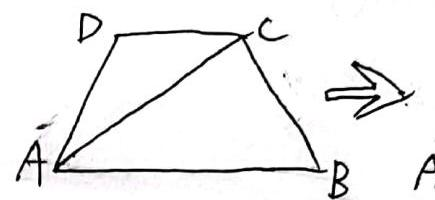
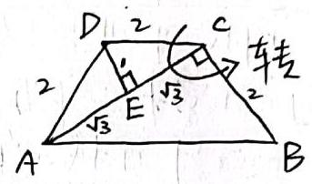
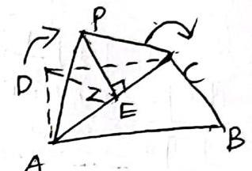
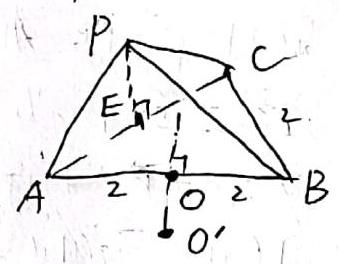
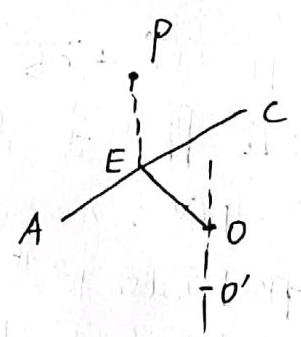
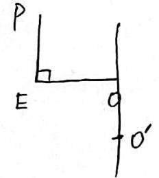
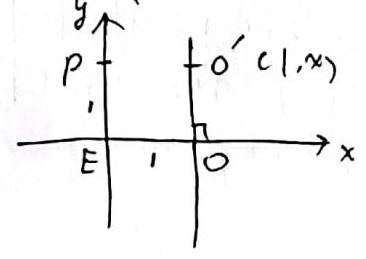
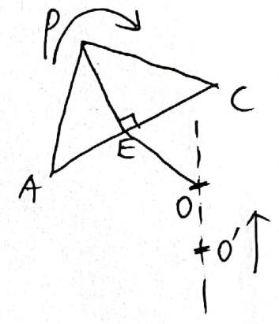
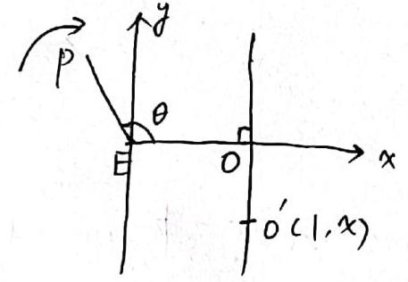

题目:如图梯形 ${ABCD}$ 中， ${AB}//{CD}$ ， ${AD} = {DC} = {BC} = 2\;{ABC} = {6.0}^{ \circ  }.$ 将 ${AAC}D$ 沿着边 ${AC}$ 重阴折，使点 $D$ 离平和到点 $P$

(1)若 ${PB} = {2\sqrt{2}},\;m =$ 核锥 $P - {AB}$ 上，表面积为

( )若障值 $P - {ABC}$ 外接球表随称，在 ${AP} \cdot  {AC}$ 不选斤

由折的过程中如何变化？

A B

说一个标准的外接球小题，其中第(2)问是up主临时加上百分，为了

${AB}{CD}$ 显然静止(画图法一目了然)，翻折受到二面角的唯一控制于是自邮报为(显然王自由度国绕二面角展开是最舒适，最符合工程师理念的。

这便要说到立体几何问题的一般思维方式——静止化。 问题必须要建立出足够舒适的要素关系网以实现完美控制。

比如这个问题，底座 ${AABC}$ 静止，方便开展，AC作为转轴把另一个静态面 ${APAC}$ 转上来，

像这样妙一个舒服的要素网是解好题目重点

因此，下一个问题就是，如何把这种要素网用好，只服务于解题呢？

第一点、控制需要提现”，变成可计算时描述

立体几何最常见的描述便是向量) 通过西乙信要素网选取基向量可以沿着要素网控制全局。

比如第一问，二面角是控制的关键，所以我一窥要选取基底，以

便舒服，直观的展示二面角

二面角肯定要有垂线，就作 $D \in  4 A C$

别忘了底座静止，稍微一算就发现

只是 ${AC}$ 中点

$\overrightarrow{DE}$ 分量发出来]. 它便指挥 ${PAC}$ 的旋转. 再取 $2 \nmid  {\text{ 称 }\text{ 画 }\text{ 面 }}\;A\;B$ 题目研究PB，那便拐过去:(由于易算出 ${CB}\bot {AC})$ 直接取 $\overrightarrow{EC} \neq  0$ 正注意二面角要发挥控制效果，那已必须出现在基向量的描述之中， $\overrightarrow{EC}$ 和 $\overrightarrow{CB}$ 均静止， $\overrightarrow{PE}$ 的转动始终保持与动画直，即与 $\overrightarrow{CB}$ 的夹角(由二面角定义)便正如是控制用的二面角 $\theta$ .

那么，网就成 $A\left( {B\left( {H}_{\beta }\right) }\right)$

$\left| {PB}\right|  = 2\sqrt{2}$ . 取平得 $8 = 1 + 3 + 2 + 2\sqrt{2}\overrightarrow{E} \cdot  \overrightarrow{CB} \Rightarrow  \overrightarrow{PE} \cdot  \overrightarrow{CE} = 0$

的二面角成了90°.两个面应当垂直. 这便完成 )第一问的静止化

计算量极小无比，但其中的思维方式，一定海及水与水果可以立体几何结合向量去认知整体图形，把要素两变成舒服的，可计算的对象是需要注意的.

第二点 外接球的无问题

外接球属于偏瘫一点的无问题: 应对方法非常统一，就是穿刺对于一个几何体，若其存在外接球，首先，取其一个面的外接圆的圆心，然后过纵圆心作这个面的垂线与悬小接球球心一定在这个穿刺”上面，因此，取其上一个点，这个任何自一个自由度。 再到一个方程即可定下它来。作为外接球心，只需在穿刺面上取一点:在该面以外再找一个兰必利上的点到上者距离相等即可.

②到这个题，现在两个自己的是垂直于:我们先说一个穿刺面很显然 ${\Delta A} \subset  B$ 外接圆心正是 ${AB}$ 中点。 穿刺更为方便于是过 0 坚着插一根注入支过每一点 ${O}^{\prime }$ . 考容量 ${0}^{\prime }{\text{ 是 }\text{ 真 }\text{ 正 }\text{ 可 }\text{ 分 }\text{ 接 }\text{ 受 }\text{ 域 }\text{ 心 }\text{ 及 }\text{ 其 }\text{ 中 }\text{ 域 }}O{A}^{\prime } = \left| {{0}^{\prime }P}\right|$ 这便是我们接下来的工作重点

我们显然要用 ${0}^{ \circ  }\theta$ 的自由度去表示 $\left| {{0}^{ \circ  }A}\right|$ 与 $\left| {{0}^{ \circ  }P}\right|$ . 1)开着，当然是要用 ${0}^{ \circ  }0$ 来作为王自由度去表示 ${\left| {O}^{\prime }A\right| }^{2} = {\left| OA\right| }^{2} + {\left| OO\right| }^{2} = {\left| {O}^{\prime }O\right| }^{2} + 4$ 再算 ${0}^{ \circ  }P$ . 这里我们等掉多余的点、只留有用的这样一隔离问题，干扰眼问减少，要素网得必等化，现在要求的PR需关注三者之间有联系的 $E$ P. DE. 00’

在表示的过程中， ${o}^{\prime }$ 是视为一个自由度的我们要用这个自由度去列方程现在来看，00'的长度可能造成2个不同的点、 所以蒙性建个系，直接算 (✗:对于隔离六出来的小问题全是接单独列处二思维焦点，想法占算这才体现隔离的价值) $\rho \left( {0,1}\right) \;{0}^{\prime }\left( {1, x}\right) \; {\left| {\rho }^{\prime }p\right| }^{2} = 1 + {\left( x - 1\right) }^{2}$

刚才的 ${\left| {\rho }^{\prime }A\right| }^{2}$ 也顺势变成 ${x}^{2} + 4$

$\therefore 1 + {\left( x - 1\right) }^{2} = {x}^{2} + 4 \Rightarrow  x =  - 1$

上面的等式两边就是 ${R}^{2} =  > {R}^{2} = 5$

于是表面积自然是 ${20\pi }$

整个做题过程完全按照此前讲述的思维方式走，一步也没脱离

再看第二问，当不断向内折叠时，表面积如何变化，

无非就是带着二面角(记忆中)去算喷！

仍然是一样的西次 底座不变，继续等刺，但现在.

$p$ 变化起来了

$P$ 到 ${o}^{\prime }$ 仅是拐弯过去的. 仍然拆出截面:

$P \in$ 在次截面内转动 ${2P} \in  O$ 正是二面角 $\theta$ .

整个图开口之被控制的死死的，计算已是囊中之物。

$P\left( {\cos \theta ,\sin \theta }\right) \; {0}^{\prime }\left( {1, x}\right) \; {\left| {\phi }^{\prime }p\right| }^{2} = {\left( \cos \theta  - 1\right) }^{2} + {\left( \sin \theta  - x\right) }^{2}$

${\left| {OA}\right| }^{2}$ 仅是 ${x}^{2} + {y}^{2}$ (要素，网一支线，不受 $P$ 变动影响

${f}_{\text{ 非 }}{\sigma }^{\prime }A{l}^{ - } = {x}^{2} + y = {\left( \cos \theta  - 1\right) }^{2} + {\left( \sin \theta  - x\right) }^{2}$

$\theta$ 是垂直由度要控制 $\alpha$ ，求解上面 $\theta  : x = \frac{1 + \cos \theta }{\sin \theta }$

${R}^{2} = {x}^{2} + {y}^{2} = {\left( \frac{1 + \cos \theta }{\sin \theta }\right) }^{2} + y\;$ 由于 $\frac{1 + \cos \theta }{\sin \theta } > 0$ 可知，只需有 $l\left( \theta \right)  = \frac{1 + \cos \theta }{\sin \theta }$ 的单调性.

最弱值的加倍，求导: ${f}^{\prime }\left( \theta \right)  = \frac{1 - \cos \theta }{{\sin }^{2}\theta } < 0\;\left( {0 < \theta  < {\pi }_{1}}\right)$

$\therefore f\left( \theta \right)$ 减

于是当 $\theta$ 减小时 $f$ 应当变大, $f$ 是 $R$ 在向内折叠时会不断变大

总结:这道题体现了要素网的思维方式解题的典型特征. 同时又展现了丰富的思维方法。很多与立体的有关、

首先是工程师的意识与画圆光来建立易计算的要素网，这是要素网实正当应用中最为重要的一环。舒服的要素网也会带来舒服的计算.

隔离问题的意识在做题中有助于理清当前主要矛盾. 及时调整思维焦点大家注意内化(结合第五期。

然后是一些全体几何(外接球)的注意点，立体们可的要素网建立通常以上些向量为☆某个，因此走向量走过去，只能符合要素网的理念，也方便计算大家可口之尝试。

。十二层东图形，只看截面是一种好斗型，截面由于降引作惠桑网会更背。也更易于用向量，三角，建系等静止化方法计算 通常可以由 ②③④④⑤(得

使用

将会无求意的非常固定，这是用算来的方法去引力条件计算。做题“助筹” 给点了国动前面的思维方式。因为思维考察全面、因此常见于区平面起问题是一个典型，方法非常好适。

作为变式训练，大家可以去看我最近原创题的旧版16 与新版12 (问一个题。以此体会这种方法的智面性。