GAOZHONGSHUXUEJINGBIAN

高中数学精编解析几何、立体几何

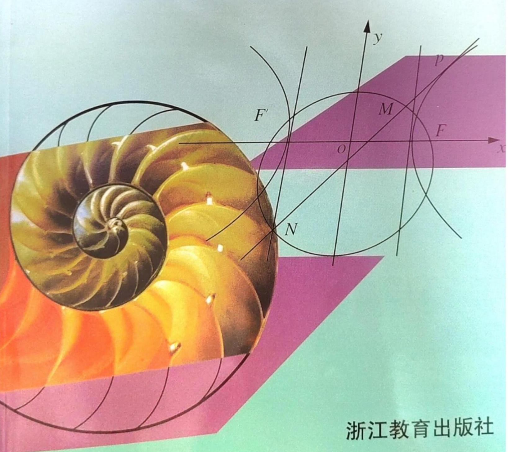

3. 目示 4

解析几何

第一章 平面向量的坐标表示 1

一、向量的坐标表示及其运算 1

二、向量的数量积 6

三、平面向量的分解定理 13

四、向量的应用 16

第二章 矩阵和行列式初步 21

一、矩阵 21

二、行列式 26

第三章 算法初步 30

一、算法的概念 30

二、程序框图 32

三、计算机语言和算法程序 37

第四章 直线 44

一、有向线段、定比分点 44

二、直线的方程 47

三、两条直线的位置关系 56

第五章 圆锥曲线 69

一、曲线和方程 69

二、圆 72

三、椭圆 85

四、双曲线 93

五、抛物线 101

六、坐标变换 109

第六章 参数方程、极坐标 118

一、参数方程 118

二、极坐标 128

立体几何

第七章 直线和平面 137

一、平面、空间两条直线 137

二、空间直线和平面 145

三、空间两个平面 158

第八章 多面体和旋转体 178

一、多面体 178

二、旋转体 196

三、多面体和旋转体的体积 213

答案与提示 233

解析几何

## 第一章 平面向量的坐标表示

## 一、向量的坐标表示及其运算

## 【典型题型和解题技巧】

1. 按运算法则进行向量的坐标运算.

若向量 $\mathbf{a} = \left( {{x}_{1},{y}_{1}}\right) ,\mathbf{b} = \left( {{x}_{2},{y}_{2}}\right)$ ,则有:

(1) $\mathbf{a} + \mathbf{b} = \left( {{x}_{1} + {x}_{2},{y}_{1} + {y}_{2}}\right)$ ；

(2) $a - b = \left( {{x}_{1} - {x}_{2},{y}_{1} - {y}_{2}}\right)$ ；

(3) ${\lambda a} = \left( {\lambda {x}_{1},\lambda {y}_{1}}\right)$ .

例 1 (1)已知向量 $a = \left( {-1,2}\right) , b = \left( {2,1}\right)$ ，求 ${2a} + {3b}, a - {3b},\frac{1}{2}a - \frac{1}{3}b$ ；

(2)已知点 $A\left( {4,6}\right) , B\left( {7,5}\right) , C\left( {1,8}\right)$ ，求 $\overrightarrow{AB} - \frac{1}{2}\overrightarrow{AC}$ .

解 (1) ${2a} + {3b} = 2\left( {-1,2}\right)  + 3\left( {2,1}\right)  = \left( {-2 + 6,4 + 3}\right)  = \left( {4,7}\right)$ ,

$\mathbf{a} - 3\mathbf{b} = \left( {-1,2}\right)  - 3\left( {2,1}\right)  = \left( {-1 - 6,2 - 3}\right)  = \left( {-7, - 1}\right) ,$

$\frac{1}{2}a - \frac{1}{3}b = \frac{1}{2}\left( {-1,2}\right)  - \frac{1}{3}\left( {2,1}\right)  = \left( {-\frac{1}{2} - \frac{2}{3},1 - \frac{1}{3}}\right)  = \left( {-\frac{7}{6},\frac{2}{3}}\right) .$

(2) $\overrightarrow{AB} - \frac{1}{2}\overrightarrow{AC} = \left( {7,5}\right)  - \left( {4,6}\right)  - \frac{1}{2}\left\lbrack  {\left( {1,8}\right)  - \left( {4,6}\right) }\right\rbrack   = \left( {3, - 1}\right)  - \frac{1}{2}\left( {-3,2}\right)  = \left( {\frac{9}{2}, - 2}\right)$ .

例 2 已知点 $O\left( {0,0}\right) , A\left( {1,2}\right) , B\left( {4,5}\right)$ ,且 $\overrightarrow{OP} = \overrightarrow{OA} + t\overrightarrow{AB}\left( {t \in  \mathbf{R}}\right)$ .

(1)当 $t$ 为何值时,点 $P$ 在 $x$ 轴上? 点 $P$ 在二、四象限角平分线上? 点 $P$ 在第二象限?

(2)四边形 OABP 能否成为平行四边形？若能，求出相应的 $t$ 的值；若不能，请说明理由.

解(1)向量 $\overrightarrow{OP} = \left( {1 + {3t},2 + {3t}}\right)$ .

若点 $P$ 在 $x$ 轴上,则只需 $2 + {3t} = 0$ ,得 $t =  - \frac{2}{3}$ ;

若点 $P$ 在二、四象限角平分线上,则只需 $1 + {3t} =  - \left( {2 + {3t}}\right)$ ,得 $t =  - \frac{1}{2}$ ;

若点 $P$ 在第二象限,则只需 $\left\{  \begin{array}{l} 1 + {3t} < 0, \\  2 + {3t} > 0, \end{array}\right.$ 得 $- \frac{2}{3} < t <  - \frac{1}{3}$ .

(2)向量 $\overrightarrow{OA} = \left( {1,2}\right) ,\overrightarrow{PB} = \left( {3 - {3t},3 - {3t}}\right)$ .

若 ${OABP}$ 为平行四边形,则 $\overrightarrow{OA} = \overrightarrow{PB}$ .

$\therefore \left\{  \begin{array}{l} 3 - {3t} = 1, \\  3 - {3t} = 2, \end{array}\right.$ 此方程组无解,所以四边形 ${OABP}$ 不能成为平行四边形.

2. 模与单位向量.

若向量 $\mathbf{a} = \left( {x, y}\right)$ ,则 $\left| \mathbf{a}\right|  = \sqrt{{x}^{2} + {y}^{2}},\mathbf{a}$ 的单位向量 ${\mathbf{a}}_{0} = \frac{\mathbf{a}}{\left| \mathbf{a}\right| }$ .

例 3 已知向量 $\mathbf{a} = \left( {-6,8}\right)$ . 求:

(1)向量 $a$ 的模; (2)向量 $\mathbf{a}$ 的单位向量 ${\mathbf{a}}_{0}$ .

解 (1) $\left| \mathbf{a}\right|  = \sqrt{{\left( -6\right) }^{2} + {8}^{2}} = {10}$ .

(2) ${a}_{0} = \frac{a}{\left| a\right| } = \frac{\left( -6,8\right) }{10} = \left( {-\frac{3}{5},\frac{4}{5}}\right)$ .

3. 向量的平行.

若向量 $\mathbf{a} = \left( {{x}_{1},{y}_{1}}\right) ,\mathbf{b} = \left( {{x}_{2},{y}_{2}}\right)$ ,则 $\mathbf{a}//\mathbf{b} \Leftrightarrow  {x}_{1}{y}_{2} = {x}_{2}{y}_{1}$ .

例 4 已知 $O$ 为坐标原点，在 $\bigtriangleup  {ABC}$ 中，向量 $\overrightarrow{OA} = \left( {2, - 3}\right) ,\overrightarrow{OB} = \left( {1,4}\right)$ ，且 $\overrightarrow{OC} = 3\overrightarrow{OA}$ ， $\overrightarrow{OD} = 3\overrightarrow{OB},\overrightarrow{OE} = 2\overrightarrow{OA} + \overrightarrow{OB}$ ,求 $C, D, E$ 三点的坐标,并判断 $C, D, E$ 三点是否共线.

解 $\because \overrightarrow{OC} = 3\overrightarrow{OA} = 3\left( {2, - 3}\right)  = \left( {6, - 9}\right) ,\overrightarrow{OD} = 3\overrightarrow{OB} = 3\left( {1,4}\right)  = \left( {3,{12}}\right)$ ,

$\overrightarrow{OE} = 2\overrightarrow{OA} + \overrightarrow{OB} = \left( {4, - 6}\right)  + \left( {1,4}\right)  = \left( {5, - 2}\right)$ ,

又 $\because \overrightarrow{OC},\overrightarrow{OD},\overrightarrow{OE}$ 的起点均在原点，

$\therefore C, D, E$ 三点的坐标分别为 $\left( {6, - 9}\right) ,\left( {3,{12}}\right) ,\left( {5, - 2}\right)$ .

$\because \overrightarrow{CE} = \overrightarrow{OE} - \overrightarrow{OC} = \left( {5, - 2}\right)  - \left( {6, - 9}\right)  = \left( {-1,7}\right)$ ,

$\overrightarrow{CD} = \overrightarrow{OD} - \overrightarrow{OC} = \left( {3,{12}}\right)  - \left( {6, - 9}\right)  = \left( {-3,{21}}\right)  = 3\left( {-1,7}\right)  = 3\overrightarrow{CE}$ ,

$\therefore \overrightarrow{CE}//\overrightarrow{CD}$ ,且 $\overrightarrow{CE},\overrightarrow{CD}$ 有公共点 $C,\therefore C, D, E$ 三点共线.

例 5 已知点 $A\left( {x,1}\right) , B\left( {{2x},2}\right) , C\left( {1,{2x}}\right) , D\left( {5,{3x}}\right)$ . 当 $x$ 为何值时,向量 $\overrightarrow{AB}$ 与 $\overrightarrow{CD}$ 共线且方向相同? 此时,点 $A, B, C, D$ 是否在同一条直线上?

解 $\because \overrightarrow{AB} = \left( {x,1}\right) ,\overrightarrow{CD} = \left( {4, x}\right) ,\overrightarrow{AB}//\overrightarrow{CD} \Leftrightarrow  {x}^{2} - 4 = 0,\therefore x =  \pm  2$ .

当 $x = 2$ 时, $\overrightarrow{AB} = \left( {2,1}\right) ,\overrightarrow{CD} = \left( {4,2}\right)  \Rightarrow  \overrightarrow{CD} = 2\overrightarrow{AB}$ ;

当 $x =  - 2$ 时, $\overrightarrow{AB} = \left( {-2,1}\right) ,\overrightarrow{CD} = \left( {4, - 2}\right)  \Rightarrow  \overrightarrow{CD} =  - 2\overrightarrow{AB}$ .

故当 $x = 2$ 时, $\overrightarrow{AB}$ 与 $\overrightarrow{CD}$ 共线且方向相同.

此时, $\overrightarrow{BD} = \left( {5 - {2x},{3x} - 2}\right)  = \left( {1,4}\right) .\;\because 2 \times  4 - 1 \times  1 \neq  0,\therefore \overrightarrow{AB}$ 与 $\overrightarrow{BD}$ 不共线,

故点 $A, B, C, D$ 不在同一条直线上.

4. 有向线段 $\overrightarrow{{P}_{1}{P}_{2}}$ 的定比分点的坐标公式.

设点 ${P}_{1}\left( {{x}_{1},{y}_{1}}\right) ,{P}_{2}\left( {{x}_{2},{y}_{2}}\right)$ ,点 $P\left( {x, y}\right)$ 是直线 ${P}_{1}{P}_{2}$ 上一点,且 $\overrightarrow{{P}_{1}P} = \lambda \overrightarrow{P{P}_{2}}$ ,

则有 $\left\{  \begin{array}{l} x = \frac{{x}_{1} + \lambda {x}_{2}}{1 + \lambda }, \\  y = \frac{{y}_{1} + \lambda {y}_{2}}{1 + \lambda }. \end{array}\right.$

例 6 经过点 $M\left( {-2,3}\right)$ 的直线分别与 $x$ 轴、 $y$ 轴交于 $A, B$ 两点,且 $\left| \overrightarrow{AB}\right|  = 3\left| \overrightarrow{AM}\right|$ ,求点 $A, B$ 的坐标.

解 设点 $A\left( {a,0}\right) , B\left( {0, b}\right)$ .

由 $\left| \overrightarrow{AB}\right|  = 3\left| \overrightarrow{AM}\right|$ ,得 $\overrightarrow{AB} = 3\overrightarrow{AM}$ 或 $\overrightarrow{AB} =  - 3\overrightarrow{AM}$ .

当 $\overrightarrow{AB} = 3\overrightarrow{AM}$ 时，有 $\overrightarrow{BM} = 2\overrightarrow{MA}$ ，

$\therefore  - 2 = \frac{0 + {2a}}{1 + 2},3 = \frac{b + 2 \times  0}{1 + 2}$ ,得 $a =  - 3, b = 9$ ; 当 $\overrightarrow{AB} =  - 3\overrightarrow{AM}$ 时,有 $\overrightarrow{BM} =  - 4\overrightarrow{MA},\therefore  - 2 = \frac{0 - {4a}}{1 - 4},3 = \frac{b - 4 \times  0}{1 - 4}$ ,得 $a =  - \frac{3}{2}, b =  - 9$ .

$\therefore$ 点 $A, B$ 的坐标分别为 $\left( {-3,0}\right) ,\left( {0,9}\right)$ 或 $\left( {-\frac{3}{2},0}\right) ,\left( {0, - 9}\right)$ .

注意 (1) 运用定比分点的坐标公式时要分清 (或选定) 起点、终点及分点,从而确定 $\lambda$ .

(2) $\left| \overrightarrow{AB}\right|  = 3\left| \overrightarrow{AM}\right|$ 表示向量的模的关系，当 $A, B, M$ 三点共线时， $\left| \overrightarrow{AB}\right|  = 3\left| \overrightarrow{AM}\right|  \Leftrightarrow  \overrightarrow{AB} \; =  \pm  3\overrightarrow{AM}$ .

## 【训练题】

(A)

1. 若向量 $\mathbf{a}$ 的起点坐标为 $\left( {3,1}\right)$ ,终点坐标为 $\left( {-1, - 3}\right)$ ,则向量 $\mathbf{a}$ 的坐标为 ( )

(A) $\left( {-1, - 3}\right)$ . (B) $\left( {4,4}\right)$ . (C) $\left( {-4, - 2}\right)$ . (D) $\left( {-4, - 4}\right)$ .

2. 若向量 $\overrightarrow{AB} = \left( {6,1}\right) ,\overrightarrow{BC} = \left( {-1,2}\right) ,\overrightarrow{CD} = \left( {2, - 3}\right)$ ，则向量 $\overrightarrow{AD}$ 的坐标为( )

(A) $\left( {5,2}\right)$ . (B) $\left( {7,0}\right)$ . (C) $\left( {-7,0}\right)$ . (D) $\left( {5, - 4}\right)$ .

3. 若 $P\left( {3, - 6}\right) , Q\left( {-5,2}\right) , R\left( {m, - 9}\right)$ 三点共线，则实数 $m$ 的值为( )

(A) -9 . (B) -6 (C) 9 . (D) 6 .

4. 若向量 $\overrightarrow{AB} = \left( {3, - 1}\right) ,\overrightarrow{ON} = \left( {-2,0}\right)$ ，且 $\overrightarrow{AB} = \overrightarrow{MN}$ ，则向量 $\overrightarrow{OM}$ 的坐标为( )

(A) $\left( {1, - 1}\right)$ . (B) $\left( {5, - 1}\right)$ . (C) $\left( {-5,1}\right)$ . (D) $\left( {1, - 5}\right)$ .

5. 设 $i, j$ 是基本单位向量, $O$ 为坐标原点. 若 $\overrightarrow{OA} = {4i} + {2j},\overrightarrow{OB} = {3i} + {4j}$ ,则 $2\overrightarrow{OA} + \overrightarrow{OB}$ 的坐标为( )

(A) $\left( {1, - 2}\right)$ . (B) $\left( {7,6}\right)$ . (C) $\left( {5,0}\right)$ . (D) $\left( {{11},8}\right)$ .

6. 已知向量 $\mathbf{a} = \left( {\cos {75}^{ \circ  },\sin {75}^{ \circ  }}\right) ,\mathbf{b} = \left( {\cos {15}^{ \circ  },\sin {15}^{ \circ  }}\right)$ ,那么 $\left| {\mathbf{a} - \mathbf{b}}\right|$ 的值为 ( )

(A) $\frac{1}{2}$ . (B) $\frac{\sqrt{2}}{2}$ . (C) $\frac{\sqrt{3}}{2}$ . (D) 1 .

7. 若向量 $\mathbf{a} = \left( {3,2}\right) ,\mathbf{b} = \left( {x,4}\right)$ ，且 $\mathbf{a}//\mathbf{b}$ ，则 $x$ 的值为( )

(A) 6 . (B) -6 . (C) $\frac{8}{3}$ . (D) $- \frac{8}{3}$ .

8. 若向量 $a = \left( {\frac{3}{2},\sin \alpha }\right) , b = \left( {\cos \alpha ,\frac{1}{3}}\right)$ ，且 $a//b$ ，则锐角 $\alpha$ 为( )

(A) ${30}^{ \circ  }$ . (B) ${60}^{ \circ  }$ . (C) ${45}^{ \circ  }$ . (D) ${75}^{ \circ  }$ .

9. 若点 $P\left( {-1, - 1}\right) , Q\left( {2,5}\right)$ ，点 $R$ 在直线 ${PQ}$ 上，且 $\overrightarrow{PR} =  - 5\overrightarrow{QR}$ ，则点 $R$ 的坐标为( )

(A) $\left( {\frac{11}{4},\frac{13}{2}}\right)$ . (B) $\left( {\frac{11}{4},\frac{3}{2}}\right)$ . (C) $\left( {\frac{3}{2},\frac{13}{2}}\right)$ . (D) $\left( {\frac{3}{2},4}\right)$ .

10. 当 $\overrightarrow{AP} = \frac{1}{3}\overrightarrow{PB}$ 时，有 $\overrightarrow{PB} = \lambda \overrightarrow{BA}$ ，则实数 $\lambda$ 的值为( )

(A) $\frac{3}{4}$ . (B) $\frac{4}{3}$ . (C) $- \frac{4}{3}$ . (D) $- \frac{3}{4}$

11. 若过 ${P}_{1}\left( {-1,2}\right) ,{P}_{2}\left( {5,6}\right)$ 两点的直线与 $x$ 轴交于点 $P$ ,则点 $P$ 分有向线段 $\overrightarrow{{P}_{1}{P}_{2}}$ 所成的比为( )

(A) $- \frac{1}{3}$ . (B) $- \frac{1}{5}$ . (C) $\frac{1}{5}$ . (D) $\frac{1}{3}$ .

12. 若向量 $\mathbf{a} + \mathbf{b} = \left( {-3, - 4}\right) ,\mathbf{a} - \mathbf{b} = \left( {5,2}\right)$ ，则向量 $\mathbf{a} =$ ___， $\mathbf{b} =$ ___.

13. 已知 $\left| \mathbf{a}\right|  = 5,\mathbf{b} = \left( {1,2}\right) ,\mathbf{a}//\mathbf{b}$ ,且方向相反,则向量 $\mathbf{a} =$ ___.

14. 若向量 $\mathbf{a}$ 以点 $\left( {-2,1}\right)$ 为起点，且 $\mathbf{a} = \left( {3,2}\right)$ ，则向量 $2\mathbf{a}$ 的终点坐标为___.

15. 已知向量 $\mathbf{a} = \left( {1,2}\right) ,\mathbf{b} = \left( {2,3}\right)$ . 若向量 $\lambda \mathbf{a} + \mathbf{b}$ 与向量 $\mathbf{c} = \left( {-4, - 7}\right)$ 共线，则 $\lambda  =$ ___.

16. 与向量 $\mathbf{a} = \left( {3, - 4}\right)$ 平行的单位向量是___.

17. 已知向量 $\mathbf{a} = \left( {3, - 2}\right) ,\mathbf{b} = \left( {-2,1}\right) ,\mathbf{c} = \left( {7, - 4}\right)$ . 若 $\mathbf{c} = \lambda \mathbf{a} + \mu \mathbf{b}$ ,则 $\lambda  =$ ___， $\mu  =$ ___.

18. 若向量 $\mathbf{a} = \left( {x,2}\right) ,\mathbf{b} = \left( {-4, y}\right) ,\mathbf{c} = \left( {-3, - 5}\right)$ ，且 $\mathbf{c} =  - \frac{1}{2}\mathbf{a} + \frac{3}{2}\mathbf{b}$ ，则实数 $x =$ ___j___y $=$

19. 若两个不相等的向量 $\mathbf{a} = \left( {\frac{1}{2},\cos \alpha }\right) ,\mathbf{b} = \left( {\sin \alpha , - \frac{\sqrt{3}}{2}}\right)$ ,满足 $\mathbf{a}//\mathbf{b},\alpha$ 为钝角,则 $\alpha  =$ ___.

20. 若向量 $\mathbf{a} = \left( {1,\sin \theta }\right) ,\mathbf{b} = \left( {1,\cos \theta }\right)$ ，则 $\left| {\mathbf{a} - \mathbf{b}}\right|$ 的最大值为___.

21. 若三角形的两个顶点为 $A\left( {-{10},3}\right) , B\left( {6, - 4}\right)$ ,三角形的重心为 $M\left( {-2,3}\right)$ ,则三角形的另一个顶点 $C$ 的坐标为___.

22. 已知向量 $a = \left( {-4,2}\right)$ 的终点在原点，求向量 $a$ 的起点坐标.

23. 在平面直角坐标系中， $O$ 为坐标原点，已知两点 $A\left( {3,1}\right)$ ， $B\left( {-1,3}\right)$ . 若点 $C$ 满足 $\overrightarrow{OC} = \alpha \overrightarrow{OA} \; + \beta \overrightarrow{OB},\alpha ,\beta  \in  \mathbf{R}$ ,且 $\alpha  + \beta  = 1$ ,求点 $C$ 的轨迹方程.

24. 已知 $A, B, C, D$ 为坐标平面上的四个点, $\overrightarrow{AB} = \overrightarrow{CD}$ ,点 $A$ 的坐标为 $\left( {3,1}\right)$ ,点 $B$ 的坐标为 $\left( {-2, - 2}\right)$ .

(1)若点 $C$ 的坐标为 $\left( {-1,4}\right)$ ，求点 $D$ 的坐标；

(2)若坐标原点为 $O,\overrightarrow{OP} = \overrightarrow{AB}$ ，求点 $P$ 的坐标.

25. 已知 $O$ 为坐标原点，向量 $\overrightarrow{OA} = \left( {-2, m}\right)$ ， $\overrightarrow{OB} = \left( {n,1}\right)$ ， $\overrightarrow{OC} = \left( {5, - 1}\right)$ . 若 $A, B, C$ 三点共线， 且 $m = {2n}$ ,求实数 $m, n$ 的值.

26. 给定两个向量 $\mathbf{a} = \left( {3,4}\right) ,\mathbf{b} = \left( {2, - 1}\right)$ ,求 $\mathbf{a} + \mathbf{x}\mathbf{b}$ 与 $\mathbf{a} - \mathbf{b}$ 平行时实数 $x$ 的值.

27. 已知向量 $\mathbf{a} = \left( {8,2}\right) ,\mathbf{b} = \left( {3,3}\right) ,\mathbf{c} = \left( {6,{12}}\right) ,\mathbf{p} = \left( {6,4}\right)$ . 问:是否存在实数 $x, y, z$ 同时满足下列两个条件:(1) $\mathbf{p} = x\mathbf{a} + y\mathbf{b} + z\mathbf{c}$ ; (2) $x + y + z = 1$ ？若存在，请求出 $x, y, z$ 的值；若不存在,请说明理由.

28. 已知点 $A\left( {3,0}\right) , B\left( {-1, - 6}\right) , P$ 是直线 ${AB}$ 上一点,且 $\left| \overrightarrow{AP}\right|  = \frac{1}{3}\left| \overrightarrow{AB}\right|$ ,求点 $P$ 的坐标.

(B)

29. 在 $\square {ABCD}$ 中，若 $\overrightarrow{AB} = \left( {2,4}\right) ,\overrightarrow{AC} = \left( {1,3}\right)$ ，则 $\overrightarrow{BD}$ 等于( )

(A) $\left( {-2, - 4}\right)$ . (B) $\left( {-3, - 5}\right)$ . (C) $\left( {3,5}\right)$ . (D) $\left( {2,4}\right)$ .

30. 设有定点 $A\left( {1,1}\right) , B\left( {4, - 6}\right) , P$ 为一动点，且 $\overrightarrow{AP}//\overrightarrow{OB}$ ( $O$ 为坐标原点)，则动点 $P$ 的轨迹方程为( )

(A) ${2x} - {3y} + 1 = 0$ . (B) ${3x} + {2y} - 5 = 0$ .

(C) ${3x} - {2y} - 2 = 0$ . (D) ${2x} + {3y} - 5 = 0$ .

31. 已知点 $A\left( {1,2}\right) , B\left( {4,5}\right)$ . 若点 $C\left( {2,3}\right)$ 将线段 ${AB}$ 分成两部分,其中 $\overrightarrow{AB} = \lambda \overrightarrow{BC}$ ,则实数 $\lambda$ 的值为( )

(A) $\frac{3}{2}$ . (B) $- \frac{3}{2}$ . (C) $\frac{2}{3}$ . (D) $- \frac{2}{3}$ .

32. 若正方形 ${PQRS}$ 的对角线的交点为 $M$ ,坐标原点 $O$ 不在正方形内部,且 $\overrightarrow{OP} = \left( {0,3}\right) ,\overrightarrow{OS} = \; \left( {4,0}\right)$ ，则向量 $\overrightarrow{RM}$ 等于(   )

(A) $\left( {-\frac{7}{2}, - \frac{1}{2}}\right)$ . (B) $\left( {\frac{7}{2},\frac{1}{2}}\right)$ . (C) $\left( {7,4}\right)$ . (D) $\left( {\frac{7}{2},\frac{7}{2}}\right)$ .

33. 以点 $A\left( {1,4}\right) , B\left( {5,0}\right) , C\left( {3, - 3}\right)$ 为顶点的 $\bigtriangleup {ABC}$ 的重心为 $M$ ,则点 $M$ 关于原点 $O$ 对称的点 $N$ 的坐标为( )

(A) $\left( {-3, - \frac{1}{3}}\right)$ . (B) $\left( {3, - \frac{1}{3}}\right)$ . (C) $\left( {\frac{1}{3}, - 3}\right)$ . (D) $\left( {-\frac{1}{3}, - 3}\right)$ .

34. 已知点 $A\left( {\sqrt{3},1}\right) , B\left( {0,0}\right) , C\left( {\sqrt{3},0}\right)$ . 设 $\angle {BAC}$ 的平分线 ${AE}$ 与 ${BC}$ 交于点 $E$ ,则有 $\overrightarrow{BC} = \; \lambda \overrightarrow{CE}$ ，其中 $\lambda$ 等于( )

(A) 2 . (B) $\frac{1}{2}$ . (C) -3 . (D) $- \frac{1}{3}$ .

35. 若四边形 ${ABCD}$ 的三个顶点为 $A\left( {0,2}\right) , B\left( {-1, - 2}\right) , C\left( {3,1}\right)$ ,且 $\overrightarrow{BC} = 2\overrightarrow{AD}$ ,则顶点 $D$ 的坐标为( )

(A) $\left( {2,\frac{7}{2}}\right)$ . (B) $\left( {2, - \frac{1}{2}}\right)$ . (C) $\left( {3,2}\right)$ . (D) $\left( {1,3}\right)$ .

36. 将函数 $y = {2}^{x} + 1$ 的图象按向量 $a$ 平移得到函数 $y = {2}^{x + 1}$ 的图象,则 $a$ 为( )

(A) $\left( {-1, - 1}\right)$ . (B) $\left( {1, - 1}\right)$ . (C) $\left( {1,1}\right)$ . (D) $\left( {-1,1}\right)$ .

37. 已知向量 $\mathbf{a} = \left( {1,2}\right) ,\mathbf{b} = \left( {-3,2}\right)$ . 当 $k =$ ___时， $k\mathbf{a} + \mathbf{b}$ 与 $\mathbf{a} - 3\mathbf{b}$ 平行.

38. 已知点 $P$ 在平面上做匀速直线运动,速度向量 $v = \left( {2,5}\right)$ . 当 $t = 0$ 时,点 $P$ 在 $\left( {-6, - 2}\right)$ 处, 则当 $t = 5$ 时，点 $P$ 的坐标为___.

39. 已知 $A\left( {1,2}\right)$ ， $B\left( {3, - 4}\right)$ ， $C\left( {-2,4}\right)$ ，且 $\overrightarrow{CM} =  - 2\overrightarrow{CA}$ ， ${CN} = 3\overrightarrow{CB}$ ，则 $\overrightarrow{MN} =$ ___.

40. 已知向量 $a = \left( {-2,2}\right)$ ， $b = \left( {5, k}\right)$ . 若 $\left| {a + b}\right|$ 不超过 5，则 $k$ 的取值范围是___.

41. 已知向量 $\overrightarrow{OA} = \left( {k,{12}}\right) ,\overrightarrow{OB} = \left( {4,5}\right) ,\overrightarrow{OC} = \left( {-k,{10}}\right)$ ，且 $A, B, C$ 三点共线，则 $k =$ ___.

42. 若 $a > 0$ ，平面内 $A\left( {1, - a}\right)$ ， $B\left( {2,{a}^{2}}\right)$ ， $C\left( {3,{a}^{3}}\right)$ 三点共线，则 $a =$ ___.

43. 已知向量 $a = \left( {2,1}\right) , b = \left( {1,1}\right) ,\left| {{\lambda a} + b}\right|  = \sqrt{29}$ ，且 $\lambda  > 0$ ，则 $\lambda  =$ ___.

44. 在直角坐标系 ${xOy}$ 中,已知点 $A\left( {0,1}\right)$ 和点 $B\left( {-3,4}\right)$ . 若点 $C$ 在 $\angle {AOB}$ 的平分线上,且 $\left| \overrightarrow{OC}\right|  = 2$ ，则 $\overrightarrow{OC} =$ ___.

45. 以原点 $O$ 及点 $A\left( {5,2}\right)$ 为顶点作一个等腰直角三角形 ${OAB}$ ，其中 $\angle A = {90}^{ \circ  }$ .

求 $\overrightarrow{AB}$ 的坐标和点 $B$ 的坐标.

46. 已知 $O$ 为坐标原点，向量 $\mathbf{a} = \left( {1,0}\right) ,\mathbf{b} = \left( {1,1}\right)$ ，且 $\overrightarrow{OP} = 2\mathbf{a} + t\mathbf{b}$ ， $\overrightarrow{OQ} = t\mathbf{a} - 2\mathbf{b}$ ( $t \in  \mathbf{R}$ )，求证: 当 $t$ 在实数范围内变化时,点 $P$ 及点 $Q$ 的轨迹是两条相交直线.

47. 已知向量 $\mathbf{m} = \left( {\cos \theta ,\sin \theta }\right)$ 和 $\mathbf{n} = \left( {\sqrt{2} - \sin \theta ,\cos \theta }\right) ,\theta  \in  \left( {\pi ,{2\pi }}\right)$ ,且 $\left| {\mathbf{m} + \mathbf{n}}\right|  = \frac{8\sqrt{2}}{5}$ ,求 $\cos \left( {\frac{\theta }{2} + \frac{\pi }{8}}\right)$ 的值.

## 二、向量的数量积

## 【典型题型和解题技巧】

1. 直接运用定义计算数量积.

若非零向量 $\mathbf{a},\mathbf{b}$ 的夹角为 $\theta$ ,则 $\left| \mathbf{a}\right| \left| \mathbf{b}\right| \cos \theta$ 叫做向量 $\mathbf{a},\mathbf{b}$ 的数量积.

记作 $\mathbf{a} \cdot  \mathbf{b} = \left| \mathbf{a}\right| \left| \mathbf{b}\right| \cos \theta$ ,其中 $\theta$ 是 $\mathbf{a}$ 与 $\mathbf{b}$ 的夹角. 数量积又称内积.

$\left| \mathbf{a}\right| \cos \theta \left( {\left| \mathbf{b}\right| \cos \theta }\right)$ 叫做向量 $\mathbf{a}$ 在 $\mathbf{b}$ 方向上 $\left( {\mathbf{b}\text{ 在 }\mathbf{a}}\right.$ 方向上 $)$ 的投影.

规定:零向量与任何一个向量的数量积为 0 .

例 1 已知 $\left| \mathbf{a}\right|  = 4,\left| \mathbf{b}\right|  = 5$ ，分别求下列条件下 $\mathbf{a}$ 与 $\mathbf{b}$ 的数量积:

(1) $\mathbf{a}//\mathbf{b}$ ； (2) $\mathbf{a}\bot \mathbf{b}$ ； (3) $\mathbf{a}$ 与 $\mathbf{b}$ 的夹角为 ${120}^{ \circ  }$ .

解(1)当 $a$ 与 $b$ 同向时, $\theta  = {0}^{ \circ  }, a \cdot  b = \left| a\right| \left| b\right|  = {20}$ ;

当 $\mathbf{a}$ 与 $\mathbf{b}$ 反向时, $\theta  = {180}^{ \circ  },\mathbf{a} \cdot  \mathbf{b} =  - \left| \mathbf{a}\right| \left| \mathbf{b}\right|  =  - {20}$ .

(2)当 $a \bot  b$ 时， $\theta  = {90}^{ \circ  }, a \cdot  b = 0$ .

(3) $a \cdot  b = \left| a\right|  \cdot  \left| b\right| \cos {120}^{ \circ  } =  - {10}$ .

注意 当 $a//b$ 时,需分 $a$ 与 $b$ 同向和反向两种情况讨论.

2. 利用数量积求向量的模.

$$
\left| \mathbf{a}\right|  = \sqrt{\mathbf{a} \cdot  \mathbf{a}}.
$$

例 2 已知 $\left| \mathbf{a}\right|  = 3\sqrt{3},\left| \mathbf{b}\right|  = 1$ ,且 $\mathbf{a}$ 与 $\mathbf{b}$ 的夹角为 ${150}^{ \circ  }$ ,试求 $\left| {\mathbf{a} - 2\mathbf{b}}\right|$ .

解 $\because {\left| \mathbf{a} - 2\mathbf{b}\right| }^{2} = {\left( \mathbf{a} - 2\mathbf{b}\right) }^{2} = {a}^{2} - {2a} \cdot  2\mathbf{b} + {\left( 2\mathbf{b}\right) }^{2} = {27} - 4 \times  3\sqrt{3} \times  1 \times  \cos {150}^{ \circ  } + 4 = {49}$ ,

$\therefore \left| {\mathbf{a} - 2\mathbf{b}}\right|  = 7$ .

注意 求向量模的常用方法是平方法,即利用 ${\left| \mathbf{a}\right| }^{2} = {\mathbf{a}}^{2}$ 来求解.

3. 求与两个向量的夹角有关的问题.

若向量 $\mathbf{a}$ 与 $\mathbf{b}$ 的夹角为 $\theta$ ,则有 $\cos \theta  = \frac{\mathbf{a} \cdot  \mathbf{b}}{\left| \mathbf{a}\right| \left| \mathbf{b}\right| }$ .

例 3 已知 $\left| \mathbf{a}\right|  = \sqrt{3},\left| \mathbf{b}\right|  = 2$ ,且 $\mathbf{a}$ 与 $\mathbf{b}$ 的夹角为 $\frac{\pi }{6}$ ,试求 $\mathbf{a} + 2\mathbf{b}$ 与 $\mathbf{a} - \mathbf{b}$ 的夹角的余弦值.

解 $\mathbf{a} \cdot  \mathbf{b} = \left| \mathbf{a}\right| \left| \mathbf{b}\right| \cos \frac{\pi }{6} = 3$ .

$\because {\left| \mathbf{a} + 2\mathbf{b}\right| }^{2} = {\left( \mathbf{a} + 2\mathbf{b}\right) }^{2} = {\mathbf{a}}^{2} + 4\left( {\mathbf{a} \cdot  \mathbf{b}}\right)  + 4{\mathbf{b}}^{2} = 3 + 4 \times  3 + 4 \times  4 = {31}$ ,

$\therefore \left| {\mathbf{a} + 2\mathbf{b}}\right|  = \sqrt{31}$ .

$\because {\left| \mathbf{a} - \mathbf{b}\right| }^{2} = {\left( \mathbf{a} - \mathbf{b}\right) }^{2} = {\mathbf{a}}^{2} - 2\left( {\mathbf{a} \cdot  \mathbf{b}}\right)  + {\mathbf{b}}^{2} = 3 - 2 \times  3 + 4 = 1,\;\therefore \left| {\mathbf{a} - \mathbf{b}}\right|  = 1.$

$\because \;\left( {a + {2b}}\right)  \cdot  \left( {a - b}\right)  = {a}^{2} + a \cdot  b - 2{b}^{2} = 3 + 3 - 2 \times  4 =  - 2,$

$\therefore \cos \theta  = \frac{-2}{\sqrt{31} \times  1} =  - \frac{2\sqrt{31}}{31}.\;\therefore a + {2b}$ 与 $a - b$ 的夹角的余弦值为 $- \frac{2\sqrt{31}}{31}$ .

例 4 已知 $\left| \mathbf{a}\right|  = \sqrt{2},\left| \mathbf{b}\right|  = 3,\mathbf{a}$ 与 $\mathbf{b}$ 的夹角为 ${45}^{ \circ  }$ ,当向量 $\mathbf{a} + \mathbf{b}$ 与 $\lambda \mathbf{a} + \mathbf{b}$ 的夹角为锐角时, 求实数 $\lambda$ 的取值范围.

解 $\because \mathbf{a} + \mathbf{b}$ 与 $\lambda \mathbf{a} + \mathbf{b}$ 的夹角为锐角, $\therefore \left( {\mathbf{a} + \mathbf{b}}\right)  \cdot  \left( {\lambda \mathbf{a} + \mathbf{b}}\right)  > 0$ ,

即 $\lambda {a}^{2} + \left( {1 + \lambda }\right) a \cdot  b + {b}^{2} > 0$ .

$\because \mathbf{a} \cdot  \mathbf{b} = \sqrt{2} \times  3 \times  \cos {45}^{ \circ  } = 3,\;\therefore {5\lambda } + {12} > 0$ ,得 $\lambda  >  - \frac{12}{5}$ .

易知当 $\lambda  = 1$ 时, $\mathbf{a} + \mathbf{b}$ 与 $\lambda \mathbf{a} + \mathbf{b}$ 的夹角为 ${0}^{ \circ  }$ ,

$\therefore \lambda  \neq  1$ ,从而得 $\lambda  \in  \left( {-\frac{12}{5},1}\right)  \cup  \left( {1, + \infty }\right)$ .

注意 当两个向量的数量积大于 0 时,它们的夹角取值范围是 $\left\lbrack  {{0}^{ \circ  },{90}^{ \circ  }}\right)$ .

4. 求与两个向量垂直有关的问题.

(1)若 $\mathbf{a}$ 与 $\mathbf{b}$ 是两个非零向量，则有 $\mathbf{a} \bot  \mathbf{b} \Leftrightarrow  \mathbf{a} \cdot  \mathbf{b} = 0$ ；

(2)若向量 $\mathbf{a} = \left( {{x}_{1},{y}_{1}}\right) ,\mathbf{b} = \left( {{x}_{2},{y}_{2}}\right)$ ，则有 $\mathbf{a} \bot  \mathbf{b} \Leftrightarrow  {x}_{1}{x}_{2} + {y}_{1}{y}_{2} = 0$ .

例 5 在 Rt $\bigtriangleup {ABC}$ 中,向量 $\overrightarrow{AB} = \left( {2,3}\right) ,\overrightarrow{AC} = \left( {1, k}\right)$ ,求实数 $k$ 的值.

解 分下列三种情况讨论:

(1)当 $\angle A = {90}^{ \circ  }$ 时， $\because \overrightarrow{AB} \cdot  \overrightarrow{AC} = 0,\therefore 2 \times  1 + {3k} = 0,\therefore k =  - \frac{2}{3}$ .

(2)当 $\angle B = {90}^{ \circ  }$ 时, $\overrightarrow{BC} = \overrightarrow{AC} - \overrightarrow{AB} = \left( {-1, k - 3}\right)$ .

$\because \overrightarrow{AB} \cdot  \overrightarrow{BC} = 0,\;\therefore \;2 \times  \left( {-1}\right)  + 3\left( {k - 3}\right)  = 0,\;\therefore \;k = \frac{11}{3}$ .

(3)当 $\angle C = {90}^{ \circ  }$ 时， $\because \overrightarrow{AC} \cdot  \overrightarrow{BC} = 0,\therefore  - 1 + k\left( {k - 3}\right)  = 0,\therefore k = \frac{3 \pm  \sqrt{13}}{2}$ .

综上所述， $k =  - \frac{2}{3}$ 或 $\frac{11}{3}$ 或 $\frac{3 \pm  \sqrt{13}}{2}$ .

例 6 已知 $\mathbf{a},\mathbf{b}$ 是两个非零向量， $t$ 为实数，且 $\mathbf{\mu } = \mathbf{a} + t\mathbf{b}$ .

(1)当 $\left| \mathbf{\mu }\right|$ 取最小值时，求实数 $t$ 的值； (2)当 $\left| \mathbf{\mu }\right|$ 取最小值时，求证: $\mathbf{b}\bot \left( {\mathbf{a} + \mathbf{i}\mathbf{b}}\right)$ .

(1)解 ∵ ${\left| \mathbf{\mu }\right| }^{2} = {\left( \mathbf{a} + t\mathbf{b}\right) }^{2} = {\left| \mathbf{b}\right| }^{2}{t}^{2} + {2t}\left( {\mathbf{a} \cdot  \mathbf{b}}\right)  + {\left| \mathbf{a}\right| }^{2}$

$$
= {\left| \mathbf{b}\right| }^{2}{\left( t + \frac{\mathbf{a} \cdot  \mathbf{b}}{{\left| \mathbf{b}\right| }^{2}}\right) }^{2} + {\left| \mathbf{a}\right| }^{2} - {\left( \frac{\mathbf{a} \cdot  \mathbf{b}}{\left| \mathbf{b}\right| }\right) }^{2},
$$

$\therefore$ 当 $t =  - \frac{\mathbf{a} \cdot  \mathbf{b}}{{\left| \mathbf{b}\right| }^{2}}$ 时, $\left| \mathbf{\mu }\right|$ 最小.

(2)证明 $\because \mathbf{b} \cdot  \left( {\mathbf{a} + t\mathbf{b}}\right)  = \mathbf{b} \cdot  \mathbf{a} + t{\mathbf{b}}^{2} = \mathbf{b} \cdot  \mathbf{a} - \frac{\mathbf{a} \cdot  \mathbf{b}}{{\left| \mathbf{b}\right| }^{2}}{\left| \mathbf{b}\right| }^{2} = 0$ ,

$\therefore b \bot  \left( {a + {tb}}\right)$ .

5. 与其他知识的综合.

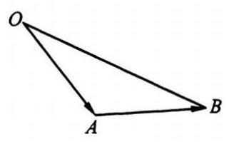

(图 1)

例 7 如图 1,已知 $\bigtriangleup {OAB}$ 的面积为 $S$ ,且 $\overrightarrow{OA} \cdot  \overrightarrow{AB} = 2$ .

(1)若 $1 < S < \sqrt{3}$ ，求向量 $\overrightarrow{OA}$ 与 $\overrightarrow{AB}$ 的夹角 $\theta$ 的取值范围；

(2)若 $\theta  \in  \left\lbrack  {\frac{\pi }{6},\frac{\pi }{3}}\right\rbrack$ ，求 $\bigtriangleup {OAB}$ 的最大边长的最小值.

解 (1) 由 $\overrightarrow{OA} \cdot  \overrightarrow{AB} = 2$ ,得 ${OA} \cdot  {AB} \cdot  \cos \theta  = 2$ .

由 $1 < S < \sqrt{3}$ ,得 $1 < \frac{1}{2} \cdot  {OA} \cdot  {AB} \cdot  \sin \theta  < \sqrt{3}$ .

$\therefore \;1 < \frac{1}{2} \cdot  \frac{2}{\cos \theta } \cdot  \sin \theta  < \sqrt{3},\;\therefore \;1 < \tan \theta  < \sqrt{3}.$

$\because 0 < \theta  < \pi ,\therefore \frac{\pi }{4} < \theta  < \frac{\pi }{3}$ .

(2)由已知，得 ${OB}$ 为 $\bigtriangleup {OAB}$ 的最大边.

$\because \overrightarrow{OB} = \overrightarrow{OA} + \overrightarrow{AB}$ ,

$\therefore {\left| \overrightarrow{OB}\right| }^{2} = {\overrightarrow{OB}}^{2} = {\left( \overrightarrow{OA} + \overrightarrow{AB}\right) }^{2} = {\overrightarrow{OA}}^{2} + {\overrightarrow{AB}}^{2} + 2\overrightarrow{OA} \cdot  \overrightarrow{AB} = {\left| \overrightarrow{OA}\right| }^{2} + {\left| \overrightarrow{AB}\right| }^{2} + 4$

$\geq  2\left| \overrightarrow{OA}\right|  \cdot  \left| \overrightarrow{AB}\right|  + 4 = \frac{4}{\cos \theta } + 4$ .

$\because \theta  \in  \left\lbrack  {\frac{\pi }{6},\frac{\pi }{3}}\right\rbrack  ,\;\therefore \frac{1}{2} \leq  \cos \theta  \leq  \frac{\sqrt{3}}{2},\;\therefore {\left| \overrightarrow{OB}\right| }^{2} \geq  \frac{8\sqrt{3}}{3} + 4$ .

$\therefore \left| \overrightarrow{OB}\right|  \geq  \frac{2}{3}\sqrt{9 + 6\sqrt{3}}$ ,即 ${OB}$ 的最小值为 $\frac{2}{3}\sqrt{9 + 6\sqrt{3}}$ .

注意 在 $\bigtriangleup {OAB}$ 中,向量 $\overrightarrow{OA}$ 与 $\overrightarrow{AB}$ 的夹角不是角 $A$ ,而是其补角.

例 8 已知两点 $M\left( {-1,0}\right) , N\left( {1,0}\right)$ ,存在点 $P$ ,使 $\overrightarrow{MP} \cdot  \overrightarrow{MN},\overrightarrow{PM} \cdot  \overrightarrow{PN},\overrightarrow{NM} \cdot  \overrightarrow{NP}$ 成公差小于零的等差数列.

(1)点 $P$ 的轨迹是什么曲线？

(2)若点 $P$ 的坐标为 $\left( {{x}_{0},{y}_{0}}\right)$ ，向量 $\overrightarrow{PM}$ 与 $\overrightarrow{PN}$ 的夹角为 $\theta$ ，求 $\tan \theta$ .

解 (1) 设点 $P\left( {x, y}\right)$ . 由点 $M\left( {-1,0}\right) , N\left( {1,0}\right)$ ，得 $\overrightarrow{PM} =  - \overrightarrow{MP} = \left( {-1 - x, - y}\right)$ ，

$\overrightarrow{PN} =  - \overrightarrow{NP} = \left( {1 - x, - y}\right) ,\overrightarrow{MN} =  - \overrightarrow{NM} = \left( {2,0}\right) ,$

$\therefore \overrightarrow{MP} \cdot  \overrightarrow{MN} = 2\left( {1 + x}\right) ,\overrightarrow{PM} \cdot  \overrightarrow{PN} = {x}^{2} + {y}^{2} - 1,\overrightarrow{NM} \cdot  \overrightarrow{NP} = 2\left( {1 - x}\right)$ .

$\overrightarrow{MP} \cdot  \overrightarrow{MN},\overrightarrow{PM} \cdot  \overrightarrow{PN},\overrightarrow{NM} \cdot  \overrightarrow{NP}$ 成公差小于零的等差数列等价于

$\left\{  \begin{array}{l} {x}^{2} + {y}^{2} - 1 = \frac{1}{2}\left\lbrack  {2\left( {1 + x}\right)  + 2\left( {1 - x}\right) }\right\rbrack  , \\  2\left( {1 - x}\right)  - 2\left( {1 + x}\right)  < 0, \end{array}\right.$ 即 $\left\{  \begin{array}{l} {x}^{2} + {y}^{2} = 3, \\  x > 0. \end{array}\right.$

所以点 $P$ 的轨迹是以原点为圆心, $\sqrt{3}$ 为半径的右半圆.

(2) $\because$ 点 $P$ 的坐标为 $\left( {{x}_{0},{y}_{0}}\right) ,\therefore \overrightarrow{PM} \cdot  \overrightarrow{PN} = {x}_{0}^{2} + {y}_{0}^{2} - 1 = 2$ ，

$\left| \overrightarrow{PM}\right|  \cdot  \left| \overrightarrow{PN}\right|  = \sqrt{{\left( 1 + {x}_{0}\right) }^{2} + {y}_{0}^{2}} \cdot  \sqrt{{\left( 1 - {x}_{0}\right) }^{2} + {y}_{0}^{2}} = \sqrt{\left( {4 + 2{x}_{0}}\right) \left( {4 - 2{x}_{0}}\right) } = 2\sqrt{4 - {x}_{0}^{2}}.$

$\therefore \;\cos \theta  = \frac{\overrightarrow{PM} \cdot  \overrightarrow{PN}}{\left| \overrightarrow{PM}\right| \left| \overrightarrow{PN}\right| } = \frac{1}{\sqrt{4 - {x}_{0}^{2}}}.\;\because 0 < {x}_{0} \leq  \sqrt{3},\;.\;\frac{1}{2} < \cos \theta  \leq  1,$

$\therefore \;0 \leq  \theta  < \frac{\pi }{3}.\;\therefore \;\sin \theta  = \sqrt{1 - {\cos }^{2}\theta } = \sqrt{1 - \frac{1}{4 - {x}_{0}^{2}}},\tan \theta  = \frac{\sin \theta }{\cos \theta } = \sqrt{3 - {x}_{0}^{2}} = \left| {y}_{0}\right|$ .

## 【训练题】

(A)

48. 若 $\left| \mathbf{a}\right|  = 1,\left| \mathbf{b}\right|  = 4,\mathbf{a}$ 与 $\mathbf{b}$ 的夹角为 ${30}^{ \circ  }$ ,则 $\mathbf{a} \cdot  \mathbf{b}$ 的值为 ( )

(A) $\frac{\sqrt{3}}{2}$ . (B) $\sqrt{3}$ . (C) $2\sqrt{3}$ . (D) $\frac{1}{2}$ .

49. 已知 $\mathbf{a},\mathbf{b}$ 均为单位向量，它们的夹角为 ${60}^{ \circ  }$ ，那么 $\left| {\mathbf{a} + 3\mathbf{b}}\right|$ 等于( )

(A) $\sqrt{7}$ . (B) $\sqrt{10}$ . (C) $\sqrt{13}$ . (D) 4.

50. 若向量 $\mathbf{b}$ 与 $\mathbf{a} = \left( {1, - 2}\right)$ 的夹角为 ${180}^{ \circ  }$ ,且 $\left| \mathbf{b}\right|  = 3\sqrt{5}$ ,则 $\mathbf{b}$ 等于 ( )

(A) $\left( {-3,6}\right)$ . (B) $\left( {3, - 6}\right)$ . (C) $\left( {6, - 3}\right)$ . (D) $\left( {-6,3}\right)$ .

51. 若向量 $\mathbf{a} = \left( {3, - 1}\right) ,\mathbf{b} = \left( {1, - 2}\right)$ ，则 $\mathbf{a}$ 与 $\mathbf{b}$ 的夹角为( )

(A) $\frac{\pi }{6}$ . (B) $\frac{\pi }{4}$ . (C) $\frac{\pi }{3}$ . (D) $\frac{\pi }{2}$ .

52. 下列结论正确的是( )

(A) ${\left| \mathbf{a}\right| }^{2} = \mathbf{a} \cdot  \mathbf{a}$ . (B) $\left( {\mathbf{a} \cdot  \mathbf{b}}\right) \left( {\mathbf{a} \cdot  \mathbf{b}}\right)  = \left( {\mathbf{a} \cdot  \mathbf{a}}\right) \left( {\mathbf{b} \cdot  \mathbf{b}}\right)$ .

(C) 若 $\mathbf{a} \cdot  \mathbf{b} = 0$ ,则 $\mathbf{a} = \mathbf{0}$ 或 $\mathbf{b} = \mathbf{0}$ . (D) $\left| {\mathbf{a} \cdot  \mathbf{b}}\right|  = \left| \mathbf{a}\right|  \cdot  \left| \mathbf{b}\right|$ .

53. 若平面内 ${P}_{1},{P}_{2},{P}_{3}$ 三点满足 $\overrightarrow{O{P}_{1}} + \overrightarrow{O{P}_{2}} + \overrightarrow{O{P}_{3}} = \mathbf{0}$ ，且 $\left| \overrightarrow{O{P}_{1}}\right|  = \left| \overrightarrow{O{P}_{2}}\right|  = \left| \overrightarrow{O{P}_{3}}\right|$ ，则 $\bigtriangleup  {P}_{1}{P}_{2}{P}_{3}$ 的形状是( )

(A) 钝角三角形. (B) 直角三角形. (C) 等腰三角形. (D) 等边三角形.

54. 已知向量 $\mathbf{a},\mathbf{b}$ 满足 $\mathbf{a} = \left( {3 - m,{3m}}\right) ,\mathbf{b} = \left( {m + 2, - 2}\right) ,\mathbf{a} \bot  \mathbf{b}$ ,则实数 $m$ 的值为 ( )

(A) 0 . (B) 1 或 -6 . (C) -1 或 6 . (D) 6 或 -6.

55. 若 $A, B, C, D$ 是平面上不共线的四点，则 “ $\overrightarrow{AB}$ 与 $\overrightarrow{CD}$ 共线” 是 “ $\overrightarrow{AB} \cdot  \overrightarrow{BC} = \overrightarrow{BC} \cdot  \overrightarrow{CD} = 0$ ” 的 ( )

(A) 充分不必要条件. (B) 必要不充分条件.

(C) 充要条件. (D) 既不充分也不必要条件.

56. 若 $O$ 是 $\bigtriangleup {ABC}$ 所在平面内一点, $\overrightarrow{OA} \cdot  \overrightarrow{OB} = \overrightarrow{OB} \cdot  \overrightarrow{OC} = \overrightarrow{OC} \cdot  \overrightarrow{OA}$ ,则点 $O$ 是 $\bigtriangleup {ABC}$ 的 ( )

(A) 重心. (B) 垂心. (C) 内心. (D) 外心.

57. 在 $\bigtriangleup {ABC}$ 中, $\angle C = {90}^{ \circ  }$ ,向量 $\overrightarrow{AB} = \left( {k,1}\right) ,\overrightarrow{AC} = \left( {2,3}\right)$ ,则实数 $k$ 的值是 ( )

(A) 5 . (B) -5 (C) $\frac{3}{2}$ . (D) $- \frac{3}{2}$ .

58. 已知点 $A\left( {3,1}\right) , B\left( {6,1}\right) , C\left( {4,3}\right) , D$ 为线段 ${BC}$ 的中点,那么向量 $\overrightarrow{AC}$ 与 $\overrightarrow{DA}$ 夹角的余弦值为( )

(A) $- \frac{4}{5}$ . (B) $\frac{4}{5}$ . (C) $- \frac{3}{5}$ . (D) $\frac{3}{5}$ .

59. 若向量 $\mathbf{a},\mathbf{b}$ 的夹角为 ${60}^{ \circ  },\left| \mathbf{a}\right|  = 3,\left| \mathbf{b}\right|  = 2,\left( {3\mathbf{a} + 5\mathbf{b}}\right)  \bot  \left( {\mathbf{m}\mathbf{a} - \mathbf{b}}\right)$ ,则实数 $m$ 的值为( )

(A) $\frac{32}{23}$ . (B) $\frac{29}{42}$ . (C) $\frac{23}{42}$ . (D) $\frac{42}{29}$ .

60. 若向量 $a = \left( {\cos \theta ,\sin \theta }\right) , b = \left( {\sqrt{3}, - 1}\right)$ ，则 $\left| {{2a} - b}\right|$ 的最大值、最小值分别为( )；

(A) $4\sqrt{2},0$ . (B) $4,2\sqrt{2}$ . (C)16,0. (C)4,0.

61. 已知向量 $\mathbf{a} = \left( {1,2}\right) ,\mathbf{b} = \left( {-2, - 4}\right) ,\left| \mathbf{c}\right|  = \sqrt{5}$ . 若 $\left( {\mathbf{a} + \mathbf{b}}\right)  \cdot  \mathbf{c} = \frac{5}{2}$ ，则 $\mathbf{a}$ 与 $\mathbf{c}$ 的夹角为( )

(A) ${30}^{ \circ  }$ . (B) ${60}^{ \circ  }$ . (C) ${120}^{ \circ  }$ . (D) ${150}^{ \circ  }$ .

62. 若向量 $\mathbf{a} = \left( {2,3}\right) ,\mathbf{b} = \left( {-4,7}\right)$ ，则 $\mathbf{a}$ 在 $\mathbf{b}$ 方向上的投影为( )

(A) $\sqrt{13}$ . (B) $\frac{\sqrt{13}}{5}$ . (C) $\frac{\sqrt{65}}{5}$ . (D) $\sqrt{65}$ .

63. 若 $\mathbf{a}$ 与 $\mathbf{b} - \mathbf{c}$ 都是非零向量，则 “ $\mathbf{a} \cdot  \mathbf{b} = \mathbf{a} \cdot  \mathbf{c}$ ” 是 “ $\mathbf{a} \bot  \left( {\mathbf{b} - \mathbf{c}}\right)$ ” 的( )

(A) 充分不必要条件. (B) 必要不充分条件.

(C) 充要条件. (D) 既不充分也不必要条件.

64. 已知点 $O\left( {0,0}\right) , A\left( {3,0}\right) , B\left( {0,3}\right)$ ,点 $P$ 在线段 ${AB}$ 上. 若 $\overrightarrow{AP} = t\overrightarrow{AB}\left( {0 \leq  t \leq  1}\right)$ ,则 $\overrightarrow{OA} \cdot  \overrightarrow{OP}$ 的最大值为( )

(A) 3. (B) 6. (C) 9. (D) 12.

65. 若向量 $\mathbf{a},\mathbf{b}$ 满足 $\left( {\mathbf{a} - \mathbf{b}}\right)  \cdot  \left( {2\mathbf{a} + \mathbf{b}}\right)  =  - 4$ ，且 $\left| \mathbf{a}\right|  = 2,\left| \mathbf{b}\right|  = 4$ ，则 $\mathbf{a}$ 与 $\mathbf{b}$ 的夹角为___.

66. 已知向量 $\mathbf{a} = \left( {1,1}\right) ,\mathbf{b} = \left( {2, - 3}\right)$ . 若 $k\mathbf{a} - {2\mathbf{b}}$ 与 $\mathbf{a}$ 垂直，则实数 $k$ 的值为___.

67. 已知向量 $\mathbf{a} = \left( {\cos \alpha ,\sin \alpha }\right) ,\mathbf{b} = \left( {\cos \beta ,\sin \beta }\right)$ ，且 $\mathbf{a} \neq   \pm  \mathbf{b}$ ，那么 $\mathbf{a} + \mathbf{b}$ 与 $\mathbf{a} - \mathbf{b}$ 的夹角为 ___.

68. 在锐角 $\bigtriangleup {ABC}$ 中， $\left| \overrightarrow{AB}\right|  = 4,\left| \overrightarrow{AC}\right|  = 1,{S}_{\bigtriangleup {ABC}} = \sqrt{3}$ ，则 $\overrightarrow{AB} \cdot  \overrightarrow{AC} =$ ___.

69. 若 $\mathbf{a}$ 与 $\mathbf{b}$ 的夹角为 ${120}^{ \circ  }$ ,且 $\left| \mathbf{a}\right|  = 2,\left| \mathbf{b}\right|  = 5$ ,则 $\left( {2\mathbf{a} - \mathbf{b}}\right)  \cdot  \mathbf{a} =$ ___.

70. 在 $\bigtriangleup {ABC}$ 中,向量 $\overrightarrow{CB} = \mathbf{a},\overrightarrow{CA} = \mathbf{b},\mathbf{a} \cdot  \mathbf{b} < 0,{S}_{\bigtriangleup {ABC}} = \frac{15}{4},\left| \mathbf{a}\right|  = 3,\left| \mathbf{b}\right|  = 5$ ,则 $\mathbf{a}$ 与 $\mathbf{b}$ 的夹角为___.

71. 若向量 $\mathbf{a}$ 与 $\mathbf{b}$ 的夹角为 $\theta ,\mathbf{a} = \left( {3,3}\right) ,2\mathbf{b} - \mathbf{a} = \left( {-1,1}\right)$ ，则 $\cos \theta  =$ ___.

72. 若向量 $\overrightarrow{OA} = \left( {-3,1}\right) ,\overrightarrow{OB} = \left( {0,5}\right) ,\overrightarrow{AC}//\overrightarrow{OB},\overrightarrow{BC}\bot \overrightarrow{AB}$ ，则点 $C$ 的坐标为___.

73. 若向量 $\overrightarrow{OP}$ 与 $\overrightarrow{OQ}$ 关于 $y$ 轴对称，且 $2\overrightarrow{OP} \cdot  \overrightarrow{OQ} = 1$ ，则点 $P\left( {x, y}\right)$ 的轨迹方程为___.

74. 设 $\mathbf{a},\mathbf{b},\mathbf{c}$ 是任意的非零向量，且它们两两不共线. 给出下列命题:① $\left( {\mathbf{a} \cdot  \mathbf{b}}\right)  \cdot  \mathbf{c} - \left( {\mathbf{c} \cdot  \mathbf{a}}\right)  \cdot  \mathbf{b} \; = 0;$ ② $\left| \mathbf{a}\right|  - \left| \mathbf{b}\right|  < \left| {\mathbf{a} - \mathbf{b}}\right| ;$ ③ $\left( {\mathbf{b} \cdot  \mathbf{c}}\right)  \cdot  \mathbf{a} - \left( {\mathbf{c} \cdot  \mathbf{a}}\right)  \cdot  \mathbf{b}$ 不与 $\mathbf{c}$ 垂直；④ $\left( {{3\mathbf{a}} + {2\mathbf{b}}}\right)  \cdot  \left( {{3\mathbf{a}} - {2\mathbf{b}}}\right) \; = 9{\left| \mathbf{a}\right| }^{2} - 4{\left| \mathbf{b}\right| }^{2}$ . 其中真命题是___(填序号).

75. 已知 $\left| \mathbf{a}\right|  = 4,\left| \mathbf{b}\right|  = {10},\mathbf{a}$ 与 $\mathbf{b}$ 的夹角为 ${60}^{ \circ  }$ ,求 $\left| {2\mathbf{a} - \mathbf{b}}\right|$ .

76. 已知向量 $\mathbf{a}$ 与 $\mathbf{b}$ 满足 $\left| \mathbf{a}\right|  = \left| \mathbf{b}\right|  = 1,\left| {3\mathbf{a} - 2\mathbf{b}}\right|  = \sqrt{7}$ .

(1)求 $a$ 与 $b$ 的夹角； (2)求 $\left| {3\mathbf{a} + \mathbf{b}}\right|$ .

77. 已知向量 $\mathbf{a},\mathbf{b},\mathbf{x},\mathbf{y}$ 满足 $\mathbf{a} = \mathbf{y} - \mathbf{x},\mathbf{b} = 2\mathbf{x} - \mathbf{y},\left| \mathbf{a}\right|  = \left| \mathbf{b}\right|  = 1$ ，且 $\mathbf{a}\bot \mathbf{b}$ .

(1)用 $\mathbf{a},\mathbf{b}$ 表示 $\mathbf{x},\mathbf{y}$ ； (2)求 $\left| \mathbf{x}\right|$ 和 $\left| \mathbf{y}\right|$ .

78. 已知向量 $\mathbf{c} = m\mathbf{a} + n\mathbf{b} = \left( {-2\sqrt{3},2}\right) ,\mathbf{a} \bot  \mathbf{c},\mathbf{b}$ 与 $\mathbf{c}$ 的夹角为 ${120}^{ \circ  }$ ，且 $\mathbf{b} \cdot  \mathbf{c} =  - 4,\left| \mathbf{a}\right|  = 2\sqrt{2}$ ， 求实数 $m$ ， $n$ 的值及 $a$ 与 $b$ 的夹角.

(B)

79. 设平面上有四个互异的点 $A, B, C, D$ ,且 $\left( {\overrightarrow{DB} + \overrightarrow{DC} - 2\overrightarrow{DA}}\right)  \cdot  \left( {\overrightarrow{AB} - \overrightarrow{AC}}\right)  = 0$ ,则 $\bigtriangleup {ABC}$ 的形状是( )

(A) 直角三角形. (B) 等腰三角形.

(C) 等腰直角三角形. (D) 等边三角形.

80. 若 $\left| \mathbf{p}\right|  = 2\sqrt{2},\left| \mathbf{q}\right|  = 3,\mathbf{p}$ 与 $\mathbf{q}$ 的夹角为 $\frac{\pi }{4}$ ,则以 $\mathbf{a} = 5\mathbf{p} + 2\mathbf{q},\mathbf{b} = \mathbf{p} - 3\mathbf{q}$ 为邻边的平行四边形的一条对角线的长为( )

(A) 15 . (B) $\sqrt{15}$ . (C) 14. (D) 16.

81. 若 $\left| \mathbf{a}\right|  = \left| \mathbf{b}\right|  = 1,\mathbf{a} \bot  \mathbf{b},\left( {{2\mathbf{a}} + {3\mathbf{b}}}\right)  \bot  \left( {{k\mathbf{a}} - {4\mathbf{b}}}\right)$ ，则实数 $k$ 的值为( )

(A) -6 . (B) 6 . (C) -3 . (D) 3 .

82. 若 $\mathbf{i},\mathbf{j}$ 为互相垂直的单位向量, $\mathbf{a} = \mathbf{i} - 2\mathbf{j},\mathbf{b} = \mathbf{i} + \lambda \mathbf{j}$ ,且 $\mathbf{a}$ 与 $\mathbf{b}$ 的夹角为锐角,则实数 $\lambda$ 的取值范围是( )

(A) $\left( {\frac{1}{2}, + \infty }\right)$ . (B) $\left( {-\infty , - 2}\right)  \cup  \left( {-2,\frac{1}{2}}\right)$ .

(C) $\left( {-2,\frac{2}{3}}\right)  \cup  \left( {\frac{2}{3}, + \infty }\right)$ . (D) $\left( {-\infty ,\frac{1}{2}}\right)$ .

83. 如图,向量 $\overrightarrow{OA} = \mathbf{a},\overrightarrow{OC} = \mathbf{b}$ ,且 $\overrightarrow{CD} \bot  \overrightarrow{OA}, D$ 为垂足. 若 $\overrightarrow{OD} = \lambda \mathbf{a}\;\left( {\lambda  \neq  0}\right)$ ,则实数 $\lambda$ 的值为 ( )

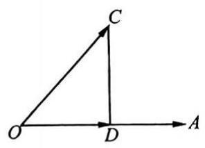

(第 83 题)

(A) $\frac{a \cdot  b}{{\left| a\right| }^{2}}$ . (B) $\frac{\mathbf{a} \cdot  \mathbf{b}}{\left| \mathbf{a}\right|  \cdot  \left| \mathbf{b}\right| }$ .

(C) $\frac{\mathbf{a} \cdot  \mathbf{b}}{{\left| \mathbf{b}\right| }^{2}}$ . (D) $\frac{\mathbf{a} \cdot  \mathbf{b}}{\mathbf{a} \cdot  \mathbf{b}}$ .

84. 若向量 $\overrightarrow{OA} = \left( {4,6}\right) ,\overrightarrow{OB} = \left( {3,5}\right)$ ，且 $\overrightarrow{OC} \bot  \overrightarrow{OA},\overrightarrow{AC}//\overrightarrow{OB}$ ，则向量 $\overrightarrow{OC}$ 等于( )

(A) $\left( {-\frac{3}{7},\frac{2}{7}}\right)$ . (B) $\left( {-\frac{2}{7},\frac{4}{21}}\right)$ .

(C) $\left( {\frac{3}{7}, - \frac{2}{7}}\right)$ . (D) $\left( {\frac{2}{7}, - \frac{4}{21}}\right)$ .

85. 若 $\left| \mathbf{a}\right|  = 3,\left| \mathbf{b}\right|  = 4$ ,则向量 $\mathbf{a} + \frac{3}{4}\mathbf{b}$ 与 $\mathbf{a} - \frac{3}{4}\mathbf{b}$ 的位置关系是( )

(A) 平行. (B) 垂直.

(C) 夹角为 $\frac{\pi }{3}$ (D) 不平行也不垂直.

86. 若 $a, b, c$ 是 $\bigtriangleup {ABC}$ 的三个内角 $A, B, C$ 的对边,向量 $\mathbf{m} = \left( {\sqrt{3}, - 1}\right) ,\mathbf{n} = \left( {\cos A,\sin A}\right)$ . 若 $m \bot  n$ ,且 $a\cos B + b\cos A = c\sin C$ ,则角 $A, B$ 的大小分别为( )

(A) $\frac{\pi }{6},\frac{\pi }{3}$ . (B) $\frac{2\pi }{3},\frac{\pi }{6}$ . (C) $\frac{\pi }{3},\frac{\pi }{6}$ . (D) $\frac{\pi }{3},\frac{\pi }{3}$ .

87. 若向量 $\mathbf{a} = \left( {1,1}\right) ,\mathbf{b} = \left( {1, - 1}\right) ,\mathbf{c} = \left( {\sqrt{2}\cos \alpha ,\sqrt{2}\sin \alpha }\right) \left( {\alpha  \in  \mathbf{R}}\right)$ ,实数 $m, n$ 满足 $m\mathbf{a} + n\mathbf{b} = \mathbf{c}$ , 则 ${\left( m - 3\right) }^{2} + {n}^{2}$ 的最大值为( )

(A) 2. (B) 3. (C) 4. (D) 16 .

88. 若向量 $\overrightarrow{OB} = \left( {2,0}\right) ,\overrightarrow{OC} = \left( {2,2}\right) ,\overrightarrow{CA} = \left( {\sqrt{2}\cos \alpha ,\sqrt{2}\sin \alpha }\right)$ ,则 $\overrightarrow{OA}$ 与 $\overrightarrow{OB}$ 的夹角的取值范围是 ( )

(A) $\left\lbrack  {0,\frac{\pi }{4}}\right\rbrack$ . (B) $\left\lbrack  {\frac{\pi }{4},\frac{5\pi }{12}}\right\rbrack$ . (C) $\left\lbrack  {\frac{\pi }{12},\frac{5\pi }{12}}\right\rbrack$ . (D) $\left\lbrack  {\frac{5\pi }{12},\frac{\pi }{2}}\right\rbrack$ .

89. 若向量 $a \neq  e,\left| e\right|  = 1$ ，对任意的实数 $t$ ，都有 $\left| {a - {te}}\right|  \geq  \left| {a - e}\right|$ 成立，则有( )

(A) $a \bot  e$ . (B) $\left( {a - e}\right)  \bot  a$ . (C) $\left( {a - e}\right)  \bot  e$ . (D) $\left( {a + e}\right)  \bot  \left( {a - e}\right)$ .

90. 已知点 $O\left( {0,0}\right) , A\left( {1,0}\right) , B\left( {0,1}\right)$ ,点 $P$ 是线段 ${AB}$ 上的一个动点, $\overrightarrow{AP} = \lambda \overrightarrow{AB}$ ,若 $\overrightarrow{OP} \cdot  \overrightarrow{AB} \; \geq  \overrightarrow{PA} \cdot  \overrightarrow{PB}$ ，则实数 $\lambda$ 的取值范围是( )

(A) $\frac{1}{2} \leq  \lambda  \leq  1$ . (B) $1 - \frac{\sqrt{2}}{2} \leq  \lambda  \leq  1$ .

(C) $\frac{1}{2} \leq  \lambda  \leq  1 + \frac{\sqrt{2}}{2}$ . (D) $1 - \frac{\sqrt{2}}{2} \leq  \lambda  \leq  1 + \frac{\sqrt{2}}{2}$ .

91. 已知非零向量 $\overrightarrow{AB},\overrightarrow{AC}$ 满足 $\left( {\frac{\overrightarrow{AB}}{\left| \overrightarrow{AB}\right| } + \frac{\overrightarrow{AC}}{\left| \overrightarrow{AC}\right| }}\right)  \cdot  \overrightarrow{BC} = 0$ ,且 $\frac{\overrightarrow{AB}}{\left| \overrightarrow{AB}\right| } \cdot  \frac{\overrightarrow{AC}}{\left| \overrightarrow{AC}\right| } = \frac{1}{2}$ ,则 $\bigtriangleup {ABC}$ 的形状是( )

(A) 三边均不相等的三角形. (B) 直角三角形.

(C) 等腰三角形. (D) 等边三角形.

92. 在边长为 1 的等边三角形 ${ABC}$ 中,若 $\overrightarrow{BC} = \mathbf{a},\overrightarrow{CA} = \mathbf{b},\overrightarrow{AB} = \mathbf{c}$ ,则 $\mathbf{a} \cdot  \mathbf{b} + \mathbf{b} \cdot  \mathbf{c} + \mathbf{c} \cdot  \mathbf{a} =$ ___.

93. 给出下列结论: ①若 $\mathbf{a} \neq  \mathbf{0},\mathbf{a} \cdot  \mathbf{b} = 0$ ,则 $\mathbf{b} = \mathbf{0}$ ; ②若 $\mathbf{a} \cdot  \mathbf{b} = \mathbf{b} \cdot  \mathbf{c}$ ,则 $\mathbf{a} = \mathbf{c}$ ; ③ $\left( {\mathbf{a} \cdot  \mathbf{b}}\right) \mathbf{c} = \; \mathbf{a}\left( {\mathbf{b} \cdot  \mathbf{c}}\right)$ ；④ $\mathbf{a} \cdot  \left\lbrack  {\mathbf{b}\left( {\mathbf{a} \cdot  \mathbf{c}}\right)  - \mathbf{c}\left( {\mathbf{a} \cdot  \mathbf{b}}\right) }\right\rbrack   = 0$ . 其中结论正确的是___(填序号).

94. 已知 $\mathbf{a},\mathbf{b}$ 为两个非零向量. 给出下列条件:① ${\mathbf{a}}^{2} = {\mathbf{b}}^{2}$ ；② $\mathbf{a} \cdot  \mathbf{b} = {\mathbf{b}}^{2}$ ；③ $\left| \mathbf{a}\right|  = \left| \mathbf{b}\right|$ ，且 $\mathbf{a}//\mathbf{b}$ . 其中可以作为 $\mathbf{a} = \mathbf{b}$ 的必要不充分条件的是___(填序号).

95. 关于平面向量 $\mathbf{a},\mathbf{b},\mathbf{c}$ ,有下列三个命题:①若 $\mathbf{a} \cdot  \mathbf{b} = \mathbf{a} \cdot  \mathbf{c}$ ，则 $\mathbf{b} = \mathbf{c}$ ；②若 $\mathbf{a} = \left( {1, k}\right) ,\mathbf{b} = \; \left( {-2,6}\right) ,\mathbf{a}//\mathbf{b}$ ,则 $k =  - 3$ ; ③若非零向量 $\mathbf{a},\mathbf{b}$ 满足 $\left| \mathbf{a}\right|  = \left| \mathbf{b}\right|  = \left| {\mathbf{a} - \mathbf{b}}\right|$ ,则 $\mathbf{a}$ 与 $\mathbf{a} + \mathbf{b}$ 的夹角为 ${60}^{ \circ  }$ . 其中真命题是___(填序号).

96. 已知 $\mathbf{a},\mathbf{b}$ 是两个非零向量，且 $\mathbf{a} + 3\mathbf{b}$ 与 $7\mathbf{a} - 5\mathbf{b}$ 垂直， $\mathbf{a} - 4\mathbf{b}$ 与 $7\mathbf{a} - 2\mathbf{b}$ 垂直，求 $\mathbf{a}$ 与 $\mathbf{b}$ 的夹角.

97. 已知向量 $\mathbf{a} = \left( {\sqrt{3}, - 1}\right) ,\mathbf{b} = \left( {\frac{1}{2},\frac{\sqrt{3}}{2}}\right)$ . 若存在非零实数 $k, t$ ,使 $\mathbf{x} = \mathbf{a} + \left( {{t}^{2} - 3}\right) \mathbf{b},\mathbf{y} =  - k\mathbf{a} + \; {tb}$ ,且 $x \bot  y$ ,求 $\frac{k + {t}^{2}}{t}$ 的最小值.

98. 已知向量 $\mathbf{a} = \left( {\sin \theta ,1}\right) ,\mathbf{b} = \left( {1,\cos \theta }\right) , - \frac{\pi }{2} < \theta  < \frac{\pi }{2}$ .

(1)若 $a \bot  b$ ，求 $\theta$ 的值； (2)求 $\left| {a + b}\right|$ 的最大值.

99. 已知 $\bigtriangleup {ABC}$ 的面积为3,且 $0 \leq  \overrightarrow{AB} \cdot  \overrightarrow{AC} \leq  6$ . 设向量 $\overrightarrow{AB}$ 与 $\overrightarrow{AC}$ 的夹角为 $\theta$ . 求

(1) $\theta$ 的取值范围;

(2)函数 $f\left( \theta \right)  = 2{\sin }^{2}\left( {\frac{\pi }{4} + \theta }\right)  - \sqrt{3}\cos {2\theta }$ 的最大值和最小值.

100. 已知点 $A\left( {3,0}\right) , B\left( {0,3}\right) , C\left( {\cos \alpha ,\sin \alpha }\right) ,\alpha  \in  \left( {\frac{\pi }{2},\frac{3\pi }{2}}\right)$ .

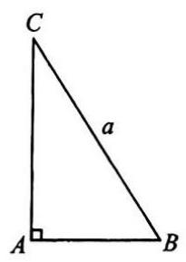

(第 101 题)

(1)若 $\left| \overrightarrow{AC}\right|  = \left| \overrightarrow{BC}\right|$ ，求 $\alpha$ 的值；

(2)若 $\overrightarrow{AC} \cdot  \overrightarrow{BC} =  - 1$ ，求 $\frac{2{\sin }^{2}\alpha  + \sin {2\alpha }}{1 + \tan \alpha }$ 的值.

101. 如图，在 $\mathrm{{Rt}} \bigtriangleup  {ABC}$ 中，已知 ${BC} = a$ . 若长为 ${2a}$ 的线段 ${PQ}$ 以点 $A$ 为中点,则 $\overrightarrow{PQ}$ 与 $\overrightarrow{BC}$ 的夹角 $\theta$ 取何值时, $\overrightarrow{BP} \cdot  \overrightarrow{CQ}$ 的值最大? 试求出这个最大值.

102. 已知向量 $\overrightarrow{OA} = \left( {\cos \alpha ,\sin \alpha }\right) ,\overrightarrow{OB} = \left( {-\sin \left( {\alpha  + \frac{\pi }{6}}\right) ,\cos \left( {\alpha  + \frac{\pi }{6}}\right) }\right)$ ,其中 $O$ 为坐标原点，实数 $\lambda$ 满足 $\left| {\lambda \overrightarrow{OA} - \overrightarrow{OB}}\right|  \geq  \sqrt{3}\left| \overrightarrow{OB}\right|$ ，求实数 $\lambda$ 的取值范围.

103. 已知向量 $\mathbf{a} = \left( {1,1}\right) ,\mathbf{a}$ 与 $\mathbf{b}$ 的夹角为 ${135}^{ \circ  }$ ,且 $\mathbf{a} \cdot  \mathbf{b} =  - 1$ .

(1)求向量 $\mathbf{b}$ ；

(2)若向量 $\mathbf{b}$ 与 $\mathbf{c} = \left( {1,0}\right)$ 的夹角为 $\frac{\pi }{2},\mathbf{d} = \left( {\cos A,2{\cos }^{2}\frac{C}{2}}\right)$ ，其中 $A$ ， $C$ 为 $\bigtriangleup  {ABC}$ 的内角,且 $A, B, C$ 成等差数列,求 $\left| {\mathbf{b} + \mathbf{d}}\right|$ 的取值范围.

## 三、平面向量的分解定理

## 【典型题型和解题技巧】

1. 选定一组基底来表示其他向量.

平面向量的基本定理: 如果 ${e}_{1},{e}_{2}$ 是同一平面内的两个不共线向量,那么对于这一平面内的任意向量 $\mathbf{a}$ ，有且只有一对实数 ${\lambda }_{1},{\lambda }_{2}$ ，使 $\mathbf{a} = {\lambda }_{1}{\mathbf{e}}_{1} + {\lambda }_{2}{\mathbf{e}}_{2}$ .

例 1 如图 2,四边形 ${OADB}$ 是以向量 $\overrightarrow{OA} = \mathbf{a},\overrightarrow{OB} = \mathbf{b}$ 为相邻边的平行四边形,且 ${BM} = \frac{1}{3}{BC},{CN} = \frac{1}{3}{CD}$ ,试用 $\mathbf{a},\mathbf{b}$ 表示 $\overrightarrow{OM},\overrightarrow{ON}$ , $\overrightarrow{MN}$

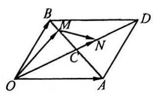

(图 2)

解 $\overrightarrow{OM} = \overrightarrow{OB} + \overrightarrow{BM} = \overrightarrow{OB} + \frac{1}{6}\overrightarrow{BA} = {OB} + \frac{1}{6}\left( {\overrightarrow{OA} - \overrightarrow{OB}}\right)  =$

$\frac{1}{6}\mathbf{a} + \frac{5}{6}\mathbf{b},\overrightarrow{ON} = \frac{2}{3}\overrightarrow{OD} = \frac{2}{3}\left( {\overrightarrow{OA} + \overrightarrow{OB}}\right)  = \frac{2}{3}\mathbf{a} + \frac{2}{3}\mathbf{b},$

$\overrightarrow{MN} = \overrightarrow{ON} - \overrightarrow{OM} = \frac{1}{2}a - \frac{1}{6}b.$

注意 本例以不共线的两个向量 $\overrightarrow{OA} = \mathbf{a},\overrightarrow{OB} = \mathbf{b}$ 为基底来表示同一个平面上的其他向量.

2. 平面向量的基本定理与三点共线的问题.

$A, B, C$ 三点共线 $\Leftrightarrow$ 存在唯一的实数 $\lambda$ ,使 $\overrightarrow{AB} = \lambda \overrightarrow{BC}$ .

例 2 设 ${e}_{1},{e}_{2}$ 是两个不共线的向量. 已知 $\overrightarrow{AB} = 2{e}_{1} + k{e}_{2},\overrightarrow{CB} = {e}_{1} + 3{e}_{2},\overrightarrow{CD} = 2{e}_{1} - {e}_{2}$ ,且 $A, B, D$ 三点共线,求实数 $k$ 的值.

解 $\because A, B, D$ 三点共线, $\therefore$ 存在实数 $\lambda$ ,使 $\overrightarrow{AB} = \lambda \overrightarrow{BD}$ .

$\because \overrightarrow{BD} = \overrightarrow{CD} - \overrightarrow{CB} = {e}_{1} - 4{e}_{2},\;\therefore 2{e}_{1} + k{e}_{2} = \lambda \left( {{e}_{1} - 4{e}_{2}}\right)$ .

$\because {e}_{1},{e}_{2}$ 不共线, $\therefore \left\{  {\begin{array}{l} 2 = \lambda , \\  k =  - {4\lambda }. \end{array}\;\therefore k =  - 8}\right.$ .

例 3 如图 3,在 $\bigtriangleup {OAB}$ 中,点 $B$ 关于点 $A$ 的对称点是点 $C$ ,点 $D$ 是将 $\overrightarrow{OB}$ 分成 $2 : 1$ 的两部分的一个内分点, ${DC}$ 与 ${OA}$ 交于点 $E$ ,设 $\overrightarrow{OA} = \mathbf{a},\overrightarrow{OB} = \mathbf{b}$ .

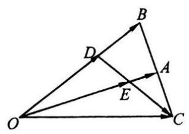

(图 3)

(1)用 $a$ 和 $b$ 表示向量 $\overrightarrow{OC},\overrightarrow{DC}$ ；

(2)若 $\overrightarrow{OE} = \lambda \overrightarrow{OA}$ ，求实数 $\lambda$ 的值.

解 (1) $\overrightarrow{OC} = \overrightarrow{OA} + \overrightarrow{AC} = \overrightarrow{OA} + \overrightarrow{BA} = \overrightarrow{OA} + \overrightarrow{OA} - \overrightarrow{OB} = 2\mathbf{a} - \mathbf{b}$ ,

$\overrightarrow{DC} = \overrightarrow{OC} - \overrightarrow{OD} = 2\mathbf{a} - \mathbf{b} - \frac{2}{3}\mathbf{b} = 2\mathbf{a} - \frac{5}{3}\mathbf{b}$ .

(2) $\overrightarrow{EC} = \overrightarrow{OC} - \overrightarrow{OE} = 2\mathbf{a} - \mathbf{b} - {\lambda \mathbf{a}} = \left( {2 - \lambda }\right) \mathbf{a} - \mathbf{b}$ .

$\because \overrightarrow{EC}//\overrightarrow{DC},\therefore$ 存在实数 $\mu$ ，使 $\overrightarrow{EC} = \mu \overrightarrow{DC}$ .

$\therefore \;\left( {2 - \lambda }\right) \mathbf{a} - \mathbf{b} = \mu \left( {2\mathbf{a} - \frac{5}{3}\mathbf{b}}\right) ,\;\therefore \left\{  {\begin{array}{l} 2 - \lambda  = {2\mu }, \\   - 1 =  - \frac{5}{3}\mu . \end{array}\;\therefore \lambda  = \frac{4}{5}}\right.$ .

3. 利用平面向量基本定理证明平面几何问题.

例 4 用向量方法证明: 平行四边形的一个顶点和对边中点的连线三等分此平行四边形的一条对角线.

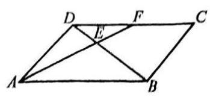

(图 4)

证明 如图 4,设 $F$ 是 $\square {ABCD}$ 的边 ${CD}$ 的中点, $E$ 是 ${AF}$ 与 ${BD}$ 的交点.

$\because A, E, F$ 及 $B, E, D$ 均三点共线,

$\therefore$ 存在实数 $\lambda ,\mu$ ,使 $\overrightarrow{AE} = \lambda \overrightarrow{AF},\overrightarrow{BE} = \mu \overrightarrow{BD}$ .

$\because \overrightarrow{AE} = \overrightarrow{AB} + \overrightarrow{BE} = \overrightarrow{AB} + \mu \overrightarrow{BD} = \overrightarrow{AB} + \mu \left( {\overrightarrow{AD} - \overrightarrow{AB}}\right)$

$= \left( {1 - \mu }\right) \overrightarrow{AB} + \mu \overrightarrow{AD},\lambda \overrightarrow{AF} = \lambda \left( {\overrightarrow{AD} + \overrightarrow{DF}}\right)  = \lambda \left( {\overrightarrow{AD} + \frac{1}{2}\overrightarrow{AB}}\right)  = \frac{\lambda }{2}\overrightarrow{AB} + \lambda \overrightarrow{AD}$ ，

$\therefore \left( {1 - \mu }\right) \overrightarrow{AB} + \mu \overrightarrow{AD} = \frac{\lambda }{2}\overrightarrow{AB} + \lambda \overrightarrow{AD}$ .

$\because \overrightarrow{AB},\overrightarrow{AD}$ 不共线, $\therefore \left\{  {\begin{array}{l} 1 - \mu  = \frac{\lambda }{2}, \\  \mu  = \lambda  \end{array} \Rightarrow  \mu  = \frac{2}{3} \Rightarrow  \overrightarrow{BE} = \frac{2}{3}\overrightarrow{BD}}\right.$ ,

即点 $E$ 是 ${BD}$ 的一个三等分点.

注意 选择 $\overrightarrow{AB},\overrightarrow{AD}$ 为基底,利用 $A, E, F$ 和 $B, E, D$ 两组三点共线,建立向量方程. 由平面向量的基本定理,得到关于实数 $\lambda ,\mu$ 的方程组,解此方程组即可.

## 【训练题】

(A)

104. 若向量 $\mathbf{a} = \left( {1,1}\right) ,\mathbf{b} = \left( {1, - 1}\right) ,\mathbf{c} = \left( {-2,4}\right)$ ，则 $\mathbf{c}$ 等于( )

(A) $- \mathbf{a} + 3\mathbf{b}$ . (B) $\mathbf{a} - 3\mathbf{b}$ . (C) $3\mathbf{a} - \mathbf{b}$ . (D) $- 3\mathbf{a} + \mathbf{b}$ .

105. 在 $\bigtriangleup  {ABO}$ 中，设 $\overrightarrow{OA} = \mathbf{a},\overrightarrow{OB} = \mathbf{b}$ ，又 $\overrightarrow{OP} = \mathbf{m}\mathbf{a} + \mathbf{n}\mathbf{b}$ ，则下列命题正确的是( )

(A) 若 $m = n$ ,则点 $P$ 在 $\angle {AOB}$ 的平分线所在的直线上.

(B) 若 $m =  - n$ ,则点 $P$ 在边 ${AB}$ 所在的直线上.

(C) 若 $m = 0$ ,则点 $P$ 在边 ${OB}$ 所在的直线上.

(C)若 $m \neq  0$ ，则点 $P$ 在边 ${OA}$ 所在的直线上.

106. 在 $\bigtriangleup {ABC}$ 中,点 $D$ 在边 ${BC}$ 上,且 $\overrightarrow{CD} = 2\overrightarrow{DB},\overrightarrow{CD} = r\overrightarrow{AB} + s\overrightarrow{AC}$ ,则 $r + s$ 的值为 ( )

(A) $\frac{2}{3}$ . (B) $\frac{4}{3}$ . (C)-3. (D) 0 .

107. 若 $\mathbf{a},\mathbf{b}$ 是一组基底,向量 $\mathbf{c} = x\mathbf{a} + y\mathbf{b}\left( {x, y \in  \mathbf{R}}\right)$ ,则称 $\left( {x, y}\right)$ 为向量 $\mathbf{c}$ 在基底 $\mathbf{a},\mathbf{b}$ 下的坐标. 现已知向量 $c$ 在基底 $a = \left( {1, - 1}\right) , b = \left( {2,1}\right)$ 下的坐标为 $\left( {-2,2}\right)$ ,则 $c$ 在另一组基底 $m = \left( {-1,1}\right) , n = \left( {1,2}\right)$ 下的坐标为 ( )

(A) $\left( {2,0}\right)$ . (B) $\left( {0, - 2}\right)$ . (C) $\left( {-2,0}\right)$ . (D) $\left( {0,2}\right)$ .

108. 在 $\bigtriangleup {OAB}$ 中，设 ${OA} = a,\overrightarrow{OB} = b,\overrightarrow{OP} = p$ . 若 $p = t\left( {\frac{a}{\left| a\right| } + \frac{b}{\left| b\right| }}\right) , t \in  \mathbf{R}$ ，则点 $P$ 在 ( )

(A) $\angle {AOB}$ 的平分线所在的直线上. (B)线段 ${AB}$ 的垂直平分线上.

(C) 边 ${AB}$ 所在的直线上. (D) 边 ${AB}$ 的中线上.

109. 若向量 ${e}_{1},{e}_{2}$ 不共线， $2{e}_{1} + 3{e}_{2}$ 与 $k{e}_{1} - 2{e}_{2}$ 共线，则实数 $k$ 的值为___.

110. 若 $D, E$ 分别是 $\bigtriangleup {ABC}$ 的边 ${BC},{CA}$ 上的点，且 $\overrightarrow{BD} = \frac{1}{3}\overrightarrow{BC},\overrightarrow{CE} = \frac{1}{3}\overrightarrow{CA},\overrightarrow{AB} = \mathbf{a},\overrightarrow{AC} = \mathbf{b}$ ， 则 $\overrightarrow{DE} =$ ___.

111. 若向量 $\mathbf{a},\mathbf{b}$ 不共线, $\mathbf{m} = \mathbf{a} + 2\mathbf{b},\mathbf{n} = 2\mathbf{a} + \lambda \mathbf{b}$ ,要使向量 $\mathbf{m},\mathbf{n}$ 能成为平面内所有向量的一组基底，则实数 $\lambda$ 的取值范围是___.

112. 给出下列四个命题:①对于实数 $p$ 和向量 $\mathbf{a},\mathbf{b}$ ，恒有 $p\left( {\mathbf{a} - \mathbf{b}}\right)  = p\mathbf{a} - p\mathbf{b}$ ；②对于实数 $p, q$ 和向量 $\mathbf{a}$ ，恒有 $\left( {p - q}\right) \mathbf{a} = p\mathbf{a} - q\mathbf{a}$ ；③对于实数 $p$ 和向量 $\mathbf{a},\mathbf{b}$ ，若 $p\mathbf{a} = p\mathbf{b}$ ，则 $\mathbf{a} = \mathbf{b}$ ；④对于实数 $p, q$ 和向量 $a, a \neq  0$ ，若 ${pa} = {qa}$ ，则 $p = q$ . 其中真命题是___(填序号).

113. 在梯形 ${ABCD}$ 中， ${AB}//{CD}, M, N$ 分别是 ${AD},{BC}$ 的中点，且 $\frac{CD}{AB} = k\left( {k \neq  1}\right)$ . 设 $\overrightarrow{AD} = a$ ， $\overrightarrow{AB} = \mathbf{b}$ ，试用 $\mathbf{a},\mathbf{b}$ 表示 $\overrightarrow{DC},\overrightarrow{BC},\overrightarrow{MN}$ .

114. 在 $\square {ABCD}$ 中, $\overrightarrow{AC} = \mathbf{a},\overrightarrow{BD} = \mathbf{b}$ ,试用 $\mathbf{a},\mathbf{b}$ 表示 $\overrightarrow{AB},\overrightarrow{BC}$ .

115. 在 $\bigtriangleup {ABC}$ 中, ${AM} = \frac{1}{3}{AB},{AN} = \frac{1}{4}{AC}$ ,线段 ${BN}$ 与 ${CM}$ 交于点 $P$ ,求证: $\overrightarrow{AP} = \frac{3}{11}\overrightarrow{AB} + \; \frac{2}{11}\overrightarrow{AC}$ .

(B)

116. 若两个向量 $a, b$ 不共线，且 $x\left( {a + b}\right)  + y\left( {a - b}\right)  = a + {4b}$ ，则实数 $x, y$ 的值分别为( )

(A) $3, - 1$ . (B)-3,1. (C) $- 3, - 1$ . (D) 3,1.

117. 已知两个向量 ${e}_{1},{e}_{2}$ 不共线,且 $a = {2\lambda }{e}_{1} + {e}_{2}, b = \left( {3{\lambda }^{2} - 1}\right) {e}_{1} + \left( {6 - {5\lambda }}\right) {e}_{2}$ . 若 $a = b$ ,则实数 $\lambda$ 的值为( )

(A) $- \frac{1}{3}$ . (B) $\frac{1}{3}$ . (C) -1 . (D) 1 .

118. 已知 $\left| \overrightarrow{OA}\right|  = 1,\left| \overrightarrow{OB}\right|  = \sqrt{3},\overrightarrow{OA} \cdot  \overrightarrow{OB} = 0$ ，点 $C$ 在 $\angle {AOB}$ 内，且 $\angle {AOC} = {30}^{ \circ  }$ . 若 $\overrightarrow{OC} = \; m\overrightarrow{OA} + n\overrightarrow{OB}\left( {m, n \in  \mathbf{R}}\right)$ ,则 $\frac{m}{n}$ 等于( )

(A) $\frac{1}{3}$ . (B) 3 . (C) $\frac{\sqrt{3}}{3}$ . (C) $\sqrt{3}$ .

119. 已知 $\overrightarrow{OA} = \mathbf{a},{OB} = \mathbf{b}, C$ 为线段 ${AB}$ 上距点 $A$ 较近的一个三等分点， $D$ 为线段 ${CB}$ 上距点 $C$ 较近的一个三等分点,则用 $\mathbf{a},\mathbf{b}$ 表示 $\overrightarrow{OD}$ 为( )

(A) $\frac{1}{9}\left( {4\mathbf{a} + 5\mathbf{b}}\right)$ . (B) $\frac{1}{16}\left( {9\mathbf{a} + 7\mathbf{b}}\right)$ . (C) $\frac{1}{3}\left( {2\mathbf{a} + \mathbf{b}}\right)$ . (D) $\frac{1}{4}\left( {3\mathbf{a} + \mathbf{b}}\right)$ .

120. 给出下列命题:①若 $a, b$ 共线，且 $\left| \mathbf{a}\right|  = \left| \mathbf{b}\right|$ ，则 $\left( {\mathbf{a} - \mathbf{b}}\right) //\left( {\mathbf{a} + \mathbf{b}}\right)$ ；②若 $\mathbf{a} = {2\mathbf{e}},\mathbf{b} = {3\mathbf{e}}$ ，则 $\mathbf{a} = \; \frac{3}{2}b$ ; ③若 $a = {e}_{1} - {e}_{2}, b =  - 3{e}_{1} + 3{e}_{2}$ ,且 ${e}_{1} \neq  {e}_{2}$ ,则 $\left| a\right|  = 3\left| b\right|$ ; ④在 $\bigtriangleup {ABC}$ 中， ${AD}$ 是边 ${BC}$ 上的中线，则 $\overrightarrow{AB} + \overrightarrow{AC} = 2\overrightarrow{AD}$ . 其中真命题是___(填序号).

121. 设 $I$ 为 $\bigtriangleup {ABC}$ 的内心. 当 ${AB} = {AC} = 5,{BC} = 6$ 时, $\overrightarrow{AI} = x\overrightarrow{AB} + y\overrightarrow{BC}$ ,则实数 $x, y$ 的值分别为___.

122. 如图, ${OM}//{AB}$ ,点 $P$ 在由射线 ${OM}$ 、线段 ${OB}$ 及 ${AB}$ 的延长线围成的区域内(不含边界)运动，且 $\overrightarrow{OP} = x\overrightarrow{OA} + y\overrightarrow{OB}$ ，则实数 $x$ 的取值范围是 ___；当 $x =  - \frac{1}{2}$ 时，实数 $y$ 的取值范围是 ___.

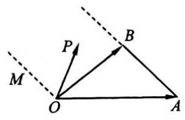

(第 122 题)

123. 已知 $\overrightarrow{OA} = \mathbf{a} \cdot  \overrightarrow{OB} = \mathbf{b}$ ,且 $\left| {OA}\right|  = \left| {OB}\right|  = 1,\angle {AOB} = {120}^{ \circ  }$ ,又 $\left| {OC}\right|  = 5$ ,且 ${OC}$ 平分 $\angle {AOB}$ . 若 $\overrightarrow{OC} = \lambda \mathbf{a} + \mu \mathbf{b}$ ,则 $\lambda  =$ ___, $\mu  =$ ___.

124. 若 $\bigtriangleup {ABC}$ 的外接圆的圆心为 $O$ ,两条边上的高的交点为 $H,\overrightarrow{OH} = m\left( {\overrightarrow{OA} + \overrightarrow{OB} + \overrightarrow{OC}}\right)$ ,则实数 $m =$ ___.

125. 对于 $n$ 个向量 ${a}_{1},{a}_{2},\cdots {a}_{n}$ ,若存在 $n$ 个不全为零的实数 ${\lambda }_{1},{\lambda }_{2},\cdots ,{\lambda }_{n}$ ,使得 ${\lambda }_{1}{a}_{1} + {\lambda }_{2}{a}_{2} + \cdots \; + {\lambda }_{n}{a}_{n} = 0$ 成立,则称向量 ${a}_{1},{a}_{2},\cdots ,{a}_{n}$ 是 “线性相关” 的. 按此定义,能说明向量 ${a}_{1} = (1$ , $0).{a}_{2} = \left( {1, - 1}\right) ,{a}_{3} = \left( {2,2}\right)$ "线性相关"的实数 ${\lambda }_{1},{\lambda }_{2},{\lambda }_{3}$ 依次可取___.

126. 已知 $G$ 为 $\bigtriangleup {ABC}$ 的重心, $\overrightarrow{AB} = \mathbf{a},\overrightarrow{AC} = \mathbf{b}$ ,试用 $\mathbf{a},\mathbf{b}$ 表示 $\overrightarrow{AG}$ .

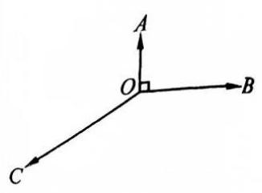

(第 128 题)

127. 已知 $\mathbf{a},\mathbf{b}$ 是同一平面内的两个不共线的向量， ${\lambda }_{1},{\lambda }_{2},{\mu }_{1},{\mu }_{2} \in \; \mathbf{R}$ ,求证: $\mathbf{c} = {\lambda }_{1}\mathbf{a} + {\mu }_{1}\mathbf{b}$ 和 $\mathbf{d} = {\lambda }_{2}\mathbf{a} + {\mu }_{2}\mathbf{b}$ 为共线向量的充要条件是 ${\lambda }_{1}{\mu }_{2} = {\lambda }_{2}{\mu }_{1}$ .

128. 如图, $A, B, C$ 三点不共线,且 $\overrightarrow{OA} = \mathbf{a},\overrightarrow{OB} = \mathbf{b},\overrightarrow{OC} = \mathbf{c}$ . 若 $\left| \mathbf{a}\right|  = \; 1,\left| \mathbf{b}\right|  = 2,\left| \mathbf{c}\right|  = 3$ ,且 $\angle {AOB} = {90}^{ \circ  },\angle {AOC} = {120}^{ \circ  }$ ,试用 $\mathbf{a},\mathbf{b}$ 表示 c.

129. 已知向量 $\mathbf{a}$ 与 $\mathbf{b}$ 不共线. 若存在非零实数 $x, y$ ,使 $\mathbf{c} = \mathbf{a} + {2x}\mathbf{b},\mathbf{d} \; =  - {ya} + 2\left( {2 - {x}^{2}}\right) \mathbf{b}$ .

(1)当 $c = d$ 时,求 $x, y$ 的值；

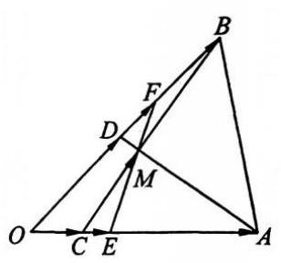

(第 130 题)

(2)若 $a = \left( {\cos \frac{\pi }{6},\sin \left( {-\frac{\pi }{6}}\right) }\right) , b = \left( {\sin \frac{\pi }{6},\cos \frac{\pi }{6}}\right)$ ,且 $c \bot  d$ , 试求函数 $y = f\left( x\right)$ 的解析式.

130. 如图，在 $\bigtriangleup  {AOB}$ 中， $\overrightarrow{OC} = \frac{1}{4}\overrightarrow{OA},{OD} = \frac{1}{2}\overrightarrow{OB},{AD}$ 与 ${BC}$ 交于点 $M$ . 设 $\overrightarrow{OA} = \mathbf{a},\overrightarrow{OB} = \mathbf{b}$ .

(1)试用 $a, b$ 表示 $\overrightarrow{OM}$ ；

(2)在线段 ${AC}$ 上取一点 $E$ ，线段 ${BD}$ 上取一点 $F$ ，使 ${EF}$ 过点 $M$ ,设 $\overrightarrow{OE} = \lambda \overrightarrow{OA},\overrightarrow{OF} = \mu \overrightarrow{OB}$ ,求证: $\frac{1}{7\lambda } + \frac{3}{7\mu } = 1$ .

## 四、向量的应用

## 【典型题型和解题技巧】

1. 在平面几何中的应用.

运用平面向量的知识解决简单的平面几何问题,其步骤是: (1)建立平面几何与向量的联系，用向量表示问题中涉及的几何元素，将平面几何问题转化为向量问题; (2)利用平面向量的共线定理、基本定理以及通过向量运算,得到运算结果; (3) 把运算结果“翻译”成几何关系,从而证明平面几何问题.

例 1 如图 5，在正方形 ${ABCD}$ 中， $P$ 是对角线 ${AC}$ 上一点， ${PE}\bot {AB}$ 于点 $E$ ， ${PF}\bot {BC}$ 于点 $F$ ，连结 ${PD}$ ， ${EF}$ ，求证: ${PD}\bot {EF}$ .

证明 设 $\overrightarrow{AB} = \mathbf{a},\overrightarrow{AD} = \mathbf{b}$ ,则 $\mathbf{a} \cdot  \mathbf{b} = 0$ ,且 $\left| \mathbf{a}\right|  = \left| \mathbf{b}\right|$ .

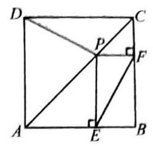

(图 5)

$\because A, P, C$ 三点共线, $\therefore \overrightarrow{AP} = t\left( {\mathbf{a} + \mathbf{b}}\right)$ .

$\therefore \overrightarrow{DP} = \overrightarrow{AP} - \overrightarrow{AD} = t\left( {\mathbf{a} + \mathbf{b}}\right)  - \mathbf{b} = t\mathbf{a} + \left( {t - 1}\right) \mathbf{b}$ .

又 $\because \overrightarrow{AE} = t\mathbf{a},\therefore \overrightarrow{PF} = \left( {1 - t}\right) \mathbf{a},\overrightarrow{EP} = t\mathbf{b}$ .

$\therefore \overrightarrow{EF} = \overrightarrow{EP} + \overrightarrow{PF} = t\mathbf{b} + \left( {1 - t}\right) \mathbf{a}$ .

$\therefore \overrightarrow{DP} \cdot  \overrightarrow{EF} = \left\lbrack  {t\mathbf{a} + \left( {t - 1}\right) \mathbf{b}}\right\rbrack   \cdot  \left\lbrack  {t\mathbf{b} + \left( {1 - t}\right) \mathbf{a}}\right\rbrack   = 0$ ,

$\therefore {PD} \bot  {EF}$ .

例 2 如图 6，在 $\bigtriangleup  {ABC}$ 中，点 $M$ 是 ${BC}$ 的中点，点 $N$ 在边 ${AC}$ 上，且 ${AN} = {2NC}$ , ${AM}$ 与 ${BN}$ 交于点 $P$ ,求 ${AP} : {PM}$ 的值.

解 设 $\overrightarrow{BM} = \mathbf{a},\overrightarrow{CN} = \mathbf{b}$ ,则 $\overrightarrow{AM} = \overrightarrow{AC} + \overrightarrow{CM} =  - \mathbf{a} - 3\mathbf{b},\overrightarrow{BN} = 2\mathbf{a} + \mathbf{b}$ .

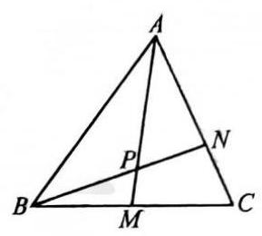

(图 6)

$\because A, P, M$ 三点共线, $B, P, N$ 三点共线,

$\therefore$ 存在实数 $\lambda ,\mu$ ,使 $\overrightarrow{AP} = \lambda \overrightarrow{AM} =  - \lambda \mathbf{a} - {3\lambda }\mathbf{b}$ ,

$\overrightarrow{BP} = \mu \overrightarrow{BN} = {2\mu }\mathbf{a} + \mu \mathbf{b}.$

$\therefore \overrightarrow{BA} = \overrightarrow{BP} - \overrightarrow{AP} = \left( {\lambda  + {2\mu }}\right) \mathbf{a} + \left( {{3\lambda } + \mu }\right) \mathbf{b}$ .

又 $\because \overrightarrow{BA} = \overrightarrow{BC} + \overrightarrow{CA} = 2\mathbf{a} + 3\mathbf{b}$ ,

$\therefore$ 由平面向量基本定理,得 $\left\{  {\begin{array}{l} \lambda  + {2\mu } = 2, \\  {3\lambda } + \mu  = 3 \end{array} \Rightarrow  \left\{  \begin{array}{l} \lambda  = \frac{4}{5}, \\  \mu  = \frac{3}{5}, \end{array}\right. }\right.$

从而 $\overrightarrow{AP} = \frac{4}{5}\overrightarrow{AM}.\;\therefore {AP} : {PM} = 4 : 1$ .

2. 在物理中的应用.

物理中的有关力、速度、位移等问题，可通过向量方法加以解答.

例 3 已知向量 ${e}_{1} = \left( {1,0}\right) ,{e}_{2} = \left( {0,1}\right)$ . 现有动点 $P$ 从点 ${P}_{0}\left( {-1,2}\right)$ 出发，沿着与向量 ${e}_{1} + \; {e}_{2}$ 相同的方向做匀速直线运动,速度大小为 $\left| {{e}_{1} + {e}_{2}}\right|$ ; 另一点 $Q$ 从点 ${Q}_{0}\left( {-2, - 1}\right)$ 出发,沿着与向量 $3{e}_{1} + 2{e}_{2}$ 相同的方向做匀速直线运动,速度大小为 $\left| {3{e}_{1} + 2{e}_{2}}\right|$ . 设点 $P, Q$ 在时刻 $t = 0$ 时分别在点 ${P}_{0},{Q}_{0}$ 处,当运动多长时间时, $\overrightarrow{PQ} \bot  \overrightarrow{{P}_{0}{Q}_{0}}$ ?

解 由题意,设点 $P\left( {{x}_{1},{y}_{1}}\right) , Q\left( {{x}_{2},{y}_{2}}\right)$ ,则

$\left( {{x}_{1},{y}_{1}}\right)  = \left( {-1,2}\right)  + \left( {1,1}\right) t = \left( {-1 + t,2 + t}\right) ,$

$\left( {{x}_{2},{y}_{2}}\right)  = \left( {-2, - 1}\right)  + \left( {3,2}\right) t = \left( {-2 + {3t}, - 1 + {2t}}\right) .$

$\therefore \overrightarrow{PQ} = \left( {-1 + {2t}, - 3 + t}\right) ,\overrightarrow{{P}_{0}{Q}_{0}} = \left( {-1, - 3}\right)$ .

$\because \overrightarrow{PQ} \bot  \overrightarrow{{P}_{0}{Q}_{0}},\;\therefore \overrightarrow{PQ} \cdot  \overrightarrow{{P}_{0}{Q}_{0}} = 0,\;\therefore \left( {-1}\right) \left( {-1 + {2t}}\right)  + \left( {-3}\right) \left( {-3 + t}\right)  = 0$ ,

$\therefore t = 2$ .

因此，运动 $2\mathrm{\;s}$ 时， $\overrightarrow{PQ} \bot  \overrightarrow{{P}_{0}{Q}_{0}}$ .

例 4 如图 7,在 $O$ 处用水平力 ${\mathbf{F}}_{2}$ 缓慢拉起重为 $\mathbf{G}$ 的物体,绳子与铅垂线方向的夹角为 $\theta$ , 绳子所受到的拉力为 ${\mathbf{F}}_{1}$ .

(1)分析 $\left| {\mathbf{F}}_{1}\right| ,\left| {\mathbf{F}}_{2}\right|$ 随 $\theta$ 的变化而变化的情况；

(2)当 $\left| {\mathbf{F}}_{1}\right|  \leq  2\left| \mathbf{G}\right|$ 时，求 $\theta$ 的取值范围.

解 由题意可知， ${\mathbf{F}}_{1},{\mathbf{F}}_{2}$ ， $\mathbf{G}$ 三者的关系如图 8 所示.

(1)以力 ${\mathbf{F}}_{1},{\mathbf{F}}_{2}$ 所在的边 ${OA},{OB}$ 为邻边作 $\square {OACB}$ ,则 $\left| {\mathbf{F}}_{1}\right|  = \frac{\mathbf{G}}{\cos \theta }$ ,

$\left| {\mathbf{F}}_{2}\right|  = \left| \mathbf{G}\right| \tan \theta ,\theta  \in  \left( {0,\frac{\pi }{2}}\right)$ . 因此, $\left| {\mathbf{F}}_{1}\right| ,\left| {\mathbf{F}}_{2}\right|$ 随 $\theta$ 的变大而变大.

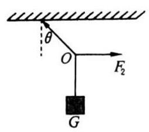

(图 7)

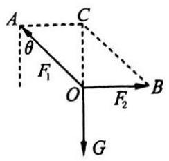

(图 8)

(2)当 $\left| {\mathbf{F}}_{1}\right|  \leq  2\left| \mathbf{G}\right|$ ，即 $\frac{\left| \mathbf{G}\right| }{\cos \theta } \leq  2\left| \mathbf{G}\right|$ 时， $\cos \theta  \geq  \frac{1}{2}$ .

$\because \theta  \in  \left( {0,\frac{\pi }{2}}\right) ,\;\therefore \theta  \in  \left( {0,\frac{\pi }{3}}\right\rbrack$ .

3. 在三角函数中的应用.

把三角函数问题转化为向量问题,利用向量的运算加以解决.

例 5 在 $\bigtriangleup {ABC}$ 中, ${AB} = \frac{4}{3}\sqrt{6},\cos B = \frac{\sqrt{6}}{6}$ ,边 ${AC}$ 上的中线 ${BD} = \sqrt{5}$ ,求 $\sin A$ 的值.

解 如图 9,以点 $B$ 为坐标原点, $\overrightarrow{BC}$ 为 $x$ 轴正方向建立平面直角坐标系. 不妨设点 $A$ 位于第一象限.

由 $\sin B = \frac{\sqrt{30}}{6}$ ,得 $\overrightarrow{BA} = \left( {\frac{4\sqrt{6}}{3}\cos B,\frac{4\sqrt{6}}{3}\sin B}\right)  = \left( {\frac{4}{3},\frac{4\sqrt{5}}{3}}\right)$ .

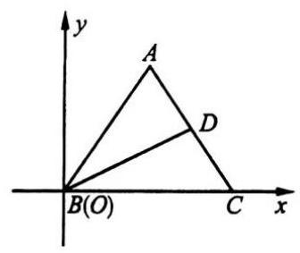

(图 9)

设 $\overrightarrow{BC} = \left( {x,0}\right)$ ,则 $\overrightarrow{BD} = \left( {\frac{4 + {3x}}{6},\frac{2\sqrt{5}}{3}}\right)$ .

由条件,得 $\left| \overrightarrow{BD}\right|  = \sqrt{{\left( \frac{4 + {3x}}{6}\right) }^{2} + {\left( \frac{2\sqrt{5}}{3}\right) }^{2}} = \sqrt{5}$ .

从而 $x = 2$ ，或 $x =  - \frac{14}{3}$ (不合题意，舍去).

故 $\overrightarrow{CA} = \left( {-\frac{2}{3},\frac{4\sqrt{5}}{3}}\right)$ ,

于是 $\cos A = \frac{\overrightarrow{BA} \cdot  \overrightarrow{CA}}{\left| \overrightarrow{BA}\right| \left| \overrightarrow{CA}\right| } = \frac{-\frac{8}{9} + \frac{80}{9}}{\sqrt{\frac{16}{9} + \frac{80}{9}}\sqrt{\frac{4}{9} + \frac{80}{9}}} = \frac{3\sqrt{14}}{14}$ ,

$\therefore \;\sin A = \sqrt{1 - {\cos }^{2}A} = \frac{\sqrt{70}}{14}$ .

【训练题】

(A)

131. 已知点 $A\left( {1,2}\right) , B\left( {2,3}\right) , C\left( {-2,5}\right)$ ，那么 $\bigtriangleup  {ABC}$ 的形状是( )

(A) 锐角三角形. (B) 等边三角形. (C) 钝角三角形. (D) 直角三角形.

132. 已知四边形 ${ABCD}$ 的三个顶点 $A\left( {0,2}\right) , B\left( {-1, - 2}\right) , C\left( {3,1}\right)$ ,且 $\overrightarrow{BC} = 2\overrightarrow{AD}$ ,那么顶点 $D$ 的坐标为( )

(A) $\left( {2,\frac{7}{2}}\right)$ . (B) $\left( {2, - \frac{1}{2}}\right)$ . (C) $\left( {3,2}\right)$ . (D) $\left( {1,3}\right)$ .

133. 已知向量 $\overrightarrow{AB} = \left( {2,1}\right) ,\overrightarrow{AC} = \left( {3, k}\right)$ . 若 $\bigtriangleup {ABC}$ 是直角三角形,则实数 $k$ 的可能值的个数是 ( )

(A) 1. (B) 2. (C) 3. (D) 4.

134. 若某人骑自行车的速度为 ${v}_{1}$ ,风速为 ${v}_{2}$ ,则此人逆风行驶时的速度大小为 ( )

(A) ${v}_{1} - {v}_{2}$ . (B) ${v}_{1} + {v}_{2}$ . (C) $\left| {v}_{1}\right|  - \left| {v}_{2}\right|$ . (D) $\frac{\left| {v}_{1}\right| }{\left| {v}_{2}\right| }$ .

135. 若两人提重为 $\left| \mathbf{G}\right|$ 的一桶水，夹角为 $\theta$ ，用力为 $\mathbf{F}$ ，则( )

(A) $\left| \mathbf{F}\right|  = \frac{\left| \mathbf{G}\right| }{2\cos \theta }$ . (B) $\left| \mathbf{F}\right|  = \frac{\left| \mathbf{G}\right| }{2\sin \theta }$ .

(C) $\left| \mathbf{F}\right|  = \frac{\left| \mathbf{G}\right| }{2\cos \frac{\theta }{2}}$ . (D) $\left| \mathbf{F}\right|  = \frac{\left| \mathbf{G}\right| }{2\sin \frac{\theta }{2}}$ .

136. 已知 $\square {ABCD}$ 的两个顶点 $A\left( {-\frac{9}{2}, - 7}\right) , B\left( {2,6}\right)$ ，对角线交点为 $M\left( {3,\frac{3}{2}}\right)$ ，则另两个顶点 $C$ ， $D$ 的坐标分别为___.

137. 在 $\bigtriangleup {ABC}$ 中,点 $A\left( {0,7}\right)$ , $B\left( {-4,5}\right)$ ,重心 $G\left( {0,\frac{1}{3}}\right)$ ,则边 ${AB}$ 上的中线 ${CD}$ 的长为 ___.

138. 某人以时速 $v\mathrm{\;{km}}$ 向东行走，此时正刮着时速 $v\mathrm{\;{km}}$ 的南风，那么此人感到的风向为 ___，风速为___ $\mathrm{{km}}/\mathrm{h}$ .

139. 用两条夹角为 ${60}^{ \circ  }$ 的绳索拉船，每条绳索上的拉力是 ${12}\mathrm{\;N}$ ，则合力为___(精确到 0.1 N).

140. 求证: 对边平方和相等的四边形的对角线互相垂直.

(B)

141. 已知 $\bigtriangleup  {ABC}$ 的顶点为 $A\left( {0,8}\right) , B\left( {-4,0}\right) , C\left( {5, - 3}\right)$ . 若点 $D$ 在边 ${BC}$ 上，且 $\bigtriangleup  {ABD}$ 的面积是 $\bigtriangleup  {ABC}$ 的 $\frac{1}{3}$ ，则点 $D$ 的坐标为( )

(A) $\left( {3, - 1}\right)$ . (B) $\left( {-1, - 1}\right)$ . (C) $\left( {\frac{1}{3},1}\right)$ . (D) $\left( {-\frac{1}{3}, - 1}\right)$ .

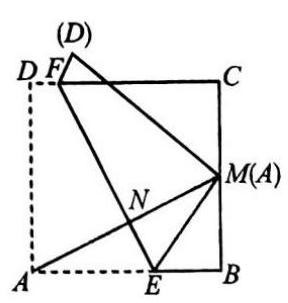

(第 142 题)

142. 如图,正方形 ${ABCD}$ 的边长为 $2, M$ 是 ${BC}$ 的中点,将正方形 ${ABCD}$ 折起,使点 $A$ 与点 $M$ 重合. 设折痕为 ${EF}$ ,则 ${AE}$ 的长为 ( )

(A) 1 . (B) $\frac{3}{2}$ .

(C) $\frac{5}{4}$ . (D) $\frac{4}{3}$ .

143. 已知 $G$ 是 $\bigtriangleup {ABC}$ 的重心,过点 $G$ 的任意一条直线交 ${AB}$ 于点 $Q$ , 交 ${AC}$ 于点 $P$ . 若 ${AQ} = \frac{1}{m}{AB},{AP} = \frac{1}{n}{AC}$ ,则 $m + n$ 等于( )

(A) 1 . (B) 2 . (C) 3 . (D) 4 .

144. 力 $\mathbf{F}$ 的两个分力的方向与力 $\mathbf{F}$ 成相同的角度,称两个分力的方向关于力 $\mathbf{F}$ 是对称的. 当两个对称的分力的夹角增大时，两个分力的大小()

(A) 先小后大. (B) 先大后小. (C) 越来越大. (D) 越来越小.

145. 一只船要横渡一条 ${30}\mathrm{\;m}$ 宽的河，它在静水中的速度为 $3\mathrm{\;m}/\mathrm{s}$ . 水流的速度为 $4\mathrm{\;m}/\mathrm{s}$ ，下列说法正确的是( )

(A) 这只船可能垂直于河岸到达对岸. (B) 这只船对地的速度是 $5\mathrm{\;m}/\mathrm{s}$ .

(C) 过河时间可能是 $6\mathrm{\;s}$ . (D) 过河时间可能是 ${12}\mathrm{\;s}$ .

146. 雨滴在空中以 $4\mathrm{\;m}/\mathrm{s}$ 的速度竖直下落,人打着伞以 $3\mathrm{\;m}/\mathrm{s}$ 的速度向东急行. 如果希望让雨滴垂直打向伞的截面少淋雨，那么伞柄与雨滴下落的方向成的角度是___( tan 37° $\approx  {0.75})$ .

147. 已知两个力 ${\mathbf{F}}_{1},{\mathbf{F}}_{2}$ 的夹角是 ${90}^{ \circ  }$ ,它们的合力 $\mathbf{F}$ 的大小为 ${10}\mathrm{\;N}$ . 若 ${\mathbf{F}}_{1}$ 的大小为 $6\mathrm{\;N}$ ,则 ${\mathbf{F}}_{2} =$ _____N.

148. 若三个力 ${\mathbf{F}}_{1} = \left( {3,4}\right) ,{\mathbf{F}}_{2} = \left( {2, - 5}\right) ,{\mathbf{F}}_{3} = \left( {x, y}\right)$ ,且 ${\mathbf{F}}_{1} + {\mathbf{F}}_{2} + {\mathbf{F}}_{3} = \mathbf{0}$ ,则 ${\mathbf{F}}_{3}$ 的坐标为 ___.

149. 若质点 $P$ 由点 $A\left( {2,1}\right)$ 移动到点 $B\left( {5,5}\right)$ (单位: $\mathrm{m}$ ),则位移 $\overrightarrow{AB} =$ ___，恒力 $\mathbf{F} = 4\mathbf{i} + \; {3j}$ (单位为 $\mathrm{N}$ ) 对质点 $P$ 所做的功 $W =$ ___ $\mathrm{J}$ .

150. 若矩形 ${ABCD}$ 的三个顶点为 $A\left( {2,1}\right) , B\left( {3,2}\right) , D\left( {-1,4}\right)$ ，则顶点 $C$ 的坐标为___.

151. 若 $\bigtriangleup {ABC}$ 的三个顶点为 $A\left( {4,1}\right) , B\left( {7,5}\right) , C\left( {-4,7}\right) ,{BD}$ 是 $\angle {BAC}$ 的平分线,则 ${AF}$ 的长为___.

152. 已知正三角形 ${ABC}$ 的边长为 $a, P$ 是平面上任意一点. 当 ${\left| \overrightarrow{PA}\right| }^{2} + {\left| \overrightarrow{PB}\right| }^{2} + {\left| \overrightarrow{PC}\right| }^{2}$ 最小时，点 $P$ 的位置在___，此时， ${\left| \overrightarrow{PA}\right| }^{2} + {\left| \overrightarrow{PB}\right| }^{2} + {\left| \overrightarrow{PC}\right| }^{2} =$ ___.

153. 求证: 平行四边形的对角线的平方和等于相邻两边的平方和的两倍.

154. 如图,在 $\square {ABCD}$ 的对角线 ${BD}$ 所在的直线上,取两点 $E, F$ ,使 ${BE} = {DF}$ . 用向量方法证明: 四边形 ${AECF}$ 也是平行四边形.

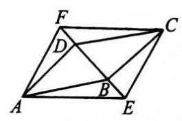

(第 154 题)

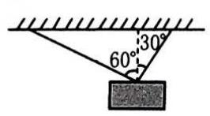

(第 156 题)

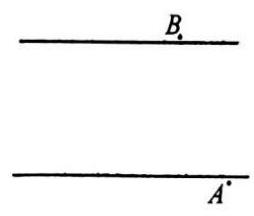

(第 157 题)

155. 试证明 $\bigtriangleup {ABC}$ 的三条高线交于一点.

156. 如图,在重 ${400}\mathrm{\;N}$ 的物体上,系两根绳子,这两根绳子在铅垂线的两侧,与铅垂线的夹角分别是 ${30}^{ \circ  },{60}^{ \circ  }$ ,求平衡时两根绳子拉力的大小.

157. 如图，一条两岸为平行直线的小河，河宽 $L = {60}\mathrm{\;m}$ ，水流速度为 $5\mathrm{\;m}/\mathrm{s}$ . 一小船欲从码头 $A$ 处渡河过去,码头 $A$ 的下游 ${80}\mathrm{\;m}$ 处的河床陡然降低形成瀑布 $B$ . 要保证小船不掉下瀑布，小船相对水的划行速度至少应多大？此时船的划行方向如何 $\left( {\cos {53}^{ \circ  } \approx  \frac{3}{5}}\right)$ ?

## 第二章 矩阵和行列式初步

## 一、矩阵

## 【典型题型和解题技巧】

1. 矩阵的概念.

把矩形数表叫做矩阵, 矩阵中的每个数叫做矩阵的元素.

例 1 下表是我国第一位奥运会射箭比赛金牌得主张娟娟与对手韩国选手朴成贤在决赛中的各阶段成绩表:

<table><tr><td>各阶段   姓名</td><td>第 1 组</td><td>第 2 组</td><td>第 3 组</td><td>第 4 组</td><td>总成绩</td></tr><tr><td>张娟娟</td><td>26</td><td>27</td><td>29</td><td>28</td><td>110</td></tr><tr><td>朴成贤</td><td>29</td><td>26</td><td>26</td><td>28</td><td>109</td></tr></table>

(1)将两人的各阶段成绩用矩阵表示出来;

(2)写出行向量、列向量，并指出其实际意义.

解 (1) $\left( \begin{matrix} {26} & {27} & {29} & {28} & {110} \\  {29} & {26} & {26} & {28} & {109} \end{matrix}\right)$ .

(2)有两个行向量，分别为: ${a}_{1} = \left( \begin{array}{lllll} {26} & {27} & {29} & {28} & {110} \end{array}\right)$ ，

${\mathbf{a}}_{2} = \left( \begin{array}{lllll} {29} & {26} & {26} & {28} & {109} \end{array}\right) ,$

它们分别表示两位运动员在决赛各阶段各自的成绩;

有五个列向量,分别为: ${b}_{1} = \left( \begin{array}{l} {26} \\  {29} \end{array}\right) ,{b}_{2} = \left( \begin{array}{l} {27} \\  {26} \end{array}\right) ,{b}_{3} = \left( \begin{array}{l} {29} \\  {26} \end{array}\right) ,{b}_{4} = \left( \begin{array}{l} {28} \\  {28} \end{array}\right) ,{b}_{5} = \left( \begin{array}{l} {110} \\  {109} \end{array}\right)$ ,

它们分别表示两位运动员在每一个阶段的成绩.

2. 线性方程组的系数矩阵和增广矩阵.

在线性方程组 $\left\{  \begin{array}{l} {a}_{11}{x}_{1} + {a}_{12}{x}_{2} + \cdots  + {a}_{1n}{x}_{n} = {b}_{1}, \\  {a}_{21}{x}_{1} + {a}_{22}{x}_{2} + \cdots  + {a}_{2n}{x}_{n} = {b}_{2}, \\  \cdots \cdots \\  {a}_{n1}{x}_{1} + {a}_{n2}{x}_{2} + \cdots  + {a}_{nn}{x}_{n} = {b}_{n}, \end{array}\right.$ 中,矩阵 $\left( \begin{matrix} {a}_{11} & {a}_{12} & \cdots & {a}_{1n} \\  {a}_{21} & {a}_{22} & \cdots & {a}_{2n} \\  \cdots & \cdots & \cdots & \cdots \\  {a}_{n1} & {a}_{n2} & \cdots & {a}_{m} \end{matrix}\right)$ 叫做方程组的

系数矩阵, $\left( \begin{array}{llll} {a}_{11} & \cdots & {a}_{1n} & {b}_{1} \\  {a}_{21} & \cdots & {a}_{2n} & {b}_{2} \\  \cdots & \cdots & \cdots & \cdots \\  {a}_{n1} & \cdots & {a}_{nn} & {b}_{n} \end{array}\right)$ 叫做方程组的增广矩阵.

例 2 写出线性方程组 $\left\{  \begin{array}{l} x + {2y} - {3z} + 2 = 0, \\   - x + {3y} + {2z} - 5 = 0, \\  {2x} - y + z + 3 = 0 \end{array}\right.$ 的系数矩阵和增广矩阵.

解 系数矩阵为 $\left( \begin{matrix} 1 & 2 &  - 3 \\   - 1 & 3 & 2 \\  2 &  - 1 & 1 \end{matrix}\right)$ ,增广矩阵为 $\left( \begin{matrix} 1 & 2 &  - 3 &  - 2 \\   - 1 & 3 & 2 & 5 \\  2 &  - 1 & 1 &  - 3 \end{matrix}\right)$ .

3. 矩阵相等的概念.

如果矩阵 $A = \left( {a}_{ij}\right) , B = \left( {b}_{ij}\right)$ 是两个行数与行数相等、列数与列数相等的矩阵,当且仅当它们对应位置的元素都相等时,那么矩阵 $A$ 与矩阵 $B$ 叫做相等的矩阵,记为 $A = B$ .

例 3 已知矩阵 $A = \left( \begin{matrix} 2 &  - x \\  {2x} & a + {2b} \end{matrix}\right) , B = \left( \begin{matrix} x - y & b - {2a} \\  y & x + {y}^{2} \end{matrix}\right)$ ,且 $A = B$ ,求 $a, b$ 的值及矩阵 $A$ .

解 由题意知, $\left\{  \begin{array}{l} x - y = 2, \\  {2x} = y, \end{array}\right.$ 解得 $\left\{  \begin{array}{l} x =  - 2, \\  y =  - 4. \end{array}\right.$ 由 $\left\{  \begin{array}{l} b - {2a} =  - x = 2, \\  a + {2b} = x + {y}^{2} = {14}, \end{array}\right.$ 解得 $\left\{  \begin{array}{l} a = 2, \\  b = 6. \end{array}\right.$

$\therefore A = \left( \begin{matrix} 2 & 2 \\   - 4 & {14} \end{matrix}\right)$ .

4. 矩阵的运算.

两个矩阵相加(减)是指它们对应位置的元素相加(减)，矩阵与一个实数相乘是指矩阵中每个元素与这个实数相乘.

矩阵 $A, B$ 与实数 $\alpha$ 相乘满足交换律和分配律: (1) ${\alpha A} = {A\alpha };\;\left( 2\right) \alpha \left( {A + B}\right)  = {\alpha A} + {\alpha B}$ .

矩阵相乘: 设矩阵 $A$ 是 $n$ 行、 $k$ 列的矩阵,矩阵 $B$ 是 $k$ 行、 $m$ 列的矩阵,矩阵 $C$ 是 $n$ 行、 $m$ 列的矩阵. 如果矩阵 $C$ 中第 $i$ 行、第 $j$ 列的元素 ${c}_{ij}$ 为 $A$ 的第 $i$ 个行向量与 $B$ 的第 $j$ 个列向量的数量积, $i = 1,2,\cdots , n, j = 1,2,\cdots , m$ ,那么矩阵 $C$ 叫做矩阵 $A$ 和 $B$ 的乘积.

例 4 已知矩阵 $A = \left( \begin{matrix} 2 & 1 \\   - 4 & 0 \end{matrix}\right) , B = \left( \begin{matrix} 4 & 3 \\   - 7 & 0 \end{matrix}\right) , C = \left( \begin{matrix} 1 &  - 2 & 0 \\   - 2 & 3 & 4 \end{matrix}\right)$ ,求:

(1) $A + B$ ； (2) $B - {2A}$ ； (3) ${AC}$ .

解 (1) $A + B = \left( \begin{matrix} 2 & 1 \\   - 4 & 0 \end{matrix}\right)  + \left( \begin{matrix} 4 & 3 \\   - 7 & 0 \end{matrix}\right)  = \left( \begin{matrix} 2 + 4 & 1 + 3 \\   - 4 - 7 & 0 + 0 \end{matrix}\right)  = \left( \begin{matrix} 6 & 4 \\   - {11} & 0 \end{matrix}\right)$ .

(2) $B - {2A} = \left( \begin{matrix} 4 & 3 \\   - 7 & 0 \end{matrix}\right)  - 2\left( \begin{matrix} 2 & 1 \\   - 4 & 0 \end{matrix}\right)  = \left( \begin{matrix} 4 & 3 \\   - 7 & 0 \end{matrix}\right)  - \left( \begin{matrix} 4 & 2 \\   - 8 & 0 \end{matrix}\right)  = \left( \begin{array}{ll} 0 & 1 \\  1 & 0 \end{array}\right)$ .

(3) ${AC} = \left( \begin{matrix} 2 & 1 \\   - 4 & 0 \end{matrix}\right) \left( \begin{matrix} 1 &  - 2 & 0 \\   - 2 & 3 & 4 \end{matrix}\right)$

$= \left( \begin{array}{rrr} 2 \times  1 + 1 \times  \left( {-2}\right) & 2 \times  \left( {-2}\right)  + 1 \times  3 & 2 \times  0 + 1 \times  4 \\   - 4 \times  1 + 0 \times  \left( {-2}\right) &  - 4 \times  \left( {-2}\right)  + 0 \times  3 &  - 4 \times  0 + 0 \times  4 \end{array}\right)  = \left( \begin{array}{rrr} 0 &  - 1 & 4 \\   - 4 & 8 & 0 \end{array}\right) .$

5. 用矩阵变换的方法解线性方程组.

解线性方程组的过程就是通过某些矩阵变换, 使方程组的系数矩阵变为单位矩阵的过程. 常用的矩阵变换有下列三种:

(1)互换矩阵的两行；

(2)某一行同乘(除)以一个非零的数；

(3)某一行乘以一个数加到另一行.

例 5 用矩阵变换的方法解三元一次方程组 $\left\{  \begin{array}{l} {4x} + {3y} - z = 5, \\  {7x} + {2y} + z = 4, \\  {5x} - {2y} - {3z} = 8. \end{array}\right.$

解 此方程组对应的增广矩阵为 $\left( \begin{matrix} 4 & 3 &  - 1 & 5 \\  7 & 2 & 1 & 4 \\  5 &  - 2 &  - 3 & 8 \end{matrix}\right)$ .

设此矩阵第1,2,3行分别为①、②、③，对此矩阵进行下列变换:

$$
\left( \begin{matrix} 4 & 3 &  - 1 & 5 \\  7 & 2 & 1 & 4 \\  5 &  - 2 &  - 3 & 8 \end{matrix}\right) \xrightarrow[\text{ ② 不变 }]{\begin{matrix} \text{ ②加到① } \\  \text{ ② } \times  3\text{ 加到③ } \end{matrix}}\left( \begin{matrix} {11} & 5 & 0 & 9 \\  7 & 2 & 1 & 4 \\  {26} & 4 & 0 & {20} \end{matrix}\right)
$$

$\xrightarrow[\text{ ①、②不变 }]{\text{ ③ } \times  \frac{1}{4}}\left( \begin{array}{llll} {11} & 5 & 0 & 9 \\  7 & 2 & 1 & 4 \\  \frac{13}{2} & 1 & 0 & 5 \end{array}\right) \xrightarrow[\text{ ③ 不变 }]{\text{ ③ } \times  \left( {-2}\right) \text{ 加到 }}\left| \begin{matrix}  - \frac{43}{2} & 0 & 0 &  - {16} \\   - 6 & 0 & 1 &  - 6 \\   - 6 & 0 & 1 &  - 6 \\  \frac{13}{2} & 1 & 0 & 5 \end{matrix}\right|$

$\xrightarrow[]{\mathbb{O} \times  \left( {-\frac{2}{43}}\right) }\left( \begin{matrix} 1 & 0 & 0 & \frac{32}{43} \\   - 6 & 0 & 1 &  - 6 \\  \frac{13}{2} & 1 & 0 & 5 \end{matrix}\right) \xrightarrow[]{\mathbb{O} \times  \left( {-\frac{13}{2}}\right) \text{ 加到 }\mathbb{O}}\left| \begin{matrix} 1 & 0 & 0 & \frac{32}{43} \\  0 & 1 &  - \frac{16}{43} & 0 \\  0 & 0 & 1 &  - \frac{66}{43} \\  0 & 1 & 0 & \frac{7}{43} \end{matrix}\right|$

$\xrightarrow[\text{ ① 不变 }]{\text{ 交换②、③ }\left( \begin{matrix} 1 & 0 & 0 & \frac{32}{43} \\  0 & 1 & 0 & \frac{7}{43} \\  0 & 0 & 1 &  - \frac{66}{43} \end{matrix}\right) }$ ， $\therefore$ 此方程组的解为 $\left\{  \begin{array}{l} x = \frac{32}{43}, \\  y = \frac{7}{43}, \\  z =  - \frac{66}{43}. \end{array}\right.$

注意 解线性方程组就是通过某些矩阵变换, 使方程组的系数矩阵变为单位矩阵, 增广矩阵的最后一个列向量就是方程组的解.

6. 平面图形的矩阵变换.

当变换矩阵为 $\left( \begin{array}{ll} k & 0 \\  0 & k \end{array}\right)$ ( $k$ 为非零常数)时,所对应的图形变换是相似变换,相似比为 $\left| k\right|$ ;

当变换矩阵为 $\left( \begin{array}{rr} 1 & 0 \\  0 &  - 1 \end{array}\right)$ 时,所对应的图形变换是关于 $x$ 轴对称的轴对称变换;

当变换矩阵为 $\left( \begin{array}{ll}  - 1 & 0 \\  0 & 1 \end{array}\right)$ 时,所对应的图形变换是关于 $y$ 轴对称的轴对称变换;

当变换矩阵为 $\left( \begin{array}{ll} 0 & 1 \\  1 & 0 \end{array}\right)$ 时,所对应的图形变换是关于直线 $y = x$ 对称的轴对称变换;

当变换矩阵为 $\left( \begin{array}{rr} 0 &  - 1 \\   - 1 & 0 \end{array}\right)$ 时,所对应的图形变换是关于直线 $y =  - x$ 对称的轴对称变换;

当变换矩阵为 $\left( \begin{array}{rr}  - 1 & 0 \\  0 &  - 1 \end{array}\right)$ 时,所对应的图形变换是关于原点对称的中心对称变换;

当变换矩阵为 $\left( \begin{array}{rr} \cos \theta &  - \sin \theta \\  \sin \theta & \cos \theta  \end{array}\right)$ 时,所对应的图形变换是将原图形绕原点旋转 $\theta$ 的旋转变换.

例 6 求出曲线 $y = \left| x\right|$ 在矩阵 $\left( \begin{array}{ll} 1 & 0 \\   - 1 & 1 \end{array}\right)$ 对应的变换作用下变成的图形.

解 曲线 $y = \left| x\right|$ 如图 1 所示.

坐标变换为 $\left( \begin{array}{l} {x}^{\prime } \\  {y}^{\prime } \end{array}\right)  = \left( \begin{matrix} 1 & 0 \\   - 1 & 1 \end{matrix}\right) \left( \begin{array}{l} x \\  y \end{array}\right)$ ,即 $\left\{  {\begin{array}{l} {x}^{\prime } = x, \\  {y}^{\prime } =  - x + y. \end{array}\;\therefore \;\left\{  \begin{array}{l} x = {x}^{\prime }, \\  y = {x}^{\prime } + {y}^{\prime }. \end{array}\right. }\right.$

代入 $y = \left| x\right|$ ，得 ${x}^{\prime } + {y}^{\prime } = \left| {x}^{\prime }\right|$ ，即 ${y}^{\prime } = \left| {x}^{\prime }\right|  - {x}^{\prime }$ .

因此，变成的图形是以原点为端点的两条射线 $y = 0\left( {x \geq  0}\right)$ 与 $y =  - {2x}\left( {x < 0}\right)$ ，如图 2 所示.

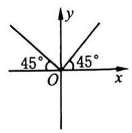

(图 1)

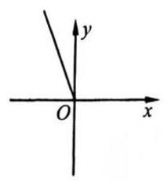

(图 2)

【训练题】(A)

1. 写出线性方程组 $\left\{  \begin{array}{l} {2x} + {3y} = 1, \\  {4x} - y = 6 \end{array}\right.$ 的系数矩阵与增广矩阵.

2. 已知线性方程组的增广矩阵为 $\left( \begin{matrix} 2 &  - 1 & 0 & 2 \\  0 & 3 &  - 2 & 1 \\  3 & 0 & 2 &  - 3 \end{matrix}\right)$ ,写出其对应的方程组.

3. 已知矩阵 $\left( \begin{array}{ll} \sin \alpha  + \cos \alpha & 0 \\  \sin \beta  + \cos \beta & 1 \end{array}\right)$ 为单位矩阵,且 $\alpha ,\beta  \in  \left\lbrack  {\frac{\pi }{2},\pi }\right)$ ,求 $\sin \left( {\alpha  - \beta }\right)$ 的值.

4. 已知每千克五角硬币的价值为 132 元，每千克一元硬币的价值为 165 元. 现有总质量为 2 千克的硬币, 总数共计 462 个. 问:其中一元与五角的硬币分别有多少个?

5. 已知矩阵 $A = \left( \begin{matrix} 2 &  - 1 \\  4 & 3 \end{matrix}\right) , B = \left( \begin{matrix} 4 & 3 \\   - 7 & 0 \end{matrix}\right) , C = \left( \begin{matrix} 1 &  - 2 & 0 \\   - 2 & 3 & 4 \end{matrix}\right)$ . 求:

(1) $A + B$ ； (2) $B - {2A}$ ； (3) ${AB}$ ； (4) ${AC}$ .

6. 已知矩阵 $A = \left( \begin{matrix} a & 3 \\  d & {2b} + c \end{matrix}\right) , B = \left( \begin{matrix} 5 & b + c \\  4 & a + {2d} \end{matrix}\right)$ ，且 $A = B$ ，求 $a, b, c, d$ 的值.

7. 若点 $A\left( {\frac{\sqrt{3}}{2},\frac{1}{2}}\right)$ 在矩阵 $\left( \begin{array}{rr} \cos \alpha &  - \sin \alpha \\  \sin \alpha & \cos \alpha  \end{array}\right)$ 对应的变换作用下得到的点为 $\left( {0,1}\right)$ ,求 $\alpha$ 的值.

8. 如图，在 $\bigtriangleup  {ABO}$ 中，顶点分别是 $A\left( {4,2}\right)$ ， $B\left( {2,4}\right)$ ， $O\left( {0,0}\right)$ ，求 $\bigtriangleup  {ABO}$ 在矩阵 $\left( \begin{matrix} 1 & 1 \\  1 &  - 1 \end{matrix}\right)$ 对应的变换作用下变成的图形.

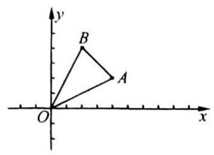

(第 8 题)

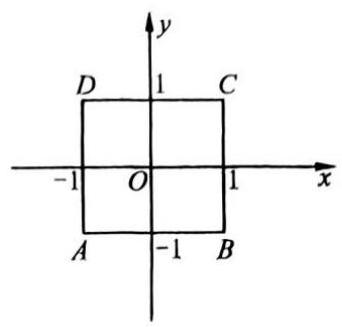

(第 10 题)

9. 已知矩形 ${ABCD}$ 的顶点为 $A\left( {-1,0}\right) , B\left( {1,0}\right) , C\left( {1,1}\right) , D\left( {-1,1}\right)$ . 若矩形 ${ABCD}$ 在矩阵 $M \; = \left( \begin{array}{ll} a & 0 \\  0 & 1 \end{array}\right)$ 对应的变换作用下变成正方形,求 $a$ 的值.

10. 分别画出下列矩阵对图中正方形的作用结果, 从几何上说明它们分别表示什么变换?

(1) $\left( \begin{matrix} \frac{1}{2} & 0 \\  0 & 1 \end{matrix}\right)$ ； (2) $\left( \begin{array}{ll} 2 & 0 \\  0 & 1 \end{array}\right)$ 。

11. 若直线 $y = {4x} - 4$ 在矩阵 $M$ 对应的伸缩变换作用下变为直线 $y = x - 1$ ,求矩阵 $M$ .

12. 验证圆 $C : {x}^{2} + {y}^{2} = 4$ 在矩阵 $A = \left( \begin{array}{ll} 2 & 0 \\  0 & 1 \end{array}\right)$ 对应的伸缩变换作用下变为一个椭圆,并求此椭圆的方程.

13. 设点 $P$ 的坐标为 $\left( {2, - 4}\right) , T$ 是绕原点逆时针方向旋转 $\frac{\pi }{3}$ 的旋转变换,求旋转变换 $T$ 对应的矩阵,并求点 $P$ 在 $T$ 作用下的像点 ${P}^{\prime }$ 的坐标.(B)

14. 若点 $A$ 在矩阵 $\left( \begin{array}{ll}  - 1 & 2 \\   - 2 & 2 \end{array}\right)$ 对应的变换作用下得到的点为 $\left( {3,6}\right)$ ,求点 $A$ 的坐标.

15. 已知曲线 $y = \frac{1}{3}\cos {2x}$ 经过伸缩变换 $T$ 作用后变为新的曲线 $y = \cos x$ ，试求变换 $T$ 对应的矩阵 $M$ .

16. 运用矩阵变换方法解方程组 $\left\{  {\begin{array}{l} {ax} + {3y} = 2, \\  {2x} - y = b \end{array}\left( {a, b}\right. }\right.$ 为常数).

17. 设矩阵 $A$ 为二阶矩阵,且规定其元素 ${a}_{ij} =  - {a}_{ji}, i = 1,2, j = 1,2$ ,且 ${a}_{12} - {a}_{21} = 1$ ,试求矩阵 $A$ .

18. 设某椭圆的方程为 ${x}^{2} + \frac{{y}^{2}}{a} = 1$ ,若它在矩阵 $M = \left( \begin{matrix} 1 & 0 \\  0 & \frac{1}{2} \end{matrix}\right)$ 对应的伸缩变换下变为一个圆, 求实数 $a$ 的值.

19. 若圆 ${\left( x - 3\right) }^{2} + {\left( y + 6\right) }^{2} = 4$ 在矩阵 $M$ 对应的变换作用下得到的圆的方程为 ${\left( x + 3\right) }^{2} + \; {\left( y - 6\right) }^{2} = 4$ ,求矩阵 $M$ .

20. 求出曲线 ${xy} =  - 1$ 绕坐标原点逆时针旋转 ${45}^{ \circ  }$ 后得到的曲线.

## 二、行列式

## 【典型题型和解题技巧】

1. 展开并化简二阶行列式.

二阶行列式 $\left| \begin{array}{ll} {a}_{1} & {b}_{1} \\  {a}_{2} & {b}_{2} \end{array}\right|  = {a}_{1}{b}_{2} - {a}_{2}{b}_{1}$ .

例 1 展开并化简行列式 $\left| \begin{array}{ll} {2006} & {2007} \\  {2008} & {2009} \end{array}\right|$ .

解 $\left| \begin{matrix} {2006} & {2007} \\  {2008} & {2009} \end{matrix}\right|  = {2006} \times  {2009} - {2008} \times  {2007} =  - 2$ .

2. 用行列式解二元一次方程组. 二元一次方程组 $\left\{  \begin{array}{l} {a}_{1}x + {b}_{1}y = {c}_{1}, \\  {a}_{2}x + {b}_{2}y = {c}_{2} \end{array}\right.$ 转化为方程组 $\left\{  \begin{array}{l} D \cdot  x = {D}_{x}, \\  D \cdot  y = {D}_{y}, \end{array}\right.$ 其中 $D = \left| \begin{array}{ll} {a}_{1} & {b}_{1} \\  {a}_{2} & {b}_{2} \end{array}\right|$ , ${D}_{x} = \left| \begin{array}{ll} {c}_{1} & {b}_{1} \\  {c}_{2} & {b}_{2} \end{array}\right| ,{D}_{y} = \left| \begin{array}{ll} {a}_{1} & {c}_{1} \\  {a}_{2} & {c}_{2} \end{array}\right| .$

(1)当 $D \neq  0$ 时,方程组有唯一解 $\left\{  \begin{array}{l} x = \frac{{D}_{x}}{D}, \\  y = \frac{{D}_{y}}{D}; \end{array}\right.$

(2)当 $D = 0$ ，且 ${D}_{x}$ ， ${D}_{y}$ 中至少有一个不为零时，方程组无解；

(3)当 $D = {D}_{x} = {D}_{y} = 0$ 时,方程组有无穷多解.

例 2 解关于 $x, y$ 的二元一次方程组 $\left\{  \begin{array}{l} {3x} - {2y} = 1, \\  {mx} + {4y} = 2. \end{array}\right.$

解 $D = \left| \begin{matrix} 3 &  - 2 \\  m & 4 \end{matrix}\right|  = {12} + {2m},{D}_{x} = \left| \begin{matrix} 1 &  - 2 \\  2 & 4 \end{matrix}\right|  = 8,{D}_{y} = \left| \begin{matrix} 3 & 1 \\  m & 2 \end{matrix}\right|  = 6 - m$ .

(1)当 $m \neq   - 6$ 时, $D \neq  0$ ,原方程组有唯一解 $\left\{  \begin{array}{l} x = \frac{4}{6 + m}, \\  y = \frac{6 - m}{{12} + {2m}}; \end{array}\right.$

(2)当 $m =  - 6$ 时， $D = 0$ ，由于 ${D}_{x} \neq  0$ ，所以原方程组无解.

例 3 若 $k \in  \mathbf{R}$ ,方程组 $\left\{  \begin{array}{l} x + {3y} = 0, \\  {2x} + y = {ky} \end{array}\right.$ 有非零解,求 $k$ 的值.

解 原方程组可化为 $\left\{  \begin{array}{l} x + {3y} = 0, \\  {2x} + \left( {1 - k}\right) y = 0. \end{array}\right.$

$D = \left| \begin{matrix} 1 & 3 \\  2 & 1 - k \end{matrix}\right|  = 1 - k - 6 =  - k - 5,{D}_{x} = \left| \begin{matrix} 0 & 3 \\  0 & 1 - k \end{matrix}\right|  = 0,{D}_{y} = \left| \begin{array}{ll} 1 & 0 \\  2 & 0 \end{array}\right|  = 0.$

由方程组有非零解,得 $D = 0.\;\therefore \;k =  - 5$ .

注意 二元齐一次方程组有非零解的充要条件是系数行列式的值为 0 .

3. 计算三阶行列式的值.

三阶行列式 $\left| \begin{array}{lll} {a}_{1} & {b}_{1} & {c}_{1} \\  {a}_{2} & {b}_{2} & {c}_{2} \\  {a}_{3} & {b}_{3} & {c}_{3} \end{array}\right|$ 的两种展开方法:

(1)按对角线展开.

$$
\left| \begin{array}{lll} {a}_{1} & {b}_{1} & {c}_{1} \\  {a}_{2} & {b}_{2} & {c}_{2} \\  {a}_{3} & {b}_{3} & {c}_{3} \end{array}\right|  = {a}_{1}{b}_{2}{c}_{3} + {a}_{2}{b}_{3}{c}_{1} + {a}_{3}{b}_{1}{c}_{2} - {a}_{3}{b}_{2}{c}_{1} - {a}_{2}{b}_{1}{c}_{3} - {a}_{1}{b}_{3}{c}_{2}.
$$

(2)按一行(或一列)展开.

三阶行列式可以按其任意一行(或一列)展开成该行(或该列)元素与其对应的代数余子式的乘积之和.

例 4 按下列要求计算行列式 $D = \left| \begin{matrix}  - 3 & 2 & 4 \\  0 & 0 & 8 \\  4 &  - 3 & 7 \end{matrix}\right|$ .

(1)按对角线展开； (2)按某行(或某列)展开.

解 (1) $D = \left| \begin{matrix}  - 3 & 2 & 4 \\  0 & 0 & 8 \\  4 &  - 3 & 7 \end{matrix}\right|  = \left( {-3}\right)  \times  0 \times  7 + 0 \times  \left( {-3}\right)  \times  4 + 4 \times  2 \times  8 - 4 \times  0 \times  4 - 0 \times  2 \; \times  7 - \left( {-3}\right)  \times  \left( {-3}\right)  \times  8 =  - 8$ .

(2)将行列式按第 2 行展开，则

$$
D = \left| \begin{matrix}  - 3 & 2 & 4 \\  0 & 0 & 8 \\  4 &  - 3 & 7 \end{matrix}\right|  = 0 \times  \left( {-\left| \begin{matrix} 2 & 4 \\   - 3 & 7 \end{matrix}\right| }\right)  + 0 \times  \left| \begin{matrix}  - 3 & 4 \\  4 & 7 \end{matrix}\right|  + 8 \times  \left( {-\left| \begin{matrix}  - 3 & 2 \\  4 &  - 3 \end{matrix}\right| }\right)  =  - 8.
$$

注意 若某行(或列)有 0 ，则按此行 (或列) 展开计算三阶行列式的值比较简便.

4. 用行列式解三元一次方程组

三元一次方程组 $\left\{  \begin{array}{l} {a}_{1}x + {b}_{1}y + {c}_{1}z = {d}_{1}, \\  {a}_{2}x + {b}_{2}y + {c}_{2}z = {d}_{2}, \\  {a}_{3}x + {b}_{3}y + {c}_{3}z = {d}_{3} \end{array}\right.$ 转化为方程组 $\left\{  \begin{array}{l} D \cdot  x = {D}_{x}, \\  D \cdot  y = {D}_{y}, \\  D \cdot  z = {D}_{z}, \end{array}\right.$

其中 $D = \left| \begin{array}{lll} {a}_{1} & {b}_{1} & {c}_{1} \\  {a}_{2} & {b}_{2} & {c}_{2} \\  {a}_{3} & {b}_{3} & {c}_{3} \end{array}\right| ,{D}_{x} = \left| \begin{array}{lll} {d}_{1} & {b}_{1} & {c}_{1} \\  {d}_{2} & {b}_{2} & {c}_{2} \\  {d}_{3} & {b}_{3} & {c}_{3} \end{array}\right| ,{D}_{y} = \left| \begin{array}{lll} {a}_{1} & {d}_{1} & {c}_{1} \\  {a}_{2} & {d}_{2} & {c}_{2} \\  {a}_{3} & {d}_{3} & {c}_{3} \end{array}\right| ,{D}_{z} = \left| \begin{array}{lll} {a}_{1} & {b}_{1} & {d}_{1} \\  {a}_{2} & {b}_{2} & {d}_{2} \\  {a}_{3} & {b}_{3} & {d}_{3} \end{array}\right|$ .

(1)当 $D \neq  0$ 时,方程组有唯一解 $\left\{  \begin{array}{l} x = \frac{{D}_{x}}{D}, \\  y = \frac{{D}_{y}}{D}, \\  z = \frac{{D}_{z}}{D}; \end{array}\right.$

( 2 )当 $D = 0$ ，且 ${D}_{x}$ ， ${D}_{y}$ ， ${D}_{z}$ 中至少有一个不为零时，方程组无解；

(3)当 $D = {D}_{x} = {D}_{y} = {D}_{z} = 0$ 时,方程组有无穷多解.

例 5 解方程组 $\left\{  \begin{array}{l} {2x} - {3y} + z =  - 1, \\  x + y + z = 6, \\  {3x} + y - {2z} =  - 1. \end{array}\right.$

解 $\because D = \left| \begin{matrix} 2 &  - 3 & 1 \\  1 & 1 & 1 \\  3 & 1 &  - 2 \end{matrix}\right|  =  - {23},{D}_{x} = \left| \begin{matrix}  - 1 &  - 3 & 1 \\  6 & 1 & 1 \\   - 1 & 1 &  - 2 \end{matrix}\right|  =  - {23}$ ,

${D}_{y} = \left| \begin{matrix} 2 &  - 1 & 1 \\  1 & 6 & 1 \\  3 &  - 1 &  - 2 \end{matrix}\right|  =  - {46},{D}_{z} = \left| \begin{matrix} 2 &  - 3 &  - 1 \\  1 & 1 & 6 \\  3 & 1 &  - 1 \end{matrix}\right|  =  - {69}$ ,

$\therefore x = \frac{{D}_{x}}{D} = 1, y = \frac{{D}_{y}}{D} = 2, z = \frac{{D}_{z}}{D} = 3$ . 所以原方程组的解为 $\left\{  \begin{array}{l} x = 1, \\  y = 2, \\  z = 3. \end{array}\right.$

5. 用行列式求三角形的面积.

如果 $\bigtriangleup {ABC}$ 的三个顶点 $A, B, C$ 的坐标分别为 $\left( {{x}_{1},{y}_{1}}\right) ,\left( {{x}_{2},{y}_{2}}\right) ,\left( {{x}_{3},{y}_{3}}\right)$ ,那么 $\bigtriangleup {ABC}$ 的面积等于 $\frac{1}{2}\left| \begin{array}{lll} {x}_{1} & {y}_{1} & 1 \\  {x}_{2} & {y}_{2} & 1 \\  {x}_{3} & {y}_{3} & 1 \end{array}\right|$ 的绝对值.

特别地,直角坐标平面上三点 $A\left( {{x}_{1},{y}_{1}}\right) , B\left( {{x}_{2},{y}_{2}}\right) , C\left( {{x}_{3},{y}_{3}}\right)$ 共线的充要条件为 $\left| \begin{array}{lll} {x}_{1} & {y}_{1} & 1 \\  {x}_{2} & {y}_{2} & 1 \\  {x}_{3} & {y}_{3} & 1 \end{array}\right|  = 0.$

例 6 已知 $\bigtriangleup {ABC}$ 的三个顶点 $A\left( {-1, - 1}\right) , B\left( {2,3}\right) , C\left( {6, - 2}\right)$ ,求 $\bigtriangleup {ABC}$ 的面积.

解 $\because \frac{1}{2}\left| \begin{matrix}  - 1 &  - 1 & 1 \\  2 & 3 & 1 \\  6 &  - 2 & 1 \end{matrix}\right|  = \frac{1}{2}\left( {1 \times  \left| \begin{matrix} 2 & 3 \\  6 &  - 2 \end{matrix}\right|  - 1\left| \begin{matrix}  - 1 &  - 1 \\  6 &  - 2 \end{matrix}\right|  + 1 \times  \left| \begin{matrix}  - 1 &  - 1 \\  2 & 3 \end{matrix}\right| }\right) \; = \frac{1}{2}\left( {-{22} - 8 - 1}\right)  =  - \frac{31}{2},\therefore \bigtriangleup {ABC}$ 的面积为 $\frac{31}{2}$ .

## 【训练题】

(A)

21. 用行列式解下列方程组:

(1) $\left\{  \begin{array}{l} {2x} + y = 5, \\  {5x} + {2y} = {12}; \end{array}\right.$ (2) $\left\{  \begin{array}{l} {2x} + y = 5, \\  {4x} + {2y} = 3; \end{array}\right.$ (3) $\left\{  \begin{array}{l} {2x} + y = 5, \\  {4x} + {2y} = {10}. \end{array}\right.$

22. 计算: $\left| \begin{array}{rr} \sin x &  - \cos x \\  \cos x & \sin x \end{array}\right|$ .

23. 按下列要求计算行列式 $\left| \begin{array}{lll} 1 & 2 & 3 \\  4 & 5 & 6 \\  7 & 8 & 9 \end{array}\right|$ .

(1)用对角线法则； (2)按某行(或某列)展开.

24. 已知 $\left| \begin{array}{ll} a & b \\  c & d \end{array}\right|  = 2$ ,求 $\left| \begin{matrix} {5a} - {7b} & {4a} + {3b} \\  {5c} - {7d} & {4c} + {3d} \end{matrix}\right|$ 的值.

25. 计算下列行列式的值:

(1) $\left| \begin{matrix} 2 &  - 1 & 2 \\  1 & 0 & 3 \\  0 & 2 & 1 \end{matrix}\right|$ ； (2) $\left| \begin{matrix} 1 & 0 &  - 1 \\  0 & 2 &  - 2 \\  2 & 0 & 1 \end{matrix}\right|$ ； (3) $\left| \begin{matrix} 1 & 0 & 0 \\   - 9 &  - 1 & 0 \\  {12} & 7 & 8 \end{matrix}\right|$ .

26. 已知 $\bigtriangleup {ABC}$ 的三个顶点 $A\left( {1, - 2}\right) , B\left( {-2,3}\right) , C\left( {-4, - 5}\right)$ ,求 $\bigtriangleup {ABC}$ 的面积.

27. 已知 $A\left( {a, a + {18}}\right) , B\left( {-2,6}\right) , C\left( {7,5}\right)$ 三点共线,求 $a$ 的值.

28. 已知二元一次方程组 $\left\{  \begin{array}{l} \left( {k - 3}\right) x - {2y} = {2k}, \\  {3x} + \left( {{2k} + 1}\right) y + k + 2 = 0 \end{array}\right.$ 无解,求 $k$ 的值.

29. 若方程组 $\left\{  \begin{array}{l} {3x} + {4y} + {5z} = {kx}, \\  {3x} + {4y} + {5z} = {ky}, \\  {3x} + {4y} + {5z} = {kz} \end{array}\right.$ 恰有一解,求 $k$ 的取值范围.

30. $\left| \begin{matrix} 1 - x & 2 & 3 \\  1 & 2 - x & 3 \\  1 & 2 & 3 - x \end{matrix}\right|  = 0$ ,求 $x$ 的值.

31. 解方程组 $\left\{  \begin{array}{l} \left( {a - 3}\right) x - {2y} = {2a}, \\  {3x} + \left( {{2a} + 1}\right) y = 2 - {5a}. \end{array}\right.$(B)

32. 若 $\left| \begin{matrix} 4 + a & 3 + a \\  5 & 4 \end{matrix}\right|  = \left| \begin{matrix} 2 & 4 + a \\  3 - a & 5 \end{matrix}\right|$ ,求 $a$ 的值.

33. 若 $\left| \begin{array}{ll} a & b \\  c & d \end{array}\right|  = 3,\left| \begin{array}{ll} a & b \\  e & f \end{array}\right|  = 5$ ,求 $\left| \begin{matrix} {2a} & {2b} \\  c + {2e} & d + {2f} \end{matrix}\right|$ 的值.

34. 解方程组 $\left\{  \begin{array}{l} {ax} + y + z = 1, \\  x + {ay} + z = 1, \\  x + y + {az} = 1. \end{array}\right.$

35. $a, b, c$ 表示 $\bigtriangleup {ABC}$ 的三边长,若 $\left| \begin{array}{lll} a & {a}^{2} & a + b + c \\  b & {b}^{2} & a + b + c \\  c & {c}^{2} & a + b + c \end{array}\right|  = 0$ ,试判断 $\bigtriangleup {ABC}$ 的形状.

36. 若 $x = \left| \begin{matrix} \cos \theta & \sin \theta \\  \sin \theta & \cos \theta  \end{matrix}\right| \left( {\theta  \in  \mathbf{R}}\right)$ ,求函数 $f\left( x\right)  = {x}^{2} + {2x} - 3$ 的最值.

## 第三章 算法初步

## 一、算法的概念

## 【典型题型和解题技巧】

1. 算法的概念.

算法是指解决一类问题的通用解题方法, 有时表现为一个计算公式, 有时表示为一系列可执行的有序的有限个步骤.

例 1 下列说法不正确的是( )

(A) 算法有一个共同特征是对一类而非个别问题有效.

(B) 算法的要求是一步步执行, 每一步都能得到唯一的结果.

(C) 算法一般是机械的, 有时需要重复计算, 优点是可以通用.

(D) 任何问题都可以用算法来解决.

解 算法是解决问题的精确的描述, 但并不是所有的问题都有算法. D 的说法错误, 故选 D.

2. 算法三种基本逻辑结构.

算法三种基本逻辑结构是指顺序结构、条件结构和循环结构.

例 2 写出求 $1 + 2 + 3 + 4 + 5 + 6$ 的一个算法.

解 算法 1 : 算法 2 :

第 1 步,计算 $1 + 2$ ,得 3 . 第 1 步,取 $n = 6$ .

第 2 步,计算 $\frac{n\left( {n + 1}\right) }{2}$ . 第 2 步,计算 $3 + 3$ ,得 6 .

第 3 步, 计算 $6 + 4$ ,得 10 .

第 4 步,计算 ${10} + 5$ ,得 15 . 第 3 步, 输出计算结果 21.

第 5 步,计算 ${15} + 6$ ,得 21 .

算法 3:

第 1 步,设定初始值 $S = 0, i = 1$ .

第 2 步,把 $i + 1$ 的值赋给变量 $S$ .

第 3 步,把 $i + 1$ 的值赋给变量 $i$ .

第 4 步,若 $i \leq  6$ ,则返回第 2 步; 否则,输出 $S$ 的值.

注意 算法 1 是最原始的方法,步骤较多,当加数较大时,如求 $1 + 2 + 3 + \cdots  + {10000}$ ,计算起来显得很繁琐;算法 2 相对比较简单, 易于在计算机上操作执行, 但依赖于求和公式; 算法 3 是最适用于计算机操作的方法, 其中包括了简单的条件结构和循环结构.

例 3 设计一个能判断正整数 $n\left( {n > 1}\right)$ 是否为素数的算法.

解 第 1 步,给出一个任意正整数 $n\left( {n > 1}\right)$ .

第 2 步,若 $n = 2$ ,则输出“ 2 是素数”,结束判断.

第 3 步,把 1 的值赋给变量 $m$ .

第 4 步,把 $m + 1$ 的值赋给变量 $m$ .

第 5 步,若 $m \geq  n$ ,则输出 “ $n$ 是素数”,结束判断; 否则,转到第 6 步.

第 6 步,判断 $m$ 能否整除 $n$ ,若能,则输出 “ $n$ 不是素数”,结束判断; 否则,转到第 4 步.

## 【训练题】

(A)

1. 算法是指( )

(A) 为了解决问题而编写的计算机程序.

(B) 为了解决问题而采取的方法和步骤.

(C) 为了解决问题而需要采用的计算机程序.

(D) 为了解决问题而采用的计算方法.

2. 下列结论正确的是C( )

(A) 一个程序的算法步骤是可逆的.

(B) 一个算法可以无止境地运算下去.

(C) 完成一件事情的算法有且只有一种.

(D) 设计算法要本着简单方便的原则.

3. 下列问题的算法适宜用条件结构表示的是( )

(A) 求点 $P\left( {-1,3}\right)$ 到直线 $l : {3x} - {2y} + 1 = 0$ 的距离.

(B) 由直角三角形的两条直角边求斜边.

(C) 解不等式 ${ax} + b > 0\left( {a \neq  0}\right)$ .

(D) 计算 100 个数的平均数.

4. 算法共有三种逻辑结构，即顺序结构、条件结构和循环结构. 下列说法正确的是( )

(A) 一个算法只能含有一种逻辑结构.

(B) 一个算法最多可以包含两种逻辑结构.

(C) 一个算法必须含有上述三种逻辑结构.

(D) 一个算法可以含有上述三种逻辑结构的任意组合.

5. 给出下列算法:

第 1 步，输入n.

第 2 步，判断 $n$ 是不是 2，若 $n = 2$ ，则 $n$ 满足条件；若 $n > 2$ ，则执行第 3 步.

第 3 步,依次从 2 到 $n - 1$ ，检验能不能整除 $n$ ，若不能整除，则 $n$ 满足条件.

满足上述条件的是( )

(A) 素数. (B) 奇数. (C) 偶数. (D) 约数.

6. 给出下列四个问题:

① 输出 $x$ 的相反数；② 求面积为 6 的正方形的周长；③ 求 $a, b, c$ 三个数中的最大数；④ 求函数 $f\left( x\right)  = \left\{  \begin{array}{l} x - 1, x \geq  0, \\  x + 2, x < 0 \end{array}\right.$ 的函数值.

其中不需要用条件语句来描述其算法的有( )

(A) 1 个. (B) 2 个. (C) 3 个. (D) 4 个.

7. 形如 $a{x}^{2} + {bx} + c > 0\left( {a > 0}\right)$ 的不等式的解的算法如下:

第 1 步,计算 $\Delta  = {b}^{2} - {4ac}$ .

第 2 步，___

第 3 步，___

第 4 步，若 $\Delta  < 0$ ，则不等式的解集为 R.

8. 从 1000 个已知数据中求出其中的最大值，在设计流程图时，应采取___结构.

9. 下列是求 $1 \sim  {1000}$ 的正数中 3 的倍数的一个算法 (打印结果):

第 1 步,使 $i = 1$ .

第 2 步, $i$ 被 3 除,得余数 $r$ .

第 3 步,若 $r = 0$ ,则打印 $i$ ; 否则,不打印.

第 4 步,使 $i$ 的值增加 1,仍用 $i$ 表示.

第 5 步,若___，则返回到第 2 步继续执行；否则，算法结束.

(B)

10. 设计一个求满足 ${10} < {x}^{2} < {1000}$ 的所有正整数 $x$ 的值的算法.

11. 设计一个算法,输入 $x$ 的值,输出 $y$ 的值,其中 $y = \left\{  \begin{array}{l}  - x + 1, x < 0, \\  1,\;x = 0, \\  x + 1,\;x > 0. \end{array}\right.$

12. 设计一个计算 20 个数的平均数的算法.

## 二、程序框图

## 【典型题型和解题技巧】

三种逻辑结构，即顺序结构、条件结构、循环结构的应用.

顺序结构:它是最简单、最基本的算法结构，语句之间、框之间是按从上到下的顺序进行的.

条件结构:必须根据条件作出判断，然后决定进行哪一个步骤，画程序框图时，运用条件结构时,要引入一个判断框.

循环结构:在运算过程中，根据指定条件决定是否重复执行一条或多条指令的控制结构， 其中重复执行的步骤叫循环体.

例 1 给出下列对程序框图的图形符号的理解:

①任何一个程序框图都必须有起止框;

②输入框只能放在开始框后，输出框只能放在结束框前；

③判断框是唯一具有超过一个退出点的图形符号；

④对于一个程序框图来说，判断框内的条件是唯一的.

其中正确的有( )

(A) 1 个. (B) 2 个. (C) 3 个. (D) 4 个.

解 ②④错误，输入框、输出框可以用在算法中任何需要输入、输出的位置，条件框内的条件不唯一，如 “ $a > b$ ” 也可以写成 “ $a \leq  b$ ”.

选 B.

例 2 已知函数 $f\left( x\right)  = \left\{  \begin{array}{ll} \frac{1}{2}{x}^{2}, & x \in  \left\lbrack  {0,\frac{a}{2}}\right\rbrack  , \\  \frac{1}{2}{ax} - \frac{{a}^{2}}{8}, & x \in  \left( {\frac{a}{2},\frac{3}{2}a}\right\rbrack  , \\   - \frac{1}{2}{x}^{2} + {2ax} - \frac{5{a}^{2}}{4}, & x \in  \left( {\frac{3}{2}a,{2a}}\right\rbrack  , \end{array}\right.$ 画出计算 $y$ 的程序框图.

解 程序框图如图 1 所示.

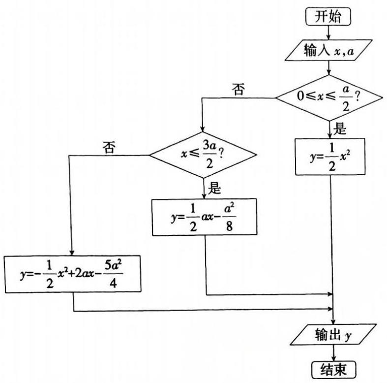

(图 1)

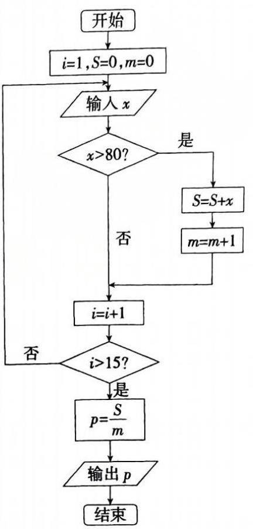

(图 2)

例 3 某次考试某班 15 名同学的数学成绩是:72,91,58,63,84,88,90,55,71,63,64,77, 82,94,60,将 80 分以上的同学的平均分求出,画出其程序框图.

解 程序框图如图 2 所示.

## 【训练题】

(A)

13. 如图的四个图形符号的名称从左至右依次是( )

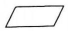

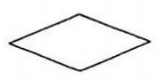

(A) 判断框, 输入框、输出框, 起止框, 处理框.

(B) 终端框, 输入框、输出框, 判断框, 执行框.

(C) 执行框, 起止框, 输入框、输出框, 判断框.

(D) 输入框、输出框, 终端框, 判断框, 处理框.

14. 给出下列关于程序框图的说法:

①任何一个程序框图都必须有起止框；②输入框只能紧跟在开始框后；③判断框是唯一具有超过一个退出点的符号. 其中说法正确的个数是( )

(A) 1. (B) 2. (C) 3. (D) 0 .

15. 已知点 $\left( {{x}_{1},{y}_{1}}\right) ,\left( {{x}_{2},{y}_{2}}\right)$ ,求过这两点的直线的斜率. 用程序框图表示解决上面问题的一个算法如图所示，其中判断框 $P$ 内应填入的条件是( )

(A) ${y}_{1} = {y}_{2}$ ? (B) ${x}_{1} = {x}_{2}$ ? (C) ${x}_{1} \neq  {x}_{2}$ ? (D) ${y}_{1} \neq  {y}_{2}$ ?

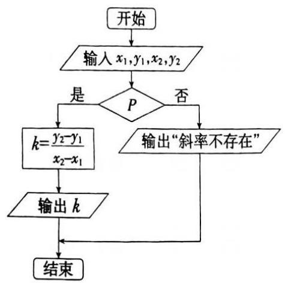

(第 15 题)

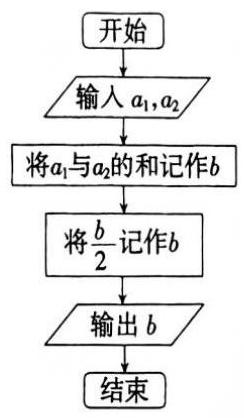

(第 17 题)

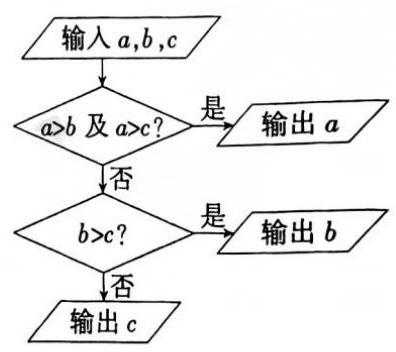

(第 18 题)

16. 程序框图中判断框的入口个数和出口个数分别是___.

17. 图中所示的是一个算法的程序框图. 若 ${a}_{1} = 3$ ，输出的 $b = 7$ ，则 ${a}_{2}$ 的值是___.

18. 如图所示的程序框图表示的算法的功能是___.

19. 已知下列算法:

第 1 步，输入 $x$ .

第 2 步，若 $x > 0$ ，则执行第 3 步；否则，执行第 6 步.

第 3 步, $y = {2x} + 1$ .

第 4 步,输出 $y$ ,算法结束.

第 5 步,若 $x = 0$ ,则执行第 7 步; 否则,执行第 10 步.

第 6 步, $y = \frac{1}{2}$ .

第 7 步,输出 $y$ ,算法结束.

第 8 步, $y =  - x$ .

第 9 步,输出 $y$ ,算法结束.

(1)指出其功能;

(2)将该算法用程序框图表示出来.

20. 求 $1 \times  3 \times  5 \times  7 \times  9 \times  {11}$ 的一个算法如下:

第 1 步, $S = 1$ .

第 2 步, $i = 3$ .

第 3 步, $S = S \times  i$ .

第 4 步, $i = i + 2$ .

第 5 步,若 $i$ 不大于 11,则转到第 3 步; 否则,输出 $T$ ,算法结束.

(1)执行框 $M, N$ 分别应该填写( )

(A) $S = S \times  i, i = i + 1$ . (B) $S = S + i, i = i + 2$ .

(C) $S = S + i, i = i + 1$ . (D) $S = S \times  i, i = i + 2$ .

(2)判断框 $K$ 应该填写( )

(A) $S > {11}$ ? (B) $i > {11}$ ? (C) $S \leq  {11}$ ? (D) $i \leq  {11}$ ?

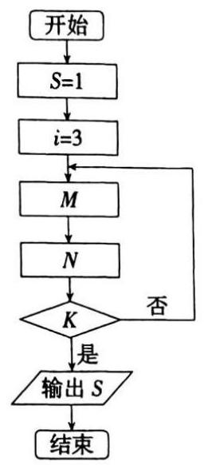

(第 21 题)

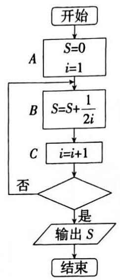

(第 21 题)

21. 如图给出的是计算 $\frac{1}{2} + \frac{1}{4} + \frac{1}{6} + \cdots  + \frac{1}{20}$ 的一个程序框图.

(1)图中， $A, B, C$ 三个执行框的作用依次是( )

(A) 赋初始值, 累加, 计数. (B) 定义变量, 累乘, 计数.

(C) 赋初始值, 计数, 累加. (D) 定义变量, 计数, 累加.

(2)图中，判断框内应填入的条件是___.

22. 计算 $1 + \frac{1}{3} + \frac{1}{5} + \cdots  + \frac{1}{29}$ 的值的一个程序框图如图所示,其中判断框内应填入的条件是 ( )

(A) $i > {29}$ ? (B) $i < {29}$ ? (C) $i > {15}$ ? (D) $i < {15}$ ?

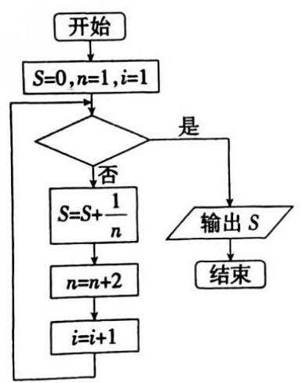

(第 22 题)

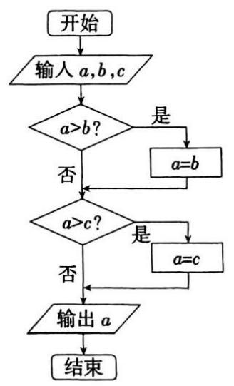

(第 23 题)

23. 该程序框图的功能是( )

(A) 输出 $a, b, c$ 三个数中的最大数. (B) 输出 $a, b, c$ 三个数中的最小数.

(C) 将 $a, b, c$ 按从小到大排列. (D) 将 $a, b, c$ 按从大到小排列.

## (B)

24. 如图所示的程序的输出结果为 $S = {132}$ ,则判断框中应填( )

(A) $i \geq  {10}$ ? (B) $i \geq  {11}$ ? (C) $i \leq  {11}$ ? (D) $i \geq  {12}$ ?

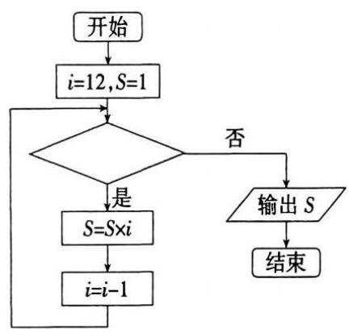

(第 24 题)

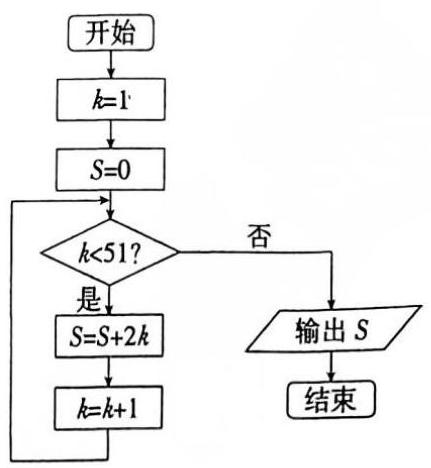

(第 25 题)

25. 如果执行如图所示的程序框图,那么输出的 $S$ 的值为( )

(A) 2 450. (B) 2 500 . (C) 2550 . (D) 2652 .

26. 阅读如图所示的程序框图，若输入的 $n$ 是 100，则输出的变量 $S$ 和 $T$ 的值依次是( ) (A)2500,2500. (B)2550,2550. (C)2500,2500. (D)2550,2500.

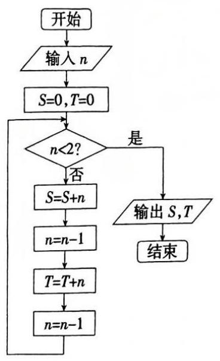

(第 26 题)

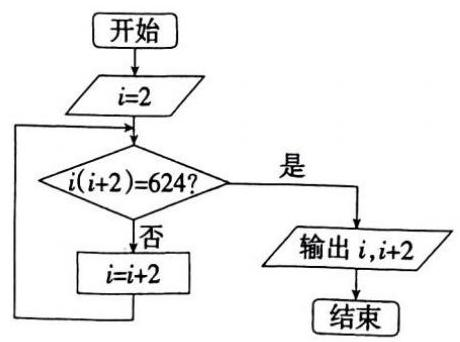

(第 27 题)

27. 如图的算法的功能是___，输出结果是___.

28. 如图的程序框图中，当箭头 $a$ 指向①处时，输出 $S =$ ___；当箭头 $a$ 指向②处时，输出 $S =$ ___.

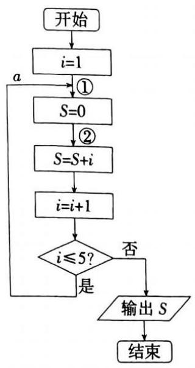

(第 28 题)

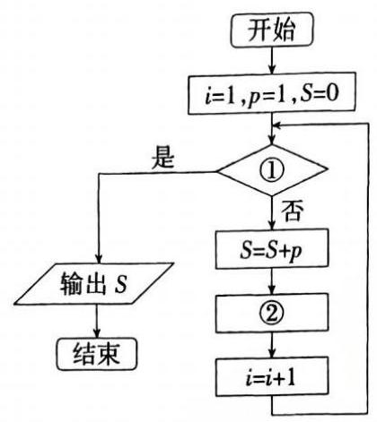

(第 29 题)

29. 给出下列 30 个数: $1,2,4,7,\cdots$ ,其规律是: 第 1 个数是 1,第 2 个数比第 1 个数大 1,第 3 个数比第 2 个数大 2,第 4 个数比第 3 个数大 3,依此类推. 要计算这 30 个数的和,现已给出了该问题算法的程序框图，请在图中的判断框①处和执行框②处填上合适的语句，使之能完成该算法功能:①处___；②处___。

30. 将 316 分解成两个正整数之和，其中一个数能被 11 整除，另一个能被 13 整除. 求满足条件的一组解的一个算法如下:

第 1 步, $x = 1$ .

第 2 步, $x = x + 1$ .

第 3 步, $y = {316} - x$ .

第 4 步,若 $x$ 能被 11 整除,且 $y$ 能被 13 整除,则转到第 5 步; 否则,转到第 2 步.

第 5 步,输出 $x, y$ ,算法结束.

请根据此算法画出程序框图.

31. 请设计一个求满足条件 $1 + 2 + 3 + \cdots  + n > {2008}$ 的最小正整数 $n$ 的算法,并画出相应的程序框图.

## 三、计算机语言和算法程序

## 【典型题型和解题技巧】

本节主要学习赋值语句，输入、输出语句，条件语句和循环语句，并用其解决数学问题.

赋值语句一般格式:被赋值变量名 $=$ 由数值或已经被赋值的变量组成的表达式. 如 $k = 1, n \; = n + 1$ .

输入语句:输入变量=input(提示语)，如 x=input("x=?").

输出语句:print(%io(2)，变量 1 ，变量 2 ， . ... .)或 disp(变量 1 ，变量 2 ， . . . . . .).

条件语句:if 条件表达式 then

语句组 A

end

或者:if 条件表达式 then

语句组 A

else

语句组 B

end

循环语句:while 条件表达式

循环体

end

也可采用:for 循环变量 $=$ 初值:步长:终值

循环体

end

例 1 若三角形的边长分别为 $a, b, c$ ,利用公式 $S = \sqrt{p\left( {p - a}\right) \left( {p - b}\right) \left( {p - c}\right) }$ [其中 $p = \; \frac{1}{2}\left( {a + b + c}\right) \rbrack$ 求该三角形的面积,试用输入、输出语句表示计算面积的一个算法.

---

解 $a =$ input $\left( {\text{ “ }a = \text{ ?” }}\right)$

$$
b = \text{ input }\left( {\text{ “ }b = \text{ ?” }}\right)
$$

$$
c = \text{ input }\left( {\text{ “ }c = \text{ ?” }}\right)
$$

$$
p = \left( {a + b + c}\right) /2
$$

$$
x = p - a
$$

$$
y = p - b
$$

$$
z = p - c
$$

$$
S = \operatorname{SQR}\left( {p * x * y * z}\right)
$$

$$
\text{ print }\left( {\% \text{ io }\left( 2\right) , S}\right)
$$

例 2 求 $a, b, c$ 三个数中最大的数,写出解决该问题的程序.

解 $a =$ input $\left( {\text{ “ }a = \text{ ?” }}\right)$

	$b =$ input $\left( {\text{ “ }b = \text{ ?” }}\right)$

	$c =$ input $\left( {\text{ “ }c = \text{ ?” }}\right)$

	if $a > b$ and $a > c$ then

	print(%io(2), a)

	else

	if $b > c$ then

	print(%io(2), $b$ )

	else

	print(%io(2), c)

	end

	end

---

例 3 青年歌手电视大赛共有 10 名选手参加, 并请了 12 名评委. 在计算每位选手的平均分时去掉一个最高分和一个最低分, 再求平均分, 试设计一个解决该问题的程序 (假定采用 10 分制, 最高得分 10 分, 最低得分 0 分).

---

解 $S = 0;k = 1;\max  = {10};\min  = 0$

	while $k <  = {12}$

	$x =$ input("x=?")

	$S = S + x$

	if $\max  <  = x$ then

	$\max  = x$

	end

	if $\min  >  = x$ then

	$\min  = x$

	end

	$k = k + 1$

	end

	${S1} = S - \max  - \min$

	$a = {S1}/{10}$

	print(%io(2), a)

注意 本题的解答采用循环结构的

while 条件表达式

	循环体

end

格式,

也可采用for 循环变量 $=$ 初值:步长:终值

				循环体

		end

格式,程序如下:

$S = 0;k = 1;\max  = {10};\min  = 0$

for $k = 1 : 1 : {12}$

$x =$ input (" $x =$ ?")

$S = S + x$

if $\max  <  = x$ then

$\max  = x$

end

if $\min  >  = x$ then

$\min  = x$

end

end

${S1} = S - \max  - \min$

$a = {S1}/{10}$

print(%io(2), $a$ )

---

## 【训练题】

(A)

32. 将两个数 $a = 8, b = 7$ 交换,使 $a = 7, b = 8$ ,使用赋值语句正确的一组是( )

(A) $a = b, b = a$ . (B) $c = b, b = a, a = c$ .

(C) $b = a, a = b$ . (D) $a = c, c = b, b = a$ .

33. 下列给出的赋值语句正确的是( )

(A) $5 = M$ . (B) $x =  - x$ . (C) $B = A = 3$ . (D) $x + y = 0$ .

34. 给出下列赋值语句:

①可以给变量提供初值；②将表达式的值赋给变量；③可以给一个变量重复赋值；④不能给同一个变量重复赋值.

其中正确的是( )

(A) ①②③. (B) ①②. (C) ②③④. (D) ①②④.

35. 给出下列程序:

$a =$ input("a = ?");

$b =$ input("b = ?");

print(%io(2), a+b),

$b = a + b$

$a = b + a$

print(%io(2), $a + b$ )

输入 1,2 后的结果是( )

(A) 3 6. (B) 3 7. (C) 3 4. (D) 3 10.

36. 按如图所示的程序运行后输出的结果是( )

(A)3456. (B)456. (C) 5 6. (D) 6 .

$a = 5$

if $a <  = 3$ then

print(%io(2),3)

end

if $a <  = 4$ then

$i = 1$

print(%io(2), 4)

$S = 0$

end

if $a <  = 5$ then while___

$S = S + x$

print(%io(2),5) $x =$ input (“ $x =$ ?”)

end

if $a <  = 6$ then $i = i + 1$

print(%io(2), 6) end

end

$a = S/{20}$

end print(%io(2), a)

(第 36 题) (第 38 题)

37. 当 $a = 3$ 时,下列的程序段输出的结果是( )

if $a < {10}$ then

$y = 2 * a$

else

$y = a * a$

end

print(%io(2), y)

(A) 9 . (B) 3 . (C) 10. (D) 6 .

38. 上页图中是一个求 20 个数的平均数的程序, 则在横线上应填入的语句为( )

(A) $i > {20}$ . (B) $i < {20}$ . (C) $i >  = {20}$ . (D) $i <  = {20}$ .

39. 甲程序: 乙程序:

$i = 1 \; i = {1000}$

$S = 0 \; S = 0$

while $i <  = {1000}$ for $i = {1000} :  - 1 : 1$

$S = S + i \; S = S + i$

$i = i + 1$ end

end print(%io(2), $S$ )

print(%io(2), S)

对甲、乙两个程序和输出结果判断正确的是( )

(A) 程序不同，结果不同. (B) 程序不同, 结果相同.

(C) 程序相同, 结果不同. (D) 程序相同, 结果相同.

40. 在第 39 题条件下,假定能将甲、乙两个程序“定格”在 $i = {500}$ ,即能输出 $i = {500}$ 时的一个值,则输出的结果( )

(A) 甲大, 乙小. (B) 甲、乙相同. (C) 甲小, 乙大. (D) 大小不能判断.

41. 读图中的程序，可知 $n$ 输出的值应该是( )

(A) 1 . (B) 3 . (C) 5 . (D) 1 或 5 .

$j = 1$

$n = 0$

while $j <  = {11}$

$j = j + 1 \; a = 0 \; S = 1$

if $j{\;\operatorname{mod}\;4} = 0$ then $j = 1 \; i = 1$

$n = n + 1$ while $j <  = 5$ while $i <  = {10}$

end $a = \left( {a + j}\right) {\;\operatorname{mod}\;5} \; S = 3 * S$

$j = j + 1 \; j = j + 1 \; i = i + 1$

end end end

print(%io(2), n) print(%io(2), a) print(%io(2), S)

(第 41 题) (第 42 题) (第 43 题)

42. 如图所示的程序运行后输出的结果为( )

(A) 50 . (B) 5 . (C) 25. (D) 0 .

43. 如图所示的程序用来( )

(A) 计算 $3 \times  {10}$ 的值. (B) 计算 ${3}^{9}$ 的值.

(C) 计算 ${3}^{10}$ 的值. (D) 计算 $1 \times  2 \times  3 \times  \cdots  \times  {10}$ 的值.

44. 计算机执行下面的程序后，输出的结果是___.

$a = 3$

$b = 2$

$c = 5$

$a = a + b$

$b = b - a$

$c = c/a * b$

print(%io(2), $c$ )

45. 计算机执行下面的程序后，输出的结果是___.

$a = 2$

$b = 3$

$c = 4$

$a = b$

$b = c + 2$

$c = b + 4$

$d = \left( {a + b + c}\right) /3$

$\operatorname{disp}\left( {a, b, c, d}\right)$

46. 计算机执行下面的程序后，输出的结果是___.

$x = 5$

$y =  - {20}$

if $x < 0$ then

$x = y - 3$

else

$y = y + 3$

end

print(%io(2), $x - y, y - x$ )

disp("end")

47. 给出下列程序:

$x =$ input (“ $x =$ ?”)

if $1 < x\& x < {20}$ then

$a = x/3$

$b = x{\;\operatorname{mod}\;3}$

$x = 3 * b + a$

print(%io(2), $x$ )

end

若输入 $x$ 的值是 17,

则输出的结果是___.

48. 求 $1 \times  2 + 2 \times  3 + 3 \times  4 + \cdots  + {99} \times  {100}$ 的和,将下列程序补充完整.

$S = 0$

$i = 1$

while___

__________

__________

end

print(%io(2), S)

49. 阅读下列程序:

$x =$ input("x=?")

$i = 1$

$a = x$

while $i <  = 4$

$x = a * \left( {x + 1}\right)$

$i = i + 1$

end

print(%io(2), "f(x)="; x)

该程序计算的多项式是___.(B)

50. 根据如图所示的程序框图, 写出程序.

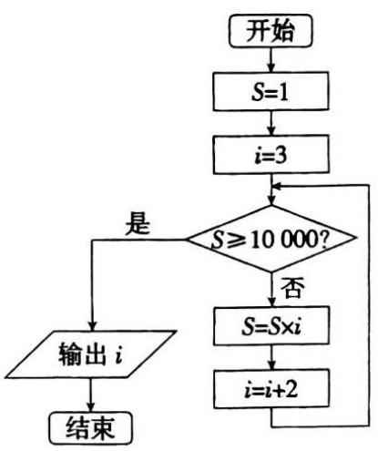

(第 50 题)

51. 编写一个计算 $1 + 2 + {2}^{2} + {2}^{3} + \cdots  + {2}^{63}$ 的程序.

52. 意大利数学家菲波那契提出了这样的一个问题: 一对兔子饲养到第二个月进入成年，第三个月生一对小兔，以后每个月生一对小兔, 所生小兔能全部存活并且也是第二个月成年, 第三个月生一对小兔, 以后每月生一对小兔. 问: 这样下去到年底应有多少对兔子? 试画出解决此问题的程序框图, 并编写相应的程序.

53. 所谓水仙花数是一个三位数, 它的各位数字的立方和等于该数. 例如 153 是一个水仙花数,因为 ${153} = {1}^{3} + {5}^{3} + {3}^{3}$ . 试编一个程序，找出 100 ~999 中所有的水仙花数.

54. 写出用二分法求方程 ${x}^{3} - x - 1 = 0$ 在区间 $\left\lbrack  {1,{1.5}}\right\rbrack$ 上的一个解的算法 (误差不超过 0.001 ), 并画出相应的程序框图及程序.

55. 我国古代数学家张邱建编的《张邱建算经》中记有这样一个有趣的数学问题:“今有鸡翁一，值钱五；鸡母一，值钱三；鸡雏三，值钱一. 凡百钱，买鸡百只，问鸡翁、母、雏各几何？”你能用程序解决这个问题吗?

## 第四章 直线

## 一、有向线段、定比分点

## 【典型题型和解题技巧】

1. 两点距离公式的应用.

两点 $P\left( {{x}_{1},{y}_{1}}\right) , Q\left( {{x}_{2},{y}_{2}}\right)$ 的距离是 $\left| {PQ}\right|  = \sqrt{{\left( {x}_{2} - {x}_{1}\right) }^{2} + {\left( {y}_{2} - {y}_{1}\right) }^{2}}$ .

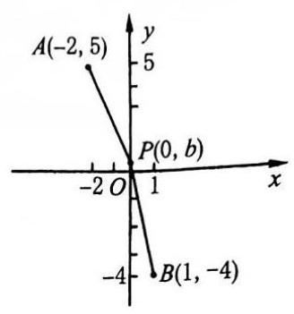

(图 1)

特别地,点 $P\left( {x, y}\right)$ 和原点 $O\left( {0,0}\right)$ 的距离是 $\left| {PO}\right|  = \sqrt{{x}^{2} + {y}^{2}}$ .

例 1 如图 1,在 $y$ 轴上求一点 $P$ ,使得点 $P$ 和点 $A\left( {-2,5}\right)$ , $B\left( {1, - 4}\right)$ 等距离.

解 设点 $P$ 的坐标为 $\left( {0, b}\right)$ ,则 $\sqrt{4 + {\left( b - 5\right) }^{2}} = \sqrt{1 + {\left( b + 4\right) }^{2}}$ ,

平方得 ${b}^{2} - {10b} + {29} = {b}^{2} + {8b} + {17}$ ,即 ${18b} = {12},\therefore b = \frac{2}{3}$ .

故点 $P$ 的坐标为 $P\left( {0,\frac{2}{3}}\right)$ .

例 2 已知 $f\left( x\right)  = \sqrt{1 + {x}^{2}}$ ,求证: $\left| {f\left( a\right)  - f\left( b\right) }\right|  \leq  \left| {a - b}\right|$ .

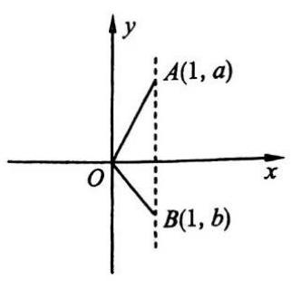

(图 2)

证明 如图 2,设点 $A, B$ 的坐标依次为 $\left( {1, a}\right) ,\left( {1, b}\right)$ ,则

$f\left( a\right)  = \sqrt{1 + {a}^{2}} = \left| {AO}\right| , f\left( b\right)  = \sqrt{1 + {b}^{2}} = \left| {BO}\right| ,\left| {a - b}\right|  = \left| {AB}\right| .$

当 $a \neq  b$ 时,在 $\bigtriangleup {AOB}$ 中,由 $\left| \right| {AO}\left| -\right| {BO}\left| \right|  < \left| {AB}\right|$ ,即得 $\left| {f\left( a\right)  - f\left( b\right) }\right|  < \left| {a - b}\right| .$

当 $a = b$ 时, $\left| {OA}\right|  = \left| {OB}\right| ,\left| {a - b}\right|  = 0$ ,

故有 $\left| {f\left( a\right)  - f\left( b\right) }\right|  = \left| {a - b}\right|$ .

综上所述,便得 $\left| {f\left( a\right)  - f\left( b\right) }\right|  \leq  \left| {a - b}\right|$ .

2. 定点分比的应用.

在应用有向线段的定比分点时, 应该注意两点:

(1) 公式的“逆用”.

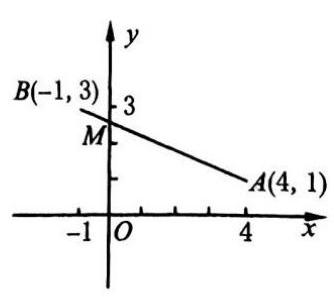

(图 3)

例 3 如图 3,已知两点 $A\left( {4,1}\right)$ 和 $B\left( {-1,3}\right)$ ,求线段 ${AB}$ 和 $y$ 轴交点 $M$ 的坐标.

解 设点 $M$ 坐标为 $\left( {0,{y}_{0}}\right)$ ,且 $\frac{AM}{MB} = \lambda$ ,则由定比分点公式得

$0 = \frac{4 + \lambda \left( {-1}\right) }{1 + \lambda },\;\therefore \lambda  = 4,$

于是 ${y}_{0} = \frac{1 + 4 \times  3}{1 + 4} = \frac{13}{5}$ ,即点 $M$ 的坐标是 $M\left( {0,\frac{13}{5}}\right)$ .

(2)注意利用平面几何知识.

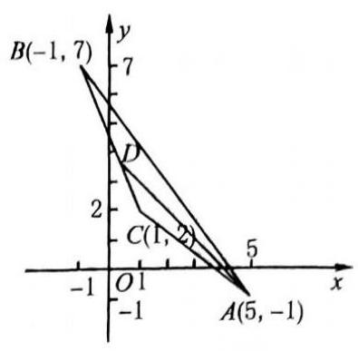

(图 4)

例 4 如图 4,已知 $A\left( {5, - 1}\right) , B\left( {-1,7}\right) , C\left( {1,2}\right)$ ,求 $\bigtriangleup {ABC}$ 中 $\angle A$ 的平分线 ${AD}$ 的长.

解 $\because \left| {AB}\right|  = \sqrt{{\left( 1 + 5\right) }^{2} + {\left( 7 + 1\right) }^{2}} = {10}$ ,

$\left| {AC}\right|  = \sqrt{{\left( 5 - 1\right) }^{2} + {\left( 2 + 1\right) }^{2}} = 5.$

则由 $\lambda  = \frac{\left| BD\right| }{\left| CD\right| } = \frac{\left| AB\right| }{\left| AC\right| } = 2$ ,

设点 $D\left( {{x}_{0},{y}_{0}}\right)$ ,则 ${x}_{0} = \frac{-1 + 2 \times  1}{1 + 2} = \frac{1}{3},{y}_{0} = \frac{7 + 2 \times  2}{1 + 2} = \frac{11}{3}$ ,

即 $D\left( {\frac{1}{3},\frac{11}{3}}\right)$ ,于是 $\left| {AD}\right|  = \sqrt{{\left( 5 - \frac{1}{3}\right) }^{2} + {\left( -1 - \frac{11}{3}\right) }^{2}} = \frac{14}{3}\sqrt{2}$ .

注意 本例运用了三角形角平分线的性质: 若 ${AD}$ 是 $\bigtriangleup {ABC}$ 的内角平分线,则 $\left| {AB}\right|$ : $\left| {AC}\right|  = \left| {BD}\right|  : \left| {CD}\right|$ (你会证明吗?). 在学习解析几何时,要尽可能地发掘出所给图形的几何性质, 简化解题.

## 【训练题】

(A)

1. 已知两点 $A\left( {\cos \alpha ,\sin \alpha }\right)$ 和 $B\left( {\cos {2\alpha },\sin {2\alpha }}\right)$ ,则 ${AB}$ 的长为 ( )

(A) $2\sin \frac{\alpha }{2}$ . (B) $2\left| {\sin \frac{\alpha }{2}}\right|$ . (C) $2\cos \frac{\alpha }{2}$ . (D) $2\left| {\cos \frac{\alpha }{2}}\right|$ .

2. 若 $x$ 轴上的点 $M$ 到原点及点 $\left( {5, - 3}\right)$ 的距离相等，则点 $M$ 的坐标是 ( )

(A) $\left( {-2,0}\right)$ . (B) $\left( {1,0}\right)$ . (C) $\left( {{1.5},0}\right)$ . (D) $\left( {{3.4},0}\right)$ .

3. 已知两点 $P\left( {\cos \alpha ,\sin \alpha }\right) , Q\left( {\cos \beta ,\sin \beta }\right)$ ,则 $\left| {PQ}\right|$ 的最大值是 ( )

(A) $\sqrt{2}$ . (B) 2. (C) 4. (D) 不存在.

4. 若点 $P$ 分有向线段 $\overrightarrow{{P}_{1}{P}_{2}}$ 的比 $\lambda  = \frac{{P}_{1}P}{P{P}_{2}}$ ,则下列结论中,正确的是(   )

(A) $\lambda$ 恒大于零.

(B) 若 $\lambda  < 0$ 且 $\lambda  \neq   - 1$ ,则点 $P$ 必在 ${P}_{1}{P}_{2}$ 的延长线上.

(C) 若 $\lambda  =  - 1$ ,则点 $P$ 与 ${P}_{2}$ 重合.

(D) 若 $\lambda  = 0$ ,则点 $P$ 与 ${P}_{1}$ 重合.

5. 若点 $P$ 分有向线段 $\overrightarrow{AB}$ 的比为 $\frac{1}{3}$ ，则点 $B$ 分有向线段 $\overrightarrow{AP}$ 的比为( )

(A) $\frac{4}{3}$ . (B) $\frac{3}{4}$ . (C) $- \frac{4}{3}$ . (D) $- \frac{3}{4}$ .

6. 已知两点 $A\left( {m, - n}\right) , B\left( {-m, n}\right)$ ,又点 $C$ 分 $\overrightarrow{AB}$ 的比为 -2,那么点 $C$ 的坐标为 ( )

(A) $\left( {-{3m},{3n}}\right)$ . (B) $\left( {m, n}\right)$ . (C) $\left( {{3m},{3n}}\right)$ . (D) $\left( {-m, n}\right)$ .

7. 已知两点 $P\left( {-1, - 6}\right)$ 和 $Q\left( {3,0}\right)$ ,延长 ${QP}$ 到点 $A$ ,使 $\left| {AP}\right|  = \frac{1}{3}\left| {PQ}\right|$ ,那么点 $A$ 的坐标为 ( )

(A) $\left( {-\frac{7}{3}, - 8}\right)$ . (B) $\left( {0,\frac{9}{2}}\right)$ . (C) $\left( {\frac{2}{3}, - 2}\right)$ . (D) $\left( {-\frac{2}{3},2}\right)$ .

8. 已知点 $P\left( {4, - 9}\right)$ 与点 $Q\left( {-2,3}\right)$ ,则 $y$ 轴与直线 ${PQ}$ 的交点分有向线段 $\overrightarrow{PQ}$ 所成的比为 ( )

(A) $\frac{1}{3}$ . (B) $\frac{1}{2}$ . (C) 2. (D) 3 .

9. 直线上有 $A, B, C$ 三点,如果 $B$ 分有向线段 $\overrightarrow{AC}$ 的比为 $- \frac{1}{2}$ ,则(   )

(A) $B$ 是线段 ${AC}$ 的中点. (B) $A$ 是线段 ${BC}$ 的中点.

(C) $C$ 是线段 ${AB}$ 的中点. (D) $B$ 是线段 ${AC}$ 的三等分点.

10. 在 $\bigtriangleup  {ABC}$ 中，已知 $A\left( {2,3}\right)$ ， $B\left( {8, - 4}\right)$ ，重心 $G\left( {2, - 1}\right)$ (三角形三条中线的交点称为三角形的重心，且重心分中线所成两线段的比为1:2)，则点 $C$ 的坐标为( )

(A) $\left( {-4,2}\right)$ . (B) $\left( {-4, - 2}\right)$ . (C) $\left( {4, - 2}\right)$ . (D) $\left( {4,2}\right)$ .

11. ( 1 )已知两点 $A\left( {1,5}\right)$ 和 $B\left( {x,2}\right)$ 的距离为 5，则点 $B$ 的横坐标是___；

(2)若点 $M$ 在 $y$ 轴上，且与点 $\left( {-4, - 1}\right) ,\left( {2,3}\right)$ 等距离，则点 $M$ 的坐标是___；

(3)若点 $Q$ 与点 ${P}_{1}\left( {0,1}\right) ,{P}_{2}\left( {7,2}\right)$ 及 $x$ 轴等距离，则点 $Q$ 的坐标是___.

12.(1)若点 $P\left( {x,1}\right)$ 在 $A\left( {2, - 4}\right)$ ， $B\left( {5,{11}}\right)$ 这两点的连线上，则 $x =$ ___；

(2)连结 $A\left( {4,1}\right)$ 和 $B\left( {-2,4}\right)$ 两点的直线，和 $x$ 轴交点的坐标是___，和 $y$ 轴交点的坐标是___；

(3)已知点 ${P}_{1},{P}_{2},{P}_{3}$ 共线，且 $\frac{{P}_{1}{P}_{3}}{{P}_{3}{P}_{2}} =  - \frac{2}{3}$ ，则 $\frac{{P}_{1}{P}_{2}}{{P}_{3}{P}_{1}} =$ ___；

(4)已知 $A\left( {4,2}\right) , B\left( {-6, - 4}\right) , C\left( {x, - 2\frac{4}{5}}\right)$ 三点共线，则点 $C$ 分有向线段 $\overrightarrow{AB}$ 的比 $\lambda  =$ ___， $x =$ ___；

(5)已知点 $A\left( {3, - 4}\right)$ 与 $B\left( {-1,2}\right)$ ，点 $P$ 在直线 ${AB}$ 上，且 $\left| {PA}\right|  = 2\left| {PB}\right|$ ，则点 $P$ 的坐标是___；

(6)已知点 $P$ 分有向线段 $\overrightarrow{{P}_{1}{P}_{2}}$ 的比为 $\lambda$ .

①若 $P$ 在线段 ${P}_{1}{P}_{2}$ 内，则 $\lambda  \in$ ___，

②若 $P$ 在线段 ${P}_{1}{P}_{2}$ 的延长线上，则 $\lambda  \in$ ___，

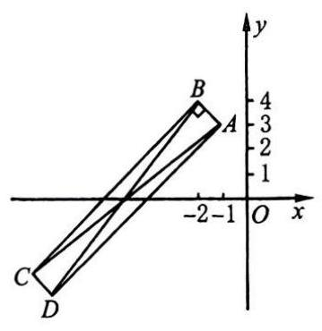

(第 14(2)题)

③若 $P$ 在线段 ${P}_{2}{P}_{1}$ 的延长线上，则 $\lambda  \in$ ___.

13. ( 1 )已知同一直线上三点 $A\left( {x,5}\right)$ ， $B\left( {-2, y}\right)$ ， $C\left( {1,1}\right)$ 满足 $\left| {BC}\right|  = 2\left| {AC}\right|$ ,求 $x, y$ 的值;

(2)在 $\bigtriangleup  {ABC}$ 中，已知顶点 $A$ 的坐标为 $\left( {3,1}\right)$ ， ${AB}$ 的中点为 $D\left( {2,4}\right) ,\bigtriangleup {ABC}$ 的重心为 $G\left( {3,4}\right)$ ,求顶点 $B, C$ 的坐标.

14.(1)在等腰直角 $\bigtriangleup  {ABC}$ 中，已知 $\angle {ABC} = {90}^{ \circ  }$ ，顶点 $A\left( {1,0}\right)$ ， $B\left( {3,1}\right)$ ，求顶点 $C$ 的坐标；

(2)在矩形 ${ABCD}$ 中，已知顶点 $A\left( {-1,3}\right)$ ， $B\left( {-2,4}\right)$ ，其对角线的交点在 $x$ 轴上 (如图),求顶点 $C$ ， $D$ 的坐标.

(B)

15. 以 $E\left( {3, - 5}\right) , F\left( {2,2}\right) , G\left( {-5,1}\right)$ 为顶点的三角形的外心坐标是( )

(A) $\left( {0,0}\right)$ . (B) $\left( {-1,0}\right)$ . (C) $\left( {-1, - 2}\right)$ . (D) $\left( {2, - 1}\right)$ .

16. 已知一个平行四边形的三个顶点是 $\left( {4,2}\right) ,\left( {5,7}\right) ,\left( {-3,4}\right)$ ,则第四个顶点不可能是( )

(A) $\left( {{12},5}\right)$ . (B) $\left( {-2,9}\right)$ . (C) $\left( {-4, - 1}\right)$ . (D) $\left( {3,7}\right)$ .

17. 已知两点 $A\left( {{x}_{1},{y}_{1}}\right) , B\left( {{x}_{2},{y}_{2}}\right) , P$ 是直线 ${AB}$ 上一点,且 $\frac{AP}{AB} = \lambda$ ,则点 $P$ 的坐标为 ( )

(A) $\left( {\frac{{x}_{1} + \lambda {x}_{2}}{1 + \lambda },\frac{{y}_{1} + \lambda {y}_{2}}{1 + \lambda }}\right)$ . (B) $\left( {\frac{{x}_{2} + \lambda {x}_{1}}{1 + \lambda },\frac{{y}_{2} + \lambda {y}_{1}}{1 + \lambda }}\right)$ .

(C) $\left( {\lambda {x}_{1} + \left( {1 - \lambda }\right) {x}_{2},\lambda {y}_{1} + \left( {1 - \lambda }\right) {y}_{2}}\right)$ . (D) $\left( {\lambda {x}_{2} + \left( {1 - \lambda }\right) {x}_{1},\lambda {y}_{2} + \left( {1 - \lambda }\right) {y}_{1}}\right)$ .

18. 连结直角三角形的直角顶点和斜边的两个三等分点,所得两条线段的长分别是 $\sin \alpha$ 和 $\cos \alpha \left( {0 < \alpha  < \frac{\pi }{2}}\right)$ ,则斜边的长为 ( )

(A) $\frac{4}{3}$ . (B) $\frac{3}{\sqrt{5}}$ . (C) $\frac{2}{\sqrt{5}}$ . (D) $\sqrt{5}$ .

19. ( 1 )已知点 $A\left( {3,4}\right)$ ， $B\left( {1,2}\right)$ ，直线 ${AB}$ 上的点 $P$ 满足 $\left| \frac{AP}{AB}\right|  = \frac{1}{3}$ ，则点 $P$ 的坐标为 ___；

(2)已知 $A\left( {-1,2}\right)$ ， $B\left( {1,1}\right)$ ， $C\left( {-1, - 1}\right)$ 是 $\bigtriangleup  {ABC}$ 的三个顶点，延长 ${AB}$ 至 $P$ ，使 $B$ 为 ${AP}$ 的中点，延长 ${CP}$ 至 $Q$ ，使 $P$ 为 ${CQ}$ 的中点，则点 $Q$ 的坐标为___；

(3)已知 $\bigtriangleup  {ABC}$ 的三边的中点分别为 $\left( {2, - 1}\right)$ ， $\left( {-1,4}\right)$ ， $\left( {-2,2}\right)$ ，则 $\bigtriangleup  {ABC}$ 的重心坐标为___.

20. ( 1 )已知 $\bigtriangleup  {ABC}$ 的三个顶点是 $A\left( {4,1}\right)$ ， $B\left( {7,5}\right)$ 和 $C\left( {{-4},7}\right)$ ，求此三角形的内角 $\angle {BAC}$ 的平分线的长;

(2)已知 $\bigtriangleup  {ABC}$ 的三边长 ${BC} = a,{CA} = b,{AB} = c$ ，又三顶点是 $A\left( {{x}_{1},{y}_{1}}\right)$ ， $B\left( {{x}_{2},{y}_{2}}\right)$ ， $C\left( {{x}_{3},{y}_{3}}\right)$ ,求 $\bigtriangleup {ABC}$ 内心的坐标.

## 二、直线的方程

## (一) 点斜式和斜截式

## 【典型题型和解题技巧】

1. 直线斜率的求法.

一般地说，求直线斜率有三种方法:

(1)利用定义 $k = \tan \alpha$ .

当已知直线的倾斜角为 $\alpha \left( {\alpha  \neq  \frac{\pi }{2}}\right)$ 时，可直接利用定义求直线的斜率，即 $k = \tan \alpha$ .

(2)利用“两点式”.

如果直线过两点 $A\left( {{x}_{1},{y}_{1}}\right) , B\left( {{x}_{2},{y}_{2}}\right) \left( {{x}_{1} \neq  {x}_{2}}\right)$ ,那么可利用公式 $k = \frac{{y}_{2} - {y}_{1}}{{x}_{2} - {x}_{1}}$ 来求直线的斜率.

(3)利用直线的“斜截式”方程.

如果直线 $l$ 的方程以一般式给出,即 ${ax} + {by} + c = 0\left( {b \neq  0}\right)$ ,那么将 $l$ 的方程化为斜截式, 即 $y =  - \frac{a}{b}x - \frac{c}{b}$ ,就可以得到直线 $l$ 的斜率为 $- \frac{a}{b}$ .

例 1 已知直线 $l$ 过点 $P\left( {2,1}\right)$ ，且与两轴围成等腰直角三角形，求直线 $l$ 的方程.

解 如图 5,此时直线 $l$ 的倾斜角为 $\frac{\pi }{4}$ 或 $\frac{3\pi }{4}, l$ 的斜率为 ${k}_{1} = \tan \frac{\pi }{4} = 1,{k}_{2} = \tan \frac{3\pi }{4} =  - 1$ , 故直线 $l$ 的方程为 $y - 1 = 1 \cdot  \left( {x - 2}\right)$ 或 $y - 1 =  - 1 \cdot  \left( {x - 2}\right)$ , 即 $x - y - 1 = 0$ 或 $x + y - 3 = 0$ .

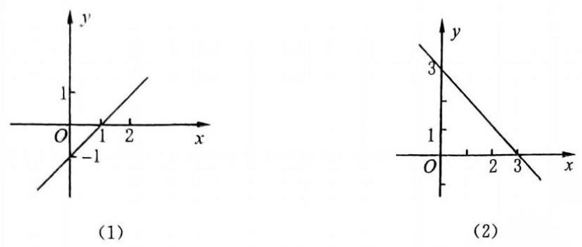

(图 5)

例 2 已知直线 $l$ 的方程为 $x\sin \theta  - \sqrt{3}y + 2 = 0$ ，当 $\theta$ 在实数范围内变动时，求 $l$ 的倾斜角的取值范围.

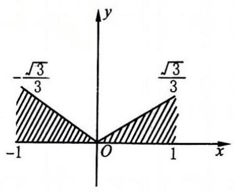

(图 6)

解 由已知得 $y = \frac{\sin \theta }{\sqrt{3}}x + \frac{2}{\sqrt{3}}$ .

设直线 $l$ 的倾斜角为 $\alpha$ ,则 $\tan \alpha  = \frac{\sin \theta }{\sqrt{3}} \in  \left\lbrack  {-\frac{\sqrt{3}}{3},\frac{\sqrt{3}}{3}}\right\rbrack$ .

如图 6,易知倾斜角 $\alpha$ 的取值范围是 $\left\lbrack  {0,\frac{\pi }{6}}\right\rbrack   \cup  \left\lbrack  {\frac{5\pi }{6},\pi }\right)$ .

注意 (1) 所有的直线都有倾斜角, 倾斜角的取值范围是 $\lbrack 0,\pi )$ .

(2)并非所有的直线都有斜率，与 $x$ 轴垂直的直线就不存在斜率.

2. 参数“ $k$ ”.

在直线的“点斜式”方程和“斜截式”方程中，都有直线的斜率 $k$ ，为了求直线的方程，常常需要确定它的斜率，此时，我们可以把 $k$ 作为未知数引入待定.

例 3 直线 $l$ 过定点 $A\left( {-2,3}\right)$ ，且与两坐标轴围成的三角形面积为 4 ，求直线 $l$ 的方程.

解 显然, $l$ 不与两坐标轴垂直,设直线 $l$ 的方程为 $y - 3 = k\left( {x + 2}\right)$ .

令 $x = 0$ ,得 $y = {2k} + 3$ ,令 $y = 0$ ,得 $x =  - \frac{3}{k} - 2$ ,

于是直线 $l$ 在两轴上的截距分别为 $- \frac{3}{k} - 2$ 和 ${2k} + 3$ .

根据题意,得 $\frac{1}{2}\left| {\left( {{2k} + 3}\right) \left( {-\frac{3}{k} - 2}\right) }\right|  = 4$ ,即 $\left( {{2k} + 3}\right) \left( {\frac{3}{k} + 2}\right)  =  \pm  8$ .

若 $\left( {{2k} + 3}\right) \left( {\frac{3}{k} + 2}\right)  = 8$ ,化简得 $4{k}^{2} + {4k} + 9 = 0$ ,故 $k \in  \mathcal{D}$ ;

若 $\left( {{2k} + 3}\right) \left( {\frac{3}{k} + 2}\right)  =  - 8$ ,化简得 $4{k}^{2} + {20k} + 9 = 0$ ,故 ${k}_{1} =  - \frac{1}{2},{k}_{2} =  - \frac{9}{2}$ ,

所求直线 $l$ 的方程为 $x + {2y} - 4 = 0$ 和 ${9x} + {2y} + {12} = 0$ .

## 【训练题】

(A)

21. 过点 $P\left( {2,3}\right)$ 与 $Q\left( {1,5}\right)$ 的直线 ${PQ}$ 的倾斜角为( )

(A) arctan 2. (B) $\arctan \left( {-2}\right)$ . (C) $\frac{\pi }{2} + \arctan 2$ . (D) $\pi  - \arctan 2$ .

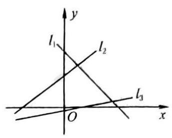

(第 22 题)

22. 若图中的直线 ${l}_{1},{l}_{2},{l}_{3}$ 的斜率分别为 ${k}_{1},{k}_{2},{k}_{3}$ ,则有(   )

(A) ${k}_{1} < {k}_{2} < {k}_{3}$ . (B) ${k}_{3} < {k}_{1} < {k}_{2}$ .

(C) ${k}_{3} < {k}_{2} < {k}_{1}$ . (D) ${k}_{1} < {k}_{3} < {k}_{2}$ .

23. 若直线 $l$ 的倾斜角是连结 $\left( {3, - 5}\right) ,\left( {0, - 9}\right)$ 两点的直线倾斜角的 2 倍,则 $l$ 的斜率是 ( )

(A) $\frac{24}{25}$ . (B) $\frac{8}{3}$ .

(C) $- \frac{7}{25}$ . (D) $- \frac{24}{7}$ .

24. 若三点 $A\left( {3,1}\right) , B\left( {-2, b}\right) , C\left( {8,{11}}\right)$ 在同一条直线上,则实数 $b$ 等于( )

(A) 2 . (B) 3 . (C) 9. (D) -9 .

25. 直线 ${ax} + {by} = {ab}\left( {a > 0, b < 0}\right)$ 的倾斜角是( )

(A) $\arctan \left( {-\frac{a}{b}}\right)$ . (B) $\arctan \frac{a}{b}$ .

(C) $\pi  - \arctan \frac{a}{b}$ . (D) $\frac{\pi }{2} + \arctan \frac{a}{b}$ .

26. 过点 $\left( {1,2}\right)$ ，且与原点距离最大的直线方程是( )

(A) $x + {2y} - 5 = 0$ . (B) ${2x} + y - 4 = 0$ .

(C) $x + {3y} - 7 = 0$ . (D) $x - {2y} + 3 = 0$ .

27. (1)过点 $A\left( {-1,2}\right)$ 且倾斜角的正弦值为 $\frac{3}{5}$ 的直线方程是___；

(2)已知点 $P\left( {6, a}\right)$ 在过两点 $A\left( {-1,3}\right) , B\left( {5, - 2}\right)$ 的直线上，则 $a$ 的值等于___；

(3)过点 $\left( {2, - 1}\right)$ 且倾斜角比直线 $x - {3y} + 4 = 0$ 的倾斜角大 ${45}^{ \circ  }$ 的直线方程是___；

(4)已知点 $P\left( {2, - 4}\right)$ ， $Q\left( {0,8}\right)$ ，则线段 ${PQ}$ 的垂直平分线方程为___；

(5)已知直线 $l$ 过点 $\left( {3, - 1}\right)$ ，且与两坐标轴围成一个等腰直角三角形，则 $l$ 的方程为___. ___.

(B)

28. 已知直线 $y = \frac{1}{2}x + b$ 与 $x$ 轴、 $y$ 轴的交点分别为 $A, B$ . 如果 $\bigtriangleup {AOB}$ 的面积 ( $O$ 为原点) 小于等于 1,那么 $b$ 的取值范围是( )

(A) $b \geq   - 1$ . (B) $b \leq  1$ 且 $b \neq  0$ .

(C) $- 1 \leq  b \leq  1$ 且 $b \neq  0$ . (D) $b \leq   - 1$ 或 $b \geq  1$ .

29. 已知点 $M$ 是直线 $l : {2x} - y - 4 = 0$ 与 $x$ 轴的交点，把直线 $l$ 绕点 $M$ 逆时针方向旋转 ${45}^{ \circ  }$ ，则得到的直线方程是( )

(A) ${3x} + y - 6 = 0$ . (B) ${3x} - y + 6 = 0$ .

(C) $x + y - 2 = 0$ . (D) $x - {3y} - 2 = 0$ .

30. 已知直线 ${l}_{1}$ 的方程是 ${ax} - y + b = 0,{l}_{2}$ 的方程是 ${bx} - y - a = 0\left( {{ab} \neq  0, a \neq  b}\right)$ ,则下列各示意图形中，正确的是C___

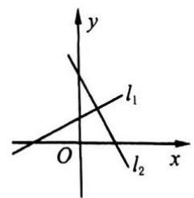

(A)

(B)

(C)

(D)

31. 过点 $\left( {0, - 2}\right)$ 的直线 $l$ 的倾斜角 $\alpha$ 满足 $\sin \frac{\alpha }{2} = \frac{1}{3}$ ,则 $l$ 的方程是( )

(A) $y =  - \frac{4\sqrt{2}}{7}x + 2$ . (B) $y =  - \frac{4\sqrt{2}}{7}x - 2$ .

(C) $y = \frac{4\sqrt{2}}{7}x + 2$ . (D) $y = \frac{4\sqrt{2}}{7}x - 2$ .

32. 若 $\theta  \in  \mathbf{R}$ ,则直线 $y = \sin \theta  \cdot  x + 1$ 的倾斜角的取值范围是( )

(A) $\left\lbrack  {0,\frac{\pi }{2}}\right\rbrack$ . (B) $\left\lbrack  {-\frac{\pi }{4},\frac{\pi }{4}}\right\rbrack$ .

(C) $\left\lbrack  {\frac{\pi }{4},\frac{3\pi }{4}}\right\rbrack$ . (D) $\left\lbrack  {0,\frac{\pi }{4}}\right\rbrack   \cup  \left\lbrack  {\frac{3\pi }{4},\pi }\right)$ .

33. 若 $- \frac{\pi }{2} < \theta  < 0$ ,则直线 $y = x\cot \theta$ 的倾斜角等于( )

(A) $- \theta$ . (B) $\frac{\pi }{2} + \theta$ . (C) $\frac{\pi }{2} - \theta$ . (D) $\pi  + \theta$ .

34. 设点 $A\left( {2, - 3}\right) , B\left( {-3, - 2}\right)$ ,直线 $l$ 过点 $P\left( {1,1}\right)$ 且与线段 ${AB}$ 相交,则 $l$ 的斜率 $k$ 的取值范围是( )

(A) $k \geq  \frac{3}{4}$ 或 $k \leq   - 4$ . (B) $k \geq  \frac{3}{4}$ 或 $k \leq   - \frac{1}{4}$ .

(C) $- 4 \leq  k \leq  \frac{3}{4}$ . (D) $- \frac{3}{4} \leq  k \leq  4$ .

35. 若直线 $y = {kx} + b$ 上两点 $P, Q$ 的横坐标分别为 ${x}_{1},{x}_{2}$ ，则 $\left| {PQ}\right|$ 为( )

(A) $\left| {{x}_{1} - {x}_{2}}\right|  \cdot  \sqrt{1 + {k}^{2}}$ . (B) $\left| {{x}_{1} - {x}_{2}}\right|  \cdot  \left| k\right|$ .

(C) $\frac{\left| {x}_{1} - {x}_{2}\right| }{\sqrt{1 + {k}^{2}}}$ . (D) $\frac{\left| {x}_{1} - {x}_{2}\right| }{\left| k\right| }$ .

36. (1)过原点引直线 $l$ ，使 $l$ 与连结 $A\left( {1,1}\right)$ 和 $B\left( {1, - 1}\right)$ 两点的线段相交，则直线 $l$ 倾斜角的取值范围是___；

(2)已知 $A\left( {-\sqrt{3}\sin \theta ,{\cos }^{2}\theta }\right) , B\left( {0,1}\right)$ 是相异的两点,则直线 ${AB}$ 倾斜角的取值范围是 ___；

(3)若直线的倾斜角 $\alpha$ 满足 $\tan \alpha  \leq  \sqrt{3}$ ，则 $\alpha$ 的取值范围是___.

37.(1)要使三点 $A\left( {2,{\cos }^{2}\theta }\right)$ ， $B\left( {{\sin }^{2}\theta , - \frac{2}{3}}\right)$ ， $C\left( {-4, - 4}\right)$ 共线，则角 $\theta$ 的值为___；

(2)若直线 $y = {ax} + 2$ 与以点 $A\left( {1,4}\right)$ 和 $B\left( {3,1}\right)$ 为端点的线段相交，则 $a$ 的取值范围是 ___；

(3)若直线 $\left( {2{a}^{2} - {7a} + 3}\right) x + \left( {{a}^{2} - 9}\right) y + 3{a}^{2} = 0$ 的倾斜角为 $\frac{\pi }{4}$ ，则实数 $a =$ ___.

38. 已知直线 $l$ 在 $x$ 轴上的截距为 -2,倾斜角 $\alpha$ 满足 $\frac{2\sin \alpha  - \cos \alpha }{5\cos \alpha  + 3\sin \alpha } = \frac{3}{11}$ ,求直线 $l$ 的方程.

39. 已知 $A\left( {0,0}\right) , B\left( {8,0}\right) , C\left( {7,6}\right)$ 是 $\bigtriangleup {ABC}$ 的三个顶点.

(1)求它的外心 $M$ 、垂心 $H$ (即三角形三条高线的交点)、重心 $G$ 的坐标；

(2)求证: $M, H, G$ 三点共线.

40. 已知三点 $A\left( {{x}_{1},{y}_{1}}\right) , B\left( {{x}_{2},{y}_{2}}\right) , C\left( {{x}_{3},{y}_{3}}\right)$ ,在坐标平面上求点 $P$ ,使 $A{P}^{2} + B{P}^{2} + C{P}^{2}$ 的值最小.

## (二)两点式和截距式

## 【典型题型和解题技巧】

1. 直线截距的求法.

求直线在 $x$ 轴、 $y$ 轴上的截距有两种方法:

(1)把直线的方程化成“截距式”，即化成 $\frac{x}{a} + \frac{y}{b} = 1\;\left( {a \neq  0, b \neq  0}\right)$ ，那么直线在 $x$ 轴、 $y$ 轴上的截距分别是 $a, b$ .

(2)在直线方程中，令 $y = 0$ ，得 $x = {x}_{0}$ ；再令 $x = 0$ ，得 $y = {y}_{0}$ . 故 ${x}_{0},{y}_{0}$ 就是直线在 $x$ 轴、 $y$ 轴上的截距.

例 1 求直线 ${3x} - {4y} = {12}$ 在 $x$ 轴、 $y$ 轴上的截距.

解法一 由已知,将方程化为截距式 $\frac{x}{4} + \frac{y}{-3} = 1$ ,故直线在 $x$ 轴、 $y$ 轴上的截距分别为 4 和 -3 .

解法二 在方程 ${3x} - {4y} = {12}$ 中,令 $y = 0$ ,得 ${x}_{0} = 4$ ; 再令 $x = 0$ ,得 ${y}_{0} =  - 3$ . 故直线在 $x$ 轴、 $y$ 轴上的截距分别为 4 和 -3 .

例 2 已知直线 $x - {2y} + {2k} = 0$ 与两坐标轴围成的三角形面积不大于 1,求 $k$ 的取值范围.

解 令 $y = 0$ ,得 $x =  - {2k}$ ; 令 $x = 0$ ,得 $y = k$ . 于是三角形的面积 $S = \frac{1}{2}\left| {-{2k}}\right|  \cdot  \left| k\right|  = {k}^{2}$ .

由题意得 $0 < {k}^{2} \leq  1,\therefore  - 1 \leq  k \leq  1$ 且 $k \neq  0$ .

(图 7)

2. 直线方程与不等式.

例 3 已知直线 $l$ 过点 $P\left( {3,2}\right)$ ，且与 $x$ 轴正半轴、 $y$ 轴正半轴分别交于点 $A$ ， $B$ (如图 7).

(1)求 $\bigtriangleup {AOB}$ 面积的最小值及此时 $l$ 的方程( $O$ 为坐标原点)；

(2)求直线 $l$ 在两坐标轴上截距之和的最小值.

(1)解法一 设点 $A, B$ 的坐标依次为 $\left( {a,0}\right) ,\left( {0, b}\right)$ (显然 $a >$ 3),则直线 $l$ 的方程为 $\frac{x}{a} + \frac{y}{b} = 1$ . 将 $P\left( {3,2}\right)$ 代入,得 $\frac{3}{a} + \frac{2}{b} = 1$ ,于是 $b = \frac{2a}{a - 3}$ ,

故 $\bigtriangleup {AOB}$ 的面积 $S = \frac{1}{2}{ab} = \frac{{a}^{2}}{a - 3} = \frac{{\left( a - 3\right) }^{2} + 6\left( {a - 3}\right)  + 9}{a - 3} = \left( {a - 3}\right)  + \frac{9}{a - 3} + 6 \geq \; 2\sqrt{\left( {a - 3}\right)  \cdot  \frac{9}{a - 3}} + 6 = {12},$

$\therefore$ 当 $a - 3 = \frac{9}{a - 3}$ ,即 $a = 6, b = 4$ 时, $\bigtriangleup {AOB}$ 的面积取最小值 12,此时 $l$ 的方程为 $\frac{x}{6} + \frac{y}{4} \; = 1$ ,即 ${2x} + {3y} - {12} = 0$ .

解法二 由 $1 = \frac{3}{a} + \frac{2}{b} \geq  2\sqrt{\frac{6}{ab}}$ ,得 $\sqrt{ab} \geq  2\sqrt{6},\therefore {ab} \geq  {24}$ ,故面积 $S = \frac{1}{2}{ab} \geq  {12}$ .

$\therefore$ 当 $\frac{3}{a} = \frac{2}{b} = \frac{1}{2}$ ,即 $a = 6, b = 4$ 时, ${S}_{\text{ 最小值 }} = {12}$ . 直线方程同解法一.

解法三 由 $b = \frac{2a}{a - 3}$ ,得 $S = \frac{1}{2}{ab} = \frac{{a}^{2}}{a - 3}$ ,去分母得, ${a}^{2} - {Sa} + {3S} = 0$ .

$\because a$ 为实数， $\therefore \Delta  \geq  0$ ,即 ${S}^{2} - {12S} \geq  0$ . 又 $S \geq  0$ ,于是得 $S \geq  {12}$ .

将 ${S}_{\text{ 最小值 }} = {12}$ 代入上式,求得 $a = 6$ ,故 $b = 4$ . 直线方程同解法一.

(图 8)

解法四 如图 8,过点 $P$ 分别作 $x$ 轴、 $y$ 轴的垂线 ${PM},{PN}$ ( $M$ , $N$ 为垂足),并设 $\theta  = \angle {PAM} = \angle {BPN}$ ,则

$S = {S}_{\text{ 四边形OMPN }} + {S}_{\bigtriangleup {PAM}} + {S}_{\bigtriangleup {PBN}} = 6 + \frac{1}{2} \cdot  2 \cdot  2\cot \theta  + \frac{1}{2} \cdot  3 \cdot \; 3\tan \theta  = 6 + 2\cot \theta  + \frac{9}{2}\tan \theta  \geq  6 + 2\sqrt{2\cot \theta  \cdot  \frac{9}{2}\tan \theta } = {12},$

$\therefore$ 当 $2\cot \theta  = \frac{9}{2}\tan \theta$ ,即 $\tan \theta  = \frac{2}{3}$ 时, ${S}_{\text{ 最小值 }} = {12}$ . 直线方程同解法一.

(2)解法一 $\because \frac{3}{a} + \frac{2}{b} = 1$ ,

$\therefore a + b = \left( {\frac{3}{a} + \frac{2}{b}}\right) \left( {a + b}\right)  = 3 + \frac{3b}{a} + \frac{2a}{b} + 2 = 5 + \frac{3b}{a} + \frac{2a}{b} \geq  5 + 2\sqrt{\frac{3b}{a} \cdot  \frac{2a}{b}} = 5 + 2\sqrt{6}$ ,

$\therefore$ 当 $\frac{3b}{a} = \frac{2a}{b}$ ,即 $a = 3 + \sqrt{6}, b = 2 + \sqrt{6}$ 时, ${\left( a + b\right) }_{\text{ 最小值 }} = 5 + 2\sqrt{6}$ .

解法二 $\because a + b = \left( {\left| {OM}\right|  + \left| {MA}\right| }\right)  + \left( {\left| {ON}\right|  + \left| {NB}\right| }\right)  = \left( {3 + 2\cot \theta }\right)  + \left( {2 + 3\tan \theta }\right) \; = 5 + 2\cot \theta  + 3\tan \theta  \geq  5 + 2\sqrt{2\cot \theta  \cdot  3\tan \theta } = 5 + 2\sqrt{6}$ ,

$\therefore$ 当 $2\cot \theta  = 3\tan \theta$ ,即 $\tan \theta  = \frac{\sqrt{6}}{3}$ ,即 $a = 3 + \sqrt{6}, b = 2\sqrt{6}$ 时, ${\left( a + b\right) }_{\text{ 最小值 }} = 5 + 2\sqrt{6}$ .

【训练题】

(A)

41. 在 $x$ 轴、 $y$ 轴上截距分别是 -2,3 的直线方程是 ( )

(A) ${3x} - {2y} + 6 = 0$ . (B) ${3x} + {2y} + 1 = 0$ .

(C) ${3x} - {2y} - 6 = 0$ . (D) ${3x} - {2y} + 1 = 0$ .

42. 若直线 $\left( {m + 2}\right) x + \left( {{m}^{2} - {2m} - 3}\right) y = {2m}$ 在 $x$ 轴上的截距是 3,则实数 $m$ 的值等于 ( )

(A) $- \frac{6}{5}$ . (B) $\frac{6}{5}$ . (C) -6 (D) 6 .

43. 直线 ${3x} - {2y} = 4$ 的截距式方程是 ( )

(A) $\frac{3x}{4} - \frac{y}{2} = 1$ . (B) $\frac{x}{\frac{1}{3}} - \frac{y}{\frac{1}{2}} = 4$ .

(C) $\frac{3x}{4} + \frac{y}{-2} = 1$ . (D) $\frac{x}{\frac{4}{3}} + \frac{y}{-2} = 1$ .

44. 过点 $\left( {3, - 4}\right)$ 且在两坐标轴上的截距相等的直线方程是( )

(A) $x + y + 1 = 0$ . (B) ${4x} - {3y} = 0$ .

(C) ${4x} + {3y} = 0$ . (D) ${4x} + {3y} = 0$ 或 $x + y + 1 = 0$ .

45.(1)若直线与两坐标轴相交且被两坐标轴截得的线段中点是(2，4)，则此直线的方程为 ___；

(2)若直线在两坐标轴上的截距之和为 2 且经过点 $\left( {-2,3}\right)$ ，则此直线的方程为 ___；

(3)若直线 $\frac{a}{3}x - {2y} - {4a} = 0\;\left( {a \neq  0}\right)$ 在 $x$ 轴上的截距是它在 $y$ 轴上截距的 3 倍,则 $a =$ ___.

46. 已知直线的斜率为 $\frac{1}{6}$ ,且和两坐标轴围成的三角形面积为 3,求此直线的方程.

47. 在 $\bigtriangleup {ABC}$ 中,已知点 $A\left( {5, - 2}\right) , B\left( {7,3}\right)$ ,且边 ${AC}$ 的中点 $M$ 在 $y$ 轴上,边 ${BC}$ 的中点 $N$ 在 $x$ 轴上. 求: (1) 顶点 $C$ 的坐标; (2) 直线 ${MN}$ 的方程.

(B)

48. 已知点 $M\left( {1,3}\right) , N\left( {5, - 2}\right)$ ,在 $x$ 轴上取一点 $P$ ,使 $\left| \right| {PM}\left| -\right| {PN}\left| \right|$ 最大,则点 $P$ 的坐标是( )

(A) $\left( {{3.4},0}\right)$ . (B) $\left( {5,0}\right)$ . (C) $\left( {{13},0}\right)$ . (D) $\left( {0,{13}}\right)$ .

49. 下列说法正确的是( )

(A) $\frac{y - {y}_{1}}{x - {x}_{1}} = k$ 表示过点 ${P}_{1}\left( {{x}_{1},{y}_{1}}\right)$ 且斜率为 $k$ 的直线方程.

(B) 直线 $y = {kx} + b$ 与 $y$ 轴交于一点 $B\left( {0, b}\right)$ ,其中 $b = \left| {OB}\right|$ .

(C) 若直线在 $x$ 轴和 $y$ 轴上的截距分别为 $a$ 与 $b$ ,则直线的方程是 $\frac{x}{a} + \frac{y}{b} = 1$ .

(D) 方程 $\left( {{x}_{2} - {x}_{1}}\right) \left( {y - {y}_{1}}\right)  = \left( {{y}_{2} - {y}_{1}}\right) \left( {x - {x}_{1}}\right)$ 表示过两点 ${P}_{1}\left( {{x}_{1},{y}_{1}}\right) ,{P}_{2}\left( {{x}_{2},{y}_{2}}\right)$ 的一条直线.

50. 已知三条直线为 ${l}_{1} : x - {2y} + {4a} = 0,{l}_{2} : x - y - {6a} = 0,{l}_{3} : {2x} - y - {4a} = 0\left( {a \neq  0}\right)$ ,则下列结论中正确的一个是( )

(A) 三条直线的倾斜角之和为 ${90}^{ \circ  }$ .

(B) 三条直线在 $y$ 轴上的截距 ${b}_{1},{b}_{2},{b}_{3}$ 满足 ${b}_{1} + {b}_{3} = 2{b}_{2}$ .

(C) 三条直线的倾斜角 ${\alpha }_{1},{\alpha }_{2},{\alpha }_{3}$ 满足 ${\alpha }_{1} + {\alpha }_{3} = 2{\alpha }_{2}$ .

(D) 三条直线在 $x$ 轴上截距之和为 ${12}\left| a\right|$ .

51. (1)已知直线 $l$ 的倾斜角为 $\alpha  = \arccos \left( {-\frac{4}{5}}\right)$ ，它在两坐标轴上的截距之和为 1，求直线 $l$ 的方程;

(2)已知直线 $l$ 与两坐标轴围成一个等腰直角三角形,且此三角形的面积为 18，求直线 $l$ 的方程;

(3)已知直线 $l$ 过点 $P\left( {-4,3}\right)$ ，与 $x$ 轴、 $y$ 轴分别交于 $A$ ， $B$ 两点，且 $\left| {AP}\right|  : \left| {PB}\right|  = 5$ ； 3，求直线 $l$ 的方程；

(4)已知 $A\left( {1,1}\right) , B\left( {5,3}\right) , C\left( {4,5}\right)$ 是 $\bigtriangleup  {ABC}$ 的三个顶点，直线 $l//{AB}$ 且平分 $\bigtriangleup  {ABC}$ 的面积,求直线 $l$ 的方程.

52.(1)直线 $l$ 过点 $\left( {3,2}\right)$ ，与 $x$ 轴、 $y$ 轴正半轴分别交于 $A$ ， $B$ 点，求 $l$ 的方程，使 $\bigtriangleup  {AOB}$ 的面积为最小,并求此最小值;

(2)已知定点 $P\left( {6,4}\right)$ 及定直线 $l : y = {4x}$ ，点 $Q$ 在直线 $l$ 上( $Q$ 在第一象限)，直线 ${PQ}$ 交 $x$ 轴正半轴于点 $M$ . 要使 $\bigtriangleup {OMQ}$ 的面积最小(O为原点)，求点 $Q$ 的坐标.

## (三)直线方程的一般形式

## 【典型题型和解题技巧】

1. 直线方程形式.

<table><tr><td>方程名称</td><td>方程形式</td><td>方程的缺陷</td></tr><tr><td>点斜式</td><td>$y - {y}_{0} = k\left( {x - {x}_{0}}\right)$</td><td>不包括与 $x$ 轴垂直的直线</td></tr><tr><td>斜截式</td><td>$y = {kx} + b$</td><td>不包括与 $x$ 轴垂直的直线</td></tr><tr><td>两点式</td><td>$\frac{x - {x}_{1}}{{x}_{2} - {x}_{1}} = \frac{y - {y}_{1}}{{y}_{2} - {y}_{1}}$   $\left( {{x}_{1} \neq  {x}_{2},{y}_{1} \neq  {y}_{2}}\right)$</td><td>不包括与 $x$ 轴垂直、与 $y$ 轴垂直的直线</td></tr><tr><td>截距式</td><td>$\frac{x}{a} + \frac{y}{b} = 1$   $\left( {a \neq  0, b \neq  0}\right)$</td><td>不包括与 $x$ 轴垂直、与 $y$ 轴垂直、过原点的直线</td></tr><tr><td>一般式</td><td>${Ax} + {By} + C = 0$ ( $A, B$ 不同时为零)</td><td></td></tr></table>

## 2. 一般式与斜截式.

若直线 $l$ 的方程以一般式 ${Ax} + {By} + C = 0$ 给出,则当 $B \neq  0$ 时,可以化成斜截式 $y =  - \frac{A}{B}x \; - \frac{C}{B}$ .

例 1 如果 ${pr} < 0,{qr} < 0$ ,那么直线 ${px} + {qy} + r = 0$ 不通过 ( )

(A) 第一象限. (B) 第二象限. (C) 第三象限. (D) 第四象限.

解 显然 $q \neq  0$ ,由已知直线方程得 $y =  - \frac{p}{q}x - \frac{r}{q}$ .

$\because {qr} < 0,\therefore  - \frac{r}{q} > 0$ ,故直线与 $y$ 轴正半轴相交. 又 ${pr} < 0$ ,故 $p, q$ 同号,则 $- \frac{p}{q} < 0$ , 故直线的倾斜角是钝角. 因此,直线如图 9 所示,它不通过第三象限,故选 C.

(图 9)

3. 直线标点法.

借助直线的方程，用一个量(字母)来表示直线上点的两个坐标，这种方法称为 “直线标点法”.

例 2 在直线 ${3x} - y + 1 = 0$ 上确定一点 $P$ ,使点 $P$ 和两点 $\left( {1, - 1}\right) ,\left( {2,0}\right)$ 等距离.

解 $\because$ 点 $P$ 在直线 ${3x} - y + 1 = 0$ 上,故可设点 $P$ 的坐标为 $(a$ , ${3a} + 1)$ ,

则有 ${\left( a - 1\right) }^{2} + {\left\lbrack  \left( 3a + 1\right)  - \left( -1\right) \right\rbrack  }^{2} = {\left( a - 2\right) }^{2} + {\left( 3a + 1\right) }^{2}$ ,

化简得 $a = 0$ ,于是点 $P$ 的坐标为 $\left( {0,1}\right)$ .

## 【训练题】

(A)

53. 在平面直角坐标系中,直线 $x + \sqrt{3}y + 1 = 0$ 的倾斜角等于 ( )

(A) $\frac{\pi }{6}$ . (B) $\frac{\pi }{3}$ . (C) $\frac{2\pi }{3}$ . (D) $\frac{5}{6}\pi$ .

54. 若 $a, b, c$ 都是正数,则直线 ${ax} + {by} + c = 0$ 的图象大致是( )

(A)

(B)

(C)

(D)

55. 若 ${ab} < 0,{bc} < 0$ ,则直线 ${ax} + {by} + c = 0$ 通过(   )

(A) 第一、二、三象限. (B) 第一、二、四象限.

(C) 第一、三、四象限. (D) 第二、三、四象限.

(B)

56. 若 ${ab} < 0$ ,则直线 ${ax} - {by} - c = 0$ 的倾斜角的取值范围是( )

(A) $\left( {0,\frac{\pi }{2}}\right)$ . (B) $\left( {\frac{\pi }{2},\pi }\right)$ . (C) $\left( {-\pi , - \frac{\pi }{2}}\right)$ . (D) $\left( {-\frac{\pi }{2},0}\right)$ .

57. 若直线 ${ax} - y + 2 = 0$ 与直线 ${3x} - y - b = 0$ 关于直线 $y = x$ 对称,则 $a, b$ 的值为 ( )

(A) $a = \frac{1}{3}, b = 6$ . (B) $a = \frac{1}{3}, b =  - 6$ .

(C) $a = 3, b =  - 2$ . (D) $a = 3, b = 6$ .

58. 由方程 $\left| {x - 1}\right|  + \left| {y - 1}\right|  = 1$ 确定的曲线所围成的图形的面积为( )

(A) 1 . (B) 2 . (C) 4. (D) 8 .

59. 设全集 $U = \{ \left( {x, y}\right)  \mid  x, y \in  \mathbf{R}\} , M = \left\{  {\left( {x, y}\right) \left| {\;\frac{y - 3}{x - 2} = 1}\right. }\right\}  , N = \{ \left( {x, y}\right)  \mid  y \neq  x + 1\}$ ,则

CuMUN等于( )

(A) $\varnothing$ . (B) $\{ \left( {2,3}\right) \}$ .

(C) $\left( {2,3}\right)$ . (D) $\{ \left( {x, y}\right)  \mid  y = x + 1\}$ .

60. (1)与直线 $x - y + \sqrt{3} = 0$ 关于原点成中心对称的直线方程是___；

(2)若直线 $l$ 与直线 $y = {ax} + b\;\left( {a \neq  0}\right)$ 夹角的平分线是直线 $y = x$ ，则直线 $l$ 的方程是 ___.

(第 62 题)

61. 若动点 $A\left( {{x}_{1},{y}_{1}}\right) , B\left( {{x}_{2},{y}_{2}}\right)$ 分别在直线 $x + y - 7 = 0$ 和直线 $x + y \; - 5 = 0$ 上,求 ${AB}$ 的中点 $M$ 到原点距离的最小值.

62. 已知四边形 ${OBCD}$ 是平行四边形, $\left| {OB}\right|  = 1,\left| {OD}\right|  = 2,\angle {BOD} = \; {60}^{ \circ  }$ ,动直线 $x = t$ 由 $y$ 轴起向右平移,分别交平行四边形两边于不同的两点 $M, N$ (如图).

(1)求点 $D$ 和 $C$ 的坐标，写出用 $t$ 表示 $\bigtriangleup {OMN}$ 的面积 $S$ 的函数解析式 $S\left( t\right)$ ;

(2)当 $t$ 为何值时， $S\left( t\right)$ 有最大值？并求此最大值.

## 三、两条直线的位置关系

## (一)两条直线的平行与垂直

## 【典型题型和解题技巧】

1. 参数法求与直线 $l$ 平行或垂直的直线方程.

如果直线 $l$ 的方程是 ${Ax} + {By} + C = 0$ ,那么,与 $l$ 平行的直线可以设为: ${Ax} + {By} + m = 0$ ; 与 $l$ 垂直的直线可以设为: ${Bx} - {Ay} + n = 0$ . 其中 $m, n$ 称为待定的 “参数”.

例 1 已知直线 $l$ 的方程为 ${3x} + {4y} - {12} = 0$ ，求直线 ${l}^{\prime }$ 的方程，使得:

(1) ${l}^{\prime }$ 与 $l$ 平行,且过点 $\left( {-1,3}\right)$ ；

(2) ${l}^{\prime }$ 与 $l$ 垂直，且 ${l}^{\prime }$ 与两坐标轴围成的三角形面积为 4.

解(1)由条件，可设 ${l}^{\prime }$ 的方程为 ${3x} + {4y} + m = 0$ .

将 $x =  - 1, y = 3$ 代入，得 $- 3 + {12} + m = 0$ ，即得 $m =  - 9$ ，

$\therefore$ 直线 ${l}^{\prime }$ 的方程是 ${3x} + {4y} - 9 = 0$ .

(2)由条件，可设 ${l}^{\prime }$ 的方程为 ${4x} - {3y} + n = 0$ .

令 $y = 0$ ,得 $x =  - \frac{n}{4}$ ; 令 $x = 0$ ,得 $y = \frac{n}{3}$ .

于是由三角形面积 $S = \frac{1}{2} \cdot  \left| {-\frac{n}{4}}\right|  \cdot  \left| \frac{n}{3}\right|  = 4$ ,得 ${n}^{2} = {96},\therefore n =  \pm  4\sqrt{6}$ ,

$\therefore$ 直线 ${l}^{\prime }$ 的方程是 ${4x} - {3y} + 4\sqrt{6} = 0$ 或 ${4x} - {3y} - 4\sqrt{6} = 0$ .

2. 两条直线垂直的条件.

如果两条直线 ${l}_{1}$ 和 ${l}_{2}$ 的方程分别为 ${A}_{1}x + {B}_{1}y + {C}_{1} = 0$ 和 ${A}_{2}x + {B}_{2}y + {C}_{2} = 0\;\left( {{A}_{1},{B}_{1}}\right.$ 不全为零, ${A}_{2},{B}_{2}$ 不全为零),那么证明 ${l}_{1} \bot  {l}_{2}$ 的条件是 ${A}_{1}{A}_{2} + {B}_{1}{B}_{2} = 0$ .

例 2 如果直线 ${l}_{1} : \left( {2{m}^{2} + m - 3}\right) x + \left( {{m}^{2} - m}\right) y = {4m} - 1$ 与直线 ${l}_{2} : x - {3y} - 5 = 0$ 互相垂直,求 $m$ 的值.

解 由已知,得 $1 \cdot  \left( {2{m}^{2} + m - 3}\right)  + \left( {-3}\right) \left( {{m}^{2} - m}\right)  = 0$ ,即 ${m}^{2} - {4m} + 3 = 0$ ,于是 $m = 1$ 或 $m = 3$ .

当 $m = 1$ 时,直线 ${l}_{1}$ 的方程为 $0 = 3$ ,显然不合要求, $\therefore m = 3$ .

3. 轴对称.

容易知道,点 $P\left( {a, b}\right)$ ,关于 $x$ 轴对称的点是 $\left( {a, - b}\right)$ ; 关于 $y$ 轴对称的点是 $\left( {-a, b}\right)$ ; 关于直线 $x - y = 0$ 对称的点是 $\left( {b, a}\right)$ ; 关于直线 $x + y = 0$ 对称的点是 $\left( {-b, - a}\right)$ .

一般地,设点 $P\left( {a, b}\right)$ 关于直线 ${Ax} + {By} + C = 0$ 对称的点为 $Q\left( {{x}_{0},{y}_{0}}\right)$ ,那么 $\left( {{x}_{0},{y}_{0}}\right)$ 应满足方程组 $\left\{  \begin{array}{l} \frac{{y}_{0} - b}{{x}_{0} - a} \cdot  \left( {-\frac{A}{B}}\right)  =  - 1\;\left( {B \neq  0}\right) , \\  A \cdot  \frac{{x}_{0} + a}{2} + B \cdot  \frac{{y}_{0} + b}{2} + C = 0. \end{array}\right.$

例 3 求点 $P\left( {2,3}\right)$ 关于直线 $l : {2x} - y - 4 = 0$ 的对称点 $Q$ .

解 设点 $Q\left( {a, b}\right)$ . 由 ${PQ} \bot  l$ 且 ${PQ}$ 被 $l$ 平分,有 $\left\{  \begin{array}{l} \frac{b - 3}{a - 2} \times  2 =  - 1, \\  2 \times  \frac{a + 2}{2} - \frac{b + 3}{2} - 4 = 0. \end{array}\right.$

解得 $a = \frac{22}{5}, b = \frac{9}{5}.\;\therefore$ 点 $Q$ 的坐标为 $\left( {\frac{22}{5},\frac{9}{5}}\right)$ .

4. 入射光线和反射光线问题.

例 4 光线通过点 $A\left( {-2,4}\right)$ ,经直线 $l : {2x} - y - 7 = 0$ 反射. 若反射光线通过点 $B\left( {5,8}\right)$ ,求入射光线和反射光线所在直线的方程.

(图 10)

简解 如图 10,设光线经 $l$ 上点 $C$ 反射,则 $\angle 1 = \angle 2$ .

设点 $A$ 关于 $l$ 对称的点为 ${A}^{\prime }$ ,则 $\angle 1 = \angle 3$ .

$\therefore \angle 2 = \angle 3$ ,故 $B, C,{A}^{\prime }$ 三点共线.

易得点 ${A}^{\prime }$ 的坐标为 $\left( {{10}, - 2}\right)$ ,

则直线 ${A}^{\prime }B$ 的方程为 ${2x} + y - {18} = 0$ .

解方程组 $\left\{  \begin{array}{l} {2x} + y - {18} = 0, \\  {2x} - y - 7 = 0, \end{array}\right.$ 得点 $C$ 的坐标为 $\left( {\frac{25}{4},\frac{11}{2}}\right)$ ,则直线 ${AC}$ 的方程为 ${2x} - {11y} + {48} = 0$ .

$\therefore$ 入射光线所在的直线方程为 ${2x} - {11y} + {48} = 0$ ,反射光线所在直线方程为 ${2x} + y - {18} \; = 0$ .

注意 若将此例改为在直线 $l$ 上求一点 $C$ ,使 $\left| {AC}\right|  + \left| {BC}\right|$ 为最小,解法与上类同,只需先求点 $A$ 关于 $l$ 的对称点 ${A}^{\prime }$ ,则直线 ${A}^{\prime }B$ 与直线 $l$ 的交点即为所求.

## 【训练题】

(A)

63. 已知直线 ${l}_{1} : x + {my} + 6 = 0$ 和 ${l}_{2} : \left( {m - 2}\right) x + {3y} + {2m} = 0$ 互相平行,则实数 $m$ 只能是 ( )

(A) $m =  - 1$ 或 $m = 3$ . (B) $m =  - 1$ .

(C) $m =  - 3$ . (D) $m = 1$ 或 $m =  - 3$ .

64. 直线 $x + y - 4 = 0$ 上的点与坐标原点的距离的最小值是( )

(A) $\sqrt{10}$ . (B) $2\sqrt{2}$ . (C) $\sqrt{6}$ . (D) 2 .

65. 以 $A\left( {1,3}\right) , B\left( {-5,1}\right)$ 为端点的线段的垂直平分线方程是 ( )

(A) ${3x} - y - 8 = 0$ . (B) ${3x} + y + 4 = 0$ .

(C) ${3x} - y + 6 = 0$ . (D) ${3x} + y + 2 = 0$ .

66. 已知直线 $l$ 平行于直线 ${3x} + {4y} - 5 = 0$ ,且直线 $l$ 和两坐标轴在第一象限内所围成的三角形面积是 24，则直线 $l$ 的方程是 ( )

(A) ${3x} + {4y} - {12}\sqrt{2} = 0$ . (B) ${3x} + {4y} + {12}\sqrt{2} = 0$ .

(C) ${3x} + {4y} - {24} = 0$ . (D) ${3x} + {4y} + {24} = 0$ .

67. 在三角形中,已知三边 $a, b, c$ 对应的三内角 $\alpha ,\beta ,\gamma$ 满足 $\lg \sin \alpha  + \lg \sin \gamma  = 2\lg \sin \beta$ ,则直线 $x{\sin }^{2}\alpha  + y\sin \alpha  = a$ 与 $x{\sin }^{2}\beta  + y\sin \gamma  = c$ 的位置关系是( )

(A) 平行. (B) 斜交. (C) 垂直. (D) 重合.

68. 点 $\left( {a, b}\right)$ 关于直线 $x + y = 0$ 对称的点是( )

(A) $\left( {-a, - b}\right)$ . (B) $\left( {a, - b}\right)$ . (C) $\left( {b, a}\right)$ . (D) $\left( {-b, - a}\right)$ .

69. ( 1 )已知直线 ${l}_{1} : {px} + {3y} + 1 = 0$ 和 ${l}_{2} : {6x} + {2y} - 5 = 0$ .

①若 ${l}_{1}//{l}_{2}$ ，则 $p =$ ___，

(2)给定三点 $A\left( {1,0}\right)$ ， $B\left( {-1,0}\right)$ ， $C\left( {1,2}\right)$ ，那么通过点 $A$ 且与直线 ${BC}$ 垂直的直线方程是 ___；

(3)若点 $\left( {1,2}\right)$ 在直线 $l$ 上的射影为 $\left( {-1,4}\right)$ ，则直线 $l$ 的方程为___；

(4)过点 $\left( {3,5}\right)$ 的所有直线中，距原点最远的直线方程是___；

(5)若直线 $\left( {2{m}^{2} + m - 3}\right) x + \left( {{m}^{2} - m}\right) y = {4m} - 1$ 与直线 ${2x} - {3y} = 5$ 互相平行,则实数 $m$ 的值等于___；

(6)若直线 ${2x} - {5y} + {20} = 0$ 和 ${mx} - {2y} - {10} = 0$ 与两坐标轴围成的四边形有一个外接圆， 则实数 $m$ 的值等于___；

(7)若直线 $l$ 过点 $\left( {-1,2}\right)$ ，且在 $x$ 轴上的截距是 -4，则过点 $\left( {a, b}\right)$ 且垂直于已知直线 $l$ 的直线方程是___.

(B)

70. 若直线 ${l}_{1} : {ax} + \left( {1 - a}\right) y = 3$ 与直线 ${l}_{2} : \left( {a - 1}\right) x + \left( {{2a} + 3}\right) y = 2$ 互相垂直,则 $a$ 的值是 ( )

(A) -3 . (B) 1 . (C) 0 或 $- \frac{3}{2}$ . (D) 1 或 -3 .

71. 点 $\left( {4,0}\right)$ 关于直线 ${5x} + {4y} + {21} = 0$ 对称的点是( )

(A) $\left( {-6,8}\right)$ . (B) $\left( {-8, - 6}\right)$ . (C) $\left( {6,8}\right)$ . (D) $\left( {-6, - 8}\right)$ .

72. 已知直线 ${l}_{1} : {ax} + {by} + {2a} = 0$ 及 ${l}_{2} : \left( {a - 1}\right) x + y + b = 0$ 满足下列条件，分别求 $a, b$ 的值:

(1)两直线都平行于直线 $x + {2y} + 3 = 0$ ；

(2)两直线互相垂直，且 ${l}_{1}$ 过点 $\left( {-1,1}\right)$ .

73. (1)已知 $A\left( {2,3}\right)$ ， $B\left( {6,6}\right)$ 是正方形 ${ABCD}$ 的相邻两个顶点 $(A, B, C, D$ 按顺时针方向排列),求另两个顶点 $C, D$ 的坐标 (如图);

(第 73(1)题)

(第 73(6) 题)

(2)若点 $A\left( {a + 2, b + 2}\right)$ 关于直线 ${4x} + {3y} + {11} = 0$ 对称的点是 $B\left( {b - 4, a - b}\right)$ ,求 $a, b$ 的值;

(3)光线由点 $P\left( {-1,3}\right)$ 射出，遇直线 $x + y + 1 = 0$ 后反射，已知反射光线经过 $Q\left( {4, - 2}\right)$ ， 求反射光线所在直线方程;

(4)已知点 $A\left( {-3,5}\right)$ 和 $B\left( {2,{15}}\right)$ ，在直线 $l : {3x} - {4y} + 4 = 0$ 上找一点 $P$ ，使 $\left| {PA}\right|  + \left| {PB}\right|$ 最小,并求这个最小值;

(5)在直线 ${3x} - y - 1 = 0$ 上求一点 $M$ ,使它到点 $A\left( {4,1}\right)$ 和 $B\left( {0,4}\right)$ 的距离之差最大,并求此最大值;

(6) 如图,已知 $\bigtriangleup {ABC}$ 的一个顶点 $A\left( {4, - 1}\right)$ ,其内角 $B, C$ 的平分线方程分别是 $y = x - 1$ 和 $x = 1$ ,求边 ${BC}$ 所在直线的方程.

74. 若 $a, b, c > 0$ ,两直线 $y = x\lg \left( {ac}\right)  + m$ 和 $y = x\lg \left( {bc}\right)  + n$ 互相垂直,求 $\frac{a}{b}$ 的取值范围.

## (二)两条直线所成的角

## 【典型题型和解题技巧】

直线 ${l}_{1}$ 和直线 ${l}_{2}$ 所成的角,可以分为两类:

1. 夹角.

假定 ${l}_{1},{l}_{2}$ 的斜率分别为 ${k}_{1}$ 和 ${k}_{2},{l}_{1}$ 和 ${l}_{2}$ 的夹角为 $\theta$ ,则 $\tan \theta  = \left| \frac{{k}_{2} - {k}_{1}}{1 + {k}_{2}{k}_{1}}\right|$ .

显然, 夹角是锐角或直角.

(图 11)

例 1 如图 11,等腰 Rt $\bigtriangleup {ABC}$ 的直角顶点 $C$ 和顶点 $B$ 都在直线 ${2x} + {3y} - 6 = 0$ 上,顶点 $A$ 的坐标是 $\left( {1, - 2}\right)$ ,求边 ${AB},{AC}$ 所在的直线方程.

解 $\because {AC} \bot  {BC},\therefore {k}_{AC} = \frac{3}{2}$ ,于是可设直线 ${AC}$ 的方程为 ${3x} - {2y} + m = 0$ .

将点 $\left( {1, - 2}\right)$ 的坐标代入，得 $m =  - 7$ ，故直线 ${AC}$ 的方程为 ${3x} \; - {2y} - 7 = 0,$

设直线 ${AB}$ 的斜率为 $k$ ,而直线 ${BC}$ 的斜率为 $- \frac{2}{3}$ ,故有 $\tan {45}^{ \circ  } = \left| \frac{k + \frac{2}{3}}{1 - \frac{2}{3}k}\right|$ ,即 $\frac{{3k} + 2}{3 - {2k}} =  \pm  1$ ,

于是得 $k = \frac{1}{5}$ 或 $k =  - 5$ ,故直线 ${AB}$ 的方程为 $y + 2 = \frac{1}{5}\left( {x - 1}\right)$ 或 $y + 2 =  - 5\left( {x - 1}\right)$ ,

即 $x - {5y} - {11} = 0$ 或 ${5x} + y - 3 = 0$ .

2. ${l}_{1}$ 到 ${l}_{2}$ 的角.

直线 ${l}_{1}$ 依逆时针方向旋转到与 ${l}_{2}$ 重合时所转的角,叫做 ${l}_{1}$ 到 ${l}_{2}$ 的角,我们简称为 “到角”.

假定 ${l}_{1},{l}_{2}$ 的斜率分别为 ${k}_{1},{k}_{2},{l}_{1}$ 到 ${l}_{2}$ 的角为 $\theta$ ,则 $\tan \theta  = \frac{{k}_{2} - {k}_{1}}{1 + {k}_{2}{k}_{1}}$ .

显然, “到角” $\theta$ 有可能是钝角.

(图 12)

例 2 如图 12,已知正方形 ${ABCD}$ 的对角线 ${AC}$ 在直线 $x + \; {2y} - 1 = 0$ 上,且顶点 $A\left( {-5,3}\right) , B\left( {m,0}\right) \left( {m >  - 5}\right)$ ,求顶点 $B, C$ , $D$ 的坐标.

解 $\because$ 直线 ${AB}$ 到直线 ${AC}$ 的角为 ${45}^{ \circ  }$ ,故由 ${k}_{AB} = \frac{-3}{m + 5}$ , ${k}_{AC} =  - \frac{1}{2}$ ,得 $\tan {45}^{ \circ  } = \frac{-\frac{1}{2} - \frac{-3}{m + 5}}{1 + \left( {-\frac{1}{2}}\right) \left( {-\frac{3}{m + 5}}\right) }$ ,

化简得 $\frac{-m - 5 + 6}{{2m} + {10} + 3} = 1$ ,故 $m =  - 4.\therefore$ 点 $B$ 的坐标为 $\left( {-4,0}\right)$ .

又 $\because$ 点 $C$ 在直线 $x + {2y} - 1 = 0$ 上,故可设点 $C$ 的坐标为 $\left( {1 - {2b}, b}\right)$ .

由 ${k}_{AB} \cdot  {k}_{BC} =  - 1$ ,得 $\left( {-3}\right)  \cdot  \frac{b}{5 - {2b}} =  - 1$ ,故 $b = 1$ ,于是点 $C$ 的坐标为 $\left( {-1,1}\right)$ .

假设点 $D$ 的坐标为 $\left( {{x}_{0},{y}_{0}}\right) .\because$ 对角线 ${AC}$ 的中点为 $M\left( {-3,2}\right)$ ,故由正方形的对角线互相平分,得 $\left\{  {\begin{array}{l} {x}_{0} + \left( {-4}\right)  =  - 6, \\  {y}_{0} + 0 = 4, \end{array}\;\therefore \left\{  \begin{array}{l} {x}_{0} =  - 2, \\  {y}_{0} = 4, \end{array}\right. }\right.$ 于是点 $D$ 的坐标为 $\left( {-2,4}\right)$ .

## 【训练题】

(A)

75. 若直线 ${l}_{1}$ 的方程为 ${3x} - \sqrt{3}y + 1 = 0$ ，直线 ${l}_{2}$ 的方程为 $\sqrt{3}x - {3y} + 2 = 0$ ，则 ${l}_{1}$ 到 ${l}_{2}$ 的角为 ( )

(A) ${150}^{ \circ  }$ . (B) ${120}^{ \circ  }$ . (C) ${60}^{ \circ  }$ . (D) ${30}^{ \circ  }$ .

76. 若直线 ${l}_{1} : y = \frac{1}{2}x + 2$ ,直线 ${l}_{2}$ 过点 $P\left( {-2,1}\right)$ ,且 ${l}_{1}$ 到 ${l}_{2}$ 的角为 ${45}^{ \circ  }$ ,则 ${l}_{2}$ 的方程为 ( )

(A) $y = x - 1$ . (B) $y = \frac{1}{3}x + \frac{5}{3}$ . (C) $y =  - {3x} + 7$ . (D) $y = {3x} + 7$ .

77. 若直线 $l$ 与直线 ${2x} + y - 1 = 0$ 的夹角为 ${45}^{ \circ  }$ ,则 $l$ 的斜率为( )

(A) $- \frac{1}{3}$ 或 -3 . (B) $\frac{1}{3}$ 或 -3 (C) $- \frac{1}{3}$ 或 3 . (D) $\frac{1}{3}$ 或 3 .

78. 若直线 ${l}_{1}$ 和 ${l}_{2}$ 的斜率是方程 $6{x}^{2} + x - 1 = 0$ 的两根,则 ${l}_{1}$ 与 ${l}_{2}$ 的夹角等于 ( )

(A) ${60}^{ \circ  }$ . (B) ${45}^{ \circ  }$ . (C) ${30}^{ \circ  }$ . (D) ${15}^{ \circ  }$ .

79. (1)直线 $x + 1 = 0$ 与 $x + {2y} - 3 = 0$ 的夹角等于___;

(2)若直线 ${l}_{1}$ 与 ${l}_{2}$ 的斜率分别是二次方程 ${x}^{2} - \left( {1 - \sqrt{3}}\right) x - \sqrt{3} = 0$ 的两根，则 ${l}_{1}$ 与 ${l}_{2}$ 的夹角等于___；

(3)若直线 ${2x} - y = 0$ 与 ${mx} - y = 0$ 的夹角为 ${45}^{ \circ  }$ ，则 $m =$ ___；

(4)与直线 ${2x} - y + 4 = 0$ 的夹角为 ${45}^{ \circ  }$ ，且与此直线的交点恰好在 $x$ 轴上的直线方程是 ___.

(B)

80. 由三条直线 ${3x} - {4y} + {12} = 0,{4x} + {3y} - 9 = 0$ 与 ${14x} - {2y} - {19} = 0$ 所围成的三角形是 ( )

(A) 锐角不为 ${45}^{ \circ  }$ 的直角三角形. (B) 顶角不为 ${90}^{ \circ  }$ 的等腰三角形.

(C) 等腰直角三角形. (D) 等边三角形.

81. 已知等腰直角 $\bigtriangleup {ABC}$ 的斜边所在直线的方程是 ${3x} - y + 2 = 0$ ,直角顶点是 $C\left( {3, - 2}\right)$ ,则两条直角边 ${AC}$ 与 ${BC}$ 的方程分别为( )

(A) ${2x} + y - 4 = 0, x - {2y} - 7 = 0$ . (B) ${3x} - y + 5 = 0, x + {2y} - 7 = 0$ .

(C) ${2x} - y + 4 = 0,{2x} + y - 7 = 0$ . (D) ${3x} - {2y} - 2 = 0,{2x} - y + 2 = 0$ .

82.(1)已知直线 ${l}_{1} : {{5x} + {2y} + 3} = 0$ ，直线 ${l}_{2}$ 经过点 $P\left( {2,1}\right)$ ，且与 ${l}_{1}$ 的夹角等于 ${45}^{ \circ  }$ ，那么直线 ${l}_{2}$ 的方程为___；

(2)将直线 $x + {2y} + 1 = 0$ 绕着它与 $y$ 轴的交点，按逆时针方向旋转 $\frac{\pi }{4}$ 角，得到直线 $l$ ，则 $l$ 的方程是___.

83. ( 1 )已知等腰 $\bigtriangleup  {ABC}$ 的底边 ${BC}$ 在直线 $x + y = 0$ 上，顶点为 $A\left( {2,3}\right)$ ，若一腰平行于直线 $x - {4y} + 2 = 0$ ，求另一腰所在直线的方程；

(2)已知等腰三角形的底边过点 $P\left( {2,1}\right)$ ，两腰所在的直线为 $x + y - 2 = 0$ 与 ${7x} - y + 4 =$ 0 , 求其底边所在直线的方程.

## (三)两条直线的交点

## 【典型题型和解题技巧】

1. 两直线交点的逆用.

求两相交直线 ${l}_{1} : {A}_{1}x + {B}_{1}y + {C}_{1} = 0$ 和 ${l}_{2} : {A}_{2}x + {B}_{2}y + {C}_{2} = 0$ 的交点，只需解方程组 $\left\{  \begin{array}{l} {A}_{1}x + {B}_{1}y + {C}_{1} = 0, \\  {A}_{2}x + {B}_{2}y + {C}_{2} = 0. \end{array}\right.$

从另一个角度来理解,就是 ${l}_{1}$ 和 ${l}_{2}$ 的交点 $\left( {{x}_{0},{y}_{0}}\right)$ 应满足以上方程组. 有一些与两直线交点有关的问题,常常用这种思想方法来求解.

例 1 已知点 $P\left( {-3, - 1}\right) , Q\left( {4,6}\right)$ ,线段 ${PQ}$ 与直线 ${3x} + {2y} - 5 = 0$ 交于点 $M$ ,求点 $M$ 分 $\overrightarrow{PQ}$ 的比.

(图 13)

解 如图 13,设点 $M$ 的坐标为 $\left( {{x}_{0},{y}_{0}}\right) ,\frac{PM}{MQ} = \lambda$ ,则 $\left\{  \begin{array}{l} {x}_{0} = \frac{-3 + {4\lambda }}{1 + \lambda }, \\  {y}_{0} = \frac{-1 + {6\lambda }}{1 + \lambda }. \end{array}\right.$

将 $\left( {{x}_{0},{y}_{0}}\right)$ 的坐标代入 ${3x} + {2y} - 5 = 0$ ,

得 $3 \times  \frac{-3 + {4\lambda }}{1 + \lambda } + 2 \times  \frac{-1 + {6\lambda }}{1 + \lambda } - 5 = 0$ ,

解得 $\lambda  = \frac{16}{19}$ ,即点 $M$ 分 $\overrightarrow{PQ}$ 之比为 $\frac{16}{19}$ .

例 2 如图 14,已知直线 $l$ 过点 $P\left( {0,1}\right)$ ,并与直线 ${l}_{1} : x - {3y} + {10} = 0$ 和 ${l}_{2} : {2x} + y - 8 = 0$ 分别交于点 $A, B$ . 若线段 ${AB}$ 被点 $P$ 平分,求直线 $l$ 的方程.

(图 14)

分析 $\because$ 直线 $l$ 过点 $P\left( {0,1}\right) ,\therefore$ 可设直线 $l$ 的方程为 $y = {kx} + 1$ . 利用解方程组的方法求出点 $A, B$ 的坐标 (含有参数 $k$ ),再由线段的中点公式求出 $k$ 的值. 这样的解法比较常规, 但解的过程显然比较繁冗.

我们还可以这样来思考:

$\because$ 点 $B$ 在直线 ${l}_{2} : {2x} + y - 8 = 0$ 上,故我们可以用 “直线标点法”将点 $B$ 表示成为 $B\left( {a,8 - {2a}}\right)$ ，再利用线段的中点公式写出点 $A$ 的坐标 (含有参数 $a$ )，并代入直线 ${l}_{1}$ 的方程.

解 $\because$ 点 $B$ 在直线 ${l}_{2} : {2x} + y - 8 = 0$ 上，故可设 $B$ 的坐标为 $\left( {a,8 - {2a}}\right)$ ，

$\because$ 点 $P\left( {0,1}\right)$ 是线段 ${AB}$ 的中点,得点 $A$ 的坐标 $\left( {-a,{2a} - 6}\right)$ .

又 $\because$ 点 $A$ 在直线 ${l}_{1} : x - {3y} + {10} = 0$ 上,故将点 $A\left( {-a,{2a} - 6}\right)$ 的坐标代入直线 ${l}_{1}$ 的方程,

得 $- a - 3\left( {{2a} - 6}\right)  + {10} = 0$ ,解得 $a = 4$ .

$\therefore$ 点 $B$ 的坐标是 $\left( {4,0}\right)$ ,因此,过点 $P\left( {0,1}\right) , B\left( {4,0}\right)$ 的直线 $l$ 的方程为 $\frac{x}{4} + \frac{y}{1} = 1$ ,

即 $x + {4y} - 4 = 0$ .

2. 两直线位置关系的判断.

假定直线 ${l}_{1}$ 的方程为 $y = {k}_{1}x + {b}_{1}$ (或 ${A}_{1}x + {B}_{1}y + {C}_{1} = 0$ ),直线 ${l}_{2}$ 的方程为 $y = {k}_{2}x + {b}_{2}$ (或 $\left. {{A}_{2}x + {B}_{2}y + {C}_{2} = 0}\right) ,\left( {{A}_{2},{B}_{2},{C}_{2} \neq  0}\right)$ ,则有:

(1) ${k}_{1} \neq  {k}_{2} \Leftrightarrow  {l}_{1},{l}_{2}$ 相交 $\Leftrightarrow  \frac{{A}_{1}}{{A}_{2}} \neq  \frac{{B}_{1}}{{B}_{2}}$ ；

(2) ${k}_{1} \cdot  {k}_{2} =  - 1 \Leftrightarrow  {l}_{1} \bot  {l}_{2} \Leftrightarrow  {A}_{1}{A}_{2} + {B}_{1}{B}_{2} = 0$ ；

(3) ${k}_{1} = {k}_{2}$ 且 ${b}_{1} \neq  {b}_{2} \Leftrightarrow  {l}_{1}//{l}_{2} \Leftrightarrow  \frac{{A}_{1}}{{A}_{2}} = \frac{{B}_{1}}{{B}_{2}} \neq  \frac{{C}_{1}}{{C}_{2}}$ ；

(4) ${k}_{1} = {k}_{2}$ 且 ${b}_{1} = {b}_{2} \Leftrightarrow  {l}_{1},{l}_{2}$ 重合 $\Leftrightarrow  \frac{{A}_{1}}{{A}_{2}} = \frac{{B}_{1}}{{B}_{2}} = \frac{{C}_{1}}{{C}_{2}}$ .

例 3 已知直线 ${l}_{1} : x + {my} + 6 = 0$ ,直线 ${l}_{2} : \left( {m - 2}\right) x + {3y} + {2m} = 0$ ,求 $m$ 的值,使得 ${l}_{1}$ 和 ${l}_{2}$ :

(1)相交； (2)垂直； (3)平行; (4)重合.

解(1)当 $m = 0$ 时, ${l}_{1} : x =  - 6,{l}_{2} : {2x} - {3y} = 0$ ,显然 ${l}_{1}$ 和 ${l}_{2}$ 相交.

当 $m \neq  0$ 时,要 ${l}_{1}$ 与 ${l}_{2}$ 相交,只需 $\frac{m - 2}{1} \neq  \frac{3}{m}$ ,即 ${m}^{2} - {2m} - 3 \neq  0,\therefore m \neq  3$ 且 $m \neq   - 1$ .

综上可知,当 $m \neq  3$ 且 $m \neq   - 1$ 时, ${l}_{1}$ 与 ${l}_{2}$ 相交.

(2)要使 ${l}_{1}$ 与 ${l}_{2}$ 垂直，只需 $\left( {m - 2}\right)  \cdot  1 + {3m} = 0,\therefore m = \frac{1}{2}$ ，即当 $m = \frac{1}{2}$ 时， ${l}_{1}$ 与 ${l}_{2}$ 互相垂直.

(3)要使 ${l}_{1}//{l}_{2}$ ，显然 $m \neq  0$ ，故只需 $\frac{m - 2}{1} = \frac{3}{m} \neq  \frac{2m}{6}$ ，即 $\left\{  {\begin{array}{l} {m}^{2} - {2m} - 3 = 0, \\  {m}^{2} - 9 \neq  0, \end{array}\;\therefore m =  - 1}\right.$ ，

当 $m =  - 1$ 时， ${l}_{1}$ 与 ${l}_{2}$ 互相平行.

(4)要使 ${l}_{1}$ 与 ${l}_{2}$ 重合，由(1)知，显然 $m \neq  0$ ，故只需 $\frac{m - 2}{1} = \frac{3}{m} = \frac{2m}{6}$ ，

即 $\left\{  {\begin{array}{l} {m}^{2} - {2m} - 3 = 0, \\  {m}^{2} - 9 = 0, \end{array}\;\therefore m = 3}\right.$ ,当 $m = 3$ 时, ${l}_{1}$ 与 ${l}_{2}$ 重合.

3. 过两相交直线交点的直线系.

设两相交直线 ${l}_{1},{l}_{2}$ 的方程分别为 ${A}_{1}x + {B}_{1}y + {C}_{1} = 0$ 和 ${A}_{2}x + {B}_{2}y + {C}_{2} = 0$ ,则过 ${l}_{1},{l}_{2}$ 交点的直线系方程为 ${A}_{1}x + {B}_{1}y + {C}_{1} + \lambda \left( {{A}_{2}x + {B}_{2}y + {C}_{2}}\right)  = 0$ . 它包括直线 ${l}_{1}\left( {\lambda  = 0}\right)$ ,但不包括直线 ${l}_{2}$ .

例 4 求过两直线 $x - {2y} + 4 = 0$ 和 $x + y - 2 = 0$ 的交点,且满足下列条件的直线 $l$ 的方程:

(1)过点 $\left( {2, - 1}\right)$ ；

(2)和直线 ${3x} - {4y} + 5 = 0$ 垂直.

解 可设所求直线 $l$ 的方程为 $x - {2y} + 4 + \lambda \left( {x + y - 2}\right)  = 0$ ,

即 $\left( {\lambda  + 1}\right) x + \left( {\lambda  - 2}\right) y + 4 - {2\lambda } = 0$ .

(1)将点 $\left( {2, - 1}\right)$ 的坐标代入，得 $2\left( {\lambda  + 1}\right)  - \left( {\lambda  - 2}\right)  + 4 - {2\lambda } = 0$ ，故 $\lambda  = 8$ .

$\therefore$ 直线 $l$ 的方程为 ${3x} + {2y} - 4 = 0$ .

(2)由直线互相垂直的条件，得 $3\left( {\lambda  + 1}\right)  - 4\left( {\lambda  - 2}\right)  = 0$ ，故 $\lambda  = {11}$ .

$\therefore$ 直线 $l$ 的方程为 ${4x} + {3y} - 6 = 0$ .

例 5 求证: 不论 $m$ 取何实数,直线 $\left( {{2m} - 1}\right) x - \left( {m + 3}\right) y - \left( {m - {11}}\right)  = 0$ 恒过一个定点,并求此定点的坐标.

证法一 将直线方程变形为 $\left( {x + {3y} - {11}}\right)  - m\left( {{2x} - y - 1}\right)  = 0$ ,

它表示过两直线 $x + {3y} - {11} = 0$ 和 ${2x} - y - 1 = 0$ 交点的直线系,解方程组 $\left\{  {\begin{array}{l} x + {3y} - {11} = 0, \\  {2x} - y - 1 = 0, \end{array}\text{ 得 }\left\{  \begin{array}{l} x = 2, \\  y = 3. \end{array}\right. }\right.$

$\therefore$ 上述直线恒过定点 $\left( {2,3}\right)$ .

证法二 在直线方程中,令 $m = \frac{1}{2}$ ,得 $y = 3$ ; 再令 $m =  - 3$ ,得 $x = 2$ .

两直线 $x = 2$ 和 $y = 3$ 的交点为 $\left( {2,3}\right)$ ,将点 $\left( {2,3}\right)$ 的坐标代入直线方程左边: $2\left( {{2m} - 1}\right)  - 3 \; \left( {m + 3}\right)  - \left( {m - {11}}\right)  = \left( {{4m} - {3m} - m}\right)  - \left( {2 + 9 - {11}}\right)  = 0,$

因此,已知直线必过定点 $\left( {2,3}\right)$ .

## 【训练题】

(A)

84. 若三直线 ${2x} + {3y} + 8 = 0, x - y - 1 = 0$ 和 $x + {ky} = 0$ 相交于一点,则 $k$ 的值等于( )

(A) -2 (B) $- \frac{1}{2}$ . (C) 2 . (D) $\frac{1}{2}$ .

85. 若直线 ${5x} + {4y} = {2m} + 1$ 与直线 ${2x} + {3y} = m$ 的交点在第四象限,则 $m$ 的取值范围是 ( )

(A) $m < 2$ . (B) $m > \frac{3}{2}$ . (C) $m <  - \frac{3}{2}$ . (D) $- \frac{3}{2} < m < 2$ .

86. 下列说法中,正确的是( )

(A) 若直线 ${l}_{1}$ 与 ${l}_{2}$ 的斜率相等,则 ${l}_{1}//{l}_{2}$ .

(B) 若直线 ${l}_{1}$ 与 ${l}_{2}$ 互相平行,则它们的斜率相等.

(C) 直线 ${l}_{1}$ 与 ${l}_{2}$ 中,若一条直线的斜率存在,另一条直线的斜率不存在,则 ${l}_{1}$ 与 ${l}_{2}$ 一定相交.

(D) 若直线 ${l}_{1}$ 与 ${l}_{2}$ 的斜率都不存在,则 ${l}_{1}//{l}_{2}$ .

87. 若直线 $\left( {2{m}^{2} + m - 3}\right) x + \left( {{m}^{2} - m}\right) y = {4m} - 1$ 与直线 ${2x} - {3y} = 5$ 互相平行,则 $m$ 的值等于 ( )

(A) $- \frac{3}{2}$ 或 1 . (B) $- \frac{9}{8}$ . (C) $- \frac{9}{8}$ . (D) 1 .

88. 直线 ${3x} - {2y} + m = 0$ 和 $\left( {{m}^{2} + 1}\right) x + {3y} - {3m} = 0$ 的位置关系是( )

(A) 平行. (B) 重合. (C) 相交. (D) 不确定.

89. 已知直线 ${l}_{1} : \left( {a + 2}\right) x + \left( {a + 3}\right) y = 5$ 与 ${l}_{2} : {6x} + \left( {{2a} - 1}\right) y = 5$ .

(1)若 ${l}_{1}$ 与 ${l}_{2}$ 重合，则 $a =$ ___；

(2)若 ${l}_{1}$ 与 ${l}_{2}$ 互相平行，则 $a =$ ___；

(3)若 ${l}_{1}$ 与 ${l}_{2}$ 互相重直，则 $a =$ ___.

90. (1)若直线 ${mx} + {2y} - 1 = 0$ 与直线 ${2x} - {5y} + n = 0$ 垂直且相交于点 $\left( {1, a}\right)$ ，则 $m =$ ___， $n =$ ___， $a =$ ___；

(2)若直线 ${l}_{1} : {ax} + {2y} + 2 = 0$ 与 ${l}_{2} : {2x} + {6y} + c = 0$ 相交于点 $\left( {1, m}\right)$ ，且 ${l}_{2}$ 到 ${l}_{1}$ 所成的角为 ${45}^{ \circ  }$ ,则 $a =$ ___， $c =$ ___， $m =$ ___.

(B)

91. 两直线 $x - \sqrt{3}y = 0$ 与 $x - 1 = 0$ 夹角的平分线方程是( )

(A) ${3x} - \sqrt{3}y - 2 = 0$ . (B) ${3x} - \sqrt{3}y + 2 = 0$ .

(C) ${3x} - \sqrt{3}y + 2 = 0$ 或 $x + \sqrt{3}y - 2 = 0$ . (D) $x + \sqrt{3}y - 2 = 0$ .

92. 若方程 $y = a\left| x\right|$ 和 $y = x + a\left( {a > 0}\right)$ 所确定的曲线有两个交点，则 $a$ 的取值范围是( )

(A) $a > 1$ . (B) $0 < a < 1$ 或 $a > 1$ .

(C) $0 < a < 1$ . (D) $a > 0$ .

93. 若直线 ${a}_{1}x + {b}_{1}y + 1 = 0$ 与 ${a}_{2}x + {b}_{2}y + 1 = 0$ 的交点是 $P\left( {2,3}\right)$ ,则过两点 ${Q}_{1}\left( {{a}_{1},{b}_{1}}\right)$ ,

${Q}_{2}\left( {{a}_{2},{b}_{2}}\right)$ 的直线方程是 ( )

(A) ${3x} + {2y} + 1 = 0$ . (B) ${2x} - {3y} + 5 = 0$ .

(C) ${2x} + {3y} + 1 = 0$ . (D) ${3x} + {2y} + 1 = 0$ .

94. 已知三条直线 ${4x} + y - 4 = 0,{mx} + y = 0$ 和 ${2x} - {3my} - 4 = 0$ ,求符合下列条件时 $m$ 的值.

(1)使这三条直线相交于同一点；

(2)使这三条直线不能构成三角形.

95. 已知菱形 ${ABCD}$ 的一边 ${AB}$ 所在直线的方程为 $x - y + 4 = 0$ ，一对角线端点为 $A\left( {-2,2}\right)$ ， $C\left( {4,4}\right)$ ，求菱形另三边所在直线的方程.

96. (1)过点 $P\left( {2,2}\right)$ 作直线 $l$ ，使 $l$ 夹在两直线 ${2x} - y + 1 = 0$ 与 $x - {3y} - 2 = 0$ 之间的线段被点 $P$ 平分,求直线 $l$ 的方程;

(2)已知点 $A\left( {3, - 5}\right) , B\left( {5,2}\right)$ ，直线 $x - y - 2 = 0$ 交直线 ${AB}$ 于点 $P$ ，求点 $P$ 分 $\overrightarrow{AB}$ 的比 $\lambda$ ；

(3)已知 $M\left( {{x}_{1},{y}_{1}}\right) , N\left( {{x}_{2},{y}_{2}}\right)$ 是直线 $l : {Ax} + {By} + C = 0$ 外的两点，且直线 ${MN}$ 交 $l$ 于点 $P$ ,求点 $P$ 分 $\overrightarrow{MN}$ 的比 $\lambda$ .

97. (1)已知 $\lambda$ 射光线沿 ${2x} - y + 1 = 0$ 射向直线 $x - y = 0$ ，求反射光线所在的直线方程；

(2)求直线 ${l}_{1} : x - y - 2 = 0$ 关于直线 ${l}_{2} : {3x} - y + 3 = 0$ 对称的直线方程；

(3)已知 $\bigtriangleup  {ABC}$ 的三条边所在直线方程分别是 ${AB} : {4x} - {3y} + {10} = 0,{BC} : y - 2 = 0,{CA}$ : ${3x} - {4y} - 5 = 0$ ,试求 $\angle {BAC}$ 的平分线所在的直线方程.

98. ( 1 )求过两直线 ${3x} - {2y} + 5 = 0$ 和 ${5x} + {4y} - 3 = 0$ 的交点，且过定点 $P\left( {1,3}\right)$ 的直线 $l$ 的方程;

(2)求过两直线 $x - {2y} + 4 = 0$ 与 $x + y - 2 = 0$ 的交点，且与直线 ${3x} - {4y} + 5 = 0$ 垂直的直线方程;

(3)求过两直线 ${3x} + y - 5 = 0$ 和 ${2x} - {3y} + 4 = 0$ 的交点，且在两坐标轴上截距相等的直线方程.

## (四)点到直线的距离

## 【典型题型和解题技巧】

例 如图 15,已知直线 $l$ 过点 $P\left( {1,2}\right)$ ,且被两平行直线 ${l}_{1} : {4x} + {3y} + 1 = 0$ 与 ${l}_{2} : {4x} + {3y} + \; 6 = 0$ 截得的线段长为 $\sqrt{2}$ ,求直线 $l$ 的方程.

解 平行直线 ${l}_{1} : {4x} + {3y} + 1 = 0$ 与 ${l}_{2} : {4x} + {3y} + 6 = 0$ 间的距离为 $\left| {AC}\right|  = \frac{\left| 6 - 1\right| }{\sqrt{{4}^{2} + {3}^{2}}} = 1$ ,而 $\left| {AB}\right|  = \sqrt{2}$ ,故直线 $l$ 与 ${l}_{1},{l}_{2}$ 的夹角都为 ${45}^{ \circ  }$ . 设 $l$ 的斜率为 $k$ ,则 $\tan {45}^{ \circ  } = \left| \frac{k + \frac{4}{3}}{1 - \frac{4}{3}k}\right|$ ,即 $\left| {{3k} + 4}\right|  = \left| {{4k} - 3}\right|$ ,解得 ${k}_{1} = \; - \frac{1}{7},{k}_{2} = 7$ . 故直线 $l$ 的方程为 $x + {7y} - {15} = 0$ 和 ${7x} - y - 5 = 0$ .

(图 15)

## 【训练题】

(A)

99. 若 $p <  - 1$ ，则点 $\left( {\cos \theta ,\sin \theta }\right)$ 到直线 $x\cos \theta  + y\sin \theta  + p = 0$ 的距离等于( )

(A) $1 + p$ . (B) $1 - p$ . (C) $- 1 + p$ . (D) $- 1 - p$ .

100. 已知直线 ${3x} + {2y} - 3 = 0$ 与 ${6x} + {my} + 1 = 0$ 互相平行,则它们之间的距离等于( )

(A) 4 . (B) $\frac{2}{13}\sqrt{13}$ . (C) $\frac{5}{26}\sqrt{13}$ . (D) $\frac{7}{26}\sqrt{13}$ .

101. 已知点 $A\left( {-6,0}\right) , B\left( {0,8}\right)$ ,点 $P$ 在线段 ${AB}$ 上,且 ${AP} : {AB} = 3 : 5$ ,则点 $P$ 到直线 ${15x} + \; {20y} - {16} = 0$ 的距离为( )

(A) $\frac{44}{25}$ . (B) $\frac{49}{100}$ . (C) $\frac{6}{25}$ . (D) $\frac{12}{25}$ .

102. (1)已知 $A, B, C$ 三点的坐标分别是 $A\left( {5,7}\right) , B\left( {-4,6}\right) , C\left( {8, - 3}\right)$ ，则点 $A$ 到直线 ${BC}$ 的距离 $d =$

(2)若点 $P\left( {2,3}\right)$ 到直线 ${ax} + \left( {a - 1}\right) y + 3 = 0$ 的距离等于 3，则 $a$ 的值等于___；

(3)已知直线 $l$ 平行于直线 $x + y + 2 = 0$ ，且这两条直线之间的距离为 $3\sqrt{2}$ ，则直线 $l$ 的方程为___；

(4)已知 $0 \leq  \theta  \leq  \frac{\pi }{2}$ ，且点 $\left( {1,\cos \theta }\right)$ 到直线 $x\sin \theta  + y\cos \theta  = 1$ 的距离为 $\frac{1}{4}$ ，则 $\theta$ 的值等于 ___；

(5)点 $P\left( {1,1}\right)$ 到直线 $x\cos \theta  + y\sin \theta  - 2 = 0$ 的最小距离是___，最大距离是 ___；

(6)到原点和直线 $x + {3y} - 2 = 0$ 的距离相等且又在直线 $x + {3y} = 0$ 上的点 $P$ 的坐标是 ___.

(B)

103. 过点 $\left( {1,3}\right)$ 且与原点相距为 1 的直线共有( )

(A) 3 条. (B) 2 条. (C) 1 条. (D) 0 条.

104. 已知两点 $O\left( {0,0}\right) , A\left( {4, - 1}\right)$ 到直线 ${mx} + {m}^{2}y + 6 = 0$ 的距离相等,则实数 $m$ 可取的不同值共有( )

(A) 1 个. (B) 2 个. (C) 3 个. (D) 4 个.

105. 过点 $\left( {3,4}\right)$ 且与两点 $\left( {4, - 2}\right) \text{ 、 }\left( {-2,2}\right)$ 等距离的直线方程是( )

(A) ${2x} + {3y} - {18} = 0$ 和 ${2x} + y - 2 = 0$ . (B) ${3x} - {2y} + {18} = 0$ 和 $x + {2y} + 2 = 0$ .

(C) ${2x} + {3y} - {18} = 0$ 和 ${2x} - y - 2 = 0$ . (D) ${3x} - {2y} + {18} = 0$ 和 ${2x} - y - 2 = 0$ .

106. 已知两平行直线 ${l}_{1} : {3x} + {4y} - {10} = 0$ 和 ${l}_{2} : {3x} + {4y} - {25} = 0$ ,又直线 $l$ 和 ${l}_{1}$ 之间的距离与 $l$ 和 ${l}_{2}$ 之间的距离之比为 $2 : 3$ ,求直线 $l$ 的方程.

107. ( 1 )已知直线 ${l}_{1} : {5x} - {2y} + {3m}\left( {{3m} + 1}\right)  = 0$ 与 ${l}_{2} : {2x} + {6y} - {3m}\left( {{9m} + {20}}\right)  = 0$ ，当 $m$ 为何值时，两直线 ${l}_{1},{l}_{2}$ 的交点到直线 ${4x} - {3y} - {12} = 0$ 的距离最小? 这个最小值是多少？

(2)要使三点 $A\left( {1,2}\right) , B\left( {3,1}\right) , C\left( {2,3}\right)$ 到直线 $x - {my} = 0$ 的距离平方和取最大值，实数 $m$ 的值应是多少?

(3)若点 $P\left( {a, b}\right)$ 在直线 $x + y + 1 = 0$ 上，求 $\sqrt{{a}^{2} + {b}^{2} - {2a} - {2b} + 2}$ 的最小值；

(4)在直线 $y =  - {2x} + 4$ 上选一点 $P$ ，在抛物线 $y = 1 - {x}^{2}$ 上选一点 $Q$ ，要使 $\left| {PQ}\right|$ 最短， 求点 $P, Q$ 的坐标.

108. ( 1 )已知两平行直线 ${l}_{1},{l}_{2}$ 分别过点 ${P}_{1}\left( {1,0}\right)$ 与 ${P}_{2}\left( {0,5}\right)$ ，

①若 ${l}_{1}$ 与 ${l}_{2}$ 的距离为 5，求 ${l}_{1}$ ， ${l}_{2}$ 的方程，

② 设 ${l}_{1}$ 与 ${l}_{2}$ 之间的距离为 $d$ ，求 $d$ 的取值范围；

(2)已知直线 ${l}_{1}$ 和 ${l}_{2}$ 在 $x$ 轴上的截距相等，且它们的倾斜角互补，又直线 ${l}_{1}$ 过点 $P\left( {-3,3}\right)$ . 如果点 $Q\left( {2,2}\right)$ 到 ${l}_{2}$ 的距离为 1，求 ${l}_{2}$ 的方程.

109. 直线 $l$ 过点 $M\left( {2,3}\right)$ ，且被 ${3x} + {4y} - 7 = 0$ 与 ${3x} + {4y} + 8 = 0$ 截得的线段长为 $3\sqrt{2}$ ，求直线 $l$ 的方程.

110. 已知 ${a}^{2}\sin \theta  + a\cos \theta  - 1 = 0,{b}^{2}\sin \theta  + b\cos \theta  - 1 = 0\left( {a \neq  b}\right)$ . 求证: 无论 $a, b$ 取何实数,坐标原点到经过两点 $\left( {a,{a}^{2}}\right) ,\left( {b,{b}^{2}}\right)$ 的直线的距离为定值.(C)

111. 已知点 $M\left( {2,3}\right) , N\left( {8,4}\right)$ ，点 $P$ 在线段 ${MN}$ 上，且 $\frac{MP}{PN} = \frac{PN}{MN}$ ，求点 $P$ 的坐标.

112. 已知 $a\cos \alpha  + b\sin \alpha  = c, a\cos \beta  + b\sin \beta  = c\left( {\alpha  \pm  \beta  \neq  {k\pi }, k \in  \mathbf{Z}}\right)$ ，试利用两直线位置关系的知识证明: $\frac{a}{\cos \frac{\alpha  + \beta }{2}} = \frac{b}{\sin \frac{\alpha  + \beta }{2}} = \frac{c}{\cos \frac{\alpha  - \beta }{2}}$ .

113. $A\left( {-1,1}\right)$ 和 $B\left( {1,1}\right)$ 是直线 $x - y - 2 = 0$ 外的两个定点,试在已知直线上找一点 $P$ ,使 $\angle {APB}$ 最大,这个最大度数是多少?

114. 已知集合 $A = \left\{  {\left( {x, y}\right) \left| {\;\frac{y - 3}{x - 2} = a + 1}\right. }\right\}$ 与 $B = \left\{  {\left( {x, y}\right)  \mid  \left( {{a}^{2} - 1}\right) x + \left( {a - 1}\right) y = {15}}\right\}$ 满足 $A \cap  B = \varnothing$ ,求实数 $a$ 的值.

115. 在 $\bigtriangleup {ABC}$ 中,已知顶点 $A$ 的坐标是 $A\left( {1,4}\right) ,\angle {ABC}$ 与 $\angle {ACB}$ 的平分线所在的直线方程分别为 $x - {2y} = 0$ 与 $x + y - 1 = 0$ ,求直线 ${BC}$ 的方程.

116. 已知两定点 $A\left( {-3, - 8}\right) , B\left( {{10},4}\right)$ 及两平行直线 ${l}_{1} : {3x} + {4y} + {10} = 0,{l}_{2} : {3x} + {4y} - {15} = 0$ , 试在 ${l}_{1},{l}_{2}$ 上分别求点 $P, Q$ ,使得 ${PQ} \bot  {l}_{1}$ ,且折线段 ${APQB}$ 的长度最短,并写出此时三条折线所在直线的方程.

117. 直线 ${l}_{1} : y = {mx} + 1$ 和 ${l}_{2} : x =  - {my} + 1$ 相交于点 $P$ ，其中常数 $m$ 满足 $\left| m\right|  < 1$ ，

(1)求证: ${l}_{1},{l}_{2}$ 分别过定点；

(2)用 $m$ 表示点 $P$ 的坐标；

(3)用 $m$ 表示 $\bigtriangleup {ABP}$ 的面积 $S$ ；

(4)当 $m$ 为何值时,面积 $S$ 最大？并求出这个最大值.

118. 若方程 $a{x}^{2} - {4xy} + \sqrt{3}{y}^{2} + 3\sqrt{3}x - {3y} = 0$ 表示两条直线,求实数 $a$ 的值.

119. 若直线 $y = {mx}$ 与函数 $y = \frac{\left| x\right|  - 1}{\left| x - 1\right| }$ 的图象没有公共点,求实数 $m$ 的取值范围.

120. 已知函数 $y = \left( {x - 1}\right) {\log }_{3}^{2}a - 6{\log }_{3}a \cdot  x + x + 1$ 在 $x \in  \left\lbrack  {0,1}\right\rbrack$ 内恒正,求 $a$ 的取值范围.

121. 用解析法证明:

(第 121(2))

(1)两条中线相等的三角形是等腰三角形；

(2)过正方形 ${ABCD}$ 的顶点 $D$ 作对角线 ${AC}$ 的平行线 ${DE}$ ，使 $\left| {CE}\right|  = \left| {AC}\right| ,{CE}$ 与 ${AD}$ 交于点 $F$ (如图),求证: $\left| {AF}\right|  = \; \left| {AE}\right|$ .

122. (1) 已知直线方程 ${2x} - y - 6 + \lambda \left( {x - y - 4}\right)  = 0$ ,求证: 无论 $\lambda$ 取何实数，此直线与点 $P\left( {3, - 1}\right)$ 的距离恒不等于 3 ；

(2)求证:无论 $k$ 取何值，直线 $\left( {2 + k}\right) x - \left( {1 + k}\right) y - 2\left( {3 + {2k}}\right)  = 0$ 与点 $P\left( {-2,2}\right)$ 的距离 $d$ 都不能大于或等于 $4\sqrt{2}$ .

123. 求证下列直线恒过定点,并求此定点:

(1)直线 $\left( {m - 1}\right) x + \left( {{2m} - 1}\right) y = m - 5\;\left( {m \in  \mathbf{R}}\right)$ ；

(2)直线 ${px} + {3y} + q = 0$ ，其中 $p, q$ 满足 $p + {2q} - 1 = 0$ ；

(3)已知直线 $\left( {{2m} + n}\right) x + \left( {{3m} - {2n}}\right) y - {18m} + {5n} = 0$ ，其中 $m$ ， $n$ 是不同时为零的实数.

## 第五章 圆锥曲线

## 一、曲线和方程

## 【典型题型和解题技巧】

1. 求动点轨迹方程时应注意的问题.

求动点轨迹方程时,应注意两点.

(1)坐标系的选取应力求“对称”.

例 1 已知线段 ${AB}$ 的长为 10,动点 $P$ 到 $A, B$ 的距离平方和为 122,求动点 $P$ 的轨迹方程.

(图 1)

解 如图 1,建立直角坐标系,使 ${AB}$ 在 $x$ 轴上,原点为 ${AB}$ 的中点,则点 $A, B$ 的坐标依次为 $\left( {-5,0}\right) ,\left( {5,0}\right)$ . 设动点为 $P\left( {x, y}\right)$ ,则由 ${\left| PA\right| }^{2} + {\left| PB\right| }^{2} = {122}$ ,得 ${\left( x + 5\right) }^{2} + {y}^{2} + {\left( x - 5\right) }^{2} + {y}^{2} = {122}$ ,化简得 ${x}^{2} + {y}^{2} = {36}.$

(2)动点要具有“任意性”.

例 2 已知动点 $P$ 到直线 $x =  - 5$ 和定点 $A\left( {1,0}\right)$ 等距离,求动点 $P$ 的轨迹方程.

分析 图 2 中把点 $P$ 标在点 $\left( {-2,0}\right)$ 是不妥的，虽然点 $\left( {-2,0}\right)$ 满足要求，但这一点太特殊了，不具备“任意性”；同样，图 3 中把点 $P$ 标在 $y$ 轴上，也是不妥的，同样缺乏“一般性”；图 4 标法比较合理.

(图 2)

(图 3)

(图 4)

解 设动点为 $P\left( {x, y}\right)$ . 由 $\left| {PH}\right|  = \left| {PA}\right|$ ,得 $x + 5 = \sqrt{{\left( x - 1\right) }^{2} + {y}^{2}}$ ,化简得 ${y}^{2} = {12}\left( {x + 2}\right)$ .

2. 充分条件、必要条件的判定.

根据定义,若 $A \Rightarrow  B$ ,则 $A$ 是 $B$ 的充分条件,而 $B$ 是 $A$ 的必要条件.

在判断时，对于 “ $A \Rightarrow  B$ ”，需要证明或说明；而对于 “ $A \Rightarrow  B$ ”，只要举一个反例即可. 特别要强调的是，对于条件的判断绝对不能随便地观察一下就下结论，必须有详尽的步骤.

例 3 已知 $a, b$ 是两条直线，那么 “ $a, b$ 无公共点” 是 “ $a//b$ ” 的( )

(A) 充分不必要条件. (B) 必要不充分条件.

(C) 充要条件. (D) 既不充分也不必要条件.

解(1)若 $a, b$ 无公共点，则有两种可能: $a//b$ 或 $a, b$ 异面，因此“ $a, b$ 无公共点” $\Leftrightarrow$ “ $a// \; b$ ”.

(2)若“ $a//b$ ”，显然有“ $a$ ， $b$ 无公共点”，因此，“ $a$ ， $b$ 无公共点”

合之便有“ $a$ ， $b$ 无公共点” $\overset{\because a}{ \Leftarrow  }$ “ $a//b$ ”. 故“ $a$ ， $b$ 无公共点”是“ $a//b$ ”的必要不充分条件.

$\therefore$ 选 B.

例 4 ${}^{\prime \prime }\alpha  = \frac{\pi }{3}$ ” 是 “ $\sin \alpha  = \frac{\sqrt{3}}{2}$ ” 的什么条件?

解 显然 “ $\alpha  = \frac{\pi }{3}$ ” $\Rightarrow$ “ $\sin \alpha  = \frac{\sqrt{3}}{2}$ ” ; 反之,取 “ $\alpha  = \frac{2\pi }{3}$ ,也有 $\sin \alpha  = \frac{\sqrt{3}}{2}$ ,故 “ $\alpha  = \frac{\pi }{3}$ ” $\Leftarrow$ “ $\sin \alpha  = \frac{\sqrt{3}}{2}$ ”.

合之便有 ${}^{u}\alpha  = \frac{\pi }{3}$ ” $\frac{ \Rightarrow  }{4}{}^{u}\sin \alpha  = \frac{\sqrt{3}}{2}$ ”，故 ${}^{u}\alpha  = \frac{\pi }{3}$ ”是 ${}^{u}\sin \alpha  = \frac{\sqrt{3}}{2}$ ”的充分不必要条件.

注意 充分条件、必要条件的判断, 是看似容易却很易做错的一类问题, 但只要能够按照例题中的步骤进行, 就可以使解题更加直观, 不易出错.

## 【训练题】

(A)

1. 下列各点中,在曲线 ${x}^{2} - {xy} + {2y} + 1 = 0$ 上的点是( )

(A) $\left( {2, - 2}\right)$ . (B) $\left( {4, - 3}\right)$ . (C) $\left( {3,{10}}\right)$ . (D) $\left( {-2,5}\right)$ .

2. 方程 $4{x}^{2} - {y}^{2} + {4x} + {2y} = 0$ 表示的曲线是( )

(A) 一个点. (B) 两条互相平行的直线.

(C) 两条互相垂直的直线. (D) 两条相交但不垂直的直线.

3. 若曲线 $C$ 的方程是 $F\left( {x, y}\right)  = 0$ ，则曲线 $C$ 关于直线 $y = x$ 对称的曲线方程是( )

(A) $F\left( {y, x}\right)  = 0$ . (B) $F\left( {-y, - x}\right)  = 0$ .

(C) $F\left( {-y, x}\right)  = 0$ . (D) $F\left( {y, - x}\right)  = 0$ .

4. 若点 $M$ 到 $x$ 轴的距离和它到直线 $y = 8$ 的距离相等，则点 $M$ 的轨迹方程是( )

(A) $x =  - 4$ . (B) $x = 4$ . (C) $y =  - 4$ . (D) $y = 4$ .

5. " ${\log }_{3}{x}^{2} = 2$ "是" ${\log }_{3}x = 1$ "成立的 ( )

(A) 充分不必要条件. (B) 必要不充分条件.

(C) 充要条件. (D) 既不充分也不必要条件.

6. “实数 $m =  - 2$ ”是“直线 $\left( {2 - m}\right) x + {my} + 2 = 0$ 和直线 $x - {my} - 3 = 0$ 互相垂直”的( )

(A) 充分不必要条件. (B) 必要不充分条件.

(C) 充要条件. (D) 既不充分又不必要条件.

7. “三棱锥的三条侧棱两两互相垂直”是“三棱锥顶点在底面上的射影为底面三角形的垂心” 的( )

(A) 充分不必要条件. (B) 必要不充分条件.

(C) 充要条件. (D) 既不充分也不必要条件.

8. (1)若两直线 $x + y = {3a}, x - y = a$ 的交点在方程 ${x}^{2} + {y}^{2} = 1$ 所表示的曲线上,则 $a =$ ___；

(2)若抛物线 $y = {x}^{2} - {2x}\sin \theta  + 1\;\left( {0 \leq  \theta  \leq  \pi }\right)$ 的顶点在直线 $x + {2y} - 2 = 0$ 上，则 $\theta$ 的值等于 ___；

(3)已知直线 ${2x} - y + k = 0$ 与曲线 ${x}^{2} + {y}^{2} - {2x} = 0$ ,

①仅有一个公共点，则实数 $k =$ ___，

②没有公共点，则实数 $k$ 的取值范围是___.

(B)

9. 方程 $\left( {{2x} + y}\right) \left( {x + y - 3}\right)  = 0$ 与 $\left( {{4x} + {2y} + 1}\right) \left( {{2x} - y + 1}\right)  = 0$ 所表示的两曲线的公共点个数是( )

(A) 1 . (B) 2. (C) 3. (D) 多于 3 个.

10. 已知坐标满足方程 $F\left( {x, y}\right)  = 0$ 的点都在曲线 $C$ 上，则下列命题中正确的是( )

(A) 曲线 $C$ 上的点的坐标都适合方程 $F\left( {x, y}\right)  = 0$ .

(B) 不在 $C$ 上的点的坐标必不适合方程 $F\left( {x, y}\right)  = 0$ .

(C) 凡坐标不适合方程 $F\left( {x, y}\right)  = 0$ 的点都不在 $C$ 上.

(D) 不在 $C$ 上的点的坐标有些适合方程 $F\left( {x, y}\right)  = 0$ .

11. 直线 ${2x} + {3y} - 6 = 0$ 关于点 $\left( {1, - 1}\right)$ 的对称直线是( )

(A) ${3x} - {2y} + 2 = 0$ . (B) ${2x} + {3y} + 8 = 0$ .

(C) ${3x} - {2y} + {12} = 0$ . (D) ${2x} - {3y} + 8 = 0$ .

12. 曲线 $f\left( {x, y}\right)  = 0$ 关于直线 $x - y - 2 = 0$ 对称的曲线方程为( )

(A) $f\left( {y + 2, x}\right)  = 0$ . (B) $f\left( {x - 2, y}\right)  = 0$ .

(C) $f\left( {y + 2, x - 2}\right)  = 0$ . (D) $f\left( {y - 2, x + 2}\right)  = 0$ .

13. 方程 $\arctan x + \operatorname{arccot}y = \pi$ 所表示的曲线大致是( )

(A)

(B)

(C)

(D)

14. 若 $x$ 为实数，则 $\left( {1 - \left| x\right| }\right) \left( {1 + x}\right)$ 是正数的充要条件是( )

(A) $\left| x\right|  < 1$ . (B) $x < 1$ . (C) $x <  - 1$ . (D) $x < 1$ 且 $x \neq   - 1$ .

15. 令 ${}^{\alpha } = \beta$ ” 是 “ $\tan \alpha  = \tan \beta$ ” 的( )

(A) 充分不必要条件. (B) 必要不充分条件.

(C) 充要条件. (D) 既不充分也不必要条件.

16. " $x = {2k\pi } + y\;\left( {k \in  \mathbf{Z}}\right)$ "是 "sec $x = \sec y$ "的( )

(A) 充分不必要条件. (B) 必要不充分条件.

(C) 充要条件. (D) 既不充分也不必要条件.

17. 如果 $A$ 是 $B$ 的必要不充分条件, $B$ 是 $C$ 的充要条件, $D$ 是 $C$ 的充分不必要条件,那么 $D$ 是 A 的( )

(A) 充分不必要条件. (B) 必要不充分条件.

(C) 充要条件. (D) 既不充分也不必要条件.

18. 给出四个结论:

(A) 充分不必要条件. (B) 必要不充分条件.

(C) 充要条件. (D) 既不充分也不必要条件.

下列表格中，就条件甲是条件乙的何种条件，进行选择填空:

<table><tr><td>条件甲</td><td>条件乙</td><td>填 空</td></tr><tr><td>$x < 0, y < 0$</td><td>${x}^{2} + {y}^{2} > 0$</td><td></td></tr><tr><td>$\sin \left( {\alpha  + \beta }\right)  = \sin \alpha  + \sin \beta$</td><td>$\alpha  + \beta  = {2k\pi }\;\left( {k \in  \mathbf{Z}}\right)$</td><td></td></tr><tr><td>$c = 0$</td><td>抛物线 $y = a{x}^{2} + {bx} + c$ 过原点</td><td></td></tr><tr><td>$x \neq  \frac{\pi }{3}$</td><td>$\sin x \neq  \frac{\sqrt{3}}{2}$</td><td></td></tr><tr><td>$\alpha  > \beta$</td><td>$\sin \alpha  > \sin \beta$</td><td></td></tr><tr><td>$\alpha  + \beta  > 0$ 且 ${\alpha \beta } > 0$</td><td>$\alpha  > 0$ 且 $\beta  > 0$</td><td></td></tr><tr><td>$\alpha  > 2$ 且 $\beta  > 2$</td><td>$\alpha  \neq  A$ 且 $\alpha  \notin  B$</td><td></td></tr><tr><td>$\alpha  \notin  A \cap  B$</td><td>$\alpha  \notin  A$ 且 $\alpha  \notin  B$</td><td></td></tr></table>

19. ( 1 )求抛物线 $y = {x}^{2} - {2x} - 1$ 在 $x$ 轴上截得的线段之长；

(2)求直线 $y = x + 3$ 被抛物线 $y = 2{x}^{2}$ 截得的线段之长.

20. 设 $k \in  \mathbf{R}$ ,试讨论直线 $y = x + k$ 与曲线 $4{x}^{2} + 9{y}^{2} = {36}$ 的交点个数.

21. 已知函数 $y = \frac{x - 1}{{ax} - 1}\left( {x \in  \mathbf{R}}\right.$ 且 $x \neq  \frac{1}{a}$ ,其中 $a$ 为实常数,且 $\left. {a \neq  0, a \neq  1}\right)$ ,求证:

(1)经过这个函数图象上任意两个不同的点的直线不平行于 $x$ 轴；

(2)这个函数的图象关于直线 $y = x$ 成轴对称图形.

22. 求直线 $l : {ax} - y + b = 0$ 经过两直线 ${l}_{1} : {2x} - {2y} - 3 = 0$ 与 ${l}_{2} : {3x} - {5y} + 1 = 0$ 交点的充要条件,并证明你的结论.

## 二、圆

## (一)圆的标准方程和一般方程

## 【典型题型和解题技巧】

1. 求圆的方程.

一般来说，在求圆的方程时，宜利用圆的标准方程这一形式.

例 1 求过点 $A\left( {2, - 3}\right)$ , $B\left( {-2, - 5}\right)$ ,且圆心在直线 $x - {2y} - 3 = 0$ 上的圆的方程.

(图 5)

解 如图 5， $\because$ 圆心在直线 $x - {2y} - 3 = 0$ 上，故可设圆心为 $M\left( {{2b} + 3, b}\right)$ ,再由 $\left| {MA}\right|  = \left| {MB}\right|$ ,得 ${\left\lbrack  \left( 2b + 3\right)  - 2\right\rbrack  }^{2} + {\left( b + 3\right) }^{2} = \lbrack ({2b} \; + 3) + 2{\rbrack }^{2} + {\left( b + 5\right) }^{2}$ ,整理得 ${10b} + {10} = {30b} + {50},\therefore b =  - 2$ ,于是圆心为 $M\left( {-1, - 2}\right)$ ,半径为 $\left| {MA}\right|  = \sqrt{{\left( 2 + 1\right) }^{2} + {\left( -3 + 2\right) }^{2}} = \sqrt{10}$ .

$\therefore$ 所求的圆的方程为 ${\left( x + 1\right) }^{2} + {\left( y + 2\right) }^{2} = {10}$ .

2. 点和圆的位置关系.

对于点 $P\left( {{x}_{0},{y}_{0}}\right)$ 和圆 ${\left( x - a\right) }^{2} + {\left( y - b\right) }^{2} = {r}^{2}$ ,有

${\left( {x}_{0} - a\right) }^{2} + {\left( {y}_{0} - b\right) }^{2} > {r}^{2} \Leftrightarrow$ 点在圆外,

${\left( {x}_{0} - a\right) }^{2} + {\left( {y}_{0} - b\right) }^{2} = {r}^{2} \Leftrightarrow$ 点在圆上,

${\left( {x}_{0} - a\right) }^{2} + {\left( {y}_{0} - b\right) }^{2} < {r}^{2} \Leftrightarrow$ 点在圆内.

例 2 已知抛物线 $y = {x}^{2} + {2x} + b$ 与 $x$ 轴交于 $A, B$ 两点,以 ${AB}$ 为直径作圆 (如图 6),求:

(图 6)

(1) $b$ 的取值范围;

(2)圆的方程；

(3) $b$ 的取值范围，使抛物线的顶点在圆的内部.

解(1)令 $y = 0$ ，得 ${x}^{2} + {2x} + b = 0$ .

由 $\Delta  = 4 - {4b} > 0$ ,得 $b < 1$ .

(2)设圆心为 $M\left( {{x}_{0},0}\right)$ ,显然点 $M$ 在抛物线的对称轴上,

$\therefore \;{x}_{0} =  - 1$ ,故圆心为 $M\left( {-1,0}\right)$ .

设 $A\left( {{x}_{1},0}\right) , B\left( {{x}_{2},0}\right)$ ,则 ${x}_{1},{x}_{2}$ 是方程 ${x}^{2} + {2x} + b = 0$ 的两根.

由 ${\left| AB\right| }^{2} = {\left( {x}_{2} - {x}_{1}\right) }^{2} = {\left( {x}_{1} + {x}_{2}\right) }^{2} - 4{x}_{1}{x}_{2} = {\left( -2\right) }^{2} - {4b} = 4 - {4b}$ ,

得圆的半径为 $\left| {MA}\right|  = \sqrt{1 - b}$ ,故所求的圆的方程为 ${\left( x + 1\right) }^{2} + {y}^{2} = 1 - b\;\left( {b < 1}\right)$ .

(3)抛物线的顶点为 $\left( {-1, b - 1}\right)$ ,依题意,应有 ${\left( -1 + 1\right) }^{2} + {\left( b - 1\right) }^{2} < 1 - b$ ,

即 ${b}^{2} - b < 0,\;\therefore \;0 < b < 1$ .

## 【训练题】

(A)

23. 圆 ${x}^{2} + {y}^{2} - {6x} + {4y} = 0$ 的周长是( )

(A) $\sqrt{13}\pi$ . (B) $2\sqrt{13}\pi$ . (C) ${2\pi }$ . (D) $2\sqrt{3}\pi$ .

24. 两圆 ${x}^{2} + {y}^{2} + {2mx} + {m}^{2} - 1 = 0$ 与 ${x}^{2} + {y}^{2} + {2mx} + {2y} + {m}^{2} + {2m} = 0$ 的圆心距是( )

(A) 1 . (B) $\sqrt{2}$ . (C) $2\left| m\right|$ . (D) $2 - {2m}$ .

25. 过点 $P\left( {-8, - 1}\right) , Q\left( {5,{12}}\right) , R\left( {{17},4}\right)$ 三点的圆的圆心坐标是 ( )

(A) $\left( {\frac{14}{3},5}\right)$ . (B) $\left( {5,1}\right)$ . (C) $\left( {0,0}\right)$ . (D) $\left( {5, - 1}\right)$ .

26. 已知方程 ${x}^{2} + {y}^{2} + {2kx} + {4y} + {3k} + 8 = 0$ 表示一个圆，则实数 $k$ 的取值范围是( )

(A) $k >  - \frac{8}{3}$ . (B) $k <  - \frac{8}{3}$ .

(C) $- 1 < k < 4$ . (D) $k <  - 1$ 或 $k > 4$ .

27. 若两直线 $y = x + {2k}$ 与 $y = {2x} + k + 1$ 的交点 $P$ 在圆 ${x}^{2} + {y}^{2} = 4$ 的内部,则 $k$ 的范围是 ( )

(A) $- \frac{1}{5} < k <  - 1$ . (B) $- \frac{1}{5} < k < 1$ .

(C) $- \frac{1}{3} < k < 1$ . (D) $- 2 < k < 2$ .

28. 若圆 ${x}^{2} + {y}^{2} + {4x} + {2by} + {b}^{2} = 0$ 与两坐标轴都相切，则 $b$ 的值所组成的集合是( )

(A) $\{  - 2,2\}$ . (B) $\{ 1,2\}$ . (C) $\{  - 1, - 2\}$ . (D) $\{  - 1,1\}$ .

29.(1)若方程 ${x}^{2} + {y}^{2} - x + y + m = 0$ 表示圆，则实数 $m$ 的取值范围是___；

(2)若方程 ${a}^{2}{x}^{2} + \left( {{2a} + 3}\right) {y}^{2} + {2ax} + a + 1 = 0$ 表示圆，则实数 $a$ 的值等于___；

(3)若两直线 $x - {2y} - {2k} = 0$ 与 ${2x} - {3y} - k = 0$ 的交点在圆 ${x}^{2} + {y}^{2} = {36}$ 上，则实数 $k$ 的值等于___.

30. 已知圆的方程为 ${\left( x - a\right) }^{2} + {\left( y - b\right) }^{2} = {r}^{2}\;\left( {r > 0}\right)$ ,试根据下列条件，分别写出 $a, b, r$ 应满足的条件:

(1)圆心在 $x$ 轴上:___； (2)圆与 $y$ 轴相切。___；

(3)圆过原点且与 $y$ 轴相切。___； (4)圆与两坐标轴均相切。___；

(5)原点在圆内___. 36. 调与 $x$ 轴相交:___.

31. 根据条件,写出圆的标准方程:

(1)以 $A\left( {-1,2}\right) , B\left( {5, - 6}\right)$ 为直径两端点的圆；

(2)过两点 $\left( {3,5}\right) ,\left( {-3,7}\right)$ ，且圆心在 $x$ 轴上的圆；

(3)圆心在直线 ${2x} - y = 3$ 上，且与两坐标轴相切的圆；

(4)过点 $M\left( {5,2}\right) , N\left( {3,2}\right)$ 且圆心在直线 $y = {2x} - 3$ 上的圆.

(B)

32. 两圆 ${x}^{2} + {y}^{2} + {2kx} + {k}^{2} - 1 = 0$ 与 ${x}^{2} + {y}^{2} + 2\left( {k + 1}\right) y + {k}^{2} + {2k} = 0$ 圆心间的最短距离是 ( )

(A) $2\sqrt{2}$ . (B) $\sqrt{2}$ . (C) 1 .

(D) $\frac{\sqrt{2}}{2}$ .

33. 方程 ${x}^{4} - {y}^{4} - 4{x}^{2} + 4{y}^{2} = 0$ 所表示的曲线是( )

(A) 两条相交的直线. (B) 两条相交直线和两条平行直线.

(C) 两条平行直线和一个圆. (D) 两条相交直线和一个圆.

34. 若圆 ${x}^{2} + {y}^{2} + {dx} + {ey} + f = 0$ 与两坐标轴都相切，则常数 $d, e, f$ 之间的关系是( )

(A) $d \neq  0$ 且 ${e}^{2} = {4f}$ . (B) $d \neq  0$ 且 ${e}^{2} \neq  {4f}$ .

(C) $d = e$ 且 ${e}^{2} \neq  {4f}$ . (D) ${d}^{2} = {e}^{2} = {4f} > 0$ .

35. 已知圆 ${x}^{2} + {y}^{2} + {mx} + {ny} + p = 0$ 与 $x$ 轴相切于原点,则 $m, n, p$ 应满足( )

(A) ${mn} \neq  0$ 且 $p = 0$ . (B) $m \neq  0$ 且 ${n}^{2} + {p}^{2} = 0$ .

(C) $n \neq  0$ 且 ${m}^{2} + {p}^{2} = 0$ . (D) $p \neq  0$ 且 ${m}^{2} + {n}^{2} = 0$ .

36. 若圆 ${x}^{2} + {y}^{2} - {4x} + {2y} + m = 0$ 与 $y$ 轴交于 $A, B$ 两点,且 $\angle {AMB} = {90}^{ \circ  }$ (其中 $M$ 为已知圆的圆心),则 $m$ 等于( )

(A) -3 . (B) 3 . (C) 8 . (D) $2\sqrt{2}$ .

37. 方程 $\left| x\right|  - 1 = \sqrt{1 - {\left( y - 1\right) }^{2}}$ 所表示的曲线是( )

(A) 一个圆. (B) 两个圆. (C) 半个圆. (D) 两个半圆.

38. 方程组 $\left\{  \begin{array}{l} {x}^{2} - {y}^{2} = 0, \\  {x}^{2} + {y}^{2} + {2ax} + {a}^{2} - 1 = 0 \end{array}\right.$ 有四个不同实数解的充要条件是( )

(A) $a \in  \left( {0,1}\right)$ .

(B) $a \in  \left( {-1,1}\right)$ .

(C) $a \in  \left( {-\sqrt{2}, - 1}\right)  \cup  \left( {-1,1}\right)  \cup  \left( {1,\sqrt{2}}\right)$ .

(D) $a \in  \left( {-\sqrt{2}, - 1}\right)  \cup  \left( {-1,0}\right)  \cup  \left( {0,1}\right)  \cup  \left( {1,2}\right)$ .

39. ( 1 )求圆 ${x}^{2} + {y}^{2} + {Dx} + {Ey} + F = 0\left( {{D}^{2} + {E}^{2} - {4F} > 0}\right)$ 关于直线 $x + y = 0$ 对称的充要条件;

(2)求圆 ${x}^{2} + {y}^{2} - {2x} + {6y} + 9 = 0$ 关于直线 $x + y = 0$ 的对称圆的方程；

(3)求圆 ${x}^{2} + {y}^{2} - {4y} = 0$ 关于直线 $x - y + 1 = 0$ 的对称圆的方程；

(4)求圆 ${x}^{2} + {y}^{2} - x + {2y} = 0$ 关于直线 $x - y + 1 = 0$ 的对称圆的方程.

## (二)直线和圆

## 【典型题型和解题技巧】

1. 圆和直线位置关系的判定.

判定圆 ${\left( x - {x}_{0}\right) }^{2} + {\left( y - {y}_{0}\right) }^{2} = {R}^{2}$ 和直线 ${ax} + {by} + c = 0$ 位置关系的方法有两种:

(1)比较圆心 $\left( {{x}_{0},{y}_{0}}\right)$ 到直线 ${ax} + {by} + c = 0$ 的距离 $d$ 和圆半径 $R$ 的大小.

(2)从方程组 $\left\{  \begin{array}{l} {ax} + {by} + c = 0, \\  {\left( x - {x}_{0}\right) }^{2} + {\left( y - {y}_{0}\right) }^{2} = {R}^{2} \end{array}\right.$ 中消去变量 $y$ (或 $x$ )，得到关于 $x$ (或 $y$ )的二次方程 $A{x}^{2} + {Bx} + C = 0$ (或 $A{y}^{2} + {By} + C = 0$ ),考察根的判别式 $\Delta$ 的情况. 容易证明以下结论:

$d < R \Leftrightarrow$ 相交 $\Leftrightarrow  \Delta  > 0$ ；

$d = R \Leftrightarrow$ 相切 $\Leftrightarrow  \Delta  = 0$ ;

$d > R \Leftrightarrow$ 相离 $\Leftrightarrow  \Delta  < 0$ .

注意 判断直线和圆的位置关系,一般来说,比较 $d$ 和 $R$ 的大小的方法比利用 $\Delta$ 来判定的方法要显得优越.

例 1 求实数 $m$ ,使直线 $x - {my} + 3 = 0$ 和圆 ${x}^{2} + {y}^{2} - {6x} + 5 = 0$ :

(1)相交； (2)相切； (3)相离.

解 圆的方程即为 ${\left( x - 3\right) }^{2} + {y}^{2} = 4$ ,圆心 $\left( {3,0}\right)$ 到直线 $x - {my} + 3 = 0$ 的距离 $d = \frac{6}{\sqrt{{m}^{2} + 1}}$ .

(1)要直线与圆相交,则 $d < R$ ，即 $\frac{6}{\sqrt{{m}^{2} + 1}} < 2$ ，得 $m <  - 2\sqrt{2}$ 或 $m > 2\sqrt{2}$ .

(2)要直线与圆相切，则 $d = R$ ，即 $\frac{6}{\sqrt{{m}^{2} + 1}} = 2$ ，得 $m =  \pm  2\sqrt{2}$ .

(3)要直线与圆相离，则 $d > R$ ，即 $\frac{6}{\sqrt{{m}^{2} + 1}} > 2$ ，得 $- 2\sqrt{2} < m < 2\sqrt{2}$ .

2. 直线和圆相交的题型.

对于圆和直线相交的问题,通常宜从两种途径求解:

(图 7)

(1)利用垂径定理和勾股定理.

解题途径主要是从图形的性质考虑. 设直线 $l$ 和圆 $C$ 交于 $P, Q$ 两点, 作 ${CH} \bot  l, H$ 为垂足 (如图 7),连结 ${CP}$ ,则 $H$ 为 ${PQ}$ 的中点,且 ${\left| CH\right| }^{2} + \; {\left| PH\right| }^{2} = {\left| CP\right| }^{2}$ .

(2)利用韦达定理.

解题途径主要是从方程的性质考虑.

设直线和圆交于点 $P\left( {{x}_{1},{y}_{1}}\right) , Q\left( {{x}_{2},{y}_{2}}\right)$ ,从方程组 $\left\{  \begin{array}{l} {ax} + {by} + c = 0, \\  {\left( x - {x}_{0}\right) }^{2} + {\left( y - {y}_{0}\right) }^{2} = {R}^{2} \end{array}\right.$ 中消去 $y$ (或 $x$ ),得二次方程 $A{x}^{2} + {Bx} + C = 0$ (或 $\left. {A{y}^{2} + {By} + C = 0}\right)$ .

由韦达定理得 $\left\{  {\begin{array}{l} {x}_{1} + {x}_{2} =  - \frac{B}{A}, \\  {x}_{1} \cdot  {x}_{2} = \frac{C}{A}, \end{array}\text{ 或 }\left\{  \begin{array}{l} {y}_{1} + {y}_{2} =  - \frac{B}{A}, \\  {y}_{1} \cdot  {y}_{2} = \frac{C}{A} \end{array}\right. }\right.$ .

(图 8)

例 2 求直线 ${2x} - y - 1 = 0$ 被圆 ${x}^{2} + {y}^{2} - {2y} - 1 = 0$ 所截得的弦的长.

简解 已知圆即为 ${x}^{2} + {\left( y - 1\right) }^{2} = 2$ ,圆心为 $C\left( {0,1}\right)$ ,半径 $R = \sqrt{2}$ (如图 8),点 $C$ 到直线的距离 $\left| {CH}\right|  = \frac{\left| -1 - 1\right| }{\sqrt{5}} = \frac{2}{\sqrt{5}}$ ,

故弦长 $\left| {AB}\right|  = 2\left| {AH}\right|  = 2\sqrt{{\left| AC\right| }^{2} - {\left| CH\right| }^{2}} = 2\sqrt{2 - \frac{4}{5}}$

$= \frac{2\sqrt{30}}{5}$ .

例 3 已知圆 ${x}^{2} + {y}^{2} + x - {6y} + m = 0$ 和直线 $x + {2y} - 3 = 0$ 交于 $P, Q$ 两点. 若 ${OP}\bot {OQ}$ ( $O$ 是原点,如图 9),求 $m$ 的值.

(图 9)

解 由方程组 $\left\{  \begin{array}{l} x + {2y} - 3 = 0, \\  {x}^{2} + {y}^{2} + x - {6y} + m = 0, \end{array}\right.$

消去 $x$ ,得 $5{y}^{2} - {20y} + {12} + m = 0$ .

设 $P\left( {{x}_{1},{y}_{1}}\right) , Q\left( {{x}_{2},{y}_{2}}\right)$ ,则 $\left\{  \begin{array}{l} {y}_{1} + {y}_{2} = 4, \\  {y}_{1} \cdot  {y}_{2} = \frac{{12} + m}{5}, \\  \Delta  = {20}^{2} - {20}\left( {{12} + m}\right)  > 0, \end{array}\right.$

而 ${x}_{1} \cdot  {x}_{2} = \left( {3 - 2{y}_{1}}\right) \left( {3 - 2{y}_{2}}\right)  = 9 - 6\left( {{y}_{1} + {y}_{2}}\right)  + 4{y}_{1}{y}_{2}$

$= 9 - {24} + \frac{{48} + {4m}}{5} = \frac{{4m} - {27}}{5}$ .

由 ${OP} \bot  {OQ}$ ,得 $\frac{{y}_{1}{y}_{2}}{{x}_{1}{x}_{2}} =  - 1$ ,即 $\frac{{12} + m}{5} \cdot  \frac{5}{{4m} - {27}} =  - 1$ ,解得 $m = 3$ .

易知,当 $m = 3$ 时,上述方程的 $\Delta  > 0$ ,故 $m = 3$ .

3. 圆的切线的求法.

求圆的切线通常有三种方法:

(1)利用 $d = R$ .

当圆 ${\left( x - a\right) }^{2} + {\left( y - b\right) }^{2} = {R}^{2}\left( {R > 0}\right)$ 的圆心 $\left( {a, b}\right)$ 到直线 ${Ax} + {By} + C = 0$ 的距离 $d$ 等于圆的半径 $R$ 时,直线与圆相切.

例 4 已知直线 $l : y = k\left( {x - 2}\right)  + 4$ 与曲线 $C : y = 1 + \sqrt{4 - {x}^{2}}$ 有两个不同的交点,求实数 $k$ 的取值范围.

解 由 $y = 1 + \sqrt{4 - {x}^{2}}$ 得 ${x}^{2} + {\left( y - 1\right) }^{2} = 4\left( {y \geq  1}\right)$ ,故曲线 $C$ 是一个半圆 (如图 10);

而直线 $l$ 显然过定点 $A\left( {2,4}\right)$ ，过 $A$ 引半圆的切线 ${AB}$ (切点为 $B$ ). 设半圆的左端点为 $C\left( {-2,1}\right)$ ,按题目要求，直线 $l$ 应夹在直线 ${AB}$ 与 ${AC}$ 之间，故 $k$ 的取值应在 ${k}_{AC}$ 与 ${k}_{AB}$ 之间.

$\because {k}_{AC} = \frac{4 - 1}{2 + 2} = \frac{3}{4}$ ,再由半圆的圆心 $\left( {0,1}\right)$ 到直线 ${kx} - y + 4 - {2k} = 0$ 的距离 $d = \frac{\left| 2k - 3\right| }{\sqrt{{k}^{2} + 1}} \; = 2$ ,得 $k = \frac{5}{12}$ .

(图 10)

故 $k$ 的取值范围是 $\left( {\frac{5}{12},\frac{3}{4}}\right\rbrack$ .

(2)利用 $\Delta  = 0$ .

从所设的切线方程与圆方程中消去 $y$ (或 $x$ ),得一元二次方程, 然后利用 $\Delta  = 0$ 解之.

(3)利用切线公式.

可利用的公式有:

(i) 切点为 $\left( {{x}_{0},{y}_{0}}\right)$ ,则圆 ${x}^{2} + {y}^{2} = {R}^{2}$ 的切线为 ${x}_{0}x + {y}_{0}y = {R}^{2}$ ,切点为 $\left( {{x}_{0},{y}_{0}}\right)$ ,则圆 $(x \; - a{)}^{2} + {\left( y - b\right) }^{2} = {R}^{2}$ 的切线为 $\left( {x - a}\right) \left( {{x}_{0} - a}\right)  + \left( {y - b}\right) \left( {{y}_{0} - b}\right)  = {R}^{2}$ ;

(ii) 斜率为 $k$ ,则圆 ${x}^{2} + {y}^{2} = {R}^{2}$ 的切线为: $y = {kx} \pm  R\sqrt{{k}^{2} + 1}$ .

例 5 已知实数 $x, y$ 满足 ${x}^{2} + {y}^{2} = 1$ ,求 $\frac{y + 2}{x + 1}$ 的取值范围.

(图 11)

解 如图 11,设 $P\left( {x, y}\right)$ 是圆 ${x}^{2} + {y}^{2} = 1$ 上的点,则 $\frac{y + 2}{x + 1}$ 是表示过点 $P\left( {x, y}\right) , A\left( {-1, - 2}\right)$ 两点的直线 ${PA}$ 的斜率.

过点 $A$ 作圆的切线 ${AB}$ 和 ${AC}$ ,易见 ${AC} \bot  x$ 轴,因此, ${k}_{PA} \geq  {k}_{AB}$ .

设圆 ${x}^{2} + {y}^{2} = 1$ 过点 $A\left( {-1, - 2}\right)$ 的切线 ${AB}$ 的方程为 $y + 2 = \; k\left( {x + 1}\right)$ ,则圆心 $\left( {0,0}\right)$ 到 ${AB}$ 的距离 $\frac{\left| k - 2\right| }{\sqrt{{k}^{2} + 1}} = 1$ ,由此得 $k = \frac{3}{4}$ ,

$\therefore \frac{y + 2}{x + 1}$ 的取值范围是 $\left\lbrack  {\frac{3}{4}, + \infty }\right)$ .

4. 圆的标点法.

解析几何中有一类问题常常涉及曲线上的点. 当点在直线上时,我们已经介绍了 “直线标点法”,当点在圆上时,就要用到 “圆的标点法”.

对于圆 ${\left( x - a\right) }^{2} + {\left( y - b\right) }^{2} = {R}^{2}\;\left( {R > 0}\right)$ 上的点 $P$ ,表示的方法有两种:

(1)设点 $P\left( {{x}_{0},{y}_{0}}\right)$ ，且 ${\left( {x}_{0} - a\right) }^{2} + {\left( {y}_{0} - b\right) }^{2} = {R}^{2}$ .

这种“标点法”的优越性是标法简单,但是带着一个方程.

(图 12)

例 6 如图 12,已知定点 $A\left( {3,0}\right)$ 和 $B\left( {0,4}\right) , P$ 是 $\bigtriangleup {AOB}$ 内切圆上的动点 $\left( {O\text{ 是坐标原点 }}\right)$ ,求 ${\left| PA\right| }^{2} + {\left| PB\right| }^{2} + {\left| PO\right| }^{2}$ 的最大、最小值.

解 由已知, $\left| {AO}\right|  = 3,\left| {BO}\right|  = 4$ ,则 $\left| {AB}\right|  = 5$ . 设 $\bigtriangleup {AOB}$ 的内切圆半径为 $R$ ,则 $R = \frac{\left| {AO}\right|  + \left| {BO}\right|  - \left| {AB}\right| }{2} = \frac{3 + 4 - 5}{2} = 1$ ,

故 $\bigtriangleup {AOB}$ 的内切圆方程为 ${\left( x - 1\right) }^{2} + {\left( y - 1\right) }^{2} = 1$ .

设圆上点为 $P\left( {{x}_{0},{y}_{0}}\right)$ ,则 ${\left( {x}_{0} - 1\right) }^{2} + {\left( {y}_{0} - 1\right) }^{2} = 1$ ,

即 ${x}_{0}^{2} + {y}_{0}^{2} - 2{x}_{0} - 2{y}_{0} + 1 = 0$ .

而 ${\left| PA\right| }^{2} + {\left| PB\right| }^{2} + {\left| PO\right| }^{2} = {\left( {x}_{0} - 3\right) }^{2} + {y}_{0}^{2} + {x}_{0}^{2} + {\left( {y}_{0} - 4\right) }^{2} + {x}_{0}^{2} + {y}_{0}^{2}$

$= 3{x}_{0}^{2} + 3{y}_{0}^{2} - 6{x}_{0} - 8{y}_{0} + {25} = 3\left( {{x}_{0}^{2} + {y}_{0}^{2} - 2{x}_{0} - 2{y}_{0} + 1}\right)  + {22} - 2{y}_{0} = {22} - 2{y}_{0},$

显然 $0 \leq  {y}_{0} \leq  2,\therefore {\left| PA\right| }^{2} + {\left| PB\right| }^{2} + {\left| PO\right| }^{2}$ 的最大值是 22,最小值是 18.

(2)设点 $P\left( {a + R\cos \theta , b + R\sin \theta }\right)$ .

这种“标点法”的缺陷是标法不够简单, 它的优越性在于不带方程.

有兴趣的读者不妨以此种“标点法”求解例 6 .

## 【训练题】

(A)

40. 直线 ${5x} + {12y} - 8 = 0$ 与圆 ${\left( x - 1\right) }^{2} + {\left( y + 3\right) }^{2} = 8$ 的位置关系是( )

(A) 相交且直线过圆心. (B) 相切.

(C) 相交但直线不过圆心. (D) 相离.

41. 若直线 ${4x} - {3y} - 2 = 0$ 与圆 ${x}^{2} + {y}^{2} - {2ax} + {4y} + {a}^{2} - {12} = 0$ 总有两个不同的交点,则 $a$ 的取值范围是( )

(A) $- 3 < a < 7$ . (B) $- 6 < a < 4$ . (C) $- 7 < a < 3$ . (D) $- {21} < a < {19}$ .

42. 圆 ${\left( x - 3\right) }^{2} + {\left( y - 3\right) }^{2} = 9$ 上到直线 ${3x} + {4y} - {11} = 0$ 的距离等于 1 的点有( )

(A) 1 个. (B) 2 个. (C) 3 个. (D) 4 个.

43. 使圆 ${\left( x - 2\right) }^{2} + {\left( y + 3\right) }^{2} = 2$ 上点与点 $\left( {0, - 5}\right)$ 的距离最大的点的坐标是 ( )

(A) $\left( {5,1}\right)$ . (B) $\left( {3, - 2}\right)$ . (C) $\left( {4,1}\right)$ . (D) $\left( {\sqrt{2} + 2,\sqrt{2} - 3}\right)$ .

44. 若直线 $x + y = r$ 与圆 ${x}^{2} + {y}^{2} = r\left( {r > 0}\right)$ 相切,则实数 $r$ 的值等于( )

(A) $\frac{\sqrt{2}}{2}$ . (B) 1 . (C) $\sqrt{2}$ . (D) 2 .

45. (1) $P\left( {3,0}\right)$ 是圆 ${x}^{2} + {y}^{2} - {8x} - {2y} + {12} = 0$ 内一点,在过点 $P$ 的弦中,最长的弦所在的直线方程是___，最短的弦所在的直线方程是___ ___；

(2)圆 ${x}^{2} + {y}^{2} - {4x} - 5 = 0$ 的弦 ${AB}$ 以点 $P\left( {3,1}\right)$ 为中点，则直线 ${AB}$ 的方程是___ ___；

(3)直线 $y = {{3x} + 1}$ 与曲线 ${x}^{2} + {y}^{2} = 4$ 相交于 $A, B$ 两点，则弦 ${AB}$ 的中点坐标是 ___.

46. (1)直线 $x - y - 1 = 0$ 被圆 ${x}^{2} + {y}^{2} = 4$ 截得的弦长为___；

(2)当圆 ${x}^{2} + {y}^{2} - {2ax} + {2ay} + 3{a}^{2} - {2a} - 1 = 0$ 的半径最大时，这个圆在 $y$ 轴上截得的弦长等于___；

(3)若以 $O\left( {2, - 1}\right)$ 为圆心的圆被直线 $x - y - 1 = 0$ 截得的弦长为 $2\sqrt{2}$ ，则该圆的方程为 ___；

(4)直线 $l$ 过点 $P\left( {0,2}\right)$ ，且被圆 ${x}^{2} + {y}^{2} = 4$ 所截得的弦长为 2，则 $l$ 的斜率为___.

47.(1)自点 $M\left( {1,3}\right)$ 向圆 ${x}^{2} + {y}^{2} = 1$ 引切线，则切线长等于___.

(2)过点 $P\left( {-3,4}\right)$ 与圆 ${x}^{2} + {y}^{2} = {25}$ 相切的切线方程为___.

(B)

48. 直线 $x - y + 4 = 0$ 被圆 ${x}^{2} + {y}^{2} + {4x} - {4y} + 6 = 0$ 截得的弦长等于( )

(A) $\sqrt{2}$ . (B) 2 . (C) $2\sqrt{2}$ . (D) $4\sqrt{2}$ .

49. 若直线过点 $\left( {0,2}\right)$ ，且被圆 ${x}^{2} + {y}^{2} = 4$ 截得的弦长等于 2，则此直线的斜率等于( )

(A) $\pm  \frac{\sqrt{3}}{2}$ . (B) $\pm  \frac{\sqrt{3}}{3}$ . (C) $\pm  \sqrt{2}$ . (D) $\pm  \sqrt{3}$ .

50. 已知实数 $a, b, c$ 满足 $3\left( {{a}^{2} + {b}^{2}}\right)  = 4{c}^{2}\;\left( {c \neq  0}\right)$ ,则直线 ${ax} + {by} + c = 0$ 与圆 ${x}^{2} + {y}^{2} = 1$ 的位置关系是( )

(A) 相离. (B) 相切.

(C) 相交但直线不过圆心. (D) 相交且直线过圆心.

51. 已知直线 ${ax} + {by} - {ab} = 0\left( {{ab} \neq  0}\right)$ 与圆 ${x}^{2} + {y}^{2} = 1$ 相切，则下列关系正确的是( )

(A) $\left( {{a}^{2} - 1}\right) \left( {{b}^{2} - 1}\right)  < 1$ . (B) $\left( {{a}^{2} - 1}\right) \left( {{b}^{2} - 1}\right)  = 1$ .

(C) $\left( {{a}^{2} - 1}\right) \left( {{b}^{2} - 1}\right)  > 1$ . (D) $\left( {{a}^{2} - 1}\right) \left( {{b}^{2} - 1}\right)  = 0$ .

52. 圆 ${x}^{2} + {y}^{2} - {2x} = 3$ 与直线 $y = {ax} + 1$ 的交点个数是( )

(A) 0 . (B) 1. (C) 2. (D) 不能确定.

53. 若 $P\left( {{x}_{0},{y}_{0}}\right)$ 是圆 ${x}^{2} + {y}^{2} = {r}^{2}$ 内一点,则直线 ${x}_{0}x + {y}_{0}y = {r}^{2}$ 和这个圆的公共点个数是 ( )

(A) 0 . (B) 1. (C) 2. (D) 不能确定.

54. 若实数 $x, y$ 满足 ${x}^{2} + {y}^{2} = 1$ ,则 $\frac{y - 2}{x - 1}$ 的最小值等于( )

(A) $\frac{1}{4}$ . (B) $\frac{3}{4}$ . (C) $\frac{\sqrt{3}}{2}$ . (D) 2 .

55. 已知直线 $y = x + m$ 与曲线 $y = \sqrt{1 - {x}^{2}}$ 有两个不同的交点,则实数 $m$ 的取值范围是( )

(A) $\left( {-\sqrt{2},\sqrt{2}}\right)$ . (B) $\left( {0,\sqrt{2}}\right)$ . (C) $\left( {1,\sqrt{2}}\right)$ . (D) $\lbrack 1,\sqrt{2})$ .

56. 过点 $P\left( {1,2}\right)$ 的直线 $l$ 将圆 ${x}^{2} + {y}^{2} - {4x} - 5 = 0$ 分成两个弓形,当大、小两个弓形的面积之差最大时,直线 $l$ 的方程是 ( )

(A) $x = 1$ . (B) $y = 2$ . (C) $x - y + 1 = 0$ . (D) $x - {2y} + 3 = 0$ .

57. 若集合 $A = \{ \left( {x, y}\right) \left| {y =  - }\right| x \mid   - 2\} , B = \left\{  {\left( {x, y}\right)  \mid  {\left( x - a\right) }^{2} + {y}^{2} = {a}^{2}}\right\}$ 满足 $A \cap  B = \varnothing$ ,求实数 $a$ 的取值范围.

58. 已知定圆 ${x}^{2} + {y}^{2} = 8$ 和定点 $P\left( {4,0}\right)$ ,过点 $P$ 作直线 $l$ ,求 $l$ 的倾斜角的取值范围,使得这条直线 $l$ 与已知圆:

(1)相切； (2)相交； (3)相离.

59. (1)已知圆心在直线 $x - {3y} = 0$ 上的圆 $C$ 与 $y$ 轴相切,且在直线 $y = x$ 上截得的弦长为 $2\sqrt{7}$ ，求此圆的方程；

(2)求过圆 ${x}^{2} + {y}^{2} + {2x} - {4y} - 5 = 0$ 和直线 ${2x} + y + 4 = 0$ 的交点，且面积最小的圆的方程；

(3)过点 $M\left( {3,0}\right)$ 作直线 $l$ 与圆 ${x}^{2} + {y}^{2} = {16}$ 交于 $A, B$ 两点,求 $l$ 的倾角 $\theta$ ,使 $\bigtriangleup {AOB}$ 的面积最大，并求此最大值(O为坐标原点).

60. (1)求和直线 ${3x} - {2y} + 4 = 0$ 垂直且与圆 ${x}^{2} - {2x} + {y}^{2} - 3 = 0$ 相切的切线方程；

(2)求过点 $\left( {3,1}\right)$ 且与圆 ${x}^{2} - {2x} + {y}^{2} - 3 = 0$ 相切的切线方程；

(3)自点 $P\left( {-3,3}\right)$ 发出的光线 $l$ 经 $x$ 轴反射，其反射光线所在直线正好与圆 ${x}^{2} + {y}^{2} - {4x} \; - {4y} + 7 = 0$ 相切,求光线 $l$ 所在直线的方程.

61. 根据条件,求圆 $C$ 的方程:

(1)圆 $C$ 的圆心在直线 $y =  - {4x}$ 上,且与直线 $x + y - 1 = 0$ 切于点 $P\left( {3, - 2}\right)$ ;

(2)圆 $C$ 和直线 $x - {6y} - {10} = 0$ 相切于点 $Q\left( {4, - 1}\right)$ ，且经过点 $M\left( {9,6}\right)$ ；

(3)圆 $C$ 过点 $\left( {2, - 1}\right)$ ，圆心在直线 ${2x} + y = 0$ 上，且与直线 $x - y - 1 = 0$ 相切.

62. (1)求证:过圆 ${\left( x - a\right) }^{2} + {\left( y - b\right) }^{2} = {R}^{2}$ 上一点 $P\left( {{x}_{0},{y}_{0}}\right)$ 的切线方程是 $\left( {{x}_{0} - a}\right) \left( {x - a}\right)  + \; \left( {{y}_{0} - b}\right) \left( {y - b}\right)  = {R}^{2};$

(2)求与圆 ${\left( x - 3\right) }^{2} + {\left( y + 1\right) }^{2} = {13}$ 切于点 $A\left( {1,2}\right)$ 的直线方程.

63. ( 1 )已知 $P\left( {{x}_{0},{y}_{0}}\right)$ 是圆 ${x}^{2} + {y}^{2} = {r}^{2}$ 外一点，自点 $P$ 引圆的两条切线， $A$ ， $B$ 是切点，求证: 过两切点的弦 ${AB}$ 所在直线的方程是 ${x}_{0}x + {y}_{0}y = {r}^{2}$ ；

(2) $P\left( {3, - 4}\right)$ 是圆 ${x}^{2} + {y}^{2} = 4$ 外一点， ${PA}$ ， ${PB}$ 是圆的切线，求切点弦 ${AB}$ 所在直线的方程.

64. (1)在圆 ${x}^{2} + {y}^{2} = 4$ 上求一点 $P$ ，使 $P$ 到直线 ${4x} + {3y} = 2$ 的距离最大；

(2)若点 $P\left( {x, y}\right)$ 在圆 ${\left( x - 3\right) }^{2} + {\left( y - \sqrt{3}\right) }^{2} = 6$ 上运动，求 $\frac{y}{x}$ 的最大值.

65. $m$ 为何实数值时,曲线 $C : {x}^{2} + {y}^{2} = 3\left( {x \geq  0}\right)$ 与直线 $l : y = m\left( {x + 1}\right)  - 3$ 有:

(1)一个交点? (2)两个不同交点?

66. (1)已知实数 $x, y$ 满足 ${x}^{2} + {y}^{2} - {2x} + {4y} - {20} = 0$ ，求 ${x}^{2} + {y}^{2}$ 的最小值；

(2)若实数 $x, y$ 满足 ${x}^{2} + {y}^{2} - {2x} + {4y} = 0$ ，求 $x - {2y}$ 的最大值；

(3)已知定点 $A\left( {-1,0}\right)$ ， $B\left( {1,0}\right)$ 和圆 ${\left( x - 3\right) }^{2} + {\left( y - 4\right) }^{2} = 4$ 上的动点 $P$ ，求使 ${\left| PA\right| }^{2} + \; {\left| PB\right| }^{2}$ 最小时点 $P$ 的坐标.

## (三)两圆的位置关系

## 【典型题型和解题技巧】

1. 两圆位置关系的判断.

假设圆 ${C}_{1}$ 的圆心是 ${O}_{1}$ ,半径是 ${r}_{1}$ ,圆 ${C}_{2}$ 的圆心是 ${O}_{2}$ ,半径是 ${r}_{2},{r}_{1} > {r}_{2}$ ,那么:

$\left| {{O}_{1}{O}_{2}}\right|  > {r}_{1} + {r}_{2} \Leftrightarrow$ 两圆外离(如图 13(1));

$\left| {{O}_{1}{O}_{2}}\right|  = {r}_{1} + {r}_{2} \Leftrightarrow$ 两圆外切 (如图 13(2));

${r}_{1} - {r}_{2} < \left| {{O}_{1}{O}_{2}}\right|  < {r}_{1} + {r}_{2} \Leftrightarrow$ 两圆相交 (如图 13(3));

$\left| {{O}_{1}{O}_{2}}\right|  = {r}_{1} - {r}_{2} \Leftrightarrow$ 两圆内切 (如图 13(4));

$\left| {{O}_{1}{O}_{2}}\right|  < {r}_{1} - {r}_{2} \Leftrightarrow$ 两圆内含(如图 13(5)).

(图 13)

例 1 两圆 ${C}_{1} : {x}^{2} + {y}^{2} + {2x} - {6y} - {26} = 0$ 与 ${C}_{2} : {x}^{2} + {y}^{2} - {4x} + {2y} + 4 = 0$ 的公切线有 ( )

(A) 1 条. (B) 2 条. (C) 3 条. (D) 4 条.

解 $\because$ 圆 ${C}_{1} : {\left( x + 1\right) }^{2} + {\left( y - 3\right) }^{2} = {36}$ ,圆 ${C}_{2} : {\left( x - 2\right) }^{2} + {\left( y + 1\right) }^{2} = 1$ ,

$\therefore \;{O}_{1}\left( {-1,3}\right) ,{r}_{1} = 6,{O}_{2}\left( {2, - 1}\right) ,{r}_{2} = 1$ ,

于是 ${r}_{1} - {r}_{2} = 5,\left| {{O}_{1}{O}_{2}}\right|  = \sqrt{{\left( 2 + 1\right) }^{2} + {\left( -1 - 3\right) }^{2}} = 5,\therefore \left| {{O}_{1}{O}_{2}}\right|  = {r}_{1} - {r}_{2}$ , 故两圆内切, 因此公切线只有 1 条, 答案应选 A.

2. 两相交圆的“根轴”.

(图 14)

如图 14,若两圆 ${C}_{1} : {x}^{2} + {y}^{2} + {D}_{1}x + {E}_{1}y + {F}_{1} = 0$ 和圆 ${C}_{2} : {x}^{2} + {y}^{2} + \; {D}_{2}x + {E}_{2}y + {F}_{2} = 0$ 相交于两点 $A, B$ ,则称直线 ${AB}$ 为这两圆的 “根轴”. 容易证明,“根轴”的方程是 $\left( {{D}_{1} - {D}_{2}}\right) x + \left( {{E}_{1} - {E}_{2}}\right) y + \left( {{F}_{1} - {F}_{2}}\right)  = 0$ .

例 2 已知两圆 ${x}^{2} + {y}^{2} - {10x} - {10y} = 0$ 和 ${x}^{2} + {y}^{2} + {6x} - {2y} - {40} = 0$ , 求:(1)它们的公共弦所在的直线方程；(2)公共弦长.

解(1) $\because$ 圆 ${C}_{1} : {\left( x - 5\right) }^{2} + {\left( y - 5\right) }^{2} = {50}$ ,圆心 ${O}_{1}\left( {5,5}\right)$ ,半径 ${r}_{1} \; = 5\sqrt{2}$ ,

圆 ${C}_{2} : {\left( x + 3\right) }^{2} + {\left( y - 1\right) }^{2} = {50}$ ,圆心 ${O}_{2}\left( {-3,1}\right)$ ,半径 ${r}_{2} = 5\sqrt{2}$ ,

于是 ${r}_{1} - {r}_{2} < \left| {{O}_{1}{O}_{2}}\right|  < {r}_{1} + {r}_{2}$ ,两圆相交.

(图 15)

$\therefore$ 公共弦 ${AB}$ 所在直线的方程为 ${16x} + {8y} - {40} = 0$ ,

即 ${2x} + y - 5 = 0$ (如图 15).

(2)连结 ${O}_{1}A,{O}_{1}B,{O}_{2}A,{O}_{2}B$ ,显然 ${O}_{1}A{O}_{2}B$ 是菱形,故 ${AB}$ 与 ${O}_{1}{O}_{2}$ 互相垂直平分于点 $M$ ,又 $\left| {{O}_{1}{O}_{2}}\right|  = \sqrt{{64} + {16}} = 4\sqrt{5}$ ,

$\therefore \left| {{O}_{1}M}\right|  = 2\sqrt{5}$ ,而 $\left| {{O}_{1}A}\right|  = 5\sqrt{2}$ ,故 $\left| {AM}\right|  = \sqrt{{50} - {20}} = \; \sqrt{30}$ ,于是公共弦的长 $\left| {AB}\right|  = 2\sqrt{30}$ .

## 【训练题】

(A)

67. 与两圆 ${x}^{2} + {y}^{2} + {4x} - {4y} + 7 = 0$ 和 ${x}^{2} + {y}^{2} - {4x} - {10y} + {13} = 0$ 都相切的直线有( )

(A) 1 条. (B) 2 条. (C) 3 条. (D) 4 条.

68. 两圆 ${x}^{2} + {y}^{2} - {8x} + {6y} - {11} = 0$ 与 ${x}^{2} + {y}^{2} = {100}$ 的位置关系是( )

(A) 相离. (B) 相交. (C) 外切. (D) 内切.

69. 若半径为 1,圆心为 $\left( {0, b}\right)$ 的圆和定圆 ${\left( x - 1\right) }^{2} + {\left( y - 2\right) }^{2} = 1$ 相切,则 $b$ 的值等于( )

(A) $\pm  \sqrt{3}$ . (B) $2 \pm  \sqrt{3}$ . (C) $1 \pm  \sqrt{3}$ . (D) $1 \pm  2\sqrt{3}$ .

70. (1)若两圆 ${\left( x - a\right) }^{2} + {y}^{2} = 1$ 与 ${x}^{2} + {\left( y - b\right) }^{2} = 1$ 外切，则实数 $a$ ， $b$ 之间应满足的关系式是 ___；

(2)以 $A\left( {1, - 2}\right)$ 为圆心，与圆 ${x}^{2} + {y}^{2} = {45}$ 相切的圆的方程是___；

(3)设 $0 < \alpha  < \frac{\pi }{2}$ ，则两圆 ${\left( x + \frac{1}{2}\right) }^{2} + {y}^{2} = \frac{1}{16}$ 和 ${\left( x - \sin \alpha \right) }^{2} + {\left( y - 1\right) }^{2} = \frac{1}{16}$ 的位置关系是 ___；

(4)若两圆 ${x}^{2} + {y}^{2} = 9$ 与 ${x}^{2} + {y}^{2} - {4ax} - {2y} + 4{a}^{2} - 3 = 0$ 相切，则实数 $a =$ ___.

(B)

71. 两圆 ${x}^{2} + {y}^{2} + {2ax} + {2ay} + 2{a}^{2} - 1 = 0$ 与 ${x}^{2} + {y}^{2} + {2bx} + {2by} + 2{b}^{2} - 2 = 0$ 的公共弦长的最大值是( )

(A) $2\sqrt{2}$ . (B) 2 . (C) $\sqrt{2}$ . (D) 1 .

72. 已知集合 $M = \left\{  {\left( {x, y}\right)  \mid  {x}^{2} + {y}^{2} \leq  4}\right\}$ 与 $N = \left\{  {\left( {x, y}\right)  \mid  {\left( x - 1\right) }^{2} + {\left( y - 1\right) }^{2} \leq  {r}^{2}\;\left( {r > 0}\right) }\right\}$ 满足

$M \cap  N = N$ ,则 $r$ 的取值范围是( )

(A) $(0,\sqrt{2} - 1\rbrack$ . (B) $(0,1\rbrack$ . (C) $(0,2 - \sqrt{2}\rbrack$ . (D) $(0,2\rbrack$ .

73. (1)已知两圆 ${x}^{2} + {y}^{2} + {4x} - {4y} - 1 = 0$ 与 ${x}^{2} + {y}^{2} + {2x} + {2y} - 2 = 0$ 相交于 $P, Q$ 两点，则公共弦 ${PQ}$ 的垂直平分线的方程是___；

(2)两圆 ${x}^{2} + {y}^{2} + {4x} - {4y} = 0$ 与 ${x}^{2} + {y}^{2} - x = 0$ 的公共弦所在的直线方程为 ___；

(3)两圆 ${x}^{2} + {y}^{2} - {10x} - {10y} = 0$ 与 ${x}^{2} + {y}^{2} + {6x} + {2y} - {40} = 0$ 的公共弦长为___.

74. 若两圆 ${x}^{2} + {y}^{2} = m$ 与 ${x}^{2} + {y}^{2} + {6x} - {8y} - {11} = 0$ 有公共点,求实数 $m$ 的取值范围.

75. 根据下列条件，求圆的一般方程:

(1)以两圆 ${\left( x - a\right) }^{2} + {y}^{2} = {r}^{2}$ 和 ${x}^{2} + {y}^{2} = {r}^{2}$ 的公共弦为直径的圆；

(第 76 题)

(2)以两圆 ${x}^{2} + {y}^{2} + {4x} + {2y} + 1 = 0$ 与 ${x}^{2} + {y}^{2} + {2x} + {2y} - 2 =$ 0 的公共弦为直径的圆;

(3)过点 $P\left( {4, - 1}\right)$ 且与已知圆 ${x}^{2} + {y}^{2} + {2x} - {6y} + 5 = 0$ 切于点 $Q\left( {1,2}\right)$ 的圆;

(4)过两圆 ${x}^{2} + {y}^{2} + {4x} - 3 = 0$ 与 ${x}^{2} + {y}^{2} - {4y} - 3 = 0$ 的交点,且圆心在直线 ${2x} - y - 4 = 0$ 上的圆.

76. 已知圆 $C : {\left( x + 4\right) }^{2} + {y}^{2} = 4$ 和点 $A\left( {-2\sqrt{3},0}\right)$ ,圆 $D$ 的圆心在 $y$ 轴上移动,且恒与圆 $C$ 外切. 设圆 $D$ 与 $y$ 轴交于点 $M, N$ (如图),求证: $\angle {MAN}$ 为定值.

## (四)轨迹

## 【典型题型和解题技巧】

求动点的轨迹方程,是解析几何中比较重要的一个内容,课本已介绍了基本的方法 (姑且称之“基本法”), 这里再介绍一些其他较为常用的方法.

1. 转移代入法(坐标代换法).

转移代入法专门用来求“从动点”(即随已知曲线上的点(称主动点)的变化而变化的动点) 的轨迹方程,其解题步骤是:

(1)设从动点为 $\left( {x, y}\right)$ ，已知曲线上的主动点为 $\left( {{x}_{0},{y}_{0}}\right)$ .

(2)求出用 $x, y$ 表示 ${x}_{0},{y}_{0}$ 的表达式.

(3)将 $\left( {{x}_{0},{y}_{0}}\right)$ 代入已知曲线方程，化简后得动点的轨迹方程.

(图 16)

例 1 已知定点 $A\left( {4,0}\right)$ 和圆 ${x}^{2} + {y}^{2} = 4$ 上的动点 $B$ ,点 $P$ 分 $\overrightarrow{AB}$ 之比为 $2 : 1$ (如图 16),求点 $P$ 的轨迹方程.

解 设动点 $P\left( {x, y}\right)$ 及圆上的点 $B\left( {{x}_{0},{y}_{0}}\right)$ .

$\because \lambda  = \frac{AP}{PB} = 2,\;\therefore \left\{  {\begin{array}{l} x = \frac{4 + 2{x}_{0}}{1 + 2}, \\  y = \frac{2{y}_{0}}{1 + 2}, \end{array}\text{ 于是 }\left\{  \begin{array}{l} {x}_{0} = \frac{{3x} - 4}{2}, \\  {y}_{0} = \frac{3y}{2}, \end{array}\right. }\right.$

代入圆的方程 ${x}^{2} + {y}^{2} = 4$ ，得 ${\left( \frac{{3x} - 4}{2}\right) }^{2} + \frac{9}{4}{y}^{2} = 4$ ，

$\therefore$ 点 $P$ 的轨迹方程为: ${\left( x - \frac{4}{3}\right) }^{2} + {y}^{2} = \frac{16}{9}$ .

2. 几何法.

所谓“几何法”, 就是充分利用已知图形的几何性质求动点轨迹方程的方法. 这种方法的优越性在于往往能够“化繁为简”.

(图 17)

例 2 自点 $A\left( {4,0}\right)$ 引圆 $O : {x}^{2} + {y}^{2} = 4$ 的割线 ${ABC}$ (如图 17), 求弦 ${BC}$ 中点 $P$ 的轨迹方程.

解法一 连结 ${PO}$ ,则 ${PO} \bot  {PA}$ ,

$\therefore$ 点 $P$ 的轨迹是以 ${OA}$ 为直径的圆. 即 ${\left( x - 2\right) }^{2} + {y}^{2} = 4$ (在已知圆 $O$ 内的部分).

解法二 $\because {PO} \bot  {PA},\therefore {\left| PO\right| }^{2} + {\left| PA\right| }^{2} = {\left| OA\right| }^{2}$ ,

即 ${x}^{2} + {y}^{2} + {\left( x - 4\right) }^{2} + {y}^{2} = {16}$ ,即 ${x}^{2} + {y}^{2} - {4x} = 0$ (在已知圆 $O$ 内的部分).

注意 也可由 $\frac{y}{x} \cdot  \frac{y - 0}{x - 4} =  - 1$ 而得.

例 ${3P}\left( {4,2}\right)$ 是圆 $C : {x}^{2} + {y}^{2} - {24x} - {28y} - {36} = 0$ 内的一个定点,圆上的动点 $A, B$ 满足 $\angle {APB} = {90}^{ \circ  }$ (如图 18),求弦 ${AB}$ 的中点 $Q$ 的轨迹方程.

(图 18)

解 设动点 $Q$ 为 $\left( {x, y}\right)$ ,圆 $C$ 即为 ${\left( x - {12}\right) }^{2} + {\left( y - {14}\right) }^{2} = {376}$ ,连结 ${CA},{CQ},{PQ}$ ,则 ${CQ} \bot  {AB}$ .

又 $\because \angle {APB} = {90}^{ \circ  },\;\therefore \left| {PQ}\right|  = \left| {AQ}\right|$ .

由 ${\left| AQ\right| }^{2} + {\left| CQ\right| }^{2} = {\left| CA\right| }^{2}$ ,得 ${\left| PQ\right| }^{2} + {\left| CQ\right| }^{2} = {376}$ ,

即 ${\left( x - 4\right) }^{2} + {\left( y - 2\right) }^{2} + {\left( x - {12}\right) }^{2} + {\left( y - {14}\right) }^{2} = {376}$ ,

即 ${x}^{2} + {y}^{2} - {16x} - {16y} - 8 = 0$ ,即为点 $Q$ 的轨迹方程.

注意 “几何法” 中经常用到的图形性质主要有:

(1)直角三角形:勾股定理，斜边上的中点到三个顶点等距离；

(2)圆:垂径定理，相交弦定理；

(3) 相似三角形的有关性质.

## 【训练题】

(A)

(第 78 题)

77. 已知动圆 $P$ 与圆 ${\left( x + 2\right) }^{2} + {y}^{2} = 4$ 外切,又与直线 $x - 2 = 0$ 相切, 则点 $P$ 的轨迹方程为( )

(A) ${y}^{2} = {12}\left( {x - 1}\right)$ . (B) ${y}^{2} =  - {12}\left( {x - 1}\right)$ .

(C) ${y}^{2} =  - {8x}$ . (D) ${y}^{2} = 6\left( {x - 1}\right)$ .

78. 已知 $\mathrm{{Rt}}\bigtriangleup {ABC}$ 的斜边 ${BC}$ 的两个端点分别在 $x$ 轴、 $y$ 轴正方向上移动，顶点 $A$ 和原点分别在 ${BC}$ 的两侧(如图)，则点 $A$ 的轨迹是 ( )

(A) 圆. (B) 线段.

(C) 射线. (D) 一段圆弧.

79. 用“基本法”解以下各题:

(1)已知 $A\left( {-1,1}\right)$ ， $B\left( {-2,0}\right)$ 是 $\bigtriangleup  {ABC}$ 的两个顶点，且 $\left| {AC}\right|  = \sqrt{2}\left| {BC}\right|$ ，求顶点 $C$ 的轨迹方程；

(2)已知点 $P$ 到定点 $F\left( {-1,0}\right)$ 的距离是点 $P$ 到定直线 $x =  - 4$ 距离的一半,求点 $P$ 的轨迹方程；

(3)求与 $x$ 轴和射线 $y =  - \sqrt{3}x\left( {x < 0}\right)$ 都相切的圆的圆心轨迹方程；

(4)过点 $A\left( {2,1}\right)$ 引动直线和 $x$ 轴 $y$ 轴分别交于 $B, C$ 两点,求线段 ${BC}$ 中点 $P$ 的轨迹方程；

(5) 已知 $\bigtriangleup  {ABC}$ 的两个顶点坐标分别是 $B\left( {-5,0}\right)$ 和 $C\left( {5,0}\right)$ ，且 $\angle {ABC} + \angle {ACB} = {135}^{ \circ  }$ ， 顶点 $A$ 在 $x$ 轴上方，求顶点 $A$ 的轨迹方程；

(6)求与 $y$ 轴相切且和半圆 ${x}^{2} + {y}^{2} = 4\;\left( {x \geq  0}\right)$ 内切的动圆的圆心轨迹方程.

80. 用“转移代入法”解以下各题:

(1)已知点 $A$ 在圆 ${x}^{2} + {y}^{2} = {16}$ 上移动， $P\left( {x, y}\right)$ 是连结点 $M\left( {8,0}\right)$ 和点 $A$ 的线段的中点， 求点 $P$ 的轨迹方程；

(2)已知圆 ${x}^{2} + {y}^{2} = 9$ 上的定点 $P\left( {0,3}\right)$ 及动点 $Q$ ,延长弦 ${PQ}$ 至 $R$ ,使 $\frac{PQ}{QR} = \frac{1}{3}$ ,求点 $R$ 的轨迹方程;

(3)已知定点 $A\left( {2,0}\right)$ 及圆 ${x}^{2} + {y}^{2} = 1$ 上的动点 $Q,\angle {AOQ}$ 的角平分线交 ${AQ}$ 于点 $P(O$ 为坐标原点),求动点 $P$ 的轨迹方程;

(4)已知点 $A\left( {-1,0}\right)$ 与点 $B\left( {1,0}\right)$ ， $C$ 是圆 ${x}^{2} + {y}^{2} = 1$ 上的动点，连结 ${BC}$ 并延长到点 $D$ ， 使 $\left| {CD}\right|  = \left| {BC}\right|$ ，求 ${AC}$ 与 ${OD}$ ( $O$ 为坐标原点)的交点 $P$ 的轨迹方程.

81. 用“几何法”解以下各题:

(1)已知定点 $A\left( {a, b}\right) \left( {a > 0, b > 0}\right)$ ， $B$ ， $C$ 分别是 $x$ 轴、 $y$ 轴上的动点，满足 $\angle {BAC} = {90}^{ \circ  }$ ， 且点 $A$ ， $O$ 位于 ${BC}$ 的两侧(如图)，求 ${BC}$ 中点 $P$ 的轨迹方程；

(第 81(1)题)

(第 81(6)题)

(2)一动圆恒与 $y$ 轴相切，且在 $x$ 轴上所截得的弦长为 2，求动圆圆心 $P$ 的轨迹方程；

(3)一动圆被两直线 ${3x} + y = 0,{3x} - y = 0$ 截得的弦长分别为 8 和 4，求动圆圆心 $P$ 的轨迹方程；

(4)自点 $A\left( {-3,2}\right)$ 引圆 ${\left( x - 1\right) }^{2} + {\left( y + 4\right) }^{2} = 9$ 的割线 ${ABC}$ ,求弦 ${BC}$ 的中点 $P$ 的轨迹方程；

(5) 已知圆 ${x}^{2} + {y}^{2} = {a}^{2}$ 和定点 $C\left( {c,0}\right) \left( {a > 0, c \neq   \pm  a}\right) , A, B$ 为圆周上的两个动点,且满足 $\angle {ACB} = {90}^{ \circ  }$ ,求弦 ${AB}$ 的中点 $P$ 的轨迹;

(6)已知定点 $A\left( {0,2}\right)$ 及 $\odot  O : {x}^{2} + {y}^{2} = 4$ ，过点 $A$ 作 ${MA}$ 切 $\odot  O$ 于点 $A$ ， $M$ 为切线上的一个动点, ${MQ}$ 切 $\odot  O$ 于点 $Q$ (如图),求 $\bigtriangleup {MAQ}$ 的垂心 $H$ 的轨迹方程.

## 三、椭圆

## (一) 椭圆的基本性质

## 【典型题型和解题技巧】

1. 椭圆焦点的位置.

椭圆焦点位置的确定十分重要, 它是正确解决与椭圆基本性质有关的问题的前提.

<table><tr><td>焦点的位置</td><td>图 形</td><td>方 程</td><td>焦 点</td><td>顶 点</td><td>准 线</td></tr><tr><td>焦点在 $x$ 轴上</td><td></td><td>$\frac{{x}^{2}}{{a}^{2}} + \frac{{y}^{2}}{{b}^{2}} = 1\;\left( {a > b > 0}\right)$</td><td>$\left( {\pm c,0}\right) , c = \sqrt{{a}^{2} - {b}^{2}}$</td><td>$\left( {\pm a,0}\right) ,\left( {0, \pm  b}\right)$</td><td>$x =  \pm  \frac{{a}^{2}}{c}$</td></tr><tr><td>焦点在 $y$ 轴上</td><td></td><td>$\frac{{x}^{2}}{{b}^{2}} + \frac{{y}^{2}}{{a}^{2}} = 1\;\left( {a > b > 0}\right)$</td><td>$\left( {0, \pm  c}\right) , c = \sqrt{{a}^{2} - {b}^{2}}$</td><td>$\left( {\pm b,0}\right) ,\left( {0, \pm  a}\right)$</td><td>$y =  \pm  \frac{{a}^{2}}{c}$</td></tr></table>

例 1 已知椭圆 $m{x}^{2} + {y}^{2} = 8$ 与 $9{x}^{2} + {25}{y}^{2} = {100}$ 的焦距相等,求实数 $m$ 的值.

解 由 $9{x}^{2} + {25}{y}^{2} = {100}$ ,得 $\frac{{x}^{2}}{\frac{100}{9}} + \frac{{y}^{2}}{4} = 1$ ,得 $a = \frac{10}{3}, b = 2, c = \sqrt{{a}^{2} - {b}^{2}} = \frac{8}{3}$ .

由 $m{x}^{2} + {y}^{2} = 8$ ,得 $\frac{{x}^{2}}{\frac{8}{m}} + \frac{{y}^{2}}{8} = 1$ . 若它的焦点在 $x$ 轴上,则 $\frac{8}{m} - 8 = \frac{64}{9},..m = \frac{9}{17}$ ;

若它的焦点在 $y$ 轴上,则 $8 - \frac{8}{m} = \frac{64}{9},\therefore m = 9$ .

于是 $m = \frac{9}{17}$ 或 $m = 9$ .

2. 利用椭圆的定义解题.

根据椭圆的定义，有:

(1)椭圆上的点到两焦点的距离之和为定值——长轴长 ${2a}$ ；

(2)椭圆上的点到焦点的距离与到相应准线的距离之比为定值 $e\left( {0 < e = \frac{c}{a} < 1}\right)$ .

一些与椭圆的焦半径(连结椭圆上的点与焦点的线段)、焦点弦(椭圆过焦点的弦)以及与准线有关的问题, 常常可以利用椭圆的定义求解.

例 2 已知点 $P$ 在椭圆 $\frac{{x}^{2}}{25} + \frac{{y}^{2}}{16} = 1$ 上，且点 $P$ 到椭圆左、右焦点的距离之比为 1 :4,求点 $P$ 到两准线的距离.

(图 19)

解 如图 19,不妨设 $\frac{\left| P{F}_{2}\right| }{\left| P{F}_{1}\right| } = \frac{1}{4}$ ,结合 $\left| {P{F}_{1}}\right|  + \left| {P{F}_{2}}\right|  = {2a}$ , 得 $\left| {P{F}_{2}}\right|  = 2$ .

又 $\frac{\left| P{F}_{2}\right| }{\left| PR\right| } = \frac{c}{a} = \frac{3}{5}$ ,于是 $\left| {PR}\right|  = \frac{10}{3}$ ,

$\left| {PH}\right|  = \frac{2{a}^{2}}{c} - \left| {PR}\right|  = \frac{40}{3}.$

3. 椭圆的弦长.

若直线 $y = {kx} + b$ 和二次曲线 $A{x}^{2} + C{y}^{2} + {Dx} + {Ey} + F = 0$ 相交，所得的弦长可按下面的方法求解:

由两方程中消去 $y$ ,得 $a{x}^{2} + {bx} + c = 0$ ,记 $\Delta  = {b}^{2} - {4ac}$ ,容易证明,弦长 $= \frac{\sqrt{\Delta \left( {1 + {k}^{2}}\right) }}{\left| a\right| }$ .

例 3 设直线 $l$ 过点 $P\left( {-1,0}\right)$ ,倾角为 $\frac{\pi }{3}$ ,求 $l$ 被椭圆 ${x}^{2} + 2{y}^{2} = 4$ 所截得的弦长.

解 直线 $l$ 的方程为 $y = \sqrt{3}x + \sqrt{3}$ . 代入椭圆方程,得 $7{x}^{2} + {12x} + 2 = 0$ .

$\because \Delta  = {144} - 4 \times  7 \times  2 = {88},\;\therefore$ 弦长 $= \frac{\sqrt{{88}\left( {1 + 3}\right) }}{7} = \frac{4\sqrt{22}}{7}$ .

## 【训练题】

(A)

82. 若关于 $x, y$ 的方程 ${x}^{2}\sin \alpha  - {y}^{2}\cos \alpha  = 1$ 所表示的曲线是椭圆,则方程

${\left( x + \cos \alpha \right) }^{2} + {\left( y + \sin \alpha \right) }^{2} = 1$ 所表示的圆的圆心在( )

(A) 第一象限. (B) 第二象限. (C) 第三象限. (D) 第四象限.

83. 若方程 $\frac{{x}^{2}}{{25} - m} + \frac{{y}^{2}}{{16} + m} = 1$ 表示焦点在 $y$ 轴上的椭圆，则实数 $m$ 的取值范围是( )

(A) $\left( {-{16},{25}}\right)$ . (B) $\left( {\frac{9}{2},{25}}\right)$ . (C) $\left( {-{16},\frac{9}{2}}\right)$ . (D) $\left( {\frac{9}{2}, + \infty }\right)$ .

84. 若圆 ${\left( x - a\right) }^{2} + {y}^{2} = 9$ 与椭圆 $\frac{{x}^{2}}{9} + \frac{{y}^{2}}{4} = 1$ 有公共点,则实数 $a$ 的取值范围是( )

(A) $\left( {-\infty , + \infty }\right)$ . (B) $\left\lbrack  {-6,6}\right\rbrack$ . (C) $\left\lbrack  {-\frac{5}{3},\frac{5}{3}}\right\rbrack$ . (D) $\varnothing$ .

85. 过椭圆 $\frac{{x}^{2}}{{a}^{2}} + \frac{{y}^{2}}{{b}^{2}} = 1\left( {a > b > 0}\right)$ 的一个焦点 $F$ 作垂直于长轴的椭圆的弦,则这条弦的长度等于( )

(A) $\frac{{b}^{2}}{2a}$ . (B) $\frac{{b}^{2}}{a}$ . (C) $\frac{\sqrt{2}{b}^{2}}{a}$ . (D) $\frac{2{b}^{2}}{a}$ .

86. 椭圆的两个焦点和中心将两准线间的距离四等分，则一焦点与短轴两端点连线的夹角等于( )

(A) $\frac{\pi }{4}$ . (B) $\frac{\pi }{3}$ . (C) $\frac{\pi }{2}$ . (D) $\frac{2}{3}\pi$ .

87. 若椭圆 $\frac{{x}^{2}}{{m}^{2}} + \frac{{y}^{2}}{{\left( m - 1\right) }^{2}} = 1$ 的准线平行于 $x$ 轴,则下列结论正确的是( )

(A) $0 < m < \frac{1}{2}$ . (B) $m < \frac{1}{2}$ 且 $m \neq  0$ .

(C) $m > \frac{1}{2}$ 且 $m \neq  1$ . (D) $m > 0$ 且 $m \neq  1$ .

88. 若椭圆 $\frac{{x}^{2}}{{a}^{2}} + \frac{{y}^{2}}{{b}^{2}} = 1\;\left( {a > b > 0}\right)$ 两准线间的距离是焦距的 3 倍,则它的离心率是 ( )

(A) 3 . (B) $\sqrt{3}$ . (C) $\frac{\sqrt{3}}{3}$ . (D) $\frac{1}{3}$ .

89. 若 ${F}_{1},{F}_{2}$ 是椭圆 $\frac{{x}^{2}}{{a}^{2}} + \frac{{y}^{2}}{{b}^{2}} = 1\;\left( {a > b > 0}\right)$ 的两个焦点, ${AB}$ 是过 ${F}_{1}$ 的弦,则 $\bigtriangleup {AB}{F}_{2}$ 的周长是( )

(A) ${2a}$ . (B) ${4a}$ . (C) ${8a}$ . (D) ${2a} + {2b}$ .

90. 若椭圆的长半轴长、短半轴长、半焦距分别为 $a, b, c$ ,则其焦点到相应准线的距离 $p$ 等于 ( )

(A) $\frac{{a}^{2}}{c}$ . (B) $\frac{{b}^{2}}{c}$ . (C) $\frac{{b}^{2}}{a}$ . (D) $\frac{{a}^{2}}{b}$ .

91. 已知 $\left( {0, - 4}\right)$ 是椭圆 ${3k}{x}^{2} + k{y}^{2} = 1$ 的一个焦点,那么实数 $k$ 的值是( )

(A) 6 . (B) $\frac{1}{6}$ . (C) 24 . (D) $\frac{1}{24}$ .

92. (1)若方程 $\frac{{x}^{2}}{k - 5} + \frac{{y}^{2}}{3 - k} =  - 1$ 表示椭圆，则实数 $k$ 的取值范围是___；

(2)若方程 ${x}^{2}\sin \alpha  - {y}^{2}\cos \alpha  = 1\left( {0 \leq  \alpha  < {2\pi }}\right)$ 表示焦点在 $y$ 轴上的椭圆，则 $\alpha$ 的取值范围是___.

93.(1)若椭圆的长轴长、短轴长、焦距依次成等差数列，则它的离心率 $e =$ ___；

(2)以椭圆的两个焦点为直径端点的圆交椭圆于四个点,若顺次连结这四个点及两个焦点恰好组成一个正六边形, 则椭圆的离心率为___；

(3)已知 ${F}_{1},{F}_{2}$ 是椭圆的两个焦点， $P$ 是椭圆上一点， $\bigtriangleup P{F}_{1}{F}_{2}$ 满足 $\angle P{F}_{1}{F}_{2}$ : $\angle P{F}_{2}{F}_{1}$ : $\angle {F}_{1}P{F}_{2} = 1 : 2 : 3$ ,则此椭圆的离心率是___;

(4)已知圆柱底面的直径为 ${2R}$ ，一个与底面成 ${30}^{ \circ  }$ 角的平面截这个圆柱，则截面上的椭圆的离心率为___.

94. 根据下列条件，写出对称轴在坐标轴上的椭圆的标准方程:

(1)过点 $P\left( {3,0}\right)$ ，且长轴长是短轴长的 3 倍的椭圆。___

(2)以直线 ${3x} + {4y} - {12} = 0$ 和两轴的交点分别作为顶点和焦点的椭圆:___。 ___；

(3)一个焦点把长轴分成长度为 7 和 1 两段的椭圆:___；

(4)已知长轴长与短轴长之比为 $2 : 1$ ，一条准线方程为 $x + 4 = 0$ 的椭圆: ___；

(5) 长轴在 $x$ 轴上，离心率为 $\frac{\sqrt{5}}{3}$ ，一条准线是 $x = 3$ 的椭圆___.

(6)焦点在 $x$ 轴上，其长轴端点与相近的焦点相距为 1，与相近的一条准线距离为 $\frac{5}{3}$ 的椭圆:

95. 若椭圆 $\frac{{x}^{2}}{100} + \frac{{y}^{2}}{36} = 1$ 上一点 $P$ 到它的右准线的距离是 10,则点 $P$ 到它的左焦点的距离是 ( )

(A) 14. (B) 12. (C) 10 . (D) 8 .

96. 若 $b < a < 0$ ，则椭圆 $a{x}^{2} + b{y}^{2} + {ab} = 0$ 的焦点坐标是 ( )

(A) $\left( {\pm \sqrt{a - b},0}\right)$ . (B) $\left( {0, \pm  \sqrt{a - b}}\right)$ .

(C) $\left( {\pm \sqrt{b - a},0}\right)$ . (D) $\left( {0, \pm  \sqrt{b - a}}\right)$ .

97. 已知椭圆短轴的两端点为 ${B}_{1},{B}_{2}$ ，过其左焦点 ${F}_{1}$ 作 $x$ 轴的垂线交椭圆于点 $P$ . 若 $\left| {{F}_{1}{B}_{2}}\right|$ 是 $\left| {O{F}_{1}}\right|$ 和 $\left| {{B}_{1}{B}_{2}}\right|$ 的比例中项 $\left( {O\text{ 为中心 }}\right)$ ,则 $\frac{\left| P{F}_{1}\right| }{\left| O{B}_{2}\right| } =$ (   )

(A) $\sqrt{2}$ . (B) $\frac{\sqrt{2}}{2}$ . (C) $\frac{\sqrt{3}}{2}$ . (D) $\frac{\sqrt{2}}{3}$ .

98. ( 1 )已知 $P$ 为椭圆 $\frac{{x}^{2}}{25} + \frac{{y}^{2}}{9} = 1$ 上的点，且点 $P$ 与两焦点的连线互相垂直，求点 $P$ 的坐标；

(2)已知椭圆 $\frac{{x}^{2}}{9} + \frac{{y}^{2}}{4} = 1$ 上的点 $P$ 到其右焦点的距离是长轴两端点到右焦点的距离的等差中项,求点 $P$ 的坐标.

99. ( 1 )中心在原点，两个焦点在 $x$ 轴上的椭圆上有一点 $P\left( {3, y}\right)$ ，若点 $P$ 到两焦点的距离分别为 6.5 和 3.5 , 求此椭圆方程;

(2)已知 $P$ 是椭圆 $\frac{{x}^{2}}{45} + \frac{{y}^{2}}{20} = 1$ 在第一象限内的点， $P$ 与两焦点 ${F}_{1}$ ， ${F}_{2}$ 的连线互相垂直，求点 $P$ 的横坐标及点 $P$ 到两准线的距离.

100. 已知椭圆 ${x}^{2} + 2{y}^{2} = {12}$ 及 $x$ 轴正向上一定点 $A$ ，过点 $A$ 作斜率为 1 的直线，此直线被椭圆截得的弦长为 $\frac{4\sqrt{14}}{3}$ ，求点 $A$ 的坐标.

## (二) 椭圆的综合应用

## 【典型题型和解题技巧】

1. “点差法”解与弦中点有关的题型.

例 1 已知椭圆 $\frac{{x}^{2}}{2} + {y}^{2} = 1$ .

(1)求斜率为 2 的平行弦的中点轨迹方程；

(2)过点 $A\left( {2,1}\right)$ 引椭圆的割线,求截得的弦的中点轨迹方程;

(3)求过点 $P\left( {\frac{1}{2},\frac{1}{2}}\right)$ 且被点 $P$ 平分的弦所在的直线方程.

简解 设弦的两端点分别为 $M\left( {{x}_{1},{y}_{1}}\right) , N\left( {{x}_{2},{y}_{2}}\right) ,{MN}$ 的中点为 $R\left( {x, y}\right)$ ,

则 ${x}_{1}^{2} + 2{y}_{1}^{2} = 2,{x}_{2}^{2} + 2{y}_{2}^{2} = 2$ ,

两式相减并除以 $\left( {{x}_{2} - {x}_{1}}\right)$ ,得 ${x}_{2} + {x}_{1} + 2\left( {{y}_{2} + {y}_{1}}\right)  \cdot  \frac{{y}_{2} - {y}_{1}}{{x}_{2} - {x}_{1}} = 0$ .

而 ${x}_{1} + {x}_{2} = {2x},{y}_{1} + {y}_{2} = {2y},\;\therefore \;x + {2y} \cdot  \frac{{y}_{2} - {y}_{1}}{{x}_{2} - {x}_{1}} = 0.\;\left( *\right)$

(1)将 $\frac{{y}_{2} - {y}_{1}}{{x}_{2} - {x}_{1}} = 2$ 代入(*)式，得所求的轨迹方程为 $x + {4y} = 0$ (椭圆内的部分).

(2)将 $\frac{{y}_{2} - {y}_{1}}{{x}_{2} - {x}_{1}} = \frac{y - 1}{x - 2}$ 代入( * )式，

得所求的轨迹方程为 ${x}^{2} + 2{y}^{2} - {2x} - {2y} = 0$ (椭圆内的部分).

(3)将 ${x}_{1} + {x}_{2} = 1,{y}_{1} + {y}_{2} = 1$ 代入(✗)式,得 $\frac{{y}_{2} - {y}_{1}}{{x}_{2} - {x}_{1}} =  - \frac{1}{2}$ ，

故所求的直线方程为 ${2x} + {4y} - 3 = 0$ .

注意 (1) “点差法”的要点是巧代斜率.

(2)与弦的中点有关的问题，主要有三种类型:平行弦的中点轨迹；过定点的弦的中点轨迹；过定点且被定点平分的弦所在的直线方程.

2. 韦达定理的应用.

对于直线 $l$ 与二次曲线相交的一类题型,韦达定理常常为我们提供解题的途径.

例 2 已知直线 $y = x - 1$ 和椭圆 $\frac{{x}^{2}}{m} + \frac{{y}^{2}}{m - 1} = 1\left( {m > 1}\right)$ 交于点 $A, B$ . 若以 ${AB}$ 为直径的圆过椭圆的左焦点 $F$ (如图 20)，求实数 $m$ 的值.

(图 20)

解 将 $y = x - 1$ 代入椭圆方程 $\left( {m - 1}\right) {x}^{2} + m{y}^{2} = m\left( {m - 1}\right)$ , 化简得 $\left( {{2m} - 1}\right) {x}^{2} - {2mx} + {2m} - {m}^{2} = 0$ .

设点 $A, B$ 坐标为 $\left( {{x}_{1},{y}_{1}}\right) ,\left( {{x}_{2},{y}_{2}}\right)$ ,则由韦达定理,

得 ${x}_{1} + {x}_{2} = \frac{2m}{{2m} - 1},{x}_{1}{x}_{2} = \frac{{2m} - {m}^{2}}{{2m} - 1}$ .

由已知易得,左焦点 $F\left( {-1,0}\right)$ 且 $\angle {AFB} = {90}^{ \circ  }$ ,

于是 $\frac{{y}_{1}{y}_{2}}{\left( {{x}_{1} + 1}\right) \left( {{x}_{2} + 1}\right) } =  - 1$ ,

即 ${y}_{1}{y}_{2} =  - {x}_{1}{x}_{2} - \left( {{x}_{1} + {x}_{2}}\right)  - 1$ .

又 $A\left( {{x}_{1},{y}_{1}}\right) , B\left( {{x}_{2},{y}_{2}}\right)$ 在直线 $y = x - 1$ 上,

故 ${y}_{1}{y}_{2} = \left( {{x}_{1} - 1}\right) \left( {{x}_{2} - 1}\right)  = {x}_{1}{x}_{2} - \left( {{x}_{1} + {x}_{2}}\right)  + 1$ ,

于是由上述两式便得 ${x}_{1}{x}_{2} =  - 1$ ,

$\therefore {2m} - {m}^{2} = 1 - {2m}$ ,即 ${m}^{2} - {4m} + 1 = 0$ ,解得 $m = 2 + \sqrt{3}$ .

3. 轨迹.

关于求动点的轨迹，在“圆”这一单元，我们已经介绍了 “基本法”、“转移代入法” 和 “几何法”，这些方法在椭圆中，还有今后将学到的双曲线和抛物线中仍然常被应用.

这里再介绍两种求动点轨迹的方法.

(1)定义法.

例 3 已知动圆 $M$ 和圆 ${C}_{1} : {\left( x + 1\right) }^{2} + {y}^{2} = {36}$ 内切,并和圆 ${C}_{2} : {\left( x - 1\right) }^{2} + {y}^{2} = 4$ 外切 (如图 21),求动圆圆心 $M$ 的轨迹方程.

解 $\because$ 动圆 $M$ 和圆 ${C}_{1}$ 内切于点 $C$ ,和圆 ${C}_{2}$ 外切于点 $D$ .

由 $\left| {MC}\right|  = \left| {MD}\right|$ ,可得

$$
\left| {M{C}_{1}}\right|  + \left| {M{C}_{2}}\right|  = \left| {M{C}_{1}}\right|  + \left| {MD}\right|  + \left| {D{C}_{2}}\right|  = \left| {C{C}_{1}}\right|  + \left| {D{C}_{2}}\right|  = 6 + 2 = 8\text{ , }
$$

(图 21)

故点 $M$ 在以 ${C}_{1}\left( {-1,0}\right) ,{C}_{2}\left( {1,0}\right)$ 为两焦点,长轴长为 8 的椭圆上,此时 $a = 4, c = 1,\therefore b = \sqrt{{a}^{2} - {c}^{2}} = \sqrt{15}$ ,

故点 $M$ 的轨迹方程是 $\frac{{x}^{2}}{16} + \frac{{y}^{2}}{15} = 1$ .

(2) 交轨法.

当动点是两条动直线的交点时,便可以考虑采用“交轨法”.

例 4 已知 ${MN}$ 是椭圆 $\frac{{x}^{2}}{{a}^{2}} + \frac{{y}^{2}}{{b}^{2}} = 1$ 中垂直于长轴的动弦, $A, B$ 是椭圆的长轴两端点 (如图 22)，求直线 ${MA}$ 和 ${NB}$ 的交点 $P$ 的轨迹方程.

解 设 $M\left( {{x}_{0},{y}_{0}}\right)$ ,则 $N\left( {{x}_{0}, - {y}_{0}}\right)$ ,又 $A\left( {-a,0}\right) , B\left( {a,0}\right)$ ,故得

(图 22)

${l}_{AM} : y = \frac{{y}_{0}}{{x}_{0} + a}\left( {x + a}\right) ,{l}_{BN} : y = \frac{-{y}_{0}}{{x}_{0} - a}\left( {x - a}\right) .$

两式相乘得 ${y}^{2} = \frac{-{y}_{0}^{2}}{{x}_{0}^{2} - {a}^{2}}\left( {{x}^{2} - {a}^{2}}\right)$ .

$\because$ 点 $M\left( {{x}_{0},{y}_{0}}\right)$ 在椭圆上， $\therefore {b}^{2}{x}_{0}^{2} + {a}^{2}{y}_{0}^{2} = {a}^{2}{b}^{2}$ ,

故 ${x}_{0}^{2} - {a}^{2} =  - \frac{{a}^{2}}{{b}^{2}}{y}_{0}^{2}$ ,代入上式便得 ${y}^{2} = \frac{{b}^{2}}{{a}^{2}}\left( {{x}^{2} - {a}^{2}}\right)$ ,

$\therefore$ 交点 $P$ 的轨迹方程为 $\frac{{x}^{2}}{{a}^{2}} - \frac{{y}^{2}}{{b}^{2}} = 1$ .

## 【训练题】

(A)

101. 已知 $F$ 是椭圆 ${b}^{2}{x}^{2} + {a}^{2}{y}^{2} = {a}^{2}{b}^{2}\;\left( {a > b > 0}\right)$ 的一个焦点， ${PQ}$ 是过其中心的一条弦，记 $c \; = \sqrt{{a}^{2} - {b}^{2}}$ ，则 $\bigtriangleup  {PQF}$ 面积的最大值是( )

(A) $\frac{1}{2}{ab}$ . (B) ${ab}$ . (C) ${bc}$ . (D) ${bc}$ .

102. 若直线 $y = {kx} + 1\;\left( {k \in  \mathbf{R}}\right)$ 与焦点在 $x$ 轴上的椭圆 $\frac{{x}^{2}}{49} + \frac{{y}^{2}}{{a}^{2}} = 1$ 总有公共点，则正实数 $a$ 的取值范围是( )

(A) $0 < a \leq  1$ . (B) $0 < a < 7$ . (C) $1 \leq  a < 7$ . (D) $1 < a \leq  7$ .

103. 已知 $M$ 为椭圆上一点， ${F}_{1}$ ， ${F}_{2}$ 是其两个焦点，且 $\angle M{F}_{1}{F}_{2} = {2\alpha }$ ， $\angle M{F}_{2}{F}_{1} = \alpha \;\left( {\alpha  \neq  0}\right)$ ，则椭圆的离心率为( )

(A) $1 - 2\sin \alpha$ . (B) $1 - \sin {2\alpha }$ . (C) $1 - \cos {2\alpha }$ . (D) $2\cos \alpha  - 1$ .

104. 以椭圆的右焦点 ${F}_{2}$ 为圆心作圆,使这圆过椭圆的中心,且交椭圆于点 $M$ . 若直线 $M{F}_{1}$ ( ${F}_{1}$ 为左焦点) 是圆 ${F}_{2}$ 的切线,则椭圆的离心率是( )

(A) $\sqrt{3} - 1$ . (B) $2 - \sqrt{3}$ . (C) $\frac{\sqrt{2}}{2}$ . (D) $\frac{\sqrt{3}}{2}$ .

(B)

105. 已知 ${F}_{1}$ 是椭圆 $5{x}^{2} + 9{y}^{2} = {45}$ 的左焦点, $P$ 是此椭圆上的动点, $A\left( {1,1}\right)$ 是一定点,求 $\left| {PA}\right|  + \left| {P{F}_{1}}\right|$ 的最大值.

106. ( 1 )已知 $P$ 是椭圆 $\frac{{x}^{2}}{9} + \frac{{y}^{2}}{4} = 1$ 上的点，且 $\angle {F}_{1}P{F}_{2} = {90}^{ \circ  }$ ( ${F}_{1},{F}_{2}$ 是这椭圆的两个焦点)， 求 $\bigtriangleup {F}_{1}P{F}_{2}$ 的面积;

(2)已知 $P$ 是椭圆 $\frac{{x}^{2}}{{a}^{2}} + \frac{{y}^{2}}{{b}^{2}} = 1\;\left( {a > b > 0}\right)$ 上的点， ${F}_{1},{F}_{2}$ 是椭圆的两个焦点，且 $\angle {F}_{1}P{F}_{2} \; = \theta$ ,求证: $\bigtriangleup {F}_{1}P{F}_{2}$ 的面积为 ${b}^{2}\tan \frac{\theta }{2}$ .

107. (1)求证:椭圆 $\frac{{x}^{2}}{{a}^{2}} + \frac{{y}^{2}}{{b}^{2}} = 1\;\left( {a > b > 0}\right)$ 上一点 $P\left( {{x}_{0},{y}_{0}}\right)$ 的两条焦半径(点 $P$ 和焦点的距离) 的长分别为 $a \pm  e{x}_{0}$ ;

(2) $P\left( {x, y}\right)$ 为椭圆 $\frac{{x}^{2}}{{a}^{2}} + \frac{{y}^{2}}{{b}^{2}} = 1\;\left( {a > b > 0}\right)$ 上任一点， ${F}_{1},{F}_{2}$ 分别是它的左、右焦点，求证: ${b}^{2} \leq  \left| {P{F}_{1}}\right|  \cdot  \left| {P{F}_{2}}\right|  \leq  {a}^{2}$ ;

(3)求证:椭圆 $\frac{{x}^{2}}{{a}^{2}} + \frac{{y}^{2}}{{b}^{2}} = 1$ 上三点的焦半径成等差数列的充要条件是这三点的横坐标成等差数列.

108. ( 1 )已知直线 $l$ 与椭圆 $4{x}^{2} + 9{y}^{2} = {36}$ 相交于 $A, B$ 两点，弦 ${AB}$ 的中点坐标为 $\left( {1,1}\right)$ ，求直线 $l$ 的方程;

(2)已知椭圆 ${x}^{2} + \frac{{y}^{2}}{4} = 1$ 和直线 $y = {2x} + m$ 恒有两个不同的交点，求两交点连线段的中点轨迹方程；

(3)过点 $A\left( {8,1}\right)$ 引椭圆 $\frac{{x}^{2}}{25} + \frac{{y}^{2}}{9} = 1$ 的割线交椭圆于 $P, Q$ 两点,求弦 ${PQ}$ 的中点 $M$ 的轨迹方程.

109. ( 1 )已知 $\bigtriangleup  {ABC}$ 的三边 ${AB},{BC},{AC}$ 的长依次成等差数列，且 $\left| {AB}\right|  > \left| {AC}\right|$ ，点 $B, C$ 的坐标分别为 $\left( {-1,0}\right) ,\left( {1,0}\right)$ ,求顶点 $A$ 的轨迹方程;

(2)已知 $B\left( {-8,0}\right) , C\left( {8,0}\right)$ 是 $\bigtriangleup  {ABC}$ 的两个顶点， ${AB}$ ， ${AC}$ 边上的中线长之和为 30，分别求此三角形的重心 $G$ 和顶点 $A$ 的轨迹方程；

(3)动圆过定点 $F\left( {0,4}\right)$ ，并和定圆 ${x}^{2} + {\left( y + 4\right) }^{2} = {100}$ 相内切，求动圆圆心 $P$ 的轨迹方程；

(4)过原点的椭圆的一个焦点为 $F\left( {1,0}\right)$ ，其长轴长为 4，求椭圆中心的轨迹方程；

(5)射线 ${OA},{OB}$ 分别在第一、四象限,且与 $x$ 轴正向成 ${60}^{ \circ  }$ 角, $C, D$ 分别是 ${OA}$ 和 ${OB}$ 上的动点,且满足 $\left| {CD}\right|  = 4\sqrt{3}$ ,求 ${CD}$ 中点 $M$ 的轨迹方程;

(6)求到定点 $\left( {0,\sqrt{7}}\right)$ 和定直线 $y = \frac{{16}\sqrt{7}}{7}$ 的距离之比为 $\frac{\sqrt{7}}{4}$ 的动点轨迹方程.

110. ( 1 )已知 $\bigtriangleup  {ABC}$ 的三个顶点均在椭圆 $4{x}^{2} + 5{y}^{2} = {80}$ 上，且点 $A$ 是椭圆短轴的一个端点, $\bigtriangleup {ABC}$ 的重心是椭圆的右焦点,试求直线 ${BC}$ 的方程;

(2)已知椭圆中心在原点，长轴在 $x$ 轴上，直线 $x + y = 1$ 被椭圆截得的弦 ${AB}$ 的长为 $2\sqrt{2}$ ，且 ${AB}$ 的中点与椭圆中心连线的斜率为 $\frac{\sqrt{2}}{2}$ ，求这个椭圆的方程；

(3)已知椭圆 $\frac{{x}^{2}}{{a}^{2}} + \frac{{y}^{2}}{{b}^{2}} = 1\;\left( {a > b > 0}\right)$ 的离心率 $e = \frac{\sqrt{2}}{2}$ ，直线 $x \; + y + 1 = 0$ 与椭圆交于 $P, Q$ 两点，且 ${OP}\bot {OQ}$ (如图),求这个椭圆的方程；

(第 110(3)题)

(4)已知中心在原点，一个焦点为 ${F}_{1}\left( {0,\sqrt{50}}\right)$ 的椭圆被直线 $y = {3x} - 2$ 截得的弦的中点横坐标为 $\frac{1}{2}$ ，求这个椭圆的方程.

111. ( 1 )已知动直线 $y = x + t$ 与椭圆 $\frac{{x}^{2}}{4} + {y}^{2} = 1$ 交于 $A, B$ 两点，求 $\left| {AB}\right|$ 的最大值；

(2)求点 $P\left( {0,1}\right)$ 到椭圆 $\frac{{x}^{2}}{2} + {y}^{2} = 1$ 上点的最大距离；

(3)已知点 $P$ 在圆 ${x}^{2} + {\left( y - 4\right) }^{2} = 1$ 上移动，点 $Q$ 在椭圆 $\frac{{x}^{2}}{4} + {y}^{2} = 1$ 上移动，求 $\left| {PQ}\right|$ 的最大值.

112. 已知椭圆 ${x}^{2} + b{y}^{2} = {3a}$ 与直线 $x + y - 1 = 0$ 相交于 $A, B$ 两点.

(1)当 $a = \frac{1}{4}$ 时，求实数 $b$ 的取值范围;

(2)当 $\left| {AB}\right|  = 2\sqrt{2}$ 且 ${AB}$ 的中点 $M$ 与椭圆中心连线的斜率为 $\frac{1}{5}$ 时，求椭圆的方程.

113. 已知椭圆 $\frac{{x}^{2}}{{a}^{2}} + \frac{{y}^{2}}{{b}^{2}} = 1\left( {a > b > 0}\right)$ 的一条准线为 $x = 1$ ，弦 ${AB}$ 的倾斜角为 $\frac{\pi }{4}$ ， $M$ 为 ${AB}$ 的中点，直线 ${AB}$ 与 ${OM}$ 的夹角为 $\alpha$ ( $O$ 为原点).

(1)当 $\tan \alpha  = 2$ 时,求椭圆的方程；

(2)当 $2 < \tan \alpha  < 3$ 时,求证: $\frac{\sqrt{2}}{3} < b < \frac{1}{2}$ .

114. (1)已知 ${AB}$ 是椭圆 $\frac{{x}^{2}}{{a}^{2}} + \frac{{y}^{2}}{{b}^{2}} = 1$ 不垂直于 $x$ 轴的任意一条弦， $P$ 是 ${AB}$ 的中点， $O$ 为椭圆的中心，求证:直线 ${AB},{OP}$ 的斜率之积 ${k}_{AB} \cdot  {k}_{OP} =  - \frac{{b}^{2}}{{a}^{2}}$ ;

(第114(2)题)

(2)求证: $\frac{{x}^{2}}{{a}^{2}} + \frac{{y}^{2}}{{b}^{2}} = 1$ 上任一点 $M$ 与短轴两端点的连线在 $x$ 轴上的截距之积 ${OP} \cdot  {OQ}$ 为定值 (如图);

(3)设 $A\left( {{x}_{1},{y}_{1}}\right)$ 为椭圆 ${x}^{2} + 2{y}^{2} = 2$ 上的一点，过点 $A$ 作一条斜率为 $- \frac{{x}_{1}}{2{y}_{1}}$ 的直线 $l$ ，又设 $d$ 为原点到直线 $l$ 的距离， ${r}_{1}$ ， ${r}_{2}$ 分别为点 $A$ 与椭圆两焦点的距离，求证: $\sqrt{{r}_{1} \cdot  {r}_{2}}$ - $d =$ 常数;

(4)若椭圆 $\frac{{x}^{2}}{{a}^{2}} + \frac{{y}^{2}}{{b}^{2}} = 1\left( {a > b > 0}\right)$ 上存在一点 $P$ ，使 $\angle {OPA} = {90}^{ \circ  }$ ，其中 $O$ 为原点， $A$ 为右顶点, 求椭圆离心率的取值范围.

115. 设 $P$ 是椭圆 $\frac{{x}^{2}}{{a}^{2}} + \frac{{y}^{2}}{{b}^{2}} = 1$ 上的一点， ${F}_{1}$ ， ${F}_{2}$ 是椭圆的两个焦点， $e$ 是椭圆的离心率(如图).

(第 115 题)

(1)若 $\left| {P{F}_{1}}\right|  - \left| {P{F}_{2}}\right|  = {2m}\;\left( {m > 0}\right)$ ,求证: $\angle {F}_{1}P{F}_{2} = \; \arccos \frac{{m}^{2} + 2{b}^{2} - {a}^{2}}{{a}^{2} - {m}^{2}}$

(2)若 $\angle P{F}_{1}{F}_{2} = \alpha ,\angle P{F}_{2}{F}_{1} = \beta$ ，求证 $\tan \frac{\alpha }{2} \cdot  \tan \frac{\beta }{2} = \; \frac{1 - e}{1 + e}$

116. 已知椭圆的两个焦点分别为 ${F}_{1}\left( {0, - 2\sqrt{2}}\right) ,{F}_{2}\left( {0,2\sqrt{2}}\right)$ ,离心率为 $e = \frac{2\sqrt{2}}{3}$ .

(1)求这椭圆的方程；

(2)是否存在直线 $l$ ，使 $l$ 与此椭圆交于不同的两点 $M$ ， $N$ ，且线段 ${MN}$ 恰好被直线 $x = \; - \frac{1}{2}$ 平分? 若存在,求出 $l$ 倾斜角的取值范围.

117. 已知椭圆 $\frac{{x}^{2}}{25} + \frac{{y}^{2}}{9} = 1$ 上三点 $A\left( {{x}_{1},{y}_{1}}\right) , B\left( {4,{y}_{2}}\right) , C\left( {{x}_{3},{y}_{3}}\right)$ 和焦点 $F\left( {4,0}\right)$ 的距离依次成等差数列.

(1)求 ${x}_{1} + {x}_{3}$ ；

(2)求证:线段 ${AC}$ 的垂直平分线过定点,并求出此定点的坐标.

(第 118 题)

118. 过原点 $O$ 且倾斜角为 $\theta$ 和 $\pi  - \theta \left( {0 < \theta  < \frac{\pi }{2}}\right)$ 的两条直线分别交椭圆 $\frac{{x}^{2}}{{a}^{2}} + \frac{{y}^{2}}{{b}^{2}} = 1\left( {a > 0, b > 0, a \neq  b}\right)$ 于 $A, C$ 和 $B, D$ 四点 (如图).

(1)求四边形 ${ABCD}$ 的面积 $S$ (用 $a, b,\theta$ 表示)；

(2)若 $a, b$ 为定值，当 $\theta$ 在 $\left( {0,\frac{\pi }{2}}\right)$ 上变化时，求 $S$ 的最大值；

(3)若 $a$ ， $b$ 为定值，当 $\theta$ 在 $\left( {0,\frac{\pi }{4}}\right\rbrack$ 上变化时，求 $S$ 的最大值.

## 四、双曲线

## (一) 双曲线的基本性质

## 【典型题型和解题技巧】

1. 双曲线的焦点位置.

先确定双曲线焦点的位置，再来研究双曲线的基本性质.

<table><tr><td>焦点的位置</td><td>图 形</td><td>方 程   焦 点</td><td>顶 点</td><td>准 线   渐近线</td></tr><tr><td>焦点在 $x$ 轴上</td><td></td><td>$\frac{{x}^{2}}{{a}^{2}} - \frac{{y}^{2}}{{b}^{2}} = 1\left( {a > 0, b > 0}\right)$   $\left( {\pm c,0}\right) ,\left( {c = \sqrt{{a}^{2} + {b}^{2}}}\right)$</td><td>$\left( {\pm a,0}\right)$</td><td>$x =  \pm  \frac{{a}^{2}}{c}$   $\frac{x}{a} \pm  \frac{y}{b} = 0$</td></tr><tr><td>焦点在 $y$ 轴上</td><td></td><td>$\frac{{y}^{2}}{{a}^{2}} - \frac{{x}^{2}}{{b}^{2}} = 1\;\left( {a > 0, b > 0}\right)$   $\left( {0, \pm  c}\right) ,\left( {c = \sqrt{{a}^{2} + {b}^{2}}}\right)$</td><td>$\left( {0, \pm  a}\right)$</td><td>$y =  \pm  \frac{{a}^{2}}{c}$   $\frac{y}{a} \pm  \frac{x}{b} = 0$</td></tr></table>

例 1 已知双曲线的渐近线方程是 $x \pm  {2y} = 0$ ,求双曲线的离心率.

解 若双曲线的焦点在 $x$ 轴上,则它的方程是 $\frac{{x}^{2}}{{a}^{2}} - \frac{{y}^{2}}{{b}^{2}} = 1$ ,渐近线方程是 $\frac{x}{a} \pm  \frac{y}{b} = 0$ ,将已知渐近线方程变形为 $\frac{x}{2} \pm  \frac{y}{1} = 0,\therefore$ 可设 $a = {2k}, b = k$ ,则 $c = \sqrt{5}k, e = \frac{c}{a} = \frac{\sqrt{5}}{2}$ .

若双曲线的焦点在 $y$ 轴上,则它的方程是 $- \frac{{x}^{2}}{{b}^{2}} + \frac{{y}^{2}}{{a}^{2}} = 1$ ,渐近线方程是 $\frac{x}{b} \pm  \frac{y}{a} = 0$ ,将已知渐近线方程变形为 $\pm  \frac{x}{2} + \frac{y}{1} = 0,\therefore$ 可设 $a = k, b = {2k}$ ,则 $c = \sqrt{5}k, e = \frac{c}{a} = \sqrt{5}$ .

由上可知,双曲线的离心率是 $\frac{\sqrt{5}}{2}$ 或 $\sqrt{5}$ .

2. 已知离心率或渐近线, 求双曲线的方程.

例 2 已知双曲线 $\frac{{x}^{2}}{{a}^{2}} - \frac{{y}^{2}}{{b}^{2}} = 1$ 的离心率 $e = \frac{5}{4}$ ，半虚轴长为 2，求双曲线的方程.

解 $\because e = \frac{c}{a} = \frac{5}{4}$ ,可令 $a = {4k}, c = {5k}$ ,则 ${b}^{2} = {c}^{2} - {a}^{2} = 9{k}^{2} = 4,\therefore {k}^{2} = \frac{4}{9}$ .

于是 ${a}^{2} = \frac{64}{9},{c}^{2} = \frac{100}{9}$ ,故双曲线的方程为 $\frac{9{x}^{2}}{64} - \frac{{y}^{2}}{4} = 1$ .

注意 对 $\frac{c}{a} = \frac{5}{4}$ ,不可错误地以为必有 $c = 5, a = 4$ ,它只是表明 $c, a$ 之比为 $\frac{5}{4}$ .

例 3 求过点 $\left( {-1,3}\right)$ ,且和双曲线 $\frac{{x}^{2}}{4} - \frac{{y}^{2}}{9} = 1$ 有共同渐近线的双曲线的方程.

解 可设双曲线的方程为 $\frac{{x}^{2}}{4} - \frac{{y}^{2}}{9} = \lambda$ ,将 $\left( {-1,3}\right)$ 代入，得 $\lambda  = \frac{1}{4} - 1,\;\therefore \lambda  =  - \frac{3}{4}$ .

代入，即得双曲线的方程为 $- \frac{{x}^{2}}{3} + \frac{4{y}^{2}}{27} = 1$ .

注意 和双曲线 $\frac{{x}^{2}}{{a}^{2}} - \frac{{y}^{2}}{{b}^{2}} = 1$ 有共同渐近线的双曲线可设为 $\frac{{x}^{2}}{{a}^{2}} - \frac{{y}^{2}}{{b}^{2}} = \lambda$ .

若求得 $\lambda  > 0$ ,则双曲线焦点在 $x$ 轴上; 若求得 $\lambda  < 0$ ,则双曲线的焦点在 $y$ 轴上.

## 【训练题】

(A)

119. 当 ${ab} < 0$ 时,方程 $a{x}^{2} - a{y}^{2} = b$ 所表示的曲线是( )

(A) 焦点在 $y$ 轴上的网圆. (B) 焦点在 $x$ 轴上的双曲线.

(C) 焦点在 $y$ 轴上的椭圆. (D) 焦点在 $y$ 轴上的双曲线.

120. 已知双曲线 $k{x}^{2} - {2k}{y}^{2} = 4$ 的一条准线是 $y = 1$ ,则实数 $k$ 的值等于( )

(A) $\frac{3}{2}$ . (B) $- \frac{2}{3}$ . (C) $- \frac{3}{2}$ . (D) $\frac{2}{3}$ .

121. 双曲线与其共轭双曲线有相同的( )

(A) 顶点. (B) 焦点. (C) 准线. (D) 渐近线.

122. 中心在原点,一个焦点为 $\left( {3,0}\right)$ ,一条渐近线方程为 ${2x} - {3y} = 0$ 的双曲线方程为(   )

(A) $\frac{55}{36}{x}^{2} - \frac{1}{54}{y}^{2} = 1$ . (B) $\frac{5}{54}{x}^{2} - \frac{51}{36}{y}^{2} = 1$ .

(C) $\frac{13}{81}{x}^{2} - \frac{13}{36}{y}^{2} = 1$ . (D) $\frac{13}{36}{x}^{2} - \frac{13}{81}{y}^{2} = 1$ .

123. 过点 $\left( {2, - 2}\right)$ 且与双曲线 ${x}^{2} - 2{y}^{2} = 2$ 有公共渐近线的双曲线方程是( )

(A) $- \frac{{x}^{2}}{4} + \frac{{y}^{2}}{2} = 1$ . (B) $\frac{{x}^{2}}{4} - \frac{{y}^{2}}{2} = 1$ . (C) $- \frac{{x}^{2}}{2} + \frac{{y}^{2}}{4} = 1$ . (D) $\frac{{x}^{2}}{2} - \frac{{y}^{2}}{4} = 1$ .

124. 已知双曲线的半焦距为 $c$ ,两准线间的距离为 $d$ ,且 $c = d$ ,则双曲线的离心率等于( )

(A) $\sqrt{3}$ . (B) $\sqrt{2}$ . (C) 3 . (D) 2.

125. 当 $8 < k < {17}$ 时，曲线 $\frac{{x}^{2}}{{17} - k} + \frac{{y}^{2}}{8 - k} = 1$ 与 $\frac{{x}^{2}}{8} + \frac{{y}^{2}}{17} = 1$ 有相同的( )

(A) 焦距. (B) 准线. (C) 焦点. (D) 离心率.

126. 已知 $E, F$ 分别是离心率为 $\frac{\sqrt{5} + 1}{2}$ 的双曲线 $\frac{{x}^{2}}{{a}^{2}} - \frac{{y}^{2}}{{b}^{2}} = 1\left( {a > 0, b > 0}\right)$ 的左顶点与右焦点, 再记点 $M\left( {0, b}\right)$ ，则 $\angle {EMF}$ 等于( )

(A) ${45}^{ \circ  }$ . (B) ${60}^{ \circ  }$ . (C) ${90}^{ \circ  }$ . (D) ${120}^{ \circ  }$ .

127. 根据下列条件,写出双曲线方程:

(1)以 $y =  \pm  \frac{1}{2}x$ 为渐近线，且焦点在坐标轴上，焦距为10的双曲线___；

(2)过点 $\left( {2, - 2}\right)$ 且与双曲线 $\frac{{x}^{2}}{2} - {y}^{2} = 1$ 有公共渐近线的双曲线:___；

(3) 与椭圆 ${x}^{2} + 4{y}^{2} = {64}$ 有共同焦点，且一条渐近线为 $x + \sqrt{3}y = 0$ 的双曲线: ___；

(4)以 ${2x} \pm  {3y} = 0$ 为渐近线，且经过点 $\left( {1,2}\right)$ 的双曲线___.

128. ( 1 )若方程 ${x}^{2}\sin \theta  + {y}^{2}\cos \theta  = 1$ 表示双曲线，则 $\theta$ 的取值范围是___；

(2)若 $\frac{{x}^{2}}{\left| m\right|  - 2} + \frac{{y}^{2}}{5 - m} = 1$ 表示双曲线，则实数 $m$ 的取值范围是___；

(3)若方程 $\frac{{x}^{2}}{a - m} + \frac{{y}^{2}}{b - m} = 1\left( {a > b > 0}\right)$ 表示双曲线，则实数 $m$ 的取值范围是___， 焦点坐标是___；

(4)曲线 $C$ 的方程为 ${k}^{2}{x}^{2} + \left( {{k}^{2} - 9}\right) {y}^{2} = {k}^{2}\left( {{k}^{2} - 9}\right)$ ，则:

当___时 $C$ 表示直线，

当___时 $C$ 表示椭圆，

当___时 $C$ 表示双曲线.

129. ( 1 )双曲线 $\frac{{x}^{2}}{4} - \frac{{y}^{2}}{8} = 1$ 的两准线相距___，两渐近线所夹的锐角等于___；

(2)若双曲线的离心率为 2，则其共轭双曲线的离心率为___；

(3)已知双曲线 $k{x}^{2} - {2k}{y}^{2} + 1 = 0$ 的一个焦点为 $\left( {-4,0}\right)$ ，则实数 $k =$ ___；

(4)已知双曲线的渐近线方程为 ${3x} \pm  {4y} = 0$ ，则其离心率为___；

(5) 双曲线 ${2m}{x}^{2} - m{y}^{2} = 2$ 的一条准线是 $y = 1$ ，则 $m =$ ___.

(B)

130. 若方程 $\frac{{x}^{2}}{2 - m} + \frac{{y}^{2}}{\left| m\right|  - 3} = 1$ 表示双曲线，则实数 $m$ 的取值范围是( )

(A) $- 3 < m < 2$ 或 $m > 3$ . (B) $m <  - 3$ 或 $m > 3$ .

(C) $- 2 < m < 3$ . (D) $- 3 < m < 3$ 或 $m > 3$ .

131. 已知双曲线的中心在原点，且一条渐近线方程为 $y = \frac{12}{5}x$ ，一条准线方程为 $y = \frac{144}{13}$ ，则双曲线的方程是( )

(A) $- \frac{{x}^{2}}{144} + \frac{{y}^{2}}{25} = 1$ . (B) $\frac{{x}^{2}}{25} - \frac{{y}^{2}}{144} = 1$ .

(C) $\frac{{x}^{2}}{144} - \frac{{y}^{2}}{25} = 1$ . (D) $- \frac{{x}^{2}}{25} + \frac{{y}^{2}}{144} = 1$ .

132. 已知双曲线 $\frac{{x}^{2}}{64} - \frac{{y}^{2}}{36} = 1$ 上的点 $P$ 到右焦点的距离为 14,则点 $P$ 到左准线的距离为( )

(A) 22. (B) 24. (C) 26. (D) 28.

133. 双曲线 $\frac{{x}^{2}}{16} - \frac{{y}^{2}}{25} = 1$ 的两条渐近线所夹的锐角是( )

(A) $\arctan \frac{5}{4}$ . (B) $\pi  - \arctan \frac{5}{4}$ . (C) $2\arctan \frac{5}{4}$ . (D) $\arctan \frac{40}{9}$ .

134. ( 1 )已知 $\lg \left( {x - 2}\right) ,\lg {2y},\lg {16x}$ 依次成等差数列，求点 $M\left( {x, y}\right)$ 的轨迹方程；

(2)已知双曲线以两坐标轴为对称轴，点 $M\left( {3,2,2,4}\right)$ 是其准线和渐近线的交点,求此双曲线的方程;

(3)试求以椭圆 $\frac{{x}^{2}}{169} + \frac{{y}^{2}}{144} = 1$ 的右焦点为圆心，且与双曲线 $\frac{{x}^{2}}{9} - \frac{{y}^{2}}{16} = 1$ 的渐近线相切的圆的方程；

(4)以双曲线 ${12}{x}^{2} - 4{y}^{2} = 3$ 的焦点为焦点作椭圆，使此椭圆与直线 $x - y + 3 = 0$ 有交点, 且使此椭圆的长轴长最短, 求这个椭圆的方程.

135. (1)求过双曲线 $4{x}^{2} - {12}{y}^{2} - 3 = 0$ 的左焦点 $F$ ，且与直线 $y = {2x}$ 所成角为 $\frac{\pi }{4}$ 的直线方程；

(2)求直线 ${3x} - y + 3 = 0$ 被曲线 $4{x}^{2} - {y}^{2} - 4 = 0$ 所截得的线段长;

(3)过双曲线 $\frac{{x}^{2}}{9} - \frac{{y}^{2}}{16} = 1$ 的右焦点 $F$ 作倾斜角为 $\frac{\pi }{4}$ 的弦 ${AB}$ ，求弦 ${AB}$ 的长及 ${AB}$ 的中点点 $M$ 到右焦点 $F$ 的距离.

## (二)双曲线的综合应用

## 【典型题型和解题技巧】

1. 利用双曲线的定义解题.

例 1 若动圆过定点 $A\left( {-3,0}\right)$ ,且和定圆 ${\left( x - 3\right) }^{2} + {y}^{2} = 4$ 外切,求动圆圆心 $P$ 的轨迹方程.

(图 23)

解 如图 23,设动圆 $P$ 和定圆外切于点 $N$ ,则 $\left| {PB}\right|  - \left| {PA}\right|  = \; \left| {PB}\right|  - \left| {PN}\right|  = \left| {BN}\right|  = 2,$

$\therefore$ 点 $P$ 的轨迹是以 $A, B$ 为焦点,半实轴长为 1 的双曲线的左支,其方程为 ${x}^{2} - \frac{{y}^{2}}{8} = 1\left( {x < 0}\right)$ .

例 2 点 $P$ 是双曲线 $\frac{{x}^{2}}{4} - \frac{{y}^{2}}{12} = 1$ 右支上任意一点, ${F}_{1},{F}_{2}$ 分别为左、右焦点,设 $\angle P{F}_{1}{F}_{2} = \alpha ,\angle P{F}_{2}{F}_{1} = \beta$ (如图 24),求证: $3\tan \frac{\alpha }{2} = \; \tan \frac{\beta }{2}$ .

简证一 在 $\bigtriangleup P{F}_{1}{F}_{2}$ 中,利用正弦定理及分比定理,得 $\frac{\left| P{F}_{1}\right| }{\sin \beta } = \frac{\left| P{F}_{2}\right| }{\sin \alpha } = \frac{\left| {F}_{1}{F}_{2}\right| }{\sin \alpha } = \; \frac{\left| {P{F}_{1}}\right|  - \left| {P{F}_{2}}\right| }{\sin \beta  - \sin \alpha },\therefore \frac{8}{2\sin \frac{\alpha  + \beta }{2}\cos \frac{\alpha  + \beta }{2}} = \frac{4}{2\cos \frac{\alpha  + \beta }{2}\sin \frac{\beta  - \alpha }{2}}$ ,即 $2\sin \frac{\beta  - \alpha }{2} = \sin \frac{\alpha  + \beta }{2}$ ,

展开并化简,得 $3\sin \frac{\alpha }{2}\cos \frac{\beta }{2} = \sin \frac{\beta }{2}\cos \frac{\alpha }{2}.\;\therefore \;3\tan \frac{\alpha }{2} = \tan \frac{\beta }{2}$ .

(图 24)

(图 25)

简证二 如图 25,设 $M$ 是 $\bigtriangleup P{F}_{1}{F}_{2}$ 的内心,连结 $M{F}_{1}, M{F}_{2}$ ,并作 ${MN} \bot  {F}_{1}{F}_{2}$ 于点 $N$ , 则 $\tan \frac{\alpha }{2} = \frac{\left| MN\right| }{\left| {F}_{1}N\right| },\tan \frac{\beta }{2} = \frac{\left| MN\right| }{\left| {F}_{2}N\right| }$ .

欲证原等式成立,只需证 $\left| {{F}_{1}N}\right|  = 3\left| {{F}_{2}N}\right| ,\;\left( *\right)$

而 $\left| {{F}_{1}N}\right|  = \frac{\left| {{F}_{1}{F}_{2}}\right|  + \left| {P{F}_{1}}\right|  - \left| {P{F}_{2}}\right| }{2} = \frac{8 + 4}{2} = 6$ ,

$\left| {{F}_{2}N}\right|  = \frac{\left| {{F}_{1}{F}_{2}}\right|  + \left| {P{F}_{2}}\right|  - \left| {P{F}_{1}}\right| }{2} = \frac{8 - 4}{2} = 2.$

故 $\left( *\right)$ 式成立，则原等式成立.

注意 在圆锥曲线中，过焦点的半径或弦称为焦半径或焦点弦. 对于和焦半径或焦点弦有关的问题，通常用以下三种方法可获解:

(1)利用圆锥曲线的定义；

(2)运用圆锥曲线的光学性质；

(3)采用圆锥曲线统一的极坐标方程.

本例的两种证法都利用了圆锥曲线的定义, 其中证法二还综合运用了图形的几何性质, 因而显得更简捷.

2. 韦达定理的应用.

例 3 已知直线 $l$ 和双曲线 $\frac{{x}^{2}}{{a}^{2}} - \frac{{y}^{2}}{{b}^{2}} = 1\;\left( {a > 0, b > 0}\right)$ 及其渐近线依次交于 $A, B, C, D$ 四点 (如图 26),求证: $\left| {AB}\right|  = \left| {CD}\right|$ .

(图 26)

证明 若直线 $l$ 和 $x$ 轴垂直,结论显然成立.

若直线 $l$ 不与 $x$ 轴垂直,则可设 $l$ 的方程为 $y = {kx} + m$ ,代入双曲线方程 ${b}^{2}{x}^{2} - {a}^{2}{y}^{2} - {a}^{2}{b}^{2} = 0$ ,

整理得 $\left( {{b}^{2} - {a}^{2}{k}^{2}}\right) {x}^{2} - 2{a}^{2}{kmx} - {a}^{2}\left( {{m}^{2} + {b}^{2}}\right)  = 0$ .

设 $A\left( {{x}_{1},{y}_{1}}\right) , D\left( {{x}_{2},{y}_{2}}\right)$ ,则 ${x}_{1} + {x}_{2} = \frac{2{a}^{2}{km}}{{b}^{2} - {a}^{2}{k}^{2}}$ .

再将 $y = {kx} + m$ 代入双曲线的渐近线方程,得 ${b}^{2}{x}^{2} - {a}^{2}{y}^{2} = 0$ ,

并整理得 $\left( {{b}^{2} - {a}^{2}{k}^{2}}\right) {x}^{2} - 2{a}^{2}{kmx} - {a}^{2}{m}^{2} = 0$ .

设 $B\left( {{x}_{3},{y}_{3}}\right) , C\left( {{x}_{4},{y}_{4}}\right)$ ,则 ${x}_{3} + {x}_{4} = \frac{2{a}^{2}{km}}{{b}^{2} - {a}^{2}{k}^{2}}$ .

$\therefore {x}_{1} + {x}_{2} = {x}_{3} + {x}_{4}$ .

这说明线段 ${AD}$ 的中点和线段 ${BC}$ 的中点重合,故 $\left| {AB}\right|  = \left| {CD}\right|$ .

## 【训练题】

(A)

136. 过双曲线的一个焦点 ${F}_{2}$ 作垂直于实轴的弦 ${PQ},{F}_{1}$ 是另一焦点. 若 $\angle P{F}_{1}Q = \frac{\pi }{2}$ ,则双曲线的离心率是( )

(A) $\sqrt{2} - 1$ . (B) $\sqrt{2}$ . (C) $\sqrt{2} + 1$ . (D) $\sqrt{2} + 2$ .

137. 直线 $y = {kx} + 2$ 与双曲线 ${x}^{2} - {y}^{2} = 6$ 的右支交于两个不同的点,则实数 $k$ 的取值范围是 ( )

(A) $\left( {-\frac{\sqrt{15}}{3},\frac{\sqrt{15}}{3}}\right)$ . (B) $\left( {0,\frac{\sqrt{15}}{8}}\right)$ .

(C) $\left( {-\frac{\sqrt{15}}{3},0}\right)$ . (D) $\left( {-\frac{\sqrt{15}}{3}, - 1}\right)$ .

138. 直线 $y = \frac{1}{3}\left( {x - \frac{7}{2}}\right)$ 与双曲线 $\frac{{x}^{2}}{9} - {y}^{2} = 1$ 的交点个数是( )

(A) 0 . (B) 1 . (C) 2. (D) 4.

139. 双曲线 $\frac{{x}^{2}}{{a}^{2}} - \frac{{y}^{2}}{{b}^{2}} = 1$ 的渐近线与实轴所夹的锐角为 $\theta$ ,则过焦点且平行于虚轴的弦长等于 ( )

(A) ${2a}\cot \theta$ . (B) ${2b}\cot \theta$ . (C) ${2a}\tan \theta$ . (D) ${2b}\tan \theta$ .

140. 和定点 $A\left( {5,0}\right)$ 及定直线 $l : x = \frac{16}{5}$ 的距离之比是 $5 : 4$ 的点的轨迹方程是( )

(A) $\frac{{x}^{2}}{16} + \frac{{y}^{2}}{9} = 1$ . (B) $\frac{{x}^{2}}{9} - \frac{{y}^{2}}{16} = 1$ . (C) $\frac{{x}^{2}}{16} - \frac{{y}^{2}}{9} = 1$ . (D) $- \frac{{x}^{2}}{16} + \frac{{y}^{2}}{9} = 1$ .

141. 与两圆 ${x}^{2} + {y}^{2} = 1$ 和 ${x}^{2} + {y}^{2} - {8x} + 7 = 0$ 都相切的圆的圆心轨迹是( )

(A) 两个椭圆. (B) 两条双曲线.

(C) 一条双曲线和一条直线. (D) 一个椭圆与一条双曲线.

142. 已知双曲线 ${x}^{2} - {y}^{2} = 1$ 的左焦点为 $F$ ,点 $P$ 为双曲线在第三象限内的任意一点,则斜率 ${k}_{PF}$ 的取值范围是( )

(A) $k \leq  0$ 或 $k \geq  1$ . (B) $k < 0$ 或 $k > 1$ .

(C) $k \leq   - 1$ 或 $k \geq  1$ . (D) $k <  - 1$ 或 $k > 1$ .

143. 方程 $y = \sqrt{\left| 1 - {x}^{2}\right| }$ 表示的曲线为( )

(A)

(B)

(C)

(D)

144. 已知 $m, n$ 为两个不相等的非零实数,则方程 ${mx} - y + n = 0$ 与 $n{x}^{2} + m{y}^{2} = {mn}$ 所表示的曲线大致是( )

(A)

(B)

(C)

(D)

145. 若椭圆 $\frac{{x}^{2}}{m} + \frac{{y}^{2}}{n} = 1\left( {m > n > 0}\right)$ 和双曲线 $\frac{{x}^{2}}{{a}^{2}} - \frac{{y}^{2}}{{b}^{2}} = 1\left( {a > 0, b > 0}\right)$ 有相同的焦点 ${F}_{1},{F}_{2}, P$ 是两曲线的一个交点,则 $\left| {P{F}_{1}}\right|  \cdot  \left| {P{F}_{2}}\right|$ 的值是 ( )

(A) $m - a$ . (B) $\frac{1}{2}\left( {m - a}\right)$ . (C) ${m}^{2} - {a}^{2}$ . (D) $\sqrt{m} - \sqrt{a}$ .

146. 若曲线 ${x}^{2} - {y}^{2} = {a}^{2}$ 与曲线 ${\left( x - 1\right) }^{2} + {y}^{2} = 1$ 恰好有三个不同的公共点,则实数 $a$ 的值只能是( )

(A) $a = 0$ . (B) $a =  \pm  1$ . (C) $0 < \left| a\right|  < 1$ . (D) $\left| a\right|  > 1$ .

147. 双曲线 $\frac{{x}^{2}}{{a}^{2}} - \frac{{y}^{2}}{{b}^{2}} = 1\left( {a > 0, b > 0}\right)$ 的一条准线 $l$ 与一条渐近线交于点 $P, F$ 是与 $l$ 相应的焦点.

(1)求证:直线 ${PF}$ 与这条渐近线垂直； (2)求 $\left| {PF}\right|$ .

148. 已知 $P$ 为双曲线 $3{x}^{2} - 5{y}^{2} = {15}$ 上的一点， ${F}_{1},{F}_{2}$ 为其两个焦点，且 ${S}_{\bigtriangleup {F}_{1}P{F}_{2}} = 3\sqrt{3}$ ，求 $\angle {F}_{1}P{F}_{2}$ 的大小.

(第 149 题)

149. 已知双曲线 $\frac{{x}^{2}}{{a}^{2}} - \frac{{y}^{2}}{{b}^{2}} = 1\left( {a > 0, b > 0}\right)$ 的离心率 $e > 1 + \sqrt{2}$ ，左、右焦点分别为 ${F}_{1} \cdot  {F}_{2}$ ，左准线为 $l$ (如图)，能否在双曲线的左半支上找到一点 $P$ ，使 $\left| {P{F}_{1}}\right|$ 是点 $P$ 到 $l$ 的距离 $d$ 与 $\left| {P{F}_{2}}\right|$ 的等比中项?

150. ( 1 )已知 $P, Q$ 分别是椭圆 $9{x}^{2} + 4{y}^{2} = {36}$ 的两个焦点，点 $M$ 在双曲线 $9{x}^{2} - {25}{y}^{2} = {225}$ 上，求 $\bigtriangleup  {PQM}$ 重心的轨迹方程；

(2)已知过点 $A\left( {2,1}\right)$ 的直线与曲线 $2{x}^{2} - {y}^{2} = 2$ 交于 $P, Q$ 两点， 求线段 ${PQ}$ 中点 $M$ 的轨迹方程；

(3)已知点 $B\left( {-6,0}\right) , C\left( {6,0}\right)$ 是 $\bigtriangleup  {ABC}$ 的两个顶点，内角 $A, B, C$ 满足 $\sin B - \sin C = \; \frac{1}{2}\sin A$ ，求顶点 $A$ 的轨迹方程；

(4)已知以动点 $P$ 为圆心的圆与两圆 ${\left( x + 5\right) }^{2} + {y}^{2} = {49}$ 和 ${\left( x - 5\right) }^{2} + {y}^{2} = 1$ 都外切，求动点 $P$ 的轨迹方程；

(5)过原点的双曲线有一个焦点为 $F\left( {4,0}\right)$ ，实轴长为 4，求双曲线中心的轨迹方程；

(6)已知点 $P, Q$ 分别在射线 $y = x\left( {x > 0}\right)$ 和 $y =  - x\left( {x > 0}\right)$ 上，且 $\bigtriangleup  {POQ}$ 的面积为 1 ( $O$ 为原点),求线段 ${PQ}$ 的中点 $M$ 的轨迹方程.

151. (1) 过点 $A\left( {1,1}\right)$ 作双曲线 ${x}^{2} - 4{y}^{2} = {16}$ 的弦,此弦被点 $A$ 平分,求这条弦所在直线的方程;

(2)过点 $P\left( {-2,2}\right)$ 的直线被双曲线 ${x}^{2} - 2{y}^{2} = 8$ 截得的弦 ${MN}$ 的中点恰好为 $P$ ，求 $\left| {MN}\right|$ 的值;

(3)已知双曲线 $2{x}^{2} - {y}^{2} = 2$ ，试问过点 $N\left( {1,1}\right)$ 能否作一直线与双曲线交于 $C$ ， $D$ 两点， 且使 $N$ 为 ${CD}$ 的中点? 这样的直线如果存在,求出它的方程; 如果不存在,请说明其理由.

152. 已知直线 $y = x + b$ 与双曲线 $2{x}^{2} - {y}^{2} = 2$ 相交于 $A, B$ 两点，若以 ${AB}$ 为直径的圆过原点， 求 $b$ 的值.

153. 已知中心都在原点，焦点都在 $x$ 轴上的椭圆与双曲线有共同的焦点 ${F}_{1},{F}_{2}$ ，且 $\left| {{F}_{1}{F}_{2}}\right|  = \; 2\sqrt{13}$ ，又椭圆的半长轴长与双曲线的半实轴长之差等于4，且它们的离心率之比为3:7.

(1)求椭圆和双曲线的方程；

(2)若 $P$ 是它们的一个交点,求 $\angle {F}_{1}P{F}_{2}$ 的余弦值.(B)

154. 已知椭圆 $\frac{{x}^{2}}{{a}^{2}} + \frac{{y}^{2}}{{b}^{2}} = 1\left( {a > b > 0}\right)$ 和双曲线 $\frac{{x}^{2}}{{m}^{2}} - \frac{{y}^{2}}{{n}^{2}} = 1\left( {m, n > 0}\right)$ 有公共的焦点 ${F}_{1},{F}_{2}, P$ 是两曲线的一个交点.

(1)求 $\left| {P{F}_{1}}\right|  \cdot  \left| {P{F}_{2}}\right|$ ； (2)求证: $\angle {F}_{1}P{F}_{2} = {2\arctan \frac{n}{b}}$ ；

(3)求证: $\bigtriangleup  {F}_{1}P{F}_{2}$ 的面积 $= {bn}$ .

155. 已知 ${AB}$ 是双曲线 $\frac{{x}^{2}}{{a}^{2}} - \frac{{y}^{2}}{{b}^{2}} = 1$ 过焦点 ${F}_{1}$ 的任意一条弦,以 ${AB}$ 为直径的圆被 ${F}_{1}$ 相应的

准线截得的圆弧为 $\overset{\text{ ⏜ }}{MN}$ ,求证: $\overset{\text{ ⏜ }}{MN}$ 的度数为定值.

## 五、抛物线

## (一) 抛物线的基本性质

## 【典型题型和解题技巧】

1. 抛物线的焦点位置.

和椭圆、双曲线一样，抛物线焦点位置的确定十分重要，它是正确求解与抛物线基本性质有关的问题的前提.

<table><tr><td>焦点的位置</td><td>图 形</td><td>方 程</td><td>焦 点</td><td>准 线</td></tr><tr><td>焦点在 $x$ 正半轴</td><td></td><td>${y}^{2} = {2px}\;\left( {p > 0}\right)$</td><td>$\left( {\frac{p}{2},0}\right)$</td><td>$x =  - \frac{p}{2}$</td></tr><tr><td>焦点在 $x$ 负半轴</td><td></td><td>${y}^{2} =  - {2px}\;\left( {p > 0}\right)$</td><td>$\left( {-\frac{p}{2},0}\right)$</td><td>$x = \frac{p}{2}$</td></tr><tr><td>焦点在 $y$ 正半轴</td><td></td><td>${x}^{2} = {2py}\left( {p > 0}\right)$</td><td>$\left( {0,\frac{p}{2}}\right)$</td><td>$y =  - \frac{p}{2}$</td></tr><tr><td>焦点在 $y$ 负半轴</td><td></td><td>${x}^{2} =  - {2py}\;\left( {p > 0}\right)$</td><td>$\left( {0, - \frac{p}{2}}\right)$</td><td>$y = \frac{p}{2}$</td></tr></table>

例 1 求 $y = \frac{1}{3}{x}^{2}$ 的焦点坐标和准线方程.

解 由已知得 ${x}^{2} = {3y}$ ,即 ${x}^{2} = 2 \cdot  \frac{3}{2}y,\therefore \frac{p}{2} = \frac{3}{4}$ ,且抛物线的焦点在 $y$ 正半轴,

$\therefore$ 焦点为 $P\left( {0,\frac{3}{4}}\right)$ ,准线方程为 $y =  - \frac{3}{4}$ .

2. 利用抛物线的定义解题.

根据抛物线的定义我们可知: 抛物线上的点到抛物线的焦点和准线等距离.

一些与抛物线的焦半径、焦点弦以及准线有关的问题, 常常可以利用抛物线这一定义求解.

(图 27)

例 2 已知 $P\left( {{x}_{0},{y}_{0}}\right)$ 是抛物线 ${y}^{2} = {2px}$ 上的点, $F$ 是此抛物线的焦点,求证: $\left| {PF}\right|  = {x}_{0} + \frac{p}{2}$ .

证明 如图 27, $x =  - \frac{p}{2}$ 是抛物线的准线,过点 $P$ 作准线的垂线, 垂足为 $H,{PH}$ 交 $y$ 轴于点 $R$ ,则 $\left| {PF}\right|  = \left| {PH}\right|  = \left| {PR}\right|  + \left| {RH}\right|  = {x}_{0} \; + \frac{p}{2}$ .

例 3 已知 $F$ 是抛物线 ${y}^{2} = {4x}$ 的焦点, $A\left( {3,2}\right)$ 是一个定点, $P$ 是抛物线上的动点 (如图 28),求 $\left| {PA}\right|  + \left| {PF}\right|$ 的最小值及此时点 $P$ 的坐标.

(图 28)

解 设抛物线的准线为 $l$ ,过点 $P$ 作 ${PH} \bot  l$ ,垂足为 $H$ ,再过点 $A$ 作 $A{H}^{\prime } \bot  l$ ,垂足为 ${H}^{\prime }$ ,并交抛物线于点 ${P}^{\prime }$ . 连结 ${P}^{\prime }F$ ,则

$$
\left| {PA}\right|  + \left| {PF}\right|  = \left| {PA}\right|  + \left| {PH}\right|  \geq  \left| {A{H}^{\prime }}\right|  = \left| {{P}^{\prime }A}\right|  + \left| {{P}^{\prime }{H}^{\prime }}\right|
$$

$$
= \left| {{P}^{\prime }A}\right|  + \left| {{P}^{\prime }F}\right| ,
$$

$\therefore \left| {PA}\right|  + \left| {PF}\right|$ 的最小值是 $\left| {A{H}^{\prime }}\right|$ ,而准线 $l$ 的方程为 $x =  - 1$ ,

故 $\left| {PA}\right|  + \left| {PF}\right|$ 的最小值是 4,此时,点 ${P}^{\prime }$ 的纵坐标为 2,代入抛物线方程得点 ${P}^{\prime }$ 的横坐标是 1 .

故此时点 $P$ 的坐标为 $\left( {1,2}\right)$ .

## 【训练题】

(A)

156. 若 $A$ 是定直线 $l$ 外的一定点,则过点 $A$ 且与 $l$ 相切的圆的圆心轨迹是( )

(A) 圆. (B) 椭圆. (C) 双曲线一支. (D) 抛物线.

157. 抛物线 ${y}^{2} = {10x}$ 的焦点到准线的距离是( )

(A) 2.5. (B) 5 . (C) 7.5. (D) 10.

158. 已知原点为顶点, $x$ 轴为对称轴的抛物线的焦点在直线 ${2x} - {4y} + {11} = 0$ 上,则此抛物线的方程是( )

(A) ${y}^{2} = {11x}$ . (B) ${y}^{2} =  - {11x}$ . (C) ${y}^{2} = {22x}$ . (D) ${y}^{2} =  - {22x}$ .

159. 抛物线 $x = a{y}^{2}\;\left( {a \neq  0}\right)$ 的焦点坐标为 ( )

(A) $\left( {\frac{1}{a},0}\right)$ . (B) $\left( {\frac{1}{2a},0}\right)$ .

(C) $\left( {\frac{1}{4a},0}\right)$ . (D) $a > 0$ 时为 $\left( {\frac{1}{4a},0}\right) , a < 0$ 时为 $\left( {-\frac{1}{4a},0}\right)$ .

160. 抛物线 $y = 4{x}^{2}$ 的准线方程是 ( )

(A) $x =  - 1$ . (B) $y =  - 1$ . (C) $x =  - \frac{1}{16}$ . (D) $y =  - \frac{1}{16}$ .

161. 若点 $P$ 到点 $F\left( {4,0}\right)$ 的距离比它到定直线 $x + 5 = 0$ 的距离小 1,则点 $P$ 的轨迹方程是 ( )

(A) ${y}^{2} =  - {16x}$ . (B) ${y}^{2} =  - {32x}$ . (C) ${y}^{2} = {16x}$ . (D) ${y}^{2} = {32x}$ .

162. (1)过点 $\left( {-2,3}\right)$ 的抛物线的标准方程为___；

(2)顶点在原点，焦点在 $x$ 轴上且通径(过焦点和对称轴垂直的弦)长为 6 的抛物线方程是___；

(3)抛物线顶点在原点，焦点在 $x$ 轴上，其通径的两端点与顶点连成的三角形面积为 4, 则此抛物线方程为___;

(4)已知椭圆以抛物线 ${y}^{2} = {4x}$ 的顶点为中心，以此抛物线的焦点为右焦点，又椭圆的短轴长为 2，则此椭圆方程为___.

163. ( 1 )在抛物线 ${y}^{2} = {8x}$ 上有一点 $P$ ,它到焦点的距离是 20，则点 $P$ 的坐标是___；

(2)已知抛物线 ${y}^{2} = {4ax}\left( {a > 0}\right)$ 上一点 $A\left( {m, n}\right)$ 到焦点 $F$ 的距离等于 ${4a},$ 则 $m =$ ___， $n =$ ___；

(3)抛物线 ${y}^{2} = {16x}$ 上一点 $P$ 到 $x$ 轴的距离为 12，则 $P$ 与焦点 $F$ 间的距离 $\left| {PF}\right|  =$ ___；

(4)已知抛物线顶点在原点，焦点在 $y$ 轴上，又抛物线上一点 $\left( {m, - 3}\right)$ 到焦点的距离为 5,则 $m =$ ___，此抛物线方程为___.

164. (1)抛物线 ${y}^{2} = {2x}$ 的焦点弦的端点为 $A\left( {{x}_{1},{y}_{1}}\right) , B\left( {{x}_{2},{y}_{2}}\right)$ ，且 ${x}_{1} + {x}_{2} = 3$ ，则 $\left| {AB}\right|  =$ ___；

(2)若以曲线 $\frac{{x}^{2}}{25} + \frac{{y}^{2}}{16} = 1$ 的中心为顶点，左准线为准线的抛物线与已知曲线右准线交于 $A, B$ 两点,则 $\left| {AB}\right|  =$ ___；

(3)若正三角形的一个顶点在原点，另两个顶点在抛物线 ${y}^{2} = {2px}\left( {p > 0}\right)$ 上，则这个三角形的面积为___；

(4)过抛物线 ${y}^{2} = {2px}$ 的对称轴上一点 $C\left( {p,0}\right)$ 作一条直线与抛物线交于 $A, B$ 两点,若点 $A$ 的纵坐标为 $- \frac{p}{2}$ ，则点 $B$ 的纵坐标为___.

(B)

165.(1)若顶点在原点，焦点在 $x$ 轴上的抛物线截直线 $y = {2x} + 1$ 所得的弦长为 $\sqrt{15}$ ,求此抛物线的方程；

(2)若直线 $y = {kx} - 2$ 交抛物线 ${y}^{2} = {8x}$ 于 $A$ ， $B$ 两点，且 ${AB}$ 中点的横坐标是 2，求 $\left| {AB}\right|$ .

166. ( 1 )已知抛物线 ${y}^{2} = {4x}$ 截直线 $y = {2x} + b$ 所得的弦长 $\left| {AB}\right|  = 3\sqrt{5}$ ，试在 $x$ 轴上求一点 $P$ ,使 $\bigtriangleup {ABP}$ 的面积为 39;

(2)求证:抛物线 ${y}^{2} = {2px}$ 的焦点弦长 $\left| {AB}\right|  = \frac{2p}{{\sin }^{2}\theta }$ (其中 $\theta$ 为直线 ${AB}$ 的倾斜角);

(3)若 ${y}^{2} = {4x}$ 的焦点弦长为 5，求焦点弦所在直线方程.

## (二) 抛物线的综合应用

## 【典型题型和解题技巧】

1. 韦达定理的应用.

例 1 已知抛物线 ${y}^{2} = {2px}\left( {p > 0}\right)$ 与圆 ${\left( x - 2\right) }^{2} + {y}^{2} = 3$ 相交， $A$ ， $B$ 是它们在 $x$ 轴上方的交点 (如图 29),若线段 ${AB}$ 的中点 $M$ 在直线 $y = x$ 上,求 $p$ 的值.

(图 29)

解 考虑方程组 $\left\{  \begin{array}{l} {y}^{2} = {2px}, \\  {\left( x - 2\right) }^{2} + {y}^{2} = 3, \end{array}\right.$

消去 $y$ 并整理得 ${x}^{2} + \left( {{2p} - 4}\right) x + 1 = 0$ .

设 $A\left( {{x}_{1},{y}_{1}}\right) , B\left( {{x}_{2},{y}_{2}}\right)$ ,则有 $\left\{  \begin{array}{l} {x}_{1} + {x}_{2} = 4 - {2p} > 0, \\  {x}_{1}{x}_{2} = 1. \end{array}\right.$

设 ${AB}$ 的中点为 $M\left( {{x}_{0},{y}_{0}}\right)$ ,则

${x}_{0} = \frac{{x}_{1} + {x}_{2}}{2} = 2 - p,$

${y}_{0} = \frac{{y}_{1} + {y}_{2}}{2} = \frac{\sqrt{2p}}{2}\left( {\sqrt{{x}_{1}} + \sqrt{{x}_{2}}}\right)  = \frac{\sqrt{2p}}{2}\sqrt{{\left( \sqrt{{x}_{1}} + \sqrt{{x}_{2}}\right) }^{2}} = \frac{\sqrt{2p}}{2}\sqrt{{x}_{1} + {x}_{2} + 2\sqrt{{x}_{1}{x}_{2}}} = \; \frac{\sqrt{2p}}{2}\sqrt{6 - {2p}} = \sqrt{p\left( {3 - p}\right) }.$

$\because$ 点 $M\left( {{x}_{0},{y}_{0}}\right)$ 在直线 $y = x$ 上,

$\therefore 2 - p = \sqrt{p\left( {3 - p}\right) }$ ,整理得 $2{p}^{2} - {7p} + 4 = 0$ ,解得 $p = \frac{7 \pm  \sqrt{17}}{4}$ .

又 $\because 4 - {2p} > 0,\therefore 0 < p < 2,\therefore p = \frac{7 - \sqrt{17}}{4}$ .

例 2 若抛物线 $y = {x}^{2}$ 上存在两点关于直线 $y = m\left( {x - 3}\right)$ 对称,求 $m$ 的取值范围.

(图 30)

简解 如图 30,设抛物线上两点 $A\left( {{x}_{1},{y}_{1}}\right) , B\left( {{x}_{2},{y}_{2}}\right)$ 关于直线 $y \; = m\left( {x - 3}\right)$ 对称, ${AB}$ 的中点为 $M\left( {{x}_{0},{y}_{0}}\right)$ .

显然 $m \neq  0$ ,则

${k}_{AB} = \frac{{y}_{2} - {y}_{1}}{{x}_{2} - {x}_{1}} = \frac{{x}_{2}^{2} - {x}_{1}^{2}}{{x}_{2} - {x}_{1}} = {x}_{2} + {x}_{1} =  - \frac{1}{m}$ ,①

$\therefore \;{x}_{0} = \frac{{x}_{1} + {x}_{2}}{2} =  - \frac{1}{2m}$ ,

${y}_{0} = \frac{{y}_{1} + {y}_{2}}{2} = \frac{{\left( {x}_{1} + {x}_{2}\right) }^{2} - 2{x}_{1}{x}_{2}}{2} = \frac{\frac{1}{{m}^{2}} - 2{x}_{1}{x}_{2}}{2}.$

将 $\left( {{x}_{0},{y}_{0}}\right)$ 代入方程 $y = m\left( {x - 3}\right)$ ,得 ${x}_{1}{x}_{2} = \frac{1}{2{m}^{2}} + \frac{1}{2} + {3m}$ .②

由 ①,② 知, ${x}_{1},{x}_{2}$ 是方程 ${t}^{2} + \frac{1}{m}t + \left( {\frac{1}{2{m}^{2}} + \frac{1}{2} + {3m}}\right)  = 0$ 的根.

由 $\Delta  > 0$ ,得 $\left( {{2m} + 1}\right) \left( {6{m}^{2} - {2m} + 1}\right)  < 0,\therefore m <  - \frac{1}{2}$ .

注意 韦达定理在解析几何中应用极为广泛, 当直线与二次曲线相交时, 常可利用韦达定理觅得解题途径.

本例还可以用如下方法解得:

先求出斜率为 $- \frac{1}{m}$ 的平行弦的中点轨迹 $C$ ，即直线 $x =  - \frac{1}{2m}$ ；再求轨迹 $C$ 与直线 $y = m\left( {x - }\right.$

3) 的交点 $\left( {{x}_{0},{y}_{0}}\right)$ , $\left\{  \begin{array}{l} {x}_{0} =  - \frac{1}{2m}, \\  {y}_{0} = m\left( {-\frac{1}{2m} - 3}\right) . \end{array}\right.$ 由题设,点 $\left( {{x}_{0},{y}_{0}}\right)$ 应在抛物线 $y = {x}^{2}$ 内部,故 ${y}_{0} > {x}_{0}^{2}$ , $\therefore m\left( {-\frac{1}{2m} - 3}\right)  > \frac{1}{4{m}^{2}}$ (下略).

2. 抛物线的标点法.

对于抛物线 ${y}^{2} = {2px}$ 上的点，通常有三种标点方法:

(1)设 $P\left( {{x}_{0},{y}_{0}}\right)$ 且 ${y}_{2}^{2} = {2p}{x}_{0}$ ；

(2)设 $P\left( {\frac{{y}_{0}^{2}}{2p},{y}_{0}}\right)$ ；

(3)设 $P\left( {{2p}{t}^{2},{2pt}}\right)$ .

例 3 设 $A, B$ 是抛物线 ${y}^{2} = {2px}$ 上的点,且满足 $\angle {AOB} = {90}^{ \circ  }$ ( $O$ 是坐标原点) (如图 31). 求证: 直线 ${AB}$ 过定点,并求此定点.

(图 31)

证法一 设 $A\left( {{x}_{1},{y}_{1}}\right) , B\left( {{x}_{2},{y}_{2}}\right)$ ,则 ${y}_{1}^{2} = {2p}{x}_{1},{y}_{2}^{2} = {2p}{x}_{2}$ .

$\because \angle {AOB} = {90}^{ \circ  },\;\therefore \frac{{y}_{1}{y}_{2}}{{x}_{1}{x}_{2}} =  - 1$ ,即 ${y}_{1}{y}_{2} =  - {x}_{1}{x}_{2} =  - \frac{{y}_{1}^{2}{y}_{2}^{2}}{4{p}^{2}}$ ,

$\therefore \;{y}_{1}{y}_{2} =  - 4{p}^{2}$ .

再由直线 $l : y - {y}_{1} = \frac{{y}_{2} - {y}_{1}}{{x}_{2} - {x}_{1}}\left( {x - {x}_{1}}\right)$ ,

得 $y - {y}_{1} = \frac{2p}{{y}_{2} + {y}_{1}}\left( {x - {x}_{1}}\right)$ ,即 $\left( {{y}_{2} + {y}_{1}}\right) y - {y}_{1}{y}_{2} - {y}_{1}^{2} = {2px} - {2p}{x}_{1}$ .

$\because {y}_{1}^{2} = {2p}{x}_{1},{y}_{1}{y}_{2} =  - 4{p}^{2},\therefore \left( {{y}_{2} + {y}_{1}}\right) y + 4{p}^{2} = {2px}$ ,

即 $\left( {{y}_{2} + {y}_{1}}\right) y = {2p}\left( {x - {2p}}\right)$ . 故直线 ${AB}$ 恒过定点 $\left( {{2p},0}\right)$ .

证法二 设 $A\left( {{2p}{a}^{2},{2pa}}\right) , B\left( {{2p}{b}^{2},{2pb}}\right)$ ,则由 $\angle {AOB} = {90}^{ \circ  }$ ,得 $\frac{{2pa} \cdot  {2pb}}{{2p}{a}^{2} \cdot  {2p}{b}^{2}} =  - 1$ ,

即 ${ab} =  - 1$ .

再由直线 $l : y - {2pa} = \frac{{2pb} - {2pa}}{{2p}{b}^{2} - {2p}{a}^{2}}\left( {x - {2p}{a}^{2}}\right)$ ,得 $y - {2pa} = \frac{1}{b + a}\left( {x - {2p}{a}^{2}}\right)$ ,

即 $\left( {a + b}\right) y - {2pab} - {2p}{a}^{2} = x - {2p}{a}^{2}$ .

$\because {ab} =  - 1,\therefore \left( {a + b}\right) y + {2p} = x$ ,即 $\left( {a + b}\right) y = x - {2p}$ ,

$\therefore$ 直线 ${AB}$ 恒过定点 $\left( {{2p},0}\right)$ .

## 【训练题】

(A)

167. 若抛物线 ${y}^{2} = {2px}\;\left( {p > 0}\right)$ 的弦 ${PQ}$ 的中点为 $\left( {{x}_{0},{y}_{0}}\right) \left( {{y}_{0} \neq  0}\right)$ ，则弦 ${PQ}$ 的斜率为 ( )

(A) $- \frac{p}{{x}_{0}}$ . (B) $\frac{p}{{y}_{0}}$ . (C) $p{x}_{0}$ . (D) $- p{x}_{0}$ .

168. 若 ${AB}$ 是抛物线 ${y}^{2} = {4x}$ 的焦点弦，其坐标 $A\left( {{x}_{1},{y}_{1}}\right)$ ， $B\left( {{x}_{2},{y}_{2}}\right)$ 满足 ${x}_{1} + {x}_{2} = 6$ ，则直线 ${AB}$ 的斜率是( )

(A) $\pm  \frac{1}{2}$ . (B) $\pm  \frac{\sqrt{2}}{2}$ . (C) $\pm  1$ . (D) $\pm  \sqrt{2}$ .

169. 若抛物线 ${y}^{2} = {2px}\left( {p > 0}\right)$ 的焦点弦 ${AB}$ 的两端点坐标分别为 $A\left( {{x}_{1},{y}_{1}}\right) , B\left( {{x}_{2},{y}_{2}}\right)$ ,则 $\frac{{y}_{1}{y}_{2}}{{x}_{1}{x}_{2}}$ 的值一定等于( )

(A) 4 . (B) -4 . (C) ${p}^{2}$ . (D) $- {p}^{2}$ .

170. 若 $\odot  M$ 的圆心在抛物线 $C : y = \frac{1}{4}{x}^{2}$ 上,且 $\odot  M$ 与 $y$ 轴及 $C$ 的准线相切,则 $\odot  M$ 的方程是 ( )

(A) ${x}^{2} + {y}^{2} \pm  {4x} - {2y} - 1 = 0$ . (B) ${x}^{2} + {y}^{2} \pm  {4x} - {2y} + 1 = 0$ .

(C) ${x}^{2} + {y}^{2} \pm  {4x} - {2y} - 4 = 0$ . (D) ${x}^{2} + {y}^{2} \pm  {4x} - {2y} + 4 = 0$ .

171. 设抛物线 $y = a{x}^{2}\;\left( {a > 0}\right)$ 与直线 $y = {kx} + b$ 相交于两点,它们的横坐标为 ${x}_{1},{x}_{2}$ ,而 ${x}_{3}$ 是直线与 $x$ 轴交点的横坐标,那么 ${x}_{1},{x}_{2},{x}_{3}$ 的关系是 ( )

(A) ${x}_{3} = {x}_{1} + {x}_{2}$ . (B) ${x}_{3} = \frac{1}{{x}_{1}} + \frac{1}{{x}_{2}}$ .

(C) ${x}_{1}{x}_{2} = {x}_{2}{x}_{3} + {x}_{3}{x}_{1}$ . (D) ${x}_{1}{x}_{3} = {x}_{2}{x}_{3} + {x}_{1}{x}_{2}$ .

172. 当 $0 < k < \frac{1}{3}$ 时，关于 $x$ 的方程 $\sqrt{\left| 2 - x\right| } = {kx}$ 的实数根的个数是( )

(A) 0 . (B) 1 . (C) 2. (D) 3.

173. 将直线 $x - {2y} + b = 0$ 向左平移 1 个单位，再向下平移 2 个单位后，它与抛物线 ${y}^{2} = {4x}$ 仅有一个公共点，则实数 $b$ 的值等于( )

(A) -1 . (B) 1 . (C) 7 . (D) 9 .

(B)

174. 抛物线 ${y}^{2} =  - {4x}$ 关于直线 $x + y - 2 = 0$ 对称的曲线的顶点坐标是( )

(A) $\left( {0,0}\right)$ . (B) $\left( {-2, - 2}\right)$ . (C) $\left( {2,2}\right)$ . (D) $\left( {2,0}\right)$ .

175. 抛物线 ${y}^{2} = x$ 上的点到直线 $x - {2y} + 4 = 0$ 的距离最小的是点(   )

(A) $\left( {\frac{1}{4},\frac{1}{2}}\right)$ . (B) $\left( {\frac{9}{4},\frac{3}{2}}\right)$ . (C) $\left( {1,1}\right)$ . (D) $\left( {4,2}\right)$ .

176. 已知抛物线 ${y}^{2} = {2px}\left( {p > 0}\right)$ 上有一点 $M\left( {4, y}\right)$ ，它到焦点 $F$ 的距离为 5，则 $\bigtriangleup  {OFM}$ 的面积( 0 为原点)为( )

(A) 1 . (B) $\sqrt{2}$ . (C) 2. (D) $2\sqrt{2}$ .

177. 记定点 $M\left( {3,\frac{10}{3}}\right)$ 与抛物线 ${y}^{2} = {2x}$ 上的点 $P$ 之间的距离为 ${d}_{1}$ ,点 $P$ 到此抛物线准线 $l$ 的距离为 ${d}_{2}$ ,则当 ${d}_{1} + {d}_{2}$ 取最小值时点 $P$ 的坐标为 ( )

(A) $\left( {0,0}\right)$ . (B) $\left( {1,\sqrt{2}}\right)$ . (C) $\left( {2,2}\right)$ . (D) $\left( {\frac{1}{2},1}\right)$ .

178. 若点 $P$ 在抛物线 ${y}^{2} = x$ 上，点 $Q$ 在圆 ${\left( x - 3\right) }^{2} + {y}^{2} = 1$ 上，则 $\left| {PQ}\right|$ 的最小值等于( )

(A) $\sqrt{3} - 1$ . (B) $\frac{\sqrt{10}}{2} - 1$ . (C) 2. (D) $\frac{1}{2}\left( {\sqrt{11} - 2}\right)$ .

179. (1)过点 $\left( {0, - 4}\right)$ 且与直线 $y = 4$ 相切的圆的圆心的轨迹方程是___；

(2)与 $y$ 轴相切，且与圆 ${x}^{2} + {y}^{2} - {4x} = 0$ 外切的圆的圆心的轨迹方程是___.

180. ( 1 )抛物线 ${y}^{2} =  - {8x}$ 被点 $P\left( {-1,1}\right)$ 所平分的弦的直线方程为___；

(2)已知抛物线 ${y}^{2} = {2x}$ 的弦 ${AB}$ 过定点 $\left( {-2,0}\right)$ ，则弦 ${AB}$ 中点的轨迹方程是___. ___；

(3)抛物线 $y = 2{x}^{2}$ 的一组斜率为 2 的平行弦的中点轨迹方程是___.

(第 181(1)题)

181. (1) 已知过抛物线焦点 $F$ 的直线与抛物线相交于 $A, B$ 两点,点 $A, B$ 在此抛物线准线上的射影分别为 ${A}_{1},{B}_{1}$ (如图),求证: $\angle {A}_{1}F{B}_{1} = {90}^{ \circ  }$ ;

(2)已知直线 $\sqrt{3}x + {2y} - 6 = 0$ 与抛物线 ${y}^{2} = 2\sqrt{3}x$ 相交于 $P, Q$ 两点,求证: $\angle {POQ} = {90}^{ \circ  }$ ( $O$ 为坐标原点);

(3)已知抛物线 ${y}^{2} = {2px}$ ( $p > 0$ ),求证:在 $x$ 轴上存在一点 $M$ ， 使得过点 $M$ 的弦 ${P}_{1}{P}_{2}$ 总满足 $\angle {P}_{1}O{P}_{2} = {90}^{ \circ  }$ .

(第 182(1)题)

182. (1) 已知 $A$ 为抛物线 ${y}^{2} = {2px}$ 上的一点， ${BC}$ 是垂直于 $x$ 轴的一条弦,直线 ${AC}$ 交抛物线的对称轴于点 $E$ ,直线 ${AB}$ 交抛物线的对称轴于点 $D$ (如图),求证:抛物线的顶点平分线段 ${DE}$ ;

(2)已知 $A\left( {{x}_{1},{y}_{1}}\right) , B\left( {{x}_{2},{y}_{2}}\right)$ 是抛物线 ${y}^{2} = {2px}\left( {p > 0}\right)$ 上两点,过线段 ${AB}$ 的中点 $M$ 作抛物线对称轴的平行线与抛物线交于点 $C\left( {{x}_{3},{y}_{3}}\right)$ ,求证: $\bigtriangleup {ABC}$ 的面积等于 $\frac{1}{16p}{\left| {y}_{1} - {y}_{3}\right| }^{3}$ ;

(3)已知 ${PQ}$ 是垂直于 $x$ 轴的抛物线 ${y}^{2} = {2px}\;\left( {p > 0}\right)$ 的焦点弦, $M$ 是 ${FP}$ 的中点 ( $F$ 为焦点),过点 $M$ 作直线与抛物线交于点 $A, B$ ,若 $\bigtriangleup {PMA}$ 的面积与 $\bigtriangleup {QMB}$ 的面积相等,求直线 ${AB}$ 的方程和弦 ${AB}$ 的长;

(4)过抛物线焦点 $F$ 的直线交此抛物线于 $P, Q$ 两点,弦 ${PQ}$ 的垂直平分线交此曲线的对称轴于点 $R$ (如图),求证: $\left| {FR}\right|  = \frac{1}{2}\left| {PQ}\right|$ ;

(5)已知 $\bigtriangleup  {AOB}$ 是以原点 $O$ 为直角顶点的抛物线 ${x}^{2} = {2p}y\left( {p > 0}\right)$ 的内接直角三角形 (如图)，求 $\bigtriangleup  {AOB}$ 面积的最小值；

(6) 已知 $F$ 是抛物线 ${y}^{2} = {8x}$ 的焦点，一条倾斜角为 $\frac{\pi }{4}$ 的弦 ${AB}$ 长为 $8\sqrt{5}$ (如图),求 $\bigtriangleup {FAB}$ 的面积和 $\sin \angle {AFB}$ 的值.

(第 182(4)题)

(第 182(5)题)

(第 182(6)题)

183. (1) 已知正方形的一条边 ${AB}$ 在直线 $y = x + 4$ 上，顶点 $C$ ， $D$ 在抛物线 ${y}^{2} = x$ 上(如图)， 求正方形的边长:

(2)过点 $P\left( {{11},0}\right)$ 作倾角为 $\frac{\pi }{4}$ 的直线交抛物线 ${y}^{2} = {4x}$ 于 $R$ ， $Q$ 两点，再作与 ${RQ}$ 平行的直线交抛物线的 $\overset{\text{ ⏜ }}{ROQ}$ 于点 $M, N$ (如图),求 $\bigtriangleup {PMN}$ 面积的最大值.

(第 183(1)题)

(第 183(2)题)

184. (1)设抛物线 ${y}^{2} = x$ 的弦 ${PQ}$ 被直线 $l : x + y - 2 = 0$ 垂直平分，求 $\bigtriangleup  {OPQ}$ 的面积(O为原点);

(2) $k$ 为何值时,直线 $y - 1 = k\left( {x - 1}\right)$ 能垂直平分抛物线 ${y}^{2} = x$ 的一条弦 ${AB}$ ?

185. 抛物线 ${y}^{2} = {2x}$ 上的点 $P\left( {x, y}\right)$ 到点 $A\left( {a,0}\right) \left( {a \in  \mathbf{R}}\right)$ 的距离的最小值记为 $f\left( a\right)$ ,

(1)求 $f\left( a\right)$ 的表达式； (2)当 $\frac{1}{3} \leq  a \leq  5$ 时，求 $f\left( a\right)$ 的最大值和最小值.

186. 已知抛物线 ${y}^{2} = {4x}$ 与椭圆 $\frac{{x}^{2}}{9} + \frac{{y}^{2}}{m} = 1$ 有共同的焦点 ${F}_{2}$ ，

(1)求 $m$ 的值；

(2)若 $P$ 是两曲线的一个公共点， ${F}_{1}$ 是椭圆的另一个焦点，且 $\angle {P{F}_{1}{F}_{2}} = \alpha$ ， $\angle {P{F}_{2}{F}_{1}} = \; \beta$ ,求 $\cos \alpha  \cdot  \cos \beta$ 的值;

(3)求 $\bigtriangleup P{F}_{1}{F}_{2}$ 的面积.

187. (1)设 $P, Q$ 是抛物线 $y = {x}^{2}$ 上的两个动点，且 ${OP}\bot {OQ}$ ( $O$ 为原点)，以 ${OP},{OQ}$ 为邻边作矩形 ${OPRQ}$ ,求点 $R$ 的轨迹方程;

(2)设抛物线 ${y}^{2} = {2px}\left( {p > 0}\right)$ 的弦 $O{P}_{1}, O{P}_{2}$ 互相垂直( $O$ 为原点),求分别以 $O{P}_{1}$ , $O{P}_{2}$ 为直径的两圆的交点 $P$ (异于 $O$ )的轨迹方程.

188. 已知定点 $A\left( {-2,0}\right) , B\left( {2,0}\right)$ 及圆 $C : {\left( x + 2\right) }^{2} + {y}^{2} = 1$ ,根据以下各条件,分别求动点 $P$ 的轨迹方程;

(1) $\bigtriangleup  {PAB}$ 的周长为 10；

(2)以点 $P$ 为圆心的圆过点 $B$ 且与已知圆 $C$ 外切；

(3)以点 $P$ 为圆心的圆与已知圆 $C$ 外切,且与直线 $x = 1$ 相切.

189. 已知抛物线 ${y}^{2} = {px}$ 与圆 ${\left( x - 2\right) }^{2} + {y}^{2} = 3$ 相交, $A, B$ 是它们在 $x$ 轴上方的交点. 若线段 ${AB}$ 的中点 $M$ 在直线 $y = x$ 上，求实数 $p$ 的值.

*190. 设抛物线 $y = {x}^{2} + m$ 过椭圆 $\frac{{x}^{2}}{{a}^{2}} + \frac{{y}^{2}}{{b}^{2}} = 1\left( {a > b > 0}\right)$ 的两个焦点,且和椭圆有三个交点,以这三个交点为顶点的三角形面积为 1,求 $a, b, m$ 的值.

## 六、坐标变换

## (一) 平移的基本概念

## 【典型题型和解题技巧】

1. 平移.

在解与“平移”有关的问题时,必须按“新坐标系”和“原坐标系”有条不紊地进行演算.

例 1 双曲线 $4{x}^{2} - 9{y}^{2} - {8x} - {18y} - 5 - m = 0\left( {m > 0}\right)$ 的一条准线方程是 $x = 1 + \frac{9}{\sqrt{13}}$ ,求 $m$ 的值.

解 将双曲线方程化为标准式: $\frac{{\left( x - 1\right) }^{2}}{\frac{m}{4}} - \frac{{\left( y + 1\right) }^{2}}{\frac{m}{9}} = 1$ .

此时, ${a}^{2} = \frac{m}{4},{b}^{2} = \frac{m}{9},\;\therefore \;c = \sqrt{\frac{m}{4} + \frac{m}{9}} = \frac{1}{6}\sqrt{13m}$ .

令 $\left\{  \begin{array}{l} {x}^{\prime } = x - 1, \\  {y}^{\prime } = y + 1, \end{array}\right.$ 将坐标原点平移至 $\left( {1, - 1}\right)$ ，则在新坐标系下，双曲线方程为 $\frac{{x}^{\prime 2}}{\frac{m}{4}} - \frac{{y}^{\prime 2}}{\frac{m}{9}} = 1$ .

由条件,准线方程为 ${x}^{\prime } + 1 = 1 + \frac{9}{\sqrt{13}}$ ,即 ${x}^{\prime } = \frac{9}{\sqrt{13}}$ .

由 ${x}^{\prime } = \frac{m}{4} \cdot  \frac{6}{\sqrt{13m}}$ ,得 $\frac{3m}{2\sqrt{13m}} = \frac{9}{\sqrt{13}},\therefore m = {36}$ .

2. 求二次曲线的方程.

(1)在求椭圆、双曲线方程时, 关键在于确定它们的中心与焦点的位置.

设椭圆的中心为 $\left( {{x}_{0},{y}_{0}}\right)$ ,那么:

当焦点连线与 $y$ 轴垂直时,方程为 $\frac{{\left( x - {x}_{0}\right) }^{2}}{{a}^{2}} + \frac{{\left( y - {y}_{0}\right) }^{2}}{{b}^{2}} = 1$ ;

当焦点连线与 $x$ 轴垂直时,方程为 $\frac{{\left( x - {x}_{0}\right) }^{2}}{{b}^{2}} + \frac{{\left( y - {y}_{0}\right) }^{2}}{{a}^{2}} = 1$ .

设双曲线的中心为 $\left( {{x}_{0},{y}_{0}}\right)$ ,那么:

当焦点连线与 $y$ 轴垂直时,方程为 $\frac{{\left( x - {x}_{0}\right) }^{2}}{{a}^{2}} - \frac{{\left( y - {y}_{0}\right) }^{2}}{{b}^{2}} = 1$ ;

当焦点连线与 $x$ 轴垂直时,方程为 $- \frac{{\left( x - {x}_{0}\right) }^{2}}{{b}^{2}} + \frac{{\left( y - {y}_{0}\right) }^{2}}{{a}^{2}} = 1$ .

(2)在求抛物线的方程时, 关键在于确定它的顶点和开口方向.

设抛物线的顶点为 $\left( {{x}_{0},{y}_{0}}\right)$ ,那么:

当抛物线开口向右时,方程为 ${\left( y - {y}_{0}\right) }^{2} = {2p}\left( {x - {x}_{0}}\right)$ ;

当抛物线开口向左时,方程为 ${\left( y - {y}_{0}\right) }^{2} =  - {2p}\left( {x - {x}_{0}}\right)$ ;

当抛物线开口向上时,方程为 ${\left( x - {x}_{0}\right) }^{2} = {2p}\left( {y - {y}_{0}}\right)$ ;

当抛物线开口向下时,方程为 ${\left( x - {x}_{0}\right) }^{2} =  - {2p}\left( {y - {y}_{0}}\right)$ .

(图 32)

例 2 若双曲线的离心率 $e = \frac{3}{2}$ ,一个焦点是 $F\left( {2, - 2}\right)$ ,相应的准线方程为 $y =  - \frac{1}{3}$ ,求此双曲线的方程.

解 如图 32,双曲线两焦点的连线与 $x$ 轴垂直,故可设双曲线的方程为 $- \frac{{\left( x - {x}_{0}\right) }^{2}}{{b}^{2}} + \frac{{\left( y - {y}_{0}\right) }^{2}}{{a}^{2}} = 1$ .

(图 33)

$\because$ 焦点 $F\left( {2, - 2}\right)$ 的相应准线为 $y =  - \frac{1}{3}$ ,故 $\frac{{b}^{2}}{c} = \frac{5}{3}$ ,又 $e = \; \frac{c}{a} = \frac{3}{2},\therefore$ 可得 $a = 2, b = \sqrt{5}, c = 3$ ,于是双曲线的中心为 $M\left( {2,1}\right)$ ,

此双曲线的方程为 $- \frac{{\left( x - 2\right) }^{2}}{5} + \frac{{\left( y - 1\right) }^{2}}{4} = 1$ .

例 3 求以 $F\left( {1,1}\right)$ 为焦点,准线为 $x = 3$ 的抛物线的方程.

解 显然,抛物线的开口向左 (如图 33),且顶点为 $M\left( {2,1}\right)$ ,故可设抛物线的方程为 ${\left( y - 1\right) }^{2} =  - {2p}\left( {x - 2}\right)$ . 再由焦点 $F\left( {1,1}\right)$ 到准线 $x \; = 3$ 的距离为 2,得 $p = 2$ ,

$\therefore$ 抛物线的方程为 ${\left( y - 1\right) }^{2} =  - 4\left( {x - 2}\right)$ .

## 【训练题】

(A)

191. 平移坐标轴,使原坐标原点的新坐标为 $\left( {3, - 2}\right)$ ,则原坐标为 $\left( {-2,3}\right)$ 的点的新坐标为 ( )

(A) $\left( {1,1}\right)$ . (B) $\left( {-1, - 1}\right)$ . (C) $\left( {-5,5}\right)$ . (D) $\left( {5, - 5}\right)$ .

192. 如果曲线 ${x}^{2} - {y}^{2} - {2x} - {2y} - 1 = 0$ 经过坐标平移后的新方程为 ${x}^{\prime 2} - {y}^{\prime 2} = 1$ ，那么 ${xOy}$ 坐标系的原点在 ${x}^{\prime }{O}^{\prime }{y}^{\prime }$ 坐标系中的坐标是( )

(A) $\left( {1,1}\right)$ . (B) $\left( {-1, - 1}\right)$ . (C) $\left( {-1,1}\right)$ . (D) $\left( {1, - 1}\right)$ .

193. 平移坐标轴,将坐标原点平移至 ${O}^{\prime }\left( {-3,1}\right)$ ,则曲线 ${\left( y - 3\right) }^{2} = 2\left( {x + 5}\right)$ 在新坐标系中的方程是( )

(A) ${\left( {y}^{\prime } - 2\right) }^{2} = 2\left( {{x}^{\prime } + 2}\right)$ . (B) ${\left( {y}^{\prime } - 6\right) }^{2} = 2\left( {{x}^{\prime } + 6}\right)$ .

(C) ${\left( {y}^{\prime } - 6\right) }^{2} = 2\left( {{x}^{\prime } + 8}\right)$ . (D) ${y}^{\prime 2} = 2{x}^{\prime }$ .

194. 抛物线 ${\left( x + 2\right) }^{2} =  - 4\left( {y - 1}\right)$ 的准线方程是 ( )

(A) $y = 2$ . (B) $x = 2$ . (C) $y = 0$ . (D) $x =  - 3$ .

195. 若椭圆 $8{\left( x - 2\right) }^{2} + k{\left( y - 3\right) }^{2} = {8k}$ 的一条准线为 $y + 1 = 0$ ，则实数 $k$ 的值为( )

(A) -4 . (B) -1 (C) 4. (D) 6.

196. 若方程 ${x}^{2} + \left( {k - 1}\right) {y}^{2} - {3ky} + {2k} = 0$ 表示双曲线，则实数 $k$ 的取值范围是( )

(A) $\left( {-\infty ,0}\right)$ . (B) $\left( {1, + \infty }\right)$ .

(C) $\left( {-8,0}\right)  \cup  \left( {0,1}\right)$ . (D) $\left( {-\infty , - 8}\right)  \cup  \left( {-8,0}\right)  \cup  \left( {0,1}\right)$ .

197. 双曲线 $9{y}^{2} - {x}^{2} - {2x} - {10} = 0$ 的渐近线方程是 ( )

(A) $y =  \pm  3\left( {x + 1}\right)$ . (B) $y =  \pm  3\left( {x - 1}\right)$ .

(C) $y =  \pm  \frac{1}{3}\left( {x + 1}\right)$ . (D) $y =  \pm  \frac{1}{3}\left( {x - 1}\right)$ .

198. 曲线 $7{\left( x + 1\right) }^{2} + 5{\left( y - 2\right) }^{2} = {35}$ 的离心率是( )

(A) $\frac{\sqrt{74}}{5}$ . (B) $\frac{\sqrt{74}}{7}$ . (C) $\frac{2\sqrt{15}}{5}$ . (D) $\frac{2\sqrt{21}}{7}$ .

199. 平移曲线 $y = f\left( x\right)$ ,使曲线上的点 $\left( {1,1}\right)$ 变为 $\left( {2,3}\right)$ ,则此曲线方程变为 ( )

(A) $y = f\left( {x + 1}\right)  + 2$ . (B) $y = f\left( {x - 1}\right)  + 2$ .

(C) $y = f\left( {x - 1}\right)  - 2$ . (D) $y = f\left( {x + 1}\right)  - 2$ .

200. 平移坐标轴,使原坐标系下的曲线 $y = f\left( x\right)$ 上的点 $P\left( {1,0}\right)$ 的新坐标为 ${P}^{\prime }\left( {2,0}\right)$ ,则此曲线在新坐标系下的方程为( )

(A) ${y}^{\prime } = f\left( {{x}^{\prime } - 1}\right)$ . (B) ${y}^{\prime } = f\left( {x}^{\prime }\right)  - 1$ .

(C) ${y}^{\prime } = f\left( {{x}^{\prime } + 1}\right)$ . (D) ${y}^{\prime } = f\left( {x}^{\prime }\right)  + 1$ .

201. 焦点为(-3,5)，准线为 $y = 7$ 的抛物线方程是( )

(A) ${\left( y - 6\right) }^{2} =  - 4\left( {x + 3}\right)$ . (B) ${\left( y - 6\right) }^{2} =  - 8\left( {x + 3}\right)$ .

(C) ${\left( x + 3\right) }^{2} =  - 8\left( {y - 6}\right)$ . (D) ${\left( x + 3\right) }^{2} =  - 4\left( {y - 6}\right)$ .

202. 已知抛物线的顶点为 $\left( {-1,3}\right)$ ,对称轴平行于 $y$ 轴,开口向下,其焦点到准线的距离等于椭圆 $\frac{{x}^{2}}{25} + \frac{{y}^{2}}{9} = 1$ 两准线间的距离，则这个抛物线的方程是( )

(A) ${\left( x + 1\right) }^{2} =  - \frac{25}{2}\left( {y - 3}\right)$ . (B) ${\left( x + 1\right) }^{2} =  - {25}\left( {y - 3}\right)$ .

(C) ${\left( x - 1\right) }^{2} =  - \frac{25}{2}\left( {y + 3}\right)$ . (D) ${\left( x - 1\right) }^{2} =  - {25}\left( {y + 3}\right)$ .

203. 若抛物线 ${y}^{2} = {2px}$ 与 ${y}^{2} = {2q}\left( {x - h}\right) \left( {p, q > 0}\right)$ 有共同的焦点,则 $p, q, h$ 应满足的关系式是( )

(A) ${2h} = p + q$ . (B) ${2h} =  - \left( {p + q}\right)$ .

(C) ${2h} =  - \left( {p - q}\right)$ . (D) ${2h} = p - q$ .

204. 以 $P\left( {2, - 1}\right) , Q\left( {2,5}\right)$ 为两顶点,离心率为 3 的双曲线的准线方程是 (   )

(A) $y =  \pm  1$ . (B) $y = 1$ 或 $y = 3$ .

(C) $y = 0$ 与 $y = 4$ . (D) $y =  - \frac{2}{3}$ 与 $y = \frac{14}{3}$ .

205. 以(2，-1)与(2，5)为两顶点，以直线 ${3x} - {4y} + m = 0$ 为一条渐近线的双曲线的准线方程是( )

(A) $x = 2 \pm  \frac{9}{5}$ . (B) $y = 2 \pm  \frac{9}{5}$ . (C) $x = 2 \pm  \frac{16}{5}$ . (D) $y = 2 \pm  \frac{16}{5}$ .

206. 与抛物线 ${\left( x - 1\right) }^{2} = 4\left( {y + 1}\right)$ 关于原点对称的图形是( )

(A)

(B)

(C)

(D)

207. ( 1 )椭圆 $4{x}^{2} + 9{y}^{2} + {8x} - {36y} + 4 = 0$ 的中心到直线 ${3x} + {4y} + 1 = 0$ 的距离为___；

(2)已知椭圆的两条对称轴分别为 $x = 5, y + 3 = 0$ ，有一个焦点在 $x$ 轴上，则另一个焦点的坐标是___；

(3)圆锥曲线 $3{x}^{2} - {y}^{2} + {6x} + {2y} - 1 = 0$ 的离心率是___；

(4)双曲线 ${x}^{2} - {y}^{2} + {8x} + {2y} + {24} = 0$ 的焦点坐标是___；

(5)双曲线以直线 $x =  - 1$ 和 $y = 2$ 为对称轴，如果它的一个焦点在 $y$ 轴上，那么它的另一个焦点坐标是___；

(6)双曲线 $9{x}^{2} - 4{y}^{2} - {18x} + {8y} - {31} = 0$ 的渐近线方程是___；

(7)已知圆锥曲线 $\frac{{\left( x - 1\right) }^{2}}{4} + \frac{{\left( y - 2\right) }^{2}}{m} = 1$ 的一条准线是 $x = 5$ ,则实数 $m =$ ___；

(8)已知抛物线 ${y}^{2} = a\left( {x + 1}\right)$ 的准线方程是 $x =  - 3$ ，则其焦点坐标是___；

(9)若抛物线 ${\left( y - 1\right) }^{2} = {8x}$ 上的点 $P$ 到其顶点的距离等于点 $P$ 到准线的距离，则点 $P$ 的坐标是___.

(B)

208. 根据下列条件求椭圆的方程:

(1)以 ${F}_{1}\left( {0, - 1}\right)$ ， ${F}_{2}\left( {0,3}\right)$ 为两个焦点，又过点 $A\left( {2,1}\right)$ 的椭圆；

(2)中心在点 $\left( {1, - 2}\right)$ ，左焦点是 $\left( {-3, - 2}\right)$ ，右准线方程为 $x = \frac{29}{4}$ 的椭圆；

(3)中心( ${x}_{0}, - 4$ )在直线 ${2x} - y + 6 = 0$ 上，焦距是 4，且以曲线 ${x}^{2} + 5{y}^{2} = 5$ 的左准线为右准线的椭圆；

(4)椭圆 $\frac{{\left( x - 1\right) }^{2}}{16} + \frac{{\left( y - 2\right) }^{2}}{9} = 1$ 关于点 $M\left( {-2,1}\right)$ 对称的椭圆.

209. 根据条件求双曲线的方程:

(1)离心率是 $e = \frac{3}{2}$ ，一个焦点是 $\left( {2, - 2}\right)$ ，其相应的准线方程是 $y =  - \frac{1}{3}$ 的双曲线；

(2)中心在 ${O}^{\prime }\left( {5,6}\right)$ ，一个顶点是 $\left( {7,6}\right)$ ，一个焦点是 $F\left( {1,6}\right)$ 的双曲线；

(3)两条渐近线为 ${3x} - {4y} = 2$ 和 ${3x} + {4y} = {10}$ ，一条准线为 ${5y} + 4 = 0$ 的双曲线.

210. 根据下列条件，求抛物线的方程:

(1)焦点为 $F\left( {-2,3}\right)$ ，准线方程为 $y = 6$ 的抛物线；

(2)顶点在(1，2)，对称轴平行于坐标轴，且过点(4，5)的抛物线；

(3)以曲线 ${y}^{2} - {4x} + {4y} + 8 = 0$ 的焦点为顶点，顶点为焦点的抛物线；

(4)以 $F\left( {a, b}\right)$ 为焦点，焦点到准线的距离是 $p$ ，且对称轴平行于 $y$ 轴的抛物线.

## (二)平移的综合应用

(图 34)

## 【典型题型和解题技巧】

1. 定义法求轨迹.

例 1 已知 $M\left( {0,6}\right)$ 是圆 ${x}^{2} + {y}^{2} = {100}$ 内的一个定点,求经过点 $M$ 且与已知圆内切的动圆圆心 $P$ 的轨迹方程 (如图 34).

解 设圆 $P$ 和圆 ${x}^{2} + {y}^{2} = {100}$ 内切于点 $A$ ,则

$\left| {PO}\right|  + \left| {PM}\right|  = \left| {OA}\right|  = {10},$

由椭圆定义知点 $P$ 在以 $O, M$ 为两个焦点,长轴长为 10 的椭圆上.

于是 ${2a} = {10},{2c} = 6$ ，可得 $b = 4$ ，

又椭圆的中心为 $\left( {0,3}\right)$ ，故点 $P$ 的轨迹方程为 $\frac{{x}^{2}}{16} + \frac{{\left( y - 3\right) }^{2}}{25} = 1$ .

2. 一元二次方程和圆锥曲线.

(1)直线和圆锥曲线公共点个数的讨论.

例 2 给出定点 $A\left( {3,0}\right) , B\left( {0,3}\right)$ 和抛物线 $y =  - {x}^{2} + {mx} - 1$ ,求 $m$ 的取值范围,使抛物线和线段 ${AB}$ 恰有一个公共点.

解 线段 ${AB}$ 的方程为 $y = 3 - x\left( {0 \leq  x \leq  3}\right)$ ,代入抛物线方程得 ${x}^{2} - \left( {m + 1}\right) x + 4 = 0$ .

于是问题就归结为上述方程在 $\left\lbrack  {0,3}\right\rbrack$ 内仅有一个实数解. 令 $y = f\left( x\right)  = {x}^{2} - \left( {m + 1}\right) x + 4$ .

(1)如图35(1)，此时方程有两个相等实数根，且对称轴在 $\left\lbrack  {0,3}\right\rbrack$ 内，

即 $\left\{  \begin{array}{l} \Delta  = 0 \\  \frac{m + 1}{2} \in  \left\lbrack  {0,3}\right\rbrack  , \end{array}\right.$ 由此得 $m = 3$ .

(2)如图 35(2)，此时方程恰有一个实数根在 $\left\lbrack  {0,3}\right\rbrack$ 内，则有 $f\left( 0\right) f\left( 3\right)  \leq  0$ ，

即 $4\left\lbrack  {9 - 3\left( {m + 1}\right)  + 4}\right\rbrack   \leq  0$ ，由此得 $m \geq  \frac{10}{3}$ .

综合 (1),(2), $m$ 的取值范围是 $m = 3$ 或 $m \geq  \frac{10}{3}$ .

(图 35)

注意 本例充分运用了“数形结合”的解题技巧, 先把线段和抛物线公共点的讨论, 转化为一元二次方程根的讨论; 然后又把方程根的讨论,转化为对抛物线和 $x$ 轴交点位置的要求.

“数形结合”常能使我们从比较复杂的问题中理出清晰的思路, 也能从繁冗的计算中得到解脱.

*(2) 两条圆锥曲线公共点个数的讨论.

*例 3 椭圆中心为 $\left( {2 + \frac{p}{2},0}\right) \left( {p > 0}\right)$ ，焦点在 $x$ 轴上，半长轴、半短轴的长分别为 2 和 1 .

(1)写出椭圆的方程；

(2)若椭圆上有相异四点，各点到椭圆左顶点 $A$ 的距离分别等于该点到直线 $x =  - \frac{p}{2}$ 的距离,求 $p$ 的取值范围.

解法一 (1) 椭圆方程为 $\frac{{\left\lbrack  x - \left( 2 + \frac{p}{2}\right) \right\rbrack  }^{2}}{4} + {y}^{2} = 1$ .

(2)到左顶点 $A\left( {\frac{p}{2},0}\right)$ 和到直线 $x =  - \frac{p}{2}$ 等距离的点的轨迹是抛物线 ${y}^{2} = {2px}$ .

按题意,椭圆应和抛物线有四个相异交点,即需方程组 $\left\{  \begin{array}{l} {y}^{2} = {2px}, \\  \frac{{\left\lbrack  x - \left( 2 + \frac{p}{2}\right) \right\rbrack  }^{2}}{4} + {y}^{2} = 1 \end{array}\right.$ 有相异四组解,消去 $y$ ,并整理得 ${x}^{2} + \left( {{7p} - 4}\right) x + \frac{{p}^{2}}{4} + {2p} = 0$ .

注意到 ${y}^{2} = {2px}$ 的图形,上述方程应有相异的两个正数解,故需

$\left\{  {\begin{array}{l} \Delta  > 0, \\  {x}_{1} + {x}_{2} > 0, \\  {x}_{1}{x}_{2} > 0, \end{array}\text{ 即 }\left\{  {\begin{array}{l} {\left( 7p - 4\right) }^{2} - 4\left( {\frac{{p}^{2}}{4} + {2p}}\right)  > 0, \\  4 - {7p} > 0, \\  \frac{{p}^{2}}{4} + {2p} > 0. \end{array}\text{ 即 }\left\{  {\begin{array}{l} p > 1\text{ 或 }p < \frac{1}{3}, \\  p < \frac{4}{7}, \\  p <  - 8\text{ 或 }p > 0. \end{array}\;\therefore \;0 < p < \frac{1}{3}.}\right. }\right. }\right.$

(图 36)

解法二 令 $y = f\left( x\right)  = {x}^{2} + \left( {{7p} - 4}\right) x + \frac{{p}^{2}}{4} + {2p}$ .

为使已得方程有两相异正数解,只需抛物线 $y = f\left( x\right)$ 和 $x$ 正半轴

有两相异交点 (如图 36),于是 $\left\{  \begin{array}{l} f\left( 0\right)  > 0, \\  \Delta  > 0, \\  \text{ 对称轴 }x =  - \frac{{7p} - 4}{2} > 0. \end{array}\right.$

(下略)

## 【训练题】

(A)

211. 到 $y$ 轴的距离与到点 $A\left( {2,0}\right)$ 的距离相等的点的轨迹方程是( )

(A) ${y}^{2} =  - 2\left( {x - 1}\right)$ . (B) ${x}^{2} =  - 2\left( {y - 1}\right)$ .

(C) ${y}^{2} = 4\left( {x + 1}\right)$ . (D) ${y}^{2} = 4\left( {x - 1}\right)$ .

212. 到定点 $P\left( {2,1}\right)$ 和到定直线 $x = 6$ 的距离之比为 $\frac{\sqrt{5}}{5}$ 的动点的轨迹方程是 ( )

(A) $\frac{{x}^{2}}{5} + \frac{{y}^{2}}{4} = 1$ . (B) $\frac{{\left( x - 1\right) }^{2}}{5} + \frac{{\left( y - 1\right) }^{2}}{4} = 1$ .

(C) $\frac{{\left( x - 1\right) }^{2}}{5} + \frac{{\left( y + 1\right) }^{2}}{4} = 1$ . (D) $\frac{{\left( x + 1\right) }^{2}}{5} + \frac{{\left( y - 1\right) }^{2}}{4} = 1$ .

*213. 已知曲线 ${x}^{2} - {y}^{2} + 1 = 0$ 与 ${y}^{2} = \left( {k - 1}\right) x$ 有且只有两个不同的公共点,则实数 $k$ 的取值范围是( )

(A) $k =  - 1$ 或 $k = 3$ . (B) $k = 1$ 或 $k =  - 3$ .

(C) $- 1 < k < 3$ . (D) $k <  - 1$ 或 $k > 3$ .

*214. 椭圆 $\frac{{\left( x + 1\right) }^{2}}{4} + {y}^{2} = 1$ 和抛物线 ${\left( x + 1\right) }^{2} = 1 - y$ 的公共点个数是( )

(A) 1 . (B) 2 . (C) 3 . (D) 4 .

*215. 已知集合 $M = \left\{  {\left( {x, y}\right)  \mid  4{x}^{2} + {\left( y - a\right) }^{2} = 4}\right\}  , P = \left\{  {\left( {x, y}\right) \left| {\;y = \frac{1}{2}{x}^{2}}\right. }\right\}$ ,满足 $M \cap  P \neq  \varnothing$ ,则实数 $a$ 的取值范围是( )

(A) $( - \infty ,\frac{5}{2}\rbrack$ . (B) $\left\lbrack  {-2,\frac{5}{2}}\right\rbrack$ . (C) $\left\lbrack  {-2,2}\right\rbrack$ . (D) $\left\lbrack  {2,\frac{5}{2}}\right\rbrack$ .

216. 以抛物线 ${\left( y + 1\right) }^{2} = 8\left( {x - 2}\right)$ 上任一点 $P$ 为圆心作与 $y$ 轴相切的圆,则这些圆必定过定点 ( )

(A) $\left( {2, - 1}\right)$ . (B) $\left( {4, - 1}\right)$ . (C) $\left( {6, - 1}\right)$ . (D) $\left( {8, - 1}\right)$ .

(B)

217. 若抛物线 $y = a{x}^{2} - 1$ 上存在关于直线 $x + y = 0$ 对称的相异两点,试求 $a$ 的取值范围.

218. 过原点作两条互相垂直的直线交抛物线 ${y}^{2} = {4p}\left( {x + p}\right) \left( {p > 0}\right)$ 得两条弦 ${AB},{CD}$ ,求 $\left| {AB}\right|  + \left| {CD}\right|$ 的最小值.

*219. 已知抛物线 $y = {x}^{2} - 2$ 与椭圆 $\frac{{x}^{2}}{4} + {y}^{2} = 1$ ，求证:

(1)抛物线和椭圆有四个不同的交点；

(2)这四个交点在同一个圆上，并求出该圆的方程.

(第 221 题)

220. (1) 求 $a$ 的取值范围，使椭圆 $2{x}^{2} + {\left( y - a\right) }^{2} - 2 = 0$ 上恰好有两点到 $x$ 轴及到点 $\left( {0,1}\right)$ 的距离相等;

*(2) 设椭圆 ${x}^{2} + 4{y}^{2} = 4$ 和抛物线 ${x}^{2} = y - m$ 有四个相异交点,求 $m$ 的取值范围.

221. 已知抛物线 $y = 4 - {x}^{2}$ 与直线 $y = {3x}$ 相交于 $A$ ， $B$ 两点，又点 $P$ 沿抛物线由点 $A$ 到点 $B$ 运动(如图).

(1)求当 $\bigtriangleup  {PAB}$ 面积最大时点 $P$ 的坐标；

(2)设与线段 ${AB}$ 平行的直线和抛物线交于 $C, D$ 两点，求证:线段 ${CD}$ 恒被定直线 $x = {x}_{0}$ 分成两等分.

(第 222 题)

222. 已知过原点 $O$ 的直线 $l$ 与曲线 ${y}^{2} = 4\left( {x - 1}\right)$ 交于 $A, B$ 两点,以 ${AB}$ 为直径的圆恰好过上述曲线的焦点 $F$ (如图).

(1)求直线 $l$ 的方程； (2)求 $\left| {AB}\right|$ 的值.

223. ( 1 )已知 $\bigtriangleup  {ABC}$ 的两个顶点 $A, B$ 是椭圆 $\frac{{\left( x - 2\right) }^{2}}{169} + \frac{{\left( y + 1\right) }^{2}}{25} = 1$ 的两个焦点,顶点 $C$ 在曲线 $y = {x}^{2}$ 上,求这个三角形重心的轨迹方程;

(2)已知动圆和圆 ${x}^{2} + {y}^{2} = 4{r}^{2}$ 内切,和圆 ${\left( x - r\right) }^{2} + {y}^{2} = {r}^{2}$ 外切,求动圆圆心 $M$ 的轨迹方程;

(3)已知动圆和圆 ${x}^{2} + {y}^{2} = 1,{x}^{2} + {y}^{2} - {8x} + 7 = 0$ 都内切,求动圆圆心 $M$ 的轨迹；

(4)已知动圆和圆 ${\left( x + 2\right) }^{2} + {y}^{2} = 4$ 外切，并与直线 $x = 2$ 相切，求动圆圆心 $M$ 的轨迹方程；

(5)已知椭圆一个焦点为 $O\left( {0,0}\right)$ ，且过 $\left( {-5,{12}}\right)$ ， $\left( {9,{12}}\right)$ 两点，求椭圆的另一个焦点 $F$ 的轨迹方程.

224. 已知动圆 $M$ 过定点 $A\left( {3,0}\right)$ ，且截 $y$ 轴正向所得的线段 ${BC}$ 保持定长 ${2a}$ ，求动圆圆心 $M$ 的轨迹方程，并说明轨迹是什么图形.

225. 已知一抛物线过定点 $A\left( {0,2}\right)$ ，且以 $x$ 轴为准线 (如图).

(1)求此抛物线顶点 $P$ 的轨迹 (记作 $C$ ) 方程；

(第 225 题)

(2)若点 $M\left( {a,1}\right)$ 不在线段 $y = 1\left( {-2 \leq  x \leq  2}\right)$ 上,试求实数 $a$ 的值. 使得过点 $M$ 存在一对互相垂直的直线,且这对直线同时与曲线 $C$ 有公共点.

226. ( 1 )已知双曲线经过点 $M\left( {2,3}\right)$ ，并以 $y$ 轴为右准线，其虚轴长、实轴长和焦距依次成等差数列, 求双曲线的右焦点 $P$ 的轨迹方程;

(2)求离心率为 $\frac{1}{2}$ ，一条准线方程为 $x + 2 = 0$ ，恒过定点 $M\left( {1,0}\right)$ ，且使长轴长最大的椭圆方程.

227. 一双曲线的右顶点在抛物线 ${y}^{2} = x - 1$ 上，右准线是 $y$ 轴，实轴长是 4，求:

(1)此双曲线中心的轨迹； (2)离心率最小时的双曲线方程.

228. 已知椭圆 ${x}^{2} + \frac{{y}^{2}}{{\tan }^{2}\alpha } = 1$ ( $\alpha$ 为锐角) 的焦点在 $x$ 轴上， $A$ 是它的右顶点，椭圆与射线 $y = x \; \left( {x \geq  0}\right)$ 的交点是 $B$ ，以 $A$ 为焦点，过点 $B$ 且开口向左的抛物线的顶点为 $\left( {m,0}\right)$ (如图)，当椭圆的离心率 $e$ 在 $\left( {\frac{\sqrt{6}}{3},1}\right)$ 中变化时,求 $m$ 的取值范围.

(第 228 题)

(第 229 题)

(第 230 题)

229. 已知 $A$ 是双曲线 $\frac{\left( {1 - {a}^{2}}\right) {x}^{2}}{{a}^{2}} + {y}^{2} = 1\;\left( {a > 0}\right)$ 的上支顶点， $B$ 是其上支与直线 $y = x$ 的交点 (如图),当其一条渐近线的斜率在区间 $\left\lbrack  {\frac{\sqrt{3}}{2},\frac{2\sqrt{2}}{3}}\right\rbrack$ 上变化时,求过点 $B$ 且以点 $A$ 为焦点、 开口向下的抛物线顶点 $P$ 的轨迹方程.

230. 已知点 $F$ 与直线 $l$ 分别是双曲线 ${x}^{2} - 3{y}^{2} = 3$ 的右焦点与右准线,以 $F$ 为左焦点, $l$ 为左准线的椭圆 $C$ 的中心为 $M$ ,又点 $M$ 关于直线 $y = {2x}$ 的对称点 ${M}^{\prime }$ 恰好在已知双曲线的左准线上 (如图),求椭圆 $C$ 的方程及其离心率.

(C)

231. 若关于 $x$ 的方程 $\sqrt{1 - {x}^{2}} = {mx} + 1$ 有且仅有一个实数解,求实数 $m$ 的值.

232. ( 1 )已知实数 $x, y$ 满足 ${\left( x - 4\right) }^{2} + {\left( y - 3\right) }^{2} = 4$ ，试分别求 $u = {\left( x - 6\right) }^{2} + {\left( y + 2\right) }^{2}$ 和 $v = \; \frac{y + 3}{x + 6}$ 的取值范围；

(2)已知实数 $x, y$ 满足 $x \geq  1, y \geq  1,{\log }_{a}^{2}x + {\log }_{a}^{2}y = {\log }_{a}\left( {a{x}^{2}}\right)  + {\log }_{a}\left( {a{y}^{2}}\right) (a > 0, a \neq$ 1),求 ${\log }_{a}\left( {xy}\right)$ 的取值范围;

(3)在半径为 $a$ ,圆心角为 ${90}^{ \circ  }$ 的扇形 ${OAB}$ 的弧 ${AB}$ 上有一动点 $P$ ，过点 $P$ 作 ${OA}$ 的垂线,垂足为 $H$ (如图). 当点 $P$ 沿圆弧从点 $B$ 运动到点 $A$ 时, $\bigtriangleup {OPH}$ 的内心 $Q$ 的轨迹是什么曲线,并求出这段曲线长.

(第 232(3)题)

(第 233 题)

233. 已知 $P\left( {a, b}\right)$ 是圆 ${x}^{2} + {y}^{2} = {r}^{2}$ 内的一个定点, $A, B$ 是圆上的动点,且满足 $\angle {APB} = {90}^{ \circ  }$ (如图),求矩形 ${APBQ}$ 的顶点 $Q$ 的轨迹方程.

234. 椭圆中心为原点 $O$ ,焦点在坐标轴上,直线 $y = x + 1$ 与椭圆相交于 $P, Q$ 两点,且 ${OP} \bot \; {OQ},\left| {PQ}\right|  = \frac{\sqrt{10}}{2}$ ,求椭圆的方程.

(第 236 题)

235. 已知曲线 ${x}^{2} + \frac{{y}^{2}}{2} = {a}^{2}\;\left( {a > 0}\right)$ 与连结 $A\left( {-1,1}\right) , B\left( {2,3}\right)$ 的线段 ${AB}$ 没有公共点,求 $a$ 的取值范围.

236. 已知两个同心圆,其半径分别为 $a, r\left( {a > r}\right) ,{AB}$ 为小圆上的一条定直径(如图),求以大圆切线 $l$ 为准线,且过 $A, B$ 两点的抛物线的焦点 $F$ 的轨迹方程.

237. 已知动点 $A, B$ 在直线 $x = 3$ 上移动,且 $\angle {AOB} = \frac{\pi }{3}$ ( $O$ 为原点), 求 $\bigtriangleup {AOB}$ 外心 $M$ 的轨迹方程.

238. 一动点 $P$ 到一定点 $F\left( {-c,0}\right)$ 的距离等于它到定圆 ${\left( x - c\right) }^{2} + {y}^{2} = 4{r}^{2}$ 上的点的最短距离,试求动点 $P$ 的轨迹方程.

239. 半圆的直径 $\left| {AB}\right|  = {2R}$ ，半圆外的直线 $l$ 与 ${BA}$ 延长线垂直，垂足为 $T$ ,且 $\left| {AT}\right|  = {2a}\left( {{2a} < \frac{R}{2}}\right)$ . 半圆上有相异两点 $M, N$ ,它们到 $l$ 的距离分别为 ${d}_{1},{d}_{2}$ ,且 ${d}_{1} = \left| {AM}\right| ,{d}_{2} = \left| {AN}\right|$ . 求证: $\left| {AM}\right|  +  \mid \; {AN} \mid   = {2R}$ .

(第 240 题)

240. 已知 ${PQ}$ 是圆 ${x}^{2} + {y}^{2} = {r}^{2}$ 中与 $x$ 轴垂直的一条定弦 (如图). 求证:所有被 ${PQ}$ 平分的弦所在的直线都与同一条抛物线仅有一个公共点.

## 第六章 参数方程、极坐标

## 一、参数方程

## 【典型题型和解题技巧】

1. 消参的技巧.

主要的消参方法有:

(1)代入法.

例 1 将参数方程 $\left\{  \begin{array}{l} x = \frac{3{t}^{2}}{1 + {t}^{2}}, \\  y = \frac{5 - {t}^{2}}{1 + {t}^{2}} \end{array}\right.$ ( $t$ 为参数)化为普通方程.

解 由第一式 $x + {t}^{2}x = 3{t}^{2}$ ,即 $\left( {3 - x}\right) {t}^{2} = x$ ,显然 $x \neq  3,\therefore {t}^{2} = \frac{x}{3 - x}$ ,

代入第二式, $y = \frac{5 - \frac{x}{3 - x}}{1 + \frac{x}{3 - x}} = \frac{{15} - {6x}}{3} = 5 - {2x}$ ,即 ${2x} + y - 5 = 0$ ,又 ${t}^{2} = \frac{x}{3 - x} \geq  0$ .

$\therefore 0 \leq  x < 3$ . 故所求普通方程为 ${2x} + y - 5 = 0\left( {0 \leq  x < 3}\right)$ .

注意 将参数方程化为普通方程时,不能任意缩小或扩大曲线中 $x, y$ 的取值范围.

(2)加减法.

例 2 若 $\left\{  {\begin{array}{l} x = {a}^{t} + {a}^{-t}, \\  y = {a}^{t} - {a}^{-t} \end{array}\left( {a > 0, a \neq  1, t}\right) }\right.$ 为参数),求点 $\left( {x, y}\right)$ 轨迹的普通方程.

解 两式平方相减 ${x}^{2} - {y}^{2} = {\left( {a}^{t} + {a}^{-t}\right) }^{2} - {\left( {a}^{t} - {a}^{-t}\right) }^{2} = 4$ ,而 ${a}^{t} + {a}^{-t} \geq  2$ . 故所求轨迹的方程为 ${x}^{2} - {y}^{2} = 4\left( {x \geq  2}\right)$ .

(3)换元法.

例 3 将参数方程 $\left\{  \begin{array}{l} x = \frac{t}{1 + {t}^{2}}, \\  y = \frac{1 - {t}^{2}}{1 + {t}^{2}} \end{array}\right.$ ( $t$ 为参数)化为普通方程.

解 令 $t = \tan \frac{\theta }{2}$ ,则 $\left\{  {\begin{array}{l} x = \frac{1}{2}\sin \theta , \\  y = \cos \theta , \end{array}\;\therefore 4{x}^{2} + {y}^{2} = 1}\right.$ .

又从条件 $y = \frac{1 - {t}^{2}}{1 + {t}^{2}}$ ,显然得 $y \neq   - 1$ .

$\therefore$ 所求的普通方程为 $4{x}^{2} + {y}^{2} = 1\left( {y \neq   - 1}\right)$ .

2. 直线参数方程的应用.

过定点 $\left( {{x}_{0},{y}_{0}}\right)$ ,倾角为 $\alpha$ 的直线参数方程为 $\left\{  \begin{array}{l} x = {x}_{0} + t\cos \alpha , \\  y = {y}_{0} + t\sin \alpha  \end{array}\right.$ ( $t$ 为参数). $\left( *\right)$ 参数 $t$ 的几何意义是:

(1) $\left| t\right|$ 表示直线上的点 $\left( {x, y}\right)$ 和定点 $\left( {{x}_{0},{y}_{0}}\right)$ 的距离.

(2)当点 $\left( {x, y}\right)$ 在点 $\left( {{x}_{0},{y}_{0}}\right)$ 的上方时， $t > 0$ ；

当点 $\left( {x, y}\right)$ 在点 $\left( {{x}_{0},{y}_{0}}\right)$ 的下方时, $t < 0$ ;

当点 $\left( {x, y}\right)$ 与点 $\left( {{x}_{0},{y}_{0}}\right)$ 重合时, $t = 0$ .

反之亦然.

方程 $\left( *\right)$ 的主要应用有:

(1)求一端是 $P\left( {{x}_{0},{y}_{0}}\right)$ 的线段长.

例 4 直线 ${l}_{1}$ 过点 $P\left( {4,3}\right)$ ,且倾斜角为 $\arctan \frac{2}{3}$ .

(1)求 ${l}_{1}$ 的参数方程；

(2)若 ${l}_{1}$ 和直线 ${l}_{2} : x + y - 2 = 0$ 交于点 $Q$ ,求 $\left| {PQ}\right|$ .

解 (1) ${l}_{1}$ 的倾斜角 $\alpha$ 满足 $\tan \alpha  = \frac{2}{3}$ ,

$\therefore \;\sin \alpha  = \frac{2\sqrt{13}}{13},\cos \alpha  = \frac{3\sqrt{13}}{13}$ .

${l}_{1}$ 的参数方程为 $\left\{  {\begin{array}{l} x = 4 + \frac{3\sqrt{13}}{13}t, \\  y = 3 + \frac{2\sqrt{13}}{13}t \end{array}\text{ ( }t}\right.$ 为参数).

(2)将上述方程代入 $x + y - 2 = 0$ ，得 $4 + \frac{3}{\sqrt{13}}t + 3 + \frac{2}{\sqrt{13}}t - 2 = 0$ ，得 $t =  - \sqrt{13}$ ，

$\therefore \left| {PQ}\right|  = \left| t\right|  = \sqrt{13}$ .

(2)求弦长.

(图 1)

例 5 如图 1,过点 $P\left( {2,2}\right)$ ,倾斜角为 $\arccos \left( {-\frac{\sqrt{3}}{3}}\right)$ 的直线与双曲线 $5{x}^{2} - 4{y}^{2} + {10x} + {16y} - {31} = 0$ 交于 $A, B$ 两点,求 $\left| {AB}\right|$ .

解 直线的参数方程为 $\left\{  \begin{array}{l} x = 2 - \frac{\sqrt{3}}{3}t, \\  y = 2 + \frac{\sqrt{6}}{3}t. \end{array}\right.$

代入双曲线方程并化简得 ${t}^{2} + {10}\sqrt{3}t - {25} = 0$ ,

则 $\left| {{t}_{1} - {t}_{2}}\right|  = \sqrt{{\left( {t}_{1} - {t}_{2}\right) }^{2}} = \sqrt{{\left( {t}_{1} + {t}_{2}\right) }^{2} - 4{t}_{1}{t}_{2}} = \sqrt{{300} + {100}} = {20}$ .

$\therefore \left| {AB}\right|  = \left| {{t}_{1} - {t}_{2}}\right|  = {20}$ .

注意 利用直线的参数方程 $\left( *\right)$ 求二次曲线的弦长时,可将 $\left( *\right)$ 式代入二次曲线方程得: $a{t}^{2} + {bt} + c = 0$ . 弦长为 $\left| {{t}_{1} - {t}_{2}}\right|  = \sqrt{{\left( {t}_{1} - {t}_{2}\right) }^{2}} = \sqrt{{\left( {t}_{1} + {t}_{2}\right) }^{2} - 4{t}_{1}{t}_{2}} = \sqrt{{\left( -\frac{b}{a}\right) }^{2} - \frac{4c}{a}}$ .

(3)求线段之积 $\left| {PA}\right|  \cdot  \left| {PB}\right|$ .

例 6 过点 $P\left( {1, - 2}\right)$ ,倾斜角为 ${45}^{ \circ  }$ 的直线 $l$ 与椭圆 ${x}^{2} + 2{y}^{2} = 8$ 交于两点 $A, B$ (如图 2), 求 $\left| {PA}\right|  \cdot  \left| {PB}\right|$ .

(图 2)

解 $l$ 的参数方程为 $\left\{  \begin{array}{l} x = 1 + \frac{1}{\sqrt{2}}t, \\  y =  - 2 + \frac{1}{\sqrt{2}}t. \end{array}\right.$

代入 ${x}^{2} + 2{y}^{2} - 8 = 0$ 并化简得 $\frac{3}{2}{t}^{2} - 3\sqrt{2}t + 1 = 0$ ,

于是 $\left| {PA}\right|  \cdot  \left| {PB}\right|  = \left| {{t}_{1} \cdot  {t}_{2}}\right|  = \frac{2}{3}$ .

## 3. 圆锥曲线参数方程的应用.

例 7 设直线 ${Ax} + {By} + C = 0$ 和半圆 $y = \sqrt{1 - {x}^{2}}$ 交于 $M, N$ 两点， ${OM},{ON}$ 的倾斜角分别为 $\alpha ,\beta \left( {\alpha  + \beta  \neq  \pi }\right) , O$ 为原点,求 $\sin \left( {\alpha  + \beta }\right)$ .

简解 如图 3,半圆方程即 ${x}^{2} + {y}^{2} = 1\left( {y \geq  0}\right)$ .

可设 $M, N$ 的坐标为 $\left( {\cos \alpha ,\sin \alpha }\right) ,\left( {\cos \beta ,\sin \beta }\right)$ ,

(图 3)

则 $\left\{  \begin{array}{l} A\cos \alpha  + B\sin \alpha  + C = 0, \\  A\cos \beta  + B\sin \beta  + C = 0. \end{array}\right.$

两式相减并和差化积,得 $- 2\sin \frac{\alpha  - \beta }{2}\left( {A\sin \frac{\alpha  + \beta }{2} - B\cos \frac{\alpha  + \beta }{2}}\right)  = 0$ .

由题设, $\sin \frac{\alpha  - \beta }{2} \neq  0, A \neq  0$ ,于是 $\tan \frac{\alpha  + \beta }{2} = \frac{B}{A}$ ,

$\therefore \;\sin \left( {\alpha  + \beta }\right)  = \frac{2AB}{{A}^{2} + {B}^{2}}$ .

例 8 点 $P$ 在圆 ${x}^{2} + {\left( y - 2\right) }^{2} = \frac{1}{4}$ 上移动,点 $Q$ 在椭圆 ${x}^{2} + 4{y}^{2} = 4$ 上移动 (图 4),求 $\left| {PQ}\right|$ 的最大值及相应的点 $Q$ 的坐标.

(图 4)

简解 $\left| {PQ}\right|  \leq  \left| {P{O}^{\prime }}\right|  + \left| {{O}^{\prime }Q}\right|  = \frac{1}{2} + \left| {{O}^{\prime }Q}\right|$ .

可设点 $Q$ 坐标为 $\left( {2\cos \alpha ,\sin \alpha }\right)$ ,而 ${O}^{\prime }\left( {0,2}\right)$ ,则

${\left| {O}^{\prime }Q\right| }^{2} = 4{\cos }^{2}\alpha  + {\left( \sin \alpha  - 2\right) }^{2} =  - 3{\left( \sin \alpha  + \frac{2}{3}\right) }^{2} + \frac{28}{3} \leq  \frac{28}{3}.$

$\therefore \left| {{O}^{\prime }Q}\right|  \leq  \frac{2}{3}\sqrt{21}$ ,此时 $\sin \alpha  =  - \frac{2}{3},\cos \alpha  =  \pm  \frac{\sqrt{5}}{3}$ .

$\therefore \left| {PQ}\right|$ 的最大值是 $\frac{1}{2} + \frac{2}{3}\sqrt{21}$ ,相应的点 $Q$ 的坐标为 $\left( {\pm \frac{2}{3}\sqrt{5}, - \frac{2}{3}}\right)$ .

注意 二次曲线常用的参数方程由如下形式给出:

${\left( x - {x}_{0}\right) }^{2} + {\left( y - {y}_{0}\right) }^{2} = {R}^{2},\left\{  {\begin{array}{l} x = {x}_{0} + R\cos \alpha , \\  y = {x}_{0} + R\sin \alpha  \end{array}\text{ ( }\alpha }\right.$ 为参数).

$\frac{{\left( x - {x}_{0}\right) }^{2}}{{a}^{2}} + \frac{{\left( y - {y}_{0}\right) }^{2}}{{b}^{2}} = 1,\left\{  {\begin{array}{l} x = {x}_{0} + a\cos \alpha , \\  y = {y}_{0} + b\sin \alpha  \end{array}\text{ ( }\alpha }\right.$ 为参数).

$\frac{{\left( x - {x}_{0}\right) }^{2}}{{a}^{2}} - \frac{{\left( y - {y}_{0}\right) }^{2}}{{b}^{2}} = 1,\left\{  {\begin{array}{l} x = {x}_{0} + a\sec \alpha , \\  y = {y}_{0} + b\tan \alpha  \end{array}\text{ ( }\alpha }\right.$ 为参数). ${\left( y - {y}_{0}\right) }^{2} = {2p}\left( {x - {x}_{0}}\right) ,\left\{  {\begin{array}{l} x = {x}_{0} + {2p}{t}^{2}, \\  y = {y}_{0} + {2pt} \end{array}\text{ ( }t}\right.$ 为参数).

4. 参数法求轨迹.

(1) $k$ 参数.

例 9 过抛物线 ${y}^{2} = {2px}\left( {p > 0}\right)$ 的顶点作两条互相垂直的弦 ${OA},{OB}$ (图 5).

(图 5)

(1)设 ${OA}$ 的斜率为 $k$ ，试用 $k$ 表示点 $A$ ， $B$ 的坐标；

(2)求弦 ${AB}$ 中点 $M$ 的轨迹方程.

简解(1)解方程组 $\left\{  \begin{array}{l} y = {kx}, \\  {y}^{2} = {2px}, \end{array}\right.$ 得 ${x}_{A} = \frac{2p}{{k}^{2}},{y}_{A} = \frac{2p}{k}$ ;

以 $- \frac{1}{k}$ 替换上式中的 $k$ ,解方程组 $\left\{  \begin{array}{l} y =  - \frac{1}{k}x, \\  {y}^{2} = {2px}. \end{array}\right.$

得 ${x}_{B} = {2p}{k}^{2},{y}_{B} =  - {2pk}$ .

$\therefore A, B$ 的坐标分别为 $A\left( {\frac{2p}{{k}^{2}},\frac{2p}{k}}\right) , B\left( {{2p}{k}^{2}, - {2pk}}\right)$ .

(2)设中点为 $M\left( {x, y}\right)$ ,则 $\left\{  \begin{array}{l} x = p\left( {{k}^{2} + \frac{1}{{k}^{2}}}\right) , \\  y = p\left( {\frac{1}{k} - k}\right) . \end{array}\right.$ 消去参数 $k$ 得 ${y}^{2} = {px} - 2{p}^{2}$ ,即为点 $M$ 轨迹的普通方程.

(2)点参数.

例 10 给出两定点 $P\left( {-2,2}\right) , Q\left( {0,2}\right)$ ,长为 $\sqrt{2}$ 的线段 ${AB}$ 在直线 $y = x$ 上移动 (图 6).

(图 6)

(1)设点 $A$ 的坐标为 $A\left( {t, t}\right)$ ，写出点 $B$ 的坐标；

(2)求直线 ${PA},{QB}$ 的交点 $M$ 的轨迹方程.

简解 (1) $B\left( {t + 1, t + 1}\right)$ .

(2) ${l}_{PA} : \frac{y - 2}{x + 2} = \frac{t - 2}{t + 2}$ .

利用分比定理,得 $\frac{y - 2}{x - y + 4} = \frac{t - 2}{4},\therefore t - 2 = \frac{4\left( {y - 2}\right) }{x - y + 4}$ ;

${l}_{QB} : \frac{y - 2}{x - 0} = \frac{\left( {t + 1}\right)  - 2}{\left( {t + 1}\right)  - 0}$ . 利用分比定理,得 $\frac{y - 2}{x - y + 2} = \frac{t - 1}{2}$ ,

$\therefore t - 1 = \frac{2\left( {y - 2}\right) }{x - y + 2}$ .

两式相减,消去参数 $t$ ,得 $\frac{2\left( {y - 2}\right) }{x - y + 2} - \frac{4\left( {y - 2}\right) }{x - y + 4} = 1$ .

去分母并化简得 ${\left( y + 1\right) }^{2} - {\left( x + 1\right) }^{2} = 8$ ,此即为交点 $M$ 的轨迹方程.

(3) $\lambda$ 参数.

例 11 如图 7,过点 $P\left( {4,1}\right)$ 作直线和椭圆 $\frac{{x}^{2}}{3} + \frac{{y}^{2}}{4} = 1$ 交于点 $A\left( {{x}_{1},{y}_{1}}\right) , B\left( {{x}_{2},{y}_{2}}\right) \left( {x}_{1}\right.  > \; \left. {x}_{2}\right)$ ,线段 ${AB}$ 上的点 $Q$ 满足 $\frac{AP}{PB} =  - \frac{AQ}{QB} = \lambda$ ,求点 $Q$ 的轨迹方程.

简解 设点 $Q$ 坐标为 $\left( {x, y}\right)$ ,则

(图 7)

$4 = \frac{{x}_{1} + \lambda {x}_{2}}{1 + \lambda },1 = \frac{{y}_{1} + \lambda {y}_{2}}{1 + \lambda }, x = \frac{{x}_{1} - \lambda {x}_{2}}{1 - \lambda }, y = \frac{{y}_{1} - \lambda {y}_{2}}{1 - \lambda }.$

$\therefore \;{4x} = \frac{{x}_{1}^{2} - {\lambda }^{2}{x}_{2}^{2}}{1 - {\lambda }^{2}}, y = \frac{{y}_{1}^{2} - {\lambda }^{2}{y}_{2}^{2}}{1 - {\lambda }^{2}}$ ,

即 ${16x} = \frac{4{x}_{1}^{2} - 4{\lambda }^{2}{x}_{2}^{2}}{1 - {\lambda }^{2}},{3y} = \frac{3{y}_{1}^{2} - 3{\lambda }^{2}{y}_{2}^{2}}{1 - {\lambda }^{2}}$ .

两式相加,得

${16x} + {3y} = \frac{\left( {4{x}_{1}^{2} + 3{y}_{1}^{2}}\right)  - {\lambda }^{2}\left( {4{x}_{2}^{2} + 3{y}_{2}^{2}}\right) }{1 - {\lambda }^{2}} = {12} \cdot  \frac{1 - {\lambda }^{2}}{1 - {\lambda }^{2}} = {12}$ .

$\therefore$ 点 $Q$ 的轨迹方程为 ${16x} + {3y} - {12} = 0$ (在已知椭圆的内部).

(4)角参数.

(图 8)

例 12 如图 8,边长为 $a$ 的等边 $\bigtriangleup {ABC}$ 的两个端点 $A, B$ 分别在 $x$ , $y$ 两正半轴上移动，顶点 $C$ 和原点 $O$ 分别在 ${AB}$ 两侧,记 $\angle {CAx} = \alpha$ ，求顶点 $C$ 的轨迹的参数方程.

简解 过点 $C$ 作 ${CD} \bot  x$ 轴于 $D$ ,设点 $C$ 坐标为 $C\left( {x, y}\right)$ ,

则由 $\left\{  \begin{array}{l} x = {OA} + {AD}, \\  y = {DC}, \end{array}\right.$ 得 $\left\{  \begin{array}{l} x = a\cos \left( {{120}^{ \circ  } - \alpha }\right)  + a\cos \alpha , \\  y = a\sin \alpha , \end{array}\right.$

即为顶点 $C$ 的轨迹的参数方程.

## 【训练题】

(A)

1. 与普通方程 ${xy} = 1$ 表示相同曲线的参数方程 ( $t$ 为参数) 是( )

(A) $\left\{  \begin{array}{l} x = {t}^{2}, \\  y = {t}^{-2}. \end{array}\right.$ (B) $\left\{  \begin{array}{l} x = \sin t, \\  y = \csc t. \end{array}\right.$ (C) $\left\{  \begin{array}{l} x = \cos t, \\  y = \sec t. \end{array}\right.$ (D) $\left\{  \begin{array}{l} x = \tan t, \\  y = \cot t. \end{array}\right.$

2. 若曲线 $\left\{  {\begin{array}{l} x = 1 + \cos {2\theta }, \\  y = {\sin }^{2}\theta  \end{array}(\theta }\right.$ 为参数 $)$ ,则点 $\left( {x, y}\right)$ 的轨迹是 ( )

(A) 直线 $x + {2y} - 2 = 0$ . (B) 以 $\left( {2,0}\right)$ 为端点的射线.

(C) 圆 ${\left( x - 1\right) }^{2} + {y}^{2} = 1$ . (D) 以 ${\left( 2,0\right) }^{2} + {y}^{2} = 1$ .

3. 曲线 $\left\{  {\begin{array}{l} x = t - 8, \\  y = {t}^{2} - t \end{array}\text{ ( }t}\right.$ 为参数)与 $x$ 轴的交点坐标是 ( )

(A) $\left( {8,0}\right) ,\left( {-7,0}\right)$ . (B) $\left( {-8,0}\right) ,\left( {-7,0}\right)$ .

(C) $\left( {8,0}\right) ,\left( {7,0}\right)$ . (D) $\left( {-8,0}\right) ,\left( {7,0}\right)$ .

4. 参数方程 $\left\{  \begin{array}{l} x = \sin \theta  + \cos \theta , \\  y = \sin \theta  \cdot  \cos \theta  \end{array}\right.$ ( $\theta$ 为参数)表示的曲线为( )

(A)

(B)

(C)

(D)

5. 由方程 ${x}^{2} + {y}^{2} - {4tx} - {2ty} + 3{t}^{2} - 4 = 0$ ( $t$ 为参数) 所表示的一族圆的圆心轨迹是( ) (A) 一个定点. (B) 一个椭圆. (C) 一条抛物线. (D) 一条直线.

6. 参数方程 $\left\{  \begin{array}{l} x = {\cos }^{2}\theta , \\  y = \sin \theta  \end{array}\right.$ ( $\theta$ 为参数)所表示的曲线是( )

(A)

(B)

(C)

(D)

7. 直线 $\left\{  \begin{array}{l} x =  - 2 + t\cos {30}^{ \circ  }, \\  y = 3 - t\sin {60}^{ \circ  } \end{array}\right.$ ( $t$ 为参数)的倾斜角 $\alpha$ 等于(   )

(A) ${30}^{ \circ  }$ . (B) ${60}^{ \circ  }$ . (C) $- {45}^{ \circ  }$ . (D) ${135}^{ \circ  }$ .

8. 过点 $\left( {5, - 4}\right)$ ,倾斜角为 $\pi  - \arctan \frac{4}{5}$ 的直线 $l$ 的参数方程是( )

(A) $\left\{  \begin{array}{l} x = 5 + {5t}, \\  y =  - 4 - {9t} \end{array}\right.$ ( $t$ 为参数). (B) $\left\{  \begin{array}{l} x = 5 - {5t}, \\  y =  - 4 + {4t} \end{array}\right.$ ( $t$ 为参数).

(C) $\left\{  \begin{array}{l} x = 5 + {5t}, \\  y =  - 4 + {4t} \end{array}\right.$ ( $t$ 为参数). (D) $\left\{  \begin{array}{l} x = 5 - {5t}, \\  y =  - 4 - {4t} \end{array}\right.$ ( $t$ 为参数).

9. 将下列参数方程化为普通方程( $t$ 为参数).

(1) $\left\{  \begin{array}{l} x = \sin t, \\  y = 1 + \cos {2t} \end{array}\right.$ ；___； (2) $\left\{  {\begin{array}{l} x = 1 + {\cos }^{2}t, \\  y = {\sin }^{2}t - {\sin }^{4}t \end{array} : }\right.$ ___;

(3) $\left\{  \begin{array}{l} x = \frac{2 - {3t}}{1 + t} \\  y = \frac{1 + {4t}}{1 + t} \end{array}\right.$ (4) $\left\{  \begin{array}{l} x = t + \frac{1}{t}, \\  y = {t}^{2} + \frac{1}{{t}^{2}} \end{array}\right.$ ；___.

10.(1)直线 $\left\{  \begin{array}{l} x = 3 + {at} \\  y =  - 1 + {bt} \end{array}\right.$ ( $t$ 为参数)过定点___，若 ${ab} > 0$ ，则它的倾斜角为___； 若 ${ab} < 0$ ，则它的倾斜角为___；

(2)若直线 $\left\{  \begin{array}{l} x = 4 + {at}, \\  y = {bt} \end{array}\right.$ ( $t$ 为参数)与曲线 ${x}^{2} + {y}^{2} - {4x} + 1 = 0$ 相切，则这条直线的倾斜角等于___；

(3)过点 $P\left( {4,3}\right)$ 的直线 ${l}_{1}$ 的参数方程为 $\left\{  \begin{array}{l} x = 4 + \frac{6\sqrt{13}}{13}t, \\  y = 3 + \frac{4\sqrt{13}}{13}t, \end{array}\right.$ 它与直线 ${l}_{2} : x + y - 2 = 0$ 的交点为 $Q$ ,则 $\left| {PQ}\right|  =$ ___;

(4)过点 $P\left( {4, - 1}\right)$ 且与直线 $l : \left\{  \begin{array}{l} x = 3 + \frac{4}{5}t, \\  y =  - 2 + \frac{3}{5}t \end{array}\right.$ ( $t$ 为参数)平行的直线在 $y$ 轴上的截距是 ___；

(5)若直线 $\left\{  \begin{array}{l} x = 1 - {3t}, \\  y = 2 + {4t} \end{array}\right.$ ( $t$ 为参数)上点 $P$ 到点 $\left( {1,2}\right)$ 的距离为 2，则点 $P$ 的坐标为 ___.

11. ( 1 )椭圆 $\left\{  \begin{array}{l} x = 4 + 2\cos \varphi , \\  y = 1 + 5\sin \varphi  \end{array}\right.$ ( $\varphi$ 为参数)的焦距等于___；

(2)双曲线 $\left\{  \begin{array}{l} x = 1 + \sqrt{3}\tan \theta , \\  y =  - 2 + 3\sec \theta  \end{array}\right.$ ( $\theta$ 为参数)的两条渐近线的夹角为___；

(3)椭圆 $\left\{  \begin{array}{l} x = 4\cos \theta  + 1, \\  y = 3\sin \theta  \end{array}\right.$ ( $\theta$ 为参数)的左焦点坐标是___；

(4)抛物线 $\left\{  \begin{array}{l} x = {2t}, \\  y = 2{t}^{2} + 1 \end{array}\right.$ ( $t$ 为参数)的准线的普通方程是___.

12.(1)已知过点 $A\left( {2,0}\right)$ 的直线与抛物线 $y = {x}^{2}$ 交于不同的两点 $E, F$ ，求线段 ${EF}$ 中点 $P$ 的轨迹方程；

(2)若关于 $x$ 的二次方程 ${x}^{2} - {ax} + b = 0$ 的两个根为直角三角形的两锐角的正弦，求点 $\left( {a, b}\right)$ 轨迹的普通方程；

(3)已知抛物线 $y = \frac{1}{4}{x}^{2}$ 与直线 ${tx} - {2y} + {2t} = 0$ ( $t$ 为参数)相交，求此直线被截出的线段中点的轨迹方程.

(B)

13. 直线 $\left\{  \begin{array}{l} x = 1 + {2t}, \\  y = 2 + t \end{array}\right.$ ( $t$ 为参数) 被圆 ${x}^{2} + {y}^{2} = 9$ 截得的弦长等于( )

(A) $\frac{12}{5}$ . (B) $\frac{{12}\sqrt{5}}{5}$ . (C) $\frac{9\sqrt{2}}{5}$ . (D) $\frac{9\sqrt{10}}{5}$ .

14. 若曲线 $\left\{  \begin{array}{l} x = {2pt}, \\  y = {2p}{t}^{2} \end{array}\right.$ ( $t$ 为参数) 上异于原点的不同两点 ${M}_{1},{M}_{2}$ 所对应的参数分别是 ${t}_{1},{t}_{2}$ ,则弦 ${M}_{1}{M}_{2}$ 所在直线的斜率是( )

(A) ${t}_{1} + {t}_{2}$ . (B) ${t}_{1} - {t}_{2}$ . (C) $\frac{1}{{t}_{1} + {t}_{2}}$ . (D) $\frac{1}{{t}_{1} - {t}_{2}}$ .

15. 直线 $\left\{  \begin{array}{l} x =  - 2 - \sqrt{2}t, \\  y = 3 + \sqrt{2}t \end{array}\right.$ ( $t$ 为参数)上与点 $P\left( {-2,3}\right)$ 的距离等于 $\sqrt{2}$ 的点的坐标是 ( )

(A) $\left( {-4,5}\right)$ . (B) $\left( {-3,4}\right)$ .

(C) $\left( {-3,4}\right)$ 或 $\left( {-1,2}\right)$ . (D) $\left( {-4,5}\right)$ 或 $\left( {0,1}\right)$ .

16. 直线 $\left\{  \begin{array}{l} x = 2 + t, \\  y = \sqrt{3}t \end{array}\right.$ ( $t$ 为参数) 被双曲线 ${x}^{2} - {y}^{2} = 1$ 所截得的弦长是 ( )

(A) $2\sqrt{10}$ . (B) $\sqrt{10}$ . (C) $\frac{1}{2}\sqrt{10}$ . (D) $\frac{1}{3}\sqrt{10}$ .

17. 复平面内,满足 $\left| {z - \sqrt{2}a\mathrm{i}}\right|  - \left| {z + \sqrt{2}a\mathrm{i}}\right|  = {2a}\left( {a > 0}\right)$ 的复数 $z = x + y\mathrm{i}\left( {x, y \in  \mathbf{R}}\right)$ 对应点的轨迹的参数方程是( )

(A) $\left\{  {\begin{array}{l} x = a\tan \theta , \\  y = a\sec \theta  \end{array}\left( {0 < \theta  < \frac{\pi }{2}\text{ 或 }\frac{\pi }{2} < \theta  < \pi }\right) }\right.$ .

(B) $\left\{  {\begin{array}{l} x = a\tan \theta , \\  y = a\sec \theta  \end{array}\left( {-\frac{\pi }{2} < \theta  < \frac{\pi }{2}}\right) }\right.$ .

(C) $\left\{  {\begin{array}{l} x = a\tan \theta , \\  y = a\sec \theta  \end{array}\left( {\frac{\pi }{2} < \theta  < \frac{3\pi }{2}}\right) }\right.$ .

(D) $\left\{  {\begin{array}{l} x = a\tan \theta , \\  y = a\sec \theta  \end{array}\left( {\frac{\pi }{2} < \theta  < \frac{3\pi }{2}\text{ 或 }\frac{3\pi }{2} < \theta  < {2\pi }}\right) }\right.$ .

18. 将下列参数方程化为普通方程 $\left( {t,\theta \text{ 为参数 }}\right)$ :

(1) $\left\{  \begin{array}{l} x = {e}^{t} + {e}^{-t}, \\  y = {e}^{t} - {e}^{-t} \end{array}\right.$ ;___;

(2) $\left\{  \begin{array}{l} x = \frac{1 - {t}^{2}}{1 + {t}^{2}}, \\  y = \frac{2t}{1 + {t}^{2}}. \end{array}\right.$ : ___;

(3) $\left\{  \begin{array}{l} x = \frac{\cos \theta }{1 + \cos \theta }, \\  y = \frac{\sin \theta }{1 + \cos \theta }. \end{array}\right.$ ___;

(第 19(1)题)

(4) $\left\{  \begin{array}{l} x = \frac{8t}{4 + {t}^{2}}, \\  y = \frac{4 - {t}^{2}}{4 + {t}^{2}} \end{array}\right.$ :

19. (1) 如图,以过原点的直线的倾斜角 $\theta$ 为参数,则圆 ${x}^{2} + {y}^{2} - {2x} =$ 0 的参数方程是___；

(2)以过点 $A\left( {0,4}\right)$ 的直线的斜率 $t$ 为参数，则椭圆 $4{x}^{2} + {y}^{2} = {16}$ 的参数方程是___.

20. ( 1 )直线 $\left\{  \begin{array}{l} x = 1 + \frac{1}{2}t, \\  y =  - 3\sqrt{3} + \frac{\sqrt{3}}{2}t \end{array}\right.$ ( $t$ 为参数)与圆 ${x}^{2} + {y}^{2} = {16}$ 交于 $A, B$ 两点，求 ${AB}$ 中点的坐标;

(2)过点 $P\left( {1,5}\right)$ 的直线 $\left\{  \begin{array}{l} x = 1 + t, \\  y = 5 + \sqrt{3}t \end{array}\right.$ ( $t$ 为参数)与圆 ${x}^{2} + {y}^{2} = {16}$ 交于 $A, B$ 两点，求 $\left| {PA}\right| \; + \left| {PB}\right|$

(3)过点 $P\left( {1, - 2}\right)$ 作直线交椭圆 ${x}^{2} + 2{y}^{2} = 8$ 于 $A, B$ 两点，且 $\left| {PA}\right|  \cdot  \left| {PB}\right|  = \frac{2}{3}$ ，求此直线的倾斜角.

21. ( 1 )求直线 $\left\{  \begin{array}{l} x = 2 + \frac{t}{2}, \\  y = \frac{\sqrt{3}}{2}t \end{array}\right.$ ( t 为参数)被双曲线 ${x}^{2} - {y}^{2} = 1$ 所截得的弦长；

(2)直线 $l$ 过曲线 $\left\{  \begin{array}{l} x = 2 + 2{t}^{2}, \\  y = 1 - \sqrt{3}t \end{array}\right.$ (1) 为参数)的顶点，且倾斜角为 $\alpha$ ，若 $l$ 被上述曲线截得的弦长为 1，求 $a$ ；

(第 22(1)题)

(3)过抛物线 ${y}^{2} = {4x}$ 的焦点 $F$ 引一条弦 ${AB}$ ，若 $\left| {FA}\right|  : \left| {FB}\right|  =$ 1 : 2,求直线 ${AB}$ 的方程.

22. ( 1 )过点 $M\left( {-2,4}\right)$ 引倾斜角为 $\frac{3}{4}\pi$ 的直线交抛物线 ${y}^{2} = {2px} \; \left( {p > 0}\right)$ 于 $P, Q$ 两点 (如图),若 $\left| {MP}\right| ,\left| {PQ}\right| ,\left| {MQ}\right|$ 依次成等比数列,求 $p$ 的值;

(2)已知直线 $y = x + m$ 和曲线 ${x}^{2} + 2{y}^{2} + {4y} - 1 = 0$ 交于 $A, B$ 两点, $P$ 是这条直线上的点,且 $\left| {PA}\right|  \cdot  \left| {PB}\right|  = 2$ ,当 $m$ 变化时, 求点 $P$ 的轨迹方程.

(第 23 题)

23. 已知圆 ${x}^{2} + {y}^{2} = 4$ 上的动点 $B, C$ 始终使 $\angle {BAC} = \frac{\pi }{3}$ ，其中 $A$ (2, 0) 为定点 (如图).

(1)设 ${OB}$ 的倾角为 $\theta$ ，写出点 $B$ ， $C$ 的坐标；

(2)求 $\bigtriangleup  {ABC}$ 重心的轨迹方程.

24. 已知实数 $x, y$ 满足 $3{x}^{2} + 2{y}^{2} = {6x}$ . 求:

(1) $x + y$ 的最大值；

(2) ${x}^{2} + {y}^{2}$ 的取值范围.

25. (1)过点 $B\left( {0, - b}\right)$ 作椭圆 $\frac{{x}^{2}}{{a}^{2}} + \frac{{y}^{2}}{{b}^{2}} = 1\;\left( {a > b > 0}\right)$ 的弦,求弦长的最大值；

(2)已知椭圆 $\frac{{x}^{2}}{{a}^{2}} + \frac{{y}^{2}}{{b}^{2}} = 1$ 的长轴为 $A{A}^{\prime }$ ，与焦点 $F$ 相应的准线为 $l$ ， $P$ 为椭圆上一点，直线 ${AP},{A}^{\prime }P$ 分别交 $l$ 于点 $M, N$ (如图),求证: ${FM} \bot  {FN}$ ;

(3)已知 $A$ 是椭圆长轴的一个端点， $O$ 是椭圆的中心，若椭圆上存在一点 $P$ ，使得 $\angle {OPA} \; = {90}^{ \circ  }$ (如图),求椭圆离心率的取值范围;

(4)已知 $P, Q$ 分别是圆 ${x}^{2} + {\left( y - 2\right) }^{2} = 1$ 与双曲线 ${x}^{2} - {y}^{2} = 1$ 上的动点,求 $\left| {PQ}\right|$ 的最小值.

(第 25(2)题)

(第 25(3)题)

(第 26(1)题)

26. ( 1 )已知 $A, B$ 分别是椭圆 ${x}^{2} + 4{y}^{2} = 4$ 的右顶点与上顶点， $C$ 是椭圆在第一象限弧上的任意一点 (如图),求四边形 ${OACB}$ 面积的最大值 ( $O$ 为原点);

(2)动线段 ${CD}$ 的一个端点 $C$ 在椭圆 $\frac{{x}^{2}}{9} + \frac{{y}^{2}}{25} = 1$ 上运动，另一端点在 $x$ 轴上移动. 已知

$\left| {CD}\right|  = 5$ ,利用椭圆的参数方程,求 ${CD}$ 的中点 $M$ 的轨迹方程.

27. 已知长为 1 的线段 ${AB}\left( A\right.$ 在 $B$ 的左侧) 在 $x$ 轴上移动,又 $P\left( {0,1}\right) , Q\left( {{1.7},2}\right)$ 为两定点 (如图).

(1)设 $A\left( {t,0}\right)$ ，写出直线 ${PA}$ ， ${QB}$ 的方程；

(2)求直线 ${PA}$ ， ${QB}$ 交点的轨迹方程.

(第 27 题)

(第 28(1)题)

(第 28(2)题)

28.(1)已知矩形 ${OABC}$ 的边长 $\left| {OA}\right|  = a,\left| {OC}\right|  = b$ ，点 $D$ 在 ${AO}$ 延长线上， $\left| {OD}\right|  = a$ (如图)， 设 $M, N$ 分别为 ${OC},{BC}$ 边上的动点，且 $\frac{OM}{MC} = \frac{BN}{NC} \neq  0$ ，求直线 ${DM}$ 与 ${AN}$ 的交点 $P$ 的轨迹方程;

(2)已知椭圆 ${x}^{2} + 2{y}^{2} = 8$ 和定点 $P\left( {4,1}\right)$ ，过点 $P$ 作直线交椭圆于 $A$ ， $B$ 两点，在线段 ${AB}$ 上取点 $Q$ ,使 $\frac{AP}{PB} =  - \frac{AQ}{QB}$ (如图),求动点 $Q$ 的轨迹方程.

29. 已知抛物线 $y = {x}^{2} - {2x} + 2$ 和过原点、倾角为 $\alpha$ 的直线交于 ${P}_{1},{P}_{2}$ 两点,点 $Q$ 在线段 ${P}_{1}{P}_{2}$ 上，且满足 $\frac{1}{\left| O{P}_{1}\right| } + \frac{1}{\left| O{P}_{2}\right| } = \frac{2}{\left| OQ\right| }$ (如图).

(1)写出直线 ${P}_{1}{P}_{2}$ 的参数方程；

(2)把点 $Q$ 的坐标表示成 $\alpha$ 的函数，当 $\alpha$ 在 $\left( {0,\frac{\pi }{2}}\right)$ 内变动时，求点 $Q$ 轨迹的普通方程.

(第 28(1)题)

(第 30 题)

30. 过原点的一条直线,交圆 ${x}^{2} + {\left( y - 1\right) }^{2} = 1$ 于点 $Q$ ,在直线 ${OQ}$ 上取一点 $P$ ,使点 $P$ 到直线 $y = 2$ 的距离等于 $\left| {PQ}\right|$ (如图),求当这条直线绕原点旋转时点 $P$ 的轨迹.

二、极坐标

## (一)极坐标的概念

## 【典型题型和解题技巧】

利用极坐标求动点轨迹.

1. 转移代入法.

(图 9)

例 1 如图 9,点 $A$ 在直线 $x = 5$ 上移动,等腰 $\bigtriangleup {OPA}$ 的顶角 $\angle {OPA}$ 为 ${120}^{ \circ  }$ ( $O, P, A$ 按顺时针方向排列),求点 $P$ 的轨迹方程.

解 取 $O$ 为极点, $x$ 正半轴为极轴建立极坐标系,则直线 $x = 5$ 的方程为 $\rho \cos \theta  = 5$ .

设点 $P, A$ 坐标依次为 $\left( {\rho ,\theta }\right) ,\left( {{\rho }_{0},{\theta }_{0}}\right)$ ,则 ${\rho }_{0} = \sqrt{3}\rho ,{\theta }_{0} = \theta  - {30}^{ \circ  }$ ,代入 ${\rho }_{0}\cos {\theta }_{0} = 5$ ,得 $\sqrt{3}\rho \cos \left( {\theta  - {30}^{ \circ  }}\right)  = 5$ ,此即为点 $P$ 的轨迹的极坐标方程.

2. 综合法.

*例 2 过定点 $A\left( {m,0}\right) \left( {m > 0}\right)$ 作直线交 $y$ 轴于 $Q$ 点,过点 $Q$ 作 ${QP} \bot  {AQ}$ 交 $x$ 轴于点 $P$ , 在 ${PQ}$ 的延长线上取点 $M$ ,使 $\left| {MQ}\right|  = \left| {PQ}\right|$ (图 10). 当直线 ${AQ}$ 变动时,求点 $M$ 的轨迹方程.

(图 10)

解 取点 $A$ 为极点, ${Ax}$ 为极轴建立极坐标系.

设点 $M$ 的坐标为 $\left( {\rho ,\theta }\right)$ ,由已知,易有 $\angle {APQ} = \frac{\theta }{2},\left| {AM}\right|  = \left| {AP}\right|$ ,

则 $\left| {PQ}\right|  = \rho \cos \frac{\theta }{2},\left| {OP}\right|  = \rho {\cos }^{2}\frac{\theta }{2}$ ,

$\therefore \rho  \cdot  \frac{1 - \cos \theta }{2} = m$ ,即 $\rho  = \frac{2m}{1 - \cos \theta }$ .

此即为点 $M$ 的轨迹方程,它是一条抛物线.

## 【训练题】

(A)

31. 在极坐标系中,若等边 $\bigtriangleup {EFG}\;(E, F, G$ 顺时针排列) 的顶点 $E, F$ 分别是 $E\left( {2,\frac{\pi }{4}}\right)$ , $F\left( {2,\frac{5}{4}\pi }\right)$ ,则顶点 $G$ 的极坐标可能是 ( )

(A) $\left( {4,\frac{3}{4}\pi }\right)$ . (B) $\left( {2\sqrt{3},\frac{3}{4}\pi }\right)$ . (C) $\left( {2\sqrt{3},\pi }\right)$ . (D) $\left( {3,\pi }\right)$ .

32. 直角坐标为 $\left( {-3,4}\right)$ 的点的极坐标可能是( )

(A) $\left( {5,\arctan \left( {-\frac{4}{3}}\right) }\right)$ . (B) $\left( {5,\arcsin \frac{4}{5}}\right)$ .

(C) $\left( {-5, - \arccos \frac{3}{5}}\right)$ . (D) $\left( {-5,\arccos \left( {-\frac{3}{5}}\right) }\right)$ .

33. 极坐标方程 $\sin \theta  = \frac{1}{3}\left( {\rho  \in  \mathbf{R}}\right)$ 表示的曲线是( )

(A) 两条相交直线. (B) 两条射线.

(C) 一条直线. (D) 一条射线.

34. 圆的半径是 1,圆心的极坐标是 $\left( {1,0}\right)$ ,则这个圆的极坐标方程是 ( )

(A) $\rho  = \cos \theta$ . (B) $\rho  = \sin \theta$ . (C) $\rho  = 2\cos \theta$ . (D) $\rho  = 2\sin \theta$ .

35. 极坐标方程 ${3\rho }{\sin }^{2}\frac{\theta }{2} = 1$ 表示的曲线是( )

(A) 圆. (B) 椭圆. (C) 双曲线. (D) 抛物线.

36. 圆 $\rho  = a\cos \theta  + b\sin \theta$ 与极轴相切的充要条件是( )

(A) ${ab} = 0$ . (B) ${ab} \neq  0$ . (C) $a = 0, b \neq  0$ . (D) $a \neq  0, b = 0$ .

*37. 极坐标方程 ${\rho }^{2} - \left( {\theta  + 3}\right) \rho  + {3\theta } = 0$ 表示的曲线是( )

(A) 两个圆. (B) 一条直线与一个圆.

(C) 一条直线与一条等速螺线. (D) 一个圆与一条等速螺线.

38. 在极坐标系中,

(1)若 $A\left( {3,\frac{\pi }{3}}\right) , B\left( {-4,\frac{7}{6}\pi }\right)$ ，则 $\left| {AB}\right|  =$ ___， $\bigtriangleup  {AOB}$ 的面积等于___(O 为极点)；

(2)曲线 $\theta  = 0,\theta  = \frac{\pi }{3}\left( {\rho  \geq  0}\right)$ 和 $\rho  = 4$ 所围成的面积是___；

(3)已知直线 $\rho \sin \theta  = 3$ 和圆 $\rho  = 3\sin \theta$ ，则圆心到这条直线的距离等于___；

(4)圆 $\rho  = 3\cos \theta  + 4\sin \theta$ 的圆心的极坐标是___，半径是___；

(5)根据条件，写出 $P\left( {2,\frac{3\pi }{7}}\right)$ 其他形式的极坐标:

① $\rho  > 0, - {2\pi } < \theta  \leq  0$ :___，

② $\rho  < 0,0 \leq  \theta  < {2\pi }$ :___.

39. 分别写出下列点、曲线关于极轴、极点、直线 $\theta  = \frac{\pi }{2}\left( {\rho  \in  \mathbf{R}}\right)$ 、直线 $\theta  = \frac{\pi }{4}\left( {\rho  \in  \mathbf{R}}\right)$ 对称的点的坐标和曲线方程.

(1)点 $\left( {2,\frac{\pi }{6}}\right)$ (规定 $\rho  > 0, - \pi  \leq  \theta  < \pi$ ；___，___，___，___；

(2)曲线 $\rho  = \frac{4}{2\cos \theta  + 3\sin \theta }$ ；___，___，___，___

40. 分别将下列曲线的极坐标方程化成直角坐标方程:

(1) $\rho {\sin }^{2}\left( \frac{\theta }{2}\right)  = 1$ :___； (2) ${\rho }^{2}\cos \theta  - \rho  = 0$ :___；

(3) $\sin \theta  = \frac{\sqrt{2}}{2}\left( {\rho  > 0}\right)$ :___； (4) $\rho  = \cos \theta  + 2\sin \theta$ ；___；

(5) $\rho  + 6\tan \theta \csc \theta  = 0$ :___； (6) ${\rho }^{2} = \frac{4\left( {{\rho }^{2}{\sin }^{2}\theta  - 1}\right) }{{\cos }^{2}\theta }$ :___；

(7) ${\rho }^{2} - {5\rho } - 6 = 0\left( {\rho  \in  \mathbf{R}}\right)$ ；___。

41. (1)已知直线 $\rho  = \frac{1}{a\cos \theta  + b\sin \theta }$ 与圆 $\rho  = {2c}\cos \theta \left( {c > 0}\right)$ 相切，求证: ${b}^{2}{c}^{2} + {2ac} = 1$ ；

(2)已知抛物线 $\rho  = \frac{8\cos \theta }{{\sin }^{2}\theta }\left( {\rho  > 0, - \pi  \leq  \theta  < \pi }\right)$ 上的点 $M$ 的极径等于点 $M$ 到准线的距离， 求点 $M$ 的极坐标;

(3)已知两圆的极坐标方程为 $\rho  = 2\cos \theta$ 和 ${\rho }^{2} - 2\sqrt{3}\rho \sin \theta  + 2 = 0$ ，求证:两圆外切，并求切点的极坐标.

(B)

42. 在极坐标系中,已知两点 $P\left( {{\rho }_{1},{\theta }_{1}}\right)$ 与 $Q\left( {{\rho }_{2},{\theta }_{2}}\right)$ 满足 ${\rho }_{1} + {\rho }_{2} = 0,{\theta }_{1} + {\theta }_{2} = 0$ ,则 $P, Q$ 两点的位置关系是( )

(A) 关于极点对称. (B) 关于极轴对称.

(C) 重合. (D) 关于直线 $\theta  = \frac{\pi }{2}$ 对称.

43. 已知曲线 $C$ 与曲线 $\rho  = 5\sqrt{3}\cos \theta  - 5\sin \theta$ 关于极轴对称,则曲线 $C$ 的方程是 ( )

(A) $\rho  =  - {10}\cos \left( {\theta  - \frac{\pi }{6}}\right)$ . (B) $\rho  = {10}\cos \left( {\theta  - \frac{\pi }{6}}\right)$ .

(C) $\rho  =  - {10}\cos \left( {\theta  + \frac{\pi }{6}}\right)$ . (D) $\rho  = {10}\cos \left( {\theta  + \frac{\pi }{6}}\right)$ .

44. 在极坐标平面内,集合 $P = \left\{  {\left( {\rho ,\theta }\right) \left| {\;\sin \theta  =  - \frac{1}{2}}\right. ,\rho  \in  \mathbf{R}}\right\}$ 与集合 $S = \left\{  {\left( {\rho ,\theta }\right) \left| {\;\cos \theta  = \frac{\sqrt{3}}{2}}\right. ,\rho  \in  \mathbf{R}}\right\}$ 之间的关系是( )

(A) $P \subsetneqq  S$ . (B) $P \supsetneq  S$ . (C) $P = S$ . (D) $P \cap  S = \{ \left( {0,0}\right) \}$ .

45. 圆 ${\rho }^{2} - {2a\rho }\cos \left( {\theta  - \alpha }\right)  + {a}^{2} - {r}^{2} = 0\left( {0 \leq  \alpha  < {2\pi }}\right)$ 与极轴相切于极点的条件是( )

(A) $a = r,\alpha  = 0$ . (B) $a = r,\alpha  = \frac{\pi }{2}$ . (C) $a = r,\alpha  = \pi$ . (D) $a = r,\alpha  = \frac{3\pi }{2}$ .

*46. (1)等速螺线共有三圈，曲线始点离开中心为20cm，最远点离开中心为35cm，则曲线方程是___；

(2)等速螺线过两点 ${P}_{1}\left( {{22},\frac{\pi }{6}}\right)$ 与 ${P}_{2}\left( {{44},{2\pi }}\right)$ ，则它的极坐标方程是___.

47. 求下列曲线的极坐标方程:

(1)过点 $\left( {3,\frac{\pi }{3}}\right)$ 和 $\left( {3,\frac{\pi }{6}}\right)$ 的直线；

(2)以点 $\left( {{\rho }_{0},{\theta }_{0}}\right) \left( {{\rho }_{0} \neq  0,{\theta }_{0} \neq  {k\pi }, k \in  \mathbf{Z}}\right)$ 为圆心且过极点的圆；

(3)以 $\left( {{\rho }_{0},{\theta }_{0}}\right)$ 为圆心， $R$ 为半径的圆.

(第 48 题)

48. 椭圆 $\frac{{x}^{2}}{{a}^{2}} + \frac{{y}^{2}}{{b}^{2}} = 1\;\left( {a > b > 0}\right)$ 上有两点 $A, B$ 满足 ${OA} \bot  {OB}$ (O 为坐标原点) (如图). 求证:

(1) $\frac{1}{O{A}^{2}} + \frac{1}{O{B}^{2}}$ 为定值；

(2)点 $O$ 到直线 ${AB}$ 的距离为定值.

49. ( 1 )已知 $P$ 是直线 $\rho \sin \theta  = 2$ 上的动点， $Q$ 在线段 ${OP}$ 上，且满足 $\left| {OP}\right|  \cdot  \left| {OQ}\right|  = 1$ ,求点 $Q$ 的轨迹方程;

(2)设圆 $C : {\rho  = {10}\cos \theta }$ 与极轴交于点 $A$ ，由极点 $O$ 引圆 $C$ 的弦 ${OQ}$ ，延长 ${OQ}$ 至点 $P$ ，使 $\left| {QP}\right|  = \left| {AQ}\right|$ . 求动点 $P$ 的轨迹:

(3)自原点向圆 ${x}^{2} + {y}^{2} - {2ax} + {a}^{2} - {b}^{2} = 0\left( {a > 0, b > 0}\right)$ 的切线引垂线 (如图),求垂足 $P$ 的轨迹的极坐标方程;

(第 49(3)题)

(第 49(4)题)

(4)已知定圆的圆心是 $O$ ,半径为 $r$ ,圆内有一个定点 $A,\left| {OA}\right|  = a, P$ 是圆上的动点,过点 $A$ 作 ${AB} \bot  {AP}$ ,交 ${OP}$ 或其反向延长线于点 $B$ (如图),求点 $B$ 轨迹的极坐标方程.

50. ( 1 )连结极点 $O$ 和曲线 $\rho  = \frac{3}{\cos \theta  - \sin \theta }$ 上的动点 $P$ ，若点 $M$ 分有向线段 $\overrightarrow{OP}$ 为 $m : n$ ，求点 $M$ 的轨迹方程；

(第 50(4)题)

(2)已知直角 $\bigtriangleup  {ABO}$ 的直角顶点 $A$ 在直线 $\rho \cos \theta  = 9$ 上移动 $(O$ 为原点),又 $\angle {AOB} = {30}^{ \circ  }$ ，求顶点 $B$ 的轨迹的极坐标方程；

(3)A是定圆 $B$ 外一定点 $\left( {\left| {AB}\right|  = a, \odot  B\text{ 半径为 }r}\right) , P$ 是 $\odot  B$ 上的动点,以 ${AP}$ 为一边作正三角形 ${APQ}(A, P, Q$ 按逆时针方向排列),求点 $Q$ 的轨迹方程;

(4)已知 $M$ 是圆 ${13}{x}^{2} + {13}{y}^{2} - {15x} - {36y} = 0$ 上的动点， $N$ 在射线 ${OM}$ 上,且满足 $\left| {OM}\right|  \cdot  \left| {ON}\right|  = {12}$ (如图),求点 $N$ 的轨迹方程.

## *(二) 圆锥曲线的统一极坐标方程

## 【典型题型和解题技巧】

1. 圆锥曲线统一极坐标方程的应用.

以圆锥曲线的焦点(椭圆的左焦点、双曲线的右焦点、抛物线的焦点) 为极点,过极点引相应准线垂线的反向延长线为极轴,则圆锥曲线的统一极坐标方程为 $\rho  = \frac{ep}{1 - e\cos \theta }$ . (   )

其中 $e$ 为离心率, $p$ 是焦点到相应准线的距离.

圆锥曲线中, 与焦点弦(过焦点的弦)、焦半径有关的一类问题, 宜利用统一的极坐标方程求解.

例 1 过曲线 $5{x}^{2} - 4{y}^{2} + {10x} + {16y} - {31} = 0$ 的右焦点,引倾斜角为 $\arccos \left( {-\frac{\sqrt{3}}{3}}\right)$ 的直线, 交曲线于 $A, B$ 两点,求 $\left| {AB}\right|$ .

解 将原方程化为 $\frac{{\left( x + 1\right) }^{2}}{4} - \frac{{\left( y - 2\right) }^{2}}{5} = 1$ ,于是 $a = 2, b = \sqrt{5}, c = 3$ ,

$\therefore p = \frac{{b}^{2}}{c} = \frac{5}{3}, e = \frac{3}{2}$ .

取双曲线的右焦点为极点,双曲线的极坐标方程为 $\rho  = \frac{\frac{3}{2} \cdot  \frac{5}{3}}{1 - \frac{3}{2}\cos \theta }$ ,即 $\rho  = \frac{5}{2 - 3\cos \theta }$ .

设 $A\left( {{\rho }_{1},\alpha }\right)$ ,则 $B\left( {{\rho }_{2},\pi  + \alpha }\right)$ ,于是

$$
\left| {AB}\right|  = \left| {{\rho }_{1} + {\rho }_{2}}\right|  = 5\left| {\frac{1}{2 - 3\cos \alpha } + \frac{1}{2 + 3\cos \alpha }}\right|  = \left| \frac{20}{4 - 9{\cos }^{2}\alpha }\right|  = \left| \frac{20}{4 - 9 \cdot  \frac{1}{3}}\right|  = {20}.
$$

注意 (1) 当 $e > 1$ 时,若限定 $\rho  > 0$ ,则上述统一方程表示双曲线的右支,若允许 $\rho  \in  \mathbf{R}$ ,则上述统一方程也包括双曲线的左支.

(2)过双曲线右焦点的直线，有三种可能:

(i) 和双曲线右支交于两点,此时焦点弦长为 ${\rho }_{1} + {\rho }_{2}$ ;

(ii)和双曲线只有一个交点,此时直线与渐近线平行;

(iii)和双曲线左、右支各交于一点，此时焦点弦长为一( ${\rho }_{1} + {\rho }_{2}$ ).

例 2 过抛物线 ${y}^{2} = {2px}$ 的焦点 $F$ 的弦 ${AB}$ 与 $x$ 轴斜交, $M$ 为 ${AB}$ 中点, ${MN} \bot  {AB}$ ,并交 $x$ 轴于点 $N$ (图 11),求证: ${\left| MN\right| }^{2} = \left| {AF}\right|  \cdot  \left| {BF}\right|$ .

(图 11)

证明 取 $F$ 为极点, ${Fx}$ 为极轴建立极坐标系,则抛物线的极坐标方程为 $\rho  = \frac{p}{1 - \cos \theta }$ .

设 $A, B$ 的坐标依次为 $\left( {{\rho }_{1},\alpha }\right) ,\left( {{\rho }_{2},\pi  + \alpha }\right)$ ,于是

$\left| {AF}\right|  \cdot  \left| {BF}\right|  = \frac{p}{1 - \cos \alpha } \cdot  \frac{p}{1 + \cos \alpha } = \frac{{p}^{2}}{{\sin }^{2}\alpha }.$

不妨设 $0 < \alpha  < \frac{\pi }{2}$ ,则 $\left| {MF}\right|  = \frac{1}{2}\left( {{\rho }_{1} - {\rho }_{2}}\right)$

$= \frac{p}{2}\left( {\frac{1}{1 - \cos \alpha } - \frac{1}{1 + \cos \alpha }}\right)  = \frac{p\cos \alpha }{{\sin }^{2}\alpha },$

$\therefore \left| {MN}\right|  = \left| {MF}\right|  \cdot  \tan \alpha  = \frac{p}{\sin \alpha }$ ,故 ${\left| MN\right| }^{2} = \frac{{p}^{2}}{{\sin }^{2}\alpha }$ ,

$\therefore {\left| MN\right| }^{2} = \left| {AF}\right|  \cdot  \left| {BF}\right|$ .

2. 圆锥曲线非统一型极坐标方程的应用.

在直角坐标系中,若取原点为极点, $x$ 正半轴为极轴建立极坐标系,则两坐标系下,圆锥曲线的对应方程分别为

$\frac{{x}^{2}}{{a}^{2}} + \frac{{y}^{2}}{{b}^{2}} = 1$ 和 $\frac{1}{{\rho }^{2}} = \frac{{\cos }^{2}\theta }{{a}^{2}} + \frac{{\sin }^{2}\theta }{{b}^{2}},$

$\frac{{x}^{2}}{{a}^{2}} - \frac{{y}^{2}}{{b}^{2}} = 1$ 和 $\frac{1}{{\rho }^{2}} = \frac{{\cos }^{2}\theta }{{a}^{2}} - \frac{{\sin }^{2}\theta }{{b}^{2}},$

${y}^{2} = {2px}$ 和 $\rho  = {2p}\frac{\cos \theta }{{\sin }^{2}\theta }.$

由于极点位置的特殊, 因此, 对于某些和椭圆、双曲线过中心的弦、半径, 抛物线过顶点的弦有关的问题, 用以上极坐标方程求解, 常会带来方便.

例 ${3A}, B$ 为双曲线 $\frac{{x}^{2}}{{a}^{2}} - \frac{{y}^{2}}{{b}^{2}} = 1\;\left( {0 < a < b}\right)$ 上两点，且 ${OA} \bot  {OB}$ (图 12),求证: $\frac{1}{{\left| OA\right| }^{2}} + \; \frac{1}{{\left| OB\right| }^{2}}$ 为定值.

(图 12)

证明 取原点 $O$ 为极点, $x$ 正半轴为极轴,建立极坐标系,则双曲线的方程为 $\frac{1}{{\rho }^{2}} = \frac{{\cos }^{2}\theta }{{a}^{2}} - \frac{{\sin }^{2}\theta }{{b}^{2}}$ .

设 $A$ 的坐标为 $\left( {{\rho }_{1},\alpha }\right)$ ,则 $B$ 的坐标为 $\left( {{\rho }_{2},\frac{\pi }{2} + \alpha }\right)$ . 于是

$\frac{1}{{\left| OA\right| }^{2}} + \frac{1}{{\left| OB\right| }^{2}} = \left( {\frac{{\cos }^{2}\alpha }{{a}^{2}} - \frac{{\sin }^{2}\alpha }{{b}^{2}}}\right)  + \left( {\frac{{\sin }^{2}\alpha }{{a}^{2}} - \frac{{\cos }^{2}\alpha }{{b}^{2}}}\right)  = \frac{1}{{a}^{2}} - \frac{1}{{b}^{2}}$ (定值).

(图 13)

例 4 过抛物线 ${y}^{2} = {2px}\;\left( {p > 0}\right)$ 的顶点 $O$ ,作两垂直之弦 ${OA}$ , ${OB}$ (图 13),求 $\bigtriangleup  {AOB}$ 面积的最小值.

解 取原点为极点, $x$ 正半轴为极轴建立极坐标系,则抛物线方程为 $\rho  = \frac{{2p}\cos \theta }{{\sin }^{2}\theta }$ . 设 $B$ 的坐标为 $\left( {{\rho }_{1},\alpha }\right)$ ,则 $A$ 的坐标为 $\left( {{\rho }_{2},\frac{\pi }{2} + \alpha }\right)$ ,于是 ${S}_{\bigtriangleup {AOB}} = \frac{1}{2}\left| {\frac{{2p}\cos \alpha }{{\sin }^{2}\alpha } \cdot  \frac{{2p}\cos \left( {\frac{\pi }{2} + \alpha }\right) }{{\sin }^{2}\left( {\frac{\pi }{2} + \alpha }\right) }}\right|  = \frac{2{p}^{2}}{\left| \sin \alpha \cos \alpha \right| } = \frac{4{p}^{2}}{\left| \sin 2\alpha \right| } \geq \; 4{p}^{2}$ ，即 $\bigtriangleup  {AOB}$ 面积的最小值为 $4{p}^{2}$ .

## 【训练题】

*(A)

51. 设椭圆的极坐标方程是 $\rho  = \frac{4}{2 - \lambda \cos \theta }$ ，那么 $\lambda$ 的取值范围是( )

(A) $0 < \lambda  < 1$ . (B) $1 < \lambda  < 2$ . (C) $0 < \lambda  < 2$ . (D) $2 < \lambda  < 4$ .

52. 若椭圆的极坐标方程是 $\rho  = \frac{5}{3 - 2\cos \theta }$ ，则它的短轴长是( )

(A) $\frac{10}{3}$ . (B) $\sqrt{5}$ . (C) $2\sqrt{5}$ . (D) $2\sqrt{3}$ .

53. 已知圆锥曲线的极坐标方程 $\rho  = \frac{5}{3 - 2\cos \theta }$ ，那么它的焦点到相应的准线的距离是( )

(A) 5 . (B) $\frac{5}{2}$ . (C) $\frac{5}{3}$ . (D) $\frac{2}{3}$ .

54. 在极坐标平面内，过曲线 $\rho  = \frac{3}{2 - \cos \theta }$ 的中心，且与极轴垂直的直线方程是( )

(A) $\rho  = \cos \theta$ . (B) $\rho  = \cos {2\theta }$ . (C) $\rho \cos \theta  = 1$ . (D) $\rho \cos \theta  = 2$ .

55. 若曲线的极坐标方程为 $\rho  = \frac{9}{4 - 5\cos \theta }$ ，则它的焦点的极坐标为( )

(A) $\left( {0,0}\right) ,\left( {-9,0}\right)$ . (B) $\left( {0,0}\right) ,\left( {8,0}\right)$ .

(C) $\left( {0,0}\right) ,\left( {8,\pi }\right)$ . (D) $\left( {0,0}\right) ,\left( {{10},\pi }\right)$ .

56. 在极坐标平面内,曲线 $\rho  = \frac{1}{1 - 2\cos \theta }$ 的中心坐标是 ( )

(A) $\left( {1,0}\right)$ . (B) $\left( {\frac{2}{3},0}\right)$ . (C) $\left( {1,\pi }\right)$ . (D) $\left( {\frac{2}{3},\pi }\right)$ .

*(B)

57. 极坐标方程 $\rho  = \frac{k}{{k}^{2} + 1 - {2k}\cos \theta }\left( {k > 0}\right)$ 所表示的曲线是( )

(A) 圆. (B) 椭圆或双曲线.

(C) 双曲线或抛物线. (D) 椭圆或抛物线.

58. 若极坐标方程 $\rho  = \frac{1}{6 - {\mathrm{C}}_{n}^{2}\cos \theta }\left( {n \in  \mathbf{N}}\right)$ 表示椭圆,则它表示的椭圆的最多个数是( )

(A) 1 . (B) 2 . (C) 6. (D) $n$ .

59. 在极坐标系中，椭圆 $\rho  = \frac{ep}{1 - e\cos \theta }$ 的长轴是( )

(A) $\frac{2ep}{1 + {e}^{2}}$ . (B) $\frac{ep}{1 - {e}^{2}}$ . (C) $\frac{2ep}{1 - {e}^{2}}$ . (D) $\frac{1 - {e}^{2}}{2ep}$ .

60. 在极坐标平面内，直线 $\theta  = \frac{\pi }{3}\left( {\rho  \in  \mathbf{R}}\right)$ 被圆锥曲线 $\rho  = \frac{2}{3 - 2\cos \theta }$ 所截得的弦长等于( )

(A) 2 .

(B) $\frac{3}{2}$ . (C) $\frac{7}{5}$ . (D) 1 .

61. 在极坐标平面内,已知 $\rho \cos \theta  =  - 2$ 是曲线 $\rho  = \frac{4}{3 - 2\cos \theta }$ 的一条准线,则另一条准线的极坐标方程是( )

(A) $\rho \cos \theta  = 2$ . (B) $\rho \cos \theta  = \frac{18}{5}$ . (C) $\rho \cos \theta  = 4$ . (D) $\rho \cos \theta  = \frac{26}{5}$ .

62.(1)在极坐标平面内，以极点 $\left( {0,0}\right)$ 为焦点，以直线 $\rho \cos \theta  =  - 3$ 为准线的抛物线方程是 ___；

(2)已知一椭圆的焦点在极点，两顶点的极坐标为 $\left( {3,0}\right)$ 和 $\left( {1,\pi }\right)$ ，则椭圆的极坐标方程为 ___.

63. ( 1 )椭圆 $\rho  = \frac{8}{3 - \cos \theta }$ 两焦点间的距离等于___；

(2)椭圆 $\rho  = \frac{9}{5 - 4\cos \theta }$ 的离心率为___，长轴长是___，两准线间的距离是 ___；

(3)椭圆 $\rho  = \frac{3}{3 - 2\cos \theta }$ 中心的极坐标为___；

(4)椭圆 $\rho  = \frac{6}{2 - \cos \theta }$ 的准线方程为___；

(5)椭圆 $\rho  = \frac{1}{2 - \cos \theta }$ 的中心到准线的距离是___；

(6)椭圆 $\rho  = \frac{16}{5 - 3\cos \theta }$ 焦点的极坐标是___；

(7)双曲线 $\rho  = \frac{2}{1 - 2\cos \theta }$ 的两渐近线所夹锐角为___；

(8)双曲线 $\rho  = \frac{1}{3 - 4\cos \theta }\left( {\rho  \in  \mathbf{R}}\right)$ 的实轴长为___，虚轴长为___；

(9)双曲线 $\rho  = \frac{ep}{1 - e\cos \theta }\left( {\rho  \in  \mathbf{R}}\right)$ 顶点的极坐标是___；

(10)抛物线 $\rho  = \frac{2}{3 - 3\cos \theta }$ 的焦点到顶点的距离 $=$ ___.

64. (1)求过椭圆 $\rho  = \frac{2}{3 - \cos \theta }$ 的左焦点，且倾斜角为 $\frac{\pi }{4}$ 的弦长；

(2)过曲线 $\rho  = \frac{2}{1 - 3\cos \theta }$ 的右焦点作一条倾斜角为 ${60}^{ \circ  }$ 的直线 $l$ ，求 $l$ 被曲线截得的弦长；

(3)已知椭圆 $\rho  = \frac{3}{2 - \cos \theta }\left( {0 \leq  \theta  < {2\pi }}\right)$ 的三条焦半径 $\left| {OA}\right| ,\left| {OB}\right| ,\left| {OC}\right|$ 依次成等差数列， 且 ${OA},{OC}$ 对应的极角分别为 $\frac{\pi }{4}$ 和 $\frac{3\pi }{4}$ ,求点 $B$ 的极坐标;

(4)已知椭圆长轴 $\left| {{A}_{1}{A}_{2}}\right|  = 6$ ，焦距 $\left| {{F}_{1}{F}_{2}}\right|  = 4\sqrt{2}$ ，过椭圆焦点 ${F}_{1}$ 作一条直线，交椭圆于 $M, N$ 两点,设 $\angle {F}_{2}{F}_{1}M = \alpha \left( {0 \leq  \alpha  < \pi }\right)$ ,当 $\alpha$ 取什么值时, $\left| {MN}\right|$ 等于椭圆短轴的长;

(5)过双曲线 $\frac{{x}^{2}}{9} - \frac{{y}^{2}}{16} = 1$ 的右焦点 $F$ 作倾斜角为 ${45}^{ \circ  }$ 的弦 ${AB}$ (如图)，求弦 ${AB}$ 的中点 $C$ 到右焦点 $F$ 的距离；

(第 64(5)题)

(第 64(6)题)

(6)过双曲线的焦点 $F$ 作一条垂直于实轴的弦 ${P}_{1}{P}_{2}$ ，过点 $F$ 作一条渐近线的平行线交双曲线于点 ${P}_{3}$ (如图),求证: $\left| {{P}_{1}{P}_{2}}\right|  = 4\left| {{P}_{3}F}\right|$ .

65. 过椭圆的左焦点 $F$ 作长为 8 的弦 ${AB}$ ,已知椭圆的长轴长为 10,短轴长为 8,求 $\bigtriangleup {AOB}$ 的面积( $O$ 为椭圆中心).

66. (1)抛物线 ${y}^{2} = {2px}\left( {p > 0}\right)$ 的一条焦点弦被焦点分成为 $a, b$ 的两段,求证: $\frac{1}{a} + \frac{1}{b}$ 为定值；

(2)已知过圆锥曲线焦点的两条弦互相垂直，且其弦长分别为 ${l}_{1}$ ， ${l}_{2}$ ，求证: $\frac{1}{{l}_{1}} + \frac{1}{{l}_{2}}$ 为定值.

(C)

(第 68 题)

67. 动点 $M$ 在 $x$ 轴的正半轴上,过点 $M$ 与定点 $P\left( {2,1}\right)$ 的连线交直线 $y = x\left( {x > 0}\right)$ 于点 $Q$ ,当动点 $M$ 在什么位置时, $\frac{1}{\left| PM\right| } + \frac{1}{\left| PQ\right| }$ 有最大值?

68. 已知圆的方程为 ${x}^{2} + {y}^{2} = {a}^{2},{LM}$ 为平行于直径的任一半弦(如图),求 ${BL}$ 与 ${OM}$ 的交点 $P$ 的轨迹方程.

69. 一条定长为 2 的线段,其两端分别在曲线 ${xy} = 1$ 上移动, 求这条线段中点的轨迹方程.

70. 过定点 $A\left( {0, a}\right)$ 的直线 $l$ 与抛物线 $y = {x}^{2}$ 相交于不同的两点 $P, Q$ ,若 $k = \frac{1}{\left| AP\right| } + \frac{1}{\left| AQ\right| }$ 是不随 $l$ 改变的常数,分别求 $a$ 与 $k$ 的值.

71. 已知直线 $l : \left\{  {\begin{array}{l} x = t\cos \alpha , \\  y = t\sin \alpha  \end{array}\text{ ( }\alpha }\right.$ 为倾角, $t$ 为参数) 和圆 ${\left( x - a\right) }^{2} + {y}^{2} = {r}^{2}\;\left( {r > 0}\right)$ 交于 $A, B$ 两点,在 $l$ 上求一点 $P$ ,使 $P$ 满足 $\left| {OA}\right| ,\left| {OP}\right| ,\left| {OB}\right|$ 的倒数依次成等差数列.

72. 已知椭圆 ${\left( x - m\right) }^{2} + 3{\left( y + m\right) }^{2} = 3\left( {m \in  \mathbf{R}}\right)$ .

(1)求证:不论 $m$ 为何实数，这些椭圆的中心总在同一直线上；

(2)平行于 $l$ 的直线中,哪些与椭圆相交;

(3)求证:任一条平行于 $l$ 且与椭圆相交的直线，在每一个椭圆内截得的弦长相等.

73. 当 $m$ 取不同的实数时,方程 $4{x}^{2} + 5{y}^{2} - {8mx} - {20my} + {24}{m}^{2} - {20} = 0$ 表示不同的椭圆,试求一直线,使其被这些椭圆截得的线段长都为 $\frac{5}{3}\sqrt{3}$ .

(第 74 题)

74. 已知 ${PQ}$ 是 $\odot  O$ 的直径 $\left( {{PQ} = {2R}}\right) , A, B$ 是 ${PQ}$ 上两点, ${MN},{RS}$ 是分别过 $A, B$ 且与 ${PQ}$ 成 ${45}^{ \circ  }$ 角的两条平行弦 (如图),求证: ${BR} \cdot  {AM} \; + {BS} \cdot  {AN} \leq  2{R}^{2}$ .

*75. 过椭圆 $\frac{{x}^{2}}{{a}^{2}} + \frac{{y}^{2}}{{b}^{2}} = 1$ 的中心 $O$ 依次作 $n$ 条半径 ${r}_{1},{r}_{2},\cdots ,{r}_{n}$ ,每相邻两半径交成 $\frac{2\pi }{n}$ 角,求证: $\frac{1}{{r}_{1}^{2}} + \frac{1}{{r}_{2}^{2}} + \cdots  + \frac{1}{{r}_{n}^{2}} = \frac{n}{2}\left( {\frac{1}{{a}^{2}} + \frac{1}{{b}^{2}}}\right)$ .

## 第七章 直线和平面

## 一、平面、空间两条直线

## (一) 平 面

## 【典型题型和解题技巧】

1. 公理 1 的作用.

公理 1 如果一条直线上的两个点在一个平面内, 那么这条直线上所有的点都在这个平面内.

公理 1 的作用有以下两点:

(1)证明点在平面内;

(2)证明直线在平面内.

2. 公理 2 的作用.

公理 2 如果两个平面有一个公共点,那么它们有且只有一条通过这个点的公共直线.

公理 2 的作用有:

(1)确定两个平面的交线；

(2)证明三点共线或证明点在直线上；

(3)确定直线和平面交点的位置.

例 1 在正方体 ${ABCD} - {A}^{\prime }{B}^{\prime }{C}^{\prime }{D}^{\prime }$ 中,画出平面 ${AB}{C}^{\prime }{D}^{\prime }$ 和平面 ${A}^{\prime }{B}^{\prime }{CD}$ 的交线.

(图 1)

解 如图 1,连结 $A{D}^{\prime }$ 和 ${A}^{\prime }D$ 交于点 $M$ . 连结 $B{C}^{\prime }$ 和 ${B}^{\prime }C$ 交于点 $N$ .

$\because M \in$ 直线 $A{D}^{\prime }, A{D}^{\prime } \subset$ 平面 ${AB}{C}^{\prime }{D}^{\prime }$ ,

$\therefore M \in$ 平面 ${AB}{C}^{\prime }{D}^{\prime }$ ;

又 $M \in$ 直线 ${A}^{\prime }D,{A}^{\prime }D \subset$ 平面 ${A}^{\prime }{B}^{\prime }{CD}$ ,

$\therefore M \in$ 平面 ${A}^{\prime }{B}^{\prime }{CD}$ .

因此,点 $M$ 是平面 ${AB}{C}^{\prime }{D}^{\prime }$ 和平面 ${A}^{\prime }{B}^{\prime }{CD}$ 的公共点. 同理,点 $N$ 也是平面 ${AB}{C}^{\prime }{D}^{\prime }$ 和平面 ${A}^{\prime }{B}^{\prime }{CD}$ 的公共点. 连结 ${MN}$ ,根据公理 2,可知直线 ${MN}$ 就是平面 ${AB}{C}^{\prime }{D}^{\prime }$ 和平面 ${A}^{\prime }{B}^{\prime }{CD}$ 的交线.

注意 (1) 不要把两个平面的公共点说成是两个平面的交点.

(2)要确定两个平面的交线，关键在于确定两个平面的两个公共点，这两个公共点的连线就是这两个平面的交线.

例 2 在正方体 ${ABCD} - {A}^{\prime }{B}^{\prime }{C}^{\prime }{D}^{\prime }$ 中,点 $P$ 在棱 $C{C}^{\prime }$ 上,画出直线 ${AP}$ 和平面 ${A}^{\prime }{B}^{\prime }{C}^{\prime }{D}^{\prime }$ 的交点.

解 如图 2,连结 ${AC},{A}^{\prime }{C}^{\prime }$ . 显然, ${A}^{\prime }{C}^{\prime }$ 是平面 $A{A}^{\prime }{C}^{\prime }C$ 和平面 ${A}^{\prime }{B}^{\prime }{C}^{\prime }{D}^{\prime }$ 的交线. 设点 $Q$ 是直线 ${AP}$ 和平面 ${A}^{\prime }{B}^{\prime }{C}^{\prime }{D}^{\prime }$ 的交点,则 $Q \in$ 平面 ${A}^{\prime }{B}^{\prime }{C}^{\prime }{D}^{\prime }$ ,而 $Q \in  {AP},{AP} \subset$ 平面 $\Lambda {A}^{\prime }{C}^{\prime }C,\therefore Q \in$ 平面 $A{A}^{\prime }{C}^{\prime }C$ ,故点 $Q$ 是平面 ${A}^{\prime }{B}^{\prime }{C}^{\prime }{D}^{\prime }$ 和平面 $A{A}^{\prime }{C}^{\prime }C$ 的公共点. 根据公理 2 点 $Q$ 一定在这两个平面的交线 ${A}^{\prime }{C}^{\prime }$ 上.

(图 2)

延长 ${AP}$ 交 ${A}^{\prime }{C}^{\prime }$ 的延长线于点 $Q$ ,点 $Q$ 即直线 ${AP}$ 和平面 ${A}^{\prime }{B}^{\prime }{C}^{\prime }{D}^{\prime }$ 的交点.

注意 要确定直线 $l$ 和平面 $\alpha$ 的交点,关键在于确定直线 $l$ 所在的平面和平面 $\alpha$ 的交线 $m$ ,而直线 $l$ 与 $m$ 的交点即为所求.

例 3 已知 $E, F, G, H$ 分别是空间四边形 ${ABCD}$ 各边 ${AB},{AD},{CB},{CD}$ 上的点,且直线 ${EF}$ 和 ${HG}$ 交于点 $P$ (如图 3),求证: 点 $B, D, P$ 在同一条直线上.

(图 3)

证明 $\because$ 直线 ${EF} \cap$ 直线 ${HG} = P,\therefore P \in$ 直线 ${EF}$ ,

而 ${EF} \subset$ 平面 ${ABD},\therefore P \in$ 平面 ${ABD}$ .

同理, $P \in$ 平面 ${CBD}$ ,即点 $P$ 是平面 ${ABD}$ 和平面 ${CBD}$ 的公共点. 显然,点 $B, D$ 也是平面 ${ABD}$ 和平面 ${CBD}$ 的公共点,由公理 2 知,点 $B, D, P$ 都在平面 ${ABD}$ 和平面 ${CBD}$ 的交线上,即点 $B, D, P$ 在一条直线上.

注意 (1) 要证明三点在同一条直线上，只需证明这三点都是两个平面的公共点.

(2)要证明一点在一条直线上，只需证明这个点是两个平面的公共点，这条直线是两个平面的交线.

3. 公理 3 及其推论的作用.

公理 3 经过不在同一条直线上的三点,有且只有一个平面.

推论 1 经过不在一条直线上的三点,有且只有一个平面.

推论 2 经过两条相交直线,有且只有一个平面.

推论 3 经过两条平行直线,有且只有一个平面.

公理 3 及其推论的作用有:

(1)作辅助平面；

(2)证明平面的唯一性, 即证明两个平面重合.

作辅助平面和平面几何中作辅助直线的作用是一样的, 可以为解题开拓思路. 随着立体几何内容的深入，辅助面将被频繁应用.

## 【训练题】

(A)

1. 已知点 $P$ 在直线 $l$ 上, $l$ 在平面 $\alpha$ 内,则 $P, l,\alpha$ 之间的关系是(C)

(A) $P \in  l \in  \alpha$ . (B) $P \in  l \subset  \alpha$ . (C) $P \subset  l \in  \alpha$ . (D) $P \subset  l \subset  \alpha$ .

2. 用集合符号表示“点 $P$ 在直线 $l$ 外, $l$ 在平面 $\alpha$ 内”,正确的是( )

(A) $P \notin  l, l \in  \alpha$ . (B) $P \notin  l, l \subset  \alpha$ . (C) $P \text{ ⊄ } l, l \in  \alpha$ . (D) $P \text{ ⊄ } l, l \subset  \alpha$ .

3. 下列四个条件中,能确定一个平面的是( )

(A) 空间任意三点. (B) 空间两条直线.

(C) 两条平行直线. (D) 一条直线和一个点.

4. 已知空间中四点，如果其中任意三点都不共线，则经过其中三个点的平面共有( )

(A) 一个或两个. (B) 一个或三个. (C) 两个或三个. (D) 一个或四个.

5. 过一条直线和这条直线外不共线的三点,最多可确定( )

(A) 三个平面. (B) 四个平面. (C) 五个平面. (D) 六个平面.

6. 若三条直线两两相交,则最多可以确定平面的个数是( )

(A) 1. (B) 2 . (C) 3. (D) 4.

7.(1)若共面的三条直线两两相交，则交点的个数是___；

(2)四条直线过同一点，过每两条直线作一个平面，则可以作___个不同的平面;

(3)互相平行的四条直线，每两条确定一个平面，最多可确定___个平面，最少可确定 ___个平面.

(B)

8. 已知平面 $\alpha$ 与平面 $\beta$ ,平面 $\gamma$ 都相交,则这三个平面可能的交线有( )

(A) 1 条或 2 条. (B) 2 条或 3 条.

(C) 1 条或 3 条. (D) 1 条或 2 条或 3 条.

(第 9 题)

9. 已知点 $E, F, G, H$ 分别为空间四边形 ${ABCD}$ (即四个顶点不共面的四边形) 的边 ${AB},{BC},{CD},{DA}$ 上的点,且直线 ${EF} \cap$ 直线 ${GH} = P$ (如图),则点 $P$ 在(   )

(A) 平面 ${ABD}$ 内. (B) 直线 ${AC}$ 上.

(C) 直线 ${AD}$ 上. (D) 直线 ${BD}$ 上.

10. 已知平面 $\alpha  \cap$ 平面 $\beta  = l$ ，点 $M \in  \alpha$ ， $N \in  \alpha$ ，且 $P \in  \beta$ ， $P \in  l$ ，又 ${MN} \cap  l \; = R$ ，过 $M$ ， $N$ ， $P$ 三点所确定的平面记为 $\gamma$ ，则 $\beta  \cap  \gamma$ 等于( )

(A) 直线 ${MP}$ . (B) 直线 ${NP}$ . (C) 直线 ${PR}$ . (D) 直线 ${MR}$ .

11. 在正方体 ${ABCD} - {A}_{1}{B}_{1}{C}_{1}{D}_{1}$ 中, $P, Q, R$ 分别是棱 $A{A}_{1}, B{B}_{1}, D{D}_{1}$ 上的点 (如图).

(1)画出过 $P$ 和 $Q$ 两点的直线与底面 ${ABCD}$ 的交点；

(2)画出过 $R$ 和 $Q$ 两点的直线与底面 ${ABCD}$ 的交点.

(第 11 题)

(第 12 题)

12. 在正方体 ${ABCD} - {A}_{1}{B}_{1}{C}_{1}{D}_{1}$ 中,根据给出的条件,分别画出有关图形 (如图):

(1)过 $B,{A}_{1},{C}_{1}$ 三点的截面； (2)过 ${B}_{1}, A, C$ 三点的截面；

(3)上述两截面的交线.

13. ( 1 )已知线段 ${AB}//{CD}$ ，且 ${AB} \cap  \alpha  = E,{CD} \cap  \alpha  = F$ (如图)，画出线段 ${AD},{BC}$ 与平面 $\alpha$ 的交点;

(2)已知 $\bigtriangleup  {ABC}$ 的边 ${AB}$ ， ${BC}$ 与平面 $\alpha$ 分别交于 $P$ ， $Q$ 两点(如图)，画出直线 ${AC}$ 与平面 $\alpha$ 的交点 $R$ ，并说明理由；

(3)在四面体 ${ABCD}$ 中，已知点 $M$ ， $N$ ， $P$ 分别在棱 ${AD}$ ， ${BD}$ ， ${CD}$ 上，点 $S$ 在面 ${ABC}$ 内(如图). 画出线段 ${SD}$ 与过点 $M$ ， $N$ ， $P$ 的截面的交点.

(第 13(1)题)

(第 13(2)题)

(第 13(3)题)

(第 15 题)

14.(1)两个平面把空间分成几个部分？画图表示各种情况；

(2)三个平面把空间分成几个部分？画图表示各种情况.

15. 在四边形 ${ABCD}$ 中,已知 ${AB}//{CD},{AB},{BC},{AD},{DC}$ (或延长线) 分别与平面 $\alpha$ 相交于点 $E, G, H, F$ (如图). 求证: 点 $E, F, G, H$ 必在同一条直线上.

16. 求证:

(1)空间不共点且两两相交的四条直线在同一平面内;

(第 18 题)

(2)相交于一点的一组直线如果与不过该公共点的一条直线都相交,那么这组直线在同一平面内.

17. 已知一条直线和四条平行直线都相交,求证:这五条直线在同一平面内.

18. 在正方体 ${ABCD} - {A}_{1}{B}_{1}{C}_{1}{D}_{1}$ 中,记 ${A}_{1}C$ 与平面 ${AB}{C}_{1}{D}_{1}$ 交于点 $Q$ (如图),求证:点 $B, Q,{D}_{1}$ 共线.

## (二)空间两条直线

## 【典型题型和解题技巧】

1. 异面直线所成角的计算.

两条异面直线所成角的求解, 既是本单元学习的重点, 也是难点.

求两条异面直线所成的角, 主要有两种方法.

(图 4)

(1)平移. 所谓平移，就是平移两条异面直线中的一条，使之转化为两条相交直线所夹的角.

例 1 在正四面体 ${ABCD}$ (四个面是全等的等边三角形的四面体) 中,已知 $E$ 是棱 ${BC}$ 的中点,求异面直线 ${AE}$ 和 ${BD}$ 所成角的余弦值.

解 如图 4,取 ${CD}$ 的中点 $F$ ,连结 ${EF}$ ,则 ${EF}//{BD}$ ,于是 $\angle {AEF}$ (或其补角)就是异面直线 ${AE}$ 和 ${BD}$ 所成的角.

连结 ${AF}$ ,在 $\bigtriangleup {AEF}$ 中,令 ${AB} = 2$ ,则 ${AE} = {AF} = \sqrt{3},{EF} = 1$ ,于是由余弦定理可得, $\cos \angle {AEF} = \frac{\sqrt{3}}{6}$ ,故异面直线 ${AE}$ 和 ${BD}$ 所成角的余弦值为 $\frac{\sqrt{3}}{6}$ .

例 2 已知正四面体 ${ABCD}$ ,求异面直线 ${AB}$ 和 ${CD}$ 所成角的大小.

(图 5)

解 如图 5,分别取 ${AC},{AD},{BC}$ 的中点 $P, M, N$ ,连结 ${PM},{PN}$ . 由三角形中位线性质得, ${PN}//{AB},{PM}//{CD}$ ,于是 $\angle {MPN}$ (或其补角) 代是异面直线 ${AB}$ 和 ${CD}$ 所成的角.

连结 ${MN},{DN}$ . 设 ${AB} = 2$ ,则 ${PM} = {PN} = 1$ ,而 ${AN} = {DN} = \sqrt{3}$ ,由 ${MN} \bot  {AD},{AM} = 1$ ,得 ${MN} = \sqrt{2}$ ,故 $\angle {MPN} = {90}^{ \circ  }$ ,即异面直线 ${AB}$ 和 ${CD}$ 成 ${90}^{ \circ  }$ 角.

(2)补形.

例 3 在长方体 ${ABCD} - {A}^{\prime }{B}^{\prime }{C}^{\prime }{D}^{\prime }$ 中,已知 ${AB} = a,{BC} = b, A{A}^{\prime } = c\left( {a > b}\right)$ ,求异面直线 ${DB}$ 和 ${AC}$ 所成角的余弦值.

(图 6)

解 在长方体的一旁, 补上一个全等的长方体 (如图 6), 则 ${BE} \bot  {AC},\angle {D}^{\prime }{BE}$ (或其补角) 即 ${D}^{\prime }B$ 和 ${AC}$ 所成的角.

$\because \;{D}^{\prime }B = \sqrt{{a}^{2} + {b}^{2} + {c}^{2}},{BE} = \sqrt{{a}^{2} + {b}^{2}},{D}^{\prime }E = \sqrt{4{a}^{2} + {c}^{2}}$ ,

$\therefore \cos \angle {D}^{\prime }{BE} = \frac{{D}^{\prime }{B}^{2} + B{E}^{2} - {D}^{\prime }{E}^{2}}{2 \cdot  {D}^{\prime }B \cdot  {BE}}$

$$
= \frac{-{a}^{2} + {b}^{2}}{\sqrt{\left( {{a}^{2} + {b}^{2}}\right) \left( {{a}^{2} + {b}^{2} + {c}^{2}}\right) }} < 0,
$$

$\therefore {D}^{\prime }B$ 与 ${AC}$ 所成角的余弦值为 $\frac{{a}^{2} - {b}^{2}}{\sqrt{\left( {{a}^{2} + {b}^{2}}\right) \left( {{a}^{2} + {b}^{2} + {c}^{2}}\right) }}$ .

注意 本例也可用 “平移” 的方法求解 (平移 ${D}^{\prime }B$ 或平移 ${AC}$ ),读者不妨试一试.

2. 异面直线的证明.

例 4 求证: 空间四边形的两条对角线是异面直线.

(图 7)

证明 如图 7,假设空间四边形 ${ABCD}$ 的对角线 ${AC},{BD}$ 不是异面直线,则 ${AC},{BD}$ 共面于 $\alpha$ ,因此点 $A, B, C, D$ 均在平面 $\alpha$ 内,这与已知“ ${ABCD}$ 是空间四边形 (四个顶点不在同一平面内) "相矛盾.

故假设错误,因此 ${AC},{BD}$ 是异面直线.

注意 (1) 证明两条直线是异面直线,通常采用反证法. 例如: 要证明直线 ${AB},{CD}$ 异面,首先可假设 ${AB},{CD}$ 不异面,则 ${AB},{CD}$ 共面于 $\alpha$ , ....... 也可作如下假设: 假设 ${AB},{CD}$ 不异面,则 ${AB}//{CD}$ 或 ${AB},{CD}$ 相交. 若 ${AB}//{CD}$ ，则 $\cdots$ ⋯；若 ${AB}$ ， ${CD}$ 相交，则 $\cdots$ ⋯. 必须指出，后一方法往往不如前一方法优越.

(2)反证法是间接证法的一种, 它在立体几何证题中经常用到. 在运用反证法时, 一定要严格按照步骤分层次进行:

第一步,作出和结论相反的假设;

第二步，从假设出发，推导出一个与已知或某一公理、定理，或某一已获证的命题相抵触的结论,从而得到一对逻辑矛盾;

第三步，推翻假设，肯定题中的结论.

当然, 同一法也非常重要, 对某些问题的证明, 用同一法则更为简便.

## 【训练题】

(A)

19. 两条异面直线是指( )

(A) 空间两条没有公共点的直线. (B) 平面内一直线与这平面外的一条直线.

(C) 分别在两个平面内的两条直线. (D) 不同在任何一个平面内的两条直线.

20. 已知平面 $\alpha  \cap$ 平面 $\beta  =$ 直线 $c$ ，直线 $a \subset  \alpha$ ， $a//c$ ，直线 $b \subset  \beta$ ，且 $b$ 与 $c$ 相交，则 $a$ 和 $b$ 的位置关系是( )

(A) 平行. (B) 相交.

(C) 异面. (D) 上述三种情况都有可能.

21. 已知 $a, b$ 是异面直线，直线 $c//a$ ，那么 $c$ 与 $b$ ( )

(A) 一定是异面直线. (B) 一定是相交直线.

(C) 不可能是平行直线. (D) 不可能是相交直线.

22. 若 $a, b$ 是异面直线， $b$ ， $c$ 也是异面直线，则 $a, c$ 的位置关系是( )

(A) 相交、平行或异面. (B) 相交或平行.

(C) 异面. (D) 平行或异面.

23. 经过空间一点 $A$ ,作与直线 $l$ 成 $\frac{\pi }{3}$ 角的直线共有 ( )

(A) 2 条. (B) 3 条. (C) 4 条. (D) 无数条.

24. 已知异面直线 $a$ 与 $b$ 满足 $a \subset  \alpha$ ， $b \subset  \beta$ ，且 $\alpha  \cap  \beta  = l$ ，则直线 $l$ 与 $a$ ， $b$ 的位置关系一定是 ( )

(A) $l$ 与 $a, b$ 都相交. (B) $l$ 至少与 $a, b$ 中的一条相交.

(C) $l$ 至多与 $a, b$ 中的一条相交. (D) $l$ 至少与 $a, b$ 中的一条平行.

25. 有以下四个命题:①若两条直线和第三条直线成等角，则这两条直线互相平行；②若两条直线都和第三条直线垂直，则这两条直线互相平行；③若两条直线都和第三条直线平行， 则这两条直线互相平行；④和两条异面直线都垂直的直线是这两条异面直线的公垂线. 其中不正确的个数为( )

(A) 1. (B) 2. (C) 3. (D) 4.

26. 在正方体 ${ABCD} - {A}_{1}{B}_{1}{C}_{1}{D}_{1}$ 中,

(1)各个面的对角线与 $A{B}_{1}$ 成 ${60}^{ \circ  }$ 角的异面直线有___条；

(2)若 $E$ ， $F$ 分别为棱 ${A}_{1}{B}_{1}$ ， $B{B}_{1}$ 的中点，则 ${AE}$ 和 ${CF}$ 所成角的余弦值为___；

(3)若 $G$ 为 ${CD}$ 的中点，则异面直线 ${B}_{1}C$ 与 ${AG}$ 所成角的正弦值是___.

27. 在正方体 ${ABCD} - {A}_{1}{B}_{1}{C}_{1}{D}_{1}$ 中,

(1)若 $F, G$ 分别是棱 $B{B}_{1},{DC}$ 的中点，则 ${AF}$ 与 ${D}_{1}G$ 所成角为___；

(2)已知 $E, F$ 分别是棱 $B{B}_{1}, C{C}_{1}$ 的中点,则异面直线 ${AE},{BF}$ 所成角的余弦值等于 ___.

28. 在长方体 ${ABCD} - {A}_{1}{B}_{1}{C}_{1}{D}_{1}$ 中,

(1)若棱 ${B{B}_{1}} = {BC} = 1,{AB} = \sqrt{3}$ ，则 $A{D}_{1}$ 与 ${BC}$ 所成角等于___， $C{D}_{1}$ 与 ${AB}$ 所成角等于___， $C{D}_{1}$ 与 ${A}_{1}D$ 所成角的正弦值等于___；

(第 28(2)题)

(2)若 $\angle {BA}{B}_{1} = \angle {B}_{1}{A}_{1}{C}_{1} = {60}^{ \circ  }$ (如图)，则 $A{A}_{1}$ 与 ${B}_{1}C$ 所成角的余弦值等于___， ${B}_{1}C$ 与 ${A}_{1}{C}_{1}$ 所成角的余弦值等于___；

(3)若底面边长 ${AB} = {BC} = 3$ ，棱 ${A{A}_{1}} = 4$ ，则异面直线 $A{B}_{1}$ 与 ${A}_{1}D$ 所成角的余弦值等于___.

29. 在四面体 ${ABCD}$ 中,

(1)若棱 ${AB} = {CD} = 2, E, F$ 分别是棱 ${AC},{BD}$ 的中点，且 ${EF} = \sqrt{3}$ ，则 ${AB}$ 与 ${CD}$ 所成角等于___；

(2)若棱 ${AC}$ 与 ${BD}$ 成 ${60}^{ \circ  }$ 角，且 ${AC} = {BD} = a$ ，则连结 ${AB},{BC},{CD},{DA}$ 这四条棱的中点所得四边形的面积等于___.

30. 求证: 如果一条直线和两平行线中的一条垂直, 那么它也和另一条垂直 (本命题今后可作定理用).

31. 如图,正四面体 ${ABCD}$ 的棱长为 $a, M, N$ 分别为棱 ${AB},{CD}$ 的中点.

(1)求证: ${MN}$ 是 ${AB},{CD}$ 的公垂线段；

(2)求 ${MN}$ 的长.

(第 31 题)

(第 32 题)

(第 238 题)

32. 在正方体 ${ABCD} - {A}_{1}{B}_{1}{C}_{1}{D}_{1}$ 中,已知 $E$ 为棱 ${CD}$ 的中点 (如图),求 ${AE}$ 和 ${B}_{1}C$ 所成角的余弦值.

33. 已知 $E, F, G, H$ 顺次是空间四边形 ${ABCD}$ 各边的中点 (如图).

(1)求证: ${EFGH}$ 为平行四边形；

(2)如果 ${AC} = {BD}$ ，那么 ${EFGH}$ 是什么四边形？

(3)如果 ${AC} \bot  {BD}$ ，那么 ${EFGH}$ 是什么四边形？

(4)如果 ${AC} = {BD}$ ，且 ${AC}\bot {BD}$ ，那么 ${EFGH}$ 是什么四边形？

(5) 若对角线 ${BD} = 2,{AC} = 4$ ，求 $E{G}^{2} + H{F}^{2}$ 的值.

(B)

34. 分别和两条异面直线都相交的两直线一定是( )

(A) 不平行的直线. (B) 不相交的直线.

(C) 相交直线或平行直线. (D) 既不相交又不平行的直线,

35. 在正方体 ${ABCD} - {A}_{1}{B}_{1}{C}_{1}{D}_{1}$ 中,各侧面对角线所在的直线中与 ${B}_{1}D$ 成异面直线的条数是( )

(A) 3. (B) 4. (C) 5. (D) 6 .

36. 正方体的两条对角线相交所成角的正弦值等于( )

(A) $\frac{\sqrt{2}}{2}$ . (B) $\frac{1}{3}$ . (C) $\frac{2\sqrt{2}}{3}$ . (D) $\frac{\sqrt{10}}{10}$ .

37. 在正方体 ${EFGH} - {E}^{\prime }{F}^{\prime }{G}^{\prime }{H}^{\prime }$ 中,侧面对角线 $F{G}^{\prime }$ 与上底面对角线 ${EG}$ 所成的角等于 ( )

(A) ${45}^{ \circ  }$ . (B) ${60}^{ \circ  }$ . (C) ${90}^{ \circ  }$ . (D) ${120}^{ \circ  }$ .

38. 已知 ${EF}$ 是异面直线 $a, b$ 的公垂线,直线 $l//{EF}$ ,则 $l$ 与 $a, b$ 交点的个数是( )

(A) 0 . (B) 1 . (C) 0 或 1 . (D) 0,1 或 2.

39. 在正方体 ${ABCD} - {A}_{1}{B}_{1}{C}_{1}{D}_{1}$ 中,已知 $P$ 为 ${AB}$ 的中点, $Q$ 为 ${BC}$ 的中点, $R$ 为 ${A}_{1}{D}_{1}$ 的中点, $S$ 为 $C{C}_{1}$ 的中点,则下面四对直线中不成异面直线的是 ( )

(A) ${AR}$ 与 ${A}_{1}P$ . (B) ${A}_{1}P$ 与 ${C}_{1}Q$ . (C) ${C}_{1}Q$ 与 ${DS}$ . (D) ${DS}$ 与 ${AR}$ .

40. 用“补形法”解以下各题:

(1)在正方体 ${ABCD} - {A}_{1}{B}_{1}{C}_{1}{D}_{1}$ 中，求 $A{C}_{1}$ 和 ${B}_{1}{D}_{1}$ 所成的角；

(第 40(1)题)

(第 40(2)题)

(2)在长方体 ${ABCD} - {A}_{1}{B}_{1}{C}_{1}{D}_{1}$ 中，若 ${AB} = a,{BC} = {B{B}_{1}} = b$ ，求 $A{C}_{1}$ 和 ${B}_{1}C$ 所成的角；

(3)在长方体 ${ABCD} - {A}_{1}{B}_{1}{C}_{1}{D}_{1}$ 中，若 ${AB} = {BC} = 3,{A}_{1}A = 4$ ，求 ${A}_{1}B$ 和 ${B}_{1}C$ 所成角的余弦值;

(第 40(3)题)

(第 40(4)题)

(4)若 $E$ 是正方体 ${ABCD} - {A}_{1}{B}_{1}{C}_{1}{D}_{1}$ 的棱 ${BC}$ 的中点，求 ${A}_{1}C$ 与 ${DE}$ 所成角的余弦值.

(第 41 题)

41. 已知 $M, N$ 分别是异面线段 ${AB},{CD}$ 的中点 (如图),求证: ${AC} + {BD} \; > {2MN}$ .

42. (1)已知 ${AB},{BC},{CD}$ 为不在同一平面内的三条线段， ${AB},{BC},{CD}$ 的中点 $P, Q, R$ 满足 ${PQ} = 2,{QR} = \sqrt{5},{PR} = 3$ ,求 ${AC}$ 与 ${BD}$ 所成的角;

(2)在空间四边形 ${ABCD}$ 中,已知 ${AD} = 1,{BC} = \sqrt{3}$ ,且 ${AD} \bot  {BC}$ , 对角线 ${BD} = \frac{\sqrt{13}}{2},{AC} = \frac{\sqrt{3}}{2}$ ,求 ${AC}$ 和 ${BD}$ 所成的角.

43. 在正四面体 ${ABCD}$ 中,

(1)若 $E$ 为棱 ${CD}$ 的中点(如图)，求 ${AE}$ 和 ${BC}$ 所成角的余弦值；

(2)已知 $E, F$ 分别是棱 ${CD},{AD}$ 的中点(如图)，求 ${AE},{BF}$ 所成角的余弦值；

(3)若 $E, F$ 分别为棱 ${AB},{CD}$ 的中点(如图)，求 ${AF}$ 与 ${CE}$ 所成角的正切值.

(第 43(1)题)

(第 43(2)题)

(第 43(3)题)

44. 已知直线 $a//$ 直线 $b, a$ 与平面 $\alpha$ 相交于点 $A$ ，求证: $b$ 与平面 $\alpha$ 必有公共点.

(第 45(3)题)

45. ( 1 )已知 $a, b$ 是异面直线，直线 $c$ 分别与 $a$ ， $b$ 相交于点 $P, Q$ ，直线 $d$ 分别与 $a$ ， $b$ 相交于点 $R$ ， $S$ ，求证: $c$ 和 $d$ 也是异面直线；

(2)过一点 $O$ 的三条直线 ${OA},{OB},{OC}$ 不共面，且 $D, E$ 在 ${OA}$ 上， $F$ 在 ${OB}$ 上， $G$ 在 ${OC}$ 上，求证: ${DF}$ 与 ${EG}$ 是异面直线；

(3)已知平面 $\alpha$ 与平面 $\beta$ 相交于直线 ${CD}$ ，点 $A$ ， $B$ 在 ${CD}$ 上，又直线 ${AE} \subset  \alpha$ ，直线 ${BF} \subset  \beta$ (如图)，求证: ${AE}$ 和 ${BF}$ 是异面直线.

## 二、空间直线和平面

## (一)直线和平面平行

## 【典型题型和解题技巧】

1. 直线和平面平行的证明.

证明直线和平面平行 (简称线面平行), 通常有两种方法:

(1)利用线面平行的定义. 如果一条直线和一个平面没有公共点，那么我们就说这条直线和这个平面平行.

若用数学符号表示，即直线 $l \cap$ 平面 $\alpha  = \varnothing  \Rightarrow  l//\alpha$ .

利用线面平行的定义来证明线面平行，在以后的学习中将会用到.

(2)利用线面平行的判定定理.

定理 如果平面外的一条直线和这个平面内的一条直线平行, 那么这条直线和这个平面平行.

我们把线面平行的判定定理概括为“若外内平行,则线面平行”.

若用数学符号表示，即 $\left\{  \begin{array}{l} \text{ 直线 }l\text{ 它平面 }\alpha , \\  \text{ 直线 }m  \subset  \text{ 平面 }\alpha , \end{array}\right\}   \Rightarrow  l//\alpha$ .

例 1 已知有公共边 ${AB}$ 的两个全等的矩形 ${ABCD}$ 和 ${ABEF}$ 不在同一个平面内, $P, Q$ 分别是对角线 ${AE},{BD}$ 上的点，且 ${AP} = {DQ}$ (如图 8)，求证: ${PQ}//$ 平面 ${CBE}$ .

分析 显然,直线 ${PQ}$ 在平面 ${CBE}$ 外,因此要证明 ${PQ}//$ 平面 ${CBE}$ ,只需要在平面 ${CBE}$ 内找一条直线,使 ${PQ}$ 平行于这条直线.

(图 8)

证明 作 ${PM}//{AB}$ 交 ${BE}$ 于点 $M$ ,作 ${QN}//{AB}$ 交 ${BC}$ 于点 $N$ ,则 PM // QN.

由 $\frac{PM}{AB} = \frac{EP}{EA},\frac{QN}{CD} = \frac{BQ}{BD},{AP} = {DQ}$ ,得 ${EP} = {BQ}$ .

又 ${AB} = {CD},{EA} = {BD}$ ,故 ${PM} = {QN}$ ,于是四边形 ${PMNQ}$ 是平行四边形. $\therefore {PQ}//{MN}$ ,

综上所述， ${PQ} \text{ ⊄ }$ 平面 ${CBE},{MN} \subset$ 平面 ${CBE},{PQ}//{MN}$ ,

$\therefore {PQ}//$ 平面 ${CBE}$ .

注意 我们的“口诀”中特别强调了“内”(平面内的直线)，“外”(平面外的直线)两个字. 在运用线面平行的判定定理时，一定要写明哪条直线在平面外，哪条直线在平面内.

2. 直线和平面平行的性质.

直线和平面平行的性质有:

(1)利用线面平行的定义，如果一条直线和一个平面平行，那么这条直线和这个平面没有公共点,简记为

直线 $l//$ 平面 $\alpha  \Rightarrow  l \cap  \alpha  = \varnothing$ .

(2)线面平行的性质定理.

定理 如果一条直线和一个平面平行, 经过这条直线的平面和这个平面相交, 那么这条直线和交线平行.

我们把线面平行的性质定理概括为“若线面平行, 则线线平行”, 这里特别重要的是 “作辅助平面”这个中间程序，简记为

$$
\left. \begin{array}{l} \text{ 直线 }l//\text{ 平面 }\alpha , \\  \text{ 直线 }l \subset  \text{ 平面 }\beta , \\  \alpha  \cap  \beta  = \text{ 直线 }m, \end{array}\right\}   \Rightarrow  l//m\text{ . }
$$

例 2 已知:直线 $l//$ 平面 $\alpha$ ,直线 $m//l, m \text{ ⊄ } \alpha$ ,求证: $m//\alpha$ .

错证 如图 9(1),在平面 $\alpha$ 内作直线 $n//l,\because m//l,\therefore m//n$ ,而 $m \text{ ⊄ } \alpha , n \subset  \alpha$ ,

$\therefore m//\alpha$ .

分析 线面平行的性质定理是: “如果一条直线和一个平面平行, 经过这条直线的平面和这个平面相交,那么这条直线就和交线平行.”

定理中沟通条件“线面平行”和结论“线线平行”的渠道是“经过这条直线的平面和这个平面相交”,而上述的证明中并没有出现这种平面,只是随心所欲地在 $\alpha$ 内作直线 $n//l$ (尽管这种直线客观存在), 错误正在于此 (初次接触立体几何, 这种错误最容易犯).

(图 9)

证明 如图 9(2),过 $l$ 作平面 $\beta$ ,使 $\beta  \cap  \alpha  = n$ .

$\because l//\alpha ,\therefore l//n$ . 又 $\because m//l,\therefore m//n$ . 又 $\because m \text{ ⊄ } \alpha , n \subset  \alpha ,\therefore m//\alpha$ .

注意 正确运用线面平行性质定理的关键是:过已知直线作一个辅助平面.

## 【训练题】

(A)

46. 已知直线 $l//$ 平面 $\alpha$ ，直线 $a \subset  \alpha$ ，则 $l$ 与 $a$ 的位置关系必定是( )

(A) $l//a$ . (B) $l$ 与 $a$ 异面. (C) $l$ 与 $a$ 相交. (D) $l$ 与 $a$ 无公共点.

47. $a, b$ 是两条直线, $\alpha$ 是平面. 给出以下四个命题: ①若 $a//\alpha , b//\alpha$ ，则 $a//b$ ；②若 $a//b, a//\alpha$ ， 则 $b//\alpha$ ；③若 $a//\alpha$ ，则 $a//\alpha$ 内所有直线；④若 $a//\alpha$ 内无数条直线，则 $a//\alpha$ . 其中正确的个数是( )

(A) 0 . (B) 1. (C) 2. (D) 3 .

48. 若直线 $a$ 平行于平面 $\alpha$ 内的直线 $b$ ,则 $a$ 和 $\alpha$ 的位置关系是( )

(A) $a//\alpha$ . (B) $a \subset  \alpha$ .

(C) $a//a$ 或 $a \subset  \alpha$ . (D) $a//\alpha$ 或 $a$ 与 $\alpha$ 相交.

49. 已知直线 $a, b, c$ 及平面 $\alpha$ ，则下列条件中使 $a//b$ 成立的是( )

(A) $a//\alpha$ 且 $b//\alpha$ . (B) $a \bot  c$ 且 $b \bot  c$ . (C) $a//c$ 且 $b//c$ . (D) $a//\alpha$ 且 $a\bot c$ .

50. 给出四个命题:① ${AB}$ 为平面 $\alpha$ 外的线段，若 $A$ ， $B$ 到平面 $\alpha$ 的距离相等，则 ${AB}//\alpha$ ；② 若一个角的两边分别平行于另一个角的两边，则这两个角相等；③ 若直线 $a//$ 直线 $b$ ,则 $a$ 平行于过 $b$ 的所有平面；④若直线 $a//$ 平面 $\alpha$ ，直线 $b//$ 平面 $\alpha$ ，则 $a//b$ . 其中正确的个数是 ( )

(A) 0 . (B) 1. (C) 2. (D) 3.

51.(1)若直线 $l$ 与平面 $\alpha$ 平行，则在平面 $\alpha$ 内与 $l$ 平行的直线有___条；

(2)若 $P$ 是平面 $\alpha$ 外一点，则过 $P$ 作 $\alpha$ 的平行线有___条；

(第 53(2)题)

(3)已知两直线 $a//b, a, b \subset$ 平面 $\alpha$ ，直线 $c$ 与 $a$ 异面， $c \cap  b = \varnothing$ ，则 $c$ 与 $\alpha$ 的位置关系是___.

52. 已知 ${AB}$ 是平面 $\alpha$ 外的一条直线，过 ${AB}$ 的平面 $\beta$ ，平面 $\gamma$ 与 $\alpha$ 分别交于直线 $a, b$ . 若 $a//b$ (如图)，求证: ${AB}//\alpha$ .

53. ( 1 )在正方体 ${ABCD} - {A}^{\prime }{B}^{\prime }{C}^{\prime }{D}^{\prime }$ 中， $E$ 是 $D{D}^{\prime }$ 的中点(如图)，求证: ${B}^{\prime }D//$ 平面 ${A}^{\prime }{C}^{\prime }E$ ;

(第 53(1)题)

(第 53(2)题)

(2)已知 ${AB},{BC},{CD}$ 是不在同一平面内的三条线段(如图)，求证:经过 ${AB},{BC},{CD}$ 的中点 $E, F, G$ 的平面平行于 ${AC}$ 和 ${BD}$ ;

(3)已知 $P$ 为▱ ${ABCD}$ 所在平面外一点， $M$ 为 ${PB}$ 的中点(如图)，求证: ${PD}//$ 平面 ${MAC}$ ；

(4)已知 $E, F$ 分别为正方体 ${ABCD} - {A}_{1}{B}_{1}{C}_{1}{D}_{1}$ 的棱 ${BC},{C}_{1}{D}_{1}$ 的中点 (如图),求证: ${EF}$ //平面 $B{B}_{1}{D}_{1}D$ .

(第 53(3)题)

(第 53(4)题)

54. 在正方体 ${ABCD} - {A}_{1}{B}_{1}{C}_{1}{D}_{1}$ 中画出:

(1)与 ${AC}$ 平行且仅过正方体三个顶点的截面；

(2)过 ${A}_{1}{C}_{1}$ 且与 ${B}_{1}D$ 平行的截面.

(B)

55. 如果 $a, b$ 是异面直线,给出以下四个结论: ①过空间内任何一点可以作一个和 $a, b$ 都平行的平面; ②过直线 $a$ 有且只有一个平面和 $b$ 平行; ③有且只有一条直线和 $a, b$ 都垂直; ④过空间内任何一点可以作一条直线和 $a, b$ 都相交. 其中错误的个数是( )

(A) 0 . (B) 1. (C) 2. (D) 3.

56. 如果点 $M$ 是两条异面直线 $a, b$ 外的一点,则过点 $M$ 且与 $a, b$ 都平行的平面 ()

(A) 只有一个. (B) 恰有两个.

(C) 或者没有,或者只有一个. (D) 有无数个.

57. 已知 $A, B, C, D$ 是空间不共面的四点,它们到平面 $\alpha$ 的距离相等,则满足条件的平面 $\alpha$ 的个数是( )

(A) 3. (B) 4. (C) 7. (D) 8.

58. ( 1 )已知异面直线 ${AB},{CD}$ 都平行于平面 $\alpha$ ，且 ${AB},{CD}$ 在 $\alpha$ 的两侧，若 ${AC},{BD}$ 与 $\alpha$ 分别交于 $M, N$ 两点 (如图),求证: $\frac{AM}{MC} = \frac{BN}{ND}$ ;

(第 58(1)题)

(第 58(2)题)

(2)已知 ${EF}$ 是异面直线 $a, b$ 的公垂线段，平面 $\alpha$ 过 ${EF}$ 的中点 $O$ ，且 $a//\alpha$ ， $b//\alpha$ (如图)， 若 $P$ , $Q$ 分别是 $a$ , $b$ 上任意一点,求证:线段 ${PQ}$ 被平面 $\alpha$ 平分.

59. 已知 $P, Q$ 是单位正方体 ${ABCD} - {A}_{1}{B}_{1}{C}_{1}{D}_{1}$ 的面 $A{A}_{1}{D}_{1}D$ ,面 ${A}_{1}{B}_{1}{C}_{1}{D}_{1}$ 的中心 (如图).

(1)求线段 ${PQ}$ 的长；

(2)求证: ${PQ}//$ 平面 $A{A}_{1}{B}_{1}B$ .

(第 59 题)

(第 60 题)

60. 用平行于四面体 ${ABCD}$ 的一组对棱 ${AB},{CD}$ 的平面截此四面体 (如图).

(1)求证:所得截面 ${MNPQ}$ 是平行四边形；

(2)如果 ${AB} = {CD} = a$ ，求证:四边形 MNPQ 的周长为定值;

(3)如果 ${AB} = a,{CD} = b,{AB},{CD}$ 成 $\theta$ 角，求四边形 MNPQ 面积的最大值，并确定此时点 $M$ 的位置.

61. 已知直线 $l//$ 平面 $\alpha , l//$ 平面 $\beta$ ，且 $\alpha  \cap  \beta  = m$ (如图)，求证: $l//m$ .

(第 61 题)

(第 62 题)

62. 已知直线 $l//$ 平面 $\alpha$ ，直线 $m//l$ ，且点 $A \in  \alpha$ ， $A \in  m$ (如图)，求证: $m \subset  \alpha$ .

63. 已知 $a$ ， $b$ 是异面直线，过 $b$ 作一平面 $\alpha$ ，使 $a//\alpha$ .

(1)写出具体作法；

(2)用反证法证明: $a$ ， $b$ 的公垂线只有一条. 并由此证明，四个角都是直角的四边形是矩形.

## (二)直线和平面垂直

## 【典型题型和解题技巧】

1. 直线和平面垂直的证明.

(1)利用线面垂直的定义.

定义 如果一条直线和一个平面内的任何一条直线都垂直, 我们说这条直线和这个平面互相垂直.

因此，要证明一条直线和一个平面垂直，只需证明这条直线和这个平面内任意一条直线垂直.

(图 10)

例 1 已知直线 $a//$ 直线 $b, a \bot$ 平面 $\alpha$ (如图 10),求证: $b \bot  \alpha$ .

证明 设 $l$ 是 $\alpha$ 内任意一条直线. $\because a \bot  \alpha , l \subset  \alpha$ ,

$\therefore a \bot  l$ ,而 $b//a,\therefore b \bot  l, b \bot  \alpha$ .

(2)利用线面垂直的判定定理.

定理 如果一条直线和一个平面内的两条相交直线都垂直, 那么这条直线垂直于这个平面.

例 2 已知 ${PA} \bot   \odot  O$ 所在的平面, ${AB}$ 是 $\odot  O$ 的直径, $C$ 是 $\odot  O$ 上任意一点,过点 $A$ 作 ${AE} \; \bot  {PC}$ 于点 $E$ (如图 11),求证: ${AE} \bot$ 平面 ${PBC}$ .

(图 11)

证明 $\because {PA} \bot$ 平面 ${ABC},\therefore {PA} \bot  {BC}$ .

又 $\because {AB}$ 是 $\odot  O$ 的直径, $\therefore {BC} \bot  {AC}$ .

而 ${PC} \cap  {AC} = C$ 、 $\therefore {BC} \bot$ 平面 ${PAC}$ .

又 $\because {AE} \subset$ 面 ${PAC}$ , $\therefore {BC} \bot  {AE}$ .

$\because {PC} \bot  {AE}$ ,且 ${PC} \cap  {BC} = C$ , $\therefore {AE} \bot$ 面 ${PBC}$ .

(3)利用线面垂直判定定理的推论.

推论 如果两条平行直线中的一条垂直于一个平面,那么另一条也垂直于这个平面. 简记为直线 $a \downarrow$ 直线 $\left. \begin{array}{l} \text{ 直线 }a//\text{ 直线 }b, \\  \text{ 直线 }a \bot  \text{ 平面 }\alpha , \end{array}\right\}   \Rightarrow  b \bot  \alpha$ .

注意 此推论在教科书中以黑体字出现, 课本中凡以黑体字出现的例题, 均可作为证明的依据.

2. 线面垂直的性质.

(1)利用线面垂直的定义，如果一条直线垂直于一个平面，那么这条直线就垂直于这个平面内的任意一条直线.

(2)线面垂直的性质定理.

定理 如果两条直线同垂直于一个平面,那么这两条直线平行.

例 3 若两条异面直线分别垂直于两个相交平面,那么它们的公垂线和这两个平面的交线平行.

已知: ${AB}$ 是两异面直线 ${AC},{BD}$ 的公垂线,且 ${AC} \bot$ 平面 $\alpha ,{BD} \bot$ 平面 $\beta ,\alpha  \cap  \beta  = l$ .

求证: ${AB}//l$ .

(图 12)

证明 如图 12,作 ${BE} \bot  \alpha$ 于点 $E.\;\because {AC} \bot  \alpha ,\therefore {BE}//{AC}$ .

而 ${AB} \bot  {AC},\therefore {AB} \bot  {BE}$ . 又 $\because {AB} \bot  {BD},{BD} \cap  {BE} = B$ ,

$\therefore {AB} \bot$ 平面 ${DBE}$ . 由 ${BE} \bot  \alpha ,\alpha  \cap  \beta  = l$ ,得 ${BE} \bot  l$ .

同理 ${BD} \bot  l$ . 又 $\because {BD} \cap  {BE} = B,\therefore l \bot$ 平面 ${DBE}$ .

$\therefore {AB}//l$ .

本例也可用线面平行的判定定理及性质定理证明.

## 【训练题】

(A)

64. 下列命题正确的是( )

(A) 如果两条直线都与第三条直线垂直,那么这两条直线互相平行.

(B) 如果两条直线都与同一平面平行, 那么这两条直线互相平行.

(C) 如果一条直线与一个平面内的无数条直线垂直,那么这条直线与这个平面垂直.

(D) 如果两条平行直线中的一条垂直于一个平面,那么另一条也垂直于这个平面.

65. 已知三条直线 $a, b, l$ 及平面 $\alpha ,\beta$ ，则下列命题正确的是( )

(A) 若 $b \subset  \alpha , a//b$ ，则 $a//\alpha$ . (B) 若 $a\bot \alpha , b\bot \alpha$ ,则 $a//b$ .

(C) 若 $a//\alpha ,\alpha  \cap  \beta  = b$ ,则 $a//b$ . (D) 若 $a \subset  \alpha , b \subset  \alpha , l\bot a, l\bot b$ ,则 $l\bot \alpha$ ,

66。给出以下四个命题:①若直线 $l \text{ ⊄ } {\text{ 平 }\text{ 面 }\alpha }$ ，则 $l$ 不可能与 $\alpha$ 内无数条直线相交；②若直线 $l$ 与平面 $\alpha$ 不平行，则 $l$ 与 $\alpha$ 内任一直线都不平行；③若直线 $l$ 与平面 $\alpha$ 不垂直，则 $l$ 不可能垂直于: $\alpha$ 内无数条直线；④若平面 $\alpha$ 内有一条直线和直线 $l$ 异面，则 $l \text{ ⊄ } \alpha$ . 其中正确的个数是 ( )

(A) 0 . (B) 1. (C) 2. (D) 3 .

67. 若直线 $a \bot$ 直线 $b$ ，且 $a \bot$ 平面 $\alpha$ ，则有( )

(A) $b//\alpha$ . (B) $b \subset  \alpha$ . (C) $b \bot  \alpha$ . (D) $b//\alpha$ 或 $b \subset  \alpha$ .

68. 若直线 $a//$ 平面 $\alpha$ ，直线 $b \bot$ 平面 $\alpha$ ，则 $a$ 与 $b$ 不可能( )

(A) 相交. (B) 异面. (C) 平行. (D) 垂直.

69. 异面直线在同一平面上的射影不可能是( )

(A) 两平行直线. (B) 同一直线. (C) 两相交直线. (D) 一点与一直线.

70. 已知正方体 ${ABCD} - {A}_{1}{B}_{1}{C}_{1}{D}_{1}$ 的棱长为 $a$ ,则棱 ${A}_{1}{B}_{1}$ 所在直线与面对角线 $B{C}_{1}$ 所在直线间的距离是( )

(A) $\frac{\sqrt{2}}{2}a$ . (B) $a$ . (C) $\sqrt{2}a$ . (D) $\frac{a}{2}$ .

(第 71 题)

71. 已知 ${PH} \bot  \mathrm{{Rt}} \bigtriangleup  {HEF}$ 所在的平面，且 ${HE} \bot  {EF}$ ，连结 ${PE}$ ， ${PF}$ ，则图中直角三角形的个数是( )

(A) 1. (B) 2.

(C) 3 . (D) 4.

72. 若两直线 $a$ 与 $b$ 异面，则过 $a$ 且与 $b$ 垂直的平面 ( )

(A) 有且只有一个. (B) 可能存在也可能不存在.

(C) 有无数多个. (D) 一定不存在.

73. 从平面 $\alpha$ 外一点 $P$ 引与 $\alpha$ 相交的直线,使得点 $P$ 与交点的距离为 1,则满足条件的直线一定不可能是( )

(A) 0 条. (B) 1 条. (C) 2 条. (D) 无数条.

(第 75 题)

74. 已知 $a, b$ 为异面直线，则下列命题中正确的是( )

(A) 过 $a, b$ 外一点 $P$ 一定可以引一条与 $a, b$ 都平行的直线.

(B) 过 $a, b$ 外一点 $P$ 一定可以作一个与 $a, b$ 都平行的平面.

(C) 过 $a$ 一定可以作一个与 $b$ 平行的平面.

(D) 过 $a$ 一定可以作一个与 $b$ 垂直的平面.

75. 已知 $M$ 是菱形 ${ABCD}$ 所在平面外一点,且 ${MA} = {MC}$ (如图),求证: ${AC}\bot$ 平面 ${BDM}$ .

(B)

76. 已知直线 $a, b, c$ 中任何两条都是相互垂直的异面直线， $d$ 是 $b, c$ 的公垂线，则()

(A) $d$ 与 $a$ 是互相垂直的异面直线. (B) $d$ 与 $a$ 是相交直线.

(C) $d$ 与 $a$ 是平行直线. (D) $d$ 与 $a$ 可能平行也可能相交.

77. 已知直线 $a//$ 平面 $\alpha$ ，且 $a$ 与 $\alpha$ 之间的距离都为 ${4m}\;\left( {m > 0}\right)$ ，那么到直线 $a$ 的距离与到平面 $\alpha$ 的距离都等于 ${3m}$ 的点的集合是( )

(A) 一个平面. (B) 两个相交平面. (C) 一条直线. (D) 两条平行直线.

78. ( 1 )已知 ${AB},{CD}$ 是两条不在同一个平面内的线段，且 ${AC} = {AD},{BC} = {BD}$ (如图)，求证: ${AB} \bot  {CD}$

(第 78(1)题)

(第 78(2)题)

(2)在空间四边形 ${ABCD}$ 中， $E$ ， $F$ 分别为 ${AD}$ ， ${BC}$ 的中点，若 ${AC} = {BD} = a$ ， ${EF} = \frac{\sqrt{2}}{2}a$ ， $\angle {BDC} = {90}^{ \circ  }$ (如图)，求证: ${BD}\bot$ 平面 ${ACD}$ ；

(3)在正方体 ${ABCD} - {A}_{1}{B}_{1}{C}_{1}{D}_{1}$ 中， $O$ 为底面 ${ABCD}$ 的中心， ${B}_{1}H \bot  {D}_{1}O$ ， $H$ 是垂足(如图),求证: ${B}_{1}H \bot$ 平面 $A{D}_{1}C$ ;

(第 78(3)题)

(第 78(4)题)

(4)在正方体 ${ABCD} - {A}_{1}{B}_{1}{C}_{1}{D}_{1}$ 中， $G$ 为 $C{C}_{1}$ 的中点， ${AC}$ 交 ${BD}$ 于点 $O$ (如图)，求证: ${A}_{1}O \bot$ 平面 ${GBD}$ .

79. 在 $\bigtriangleup {ABC}$ 中,已知 $\angle {ABC} = {90}^{ \circ  },{SA} \bot$ 平面 ${ABC}$ ,点 $A$ 在 ${SB},{SC}$ 上的射影分别为 $M, N$ (如图). 求证:

(1) ${BC}\bot$ 平面 ${SAB}$ ； (2) ${AM}\bot$ 平面 ${SBC}$ ；

(3) ${SC} \bot  {MN}$ .

(第 79 题)

(第 80 题)

80. 在正方体 ${ABCD} - {A}_{1}{B}_{1}{C}_{1}{D}_{1}$ 中,已知 $M, N$ 分别是棱 $A{A}_{1},{AB}$ 的中点, $P$ 为面对角线 ${B}_{1}{D}_{1}$ 的中点 (如图),求直线 ${PB}$ 和 ${MN}$ 所成的角.

81. (1)在长方体 ${ABCD} - {A}_{1}{B}_{1}{C}_{1}{D}_{1}$ 中，已知 ${AB} = 2,{A{A}_{1}} = {AD} = 1$ ，画出异面直线 ${B}_{1}{C}_{1}$ 和 ${A}_{1}B$ 的公垂线并求公垂线段的长度;

(2)在长方体 ${ABCD} - {A}_{1}{B}_{1}{C}_{1}{D}_{1}$ 中，已知 $A{A}_{1} = 9,{BC} = 6\sqrt{3}, N$ 为 ${BC}$ 的中点， $M$ 为 ${A}_{1}{B}_{1}$ 上任一点，求直线 ${D}_{1}{C}_{1}$ 到过 $M, N,{B}_{1}$ 的截面的距离.

(第 82 题)

82. 已知 $E$ 、 $F$ 分别是正方形 ${ABCD}$ 边 ${AD}$ ， ${AB}$ 的中点， ${EF}$ 交 ${AC}$ 于点 $M$ 、 ${GC}$ 垂直于 ${ABCD}$ 所在平面 (如图).

(1)求证: ${EF}\bot$ 平面 ${GMC}$ ；

(2)若 ${AB} = 4,{GC} = 2$ ，求点 $B$ 到平面 ${EFG}$ 的距离.

83. ( 1 )已知平面 $\alpha$ 和平面外的直线 $a$ 都垂直于直线 $b$ ，求证:平面 $\alpha$ 和直线 $a$ 互相平行；

(2)求证:经过一点 $A$ 和一条直线 $l$ 垂直的所有直线，都在经过点 $A$ 且垂直于直线 $l$ 的平面 $\alpha$ 内.

## (三)三垂线定理

## 【典型题型和解题技巧】

1. 三垂线定理及其逆定理的应用.

(1)证明线线垂直.

例 1 在四面体 ${ABCD}$ 中,已知 ${AB} \bot  {CD},{AC} \bot  {BD}$ . 求证: ${AD} \bot  {BC}$ .

(图 13)

分析 要证明 ${AD} \bot  {BC}$ ,根据三垂线定理,只需证明 ${AD}$ 在平面 ${BCD}$ 内的射影和 ${BC}$ 垂直，因此，可作 ${AO} \bot$ 平面 ${BCD}$ 于点 $O$ ，问题即转化为证明 ${OD} \bot  {BC}$ .

证明 如图 13,作 ${AO} \bot$ 平面 ${BCD}$ 于点 $O$ ,连结 ${BO},{CO},{DO}$ ,则 ${BO},{CO},{DO}$ 分别为 ${AB},{AC},{AD}$ 在平面 ${BCD}$ 上的射影.

$\because {AB} \bot  {CD},\therefore {BO} \bot  {CD}$ (三垂线定理的逆定理),同理 ${CO} \; \bot  {BD}$ ,于是 $O$ 是 $\bigtriangleup {BCD}$ 的垂心. $\therefore {DO} \bot  {BC}$ ,于是 ${AD} \bot  {BC}$ (三垂线定理).

注意 运用三垂线定理的关键在于确定斜线在平面上的射影, 而射影确定的关键又是 “垂足”，如果“垂足”定了，那么“垂足”和“斜足”的连线就是斜线在平面上的射影.

作为练习,同学们不妨在正方体 ${ABCD} - {A}^{\prime }{B}^{\prime }{C}^{\prime }{D}^{\prime }$ 中画出对角线 $A{C}^{\prime }$ 在面 ${ABCD}$ ,面 ${BC}{C}^{\prime }{B}^{\prime }$ ,面 ${AB}{B}^{\prime }{A}^{\prime }$ 上的射影.

(2)求点到直线的距离.

例 2 已知 ${PA} \bot$ 正六边形 ${ABCDEF}$ 所在平面,且 ${PA} = a,{AB} = b$ ，如图 14(1)，求点 $P$ 到边 ${BC}$ ， ${CD}$ 的距离.

(图 14)

解 过点 $A$ 作直线 ${CB}$ 的垂线，与 ${CB}$ 的延长线交于点 $G$ ，连结 ${PG}$ ，则 ${PG} \bot  {CB}$ (三垂线定理),所以 ${PG}$ 就是 $P$ 到边 ${BC}$ 的距离,连结 ${AC},{PC}$ .

$\because {ABCDEF}$ 是正六边形, $\therefore {AC} \bot  {CD}$ ,于是 ${PC} \bot  {CD}$ (三垂线定理),

$\therefore {PC}$ 就是点 $P$ 到边 ${CD}$ 的距离.

如图 14(2), $\because {AB} = b$ ,则 ${AG} = \frac{\sqrt{3}}{2}b,{AC} = \sqrt{3}b$ ,

$\therefore {PG} = \sqrt{{a}^{2} + \frac{3}{4}{b}^{2}} = \frac{1}{2}\sqrt{4{a}^{2} + 3{b}^{2}},{PC} = \sqrt{{a}^{2} + 3{b}^{2}}$ ,

即点 $P$ 到边 ${BC},{CD}$ 的距离分别为 $\frac{1}{2}\sqrt{4{a}^{2} + 3{b}^{2}}$ 和 $\sqrt{{a}^{2} + 3{b}^{2}}$ .

注意 (1) 对于立体几何中的计算题,可按“作,证,算”三步进行: 第一步是“作”: 先作出欲求的线段，欲求的角；第二步是“证”；证明所作的线段或角符合题目要求；第三步是“算”:根据已知条件进行计算.

(2)立体几何中很多图形由于位置关系，与“真形”(即平面图形)有“差距”，为了能正确地确定线段之间的数量关系或位置关系，可以另外画出“真形”.

如本例，画出了正六边形的“真形”(如图 14(2))后，就易得 $\angle {ABG} = {60}^{ \circ  },{AC}\bot {CD}$ .

## 【训练题】

(A)

84. 若平面外一条直线和这个平面所成角是 $\theta$ ,则 $\theta$ 的取值范围是(   )

(A) ${0}^{ \circ  } < \theta  < {180}^{ \circ  }$ . (B) ${0}^{ \circ  } < \theta  < {90}^{ \circ  }$ . (C) ${0}^{ \circ  } < \theta  \leq  {90}^{ \circ  }$ . (D) ${0}^{ \circ  } \leq  \theta  \leq  {90}^{ \circ  }$ .

(第 85 题)

85. 在正方体 ${EFGH} - {E}_{1}{F}_{1}{G}_{1}{H}_{1}$ 中, ${O}_{1}$ 是 ${E}_{1}{F}_{1}{G}_{1}{H}_{1}$ 的中心 (如图), 则 $F{G}_{1}$ 与对角面 $F{F}_{1}{H}_{1}H$ 所成的角是( )

(A) $\angle {G}_{1}F{H}_{1}$ . (B) $\angle {G}_{1}F{O}_{1}$ .

(C) $\angle {G}_{1}F{F}_{1}$ . (D) $\angle {G}_{1}{FH}$ .

86. 若平面 $\alpha$ 外两直线 $a, b$ 在 $\alpha$ 上的射影是两相交直线,则 $a$ 与 $b$ 的位置关系是( )

(A) 相交. (B) 相交或异面.

(C) 异面. (D) 相交或平行.

87. 两条异面直线在同一个平面上的射影不可能是( )

(A) 两条平行直线. (B) 两条相交直线.

(C) 一条直线及直线外一点. (D) 两个点.

88. 已知 $P$ 是 $\bigtriangleup {EFG}$ 所在平面外一点,且 ${PE} = {PG}$ ,则点 $P$ 在面 ${EFG}$ 上的射影一定在 $\bigtriangleup {EFG}$ 的( )

(A) $\angle {FEG}$ 的平分线上. (B) 边 ${EG}$ 的高上.

(C) 边 ${EG}$ 的中线上. (D) 边 ${EG}$ 的垂直平分线上.

89. 从平面 $\alpha$ 外一点 $P$ 向 $\alpha$ 引垂线和若干条斜线,若这些斜线与 $\alpha$ 所成的角都相等,则 ( )

(A) 斜足一定是一正多边形的顶点.

(B) 垂足是以斜足为顶点的多边形的内心.

(C) 垂足是以斜足为顶点的多边形的外心.

(D) 垂足是以斜足为顶点的多边形的垂心.

90. ( 1 )已知 ${PA} \bot   \bigtriangleup  {ABC}$ 所在平面，且 ${AB} = {AC} = {13},{BC} = {10},{PA} = {12}$ ，则 $P$ 到 ${BC}$ 的距离等于___；

(2)已知 ${PA} \bot$ 正六边形 ${ABCDEF}$ 所在平面,且 ${PA} = 1$ ，边长 ${AB} = 2$ ，则点 $P$ 到边 ${BC}$ 的距离等于___；

(3)过平面 $\alpha$ 外一点 $P$ 引 $\alpha$ 的垂线 ${PO}$ 与斜线 ${PA},{PB}\left( {O, A, B\text{ 为垂足与斜足 }}\right)$ ,若 ${PA} = \; 8\mathrm{\;{cm}},{PB} = 5\mathrm{\;{cm}}$ ，又 ${OA} : {OB} = 4 : \sqrt{3}$ ，则点 $P$ 到 $\alpha$ 的距离等于___.

91. 已知 ${SA} \bot$ 直角三角形 ${ABC}$ 所在平面， $\angle {ABC} = {90}^{ \circ  }$ ， $B{B}_{1} \bot  {AC}$ 于点 ${B}_{1}$ ，则:

(1) ${SA},{SB},{SC}$ 在平面 ${ABC}$ 上的射影依次是___；

(2) ${CA},{CB},{CS}$ 在平面 ${SAB}$ 上的射影依次是___；

(3) ${BA},{BC},{BS}$ 在平面 ${SAC}$ 上的射影依次是___.

92. 已知 $P$ 为 $\bigtriangleup {ABC}$ 所在平面外一点,且在平面 ${ABC}$ 上的射影为 $O$ .

(1)若 ${PA} = {PB} = {PC}$ ，则 $O$ 为 $\bigtriangleup  {ABC}$ 的___，又若 $\angle {ACB} = {90}^{ \circ  }$ ，则 $O$ 在 ___；

(2)若 ${PA},{PB},{PC}$ 与平面 ${ABC}$ 所成的角相等，则 $O$ 为 $\bigtriangleup  {ABC}$ 的___，

(3)若 $O$ 在 $\bigtriangleup  {ABC}$ 内，且 $P$ 到 $\bigtriangleup  {ABC}$ 的三边距离相等，则 $O$ 为 $\bigtriangleup  {ABC}$ 的___. D,

(4)若四面体 ${PABC}$ 的两组对棱互相垂直，则 $O$ 为 $\bigtriangleup  {ABC}$ 的___.

93. ( 1 )在长方体 ${ABCD} - {A}_{1}{B}_{1}{C}_{1}{D}_{1}$ 中，棱 ${AB}$ ， ${AD}$ ， $A{A}_{1}$ 的长分别为 6，8，3.6，则 $A$ 到 ${B}_{1}{D}_{1}$ 的距离为___；

(2)在矩形 ${ABCD}$ 中，已知 ${AB} = b,{AD} = c$ ，线段 ${PA} \bot$ 矩形 ${ABCD}$ 所在平面，且 ${PA} = a$ ， 则 $\bigtriangleup  {PBD}$ 的面积是___；

(3)在棱长为 $a$ 的正方体 ${ABCD} - {A}_{1}{B}_{1}{C}_{1}{D}_{1}$ 中， ${D}_{1}$ 到 ${B}_{1}C$ 的距离为___， $A$ 到 ${A}_{1}C$ 的距离为___；

(4)在菱形 ${ABCD}$ 中，已知 $\angle {BAD} = {60}^{ \circ  }$ ， ${AB} = {10}\mathrm{\;{cm}}$ ， ${PA}\bot$ 菱形 ${ABCD}$ 所在平面，且 ${PA} = 5\mathrm{\;{cm}}$ ，则 $P$ 到 ${BD}$ 的距离为___， $P$ 到 ${DC}$ 的距离为___；

(5) 已知 $a$ ， $b$ 是成 ${60}^{ \circ  }$ 角的一对异面直线，其公垂线段 ${AB} = {10}\mathrm{\;{cm}}$ ， ${A \in  a}$ . 又 $M \in  a$ ，且 ${AM} = 5\mathrm{\;{cm}}$ ，则点 $M$ 到 $b$ 的距离等于___.

94.(1)若直角 $\bigtriangleup  {ABC}$ 所在平面外一点 $P$ 到点 $A, B, C$ 等距离，点 $P$ 到面 ${ABC}$ 的距离为 $b$ ， 且一直角边长为 ${2a}$ ，则 $P$ 到另一直角边的距离等于___；

(2)正方体 ${ABCD} - {A}_{1}{B}_{1}{C}_{1}{D}_{1}$ 的棱长为 $a$ ，则顶点 $B$ 到截面 ${AC}{B}_{1}$ 的距离是___；

(3) $P$ 为 $\bigtriangleup {ABC}$ 所在平面 $\alpha$ 外一点，且 ${PA} = {PB} = {PC} = {10},{AB} = 6,{BC} = 8,{CA} = {10}$ ，则点 $P$ 到平面 ${ABC}$ 的距离为___， ${PA}$ ， ${PB}$ ， ${PC}$ 与面 ${ABC}$ 所成的三个角依次为 ___.

---

95. ( 1 )若线段 ${AB}$ 和平面 $\alpha$ 成 ${30}^{ \circ  }$ 角， $A$ ， $B$ 与平面 $\alpha$ 的距离分别是 $6\mathrm{\;{cm}}$ 和 ${10}\mathrm{\;{cm}}$ ，则 ${AB}$ 的长是___；

(2)在平面 $\alpha$ 的一侧有一个三角形，三个顶点至平面 $\alpha$ 的距离分别是9,5,5，则这个三角形的重心到 $\alpha$ 的距离为___；

(3)平面 $\alpha$ 外两点 $A, B$ 到 $\alpha$ 的距离分别为 $a, b, P$ 是线段 ${AB}$ 上一点，且 ${AP} : {PB} = 1 : 2$ ， 则 $P$ 到平面 $\alpha$ 的距离是___.

96. 在正方体 ${ABCD} - {A}_{1}{B}_{1}{C}_{1}{D}_{1}$ 中,

---

(1)若 $O,{O}_{1}$ 分别为 ${ABCD},{A}_{1}{B}_{1}{C}_{1}{D}_{1}$ 的中心，则异面直线 ${A}_{1}O$ 与 $D{O}_{1}$ 所成角的余弦值为___；

(2)若 $E, F, G, H$ 分别是 ${AB},{B}_{1}{C}_{1},{BC},{C}_{1}{D}_{1}$ 的中点，则 ${EF}$ 与 ${GH}$ 所成角的余弦值为 ___。

(B)

97. 已知直线 $a$ 是与平面 $\alpha$ 成 $\theta$ 角的一条斜线， $b$ 是 $\alpha$ 内与 $a$ 异面的任意一条直线，则 $a$ 与 $b$ 所成角( )

(A) 有最小值 $\theta$ ,也有最大值 $\frac{\pi }{2}$ . (B) 有最小值 $\theta$ ,也有最大值 $\pi$ .

(C) 有最小值 $\theta$ ,但没有最大值. (D) 没有最小值,但有最大值 $\frac{\pi }{2}$ .

98. 已知直线 ${PA},{PB},{PC}$ 两两相交成直角,一平面与 ${PA},{PB},{PC}$ 分别相交于点 $A, B, C$ ,则 $\bigtriangleup {ABC}$ 的形状一定是( )

(A) 直角三角形. (B) 锐角三角形.

(C) 钝角三角形. (D) 锐角三角形或钝角三角形.

99. 已知 $P$ 是四边形 ${ABCD}$ 所在平面外一点,且 $P$ 到这四边形各边的距离相等,那么这个四边形一定是( )

(A) 圆内接四边形. (B) 矩形. (C) 圆外切四边形. (D) 平行四边形.

100. 已知 ${AC}$ 是平面 $\alpha$ 内的一条射线, $P$ 为 $\alpha$ 外一点,且 ${PA} = 2, P$ 到 $\alpha$ 的距离为 1 . 设 $\angle {PAC} \; = \theta$ ,则下列式子成立的是(   )

(A) $\theta  = {30}^{ \circ  }$ .

(B) $- \frac{\sqrt{3}}{2} \leq  \cos \theta  \leq  \frac{\sqrt{3}}{2}$ .

(C) $\sin \theta  < \frac{1}{2}$ . (D) $\tan \theta  \geq  \frac{\sqrt{3}}{3}$ .

101. 若正方体的棱长为 $a$ ,则与正方体对角线垂直的最大截面的面积等于( )

(A) $\frac{3\sqrt{2}}{4}{a}^{2}$ . (B) $\sqrt{2}{a}^{2}$ . (C) $\frac{\sqrt{3}}{2}{a}^{2}$ . (D) $\frac{3\sqrt{3}}{4}{a}^{2}$ .

102. (1) 在 $\mathrm{{Rt}}\bigtriangleup {ACB}$ 中,已知 $\angle {ACB} = {90}^{ \circ  },{AC} = {BC} = 1,{PA} \bot$ 平面 ${ABC}$ ,且 ${PA} = \sqrt{2}$ (如图),则 ${BP}$ 与平面 ${PAC}$ 所成的角等于___;

(第 102(1)题)

(第 102(2)题)

(2)已知 ${AD}$ 是平面 $\alpha$ 的斜线， $D$ 为斜足， ${BD}$ 是 ${AD}$ 在 $\alpha$ 上的射影， ${DC}$ 在 $\alpha$ 内，且 $\angle {BDC} = \angle {ADB} = {45}^{ \circ  }$ (如图)，则锐角 $\angle {ADC}$ 为___；

(3)已知斜线 ${AB}$ 与平面 $\alpha$ 成 ${\theta }_{1}$ 角， $A \in  \alpha$ ， ${AC} \subset  \alpha$ ， ${AC}$ 与 ${AB}$ 在 $\alpha$ 上的射影 $A{B}_{1}$ 成 $\theta$ 。 角， ${AC}$ 与 ${AB}$ 成 $\theta$ 角，则 $\cos \theta  =$ ___.

(第 104 题)

103. 在正方体 ${ABCD} - {A}_{1}{B}_{1}{C}_{1}{D}_{1}$ 中,求证:

(1)正方体对角线 $A{C}_{1} \bot$ 面对角线 ${B}_{1}C$ ；

(2) $A{C}_{1} \bot$ 截面 $C{B}_{1}{D}_{1}$ .

104. 已知 $H$ 为 $\bigtriangleup {ABC}$ 的垂心， ${PH} \bot$ 平面 ${ABC}$ ，且 $\angle {APB} = {90}^{ \circ  }$ (如图),求证: ${PC} \bot  {PB}$ .

105. (1) 在正方体 ${ABCD} - {A}_{1}{B}_{1}{C}_{1}{D}_{1}$ 中,已知 $M$ 为 $A{A}_{1}$ 的中点, 点 $N$ 在 ${A}_{1}{B}_{1}$ 上且 ${A}_{1}N = \frac{1}{3}N{B}_{1}$ (如图),求证: ${MN} \bot  {MC}$ ;

(2)已知 ${PA}$ 是 $\bigtriangleup  {ABC}$ 所在平面 $\alpha$ 的斜线，且 ${PA}\bot {BC},\angle {ACB} = {90}^{ \circ  }$ (如图)，求证:点 $P$ 在平面 $\alpha$ 上的射影在直线 ${AC}$ 上;

(3)在长方体 ${ABCD} - {A}_{1}{B}_{1}{C}_{1}{D}_{1}$ 中，已知 $E$ 在上底面 ${A}_{1}{B}_{1}{C}_{1}{D}_{1}$ 内， $\angle {A}_{1}{B}_{1}E = {60}^{ \circ  }$ ， ${A}_{1}{B}_{1} = 2{B}_{1}E$ (如图),求证: ${AE} \bot  {B}_{1}E$ .

(第 105(1)题)

(第 105(2)题)

(第 105(3)题)

(第 106 题)

106. 已知矩形 ${ABCD}$ 的边长 ${AB} = 6\mathrm{\;{cm}},{BC} = 4\mathrm{\;{cm}}$ ,在 ${CD}$ 上截取 ${CE} = 4\mathrm{\;{cm}}$ ，以 ${BE}$ 为棱将矩形折起，使 $\bigtriangleup  B{C}^{\prime }E$ 的高 ${C}^{\prime }F\bot$ 平面 ${ABED}$ (如图),求:

(1)点 ${C}^{\prime }$ 到平面 ${ABED}$ 的距离；

(2)点 ${C}^{\prime }$ 到边 ${AB}$ 的距离；

(3)点 ${C}^{\prime }$ 到 ${AD}$ 的距离.

107. (1)在正方体 ${ABCD} - {A}_{1}{B}_{1}{C}_{1}{D}_{1}$ 中，求面对角线 ${A}_{1}B$ 与对角面 $B{B}_{1}{D}_{1}D$ 所成的角；

(2)在正四面体 ${ABCD}$ 中，已知 $M$ 是棱 ${AB}$ 的中点，求 ${CM}$ 与底面 ${BCD}$ 所成角的正弦值；

(3)从点 $P$ 出发的三条射线 ${PA},{PB},{PC}$ 两两都成 ${60}^{ \circ  }$ 角，求 ${PC}$ 与面 ${PAB}$ 所成角的余弦值.

108. 从平面 $\alpha$ 外一点 $P$ 向平面 $\alpha$ 引垂线 ${PO}$ 和斜线 ${PA},{PB}$ ，垂足为 $O$ ，斜足为 $A, B$ .

(1)若 ${PA}$ ， ${PB}$ 和平面 $\alpha$ 所成角的差为 ${45}^{ \circ  }$ ，且在平面 $\alpha$ 上的射影长分别为 2 和 12，求 ${PO}$ 的长;

(2)若 $\angle {APB} = {60}^{ \circ  },{PA},{PB}$ 分别和 $\alpha$ 成 ${30}^{ \circ  },{45}^{ \circ  }$ 角，求 $\cos \angle {AOB}$ 的值；

(3)若 ${PA} : {PB} = 2 : 3,{PA},{PB}$ 与 $\alpha$ 所成角之比为2 :1，求 ${PB}$ 与 $\alpha$ 所成角的正弦值.

109. ( 1 )已知正方体 ${ABCD} - {A}_{1}{B}_{1}{C}_{1}{D}_{1}$ 中， $M$ 为 $A{A}_{1}$ 的中点， $P$ 为下底面 ${ABCD}$ 的中心， 求证: ${MP}\bot {BC}{\text{ ， }}_{\text{ ； }}$

(2)已知 $\mathrm{{Rt}} \bigtriangleup  {ABC}$ 的斜边 ${BC}$ 在平面 $\alpha$ 内,两直角边 ${AB}$ ， ${AC}$ 与 $\alpha$ 都斜交， $A$ 在 $\alpha$ 上的射影是 ${A}^{\prime }\left( {A}^{\prime }\right.$ 不在 ${BC}$ 上),求证: $\angle B{A}^{\prime }C$ 是钝角;

(3)已知 ${PA},{PB},{PC}$ 与平面 $\alpha$ 所成的角分别为 ${60}^{ \circ  },{45}^{ \circ  },{30}^{ \circ  },{PO} \bot$ 平面 $\alpha , O$ 为垂足，又斜足 $A, B, C$ 三点在同一直线上,且 ${AB} = {BC} = {10}\mathrm{\;{cm}}$ (如图),求 ${PO}$ 的长;

(第 109(3)题)

(第 109(4)题)

(4)已知 ${OA},{OB},{OC}$ 分别是平面 $\alpha$ 内过点 $O$ 的三条射线,射线 ${PO}$ 交 $\alpha$ 于点 $O$ (如图). ①若 ${PO}$ 和 $\alpha$ 斜交，且 $\angle {POA} = \angle {POB}$ ，求证: ${PO}$ 在 $\alpha$ 上的射影是 $\angle {AOB}$ 的平分线或它的反向延长线,

②若 $\angle {POA} = \angle {POB} = \angle {POC}$ ，求证: ${PO}\bot \alpha$ .

110. $P$ 为 $\mathrm{{Rt}} \bigtriangleup  {ABC}$ 所在平面 $\alpha$ 外一点， $\angle {ACB} = {90}^{ \circ  }$ (如图).

(1)若 ${PC} = a,\angle {PCA} = \angle {PCB} = {60}^{ \circ  }$ ，求 $P$ 到 $\alpha$ 的距离及 ${PC}$ 和 $\alpha$ 所成的角；

(2)若 ${PC} = {{24}, P}$ 到 ${AC},{BC}$ 的距离都是 $6\sqrt{10}$ ，求 $P$ 到 $\alpha$ 的距离及 ${PC}$ 和 $\alpha$ 所成的角；

(3)若 ${PA} = {PB} = {PC},{AC} = {{18}, P}$ 到 $\alpha$ 的距离为 40，求 $P$ 到 ${BC}$ 的距离.

(第 110 题)

(第 111 题)

(第 112 题)

111. 在正方体 ${ABCD} - {A}_{1}{B}_{1}{C}_{1}{D}_{1}$ 中， $E$ ， $F$ 分别是棱 ${BC}$ ， ${A}_{1}{D}_{1}$ 的中点 (如图),求棱 ${AD}$ 与平面 ${B}_{1}{EDF}$ 所成角的余弦值.

112. 线段 ${AB}$ 两端在平面 $\alpha$ 同侧,斜线 ${AM},{BN}$ 与 $\alpha$ 分别成 ${30}^{ \circ  },{60}^{ \circ  }$ 角 $\left( {M, N\text{ 为斜足 }}\right)$ ,且 ${AM} \; \bot  {AB},{BN} \bot  {AB},{AM} = 6,{BN} = 2\sqrt{3},{AB} = 6$ (如图).

(第 113(1)题)

(1)求证: ${AB}//\alpha$ ； (2)求 ${MN}$ 的长.

113. (1)若直角 $\angle {ABC}$ 的一边 ${BC}$ 平行于平面 $\alpha$ ，另一边 ${AB}$ 和平面 $\alpha$ 斜交 (如图),求证: $\angle {ABC}$ 在平面 $\alpha$ 上的射影仍是直角;

(2)直角 $\angle {ABC}$ 的一条边 ${AB}$ 和平面 $\alpha$ 斜交,另一边 ${BC}$ 不在平面 $\alpha$ 内,若 $\angle {ABC}$ 在 $\alpha$ 上的射影仍是直角,求证: ${BC}//\alpha$ .

## 三、空间两个平面

## (一)两个平面平行

## 【典型题型和解题技巧】

1. 两个平面平行的证明.

(1)利用面面平行的定义.

定义 如果两个平面没有公共点,则称这两个平面平行.

(2)利用面面平行的判定定理.

定理 如果一个平面内有两条相交直线都平行于另一个平面,那么这两个平面互相平行.

例 1 如果两条异面直线都和两个平面平行,那么这两个平面互相平行.

已知: $l, m$ 是两条异面直线, $l//$ 平面 $\alpha , l//$ 平面 $\beta , m//\alpha , m//\beta$ ,求证: $\alpha //\beta$ .

证明 过 $l$ 作平面 $\gamma$ ,使 $\gamma$ 和平面 $\alpha ,\beta$ 分别交于 ${l}_{1},{l}_{2}$ ; 过 $m$ 作平面 $\varphi$ ,使 $\varphi$ 和平面 $\alpha ,\beta$ 分别交于 ${m}_{1}$ 、 ${m}_{2}$ (如图 15).

(图 15)

$\because l//\alpha ,\therefore l//{l}_{1}$ .

又 $\because l//\beta ,\therefore l//{l}_{2}.\therefore {l}_{1}//{l}_{2}$ .

而 ${l}_{1} \text{ ⊄ } \beta ,{l}_{2} \subset  \beta ,\;\therefore \;{l}_{1}//\beta$ .

同理 ${m}_{1}//\beta$ .

显然, ${l}_{1},{m}_{1}$ 相交,故 $\alpha //\beta$ .

(3)利用面面平行判定定理的推论.

(图 16)

推论 垂直于同一条直线的两个平面平行.

例 2 已知平面 $\alpha //$ 平面 $\gamma$ ,平面 $\beta //$ 平面 $\gamma$ ,求证: $\alpha //\beta$ .

证明 作直线 $l \bot  \gamma$ (如图 16).

$\because \alpha //\gamma ,\therefore l \bot  \alpha$ .

又 $\because \beta //\gamma ,\therefore l \bot  \beta$ .

$\therefore \alpha //\beta$ .

2. 利用面面平行的性质解题.

(1)利用面面平行的定义，如果两个平面平行，那么这两个平面没有公共点. 可记为

平面 $\alpha //$ 平面 $\beta  \Rightarrow  \alpha  \cap  \beta  = \varnothing$ .

(2)利用面面平行的性质定理.

定理 如果两个平行平面同时和第三个平面相交,那么它们的交线互相平行.

定理可概括为: “若面面平行,则交线平行”,

记为 $\left. \begin{array}{l} \text{ 平面 }\alpha //\text{ 平面 }\beta , \\  \text{ 平面 }\alpha  \cap  \text{ 平面 }\gamma  = \text{ 直线 }a, \\  \text{ 平面 }\beta  \cap  \text{ 平面 }\gamma  = \text{ 直线 }b, \end{array}\right\}   \Rightarrow  a//b$ .

例 3 已知两条异面线段 ${AB},{CD}$ 的端点 $A, C$ 和 $B, D$ 分别在两个平行平面 $\alpha ,\beta$ 内, $P, Q$ 分别是 ${AB},{CD}$ 的中点 (如图 17),求证: ${PQ}//\alpha ,{PQ}//\beta$ .

(图 17)

证明 在由 ${PQ},{CD}$ 所确定的平面内,过点 $P$ 作 ${CD}$ 的平行线 ${C}^{\prime }{D}^{\prime }$ ,与平面 $\alpha ,\beta$ 分别相交于点 ${C}^{\prime },{D}^{\prime }$ .

$\because \alpha //\beta ,\therefore {C}^{\prime }{D}^{\prime } = {CD}$ ,

$\therefore$ 四边形 ${CD}{D}^{\prime }{C}^{\prime }$ 是平行四边形.

显然, ${AB},{C}^{\prime }{D}^{\prime }$ 相交,平面 $A{C}^{\prime }B{D}^{\prime }$ 和 $\alpha ,\beta$ 分别交于 $A{C}^{\prime }, B{D}^{\prime }$ ,由 $\alpha //\beta$ 知, $A{C}^{\prime }//B{D}^{\prime }$ . 又 $P$ 是 ${AB}$ 的中点,

$\therefore P$ 也是 ${C}^{\prime }{D}^{\prime }$ 的中点,于是 ${C}^{\prime }P \text{ ⫫ } {CQ}$ ,

$\therefore$ 四边形 ${CQP}{C}^{\prime }$ 是平行四边形.

由 ${PQ}{C}_{\alpha }, C{C}^{\prime }{ \subset  }_{\alpha },{PQ}//C{C}^{\prime }$ ,可得 ${PQ}//\alpha$ .

同理可得 ${PQ}//\beta$ .

(3)利用面面平行性质定理的推论.

推论 若一条直线垂直于两个平行平面中的一个平面,则它也垂直于另一个平面.

## 【训练题】

(A)

114. 已知 $a, b$ 是异面直线，且 $a \bot$ 平面 $\alpha , b \bot$ 平面 $\beta$ ，则 $\alpha ,\beta$ 的位置关系是( )

(A) 相交. (B) 重合. (C) 平行. (D) 不能确定.

11. 有下列四个命题:① 分别在两个平行平面内的两条直线都平行；② 若两个平面平行，则其中一个平面内的直线必平行于另一个平面；③ 如果一个平面内的两条直线平行于另一个平面, 则这两个平面平行; ④如果一个平面内的任何一条直线都平行于另一个平面, 则这两个平面平行. 其中正确的个数是( )

(A) 1 . (B) 2. (C) 3. (D) 4.

116. 下列命题不正确的是( )

(A) 垂直于同一条直线的两个平面平行.

(B) 垂直于同一个平面的两条直线互相平行.

(C) 若一个平面内有无数条直线都平行于另一个平面，则这两个平面互相平行.

(D) 若两个平行平面分别和第三个平面相交,则它们的交线互相平行.

117. 下列命题正确的是( )

(A) 若平面 $\alpha$ 与平面 $\beta$ 斜交,则 $\alpha$ 内任意一条直线 $l$ 与 $\beta$ 都不垂直.

(B) 过平面 $\alpha$ 的一条斜线的平面 $\beta$ 与 $\alpha$ 一定不垂直.

(C) 若 ${l}_{1}$ 与 ${l}_{2}$ 是异面直线,则过 ${l}_{1}$ 一定能作一平面与 ${l}_{2}$ 垂直.

(D) 同时垂直于平面 $\alpha$ 的两个平面互相平行.

118. 有下列四个命题:①若直线 $a//$ 直线 $b$ ，则 $a$ 和 $b$ 与平面 $\alpha$ 所成的角相等；②若直线 $a$ 和 $b$ 与平面 $\alpha$ 所成的角相等，则 $a//b$ ；③若 $\alpha //\beta$ ，则直线 $a$ 与平面 $\alpha$ ，平面 $\beta$ 所成的角相等； ④若平面 $\alpha$ ，平面 $\beta$ 都与直线 $a$ 平行，则 $\alpha //\beta$ . 其中正确的是( )

(A) ①和③. (B) ②,③和④. (C) ①,②和③. (D) 都正确.

119. 在正方体 ${ABCD} - {A}_{1}{B}_{1}{C}_{1}{D}_{1}$ 中,已知 $P, Q$ 分别是棱 $A{A}_{1}, C{C}_{1}$ 的中点,则过点 $B, P, Q$ 的截面是( )

(A) 邻边不等的平行四边形. (B) 菱形但不是正方形.

(C) 邻边不等的矩形. (D) 正方形.

120. 若平面 $\alpha //$ 平面 $\beta$ ，直线 $l \subset  \alpha$ ，且 $\alpha$ ， $\beta$ 间的距离为 $d$ ，有下列四个命题:① $\beta$ 内有且只有一条直线与 $l$ 的距离等于 $d$ ; ② $\beta$ 内所有直线与 $l$ 的距离都等于 $d$ ; ③ $\beta$ 内有无数条直线与 $l$ 的距离等于 $d$ ;④ $\beta$ 内所有直线与 $\alpha$ 的距离都等于 $d$ . 其中正确的是( )

(A) ①. (B) ②. (C) ①和④. (D) ③和④.

121. ( 1 )已知两平行平面 $\alpha$ ， $\beta$ 间的距离为 2，点 $A \in  a$ ， $B \in  \beta$ ，且 ${AB}$ 的长为 4，

① 直线 ${AB}$ 与 $\alpha ,\beta$ 所成的角等于___，

②若 $A$ 为 $\alpha$ 内的定点， $B$ 为 $\beta$ 内的动点，则 $B$ 点运动所形成的图形是___.

___； 影长为 12,则 ${AC}$ 与 $\beta$ 所成角为___；

---

(2)已知平面 $\alpha //$ 平面 $\beta$ ，点 $A$ ， $B \in  \alpha$ ，点 $C$ ， $D \in  \beta$ . 若 ${AC} = {70}$ ， ${BD} = {37}$ ，且 ${BD}$ 在 $\beta$ 上的射

---

(3)已知平面 $\alpha //$ 平面 $\beta ,{AC},{BD}$ 为夹在 $\alpha ,\beta$ 间的两斜线段 $\left( {A, B \in  \alpha , C,{D \in  \beta }}\right)$ ，且 ${AC} =$ 37, ${BD} = {125},{AC}$ 在 $\beta$ 上的射影长为 12,则 ${BD}$ 在 $\beta$ 上的射影长为

122. 在正方体 ${ABCD} - {A}_{1}{B}_{1}{C}_{1}{D}_{1}$ 中,已知 $E, F$ 分别为棱 $B{B}_{1},{B}_{1}{C}_{1}$ 的中点 (如图),则过 $A$ . $E\text{ 、 }F$ 的截面的形状是___.

(第 122 题)

(第 123(2)题)

(第 124 题)

13.(1)已知: $a, b$ 是两条异面直线，且 $a//$ 平面 $\alpha , a//$ 平面 $\beta , b//\alpha , b//\beta$ ，求证: $\alpha //\beta$ ；

(2)在正方体 ${ABCD} - {A}_{1}{B}_{1}{C}_{1}{D}_{1}$ 中， $E, F, G$ 分别为 ${B}_{1}{C}_{1},{A}_{1}{D}_{1},{A}_{1}{B}_{1}$ 的中点 (如图). 求证:平面 ${EBD}//$ 平面 ${FGA}$ .

124. 已知平面 $\alpha //$ 平面 $\beta , O$ 为 $\alpha ,\beta$ 外一点，三条射线 ${OA},{OB},{OC}$ 分别交 $\alpha$ 于点 ${A}_{1},{B}_{1},{C}_{1}$ ,交 $\beta$ 于点 $A, B, C$ (如图).

(1)求证: $\bigtriangleup  {ABC} \backsim   \bigtriangleup  {{A}_{1}{B}_{1}{C}_{1}}$ ；

(2)若 ${OA} = a,{A{A}_{1}} = b,{B}_{1}{C}_{1} = c$ ，求 ${BC}$ 的长.

125. ( 1 )已知:两条异面直线 $a, b$ 分别与三个平行平面 $\alpha ,\beta ,\gamma$ 相交于点 $A, B, C$ 和点 $P, Q, R$ ， 又 ${AR},{CP}$ 与平面 $\beta$ 相交于点 $M, N$ (如图),求证: ${MBNQ}$ 为平行四边形;

(第 125(1)题)

(第 125(2)题)

(2)线段 ${PQ}$ 分别和两平行平面 $\alpha ,\beta$ 相交于点 $A, B$ ，两异面直线 ${PD},{QE}$ 分别和 $\alpha ,\beta$ 相交于点 $C, D$ 和点 $E, F$ (如图). 若 ${AP} = \; {BQ}$ ，求证: $\bigtriangleup  {ACE}$ 的面积与 $\bigtriangleup  {DBF}$ 的面积相等.

(第 126 题)

126. 已知 ${AB}$ 是异面直线 $a, b$ 的公垂线段， $a \subset$ 平面 $\alpha , b \subset$ 平面 $\beta$ ，且 $\alpha //\beta$ (如图). 求证: ${AB}$ 即平面 $\alpha$ 与平面 $\beta$ 间的距离 (利用此题的结论,可将求两异面直线的距离转化为求两平行平面的距离).

(B)

127.(1)已知平面 $\alpha //$ 平面 $\beta$ ，直线 $a, b$ 分别与平面 $\alpha ,\beta$ 所成角相等，则 $a, b$ 的位置关系是 ___；

(2)若夹在两个平面间的三条平行线段相等，那么这两个平面的位置关系是___

128. 如图,在棱长为 $a$ 的正方体 ${ABCD} - {A}_{1}{B}_{1}{C}_{1}{D}_{1}$ 中,

(1)求证:截面 ${BD}{C}_{1}//$ 截面 $A{B}_{1}{D}_{1}$ ；

(2)求截面 ${BD}{C}_{1}$ 与截面 $A{B}_{1}{D}_{1}$ 间的距离.

(第 128 题)

(第 129 题)

129. 已知: ${AB}$ 与 ${CD}$ 为异面线段, ${CD} \subset$ 平面 $\alpha ,{AB}//\alpha , M, N$ 分别是线段 ${AC}$ 和 ${BD}$ 的中点 (如图),求证: ${MN}//$ 平面 $\alpha$ .

## (二)二面角

## 【典型题型和解题技巧】

1. 二面角大小的计算.

二面角是立体几何中相当重要的内容, 有比较强的综合性. 计算二面角大小的方法主要有两种:

(1)直接法. 所谓直接法, 就是直接作出二面角的平面角, 经证明再进行计算.

常用的直接法又有三种:

①定义法. 当点 $A$ 在二面角 $\alpha  - l - \beta$ 的棱 $l$ 上时,可过 $A$ 分别在 $\alpha ,\beta$ 内作棱 $l$ 的垂线 ${AB}$ ， ${AC}$ ,由二面角平面角的定义,可知 $\angle {BAC}$ 就是二面角 $\alpha  - l - \beta$ 的平面角.

(图 18)

例 1 过 ${60}^{ \circ  }$ 的二面角 $\alpha  - l - \beta$ 的棱上一点 $O$ ,分别在 $\alpha ,\beta$ 内 $O$ 的同侧引两条射线 ${OP},{OQ}$ ,使 ${OP},{OQ}$ 与 $l$ 都成 ${45}^{ \circ  }$ 角 (如图 18),求 $\angle {POQ}$ 的余弦值.

解 在 $l$ 上取一点 $A$ ,过 $A$ 分别在 $\alpha ,\beta$ 内作 $l$ 的垂线,与 ${OP},{OQ}$ 交于点 $P, Q$ ,则 $\angle {PAQ}$ 即二面角 $\alpha  - l - \beta$ 的平面角.

不妨设 ${OA} = 1$ ，则 ${AP} = {AQ} = 1$ ，则 ${OP} = {OQ} = \sqrt{2}$ .

又 $\angle {PAQ} = {60}^{ \circ  },\;\therefore {PQ} = 1$ ,于是利用余弦定理，得 $\cos \angle {POQ} = \frac{2 + 2 - 1}{2 \cdot  \sqrt{2} \cdot  \sqrt{2}} = \frac{3}{4}$ .

②三垂线定理法. 当点 $A$ 在二面角 $\alpha  - l - \beta$ 的一个面 $\alpha$ 内时,可作 ${AO} \bot  \beta$ 于点 $O$ ，再作 ${OB} \; \bot  l$ 于点 $B$ ,连结 ${AB}$ ,则由三垂线定理,得 ${AB} \bot  l$ ,故 $\angle {ABO}$ 就是二面角 $\alpha  - l - \beta$ 的平面角.

例 2 已知 $P, Q, M$ 分别是 ${45}^{ \circ  }$ 的二面角 $\alpha  - l - \beta$ 的面 $\alpha ,\beta$ 和棱 $l$ 上的点,直线 ${MQ}$ 是直线 ${PQ}$ 在 $\beta$ 上的射影 (如图 19). 若 ${PQ}$ 和 $\beta$ 成 $\varphi$ 角, $l$ 和 ${MQ}$ 成 $\theta$ 角, ${PM} = a$ ,求 ${PQ}$ 的长.

解 作 ${PH} \bot  \beta$ 于点 $H,\because {MQ}$ 是 ${PQ}$ 在 $\beta$ 上的射影, $\therefore H$ 在 ${MQ}$ 上.

作 ${HN} \bot  l$ 于点 $N$ ,连结 ${PN}$ ,则由三垂线定理可知 ${PN} \bot  l$ ,

$\therefore \angle {PNH}$ 是二面角 $\alpha  - l - \beta$ 的平面角,即 $\angle {PNH} = {45}^{ \circ  }$ .

(图 19)

设 ${PQ} = x$ ,则 ${NH} = {PH} = x\sin \varphi ,{PN} = \sqrt{2}\sin \varphi$ ,

${MN} = {NH}\cot \theta  = x\sin \varphi  \cdot  \cot \theta .$

在 Rt $\bigtriangleup {PMN}$ 中, $\because P{M}^{2} = P{N}^{2} + M{N}^{2}$ ,

$\therefore \;{a}^{2} = {x}^{2}{\sin }^{2}\varphi  \cdot  \left( {2 + {\cot }^{2}\theta }\right)$ ,故 ${PQ} = x = \frac{a}{\sin \varphi  \cdot  \sqrt{2 + {\cot }^{2}\theta }}$ .

③垂面法.

当点 $A$ 在二面角 $\alpha  - {OP} - \beta$ 内时,可作 ${AB} \bot  \alpha$ 于点 $B$ ,作 ${AC} \bot  \beta$ 于点 $C$ .

(图 20)

设过 ${AB},{AC}$ 的平面与 ${OP}$ 交于点 $O$ ,连结 ${OB},{OC}$ (如图 20).

$\because {AB} \bot  \alpha$ , $\therefore {AB} \bot  {OP}$ .

又 $\because {AC} \bot  \beta$ , $\therefore {AC} \bot  {OP}$ ,而 ${AB} \cap  {AC} = A$ ,

$\therefore {OP} \bot$ 平面 ${ABOC}$ ,于是, ${OP} \bot  {OB},{OP} \bot  {OC}$ ,

$\therefore \angle {BOC}$ 就是二面角 $\alpha  - {OP} - \beta$ 的平面角.

由于平面 ${ABOC}$ 和棱 ${OP}$ 垂直,故此法称为“垂面法”.

例 3 已知 $P$ 是角度为 $\theta$ 的锐二面角 $\alpha  - l - \beta$ 内一点 (如图 21), 若点 $P$ 到 $\alpha ,\beta$ 的距离分别为 $a, b$ ，求点 $P$ 到棱 $l$ 的距离.

解 作 ${PA} \bot  \alpha$ 于点 $A,{PB} \bot  \beta$ 于点 $B$ ,设过 ${PA},{PB}$ 的平面交 $l$ 于点 $C$ ,则 $l \bot$ 平面 ${APBC}$ ,

(图 21)

$\therefore l \bot  {AC}, l \bot  {BC}$ ,于是 $\angle {ACB}$ 是二面角 $\alpha  - l - \beta$ 的平面角,即 $\angle {ACB} = \theta$ .

连结 ${PC}$ ,则 $l \bot  {PC}$ ,

$\therefore {PC}$ 即为点 $P$ 到 $l$ 的距离,连结 ${AB}$ .

$\because \angle {APB} = {180}^{ \circ  } - \theta$ ,并结合 ${PA} = a,{PB} = b$ ,便得 ${AB} = \; \sqrt{{a}^{2} + {b}^{2} + {2ab}\cos \theta }$ .

显然, $P, A, C, B$ 四点共圆,且 ${PC}$ 是圆的直径,根据正弦定理,得 ${PC} = \frac{AB}{\sin \theta } = \; \frac{\sqrt{{a}^{2} + {b}^{2} + {2ab}\cos \theta }}{\sin \theta }.$

(2)间接法. 当二面角的平面角不易作出时，可考虑运用间接法.

设 $\alpha$ 内的一个封闭几何图形的面积为 $S$ ,此几何图形在 $\beta$ 上的射影面积为 ${S}^{\prime }$ ,二面角 $\alpha  - l \; - \beta$ 的大小为 $\theta$ ,可以证明 $\cos \theta  = \frac{{S}^{\prime }}{S}$ (证明略).

由于运用了射影的手段, 因此该方法也称为射影法.

(图 22)

例 4 设 $E$ 为正方体 ${ABCD} - {A}_{1}{B}_{1}{C}_{1}{D}_{1}$ 的棱 $C{C}_{1}$ 的中点 (如图 22),求平面 $A{B}_{1}E$ 和底面 ${A}_{1}{B}_{1}{C}_{1}{D}_{1}$ 所成角的余弦值.

解 连结 ${A}_{1}{C}_{1}$ ,显然, $\bigtriangleup {A}_{1}{B}_{1}{C}_{1}$ 是 $\bigtriangleup A{B}_{1}E$ 的底面上的射影,设正方体的棱长为 2,则 $A{B}_{1} = 2\sqrt{2},{B}_{1}E = \sqrt{5},{AE} = 3$ ,于是 $\cos \angle {B}_{1}{AE} = \; \frac{A{B}_{1}^{2} + A{E}^{2} - {B}_{1}{E}^{2}}{2 \cdot  A{B}_{1} \cdot  {AE}} = \frac{8 + 9 - 5}{2 \cdot  2\sqrt{2} \cdot  3} = \frac{\sqrt{2}}{2},\;\therefore \angle {B}_{1}{AE} = {45}^{ \circ  }$ .

故 ${S}_{\bigtriangleup {B}_{1}{AE}} = \frac{1}{2} \cdot  2\sqrt{2} \cdot  3 \cdot  \sin {45}^{ \circ  } = 3$ ,

而 ${S}_{\bigtriangleup {A}_{1}{B}_{1}{C}_{1}} = 2$ ,于是,平面 $A{B}_{1}E$ 与底面 ${A}_{1}{B}_{1}{C}_{1}{D}_{1}$ 所成角 $\theta$ 的余弦值为 $\cos \theta  = \frac{{S}_{\bigtriangleup {A}_{1}{B}_{1}{C}_{1}}}{{S}_{\bigtriangleup A{B}_{1}E}} = \frac{2}{3}$ .

2. 平面图形的“翻折”问题.

将平面图形进行翻折, 研究折后空间元素的数量或位置关系, 这是一类特殊的题型.

在解此类问题时, 通常可以同时画出折前的平面图形和折后的空间图形, 进行对照分析. 凡在折后的图形中添加的辅助线，都应在折前的平面图形中相应画出，这样做，对有关线段、角度的数量关系容易作出正确的判断.

例 5 等腰 $\mathrm{{Rt}}\bigtriangleup {ABC}$ 和 $\mathrm{{Rt}}\bigtriangleup {BCD}$ 有公共边 ${BC}$ ,其中 $\angle {BAC} = {90}^{ \circ  },\angle {BCD} = {90}^{ \circ  },\angle {CBD} \; = {30}^{ \circ  },{BC} = \sqrt{6}$ (如图 23(1)). 今以 ${BC}$ 为棱折成大小为 $\theta \left( {0 < \theta  < \frac{\pi }{2}}\right)$ 的二面角 (如图 23(2)).

(1)求翻折后线段 ${AD}$ 的长；

(2)当点 $A$ 在平面 ${BCD}$ 上的射影在 ${BD}$ 上时,求 $\theta$ 的余弦值.

解(1)在面 ${ABC}$ 内,作 ${AM} \bot  {BC}, M$ 为垂足,在面 ${BCD}$ 内过点 $M$ 作 ${CD}$ 的平行线,过点 $D$ 作 ${BC}$ 的平行线,所作两直线交于点 $E$ ,连结 ${AE}$ .

(图 23)

显然, $\angle {AME}$ 是二面角 $A - {BC} - D$ 的平面角,故 $\angle {AME} = \theta$ .

由 ${BC} \bot  {AM},{BC} \bot  {EM}$ 知, ${BC} \bot$ 平面 ${AME}$ ,而 ${DE}//{BC}$ ,

$\therefore {DE} \bot$ 平面 ${AME}$ ,故 ${DE} \bot  {AE}$ .

$\because {BC} = \sqrt{6},\therefore {AM} = \frac{\sqrt{6}}{2},{EM} = {CD} = \sqrt{2}$ ,

于是 $A{E}^{2} = \frac{3}{2} + 2 - 2 \cdot  \frac{\sqrt{6}}{2} \cdot  \sqrt{2}\cos \theta  = \frac{7}{2} - 2\sqrt{3}\cos \theta$ ,

$A{D}^{2} = A{E}^{2} + D{E}^{2} = \frac{7}{2} - 2\sqrt{3}\cos \theta  + \frac{3}{2} = 5 - 2\sqrt{3}\cos \theta ,\;\therefore \;{AD} = \sqrt{5 - 2\sqrt{3}\cos \theta }.$

(2)如图23(3)，作 ${AF} \bot$ 平面 ${BCD}$ ， $F$ 为垂足，由题设，点 $F$ 在 ${BD}$ 上.

$\because {AM} \bot  {BC},\therefore$ 由三垂线定理,得 ${MF} \bot  {BC}$ ,于是 $\angle {AMF} = \theta$ .

在 Rt $\bigtriangleup {AFM}$ 中, $\because {AM} = \frac{\sqrt{6}}{2},{FM} = \frac{1}{2}{CD} = \frac{\sqrt{2}}{2},\therefore \cos \theta  = \frac{FM}{AM} = \frac{\sqrt{3}}{3}$ .

## 【训练题】

(A)

130. 已知二面角 $\alpha  - a - \beta$ 的大小为 $\theta \left( {\frac{\pi }{2} < \theta  < \pi }\right) ,{AB} \subset  \alpha ,{CD} \subset  \beta$ ，且 ${AB}\bot a,{CD}\bot a$ . 若 ${AB}$ 与 ${CD}$ 所成的角为 $\varphi$ ,则(   )

(A) $\varphi  = \theta$ . (B) $\varphi  = \theta  - \frac{\pi }{2}$ . (C) $\varphi  = \theta  + \frac{\pi }{2}$ . (D) $\varphi  = \pi  - \theta$ .

131. 自二面角内一点分别向它的两个半平面作垂线, 则这两条垂线所夹的角和二面角的平面角之间的关系是( )

(A) 相等. (B) 互为余角. (C) 互为补角. (D) 和等于 ${360}^{ \circ  }$ .

132. 已知直线 $m \subset$ 平面 $\alpha$ ，二面角 $\alpha  - l - \beta$ 的大小为 $\varphi$ ，且 $m$ 与 $\beta$ 所成角为 $\theta$ ，则()

(A) $\varphi  \geq  \theta$ .

(B) $\varphi  < \theta$ .

(C) 当 $\varphi  > \frac{\pi }{2}$ 时, $\varphi  > \theta$ ; 当 $\varphi  \leq  \frac{\pi }{2}$ 时, $\varphi  \leq  \theta$ .

(D) $\varphi$ 与 $\theta$ 的大小关系不能确定.

133. 在正方体 ${ABCD} - {A}_{1}{B}_{1}{C}_{1}{D}_{1}$ 中,截面 ${A}_{1}{BD}$ 与底面 ${ABCD}$ 所成二面角 ${A}_{1} - {BD} - A$ 的正切值等于( )

(A) $\frac{\sqrt{3}}{3}$ . (B) $\frac{\sqrt{2}}{2}$ . (C) $\sqrt{2}$ . (D) $\sqrt{3}$ .

134. 过正方形 ${ABCD}$ 的顶点 $A$ 作线段 ${AP} \bot$ 面 ${ABCD}$ ，且 ${AP} = {AB}$ ，则面 ${ABP}$ 与面 ${CDP}$ 所成二面角的度数是( )

(A) ${30}^{ \circ  }$ . (B) ${45}^{ \circ  }$ . (C) ${60}^{ \circ  }$ . (D) ${90}^{ \circ  }$ .

135. 已知等边三角形 ${ABC}$ 的边长为 1,沿 ${BC}$ 边上的高将它折成直二面角后,点 $A$ 到 ${BC}$ 的距离为( )

(A) $\frac{\sqrt{14}}{4}$ . (B) $\frac{\sqrt{2}}{2}$ . (C) 1.

(D) $\frac{\sqrt{3}}{2}$ .

136. 将锐角 $\angle {QMN} = {60}^{ \circ  }$ ,边长 ${MN} = a$ 的菱形 ${MNPQ}$ 沿对角线 ${NQ}$ 折成 ${60}^{ \circ  }$ 的二面角,则 ${MP}$ 与 ${NQ}$ 间的距离等于( )

(A) $\frac{\sqrt{3}}{2}a$ . (B) $\frac{3}{4}a$ . (C) $\frac{\sqrt{6}}{4}a$ . (D) $\frac{\sqrt{3}}{4}a$ .

137. 已知 $E, F$ 分别是正方体 ${ABCD} - {A}_{1}{B}_{1}{C}_{1}{D}_{1}$ 的棱 ${BC}, C{C}_{1}$ 的中点,则截面 ${AEF}{D}_{1}$ 与底面 ${ABCD}$ 所成二面角的正弦值等于( ).

(A) $\frac{2\sqrt{2}}{3}$ . (B) $\frac{\sqrt{2}}{3}$ . (C) $\frac{\sqrt{5}}{3}$ . (D) $\frac{2}{3}$ .

138. ( 1 )已知二面角 $\alpha  - l - \beta$ 为 ${60}^{ \circ  },\alpha$ 内一点 $A$ 到棱 $l$ 的距离为 $2\sqrt{3}$ ，则 $A$ 到 $\beta$ 的距离为 ___；

(2)两个等腰三角形 ${ABC}$ 与 ${DBC}$ 的公共底边 ${BC} = {16}\mathrm{\;{cm}},{AB} = {17}\mathrm{\;{cm}},{DB} \bot  {DC}$ ，且二面角 $A - {BC} - D$ 成 ${60}^{ \circ  }$ ，则 $A$ ， $D$ 间的距离等于___.

139. (1) 已知 $\bigtriangleup  {ABC}$ 为等边三角形， ${PA}\bot$ 面 ${ABC}$ ，且 ${PA} = \frac{1}{2}{AC}$ ，则二面角 $P - {BC} - A$ 的度数为___；

(2)已知 $P$ 为二面角内一点，且 $P$ 到其两个半平面的距离都等于 $P$ 到棱的距离的一半， 则这个二面角的度数为___；

(3)已知 $P$ 为锐二面角 $\alpha  - l - \beta$ 内一点，且 $P$ 到面 $\alpha$ ， $\beta$ 及棱 $l$ 的距离之比为了:， $\sqrt{2}$ ；2，则此二面角的度数为___；

(4)过二面角 $\alpha  - t - \beta$ 内一点 $P$ 作 ${PA} \bot  \alpha$ 于 $A$ ,作 ${PB} \bot  \beta$ 于 $B$ ,若 ${PA} = 5,{PB} = 8,{AB} =$ 7. 则二面角 $\alpha  - l - \beta$ 的度数为

140. (1) 已知正方形 ${ABCD}$ 所在平面与正方形 ${ABEF}$ 所在平面成 ${60}^{ \circ  }$ 的二面角 (如图),则异面直线 ${AD}$ 与 ${BF}$ 所成角的余弦值为 1

(2)已知边长为 $a$ 的菱形 ${ABCD}$ 中， $\angle {BAD} = {30}^{ \circ  }$ ，今沿对角线 ${AC}$ 将菱形折成 ${60}^{ \circ  }$ 的二面角(如图)、则 ${AC}$ 与 $B{B}^{\prime }$ 间的距离等于___.

(第 140(1)题)

(第 140(2)题)

(第 141(2)题)

141. (1) 在正方体 ${ABCD} - {A}_{1}{B}_{1}{C}_{1}{D}_{1}$ 中，求二面角 $A - D{B}_{1} - C$ 的大小；

(2)已知 $P$ 是二面角 $\alpha  - {AB} - \beta$ 棱上一点，过 $P$ 分别在 $\alpha$ ， $\beta$ 内引射线 ${PM},{PN}$ ，且 $\angle {BPM} = \angle {BPN} = {45}^{ \circ  },\angle {MPN} = {60}^{ \circ  }$ (如图)，求此二面角的度数；

(3)已知 $\mathrm{{Rt}} \bigtriangleup  {ABC}$ 的斜边 ${AB}$ 在平面 $\alpha$ 内， ${AC},{BC}$ 分别和 $\alpha$ 成 ${30}^{ \circ  }$ ， ${45}^{ \circ  }$ 角，求平面 ${ABC}$ 与平面 $\alpha$ 所成的角.

142.(1)已知 $\mathrm{{Rt}} \bigtriangleup  {ABC}$ 在平面 $\alpha$ 内，斜边 ${AB}$ 在 ${30}^{ \circ  }$ 的二面角 $\alpha  - {AB} - \beta$ 的棱上 (如图). 若 ${AC} = 5,{BC} = {12}$ ,求点 $C$ 到平面 $\beta$ 的距离;

(第 142(1)题)

(第 142(2)题)

(2)已知 $A, B$ 是 ${120}^{ \circ  }$ 的二面角 $\alpha  - l - \beta$ 棱 $l$ 上的两点,线段 ${AC},{BD}$ 分别在面 $\alpha ,\beta$ 内,且 ${AC} \bot  l,{BD} \bot  l$ (如图). 已知 ${AC} = 2,{BD} = 1,{AB} = 3$ ,求线段 ${CD}$ 之长.

(B)

143. 在四面体 ${ABCD}$ 中,已知棱 ${AC}$ 的长为 $\sqrt{2}$ ,其余各棱长都为 1,则二面角 $A - {CD} - B$ 的余弦值为( )

(A) $\frac{1}{3}$ . (B) $\frac{\sqrt{2}}{3}$ . (C) $\frac{\sqrt{3}}{3}$ . (D) $\frac{1}{2}$ .

144. 已知 $P$ 为锐二面角 $\alpha  - l - \beta$ 棱上的点， ${PQ} \subset  \alpha$ ， ${PQ}$ 与 $l$ 成 ${45}^{ \circ  }$ 角，与 $\beta$ 成 ${30}^{ \circ  }$ 角(如图)，则二面角 $\alpha  - l - \beta$ 的平面角的度数是( )

(A) ${30}^{ \circ  }$ . (B) ${45}^{ \circ  }$ . (C) ${60}^{ \circ  }$ . (D) ${75}^{ \circ  }$ .

(第 144 题)

(第 145 题)

(第 146 题)

145. 如图,已知锐二面角 $\alpha  - l - \beta$ 的平面角为 $\theta , m$ 是 $\alpha$ 内异于 $l$ 的一条直线,则 $m$ 与 $\beta$ 所成角的范围是( )

(A) $\left\lbrack  {0,\theta }\right\rbrack$ . (B) $\left\lbrack  {\theta ,\frac{\pi }{2}}\right\rbrack$ . (C) $\left\lbrack  {\theta ,\pi  - \theta }\right\rbrack$ . (D) $\left( {0,\frac{\pi }{2}}\right\rbrack$ .

146. 如图,已知二面角 $\alpha  - l - \beta$ 的平面角为 $\theta$ ,在面 $\alpha$ 内有一条射线 ${AB}$ 与棱 $l$ 成锐角 $\delta$ ,与面 $\beta$ 成角 $\gamma$ ,则必有(   )

(A) $\sin \theta \sin \delta  = \sin \gamma$ . (B) $\sin \theta \sin \delta  = \cos \gamma$ .

(C) $\cos \theta \cos \delta  = \sin \gamma$ . (D) $\cos \theta \cos \delta  = \cos \gamma$ .

147. (1)在正方体 ${ABCD} - {A}_{1}{B}_{1}{C}_{1}{D}_{1}$ 中，求二面角 $B - C{B}_{1} - A$ 的正弦值；

(2)已知 $E$ 是正方体 ${ABCD} - {A}_{1}{B}_{1}{C}_{1}{D}_{1}$ 的棱 ${BC}$ 的中点，求平面 ${B}_{1}{D}_{1}E$ 与面 $B{B}_{1}{C}_{1}C$ 所成二面角的正切值(如图);

(第 147(2)题)

(第 147(3)题)

(3)在棱长为 1 的正方体 ${ABCD} - {A}_{1}{B}_{1}{C}_{1}{D}_{1}$ 的棱 ${AB}$ 上求一点 $M$ ，使二面角 ${A}_{1} - M{B}_{1}$ - $C$ 的大小为 ${120}^{ \circ  }$ (如图).

148. 在 ${60}^{ \circ  }$ 的二面角 $\alpha  - a - \beta$ 内有一点 $P$ ,已知 ${PA} \bot  \alpha ,{PB} \bot  \beta , A, B$ 为垂足,且 ${PA} = 3\mathrm{\;{cm}}$ , ${PB} = 5\mathrm{\;{cm}}$ ,求:

(1) $A$ ， $B$ 间的距离； (2) $P$ 到棱 $a$ 的距离.

149. 在 ${120}^{ \circ  }$ 的二面角 $\alpha  - l - \beta$ 的面 $\alpha$ ， $\beta$ 内分别有 $A$ ， $B$ 两点，且 $A$ ， $B$ 到棱 $l$ 的距离 ${AC}$ ， ${BD}$ 分别是 $2,4,{AB} = {10}$ (如图)，求:

(1)直线 ${AB}$ 与棱 $l$ 所成角的正弦值；

(2)直线 ${AB}$ 与平面 $\beta$ 所成角的正弦值.

(第 149 题)

(第 150 题)

150. 已知二面角 $\alpha  - {BC} - \beta$ 的大小为 ${120}^{ \circ  }, A \in  \alpha$ ， $D \in  \beta$ ，且 ${AB}\bot {BC},{BC}\bot {CD},{AB} = {BC} = {CD} \; = 1$ (如图),求二面角 $A - {BD} - C$ 的平面角的正切值.

151. 已知 ${PA},{PB},{PC}$ 是空间三条射线.

(1)若 $\angle {APB} = \angle {BPC} = \angle {CPA} = {60}^{ \circ  }$ ，求二面角 $B - {PA} - C$ 的平面角的正弦值；

(2)若 $\angle {APC} = \angle {CPB} = {45}^{ \circ  },\angle {APB} = {60}^{ \circ  }$ ，求平面 ${APC}$ 与平面 ${BPC}$ 所成二面角的大小.

152. 已知 $A, B$ 分别为二面角 $\alpha  - l - \beta$ 的面 $\alpha ,\beta$ 上的点，直线 ${AB}$ 与面 $\alpha ,\beta$ 分别成 ${\theta }_{1},{\theta }_{2}$ 角, $A$ , $B$ 在 $l$ 上的射影分别为点 $E, F$ (如图),求证: $\frac{BF}{AE} = \frac{\sin {\theta }_{1}}{\sin {\theta }_{2}}$ .

(第 152 题)

(第 153 题)

153. 已知二面角 $\alpha  - {MN} - \beta$ 为 ${60}^{ \circ  },{A \in  \alpha },{B \in  \beta },{BC}$ 为 ${AB}$ 在 $\beta$ 上的射影,且 $C$ 在棱 ${MN}$ 上, ${AB}$ 与 $\beta$ 所成角为 ${60}^{ \circ  }$ ，且 ${AC} = \sqrt{5},\angle {MCB} = {45}^{ \circ  }$ (如图),求线段 ${AB}$ 的长.

154. 已知二面角 $\alpha  - {DC} - \beta$ 的度数为 $\theta , A \in  \alpha , B \in  \beta ,{\bigtriangleup {ADC}}$ 的面积为 $S$ ,且 ${DC} = m,{AB}\bot \; {DC},{AB}$ 与平面 $\beta$ 成 ${30}^{ \circ  }$ 角(如图),当 $\theta$ 变化时,求 $\bigtriangleup {DBC}$ 面积的最大值.

(第 154 题)

(第 155 题)

155. 已知二面角 $\alpha  - l - \beta$ 的大小为 ${30}^{ \circ  }, l$ 上有两点 $A, B$ ，在半平面 $\alpha$ 内，过 $A, B$ 各作一条射线相交于点 $C$ ,使 $\angle {CAB} = {45}^{ \circ  },\angle {CBA} = {60}^{ \circ  }$ (如图).

(1)求直线 ${AC},{BC}$ 与平面 $\beta$ 所成角的正弦值；

(2)若 ${AB} = 4$ ，求点 $C$ 到平面 $\beta$ 的距离.

156. 已知 $C$ 是以 ${AB}$ 为直径的圆周上一点， $\angle {ABC} = {30}^{ \circ  },{PA}\bot$ 平面 ${ABC},\angle {PBA} = {45}^{ \circ  }$ (如图),求二面角 $A - {PB} - C$ 的平面角的正弦值.

157. 二面角 $\alpha  - {PQ} - \beta$ 为 ${60}^{ \circ  }, A \in  \alpha , B \in  \beta , C \in  {PQ},\angle {ACP} = \angle {BCP} = {30}^{ \circ  },{CA} = {CB} = a$ (如图).

(1)求证: ${AB}\bot {PQ}$ ；

(2)求点 $B$ 到平面 $\alpha$ 的距离；

(3)设 $R$ 是线段 ${CA}$ 上的点，直线 ${BR}$ 与平面 $\alpha$ 成 ${45}^{ \circ  }$ 角，求 ${CR}$ 的长.

(第 156 题)

(第 157 题)

(第 158 题)

158. 已知二面角 $\alpha  - {MN} - \beta$ 为 ${60}^{ \circ  }, A \in  \alpha , B \in  \beta , C \in  {MN}$ ，且 ${\angle {ACM}} = {\angle {BCN}} = {45}^{ \circ  },{AC} = 1$ (如图)，求:

(1)点 $A$ 到平面 $\beta$ 的距离；

(2)二面角 $A - {BC} - M$ 的平面角的正切值.

159. 在正方体 ${ABCD} - {A}_{1}{B}_{1}{C}_{1}{D}_{1}$ 中,利用 $\cos \theta  = \frac{{S}_{\text{ 外形 }}}{S}$ 解下列各题:

(1) $P, Q$ 分别为 ${A}_{1}A,{AB}$ 的中点，求平面 ${C}_{1}{PQ}$ 和底面 ${ABCD}$ 所成角的余弦值 (如图)；

(2)求二面角 ${C}_{1}\;B{D}_{1} - C$ 的大小(如图)；

(3) $M$ 是棱 ${BC}$ 的中点(如图)，求二面角 ${D}_{1} - {B}_{1}M - {C}_{1}$ 的平面角的余弦值.

(第 159(1)题)

(第 159(2)题)

(第 159(3)题)

160. 已知 $D, E$ 分别是边长为 $a$ 的等边 $\bigtriangleup {ABC}$ 边 ${AB},{AC}$ 上的点， ${DE}//{BC}$ . 现沿 ${DE}$ 将 $\bigtriangleup {ADE}$ 折起,使二面角 $A - {DE} - B$ 成 ${60}^{ \circ  }$ 角 (如图). 当 ${DE}$ 在什么位置时,使折起后的顶点 $A$ 到 ${BC}$ 边的距离最短? 最短距离是多少?

(第 160 题)

(第 161 题)

161. 等腰 $\mathrm{{Rt}}\bigtriangleup {ABC}$ 和 $\mathrm{{Rt}}\bigtriangleup {DBC}$ 有公共边 ${BC},\angle {BAC} = \angle {BCD} = {90}^{ \circ  },\angle {BDC} = {60}^{ \circ  }$ (如图甲). 以 ${BC}$ 为棱折成多少度的二面角时 (如图乙),有 ${AD} = {CD}$ ?

162. $E, F$ 分别是正方形 ${ABCD}$ 的边 ${AB},{CD}$ 的中点 (如图甲). 以 ${EF}$ 为棱,将正方形所在平面折成 ${120}^{ \circ  }$ 的二面角 (如图乙), $G$ 是棱 ${EF}$ 上一点,且满足 $\angle {AGF} = \angle {AGB}$ ,求:

(1) ${AG}$ 和平面 ${BCFE}$ 所成角的正弦值；

(2)二面角 $A - {BG} - E$ 的大小.

(第 162 题)

## (三)两个平面垂直

## 【典型题型和解题技巧】

1. 两个平面垂直的证明.

(1)利用两个平面互相垂直的定义.

如果两个平面相交, 它们所成的二面角是直二面角, 就说这两个平面互相垂直.

例 1 已知菱形 ${ABCD}$ 的边长为 ${2a},\angle {BAD} = {60}^{ \circ  },{AE},{CF}$ 都垂直于平面 ${ABCD}$ ，且 ${AE} \; = 3\mathbf{a} \cdot  {CF} = \mathbf{a} \cdot  \mathbf{E} \cdot  \mathbf{F}$ 在平面 ${ABCD}$ 的同侧 (如图 24)，求证:平面 ${EBD}\bot$ 平面 ${FBD}$ .

(图 24)

证明 连结 ${AC}$ ,交 ${BD}$ 于点 $O$ ,则 $O$ 为 ${AC},{BD}$ 的中点.

显然, ${EB} = {ED},{FB} = {FD}$ ,于是 ${EO} \bot  {BD},{FO} \bot  {BD}$ ,

$\therefore \angle {EOF}$ 是二面角 $E - {BD} - F$ 的平面角.

$\because {AB} = {2a},\angle {BAD} = {60}^{ \circ  }$ ,

$\therefore {AO} = {CO} = \sqrt{3}a$ ,而 ${AE} = {3a},{CF} = a$ ,则 $E{O}^{2} = A{O}^{2} + A{E}^{2} = \; {12}{a}^{2}, F{O}^{2} = C{O}^{2} + C{F}^{2} = 4{a}^{2}, E{O}^{2} = F{O}^{2} = {16}{a}^{2}$ .

又 $\because E{F}^{2} = {\left( AE - CF\right) }^{2} + A{C}^{2} = 4{a}^{2} + {12}{a}^{2} = {16}{a}^{2}$ ,

$\therefore \angle {EOF} = {90}^{ \circ  }$ ,即二面角 $E - {BD} - F$ 是直二面角,故平面 ${EBD} \bot$ 平面 ${FBD}$ .

(2)利用两个平面垂直的判定定理:如果一个平面经过另一个平面的一条垂线，那么这两个平面互相垂直. 可记为

$\left. \begin{array}{l} \text{ 直线 }l\bot \text{ 平面 }\alpha , \\  \text{ 直线 }l \subset  \text{ 平面 }\beta , \end{array}\right\}   \Rightarrow  \alpha \bot \beta$ .

例 2 已知 ${PA} \bot$ 圆 $O$ 所在平面, ${AB}$ 是圆 $O$ 的直径, $C$ 为圆周上一点 (如图 25),在四面体 ${PABC}$ 中:

(图 25)

(1)有几个直角三角形？证明你的结论；

(2) 有几对平面互相垂直？证明你的结论.

解 (1) 有四个直角三角形: $\mathrm{{Rt}} \bigtriangleup  {PAB},\mathrm{{Rt}} \bigtriangleup  {PAC},\mathrm{{Rt}} \bigtriangleup  {ACB}$ 和 $\mathrm{{Rt}} \bigtriangleup  {PCB}$ .

$\because {PA} \bot$ 平面 ${ABC}$ ,

$\therefore {PA} \bot  {AB},{PA} \bot  {AC},\bigtriangleup {PAB}$ 和 $\bigtriangleup {PAC}$ 是直角三角形.

又 $\because {AB}$ 是圆 $O$ 直径,

$\therefore {BC} \bot  {AC}$ ,而 ${AC}$ 是 ${PC}$ 在面 ${ABC}$ 上的射影,

$\therefore {BC} \bot  {PC}$ ,故 $\bigtriangleup {ACB}$ 和 $\bigtriangleup {PCB}$ 也是直角三角形.

(2)有三对互相垂直的平面:平面 ${PAB} \bot$ 平面 ${ABC}$ ,平面 ${PAC} \bot$ 平面 ${ABC}$ ,平面 ${PBC} \bot$ 平面 ${PAC}$ .

$\because {PA} \bot$ 平面 ${ABC},{PA} \subset$ 平面 ${PAB},\therefore$ 平面 ${PAB} \bot$ 平面 ${ABC}$ .

同理,平面 ${PAC} \bot$ 平面 ${ABC}$ .

又 $\because {PA} \bot$ 平面 ${ABC},\therefore {PA} \bot  {BC}$ ,而 ${AC} \bot  {BC},{PA} \cap  {AC} = A$ ,

$\therefore {BC} \bot$ 平面 ${PAC}.\;\because {BC} \subset$ 平面 ${PBC},\therefore$ 平面 ${PBC} \bot$ 平面 ${PAC}$ .

2. 两个平面垂直的性质.

(1)利用两个平面垂直的定义，如果两个平面互相垂直，那么它们的平面角是直角.

(2)利用两个平面垂直的性质定理，如果两个平面互相垂直，那么在一个平面内垂直于交线的直线垂直于另一个平面. 可记为

$\begin{array}{l} \text{ 平面 }\alpha  \cap  \text{ 平面 }\beta  = l, \\  \text{ 直线 }a \subset  \alpha , \\  a\bot l, \end{array}$

例 3 已知 ${AB}$ 是夹在直二面角 $\alpha  - l - \beta$ 之间的一条线段,且 ${AB}$ 与 $\alpha ,\beta$ 分别成 ${45}^{ \circ  }$ 和 ${30}^{ \circ  }$ 的角， ${AB} = a$ (如图 26)，求 ${AB}$ 在 $l$ 上的射影长及 ${AB}$ 和 $l$ 所成角的大小.

(图 26)

解 在 $\alpha$ 内作 ${AC} \bot  l$ 于点 $C$ ,在 $\beta$ 内 ${BD} \bot  l$ 于点 $D$ .

$\because \alpha  \bot  \beta ,\therefore {AC} \bot  \beta ,{BD} \bot  \alpha$ .

连结 ${BC},{AD}$ ,则 $\angle {ABC} = {30}^{ \circ  },\angle {BAD} = {45}^{ \circ  }.\;\because {AB} = a$ ,

$\therefore {AC} = \frac{a}{2},{AD}\frac{\sqrt{2}}{2}a$ ,于是, ${CD} = \sqrt{A{D}^{2} - A{C}^{2}} = \frac{a}{2}$ ,即 ${AB}$ 在 $l$ 上的射影长等于 $\frac{a}{2}$ .

在 $\beta$ 内过点 $B$ 作 $l$ 的平行线，过点 $C$ 作 ${DB}$ 的平行线，两线交于点 $E$ ，则 $\angle {ABE}$ 就是 ${AB}$ 与 $l$ 所成的角.

连结 ${AE}$ ,由 ${BE} \bot  {CE}$ 知, ${BE} \bot  {AE}$ (三垂线定理).

在 Rt $\bigtriangleup {AEB}$ 中, $\cos \angle {ABE} = \frac{BE}{AB} = \frac{\frac{a}{2}}{a} = \frac{1}{2},\therefore \angle {ABE} = {60}^{ \circ  }$ ,即 ${AB}$ 与 $l$ 成 ${60}^{ \circ  }$ 角.

(3)利用两个平面垂直性质定理的推论，如果两个平面互相垂直，那么经过第一个平面内一点且垂直于第二个平面的直线必在第一个平面内. 可记为

$\left. \begin{array}{l} \text{ 平面 }\alpha  \bot  \text{ 平面 }\beta , \\  \text{ 点 }P \in  \alpha , \\  P \in  \text{ 直线 }l, \\  l \bot  \beta , \end{array}\right\}   \Rightarrow  l \subset  \alpha .$

例 4 如果两个相交平面都和第三个平面垂直，那么它们的交线也和第三个平面垂直.

已知: 平面 $\alpha  \cap$ 平面 $\beta  = l,\alpha  \bot$ 平面 $\gamma ,\beta  \bot  \gamma$ ,求证: $l \bot  \gamma$ .

证法一 在 $l$ 上任取一点 $A$ ,作 ${AB} \bot  \gamma$ (如图 27(1)).

$\because \alpha  \bot  \gamma ,\therefore {AB} \subset  \alpha$ (两个平面垂直性质定理的推论). 同理, ${AB} \subset  \beta$ ,故 ${AB} = \alpha  \cap  \beta$ . 而 $\alpha  \cap  \beta  = l,\therefore {AB}$ 与 $l$ 重合, $\therefore l \bot  \gamma$ .

(1)

(图 27)

(3)

证法二 设 $\alpha  \cap  \gamma  = m,\beta  \cap  \gamma  = n$ ,在 $\gamma$ 内取一点 $P$ ,并在 $\gamma$ 内作 ${PE} \bot  m,{PF} \bot  n(E, F$ 为垂足,如图 27(2)).

$\because \gamma  \bot  \alpha ,\therefore {PE} \bot  \alpha$ (两个平面垂直的性质定理),于是 ${PE} \bot  l$ .

同理 ${PF} \bot  l$ ,而 ${PE} \cap  {PF} = P,\therefore l \bot  \gamma$ .

证法三 记 $\alpha  \cap  \gamma  = m,\beta  \cap  \gamma  = n$ ,分别在 $\alpha ,\beta$ 内作 $a \bot  m, b \bot  n$ (如图 27(3)).

$\because a \bot  \gamma ,\beta  \bot  \gamma ,\therefore a \bot  \gamma , b \bot  \gamma$ (两个平面垂直的性质定理),于是 $a//b$ .

又 $\because a \text{ ⊄ } \beta , b \subset  \beta ,\therefore a//\beta$ . 而 $a \subset  \alpha ,\alpha  \cap  \beta  = l,\therefore a//l$ . 于是由 $a \bot  \gamma$ ,得 $l \bot  \gamma$ .

## 【训练题】

(A)

163. 已知平面 $\alpha  \bot$ 平面 $\beta ,\alpha  \cap  \beta  = l$ ，点 $P \in  l$ ，则给出以下四个结论:①过点 $P$ 和 $l$ 垂直的直线在 $\alpha$ 内；②过点 $P$ 和 $\beta$ 垂直的直线在 $\alpha$ 内；③过点 $P$ 和 $l$ 垂直的直线也和 $\beta$ 垂直；④过点 $P$ 和 $\beta$ 垂直的平面也和 $l$ 垂直. 其中正确的个数是( )

(A) 1. (B) 2. (C) 3. (D) 4 .

164. 下列命题正确的是( )

(A) 过平面外一点作与这个平面垂直的平面是唯一的.

(B) 过直线外一点作这条直线的垂线是唯一的.

(C) 过平面的一条斜线作与这个平面垂直的平面是唯一的.

(D) 过直线外一点作与这条直线平行的平面是唯一的.

165. 已知 $a, b$ 是平面 $\alpha$ 外的两条平行直线,则下列说法正确的是( )

(A) 若 $a \bot  \alpha$ ， $b \subset  {\text{ 平 }\text{ 面 }\beta }$ ，则 $\alpha  \bot  \beta$ .

(B) 若 $a$ 与 $c$ 是一对异面直线，且 $c \subset  \alpha$ ，则 $b$ 与 $\alpha$ 一定不平行.

(C) 若 ${b}^{\prime }$ 是 $b$ 在 $\alpha$ 上的射影，则 $a//{b}^{\prime }$ .

(D) 若 ${a}^{\prime },{b}^{\prime }$ 分别是 $a, b$ 在 $\alpha$ 上的射影,则 ${a}^{\prime }//{b}^{\prime }$ .

166. 若三个不同平面 $\alpha ,\beta ,\gamma$ 满足 $\alpha  \bot  \gamma ,\beta  \bot  \gamma$ ,则 $\alpha$ 与 $\beta$ 间的位置关系是 ( )

(A) $\alpha //\beta$ . (B) $\alpha  \bot  \beta$ .

(C) $\alpha //\beta$ 或 $\alpha \bot \beta$ . (D) $\alpha //\beta$ 或 $\alpha$ 与 $\beta$ 相交.

167. 沿对角线 ${AC}$ 将正方形 ${ABCD}$ 折成直二面角后， ${AB}$ 与 ${CD}$ 所在直线所成的角为( )

(A) ${90}^{ \circ  }$ . (B) ${60}^{ \circ  }$ . (C) ${45}^{ \circ  }$ . (D) ${30}^{ \circ  }$ .

168. 已知 ${ABCD}$ 为矩形, $E$ 为半圆 ${CED}$ 上一点,且平面 ${ABCD} \bot$ 平面 ${CDE}$ (如图).

(1)求证: ${DE}$ 是 ${AD}$ 与 ${BE}$ 的公垂线；

(2)若 ${AD} = {DE} = \frac{1}{2}{AB}$ ，求 ${AD}$ 和 ${BE}$ 所成角的大小.

(第 168 题)

(第 169(1)题)

(第 169(2)题)

169. (1)已知 ${PA} \bot$ 菱形 ${ABCD}$ 所在的平面(如图)，求证:平面 ${PAC} \bot$ 平面 ${PBD}$ ；

(2)已知 $P$ 是菱形 ${ABCD}$ 所在平面外一点，且 ${PD} = {PB}$ (如图),求证:平面 ${PAC} \bot$ 平面 ${PBD}$ .

170. 已知 $P$ 是 $\bigtriangleup  {ABC}$ 所在平面外一点， ${PA} = {PB} = {PC},\angle {BAC} = {90}^{ \circ  }$ (如图). 求证:平面 ${PBC}$ 上平面 ${ABC}$ .

(第 170 题)

(第 171(1)题)

(第 171(2)题)

171. ( 1 )已知 ${AB}\bot$ 平面 $\alpha$ 于 $B$ ， ${DC}{ \subset  }_{\alpha }$ ，且 ${DC}\bot {AC}$ 于点 $C$ (如图)，求证:平面 ${ACD}\bot$ 平面 ${ABC}$ ；

(第 172 题)

(2)已知平面 ${ABC} \bot$ 平面 ${ACD},{AB} \bot$ 平面 ${BCD}$ (如图),求证: ${CD} \bot  {BC}$ .

172. 等腰 $\bigtriangleup {ABC}$ 的底 ${BC} = 4\sqrt{2}$ ,高 ${AD} = 1$ ,现沿 ${AD}$ 将 $\bigtriangleup {ABD}$ 折起,使二面角 $B - {AD} - C$ 为 ${60}^{ \circ  }$ (如图),求此时 ${AB}$ 与面 ${ACD}$ 所成角的正弦值.

(B)

(第 171 题)

173. 已知矩形 ${ADEF}$ 所在平面上矩形 ${BCEF}$ 所在平面,记 $\angle {DBE}{ = }_{\alpha }$ , $\angle {DCE} = \beta ,\angle {BDC} = \theta$ (如图),则下列各式成立的是( )

(A) $\sin \alpha  = \sin \beta  \cdot  \cos \theta$ .

(B) $\sin \beta  = \sin \alpha  \cdot  \cos \theta$ .

(C) $\cos \alpha  = \cos \beta  \cdot  \cos \theta$ .

(D) $\cos \beta  = \cos \alpha  \cdot  \cos \theta$ .

174. 在直二面角 $\alpha  - l - \beta$ 的棱 $l$ 上取一点 $A$ ,过点 $A$ 分别在 $\alpha ,\beta$ 内点 $A$ 的同侧作与 $l$ 成 ${45}^{ \circ  }$ 角的直线,则这两直线所夹的角为( )

(A) ${45}^{ \circ  }$ . (B) ${60}^{ \circ  }$ . (C) ${90}^{ \circ  }$ . (D) ${120}^{ \circ  }$ .

175. $a, b$ 为两条互不垂直的异面直线,过 $a, b$ 分别作平面 $\alpha ,\beta$ ,那么给出以下四个结论: ① $b// \; \alpha ;\text{ ② }b\bot \alpha ;\text{ ③ }\alpha //\beta ;\text{ ④ }\alpha \bot \beta$ . 其中不可能出现的结论个数是( )

(A) 1. (B) 2. (C) 3. (D) 4.

176. 一条线段的两个端点分别在一个直二面角的两个面内, 则这条线段与这两平面所成角的和一定( )

(A) 等于 ${90}^{ \circ  }$ . (B) 大于 ${90}^{ \circ  }$ . (C) 不大于 ${90}^{ \circ  }$ . (D) 不小于 ${90}^{ \circ  }$ .

177. 在空间四边形 ${ABCD}$ 中,已知 ${AB} = {BC} = {CD} = {DA}, M, N, P, Q$ 分别是 ${DC},{CB},{AB},{AD}$ 的中点, $K$ 为 ${BD}$ 的中点 (如图),求证: 平面 ${KAC} \bot$ 平面 ${PQMN}$ .

(第 177 题)

(第 178 题)

178. 在矩形 ${ABCD}$ 中,已知 ${AB} = {2AD}, E$ 为 ${AB}$ 的中点 (如图甲). 将 $\bigtriangleup {ADE}$ 沿 ${DE}$ 折起,使折后 ${A}^{\prime }B = {A}^{\prime }C$ (如图乙),求证:平面 ${A}^{\prime }{DE} \bot$ 平面 ${BCDE}$ .

179. 在正方体 ${ABCD} - {A}_{1}{B}_{1}{C}_{1}{D}_{1}$ 中,已知 $P, Q, R, S$ 分别为棱 ${A}_{1}{D}_{1},{A}_{1}{B}_{1},{AB}, B{B}_{1}$ 的中点 (如图)、求证:平面 ${PQS} \bot$ 平面 ${B}_{1}{RC}$ .

(第 179 题)

(第 180 题)

(第 181 题)

180. 已知 ${PA} \bot$ 矩形 ${ABCD}$ 所在的平面 $M, N$ 分别为 ${AB},{PC}$ 的中点 (如图).

(1)求证: ${MN}\bot {AB}$ ；

(2)若平面 ${PDC}$ 与平面 ${ABCD}$ 成 ${45}^{ \circ  }$ 角，求证:平面 ${MND}\bot$ 平面 ${PDC}$ .

181. 在边长为 $a$ 的菱形 ${ABCD}$ 中, $\angle {ABC} = {120}^{ \circ  }$ ,线段 ${PC} \bot$ 面 ${ABCD}$ ,且 ${PC} = a, E$ 为 ${PA}$ 的中点(如图).

(1)求证:平面 ${EBD}\bot$ 平面 ${ABCD}$ ；

(2)求二面角 $A - {BE} - D$ 的正切值.

182. (1) 线段 ${AB}$ 的两端在直二面角 $\alpha  - {CD} - \beta$ 的两个面内，并且与这两个面都成 ${30}^{ \circ  }$ 角(如图),求异面直线 ${AB}$ 与 ${CD}$ 所成的角;

(2)夹在直二面角两个半平面之间的一条线段与这两个半平面所成的角分别为 ${30}^{ \circ  }$ , ${45}^{ \circ  }$ ,若这条线段的长为 $a$ ,求它在二面角棱上的射影长;

(3)夹在直二面角 $\alpha  - l - \beta$ 间的线段 ${AB}$ 和两个半平面 $\alpha ,\beta$ 分别成 ${30}^{ \circ  }$ 和 ${45}^{ \circ  }$ 角，若 $A$ ， $B$ 在 $l$ 上的射影间的距离为 1,求 ${AB}$ 的长.

183. 已知等腰直角三角形 ${ABD}$ 和等腰直角三角形 ${CBD}$ 所在平面互相垂直，且 $\angle {ADB} = \; \angle {DBC} = {90}^{ \circ  }$ (如图)，在 ${AB}$ 上取一点 $P$ ，当 $P$ 在什么位置时，平面 ${PCD}$ 与平面 ${BCD}$ 成 ${60}^{ \circ  }$ 的二面角?

(第 182(1)题)

(第 183 题)

(第 184 题)

184. 已知两个全等的正方形 ${ABCD}$ 和 ${CDEF}$ 所在平面互相垂直(如图).

(1)求 ${BD}$ 与 ${EC}$ 所成的角；

(2)若 $P, Q$ 分别为两个正方形的中心，求 ${BQ}$ 与 ${EP}$ 所成角的余弦值.

185. 在平面四边形 ${ABCD}$ 中,已知 ${AB} = {BC} = {CD} = a,\angle {ABC} = {90}^{ \circ  },\angle {BCD} = {135}^{ \circ  }$ (如图甲). 沿 ${AC}$ 将四边形折成直二面角 $B - {AC} - D$ (如图乙).

(1)求证: ${AB}\bot$ 平面 ${BCD}$ ；

(2)求平面 ${ABD}$ 与平面 ${ACD}$ 所成的角.

(第 185 题)

(第 186 题)

186. 正方形 ${ABCD}$ 的边长为 7,点 $M, N$ 分别在 ${AD},{BC}$ 上,且 ${MN}//{AB},{DM} = 3$ ,对角线 ${AC}$ 交 ${MN}$ 于点 $E$ ，现将正方形沿 ${MN}$ 折成直二面角(如图)，求:

(第 187 题)

(1)AC 与 ${MN}$ 所成角的正切值；

(2) ${AC}$ 与平面 ${MNCD}$ 所成角的正切值.

187. 已知 $A, B$ 分别为直二面角 $\alpha  - l - \beta$ 的面 $\alpha ,\beta$ 内的点，且 ${AB}$ 的长为 $2,{AB}$ 与 $\alpha$ 成 ${45}^{ \circ  }$ 角，与 $\beta$ 成 ${30}^{ \circ  }$ 角，作 ${AC}\bot l$ 于点 $C,{BD}\bot l$ 于点 $D$ (如图),求二面角 $C - {AB} - D$ 的余弦值.

188. (1) 在 Rt $\bigtriangleup {ABC}$ 中,已知 $\angle {ACB} = {90}^{ \circ  },{AC} = 1,\angle A = {60}^{ \circ  }, D$ 为 ${AB}$ 的中点 (如图甲),将 $\bigtriangleup {ABC}$ 沿中线 ${CD}$ 折成直二面角 $B - {CD}$ -A(如图乙)，求:

①直线 ${AB}$ 与平面 ${ACD}$ 所成角的正切值，

②二面角 $B - {AC} - D$ 的正切值；

(第 188(1)题)

(第 188(2)题)

(2)已知 $\mathrm{{Rt}} \bigtriangleup  {ABC}$ 的两直角边 ${AC} = 2,{BC} = 3, P$ 是斜边 ${AB}$ 上的点 (如图甲)，以 ${CP}$ 棱折成直二面角 $A - {CP} - B$ (如图乙)，若折后 ${AB} = \sqrt{7}$ ，试求二面角 $P - {AC} - B$ 的余弦值.

189. ( 1 )已知平面 $\alpha  \bot$ 平面 $\beta , l \subset  \alpha , m \subset  \beta$ ，且 $l\bot m$ (如图)，求证: $l\bot \beta$ 或 $m\bot \alpha$ ；

(2)已知 $\alpha  \bot  \beta ,\alpha  \cap  \beta  = {AB}, a \subset  \alpha , b \subset  \beta , a, b$ 与 ${AB}$ 都不垂直(如图)，求证: $a$ 与 $b$ 不垂直.

(第 189(1)题)

(第 188(1)题)

(第 189(2)题)

190. 已知定线段 ${AB} \bot$ 平面 $\alpha , l$ 是平面 $\alpha$ 内不过点 $B$ 的一条定直线，过 ${AB}$ 的两个平面 $\beta ,\gamma$ 互相垂直. 且分别与 $l$ 交于点 $M$ , $N$ (如图),求证:

(1) $\bigtriangleup  {AMN}$ 的垂心是定点；

(2) $A{M}^{2} + A{N}^{2} - M{N}^{2}$ 是定值.

(C)

191. 在正方体 ${ABCD} - {A}_{1}{B}_{1}{C}_{1}{D}_{1}$ 中,根据给出的条件,分别画出截面图形:

(1)过 $A, C$ 和 $D{D}_{1}$ 延长线上一点 $P$ (如图)；

(2)过 ${AB},{C{C}_{1}}$ 的中点 $P, Q$ 及 ${D}_{1}$ (如图)；

(3)过 ${AB}, C{C}_{1}$ 和 ${C}_{1}{D}_{1}$ 的中点 $P, Q, R$ (如图).

(第 191(1)题)

(第 191(2)题)

(第 191(3)题)

192. 在正方体 ${ABCD} - {A}_{1}{B}_{1}{C}_{1}{D}_{1}$ 中, $M, N, P, Q, R, S$ 分别是棱 ${AB},{BC}, C{C}_{1},{C}_{1}{D}_{1},{A}_{1}{D}_{1}$ , $A{A}_{1}$ 的中点 (如图),试证明: ${MNPQRS}$ 是一个平面图形.

(第 192 题)

(第 193 题)

193. 已知点 $O$ 不在空间四边形 ${ABCD}$ 四边所在的直线上,且 ${CD}$ 交面 ${OAB}$ 于 $E,{DA}$ 交面 ${OBC}$ 于 $F,{AB}$ 交面 ${OCD}$ 于 $G,{BC}$ 交面 ${OAD}$ 于 $H$ (如图),求证 $E, F, G, H$ 四点共面.

194. (1)在正四面体 ${DABC}$ 中， $M, N, P, R, Q, S$ 分别是 ${DC},{AB},{DA},{DB},{BC},{CA}$ 的中点， 求证: ${PQ},{RS},{MN}$ 共点 (如图);

(第 194(1)题)

(第 194(2)题)

(2)在四面体 ${ABCD}$ 中， ${O}_{1}$ ， ${O}_{2}$ ， ${O}_{3}$ ， ${O}_{4}$ 分别是 $\bigtriangleup  {ACD}, \bigtriangleup  {BCD}, \bigtriangleup  {ABC}, \bigtriangleup  {ABD}$ 的重心 (如图),求证: $B{O}_{1}, A{O}_{2}, D{O}_{3}, C{O}_{4}$ 交于一点.

195. 已知异面直线 $a, b$ 互相垂直，它们的公垂线段 ${PQ} = h$ ，一条长为定值 $m\left( {m > h}\right)$ 的线段 ${AB}$ 两端分别在 $a, b$ 上滑动,求 ${AB}$ 中点 $M$ 的轨迹.

196. $M, N$ 分别是正方体 ${ABCD} - {A}_{1}{B}_{1}{C}_{1}{D}_{1}$ 面对角线 ${A}_{1}B,{B}_{1}{D}_{1}$ 上的点,且 ${A}_{1}M = \; \frac{1}{3}{A}_{1}B,{B}_{1}N = \frac{1}{3}{B}_{1}{D}_{1}$ (如图),求证: ${MN}$ 是异面直线 ${A}_{1}B$ 与 ${B}_{1}{D}_{1}$ 的公垂线段.

(第 196 题)

(第 197 题)

(第 198 题)

197. $\square {ABCD}$ 的顶点 $A$ 在二面角 $\alpha  - {MN} - \beta$ 的棱上, $B, C, D$ 都在 $\alpha$ 内,且 ${AB} = {2AD}$ , $\angle {DAN} = {45}^{ \circ  },\angle {BAD} = {60}^{ \circ  }$ (如图)，求二面角 $\theta$ 的余弦值，使 $\square {ABCD}$ 在半平面 $\beta$ 上的射影是:

(1)菱形；

(2) 矩形.

198. 已知正方体 ${ABCD} - {A}_{1}{B}_{1}{C}_{1}{D}_{1}$ 的棱长为 $a$ ,求棱 ${B}_{1}{C}_{1}$ 和正方体对角线 $B{D}_{1}$ 间的距离.

199. ( 1 )在棱长为 1 的正方体 ${ABCD} - {A}_{1}{B}_{1}{C}_{1}{D}_{1}$ 中，点 $P$ 在面对角线 ${AC}$ 上，过 $P,{A}_{1},{B}_{1}$ 三点所作的平面与底面 ${A}_{1}{B}_{1}{C}_{1}{D}_{1}$ 的夹角为 $\alpha$ ,过 $P,{B}_{1},{C}_{1}$ 三点所作的平面与底面 ${A}_{1}{B}_{1}{C}_{1}{D}_{1}$ 的夹角为 $\beta$ (如图).

①icl线段 ${AP},{CP}$ 的长度分别为 $s, t$ ，试用 $s, t$ 表示 $\tan \left( {\alpha  + \beta }\right)$ ，

② 求 $\tan \left( {\alpha  + \beta }\right)$ 最小时点 $P$ 的位置；

(第 199(1)题)

(第 199(2)题)

(2)已知 $P$ 是棱长为 $a$ 的正方体 ${A}_{1}{B}_{1}{C}_{1}{D}_{1} - {ABCD}$ 的棱 ${AD}$ 上的动点 (如图).

(第 200 题)

①画出过点 $B, P,{D}_{1}$ 的截面，判断截面的形状，并证明你的结论， ②求截面面积的最小值，并证明你的结论.

200. $A, B$ 分别是 ${60}^{ \circ  }$ 的二面角 $\alpha  - l - \beta$ 的面 $\alpha ,\beta$ 上的点， $A{A}_{1} \bot  \beta$ 于点 ${A}_{1}$ ， $B{B}_{1} \bot  \alpha$ 于点 ${B}_{1}$ ，点 ${A}_{1}$ ， ${B}_{1}$ 到 $l$ 的距离分别为 $a$ ， $b$ ，点 $A$ ， $B$ 在棱 $l$ 上的射影间的距离为 $c$ (如图),求 ${AB}$ 的长.

## 第八章 多面体和旋转体

## 一、多面体

## (一) 棱柱

## 【典型题型和解题技巧】

1. 平行六面体.

平行六面体是一类特殊的棱柱,特别要注意的是平行六面体的分类及各自的特性:

<table><tr><td>名</td><td>定</td><td>图 形</td><td>性 质</td></tr><tr><td>平行六面体</td><td>底面是平行四边形的四棱柱.</td><td></td><td>(1)相对的面是全等的平行四边形；   (2)对角面是平行四边形.</td></tr><tr><td>直平行六面体</td><td>侧棱垂直于底的平行六面体.</td><td></td><td>(1)侧面、对角面都是矩形;   (2)底面是平行四边形.</td></tr><tr><td>长方体</td><td>底面是矩形的直平行六面体.</td><td></td><td>(1)六个面、对角面都是矩形;   (2) ${l}^{2} = {a}^{2} + {b}^{2} + {c}^{2}$ ；   (3) ${S}_{\text{ 全 }} = 2\left( {{ab} + {bc} + {ca}}\right)$ .</td></tr><tr><td>正四棱柱</td><td>底面是正方形的长方体.</td><td></td><td>(1)侧面、对角面都是矩形；   (2)底面是正方形.</td></tr><tr><td>正方体</td><td>三度(长、宽、高) 相等的长方体.</td><td></td><td>(1)六个面都是全等的正方形；   (2) $l = \sqrt{3}a$ ； ${S}_{\text{ 全 }} = 6{a}^{2}$ .</td></tr></table>

例 1 在平行六面体 ${ABCD} - {A}_{1}{B}_{1}{C}_{1}{D}_{1}$ 中(如图 1(1)) 中,求证:

(1)截面 ${A}_{1}{BD}//$ 截面 ${B}_{1}C{D}_{1}$ ；

(2)对角线 $A{C}_{1}$ 过 $\bigtriangleup {A}_{1}{BD}$ 的重心,且 $A{C}_{1}$ 被截面 ${A}_{1}{BD},{B}_{1}C{D}_{1}$ 三等分.

证明(1)显然，对角面 ${A}_{1}{B}_{1}{CD}$ 是平行四边形， $\therefore {A}_{1}D//{B}_{1}C$ ，

同理 ${A}_{1}B//{D}_{1}C.\therefore$ 截面 ${A}_{1}{BD}//$ 截面 ${B}_{1}C{D}_{1}$ .

(2)连结 ${AC},{A}_{1}{C}_{1}$ 和 ${BD},{B}_{1}{D}_{1}$ ，分别交于点 $E,{E}_{1}$ ，连结 ${A}_{1}E,{E}_{1}C$ ，显然， ${A}_{1}E,{E}_{1}C$ 是对角面 $A{A}_{1}{C}_{1}C$ 和平行截面 ${A}_{1}{BD},{B}_{1}C{D}_{1}$ 的交线，故 ${A}_{1}E//{E}_{1}C$ .

(图 1)

设 $A{C}_{1}$ 和两截面分别交于点 $M, N$ ,则 $M, N$ 必在对角面 $A{A}_{1}{C}_{1}C$ 和截面的交线上,即 $M \in  {A}_{1}E, N \in  {E}_{1}C$ (如图 1(2)),连结 ${A}_{1}C$ ,交 $A{C}_{1}$ 于点 $O$ ,在 $\bigtriangleup A{A}_{1}C$ 中, ${AO},{A}_{1}E$ 是中线,故 $M$ 是 $\bigtriangleup A{A}_{1}C$ 的重心,则 ${A}_{1}M = {2ME}$ ,故 $M$ 是 $\bigtriangleup {A}_{1}{BD}$ 的重心. 由 ${AM} = {2MO},{C}_{1}N = {2NO}$ 和 ${AO} = {CO}$ ,易知 $M, N$ 三等分 $A{C}_{1}$ .

2. 长方体.

在平行六面体中，长方体的地位更为特殊:首先，长方体的对角线与各棱、各表面的关系有研究的价值; 其次, 有些问题常常可以通过构造长方体来解.

(图 2)

例 2 在长方体 ${ABCD} - {A}_{1}{B}_{1}{C}_{1}{D}_{1}$ 中(如图 2)，

(1)设对角线 $D{B}_{1}$ 与自 ${B}_{1}$ 出发的三条棱分别成 $\alpha ,\beta ,\gamma$ 角，求证: ${\sin }^{2}\alpha  + {\sin }^{2}\beta  + {\sin }^{2}\gamma  = 2$

(2)设 $D{B}_{1}$ 与自 ${B}_{1}$ 出发的三个表面分别成 $\alpha ,\beta ,\gamma$ 角，求证: ${\sin }^{2}\alpha \; + {\sin }^{2}\beta  + {\sin }^{2}\gamma  = 1$ .

证明 ( 1 )连结 ${A}_{1}D$ ,不妨设 $\angle D{B}_{1}{A}_{1} = \alpha ,\angle D{B}_{1}{C}_{1} = \beta$ ， $\angle D{B}_{1}B = \gamma$ ,长方体的三条棱长分别为 $a, b, c, D{B}_{1} = l$ ,则 ${\sin }^{2}\alpha  = \frac{{b}^{2} + {c}^{2}}{{l}^{2}}$ .

同理, ${\sin }^{2}\beta  = \frac{{c}^{2} + {a}^{2}}{{l}^{2}},{\sin }^{2}\gamma  = \frac{{a}^{2} + {b}^{2}}{l}$ .

$\therefore \;{\sin }^{2}\alpha  + {\sin }^{2}\beta  + {\sin }^{2}\gamma  = \frac{2\left( {{a}^{2} + {b}^{2} + {c}^{2}}\right) }{{l}^{2}} = \frac{2{l}^{2}}{{l}^{2}} = 2$ .

(2)连结 ${D}_{1}{B}_{1}$ ，不妨设 $\angle D{B}_{1}{D}_{1} = \alpha$ ， $\angle D{B}_{1}C = \beta$ ， $\angle D{B}_{1}A = \gamma$ ，则 ${\sin }^{2}\alpha  = \frac{{c}^{2}}{{l}^{2}}$ .

同理, ${\sin }^{2}\beta  = \frac{{a}^{2}}{{l}^{2}},{\sin }^{2}\gamma  = \frac{{b}^{2}}{{l}^{2}}$ ,

(图 3)

$\therefore \;{\sin }^{2}\alpha  + {\sin }^{2}\beta  + {\sin }^{2}\gamma  = \frac{{a}^{2} + {b}^{2} + {c}^{2}}{{l}^{2}} = \frac{{l}^{2}}{{l}^{2}} = 1$ .

例 3 已知平面 ${OAB},{OBC},{OCA}$ 两两互相垂直,点 $P$ 到上述三个平面的距离分别为3,4,5,求点 $P$ 和点 $O$ 间的距离.

解 如图 3,以点 $P$ 和点 $O$ 作为对角线的相对顶点,构造长方体, 点 $P$ 到三个面的距离即为此长方体三度的长,所以 ${PO} = \sqrt{{3}^{2} + {4}^{2} + {5}^{2}} \; = 5\sqrt{2}$ .

例 4 四棱柱 ${ABCD} - {A}_{1}{B}_{1}{C}_{1}{D}_{1}$ 的底面是边长为 $a$ 的正方形,侧棱长为 $b\left( {0 < a < \sqrt{2}b}\right)$ , 上底一个顶点 ${A}_{1}$ 与下底面四个顶点等距离 (如图 4).

(1)求证:两个对角面一个是矩形，一个垂直于底面，且两个对角面互相垂直；

(图 4)

(2)求两对角面的面积.

(1)证明 作 $A, O \bot$ 底面 ${ABCD}$ , $O$ 为垂足.

$\because$ 点 ${A}_{1}$ 到点 $A, B, C, D$ 等距离,

$\therefore$ ( * 为正方形 ${ABCD}$ 的中心，于是对角面 ${A}_{1}{AC}{C}_{1} \bot$ 底面 ${ABCD}$ .

$\because {DO}\left| {{OC},{DO}}\right| {A}_{1}O$ ,且 ${OC},{A}_{1}O$ 相交,

$\therefore {DO} \bot  {PO} \bot$ 对角面 ${A}_{1}{AC}{C}_{1}$ ,于是 ${DO} \bot  {A}_{1}A$ ,而 ${D}_{1}D//{A}_{1}A$ ,

$\therefore {DO} \bot  {D}_{1}D$ . 即对角面 ${B}_{1}{BD}{D}_{1}$ 是矩形.

由于 ${DO} \bot$ 对角面 ${A}_{1}{AC}{C}_{1}$ ,又 ${DO} \subset$ 面 ${B}_{1}{BD}{D}_{1}$ ,所以对角面 ${B}_{1}{BD}{D}_{1} \bot$ 对角面 ${A}_{1}{AC}{C}_{1}$ .

(2)解 显然 ${S}_{\text{ 四边形 }{B}_{1}{BD}{D}_{1}} = {BD} \cdot  D{D}_{1} = \sqrt{2}{ab}$ .

$\because \;{A}_{1}O = \sqrt{{A}_{1}{A}^{2} - A{O}^{2}} = \sqrt{{b}^{2} - \frac{{a}^{2}}{2}}$ ,

$\therefore {S}_{\text{ 四边形 }{A}_{1}A{C}_{1}} = {AC} \cdot  {A}_{1}O = \sqrt{2}a \cdot  \sqrt{{b}^{2} - \frac{{a}^{2}}{2}} = a\sqrt{2{b}^{2} - {a}^{2}}$ .

## 【训练题】

(A)

1. 设 $A = \{$ 直平行六面体 $\} , B = \{$ 长方体 $\} , C = \{$ 正四棱柱 $\} , D = \{$ 直四棱柱 $\}$ ,那么这些集合之间的关系是( )

(A) $A \supset  D \supset  C \supset  B$ . (B) $D \supset  A \supset  B \supset  C$ .

(C) $D \supset  A \supset  C \supset  B$ . (D) $A \supset  D \supset  B \supset  C$ .

2. 下列结论中，正确的是( )

(A) 直平行六面体是长方体. (B) 对角面为矩形的棱柱是正棱柱.

(C) 侧面都为长方形的棱柱是长方体. (D) 底面为矩形的直棱柱是长方体.

3. 已知 ${EFGH} - {E}_{1}{F}_{1}{G}_{1}{H}_{1}$ 是所有棱长都相等的平行六面体,且 $\angle {E}_{1}{EF} = \angle {E}_{1}{EH} = \; \angle {FEH} = {60}^{ \circ  }$ ,则对角面 ${F}_{1}{FH}{H}_{1}$ 一定是( )

(A) 平行四边形但不是菱形. (B) 矩形但不是正方形.

(C) 菱形但不是正方形. (D) 正方形.

4. 底面边长分别是 $a, b$ ，侧棱长为 $c$ 的直平行六面体的侧面积是( )

(A) ${ac} + {bc}$ . (B) ${2c}\left( {a + b}\right)$ . (C) $2\left( {{ab} + {bc} + {ca}}\right)$ .

5. 若一个长方体共点的三个表面的对角线长分别为 $a, b, c$ ，则长方体的对角线长是( )

(A) $\sqrt{{a}^{2} + {b}^{2} + {c}^{2}}$ . (B) $\sqrt{\frac{{a}^{2} + {b}^{2} + {c}^{2}}{2}}$ . (C) $\sqrt{{ab} + {bc} + {ca}}$ . (D) $\sqrt{\frac{3\left( {{ab} + {bc} + {ca}}\right) }{2}}$ .

6. 过正三棱柱底面一边和两底中心连线段的中点作截面，则这个截面的形状是( )

(A) 等腰三角形. (B) 直角三角形. (C) 等腰梯形. (D) 平行四边形.

7. 若正四棱柱的底面边长为 $a$ ,侧面的对角线长为 $b$ ,则正四棱柱的对角线长为( )

(A) $\sqrt{{b}^{2} - {a}^{2}}$ . (B) $\sqrt{{a}^{2} + {b}^{2}}$ . (C) $\sqrt{2{a}^{2} + {b}^{2}}$ . (D) $\sqrt{{a}^{2} + 2{b}^{2}}$ ,

8. 已知直三棱柱 ${MNP} - {M}_{1}{N}_{1}{P}_{1}$ 的底面 ${MNP}$ 是直角三角形，其中 ${\angle {MPN}} = {90}^{ \circ  }$ . 记 $\angle {M}_{1}{NM} = \theta ,\angle {NMP} = \alpha ,\angle N{M}_{1}P = \beta$ ，则 $\alpha ,\beta ,\theta$ 间一定有关系式( )

(A) $\sin \alpha  = \cos \theta  \cdot  \sin \beta$ . (B) $\sin \beta  = \cos \theta  \cdot  \sin \alpha$ .

(C) $\cos \alpha  = \cos \theta  \cdot  \cos \beta$ . (D) $\cos \beta  = \cos \theta  \cdot  \cos \alpha$ .

9. 已知斜棱柱直截面周长为 8,高为 4,侧棱与底面成 ${60}^{ \circ  }$ 角,则斜棱柱侧面积是( )

(A) 32. (B) 16. (C) ${16}\sqrt{3}$ . (D) $\frac{64}{3}\sqrt{3}$ .

10. 已知 $P$ 是单位正方体 ${EFGH} - {E}_{1}{F}_{1}{G}_{1}{H}_{1}$ 的对角线 $F{H}_{1}$ 上的点,且 ${FP} : P{H}_{1} = 1 : 5$ . 过 $P$ 作此正方体的垂直于 $F{H}_{1}$ 的截面，则这个截面的面积等于( )

(A) $\frac{\sqrt{3}}{4}$ . (B) $\frac{\sqrt{3}}{8}$ . (C) $\frac{\sqrt{3}}{16}$ . (D) $\frac{\sqrt{3}}{32}$ .

1.(1)若长方体的对角线长为 $\sqrt{14}$ ，所有棱长之和为 24，则长方体的全面积是___；

(2)若长方体的全面积为 ${22}{\mathrm{\;{cm}}}^{2}$ ，所有棱的总长度为 ${24}\mathrm{\;{cm}}$ ，则对角线的长度是 ___；

(3)已知长方体的长、宽、高之比为4÷3÷12，对角线长为26cm，则它的长、宽、高分别为 ___；

(4)若长方体的三个面的面积分别为 $\sqrt{2},\sqrt{3},\sqrt{6}$ ，则长方体的对角线长为___.

12.(1)已知正三棱柱的每条棱长都是 $a$ ，过下底面一边和相对侧棱的上端点作截面，则截面面积为___；

(2)已知正三棱柱的底面边长为 $4\mathrm{\;{cm}}$ ，过下底一边的一个截面与底面成 ${60}^{ \circ  }$ 角，且交相对侧棱于一点,则截面三角形的面积是___；

(3)在直三棱柱 ${ABC} - {A}_{1}{B}_{1}{C}_{1}$ 中，底面 $\bigtriangleup  {ABC}$ 是等腰直角三角形， $\angle {ACB} = {90}^{ \circ  }$ ，且腰长与侧棱长相等，则面对角线 $A{B}_{1}$ 与 ${A}_{1}C$ 所成的角等于___；

(4)用一张长、宽分别为 $8\mathrm{\;{cm}}$ 和 $4\mathrm{\;{cm}}$ 的矩形硬纸折成正四棱柱的侧面，则此正四棱柱的对角线长为___；

(5)设正四棱柱 ${ABCD} - {A}_{1}{B}_{1}{C}_{1}{D}_{1}$ 的底面边长为 $a$ ,侧棱长为 ${2a}$ ,则顶点 ${B}_{1}$ 到截面 ${A}_{1}B{C}_{1}$ 的距离为___；

(6)正六棱柱的各条棱长都是 $a$ ，则其对角面的面积等于___.

13.(1)若底面为菱形的直棱柱的两条对角线长分别为 $9\mathrm{\;{cm}}$ 和 ${15}\mathrm{\;{cm}}$ ，侧棱长为 $5\mathrm{\;{cm}}$ ，求此直棱柱的底面边长;

(2)已知直平行六面体的底面是菱形，过不相邻的两对侧棱的截面面积分别是 $3{\mathrm{\;{cm}}}^{2}$ 和 $4{\mathrm{\;{cm}}}^{2}$ ，求此直平行六面体的侧面积；

(3)在底面是边长为 $8\mathrm{\;{cm}}$ 的菱形的直棱柱中，若对角面的面积分别为 ${50}\sqrt{2}{\mathrm{\;{cm}}}^{2}$ 和 ${10}\sqrt{14}{\mathrm{\;{cm}}}^{2}$ ，求直棱柱的对角线长；

(4)在直平行六面体 ${ABCD} - {A}_{1}{B}_{1}{C}_{1}{D}_{1}$ 中，已知 ${AB} = 5,{AD} = 3,{A{A}_{1}} = 4,\angle {DAB} = {60}^{ \circ  }$ ， 求对角线 $A{C}_{1}$ 和 $B{D}_{1}$ 的长;

(5)已知长方体 ${ABCD} - {A}^{\prime }{B}^{\prime }{C}^{\prime }{D}^{\prime }$ 的对角线长为 $l$ ，对角线 $B{D}^{\prime }$ 与底面 ${ABCD}$ 、侧面 ${B}^{\prime }{BC}{C}^{\prime }$ 分别成 ${45}^{ \circ  }$ 和 ${30}^{ \circ  }$ 角,求此长方体的全面积.

14. 在各棱长均为 1 的正三棱柱 ${ABC} - {A}_{1}{B}_{1}{C}_{1}$ 中，

(1)求面对角线 $B{C}_{1}$ 与侧面 ${AB}{B}_{1}{A}_{1}$ 所成角的正切值(如图)；

(第 14(1)题)

(第 14(2)题)

(2)如果 $M$ 为 $C{C}_{1}$ 的中点，求截面 $A{B}_{1}M$ 与底面 ${A}_{1}{B}_{1}{C}_{1}$ 所成角的大小(如图).

(B)

15. 若一个平行六面体的各个侧面都是正方形, 则这个平行六面体一定是( )

(A) 正方体. (B) 直平行六面体. (C) 长方体. (D) 正四棱柱.

16. 若一个平行六面体的两个对角面都是矩形, 给出以下四个结论: ①这个平行六面体一定是直平行六面体; ②这个平行六面体有可能是斜平行六面体; ③这个平行六面体有可能是正四棱柱；④这个平行六面体不可能是正方体. 其中正确的个数是( )

(A) 1. (B) 2. (C) 3. (D) 4.

17. 在正方体的八个顶点中, 有四个恰好是正四面体的顶点, 则正方体的全面积与正四面体的全面积之比为( )

(A) $\sqrt{2}$ . (B) $\sqrt{3}$ . (C) $\frac{\sqrt{6}}{2}$ . (D) $\frac{\sqrt{6}}{3}$ .

18. 若长方体的对角线与交于一点的三个面所成的角分别为 $\alpha ,\beta ,\gamma$ ,则有(   )

(A) ${\sin }^{2}\alpha  + {\sin }^{2}\beta  + {\sin }^{2}\gamma  = 2$ . (B) ${\cos }^{2}\alpha  + {\cos }^{2}\beta  + {\cos }^{2}\gamma  = 2$ .

(C) ${\cos }^{2}\alpha  + {\cos }^{2}\beta  + {\cos }^{2}\gamma  = 1$ . (D) ${\tan }^{2}\alpha  + {\tan }^{2}\beta  + {\tan }^{2}\gamma  = 1$ .

19. 已知平面 $\alpha ,\beta ,\gamma$ 两两互相垂直，它们的三条交线的公共点为 $O$ ，过 $O$ 引一条射线 ${OP}$ . 若 ${OP}$ 与三条交线中的两条所成的角都是 ${60}^{ \circ  }$ ，则 ${OP}$ 与第三条交线所成的角为( )

(A) ${30}^{ \circ  }$ . (B) ${45}^{ \circ  }$ . (C) ${60}^{ \circ  }$ . (D) ${75}^{ \circ  }$ .

20. 已知正方体 ${ABCD} - {A}_{1}{B}_{1}{C}_{1}{D}_{1}$ 的棱长为 $1, P$ 是 $A{A}_{1}$ 的中点， $E$ 是 $B{B}_{1}$ 上一点，则 ${PE} + \; {EC}$ 的最小值是( )

(A) 2 .

(B) $\frac{\sqrt{15}}{2}$ . (C) $\frac{\sqrt{17}}{2}$ . (D) $\sqrt{3}$ .

21. 已知三棱柱的底面是边长为 5 的等边三角形,其中一条侧棱与底面的两边都成 ${60}^{ \circ  }$ 角,侧棱长为 4，则三棱柱的侧面积为( )

(A) ${30}\sqrt{3}$ . (B) ${50}\left( {\sqrt{3} + 1}\right)$ . (C) ${40}\left( {\sqrt{3} + 1}\right)$ . (D) ${20}\left( {\sqrt{3} + 1}\right)$ .

(第 128 题)

22. 在底面边长为 $a$ 的正三棱柱 ${ABC} - {A}_{1}{B}_{1}{C}_{1}$ 中， $D$ ， $E$ 分别为侧棱 $B{B}_{1}$ ， $C{C}_{1}$ 上的点，且 ${EC} = {BC} = {2BD}$ (如图). 求:

(1)截面 ${ADE}$ 与底面 ${ABC}$ 所成的角；

(2)点 $C$ 到截面 ${ADE}$ 的距离.

23. ( 1 )在斜三棱柱 ${ABC} - {A}_{1}{B}_{1}{C}_{1}$ 中，底面是边长为 $a$ 的正三角形，侧棱长为 $b$ ,一条侧棱与底面内相邻两边所夹的角都为 ${45}^{ \circ  }$ ,求它的侧面积;

(2)已知斜三棱柱 ${ABC} - {A}_{1}{B}_{1}{C}_{1}$ 各条棱长都是 $a$ ,且 ${A}_{1}A = {A}_{1}B = {A}_{1}C$ (如图)，求此三棱柱的全面积;

(第 23(2)题)

(第 23(3)题)

(3)已知三棱柱 ${ABC} - {A}^{\prime }{B}^{\prime }{C}^{\prime }$ 的底面是边长为 $a$ 的正三角形， $\angle {A{A}^{\prime }{B}^{\prime }} = \angle {A{A}^{\prime }{C}^{\prime }} = {45}^{ \circ  }$ ， 顶点 $A$ 到底面 ${A}^{\prime }{B}^{\prime }{C}^{\prime }$ 和侧面 $B{B}^{\prime }{C}^{\prime }C$ 等距离 (如图),求该三棱柱的侧面积.

C. 在底为菱形的平行六面体 ${ABCD} - {A}_{1}{B}_{1}{C}_{1}{D}_{1}$ 中(如图)，若 $\angle {A}_{1}{AB} = \angle {A}_{1}{AD}$ ，求证:平行六面体的一个对角面垂直于底面，另一个对角面是矩形，且两对角面互相垂直.

(第 24 题)

(第 26(1)题)

25. 将正方形 ${ABCD}$ 折成一个正四棱柱的四个侧面,则原对角线 ${AC}$ 成了一条绕在正四棱柱上的折线 ${AEFG}{A}^{\prime }$ . 求:

(1)折线 ${AEFG}{A}^{\prime }$ 相邻两线段间的夹角；

(第 26(1)题)

(2)异面直线 ${A}^{\prime }G$ 和 ${EF}$ 所成的角；

(3)异面直线 ${A}^{\prime }G$ 和 ${AE}$ 所成的角.

26.(1)已知直三棱柱 ${ABC} - {A}_{1}{B}_{1}{C}_{1}$ 的侧棱长为 $a$ ，底面为直角三角形, ${AC} = {BC} = a,\angle {ACB} = {90}^{ \circ  }$ (如图),求侧面 ${A}_{1}{AB}{B}_{1}$ 与截面 $A{B}_{1}C$ 所成的角;

(2)已知正三棱柱 ${ABC} - {A}_{1}{B}_{1}{C}_{1}$ 的棱长都为 $a$ ,过底面一边和两底中心连线的中点作截面,求截面面积.

27. 在正三棱柱 ${ABC} - {A}_{1}{B}_{1}{C}_{1}$ 中,

(1)若 $A{B}_{1} \bot  B{C}_{1}$ (如图)，求证: $A{B}_{1} \bot  {A}_{1}C$ ；

(第 23(2)题)

(第 27(2)题)

(2)若 $E \in  B{B}_{1}$ ，截面 ${A}_{1}{EC}$ 上侧面 $A{C}_{1}$ (如图).

① 求证: ${BE} = {E{B}_{1}}$ ；

②若 $A{A}_{1} = {A}_{1}{B}_{1}$ ，求平面 ${A}_{1}{EC}$ 与平面 ${A}_{1}{B}_{1}{C}_{1}$ 所成二面角 (锐角) 的度数.

28. 在底面为等腰直角三角形的直三棱柱 ${ABC} - {A}_{1}{B}_{1}{C}_{1}$ 中， $\angle {ACB} = {90}^{ \circ  },{AC} = {BC} = {A{A}_{1}} = 0$ (如图).

(1)求 $A{B}_{1}$ 与 $B{C}_{1}$ 所成的角；

(2)若点 $E$ 为 ${AB}$ 的中点，求 ${CE}$ 与 $B{C}_{1}$ 所成的角；

(3)求二面角 ${A}_{1} - A{B}_{1} - {C}_{1}$ 的大小.

(第 28 题)

(第 30 题)

29. 正三棱柱 ${ABC} - {A}_{1}{B}_{1}{C}_{1}$ 的底面边长为 3,侧棱长为 $3\sqrt{2}$ ,求过 $A{B}_{1}$ 且平行于 $B{C}_{1}$ 的截面与底面所成角的正切值.

30. 在正三棱柱 ${A}_{1}{B}_{1}{C}_{1} - {ABC}$ 中，已知 $D$ 是 ${AC}$ 的中点 (如图).

(1)求证: ${A{B}_{1}}//$ 平面 ${DB}{C}_{1}$ ；

(2)若 $A{B}_{1} \bot  B{C}_{1},{BC} = 2$ ，求线段 $A{B}_{1}$ 在侧面 ${B}_{1}{BC}{C}_{1}$ 上的射影长；

(3)若 $A{B}_{1} \bot  B{C}_{1}$ ，求二面角 $D - B{C}_{1} - C$ 的大小.

## (二)棱锥

## 【典型题型和解题技巧】

1. 正棱锥中的角.

(图 5)

(1)侧棱与底面所成的角.

正棱锥中侧棱与底面所成的角, 就是侧棱与侧棱在底面上的射影 (即底面正多边形外接圆的一条半径) 的夹角, 如图 5, 以正三棱锥 $P - {ABC}$ 为例， ${PO}$ 是高，侧棱 ${PA}$ 与底面所成的角就是 $\angle {PAO}$ .

(2)侧面与底面所成的角.

正棱锥侧面与底面所成的角就是它的斜高与斜高在底面上的射影(即底面正多边形内切圆的一条半径)的夹角. 如图 5， ${PD}$ 是正三棱锥的斜高，侧面 ${PBC}$ 与底面 ${ABC}$ 所成的角就是 $\angle {PDO}$ .

(3)相邻侧面所成的角.

正棱锥中相邻侧面所成的角，因正棱锥的分类不同而略有差异.

如图 6,在正三棱锥 $P - {ABC}$ 中,显然,由于 ${PA} \bot  {BC}$ ,故可过 ${BC}$ 作 ${PA}$ 的垂面交 ${PA}$ 于点 $M$ ,则 $\angle {BMC}$ 就是相邻侧面 ${PAB}$ 和 ${PAC}$ 所成二面角的平面角;

如图 7,在正四棱锥 $P - {ABCD}$ 中,由于 ${PC} \bot  {BD}$ ,故可过 ${BD}$ 作 ${PC}$ 的垂面交 ${PC}$ 于点 $N$ , 则 $\angle {BND}$ 就是相邻侧面 ${PCB}$ 和 ${PCD}$ 所成二面角的平面角;

(图 6)

(图 7)

(图 8)

如图 8,在正六棱锥 $P - {ABCDEF}$ 中,由于 ${PA} \bot  {BF}$ ,故可过 ${BF}$ 作 ${PA}$ 的垂面交 ${PA}$ 于点 $G$ ,则 $\angle {BGF}$ 就是相邻侧面 ${PAB}$ 和 ${PAF}$ 所成二面角的平面角.

在解正棱锥问题时,如果能够记住正多边形的边长 $a$ 与外接圆半径 $R$ 、内切圆半径 $r$ 和面积 $S$ 之间的关系,将会给计算带来很大的便利. 如下表:

<table><tr><td></td><td>图 形</td><td>$R$</td><td>$r$</td><td>$S$</td></tr><tr><td>正三角形</td><td></td><td>$\frac{\sqrt{3}}{3}a$</td><td>$\frac{\sqrt{3}}{6}a$</td><td>$\frac{\sqrt{3}}{4}{a}^{2}$</td></tr><tr><td>正方形</td><td></td><td>$\frac{\sqrt{2}}{2}a$</td><td>$\frac{a}{2}$</td><td>${a}^{2}$</td></tr><tr><td>正六边形</td><td></td><td>$a$</td><td>$\frac{\sqrt{3}}{2}a$</td><td>$\frac{3\sqrt{3}}{2}{a}^{2}$</td></tr></table>

例 1 已知正三棱锥 $P - {ABC}$ 的各棱长都相等,求:

(图 9)

(1)侧棱与底面所成角的余弦值;

(2)侧面与底面所成角的正弦值;

(3)相邻侧面所成二面角的余弦值.

解 如图 9,记 $P$ 在底面上的射影为 $O,{BC}$ 中点为 $D$ ,再过 ${BC}$ 作 ${PA}$ 的垂面交 ${PA}$ 于点 $M$ ,则 $\angle {PAO},\angle {PDO},\angle {BMC}$ 分别是侧棱与底面、侧面与底面、相邻侧面所成二面角的平面角.

令 ${AB} = 6$ ,则:

(1) ${OA} = 2\sqrt{3},\cos \angle {PAO} = \frac{OA}{PA} = \frac{2\sqrt{3}}{6} = \frac{\sqrt{3}}{3}$ .

(2) ${OD} = \sqrt{3},{PD} = 3\sqrt{3},{PO} = \sqrt{{27} - 3} = 2\sqrt{6},\sin \angle {PDO} = \frac{PO}{PD} = \frac{2\sqrt{6}}{3\sqrt{3}} = \frac{2\sqrt{2}}{3}$ .

(3) ${BM} = {MC} = 3\sqrt{3},{BC} = 6,\cos \angle {BMC} = \frac{B{M}^{2} + C{M}^{2} - B{C}^{2}}{{2BM} \cdot  {CM}} = \frac{{27} + {27} - {36}}{2 \cdot  3\sqrt{3} \cdot  3\sqrt{3}} = \frac{1}{3}$ .

## 2. 三棱锥顶点在底面上射影的位置.

(图 10)

如图 10,在三棱锥 $P - {ABC}$ 中,顶点 $P$ 在底面上的射影为 $O(O$ 在 $\bigtriangleup  {ABC}$ 内部).

容易证明:

(1)若 ${PA} = {PB} = {PC}$ ，或 ${PA},{PB},{PC}$ 与底面成等角，则 $O$ 是 $\bigtriangleup  {ABC}$ 的外心；

(2)若三侧面与底面成等角,或 $P$ 到底面三边等距离,则 $O$ 是 $\bigtriangleup  {ABC}$ 的内心；

(3)若 ${PA},{PB},{PC}$ 两两互相垂直，或有两组对棱互相垂直，则 $O$ 是 $\bigtriangleup  {ABC}$ 的垂心.

例 2 在三棱锥 $P - {ABC}$ 中，已知 ${AB} = 1,{AC} = 2$ ， $\angle {BAC}$ 的平分线 ${AD} = 1$ ，且棱锥的三个侧面与底面都成 60° 角(如图 11)，求:

(图 11)

(1)三棱锥的侧面积；

(2)三棱锥的高.

解(1)设 $\angle {BAC} = {2\theta }$ ，

则 ${S}_{\bigtriangleup {ABC}} = \frac{1}{2}{AB} \cdot  {AC}\sin {2\theta } = \sin {2\theta }$ .

又 ${S}_{\bigtriangleup {ABC}} = {S}_{\bigtriangleup {ABD}} + {S}_{\bigtriangleup {ACD}} = \frac{1}{2}\left( {{AB} \cdot  {AD} + {AC} \cdot  {AD}}\right) \sin \theta  = \frac{3}{2}\sin \theta$ ,

于是 $2\sin {2\theta } = 3\sin \theta$ ,即 $4\sin \theta \cos \theta  = 3\sin \theta$ .

显然 $\sin \theta  \neq  0,\therefore \cos \theta  = \frac{3}{4},\therefore \sin \theta  = \frac{\sqrt{7}}{4}$ .

故 ${S}_{\bigtriangleup {ABC}} = \frac{3}{2}\sin \theta  = \frac{3\sqrt{7}}{8}$ .

$\because$ 三棱锥的三侧面与底面都成 ${60}^{ \circ  }$ 角,

故由 $\cos {60}^{ \circ  } = \frac{{S}_{\text{ 底 }}}{{S}_{\text{ 侧 }}}$ ,得 ${S}_{\text{ 侧 }} = 2{S}_{\text{ 底 }} = \frac{3\sqrt{7}}{4}$ .

(2)由 $\cos \theta  = \frac{3}{4}$ 得 $\cos {2\theta } = 2{\cos }^{2}\theta  - 1 = \frac{1}{8}$ ，于是由余弦定理得

$B{C}^{2} = A{B}^{2} + A{C}^{2} - {2AB} \cdot  {AC} \cdot  \cos {2\theta } = 1 + 4 - 2 \cdot  1 \cdot  2 \cdot  \frac{1}{8} = \frac{9}{2},$

$\therefore {BC} = \frac{3\sqrt{2}}{2}$ .

过点 $P$ 作 ${PO} \bot$ 面 ${ABC}$ 于点 $O$ ，则由条件知 $O$ 是 $\bigtriangleup  {ABC}$ 的内心，再作 ${OE} \bot  {AB}$ 于点 $E$ ，连结 ${PE}$ ,则由三垂线定理得, ${PE} \bot  {AB},\angle {PEO} = {60}^{ \circ  }$ ,且 ${OE}$ 是 $\bigtriangleup {ABC}$ 内切圆的半径,于是

${S}_{\bigtriangleup {ABC}} = \frac{1}{2}\left( {{AB} + {AC} + {BC}}\right)  \cdot  {OE} = \frac{1}{2}\left( {1 + 2 + \frac{3\sqrt{2}}{2}}\right)  \cdot  {OE} = \frac{3\sqrt{7}}{8},$

得 ${OE} = \frac{\sqrt{14}\left( {\sqrt{2} - 1}\right) }{4}$ ,于是高 ${PO} = {OE} \cdot  \tan {60}^{ \circ  } = \frac{\sqrt{42}\left( {\sqrt{2} - 1}\right) }{4}$ .

注意 如果棱锥的各个侧面与底面成等角 $\theta$ ,容易证明: $\cos \theta  = \frac{{S}_{\text{ 底 }}}{{S}_{\text{ 侧 }}}$ .

## 【训练题】

(A)

1. 若正三棱锥的侧棱与底面边长相等,则侧棱与底面所成角的余弦值为( )

(A) $\frac{1}{2}$ . (B) $\frac{\sqrt{2}}{2}$ . (C) $\frac{1}{3}$ . (D) $\frac{\sqrt{3}}{3}$ .

52. 若正三棱锥的一个侧面与底面面积之比是 $\frac{2}{3}$ ，则此三棱锥的高与斜高之比是( )

(A) $\frac{\sqrt{3}}{2}$ . (B) $\frac{\sqrt{2}}{2}$ . (C) $\frac{1}{2}$ . (D) 1 .

33. 若侧面都为直角三角形的正三棱锥的底面边长为 $a$ ,则它的全面积等于( )

(A) $\frac{3 + \sqrt{3}}{4}{a}^{2}$ . (B) $\frac{3}{4}{a}^{2}$ . (C) $\frac{3 + \sqrt{3}}{2}{a}^{2}$ . (D) $\frac{6 + \sqrt{3}}{4}{a}^{2}$ .

34. 在正三棱锥 $P - {EFG}$ 中,已知底面边长 ${EF}$ 为 $a$ ,侧棱长为 $b$ ,过 ${PE},{PF},{FG}$ 的中点作一截面，则此截面面积等于( )

(A) $\frac{1}{4}{ab}$ . (B) $\frac{1}{8}{ab}$ .

(C) $\frac{\sqrt{2}}{8}{ab}$ . (D) $\frac{ab}{4}\sin \theta$ ,其中角 $\theta$ 满足 $\tan \theta  = \frac{b}{a}$ .

35. 已知正三棱锥的底面边长为 $a$ ,且侧面都是直角三角形,则它的全面积等于( )

(A) $\frac{3}{4}{a}^{2}$ . (B) $\frac{3 + \sqrt{3}}{4}{a}^{2}$ . (C) $\frac{6 + \sqrt{3}}{4}{a}^{2}$ . (D) $\frac{3 + \sqrt{3}}{2}{a}^{2}$ .

36. 在棱锥 $P - {ABCD}$ 中，已知底面 ${ABCD}$ 是正方形，两侧面 ${PAD}$ ， ${PDC}$ 垂直于底面，另两个侧面与底面都成 ${45}^{ \circ  }$ 角，且最长的侧棱长为 15，则此棱锥的高等于( )

(A) 12 . (B) $5\sqrt{3}$ . (C) $6\sqrt{2}$ . (D) $3\sqrt{5}$ .

37. 侧面为正三角形的正四棱锥中，侧面与底面所成二面角的余弦值为( )

(A) $\frac{1}{2}$ . (B) $\frac{\sqrt{2}}{2}$ . (C) $\frac{\sqrt{3}}{3}$ . (D) $\frac{\sqrt{3}}{2}$ .

38. 若一个正四棱锥的中截面面积是 $Q$ ,则它的底面边长是( )

(A) $\frac{Q}{4}$ . (B) $\frac{\sqrt{Q}}{2}$ . (C) $\sqrt{Q}$ . (D) $2\sqrt{Q}$ .

39. 一个 $n$ 棱锥的所有侧面与底面所成的二面角都为 ${30}^{ \circ  }$ ,若此棱锥的底面面积为 $S$ ,则它的侧面积等于( )

(A) $\frac{1}{2}S$ . (B) $\frac{\sqrt{3}}{2}S$ . (C) $\frac{2\sqrt{3}}{3}S$ . (D) ${2S}$ .

40. 若正六棱锥的底面边长为 2,高为 1,则其顶点到底面各边的距离等于( )

(A) $\sqrt{6}$ . (B) $\sqrt{5}$ . (C) 2. (D) $\sqrt{3}$ .

41. 在正三棱锥中,

(1)若底面边长为 $\sqrt{3}$ ，侧棱长为 2，则其高是___；

(2)若侧棱长与底面边长之比为 2 :3，则高与斜高之比等于___；

(3)若底面边长为 $a$ ，侧棱与底面所成的角是 ${45}^{ \circ  }$ ，则斜高等于___；

(4)若棱长都是 $a$ ，则以各侧而中心为顶点的三角形面积等于___；

(5)若侧棱长为 $\sqrt{5}\mathrm{\;{cm}}$ ，底面边长为 $2\mathrm{\;{cm}}$ ，则侧面与底面所成二面角的正弦值为___

42.(1)三棱锥 $P - {ABC}$ 的底面为等腰直角三角形，其斜边 ${AC}$ 长为 10，三棱锥的侧棱 ${PA} \; {PB}$ ， ${PC}$ 都等于 13，则顶点 $P$ 到底面 ${ABC}$ 的距离是___；

(2)若三棱锥 $P - {ABC}$ 的三个侧面与底面所成的二面角都是 $\beta$ ，它的高是 $h$ ，则这个三棱柱锥底面内切圆的半径等于___；

(3) $E\text{ 、 }F$ 分别是单位正方形 ${ABCD}$ 的边 ${BC},{CD}$ 的中点，沿 ${AE},{EF},{AF}$ 将它折成一个四面体 ${PAEF}$ . 使 $B, C, D$ 三点重合于点 $P$ ,则 $P$ 到面 ${AEF}$ 的距离是___；

(4)在三棱锥 $P - {ABC}$ 中，已知底面 $\bigtriangleup  {ABC}$ 的三边长分别为7,8,9，且各侧面与底面都成 60°角，则此三棱锥的侧面积等于___.

43. (1)已知四棱锥 $P - {ABCD}$ 的底面是边长为 1 的正方形，侧棱 ${PB}$ 垂直于底面，并且 ${PB} \; = \sqrt{3}$ ，则 $\angle {APD}$ 的正弦值等于___；

(2)若正四棱锥的底面积为 $Q$ ，侧面积为 $P$ ，则侧面与底面所成角的余弦值为___；

(3)已知正四棱锥的侧棱与底面成 ${60}^{ \circ  }$ 角，则此四棱锥的两个相邻侧面所成二面角的余弦值等于___.

(第 44 题)

44. 在四棱锥 $P - {ABCD}$ 中,已知底面 ${ABCD}$ 是边长为 ${2a}$ 的菱形, $\angle {BAD} = {60}^{ \circ  }$ ，侧棱 ${PA}\bot$ 平面 ${ABCD}$ ，且 ${PA} = \sqrt{3}a$ (如图)，求:

(1)平面 ${PBD}$ 与底面 ${ABCD}$ 所成的二面角；

(2)点 $A$ 到平面 ${PBD}$ 的距离.

45. (1)已知棱锥的底面积为 ${150}{\mathrm{\;{cm}}}^{2}$ ，平行于底的截面面积为 54c cm ${}^{2}$ ，底面和截面的距离为 ${14}\mathrm{\;{cm}}$ ，求该棱锥的高；

(2)已知正六棱锥 $P - {ABCDEF}$ 的侧棱 ${PA} = {10}\mathrm{\;{cm}}$ ，底面边长为 $8\mathrm{\;{cm}}$ ，该正棱锥被平行于底面的平面所截，截面面积为 $\frac{32}{3}\sqrt{3}{\mathrm{\;{cm}}}^{2}$ ， 求截面和底面之间的距离.

(B)

46. 若一个三棱锥的底面是直角三角形, 则它的三个侧面( )

(A) 一定都不是直角三角形. (B) 至多有一个是直角三角形.

(C) 至多有两个是直角三角形. (D) 三个都可以是直角三角形.

47. 在四棱锥的四个侧面中,直角三角形的最多个数是( )

(A) 4. (B) 3. (C) 2. (D) 1.

48. 若正四棱锥的全面积是它底面面积的 3 倍, 则侧面与底面所成二面角的余弦值为( )

(A) $\frac{\sqrt{3}}{2}$ . (B) $\frac{1}{2}$ . (C) $\frac{1}{3}$ . (D) $\frac{1}{6}$ .

49. 若正三棱锥 $P - {EFH}$ 的侧棱与底面边长相等,且 $M, N$ 分别为 ${PH},{EF}$ 的中点,则异面直线 ${MN}$ 与 ${PE}$ 所成的角等于( )

(A) ${90}^{ \circ  }$ . (B) ${60}^{ \circ  }$ . (C) ${45}^{ \circ  }$ . (D) ${30}^{ \circ  }$ .

50. 一个棱锥被平行于底面的平面所截,若截面面积与底面面积之比为 $1 : 2$ ,则此棱锥的一条侧棱被截面所分成的两段线段 (自上而下) 之比是( )

(A) $1 : 4$ . (B) $1 : \sqrt{2}$ . (C) $1 : \left( {\sqrt{2} + 1}\right)$ . (D) $1 : \left( {\sqrt{2} - 1}\right)$ .

51. 已知一棱锥被平行于底面的平面所截,且截面与底面的面积之比为 $1 : \sqrt{2}$ ,则此棱锥的高被截面所分成的两段线段(自上而下)之比是( )

(A) $1 : 2$ . (B) $1 : \sqrt{2}$ . (C) $1 : \left( {\sqrt[3]{2} - 1}\right)$ . (D) $1 : \left( {\sqrt[4]{2} - 1}\right)$ .

52. 两个平行于底面的截面将棱锥的侧面积分成三个相等的部分,则这两个截面将棱锥的高分成的三段线段 (自上而下) 之比是 ( )

(A) $1 : \sqrt{2} : \sqrt{3}$ . (B) $1 : \left( {\sqrt{2} - 1}\right)  : \left( {\sqrt{3} - 1}\right)$ .

(C) $1 : \left( {\sqrt{2} - 1}\right)  : \left( {\sqrt{3} - \sqrt{2}}\right)$ . (D) $1 : \left( {\sqrt{2} + 1}\right)  : \left( {\sqrt{3} + \sqrt{2}}\right)$ .

53. 若四棱锥的四个侧面与底面所成的角都相等,则其底面四边形必是( )

(A) 矩形. (B) 菱形.

(C) 圆外切四边形. (D) 圆内接四边形.

54. 如果一个棱锥的各棱都相等,那么这个棱锥必定不是( )

(A) 三棱锥. (B) 四棱锥. (C) 五棱锥. (D) 六棱锥.

55. 底面边长为 $a$ ,高为 $h$ 的正六棱锥的侧面积等于( )

(A) $\frac{a}{4}\sqrt{4{h}^{2} + 3{a}^{2}}$ . (B) $\frac{3a}{2}\sqrt{4{h}^{2} + 3{a}^{2}}$ .

(C) $\frac{3a}{2}\sqrt{4{h}^{2} - 3{a}^{2}}$ . (D) ${3a}\sqrt{{h}^{2} + {a}^{2}}$ .

56. 三棱锥的三条侧棱两两互相垂直，三个侧面与底面所成的二面角都相等，则顶点在底面三角形上的射影是底面三角形的( )

(A) 垂心但非内心. (B) 内心但非外心.

(C) 外心、垂心但非内心. (D) 中心.

57. 正四棱锥相邻两侧面所成的二面角()

(A) 一定是锐角.

(B) 一定是钝角.

(C) 有可能是直角.

(D) 可能是锐角, 也可能是钝角, 但不可能是直角.

58. 在正六棱锥 $P - {ABCDEF}$ 中,已知 ${O}_{1}$ 是 $\bigtriangleup {BPE}$ 的外心, ${O}_{2}$ 是 $\bigtriangleup {APB}$ 的外心,则 ${O}_{1}{O}_{2}$ 和侧面 ${APB}$ 所成的角为( )

(A) ${30}^{ \circ  }$ . (B) ${45}^{ \circ  }$ . (C) ${60}^{ \circ  }$ . (D) ${90}^{ \circ  }$ .

59. 若一个三棱锥的三个侧面都是等腰三角形,则此三棱锥一定是( )

(A) 正三棱锥. (B) 至少有两个侧面的面积相等.

(C) 底面不可能是直角三角形. (D) 底面可以是任意三角形.

60. 过四面体同一顶点的三条棱的中点可以确定一个截面, 这样的截面共有四个. 用这四个截面截去四个小棱锥后剩下的几何体的表面积与原四面体的表面积之比等于( )

(A) $1 : 4$ . (B) $1 : 3$ . (C) $1 : 2$ . (D) $2 : 3$ .

61. (1)在侧棱和底面边长都相等的正三棱锥 $A - {BCD}$ 中， $E$ 为侧棱 ${AD}$ 的中点，则:

① ${CE}$ 和底面 ${BCD}$ 所成角的正弦值为___，

② ${CE}$ 和 ${AB}$ 所成角的余弦值为___；

(2)在正三棱锥 $P - {ABC}$ 中，已知底面边长 ${AB} = 1$ ，侧棱 ${PA} = \sqrt{2}, D, E$ 分别为 ${AB},{PC}$ 的中点. 则:

①异面直线 ${PD}$ 与 ${BE}$ 所成角的余弦值为___，

② ${BE}$ 与平面 ${ABC}$ 所成角的正弦值为___；

(3)已知三棱锥 $A - {BCD}$ 的高 ${AH} = 3\sqrt{3}a$ ，且 $H$ 为底面 $\bigtriangleup  {BCD}$ 的垂心，若 ${AB} = {AC}$ ，二面角 $A - {BC} - D$ 等于 ${60}^{ \circ  }$ ， $G$ 为 $\bigtriangleup  {ABC}$ 的重心，则 ${HG}$ 的长等于___.

62. 在正四棱锥 $P - {ABCD}$ 中，

(1)已知侧棱长与底面边长相等， $E$ 是 ${PA}$ 的中点 (如图),则异面直线 ${BE}$ 与 ${PC}$ 所成角的余弦值是___；

(第 62(1)题)

(第 62(2)题)

(2)已知高为 2，底面边长为 $\sqrt{2}$ ，点 $M$ ， $N$ 分别在线段 ${BD}$ 与 ${PC}$ 上 (如图)，则 $M$ ， $N$ 两点间的最短距离为___.

63. 在正三棱锥 $P - {ABC}$ 中,已知底面边长为 12,高 ${PO}$ 为8, $M$ 为 ${PA}$ 上一点,求截面 $\bigtriangleup {MBC}$ 面积的最小值.

64. 已知三棱锥 $P - {ABC}$ 的底面 $\bigtriangleup  {ABC}$ 内接于 $\odot  O$ ，其中 ${AB}$ 为 $\odot  O$ 的直径， $\cos \angle {ABC} = \frac{5}{6}$ ， 又 ${PA} \bot$ 平面 ${ABC}$ ,且 ${PA} : {AB} = 4 : 3$ (如图),求直线 ${PB}$ 和平面 ${PAC}$ 所成角的大小.

(第 64 题)

(第 65 题)

(第 66 题)

65. 在三棱锥 $A - {BCD}$ 中,已知 ${AB} \bot$ 平面 ${BCD},{BD} \bot  {CD}$ (如图).

(1)求证:平面 ${ABD} \bot$ 平面 ${ACD}$ ；

(2)若 ${AB} = {BC} = {2BD}$ ，求二面角 $B - {AC} - D$ 的正弦值.

66. 在三棱锥 $P - {ABC}$ 中，已知棱 ${PC},{AC},{BC}$ 两两互相垂直，且 $\angle {PAC} = {30}^{ \circ  },{PB} = \sqrt{13},{BC} \; = 3$ (如图).

(1)求二面角 $B - {PA} - C$ 的度数；

(2)设点 $C$ 在面 ${PAB}$ 上的射影为 $O$ ，求点 $O$ 到平面 ${PAC}$ 的距离.

67. 在三棱锥 $P - {ABC}$ 中，已知 ${PA} = {PB},{CB}\bot$ 面 ${PAB}$ ， $M$ 为 ${PC}$ 的中点， $N$ 在棱 ${AB}$ 上，且 ${AN} = {3NB}$ (如图).

(1)求证: ${MN}\bot {AB}$ ；

( 2 )当 $\angle {APB} = {90}^{ \circ  },{BC} = 2,{AB} = 4$ 时，求 ${MN}$ 的长.

(第 67 题)

(第 68 题)

68. 在正三棱锥 $P - {ABC}$ 中，已知 $A$ 在侧面 ${PBC}$ 上的射影为点 $H$ ，连结 ${PH}$ 并延长交 ${BC}$ 于点 $D$ ，且 $\frac{PH}{PD} = \frac{1}{4}$ (如图)，求侧面与底面所成二面角的大小.

69. 在三棱锥 $P - {ABC}$ 中(如图)，

(1)已知侧棱 ${PA},{PB},{PC}$ 两两互相垂直，且 ${PA} = {PB} = 1,{PC} = 2$ ，求:

①点 $P$ 到底面 ${ABC}$ 的距离，

②二面角 $P - {BC} - A$ 的正弦值；

(2)已知侧棱与底面都成 ${75}^{ \circ  }$ 的角，且 $\bigtriangleup  {ABC}$ 的三内角， $\angle {BAC} : \angle {ABC} : \angle {ACB} = 1 : 2 \; : 9,{AC} = 3$ ,求此棱锥的高;

(3)已知侧面与底面都成 ${45}^{ \circ  }$ 角， $\angle {ABC} = {60}^{ \circ  }$ ，两边 ${AB},{BC}$ 的长是方程 $3{x}^{2} - {27x} + {32} =$ 0 的两根,求此棱锥的高.

(第 62 题)

(第 70 题)

70. 已知 $N$ 是边长为 2 的正方形 ${ABCD}$ 的边 ${CD}$ 的中点 (如图甲),沿 ${AN},{BN}$ 折起,使 $C, D$ 两点重合于一点 $P$ (如图乙),在三棱锥 $P - {ABN}$ 的棱 ${PB}$ 上取一点 $Q$ ,过点 $Q$ 作平行于 ${PN},{AB}$ 的截面,若要使截面面积最大,点 $Q$ 应取在何处? 其截面面积的最大值是多少?

71. 已知 $\bigtriangleup  {BCD}$ 内接于直角梯形 ${A}_{1}{A}_{2}{A}_{3}D$ (如图甲)，沿 $\bigtriangleup  {BCD}$ 的三边分别将 $\bigtriangleup  {{A}_{1}{BD}}$ ， $\bigtriangleup {A}_{2}{BC},\bigtriangleup {A}_{3}{CD}$ 翻折上去,恰好形成一个三棱锥 $A - {BCD}\left( {{A}_{1},{A}_{2},{A}_{3}}\right.$ 重合于一点 $\left. A\right)$ .

(1)在三棱锥中，求证: ${AB}\bot {CD}$ ；

(2)若直角梯形上底 ${A}_{1}D = {10}$ ，高 ${A}_{1}{A}_{2} = 8$ ，求翻折后三棱锥的侧面 ${ACD}$ 和底面 ${BCD}$ 所成二面角的正切值.

(第 71 题)

(第 72 题)

72. 在四棱锥 $P - {ABCD}$ 中,已知 $\angle {DAB} = \angle {ABC} = {90}^{ \circ  },{PA} \bot$ 平面 ${ABCD},{AB} = {BC} = 1,{AD} \; = 2$ (如图),求证: ${CD} \bot$ 平面 ${PAC}$ .

73. 求证:若三棱锥的顶点到底面的射影是底面三角形的垂心，则底面三角形的任一顶点到所对侧面的射影也必是此侧面三角形的垂心.

74. 已知正三棱锥的底面边长为 2,高为 $\frac{\sqrt{6}}{6}$ ,求其两侧面所成二面角的大小.

75. 已知正四棱锥侧棱与底面成 $\alpha$ 角,侧面与底面成 $\beta$ 角,相邻两侧面成 $\gamma$ 角,求证:

(1) $\cot \alpha  \cdot  \tan \beta  = \sqrt{2}$ ；

(2) $\sin \alpha  \cdot  \tan \frac{\gamma }{2} = 1$ ；

(第 76 题)

(3) $\cos \gamma  + {\cos }^{2}\beta  = 0$ .

76. 在四棱锥 $P - {ABCD}$ 中,已知 ${PA} \bot$ 底面 ${ABCD},{PA} = 3,\angle {PDC} = \; {90}^{ \circ  }$ ,底面 ${ABCD}$ 各边长都等于 4,过 ${AD}$ 作与 ${PB}$ 垂直的截面交 ${PB}$ 于点 $F$ ,交 ${PC}$ 于点 $E$ (如图).

(1)求证: ${EF}\bot$ 平面 ${PAB}$ ；

(2)求截面 ${ADEF}$ 的面积；

(3)求二面角 $F - {AD} - B$ 的余弦值.

## (三)棱台

## 【典型题型和解题技巧】

解棱台的有关问题，主要有以下几种方法:

1. 把棱台回归到棱锥.

由于棱台是由棱锥被平行于底面的平面所截而得, 因此, 利用棱锥平行于底面的截面的性质, 可用来解棱台的有关问题.

例 1 设正三棱台侧棱和底面成 ${60}^{ \circ  }$ 角,求它的侧面和底面所成角的正切值.

(图 12)

解 如图 12,延长正三棱台 ${ABC} - {A}_{1}{B}_{1}{C}_{1}$ 的侧棱交于点 $P$ ,作正三棱锥 $P - {ABC}$ 的高 ${PO}$ 交面 ${A}_{1}{B}_{1}{C}_{1}$ 于点 ${O}_{1}$ ,连结 ${AO}$ 并延长交 ${BC}$ 于点 $D$ ,连结 ${PD}$ ,显然 $\angle {PAO},\angle {PDO}$ 分别是正三棱台侧棱、侧面和底面所成的角,不妨设 ${AO} = 2$ .

$\because \angle {PAO} = {60}^{ \circ  },\;\therefore {PO} = 2\sqrt{3}$ .

又 ${OD} = 1,\therefore \tan \angle {PDO} = 2\sqrt{3}$ .

故侧面和底面所成角的正切值是 $2\sqrt{3}$ .

(图 13)

例 2 一个正棱台的侧面积等于两底面积差的两倍, 求此棱台的侧面与底面所成的角.

解 如图 13,将正棱台回归到正棱锥.

设正棱锥 $D - {A}_{1}{B}_{1}{C}_{1}, D - {ABC}$ 的侧面积分别为 ${S}_{1},{S}_{2}$ ,正棱台侧面与底面所成的角为 $\alpha$ ,则正棱台的上、下底面积和侧面积分别为 ${S}_{1}\cos \alpha ,{S}_{2}\cos \alpha$ 和 ${S}_{2} - {S}_{1}$ ,根据题意有 $2\left( {{S}_{2} - {S}_{1}}\right) \cos \alpha  = {S}_{2} - {S}_{1}$ ,

$\therefore \cos \alpha  = \frac{1}{2}$ ,于是 $\alpha  = {60}^{ \circ  }$ ,即侧面与底面成 ${60}^{ \circ  }$ 角.

注意 正棱锥的侧面积 ${S}_{\text{ 侧 }}$ ,底面积 ${S}_{\text{ 底 }}$ ,侧面与底面所成的角 $\alpha$ ,存在关系式 ${S}_{\text{ 底 }} = {S}_{\text{ 侧 }}\cos \alpha$ .

2. 把直角梯形转化为直角三角形.

例 3 已知正三棱台的上、下底面边长分别为 $a, b\left( {b > a > 0}\right)$ ，侧面和底面成 ${45}^{ \circ  }$ 角，求它的侧面积.

(图 14)

解 如图 14,设正三棱台上、下底面中心分别为 ${O}_{1}, O$ ,连结 $O{O}_{1}$ , 作 ${OD} \bot  {BC},{O}_{1}{D}_{1} \bot  {B}_{1}{C}_{1}, D,{D}_{1}$ 为垂足,则 $\angle {D}_{1}{DO} = {45}^{ \circ  }$ ,作 ${D}_{1}E \bot \; {OD}$ 于点 $E$ .

$\because {A}_{1}{B}_{1} = a,{AB} = b$ ,则 ${O}_{1}{D}_{1} = \frac{\sqrt{3}}{6}a,{OD} = \frac{\sqrt{3}}{6}b,{ED} = \frac{\sqrt{3}}{6}\left( {b - a}\right)$ , 则 $D{D}_{1} = \frac{\sqrt{6}}{6}\left( {b - a}\right)$ ,

$\therefore \;{S}_{\text{ 侧 }} = \frac{1}{2}\left( {{3a} + {3b}}\right)  \cdot  \frac{\sqrt{6}}{6}\left( {b - a}\right)  = \frac{\sqrt{6}}{4}\left( {{b}^{2} - {a}^{2}}\right)$ .

注意 正棱锥、正棱台侧棱和底面所成的角, 即侧棱和底面外接圆半径所成的角; 侧面和底面所成的角, 即它的斜高和底面内切圆半径所成的角.

3. 横截面与比例式.

例 4 棱台上、下底面面积及平行于底面的截面面积分为 ${S}_{1},{S}_{2}, S$ ,若截面把棱台的高自上而下分为 $m : n$ 的两段,求证: $\sqrt{S} = \frac{n\sqrt{{S}_{1}} + m\sqrt{{S}_{2}}}{m + n}$ .

证法一 如图 15(1),设截得此棱台的棱锥高为 ${SC},{SC}$ 与棱台上底面、平行于底的截面分别交于点 $A, B$ ,并令 ${SA} = x,{AB} = {my},{CB} = {ny}$ ,则

$\frac{\sqrt{{S}_{1}}}{\sqrt{S}} = \frac{x}{x + {my}},\frac{\sqrt{{S}_{2}}}{\sqrt{S}} = \frac{x + \left( {m + n}\right) y}{x + {my}},$

$\therefore \frac{n\sqrt{{S}_{1}}}{\sqrt{S}} = \frac{nx}{x + {my}},$①

$$
\frac{m\sqrt{{S}_{2}}}{\sqrt{S}} = \frac{{mx} + m\left( {m + n}\right) y}{x + {my}}.
$$

②

① +②，得 $\frac{n\sqrt{{S}_{1}} + m\sqrt{{S}_{2}}}{\sqrt{S}} = \frac{\left( {m + n}\right) x + m\left( {m + n}\right) y}{x + {my}} = \frac{\left( {m + n}\right) \left( {x + {my}}\right) }{x + {my}} = m + n$ ,

$\therefore \sqrt{S} = \frac{n\sqrt{S} + m\sqrt{{S}_{2}}}{m + n}$ .

(图 15)

证法二 如图 15(2),设棱台高为 ${AC}, A{A}_{1}, B{B}_{1}, C{C}_{1}$ 分别为 $a, x, b$ ,作 ${A}_{1}D \bot  B{B}_{1},{B}_{1}E \; \bot  C{C}_{1}, D, E$ 为垂足,则:

$$
\left\{  \begin{array}{l} \frac{\sqrt{{S}_{1}}}{\sqrt{S}} = \frac{a}{x} \Rightarrow  \frac{\sqrt{S} - \sqrt{{S}_{1}}}{\sqrt{S}} = \frac{x - a}{x}, \\  \frac{\sqrt{{S}_{2}}}{\sqrt{S}} = \frac{b}{x} \Rightarrow  \frac{\sqrt{{S}_{2}} - \sqrt{S}}{\sqrt{S}} = \frac{b - x}{x}, \\  \frac{x - a}{b - a} = \frac{m}{x}. \end{array}\right.
$$

① ②

①. ②两式相除，得 $\frac{\sqrt{S} - \sqrt{{S}_{1}}}{\sqrt{{S}_{2}} - \sqrt{S}} = \frac{m}{n}$ ，去分母并移项即得.

注意 在有关平行于台体底面的截面题型中, 常用的方法有两种:

(1)把台体回归到锥体，用平行于底面的截面性质；

(2)转化为两个直角三角形 (如图 15(2)), 然后利用有关的比例性质.

## 【训练题】

(A)

77. 已知正三棱台的上、下底面边长分别为 2 与 6，侧面与下底面所成二面角为 ${60}^{ \circ  }$ ，则棱台的高是( )

(A) $\frac{3}{2}$ . (B) 2 . (C) 3 . (D) 4.

78. 已知正三棱台侧面与底面所成的角为 ${\theta }_{1}$ ,侧棱与底面所成的角为 ${\theta }_{2}$ ,则 $\tan {\theta }_{1} : \tan {\theta }_{2}$ 的值是( )

(A) $\frac{1}{2}$ . (B) $\frac{1}{3}$ . (C) 2. (D) 3 .

79. 若正四棱台的侧棱与底面所成的角为 ${45}^{ \circ  }$ ,则侧面与底面所成角的正弦值为( )

(A) $\frac{\sqrt{6}}{3}$ . (B) $\frac{\sqrt{2}}{4}$ . (C) $\frac{\sqrt{2}}{3}$ . (D) $\frac{\sqrt{2}}{2}$ .

80. 已知棱台两底面面积分别为 ${49}{\mathrm{\;{cm}}}^{2}$ 与 ${16}{\mathrm{\;{cm}}}^{2}$ ,而截得此棱台的原棱锥的高是 ${21}\mathrm{\;{cm}}$ ,则棱台的高是( )

(A) ${12}\mathrm{\;{cm}}$ . (B) $\frac{147}{41}\mathrm{\;{cm}}$ . (C) $\frac{84}{41}\mathrm{\;{cm}}$ . (D) $9\mathrm{\;{cm}}$ .

81. 已知棱台的中截面面积为 ${64}{\mathrm{\;{cm}}}^{2}$ ,上底面面积为 ${36}{\mathrm{\;{cm}}}^{2}$ ,则棱台的下底面面积是( )

(A) ${80}{\mathrm{\;{cm}}}^{2}$ . (B) ${92}{\mathrm{\;{cm}}}^{2}$ . (C) ${100}{\mathrm{\;{cm}}}^{2}$ . (D) $\frac{1024}{9}{\mathrm{\;{cm}}}^{2}$ .

82. 已知正三棱台的上、下底面边长分别为2 和 6，侧面与下底面成 ${60}^{ \circ  }$ 角，则棱台的侧面积为 ( )

(A) 8 . (B) $8\sqrt{3}$ . (C) 16 . (D) ${16}\sqrt{3}$ .

83. 已知棱台的上、下底面面积分别为 16 与 81 , 有一平行于底面的截面面积为 36 , 则由该截面截出的两棱台高的比(由上而下)为( )

(A) $1 : 1$ . (B) $1 : 2$ . (C) $2 : 3$ . (D) $3 : 4$ .

84. (1)已知正四棱台底面边长分别为 ${20}\mathrm{\;{cm}}$ 和 ${40}\mathrm{\;{cm}}$ ，它的侧面积等于两个底面面积之和， 则它的斜高为___，高为___；

(2)若正六棱台的上、下底面的边长分别为 $a$ 和 $b\left( {0 < a < b}\right)$ ，侧面和下底面所成的，面角是 ${60}^{ \circ  }$ ，则它的侧面积为___；

(3)若正四棱台的商是 ${12}\mathrm{\;{cm}}$ ，两个底面边长的差是 ${10}\mathrm{\;{cm}}$ ，全面积是 ${512}{\mathrm{\;{cm}}}^{2}$ ，则这个正四棱台的侧面积等于___.

85. ( 1 )已知正三棱台侧面与底面成 ${45}^{ \circ  }$ 角，侧棱与底面成 $\theta$ 角，则 $\tan \theta$ 等于___.；

(2)若正三棱台的侧棱与底面成 ${45}^{ \circ  }$ 角，则其侧面与底面所成角的余弦值等于___；

(3)已知正四棱台的两底面边长分别为 6 和 2，且对角面上两对角线互相垂直，则其侧面积为___.

(1)已知正四棱锥底面边长为 ${2a}$ ,侧面与底面成 ${45}^{ \circ  }$ 的二面角,过高的中点作平行于底面的截面. 则截得的棱台的全面积为___；

(2)一个棱锥的侧面积为 $Q$ ,在高 ${PO}$ 上取一点 $A$ ,使 ${PA} = \frac{1}{3}{PO}$ ( $P$ 为顶点),过 $A$ 作平行于底面的平面截得一个棱台, 则此棱台的侧面积为___；

(3)过棱锥高的三等分点作两个平行于底面的截面，则该棱锥侧面被这两个截面分成的三部分(自顶点到底面)的面积之比是___；

(4)棱台的上、下底面面积分别是 ${Q}^{\prime }$ 与 $Q$ ,则这个棱台的高和截得这个棱台的原棱锥的高的比是___；

(5)一个棱台的上、下底面面积分别为 $1{\mathrm{\;{cm}}}^{2}$ 和 ${49}{\mathrm{\;{cm}}}^{2}$ ，它的一个平行于底面的截面的面积是 ${25}{\mathrm{\;{cm}}}^{2}$ ,则该截面到上、下底面的距离之比是___.

87. ( 1 )已知正三棱台两底面边长分别是 $8\mathrm{\;{cm}}$ 和 $5\mathrm{\;{cm}}$ ，高是 $3\mathrm{\;{cm}}$ ，经过下底面的一边和这边所对的上底面的相对顶点作一个截面，求截面面积以及它和下底面所成的二面角；

(2)若一个正三棱台上底面的边长是 $a$ ，侧棱的长是 $b$ ，过它上底面的一边作一个平行于其所对侧棱的截面,求截面的面积.

(B)

88. ( 1 )一个正三棱台的上、下底面边长分别是 $3\mathrm{\;{cm}}$ 和 $6\mathrm{\;{cm}}$ ，侧面与底面成 ${60}^{ \circ  }$ 角，求它的全面积;

(2)已知正三棱台两底面边长分别为 $a, b\left( {a > b}\right)$ ，每个侧面均与底面成 $\alpha$ 角，求此三棱台的侧面积.

89. 已知正四棱台的底面边长分别为 $a$ ， $b$ ，其侧面积等于两底面面积之和，求这个棱台的高.

90. 已知三棱台 ${ABC} - {A}_{1}{B}_{1}{C}_{1}$ 的底面是等腰三角形,下底面边长 ${AB} = {AC} = 6,{BC} = 6\sqrt{3}$ ,侧棱和底面都成 ${45}^{ \circ  }$ 角,求侧面 $A{A}_{1}{B}_{1}B$ 与底面所成二面角的正切值.

91. (1)设棱台的高是 $2\mathrm{\;{cm}}$ ，底面面积分别是 $9{\mathrm{\;{cm}}}^{2}$ 和 ${16}{\mathrm{\;{cm}}}^{2}$ ，一个平行于底面的截面面积是两底面面积的比例中项,求该截面与上底面的距离;

(2)已知棱台的上、下底面面积分别为 ${80}{\mathrm{\;{cm}}}^{2}$ 和 ${180}{\mathrm{\;{cm}}}^{2}$ ，若一截面分高(自上而下)为 1 :3，求截面面积.

92. 在三棱台 ${A}_{1}{B}_{1}{C}_{1} - {ABC}$ 中，已知 ${A}_{1}{B}_{1}$ 是 ${B}_{1}{C}_{1}$ 和 ${A}_{1}C$ 的公垂线 (如图).

(1)求证: ${A}_{1}B \bot  {AB}$ ；

(2)若 ${A}_{1}A = {AC} = 5,{AB} = 3,{A}_{1}C$ 与下底面成 ${60}^{ \circ  }$ 角，求二面角 ${A}_{1} - {AC} - B$ 的正切值.

(第 92 题)

(第 93 题)

93. 在三棱台 ${A}_{1}{B}_{1}{C}_{1} - {ABC}$ 中，已知侧棱 ${C}_{1}C$ 上底面 ${ABC},{\angle {ACB}} = {120}^{ \circ  },{AC} = a,{BC} = {2a}$ ， ${B}_{1}{C}_{1} = a$ ，且异面直线 $A{B}_{1}$ 与 ${C}_{1}C$ 成 ${60}^{ \circ  }$ 角(如图). 求:

(1)二面角 ${B}_{1} - {AC} - B$ 的正切值；

(2)点 $B$ 到平面 ${B}_{1}{AC}$ 的距离.

## 二、旋转体

## (一) 圆柱

## 【典型题型和解题技巧】

1. 圆柱的截面.

圆柱的截面有四种:

(1)横截面. 即与底平行的截面(如图 16)，显然，横截面与底面全等.

(2)轴截面. 即过圆柱轴的截面 (如图 17)，显然，轴截面是一个矩形. 轴截面为正方形的圆柱称为等边圆柱.

(3)纵截面. 即与圆柱的轴平行的截面(如图 18)，是一个矩形，轴与纵截面的距离就是底面圆心到纵截面一边的距离(即弦心距).

(4)斜截面. 即与圆柱的轴斜交的截面(如图 19). 证明斜截面是一个椭圆面在高中课本中不作要求.

(图 16)

(图 17)

(图 18)

(图 19)

例 1 已知圆柱的轴为 $O{O}_{1}, A, B$ 分别为上、下底面圆周上的点， $O{O}_{1} = 4,{OA} = 3$ ，且 ${OA}$ 与 ${O}_{1}B$ 成 ${60}^{ \circ  }$ 角. 求:

(1) $O{O}_{1}$ 与 ${AB}$ 所成角的正切值；

(2)过 ${AB}$ 且与 $O{O}_{1}$ 平行的平面和 $O{O}_{1}$ 的距离；

(3)过 ${AB}$ 且与 $O{O}_{1}$ 平行的截面的面积；

(4)异面直线 $O{O}_{1}$ 与 ${AB}$ 的距离.

(图 20)

解(1)如图 20，设过 $A$ 的母线为 $A{A}_{1}$ ，连结 ${O}_{1}{A}_{1}$ ，则由 $A{A}_{1}//O{O}_{1}$ ，知 ${BA}{A}_{1}$ 就是 $O{O}_{1}$ 与 ${AB}$ 所成的角,

$\because {O}_{1}{A}_{1}//{OA},\therefore \angle {A}_{1}{O}_{1}B$ 就是 ${OA}$ 与 ${O}_{1}B$ 所成的角.

由条件得 $\angle {A}_{1}{O}_{1}B = {60}^{ \circ  },{A}_{1}B = {O}_{1}{A}_{1} = {OA} = 3$ . 又 $A{A}_{1} = O{O}_{1} = 4$ ,

$\therefore \tan \angle {BA}{A}_{1} = \frac{{A}_{1}B}{A{A}_{1}} = \frac{3}{4}$ .

(2)由 ${O}_{1}O//A{A}_{1}$ ，得 $O{O}_{1}//$ 平面 $A{A}_{1}B$ . 取 ${A}_{1}B$ 的中点 $C$ ，连结 ${O}_{1}C$ ，则 ${O}_{1}C \bot  {A}_{1}B$ .

又 $\because {O}_{1}C \bot  A{A}_{1},\therefore {O}_{1}C \bot$ 平面 $A{A}_{1}B$ ,故 ${O}_{1}C$ 就是 $O{O}_{1}$ 与平面 $A{A}_{1}B$ 间的距离. 容易算得 ${O}_{1}C = \frac{3\sqrt{3}}{2}$ .

(3)显然，过 ${AB}$ 且与 $O{O}_{1}$ 平行的截面就是矩形 $A{A}_{1}{BE}$ ( $E$ 为过 $B$ 的母线与上底面的交点),其面积 $S = A{A}_{1} \cdot  {A}_{1}B = {12}$ .

(4)由第(2)题知 ${O}_{1}O//$ 平面 $A{A}_{1}B$ ，故 ${O}_{1}O$ 与平面 $A{A}_{1}B$ 的距离就是 $O{O}_{1}$ 与 ${AB}$ 间的距离，故所求的距离为 $\frac{3\sqrt{3}}{2}$ .

注意 本例也可直接作出 $O{O}_{1}$ 与 ${AB}$ 的公垂线段来求 $O{O}_{1}$ 与 ${AB}$ 的距离,请读者试一试. 2. “短程线”与“展”.

“展”是立体几何中的一种解题方法,在圆柱这一单元中,“展”主要是用来求“短程线”.

例 2 已知 ${AB}{B}_{1}{A}_{1}$ 是圆柱的轴截面, $A{A}_{1} = a,{AB} = \frac{3}{4}a, P$ 是 $B{B}_{1}$ 的中点. 沿圆柱的侧面从 ${A}_{1}$ 拉一根绳子到 $P$ ,求绳子的最短长度.

(图 21)

解 如图 21,将圆柱的侧面展开,则 ${A}_{1}C = \frac{3}{8}{\pi a}$ . 而 ${CP} = \frac{a}{2}$ , 故绳子的最短长度为 $\sqrt{\frac{9{\pi }^{2}{a}^{2}}{64} + \frac{{a}^{2}}{4}} = \frac{a}{8}\sqrt{9{\pi }^{2} + {16}}$ .

## 【训练题】

(A)

94. 若圆柱的轴截面面积为 $S$ ,则圆柱的侧面积为( )

(A) ${4\pi S}$ . (B) ${2\pi S}$ . (C) ${\pi S}$ . (D) $\frac{1}{2}{\pi S}$ .

95. 先作一个圆柱的内接正三棱柱, 再作这个正三棱柱的内切圆柱, 则这两个圆柱的侧面积之比是( )

(A) $1 : \sqrt{3}$ . (B) $1 : 2$ . (C) $1 : 3$ . (D) $1 : 4$ .

96. 已知圆柱的侧面展开图是一个矩形 ${ABCD}$ ,其中 ${AD}$ 是一条母线,且矩形的对角线 ${AC} = \; 8\mathrm{\;{cm}},\angle {BAC} = {30}^{ \circ  }$ ,则圆柱的侧面积是( )

(A) $4\sqrt{3}{\mathrm{\;{cm}}}^{2}$ . (B) $8\sqrt{3}{\mathrm{\;{cm}}}^{2}$ . (C) ${16}\sqrt{3}{\mathrm{\;{cm}}}^{2}$ . (D) ${32}\sqrt{3}{\mathrm{\;{cm}}}^{2}$ .

97. 已知圆柱的底面半径是 ${20}\mathrm{\;{cm}}$ ,高为 ${15}\mathrm{\;{cm}}$ ,则平行于圆柱的轴且与此轴相距 ${12}\mathrm{\;{cm}}$ 的截面面积是( )

(A) ${480}{\mathrm{\;{cm}}}^{2}$ . (B) ${450}{\mathrm{\;{cm}}}^{2}$ . (C) ${320}{\mathrm{\;{cm}}}^{2}$ . (D) ${240}{\mathrm{\;{cm}}}^{2}$ .

98. 若圆柱的高增大到原来的 3 倍, 底面直径增大到原来的 4 倍, 则此圆柱的侧面积增大到原来的( )

(A) 24 倍. (B) 16 倍. (C) 12 倍. (D) 9 倍.

99. (1)圆柱的轴截面是 $S$ ，则它的侧面积是___；

(2)一个圆柱的轴截面是面积为 $Q$ 的正方形，那么圆柱的表面积是___；

(3)圆柱的侧面展开图的对角线长为 $8\mathrm{\;{cm}}$ ，对角线与侧面展开图矩形的一边成 ${30}^{ \circ  }$ 角，则圆柱的全面积为___.

100. (1) 以正方形的一边所在直线为轴旋转一周得到一个圆柱, 则圆柱的全面积与轴截面面积的比值为___；

(2)已知一个圆柱的底面积为 ${4\pi }$ ，其侧面展开图是正方形，则它的侧面积为___.

101. 圆柱的一个截面 ${A}_{1}{AB}{B}_{1}//$ 轴 ${O}_{1}O$ (如图).

(1)若 ${O}_{1}{A}_{1} = {13}$ ，截面与 ${O}_{1}O$ 距离为 5，且截面面积为 48，则 ${A}_{1}A =$ ___；

(2)若截面把圆柱侧面面积分成 1:3 的两部分,则 ${O}_{1}O$ 与截面的距离是 ${O}_{1}{A}_{1}$ 的 ___倍；

(3)若 ${O}_{1}{A}_{1}$ 和 ${OB}$ 成 $\theta$ 角，且 ${O}_{1}{A}_{1} = R,{A}_{1}A = h$ ，则 ${O}_{1}O$ 与 ${A}_{1}B$ 所成角的正切值等于 ___.

(第 101 题)

(第 102 题)

102. 已知圆柱的高是 ${12}\mathrm{\;{cm}}$ ，底面半径为 $6\mathrm{\;{cm}}$ ，若上、下底面的半径 ${OA}$ ， ${O}^{\prime }B$ 互相垂直(如图),求这两条半径端点之间的线段 ${AB}$ 的长.

103. 圆柱的母线长为 ${10}\mathrm{\;{cm}}$ ，用一平行于轴且与轴相距 $2\mathrm{\;{cm}}$ 的平面去截这个圆柱，且截面在圆柱底面截得的弧为 ${120}^{ \circ  }$ ,求此截面的面积.

(B)

104. 已知圆柱轴截面的对角线为定值, 要使圆柱的侧面积最大, 轴截面对角线与底面所成的角应为( )

(A) $\frac{\pi }{3}$ . (B) $\frac{\pi }{4}$ . (C) $\frac{\pi }{9}$ . (D) $\frac{\pi }{8}$ .

105. 已知圆柱的侧面积为 ${4\pi }$ ,则当轴截面的对角线长取最小值时,圆柱母线长 $l$ 与底面半径 $r$ 的关系是( )

(A) $l = r$ . (B) $l = {2r}$ . (C) $l = {3r}$ . (D) $l = {4r}$ .

106. 已知圆柱的轴截面 ${ABCD}$ 是边长为 $5\mathrm{\;{cm}}$ 的正方形,则从下底面的点 $A$ 到上底面的点 $C$ 绕圆柱侧面的最短距离是( )

(A) ${10}\mathrm{\;{cm}}$ . (B) $5\sqrt{2}\mathrm{\;{cm}}$ . (C) $5\sqrt{{\pi }^{2} + 1}\mathrm{\;{cm}}$ . (D) $\frac{5}{2}\sqrt{{\pi }^{2} + 4}\mathrm{\;{cm}}$ .

107. 已知 $A, B$ 分别是圆柱的上、下底面圆周上的点， $O$ ， ${O}_{1}$ 分别是上、下底面的圆心(如图).

(1)若 ${OA} = 3,{OO}_{1} = 4,{AB} = 5$ ，求 ${AB}$ 和 $O{O}_{1}$ 的距离；

(2)若此圆柱是等边圆柱, ${AB}$ 与底面成 $\alpha$ 角，求 ${AB}$ 和 ${O{O}_{1}}$ 的距离；

(3)若 ${OA} = R,{O{O}_{1}} = h,{OA}$ 与 ${O}_{1}B$ 成 $\alpha$ 角，求柱面上 $A, B$ 的最短距离.

(第 107 题)

(第 108 题)

108. 已知圆柱的轴截面为 $A{A}_{1}{B}_{1}B, C$ 是上底面圆周上一点 (如图),求证:

(1)截面 $A{A}_{1}C \bot$ 截面 $B{A}_{1}C$ ；

(2)若二面角 $A - {A}_{1}B - C$ 为 $\alpha ,\angle {CAB} = \beta ,\angle C{A}_{1}B = \gamma$ ,则 $\sin \alpha  = \cos \beta  \cdot  \sec \gamma$ .

109. 正方形 ${AB}{B}_{1}{A}_{1}$ 的边长为 ${15}\mathrm{\;{cm}}$ ，其内有两点 $P, Q$ ，点 $P$ 到 ${A}_{1}A,{A}_{1}{B}_{1}$ 的距离均为 $3\mathrm{\;{cm}}, Q$ 到边 ${AB}, B{B}_{1}$ 的距离分别为 $2\mathrm{\;{cm}}$ 和 $4\mathrm{\;{cm}}$ (如图甲). 现将正方形卷成一个圆柱, 使 ${AB}$ 和 ${A}_{1}{B}_{1}$ 重合(如图乙)，求此时 $P, Q$ 两点间的距离.

(第 109 题)

(第 110 题)

110. 一个圆柱的底面半径为 $R$ ,上底一条弦 ${CD}$ 长为 $a\left( {R < a < {2R}}\right)$ ,它与下底一条直径 ${AB}$ 成 ${60}^{ \circ  }$ 角,平面 ${ACD}$ 与下底面成 ${45}^{ \circ  }$ 角(如图). 求圆柱的高.

## (二)圆锥

## 【典型题型和解题技巧】

1. 圆锥侧面展开图.

(图 22)

有关圆锥的不少问题与它的侧面展开图有关，在画图的时候，应将圆锥及其侧面作在一幅图中(如图 22)，有助于了解各元素之间的关系.

例 1 一圆台的上、下底面半径分别为 $5\mathrm{\;{cm}}$ 和 ${10}\mathrm{\;{cm}}$ ，母线 ${AB}$ 长 ${20}\mathrm{\;{cm}}$ ，从 ${AB}$ 的中点 $M$ 拉一根绳子，绕圆台侧面到达点 $B$ ，试求绳长的最小值.

分析 在圆台侧面上，绳长似难计算，若将圆台侧面沿母线 ${AB}$ 展开， 可以得到平面上的一个圆环, 问题就转化为求平面上的线段长.

(图 23)

解 如图 23,设圆台由圆锥截得,将圆锥沿母线 ${OB}$ 展开,得一扇形 ${OB}{B}^{\prime }$ ,则 $M{B}^{\prime }$ 即为所求.

$\angle {BO}{B}^{\prime } = \frac{{10} - 5}{20} \cdot  {360}^{ \circ  } = {90}^{ \circ  },$

$\because \frac{OA}{{OA} + {20}} = \frac{5}{10},\;\therefore {OA} = {20}$ .

$\therefore {OM} = {30}$ ,而 $O{B}^{\prime } = {40}$ ,

$\therefore \;M{B}^{\prime } = \sqrt{O{M}^{2} + O{B}^{\prime 2}} = {50}\mathrm{\;{cm}}$ ,

即所求绳长的最小值为 ${50}\mathrm{\;{cm}}$ .

2. 过顶点且面积最大的截面.

圆锥过顶点的截面是一个等腰三角形(如图 24)，当这个截面同时过圆锥的轴时，就成了轴截面 (如图 25).

(图 24)

(图 23)

(图 26)

需要特别强调的是，圆锥过顶点且面积最大的截面并不一定是轴截面. 假设圆锥的母线是 $l$ ,轴截面的顶角为 $\alpha$ ,那么:

当 $a \leq  {90}^{ \circ  }$ 时,面积最大的截面就是轴截面,它的面积为 $\frac{1}{2}{l}^{2}\sin \alpha$ ;

当 $\alpha  > {90}^{ \circ  }$ 时,面积最大的截面不是轴截面,而是过圆锥顶点且顶角是 ${90}^{ \circ  }$ 的截面 (如图 26), 它的面积是 $\frac{1}{2}{l}^{2}$ .

例 2 将半径为 $l$ ，圆心角为 ${240}^{ \circ  }$ 的扇形卷成一个圆锥的侧面，求过顶点的截面面积的最大值.

(图 27)

解 如图 27,设圆锥的底面半径为 $r$ ,轴截面顶角为 $\alpha$ ,

则由 ${240}^{ \circ  } = \frac{r}{l}{360}^{ \circ  }$ ,得 $\frac{r}{l} = \frac{2}{3}$ .

于是 $\sin \frac{\alpha }{2} = \frac{r}{l} = \frac{2}{3} < \frac{\sqrt{2}}{2}$ ,从而得 $\alpha  < {90}^{ \circ  }$ .

$\therefore$ 过顶点且面积最大的截面就是圆锥的轴截面,它的面积为

$\frac{1}{2}{l}^{2}\sin \alpha  = {l}^{2} \cdot  \sin \frac{\alpha }{2}\cos \frac{\alpha }{2} = {l}^{2} \cdot  \frac{2}{3} \cdot  \frac{\sqrt{5}}{3} = \frac{2\sqrt{5}}{9}{l}^{2}.$

## 【训练题】

(A)

111. 轴截面为等边三角形的圆锥 (叫做等边圆锥) 的侧面积与全面积之比为( )

(A) $2 : 3$ . (B) $4 : 5$ . (C) $\sqrt{3} : 2$ . (D) $1 : 2$ .

112. 已知圆锥的侧面积与全面积之比为 2:3,则圆锥轴截面的顶角为( )

(A) ${30}^{ \circ  }$ . (B) ${45}^{ \circ  }$ . (C) ${60}^{ \circ  }$ . (D) ${90}^{ \circ  }$ .

113. 圆心角为 $\frac{3\pi }{4}$ 、面积为 ${S}_{1}$ 的扇形围成一个圆锥的侧面，若此圆锥的全面积为 ${S}_{2}$ ，则 ${S}_{1} : {S}_{2}$ 的值是( )

(A) $\frac{8}{11}$ . (B) $\frac{8}{13}$ . (C) $\frac{5}{8}$ . (D) $\frac{3}{8}$ .

114. 若等边圆锥的轴截面面积为 $Q$ ,则此圆锥的侧面积等于( )

(A) ${3\pi Q}$ . (B) $\frac{4}{3}\sqrt{3}{\pi Q}$ . (C) $\frac{2}{3}\sqrt{3}{\pi Q}$ . (D) ${\pi Q}$ .

115. 已知圆锥轴截面顶角的正弦值为 $\frac{24}{25}$ ，则其侧面展开图的中心角为( )

(A) ${108}^{ \circ  }$ . (B) ${144}^{ \circ  }$ . (C) ${180}^{ \circ  }$ . (D) ${216}^{ \circ  }$ .

116. 已知圆锥的高 $h = 8$ ，它的侧面展开图的圆心角是 ${216}^{ \circ  }$ ，则这个圆锥的全面积是( )

(A) ${96\pi }$ . (B) ${84\pi }$ . (C) ${60\pi }$ . (D) ${24\pi }$ .

117. 已知 ${EF},{MN}$ 是等边圆锥底面互相垂直的两条直径, $P$ 是母线 ${VE}$ 的中点, $O$ 是圆锥底面的中心，记直线 ${PM}$ 与 ${VO}$ 所成的角为 $\theta$ ，则 $\tan \theta$ 的值是( )

(A) $\frac{\sqrt{6}}{3}$ . (B) $\frac{\sqrt{15}}{3}$ . (C) $\frac{4\sqrt{6}}{3}$ . (D) $\frac{\sqrt{15}}{5}$ .

118.(1)已知圆锥的高是 $\frac{32}{3}\mathrm{\;{cm}}$ ，其侧面展开图的圆心角是 $\frac{6}{5}\pi$ 弧度，则其表面积等于 ___；

(2)已知 $\bigtriangleup  {ABC}$ 的三边分别是 ${AC} = 3,{BC} = 4,{AB} = 5$ ，以 ${AB}$ 所在直线为轴将此三角形旋转一周,则所得旋转体的表面积等于___；

(3)直线 ${MN}$ 与等腰直角 $\bigtriangleup  {ABC}$ ( $\angle C = {90}^{ \circ  },{BC} = a$ ) 共面，且 ${BC}\bot {MN}$ 于 $B$ ，则 $\bigtriangleup  {ABC}$ 绕 ${MN}$ 旋转一周所得的旋转体的表面积是___.

119. (1)如果圆锥的轴截面是等腰直角三角形，则其侧面展开图的扇形中心角是___；

(2)已知一个圆锥侧面展开图是半径为 ${18}\mathrm{\;{cm}}$ ，圆心角为 ${240}^{ \circ  }$ 的扇形，则这个圆锥底面圆的半径是___；

(3)将半径为 $R$ 的圆分割成面积之比为 $1 : 2 : 3$ 的三个扇形作为三个圆锥的侧面，设这三个圆锥的底面半径依次为 ${r}_{1},{r}_{2},{r}_{3}$ ,则 ${r}_{1} + {r}_{2} + {r}_{3}$ 的值是___.

120.(1)如果圆锥的底面半径为 $\sqrt{2}$ ，高为 2，则它的侧面积等于___；

(2)若圆锥的轴截面为等边三角形，则它的侧面积与全面积之比为___；

(3)已知圆锥的侧面积是 ${10}{\mathrm{\;{cm}}}^{2}$ ，侧面展开图的扇形中心角是 ${36}^{ \circ  }$ ，则圆锥的全面积是 ___；

(4)若圆锥的侧面积是全面积的 $\frac{2}{3}$ ，则圆锥底面直径与高之比为___；

(5)如果圆锥的母线和底面所成的角为 $\theta$ ，则圆锥的底面积 ${S}_{\text{ 底 }}$ 与侧面积 ${S}_{\text{ 侧 }}$ 之间的关系是___.

121. (1)过高为 ${10}\mathrm{\;{cm}}$ 的圆锥顶点作与底面成 ${60}^{ \circ  }$ 角的截面，此截面将圆锥底面周长截成 1:2的两部分，则此截面的面积等于___；

(2)已知圆锥的高和母线的夹角为 ${30}^{ \circ  }$ ，在底面圆中有一条长为 $4\mathrm{\;{cm}}$ 的弦，它所对的圆心角为 ${60}^{ \circ  }$ ，则过圆锥顶点和该弦的截面面积为___ ${\mathrm{{cm}}}^{2}$ ；

(3)将半径为 $6\mathrm{\;{cm}}$ ，圆心角为 ${300}^{ \circ  }$ 的扇形围成一个圆锥的侧面，则在这个圆锥过顶点的截面中, 面积最大的截面面积等于___.

122. (1)已知圆锥有一个内接圆柱，此圆柱的底面在圆锥的底面上，圆柱的高等于圆锥底面的半径,且圆柱的全面积 : 圆锥的底面积 $= 3 : 2$ ,求圆锥顶角的正切值;

(第 123(1)题)

(2)已知圆锥顶角是 ${120}^{ \circ  }$ ,求圆锥过两条母线的最大截面积的截面和圆锥的轴所成的角.

123.(1)已知圆锥的高 ${PO}$ 为 $\sqrt{2}\mathrm{\;{cm}}$ ，过顶点 $P$ 的一个截面 ${PAB}$ 与底面成 ${45}^{ \circ  }$ 角，且截面 ${PAB}$ 的面积为 $4{\mathrm{\;{cm}}}^{2}$ (如图)，求此圆锥的侧面积；

(2)若过圆锥顶点的一个截面与圆锥的底面成 ${60}^{ \circ  }$ 角，截面截得圆锥底面的弧所对的圆心角为 ${120}^{ \circ  }$ ,底面圆心到截面的距离为 $3\mathrm{{dm}}$ , 求圆锥的侧面积及截面的面积.

(B)

124. 将一个半圆围成一个圆锥的侧面,则两条母线间的最大夹角是(   )

(A) ${60}^{ \circ  }$ . (B) ${90}^{ \circ  }$ . (C) ${120}^{ \circ  }$ . (D) ${150}^{ \circ  }$ .

125. 在轴截面为直角三角形的圆锥内作一内接圆柱,若圆柱的全面积等于圆锥的侧面积,则圆柱的高等于圆锥高的( )

(A) $\frac{\sqrt{2}}{2}$ . (B) $\frac{2 - \sqrt{2}}{2}$ . (C) $\frac{1}{2}$ . (D) $\sqrt{2} - 1$ .

126. 已知圆锥母线长为 $p$ ,底面半径为 $R$ . 如果过圆锥顶点的截面的最大面积为 $\frac{1}{2}{p}^{2}$ ,那么比值 $R : p$ 应满足关系( )

(A) $\frac{R}{p} = \frac{\sqrt{2}}{2}$ . (B) $\frac{R}{p} \geq  \frac{\sqrt{2}}{2}$ . (C) $\frac{R}{p} > \frac{\sqrt{2}}{2}$ . (D) $\frac{R}{p} < \frac{\sqrt{2}}{2}$ .

127. 若过圆锥顶点的面积最大的截面是轴截面,且圆锥侧面展开图的圆心角为 $\alpha$ ,则 $\alpha$ 的取值范围是( )

(A) $\left( {0,{2\pi }}\right)$ . (B) $\left( {0,\pi }\right)$ . (C) $(0,\sqrt{2}\pi \rbrack$ . (D) $\lbrack \sqrt{2}\pi ,{2\pi })$ .

128. 将圆心角为 ${120}^{ \circ  }$ 的扇形围成一个圆锥的侧面，则该圆锥轴截面顶角的余弦值为( )

(A) 0 . (B) $\frac{1}{3}$ . (C) $\frac{5}{9}$ . (D) $\frac{7}{9}$ .

129. 已知平行于圆锥底面的平面把圆锥侧面分成面积相等的两部分, 则所截得的小圆锥高与原圆锥高之比是( )

(A) $1 : \sqrt{2}$ . (B) $1 : 2$ . (C) $1 : 2\sqrt{2}$ . (D) $1 : 4$ .

130. 若轴截面为直角三角形的圆锥的内接圆柱的全面积等于圆锥的侧面积, 则此圆锥的顶点到圆柱上底面的距离是此圆锥母线长的( )

(A) $\frac{1}{4}$ . (B) $\frac{1}{3}$ . (C) $\frac{1}{2}$ . (D) $\frac{2}{3}$ .

131. 底面直径与高都是 1 的圆锥的内接正方体的棱长为( )

(A) $\sqrt{2} + 1$ . (B) $\frac{\sqrt{2} + 1}{2}$ . (C) $\sqrt{2} - 1$ . (D) $\frac{1}{2}$ .

132. 面积为 $Q$ 的菱形,绕其一边旋转,则所得旋转体的表面积是( )

(A) ${\pi Q}$ . (B) ${2\pi Q}$ . (C) ${3\pi Q}$ . (D) ${4\pi Q}$ .

133. 已知两个母线长相等的圆锥的侧面展开图恰能拼成一个圆, 且它们的侧面积之比为 1:2,则它们的高之比为(   )

(A) $2 : 1$ . (B) $3 : 2$ . (C) $2\sqrt{2} : \sqrt{5}$ . (D) $5 : 2\sqrt{2}$ .

134. 由三条直线 $x = 1, x + y - 2 = 0$ 和 $x - y - 2 = 0$ 围成一个封闭的平面图形,求此平面图形绕 $y$ 轴旋转一周所得旋转体的表面积.

135. 已知圆锥底面直径 ${AB} = 2$ ，顶角 $\angle {APB} = {90}^{ \circ  }$ ，又底面半径 ${OC}\bot {AB}$ (如图)，求:

(1)异面直线 ${AC}$ 与 ${PB}$ 所成的角；

(2)二面角 $B - {PA} - C$ 的正切值.

(第 135 题)

(第 136 题)

136. 已知圆锥的轴截面是一个等腰直角三角形 ${PAB}$ , $Q$ 是底面圆周上一点,且二面角 $A - {PB}$ - $Q$ 的正切值为 $\frac{\sqrt{6}}{3}$ (如图),求 $\angle {AOQ}$ 的大小 ( $O$ 是底面圆心).

137. 已知圆锥底面的周长为 $C$ ,母线与底面的夹角为 ${60}^{ \circ  }$ ,将圆锥放倒在平面上,绕其顶点滚动一周, 求圆锥的高旋转后所得的旋转面的面积.

(第 138 题)

138. 在边长为 $a$ 的正方形中,剪下一个扇形和一个圆,分别作为圆锥的侧面和底面，其中圆和扇形及正方形的两边相切 (如图)，求圆锥的高.

139. ( 1 )求底面半径为 $R$ ，高为 $h\left( {R < \sqrt{2}h}\right)$ 的圆锥的内接正四棱柱的表面积的最大值;

(2)圆锥底面半径为 $5\mathrm{\;{cm}}$ ，高为 ${12}\mathrm{\;{cm}}$ ，当它的内接圆柱的底半径为何值时, 圆柱的全面积有最大值? 最大值是多少?

140. ( 1 )已知 ${OA}$ ， ${OB}$ 是圆锥底面互相垂直的两条半径， $C$ 是母线 ${PB}$ 的

中点,且 ${PB} = 3,{OA} = {OB} = 2$ ,求 $A, C$ 两点在圆锥侧面上的最短距离；

(2)已知圆锥的底面半径 ${OA} = {10}\mathrm{\;{cm}}$ ，母线 ${PA} = {30}\mathrm{\;{cm}}$ ，由底面圆周上一点 $A$ 出发绕其侧面一周的最短路线的长度是多少? 最短路线上的点到底面的距离最大是多少?

## (三)圆台

## 【典型题型和解题技巧】

1. 圆台的侧面展开图.

圆台的侧面展开图, 应和圆台及截得此圆台的圆锥连在一起画, 这样有助于分析有关元素之间的关系,如图 28 所示,而图 29 的画法是不适宜的.

(图 28)

(图 29)

(图 30)

例 1 已知圆心角为 ${180}^{ \circ  }$ 的扇环的内径 ${OA} = 6\mathrm{\;{cm}}$ ,外径 ${OB} =$ 12 cm，将扇环卷成圆台，如图 30，求圆台的高.

解 设圆台的上、下底半径分别为 $r$ 和 $R$ ，

则由 ${180}^{ \circ  } = \frac{r}{6}{360}^{ \circ  },{180}^{ \circ  } = \frac{R}{12} \cdot  {360}^{ \circ  }$ 得,

$r = 3, R = 6$ ,再由 ${AB} = 6$ ,得圆台的高

${AH} = \sqrt{A{B}^{2} - B{H}^{2}} = \sqrt{{6}^{2} - {\left( 6 - 3\right) }^{2}} = 3\sqrt{3}.$

2. 将圆台回归到圆锥.

由于圆台可以由圆锥截得，因此，有些圆台的问题，特别是与平行于底面的截面(横截面) 有关时, 把圆台回归到圆锥, 对问题的解决会有帮助.

例 2 已知圆台的上、下底面半径分别为 $r$ 和 $R$ ,如果圆台的侧面积被一个平行于底面的截面两等分，求截面的半径.

(图 31)

解 将圆台回归到圆锥,如图 31,设截面半径为 $x$ ,再设以圆台的上底面、横截面、下底面为底面的三个圆锥的侧面积分别为 ${S}_{1},{S}_{2},{S}_{3}$ ,则

${S}_{1} : {S}_{2} : {S}_{3} = {r}^{2} : {x}^{2} : {R}^{2}.$

于是由条件得 $\frac{{S}_{2} - {S}_{1}}{{S}_{3} - {S}_{2}} = \frac{{x}^{2} - {r}^{2}}{{R}^{2} - {x}^{2}} = 1$ .

$\therefore {x}^{2} - {r}^{2} = {R}^{2} - {x}^{2}$ ,由此得截面半径 $x = \sqrt{\frac{{r}^{2} + {R}^{2}}{2}}$ .

## 【训练题】

(A)

141. 一个直角梯形，已知上底边长为3cm，下底边长为7cm，高为3cm，以它垂直于底边的腰为轴旋转一周，则所得到的圆台的侧面积是( )

(A) ${100\pi }{\mathrm{{cm}}}^{2}$ . (B) ${60\pi }{\mathrm{{cm}}}^{2}$ . (C) ${50\pi }{\mathrm{{cm}}}^{2}$ . (D) ${30\pi }{\mathrm{{cm}}}^{2}$ .

112. 已知一个圆台的母线 $l$ 与上、下两底面半径 $r, R$ 满足 ${2l} = r + R$ ，且圆台的侧面积为 ${8\pi }{\mathrm{{cm}}}^{2}$ ，那么母线的长是( )

(A) $4\mathrm{\;{cm}}$ . (B) $2\sqrt{2}\mathrm{\;{cm}}$ . (C) $2\mathrm{\;{cm}}$ . (D) $\sqrt{2}\mathrm{\;{cm}}$ .

143. 已知圆台的母线与下底面所成角为 ${60}^{ \circ  }$ ,则它的侧面展开图扇环的圆心角为( )

(A) ${60}^{ \circ  }$ . (B) ${90}^{ \circ  }$ . (C) ${180}^{ \circ  }$ . (D) ${270}^{ \circ  }$ .

144. 若圆台的两底面半径分别是 1,7 , 则中截面面积是( )

(A) ${24\pi }$ . (B) ${16\pi }$ . (C) ${8\pi }$ . (D) ${4\pi }$ .

145. 若圆台的上、下底面半径和母线长的比为 $1 : 4 : 5$ ，高为 8，则其侧面积为( )

(A) ${50\pi }$ . (B) ${100\pi }$ . (C) ${150\pi }$ . (D) ${200\pi }$ .

146. 已知圆台和圆锥的母线长相等，圆锥底面半径等于圆台上底面半径，且圆台侧面积:圆锥侧面积 $= k : 1\left( {k \neq  1}\right)$ ，则圆台的上、下底面半径之比是( )

(A) $\frac{1}{k}$ . (B) $\frac{1}{k - 1}$ . (C) $\frac{1}{k + 1}$ . (D) $\frac{1}{\sqrt{k}}$ .

147. 已知圆台母线长为 ${10}\mathrm{\;{cm}}$ ，它与下底面成 ${60}^{ \circ  }$ 角，且母线垂直于它所在轴截面的一条对角线,则此圆台的侧面积等于( )

(A) ${150\pi }{\mathrm{{cm}}}^{2}$ . (B) ${160\pi }{\mathrm{{cm}}}^{2}$ . (C) ${300\pi }{\mathrm{{cm}}}^{2}$ . (D) ${320\pi }{\mathrm{{cm}}}^{2}$ .

148. (1)圆台的上、下底面半径和母线长的比是1:3 :4，则截得此圆台的圆锥的侧面展开图的圆心角等于___；

(2)圆台侧面展开图的扇环中心角为 ${180}^{ \circ  }$ ，且母线长等于两底面半径之和，则上、下底面半径之比等于___；

(3)若圆台的上、下底面半径分别是 $1\mathrm{\;{cm}}$ 和 $2\mathrm{\;{cm}}$ ，且圆台侧面展开后所得扇环的圆心角是 ${180}^{ \circ  }$ ,则圆台侧面的母线长等于___；

(4)若圆台的母线 $l$ 是其上、下底面半径 $r, R$ 的等差中项,且此圆台的侧面积是 ${18\pi }$ ,则它的母线 $l$ 等于___.

149. (1)已知圆台的上、下底面半径为 $r$ 和 ${2r}$ ，侧面积等于两底面面积之和，则圆台的高等于 ___；

(2)一个圆台的母线长为 $5\mathrm{\;{cm}}$ ，两底面面积之比为 $4 : {25}$ ，侧面展开图扇环的圆心角为 $\frac{6}{5}\pi$ ，则此圆台的侧面积是___；

(3)圆台的高为 $4\mathrm{\;{cm}}$ ，两底面半径之比为 $1 : 4$ ，侧面展开图扇环的圆心角为 ${216}^{ \circ  }$ ，则该圆台的侧面积为___；

(第 149(5)题)

(4)若圆台的母线与底面所成的角为 ${30}^{ \circ  }$ ，轴截面面积为 $Q$ ，则圆台的侧面积为___；

(5)如图，两个边长为 $a$ 的等边三角形有公共的高 $O{O}_{1}$ ，以直线 $O{O}_{1}$ 为轴将两个等边三角形旋转一周，则所得旋转体的表面积为___；

(6)已知圆锥的侧面积为 $S$ ,平行于底面的两个截面将圆锥的高分成相等的三段，则中间圆台的侧面积等于___.

150. 已知圆台的轴截面面积为 $8\sqrt{3}{\mathrm{\;{cm}}}^{2}$ ,母线与底面成 ${60}^{ \circ  }$ 角,上、下底面半径之比为 $1 : 3$ , 求:

(1)圆台的中截面面积与侧面积；

(2)圆台侧面展开图扇环的圆心角.

151. (1)已知圆台下底面周长是上底面周长的 3 倍,其轴截面的面积等于 ${392}{\mathrm{\;{cm}}}^{2}$ ，且母线与下底面成 ${45}^{ \circ  }$ 角，求此圆台的表面积；

(2)将函数 $y = \left| {x - 2}\right|$ 与 $y = \frac{1}{2}x + 2$ 的图象所围成的封闭图形绕 $x$ 轴旋转一周，求所得旋转体的表面积.

(B)

152. 已知圆台母线与底面成 ${45}^{ \circ  }$ 角,且侧面积为 $3\sqrt{2}\pi$ ,则它的轴截面面积是( )

(A) 2 . (B) 3 . (C) $\sqrt{2}$ . (D) $3\sqrt{2}$ .

153. 若圆台的上、下底面半径之比为3:5,则它的中截面所分的上、下圆台的侧面面积之比为 ( )

(A) $3 : 5$ . (B) $9 : {25}$ . (C) $5 : \sqrt{41}$ . (D) $7 : 9$ .

154. 已知一个圆台的上、下底面面积分别为 $1{\mathrm{\;{cm}}}^{2}$ 和 ${49}{\mathrm{\;{cm}}}^{2}$ ，一个平行于底面的截面面积为 ${25}{\mathrm{\;{cm}}}^{2}$ ，则该截面与上、下底面的距离之比为( )

(A) $2 : 1$ . (B) $3 : 1$ . (C) $\sqrt{2} : 1$ . (D) $\sqrt{3} : 1$ .

155. (1) 已知圆台的上、下底面半径分别为 $6\mathrm{\;{cm}}$ 和 ${10}\mathrm{\;{cm}}$ ，轴截面上两对角线互相垂直，则它的侧面积为___；

(2)两底面半径分别为 $r$ 和 $R$ 的圆台,若其侧面积等于两底面面积之和,则它的高等于 ___；

(3)若圆台的上底面面积:下底面面积:侧面面积 $= m : n : p$ ，则圆台侧面展开图扇环的圆心角等于___.

156. 圆台的侧面积为 $S$ ，上、下底面半径分别为 $r$ ， $R$ ，求截得这个圆台的圆锥的侧面积.

157. 已知圆台的上、下底面半径 ${O}_{1}A$ ， ${O}_{2}B$ 分别为35cm 与 ${10}\mathrm{\;{cm}}$ ，母线 ${AB}$ 长 ${20}\mathrm{\;{cm}}$ ，从 ${AB}$ 中点拉一条绳子，绕圆台侧面到达点 $B$ ，试求绳子长的最小值.

(第 158(2)题)

158. ( 1 )由三条直线 $x = 1, x + y - 2 = 0$ 和 $x - y - 2 = 0$ 围成一个封闭的平面图形,求此平面图形绕 $y$ 轴旋转一周所得旋转体的表面积;

(2)在直角梯形 ${ABCD}$ 中，已知 ${AB}//{CD},{AB}\bot {BC},{CD} = {20},{AB} \; = {40},{BC} = {15}$ ，直线 $l$ 过点 $B$ 且 $l//{AD}$ (如图)，以 $l$ 为轴，将梯形旋转一周，求旋转体的表面积.

159. ( 1 )已知圆台的高为 $8\mathrm{\;{cm}}$ ，上底半径 ${O}_{1}{A}_{1} = 3\mathrm{\;{cm}}$ ，下底半径 ${OA} = 5\mathrm{\;{cm}}$ ，且 ${OA}$ 与 ${O}_{1}{A}_{1}$ 成 ${120}^{ \circ  }$ 角(如图)，求:①圆台的侧面积，② $A{A}_{1}$ 的长，③ $A{A}_{1}$ 与 $O{O}_{1}$ 夹角的正切值；

(第 159(1)题)

(第 159(2)题)

(2)已知圆台的上、下底面半径分别为 $r$ 和 ${2r},{O}^{\prime }{A}^{\prime },{OB}$ 分别为上、下底面的一条半径， 且以 $O{O}^{\prime }$ 为棱的半平面 ${O}^{\prime }{OA}{A}^{\prime }$ 与半平面 ${O}^{\prime }{OB}{B}^{\prime }$ 所成的二面角等于 ${120}^{ \circ  }$ ,又圆台的母线与底面成 ${60}^{ \circ  }$ 角(如图)，求:线段 ${A}^{\prime }B$ 的长及 ${A}^{\prime }B$ 与轴 $O{O}^{\prime }$ 所成角的正切值.

(第 160(2)题)

(1)用一块矩形铁皮作圆台形铁桶的侧面，要求铁桶的上底面半径是 ${24}\mathrm{\;{cm}}$ ,下底面半径是 ${16}\mathrm{\;{cm}}$ ,母线长是 ${48}\mathrm{\;{cm}}$ ,则矩形铁皮的长边最少要多长?

(2)一块扇形铁皮 ${AOB}$ ，半径 ${OA} = {72}\mathrm{\;{cm}}$ ，圆心角 $\angle {AOB} = {60}^{ \circ  }$ ，现剪下一个扇环 ${ABCD}$ 做圆台形容器的侧面，并从剩余的扇形 COD 内剪下一个最大的圆刚好做容器的下底 (圆台下底面大于上底面) (如图),则 ${OC}$ 应取多少?

## (四) 球

## 【典型题型和解题技巧】

1. 球面距离.

球面上两点 $A, B$ 间的球面距离,是指过 $A, B$ 两点的大圆的劣弧 $\overset{\text{ ⏜ }}{AB}$ 之长.

要求 $A, B$ 间的球面距离,关键是求出球半径 ${OA},{OB}$ 的夹角 $\angle {AOB}$ ,若 $\angle {AOB} = \alpha$ 弧度, 则 $A, B$ 间的球面距离即为 ${R\alpha }$ .

例 1 在北纬 ${30}^{ \circ  }$ 圈上两地 $A, B$ 的经度差为锐角 $\beta$ ,若 $\sin \beta  = \frac{2\sqrt{2}}{3}$ ,求 $A, B$ 两地的球面距离.

(图 32)

解 如图 32(1), $\angle {AOC} = {30}^{ \circ  }$ ,则 ${O}_{1}A = \frac{\sqrt{3}R}{2},{O}_{1}B = \frac{\sqrt{3}R}{2}$ . 而 $\angle {A{O}_{1}B} = \beta ,\sin \beta  = \frac{2\sqrt{2}}{3}$ ,

$\therefore \cos \beta  = \frac{1}{3}$ ,于是 $A{B}^{2} = \frac{3{R}^{2}}{4} + \frac{3{R}^{2}}{4} - 2 \cdot  \frac{\sqrt{3}R}{2} \cdot  \frac{\sqrt{3}}{2}R \cdot  \frac{1}{3} = {R}^{2}$ ,

$\therefore {AB} = R$ ,故 $\angle {AOB} = {60}^{ \circ  },\;\therefore A, B$ 两点的球面距离为 $\frac{\pi R}{3}$ .

注意 本例中的图形 (如图 32(2)) 是求球面距离的基本模式.

2. “切”与“接”.

对于多面体、旋转体之间的“切”与“接”的问题，必须明确“切”、“接”的位置，明确有关元素间的数量关系，同时借助“剖面”图进行研究.

(1)正方体和它的内切球、外接球.

①正方体和它的内切球(如图 33).

(图 33)

(图 34)

(图 35)

常用的剖面有两种,一种是过球心且与正方体侧面平行的剖面,如图 34,它是一个正方形和它的内切圆,由图易知正方体棱长 $a$ 和内切球半径 $r$ 之间满足关系式 $a = {2r}$ ; 另一种是正方体的对角面和球的大圆, 如图 35,

②正方体和它的外接球 (如图 36).

(图 39)

(图 37)

常用的剖面是正方体的对角面和球的大圆(如图 37). 由图易知，正方体棱长 $a$ 与外接球半径 $R$ 之间满足关系式 $\sqrt{3}a = {2R}$ .

(2)圆锥和它的内切球(如图 38).

(图 38)

(图 39)

常用的剖面是圆锥的轴截面(等腰三角形)和它的内切圆(球的大圆)，如图 39，可利用 ${OH} \; = {OC} = {OE},{BH} = {BC},\mathrm{{Rt}} \bigtriangleup  {PCC} \sim  \mathrm{{Rt}} \bigtriangleup  {PHB},{CD}//{BH},{BO}$ 平分 $\angle {PBH}$ 等性质来解题.

例 2 圆锥的底面半径为 $R$ ,轴截面顶角为 ${2\alpha }$ ,球 $O$ 是它的内切球,如图 38.

(1)求内切球半径 $r$ ；

* (2)内切球球面被圆锥侧面分成两部分，求上部分球冠的面积.

解(1)设内切球半径为 $r$ ,在 $\mathrm{{Rt}} \bigtriangleup  {BOH}$ 中，

$r = {OH} = R\tan \angle {OBH} = R\tan \frac{{90}^{ \circ  } - \alpha }{2} = R\tan \left( {{45}^{ \circ  } - \frac{\alpha }{2}}\right) .$

(2)在 $\mathrm{{Rt}} \bigtriangleup  {ODC}$ 中， ${OD} = {OC}\sin \angle {OCD} = r\sin \alpha  = R\tan \left( {{45}^{ \circ  } - \frac{\alpha }{2}}\right) \sin \alpha$ ，

于是 ${DE} = {OE} - {OD} = r\left( {1 - \sin \alpha }\right)  = R\tan \left( {{45}^{ \circ  } - \frac{\alpha }{2}}\right) \left( {1 - \sin \alpha }\right)$ .

$\therefore \;{S}_{\text{ 球冠 }} = {2\pi r} \cdot  {DE} = {2\pi }{R}^{2}{\tan }^{2}\left( {{45}^{ \circ  } - \frac{\alpha }{2}}\right) \left( {1 - \sin \alpha }\right)$ .

(3)圆台和它的内切球(如图 40).

(图 40)

(图 41)

常用的剖面是圆台的轴截面(等腰梯形)和它的内切圆(球的大圆)，如图 41 ，可利用的性质有: ${AD} = {DE},{BC} = {CE},{OD},{OC}$ 分别平分 $\angle {ADE}$ 和 $\angle {BCE}$ 等,如果圆台的上、下底面半径分别为 ${r}_{1},{r}_{2}$ ,母线长为 $l$ ,内切球半径为 $R$ ,则 ${r}_{1} + {r}_{2} = l$ ,且由 ${DO} \bot  {CO},{OE} \bot  {CD}$ ,有 ${R}^{2} = {r}_{1} \cdot  {r}_{2}$ .

例 3 圆台的内切球半径为 $R$ ，且圆台的全面积和球面积之比为 $\frac{21}{8}$ ，求圆台的上、下底面半径 ${r}_{1},{r}_{2}$ .

解 设圆台母线为 $l$ ,则 $l = {r}_{1} + {r}_{2}$ .

$\therefore {S}_{\text{ 圆台全 }} = \pi \left( {{r}_{1} + {r}_{2}}\right)  \cdot  l + \pi {r}_{1}^{2} + \pi {r}_{2}^{2} = \pi \left\lbrack  {{\left( {r}_{1} + {r}_{2}\right) }^{2} + \left( {{r}_{1}^{2} + {r}_{2}^{2}}\right) }\right\rbrack$ ,

${S}_{\text{ 球 }} = {4\pi }{R}^{2} = {4\pi }{r}_{1}{r}_{2}$ .

由题意，得 $\frac{2\left( {{r}_{1}^{2} + {r}_{2}^{2} + {r}_{1}{r}_{2}}\right) }{4{r}_{1}{r}_{2}} = \frac{21}{8}$ ，化简，得 $4{r}_{1}^{2} - {17}{r}_{1}{r}_{2} + 4{r}_{2}^{2} = 0$ ，

(图 42)

即 $\left( {4{r}_{1} - {r}_{2}}\right) \left( {{r}_{1} - 4{r}_{2}}\right)  = 0,\therefore {r}_{2} = 4{r}_{1}$ .

代入 ${R}^{2} = {r}_{1}{r}_{2}$ ,得 $4{r}_{1}^{2} = {R}^{2}$ . $\therefore \;{r}_{1} = \frac{R}{2},{r}_{2} = {2R}$ .

注意 ${R}^{2} = {r}_{1}{r}_{2}$ 也可由直角梯形转化为直角三角形而得,如图 42,

由 $D{E}^{2} = D{C}^{2} - E{C}^{2}$ ,得 $4{R}^{2} = {\left( {r}_{2} + {r}_{1}\right) }^{2} - {\left( {r}_{2} - {r}_{1}\right) }^{2} = 4{r}_{1}{r}_{2}$ ,

$\therefore \;{R}^{2} = {r}_{1}{r}_{2}$ .

(4)正棱锥和它的内切球.

球与正棱锥相切的切点, 分别在底面的中心和侧面的斜高上 (如图 43).

(图 43)

(图 44)

(5)正棱台和它的内切球.

球与正棱台相切的切点, 分别在两底面中心和侧面的斜高上 (如图 44).

## 【训练题】

(A)

161. 已知球的两个平行截面的面积分别为 ${5\pi }$ 和 ${8\pi }$ ,它们位于球心的同一侧,且相距为 1,那么这个球的半径是( )

(A) 4. (B) 3. (C) 2. (D) 5.

162. 湖面上漂着一个球,湖结冰后将球取出,冰面上留下了一个直径为 ${24}\mathrm{\;{cm}}$ ，深为 $8\mathrm{\;{cm}}$ 的空穴,则该球的半径是( )

(A) $8\mathrm{\;{cm}}$ . (B) ${12}\mathrm{\;{cm}}$ . (C) ${13}\mathrm{\;{cm}}$ . (D) $8\sqrt{2}\mathrm{\;{cm}}$ .

163. 已知球面上两点的球面距离为 $5\mathrm{\;{cm}}$ ，过这两点的球半径成 ${60}^{ \circ  }$ 角，则球的半径为( )

(A) $\frac{5}{\pi }\mathrm{{cm}}$ . (B) $\frac{15}{\pi }\mathrm{{cm}}$ . (C) ${5\pi }\mathrm{{cm}}$ . (D) ${15\pi }\mathrm{{cm}}$ .

164. 设地球半径为 $R$ ,在北纬 ${30}^{ \circ  }$ 圈上有甲、乙两地,它们的经度相差 ${120}^{ \circ  }$ ,则过这两地的纬度线长为( )

(A) ${\pi R}$ . (B) ${2\pi R}$ .

(C) $\frac{\sqrt{3}}{3}{\pi R}$ . (D) $\sqrt{3}{\pi R}$ .

165. 过球面上任意两点,作球的大圆个数是( )

(A) 有且只有一个. (B) 有且只有两个.

(C) 无数个. (D) 一个或无穷多个.

*166. 已知小于半球的球冠的底面半径是球半径的一半,则球冠与球面的面积之比是( )

(A) $\frac{1}{4}\left( {2 - \sqrt{3}}\right)$ . (B) $\frac{1}{4}$ . (C) $\frac{\sqrt{3}}{4}$ . (D) $\frac{1}{4}\left( {\sqrt{3} - 1}\right)$ .

167. (1)球的外切圆柱的全面积与球面面积之比为___；

(2)已知等边圆柱、等边圆锥有相同的内切球, 则内切球面积 : 圆柱全面积 : 圆锥全面积 $=$ ___；

(3)一个球的半径为 $a$ ，放在墙角与两个墙面及地面都相切，那么球心与墙角顶点的距离是___.

168.(1)在母线长为 $a$ 的等边圆锥内有一个内切球，在这个球内又有一个内接正方体，则这个正方体的棱长是___；

(2)已知长方体共顶点的三个面的面积分别为 $\sqrt{3},\sqrt{5},\sqrt{15}$ ，则它的外接球的面积为 ___；

(3)球面上有四个点 $P, A, B, C$ ，如果 ${PA},{PB},{PC}$ 两两互相垂直，且 ${PA} = {PB} = {PC} = a$ ， 那么这个球面的面积是___.

*169. (1)若半径为 $R$ 的球面被一个平面截成两个球冠，且这两个球冠面积之差等于截面面积的 2 倍，则球心到截面的距离为___；

(2)已知半径为 5 的球的两个平行截面的周长分别为 ${6\pi }$ 和 ${8\pi }$ ，则这两个截面间的距离等于___；

(3)用一个平面截半径为 25 的球，得截面半径为 7，则截得小球冠的面积是___；

(4)若球冠的底面半径是球半径的 $\frac{1}{2}$ ，则这球冠面积与球面面积之比是___.

(B)

170. 已知过球面上 $A, B, C$ 三点的截面和球心的距离等于球半径的一半,且 ${AB} = {BC} = {CA} =$ 2,则球面面积是( )

(A) $\frac{16}{9}\pi$ . (B) $\frac{8}{3}\pi$ . (C) ${4\pi }$ . (D) $\frac{64}{9}\pi$ .

171、地球北纬 ${45}^{ \circ  }$ 圈上有 $A, B$ 两地分别在东经 ${70}^{ \circ  }$ 和 ${160}^{ \circ  }$ 处,若地球的半径为 $R$ ,则 $A, B$ 两地的球面距离是( )

(A) $\frac{\pi }{4}R$ . (B) $\frac{\pi }{3}R$ . (C) $\frac{\pi }{2}R$ . (D) $\frac{\sqrt{2}}{3}{\pi R}$ .

(第 172 题)

*172. 将图中的阴影部分以直径 ${AB}$ 为轴旋转所得旋转体的表面积是(R 是圆的半径)( )

(A) $\frac{3}{2}\pi {R}^{2}$ . (B) ${3\pi }{R}^{2}$ .

(C) $\frac{9}{2}\pi {R}^{2}$ . (D) $\left( {3 + \sqrt{3}}\right) \pi {R}^{2}$ .

173. 设地球的半径为 $R$ ,卫星离地面的高度为 $H$ ,要使地球上 $\frac{1}{3}$ 面积上的人能同时见到卫星，则 $H$ 等于( )

(A) $R$ . (B) ${2R}$ . (C) ${3R}$ . (D) ${4R}$ .

174. 自半径为 $R$ 的球面上一点 $Q$ 作球的互相垂直的三条弦 ${QA},{QB},{QC}$ ,则 $Q{A}^{2} + Q{B}^{2} + Q{C}^{2}$ 等于( )

(A) $8{R}^{2}$ . (B) $4{R}^{2}$ . (C) $2{R}^{2}$ . (D) ${R}^{2}$ .

175. 若一个球的外切圆锥的高是这个球直径的 2 倍,那么圆锥的全面积与球面面积之比是 ( )

(A) $2 : 1$ . (B) $2 : 3$ . (C) $4 : 1$ . (D) $4 : 9$ .

176. 四个半径为 $R$ 的球两两外切,其中三个放在水平桌面上,第四个放在这三个之上,则第四个球的最高点离开桌面的高度是( )

(A) ${4R}$ .

(B) $\left( {1 + \frac{\sqrt{6}}{3}}\right) R$ . (C) $2\left( {1 + \frac{\sqrt{2}}{3}}\right) R$ . (D) $2\left( {1 + \frac{\sqrt{6}}{3}}\right) R$ .

177. (1) 在 ${120}^{ \circ  }$ 的二面角内放一个半径为 5 的球,使球与两个半平面各有且仅有一个公共点,则这两个点之间的球面距离等于___；

(2)在北纬 ${60}^{ \circ  }$ 圈上，有甲、乙两地，它们在纬度圈上的弧长等于 $\frac{\pi R}{2}$ ( $R$ 为地球半径)，则这两地间的球面距离是___；

(3)半径为 $5\mathrm{\;{cm}}$ 的球内有一个内接圆锥,这个圆锥的高为 $7\mathrm{\;{cm}}$ ,则这个圆锥的侧面积为___；

(4)球的外切圆台的两底半径分别为 $R$ ， $r$ ，则球的表面积为___.

*178. 已知等边圆锥的底面圆半径为 $\sqrt{3}\mathrm{\;{cm}}$ ，它的内切球与圆锥侧面相切于球的一个小圆，求以这个小圆为底的此内切球的两个球冠的面积.

179. 在半径为 ${30}\mathrm{\;{cm}}$ 的球面上有三个点 $A, B, C$ ,它们之间的距离依次是 ${20}\mathrm{\;{cm}},{12}\mathrm{\;{cm}}$ , ${16}\mathrm{\;{cm}}$ ,求过 $A, B, C$ 三点的平面与球心间的距离.

180.(1)已知各棱长都相等的三棱锥内接在一个表面积为 ${36\pi }$ 的球内,求这个棱锥的高；

(2)已知半球内有一内接正方体，试求这个半球面面积与正方体表面积之比；

(3)已知圆锥的全面积是其内切球表面积的 2 倍, 求圆锥的侧面积和底面积的比.

181. 一个球内切于一个圆锥, 过球与该圆锥侧面的公共点的平面将球面分成两个球冠, 其面积之比为1:3,球半径为 $R$ (如图),求:

(1)此圆锥轴截面的顶角；

(2)截面与圆锥底面所夹的圆台的全面积.

(第 181 题)

(第 182 题)

(第 183 题)

182. 已知正四棱锥 $P - {ABCD}$ 内接于球 $O$ ，它的底面边长为 $a$ ，侧棱和底面成 $\alpha$ 角(如图)，求球的面积.

183. 已知半径为 $R$ 的球的外切圆锥的轴截面底角为 ${2\alpha }$ (如图).

(1)求证:圆锥的全面积为 $\frac{{2\pi }{R}^{2}}{{\tan }^{2}\alpha \left( {1 - {\tan }^{2}\alpha }\right) }$ ;

(2)当 $\tan \alpha$ 为何值时，外切圆锥全面积有最小值，最小值是多少？

184. 已知圆台有一个内切球.

(1)求证:圆台的高是圆台的上、下底面直径的比例中项；

(2)若圆台母线与下底面成 $\alpha$ 角，求圆台侧面积与内切球面积之比；

(3)若圆台侧面积与内切球面积之比为4:3，求圆台母线与底面所成的角；

(4)若内切球半径为 $R$ ，且圆台的全面积和内切球面积之比为 $p : 1$ ，求圆台的上、下底面半径.

*185. (1)已知球 $O$ 的半径为 $R$ (定值)，求证:过球心 $O$ 的任意球被球 $O$ 所截得的球冠面积是一个定值;

(2)要使半径为 $R$ 的球外一点 $P$ 所发出的光恰能照到这个球表面的 $\frac{1}{n}\left( {n > 2}\right)$ ，求光源 $P$ 与球心的距离；

(3)球外一点 $P$ 能看到球面的 $\frac{1}{3}$ ，将点 $P$ 向球心移近 $3\mathrm{\;{cm}}$ 后，只能看到球面的 $\frac{1}{4}$ ，求球的表面积.

(第 186 题)

186. 一个球的大圆在圆锥的底面上,且球与圆锥侧面相切 (如图),若圆锥底面半径为 $R$ ，且 ${S}_{\text{ 圆锥全 }} = {S}_{\text{ 球 }}$ ，求圆锥的表面积.

*187. 棱长为 $a$ 的正方体有一个外接球,求此球被正方体的一个侧面所在平面截得的球冠的面积.

188.(1)纬度为 $\alpha$ 的纬度圈上有 $A, B$ 两点，这两点在纬度圈上的弧长为 ${\pi R}\cos \alpha$ ( $R$ 为地球半径)，求这两点间的球面距离；

(2)已知半径为 $R$ 的球面上有三点 $A, B, C$ ，已知 $A, B$ 与 $A, C$ 间的球面距离都是 $\frac{\pi R}{2}, B$ ， $C$ 间的球面距离为 $\frac{\pi R}{3}$ . 过 $A, B, C$ 三点作球的截面,求球心 $O$ 到截面 ${ABC}$ 的距离.

## 三、多面体和旋转体的体积

## (一)棱柱和圆柱的体积

## 【典型题型和解题技巧】

1. 平行六面体的“选底”.

由于棱柱的体积等于底面积与高的乘积, 而平行六面体的各个面均可作为底面, 因此, 平行六面体的“选底”就显得十分重要.

(图 45)

例 1 已知斜三棱柱 ${ABC} - {A}_{1}{B}_{1}{C}_{1}$ 的侧面 $B{B}_{1}{C}_{1}C$ 的面积为 $S$ ,侧棱 $A{A}_{1}$ 到侧面 $B{B}_{1}{C}_{1}C$ 的距离为 $a$ (如图 45),求该三棱柱的体积.

解 在斜三棱柱 ${ABC} - {A}_{1}{B}_{1}{C}_{1}$ 的一侧补上一个三棱柱 ${ACD} - \; {A}_{1}{C}_{1}{D}_{1}$ ,使之成为一个平行六面体 $A{A}_{1}{D}_{1}D - B{B}_{1}{C}_{1}C$ ,显然,它的体积为 ${aS}$ ,于是斜三棱柱 ${ABC} - {A}_{1}{B}_{1}{C}_{1}$ 的体积为 $\frac{1}{2}{aS}$ .

注意 在本例的解法中运用了“补形”的技巧. “补形”在求几何体的体积中常被应用.

2. 棱柱中的“定高”.

(图 46)

“高”在棱柱体积的计算中至关重要, 而求高的关键在于确定 “垂足” 的位置.

本单元较多用到如下事实:若平面 $\alpha$ 的斜线 ${AP}$ 和 $\alpha$ 内的两条射线 ${PB},{PC}$ 交成相等的锐角,则 ${PA}$ 在 $\alpha$ 内的射影是 $\angle {BPC}$ 的平分线 (如图 46).

例 2 已知平行六面体 ${ABCD} - {A}_{1}{B}_{1}{C}_{1}{D}_{1}$ 的底面是边长为 $a$ 的正方形,侧棱 $A{A}_{1}$ 长为 $b$ ,且 $\angle A{A}_{1}{B}_{1} = \angle A{A}_{1}{D}_{1} = {60}^{ \circ  }$ ,如图 47,求平行六面体的体积.

(图 47)

解 作 ${AO} \bot$ 底面 ${A}_{1}{B}_{1}{C}_{1}{D}_{1}, O$ 为垂足,则由已知条件得 ${A}_{1}O$ 平分 $\angle {B}_{1}{A}_{1}{D}_{1}$ ,作 ${OE} \bot  {A}_{1}{B}_{1}$ 于点 $E$ ,连结 ${AE}$ ,则 ${AE} \bot  {A}_{1}{B}_{1}$ .

$\because A{A}_{1} = b,\angle A{A}_{1}{B}_{1} = {60}^{ \circ  },\;\therefore {A}_{1}E = \frac{b}{2},{AE} = \frac{\sqrt{3}}{2}b$ .

而 ${OE} = \frac{b}{2},\therefore {AO} = \frac{\sqrt{2}}{2}b$ ,于是平行六面体的体积为 $\frac{\sqrt{2}}{2}{a}^{2}b$ .

【训练题】

(A)

189. 已知正四棱柱的底面积为 $P$ ,过两相对侧棱的截面面积为 $Q$ ,则正四棱柱的体积为 ( )

(A) $\frac{\sqrt{2P}}{2}Q$ . (B) $\frac{\sqrt{2Q}}{2}P$ . (C) $\sqrt{P}Q$ . (D) $\sqrt{Q}P$ .

190. 正方体 ${EFGH} - {E}_{1}{F}_{1}{G}_{1}{H}_{1}$ 的棱长为 2, $M$ 为棱 ${E}_{1}{F}_{1}$ 的中点,过 $E, M, H$ 三点的截面积此正方体分割成的大小两部分的体积比是( )

(A) $5 : 1$ . (B) $4 : 1$ . (C) $3 : 1$ . (D) $2 : 1$ .

191. 已知圆柱的底面积为 $S$ ,轴截面面积为 $T$ ,则圆柱的体积为( )

(A) $\frac{T}{2}\sqrt{\pi S}$ . (B) $\frac{S}{2}\sqrt{\pi T}$ . (C) $\sqrt{\pi TS}$ . (D) $\pi \sqrt{TS}$ .

192. 若一等边圆柱的轴截面面积为 $Q$ ,则该圆柱的体积为( )

(A) ${\pi Q}\sqrt{Q}$ . (B) $\frac{\pi }{2}Q\sqrt{Q}$ . (C) $\frac{\pi }{3}Q\sqrt{Q}$ . (D) $\frac{\pi }{4}Q\sqrt{Q}$ .

193. 先作一个圆柱的内接正三棱柱, 再作这个三棱柱的内切圆柱, 则这两个圆柱的体积之比是( )

(A) $\pi  : 1$ . (B) $4 : 1$ . (C) $2 : 1$ . (D) $\sqrt{2} : 1$ .

194. 已知圆柱的侧面展开图是边长为 4 和 6 的矩形,则该圆柱的体积为( )

(A) $\frac{24}{\pi }$ . (B) $\frac{36}{\pi }$ . (C) $\frac{24}{\pi }$ 或 $\frac{60}{\pi }$ . (D) $\frac{24}{\pi }$ 或 $\frac{36}{\pi }$ .

195. 已知一个正六棱柱的底面边长是 $2\sqrt{3}$ ,最长的对角线为 8,则这个正六棱柱的体积是 ( )

(A) $2\sqrt{3}$ . (B) ${48}\sqrt{3}$ . (C) ${72}\sqrt{3}$ . (D) ${96}\sqrt{3}$ .

196.(1)已知长方体交于一个顶点的三个面的面积分别为 $\sqrt{2},\sqrt{3},\sqrt{6}$ ，则这个长方体的体积等于___；

(2)将正方体的棱长增加 $2\mathrm{\;{cm}}$ ，体积便增加 ${98}{\mathrm{\;{cm}}}^{3}$ ，那么原来正方体的体积为 ___；

(3)长方体有三个面的面积分别是 ${S}_{1},{S}_{2},{S}_{3}$ ，它的体积为___.

197.(1)若圆柱的轴截面是面积为 $2{a}^{2}$ 的正方形，该圆柱的体积是___；

(2)若等边圆柱的轴截面的面积为 36 ${\mathrm{\;{cm}}}^{2}$ ，则它的内接正六棱柱的体积为___；

(3)已知圆柱的底面半径为 $r$ ,高为 $h$ ,则以圆柱轴截面为一个侧面的内接三棱柱的最大体积等于___；

(4)已知圆柱的侧面积为 $\pi {a}^{2}$ ，体积为 $\pi {b}^{3}$ ，则其底面半径为___；

(5)高分别是 $a$ 和 $b$ 的两个圆柱的侧面展开图是全等图形，如果前一个圆柱的体积是后一个圆柱体积的一半，那么 $a : b$ ___；

(6)一个圆柱的高是 $H$ ，它的侧面展开图中母线与对角线的夹角是 ${60}^{ \circ  }$ ，则它的体积是 ___.

198. (1)已知三棱柱底面的三边 ${AB},{BC},{CA}$ 分别为 $5\mathrm{\;{cm}},3\mathrm{\;{cm}},4\mathrm{\;{cm}}$ ，侧棱 $A{A}^{\prime }$ 长为 ${10}\mathrm{\;{cm}}$ ，且侧棱与底面成 ${45}^{ \circ  }$ 角，求该三棱柱的体积；

(2)在斜三棱柱 ${ABC} - {A}_{1}{B}_{1}{C}_{1}$ 中，已知侧面 $A{A}_{1}{B}_{1}B$ 与侧面 $A{A}_{1}{C}_{1}C$ 成 ${60}^{ \circ  }$ 角，且它们的面积之比为8 : 5,又这个棱柱的侧面积为 ${60}{\mathrm{\;{cm}}}^{2}$ ,体积为 ${15}\sqrt{3}{\mathrm{\;{cm}}}^{3}$ ,求它的侧棱长.

(B)

199. 若正四棱锥的底面积是 $S$ ,侧面积是 $Q$ ,则它的体积是( )

(A) $\frac{S}{3}\sqrt{Q - S}$ . (B) $\frac{1}{3}\sqrt{S\left( {{Q}^{2} - {S}^{2}}\right) }$ .

(C) $\frac{1}{6}\sqrt{S\left( {{Q}^{2} - {S}^{2}}\right) }$ . (D) $\frac{1}{6}\sqrt{S\left( {{16}{Q}^{2} - {S}^{2}}\right) }$ .

200 若正四棱柱的对角线和侧面所成角为 ${30}^{ \circ  }$ ，底面边长为 $a$ ，则它的体积是( )

(A) $\frac{\sqrt{2}}{3}{a}^{3}$ . (B) $\sqrt{2}{a}^{3}$ . (C) $\frac{\sqrt{3}}{3}{a}^{3}$ . (D) $\sqrt{3}{a}^{3}$ .

1. 已知一个平行六面体相交于一个顶点的三条棱长为 $a, b, c$ ，三条棱中两两所夹的角都为 ${60}^{ \circ  }$ . 则此平行六面体的体积为( )

(A) $\frac{\sqrt{2}}{2}{abc}$ . (B) $\frac{\sqrt{3}}{2}{abc}$ . (C) ${abc}$ .

(D) $\frac{\sqrt{6}}{2}{abc}$ .

1. ( 1 )已知圆柱轴截面的对角线长 1 ，为了使圆柱的侧面积最大，轴截面对角线与底面所成。 角为___，此时圆柱的体积为___；

(2)在斜三棱柱 ${ABC} - {A}_{1}{B}_{1}{C}_{1}$ 中，已知底面 $\bigtriangleup  {ABC}$ 的 $\angle {ACB}$ 为 ${90}^{ \circ  },{AC}$ 长为 1，侧面 ${A}_{1}{AC}{C}_{1}$ 是矩形，侧面 ${B}_{1}{BC}{C}_{1}$ 的面积为 $2\sqrt{3}$ ，则此三棱柱的体积 $V$ 等于___.

203. ( 1 )在正三棱柱 ${ABC} - {A}_{1}{B}_{1}{C}_{1}$ 中，已知侧棱长为 $3, P$ 为侧棱 $A{A}_{1}$ 上一点，且 ${AP} = 1$ ， $P{C}_{1}$ 与面 $A{A}_{1}{B}_{1}B$ 成 ${30}^{ \circ  }$ 角 (如图),求这个正三棱柱的体积;

(第 203(1)题)

(第 203(2)题)

(2)在正三棱柱 ${ABC} - {A}_{1}{B}_{1}{C}_{1}$ 中，已知 $H$ ， $G$ 分别为 ${AB},{A}_{1}{C}_{1}$ 的中点，且 ${HG} = 2\mathrm{\;{cm}}$ ， ${HG}$ 与 ${BC}$ 所成的角为 ${60}^{ \circ  }$ (如图),求三棱柱的体积.

204.(1)已知三棱柱 ${ABC} - {A}_{1}{B}_{1}{C}_{1}$ 的底面是边长为 $a$ 的正三角形,侧棱长为 $b$ ， $\angle {A}_{1}{AB} = \; \angle {A}_{1}{AC} = {45}^{ \circ  }$ ,求三棱柱的侧面积和体积;

(第 204(2)题)

(2)已知一个平行六面体 ${ABCD} - {A}_{1}{B}_{1}{C}_{1}{D}_{1}$ 的底面 ${ABCD}$ 和侧面 ${BC}{C}_{1}{B}_{1}$ 都是正方形,且二面角 ${B}_{1} - {BC} - A$ 为 ${60}^{ \circ  }, M$ , $N$ 分别在面对角线 ${AC}, B{C}_{1}$ 上,且 ${AM} = {BN}$ (如图).

① 求证: ${MN}//$ 侧面 ${DC}{C}_{1}{D}_{1}$ ，

②若 ${BN} : N{C}_{1} = 1 : 3,{MN} = \frac{\sqrt{14}}{4}$ ，求此平行六面体的体积.

205.(1)斜三棱柱一个侧面的面积为 $S$ ，并且该侧面到它相对棱间的距离为 $a$ ，求斜三棱柱的体积;

(2)已知 ${EFGH}$ 是长方体 ${ABCD} - {A}_{1}{B}_{1}{C}_{1}{D}_{1}$ 的一个截面,且 ${AB} = 4,{BC} = 3,{AE} = 5$ , ${BF} = 8,{CG} = {12}$ (如图).

① 求证: ${EFGH}$ 是菱形，

② 求多面体 ${ABCD} - {EFGH}$ 的体积.

(第 205(2)题)

(第 206(2)题)

206. ( 1 )在斜三棱柱 ${ABC} - {A}_{1}{B}_{1}{C}_{1}$ 中，侧面 ${A}_{1}B$ 与侧面 ${A}_{1}C$ 成 ${60}^{ \circ  }$ 角，且 ${S}_{\text{ 侧面 }{A}_{1}B} : {S}_{\text{ 侧面 }{A}_{1}C} \; = 8 : 5$ . 这个棱柱的侧面积、体积分别为 ${60}{\mathrm{\;{cm}}}^{2}$ 和 ${15}\sqrt{3}{\mathrm{\;{cm}}}^{3}$ ,求它的侧棱长;

(2)在 $\square {ABCD}$ 中，已知 ${AD} = a,{AB} = {2a},\angle {DAB} = {60}^{ \circ  }, M, N$ 分别为 ${AB},{CD}$ 的中点， 以 ${MN}$ 为轴将 $\square {AMND}$ 旋转 ${120}^{ \circ  }$ (如图)，求三棱柱 ${CDN} - {BAM}$ 的体积.

207. 已知圆柱的高为 $2\mathrm{\;{cm}}$ ，体积为 ${98\pi }{\mathrm{{cm}}}^{3}$ ，一个正方形 ${ABCD}$ 的两个顶点 $A$ ， $D$ 在上底圆周上，另两个顶点 $B$ ， $C$ 在下底圆周上(如图)，求正方形 ${ABCD}$ 的面积.

(第 207 题)

(第 208 题)

208. 已知 $A{A}_{1}{B}_{1}B$ 是圆柱的轴截面， $C$ 是上底面圆周上一点(如图)，

(1)若圆柱的体积为 $Q$ ,求棱锥 $A - {A}_{1}{B}_{1}C$ 的体积的最大值;

(2)若棱锥 $A - {A}_{1}{B}_{1}C$ 的体积:圆柱体积 $= 1 : 2\sqrt{3}\pi$ ，求二面角 ${B}_{1} - A{A}_{1} - C$ 的大小.

## (二)棱锥和圆锥的体积

## 【典型题型和解题技巧】

1. “比”.

棱锥、圆锥的横截面 (平行于底的截面) 有如下性质 (图 48):

(图 48)

(1) $\frac{{S}_{\text{ 小锥底 } = }}{{S}_{\text{ 大锥底 }}} = \frac{{S}_{\text{ 小锥侧 } = }}{{S}_{\text{ 大锥侧 }}} = \frac{{S}_{\text{ 小锥全 } = }}{{S}_{\text{ 大锥全 }}}$ 对应线段平方之比.

(2) $\frac{{V}_{\text{ 小锥 }}}{{V}_{\text{ 大锥 }}} =$ 对应线段立方之比.

例 1 圆锥平行于底面的截面将圆锥分为体积相等的两部分, 求圆锥侧面被截面分成的上、下两部分的面积之比.

解 设截面、底面半径分别为 $r, R$ ,

则由题意得 $\frac{{V}_{\text{ 小锥 }}}{{V}_{\text{ 大锥 }}} = \frac{1}{2} = \frac{{r}^{3}}{{R}^{3}},\therefore \frac{r}{R} = \frac{1}{\sqrt[3]{2}}$ ,则 $\frac{{S}_{\text{ 小锥筒 }}}{{S}_{\text{ 大锥筒 }}} = \frac{1}{\sqrt[3]{4}}$ ,

$\therefore \frac{{S}_{\text{ 小锥侧 }}}{{S}_{\text{ 大锥侧 }} - {S}_{\text{ 小锥侧 }}} = \frac{1}{\sqrt[3]{4} - 1}$ . 故上、下两部分侧面积之比为 $1 : \left( {\sqrt[3]{4} - 1}\right)$ .

例 2 棱台的上底面面积为 16 , 下底面面积为 64 , 求棱台被它的中截面分成的上、下两部分的体积之比.

(图 49)

解 如图 49,将棱台回归到棱锥, $A{A}_{1}, B{B}_{1}, C{C}_{1}$ 分别是小锥、中锥、大能底面上的对应线段, 则

$$
{V}_{ + } : {V}_{ + } : {V}_{ + } = {4}^{3} : {6}^{3} : {8}^{3} = {2}^{3} : {3}^{3} : {4}^{3} = 8 : {27} : {64},
$$

$\therefore \;\left( {{V}_{ \oplus  } - {V}_{\text{ 小 }}}\right)  : \left( {{V}_{\text{ 大 }} - {V}_{\text{ 中 }}}\right)  = \left( {{27} - 8}\right)  : \left( {{64} - {27}}\right)  = {19} : {37}$ ,

即上、下两部分体积之比为 ${19} : {37}$ .

注意 在遇到有关锥体、台体被横截面分成的面积、体积之比的问题时, 尽量避免直接运算, 宜运用有关的比例性质求解.

2. “割”与“补”.

当给出的几何体比较复杂, 有关的计算公式无法运用, 或几何体并不复杂, 但条件中的已知元素彼此离散时，我们可以采用“割”、“补”的技巧，化复杂几何体为简单几何体(柱、锥、台)， 或化离散为集中, 给解题提供便利.

(1)几何体的“分割”.

例 3 在三棱锥 $S - {ABC}$ 中, ${SA} = {18},{BC} = {16}$ ,其余棱长均为 17,如图 50,求三棱锥的体积.

解 设 ${BC}$ 中点为 $M$ ,连结 ${SM},{AM}$ ,显然, ${BC} \bot  {AM},{BC} \bot  {SM}$ ,则 ${BC} \bot$ 平面 ${SAM}$ .

(图 50)

$\because {SB} = {SC} = {17},{BC} = {16},\therefore {BM} = 8$ ,则 ${SM} = {15}$ .

同理 ${AM} = {15},\bigtriangleup {SAM}$ 的边 ${SA}$ 上的高为

$$
\sqrt{A{M}^{2} - {\left( \frac{SA}{2}\right) }^{2}} = \sqrt{{15}^{2} - {9}^{2}} = {12},
$$

$$
\therefore \;{V}_{S - {ABC}} = {V}_{B - {SAM}} + {V}_{C - {SAM}}
$$

$$
= \frac{1}{3}{S}_{\bigtriangleup {SAM}} \cdot  \left( {{BM} + {CM}}\right)  = \frac{1}{3}{S}_{\bigtriangleup {SAM}} \cdot  {BC}
$$

$$
= \frac{1}{3} \cdot  \frac{1}{2} \cdot  {18} \cdot  {12} \cdot  {16} = {576}.
$$

注意 本例解中把一个三棱锥分割为两个三棱锥,它们有公共的底 $\bigtriangleup  {SAM}$ ，而高的和恰为 ${BC}$ ,它的长度是已知的,因而计算简便. 如果用常规解法,计算难免繁冗.

例 4 求证: 四面体的两组对棱的中点共面,且该平面把四面体分成等积的两部分.

分析 如图 51, $M, N, P, Q$ 分别为棱 ${AB},{AD},{BC},{CD}$ 的中点,这四点共面显而易见,但四面体被平面 ${MNQP}$ 分成的两部分体积计算较为困难,考察几何体 ${AMPCQN}$ ,若过 ${MN}$ 作平面NMR 与平面 ${PQC}$ 平行,就把这个几何体分割成一个三棱柱和一个三棱锥,它们的体积不难计算.

(图 51)

证明 由题设, $M, N$ 分别为 ${AB},{AD}$ 的中点,故 ${MN}//{BD}$ ,同理 ${PQ}//{BD}$ . 则 ${MN}//{PQ}$ . 点 $M, N, P, Q$ 共面. 设 $\bigtriangleup {BCD}$ 的面积为 $S, A$ 到底面 ${CBD}$ 的距离为 $h$ ，则

$$
{V}_{A - {MNR}} = \frac{1}{3}{S}_{\bigtriangleup {MNR}} \cdot  \frac{1}{2}h = \frac{1}{3} \cdot  \frac{S}{4} \cdot  \frac{h}{2} = \frac{1}{24}{Sh},
$$

$$
{V}_{{MNR} - {PQC}} = {S}_{\bigtriangleup {PQC}} \cdot  \frac{1}{2}h = \frac{S}{4} \cdot  \frac{h}{2} = \frac{1}{8}{Sh}.
$$

$\therefore {V}_{AMPOQN} = \left( {\frac{1}{24} + \frac{1}{8}}\right) {Sh} = \frac{1}{6}{Sh} = \frac{1}{2}{V}_{A - {BCD}}$ .

这就证明了平面 ${MNQP}$ 将四面体 ${ABCD}$ 分成了等积的两部分.

(2)几何体的“补形”.

例 5 四面体 $S - {ABC}$ 的三组对棱分别相等,且依次为 $2\sqrt{5},\sqrt{13},5$ ,求四面体的体积.

(图 52)

解 由已知对棱相等,将四面体“补”成如图 52 的长方体,使四面体对棱分别为长方体相对面的对角线.

设长方体三度分别为 $x, y, z$ ，

则 $\left\{  \begin{array}{l} {x}^{2} + {y}^{2} = {\left( 2\sqrt{5}\right) }^{2}, \\  {y}^{2} + {z}^{2} = {\left( \sqrt{13}\right) }^{2}, \\  {z}^{2} + {x}^{2} = {5}^{2}, \end{array}\right.$ 解得 $\left\{  \begin{array}{l} x = 4, \\  y = 2, \\  z = 3. \end{array}\right.$

那么 ${V}_{\text{ 四面体 }} = {V}_{\text{ 长方体 }} - 4{V}_{D - {SAB}} = {V}_{\text{ 长方体 }} - 4 \cdot  \frac{1}{6}{V}_{\text{ 长方体 }} = \frac{1}{3}{V}_{\text{ 长方体 }} = 8$ .

3. 体积法.

体积有时可以作为一种中介量，用来沟通有关元素之间的关系，从而完成计算或证明. 其方法主要是借助于体积的相等，即所谓“等积”. 等积有两种:一种是“自等”，即借助于同一个几何体体积的不同算法; 另一种是“互等”, 即借助于两个体积相等的几何体.

(1)体积的“自等”.

例 6 在棱长为 $a$ 的正方体 ${ABCD} - {A}_{1}{B}_{1}{C}_{1}{D}_{1}$ 中,求 ${D}_{1}$ 到截面 ${C}_{1}{BD}$ 的距离.

(图 53)

解 如图 53,连结 ${D}_{1}B$ ,设 ${D}_{1}$ 到截面 ${C}_{1}{BD}$ 的距离为 $h$ ,

则 ${V}_{{D}_{1} - {C}_{1}{BD}} = \frac{1}{3}{S}_{\bigtriangleup {C}_{1}{BD}} \cdot  h = \frac{1}{3} \cdot  \frac{\sqrt{3}}{4}{\left( \sqrt{2}a\right) }^{2}h = \frac{\sqrt{3}}{6}{a}^{2}h$ ,

${V}_{B - {C}_{1}{D}_{1}D} = \frac{1}{3}{S}_{\bigtriangleup {C}_{1}{D}_{1}D} \cdot  {BC} = \frac{1}{6}{a}^{3}.$

而 ${V}_{{D}_{1} - {C}_{1}{BD}} = {V}_{B - {C}_{1}{D}_{1}D},\therefore \frac{\sqrt{3}}{6}{a}^{2}h = \frac{1}{6}{a}^{3}$ ,得 $h = \frac{\sqrt{3}}{3}a$ .

$\therefore {D}_{1}$ 到截面 ${C}_{1}{BD}$ 的距离为 $\frac{\sqrt{3}}{3}a$ .

注意 体积“自等”的技巧主要用于正三棱锥, 这是由于求体积时, 正三棱锥的任何一个面都可以作为底面.

在求点到平面的距离或求两条异面直线的距离 (转化为平行的直线和平面的距离) 时, 有时可用体积的“自等”法.

(2)体积的“互等”.

例 7 设三棱柱 ${A}_{1}{B}_{1}{C}_{1} - {A}_{2}{B}_{2}{C}_{2}$ 被垂直于侧棱的平面 ${ABC}$ 所截,如图 54. 直截面 $\bigtriangleup {ABC}$ 的面积为 $S$ ,截得部分的三条侧棱长 $A{A}_{1} = {h}_{1}, B{B}_{1} = {h}_{2}, C{C}_{1} = {h}_{3}$ ,这部分的体积为 $V$ , 求证: $V = \frac{1}{3}S\left( {{h}_{1} + {h}_{2} + {h}_{3}}\right)$ .

(图 54)

证明 利用分割及等积变形.

连结 $A{B}_{1},{B}_{1}C,{A}_{1}C$ ,把体积 $V$ 分成三个四面体的体积之和. 即

$V = {V}_{C - A{B}_{1}B} + {V}_{C - {A}_{1}{B}_{1}A} + {V}_{C - {A}_{1}{B}_{1}{C}_{1}}.$

$\because A{A}_{1}//B{B}_{1}//C{C}_{1}$ ,且 $A{A}_{1}, B{B}_{1}, C{C}_{1}$ 均垂直于平面 ${ABC}$ .

$\therefore {V}_{C - A{B}_{1}B} = {V}_{{B}_{1} - {ABC}} = \frac{1}{3}S{h}_{2},{V}_{C - {A}_{1}{B}_{1}A} = {V}_{C - {A}_{1}{BA}} = {V}_{{A}_{1} - {ABC}} = \frac{1}{3}S{h}_{1}$ ,

${V}_{C - {A}_{1}{B}_{1}{C}_{1}} = {V}_{{A}_{1} - {B}_{1}{C}_{1}} = {V}_{A - {BC}{C}_{1}} = {V}_{{C}_{1} - {ABC}} = \frac{1}{3}S{h}_{3}.$

$\therefore \;V = \frac{1}{3}S{h}_{2} + \frac{1}{3}S{h}_{1} + \frac{1}{3}S{h}_{3} = \frac{1}{3}S\left( {{h}_{1} + {h}_{2} + {h}_{3}}\right) .$

例 8 在三棱锥 $P - {ABC}$ 中, ${MN}$ 是侧棱 ${PA}$ 和 ${BC}$ 的公垂线段,且 ${MN} = l,{PA} = a,{BC} = \; b.{PA}$ 和 ${BC}$ 成 $\theta$ 角 (如图 55),求证: 三棱锥 $P - {ABC}$ 的体积 $= \frac{1}{6}{abl}\sin \theta$ .

(图 55)

证明 将 $\bigtriangleup {ABC}$ 补成 $\square {ABCD}$ ,连结 ${PD}$ ,则 ${PA},{AD}$ 的夹角为 $\theta$ , 且 ${BC}//$ 平面 ${PAD}$ ,故 $C$ 到平面 ${PAD}$ 的距离即为 ${BC}$ 和平面 ${PAD}$ 的距离.

$\because {MN} \bot  {PA}$ ,又 ${MN} \bot  {BC},{BC}//{AD}$ ,

$\therefore {MN} \bot  {AD}$ ,于是 ${MN} \bot$ 平面 ${PAD}$ .

故 ${V}_{P - {ABC}} = {V}_{P - {ADC}} = {V}_{C - {PAD}} = \frac{1}{3}{S}_{\bigtriangleup {PAD}} \cdot  {MN}$

$= \frac{1}{3}\left( {\frac{1}{2} \cdot  {PA} \cdot  {AD} \cdot  \sin \theta }\right)  \cdot  {MN} = \frac{1}{6}{abl}\sin \theta$ .

注意 当给出的几何体 (通常是三棱锥) 的体积难以直接求出时, 可利用体积互等的技巧进行转换, 以达到求积的目的.

本例也可将三棱锥补成三棱柱而获证.

## 【训练题】

(A)

209. 若底面积相等的圆锥与圆柱的体积之比为 2:1,则它们的高之比是( )

(A) $2 : 1$ . (B) $4 : 1$ . (C) $6 : 1$ . (D) $8 : 1$ .

210. 已知 $E, F$ 分别是正方形 ${MNPQ}$ 的边 ${NP},{PQ}$ 的中点,沿 ${ME},{MF},{EF}$ 折成一个四面体,使 $N, P, Q$ 三点重合. 若正方形的边长为 1,则这个四面体的体积是( )

(A) $\frac{1}{24}$ . (B) $\frac{\sqrt{5}}{48}$ . (C) $\frac{\sqrt{2}}{24}$ . (D) $\frac{1}{8}$ .

211. 一个圆锥的高增加 10%,底面面积减少 10%,所得的圆锥体积是原圆锥体积的( )

(A) $\frac{100}{99}$ . (B) $\frac{99}{100}$ . (C) $\frac{10}{9}$ . (D) $\frac{9}{10}$ .

212. 圆锥的底面积为 $P$ ，轴截面面积为 $Q$ ，则此圆锥的体积等于( )

(A) $\frac{2P}{3}\sqrt{\pi Q}$ . (B) $\frac{P}{3}\sqrt{\pi Q}$ . (C) $\frac{Q}{3}\sqrt{\pi P}$ . (D) $\frac{2Q}{3}\sqrt{\pi P}$ .

213. 将半径为 $6\mathrm{\;{cm}}$ 的圆形铁片,剪去 $\frac{1}{6}$ 后,余下部分卷成一个圆锥的侧面,则此圆锥的体积是( )

(A) $\frac{25}{3}\pi {\mathrm{{cm}}}^{3}$ . (B) $\frac{{25}\sqrt{11}}{3}\pi {\mathrm{{cm}}}^{3}$ . (C) ${25}\sqrt{11}{\mathrm{\;{cm}}}^{3}$ . (D) ${50\pi }{\mathrm{{cm}}}^{3}$ .

214. 在三棱锥 $P - {ABC}$ 中,已知三条侧棱 ${PA},{PB},{PC}$ 两两互相垂直,且 ${PC} = 1,{PA} + {PB} =$ 4，则此三棱锥的体积的最大值是( )

(A) $\frac{1}{6}$ . (B) $\frac{1}{3}$ . (C) $\frac{2}{3}$ . (D) 1 .

215. 以正四面体各面中心为顶点的新四面体体积是原正四面体体积的( )

(A) $\frac{1}{27}$ . (B) $\frac{1}{9}$ . (C) $\frac{1}{3}$ . (D) $\frac{1}{8}$ .

216.(1)已知正三棱锥的高为3，侧面与底面所成的角为 ${60}^{ \circ  }$ ，则它的全面积为___，体积为___；

(2)已知三棱锥的三条侧棱两两互相垂直，且长度分别为 $1\mathrm{\;{cm}}$ ， $2\mathrm{\;{cm}}$ ， $3\mathrm{\;{cm}}$ ，则此棱锥的体积是___；

(3)已知三棱锥的三个侧面两两互相垂直，它们的面积分别是 $6{\mathrm{\;{cm}}}^{2}$ ， $4{\mathrm{\;{cm}}}^{2}$ 和 $3{\mathrm{\;{cm}}}^{2}$ ，则它的体积为___ ${\mathrm{{cm}}}^{3}$ ；

(4)正方体的棱长为 $a$ ，以它相对两面中一对异面对角线的四个顶点作三棱锥，则这个三棱锥的体积为___，高为___；

(5)将边长为 $3\mathrm{\;{cm}},4\mathrm{\;{cm}}$ 的矩形 ${ABCD}$ 沿对角线 ${BD}$ 折成直二面角,则四面体 ${ABCD}$ 的体积等于___；

(6)设正四棱锥底面面积为 $Q$ ,侧面面积为 $S$ ,则它的体积等于___；

(7)过四面体一个顶点的三条棱的中点作截面，切去四面体的一个角. 用同样的方法切去其余三个角,若原四面体的体积为 $V$ ,则切去四个角后的几何体的体积等于 ___.

217. (1)圆锥的高缩小为原来的 $\frac{1}{2}$ ，底面半径扩大为原来的 2 倍后，则体积是原来体积的 ___；

(2)若一个圆锥的侧面展开图(扇形)的圆心角为 ${90}^{ \circ  }$ ，扇形的半径是 ${12}\mathrm{\;{cm}}$ ，则这个圆锥的体积为___；

(3)若圆锥的体积为 $V$ ，轴截面面积为 $S$ ，则圆锥底面的半径长为___；

(4)在等边三角形 ${ABC}$ 中，边长为 $a$ ，现将 $\bigtriangleup  {ABC}$ 绕直线 ${AB}$ 旋转一周，所得旋转体的体积为___.

218.(1)已知圆锥的高与母线的夹角为 ${30}^{ \circ  }$ ,底面圆中长为 $4\mathrm{\;{cm}}$ 的弦所对的圆心角为 ${60}^{ \circ  }$ ,求这个圆锥的体积;

(2)一个倒放的圆锥形封闭容器，高为 ${2h}$ ，装入水，使水高为圆锥高的 $\frac{1}{2}$ ，则倒转容器后， 水的高度是多少?

(第 219(3)题)

(1)已知 $E, F$ 分别是棱长为 $a$ 的正四面体 ${ABCD}$ 的棱 ${AB},{CD}$ 的中点,将 $\bigtriangleup {AEF}$ 绕直线 ${AF}$ 旋转一周,求所得旋转体的体积;

(2)在四面体 $O - {ABC}$ 中，除 ${OC}$ 外其余的棱长均为 1，且 ${OC}$ 与平面 ${ABC}$ 所成角的余弦值为 $\frac{1}{3}$ ，求此四面体的体积；

(3)在三棱锥 $P - {ABC}$ 中，已知 ${PA}\bot {BC},{PA} = {BC} = a,{PA},{BC}$ 的公垂线段为 ${EF}$ ,且 ${EF} = h$ (如图),求三棱锥 $P - {ABC}$ 的体积.

(1)已知等边圆柱的轴截面 ${ABCD}$ 的面积为 4，点 $Q$ 在下底面的圆周上移动，当四面体 $A - {BQC}$ 的体积最大时，求 $C$ 到面 ${ABQ}$ 的距离；

(2)已知圆锥的全面积为 $\pi$ ,求圆锥的体积的最大值.

(B)

221. 平行四边形两邻边长分别为 $a$ 和 $b$ ,则当它们分别绕边 $a$ 和 $b$ 旋转一周,所成的两个几何体的体积之比为( )

(A) 1 . (B) $\frac{b}{a}$ . (C) $\frac{{b}^{2}}{{a}^{2}}$ . (D) $\frac{{b}^{3}}{{a}^{3}}$ .

222. 若圆锥被平行于底面的平面截成侧面积相等的两部分，且小圆锥的体积为 1，则原圆锥的体积是( )

(A) $\sqrt{2}$ . (B) $2\sqrt{2}$ . (C) 9 . (D) 12.

223. 若平行六面体 ${ABCD} - {A}_{1}{B}_{1}{C}_{1}{D}_{1}$ 的体积为 30,则三棱锥 ${B}_{1} - A{D}_{1}C$ 的体积等于( )

(A) 6. (B) 7.5 . (C) 10. (D) 15.

224. 在平行六面体交于一点 $A$ 的三条棱上分别取中点 $E, F, G$ ,则棱锥 $A - {EFG}$ 的体积是平行六面体体积的( )

(A) $\frac{1}{8}$ . (B) $\frac{1}{16}$ . (C) $\frac{1}{24}$ . (D) $\frac{1}{48}$ .

225. 在三棱锥 $P - {ABC}$ 的三条侧棱 ${PA},{PB},{PC}$ 上分别取点 $E, F, G$ ,使 ${PE} = \frac{1}{2}{PA},{PE} = \; \frac{1}{3}{PB},{PG} = \frac{3}{4}{PC}$ ,若三棱锥 $P - {EFG}$ 的体积等于 1,则多面体 ${EFG} - {ABC}$ 的体积为 ( )

(A) 3 . (B) 5 . (C) 7. (D) 8 .

226. 已知三角形的三边长分别为 $a, b, c$ ,分别以各边所在直线为轴将三角形旋转一周,得到的三个旋转体的体积之比为( )

(A) $a : b : c$ . (B) ${a}^{3} : {b}^{3} : {c}^{3}$ . (C) $\frac{1}{a} : \frac{1}{b} : \frac{1}{c}$ . (D) $\frac{1}{{a}^{3}} : \frac{1}{{b}^{3}} : \frac{1}{{c}^{3}}$ .

227. 若 $P$ 是棱长为 1 的正四面体内的任意一点,则它到这个四面体各面的距离之和为 ( )

(A) $\frac{\sqrt{3}}{2}$ . (B) $\frac{\sqrt{3}}{3}$ . (C) $\frac{\sqrt{6}}{2}$ . (D) $\frac{\sqrt{6}}{3}$ .

228. 已知两个平行于底面的平面将圆锥的高分成相等的三段，则此圆锥所分成的三部分的体积(自上至下)之比为( )

(A) $1 : 2 : 3$ . (B) $1 : 4 : 9$ . (C) $1 : 8 : {27}$ . (D) $1 : 7 : {19}$ .

229. ( 1 )已知三棱锥 ${PABC}$ 的三条侧棱两两互相垂直， ${PA} = 5,{PB} = 4,{PC} = 3, D$ 为 ${AB}$ 的中点， $E$ 为 ${AC}$ 的中点，则四棱锥 $P - {BCED}$ 的体积是___；

(2)在三棱锥 $P - {ABC}$ 中，除棱 ${PA}$ 外，其余各棱长均为 $a\mathrm{\;{cm}}$ ，则当棱 ${PA}$ 长为___. 时、此三棱锥的体积有最大值等于___.

230. 在单位正方体 ${ABCD} - {A}_{1}{B}_{1}{C}_{1}{D}_{1}$ 中(如图),

(1)若 $E$ 是棱 ${CD}$ 的中点，求 ${D}_{1}$ 到平面 ${AE}{C}_{1}$ 的距离；

(2)若 $E$ ， $F$ 分别是棱 ${CD}$ 和 $D{D}_{1}$ 的中点，求 $E$ 到平面 ${A}_{1}{C}_{1}F$ 的距离.

(第 230 题)

(第 231 题)

231. 已知 $A, B$ 为二面角 $\alpha  - {AB} - \beta$ 棱上两点，点 $C \in  \alpha$ ，点 $D \in  \beta$ ，且 ${AC} \bot  {AB},{BD} \bot  {AB},{AB} = \; 4\mathrm{\;{cm}},{AC} = 6\mathrm{\;{cm}},{BD} = 8\mathrm{\;{cm}},{CD} = 2\sqrt{17}\mathrm{\;{cm}}$ (如图)，求:

(1)二面角 $\alpha  - {AB} - \beta$ 的大小； (2)B到平面 ${CAD}$ 的距离.

232. 已知球的半径为 1,球面上有三点 $A, B, C$ ,其中 $A$ 与 $B, A$ 与 $C$ 的球面距离均为 $\frac{\pi }{2}, B$ 与 $C$ 的球面距离为 $\frac{\pi }{3}$ ,求:

(1)球心 $O$ 到平面 ${ABC}$ 的距离； (2) ${OB}$ 和 ${AC}$ 所成角的余弦值.

233. 已知三棱锥 $P - {ABC}$ 的侧棱 ${PA}\bot$ 底面 ${ABC}$ ，且底面是 $\angle {ACB} = {90}^{ \circ  }$ 的直角三角形，过 $A$ 的截面与 ${PB}$ 垂直,垂足为 $D$ ,该平面与 ${PC}$ 交于点 $E$ (如图).

(1)求证: ${AE}\bot {DE}$ ；

(2)若 ${PA} = {AC} = {BC} = a$ ，求三棱锥 $P - {ADE}$ 的体积.

(第 233 题)

(第 234 题)

234. 在四边形 ${ABCD}$ 中,已知 $\angle {BAD} = {120}^{ \circ  },\angle {BCD} = {60}^{ \circ  },{AB} = {AD} = 1,{BC} = {CD}$ ，且 $E, F$ 分别是 ${BC}$ ， ${CD}$ 的中点(如图甲). 今沿折线 ${AE}$ ， ${EF}$ ， ${FA}$ 折起，使 $B$ ， $C$ ， $D$ 三点重合于一点 $M$ (如图乙),求四面体 ${AMEF}$ 的体积.

235. 用边长为 $9\mathrm{\;{cm}}$ 的正方形 ${AD}{D}_{1}{A}_{1}$ 纸片 (如图甲) 折成一个正三棱柱的侧面,此时原正方形的对角线 $A{D}_{1}$ 被折成一条空间折线 ${APQ}{A}_{1}$ (如图乙). 求:

(1)异面直线 ${AP}$ 与 ${A}_{1}Q$ 所成角的余弦值； (2)四面体 $A - {PQ}{A}_{1}$ 的体积.

(第 235 题)

(第 236 题)

236. 已知斜三棱柱 ${ABC} - {A}_{1}{B}_{1}{C}_{1}$ 的底面 $\bigtriangleup  {ABC}$ 是直角三角形， $\angle {ACB} = {90}^{ \circ  }$ ，侧棱与面 ${ABC}$ 成 ${60}^{ \circ  }$ 角,点 ${B}_{1}$ 在面 ${ABC}$ 上的射影 $D$ 为 ${BC}$ 的中点 (如图).

(1)求证: ${A{B}_{1}}\bot {B{C}_{1}}$ ；

(2)若侧面 ${A}_{1}{AB}{B}_{1}$ 与侧面 ${C}_{1}{CB}{B}_{1}$ 成 ${30}^{ \circ  }$ 的二面角,且 ${BC} = {2\mathrm{\;{cm}}}$ ，求四棱锥 $A$ - ${B}_{1}{BC}{C}_{1}$ 的体积.

237. 已知圆柱的两底面中心为 $O,{O}_{1}$ ,底面半径为 $R$ ,高为 $h$ ,上底面半径 ${OA}$ 与下底面半径 ${D}_{1}B$ 成 $\theta$ 角 $\left( {0 < \theta  < \frac{\pi }{2}}\right)$ . 求:

(第 238 题)

(1) $O{O}_{1}$ 与 ${AB}$ 所成角的正切值；

(2)以 $O,{O}_{1}, A, B$ 为顶点的四面体的体积.

238. 斜三棱柱 ${ABC} - {A}^{\prime }{B}^{\prime }{C}^{\prime }$ 的每条棱长都为 $a$ ，侧棱与底面所成的角等于 ${60}^{ \circ  }$ ,且侧面 ${BC}{C}^{\prime }{B}^{\prime }$ 垂直于底面 ${ABC}$ (如图).

(1)求证: ${C}^{\prime }A\bot {BC}$ ；

(2)求四棱锥 ${C}^{\prime } - {AB}{B}^{\prime }{A}^{\prime }$ 的体积.

239. ( 1 )已知 ${ABCD} - {{A}_{1}{B}_{1}{C}_{1}D}$ 是棱长为 $a$ 的正方体， $E$ ， $F$ 分别为棱 ${A{A}_{1}}$ 与 ${C{C}_{1}}$ 的中点 (如图)，求四棱锥 ${A}_{1} - {EBF}{D}_{1}$ 的体积；

(2)已知直三棱柱 ${ABC} - {{A}^{\prime }{B}^{\prime }{C}^{\prime }}$ 的体积为 $V, P, Q$ 分别是侧棱 $A{A}^{\prime }, C{C}^{\prime }$ 上的点，且 ${AP} \; = {C}^{\prime }Q$ (如图)，求四棱锥 $B - {APQC}$ 的体积；

(3)已知 $E, F$ 分别是正方体 ${ABCD} - {A}_{1}{B}_{1}{C}_{1}{D}_{1}$ 棱 ${BC}, D{D}_{1}$ 的中点(如图)，若正方体的棱长为 1,求四面体 $A - {B}_{1}{EF}$ 的体积.

(第 239(1)题)

(第 239(2)题)

(第 239(3)题)

240. 正方体 ${ABCD} - {A}_{1}{B}_{1}{C}_{1}{D}_{1}$ 的棱长为 $a,{EF}$ 是棱 ${AB}$ 上的一条长度为 $b\left( {b < a}\right)$ 的可滑动线段, $P, Q$ 分别是棱 ${A}_{1}{D}_{1},{D}_{1}{C}_{1}$ 上的两个动点 (如图),求以 $E, F, P, Q$ 为顶点的四面体体积的最大值.

(第 240 题)

(第 241 题)

241. 已知矩形 ${ABCD}$ ， $E$ 为 ${CD}$ 的中点，沿 ${AE}$ 将矩形折成二面角 ${D}_{1} - {AE} - B$ (如图)， ${AB} = \; 2,{BC} = 1, B{D}_{1} = C{D}_{1}$ .

(1)求证:平面 $A{D}_{1}E\bot$ 平面 ${ABC}$ ；

(2)求二面角 ${D}_{1} - {AB} - E$ 的正切值；

(3)求三棱锥 $P{D}_{1} - {ABE}$ 的体积.

242. 正三棱锥 $P - {ABC}$ 的底面中心是 $O$ ， $D$ 是 ${OC}$ 的中点，过点 $D$ 作截面 ${EFG}$ 与 ${OC}$ 垂直 (如图), 求该截面将棱锥分成的两部分的体积之比.

(第 242 题)

(第 243 题)

243. 在斜三棱柱 ${ABC} - {A}_{1}{B}_{1}{C}_{1}$ 中，已知 ${AC} = {BC}, D$ 为 ${AB}$ 的中点，平面 ${A}_{1}{B}_{1}{C}_{1}\bot$ 平面 ${AB}{B}_{1}{A}_{1}$ ，且异面直线 $B{C}_{1}$ 与 $A{B}_{1}$ 互相垂直(如图).

(1)求证: $A{B}_{1}\bot$ 平面 ${A}_{1}{CD}$ ；

(2)若 $C{C}_{1}$ 与平面 ${AB}{B}_{1}{A}_{1}$ 的距离为 $1,{A}_{1}C = \sqrt{37}, A{B}_{1} = 5$ ，求三棱锥 ${A}_{1} - {ACD}$ 的体积.

## (三)棱台和圆台的体积

## 【典型题型和解题技巧】

在棱台和圆台的体积这一单元中,需要强调的解题方法是把棱台和圆台回归到棱锥和圆锥.

例 若棱台两底面的边长之比为 1 :4 , 求中截面将棱台分成的两部分的体积之比.

(图 56)

解 不妨设棱台的上、下底面相应的边长为 2 和 8 ，则中截面相应的边长为 5. 如图 56，将棱台回归到棱锥，则有

$$
{V}_{\text{ 小锥 }} : {V}_{\text{ 中锥 }} : {V}_{\text{ 大锥 }} = {2}^{3} : {5}^{3} : {8}^{3} = 8 : {125} : {512}\text{ , }
$$

$$
\therefore \frac{{V}_{\text{ 中锥 }} - {V}_{\text{ 小锥 }}}{{V}_{\text{ 大锥 }} - {V}_{\text{ 中锥 }}} = \frac{{125} - 8}{{512} - {125}} = \frac{13}{43}\text{ . }
$$

## 【训练题】

(A)

已知正三棱台上底面边长为 2,下底面边长为 4,侧棱与底面所成的角是 ${45}^{ \circ  }$ ,则这个正三棱台的体积等于( )

(A) $\frac{14}{3}$ . (B) 14 . (C) $\frac{28}{3}$ . (D) $\frac{2\sqrt{3}}{9}$ .

、已知正六棱台的两底面边长分别为 $a$ 和 ${2a}$ ，高为 $a$ ，则其体积是( )

(A) $\frac{{31}\sqrt{3}}{2}{a}^{3}$ . (B) $\frac{{21}\sqrt{3}}{2}{a}^{3}$ . (C) $\frac{7\sqrt{3}}{2}{a}^{3}$ . (D) $3\sqrt{3}{a}^{3}$ .

(第 246 题)

16. 已知 $M, N$ 分别是正方体 ${EFGH} - {E}_{1}{F}_{1}{G}_{1}{H}_{1}$ 的棱 ${F}_{1}{G}_{1},{G}_{1}{H}_{1}$ 的中点 (如图),则截面 ${MNHF}$ 将正方体分成的两部分的体积之比是( )

(A) $\frac{5}{3}$ . (B) $\frac{7}{5}$ .

(C) $\frac{9}{7}$ . (D) $\frac{17}{7}$ .

247. 已知正三棱台的上、下底面边长之比为 $1 : 2$ ,过上底面一边作平行于此边所对侧棱的截面将棱台分成两部分, 则这两部分的体积之比为( )

(A) $3 : 4$ . (B) $3 : 5$ . (C) $4 : 7$ . (D) $5 : 7$ .

248. 已知圆台的体积为 ${234}\sqrt{3}\pi {\mathrm{{cm}}}^{3}$ ，侧面展开图是半圆环，下底面半径为2底面半径的 3 倍， 则圆台的两底面半径分别是( )

(A) $6\sqrt{3}\mathrm{\;{cm}}$ 和 $2\sqrt{3}\mathrm{\;{cm}}$ . (B) $9\mathrm{\;{cm}}$ 和 $3\mathrm{\;{cm}}$ .

(C) ${27}\mathrm{\;{cm}}$ 和 $9\mathrm{\;{cm}}$ . (D) ${18}\sqrt{3}\mathrm{\;{cm}}$ 和 $6\sqrt{3}\mathrm{\;{cm}}$ .

249. 一球内切于圆台,已知圆台的上、下底面半径分别是 $r, R$ ,则此圆台体积是( )

(A) $\pi \left( {{R}^{2} + {r}^{2} + {Rr}}\right) \sqrt{Rr}$ . (B) $\frac{2\pi }{3}\left( {{R}^{2} + {r}^{2} + {Rr}}\right) \sqrt{Rr}$ .

(C) $\frac{\pi }{3}\left( {{R}^{2} + {r}^{2} + {Rr}}\right) \sqrt{Rr}$ . (D) $\frac{\pi }{6}\left( {{R}^{2} + {r}^{2} + {Rr}}\right) \sqrt{Rr}$ .

250. ( 1 )已知圆台的上、下底面半径分别为 ${10}\mathrm{\;{cm}},{18}\mathrm{\;{cm}}$ ，轴截面面积为 ${420}{\mathrm{\;{cm}}}^{2}$ ，则此圆台的体积为___；

(2)已知棱台的体积为 ${76}{\mathrm{\;{cm}}}^{3}$ ，高 $6\mathrm{\;{cm}}$ ，一个底面面积为 ${18}{\mathrm{\;{cm}}}^{2}$ ，则另一底面面积为 ___；

(3)已知正四棱台的上、下底面边长分别是 $2\mathrm{\;{cm}}$ 和 $4\mathrm{\;{cm}}$ ，侧棱与底面成 ${45}^{ \circ  }$ ，则其体积为___；

(4)已知棱台高 $h$ 为 20，体积 $V$ 为 1720，两底面边长之比为 5 ；0，则上、下底面积分别等于___；

(5)已知正四棱台 ${ABCD} - {A}_{1}{B}_{1}{C}_{1}{D}_{1}$ 的上、下底面边长分别为 $a$ 与 ${2a},\text{ 过 }$ 上底面对角线 ${A}_{1}{C}_{1}$ 与下底面顶点 $B$ 作截面,截得小棱锥 ${B}_{1} - {A}_{1}B{C}_{1}$ . 记原正四棱台的体积为 $V$ . 则截得的小棱锥的体积等于___.

251. ( 1 )若圆台的母线长为 2，其侧面展开图中扇环的圆心角是 $\sqrt{3}\pi$ 弧度，扇环面积 $6\sqrt{3}\pi$ ，求此圆台的体积:

(2)若圆台上、下底面的周长分别为 ${4\pi }\mathrm{{cm}}$ 和 ${16\pi }\mathrm{{cm}}$ ，侧面展开图的中心角为 ${120}^{ \circ  }$ ，求此圆台的体积;

(3)若圆台的上、下底面积之比为1，4，母线长为 $l$ ，求此圆台体积的最大值；

(4)已知圆台的体积是 ${1872}\sqrt{3}\pi$ ,侧面展开图为半圆环形,且大、小半径的比为 $3 : 1$ ,求圆台的上、下底面半径;

(5) 已知一个扇形的半径为 ${10}\mathrm{\;{cm}}$ ，先用一个半径为 $5\mathrm{\;{cm}}$ 的同心圆截去一个小扇形，然后将余下的圆环作一个圆台的侧面. 已知圆台的下底面面积为 ${36\pi }{\mathrm{{cm}}}^{2}$ ,求原扇形的圆心角及所作圆台体积.

252. 已知一个圆台的上底面半径、下底面半径与高之比为 $1 : 4 : 4$ ,母线长为 ${10}\mathrm{\;{cm}}$ ,求这个圆台的侧面积、体积以及截得这个圆台的原圆锥之高.

253. (1)已知正三棱台的上底面边长为 2,下底面边长为 4,且侧棱与底面所成的角是 ${45}^{ \circ  }$ ,求此正三棱台的体积;

(2)已知正三棱台的上、下底面边长分别为 $2\mathrm{\;{cm}}$ 和 $6\mathrm{\;{cm}}$ ，侧面和下底面成 ${60}^{ \circ  }$ 角，求棱台的体积.

(B)

(第 254 题)

254. 在两底面边长之比为 1 :2 的三棱台 ${ABC} - {A}_{1}{B}_{1}{C}_{1}$ 中,过上底一边 ${B}_{1}{C}_{1}$ 作平行于对棱 $A{A}_{1}$ 的截面 ${EF}{C}_{1}{B}_{1}$ (如图),则截面分三棱台所成两部分体积之比是( )

(A) $1 : 2$ . (B) $2 : 3$ .

(C) $3 : 4$ . (D) $4 : 5$ .

255. 在三棱台 ${ABC} - {A}_{1}{B}_{1}{C}_{1}$ 中，已知上底面面积为 ${a}^{2}$ ，下底面面积为 ${b}^{2}\left( {b > a > 0}\right)$ ,棱 ${BC}$ 与截面 $A{B}_{1}{C}_{1}$ 的距离等于这个棱台的高，则 $\bigtriangleup  A{B}_{1}{C}_{1}$ 的面积等于( )

(A) $\frac{1}{3}{ab}$ . (B) ${ab}$ . (C) ${3ab}$ . (D) $\frac{1}{3}{\left( a + b\right) }^{2}$ .

256. 已知圆台的上、下底面的面积之比是 $4 : 9$ ,则圆台与截得圆台的圆锥的体积之比是 ( )

(A) $4 : 9$ . (B) 16 : 81 . (C) $8 : {27}$ . (D) ${19} : {27}$ .

257. 一棱台的上底面面积为 16，下底面面积为 64，它的中截面将它分为上、下两个棱台，那么上、下两个棱台的体积比是( )

(A) $\frac{2}{3}$ . (B) $\frac{3}{5}$ . (C) $\frac{19}{37}$ . (D) $\frac{18}{37}$ .

258.(1)已知体积为 ${52}{\mathrm{\;{cm}}}^{3}$ 的圆台，它的下底面面积是上底面面积的 9 倍，求截得该圆台的原圆锥的体积;

(2)若圆台的上、下底面半径分别为 $r, R$ ，一个平行于其底的截面将圆台分为等体积的两部分，求截面圆的半径；

(3)若圆台的母线长为 $6\mathrm{\;{cm}}$ ，它与下底面的夹角为 ${60}^{ \circ  }$ ，又轴截面的对角线互相垂直，求它的体积:

(4)在三棱台 ${ABC} - {A}_{1}{B}_{1}{C}_{1}$ 中，已知侧棱 ${B{B}_{1}}$ 垂直于底面 ${ABC}$ ， ${\angle {ABC}} = {90}^{ \circ  }$ ， $\angle {A{A}_{1}C} \; = {90}^{ \circ  },{AB} = 2,{A}_{1}{B}_{1} = 1,{B}_{1}{C}_{1} = 2$ (如图)，求三棱台的体积.

(第 258(4)题)

(第 259(1)题)

259. ( 1 )边长为 $\sqrt{3}\mathrm{\;{cm}}$ 的等边 $\bigtriangleup  {ABC}$ 与直线 $l$ 在同一平面内，且 ${AB}//l,{AB}$ 与 $l$ 相距 $\frac{1}{2}\mathrm{\;{cm}}$ (如图)，将 $\bigtriangleup  {ABC}$ 以 $l$ 为轴旋转一周,求所得几何体的表面积和体积;

(2)将 $y = \left| {x - 2}\right|$ 与 $y = \frac{1}{2}x + 2$ 的图象所围成的图形绕 $x$ 轴旋转一周，求所得旋转体的表面积与体积;

(3)在直角梯形 ${ABCD}$ 中，已知 ${AD}//{BC},{AB}\bot {BC},{AD} = \sqrt{2}a,{BC} = \sqrt{2}b,{AB} = \sqrt{2}(b - \; a)\left( {b > a}\right)$ ，以 ${CD}$ 所在直线为轴将直角梯形旋转一周，求所得旋转体的表面积和体积.

260. 三棱台 ${ABC} - {A}_{1}{B}_{1}{C}_{1}$ 的上、下底边长之比是 1:2.

(1)连结它的三个侧面的对角线 $B{A}_{1},{A}_{1}C, C{B}_{1}$ ,将棱台分成三个三棱锥 ${A}_{1} - {ABC},{A}_{1} - \; {B}_{1}{BC},{A}_{1} - {B}_{1}{C}_{1}C$ (如图),求这三个三棱锥的体积之比;

(第 260(1)题)

(第 260(2)题)

(2)如图，过 ${A}_{1}$ ， $B$ 和 $C{C}_{1}$ 的中点 $G$ 作截面 ${A}_{1}{BG}$ ，求此截面将棱台分成的上、下两部分的体积比.

## (四)球的体积

## 【典型题型和解题技巧】

正如三角形的内切圆半径常常与面积发生联系一样, 多面体的内切球半径常常和体积发生联系.

例 如图 57,三棱锥 $A - {BCD}$ 的两条棱 ${AB} = {CD} = 6$ ，其余各棱长均为 5，求三棱锥的内切球半径.

(图 57)

解 取 ${CD}$ 的中点 $E$ ,连结 ${AE},{BE}$ ,则由 ${CD} \bot  {AE},{CD} \bot  {BE}$ ,得 ${CD} \bot$ 平面 ${ABE}$ .

又由 ${AD} = 5,{DE} = 3$ ,得 ${AE} = {BE} = 4$ ,故 $\bigtriangleup {ABE}$ 的面积 $= 3\sqrt{7}$ . 于是 ${V}_{A - {BCD}} = {V}_{C - {ABE}} + {V}_{D - {ABE}} = \frac{1}{3}{S}_{\bigtriangleup {ABE}} \cdot  {CD} = \frac{1}{3} \cdot  3\sqrt{7} \cdot  6 = 6\sqrt{7}$ .

显然, 三棱锥的四个侧面全等, 各侧面的面积为 12.

设三棱锥的内切球半径为 $r$ ,

则 ${V}_{A - {BCD}} = \frac{1}{3}\left( {{S}_{\bigtriangleup {ABC}} + {S}_{\bigtriangleup {BCD}} + {S}_{\bigtriangleup {CDA}} + {S}_{\bigtriangleup {DAB}}}\right)  \cdot  r = \frac{1}{3} \cdot  {48r} = {16r}$ , 由此便得内切球半径 $r = \frac{3\sqrt{7}}{8}$ .

## 【训练题】

(A)

261. 若一个球的外切正方体的全面积等于 $6{\mathrm{\;{cm}}}^{2}$ ,则此球的体积等于( )

(A) $\frac{4}{3}\pi {\mathrm{{cm}}}^{3}$ . (B) $\frac{\sqrt{6}}{6}\pi {\mathrm{{cm}}}^{3}$ . (C) $\frac{\sqrt{6}\pi }{8}{\mathrm{\;{cm}}}^{3}$ . (D) $\frac{\pi }{6}{\mathrm{\;{cm}}}^{3}$ .

262. 已知等边圆柱的侧面积与一个球的表面积相等, 则这个圆柱与这个球的体积之比是 ( )

(A) $1 : 1$ . (B) $3 : 4$ . (C) $4 : 3$ . (D) $3 : 2$ .

263. 一个球与它的外切圆柱、外切等边圆锥的体积之比为( )

(A) $2 : 3 : 5$ . (B) $2 : 3 : 4$ . (C) $3 : 5 : 8$ . (D) $4 : 6 : 9$ .

264. 若一个圆柱和一个圆锥的底面直径和高都与球的直径相等,则其体积之比 ${V}_{\text{ 圆柱 }} : {V}_{\text{ 球 }}$ : ${V}_{\text{ 圆锥 }}$ 为( )

(A) $3 : 2 : 1$ . (B) $3 : 4 : 1$ . (C) $6 : 4 : \sqrt{3}$ . (D) $1 : 2 : 3$ .

265. 表面积相等的球及正方体的体积依次记为 ${V}_{\text{ 球 }}$ 和 ${V}_{\text{ 正方体 }}$ ，球的直径为 $d$ ，正方体的棱长为 $a$ ,则有(   )

(A) $d > a,{V}_{\text{ 球 }} > {V}_{\text{ 正方体 }}$ . (B) $d > a,{V}_{\text{ 球 }} < {V}_{\text{ 正方体 }}$ .

(C) $d < a,{V}_{\text{ 球 }} > {V}_{\text{ 正方体 }}$ . (D) $d < a,{V}_{\text{ 球 }} < {V}_{\text{ 正方体 }}$ .

266. 若球的大圆面积扩大为原来的 3 倍, 则它的体积扩大为原来的 ( )

(A) 3 倍. (B) 27 倍. (C) $3\sqrt{3}$ 倍. (D) $\sqrt[3]{3}$ 倍.

267. 若一个球的体积扩大了 8 倍，则它的表面积扩大了( )

(A) 2 倍. (B) 4 倍. (C) $\left( {{2}^{\frac{3}{2}} - 1}\right)$ 倍. (D) $\left( {{3}^{\frac{4}{3}} - 1}\right)$ 倍.

(第 269 题)

268. 若球面积扩大为原来的 9 倍, 则球的体积扩大为原来的 ( )

(A) 3 倍. (B) 9 倍.

(C) 27 倍. (D) 81 倍.

269. 已知扇形 ${AOB}$ 所含的圆心角为 ${90}^{ \circ  }$ ,该扇形弧 $\overset{\text{ ⏜ }}{AB}$ 所对的弦 ${AB}$ 将扇形分成两个部分 (如图),这两部分各以 ${AO}$ 为轴旋转一周,则这两部分旋转所得的旋转体体积之比为( )

(A) $1 : 1$ . (B) $1 : \sqrt{2}$ . (C) $2 : 1$ . (D) $\left( {\pi  - 2}\right)  : 2$ .

70. 已知高与底面直径之比为 2 :1 的圆柱内接于球,且圆柱的体积等于 ${500\pi }{\mathrm{{cm}}}^{3}$ ,则球的体积为( )

(A) $\frac{500}{3}\pi {\mathrm{{cm}}}^{3}$ . (B) $\frac{2500}{3}\pi {\mathrm{{cm}}}^{3}$ .

(C) $\frac{2500}{3}\sqrt{5}\pi {\mathrm{{cm}}}^{3}$ . (D) $\frac{12500}{3}\pi {\mathrm{{cm}}}^{3}$ .

(1)表面积为 $S$ 的球的体积等于___；

(2)若一个球的表面积等于一个轴截面为正方形的圆柱的侧面积，则这个球的体积与这个圆柱的体积之比等于___；

(3)三个大小不等的球，若它们的表面积之比是 1 :2 ；3，则它们的体积之比是___.

(1)若球的外切圆台的上、下底面半径分别为 1 和 3，则球的体积为___；

(2)若正三棱柱有一个半径为 $\sqrt{3}\mathrm{\;{cm}}$ 的内切球，则此棱柱的体积是___，全面积是 ___；

(3)已知圆锥的高与其外接球半径之比为 $q$ ，则圆锥体积与球体积之比为___；

(4)已知一个球内切于上、下底面边长分别为 $a, b\left( {a < b}\right)$ 的正四棱台,则这个棱台的体积是___；

(5)已知球的体积为 $V$ ,在它里面有一个轴截面顶角为 $\theta$ 的内接圆锥,则圆锥的体积为 ___.

(B)

273. 已知两球的体积之和是 ${12\pi }$ ,且两球的大圆周长之和是 ${6\pi }$ ,则两球的半径之差等于 ( )

(A) 1. (B) 2. (C) 3. (D) 4.

274. 正四面体的内切球球心到一个面的距离等于这个正四面体高的( )

(A) $\frac{1}{2}$ . (B) $\frac{1}{3}$ . (C) $\frac{1}{4}$ . (D) $\frac{1}{5}$ .

275.(1)半径为 $R$ 的球的内接正方体体积是___；

(2)在球面上有四个点 $P, A, B, C$ ，如果 ${PA} = {PB} = {PC} = a$ ，且 ${PA},{PB},{PC}$ 两两互相垂直，则这个球的体积是___；

(3)一个长方体的三个面的对角线分别是 $a, b, c$ ，则它的外接球体积为___.

*276. (1)已知球的半径为5，用两个平行平面去截球，截面半径分别为3 与4，则夹在这两个平行截面间的球体部分的体积为___；

(2)一个球缺的高是其底面半径的 $\frac{1}{3}$ ，则球缺体积与整个球体积之比为___.

277. (1)若球的半径为 $r$ ，求其内接正四面体的体积；

(2)若棱锥的全面积为 $S$ ，体积为 $V$ ，求它的内切球的体积.

278.(1)已知正四棱台的上、下底面边长之比为 $m : n$ ,求棱台与其内切球的体积之比；

(2)圆台外切于球，且圆台的侧面积与此球的表面积之比为(:3，求圆台的体积与球的体积之比.

279.(1)已知圆锥的高与其外接球半径的比为 $q$ ，求圆锥与球的体积之比；

(2)求证:球与它的外切圆锥的体积之比等于它们相应的表面积之比.

*280. 一平面分一球面面积为 1 :2 的两部分,求此球被分成的两部分体积之比.

(C)

281. $P$ 是棱长为 1 的正方体 ${ABCD} - {A}_{1}{B}_{1}{C}_{1}{D}_{1}$ 的棱 ${A}_{1}{B}_{1}$ 上的动点,过点 $P, B,{D}_{1}$ 作截面 (如图). 求截面积的最小值.

(第 281 题)

(第 282 题)

282. 直线 $l$ 切圆柱侧面于点 $A$ ，并于圆柱底面成 $\alpha$ 角(如图)，已知圆柱底面圆心 $O$ 与 $A$ 的距离为 $a$ ,底面半径为 $b$ ,求 $O$ 到直线 $l$ 的距离.

(第 284 题)

283. 从空间一点 $O$ 出发引四条直线,其中任意两条直线之间的夹角相等, 求夹角的余弦值.

284. 在正三棱柱 ${ABC} - {A}_{1}{B}_{1}{C}_{1}$ 中，已知 ${A}_{1}A = 3, P, Q$ 分别是棱 ${A}_{1}A$ ， ${B}_{1}{C}_{1}$ 上的点, ${AP} = 1,{PQ}$ 与面 ${A}_{1}{AB}{B}_{1},{B}_{1}{BC}{C}_{1}$ 都成 ${30}^{ \circ  }$ 角 (如图), 求该三棱柱的体积.

285. 已知四面体的三组对棱分别等长,根据下列条件,求它的体积:

(1)三组对棱分别长为4,5,6；

(2)三组对棱分别长为 $a, b, c$ .

286. 三棱锥 $P - {ABC}$ 的侧棱 ${PA},{PB},{PC}$ 两两互相垂直，长依次为 $a, b, c$ (如图)，试用“体积法”证明:

(1)若 $P$ 到底面 ${ABC}$ 的距离为 $h$ ，则 $\frac{1}{{h}^{2}} = \frac{1}{{a}^{2}} + \frac{1}{{b}^{2}} + \frac{1}{{c}^{2}}$ ；

(2)若 $Q$ 为底面 ${ABC}$ 上任意一点, $Q$ 到三个侧面的距离 ${QD},{QE},{QF}$ 分别为 $x, y, z$ ,则 $\frac{x}{a} + \frac{y}{b} + \frac{z}{c} = 1.$

(第 286 题)

(第 288 题)

287. 四面体 ${ABCD}$ 各顶点到对面的距离分别为 $a, b, c, d$ ，四面体体内一点 $P$ 到各面的距离依次为 ${a}_{1},{b}_{1},{c}_{1},{d}_{1}$ ,求证: $\frac{{a}_{1}}{a} + \frac{{b}_{1}}{b} + \frac{{c}_{1}}{c} + \frac{{d}_{1}}{d} = 1$ .

6. 在四面体 ${ABCD}$ 中， $E$ ， $F$ 分别是相对棱 ${AB}$ ， ${CD}$ 的中点，过 $E$ ， $F$ 作截面交对棱 ${BC}$ ， ${AD}$ (或其延长线) 于点 $H$ ， $M$ (如图). 求证: ${HM}$ 被 ${EF}$ 所平分.

(1) ${AB},{CD}$ 是两平行平面 $\alpha ,\beta$ 内互相垂直的两条线段，若 ${AB} = {CD} = a,\alpha ,\beta$ 间的距离为 $h$ (如图)，求四面体 ${ABCD}$ 的体积；

(第 289(1)题)

(第 289(2)题)

(2)在棱长为 $a$ 的正方体 ${ABCD} - {A}_{1}{B}_{1}{C}_{1}{D}_{1}$ 中， ${EF}$ 是棱 ${AB}$ 上的一条长为 $b\;\left( {b < a}\right)$ 的可滑动线段， $P$ ， $Q$ 分别是棱 ${A}_{1}{D}_{1}$ ， ${C}_{1}{D}_{1}$ 上的动点(如图)，求四面体 ${PQFE}$ 的体积的最大值.

90. $E, F$ 分别是 ${30}^{ \circ  }$ 的二面角 $\alpha  - {EF} - \beta$ 的棱上的两个定点， ${EF} = a$ ，过 $E, F$ 分别在 $\alpha ,\beta$ 内作棱 ${EF}$ 的垂线， $A$ ， $B$ 分别是两条垂线上的动点，且满足 ${AB} = \sqrt{2}a$ (如图)，求四面体 ${ABEF}$ 的体积的最大值.

(第 290 题)

(第 291 题)

291. 已知 $E, F$ 分别是正方体 ${ABCD} - {A}_{1}{B}_{1}{C}_{1}{D}_{1}$ 的棱 ${BC}, D{D}_{1}$ 的中点 (如图),若正方体的棱长为 1,求四面体 $A{B}_{1}{EF}$ 的体积.

292. 分别以 $\bigtriangleup {ABC}$ 的边 ${BC},{CA},{AB}$ 为轴,把三角形旋转一周,所得的几何体体积分别为 ${V}_{1}$ , ${V}_{2},{V}_{3}.P$ 为 $\bigtriangleup {ABC}$ 内一点,且到 ${BC},{CA},{AB}$ 的距离之比为 ${V}_{1} : {V}_{2} : {V}_{3}$ ,则 $P$ 是 $\bigtriangleup {ABC}$ 的什么点?

293. 在三棱锥 $P - {ABC}$ 中,已知 ${PA} \bot$ 底面 ${ABC},\angle {ABC} = {90}^{ \circ  }$ ,求这个三棱锥的外接球球心的位置.

294. 四棱锥 $P - {ABCD}$ 的底面为矩形，侧面 ${PAD}$ 为等边三角形，侧面 ${PAD} \bot$ 底面 ${ABCD}$ ，若 ${PD} = 4\sqrt{3},{AB} = 8$ ,求这个四棱锥的内切球半径.

295. 在三棱锥 $A - {BCD}$ 中,已知 ${AB} = 4,{CD} = {12}$ ,其余各棱均为 7,求三棱锥的内切球球心 $O$ 到棱 ${CD}$ 的距离.

296. 圆柱的直径为 ${4r}$ ,高为 ${22r}$ ,此圆柱最多能装半径为 $r$ 的球多少个?

297. 已知两个正方体的各棱长之和为 ${10}\mathrm{\;{cm}}$ ，当它们的棱长各为多少时,这两个正方体的体积之和最小? 最小值是多少?

298. ${MN}$ 是异面直线 $a, b$ 的公垂线段,长度为定长的线段 ${PQ}$ 的两端分别在 $a, b$ 上滑动,求证: 过 $M\text{ 、 }N\text{ 、 }P\text{ 、 }Q$ 四点的球的半径为定值,并求这个定值.

299. 已知正三棱台各面均与球相切,且棱台的侧面与底面成 $\alpha$ 角(如图)，求棱台的全面积与球面积的比值.

(第 299 题)

(第 300 题)

300. 已知 ${AB}$ 是球 $O$ 的直径， $C$ ， $D$ 是球面上的两点，且 $D$ 在以 ${BC}$ 为直径的小圆上 (如图),设此小圆所在平面为 $\alpha$ .

(1)求证:平面 ${ACB} \bot  \alpha$ ；

(2)设 ${AB}$ 与 $\alpha$ 所成角为 $\theta$ ，过球半径 ${OD}$ 且垂直于 $\alpha$ 的截面截弦 ${BC}$ 于点 $E$ ，求 $\bigtriangleup {OED}$ 与经过点 $O$ ， $D$ 的截面面积之比，并求 $\theta$ 为何值时，面积之比最大.

答案与提示

[请扫描封底的二维码, 免费下载详细答案]

解析几何

## 第一章 平面向量的坐标表示

1. D. 2. B. 3. D. 4. C. 5. D. 6. D. 7. A. 8. C. 9. D. 10. D.

14. $\left( {2,6}\right)$ . 15. 2.

18. $- 6, - \frac{8}{3}$ . 19. $\frac{2\pi }{3}$ . 20. $\sqrt{2}$ .

24. (1) $D\left( {-6,1}\right)$ ； (2) $P\left( {-5, - 3}\right)$ .

25. $\overrightarrow{AB} = \left( {n + 2,1 - m}\right) ,\overrightarrow{AC} = \left( {7, - 1 - m}\right)$ .

$\because$ 点 $A, B, C$ 三点共线, $\therefore \overrightarrow{AB},\overrightarrow{AC}$ 平行, $\therefore \left( {n + 2}\right) \left( {-1 - m}\right)  - 7\left( {1 - m}\right)  = 0$ .

又 $\because m = {2n}$ 代入上式,得 $\left\{  \begin{array}{l} m = 6, \\  n = 3 \end{array}\right.$ 或 $\left\{  \begin{array}{l} m = 3, \\  n = \frac{3}{2}. \end{array}\right.$

26. $x =  - 1.\;{27}.\;\left( {6,4}\right)  = x\left( {8,2}\right)  + y\left( {3,3}\right)  + z\left( {6,{12}}\right)  \Rightarrow  \left\{  {\begin{array}{l} {8x} + {3y} + {6z} = 6, \\  {2x} + {3y} + {12z} = 4, \\  x + y + z = 1 \end{array} \Rightarrow  \left\{  \begin{array}{l} x = \frac{1}{2}, \\  y = \frac{1}{3}, \\  z = \frac{1}{6}. \end{array}\right. }\right.$

28. 由题意可知, $\overrightarrow{AP} = \frac{1}{3}\overrightarrow{AB}$ 或 $\overrightarrow{AP} =  - \frac{1}{3}\overrightarrow{AB}$ . 设点 $P\left( {x, y}\right)$ ,则 $\overrightarrow{AP} = \left( {x - 3, y}\right) ,\overrightarrow{AB} = \left( {-4, - 6}\right)$ .

$\therefore \left\{  {\begin{array}{l} x - 3 =  - \frac{4}{3}, \\  y =  - 2, \end{array}\text{ 或 }\left\{  \begin{array}{l} x - 3 =  - \frac{4}{3}, \\  y = 2. \end{array}\right. }\right.$ 得点 $P\left( {\frac{5}{3}, - 2}\right)$ 或点 $P\left( {\frac{13}{3},2}\right)$ .

29. B. 30. B. 31. B. 32. A. 33. A. 34. C. 35. A. 36. A.

39. $\left( {{21}, - {28}}\right)$ . 40. $\left\lbrack  {-6,2}\right\rbrack$ . 41. $- \frac{2}{3}$ . 42. $1 + \sqrt{2}$ .

43. 3. 44. $\left( {-\frac{\sqrt{10}}{5},\frac{3\sqrt{10}}{5}}\right)$ .

45. 设点 $B\left( {m, n}\right)$ ，则 $\left| \overrightarrow{OB}\right|  = \sqrt{2}\left| \overrightarrow{OA}\right|  = \sqrt{2}\left| \overrightarrow{AB}\right|  \Rightarrow  \left\{  {\begin{array}{l} {m}^{2} + {n}^{2} = {58}, \\  {5m} + {2n} = {29} \end{array} \Rightarrow  \left\{  \begin{array}{l} m = 3, \\  n = 7 \end{array}\right. }\right.$ 或 $\left\{  \begin{array}{l} m = 7, \\  n =  - 3. \end{array}\right.$

$\therefore \overrightarrow{AB} = \left( {-2,5}\right) , B\left( {3,7}\right)$ 或 $\overrightarrow{AB} = \left( {2, - 5}\right) , B\left( {7, - 3}\right)$ .

46. 设点 $P$ 的坐标为 $\left( {x, y}\right)$ ,则 $\overrightarrow{OP} = {2a} + {tb} = \left( {2 + t, t}\right)  \Rightarrow  \left\{  {\begin{array}{l} x = 2 + t, \\  y = t \end{array} \Rightarrow  x - y - 2 = 0}\right.$ , $\overrightarrow{OQ} = {ta} - {2b} = \left( {t - 2, - 2}\right) \; \Rightarrow  \left\{  {\begin{array}{l} x = t - 2, \\  y =  - 2 \end{array} \Rightarrow  y =  - 2}\right.$ . 由 $\left\{  {\begin{array}{l} x - y - 2 = 0, \\  y =  - 2 \end{array} \Rightarrow  \left\{  \begin{array}{l} x = 0, \\  y =  - 2, \end{array}\right. }\right.$ 得证.

47. $m + n = \left( {\cos \theta  - \sin \theta  + \sqrt{2},\cos \theta  + \sin \theta }\right) ,\left| {m + n}\right|  = \sqrt{{\left( \cos \theta  - \sin \theta  + \sqrt{2}\right) }^{2} + {\left( \cos \theta  + \sin \theta \right) }^{2}} = \; \sqrt{4 + 2\sqrt{2}\left( {\cos \theta  - \sin \theta }\right) } = \sqrt{4 + 4\cos \left( {\theta  + \frac{\pi }{4}}\right) } = 2\sqrt{1 + \cos \left( {\theta  + \frac{\pi }{4}}\right) }.$

由已知 $\left| {m + n}\right|  = \frac{8\sqrt{2}}{5}$ ,得 $\cos \left( {\theta  + \frac{\pi }{4}}\right)  = \frac{7}{25}$ .

$\because \cos \left( {\theta  + \frac{\pi }{4}}\right)  = 2{\cos }^{2}\left( {\frac{\theta }{2} + \frac{\pi }{8}}\right)  - 1$ ,

$\because \pi  < \theta  < {2\pi },\;\therefore \frac{5\pi }{8} < \frac{\pi }{2} + \frac{\pi }{8} < \frac{9\pi }{8},\;\therefore \cos \left( {\frac{\theta }{2} + \frac{\pi }{8}}\right)  < 0$ .

$\therefore \cos \left( {\frac{\theta }{2} + \frac{\pi }{8}}\right)  =  - \frac{4}{5}$ .

53. D. 54. B. 55. B. 56. B.

61. C. 62. C. 63. C. 64. C. 65. 120°.

${66}, - 1.\;{67}.{90}^{ \circ  }.\;{68}.2.\;{69}.{13}.\;{70}.{150}^{ \circ  }.\;{71}.\frac{3\sqrt{10}}{10}.\;{72}.\left( {-3,\frac{29}{4}}\right)$

73. ${y}^{2} - {x}^{2} = \frac{1}{2}$ .74. ②④. ${75.2}\sqrt{21}$ . 76. (1) ${60}^{ \circ  }$ ; (2) $\sqrt{10}$ .

77. (1) $\left\{  {\begin{array}{l} x = a + b, \\  y = {2a} + b; \end{array}\;\text{ (2) }\left| x\right|  = \sqrt{2},\left| y\right|  = \sqrt{5}}\right.$ .

78. $\left| \mathbf{c}\right|  = 4,\mathbf{b} \cdot  \mathbf{c} = \left| \mathbf{b}\right| \left| \mathbf{c}\right| \cos {120}^{ \circ  } =  - 4 \Rightarrow  \left| \mathbf{b}\right|  = 2$ .

$\left\{  {\begin{array}{l} \mathbf{a} \cdot  \mathbf{c} = m{\mathbf{a}}^{2} + n\mathbf{a} \cdot  \mathbf{b} = 0, \\  c \cdot  c = m\mathbf{a} \cdot  c + n\mathbf{b} \cdot  \mathbf{c} = {16}, \\  \mathbf{b} \cdot  c = m\mathbf{a} \cdot  \mathbf{b} + n\mathbf{b} \cdot  \mathbf{b} =  - 4 \end{array} \Rightarrow  \left\{  {\begin{array}{l} m =  \pm  \sqrt{6}, \\  n =  - 4, \\  \mathbf{a} \cdot  \mathbf{b} =  \pm  2\sqrt{6} \end{array} \Rightarrow  \cos \theta  =  \pm  \frac{\sqrt{3}}{2},\;\therefore \;\theta  = {30}^{ \circ  }\text{ 或 }\theta  = {150}^{ \circ  }.}\right. }\right.$

80. A. 81. B. 82. D. 83. A. 84. D. 85. B.

87. D. 88. C. 89. C. 90. B. 91. D. 92. $- \frac{3}{2}$ .

93. ④ 94. ①③. 95. ②.

96. $\left\{  {\begin{array}{l} \left( {\mathbf{a} + 3\mathbf{b}}\right)  \cdot  \left( {7\mathbf{a} - 5\mathbf{b}}\right)  = 0, \\  \left( {\mathbf{a} - 4\mathbf{b}}\right)  \cdot  \left( {7\mathbf{a} - 2\mathbf{b}}\right)  = 0 \end{array} \Rightarrow  \left\{  {\begin{array}{l} \left| \mathbf{a}\right|  = \left| \mathbf{b}\right| , \\  2\mathbf{a} \cdot  \mathbf{b} = {\left| \mathbf{b}\right| }^{2} \end{array} \Rightarrow  \cos \theta  = \frac{\mathbf{a} \cdot  \mathbf{b}}{\left| \mathbf{a}\right| \left| \mathbf{b}\right| } = \frac{1}{2} \Rightarrow  \theta  = {60}^{ \circ  }}\right. }\right.$ .

97. $k = \frac{{t}^{3} - {3t}}{4}\left( {t \neq  0}\right)  \Rightarrow  \frac{k + {t}^{2}}{t} = \frac{{\left( t + 2\right) }^{2} - 7}{4}$ ,所求的最小值为 $- \frac{7}{4}$ .

98. (1) $\theta  =  - \frac{\pi }{4};\;\left( 2\right) 3 + 2\sqrt{2}$ .

99. (1) $\left\lbrack  {\frac{\pi }{4},\frac{\pi }{2}}\right\rbrack  ;\;\left( 2\right) f{\left( \theta \right) }_{\max } = 2, f{\left( \theta \right) }_{\min } = 1 - \sqrt{3}$ .

100. (1) $\left| \overrightarrow{AC}\right|  = \left| \left( {\cos \alpha  - 3,\sin \alpha }\right) \right|  = \sqrt{{10} - 6\cos \alpha },\left| \overrightarrow{BC}\right|  = \left| {\cos \alpha ,\sin \alpha  - 3}\right|  = \sqrt{{10} - 6\sin \alpha }$ . 由 $\left| \overrightarrow{AC}\right|  = \left| \overrightarrow{BC}\right|$ , 得 $\cos \alpha  \Rightarrow  \sin \alpha  \Rightarrow  \tan \alpha  = 1 \Rightarrow  \alpha  = \frac{5\pi }{4}$ .

(2) $\overrightarrow{AC} \cdot  \overrightarrow{BC} = \left( {\cos \alpha  - 3}\right) \cos \alpha  + \left( {\sin \alpha  - 3}\right) \sin \alpha  =  - 1 \Rightarrow  \sin \alpha  + \cos \alpha  = \frac{2}{3}$ ，两边平方，得 $2\sin \alpha \cos \alpha  = \; - \frac{5}{9}.\;\therefore \;\frac{2{\sin }^{2}\alpha  + \sin {2\alpha }}{1 + \tan \alpha } = \frac{\left( {2{\sin }^{2}\alpha  + 2\sin \alpha \cos \alpha }\right) \cos \alpha }{\sin \alpha  + \cos \alpha } = 2\sin \alpha \cos \alpha  =  - \frac{5}{9}$ .

101. $\because \overrightarrow{AB} \bot  \overrightarrow{AC},\therefore \overrightarrow{AB} \cdot  \overrightarrow{AC} = 0.\;\because \overrightarrow{AP} =  - \overrightarrow{AQ},\overrightarrow{BP} = \overrightarrow{AB} - \overrightarrow{AB},\overrightarrow{CQ} = \overrightarrow{AQ} - \overrightarrow{AC}$ ,

$\therefore \overrightarrow{BP} \cdot  \overrightarrow{CQ} = \left( {\overrightarrow{AP} - \overrightarrow{AB}}\right)  \cdot  \left( {\overrightarrow{AQ} - \overrightarrow{AC}}\right)  = \overrightarrow{AP} \cdot  \overrightarrow{AQ} - \overrightarrow{AP} \cdot  \overrightarrow{AC} - \overrightarrow{AB} \cdot  \overrightarrow{AQ} + \overrightarrow{AB} \cdot  \overrightarrow{AC} \; =  - {a}^{2} + \overrightarrow{AF} \cdot  \left( {\overrightarrow{AB} - \overrightarrow{AC}}\right)  =  - {a}^{2} + \frac{1}{2}\overrightarrow{PQ} \cdot  \overrightarrow{BC} =  - {a}^{2} + {a}^{2}\cos \theta$ .

$\therefore$ 当 $\theta  = 0$ 时, $\overrightarrow{BP} \cdot  \overrightarrow{CQ}$ 的值最大,最大值为 0 .

102. $\because \lambda \overrightarrow{OA} - \overrightarrow{OB} = \left( {\lambda \cos \alpha  + \sin \left( {\alpha  + \frac{\pi }{6}}\right) ,\lambda \sin \alpha  - \cos \left( {\alpha  + \frac{\pi }{6}}\right) }\right)$ ,

$\therefore \left| {\lambda \overrightarrow{OA} - \overrightarrow{OB}}\right|  = \sqrt{{\left\lbrack  \lambda \cos \alpha  + \sin \left( \alpha  + \frac{\pi }{6}\right) \right\rbrack  }^{2} + {\left\lbrack  \lambda \sin \alpha  - \cos \left( \alpha  + \frac{\pi }{6}\right) \right\rbrack  }^{2}}$

$\sqrt{{\lambda }^{2} + 1 + {2\lambda }\left\lbrack  {\sin \left( {a + \frac{\pi }{6}}\right) \cos \alpha  - \cos \left( {a + \frac{\pi }{6}}\right) \sin \alpha }\right\rbrack  } = \sqrt{{\lambda }^{2} + 1 + {2\lambda }\sin \frac{\pi }{6}} = \sqrt{{\lambda }^{2} + 1 + \lambda }$ . 由已知，得 $\left| \overrightarrow{OB}\right|  = 1,\;\left| {\lambda \overrightarrow{OA} - \overrightarrow{OB}}\right|  \geq  \sqrt{3}\left| \overrightarrow{OB}\right| ,\;\therefore \sqrt{{\lambda }^{2} + 1 + \lambda } \geq  \sqrt{3},\;\therefore {\lambda }^{2} + \lambda  - 2 \geq  0,\therefore \lambda  \geq  1$ 或 ${\lambda }^{n} > 2$ .

(1)设向量 $b = \left( {x, y}\right)$ ，由条件，得 $\left\{  {\begin{array}{l} x + y =  - 1, \\  {x}^{2} + {y}^{2} = 1 \end{array} \Rightarrow  \left\{  \begin{array}{l} x =  - 1, \\  y = 0 \end{array}\right. }\right.$ 或 $\left\{  {\begin{array}{l} x = 0, \\  y =  - 1. \end{array}\;\therefore b = \left( {-1,0}\right) }\right.$ 或 $\left( {0, - 1}\right)$ .

2) 由向量 $b$ 与 $c = \left( {1,0}\right)$ 的夹角为 $\frac{\pi }{2}$ ,得 $b = \left( {0, - 1}\right)$ . 由 ${2B} = A + C$ ，得 $B = \frac{\pi }{3}, A + C = \frac{2\pi }{3},0 < A < \frac{2\pi }{3}$ .

$\therefore b + d = \left( {\cos A,2{\cos }^{2}\frac{C}{2} - 1}\right)  = \left( {\cos A,\cos C}\right)$ .

$\therefore \left| {b + d}\right|  = \sqrt{{\cos }^{2}A + {\cos }^{2}C} = \sqrt{{\cos }^{2}A + {\cos }^{2}\left( {\frac{2\pi }{3} - A}\right) } = \sqrt{\frac{1}{2}\cos \left( {{2A} + \frac{\pi }{3}}\right)  + 1}$ .

$\because 0 < A < \frac{2\pi }{3},\frac{\pi }{3} < A + \frac{\pi }{3} < \pi ,\therefore  - 1 \leq  \cos \left( {A + \frac{\pi }{3}}\right)  < \frac{1}{2},\therefore \left| {b + d}\right|  \in  \left\lbrack  {\frac{\sqrt{2}}{2},\frac{\sqrt{5}}{2}}\right)$ .

109. $- \frac{4}{3}$ .

111. $\lambda  \neq  4$ . 112. ①②④. 113. $\overrightarrow{DC} = {kb},\overrightarrow{BC} = a + \left( {k - 1}\right) b,\overrightarrow{MN} = \frac{k + 1}{2}b$ .

121. $\frac{5}{8},\frac{5}{16}$ .

124. (特例法) 令 $A = {90}^{ \circ  }$ ,则 $O$ 为 ${BC}$ 的中点, $H$ 为点 $A$ ,此时,所给等式化为 $\overrightarrow{OA} = m\left( {\overrightarrow{OA} + \mathbf{0}}\right)  \Rightarrow  m = 1$ .

125. ${\lambda }_{1}{a}_{1} + {\lambda }_{2}{a}_{2} + {\lambda }_{3}{a}_{3} = \left( {{\lambda }_{1} + {\lambda }_{2} + 2{\lambda }_{3}, - {\lambda }_{2} + 2{\lambda }_{3}}\right)  = 0 \Rightarrow  \left\{  {\begin{array}{l} {\lambda }_{1} + {\lambda }_{2} + 2{\lambda }_{3} = 0, \\   - {\lambda }_{2} + 2{\lambda }_{3} = 0 \end{array} \Rightarrow  \left\{  {\begin{array}{l} {\lambda }_{1} =  - 4{\lambda }_{3}, \\  {\lambda }_{2} = 2{\lambda }_{3} \end{array}\;\therefore \;{\lambda }_{1} : {\lambda }_{2} : {\lambda }_{3} = }\right. }\right. \; \left( {-4}\right)  : 2 : 1.{\lambda }_{1},{\lambda }_{2},{\lambda }_{3}$ 可取-4,2,1.

126. $\overrightarrow{AG} = \frac{1}{3}\mathbf{a} + \frac{1}{3}\mathbf{b}$ .

127. $c//b \Leftrightarrow$ 存在实数 $m$ ,使 $c = {md} \Leftrightarrow  {\lambda }_{1}a + {\mu }_{1}b = m\left( {{\lambda }_{2}a + {\mu }_{2}b}\right)$ .

$\because a, b$ 不共线, $\therefore$ 由平面向量基本定理,得 $\left\{  {\begin{array}{l} {\lambda }_{1} = m{\lambda }_{2}, \\  {\mu }_{1} = m{\mu }_{2} \end{array} \Rightarrow  {\lambda }_{1}{\mu }_{2} = {\lambda }_{2}{\mu }_{1}}\right.$ .

128. $c =  - \frac{3}{2}a - \frac{3\sqrt{3}}{4}b$ .

129. (1) $x = 1$ 或 $x =  - 2, y =  - 1;\;\left( 2\right) f\left( x\right)  =  - 4{x}^{3} + {8x}$ .

130. (1) 设 $\overrightarrow{OM} = {ma} + {nb}$ ，则 $\overrightarrow{AM} = \overrightarrow{OM} - \overrightarrow{OA} = \left( {m - 1}\right) \mathbf{a} + {nb}$ . $\overrightarrow{AD} = \overrightarrow{OD} - \overrightarrow{OA} = \frac{1}{2}\overrightarrow{OB} - \overrightarrow{OA} =  - \mathbf{a} + \frac{1}{2}\mathbf{b}$ .

$\because A, M, D$ 三点共线， $\therefore \frac{m - 1}{-1} = \frac{n}{\frac{1}{2}},\therefore m + 2$

$\overrightarrow{CM} = \overrightarrow{OM} - \overrightarrow{OC} = \overrightarrow{OM} - \frac{1}{4}\overrightarrow{OA} = \left( {m - \frac{1}{4}}\right) \mathbf{a} + n\mathbf{b}$ . $\overrightarrow{CB} = \overrightarrow{OB} - \overrightarrow{OC} = \overrightarrow{OB} - \frac{1}{4}\overrightarrow{OA} =  - \frac{1}{4}\mathbf{a} + \mathbf{b}$ .

$\because C, M, B$ 三点共线, $\therefore \frac{m - \frac{1}{4}}{-\frac{1}{4}} = \frac{n}{1},\therefore {4m} + n = 1$ .

联立①②，解得 $m = \frac{1}{7}, n = \frac{3}{7}.\therefore \overrightarrow{OM} = \frac{1}{7}\mathbf{a} + \frac{3}{7}\mathbf{b}$ .

(2) $\because \overrightarrow{EM} = \overrightarrow{OM} - \overrightarrow{OE} = \left( {\frac{1}{7} - \lambda }\right) \mathbf{a} + \frac{3}{7}\mathbf{b},\overrightarrow{EF} = \overrightarrow{OF} - \overrightarrow{OE} =  - \lambda \mathbf{a} + \mu \mathbf{b}$ ,又 $\because E, M, F$ 三点共线, $\therefore \frac{\frac{1}{7} - \lambda }{-\lambda } = \frac{\frac{3}{7}}{\mu },\;\therefore \frac{1}{7}\mu  - {\lambda \mu } =  - \frac{3}{7}\lambda ,\;\therefore \frac{1}{7\lambda } + \frac{3}{7\mu } = 1$ .

131. D. 132. A. 133. B. 134. C. 135. C. 136. $\left( {\frac{21}{2},{10}}\right) ,\left( {4, - 3}\right)$ .

137. $9\sqrt{2}$ . 138. 西南风， $\sqrt{2}v$ .

(第 156 题)

140. 如图，在四边形 ${ABCD}$ 中， $\because \underline{A{B}^{2} + D{C}^{2}} = A{D}^{2} + B{C}^{2}$ ，

$\therefore \;\overrightarrow{AB}{}^{2} + \overrightarrow{DC}{}^{2} = \overrightarrow{AD}{}^{2} + \overrightarrow{BC}{}^{2},\;\therefore \;\overrightarrow{AB}{}^{2} - \overrightarrow{BC}{}^{2} = \overrightarrow{AD}{}^{2} - \overrightarrow{DC}{}^{2}$ ,

即 $\left( {\overrightarrow{AB} + \overrightarrow{BC}}\right)  \cdot  \left( {\overrightarrow{AB} - \overrightarrow{BC}}\right)  = \left( {\overrightarrow{AD} + \overrightarrow{DC}}\right)  \cdot  \left( {\overrightarrow{AD} - \overrightarrow{DC}}\right)$ . $\therefore \overrightarrow{AC} \cdot  \left( {\overrightarrow{AB} - \overrightarrow{BC}}\right) \; = \overrightarrow{AC} \cdot  \left( {\overrightarrow{AD} - \overrightarrow{DC}}\right) ,\therefore \overrightarrow{AC} \cdot  \left( {\overrightarrow{AB} - \overrightarrow{BC} - \overrightarrow{AD} + \overrightarrow{DC}}\right)  = 0$ . 化简,得 $\overrightarrow{AC} \cdot  2\overrightarrow{DB} \; = 0$ ,即 $\overrightarrow{AC} \cdot  \overrightarrow{DB} = 0,\therefore \overrightarrow{AC} \bot  \overrightarrow{DB},\therefore {AC} \bot  {DB}$ .

所以对边平方和相等的四边形的对角线互相垂直.

141. B. 142. C. 143. C. 144. C. 145. D. 146. ${37}^{ \circ  }$ .

147. 8. 148. $\left( {-5,1}\right)$ . 149. $\left( {3,4}\right) ,{24}$ . 150. $\left( {0,5}\right)$ . 151. $\frac{{10}\sqrt{2}}{3}$ .

(第 153 题)

152. 三角形的中心, ${a}^{2}$ .

153. 如图， $A{C}^{2} + B{D}^{2} = \overline{A{C}^{2}} + \overline{B{D}^{2}} = {\left( \overrightarrow{AB} + \overrightarrow{AD}\right) }^{2} + {\left( \overrightarrow{AD} - \overrightarrow{AB}\right) }^{2}$

$= \overrightarrow{AB}{}^{2} + 2\overrightarrow{AB} \cdot  \overrightarrow{AD} + \overrightarrow{AD} + \overrightarrow{AD}{}^{2} + \overrightarrow{AD}{}^{2} - 2\overrightarrow{AD} \cdot  \overrightarrow{AB} + \overrightarrow{AB}{}^{2}$

$= 2\left( {\overrightarrow{AB}{}^{2} + \overrightarrow{AD}{}^{2}}\right)  = 2\left( {{AB}{}^{2} + {AD}{}^{2}}\right)$ .

154. 由向量的加法法则,得 $\overrightarrow{AE} = \overrightarrow{AB} + \overrightarrow{BE},\overrightarrow{FC} = \overrightarrow{FD} + \overrightarrow{DC}$ .

$\because$ 四边形 ${ABCD}$ 为平行四边形, $\therefore \overrightarrow{AB} = \overrightarrow{DC}$ . 又 $\because {BE} = {DF}$ ,且 $\overrightarrow{BE}$ 与 $\overrightarrow{FD}$ 方向相同， $\therefore \overrightarrow{BE} = \overrightarrow{FD}$ . $\therefore \overrightarrow{AB} + \overrightarrow{BE} = \overrightarrow{DC} + \overrightarrow{FD}$ ，

(第 155 题)

$\therefore \overrightarrow{AE} = \overrightarrow{FC}$ ,即 ${AE}$ 与 ${FC}$ 平行且相等,所以四边形 ${AECF}$ 也是平行四边形.

155. 如图，在 $\bigtriangleup  {ABC}$ 中， ${BD}$ ， ${AE}$ 分别是边 ${AC}$ ， ${BC}$ 上的高，且 ${BD}$ ， ${AE}$ 交于点 $P$ . 设 $\overrightarrow{PA} = a,\overrightarrow{PB} = b,\overrightarrow{PC} = c$ ,则 $\overrightarrow{AB} = b - a,\overrightarrow{BC} = c - b,\overrightarrow{CA} = a - c$ .

$\because \overrightarrow{PA} \bot  \overrightarrow{BC},\overrightarrow{PC} \bot  \overrightarrow{AB},\therefore \mathbf{a} \cdot  \left( {\mathbf{c} - \mathbf{b}}\right)  = 0$ ,且 $\mathbf{c} \cdot  \left( {\mathbf{b} - \mathbf{a}}\right)  = 0$ ,即 $\mathbf{a} \cdot  \mathbf{c} \; - a \cdot  b = 0$ ,且 $c \cdot  b - c \cdot  a = 0,\therefore c \cdot  b - a \cdot  b = 0$ ,因此, $b \cdot  \left( {c - a}\right)  =$ 0,即 $\overrightarrow{PB} \cdot  \overrightarrow{CA} = 0.\therefore$ 即 $\overrightarrow{PB} \bot  \overrightarrow{CA},\therefore {PB} \bot  {AC}$ .

故 $P$ 是 $\bigtriangleup {ABC}$ 的三条高线的交点.

(第 156 题)

156. 如图,平衡时两根绳子拉力分别为 ${\mathbf{F}}_{1},{\mathbf{F}}_{2}$ . 由题意可知, $\left| {{\mathbf{F}}_{1} + {\mathbf{F}}_{2}}\right|  = {400}$ .

由于两根绳子与铅垂线的夹角分别是 ${30}^{ \circ  },{60}^{ \circ  }$ ,因此, ${\mathbf{F}}_{1}$ 的大小为 ${400} \times  \cos {30}^{ \circ  } = \; {200}\sqrt{3}\left( \mathrm{\;N}\right) ,{\mathbf{F}}_{2}$ 的大小为 ${400} \times  \cos {60}^{ \circ  } = {200}\left( \mathrm{\;N}\right)$ . 所以两根绳子拉力的大小分别为 ${200}\sqrt{3}\mathrm{\;N},{200}\mathrm{\;N}$ .

157. 解法一 如图,由三角形知识可知,无论小船渡河的合速度方向偏向下游哪一方向,欲使小船划行速度最小，划行方向都应与合速度方向垂直. 由图直观可看出，当合速度方向恰指向瀑布所在的对岸点 $B$ 时，小船划行速度最小.

设码头 $A$ 到瀑布的距离为 $s$ ，则 $\frac{{v}_{\text{ 船 }}}{{v}_{\text{ 水 }}} = \frac{L}{\sqrt{{s}^{2} + {L}^{2}}}$ .

(第 157 题)

代入得 ${v}_{\text{ 船 }} = \frac{3}{5}{v}_{\text{ 水 }} = 3\mathrm{\;m}/\mathrm{s}$ ，此时，在直角三角形中水流的相反方向与船的行驶方向的夹角为 $\gamma$ ,因此, $\cos \gamma  \approx  \frac{3}{5}$ .

故船的行驶方向与水流方向的夹角为 ${180}^{ \circ  } - {53}^{ \circ  } = {127}^{ \circ  }$ .

解法二 以水流方向为 $x$ 轴,垂直河岸方向为 $y$ 轴. 设小船划行方向与水流方向的夹角为 $\theta$ ,则小船沿 $x$ 轴方向的速度 ${v}_{x} = {v}_{\text{ 水 }} + {v}_{\text{ 船 }}\cos \theta$ ,沿 $y$ 轴方向的速度 ${v}_{y} = {v}_{00}\sin \theta$ ,到达对岸时 ${s}_{y} = {v}_{y}t = L = {60},{s}_{x} = {v}_{x}t$ .

欲不下滑到瀑布，应有 ${s}_{x} \leq  s = {80}\mathrm{\;m}$ .

由以上各式得 $\left( {{v}_{\text{ 水 }} + {v}_{\text{ 肌 }}\cos \theta }\right)  \cdot  \frac{L}{{v}_{\text{ 肌 }}\sin \theta } \leq  s = {80}$ .

整理,得 ${v}_{\text{ 加 }} \geq  \frac{{v}_{\text{ 水 }}L}{s\sin \theta  - L\cos \theta }$ . 令 $\tan \theta  = \frac{L}{s} = \frac{3}{4}$ ,得 ${v}_{\text{ 机 }} \geq  \frac{{v}_{\text{ 水 }}L}{\sqrt{{s}^{2} + {L}^{2}}\sin \left( {\theta  - \varphi }\right) }$ .

由此可得出 $\theta  - \varphi  = {90}^{ \circ  }$ 时, ${v}_{\mathrm{m}}$ 有最小值,此时, $\tan \varphi  = \frac{3}{4},{v}_{\mathrm{m}\min } = \frac{{v}_{\mathrm{k}}L}{\sqrt{{s}^{2} + {L}^{2}}} = 3\left( {\mathrm{\;m}/\mathrm{s}}\right)$ . 与水流方向的夹角为 $\theta  = {90}^{ \circ  } + \varphi  \approx  {127}^{ \circ  }$ .

## 第二章 矩阵和行列式初步

2. $\left\{  \begin{array}{l} {2x} - y = 2, \\  {3y} - {2z} = 1, \\  {3x} + {2z} =  - 3. \end{array}\right.$

3. 由单位矩阵定义可知, $\left\{  {\begin{array}{l} \sin \alpha  + \cos \alpha  = 1, \\  \sin \beta  + \cos \beta  = 0. \end{array}\because \alpha ,\beta  \in  \left\lbrack  {\frac{\pi }{2},\pi }\right) ,\therefore \left\{  \begin{array}{l} \alpha  = \frac{\pi }{2}, \\  \beta  = \frac{3\pi }{4}. \end{array}\right. }\right.$

$\therefore \sin \left( {\alpha  - \beta }\right)  = \sin \left( {-\frac{\pi }{4}}\right)  =  - \frac{\sqrt{2}}{2}$ .

4. 设一元硬币有 $x$ 个,五角硬币有 $y$ 个. 根据题意可得 $\left\{  \begin{array}{l} x + y = {462}, \\  \frac{x}{165} + \frac{0.5y}{132} = 2. \end{array}\right.$ 得一元硬币有 110 个,五角硬币有 352 个.

(4) $\left( \begin{matrix} 4 &  - 7 &  - 4 \\   - 2 & 1 & {12} \end{matrix}\right)$ .

8. 变成 $\bigtriangleup {A}^{\prime }{B}^{\prime }O$ ,其中点 ${A}^{\prime }\left( {6,2}\right) ,{B}^{\prime }\left( {6, - 2}\right)$ .

9. $a =  \pm  \frac{1}{2}$ .

10.(1)将原正方形的每个顶点的横坐标缩短为原来的 $\frac{1}{2}$ ，纵坐标不变而得到，如图 1 所示，属于坐标压缩变换;

图 1

图 2

(2)将原正方形的每个顶点的横坐标扩大为原来的 2 倍，纵坐标不变而得到，如图 2 所示，属于坐标伸长变换.

11. $M = \left( \begin{array}{ll} 1 & 0 \\  0 & \frac{1}{4} \end{array}\right)$ . 12. 验证略,椭圆的方程为 $\frac{{x}^{2}}{16} + \frac{{y}^{2}}{4} = 1$ .

13. 旋转变换 $T$ 对应的矩阵为 $\left( \begin{matrix} \frac{1}{2} &  - \frac{\sqrt{3}}{2} \\  \frac{\sqrt{3}}{2} & \frac{1}{2} \end{matrix}\right)$ ,点 ${P}^{\prime }$ 的坐标为 $\left( {1 + 2\sqrt{3},\sqrt{3} - 2}\right)$ .

14. $A\left( {-3,0}\right)$ . 15. $M = \left( \begin{array}{ll} 2 & 0 \\  0 & 3 \end{array}\right)$ .

16. 当 $a \neq   - 6$ 时,方程组有唯一解 $\left\{  \begin{array}{l} x = \frac{2 + {3b}}{a + 6}, \\  y = \frac{4 - {ab}}{a + 6}; \end{array}\right.$ 当 $a =  - 6$ 且 $b \neq   - \frac{2}{3}$ 时,方程组无解; 当 $a =  - 6$ 且 $b =  - \frac{2}{3}$ 时,方程组有无穷多组解.

17. $A = \left( \begin{matrix} 0 & \frac{1}{2} \\   - \frac{1}{2} & 0 \end{matrix}\right)$ . 18. $a = 4$ . 19. $M = \left( \begin{matrix}  - 1 & 0 \\  0 &  - 1 \end{matrix}\right)$ . 20. ${x}^{2} - {y}^{2} = 2$ .

21. (1) $\left\{  {\begin{array}{l} x = 2, \\  y = 1; \end{array}\;\left( 2\right) \text{ 无解; (3) }\left\{  {\begin{array}{l} x = t, \\  y = 5 - {2t} \end{array}\left( {t \in  \mathbf{R}}\right) }\right. }\right.$ . 23. 0 .

24. 由已知,得 ${ad} - {bc} = 2.\left| \begin{matrix} {5a} - {7b} & {4a} + {3b} \\  {5c} - {7d} & {4c} + {3d} \end{matrix}\right|  = \left( {{5a} - {7b}}\right) \left( {{4c} + {3d}}\right)  - \left( {{5c} - {7d}}\right) \left( {{4a} + {3b}}\right)  = {43}\left( {{ab} - {bc}}\right)  = {86}$ .

27. 由 $\left| \begin{matrix} a & a + {18} & 1 \\   - 2 & 6 & 1 \\  7 & 5 & 1 \end{matrix}\right|  = 0$ ,得 $a =  - {11}$ .

28. 由 $D = \left| \begin{matrix} k - 3 &  - 2 \\  3 & {2k} + 1 \end{matrix}\right|  = 0$ ,得 $k = 1$ 或 $k = \frac{3}{2}$ . 经检验 $k = \frac{3}{2}$ 适合条件.

29. 由 $D = \left| \begin{matrix} 3 - k & 4 & 5 \\  3 & 4 - k & 5 \\  3 & 4 & 5 - k \end{matrix}\right|  \neq  0$ ,得 $k \neq  0$ 且 $k \neq  {12}$ . 30. $x = 0$ 或 $x = 6$ .

31. 当 $a \neq  \frac{3}{2}$ 且 $a \neq  1$ 时,方程组有唯一解 $\left\{  \begin{array}{l} x = \frac{4\left( {a - 1}\right) }{{2a} - 3}, \\  y =  - \frac{{5a} - 6}{{2a} - 3}; \end{array}\right.$ 当 $a = \frac{3}{2}$ 时,无解; 当 $a = 1$ 时,方程组有无穷多解 $\left\{  {\begin{array}{l} x = t, \\  y =  - 1 - t \end{array}\left( {t \in  \mathbf{R}}\right) .}\right.$

32. $a = 1$ 或 $a =  - 3$ .

33. 由已知,得 ${ad} - {bc} = 3,{af} - {be} = 5$ ,故 $\left| \begin{matrix} {2a} & {2b} \\  c + {2e} & d + {2f} \end{matrix}\right|  = {2a}\left( {d + {2f}}\right)  - {2b}\left( {c + {2e}}\right)  = 2\left( {{ad} - {bc}}\right)  + 4\left( {{af} - {be}}\right) \; = {26}$ .

34. 当 $a \neq  1$ 且 $a \neq   - 2$ 时,方程组有唯一解 $\left\{  \begin{array}{l} x = \frac{1}{a + 2}, \\  y = \frac{1}{a + 2}, \\  z = \frac{1}{a + 2}; \end{array}\right.$ 当 $a = 1$ 时,方程组有无穷多解; 当 $a =  - 2$ 时,方程组无解.

35. 由已知,可得 $\left( {a - b}\right) \left( {b - c}\right) \left( {c - a}\right)  = 0$ . 所以 $a - b = 0$ 或 $b - c = 0$ 或 $c - a = 0.\bigtriangleup {ABC}$ 是等腰三角形.

36. 由已知 $x = \cos {2\theta } \in  \left\lbrack  {-1,1}\right\rbrack$ ,得 $f{\left( x\right) }_{\max } = 0, f{\left( x\right) }_{\min } =  - 4$ .

## 第三章 算法初步

1. B. 2. D.

7. 若 $\Delta  = 0$ ,则不等式的解集为 $\left\{  {x \mid  x \in  \mathbf{R}}\right.$ 且 $x \neq   - \frac{b}{2a}\}$ ; 否则,转到第 3 步. 若 $\Delta  > 0$ ,则不等式的解集为 $\left\{  {x \mid  x > }\right. \; \left. {\frac{-b + \sqrt{\Delta }}{2a}\text{ 或 }x < \frac{-b - \sqrt{\Delta }}{2a}}\right\}$ ; 否则,转到第 4 步.

8. 条件结构和循环.

10. 第 1 步,把 1 赋予 $x$ .

第 2 步,判断 ${x}^{2} > {10}$ 是否成立,若成立,继续第 3 步; 若不成立,则把 $x + 1$ 的值赋予 $x$ .

第 3 步,判断 ${x}^{2} \leq  {1000}$ 是否成立,若成立,则输出 $x$ ,且把 $x + 1$ 的值赋予 $x$ ,返回第 2 步; 若不成立,则结束程序.

11. 第 1 步,输入 $x$ .

第 2 步,判断 $x$ 的符号,若 $x < 0$ ,则 $y =  - x + 1$ ; 若 $x = 0$ ,则 $y = 1$ ; $x > 0$ ,则 $y = x + 1$ .

第 3 步,输出 $y$ 的值.

12. 第 1 步,赋值 $S = 0, i = 1$ .

第 2 步,输入 $X$ .

第 3 步,赋值 $S = S + X, i = i + 1$ .

第 4 步,若 $i \leq  {20}$ ,转到第 2 步; 若 $i > {20}$ ,退出循环.

(第 19 题)

第 5 步,输出 $A = \frac{S}{20}$ .

13. B. 14. B. 15. C. 16. 1,2. 17. 11.

18. 输出 $a, b, c$ 中的最大值.

19.(1)输入 $x$ ，计算 $f\left( x\right)  = \left\{  \begin{array}{ll}  - x, & x < 0, \\  \frac{1}{2}, & x = 0, \\  {2x} + 1, & x > 0 \end{array}\right.$ 的函数值； (2)程序框图如图所示.

20. (1)D; (2)B. 21. (1)A; (2)i>10?

25. C. 26. D.

27. 计算两个相邻偶数之积为624,24,26. 28. 5,15.

29. $i > {30};p = p + i$ . 30. 略. 31. 略. 32. B

33. B. 34. A. 35. B. 36. C. 37. D.

41. B.

45.3,6,10,6.33. 46. 22, -22, end. 47. 11.

48. while $i <  = {99}$

$$
S = S + i * \left( {i + 1}\right)
$$

$i = i + 1$

49. $f\left( x\right)  = {x}^{5} + {x}^{4} + {x}^{3} + {x}^{2} + x$

50. $S = 1;i = 3$

while $S < {10000}$

$S = S * i$

$i = i + 2$

end

print(%io(2), i)

51. $t = 1 : S = 1 : i = 1$

for $i = 1,1,{63}$

$t = t * 2$

$S = S + t$

end

print(%io(2).S)

(第 52 题)

52. 程序如下: $S = 1 : q = 1 : i = 3$

while $i <  = {12}$

$f = S + q$

$q = S$

$S = f$

$i = i + 1$

end

print(%io(2), $f$ )

程序框图如图所示.

53. i=100

while $i <  = {999}$

$a = i \smallsetminus  {100}$

$b = \left( {i - {100} * a}\right)  \smallsetminus  {10}$

$c = i{\;\operatorname{mod}\;{10}}$

if $i = {a}^{ - }3 + {b}^{ - }3 + {c}^{ - }3$ then

print $\left( {\% \text{ io }\left( 2\right) , i}\right)$

end

$i = i + 1$

end

(第 54 题)

54. $f\left( m\right)  = {m}^{ - }3 - m - 1$

$f\left( a\right)  = {a}^{ - }3 - {a}^{ - }1$

$a = 1;b = {1.5}$

while $\operatorname{abs}\left( {a - b}\right)  >  = {0.001}$ or $f\left( m\right)  <  > 0$

$m = \left( {a + b}\right) /2$

if $f\left( m\right)  * f\left( a\right)  < 0$ then

$b = m$

else

$a = m$

end

end

print(%io(2), a)

算法: 第 1 步,令 $f\left( x\right)  = {x}^{3} - x - 1$ ,给定精确度 $d$ 和 $a, b$ 的初始值.

第 2 步,取区间中点 $m = \frac{a + b}{2}$ .

第 3 步,若 $f\left( a\right)  \cdot  f\left( m\right)  < 0$ ,则含零点的区间为 $\left\lbrack  {a, m}\right\rbrack$ ; 否则

含零点的区间为 $\left\lbrack  {m, b}\right\rbrack$ ,将得到的含零点的区间仍记为 $\left\lbrack  {a, b}\right\rbrack$ .

第 4 步,判断 $\left\lbrack  {a, b}\right\rbrack$ 的长度是否小于 $d$ 或 $f\left( m\right)$ 是否等于 0,若是,则 $m$ 是方程的近似值; 否则返回第 2 步。

程序框图如图所示.

55. $x = 0$

while $x <  = {14}$

$y = \left( {{100} - 7 * x}\right) /4$

$a = y \smallsetminus  {10} * {10}$

if $a = y\& y <  = {25}$ then

$z = {100} - x - y$

print(%io(2), $x, y, z$ )

end

$x = x + 1$

end

## 第四章 直线

8. C. 9. B. 10. B.

(2) $M\left( {0, - \frac{1}{2}}\right)$ ； (3) $Q\left( {3,5}\right)$ 或 $Q\left( {-{17},{145}}\right)$ .

12. (1) $3;\;\left( 2\right) \left( {6,0}\right) ,\left( {0,3}\right)$ ; (3) $\frac{1}{2}$ ； (4) $\lambda  = 4, x =  - 4$ ； (5) $\left( {\frac{1}{3},0}\right)$ 或 $\left( {-5,8}\right)$ ；

(6) $\lambda  \in  \left( {0, + \infty }\right) ,\lambda  \in  \left( {-\infty , - 1}\right) ,\lambda  \in  \left( {-1,0}\right)$ .

13. (1) $x = \frac{5}{2}, y =  - 7$ ，或 $x = \frac{1}{2}, y = 9;$ (2) $B\left( {1,7}\right) , C\left( {5,4}\right)$ .

14. (1)C(2，3)或(4，-1)；(2)C(-9，-3)，D(-8，-4).

17. D. 18. B.

19.(1) $\left( {\frac{7}{3},\frac{10}{3}}\right)$ 或 $\left( {\frac{11}{3},\frac{14}{3}}\right)$ ； (3) $\left( {-\frac{1}{3},\frac{5}{3}}\right)$ .

20. (1) $\frac{10}{3}\sqrt{2}$ ；(2)先求 $\angle {BAC}$ 的平分线 ${AD}$ 的端点 $D$ 的坐标，再利用 $\lambda  = \frac{AM}{MD} = \frac{AB}{BD}$ ，求得 $M\left( {\frac{a{x}_{1} + b{x}_{2} + c{x}_{3}}{a + b + c},\frac{a{y}_{1} + b{y}_{2} + c{y}_{3}}{a + b + c}}\right) .$

21. D. 22. D. 23. D. 24. D. 25. A. 26. A.

27. (1) ${3x} + {4y} - 5 = 0$ 或 ${3x} - {4y} + {11} = 0$ ； (2)_ $\frac{17}{6}$ ； (3) ${2x} - y - 5 = 0$ ； (4) $x - {6y} + {11} = 0$ ；

(5) $x + y - 2 = 0$ 或 $x - y - 4 = 0$ .

28. C. 29. A. 30. D. 31. D. 32. D. 33. C. 34. A. 35. A.

36. (1) $\left\lbrack  {0,\frac{\pi }{4}}\right\rbrack   \cup  \left\lbrack  {\frac{3}{4}\pi ,\pi }\right)$ ； (2) $\left( {0,\frac{\pi }{6}}\right\rbrack   \cup  \left\lbrack  {\frac{5}{6}\pi ,\pi }\right)$ ； (3) $\left\lbrack  {0,\frac{\pi }{3}}\right\rbrack   \cup  \left( {\frac{\pi }{2},\pi }\right)$ .

37. (1) $\theta  = \frac{k\pi }{2}, k \in  \mathbf{Z}$ ； (2) $- \frac{1}{3} \leq  a \leq  2$ ； (3) $- \frac{2}{3}$ .

38. ${2x} - y + 4 = 0$ . $- 4 = 0.\;$ 39. (1)外心 $M\left( {4,\frac{29}{12}}\right)$ ，垂心 $H\left( {7,\frac{7}{6}}\right)$ ，重心 $G\left( {5,2}\right)$ ；(2)略.

40. $P\left( {\frac{{x}_{1} + {x}_{2} + {x}_{3}}{3},\frac{{y}_{1} + {y}_{2} + {y}_{3}}{3}}\right)$ . 41. A. 42. C. 43. D. 44. D.

45.(1)2x+y-8=0； (2) ${3x} - {2y} + {12} = 0$ 或 $x + y - 1 = 0$ ； (3) $a =  - 2$ .

46. $x - {6y} + 6 = 0$ 或 $x - {6y} - 6 = 0$ . 47. (1) $C\left( {-5, - 3}\right)$ ； (2) ${5x} - {2y} - 5 = 0$ ，

48. C. 50. C.

1) ${21x} + {28y} - {12} = 0$ ; (2) $x + y - 6 = 0$ 或 $x + y + 6 = 0$ 或 $x - y - 6 = 0$ 或 $x - y + 6 = 0$ ;

(3) ${9x} - {20y} + {96} = 0$ 或 ${9x} + {20y} - 2$ (4) ${2x} - {4y} + {12} - 5\sqrt{2} = 0$ .

52.(1) $l : {2x} + {3y} - {12} = 0,{S}_{\text{ 最小值 }} = {12}$ ；(2)当 $Q$ (2，8)0， ${S}_{\text{ 双论 }}$ 的最小值为 40.

53. D. 54. D. 55. A. 56. B. 57. A. 58. B. 59. B.

(2) $y = \frac{1}{a}x - \frac{b}{a}$ . 61. $3\sqrt{2}$ .

62. (1) $D\left( {1,\sqrt{3}}\right) , C\left( {2,\sqrt{3}}\right) , S\left( t\right)  = \left\{  \begin{array}{l} \frac{\sqrt{3}}{2}{t}^{2}\;\left( {0 < t \leq  1}\right) , \\   - \frac{\sqrt{3}}{2}{t}^{2} + \sqrt{3}t\;\left( {1 < t < 2}\right) ; \end{array}\right.$ (2) $t = 1$ 时， ${S}_{\max } = \frac{\sqrt{3}}{2}$ .

63. B. 64. B. 65. B. 66. C. 67. D. 68. D.

69. (1)9.-1； (2) $x + y - 1 = 0$ ； (3) $x - y + 5 = 0$ ； (4) ${3x} + {5y} - {34} = 0$ ； (5) $m =  - \frac{9}{8}$ ;

(6) $m =  - 5$ ； (7) ${3x} + {2y} - {3a} - {2b} = 0$ .

70. D. 71. D. (1) $a = \frac{3}{2}, b = 3$ ； (2) $a = 2, b =  - 2$ .

73. $\left( 1\right) C\left( {9,2}\right) , D\left( {5, - 1}\right)$ ; (2) $a =  - \frac{52}{21}, b =  - \frac{2}{3}$ ; (3) $x + {4y} + 4 = 0$ ；

(4) $P\left( {\frac{8}{3},3}\right)$ ，最小值为 $5\sqrt{13}$ ； (5) $M\left( {2,5}\right)$ ，最大值为 $\sqrt{5}$ ； (6) ${2x} - y + 3 = 0$ .

74. $0 < \frac{a}{b} \leq  \frac{1}{100}$ 或 $\frac{a}{b} \geq  {100}$ . 75. A. 76. D. 77. C. -78. B. . $\left( {0,0}\right)  :$

79. (1) $\frac{\pi }{2} - \arctan \frac{1}{2}$ ; (2) $\frac{5}{12}\pi$ (3) $m = \frac{1}{3}$ 或 $m =  - 3$ ； (4) ${3x} + y + 6 = 0$ 或 $\frac{1}{3}x - y + \frac{2}{3} = 0$ .

80. C. 81. A. 82. (1) ${3x} + {7y} - {13} = 0$ 或 ${7x} - {3y} - {11} = 0$ ； (2) ${2x} - {6y} - 3 = 0$ .

83. (1) ${4x} - y - 5 = 0$ ； (2) $x - {3y} + 1 = 0$ 或 ${3x} + y - 7 = 0$ .

84. B. 85. D. 86. C. 87. C. ’88. C.) (89.

90. (1) $m = 5, n =  - {12}, a =  - 2$ ； (2) $a =  - 1, c = 1, m =  - \frac{1}{2}.$ D. $\frac{OI}{E}$ (1). 05

91. A. 92. A. 93. C. 94. (1)-1或 $\frac{2}{3}$ ； (2) $- 1, - \frac{1}{6},\frac{2}{3}$ 或 4 .

95. ${CD} : x - y = 0,{AD} : x + {7y} - {12} = 0,{BC} : x + {7y} - {32} = 0$ .

, c

96. (1) ${3x} + y - 8 = 0$ ； (2) $\lambda  =  - 6$ ； (3) $\lambda  = \frac{A{x}_{1} + B{y}_{1} + C}{A{x}_{2} + B{y}_{2} + C}$

97. (1) $x - {2y} - 1 = 0$ ； (2) ${7x} + y + {22} = 0$ ； (3) ${7x} - {7y} + 5 = 0$ .

98. (1) ${8x} - {9y} + {19} = 0$ ； (2) ${4x} + {3y} - 6 = 0$ ； (3) $x + y - 3 = 0$ 或 ${2x} - y = 0$ .

100. D. 101. A.

102. (1) $\frac{31}{5};\;\left( 2\right)  - 3$ 或 $\frac{3}{7};\;\left( 3\right) x + y - 4 = 0$ 或 $x + y + 8 = 0;\;\left( 4\right) \frac{\pi }{6};\;\left( 5\right) 2 - \sqrt{2}$ (5) $2 - \sqrt{2},2 + \sqrt{2}$ ；

(6) $\left( {-\frac{3}{5},\frac{1}{5}}\right)$ 或 $\left( {\frac{3}{5}, - \frac{1}{5}}\right)$ .

103. B. 104. C. 105. C. 106. ${3x} + {4y} + {20} = 0$ 或 ${3x} + {4y} - {16} = 0$ .

107.(1)当 $m =  - \frac{5}{9}$ 时，距离最小，最小值为 $\frac{47}{30}$ ；

(2)可算得平方和 $S = \frac{{14}{m}^{2} - {22m} + {14}}{1 + {m}^{2}}$ ，利用 $\Delta$ 法求得 ${S}_{\text{ 最大值 }} = {25}$ ，此时 $m =  - 1$ ；

(3)最小值即为点 $\left( {1,1}\right)$ 到直线 $x + y + 1 = 0$ 的距离 $d = \frac{3\sqrt{2}}{2}$ ；

(4)设 $Q\left( {{x}_{0},1 - {x}_{0}^{2}}\right)$ ，则 $Q$ 到直线 ${2x} + y - 4 = 0$ 的距离 $d = \frac{\left| 2{x}_{0} + 1 - {x}_{0}^{2} - 4\right| }{\sqrt{5}} = \frac{\left| -{x}_{0}^{2} + 2{x}_{0} - 3\right| }{\sqrt{5}} = \; \frac{\left| {\left( {x}_{0} - 1\right) }^{2} + 2\right| }{\sqrt{5}}$ ， $\therefore$ 当 ${x}_{0} = 1$ 即 $Q\left( {1,0}\right)$ 时， ${d}_{m + 1}$ 值 $= \frac{2}{5}\sqrt{5}$ ，再由 $\left\{  \begin{array}{l} x - {2y} - 1 = 0, \\  {2x} + y - 4 = 0, \end{array}\right.$ 得 $P\left( {\frac{9}{5},\frac{2}{5}}\right)$ .

108.(1)① ${l}_{1} : y = 0$ 或 ${5x} - {12y} - 5 = 0,{l}_{2} : y = 5$ 或 ${5x} - {12y} + {60} = 0$ ; ② $0 < d \leq  \sqrt{26}$ ；

(2) ${3x} - {4y} - 3 = 0$ 或 ${4x} - {3y} + 3 = 0$ .

109. $x - {7y} + {19} = 0$ 或 ${7x} + y - {17} = 0$ .

110. 过 $\left( {a,{a}^{2}}\right) ,\left( {b,{b}^{2}}\right)$ 的直线方程为 $x\cos \theta  + y\sin \theta  - 1 = 0$ ,原点到这条直线的距离 $d = 1$ .

111. $\lambda  = \frac{MP}{PN} = \frac{-1 + \sqrt{5}}{5}, P\left( {{11} - 3\sqrt{5},\frac{9 - \sqrt{5}}{2}}\right)$ .

112. 可写出过 $A\left( {\cos \alpha ,\sin \alpha }\right) , B\left( {\cos \beta ,\sin \beta }\right)$ 的直线方程是 $x\cos \frac{\alpha  + \beta }{2} + y\sin \frac{\alpha  + \beta }{2} - \cos \frac{\alpha  - \beta }{2} = 0$ ,再根据已知条件,知过点 $A, B$ 的直线方程是 ${ax} + {by} + c = 0$ ,于是对应系数成比例. 另法: 点 $\left( {a, b}\right)$ 是两直线 $x\cos \alpha  + \; y\sin \alpha  = c$ 与 $x\cos \beta  + y\sin \beta  = c$ 的交点,求出交点坐标即可证得.

113. 令 $P\left( {x, x - 2}\right)$ ,则利用 $\tan \angle {APB}$ 的公式,并结合 $\Delta$ 法,可得: $\angle {APB}$ 有最大值 $\frac{\pi }{4}$ ,此时点 $P$ 为 $\left( {1, - 1}\right)$ .

114. $\because$ 集合 $A$ 表示不含点 $\left( {2,3}\right)$ 的一条直线 ${l}_{1} : \left( {a + 1}\right) x - y + 1 - {2a} = 0$ ,集合 $B$ 表示 ${l}_{2} : \left( {{a}^{2} - 1}\right) x + \left( {a - 1}\right) y \; - {15} = 0$ ,于是可分下列三种情况加以考虑:

(1) ${l}_{2}$ 表示空集；(2) ${l}_{2}$ 与 ${l}_{1}$ 互相平行；(3) ${l}_{2}$ 表示过点 $\left( {2,3}\right)$ 的一条直线.

最后解得 $a =  - 4$ 或 $\pm  1$ 或 $\frac{5}{2}$ .

115. 先求出点 $A\left( {1,4}\right)$ 分别关于 $x - {2y} = 0, x + y - 1 = 0$ 的对称点 ${A}^{\prime }\left( {\frac{19}{5}, - \frac{8}{5}}\right) ,{A}^{\prime \prime }\left( {-3,0}\right)$ ,则过点 ${A}^{\prime },{A}^{\prime \prime }$ 的直线即为过点 $B, C$ 的直线,得 ${4x} + {17y} + {12} = 0$ .

116. 先求得 ${l}_{1}$ 与 ${l}_{2}$ 相距为 $d = 5$ ,在过点 $A\left( {-3, - 8}\right)$ 且与 ${l}_{1}$ 垂直相交的射线 ${4x} - {3y} - {12} = 0$ 上取点 ${A}^{\prime }(0$ , -4),使 $\left| {A{A}^{\prime }}\right|  = d = 5$ ,则过 ${A}^{\prime }, B$ 的直线 ${4x} - {5y} - {20} = 0$ 交 ${l}_{2}$ 于点 $Q\left( {5,0}\right)$ ,然后过 $Q$ 作 ${l}_{1}$ 的垂线交 ${l}_{1}$ 于点 $P\left( {2, - 4}\right)$ ,则折线段 ${APQB}$ 的距离为最短,最短距离等于 $\left| {AP}\right|  + \left| {PQ}\right|  + \left| {QB}\right|  = \sqrt{41} + 5 + \sqrt{41} = \; 5 + 2\sqrt{41}$ ,此时,直线 ${AP},{PQ},{QB}$ 的方程分别为: ${4x} - {5y} - {28} = 0,{4x} - {3y} - {20} = 0,{4x} - {5y} - {20} = 0$ .

117. (1) ${l}_{1}$ 过定点 $A\left( {0,1}\right) ,{l}_{2}$ 过定点 $B\left( {1,0}\right) ;\left( 2\right) P\left( {\frac{1 - m}{1 + {m}^{2}},\frac{1 + m}{1 + {m}^{2}}}\right)$ ;

(3) $S = \frac{1 - {m}^{2}}{2\left( {1 + {m}^{2}}\right) }$ ；(4)当 $m = 0$ 时， ${S}_{\text{ 最大值 }} = \frac{1}{2}$ .

118. 原方程化为 $a{x}^{2} + \left( {3\sqrt{3} - {4y}}\right) x + \sqrt{3}{y}^{2} - {3y} = 0$ ,令 $\Delta  = \left( {{16} - 4\sqrt{3}a}\right) {y}^{2} + {12}\left( {a - 2\sqrt{3}}\right) y + {27}$ 的 ${\Delta }^{\prime } = 0$ ,得 ${a}^{2} - \sqrt{3}a = 0$ ,经检验,得 $a = \sqrt{3}$ .

119. $\because y = \frac{\left| x\right|  - 1}{\left| x - 1\right| } = \left\{  \begin{array}{l} 1 + \frac{2}{x - 1}\;\left( {x \leq  0}\right) , \\   - 1\;\left( {0 < x < 1}\right) , \\  1\;\left( {x > 1}\right) , \end{array}\right.$ 显然可得 $\left\{  \begin{array}{l} m \geq   - 1, \\  {mx} = 1 + \frac{2}{x - 1} \end{array}\right.$ 无解. 于是得 $- 1 \leq  m <  - 3 + 2\sqrt{2}$ .

120. 记 $f\left( x\right)  = \left( {{\log }_{3}^{2}a - 6{\log }_{3}a + 1}\right) x + 1 - {\log }_{3}^{2}a$ . 由 $\left\{  \begin{array}{l} f\left( 0\right)  > 0, \\  f\left( 1\right)  > 0, \end{array}\right.$ 得 $\frac{1}{3} < a < \sqrt[3]{3}$ .

122. ( 1 ) $\because P\left( {3, - 1}\right)$ 到直线的距离 $d = \frac{1}{\sqrt{2{\lambda }^{2} + {6\lambda } + 5}}$ . 若 $d = 3$ ，便得 ${18}{\lambda }^{2} + {54\lambda } + {44} = 0$ ，但它的 $\Delta  < 0$ ， $\therefore d \neq  3$ ;

(2) $\because$ 直线恒过 $M\left( {2, - 2}\right)$ ，又 $\left| {PM}\right|  = 4\sqrt{2}$ ，且直线的斜率不等于 $1,\therefore P$ 到直线的距离 $< 4\sqrt{2}$ .

123. (1) ${\left( 9, - 4\right) }_{4}$ (2) $\left( {\frac{1}{2}, - \frac{1}{6}}\right) ;\left( 3\right) \left( {3,4}\right)$

## 第五章 圆锥曲线

1. C. 2. D. 3. A. 4. D. 5. B. 6. A. 7. A.

8.(1) $\pm  \frac{\sqrt{5}}{5}$ ；(2) $0,\frac{\pi }{6},\frac{5\pi }{6},\pi$ ；(3) $0 - 2 \pm  \sqrt{5}$ ，② $k <  - 2 - \sqrt{5}$ 或 $k >  - 2 + \sqrt{5}$ .

12. C. 13. C. 14. D. 15. D. 16. D. 17. A.

(2) $\frac{5}{2}\sqrt{2}$ .

20. 当 $k =  \pm  \sqrt{13}$ 时,一个交点; 当一 $\sqrt{13} < k < \sqrt{13}$ 时,有两个交点; 当 $k > \sqrt{13}$ 或 $k <  - \sqrt{13}$ 时,无交点.

21. (1)设 ${M}_{1}\left( {{x}_{1},{y}_{1}}\right) ,{M}_{2}\left( {{x}_{2},{y}_{2}}\right)$ 是图象上不同的两点,则 ${x}_{1} \neq  {x}_{2}$ ，且可求得 ${y}_{2} - {y}_{1} = \frac{\left( {a - 1}\right) \left( {{x}_{2} - {x}_{1}}\right) }{\left( {a{x}_{1} - 1}\right) \left( {a{x}_{2} - 1}\right) } \neq$ 0,于是 ${k}_{{M}_{1}{M}_{2}} \neq  0$ ,即直线 ${M}_{1}{M}_{2}$ 与 $x$ 轴不平行;

(2)设 $P\left( {{x}^{\prime },{y}^{\prime }}\right)$ 是图象上任意一点，即 ${y}^{\prime } = \frac{{x}^{\prime } - 1}{a{x}^{\prime } - 1}$ ，且 ${x}^{\prime } \neq  \frac{1}{a}$ ，由此得 ${x}^{\prime }\left( {a{y}^{\prime } - 1}\right)  = {y}^{\prime } - 1,\;\because a{y}^{\prime } - 1 \; \neq  0$ (若 $a{y}^{\prime } - 1 = 0$ ,则可得 $a = 1$ ), $\therefore {x}^{\prime } = \frac{{y}^{\prime } - 1}{a{y}^{\prime } - 1}$ ,这说明 $P\left( {{x}^{\prime },{y}^{\prime }}\right)$ 关于直线 $y = x$ 的对称点 $P\left( {{y}^{\prime },{x}^{\prime }}\right)$ 也在这个函数的图象上， $\therefore$ 此函数的图象关于直线 $y = x$ 对称.

22. 将 ${l}_{1}$ 与 ${l}_{2}$ 的交点 $\left( {\frac{17}{4},\frac{11}{4}}\right)$ 代入 $l$ 的方程,整理得 ${17a} + {4b} = {11}$ ,说明 $l$ 过 ${l}_{1}$ 与 ${l}_{2}$ 交点的必要条件是 ${17a} \; + {4b} = {11}$ ,其次,将 $b = \frac{{11} - {17a}}{4}$ 代入 $l$ 的方程得 $\left( {y - \frac{11}{4}}\right)  - a\left( {x - \frac{17}{4}}\right)  = 0$ ,这说明对任意实数 $a, l$ 恒过两直线的交点 $\left( {\frac{17}{4},\frac{11}{4}}\right)$ . 所以充要条件为 ${17a} + {4b} = {11}$ .

23. B. 24. A. 25. D. 26. D. 27. B. 28. A.

29.(1) $m < \frac{1}{2};\;\left( 2\right)  - 1;\;\left( 3\right)  \pm  \frac{6}{5}$ .

30. (1) $b = 0$ ； (2) $\left| a\right|  = r$ ； (3) $\left| a\right|  = r$ 且 $b = 0$ ； (4) $\left| a\right|  = \left| b\right|  = r$ ； (5) ${a}^{2} + {b}^{2} < {r}^{2}$ ； (6) $\left| b\right|  < r$ .

31. (1) ${\left( x - 2\right) }^{2} + {\left( y + 2\right) }^{2} = {25}$ ； (2) ${\left( x + 2\right) }^{2} + {y}^{2} = {50}$

(3) ${\left( x - 1\right) }^{2} + {\left( y + 1\right) }^{2} = 1$ 或 ${\left( x - 3\right) }^{2} + {\left( y - 3\right) }^{2} = 9$ ; (4) ${\left( x - 4\right) }^{2}$ (4) ${\left( x - 4\right) }^{2} + {\left( y - 5\right) }^{2} = {10}$ .

34. D. 35. C. 36. A. 37. D. 38. C.

(3) ${x}^{2} + {y}^{2} - {2x} - {2y} - 2 = 0$ ;

(4) ${x}^{2} + {y}^{2} + {4x} - {3y} + 5 = 0$ .

40. D. 41. B. 42. C. 43. B. 44. D.

45. (1) $x - y - 3 = 0, x + y - 3 = 0$ ； (2) $x + y - 4 = 0$ ； (3) $\left( {-\frac{3}{10},\frac{1}{10}}\right)$ .

46. (1) $\sqrt{14}$ ；(2)2；(3) ${\left( x - 2\right) }^{2} + {\left( y + 1\right) }^{2} = 4$ ；(4) $\pm  \frac{\sqrt{3}}{3}$ .

47. (1) $3;\left( 2\right) {3x} - {4y} + {25} = 0$ .

51. B. 52. C. 53. A. 54. B. 55. D. 56. D.

57. $- 2\left( {\sqrt{2} + 1}\right)  < a < 2\left( {\sqrt{2} + 1}\right)$ . (2) $\left\lbrack  {0,\frac{\pi }{4}}\right)  \cup  \left( {\frac{3\pi }{4},\pi }\right)$ ； (3) $\left( {\frac{\pi }{4},\frac{3\pi }{4}}\right)$ .

59. (1) ${\left( x - 3\right) }^{2} + {\left( y - 1\right) }^{2} = 9$ ,或 ${\left( x + 3\right) }^{2} + {\left( y + 1\right) }^{2} = 9$ ; (2) ${\left( x + \frac{13}{5}\right) }^{2} + {\left( y - \frac{6}{5}\right) }^{2} = \frac{34}{5}$ ；

(3) $\theta  = \arctan 2\sqrt{2}$ 或 $\theta  = \pi  - \arctan 2\sqrt{2},{S}_{\text{ 最大值 }} = 8$ .

60. (1) ${2x} + {3y} - 2 \pm  2\sqrt{13} = 0$ ； (2) ${3x} + {4y} - {13} = 0$ 或 $x = 3$ ； (3) ${3x} + {4y} - 3 = 0$ 或 ${4x} + {3y} + 3 = 0$ .

61. $\left( 1\right) {\left( x - 1\right) }^{2} + {\left( y + 4\right) }^{2} = 8;\;\left( 2\right) {\left( x - 3\right) }^{2} + {\left( y - 5\right) }^{2} = {37}$ ;

(3) ${\left( x - 1\right) }^{2} + {\left( y + 2\right) }^{2} = 2$ 或 ${\left( x - 9\right) }^{2} + {\left( y + {18}\right) }^{2} = {338}$ .

62. (2) ${2x} - {3y} + 4 = 0$ . (2) ${3x} - {4y} - 4 = 0$ . 64. (1) $P\left( {-\frac{8}{5}, - \frac{6}{5}}\right)$ ;

65. ( 1 )当 $3 - \sqrt{3} < m \leq  3 + \sqrt{3}$ 或 $m = \frac{-3 + \sqrt{21}}{2}$ 时，有一个交点；

(2)当 $\frac{-3 + \sqrt{21}}{2} < m \leq  3 - \sqrt{3}$ 时，有两个不同的交点.

(3) $P\left( {\frac{9}{5},\frac{12}{5}}\right)$ . 67. C. 68. B. 69. B.

70. (1) ${a}^{2} + {b}^{2} = 4$ ；(2) ${\left( x - 1\right) }^{2} + {\left( y + 2\right) }^{2} = {20}$ 或 ${\left( x - 1\right) }^{2} + {\left( y + 2\right) }^{2} = {80}$ ；(3)外离；(4)0或 $\pm  \sqrt{6}$ .

71. B. 72. C. 73. (1) ${3x} + y + 4 = 0$ ； (2) ${5x} - {4y} = 0$ ； (3) 10. 74. $1 \leq  m \leq  {121}$ .

75. (1) ${x}^{2} + {y}^{2} - {ax} + \frac{{a}^{2}}{2} - {r}^{2} = 0$ ； (2) ${x}^{2} + {y}^{2} + {3x} + {2y} - \frac{1}{2} = 0$ ；

(3) ${x}^{2} + {y}^{2} - {6x} - {2y} + 5 = 0$ ； (4) ${x}^{2} + {y}^{2} - {12x} - {16y} - 3 = 0$ .

77. B. 78. B.

79. (1) ${\left( x + 3\right) }^{2} + {\left( y + 1\right) }^{2} = 4$ ，但除去 $\left( {-3 + \sqrt{2}, - 1 + \sqrt{2}}\right)$ ， $\left( {-3 - \sqrt{2}, - 1 - \sqrt{2}}\right)$ 两点；

(2) $3{x}^{2} + 4{y}^{2} - {12} = 0;\;$ (3) $y = \sqrt{3}x\left( {x > 0}\right)$ 或 $y =  - \frac{\sqrt{3}}{3}x\left( {x < 0}\right)$ ；

(4) ${2xy} - x - {2y} = 0$ (除去点 $\left( {0,0}\right)$ )； (5) ${x}^{2} + {y}^{2} - {10y} - {25} = 0\left( {y > 0}\right)$ ；

(6) ${y}^{2} =  - 4\left( {x - 1}\right) \left( {0 < x \leq  1}\right)$ .

80. (1) ${\left( x - 4\right) }^{2} + {y}^{2} = 4$ (2) ${x}^{2} + {\left( y + 9\right) }^{2} = {144}$

(3) ${\left( x - \frac{2}{3}\right) }^{2} + {y}^{2} = \frac{4}{9}$ (除去点 $\left( {\frac{4}{3},0}\right)$ 和 $\left( {0,0}\right) )$ ； (4) ${\left( x + \frac{1}{3}\right) }^{2} + {y}^{2} = \frac{4}{9}\left( {y \neq  0}\right)$ .

81. (1) ${2ax} + {2by} - {a}^{2} - {b}^{2} = 0$ ； (2) ${x}^{2} - {y}^{2} = 1$ ； (3) ${xy} + {10} = 0$ ；

(4) ${\left( x + 1\right) }^{2} + {\left( y + 1\right) }^{2} = {13}$ (已知圆内部分)；

(5) 当 $\left| c\right|  > \sqrt{2}a$ 时,点 $P$ 的轨迹不存在,当 $\left| c\right|  = \sqrt{2}a$ 时,点 $P$ 的轨迹为一点 $\left( {\frac{c}{2},0}\right)$ ,当 $\left| c\right|  < \sqrt{2}a$ 时,点 $P$ 的轨迹是以 $\left( {\frac{c}{2},0}\right)$ 为圆心,以 $\frac{\sqrt{2{a}^{2} - {c}^{2}}}{2}$ 为半径的圆;

(6) ${x}^{2} + {\left( y - 2\right) }^{2} = 4\left( {x \neq  0}\right)$ .

82. D. 83. B. 84. B. 85. D. 86. C. 87. B. 88. C. 89. B. 90. B.

92. (1) $3 < k < 5$ 且 $k \neq  4$ ； (2) $\left( {\frac{\pi }{2},\frac{3\pi }{4}}\right)$ .

93. (1) $\frac{3}{5};\;\left( 2\right) \sqrt{3} - 1$ ； (3) $\sqrt{3} - 1$ (4) $\frac{1}{2}$ .

94. (1) $\frac{{x}^{2}}{9} + {y}^{2} = 1$ 或 $\frac{{x}^{2}}{9} + \frac{{y}^{2}}{81} = 1$ ; (2) $\frac{{x}^{2}}{25} + \frac{{y}^{2}}{9} = 1$ 或 $\frac{{x}^{2}}{16} + \frac{{y}^{2}}{25} = 1$ ； (3) $\frac{{x}^{2}}{16} + \frac{{y}^{2}}{7} = 1$ 或 $\frac{{x}^{2}}{7} + \frac{{y}^{2}}{16} = 1$ ；

(5) $\frac{{x}^{2}}{5} + \frac{{y}^{2}}{\frac{20}{9}} = 1$ (6) $\frac{4{x}^{2}}{25} + \frac{{y}^{2}}{4} = 1$ .

95. B. 96. A. 97. B.

98. (1) $\left( {\frac{5\sqrt{7}}{4},\frac{9}{4}}\right) ,\left( {-\frac{5\sqrt{7}}{4},\frac{9}{4}}\right) ,\left( {\frac{5\sqrt{7}}{4}, - \frac{9}{4}}\right) ,\left( {-\frac{5\sqrt{7}}{4}, - \frac{9}{4}}\right)$ ; (2)

99. (1) $\frac{{x}^{2}}{25} + \frac{4{y}^{2}}{75} = 1$ ; (2) 3,距离分别为12,6.

100. $A\left( {2,0}\right)$ . 101. D. 102. C. 105. $6 + \sqrt{2}$ .

106. (1)女，(2)略.

108. (1)女，49y-13=0；(2) ${2x} + y = 0\left( {-\frac{\sqrt{2}}{2} < x < \frac{\sqrt{2}}{2}}\right)$ ；

(3) $9{x}^{2} + {25}{y}^{2} - {72x} - {25y} = 0$ (已知椭圆内的部分).

109. (1) $\frac{{x}^{2}}{4} + \frac{{y}^{2}}{3} = 1\;\left( {x > 0\text{ 且 }y \neq  0}\right)$ ;

(2)点 $G$ 的轨迹方程为 $\frac{{x}^{2}}{100} + \frac{{y}^{2}}{36} = 1$ ，点 $A$ 的轨迹方程为 $\frac{{x}^{2}}{900} + \frac{{y}^{2}}{324} = 1$ ； (3) $\frac{{x}^{2}}{9} + \frac{{y}^{2}}{25} = 1$ ；

(4)先得椭圆另一焦点的轨迹方程为 ${x}^{2} + {y}^{2} = 9\left( {x \neq   - 3}\right)$ ，再得椭圆中心的轨迹方程为 ${\left( x - \frac{1}{2}\right) }^{2} + {y}^{2} \; = \frac{9}{4}\left( {x \neq   - 1}\right)$ ;

(5) $\frac{{x}^{2}}{9} + \frac{{y}^{2}}{16} = 1$ (夹在 $\angle {AOB}$ 内的椭圆的一段弧); (6) $\frac{{x}^{2}}{9} + \frac{{y}^{2}}{16} = 1$ .

110. (1) ${6x} - {5y} - {28} = 0$ 或 ${6x} + {5y} - {28} = 0$ ; (2) $\frac{{x}^{2}}{3} + \frac{\sqrt{2}{y}^{2}}{3} = 1$ ; (3) $\frac{2{x}^{2}}{3}$ (3) $\frac{2{x}^{2}}{3} + \frac{4{y}^{2}}{3} = 1$

(4) $\frac{{x}^{2}}{25} + \frac{{y}^{2}}{75} = 1$ .

112. (1) $0 < b < 3$ 且 $b \neq  1$ ； (2) ${x}^{2} + 5{y}^{2} = \frac{41}{6}$ .

113. (1) $\frac{3{x}^{2}}{2} + \frac{9{y}^{2}}{2} = 1$ ；(2)先求得 $\frac{1}{2} < c < \frac{2}{3}\left( {c = \sqrt{{a}^{2} - {b}^{2}}}\right)$ ，且 $b = \sqrt{c - {c}^{2}}$ ，即 $2 < \left| \frac{2 - c}{c}\right|  < 3 \Rightarrow \; \frac{1}{2} < c < \frac{2}{3},\therefore b = \sqrt{c - {c}^{2}} = \sqrt{-{\left( c - \frac{1}{2}\right) }^{2} + \frac{1}{4}} > \sqrt{-{\left( \frac{2}{3} - \frac{1}{2}\right) }^{2} + \frac{1}{4}} = \frac{\sqrt{2}}{3}$ ,又 $b < \frac{1}{2}$ , $\therefore \frac{\sqrt{2}}{3} < b < \frac{1}{2}$ .

114. (1) 设 $A\left( {{x}_{1},{y}_{1}}\right) , B\left( {{x}_{2},{y}_{2}}\right) , P\left( {x, y}\right)$ ,则 ${k}_{AB} \cdot  {k}_{OP} = \frac{{y}_{1} - {y}_{2}}{{x}_{1} - {x}_{2}} \cdot  \frac{y}{x} =  - \frac{{b}^{2}}{{a}^{2}}$ ;

(2)令 $M\left( {{x}_{0},{y}_{0}}\right)$ ，则可得 ${OQ} = \frac{-{b{x}_{0}}}{{y}_{0} - b},{OP} = \frac{b{x}_{0}}{{y}_{0} + b}$ ，于是 ${OP} \cdot  {OQ} = {a}^{2}$ ；

(3) $l : {x}_{1}x + 2{y}_{1}y = 2, d = \frac{2}{\sqrt{{x}_{1}^{2} + 4{y}_{1}^{2}}} = \frac{2}{\sqrt{4 - {x}_{1}^{2}}}$ ，又 ${r}_{1} = a + e{x}_{1} = \sqrt{2} + \frac{\sqrt{2}}{2}{x}_{1},{r}_{2} = a - e{x}_{1} = \sqrt{2} - \frac{\sqrt{2}}{2}{x}_{1}$ ， $\therefore \sqrt{{r}_{1}{r}_{2}} \cdot  d = \sqrt{2}$ (常数);

(4)设 $P\left( {{x}_{0},{y}_{0}}\right)$ ，则由 $\frac{{y}_{0}}{{x}_{0}} \cdot  \frac{{y}_{0}}{{x}_{0} - a} =  - 1$ 及 $\frac{{x}_{0}^{2}}{{a}^{2}} + \frac{{y}_{0}^{2}}{{b}^{2}} = 1$ ，消去 ${y}_{0}$ ，得 ${x}_{0} = \frac{a{b}^{2}}{{a}^{2} - {b}^{2}}$ ，又 $0 < {x}_{0} < a$ ，由此便得离心率 $e$ 的取值范围是 $\frac{\sqrt{2}}{2} < e < 1$ .

115. (1) $\because {\left| P{F}_{1}\right| }^{2} + {\left| P{F}_{2}\right| }^{2} + 2\left| {P{F}_{1}}\right|  \cdot  \left| {P{F}_{2}}\right|  = 4{a}^{2},{\left| P{F}_{1}\right| }^{2} + {\left| P{F}_{2}\right| }^{2} - 2\left| {P{F}_{1}}\right|  \cdot  \left| {P{F}_{2}}\right|  = 4{m}^{2}$ ，两式相减， 得 $\left| {P{F}_{1}}\right|  \cdot  \left| {P{F}_{2}}\right|  = {a}^{2} - {m}^{2}$ . $\therefore \cos \angle {F}_{1}P{F}_{2} = \frac{{\left| P{F}_{1}\right| }^{2} + {\left| P{F}_{2}\right| }^{2} - 4{c}^{2}}{2\left| {P{F}_{1}}\right|  \cdot  \left| {P{F}_{2}}\right| } = \frac{4{a}^{2} - 2\left( {{a}^{2} - {m}^{2}}\right)  - 4{c}^{2}}{2\left( {{a}^{2} - {m}^{2}}\right) } = \; \frac{{m}^{2} + 2{b}^{2} - {a}^{2}}{{a}^{2} - {m}^{2}};$

$\because \frac{\left| P{F}_{1}\right| }{\sin \beta } = \frac{\left| P{F}_{2}\right| }{\sin \alpha } = \frac{2c}{\sin \left( {\alpha  + \beta }\right) },\;\therefore \frac{2a}{\sin \alpha  + \sin \beta } = \frac{2c}{\sin \left( {\alpha  + \beta }\right) }$ ,于是 $\frac{\cos \frac{\alpha  + \beta }{2}}{\cos \frac{\alpha  - \beta }{2}} = e$ ,利用合分比性质,并化积,得 $\frac{\sin \frac{\alpha }{2}\sin \frac{\beta }{2}}{\cos \frac{\alpha }{2}\cos \frac{\beta }{2}} = \frac{1 - e}{1 + e}$ ,即 $\tan \frac{\alpha }{2} \cdot  \tan \frac{\beta }{2} = \frac{1 - e}{1 + e}$ .

116. (1) ${x}^{2} + \frac{{y}^{2}}{9} = 1$ ；(2)由 $k = \frac{9}{2y}$ 及 $\frac{-3\sqrt{3}}{2} < y < \frac{3\sqrt{3}}{2}$ ，得 $l$ 的倾斜角 $\theta$ 的范围是 $\frac{\pi }{3} < \theta  < \frac{2\pi }{3}$ 但 $\theta  \neq  \frac{\pi }{2}$ .

117. (1) ${x}_{1} + {x}_{3} = 8$ ；(2)垂直平分线方程为 ${2x} + {2ky} - \frac{128}{25} = 0$ ， $\therefore$ 过定点 $\left( {\frac{64}{25},0}\right)$ .

118. (1) $S = \frac{4{a}^{2}{b}^{2}\tan \theta }{{b}^{2} + {a}^{2}{\tan }^{2}\theta }$ ；

(2)由 $S = \frac{4{a}^{2}{b}^{2}}{{a}^{2}\tan \theta  + \frac{{b}^{2}}{\tan \theta }} \leq  \frac{4{a}^{2}{b}^{2}}{2\sqrt{{a}^{2}\tan \theta  \cdot  \frac{{b}^{2}}{\tan \theta }}} = {2ab}$ ，得当 $\tan \theta  = \frac{b}{a}$ 时， ${S}_{\text{ 最大值 }} = {2ab}$ ；

(3) $\because S = \frac{4{a}^{2}{b}^{2}}{{a}^{2}\tan \theta  + \frac{{b}^{2}}{\tan \theta }}$ ，当 $a > b$ 时， $\tan \theta  = \frac{b}{a} \in  \left( {0,1}\right)$ ， $\therefore {S}_{\text{ 最大值 }} = {2ab}$ ；当 $a < b$ 时， $f\left( \theta \right)  = {a}^{2}\tan \theta$

$+ \frac{{b}^{2}}{\tan \theta }$ 在 $\left( {0\frac{\pi }{4},}\right\rbrack$ 上 $\smallsetminus$ ， $\therefore S\left( \theta \right)$ 在 $\left( {0,\frac{\pi }{4}}\right\rbrack$ 上 $\nearrow$ ， $\therefore {S}_{\text{ 最大值 }} = \frac{4{a}^{2}{b}^{2}}{{a}^{2} + {b}^{2}}$ .

结论: ${S}_{\text{ 最大值 }} = \left\{  \begin{array}{l} {2ab}\left( {a > b > 0,\theta  = \arctan \frac{b}{a}}\right) \\  \frac{4{a}^{2}{b}^{2}}{{a}^{2} + {b}^{2}}\left( {b > a > 0,\theta  = \frac{\pi }{4}}\right) . \end{array}\right.$

120. B. 121. D. 122. C. 123. A. 124. B. 125. A. 126. C.

127. (1) $\frac{{x}^{2}}{20} - \frac{{y}^{2}}{5} = 1$ 或 $- \frac{{x}^{2}}{20} + \frac{{y}^{2}}{5} = 1$ ; (2) $- \frac{{x}^{2}}{4} + \frac{{y}^{2}}{2} = 1$ ； (3) $\frac{{x}^{2}}{36} - \frac{{y}^{2}}{12} = 1$ ； (4) $- \frac{{x}^{2}}{8} + \frac{9}{32}{y}^{2} = 1$ .

128. (1) ${k}_{\pi } + \frac{\pi }{2} < \theta  < {k}_{\pi } + \pi \;\left( {k \in  \mathbf{Z}}\right)$ ； (2) $- 2 < m < 2$ 或 $m > 5$ ； (3) $b < m < a,\left( {\pm \sqrt{a - b},0}\right)$ ;

(4) $k = 0$ 或 $k =  \pm  3$ 时为直线， $k <  - 3$ 或 $k > 3$ 时为椭圆， $- 3 < k < 3$ 且 $k \neq  0$ 时为双曲线.

129. (1) $\frac{4\sqrt{3}}{3}$ , $\arctan 2\sqrt{2}$ ; (2) $\frac{2\sqrt{3}}{3}$ ； (3)-32 (4) $\frac{5}{4}$ 或 $\frac{5}{3}$ ； (5) $- \frac{4}{3}$ .

132. B. 133. D.

134. (1) ${\left( x - 1\right) }^{2} - \frac{{y}^{2}}{4} = 1\;\left( {x > 2\text{ 且 }y > 0}\right)$ ; (2) $\frac{{x}^{2}}{16} - \frac{{y}^{2}}{9} = 1$ 或 $- \frac{9{x}^{2}}{256} + \frac{{y}^{2}}{16} = 1$ ；

(3) ${\left( x - 5\right) }^{2} + {y}^{2} = {16};\;\left( 4\right) \frac{{x}^{2}}{5} + \frac{{y}^{2}}{4} = 1$ .

(3) $\left| {AB}\right|  = \frac{192}{7}, d = \frac{{80}\sqrt{2}}{7}$ .

136. C. 137. D. 138. B. 139. D. 140. C. 141. C. 142. B. 143. D.

146. A.

147. (1)可设一条准线 $l : x = \frac{{a}^{2}}{c}$ ,一条渐近线为 $y = \frac{b}{a}x$ ,于是得 $P\left( {\frac{{a}^{2}}{c},\frac{ab}{c}}\right)$ ,再证 ${k}_{PF} \cdot  {k}_{OP} =  - 1$ ;

(2) $\left| {PF}\right|  = \left| {OF}\right|  \cdot  \sin \angle {POF} = b$ .

148. 令 $\angle {F}_{1}P{F}_{2} = \theta ,\left| {P{F}_{1}}\right|  = m,\left| {P{F}_{2}}\right|  = n$ ,则由余弦定理可得 ${mn} = \frac{6}{1 - \cos \theta }$ ,又由 ${S}_{\bigtriangleup } = \frac{1}{2}m \cdot  n\sin \theta  = 3\sqrt{3}$ , 于是 $\frac{\sin \theta }{1 - \cos \theta } = \sqrt{3}$ ,最后得 $\theta  = \frac{\pi }{3}$ .

149. 记 $\left| {P{F}_{1}}\right|  = {t}_{1},\left| {P{F}_{2}}\right|  = {t}_{2}$ ,并假设双曲线左半支上存在点 $P$ ,使 ${t}_{1}^{2} = d{t}_{2}$ ,则由 $\frac{{t}_{1}}{d} = e$ ,得 ${t}_{2} = e{t}_{1}$ ,结合 ${t}_{2} - {t}_{1} = {2a}$ ,得 ${t}_{1} = \frac{2a}{e - 1},{t}_{2} = \frac{2ea}{e - 1}$ . 再利用 ${t}_{1} + {t}_{2} \geq  {2c}$ ,求得 $1 < e \leq  1 + \sqrt{2}$ ,这与已知 “ $e > 1 + \sqrt{2}$ ” 相矛盾,

$\therefore$ 满足条件的点 $P$ 不存在.

150. (1) $\frac{9}{25}{x}^{2} - {y}^{2} = 1$ (2) $2{x}^{2} - {y}^{2} - {4x} + y = 0$ ； (3) $\frac{{x}^{2}}{9} - \frac{{y}^{2}}{27} = 1\;\left( {x < 0\text{ 且 }x \neq   - 3}\right)$ ；

(4) $\frac{{x}^{2}}{9} - \frac{{y}^{2}}{16} = 1\left( {x > 0}\right)$ ；(5) ${\left( x - 2\right) }^{2} + {y}^{2} = {16}$ 和点 $\left( {2,0}\right)$ 但 $x \neq  6$ ；(6) ${x}^{2} - {y}^{2} = 1\left( {x > 0}\right)$ .

151. (1) $x - {4y} + 3 = 0;\;\left( 2\right) 2\sqrt{30};\;\left( 3\right)$ 不存在.

152. 设 $A\left( {{x}_{1},{y}_{1}}\right) , B\left( {{x}_{2},{y}_{2}}\right)$ . 则由条件可得: ${x}_{1} + {x}_{2} = {2b},{x}_{1}{x}_{2} =  - {b}^{2} - 2,{y}_{1}{y}_{2} =  - {x}_{1}{x}_{2}$ ,最后得 $b =  \pm  2$ .

153. (1) 椭圆 $\frac{{x}^{2}}{49} + \frac{{y}^{2}}{36} = 1$ ，双曲线 $\frac{{x}^{2}}{9} - \frac{{y}^{2}}{4} = 1$ ；(2) $\cos \angle {F}_{1}P{F}_{2} = \frac{4}{5}$ .

154. (1) ${a}^{2} - {m}^{2}$ ；

(2)记 $\left| {P{F}_{1}}\right|  = p,\left| {P{F}_{2}}\right|  = q$ ，利用余弦定理，可得 ${2p}q\left( {1 + \cos \alpha }\right)  = 4{b}^{2},{2p}q\left( {1 - \cos \alpha }\right)  = 4{n}^{2}$ ，相除便得；

(3)将上两式相乘，得 ${p}^{2} \cdot  {q}^{2}{\sin }^{2}\alpha  = 4{b}^{2} \cdot  {n}^{2}$ ， $\therefore S = \frac{1}{2}{pq}\sin \alpha  = {bn}$ .

155. 先证圆与准线相交,然后得 $\overset{\text{ ⏜ }}{MN}$ 的弧度数为 $2\arccos \frac{1}{e}$ ( $e$ 为双曲线离心率).

158. D. 158. D. 160. D. 161. C.

162. (1) ${x}^{2} = \frac{4}{3}y$ 或 ${y}^{2} =  - \frac{9}{2}x$ ; (2) ${y}^{2} =  \pm  {6x}$ ; (3) ${y}^{2} =  \pm  4\sqrt{2}x$ ； (4) $\frac{{x}^{2}}{2} + {y}^{2} = 1$ .

163. (1) $\left( {{18},{12}}\right)$ 或 $\left( {{18}, - {12}}\right)$ ; (2) ${3a}, \pm  2\sqrt{3}a$ ; (3)13；(4) $m =  \pm  2\sqrt{6}$ ，方程为 ${x}^{2} =  - {8y}$ .

164. (1) $4;\;\left( 2\right) \frac{100}{3};\;\left( 3\right) {12}\sqrt{3}{p}^{2};\;\left( 4\right) 4$ 165. (1) ${y}^{2} = {12x}$ 或 ${y}^{2} =  - {4x}$ ；(2) $2\sqrt{}$

166. (1) 先求得 $b =  - 4$ ，再求得 $P\left( {{15},0}\right)$ 或 $P\left( {-{11},0}\right)$ ；(2)略；(3) ${2x} \pm  y - 2 = 0$ .

169. B. 170. B. 171. C. 172. D. 173. C. 174. C.

175. C. 176. C. 177. C. 178. D.

179. (1) ${x}^{2} =  - {16y}$ ; (2) $y = 0\left( {x < 0}\right)$ 或 ${y}^{2} = {8x}\left( {x \geq  0}\right)$ .

180. (1) ${4x} + y + 3 = 0$ ；(2) ${y}^{2} = x + 2$ (在已知抛物线内的部分)；(3) $x = \frac{1}{2}$ (在已知抛物线内的部分).

181. ( 1 )注意到 ${y}_{A} \cdot  {y}_{B} =  - {p}^{2}$ 即可；

(2) 略.

(3)设 $M\left( {m,0}\right) \left( {m > 0}\right) ,{P}_{1}\left( {{x}_{1},{y}_{1}}\right) ,{P}_{2}\left( {{x}_{2},{y}_{2}}\right)$ ，则可得 ${x}_{1}{x}_{2} = {m}^{2},{y}_{1}{y}_{2} =  - {2p}m$ ，故只需 $m = {2p}$ ，即 $M\left( {{2p},0}\right)$ 即可;

182. (1) 可设 $B\left( {\frac{{y}_{1}^{2}}{2p},{y}_{1}}\right) , C\left( {\frac{{y}_{1}^{2}}{2p}, - {y}_{1}}\right) , A\left( {\frac{{y}_{2}^{2}}{2p},{y}_{2}}\right)$ ,然后写出直线 ${AB},{AC}$ 的方程,分别令 $y = 0$ 即可;

(2) $\left| {CM}\right|  = \left| {\frac{{x}_{1} + {x}_{2}}{2} - {x}_{3}}\right|  = \frac{1}{8p}{\left( {y}_{1} - {y}_{2}\right) }^{2},\;\therefore S = \frac{1}{2}\left| {CM}\right|  \cdot  \left| {{y}_{1} - {y}_{2}}\right|  = \frac{1}{16p}{\left| {y}_{1} - {y}_{2}\right| }^{3}$ ;

(3)设 $B\left( {{x}_{0},{y}_{0}}\right)$ ，又 $M\left( {\frac{p}{2},\frac{p}{2}}\right)$ ，利用 $\lambda  = \frac{BA}{AM} =  - \frac{4}{3}$ ，得 $A\left( {{2p} - 3{x}_{0},{2p} - 3{y}_{0}}\right)$ ，由 ${\left( 2p - 3{y}_{0}\right) }^{2} = \; {2p}\left( {{2p} - 3{x}_{0}}\right)$ 求得 ${x}_{0} = 0,{y}_{0} = 0$ ,于是直线 ${AB}$ 为 $x - y = 0,\left| {AB}\right|  = 2\sqrt{2}p$ ;

(4)利用 $\left| {RP}\right|  = \left| {RQ}\right|$ 加以证明；

(5)设 $A\left( {{x}_{1},\frac{{x}_{1}^{2}}{2p}}\right) , B\left( {{x}_{2},\frac{{x}_{2}^{2}}{2p}}\right)$ ，则由 ${OA} \bot  {OB}$ 得 ${x}_{1}{x}_{2} =  - 4{p}^{2},{\left| OA\right| }^{2} = \frac{{x}_{1}^{2}}{4{p}^{2}}\left( {{x}_{1}^{2} + 4{p}^{2}}\right) ,{\left| OB\right| }^{2} = \; \frac{{x}_{2}^{2}}{4{p}^{2}}\left( {{x}_{2}^{2} + 4{p}^{2}}\right)$ ,于是 $S = \frac{1}{2}\left| {OA}\right|  \cdot  \left| {OB}\right|  = \frac{\left| {x}_{1}{x}_{2}\right| }{8{p}^{2}}\sqrt{\left( {{x}_{1}^{2} + 4{p}^{2}}\right) \left( {{x}_{2}^{2} + 4{p}^{2}}\right) } = \; \frac{1}{2}\sqrt{{32}{p}^{4} + 4{p}^{2}\left( {{x}_{1}^{2} + {x}_{2}^{2}}\right) } \geq  \frac{1}{2}\sqrt{{32}{p}^{4} + 8{p}^{2}\left| {{x}_{1}{x}_{2}}\right| } = 4{p}^{2}.$

$\therefore$ 当 $\left| {x}_{1}\right|  = \left| {x}_{2}\right|$ ,即 $A\left( {{2p},{2p}}\right) , B\left( {-{2p},{2p}}\right)$ 时, ${S}_{\text{ 最小值 }} = 4{p}^{2}$ .

(6)先求得直线 ${AB}$ 方程为 $x - y - 3 = 0,\therefore {S}_{\bigtriangleup {AFB}} = 2\sqrt{10}$ ,又 $\left| {AF}\right|  = {x}_{A} + 2,\left| {BF}\right|  = {x}_{B} + 2$ ,利用面积可求得 $\sin \angle {AFB} = \frac{4\sqrt{10}}{41}$ .

183. (1) $3\sqrt{2}$ 或 $5\sqrt{2}$ ；

(2)将 ${MN}$ 的方程 $y = x + m$ 代入 ${y}^{2} = {4x}$ ，得 $\left| {MN}\right|  = {4\sqrt{2}} \cdot  \sqrt{1 - m}$ ，点 $P$ 到 ${MN}$ 的距离 $d = \frac{\left| m + 1\right| }{\sqrt{2}}$ ， $S = 2\sqrt{1 - m}\left| {m + {11}}\right|$ ,再利用不等式性质得最大值 32 .

184. (1) 可得 $M\left( {\frac{3}{2},\frac{1}{2}}\right) ,{PQ} : x - y - 1 = 0$ ，点 $O$ 到 ${PQ}$ 的距离 $= \frac{1}{\sqrt{2}},\therefore S = \frac{\sqrt{5}}{2}$ ；

(2)可知 ${AB}$ 的中点为 $M\left( {\frac{1}{2} - \frac{1}{k}, - \frac{k}{2}}\right)$ ，又 $M$ 在抛物线内， $\therefore {\left( -\frac{k}{2}\right) }^{2} < \frac{1}{2} - \frac{1}{k}$ ，得 $- 2 < k < 0$ .

185. (1) $f\left( a\right)  = \left\{  {\begin{array}{l} \left| a\right| \left( {a \leq  1}\right) , \\  \sqrt{{2a} - 1}\left( {a > 1}\right) ; \end{array}\text{ (2) }f\left( a\right) \text{ 最小值 } = f\left( \frac{1}{3}\right)  = \frac{1}{3}, f\left( a\right) \text{ 最大值 } = f\left( 5\right)  = 3}\right.$ .

186. $\left( 1\right) m = 8;\;\left( 2\right) \cos \alpha \cos \beta  =  - \frac{1}{7};\;\left( 3\right) S = \sqrt{6}$ .

187. (1) $y = {x}^{2} + 2$ ；(2)可设 ${P}_{1}\left( {\frac{2p}{{k}^{2}},\frac{2p}{k}}\right) ,{P}_{2}\left( {{2p}{k}^{2}, - {2pk}}\right)$ ，于是两圆方程为 ${x}^{2} + {y}^{2} - \frac{2p}{{k}^{2}}x - \frac{2p}{k}y = 0$ 与 ${x}^{2} + {y}^{2} - {2p}{k}^{2}x + {2pky} = 0$ ,由此得交点 $P$ 的轨迹方程为 ${x}^{2} + {y}^{2} - {2px} = 0$ (已知抛物线内的部分).

188. (1)椭圆 $\frac{{x}^{2}}{9} + \frac{{y}^{2}}{5} = 1\;\left( {y \neq  0}\right)$ ；(2)双曲线 $4{x}^{2} - \frac{4{y}^{2}}{15} = 1\;\left( {x \geq  \frac{1}{2}}\right)$ ；(3)抛物线 ${y}^{2} =  - {8x}$ .

189. 可得 $M\left( {\frac{4 - p}{2},\frac{1}{2}\sqrt{p\left( {6 - p}\right) }}\right)$ ,注意到判别式,得 $p = \frac{7 - \sqrt{17}}{2}$ .

190. $a = \frac{1}{2}\sqrt{2 + 2\sqrt{2}}, b = \frac{\sqrt{2}}{2}, m =  - \frac{\sqrt{2}}{2}$ .

194. A. 195. C. 196. D. 197. C. 198. C.

202. B. 203. D. 204. B. 205. B. 206. B.

207. (1) $\frac{6}{5};\;\left( 2\right) \left( {5, - 6}\right) ;\;\left( 3\right)$ (4) $\left( {-4,1 \pm  3\sqrt{2}}\right)$ ； (5) $\left( {-2,2}\right)$ ；

(6) ${3x} - {2y} - 1 = 0$ 或 ${3x} + {2y} - 5 = 0$ ； $\left( {1,0}\right)$ ； (9) $\left( {1,1 \pm  2\sqrt{2}}\right)$ .

208. (1) $\frac{{x}^{2}}{4} + \frac{{\left( y - 1\right) }^{2}}{8} = 1;\;\left( 2\right) \frac{{\left( x - 1\right) }^{2}}{25} + \frac{{\left( y + 2\right) }^{2}}{9} = 1$ ; (3) $\frac{{\left( x + 5\right) }^{2}}{5} + {\left( y + 4\right) }^{2} = 1$ ；

(4) $\frac{{\left( x + 5\right) }^{2}}{16} + \frac{{y}^{2}}{9} = 1$ .

209. (1) $- \frac{{\left( x - 2\right) }^{2}}{5} + \frac{{\left( y - 1\right) }^{2}}{4} = 1$ ; (2) $\frac{{\left( x - 5\right) }^{2}}{4} - \frac{{\left( y - 6\right) }^{2}}{12} = 1$ ；___ (3) $- \frac{{\left( x - 2\right) }^{2}}{16} + \frac{{\left( y - 1\right) }^{2}}{9} = 1$ .

210. (1) ${\left( x + 2\right) }^{2} =  - 6\left( {y - \frac{9}{2}}\right)$ ; (2) ${\left( y - 2\right) }^{2} = 3\left( {x - 1}\right)$ 或 ${\left( x - 1\right) }^{2} = 3\left( {y - 2}\right)$ ；

(3) ${\left( y + 2\right) }^{2} =  - 4\left( {x - 2}\right) ;\;$ (4) ${\left( x - a\right) }^{2} = {2p}\left\lbrack  {y - \left( {b - \frac{p}{2}}\right) }\right\rbrack$ 或 ${\left( x - a\right) }^{2} =  - {2p}\left\lbrack  {y - \left( {b + \frac{p}{2}}\right) }\right\rbrack$ .

211. D. 212. B. 213. A. 214. C. 215. C. 216. B.

217. 设 $P\left( {{x}_{0},{y}_{0}}\right) , Q\left( {-{y}_{0}, - {x}_{0}}\right)$ 是曲线 $y = a{x}^{2} - 1$ 上关于 $x + y = 0$ 的两个对称点,则 ${y}_{0} = a{x}_{0}^{2} - 1,{x}_{0} = \; - a{y}_{0}^{2} + 1$ ,两式相加,又 ${x}_{0} + {y}_{0} \neq  0$ ,得 ${y}_{0} = {x}_{0} - \frac{1}{{a}_{0}}$ ,代入 ${y}_{0} = a{x}_{0}^{2} - 1$ ,并由 $\Delta  > 0$ ,得 $a$ 的取值范围是 $\frac{3}{4} < a <  + \infty .$

218. 可设 ${AB} : y = {kx},{CD} : y =  - \frac{1}{k}x\;\left( {k \neq  0}\right)$ ，则可得 $\left| {AB}\right|  = \frac{{4p}\left( {1 + {k}^{2}}\right) }{{k}^{2}},\left| {CD}\right|  = {4p}\left( {{k}^{2} + 1}\right)$ ，于是当 $k =  \pm  1$ 时, $\left| {AB}\right|  + \left| {CD}\right|$ 的最小值为 ${16p}$ .

219. ( 1 )消去 $x$ 得 $4{y}^{2} + y - 2 = 0$ ，显然 $\Delta  > 0$ ，且 $\left( {{y}_{1} + 2}\right) \left( {{y}_{2} + 2}\right)  =  - \frac{1}{2} + 2\left( {-\frac{1}{4}}\right)  + 4 = 3 > 0$ ；

(2) $4{x}^{2} + 4{y}^{2} - {3y} - {10} = 0$ .

220. (1) 由 ${x}^{2} = 2\left( {y - \frac{1}{2}}\right) ,2{x}^{2} + {\left( y - a\right) }^{2} = 2$ ,消 $x$ 得 ${y}^{2} + \left( {4 - {2a}}\right) y + {a}^{2} - 4 = 0$ ,又 $y > \frac{1}{2}$ ,于是可得 $\frac{1}{2} - \sqrt{2} < a < \frac{1}{2} + \sqrt{2}$

(2)消去 $x$ 得 $4{y}^{2} + y - \left( {m + 4}\right)  = 0$ ，则由 $\left\{  \begin{array}{l} \Delta  > 0, \\  {y}_{1} > m,\text{ 得 } - \frac{65}{16} < m <  - 1. \\  {y}_{2} > m, \end{array}\right.$

221. (1) 可得 $A\left( {1,3}\right) , B\left( {-4, - {12}}\right)$ ,设抛物线上点 $P\left( {{x}_{0},4 - {x}_{0}^{2}}\right)$ 到 ${AB}$ 的距离为 $d$ ,则 $d = \frac{\left| 3{x}_{0} - 4 + {x}_{0}^{2}\right| }{\sqrt{10}}$ . 由 $- 4 \leq  {x}_{0} \leq  1$ ,得 $d = \frac{-{\left( {x}_{0} + \frac{3}{2}\right) }^{2} + \frac{25}{4}}{\sqrt{10}}.\therefore$ 当 $P\left( {-\frac{3}{2},\frac{7}{4}}\right)$ 时, ${d}_{\max } = \frac{25}{4\sqrt{10}}$ .

(2)由 $\left\{  \begin{array}{l} y = {3x} + b, \\  y = 4 - {x}^{2} \end{array}\right.$ 消去 $y$ 得 ${x}^{2} + {3x} + b - 4 = 0$ ，于是可得 ${CD}$ 中点 $Q$ 的横坐标 ${x}_{Q} =  - \frac{3}{2}$ .

222. (1) 设 $A\left( {{x}_{1},{y}_{1}}\right) , B\left( {{x}_{2},{y}_{2}}\right)$ ,则由 ${AF} \bot  {BF}$ ,得 $\frac{{y}_{1}}{{x}_{1} - 2} \cdot  \frac{{y}_{2}}{{x}_{2} - 2} =  - 1$ ,

即 ${y}_{1}{y}_{2} =  - \left\lbrack  {{x}_{1}{x}_{2} - 2\left( {{x}_{1} + {x}_{2}}\right)  + 4}\right\rbrack$ ,再将 $l : y = {kx}\left( {k \neq  0}\right)$ 代入曲线方程得 ${k}^{2}{x}^{2} - {4x} + 4 = 0$ ,

$\therefore \left\{  \begin{array}{l} {x}_{1} + {x}_{2} = \frac{4}{{k}^{2}}, \\  {x}_{1}{x}_{2} = \frac{4}{{k}^{2}}. \end{array}\right.$ 又可求得 ${y}_{1}{y}_{2} = 4$ ,由此得 $k =  \pm  \frac{\sqrt{2}}{2},\;\therefore$ 直线 $l$ 的方程为 $y =  \pm  \frac{\sqrt{2}}{2}x$ ;

(2) $\left| {AB}\right|  = 4\sqrt{3}$ ，

223. (1) ${\left( x - \frac{4}{3}\right) }^{2} = \frac{1}{3}\left( {y + \frac{2}{3}}\right)$ ；(2) $\frac{4{\left( x - \frac{r}{2}\right) }^{2}}{9{r}^{2}} + \frac{{y}^{2}}{2{r}^{2}} = 1$ ；(3)双曲线 ${\left( x - 2\right) }^{2} - \frac{{y}^{2}}{3} = 1$ 的右支； (4) ${y}^{2} =  - {12}\left( {x - 1}\right) ;\;\left( 5\right) {\left( x - 2\right) }^{2} - \frac{{\left( y - {12}\right) }^{2}}{48} = 1$ (右边一支).

(第 224 题)

224. 利用 $\left| {MA}\right|  = \left| {MB}\right|$ ,可得轨迹方程为 ${y}^{2} = {6x} + \left( {{a}^{2} - 9}\right) \left( {y \geq  a}\right)$ ,它表示顶点在 $\left( {\frac{9 - {a}^{2}}{6},0}\right)$ ,以 $x$ 轴为对称轴且开口向右的抛物线上自 ${M}_{0}\left( {\frac{3}{2}, a}\right)$ 为起点向上的一段(如图).

225. (1)设 $P\left( {x, y}\right) \left( {y > 0}\right)$ ，则焦点 $F\left( {x,{2y}}\right)$ ，于是由 $\sqrt{\frac{{\left( x - 0\right) }^{2} + {\left( 2y - 2\right) }^{2}}{4}} = 1$ ， 得轨迹方程为 $\frac{{x}^{2}}{4} + {\left( y - 1\right) }^{2} = 1\left( {y > 0}\right)$ ;

(2)设过 $M\left( {a,1}\right)$ 的直线为 $y - 1 = k\left( {x - a}\right)$ ，与椭圆 $C$ 联立消 $y$ ，得 $\left( {4{k}^{2} + 1}\right) {x}^{2} \; - 8{k}^{2}{ax} + 4{k}^{2}{a}^{2} - 4 = 0$ ,其 $\Delta  = {16}\left\lbrack  {{k}^{2}\left( {4 - {a}^{2}}\right)  + 1}\right\rbrack$ ,于是 “过 $M$ 存在一对同时与 $C$ 有公共点且互相垂直的直线” 的充要条件是 “关于 $k$ 的方程组 $\left\{  \begin{array}{l} {k}^{2}\left( {4 - {a}^{2}}\right)  + 1 \geq  0, \\  \frac{1}{{k}^{2}}\left( {4 - {a}^{2}}\right)  + 1 \geq  0 \end{array}\right.$ 有解”,由此得 $\left\{  \begin{array}{l} {k}^{2} \leq  \frac{1}{{a}^{2} - 4}, \\  {k}^{2} \geq  {a}^{2} - 4, \end{array}\right.$ 最后求得 $2 < \left| a\right|  \leq  \sqrt{5}$ .

226. (1) ${\left( x - 2\right) }^{2} + {\left( y - 3\right) }^{2} = \frac{25}{4}$ ；

(2)可设椭圆 $\frac{{\left( x - {x}_{0}\right) }^{2}}{{a}^{2}} + \frac{{\left( y - {y}_{0}\right) }^{2}}{{b}^{2}} = 1$ ，由条件可得 $\left\{  {\begin{array}{l} \frac{{\left( 1 - {x}_{0}\right) }^{2}}{{a}^{2}} + \frac{4{y}_{0}^{2}}{3{a}^{2}} = 1, \\  {x}_{0} = {2a} - 2, \end{array}\;\therefore \;\frac{{\left( 2a - 3\right) }^{2}}{{a}^{2}} + \frac{4{y}_{0}^{2}}{3{a}^{2}} = 1}\right.$ ,于是 ${\left( 2a - 3\right) }^{2} \leq  {a}^{2}$ ,由此得 $1 \leq  a \leq  3$ ,取 $a = 3$ ,得方程为 $\frac{{\left( x - 4\right) }^{2}}{9} + \frac{4{y}^{2}}{27} = 1$ .

227. (1)设中心 ${O}^{\prime }\left( {x, y}\right)$ ，右顶点 $P\left( {{x}_{1},{y}_{1}}\right)$ ，则将 $\left\{  \begin{array}{l} {x}_{1} = x + 2, \\  {y}_{1} = y, \end{array}\right.$ 代入 ${y}_{1}^{2} = {x}_{1} - 1 > 0$ ，中心 ${O}^{\prime }$ 的轨迹方程是 ${y}^{2} \; = x + 1\left( {-1 \leq  x < 0}\right)$ ,它表示顶点在 $\left( {-1,0}\right)$ . 焦点为 $\left( {-\frac{3}{4},0}\right)$ 的抛物线的一部分 $\left( {-1 \leq  x < 0}\right)$ ;

(2)可设双曲线为 $\frac{{\left( x - {x}_{0}\right) }^{2}}{4} - \frac{{\left( y - {y}_{0}\right) }^{2}}{{b}^{2}} = 1$ ，则 ${x}_{0} =  - \frac{4}{c}$ ，代入 ${y}_{0}^{2} = {x}_{0} + 1$ ，得 ${y}_{0}^{2} = 1 - \frac{4}{c} \geq  0$ ，于是 $c$ 和小值 $= 4,{e}_{\text{ 最小值 }} = 2$ ,双曲线方程为 $\frac{{\left( x + 1\right) }^{2}}{4} - \frac{{y}^{2}}{12} = 1$ .

228. 由 $\frac{\sqrt{6}}{3} < e < 1$ ，得 $0 < \alpha  < \frac{\pi }{6}$ . 将 $B\left( {\sin \alpha ,\sin \alpha }\right)$ 代入抛物线 ${y}^{2} =  - 4\left( {m - 1}\right) \left( {x - m}\right)$ ，得 ${\sin }^{2}\alpha  + 4\left( {m - 1}\right) \sin \alpha \; - {4m}\left( {m - 1}\right)  = 0$ . 设 $f\left( {\sin \alpha }\right)  = {\sin }^{2}\alpha  + 4\left( {m - 1}\right) \sin \alpha  - {4m}\left( {m - 1}\right)$ . 由 $m > 1$ ，得 $f\left( 0\right)  < 0$ . 又: $f\left( {\sin \alpha }\right)$ 图象顶点的横坐标小于 $0,\therefore f\left( \frac{1}{2}\right)  > 0$ ,由此可得 $1 < m < \frac{3 + \sqrt{2}}{4}$ .

229. 渐近线为 $\frac{\sqrt{{a}^{2} - 1}}{a}x \pm  y = 0$ ,故由 $\frac{\sqrt{3}}{2} \leq  \frac{\sqrt{{a}^{2} - 1}}{a} \leq  \frac{2\sqrt{2}}{3}$ ,得 $2 \leq  a \leq  3$ ; 然后求得 $B\left( {a, a}\right) , A\left( {0,1}\right)$ . 设 $P\left( {0, m}\right) \; \left( {m > 1}\right)$ ,则抛物线方程为 ${x}^{2} =  - 4\left( {m - 1}\right) \left( {y - m}\right)$ . 将 $\left( {a, a}\right)$ 代入,可得 $m = \frac{a + 1}{2} + \; \frac{1}{2}\sqrt{2{\left( a - \frac{1}{2}\right) }^{2} + \frac{1}{2}}$ . 又 $\frac{a + 1}{2}$ 及 $\frac{1}{2}\sqrt{2{\left( a - \frac{1}{2}\right) }^{2} + \frac{1}{2}}$ 在 $2 \leq  a \leq  3$ 上都是递增函数, $\therefore {m}_{\text{ 最小值 }} = \; \frac{3 + \sqrt{5}}{2},{m}_{\text{ 最大值 }} = \frac{4 + \sqrt{13}}{2}.\;\therefore$ 抛物线顶点 $P$ 的轨迹方程是 $x = 0\left( {\frac{3 + \sqrt{5}}{2} \leq  y \leq  \frac{4 + \sqrt{13}}{2}}\right)$ .

230. $\because F\left( {2,0}\right) , l : x = \frac{3}{2}$ ,左准线 $x =  - \frac{3}{2}$ ,再设 $P\left( {x, y}\right)$ 在 $C$ 上,则由 $\frac{\sqrt{{\left( x - 2\right) }^{2} + {y}^{2}}}{\left| x - \frac{3}{2}\right| } = e$ ,得 $\left( {1 - {e}^{2}}\right) {x}^{2} + {y}^{2} \; + \left( {3{e}^{2} - 4}\right) x + 4 - \frac{9}{4}{e}^{2} = 0$ ,于是中心为 $M\left( {\frac{-3{e}^{2} + 4}{2\left( {1 - {e}^{2}}\right) },0}\right)$ . 由条件,得方程为 ${x}^{2} + 2{y}^{2} - {5x} + \frac{23}{4} = 0$ ,即 $4{x}^{2} + 8{y}^{2} - {20x} + {23} = 0$ ,离心率 $e = \frac{\sqrt{2}}{2}$ . 另解: 设 $M\left( {m,0}\right) ,{M}^{\prime }\left( {-\frac{3}{2}, n}\right)$ ,则由 $\left\{  \begin{array}{l} \frac{n + 0}{2} = 2 \cdot  \frac{m - \frac{3}{2}}{2}, \\  \frac{0 - n}{m + \frac{3}{2}} =  - \frac{1}{2}, \end{array}\right.$ 得 $\left\{  \begin{array}{l} m = \frac{5}{2}, \\  n = 2, \end{array}\right.$ 即中心为 $\left( {\frac{5}{2},0}\right)$ . 又 $\left\{  \begin{array}{l} c = \frac{1}{2}, \\  \frac{{a}^{2}}{c} = 1, \end{array}\right.$ 可得方程为 $\frac{{\left( x - \frac{5}{2}\right) }^{2}}{\frac{1}{2}} + \frac{{y}^{2}}{\frac{1}{4}} = 1$ ,离心率 $e = \frac{\sqrt{2}}{2}$ .

231. $m <  - 1$ 或 $m = 0$ 或 $m > 1$ .

232. (1) 记圆心 $C\left( {4,3}\right) , A\left( {6, - 2}\right) , B\left( {-6, - 3}\right)$ ,则 ${u}_{\text{ 最大值 }} = {\left( \left| AC\right|  + 2\right) }^{2} = {\left( 2 + \sqrt{29}\right) }^{2} = {33} + 4\sqrt{29},{u}_{\text{ 最小值 }} = \; {\left( \sqrt{29} - 2\right) }^{2} = {33} - 4\sqrt{29}$ ,可用直线的斜率,得 ${v}_{\text{ 最大值 }} = \frac{{15} + \sqrt{33}}{24},{v}_{\text{ 最小值 }} = \frac{{15} - \sqrt{33}}{24}$ ;

(2)令 ${\log }_{a}x = m,{\log }_{a}y = n$ ，则 ${m}^{2} + {n}^{2} = {2m} + {2n} + 2$ ， ${\left( m - 1\right) }^{2} + {\left( n - 1\right) }^{2} = 4$ ， $\therefore$ ①当 $a > 1$ 时， $1 + \sqrt{3} \; \leq  {\log }_{a}\left( {xy}\right)  \leq  2 + 2\sqrt{2}$ ,②当 $0 < a < 1$ 时, $2\left( {1 - \sqrt{2}}\right)  \leq  {\log }_{a}\left( {xy}\right)  \leq  1 - \sqrt{3}$ ;

(3)设 $P\left( {{x}_{0},{y}_{0}}\right)$ ，内心 $Q\left( {x, y}\right)$ ，则 $\left\{  \begin{array}{l} {x}_{0}^{2} + {y}_{0}^{2} = {a}^{2}, \\  {x}_{0} + {y}_{0} = a + {2y}, \\  x + y = {x}_{0}\left( {x, y,{x}_{0},{y}_{0}\text{ 均非负 }}\right) , \end{array}\right.$ 消去 ${x}_{0},{y}_{0}$ ，得 $x + y + \; \sqrt{{a}^{2} - {\left( x + y\right) }^{2}} = a + {2y}$ ,整理得 ${x}^{2} + {y}^{2} - {ax} + {ay} = 0$ ,即 ${\left( x - \frac{a}{2}\right) }^{2} + {\left( y + \frac{a}{2}\right) }^{2} = \frac{{a}^{2}}{2}$ (已知扇形内的部分),所求曲线长为 $\frac{\sqrt{2}}{4}{\pi a}$ .

233. 设 $A\left( {{x}_{1},{y}_{1}}\right) , B\left( {{x}_{2},{y}_{2}}\right) , Q\left( {x, y}\right)$ ,则 $\left\{  \begin{array}{l} {x}_{1}^{2} + {y}_{1}^{2} = {r}^{2}, \\  {x}_{2}^{2} + {y}_{2}^{2} = {r}^{2}, \\  {\left( x - a\right) }^{2} + {\left( y - b\right) }^{2} = {\left( {x}_{1} - {x}_{2}\right) }^{2} + {\left( {y}_{1} - {y}_{2}\right) }^{2}, \\  {x}_{1} + {x}_{2} = a + x, \\  {y}_{1} + {y}_{2} = b + y. \end{array}\right.$ 由前三式,得 ${x}^{2} + {y}^{2} - {2ax} - {2by} + {a}^{2} + {b}^{2} = 2{r}^{2} - 2{x}_{1}{x}_{2} - 2{y}_{1}{y}_{2}$ ,后两式平方,得 $2{r}^{2} + 2{x}_{1}{x}_{2} + 2{y}_{1}{y}_{2} = {a}^{2} \; + {b}^{2} + {x}^{2} + {y}^{2} + {2ax} + {2by}$ ,消去 ${x}_{1},{x}_{2},{y}_{1},{y}_{2}$ ,得 ${x}^{2} + {y}^{2} - {2ax} - {2by} + {a}^{2} + {b}^{2} = 2{r}^{2} - {2ax} - {2by} - {a}^{2} - {b}^{2} \; - {x}^{2} - {y}^{2} + 2{r}^{2},\;\therefore \;{x}^{2} + {y}^{2} = 2{r}^{2} - \left( {{a}^{2} + {b}^{2}}\right) .$

234. 先设椭圆为 $\frac{{x}^{2}}{{m}^{2}} + \frac{{y}^{2}}{{n}^{2}} = 1$ ,与 $y = x + 1$ 联立,消去 $y$ ,得 $\left( {{m}^{2} + {n}^{2}}\right) {x}^{2} + 2{m}^{2}x + {m}^{2}\left( {1 - {n}^{2}}\right)  = 0$ . 由 $\left| {PQ}\right|  = \; \frac{\sqrt{10}}{2}$ ，得 $\frac{4{m}^{2}{n}^{2}\left( {{m}^{2} + {n}^{2} - 1}\right) }{{\left( {m}^{2} + {n}^{2}\right) }^{2}} = \frac{5}{4}$ . 由 ${OP}\bot {OQ}$ ，得 ${m}^{2} = {n}^{2}\left( {2{m}^{2} - 1}\right)$ ，于是可得 ${m}^{2},{n}^{2}$ . 方程为 $\frac{{x}^{2}}{2} + \frac{3{y}^{2}}{2} =$ 1或 $\frac{3{x}^{2}}{2} + \frac{{y}^{2}}{2} = 1$ .

235. 分 $A, B$ 在椭圆内、外讨论得 $0 < a < \frac{5\sqrt{22}}{22}$ 或 $a > \frac{\sqrt{34}}{2}$ .

236. 根据抛物线定义,可得轨迹方程为 $\frac{{x}^{2}}{{a}^{2}} + \frac{{y}^{2}}{{a}^{2} - {r}^{2}} = 1$ .

237. 注意到 $M$ 到 ${AB}$ 的距离等于 $\left| {OM}\right|$ 的一半,可得轨迹方程为 $3{x}^{2} - {y}^{2} - {24x} + {36} = 0\left( {0 < x < 3}\right)$ .

238. 如 $F$ 在定圆内 $\left( {0 < c < r}\right)$ ,轨迹为椭圆 $\frac{{x}^{2}}{{r}^{2}} + \frac{{y}^{2}}{{r}^{2} - {c}^{2}} = 1$ ; 如 $F$ 在定圆外 $\left( {0 < r < c}\right)$ ,轨迹为双曲线左支 $\frac{{x}^{2}}{{r}^{2}} - \frac{{y}^{2}}{{r}^{2} - {c}^{2}} = 1\left( {x < 0}\right)$ ; 如 $F$ 在定圆上 $\left( {c = r}\right)$ ,轨迹为 $x$ 轴在点 $F$ 左侧的射线 $\left( {F\text{ 为定圆圆心). }}\right)$

239. 以 ${AT}$ 中点 $O$ 为原点,直线 ${AB}$ 为 $x$ 轴,建立平面直角坐标系,注意到 $M, N$ 在抛物线 ${y}^{2} = {4ax}$ 上,利用定义得 $\left| {AM}\right|  + \left| {AN}\right|  = {2R}$ .

240. 设 $M\left( {a, t}\right)$ ,则由 ${OM} \bot  {AB},{k}_{OM} = \frac{t}{a},{k}_{AB} =  - \frac{a}{t},{l}_{AB} : y - t =  - \frac{a}{t}\left( {x - a}\right)$ ,得 ${ax} + {ty} - \left( {{a}^{2} + {t}^{2}}\right)  = 0$ . 由题意可设抛物线为 ${y}^{2} = m\left( {x - {x}_{0}}\right)$ ,代入 ${AB}$ 的方程,消去 $x$ ,得 $\frac{a{y}^{2}}{m} + {ty} - \left( {{a}^{2} + {t}^{2} - a{x}_{0}}\right)  = 0$ . 由它的 $\Delta  = 0$ , 可得 ${x}_{0} = a, m =  - {4a}$ ,于是所有直线都与同一条抛物线 ${y}^{2} =  - {4a}\left( {x - a}\right) \left( {a > 0}\right)$ 仅有一个公共点.

## 第六章 参数方程、极坐标

2. D.

9. (1) ${x}^{2} =  - \frac{1}{2}\left( {y - 2}\right) \left( {0 \leq  y \leq  2}\right)$ ; (2) $y =  - {x}^{2} + {3x} - 2\;\left( {1 \leq  x \leq  2}\right)$ ； (3) ${3x} + {5y} - {11} = 0$ (除去点 $\left( {-3,4}\right)$ ); (4) ${x}^{2} - y = 2\left( {\left| x\right|  \geq  2}\right)$ .

10. (1) $\left( {3, - 1}\right)$ , $\arctan \frac{b}{a} \cdot  \pi  - \arctan \frac{b}{a}$ ; (2) $\frac{\pi }{3}$ 或 $\frac{2\pi }{3}$ ； (3) $\sqrt{13}$ ； (4)-4； (5) $\left( {-\frac{1}{5},\frac{18}{5}}\right)$ 或 $\left( {\frac{11}{5},\frac{2}{5}}\right)$

(3) $\left( {1 - \sqrt{7},0}\right)$ ； (4) $y = \frac{1}{2}$ .

12. (1) $y = 2{x}^{2} - {4x}$ (在原抛物线内); (2) ${a}^{2} = 1 + {2b}\left( {1 < a \leq  \sqrt{2}}\right)$ ； (3) $y = \frac{1}{2}{x}^{2} + x$ (在已知抛物线内的部分).

13. B. 14. A. 15. C. 16. A. 17. C.

(3) ${y}^{2} =  - 2\left( {x - \frac{1}{2}}\right)$ ；

(4) $\frac{{x}^{2}}{4} + {y}^{2} = 1\left( {y \neq   - 1}\right)$ .

19.(1) $\left\{  {\begin{array}{l} x = 2{\cos }^{2}\theta , \\  y = \sin {2\theta }; \end{array}\text{ (2) }\left\{  \begin{array}{l} x = \frac{-{8t}}{4 + {t}^{2}}, \\  y = \frac{{16} - 4{t}^{2}}{4 + {t}^{2}} \end{array}\right. }\right.$ 及点 $\left( {0, - 4}\right)$ .

(2) $1 + 5\sqrt{3}$ ； (3) $\frac{\pi }{4}$ 或 $\frac{3\pi }{4}$ .

21. (1)2 $\sqrt{10}$ ；(2) $\frac{\pi }{3}$ 或 $\frac{2\pi }{3}$ ； (3) ${4x} \pm  \sqrt{2}y - 4 = 0$ .

22. (1) $p = 1$ ；

(2) ${x}^{2} + 2{y}^{2} + {4y} - 4 = 0$ (夹在两直线 $y = x - 1 + \frac{3}{2}\sqrt{2}$ 与 $y = x - 1 - \frac{3}{2}\sqrt{2}$ 之间的部分，含端点)及点 $(0, -$ 1).

23. (1) $B\left( {2\cos \theta ,2\sin \theta }\right) , C\left( {2\cos \left( {\theta  + \frac{2}{3}\pi }\right) ,2\sin \left( {\theta  + \frac{2}{3}\pi }\right) }\right) \left( {0 < \theta  < \frac{4}{3}\pi }\right)$ ；

(2) ${\left( x - \frac{2}{3}\right) }^{2} + {y}^{2} = \frac{4}{9}\left( {0 \leq  x < 1}\right)$ .

24. (1) $x + y$ 的最大值为 $1 + \frac{\sqrt{10}}{2}$ ；

25. (1)若 $b < c$ ，则最大值为 $\frac{{a}^{2}}{c}$ ，若 $b \geq  c$ ，则最大值为 ${2b}\left( {c = \sqrt{{a}^{2} + {b}^{2}}}\right)$ ；(3) $\frac{\sqrt{2}}{2} < e < 1$ ；(4) $\sqrt{3} - 1$ .

26. ( 1 )记 $\left\{  {\begin{array}{l} x = 2\cos \theta , \\  y = \sin \theta  \end{array}\left( {0 < \theta  < \frac{\pi }{2}}\right) }\right.$ ，则可得 ${S}_{\text{ 四边形OACB }} = \sin \theta  + \cos \theta ,\therefore {S}_{\text{ 最大值 }} = \sqrt{2}$ ；

(2) $\frac{4{x}^{2}}{121} + \frac{4{y}^{2}}{25} = 1$ 或 $4{x}^{2} + \frac{4{y}^{2}}{25} = 1$ .

27. (1) ${PA} : \frac{x}{t} + y = 1,{QB} : y =  - \frac{2}{t - {0.7}}\left( {x - t - 1}\right)$ ; (2) ${0.7}{y}^{2} - {xy} + {1.3y} - 2 = 0$ .

28.(1)以 ${OA}$ ， ${OC}$ 所在直线分别为 $x$ 轴、 $y$ 轴建立直角坐标系，并设 $M\left( {0, t}\right) \left( {0 < t < b}\right)$ ，则可求得 $N\left( {a - \frac{a}{b}t, b}\right)$ ,写出 ${DM},{AN}$ 的方程,消去 $t$ 得点 $P$ 轨迹方程为 $\frac{{x}^{2}}{{a}^{2}} + \frac{{y}^{2}}{{b}^{2}} = 1$ (在第一象限部分);

(2) ${2x} + y - 4 = 0$ (已知曲线内部分).

29. (1) $\left\{  \begin{array}{l} x = t\cos \alpha , \\  y = t\sin \alpha  \end{array}\right.$ ( $t$ 为参数)；

(2) $\left\{  {\begin{array}{l} x = \frac{4\cos \alpha }{2\cos \alpha  + \sin \alpha }, \\  y = \frac{4\sin \alpha }{2\cos \alpha  + \sin \alpha } \end{array}\left( {\alpha \text{ 为参数, }0 < \alpha  < \frac{\pi }{2}}\right) }\right.$ ,消去 $\alpha$ 得 ${xy} + {4x} + {2y} - 8 = 0\left( {0 < x < 2}\right)$ .

30. 轨迹是圆 ${x}^{2} + {y}^{2} = 4$ 和直线 $x = 0$ 组成.

33. A. 34. C. 35. D. 36. C. 37. D.

38. $\left( 1\right) \sqrt{{25} - {{12}\sqrt{3}}},3$ ； (2) $\frac{8}{3}\pi$ (3) $\frac{3}{2}$ ； (4) $\left( {\frac{5}{2},\arctan \frac{4}{3}}\right) , r = \frac{5}{2}$ ；

(5) $\oplus  \left( {2, - \frac{11\pi }{7}}\right)$ , $\odot  \left( {-2,\frac{10\pi }{7}}\right)$ .

39. (1) $\left( {2, - \frac{\pi }{6}}\right) ,\left( {2, - \frac{5\pi }{6}}\right) ,\left( {2,\frac{5\pi }{6}}\right) ,\left( {2,\frac{\pi }{3}}\right)$ ；

(2) $\rho  = \frac{4}{2\cos \theta  - 3\sin \theta },\rho  = \frac{-4}{2\cos \theta  + 3\cos \theta },\rho  = \frac{4}{3\sin \theta  - 2\cos \theta },\rho  = \frac{4}{2\sin \theta  + 3\sin \theta }.$

(3) $y = \left| x\right| \left( {x \neq  0}\right)$ ； (4) ${x}^{2} + {y}^{2} - x - {2y} = 0$

(5) $x + 6 = 0;\;\left( 6\right) {x}^{2} - 4{y}^{2} + 4 = 0;\;\left( 7\right) {x}^{2} + {y}^{2} = 1$ 或 ${x}^{2} + {y}^{2} = {36}$ .

41. (2) $M\left( {3, \pm  \arccos \frac{1}{3}}\right)$ ； (3) $\left( {1,\frac{\pi }{3}}\right)$ . 42. D. 43. B. 44. C. 45. B.

46. (1) $\rho  = {20} + \frac{5}{2\pi }\theta \left( {0 \leq  \theta  \leq  {6\pi }}\right)$ ; (2) $\rho  = {20} + \frac{12}{\pi }\theta$ .

47. (1) $\rho \cos \left( {\theta  - \frac{\pi }{4}}\right)  = \frac{3}{4}\left( {\sqrt{6} + \sqrt{2}}\right)$ ； (2) $\rho  = 2{\rho }_{0}\cos \left( {\theta  - {\theta }_{0}}\right)$ ； (3) ${\rho }^{2} - 2{\rho }_{0}\cos \left( {\theta  - {\theta }_{0}}\right)  + {\rho }_{0}^{2} - {R}^{2} = 0$ .

48. (1) $\frac{{a}^{2} + {b}^{2}}{{a}^{2}{b}^{2}};\;$ (2) $\frac{ab}{\sqrt{{a}^{2} + {b}^{2}}}$ .

49. ( 1 ) $\rho  = \frac{1}{2}\sin \theta$ ；( 2 )点 $P$ 的轨迹是以( 5 )、( 3 )、4 氯化丙( 2 )、4 氯化丙( 2 )、4 )、

(3) $\rho  = a\cos \theta  + b$ ；

(4)以圆心为极点，射线 ${OA}$ 为极轴建立极坐标系，点 $B$ 的轨迹方程为 $\rho  = \frac{a\left( {a - r\cos \theta }\right) }{a\cos \theta  - r}$ .

50. (1) $\rho  = \frac{3m}{\left( {m + n}\right) \left( {\cos \theta  - \sin \theta }\right) }$ ; (2) $\rho \cos \left( {\theta  \pm  \frac{\pi }{6}}\right)  = 6\sqrt{3}$ ； (3) ${\rho }^{2} - {2a\rho }\cos \left( {\theta  - \frac{\pi }{3}}\right)  = {r}^{2} - {a}^{2}$ ;

(4)先将圆方程化为极坐标方程: ${10\rho } - {15}\cos \theta  - {36}\sin \theta  = 0$ ,于是可得 $N$ 的轨迹为 ${5\rho }\cos \theta  + {12\rho }\sin \theta  - {52} =$ 0, $\therefore$ 轨迹的直角坐标方程为 ${5x} + {12y} - {52} = 0$ .

51. C. 52. C. 53. B. 54. C. 55. D. 56. D. 57. D. 58. B. 59. C.

60. B. 61. D.

62. (1) $\rho  = \frac{3}{1 - \cos \theta }$ ; (2) $\rho  = \frac{3}{2 - \cos \theta }$ .

63. (1)2 ; (2) $e = \frac{4}{5},{2a} = {10}$ ，两准线相距 $\frac{25}{2}$ ； (3) $\left( {\frac{4}{5},0}\right)$ ； (4) $\rho \cos \theta  =  - 6,\rho \cos \theta  = {10}$ ； (5) $\frac{4}{3};\;\left( 6\right) \left( {0,0}\right) ,\left( {6,0}\right) ;\;\left( 7\right) \frac{\pi }{3};\;($ (8) ${2a} = \frac{6}{7},{2b} = \frac{2}{7}\sqrt{7}$ ； (9) $\left( {\frac{e\dot{p}}{1 + e},\pi }\right) ,\left( {\frac{e\dot{p}}{1 - e},0}\right)$ ; (10) $\frac{1}{3}$ .

64.(1) $\frac{24}{17};\;$ (2) $\frac{16}{5};\;$ (3) $\left( {\frac{12}{7},\arccos \frac{1}{4}}\right)$ 或 $\left( {\frac{12}{7},{2\pi } - \arccos \frac{1}{4}}\right) ;\;$ (4) $\frac{\pi }{6}$ 或 $\frac{5\pi }{6}$ ； (5) $\frac{{80}\sqrt{2}}{7}$ .

65. 面积为 8. 66. (1) $\frac{2}{p};\;\left( 2\right) \frac{2 - {e}^{2}}{2ep}$ .

67. 过 $P\left( {2,1}\right)$ 的参数方程为 $\left\{  \begin{array}{l} x = 2 + t\cos \alpha , \\  y = 1 + t\sin \alpha  \end{array}\right.$ ( $t$ 为参数). 于是 $\frac{1}{\left| PQ\right| } = \sin \alpha  - \cos \alpha ,\frac{1}{\left| PM\right| } = \sin \alpha$ , $\therefore \frac{1}{\left| PQ\right| } + \frac{1}{\left| PM\right| } = \sin \alpha  - \cos \alpha  + \sin \alpha  = \sqrt{5}\sin \left( {\alpha  - \varphi }\right)$ (其中 $\varphi  = \arctan \frac{1}{2}$ ). 故当 $\alpha  = \frac{\pi }{2} + \arctan \frac{1}{2}$ ,即 $M\left( {{2.5},0}\right)$ 时,有最大值为 $\sqrt{5}$ .

68. 可设 $M\left( {a\cos \theta , a\sin \theta }\right) , P\left( {x, y}\right)$ ,则可得 $\left\{  \begin{array}{l} x = \frac{a\cos \theta }{1 + \cos \theta }, \\  y = \frac{a\sin \theta }{1 + \cos \theta } \end{array}\right.$ ( $\theta$ 为参数, $0 < \theta  < \frac{\pi }{2}$ ),消去 $\theta$ ,得点 $P$ 的轨迹的普通方程为 ${y}^{2} + {2ax} = {a}^{2}\left( {0 < x < \frac{a}{2}}\right)$ .

69. 可设两端点为 $A\left( {a,\frac{1}{a}}\right) , B\left( {b,\frac{1}{b}}\right)$ ,并设中点 $P\left( {x, y}\right)$ ,则由 $\left\{  \begin{array}{l} a + b = {2x}, \\  \frac{1}{a} + \frac{1}{b} = {2y}, \end{array}\right.$ 得 ${ab} = \frac{x}{y}$ . 又由 ${\left( a - b\right) }^{2} + \; {\left( \frac{1}{a} - \frac{1}{b}\right) }^{2} = 4$ ,利用上几式消去 $a, b$ ,可得 $\left( {{x}^{2} + {y}^{2}}\right) \left( {{xy} - 1}\right)  = {xy}$ .

70. 将 $l$ 的参数方程 $\left\{  \begin{array}{l} x = t\cos \alpha , \\  y = a + t\sin \alpha  \end{array}\right.$ ( $t$ 为参数) 代入 $y = {x}^{2}$ ,得 ${t}^{2}{\cos }^{2}\alpha  - t\sin \alpha  - a = 0$ ,其两根为 ${t}_{1},{t}_{2}$ ,则 $k = \frac{1}{\left| {t}_{1}\right| } \; + \frac{1}{\left| {t}_{2}\right| } = \frac{\sqrt{{\left( \left| {t}_{1}\right|  + \left| {t}_{2}\right| \right) }^{2}}}{\left| {t}_{1}{t}_{2}\right| } = \frac{1}{\left| {t}_{1}{t}_{2}\right| }\sqrt{{\left( {t}_{1} + {t}_{2}\right) }^{2} - 2{t}_{1}{t}_{2} + 2\left| {{t}_{1}{t}_{2}}\right| } = \frac{1}{\left| a\right| }\sqrt{{\sin }^{2}\alpha  + 2{\cos }^{2}\alpha \left( {a + \left| a\right| }\right) }$ . 于是若 $a$ <0,则 $k = \frac{1}{\left| a\right| }\left| {\sin \alpha }\right|$ ,显然与 $l$ 的倾斜角 $\alpha$ 有关,若 $a = 0$ ,则 $k$ 不存在,若 $a > 0$ ,则 $k = \frac{1}{\left| a\right| } \; \sqrt{{\sin }^{2}\alpha  + {4a}{\cos }^{2}\alpha } = \frac{1}{a}\sqrt{1 + \left( {{4a} - 1}\right) {\cos }^{2}\alpha }$ ,显然,当 ${4a} - 1 = 0$ ,即 $a = \frac{1}{4}$ 时, $k$ 与 $\alpha$ 无关, $\therefore a = \frac{1}{4}, k \; = 4$ .

71. 把直线方程代入圆方程得 ${t}^{2} - {2ta}\cos \alpha  + {a}^{2} - {r}^{2} = 0$ . 记 $A, B, P$ 所对应的参数为 ${t}_{1},{t}_{2},{t}_{3}$ .

(1)当 $a > r > 0$ 时,由 $\frac{1}{\left| {t}_{1}\right| } + \frac{1}{\left| {t}_{2}\right| } = \frac{2}{\left| {t}_{3}\right| }$ ,得 $\left| {t}_{3}\right|  = \left| \frac{2{t}_{1}{t}_{2}}{{t}_{1} + {t}_{2}}\right|  = \left| \frac{{a}^{2} - {r}^{2}}{a\cos \alpha }\right|$ ,若点 $P$ 在圆内,则 $P\left( {\frac{{a}^{2} - {r}^{2}}{a},\frac{{a}^{2} - {r}^{2}}{a}\tan \alpha }\right)$ ,若点 $P$ 在圆外,则 $P\left( {-\frac{{a}^{2} - {r}^{2}}{a}, - \frac{{a}^{2} - {r}^{2}}{a}\tan \alpha }\right)$ ;

(2)当 $r > a > 0$ 时,由 $\frac{1}{\left| {t}_{1}\right| } + \frac{1}{\left| {t}_{2}\right| } = \frac{2}{\left| {t}_{3}\right| }$ ,得 $\left| {t}_{3}\right|  = \frac{2\left| {{t}_{1}{t}_{2}}\right| }{\left| {t}_{1}\right|  + \left| {t}_{2}\right| } = \frac{-2{t}_{1}{t}_{2}}{{t}_{1} - {t}_{2}} = \frac{{r}^{2} - {a}^{2}}{\sqrt{{r}^{2} - {a}^{2}{\sin }^{2}\alpha }}$ ,故点 $P$ 坐标为 $\left( {\pm \frac{\left( {{r}^{2} - {a}^{2}}\right) \cos \alpha }{\sqrt{{r}^{2} - {a}^{2}{\sin }^{2}\alpha }}, \pm  \frac{\left( {{r}^{2} - {a}^{2}}\right) \sin \alpha }{\sqrt{{r}^{2} - {a}^{2}{\sin }^{2}\alpha }}}\right)$ ,对于 $a < 0$ ,也分为原点在圆外和原点在圆内类似地求解.

72. ( 1 )椭圆中心在直线 $x + y = 0$ 上；( 2 )在 $y =  - x + b$ 中，当 $- 2 < b < 2$ 时，直线与椭圆相交；

(3)弦长都等于 $\frac{1}{2}\sqrt{{24} - 6{b}^{2}}$ .

73. 所求直线显然平行于椭圆中心所在的直线 $y = {2x}$ ,最后得所求直线为 $y = {2x} \pm  2\sqrt{3}$ .

74. 以 $A$ 为极点,射线 ${AQ}$ 为极轴建立极坐标系. 记 ${OA} = a$ ,则圆 $O$ 的极坐标方程为 ${\rho }^{2} - {2a\rho }\cos \theta  + {a}^{2} - {R}^{2} =$ 0,以 $\theta  = \frac{\pi }{4}$ 代入,得 ${\rho }^{2} - \sqrt{2}{\rho a} + {a}^{2} - {R}^{2} = 0$ ,其两根为 ${\rho }_{1},{\rho }_{2}$ ,于是 $A{M}^{2} + A{N}^{2} = {\left( {\rho }_{1} + {\rho }_{2}\right) }^{2} - 2{\rho }_{1}{\rho }_{2} = 2{R}^{2}$ . 同理可得 $B{R}^{2} + B{S}^{2} = 2{R}^{2}$ ,故左式 $\leq  \frac{A{M}^{2} + A{N}^{2} + B{R}^{2} + B{S}^{2}}{2} = 2{R}^{2}$ .

75. 以椭圆中心 $O$ 为极点, $x$ 轴正向为极轴建立极坐标系,则椭圆极坐标方程为 $\frac{{\rho }^{2}{\cos }^{2}\theta }{{a}^{2}} + \frac{{\rho }^{2}{\sin }^{2}\theta }{{b}^{2}} = 1$ ,于是 $\frac{1}{{\rho }^{2}} \; = \frac{{\cos }^{2}\theta }{{a}^{2}} + \frac{{\sin }^{2}\theta }{{b}^{2}} = \frac{1 + \cos {2\theta }}{2{a}^{2}} + \frac{1 - \cos {2\theta }}{2{b}^{2}}$ . 再利用三角恒等变形便可得所证结论.

立体几何

## 第七章 直线和平面

1. B. 2. B. 3. C. 4. D. 5. B. 6. C.

7. (1)1 或 3；(2)1,4 或 6；(3)6,1.

11.(1) ${PQ}$ 与 ${AB}$ 的交点；(2) ${RQ}$ 与 ${DB}$ 的交点.

12.(3)设 $B{A}_{1}$ 交 $A{B}_{1}$ 于 $M, B{C}_{1}$ 交 $C{B}_{1}$ 于 $N$ ，则直线 ${MN}$ 即所求作的交线.

14.(1)三或四部分；(2)四，六，七或八部分. 15. 证点 $E, F, G, H$ 都在平面 ${ABCD}$ 与平面 $\alpha$ 内.

16.(1)分其中任何三条直线不共点，其中有三条直线共点这两种情况讨论. 17. 用“同一法”证

18. 即证 $Q$ 是平面 ${AB}{C}_{1}{D}_{1}$ 与平面 ${BC}{D}_{1}{A}_{1}$ 的公共点,又 $B{D}_{1}$ 是这两个平面的交线.

19. D. 20. C. 21. C. 22. A. 23. D. 24. B. 25. C.

(3) $\frac{\sqrt{15}}{5}$ . 27. ${\left( 1\right) }^{{90}^{ \circ  }}$ ; (2) $\frac{1}{5}$ .

28. (1) ${45}^{ \circ  }$ ， ${30}^{ \circ  }$ ， $\frac{\sqrt{14}}{4}$ ； (2) $\frac{\sqrt{2}}{2}$ ， $\frac{\sqrt{6}}{4}$ ； (3) $\frac{16}{25}$ .

29. (1) ${60}^{ \circ  }$ ; (2) $\frac{\sqrt{3}}{8}{a}^{2}$ . 31. (2) $\frac{\sqrt{2}}{2}a$ . 32. $\frac{\sqrt{10}}{5}$ .

(4) 正方形；

35. D. 36. C. 37. B. 38. C. 39. B.

(3) $\frac{16}{25}$ ;

41. 取线段 ${BC}$ 的中点 $E$ ,则可由 ${EM} + {EN} > {MN}$ 加以证明.

42.(1) ${90}^{ \circ  }$ ；(2) ${90}^{ \circ  }$ ，43.(1) $\frac{\sqrt{3}}{6}$ ；(2) $\frac{1}{6}$ ；(3) $\frac{2}{3}$ ，45. 利用反证法.___46D.

47. A. 48. C. 50. A.

53. ( 1 )取 ${B}^{\prime }{D}^{\prime }$ 中点 $O$ ，则 ${OE}//{B}^{\prime }D$ ；( 4 )取 ${B}_{1}{D}_{1}$ 中点 $O$ ，则 ${OF}\not{= }{\frac{1}{2}{B}_{1}{C}_{1}}$ ，于是 ${OF}\not{= }{BE}$ .

54.(1)截面 ${A}_{1}{C}_{1}B$ ；(2)取 $D{D}_{1}$ 的中点 $M$ ，面 $M{A}_{1}{C}_{1}$ 即所求的平面.

55. D. 56. C. 57. C.

58.(1)连结 ${AD}$ 交 $\alpha$ 于 $Q$ ，则可证 ${CD}//{MQ}$ ，于是 $\frac{AM}{MC} = \frac{AQ}{QD}$ . 同理可证 $\frac{AQ}{QD} = \frac{BN}{ND}$ ， $\therefore \frac{AM}{MC} = \frac{NB}{ND}$ .

59. (1) $\frac{\sqrt{2}}{2}$ ；(2)取 $A{A}_{1}$ ， ${A}_{1}{B}_{1}$ 中点 $M$ ， $N$ ，则 ${MN}//{PQ}$ .

60. ( 2 )定值为 ${2a}$ ；

(3)记 ${AC} = c,{CM} = x$ ，则 $S = \frac{ab}{{c}^{2}}\left\lbrack  {-{\left( x - \frac{c}{2}\right) }^{2} + \frac{{c}^{2}}{4}}\right\rbrack  \sin \theta ,\therefore$ 当 $M$ 为 ${AC}$ 中点时， ${S}_{\max } = \frac{1}{4}{ab}\sin \theta$ .

61. 过 $l$ 作平面 $\gamma$ ,使 $\gamma  \cap  \alpha  = a$ ,过 $l$ 作平面 $\delta$ ,使 $\delta  \cap  \beta  = b$ ,则 $l//a, l//b$ ,于是 $a//b$ ,故 $a//\beta$ ,由此得 $a//m$ , $\therefore l//m$ .

63.(2)若是空间四边形，则利用条件可知一组对边(它们是异面直线)的公垂线有两条.

66. B. 67. D. 68. C. 69. B. 70. A. 71. D. 72. B.

77. D.

78.(1)取 ${CD}$ 的中点 $E$ ，则可证 ${CD}\bot$ 面 ${ABE}$ ；

(2)取 ${CD}$ 的中点 $G$ ，则可由 $E{G}^{2} + F{G}^{2} = E{F}^{2}$ 得 ${FG} \bot  {EG}$ ，即 ${BD} \bot  {AC}$ ，结合 ${BD} \bot  {CD}$ ，便得 ${BD} \bot$ 平面 ${ACD}$ ;

(3) $\because {AC} \bot  {BD},{AC} \bot  {D{D}_{1}}$ ，可得 ${AC} \bot$ 平面 $B{B}_{1}{D}_{1}D$ ，于是 ${AC} \bot  {B}_{1}H$ ，又 ${B}_{1}H \bot  {D}_{1}O,\therefore {B}_{1}H \bot$ 平面 $A{D}_{1}C$ ;

(4)先利用 ${A}_{1}{O}^{2} + O{G}^{2} = {A}_{1}{G}^{2}$ ，得 ${OG}\bot {A}_{1}O$ ，又 ${BD}\bot$ 面 ${AC}{C}_{1}{A}_{1}$ 内的直线 ${A}_{1}O,\therefore {A}_{1}O\bot$ 面 ${GBD}$ .

80. ${30}^{ \circ  }$ .

81. (1)在面 ${AB}{B}_{1}{A}_{1}$ 内,过 ${B}_{1}$ 作 ${B}_{1}E \bot  {A}_{1}B$ 于 $E$ ，则 ${B}_{1}E$ 是 ${B}_{1}{C}_{1}$ 与 ${A}_{1}B$ 间的距离， ${B}_{1}E = \frac{2}{5}\sqrt{5}$ ；

(2) ${C}_{1}$ 到 ${B}_{1}N$ 的距离即 ${D}_{1}{C}_{1}$ 与面 ${MN}{B}_{1}$ 间的距离,得距离为 9 .

82. ( 2 )正方形中心 $O$ 到平面 ${EFG}$ 的距离就是点 $B$ 到平面 ${EFG}$ 的距离，为 $\frac{2\sqrt{11}}{11}$

83. ( 1 )记 $b\bigcap \alpha  = A$ ，过 $b$ 上另一点 $P$ 作 ${a}^{\prime }//a$ ，再过 ${a}^{\prime }$ ， $A$ 作平面 $\beta$ ，记 $\beta \bigcap \alpha  = {AB}$ ，则由 $b\bot \alpha$ 得 $b\bot {AB}$ ，又 $b\bot \; a,\therefore b \bot  {a}^{\prime }$ . 于是 ${a}^{\prime }//{AB}$ ,故 $a//{AB}$ ,由此便得 $a//\alpha$ .

85. B. 86. B. 87. D. 88. D. 89. C.

90. (1)12√5；(2)公；(3)4 cm.

91. (1)点 $A,{AB},{AC}$ ；(2) ${AB}, B$ 点， ${SB}$ ；(3) ${AB}, C{B}_{1}, S{B}_{1}$ ，

92.(1)外，边 ${AB}$ 的中点；(2)外；(3)内；(4)垂.

93. (1) 6; (2) $\frac{1}{2}\sqrt{{a}^{2}{b}^{2} + {b}^{2}{c}^{2} + {c}^{2}{a}^{2}}$ ;

94. (1) $\sqrt{{a}^{2} + {b}^{2}};\;\left( 2\right) \frac{\sqrt{3}}{3}a;\;\left( 3\right) 5\sqrt{3},{60}^{ \circ  },{60}^{ \circ  },{60}^{ \circ  }$ .

95. (1) $8\mathrm{\;{cm}}$ 或 ${32}\mathrm{\;{cm}}$ ; (2) $6\frac{1}{3};\;\left( 3\right) \frac{{2a} + b}{3}$ 或 $\frac{\left| 2a - b\right| }{3}$ .

102. (1) ${30}^{ \circ  }$ ; (2) ${60}^{ \circ  }$ ; (3) $\cos {\theta }_{1} \cdot  \cos {\theta }_{2}$ .

103. ( 1 ) $B{C}_{1}$ 是 $A{C}_{1}$ 在面 $B{B}_{1}{C}_{1}C$ 上的射影；( 2 )先证 $A{C}_{1} \bot  {B}_{1}C$ ， $A{C}_{1} \bot  {B}_{1}{D}_{1}$ .

104. 先证 ${PB} \bot$ 面 ${PAC}$ .

105. ( 1 )先证 ${MN} \bot  {BM}$ ，于是 ${BM}$ 是 ${MC}$ 在面 $A{A}_{1}{B}_{1}B$ 上的射影， $\therefore {MN} \bot  {MC}$ ；

(2)作 ${PO} \bot  \alpha$ 于 $O$ ，则可证得 ${{AO} \bot  {BC}}$ ， ${X {AC} \bot  {BC}}$ ， $\therefore {AO},{AC}$ 重合；

(3)先证 ${A}_{1}E \bot  {B}_{1}E$ ，于是 ${A}_{1}E$ 是 ${AE}$ 在面 ${A}_{1}{B}_{1}{C}_{1}{D}_{1}$ 上的射影， $\therefore {AE}\bot {B}_{1}E$ .

106. ( 1 )作 ${FH} \bot  {AB}$ 于 $H$ ，作 ${FG} \bot  {AD}$ 于 $G$ ，则 ${C}^{\prime }H \bot  {AB}$ ， ${C}^{\prime }G \bot  {AD}$ ，可算得 ${BE} = {4\sqrt{2}}\mathrm{\;{cm}}$ ， ${HB} = 2\mathrm{\;{cm}}$ . $\therefore {C}^{\prime }$ 到面 ${ABED}$ 的距离为 ${C}^{\prime }F = 2\sqrt{2}\mathrm{\;{cm}}$ ;

(2) ${C}^{\prime }$ 到 ${AB}$ 的距离为 ${C}^{\prime }H = 2\sqrt{3}\mathrm{\;{cm}}$ ；

(3) ${C}^{\prime }$ 到 ${AD}$ 的距离为 ${C}^{\prime }G = 2\sqrt{6}\mathrm{\;{cm}}$ .

107. (1) ${30}^{ \circ  };\;\left( 2\right) \frac{\sqrt{2}}{3};\;\left( 3\right) \frac{\sqrt{3}}{3}$ . 10

109. (1)先证 ${MP}//{A}_{1}C$ ,再证 ${A}_{1}C \bot  B{C}_{1}$ ;

(2) $\cos \angle {B{A}^{\prime }C} = \frac{{A}^{\prime }{B}^{2} + {A}^{\prime }{C}^{2} - {B{C}^{2}}}{2{A}^{\prime }B \cdot  {A}^{\prime }C} = \frac{{A}^{\prime }{B}^{2} + {A}^{\prime }{C}^{2} - \left( {A{B}^{2} + A{C}^{2}}\right) }{2{A}^{\prime }B \cdot  {A}^{\prime }C} < 0$ ， $\therefore \theta$ 为钝角；

(3)记 ${PO} = x\mathrm{\;{cm}}$ ，则 ${PA} = \frac{2}{\sqrt{3}}x$ ， ${PB} = \sqrt{2}x$ ， ${PC} = {2x}$ . 又 ${PB}$ 是 $\bigtriangleup  {PAC}$ 底边 ${AC}$ 上的中线，

$\therefore {PB} = \frac{1}{2}\sqrt{2{\left( PC\right) }^{2} + 2{\left( PA\right) }^{2} - A{C}^{2}}$ ,解得 $x = 5\sqrt{6}\mathrm{\;{cm}}$ ,即 ${PO} = 5\sqrt{6}\mathrm{\;{cm}}$ ;

(4)②作 ${PH} \bot  \alpha$ 于 $H$ ，由①知 ${OH}$ 是 $\angle {AOB},\angle {BOC}$ 的平分线， $\therefore H$ ， $O$ 重合.

110. (1) $\frac{\sqrt{2}}{2}a,{45}^{ \circ  }$ ; (2) ${12},{30}^{ \circ  }$ ; (3) ${PC}$ 即是 $P$ 到 ${BC}$ 的距离,得 ${PC} = {41}$ .

111. $\frac{\sqrt{3}}{3}$ . 112. (2) ${MN} = 2\sqrt{21}$ 或 ${MN} = 4\sqrt{3}$ .

116. C. 117. A. 118. A. 119. B. 120. D.

121.(1)① ${30}^{ \circ  }$ ；②以 $A$ 在 $\beta$ 上的射影为圆心、以 $2\sqrt{3}$ 为半径的圆；(2) ${30}^{ \circ  }$ ；(3)120.

122. 等腰梯形.

124.(1)由 $\alpha //\beta$ 得 ${A}_{1}{B}_{1}//{AB},{B}_{1}{C}_{1}//{BC},{A}_{1}{C}_{1}//{AC}$ ，于是 $\frac{{A}_{1}{B}_{1}}{AB} = \frac{O{B}_{1}}{OB} = \frac{{B}_{1}{C}_{1}}{BC} = \frac{{A}_{1}{C}_{1}}{AC}$ ， $\therefore \bigtriangleup {A}_{1}{B}_{1}{C}_{1} \backsim \; \bigtriangleup {ABC}$ ;

(2) $\frac{ac}{a - b}$ .

127. (1)相交、平行或异面；(2)平行或相交.

128. (2) $\frac{\sqrt{3}}{3}a$ .

129. 连结 ${AD}$ 并取其中点 $P$ ，则可证得 ${MP}//{CD}$ ， ${NP}//{AB}$ ，又 ${AB}//\alpha$ ，于是 ${MP}//\alpha$ ， ${NP}//\alpha$ ，故平面 ${MNP}//\alpha$ ， 从而 ${MN}//\alpha$ .

130. D. 131. C. 132. A. 133. C. 134. B. 135. A. 136. B. 137. C.

138. (1) 3 ; (2) ${13}\mathrm{\;{cm}}$ . 139. (1) ${30}^{ \circ  }$ ; (2) ${60}^{ \circ  }$ ; (3) ${75}^{ \circ  }$ ; (4) ${120}^{ \circ  }$ .

140. (1) $\frac{\sqrt{2}}{4};\;\left( 2\right) \frac{\sqrt{6} - \sqrt{2}}{8}a.\;$ 141. (1) ${120}^{ \circ  };\;\left( 2\right) {90}^{ \circ  };\;\left( 3\right) {60}^{ \circ  }$ 或 ${120}^{ \circ  }$ .

142. (1) $\frac{30}{13};\;\left( 2\right) 4.\;$ 143. C. 144. B. 145. A. 146. A.

147. (1) $\frac{\sqrt{6}}{3}$ ；

(2)准 ${C}_{1}F \bot  E{B}_{1}$ 于点 $F$ ，则由 ${D}_{1}{C}_{1} \bot$ 面 $B{B}_{1}{C}_{1}C$ 知 ${D}_{1}F \bot  E{B}_{1}$ ，可算得所求角的正切值为 $\frac{\sqrt{5}}{2}$ ；

(3)作 ${BH} \bot  M{B}_{1}$ 于点 $H$ ，则由 ${CB} \bot$ 面 ${A}_{1}{B}_{1}{BA}$ ，得 ${CH} \bot  {M{B}_{1}}$ ， $\therefore \angle {CHB}$ 为二面角 $C - M{B}_{1} = B$ 的平面角,且 $\angle {CHB} = {60}^{ \circ  }$ . 令 ${MB} = x$ ,则可得 $x = \frac{\sqrt{2}}{2}$ ,即在棱 ${AB}$ 上取一点 $M$ ,使 ${MB} = \frac{\sqrt{2}}{2}$ .

149. (1) $\frac{\sqrt{7}}{5}$ ; (2) $\frac{\sqrt{3}}{10}$ .

150. 过 $A$ 作 ${AH} \bot  \beta$ 于 $H$ ,过 $H$ 作 ${DB}$ 的延长线的垂线, $E$ 为垂足,则 $\angle {AEH}$ 即为二面角 $A - {BD} - C$ 的平面角. 可算得 ${AH} = \frac{\sqrt{3}}{2},{HE} = \frac{\sqrt{2}}{4},\tan \angle {AEH} = \sqrt{6}$ .

151. (1) $\frac{2\sqrt{2}}{3}$ ； (2) ${90}^{ \circ  }$ .

152. 过 $A$ 作 ${AP} \bot  \beta$ 于 $P$ ,过 $B$ 作 ${BQ} \bot  \alpha$ 于 $Q$ ,则由 $\mathrm{{Rt}} \bigtriangleup  {APE} \backsim  \mathrm{{Rt}} \bigtriangleup  {BQF}$ ,便可得证.

153. 作 ${AO} \bot  \beta$ 交 ${BC}$ 于 $O$ ,再作 ${AD} \bot  {MN}$ 于 $D$ ,则 $\angle {ADO} = {60}^{ \circ  }$ ,记 ${AB} = a$ ,则 ${AD} = a,\therefore {DC} = {OD} = \frac{a}{2}$ . 由 $A{D}^{2} + D{C}^{2} = A{C}^{2}$ ,可求得 ${AB} = a = 2$ .

154. 过 $A$ 作 ${AH} \bot$ 面 $\beta$ 于 $H$ ,则 ${BH} \bot  {DC}$ ,垂足记为 $E$ . 于是在 $\bigtriangleup {ABE}$ 中,由 $\frac{BE}{\sin \left( {\theta  + {30}^{ \circ  }}\right) } = \frac{AE}{\sin {30}^{ \circ  }}$ ,得 ${BE} = \; {2AE} \cdot  \sin \left( {\theta  + {30}^{ \circ  }}\right)  = \frac{4S}{m}\sin \left( {\theta  + {30}^{ \circ  }}\right)$ ,故当 $\theta  = {60}^{ \circ  }$ 时, $\bigtriangleup {DBC}$ 面积的最大值为 ${2S}$ .

155. (1)作 ${CM} \bot$ 平面 $\beta$ 于 $M$ ，再作 ${MD} \bot  l$ 于 $D$ ，则 ${\angle CDM} = {30}^{ \circ  }$ . 设 ${CN} = a$ ，则可算得 ${AC}$ 和 ${BC}$ 与平面 $\beta$ 所成角的正弦值分别是 $\frac{\sqrt{2}}{4},\frac{\sqrt{3}}{4};\left( \;\right) 3 - \sqrt{3}$ .

156. 过 $C$ 作 ${CD} \bot  {PB}$ 于 $D$ ,过 $D$ 在面 ${PAB}$ 内作 ${PB}$ 的垂线交 ${AB}$ 于 $E$ ,则 $\angle {CDE}$ 是二面角 $A - {PB} - C$ 的平面角，可以证得 ${CE}\bot {DE}$ ，算得 ${CE} = \frac{\sqrt{3}}{2}$ ， ${CD} = \frac{\sqrt{30}}{4}$ ， $\therefore \sin \angle {CDE} = \frac{\sqrt{10}}{5}$ .

157. (1) 作 ${BD} \bot  {PQ}$ 于 $D$ ,连结 ${AD}$ ,由 $\bigtriangleup {ACD} \cong  \bigtriangleup {BCD}$ ,可证得 ${AD} \bot  {PQ}$ , $\therefore {PQ} \bot$ 面 ${BDA}$ ,故 ${PQ} \bot \; {AB}$ ; (2) $\frac{\sqrt{3}}{4}a$ ; (3) $\frac{a}{2}$ .

158. (1) $\frac{\sqrt{6}}{4};\;\left( 2\right) \frac{\sqrt{6}}{3}$ . 159. (1) $\frac{2\sqrt{17}}{17};\;\left( 2\right) {60}^{ \circ  }$ ; (3) $\frac{2}{3}$ .

160. 当 ${DE}$ 为 $\bigtriangleup {ABC}$ 的中位线时, $A$ 到 ${BC}$ 的距离最短,最短距离为 $\frac{\sqrt{3}}{4}a.\;{161}.{30}^{ \circ  }$ .

162. (1) 作 ${AO} \bot$ 直线 ${BE}$ ,则 ${AO} \bot$ 平面 ${BCFE}$ . 令 $\angle {AGF} = \angle {AGB} = \theta ,{AE} = 2,{AG} = {GB} = x$ ,则由 ${AB} = 2\sqrt{3}$ 及 ${AB} = {2x}\sin \frac{\theta }{2}$ ,得 $2\sqrt{3} = {2x}\sin \frac{\theta }{2}$ ,又 $x\sin \theta  = 2$ ,即 $x\sin \frac{\theta }{2}\cos \frac{\theta }{2} = 1,\therefore \cos \frac{\theta }{2} = \frac{1}{\sqrt{3}},\sin \frac{\theta }{2} \; = \sqrt{\frac{2}{3}}, x = \frac{\sqrt{3}}{\sin \frac{\theta }{2}} = \frac{3}{\sqrt{2}}$ ,于是 ${AG}$ 与面 ${BCFE}$ 所成角 $\alpha$ 的正弦值 $\sin \alpha  = \frac{AO}{AG} = \frac{\sqrt{6}}{3}$ ;

1) $\because {S}_{\bigtriangleup {ACB}} = \frac{1}{2}x \cdot  x\sin \theta  = \frac{3}{\sqrt{2}},{S}_{\bigtriangleup {CGB}} = \frac{3\sqrt{2}}{4},\therefore$ 二面角 $A - {BG} - E$ 的余弦值为 $\frac{1}{2}$ ,故二面角为 ${60}^{ \circ  }$ .

163. A. 164. C. 165. A. 166. D. 167. B.

168.(1) $\because {BC} \bot$ 面 ${DEC},{CE}$ 是 ${BE}$ 在面 ${DEC}$ 上的射影,而 ${CE} \bot  {DE},\therefore {BE} \bot  {DE}$ . 又 ${AD} \bot$ 面 ${DEC}$ , $\therefore {AD} \bot  {DE}$ ,故 ${DE}$ 是 ${AD}$ 与 ${BE}$ 的公垂线; (2) ${60}^{ \circ  }$ .

169. (1) 面 ${PBD}$ 过面 ${PAC}$ 的垂线 ${BD}$ ； (2) 同(1).

170. 取 ${BC}$ 中点 $O$ ,则 ${AO} = {BO} = {CO},{PO} \bot  {BC}$ . 再由 $P{O}^{2} + O{A}^{2} = P{O}^{2} + O{C}^{2} = P{C}^{2} = P{A}^{2}$ 得 ${PO} \bot  {OA}$ , $\therefore {PO} \bot$ 平面 ${ABC}$ .

173. A. 174. A. 175. A.

176. C. 177. 由 ${AK} \bot  {BD},{CK} \bot  {BD},{PQ}//{BD}//{MN}$ ,得 ${MN} \bot$ 平面 ${KAC}$ .

178. 取 ${DE},{BC}$ 的中点 $P, Q$ ,连结 ${A}^{\prime }P,{A}^{\prime }Q$ ,则由 ${BC} \bot  {PQ},{BC} \bot  {A}^{\prime }Q$ ,得 ${BC} \bot$ 平面 ${A}^{\prime }{PQ}$ ,于是 ${BC} \bot  {A}^{\prime }P$ ,又 ${A}^{\prime }P \bot  {DE},\;\therefore {A}^{\prime }P \bot$ 平面 ${BCDE}$ ,从而得平面 ${A}^{\prime }{DE} \bot$ 平面 ${BCDE}$ .

179. 由 $A{C}_{1} \bot  {PQ}, A{C}_{1} \bot  {QS}$ ,得 $A{C}_{1} \bot$ 平面 ${PQS}$ . 记 $B{C}_{1} \cap  {B}_{1}C = O$ ,则 ${RO}//A{C}_{1}$ ,于是 ${RO} \bot$ 平面 ${PQS}$ .

180. (1) 记 ${AC} \cap  {BD} = O$ ,则可由 ${NO} \bot  {AB},{MO} \bot  {AB}$ ,得 ${AB} \bot$ 平面 ${MNO},\therefore {AB} \bot  {MN}$ ;

(2)由 ${PA} = {AD} = {BC}$ ，可得 ${PM} = {MC}$ ， $\therefore {MN} \bot  {PC}$ ，结合 ${MN} \bot  {CD}$ ，得 ${MN}\bot$ 平面 ${PCD}$ .

181.(1)记 ${AC} \cap  {BD} = O$ ，可证 ${OE} \bot$ 面 ${ABCD}$ ，从而平面 ${EBD} \bot$ 平面 ${ABCD}$ ；(2) $\sqrt{6}$ ； (3) 略.

182. (1) ${45}^{ \circ  }$ ; (2) $\frac{a}{2}$ ; (3) 2. ${183.PA} = \left( {\sqrt{6} - 2}\right) {AB}$ . 184. (1) ${60}^{ \circ  }$ ; (2) $\frac{5}{6}$ .

185. (2) ${60}^{ \circ  }$ . 186. (1) $\frac{5}{7}$ ; (2) $\frac{2\sqrt{58}}{29}$ . 187. $\frac{\sqrt{3}}{3}$ .

188. (1) $\oplus  \frac{\sqrt{21}}{7}$ ，② $\frac{2}{3}$ ；

(2)作 ${BD} \bot  {CP}$ 于点 $D$ ，再作 ${DE} \bot  {AC}$ 于点 $E$ ，则 ${BD} \bot$ 平面 ${ACP}$ ， ${BE} \bot  {AC}$ ， $\because \angle {BED}$ 即二面角 $P \; - {AC} - B$ 的平面角，可求得 $\angle {ACB} = {60}^{ \circ  }$ ，再令 $\angle {ACD} = \alpha$ ，则 ${CD} = 3\sin \alpha , A{D}^{2} = 4 + 9{\sin }^{2}\alpha  - 6{\sin }^{2}\alpha$ ， ${BD} = 3\cos \alpha$ ,由 $A{D}^{2} + B{D}^{2} = A{B}^{2}$ ,可得 $\angle {ACD} = {45}^{ \circ  }$ ,于是 $\cos \angle {BED} = \frac{\sqrt{3}}{3}$ .

189. (1)设 $\alpha  \cap  \beta  = c$ ，若 $l \bot  c$ ，则 $l \bot  \beta$ ；若 $l$ 与 $c$ 不垂直，则可过 $l$ 上一点 $P$ 作 $a \bot  c$ 交 $c$ 于 $Q$ ，可得 $\alpha  \bot  \beta$ ，再由 $m \; \bot  l$ 得 $m \bot  c$ ,于是 $m \bot  \alpha$ ;

(2)用反证法.

190. (1)作 ${BC} \bot  {MN}$ 于点 $C$ ,作 ${BH} \bot  {AC}$ 于点 $H$ ,则 $H$ 为定点,再证 $H$ 是 $\bigtriangleup {AMN}$ 的垂心;

(2)定值为 ${2A}{B}^{2}$ .

193. 由 ${HF} \subset$ 面 ${OAD},{HF} \subset$ 面 ${OBC}$ ,可证得 $H, O, F$ 三点共线. 同理可证得 $E, O, G$ 三点共线，于是 $E, F, G, H$ 四点共面.

195. $M$ 点的轨迹是以 ${PQ}$ 的中点 $T$ 为圆心、半径为 $\frac{1}{2}\sqrt{{m}^{2} - {h}^{2}}$ ,并位于 ${PQ}$ 的垂直平分面上的圆.

196. 作 ${MP} \bot  {A}_{1}{B}_{1}$ 于点 $P$ ,连结 ${PN}$ ,然后证明 ${PN} \bot  {B}_{1}{D}_{1}$ ,于是由三垂线定理得 ${MN} \bot  {B}_{1}{D}_{1}$ ,同理可证 ${MN} \; \bot  {A}_{1}B$ .

197. (1)射影 $A{B}^{\prime }{C}^{\prime }{D}^{\prime }$ 是菱形，只需 $A{B}^{\prime } = A{D}^{\prime }$ ，得 $\cos \theta  = 2 - \sqrt{3}$ ；

(2)射影 $A{B}^{\prime }{C}^{\prime }{D}^{\prime }$ 是矩形，只需 $A{B}^{\prime } \bot  A{D}^{\prime }$ ，得 $\cos \theta  = \frac{\sqrt{6} - \sqrt{2}}{2}$ .

198. $\frac{\sqrt{2}}{2}$ .

199. (1)① $\frac{\sqrt{2}\left( {s + t}\right) }{{st} - 2}$ ；②当点 $P$ 取 ${AC}$ 中点时， $\tan \left( {\alpha  + \beta }\right)$ 有最小值 $- \frac{4}{3}$ ；

(2)①平行四边形:② $\because S = 2{S}_{\bigtriangleup R{D}_{1}} = \left( {\frac{1}{2} \times  B{D}_{1} \cdot  {QH}}\right)  \times  2 = \sqrt{3}a \cdot  {QH}$ ( $Q$ 为截面与 ${B}_{1}{C}_{1}$ 的交点， ${QH} \bot  B{D}_{1}$ 于 $H),\therefore$ 只需求 ${QH}$ 的最小值,即 ${BC}$ 到面 ${B}_{1}{C}_{1}{DA}$ 的距离,为 $\frac{\sqrt{2}}{2}a,\therefore {S}_{\min } = \; \frac{\sqrt{6}}{2}{a}^{2}$ . 此时 $Q$ 为 ${B}_{1}{C}_{1}$ 中点,而 $P$ 为 ${AD}$ 中点.

200. $\sqrt{4\left( {{a}^{2} - {ab} + {b}^{2}}\right)  + {c}^{2}}$ .

## 第八章 多面体和旋转体

1. B. 2. D. 3. D. 4. B. 5. B. 6. C. 7. B. 8. B. 9. D. 10. B.

11.(1)22；(2) ${\sqrt{14}{cm}}$ ；(3) ${8cm},{6cm},{24cm}$ ；(4) $\sqrt{6}$ 。

(4) $\sqrt{65},\sqrt{35}$ ；

14.(1) $\frac{\sqrt{15}}{5}$ ；(2) ${45}^{ \circ  }$ .

15. B. 16. B. 17. B. 18. B. 19. B. 20. C. 21. D.

22. (1) ${45}^{ \circ  }$ ; (2) $\frac{\sqrt{2}}{2}a$ . 23. (1)(1+ $\sqrt{2}){ab}$ ； (2) $\left( {\frac{3\sqrt{3}}{2} + 1}\right) {a}^{2}$ ； (3) $\frac{\sqrt{3}}{2}\left( {\sqrt{2} + 1}\right) {a}^{2}$ .

25.(1)120°；(2) ${90}^{ \circ  }$ ；(3) ${60}^{ \circ  }$ .

26.(1)作 ${CD} \bot  {AB}$ 于点 $D$ ，再作 ${DE} \bot  A{B}_{1}$ 于点 $E$ ，则 ${CE} \bot  A{B}_{1}$ ， $\therefore \angle {DEC}$ 为所求二面角的平面角，可求得所成角为 ${60}^{ \circ  }$ 或 ${120}^{ \circ  }$ ；

(2) $\frac{4\sqrt{3}}{9}{a}^{2}$ .

27. (1)延长 ${AC}$ 至点 $D$ ，使 ${AC} = {CD}$ ，则 ${A}_{1}C//{C}_{1}D$ ，由 ${B}_{1}B\bot {BD}$ ， ${AB}\bot {BD}$ ，得 ${BD}\bot$ 面 ${A}_{1}{AB}{B}_{1}$ ， $\therefore {BD} \; \bot  A{B}_{1}$ ,又 $B{C}_{1} \bot  A{B}_{1}$ ,于是 $A{B}_{1} \bot$ 面 ${C}_{1}{BD}$ , $\therefore A{B}_{1} \bot  {C}_{1}D$ ,即 $A{B}_{1} \bot  {A}_{1}C$ ;

(2)① 作 ${EG} \bot  {A}_{1}C$ 于点 $G$ ，则 ${EG} \bot$ 面 $A{C}_{1}$ ，取 ${AC}$ 中点 $F$ ，则 ${BF} \bot  {AC}$ ，于是 ${BF} \bot$ 面 $A{C}_{1}$ . 故 ${BF}\underline{ \bot  }{EG}$ ， $\therefore G$ 是 ${A}_{1}C$ 的中点,由此可得 ${BE} = \frac{1}{2}B{B}_{1}$ ,即 ${BE} = E{B}_{1}$ . ②利用 $\cos \alpha  = \frac{{S}_{\bigtriangleup A, B, C}}{{S}_{\bigtriangleup A,{EC}}}$ ,锐二面角等于 ${45}^{ \circ  }$ .

29. $2\sqrt{2}$ .

30. ( 1 )取 $B{C}_{1}$ 中点 $E$ ，则 $A{B}_{1}//{DE}$ ， $\therefore A{B}_{1}//$ 平面 ${DB}{C}_{1}$ ；

(2)取 ${BC}$ 中点 $F$ ，则由 ${AF}\bot {BC}$ 得 ${AF}\bot$ 面 ${B}_{1}{BC}{C}_{1}$ . 可求得 ${B}_{1}F = \sqrt{3}$ ；(3) ${45}^{ \circ  }$ .

33. A. 34. A. 35. B. 36. B. 37. C. 38. D. 39. C.

(3) $\frac{\sqrt{15}}{6}a$ (4) $\frac{\sqrt{3}}{36}{a}^{2}$ ；

42.(1)12；(2) $h\cot \beta$ ；(3) $\frac{1}{3}$ ；(4)24√5. 43. (1) $\frac{\sqrt{5}}{5}$ ； (2) $\frac{Q}{P}$ ； (3) $- \frac{1}{7}$ .

44.(1) ${45}^{ \circ  }$ 或 ${135}^{ \circ  }$ ；(2) $\frac{\sqrt{6}}{2}a$ . 46. D. 47. A. 48. B.

52. C. 53. C. 54. D. 55. B. 56. D. 57. B.

58. D. 59. D. 60. C. 61. (1) ① $\frac{\sqrt{2}}{3}$ ; ② $\frac{\sqrt{3}}{6}$ ;

62.(1) $\frac{\sqrt{3}}{3}$ ； (2) $\frac{2\sqrt{5}}{5}$ . 63. $\frac{{72}\sqrt{21}}{7}$ . 64. $\angle {BPC}$ 即 ${PB}$ 与面 ${PAC}$ 所成的角,为 ${30}^{ \circ  }$ .

65. (1)可证面 ${ADC}$ 过面 ${ABD}$ 的垂线 ${CD}$ ；

(2)取 ${AC}$ 中点 $E$ ，再作 ${BF} \bot  {AD}$ 于 $F$ ，可证得 ${BF} \bot$ 面 ${ADC}$ . $\angle {BEF}$ 即二面角 $B - {AC} - D$ 的平面角，可算得 $\sin \angle {BEF} = \frac{\sqrt{10}}{5}$ .

66. $\left( 1\right) {60}^{ \circ  };\left( 2\right) \frac{3}{4}$ .

67. (1)取 ${AB}$ 中点 $D$ ，可证得 ${PD} \bot$ 面 ${ABC}$ . 取 ${PB}$ 中点 $E$ ，可得 ${EN} \bot  {AB}$ ， ${EM} \bot  {AB}$ ， $\therefore {AB} \bot$ 面 ${MEN}$ ， 故 ${MN} \bot  {AB}$ ；

(2)可求得 ${EM} = {EN} = 1$ ， ${\angle {MEN}} = {90}^{ \circ  }$ ， $\therefore {MN} = \sqrt{2}$ .

68. 记点 $P$ 在面 ${ABC}$ 上的射影为 $O$ ,可得 $\frac{OD}{HD} = \frac{PD}{AD}$ ,由此得 ${OD} = \frac{1}{2}{PD},\therefore$ 所成二面角为 ${60}^{ \circ  }$ .

69.(1)① $P$ 在面 ${ABC}$ 上的射影必在 $\angle {ACB}$ 的平分线 ${CD}$ 上，利用 $\bigtriangleup  {PCD}$ 的面积得 ${PO} = \frac{2}{3}$ ,②注意到 ${AO} \bot \; {BC}$ ,可求得正弦值为 $\frac{\sqrt{5}}{3}$ ;

(2) $3\left( {2 + \sqrt{3}}\right) ;$ (3) $\frac{\sqrt{3}}{3}$ .

70. 可证明截面为长方形,设长为 $x$ ,宽为 $y$ ,可得 $x + \frac{y}{2} = 1$ ,于是 ${xy} = \left( {1 - \frac{y}{2}}\right) y =  - \frac{1}{2}{\left( y - 1\right) }^{2} + \frac{1}{2}$ ,

$\therefore$ 当点 $Q$ 为 ${BP}$ 中点时,截面面积的最大值是 $\frac{1}{2}$ .

71. (1)由 ${AB} \bot  {AC},{AB} \bot  {AD}$ ，得 ${AB} \bot$ 面 ${ACD},$ 从而有 ${AB} \bot  {CD}$ ；

(2)可求得 ${CD} = 2\sqrt{17}$ ，利用 ${S}_{BCD} \cdot  \cos \theta  = {S}_{ACD}$ 得 $\cos \theta  = \frac{8}{9}$ ， $\therefore \tan \theta  = \frac{\sqrt{17}}{8}$ .

(第 75 题)

72. 可证得 ${CD} \bot  {AC}$ , ${ZD} \bot  {PA},\therefore {CD} \bot$ 面 ${PAC}.\;{74}.{120}^{ \circ  }$ .

75. 如图. (1) $\cot \alpha  = \frac{AO}{SO},\tan \beta  = \frac{SO}{OE},\;\therefore \cot \alpha  \cdot  \tan \beta  = \frac{AO}{OE} = \sqrt{2}$ ;

(2) $\sin \alpha  = \frac{OF}{OC},\tan \frac{\gamma }{2} = \frac{OB}{OF},\therefore \sin \alpha  \cdot  \tan \frac{\gamma }{2} = \frac{OB}{OC} = 1$ ;

(3)由(2)， $\tan \frac{\gamma }{2} = \frac{1}{\sin \alpha }$ ， $\therefore \cos \gamma  = \frac{{\cos }^{2}\alpha }{{\cos }^{2}\alpha  - 2}$ ，由(1)， $\tan \beta  = \sqrt{2}\tan \alpha$ ，

$\therefore \;{\cos }^{2}\beta  = \frac{{\cos }^{2}\alpha }{2 - {\cos }^{2}\alpha }$ ,即 $\cos \gamma  + {\cos }^{2}\beta  = 0$ .

76.(1)可证 ${BC} \bot  {AB}$ ，又 ${BC} \bot  {PA}$ ， $\therefore {BC} \bot$ 面 ${PAB}$ ，从而面 ${PBC} \bot$ 面 ${PAB}$ . 又 ${EF} \bot  {PB}$ ， $\therefore {EF} \bot$ 面 ${PAB}$ ;

(2) ${S}_{ADEF} = \frac{1}{2}\left( {{AD} + {EF}}\right) {AF} = \frac{816}{125}$ ；

(3) $\angle {FAB}$ 是二面角 $F - {AD} - B$ 的平面角， $\cos \angle {FAB} = \frac{AF}{AB} = \frac{3}{5}$ .

79. A. 80. D. 81. C. 82. D. 83. C.

84. (1) $\frac{50}{3}\mathrm{\;{cm}},\frac{40}{3}\mathrm{\;{cm}};\;\left( 2\right) 3\sqrt{3}\left( {{b}^{2} - {a}^{2}}\right)$ ;

85. (1) $\frac{1}{2};\;\left( 2\right) \frac{\sqrt{5}}{5};\;\left( 3\right)$ 96.

(4) $\left( {Q - \sqrt{Q{Q}^{\prime }}}\right)  : Q$ (5) $2 : 1$ .

87. (1)24cM in ${}^{2}$ ，(2)ab. (18. ) ${49}\frac{9\sqrt{3}}{1}$ cm ${}^{2}$ ，(2) (2) $\frac{\sqrt{3}}{4}\left( {{a}^{2} - {b}^{2}}\right) \sec \alpha$ . 89. $\frac{ab}{a + b}$ .

90. 可求得 $\angle {BAC} = {120}^{ \circ  }$ . $\bigtriangleup {ABC}$ 的外接圆半径 ${OA} = 6$ ,由此可得所求二面角的正切值为 $\frac{2\sqrt{3}}{3}$ .

91. (1)先求 ${S}_{\text{ 圆 }} = {12}{\mathrm{\;{cm}}}^{2}$ ，再求截面与上底面的距离为 $\left( {4\sqrt{3} - 6}\right) \mathrm{{cm}}$ ；

(2) $\because \sqrt{{S}_{\text{ 中 }}} = \frac{1}{2}\left( {\sqrt{80} + \sqrt{180}}\right) ,\sqrt{{S}_{\text{ 腹 }}} = \frac{1}{2}\left( {\sqrt{80} + \sqrt{{S}_{\text{ 中 }}}}\right) ,\therefore {S}_{\text{ 腹 }} = \frac{405}{4}{\mathrm{\;{cm}}}^{2}$ .

92.(1)先证明 ${A}_{1}{B}_{1} \bot$ 面 ${A}_{1}{BC}$ ,从而 ${AB} \bot$ 面 ${A}_{1}{BC},\therefore {AB} \bot  {A}_{1}B$ ；

(2)过 ${A}_{1}$ 作 ${A}_{1}H \bot  {BC}$ 于 $H$ ，则 ${A}_{1}H \bot$ 平面 ${ABC}$ ，且 $\bigtriangleup {A}_{1}{BC}$ 为等边三角形， $H$ 为 ${BC}$ 的中点，从而得二面角的正切值为 $\frac{5\sqrt{3}}{3}$ .

93. ( 1 )取 ${BC}$ 中点 $D$ ，则可得 ${B}_{1}D \bot$ 面 ${ABC}$ ，再作 ${DH} \bot  {AC}$ 于点 $H$ ，则可知 $\angle {B}_{1}{HD}$ 即是二面角 ${B}_{1} - {AC} - B$ 的平面角,于是可求得 ${DH} = \frac{\sqrt{3}}{2}a,{B}_{1}D = a,\therefore \tan \angle {B}_{1}{HD} = \frac{2\sqrt{3}}{3}$ ;

(2)先求得 $D$ 到 ${B}_{1}H$ 的距离是 $\frac{\sqrt{21}}{7}a$ ，于是得到 $B$ 到面 ${B}_{1}{AC}$ 的距离是 $\frac{2\sqrt{21}}{7}a$ .

97. A. 98. C.

99. (1)πS; (2) $\frac{3}{2}{\pi Q}$ ; (3)π $\left( {{16}\sqrt{3} + \frac{24}{\pi }}\right) {\mathrm{{cm}}}^{2}$ 或 $\left( {{16}\sqrt{3} + \frac{8}{\pi }}\right) {\mathrm{{cm}}}^{2}$ .

(2) $\frac{\sqrt{2}}{2}$ ； (3) $\frac{2R}{h}\sin \frac{\theta }{2}$ .

102. $6\sqrt{6}\mathrm{\;{cm}}$ . 103. ${40}\sqrt{3}{\mathrm{\;{cm}}}^{2}$ . 104. B. 105. B. 106. D.

107. (1) $\frac{3}{2}\sqrt{3};\;\left( 2\right) R\sqrt{1 - {\cot }^{2}\alpha }$ ; (3) $\sqrt{{h}^{2} + {R}^{2}{\alpha }^{2}}$ .

108. ( 1 )由 $A{A}_{1} \bot  {BC},{AC} \bot  {BC}$ 得 ${BC} \bot$ 面 $A{A}_{1}C$ ，从而得 $A{A}_{1}C$ . $\tan {A}_{1}{BC}$ ；

(2)作 ${AF}\bot {A}_{1}C$ 于 $F$ ，再作 ${FE}\bot {A}_{1}B$ 于 $E$ ，则 $\angle {AEF}$ 是二面角 $A - {A}_{1}B - C$ 的平面角， $\angle {AEF} = \alpha$ ，则可由 $\cos \beta  = \frac{AC}{AB},\cos \gamma  = \frac{{A}_{1}C}{{A}_{1}B},\sin \alpha  = \frac{AF}{AE}$ ,得 $\cos \beta \sec \gamma  = \frac{AC}{AB} \cdot  \frac{{A}_{1}B}{{A}_{1}C} = \frac{{AF} \cdot  {A}_{1}C}{A{A}_{1}} \cdot  \frac{{A}_{1}A}{{AE} \cdot  {A}_{1}B} \cdot  \frac{{A}_{1}B}{{A}_{1}C} = \frac{AF}{AE} \; = \sin \alpha$ .

111. A. 112. C. 113. A.

114. C. 116. A. 117. B. 18. (1) $\frac{512\pi }{3}{\mathrm{\;{cm}}}^{2}$ ； (2) $\frac{84\pi }{5}$ ； (3) $\left( {3 + \sqrt{2}}\right) \pi {a}^{2}$ .

119. (1) $\sqrt{2}\pi ;\;$ (2) ${12}\mathrm{\;{cm}};\;$ (3) $R$ .

120. (1)2√3π；(2)2 (3)11 cm²； (4) $2 : \sqrt{3}$ ； (5) ${S}_{\text{ 底 }} = {S}_{\text{ 侧 }} \cdot  \cos \theta$ .

121. (1) $\frac{{200}\sqrt{3}}{3}{\mathrm{\;{cm}}}^{2}$ ； (2) $4\sqrt{15}{\mathrm{\;{cm}}}^{2}$ ； (3) ${18}{\mathrm{\;{cm}}}^{2}$ . 122. (1) $\frac{4}{3};\;\left( 2\right) {45}^{ \circ  }$ .

23. (1) $4\sqrt{3}\pi {\mathrm{{cm}}}^{2}$ ；(2) ${S}_{\text{ м }} = {24}\sqrt{7}\pi {\mathrm{{dm}}}^{2},{S}_{\text{ н }} = {24}\sqrt{3}{\mathrm{{dm}}}^{2}.\;$ 12 124. A. 125. B. 125. B.

129. A. 130. C. 131. C. 132. D. 133. C.

134. $6\sqrt{2}\pi  + {4\pi }$ .

135. (1)在底面作 ${BD}//{AC}$ ,交圆周于点 $D$ ,则 $\angle {PBD}$ 为异面直线 ${AC}$ 与 ${PB}$ 所成的角，可求得 $\angle {PBD} = {60}^{ \circ  }$ ； (2)取 ${PA}$ 中点 $E$ ，连结 ${OE}$ ， ${CE}$ ，得 $\angle {CEO}$ 为二面角 $B - {PA} - C$ 的平面角， $\tan \angle {CEO} = \sqrt{2}$ .

136. 在底面内作 ${QM} \bot  {AB}$ 于 $M$ ,再作 ${MN} \bot  {PB}$ 于 $N$ ,则可证得 $\angle {MNQ}$ 是二面角 $A - {PB} - Q$ 的平面角. $\tan \angle {MNQ} = \frac{\sqrt{6}}{3}$ . 设 ${AO} = R,\angle {AOQ} = \alpha$ ,则 ${MB} = R\left( {1 + \cos \alpha }\right) ,{MN} = \frac{R}{\sqrt{2}}\left( {1 + \cos \alpha }\right)$ . 于是由 $\tan \angle {MNQ} = \; \frac{QM}{MN}$ ,得 $\frac{\sin \alpha }{1 + \cos \alpha } = \frac{\sqrt{6}}{3}$ ,于是可求得 $\alpha  = {60}^{ \circ  }$ .

137. 设圆锥底面半径为 $r$ ,则可得 $r = \frac{C}{2\pi }$ ,高 ${OB} = \frac{\sqrt{3}C}{2\pi }$ . 于是将高旋转一周所得的新圆锥的底面半径 $R = \frac{3C}{4\pi }$ , $\therefore \;{S}_{\text{ 侧 }} = \frac{3\sqrt{3}{C}^{2}}{8\pi }$ .

138. 设扇形的半径为 $l$ ,底面的半径为 $r$ ,则由 $\left\{  \begin{array}{l} l + r + \sqrt{2}r = \sqrt{2}a, \\  {2\pi r} = \frac{\pi l}{2}, \end{array}\right.$ 得 $r = \frac{\sqrt{2}a}{5 + \sqrt{2}}, l = \frac{4\sqrt{2}a}{5 + \sqrt{2}}$ . 再由 ${h}^{2} = {l}^{2} - {r}^{2}$ ,得 $h \; = \frac{\sqrt{30}a}{5 + \sqrt{2}}$ .

139. (1) $\frac{2{h}^{2}R}{\sqrt{2}h - R};\;\left( 2\right) r = \frac{30}{7}\mathrm{\;{cm}},{S}_{\text{ 最大 }} = \frac{360}{7}\pi {\mathrm{{cm}}}^{2}$ .

140. (1) 展开其侧面,可得 $\angle {APB} = \frac{\pi }{3}$ ,于是在 $\bigtriangleup {APC}$ 中由余弦定理得 ${AC} = \frac{3\sqrt{3}}{2}$ ;

(2) ${30}\sqrt{3}\mathrm{\;{cm}},{10}\sqrt{2}\mathrm{\;{cm}}$ .

141. C. 142. C. 143. C. 144. B. 145. B. 141. C. 147. A.

(3) $2\mathrm{\;{cm}}$ ； (4)3.

149. (1) $\frac{4}{3}r;\;$ (2) ${35\pi }{\mathrm{{cm}}}^{2}$ ; (3) ${25\pi }{\mathrm{{cm}}}^{2}$ ； (4)2πQ； (5) $\frac{5}{4}\pi {a}^{2}$ ； (6) $\frac{1}{3}S$ .

150. (1) ${S}_{\text{ 中 }} = {4\pi }{\mathrm{{cm}}}^{2},{S}_{M} = {16\pi }{\mathrm{{cm}}}^{2}$ ； (2) ${180}^{ \circ  }$ .

151. (1) $\left( {{490} + {392}\sqrt{2}}\right) \pi {\mathrm{{cm}}}^{2}$ ; 2) $\left( {{40}\sqrt{2} + {32}\sqrt{5}}\right) \pi$ . 152. B. 153. D. 154. A.

(2) $\frac{2Rr}{R + r}$ ； (3) $\frac{n - m}{p} \cdot  {2\pi }$ . 156. $\frac{{R}^{2}S}{{R}^{2} - {r}^{2}}$ . 157. ${50}\mathrm{\;{cm}}$ .

159. (1) ${{016}\sqrt{17}}\pi {\mathrm{{cm}}}^{2}$ ，② $\sqrt{113}\mathrm{\;{cm}}$ ，③ $\frac{7}{8}$ ； (2) $\sqrt{10}r,\frac{\sqrt{21}}{3}$ .

(2) ${36}\mathrm{\;{cm}}$ . 161. B. 162. C. 163. B. 164. C. 165. D.

(3) $\sqrt{3}a$ .

168. (1) $\frac{a}{3};\;\left( 2\right) {9\pi };\;\left( 3\right) {3\pi }{a}^{2}$ .

(4) $\frac{2 \pm  \sqrt{3}}{4}$ .

172. C. 173. B. 174. B. 175. A. 176. D.

(3) $7\sqrt{30}\pi {\mathrm{{cm}}}^{2}$ ； (4) ${4\pi Rr}$ .

178. ${S}_{\text{ 小 }} = \pi {\mathrm{{cm}}}^{2},{S}_{\text{ 最大值 }} = {3\pi }{\mathrm{{cm}}}^{2}$ . 179. ${20}\sqrt{2}\mathrm{\;{cm}}$ .

(3) 3 . 181. (1) ${60}^{ \circ  }$ ; (2) $\frac{33}{4}\pi {R}^{2}$ .

182. $\frac{{2\pi }{a}^{2}}{{\sin }^{2}{2a}}$ . 183. (2) 当 $\tan a = \frac{\sqrt{2}}{2}$ 时，有最小值 ${8\pi }{R}^{2}$ .

184. (2) $\frac{1}{{\sin }^{2}a}$ (3) $\frac{\pi }{3}$ ； (4) $\frac{R}{2}\left( {\sqrt{{2p} + 1} \mp  \sqrt{{2p} - 3}}\right)$ .

185. (1) 定值为 $\pi {R}^{2}$ ； (2) $\frac{nR}{n - 2}$ ； (3) ${36\pi }{\mathrm{{cm}}}^{2}$ . 186. ${3\pi }{R}^{2}$ . 187. $\frac{3 \pm  \sqrt{3}}{2}\pi {a}^{2}$ .

188. (1) $\left( {\pi  - {2a}}\right) R$ ; (2) $\frac{\sqrt{21}}{7}R$ . 189. A. 190. C. 191. A. 192. D. 193. B.

194. D. 195. C. 196. (1) $\sqrt{6}$ ; (2) ${27}{\mathrm{\;{cm}}}^{3}$ ; (3) $\sqrt{{S}_{1}{S}_{2}{S}_{3}}$ .

197. (1) $\frac{\sqrt{2}}{2}\pi {a}^{3}$ ; (2) ${81}\sqrt{3}{\mathrm{\;{cm}}}^{3}$ ； (3) ${r}^{2}h$ ； (4) $\frac{2{b}^{3}}{{a}^{2}}$ ； (5) $2 : 1$ ； (6) $\frac{3{H}^{3}}{4\pi }$ .

198. (1) ${30}\sqrt{2}{\mathrm{\;{cm}}}^{3}$ ; (2) $6\mathrm{\;{cm}}$ . 199. C. 200. B. 201. A (1) $\frac{\pi }{4}$ ， $\frac{\sqrt{2}}{16}\pi$ ； (2) $2\sqrt{3}$ .

203. (1)取 ${A}_{1}{B}_{1}^{\prime }$ 中点 ${D}_{1}$ ，则 ${C}_{1}{D}_{1}$ 上面 $A{A}_{1}{B}_{1}B,\therefore \angle {C}_{1}P{D}_{1} = {30}^{ \circ  }$ ，在 $\operatorname{Rt}\bigtriangleup {A}_{1}{D}_{1}P$ 中利用勾股定理可求得底面边长为 $\sqrt{2}$ ，于是 $V = \frac{3}{2}\sqrt{3}$ ；(2) $3{\mathrm{\;{cm}}}^{3}$ .

204. (1) ${S}_{\text{ 圆 }} = \left( {\sqrt{2} + 1}\right) {ab},{V}_{\text{ 柱 }} = \frac{1}{4}{a}^{2}b$ ；

(2)①在面 ${BC}{C}_{1}{B}_{1}$ 内过 $N$ 作 ${NP} \bot  {BC}$ 于 $P$ 即可；

②在 $\bigtriangleup  {MNP}$ 中，利用余弦定理可求得正方形边长 ${BC} = \sqrt{2}$ ，于是 $V = \sqrt{6}$ .

205. (1) $\frac{1}{2}{Sa};\;\left( 2\right) \text{ ② }V = {102}$ .

206. (1)作棱 $A{A}_{1}$ 的垂面，可求得侧棱长为 $6\mathrm{\;{cm}}$ ； (2) $\frac{3\sqrt{3}}{16}{a}^{3}$ .

207. 可先求得底面半径 $R = 7\mathrm{\;{cm}}$ ，然后分正方形 ${ABCD}$ 与圆柱的轴斜交和平行讨论，得正方形面积为 ${100}{\mathrm{\;{cm}}}^{2}$ 或 $4{\mathrm{\;{cm}}}^{2}$ .

208. (1) $\frac{Q}{3\pi }$ ； (2) $\frac{\pi }{6}$ 或 $\frac{\pi }{3}$ . 209. C. 210. A. 211. B. 212. C. 213. B.

214. C. 215. A.

216. (1)27、3,9， 4) $V = \frac{1}{3}{a}^{3}, h = \frac{2\sqrt{3}}{3}a$ ; (5) $\frac{24}{5}{\mathrm{\;{cm}}}^{3}$ ； (6) $\frac{1}{6}\sqrt{{S}^{2}Q - {Q}^{3}}$ ； (7) $\frac{1}{2}V$ .

(3) $\frac{3r}{\pi S}$ ； (4) $\frac{\pi }{4}{a}^{3}$ .

218. (1) $\frac{64}{3}\sqrt{3}\pi {\mathrm{{cm}}}^{3}$ ; (2) $\left( {2 - \sqrt[3]{7}}\right) h$ . 219. (1) $\frac{\sqrt{3}\pi }{36}{a}^{3}$ ; (2) $\frac{\sqrt{2}}{18}$ ； (3) $\frac{1}{6}{a}^{2}h$ .

220. (1) $\sqrt{2}$ ；(2)当 $R = \frac{1}{2}$ 时， ${V}_{\max } = \frac{\sqrt{2}\pi }{12}$ .

221. B. 222. B. 223. C. 224. D. 225. C. 226. C. 227. D. 228. D.

(2) $\frac{\sqrt{6}}{2}a,\frac{1}{8}{a}^{3}$ . (2) $\frac{\sqrt{6}}{4}$ .

231. ( 1 )在 $\beta$ 内过 $A$ 作 ${AE} \bot  {AB}$ ，过 $D$ 作 ${DE} \bot  {AE}$ 于点 $E$ ，则可求得二面角 $\alpha  - {AB} - \beta$ 的平面角 $\angle {CAE} = {60}^{ \circ  }$ ； (2) $2\sqrt{3}\mathrm{\;{cm}}$ .

232. (1)利用 ${V}_{O - {ABC}} = {V}_{A - {OBC}}$ ，可求得 $O$ 到面 ${ABC}$ 的距离为 $\frac{\sqrt{21}}{7};$ (2) $\frac{\sqrt{2}}{4}$ .

233. (1)由 ${PB} \bot  {AE},{BC} \bot  {AE}$ 得 ${AE} \bot$ 面 ${PBC}$ ,从而得 ${AE} \bot  {DE}$ ; (2) ${V}_{P - {ADE}} = {V}_{A - {PDE}} = \frac{1}{36}{a}^{3}$ .

234. 先证 ${AM} \bot$ 面 ${MEF}$ ,又 ${AM} = 1,{ME} = {MF} = \frac{\sqrt{3}}{2},\angle {EMF} = {60}^{ \circ  }$ , $\therefore V = {V}_{A - {MEF}} = \frac{\sqrt{3}}{16}$ .

235. (1) $\frac{1}{4};\;\left( 2\right) {V}_{A - {PQ}{A}_{1}} = {V}_{Q - {AP}{A}_{1}} = \frac{27}{4}\sqrt{3}{\mathrm{\;{cm}}}^{3}$ .

236. ( 1 )可证面 $B{B}_{1}{C}_{1}C$ 上面 ${ABC},\bigtriangleup B{B}_{1}C$ 为等边三角形，四边形 $B{B}_{1}{C}_{1}C$ 为菱形， $\therefore {B}_{1}C \bot  B{C}_{1}$ ，再由 ${AC} \bot$ 面 $B{B}_{1}{C}_{1}C$ ,由三垂线定理得 $A{B}_{1} \bot  B{C}_{1}$ ;

(2)取 $B{B}_{1}$ 中点 $M$ ，则由 $\bigtriangleup B{B}_{1}C$ 为等边三角形，可证明 $\angle {AMC}$ 是 $A - B{B}_{1} - C$ 的平面角，即 $\angle {AMC} = \; {30}^{ \circ  }$ ,于是 ${AC} = 1,\therefore {V}_{A - B,{BC}} = \frac{1}{3} \cdot  {AC} \cdot  {S}_{B,{BCC}} = \frac{2}{3}\sqrt{3}{\mathrm{\;{cm}}}^{3}$

237. (1) $\frac{2R}{h}\sin \frac{\theta }{2};\;$ (2) $V = {V}_{B - O, A} = \frac{1}{6}{R}^{2}h\sin \theta$ .

238. ( 2 )先求 ${V}_{\text{ 柱 }} = \frac{3}{8}{a}^{3}$ ，然后将斜三棱柱补成斜四棱柱，可得 ${V}_{{C}^{\prime }\text{ - }{AB}{B}^{\prime }{A}^{\prime }} = \frac{1}{3}\left( {2{V}_{\text{ 柱 }}}\right)  = \frac{1}{4}{a}^{3}$ .

239. (1) ${V}_{\mathrm{A} - \mathrm{{EAF}}{D}_{1}} = {V}_{F - \mathrm{A}, D, E} + {V}_{F - \mathrm{A},{BE}} = \frac{1}{6}{a}^{3}$ ; (2) $\frac{1}{3}$

(3)过 ${B}_{1}$ 作 ${FA}$ 的平行线交 ${CB}$ 的延长线于点 $K$ ，则 ${V}_{B, - {AEF}} = {V}_{K - {AEF}} = {V}_{F - {AKE}} = \frac{1}{3}{FD} \cdot  {S}_{\bigtriangleup {AKE}}$ ，可算得 ${KE} = \frac{5}{2},{S}_{\bigtriangleup {AKE}} = \frac{5}{4},\;\therefore \;V = \frac{5}{24}.\;{240}.\;\frac{1}{6}{a}^{2}b.$

241. (1) 证 ${D}_{1}$ 在面 ${ABC}$ 上射影必是 ${AE}$ 的中点 $O$ ; (3) $\frac{\sqrt{2}}{6}$ .

242. 在底面内过 $O$ 作 ${MN}//{AB}$ ,交 ${AC},{BC}$ 于点 $M, N$ ,再证平面 ${PMN}//$ 平面 ${EFG},{V}_{C - {EFG}} : {V}_{C - {MNP}} = C{D}^{3} : \; C{O}^{3} = 1 : 8,\;\therefore \;{V}_{P - {CMN}} : {V}_{P - {ABC}} = 4 : 9 = 8 : {18},\;\therefore \;{V}_{C - {EFG}} : {V}_{P - {ABC}} = 1 : {18}$ ,故两部分体积之比为 $1 : {17}$ .

243. ( 1 )取 ${A}_{1}{B}_{1}$ 中点 ${D}_{1}$ ，可证 ${C}_{1}{D}_{1} \bot$ 平面 ${AB}{B}_{1}{A}_{1}$ ，于是 ${C}_{1}{D}_{1} \bot  A{B}_{1}$ . 由已知 $A{B}_{1} \bot  B{C}_{1}$ ，得 $A{B}_{1} \bot  B{D}_{1}$ ，从而可得 $A{B}_{1} \bot  {A}_{1}D$ ,结合 $A{B}_{1} \bot  {C}_{1}{D}_{1},{CD}//{C}_{1}{D}_{1}$ ,得 $A{B}_{1} \bot  {CD},\therefore A{B}_{1} \bot$ 平面 ${A}_{1}{CD}$ .

(2) ${V}_{\mathrm{A}, - \mathrm{{ACD}}} = {V}_{\mathrm{C} - \mathrm{{ADA}}} = \frac{1}{3}{S}_{\bigtriangleup {AD}{A}_{1}} \cdot  {CD} = \frac{1}{3} \cdot  5 \cdot  1 = \frac{5}{3}$ .

246. D. 247. A. 248. B. 249. B.

(3) $\frac{28}{3}\sqrt{2}{\mathrm{\;{cm}}}^{3}$ ； (5) $\frac{V}{14}$ .

251. (1) ${7\pi }$ ; (2) ${336}\sqrt{2}\pi {\mathrm{{cm}}}^{3}$ ; (3) $\frac{{14}\sqrt{3}}{27}\pi {l}^{3}$ ； (4) 6,18; (5) ${216}^{ \circ  },{84\pi }{\mathrm{{cm}}}^{3}$ .

252. ${S}_{\text{ 偶 }} = {100\pi }{\mathrm{{cm}}}^{2}, V = {224\pi }{\mathrm{{cm}}}^{3}, h = \frac{32}{3}\mathrm{\;{cm}}$ . 253. (1) $\frac{14}{3}$ ; (2) $\frac{{26}\sqrt{3}}{3}{\mathrm{\;{cm}}}^{3}$ .

257. C.

258. (1) ${54}{\mathrm{\;{cm}}}^{3};\;\left( 2\right) \sqrt[3]{\frac{{r}^{3} + {R}^{3}}{2}};\;\left( 3\right) \frac{{45}\sqrt{3}}{2}\pi {\mathrm{\;{cm}}}^{3};\;\left( 4\right) \frac{7}{3}$ .

259. (1) ${S}_{\text{ 表 }} = 6\sqrt{3}\pi {\mathrm{{cm}}}^{2}, V = \frac{3\sqrt{3}}{2}\pi {\mathrm{{cm}}}^{3}$ ;

(2) ${S}_{\text{ 表 }} = 8\left( {4\sqrt{5} + 5\sqrt{2}}\right) \pi , V = {64\pi }$ ；

(3) ${S}_{\text{ 表 }} = 2\sqrt{2}\pi {b}^{2}, V = \frac{2}{3}\pi \left( {{b}^{3} - {a}^{3}}\right)$ .

262. D. 265. A.

266. C. 267. D. 268. C. 269. A. 270. C.

271. (1) $\frac{S}{6\pi }\sqrt{\pi S};\;\left( 2\right) \frac{2}{3};\;\left( 3\right) 1 : 2\sqrt{2} : 3\sqrt{3}$ .

(4) $\frac{1}{3}\left( {{a}^{2} + {ab} + {b}^{2}}\right) \sqrt{ab}$ ；

(5) $\frac{1}{2}V{\sin }^{2}\theta  \cdot  {\cos }^{2}\left( \frac{\theta }{2}\right)$ .

(2) $\frac{\sqrt{3}}{2}\pi {a}^{3}$ ； (3) $\frac{\pi \sqrt{2\left( {{a}^{2} + {b}^{2} + {c}^{2}}\right) }\left( {{a}^{2} + {b}^{2} + {c}^{2}}\right) }{24}$ .

276. (1) $\frac{38}{3}\pi$ 或 $\frac{434}{3}\pi$ ; (2) $7 : {250}.\;{277}.\left( 1\right) \frac{8\sqrt{3}}{27}{r}^{3}$ ; (2) $\frac{{36\pi }{V}^{3}}{{S}^{3}}$ .

278. (1) $\frac{2\left( {{m}^{2} + {n}^{2} + {mn}}\right) }{\pi mn}$ ; (2) $\frac{13}{6}$ . ${279},\left( 1\right) \frac{{V}_{\text{ 甲 }}}{{V}_{\text{ 甲 }}} = \frac{{q}^{2}}{4}\left( {2 - q}\right) ,0 < q < 2$ .

280. $7 : {20}$ .

281. 显然截面 ${PBQ}{D}_{1}$ 是平行四边形, $\therefore$ 只要 $P$ 到 ${D}_{1}B$ 的距离最小即可,当 $P$ 是 ${A}_{1}{B}_{1}$ 的中点时,截面积有最小值 $\frac{\sqrt{6}}{2}$ .

282. 作 ${AB} \bot$ 底面于点 $B$ ,则 ${AB}$ 为母线, $l$ 与底面交于点 $C$ ,连结 ${BC}$ ,则 $\angle {ACB} = \alpha$ ,而 ${CB}$ 必为底面圆的切线, $\therefore {OB} \bot  {BC}$ ,作 ${BD} \bot  {AC}$ 于点 $D$ ,易证平面 ${ACB} \bot$ 平面 ${AOB},{OD} \bot$ 平面 ${ACB},{OD}$ 是 $O$ 到直线 $l$ 的距离,得 ${OD} = \sqrt{\left( {{a}^{2} - {b}^{2}}\right) {\cos }^{2}\alpha  + {b}^{2}}$ .

283. 可使点 $O$ 成为一个正四面体的中心,求得夹角的余弦值为 $\frac{1}{3}$ .

284. 在面 ${A}_{1}{B}_{1}{C}_{1}$ 内过 $Q$ 作 ${A}_{1}{B}_{1}$ 的垂线,垂足为 $D$ . 可证得 ${QD}$ 与底面三角形的高相等,所以 $Q$ 与 ${C}_{1}$ 重合, 可求得底面边长为 $\sqrt{2}$ ，体积 $V = \frac{3}{2}\sqrt{3}$ .

285. 以四面体的各棱为侧面对角线，拼成一个长方体，设此长方体的长、宽、高分别为 $x$ ， $y$ ， $z$ ，可得:

(1) ${xyz} = \frac{45}{4}\sqrt{6},\therefore V = \frac{15}{4}\sqrt{6}$ ;

(2) $V = \frac{1}{12}\sqrt{2\left( {{a}^{2} + {b}^{2} - {c}^{2}}\right) \left( {{b}^{2} + {c}^{2} - {a}^{2}}\right) \left( {{c}^{2} + {a}^{2} - {b}^{2}}\right) }$ .

286. (1) $\because {S}_{\bigtriangleup {ABC}} = \frac{1}{2}\sqrt{{a}^{2}{b}^{2} + {b}^{2}{c}^{2} + {c}^{2}{a}^{2}},\therefore {V}_{P - {ABC}} = \frac{h}{b}\sqrt{{a}^{2}{b}^{2} + {b}^{2}{c}^{2} + {c}^{2}{a}^{2}},{V}_{P - {ABC}} = {V}_{A - {PBC}} = \frac{1}{6}{abc}$ , 于是 ${abc} = h\sqrt{{a}^{2}{b}^{2} + {b}^{2}{c}^{2} + {c}^{2}{a}^{2}}$ ;

(2) $\because V = {V}_{Q - {APB}} + {V}_{Q - {PBC}} + {V}_{Q - {PCA}} = \frac{1}{6}\left( {{abz} + {bcx} + {cay}}\right) ,\therefore {abc} = {bcx} + {cay} + {abz}$ .

287. $\because V = {V}_{A - {BCD}} = \frac{1}{3}{S}_{\bigtriangleup {BCD}} \cdot  a,{V}_{1} = {V}_{P - {BCD}} = \frac{1}{3}{S}_{\bigtriangleup {BCD}} \cdot  {a}_{1},\therefore \frac{{a}_{1}}{a} = \frac{{V}_{1}}{V}$ , 由此得 $\frac{{a}_{1}}{a} + \frac{{b}_{1}}{b} + \frac{{c}_{1}}{c} + \frac{{d}_{1}}{d} = \frac{{V}_{1} + {V}_{2} + {V}_{3} + {V}_{4}}{V} = \frac{V}{V} = 1$ .

288. 设 $A\left( B\right) , C\left( D\right)$ 到截面 ${EHFM}$ 的距离分别为 ${h}_{1},{h}_{2},\cdots ,{V}_{B - {EFC}} = {V}_{B - {EHF}} + {V}_{C - {EHF}} = \frac{1}{3}{S}_{\bigtriangleup {EHF}}\left( {{h}_{1} + {h}_{2}}\right)$ , ${V}_{A - {EFD}} = {V}_{A - {EMF}} + {V}_{D - {EMF}} = \frac{1}{3}{S}_{\bigtriangleup {EMF}}\left( {{h}_{1} + {h}_{2}}\right)$ ,又 ${V}_{B - {EFC}} = {V}_{A - {EFD}},\therefore {S}_{EHF} = {S}_{\bigtriangleup {EMF}}$ . 而 $\bigtriangleup {EHF}$ 与 $\bigtriangleup {EMF}$ 有公共边 ${EF},\therefore H, M$ 到 ${EF}$ 的距离相等,故 ${MH}$ 被 ${EF}$ 所平分.

289. (1) $V = \frac{1}{6}{a}^{2}h$ ；

(2)记 $P{D}_{1} = x$ ，则 $P$ 到面 ${AB}{C}_{1}{D}_{1}$ 的距离为 $\frac{\sqrt{2}}{2}x$ ，又 ${S}_{\bigtriangleup {EFQ}} = \frac{\sqrt{2}}{2}{ab}$ ， $\therefore V = \frac{1}{3}\left( {\frac{\sqrt{2}}{2}{ab}}\right) \left( {\frac{\sqrt{2}}{2}x}\right)  = \; \frac{1}{6}{abx}$ ，显然当 $x = a$ (即 $P$ 与 ${A}_{1}$ 重合)时， ${V}_{\max } = \frac{1}{6}{a}^{2}b$ .

290. 在 $\alpha$ 内作平行四边形 ${AEFC}$ ,于是 ${V}_{A - {BEF}} = {V}_{A - {BCE}} = {V}_{A - {BFC}} = \frac{a}{3}{S}_{\bigtriangleup {BFC}}$ ,记 $\angle {BCF} = \theta$ ,则可算得 ${BC} = a,{CF} = \; {2a}\sin \left( {{150}^{ \circ  } - \theta }\right) ,\therefore {S}_{\bigtriangleup {BFC}} = \frac{1}{2}a\left\lbrack  {{2a}\sin \left( {{150}^{ \circ  } - \theta }\right) }\right\rbrack  \sin \theta  = \frac{{a}^{2}}{2}\left\lbrack  {\cos \left( {{150}^{ \circ  } - {2\theta }}\right)  + \frac{\sqrt{3}}{2}}\right\rbrack   \leq  \frac{{a}^{2}}{2}\left( {1 + \frac{\sqrt{3}}{2}}\right)$ ,于是当 $\angle {BCF} = {75}^{ \circ  }$ ，即 ${AE} = {CF} = \frac{\sqrt{6} + \sqrt{2}}{2}\alpha$ 时， ${V}_{\max } = \frac{2 + \sqrt{3}}{12}{a}^{3}$ .

291. 过 ${B}_{1}$ 作 ${FA}$ 的平行线交 ${CB}$ 延长线于点 $K$ ,则 ${V}_{B, - {AEF}} = {V}_{K - {AEF}} = {V}_{F - {AKE}} = \frac{1}{3} \cdot  {FD} \cdot  {S}_{\bigtriangleup {AKE}}$ . 可算得 ${KE} = \; \frac{5}{2},{S}_{\bigtriangleup {AKE}} = \frac{5}{4}, V = \frac{5}{24}.$

292. 记 ${BC},{CA},{AB}$ 边上的高分别为 ${h}_{a},{h}_{b},{h}_{c}$ ，则 ${V}_{1} : {V}_{2} : {V}_{3} = {h}_{a} : {h}_{b} : {h}_{c}$ ，于是 ${S}_{\bigtriangleup {PQC}} = {S}_{\bigtriangleup {PQA}} = {S}_{\bigtriangleup {PAB}}$ ，故 $P$ 为 $\bigtriangleup {ABC}$ 的重心.

293. ${PC}$ 的中点 $O$ 就是外接球的球心.

294. 设内切球球心为 $O$ ,球半径为 $R$ ,利用 ${V}_{P - {ABCD}} = {V}_{O - {ABCD}} + {V}_{O - {PAD}} + {V}_{O - {PBC}} + {V}_{O - {ACD}}$ ,可求得 $R = 2$ .

295. 取 ${CD}$ 的中点 $E$ ,利用 $V = {V}_{CABE} + {V}_{D - {ABE}}, V = {V}_{O - {ABC}} + {V}_{O - {ACD}} + {V}_{O - {ACD}}$ ,可得球半径 $R = \; \frac{3\left( {\sqrt{13} - \sqrt{5}}\right) }{4}$ ，于是 $O$ 到 ${CD}$ 间的距离为 $\frac{3\left( {{13} - \sqrt{65}}\right) }{8}$ . 296.30 个

297. 设体积之和为 $V$ ,则由棱长之和 $x + y = {10}$ ,可得棱长之积 ${xy} = \frac{{1000} - V}{30}$ ,然后利用韦达定理及根的判别式可得:棱长均为 $5\mathrm{\;{cm}}$ 时，体积有最小值 ${250}{\mathrm{\;{cm}}}^{3}$ .

298. 记 ${MN} = d,{PQ} = l$ ,异面直线 $a, b$ 所成角为 $\theta$ ,可得球半径 $R = \frac{\sqrt{{l}^{2} - {d}^{2}{\cos }^{2}\theta }}{2\sin \theta }$ .

299. $\frac{{S}_{\text{ 金 }}}{{S}_{\text{ 球 }}} = \frac{3\sqrt{3}\left( {4 - {\sin }^{2}\alpha }\right) }{{2\pi }{\sin }^{2}\alpha }$ .

300.(2)先证 $E$ 与小圆圆心 ${O}^{\prime }$ 重合，得 ${S}_{\bigtriangleup {OCD}} : {S}_{\text{ 过OD大圆 }} = \frac{{R}^{2}}{4} \cdot  \sin {2\theta } : \pi {R}^{2} = \sin {2\theta } : {4\pi }$ . $\therefore$ 当 $\theta  = \frac{\pi }{4}$ 时，面积之比最大.

