普通高中教科书

SHUXUE

数学必修

第三册

# 前言

数学应该是绝大多数人一生中学得最多的一门功课. 认真学习数学，努力学好数学, 不仅可以牢固地打好数学的知识基础, 掌握一种科学的语言, 为走进科学的大门提供有力的工具和坚实的后盾; 更重要地, 通过认真而严格的数学学习和训练，可以领会到数学的思想方法和精神实质，造就一些特有而重要的素质和能力, 形成自己的数学素养, 让人变得更加聪明, 更有智慧, 更有竞争力, 终身受用不尽. 从这个意义上, 可以毫不夸张地说, 数学教育看起来似乎只是一种知识教育，但本质上是一种素质教育，其意义是十分深远的.

中学阶段的数学学习, 应该为学生今后的成长和发展奠定坚实的基础, 编写教材也要力求遵循这一根本宗旨. 那种以种种名义，将一些“高级”或“时髦”的东西，不顾实际情况地下放进中学的教材，和数学的基础训练“抢跑道” 的做法, 是不可取的. 同时, 数学学科是一个有机联系的整体, 一定要避免知识的碎片化, 从根本上改变单纯根据 “知识点” 来安排教学的做法. 人为地将知识链条打断，或将一些关键内容以“减负”的名义删去，只会造成学生思维的混乱, 影响学生对有关知识的认识与理解, 实际上反而会加重学生学习的负担，是不值得效法的. 在任何情况下，都要基于课程标准，贯彻“少而精”“简而明”的原则，精心选择与组织教材内容，抓住本质，返璞归真，尽可能给学生以明快、清新的感受，使学生能更深入地领会数学的真谛，让数学成为广大学生喜闻乐见的一门课程.

怎么才算“学好了数学”呢？对这个问题是需要一个正确的认识的. 作为一门重思考与理解的学科，数学学习要强调理解深入、运作熟练和表达明晰这三个方面. 这儿所说的“运作”泛指运算、推理及解题等环节. 三者的关键是深入的理解，只有不仅知其然、而且知其所以然，才能掌握数学的精髓，更好地实现另外两方面的要求. 如果只满足于会解题, 甚至以 “刷题” 多与快为荣, 但不求甚解, 就难以和数学真正结缘, 是不值得鼓励与提倡的. 表达能

力的培养也要引起足够的重视. 要使表述简明清晰并不是一件容易的事，别人三言两语就说清楚了的，自己却颠三倒四、不得要领，能够说真正弄懂了数学吗?!

为了帮助学生学好数学，也为了帮助教师教好数学，本教材秉承上述理念, 在编写上做了认真的探索与实践, 希望能成为广大师生的良师益友, 更好地发挥引路和示范的作用. 书中各章的章首语，虽只有不到一页的篇幅， 但却是该章入门的一个宏观向导，务请认真注意. 各章末的内容提要，简明扼要地列出了该章的核心内容, 希望对复习能起到较好的帮助. 各章的主体内容, 包括正文、练习及复习题以及边注, 更是字斟句酌、精心编写的. 希望广大同学养成认真阅读及钻研教材的习惯，这样就一定会发现，学习中所碰到的种种问题, 原则上都可以从教材中找到答案, 大家的学习方法和自学能力也一定会得到极大的提升，从而牢牢掌握住学习数学的主动权.

本套教材涵盖《普通高中数学课程标准(2017 年版 2020 年修订)》所规定的必修课程和选择性必修课程的内容，共分七册，包括必修四册、选择性必修三册, 其中必修第四册和选择性必修第三册是数学建模的内容. 必修前三册和选择性必修前两册共同构建了高中数学的知识体系和逻辑结构; 数学建模内容与数学知识的逻辑结构没有直接的关系, 不依附于特定知识性内容的教学, 而在于强调数学知识在解决实际问题中的应用, 强调它的活动性、探索性和综合性. 因此, 两册数学建模教材不是前三册或前两册教材的后继, 而且都包含比教学课时数要求更多的内容, 供各个年段灵活地、有选择地使用, 以实现数学建模的教学目标.

2020 年 6 月

# 目录

- 第 10 章 空间直线与平面

10.1 平面及其基本性质 2

10.2 直线与直线的位置关系 13

10.3 直线与平面的位置关系 25

10.4 平面与平面的位置关系 38

*10.5 异面直线间的距离 45

内容提要 49

复习题 50

- 第 11 章 简单几何体

11.1 柱体 58

11.2 锥体 67

11.3 多面体与旋转体 77

11.4 球 83

内容提要 90

复习题 91

- 第 12 章 概率初步

12.1 随机现象与样本空间 96

12.2 古典概率 103

12.3 频率与概率 115

12.4 随机事件的独立性 120

内容提要 128

复习题 128

- 第 13 章 统计

13.1 总体与样本 132

13.2 数据的获取 135

13.3 抽样方法 139

13.4 统计图表 147

13.5 统计估计 159

13.6 统计活动 177

内容提要 181

复习题 181

附录 185

# 第 10 章 空间直线与平面

初中学习的平面几何, 研究的是平面上一些简单图形及其几何性质. 从本章开始, 我们将把视野从二维的平面拓展到三维的空间. 在三维空间中的图形统称为空间图形或立体图形. 立体几何所研究的就是一些简单的空间图形及其几何性质.

从平面几何到立体几何, 我们要注意借鉴平面几何中已有的一些概念、方法和结论, 更要特别注意立体几何和平面几何之间的区别. 以本章学习的空间直线与平面为例, 我们不仅要研究平面这类典型的空间图形, 而且要对“直线”有更为深刻的认识. 比如, 空间两条直线之间的位置关系, 除了平行与相交, 还有既不相交、也不平行的情况, 从而出现了异面直线这种更为复杂的研究对象. 这些都与平面几何情况大不相同, 也使立体几何的内涵变得格外丰富多彩.

我们生活在一个三维世界中, 立体几何的学习有助于我们从几何的角度更好地理解现实的世界, 并且锻炼我们的几何直观想象能力. 因此, 在学习中, 要着重注意几何的直观和内涵，不要仅仅停留在表面上的严格推导和论证， 还要多画一些示意图来帮助理解，这样才能更好地掌握几何的实质，逐步培养自己的立体感和空间想象能力.

## 10.1 基本性质

### 1 空间的点、直线与平面

与平面几何中的点 (point) 与直线 (straight line) 一样, 平面 (plane) 也是一个从实际生活中抽象出来的数学概念. 如图 10-1-1, 平静的水面、平整的墙面、太阳能反射板等都给了我们平面的形象.

图 10-1-1

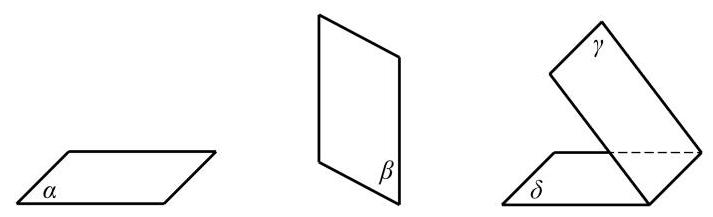

图 10-1-2

平面通常用一个小写希腊字母表示，如图 10-1-2 中的平面 $\alpha \text{ 、 }\beta \text{ 、 }\gamma \text{ 、 }\delta$ 等,有时也可以用一个或多个大写英文字母表示, 如平面 $M$ 、平面 ${ABCD}$ 等. 在平面几何中我们已经知道,点是没有大小的, 直线是没有粗细并且可以无限延伸的; 类似地, 我们说, 平面是没有厚薄并且可以无限延展的.

由于平面无边无界, 因此我们不可能将一个平面完整地画在纸上，只能画其示意图. 习惯上，我们用一个平行四边形来表示平面. 当平面是水平放置时, 通常把这个平行四边形的锐角画成 ${45}^{ \circ  }$ 左右,且横边长约为邻边长的 2 倍. 如果图形的一部分被平面遮挡, 为了清楚地表现图形的结构, 可将被遮挡的部分画成虚线, 如图10-1-2所示.

平面是立体几何中的一个基本图形. 长方体的每个面都是某

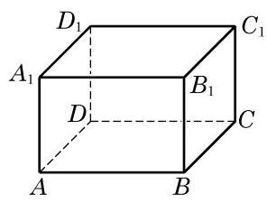

图 10-1-3

个平面的一部分. 图 10-1-3 中,长方体 ${ABCD} - {A}_{1}{B}_{1}{C}_{1}{D}_{1}$ 就可以看作是由六个平面所围成的空间图形.

下面，我们来讨论点、直线与平面之间的位置关系. 我们把空间的直线和平面都看成是由点所组成的集合, 这样就可以借用集合的语言和符号来表示点、直线与平面之间的关系. 为了叙述方便,我们一般用大写的英文字母 $A\text{ 、 }B\text{ 、 }C$ 等表示点,用小写的英文字母 $a\text{ 、 }b\text{ 、 }c$ 等表示直线,用小写的希腊字母 $\alpha \text{ 、 }\beta \text{ 、 }\gamma$ 等表示平面.

在空间, 点与直线、点与平面的位置关系如下:

<table><tr><td></td><td>位置关系</td><td>符号表示</td><td>图形表示</td></tr><tr><td rowspan="2">点与直线</td><td>点 $A$ 在直线 $l$ 上,也称直线 $l$ 经过点 $A$</td><td>$A \in  l$</td><td></td></tr><tr><td>点 $B$ 不在直线 $l$ 上,也称直线 $l$ 不经过点 $B$</td><td>$B \notin  l$</td><td></td></tr><tr><td rowspan="2">点与平面</td><td>点 $A$ 在平面 $\alpha$ 上,也称平面 $\alpha$ 经过点 $A$</td><td>$A \in  \alpha$</td><td></td></tr><tr><td>点 $B$ 不在平面 $\alpha$ 上,也称平面 $\alpha$ 不经过点 $B$</td><td>$B \notin  \alpha$</td><td></td></tr></table>

在图 10-1-3 的长方体 ${ABCD} - {A}_{1}{B}_{1}{C}_{1}{D}_{1}$ 中, $A \in$ 直线 ${AB}$ , ${A}_{1} \notin$ 直线 ${AB}, B \in$ 平面 $B{B}_{1}{C}_{1}C, A \notin$ 平面 $B{B}_{1}{C}_{1}C$ 等. 我们还可以发现,直线 ${AB}$ 在平面 ${ABCD}$ 上(即直线 ${AB}$ 上的所有点都在平面 ${ABCD}$ 上),但直线 ${AB}$ 不在平面 $B{B}_{1}{C}_{1}C$ 上.

在平面几何中, 我们已经知道两点确定一条直线. 由此是否可以推测:如果一条直线上有两个点在一个平面上，那么整条直线都在这个平面上? 其实, 这正是人们经过长期的观察与实践总结出来的一个基本事实, 我们把它当作一个公理.

---

如无特别说明, 本章中所说的两个点、 两条直线、两个平面等均指它们不相重合的情形.

---

公理 1 如果一条直线上有两点在一个平面上, 那么这条直线上所有的点都在这个平面上.

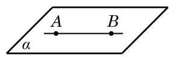

图 10-1-4

这时, 我们说这条直线在这个平面上, 或者说此平面经过该直线. 如图 10-1-4, 公理 1 可用符号语言表述为:

若点 $A \in  \alpha$ ,点 $B \in  \alpha$ ,则直线 ${AB} \subset  \alpha$ .

公理 1 可以用来判断一条直线是否在某个平面上. 由公理 1 知, 不在平面上的直线与这个平面最多只有一个公共点.

如果直线 $l$ 与平面 $\alpha$ 只有一个公共点 $A$ ,就称直线 $l$ 与平面 $\alpha$ 相交于点 $A$ ,或称 $A$ 是直线 $l$ 与平面 $\alpha$ 的交点,记作 $l \cap  \alpha  = A$ (图 10-1-5(1)). 如果直线 $l$ 与平面 $\alpha$ 没有公共点,就称直线 $l$ 与平面 $\alpha$ 平行,记作 $l \cap  \alpha  = \varnothing$ 或 $l//\alpha$ (图 10-1-5(2)).

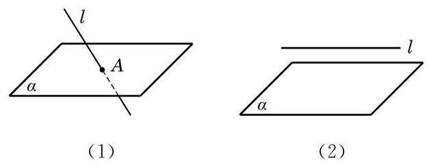

图 10-1-5

画图时,若直线 $l$ 在平面 $\alpha$ 上时,应将直线 $l$ 画在表示平面 $\alpha$ 的平行四边形的内部,如图 10-1-6 所示.

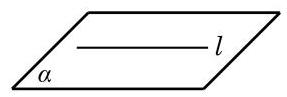

图 10-1-6

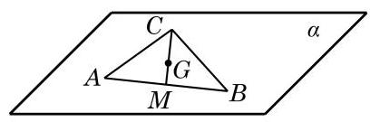

图 10-1-7

例 1 已知三角形 ${ABC}$ 的三个顶点 $A\text{ 、 }B\text{ 、 }C$ 都在平面 $\alpha$ 上,求证: 该三角形的重心 $G$ 也在平面 $\alpha$ 上.

证明 如图 10-1-7,记线段 ${AB}$ 的中点为 $M$ . 因为 $A \in  \alpha$ , $B \in  \alpha$ ,由公理 1 可知,直线 ${AB} \subset  \alpha$ ,而 $M \in  {AB}$ ,从而 $M \in  \alpha$ .

又因为 $C \in  \alpha$ ,仍由公理 1 知, ${CM} \subset  \alpha$ . 由于重心 $G$ 是线段 ${CM}$ 的一个三等分点,因此 $G \in  \alpha$ .

#### 练习 10.1(1)

1. 如图, 用集合语言描述下列图形中的点、直线、平面之间的位置关系.

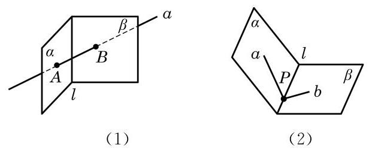

(第 1 题)

2. 证明: 若四边形有三条边在一个平面上, 则它的第四条边也在这个平面上.

我们知道两点确定一条直线, 那么在空间要确定一个平面需要几个点呢?

生活中我们都有这样的经验: 三脚架在不平的地面上也可以稳固地支撑一部照相机；两个轮子的自行车在停止运动后要加上一个支撑脚才能稳定; 一扇门尽管有两个合页固定在门框上, 但仍然可以转动, 只有锁上后才可以固定下来. 这些例子都说明了一个事实, 那就是不在同一直线上的三点才能确定一个平面. 由此, 我们得到下面的公理.

公理 2 不在同一直线上的三点确定一个平面.

这里，“确定一个平面”意指“(经过这三个点)有且只有一个平面”或“存在唯一的平面”，如图 10-1-8 所示. 公理 2 可以具体表述为: 若 $A\text{ 、 }B\text{ 、 }C$ 三点不在同一直线上,则存在唯一的平面 $\alpha$ ,使得 $A\text{ 、 }B\text{ 、 }C$ 三点均在此平面上.

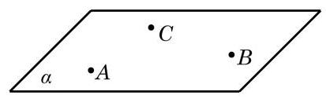

图 10-1-8

根据公理 2 可以得到下面的三个推论:

推论 1 一条直线和这条直线外的一点确定一个平面.

推论 2 两条相交直线确定一个平面.

推论 3 两条平行直线确定一个平面.

图 10-1-9 给出了上述三个推论的直观表示. 这些推论也可以用符号语言来表述，如推论 1 可以表述为:若 $A \notin  l$ ，则存在唯一的平面 $\alpha$ ,使得 $A \in  \alpha , l \subset  \alpha$ .

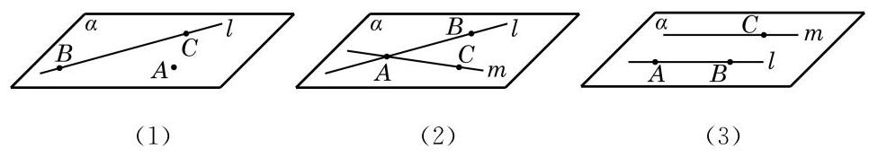

图 10-1-9

公理是进一步推理的基础, 是不证自明的事实, 但公理的推

论是需要证明的. 下面, 我们仅给出推论 1 的证明. 推论 2 的证明可以仿照推论 1 进行, 推论 3 的证明要借助于公理 4 ，我们分别把它们放在本节和下一节的习题中留给同学们完成.

证明 设 $A$ 是直线 $l$ 外的一点,在直线 $l$ 上任取 $B$ 和 $C$ 两点 (图 10-1-9(1)). 由公理 2 可知, $A\text{ 、 }B$ 和 $C$ 三点能确定一个平面 $\alpha$ . 因为点 $B\text{ 、 }C \in  \alpha$ ,由公理 1 可知, $B\text{ 、 }C$ 所在的直线 $l \subset  \alpha$ ,从而平面 $\alpha$ 是由直线 $l$ 和点 $A$ 确定的平面.

公理 2 及其三个推论可以用来构造一个平面或者判断点与直线是不是在同一个平面上. 如果可以判定某个空间图形在同一个平面上, 那么它实际上就是一个平面图形, 从而可以用平面几何的知识和方法来处理相应的问题.

例 2 已知三条直线 ${l}_{1}\text{ 、 }{l}_{2}$ 和 ${l}_{3}$ 两两相交,且不交于同一点. 求证: 直线 ${l}_{1}\text{ 、 }{l}_{2}$ 和 ${l}_{3}$ 在同一平面上.

证明 因为直线 ${l}_{1}\text{ 、 }{l}_{2}$ 和 ${l}_{3}$ 两两相交,设 ${l}_{1} \cap  {l}_{2} = A$ , ${l}_{2} \cap  {l}_{3} = B,{l}_{3} \cap  {l}_{1} = C$ ,如图 10-1-10 所示.

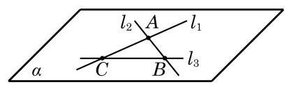

图 10-1-10

由推论 2 可知,相交的直线 ${l}_{1}$ 与 ${l}_{2}$ 可确定一个平面 $\alpha$ ,即有 ${l}_{1} \subset  \alpha ,{l}_{2} \subset  \alpha$ . 因为 $B \in  {l}_{2}, C \in  {l}_{1}$ ,所以 $B\text{ 、 }C \in  \alpha$ ,且 $B\text{ 、 }C$ 不重合. 由公理 1 可知,点 $B\text{ 、 }C$ 所在的直线 ${l}_{3} \subset  \alpha$ ,从而直线 ${l}_{1}\text{ 、 }{l}_{2}$ 和 ${l}_{3}$ 都在平面 $\alpha$ 上.

#### 练习 10.1(2)

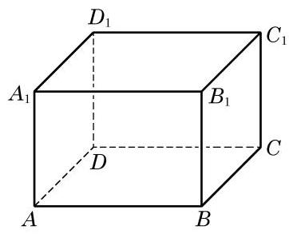

(第 2 题)

1. 已知 $a\text{ 、 }b\text{ 、 }c$ 是空间的三条直线， $a//b$ ，且 $c$ 与 $a\text{ 、 }b$ 都相交. 求证: 直线 $a\text{ 、 }b\text{ 、 }c$ 在同一平面上.
2. 如图,在长方体 ${ABCD} - {A}_{1}{B}_{1}{C}_{1}{D}_{1}$ 中,画出 ${A}_{1}B$ 与 $A$ 、 ${B}_{1}\text{ 、 }C$ 所确定的平面的交点,并说明理由.
3. 如何用绳子检查桌椅的四个脚是否立于同一平面上? 给出方案并说明理由.

### 2 相交平面

观察教室里的墙面，可以看到:相邻的两个墙面都有一条交线. 在一般的情况下, 我们有下面的公理.

公理 3 如果两个不同的平面有一个公共点, 那么它们有且只有一条过该点的公共直线.

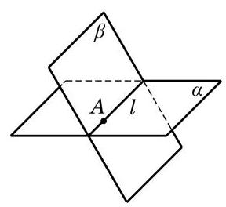

图 10-1-11

公理 3 可具体表述为: 若两平面 $\alpha$ 及 $\beta$ 有一个公共点 $A$ ,则它们有唯一的公共直线 $l$ ，且公共点 $A$ 在 $l$ 上，如图 10-1-11 所示.

根据公理 3，两个平面 $\alpha$ 和 $\beta$ 间的位置关系只有两种:相交于一条公共直线 $l$ 或者没有公共点. 前者称为相交，记作 $\alpha  \cap  \beta  = \; l$ ; 后者称为平行,记作 $\alpha //\beta$ 或 $\alpha  \cap  \beta  = \varnothing$ .

画两个相交平面时, 通常要画出它们的交线, 如图 10-1-11 所示; 画两个平行平面时, 要使表示这两个平面的相应平行四边形的对应边平行, 如图 10-1-12 所示. 注意, 在画图时, 凡被一个平面遮住的所有线条要画成虚线.

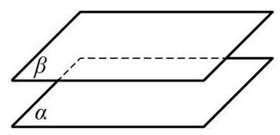

图 10-1-12

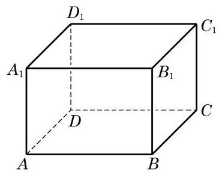

图 10-1-13

例 3 如图 10-1-13,在长方体 ${ABCD} - {A}_{1}{B}_{1}{C}_{1}{D}_{1}$ 中,找出下列各对平面的交线:

(1)平面 ${ABCD}$ 与平面 $A{A}_{1}{B}_{1}B$ ；

(2)平面 ${A}_{1}{BD}$ 与平面 ${C}_{1}{BD}$ ；

(3)平面 ${AC}{C}_{1}{A}_{1}$ 与平面 ${BD}{D}_{1}{B}_{1}$ ；

(4)平面 ${ABCD}$ 与平面 $B{B}_{1}{D}_{1}$ .

解(1)因为 $A$ 及 $B$ 是平面 ${ABCD}$ 与平面 $A{A}_{1}{B}_{1}B$ 的公共点,所以这两个平面的交线是棱 ${AB}$ 所在的直线.

(2)因为 $B$ 及 $D$ 是平面 ${A}_{1}{BD}$ 与平面 ${C}_{1}{BD}$ 的公共点，所以这两个平面的交线是长方体底面对角线 ${BD}$ 所在的直线.

空间直线

(3)如图10-1-14，连接 ${AC}$ 与 ${BD}$ ，其交点为 $O$ ，连接 ${A}_{1}{C}_{1}$ 与 ${B}_{1}{D}_{1}$ ,其交点为 ${O}_{1}$ . 因为点 $A$ 及 $C$ 都在平面 ${AC}{C}_{1}{A}_{1}$ 上,所以直线 ${AC}$ 在平面 ${AC}{C}_{1}{A}_{1}$ 上. 又 $O \in  {AC}$ ,所以 $O$ 在平面 ${AC}{C}_{1}{A}_{1}$ 上. 同理可得, $O$ 在平面 ${BD}{D}_{1}{B}_{1}$ 上. 于是,点 $O$ 是平面 ${AC}{C}_{1}{A}_{1}$ 与平面 ${BD}{D}_{1}{B}_{1}$ 的公共点. 同理可知,点 ${O}_{1}$ 也是平面 ${AC}{C}_{1}{A}_{1}$ 与平面 ${BD}{D}_{1}{B}_{1}$ 的公共点. 这样,由公理 $3, O{O}_{1}$ 所在的直线是平面 ${AC}{C}_{1}{A}_{1}$ 与平面 ${BD}{D}_{1}{B}_{1}$ 的交线.

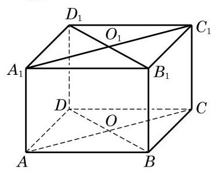

图 10-1-14

(4)因为 $B{B}_{1}//D{D}_{1}$ ，由公理 2 的推论 3 可知，这两条平行线 $B{B}_{1}$ 与 $D{D}_{1}$ 确定一个平面,从而 $D \in$ 平面 $B{B}_{1}{D}_{1}$ . 这样, $B$ 及 $D$ 是平面 ${ABCD}$ 与平面 $B{B}_{1}{D}_{1}$ 的公共点,从而直线 ${BD}$ 是这两个平面的交线.

#### 练习 10.1(3)

1. 画三个平面, 使其中的两个平面互相平行, 而第三个平面与这两个平面都相交.
2. 用硬纸板作为平面的模型, 摆出三个平面两两相交各种不同的情况.

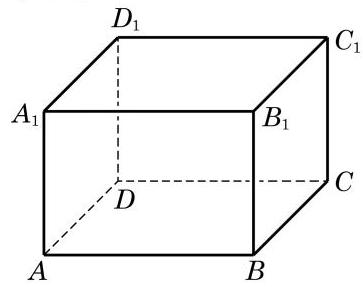

(第 3 题)

3. 如图,在长方体 ${ABCD} - {A}_{1}{B}_{1}{C}_{1}{D}_{1}$ 中,

(1)设 ${AC}$ 与 ${BD}$ 的交点为 $O$ ， $O$ 必为平面___与平面___的公共点(答案不唯一)；

(2)画出平面 ${A}_{1}{BC}{D}_{1}$ 与平面 ${B}_{1}{BD}{D}_{1}$ 的交线.

### 3 空间图形的平面直观图的画法

我们知道, 立体几何的研究对象是空间图形. 要将空间图形在一个平面上体现出来, 就需要在平面内画出具有立体感的空间图形的直观图.

为了把空间图形画得既富有立体感, 又能表达出图形各主要部分的位置关系和度量关系, 我们通常采用斜二测画法画空间图形的直观图.

下面，我们通过两个例子来体会用斜二测画法画空间图形直观图的方法与步骤.

例 4 用斜二测画法画一个水平放置的正六边形的直观图.

画法 (1) 如图 10-1-15(1), 在已知正六边形 ABCDEF

中,取 ${AD}$ 所在直线为 $x$ 轴,取线段 ${AD}$ 的对称轴 ${MN}$ 为 $y$ 轴, 两轴相交于点 $O$ . 在图 10-1-15(2)中，画相应的 ${x}^{\prime }$ 轴和 ${y}^{\prime }$ 轴， 两轴相交于点 ${O}^{\prime }$ ,且使 $\angle {x}^{\prime }{O}^{\prime }{y}^{\prime } = {45}^{ \circ  }$ .

(2)在图 10-1-15(2)中，以 ${O}^{\prime }$ 为中点，在 ${x}^{\prime }$ 轴上取 ${A}^{\prime }{D}^{\prime } = \; {AD}$ ,在 ${y}^{\prime }$ 轴上取 ${M}^{\prime }{N}^{\prime }$ ,使 ${M}^{\prime }{O}^{\prime } = {N}^{\prime }{O}^{\prime } = \frac{1}{2}{MO}$ . 以 ${M}^{\prime }$ 为中点画 ${E}^{\prime }{F}^{\prime }$ 平行于 ${x}^{\prime }$ 轴,并使 ${E}^{\prime }{F}^{\prime } = {EF}$ ; 类似地,再以 ${N}^{\prime }$ 为中点画 ${B}^{\prime }{C}^{\prime }$ 平行于 ${x}^{\prime }$ 轴,并使 ${B}^{\prime }{C}^{\prime } = {BC}$ .

(3)顺次连接 ${A}^{\prime }\text{ 、 }{B}^{\prime }\text{ 、 }{C}^{\prime }\text{ 、 }{D}^{\prime }\text{ 、 }{E}^{\prime }\text{ 、 }{F}^{\prime }\text{ 、 }{A}^{\prime }$ ，所得到的六边形 ${A}^{\prime }{B}^{\prime }{C}^{\prime }{D}^{\prime }{E}^{\prime }{F}^{\prime }$ 就是水平放置的正六边形 ${ABCDEF}$ 的直观图. 画好图后, 要擦去辅助线, 如图 10-1-15(3) 所示.

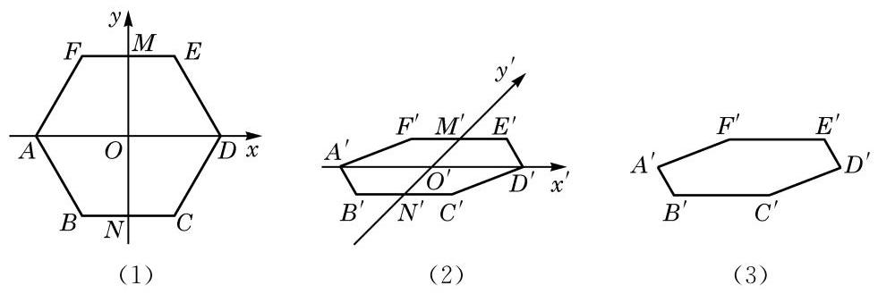

图 10-1-15

例 5 用斜二测画法画长、宽、高分别为 4、3、2 的长方体的直观图.

画法 (1) 画底面:画 $\square {OABC}$ ，使得 ${OA} = 4,{OC} = \frac{3}{2}, \; \angle {AOC} = {45}^{ \circ  }$ ,如图 10-1-16(1) 所示.

(2)画侧棱:过 $O$ 、 $A$ 、 $B$ 、 $C$ 各点分别作 ${OA}$ 和 ${BC}$ 的垂线,在这些垂线上分别截取长为 2 的线段 $O{O}^{\prime }\text{ 、 }A{A}^{\prime }\text{ 、 }B{B}^{\prime }$ 、 $C{C}^{\prime }$ ,如图 10-1-16(2) 所示.

(3)成图:顺次连接 ${O}^{\prime }\text{ 、 }{A}^{\prime }\text{ 、 }{B}^{\prime }\text{ 、 }{C}^{\prime }$ ，并擦去辅助线，将被遮挡的部分改为虚线，得长方体的直观图，如图 10-1-16(3) 所示.

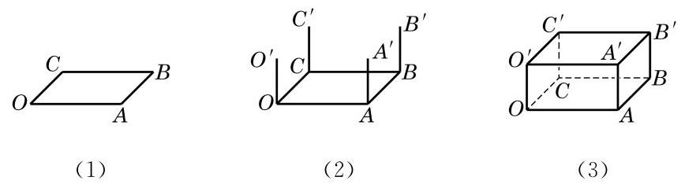

图 10-1-16

#### 练习 10.1(4)

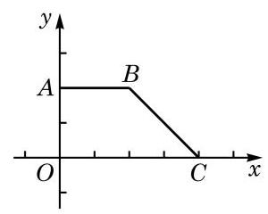

(第 2 题)

1. 在水平放置的平面上有一个边长为 $3\mathrm{\;{cm}}$ 的正三角形,请画出其直观图.
2. 画出如图水平放置的直角梯形 ${OABC}$ 的直观图.

#### 习题 10.1

##### A 组

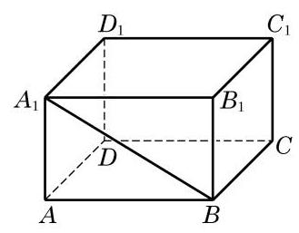

(第 1 题)

1. 如图,观察长方体 ${ABCD} - {A}_{1}{B}_{1}{C}_{1}{D}_{1}$ 中的点、线、面,用适当的符号或字母填空:

(1)点 $B$ ___直线 ${BC}$ ；

(2)点 $A$ ___直线 ${BC}$ ；

(3)点 $D$ ___平面 ${ABCD}$ ；

(4)点 ${A}_{1}$ ___平面 ${ABCD}$ ；

(5)直线 ${A}_{1}B \cap$ 直线 ${BC} =$ ___；

(6)直线 ${A}_{1}B \cap$ 平面 ${A}_{1}{B}_{1}{C}_{1}{D}_{1} =$ ___；

(7)直线 ${B}_{1}{C}_{1}$ ___平面 $B{B}_{1}{C}_{1}C$ .

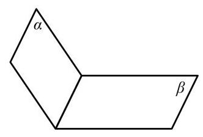

(第 2 题)

2. 用集合符号表述下列语句，并将语句所描述的图形画在右图中:

(1)点 $A$ 在平面 $\alpha$ 上:___；

(2)平面 $\alpha$ 经过直线 ${AC}$ :___；

(3)点 $B$ 不在平面 $\beta$ 上；___；

(4)直线 ${BC}$ 平行于平面 $\beta$ :___.

3. 下列图形一定是平面图形吗? 请说明理由.

(1)三角形; (2)梯形; (3)四边形; (4)菱形.

4. 判断下列命题的真假:

(1)若空间四点共面，则其中必有三点共线;

(2)若空间四点中有三点共线, 则此四点必共面;

(3)若空间四点中任何三点不共线, 则此四点不共面;

(4)若空间四点不共面，则其中任意三点不共线.

5. 证明公理 2 的推论 2.
6. 平面 $\alpha$ 与平面 $\beta$ 相交于直线 $l$ ,点 $A\text{ 、 }B$ 在平面 $\alpha$ 上,点 $C$ 在平面 $\beta$ 上但不在直线 $l$ 上,直线 ${AB}$ 与直线 $l$ 相交于点 $R$ . 设 $A\text{ 、 }B\text{ 、 }C$ 三点确定的平面为 $\gamma$ ,则 $\beta$ 与 $\gamma$ 的交线是 ( )

A. 直线 ${AC}$ ; B. 直线 ${BC}$ ;

C. 直线 ${CR}$ ; D. 以上均不正确.

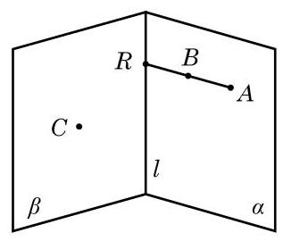

(第 6 题)

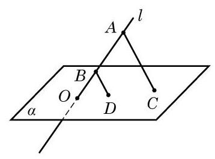

(第 7 题)

7. 如图,已知直线 $l$ 与平面 $\alpha$ 相交于点 $O, A\text{ 、 }B \in  l, C\text{ 、 }D \in  \alpha$ ,且 ${AC}//{BD}$ . 求证: $O\text{ 、 }C\text{ 、 }D$ 三点共线.
8. 画出棱长为 $3\mathrm{\;{cm}}$ 的正方体的直观图.

##### B 组

1. 1 个平面把空间分成 2 部分，2 个平面把空间分成 3 或 4 部分，3 个平面把空间分成几部分?
2. 若平面 $\alpha$ 与平面 $\beta$ 、 $\gamma$ 都相交,则这三个平面的交线可能有几条?

A. 1 条或 2 条; B. 2 条或 3 条;

C. 1 条或 3 条; D. 1 条或 2 条或 3 条.

3. 如图，在正方体 ${ABCD} - {A}_{1}{B}_{1}{C}_{1}{D}_{1}$ 中，已知 $O$ 是 ${DB}$ 的中点，且直线 ${A}_{1}C$ 交平面 ${C}_{1}{BD}$ 于点 $M$ ，点 ${C}_{1}\text{ 、 }M\text{ 、 }O$ 的位置关系是___.

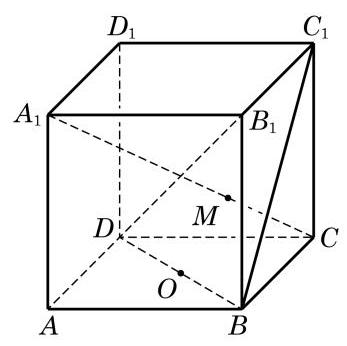

(第 3 题)

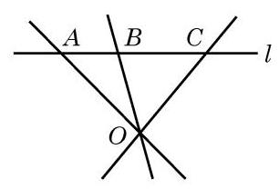

(第 4 题)

4. 如图,已知 $A \in  l, B \in  l, C \in  l, O \notin  l$ . 求证: ${OA}\text{ 、 }{OB}\text{ 、 }{OC}$ 在同一平面上.

空间直线与平面

5. 如图,已知 $D$ 及 $E$ 是 $\bigtriangleup {ABC}$ 的边 ${AC}$ 及 ${BC}$ 上的点,平面 $\alpha$ 经过 $D\text{ 、 }E$ 两点,直线 ${AB}$ 与平面 $\alpha$ 交于点 $P$ . 求证: 点 $P$ 在直线 ${DE}$ 上.

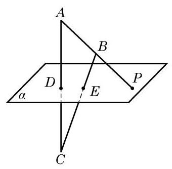

(第 5 题)

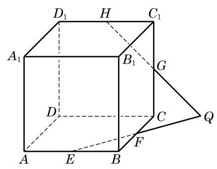

(第 6 题)

6. 如图,已知 $E\text{ 、 }F\text{ 、 }G\text{ 、 }H$ 分别是正方体 ${ABCD} - {A}_{1}{B}_{1}{C}_{1}{D}_{1}$ 的棱 ${AB}\text{ 、 }{BC}\text{ 、 }C{C}_{1}$ 、 ${C}_{1}{D}_{1}$ 的中点,且 ${EF}$ 与 ${HG}$ 相交于点 $Q$ . 求证: 点 $Q$ 在直线 ${DC}$ 上.

## 10.2 直线与直线的位置关系

### 1 空间的平行直线

在平面几何里我们知道平行关系具有传递性, 即在同一平面上, 如果两条直线都和第三条直线平行, 那么这两条直线也互相平行. 对于空间的直线, 这种传递性是否还存在?

仔细观察下面的两种实际情景:当打开一本书时，每一页的外边界看上去都是相互平行的 (图 10-2-1); 而围栏的每一根竖条, 从不同的角度看, 也都是相互平行的(图 10-2-2).

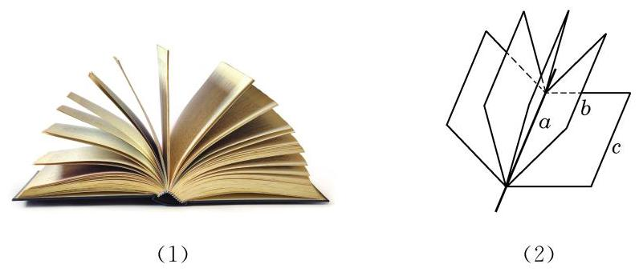

图 10-2-1

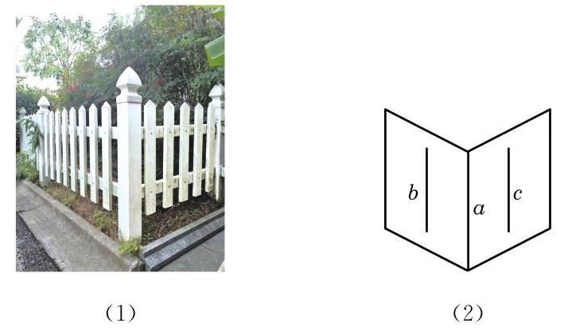

图 10-2-2

正是基于这种经验, 我们有下面的公理.

公理 4 平行于同一条直线的两条直线互相平行.

这条公理用符号语言可以表述为: 若 $a//b$ ,且 $a//c$ ,则 $b//c$ .

公理 4 表明, 直线的平行关系在空间同样具有传递性.

有了公理 4 ，我们就可以解释前面的两种实际情景. 例如， 在图 10-2-1 的情景中, 因为书的每一页都是矩形, 所以每一页的外边界所在的直线都平行于书脊所在的直线, 从而由平行关系的传递性知, 每一页的外边界所在的直线都是相互平行的. ?

---

围栏的情景请同学们自己依据公理 4 给出合理的解释.

---

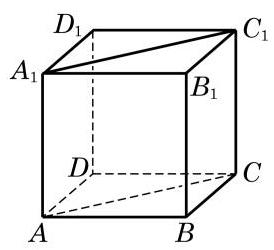

图 10-2-3

例 1 如图 10-2-3,在正方体 ${ABCD} - {A}_{1}{B}_{1}{C}_{1}{D}_{1}$ 中,

(1)找出与 ${AB}$ 平行的所有棱，并解释你的结论；

(2)求证: ${AC}//{A}_{1}{C}_{1}$ ；

(3)求证: $\angle {BAC} = \angle {{B}_{1}{A}_{1}{C}_{1}}$ .

解(1)与 ${AB}$ 平行的棱有 ${CD}\text{ 、 }{A}_{1}{B}_{1}$ 和 ${C}_{1}{D}_{1}$ . 因为正方体的每个面都是正方形,所以 ${AB}//{CD},{AB}//{A}_{1}{B}_{1}$ , ${CD}//{{C}_{1}{D}_{1}}$ ，从而由公理 4，知 ${AB}//{{C}_{1}{D}_{1}}$ .

(2)证明:因为 ${ABCD} - {A}_{1}{B}_{1}{C}_{1}{D}_{1}$ 是一个正方体，所以 $B{B}_{1}//A{A}_{1}, B{B}_{1}//C{C}_{1}$ . 由公理 4,可得 $A{A}_{1}//C{C}_{1}$ . 此外,显然有 $A{A}_{1} = C{C}_{1}$ ,从而 ${A}_{1}{AC}{C}_{1}$ 是一个平行四边形,所以 ${AC} \; //{A}_{1}{C}_{1}$ .

(3)证明:因为正方体的每个面都是正方形，所以 $\bigtriangleup  {BAC}$ 和 $\bigtriangleup {B}_{1}{A}_{1}{C}_{1}$ 都是等腰直角三角形,从而 $\angle {BAC} = \angle {B}_{1}{A}_{1}{C}_{1} \; = {45}^{ \circ  }$ .

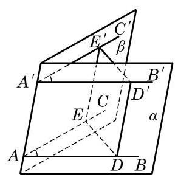

图 10-2-4

例 1 中 $\angle {BAC}$ 与 $\angle {B}_{1}{A}_{1}{C}_{1}$ 的位置关系比较特殊,它们的两边分别平行且方向相同. 空间中具有这种位置关系的两个角是否一定相等呢? 我们可以证明以下定理.

等角定理 如果一个角的两边和另一个角的两边分别平行并且方向相同, 那么这两个角相等.

如图 10-2-4,已知 $\angle {BAC}$ 与 $\angle {B}^{\prime }{A}^{\prime }{C}^{\prime }$ 的边 ${AB}//{A}^{\prime }{B}^{\prime }$ , ${AC}//{A}^{\prime }{C}^{\prime }$ ,并且方向相同.

Q

---

这里我们用到了不同平面上两个全等三角形的判定与性质. 之所以可以推广这种性质到空间的情形, 是因为三角形的全等与相似都具有运动的不变性.

---

求证: $\angle {BAC} = \angle {B}^{\prime }{A}^{\prime }{C}^{\prime }$ .

证明 因为 ${AB}//{{A}^{\prime }{B}^{\prime }},{AC}//{{A}^{\prime }{C}^{\prime }}$ ，由公理 2 推论 3 可知， ${AB}\text{ 、 }{A}^{\prime }{B}^{\prime }$ 确定一个平面,记为 $\alpha ;{AC}\text{ 、 }{A}^{\prime }{C}^{\prime }$ 也确定一个平面, 记为 $\beta$ . 在直线 ${AB}\text{ 、 }{AC}$ 上分别取点 $D\text{ 、 }E$ ,在直线 ${A}^{\prime }{B}^{\prime }$ 、 ${A}^{\prime }{C}^{\prime }$ 上分别取点 ${D}^{\prime }\text{ 、 }{E}^{\prime }$ ,使得 ${AD} = {A}^{\prime }{D}^{\prime },{AE} = {A}^{\prime }{E}^{\prime }$ . 因为在平面 $\alpha$ 上, ${AD}//{A}^{\prime }{D}^{\prime },{AD} = {A}^{\prime }{D}^{\prime }$ ,所以 ${A}^{\prime }{D}^{\prime }{DA}$ 是一个平行四边形,从而 $A{A}^{\prime }//D{D}^{\prime }$ ,且 $A{A}^{\prime } = D{D}^{\prime }$ . 同理, $A{A}^{\prime }//E{E}^{\prime }$ , 且 $A{A}^{\prime } = E{E}^{\prime }$ . 这样就有 $D{D}^{\prime }//E{E}^{\prime }$ ,且 $D{D}^{\prime } = E{E}^{\prime }$ ,即 ${D}^{\prime }{E}^{\prime }{ED}$ 是一个平行四边形. 于是, ${ED} = {E}^{\prime }{D}^{\prime }$ ,从而 $\bigtriangleup {ADE}\underline{ \cong  } \; \bigtriangleup {A}^{\prime }{D}^{\prime }{E}^{\prime }$ ,即得 $\angle {BAC} = \angle {B}^{\prime }{A}^{\prime }{C}^{\prime }$ .

由上述定理, 我们容易得出下面两个推论.

推论 1 如果一个角的两边和另一个角的两边分别平行, 那么这两个角相等或者互补.

推论 2 如果两条相交直线和另两条相交直线分别平行, 那么这两组直线所成的锐角 (或直角)相等.

例 2 如图 10-2-5, ${ABC}$ 是一张三角形的纸片, $D$ 是边 ${AC}$ 上的一点. 我们将此三角形纸片沿 ${BD}$ 折成一个空间四边形 ${ABCD}$ . 在这个空间四边形 ${ABCD}$ 中, $E\text{ 、 }F\text{ 、 }G\text{ 、 }H$ 分别为边 ${AB}\text{ 、 }{BC}\text{ 、 }{CD}\text{ 、 }{DA}$ 的中点.

---

由空间不共面四点首尾相接所成的四边形叫做空间四边形.

---

求证: ${EFGH}$ 是平行四边形.

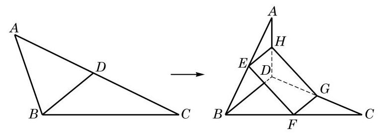

图 10-2-5

---

(1)将空间四边形 ABCD 还原到原来的位置, 那么所得到的四边形 EFGH 还是平行四边形吗?

(2)若 $E\text{ 、 }F$ 、 $G\text{ 、 }H$ 不是所在边的中点, ${EFGH}$ 是否仍可能是平行四边形?

---

证明 因为 ${EH}$ 是 $\bigtriangleup {ABD}$ 的一条中位线,所以 ${EH}//{BD}$ , 且 ${EH} = \frac{1}{2}{BD}$ . 同理, ${FG}$ 是 $\bigtriangleup {CBD}$ 的一条中位线,有 ${FG}// \; {BD}$ ,且 ${FG} = \frac{1}{2}{BD}$ . 由公理 4,知 ${EH}//{FG}$ ,且 ${EH} = {FG}$ ,从而 EFGH 是平行四边形.

#### 练习 10.2(1)

1. 如图,在长方体 ${ABCD} - {A}_{1}{B}_{1}{C}_{1}{D}_{1}$ 中,直线 ${A}_{1}C$ 与 $B{D}_{1}$ 相交吗? 为什么?

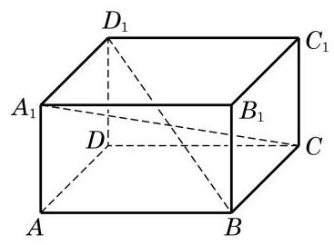

(第 1 题)

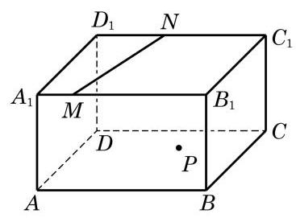

(第 2 题)

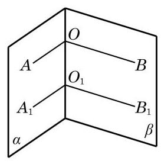

(第 3 题)

2. 在如图所示的长方体 ${ABCD} - {A}_{1}{B}_{1}{C}_{1}{D}_{1}$ 中,平面 ${A}_{1}{B}_{1}{C}_{1}{D}_{1}$ 上有一条直线 ${MN}$ ,而平面 ${ABCD}$ 上有一点 $P$ . 试过点 $P$ 作一条直线 $l$ , 使得 $l//{MN}$ .
3. 如图,在两个相交平面 $\alpha \text{ 、 }\beta$ 的交线上任意取两点 $O$ 与 ${O}_{1}$ . 在平面 $\alpha$ 上,过 $O$ 与 ${O}_{1}$ 分别作射线 ${OA}$ 与 ${O}_{1}{A}_{1}$ 垂直于 $O{O}_{1}$ ; 在平面 $\beta$ 上,过 $O$ 与 ${O}_{1}$ 分别作射线 ${OB}$ 与 ${O}_{1}{B}_{1}$ 垂直于 $O{O}_{1}$ . 求证: $\angle {AOB} \; = \angle {A}_{1}{O}_{1}{B}_{1}$ .

### 2 异面直线

我们知道, 在同一平面上的两条直线只有平行或相交两种位置关系. 空间的两条直线, 除了平行和相交这两种位置关系, 是否还有其他的位置关系呢? 观察下面的两幅实景图. 在图 10-2-6(1)中，如果把远方的高楼看作是一条直线，将马路看作是另外一条直线, 这两条直线看起来既不平行, 也不相交. 类似地, 在图 10-2-6(2)中, 如果把高铁轨道和其下的高速公路分别看作是两条直线, 那么它们看起来不会在同一个平面上. 我们用图10-2-7 直观地分别表示这两种实际的情景.

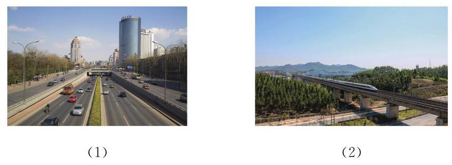

图 10-2-6

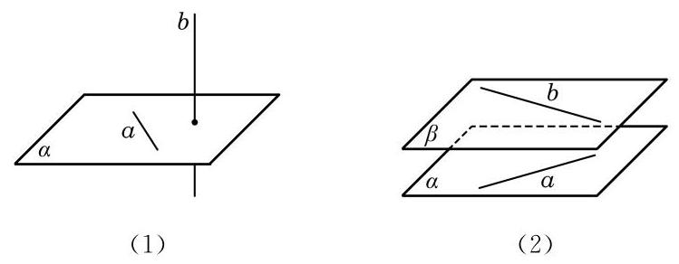

图 10-2-7

像上述这种不在同一个平面上, 既不相交也不平行的两条直线是空间中特有的一种两直线位置关系. 相应地, 我们给出下面的定义.

定义 不同在任何一个平面上的两条直线叫做异面直线 (noncoplanar straight lines).

这里, “不同在任何一个平面上的两条直线”是指不存在一个平面, 使得这两条直线都在这个平面上. 例如, 观察图 10-2-8 中长方体 ${ABCD} - {A}_{1}{B}_{1}{C}_{1}{D}_{1}$ 的棱所在的直线,可以发现,直线 $A{A}_{1}$ 与 $C{C}_{1}$ 虽然不在这个长方体的同一个表面上,但是可以找到一个平面 (即平面 ${A}_{1}{AC}{C}_{1}$ ),使得它们都在这个平面上,所以 $A{A}_{1}$ 与 $C{C}_{1}$ 不是异面直线. 但直线 ${AB}$ 与 $C{C}_{1}$ 则不是这种情况. 假设存在一个平面 $\alpha$ 同时包含直线 ${AB}$ 与 $C{C}_{1}$ ,那么不共线的三点 $A\text{ 、 }B\text{ 、 }C$ 就在这个平面上,从而由公理 2 可知,平面 $\alpha$ 就应是长方体的下底面 ${ABCD}$ ,从而直线 $C{C}_{1}$ 就应在长方体的下底面上,但这是不可能的,所以这样的平面 $\alpha$ 是不存在的. 也就是说,直线 ${AB}$ 与 $C{C}_{1}$ 是异面直线.

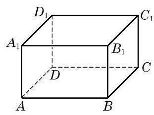

图 10-2-8

这样, 空间的两条直线就有三种不同的位置关系, 可以用下表来分类:

<table><tr><td>位置关系</td><td>是否共面</td><td>是否有公共点</td></tr><tr><td>相交</td><td>是</td><td>是</td></tr><tr><td>平行</td><td>是</td><td>否</td></tr><tr><td>异面</td><td>否</td><td>否</td></tr></table>

画两条异面直线时, 通常需要用一个或两个平面来衬托, 如图 10-2-9 所示.

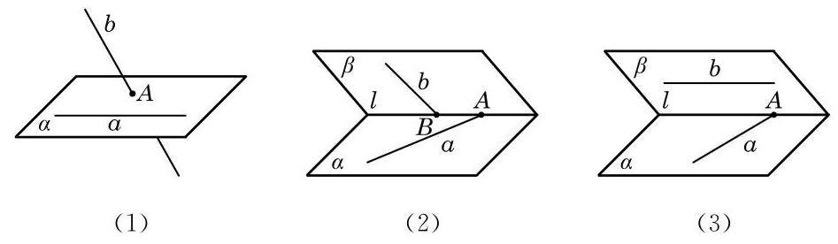

图 10-2-9

为了判断两条直线是否为异面直线, 由定义, 就要判断两条直线是否“不同在任何一个平面上”，这显然不太方便，一般只能用反证法来进行论证. 为了便于判断两条直线是否异面，我们给出下面的定理.

异面直线判定定理 过平面外一点与平面上一点的直线, 和此平面上不经过该点的任何一条直线都是异面直线.

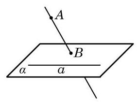

图 10-2-10

已知: 如图 10-2-10,直线 $a$ 在平面 $\alpha$ 上,点 $A$ 不在平面 $\alpha$ 上,直线 ${AB}$ 与平面 $\alpha$ 交于点 $B$ ,点 $B$ 在平面 $\alpha$ 上但不在直线 $a$ 上.

求证: 直线 ${AB}$ 和 $a$ 是异面直线.

证明 假设存在一个平面 $\beta$ ,使得直线 ${AB}$ 与 $a$ 均在平面 $\beta$ 上，那么平面 $\beta$ 一定经过点 $A$ 、 $B$ 和直线 $a$ . 因为 $B \notin  a$ ，由公理 2 推论 1,经过点 $B$ 与直线 $a$ 只能有一个平面,它就是 $\alpha$ ,从而平面 $\alpha$ 与 $\beta$ 是同一个平面. 这样,点 $A$ 就应在平面 $\alpha$ 上,与已知 $A \notin  \alpha$ 矛盾. 所以,直线 ${AB}$ 和 $a$ 必为异面直线.

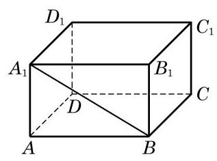

图 10-2-11

例 3 如图 10-2-11,在长方体 ${ABCD} - {A}_{1}{B}_{1}{C}_{1}{D}_{1}$ 中, 哪些棱所在的直线与直线 $B{A}_{1}$ 是异面直线?

解 长方体共有 12 条棱. 过顶点 $B$ 和 ${A}_{1}$ 的棱各有 3 条,这 6 条棱所在的直线都与直线 $B{A}_{1}$ 相交,必定与其共面.

对于棱 $C{C}_{1}$ ,它落在平面 ${BC}{C}_{1}{B}_{1}$ 上,而 $B{A}_{1}$ 是过此平面上点 $B$ 及此平面外点 ${A}_{1}$ 的直线,由上述定理知,棱 $C{C}_{1}$ 所在的直线与直线 $B{A}_{1}$ 是异面直线. 同理,棱 $D{D}_{1}\text{ 、 }{DC}\text{ 、 }{D}_{1}{C}_{1}\text{ 、 }{AD}$ 及 ${B}_{1}{C}_{1}$ 所在的直线均分别与直线 $B{A}_{1}$ 是异面直线.

例 4 给定不共面的 4 点, 作过其中 3 个点的平面, 所有 4 个这样的平面围成的几何体称为四面体 (图 10-2-12). 预先给定的 4 个点称为四面体的顶点, 2 个顶点的连线称为四面体的棱, 3 个顶点所确定的三角形称为四面体的面. 求证: 四面体中任何一对不共顶点的棱所在的直线一定是异面直线.

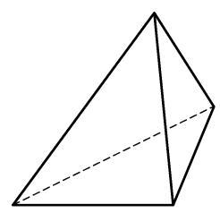

图 10-2-12

证明 一条棱上有 2 个顶点, 两条不共顶点的棱上一共有 4 个不同的顶点, 也就是说, 两条不共顶点的棱上有全部预先给定的 4 个点了. 如果这两条棱共面, 那么 4 个顶点也共面, 这与已知的 4 点不共面条件矛盾. 由此可见, 任何一对不共顶点的棱所在的直线一定是异面直线. ?

---

本例可以运用异面直线判定定理证明吗?

---

#### 练习 10.2(2)

1. 在教室里找出几对异面直线的例子.
2. 如果一条直线和两条异面直线中的一条平行, 那么它和另一条直线的位置关系是___.
3. 下面左图是一个正方体的平面展开图, 请在下面右图的正方体中画出对应的线段, 并指出正方体中的线段 ${CN}\text{ 、 }{AF}\text{ 、 }{BM}\text{ 、 }{ME}$ 中，哪些线段所在的直线与 ${DN}$ 所在的直线是异面直线.

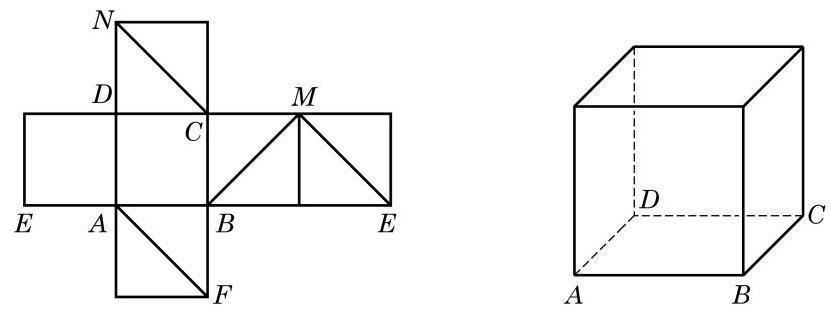

(第 3 题)

### 3 两条异面直线所成的角

几何学除了要讨论几何图形之间的相互位置关系, 还要更精确地以定量的方法判断图形的位置与形状. 在平面几何中, 我们已分别通过夹角或距离来确定两条相交或平行的直线之间的相对位置. 空间中的两条相交或平行直线, 本质上可以看成某一平面上的两条相交或平行直线, 也可以用类似方法处理. 那么, 我们

该如何确定两条异面直线的相对位置呢?

生活中经常可以看到图 10-2-13(1) 所示的道路指示牌. 这些指示牌看上去形成了不同的角度, 指明了不同的方向. 我们把左边的实景图抽象为 10-2-13(2)中的示意图，用 $a$ 、 $b$ 等分别表示道路指示牌. 依据异面直线判定定理可知, 它们两两都是异面直线. 现在的问题是: 我们是否可以定义并确定这些异面直线之间的角度呢?

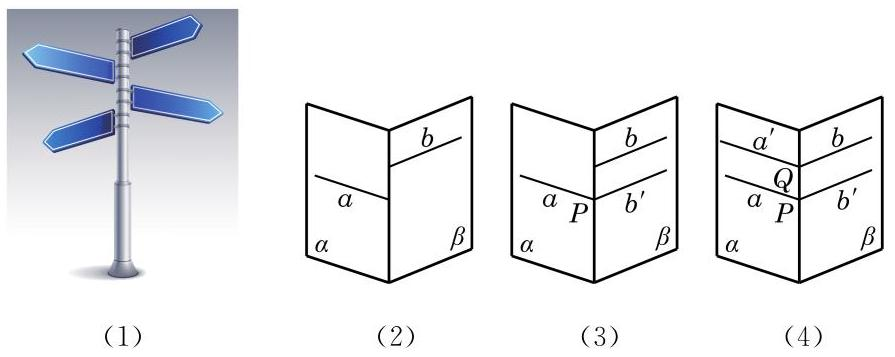

图 10-2-13

一个自然的想法是将两条异面直线转化为相交直线, 然后观察它们所成的角. 例如，在图 10-2-13(3)中，在平面 $\beta$ 内，把直线 $b$ 平移到直线 $a$ 上的点 $P$ 处,记为 ${b}^{\prime }$ . 这样,直线 $a$ 与 ${b}^{\prime }$ 就在点 $P$ 处相交,它们之间可以用平面几何的方法来度量夹角的大小. 由于这样将直线平移的方法可以有很多, 需要考虑的是: 这样通过平移所形成的角的大小是唯一确定的吗? 例如, 在图 10-2-13(4)中，我们也可在平面 $\alpha$ 内，把直线 $a$ 平移到直线 $b$ 上的点 $Q$ 处,同样得到两条相交直线 ${a}^{\prime }$ 和 $b$ ,它们所成夹角的大小与 $a\text{ 、 }{b}^{\prime }$ 所成夹角的大小相等吗? 由等角定理的推论 2 可知,这两组相交直线所成的锐角(或直角)的确是相等的. 事实上，我们可以有下面更为一般的结论:

如图 10-2-14,设 $a\text{ 、 }b$ 是两条异面直线,在空间任取一点 $P$ ,过点 $P$ 分别作 $a\text{ 、 }b$ 的平行线 ${a}^{\prime }\text{ 、 }{b}^{\prime }$ ,那么相交直线 ${a}^{\prime }\text{ 、 }{b}^{\prime }$ 所成锐角(或直角)的大小是唯一确定的.

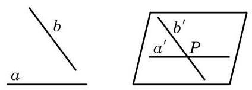

图 10-2-14

这样, 就可以给出下面的定义.

定义 两条异面直线平移到相交位置时所得到的锐角或直角, 称为这两条异面直线所成的角.

由上述定义知,两条异面直线所成的角的范围是 ${0}^{ \circ  } < \theta  \leq  {90}^{ \circ  }$ , 在弧度制下是 $\theta  \in  \left( {0,\frac{\pi }{2}}\right\rbrack$ .

特别地,如果两条异面直线 $a\text{ 、 }b$ 所成的角是直角,就说这两条异面直线互相垂直,记作 $a \bot  b$ . 由上述定义容易推出: 如果 $a \bot  b, b//c$ ,那么 $a \bot  c$ .

例 5 如图 10-2-15(1),在正方体 ${ABCD} - {A}_{1}{B}_{1}{C}_{1}{D}_{1}$ 中,

(1)求异面直线 ${A}_{1}B$ 与 ${DC}$ 所成的角的大小；

(2)求异面直线 ${A}_{1}B$ 与 ${AC}$ 所成的角的大小；

(3)求证: $D{D}_{1}\bot {AB}$ .

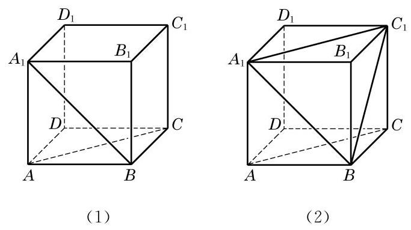

图 10-2-15

解(1)因为 ${DC}//{AB}$ ，所以 $\angle {A}_{1}{BA}$ 就是异面直线 ${A}_{1}B$ 与 ${DC}$ 所成的角或其补角. 因为正方形 ${AB}{B}_{1}{A}_{1}$ 中， $\angle {A}_{1}{BA} = \; {45}^{ \circ  }$ ,所以异面直线 ${A}_{1}B$ 与 ${DC}$ 所成的角的大小为 ${45}^{ \circ  }$ .

(2)如图10-2-15(2)，连接 ${A}_{1}{C}_{1}$ . 由 $A{A}_{1}{C}_{1}C$ 是平行四边形,知 ${AC}//{A}_{1}{C}_{1}$ . 连接 $B{C}_{1}$ . 在 $\bigtriangleup B{A}_{1}{C}_{1}$ 中,因为 $B{A}_{1} = \; {A}_{1}{C}_{1} = B{C}_{1} = \sqrt{2}{AB}$ ,所以 $\bigtriangleup B{A}_{1}{C}_{1}$ 是一个等边三角形,从而 $\angle B{A}_{1}{C}_{1} = {60}^{ \circ  }$ . 因为 ${AC}//{A}_{1}{C}_{1}$ ,所以 $\angle B{A}_{1}{C}_{1}$ 就是异面直线 ${A}_{1}B$ 与 ${AC}$ 所成的角. 所以,异面直线 ${A}_{1}B$ 与 ${AC}$ 所成的角的大小为 ${60}^{ \circ  }$ .

(3)证明:因为 $D{D}_{1}//A{A}_{1}$ ，且 $A{A}_{1} \bot  {AB}$ ，所以 $D{D}_{1} \; \bot  {AB}$ .

---

过空间一点, 可以作几条直线与已知直线平行? 垂直呢?

求两条异面直线所成的角时, 一般通过平移将所求角置于某个三角形中, 利用三角形的边角关系来求出这个角的大小.

---

#### 练习 10.2(3)

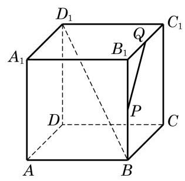

(第 2 题)

1. 在长方体 ${ABCD} - {A}_{1}{B}_{1}{C}_{1}{D}_{1}$ 中,与棱 $A{A}_{1}$ 所在直线异面且垂直的棱有几条?
2. 在如图所示的正方体 ${ABCD} - {A}_{1}{B}_{1}{C}_{1}{D}_{1}$ 中,设 $P\text{ 、 }Q$ 分别是棱 $B{B}_{1}\text{ 、 }{B}_{1}{C}_{1}$ 的中点. 请画出异面直线 $B{D}_{1}$ 与 ${PQ}$ 所成的角.

#### 习题 10.2

##### A 组

1. 证明公理 2 的推论 3.
2. 空间两条互相平行的直线指的是 ( )

A. 在空间没有公共点的两条直线;

B. 分别在两个平面上的两条直线;

C. 在两个不同的平面上且没有公共点的两条直线;

D. 在同一平面上且没有公共点的两条直线.

3. 如图,在正方体 ${ABCD} - {A}_{1}{B}_{1}{C}_{1}{D}_{1}$ 中, $M\text{ 、 }N$ 分别为 ${CD}\text{ 、 }{AD}$ 的中点. 求证: ${MN}//{A}_{1}{C}_{1}$ .
4. 如图是一个正方体的平面展开图, 在这个正方体中, 下列说法中正确的序号是___.

① 直线 ${AF}$ 与直线 ${DE}$ 相交;

② 直线 ${CN}$ 与直线 ${DE}$ 平行；

③ 直线 ${BM}$ 与直线 ${DE}$ 是异面直线；

④ 直线 ${CN}$ 与直线 ${BM}$ 成 ${60}^{ \circ  }$ 角.

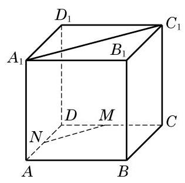

(第 3 题)

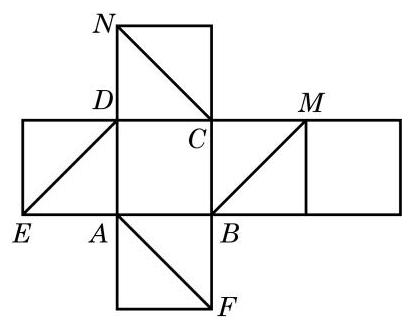

(第 4 题)

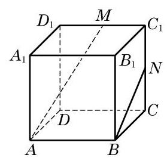

(第 5 题)

22

5. 如图,在正方体 ${ABCD} - {A}_{1}{B}_{1}{C}_{1}{D}_{1}$ 中, $M\text{ 、 }N$ 分别是棱 ${C}_{1}{D}_{1}\text{ 、 }{C}_{1}C$ 的中点. 判断下列结论是否成立, 并说明理由:

(1)直线 ${AM}$ 与 $C{C}_{1}$ 是相交直线；

(第 7 题)

(2)直线 ${AM}$ 与 ${BN}$ 是平行直线；

(3)直线 ${AM}$ 与 $D{D}_{1}$ 是异面直线.

6. 已知 $A\text{ 、 }B\text{ 、 }C\text{ 、 }D$ 是空间四个点,且直线 ${AB}$ 与 ${CD}$ 是两条异面直线. 求证: 直线 ${AC}$ 与 ${BD}$ 也是异面直线.
7. 如图，在四面体 ${ABCD}$ 中， ${AB} = {CD},{AB}\bot {CD}$ ， $E$ 、 $F$ 分别为 ${BC}\text{ 、 }{AD}$ 的中点. 求直线 ${EF}$ 和 ${AB}$ 所成的角的大小.

##### B 组

1. 如果两个三角形不在同一平面上, 它们的边两两对应平行, 那么这两个三角形 ( )

A. 全等; B. 相似;

C. 相似但不全等; D. 不相似.

2. 如图,在正方体 ${ABCD} - {A}_{1}{B}_{1}{C}_{1}{D}_{1}$ 中, $E\text{ 、 }F\text{ 、 }G$ 分别是 ${AB}\text{ 、 }B{B}_{1}\text{ 、 }{BC}$ 的中点. 求证: $\bigtriangleup {EFG} \backsim  \bigtriangleup {C}_{1}D{A}_{1}$ .

(第 2 题)

(第 3 题)

(第 4 题)

3. 如图,在长方体 ${ABCD} - {A}_{1}{B}_{1}{C}_{1}{D}_{1}$ 中,判断下列直线的位置关系:

(1)直线 ${A}_{1}B$ 与直线 ${D}_{1}C$ 的位置关系是___；

(2)直线 ${A}_{1}B$ 与直线 ${B}_{1}C$ 的位置关系是___；

(3)直线 $D$ 的二 与直线 ${D}_{1}C$ 的位置关系是___.

(4)直线 ${AB}$ 与直线 ${B}_{1}C$ 的位置关系是___.

4. 如图,已知不在同一平面上的三条直线 $a\text{ 、 }b\text{ 、 }c$ 相交于点 $O, M\text{ 、 }P$ 是直线 $a$ 上的两点, $N\text{ 、 }Q$ 分别是直线 $b\text{ 、 }c$ 上与点 $O$ 不重合的点. 求证: ${MN}$ 和 ${PQ}$ 是异面直线.
5. 如图，在四面体 ${ABCD}$ 中， ${AC} = 8,{BD} = 6, M\text{ 、 }N$ 分别为 ${AB}\text{ 、 }{CD}$ 的中点，并且异面直线 ${AC}$ 与 ${BD}$ 所成的角的大小为 ${90}^{ \circ  }$ . 求 ${MN}$ 的长.

(第 5 题)

(第 6 题)

6. 如图,在空间四边形 ${ABCD}$ 中, $E\text{ 、 }F\text{ 、 }G\text{ 、 }H$ 分别是边 ${AB}\text{ 、 }{BC}\text{ 、 }{CD}\text{ 、 }{DA}$ 的中点. 当对角线 ${AC}$ 和 ${BD}$ 满足什么条件时, ${EFGH}$ 分别是矩形、菱形、正方形?

## 10.3 直线与平面的位置关系

一条直线和一个平面的位置关系有且只有以下三种:

1. 直线在平面上一一有无数个公共点;
2. 直线和平面相交 - 只有一个公共点;
3. 直线和平面平行一一没有公共点.

### 1 直线与平面平行

上面我们已按照直线与平面的公共点的个数来划分了空间直线与平面的位置关系, 其中, 当直线与平面没有公共点时, 我们说直线与平面平行, 并沿用平面几何中的平行符号来表示, 如 $l//\alpha$ . 但是,因为直线与平面都是无限延伸的,要直接判断直线与平面是否有公共点往往是比较困难的, 所以我们需要一个简便的直线与平面平行的判定定理.

观察房门的转动情景可以看到, 房门开启后, 无论门转到什么位置，房门外沿所在的直线始终都是和门框所在的平面平行的. 这是因为房门的外沿与内沿是平行的, 而在房门的转动过程中, 内沿始终都在门框所在的平面上. 由此可以引出下面的直线与平面平行的判定定理:

直线与平面平行的判定定理 如果不在平面上的一条直线与这个平面上的一条直线平行, 那么该直线与这个平面平行.

下面, 用反证法来证明这个定理.

图 10-3-1

已知: 如图 10-3-1,直线 $a$ 不在平面 $\alpha$ 上,直线 $b$ 在平面 $\alpha$ 上,且 $a//b$ .

求证: 直线 $a//$ 平面 $\alpha$ .

证明 假设直线 $a$ 不平行于平面 $\alpha$ ,则直线 $a$ 与平面 $\alpha$ 有公共点,设为点 $P$ . 在平面 $\alpha$ 上,过点 $P$ 作已知直线 $b$ 的平行线

 ${a}^{\prime }$ . 因为 $a$ 不在 $\alpha$ 上,所以 ${a}^{\prime }$ 与 $a$ 不重合. 另一方面,因为 $a// \; b,{a}^{\prime }//b$ ,所以 ${a}^{\prime }//a$ ,这和 $a$ 与 ${a}^{\prime }$ 交于点 $P$ 矛盾. 所以原假设不成立,从而 $a//\alpha$ .

依据上述判定定理,要判定不在平面上的一条直线与这个平面平行, 只要在此平面上找到此直线的一条平行线即可.

证明 如图 10-3-2,因为棱 $B{B}_{1}$ 平行且等于棱 $D{D}_{1}$ ,所以 $B{B}_{1}{D}_{1}D$ 是平行四边形,从而 ${BD}//{B}_{1}{D}_{1}$ . 因为直线 ${B}_{1}{D}_{1}$ 在平面 $A{B}_{1}{D}_{1}$ 上,而直线 ${BD}$ 不在平面 $A{B}_{1}{D}_{1}$ 上,由上述判定定理,得到直线 ${BD}//$ 平面 $A{B}_{1}{D}_{1}$ .

图 10-3-2

例 1 在长方体 ${ABCD} - {A}_{1}{B}_{1}{C}_{1}{D}_{1}$ 中,证明直线 ${BD}$ 平行于平面 $A{B}_{1}{D}_{1}$ .

图 10-3-3

例 2 证明: 空间四边形相邻两边中点的连线, 必平行于经过另外两边的平面.

已知: 如图 10-3-3,在空间四边形 ${ABCD}$ 中,设 $E\text{ 、 }F$ 分别是两边 ${AB}\text{ 、 }{AD}$ 的中点.

求证: ${EF}//$ 平面 ${BCD}$ .

证明 连接 ${BD}$ . 在 $\bigtriangleup {ABD}$ 中,中位线 ${EF}$ 必平行于边 ${BD}$ .

因为 ${BD}$ 在平面 ${BCD}$ 上,而 ${EF}$ 不在平面 ${BCD}$ 上,由上述判定定理,得到 ${EF}//$ 平面 ${BCD}$ .

#### 练习 10.3(1)

(第 1 题)

1. 如图,在长方体 ${ABCD} - {A}_{1}{B}_{1}{C}_{1}{D}_{1}$ 的 6 个面中,

(1)与 ${AB}$ 平行的平面是___.

(2)与 $A{D}_{1}$ 平行的平面是___.

2. 判断下列命题的真假, 并说明理由:

(1)若直线 $a$ 上有无数个点不在平面 $\alpha$ 上，则 $a//\alpha$ ；

(2)若直线 $a$ 与平面 $\alpha$ 上的一条直线平行,则 $a$ 与平面 $\alpha$ 上的任意一条直线都平行;

(3)若两条平行直线中的一条平行于一个平面，则另一条直线也平行于这个平面；

(4)设直线 $a$ 在平面 $\alpha$ 上，直线 $b$ 不在平面 $\alpha$ 上，并且 $a//b$ ，则 $b//\alpha$ .

3. 若直线 $l$ 不平行于平面 $\alpha$ ,且 $l$ 不在平面 $\alpha$ 上,判断下列结论是否成立,并说明理由:

(1)平面 $\alpha$ 上的所有直线都与 $l$ 异面;

(2)平面 $\alpha$ 上不存在与 $l$ 平行的直线；

(3)平面 $\alpha$ 上存在唯一的一条直线与 $l$ 平行；

(4)平面 $\alpha$ 上的直线都与 $l$ 相交.

如果一条直线和一个平面平行, 那么这个平面上是否一定可以找到与这条直线平行的直线呢? 有下面的定理.

直线与平面平行的性质定理 如果一条直线与一个平面平行, 过这条直线的一个平面与此平面相交, 那么其交线必与该直线平行.

图 10-3-4

如图 10-3-4,已知直线 $a$ 与平面 $\alpha$ 平行,过直线 $a$ 的一个平面 $\beta$ 与平面 $\alpha$ 相交于直线 $b$ .

求证: $a//b$ .

证明 由 $a//\alpha$ ,故 $a$ 和 $\alpha$ 没有公共点.

又因为 $b \subset  \alpha$ ,所以 $a$ 和 $b$ 没有公共点.

因为 $a$ 和 $b$ 同在平面 $\beta$ 上,且没有公共点,所以 $a//b$ .

图 10-3-5

例 3 在如图 10-3-5 所示的一块多面体木料中,棱 ${BC}$ 平行于平面 ${A}^{\prime }{B}^{\prime }{C}^{\prime }{D}^{\prime }$ .

(1)要经过平面 ${A}^{\prime }{B}^{\prime }{C}^{\prime }{D}^{\prime }$ 上的一点 $P$ 和棱 ${BC}$ 将木料锯开, 应怎样画线?

(2)所画的线与平面 ${ABCD}$ 是什么位置关系？

解(1)因为 ${BC}$ 平行于平面 ${A}^{\prime }{B}^{\prime }{C}^{\prime }{D}^{\prime }$ ,平面 ${BC}{C}^{\prime }{B}^{\prime }$ 经过 ${BC}$ 并与平面 ${A}^{\prime }{B}^{\prime }{C}^{\prime }{D}^{\prime }$ 交于 ${B}^{\prime }{C}^{\prime }$ ,由上述定理,得 ${BC}//{B}^{\prime }{C}^{\prime }$ .

图 10-3-6

在平面 ${A}^{\prime }{B}^{\prime }{C}^{\prime }{D}^{\prime }$ 上,过点 $P$ 作直线 ${EF}$ ,使 ${EF}//{B}^{\prime }{C}^{\prime }$ , ${EF}$ 分别交棱 ${A}^{\prime }{B}^{\prime }\text{ 、 }{C}^{\prime }{D}^{\prime }$ 于点 $E\text{ 、 }F$ . 连接 ${BE}\text{ 、 }{CF}$ ,则 ${EF}$ 、 ${BE}$ 及 ${CF}$ 就是应画的线,如图 10-3-6 所示.

(2)所画的线中， ${BE}\text{ 、 }{CF}$ 显然都与平面 ${ABCD}$ 相交. 又因为 ${EF}//{{B}^{\prime }{C}^{\prime }}$ ，从而 ${EF}//{BC}$ . 因此，由前述的判定定理，有 ${EF}//$ 平面 ${ABCD}$ .

#### 练习 10.3(2)

1. 判断下列命题的真假, 并说明理由:

(1)若两直线 $a$ 、 $b$ 互相平行，则 $a$ 平行于经过 $b$ 的任何平面；

(2)若直线 $a$ 与平面 $\alpha$ 平行，则 $a$ 平行于 $\alpha$ 内的任何直线；

(3)若两直线 $a\text{ 、 }b$ 都与平面 $\alpha$ 平行，则 $a//b$ ；

(4)若直线 $a$ 平行于平面 $\alpha$ ，直线 $b$ 在平面 $\alpha$ 上，则 $a//b$ 或者 $a$ 与 $b$ 为异面直线.

2. 证明: 若不在给定平面上的两条平行直线中的一条平行于给定平面, 则另一条直线也平行于给定平面.
3. 设直线 $a//$ 平面 $\alpha$ ,求证: 过 $a$ 任意作与 $\alpha$ 相交的平面,所有这些平面与 $\alpha$ 的交线都是平行的.

### 2 直线与平面垂直

如图 10-3-7,将书打开直立在桌面上,观察书的书脊 ${AB}$ 和各页与桌面的交线的位置关系,可以发现: 书脊 ${AB}$ 所在的直线,和每一页与桌面的交线都是垂直的. 这时,我们说书脊 ${AB}$ 所在的直线垂直于桌面所在的平面.

图 10-3-7

日常生活中, 旗杆与地面、桥柱与水面等, 都给我们以一条直线和一个平面垂直的形象.

定义 如果一条直线与平面上的任意一条直线都垂直, 就说这条直线与这个平面互相垂直.

图 10-3-8

如果直线 $l$ 与平面 $\alpha$ 垂直,我们记作 $l\bot \alpha$ . 这时,直线 $l$ 叫做平面 $\alpha$ 的垂线 (或者法线), $l$ 与 $\alpha$ 的交点叫做垂足. 画示意图时,通常使直线 $l$ 与表示平面 $\alpha$ 的平行四边形的一边垂直 (图 10-3-8).

显然, 用上述定义来直接判断线面垂直关系是很困难的, 能否像线面平行的情形一样找到一个简便的判定定理呢?

先做一个实验: 请同学们准备一块三角形纸片 ${ABC}$ ,过 $\bigtriangleup {ABC}$ 的顶点 $A$ 翻折纸片,得到折痕 ${AD}$ . 将翻折后的纸片竖起放置在桌面上,并使得边 ${DB}\text{ 、 }{DC}$ 均在桌面上.

(1)折痕 ${AD}$ 与桌面垂直吗？

(2)如何翻折才能使折痕 ${AD}$ 与桌面所在平面 $\alpha$ 垂直？

通过实验会发现,当且仅当折痕 ${AD}$ 是边 ${BC}$ 上的高时, ${AD}$ 所在直线与桌面所在平面才垂直 (图 10-3-9).

图 10-3-10

图 10-3-9

生活中, 我们可以发现许多竖杆的底座是十字形的 (图 10-3-10)，只要竖杆与底座的两条边垂直，就可以保证竖杆垂直于地面。

由上面的实验和实际经验, 我们可以发现下面的事实.

直线与平面垂直的判定定理 如果一条直线与一个平面上的两条相交直线都垂直, 那么此直线与该平面垂直.

---

有兴趣的同学可以自己试一试证明此判定定理.

---

有了这个判定定理, 我们就可以解释上面的实验与实际经验. 例如,在图 10-3-9 中,由折痕 ${AD} \bot  {BC}$ ,而翻折保持这种垂直关系不变,从而 ${AD} \bot  {CD},{AD} \bot  {BD}$ . 因此,由上述判定定理就知道,折痕 ${AD}$ 与桌面所在的平面 $\alpha$ 垂直.

例 4 证明: 如果两条平行直线 $a\text{ 、 }b$ 中的一条 $a$ 垂直于一个平面 $\alpha$ ,那么另一条 $b$ 也垂直于这个平面 $\alpha$ .

图 10-3-11

证明 如图 10-3-11,在平面 $\alpha$ 上作两条相交直线 $m\text{ 、 }n$ . 因为 $a \bot  \alpha$ ,根据直线与平面垂直的定义,知 $a \bot  m, a \bot  n$ . 又因为 $a//b$ ,所以 $b \bot  m, b \bot  n$ . 因为 $m\text{ 、 }n$ 是平面 $\alpha$ 上的两条相交直线,所以 $b \bot$ 平面 $\alpha$ .

由例 4 可知, 如果一组平行线中的一条与一个平面垂直, 那么其他平行线也都与这个平面垂直. 我们现在考虑反过来的问题: 垂直于同一个平面的直线是否都平行呢?

答案是肯定的, 我们有下面的定理.

直线与平面垂直的性质定理 垂直于同一个平面的两条直线互相平行.

图 10-3-12

已知: $a\text{ 、 }b$ 是两条直线,且 $a \bot  \alpha , b \bot  \alpha$ (图 10-3-12).

求证: $a//b$ .

证明 用反证法. 设 $a$ 与 $b$ 不平行,直线 $b$ 与平面 $\alpha$ 的交点为 $B$ . 过点 $B$ 作直线 ${b}^{\prime }$ ,使得 ${b}^{\prime }//a$ . 由直线 $b$ 与 ${b}^{\prime }$ 确定的平面记为 $\beta$ ,设平面 $\beta$ 与平面 $\alpha$ 的交线为 $l$ . 因为 $a \bot  \alpha , b \bot  \alpha$ ,所以 $a \bot  l, b \bot  l$ ; 由 ${b}^{\prime }//a$ ,又可得出 ${b}^{\prime } \bot  l$ . 直线 $b$ 与 ${b}^{\prime }$ 都在平面 $\beta$ 上,都过点 $B$ ,且都垂直于直线 $l$ ,这与 “在同一个平面上,过一点有且只有一条直线与已知直线垂直”矛盾. 由此得到 $a//b$ .

由上述线面垂直的定义和定理可以得到下面的推论:

推论 1 过一点有且只有一个平面与给定的直线垂直.

推论 2 过一点有且只有一条直线与给定的平面垂直.

由推论 2,如图 10-3-13(1),过平面 $\alpha$ 外任意给定的一点 $M$ ,有且只有一条直线与平面 $\alpha$ 垂直,从而把点 $M$ 与垂足 $N$ 之间的距离叫做点 $M$ 到平面 $\alpha$ 的距离. 利用线面平行和线面垂直的性质定理可以证明,如果一条直线 $l$ 平行于一个平面 $\alpha$ ,那么直线 $l$ 上任意两点到平面 $\alpha$ 的距离都相等 (证明过程留作习题),从而就可以把直线 $l$ 上一点 $M$ 到平面 $\alpha$ 的距离定义为直线 $l$ 到与它平行的平面 $\alpha$ 的距离 (图10-3-13(2)).

图 10-3-13

图 10-3-14

例 5 如图 10-3-14,在正方体 ${ABCD} - {A}_{1}{B}_{1}{C}_{1}{D}_{1}$ 中,

(1)判断直线 ${AC}$ 与平面 $B{B}_{1}{D}_{1}D$ ，以及直线 ${AC}$ 与平面 ${A}_{1}{BD}$ 是否垂直,并证明你的结论;

(2)设正方体的棱长为 1，分别求点 $A$ 及直线 $A{A}_{1}$ 到平面 $B{B}_{1}{D}_{1}D$ 的距离.

解 (1) 直线 ${AC}$ 与平面 $B{B}_{1}{D}_{1}D$ 垂直. 证明如下: 由正方体的定义,知 ${B}_{1}B \bot  {AB},{B}_{1}B \bot  {BC}$ ,从而 ${B}_{1}B$ 垂直于底面 ${ABCD}$ ,所以 ${AC} \bot  {B}_{1}B$ . 因为底面是正方形,其对角线互相垂直,所以 ${AC} \bot  {BD}$ . 由于 ${B}_{1}B$ 和 ${BD}$ 是平面 $B{B}_{1}{D}_{1}D$ 内的两条相交直线,由前述的判定定理,得 ${AC} \bot$ 平面 $B{B}_{1}{D}_{1}D$ .

直线 ${AC}$ 与平面 ${A}_{1}{BD}$ 不垂直. 理由是: 因为 ${AC}//{A}_{1}{C}_{1}$ , 而 $\bigtriangleup D{A}_{1}{C}_{1}$ 是等边三角形, $\angle D{A}_{1}{C}_{1} = {60}^{ \circ  }$ ,所以直线 ${AC}$ 与平面 ${A}_{1}{BD}$ 上的一条直线 ${A}_{1}D$ 不垂直,从而直线 ${AC}$ 与平面 ${A}_{1}{BD}$ 不垂直.

(2)由(1)，知 ${AC}$ 与平面 $B{B}_{1}{D}_{1}D$ 垂直，所以 $A$ 到平面 $B{B}_{1}{D}_{1}D$ 的距离就是垂线段 ${AO}$ 的长度,它等于 $\frac{\sqrt{2}}{2}$ . 又因为 $A{A}_{1}//B{B}_{1}$ ,由直线和平面平行的判定定理,知 $A{A}_{1}//$ 平面 $B{B}_{1}{D}_{1}D$ ,从而 $A{A}_{1}$ 到平面 $B{B}_{1}{D}_{1}D$ 的距离就是点 $A$ 到平面 $B{B}_{1}{D}_{1}D$ 的距离,等于 $\frac{\sqrt{2}}{2}$ .

#### 练习 10.3(3)

1. 加工六角螺母, 只要螺母的六个侧面都是矩形, 那么六条侧棱一定都垂直于螺母的上下两面. 请说明理由.

(第 1 题)

(第 3 题)

2. 设 ${AB}$ 和 ${CD}$ 都是平面 $\alpha$ 的垂线,其垂足分别为 $B\text{ 、 }D$ . 已知 ${AB} = 2\mathrm{\;{cm}}$ , ${CD} = {5\mathrm{\;{cm}}}$ ， ${BD} = 4\mathrm{\;{cm}}$ . 求线段 ${AC}$ 的长.
3. 如图,已知 ${PA}$ 垂直于平面 $\alpha ,{PB}$ 垂直于平面 $\beta , A\text{ 、 }B$ 为相应的垂足,且 $l$ 为平面 $\alpha$ 与平面 $\beta$ 的交线. 求证: $l \bot$ 平面 ${PAB}$ .

### 3 直线与平面所成的角

不在平面上的一条直线与这个平面的位置关系, 除了平行和垂直, 还有一种更一般的位置关系, 即此直线与平面虽然相交, 但不垂直，称之为斜交. 如图 10-3-15(1)，此时直线 $l$ 称为平面 $\alpha$ 的斜线,直线 $l$ 与平面 $\alpha$ 的交点 $A$ 称为斜足.

图 10-3-15

如何度量平面的斜线与平面的倾斜程度呢? 我们在直线 $l$ 上任取一个不同于斜足的点 $P$ ,如图 10-3-15(2) 所示. 过点 $P$ 作平面 $\alpha$ 的垂线,垂足记为 $O$ . 连接 ${OA}$ ,直线 ${OA}$ 叫做斜线 $l$ 在平面 $\alpha$ 上的投影(也称射影). 线段 ${PA}$ 的投影是线段 ${OA}$ . 容易证明， 平面的一条斜线在平面上的投影与点 $P$ 的选择无关,是唯一确定的,从而可以用斜线与它的投影所成的锐角 $\theta$ 来定义此斜线与平面所成的角.

Q

定义 平面的一条斜线和它在平面上的投影所成的锐角, 叫做这条直线和这个平面所成的角.

另外, 我们约定, 如果一条直线垂直于平面, 我们说它们所成的角是直角；如果一条直线和平面平行或在该平面上，就说二者所成的角是 ${0}^{ \circ  }$ 的角.

解(1)因为 ${A}_{1}A \bot$ 平面 ${ABCD}$ ，且点 ${A}_{1}$ 在平面 ${ABCD}$ 上的射影是点 $A$ ,即 ${AB}$ 是 ${A}_{1}B$ 在平面 ${ABCD}$ 上的射影,而 ${AB}$ 与 ${A}_{1}B$ 所成的角是 ${45}^{ \circ  }$ ,所以直线 ${A}_{1}B$ 和平面 ${ABCD}$ 所成的角是 ${45}^{ \circ  }$ .

图 10-3-16

例 6 如图 10-3-16,在正方体 ${ABCD} - {A}_{1}{B}_{1}{C}_{1}{D}_{1}$ 中,

(1)求直线 ${A}_{1}B$ 和平面 ${ABCD}$ 所成的角的大小；

(2)求直线 ${D}_{1}B$ 和平面 ${ABCD}$ 所成的角的大小.

Q

(2)因为 ${D}_{1}D \bot$ 平面 ${ABCD}$ ，且点 ${D}_{1}$ 在平面 ${ABCD}$ 上的射影是点 $D$ ,所以 $\angle {D}_{1}{BD}$ 就是直线 ${D}_{1}B$ 和平面 ${ABCD}$ 所成的角. 设正方体 ${ABCD} - {A}_{1}{B}_{1}{C}_{1}{D}_{1}$ 的棱长为 $a$ . 由 ${DB} = \sqrt{2}a$ , $\tan \angle {D}_{1}{BD} = \frac{{D}_{1}D}{DB} = \frac{a}{\sqrt{2}a} = \frac{\sqrt{2}}{2}$ ,得 $\angle {D}_{1}{BD} = \arctan \frac{\sqrt{2}}{2}$ . 所以, 直线 ${D}_{1}B$ 和平面 ${ABCD}$ 所成的角是 $\arctan \frac{\sqrt{2}}{2}$ .

---

在直线与平面垂直的情况下，其投影就是相应的垂足.

借助图 10-3-16, 证明: 从平面外一点向这个平面所引的垂线段和斜线段中, (1)垂线段比斜线段都短；(2)两条斜线段相等的充要条件是它们相应的两条投影相等.

---

例 7 如图 10-3-17,设 $l$ 是平面 $\alpha$ 的一条斜线,与平面 $\alpha$ 交于点 $O,{l}^{\prime }$ 是 $l$ 在平面 $\alpha$ 上的投影， ${l}^{\prime \prime }$ 是平面 $\alpha$ 上过点 $O$ 的另一条直线， $l$ 与 ${l}^{\prime }$ 所成的角为 $\theta$ ， $l$ 与 ${l}^{\prime \prime }$ 所成的角为 $\mu$ . 求证: $\theta  < \mu$ .

图 10-3-17

---

这个例题的证明不是“纯几何”的, 但数学不同分支的知识和方法的综合运用, 有时可以快捷地解决问题.

---

证明 在 $l$ 上取异于 $O$ 的一点 $A$ ,过点 $A$ 作 ${l}^{\prime }$ 与 ${l}^{\prime \prime }$ 的垂线, 垂足分别是 $B$ 与 $C$ ,连接 ${BC}$ . 因为 ${l}^{\prime }$ 是 $l$ 在平面 $\alpha$ 上的投影, ${AB}$ 是平面 $\alpha$ 的垂线， $\bigtriangleup {ABC}$ 是直角三角形， $\angle {ABC}$ 是直角， 所以 $\left| {AB}\right|  < \left| {AC}\right|$ . 在直角三角形 ${ABO}$ 与 ${ACO}$ 中,分别有

Q

$$
\sin \theta  = \frac{\left| AB\right| }{\left| AO\right| },\sin \mu  = \frac{\left| AC\right| }{\left| AO\right| },
$$

由此可见 $\sin \theta  < \sin \mu$ . 因为在 $\left( {0,\frac{\pi }{2}}\right)$ 中正弦函数是增函数,所以 $\theta  < \mu$ .

如果 ${l}^{\prime \prime }$ 是平面 $\alpha$ 上的任意直线, $l$ 与 ${l}^{\prime \prime }$ 所成的角 $\mu$ 可以通过把 ${l}^{\prime \prime }$ 在平面 $\alpha$ 上平行移动到通过 $O$ 的位置 (不排除与 ${l}^{\prime }$ 重合的情况) 而得到. 据例 7 得知,总有 $\theta  \leq  \mu$ . 这说明了: 斜线与平面所成的角, 是这条斜线与平面内任何直线所成的角中的最小的角.

#### 练习 10.3(4)

1. 已知斜线段的长度是斜线段在平面内的投影的长的两倍, 求这条斜线和这个平面所成的角的大小.
2. 在正方体 ${ABCD} - {A}_{1}{B}_{1}{C}_{1}{D}_{1}$ 中, $E$ 是边 ${A}_{1}{D}_{1}$ 的中点.

(1)求 ${A}_{1}C$ 和面 ${AD}{D}_{1}{A}_{1}$ 所成的角的大小；

(2)求 ${EB}$ 和底面 ${A}_{1}{B}_{1}{C}_{1}{D}_{1}$ 所成的角的大小.

3. 在图 10-3-17 中,平面 $\alpha$ 上的斜线 $l$ 与平面 $\alpha$ 所成的角为 $\theta ,{l}^{\prime }$ 是 $l$ 在平面 $\alpha$ 上的投影, $O$ 是 $l$ 与平面 $\alpha$ 的交点,点 $B$ 是 $l$ 上一点 $A$ 在 $\alpha$ 上的投影, ${OC}$ 是 $\alpha$ 上的任意一条直线. 如果 $\theta  = {45}^{ \circ  },\angle {BOC} = {45}^{ \circ  }$ ,求 $\angle {AOC}$ ,并验证 $\angle {AOC} > \theta$ .

### 4 三垂线定理

关于平面的斜线及其在平面上的投影, 我们有下面的定理.

空间直线与平面

三垂线定理 平面上的一条直线和这个平面的一条斜线垂直的充要条件是它和这条斜线在平面上的投影垂直.

Q

---

在讨论空间直线的垂直关系时, 三垂线定理是一个常用的工具.

---

图 10-3-18

已知: 如图 10-3-18, $P$ 是平面 $\alpha$ 外一点, ${PA}$ 是平面 $\alpha$ 的斜线,交 $\alpha$ 于点 $A$ . 过点 $P$ 作平面 $\alpha$ 的垂线 ${PO}$ ,垂足是 $O$ ,直线 ${OA}$ 是 ${PA}$ 在平面 $\alpha$ 上的投影.

求证: 对平面 $\alpha$ 上的任一直线 $a, a \bot  {OA}$ 是 $a \bot  {PA}$ 的充要条件.

证明 先证充分性,即证明从 $a \bot  {OA}$ 可以推出 $a \bot  {PA}$ .

因为 ${PO} \bot$ 平面 $\alpha$ ,而 $a \subset  \alpha$ ,所以 ${PO} \bot  a$ . 这样,连同假设条件,直线 $a$ 垂直于两条相交直线 ${PO}$ 与 ${OA}$ ,从而它垂直于这两条相交直线所确定的平面 ${PAO}$ . 而直线 ${PA} \subset$ 平面 ${PAO}$ ,于是 $a \bot  {PA}$ .

再证必要性,即反过来从 $a \bot  {PA}$ 可以推出 $a \bot  {OA}$ .

同上,我们有 ${PO} \bot  a$ ,这个条件连同假设条件 $a \bot  {PA}$ ,推出直线 $a$ 垂直于两条相交直线 ${PO}$ 与 ${PA}$ 所确定的平面 ${PAO}$ . 而直线 ${OA} \subset$ 平面 ${PAO}$ ,于是 $a \bot  {OA}$ .

例 8 如图 10-3-19,已知正方体 ${ABCD} - {A}_{1}{B}_{1}{C}_{1}{D}_{1}$ .

求证: ${AC} \bot  B{D}_{1}$ .

图 10-3-19

?

---

在此正方体中, 还有哪些面的对角线与 $B{D}_{1}$ 垂直? 为什么? 由此能得到 $B{D}_{1}$ 垂直于哪些截面?

---

证明 直线 $B{D}_{1}$ 在平面 ${ABCD}$ 上的投影是 ${BD}$ ,显然有 ${BD} \; \bot  {AC}$ .

例 9 如图 10-3-20,小河的一侧有一条笔直的道路 $l$ , 对岸有电塔 ${AB}$ ,已知其高为 $h$ . 现只有自制的可用于测量水平角度的简易仪器和皮尺作为测量工具, 请说明还需测量的数据,然后运用三垂线定理给出求电塔顶 $A$ 与道路 $l$ 的距离 $d$ 的

图 10-3-20

由三垂线定理,就得 ${AC} \bot  B{D}_{1}$ .

公式.

---

选择满足 $\angle {CDB} = \; {45}^{ \circ  }$ (也可以是 ${30}^{ \circ  }$ 或 ${60}^{ \circ  }$ 的特殊角) 的点 $D$ 使解题过程最简洁, 得到的计算公式最简单. 其他的选择也可解决问题, 但过程和结果都更复杂.

---

解 在道路 $l$ 上取一点 $C$ ,使 ${BC} \bot  l$ ,再用测量工具在 $l$ 上另取一点 $D$ ,使 $\angle {CDB} = {45}^{ \circ  }$ ,用皮尺测得 ${CD} = a$ .

因为 ${BC}$ 是 ${AC}$ 在地面上的投影,且 ${BC} \bot  {CD}$ ,由三垂线定理,得 ${AC} \bot  {CD}$ ,从而斜线 ${AC}$ 的长度就是电塔顶 $A$ 与道路 $l$ 的距离 $d$ .

在直角三角形 ${BCD}$ 中, $\angle {BCD} = {90}^{ \circ  },\angle {CDB} = {45}^{ \circ  },{CD} \; = a$ ,故 ${BC} = a$ . 而在直角三角形 ${ABC}$ 中,由勾股定理,得 $A{C}^{2} = A{B}^{2} + B{C}^{2}$ ,故 ${AC} = \sqrt{{h}^{2} + {a}^{2}}$ ,即电塔顶 $A$ 与道路 $l$ 的距离是

$$
d = \sqrt{{h}^{2} + {a}^{2}},
$$

其中 $h$ 是电塔的高度, $a$ 是道路 $l$ 上所取两个点 $C$ 与 $D$ 之间的距离.

#### 练习 10.3(5)

1. 过 $\bigtriangleup {ABC}$ 所在平面 $\alpha$ 外的一点 $P$ ,作 ${PO} \bot  \alpha$ ,垂足为 $O$ ,连接 ${PA}\text{ 、 }{PB}$ 及 ${PC}$ .

(1)若 ${PA} = {PB} = {PC}$ ，则点 $O$ 是 $\bigtriangleup  {ABC}$ 的___，心；

(2)若 ${PA} = {PB} = {PC}$ ， ${\angle {ACB}} = {90}^{ \circ  }$ ，则点 $O$ 是边 ${AB}$ 的___，点；

(3)若 ${PA}\bot {PB},{PB}\bot {PC},{PC}\bot {PA}$ ，则点 $O$ 是 $\bigtriangleup  {ABC}$ 的___，

(第 3 题)

2. 已知 $O$ 是 $\bigtriangleup {ABC}$ 的垂心，过点 $O$ 作平面 ${ABC}$ 的垂线， $P$ 是垂线上的一点. 求证: ${PA} \bot  {BC}$ .
3. 如图,已知 ${ABCD}$ 是矩形, ${PA} \bot$ 平面 ${ABCD}$ .

(1)求证: $\angle {PBC} = {90}^{ \circ  }$ ；

(2)若 ${PC}\bot {BD}$ ，求证:四边形 ${ABCD}$ 是正方形.

#### 习题 10.3

##### A 组

1. 如图，在长方体 ${ABCD} - {A}_{1}{B}_{1}{C}_{1}{D}_{1}$ 中， $E$ 是棱 $D{D}_{1}$ 的中点，试判断 $B{D}_{1}$ 与平面 ${AEC}$ 的位置关系,并说明理由.

(第 1 题)

(第 3 题)

2. 在长方体 ${ABCD} - {A}_{1}{B}_{1}{C}_{1}{D}_{1}$ 中, $M\text{ 、 }N$ 分别为矩形 ${A}_{1}{AD}{D}_{1}$ 和 ${D}_{1}{C}_{1}{CD}$ 的中心. 求证: ${MN}//$ 平面 ${ABCD}$ .
3. 如图, $\alpha  \cap  \beta  = {CD},\alpha  \cap  \gamma  = {EF},\beta  \cap  \gamma  = {AB},{AB}//\alpha$ . 求证: ${CD}//{EF}$ .
4. 已知 $E\text{ 、 }F$ 分别是空间四边形 ${ABCD}$ 的边 ${BC}\text{ 、 }{AD}$ 的中点,过直线 ${EF}$ 且平行于 ${AB}$ 的平面与 ${AC}$ 交于点 $G$ . 求证: $G$ 是 ${AC}$ 的中点.
5. 证明: 如果直线 $l//$ 平面 $\alpha$ ,那么 $l$ 上任意两点到平面 $\alpha$ 的距离都相等.
6. 已知平面 $\alpha$ 与平面 $\beta$ 相交于直线 ${AB}$ ,直线 ${PC}$ 垂直于平面 $\alpha$ ,直线 ${PD}$ 垂直于平面 $\beta$ ,其垂足分别为 $C\text{ 、 }D$ . 求证: ${AB} \bot  {CD}$ .
7. 由平面 $\alpha$ 外一点 $A$ 向 $\alpha$ 分别引斜线段 ${AB}\text{ 、 }{AC}$ ，已知这两条斜线段和平面 $\alpha$ 所成的角的大小之比为 $2 : 1$ ，而它们的长度之比为 $2 : 3$ . 分别求斜线段 ${AB}\text{ 、 }{AC}$ 和平面 $\alpha$ 所成的角的大小.
8. 从平面外一点 $D$ 向该平面引垂线段 ${DA}$ 及斜线段 ${DB}\text{ 、 }{DC}$ ，已知 ${DA}$ 的长为 $a$ ， $\angle {BDA} = \angle {CDA} = {60}^{ \circ  }$ , $\angle {BDC} = {90}^{ \circ  }$ . 求 ${BC}$ 的长.
9. 证明: 两条平行直线和同一个平面所成的角的大小相等.
10. 在正方体 ${ABCD} - {A}_{1}{B}_{1}{C}_{1}{D}_{1}$ 中,求证: ${D}_{1}B \bot$ 平面 $A{B}_{1}C$ .

##### B 组

(第 1 题)

1. 如图,在四面体 ${ABCD}$ 中, $E\text{ 、 }F$ 分别是 $\bigtriangleup {ACD}\text{ 、 }\bigtriangleup {BCD}$ 的重心. 该四面体中,哪些面与 ${EF}$ 平行? 请说明理由.
2. 如图,已知 ${BD}$ 是 $\odot  O$ 的直径,点 $C$ 是 $\odot  O$ 上的动点. 设过动点 $C$ 的直线 ${AC}$ 垂直于 $\odot  O$ 所在的平面,且 $E\text{ 、 }F$ 分别是边 ${AC}\text{ 、 }{AD}$ 的中点. 求证: ${EF} \bot$ 平面 ${ABC}$ .

(第 2 题)

(第 3 题)

3. 如图,在棱长为 1 的正方体 ${ABCD} - {A}_{1}{B}_{1}{C}_{1}{D}_{1}$ 中, $E\text{ 、 }F$ 及 $G$ 分别为棱 $B{B}_{1}$ 、 $D{D}_{1}$ 和 $C{C}_{1}$ 的中点.

(1)求证: ${C}_{1}F//$ 平面 ${DEG}$ ；

(2)试在棱 ${CD}$ 上取一点 $M$ ，使 ${D}_{1}M \bot$ 平面 ${DEG}$ .

4. 从一个角的顶点出发, 作一条不垂直于这个角所在平面的射线. 如果此射线和这个角两边所成的角相等, 求证: 该射线在平面上的投影是这个角的角平分线.

(第 5 题)

5. 如图，在 $\bigtriangleup  {ABC}$ 中， ${\angle {ACB}} = {90}^{ \circ  }$ ，且 ${DA}$ 垂直于 $\bigtriangleup  {ABC}$ 所在的平面 $\alpha , M\text{ 、 }N$ 分别是边 ${AC}\text{ 、 }{DB}$ 的中点.

求证: ${MN} \bot  {AC}$ .

## 10.4 平面与平面的位置关系

两个平面的位置关系只有两种情况:平行或相交. 在本节中, 我们将讨论如何判断平面间的平行与垂直关系, 以及如何更精确地刻画两个相交平面间的位置关系.

### 1 平面与平面平行

我们希望通过直线间或线面间的平行关系来判断平面间的平行关系. 为此, 先思考下面的问题:

(1)如果平面 $\alpha$ 平行于平面 $\beta$ ,那么这两个平面上的一切直线都相互平行吗?

(2)如果平面 $\alpha$ 上有一条直线与平面 $\beta$ 平行,那么能保证这两个平面平行吗?

(3)如果平面 $\alpha$ 上有两条相交直线与平面 $\beta$ 平行，那么能保证这两个平面平行吗?

图 10-4-1

问题(1)的回答是否定的. 事实上, 长方体的上、下两个底面平行,但这两个底面上的直线间有不同的位置关系,如 ${AB}$ 平行于 ${A}_{1}{B}_{1}$ ,而 ${AB}$ 与 ${A}_{1}{D}_{1}$ 异面且垂直,如图 10-4-1 所示.

问题 (2) 的回答也是否定的. 例如, 当三角板的一条边所在的直线与桌面所在的平面平行时, 不能保证三角板所在平面与桌面所在平面保持平行, 因为这个三角板还可以绕这条边转动.

至于问题(3)，其答案应是肯定的，因为两条相交的直线完全确定了这个平面. 我们可以用反证法来严格地加以证明: 如图 10-4-2,假设 $\alpha$ 不平行于 $\beta$ ,那么 $\alpha$ 与 $\beta$ 相交于直线 $l$ . 由直线与平面平行的性质定理知,直线 $a$ 及 $b$ 均平行于 $l$ ,从而 $a//b$ . 这与已知 $a\text{ 、 }b$ 是相交直线矛盾. 故假设不成立,即 $\alpha //\beta$ .

图 10-4-2

由此, 我们就得到了下面的定理.

两个平面平行的判定定理 如果一个平面上的两条相交直线与另一个平面平行, 那么这两个平面平行.

上述定理可以帮助我们方便地判断两个平面是否平行. 例如, 在测量时, 为判断一个平面与水平面是否平行, 可将水平仪 (图 10-4-3)置放在这个平面上，并变换方向测试两次，如果水平仪的水泡两次都居中，就可以断定这个平面和水平面是平行的.

图 10-4-3

例 1 证明: 长方体 ${ABCD} - {A}_{1}{B}_{1}{C}_{1}{D}_{1}$ 的平面 $A{B}_{1}{D}_{1}$ 平行于平面 ${C}_{1}{DB}$ .

证明 如图 10-4-4,不在平面 $A{B}_{1}{D}_{1}$ 上的直线 $B{C}_{1}$ 平行于平面 $A{B}_{1}{D}_{1}$ 上的直线 $A{D}_{1}$ ,所以直线 $B{C}_{1}//$ 平面 $A{B}_{1}{D}_{1}$ . 同理,不在平面 $A{B}_{1}{D}_{1}$ 上的直线 ${C}_{1}D//$ 平面 $A{B}_{1}{D}_{1}$ . 因为 $B{C}_{1}$ 与 ${C}_{1}D$ 是相交直线,所以它们确定的平面 ${C}_{1}{BD}//$ 平面 $A{B}_{1}{D}_{1}$ .

图 10-4-4

由上面的讨论可知, 如果两个平面平行, 一个平面上的直线与另一个平面上的直线可能是平行的, 也有可能是异面的. 那么, 如何在两个平行平面上找到相互平行的直线呢? 为此, 我们来考察两个平行平面与第三个平面相交的情况, 得出下面的定理.

图 10-4-5

两个平面平行的性质定理 如果两个平行平面同时和第三个平面相交,那么它们的交线平行.

证明 如图 10-4-5,设平面 $\gamma$ 与平行平面 $\alpha \text{ 、 }\beta$ 相交,有两条交线 $a\text{ 、 }b$ . 因为 $\alpha //\beta$ ，所以 $\alpha \text{ 、 }\beta$ 没有公共点，从而交线 $a$ 、 $b$ 也没有公共点. 又因为 $a\text{ 、 }b$ 都在平面 $\gamma$ 上,所以 $a//b$ .

图 10-4-6

例 2 证明: 若一条直线 $l$ 垂直于两个平行平面 $\alpha \text{ 、 }\beta$ 中的一个平面 $\alpha$ ,则它必垂直于另一个平面 $\beta$ .

证明 如图 10-4-6,记 $A$ 为直线 $l$ 与平面 $\alpha$ 的交点(垂足). 设 $b$ 是平面 $\beta$ 内任意给定的一条直线,而平面 $\gamma$ 是经过点 $A$ 与直线 $b$ 的平面. 设 $\gamma  \cap  \alpha  = a$ .

因为平面 $\alpha //$ 平面 $\beta$ ,平面 $\gamma$ 与平面 $\alpha$ 和平面 $\beta$ 的交线分别为直线 $a$ 和直线 $b$ ,所以 $a//b$ . 又因为直线 $l$ 垂直于平面 $\alpha$ ,所以 $l \bot  b$ . 由直线与平面垂直的定义,知 $l \bot  \beta$ .

图 10-4-7

在 10.3 节我们已经定义过点到平面的距离以及一条直线到与它平行的平面的距离,现在可以进一步定义两个平行平面之间的距离. 为此,先注意到,如果平面 $\alpha //$ 平面 $\beta$ ,在平面 $\alpha$ 上任取两点 $M$ 与 $N$ ,那么平面 $\alpha$ 上的直线 ${MN}$ 与平面 $\beta$ 没有交点, 所以 ${MN}//$ 平面 $\beta$ (图 10-4-7). 由此可见,点 $M$ 与点 $N$ 到平面 $\beta$ 的距离是相等的. 这说明了平面 $\alpha$ 上的任意点到平面 $\beta$ 的距离都相等. 这个距离也等于平面 $\beta$ 上任意一点到平面 $\alpha$ 的距离: 如图10-4-7,过平面 $\alpha$ 上的点 $M$ 作平面 $\beta$ 的垂线,交平面 $\beta$ 于 ${M}^{\prime }$ , 则 $M{M}^{\prime }$ 既是点 $M$ 到平面 $\beta$ 的距离,也是点 ${M}^{\prime }$ 到平面 $\alpha$ 的距离.

这样, 我们可以把两个平行平面之间的距离定义为其中一个平面上的任意一点到另外一个平面的距离. 上一段的论述表明这样的定义是没有歧义的.

#### 练习 10.4(1)

1. 判断下列命题的真假, 并说明理由:

(1)若一个平面内的两条直线均平行于另一个平面, 则这两个平面平行;

(2)若一个平面内两条不平行的直线都平行于另一个平面，则这两个平面平行；

(3)若两个平面平行，则其中一个平面中的任何直线都平行于另一个平面；

(4)平行于同一个平面的两个平面平行;

(5)若一个平面内的任何一条直线都平行于另一个平面, 则这两个平面平行.

(第 2 题)

2. 如图,已知正方体 ${ABCD} - {A}_{1}{B}_{1}{C}_{1}{D}_{1}$ 的棱长为 $a$ ,求:

(1)点 ${A}_{1}$ 到直线 ${BC}$ 的距离；

(2)点 $A$ 到平面 ${B}_{1}{BC}{C}_{1}$ 的距离；

(3) ${B}_{1}{D}_{1}$ 到平面 ${ABCD}$ 的距离；

(4)平面 ${B}_{1}{BC}{C}_{1}$ 到平面 ${A}_{1}{AD}{D}_{1}$ 的距离.

3. 证明: 夹在两个平行平面间的平行线段相等.

### 2 二面角

在开门时，有时开得大些，有时开得小些，这里的“大”或 “小”，可用门所在平面和门框所在平面之间的夹角的大小来说明. 那么, 我们如何来度量两个平面之间的夹角呢?

图 10-4-8

如图 10-4-8, 从一条直线出发的两个半平面所组成的图形叫

做二面角(dihedral angle). 这条直线叫做二面角的棱, 这两个半平面叫做二面角的面，但允许这两个半平面重合或者构成一个平面. 棱为 ${AB}$ ,两个面为 $\alpha \text{ 、 }\beta$ 的二面角,记作二面角 $\alpha  - {AB} - \beta$ ; 也可以在 $\alpha \text{ 、 }\beta$ 上 (棱以外的半平面部分) 分别取点 $P\text{ 、 }Q$ ,将这个二面角记作二面角 $P - {AB} - Q$ . 如果棱记作 $l$ ,那么这个二面角也可以记作二面角 $\alpha  - l - \beta$ 或 $P - l - Q$ .

下面我们要讨论的问题是应该如何刻画一个二面角的大小.

如图 10-4-9,若在二面角 $\alpha  - l - \beta$ 的棱 $l$ 上任取一点 $O$ ,且过 $O$ 分别在面 $\alpha$ 、 $\beta$ 上作棱 $l$ 的垂线 ${OA}$ 和 ${OB}$ ，容易证明射线 ${OA}$ 和 ${OB}$ 构成的角 $\angle {AOB}$ 的大小与点 $O$ 的取法无关. 因此,我们可以用 $\angle {AOB}$ 来表示二面角 $\alpha  - l - \beta$ ，并称其为二面角 $\alpha  - l - \beta$ 的平面角. 当二面角的两个半平面重合或者构成一个平面时, $\angle {AOB}$ 等于 ${0}^{ \circ  }$ 或者 ${180}^{ \circ  }$ ,所以二面角的取值范围是 $\left\lbrack  {0,\pi }\right\rbrack$ . 当二面角 $\alpha  - l - \beta$ 的大小等于直角时, 我们称这个二面角为直二面角.

图 10-4-9

---

该如何给两个平面的夹角下定义呢?

---

当两个平面相交所成的二面角是直二面角时, 我们就说这两个平面互相垂直.

两个互相垂直的平面, 一般画成图 10-4-10 的样子: 将直立平面的竖边画成和水平平面的横边垂直. 平面 $\alpha$ 与平面 $\beta$ 垂直， 记作 $\alpha  \bot  \beta$ .

图 10-4-10

用下面的定理判定两个平面垂直比直接用定义要方便一些.

平面与平面垂直的判定定理 如果一个平面经过另一个平面的一条垂线,那么这两个平面垂直.

证明 设平面 $\beta$ 过另一平面 $\alpha$ 的垂线 ${OA}$ ,点 $O$ 在平面 $\alpha$ 上, 则平面 $\beta$ 与平面 $\alpha$ 交于过点 $O$ 的直线 $l$ ，且 ${OA}\bot l$ . 如图 10-4-11， 在平面 $\alpha$ 上过点 $O$ 作 ${OB} \bot  l$ ，则 $\angle {AOB}$ 是二面角 $\alpha  - l - \beta$ 的平面角. 由 ${OA} \bot  \alpha$ 与 ${OB} \subset  \alpha$ ,推出 ${OA} \bot  {OB}$ ,即 $\angle {AOB}$ 是直角,从而二面角 $\alpha  - l - \beta$ 是直二面角,所以 $\beta  \bot  \alpha$ .

图 10-4-11

上面的定理的条件与结论实际上是一对充要条件, 也就是说, 我们还可以证明: 如果两个平面垂直, 那么其中一个平面过另一个平面的一条垂线. 下面的定理是这个结论的推广.

平面与平面垂直的性质定理 如果两个平面垂直, 那么其中一个平面上垂直于两平面交线的直线与另一个平面垂直.

证明 仍参看图 10-4-11,平面 $\alpha  \bot$ 平面 $\beta$ ,它们的交线是 $l$ . 直线 ${OA} \subset  \beta$ ,且 ${OA} \bot  l$ ,垂足是 $O$ . 过点 $O$ 在平面 $\alpha$ 上作 ${OB} \bot \; l$ ,则 $\angle {AOB}$ 是二面角 $\alpha  - l - \beta$ 的平面角. 由于 $\beta  \bot  \alpha$ , $\angle {AOB}$ 是直角,即 ${OA} \bot  {OB}$ ,这个条件连同条件 ${OA} \bot  l$ 立即推出 ${OA} \bot$ 平面 $\alpha$ .

图 10-4-12

例 3 如图 10-4-12,已知正方体 ${ABCD} - {A}_{1}{B}_{1}{C}_{1}{D}_{1}$ .

(1)作出二面角 ${A}_{1} - {BD} - A$ 的平面角;

(2)求证:平面 ${A}_{1}{AC}{C}_{1} \bot$ 平面 ${A}_{1}{BD}$ .

解(1)连接 ${AC},{AC}$ 与 ${BD}$ 交于点 $O$ ,则 ${AC} \bot  {BD}$ ,连接 $O{A}_{1}$ . 由 ${A}_{1}B = {A}_{1}D$ ,知 ${A}_{1}O \bot  {BD}$ ,所以 $\angle {A}_{1}{OA}$ 就是二面角 ${A}_{1} - {BD} - A$ 的一个平面角.

(2)证明:因为 ${A}_{1}A \bot$ 平面 ${ABCD}$ ，所以 ${BD} \bot  {A}_{1}A$ . 再由 ${BD} \bot  {AC},{A}_{1}A \cap  {AC} = A$ ,可得 ${BD} \bot$ 平面 ${A}_{1}{AC}{C}_{1}$ . 由上述判定定理,得平面 ${A}_{1}{AC}{C}_{1} \bot$ 平面 ${A}_{1}{BD}$ .

#### 练习 10.4(2)

1. 已知平面 $\alpha  \bot$ 平面 $\beta$ ,判断下列命题是否正确,并说明理由:

(1)平面 $\alpha$ 上的任意一条直线都垂直于平面 $\beta$ 上的任意一条直线；

(2)平面 $\alpha$ 上的任意一条直线都垂直于平面 $\beta$ 上的无数条直线；

(第 2 题)

(3)平面 $\alpha$ 上的任意一条直线都垂直于平面 $\beta$ ；

(4)过平面 $\alpha$ 上任意一点作平面 $\alpha$ 与 $\beta$ 交线的垂线 $l$ ,则 $l \bot  \beta$ .

2. 如图,已知 ${AB} \bot$ 平面 ${BCD},{BC} \bot  {CD}$ ,有哪些平面互相垂直? 为什么?
3. 证明: 如果两个平面垂直, 那么过第一个平面上一点且垂直于第二个平面的直线, 必在第一个平面上.

#### 习题 10.4

##### A 组

1. 判断下列命题的真假, 并说明理由:

(1)平行于同一条直线的两个平面平行;

(2)若两个平面分别经过两条平行直线，则这两个平面平行；

(3)分别在两个平行平面上的两条直线平行；

(4)与两条异面直线都平行的两个平面平行.

2. 如图,在正方体 ${ABCD} - {A}_{1}{B}_{1}{C}_{1}{D}_{1}$ 中, ${AE} = {A}_{1}{E}_{1},{AF} = {A}_{1}{F}_{1}$ . 求证: ${EF}// \; {E}_{1}{F}_{1}$ ,且 ${EF} = {E}_{1}{F}_{1}$ .

(第 2 题)

(第 3 题)

3. 如图，在空间几何体中， $A$ 、 $B$ 、 $C$ 为不共线的三点， $A{A}_{1}//B{B}_{1}//C{C}_{1}$ ，且 $A{A}_{1} = \; B{B}_{1} = C{C}_{1}$ . 求证: 平面 ${ABC}//$ 平面 ${A}_{1}{B}_{1}{C}_{1}$ .
4. 如图,直线 $a$ 及直线 $b$ 是异面直线,直线 $a\text{ 、 }b$ 分别在两个平行平面 $\alpha$ 和 $\beta$ 上. 又设直线 $l \bot  a, l \bot  b$ . 求证: $l \bot  \alpha , l \bot  \beta$ .

(第 4 题)

(第 5 题)

5. 如图,设 $\alpha \text{ 、 }\beta \text{ 、 }\gamma$ 三平面互相平行,直线 $a$ 与 $b$ 分别交 $\alpha \text{ 、 }\beta \text{ 、 }\gamma$ 于点 $A\text{ 、 }B\text{ 、 }C$ 和点 $D\text{ 、 }E\text{ 、 }F$ . 求证: $\frac{AB}{BC} = \frac{DE}{EF}$ .

空间直线与平面

6. 在正方体 ${ABCD} - {A}^{\prime }{B}^{\prime }{C}^{\prime }{D}^{\prime }$ 中,平面 ${AB}{C}^{\prime }{D}^{\prime }$ 与正方体的各个面所成的二面角的大小分别是多少?
7. 在 ${30}^{ \circ  }$ 二面角的一个面内有一个点,它到另一个面的距离是 ${10}\mathrm{\;{cm}}$ . 求这个点到二面角的棱的距离.
8. 如图，在四面体 ${ABCD}$ 中，已知 ${AB} = {AC} = {BD} = {CD} = 2,{BC} = 2\sqrt{3},$ 且 ${AD} = 1$ . 试作出二面角 $A - {BC} - D$ 的平面角,并求它的度数.

(第 8 题)

(第 10 题)

9. 判断下列命题的真假，并说明理由:

(1)若平面 $\alpha  \bot$ 平面 $\beta$ ，平面 $\beta  \bot$ 平面 $\gamma$ ，则平面 $\alpha  \bot$ 平面 $\gamma$ ；

(2)若平面 $\alpha //$ 平面 ${\alpha }_{1}$ ，平面 $\beta //$ 平面 ${\beta }_{1}$ ，平面 $\alpha  \bot$ 平面 $\beta$ ，则平面 ${\alpha }_{1} \bot$ 平面 ${\beta }_{1}.$

10. 如图,已知 ${AB}$ 是平面 $\alpha$ 的垂线, ${AC}$ 是平面 $\alpha$ 的一条斜线, ${CD}$ 在 $\alpha$ 上,且垂直于 ${AC}$ . 求证: 平面 ${ABC} \bot$ 平面 ${ACD}$ .
11. 已知平面 $\alpha \text{ 、 }\beta \text{ 、 }\gamma$ ,且 $\alpha$ 及 $\beta$ 均垂直于 $\gamma$ ,记 $\alpha$ 与 $\beta$ 的交线为 $l$ . 求证: $l$ 垂直于 $\gamma$ .

##### B 组

1. 假设 $m\text{ 、 }n$ 是两条相交直线, ${l}_{1}\text{ 、 }{l}_{2}$ 是与 $m\text{ 、 }n$ 都垂直的两条直线,但直线 $l$ 至少与 $m\text{ 、 }n$ 中的一条不垂直. 求证: 直线 $l$ 与 ${l}_{1}\text{ 、 }{l}_{2}$ 所成的角的大小相等.

(第 2 题)

2. 如图,在四面体 ${VABC}$ 中,从顶点 $V$ 作平面 ${ABC}$ 的垂线,垂足 $O$ 恰好落在 $\bigtriangleup {ABC}$ 的中线 ${CD}$ 上. 如果 ${VA} = {VB}$ ,能否判定 ${AC} = \; {BC}$ 以及平面 ${VCD} \bot$ 平面 ${VAB}$ ?
3. 证明: 三个两两垂直的平面的相应交线也两两垂直.
4. 自二面角内一点分别向两个面作垂线, 求证: 它们所成的角与二面角的平面角相等或互补.
5. 证明: 垂直于同一条直线的两个平面平行.

## *10.5 异面直线间的距离

前面已经定义了两条异面直线所成的角, 但这显然还不足以完全确定两条异面直线的相对位置. 例如, 在图 10-5-1 中, $\alpha  - l - \beta$ 为一个二面角,在平面 $\alpha$ 上作一直线 $a$ 垂直于棱 $l$ ,垂足为 $A$ ; 而在平面 $\beta$ 上分别作两条直线 $b$ 及 $c$ 垂直于棱 $l$ ,垂足分别为 $B\text{ 、 }C$ . 由 $b//c$ ,异面直线 $a\text{ 、 }b$ 所成的角与 $a\text{ 、 }c$ 所成的角是相等的,但 $b$ 及 $c$ 离 $a$ 的距离却不一样. 该如何定义两条异面直线的距离呢?

图 10-5-1

在图 10-5-1 中,是否可以用线段 ${AB}$ 和 ${AC}$ 来分别表示异面直线 $a\text{ 、 }b$ 之间及异面直线 $a\text{ 、 }c$ 之间的距离呢? 要想这样做, 首先需要保证用这样的方式所定义的距离是唯一确定的, 也就是说, 要证明下面的定理.

定理 对于任意给定的两条异面直线, 存在唯一的一条直线与这两条直线都垂直并且相交.

图 10-5-2

已知: 直线 $a\text{ 、 }b$ 是异面直线.

求证: 存在唯一的直线与 $a\text{ 、 }b$ 都垂直且相交.

证明 先证明存在性. 如图 10-5-2,在直线 $a$ 上任取一点 $P$ ,过 $P$ 作直线 ${b}_{1}$ ,使得 ${b}_{1}//b$ . 设 $a$ 及 ${b}_{1}$ 所确定的平面为 $\alpha$ , 则 $b//\alpha$ . 过直线 $b$ 作平面 $\beta$ 垂直于平面 $\alpha$ ,并相交于直线 ${b}_{2}$ . 由 $b// \; \alpha$ ,有 $b//{b}_{2}$ . 又因 $b//{b}_{1}$ ,故 ${b}_{1}//{b}_{2}$ . 设 $a$ 与 ${b}_{2}$ 的交点为 $A$ ,在平面 $\beta$ 上过 $A$ 作直线 ${AB}$ 垂直于 ${b}_{2}$ . 因为平面 $\beta$ 垂直于平面 $\alpha$ , 所以直线 ${AB}$ 垂直于平面 $\alpha$ ,从而直线 ${AB} \bot  a$ . 这样,直线 ${AB}$ 与异面直线 $a\text{ 、 }b$ 都垂直且相交.

Q

---

这个存在性的证明方法称为构造法, 即在证明过程中实际上给出了构造公垂线的方法.

---

再证明唯一性. 如图 10-5-3,假设除了 ${AB}$ ,还有一条直线 ${MN}$ ,使得 ${MN} \bot  a,{MN} \bot  b$ ,垂足分别为 $M\text{ 、 }N$ . 因为 $b//{b}_{2}$ ,所以 ${MN} \bot  {b}_{2}$ ,而 $a$ 与 ${b}_{2}$ 是平面 $\alpha$ 上的两条相交直线,所以 ${MN} \bot  \alpha$ . 又 ${AB} \bot  \alpha$ ,所以 ${MN}//{AB}$ ,从而 $A\text{ 、 }B\text{ 、 }M\text{ 、 }N$ 共面,而这与 ${AM}\text{ 、 }{BN}$ 是异面直线矛盾.

图 10-5-3

由此定理, 任意两条异面直线的公垂线是唯一存在的. 我们

将与两条异面直线都垂直且相交的直线称为这两条异面直线的公垂线, 公垂线的两个垂足之间的线段称为异面直线的公垂线段, 两条异面直线的公垂线段的长度就叫做两条异面直线的距离. 我们还可以证明: 两条异面直线的公垂线段, 是连接两条异面直线所有线段中的最短线段.

求两条异面直线之间的距离是立体几何中比较困难的问题, 其难点主要在于要找两条异面直线的公垂线段. 回顾上述定理的证明过程,如图 10-5-2,因为 $b//\alpha$ ,异面直线 $a$ 与 $b$ 之间的距离等于公垂线段 ${AB}$ 的长,也等于直线 $b$ 到平面 $\alpha$ 的距离,所以在求两条异面直线的距离时, 可以先过其中一条直线作一个平面平行于另一条直线, 从而把线线间的距离转化为线面间的距离.

解 (1) 因为 ${AB} \bot  B{B}_{1},{D}_{1}{B}_{1} \bot  B{B}_{1}$ ,所以 $B{B}_{1}$ 就是异面直线 ${D}_{1}{B}_{1}$ 与 ${AB}$ 的公垂线段,从而所求的距离为 $a$ .

图 10-5-4

例 1 如图 10-5-4,已知正方体 ${ABCD} - {A}_{1}{B}_{1}{C}_{1}{D}_{1}$ 的棱长为 $a$ .

(1)求异面直线 ${D}_{1}{B}_{1}$ 与 ${AB}$ 之间的距离；

(2)求异面直线 $B{D}_{1}$ 与 ${AD}$ 之间的距离.

(2)因为 ${AD}//{BC}$ ，而 ${BC}$ 在平面 ${A}_{1}{BC}{D}_{1}$ 上，所以 ${AD}//D$ 平面 ${A}_{1}{BC}{D}_{1}$ . 又因为 $B{D}_{1}$ 在平面 ${A}_{1}{BC}{D}_{1}$ 上,所以异面直线 $B{D}_{1}$ 与 ${AD}$ 之间的距离就等于直线 ${AD}$ 到平面 ${A}_{1}{BC}{D}_{1}$ 的距离, 即等于点 $A$ 到平面 ${A}_{1}{BC}{D}_{1}$ 的距离,其值为 $\frac{\sqrt{2}}{2}a$ .

图 10-5-5

例 2 如图 10-5-5,在空间四边形 ${ABCD}$ 中, ${AB} = \; {AD} = 2\sqrt{13},{BC} = {CD} = {BD} = 4$ ,二面角 $A - {BD} - C$ 的平面角等于 ${120}^{ \circ  }$ . 求直线 ${AC}$ 与 ${BD}$ 之间的距离.

解 取 ${BD}$ 的中点 $E$ . 因为 ${AB} = {AD},{BC} = {CD}$ ，所以 ${AE} \; \bot  {BD},{CE} \bot  {BD}$ ，从而二面角 $A - {BD} - C$ 的平面角为 $\angle {AEC}$ ，且 ${BD}$ 垂直于平面 ${AEC}$ . 在 $\bigtriangleup {AEC}$ 中,作 ${EF} \bot  {AC}$ ,垂足为 $F$ , 则 ${EF}$ 为异面直线 ${AC}$ 与 ${BD}$ 的公垂线段. 由 ${AB} = {AD} = 2\sqrt{13}$ , ${BC} = {CD} = {BD} = 4$ ,可得 ${AE} = 4\sqrt{3},{CE} = 2\sqrt{3}$ . 因为二面角 $A - {BD} - C$ 的平面角 $\angle {AEC} = {120}^{ \circ  }$ ，所以由余弦定理，得 ${AC} = \; \sqrt{A{E}^{2} + C{E}^{2} - {2AE} \cdot  {CE} \cdot  \cos {120}^{ \circ  }} = \sqrt{{48} + {12} + 2 \times  4\sqrt{3} \times  2\sqrt{3} \times  \frac{1}{2}} =$

$2\sqrt{21}$ . 由三角形面积公式,得 ${EF} \cdot  {AC} = {AE} \cdot  {EC} \cdot  \sin \angle {AEC}$ .

所以, ${EF} = \frac{{12}\sqrt{3}}{2\sqrt{21}} = \frac{6\sqrt{7}}{7}$ ,即为所求异面直线的距离.

练习 10.5

(第 1 题)

1. 如图,设正方体 ${ABCD} - {A}_{1}{B}_{1}{C}_{1}{D}_{1}$ 的棱长为 1,求下列异面直线之间的距离:

(1) ${AD}$ 与 ${B}_{1}B$ ；

(2) ${AB}$ 与 ${D}_{1}C$ .

2. 求两条异面直线之间的距离问题, 除了可转化为求直线与平面间的距离, 还可以转化为求两个平行平面之间的距离. 请给出两个平行平面的构造方法, 并说明为什么两条异面直线之间的距离就等于这样两个平行平面之间的距离.
3. 设两条电线所在的直线是异面直线,它们的距离是 $1\mathrm{\;m}$ ,所成的角的大小是 ${60}^{ \circ  }$ . 已知这两条电线上各有一点,距离公垂线的垂足都是 ${10}\mathrm{\;m}$ . 求这两点之间的距离.

#### 习题 10.5

##### A 组

1. 已知一平面平行于两条异面直线，一直线与两异面直线都垂直，那么这个平面与这条直线的位置关系是 ( )

A. 平行; B. 垂直;

C. 斜交; D. 不能确定.

2. 在棱长为 $a$ 的正方体 ${ABCD} - {A}_{1}{B}_{1}{C}_{1}{D}_{1}$ 中,求:

(1) ${D}_{1}{B}_{1}$ 与 ${C}_{1}C$ 之间的距离；

(2) ${AC}$ 与 ${D}_{1}{B}_{1}$ 之间的距离.

(第 3 题)

3. 如图, 在四面体 ${ABCD}$ 中, 已知所有棱长都为 $a$ . 求两异面直线 ${AB}$ 与 ${CD}$ 之间的距离.
4. 在 ${60}^{ \circ  }$ 的二面角的棱上,有两个点 $A\text{ 、 }B,{AC}\text{ 、 }{BD}$ 分别是这个二面角的两个面上垂直于 ${AB}$ 的线段. 已知 ${AB} = 4\mathrm{\;{cm}},{AC} = \; 6\mathrm{\;{cm}},{BD} = 8\mathrm{\;{cm}}$ . 求 ${CD}$ 的长.
5. 若两异面直线 $a\text{ 、 }b$ 所成的角的大小为 ${70}^{ \circ  }$ ,过空间内一点 $P$ 作

空间直线与平面与直线 $a\text{ 、 }b$ 所成的角均是 ${70}^{ \circ  }$ 的直线 $l$ ,则所作直线 $l$ 的条数为 ( )

A. 1; B. 2;

C. 3; D. 4.

6. 如果两个平面分别垂直于两条异面直线中的一条, 求证: 这两个平面的交线与这两条异面直线的公垂线平行或重合.

##### B 组

1. 在直二面角的棱上有 $A\text{ 、 }B$ 两点, ${AC}$ 和 ${BD}$ 分别在两个面上,并且都垂直于棱 ${AB}$ . 若 ${AB} = 8\mathrm{\;{cm}},{AC} = 6\mathrm{\;{cm}},{BD} = {24}\mathrm{\;{cm}}$ ,求 ${CD}$ 的长及 ${AB}$ 和 ${CD}$ 之间的距离.
2. 如图,在长方体 ${ABCD} - {A}_{1}{B}_{1}{C}_{1}{D}_{1}$ 中, ${AB} = a,{BC} = b, A{A}_{1} = c$ . 求异面直线 ${B}_{1}B$ 与 $A{C}_{1}$ 之间的距离.

(第 2 题)

(第 3 题)

3. 如图,已知正方体 ${ABCD} - {A}_{1}{B}_{1}{C}_{1}{D}_{1}$ 的棱长为 1 . 求异面直线 ${A}_{1}B$ 与 ${B}_{1}{D}_{1}$ 之间的距离.

## 内容提要

1. 立体几何中的公理及其推论

(1)公理 1 如果一条直线上有两点在一个平面上，那么这条直线上所有的点都在这个平面上.

(2)公理 2 不在同一直线上的三点确定一个平面.

推论 1 一条直线和这条直线外的一点确定一个平面.

推论 2 两条相交直线确定一个平面.

推论 3 两条平行直线确定一个平面.

(3)公理 3 如果两个不同的平面有一个公共点，那么它们有且只有一条过该点的公共直线.

(4)公理 4 平行于同一条直线的两条直线互相平行.

2. 直线与直线的位置关系

(1)有三种可能的位置关系:相交、平行、异面.

(2)等角定理 如果一个角的两边和另一个角的两边分别平行并且方向相同，那么这两个角相等.

推论 1 如果一个角的两边和另一个角的两边分别平行，那么这两个角相等或者互补.

推论 2 如果两条相交直线和另两条相交直线分别平行，那么这两组直线所成的锐角 (或直角)相等.

(3)异面直线的定义 不同在任何一个平面上的两条直线叫做异面直线。

(4)异面直线判定定理 过平面外一点与平面上一点的直线，和此平面上不经过该点的任何一条直线是异面直线.

(5)异面直线所成的角的定义 两条异面直线平移到相交位置时所得到的锐角或直角，称为这两条异面直线所成的角.

3. 直线与平面的位置关系

(1)直线与平面平行的判定定理 如果不在平面上的一条直线与这个平面上的一条直线平行，那么该直线与这个平面平行.

(2)直线与平面平行的性质定理 如果一条直线与一个平面平行，过这条直线的一个平面与此平面相交，那么其交线必与该直线平行.

(3)线面垂直的定义 如果一条直线与平面上的任意一条直线都垂直，就说这条直线与这个平面互相垂直.

(4)直线与平面垂直的判定定理 如果一条直线与一个平面上的两条相交直线都垂直，那么此直线与该平面垂直.

空间直线与平面

(5)直线与平面垂直的性质定理 垂直于同一个平面的两条直线互相平行.

推论 1 过一点有且只有一个平面与给定的直线垂直.

推论 2 过一点有且只有一条直线与给定的平面垂直.

(6)线面所成的角的定义 平面的一条斜线和它在平面上的投影所成的锐角，叫做这条直线和这个平面所成的角.

(7)三垂线定理 平面上的一条直线和这个平面的一条斜线垂直的充要条件是它和这条斜线在平面上的投影垂直.

4. 平面与平面的位置关系

(1)两个平面平行的判定定理 如果一个平面上的两条相交直线与另一个平面平行， 那么这两个平面平行.

(2)两个平面平行的性质定理 如果两个平行平面同时和第三个平面相交，那么它们的交线平行.

(3)从一条直线出发的两个半平面所组成的图形叫做二面角，一个二面角的大小等于它的平面角的大小.

(4)平面与平面垂直的判定定理 如果一个平面经过另一个平面的一条垂线，那么这两个平面垂直.

(5)平面与平面垂直的性质定理 如果两个平面垂直，那么其中一个平面上垂直于两平面交线的直线与另一个平面垂直.

5. *异面直线间的距离

(1)定理 对于任意给定的两条异面直线，存在唯一的一条直线与这两条直线都垂直并且相交.

(2)定义 两条异面直线的公垂线段的长度叫做这两条异面直线的距离.

## 复习题

##### A 组

(第 1 题)

1. 如图,在长方体 ${ABCD} - {A}_{1}{B}_{1}{C}_{1}{D}_{1}$ 中, $E$ 为 ${A}_{1}{B}_{1}$ 的中点, ${AB} = B{B}_{1} = 2,{AC} = 2\sqrt{5}$ . 求异面直线 ${BE}$ 与 ${AC}$ 所成的角的大小.
2. 如图, 设 $P$ 为矩形 ${ABCD}$ 所在平面外的一点,矩形对角线的交点为 $O, M$ 为 ${PB}$ 的中点. 判断下列结论是否正确,并说明理由:

(1) OM // PD ;

(2) OM //平面 ${PCD}$ ；

(3) OM //平面 ${PDA}$ ；

(4) OM //平面 ${PBA}$ ；

(5) ${OM}//$ 平面 ${PBC}$ .

(第 2 题)

(第 3 题)

3. 如图,正方体的棱长是 $a$ ,点 $E\text{ 、 }F$ 分别是两条棱的中点.

(1)求证:四边形 BDEF(图中阴影部分)是一个梯形；

(2)求四边形 BDEF 的面积.

4. 判断下列命题的真假, 并说明理由:

(1)若直线 $l$ 与平面 $M$ 斜交，则 $M$ 内不存在与 $l$ 垂直的直线；

(2)若直线 $l$ 上平面 $M$ ，则 $M$ 内不存在与 $l$ 不垂直的直线；

(3)若直线 $l$ 与平面 $M$ 斜交，则 $M$ 内不存在与 $l$ 平行的直线；

(4)若直线 $l//$ 平面 $M$ ，则 $M$ 内不存在与 $l$ 不平行的直线.

5. 如果不在平面上的一条直线上有两点到这个平面的距离相等, 那么这条直线和这个平面有什么位置关系? 画示意图表示.
6. 如图,直线 $A{A}^{\prime }\text{ 、 }B{B}^{\prime }\text{ 、 }C{C}^{\prime }$ 相交于点 $O$ ,且 ${AO} = {A}^{\prime }O,{BO} = {B}^{\prime }O,{CO} = {C}^{\prime }O$ . 求证: 平面 ${ABC}//$ 平面 ${A}^{\prime }{B}^{\prime }{C}^{\prime }$ .

(第 6 题)

(第 8 题)

7. 已知直线 $l\bot$ 平面 $\alpha$ ,直线 $m \subset$ 平面 $\beta$ ,判断下列命题的真假,并说明理由:

(1)若 $\alpha //\beta$ ，则 $l\bot m$ ；

(2)若 $\alpha$ 上 $\beta$ ，则 $l//m$ ；

(3)若 $l//m$ ，则 $\alpha \bot \beta$ ；

(4)若 $l\bot m$ ，则 $\alpha //\beta$ .

8. 如图,已知线段 ${AB}$ 垂直于 $\bigtriangleup {BCD}$ 所在的平面,且 ${AB} = {BC} = {CD} = 1,\angle {BCD} = \; {90}^{ \circ  }$ . ${BE} \bot  {AD}$ , $E$ 为垂足, $F$ 为 ${AC}$ 的中点. 求 ${EF}$ 的长.
9. 设正六边形 ${ABCDEF}$ 的边长为 $a$ ,线段 ${PA}$ 垂直于正六边形所在的平面,且 ${PA} \; = {2a}$ . 分别求点 $P$ 到 ${CD}\text{ 、 }{DE}$ 与 ${BC}$ 所在直线的距离.

B 组

1. 已知直线 $a\text{ 、 }b$ 和平面 $\alpha \text{ 、 }\beta$ ,判断下列命题的真假,并说明理由:

(1)若 $a//\alpha , b\bot a$ ，则 $b\bot \alpha$ ；

(2)若 $a//\alpha ,\alpha \bot \beta$ ，则 $a\bot \beta$ ；

(3)若 $a//b, b \subset  \alpha$ ，则 $a//\alpha$ .

2. 证明: 如果平面 $\alpha$ 和不在这个平面上的直线 $a$ 都垂直于平面 $\beta$ ,那么直线 $a$ 必平行于平面 $\alpha$ .
3. 三个平面两两相交, 得到三条交线. 求证: 这三条交线交于一点或两两平行.
4. 如图,已知 $\bigtriangleup {ABC}$ 是正三角形, ${EA}\text{ 、 }{CD}$ 都垂直于平面 ${ABC}$ ,且 ${EA} = {AB} = {2a}$ , ${DC} = a, F$ 是 ${BE}$ 的中点.

(1)求证: ${FD}//$ 平面 ${ABC}$ ；

(2)求证: ${AF} \bot$ 平面 ${EDB}$ .

(第 4 题)

(第 6 题)

5. 证明: 如果一个平面的一条平行线垂直于另一个平面, 那么这两个平面互相垂直.
6. 如图,以等腰直角三角形 ${ABC}$ 斜边 ${BC}$ 上的高 ${AD}$ 为折痕,使 $\bigtriangleup {ABD}$ 和 $\bigtriangleup {ACD}$ 折成互相垂直的两个面. 求证: ${BD} \bot  {CD}$ ,且 $\angle {BAC} = {60}^{ \circ  }$ .
7. 证明: 如果共点的三条直线两两垂直, 那么它们中每两条直线所确定的平面也两两垂直.
8. 如图， $P$ 是平面 $\alpha$ 外一点，直线 ${PA}$ 与平面 $\alpha$ 斜交于点 $A$ ，从点 $P$ 作平面 $\alpha$ 上的一条直线 ${OA}$ 的垂线 ${PO}$ ,垂足为 $O$ . 又设 $a$ 是平面 $\alpha$ 上的一条直线,且 $a \bot  {OA}, a \bot  {PA}$ . 求证: ${PO} \bot$ 平面 $\alpha$ ,从而 ${OA}$ 是 ${PA}$ 在平面 $\alpha$ 上的投影.

(第 8 题)

(第 9 题)

9. 如图,直角三角形 ${ABC}$ 在平面 $\alpha$ 上,且 $\angle {BAC} = {90}^{ \circ  }$ . 以 $A$ 为垂足作 ${DA} \bot  \alpha$ ,在 ${DB}$ 上取一点 $E$ ,使 ${AE} \bot  {DB}$ . 求证: ${CE} \bot  {DB}$ .

拓展与思考

(第 2 题)

1. 设平面 $\alpha$ 与平面 $\beta$ 平行, $A \in  \alpha , B \in  \beta , C$ 是 ${AB}$ 的中点. 当 $A\text{ 、 }B$ 分别在 $\alpha \text{ 、 }\beta$ 上运动时,所有的动点 $C$ 是否保持在同一个平面上? 证明你的结论.
2. 在长方体 ${ABCD} - {A}_{1}{B}_{1}{C}_{1}{D}_{1}$ 中,如果对角线 $A{C}_{1}$ 与过点 $A$ 的相邻三个面所成的角分别为 $\alpha \text{ 、 }\beta \text{ 、 }\gamma$ ,那么 ${\cos }^{2}\alpha  + {\cos }^{2}\beta  + \; {\cos }^{2}\gamma  =$ ___.

探究与实践

正方体的截面

我们知道, 用一把刀去切一个球形的西瓜, 其切口截面是一个圆. 但如果用一个平面去截一个正方体, 得到的截面会是什么图形呢?

---

用一个平面去截一个几何体得到的平面图形叫做截面.

---

平面截在正方体的不同位置时, 截面的形状会有所不同, 下面是正方体几种截面图形的示意图.

空间直线

利用空间线面关系的有关性质, 我们可以准确地作出平面截正方体所得到的截面图形.

为 $\alpha$ ,从而 $S \in  \alpha$ .

问题: 已知 $P\text{ 、 }Q\text{ 、 }R$ 分别是正方体 ${ABCD} - {A}_{1}{B}_{1}{C}_{1}{D}_{1}$ 的棱 ${AB}\text{ 、 }{BC}$ 和 ${D}_{1}{C}_{1}$ 的中点,如何作出过 $P\text{ 、 }Q\text{ 、 }R$ 三点的平面 $\alpha$ 截正方体所得到的截面呢?

作法:

(1)取 ${A}_{1}{D}_{1}$ 的中点 $S$ ，连接 ${SR}$ . 由 ${SR}//{A}_{1}{C}_{1},{A}_{1}{C}_{1}//{AC}$ ， ${AC}//{PQ}$ ,知 ${SR}//{PQ}$ ,从而由两平行线 ${SR}$ 和 ${PQ}$ 确定的平面即

?

(2)延长 ${RS}$ ，交 ${B}_{1}{A}_{1}$ 的延长线于点 $M$ . 连接 ${MP}$ ，交 $A{A}_{1}$ 于点 $T$ . 由直线 ${SR} \subset  \alpha$ ,知 $M \in  \alpha$ . 又由 $P \in  \alpha$ ,可得 $T \in  \alpha$ .

---

连接 $P\text{ 、 }Q\text{ 、 }R$ 三点得到的三角形 ${PQR}$ 是所要求的截面吗? 为什么?

---

(3)延长 ${PQ}$ ，交 ${DC}$ 的延长线于点 $N$ . 连接 ${NR}$ ，交 $C{C}_{1}$ 于点 $W$ . 同理可得 $W \in  \alpha$ ,从而 $P\text{ 、 }Q\text{ 、 }W\text{ 、 }R\text{ 、 }S\text{ 、 }T$ 六点都在平面 $\alpha$ 上.

(4)连接线段 ${ST}$ 及 ${RW}$ ，得六边形 ${PQWRST}$ . 由于六边形 ${PQWRST}$ 各边的端点都在正方体的表面上, 因此六边形 PQWRST 的各条边也在正方体的表面上. 所以, 六边形 PQWRST 就是平面 $\alpha$ 截正方体所得的截面.

由上可知,作平面 $\alpha$ 截正方体的截面的关键,是确定截面多边形的各个顶点:

(1)要确保截面多边形的各个顶点都在平面 $\alpha$ 上;

(2)要确保截面多边形的相邻两个顶点都在正方体的同一表面上.

由于正方体的棱所在直线是相邻两个表面的交线, 因此常利用棱上的点从一个表面转化到另一个表面.

思考: 用一个平面截正方体.

(1)如果截面是三角形，可以截出几类不同的三角形？为什么？

(2)能否截出正五边形？为什么？

(3)其截面有没有可能是边数超过 6 的多边形？为什么？

课后阅读

中国微分几何学派的创立者——苏步青

苏步青(1902—2003)，著名数学家、教育家，中国微分几何学派的创始人，曾被誉为“东方第一几何学家”. 1955 年当选为中国科学院学部委员(即后来的中国科学院院士). 苏步青主要从事微分几何学和计算几何学等方面的研究, 在仿射微分几何学和射影微分几何学等领域中取得杰出的研究成果, 在几何外型设计、 计算机辅助几何设计等领域做出了开创性的成就. 他还是一位数学教育的大师.

苏步青于 1902 年出生在浙江省平阳县的一个小山村. 童年时代的他曾是牛背上的野孩子，小时候的求学路经历了从“背榜”到第一名的过程， 13 岁时苏步青考入在温州的浙江省立第十中学读书. 1919 年 7 月，他在校长洪彦远先生的资助下到日本留学. 经过一个月的日语补习, 1920 年 2 月参加东京高等工业学校招考, 以优秀的成绩被录取到该校电机系学习. 后又报考日本东北帝国大学理学院数学系, 以两门课均满分的成绩被录取. 在就读期间，苏步青在仿射微分几何领域就已取得了出色的研究成果， 数学界称他为“东方国度上升起的灿烂的数学明星”，并于 1931 年获得理学博士学位. 1931 年秋, 因与早于他留学日本的陈建功先生有约在先, 苏步青回到阔别 12 年的故土, 到浙江大学数学系任教. 经过多年的努力, 包括在抗战期间随浙江大学西迁贵州这一段颠沛流离的艰辛岁月中，他们获得了一系列重要研究成果，在国际上享有崇高的声誉，以苏步青为首的浙江大学微分几何学派也开始形成. 两位先生创导的数学讨论班活动, 在培养学生上居功至伟. 浙江大学因而被英国科技史专家李约瑟(Joseph Needham)誉为“东方的剑桥”. 1952 年，全国高等院校院系调整，苏步青被调到复旦大学，从此创立于浙江大学的微分几何学派在复旦大学得到发扬和光大. 在 70 多岁高龄时, 苏步青还结合解决船体数学放样的实际课题, 创建和开始了计算几何这一新的研究方向.

除了出色的研究工作，苏步青还是一位优秀的教育家. 他一生教书育人，为祖国培养了一大批优秀的数学人才, 在他培养的学生中, 有多名是中国科学院院士. 苏步青也十分关注基础教育，曾领导编写过中学数学教材，多次给中小学生作报告，在晚年还亲自为提高中学数学教师的水平开办讲学班. 1991 年起设立的苏步青数学教育奖, 奖励为中学数学基础教育做出杰出贡献的教师，已成为我国中学数学教育的大奖.

由于苏步青的杰出贡献，在他逝世后不久的 2003 年 8 月，国际工业与应用数学联合会(ICIAM)决定设立“ICIAM 苏步青奖”，奖励在数学对新兴经济和人类发展的应用方面做出突出贡献的个人. 这是国际工业与应用数学联合会继拉格朗日 (Lagrange) 奖、柯拉兹 (Collatz)奖、先驱(Pioneer)奖及麦克斯韦(Maxwell)奖后设立的第五个奖项，是第一个以中国科学家名字命名的国际数学大奖.

第 11 章 简单几何体

必修课程第 10 章讨论了空间中点、线及面的位置关系和一些性质. 在此基础上, 本章将讨论柱体、锥体及球体等常见的空间几何体的形状、性质和度量.

对简单几何体的研究有许多实际的应用. 从粉墙黛瓦的传统民居到高耸入云的摩天大楼，各式建筑虽然千姿百态， 但它们往往都是由简单几何体组合而成的. 因此, 简单几何体的研究自古以来就是数学的重要内容, 《九章算术》中的 “堑堵”“阳马”“鳖臑”等几何体就是一些特殊的柱体和锥体.

## 11.1 柱体

日常生活中，长方体粉笔盒、六角螺帽、易拉罐、电池等都是我们常见的柱体模型.

### 1 棱柱与圆柱

在上一章学习中我们见到过的长方体、四面体等都是由若干三角形或平面多边形包围起来的几何体. 像这样由三角形或平面多边形围成的封闭几何体称为多面体(polyhedron), 构成多面体表面的各三角形或平面多边形称为多面体的面 (face), 相邻面的公共边称为多面体的棱(edge), 棱与棱的交点称为多面体的顶点(vertex).

观察图 11-1-1 中的多面体, 可以发现它们有如下的共同特征:有一对互相平行的面, 且这两个面是两个全等的三角形或平面多边形; 同时, 不在这两个面上的棱都相互平行. 我们把这样的多面体叫做棱柱(prism). 那一对互相平行的面称为棱柱的底面, 其余的面则称为棱柱的侧面, 不在底面上的棱称为棱柱的侧棱, 而棱柱的两个底面之间的距离称为棱柱的高. 侧棱垂直于底面的棱柱称为直棱柱 (right prism), 否则称为斜棱柱 (oblique prism). 底面是正多边形的直棱柱称为正棱柱 (regular prism).

图 11-1-1

通常又可按照棱柱底面的多边形的边数把棱柱分为三棱柱、 四棱柱、五棱柱等. 例如, 图 11-1-1 中, (1)是三棱柱, 又因为

---

棱柱常用表示两底面多边形的记号 (顶点相应排列), 再用短横连接来记. 例如, 图 11-1-1 中, 三棱柱 (1) 可记为棱柱 ${ABC} - \; {A}^{\prime }{B}^{\prime }{C}^{\prime }$ ,六棱柱 (3) 可记为棱柱 ${ABCDEF} - \; {A}^{\prime }{B}^{\prime }{C}^{\prime }{D}^{\prime }{E}^{\prime }{F}^{\prime }$ .

---

它的侧棱不垂直于底面, 所以是斜三棱柱; (2) 是四棱柱, 又因为侧棱垂直于底面, 所以是直四棱柱; (3) 的底面是正六边形, 侧棱又垂直于底面, 所以是正六棱柱.

例 1 已知斜三棱柱 ${ABC} - {A}^{\prime }{B}^{\prime }{C}^{\prime }$ 的底面是正三角形,侧棱 $A{A}^{\prime } \bot  {BC}$ ,并且与底面所成的角的大小是 ${60}^{ \circ  }$ . 设侧棱长为 $l$ .

(1)求此三棱柱的高；

(2)求证:侧面 $B{B}^{\prime }{C}^{\prime }C$ 是矩形；

(3)求证: ${A}^{\prime }$ 在平面 ${ABC}$ 上的射影 $O$ 在 $\angle {BAC}$ 的平分线上.

解 (1) 如图 11-1-2,过 ${A}^{\prime }$ 作 ${A}^{\prime }O$ 垂直于平面 ${ABC}, O$ 为垂足,则线段 ${A}^{\prime }O$ 的长就是三棱柱的高, $\angle {A}^{\prime }{AO}$ 就是侧棱 $A{A}^{\prime }$ 与底面所成角.

由 $\angle {A}^{\prime }{AO} = {60}^{ \circ  }, A{A}^{\prime } = l$ ,可得三棱柱的高 ${A}^{\prime }O = l\sin {60}^{ \circ  } \; = \frac{\sqrt{3}}{2}l$ .

图 11-1-2

(2)由棱柱的定义，可知侧面 $B{B}^{\prime }{C}^{\prime }C$ 是平行四边形. 又因为 $A{A}^{\prime } \bot  {BC}, A{A}^{\prime }//B{B}^{\prime }$ ,所以 $B{B}^{\prime } \bot  {BC}$ ,所以侧面 $B{B}^{\prime }{C}^{\prime }C$ 是矩形.

(3)因为 $A{A}^{\prime } \bot  {BC},{A}^{\prime }O$ 垂直于平面 ${ABC}$ ,由三垂线定理,知 ${AO} \bot  {BC}$ . 延长 ${AO}$ 交 ${BC}$ 于点 $D$ ,则 ${AD}$ 是 $\bigtriangleup {ABC}$ 的边 ${BC}$ 上的高. 因为 $\bigtriangleup {ABC}$ 是正三角形,所以 ${AD}$ 也是 $\angle {BAC}$ 的平分线,即 ${A}^{\prime }$ 在平面 ${ABC}$ 上的射影在 $\angle {BAC}$ 的平分线上.

如图 11-1-3,将矩形 ${ABCD}$ 绕其一条边 ${AB}$ 所在直线旋转一周, 所形成的几何体叫做圆柱 (cylinder), AB 所在直线叫做该圆柱的轴,线段 ${AD}$ 和 ${BC}$ 分别旋转而成的圆面叫做该圆柱的底面, 线段 ${CD}$ 旋转而成的曲面叫做该圆柱的侧面， ${CD}$ 叫做该圆柱的母线,圆柱的两个底面间的距离(即 ${AB}$ 的长度)叫做该圆柱的高.

图 11-1-3

根据圆柱的形成过程, 易知圆柱有两个相互平行的底面, 有无穷多条母线, 且所有母线都与其轴平行.

方便起见, 我们把棱柱和圆柱统称为柱体.

例 2 证明: (1) 过圆柱的轴的任意平面与圆柱形成的截面都是全等的矩形;

(2)任一平行于圆柱底面的平面与圆柱形成的截面都是与底面全等的圆.

图 11-1-4

证明 (1) 设过圆柱的轴 ${O}_{1}{O}_{2}$ 的任一平面与圆柱相截所形成的截面为 $A{A}_{1}{B}_{1}B$ ,且 ${AB}\text{ 、 }{A}_{1}{B}_{1}$ 都是底面圆的直径,如图 11-1-4(1)所示. 因为圆柱的底面平行，所以由两个平面平行的性质定理, ${AB}//{A}_{1}{B}_{1}$ . 又因为 $A{A}_{1}//{O}_{1}{O}_{2}//B{B}_{1}$ ,所以 $A{A}_{1}{B}_{1}B$ 是平行四边形. 由 ${O}_{1}{O}_{2}$ 垂直于底面,知 $A{A}_{1}$ 垂直于底面,因此 $A{A}_{1} \bot  {A}_{1}{B}_{1}$ . 所以 $A{A}_{1}{B}_{1}B$ 是矩形,其一组对边的长是底面的直径, 另一组对边的长是圆柱的高, 它们都是完全确定的, 即这些截面互相都全等.

(2)任作一个平行于底面并与圆柱相交的平面 $\alpha$ ,把平面 $\alpha$ 截圆柱侧面所形成的封闭曲线记为 $C$ ,设 $P$ 是 $C$ 上的任意一点, $O$ 是平面 $\alpha$ 与 ${O}_{1}{O}_{2}$ 的交点,如图 11-1-4(2) 所示. 由圆柱的形成过程, 知圆柱侧面上任意一点到圆柱的轴的距离都等于圆柱的底面半径,所以 $P$ 到点 $O$ 的距离必等于底面半径,从而 $C$ 所围出的截面是一个与底面全等的圆.

#### 练习 11.1(1)

1. 证明: 棱柱的所有侧面都是平行四边形.
2. 证明: 平行于棱柱底面的平面截这个棱柱所得到的截面是一个与底面全等的多边形.
3. 一个水平放置的封闭圆柱形容器中装了部分的水，此时水面的形状是什么图形？如果把圆柱沿侧面放倒在水平的面上, 那么水面的形状又会是什么图形? 请分别画出以上两种情形的示意图.

### 2 柱体的体积

我们已经知道长方体的体积等于长、宽、高的乘积. 对于一般的柱体, 是否也可以给出相应的体积公式呢?

早在公元 5 世纪，我国数学家祖暅在求球体积时，就创造性地提出了一个原理:“幂势既同，则积不容异. ”这里，“幂”是截面积, “势”是几何体的高. 意思是两个同高的几何体, 若在任意给定的等高处的截面积相等, 则体积相等. 如图 11-1-5, 这个原理可以用现代的数学语言表示如下: Q

祖暅原理 夹在两个平行平面间的两个几何体, 如果被平行于这两个平面的任意平面截得的两个截面都有相等的面积, 那么这两个几何体的体积必相等.

图 11-1-5

我们可以把图 11-1-5 看成装满水的两个不同容器. 若在任意给定的等高处液面面积相等, 则容器中的水一样多. 我们还可以用下面的方法直观地解释祖暅原理:如图 11-1-6，取一堆书放在桌面上, 将这堆书如图那样改变一下形状, 这时书堆的高度没有改变, 每页的面积也没有改变, 这堆书的体积与变形前相等.

图 11-1-6

---

“祖暅原理” 是祖冲之(429-500)和他的儿子祖暅(456- 536)提出的，解决了球体等几何体体积计算问题. 国外用意大利数学家卡瓦列里 (B. Cavalieri, 1598- 1674)的名字命名此原理, 称为 “卡瓦列里原理”.

---

有了祖暅原理，下面就可以方便地推导一般柱体的体积. 设某个棱柱的底面积是 ${S}_{\text{ 底 }}$ ,高是 $h$ . 为了计算它的体积,我们先构造一个底面积为 ${S}_{\text{ 底 }}$ ,高为 $h$ 的长方体,然后把棱柱和长方体同时置于两个平行平面之间，如图11-1-7所示.

图 11-1-7

依据棱柱的定义, 用平行于底面的任意平面去截棱柱所形成的截面与底面多边形全等, 面积自然也相等. 这样, 由祖暅原理可以得到一般棱柱的体积公式:

$$
{V}_{\text{ 棱柱 }} = {S}_{\text{ 底 }}h\text{ . }
$$

其中, ${S}_{\text{ 底 }}$ 为棱柱的底面积, $h$ 为棱柱的高.

用类似的方法可以推导出圆柱的体积公式:

$$
{V}_{\text{ 圆柱 }} = {S}_{\text{ 底 }}h = \pi {r}^{2}h.
$$

其中, ${S}_{\text{ 底 }}$ 为圆柱的底面积, $h$ 为圆柱的高, $r$ 为圆柱的底面半径.

例 3 已知三棱柱的底面三角形 ${ABC}$ 的三边长分别是 ${AB} = {13}\mathrm{\;{cm}},{BC} = 5\mathrm{\;{cm}},{CA} = {12}\mathrm{\;{cm}}$ ,侧棱 $A{A}^{\prime } = {20}\mathrm{\;{cm}}$ ,且侧棱 $A{A}^{\prime }$ 与底面所成的角的大小为 ${60}^{ \circ  }$ . 求这个三棱柱的体积.

图 11-1-8

解 如图 11-1-8,设 ${A}^{\prime }$ 在平面 ${ABC}$ 上的射影为 $H$ ,则 ${A}^{\prime }H$ 是棱柱的高,且 $\angle {A}^{\prime }{AH} = {60}^{ \circ  }$ .

因为 $\bigtriangleup {A}^{\prime }{AH}$ 是直角三角形,所以

$$
{A}^{\prime }H = {A}^{\prime }A \cdot  \sin {60}^{ \circ  } = {20} \times  \frac{\sqrt{3}}{2} = {10}\sqrt{3}.
$$

又因为 $A{B}^{2} = B{C}^{2} + C{A}^{2}$ ,所以 $\angle C = {90}^{ \circ  }$ . 从而棱柱的底面积 $S = \frac{1}{2} \times  5 \times  {12} = {30}$ .

所以,棱柱的体积 $V = {Sh} = {30} \times  {10}\sqrt{3} = {300}\sqrt{3}\left( {\mathrm{\;{cm}}}^{3}\right)$ .

#### 练习 11.1(2)

1. 在修建铁路时, 路基需要用碎石铺垫. 已知路基的形状及尺寸如图所示 (单位: $\mathrm{m})$ ,每修建 $1\mathrm{\;{km}}$ 铁路需要碎石多少 ${\mathrm{m}}^{3}$ ?

(第 1 题)

(第 3 题)

2. 一个圆柱形油桶的底面半径为 ${50}\mathrm{\;{cm}}$ ,高为 ${100}\mathrm{\;{cm}}$ . 求这个油桶的体积.
3. 如图, 查一查六角螺帽的尺寸规格, 并说明如何计算它的体积.

### 3 柱体的表面积

柱体的表面由底面和侧面组成. 其中, 底面是多边形或圆. 因此, 柱体的表面积等于两个底面的面积再加上所有侧面的面积. 其中, 所有侧面的面积之和称为柱体的侧面积. 例如, 棱长分别为 $a\text{ 、 }b\text{ 、 }c$ 的长方体的表面积等于 $2\left( {{ab} + {bc} + {ca}}\right)$ .

为了计算方便, 下面我们只讨论直棱柱和圆柱的表面积.

对于直棱柱, 由定义得每个侧面都是矩形, 且每个矩形的一边都等于棱柱的高, 另一边是底面多边形的一条边. 所以, 直棱柱的侧面积等于棱柱的高乘底面多边形的周长.

我们也可以用平面展开图的方法来求直棱柱的表面积. 如图 11-1-9, 将左边的直六棱柱沿其某条棱剪开, 并展开在一个平面上, 可以得到右边的平面图形.

显然, 这个平面图形的面积就是直棱柱的表面积. 其中, 所有侧面正好组成一个矩形,此矩形的一边等于棱柱的高 $h$ ,另一边等于底面多边形的周长 $c$ . 这样,我们就得到了直棱柱的表面积公式:

$$
{S}_{\text{ 直棱柱表 }} = {ch} + 2{S}_{\text{ 底 }}\text{ , }
$$

其中 ${S}_{\text{ 底 }}$ 为直棱柱的底面积.

图 11-1-9

对于圆柱, 因为侧面是一个曲面, 不能像直棱柱那样直接求面积, 但仍可以采用平面展开图的方法来求侧面积. 如图 11-1-10, 将圆柱的侧面沿某条母线剪开, 并展开在一个平面上, 同样得到一个矩形. 此矩形的一边等于圆柱的母线长 $h$ (即其高), 另一边等于底面圆的周长 $c$ . 这样,我们就得到了圆柱的表面积公式:

$$
{S}_{\text{ 圆柱表 }} = {ch} + 2{S}_{\text{ 底 }} = {2\pi rh} + {2\pi }{r}^{2},
$$

其中, ${S}_{\text{ 底 }}$ 为圆柱的底面积, $r$ 是圆柱底面的半径.

图 11-1-10

例 4 一张 $\mathrm{A}4$ 纸的规格为: ${210}\mathrm{\;{mm}} \times  {297}\mathrm{\;{mm}}$ ,把它作为一个圆柱的侧面,再添加圆柱的两个底. 求所得到的圆柱体体积. (结果精确到 ${0.001}{\mathrm{\;{mm}}}^{3}$ )

解 (1) 如果以 ${210}\mathrm{\;{mm}}$ 的边为高,那么 ${297} = {2\pi }{r}_{1}$ , ${r}_{1} = \frac{297}{2\pi }$ ,此时圆柱体体积为

11.1 柱体

$$
{V}_{1} = {210\pi }{r}_{1}^{2} = {210} \times  \frac{{297}^{2}}{4\pi } \approx  {1474084.329}\left( {\mathrm{\;{mm}}}^{3}\right) .
$$

(2)如果以 ${297}\mathrm{\;{mm}}$ 的边为高,那么 ${210} = {2\pi }{r}_{2},{r}_{2} = \frac{210}{2\pi }$ , 此时圆柱体体积为

$$
{V}_{2} = {297\pi }{r}_{2}^{2} = {297} \times  \frac{{210}^{2}}{4\pi } \approx  {1042281.849}\left( {\mathrm{\;{mm}}}^{3}\right) .
$$

#### 练习 11.1(3)

(第 1 题)

1. 如图(图中单位:cm)是一种机器零件，零件下部是实心的直六棱柱 (底面是正六边形, 侧面是全等的矩形), 上部是实心的圆柱. 求此零件的体积与表面积. (结果分别精确到 ${0.1}{\mathrm{\;{cm}}}^{3}$ 与 ${0.1}{\mathrm{\;{cm}}}^{2}$ )
2. 要给一批共 10000 根相同规格的空心钢管镀锌, 钢管的长度为 $1\mathrm{\;m}$ ,内外直径分别为 $8\mathrm{\;{cm}}$ 与 ${10}\mathrm{\;{cm}}$ . 若电镀这批钢管每平方米要用锌 0.11 kg，求需要用锌的总量. (结果精确到 0.01 kg)
3. 证明:表面积相等的长方体中，正方体的体积最大.

#### 习题 11.1

##### A 组

1. 若圆柱的底面半径是 1 ，母线长为 2 ，则这个圆柱的体积是___.
2. 若一个圆柱的侧面积是 ${4\pi }$ ，高为 1,则这个圆柱的体积是___.
3. 若正六棱柱的高为 4，底面边长为 2，则这个正六棱柱的体积是___.
4. 将一个棱长为 $a$ 的正方体切成 27 个全等的小正方体，其表面积增加了___.
5. 已知侧面都是矩形的四棱柱, 侧棱长为 5, 底面是边长为 2 的菱形, 则这个棱柱的侧面积是___.
6. 在正四棱柱 ${ABCD} - {A}_{1}{B}_{1}{C}_{1}{D}_{1}$ 中,若 $A{A}_{1} = {2AB}$ ,则异面直线 ${CD}$ 与 $A{C}_{1}$ 所成的角的大小为___.
7. 在正方体 ${ABCD} - {A}_{1}{B}_{1}{C}_{1}{D}_{1}$ 中,若 $E$ 是 $B{C}_{1}$ 的中点,则直线 ${DE}$ 与平面 ${ABCD}$ 所成的角的大小为___.
8. 已知三棱柱 ${ABC} - {A}_{1}{B}_{1}{C}_{1}$ 的三个侧面均是矩形,求证: 它的任意两个侧面的面积之和大于第三个侧面的面积.

##### B 组

1. 已知长方体 ${ABCD} - {A}_{1}{B}_{1}{C}_{1}{D}_{1}$ 的对角线 $A{C}_{1}$ 的长是 $l$ ,且直线 $A{C}_{1}$ 与长方体经过点 $A$ 的三个面所成的角分别是 $\alpha \text{ 、 }\beta \text{ 、 }\gamma$ . 求此长方体的体积.
2. 如图, 设圆柱有一个内接棱柱(即棱柱的侧棱都是圆柱的母线, 棱柱的两个底面分别在圆柱的两个底面内). 已知圆柱的体积是 $4\sqrt{3}\pi$ ,棱柱的底面是边长为 2 的正三角形. 求棱柱的体积.

(第 2 题)

(第 3 题)

3. 如图,一个直三棱柱形容器中盛有水,且侧棱 $A{A}_{1} = 8$ . 当侧面 $A{A}_{1}{B}_{1}B$ 水平放置时,液面恰好过 ${AC}\text{ 、 }{BC}\text{ 、 }{A}_{1}{C}_{1}\text{ 、 }{B}_{1}{C}_{1}$ 的中点. 当底面 ${ABC}$ 水平放置时,液面高为多少?

11.2

和柱体一样, 锥体也是日常生活中常见的空间图形, 如铅锤、金字塔等(图 11-2-1). 本节我们将讨论一些简单锥体的形状特征和度量方法.

图 11-2-1

### 1 棱锥与圆锥

观察图 11-2-2 中的图形, 可以发现它们有如下的共同特征: 有一个面是三角形或平面多边形, 且不在这个面上的棱都有一个公共点, 这样的多面体叫做棱锥 (pyramid). 其中, 这个三角形或平面多边形称为棱锥的底面, 其余的面称为棱锥的侧面, 不在底面上的棱称为棱锥的侧棱, 所有侧棱的公共点称为棱锥的顶点, 顶点到底面的距离叫做棱锥的高. 如果棱锥的底面是正多边形, 且底面中心与顶点的连线垂直于底面, 那么这个棱锥叫做正棱锥 (regular pyramid).

图 11-2-2

类比于棱柱的分类, 按照底面多边形的边数, 棱锥可以分别称为三棱锥、四棱锥、五棱锥等.

---

棱锥常用表示其顶点的字母与表示其底面多边形的记号之间加短横来记，例如, 图 11-2-2 中, 左边的三棱锥可记为 $P - {ABC}$ ，右边的六棱锥可记为 $P - {ABCDEF}$ .

---

例 1 证明: 在正三棱锥中, 任意两条异面的棱都相互垂直.

图 11-2-3

证明 如图 11-2-3,设 $P - {ABC}$ 是正三棱锥,从而它的底面三角形 ${ABC}$ 是正三角形,顶点 $P$ 在底面上的射影 $O$ 为 $\bigtriangleup {ABC}$ 的中心. 两条异面的棱可以 ${PC}$ 与 ${AB}$ 为代表 (其余情况完全类似),所以要证的是 ${PC} \bot  {AB}$ .

连接 ${CO}$ 并延长,与 ${AB}$ 交于点 $D$ . 因为 $O$ 为 $\bigtriangleup {ABC}$ 的中心,所以 ${CD} \bot  {AB}$ . 又因为 ${PO}$ 垂直于平面 ${ABC}$ ,所以 ${CD}$ 是 ${PC}$ 在平面 ${ABC}$ 上的射影. 由三垂线定理,知 ${PC} \bot  {AB}$ .

三棱锥由四个三角形围成, 它就是 10.2 节例 4 中出现过的四面体. 三棱锥是一种比较重要的棱锥, 因为由平面多边形围成的多面体 (见 11.3 节) 总可以看成由三棱锥拼合而成, 从而多面体的度量计算问题常常可以转化为三棱锥的问题; 而且三棱锥的每个面都可以作为棱锥的底面, 解决问题时便具有一定的灵活性.

除了棱锥, 还有一类常见的锥体就是圆锥. 如图 11-2-4, 将直角三角形 ${AOB}$ 绕其一条直角边 ${AO}$ 所在直线旋转一周,所形成的几何体叫做圆锥 (cone). 其中, ${AO}$ 所在直线叫做圆锥的轴, 点 $A$ 叫做圆锥的顶点,直角边 ${OB}$ 旋转而成的圆面叫做圆锥的底面,斜边 ${AB}$ 旋转而成的曲面叫做圆锥的侧面,斜边 ${AB}$ 叫做圆锥的母线,圆锥的顶点到底面间的距离(即 ${AO}$ 的长度)叫做圆锥的高.

图 11-2-4

Q

---

圆锥可用表示顶点的字母与表示底面圆心的字母之间加短横来记, 如图 11-2-4 的圆锥可记为圆锥 $A - O$ .

---

由圆锥的形成过程可以知道, 圆锥有无穷多条母线, 且所有的母线都交于圆锥的顶点.

方便起见,我们把棱锥与圆锥统称为锥体.

例 2 如图 11-2-5,用平行于圆锥 $P - {O}_{1}$ 底面的平面截这个圆锥,得到一个小圆锥 $P - {O}_{2}$ . 如果这两个圆锥的高分别是

 ${h}_{1}\text{ 、 }{h}_{2}$ ,求这两个圆锥的底面面积之比.

图 11-2-5

解 设 ${PA}$ 是大圆锥的一条母线,过 ${PA}$ 和 $P{O}_{1}$ 的平面与两个圆锥的底面的交线分别为直线 ${O}_{1}A$ 和 ${O}_{2}B$ ,则由两个平面平行的性质定理,知 ${O}_{1}A//{O}_{2}B$ . 所以 $\bigtriangleup P{O}_{2}B \backsim  \bigtriangleup P{O}_{1}A$ ,所以

$$
\frac{{S}_{\text{ 圆 }{O}_{1}}}{{S}_{\text{ 圆 }{O}_{2}}} = {\left( \frac{P{O}_{1}}{P{O}_{2}}\right) }^{2} = {\left( \frac{{h}_{1}}{{h}_{2}}\right) }^{2}.
$$

把一个锥体用平行于底面的平面截去含顶点的小锥体后, 剩下的几何体称为台体(frustum). 在例 2 中, 大圆锥截去小圆锥后剩下的几何体称为圆台. 由圆锥的形成过程, 容易看出圆台是由直角梯形 ${O}_{1}{AB}{O}_{2}$ 绕直角边 ${O}_{1}{O}_{2}$ 旋转一周所形成的几何体. 类似地, 如果棱锥被一个平行于底面的平面所截, 那么截去一个小棱锥后剩下的多面体称为棱台. 其中, 由正棱锥截得的棱台称为正棱台. 与台体有关的问题, 我们一方面可以转化为锥体的问题来解决, 另一方面也可以把锥体和柱体看作是台体的极端情形.

#### 练习 11.2(1)

1. 用平行于棱锥底面的平面截这个棱锥, 得到一个小棱锥. 已知这两个棱锥的高分别是 ${h}_{1}\text{ 、 }{h}_{2}$ ,求这两个棱锥的底面面积之比.

2.(1)过圆锥的任意两条母线作一个平面与圆锥相截，得到的截面是什么图形？在什么条件下, 所得到的截面面积最大?

(第 3 题)

(2)如果圆锥的母线与底面所成的角的大小为 ${60}^{ \circ  }$ ,那么经过圆锥两条母线的平面与圆锥底面所成的二面角有可能小于 ${60}^{ \circ  }$ 吗?

3. 显然, 通过延长圆台的任意一条母线都可以使它们交于一点, 从而得到一个圆锥. 如图, 这样的几何体是否也可以通过延长棱的方法得到一个棱锥?

### 2 锥体的体积

可以证明 (见本节的“探究与实践”), 任一棱锥的体积都是与它同底等高的柱体的体积的三分之一, 由此得到棱锥的体积公式:

$$
{V}_{\text{ 棱锥 }} = \frac{1}{3}{Sh}.
$$

其中, $S$ 为棱锥底面的面积, $h$ 为棱锥的高.

利用棱锥的体积公式和祖暅原理，可以进一步得出圆锥的体积公式:

$$
{V}_{\text{ 圆锥 }} = \frac{1}{3}{Sh} = \frac{1}{3}\pi {r}^{2}h.
$$

其中, $r$ 为底面半径.

例 3 如图 11-2-6,设 $E\text{ 、 }F$ 分别是给定正方体 ${ABCD} - \; {A}_{1}{B}_{1}{C}_{1}{D}_{1}$ 的棱 ${C}_{1}{D}_{1}$ 和 ${CD}$ 上的任意点. 求证: 三棱锥 $E - {ABF}$ 的体积是定值.

证明 设正方体 ${ABCD} - {A}_{1}{B}_{1}{C}_{1}{D}_{1}$ 的棱长为 $a$ . 因为 ${AB}//{CD}$ ，所以当点 $F$ 在 ${CD}$ 上移动时，它与 ${AB}$ 的距离(即 $\bigtriangleup {FAB}$ 的高 $)$ 都等于 ${BC}$ ,三角形 ${FAB}$ 的面积 ${S}_{\bigtriangleup {FAB}} = \frac{1}{2}{AB} \times \; {BC} = \frac{1}{2}{a}^{2}$ 为定值.

图 11-2-6

又因为正方体的棱 ${C}_{1}{D}_{1}$ 与下底面平行,所以 ${C}_{1}{D}_{1}$ 上任意一点到下底面的距离都等于 $a$ ,所以三棱锥 $E - {ABF}$ 的体积 ${V}_{\text{ 三棱锥 }E - {ABF}} = \frac{1}{3}a{S}_{\bigtriangleup {FAB}} = \frac{1}{6}{a}^{3}$ 为定值.

由上述证明过程还可以得出,当点 $E$ 在正方体 ${ABCD} - \; {A}_{1}{B}_{1}{C}_{1}{D}_{1}$ 的上底面上任意移动时,三棱锥 $E - {ABF}$ 的体积均为定值.

图 11-2-7

例 4 如图 11-2-7,设正方体 ${ABCD} - {A}_{1}{B}_{1}{C}_{1}{D}_{1}$ 的棱长为 $a$ . 求顶点 ${B}_{1}$ 到面 $B{A}_{1}{C}_{1}$ 的距离.

解 设顶点 ${B}_{1}$ 到面 $B{A}_{1}{C}_{1}$ 的距离为 $h$ ,则 ${V}_{\text{ 三棱锥 }{B}_{1} - {A}_{1}B{C}_{1}} = \; \frac{1}{3}h{S}_{\bigtriangleup {A}_{1}B{C}_{1}} = \frac{\sqrt{3}}{6}h{a}^{2}$ . 因为

$$
{V}_{\text{ 三棱锥 }{B}_{1} - {A}_{1}B{C}_{1}} = {V}_{\text{ 三棱锥 }{A}_{1} - {B}_{1}B{C}_{1}} = \frac{1}{3}a{S}_{\bigtriangleup {B}_{1}B{C}_{1}} = \frac{1}{6}{a}^{3},
$$

所以 $\frac{\sqrt{3}}{6}h{a}^{2} = \frac{1}{6}{a}^{3}, h = \frac{\sqrt{3}}{3}a$ .

11.2 锥体

例 5 如图 11-2-8,设台体上、下底面积分别为 ${S}^{\prime }$ 和 $S$ , 上下底面的距离为 $h$ . 求证: ${V}_{\text{ 台 }} = \frac{1}{3}\left( {{S}^{\prime } + \sqrt{{S}^{\prime }S} + S}\right) h$ .

图 11-2-8

证明 设去掉的锥体和原来的锥体的体积分别为 ${V}^{\prime }$ 和 $V$ , 去掉的锥体高为 $x$ ,则

$$
{V}^{\prime } = \frac{1}{3}{S}^{\prime }x, V = \frac{1}{3}S\left( {h + x}\right) .
$$

因为 $\frac{x}{x + h} = \frac{\sqrt{{S}^{\prime }}}{\sqrt{S}}$ ,可解得 $x = \frac{\sqrt{{S}^{\prime }}h}{\sqrt{S} - \sqrt{{S}^{\prime }}}$ ,所以

$$
{V}_{\text{ 台 }} = \frac{1}{3}S\left( {h + x}\right)  - \frac{1}{3}{S}^{\prime }x = \frac{1}{3}{Sh} + \frac{1}{3}\left( {S - {S}^{\prime }}\right) \frac{\sqrt{{S}^{\prime }}h}{\sqrt{S} - \sqrt{{S}^{\prime }}}
$$

$$
= \frac{1}{3}{Sh} + \frac{1}{3}\left( {\sqrt{S} + \sqrt{{S}^{\prime }}}\right) \sqrt{{S}^{\prime }}h = \frac{1}{3}\left( {{S}^{\prime } + \sqrt{{S}^{\prime }S} + S}\right) h.
$$

#### 练习 11.2(2)

1. 已知四棱锥 $P - {ABCD}$ 的底面是边长为 6 的正方形，侧棱 ${PA}$ 垂直于底面，且 ${PA} \; = 8$ . 求该四棱锥的体积.
2. 已知直三棱柱 ${ABC} - {A}^{\prime }{B}^{\prime }{C}^{\prime }$ 的侧棱长为 9,底面相邻边的长分别是 7 和 5,夹角为 ${120}^{ \circ  }$ . 求三棱锥 $B - {A}^{\prime }{B}^{\prime }{C}^{\prime }$ 的体积.
3. 已知圆台上、下底面的半径分别为 ${r}_{1}\text{ 、 }{r}_{2}$ ,高为 $h$ . 求证: ${V}_{\text{ 圆台 }} = \frac{1}{3}\pi \left( {{r}_{1}^{2} + {r}_{1}{r}_{2} + {r}_{2}^{2}}\right) h$ .

探究与实践

下面我们尝试由棱柱的体积公式推导棱锥的体积公式.

平面几何中, 在推导三角形的面积公式时, 可以先把两个全等的三角形拼成一个平行四边形, 如图 11-2-9, 然后利用已知的平行四边形的面积公式导出三角形的面积公式.

图 11-2-9

前面我们已经得到了柱体的体积公式, 能否类似平面几何的做法, 利用柱体的体积公

式来推导锥体的体积公式呢? 要这样做, 显然应该从三棱锥开始, 因为任意一个棱锥都可以分割为若干个三棱锥.

作为准备, 我们先证明: 等底等高的三棱锥的体积相等.

已知三棱锥 $O - {ABC}$ 和 $P - {DEF}$ 的底面积都是 $S$ ,高都是 $h$ .

求证: 三棱锥 $O - {ABC}$ 和 $P - {DEF}$ 的体积相等.

图 11-2-10

证明 如图 11-2-10,把两个三棱锥的底面都放在平面 $\alpha$ 上,任意作平面 $\beta$ 平行于 $\alpha$ , 设平面 $\beta$ 截三棱锥 $O - {ABC}$ 所得的截面为 $\bigtriangleup {A}^{\prime }{B}^{\prime }{C}^{\prime }$ ,其面积为 ${S}_{1}$ ; 平面 $\beta$ 截三棱锥 $P$ -DEF所得的截面为 $\bigtriangleup {D}^{\prime }{E}^{\prime }{F}^{\prime }$ ,其面积为 ${S}_{2}$ . 如果三棱锥的顶点 $O$ 和 $P$ 到平面 $\beta$ 的距离为 ${h}_{1}$ ,那么推得 $\frac{O{A}^{\prime }}{OA} = \frac{O{B}^{\prime }}{OB} = \frac{O{C}^{\prime }}{OC} = \frac{{h}_{1}}{h}$ 和 $\frac{{A}^{\prime }{B}^{\prime }}{AB} = \frac{{B}^{\prime }{C}^{\prime }}{BC} = \frac{{C}^{\prime }{A}^{\prime }}{CA} = \frac{{h}_{1}}{h}$ . 于是,得 $\bigtriangleup {A}^{\prime }{B}^{\prime }{C}^{\prime } \backsim \; \bigtriangleup {ABC}$ ,相似比是 $\frac{{h}_{1}}{h}$ . 同理可得 $\bigtriangleup {D}^{\prime }{E}^{\prime }{F}^{\prime } \backsim  \bigtriangleup {DEF}$ ,相似比也是 $\frac{{h}_{1}}{h}$ . 由相似形的性质, 得

$$
\frac{{S}_{1}}{S} = {\left( \frac{{h}_{1}}{h}\right) }^{2},\frac{{S}_{2}}{S} = {\left( \frac{{h}_{1}}{h}\right) }^{2},
$$

即

$$
{S}_{1} = {S}_{2} = {\left( \frac{{h}_{1}}{h}\right) }^{2}S.
$$

这说明用任意平行于底面的平面截两个等底等高的三棱锥时, 所得的截面面积相等, 所以由祖暅原理得三棱锥 $O - {ABC}$ 和 $P - {DEF}$ 的体积相等,即等底等高的三棱锥的体积相等.

下面我们来推导三棱锥的体积公式.

如图 11-2-11,设 $P - {ABC}$ 是任一给定的三棱锥,其底面面积为 $S,{PO}$ 为高,且 ${PO} = h$ . 过顶点 $P$ 分别作 $P{C}_{1}\overset{?}{ = }{BC}, P{A}_{1}\overset{?.?}{ = }{BA}$ ,连接 ${A}_{1}{C}_{1}\text{ 、 }{C}_{1}C\text{ 、 }{A}_{1}A$ ,显然 $\bigtriangleup {ABC}\overset{\bigtriangleup O}{ = } \; \bigtriangleup {A}_{1}P{C}_{1}$ . 由棱柱的定义,可知 ${A}_{1}P{C}_{1} - {ABC}$ 为三棱柱,其底面面积为 $S$ ,高为 $h$ . 下面

需要研究的是三棱柱 ${\mathrm{A}}_{1}{\mathrm{{PC}}}_{1} - \mathrm{{ABC}}$ 与三棱锥 $P - \mathrm{{ABC}}$ 的体积之间的关系.

图 11-2-11

考察三棱柱的构造可以发现,比原三棱锥 $P - {ABC}$ 多出的部分是一个四棱锥 $P - {AC}{C}_{1}{A}_{1}$ . 连接 $A{C}_{1}$ ,将这个四棱锥分割成两个等底等高的三棱锥 $P - {AC}{C}_{1}$ 和 $P - A{C}_{1}{A}_{1}$ . 因此 ${V}_{\text{ 棱锥 }P - {AC}{C}_{1}} = {V}_{\text{ 棱锥 }P - A{C}_{1}{A}_{1}}$ . 另一方面,可将三棱锥 $P - A{C}_{1}{A}_{1}$ 视作三棱锥 $A - P{C}_{1}{A}_{1}$ ,则它和原三棱锥 $P - {ABC}$ 又是等底等高的三棱锥,于是 ${V}_{\text{ 棱锥 }P - {ABC}} = {V}_{\text{ 棱锥 }A - P{C}_{1}{A}_{1}} = \; {V}_{\text{ 棱锥 }P - A{C}_{1}{A}_{1}}$ . 我们证明了三个三棱锥 $P - {ABC}\text{ 、 }P - {AC}{C}_{1}$ 与 $P - A{C}_{1}{A}_{1}$ 都具有相同的体积, 于是

$$
{V}_{\text{ 棱柱 }{A}_{1}P{C}_{1} - {ABC}} = {V}_{\text{ 棱锥 }P - {ABC}} + {V}_{\text{ 棱锥 }P - {AC}{C}_{1}} + {V}_{\text{ 棱锥 }P - A{C}_{1}{A}_{1}}
$$

$$
= 3{V}_{\text{ 棱锥 }}{P}_{\neg {ABC}}\text{ . }
$$

图 11-2-12

由此得 ${V}_{\text{ 棱锥 }P - {ABC}} = \frac{1}{3}{Sh}$ .

由于任意棱锥都可以分割为若干个同高的三棱锥 (图 11-2-12), 因此可得棱锥的体积公式:

$$
{V}_{\text{ 棱锥 }} = \frac{1}{3}{Sh}.
$$

其中, $S$ 为棱锥的底面积, $h$ 为棱锥的高.

### 3 锥体的表面积

与柱体类似, 锥体的表面积也等于侧面积与底面积之和. 对于棱锥或圆锥来说, 由于底面是一个平面多边形或一个圆, 可以用平面几何的方法计算面积, 因此求侧面积是关键. 对于一般的棱锥来说, 每个侧面都是三角形, 其侧面积也易于求出, 但难以

写出一个一般的公式. 对于圆锥来说, 求其侧面积则是一个新的问题, 下面我们只讨论正棱锥和圆锥的表面积.

依据定义, 正棱锥的每个侧面都是全等的等腰三角形, 我们把这些等腰三角形底边上的高称为棱锥的斜高,记为 ${h}^{\prime }$ . 如果棱锥底面多边形的周长是 $c$ ,底面面积是 ${S}_{\text{ 底 }}$ ,那么容易求得棱锥的侧面积和表面积分别是:

$$
{S}_{\text{ 正棱锥侧 }} = \frac{1}{2}c{h}^{\prime },
$$

$$
{S}_{\text{ 正棱锥束 }} = \frac{1}{2}c{h}^{\prime } + {S}_{\text{ 底 }}\text{ . }
$$

图 11-2-13

对于圆锥, 我们可以采用求圆柱侧面积的方法, 将其沿一条母线剪开, 展开在一个平面内. 可以看到, 圆锥侧面的平面展开图是一个以圆锥母线 $l$ 为半径的扇形,扇形的弧长就等于圆锥底面的圆周长,如图 11-2-13 所示. 设圆锥的底面圆半径为 $r$ ,则扇形的中心角 $\theta  = \frac{2\pi r}{l}$ (弧度). 由扇形的面积公式,可得

$$
{S}_{\text{ 圆锥侧 }} = {\pi rl}\text{ . }
$$

所以, 圆锥的表面积公式为:

$$
{S}_{\text{ 圆锥表 }} = {\pi rl} + \pi {r}^{2}.
$$

例 6 已知正三棱锥 $O - {ABC}$ 的底面边长为 $2\mathrm{\;{cm}}$ ，高为 $1\mathrm{\;{cm}}$ . 求该三棱锥的表面积.

设 ${O}^{\prime }$ 是正三角形 ${ABC}$ 的中心. 由正三棱锥的性质可知, $O{O}^{\prime }$ 垂直于平面 ${ABC}$ . 连接 $A{O}^{\prime }$ ,并延长交 ${BC}$ 于 $D$ ,连接 ${OD}$ . 由三垂线定理,得 ${OD} \bot  {BC}$ . 计算可得 ${AD} = \sqrt{3},{O}^{\prime }D = \frac{\sqrt{3}}{3}$ . 又 $O{O}^{\prime } = 1$ ,正三棱锥的斜高 ${OD} = \frac{2\sqrt{3}}{3}$ ,所以 ${S}_{\text{ 侧 }} = \frac{1}{2} \times  6 \times  \frac{2\sqrt{3}}{3} = \; 2\sqrt{3}\left( {\mathrm{\;{cm}}}^{2}\right)$ . 所以, ${S}_{\text{ 表 }} = \sqrt{3} + 2\sqrt{3} = 3\sqrt{3}\left( {\mathrm{\;{cm}}}^{2}\right)$ .

图 11-2-14

解 如图 11-2-14,因为底面三角形 ${ABC}$ 是边长为 $2\mathrm{\;{cm}}$ 的正三角形,所以计算可得底面面积 ${S}_{\bigtriangleup {ABC}} = \sqrt{3}\left( {\mathrm{\;{cm}}}^{2}\right)$ .

11.2 锥体

例 7 有一个圆锥形漏斗,其底面直径是 ${10}\mathrm{\;{cm}}$ ,母线长为 ${20}\mathrm{\;{cm}}$ . 在漏斗口的点 $P$ 处用一根绳子将漏斗挂在墙面上,当绳子的长度最短时, 可以紧紧地箍住漏斗, 不会上下滑动. 求此时绳子的长度. (结果精确到 ${0.1}\mathrm{\;{cm}}$ )

解 如图 11-2-15,将圆锥侧面沿母线 ${OP}$ 展开,其平面展开图是一个以 $O$ 为圆心,半径为 ${20}\mathrm{\;{cm}}$ 的扇形. 此扇形的中心角 $\theta  = \frac{2\pi r}{l} = \frac{\pi }{2}$ (弧度),是一个直角扇形.

图 11-2-15

如果有一根绳子从点 $P$ 出发,绕漏斗侧面一周回到点 $P$ , 那么展开后这条绳子就变成平面上 $P$ 和 ${P}^{\prime }$ 两点之间的一条曲线. 因此,当这条曲线变成直线段 $P{P}^{\prime }$ 时,绳子的长度最短,其最短长度为 ${20}\sqrt{2} \approx  {28.3}\left( \mathrm{\;{cm}}\right)$ .

#### 练习 11.2(3)

1. 已知圆锥侧面展开图中扇形的中心角为 $\frac{2\pi }{3}$ ,底面周长为 ${2\pi }$ . 求这个圆锥的侧面积和表面积.
2. 棱长都是 1 的三棱锥的表面积为___.
3. 推导正棱台的侧面积公式.

#### 习题 11.2

##### A 组

1. 已知一个正三棱锥的底面边长为 6,侧棱长为 $\sqrt{15}$ . 求这个三棱锥的体积.

(第 2 题)

2. 如图,已知三棱锥 $P - {ABC}$ 中, ${PA}$ 垂直于平面 ${ABC},{AB} \bot \; {BC},{PA} = 4,{AB} = 3,{AC} = 5.$

(1)求点 $A$ 到平面 ${PBC}$ 的距离；

(2)求三棱锥 $P - {ABC}$ 的表面积.

(第 3 题)

3. 把边长为 1 的正方形 ${ABCD}$ 沿对角线 ${AC}$ 折起,使 (折叠后的) $A\text{ 、 }{B}^{\prime }\text{ 、 }C\text{ 、 }D$ 四点为顶点的三棱锥体积最大. 求此三棱锥的表面积.
4. 棱锥被平行于底面的平面所截, 当截面分别平分棱锥的高与体积时,相应的截面面积分别为 ${S}_{1}\text{ 、 }{S}_{2}$ . 求证: ${S}_{1} < {S}_{2}$ .
5. 若圆锥的底面半径为 1,高为 $\sqrt{3}$ ,求圆锥的表面积.
6. 把一个圆锥截成圆台, 已知圆台的上、下底面半径的比为 1 : 4,母线(原圆锥母线在圆台中的部分)长为 ${10}\mathrm{\;{cm}}$ . 求原圆锥的母线长.
7. 已知圆锥的底面半径为 3,沿该圆锥的母线把侧面展开后可得到圆心角为 $\frac{2\pi }{3}$ 的扇形. 求该圆锥的高.
8. 用一个平面去截正方体，得到一个三棱锥，截得的三棱锥中，除了截面外另三个面的面积分别为 ${S}_{1}$ 、 ${S}_{2}$ 、 ${S}_{3}$ . 求这个三棱锥的体积.

##### B 组

1. 在三棱锥 $P - {ABC}$ 中,已知 ${PA} = {PB} = {PC} = 1,{AB} = \sqrt{2},{BC} = 1,{AC} = \sqrt{3}$ . 求该三棱锥底面 ${ABC}$ 上的高与三棱锥的体积.
2. 用过圆柱和圆锥的轴的平面截这两个几何体, 分别得到边长为 2 的正方形和正三角形, 求圆柱和圆锥的表面积之比.
3. 已知圆锥底面的半径为 10，母线长为 60 . 求底面圆周上一点 $B$ 沿侧面绕两周回到点 $B$ 的最短距离.
4. 设圆台的母线长为 $l$ ,上、下底面的半径分别为 ${r}^{\prime }\text{ 、 }r$ . 试用 ${r}^{\prime }\text{ 、 }r$ 和 $l$ 表示圆台的侧面积.

11.3

本章前两节我们研究了一些重要的简单几何体, 主要是棱柱、棱锥、圆柱和圆锥. 这些几何体又可分为多面体与旋转体.

### 1 多面体

在 11.1 节中, 我们把多面体定义为由三角形或平面多边形围成的封闭几何体, 我们还知道了棱柱、棱锥、棱台等几何体都是多面体. 本节将从多面体中面的数量和特点这个不同角度对多面体做一些探讨.

多面体可以用它的面的数量进行命名，有几个面的多面体就叫做几面体. 例如, 三棱锥有一个底面和三个侧面, 所以是四面体; 长方体 (四棱柱) 有六个面,是六面体. 一般地,一个 $n$ 棱锥有一个底面和 $n$ 个侧面,所以是 $n + 1$ 面体; $n$ 棱柱或 $n$ 棱台有两个底面和 $n$ 个侧面,所以是 $n + 2$ 面体.

容易看出, 一个多面体至少有四个面. 这是因为, 如果在一个多面体中任意选定一个面, 那么这个面至少有三条边, 即它的边界上至少有多面体的三条棱. 每条棱还是这个面与另一个面的交线, 于是得到了另外三个面. 这三个面互不重合, 否则有一个面与预先选定的面有两条公共棱, 从而与选定的面重合, 这是不可能的. 于是, 我们至少在这个多面体上找到了四个面.

由此可见, 面数最少的多面体是四面体, 即三棱锥. 四面体在立体几何中的作用相当于三角形在平面几何中的作用. 例如, 平面上的多边形都可以由三角形拼合而成, 而空间中的多面体都可以由四面体拼合而成.

与平面上的正多边形类似, 在空间中可以考虑正多面体. 如果一个多面体的所有面都是全等的正三角形或正多边形, 每个顶点聚集的棱的条数都相等, 这个多面体就叫做正多面体 (regular polyhedron). 图 11-3-1 给出了五种不同的正多面体. 事实上， 用本节“课后阅读”中所介绍多面体的欧拉定理, 可以验证只有这

---

正多面体又称为柏拉图立体 (platonic solid)，因古希腊哲学家柏拉图(Plato，公元前 427-公元前 347) 对它们所做的研究而得名.

---

五种正多面体.

图 11-3-1

### 2 旋转体

虽然圆柱和圆锥也是常见的几何体, 但它们具有与多面体完全不同的特征:组成这两类几何体的表面不全是平面多边形. 我们在前两节中把圆柱(圆锥)定义成由一个矩形(直角三角形)绕它的一条边 (一条直角边)旋转一周所形成的几何体. 这里的关键词是“旋转”，由此我们抽象出一般旋转体的概念:由一个平面封闭图形绕其所在平面上的一条定直线旋转一周所形成的空间封闭几何体称为旋转体 (revolving solid)(图 11-3-2), 这条直线叫做该旋转体的轴.

图 11-3-2

在车床加工零件或陶瓷工坊制作陶器时, 我们都可以直观地体验旋转体和它的轴.

与旋转体类似地可以定义空间中的旋转面: 一条平面曲线 (包括直线、折线等)绕其所在平面上的一条直线旋转一周所形成的空间图形称为旋转面. 图 11-3-2 右边的空间几何体的表面就是旋转面, 它可由左边对应平面图形的外框线绕旋转轴旋转而得到.

旋转面是大学空间解析几何课程中的内容之一. 我们这里只关注最简单的情况:一条直线 $a$ 绕同一平面内的另一条直线 $l$ 旋转一周所形成的曲面: 圆柱面或圆锥面. 当直线 $l$ 平行时,得到的是圆柱面; 当直线 $a$ 与直线 $l$ 相交 (但不垂直) 时,得到的是圆锥面 (图 11-3-3). 直线 $a$ 称为圆柱面或圆锥面的母线. 在圆锥面的情况中,母线与转轴的交点 $O$ 旋转以后仍然是一个点 (仍记为 $O$ ),这个点称为圆锥面的顶点.

图 11-3-3

课后阅读

多面体的欧拉定理

多面体的世界是丰富多彩的, 但会遵循一些非常简单的基本规律, 多面体的欧拉定理就描述了这样一个规律.

多面体的欧拉定理: 简单多面体的顶点数 $V$ 、棱数 $E$ 与面数 $F$ 有关系

$$
V + F - E = 2.
$$

这里首先要知道什么是“简单多面体”. 要弄清这个概念，设想多面体的面都是用具有良好弹性的橡胶做成的. 如果往这个多面体充足够多的气体以后能够使这个多面体膨胀成一个球体, 那么这个多面体就是一个简单多面体.

我们迄今所见的多面体(如棱柱、棱锥、正多面体等)都是简单多面体. 但要构造一个非简单多面体也不难. 如图 11-3-4, 这是一个中间有一个长方体空洞的十六面体, 往这样的橡胶多面体充气，得到的是一个游泳圈，而不是球. 算一算，对于图 11-3-4 的多面体, $V + F - E$ 等于多少.

图 11-3-4

多面体的欧拉定理的证明与中学数学教材中常见的几何证明有着本质的不同, 它设想所讨论的多面体是用一种可随意变形但不会撕破或粘连的材料(如橡胶)做成的，于是可以把它拉伸或压缩，转换为一个能更好把握的几何体进行研究. 这里我们不做深入讨论, 但要指出, 这个定理及其证明实际上归入一个新的几何学一拓扑学的领域. 拓扑学关注的是 “相邻” 状态与 “连续” 变形, 而不是度量 (长度、角度以及派生的面积、体积等), 因此拓扑学常被人戏称为 “橡皮筋上的几何学”.

欧拉(L. Euler, 1707 — 1783), 瑞士数学家, 是科学史上最多产的一位杰出数学家，在许多领域都作出了奠基性的贡献.

多面体的欧拉定理及其推广是拓扑学中的重要定理, 其所揭示的 “欧拉示性数” 已成为拓扑学的基础概念.

有了多面体的欧拉定理,再对正多面体的顶点数 $V$ 、棱数 $E$ 、面数 $F$ 以及每面的边数和每顶点聚集的棱数之间的关系做一些分析, 就可以证明正多面体只有图 11-3-1 所示的 5 种, 有兴趣的同学不妨一试. 正多面体的相关数据如表 11-1 所示:

表 11-1

<table><tr><td>类型</td><td>面数</td><td>棱数</td><td>顶点数</td><td>每面边数</td><td>每顶点棱数</td></tr><tr><td>正四面体</td><td>4</td><td>6</td><td>4</td><td>3</td><td>3</td></tr><tr><td>正六面体</td><td>6</td><td>12</td><td>8</td><td>4</td><td>3</td></tr><tr><td>正八面体</td><td>8</td><td>12</td><td>6</td><td>3</td><td>4</td></tr><tr><td>正十二面体</td><td>12</td><td>30</td><td>20</td><td>5</td><td>3</td></tr><tr><td>正二十面体</td><td>20</td><td>30</td><td>12</td><td>3</td><td>5</td></tr></table>

练习 11.3

1. 我国古代数学著作《九章算术》中研究过一种叫“鳖 (biē) 臑(não)”的几何体 (见《九章算术》卷第五“商功”之一六)，它指的是由四个直角三角形围成的四面体. 用你学过的立体几何知识说明这种四面体确实存在.
2. 有两个面平行, 其余各面都是平行四边形的多面体一定是柱体吗? 请给出你的理由或反例.

(第 3 题)

3. 如图是一个置于地面上的救生圈, 它是绕一条垂直于地平面的直线 $l$ 旋转而成的旋转体.

(1)如果用一个经过旋转轴 $l$ 的平面去截这个救生圈, 得到的截面是什么图形? 请画出示意图.

(2)如果用一个平行于地面的平面去截这个救生圈, 得到的截面可能是什么图形? 请画出示意图.

#### 习题 11.3

(第 1 题)

##### A 组

1. 如图,以正方体 ${ABCD} - {A}_{1}{B}_{1}{C}_{1}{D}_{1}$ 六个面的中心为顶点所构成的多面体有多少条棱和多少个面? 设正方体的棱长为 1 , 这个多面体的表面积和体积是多少?

(第 2 题)

2. 如图,设 $E\text{ 、 }F\text{ 、 }G$ 分别是正方体 ${ABCD} - {A}_{1}{B}_{1}{C}_{1}{D}_{1}$ 的共点的三条棱 ${A}_{1}{B}_{1}\text{ 、 }{B}_{1}B\text{ 、 }{B}_{1}{C}_{1}$ 的中点,过这三个点的平面截正方体得到的一个“角”是四面体 ${B}_{1}{EFG}$ . 设正方体的棱长为 1 .

(1)求证:四面体 ${B}_{1}{EFG}$ 是以 ${B}_{1}$ 为顶点、以 ${EFG}$ 为底面的正三棱锥;

(2)在四面体 ${B}_{1}{EFG}$ 中，求顶点 ${B}_{1}$ 到底面 ${EFG}$ 的距离；

(3)如果将正方体按照题设的方法截去八个“角”，那么剩余的多面体有几个顶点、几条棱、几个面? 并求这个剩余多面体的表面积与体积.

3. 在如图所示的多面体中, 已知 ABCD 为矩形, ${ABFE}$ 和 ${DCFE}$ 为全等的等腰梯形, ${AB} = 4,{BC} = {AE} = \; {EF} = 2$ . 求此多面体的表面积与体积.

(第 3 题)

4. 一个直角三角形有一个 $\frac{\pi }{6}$ 的内角,这个内角所对直角边的长度为 1 . 把这个三角形绕其斜边旋转一周, 求所得旋转体的表面积与体积.

##### B 组

(第 1 题)

1. 如图, 给定一个正方体形状的土豆块, 只切一刀, 可以得到下面哪些类型的多面体?

① 四面体; ② 四棱锥; ③ 四棱柱;

④ 五棱锥; ⑤ 五棱柱; ⑥ 六棱锥;

⑦ 七面体.

___(找出可能的结果，并将序号填在横线上)

2. 如图, 有两张全等的正三角形纸片, 按照下面两种方法分别将它们剪拼成一个三棱锥和一个三棱柱. 试比较这两个多面体的体积的大小.

(第 2 题)

11.4

球是日常生活中最常见的几何体之一, 如足球、篮球、乒乓球等, 其形状都是球体, 如图 11-4-1 所示.

图 11-4-1

### 1 球

和圆柱、圆锥一样, 球也是一个旋转体. 如图 11-4-2, 将圆心为 $O$ 的半圆面绕其直径所在的直线旋转一周,所形成的几何体叫做球 (ball),记作球 $O$ . 半圆的圆弧绕直径旋转所形成的旋转面叫做球面(sphere),点 $O$ 到球面上任意一点的距离都相等, 点 $O$ 叫做球心,把原半圆的半径和直径分别叫做球的半径和直径. 与圆柱和圆锥只有一条轴不同, 球具有丰富的对称性, 所有经过球心的直线都可以作为球的旋转轴, 每条旋转轴与球面交点之间的线段都是球的直径.

图 11-4-2

假设我们用一个平面 $\alpha$ 去截球,得到的截面是什么图形呢? 如图 11-4-3,由直线与平面垂直的性质可知,过球心 $O$ 有且只有一条直线与平面 $\alpha$ 垂直. 设这条直线与球面的交点分别是 $A$ 和 $B$ ,则 ${AB}$ 是球 $O$ 的一条直径. 设平面 $\alpha$ 与 ${AB}$ 的交点是 ${O}_{1}, C$ 是平面 $\alpha$ 与球面的任意公共点. 连接 ${O}_{1}C$ . 在直角三角形 $O{O}_{1}C$ 中,由勾股定理,易知 ${O}_{1}C$ 为定值,与点 $C$ 的选取无关. 这就是说,在平面 $\alpha$ 上, $C$ 到定点 ${O}_{1}$ 的距离为定值,所以平面 $\alpha$ 与球面的交线是一个以 ${O}_{1}$ 为圆心,以 ${O}_{1}C$ 为半径的圆. 特别地, 若平面 $\alpha$ 经过球心,则 ${O}_{1}$ 与 $O$ 重合,此时的截面称为球的大

圆 (great circle). 有时, 为了区分, 也把球的非大圆截面称为小圆.

图 11-4-3

例 1 如图 11-4-3,已知球的半径为 $5, O{O}_{1} = 4$ . 求小圆 ${O}_{1}$ 的半径.

解 在圆 ${O}_{1}$ 上任意取点 $C$ . 因为点 $C$ 在球面上,所以 ${OC} \; = 5$ . 又因为 ${AB}$ 垂直于平面 $\alpha ,{O}_{1}C$ 在平面 $\alpha$ 上,所以 ${AB} \bot \; {O}_{1}C$ . 于是,由勾股定理,得

$$
{O}_{1}C = \sqrt{O{C}^{2} - O{O}_{1}^{2}}\text{ . }
$$

根据已知条件, 有

$$
{O}_{1}C = \sqrt{{5}^{2} - {4}^{2}} = 3.
$$

图 11-4-4

例 2 如图 11-4-4,设 ${AB}$ 是球 $O$ 的一条直径,过球心 $O$ 作一个大圆 ${ODC}$ 与 ${AB}$ 垂直,过直径 ${AB}$ 上不同于点 $O$ 的任一点 ${O}_{1}$ 作与 ${AB}$ 垂直的平面,与球 $O$ 交于小圆 ${O}_{1}$ ,过直径 ${AB}$ 作两个平面与球分别交于两个大圆 ${OEC}$ 和 ${OFD}, E$ 和 $F$ 分别是这两个大圆的圆周与圆 ${O}_{1}$ 的交点. 求证:

(1) $\angle {DOC}\text{ 、 }\angle {F{O}_{1}E}$ 都是二面角 $D - {AB} - C$ 的平面角；

(2) ${OE}$ 和 ${OF}$ 与平面 ${ODC}$ 所成的角的大小相等.

证明 (1) 由题设,大圆 ${ODC}$ 及小圆 ${O}_{1}$ 所在平面都垂直于 ${AB}$ ,所以 ${O}_{1}F \bot  {AB},{O}_{1}E \bot  {AB},{OD} \bot  {AB},{OC} \bot  {AB}$ ,即 $\angle {DOC}\text{ 、 }\angle F{O}_{1}E$ 都是二面角 $D - {AB} - C$ 的平面角. Q

(2)因为平面 ${OEC}$ 和平面 ${OFD}$ 都经过直线 ${AB}$ ，而直线 ${AB}$ 垂直于平面 ${ODC}$ ,由平面与平面垂直的判定定理,知平面 ${OEC}$ 和平面 ${OFD}$ 都垂直于平面 ${ODC}$ ,所以直线 ${OC}$ 和 ${OD}$ 分别是斜线 ${OE}$ 和 ${OF}$ 在平面 ${ODC}$ 上的射影,即 $\angle {EOC}\text{ 、 }\angle {FOD}$ 分别是斜线 ${OE}$ 和 ${OF}$ 与平面 ${ODC}$ 所成的角. 因为 ${OE} = {OF}$ , ${O}_{1}E = {O}_{1}F, O{O}_{1}$ 是公共边,所以 $\bigtriangleup {OF}{O}_{1} \cong  \bigtriangleup {OE}{O}_{1}$ ,所以 $\angle {EO}{O}_{1} = \angle {FO}{O}_{1}$ . 由此得 $\angle {EOC} = \angle {FOD}$ ,即 ${OE}$ 和 ${OF}$ 与平面 ODC 所成的角的大小相等.

---

当以一点为圆心的圆不只一个时, 可以用表示圆心的字母后面跟着表示圆周上不在一条直径上的两个点的字母来表示所指的圆, 如本题的圆 ${ODC}$ . 这样的三点完全决定了圆所在的平面以及在平面上圆心位置和圆的大小.

---

由例 2, 我们可以对地球的经纬度进行数学解释. 首先我们把地球看作是一个球体. 如图 11-4-4,设直径 ${AB}$ 的端点分别是地球的北极点和南极点,大圆 ${ODC}$ 与赤道所在的平面重合. 用平行于赤道平面的平面截地球得到的小圆 (如圆 ${O}_{1}$ ) 的圆周称为纬线,按照南北方向分为南纬和北纬. 过 ${AB}$ 的大圆的半圆周

图 11-4-5

(如半圆 ${AFDB})$ 称为经线. 按照约定，通过英国伦敦格林尼治天文台原址的那条经线称为 0 度经线，从它开始，分别按照东西方向分为东经和西经. 地球上某点的纬度是该点和地心连线与赤道平面所成的角. 由例 2 , 知同一条纬线上的点的纬度都相同; 该点的经度是它所在的经线半圆与 0 度经线半圆所成二面角的度数. 例如,图 11-4-5 中,红点的方位就是(东经 ${50}^{ \circ  }$ ,北纬 ${40}^{ \circ  }$ ).

#### 练习 11.4(1)

1. 如图 11-4-4, $O$ 为球心, ${O}_{1}$ 为小圆的圆心,用球的半径 $r$ 和小圆的半径 ${r}_{1}$ 表示 $O{O}_{1}$ 的距离 $d$ .
2. 已知半径为 $R$ 的球面上三点 $A$ 、 $B$ 、 $C$ 满足 ${AB} = 6,{BC} = 8,{CA} = {10}$ ，球心到平面 ${ABC}$ 的距离为 12. 求球的半径 $R$ .
3. 已知上海地处东经 ${120}^{ \circ  }{52}^{\prime }$ 至 ${122}^{ \circ  }{12}^{\prime }$ ,北纬 ${30}^{ \circ  }{40}^{\prime }$ 至 ${31}^{ \circ  }{53}^{\prime }$ 之间,地球半径为 6 371.004 km. 求上海所辖区域:

(1)经线对应的两平面所成的二面角的大小；

(2)纬线所在两平面的距离. (精确到 ${0.001}\mathrm{\;{km}}$ )

### 2 球的体积

设有一个半径为 $R$ 的球. 和柱体、锥体一样,我们也可以应用祖暅原理推导球的体积公式. 我们先只考虑半球, 即由球的一个大圆把球切成两部分中的一部分 (图 11-4-6(1)). 作为对比的几何体，我们取底面半径为 $R$ 、高为 $R$ 的圆柱，并从中切去一个倒置的底面半径为 $R$ 、高为 $R$ 的圆锥 (圆锥的底面置于圆柱的上底面, 圆锥的顶点置于圆柱下底面的圆心) (图 11-4-6(2)).

图 11-4-6

用平行于底面高度为 $h$ 的平面截这两个几何体. 半球在大圆

截口上方高度 $h$ 处的截面是半径为 $\sqrt{{R}^{2} - {h}^{2}}$ 的圆,所以它的面积是 $\pi \left( {{R}^{2} - {h}^{2}}\right)$ ; 容易看出右边几何体中被切掉的圆锥在高度 $h$ 上的截面的半径是 $h$ ,所以右边几何体在高度 $h$ 上的截面面积是 $\pi {R}^{2} - \pi {h}^{2} = \pi \left( {{R}^{2} - {h}^{2}}\right)$ . 这两个截面面积相等,根据祖暅原理, 这两个几何体的体积相等, 即半球的体积为图 11-4-6(2) 中圆柱体积减去圆锥体积 $\pi {R}^{3} - \frac{1}{3}\pi {R}^{3} = \frac{2}{3}\pi {R}^{3}$ .

由此可见, 球的体积是

$$
{V}_{\text{ 球 }} = \frac{4}{3}\pi {R}^{3}.
$$

例 3 有一种空心钢球,质量为 ${142}\mathrm{\;g}$ ,测得球的外直径等于 ${5.0}\mathrm{\;{cm}}$ . 求它的内直径. (钢的密度是 ${7.9}\mathrm{\;g}/{\mathrm{{cm}}}^{3}$ ,结果精确到 ${0.1}\mathrm{\;{cm}}$ )

解 设空心钢球的内直径为 ${2r}$ ,那么钢球的质量是

${7.9}\left\lbrack  {\frac{4}{3}\pi {\left( \frac{5}{2}\right) }^{3} - \frac{4}{3}\pi {r}^{3}}\right\rbrack   = {142}$ ,解得 $r \approx  {2.24}\left( \mathrm{\;{cm}}\right)$ .

答: 空心钢球的内直径约为 ${4.5}\mathrm{\;{cm}}$ .

### 3 球的表面积

球的表面积就是球面的面积. 由球的定义可以看出, 球面是由一条半圆弧绕其直径旋转一周而成的曲面, 它不能像圆柱面、 圆锥面那样展开为平面图, 求它的面积就不能化为平面的问题.

实际上, 球面面积公式的严格推导或证明需要用到极限与微积分等工具, 本教材中无法完整给出. 作为替代, 本小节给出球面面积公式, 并描述一种证明的思路, 等同学们学了更多数学知识后, 就有可能对这种思路有更深的理解, 甚至可以自己把它补成严格的数学证明.

以 $R$ 为半径的球面面积是

$$
{S}_{\text{ 球 }} = {4\pi }{R}^{2}.
$$

图 11-4-7

如图 11-4-7(1)所示，把球面剖分成许多小区域. 取其中一个区域, 把它近似地看成平面的三角形或多边形, 从而它与球心组成了一个侧棱是 $R$ 的棱锥,当这个区域足够小时,棱锥的高也近似于 $R$ ,棱锥的体积 ${\Delta V} \approx  \frac{1}{3}{R\Delta S}$ ,其中 ${\Delta S}$ 为棱锥底面积 (图 11-4-7(2)). 当取遍剖分中的所有小区域时, ${\Delta S}$ 的总和近似于球面的面积 ${S}_{\text{ 球 }}$ ,而 ${\Delta V}$ 的总和近似于球的体积 ${V}_{\text{ 球 }}$ ,于是我们得到球面面积与球的体积之间的关系

$$
{V}_{\text{ 球 }} \approx  \frac{1}{3}R{S}_{\text{ 球 }}.
$$

这个关系式与剖分过程无关. 可以想象, 当剖分做得越来越精细时, 推导过程中的“近似”越来越趋向于“精确”, 于是上述近似关系最终成为相等关系, 再把球的体积公式代入, 得到

$$
\frac{4}{3}\pi {R}^{3} = \frac{1}{3}R{S}_{\text{ 球 }},
$$

整理即得球面面积公式.

图 11-4-8

例 4 如图 11-4-8, 已知圆柱的底面直径与高都等于球的直径. 求证:

(1)球的表面积等于圆柱的侧面积；

(2)球的表面积等于圆柱表面积的 $\frac{2}{3}$ .

证明 (1) 设球的半径为 $R$ ,则圆柱的底面半径为 $R$ ,高为 ${2R}$ . 得

$$
{S}_{\text{ 球 }} = {4\pi }{R}^{2},{S}_{\text{ 圆柱侧 }} = {2\pi R} \cdot  {2R} = {4\pi }{R}^{2}\text{ , }
$$

所以 ${S}_{\text{ 球 }} = {S}_{\text{ 圆柱侧 }}$ .

(2)因为 ${S}_{\text{ 圆柱表 }} = {4\pi }{R}^{2} + {2\pi }{R}^{2} = {6\pi }{R}^{2} = \frac{3}{2} \cdot  {4\pi }{R}^{2}$ ，

所以 ${S}_{\text{ 球 }} = \frac{2}{3}{S}_{\text{ 圆柱表 }}$ .

#### 练习 11.4(2)

(第 3 题)

1. 已知地球的半径约为 ${6371}\mathrm{\;{km}}$ ,计算地球的表面积. (结果精确到 ${10000}{\mathrm{\;{km}}}^{2}$ )
2. 把一个半径为 $R$ 的实心铁球熔化铸成两个小球,两个小球的半径之比为1 : 2 . 求其中较小球的半径.
3. 如图,有一个水平放置的透明无盖的正方体容器,容器高 $8\mathrm{\;{cm}}$ ,将一个球放在容器口, 再向容器注水, 当球面恰好接触水面时, 测得水深为 $6\mathrm{\;{cm}}$ . 若不计容器的厚度,求球的体积.

#### 习题 11.4

##### A 组

1. 若一个球的体积是 $\frac{4}{3}\pi$ ，则这个球的表面积是___.
2. 若用与球心距离为 1 的平面截球体所得的圆面半径为 3 ，则球的体积为___.
3. 若平面 $\alpha$ 截球 $O$ 所得圆的半径为 1,球的表面积是 ${12\pi }$ ,则球心 $O$ 到平面 $\alpha$ 的距离为___.
4. 已知两个球的表面积之差为 ${48\pi }$ ,它们的大圆周长之和为 ${12\pi }$ ,则这两个球的半径之差为___.
5. 已知正三角形 ${ABC}$ 的三个顶点都在半径为 2 的球面上,球心 $O$ 到平面 ${ABC}$ 的距离为 $1, E$ 是线段 ${AB}$ 的中点，过点 $E$ 作球 $O$ 的截面，则截面面积的最小值是___.

##### B 组

1. 已知过球面上 $A$ 、 $B$ 、 $C$ 三点的截面和球心的距离等于球半径的一半,且 ${AB} = {BC} = \; {CA} = 2$ . 求球面的面积.
2. 已知直三棱柱 ${ABC} - {A}_{1}{B}_{1}{C}_{1}$ 的 6 个顶点都在球 $O$ 的球面上,且 ${AB} = 3,{AC} = 4$ ， ${AB} \bot  {AC}, A{A}_{1} = {12}$ . 求球 $O$ 的半径.
3. 如图为一个用鲜花做成的花柱,它的下面是一个直径为 $1\mathrm{\;m}$ 、高为 $3\mathrm{\;m}$ 的圆柱形物体, 上面是一个半球形体. 如果每平方米大约需要鲜花 120 朵, 那么装饰这个花柱大约需要多少朵鲜花?

(第 3 题)

(第 4 题)

4. 如图,半径为 $R$ 的球 $O$ 中有一内接圆柱,当圆柱的侧面积最大时,求球的表面积与该圆柱的侧面积之差.

## 内容提要

1. 多面体与旋转体是两类重要的几何体.

(1)多面体:由三角形或平面多边形围成的封闭几何体称为多面体.

(2)旋转体:一个平面封闭图形绕其所在平面上的一条直线在空间旋转一周所得到的空间封闭几何体称为旋转体.

2. 本章所讨论的“简单几何体”有:

(1)柱体(包括棱柱和圆柱)，其中棱柱是多面体，而圆柱是旋转体.

(2)锥体(包括棱锥和圆锥)，其中棱锥是多面体，而圆锥是旋转体.

(3)球，它是一个旋转体.

3. 我们主要关注所涉及几何体的体积和表面积的计算.

(1)柱体的体积和表面积:

柱体的体积: ${V}_{\text{ 柱 }} = {S}_{\text{ 底 }}h$ .

直棱柱(侧棱垂直于底面的棱柱)的表面积: ${S}_{\text{ 表 }} = {ch} + 2{S}_{\text{ 底 }}$ .

圆柱的表面积: ${S}_{\text{ 表 }} = {ch} + 2{S}_{\text{ 底 }} = {2\pi rh} + {{2\pi }{r}^{2}}$ .

其中， ${S}_{\text{ 底 }}$ 、 $h$ 与 $c$ 分别是柱体的底面积、高与底面周长， $r$ 是圆柱的底面半径.

(2)锥体的体积和表面积:

锥体的体积: ${V}_{\text{ 锥 }} = \frac{1}{3}{S}_{\text{ 底 }}h$ .

正棱锥(底面为正三角形或正多边形且高通过底面中心的棱锥)的表面积: ${S}_{\text{ 表 }} = \frac{1}{2}c{h}^{\prime } + {S}_{\text{ 底 }}$ . 圆锥的表面积: ${S}_{\text{ 表 }} = \frac{1}{2}{cl} + {S}_{\text{ 底 }} = {\pi rl} + {\pi {r}^{2}}$ .

其中， ${S}_{\text{ 底 }}$ 、 $h$ 与 $c$ 分别是锥体的底面积、高与底面周长， ${h}^{\prime }$ 是正棱锥的斜高， $r$ 与 $l$ 是圆锥的底半径和母线长.

(3)球的体积和表面积:

球的体积: ${V}_{\text{ 球 }} = \frac{4}{3}\pi {R}^{3}$ .

球面面积: ${S}_{\text{ 球 }} = {4\pi }{R}^{2}$ .

其中, $R$ 是球的半径.

90

## 复习题

A 组

1. 如图, 该几何体是由哪个平面图形旋转得到的? 画出其余平面图形旋转得到的几何体.

(第 1 题)

(A)

(B)

(C)

(D)

2. 判断下列命题是否正确, 并说明理由:

(1)以直角三角形的一直角边为轴旋转所形成的旋转体是圆锥；

(2)以直角梯形的一腰为轴旋转所形成的旋转体是圆台；

(3)圆柱、圆锥、圆台都有两个底面；

(4)圆锥的侧面展开图为扇形，这个扇形所在圆的半径等于圆锥底面圆的半径.

3. 已知一个圆锥的侧面展开图恰是一个半圆. 用通过圆锥的轴的平面截此圆锥, 求截面三角形的顶角.
4. 过圆锥高的三等分点分别作平行于底面的截面, 求它们把圆锥侧面分成的三部分的面积之比.
5. 在棱长为 1 的正方体上，用过同一顶点的三条棱中点的平面分别截该正方体，截去 8 个三棱锥. 求剩下的几何体的体积.

(第 8 题)

6. 已知长方体一个顶点上的三条棱长分别是 $3\text{ 、 }4\text{ 、 }5$ ,且它的 8 个顶点都在同一球面上. 求这个球的表面积.
7. 在等边圆柱(底面直径等于高的圆柱)、球、正方体的体积相等的情况下, 讨论它们的表面积的大小关系.
8. 如图,在三棱柱的侧棱 ${A}_{1}A$ 和 ${B}_{1}B$ 上分别取 $P\text{ 、 }Q$ 两点, 使 ${PQ}$ 平分侧面 ${AB}{B}_{1}{A}_{1}$ 的面积. 求平面 ${PQC}$ 把棱柱所分成的两部分的体积之比.
9. 已知用通过圆锥的轴的平面去截一个圆锥, 得到的截面是

面积为 $9\sqrt{3}{\mathrm{\;{cm}}}^{2}$ 的正三角形. 求此圆锥内切球的半径.

##### B 组

1. 若一个长方体长、宽、高之比为 $2 : 1 : 3$ ,表面积为 22,求它的体积.
2. 如果两个球的体积之比为 8 : 27, 求这两个球的表面积之比.
3. 设点 ${O}_{1}$ 为圆锥的高靠近顶点的三等分点,求过 ${O}_{1}$ 与底面平行的截面面积与底面面积之比.
4. 若棱锥的高为 16 , 底面积为 256 , 平行于底面的截面面积为 50 , 求该截面与棱锥底面之间的距离.
5. 设圆锥的母线长为 1,高为 $\frac{1}{2}$ ,过圆锥的任意给定的两条母线作一个截面. 求截面面积的最大值.
6. 将若干毫升水倒入底面半径为 $2\mathrm{\;{cm}}$ 的圆柱形器皿中,量得水面高度为 $6\mathrm{\;{cm}}$ . 若将这些水倒入底面直径等于母线的倒圆锥形器皿中, 且恰好装满, 求圆锥形器皿的高.
7. 已知长方体 ${ABCD} - {A}_{1}{B}_{1}{C}_{1}{D}_{1}$ 的三条棱长分别为 $3\mathrm{\;{cm}}\text{ 、 }2\mathrm{\;{cm}}\text{ 、 }1\mathrm{\;{cm}}$ ,求表面有一只蜘蛛从 $A$ 爬行到 ${C}_{1}$ 的最短距离.
8. 如图,已知点 $P$ 在圆柱 ${O}_{1}O$ 的底面圆 $O$ 的圆周上, ${AB}$ 为圆 $O$ 的直径,圆柱的表面积为 ${20\pi },{OA} = 2,\angle {AOP} = {120}^{ \circ  }$ .

(1)求三棱锥 ${A}_{1} - {ABP}$ 的体积；

(2)求异面直线 ${A}_{1}B$ 与 ${AP}$ 所成的角的大小.

(第 8 题)

(第 9 题)

(第 10 题)

9. 如图，在圆柱中，底面直径 ${AB}$ 等于母线 ${AD}$ ，点 $E$ 在底面的圆周上，且 ${AF} \bot \; {DE}, F$ 是垂足.

(1)求证: ${AF}\bot {DB}$ ；

(2)若圆柱与三棱锥 $D - {ABE}$ 的体积的比等于 ${3\pi }$ ，求直线 ${DE}$ 与平面 ${ABD}$ 所成的角的大小.

10. 如图, 半球内有一内接正方体 (即正方体的一个面在半球的底面圆上, 其余顶点在半球面上). 若正方体的棱长为 $\sqrt{6}$ ,求半球的表面积和体积.

拓展与思考

1. 已知圆锥的底面半径为 $r$ ,高为 $h$ ,正方体 ${ABCD} - {A}_{1}{B}_{1}{C}_{1}{D}_{1}$ 内接于该圆锥. 求这个正方体的棱长.
2. 如图, 一个圆锥形的空杯子上放着一个半球形的冰激凌, 如果冰激凌融化了, 会溢出来吗? (不考虑冰激凌融化过程中的密度变化)

(第 2 题)

(第 3 题)

3. 如图,用一块钢锭浇铸一个厚度均匀,且表面积为 $2{\mathrm{\;m}}^{2}$ 的正四棱锥形有盖容器. 设容器的高为 $h\mathrm{\;m}$ ,盖子的边长为 $a\mathrm{\;m}$ .

(1)求 $a$ 关于 $h$ 的函数表达式；

(2)当 $h$ 为何值时，容器的容积 $V$ 最大？并求出 $V$ 的最大值.

4. 将一块边长为 ${10}\mathrm{\;{cm}}$ 的正方形铁片裁下如图所示的阴影部分,用余下的四个全等的等腰三角形加工成一个无盖的正四棱锥形容器罩.

(1)试把容器罩的表面积 $S$ 表示为 $x$ 的函数；

(2)试把容器罩的体积 $V$ 表示为 $x$ 的函数.

(第 4 题)

第 12 章 概率初步

随机现象无处不在, 且与我们的生活息息相关. 它看似没有规律，但实际上隐含着深刻的规律. 概率论就是研究随机现象背后所蕴藏的规律的数学理论. 它在现代社会中变得越来越重要, 在数学中的地位也越来越高. 在这一章中, 我们将理解概率的意义，学习求解简单的概率问题. 尽管所涉及的数学实际上是相当初等的, 但第一次接触随机现象, 真正理解起来可能并不容易, 和学习以往的内容不同, 不仅要换一种思路, 而且要换一套语言.

## 12.1 随机现象与样本空间

### 1 随机现象

概率是描述一个随机现象中某事件发生的可能性(或者机会)大小的一种度量. 要理解概率, 首先要理解随机现象或者随机性.

现实世界有具有确定性的现象, 对其可以预见确切的结果, 但更多的是具有不确定性的现象, 也就是无法预知确切结果的现象. 如俗语说:天有不测风云，人有旦夕祸福，许多事情人们无法预知, 更无法掌控. 具有不确定性的现象也称为随机现象 (random phenomenon), 或者说具有随机性.

先看几个生活中常见的例子:

1. 向上抛掷一枚硬币. 能够确定的是, 因为重力的作用, 它必定会落在地面上. 但是究竟哪一面朝上, 却是无法预知的.
2. 在车流不大的高速公路上, $A\text{ 、 }B$ 两地相距 100 km. 上午 8 时从 $A$ 地出发，以 ${100}\mathrm{\;{km}}/\mathrm{h}$ 的速度去往 $B$ 地，那么我们可以肯定地说, 上午 9 时可以到达. 但如果上午 8 时从上海人民广场出发去上海浦东国际机场，由于市内堵车，我们很难准确预测什么时间可以到达.
3. 如果将 1 万元存到某银行，年利率为 3%，那么一年后的利息收入必是 300 元. 但如果将此 1 万元买该银行的股票，那么一年后的收益却是不确定的.
4. 人随着年龄增长慢慢变老, 这是确定无疑的. 但是观察 60 岁左右的人，会发现其衰老的程度很不一样，呈现出随机性.

由于随机性的存在, 我们无法准确地预测在一个随机现象中会出现什么样的结果, 然而, 对于随机现象, 我们是不是完全束手无策了呢？答案是否定的. 尽管我们无法确切预测到结果，但对出现某一结果的可能性大小还是有预期的, 而且通常可以得到

其估计值. 例如, 抛掷一枚硬币, 人们对于可能出现的两种状态有相同的期待,也就是说两个面各自出现的可能性都是 $\frac{1}{2}$ ; 如果多次抛掷硬币, 人们会期待两个面出现的次数应该是差不多的. 又如, 我们虽然不能确切地知道明天是否会下雨, 但是借助气象研究, 气象台可以通过公布降雨概率, 对明天下雨的可能性大小作出预期, 供公众参考. 这说明, 人们相信随机现象中还是存在某种规律的, 找出这种规律就是概率论所要研究的目标.

---

概率描述随机现象中某些结果出现的可能性大小.

费马 (P. de Fermat, 1601-1665)，法国数学家，正式职业是律师. 费马与帕斯卡在 1654 年 7-10 月有 7 封关于分奖金问题的书信来往, 开启了概率论的研究.

帕斯卡(B. Pascal, 1623 — 1662)，法国数学家、物理学家.

---

现实中有很多不同类型的随机现象. 简单分为可随意重复的, 如抛掷硬币、掷骰子、抽签等, 称为随机试验; 与不可随意重复的，如天气、动物寿命等. 它们的研究方法也不尽相同. 概率论是由研究随机性而发展起来的一个数学分支, 它起源于 1654 年两位法国数学家费马和帕斯卡对赌徒提出的分奖金问题的通信讨论. 该分奖金问题可叙述如下:

A、B 两人下棋，每局两人获胜的可能性一样. 某一天两人要进行一场三局两胜的比赛, 最终胜者赢得 100 元奖金. 第一局比赛 A 胜, 后因为有其他要事而中止比赛. 问: 怎么分 100 元奖金才公平?

尽管 A 胜了第一局，但结果依然是不确定的，A、B 都有胜的机会. 但因为 $\mathrm{A}$ 已胜一局,所以如果比赛继续下去, $\mathrm{A}$ 胜的可能性更大. 因此, 按照最终取胜的可能性大小 (也就是概率) 比例进行分配是大家认可的一个公平分配方案, 从而问题归结于如何计算 A、B 各自取胜的概率.

历史上很多人考虑过这个问题，包括费马、帕斯卡、惠更斯 (C. Huygens)等, 他们从不同的角度得到了同样的答案, 说明该问题背后有着某种规律. 这些规律引起了数学家的兴趣, 由此开启了对概率论的研究.

现在, 你也来想一想, 看能否像 300 多年前的数学家那样运用对概率的直觉来回答这个问题. 等学完这一章, 我们再来解答这个问题.

#### 练习 12.1(1)

1. 判断下面哪些是随机现象, 哪些是确定性现象, 并列举几个生活中的确定性现象与随机现象的例子.

(1)明天太阳升起；

(2)明天上海局部地区下雨；

(3)明年小明又大一岁；

(4)小明今天放学回家到路口时恰好碰到绿灯.

2. 仿照正文中的例子分析下面两句话里含有怎样的随机性.

(1)今年冬天一定会下雪；

(2)今年我要参加高考，应该能考上大学.

### 2 样本空间与事件

学习概率论, 首先要学会概率论的一套语言. 由于概率论中的很多术语直接使用生活中的语言，在学习的时候要格外注意它们在概率论与生活中使用时的语义区别, 其中最重要的三个术语是样本空间、事件与概率.

考察一个随机现象 $E$ ,首先要观察其中有哪些可能出现的结果.

Q

定义 一个随机现象中依某个角度观察其所有可能出现(发生)的结果所组成的集合称为一个样本空间 (sample space),用 $\Omega$ 表示, 其中的元素称为样本点 (sample point).

---

按照习惯，在说到掷硬币或骰子时, 我们总是观察朝上的面和点数.

---

例 1 写出下面随机试验的样本空间:

(1)抛掷一枚硬币，观察朝上的面；

Q

(2)掷一颗骰子(每一面上分别标注数字 1、2、3、4、5、6 的质地均匀的小正方体), 观察朝上的点数;

---

考虑标号顺序是指不同的顺序表示不同的结果, 例 如, (1,2)与 (2,1) 是两个不同的结果. 在不考虑顺序的情况下， (1,2)与(2,1)是一样的.

---

(3)从装有标号为 1、2、3 的三个球的袋子中依次取两个球 (第一次取出的球不再放回), 观察标号, 考虑标号顺序;

(4)从装有标号为 1、2、3 的三个球的袋子中依次取两个球 (第一次取出的球不再放回), 观察标号, 不考虑标号顺序;

Q

(5)连续掷一颗骰子，直到点数 6 出现为止，观察掷的次数；

(6)向一面墙随机掷飞镖，观察其落点.

---

H 是 Head 的缩写，指硬币正面；T 是 Tail 的缩写，指硬币反面.

---

解 (1) 将抛掷一枚硬币出现的两个可能结果——正面或反面朝上，分别简记作 $H\text{ 、 }T$ ，那么样本空间是

$$
\Omega  = \{ H, T\} .
$$

(2)用朝上的点数来表示结果，那么样本空间是

$$
\Omega  = \{ 1,2,3,4,5,6\} .
$$

(3)用符号(1，2)表示第一次摸出 1 号球而第二次摸出 2 号球, 那么样本空间就是

$$
\Omega  = \{ \left( {1,2}\right) ,\left( {2,1}\right) ,\left( {1,3}\right) ,\left( {3,1}\right) ,\left( {2,3}\right) ,\left( {3,2}\right) \} .
$$

(4)如果不考虑顺序，那么(1，2)与(2，1)是同一个结果， 所以

$$
\Omega  = \{ 1 * 2,1 * 3,2 * 3\} ,
$$

其中 $1 * 2$ 表示一次摸出 1 号球而另一次摸出 2 号球.

(5)如果第一次就掷到点数 6，那么结果是 1 ; 如果前 $n - 1$ 次不是点数 6,而第 $n$ 次是点数 6,那么结果是 $n$ . 所以,此时样本空间是所有的正整数, 它是一个无限的集合.

(6) 样本空间是墙面上所有的点的集合，也是无限的.

前四个例子，还有生活中的许多例子，如抽牌、摸球、抽签等, 可能出现的结果都是有限的, 即样本空间只有有限个样本点; 而后两个例子中的样本空间则有无限个样本点.

对于一个随机现象, 我们经常会关注其中某件事情发生的可能性有多大. 例如, 抛掷一枚硬币, 出现正面的可能性有多大; 从上海人民广场出发，一小时内到达上海浦东国际机场的可能性有多大, 等等. 这件事情在数学中称为事件 (event), 或称为随机事件，而在样本空间确定之后，事件实际上可以看作样本空间的一个子集，如例 2 所示.

例 2 掷一颗骰子, 写出下列事件相应的样本空间的子集:

(1)点数 6 没有出现；

(2)出现偶数；

(3)点数不超过 2.

解 已知样本空间是 $\Omega  = \{ 1,2,3,4,5,6\}$ .

(1)点数 6 没有出现这个事件，实际上是指点数 1、2、3、 4、5 之一出现,此事件即为 $\{ 1,2,3,4,5\}$ ,它是 $\{ 6\}$ 的补集.

(2)出现偶数这个事件，实际上是指点数2、4、6之一出现,此事件就是子集 $\{ 2,4,6\}$ .

(3)点数不超过 2 这个事件，实际上是指点数 1 或者 2 出现,此事件就是子集 $\{ 1,2\}$ .

一个事件对应于样本空间的一个子集, 即满足事件所述条件

的所有样本点的集合. 如果其中某个样本点发生, 就说该事件发生.

例 3 掷两颗骰子, 试表示其样本空间以及掷出的两个点数都是偶数这个事件所对应的子集.

解 将两颗骰子分别称为第一骰子和第二骰子, 且考虑标号顺序. 若它们的点数分别为 $a$ 和 $b$ ,则记作 $\left( {a, b}\right)$ . 那么样本空间就是

$$
\Omega  = \{ \left( {a, b}\right)  \mid  a = 1,\cdots ,6;b = 1,\cdots ,6\} ,
$$

其中包含 36 个样本点.

两个点数都是偶数这个事件所对应的集合是

$$
\{ \left( {2,2}\right) ,\left( {2,4}\right) ,\left( {2,6}\right) ,\left( {4,2}\right) ,\left( {4,4}\right) ,\left( {4,6}\right) ,\left( {6,2}\right) ,\left( {6,4}\right) ,\left( {6,6}\right) \} .
$$

Q

在一个随机试验中, 有两个特别的事件. 一个必然发生, 称为必然事件,它对应的子集就是样本空间 $\Omega$ ,即所有样本点的集合; 另外一个必然不发生, 称为不可能事件, 对应的子集是空集 ⌀. 它们统称为确定事件, 其余的称为不确定事件.

例 4 写出抛掷两枚硬币的样本空间.

解 抛掷两枚硬币, 如果对它们进行区分, 如分别标上白和黑两种颜色,就可以用两个顺序的字母表示结果. 例如, ${HT}$ 表示白的硬币是正面, 黑的硬币是反面. 那么样本空间是

$$
\Omega  = \{ {HH},{HT},{TH},{TT}\} .
$$

如果不去刻意区分这两枚硬币, 那么就只看到 3 个结果: 两个正面, 一个正面一个反面, 两个反面. 所以, 样本空间是

$$
\Omega  = \{ \text{ 两正,一正一反,两反\}. }
$$

这里要注意两点:第一，样本空间是由观察问题的角度而确定的; 第二, 尽管从不同的角度观察随机现象会影响样本空间的呈现, 但不影响其中事件发生的可能性大小, 也就是概率. 以例 4 为例, 直观上, 大家都知道第一个样本空间中的 4 个结果的概率均为 $\frac{1}{4}$ ,而第二个样本空间中的三个结果的概率则依次是 $\frac{1}{4}$ 、 $\frac{1}{2}\text{ 、 }\frac{1}{4}$ .

---

必然事件就是必然会发生的事件，而不可能事件就是不可能发生的事件.

注意:对于同一个随机现象，由于观察结果的角度不同, 样本空间也不同, 如例 4 所示.

注意:我们现在虽然还没有正式地从数学上定义概率, 但可以从直观的角度使用这个名词.

---

#### 练习 12.1(2)

1. 按某个观察角度，写出下面随机现象的一个样本空间:

(1)抛掷 3 枚硬币；

(2)将 3 个不同颜色的球放入 3 个不同的容器中，但每个容器最多放 1 个球。

2. 掷一颗骰子，写出样本空间及与下列事件相对应的样本点子集:

(1)1 没有出现； (2)出现奇数； (3)点数超过 2.

3. 从两男两女四人中随机选出两人,

(1)写出样本空间；

(2)写出两人恰好是一男一女这个事件所对应的子集.

#### 习题 12.1

##### A 组

1. 判断下列事件中，哪些是确定的事件，哪些是不确定的事件？

(1)在空地上抛一石块，石块会下落；

(2)明天上午八时到九时之间，你会接到一个推销电话；

(3)买一张福利彩票，会中奖.

2. 抛掷 100 枚同一类型且质地均匀的硬币, 下面的陈述哪些是正确的, 哪些是错误的?

(1)全部出现正面向上是不可能的;

(2)至少有 1 枚出现正面向上是必然的；

(3)出现 50 枚正面向上、50 枚正面向下是不确定的.

3. 从装有红、白、黑三种颜色的小球各 1 个的袋子中任取 2 个小球, 写出这个随机试验的样本空间.
4. “一名学生一次掷 3 颗骰子，3 颗都掷得点数 6”的事件是 ( )

A. 不可能事件； B. 必然事件;

C. 可能性较大的随机事件; D. 可能性较小的随机事件.

##### B 组

1. 下列哪些是不确定的事件？

(1)学生甲明天竞选班长成功；

(2)两支足球队明天比赛，主场队取胜；

(3)若集合 $A\text{ 、 }B\text{ 、 }C$ 满足 $A \subseteq  B \subseteq  C$ ,则 $A \subseteq  C$ .

2. 一个口袋中有大小与质地相同的 1 个白球、 2 个黑球、3 个红球, 从中任取 2 个球, 观察球的颜色. 写出样本空间及与下列事件相对应的样本点子集:

(1)含有白球; (2)至少含有 1 个黑球.

3. 两个男生、两个女生随机站一排,

(1)写出样本空间；

(2)写出每个人的相邻之人总是异性这个事件所对应的子集；

(3)写出每个人的相邻之人至少有一个异性这个事件所对应的子集.

## 12.2 古典概率

概率的发展是从等可能的古典概率开始的, 学习概率同样也从这里开始. 此外, 数学中概率这个概念, 还应该反映生活中人们对于概率这个常用词的直观认识.

### 1 等可能性与概率

通俗地讲，概率就是可能性的大小. 我们从最简单的抛掷硬币来学习与概率相关的概念. 抛掷一枚硬币这个随机试验一共有两个可能的结果: 正面朝上与反面朝上, 其中必然有且只有一个结果会出现, 并且两个结果出现的可能性通常被认为是一样的. 因为习惯地约定必然事件的概率是 1 , 所以正面朝上的可能性即概率是 $\frac{1}{2}$ . 这里的关键是硬币的两个面出现的可能性一样. 一般地, 若一个随机试验的所有结果出现的可能性都一样, 则称之为具有等可能性 (equally likely), 它在许多场合下是直观自然的. Q

如果一个随机试验满足下面两个条件:(1)包含有限个可能出现的结果(样本点)；(2)这些结果出现是等可能的，那么这样的随机试验就称为古典概率模型. 它是最常见也是最简单的概率模型.

在一个古典概率模型中, $\Omega$ 是一个有限且等可能的样本空间. 这里等可能的样本空间是指该样本空间中的每个样本点出现的可能性相同. 因为依照习惯约定必然事件的概率是 1 , 所以每个样本点发生的概率自然是样本点总数的倒数. 由于一般的随机事件 $A$ 是样本点的某个集合,即样本空间的一个子集,用符号 $P\left( A\right)$ 表示事件 $A$ 发生的概率 (probability),那么事件 $A$ 发生的概率为

$$
P\left( A\right)  = \frac{\left| A\right| }{\left| \Omega \right| }.
$$

---

为什么硬币的两面出现是等可能的? 这是由于:(1)假设抛掷的硬币是质地均匀的; (2)假设抛掷的过程是充分随机的. 这两个假设使得我们确信硬币落地时不会偏向于其任何一面.

---

其中, $\left| A\right|$ 表示事件 $A$ 中的样本点个数,而 $\left| \Omega \right|$ 表示样本空间中的样本点个数. 上式说明概率是事件中的样本点个数与样本空间中样本点个数的比值. Q

---

符号 $\left| A\right|$ 表示集合 $A$ 的元素个数.

---

例 1 抛掷一枚硬币正面朝上和掷一颗骰子得点数 6 的概率分别是多少?

解(1)抛掷一枚硬币，正面朝上和反面朝上的可能性是一样的,属于古典概率模型,由定义,它们的概率都是 $\frac{1}{2}$ .

---

拉普拉斯 (P.-S. Laplace, 1749—1827) 分别在 1812 年与 1814 年出版《概率的分析理论》与《概率的哲学探讨》两部著作，明确给出了古典概率的定义, 总结了那个时代所知的概率研究成果, 并且对概率论在自然科学、社会科学、 选举、决策、审判等方面的应用作出了开创性的探讨.

---

(2)掷一颗骰子，朝上一面的数字是 1、2、3、4、5、6 中的一个, 所以有 6 个可能结果, 这些结果也是等可能出现的, 所以掷骰子也是一个古典概率模型. 由定义, 每个结果出现的概率是 $\frac{1}{6}$ ,从而出现点数 6 的概率是 $\frac{1}{6}$ .

根据概率的定义, 容易得到以下两个简单的性质:

概率性质 1 必然事件的概率是 1 , 不可能事件的概率是 0 , 即

$$
P\left( \Omega \right)  = 1, P\left( \varnothing \right)  = 0.
$$

概率性质 2 设 $A$ 是一个事件,那么 $0 \leq  P\left( A\right)  \leq  1$ .

Q

例 2 同时掷两颗骰子,求:

---

在抛掷硬币或掷骰子时, 我们实际上不言自喻地假设等可能性.

---

(1)所得点数之和为 5 的概率;

(2)所得点数相等的概率;

(3)所得点数都是偶数的概率；

(4)所得点数相差 2 的概率.

解 由例 1, 掷两颗骰子(设已标记为不同的颜色)的样本空间是

$$
\Omega  = \{ \left( {i, j}\right)  \mid  i = 1,\cdots ,6;j = 1,\cdots ,6\} ,
$$

其中 $i\text{ 、 }j$ 分别是掷第一颗与第二颗骰子所得的点数. 这个样本空间一共有 $6 \times  6 = {36}$ 个样本点,它们是等可能的.

(1)将所得点数之和为 5 这个事件用 $A$ 表示. 那么,事件 $A$ 包含以下样本点: $\left( {1,4}\right) \text{ 、 }\left( {2,3}\right) \text{ 、 }\left( {3,2}\right) \text{ 、 }\left( {4,1}\right)$ ,即

$$
A = \{ \left( {1,4}\right) ,\left( {2,3}\right) ,\left( {3,2}\right) ,\left( {4,1}\right) \} .
$$

事件 $A$ 有 4 个样本点,从而点数之和等于 5 的概率为

$$
P\left( A\right)  = \frac{4}{36} = \frac{1}{9}.
$$

(2)将所得点数相等这个事件用 $B$ 表示. 类似地，有

$$
B = \{ \left( {1,1}\right) ,\left( {2,2}\right) ,\left( {3,3}\right) ,\left( {4,4}\right) ,\left( {5,5}\right) ,\left( {6,6}\right) \} ,
$$

因此

$$
P\left( B\right)  = \frac{6}{36} = \frac{1}{6}.
$$

(3)将所得点数都是偶数这个事件用 $C$ 表示，类似地，有

$$
C = \{ \left( {2,2}\right) ,\left( {2,4}\right) ,\left( {2,6}\right) ,\left( {4,2}\right) ,\left( {4,4}\right) ,
$$

$$
\left( {4,6}\right) ,\left( {6,2}\right) ,\left( {6,4}\right) ,\left( {6,6}\right) \} ,
$$

因此

$$
P\left( C\right)  = \frac{9}{36} = \frac{1}{4}.
$$

(4)将所得点数相差 2 这个事件用 $D$ 表示，类似地，有

$$
D = \{ \left( {1,3}\right) ,\left( {3,1}\right) ,\left( {2,4}\right) ,\left( {4,2}\right) ,\left( {3,5}\right) ,\left( {5,3}\right) ,\left( {4,6}\right) ,\left( {6,4}\right) \} ,
$$

因此

$$
P\left( D\right)  = \frac{8}{36} = \frac{2}{9}.
$$

#### 练习 12.2(1)

1. 同时掷 2 颗骰子, 求:

(1)所得点数和为 6 的概率; (2)所得点数和不大于 6 的概率.

2. 抛掷 3 枚硬币,求下列事件的概率:

(1)恰有 2 枚正面朝上； (2)最多 1 枚正面朝上.

### 2 等可能性(续)

在上一节说过, 随机现象的样本空间的选取依赖于观察的角度, 但其中事件的概率与观察角度这一主观因素无关, 是确定唯一的. 在古典概率模型中, 随着观察角度的不同, 并非所有的样本空间都有等可能性. 例如, 抛掷两枚硬币, 样本空间 (正正,正反,反正,反反) 中的样本点是等可能的, 但样本空间 (两正,一正一反,两反) 却不是等可能的. 虽然取什么样本空间

不影响所考察的随机事件的概率, 但只有选取等可能的样本空间, 才能使得事件的概率如定义所示, 等于事件中样本点个数与样本空间中样本点个数之比, 进而使有关计算变得简单, 所以我们通常要选取一个等可能的样本空间.

怎么得到一个等可能的样本空间呢? 对抛掷一枚硬币、掷一颗骰子、摸一个球等随机试验来说, 这很简单, 但对复杂的随机试验来说, 这并不是很容易. 为此, 通常要将一个随机试验依次分解为若干个等可能的随机试验来处理, 方法如下:

设一个随机试验分两步完成,第一步有 $m$ 个等可能的结果, 记作

$$
{a}_{1},{a}_{2},\cdots ,{a}_{m}\text{ ; }
$$

而对第一步得到的每个结果,第二步总有 $n$ 个等可能的结果, 记作

$$
{b}_{1},{b}_{2},\cdots ,{b}_{n}\text{ . }
$$

那么, 该随机试验的样本空间就是

$$
\Omega  = \left\{  {\left( {{a}_{i},{b}_{j}}\right)  \mid  i = 1,2,\cdots , m;j = 1,2,\cdots , n}\right\}  ,
$$

它是等可能的,共有 ${mn}$ 个样本点. 对多步的等可能随机试验可以类似地构造等可能的样本空间.

例 3 从分别写有 $A\text{ 、 }B\text{ 、 }C$ 的三个大小与质地相同的球中任意取两个, 寻找其等可能的样本空间.

解 取两个球这个试验可以分解为两步: 先取一个不放回, 再取一个. 第一步有 3 个等可能的结果: $A\text{ 、 }B\text{ 、 }C$ . 再取时, 在剩下的两个球中等可能地取一个. 如果第一个取出的是 $A$ , 那么再取时的结果是 $B$ 或 $C$ ,记作 ${AB}$ 或 ${AC}$ ; 同理,如果第一个取出的是 $B$ ,再取的结果是 $A$ 或 $C$ ,记作 ${BA}$ 或 ${BC}$ . 依此类推,共有 6 个等可能的结果: ${AB}\text{ 、 }{AC}\text{ 、 }{BA}\text{ 、 }{BC}\text{ 、 }{CA}$ 、 ${CB}$ . 这里所写的两个字母是有顺序的,分别表示第一次及第二次取出的球上的字母. 因此, 这个试验的一个等可能的样本空间是

$$
\Omega  = \{ {AB},{AC},{BA},{BC},{CA},{CB}\} .
$$

可以看出, 如果只考虑出现的字母而不考虑顺序, 那么样本空间是 $\Omega  = \{ {AB},{BC},{CA}\}$ . 因为其中每个样本点对应前一个样本空间中的两个样本点, 所以它也是等可能的.

在上面的例子中, 因为无需考虑顺序, 所以一次取两个球和依次不放回地取两个球的随机性是一样的.

例 4 从一个放有两个大小与质地相同的白球、一个黑球的罐子中任意摸两个球, 写出其样本空间并思考: 这个样本空间是否有不同的写法? 什么样的样本空间有等可能性? 并求至少摸到一个黑球的概率.

解 把两个白球分别标记为 $A\text{ 、 }B$ ,而黑球标记为 $C$ . 样本空间

$$
\Omega  = \{ {AB},{AC},{BA},{BC},{CA},{CB}\}
$$

是等可能的. 如果只关心摸到的白球个数, 那么只看到两个结果:两个白球、一黑一白, 这不是等可能的. 最后, 从第一个样本空间看, 事件“至少摸到一个黑球”包含 4 个样本点 ${AC}$ , ${BC},{CA},{CB}$ ,因此其概率为 $\frac{4}{6} = \frac{2}{3}$ .

#### 练习 12.2(2)

1. 掷两颗骰子, 点数之和出现哪个数的可能性最大?
2. (配对问题) 三个人抽签, 三个签上事先分别写上了各自的名字. 求下面事件的概率:

${A}_{0}$ : 没有人抽到写有自己名字的签；

${A}_{1}$ : 恰有一个人抽到写有自己名字的签；

${A}_{2}$ : 恰有两个人抽到写有自己名字的签；

${A}_{3}$ : 三个人都抽到写有自己名字的签.

### 3 事件关系和运算

对于一个随机现象而言, 在确定样本空间之后, 事件对应于样本空间的一个子集, 通常用相同的字母来表示事件与相应的子集.

首先,事件之间是有关系的. 设事件 $A$ 对应于子集 $A$ ,事件 $B$ 对应于子集 $B$ . 如果 $A$ 的样本点都在 $B$ 中,那么 $A$ 发生必然 $B$ 发生. 此时,称 $B$ 包含 $A$ 或者 $A$ 包含于 $B$ ,即 $A \subseteq  B$ . 例如, 抛掷三枚硬币, $A$ : 至少有两枚正面朝上, $B$ : 至少有一枚正面

朝上，则 $A \subseteq  B$ ，即 $A$ 发生必然 $B$ 发生，或等价地说， $B$ 不发生则 $A$ 也不发生.

其次,事件是可以运算的. “两个事件 $A\text{ 、 }B$ 至少有一个发生”, 这本身也是一个事件, 是指在两个事件所包含的样本点中至少有一个发生,其对应的子集是 $A \cup  B$ . 同样地,“两个事件 $A\text{ 、 }B$ 同时发生”也是一个事件,是指两个事件的某个共同的样本点发生,其对应的子集是 $A \cap  B$ . 因此,“两个事件至少有一个发生”对应于相应集合的并，而“两个事件同时发生”则对应于相应集合的交.

如果 $A$ 与 $B$ 没有共同的样本点,即两个子集不相交: $A \cap  B = \varnothing$ ,那么这两个事件不可能同时发生,或者说互斥.

“事件 $A$ 发生”的否定就是“事件 $A$ 不发生”,它也是一个事件,称为事件 $A$ 的对立事件,简称为“非 $A$ ”. 对应的子集是不属于 $A$ 的样本点全体,从而是 $A$ 在样本空间 $\Omega$ 中的补集 $\bar{A}$ . 显然 $A$ 与非 $A$ 不会同时发生,但肯定有一个发生,即成立

$$
A \cap  \overline{A} = \varnothing , A \cup  \overline{A} = \Omega .
$$

现在来看“同时发生”及“至少有一个发生”这些事件的否定形式. 正如“所有人都去”的否定是“至少有一个人没去”一样，“A、 $B$ 两个事件同时发生”的否定是 “ $A\text{ 、 }B$ 至少有一个不发生”，或者“ $A$ 不发生或 $B$ 不发生”,即成立

$$
\overline{A \cap  B} = \bar{A} \cup  \bar{B}.
$$

类似地,“ $A\text{ 、 }B$ 两个事件至少有一个发生”的否定是 “ $A$ 与 $B$ 都没发生”,即成立

$$
\overline{A \cup  B} = \bar{A} \cap  \bar{B}.
$$

上面这两个公式是对两个事件来陈述的, 实际上对任意多个事件同样成立.

例 5 掷两颗骰子,观察掷得的点数. 设 $A$ : 至少一个是偶数, $B$ : 至少一个是奇数, $C$ : 两个点数的乘积是偶数, $D$ : 两个点数的和是奇数. 讨论:

---

事件的关系就是样本空间中相应子集的关系, 事件的运算就是相应子集的运算, 两者是互相对应的.

---

(1)A 与 B 的关系；

(2)A 和 C 的关系；

(3)A、B、D 之间的关系；

(4)C 与 $D$ 的关系.

解 (1) $A$ 发生, $B$ 不一定发生; $B$ 发生, $A$ 不一定发生. 因此, $A\text{ 、 }B$ 互不包含. 此外, $A\text{ 、 }B$ 有可能同时发生,所以它们也不互斥.

(2)两个点数的乘积是偶数当且仅当其中至少一个是偶数， 即 $A = C$ .

(3)两个点数的和是奇数当且仅当一个是奇数一个是偶数， 即 $D = A \cap  B$ .

(4)若两个点数的和是奇数，肯定是一奇一偶，所以其乘积一定是偶数; 反过来, 乘积是偶数说明两个点数中至少一个是偶数. 因此 $D \subseteq  A$ ,且因为 (2),故 $D \subseteq  C$ ,但两者不等.

例 6 掷两颗骰子,观察掷得的点数. 设 $A$ : 至少一个点数是偶数, $B$ : 点数之和是偶数. 求:

(1) $A \cup  B$ ；

(2) $A \cap  B$ .

解(1) 掷两颗骰子，出现的两个点数可以分成三个互斥的事件:两个都是偶数，记作 ${A}_{0}$ ；一奇一偶，记作 ${A}_{1}$ ；两个都是奇数,记作 ${A}_{2}$ . 于是有

$$
\Omega  = {A}_{0} \cup  {A}_{1} \cup  {A}_{2}.
$$

${A}_{0}\text{ 、 }{A}_{1}$ 两种情况合起来是事件 $A$ ,即 $A = {A}_{0} \cup  {A}_{1}$ ,而 ${A}_{0}\text{ 、 }{A}_{2}$ 两种情况合起来是事件 $B$ ,即 $B = {A}_{0} \cup  {A}_{2}$ . 因此

$$
A \cup  B = \left( {{A}_{0} \cup  {A}_{1}}\right)  \cup  \left( {{A}_{0} \cup  {A}_{2}}\right)  = {A}_{0} \cup  {A}_{1} \cup  {A}_{2} = \Omega .
$$

也就是说, 掷两颗骰子, 或者至少其中一个点数是偶数, 或者点数之和是偶数.

(2)事件 $A$ 、 $B$ 同时发生是指至少其中一个点数是偶数，而其点数之和也是偶数, 从而两个点数必须都是偶数, 即成立

$$
A \cap  B = \{ \left( {i, j}\right)  \mid  1 \leq  i \leq  6,1 \leq  j \leq  6, i\text{ 、 }j\text{ 都是偶数 }\} \text{ . }
$$

#### 练习 12.2(3)

1. 写出例 6 中事件 $A\text{ 、 }B$ 各自包含的样本点,表示出 $A \cup  B$ 与 $A \cap  B$ 来验证例 6 中的结果.

---

也可以直接把 $A$ 、 $B$ 的样本点一一列出来, 再进行相应的运算, 见练习 12.2(3).

---

2. 把 1、2、3、4、5、6、7、8、9、10 分别写在 10 张一样的卡片上, 并随机抽取 1 张. 设 $A$ : 出现偶数, $B$ : 出现 3 的倍数. 写出下面两个事件的对应子集:

(1)A、B 至少有一个发生； (2)A、B 同时发生.

### 4 可加性

概率 $P\left( A\right)$ 是赋予事件 $A$ 的一个量,它表示事件 $A$ 发生的可能性大小, 是该事件的客观属性. 对于古典概率模型来说, 这个量是如下定义的:

$$
P\left( A\right)  = \frac{\left| A\right| }{\left| \Omega \right| }.
$$

设事件 $A\text{ 、 }B$ 不同时发生,即成立 $A \cap  B = \varnothing$ . 而 $A$ 与 $B$ 至少有一个发生的事件是 $A \cup  B$ . 因为 $A$ 与 $B$ 中没有共同的元素, 所以并集 $A \cup  B$ 的元素个数就是 $A$ 及 $B$ 的元素个数之和,即成立

$$
\left| {A \cup  B}\right|  = \left| A\right|  + \left| B\right| ,
$$

因此

$$
P\left( {A \cup  B}\right)  = \frac{\left| A \cup  B\right| }{\left| \Omega \right| } = \frac{\left| A\right| }{\left| \Omega \right| } + \frac{\left| B\right| }{\left| \Omega \right| } = P\left( A\right)  + P\left( B\right) .
$$

即得到概率的可加性 (additivity):

概率性质 3 (可加性) 两个不可能同时发生的事件至少有一个发生的概率是这两个事件的概率之和. 换言之, 如果 $A \cap  B = \varnothing$ ,那么

$$
P\left( {A \cup  B}\right)  = P\left( A\right)  + P\left( B\right) .
$$

将上述可加性用于 $B = \bar{A}$ 特殊情况,由于 $A \cup  \bar{A} = \Omega$ ,就得到

概率性质 4 对任一给定事件, 其发生的概率与不发生的概率的和总是 1 . 换言之, 有 Q

$$
P\left( A\right)  = 1 - P\left( \bar{A}\right) .
$$

---

很多量有可加性, 如集合的元素个数， 区域的面积, 物体的体积和质量, 等等, 但也有很多量不具有可加性, 如物体的密度.

---

作为度量某事件发生可能性大小的量, 概率最本质的性质就是可加性, 它在计算概率时非常重要.

例 7 抛掷三枚硬币,求:

(1)至少出现两个正面的概率;

(2)至少出现一个正面的概率.

解 用 $H\text{ 、 }T$ 分别表示正面与反面,则抛掷三枚硬币的样本空间是

$$
\Omega  = \{ {HHH},{HTH},{HHT},{HTT},{THH},{TTH},{THT},{TTT}\} .
$$

(1)令 $A$ 为至少出现两个正面. 恰有两个正面出现的事件为 $\{ {HTH},{HHT},{THH}\}$ ,而恰有三个正面出现的事件为 $\{ {HHH}\}$ . 至少有两个正面出现意味着这两个事件至少有一个发生, 而且这两个事件不会同时发生. 所以，由概率性质 3 , 得

$$
P\left( A\right)  = \frac{3}{8} + \frac{1}{8} = \frac{4}{8} = \frac{1}{2}.
$$

(2)令 $B$ 为至少出现一个正面，它的对立事件 $\bar{B}$ 就是全部为反面,即 $\bar{B} = \{ {TTT}\}$ . 所以,由概率性质 4,得

$$
P\left( B\right)  = 1 - P\left( \bar{B}\right)  = 1 - \frac{1}{8} = \frac{7}{8}.
$$

将上述古典概率的基本性质抽象出来, 可得概率满足以下三个性质:

(1)任意事件 A 的概率介于 0、1 之间，即 $0 \leq  P\left( A\right)  \leq  1$ ；

(2)规范性:必然事件的概率为 1 ，即 $P\left( \Omega \right)  = 1$ ；

(3)可加性:若事件 $A$ 、 $B$ 互斥，则

$$
P\left( {A \cup  B}\right)  = P\left( A\right)  + P\left( B\right) .
$$

前面所讲的古典概率是概率的特殊情况和思想源泉, 但应该指出, 概率不限于古典概率, 如例 8、例 9 所示.

例 8 甲、乙两人下棋, 甲获胜的概率为 0.4 , 甲不输的概率为 0.9 . 求甲、乙两人下成和棋的概率.

解 用 $A$ 表示甲获胜, $B$ 表示和棋, $C$ 表示甲不输. 因为甲不输是指甲获胜或者和棋, 所以

$$
C = A \cup  B\text{ . }
$$

而和棋与获胜是互斥的, 由概率性质 3(可加性), 得

$$
P\left( C\right)  = P\left( {A \cup  B}\right)  = P\left( A\right)  + P\left( B\right) .
$$

题意说明 $P\left( C\right)  = {0.9}, P\left( A\right)  = {0.4}$ ,因此 $P\left( B\right)  = {0.9} - {0.4}$

---

本例中所说的概率并不是按古典概率定义的概率.

---

由于本章涉及的样本空间都很小, 计算概率只需直接计数. 为了说明可加性的重要性, 下面举一个稍有难度的例子.

例 9 甲、乙各抛掷若干枚硬币，甲抛掷的硬币总数恰比乙少 1 枚. 问甲得到的正面数比乙得到的正面数少的概率.

解 设事件 $A$ : 甲得到的正面数比乙少. 当甲抛掷 1 枚硬币，而乙抛掷 2 枚的时候，可以列出样本空间

$$
\Omega  = \{ {HHH},{HTH},{HHT},{HTT},{THH},{TTH},{THT},{TTT}\} ,
$$

其中第一个字母表示甲抛掷硬币的结果, 后面两个字母表示乙抛掷硬币的结果. 那么

$$
A = \{ {HHH},{THH},{TTH},{THT}\} ,
$$

所以

$$
P\left( A\right)  = \frac{4}{8} = \frac{1}{2}.
$$

当甲、乙分别抛掷 2 枚及 3 枚硬币的时候，样本空间会有 32 个样本点, 像上面那样计数计算勉强可行. 但一般的情况用数个数的方法是不行的, 需要换个思路.

设事件 $B$ : 甲得到的反面数比乙的反面数少. 因为硬币的正反面质地均匀,应有 $P\left( A\right)  = P\left( B\right)$ . 现在我们来证明 $A\text{ 、 }B$ 是对立事件，即至少有一个发生，但不可能同时发生. 一方面，如果它们同时发生, 那么甲的正面数和反面数都比乙的少 (至少各少一个), 从而推出甲抛掷的硬币总数 (正面数与反面数之和) 至少比乙少两个, 这与题意矛盾. 另一方面, 如果它们都不发生, 那么甲的正面数和反面数都不比乙的少, 从而甲抛掷的硬币总数不比乙少,也与题意矛盾.

这样,就有 $B = \bar{A}$ . 由概率性质 4,得

$$
P\left( B\right)  = 1 - P\left( A\right) \text{ . }
$$

再由 $P\left( A\right)  = P\left( B\right)$ ,就可推出 $P\left( A\right)  = \frac{1}{2}$ .

最后, 我们指出, 从两个事件的可加性可以推出任意多个事件的可加性: 如果 ${A}_{1},{A}_{2},\cdots ,{A}_{n}$ 是 $n$ 个两两互斥的事件, 那么

$$
P\left( {{A}_{1} \cup  {A}_{2} \cup  \cdots  \cup  {A}_{n}}\right)  = P\left( {A}_{1}\right)  + P\left( {A}_{2}\right)  + \cdots  + P\left( {A}_{n}\right) .
$$

---

$n$ 个事件两两互斥的含义是:从这 $n$ 个事件中任意选取两个都是互斥事件.

---

#### 练习 12.2(4)

1. 已知 $A\text{ 、 }B\text{ 、 }C$ 是三个两两互斥的事件,求证:

$$
P\left( {A \cup  B \cup  C}\right)  = P\left( A\right)  + P\left( B\right)  + P\left( C\right) .
$$

2. 已知 $A$ 、 $B$ 是两个事件，求证:

$$
P\left( {A \cap  \bar{B}}\right)  = P\left( A\right)  - P\left( {A \cap  B}\right) .
$$

3. 一次期中考试, 小明数学超过 90 分的概率是 0.5 , 物理超过 90 分的概率是 0.7 , 两门课都超过 90 分的概率是 0.3 . 求他的数学和物理至少有一门超过 90 分的概率.

#### 习题 12.2

##### A 组

1. 从 1、2、3、4、5 中任取 3 个不同的数，求这 3 个数构成一组勾股数(或者说恰为一个直角三角形的三条边长) 的概率.
2. 如果将一枚质地均匀的硬币连续抛掷 100 次, 那么第 99 次出现反面朝上的概率是 ( )

A. $\frac{1}{100}$ ; B. $\frac{99}{100}$ ; C. $\frac{1}{99}$ ; D. $\frac{1}{2}$ .

3. 在分别写有数字 0、1、2、3、4、5、6、7、8、9 的 10 张一样的卡片中随机抽取 1 张. 设事件 $A$ : 出现奇数,事件 $B$ : 出现偶数,事件 $C$ : 大于 4 . 写出下列事件对应的集合:

(1) $A$ 、 $C$ 同时发生； (2) $B$ 、 $C$ 至少有一个发生；

(3) $A$ 、 $B$ 同时发生.

4. 掷一颗骰子,设事件 $A$ : 落地时向上的点数是奇数,事件 $B$ : 落地时向上的点数是偶数,事件 $C$ : 落地时向上的点数是 3 的倍数,事件 $D$ : 落地时向上的点数是 4 . 则下列每对事件中, 不是互斥事件的为 ( )

A. $A$ 与 $B$ ; B. $B$ 与 $C$ ; C. $A$ 与 $D$ ; D. $C$ 与 $D$ .

(第 5 题)

5. 如图, 靶子由一个中心圆面 I 和两个与 I 同心的圆环 II、III构成, 射手命中 I 、II 及 III 的概率分别为 0.35、0.30 及 0.25 . 求不命中靶的概率.
6. 盒子里装有大小与质地相同的红球与白球, 从中任取 3 个球. 设事件 $A$ 表示“3 个球中有 1 个红球、 2 个白球”, 事件 $B$ 表示“3 个球中中有 2 个红球、 1 个白球”. 已知 $P\left( A\right)  = \frac{3}{10}, P\left( B\right)  = \frac{1}{2}$ . 求 “ 3 个球中

既有红球又有白球”的概率.

##### B 组

1. 已知 4 张奖券中只有 1 张能中奖，现分别由 4 名学生依次抽取(抽出后不放回)，他们的中奖概率是否一样？为什么？
2. 已知 5 件产品中有 2 件次品、3 件合格品, 从这 5 件产品中任取 2 件, 求:

(1)恰有 1 件次品的概率; (2)2 件都是合格品的概率.

3. 已知关于 $x$ 的一元二次方程 ${x}^{2} - {ax} + 3 = 0$ ,其中 $a$ 是掷一颗骰子得到的点数. 求下列事件的概率:

(1)方程有两个不相等的实根； (2) $x = 3$ 是方程的根；

(3)方程存在正根.

4. 已知事件 $A$ 与 $B$ 互斥,它们都不发生的概率为 $\frac{2}{5}$ ,且 $P\left( A\right)  = {2P}\left( B\right)$ . 求 $P\left( \bar{A}\right)$ .
5. 袋中有大小与质地相同的 12 个小球, 分别为红球、黑球、黄球、绿球, 从中任取 1 个球,得到红球的概率是 $\frac{1}{3}$ ,得到黑球或黄球的概率是 $\frac{5}{12}$ ,得到黄球或绿球的概率是 $\frac{5}{12}$ . 试求得到黑球、黄球、绿球的概率各是多少.

## 12.3 频率与概率

某个事件发生的概率是对这个事件发生可能性大小的一种度量, 这种度量能不能被验证呢? 换言之, 除了给我们关于事件发生可能性的心理预期外, 概率大小究竟有什么实际意义呢? 回到抛掷一枚硬币这件事情,正面朝上的概率是 $\frac{1}{2}$ ,除了硬币质地均匀的原因之外, 是否还有其他解释呢?

实际上, 概率可以从频率的角度来检验. 频率也是一个生活中常用的词. 如果一个随机试验只有两种可能的结果, 一个是 “成功”,概率是 $p\left( {0 < p < 1}\right)$ ,一个是 “失败”,概率是 $1 - p$ ,那么这个随机试验称为伯努利试验. 如果抛掷一枚硬币, 把正面朝上称为成功, 掷骰子把点数 6 向上称为成功, 那么它们都可以看作伯努利试验. 假设我们可以独立地重复一个伯努利试验 $n$ 次, 其中成功的次数记作 ${S}_{n}$ ,那么

$$
\frac{{S}_{n}}{n}
$$

就被称为 $\left( {n\text{ 次试验中 }}\right)$ 成功的频率 (frequency). 频率是一个数, 依赖于试验次数 $n$ . 它不是一个确定的数,而是一个随机的数.

通过大量的观察, 人们发现了下面这个定律, 它说明频率具有稳定性, 在试验次数足够多时, 会稳定地趋向于概率. 这给出了由概率来表示可能性大小的理由, 或者说概率在某种意义上是可以检验的.

伯努利大数定律 (law of large numbers): 独立地重复一个伯努利试验 $n$ 次,当 $n$ 很大时,频率 $\frac{{S}_{n}}{n}$ 逼近概率.

这个结论之所以被称为定律, 或许是因为它直观地像是一个自然定律. 它很早就被数学家观察到, 并在瑞士数学家雅各布· 伯努利 1713 年出版的书中首次给出了证明.

---

“独立地重复”有严格的数学定义, 但这里可以按字面来理解.

由于试验具有随机性, 因此频率是一个不确定的量, 而概率是一个确定的量.

大数定律的名称中的“大数”是指需重复很多次才会出现“频率逼近概率”这个现象.

---

雅各布・伯努利(Jakob Bernoulli, 1654—1705), 瑞士数学家，伯努利家族 (其中有许多著名科学家、 数学家) 中的一员, 对概率论的主要贡献发表在其著作《猜度术》中，其中包括大数定律.

注意，伯努利大数定律的成立有一个条件，即“假设我们可以独立地重复一个伯努利试验”，这个条件非常关键. 抛掷硬币、掷骰子这类随机试验可以独立地重复，然而许多随机现象是不可以独立地重复的. 例如, 某人今年会不会得流感是随机的, 每个人的高考成绩也是随机的, 但这些现象都不能独立地重复. 可以独立地重复的才称得上是一个试验. 虽然人们对于不能独立地重复的随机现象也谈论概率, 但那是主观的概率, 并不能检验.

在抛掷一枚硬币时，既可能正面朝上，也可能反面朝上，预先做出确定性的判断是不可能的. 但是假如硬币质地均匀, 人们会相信出现正面的可能性与出现反面的可能性应该大体相等, 即在大量试验中出现正面的频率应接近于 50%. 为了验证这一点, 历史上曾有不少人做过实验, 下面是用抛掷硬币来验证频率稳定性的著名例子(表 12-1).

表 12-1

<table><tr><td>实验者</td><td>抛掷硬币次数</td><td>出现正面次数</td><td>频率</td></tr><tr><td>蒲丰</td><td>4 040</td><td>2048</td><td>0.5069</td></tr><tr><td>费勒</td><td>10000</td><td>4979</td><td>0.497 9</td></tr><tr><td>皮尔逊</td><td>12000</td><td>6019</td><td>0.5016</td></tr><tr><td>皮尔逊</td><td>24000</td><td>12012</td><td>0.5005</td></tr></table>

援引它不仅是因为它的权威性，而且是因为实验简单，人人都可以做. 从表 12-1 可以看出，随着试验次数的增加，频率接近 $\frac{1}{2}$ . 同时还可看出,出现正面的概率是 $\frac{1}{2}$ ,并不是意味着抛掷 2 次硬币必出现 1 次正面，抛掷 10 次必出现 5 次正面，而是在大量试验中,出现正面的频率值越来越稳定在 $\frac{1}{2}$ 附近. 频率在大数次的试验中稳定于某一常数(概率)这个事实非常重要. 正因为如此, 在实际中可以把频率作为概率 (的估计值) 来应用. 频率也称为经验概率,计算它通常是为了估计概率 $P$ . 为了区别于概率, 经验概率用 $\widehat{P}$ 来表示.

例 某药物公司实验一种降低胆固醇的新药, 在 500 个病人中进行实验，结果如表 12-2 所示.

表 12-2

<table><tr><td>胆固醇降低的人数</td><td>没有起作用的人数</td><td>胆固醇升高的人数</td></tr><tr><td>307</td><td>120</td><td>73</td></tr></table>

求下列事件的经验概率:

(1)使用药物后胆固醇降低；

(2)使用药物后没有起作用；

(3)使用药物后胆固醇升高.

解(1)如果把“使用药物后胆固醇降低”记作事件 $A$ ，那么

$$
\widehat{P}\left( A\right)  = \frac{307}{500} = {0.614}.
$$

(2)如果把“使用药物后没有起作用”记作事件 $B$ ,那么

$$
\widehat{P}\left( B\right)  = \frac{120}{500} = {0.240}.
$$

(3)如果把“使用药物后胆固醇升高”记作事件 $C$ ,那么

$$
\widehat{P}\left( C\right)  = \frac{73}{500} = {0.146}.
$$

练习 12.3

1. 早期破译密码, 注意文字的出现频率是一个重要手段. 找一篇(大约一页A4纸)英文文章，计算一下 26 个英文字母出现的频率，观察哪个字母出现的频率最高.
2. 有一批种子，其中的种子可能 1 天发芽，也可能 2 天发芽……，下表是对不同发芽天数的种子数的记录.

<table><tr><td>发芽天数/天</td><td>1</td><td>2</td><td>3</td><td>4</td><td>5</td><td>6</td><td>7</td><td>≥8</td></tr><tr><td>种子数/粒</td><td>18</td><td>36</td><td>20</td><td>11</td><td>9</td><td>3</td><td>1</td><td>0</td></tr></table>

(1)求发芽天数为 2 天或 3 天的频率 (经验概率);

(2)求发芽天数超过 4 天的频率. (结果精确到 0.01)

3. 管理人员为了了解某水库里大概有多少条鱼，拖网打捞出 1000 条鱼，在鱼身处打上一个不会掉落的印记, 再放回水库. 一个月后再次捕捞 1000 条鱼, 发现其中有 15 条有印记的鱼. 问:这个水库里大概有多少条鱼？

课后阅读

概率、经验概率与主观概率

概率是赋予事件的一个数, 它表达该事件有多大的可能性发生. 在等可能的假设下, 抛掷一枚硬币得正面的概率是 $\frac{1}{2}$ , 掷一颗骰子得点数 6 的概率是 $\frac{1}{6}$ . 但是,如果没有等可能假设, 这些概率是很难知道的. 例如, 假设抛掷的一枚硬币由一个金属薄片和一个木质薄片贴合而成,这样的硬币显然不再是等可能的,抛掷这枚硬币金属面朝上的概率 $p$ 和木质面朝上的概率 $q$ 依然是存在的,且 $p + q = 1$ ,但理论上没有人能够算出来 $p$ 与 $q$ 究竟是多少. 这时候因试验可以任意多次重复, 我们仍可以用频率或者经验概率来进行估计, 这正是大数定律所断言的.

现在换个问题. 假设小明今年 20 岁, 能够健康活到 70 岁的可能性有多大? 因为不能预测, 健康活到 70 岁是一个随机事件. 它有没有一个概率呢? 因为小明的一生是不能重复的, 大数定律失效. 这时即使说概率, 也只是一种心理预期, 无法加以检验. 这是作为数学的概率论无法解决的问题, 称之为主观概率, 它只能反映说话者的主观判断.

尽管小明对自己能健康活到 70 岁的可能性的判断在数学上没有意义, 但我们仍然可以做一点有意义的事情，就是把其他人看成是小明的某种重复，从而求得这个事件的“频率”, 也就是求健康活到 70 岁的人数在总人数中的比例. 这个比例是统计数据, 对具体的个人而言是没有意义的，但是它仍然有其统计意义，在某些场合是非常有用的. 例如，保险公司可以据此来计算人寿保险的保险费率.

从这里可以明白, 生活中经常说的话, 如“学某某专业容易找工作”或“锻炼让人长寿” 等, 都是统计意义上的断言, 对具体个人没有特别的意义.

蒙特卡洛算法

大数定律还给我们提供了一种新的算法，称为蒙特卡洛算法(Monte Carlo algorithm). 假设我们要算平面上一个不规则区域 $D$ (如某个国家在地图上所占的区域)的面积, 这样的图形用通常的面积计算方法是不容易求得的.

图 12-3-1

怎么应用蒙特卡洛算法呢? 看一个简单的例子. 首先, 取一块正方形纸板,将其表面正方形记作 $\Omega$ ,把所求的区域 $D$ 放在此正方形纸板中, 如图 12-3-1 所示.

然后,把这块包含区域 $D$ 的正方形纸板放置在墙上,向它随意投掷 200 次飞镖,记录飞镖落在 $D$ 中的次数有 82 次.

因为是随机投掷飞镖,所以飞镖落在 $D$ 中的概率等于面积比,即

$$
p = \frac{\left| D\right| }{\left| \Omega \right| },
$$

其中 $\left| D\right|$ 与 $\left| \Omega \right|$ 分别表示两个区域的面积 (这是另一种古典概率,称为几何概率模型). 现在飞镖落在 $D$ 中的频率为

$$
\widehat{p} = \frac{82}{200} = \frac{41}{100}.
$$

按大数定律,应有 $\widehat{p} \approx  p$ ,因此

$$
\left| D\right|  \approx  \frac{41}{100}\left| \Omega \right|
$$

其中正方形 $\Omega$ 的面积已知或者是容易计算的.

上面例子中所示的方法就是蒙特卡洛算法, 也称为随机化算法. 该算法的优点是操作简单, 但缺点是难以估计和控制误差. 法国数学家蒲丰(G. -L. L. de Buffon)在 1777 年曾经设计过投针实验来计算圆周率 $\pi$ 的近似值,相关内容留作课外实践.

#### 习题 12.3

##### A 组

1. 一家保险公司想了解汽车的挡风玻璃在一年时间内破碎的概率, 于是调查了 20000 辆汽车，发现在一年时间内共有 600 辆汽车的挡风玻璃破碎. 求一辆汽车在一年时间内挡风玻璃破碎的经验概率.
2. 为了估计装有 5 个白球和若干个红球 (每个球的大小与质地相同) 的袋中红球的个数, 在不将袋中球倒出来的情况下, 分 20 个小组进行摸球试验. 每组两人, 其中一位学生摸球, 另一位学生记录所摸球的颜色, 再将球放回袋中摇匀. 每一组各做 400 次试验, 汇总后，摸到红球的次数为 6000 次.

(1)估计从袋中任意摸出 1 个球，恰好是红球的概率；

(2)估计袋中红球的个数.

##### B 组

1. 甲盒中有红、黑、白三种颜色的球各 3 个, 乙盒中有黄、黑、白三种颜色的球各 2 个, 各个球的大小与质地相同. 从两个盒子中各取 1 个球.

(1)求取出的 2 个球颜色不同的概率；

(2)设计一个随机试验，计算(1)中取出的 2 个球是不同颜色的经验概率.

## 12.4 随机事件的独立性

### 1 独立随机事件

上一节在叙述大数定律时曾提到“独立地重复”进行试验, 现在我们来进一步解释什么是 “独立”. 直观地，如果两个随机事件 $A\text{ 、 }B$ 是否发生互相不影响,就认为它们是独立的. 这时它们同时发生的概率等于它们各自发生的概率的乘积, 即成立

$$
P\left( {A \cap  B}\right)  = P\left( A\right) P\left( B\right) .
$$

例如,抛掷甲、乙两枚硬币,样本空间是 $\Omega  = \{$ 正正,正反, 反正,反反\}, $A\text{ 、 }B$ 分别表示硬币甲、乙正面朝上的事件,显然它们是独立的,而且它们同时发生的概率是 $\frac{1}{4}$ ,各自发生的概率都是 $\frac{1}{2}$ ,即同时发生的概率等于各自发生概率的乘积.

上面所说的性质用作事件独立的严格定义,两个事件 $A$ 与 $B$ (相互)独立(independent)是指它们同时发生的概率等于它们各自发生概率的乘积, 即

$$
P\left( {A \cap  B}\right)  = P\left( A\right) P\left( B\right) .
$$

事件的独立性是概率中一个很直观的重要概念, 在经典概率问题的计算时非常有用.

例 1 同时抛掷 10 枚硬币, 求:

(1)都是正面朝上的概率；

(2)恰有 1 枚反面朝上的概率.

解(1)抛掷 10 枚硬币，其中每一枚正面朝上的概率是 $\frac{1}{2}$ ， 而它们相互之间是独立的, 所以所求的概率为 10 枚硬币各自都是正面朝上的概率之乘积, 即

$$
\frac{1}{{2}^{10}} = \frac{1}{1024}
$$

(2)在考虑这个问题时，抛掷 10 枚硬币与依次抛掷 1 枚硬币 10 次是一样的. 按照后一种情况, 将恰有 1 次反面朝上这个事件记作 $A$ ,它可以按哪一次反面朝上来分解: 若第 $n$ 次反面朝上而其他 9 次都是正面朝上,记为 ${A}_{n}$ ,其中 $1 \leq  n \leq  {10}.A$ 发生相当于 ${A}_{n}$ 之一发生,由独立性,就有

$$
P\left( {A}_{n}\right)  = \frac{1}{{2}^{10}}.
$$

再利用概率的可加性, 推出

$$
P\left( A\right)  = P\left( {{A}_{1} \cup  \cdots  \cup  {A}_{n}}\right)
$$

$$
= P\left( {A}_{1}\right)  + \cdots  + P\left( {A}_{10}\right)
$$

$$
= \frac{10}{{2}^{10}}\text{ . }
$$

例 2 证明: 如果两个事件 $A$ 与 $B$ 独立,那么事件 $A$ 与 $\bar{B}$ 也独立.

证明 首先,因为 $A = \left( {A \cap  B}\right)  \cup  \left( {A \cap  \bar{B}}\right)$ ,所以由概率性质 3(可加性)，得

$$
P\left( A\right)  = P\left( {A \cap  B}\right)  + P\left( {A \cap  \bar{B}}\right) ,
$$

再应用 $A$ 与 $B$ 的独立性,得

$$
P\left( {A \cap  \bar{B}}\right)  = P\left( A\right)  - P\left( {A \cap  B}\right)
$$

$$
= P\left( A\right)  - P\left( A\right) P\left( B\right)
$$

$$
= P\left( A\right) \left( {1 - P\left( B\right) }\right)
$$

$$
= P\left( A\right) P\left( \bar{B}\right) ,
$$

因此 $A$ 与 $\bar{B}$ 独立.

这个例子说明,如果 $A$ 发生与 $B$ 发生是独立的,那么 $A$ 发生与 $B$ 不发生也是独立的,即 $A$ 发生与 $B$ 是否发生是独立的. 由此还可推出 $A$ 是否发生与 $B$ 是否发生是独立的.

例 3 两个人比赛, 假设每局之间的胜负互不影响, 对于弱者(赢的概率较小者)来说，一局定胜负和三局两胜比较, 哪个更有利? (这里所说的“三局两胜”是常见的比赛模式, 指先赢得两局者为胜, 最多三局结束)

解 设 $A\text{ 、 }B$ 两人比赛, $A$ 是弱者,每一局赢的概率 $p < \frac{1}{2}$ .

现在计算在三局两胜的规则下, $A$ 最终获胜的概率.

在三局两胜的比赛中,按照规则,事件“ $A$ 最终胜”包含下列三种情况:

$$
{AA},{ABA},{BAA}\text{ , }
$$

其中, ${ABA}$ 按顺序表示第一、二、三局中赢的一方,其余同理. 由独立性, 这三种情况的概率分别为

$$
{p}^{2},{p}^{2}\left( {1 - p}\right) ,{p}^{2}\left( {1 - p}\right) ,
$$

利用概率性质 3 (可加性),推出 $A$ 最终胜的概率是 ${p}^{2} + 2{p}^{2}\left( {1 - p}\right)$ .

最后比较 $p$ 与 ${p}^{2} + 2{p}^{2}\left( {1 - p}\right)$ 哪个大. 容易得到

$$
{p}^{2} + 2{p}^{2}\left( {1 - p}\right)  = {p}^{2}\left( {3 - {2p}}\right)  = p\left( {{3p} - 2{p}^{2}}\right) .
$$

因为 $y = {3p} - 2{p}^{2}$ 是一个二次函数,它在 $\frac{3}{4}$ 处达到最大,在 $p < \frac{3}{4}$ 时严格增,而当 $p = \frac{1}{2}$ 时其值为 1,所以 ${3p} - 2{p}^{2}$ 在 $0 < p < \frac{1}{2}$ 时恒小于 1,因此

$$
{p}^{2} + 2{p}^{2}\left( {1 - p}\right)  < p.
$$

这说明对于弱者来说, 一局定胜负比三局两胜更有利.

#### 练习 12.4(1)

1. 掷两颗骰子, 试用独立性求:

(1)它们的点数都是偶数的概率；

(2)它们的点数是一奇一偶的概率.

2. 已知事件 $A$ 与事件 $B$ 相互独立,如果 $P\left( A\right)  = {0.3}, P\left( B\right)  = {0.6}$ ,那么 $P\left( {A \cap  B}\right)  =$ ___， $P\left( {A \cap  \overline{B}}\right)  =$ ___.

### 2 事件的独立性

当两个事件的独立性不能像上一节那样可以通过随机试验的独立性来判断时, 我们就要直接用等式

$$
P\left( {A \cap  B}\right)  = P\left( A\right) P\left( B\right)
$$

是否成立来检验两个事件 $A$ 与 $B$ 是否独立.

例 4 (1)从一副去掉大小王的 52 张扑克牌中随机抽取

一张牌,用 $A\text{ 、 }B$ 分别表示“取得的牌面数是 10”和“取得的牌的花色是红桃”这两个事件. 验证 $A\text{ 、 }B$ 是独立的.

(2)掷一颗骰子，用 $A\text{ 、 }B$ 分别表示事件“结果是偶数”与事件“结果是奇数”. 验证 $A$ 、 $B$ 不是独立的.

证明 (1) 在这副扑克牌中, 有 4 张 10、13 张红桃, 所以

$$
P\left( A\right)  = \frac{1}{13}, P\left( B\right)  = \frac{1}{4}.
$$

另外, $A$ 与 $B$ 同时发生是指取得的牌是红桃 10,它只有一张, 所以

$$
P\left( {A \cap  B}\right)  = \frac{1}{52}.
$$

这样,

$$
P\left( {A \cap  B}\right)  = \frac{1}{52} = \frac{1}{13} \times  \frac{1}{4} = P\left( A\right) P\left( B\right) ,
$$

从而事件 $A\text{ 、 }B$ 是独立的.

(2)这时 $A$ 与 $B$ 不可能同时发生,即 $P\left( {A \cap  B}\right)  = 0$ ,而 $P\left( A\right)  = P\left( B\right)  = {0.5}$ ,所以 $P\left( {A \cap  B}\right)  \neq  P\left( A\right) P\left( B\right)$ ,即 $A$ 与 $B$ 不独立.

例 5 两个篮球运动员甲和乙罚球时命中的概率分别是 0.7 和 0.6 ，两人各投一次，假设事件“甲命中”与“乙命中”是独立的. 求至少一人命中的概率.

解 设 $A$ 表示事件“甲命中”, $B$ 表示事件“乙命中”,则 $A \cup  B$ 表示“至少一人命中”，它的对立事件是“两人都没命中”， 即 $\bar{A} \cap  \bar{B}$ . 由 $A$ 与 $B$ 独立,利用例 2 的结论推出 $A$ 与 $\bar{B}$ 独立,再推出 $\bar{A}$ 与 $\bar{B}$ 独立,最后应用概率性质 4,就得到

$$
P\left( {A \cup  B}\right)  = 1 - P\left( {\bar{A} \cap  \bar{B}}\right)
$$

$$
= 1 - P\left( \bar{A}\right) P\left( \bar{B}\right)
$$

$$
= 1 - \left( {1 - P\left( A\right) }\right) \left( {1 - P\left( B\right) }\right)
$$

$$
= 1 - {0.3} \times  {0.4}
$$

$$
= {0.88}\text{ . }
$$

因此, 至少一人命中的概率是 0.88 .

现在回过头来考虑本章一开始所述的分奖金问题.

例 6 $A\text{ 、 }B$ 两人下棋,每局两人获胜的可能性一样. 某一天两人要进行一场三局两胜的比赛，最终胜者赢得 100 元奖

金. 第一局比赛 $A$ 胜,后因为有其他要事而中止比赛. 问: 怎么分 100 元奖金才公平?

这里首先涉及的问题是怎么分才是公平的方法. 帕斯卡和费马均认为应该依(在现有的状态下)两人最终胜的可能性大小按比例来分. 这样问题就归结于计算两人各自最终胜的概率. 在计算这个概率时, 我们需要两个“隐藏的”假设: (1)每局两人等可能取胜; (2)各局的胜负之间是独立的.

解 现在 $A$ 已胜一局,设 $A$ 表示事件“ $A$ 最终胜”; ${A}_{1}$ 表示事件“接下去第一局 $A$ 胜”; ${A}_{2}$ 表示事件“接下去第二局 $A$ 胜”. 因为 $A$ 已胜一局,由三局两胜的规则, $A$ 最终胜当且仅当 $A$ 再胜一局,即 ${A}_{1}$ 发生,或者 $A$ 输一局后接着胜一局,即 ${\bar{A}}_{1} \cap  {A}_{2}$ 发生. 换言之,

$$
A = {A}_{1} \cup  \left( {{\bar{A}}_{1} \cap  {A}_{2}}\right) .
$$

因为第一局与第二局是独立的,所以 ${A}_{1}$ 与 ${A}_{2}$ 独立. 再由上例推出 ${\bar{A}}_{1}$ 与 ${A}_{2}$ 独立,从而

$$
P\left( A\right)  = P\left( {A}_{1}\right)  + P\left( {{\bar{A}}_{1} \cap  {A}_{2}}\right)  = \frac{1}{2} + \frac{1}{2} \times  \frac{1}{2} = \frac{3}{4},
$$

而 $B$ 最终胜的概率是 $\frac{1}{4}$ ,因此 $A\text{ 、 }B$ 两人应该按 $3 : 1$ 来分奖金.

#### 练习 12.4(2)

1. 掷黑、白两颗骰子.

(1)验证事件“两颗骰子的点数和为 7”与事件“白色骰子的点数是 1”是独立的；

(2)验证事件“两颗骰子的点数和为 7”与事件“两颗骰子中至少有一颗的点数是 1”不是独立的.

2. 甲、乙两人的罚球命中率分别是 $p$ 与 $q$ . 两人各投篮一次,求:

(1)都投中的概率；

(2)都没投中的概率；

(3)至少一人投中的概率；

(4)至多一人投中的概率.

3. 把分奖金问题的三局两胜改为五局三胜, 问:在比分是 2 :1 的情况下, 怎么分奖金公平?

#### 习题 12.4

##### A 组

1. 上数学课时, 教师给班里学生出了两道选择题, 教师预估做对第一道题的概率为 0.80 , 做对两道题的概率为 0.60 , 假设这两道题是独立的, 问: 预估做对第二道题的概率是多少?
2. 某人有 4 把钥匙，其中 2 把能打开门. 现随机地取 1 把钥匙开门.

(1)如果将不能开门的钥匙立即扔掉，求第二次才能打开门的概率；

(2)如果试过的钥匙不扔掉，求第二次才能打开门的概率.

3. 如果 $A\text{ 、 }B$ 是独立事件, $\bar{A}\text{ 、 }\bar{B}$ 分别是 $A\text{ 、 }B$ 的对立事件,那么以下等式不一定成立的是 ( )

A. $P\left( {A \cap  B}\right)  = P\left( A\right) P\left( B\right)$ ;

B. $P\left( {\bar{A} \cap  B}\right)  = P\left( \bar{A}\right) P\left( B\right)$ ;

C. $P\left( {A \cup  B}\right)  = P\left( A\right)  + P\left( B\right)$ ;

D. $P\left( {\bar{A} \cap  \bar{B}}\right)  = \left\lbrack  {1 - P\left( A\right) }\right\rbrack  \left\lbrack  {1 - P\left( B\right) }\right\rbrack$ .

##### B 组

1. 如果从甲口袋中摸出一个红球的概率是 $\frac{1}{3}$ ,从乙口袋中摸出一个红球的概率是 $\frac{1}{2}$ . 现从甲乙口袋各摸出一个球, 求下面四个事件的概率:

(1)2 个球不都是红球; (2)2 个球都是红球;

(3)至少有 1 个红球； (4)2 个球中恰好有 1 个红球.

2. 设甲和乙两射手独立地射击同一目标, 他们的命中率分别为 0.95 和 0.90 . 求:

(1)在一次射击中，目标被击中的概率；

(2)目标只被甲击中的概率.

3. 把分奖金问题的三局两胜改为五局三胜, 问:

(1)在比分是 2 :0 的情况下, 怎么分奖金公平?

(2)在比分是 1 :0 的情况下, 怎么分奖金公平?

课后阅读

预知与预期

概率论是研究随机现象的一门学问, 它作为学问大概有 300 年的历史, 其公理化还不到 100 年, 但在现代的科学和生活中都越来越重要, 不过我们要认识到概率论所能做的只是限于随机性的量化研究, 即能预期 (expect) 而不能预知 (foresee).

世界充满随机现象，而随机现象中有机会也有风险. 对于一个随机现象，人们最关心的是某个事件是不是会发生, 换句话说, 人们渴望自己有预知未来的超能力, 如买什么彩票号码会中奖, 买什么股票升值快, 学什么专业能找到好工作, 等等. 但是, 概率论的研究不能把随机现象变成确定现象, 换句话说, 概率论不能告诉我们随机现象中某个事件会不会发生, 它至多只能告诉我们某个事件发生的可能性有多大. 简单地说, 概率论不能预知未来但可以预期，这里预期是指按照可能性大小来进行推断. 预知是具有确定性的，预期是不确定的推断. 按照大数定律, 随机现象在大样本 (即足够多次试验) 之下其频率会呈现稳定性, 所以预期是大样本条件下的推断, 也称为统计推断.

以天气预报为例, 从古代开始, 人类就尝试预报天气, 流传有很多的民间谚语, 如 “早晨棉絮云，午后必雨淋”。但这些谚语只是一些经验积累，并不可靠. 现在，人类应用气象学建立模型, 利用现代统计方法与强大的计算能力来预测未来一天至数天的晴雨、气温、风向、风速等天气信息，其准确率比之过去大幅度提高，但依然只能是预期而无法预知. 人类对于随机现象的探索注定是一个长期的过程.

概率在医学中的应用

在医学上，判断一种药物对治疗某种疾病是否有效，是一个极为严肃的事情，不可以随意下结论. 怎么验证一种药物对某类疾病是有效的呢? 从专业的角度说, 先要从病理和药理入手分析与研究, 说明这种药物用于治疗该疾病在理论上是有根据的. 但即使理论上无懈可击, 药物在上市之前还需进行严格的临床试验, 并应用概率中的随机化思想检验其有效性.

首先, 需要找一些病人做试验, 看服用这种药物的效果, 称为抽样. 大数定律告诉我们, 试验的人越多, 结论就越可靠. 这是对样本数量的要求, 这样的样本称为大样本.

其次, 参加试验的病人须通过一个精心设计的程序来选定, 以保证药物的试验对象在病人群体中有代表性，而不偏向于某个特定人群(如年龄、性别、身体状况、病情严重程度, 等等), 以减小对药效估计的偏差. 这是对样本质量的要求, 称为随机化.

最后, 若服用这种药物一周之后, 90%以上的病人都康复了, 是不是就可以说这种药物有效呢？答案是否定的. 因为人类先天具有一定的免疫能力，很多疾病能够自愈，未服

用这种药物的病人中 90%以上可能在一周之后也康复了. 如果这样，就显然不能证明这种药物是使病人康复的原因. 因此我们不能只考虑服用这种药物病人的情况，而必须不仅观察服用这种药物的病人，也要观察没有服用这种药物的病人。为了防止服用这种药物及没有服用这种药物所带来的心理差异对于疾病可能造成的影响，临床上设计了称为双盲的方法:让参加试验的一部分病人服用这种药物，另外一部分病人服用外观及口感和真实药物一样, 但不含任何药物成分的替代品, 医学上俗称安慰剂. 谁服用药物、谁服用安慰剂的安排同样是由一个精心设计的随机化程序决定的，其目的是减少混杂因素导致的偏差，使两组结果更具可比性. 这样的安排对病人和医生都是保密的，故称为双盲. 此外，为了排除其他药物的干扰，在整个试验过程中不使用其他任何药物.

对于这个试验群体,用 $A$ 表示该群体中服用药物的病人组, $B$ 表示试验结束后该群体中达到某种治疗效果(包括应具有的药物安全性)的病人组. 若 $A\text{ 、 }B$ 两组符合得好，就说明这种药物有效. 说明 $A\text{ 、 }B$ 两组符合得好的关键指标是两个比值(即频率或者经验概率):(1)服用这种药物的病人中达到疗效的比值；(2)达到疗效的病人中服用这种药物的比值. 在这两个比值都充分大(超过预先设定的标准)时， $A$ 与 $B$ 两组就符合得比较好，由此就可以断言这种药物对治疗该疾病是有效果的，而且其具体效果还可以通过这两个比值来加以量化.

上述试验可称之为大样本随机双盲试验, 简称双盲试验. 每种药物在上市使用之前都需要通过双盲试验, 才能说明它在某种设定的科学标准下是安全有效的.

双盲试验的要点在于尽可能地“剔除主观因素”. 它是一种通用的科学方法, 能有效地辨别真伪, 提高人的认知能力, 对它的认识和理解也因而是一种基本的科学素养.

## 内容提要

1. 概率论是研究随机现象的工具.
2. 随机现象的所有可能结果组成的集合称为样本空间.
3. 随机事件对应样本空间的一个子集.
4. 概率是衡量一个随机事件发生可能性大小的度量.
5. 古典概率模型是满足下面两个条件的随机试验:(1)有限多结果；(2)等可能性.
6. 古典概率

$$
P\left( A\right)  = \frac{\left| A\right| }{\left| \Omega \right| }.
$$

7. 概率的性质

(1)必然事件的概率是 1，不可能事件的概率是 0；

(2)事件的概率是 0 与 1 之间的一个数；

(3)可加性:如果事件 $A$ 、 $B$ 不同时发生，那么

$$
P\left( {A \cup  B}\right)  = P\left( A\right)  + P\left( B\right) \text{ ; }
$$

(4) $P\left( \bar{A}\right)  = 1 - P\left( A\right)$ .

8. 伯努利大数定律:多次独立地重复一个随机试验，事件发生的频率趋向于概率。
9. 事件的独立性:两独立事件同时发生的概率是各自发生的概率的乘积.

## 复习题

##### A 组

1. 从字母 $a\text{ 、 }b\text{ 、 }c\text{ 、 }d\text{ 、 }e$ 中任取两个,求取到字母 $a$ 的概率.
2. 现有 5 根细木棍, 长度 (单位:cm) 分别为 1、3、5、7、9，从中任取 3 根. 求能搭成一个三角形的概率.
3. 将 2 本不同的英语书和 1 本语文书在书架上随机排成一行, 求 2 本英语书相邻的概率.
4. 从编号分别为 1、2、3、4、5、6 的 6 个大小与质地相同的小球中随机取出 3 个， 求恰有 2 个小球编号相邻的概率.
5. 袋中装有大小与质地相同的 5 个球, 其中红色球 3 个, 标号分别为 1、2、3; 蓝色

球 2 个, 标号分别为 1、2 . 从袋中任取 2 个球, 求这 2 个球颜色不同且标号之和不小于 4 的概率.

6. 袋中装有大小与质地相同的 5 个球, 其中白球 3 个, 黑球 2 个, 从中一次摸出 2 个球.

(1)写出该随机试验的一个等可能的样本空间；

(2)求摸出来的 2 个球都是白球的概率；

(3)求摸出来的 2 个球颜色不同的概率.

7. 对某工厂生产的产品质量进行抽查, 数据如下表所示.

<table><tr><td>抽查件数</td><td>50</td><td>100</td><td>200</td><td>300</td><td>500</td></tr><tr><td>合格件数</td><td>47</td><td>95</td><td>192</td><td>285</td><td>478</td></tr></table>

根据上表所提供的数据, 问: 合格品的概率约为多少? (结果保留两位小数)

8. 射击队某选手命中环数的概率如下表所示.

<table><tr><td>命中环数</td><td>10</td><td>9</td><td>8</td><td>7</td></tr><tr><td>概率</td><td>0.32</td><td>0.28</td><td>0.18</td><td>0.12</td></tr></table>

该选手射击一次，求:

(1)命中 9 环或 10 环的概率;

(2)至少命中 8 环的概率;

(3)命中不足 8 环的概率.

##### B 组

1. 某学生做两道选择题, 已知每道题均有 4 个选项, 其中有且只有一个正确答案. 该学生随意填写两个答案, 求两个答案都选错的概率.
2. 盒子中有标号为 1、2、3 的 3 个大小与质地相同的球, 随机地取 1 个球, 放回后再取 1 个球, 把这 2 个球对应的号码按照取的先后顺序组成一个两位数. 求个位数与十位数不相同的概率.
3. 一个盒子中装有 4 张卡片，卡片上分别写有数字 1、2、3、4. 现从盒子中随机抽取卡片.

(1)若一次抽取 3 张卡片，求 3 张卡片上数字之和大于 7 的概率；

(2)若第一次抽取 1 张卡片，放回后再抽取 1 张卡片，求两次抽取的卡片上数字之和大于 7 的概率.

4. 盒子中有散落的黑白棋子若干粒,已知从中取出 2 粒都是黑子的概率是 $\frac{1}{8}$ ,从中取出 2 粒都是白子的概率是 $\frac{3}{8}$ . 问: 从中任意取出 2 粒恰好是同一颜色的概率是多少?

拓展与思考

1. 社会调查人员总希望从对人群的随机抽样调查中得到对他们所提问题的诚实回答, 但是被采访者常常不愿意如实做出应答. 1965 年, 华纳 (Stanley L. Warner) 发明了一种应用概率知识来消除这种不愿意如实回答的情绪的方法. 华纳的随机化应答方法要求人们随机地回答所提两个问题中的一个, 而不必告诉采访者究竟回答的是哪个问题, 在这两个问题中有一个是敏感的或者令人为难的，另一个则是无关紧要的. 这样，应答者将乐意如实地回答问题, 因为只有他自己知道回答的是哪个问题. 例如, 在调查运动员是否服用兴奋剂的时候, 设计一个从袋中摸球的试验: 袋中放有 1 黑 1 白两个大小与质地相同的小球, 运动员从中随意摸出 1 个小球. 无关紧要的问题是:你摸出的小球是白色的吗？而敏感的问题是:你服用过兴奋剂吗？然后要求被调查的运动员抛掷一枚硬币，如果出现正面，就回答第一个问题, 否则回答第二个问题. 假设用这个方法调查了 200 名运动员，得到 56 个“是”的回答，请你估计这群运动员中大约有百分之几的人服用过兴奋剂.
2. 为了鼓励弟弟打乒乓球, 父亲和哥哥决定举行一场家庭乒乓球挑战赛. 弟弟若连续赢得三场比赛中的两场, 则视为挑战成功. 弟弟可以选择的比赛顺序为:

(1)父亲一哥哥一父亲；

(2)哥哥—父亲—哥哥.

已知父亲比哥哥打得好. 问: 弟弟选择哪种比赛顺序, 更有可能挑战成功?

# 第 13 章 统计

统计学的核心是数据分析, 是指针对研究对象获取数据, 运用数学方法对数据进行整理、分析、推断和决策的过程. “用数据说话”已经成为当今时代的一个特征.

在病人手指上采一滴血，就能查出病人的白细胞数值是否正常. 从河里取出一杯水，就可以检测出这一段河道的水质情况. 根据所要研究的问题有效地收集数据，并通过分析数据来发现其中的规律乃是统计研究之本.

统计学研究的问题是随机的、具有非确定性的, 通过抽样的数据对总体进行推断, 就是通过个别来推断一般, 主要是一种归纳推理. 因此, 在学习本章内容时, 要注意统计思维与确定性思维的差异, 初步体会解决统计问题的一般过程与方法.

## 13.1 总体与样本

---

许宝騄(1910—1970)， 中国数学家, 中国科学院学部委员. 他的研究领域涉及统计推断、极限理论、马尔可夫过程等。 他是中国概率论数理统计教学和科学研究的开创者.

---

在统计问题中，我们把研究对象的全体叫做总体 (population), 总体中的每一个对象叫做个体(element), 总体中所含个体的数量, 称为总体的容量. 从总体中抽取的一部分个体叫做这个总体的一个样本 (sample), 样本所含个体的数量称为样本量(sample size), 也称样本容量. 例如:

(1)要考察某班级全体学生的身高，就可以通过测量该班每个学生的身高组成一个总体, 其中的每个学生的身高就是一个个体. 这样的总体只包含有限个个体, 我们可以把它们全部列出来. 如果我们要考察上海高一学生的身高, 那么总体就是所有上海高一学生的身高. 虽然这也是一个有限总体, 但其容量显然比前面的总体大得多.

(2)2018 年，教育部基础教育质量监测中心发布了《中国义务教育质量监测报告》，抽取了全国 31 个省(自治区、直辖市)和新疆生产建设兵团共 973 个县(市、区)的 572 314 名四、八年级学生进行体质健康状况调查, 调查的指标包括肺活量和 50 米跑的成绩等. 在这项研究中, “义务教育阶段全国学生的肺活量”和 “义务教育阶段全国学生的 50 米跑成绩”是两个总体. “572 314 名学生的肺活量”和 “572314 名学生的 50 米跑成绩” 分别是上述两个总体的样本. 调查结果表明: 四年级学生肺活量达到及格标准的比例 (以下简称“达标率”) 为 98.1%，优秀率为 33.4%；几年级学生肺活量达标率为 95.9%，优秀率为 31.0%. 四年级学生 50 米跑达标率为 96.3%，优秀率为 18.3%；几年级学生 50 米跑达标率为 94.7%，优秀率为 21.4%. “达标率”“优秀率”等用来描述样本特征的概括性数字度量, 称为统计量 (statistic), 我们可以用这些样本的统计量来推断总体的特征.

(3)小明从家到学校有两种走法:乘坐公交车可以直达，乘坐地铁需要换乘. 他想研究一下哪种方式更好，于是分别记录了 50 次乘坐公交车花费的时间和 50 次乘坐地铁花费的时间. 在这个问题中涉及两个总体:一个是“乘坐公交车从小明家到学校花费的时间”，另一个是“乘坐地铁从小明家到学校花费的时间”.

这两个总体都有无穷多的个体, 小明记录的数据分别是它们的样本. 小明的目的是想通过样本的统计量, 如平均花费时间、最少花费时间、最多花费时间等来比较两个总体的优劣.

(4)银行为了调查客户对柜台服务的满意程度，请每位顾客在操作面板上选择一个数字，其中，数字 1 表示“非常满意”，2 表示“比较满意”，3 表示“一般”，4 表示“不满意”，5 表示“非常不满意”. 在这项调查中，“顾客对柜台服务的满意程度”是总体， 其中的数据都是 $1 \sim  5$ 中的某个数. 如果某个营业日有 100 名顾客对柜台服务进行了评价, 那么当日所收集到的 100 个数据就是其中的一个样本.

从上面的例子可以看到, 统计学的具体研究对象是多种多样的, 它们有一个共同的特点, 就是具有不确定性. 例如, 在调查“某班全体学生的身高”问题时，虽然每次测量结束后可以得到一组确定的数据, 但由于测量的误差, 这组数据其实只是总体的一个带有误差的样本. 统计活动的基本思想是通过分析样本的统计特征去推断总体的统计特征. 因此, 样本数据的代表性和获取方式十分重要.

例 为客观了解上海市民家庭存书量，上海市统计局社情民意调查中心通过 12340 电话调查系统开展专项调查，成功访问了 2007 位上海市民. 在这项调查中, 总体和样本分别是什么? 样本量是多少?

解 总体是上海市民家庭的存书量, 样本是被成功访问的 2007 位上海市民家庭的存书量, 样本量是 2007.

练习 13.1

1. 为了解上海市某区居民用户的月平均用水量，通过简单随机抽样获取了 100 户居民用户的月平均用水量. 在这个问题中, 总体和样本分别是什么?
2. 在下面两个问题中, 总体和样本分别是什么, 样本量是多少?

(1)为了解大学四年级学生毕业后的就业意愿，一项调查联络了 972 名大学四年级学生，并询问他们:“你计划毕业后继续深造还是就业？”

(2)为了解各种品牌饼干的价格行情，一名学生在某超市挑选了 10 种品牌的饼干， 并记录了它们的价格.

3. 在国际经合组织主持的国际学生评估项目 (Program for International Student Assessment, 简称 PISA)研究中, 上海 15 岁初中生于 2009 年和 2012 年两次获得全球第一. 2012 年, 上海 155 所学校的 6374 名学生代表全市各类中学约 9 万名 15 岁初中生参加

测试, 某研究人员想利用 2012 年 PISA 的数据库考察上海 15 岁初中生的数学成绩. 在该研究人员的研究中, 总体和样本分别是什么?

#### 习题 13.1

##### A 组

1. 某农业研究人员为考察三个品种的小麦发芽率, 从中选取麦种若干, 经检测得到数据如下表所示. 在这个问题中, 总体和样本分别是什么? 样本量是多少?

<table><tr><td>品种</td><td>麦种数</td><td>发芽数</td></tr><tr><td>A</td><td>100</td><td>92</td></tr><tr><td>B</td><td>200</td><td>189</td></tr><tr><td>C</td><td>200</td><td>182</td></tr></table>

2. 小王和小张计划调查上海市新生儿的性别情况. 小王调查了最近一个月在 A 医院出生的 320 名新生儿，其中有 156 名女孩，小王由此推断:上海市新生儿男女比例基本均衡. 小张的姐姐在 B 医院待产, 她告诉小张最近一周在 B 医院出生的 18 名新生儿中有 13 名女孩，小张由此推断:上海市新生儿男女比例严重失调. 考虑下面的问题:

(1)在上面的统计活动中，总体和样本分别是什么？

(2)你同意小王和小张的推断吗？请说一说你的理由.

(3)你认为是否可以用上面的样本来推断上海市新生儿的男女比例？请说一说你的理由.

3. 测量队要测量一个池塘的平均深度，选择了池塘的 150 个不同的位置进行测量，得到了 150 个数据，然后用这 150 个数据的平均数来估计池塘的平均深度. 在这项统计活动中, 总体和样本分别是什么?

##### B 组

1. 在某校高一年级的期中数学测验中, 很多学生在解决一道应用题时都出现了错误. 教师在试卷分析时说:“看起来，我们高一(3)班的同学解决应用问题比较薄弱. ”请你从统计的角度来讨论下面的问题:

(1)在这个情境中，总体和样本分别是什么？

(2)你同意教师的说法吗？请说明理由.

2. 统计在日常生活中有大量的应用, 请收集 2 至 3 个统计案例, 并说明其总体和样本分别是什么.

13.2

统计研究离不开数据, 我们也经常在报纸、电视或网络等媒体中看到各种各样的统计数据, 如就业率、物价指数、股票行情等. 通常, 按照收集数据的不同方法, 可以将数据分为观测数据 (observational data) 和实验数据(experimental data).

观测数据是指通过调查或观测而收集到的数据，是在没有对有关事物进行人为控制的条件下得到的. 以全国人口普查为例, 人口普查员通过请社区住户填写人口普查表来调查人口信息，但并不进行干预, 这样得到的数据就是观测数据. 实验数据是指在实验中控制实验对象而收集到的数据. 例如, 我们想知道每天服用一定剂量的维生素C能否预防感冒. 为了完成实验, 研究人员让一部分人每天服用一定剂量的维生素C，另一部分人不服用维生素C，然后收集两组对象的感冒发病率并进行比较.

本章所说的数据主要涉及观测数据，它主要是通过普查或抽样调查获得. 普查对于我们而言并不陌生，最为熟悉的就是全国人口普查. 一个国家或地区为详细调查某项重要的国情、国力, 专门组织大规模的全面调查，即对总体的每个个体分别进行调查, 我们称之为普查 (census). Q

以我国每 10 年进行一次的人口普查为例, 主要调查人口和住户的基本情况，包括姓名、性别、年龄、民族、受教育程度、 行业、职业、婚姻等. 这样虽然要耗费大量的人力、物力与财力, 但可以全面掌握全国人口的基本情况, 为制定人口政策和经济社会发展规划提供依据，为社会公众提供人口统计信息服务， 对国家制定各项方针政策具有重要的意义. Q

由于普查耗时费力，在一般统计问题中，对总体的每一个个体进行考察也并非必要, 有些调查过程甚至具有一定的破坏性, 如测试一批灯管的使用寿命或汽车车身的抗撞性等, 因此, 这时可以从总体中按照一定的方法抽取样本进行研究, 然后通过分析样本数据对总体作出相应的估计. 从总体中抽取样本的过程称为抽样(sampling), 通过抽样进行调查研究的方法叫做抽样调查

---

我国所进行的普查主要包括人口普查、 经济普查、农业普查、 资源清查、工业普查、 三产普查和基本单位普查. 在国家统计局的网站上可以查到我国各类普查的数据.

春秋时期齐国名相管仲提出:“不明于计数，而欲举大事， 犹无舟楫而经于水， 险也.”此处的“数”, 指的就是一定范围之内的人口、土地、财富等方面的统计数据. 可见，早在春秋时期人们就已经注意到统计对于治理国家的重要意义.

---

 (sampling survey).

例如, 某灯管生产厂家为了考察某一新型 LED 灯管的使用寿命, 从首批生产的 200 根灯管中抽取 10 根灯管进行加速寿命试验, 测得它们的寿命 (单位: h) 分别为

---

---

$$
\text{ 52350、52871、53100、53028、53062、 }
$$

$$
\text{ 54501、52015、51854、52987、52702. }
$$

这 10 根灯管的平均寿命为

$$
\left( \left. {{52350} + {52871} + {53100} + {53028} + {53062} + {54501} + {52015}}\right) \right.
$$

$+ {51854} + {52987} + {52702}) \div  {10} = {52847}\left( \mathrm{\;h}\right) .$

如果我们把这 10 根灯管的平均寿命 52847 h 作为这批灯管寿命的一种估计, 就要冒一定的风险. 因为既有可能所抽取的样本灯管的寿命确实反映了这批灯管的寿命, 也有可能我们抽到了其中质量较好或是较差的产品. 用 10 根灯管的平均寿命来估计这批灯管总体的平均寿命是否可信, 就要看样本能否反映总体的特征, 也就是抽取的样本是否具有代表性. Q

---

由于 LED 照明灯管的寿命很长, 可达 ${50000} \sim  {1000000}\mathrm{\;h}$ , 自然状态下长时间监测其光衰情况是不实际的, 通常采用一种 “加速寿命试验”的方法来预测.

---

例 1 下面的数据是观测数据还是实验数据?

(1)2010年第六次全国人口普查登记的全国1339724852人 (未包括中国香港、澳门特别行政区和台湾省的人口数据)的年龄;

(2)在体育课上，教师抽查了 10 名学生，测量他们的 100 米跑用时, 得到 10 个数据;

(3)某疫苗实验中，注射了该疫苗的儿童中只有 33 人患了小儿麻痹症，而注射了生理盐水的儿童中有 115 人患了小儿麻痹症.

解 (1)这是通过第六次全国人口普查获得的数据, 是观测数据; (2)这是通过抽样调查获得的数据, 是观测数据; (3)这是对该疫苗进行有效性实验获得的数据, 是实验数据.

根据不同的需要, 我们可以通过调查或实验来获得数据, 也可以采用来源可靠的已有统计数据, 如文献、统计报表、年鉴、 行业协会信息等. 后者通常易于获取、成本低廉，但我们在采用这些数据之前必须考虑这些数据的含义是什么，获取方法是什么, 数据的可靠性如何等.

例 2 统计年鉴是一个国家或地区统计局编印的资料性年

刊，收录全国或者某个地区上一年经济、社会等各方面的统计数据, 以及重要历史年份的主要统计数据, 是全面反映经济和社会发展情况的资料性年刊. 试从 2018 上海统计年鉴》中找出上海市普通高等学校 2017 年的招生人数、在校学生人数以及毕业生人数.

解 登录上海统计局的网站，找出《2018 上海统计年鉴》， 在其第二十篇“教育”中的表 20.9“普通高等学校基本情况(2017)” 中, 记录了 2017 年上海市普通高等学校招生人数为 142793 人， 在校学生人数为 514917 人，毕业生人数为 134207 人.

练习 13.2

1. 完成下列任务所获得的数据是观测数据还是实验数据？

(1)某高校为了解大学一年级新生的计算机水平，举行了新生计算机水平测试，获得了每一位大学一年级新生的计算机成绩;

(2)某旅游公司为开发新的旅游产品，调查了 500 名客户对于旅游目的地的偏好；

(3)某科研团队研发出一种新型生态除草剂，检测了该除草剂防控稻田杂草的效果.

2. 2014 年我国发布了《第三次全国经济普查公报》，结果显示我国高技术制造业规模不断扩大，研发投入大幅度增加，创新能力稳步提高. 试在网上搜索该文件并从中找出以下数据:

(1)截至 2013 年底，我国高技术制造业共有多少家企业？实现利润总额多少亿元？

(2)2013 年，我国投入高技术制造业研发经费为多少亿元？高技术制造业申请发明专利多少万件?

3. 请你提出一个与统计有关的实际问题, 并与同学讨论其中的总体和样本, 初步判断样本的代表性和获取方式.

#### 习题 13.2

##### A 组

1. 小明为了解自己每天花在体育锻炼上的时间 (单位: $\mathrm{{min}}$ )，连续记录了 10 天的数据, 它们分别是: 68、34、70、45、74、126、108、66、36、72. 在这个问题中, 总体和样本分别是什么?
2. 回答以下问题需要获得的数据是观测数据还是实验数据？

(1)本班级每名学生对数学中某个知识点的掌握程度如何？

(2)消费者对于某品牌饮料的喜爱程度如何？

(3)户外运动时间是否会影响青少年的视力？

3. 试调查去年我国有多少所普通高中学校, 共有多少名在校学生.

##### B 组

1. 为调查某行业从业者的月收入，研究机构从该行业从业者中随机抽取了 1000 人进行调查, 其中 70%的从业者回答他们的月收入在 10000 元以上, 28% 的从业者回答他们每月的日常消费在 5000 元以上. 这里的总体和样本分别是什么?
2. 某购物网站在其首页发布了一项满意度调查, 其中一个问题是: “你对本网站的客服是否满意？”浏览该网站的网民可以点击三个按钮 “满意”“一般”和 “不满意” 中的任意一个. 结果有 1253 人选择“满意”，585 人选择“一般”，245 人选择“不满意”.

(1)此项调查的样本量是多少？

(2)该网站声称有 $\frac{1253}{2083} \approx  {60}\%$ 的网民满意其网站客服，判断该说法是否准确，并说明理由.

## 13.3 抽样方法

在统计活动中, 人们常常通过样本来研究总体. 那么, 如何进行抽样才比较合理呢?

从河里取出一杯水, 就可以检测出这一段河道的水质情况. 但如果是从远离工厂排污口的位置取水，那么检测出的结果未必能代表这家工厂对这一段河道的污染情况. 科学的抽样方法必须使样本具有代表性. 样本的代表性是指选取的样本能客观地反映总体的情况，没有人为的主观偏向.

下面介绍两种常用的抽样方法:简单随机抽样与分层随机抽样.

### 1 简单随机抽样

在抽样的过程中通过逐个抽取的方法抽取样本, 且总体的每一个个体都有同样的可能性被选入样本, 这种抽样方法叫做简单随机抽样(simple random sampling).

假定从共有 24 盒的一箱牛奶中抽取 4 盒进行检测, 可以按照如下方法抽取样本:

先将 24 盒牛奶进行编号:1、2、...、23、24，并将这 24 个数分别写在完全相同的纸片上，然后放入某容器中. 将这些纸片混合均匀后取出 4 张, 这 4 张纸片上的数所对应的 4 盒牛奶就是要抽取的样本. 这种抽取样本的方法叫做抽签法, 24 张写好编号、形状大小等完全相同的纸片称为号签.

在日常生活中抽签法应用很广泛. 比如, 班级元旦晚会上的抽奖活动就常常采用抽签法:首先将班上每一名学生的学号或者姓名写在相同的奖券上，全部投入摇奖箱并混合均匀后，即可抽取当晚的幸运儿了.

抽签法简单易行, 适用于总体容量不大的情形. 但当总体容量很大时, 制作号签比较费时, 且不易混合均匀, 这时我们可以利用随机数表. 随机数表 (见附录) 就是一种现成的号签, 它是由一连串的 0 ~9 之间的数字构成的, 且满足以下两个条件: (1) 对表中任何一个给定位置的数字,其为 0 ~ 9 中任何一个数字的概率都相等; (2)不同位置数字的取值是相互独立的.

我们只要先把总体中的个体逐个编号, 然后按照某种事先确定的规则直接从随机数表 (或其他工具产生的随机数) 中取一定量的随机数, 这些随机数所对应的个体即组成一个样本. 我们称这种抽样方法为随机数法.

操作:制作随机数表

请一位学生把标有数字 0 ~ 9 的十个小球放在一个不透明的袋子里搅拌均匀 (图 13-3-1), 随机抽取一个小球, 记下数字后放回袋子里搅拌均匀再抽取. 依此类推, 即得到了一串数字, 为了方便读取, 将每 8 个数字组成一组, 每 6 组组成一行. 这样就得到了一张随机数表.

图 13-3-1

例 1 在 13.2 节中, 厂家为考察某一新型 LED 灯管的使用寿命, 从首批生产的 200 根灯管中抽取 10 根灯管进行加速寿命试验. 试用随机数表进行抽取.

解 利用随机数表抽取样本，可以按照下面的步骤进行:

第一步:我们先将 200 根灯管按 001、002、...、200 进行编号.

第二步:在随机数表中从任意一个随机数开始读出三位数组. 假设从第 7 行第一个数字 3 开始，我们看到的随机数表中的后继随机数是:

39832776 39918535 32591131 40469235 04982212 20671263

62816846 05710346 57234293 18186926 04002237 63106244

47428458 84171044 10027759 66564387 46470075 06909727

80441606 15411242 70519846 39771512 53558695 43341615

第三步:不妨从选定的数 3 开始向右读下去，从 3 开始的三位数组是:

398327763991853532591131404

${692}\;{350}\;{498}\;{221}\;{220}\;{671}\;{263}\;{628}\cdots$

得到的第一个三位数号码是 398，由于 398>200，因此将它去掉，继续向右读，得到 327 ，由于 327>200，因此仍将它去掉，直到读到 131≤200，保留 131 . 继续读取，遇到重复的数也去掉，直到选取 10 个满足条件的号码:

$\begin{array}{llllllllll} {131} & {168} & {034} & {181} & {106} & {104} & {027} & {007} & {061} & {124} \end{array}$

于是, 所要抽取的样本就是这 10 个号码所对应的灯管.

由于每个随机数的出现是等可能的, 因此保证了总体中个体以相同的概率入选样本，从而使样本具有代表性. 本例中每根灯管被抽取到的概率均为 $\frac{1}{20}$ .

抽签法和随机数法都属于简单随机抽样. 一般地, 简单随机抽样具有以下特点:

(1)总体个数 $N$ 是有限的;

(2)是不放回抽样;

(3)总体中每个个体被选入样本的可能性相同.

例 2 下列抽取样本的方法是简单随机抽样吗? 判断并简要说明理由.

(1)某公司年会时将所有员工的姓名写成纸条放进抽奖箱， 混合均匀后抽取 10 名员工进行奖励；

(2)课堂上，教师抽取班上学号尾号为 0 的学生回答问题.

解(1)是简单随机抽样, 采用的是抽签法; (2)不是简单随机抽样, 因为仅有学号尾号为 0 的学生有机会被抽中, 其他学生被抽中的可能性为 0 , 每个个体被抽中的可能性不同.

信息技术:利用计算机或计算器产生随机数

利用计算机中的电子表格办公软件可以方便地产生所需要的随机数. 在空白单元格内输入随机函数 “ = RANDBETWEEN $\left( {m, n}\right)$ ” $\left( {m < n}\right)$ ,运行一次,就能得到一个 $m \sim  n$ 之间的随机整数, 利用软件的自动填充功能, 拖拽该单元格的填充柄, 便可以得到多个 $m \sim  n$ 之间的随机整数. 图 13-3-2 即是通过输入随机函

数“ $=$ RANDBETWEEN(1,100)”所产生的 $1 \sim  {100}$ 之间的随机整数.

图 13-3-2

---

注意，利用计算机或计算器产生的随机数实际上是伪随机数, 因为它们是由确定的过程所产生的, 尽管这个过程可能很复杂.

---

利用计算器也可以帮助我们生成随机数. 一般计算器内部都有一个随机函数 “RAND”，它可以产生 0 ~ 1 的随机数.

#### 练习 13.3(1)

1. 下列抽取样本的方法是简单随机抽样吗? 判断并简要说明理由.

(1)某在线商城在网站首页发布问卷调查，调查登录该网站的客户对于该商城的满意度, 访问该网站者可以自愿点击填写;

(2)检验员抽检一箱零件，每次检验时抽取 1 个零件，检验后放回箱子里，再进行第二次检验, 一共检验了 10 次.

2. 写出 10 首歌曲的名称, 用抽签法抽取其中 3 首.
3. 现从编号为 1 ~500 的 500 支水笔中抽取 10 支水笔进行书写长度检测. 试用随机数法抽出这 10 支水笔对应的编号.

### 2 分层随机抽样

某高中为了解高一年级新生的身高情况，计划抽取 50 名学生测量身高. 由于不同性别的学生身高差异较大, 人数也可能不一样, 因此不适合用前面介绍的简单随机抽样. 我们希望抽取的样本中男女生的比例与全部高一年级新生的男女比例大致相同, 这样得到的样本才具有代表性. 这就要求在抽样的过程中, 不仅要使得总体中每个个体被抽到的可能性相同, 而且应注意总体中个体的某些分类属性, 使得所抽取的样本能更明确地反映出总体的特征.

一般地，当总体由差异明显的几个部分组成时，先把总体分成若干个部分, 然后从不同的部分中独立、随机地抽取样本, 这种抽样的方法称为分层随机抽样, 简称分层抽样 (stratified sampling). 所分的各个部分称为“层”, 一般可按照总体中个体的分类属性(例如，对于人口总体，可按性别、年龄段、受教育情况等)进行分层, 分在同一层的个体应具有相近的特征.

常用的分层抽样的方法如下: 先将容量为 $N$ 的总体按照要求分成 $k$ 层,每层的个体数分别记为 ${N}_{1}\text{ 、 }{N}_{2}\text{ 、 }\cdots \text{ 、 }{N}_{k}$ ,在每层中分别随机抽取 ${n}_{1}\text{ 、 }{n}_{2}\text{ 、 }\cdots \text{ 、 }{n}_{k}$ 个个体组成容量为 $n$ 的样本, 使得

$$
N = {N}_{1} + {N}_{2} + \cdots  + {N}_{k},
$$

$$
n = {n}_{1} + {n}_{2} + \cdots  + {n}_{k},
$$

$$
\frac{n}{N} = \frac{{n}_{1}}{{N}_{1}} = \frac{{n}_{2}}{{N}_{2}} = \cdots  = \frac{{n}_{k}}{{N}_{k}}.
$$

显然,这里每个个体被抽到的概率均为 $\frac{n}{N}$ .

例 3 某高中一年级共有学生 425 名, 其中男生 204 名, 女生 221 名, 为了解该校高一年级学生的身高情况, 现从中抽取 50 名学生测量身高. 问:应当如何抽取？男女生各要抽取多少名?

解 因为不同性别学生的身高差异较大, 所以先采用分层抽样的方法求出不同性别的抽样人数, 然后在此基础上进行简单随机抽样.

设 ${n}_{1}\text{ 、 }{n}_{2}$ 分别为抽取男生和女生的人数,则根据分层抽样方法, 有

$$
\frac{{n}_{1}}{204} = \frac{{n}_{2}}{221} = \frac{50}{425},
$$

得 ${n}_{1} = {24},{n}_{2} = {26}$ .

用简单随机抽样法在男生和女生中分别抽取 24 人和 26 人.

分层随机抽样利用辅助信息分层, 使得各层间的差异较大, 各层内的差异较小, 这样的分层抽样能够提高样本的代表性及抽样的效率. 一般地, 分层随机抽样适用于总体是由差异明显的几部分组成的情况, 且在每一层进行抽样时, 常常采用简单随机抽样或其他随机抽样方法.

---

在例 3 中,若 ${n}_{1}$ 、 ${n}_{2}$ 不是整数,可以取其近似值. 如 ${n}_{1} = {26.5}$ , ${n}_{2} = {23.5}$ ,此时既可以取男生为 26 人，女生为 24 人；也可以取男生为 27 人，女生为 23 人.

---

上面讨论了两种科学的抽样方法, 对一个实际问题来说, 究竟用何种抽样比较好, 要视具体情况来定.

例 4 下列问题中, 采用怎样的抽样方法较为合理?

(1)某餐厅从一桌正在就餐的 12 名客人中抽取 2 名客人进行服务满意度调查；

(2)植物根据植株的高度及分枝部位等可以分为乔木、灌木和草本三大类. 某植物园需要对其园中的不同植物的干重(烘干后测定的质量)进行调查.

解(1)总体容量比较小，用抽签法或随机数法都很方便.

(2)由于乔木、灌木和草本之间的干重差异很大，应当采用分层抽样的方法, 对于不同类型的植物按其比例来抽取样本.

操作:抽样调查本校学生的运动时间

从本校学生中按照性别和年级进行分层抽样, 抽取一个容量为 60 的样本，调查学生的平均每周运动时间(单位:h，保留一位小数), 并记录在表 13-1 中.

表 13-1

<table><tr><td>学生编号</td><td>时间/h</td><td>学生编号</td><td>时间/h</td><td>学生编号</td><td>时间/h</td><td>学生编号</td><td>时间/h</td></tr><tr><td></td><td></td><td></td><td></td><td></td><td></td><td></td><td></td></tr><tr><td></td><td></td><td></td><td></td><td></td><td></td><td></td><td></td></tr><tr><td></td><td></td><td></td><td></td><td></td><td></td><td></td><td></td></tr><tr><td></td><td></td><td></td><td></td><td></td><td></td><td></td><td></td></tr><tr><td></td><td></td><td></td><td></td><td></td><td></td><td></td><td></td></tr><tr><td></td><td></td><td></td><td></td><td></td><td></td><td></td><td></td></tr><tr><td></td><td></td><td></td><td></td><td></td><td></td><td></td><td></td></tr><tr><td></td><td></td><td></td><td></td><td></td><td></td><td></td><td></td></tr><tr><td></td><td></td><td></td><td></td><td></td><td></td><td></td><td></td></tr><tr><td></td><td></td><td></td><td></td><td></td><td></td><td></td><td></td></tr><tr><td></td><td></td><td></td><td></td><td></td><td></td><td></td><td></td></tr><tr><td></td><td></td><td></td><td></td><td></td><td></td><td></td><td></td></tr></table>

#### 练习 13.3(2)

1. 某果园种植了三个品种的苹果树共计 1200 棵, 其中 A 品种 600 棵、B 品种 400 棵、C 品种 200 棵. 现在要用随机抽样的方法估计苹果产量. 试分析下面的抽样方法属于简单随机抽样还是分层随机抽样:

(1)将每棵树按 1 ~ 1 200 进行编号，并从这 1200 个号码中随机抽取 100 个号码，得到这 100 个号码对应的 100 棵苹果树;

(2)从三个品种的苹果树中分别随机抽取 30 棵、20 棵、10 棵.

2. 某公司有 200 名员工，其中有一般人员 104 人、管理人员 32 人、专业技术人员 48 人以及营销人员 16 人. 现用分层抽样的方法抽取 25 人，以调查大家对职业培训的意愿， 应抽取一般人员___人、管理人员___人、专业技术人员___人以及营销人员___人.
3. 某校学生志愿者协会共有 250 名成员，其中高一年级学生 88 名，高二年级学生 112 名，高三年级学生 50 名. 为了解志愿者的服务意愿，需要随机抽取 50 名学生进行问卷调查. 应当如何抽取? 三个年级各要抽取多少名学生?

#### 习题 13.3

##### A 组

1. 下列抽样方法中, 属于简单随机抽样的是 ( )

A. 某社团为调查本校学生的环保知识水平，向在图书馆某楼层自习的所有学生发放问卷，隔 5 分钟后回收；

B. 某次科普讲座之前，主持人抽取座位尾号为 1 的听众进行提问；

C. 一车间主任从堆放的 100 件产品中抽取了摆放在最上面的 10 件产品进行检查;

D. 销售部经理将一个放有部门所有员工工号牌的箱子均匀摇晃后，从中抽取 5 个工号牌.

2. 从总体容量为 $N$ 的一批电子元件中抽取一个容量为 30 的样本. 若每个电子元件被抽到的可能性为 ${15}\%$ ,求总体容量 $N$ 的值.
3. 某外语兴趣班的教学进度很快, 同学们决定向老师建议调整教学进度, 大家一致同意从班上随机抽取 3 名同学作为代表去见老师. 班上所有同学的姓名如下, 用随机数法抽取一个由 3 名同学构成的样本.

张海超 孙瀚文 洪振国 赵智宇 胡萍萍

李伊一 冯 杰 王小蕾 汪 晓 李 伟

陆昊然 江 晨 张 燕 吴运杰 周 越

陈景瑶 赵萱萱 李 珍

##### B 组

某校为了解高二年级学生对于某知识点的掌握情况，在一次数学考试后，按照 1 : 30 的比例抽取一组样本试卷进行分析. 该校高二年级有 12 个班, 共 540 人，每班人数如下表所示. 请利用随机数表进行抽取, 并写出过程.

<table><tr><td>班级</td><td>一班</td><td>二班</td><td>三班</td><td>四班</td><td>五班</td><td>六班</td></tr><tr><td>人数</td><td>43</td><td>47</td><td>47</td><td>43</td><td>47</td><td>43</td></tr><tr><td>班级</td><td>七班</td><td>八班</td><td>九班</td><td>十班</td><td>十一班</td><td>十二班</td></tr><tr><td>人数</td><td>44</td><td>47</td><td>46</td><td>43</td><td>47</td><td>43</td></tr></table>

## 13.4 统计图表

上一节我们学习了如何通过随机抽样获取数据. 然而所收集的数据往往庞杂凌乱，无法直接从中获得有用的结论. 统计图表是表达和分析数据的一种重要工具, 它不仅可以帮助我们从数据中获取有用的信息, 还可以帮助我们直观、准确地理解相关的结果.

在初中阶段我们已经学习了扇形统计图、折线统计图和条形统计图等, 这一节我们将通过实例进一步对统计图表的特点和选择加以讨论, 并在此基础上学习其他统计图表.

### 1 频率分布表和频率分布直方图

A 校高一年级共有学生 330 名, 为了解该校高一年级学生的身高和体重情况，学校决定做一次抽样调查. 按照性别分层随机抽样的方法抽取 66 名学生，测量他们的身高(单位:cm)及体重 (单位: $\mathrm{{kg}}$ ) 并记录在表 13-2 中.

表 13-2 A 校 66 名高一年级学生身高、体重数据

<table><tr><td>性别</td><td>身高/cm</td><td>体重/kg</td><td>性别</td><td>身高/cm</td><td>体重/kg</td><td>性别</td><td>身高/cm</td><td>体重/kg</td></tr><tr><td>女</td><td>152</td><td>46</td><td>女</td><td>164</td><td>52</td><td>男</td><td>172</td><td>92</td></tr><tr><td>女</td><td>153</td><td>47</td><td>男</td><td>165</td><td>54</td><td>男</td><td>172</td><td>64</td></tr><tr><td>女</td><td>154</td><td>63</td><td>男</td><td>165</td><td>60</td><td>女</td><td>172</td><td>69</td></tr><tr><td>女</td><td>155</td><td>50</td><td>男</td><td>165</td><td>48</td><td>男</td><td>173</td><td>75</td></tr><tr><td>女</td><td>156</td><td>48</td><td>女</td><td>165</td><td>51</td><td>男</td><td>173</td><td>72</td></tr><tr><td>女</td><td>156</td><td>50</td><td>女</td><td>165</td><td>55</td><td>男</td><td>174</td><td>55</td></tr><tr><td>女</td><td>156</td><td>51</td><td>女</td><td>165</td><td>58</td><td>男</td><td>174</td><td>56</td></tr><tr><td>女</td><td>157</td><td>51</td><td>女</td><td>165</td><td>63</td><td>男</td><td>174</td><td>63</td></tr><tr><td>女</td><td>157</td><td>50</td><td>男</td><td>166</td><td>64</td><td>男</td><td>174</td><td>74</td></tr><tr><td>女</td><td>159</td><td>49</td><td>男</td><td>167</td><td>54</td><td>男</td><td>175</td><td>53</td></tr><tr><td>女</td><td>159</td><td>51</td><td>男</td><td>167</td><td>52</td><td>男</td><td>176</td><td>64</td></tr><tr><td>女</td><td>160</td><td>47</td><td>男</td><td>167</td><td>53</td><td>男</td><td>176</td><td>60</td></tr><tr><td>女</td><td>160</td><td>62</td><td>女</td><td>167</td><td>69</td><td>男</td><td>177</td><td>63</td></tr><tr><td>女</td><td>160</td><td>50</td><td>女</td><td>167</td><td>61</td><td>男</td><td>177</td><td>75</td></tr><tr><td>女</td><td>160</td><td>63</td><td>男</td><td>168</td><td>97</td><td>男</td><td>178</td><td>62</td></tr><tr><td>女</td><td>161</td><td>53</td><td>女</td><td>168</td><td>60</td><td>男</td><td>178</td><td>60</td></tr><tr><td>女</td><td>162</td><td>84</td><td>女</td><td>168</td><td>44</td><td>男</td><td>178</td><td>73</td></tr><tr><td>女</td><td>163</td><td>66</td><td>男</td><td>170</td><td>53</td><td>男</td><td>178</td><td>68</td></tr><tr><td>女</td><td>163</td><td>53</td><td>男</td><td>170</td><td>54</td><td>男</td><td>179</td><td>78</td></tr><tr><td>女</td><td>164</td><td>63</td><td>男</td><td>170</td><td>57</td><td>男</td><td>181</td><td>80</td></tr><tr><td>女</td><td>164</td><td>68</td><td>男</td><td>170</td><td>47</td><td>男</td><td>182</td><td>92</td></tr><tr><td>女</td><td>164</td><td>52</td><td>男</td><td>170</td><td>69</td><td>男</td><td>184</td><td>78</td></tr></table>

该表虽给出了 66 名学生的身高和体重的数据, 但从中却很难看出学生的身高和体重的分布情况. 在初中我们初步了解了用频数分布表和频数分布直方图来展现数据分布在各组的个数, 而要想知道各个小组的数据在样本容量中所占比例的大小, 则可采用下面将要学习的频率分布表和频率分布直方图. 它们清晰地呈现了样本数据的整体频率分布情况.

我们不妨以身高为例，先绘制身高频率分布表. 其步骤如下:

(1)求极差

绘制频率分布表最重要的就是分组. 要对数据进行分组，首先要找出这一组数据的最大值和最小值, 最大值与最小值的差称为极差 (range), 又称全距. 这组数据中最大值为 184, 最小值为 152, 极差为 184-152 = 32, 它表示这组数据的波动范围大小.

(2)确定组距与组数

组距是指每个小组的区间端点之间的距离, 组距的选取决定了组数的多少:

$$
\text{ 组数 } = \frac{\text{ 极差 }}{\text{ 组距 }}\text{ . }
$$

---

当数据在 120 个以内时, 通常按数据的多少分为 5 ~ 12 组.

---

如果组数太少, 所有数据就会落在少数几个组里, 导致这几个组的柱形太高; 如果组数太多, 大部分的组中只有少数的数据或者没有数据, 均无法有效呈现数据的分布.

一般地, 第一组的下限应低于最小值, 最后一组的上限应高于最大值. 这里最大值为 184 , 最小值为 152 , 可取所有样本数据均在区间 $\left\lbrack  {{151.5},{184.5}}\right\rbrack$ 内. 极差为 32 , 我们取组距为 3,将区间[151.5,184.5]分为 11 组. 通常对组内数值所在区间取左闭右开区间，最后一组取闭区间，于是将样本数据分为如下 11 组: [151.5,154.5)、[154.5,157.5)、...、[181.5,184.5].

(3)统计每组的频数及频率

将样本数据分好组以后, 每个小组内的数据个数称为频数, 频数与样本容量的比值叫做这一小组的频率. 统计每个小组的频数, 再计算各组的频率.

(4)绘制频率分布表

将分组、频数及频率填入表 13-3. 如果想知道身高不高于 160 cm 的学生人数，那么需要将 [151.5, 154.5)、[154.5, 157.5) 及[157.5,160.5)的频数相加, 求其累积频数, 为 15 人.

表 ${13} - 3\mathrm{\;A}$ 校 66 名高一年级学生身高的频率分布表

<table><tr><td>身高分组区间</td><td>频数</td><td>频率</td><td>累积频数</td></tr><tr><td>[151.5,154.5)</td><td>3</td><td>0.05</td><td>3</td></tr><tr><td>[154.5,157.5)</td><td>6</td><td>0.09</td><td>9</td></tr><tr><td>[157.5,160.5)</td><td>6</td><td>0.09</td><td>15</td></tr><tr><td>[160.5,163.5)</td><td>4</td><td>0.06</td><td>19</td></tr><tr><td>[163.5,166.5)</td><td>12</td><td>0.18</td><td>31</td></tr><tr><td>[166.5,169.5)</td><td>8</td><td>0.12</td><td>39</td></tr><tr><td>[169.5,172.5)</td><td>8</td><td>0.12</td><td>47</td></tr><tr><td>[172.5,175.5)</td><td>7</td><td>0.11</td><td>54</td></tr><tr><td>[175.5,178.5)</td><td>8</td><td>0.12</td><td>62</td></tr><tr><td>[178.5,181.5)</td><td>2</td><td>0.03</td><td>64</td></tr><tr><td>[181.5,184.5]</td><td>2</td><td>0.03</td><td>66</td></tr></table>

Q

与先前看起来毫无规律的数据相比, 表 13-3 清晰地给出了每组数据是如何分布的. 我们可以一目了然地看出在每个身高范围内有多少名学生:身高在 ${163.5}\mathrm{\;{cm}}$ 到 ${166.5}\mathrm{\;{cm}}$ 之间的学生人数最多，在 ${166.5}\mathrm{\;{cm}}$ 到 ${169.5}\mathrm{\;{cm}}$ 之间、 ${169.5}\mathrm{\;{cm}}$ 到 ${172.5}\mathrm{\;{cm}}$ 之间的学生人数次之，而在 ${178.5}\mathrm{\;{cm}}$ 到 ${181.5}\mathrm{\;{cm}}$ 、 ${181.5}\mathrm{\;{cm}}$ 到 184.5 cm 之间的学生人数最少.

依据上述频率分布表, 我们就可以来制作频率分布直方图 (frequency distribution histogram). 为此, 我们在直角坐标系中把横轴分成若干段, 每一段对应一个组距, 然后以组距形成的线段为底作一矩形, 矩形的高为小组的组距, 就得到如图 13-4-1 所示的频率分布直方图.

图 13-4-1 A 校 66 名高一年级学生身高的频率分布直方图

---

表 13-3 中由样本值低的组向高的组逐组累计频数称为向上累积频数，而由样本值高的组向低的组逐组累计频数则称为向下累积频数.

统计频数时可以直接写数, 也可以画 “正”字。

---

在绘制统计图时还应注意以下几点:

(1)标题:统计图一般要有标题，用以说明统计图的内容. 如果可能的话, 列出数据来源.

(2)坐标的刻度和名称:一般纵轴和横轴也需要有名称，纵轴应清楚地标明刻度, 横轴应标明类别或刻度.

(3)标注:如果要在一张图中呈现多元数据，应使用一些标注来识别单个数据.

容易看出,小矩形的面积 $=$ 组距 $\times  \frac{\text{ 频率 }}{\text{ 组距 }} =$ 频率. 也就是说, 在频率分布直方图中, 数据落在各小组内的频率可以用小矩形的面积来表示，这些面积的总和为 1 .

频率分布直方图比频率分布表更能直观形象地反映样本数据的分布规律. 从图 13-4-1 中我们可以看出,身高在 ${163.5}\mathrm{\;{cm}}$ 到 166.5 cm 这个范围内的学生人数最多, 特别高或特别矮的学生都很少.

Q

通常, 在频率分布直方图中, 按照分组原则, 再在左边和右边各加一个区间 $\lbrack {148.5},{151.5})$ 和 $\left\lbrack  {{184.5},{187.5}}\right\rbrack$ . 这两个组的频率取值为 0 , 然后从所加的左边的区间的中点 (称为组中值) 开始, 从左至右依次连接各矩形上底边的中点, 直至右边所加区间的中点, 再将矩形的边去除, 就可以得到一条折线, 称为频率分布折线图 (图13-4-2), 简称频率折线图.

图 13-4-2 A 校 66 名高一年级学生身高的频率分布折线图

如果样本容量足够大, 且分组的组距取得足够小, 那么频率分布折线图将趋于一条光滑的曲线 (图 13-4-3).

---

在绘制频率分布折线图时, 虽然在两侧各加了一个虚设的附加组, 但由于这两个组的频率都是零, 不会对统计的结果造成影响.

---

图 13-4-3

#### 练习 13.4(1)

1. 根据表 13-1 中所调查的 60 名学生的每周运动时间(单位:h)，制作频率分布表, 并绘制频率分布直方图.
2. 根据表 13-2 中的数据, 制作 66 名学生的体重频率分布表, 并绘制频率分布直方图.

### 2 茎叶图

频率分布直方图并不是展示数据分布的唯一选择. 在数据不多的情况下, 我们可以绘制茎叶图 (stem-and-leaf plot), 展示所有样本数据的信息.

例如，某个品种的小麦麦穗长度(单位:cm)的样本数据如下所示, 如何分析该品种小麦的麦穗长度的分布情况呢?

10.2 9.7 7.8 10.0 9.1 8.9 8.6

$$
\begin{array}{llllll} {9.8} & {9.6} & {9.7} & {11.2} & {10.6} & {11.7} \end{array}
$$

在上述问题中, 我们将样本数据分为茎和叶两个部分: 整数部分作为“茎”，小数作为“叶”. 对于第一个麦穗长度数据 10.2 来说，10 是茎，2 则是叶. 然后把“茎”由小到大、从上往下写成一列, 并在其左边或右边画一条竖直的线(不妨画在右边). 最后把 “叶”写在它所属的“茎”的右边，由小到大排成一行. 这样就得到该品种麦穗长度的茎叶图(图 13-4-4).

图 13-4-4

解读茎叶图和解读直方图一样, 要注意整体形态. 从这张图可以直观地看出该品种的麦穗的长度主要集中在 9~10 cm 之间， 并且分布比较对称.

茎叶图既可以用于呈现单组数据, 也可以用于对两组同类数据的比较分析.

例 1 根据表 13-2 中的数据, 分别绘制女生和男生的体重分布茎叶图, 并比较女生和男生的体重分布.

解 因为表 13-2 中的数据不是很多, 而且学生的体重都是两位数, 所以可以比较方便地绘制茎叶图. 我们把表示体重的两位数的十位数字作为“茎”，从小到大排列在中间，男女生体重的个位数字作为“叶”分列在两边，以便于比较，就得到下面的茎叶图(图 13-4-5):

图 13-4-5 A 校 66 名高一年级学生体重的茎叶图

在图 13-4-5 中,“茎”为 4 的男生有体重为 ${47}\mathrm{\;{kg}}$ 和 ${48}\mathrm{\;{kg}}$ 两位, “叶”中就有 7、8 两个数字, 其余类同.

从图中可以看出, 女生的体重整体上低于男生的体重. 此外, 女生的体重分布集中程度较高, 男生的体重分布相对分散一些.

用茎叶图展示数据的优点在于所有信息都可以从茎叶图中得到, 由茎叶图也很容易制作相应的频率分布表和频率分布直方图.

---

直方图如何分组没有绝对的标准, 但茎叶图的分组却要加以注意. “茎”视实际需要可以是任何位数, 而“叶”只能是一位数. 当数据的位数较多时, 选择“茎”以后，“叶” 也可以通过四舍五入取值.

---

### 3 散点图

仍以本节开始的 A 校 66 名高一年级学生为例, 表 13-2 中学生的每一个身高值都对应一个体重值. 经验认为, 人的体重和身高有一定的相关性, 身材较高的人往往体重也较重, 对于高一年级学生群体, 客观数据是否支持这种说法呢? 从表 13-2 中我们无法直观地看出. 为了清楚地看到这一点, 可以绘制散点图.

在考虑两组数据时, 为了对两组数据之间的关系形成大致的了解, 通常将这两组数据所对应的点描在平面直角坐标系内, 这些点组成的统计图称为散点图 (scatter diagram).

我们把表 13-2 中学生的身高作为横坐标, 体重作为纵坐标, 在直角坐标系中绘制出相应的点, 就得到了身高和体重的散点图 (图 13-4-6).

图 13-4-6 A 校 66 名高一年级学生身高、体重散点图

从图 13-4-6 中可以直观地看出, 图中的点从左至右大致是逐渐上升的, 也就是说, “身材较高的人, 体重往往也较重”这一说法在高一年级学生群体中就总体而言是对的.

例 2 某宝石店经理随机选取了 20 颗钻石, 将它们的价格 (单位: 千元)、质量(单位: 克拉)以及颜色记录在表 13-4 中. 试分别绘制质量与价格的散点图, 以及颜色与价格的散点图, 并观察随着钻石的质量和颜色数值的增加, 钻石的价格是如何变化的.

---

坐标轴的边界范围可根据数据分布合理调整.

---

表 13-4 某宝石店的 20 颗钻石的价格、质量及颜色

<table><tr><td>序号</td><td>价格/千元</td><td>质量/克拉</td><td>颜色</td></tr><tr><td>1</td><td>11</td><td>0.9</td><td>3</td></tr><tr><td>2</td><td>11</td><td>1.21</td><td>5</td></tr><tr><td>3</td><td>12.9</td><td>1</td><td>5</td></tr><tr><td>4</td><td>13.2</td><td>1.14</td><td>4</td></tr><tr><td>5</td><td>15.5</td><td>1.3</td><td>6</td></tr><tr><td>6</td><td>15.9</td><td>1.17</td><td>4</td></tr><tr><td>7</td><td>16.6</td><td>1.33</td><td>7</td></tr><tr><td>8</td><td>17.6</td><td>1.1</td><td>5</td></tr><tr><td>9</td><td>18.9</td><td>1.11</td><td>4</td></tr><tr><td>10</td><td>20.6</td><td>1.45</td><td>5</td></tr><tr><td>11</td><td>20.8</td><td>1.3</td><td>2</td></tr><tr><td>12</td><td>21.6</td><td>1.5</td><td>9</td></tr><tr><td>13</td><td>22.5</td><td>1.6</td><td>2</td></tr><tr><td>14</td><td>22.8</td><td>1.5</td><td>6</td></tr><tr><td>15</td><td>28.8</td><td>1.12</td><td>2</td></tr><tr><td>16</td><td>29.5</td><td>1.7</td><td>8</td></tr><tr><td>17</td><td>29.8</td><td>1.9</td><td>5</td></tr><tr><td>18</td><td>33</td><td>2.13</td><td>8</td></tr><tr><td>19</td><td>36.6</td><td>1.77</td><td>3</td></tr><tr><td>20</td><td>40</td><td>1.82</td><td>4</td></tr></table>

注:颜色通过标准尺度来衡量，其中 1 为无色，随着数值的增加，颜色逐渐加深.

解 我们将价格作为纵坐标, 质量和颜色分别作为横坐标, 分别绘制散点图, 如图 13-4-7 所示.

图 13-4-7 某宝石店的 20 颗钻石的价格分别与质量、颜色散点图

从图 13-4-7 中我们可以看出, 随着钻石质量的增加, 钻石的价格呈现逐渐上升的趋势，但价格的增减随着颜色的变化却看不出明显的规律, 这说明价格和颜色之间可能不存在明显的关系.

我们在这一节讨论了频率分布直方图、茎叶图以及散点图. 在初中阶段我们还学习了条形图、扇形图以及折线图等. 在对数据进行分析和整理时, 应根据需要选择恰当的统计图. 散点图一

般用于刻画成对的数据, 并且可以从图中看出成对数据之间是否存在某种关系. 茎叶图呈现了数据的所有信息, 但不适合数据量较大的情形. 当数据量较大时一般选用条形图或频率分布直方图, 它们能直观地反映数据分布的大致情况. 而如果想呈现每部分所占的比例, 则需要用到扇形图. 折线图则主要用于呈现数据随着时间变化的趋势.

操作:调查本校学生户外活动时间与视力

调查你校本年级学生的每天平均户外活动时间和视力情况， 并用合适的统计图表呈现出来. 你能发现这两者之间有什么关系吗?

信息技术:绘制统计图表

运用计算机中的电子表格办公软件可以绘制多种统计图表. 尽管不同版本的处理细节略有不同，但基本过程类似. 严格来说, 它们并不是统计软件, 但作为办公软件, 具有一定的统计计算功能，并且可以实施简单的数据统计、图表绘制等操作. 要做更复杂、更专业的统计工作，软件市场上有比较成熟的统计分析软件, 可供选用.

下面以表 13-2 的数据为例, 绘制散点图.

(1)在工作簿中输入身高和对应体重的两列或两行数据.

(2)选中这两列或两行数据，在“插入”菜单中选择所需要的图像类型——散点图；根据需要选择其中一种散点图的类型并单击(图 13-4-8)，一幅散点图即出现在工作簿中.

图 13-4-8

(3)根据需要选择坐标轴的范围以及单位长度等，使得统计图具有较好的可视性. 例如, 横坐标身高的范围可以取 [150,185), 纵坐标体重的范围可以取 [40,100), 修改后就得到了图 13-4-6.

#### 练习 13.4(2)

1. 下表是某沿海地区的气温和海水表层温度(单位:℃)的统计数据，根据下表绘制散点图, 并比较气温与海水表层温度的分布情况.

<table><tr><td>气温/℃</td><td>海水表层温度/℃</td><td>气温/℃</td><td>海水表层温度/℃</td></tr><tr><td>13.9</td><td>9.4</td><td>31.1</td><td>28.3</td></tr><tr><td>15.0</td><td>10.6</td><td>31.1</td><td>26.7</td></tr><tr><td>18.3</td><td>13.3</td><td>28.9</td><td>25.0</td></tr><tr><td>23.9</td><td>18.9</td><td>23.9</td><td>22.2</td></tr><tr><td>27.2</td><td>21.7</td><td>20.0</td><td>15.6</td></tr><tr><td>30.0</td><td>25.6</td><td>15.0</td><td>10.0</td></tr></table>

2. 下列关于散点图的说法中, 正确的是 ( )

A. 任意给定统计数据，都可以绘制散点图；

B. 从散点图中可以看出两个量是否具有一定的关系;

C. 从散点图中可以看出两个量的因果关系;

D. 从散点图中无法看出数据的分布情况.

3. 某研究人员随机抽取 15 棵某品种的栎树, 测得树高 (单位: $\mathrm{m}$ ) 和胸径 (指地面以上 ${1.3}\mathrm{\;m}$ 处树干的直径,单位: $\mathrm{{cm}}$ ) 的数据,如下表所示.

<table><tr><td>胸径/cm</td><td>6</td><td>7.9</td><td>8.3</td><td>8.9</td><td>10.1</td><td>12.1</td><td>13.8</td><td>14.2</td></tr><tr><td>树高/m</td><td>4.7</td><td>5.3</td><td>6.1</td><td>7</td><td>7.5</td><td>8.5</td><td>7.8</td><td>8.1</td></tr><tr><td>胸径/cm</td><td>16.4</td><td>16.9</td><td>18.1</td><td>20.1</td><td>21.8</td><td>22.2</td><td>23.9</td><td>/</td></tr><tr><td>树高/m</td><td>9.1</td><td>9.8</td><td>10</td><td>10.3</td><td>11.3</td><td>11.8</td><td>12.7</td><td>/</td></tr></table>

绘制散点图, 并观察随着高度的增加, 栎树胸径的变化趋势.

#### 习题 13.4

##### A 组

1. 下列哪些统计图可用于表示数据随着时间变化的趋势? 请选择并说明理由.

(1)条形图； (2)散点图；

(3)折线图； (4)扇形图.

2. 某医学研究团队为了研究一种降血脂新药的有效性，给 50 名患者服用该药，一周后测得低密度脂蛋白的含量(单位:mmol/L)如下:

$\begin{array}{llllllllll} {2.80} & {3.54} & {3.02} & {3.43} & {3.69} & {2.46} & {3.03} & {3.06} & {3.35} & {3.57} \end{array}$

$\begin{array}{llllllllll} {3.72} & {4.36} & {2.56} & {4.11} & {2.81} & {2.77} & {5.32} & {3.34} & {3.68} & {3.95} \end{array}$

2.98 3.63 3.65 3.22 3.90 3.97 3.86 3.93 3.17 3.72

$\begin{array}{llllllllll} {3.36} & {3.56} & {3.80} & {4.57} & {5.02} & {3.31} & {3.52} & {3.27} & {3.98} & {4.72} \end{array}$

3.03 4.09 2.14 2.06 3.00 2.75 3.84 2.16 3.09 2.81

(1)制作频率分布表;

(2)绘制频率分布直方图和频率分布折线图.

3. 某口腔医师对本月门诊龋齿病患者的年龄(单位:岁)情况进行了统计，得到如下数据:

<table><tr><td>年龄分组区间</td><td>患者人数</td></tr><tr><td>$\lbrack 0,{10})$</td><td>7</td></tr><tr><td>$\lbrack {10},{20})$</td><td>35</td></tr><tr><td>$\lbrack {20},{30})$</td><td>34</td></tr><tr><td>[30,40)</td><td>46</td></tr><tr><td>[40,50)</td><td>39</td></tr><tr><td>[50,60)</td><td>30</td></tr><tr><td>[60,70)</td><td>12</td></tr><tr><td>[70,80]</td><td>3</td></tr><tr><td>合计</td><td>206</td></tr></table>

绘制频率分布直方图，并分析龋齿病患者的年龄构成.

4. 收集你班学生某次考试的数学成绩和物理成绩的数据, 绘制散点图, 并观察随着数学成绩的提高, 物理成绩的变化趋势.

##### B 组

1. 某外国电视台主播在介绍所在城市的犯罪率情况时, 展示了下面的统计图, 并说该

城市近年来的犯罪率“急剧上升”. 你同意该主播的观点吗？请说明理由.

(第 1 题)

2. 在报纸、杂志或网络上找一幅统计图, 并复印下来.

(1)描述你从该图中得到的信息；

(2)根据统计图的绘制要求，说明该图是否需要改进以及如何改进.

3. 试调查 30 种饼干每 100 g 所含的热量(单位:kJ)和脂肪(单位:g)，用合适的统计图表呈现出来, 并分析图表以获得结论.

## 13.5 统计估计

某医学期刊 2018 年刊出了关于我国成人高血压的调查结果: 我国成人中约 2.45 亿人可能患有高血压，还有约 4.35 亿人可能是高血压“后备军”(正常高值血压). 是谁统计了这几亿人的数据呢?

实际上并没有人一一统计这几亿人的数据，而是研究团队根据在全国范围内随机调查的约 45 万名成人的血压数据，推断出了我国成人患高血压情况. 为何该研究团队仅仅通过调查约 45 万名成人的血压数据，就可以推断出我国约 10 亿成人中患高血压的人数？这就是统计估计所起的强大作用:在实际问题中，当总体的信息难以或无法获得时，我们可以采取科学的抽样方法， 获取具有代表性的样本，利用样本信息来估计总体的分布规律.

### 1 估计总体的分布

我们知道, 总体是指考察对象的全体, 个体是总体中的每一个考察的对象, 总体的分布指的是总体中不同范围或类型的个体所占的比例. 如果我们研究的总体是某校高一年级学生的身高和体重, 那么总体的分布是指该校高一年级学生中的不同身高和体重范围的学生个体在总体中所占的比例. 如果我们研究的总体是某校高一年级学生偏好的运动方式, 那么总体的分布是指该校高一年级学生中偏好每种运动方式的学生个体在总体中所占的比例.

在 13.4 节中, 我们学习了如何通过频率分布表和频率分布直方图来分析样本数据的分布. 如果样本数据是随机抽取的, 那么依据大数定律，当样本量不断增大时，样本中每组数据的频率会越来越稳定于一个相应的概率, 我们就可以把这个概率作为总体中的个体在相应区间内取值的概率, 从而用样本的频率分布来估计总体的分布情况.

例 1 某营养学研究人员用随机抽样的方法获得了某高校

100 名女大学生平均每日摄取的热量(单位:千大卡，1 千大卡 = 1000 千卡), 其数据如下:

$\begin{array}{llllllllll} {1.42} & {1.44} & {1.45} & {1.46} & {1.48} & {1.50} & {1.51} & {1.51} & {1.53} & {1.54} \end{array}$

$\begin{array}{lllllllll} {1.56} & {1.56} & {1.57} & {1.59} & {1.60} & {1.60} & {1.61} & {1.62} & {1.63} \end{array}$

$\begin{array}{llllllllll} {1.63} & {1.64} & {1.66} & {1.67} & {1.67} & {1.68} & {1.69} & {1.70} & {1.71} & {1.71} \end{array}$

$\begin{array}{llllllllll} {1.71} & {1.71} & {1.72} & {1.73} & {1.73} & {1.74} & {1.74} & {1.75} & {1.75} & {1.75} \end{array}$

$\begin{array}{llllllllll} {1.76} & {1.76} & {1.79} & {1.79} & {1.80} & {1.80} & {1.82} & {1.82} & {1.83} & {1.83} \end{array}$

$\begin{array}{llllllllll} {1.83} & {1.84} & {1.84} & {1.84} & {1.85} & {1.85} & {1.86} & {1.86} & {1.87} & {1.87} \end{array}$

$\begin{array}{llllllllll} {1.87} & {1.88} & {1.88} & {1.88} & {1.89} & {1.90} & {1.90} & {1.91} & {1.91} & {1.92} \end{array}$

$\begin{array}{llllllllll} {1.93} & {1.94} & {1.94} & {1.95} & {1.95} & {1.96} & {1.96} & {1.97} & {1.97} & {1.97} \end{array}$

$\begin{array}{llllllllll} {1.99} & {2.00} & {2.01} & {2.03} & {2.04} & {2.07} & {2.07} & {2.09} & {2.09} & {2.10} \end{array}$

2.13 2.14 2.14 2.15 2.17 2.19 2.23 2.25 2.28 2.29

(1)试估计该校全体女大学生每日摄取热量的分布情况；

(2)健康的成年女性每天需要摄取 1.80~1.90 千大卡(不含 1.90 千大卡)的热量, 试估计该校有多少比例的女大学生摄取的热量在此范围之内.

解 (1) 这里的总体是该校女大学生的每日摄取热量, 我们要利用通过抽样获得的 100 名女大学生的样本信息来估计总体的分布情况. 由于从上面的数据很难看出任何规律, 因此我们通过制作频率分布表来分析样本数据的频率分布.

这组数据的最小值为 1.42 , 最大值为 2.29 , 故全距为 0.87 , 可选取组距为 0.1 , 将其分为 9 组. 其频率分布表如表 13-5 所示.

表 13-5 100 名女大学生每日摄取热量频率分布表

<table><tr><td>日摄取热量分组区间</td><td>频数</td><td>频率</td><td>频率组距</td></tr><tr><td>[1.40,1.50)</td><td>5</td><td>0.05</td><td>0.5</td></tr><tr><td>[1.50,1.60)</td><td>9</td><td>0.09</td><td>0.9</td></tr><tr><td>[1.60,1.70)</td><td>13</td><td>0.13</td><td>1.3</td></tr><tr><td>[1.70,1.80)</td><td>17</td><td>0.17</td><td>1.7</td></tr><tr><td>[1.80,1.90)</td><td>21</td><td>0.21</td><td>2.1</td></tr><tr><td>[1.90,2.00)</td><td>16</td><td>0.16</td><td>1.6</td></tr><tr><td>[2.00,2.10)</td><td>8</td><td>0.08</td><td>0.8</td></tr><tr><td>[2.10,2.20)</td><td>7</td><td>0.07</td><td>0.7</td></tr><tr><td>[2.20,2.30]</td><td>4</td><td>0.04</td><td>0.4</td></tr></table>

从表 13-5 中可以估计总体的大致分布情况. 比如, 该校女

大学生每日摄取热量在 $\lbrack {1.50},{2.00})$ 范围内的频率最大,每日摄取热量不足 1.50 千大卡或超过 2.00 千大卡的频率相对较小.

(2)从表 13-5 中可以看出，样本中摄取热量范围在 [1.80,1.90) 的女大学生的频率为 0.21 . 由于样本是随机抽取的, 因此可以估计该校女大学生每日摄取热量的范围在 [1.80,1.90)的概率是 0.21 , 或者说约有 21% 的该校女大学生每日摄取热量的范围在 $\lbrack {1.80},{1.90})$ .

在例 1 中, 如果想要使信息更为直观地呈现, 那么我们可以绘制频率分布直方图，用图中矩形的面积大小来反映分布情况.

这组数据的频率分布直方图如图 13-5-1 所示.

图 13-5-1 100 名女大学生每日摄取热量的频率分布直方图

从图 13-5-1 中可以看出， $\lbrack {1.80},{1.90})$ 所对应的矩形面积最大, 并且整幅直方图具有一定的对称性. 由此可以推测该校女大学生每日摄取热量的范围集中在 $\lbrack {1.80},{1.90})$ 附近,摄取特别多的热量或特别少的热量的女大学生人数都较少.

在本例中, 如果将样本容量取得足够大, 且分组的组距取得足够小, 那么相应的频率分布折线图将趋于一条光滑的曲线, 称为总体分布密度曲线 (图 13-5-2). 事实上, 尽管总体分布密度曲线是客观存在的, 但由于在实际中往往无法获得总体的数据, 因此无法精确地得到它的密度曲线, 只能通过样本的频率分布折线图来对总体分布的密度曲线进行估计. 一般来说, 样本容量越接近总体容量，样本的频率分布折线图与总体分布密度曲线的贴近程度越高.

注意, 上面我们已通过抽取一定容量的样本来估计该校女大学生每日摄取热量的分布, 但如果重新抽取一个包含 100 名

图 13-5-2

女大学生的样本，由于这个样本极有可能会包含和上一个样本不同的学生，因此每个区间内的样本数的频率会有所不同，即样本具有变异性. 但当样本量较大时, 样本中每个区间内的样本数的频率会稳定于总体在相应区间内取值的概率, 不会有太大的变动. 当然, 样本容量越大, 采集这些样本所需要耗费的人力、物力和财力就会越多, 所以应根据实际情况选择适当容量的样本.

#### 练习 13.5(1)

1. 某学生第二天要参加 ${100}\mathrm{\;m}$ 短跑比赛,他记录了比赛前一日集训中 20 次 ${100}\mathrm{\;m}$ 短跑的成绩(单位:s):

13.4 13.6 14.3 15.3 12.8 13.1 14.5 13.8 14.2 15.0

13.4 13.7 13.5 12.5 12.9 14.9 12.9 14.6 14.3 15.5

(1)制作频率分布表;

(2)试估计该学生在 ${100}\mathrm{\;m}$ 短跑比赛中用时低于 ${14}\mathrm{\;s}$ 的可能性.

2. 某展览馆随机抽取了 2018 年中 5 周的客流量 (单位:人次), 如下表所示. 试估计该展览馆 2018 年有多少天的客流量超过了 200.

<table><tr><td></td><td>周一</td><td>周二</td><td>周三</td><td>周四</td><td>周五</td><td>周六</td><td>周日</td></tr><tr><td>第 1 周</td><td>170</td><td>148</td><td>85</td><td>132</td><td>180</td><td>395</td><td>342</td></tr><tr><td>第 2 周</td><td>140</td><td>138</td><td>193</td><td>108</td><td>163</td><td>360</td><td>441</td></tr><tr><td>第 3 周</td><td>127</td><td>179</td><td>215</td><td>184</td><td>116</td><td>454</td><td>405</td></tr><tr><td>第 4 周</td><td>174</td><td>252</td><td>240</td><td>155</td><td>293</td><td>493</td><td>386</td></tr><tr><td>第 5 周</td><td>241</td><td>132</td><td>156</td><td>203</td><td>189</td><td>357</td><td>430</td></tr></table>

### 2 估计总体的数字特征

当我们获得一组样本数据时, 通常很难一眼看出其中的规律, 而用图表则可以使得数据变得更为直观. 此外, 我们还可以利用样本数据进行适当的计算来得到一些新的数量, 并用这些新的数量来代表整个样本数据的某些特征.

我们把能反映一组数据某种特征的量称为这组数据的数字特征. 我们在初中阶段学习过的平均数、中位数和众数等, 就是用来刻画一组数据集中趋势的数字特征, 而方差和标准差则是用来刻画一组数据离散程度的数字特征.

本节中我们讨论了用样本的频率分布来估计总体的分布. 同样地, 我们还可用样本的数字特征来估计总体的数字特征.

## 2.1 通过样本估计总体的集中趋势

利用初中阶段学习过的平均数、中位数和众数, 我们可以描述有限样本的集中趋势. 例如,设样本数据为 ${x}_{1}\text{ 、 }{x}_{2}\text{ 、 }\cdots \text{ 、 }{x}_{n}$ , 由公式

$$
\bar{x} = \frac{{x}_{1} + {x}_{2} + \cdots  + {x}_{n}}{n}
$$

就得到样本平均数,它描述了样本数据的平均水平. 如果 $n$ 个数据中不同的数据 ${x}_{1}\text{ 、 }{x}_{2}\text{ 、 }\cdots \text{ 、 }{x}_{k}$ 的频数分别为 ${f}_{1}\text{ 、 }{f}_{2}\text{ 、 }\cdots$ 、 ${f}_{k}$ ,那么样本平均数为

$$
\bar{x} = \frac{{x}_{1}{f}_{1} + {x}_{2}{f}_{2} + \cdots  + {x}_{k}{f}_{k}}{n}.
$$

当数据量大且重复率高时, 后一个公式可减少计算量.

我们引进一个记号 $\mathop{\sum }\limits_{{i = 1}}^{n}{x}_{i}$ 表示多项连加的和 ${x}_{1} + {x}_{2} + \cdots  + \; {x}_{n}$ ,即

$$
\mathop{\sum }\limits_{{i = 1}}^{n}{x}_{i} = {x}_{1} + {x}_{2} + \cdots  + {x}_{n},
$$

其中 $\sum$ (读作 Sigma)称为求和符号,其下方的 $i = 1$ 表示 $i$ 从 1 开始取连续的整数值,上方的 $n$ 表示 $i$ 的取值到 $n$ 结束,而 ${x}_{i}$ 是与整数 $i$ 相联系的一个表达式. 如果 $c$ 是一个常数,由乘法对加法的分配律立即得到

$$
\mathop{\sum }\limits_{{i = 1}}^{n}c{x}_{i} = c\mathop{\sum }\limits_{{i = 1}}^{n}{x}_{i}
$$

用这个记号, 前面关于样本平均数的两个公式可以分别记为

$$
\bar{x} = \frac{1}{n}\mathop{\sum }\limits_{{i = 1}}^{n}{x}_{i}\text{ 与 }\bar{x} = \frac{1}{n}\mathop{\sum }\limits_{{i = 1}}^{k}{x}_{i}{f}_{i}.
$$

某公司实行薪资保密制度，员工只知道自己的工作所得，而不知道其他员工的薪资. 现要了解该公司员工的平均年薪、中等年薪以及赚取人数最多的那种年薪. 在公司员工的花名册中随机抽取 15 名员工，调查得到这 15 名员工的年薪(单位:万元) 如下:

$$
\begin{array}{llllllll} {8.1} & {8.1} & {8.4} & {11.0} & {5.3} & {8.2} & {7.4} & {9.8} \end{array}
$$

$$
\begin{array}{lllllll} {7.6} & {13.8} & {8.1} & {6.5} & {10.5} & {9.5} & {8.2} \end{array}
$$

公司全体员工的平均年薪可用样本的平均数来估计，员工的中等年薪可用样本的中位数来估计，而赚取人数最多的那种年薪可用样本的众数来估计.

样本的平均值 $\bar{x} = \frac{{8.1} + {8.1} + \cdots  + {8.2}}{15} = {8.7}$ (万元). 把所有年薪从低到高排序, 中间第 8 个数 8.2 即是样本中位数. 8.1 出现了 3 次, 次数最多, 即样本的众数为 8.1 .

于是, 我们估计该公司员工的平均年薪可能为 8.7 万元, 中等年薪可能为 8.2 万元，赚取 8.1 万元年薪的可能性最大. 当然, 这样的估计是否合理, 还取决于样本的容量与代表性.

例 2 为了解某体校学生跑步的情况, 观察随机抽取的 20 名学生一周内跑步的累计数 (单位: $\mathrm{{km}}$ )，在各区间内的频数记录如表 13-6 所示.

Q

表 13-6

<table><tr><td>周跑步累计数分组区间</td><td>频数</td></tr><tr><td>[5.5,10.5)</td><td>1</td></tr><tr><td>[10.5,15.5)</td><td>2</td></tr><tr><td>[15.5,20.5)</td><td>3</td></tr></table>

---

该公司的人事部门招聘员工时，最有可能用哪种年薪来回答有关待遇方面的问题?

原始记录没有提供每个数据的准确值, 只提供了它们所在的区间。这时，为了计算均值, 可用区间的中点值给区间内的每个数据赋值.

---

(续表)

<table><tr><td>周跑步累计数分组区间</td><td>频数</td></tr><tr><td>[20.5,25.5)</td><td>5</td></tr><tr><td>[25.5,30.5)</td><td>4</td></tr><tr><td>[30.5,35.5)</td><td>3</td></tr><tr><td>[35.5,40.5)</td><td>2</td></tr></table>

试估计一周内该校学生平均跑步累计数.

解 先求出各区间的中点值: $8\text{ 、 }{13}\text{ 、 }{18}\text{ 、 }{23}\text{ 、 }{28}\text{ 、 }{33}\text{ 、 }{38}$ . 则一周内这 20 名学生跑步累计的平均数为

$$
\frac{8 \times  1 + {13} \times  2 + \cdots  + {38} \times  2}{20} = {24.5}\left( \mathrm{\;{km}}\right) .
$$

由于这 20 名学生是随机抽取的, 因此可以估计一周内该校学生平均跑步累计约 ${24.5}\mathrm{\;{km}}$ .

## 2.2 通过样本估计总体的离散程度

现在我们介绍如何用数量来描述数据的另外一种统计特征一一样本数据的离散程度.

在一次男子 10 米气手枪射击比赛中, 甲运动员的成绩(单位: 环)为7.5、7.8、...、10.9；乙运动员的成绩为 8.4、8.5、...、 10.7 , 如图 13-5-3 所示.

图 13-5-3 甲、乙两位运动员 20 次气手枪比赛成绩的茎叶图

射击队想从两位选手中选取一名外出参加比赛，经过计算可知, 两位选手 20 次射击的平均环数都是 9.6 , 但从图 13-5-3 中看, 甲的成绩比较分散, 乙的成绩则相对稳定在高环数段. 但看上去“比较分散”和“相对稳定”只是一种直观的描述，我们需要用一些具有统计意义的数量来刻画数据的波动情况.

设样本数据为 ${x}_{1}\text{ 、 }{x}_{2}\text{ 、 }\cdots \text{ 、 }{x}_{n}$ ,我们知道 $\bar{x}$ 表示的是样本平均数. 在 13.4 节中我们已学习过极差, 它反映了样本数据变化的最大幅度, 是样本数据离散程度的一种刻画方式. 极差对极端

数据很敏感, 也就是说它是不稳定的.

此外, 在初中阶段我们已学习过用样本数据的方差

$$
{s}^{2} = \frac{{\left( {x}_{1} - \bar{x}\right) }^{2} + {\left( {x}_{2} - \bar{x}\right) }^{2} + \cdots  + {\left( {x}_{n} - \bar{x}\right) }^{2}}{n}
$$

$$
= \frac{1}{n}\mathop{\sum }\limits_{{i = 1}}^{n}{\left( {x}_{i} - \bar{x}\right) }^{2}
$$

来衡量一组数据的波动大小. 一组数据的方差越大, 表明这组数据波动越大.

我们把方差的算术平方根

$$
s = \sqrt{\frac{{\left( {x}_{1} - \bar{x}\right) }^{2} + {\left( {x}_{2} - \bar{x}\right) }^{2} + \cdots  + {\left( {x}_{n} - \bar{x}\right) }^{2}}{n}}
$$

$$
= \sqrt{\frac{1}{n}\mathop{\sum }\limits_{{i = 1}}^{n}{\left( {x}_{i} - \bar{x}\right) }^{2}}
$$

叫做样本数据的标准差 (standard deviation), 它同样是一个用来衡量样本数据波动大小的统计量.

方差和标准差都反映了一组数据围绕平均数波动的大小, 方差的单位是观测数据的单位的平方, 而标准差的单位与观测数据的单位一致, 因此我们常常用标准差来描述数据的离散程度. Q

---

在实验中, 为了消除系统性偏差, 标准差公式中往往以 $n - 1$ 代替 $n$ ,用

$\sqrt{\frac{{\left( {x}_{1} - \overset{\text{ ― }}{x}\right) }^{2} + {\left( {x}_{2} - \overset{\text{ ― }}{x}\right) }^{2} + \cdots  + {\left( {x}_{n} - \overset{\text{ ― }}{x}\right) }^{2}}{n - 1}}$

来作为总体标准差的估计值.

---

我们可以得出上述例子中甲、乙两名运动员的射击成绩的标准差:

$$
{s}_{\text{ 甲 }} \approx  {1.02},{s}_{\text{ 乙 }} \approx  {0.70}\text{ . }
$$

由于 ${s}_{\text{ 甲 }} > {s}_{\text{ 乙 }}$ ,说明甲的成绩确实较乙的成绩更为离散,即乙的成绩较为稳定, 与从茎叶图上观察到的结论一致, 射击队应选拔乙参加比赛.

例 3 在 13.4 节中, A 校抽取了 66 名高一年级学生, 测量他们的身高数据, 如表 13-2 所示. 现在假设由于某种原因这些原始样本数据不可查得, 但已知按照分层随机抽样方法抽取了样本，其中男生 34 名，身高样本平均数为 173.1 cm，方差为25.9 ; 女生 32 名,身高样本平均数为161.3 cm,方差为23.3. 试用这些已知的数据求该 66 名高一年级学生身高的样本平均数和方差, 并估计高一年级学生身高的总体方差. (结果精确

到 0.1 )

解 记男生样本为 ${x}_{1}\text{ 、 }{x}_{2}\text{ 、 }\cdots \text{ 、 }{x}_{34}$ ,平均数为 ${\bar{x}}_{\text{ 男 }}$ ,方差为 ${s}_{\text{ 男 }}^{2}$ ; 女生样本为 ${y}_{1}\text{ 、 }{y}_{2}\text{ 、 }\cdots \text{ 、 }{y}_{32}$ ,平均数为 ${\bar{y}}_{\text{ 女 }}$ ,方差为 ${s}_{\text{ 女 }}^{2}$ ; 所有数据的平均数为 ${\bar{z}}_{\text{ 总 }}$ ,方差为 ${s}_{\text{ 总 }}^{2}$ .

我们很容易从给出的男生和女生各自身高的样本平均数求出所有学生样本的身高平均数:

$$
{\bar{z}}_{\text{ 总 }} = \frac{{x}_{1} + {x}_{2} + \cdots  + {x}_{34} + {y}_{1} + {y}_{2} + \cdots  + {y}_{32}}{{34} + {32}}
$$

$$
= \frac{{34}{\bar{x}}_{\text{ 男 }} + {32}{\bar{y}}_{\text{ 女 }}}{66} \approx  {167.38}\left( \mathrm{\;{cm}}\right) .
$$

对于方差, 我们也要推导出不依赖于原始数据的计算公式. 据方差的定义,

$$
{s}_{\text{ 总 }}^{2} = \frac{1}{66}\left\lbrack  {\mathop{\sum }\limits_{{i = 1}}^{{34}}{\left( {x}_{i} - {\bar{z}}_{\text{ 总 }}\right) }^{2} + \mathop{\sum }\limits_{{j = 1}}^{{32}}{\left( {y}_{j} - {\bar{z}}_{\text{ 总 }}\right) }^{2}}\right\rbrack
$$

$$
= \frac{1}{66}\left\{  {\mathop{\sum }\limits_{{i = 1}}^{{34}}{\left\lbrack  \left( {x}_{i} - {\bar{x}}_{\text{ 男 }}\right)  + \left( {\bar{x}}_{\text{ 男 }} - {\bar{z}}_{\text{ 总 }}\right) \right\rbrack  }^{2} + \mathop{\sum }\limits_{{j = 1}}^{{32}}\left\lbrack  {\left( {{y}_{j} - {\bar{y}}_{\text{ 女 }}}\right)  + }\right. }\right.
$$

$$
\left. {\left. {\left( {\bar{y}}_{\text{ 女 }} - {\bar{z}}_{\text{ 总 }}\right) }^{2}\right\rbrack  }^{2}\right\}  \text{ . }
$$

把上述和式中每个方括号用完全平方公式展开, 并注意到

$$
\mathop{\sum }\limits_{{i = 1}}^{{34}}\left( {{x}_{i} - {\bar{x}}_{\text{ 男 }}}\right) \left( {{\bar{x}}_{\text{ 男 }} - {\bar{z}}_{\text{ 总 }}}\right)  = \left( {{\bar{x}}_{\text{ 男 }} - {\bar{z}}_{\text{ 总 }}}\right) \mathop{\sum }\limits_{{i = 1}}^{{34}}\left( {{x}_{i} - {\bar{x}}_{\text{ 男 }}}\right)  = 0,
$$

$$
\mathop{\sum }\limits_{{j = 1}}^{{32}}\left( {{y}_{j} - {\bar{y}}_{\text{ 女 }}}\right) \left( {{\bar{y}}_{\text{ 女 }} - {\bar{z}}_{\text{ 总 }}}\right)  = \left( {{\bar{y}}_{\text{ 女 }} - {\bar{z}}_{\text{ 总 }}}\right) \mathop{\sum }\limits_{{j = 1}}^{{32}}\left( {{y}_{j} - {\bar{y}}_{\text{ 女 }}}\right)  = 0,
$$

我们得到只含所有平方项的等式

$$
{s}_{\text{ 总 }}^{2} = \frac{1}{66}\left\lbrack  {\mathop{\sum }\limits_{{i = 1}}^{{34}}{\left( {x}_{i} - {\bar{x}}_{\text{ 男 }}\right) }^{2} + \mathop{\sum }\limits_{{i = 1}}^{{34}}{\left( {\bar{x}}_{\text{ 男 }} - {\bar{z}}_{\text{ 总 }}\right) }^{2} + }\right.
$$

$$
\left. {\mathop{\sum }\limits_{{j = 1}}^{{32}}{\left( {y}_{j} - {\bar{y}}_{\text{ 女 }}\right) }^{2} + \mathop{\sum }\limits_{{j = 1}}^{{32}}{\left( {\bar{y}}_{\text{ 女 }} - {\bar{z}}_{\text{ 总 }}\right) }^{2}}\right\rbrack  ,
$$

即

$$
{s}_{\text{ 总 }}^{2} = \frac{1}{66}\left\lbrack  {{34}{s}_{\text{ 男 }}^{2} + {34}{\left( {\bar{x}}_{\text{ 男 }} - {\bar{z}}_{\text{ 总 }}\right) }^{2} + {32}{s}_{\text{ 女 }}^{2} + {32}{\left( {\bar{y}}_{\text{ 女 }} - {\bar{z}}_{\text{ 总 }}\right) }^{2}}\right\rbrack  .
$$

把数据代入，计算得到 66 名学生样本数据总的方差 ${s}_{\text{ 总 }}^{2} \approx$ 59.4. 据此可以估计高一年级学生身高的总体方差为 59.4.

我们还可以算出标准差 $s \approx  {7.71}$ ,并且样本数据在 $\left\lbrack  {{167.4} - {7.71}}\right.$ , 167.4+7.71]中的有 43 个, 样本数据在 $\lbrack {167.4} - 2 \times  {7.71},{167.4} +$ 2×7.71]中的有 65 个, 在此区间外的只有 1 个. 也就是说, 区间 $\left\lbrack  {\bar{x} - {2s},\bar{x} + {2s}}\right\rbrack$ 包含了大部分的数据.

在现实生活中, 我们也常常会遇到类似的问题. 例如, 针对

---

${\bar{z}}_{k}$ 与 ${s}_{k}^{2}$ 的计算其实都不依赖于男、 女生的样本量, 而只依赖于两个样本量之比. 如果在本例中把精确的男、女生样本量改为知道男、女生样本量之比为 17 : 16，同学们不妨试求 ${\bar{z}}_{k}$ 与 ${s}_{k}^{2}$ .

标准差是样本数据到平均数的一种平均距离. 由统计理论可知, $\left\lbrack  {\bar{x} - {2s},\bar{x} + {2s}}\right\rbrack$ 包含大多数样本数据.

---

某个问题, 不同网站提供了各自调查的样本均值和方差, 如何得到所有数据的样本平均数和方差? 再如, 针对某个问题, 连续几天收集数据, 得到了每天数据的样本平均数和方差, 如何得到这几天所有数据的样本平均数和方差？

例 4 某果园种植了 120 棵苹果树, 为调查苹果产量, 从中随机抽取了 10 棵苹果树, 测得其产量 (单位: $\mathrm{{kg}}$ ) 分别为 24、 25、28、32、20、26、33、26、27、30. 试预估该果园的苹果产量.

解 容易算得这 10 棵苹果树的平均产量为 ${27.1}\mathrm{\;{kg}}$ ,由于这 10 棵苹果树是随机抽取的, 我们可以预估该果园的苹果产量约为

$$
{120} \times  {27.1} = {3252}\left( \mathrm{\;{kg}}\right) .
$$

信息技术:计算样本数据的数字特征

当样本量很大时, 纸笔计算样本的数字特征非常麻烦, 而计算机或计算器可以帮助我们方便地得到数据的数字特征. 下面， 作为一个示例，我们介绍利用电子表格办公软件计算平均数的操作步骤:

(1)在空白表格中输入要处理的数据，单击某空白单元格.

(2)单击公式菜单中的“插入函数”，选择统计类别中的 "AVERAGE"; 单元格中则会出现“=AVERAGE( )”; 也可以直接在单元格中输入 “=AVERAGE( )”.

(3)将光标放在括号内，然后选择这组数据，点击回车，平均数就计算出来了，如图 13-5-4 所示.

<table><tr><td colspan="6">A13 ${f}_{\mathrm{c}}$ =AVERAGE (A2: A11)</td></tr><tr><td></td><td>A</td><td>B</td><td>C</td><td>D</td><td>E</td></tr><tr><td>1</td><td>甲果园</td><td>乙果园</td><td></td><td></td><td></td></tr><tr><td>2</td><td>203</td><td>192</td><td></td><td></td><td></td></tr><tr><td>3</td><td>185</td><td>184</td><td></td><td></td><td></td></tr><tr><td>4</td><td>190</td><td>195</td><td></td><td></td><td></td></tr><tr><td>5</td><td>192</td><td>187</td><td></td><td></td><td></td></tr><tr><td>6</td><td>185</td><td>196</td><td></td><td></td><td></td></tr><tr><td>7</td><td>192</td><td>196</td><td></td><td></td><td></td></tr><tr><td>8</td><td>179</td><td>183</td><td></td><td></td><td></td></tr><tr><td>9</td><td>193</td><td>186</td><td></td><td></td><td></td></tr><tr><td>10</td><td>195</td><td>192</td><td></td><td></td><td></td></tr><tr><td>11</td><td>186</td><td>189</td><td></td><td></td><td></td></tr><tr><td>12</td><td></td><td></td><td></td><td></td><td></td></tr><tr><td>13</td><td>190</td><td></td><td></td><td></td><td></td></tr></table>

图 13-5-4

类似地, 我们可以用电子表格办公软件或计算器计算一组数据的方差、标准差等其他数字特征.

#### 练习 13.5(2)

1. 下列说法中有哪些是错误的?

A. 一组数据中比中位数大的数和比中位数小的数一样多;

B. 极差、方差、标准差都是描述一组数据的离散程度的统计量;

C. 平均数、众数和中位数都是描述一组数据的集中趋势的统计量;

D. 总体的数据都分布在样本的极差范围内.

2. 掷一颗骰子 10 次，记录出现偶数点的比例. 这样的试验共做了 100 次，所得数据如下表所示.

<table><tr><td>比例</td><td>0.1</td><td>0.2</td><td>0.3</td><td>0.4</td><td>0.5</td><td>0.6</td><td>0.7</td><td>0.8</td><td>0.9</td><td>1.0</td></tr><tr><td>频数</td><td>1</td><td>3</td><td>8</td><td>21</td><td>28</td><td>23</td><td>10</td><td>5</td><td>1</td><td>0</td></tr></table>

(1)绘制频数条形图；

(2)求偶数出现比例的平均值和标准差.

3. 某果园种植了两个品种的苹果, 现从两个品种中各随机抽取 10 个, 测得它们的质量(单位: $\mathrm{g}$ ) 分别为:

<table><tr><td>甲品种/g</td><td>203</td><td>185</td><td>190</td><td>192</td><td>185</td><td>192</td><td>179</td><td>193</td><td>195</td><td>186</td></tr><tr><td>乙品种/g</td><td>192</td><td>184</td><td>195</td><td>187</td><td>196</td><td>196</td><td>183</td><td>186</td><td>192</td><td>189</td></tr></table>

问:哪个品种的苹果质量更均匀？

### 3 估计百分位数

我们知道, 将一组数据从小到大排列后, 中位数将一组数据分成了两部分, 一半的数据小于等于它, 一半的数据大于等于它. 当样本容量很大时, 还可以将数据分为 100 个部分, 每一部分包含 1% 的数据. 第 $k$ 百分位数 (the $k$ th percentile, $k$ 为 1 到 100 之间的整数,记作 $\mathrm{P}k$ ) 即是将一组数据从小到大排列后,将数据分成两部分: 小于或等于第 $k$ 百分位数的数据至少占 $k\%$ , 大于或等于第 $k$ 百分位数的数据至少占 $\left( {{100} - k}\right) \%$ .

---

显然, 中位数是第 50 百分位数, 而中位数和第 25 百分位数、第 75 百分位数将一组数据分成了四个部分，故又均称为四分位数.

---

例如，体重 ${46.6}\mathrm{\;{kg}}$ 是我国 13-15 岁女生体重的第 50 百分位数，表示我国 13-15 岁女生中至少有一半体重小于或等于 46.6 kg. 计算第 $k$ 百分位数时,首先将 $n$ 个数据从小到大排列, 然后计算 $i = n \cdot  k\%$ .

(1)若 $i$ 是整数，则第 $k$ 百分位数是第 $i$ 项与第 $i + 1$ 项的数据的平均值;

(2)若 $i$ 不是整数，则将 $i$ 向上取整，得到的数即为第 $k$ 百分位数的位置.

例 5 表 13-7 是 13-17 岁未成年人的身高的主要百分位数(单位:cm). 小明今年 16 岁，他的身高为 176 cm，他所在城市男性同龄人约有 6.4 万人. 试估计小明的身高至少高于他所在城市多少男性同龄人.

表 13-7 13-17 岁未成年人的身高的主要百分位数

<table><tr><td colspan="2"></td><td>P1</td><td>P5</td><td>P10</td><td>P25</td><td>P50</td><td>P75</td><td>P90</td><td>P95</td><td>P99</td></tr><tr><td rowspan="2">13—15 岁</td><td>男</td><td>141</td><td>147</td><td>151</td><td>157</td><td>164</td><td>169</td><td>174</td><td>177</td><td>182</td></tr><tr><td>女</td><td>143</td><td>147</td><td>150</td><td>153</td><td>157</td><td>161</td><td>165</td><td>167</td><td>171</td></tr><tr><td rowspan="2">16—17 岁</td><td>男</td><td>155</td><td>160</td><td>163</td><td>167</td><td>171</td><td>175</td><td>179</td><td>181</td><td>186</td></tr><tr><td>女</td><td>147</td><td>150</td><td>152</td><td>155</td><td>159</td><td>163</td><td>166</td><td>169</td><td>172</td></tr></table>

数据来源:《中国未成年人人体尺寸》(标准号:GB/T 26158-2010).

解 从表 13-7 可以得出, 小明的身高介于 P75 和 P90 之间, 说明至少有 75% 的男性同龄人身高低于他，而他所在城市男性同龄人约有 6.4 万人，

$$
{6.4} \times  {75}\%  = {4.8}\text{ (万人). }
$$

所以可以估计小明的身高至少高于他所在城市约 4.8 万男性同龄人.

Q

例 6 为了实现绿色发展, 避免能源浪费, 某市政府计划对居民用电采取阶梯式收费的方法. 为此, 相关部门在该市随机调查了六月份 200 户居民的用电量(单位: $\mathrm{{kW}} \cdot  \mathrm{h}$ ). 数据如下:

---

选取六月份调查, 是因为该城市六月份的天气较热，其用电量在一年 12 个月中处于中等偏上水平.

---

<table><tr><td>107</td><td>101</td><td>78</td><td>99</td><td>208</td><td>127</td><td>74</td><td>223</td><td>31</td><td>131</td></tr><tr><td>214</td><td>135</td><td>89</td><td>66</td><td>60</td><td>115</td><td>189</td><td>135</td><td>146</td><td>127</td></tr><tr><td>203</td><td>97</td><td>96</td><td>62</td><td>65</td><td>111</td><td>56</td><td>151</td><td>106</td><td>8</td></tr><tr><td>162</td><td>91</td><td>67</td><td>93</td><td>212</td><td>159</td><td>61</td><td>63</td><td>178</td><td>194</td></tr></table>

<table><tr><td>194</td><td>216</td><td>101</td><td>98</td><td>139</td><td>78</td><td>110</td><td>192</td><td>105</td><td>96</td></tr><tr><td>22</td><td>50</td><td>138</td><td>251</td><td>120</td><td>112</td><td>100</td><td>201</td><td>98</td><td>84</td></tr><tr><td>137</td><td>203</td><td>260</td><td>134</td><td>156</td><td>61</td><td>70</td><td>100</td><td>72</td><td>164</td></tr><tr><td>174</td><td>131</td><td>93</td><td>100</td><td>163</td><td>80</td><td>76</td><td>95</td><td>152</td><td>182</td></tr><tr><td>88</td><td>247</td><td>191</td><td>70</td><td>130</td><td>49</td><td>114</td><td>110</td><td>163</td><td>202</td></tr><tr><td>265</td><td>18</td><td>94</td><td>146</td><td>149</td><td>147</td><td>177</td><td>339</td><td>57</td><td>109</td></tr><tr><td>107</td><td>182</td><td>101</td><td>148</td><td>274</td><td>289</td><td>82</td><td>213</td><td>165</td><td>224</td></tr><tr><td>142</td><td>61</td><td>108</td><td>137</td><td>90</td><td>254</td><td>201</td><td>83</td><td>253</td><td>113</td></tr><tr><td>130</td><td>82</td><td>170</td><td>110</td><td>108</td><td>63</td><td>250</td><td>237</td><td>120</td><td>84</td></tr><tr><td>154</td><td>288</td><td>170</td><td>123</td><td>172</td><td>319</td><td>62</td><td>133</td><td>130</td><td>127</td></tr><tr><td>107</td><td>71</td><td>96</td><td>140</td><td>77</td><td>106</td><td>132</td><td>106</td><td>135</td><td>132</td></tr><tr><td>167</td><td>82</td><td>258</td><td>542</td><td>51</td><td>107</td><td>69</td><td>98</td><td>72</td><td>48</td></tr><tr><td>109</td><td>134</td><td>250</td><td>42</td><td>320</td><td>113</td><td>180</td><td>144</td><td>116</td><td>530</td></tr><tr><td>200</td><td>174</td><td>135</td><td>160</td><td>462</td><td>139</td><td>133</td><td>304</td><td>191</td><td>283</td></tr><tr><td>121</td><td>132</td><td>118</td><td>134</td><td>124</td><td>178</td><td>206</td><td>626</td><td>120</td><td>274</td></tr><tr><td>141</td><td>80</td><td>187</td><td>88</td><td>324</td><td>136</td><td>498</td><td>169</td><td>77</td><td>57</td></tr></table>

根据以上数据, 应当如何确定阶梯电价的电量临界值?

解 由于居民用电情况是一个随机现象, 因此我们可以用居民用电量的分布来确定阶梯电价的临界值. 如考虑实施如下的三档阶梯电价:75%的用户在第一档(最低一档)，20%的用户在第二档, 5%的用户在第三档(最高一档). 这样, 通过样本数据估计第一档与第二档、第二档与第三档的两个电量临界值, 即第 75 和第 95 百分位数.

首先, 我们需要求出样本数据中第 75 和第 95 百分位数的电量值. 对上面的 200 个样本数据从小到大进行排序 何用计算机软件完成), 所得结果是:

<table><tr><td>8</td><td>18</td><td>22</td><td>31</td><td>42</td><td>48</td><td>49</td><td>50</td><td>51</td><td>56</td></tr><tr><td>57</td><td>57</td><td>60</td><td>61</td><td>61</td><td>61</td><td>62</td><td>62</td><td>63</td><td>63</td></tr><tr><td>65</td><td>66</td><td>67</td><td>69</td><td>70</td><td>70</td><td>71</td><td>72</td><td>72</td><td>74</td></tr><tr><td>76</td><td>77</td><td>77</td><td>78</td><td>78</td><td>80</td><td>80</td><td>82</td><td>82</td><td>82</td></tr><tr><td>83</td><td>84</td><td>84</td><td>88</td><td>88</td><td>89</td><td>90</td><td>91</td><td>93</td><td>93</td></tr><tr><td>94</td><td>95</td><td>96</td><td>96</td><td>96</td><td>97</td><td>98</td><td>98</td><td>98</td><td>99</td></tr><tr><td>100</td><td>100</td><td>100</td><td>101</td><td>101</td><td>101</td><td>105</td><td>106</td><td>106</td><td>106</td></tr><tr><td>107</td><td>107</td><td>107</td><td>107</td><td>108</td><td>108</td><td>109</td><td>109</td><td>110</td><td>110</td></tr></table>

<table><tr><td>110</td><td>111</td><td>112</td><td>113</td><td>113</td><td>114</td><td>115</td><td>116</td><td>118</td><td>120</td></tr><tr><td>120</td><td>120</td><td>121</td><td>123</td><td>124</td><td>127</td><td>127</td><td>127</td><td>130</td><td>130</td></tr><tr><td>130</td><td>131</td><td>131</td><td>132</td><td>132</td><td>132</td><td>133</td><td>133</td><td>134</td><td>134</td></tr><tr><td>134</td><td>135</td><td>135</td><td>135</td><td>135</td><td>136</td><td>137</td><td>137</td><td>138</td><td>139</td></tr><tr><td>139</td><td>140</td><td>141</td><td>142</td><td>144</td><td>146</td><td>146</td><td>147</td><td>148</td><td>149</td></tr><tr><td>151</td><td>152</td><td>154</td><td>156</td><td>159</td><td>160</td><td>162</td><td>163</td><td>163</td><td>164</td></tr><tr><td>165</td><td>167</td><td>169</td><td>170</td><td>170</td><td>172</td><td>174</td><td>174</td><td>177</td><td>178</td></tr><tr><td>178</td><td>180</td><td>182</td><td>182</td><td>187</td><td>189</td><td>191</td><td>191</td><td>192</td><td>194</td></tr><tr><td>194</td><td>200</td><td>201</td><td>201</td><td>202</td><td>203</td><td>203</td><td>206</td><td>208</td><td>212</td></tr><tr><td>213</td><td>214</td><td>216</td><td>223</td><td>224</td><td>237</td><td>247</td><td>250</td><td>250</td><td>251</td></tr><tr><td>253</td><td>254</td><td>258</td><td>260</td><td>265</td><td>274</td><td>274</td><td>283</td><td>288</td><td>289</td></tr><tr><td>304</td><td>319</td><td>320</td><td>324</td><td>339</td><td>462</td><td>498</td><td>530</td><td>542</td><td>626</td></tr></table>

然后, 依据上面的排序计算 75% 和 95% 这两个电量临界值. 因为 ${200} \times  {75}\%  = {150}$ ,所以第一个临界值为有序样本中第 150 个数 178 和第 151 个数 178 的平均数, 它仍然是 178 . 因为 200×95%=190，所以第二个临界值为有序样本中第 190 个数 289 和第 191 个数 304 的平均数, 其值为 296.5 , 为了便于操作, 可以取值为 297 .

由于样本是随机选取的, 可以估计该城市的月用电量相应于第 75 和第 95 百分位数的电量值分别为 ${178}\mathrm{\;{kW}} \cdot  \mathrm{h}$ 和 ${297}\mathrm{\;{kW}} \cdot  \mathrm{h}$ . 于是, 阶梯式电价可以规定如下:

(1)用户每月用电量不超过 ${178}\mathrm{\;{kW}} \cdot  \mathrm{h}$ 时,按第一档电价标准缴费;

(2)用户每月用电量在区间 $\left( {{178},{297}}\right)$ 内时,其中的 ${178}\mathrm{{kW}} \cdot  \mathrm{h}$ 按第一档电价标准缴费，超过 ${178}\mathrm{\;{kW}} \cdot  \mathrm{h}$ 的部分按照第二档电价标准缴费; ?

---

是否还有其他制定阶梯电价的合理方案?

---

(3)用户每月用电量超过 ${297}\mathrm{{kW}} \cdot  \mathrm{h}$ 时，其中的 ${178}\mathrm{{kW}} \cdot  \mathrm{h}$ 按第一档电价标准缴费，(297-178=)119kW·h按第二档电价标准缴费，而超过 ${297}\mathrm{{kW}} \cdot  \mathrm{h}$ 的部分则按第三档电价标准缴费.

#### 练习 13.5(3)

某高校为了解新生的英语基础，在 3250 名大学一年级学生中进行英语水平测试. 下面是随机抽取的 46 名参加测试学生的成绩(单位:分).

13.5

78 48 69 87

90 89 95 82 66 77 65 46 70 79

85778483978240606876

897188868886

916060838256

某学生在此次测试中的成绩为 85 分, 试估计该学生的成绩在该校大学一年级学生中处于第几百分位数.

#### 习题 13.5

##### A 组

1. 下面是甲、乙两名运动员在某次男子 10 米气手枪射击比赛中的得分数据(单位: 环)，试比较两名运动员的射击水平.

<table><tr><td>甲</td><td>9.6</td><td>9.9</td><td>9.2</td><td>9.4</td><td>9.9</td><td>10.1</td><td>10.2</td><td>9.7</td><td>9.6</td><td>9.3</td><td>10.0</td><td>10.4</td><td>10.1</td><td>9.9</td></tr><tr><td>乙</td><td>10.2</td><td>10.7</td><td>9.7</td><td>10.0</td><td>9.1</td><td>10.0</td><td>8.6</td><td>9.8</td><td>9.6</td><td>9.7</td><td>10.9</td><td>9.5</td><td>10.3</td><td>9.2</td></tr></table>

2. 某公司随机调查了 20 名员工上班单程花费的时间 (单位: $\mathrm{{min}}$ )，所得数据如下表所示.

<table><tr><td>员工编号</td><td>1</td><td>2</td><td>3</td><td>4</td><td>5</td><td>6</td><td>7</td><td>8</td><td>9</td><td>10</td></tr><tr><td>时长/min</td><td>10</td><td>12</td><td>15</td><td>18</td><td>20</td><td>21</td><td>25</td><td>25</td><td>25</td><td>25</td></tr><tr><td>员工编号</td><td>11</td><td>12</td><td>13</td><td>14</td><td>15</td><td>16</td><td>17</td><td>18</td><td>19</td><td>20</td></tr><tr><td>时长/min</td><td>26</td><td>28</td><td>30</td><td>35</td><td>36</td><td>36</td><td>40</td><td>43</td><td>48</td><td>52</td></tr></table>

分别计算该公司这 20 名员工花费的上班单程时间的平均数、众数和中位数, 并据此估计该公司全体员工上班花费的时间情况.

3. 某研究机构随机抽取了某市 40 个小区,得到每个小区居民平均每天运动 $1\mathrm{\;h}$ 以上的比例 $\left( \% \right)$ 如下:

<table><tr><td>18.7</td><td>16.2</td><td>24.9</td><td>24.2</td><td>22.8</td><td>18.5</td><td>23.0</td><td>26.1</td><td>18.1</td><td>23.2</td></tr><tr><td>21.7</td><td>23.5</td><td>26.3</td><td>17.8</td><td>22.1</td><td>16.3</td><td>21.5</td><td>21.9</td><td>21.5</td><td>26.8</td></tr><tr><td>21.2</td><td>22.6</td><td>24.0</td><td>22.1</td><td>20.6</td><td>24.5</td><td>21.8</td><td>26.8</td><td>29.4</td><td>24.1</td></tr><tr><td>20.1</td><td>22.8</td><td>24.3</td><td>25.7</td><td>19.9</td><td>25.8</td><td>26.3</td><td>18.8</td><td>26.4</td><td>21.5</td></tr></table>

(1)适当地分组, 制作频率分布表;

(2)绘制频率分布直方图和频率分布折线图，并估计该市有多少比例的小区其居民每天运动 $1\mathrm{\;h}$ 的比例超过 ${25}\%$ .

4. 某餐厅为准确了解就餐用户的特点, 随机抽查了 30 名就餐用户, 调查他们的居住地到餐厅的距离 (单位: $\mathrm{{km}}$ )，结果如下表所示. 试求这些就餐用户的居住地到餐厅距离的样本平均数与标准差, 并估计该餐厅有多少比例的就餐用户的居住地与该餐厅之间的距离小于 ${15}\mathrm{\;{km}}$ .

<table><tr><td>1</td><td>1</td><td>1</td><td>1</td><td>1</td><td>3</td><td>4</td><td>4</td><td>6</td><td>6</td></tr><tr><td>7</td><td>8</td><td>9</td><td>9</td><td>9</td><td>10</td><td>10</td><td>11</td><td>11</td><td>12</td></tr><tr><td>12</td><td>12</td><td>15</td><td>15</td><td>18</td><td>18</td><td>19</td><td>21</td><td>25</td><td>25</td></tr></table>

5. 某学校为了获得该校全体高中学生的体育锻炼情况, 按男、女学生的比例分别抽样调查了 48 名男生和 27 名女生的每周锻炼时间. 通过计算得到男生每周锻炼时间的平均数为 7.6 小时, 方差为 7.3; 女生每周锻炼时间的平均数为 6.4 小时, 方差为 8 . 求所有样本数据的平均数和方差, 并据此估计该校学生每周锻炼时间的平均数和方差.

##### B 组

1. 某学生每天坚持阅读课外书籍，他连续记录了两周中每天阅读的页数，如下表所示.

<table><tr><td>第 $n$ 天</td><td>1</td><td>2</td><td>3</td><td>4</td><td>5</td><td>6</td><td>7</td></tr><tr><td>页数</td><td>5</td><td>4.5</td><td>6</td><td>4</td><td>6</td><td>8</td><td>10</td></tr><tr><td>第 $n$ 天</td><td>8</td><td>9</td><td>10</td><td>11</td><td>12</td><td>13</td><td>14</td></tr><tr><td>页数</td><td>4.5</td><td>6.5</td><td>5</td><td>5.5</td><td>7</td><td>9</td><td>9.5</td></tr></table>

假设平均一本书有 200 页, 该学生一年可以看完多少本书?

2. 测得某地区近 20 年来年降水量(单位:mm)情况如下表所示.

<table><tr><td>年降水量分组区间</td><td>频数</td><td>组中值 ${x}_{m}$</td><td>$f \cdot  {x}_{m}$</td></tr><tr><td>[50.5,100.5)</td><td>1</td><td></td><td></td></tr><tr><td>[100.5,150.5)</td><td>2</td><td></td><td></td></tr><tr><td>[150.5,200.5)</td><td>3</td><td></td><td></td></tr><tr><td>[200.5,250.5)</td><td>5</td><td></td><td></td></tr><tr><td>[250.5,300.5)</td><td>4</td><td></td><td></td></tr><tr><td>[300.5,350.5)</td><td>3</td><td></td><td></td></tr><tr><td>[350.5,400.5]</td><td>2</td><td></td><td></td></tr></table>

(1)补全表格中的数据；

(2)估计该地区的年平均降水量.

3. 某高校两个班级在一门选修课程的某次考试中的成绩(总分:100 分)如下:

甲班

<table><tr><td>84</td><td>75</td><td>78</td><td>95</td><td>67</td><td>49</td><td>86</td><td>77</td><td>66</td><td>88</td></tr><tr><td>73</td><td>78</td><td>53</td><td>45</td><td>74</td><td>91</td><td>84</td><td>99</td><td>53</td><td>84</td></tr><tr><td>67</td><td>57</td><td>68</td><td>55</td><td>90</td><td>73</td><td>72</td><td>67</td><td>57</td><td></td></tr></table>

乙班

<table><tr><td>74</td><td>58</td><td>92</td><td>100</td><td>74</td><td>37</td><td>83</td><td>97</td><td>66</td><td>84</td></tr><tr><td>61</td><td>75</td><td>94</td><td>70</td><td>73</td><td>84</td><td>81</td><td>48</td><td>82</td><td>66</td></tr><tr><td>83</td><td>100</td><td>90</td><td>66</td><td>93</td><td>44</td><td></td><td></td><td></td><td></td></tr></table>

分别计算两个班级成绩的平均数、中位数和众数, 并说明在这次考试中哪个班的成绩更好.

4. 工作椅的座高是影响坐姿舒适程度的主要因素之一, 符合人体工程学的合理座高应约等于坐姿人体的“小腿加足高”. 此外, 按照国家标准, 工作椅的座高应选取人体尺寸的第 5 百分位数和第 95 百分位数作为尺寸上、下限值的依据.

下面是通过抽样调查 200 位女性(18 〜55 岁)和 200 位男性(18 ~ 60 岁)所得到坐姿的小腿加足高的数据(单位:mm).

女性:

<table><tr><td>393</td><td>396</td><td>345</td><td>380</td><td>404</td><td>402</td><td>389</td><td>382</td><td>376</td><td>381</td></tr><tr><td>393</td><td>392</td><td>346</td><td>420</td><td>354</td><td>374</td><td>385</td><td>340</td><td>389</td><td>387</td></tr><tr><td>374</td><td>347</td><td>331</td><td>401</td><td>382</td><td>377</td><td>372</td><td>362</td><td>403</td><td>403</td></tr><tr><td>400</td><td>363</td><td>387</td><td>390</td><td>383</td><td>404</td><td>378</td><td>386</td><td>417</td><td>379</td></tr><tr><td>404</td><td>399</td><td>388</td><td>413</td><td>408</td><td>390</td><td>383</td><td>387</td><td>365</td><td>381</td></tr><tr><td>351</td><td>396</td><td>384</td><td>400</td><td>391</td><td>364</td><td>355</td><td>395</td><td>385</td><td>376</td></tr><tr><td>387</td><td>392</td><td>382</td><td>390</td><td>391</td><td>386</td><td>397</td><td>358</td><td>395</td><td>392</td></tr><tr><td>384</td><td>409</td><td>360</td><td>353</td><td>335</td><td>386</td><td>392</td><td>390</td><td>379</td><td>398</td></tr><tr><td>384</td><td>382</td><td>392</td><td>397</td><td>417</td><td>391</td><td>418</td><td>356</td><td>409</td><td>380</td></tr><tr><td>381</td><td>405</td><td>388</td><td>376</td><td>398</td><td>334</td><td>377</td><td>383</td><td>372</td><td>401</td></tr><tr><td>347</td><td>372</td><td>380</td><td>411</td><td>369</td><td>362</td><td>377</td><td>374</td><td>373</td><td>383</td></tr><tr><td>382</td><td>383</td><td>384</td><td>370</td><td>377</td><td>367</td><td>372</td><td>389</td><td>396</td><td>373</td></tr><tr><td>359</td><td>382</td><td>375</td><td>350</td><td>381</td><td>394</td><td>332</td><td>396</td><td>368</td><td>382</td></tr><tr><td>375</td><td>399</td><td>367</td><td>340</td><td>382</td><td>381</td><td>342</td><td>383</td><td>361</td><td>391</td></tr></table>

385 400 343 378 388 359 364 386 391 394

391 354 406 385 394 357 332 348 353 381

356 381 330 379 368 376 375 372 368 371

383 390 394 405 380 376 343 365 384 386

381 379 356 379 369 383 391 382 378 385

385 350 349 364 382 380 352 393 341 397

男性:

428 410 413 399 421 427 431 411 432 412

407 443 435 390 423 420 425 395 410 418

387 383 432 437 402 418 449 415 383 457

413 409 407 394 374 392 421 409 397 429

405 388 437 463 391 447 415 393 427 421

398 417 429 430 389 408 441 394 391 429

411 415 452 411 416 416 406 405 450 384

419 399 432 392 377 438 412 427 415 400

420 395 431 424 459 405 443 409 403 404

416 425 415 417 417 430 396 414 447 373

416 413 411 414 389 463 466 413 410 454

432 406 385 429 411 408 422 414 406 387

380 414 385 433 378 415 415 414 426 404

400 413 388 396 435 435 419 440 416 405

396 415 429 449 396 372 403 439 423 398

434 407 444 447 412 400 396 406 439 405

397 381 395 420 412 395 401 398 426 390

424 407 383 407 438 416 412 386 422 468

371 434 410 413 424 454 411 408 414 389

432 404 414 425 411 435 413 429 409 413

请根据以上数据, 给出工作椅座高的合理范围.

## 13.6 统计活动

为了使同学们能在实践中更好地运用统计方法, 下面将通过一个具体案例, 介绍统计活动的主要过程.

《国家学生体质健康标准》是评价学生综合素质的重要依据. 请查找这一标准的最新版本，并据以完成一份本校高一年级学生的体质健康报告. 具体工作和要求如下.

### 1 确定调查方案

首先我们要找到最新版的《国家学生体质健康标准》，并从中获得“体质健康”的指标. 访问互联网，找到了最新版的《国家学生体质健康标准 (2014 年修订)》，从中查出高中生体质标准包括身高、体重、肺活量、 50 米跑、坐位体前屈、引体向上 (女:仰卧起坐)、立定跳远和耐力跑 1000 米跑(女:800 米跑)等指标, 并得到每项指标的评分标准、每项指标所占的权重和等级划分标准等信息. 不妨将班级的学生分成 8 个小组, 分别调查所在学校高一年级学生的相关数据.

### 2 确定调查对象

考虑采取全年级调查还是抽样调查, 简单随机抽样还是分层随机抽样来抽取调查对象. 将所抽取的调查对象进行编号, 注意不管采取哪种取样方法, 各小组的调查对象应该一致.

### 3 收集数据

仿照表 13-8 进行数据收集.

表 13-8 学生体质健康数据收集表

<table><tr><td>编号</td><td>性别</td><td>身高</td><td>体重</td><td>肺活量</td><td>50 米跑</td><td>坐位体前屈</td><td>引体/ 仰卧</td><td>立定跳远</td><td>1000 米/ 800 米</td></tr><tr><td>1</td><td></td><td></td><td></td><td></td><td></td><td></td><td></td><td></td><td></td></tr><tr><td>2</td><td></td><td></td><td></td><td></td><td></td><td></td><td></td><td></td><td></td></tr><tr><td>...</td><td></td><td></td><td></td><td></td><td></td><td></td><td></td><td></td><td></td></tr><tr><td>$N$</td><td></td><td></td><td></td><td></td><td></td><td></td><td></td><td></td><td></td></tr></table>

### 4 数据整理与分析

《国家学生体质健康标准(2014 年修订)》单项指标评分表包含了小学一年级到大学的评分规则. 因为我们的研究对象是高一年级学生, 所以首先需要整理出一份关于高一年级学生的单项指标评分表 (表 13-9、表 13-10). 表 13-11 是各项指标所占权重.

表 13-9 高一年级男生/女生体重指数(BMI)单项评分表(单位: $\mathrm{{kg}}/{\mathrm{m}}^{2}$ )

<table><tr><td>等级</td><td>单项得分</td><td>男生</td><td>女生</td></tr><tr><td>正常</td><td>100</td><td></td><td></td></tr><tr><td>低体重</td><td rowspan="2">80</td><td></td><td></td></tr><tr><td>超重</td><td></td><td></td></tr><tr><td>肥胖</td><td>60</td><td></td><td></td></tr></table>

注: $\mathrm{{BMI}} = \frac{\text{ 体重 }}{{\text{ 身高 }}^{2}}$ (体重单位: $\mathrm{{kg}}$ ,身高单位: $\mathrm{m}$ ).

表 13-10 高一年级男女学生体质健康单项评分细则

<table><tr><td>等级</td><td>单项得分</td><td>男生肺</td><td>女生肺</td><td>男 50</td><td>女 50</td><td>男坐</td><td>女坐</td><td>男立定</td><td>女立定</td><td>男引体</td><td>女仰卧</td><td>男 1 000 米</td><td>女 800 米</td></tr><tr><td rowspan="3">优秀</td><td>100</td><td></td><td></td><td></td><td></td><td></td><td></td><td></td><td></td><td></td><td></td><td></td><td></td></tr><tr><td>95</td><td></td><td></td><td></td><td></td><td></td><td></td><td></td><td></td><td></td><td></td><td></td><td></td></tr><tr><td>90</td><td></td><td></td><td></td><td></td><td></td><td></td><td></td><td></td><td></td><td></td><td></td><td></td></tr><tr><td rowspan="2">良好</td><td>85</td><td></td><td></td><td></td><td></td><td></td><td></td><td></td><td></td><td></td><td></td><td></td><td></td></tr><tr><td>80</td><td></td><td></td><td></td><td></td><td></td><td></td><td></td><td></td><td></td><td></td><td></td><td></td></tr><tr><td rowspan="6">及格</td><td>78</td><td></td><td></td><td></td><td></td><td></td><td></td><td></td><td></td><td></td><td></td><td></td><td></td></tr><tr><td>76</td><td></td><td></td><td></td><td></td><td></td><td></td><td></td><td></td><td></td><td></td><td></td><td></td></tr><tr><td>74</td><td></td><td></td><td></td><td></td><td></td><td></td><td></td><td></td><td></td><td></td><td></td><td></td></tr><tr><td>72</td><td></td><td></td><td></td><td></td><td></td><td></td><td></td><td></td><td></td><td></td><td></td><td></td></tr><tr><td>70</td><td></td><td></td><td></td><td></td><td></td><td></td><td></td><td></td><td></td><td></td><td></td><td></td></tr><tr><td>68</td><td></td><td></td><td></td><td></td><td></td><td></td><td></td><td></td><td></td><td></td><td></td><td></td></tr></table>

(续表)

<table><tr><td>等级</td><td>单项得分</td><td>男生肺</td><td>女生肺</td><td>男 50</td><td>女 50</td><td>男坐</td><td>女坐</td><td>男立定</td><td>女立定</td><td>男引体</td><td>女仰卧</td><td>男 1 000 米</td><td>女 800 米</td></tr><tr><td rowspan="4">及格</td><td>66</td><td></td><td></td><td></td><td></td><td></td><td></td><td></td><td></td><td></td><td></td><td></td><td></td></tr><tr><td>64</td><td></td><td></td><td></td><td></td><td></td><td></td><td></td><td></td><td></td><td></td><td></td><td></td></tr><tr><td>62</td><td></td><td></td><td></td><td></td><td></td><td></td><td></td><td></td><td></td><td></td><td></td><td></td></tr><tr><td>60</td><td></td><td></td><td></td><td></td><td></td><td></td><td></td><td></td><td></td><td></td><td></td><td></td></tr><tr><td rowspan="5">不及格</td><td>50</td><td></td><td></td><td></td><td></td><td></td><td></td><td></td><td></td><td></td><td></td><td></td><td></td></tr><tr><td>40</td><td></td><td></td><td></td><td></td><td></td><td></td><td></td><td></td><td></td><td></td><td></td><td></td></tr><tr><td>30</td><td></td><td></td><td></td><td></td><td></td><td></td><td></td><td></td><td></td><td></td><td></td><td></td></tr><tr><td>20</td><td></td><td></td><td></td><td></td><td></td><td></td><td></td><td></td><td></td><td></td><td></td><td></td></tr><tr><td>10</td><td></td><td></td><td></td><td></td><td></td><td></td><td></td><td></td><td></td><td></td><td></td><td></td></tr></table>

表 13-11 国家学生体质健康标准单项指标与权重

<table><tr><td>测试对象</td><td>单项指标</td><td>权重/%</td></tr><tr><td rowspan="2">小学一年级至大学四年级</td><td>体重指数(BMI)</td><td>15</td></tr><tr><td>肺活量</td><td>15</td></tr><tr><td rowspan="5">初中、高中、 大学各年级</td><td>50 米跑</td><td>20</td></tr><tr><td>坐位体前屈</td><td>10</td></tr><tr><td>立定跳远</td><td>10</td></tr><tr><td>引体向上(男)/1 分钟仰卧起坐(女)</td><td>10</td></tr><tr><td>1000 米跑(男)/800 米跑(女)</td><td>20</td></tr></table>

评价等级:总分 90 分及以上为优秀；总分 80 分—89 分为良好；总分 60 分—79 分为及格；总分 60 分以下为不及格.

收集了数据后, 可以考虑对所得数据进行以下几个方面的统计分析:

(1)各项指标的频率分布直方图；

(2)各项指标的集中趋势和离散程度;

(3)相关指标(如体重与身高)的散点图；

(4)依据样本数据和指标权重计算样本学生的体质健康综合指标, 并计算样本学生的优秀率、良好率和及格率.

### 5 初步结论

依据上述数据分析, 讨论本校高一年级学生的体质健康达标情况, 指出存在的问题并提出改进的建议.

练习 13.6

1. 调查本班学生的体重指数和平均每日课外体育活动时间，并通过散点图考察这两组数据之间的关系.
2. 想一个你所知道的统计活动, 简单说明这个统计活动想要解决的问题、研究对象、 获取数据的途径以及所采用的数据分析方法.

#### 习题 13.6

##### A 组

1. 你认为下面哪些活动属于统计活动?

(1)某测量队要测量一块三角形土地的面积，先分别测得三条边长，然后利用海伦公式求土地的面积;

(2)研究人员通过测量儿童及其父母的身高，来预测儿童长大成人后的身高；

(3)研究人员通过调查上海市某校高一年级新生的平均身高，来推断上海市青少年的平均身高.

2. 有两种制作纸飞机的方法. 请设计一个统计活动, 用以考察哪种制作方法可以使纸飞机飞得更远.

##### B 组

1. 如果要调查上海市小型乘用车的销售情况, 那么你认为可以收集哪些数据, 如何收集? 对所收集的数据可以进行哪些统计分析?
2. 有很多因素都会影响到一个人的健康，因此，记录自己生活、工作、学习的一些数据, 可能对你在 “健康每一天” 上所做的努力提供一些有益的启示.

(1)记录自己一天分别用于睡眠、运动、娱乐和学习的时间(单位:min)；

(2)当全班同学的这些数据汇总后，可以用于讨论哪些统计问题？

## 内容提要

1. 在统计问题中，研究对象的全体叫做总体，总体中的每一个对象叫做个体，从总体中抽取的一部分个体叫做这个总体的一个样本，样本所包含个体的数量称为样本容量.
2. 抽样调查是获取数据的一种重要方式，常用的抽样方法有简单随机抽样、分层随机抽样等.
3. 除了初中学习的扇形图、折线图、频数分布直方图外，还有以下几种统计图表:

(1)频率分布表和频率分布直方图:可用于表示数据在不同区间上的分布情况；

(2)茎叶图:通常在数据量不大的情况下使用，其特点是保留了数据的原始信息；

(3)散点图:可以考察两组数据的变化趋势.

4. 统计估计是指利用样本数据来对总体的信息进行估计，包括估计总体的分布和数字特征(平均数、标准差、百分位数等).

## 复习题

##### A 组

1. 某高校研究人员希望调查该校大学生平均每天的自习时间. 他调查了 100 名大学生, 发现他们每天的平均自习时间是 3.5 h. 这里的总体是 ( )

A. 该校的所有大学生;

B. 该校所有大学生的平均每天自习时间;

C. 所调查的 100 名大学生;

D. 所调查的 100 名大学生的平均每天自习时间.

2. 某家大型超市的日客流量(单位:千人次)分别为:3.4、3.6、5.6、1.8、3.7、4.0、 2.5、2.8、4.4、3.6. 下列图形中不利于描述这些数据的是 ( )

A. 散点图； B. 条形图;

C. 茎叶图; D. 扇形图.

3. 某汽车销售商销售某品牌的 A、B、C 三类轿车, 每类轿车均有舒适型和经济型两种型号, 其某月的销量(单位: 辆)如下表所示.

<table><tr><td></td><td>A</td><td>B</td><td>C</td></tr><tr><td>舒适型/辆</td><td>35</td><td>28</td><td>15</td></tr><tr><td>经济型/辆</td><td>50</td><td>72</td><td>40</td></tr></table>

试设计一个抽样方案, 从该月购买轿车的客户中抽取 20 位, 调查他们的满意度.

4. 某校 30 名高一女生的扔手球记录如下(单位: $\mathrm{m}$ ):

<table><tr><td>16.3</td><td>13.2</td><td>17.7</td><td>14.3</td><td>16.4</td><td>19.8</td><td>13.5</td><td>14.5</td><td>11.7</td><td>14.1</td></tr><tr><td>14.8</td><td>17.2</td><td>13.8</td><td>15.4</td><td>16.3</td><td>15.7</td><td>18.5</td><td>16.8</td><td>17.9</td><td>15.9</td></tr><tr><td>17.6</td><td>15.4</td><td>16.8</td><td>21.4</td><td>16.5</td><td>18.1</td><td>16.0</td><td>20.3</td><td>16.6</td><td>19.5</td></tr></table>

(1)选择适当的组距，制作一张频率分布表;

(2)在(1)的基础上，绘制一幅频率分布直方图.

5. 某公司对应聘人员进行能力测试，测试成绩总分为 150 分，下面是 50 位应聘人员的测试成绩:

<table><tr><td>64</td><td>67</td><td>70</td><td>72</td><td>74</td><td>76</td><td>76</td><td>79</td><td>80</td><td>81</td></tr><tr><td>82</td><td>82</td><td>83</td><td>85</td><td>86</td><td>88</td><td>91</td><td>91</td><td>92</td><td>93</td></tr><tr><td>93</td><td>93</td><td>95</td><td>96</td><td>96</td><td>97</td><td>97</td><td>99</td><td>100</td><td>100</td></tr><tr><td>102</td><td>104</td><td>106</td><td>106</td><td>107</td><td>108</td><td>108</td><td>112</td><td>112</td><td>114</td></tr><tr><td>116</td><td>118</td><td>119</td><td>119</td><td>122</td><td>123</td><td>125</td><td>126</td><td>128</td><td>133</td></tr></table>

试用这些数据绘制一幅茎叶图.

6. 某超市从一家食品有限公司购进一批茶叶,每罐茶叶的标准质量是 ${125}\mathrm{\;g}$ ,为了解该批茶叶的质量情况, 从中随机抽取 20 罐, 称得各罐质量 (单位: $\mathrm{g}$ ) 如下:

124.9 124.7 126.2 124.9 124.2 124.9 123.7

121.4 126.4 127.7 121.9 124.4 125.2 123.7

122.7 124.2 126.2 125.2 122.2 125.4

回答下列问题:

(1)20 罐茶叶的平均质量 $\bar{x}$ 是多少，标准差 $s$ 是多少？

(2)有多少罐茶叶的质量位于 $\bar{x} - s$ 与 $\bar{x} + s$ 之间,所占的百分比是多少?

7. 数据 ${x}_{1}\text{ 、 }{x}_{2}\text{ 、 }\cdots \text{ 、 }{x}_{n}$ 的方差为 ${s}_{x}^{2}$ ,数据 ${y}_{1}\text{ 、 }{y}_{2}\text{ 、 }\cdots \text{ 、 }{y}_{n}$ 的方差为 ${s}_{y}^{2}$ ,若 ${y}_{1} = \; a{x}_{1} + b,{y}_{2} = a{x}_{2} + b,\cdots ,{y}_{n} = a{x}_{n} + b$ 成立, $a\text{ 、 }b$ 为常数,求证: ${s}_{y}^{2} = {a}^{2}{s}_{x}^{2}$ .

##### B 组

1. 下表是上海市 2007 年至 2016 年的月平均气温(单位:℃).

<table><tr><td>年份</td><td>1 月</td><td>2 月</td><td>3 月</td><td>4 月</td><td>5 月</td><td>6 月</td><td>7 月</td><td>8 月</td><td>9 月</td><td>10 月</td><td>11 月</td><td>12 月</td></tr><tr><td>2007</td><td>5.9</td><td>9.8</td><td>12.1</td><td>15.9</td><td>22.9</td><td>25</td><td>30.4</td><td>29.7</td><td>25.4</td><td>20.6</td><td>14.2</td><td>9.8</td></tr></table>

(续表)

<table><tr><td>年份</td><td>1月</td><td>2 月</td><td>3 月</td><td>4 月</td><td>5月</td><td>6 月</td><td>7 月</td><td>8 月</td><td>9 月</td><td>10 月</td><td>11 月</td><td>12 月</td></tr><tr><td>2008</td><td>4.5</td><td>4.2</td><td>11.6</td><td>16.1</td><td>21.8</td><td>24.2</td><td>30.4</td><td>28.6</td><td>26</td><td>21</td><td>13.3</td><td>7.9</td></tr><tr><td>2009</td><td>4.3</td><td>9.3</td><td>10.8</td><td>16.7</td><td>22.5</td><td>26.3</td><td>29</td><td>28.1</td><td>25.4</td><td>21.4</td><td>12.4</td><td>6.9</td></tr><tr><td>2010</td><td>5.7</td><td>7.7</td><td>9.6</td><td>13.3</td><td>20.9</td><td>24.1</td><td>28.8</td><td>30.9</td><td>26.2</td><td>19.3</td><td>14.2</td><td>8.1</td></tr><tr><td>2011</td><td>1.9</td><td>6.5</td><td>9.5</td><td>16.2</td><td>21.9</td><td>24.4</td><td>30.2</td><td>28.3</td><td>24.7</td><td>19.3</td><td>16.7</td><td>6.9</td></tr><tr><td>2012</td><td>5.1</td><td>4.8</td><td>9.8</td><td>17.6</td><td>21.6</td><td>24.7</td><td>29.9</td><td>29</td><td>23.9</td><td>20.1</td><td>12.6</td><td>6.6</td></tr><tr><td>2013</td><td>4.6</td><td>6.8</td><td>11</td><td>15.3</td><td>21.3</td><td>24.1</td><td>32</td><td>31</td><td>25</td><td>20</td><td>13.4</td><td>6.1</td></tr><tr><td>2014</td><td>6.6</td><td>6.1</td><td>11.5</td><td>15.7</td><td>21.7</td><td>23.3</td><td>27.4</td><td>26.3</td><td>24.2</td><td>20.2</td><td>14.8</td><td>5.7</td></tr><tr><td>2015</td><td>6</td><td>6.8</td><td>10.6</td><td>15.9</td><td>20.5</td><td>24.2</td><td>26.7</td><td>27.8</td><td>24.2</td><td>19.6</td><td>14</td><td>7.8</td></tr><tr><td>2016</td><td>4.4</td><td>6.9</td><td>11</td><td>16.7</td><td>20.6</td><td>24.2</td><td>29.9</td><td>29.5</td><td>24.9</td><td>20.8</td><td>13.6</td><td>9.1</td></tr></table>

数据来源: 上海统计年鉴.

回答下列问题:

(1)10 年中每年最冷的月份相同吗?

(2)10 年中哪个月份的气温波动最大？

(3)10 年中哪一年的气温波动最大？

(4)绘制 10 年中 7 月份与 8 月份气温的折线图，比较气温的高低.

2. 某高校数学专业共有 850 名学生, 从中选取 20 名学生参加学生代表大会. 试写出具体抽样方案.
3. 某校高一年级学生进行了 4 次测验, 成绩(单位: 分) 如下表所示. 根据 4 次测验的结果, 我们如何比较这 10 名学生的成绩? 下周有一场数学竞赛活动, 如果需要 1 名学生参赛, 那么推荐谁去最好? 如果需要 4 名学生参赛, 那么又该推荐谁去?

<table><tr><td>学生编号</td><td>第 1 次</td><td>第 2 次</td><td>第 3 次</td><td>第 4 次</td></tr><tr><td>1</td><td>90</td><td>82</td><td>97</td><td>100</td></tr><tr><td>2</td><td>103</td><td>86</td><td>101</td><td>92</td></tr><tr><td>3</td><td>77</td><td>83</td><td>106</td><td>87</td></tr><tr><td>4</td><td>94</td><td>93</td><td>99</td><td>99</td></tr><tr><td>5</td><td>89</td><td>97</td><td>93</td><td>90</td></tr><tr><td>6</td><td>101</td><td>79</td><td>87</td><td>95</td></tr><tr><td>7</td><td>91</td><td>92</td><td>91</td><td>93</td></tr><tr><td>8</td><td>82</td><td>94</td><td>100</td><td>106</td></tr><tr><td>9</td><td>88</td><td>78</td><td>95</td><td>78</td></tr><tr><td>10</td><td>83</td><td>88</td><td>104</td><td>89</td></tr></table>

4.某客服部门计划根据员工每个月接通的电话数给予奖金奖励，并且要保证 50% 的员工能拿到基本奖励，拿到基本奖励的员工中至多 10% 的人能够拿到额外奖励. 该部门随

机抽取了 30 名员工，调查了他们上半个月与客户的通话数量，数据如下:

<table><tr><td>1344</td><td>1428</td><td>1083</td><td>1239</td><td>1381</td><td>1099</td><td>1607</td><td>1041</td><td>1130</td><td>1610</td></tr><tr><td>1445</td><td>921</td><td>931</td><td>1100</td><td>1197</td><td>1282</td><td>1549</td><td>1463</td><td>901</td><td>1354</td></tr><tr><td>1378</td><td>1752</td><td>1032</td><td>968</td><td>902</td><td>1804</td><td>1051</td><td>1319</td><td>1223</td><td>1124</td></tr></table>

请利用百分位数来为该部门设计奖励方案.

课后阅读

统计学与流行病的预防

统计学是一门应用学科，在服务于解决现实问题的同时，也促进了自身的发展. 在对抗霍乱的斗争中，人们通过统计学了解了疾病如何在人群和地区之间传播，使得流行病学取得了重大突破.

霍乱是一种古老的、世界性的传染病，曾多次大规模地爆发. 当时流行的观点认为霍乱是经空气传播的，但是约翰・斯诺(J. Snow)医师认为霍乱是经饮用水传播的. 为了证明自己是正确的，斯诺尽可能多地收集并分析过去霍乱爆发的信息，然而他的观点却遭到许多批评. 他意识到要想说服别人、挽救生命，就需要更多、更有说服力的数据.

1854 年, 伦敦爆发霍乱, 10 天内夺去了 500 多人的生命. 斯诺用标点地图的方法研究了当地水井分布和霍乱患者分布之间的关系，发现在伦敦布劳德大街的一口水井供水范围内霍乱罹患率明显较高，并最终凭此线索找到该次霍乱爆发的源头:一个被污染的水泵. 然而, 斯诺推理出的霍乱与饮用水的统计关系却未能说服当时的权威人物. 后来, 这些权威人物勉强同意把水泵的把手卸掉，可那时霍乱实质上已经结束了.

1866 年, 在第四次世界性霍乱爆发中, 伦敦也受到瘟疫的袭击. 当时有一位名叫威廉姆・法尔(W. Farr)的政府官员和统计学家，他熟悉约翰·斯诺关于霍乱传播机制的理论， 因此检查了当地的饮用水水源，发现当地供水公司使用的几个池塘已经被污染，于是他利用自己在政府的影响，组织这家公司从其他池塘取水. 疫情迅速结束. 这是统计学第一次使政府制止了一场传染病的传播.

约翰・斯诺在有关事件中的工作被认为是流行病学的开端. 他研究的是疾病和饮用水水源之间的关系, 他的统计结论是霍乱是通过饮用水传播的, 但却不能解释霍乱是什么. 由此可知, 统计学研究擅长揭示事物之间的关系, 而不是解释事物本身.

# 附录

随机数表

<table><tr><td>59226000</td><td>49840128</td><td>66175168</td><td>39682927</td><td>43772366</td><td>27096623</td></tr><tr><td>92580956</td><td>43890890</td><td>46482834</td><td>59743458</td><td>29778149</td><td>64608925</td></tr><tr><td>91685307</td><td>17337298</td><td>29849526</td><td>37515923</td><td>03886191</td><td>14679054</td></tr><tr><td>49040040</td><td>36160806</td><td>55336993</td><td>30357068</td><td>45717397</td><td>18435701</td></tr><tr><td>17355239</td><td>47454753</td><td>01644305</td><td>44017425</td><td>26545229</td><td>10694745</td></tr><tr><td>93793904</td><td>20989216</td><td>04687617</td><td>29338350</td><td>26618921</td><td>64762526</td></tr><tr><td>39832776</td><td>39918535</td><td>32591131</td><td>40469235</td><td>04982212</td><td>20671263</td></tr><tr><td>62816846</td><td>05710346</td><td>57234293</td><td>18186926</td><td>04002237</td><td>63106244</td></tr><tr><td>47428458</td><td>84171044</td><td>10027759</td><td>66564387</td><td>46470075</td><td>06909727</td></tr><tr><td>80441606</td><td>15411242</td><td>70519846</td><td>39771512</td><td>53558695</td><td>43341615</td></tr><tr><td>72766166</td><td>96710610</td><td>82836180</td><td>87215656</td><td>79350966</td><td>62944853</td></tr><tr><td>41099393</td><td>28461623</td><td>46336299</td><td>80183929</td><td>76362103</td><td>01107346</td></tr><tr><td>81801784</td><td>01920938</td><td>92141312</td><td>20680683</td><td>25360563</td><td>82895100</td></tr><tr><td>69905310</td><td>65353900</td><td>57493311</td><td>31459391</td><td>21624304</td><td>38112455</td></tr><tr><td>59787917</td><td>95779114</td><td>11625733</td><td>77657169</td><td>01541345</td><td>82568365</td></tr><tr><td>75024229</td><td>11736617</td><td>63524669</td><td>80467176</td><td>44490095</td><td>43439111</td></tr><tr><td>50953656</td><td>45517057</td><td>71697014</td><td>14268802</td><td>00909885</td><td>02440992</td></tr><tr><td>45438420</td><td>22838556</td><td>58513683</td><td>42537733</td><td>36896297</td><td>14173518</td></tr><tr><td>88283497</td><td>13495564</td><td>60931706</td><td>78103530</td><td>12791687</td><td>18670716</td></tr><tr><td>59858423</td><td>56963372</td><td>93311792</td><td>52654671</td><td>93675422</td><td>54240310</td></tr><tr><td>35402548</td><td>26206052</td><td>79415738</td><td>27049431</td><td>22956827</td><td>24659231</td></tr><tr><td>81650727</td><td>50567781</td><td>44380924</td><td>96705937</td><td>28085550</td><td>48201683</td></tr><tr><td>97491830</td><td>29554465</td><td>09692932</td><td>46640378</td><td>96584415</td><td>76853466</td></tr><tr><td>19328695</td><td>68057304</td><td>18440085</td><td>80531471</td><td>04559480</td><td>61312472</td></tr><tr><td>83654814</td><td>33515828</td><td>72081768</td><td>39301395</td><td>73382204</td><td>62864708</td></tr><tr><td>23730036</td><td>83128893</td><td>06915888</td><td>11575032</td><td>32443830</td><td>15028558</td></tr><tr><td>21841022</td><td>40298849</td><td>34288275</td><td>43583753</td><td>89795190</td><td>05576701</td></tr><tr><td>09503674</td><td>09459742</td><td>80365675</td><td>24044018</td><td>51140183</td><td>93365031</td></tr><tr><td>22187831</td><td>37117105</td><td>03329104</td><td>85378509</td><td>61275118</td><td>31238207</td></tr><tr><td>45360022</td><td>03787150</td><td>30671289</td><td>05696497</td><td>21721212</td><td>07393401</td></tr><tr><td>16243872</td><td>07651410</td><td>24024160</td><td>08204650</td><td>95547235</td><td>75024259</td></tr><tr><td>33950051</td><td>40780663</td><td>53727573</td><td>58289968</td><td>21182191</td><td>38902726</td></tr><tr><td>80004221</td><td>10451800</td><td>87562775</td><td>61850029</td><td>00520223</td><td>91212898</td></tr><tr><td>99498653</td><td>66132909</td><td>46045108</td><td>29213428</td><td>47913888</td><td>98284202</td></tr><tr><td>52265912</td><td>78192281</td><td>75328224</td><td>37526839</td><td>70511454</td><td>39058676</td></tr><tr><td>57483470</td><td>84908759</td><td>43278083</td><td>30479696</td><td>68472456</td><td>08700563</td></tr><tr><td>72995400</td><td>99491703</td><td>21963886</td><td>69213938</td><td>30927014</td><td>19074667</td></tr><tr><td>75620520</td><td>40393927</td><td>73424446</td><td>32710498</td><td>99431490</td><td>93188160</td></tr><tr><td>24212509</td><td>69641196</td><td>24603122</td><td>54708123</td><td>88329881</td><td>90176457</td></tr><tr><td>37740024</td><td>84483003</td><td>86108195</td><td>99302536</td><td>78710561</td><td>66736716</td></tr><tr><td>30737119</td><td>31875443</td><td>91106808</td><td>45469269</td><td>09324297</td><td>35671898</td></tr><tr><td>07412122</td><td>31820088</td><td>71694552</td><td>88912618</td><td>85933858</td><td>57498645</td></tr><tr><td>55537748</td><td>47307193</td><td>44162744</td><td>35730046</td><td>35204714</td><td>31794878</td></tr><tr><td>50637513</td><td>68444728</td><td>05230553</td><td>19076435</td><td>68768912</td><td>90487194</td></tr><tr><td>77193349</td><td>31373649</td><td>19944649</td><td>80774718</td><td>26132115</td><td>19032160</td></tr><tr><td>90704894</td><td>99744927</td><td>73331642</td><td>24578121</td><td>90907615</td><td>25495469</td></tr><tr><td>57291537</td><td>25966686</td><td>40631857</td><td>69673562</td><td>88588804</td><td>20704169</td></tr><tr><td>11982254</td><td>01668184</td><td>27721819</td><td>09600397</td><td>42976310</td><td>94777888</td></tr><tr><td>99095642</td><td>15419077</td><td>87150597</td><td>18928524</td><td>55973643</td><td>70184445</td></tr><tr><td>95482772</td><td>48386040</td><td>65559303</td><td>91815865</td><td>88763922</td><td>98306095</td></tr></table>

后 记

本套高中数学教材根据教育部颁布的《普通高中数学课程标准 (2017 年版 2020 年修订)》编写并经国家教材委员会专家委员会审核通过.

本教材是由设在复旦大学和华东师范大学的两个上海市数学教育教学研究基地(上海高校“立德树人”人文社会科学重点研究基地)联合主持编写的. 编写工作依据高中数学课程标准的具体要求，努力符合教育规律和高中学生的认知规律，结合上海城市发展定位和课程改革基础，并力求充分体现特色. 希望我们的这一努力能经得起实践和时间的检验, 对扎实推进数学的基础教育发挥积极的作用.

本册教材是必修第三册, 共为四章, 各章编写人员分别为

阮晓明、杨家政(第 10 章)

黄坪(第 11 章)

应坚刚、田万国(第 12 章)

陈月兰、汪家录(第 13 章)

上海市中小学(幼儿园)课程改革委员会专家工作委员会、上海市教育委员会教学研究室全程组织、指导和协调了教材编写工作. 在编写过程中，两个基地所在单位给予了大力支持，基地的全体同志积极参与相关的调研、讨论及评阅工作，发挥了重要的作用. 上海市不少中学也热情地参与了有关的调研及讨论工作. 有限公司不但是编辑出版单位, 而且自始至终全面介入了编写工作. 我们对所有这些单位和相关人员的参与、支持和鼓励表示衷心感谢.

限于编写者的水平, 也由于新编教材尚缺乏教学实践的检验, 不妥及疏漏之处在所难免，恳请广大师生及读者不吝赐教. 宝贵意见请通过邮箱 gaozhongshuxue@seph.com.cn 反馈, 不胜感激.

2020 年 7 月

# SHUXUE 普通高中教科书 数学 必修

第 三 册

2024 蛰伏

精进

# IATEX 实用功能简介

整理错题、积累典型题、记录教学心得、整理解题笔记必备工具

编写试卷讲义、制作课件、出版校本教材的不二选择

数学老师的新一代生产力工具

向每一个选择长期主义的老师致敬

目录

一、IATEX 是什么？软件的渊源、使用人群和 IATEX 生态 2

1.1 软件渊源 2

1.2 使用人群 2

1.3 IATEX 生态 2

二、软件功能简介 3

2.1 编辑数学公式高效、规范、稳定 3

2.2 编辑试卷、讲义、校本教材自动化程度高 4

2.3 画图高效、美观、方便修改与正文浑然一体 4

2.4 试题、讲义、校本教材效果展示 5

试卷 5

讲义 8

校本教材 9

知 幻灯片 10

2.5 数学作图方便、精准、美观与文档浑然一体 12

函数图 12

知立体图 12

统计图 12

知圆锥曲线图 13

知其他平面图 13

4 其它图形 14

知三视图 14

4 与文档浑然一体 16

三、课程简介与学习流程 17

附件二:公式效果 18

面向中学数学教师的 IATEX 培训课程手册

一、 IATEX 是什么？软件的渊源、使用人群和 IATEX 生态

## 1.1 软件渊源

图灵奖得主高德纳教授在修订他的《计算机程序设计的艺术》(这本书的学界地位与《几何原本》、《相对论》、《量子力学》比肩而立) 第二卷时，因不满出版社的排版质量而自己设计了一个新的排版系统 TEX，这就是 LaTeX 的前身，经过兰伯特、美国数学学会以及其他的行业大咖不断维护更新, 形成了今天的 LATEX, 广泛应用于理工科文档编辑排版, 被誉为排版之王, 甚至很多杂志也要求用 IATEX 排版.

## 1.2 使用人群

IATEX 以其在编辑数学公式方面无可比拟的优势而闻名于世, 目前在国外家喻户晓，在国内的使用者主要是大学理工科教授、研究所、科技企业、 出版社. 最早就是由中科院吴凌云等教授汉化软件并在国内推广的, 现在很多名校的理工科的研究生 (尤其是数学专业的研究生) 的毕业论文都必须使用IATEX 完成。

## 1.3 IATEX 生态

IATEX 已经作为行业标准, 广泛应用于和公式编辑相关的大多数场景, 越来越多的公司提供相关服务，比如 mathpix、腾讯云、有道云都可以将图片版的数学公式转化为 $\mathrm{I}$ ATEX,可以大大提高公式的输入效率. 越来越多的出版社包括科学出版社、中科大出版社、浙江大学出版社、清华大学出版社支持 IATEX 书稿出版.

随着中学教师的学历的不断提升，电脑的普及，信息化能力的提升，很多教师都萌生了整理自己的教学成果，教学资料的想法，以前苦于没有良好的工具, 自从 LATEX 被引进中学老师圈, 越来越多的中学老师使用 LATEX 编辑整理教案、讲义、试卷、画图、校本教材，使用 IATEX 在中学已经蔚然成风.

二、软件功能简介

## 2.1 编辑数学公式高效、规范、稳定

IATEX 输入数学公式全部通过键盘的, 而不需要像公式编辑器那样通过鼠标点击来回切换插入公式，减少麻烦，另外 LATEX 的符号更加全面，老师们不会因为找不到符号而苦恼.

除了编辑效率高, 还有规范、稳定的优势. LATEX 编辑的公式与文本格式统一, 大小字号也可以统一调整, 也可以任意复制粘贴, 在任意电脑上播放, 永不变形、不错位、不乱码, 受到老师们的一致喜爱. 以下为效果:

$$
f\left( x\right)  = \left\{  \begin{array}{ll} {x}^{2} - {2x} + 3, & x \leq  1, \\  x - 2, & x > 1. \end{array}\right. \;\left\{  \begin{array}{l} \widehat{b} = \frac{\mathop{\sum }\limits_{{i = 1}}^{n}\left( {{x}_{i} - \bar{x}}\right) \left( {{y}_{i} - \bar{y}}\right) }{\mathop{\sum }\limits_{{i = 1}}^{n}{\left( {x}_{i} - \bar{x}\right) }^{2}} = \frac{\mathop{\sum }\limits_{{i = 1}}^{n}{x}_{i}{y}_{i} - n\bar{x}\bar{y}}{\mathop{\sum }\limits_{{i = 1}}^{n}{x}_{i}^{2} - n{\bar{x}}^{2}} \\  \widehat{a} = \bar{y} - \widehat{b}\bar{x} \end{array}\right.
$$

$$
\mathop{\sum }\limits_{{i = 1}}^{n}\left( {{x}_{i} - \bar{x}}\right) \left( {{y}_{i} - \bar{y}}\right)
$$

$$
= \left( {{x}_{1} - \bar{x}}\right) \left( {{y}_{1} - \bar{y}}\right)  + \left( {{x}_{2} - \bar{x}}\right) \left( {{y}_{2} - \bar{y}}\right)  + \cdots \left( {{x}_{n} - \bar{x}}\right) \left( {{y}_{n} - \bar{y}}\right)
$$

$$
= \left( {{x}_{1}{y}_{1} - {x}_{1}\bar{y} - \bar{x}{y}_{1} + \bar{x}\bar{y}}\right)  + \left( {{x}_{2}{y}_{2} - {x}_{2}\bar{y} - \bar{x}{y}_{2} + \bar{x}\bar{y} + \cdots  + \left( {{x}_{n}{y}_{n} - {x}_{n}\bar{y} - \bar{x}{y}_{n} + \bar{x}\bar{y}}\right) }\right.
$$

$$
= \left( {{x}_{1}{y}_{1} + {x}_{2}{y}_{2} + \cdots  + {x}_{n}{y}_{n}}\right)  - \left( {{x}_{1} + {x}_{2} + \cdots  + {x}_{n}}\right) \bar{y} - \bar{x}\left( {{y}_{1} + {y}_{2} + \cdots  + {y}_{n}}\right)  + n\bar{x}\bar{y}
$$

$$
= \mathop{\sum }\limits_{{i = 1}}^{n}{x}_{i}{y}_{i} - \left( {\mathop{\sum }\limits_{{i = 1}}^{n}{x}_{i}}\right) \bar{y} - \bar{x}\left( {\mathop{\sum }\limits_{{i = 1}}^{n}{y}_{i}}\right)  + n\bar{x}\bar{y}
$$

$$
= \mathop{\sum }\limits_{{i = 1}}^{n}{x}_{i}{y}_{i} - n\bar{x} \cdot  \bar{y} - \bar{x} \cdot  n\bar{y} + n\bar{x}\bar{y}
$$

$$
= \mathop{\sum }\limits_{{i = 1}}^{n}{x}_{i}{y}_{i} - n\bar{x}\bar{y}
$$

很多老师在准备公开课时, 由于公式编辑器的效率低甚至符号不全, 大多选择拼凑、修改一些课件，而这些课件的公式格式混乱、不规范，修改的时间比重新输入都要长,让老师们感到精疲力尽. LATEX 的编辑效率高、规范、稳定, 公式直接编辑就行了, 让老师把主要精力放到作课的思路上, 节约老师大量时间和心理成本.

## 2.2 编辑试卷、讲义、校本教材自动化程度高

IATEX 自动化程度高最重要的体现方面是可以一键控制是否显示试题的答案、分析、详细解析, 从而得到学生版和教师版, 也可以单独得到答案, 这个过程不需要逐一的剪切、粘贴答案. 另外也可以实现:

1. 试题的来源、难度等试题标识能够一键控制是否显示;
2. 能够一键设置 A4 纸、A3 纸，单栏、双栏、多栏，无需过多调整；
3. 题号自动生成、对齐，调换顺序不用手动编号，不用担心答案不匹配；
4. 试题后的距离, 可一键控制是否显示, 可根据需要给学生留作答空间;
5. 选择题的选项可以自动排版, 会根据选项的长短自动确定一行排四个、 两个或一个选项, 选择题括号生成、自动右对齐;
6. 解答题的序号可以一键全部设置为罗马数字或阿拉伯数字.

这些自动化的设计极大地提高了教师整理试题、编写文档的效率，方便老师整理自己的讲义, 给学生更有针对性的出题, 布置作业. 还可以给讲义设置很多漂亮的文档结构, 也可以根据实际需要定制各种各样的功能.

## 2.3 画图高效、美观、方便修改与正文浑然一体

数学画图是中学老师们遇到的另一个难题, 虽然也有几何画板、GeoGe-bra 等诸多软件可以画图, 但是也会存在一些问题, 比如:

1. 很多图画得慢, 不精确, 甚至画不出来. 如: 立体图、程序框图等;
2. 在图中输入数学公式比较麻烦, 图中文字的字体、大小也不容易统一;
3. 清晰度不高. 将其他软件制作的图插入文档，清晰的度会降低.
4. 细节调整比较麻烦, 后期修改不方便. 比如: 调整坐标轴的箭头, 坐标的位置等比较麻烦, 如果后期修改之前图中的错误, 几乎需要重做.

IATEX 画图可以完美解决这些问题, 不仅仅前期画图方便, 字体字号可以统一调整, 图中可以插入任意公式, 自由编辑. 在可修改性和复用性方面更是无可比拟. 比如题干中画好的图, 在解析中仍然可以在画好的图上进行编辑.

接下来我们来看具体效果.

## 2.4 试题、讲义、校本教材效果展示

试卷

按秘密事项管理★启用前

### 2024 全国新课标 I 卷

一、选择题: 本大题共 8 小题, 每小题 5 分, 共 40 分. 在每小题给出的四个选项中, 只有 一项是符合题目要求的.

1. 已知集合 $A = \left\{  {x \mid   - 5 < {x}^{3} < 5}\right\}  , B = \{  - 3, - 1,0,2,3\}$ ,则 $A \cap  B =$ ( )

A. $\{  - 1,0\}$ B. $\{ 2,3\}$ C. $\{  - 3, - 1,0\}$ D. $\{  - 1,0,2\}$

2. 若 $\frac{z}{z - 1} = 1 + \mathrm{i}$ ,则 $z =$ ( )

A. $- 1 - \mathrm{i}$ B. $- 1 + \mathrm{i}$ C. $1 - \mathrm{i}$ D. $1 + \mathrm{i}$

3. 已知向量 $\mathbf{a} = \left( {0,1}\right) ,\mathbf{b} = \left( {2, x}\right)$ ,若 $\mathbf{b} \bot  \left( {\mathbf{b} - 4\mathbf{a}}\right)$ ,则 $x =$ ( )

A. -2 B. -1 C. 1 D. 2

4. 已知 $\cos \left( {\alpha  + \beta }\right)  = m,\tan \alpha \tan \beta  = 2$ ,则 $\cos \left( {\alpha  - \beta }\right)  =$ ( )

A. $- {3m}$ B. $- \frac{m}{3}$ C. $\frac{m}{3}$ D. ${3m}$

5. 已知圆柱和圆锥的底面半径相等，侧面积相等，且它们的高均为 $\sqrt{3}$ ，则圆锥的体积为 ( )

A. $2\sqrt{3}\pi$ B. $3\sqrt{3}\pi$ C. $6\sqrt{3}\pi$ D. $9\sqrt{3}\pi$

6. 已知函数 $f\left( x\right)  = \left\{  \begin{array}{ll}  - {x}^{2} - {2ax} - a, & x < 0 \\  {\mathrm{e}}^{x} + \ln \left( {x + 1}\right) , & x \geq  0 \end{array}\right.$ 在 $\mathbf{R}$ 上单调递增,则 $a$ 的取值范围是 ( )

A. $( - \infty ,0\rbrack$ B. $\left\lbrack  {-1,0}\right\rbrack$ C. $\left\lbrack  {-1,1}\right\rbrack$ D. $\lbrack 0, + \infty )$

7. 当 $x \in  \left\lbrack  {0,{2\pi }}\right\rbrack$ 时,曲线 $y = \sin x$ 与 $y = 2\sin \left( {{3x} - \frac{\pi }{6}}\right)$ 的交点个数为 ( )

A. 3 B. 4 C. 6 D. 8

8. 已知函数为 $f\left( x\right)$ 的定义域为 $\mathbf{R}, f\left( x\right)  > f\left( {x - 1}\right)  + f\left( {x - 2}\right)$ ,且当 $x < 3$ 时, $f\left( x\right)  = x$ , 则下列结论中一定正确的是 ( )

A. $f\left( {10}\right)  > {100}$ B. $f\left( {20}\right)  > {1000}$ C. $f\left( {10}\right)  < {1000}$ D. $f\left( {20}\right)  < {10000}$

二、选择题: 本题共 3 小题, 每小题 6 分, 共 18 分. 在每小题给出的选项中, 有多项符合 题目要求. 全部选对的得 6 分, 部分选对的得部分分, 有选错的得 0 分.

9. 多选题:随着”一带一路”国际合作的深入，某茶叶种植区多措并举推动茶叶出口. 为了解推动出口后的亩收入 (单位: 万元) 情况, 从该种植区抽取样本, 得到推动出口后亩收入的样本均值 $\bar{x} = {2.1}$ ,样本方差 ${s}^{2} = {0.01}$ ,已知该种植区以往的亩收入 $X$ 服从正态分布 $N\left( {{1.8},{0.1}^{2}}\right)$ . 假设推动出口后的亩收入 $Y$ 服从正态分布 $N\left( {\bar{x},{s}^{2}}\right)$ ,则 (若随机变量 $Z$ 服从正态分布 $N\left( {\mu ,{\sigma }^{2}}\right)$ ,则 $P\left( {Z < \mu  + \sigma }\right)  \approx  {0.8413}$ ) ( )

A. $P\left( {X > 2}\right)  > {0.2}$ B. $P\left( {X > 2}\right)  < {0.5}$ C. $P\left( {Y > 2}\right)  > {0.5}$ D. $P\left( {Y > 2}\right)  < {0.8}$ 10. 多选题,设函数 $f\left( x\right)  = {\left( x - 1\right) }^{2}\left( {x - 4}\right)$ ,则 ( )

A. $x = 3$ 是 $f\left( x\right)$ 的极小值点 B. 当 $0 < x < 1$ 时, $f\left( x\right)  < f\left( {x}^{2}\right)$

C. 当 $1 < x < 2$ 时, $- 4 < f\left( {{2x} - 1}\right)  < 0$ D. 当 $- 1 < x < 0$ 时, $f\left( {2 - x}\right)  > f\left( x\right)$

11. (多选题) 设计一条美丽的丝带,其造型 $\smallsetminus   \text{ ○ }$ 可以看作图中的曲线 $C$ 的一部分,已知 $C$ 过坐标原点 $O$ ,且 $C$ 上的点满足横坐标大于 -2,到点 $F\left( {2,0}\right)$ 的距离与到定直线 $x = a\left( {a < 0}\right)$ 的距离之积为 4 , 则 ( )

A. $a =  - 2$

B. 点 $\left( {2\sqrt{2},0}\right)$ 在 $C$ 上

C. $C$ 在第一象限的点的纵坐标的最大值为 1

D. 当点 $\left( {{x}_{0},{y}_{0}}\right)$ 在 $C$ 上时, ${y}_{0} \leq  \frac{4}{{x}_{0} + 2}$

三、填空题:本大题共 3 小题，每小题 5 分，共 15 分.

12. 设双曲线 $C : \frac{{x}^{2}}{{a}^{2}} - \frac{{y}^{2}}{{b}^{2}} = 1\left( {a > 0, b > 0}\right)$ 的左右焦点分别为 ${F}_{1},{F}_{2}$ ,过 ${F}_{2}$ 作平行于 $y$ 轴的直线交 $C$ 于 $A, B$ 两点,若 $\left| {{F}_{1}A}\right|  = {13},\left| {AB}\right|  = {10}$ ,则 $C$ 的离心率为
13. 若曲线 $y = {\mathrm{e}}^{x} + x$ 在点 $\left( {0,1}\right)$ 处的切线也是曲线 $y = \ln \left( {x + 1}\right)  + a$ 的切线,则 $a =$

2024 全国新课标 I 卷 第 1 页 共 2 页

14. 甲、乙两人各有四张卡片，每张卡片上标有一个数字，甲的卡片上分别标有数字 1,3,5,7,乙的卡片上分别标有数字2,4,6,8. 两人进行四轮比赛,在每轮比赛中,两人各自从自己持有的卡片中随机选一张，并比较所选卡片上数字的大小，数字大的人得 1 分, 数字小的人得 0 分, 然后各自弃置此轮所选的卡片 (弃置的卡片在此后的轮次中不能使用). 则四轮比赛比赛后, 甲的总得分不小于 2 的概率为

四、解答题:本大题共 5 小题, 共 77 分. 解答应写出必要的文字说明、证明过程或演算 步骤.

15. 记 $\bigtriangleup {ABC}$ 的内角 $A, B, C$ 的对边分别为 $a, b, c$ ,已知 $\sin C = \sqrt{2}\cos B,{a}^{2} + {b}^{2} - {c}^{2} = \; \sqrt{2}{ab}$ .

( 1 ) 求 $B$ ;

(2) 若 $\bigtriangleup {ABC}$ 的面积为 $3 + \sqrt{3}$ ,求 $c$ .

16. 已知 $A\left( {0,3}\right)$ 和 $P\left( {3,\frac{3}{2}}\right)$ 为椭圆 $C : \frac{{x}^{2}}{{a}^{2}} + \frac{{y}^{2}}{{b}^{2}} = 1\left( {a > b > 0}\right)$ 上两点.

( 1 ) 求 $C$ 的离心率;

( 2 ) 若过 $P$ 的直线 $l$ 交 $C$ 于另一点 $B$ ,且 $\bigtriangleup {ABP}$ 的面积为 9,求 $l$ 的方程.

17. 如图,四棱锥 $P - {ABCD}$ 中, ${PA} \bot$ 底面 ${ABCD},{PA} = {AC} = 2,{BC} = 1,{AB} = \sqrt{3}$ .

( 1 ) 若 ${AD} \bot  {PB}$ ,证明: ${AD}//$ 平面 ${PBC}$ ;

( 2 ) 若 ${AD} \bot  {DC}$ ,且二面角 $A - {CP} - D$ 的正弦值为 $\frac{\sqrt{42}}{7}$ ,求 ${AD}$ .

18. 已知函数 $f\left( x\right)  = \ln \frac{x}{2 - x} + {ax} + b{\left( x - 1\right) }^{3}$

( 1 ) 若 $b = 0$ ,且 ${f}^{\prime }\left( x\right)  \geq  0$ ,求 $a$ 的最小值;

( 2 ) 证明: 曲线 $y = f\left( x\right)$ 是中心对称图形;

( 3 ) 若 $f\left( x\right)  >  - 2$ ,当且仅当 $1 < x < 2$ ,求 $b$ 的取值范围.

19. 设 $m$ 为正整数,数列 ${a}_{1},{a}_{2},\cdots ,{a}_{{4m} + 2}$ 是公差不为 0 的等差数列,若从中删去两项 ${a}_{i}$ 和 ${a}_{j}\left( {i < j}\right)$ 后剩余的 ${4m}$ 项可被平均分为 $m$ 组,且每组的 4 个数都能构成等差数列,则称数列 ${a}_{1},{a}_{2},\cdots ,{a}_{{4m} + 2}$ 是 $\left( {i, j}\right)$ - 可分数列.

(1)写出所有的 $\left( {i, j}\right) ,1 \leq  i < j \leq  6$ ,使数列 ${a}_{1},{a}_{2},\cdots ,{a}_{6}\left( {i, j}\right)$ - 可分数列;

(2)当 $m \geq  3$ 时，证明:数列 ${a}_{1},{a}_{2},\cdots ,{a}_{{4m} + 2}$ 是(2,13)- 可分数列；

( 3 ) 从 $1,2,\cdots ,{4m} + 2$ 中一次任取两个数 $i$ 和 $j\left( {i < j}\right)$ ,记数列 ${a}_{1},{a}_{2},\cdots ,{a}_{{4m} + 2}$ 是 $\left( {i, j}\right)$ - 可分数列的概率为 ${P}_{m}$ ,证明 ${P}_{m} > \frac{1}{8}$ .

按秘密事项管理★启用前

### 2024 全国新课标 I 卷

一、选择题: 本大题共 8 小题, 每小题 5 分, 共 40 分. 在每小题给出的四个选项中, 只有一项是符合题目要求的.

1. 已知集合 $A = \left\{  {x \mid   - 5 < {x}^{3} < 5}\right\}  , B = \{  - 3, - 1,0,2,3\}$ ,则 $A \cap  B =$

A. $\{  - 1,0\}$ B. $\{ 2,3\}$ C. $\{  - 3, - 1,0\}$ D. $\{  - 1,0,2\}$

2. 若 $\frac{z}{z - 1} = 1 + \mathrm{i}$ ,则 $z =$ ( )

A. $- 1 - \mathrm{i}$ B. $- 1 + \mathrm{i}$ C. $1 - \mathrm{i}$ D. $1 + \mathrm{i}$

3. 已知向量 $\mathbf{a} = \left( {0,1}\right) ,\mathbf{b} = \left( {2, x}\right)$ ,若 $\mathbf{b} \bot  \left( {\mathbf{b} - 4\mathbf{a}}\right)$ ,则 $x =$ ( )

A. -2 B. -1 C. 1 D. 2

4. 已知 $\cos \left( {\alpha  + \beta }\right)  = m,\tan \alpha \tan \beta  = 2$ ,则 $\cos \left( {\alpha  - \beta }\right)  =$ ( )

A. $- {3m}$ B. $- \frac{m}{3}$ C. $\frac{m}{3}$ D. ${3m}$

5. 已知圆柱和圆锥的底面半径相等，侧面积相等，且它们的高均为 $\sqrt{3}$ ，则圆锥的体积为 ( )

A. $2\sqrt{3}\pi$ B. $3\sqrt{3}\pi$ C. $6\sqrt{3}\pi$ D. $9\sqrt{3}\pi$

6. 已知函数 $f\left( x\right)  = \left\{  \begin{array}{ll}  - {x}^{2} - {2ax} - a, & x < 0 \\  {\mathrm{e}}^{x} + \ln \left( {x + 1}\right) , & x \geq  0 \end{array}\right.$ 在 $\mathbf{R}$ 上单调递增,则 $a$ 的取值范围是 ( A. $( - \infty ,0\rbrack$ B. $\left\lbrack  {-1,0}\right\rbrack$ C. $\left\lbrack  {-1,1}\right\rbrack$ D. $\lbrack 0, + \infty )$
7. 当 $x \in  \left\lbrack  {0,{2\pi }}\right\rbrack$ 时,曲线 $y = \sin x$ 与 $y = 2\sin \left( {{3x} - \frac{\pi }{6}}\right)$ 的交点个数为

A. 3 B. 4 C. 6 D. 8

关注【觅宁参考】即可联系作者，获取无水印有答案版本，也可以学公式编辑与排版

关注微信公众号:宽宁参考

三、填空题:本大题共 3 小题，每小题 5 分，共 15 分.

12. 设双曲线 $C : \frac{{x}^{2}}{{a}^{2}} - \frac{{y}^{2}}{{b}^{2}} = 1\left( {a > 0, b > 0}\right)$ 的左右焦点分别为 ${F}_{1},{F}_{2}$ ,过 ${F}_{2}$ 作平行于 $y$ 轴的直线交 $C$ 于 $A, B$ 两点,若 $\left| {{F}_{1}A}\right|  = {13},\left| {AB}\right|  = {10}$ ,则 $C$ 的离心率为
13. 若曲线 $y = {\mathrm{e}}^{x} + x$ 在点 $\left( {0,1}\right)$ 处的切线也是曲线 $y = \ln \left( {x + 1}\right)  + a$ 的切线,则 $a =$ ___.
14. 甲、乙两人各有四张卡片，每张卡片上标有一个数字，甲的卡片上分别标有数字 1,3,5,7,乙的卡片上分别标有数字2,4,6,8. 两人进行四轮比赛,在每轮比赛中,两人各自从自己持有的卡片中随机选一张, 并比较所选卡片上数字的大小, 数字大的人得 1 分, 数字小的人得 0 分, 然后各自弃置此轮所选的卡片 (弃置的卡片在此后的轮次中不能使用). 则四轮比赛比赛后, 甲的总得分不小于 2 的概率为 .

四、解答题:本大题共 5 小题, 共 77 分. 解答应写出必要的文字说明、证明过程或演算步骤.

15. 记 $\bigtriangleup {ABC}$ 的内角 $A, B, C$ 的对边分别为 $a, b, c$ ,已知 $\sin C = \sqrt{2}\cos B,{a}^{2} + {b}^{2} - {c}^{2} = \; \sqrt{2}{ab}$ .

( 1 ) 求 $B$ ;

(2 ) 若 $\bigtriangleup {ABC}$ 的面积为 $3 + \sqrt{3}$ ,求 $c$ .

16. 已知 $A\left( {0,3}\right)$ 和 $P\left( {3,\frac{3}{2}}\right)$ 为椭圆 $C : \frac{{x}^{2}}{{a}^{2}} + \frac{{y}^{2}}{{b}^{2}} = 1\left( {a > b > 0}\right)$ 上两点.

(1)求 $C$ 的离心率；

(2)若过 $P$ 的直线 $l$ 交 $C$ 于另一点 $B$ ,且 $\bigtriangleup {ABP}$ 的面积为 9,求 $l$ 的方程.

8. 已知函数为 $f\left( x\right)$ 的定义域为 $\mathbf{R}, f\left( x\right)  > f\left( {x - 1}\right)  + f\left( {x - 2}\right)$ ,且当 $x < 3$ 时, $f\left( x\right)  = x$ , 则下列结论中一定正确的是 (   )

A. $f\left( {10}\right)  > {100}$ B. $f\left( {20}\right)  > {1000}$ C. $f\left( {10}\right)  < {1000}$ D. $f\left( {20}\right)  < {10000}$

二、选择题: 本题共 3 小题, 每小题 6 分, 共 18 分. 在每小题给出的选项中, 有多项符合题目要求. 全部选对的得 6 分, 部分选对的得部分分, 有选错的得 0 分.

9. 随着”一带一路”国际合作的深入，某茶叶种植区多措并举推动茶叶出口. 为了解推动出口后的亩收入 (单位: 万元) 情况, 从该种植区抽取样本, 得到推动出口后亩收入的样本均值 $\bar{x} = {2.1}$ ,样本方差 ${s}^{2} = {0.01}$ ,已知该种植区以往的亩收入 $X$ 服从正态分布 $N\left( {{1.8},{0.1}^{2}}\right)$ . 假设推动出口后的亩收入 $Y$ 服从正态分布 $N\left( {\bar{x},{s}^{2}}\right)$ ,则 (若随机变量 $Z$ 服从正态分布 $N\left( {\mu ,{\sigma }^{2}}\right)$ ,则 $P\left( {Z < \mu  + \sigma }\right)  \approx  {0.8413})$ ( )

A. $P\left( {X > 2}\right)  > {0.2}$ B. $P\left( {X > 2}\right)  < {0.5}$ C. $P\left( {Y > 2}\right)  > {0.5}$ D. $P\left( {Y > 2}\right)  < {0.8}$

10. 设函数 $f\left( x\right)  = {\left( x - 1\right) }^{2}\left( {x - 4}\right)$ ,则 ( )

A. $x = 3$ 是 $f\left( x\right)$ 的极小值点 B. 当 $0 < x < 1$ 时, $f\left( x\right)  < f\left( {x}^{2}\right)$

C. 当 $1 < x < 2$ 时, $- 4 < f\left( {{2x} - 1}\right)  < 0$ D. 当 $- 1 < x < 0$ 时, $f\left( {2 - x}\right)  > f\left( x\right)$

11. 设计一条美丽的丝带,其造型 $\smallsetminus   \text{ ○ }$ 可以看作图中的曲线 $C$ 的一部分,已知 $C$ 过坐标原点 $O$ ,且 $C$ 上的点满足横坐标大于 -2,到点 $F\left( {2,0}\right)$ 的距离与到定直线 $x = a\left( {a < 0}\right)$ 的距离之积为 4 , 则 ( )

A. $a =  - 2$

B. 点 $\left( {2\sqrt{2},0}\right)$ 在 $C$ 上

C. $C$ 在第一象限的点的纵坐标的最大值为 1

D. 当点 $\left( {{x}_{0},{y}_{0}}\right)$ 在 $C$ 上时, ${y}_{0} \leq  \frac{4}{{x}_{0} + 2}$

17. 如图,四棱锥 $P - {ABCD}$ 中, ${PA} \bot$ 底面 ${ABCD},{PA} = {AC} = 2,{BC} = 1,{AB} = \sqrt{3}$ . ( 1 ) 若 ${AD} \bot  {PB}$ ,证明: ${AD}//$ 平面 ${PBC}$ ;

( 2 ) 若 ${AD} \bot  {DC}$ ,且二面角 $A - {CP} - D$ 的正弦值为 $\frac{\sqrt{42}}{7}$ ,求 ${AD}$ .

18. 已知函数 $f\left( x\right)  = \ln \frac{x}{2 - x} + {ax} + b{\left( x - 1\right) }^{3}$

( 1 ) 若 $b = 0$ ,且 ${f}^{\prime }\left( x\right)  \geq  0$ ,求 $a$ 的最小值;

( 2 ) 证明: 曲线 $y = f\left( x\right)$ 是中心对称图形;

( 3 ) 若 $f\left( x\right)  >  - 2$ ,当且仅当 $1 < x < 2$ ,求 $b$ 的取值范围.

19. 设 $m$ 为正整数,数列 ${a}_{1},{a}_{2},\cdots ,{a}_{{4m} + 2}$ 是公差不为 0 的等差数列,若从中删去两项 ${a}_{i}$ 和 ${a}_{j}\left( {i < j}\right)$ 后剩余的 ${4m}$ 项可被平均分为 $m$ 组,且每组的 4 个数都能构成等差数列,则称数列 ${a}_{1},{a}_{2},\cdots ,{a}_{{4m} + 2}$ 是 $\left( {i, j}\right)$ - 可分数列.

( 1 ) 写出所有的 $\left( {i, j}\right) ,1 \leq  i < j \leq  6$ ,使数列 ${a}_{1},{a}_{2},\cdots ,{a}_{6}\left( {i, j}\right)$ - 可分数列;

( 2 ) 当 $m \geq  3$ 时,证明: 数列 ${a}_{1},{a}_{2},\cdots ,{a}_{{4m} + 2}$ 是 $\left( {2,{13}}\right)$ - 可分数列;

( 3 ) 从 $1,2,\cdots ,{4m} + 2$ 中一次任取两个数 $i$ 和 $j\left( {i < j}\right)$ ,记数列 ${a}_{1},{a}_{2},\cdots ,{a}_{{4m} + 2}$ 是 $\left( {i, j}\right)$ - 可分数列的概率为 ${P}_{m}$ ,证明 ${P}_{m} > \frac{1}{8}$ .

试题 + 答案版本和纯答案版本

按秘密事项管理★启用前 【解答】

2022 年普通高等学生招生全国统一考试 (模拟卷) 4.

( )

数 学 A. B. C. D.

【考试声明】

【分析】

【简要答案】

1. 认真考试，不要作弊，可以百度答案，但是百度不了人生; 【解答】
2. 
3. 把答案写到答题卡上;
4. 参考公式:我就不写了；

( )

一、选择题:本大题共 12 小题，每小题 5 分，共 60 分。在每小题给出的四个选项中，只有一项是符合题目要求的。 A. B. C. D.

【分析】

1. 【简要答案】

( ) 【解答】

A. B. C. 6.

【分析】 ( )

【简要答案】 A. B. C. D.

【解答】 【分析】

2. 【简要答案】

( ) 【解答】

A. B. C. 7.

【分析】 ( )

【简要答案】 A. B. C. D.

【解答】 【分析】

3. 【简要答案】

【解答】

A. B. C. D. 8.

【分析】

【简要答案】

按秘密事项管理★启用前 7.【分析】

2022 年普通高等学生招生全国统一考试(模拟卷) 【简要答案】

【解答】

数 学 8.【分析】

【考试声明】

【简要答案】

【解答】

1. 认真考试，不要作弊，可以百度答案，但是百度不了人生;

9.【分析】

2. 把答案写到答题卡上;

【简要答案】

3. 参考公式:我就不写了；

【解答】

一、选择题:本大题共 12 小题，每小题 5 分，共 60 分。在每小题给出的四个选项中，只有一项是符合题目要求的。 10.【分析】

【简要答案】

1.【分析】 【解答】

【简要答案】 11.【分析】

【解答】 【简要答案】

2.【分析】 【解答】

【简要答案】 12.【分析】

【解答】 【简要答案】

3.【分析】 【解答】

【简要答案】 二、填空题:本大题共 4 小题，每小题 5 分，共 20 分。把答案填写在题中的横线上。

【解答】 13.【分析】

4.【分析】 【简要答案】

【简要答案】 【解答】

14.【分析】

5.【分析】 【简要答案】

【简要答案】 【解答】

【解答】 15.【分析】

6.【分析】 【简要答案】

【简要答案】 【解答】

【解答】 16.【分析】

第 1 页 共 2 页

讲义

导数 函数单调性的讨论

觅宁参考出品

【主要内容】

口典例精炼 3. 含参二次函数单调性的讨论

1. 含参一次函数单调性的讨论 4. 类含参二次函数单调性的讨论
2. 类含参一次函数单调性的讨论 5. 超越函数的零点问题

【核心逻辑】

讨论参数的不同，得到导函数的单调性和导函数零点判断导函数在相应区间的正负，进而判断原函数的单调性.

【问题方法】

一、求不含参函数的单调区间

1. 求函数定义域 易漏
2. 求出原函数的导函数,解出 ${f}^{\prime }\left( x\right)  = 0$ 的根 ${x}_{1},{x}_{2},\cdots$ ;
3. 用 ${x}_{1},{x}_{2},\cdots$ 将定义域划分为若干单调区间,分别计算每个区间上导函数的正负值;
4. 画出原函数的草图检验, 然后总结作答.

注意 若相邻两个单调区间的单调性一致, 则可视为一个单调区间.

二、含参一次函数单调性的讨论

1. 讨论最高次项是否为 0 ，正负情况 易漏
2. 求解导函数的根;
3. 定义域划分为若干单调区间, 分别讨论每个区间上导函数的正负值.

三、含参二次函数单调性的讨论

核心逻辑 就是三讨论: 讨论开口方向、讨论两根大小、讨论根的数量.

讨论开口方向观察二次项系数是否含参，如果含参，注意讨论开口方向(包括是否为 0 $)$ . 易漏

讨论两根大小观察能否分解因式, 能分解因式的, 注意比较两根大小, 以及两根

是否相等;

讨论根的数量如果不能分解因式, 计算判别式, 根据情况讨论;

方法步骤

(1)求函数定义域，求出原函数的导函数

(2)讨论最高次项是否为 0，正负情况；

(a) $\left\{  \begin{array}{l} \text{ 可以分解因式 } \Rightarrow  \text{ 解得 }{x}_{1},{x}_{2}\text{ (注意讨论 }{x}_{1} = {x}_{2}\text{ ) } \\  \text{ 不能分解 } \Rightarrow  \left\{  \begin{array}{l} \Delta  \leq  0 \\  \Delta  > 0 \end{array}\right.  \end{array}\right.$

(3)讨论 ${x}_{1}$ 和 ${x}_{2}$ 的大小，能分解因式的，注意讨论 ${x}_{1} = {x}_{2}$ .

(4) ${x}_{1}$ ， ${x}_{2}$ 将定义域划分为若干单调区间，分别讨论每个区间上导函数的正负值. 四、超越函数的零点问题

超越函数的零点, 关键在于零点的求解, 而一般超越函数的零点是不可解, 那么我们的方法有三:

1. 从题意中获取.
2. 试根. 一般是让对数式、指数式等于 0 或 1 等特殊值.
3. 零点本身不可解. 一般求出零点满足的关系式与取值范围，用 ${x}_{0}$ 表示这个零点, 这就是通常所说的隐零点.

【知识清单】

在某个区间 $\left( {a, b}\right)$ 内,

如果 ${f}^{\prime }\left( x\right)  > 0$ ,那么函数 $y = f\left( x\right)$ 在这个区间内单调递增;

如果 ${f}^{\prime }\left( x\right)  < 0$ ,那么函数 $y = f\left( x\right)$ 在这个区间内单调递减.

***典例精练***

一、对回归方程的理解

1. (2012 湖南理 4(4/8)★☆☆☆☆☆)

设某大学的女生体重 $y$ (单位: $\mathrm{{kg}}$ ) 与身高 $x$ (单位: $\mathrm{{cm}}$ ) 具有线性相关关系,根据一组样本数据 $\left( {{x}_{i},{y}_{i}}\right) \left( {i = 1,2,\cdots , n}\right)$ ,用最小二乘法建立的回归方程为 $y = \; {0.85x} - {85.71}$ ,则下列结论中不正确的是

A. $y$ 与 $x$ 具有正的线性相关关系

B. 回归直线过样本点的中心 $\left( {\bar{x},\bar{y}}\right)$

C. 若该大学某女生身高增加 $1\mathrm{\;{cm}}$ ，则其体重约增加 ${0.85}\mathrm{\;{kg}}$

D. 若该大学某女生身高为 170 cm，则可断定其体重必为 58.79 kg

2. (2012 全国 I 文 $3\left( {3/{12}}\right)  \star   \star   \star   \star   \star   \star$ 交

在一组样本数据 $\left( {{x}_{i},{y}_{1}}\right) ,\left( {{x}_{2},{y}_{2}}\right) ,\cdots ,\left( {{x}_{n},{y}_{n}}\right) \left( {n \geq  2,{x}_{1},{x}_{2},\cdots ,{x}_{n}}\right.$ 不全相等) 的散点图中,若所有样本点 $\left( {{x}_{i},{y}_{i}}\right) \left( {i = 1,2,\cdots , n}\right)$ 都在直线 $y = \frac{1}{2}x + 1$ 上,则这组样本数据的样本相关关系为 ( )

A. -1 B. 0 C. $\frac{1}{2}$ D. 1

3. (2014 湖北理 4 文 $6\left( {4/{10}}\right)$ ★☆☆☆☆)

根据如下样本数据

<table><tr><td></td><td>$x$</td><td>3</td><td>4</td><td>5</td><td>6</td><td>7</td><td>8</td></tr><tr><td></td><td>$y$</td><td>4.0</td><td>2.5</td><td>-0.5</td><td>0.5</td><td>-2.0</td><td>-3.0</td></tr></table>

得到的回归方程为 $\widehat{y} = {bx} + a$ ,则 ( )

A. $a > 0, b < 0$ B. $a > 0, b > 0$

C. $a < 0, b < 0$ D. $a < 0, b > 0$

二、回归直线过样本中心

4. (2014 重庆理 $3\left( {3/{10}}\right)  \star   \star$ 奇奇奇

已知变量 $x$ 与 $y$ 正相关,且由观测数据算得样本的平均数 $\widetilde{x} = {2.5},\widetilde{y} = {3.5}$ ,则由观测的数据得线性回归方程可能为 ( )

A. $\widehat{y} = {0.4x} + {2.3}$ B. $\widehat{y} = {2x} - {2.4}$

C. $\widehat{y} =  - {2x} + {9.5}$ D. $\widehat{y} =  - {0.3x} + {4.4}$

5. (2011 山东理 $7\left( {7/{12}}\right) 4\bigstar 4\text{ ☆ }4$ )

某产品的广告费用 $x$ 与销售额 $y$ 的统计数据如下表

<table><tr><td>广告费用 $x$ (万元)</td><td>4</td><td>2</td><td>3</td><td>5</td></tr><tr><td>销售额 $y$ (万元)</td><td>49</td><td>26</td><td>39</td><td>54</td></tr></table>

根据上表可得回归方程 $\widehat{y} = \widehat{b}x + \widehat{a}$ 中的 $\widehat{b}$ 为 9.4,据此模型预报广告费用为 6 万元时销售额为 ( )

A. 63.6 万元 B. 65.5 万元 C. 67.7 万元 D. 72.0 万元

6. (2015 福建理 4(4/10)★★☆☆☆)

为了解某社区居民的家庭年收入所年支出的关系，随机调查了该社区 5 户家庭， 得到如下统计数据表

<table><tr><td>收入 x(万元)</td><td>8.2</td><td>8.6</td><td>10.0</td><td>11.3</td><td>11.9</td></tr><tr><td>支出 y(万元)</td><td>6.2</td><td>7.5</td><td>8.0</td><td>8.5</td><td>9.8</td></tr></table>

根据上表可得回归直线方程 $\widehat{y} = \widehat{b}x + \widehat{a}$ ,其中 $\widehat{b} = {0.76},\widehat{a} = \bar{y} - \widehat{b}\bar{x}$ ,据此估计,该社区一户收入为 15 万元家庭年支出为 ( )

A. 11.4 万元 B. 11.8 万元 C. 12.0 万元 D. 12.2 万元

7. (2017 山东理 $5\left( {5/{10}}\right)  \star   \star   \star   \star   \star$ )

为了研究某班学生的脚长 $x$ (单位: 厘米) 和身高 $y$ (单位: 厘米) 的关系,从该班随机抽取 10 名学生,根据测量数据的散点图可以看出 $y$ 与 $x$ 之间有线性相关关系. 设其回归直线方程为 $\widehat{y} = \widehat{b}x + \widehat{a}$ . 已知 $\mathop{\sum }\limits_{{i = 1}}^{{10}}{x}_{i} = {225},\mathop{\sum }\limits_{{i = 1}}^{{10}}{y}_{i} = {1600},\widehat{b} = 4$ . 该班某同学的脚长为 24 ，据此估计其身高为 ( )

A. 160 B. 163 C. 166 D. 170

8.(★★★☆☆)

两个相关变量满足如下关系:

校本教材

专题 1 标题

知识框架

(1)

二、 (2)

1. (a)
2. (b)

一、大类知识点

1、小题型

例1 ★★★★★

微信公众号《觅宁参考》制作 微信公众号《觅宁参考》制作 微信公众号《觅宁参考》制作 微信公众号《觅宁参考》制作 微信公众号《觅宁参考》制作 微信公众号 《觅宁参考》制作 微信公众号《觅宁参考》制作 ( )

A. B. C. D.

【简要答案】

练 1.1 微信公众号《觅宁参考》制作 微信公众号《觅宁参考》制作 微信公众号《觅宁参考》制作 微信公众号《觅宁参考》制作 微信公众号《觅宁参考》制作 微信公众号《觅宁参考》制作 微信公众号《觅宁参考》制作 ( )

A. D.

【简要答案】

知识总结

微信公众号《觅宁参考》制作 微信公众号《觅宁参考》制作 微信公众号《觅宁参考》制作 微信公众号《觅宁参考》制作 微信公众号

号《觅宁参考》制作 微信公众号《觅 《觅宁参考》制作 微信公众号《觅宁参考》制作

抛物线知识清单

【知识清单】

一、概念性质

定义 平面内与一个定点 $F$ 和一条定直线 $l\left( l\right.$ 不经过点 $F$ ) 距离相等的点的轨迹叫做抛物线. 点 $F$ 叫做抛物线的焦点,直线 $l$ 叫做抛物线的 准线.

几何性质

<table><tr><td>标准方程 $\left( {p > 0}\right)$</td><td>${y}^{2} = {2px}$</td><td>${y}^{2} =  - {2px}$</td><td>${x}^{2} = {2py}$</td><td>${x}^{2} =  - {2py}$</td></tr><tr><td>图象</td><td></td><td></td><td></td><td></td></tr><tr><td>开口方向</td><td>向右</td><td>向左</td><td>向上</td><td>向下</td></tr><tr><td>焦点坐标</td><td>$P\left( {\frac{p}{2},0}\right)$</td><td>$P\left( {-\frac{p}{2},0}\right)$</td><td>$P\left( {0,\frac{p}{2}}\right)$</td><td>$P\left( {0, - \frac{p}{2}}\right)$</td></tr><tr><td>准线方程</td><td>$x =  - \frac{p}{2}$</td><td>$x = \frac{p}{2}$</td><td>$y =  - \frac{p}{2}$</td><td>$y = \frac{p}{2}$</td></tr><tr><td>对称轴</td><td colspan="2">$y = 0$</td><td colspan="2">$x = 0$</td></tr><tr><td>顶点坐标</td><td colspan="4">$\left( {0,0}\right)$</td></tr><tr><td>离心率</td><td colspan="4">$e = 1$ (到定点与到定直线的距离之比称之为离心率)</td></tr></table>

总结记忆

1. 抛物线方程一定首先转化为标准方程;
2. 焦点与一次项保持一致;
3. 焦点到原点的距离为一次项系数的 $\frac{1}{4}$

课后练习

( )

A. B. C. D.

【简要答案】

( )

A. B. C. D.

【简要答案】

二、二级结论

1. 焦点弦 $\left( {p > 0}\right)$

<table><tr><td>标准方程</td><td>${y}^{2} = {2px}$</td><td>${y}^{2} =  - {2px}$</td><td>${x}^{2} = {2py}$</td><td>${x}^{2} =  - {2py}$</td></tr><tr><td>焦点弦韦达定理</td><td colspan="2">${y}_{1}{y}_{2} =  - {p}^{2},{x}_{1}{x}_{2} = \frac{{p}^{2}}{4}$</td><td colspan="2">${x}_{1}{x}_{2} =  - {p}^{2},{y}_{1}{y}_{2} = \frac{{p}^{2}}{4}$</td></tr><tr><td>焦半径与坐标</td><td>${x}_{0} + \frac{p}{2}$</td><td>$- {x}_{0} + \frac{p}{2}$</td><td>${y}_{0} + p$</td><td>$- {y}_{0} + \frac{p}{2}$</td></tr><tr><td>焦半径与倾斜角</td><td colspan="2">$\left| {AF}\right|  = \frac{p}{1 - \cos \theta },\left| {BF}\right|  = \frac{p}{1 + \cos \theta }$ 点 $A$ 在 $x$ 轴上方</td><td colspan="2">$\left| {AF}\right|  = \frac{p}{1 - \sin \theta },\left| {AF}\right|  = \frac{p}{1 + \sin \theta }$ 注意焦半径小的分母较大</td></tr><tr><td>推论</td><td colspan="2">以 ${AF}$ (或 ${BF}$ ) 为直径的圆与 $y$ 轴相切</td><td colspan="2">以 ${AF}$ (或 ${BF}$ ) 为直径的圆与 $x$ 轴相切</td></tr><tr><td>焦半径与定值</td><td colspan="4">$\frac{1}{\left| AF\right| } + \frac{1}{\left| BF\right| }$ 为定值为 $\frac{2}{p}$</td></tr><tr><td>焦点弦长与坐标</td><td>${x}_{1} + {x}_{2} + p$</td><td>$- {x}_{1} - {x}_{2} + p$</td><td>${y}_{1} + {y}_{2} + p$</td><td>$- {y}_{1} - {y}_{2} + p$</td></tr><tr><td>焦点弦长与倾斜角</td><td colspan="2">$\left| {AB}\right|  = \frac{2p}{{\sin }^{2}\theta }$</td><td colspan="2">$\left| {AB}\right|  = \frac{2p}{{\cos }^{2}\theta }$</td></tr><tr><td>通径</td><td colspan="4">最短的焦点弦为通径长为 ${2p}$</td></tr><tr><td>${S}_{\bigtriangleup {OAB}}$</td><td colspan="2">$\frac{{p}^{2}}{2\sin \theta }$</td><td colspan="2">$\frac{{p}^{2}}{2\cos \theta }$</td></tr><tr><td>推论</td><td colspan="4">以 ${AB}$ 为直径的圆与准线相切,记切点为 $P$ ,则 $\angle {APB} = {90}^{ \circ  }$</td></tr></table>

2. 中点弦

${y}^{2} = {2px}$ 与 $y = {kx} + b$ 交于 $A, B$ 两点,记 ${AB}$ 中点为 $\left( {{x}_{0},{y}_{0}}\right)$ ,则有 $\underline{k{y}_{0} = p}$ ; ${x}^{2} = {2py}$ 与 $y = {kx} + b$ 交于 $A, B$ 两点,记 ${AB}$ 中点为 $\left( {{x}_{0},{y}_{0}}\right)$ ,则有 $\frac{1}{k}{x}_{0} = p$ ;

幻灯片

二、探究新知，动手操作

(一)探究新知，回顾背景

觅宁参考 §6.3.1 平面向量基本定理 3 / 11

二、探究新知，动手操作

(一) 探究新知, 回顾背景

1. IATEX 本身都可以画出高清矢量图, 同时图中的元素也可以轻松实现逐步显示;
2. 类似地, 图中的文字、公式也可以轻松实现逐步显示, 并且自动对齐;
3. 公式中的数字等实现逐步显示是其他很多软件无法实现的.

二、探究新知, 动手操作

(二) 探究新知, 动手操作

$$
\overrightarrow{OC} = \overrightarrow{OM} + \overrightarrow{ON}
$$

$$
\overrightarrow{OM} = {\lambda }_{1}\overrightarrow{OA},\overrightarrow{ON} = {\lambda }_{2}\overrightarrow{OB},
$$

$$
\overrightarrow{OC} = {\lambda }_{1}\overrightarrow{OA} + {\lambda }_{2}\overrightarrow{OB}
$$

- GeoGebra 动态演示

觅宁参考 §6.3.1 平面向量基本定理

裂项相消的一般步骤

例 1

已知数列 ${b}_{n} = \frac{2}{\left( {{2n} - 1}\right) \left( {{2n} + 1}\right) }$ ,求其前 $n$ 项和 ${S}_{n}$ .

解答

因为 ${b}_{n} = \frac{2}{\left( {{2n} - 1}\right) \left( {{2n} + 1}\right) } = \frac{1}{{2n} - 1} - \frac{1}{{2n} + 1}$ , 对通项裂项

所以 ${S}_{n} = {b}_{1} + {b}_{2} + {b}_{3}\cdots  + {b}_{n - 1} + {b}_{n}$ 求谁表示谁

$= \left( {\frac{1}{1} - \frac{1}{3}}\right)  + \left( {\frac{1}{3} - \frac{1}{5}}\right)  + \left( {\frac{1}{5} - \frac{1}{7}}\right)  + \cdots  + \left( {\frac{1}{{2n} - 3} - \frac{1}{{2n} - 1}}\right)  + \left( {\frac{1}{{2n} - 1} - \frac{1}{{2n} + 1}}\right)$ 代进去

$= 1 - \frac{1}{{2n} + 1}$ 消去

$= \frac{2n}{{2n} + 1}$ 化简

4. 方便对题干、解答做批注, 可以非常方面的提示、引导学生;
5. 试卷、讲义和幻灯片中的内容可以互相复制粘贴, 无需过多调整, 互相兼容性好.
6. 样式简约美观, 格式自动排版, 教师只需要专注内容, 无需花大量时间到格式调整上, 效率高.

## 2.5 数学作图方便、精准、美观与文档浑然一体

- 函数图象

+ 立体几何

统计图

关注微信公众号《觅宁参考》免费下载软件、教程, 添加微信与作者交流第 13 页 共 20 页

建设后经济收入构成比例

- 圆锥曲线的图

$y$

-0

### 4 其他平面图形

+ 其它图形

+ 三视图

与文档浑然一体

三、指对幂的函数图象

例 6 $\left( {\bigstar \bigstar \text{ ☆ }\text{ ☆ }\text{ ☆ }}\right)$

已知 ${y}_{1} = {\left( \frac{1}{3}\right) }^{x},{y}_{2} = {3}^{x},{y}_{3} = {10}^{-x},{y}_{4} = {10}^{x}$ ,则在同一直角坐标系内,他们的图象为 ( )

A

B

C

D

练 6 (★★★☆☆)

已知 $0 < m < n < 1$ ，则指数函数 $\text{ ① }y = {m}^{x}$ ， $\text{ ② }y = {n}^{x}$ 的图象是 ( )

A

B

C

D

例 7 $\left( {x + {\Delta t}{\Delta \phi }}\right)$

如图所示的曲线是对数函数 $y = {\log }_{a}x, y = {\log }_{b}x, y = {\log }_{c}x, y = {\log }_{d}x$ 的图象, 则 $a, b, c, d$ 与 1 的大小关系为 ( )

A. $1 < d < c < a < b$ B. $c < d < 1 < a < b$

C. $c < d < 1 < b < a$ D. $d < c < 1 < a < b$

练 7 (★★★☆☆)

已知 $a > 0, b > 0$ ,且 ${ab} = 1, a \neq  1$ ,则函数 $f\left( x\right)  = {a}^{x}$ 与函数 $g\left( x\right)  =  - {\log }_{b}x$ 在

同一坐标系中的图象可能是 ( )

A

B

C

D

例 8 $\left( {\bigstar \bigstar \text{ ☆ }\text{ ☆ }\text{ ☆ }}\right)$

如图,幂函数 $y = {x}^{a}, y = {x}^{b}, y = {x}^{c}, y = {x}^{d}$ 在第一象限内的图象,则 $a, b, c, d$ 的大小关系为 ( )

A. $a < b < c < d\;$ B. $a < b < d < c\;$ C. $b < a < c < d\;$ D. $b < a < d < c$

练 8 $\left( {\phi  \star  \phi  \star  \phi  \star  \phi }\right)$

函数 $y = \frac{1}{x}, y = x, y = 1$ 的图象和直线 $x = 1$ 将平面直角坐标系的第一象限分为 8 个部分:①②③④⑤⑥⑦⑧，若幂函数 $f\left( x\right)$ 的图象经过的部分是④⑧，则 $f\left( x\right)$ 可能是 ( )

A. $y = {x}^{2}$ B. $y = \frac{1}{\sqrt{x}}$ C. $y = {x}^{\frac{1}{2}}$ D. $y = {x}^{-2}$

1、根据平移、对称、翻折和伸缩变换画图

例 1 已知 $f\left( x\right)  = \ln x$ ,画出下列函数的图象

(1) $y = f\left( {x - 1}\right)$ (2) $y = f\left( x\right)  + 1$ (3) $y = f\left( {-x}\right)$

(4) $y =  - f\left( x\right)$ (5) $y = \left| {f\left( x\right) }\right|$ (6) $y = f\left( \left| x\right| \right)$

(1)

(2)

(3)

(4)

(5)

(6)

练 1 画出下列函数的图象

(1) $y = {2}^{x + 1} - 1$

(4) $y = \frac{x - 1}{x + 1}$

(2) $y = {2}^{-\left| x\right| }$

(5) $y = \frac{{2x} + 1}{x - 1}$

(3) $y = \left| {{2}^{\left| x\right| } - 2}\right|$

(6) $y = \left| {x + 1}\right|$

【答案】

(1)

(2)

(3)

(4)

2、根据函数的性质画图

例 2 画出下列函数的图象

(1)

(2) $f\left( x\right)  = x + \ln x$ ;

(2)

练 2 已知奇函数 $f\left( x\right)$ 定义域为 $\mathbf{R}$ ,当 $x \in  \left\lbrack  {0,1}\right\rbrack$ 时, $f\left( x\right)  = x$ ,且 $f\left( x\right)$ 的图象关于 $x = 1$ 对称,画出 $f\left( x\right)$ 在 $\left\lbrack  {-5,5}\right\rbrack$ 的函数图象.

【答案】

3、复杂函数运用导数画图

例 3 画出下列函数的图象

(1) $y = x\ln x$

(2) $y = \frac{\ln x}{x}$

(3)

(3)

$f\left( x\right)  = x\ln x$

(2) (1)

1. 图的细节均可直接修改, 整体效果与文档本身浑然一体.
2. 选项可以根据图的大小, 自动排列一行四个或两个或一个, 图可以居中、居右或居左.

三、课程简介与学习流程

目前全部课程大约有 40 课时的视频，包括四方面内容，分别为:试卷编辑基础模块、讲义编辑提高模块、画图模版、幻灯片制作模版. 除此之外, 也会将学员经常遇到的问题解答制作成视频上传, 90% 的老师都可以根据视频学习掌握, 对于在学习中有疑惑的地方, 还会提供答疑, 远程协助解决问题, 确保参与课程的学员完成学习目标, 能够独立编辑出试卷、讲义等文档. 课程目标与教学内容见附件.

课程形式

课程包括视频课程、文档资料和若干次答疑, 其中视频课程为在线视频, 可以回放, 老师们可以根据自己的时间安排学习, 同时参考提供的文档资料, 对于有疑问的地方, 会通过微信或者远程提供答疑, 这样的教学方式,符合学习规律,节约时间,效率高,比自学节约 90% 的时间,参加课程快则一天，慢则一周即可独立排版一份试卷、讲义。

电脑基础

学习软件所需要的电脑基础:会打字，大多数情况能够打字不看键盘。 课程是面向零基础的中学老师, 不需要额外的编程基础.

学习流程

1. 报名参加课程、安装软件、配置软件, 浏览课程所发资料, 知道资料都有哪些内容;
2. 认真观看前五个视频, 认真操作;
3. 尝试排版一份高考试卷, 遇到问题, 先查看视频和代码手册, 如果不能解决, 微信联系我即可.
4. 后期根据自己需求, 选择性的学习视频课程.

未尽事宜，可微信交流.

附件: 公式效果

基本符号

希腊字母

集合

<table><tr><td></td><td>序号</td><td>符号</td></tr><tr><td></td><td>1.</td><td>$\sqrt{2},\sqrt[3]{3},\sqrt{\frac{1}{2}}$</td></tr><tr><td></td><td>2.</td><td>$\frac{2}{3},\frac{\sqrt{3}}{2}$</td></tr><tr><td></td><td>3.</td><td>$\overrightarrow{AB},\mathbf{a}$</td></tr><tr><td></td><td>4.</td><td>$\bar{a},\widehat{a},\overline{1234}$</td></tr><tr><td></td><td>5.</td><td>${a}_{m},{a}^{n},{a}_{n + 1}^{n + 2}$</td></tr><tr><td></td><td>6.</td><td>\{\}</td></tr><tr><td></td><td>7.</td><td>%</td></tr><tr><td></td><td>8.</td><td>$+ \infty , - \infty$</td></tr><tr><td></td><td>9.</td><td>$\because \therefore$</td></tr><tr><td></td><td>10.</td><td>$\langle \mathbf{a},\mathbf{b}\rangle$</td></tr><tr><td></td><td>11.</td><td>$\int$</td></tr><tr><td></td><td>12.</td><td>✘</td></tr><tr><td></td><td>13.</td><td>÷</td></tr><tr><td></td><td>14.</td><td>+</td></tr><tr><td></td><td>15.</td><td><</td></tr><tr><td></td><td>16.</td><td>之</td></tr><tr><td></td><td>17.</td><td>$\neq$</td></tr><tr><td></td><td>18.</td><td>$\approx$</td></tr><tr><td></td><td>19.</td><td>...</td></tr><tr><td></td><td>20.</td><td>十</td></tr><tr><td></td><td>21.</td><td>(mod $m$ )</td></tr><tr><td></td><td>22.</td><td>着重号</td></tr><tr><td></td><td>23.</td><td>公式中中文</td></tr><tr><td></td><td>24.</td><td></td></tr></table>

<table><tr><td></td><td>序号</td><td>符号</td></tr><tr><td></td><td>25.</td><td>$\alpha$</td></tr><tr><td></td><td>26.</td><td>$\beta$</td></tr><tr><td></td><td>27.</td><td>$\gamma$</td></tr><tr><td></td><td>28.</td><td>$\delta$</td></tr><tr><td></td><td>29.</td><td>$\varepsilon$</td></tr><tr><td></td><td>30.</td><td>$\eta$</td></tr><tr><td></td><td>31.</td><td>$\theta$</td></tr><tr><td></td><td>32.</td><td>$\lambda$</td></tr><tr><td></td><td>33.</td><td>$\mu$</td></tr><tr><td></td><td>34.</td><td>$\nu$</td></tr><tr><td></td><td>35.</td><td>$\xi$</td></tr><tr><td></td><td>36.</td><td>$\pi$</td></tr><tr><td></td><td>37.</td><td>$\rho$</td></tr><tr><td></td><td>38.</td><td>$\sigma$</td></tr><tr><td></td><td>39.</td><td>$\varphi$</td></tr><tr><td></td><td>40.</td><td>$\omega$</td></tr><tr><td></td><td>41.</td><td>$\Delta$</td></tr><tr><td></td><td>42.</td><td>$\Omega$</td></tr><tr><td></td><td>43.</td><td>$\Gamma$</td></tr></table>

<table><tr><td>序号</td><td>符号</td></tr><tr><td>48.</td><td>UU</td></tr><tr><td>49.</td><td>$\cap   \cap$</td></tr><tr><td>50.</td><td>三</td></tr><tr><td>51.</td><td>三</td></tr><tr><td>52.</td><td>字</td></tr><tr><td>53.</td><td>${\complement }_{U}A$</td></tr><tr><td>54.</td><td>$\in   \notin$</td></tr><tr><td>55.</td><td>$\varnothing$</td></tr><tr><td>56.</td><td>$\otimes$</td></tr><tr><td>57.</td><td>$\oplus$</td></tr><tr><td>58.</td><td>※</td></tr><tr><td>59.</td><td>$\neg p$</td></tr><tr><td>60.</td><td>$p \vee  q$</td></tr><tr><td>61.</td><td>$p \land  q$</td></tr><tr><td>62.</td><td>$\exists \forall$</td></tr></table>

卷

<table><tr><td colspan="4">大型运算符号</td></tr><tr><td></td><td>44.</td><td>$\mathop{\sum }\limits_{{i = 1}}^{n}$</td><td></td></tr><tr><td></td><td>45.</td><td>$\mathop{\prod }\limits_{{i = 1}}^{n}$</td><td></td></tr><tr><td></td><td>46.</td><td>${\int }_{1}^{n}$</td><td></td></tr><tr><td></td><td>47.</td><td>lim   $x \rightarrow   + \infty$</td><td></td></tr></table>

判断对错

<table><tr><td>69.</td><td></td></tr><tr><td>70.</td><td></td></tr></table>

几何

<table><tr><td>序号</td><td>符号</td></tr><tr><td>71.</td><td>⊥</td></tr><tr><td>72.</td><td>丨</td></tr><tr><td>73.</td><td>$\bigtriangleup$</td></tr><tr><td>74.</td><td>②</td></tr><tr><td>75.</td><td>L</td></tr><tr><td>76.</td><td>$\square$</td></tr><tr><td>77.</td><td>//</td></tr><tr><td>78.</td><td>～</td></tr><tr><td>79.</td><td>了</td></tr><tr><td>80.</td><td>≅</td></tr><tr><td>81.</td><td>19</td></tr><tr><td>82.</td><td>$\overset{\text{ ⏜ }}{AB}$</td></tr></table>

难度选择填空

$$
f\left( x\right)  = \left\{  {\begin{array}{l} {x}^{2} - {2x} + 3, x \leq  1, \\  x - 2, x > 1, \end{array}\;f\left( x\right)  = \left\{  \begin{array}{ll} {x}^{2} - {2x} + 3, & x \leq  1, \\  x - 2, & x > 1, \end{array}\right. }\right.
$$

<table><tr><td></td><td>83.</td><td>★☆☆☆☆</td></tr><tr><td></td><td>84.</td><td>★★☆☆☆</td></tr><tr><td></td><td>85.</td><td>★★★☆☆</td></tr><tr><td></td><td>86.</td><td>★★★★☆</td></tr><tr><td></td><td>87.</td><td>★★★★★</td></tr><tr><td></td><td>88.</td><td>☆☆☆☆☆</td></tr><tr><td></td><td>89.</td><td>★★★☆☆</td></tr><tr><td></td><td>90.</td><td>( )</td></tr><tr><td></td><td>91.</td><td>___</td></tr><tr><td></td><td>92.</td><td>___</td></tr></table>

<table><tr><td colspan="3">函数</td></tr><tr><td rowspan="13"></td><td>序号</td><td>符号</td></tr><tr><td>93.</td><td>$\lim x$</td></tr><tr><td>94.</td><td>$\cos x$</td></tr><tr><td>95.</td><td>$\sin x$</td></tr><tr><td>96.</td><td>$\tan x$</td></tr><tr><td>97.</td><td>$\lg x$</td></tr><tr><td>98.</td><td>$\ln x$</td></tr><tr><td>99.</td><td>$\log x$</td></tr><tr><td>100.</td><td>$\max x$</td></tr><tr><td>101.</td><td>$\min x$</td></tr><tr><td>102.</td><td>$\arccos x$</td></tr><tr><td>103.</td><td>$\arcsin x$</td></tr><tr><td>104.</td><td>$\arctan x$</td></tr></table>

罗马数字

105. I
106. II
107. III
108. X
109. XV
110. i
111. ii
112. iii
113. X
114. XV

<table><tr><td colspan="2">箭头</td></tr><tr><td>115.</td><td>✓</td></tr><tr><td>116.</td><td>$\rightarrow$</td></tr><tr><td>117.</td><td>$\Leftarrow$</td></tr><tr><td>118.</td><td>$\Rightarrow$</td></tr><tr><td>119.</td><td>⇔</td></tr><tr><td>120.</td><td>今</td></tr><tr><td>121.</td><td>↗</td></tr><tr><td>122.</td><td>↘</td></tr><tr><td>123.</td><td>应</td></tr><tr><td>124.</td><td>✓</td></tr><tr><td>125.</td><td>$\uparrow   \downarrow$</td></tr><tr><td>126.</td><td>✓</td></tr><tr><td>127.</td><td>一</td></tr><tr><td>128.</td><td>一</td></tr><tr><td>129.</td><td>一</td></tr><tr><td>130.</td><td>$\Rightarrow$</td></tr><tr><td>131.</td><td>$\Leftrightarrow$</td></tr><tr><td>132.</td><td>上</td></tr><tr><td>133.</td><td>上</td></tr><tr><td>134.</td><td>占</td></tr><tr><td>135.</td><td>二</td></tr></table>

公式等号对齐

${10} = 1 + 9$

$$
{10} = 1 + 9
$$

${10} = 1 + 1 + 8 \; {10} = 1 + 1 + 8$

${10} = 1 + 1 + 1 + 7 \; {10} = 1 + 1 + 1 + 7$

在我们教学、做题的过程中, 有很多好的想法、思路, 但由于没有及时的记录、整理，而逐渐遗忘，即使努力回想，多是徒劳，非常遗憾. 学会 IATEX, 可以方程方便的编辑公式, 画图, 大大提高效率记录我们专业成长的每一步，让每个灵感闪现的时刻不再转瞬即逝！

给大家提供一个决策的角度:一件事是否值得做，当下可能觉得受很多因素影响, 不知道如何取舍的时, 不妨让五年、十年后的自己帮做决策, 十年之后哪些因素才是最重要的, 立刻变得清晰.

一项技能会在时间的作用下, 愈发珍贵, IATEX 这一工具, 方便记录, 平时的积累够了，关键时刻就能迸发无穷的力量，一起加入学习吧.

一、函数图象

关注微信公众号《觅宁参考》免费下载上述画图软件，添加小编微信，学习公式编辑、画图、下载高中数学专题第 1 页 共 4 页

二、立体几何

三、统计图

关注微信公众号《觅宁参考》免费下载上述画图软件，添加小编微信，学习公式编辑、画图、下载高中数学专题

第 2 页 共 4 页

第三产业收入

28%

种植收入 37%

5% 其他收入

30% 养殖收入

建设后经济收入构成比例

四、圆锥曲线等平面图

五、 其他平面图形

关注微信公众号《觅宁参考》免费下载上述画图软件，添加小编微信，学习公式编辑、画图、下载高中数学专题第 3 页 共 4 页

六、其它图形

七、三视图

八、流程图

关注微信公众号《觅宁参考》免费下载上述画图软件，添加小编微信，学习公式编辑、画图、下载高中数学专题第 4 页 共 4 页

指对幂图象及其性质

一、指对幂的函数图象

例 1 已知 ${y}_{1} = {\left( \frac{1}{3}\right) }^{x},{y}_{2} = {3}^{x},{y}_{3} = {10}^{-x},{y}_{4} = {10}^{x}$ ,则在同一直角坐标系内,他们的图象为 ( )

A

B

C

D

练 1 已知 $0 < m < n < 1$ ,则指数函数 $\text{ ① }y = {m}^{x},\text{ ② }y = {n}^{x}$ 的图象是 ( )

A

B

C

D

例 2 如图所示的曲线是对数函数 $y = {\log }_{a}x, y = {\log }_{b}x, y = {\log }_{c}x, y = {\log }_{d}x$ 的图象,则 $a, b, c, d$ 与 1 的大小关系为 ( )

A. $1 < d < c < a < b$ B. $c < d < 1 < a < b$ C. $c < d < 1 < b < a$ D. $d < c < 1 < a < b$

练 2 已知 $a > 0, b > 0$ ,且 ${ab} = 1, a \neq  1$ ,则函数 $f\left( x\right)  = {a}^{x}$ 与函数 $g\left( x\right)  =  - {\log }_{b}x$ 在同一坐标系中的图象可能是 ( )

A

B

C

D

例 3 如图,幂函数 $y = {x}^{a}, y = {x}^{b}, y = {x}^{c}, y = {x}^{d}$ 在第一象限内的图象,则 $a, b, c, d$ 的大小关系为 ( )

A. $a < b < c < d$ B. $a < b < d < c$

C. $b < a < c < d$ D. $b < a < d < c$

练 3 函数 $y = \frac{1}{x}, y = x, y = 1$ 的图象和直线 $x = 1$ 将平面直角坐标系的第一象限分为 8 个部分:①②③④⑤⑥⑦⑧，若幂函数 $f\left( x\right)$ 的图象经过的部分是④⑧，则 $f\left( x\right)$ 可能是 ( )

A. $y = {x}^{2}$ B. $y = \frac{1}{\sqrt{x}}$

C. $y = {x}^{\frac{1}{2}}$ D. $y = {x}^{-2}$

1、根据平移、对称、翻折和伸缩变换画图

例 1 已知 $f\left( x\right)  = \ln x$ ,画出下列函数的图象

(1) $y = f\left( {x - 1}\right)$ (2) $y = f\left( x\right)  + 1$ (3) $y = f\left( {-x}\right)$

(4) $y =  - f\left( x\right)$ (5) $y = \left| {f\left( x\right) }\right|$ (6) $y = f\left( \left| x\right| \right)$

【答案】

(1)

(2)

(3)

(4)

(5)

(6)

练 1 画出下列函数的图象

(1) $y = {2}^{x + 1} - 1$ (2) $y = {2}^{-\left| x\right| }$ (3) $y = \left| {{2}^{\left| x\right| } - 2}\right|$

(4) $y = \frac{x - 1}{x + 1}$ (5) $y = \frac{{2x} + 1}{x - 1}$ (6) $y = \left| {x + 1}\right|$

【答案】

(1)

(2)

(3)

(4)

(5)

(6)

2、根据函数的性质画图

例 2 画出下列函数的图象

(1) $f\left( x\right)  = x - \frac{1}{x}$

【答案】

(1)

(2) $f\left( x\right)  = x + \ln x$

(2)

练 2 已知奇函数 $f\left( x\right)$ 定义域为 $\mathbf{R}$ ,当 $x \in  \left\lbrack  {0,1}\right\rbrack$ 时, $f\left( x\right)  = x$ ,且 $f\left( x\right)$ 的图象关于 $x = 1$ 对称,画出 $f\left( x\right)$ 在 $\left\lbrack  {-5,5}\right\rbrack$ 的函数图象.

【答案】

3、复杂函数运用导数画图

例 3 画出下列函数的图象

(1) $y = x\ln x$ (2) $y = \frac{\ln x}{x}$ (3) $y = \frac{x}{\ln x}$

(1)

(2)

(3)

抛物线知识清单

【知识清单】

一、概念性质

1. 定义平面内与一个定点 $F$ 和一条定直线 $l\left( l\right.$ 不经过点 $\left. F\right)$ 距离相等的点的轨迹叫做抛物线. 点 $F$ 叫做抛物线的焦点,直线 $l$ 叫做抛物线的准线.

2.几何性质

<table><tr><td>标准方程 $\left( {p > 0}\right)$</td><td>${y}^{2} = {2px}$</td><td>${y}^{2} =  - {2px}$</td><td>${x}^{2} = {2py}$</td><td>${x}^{2} =  - {2py}$</td></tr><tr><td>图象</td><td></td><td></td><td></td><td></td></tr><tr><td>开口方向</td><td>向右</td><td>向左</td><td>向上</td><td>向下</td></tr><tr><td>焦点坐标</td><td>$P\left( {\frac{p}{2},0}\right)$</td><td>$P\left( {-\frac{p}{2},0}\right)$</td><td>$P\left( {0,\frac{p}{2}}\right)$</td><td>$P\left( {0, - \frac{p}{2}}\right)$</td></tr><tr><td>准线方程</td><td>$x =  - \frac{p}{2}$</td><td>$x = \frac{p}{2}$</td><td>$y =  - \frac{p}{2}$</td><td>$y = \frac{p}{2}$</td></tr><tr><td>对称轴</td><td colspan="2">$y = 0$</td><td colspan="2">$x = 0$</td></tr><tr><td>顶点坐标</td><td colspan="4">(0,0)</td></tr><tr><td>离心率</td><td colspan="4">$e = 1$ (到定点与到定直线的距离之比称之为离心率)</td></tr></table>

总结记忆

3.抛物线方程一定首先转化为标准方程;

4.焦点与一次项保持一致;

5. 焦点到原点的距离为一次项系数的 $\frac{1}{4}$ .

二、二级结论

1. 焦点弦 $\left( {p > 0}\right)$

<table><tr><td>标准方程</td><td>${y}^{2} = {2px}$</td><td>${y}^{2} =  - {2px}$</td><td>${x}^{2} = {2py}$</td><td>${x}^{2} =  - {2py}$</td></tr><tr><td>焦点弦韦达定理</td><td colspan="2">${y}_{1}{y}_{2} = \underline{-{p}^{2}},{x}_{1}{x}_{2} = \underline{\frac{{p}^{2}}{4}}$</td><td colspan="2">${x}_{1}{x}_{2} = \underline{-{p}^{2}},{y}_{1}{y}_{2} = \underline{\frac{{p}^{2}}{4}}$</td></tr><tr><td>焦半径与坐标</td><td>${x}_{0} + \frac{p}{2}$</td><td>$- {x}_{0} + \frac{p}{2}$</td><td>${y}_{0} + p$</td><td>$- {y}_{0} + \frac{p}{2}$</td></tr><tr><td>焦半径与倾斜角</td><td colspan="2">$\left| {AF}\right|  = \frac{p}{1 - \cos \theta },\left| {BF}\right|  = \frac{p}{1 + \cos \theta }$ 点 $A$ 在 $x$ 轴上方</td><td colspan="2">$\left| {AF}\right|  = \frac{p}{1 - \sin \theta },\left| {AF}\right|  = \frac{p}{1 + \sin \theta }$ 注意焦半径小的分母较大</td></tr><tr><td>推论</td><td colspan="2">以 ${AF}\left( {\text{ 或 }{BF}}\right)$ 为直径的圆与 $y$ 轴相切</td><td colspan="2">以 ${AF}\left( {\text{ 或 }{BF}}\right)$ 为直径的圆与 $\underline{x}$ 轴相切</td></tr><tr><td>焦半径与定值</td><td colspan="4">$\frac{1}{\left| AF\right| } + \frac{1}{\left| BF\right| }$ 为定值为 $\frac{2}{\underline{p}}$</td></tr><tr><td>焦点弦长与坐标</td><td>${x}_{1} + {x}_{2} + p$</td><td>$- {x}_{1} - {x}_{2} + p$</td><td>${y}_{1} + {y}_{2} + p$</td><td>$- {y}_{1} - {y}_{2} + p$</td></tr><tr><td>焦点弦长与倾斜角</td><td colspan="2">$\left| {AB}\right|  = \frac{2p}{{\sin }^{2}\theta }$</td><td colspan="2">$\left| {AB}\right|  = \frac{2p}{{\cos }^{2}\theta }$</td></tr><tr><td>通径</td><td colspan="4">最短的焦点弦为通径,长为 ${2p}$</td></tr><tr><td>${S}_{\bigtriangleup {OAB}}$</td><td colspan="2">$\frac{{p}^{2}}{2\sin \theta }$</td><td colspan="2">$\frac{{p}^{2}}{2\cos \theta }$</td></tr><tr><td>推论</td><td colspan="4">以 ${AB}$ 为直径的圆与准线相切,记切点为 $P$ ,则 $\angle {APB} = {90}^{ \circ  }$</td></tr></table>

2. 中点弦

${y}^{2} = {2px}$ 与 $y = {kx} + b$ 交于 $A, B$ 两点,记 ${AB}$ 中点为 $\left( {{x}_{0},{y}_{0}}\right)$ ,则有 $\underline{k{y}_{0} = p}$ ;

${x}^{2} = {2py}$ 与 $y = {kx} + b$ 交于 $A, B$ 两点,记 ${AB}$ 中点为 $\left( {{x}_{0},{y}_{0}}\right)$ ,则有 $\frac{1}{k}{x}_{0} = p$ .
