# 前言

数学应该是绝大多数人一生中学得最多的一门功课. 认真学习数学，努力学好数学, 不仅可以牢固地打好数学的知识基础, 掌握一种科学的语言, 为走进科学的大门提供有力的工具和坚实的后盾; 更重要地, 通过认真而严格的数学学习和训练, 可以领会到数学的思想方法和精神实质, 造就一些特有而重要的素质和能力, 形成自己的数学素养, 让人变得更加聪明, 更有智慧, 更有竞争力, 终身受用不尽. 从这个意义上, 可以毫不夸张地说, 数学教育看起来似乎只是一种知识教育，但本质上是一种素质教育，其意义是十分深远的.

中学阶段的数学学习, 应该为学生今后的成长和发展奠定坚实的基础, 编写教材也要力求遵循这一根本宗旨. 那种以种种名义，将一些“高级”或“时髦”的东西，不顾实际情况地下放进中学的教材，和数学的基础训练“抢跑道” 的做法, 是不可取的. 同时, 数学学科是一个有机联系的整体, 一定要避免知识的碎片化, 从根本上改变单纯根据“知识点”来安排教学的做法. 人为地将知识链条打断，或将一些关键内容以“减负”的名义删去，只会造成学生思维的混乱, 影响学生对有关知识的认识与理解, 实际上反而会加重学生学习的负担，是不值得效法的. 在任何情况下，都要基于课程标准，贯彻“少而精”“简而明”的原则，精心选择与组织教材内容，抓住本质，返璞归真，尽可能给学生以明快、清新的感受，使学生能更深入地领会数学的真谛，让数学成为广大学生喜闻乐见的一门课程.

怎么才算“学好了数学”呢？对这个问题是需要一个正确的认识的. 作为一门重思考与理解的学科，数学学习要强调理解深入、运作熟练和表达明晰这三个方面. 这儿所说的“运作”泛指运算、推理及解题等环节. 三者的关键是深入的理解，只有不仅知其然、而且知其所以然，才能掌握数学的精髓，更好地实现另外两方面的要求. 如果只满足于会解题, 甚至以 “刷题”多与快为荣, 但不求甚解, 就难以和数学真正结缘, 是不值得鼓励与提倡的. 表达能力的培养也要引起足够的重视. 要使表述简明清晰并不是一件容易的事，别人三言两语就说清楚了的，自己却颠三倒四、不得要领，能够说真正弄懂了数学吗?!

为了帮助学生学好数学，也为了帮助教师教好数学，本教材秉承上述理念, 在编写上做了认真的探索与实践, 希望能成为广大师生的良师益友, 更好地发挥引路和示范的作用. 书中各章的章首语，虽只有不到一页的篇幅， 但却是该章入门的一个宏观向导，务请认真注意. 各章末的内容提要，简明扼要地列出了该章的核心内容, 希望对复习能起到较好的帮助. 各章的主体内容, 包括正文、练习及复习题以及边注, 更是字斟句酌、精心编写的. 希望广大同学养成认真阅读及钻研教材的习惯，这样就一定会发现，学习中所碰到的种种问题, 原则上都可以从教材中找到答案, 大家的学习方法和自学能力也一定会得到极大的提升，从而牢牢掌握住学习数学的主动权.

本套教材涵盖《普通高中数学课程标准(2017 年版 2020 年修订)》所规定的必修课程和选择性必修课程的内容, 共分七册, 包括必修四册、选择性必修三册, 其中必修第四册和选择性必修第三册是数学建模的内容. 必修前三册和选择性必修前两册共同构建了高中数学的知识体系和逻辑结构; 数学建模内容与数学知识的逻辑结构没有直接的关系，不依附于特定知识性内容的教学，而在于强调数学知识在解决实际问题中的应用，强调它的活动性、探索性和综合性. 因此, 两册数学建模教材不是前三册或前两册教材的后继, 而且都包含比教学课时数要求更多的内容, 供各个年段灵活地、有选择地使用, 以实现数学建模的教学目标.

2020 年 6 月

# 目录

- 第 6 章 三角

6.1 正弦、余弦、正切、余切 2

6.2 常用三角公式 27

6.3 解三角形 43

内容提要 56

复习题 57

- 第 7 章 三角函数

7.1 正弦函数的图像与性质 62

7.2 余弦函数的图像与性质 78

7.3 函数 $y = A\sin \left( {{\omega x} + \varphi }\right)$ 的图像 82

7.4 正切函数的图像与性质 89

内容提要 94

复习题 94

- 第 8 章 平面向量

8.1 向量的概念和线性运算 98

8.2 向量的数量积 110

8.3 向量的坐标表示 117

8.4 向量的应用 127

内容提要 134

复习题 135

- 第 9 章 复数

9.1 复数及其四则运算 140

9.2 复数的几何意义 150

9.3 实系数一元二次方程 158

*9.4 复数的三角形式 162

内容提要 172

复习题 173

# 第 6 章 三角

在平面几何中我们已经知道, 在一个三角形中, 大角对大边, 但这只是一个关于边与角之间关系的定性性质. 为了定量地刻画三角形的边与角之间的关系，为测量、航海及天文等方面的实际应用提供依据，需要引入一个角的正弦、余弦、正切、余切等概念, 建立三角学的基本理论. 在初中，当一个角为锐角时，已经对有关的概念及结论做了初步的讨论, 并介绍了求解直角三角形的方法及其应用. 本章将拓展角的概念，并对一个任意给定的角给出其相应的正弦、余弦、正切、余切的定义，学习使用三角恒等变换化简三角表达式, 进一步探讨三角形中边与角之间的定量关系, 从而有效地解决有关的实际问题, 并为下章学习三角函数的性质以及学习解析几何、立体几何等后续章节奠定基础.

## 6.1 正弦、余弦、正切、余切

### 1 锐角的正弦、余弦、正切、余切

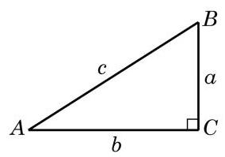

图 6-1-1

如图 6-1-1,将直角三角形 ${ABC}$ 中(其中 $\angle C = {90}^{ \circ  }$ ) $\angle A$ 、 $\angle B\text{ 、 }\angle C$ 的对边边长分别记作 $a\text{ 、 }b\text{ 、 }c$ . 在初中我们已经知道, 锐角 $A$ 的正弦、余弦、正切、余切的定义分别为

$$
\sin A = \frac{a}{c},\cos A = \frac{b}{c},\tan A = \frac{a}{b},\cot A = \frac{b}{a}.
$$

由简单的比值关系以及勾股定理, 还有如下结论:

$$
{\sin }^{2}A + {\cos }^{2}A = 1,\tan A = \frac{\sin A}{\cos A},
$$

$$
\cot A = \frac{\cos A}{\sin A},\cot A = \frac{1}{\tan A},
$$

$$
\sin \left( {{90}^{ \circ  } - A}\right)  = \cos A,\cos \left( {{90}^{ \circ  } - A}\right)  = \sin A,
$$

$$
\tan \left( {{90}^{ \circ  } - A}\right)  = \cot A,\cot \left( {{90}^{ \circ  } - A}\right)  = \tan A.
$$

我们还知道如下一些特殊角的正弦、余弦、正切、余切值 (表 6-1):

表 6-1

<table><tr><td>角度 $\alpha$</td><td>$\sin \alpha$</td><td>$\cos \alpha$</td><td>$\tan \alpha$</td><td>$\cot \alpha$</td></tr><tr><td>${30}^{ \circ  }$</td><td>$\frac{1}{2}$</td><td>$\frac{\sqrt{3}}{2}$</td><td>$\frac{\sqrt{3}}{3}$</td><td>$\sqrt{3}$</td></tr><tr><td>${45}^{ \circ  }$</td><td>$\frac{\sqrt{2}}{2}$</td><td>$\frac{\sqrt{2}}{2}$</td><td>1</td><td>1</td></tr><tr><td>${60}^{ \circ  }$</td><td>$\frac{\sqrt{3}}{2}$</td><td>$\frac{1}{2}$</td><td>$\sqrt{3}$</td><td>$\frac{\sqrt{3}}{3}$</td></tr></table>

### 2 任意角及其度量

在小学和初中我们已经知道, 角是具有公共端点的两条射线所组成的图形, 角还可以看作是平面上由一条射线绕着其端点从初始位置(始边)旋转到终止位置(终边)所形成的图形(图 6-1-2). 我们以前学习过的锐角、直角、钝角、平角和周角, 其大小都在 ${0}^{ \circ  }$ 到 ${360}^{ \circ  }$ 之间. 不过在体操、跳水等体育运动中,会听到转体 720°、转体1 080°等术语；当手表比标准时间慢或者快 10 分钟的时候,只需要将分针旋转 ${60}^{ \circ  }$ 就可以调节准确,但也有按顺时针和逆时针方向旋转的差异. 因此, 要准确地刻画这些现象, 对于角而言, 不但要考察旋转量, 而且要考察旋转方向, 这就需要适当推广角的概念.

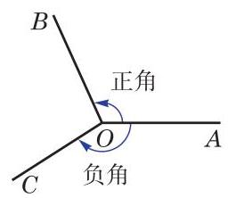

图 6-1-2

习惯上规定:一条射线绕端点按逆时针方向旋转所形成的角为正角，其度量值是正的；按顺时针方向旋转所形成的角为负角, 其度量值是负的(图 6-1-2).

特别地, 当一条射线没有旋转时, 我们也认为形成了一个角, 称为零角. 零角的始边与终边重合.

这样, 我们可将角的概念推广到任意角, 包括正角、负角与零角,也包括超过 ${360}^{ \circ  }$ 的角.

为了便于研究角及与其相关的问题,可将角置于平面直角坐标系中,使得角的顶点与坐标原点重合,角的始边与 $x$ 轴的正半轴重合. 此时角的终边在第几象限, 就说这个角是第几象限的角,或者说这个角属于第几象限. 如图 6-1-3, ${60}^{ \circ  }$ 和 ${420}^{ \circ  }$ 都是第一象限的角， ${135}^{ \circ  }$ 和 $- {225}^{ \circ  }$ 都是第二象限的角. 当角的终边在坐标轴上时, 就不说这些角属于哪一象限.

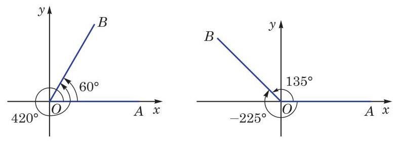

图 6-1-3

例如,若角 $\alpha$ 是第一象限的角,将其终边绕原点逆时针旋转 ${90}^{ \circ  }$ 后,所得的角 $\alpha  + {90}^{ \circ  }$ 是第二象限的角; 将其终边绕原点逆时针旋转 ${180}^{ \circ  }$ 后,所得的角 $\alpha  + {180}^{ \circ  }$ 是第三象限的角; 而将其终边绕原点顺时针旋转 ${90}^{ \circ  }$ 后,所得的角 $\alpha  - {90}^{ \circ  }$ 则是第四象限的角.

从角的形成过程中可以看到,与某一个角 $\alpha$ 的始边相同且终边重合的角有无数个,它们的大小与角 $\alpha$ 都相差 ${360}^{ \circ  }$ 的整数倍. 在图 6-1-3 中, ${60}^{ \circ  }$ 的角和 ${420}^{ \circ  }$ 的角的终边重合,前者与后者之差为 $- {360}^{ \circ  };{135}^{ \circ  }$ 的角和 $- {225}^{ \circ  }$ 的角的终边重合,前者与后者之差为 ${360}^{ \circ  }$ . 进一步,我们可以把所有与角 $\alpha$ 的终边重合的角 (包括角 $\alpha$ 本身)的集合表示为 Q

$$
\{ \beta  \mid  \beta  = k \cdot  {360}^{ \circ  } + \alpha , k \in  \mathbf{Z}\} .
$$

---

为简单起见, 在不引起混淆的前提下， “角 $\alpha$ ”或“ $\angle \alpha$ ”可简记作“ $\alpha$ ”.

---

例 1 判断下列各角分别属于哪个象限:

(1) $- {240}^{ \circ  }$ ； (2) ${2100}^{ \circ  }$ .

解(1)因为 $- {240}^{ \circ  } =  - {360}^{ \circ  } + {120}^{ \circ  }$ ,而 ${120}^{ \circ  }$ 的角属于第二象限, 所以 -240° 的角属于第二象限.

(2)因为 $2{100}^{ \circ  } = 5 \times  {360}^{ \circ  } + {300}^{ \circ  }$ ,而 ${300}^{ \circ  }$ 的角属于第四象限, 所以 2 ${100}^{ \circ  }$ 的角属于第四象限.

例 2 写出与 $- {200}^{ \circ  }$ 的终边重合的所有角组成的集合 $S$ , 并列举 $S$ 中满足不等式 $- {360}^{ \circ  } \leq  \beta  < {720}^{ \circ  }$ 的所有元素 $\beta$ .

解 因为

$$
S = \left\{  {\beta  \mid  \beta  = k \cdot  {360}^{ \circ  } - {200}^{ \circ  }, k \in  \mathbf{Z}}\right\}  ,
$$

所以当 $- {360}^{ \circ  } \leq  \beta  < {720}^{ \circ  }$ 时, $\beta  =  - {200}^{ \circ  }$ 或 ${160}^{ \circ  }$ 或 ${520}^{ \circ  }$ .

#### 练习 6.1(1)

1. 判断下列命题是否正确:

(1)终边重合的两个角相等; (2)锐角是第一象限的角；

(3)第二象限的角是钝角； (4)小于 ${90}^{ \circ  }$ 的角都是锐角.

2. 分别用集合的形式表示终边位于第三象限的所有角和终边位于 $y$ 轴正半轴上的所有角.
3. 在 ${0}^{ \circ  } \sim  {360}^{ \circ  }$ 范围内,分别找出终边与下列各角的终边重合的角,并判断它们是第几象限的角:

(1)一315°； (2) ${905.3}^{ \circ  }$ ； (3)-1090°； (4) ${530}^{ \circ  }$ .

度量长度可以用米为单位, 度量质量可以用千克为单位, 适当的单位制会给解决问题带来极大的便利. 度量角的大小与度量其他量一样, 也要选择一个同类的量作为度量的单位. 在平面几何中,我们把周角的 $\frac{1}{360}$ 作为 1 度. 用 “度” 作为单位来度量角的单位制叫做角度制.

表示角的方法, 用角度制虽很直观, 但很多情况下并不一定方便. 下面我们引入一种度量角的新方法, 为了叙述方便, 先讨论角度在 ${0}^{ \circ  }$ 到 ${360}^{ \circ  }$ 之间的情形. 观察不难发现: 在半径为 $r$ 的圆中,当圆心角为 ${360}^{ \circ  }$ 时,圆的周长为 ${2\pi r}$ ; 当圆心角为 ${180}^{ \circ  }$ 时, 半圆的弧长为 ${\pi r}$ ; 而当圆心角为 ${90}^{ \circ  }$ 时,四分之一圆的弧长为 $\frac{\pi r}{2}$ . 由初中所学习的计算扇形弧长公式可知,在给定半径的圆中, 弧的长度与相应圆心角的大小成正比例关系, 因此我们不仅可以用角度来度量弧的长度, 而且可以用弧长来度量角的大小. 具体来说,在半径为 $r$ 的圆周上,如果弧长 $l$ 所对应圆心角 $\alpha$ 的度数为 $n$ ,那么 $l$ 与 $n$ 之间的关系式为 $l = {2\pi r} \cdot  \frac{n}{360}$ ,即 $\frac{l}{r} = \; \frac{\pi }{180} \cdot  n$ ,这说明比值 $\frac{l}{r}$ 仅由角 $\alpha$ 的大小决定. 这样我们就可以用圆弧的长与圆半径的比值来表示这个圆弧所对的圆心角的大小. 相应地, 把弧长等于半径的弧所对的圆心角叫做 1 弧度 (radian) 的角(图 6-1-4). 用“弧度”作为单位来度量角的单位制叫做弧度制.

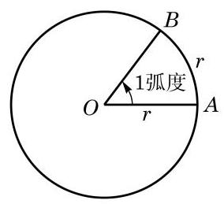

图 6-1-4

如果一个半径为 $r$ 的圆的圆心角 $\alpha$ 所对的弧长为 $l$ ,那么 $\frac{l}{r}$ 就是角 $\alpha$ 的弧度 (角 $\alpha$ 的弧度数通常也用 $\alpha$ 来表示),即 $\alpha  = \frac{l}{r}$ . 零角的弧度数为 0 . 从弧度的定义不难得知,周角为 ${2\pi }$ 弧度,即 ${360}^{ \circ  } = {2\pi }$ 弧度; 平角为 $\pi$ 弧度,即 ${180}^{ \circ  } = \pi$ 弧度. 从而有

---

在学习微积分后可以更明显地看出弧度制的优点.

---

${1}^{ \circ  } = \frac{\pi }{180}$ 弧度,1 弧度 $= \frac{{180}^{ \circ  }}{\pi }$ .

在任意角的情形下，角 $\alpha$ 的终边每逆时针旋转一圈，弧度加 ${2\pi }$ ; 角 $\alpha$ 的终边从起始位置顺时针旋转,弧度为负值,每顺时针旋转一圈,弧度减 ${2\pi }$ .

例 3 按下列要求,将 ${75}^{ \circ  }$ 换算成弧度:

(1)精确值;

(2)近似值. (结果精确到 0.001)

解 (1) ${75}^{ \circ  } = {75} \times  \frac{\pi }{180}$ 弧度 $= \frac{5}{12}\pi$ 弧度.

(2)计算得 $\frac{5}{12}\pi  \approx  {1.309}$ ,从而 ${75}^{ \circ  } \approx  {1.309}$ 弧度.

例 4 将 2.1 弧度换算成角度. (用度数表示, 结果保留两位小数)

解 2.1 弧度 $= {2.1} \times  \frac{{180}^{ \circ  }}{\pi } \approx  {120.32}^{ \circ  }$ .

请同学们根据一些常用特殊角的角度与弧度的对应关系, 填写下表.

表 6-2

<table><tr><td>角度</td><td>${0}^{ \circ  }$</td><td>${30}^{ \circ  }$</td><td>${45}^{ \circ  }$</td><td>${60}^{ \circ  }$</td><td></td><td></td><td>135°</td><td></td><td>180°</td><td>${270}^{ \circ  }$</td><td>${360}^{ \circ  }$</td></tr><tr><td>弧度</td><td></td><td></td><td></td><td></td><td>$\frac{\pi }{2}$</td><td>$\frac{2\pi }{3}$</td><td></td><td>$\frac{5\pi }{6}$</td><td>$\pi$</td><td></td><td>${2\pi }$</td></tr></table>

在弧度和角度的换算过程中, 应当注意角度制为 60 进位制. 例如, ${32}^{ \circ  }{18}^{\prime }$ 应先换算成 ${32.3}^{ \circ  }$ ,再换算成弧度.

在弧度制下, 每个角都是一个确定的实数, 而每个实数也可以表示一个确定的角, 这就构成了角的集合与实数集合之间的一个一一对应关系.

---

角度和弧度不可混用. 在使用计算器的时候, 要注意所指的是角度制还是弧度制.

---

在用弧度制表示角时, 通常省略“弧度”两字，只写这个角所对应的弧度数. 例如,角 $\alpha$ 和角 $\beta$ 的互补关系可以表示为 $\alpha  + \beta  = \; \pi$ ,而 $\sin {1.2}$ 则表示 1.2 弧度的角的正弦.

引入弧度制使得扇形的弧长和面积公式变得简洁漂亮, 更使微积分中的许多公式变得格外简明. 例如，如图 6-1-5，当扇形的圆心角为 ${n}^{ \circ  }$ ,而半径为 $r$ 时,扇形的弧长 $l$ 和面积 $S$ 的公式分别为 $l = \frac{n}{180} \times  {\pi r} = \frac{n\pi r}{180}$ 及 $S = \frac{n}{360} \times  \pi {r}^{2} = \frac{{n\pi }{r}^{2}}{360}$ . 在使用弧度制后,圆心角相应的弧度为 $\alpha  = \frac{\pi }{180} \times  n = \frac{n\pi }{180}$ ,因此上述公式可分别简化为

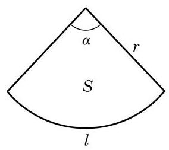

图 6-1-5

扇形的弧长 $l = {\alpha r}$ ,

扇形的面积 $S = \frac{1}{2}\alpha {r}^{2}$ .

例 5 写出终边在 $x$ 轴上的所有角组成的集合. (用弧度制表示)

解 当角 $\alpha$ 的终边在 $x$ 轴正半轴上时, $\alpha  = {2k\pi }, k \in  \mathbf{Z}$ ; 而当角 $\alpha$ 的终边在 $x$ 轴负半轴上时, $\alpha  = {2k\pi } + \pi , k \in  \mathbf{Z}$ .

所以,所求的角的集合为 $\{ \alpha  \mid  \alpha  = {k\pi }, k \in  \mathbf{Z}\}$ .

例 6 设 $\alpha$ 是第二象限的角,判断 $\frac{\alpha }{2}$ 是哪个象限的角.

解 因为 $\alpha$ 是第二象限的角,所以

$$
{2k\pi } + \frac{\pi }{2} < \alpha  < {2k\pi } + \pi , k \in  \mathbf{Z},
$$

从而有

$$
{k\pi } + \frac{\pi }{4} < \frac{\alpha }{2} < {k\pi } + \frac{\pi }{2}, k \in  \mathbf{Z}.
$$

(1)当 $k$ 为奇数时，设 $k = {2n} + 1, n \in  \mathbf{Z}$ ，就有

$$
{2n\pi } + \frac{5}{4}\pi  < \frac{\alpha }{2} < {2n\pi } + \frac{3}{2}\pi , n \in  \mathbf{Z},
$$

所以 $\frac{\alpha }{2}$ 是第三象限的角;

(2)当 $k$ 为偶数时,设 $k = {2n}, n \in  \mathbf{Z}$ ,就有

$$
{2n\pi } + \frac{\pi }{4} < \frac{\alpha }{2} < {2n\pi } + \frac{\pi }{2}, n \in  \mathbf{Z},
$$

所以 $\frac{\alpha }{2}$ 是第一象限的角.

由上可知, $\frac{\alpha }{2}$ 是第一象限或第三象限的角.

#### 练习 6.1(2)

1. 分别将下列角度化为弧度:

${15}^{ \circ  }$ ; $- {108}^{ \circ  }$ ; ${22}^{ \circ  }{30}^{\prime }$ .

2. 分别将下列弧度化为角度:

$\frac{11}{12}\pi \; - \frac{2}{5}\pi$ -3 (结果精确到 ${0.01}^{ \circ  }$ ).

3. 已知扇形的弧所对的圆心角为 ${54}^{ \circ  }$ ,且半径为 ${10}\mathrm{\;{cm}}$ . 求该扇形的弧长和面积.
4. 如果 $\alpha$ 是第三象限的角,判断 $\frac{\alpha }{2}$ 是哪个象限的角.

### 3 任意角的正弦、余弦、正切、余切

我们将锐角 $\alpha$ 置于平面直角坐标系中,使角 $\alpha$ 的顶点与坐标原点 $O$ 重合,始边与 $x$ 轴的正半轴重合,那么它的终边必在第一象限. 如图 6-1-6,在角 $\alpha$ 的终边上任取异于原点的一点 $P\left( {x, y}\right)$ , 它与原点的距离 $r = \sqrt{{x}^{2} + {y}^{2}} > 0$ . 过点 $P$ 作 $x$ 轴的垂线,设垂足为 $M$ ,则线段 ${OM}$ 的长度 $\left| {OM}\right|$ 为 $x$ ,而线段 ${MP}$ 的长度 $\left| {MP}\right|$ 为 $y$ . 根据锐角的正弦、余弦、正切及余切的定义,有

$$
\sin \alpha  = \frac{\left| MP\right| }{\left| OP\right| } = \frac{y}{r},\cos \alpha  = \frac{\left| OM\right| }{\left| OP\right| } = \frac{x}{r}.
$$

$$
\tan \alpha  = \frac{\left| MP\right| }{\left| OM\right| } = \frac{y}{x},\cot \alpha  = \frac{\left| OM\right| }{\left| MP\right| } = \frac{x}{y}.
$$

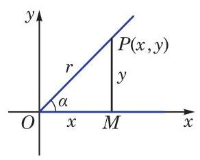

图 6-1-6

Q

---

线段 ${OM}$ 的长度通常用 $\left| {OM}\right|$ 表示. 在不引起混淆的前提下， 也可用 ${OM}$ 表示.

---

这说明锐角 $\alpha$ 的正弦、余弦、正切及余切可以用角 $\alpha$ 的终边上点的坐标来定义. 这样,就可以对任意给定的角 $\alpha$ ,定义其相应的正弦、余弦、正切及余切.

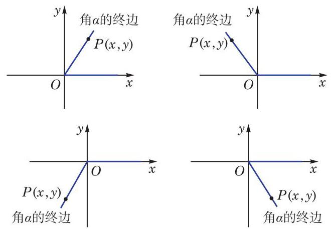

图 6-1-7

如图 6-1-7,在任意角 $\alpha$ 的终边上任取异于原点的一点 $P$ , 设其坐标为 $\left( {x, y}\right)$ ,并令 $\left| {OP}\right|  = r$ ,必有 $r = \sqrt{{x}^{2} + {y}^{2}} > 0$ . 这样,就可以分别定义角 $\alpha$ 的正弦、余弦、正切、余切为

$$
\sin \alpha  = \frac{y}{r},\;\cos \alpha  = \frac{x}{r},
$$

$$
\tan \alpha  = \frac{y}{x}\left( {x \neq  0}\right) ,\cot \alpha  = \frac{x}{y}\left( {y \neq  0}\right) .
$$

---

由相似三角形知识可知,角 $\alpha$ 的正弦、 余弦、正切及余切值只与角 $\alpha$ 的终边有关, 而与在终边上所取的点 $P$ 的位置无关.

---

应当注意的是: 当 $\alpha  = {k\pi } + \frac{\pi }{2}\left( {k \in  \mathbf{Z}}\right)$ ,即角 $\alpha$ 的终边位于 $y$ 轴上时, $\tan \alpha  = \frac{y}{x}$ 无意义; 而当 $\alpha  = {k\pi }\left( {k \in  \mathbf{Z}}\right)$ ,即角 $\alpha$ 的终边位于 $x$ 轴上时, $\cot \alpha  = \frac{x}{y}$ 无意义.

例 7 已知角 $\alpha$ 的终边经过点 $P\left( {1, - 2}\right)$ ，求角 $\alpha$ 的正弦、 余弦、正切及余切值.

解 由 $x = 1, y =  - 2$ ,有 $r = \sqrt{{1}^{2} + {\left( -2\right) }^{2}} = \sqrt{5}$ ,从而

$$
\sin \alpha  = \frac{y}{r} =  - \frac{2\sqrt{5}}{5},\cos \alpha  = \frac{x}{r} = \frac{\sqrt{5}}{5},
$$

$$
\tan \alpha  = \frac{y}{x} =  - 2,\cot \alpha  = \frac{x}{y} =  - \frac{1}{2}.
$$

例 8 已知角 $\alpha$ 的终边经过点 $P\left( {-2,0}\right)$ ,求角 $\alpha$ 的正弦、 余弦、正切及余切值.

解 由 $x =  - 2, y = 0$ ,有 $r = \sqrt{{\left( -2\right) }^{2} + {0}^{2}} = 2$ ,从而

$$
\sin \alpha  = \frac{y}{r} = 0,\cos \alpha  = \frac{x}{r} =  - 1,
$$

$$
\tan \alpha  = \frac{y}{x} = 0,\cot \alpha \text{ 不存在. }
$$

由于角 $\alpha$ 的正弦、余弦、正切及余切值可以由其终边上一点 $P$ 的坐标求出,因此不难根据点 $P$ 的坐标来判断角 $\alpha$ 的正弦、 余弦、正切及余切的符号,如表 6-3 所示.

表 6-3

<table><tr><td rowspan="2">角 $\alpha$ 所属的象限</td><td colspan="2">点 $P$ 的坐标</td><td rowspan="2">$\sin \alpha$</td><td rowspan="2">$\cos \alpha$</td><td rowspan="2">$\tan \alpha$</td><td rowspan="2">$\cot \alpha$</td></tr><tr><td>$x$</td><td>$y$</td></tr><tr><td>第一象限</td><td>+</td><td>+</td><td>+</td><td>+</td><td>+</td><td>+</td></tr><tr><td>第二象限</td><td>-</td><td>+</td><td>+</td><td>-</td><td>-</td><td>-</td></tr><tr><td>第三象限</td><td>-</td><td>-</td><td>-</td><td>-</td><td>+</td><td>+</td></tr><tr><td>第四象限</td><td>+</td><td>-</td><td>-</td><td>+</td><td>-</td><td>-</td></tr></table>

上表的结果可用图 6-1-8 直观表示.

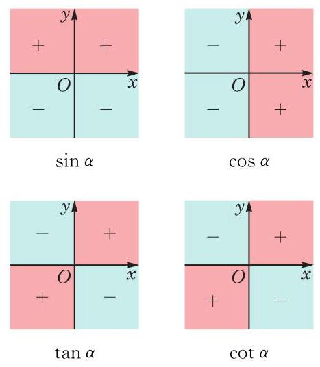

图 6-1-8

例 9 若角 $\alpha$ 满足 $\sin \alpha  > 0$ ,且 $\tan \alpha  < 0$ ,则角 $\alpha$ 属于第几象限?

解 由 $\sin \alpha  > 0$ ,知角 $\alpha$ 属于第一象限或第二象限或其终边位于 $y$ 轴的正半轴上. 又由 $\tan \alpha  < 0$ ,知 $\alpha$ 属于第二象限或第四象限.

因此,角 $\alpha$ 属于第二象限.

#### 练习 6.1(3)

1. 已知角 $\alpha$ 的终边过点 $P\left( {{2a}, - {3a}}\right) \left( {a < 0}\right)$ ，求角 $\alpha$ 的正弦、余弦、正切及余切值.
2. 已知角 $\alpha$ 的终边过点 $P\left( {0, - 3}\right)$ ,则下列值不存在的是 ( )

A. $\sin \alpha$ ; B. $\cos \alpha$ ;

C. $\tan \alpha$ ; D. $\cot \alpha$ .

3. 根据下列条件,分别判断角 $\theta$ 属于第几象限:

(1) $\sin \theta  =  - \frac{1}{2}$ 且 $\cos \theta  =  - \frac{\sqrt{3}}{2}$ ; (2) $\sin \theta  < 0$ 且 $\tan \theta  > 0$ .

根据定义,角 $\alpha$ 的正弦、余弦、正切及余切值仅与角 $\alpha$ 的大小有关,而与角 $\alpha$ 的终边上的点 $P$ 的位置无关,因此我们可以用角 $\alpha$ 的终边上到原点距离为 1 的点来确定角 $\alpha$ 的正弦、余弦、 正切及余切值.

半径为 1 个单位的圆称为单位圆(unit circle). 本章中, 如无特别说明, 单位圆通常指在平面直角坐标系中以原点为圆心, 以 1 为半径的圆.

将角 $\alpha$ 的顶点置于坐标原点 $O$ ,始边与 $x$ 轴的正半轴重合, 则角 $\alpha$ 的终边与以原点为圆心的单位圆交于唯一的一点 $P\left( {x, y}\right)$ , 如图 6-1-9 所示. 这样,任意一个角 $\alpha$ 对应于单位圆上一点 $P$ ; 反之,单位圆上一点 $P$ 可对应无穷多个角,但这些角的弧度数之差必为 ${2\pi }$ 的整数倍. 由定义可知, $x = \cos \alpha , y = \sin \alpha$ . 因此, 单位圆上点 $P$ 的坐标必可以写为 $\left( {\cos \alpha ,\sin \alpha }\right)$ .

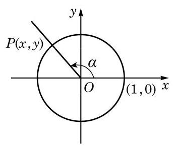

图 6-1-9

例 10 求角 $\frac{5\pi }{4}$ 的正弦、余弦和正切值.

解 设角 $\frac{5\pi }{4}$ 的终边交以原点为圆心的单位圆于点 $P$ ,过点 $P$ 作 $x$ 轴的垂线,其垂足为 $M$ ,如图 6-1-10 所示. 在直角三角形 ${OMP}$ 中, $\angle {MOP} = \frac{\pi }{4}$ ,由此可得 $\left| {OM}\right|  = \frac{\sqrt{2}}{2},\left| {MP}\right|  = \frac{\sqrt{2}}{2}$ ,所以点 $P$ 的坐标为 $\left( {-\frac{\sqrt{2}}{2}, - \frac{\sqrt{2}}{2}}\right)$ . 于是, $\sin \frac{5\pi }{4} =  - \frac{\sqrt{2}}{2},\cos \frac{5\pi }{4} = \; - \frac{\sqrt{2}}{2}$ ,而 $\tan \frac{5\pi }{4} = 1$ .

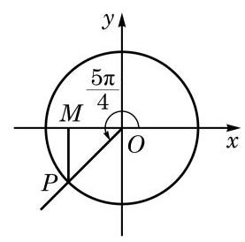

图 6-1-10

对终边与坐标轴重合的角 $\alpha$ ,设终边与以原点为圆心的单位圆的交点为 $P$ ,请同学们完成以下表格 (表 6-4).

表 6-4

<table><tr><td>$\alpha$</td><td>点 $P$ 的坐标</td><td>$\sin \alpha$</td><td>$\cos \alpha$</td><td>$\tan \alpha$</td><td>$\cot \alpha$</td></tr><tr><td>$\alpha  = {2k\pi }\left( {k \in  \mathbf{Z}}\right)$</td><td>(1,0)</td><td>0</td><td>1</td><td>0</td><td>不存在</td></tr><tr><td></td><td>(0,1)</td><td></td><td></td><td></td><td></td></tr><tr><td></td><td>(-1,0)</td><td></td><td></td><td></td><td></td></tr><tr><td></td><td>(0,-1)</td><td></td><td></td><td></td><td></td></tr></table>

设角 $\alpha$ 的终边经过异于原点的一点 $P\left( {x, y}\right)$ ,并记

$$
r = \sqrt{{x}^{2} + {y}^{2}} > 0.
$$

由定义, 有

$$
\sin \alpha  = \frac{y}{r},\cos \alpha  = \frac{x}{r},\tan \alpha  = \frac{y}{x}\left( {x \neq  0}\right) ,\cot \alpha  = \frac{x}{y}\left( {y \neq  0}\right) .
$$

由 ${x}^{2} + {y}^{2} = {r}^{2}$ ,就有

$$
{\sin }^{2}\alpha  + {\cos }^{2}\alpha  = 1.
$$

当 $\cos \alpha  \neq  0$ 时,有

$$
\tan \alpha  = \frac{\sin \alpha }{\cos \alpha }.
$$

当 $\sin \alpha  \neq  0$ 时,有

$$
\cot \alpha  = \frac{\cos \alpha }{\sin \alpha }.
$$

当 $\tan \alpha \text{ 、 }\cot \alpha$ 都有意义时,有

$$
\tan \alpha  \cdot  \cot \alpha  = 1.
$$

根据以上关系,如果知道角 $\alpha$ 的正弦、余弦、正切及余切之中的一个值, 就可以求出其他值.

例 11 已知 $\sin \alpha  = \frac{3}{5}$ ,且 $\alpha$ 为第二象限的角. 求 $\cos \alpha$ , $\tan \alpha$ 及 $\cot \alpha$ .

解 因为 $\alpha$ 为第二象限的角,所以 $\cos \alpha  < 0$ .

由 ${\sin }^{2}\alpha  + {\cos }^{2}\alpha  = 1$ ,得

$$
\cos \alpha  =  - \sqrt{1 - {\sin }^{2}\alpha } =  - \frac{4}{5},
$$

从而

$$
\tan \alpha  = \frac{\sin \alpha }{\cos \alpha } =  - \frac{3}{4},\cot \alpha  = \frac{1}{\tan \alpha } =  - \frac{4}{3}.
$$

例 12 已知 $\tan \alpha  =  - \frac{5}{12}$ ,求 $\sin \alpha \text{ 、 }\cos \alpha$ 及 $\cot \alpha$ .

解

$$
\cot \alpha  = \frac{1}{\tan \alpha } =  - \frac{12}{5}.
$$

因为 $\tan \alpha  =  - \frac{5}{12} < 0$ ,所以 $\alpha$ 为第二象限或第四象限的角.

因为 $\tan \alpha  = \frac{\sin \alpha }{\cos \alpha }$ ,所以 $\frac{\sin \alpha }{\cos \alpha } =  - \frac{5}{12}$ .

? 又因为 ${\sin }^{2}\alpha  + {\cos }^{2}\alpha  = 1$ ,解方程组

$$
\left\{  \begin{array}{l} {\sin }^{2}\alpha  + {\cos }^{2}\alpha  = 1, \\  \frac{\sin \alpha }{\cos \alpha } =  - \frac{5}{12}, \end{array}\right.
$$

得

---

能否利用直角三角形知识与角的正弦、 余弦、正切和余切值在各象限的符号, 快速给出例 12 的答案?

---

$\sin \alpha  = \frac{5}{13},\cos \alpha  =  - \frac{12}{13}$ ,或 $\sin \alpha  =  - \frac{5}{13},\cos \alpha  = \frac{12}{13}$ .

于是,当 $\alpha$ 为第二象限的角时, $\sin \alpha  = \frac{5}{13},\cos \alpha  =  - \frac{12}{13}$ ; 而当 $\alpha$ 为第四象限的角时, $\sin \alpha  =  - \frac{5}{13},\cos \alpha  = \frac{12}{13}$ .

#### 练习 6.1(4)

1. 求角 $\frac{5}{3}\pi$ 的正弦、余弦、正切及余切值.
2. 分别求 $\sin {k\pi }\left( {k \in  \mathbf{Z}}\right)$ 和 $\cos {k\pi }\left( {k \in  \mathbf{Z}}\right)$ 的值.
3. 已知 $\alpha$ 为第三象限的角， $\cos \alpha  =  - \frac{\sqrt{5}}{5}$ . 求 $\sin \alpha \text{ 、 }\tan \alpha$ 及 $\cot \alpha$ .
4. 已知 $\cot \alpha  = \frac{1}{3}$ ,求 $\sin \alpha \text{ 、 }\cos \alpha$ 及 $\tan \alpha$ .

利用任意角 $\alpha$ 的正弦、余弦、正切及余切之间的关系，可以化简表达式并证明一些恒等式.

例 13 ( 1 )已知 $\sin \alpha  + \cos \alpha  = \frac{1}{5}$ ，求 $\sin \alpha \cos \alpha$ 的值；

( 2 )已知 $\tan \alpha  = \frac{1}{2}$ ，求 ${\sin }^{2}\alpha  - \sin \alpha \cos \alpha  - {\cos }^{2}\alpha$ 的值.

解(1)因为

$$
{\left( \sin \alpha  + \cos \alpha \right) }^{2} = {\sin }^{2}\alpha  + {\cos }^{2}\alpha  + 2\sin \alpha \cos \alpha  = 1 + 2\sin \alpha \cos \alpha ,
$$

即

$$
\frac{1}{25} = 1 + 2\sin \alpha \cos \alpha ,
$$

所以 $\sin \alpha \cos \alpha  =  - \frac{12}{25}$ .

(2)因为 $\tan \alpha  = \frac{1}{2}$ ，所以 $\cos \alpha  \neq  0$ ，从而有

$$
{\sin }^{2}\alpha  - \sin \alpha \cos \alpha  - {\cos }^{2}\alpha  = \frac{{\sin }^{2}\alpha  - \sin \alpha \cos \alpha  - {\cos }^{2}\alpha }{{\sin }^{2}\alpha  + {\cos }^{2}\alpha }
$$

$$
= \frac{{\tan }^{2}\alpha  - \tan \alpha  - 1}{{\tan }^{2}\alpha  + 1}
$$

$$
= \frac{\frac{1}{4} - \frac{1}{2} - 1}{\frac{1}{4} + 1} =  - 1\text{ . }
$$

例 14 证明下列恒等式:

(1) $1 + {\tan }^{2}\alpha  = \frac{1}{{\cos }^{2}\alpha }$ ；

(2) $1 + {\cot }^{2}\alpha  = \frac{1}{{\sin }^{2}\alpha }$ ；

(3) $\frac{1 + \cos \alpha }{\sin \alpha } = \frac{\sin \alpha }{1 - \cos \alpha }$ ；___ Q

---

通常记

$\sec \alpha  = \frac{1}{\cos \alpha },$

$\csc \alpha  = \frac{1}{\sin \alpha }.$

例 14(1)与(2)中的公式就可简写为

$1 + {\tan }^{2}\alpha  = {\sec }^{2}\alpha ,$

$1 + {\cot }^{2}\alpha  = {\csc }^{2}\alpha$

---

(4) $\frac{{\sin }^{2}\alpha  - {\sin }^{2}\beta }{{\tan }^{2}\alpha  - {\tan }^{2}\beta } = {\cos }^{2}\alpha {\cos }^{2}\beta$ .

证明 (1) $1 + {\tan }^{2}\alpha  = 1 + \frac{{\sin }^{2}\alpha }{{\cos }^{2}\alpha } = \frac{{\cos }^{2}\alpha  + {\sin }^{2}\alpha }{{\cos }^{2}\alpha } = \frac{1}{{\cos }^{2}\alpha }$ .

(2) $1 + {\cot }^{2}\alpha  = 1 + \frac{{\cos }^{2}\alpha }{{\sin }^{2}\alpha } = \frac{{\sin }^{2}\alpha  + {\cos }^{2}\alpha }{{\sin }^{2}\alpha } = \frac{1}{{\sin }^{2}\alpha }$ .

(3)因为

$$
\frac{1 + \cos \alpha }{\sin \alpha } = \frac{\left( {1 + \cos \alpha }\right) \left( {1 - \cos \alpha }\right) }{\sin \alpha \left( {1 - \cos \alpha }\right) } = \frac{1 - {\cos }^{2}\alpha }{\sin \alpha \left( {1 - \cos \alpha }\right) }
$$

$$
= \frac{{\sin }^{2}\alpha }{\sin \alpha \left( {1 - \cos \alpha }\right) } = \frac{\sin \alpha }{1 - \cos \alpha },
$$

所以原式成立.

(4)因为左边 $= \frac{{\sin }^{2}\alpha  - {\sin }^{2}\beta }{\frac{{\sin }^{2}\alpha }{{\cos }^{2}\alpha } - \frac{{\sin }^{2}\beta }{{\cos }^{2}\beta }} = \frac{\left( {{\sin }^{2}\alpha  - {\sin }^{2}\beta }\right) {\cos }^{2}\alpha {\cos }^{2}\beta }{{\sin }^{2}\alpha {\cos }^{2}\beta  - {\sin }^{2}\beta {\cos }^{2}\alpha }$

$$
= \frac{\left( {{\sin }^{2}\alpha  - {\sin }^{2}\beta }\right) {\cos }^{2}\alpha {\cos }^{2}\beta }{{\sin }^{2}\alpha \left( {1 - {\sin }^{2}\beta }\right)  - {\sin }^{2}\beta \left( {1 - {\sin }^{2}\alpha }\right) }
$$

$$
= \frac{\left( {{\sin }^{2}\alpha  - {\sin }^{2}\beta }\right) {\cos }^{2}\alpha {\cos }^{2}\beta }{{\sin }^{2}\alpha  - {\sin }^{2}\beta }
$$

$$
= {\cos }^{2}\alpha {\cos }^{2}\beta  = \text{ 右边, }
$$

所以原式成立.

#### 练习 6.1(5)

1. 已知 $\tan \alpha  = 3$ ,求 $\frac{2\sin \alpha  + \cos \alpha }{\sin \alpha  - \cos \alpha }$ 的值.
2. 化简:

(1) ${\sin }^{2}\alpha  + {\sin }^{2}\alpha {\cos }^{2}\alpha  + {\cos }^{4}\alpha$ ; (2) $\sin \alpha \cos \alpha \left( {\tan \alpha  + \cot \alpha }\right)$ .

3. 证明: ${\cot }^{2}\alpha  - {\cos }^{2}\alpha  = {\cot }^{2}\alpha  \cdot  {\cos }^{2}\alpha$ .

### 4 诱导公式

${2k\pi } + \alpha \left( {k \in  \mathbf{Z}}\right) , - \alpha ,\pi  \pm  \alpha ,\frac{\pi }{2} \pm  \alpha$ 这些角都与角 $\alpha$ 有特殊的关系. 已知角 $\alpha$ 的正弦、余弦、正切及余切值,能否快速给出上述这些角的正弦、余弦、正切及余切值？这就是诱导公式要解决的问题.

由于角 ${2k\pi } + \alpha \left( {k \in  \mathbf{Z}}\right)$ 的终边与角 $\alpha$ 的终边重合,因此由定义有如下诱导公式:

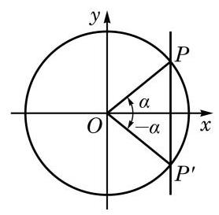

图 6-1-11

由这组诱导公式, 求任意角的正弦、余弦、正切及余切值可以转化为求 $\lbrack 0,{2\pi })$ 范围内一个角的相应值.

角 $\alpha$ 的终边与角 $- \alpha$ 的终边关于 $x$ 轴对称(图 6-1-11)，角 $\alpha$ 的终边与单位圆交于点 $P\left( {\cos \alpha ,\sin \alpha }\right)$ ，而角 $- \alpha$ 的终边与单位圆交于点 ${P}^{\prime }\left( {\cos \left( {-\alpha }\right) ,\sin \left( {-\alpha }\right) }\right)$ . 由于点 $P$ 与点 ${P}^{\prime }$ 关于 $x$ 轴对称, 其横坐标相等, 而纵坐标互为相反数, 因此有如下诱导公式:

$$
\sin \left( {-\alpha }\right)  =  - \sin \alpha ,\;\cos \left( {-\alpha }\right)  = \cos \alpha ,
$$

$$
\tan \left( {-\alpha }\right)  =  - \tan \alpha ,\;\cot \left( {-\alpha }\right)  =  - \cot \alpha .
$$

由这组诱导公式, 求负角的正弦、余弦、正切及余切值可以转化为求正角的相应值.

将角 $\alpha$ 的终边绕着原点 $O$ 按逆时针方向旋转 $\pi$ 弧度,得到角 $\pi  + \alpha$ 的终边 (图 6-1-12),这说明角 $\alpha$ 和角 $\pi  + \alpha$ 的终边在同一条直线上,但方向相反. 角 $\alpha$ 的终边与单位圆交于点 $P\left( {\cos \alpha ,\sin \alpha }\right)$ ,角 $\pi  + \alpha$ 的终边与单位圆交于点 ${P}^{\prime }(\cos \left( {\pi  + \alpha }\right)$ , $\sin \left( {\pi  + \alpha }\right) )$ . 由于点 $P$ 与点 ${P}^{\prime }$ 关于原点对称,其横坐标和纵坐标都互为相反数，因此有如下诱导公式:

$$
\sin \left( {\pi  + \alpha }\right)  =  - \sin \alpha ,\;\cos \left( {\pi  + \alpha }\right)  =  - \cos \alpha ,
$$

$$
\tan \left( {\pi  + \alpha }\right)  = \tan \alpha ,\;\cot \left( {\pi  + \alpha }\right)  = \cot \alpha .
$$

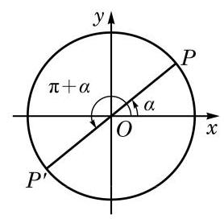

图 6-1-12

由这组诱导公式,求 $\lbrack 0,{2\pi })$ 范围内的角的正弦、余弦、正切及余切值可以转化到 $\lbrack 0,\pi )$ 范围内一个角的相应值.

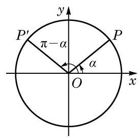

图 6-1-13

角 $\alpha$ 的终边与单位圆交于点 $P\left( {\cos \alpha ,\sin \alpha }\right)$ ,而角 $\pi  - \alpha$ 的终边与单位圆交于点 ${P}^{\prime }\left( {\cos \left( {\pi  - \alpha }\right) ,\sin \left( {\pi  - \alpha }\right) }\right)$ . 由于角 $\alpha$ 的终边和角 $\pi  - \alpha$ 的终边关于 $y$ 轴对称(图 6-1-13)，点 $P$ 与点 ${P}^{\prime }$ 关于 $y$ 轴对称, 其横坐标为相反数, 而纵坐标相等, 因此有如下诱导公式:

$$
\sin \left( {\pi  - \alpha }\right)  = \sin \alpha ,\;\cos \left( {\pi  - \alpha }\right)  =  - \cos \alpha ,
$$

$$
\tan \left( {\pi  - \alpha }\right)  =  - \tan \alpha ,\;\cot \left( {\pi  - \alpha }\right)  =  - \cot \alpha .
$$

由这组诱导公式,求 $\lbrack 0,\pi )$ 范围内的角的正弦、余弦、正切及余切值可以转化到 $\left\lbrack  {0,\frac{\pi }{2}}\right\rbrack$ 范围内一个角的相应值.

利用以上四组诱导公式, 就可以将终边不位于坐标轴上的任意角的正弦、余弦、正切及余切值, 与初中已学过的锐角的相应值有机地联系起来.

以上四组诱导公式说明, ${2k\pi } + \alpha \left( {k \in  \mathbf{Z}}\right) , - \alpha ,\pi  \pm  \alpha$ 的正弦、余弦、正切及余切值的绝对值等于角 $\alpha$ 的相应量的绝对值, 但这两个值之间可能差一个正负号. 由于诱导公式较多, 记忆其中的正负号并不容易, 但有一个很简单的方法可以加以判断, 即: 当 $\alpha$ 为锐角时,等式两边必须同时为正数或同时为负数.

例如, $\cos \left( {\pi  - \alpha }\right)$ 的绝对值应该同 $\cos \alpha$ 的绝对值相等,即成立 $\cos \left( {\pi  - \alpha }\right)  =  \pm  \cos \alpha$ . 但当 $\alpha$ 为锐角时, $\pi  - \alpha$ 是第二象限的角,这时 $\cos \left( {\pi  - \alpha }\right)  < 0$ ,而 $\cos \alpha  > 0$ ,所以前式中应该取负号, 即有 $\cos \left( {\pi  - \alpha }\right)  =  - \cos \alpha$ .

例 15 利用诱导公式求值:

(1) $\sin \frac{20}{3}\pi$

(2) $\cos \left( {-\frac{7}{6}\pi }\right)$ ；

(3) $\tan \left( {-\frac{19}{4}\pi }\right)$ .

Q

解 (1) $\sin \frac{20}{3}\pi  = \sin \left( {{6\pi } + \frac{2}{3}\pi }\right)  = \sin \frac{2}{3}\pi$

$$
= \sin \left( {\pi  - \frac{\pi }{3}}\right)  = \sin \frac{\pi }{3} = \frac{\sqrt{3}}{2}.
$$

---

到底使用哪一个诱导公式求值, 可以有多种选择.

---

(2) $\cos \left( {-\frac{7}{6}\pi }\right)  = \cos \frac{7}{6}\pi  = \cos \left( {\pi  + \frac{\pi }{6}}\right)  =  - \cos \frac{\pi }{6} =  - \frac{\sqrt{3}}{2}$ .

(3) $\tan \left( {-\frac{19}{4}\pi }\right)  =  - \tan \frac{19}{4}\pi  =  - \tan \left( {{5\pi } - \frac{\pi }{4}}\right)$

$$
=  - \tan \left( {\pi  - \frac{\pi }{4}}\right)  = \tan \frac{\pi }{4} = 1.
$$

例 16 化简: $\frac{\sin \left( {{2\pi } - \alpha }\right) \tan \left( {\pi  + \alpha }\right) \cot \left( {-\pi  - \alpha }\right) }{\cos \left( {\pi  - \alpha }\right) \tan \left( {{3\pi } - \alpha }\right) }$ .

解 因为

$$
\sin \left( {{2\pi } - \alpha }\right)  = \sin \left( {-\alpha }\right)  =  - \sin \alpha ,\tan \left( {\pi  + \alpha }\right)  = \tan \alpha ,
$$

$\cot \left( {-\pi  - \alpha }\right)  =  - \cot \left( {\pi  + \alpha }\right)  =  - \cot \alpha ,\cos \left( {\pi  - \alpha }\right)  =  - \cos \alpha ,$

$$
\tan \left( {{3\pi } - \alpha }\right)  = \tan \left( {\pi  - \alpha }\right)  =  - \tan \alpha ,
$$

所以

原式 $= \frac{\left( {-\sin \alpha }\right) \tan \alpha \left( {-\cot \alpha }\right) }{\left( {-\cos \alpha }\right) \left( {-\tan \alpha }\right) } = \frac{\sin \alpha }{\cos \alpha }\cot \alpha  = \tan \alpha \cot \alpha  = 1$ .

#### 练习 6.1(6)

1. 证明:

(1) $\sin \left( {{2\pi } - \alpha }\right)  =  - \sin \alpha$ ; (2) $\cos \left( {{2\pi } - \alpha }\right)  = \cos \alpha$ ；

(3) $\tan \left( {{2\pi } - \alpha }\right)  =  - \tan \alpha$ ； (4) $\cot \left( {{2\pi } - \alpha }\right)  =  - \cot \alpha$ .

2. 利用诱导公式求值:

(1) $\sin \frac{11}{4}\pi$ (2) $\cos \left( {-\frac{5}{6}\pi }\right)$ ； (3) $\tan \left( {-\frac{14}{3}\pi }\right)$ .

3. 化简:

(1) $\frac{\sin \left( {{180}^{ \circ  } - \alpha }\right) }{\sin \left( {{180}^{ \circ  } + \alpha }\right) } + \frac{\cos \left( {{360}^{ \circ  } - \alpha }\right) }{\cos \left( {{180}^{ \circ  } + \alpha }\right) } + \frac{\tan \left( {{180}^{ \circ  } + \alpha }\right) }{\tan \left( {-\alpha }\right) }$ ;

(2) $\frac{\sin \left( {\pi  - \alpha }\right) }{\cos \left( {\pi  + \alpha }\right) } \cdot  \frac{\sin \left( {{2\pi } - \alpha }\right) }{\tan \left( {\pi  + \alpha }\right) }$ .

角 $\alpha$ 的终边与角 $\frac{\pi }{2} - \alpha$ 的终边关于直线 $y = x$ 对称 (图 6-1-14),角 $\alpha$ 的终边与单位圆交于点 $P\left( {\cos \alpha ,\sin \alpha }\right)$ ,而角 $\frac{\pi }{2} - \alpha$ 的终边与单位圆交于点 ${P}^{\prime }\left( {\cos \left( {\frac{\pi }{2} - \alpha }\right) ,\sin \left( {\frac{\pi }{2} - \alpha }\right) }\right)$ . 由于点 $P$ 与点 ${P}^{\prime }$ 关于直线 $y = x$ 对称,即点 $P$ 的横坐标与点 ${P}^{\prime }$ 的纵坐标相等,而点 $P$ 的纵坐标与点 ${P}^{\prime }$ 的横坐标相等,因此有如下诱导公式:

$$
\sin \left( {\frac{\pi }{2} - \alpha }\right)  = \cos \alpha ,\;\cos \left( {\frac{\pi }{2} - \alpha }\right)  = \sin \alpha ,
$$

$$
\tan \left( {\frac{\pi }{2} - \alpha }\right)  = \cot \alpha ,\;\cot \left( {\frac{\pi }{2} - \alpha }\right)  = \tan \alpha .
$$

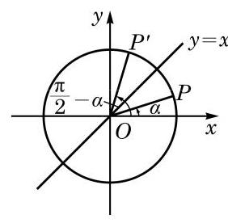

图 6-1-14

Q

在以上公式中将 $\alpha$ 用 $- \alpha$ 代换,就有

$$
\sin \left( {\frac{\pi }{2} + \alpha }\right)  = \cos \left( {-\alpha }\right)  = \cos \alpha ,
$$

即

$$
\sin \left( {\frac{\pi }{2} + \alpha }\right)  = \cos \alpha .
$$

同理, 有如下诱导公式:

$$
\sin \left( {\frac{\pi }{2} + \alpha }\right)  = \cos \alpha ,\;\cos \left( {\frac{\pi }{2} + \alpha }\right)  =  - \sin \alpha ,
$$

$$
\tan \left( {\frac{\pi }{2} + \alpha }\right)  =  - \cot \alpha ,\;\cot \left( {\frac{\pi }{2} + \alpha }\right)  =  - \tan \alpha .
$$

上述两组诱导公式说明正弦和余弦可以互相转化, 正切和余切也可以互相转化.

以上两组诱导公式说明角 $\frac{\pi }{2} \pm  \alpha$ 的正(余)弦、正(余)切值的绝对值,必等于角 $\alpha$ 的余(正)弦、余(正)切值的绝对值,但这两者可能差一个正负号. 这个正负号的确定方法是: 当 $\alpha$ 为锐角时, 等式两边必须同时为正数或同时为负数.

例如, $\cos \left( {\frac{\pi }{2} + \alpha }\right)$ 的绝对值应该同 $\sin \alpha$ 的绝对值相等,即成立 $\cos \left( {\frac{\pi }{2} + \alpha }\right)  =  \pm  \sin \alpha$ . 但当 $\alpha$ 为锐角时, $\frac{\pi }{2} + \alpha$ 是第二象限的角,这时 $\cos \left( {\frac{\pi }{2} + \alpha }\right)  < 0$ ,而 $\sin \alpha  > 0$ ,所以前式中应该取负号,即有 $\cos \left( {\frac{\pi }{2} + \alpha }\right)  =  - \sin \alpha$ .

例 17 证明:

(1) $\sin \left( {\frac{3\pi }{2} + \alpha }\right)  =  - \cos \alpha$ ;

(2) $\cos \left( {\frac{3\pi }{2} + \alpha }\right)  = \sin \alpha$ ；

---

角 $\alpha$ 的终边和角 $- \alpha$ 的终边关于角 $\frac{\alpha  + \left( {-\alpha }\right) }{2} = 0$ 的终边所在直线 $\left( {x\text{ 轴 }}\right)$ 对称; 角 $\alpha$ 的终边和角 $\pi  - \alpha$ 的 终 边 关 于 角 $\frac{\alpha  + \left( {\pi  - \alpha }\right) }{2} = \frac{\pi }{2}$ 的终边所在直线 $\left( {y\text{ 轴 }}\right)$ 对称. 一般地,角 $\alpha$ 的终边和角 $\beta$ 的终边关于角 $\frac{\alpha  + \beta }{2}$ 的终边所在直线对称.

---

(3) $\tan \left( {\frac{3\pi }{2} + \alpha }\right)  =  - \cot \alpha$

(4) $\cot \left( {\frac{3\pi }{2} + \alpha }\right)  =  - \tan \alpha$ .

证明 (1) $\sin \left( {\frac{3\pi }{2} + \alpha }\right)  = \sin \left( {\pi  + \frac{\pi }{2} + \alpha }\right)$

$$
=  - \sin \left( {\frac{\pi }{2} + \alpha }\right)  =  - \cos \alpha .
$$

(2)(3)(4)的证明方法类似，请同学们自行完成.

例 17 中的这组公式也可称为诱导公式. 观察所有上述这些诱导公式,关于角 $\frac{k\pi }{2} \pm  \alpha \left( {k \in  \mathbf{Z}}\right)$ 的正弦、余弦、正切及余切值呈现的规律可以总结为如下口诀: 奇变偶不变, 符号看象限. 例如, $\frac{\pi }{2}$ 及 $\frac{3\pi }{2}$ 都是 $\frac{\pi }{2}$ 的奇数倍,如果等式左边是 $\frac{\pi }{2} \pm  \alpha ,\frac{3\pi }{2} \pm  \alpha$ 的正弦、余弦、正切、余切之一,那么等式右边相应的必定是 $\alpha$ 的余弦、正弦、余切、正切,这就是“奇变”; 而 ${2k\pi }\left( {k \in  \mathbf{Z}}\right) \text{ 、 }0\text{ 、 }\pi$ 都是 $\frac{\pi }{2}$ 的偶数倍,等式两边的正弦、余弦、正切及余切的名称就应该相同，这就是“偶不变”. 等式右边角 $\alpha$ 的正弦、余弦、正切及余切前的符号可以将 $\alpha$ 视为锐角 (实际上 $\alpha$ 此时可以为任意角),由等式左边的角 $\frac{\pi }{2} \pm  \alpha ,\frac{3\pi }{2} + \alpha ,{2k\pi } + \alpha , - \alpha ,\pi  \pm  \alpha$ 所在象限的正弦、余弦、正切及余切值的符号来确定，即“符号看象限”. 这一点在前面已有说明.

例 18 化简: $\frac{\sin \left( {\frac{\pi }{2} + \alpha }\right) \cos \left( {\frac{\pi }{2} + \alpha }\right) \sin \left( {\frac{\pi }{2} - \alpha }\right) }{\tan \left( {\frac{\pi }{2} + \alpha }\right) \cos \left( {\frac{3}{2}\pi  + \alpha }\right) \sin \left( {-\pi  + \alpha }\right) }$ .

解 原式 $= \frac{\cos \alpha \left( {-\sin \alpha }\right) \cos \alpha }{\left( {-\cot \alpha }\right) \sin \alpha \left( {-\sin \alpha }\right) }$

$$
=  - \frac{{\cos }^{2}\alpha }{\frac{\cos \alpha }{\sin \alpha }\sin \alpha }
$$

$$
=  - \cos \alpha \text{ . }
$$

例 19 已知点 $A$ 的坐标为 $\left( {-\frac{3}{5},\frac{4}{5}}\right)$ ,将 ${OA}$ 绕坐标原点 $O$ 逆时针旋转 $\frac{\pi }{2}$ 至 $O{A}^{\prime }$ . 求点 ${A}^{\prime }$ 的坐标.

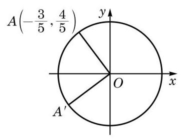

图 6-1-15

解 如图 6-1-15,由 ${OA} = O{A}^{\prime } = 1$ ,在单位圆中 $A(\cos \theta$ , $\sin \theta )$ 满足 $\cos \theta  =  - \frac{3}{5},\sin \theta  = \frac{4}{5}$ .

这样对点 ${A}^{\prime }\left( {{x}^{\prime },{y}^{\prime }}\right)$ ,有

$$
{x}^{\prime } = \cos \left( {\theta  + \frac{\pi }{2}}\right)  =  - \sin \theta  =  - \frac{4}{5},
$$

$$
{y}^{\prime } = \sin \left( {\theta  + \frac{\pi }{2}}\right)  = \cos \theta  =  - \frac{3}{5}.
$$

所以，点 ${A}^{\prime }$ 的坐标为 $\left( {-\frac{4}{5}, - \frac{3}{5}}\right)$ .

#### 练习 6.1(7)

1. 证明:

(1) $\sin \left( {\frac{3\pi }{2} - \alpha }\right)  =  - \cos \alpha$ ； (2) $\cos \left( {\frac{3\pi }{2} - \alpha }\right)  =  - \sin \alpha$ ；

(3) $\tan \left( {\frac{3\pi }{2} - \alpha }\right)  = \cot \alpha$ ； (4) $\cot \left( {\frac{3\pi }{2} - \alpha }\right)  = \tan \alpha$ .

2. 化简: $\frac{\sin \left( {\frac{\pi }{2} + \alpha }\right) \cot \left( {\frac{3\pi }{2} - \alpha }\right) \cos \left( {{3\pi } + \alpha }\right) }{\cot \left( {\frac{\pi }{2} - \alpha }\right) \cos \left( {\frac{3\pi }{2} + \alpha }\right) \cot \left( {\pi  - \alpha }\right) }$ .
3. 已知点 $A$ 的坐标为 $\left( {3,4}\right)$ ,将 ${OA}$ 绕坐标原点 $O$ 顺时针旋转 $\frac{\pi }{2}$ 至 $O{A}^{\prime }$ . 求点 ${A}^{\prime }$ 的坐标.

### 5 已知正弦、余弦或正切值求角

如果 $\alpha$ 是锐角,且满足 $\sin \alpha  = \frac{1}{2}$ ,那么 $\alpha  = \frac{\pi }{6}$ . 如果不限定 $\alpha$ 是锐角,那么由诱导公式 $\sin \left( {\pi  - \alpha }\right)  = \sin \alpha  = \frac{1}{2}$ 可知, $\alpha  = \frac{5\pi }{6}$ 也满足 $\sin \alpha  = \frac{1}{2}$ . 再由诱导公式 $\sin \left( {{2k\pi } + \alpha }\right)  = \sin \alpha \left( {k \in  \mathbf{Z}}\right)$ 可知, $\alpha  = {2k\pi } + \frac{\pi }{6}$ 或 $\alpha  = {2k\pi } + \frac{5\pi }{6}\left( {k \in  \mathbf{Z}}\right)$ 都满足 $\sin \alpha  = \frac{1}{2}$ . 那么,是否还有其他的角 $\alpha$ 满足 $\sin \alpha  = \frac{1}{2}$ 呢? 下面我们就来研究这个问题.

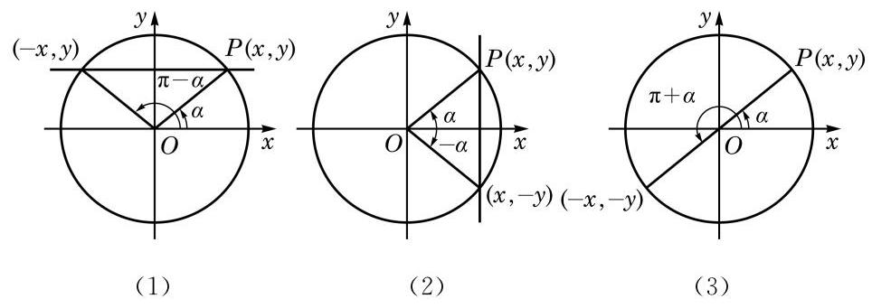

图 6-1-16

为此目的,设 $\alpha$ 是一个任意给定的角,我们希望确定所有满足 $\sin \beta  = \sin \alpha$ 的角 $\beta$ . 设角 $\alpha$ 的终边与以原点为圆心的单位圆的交点为 $P\left( {x, y}\right)$ ,过点 $P$ 作 $y$ 轴的垂线,如图 6-1-16(1) 所示. 由正弦的定义，满足 $\sin \beta  = \sin \alpha$ 的角 $\beta$ 的终边与单位圆的交点必在此直线上.

当 $\alpha  \neq  {l\pi } + \frac{\pi }{2}\left( {l \in  \mathbf{Z}}\right)$ 时，此直线交单位圆于两点 $\left( {x, y}\right)$ 和 $\left( {-x, y}\right)$ . 由于这两点分别位于角 $\alpha$ 和角 $\pi  - \alpha$ 的终边上,因此满足 $\sin \beta  = \sin \alpha$ 的角 $\beta$ 的全体为 $\left\{  {\beta  \mid  \beta  = {2k\pi } + \alpha }\right.$ 或 $\beta  = {2k\pi } + \pi  - \alpha$ , $k \in  \mathbf{Z}\}$ ,可简记作 $\{ \beta  \mid  \beta  = {k\pi } + {\left( -1\right) }^{k}\alpha , k \in  \mathbf{Z}\}$ .

当 $\alpha  = {l\pi } + \frac{\pi }{2}\left( {l \in  \mathbf{Z}}\right)$ 时,过点 $P$ 且垂直于 $y$ 轴的直线与单位圆相切于 $\left( {0, y}\right)$ ,此时满足 $\sin \beta  = \sin \alpha$ 的角 $\beta$ 的全体为 $\{ \beta  \mid  \beta  = {2k\pi } + \alpha , k \in  \mathbf{Z}\}$ ,这个集合也可以用上面所示的形式来表示. 事实上, 其表达式与上述集合第一部分中所给的表达式完全相同, 而对于上述集合第二部分所给的表达式, 由于在 $\alpha  = {l\pi } + \frac{\pi }{2}\left( {l \in  \mathbf{Z}}\right)$ 时,

$$
\beta  = {2k\pi } + \pi  - \alpha  = {2k\pi } - {l\pi } + \frac{\pi }{2}
$$

$$
= 2\left( {k - l}\right) \pi  + {l\pi } + \frac{\pi }{2} = 2\left( {k - l}\right) \pi  + \alpha \left( {k - l \in  \mathbf{Z}}\right) ,
$$

此时它也与上述集合第一部分中所给的表达式一致.

这样, 我们就得到:

若 $\sin x = \sin \alpha$ ,则

$$
x = {2k\pi } + \alpha \text{ 或 }x = {2k\pi } + \pi  - \alpha , k \in  \mathbf{Z},
$$

即

$$
x = {k\pi } + {\left( -1\right) }^{k}\alpha , k \in  \mathbf{Z}.
$$

同理,如图 6-1-16(2),若角 $\alpha$ 的终边与以原点为圆心的单位圆的交点为 $P\left( {x, y}\right)$ ,则由余弦的定义,满足 $\cos \beta  = \cos \alpha$ 的角 $\beta$ 的终边与单位圆的交点在过点 $P$ 且垂直于 $x$ 轴的直线上,从而满足 $\cos \beta  = \cos \alpha$ 的角 $\beta$ 的全体为 $\{ \beta  \mid  \beta  = {2k\pi } \pm  \alpha , k \in  \mathbf{Z}\}$ . 这样, 我们就得到:

若 $\cos x = \cos \alpha$ ,则 $x = {2k\pi } \pm  \alpha , k \in  \mathbf{Z}$ .

如图 6-1-16(3)，若角 $\alpha$ 的终边与以原点为圆心的单位圆的交点为 $P\left( {x, y}\right)$ ,则由正切的定义,满足 $\tan \beta  = \tan \alpha$ 的角 $\beta$ 的终边与单位圆的交点在过原点 $O$ 和点 $P$ 的直线上,从而满足 $\tan \beta  = \tan \alpha$ 的角 $\beta$ 的全体为 $\{ \beta  \mid  \beta  = {k\pi } + \alpha , k \in  \mathbf{Z}\}$ . 这样,我们就得到:

若 $\tan x = \tan \alpha$ ,则 $x = {k\pi } + \alpha , k \in  \mathbf{Z}$ .

例 20 根据下列条件,分别求角 $x$ :

(1)已知 $\sin x = \frac{\sqrt{3}}{2}$ ；

(2)已知 $\cos x =  - \frac{\sqrt{2}}{2}$ ；

(3)已知 $\tan x = \frac{\sqrt{3}}{3}$ .

解 (1) 因为 $\sin \frac{\pi }{3} = \frac{\sqrt{3}}{2}$ ,所以原式等价于求解 $\sin x = \; \sin \frac{\pi }{3}$ ,从而其解为 $x = {k\pi } + {\left( -1\right) }^{k}\frac{\pi }{3}, k \in  \mathbf{Z}$ .

(2)因为 $\cos \left( {\pi  - \frac{\pi }{4}}\right)  =  - \cos \frac{\pi }{4} =  - \frac{\sqrt{2}}{2}$ ，所以原式等价于求解 $\cos x = \cos \frac{3\pi }{4}$ ,从而其解为 $x = {2k\pi } \pm  \frac{3\pi }{4}, k \in  \mathbf{Z}$ .

(3)因为 $\tan \frac{\pi }{6} = \frac{\sqrt{3}}{3}$ ，所以原式等价于求解 $\tan x = \tan \frac{\pi }{6}$ ， 从而其解为 $x = {k\pi } + \frac{\pi }{6}, k \in  \mathbf{Z}$ .

例 21 分别求满足下列条件的角 $x$ 的集合:

(1) $\sin {2x} = \frac{\sqrt{3}}{2}, x \in  \left\lbrack  {0,{2\pi }}\right\rbrack$ ；

(2) $\cos \left( {x + \frac{\pi }{6}}\right)  = \frac{\sqrt{2}}{2}$ ；

(3) $\tan \left( {{2x} + \frac{\pi }{3}}\right)  =  - \frac{\sqrt{3}}{3}$ .

解(1)因为 $\sin \frac{\pi }{3} = \frac{\sqrt{3}}{2}$ ，所以原式等价于求解 $\sin {2x} = \; \sin \frac{\pi }{3}$ ,从而 ${2x} = {k\pi } + {\left( -1\right) }^{k}\frac{\pi }{3}, k \in  \mathbf{Z}$ ,即 $x = \frac{k\pi }{2} + {\left( -1\right) }^{k}\frac{\pi }{6}$ , $k \in  \mathbf{Z}$ . 又因为 $x \in  \left\lbrack  {0,{2\pi }}\right\rbrack$ ,所以满足条件的所有角 $x$ 组成的集合为 $\left\{  {\frac{\pi }{6},\frac{\pi }{3},\frac{7\pi }{6},\frac{4\pi }{3}}\right\}$ .

(2)因为 $\cos \frac{\pi }{4} = \frac{\sqrt{2}}{2}$ ，所以原式等价于求解 $\cos \left( {x + \frac{\pi }{6}}\right)  = \; \cos \frac{\pi }{4}$ ,从而 $x + \frac{\pi }{6} = {2k\pi } \pm  \frac{\pi }{4}, k \in  \mathbf{Z}$ ,于是满足条件的所有角 $x$ 组成的集合为 $\left\{  {x\left| {\;x = {2k\pi } + \frac{\pi }{12}}\right. \text{ 或 }x = {2k\pi } - \frac{5\pi }{12}, k \in  \mathbf{Z}}\right\}$ .

(3)因为 $\tan \left( {\pi  - \frac{\pi }{6}}\right)  =  - \tan \frac{\pi }{6} =  - \frac{\sqrt{3}}{3}$ ，所以原式等价于求解 $\tan \left( {{2x} + \frac{\pi }{3}}\right)  = \tan \frac{5\pi }{6}$ ,从而 ${2x} + \frac{\pi }{3} = {k\pi } + \frac{5\pi }{6}, k \in  \mathbf{Z}$ ,于是满足条件的所有角 $x$ 组成的集合为 $\left\{  {x\left| {\;x = \frac{k\pi }{2} + \frac{\pi }{4}}\right. , k \in  \mathbf{Z}}\right\}$ .

#### 练习 6.1(8)

1. 根据下列条件,分别求角 $x$ :

(1)已知 $\sin x =  - \frac{\sqrt{3}}{2}$ ；

(2)已知 $\cos x =  - \frac{1}{2}$ ；

(3)已知 $\tan x =  - \sqrt{3}$ .

2. 分别求满足下列条件的角 $x$ 的集合:

(1) $2\sin \left( {x + \frac{\pi }{3}}\right)  = 1, x \in  \left\lbrack  {0,{2\pi }}\right\rbrack$ ；

(2) $\cos \left( {{2x} + \frac{\pi }{4}}\right)  =  - \frac{1}{2}$ ；

(3) $\tan \left( {{3x} + \frac{\pi }{4}}\right)  =  - 1$ .

#### 习题 6.1

##### A 组

1. 选择题:

(1)在下列各组的两个角中，终边不重合的一组是 ( )

A. -43°与 ${677}^{ \circ  }$ ; B. ${900}^{ \circ  }$ 与 $- {1260}^{ \circ  }$ ;

C. -120°与 ${960}^{ \circ  }$ ; D. ${150}^{ \circ  }$ 与 ${630}^{ \circ  }$ .

(2)在平面直角坐标系中，下列结论正确的是 ( )

A. 小于 $\frac{\pi }{2}$ 的角一定是锐角; B. 第二象限的角一定是钝角;

C. 始边相同且相等的角的终边一定重合; D. 始边相同且终边重合的角一定相等.

(3)如果 $\alpha$ 是锐角，那么 ${2\alpha }$ 是 ( )

A. 第一象限的角; B. 第二象限的角;

C. 小于 ${180}^{ \circ  }$ 的正角; D. 钝角.

2. 找出与下列各角的终边重合的角 $\alpha \left( {{0}^{ \circ  } \leq  \alpha  < {360}^{ \circ  }}\right)$ ,并判别下列各角是第几象限的角:

(1) $- {1441}^{ \circ  }$ ; (2) ${890}^{ \circ  }$ .

3. 把下列各角度化为弧度, 并判断它们是第几象限的角:

(1) ${225}^{ \circ  }$ ; (2)1500°； (3) $- {22}^{ \circ  }{30}^{\prime }$ ； (4) $- {216}^{ \circ  }$ .

4. 已知扇形的弧长为 $\frac{5\pi }{3}$ ,半径为 2 . 求该扇形的圆心角 $\alpha$ 及面积 $S$ .
5. 已知角 $\alpha$ 的终边分别经过以下各点,求角 $\alpha$ 的正弦、余弦、正切和余切值:

(1) $\left( {3, - 4}\right)$ ； (2) $\left( {-1, - \sqrt{3}}\right)$ .

6. 不用计算器, 根据角所属的象限, 判断下列各式的符号:

(1) $\sin {237}^{ \circ  }\cos {390}^{ \circ  }$ ; (2) $\tan {135}^{ \circ  }\cos {275}^{ \circ  }$ ；

(3) $\frac{\cos \frac{5\pi }{6}\tan \frac{11\pi }{6}}{\sin \frac{2\pi }{3}}$ .

7. 根据下列条件,确定角 $\theta$ 所属的象限:

(1) $\sin \theta  < 0$ 且 $\cos \theta  > 0$ ；

(2) $\frac{\sin \theta }{\tan \theta } > 0$ .

8. 分别求 $\frac{2\pi }{3}$ 及 $\frac{7\pi }{6}$ 的正弦、余弦及正切值.
9. ( 1 )已知 $\sin \alpha  =  - \frac{2}{3}$ ，且 $\alpha$ 是第四象限的角. 求 $\cos \alpha$ 及 $\tan \alpha$ ；

( 2 )已知 $\tan \alpha  =  - \frac{1}{2}$ ，求 $\sin \alpha$ 及 $\cos \alpha$ .

10. 证明下列恒等式:

(1) ${\sin }^{4}\alpha  + {\cos }^{4}\alpha  = 1 - 2{\sin }^{2}\alpha {\cos }^{2}\alpha$ ;

(2) $\tan \alpha  - \cot \alpha  = \frac{1 - 2{\cos }^{2}\alpha }{\sin \alpha \cos \alpha }$ .

11. ( 1 )已知 $\tan \alpha  = 2$ ，求 $\frac{\sin \alpha  - \cos \alpha }{\sin \alpha  + \cos \alpha }$ 的值；

(2)若 $\sin \alpha  - \cos \alpha  = \frac{1}{2}$ ，求 $\sin \alpha \cos \alpha$ 的值.

12. 用诱导公式求值:

(1) $\sin {1110}^{ \circ  }$ ; (2) $\cos \frac{7\pi }{4}$ ； (3) $\cos \left( {-{600}^{ \circ  }}\right)$ ； (4) $\tan \left( {-\frac{7\pi }{6}}\right)$ .

13. 利用诱导公式,分别求角 $\frac{23\pi }{3}$ 和 $- \frac{87\pi }{4}$ 的正弦、余弦及正切值.
14. 化简下列各式:

(1) $\cos \left( {{90}^{ \circ  } + \alpha }\right)  + \sin \left( {{180}^{ \circ  } - \alpha }\right)  - \sin \left( {{180}^{ \circ  } + \alpha }\right)  + \sin \left( {-\alpha }\right)$ ;

(2) $\frac{\sin \left( {\pi  - \alpha }\right) }{\tan \left( {\pi  + \alpha }\right) } \cdot  \frac{\cot \left( {\frac{\pi }{2} - \alpha }\right) }{\tan \left( {\frac{\pi }{2} + \alpha }\right) } \cdot  \frac{\cos \left( {-\alpha }\right) }{\sin \left( {{2\pi } - \alpha }\right) }$ ;

(3) $\frac{\sin \left( {\alpha  - \pi }\right) \cot \left( {\alpha  - {2\pi }}\right) }{\cos \left( {\alpha  - \pi }\right) \tan \left( {\alpha  - {2\pi }}\right) }$ ；

(4) $\frac{\tan \left( {\pi  + \alpha }\right) \cos \left( {-\pi }\right) \cos \left( {{2\pi } - \alpha }\right) }{\cot \left( {\pi  - \alpha }\right) \sin \left( {{3\pi } + \alpha }\right) }$ .

##### B 组

1. 写出与下列各角的终边重合的所有角组成的集合 $S$ ,并写出 $S$ 中适合不等式 $- {360}^{ \circ  } \leq \; \alpha  < {720}^{ \circ  }$ 的元素 $\alpha$ :

(1) ${60}^{ \circ  }$ ； (2)-21°.

2. 已知 ${0}^{ \circ  } < \beta  < {180}^{ \circ  }$ ,若将角 $\beta$ 的终边顺时针旋转 ${120}^{ \circ  }$ 所得的角的终边与角 $\beta$ 的 5 倍角的终边重合. 求角 $\beta$ .
3. 已知一个扇形的周长是 16 , 面积是 12 . 求其圆心角的大小.
4. 写出终边在直线 $y = x$ 上的所有角组成的集合. (分别用角度制和弧度制来表示)
5. 填空题:

(1)若 $\alpha$ 为第二象限的角，则 ${2\pi } - \alpha$ 为第___象限的角；

(2)若角 $\alpha$ 的终边与角 $\beta$ 的终边关于 $x$ 轴对称，则 $\alpha$ 与 $\beta$ 的关系是___；

(3)若角 $\alpha$ 与 $\beta$ 满足关系 $\alpha  = \left( {{2k} + 1}\right) \pi  - \beta \left( {k \in  \mathbf{Z}}\right)$ ，则角 $\alpha$ 与 $\beta$ 的终边关于___ 对称.

6. 已知一个扇形的周长为 ${20}\mathrm{\;{cm}}$ ，当圆心角等于多少时，这个扇形的面积最大，并求该最大值.
7. 已知 $\alpha$ 为第二象限的角,其终边上有一点 $P\left( {x,\sqrt{5}}\right)$ ,且 $\cos \alpha  = \frac{\sqrt{2}}{4}x$ . 求 $\tan \alpha$ .
8. 证明下列恒等式:

(1) ${\sin }^{2}\alpha  + {\sin }^{2}\beta  - {\sin }^{2}\alpha {\sin }^{2}\beta  + {\cos }^{2}\alpha {\cos }^{2}\beta  = 1$ ;

(2) $2\left( {1 - \sin \alpha }\right) \left( {1 + \cos \alpha }\right)  = {\left( 1 - \sin \alpha  + \cos \alpha \right) }^{2}$ .

9. 已知 $\alpha$ 是第二象限的角,化简: $\sqrt{\frac{1 + \sin \alpha }{1 - \sin \alpha }} + \sqrt{\frac{1 - \sin \alpha }{1 + \sin \alpha }}$ .
10. 已知 $\sin \alpha  + \cos \alpha  = \frac{1}{5},\alpha  \in  \left( {0,\pi }\right)$ . 求 $\sin \alpha$ 和 $\cos \alpha$ .
11. 已知 $\sin \alpha$ 及 $\cos \alpha$ 是关于 $x$ 的方程 $2{x}^{2} + {4kx} + {3k} = 0$ 的两个实根,求实数 $k$ .
12. 根据下列条件,求角 $x$ :

(1) $\tan x = \sqrt{3}$ ，且 $x$ 是第三象限的角； (2) $\cos x =  - \frac{\sqrt{2}}{2}, x \in  \lbrack 0,{2\pi })$ ；

(3) $\sin x =  - \frac{1}{2}$ ； (4) $2\cos \left( {{2x} + \frac{\pi }{8}}\right)  = 1$ .

## 6.2 常用三角公式

我们在学习对数时知道,对于正实数 $a\text{ 、 }b$ ,一般 $\lg \left( {a + b}\right)  \neq \; \lg a + \lg b$ ,但可以用 $a\text{ 、 }b$ 的对数来表示 ${ab}$ 或 $\frac{a}{b}\left( {b \neq  0}\right)$ 的对数, 并可由此化简很多涉及对数的表达式. 类似地,一般 $\sin \left( {\alpha  + \beta }\right)  \neq \; \sin \alpha  + \sin \beta$ 及 $\cos \left( {\alpha  - \beta }\right)  \neq  \cos \alpha  - \cos \beta$ . 本节中,我们要学习两个角的和与差的三角公式,即学习如何用 $\alpha \text{ 、 }\beta$ 的正弦、余弦及正切来表示 $\alpha  \pm  \beta$ 的正弦、余弦及正切,并在此基础上学习如何运用这组公式及其推论来化简有关的三角表达式, 为后面用三角知识解决各种具体问题做好准备.

1

两角和与差的正弦、余弦、 正切公式

我们先推导两角差 $\left( {\alpha  - \beta }\right)$ 的余弦公式.

设 $\alpha \text{ 、 }\beta$ 为任意给定的两个角,把它们的顶点置于平面直角坐标系的原点 $O$ ,始边都与 $x$ 轴的正半轴重合,而它们的终边分别与单位圆相交于 $A\text{ 、 }B$ 两点 (图 6-2-1). 点 $A\text{ 、 }B$ 的坐标分别为 $A\left( {\cos \alpha ,\sin \alpha }\right) \text{ 、 }B\left( {\cos \beta ,\sin \beta }\right)$ .

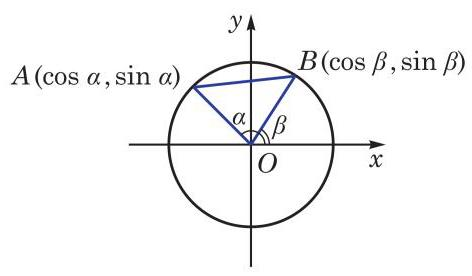

图 6-2-1

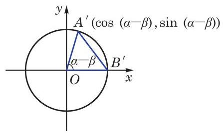

图 6-2-2

下面考虑角 $\left( {\alpha  - \beta }\right)$ 的余弦. 为此把角 $\alpha \text{ 、 }\beta$ 的终边 ${OA}$ 及 ${OB}$ 都绕原点 $O$ 旋转 $- \beta$ 角,它们分别交单位圆于点 ${A}^{\prime }$ 及 ${B}^{\prime }$ (图6-2-2). 由于都转动了 $- \beta$ 角,因此 $\alpha  - \beta$ 也可以是一个以射线 $O{B}^{\prime }$ 为始边、以射线 $O{A}^{\prime }$ 为终边的角,而点 ${A}^{\prime }$ 的坐标是 $\left( {\cos \left( {\alpha  - \beta }\right) ,\sin \left( {\alpha  - \beta }\right) }\right)$ ,点 ${B}^{\prime }$ 的坐标是 $\left( {1,0}\right)$ .

根据两点间的距离公式, 在图 6-2-1 中, 有

$$
{\left| AB\right| }^{2} = {\left( \cos \alpha  - \cos \beta \right) }^{2} + {\left( \sin \alpha  - \sin \beta \right) }^{2}
$$

$$
= {\cos }^{2}\alpha  - 2\cos \alpha \cos \beta  + {\cos }^{2}\beta  + {\sin }^{2}\alpha  - 2\sin \alpha \sin \beta  + {\sin }^{2}\beta
$$

$$
= 2 - 2\cos \alpha \cos \beta  - 2\sin \alpha \sin \beta \text{ . }
$$

而在图 6-2-2 中, 有

$$
{\left| {A}^{\prime }{B}^{\prime }\right| }^{2} = {\left\lbrack  \cos \left( \alpha  - \beta \right)  - 1\right\rbrack  }^{2} + {\sin }^{2}\left( {\alpha  - \beta }\right)
$$

$$
= {\cos }^{2}\left( {\alpha  - \beta }\right)  - 2\cos \left( {\alpha  - \beta }\right)  + 1 + {\sin }^{2}\left( {\alpha  - \beta }\right)
$$

$$
= 2 - 2\cos \left( {\alpha  - \beta }\right) \text{ . }
$$

因为将射线 ${OA}\text{ 、 }{OB}$ 同时绕原点 $O$ 旋转 $- \beta$ 角,就分别得到射线 $O{A}^{\prime }\text{ 、 }O{B}^{\prime }$ ,所以

$$
\left| {AB}\right|  = \left| {{A}^{\prime }{B}^{\prime }}\right| ,
$$

从而得到

$$
2 - 2\cos \alpha \cos \beta  - 2\sin \alpha \sin \beta  = 2 - 2\cos \left( {\alpha  - \beta }\right) ,
$$

即

$$
\cos \left( {\alpha  - \beta }\right)  = \cos \alpha \cos \beta  + \sin \alpha \sin \beta .
$$

这个式子对任意给定的角 $\alpha$ 及 $\beta$ 都成立,称为两角差的余弦公式.

在两角差的余弦公式中,用 $- \beta$ 代换 $\beta$ ,就可得到两角和的余弦公式:

$$
\cos \left( {\alpha  + \beta }\right)  = \cos \alpha \cos \left( {-\beta }\right)  + \sin \alpha \sin \left( {-\beta }\right)
$$

$$
= \cos \alpha \cos \beta  - \sin \alpha \sin \beta \text{ . }
$$

这样, 我们就得到两角和与差的余弦公式

$$
\cos \left( {\alpha  + \beta }\right)  = \cos \alpha \cos \beta  - \sin \alpha \sin \beta ,
$$

$$
\cos \left( {\alpha  - \beta }\right)  = \cos \alpha \cos \beta  + \sin \alpha \sin \beta
$$

简记作

$$
\cos \left( {\alpha  \pm  \beta }\right)  = \cos \alpha \cos \beta  \mp  \sin \alpha \sin \beta .
$$

例 1 利用两角和与差的余弦公式,求 $\cos {75}^{ \circ  }$ 和 $\cos {15}^{ \circ  }$ 的值.

解 $\cos {75}^{ \circ  } = \cos \left( {{45}^{ \circ  } + {30}^{ \circ  }}\right)$

$$
= \cos {45}^{ \circ  }\cos {30}^{ \circ  } - \sin {45}^{ \circ  }\sin {30}^{ \circ  } = \frac{\sqrt{6} - \sqrt{2}}{4}\text{ . }
$$

$$
\cos {15}^{ \circ  } = \cos \left( {{45}^{ \circ  } - {30}^{ \circ  }}\right)
$$

$$
= \cos {45}^{ \circ  }\cos {30}^{ \circ  } + \sin {45}^{ \circ  }\sin {30}^{ \circ  } = \frac{\sqrt{6} + \sqrt{2}}{4}\text{ . }
$$

例 2 已知 $\sin \alpha  = \frac{3}{5},\alpha  \in  \left( {\frac{\pi }{2},\pi }\right) ,\cos \beta  = \frac{5}{13},\beta  \in  \left( {\frac{3}{2}\pi ,{2\pi }}\right)$ . 求 $\cos \left( {\alpha  - \beta }\right)$ .

解 由 $\sin \alpha  = \frac{3}{5},\alpha  \in  \left( {\frac{\pi }{2},\pi }\right)$ ,得 $\cos \alpha  =  - \sqrt{1 - {\sin }^{2}\alpha } =  - \frac{4}{5}$ .

由 $\cos \beta  = \frac{5}{13},\beta  \in  \left( {\frac{3}{2}\pi ,{2\pi }}\right)$ ,得 $\sin \beta  =  - \sqrt{1 - {\cos }^{2}\beta } =  - \frac{12}{13}$ .

于是

$$
\cos \left( {\alpha  - \beta }\right)  = \cos \alpha \cos \beta  + \sin \alpha \sin \beta
$$

$$
= \left( {-\frac{4}{5}}\right)  \times  \frac{5}{13} + \frac{3}{5} \times  \left( {-\frac{12}{13}}\right)  =  - \frac{56}{65}.
$$

例 3 若 $\alpha \text{ 、 }\beta$ 为锐角, $\sin \alpha  = \frac{4\sqrt{3}}{7},\cos \left( {\alpha  + \beta }\right)  =  - \frac{11}{14}$ . 求角 $\beta$ .

解 由 $\alpha$ 为锐角,且 $\sin \alpha  = \frac{4\sqrt{3}}{7}$ ,得 $\cos \alpha  = \sqrt{1 - {\sin }^{2}\alpha } = \frac{1}{7}$ .

又由 $\alpha \text{ 、 }\beta$ 为锐角,得 $0 < \alpha  + \beta  < \pi$ ,从而

$$
\sin \left( {\alpha  + \beta }\right)  = \sqrt{1 - {\cos }^{2}\left( {\alpha  + \beta }\right) } = \frac{5\sqrt{3}}{14}.
$$

于是

$$
\cos \beta  = \cos \left( {\alpha  + \beta  - \alpha }\right)  = \cos \left( {\alpha  + \beta }\right) \cos \alpha  + \sin \left( {\alpha  + \beta }\right) \sin \alpha
$$

$$
= \frac{1}{7} \times  \left( {-\frac{11}{14}}\right)  + \frac{4\sqrt{3}}{7} \times  \frac{5\sqrt{3}}{14} = \frac{1}{2}.
$$

因为 $\beta$ 为锐角,所以 $\beta  = \frac{\pi }{3}$ .

#### 练习 6.2(1)

1. 化简:

(1) $\cos \left( {{22}^{ \circ  } - x}\right) \cos \left( {{23}^{ \circ  } + x}\right)  - \sin \left( {{22}^{ \circ  } - x}\right) \sin \left( {{23}^{ \circ  } + x}\right)$ ;

(2) $\cos \left( {\frac{\pi }{6} + \alpha }\right) \cos \alpha  + \sin \left( {\frac{\pi }{6} + \alpha }\right) \sin \alpha$ .

2. 已知 $\sin \theta  =  - \frac{5}{13},\theta  \in  \left( {\pi ,\frac{3}{2}\pi }\right)$ . 求 $\cos \left( {\theta  + \frac{\pi }{4}}\right)$ 的值.
3. 证明:

(1) $\frac{2\cos A\cos B - \cos \left( {A - B}\right) }{\cos \left( {A - B}\right)  - 2\sin A\sin B} = 1$ ;

(2) $\cos \left( {\alpha  + \beta }\right) \cos \left( {\alpha  - \beta }\right)  = {\cos }^{2}\beta  - {\sin }^{2}\alpha$ .

根据两角差的余弦公式和诱导公式, 就可以得到两角和的正弦公式. 事实上，

$$
\sin \left( {\alpha  + \beta }\right)  = \cos \left\lbrack  {\frac{\pi }{2} - \left( {\alpha  + \beta }\right) }\right\rbrack   = \cos \left\lbrack  {\left( {\frac{\pi }{2} - \alpha }\right)  - \beta }\right\rbrack
$$

$$
= \cos \left( {\frac{\pi }{2} - \alpha }\right) \cos \beta  + \sin \left( {\frac{\pi }{2} - \alpha }\right) \sin \beta
$$

$$
= \sin \alpha \cos \beta  + \cos \alpha \sin \beta \text{ . }
$$

将上式中的 $\beta$ 用 $- \beta$ 代换,就可以得到两角差的正弦公式

$$
\sin \left( {\alpha  - \beta }\right)  = \sin \alpha \cos \beta  - \cos \alpha \sin \beta .
$$

这样, 我们得到两角和与差的正弦公式

$$
\sin \left( {\alpha  + \beta }\right)  = \sin \alpha \cos \beta  + \cos \alpha \sin \beta ,
$$

$$
\sin \left( {\alpha  - \beta }\right)  = \sin \alpha \cos \beta  - \cos \alpha \sin \beta .
$$

简记作

$$
\sin \left( {\alpha  \pm  \beta }\right)  = \sin \alpha \cos \beta  \pm  \cos \alpha \sin \beta .
$$

例 4 利用两角差的正弦公式,求 $\sin {15}^{ \circ  }$ 的值.

解 $\sin {15}^{ \circ  } = \sin \left( {{60}^{ \circ  } - {45}^{ \circ  }}\right) \; = \sin {60}^{ \circ  }\cos {45}^{ \circ  } - \cos {60}^{ \circ  }\sin {45}^{ \circ  } \; = \frac{\sqrt{6} - \sqrt{2}}{4}$ .

例 5 证明: $\sin \left( {\alpha  + \beta }\right) \sin \left( {\alpha  - \beta }\right)  = {\sin }^{2}\alpha  - {\sin }^{2}\beta$ .

证明 左边 $= \left( {\sin \alpha \cos \beta  + \cos \alpha \sin \beta }\right) \left( {\sin \alpha \cos \beta  - \cos \alpha \sin \beta }\right) \; = {\sin }^{2}\alpha {\cos }^{2}\beta  - {\cos }^{2}\alpha {\sin }^{2}\beta \; = {\sin }^{2}\alpha \left( {1 - {\sin }^{2}\beta }\right)  - \left( {1 - {\sin }^{2}\alpha }\right) {\sin }^{2}\beta \; = {\sin }^{2}\alpha  - {\sin }^{2}\beta \; =$ 右边.

所以, 原等式成立.

根据两角和的正弦、余弦公式, 就可以得到两角和的正切公式. 事实上，

$$
\tan \left( {\alpha  + \beta }\right)  = \frac{\sin \left( {\alpha  + \beta }\right) }{\cos \left( {\alpha  + \beta }\right) } = \frac{\sin \alpha \cos \beta  + \cos \alpha \sin \beta }{\cos \alpha \cos \beta  - \sin \alpha \sin \beta }
$$

$$
= \frac{\frac{\sin \alpha \cos \beta  + \cos \alpha \sin \beta }{\cos \alpha \cos \beta }}{\frac{\cos \alpha \cos \beta  - \sin \alpha \sin \beta }{\cos \alpha \cos \beta }} = \frac{\tan \alpha  + \tan \beta }{1 - \tan \alpha \tan \beta }.
$$

将上式中的 $\beta$ 用 $- \beta$ 代换,就得到两角差的正切公式

$$
\tan \left( {\alpha  - \beta }\right)  = \frac{\tan \alpha  - \tan \beta }{1 + \tan \alpha \tan \beta }.
$$

这样, 我们得到两角和与差的正切公式

$$
\tan \left( {\alpha  + \beta }\right)  = \frac{\tan \alpha  + \tan \beta }{1 - \tan \alpha \tan \beta },
$$

$$
\tan \left( {\alpha  - \beta }\right)  = \frac{\tan \alpha  - \tan \beta }{1 + \tan \alpha \tan \beta }.
$$

简记作

$$
\tan \left( {\alpha  \pm  \beta }\right)  = \frac{\tan \alpha  \pm  \tan \beta }{1 \mp  \tan \alpha \tan \beta }.
$$

不难知道,只要 $\tan \alpha \text{ 、 }\tan \beta$ 和 $\tan \left( {\alpha  \pm  \beta }\right)$ 均有意义,上面的公式一定成立.

例 6 已知 $\tan \alpha  = \frac{1}{3},\tan \beta  =  - 2$ . 求:

(1) $\tan \left( {\alpha  + \beta }\right)$ ;

(2) $\cot \left( {\alpha  - \beta }\right)$ .

解 (1) $\tan \left( {\alpha  + \beta }\right)  = \frac{\tan \alpha  + \tan \beta }{1 - \tan \alpha \tan \beta } = \frac{\frac{1}{3} + \left( {-2}\right) }{1 - \frac{1}{3} \times  \left( {-2}\right) } =  - 1$ .

(2) 因为

$$
\tan \left( {\alpha  - \beta }\right)  = \frac{\tan \alpha  - \tan \beta }{1 + \tan \alpha \tan \beta } = \frac{\frac{1}{3} - \left( {-2}\right) }{1 + \frac{1}{3} \times  \left( {-2}\right) } = 7,
$$

所以 $\cot \left( {\alpha  - \beta }\right)  = \frac{1}{7}$ .

例 7 利用两角和的正切公式,求 $\frac{1 + \tan {75}^{ \circ  }}{1 - \tan {75}^{ \circ  }}$ 的值.

解 方法一:

因为

$$
\tan {75}^{ \circ  } = \tan \left( {{45}^{ \circ  } + {30}^{ \circ  }}\right)  = \frac{\tan {45}^{ \circ  } + \tan {30}^{ \circ  }}{1 - \tan {45}^{ \circ  }\tan {30}^{ \circ  }} = 2 + \sqrt{3},
$$

所以

$$
\frac{1 + \tan {75}^{ \circ  }}{1 - \tan {75}^{ \circ  }} = \frac{1 + \left( {2 + \sqrt{3}}\right) }{1 - \left( {2 + \sqrt{3}}\right) } =  - \sqrt{3}.
$$

方法二: 因为 $\tan {45}^{ \circ  } = 1$ ,所以

$$
\frac{1 + \tan {75}^{ \circ  }}{1 - \tan {75}^{ \circ  }} = \frac{\tan {45}^{ \circ  } + \tan {75}^{ \circ  }}{1 - \tan {45}^{ \circ  }\tan {75}^{ \circ  }} = \tan \left( {{45}^{ \circ  } + {75}^{ \circ  }}\right)
$$

$$
= \tan {120}^{ \circ  } =  - \tan {60}^{ \circ  } =  - \sqrt{3}\text{ . }
$$

#### 练习 6.2(2)

1. 求下列各式的值:

(1) $\sin \frac{5\pi }{12}\cos \frac{\pi }{12} - \cos \frac{5\pi }{12}\sin \frac{\pi }{12}$ ; (2) $\frac{1 + \tan {15}^{ \circ  }}{1 - \tan {15}^{ \circ  }}$ .

2. 已知 $\cos \theta  =  - \frac{3}{5},\theta  \in  \left( {0,\pi }\right)$ . 求 $\sin \left( {\theta  + \frac{\pi }{4}}\right)$ 和 $\tan \left( {\theta  - \frac{\pi }{4}}\right)$ 的值.
3. 证明下列恒等式:

(1) $\frac{\sin \left( {\alpha  + \beta }\right) \sin \left( {\alpha  - \beta }\right) }{{\cos }^{2}\alpha {\cos }^{2}\beta } = {\tan }^{2}\alpha  - {\tan }^{2}\beta$ ; (2) $\tan \left( {\theta  + \frac{\pi }{4}}\right)  = \frac{1 + \tan \theta }{1 - \tan \theta }$ .

例 8 若 $\bigtriangleup {ABC}$ 不是直角三角形,求证:

$$
\tan A + \tan B + \tan C = \tan A\tan B\tan C.
$$

证明 因为 $A + B + C = \pi$ ,且 $\tan \left( {A + B}\right)  = \frac{\tan A + \tan B}{1 - \tan A\tan B}$ , 所以

$$
\tan A + \tan B = \tan \left( {A + B}\right) \left( {1 - \tan A\tan B}\right)
$$

$$
= \tan \left( {\pi  - C}\right) \left( {1 - \tan A\tan B}\right)
$$

$$
=  - \tan C\left( {1 - \tan A\tan B}\right) \text{ , }
$$

从而

$$
\tan A + \tan B + \tan C =  - \tan C\left( {1 - \tan A\tan B}\right)  + \tan C
$$

$$
= \tan A\tan B\tan C\text{ . }
$$

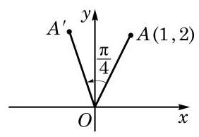

图 6-2-3

例 9 如图 6-2-3,已知点 $A$ 的坐标为 $\left( {1,2}\right)$ ,将 ${OA}$ 绕坐标原点 $O$ 逆时针旋转 $\frac{\pi }{4}$ 至 $O{A}^{\prime }$ . 求点 ${A}^{\prime }$ 的坐标.

解 设以 $x$ 轴正半轴为始边、 ${OA}$ 为终边的角为 $\theta$ .

由点 $A$ 的坐标为 $\left( {1,2}\right)$ ,可得 ${OA} = \sqrt{5},\sin \theta  = \frac{2\sqrt{5}}{5},\cos \theta  = \frac{\sqrt{5}}{5}$ .

设点 ${A}^{\prime }$ 的坐标为 $\left( {x, y}\right)$ ,由 $O{A}^{\prime } = {OA} = \sqrt{5}$ ,得

$$
x = O{A}^{\prime }\cos \left( {\theta  + \frac{\pi }{4}}\right)  = \sqrt{5}\left( {\cos \theta \cos \frac{\pi }{4} - \sin \theta \sin \frac{\pi }{4}}\right)
$$

$$
= \sqrt{5}\left( {\frac{\sqrt{5}}{5} \times  \frac{\sqrt{2}}{2} - \frac{2\sqrt{5}}{5} \times  \frac{\sqrt{2}}{2}}\right)  =  - \frac{\sqrt{2}}{2},
$$

$$
y = O{A}^{\prime }\sin \left( {\theta  + \frac{\pi }{4}}\right)  = \sqrt{5}\left( {\sin \theta \cos \frac{\pi }{4} + \cos \theta \sin \frac{\pi }{4}}\right)
$$

$$
= \sqrt{5}\left( {\frac{2\sqrt{5}}{5} \times  \frac{\sqrt{2}}{2} + \frac{\sqrt{5}}{5} \times  \frac{\sqrt{2}}{2}}\right)  = \frac{3\sqrt{2}}{2}.
$$

于是,点 ${A}^{\prime }$ 的坐标为 $\left( {-\frac{\sqrt{2}}{2},\frac{3\sqrt{2}}{2}}\right)$ .

例 10 把下列各式化为 $A\sin \left( {\alpha  + \varphi }\right) \left( {A > 0}\right)$ 的形式:

(1) $\frac{1}{2}\sin \alpha  + \frac{\sqrt{3}}{2}\cos \alpha$ ；___

(2) $\sin \alpha  - \cos \alpha$ ；

(3) $a\sin \alpha  + b\cos \alpha \left( {{ab} \neq  0}\right)$ .

解 (1) $\frac{1}{2}\sin \alpha  + \frac{\sqrt{3}}{2}\cos \alpha  = \sin \alpha \cos \frac{\pi }{3} + \cos \alpha \sin \frac{\pi }{3} = \sin \left( {\alpha  + \frac{\pi }{3}}\right)$ .

(2)因为

$$
\sin \alpha  - \cos \alpha  = \sqrt{2}\left( {\frac{\sqrt{2}}{2}\sin \alpha  - \frac{\sqrt{2}}{2}\cos \alpha }\right) ,
$$

所以

$$
\sin \alpha  - \cos \alpha  = \sqrt{2}\left( {\sin \alpha \cos \frac{\pi }{4} - \cos \alpha \sin \frac{\pi }{4}}\right)  = \sqrt{2}\sin \left( {\alpha  - \frac{\pi }{4}}\right) .
$$

(3) $a\sin \alpha  + b\cos \alpha  = \sqrt{{a}^{2} + {b}^{2}}\left( {\frac{a}{\sqrt{{a}^{2} + {b}^{2}}}\sin \alpha  + \frac{b}{\sqrt{{a}^{2} + {b}^{2}}}\cos \alpha }\right)$ .

注意到 $\left( {\frac{a}{\sqrt{{a}^{2} + {b}^{2}}},\frac{b}{\sqrt{{a}^{2} + {b}^{2}}}}\right)$ 为单位圆上的一点,由正弦及余弦的定义,存在唯一的角 $\varphi  \in  \lbrack 0,{2\pi })$ ,使得

$$
\cos \varphi  = \frac{a}{\sqrt{{a}^{2} + {b}^{2}}},\sin \varphi  = \frac{b}{\sqrt{{a}^{2} + {b}^{2}}},
$$

于是有

$$
a\sin \alpha  + b\cos \alpha  = \sqrt{{a}^{2} + {b}^{2}}\left( {\sin \alpha \cos \varphi  + \cos \alpha \sin \varphi }\right)
$$

$$
= \sqrt{{a}^{2} + {b}^{2}}\sin \left( {\alpha  + \varphi }\right) .
$$

#### 练习 6.2(3)

1. 在 $\bigtriangleup {ABC}$ 中,已知 $\cos A = \frac{12}{13},\cos B = \frac{8}{17}$ . 求 $\sin C$ 和 $\cos C$ 的值.
2. 已知 $\cos \alpha  = \frac{4}{5},\alpha  \in  \left( {0,\frac{\pi }{2}}\right) ,\sin \beta  = \frac{12}{13},\beta  \in  \left( {\frac{\pi }{2},\pi }\right)$ . 求 $\sin \left( {\alpha  + \beta }\right)$ 和 $\cos \left( {\alpha  + \beta }\right)$ 的值,并判断 $\alpha  + \beta$ 是第几象限的角.
3. 把下列各式化为 $A\sin \left( {\alpha  + \varphi }\right) \left( {A > 0}\right)$ 的形式:

(1) $\sin \alpha  + \cos \alpha$ ；

(2) $- \sin \alpha  + \sqrt{3}\cos \alpha$ .

### 2 二倍角公式

在两角和的正弦、余弦和正切公式中,用 $\beta  = \alpha$ 代入,就得到二倍角的正弦、余弦和正切公式

$$
\sin {2\alpha } = 2\sin \alpha \cos \alpha ,
$$

$$
\cos {2\alpha } = {\cos }^{2}\alpha  - {\sin }^{2}\alpha ,
$$

$$
\tan {2\alpha } = \frac{2\tan \alpha }{1 - {\tan }^{2}\alpha }.
$$

由于 ${\sin }^{2}\alpha  + {\cos }^{2}\alpha  = 1$ ,因此二倍角的余弦公式还可以表示为

$$
\cos {2\alpha } = 2{\cos }^{2}\alpha  - 1 = 1 - 2{\sin }^{2}\alpha .
$$

二倍角公式是两角和公式的特例, 简称为倍角公式.

例 11 已知 $\sin \alpha  = \frac{4}{5},\alpha  \in  \left( {\frac{\pi }{2},\pi }\right)$ . 求 $\sin {2\alpha }\text{ 、 }\cos {2\alpha }$ 和 $\tan {2\alpha }$ 的值.

解 由 $\sin \alpha  = \frac{4}{5},\alpha  \in  \left( {\frac{\pi }{2},\pi }\right)$ ,得

$$
\cos \alpha  =  - \sqrt{1 - {\sin }^{2}\alpha } =  - \frac{3}{5},\tan \alpha  = \frac{\sin \alpha }{\cos \alpha } =  - \frac{4}{3},
$$

于是

$$
\sin {2\alpha } = 2\sin \alpha \cos \alpha  = 2 \times  \left( {-\frac{3}{5}}\right)  \times  \frac{4}{5} =  - \frac{24}{25},
$$

$$
\cos {2\alpha } = 1 - 2{\sin }^{2}\alpha  = 1 - 2 \times  {\left( \frac{4}{5}\right) }^{2} =  - \frac{7}{25},
$$

$$
\tan {2\alpha } = \frac{2\tan \alpha }{1 - {\tan }^{2}\alpha } = \frac{2 \times  \left( {-\frac{4}{3}}\right) }{1 - {\left( -\frac{4}{3}\right) }^{2}} = \frac{24}{7}.
$$

例 12 试用 $\cos \theta$ 表示 $\cos {3\theta }$ .

解 因为 $\cos {3\theta } = \cos \left( {{2\theta } + \theta }\right)  = \cos {2\theta }\cos \theta  - \sin {2\theta }\sin \theta$

$$
= \left( {2{\cos }^{2}\theta  - 1}\right) \cos \theta  - 2{\sin }^{2}\theta \cos \theta
$$

$$
= \left( {2{\cos }^{2}\theta  - 1}\right) \cos \theta  - 2\left( {1 - {\cos }^{2}\theta }\right) \cos \theta
$$

$$
= 4{\cos }^{3}\theta  - 3\cos \theta \text{ , }
$$

所以 $\cos {3\theta } = 4{\cos }^{3}\theta  - 3\cos \theta$ .

---

历史上，三倍角公式曾为求解一元三次方程提供思路.

---

这个公式称为三倍角的余弦公式. 类似地, 可以推导出三倍角的正弦公式.

例 13 证明:

(1) $2{\cos }^{2}\theta  + 2\sin \theta \cos \theta  - 1 = \sqrt{2}\sin \left( {{2\theta } + \frac{\pi }{4}}\right)$ ；

(2) $\frac{1 + \sin {2\theta } + \cos {2\theta }}{1 + \sin {2\theta } - \cos {2\theta }} = \cot \theta$ .

证明 (1) $2{\cos }^{2}\theta  + 2\sin \theta \cos \theta  - 1 = \cos {2\theta } + \sin {2\theta }$

$$
= \sqrt{2}\left( {\sin \frac{\pi }{4}\cos {2\theta } + \cos \frac{\pi }{4}\sin {2\theta }}\right)  = \sqrt{2}\sin \left( {{2\theta } + \frac{\pi }{4}}\right) .
$$

2) $\frac{1 + \sin {2\theta } + \cos {2\theta }}{1 + \sin {2\theta } - \cos {2\theta }} = \frac{1 + 2\sin \theta \cos \theta  + \left( {2{\cos }^{2}\theta  - 1}\right) }{1 + 2\sin \theta \cos \theta  - \left( {1 - 2{\sin }^{2}\theta }\right) }$

$$
= \frac{2\cos \theta \left( {\sin \theta  + \cos \theta }\right) }{2\sin \theta \left( {\sin \theta  + \cos \theta }\right) } = \cot \theta .
$$

#### 练习 6.2(4)

1. 利用二倍角公式, 求下列各式的值:

(1) $\sin \frac{5\pi }{12}\cos \frac{5\pi }{12}$ ; (2) ${\cos }^{2}{22.5}^{ \circ  } - {\sin }^{2}{22.5}^{ \circ  }$ ；

(3) $\frac{\tan {15}^{ \circ  }}{1 - {\tan }^{2}{15}^{ \circ  }}$ .

2. 已知 $\cos \alpha  =  - \frac{\sqrt{5}}{5},\alpha  \in  \left( {\frac{\pi }{2},\pi }\right)$ . 求 $\sin {2\alpha },\cos {2\alpha }$ 和 $\tan {2\alpha }$ 的值.
3. 证明下列恒等式:

(1) ${\left( \sin \alpha  + \cos \alpha \right) }^{2} = 1 + \sin {2\alpha }$ ； (2) ${\cos }^{4}\alpha  - {\sin }^{4}\alpha  = \cos {2\alpha }$ ；

(3) $\sin {3\alpha } = 3\sin \alpha  - 4{\sin }^{3}\alpha$ .

### 3 三角变换的应用

在学习两角和与差的公式、二倍角公式的基础上, 我们可以推导出更多的三角恒等关系. 如果已知角 $\alpha$ 的正弦、余弦及正切值,用二倍角公式就可以得到角 ${2\alpha }$ 的相应值. 反之,如果已知角 ${2\alpha }$ 的正弦、余弦及正切值,也可以得到角 $\alpha$ 的相应值.

例 14 用 $\cos \alpha$ 分别表示 ${\sin }^{2}\frac{\alpha }{2},{\cos }^{2}\frac{\alpha }{2}$ 及 ${\tan }^{2}\frac{\alpha }{2}$ .

解 因为 $\cos \alpha  = 1 - 2{\sin }^{2}\frac{\alpha }{2} = 2{\cos }^{2}\frac{\alpha }{2} - 1$ ,所以

$$
{\sin }^{2}\frac{\alpha }{2} = \frac{1 - \cos \alpha }{2},{\cos }^{2}\frac{\alpha }{2} = \frac{1 + \cos \alpha }{2},
$$

从而 ${\tan }^{2}\frac{\alpha }{2} = \frac{1 - \cos \alpha }{1 + \cos \alpha }$ .

从例 14 不难得到以下公式:

$$
\sin \frac{\alpha }{2} =  \pm  \sqrt{\frac{1 - \cos \alpha }{2}}
$$

$$
\cos \frac{\alpha }{2} =  \pm  \sqrt{\frac{1 + \cos \alpha }{2}}
$$

$$
\tan \frac{\alpha }{2} =  \pm  \sqrt{\frac{1 - \cos \alpha }{1 + \cos \alpha }}
$$

它们分别叫做半角的正弦、余弦和正切公式. 其中, 公式右侧的 “ $\pm$ ”号,根据角 $\frac{\alpha }{2}$ 所在的象限由左侧值相应的符号确定.

例如,因为 ${15}^{ \circ  }$ 是第一象限的角,所以 $\sin {15}^{ \circ  } > 0$ ,从而

$$
\sin {15}^{ \circ  } = \sqrt{\frac{1 - \cos {30}^{ \circ  }}{2}} = \sqrt{\frac{1 - \frac{\sqrt{3}}{2}}{2}} = \sqrt{\frac{2 - \sqrt{3}}{4}} = \sqrt{\frac{8 - 4\sqrt{3}}{16}} = \frac{\sqrt{6} - \sqrt{2}}{4}.
$$

例 15 证明: $\tan \frac{\alpha }{2} = \frac{\sin \alpha }{1 + \cos \alpha }$ .

证明 $\tan \frac{\alpha }{2} = \frac{\sin \frac{\alpha }{2}}{\cos \frac{\alpha }{2}} = \frac{2\sin \frac{\alpha }{2}\cos \frac{\alpha }{2}}{2{\cos }^{2}\frac{\alpha }{2}} = \frac{\sin \alpha }{1 + \cos \alpha }$ .

这样, 半角的正切公式又可以表示为

$$
\tan \frac{\alpha }{2} = \frac{\sin \alpha }{1 + \cos \alpha }.
$$

半角的正切公式还可以表示为

$$
\tan \frac{\alpha }{2} = \frac{1 - \cos \alpha }{\sin \alpha }.
$$

例如, $\tan {22.5}^{ \circ  } = \frac{1 - \cos {45}^{ \circ  }}{\sin {45}^{ \circ  }} = \frac{1 - \frac{\sqrt{2}}{2}}{\frac{\sqrt{2}}{2}} = \sqrt{2} - 1$ .

例 16 证明: $\sin \alpha \cos \beta  = \frac{1}{2}\left\lbrack  {\sin \left( {\alpha  + \beta }\right)  + \sin \left( {\alpha  - \beta }\right) }\right\rbrack$ .

证明 我们已经知道

$$
\sin \left( {\alpha  + \beta }\right)  = \sin \alpha \cos \beta  + \cos \alpha \sin \beta ,
$$

$$
\sin \left( {\alpha  - \beta }\right)  = \sin \alpha \cos \beta  - \cos \alpha \sin \beta ,
$$

将上述两式相加, 得

$$
\sin \left( {\alpha  + \beta }\right)  + \sin \left( {\alpha  - \beta }\right)  = 2\sin \alpha \cos \beta ,
$$

即

$$
\sin \alpha \cos \beta  = \frac{1}{2}\left\lbrack  {\sin \left( {\alpha  + \beta }\right)  + \sin \left( {\alpha  - \beta }\right) }\right\rbrack  .
$$

类似地, 利用两角和与差的正弦、余弦公式, 就可以得到下面一组公式:

$$
\sin \alpha \cos \beta  = \frac{1}{2}\left\lbrack  {\sin \left( {\alpha  + \beta }\right)  + \sin \left( {\alpha  - \beta }\right) }\right\rbrack  ,
$$

$$
\cos \alpha \sin \beta  = \frac{1}{2}\left\lbrack  {\sin \left( {\alpha  + \beta }\right)  - \sin \left( {\alpha  - \beta }\right) }\right\rbrack  ,
$$

$$
\cos \alpha \cos \beta  = \frac{1}{2}\left\lbrack  {\cos \left( {\alpha  + \beta }\right)  + \cos \left( {\alpha  - \beta }\right) }\right\rbrack  ,
$$

$$
\sin \alpha \sin \beta  =  - \frac{1}{2}\left\lbrack  {\cos \left( {\alpha  + \beta }\right)  - \cos \left( {\alpha  - \beta }\right) }\right\rbrack  .
$$

它们统称为积化和差公式.

例 17 证明: $\sin \alpha  + \sin \beta  = 2\sin \frac{\alpha  + \beta }{2}\cos \frac{\alpha  - \beta }{2}$ .

证明 由例 16,有 $\sin x\cos y = \frac{1}{2}\left\lbrack  {\sin \left( {x + y}\right)  + \sin \left( {x - y}\right) }\right\rbrack$ , 在其中取 $x = \frac{\alpha  + \beta }{2}, y = \frac{\alpha  - \beta }{2}$ ,就有

$$
\sin \frac{\alpha  + \beta }{2}\cos \frac{\alpha  - \beta }{2} = \frac{1}{2}\left( {\sin \alpha  + \sin \beta }\right) ,
$$

即 $\sin \alpha  + \sin \beta  = 2\sin \frac{\alpha  + \beta }{2}\cos \frac{\alpha  - \beta }{2}$ .

类似地, 我们可以得到下面一组公式:

$$
\sin \alpha  + \sin \beta  = 2\sin \frac{\alpha  + \beta }{2}\cos \frac{\alpha  - \beta }{2},
$$

$$
\sin \alpha  - \sin \beta  = 2\cos \frac{\alpha  + \beta }{2}\sin \frac{\alpha  - \beta }{2},
$$

$$
\cos \alpha  + \cos \beta  = 2\cos \frac{\alpha  + \beta }{2}\cos \frac{\alpha  - \beta }{2},
$$

$$
\cos \alpha  - \cos \beta  =  - 2\sin \frac{\alpha  + \beta }{2}\sin \frac{\alpha  - \beta }{2}.
$$

它们统称为和差化积公式.

积化和差公式与和差化积公式相互等价, 都可由两角和与差的正弦、余弦公式通过恒等变换得到. 这两组公式常用来化简比较复杂的三角表达式.

#### 练习 6.2(5)

1. 证明: $\cos \alpha \cos \beta  = \frac{1}{2}\left\lbrack  {\cos \left( {\alpha  + \beta }\right)  + \cos \left( {\alpha  - \beta }\right) }\right\rbrack$ .
2. 证明: $\cos \alpha  + \cos \beta  = 2\cos \frac{\alpha  + \beta }{2}\cos \frac{\alpha  - \beta }{2}$ .
3. 证明: $\tan \frac{\alpha }{2} = \frac{1 - \cos \alpha }{\sin \alpha }$ .

#### 习题 6.2

##### A 组

1. 利用两角和与差的相应公式, 分别求下列各值:

(1) $\cos {105}^{ \circ  }$ ; (2)sin ${165}^{ \circ  }$ ; (3) $\tan \frac{5\pi }{12}$ .

2. 化简下列各式:

(1) $\cos \left( {\alpha  + \beta }\right) \cos \beta  + \sin \left( {\alpha  + \beta }\right) \sin \beta$ ;

(2) $\sin \left( {\theta  + {105}^{ \circ  }}\right) \cos \left( {\theta  - {15}^{ \circ  }}\right)  - \cos \left( {\theta  + {105}^{ \circ  }}\right) \sin \left( {\theta  - {15}^{ \circ  }}\right)$ ;

(3) $\cos \left( {\theta  + \frac{\pi }{4}}\right)  + \sin \left( {\frac{\pi }{4} + \theta }\right)$ ;

(4) $\frac{\tan \left( {\alpha  - \beta }\right)  + \tan \beta }{1 - \tan \left( {\alpha  - \beta }\right) \tan \beta }$ .

3. 已知 $\sin \alpha  = \frac{8}{17},\cos \beta  =  - \frac{5}{13}$ ,且 $\alpha \text{ 、 }\beta  \in  \left( {\frac{\pi }{2},\pi }\right)$ . 求 $\cos \left( {\alpha  + \beta }\right)$ 的值.
4. 已知 $\sin \alpha  = \frac{5}{13},\cos \beta  =  - \frac{3}{5}$ ,且 $\alpha \text{ 、 }\beta$ 都是第二象限的角. 求 $\sin \left( {\alpha  - \beta }\right) ,\cos \left( {\alpha  - \beta }\right)$ 和 $\tan \left( {\alpha  - \beta }\right)$ 的值.
5. 已知 $\tan \alpha  = 2,\tan \beta  = 3$ ,其中 $\alpha$ 及 $\beta$ 均为锐角. 求 $\alpha  + \beta$ 的值.
6. 已知 $\sin \theta  =  - \frac{7}{25},\theta  \in  \left( {\pi ,\frac{3\pi }{2}}\right)$ . 求 $\tan \left( {\theta  - \frac{\pi }{4}}\right)$ 的值.
7. 证明下列恒等式:

(1) $\frac{\sin \left( {\alpha  + \beta }\right) }{\cos \alpha \cos \beta } = \tan \alpha  + \tan \beta$ ;

(2) $\sin \left( {\alpha  + \beta }\right) \cos \left( {\alpha  - \beta }\right)  = \sin \alpha \cos \alpha  + \sin \beta \cos \beta$ .

8. 已知 $\cos \varphi  =  - \frac{1}{3}$ ,且 $\pi  < \varphi  < \frac{3\pi }{2}$ . 求 $\sin {2\varphi },\cos {2\varphi }$ 和 $\tan {2\varphi }$ 的值.
9. 已知等腰三角形的底角的正弦值等于 $\frac{4}{5}$ ,求这个三角形的顶角的正弦、余弦和正切值.
10. 证明下列恒等式:

(1) $1 + \sin \alpha  = {\left( \sin \frac{\alpha }{2} + \cos \frac{\alpha }{2}\right) }^{2}$ ; (2) $8{\sin }^{4}\alpha  = \cos {4\alpha } - 4\cos {2\alpha } + 3$ ；

(3) $\frac{1 + \sin \alpha }{\cos \alpha } = \frac{1 + \tan \frac{\alpha }{2}}{1 - \tan \frac{\alpha }{2}}$ ; (4) $\tan \alpha  + \cot \alpha  = \frac{2}{\sin {2\alpha }}$ .

##### B 组

1. 已知 $\sin \alpha  - \sin \beta  =  - \frac{1}{3},\cos \alpha  - \cos \beta  = \frac{1}{2}$ . 求 $\cos \left( {\alpha  - \beta }\right)$ .
2. 已知锐角 $\alpha \text{ 、 }\beta$ 满足 $\cos \alpha  = \frac{4}{5}$ 及 $\cos \left( {\alpha  + \beta }\right)  = \frac{3}{5}$ ,求 $\sin \beta$ .
3. 已知 $\tan \left( {\frac{\pi }{4} + \alpha }\right)  = 2,\tan \beta  = \frac{1}{2}$ . 求下列各式的值:

(1) $\tan \alpha$ ;

(2) $\frac{\sin \left( {\alpha  + \beta }\right)  - 2\sin \alpha \cos \beta }{2\sin \alpha \sin \beta  + \cos \left( {\alpha  + \beta }\right) }$ .

4. 已知 $\cos \left( {\alpha  + \beta }\right)  = \frac{1}{2},\cos \left( {\alpha  - \beta }\right)  = \frac{1}{3}$ . 求 $\tan \alpha \tan \beta$ 的值.
5. 已知 $\sin \alpha  =  - \frac{1}{4},\alpha  \in  \left( {\pi ,\frac{3\pi }{2}}\right) ,\cos \beta  = \frac{4}{5},\beta  \in  \left( {\frac{3\pi }{2},{2\pi }}\right)$ . 判断 $\alpha  + \beta$ 是第几象限的角.
6. 用 $\cot \alpha$ 和 $\cot \beta$ 表示 $\cot \left( {\alpha  + \beta }\right)$ .
7. 把下列各式化成 $A\sin \left( {\alpha  + \varphi }\right) \left( {A > 0}\right)$ 的形式:

(1) $\sqrt{3}\sin \alpha  + \cos \alpha$ ； (2) $5\sin \alpha  - {12}\cos \alpha$ .

8. 设点 $P$ 是以原点为圆心的单位圆上的一个动点,它从初始位置 ${P}_{0}\left( {1,0}\right)$ 出发,沿单位圆按逆时针方向转动角 $\alpha \left( {0 < \alpha  < \frac{\pi }{2}}\right)$ 后到达点 ${P}_{1}$ ,然后继续沿单位圆按逆时针方向转动角 $\frac{\pi }{4}$ 到达点 ${P}_{2}$ . 若点 ${P}_{2}$ 的横坐标为 $- \frac{3}{5}$ ,求点 ${P}_{1}$ 的坐标.
9. 若 $\sin \alpha  = \frac{8}{5}\sin \frac{\alpha }{2}$ ,求 $\cos \alpha$ .

探究与实践

已知通过半角公式可以用 $\cos \alpha$ 来表示半角 $\frac{\alpha }{2}$ 的正弦、余弦及正切,自然会问: 可以用角 $\frac{\alpha }{2}$ 的正弦、余弦及正切中的某一个来分别表示角 $\alpha$ 的正弦、余弦及正切吗? 答案是肯定的,我们可以用 $\tan \frac{\alpha }{2}$ 来表示 $\sin \alpha \text{ 、 }\cos \alpha$ 及 $\tan \alpha$ . 这组表达式统称为万能代换公式, 并有着较多的应用. 请同学们思考并证明下述万能代换公式: 当 $\alpha  \neq  {2k\pi } + \pi \left( {k \in  \mathbf{Z}}\right)$ 时,设 $t = \tan \frac{\alpha }{2}$ ,则成立 (1) $\sin \alpha  = \frac{2t}{1 + {t}^{2}}$ ; (2) $\cos \alpha  = \frac{1 - {t}^{2}}{1 + {t}^{2}}$ ; (3) $\tan \alpha  = \frac{2t}{1 - {t}^{2}}\left( {t \neq  1\text{ 且 }t \neq   - 1}\right)$ .

课后阅读

三角变换公式简史

三角变换公式很早就为数学家所熟知. 在古希腊时期, 由于研究天文的需要, 所考察的主要是球面三角学. 数学家托勒密(C. Ptolemy)在其《大汇编》一书中就给出了已知 $\sin A$ 及 $\sin B$ ,求 $\sin \left( {A + B}\right)$ 与 $\sin \left( {A - B}\right)$ 的方法,即两角和与差的正弦公式 $\sin \left( {A \pm  B}\right)  = \; \sin A\cos B \pm  \cos A\sin B$ . 他在书中还详细给出了在知道 ${72}^{ \circ  }$ 及 ${60}^{ \circ  }$ 的正弦的基础上,如何求出 ${12}^{ \circ  }$ 的正弦的方法,并给出了已知 $\sin A$ 求 $\sin \frac{A}{2}$ 和 $\sin {2A}$ 的方法. 在此基础上,他对从 ${0}^{ \circ  }$ 到 ${180}^{ \circ  }$ 间所有相差 ${\left( \frac{1}{2}\right) }^{ \circ  }$ 的角度编制出了正弦表.

虽然很多三角恒等式在托勒密的《大汇编》中都已存在, 但法国数学家韦达(F. Viete) 进行了较为系统的整理、补充和发展. 韦达是最早将代数变换方法引入三角学的人，他不仅给出了和差化积公式,也对 $n$ 倍角的 $\sin {n\alpha }$ 及 $\cos {n\alpha }$ 进行了深入的研究. 在研究奇数等分角的过程中,他发现了一元三次方程 ${x}^{3} - 3{a}^{2}x = {a}^{2}b\left( {a > 0, b > 0, a > \frac{b}{2}}\right)$ 如下的三角解法: 在三倍角余弦公式 $\cos {3\alpha } = 4{\cos }^{3}\alpha  - 3\cos \alpha$ 中,令 $\frac{b}{a} = 2\cos {3\alpha }$ ,就可知 $x = {2a}\cos \alpha$ 为上述三次方程的一个根. 不仅如此,他还根据 $n$ 倍角的 $\sin {n\alpha }$ 的公式,给出了一个 45 次方程的 23 个根(可惜的是，其余的 22 个负根均被舍去).

从三角学发展史看, 利用几何知识证明三角变换公式十分常见, 韦达就曾用几何知识证明了和差化积公式. 这里我们给出倍角公式的一个几何证明方法.

如图 6-2-4, ${AB}$ 是圆心为 $O$ 且半径为 1 的圆的一条直径,点 $C$ 为圆上一点. 连接 ${CO}$ ,并过点 $C$ 作 ${CD} \bot  {AB}$ ,记其垂足为 $D$ . 设 $\angle {CAB} = \theta$ ,则 $\angle {COB} = {2\theta }$ . 因为 ${AB}$ 为圆 $O$ 的一条直径,所以 $\angle {ACB} = {90}^{ \circ  }$ .

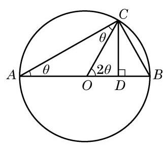

图 6-2-4

在直角三角形 ${ACB}$ 中,有 ${AC} = 2\cos \theta$ . 于是,在直角三角形 ${ACD}$ 中,就有 ${CD} = {AC}\sin \theta  = 2\cos \theta \sin \theta$ 及 ${OD} = {AD} - {AO} = \; {AC}\cos \theta  - 1 = 2{\cos }^{2}\theta  - 1$ .

但在直角三角形 ${CDO}$ 中,有 ${CD} = \sin {2\theta },{OD} = \cos {2\theta }$ .

比较上面的式子,就得到倍角公式: $\sin {2\theta } = 2\sin \theta \cos \theta ,\cos {2\theta } = 2{\cos }^{2}\theta  - 1$ .

同学们也可思考其他一些三角变换公式的几何证明. 虽然几何方法直观, 但在上述公式的证明过程中，角的限定范围多在 ${0}^{ \circ  } \sim  {90}^{ \circ  }$ 或 ${0}^{ \circ  } \sim  {180}^{ \circ  }$ 之间. 考虑到一般性，我们在本书中借助于平面直角坐标系及单位圆来论证三角公式, 并利用代换和转化思想得到更多的三角公式.

## 6.3 解三角形

### 1 正弦定理

在初中我们已学习了直角三角形的求解问题, 但在解决实际问题时, 所遇到的三角形往往不是直角三角形. 我们将不是直角三角形的三角形统称为斜三角形. 在三角形的三个角和三条边这六个元素中, 经常会遇到已知其中三个元素(至少一个元素为边) 求其他元素的问题, 这称为解三角形. 为此, 需要知道边和角之间的数量关系.

例如,某林场为了及时发现火情,设立了两个观测点 $A$ 和 $B$ . 某日两个观测点的林场人员都观测到 $C$ 处出现火情. 在 $A$ 处观测到火情发生在北偏西 ${40}^{ \circ  }$ 方向,而在 $B$ 处观测到火情在北偏西 ${60}^{ \circ  }$ 方向. 已知 $B$ 在 $A$ 的正东方向 ${10}\mathrm{\;{km}}$ 处 (图 6-3-1),要确定火场 $C$ 分别距 $A$ 及 $B$ 多远. 将此问题转化为数学问题: 在 $\bigtriangleup {ABC}$ 中,已知 $\angle {CAB} = {130}^{ \circ  },\angle {CBA} = {30}^{ \circ  },{AB} = {10}\mathrm{\;{km}}$ . 求 ${AC}$ 与 ${BC}$ 的长.

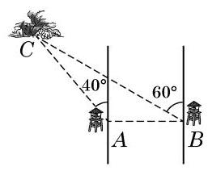

图 6-3-1

为解答这个斜三角形问题,就要研究斜三角形中边与角之间的关系.

在 $\bigtriangleup {ABC}$ 中,无论 $A$ 为锐角、直角还是钝角,对边 ${AB}$ 上的高 $h$ ,都有 $h = b\sin A$ ,其中 $b$ 为边 ${AC}$ 的长. 为了避免分类讨论, 我们借助平面直角坐标系来统一处理.

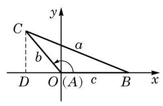

图 6-3-2

如图 6-3-2,以 $\bigtriangleup {ABC}$ 的顶点 $A$ 为坐标原点,边 ${AB}$ 所在直线为 $x$ 轴,建立平面直角坐标系. 将角 $A\text{ 、 }B$ 及 $C$ 所对边的边长分别记作 $a\text{ 、 }b$ 及 $c$ ,则点 $B\text{ 、 }C$ 的坐标分别为 $\left( {c,0}\right)$ 及 $\left( {b\cos A, b\sin A}\right)$ ,而 $\bigtriangleup {ABC}$ 的面积 ${S}_{\bigtriangleup {ABC}} = \frac{1}{2}{AB} \cdot  h = \frac{1}{2}{bc}\sin A$ . 同理可得 ${S}_{\bigtriangleup {ABC}} = \frac{1}{2}{ac}\sin B,{S}_{\bigtriangleup {ABC}} = \frac{1}{2}{ab}\sin C$ .

Q

---

本章以后若不特别说明,在 $\bigtriangleup {ABC}$ 中角 $A\text{ 、 }B\text{ 、 }C$ 所对边的边长都分别记作 $a$ 、 $b\text{ 、 }c$ .

---

这就是说, 三角形的面积等于任意两边与它们夹角正弦值的乘积的一半, 即三角形的面积公式为

$$
{S}_{\bigtriangleup {ABC}} = \frac{1}{2}{ab}\sin C = \frac{1}{2}{ac}\sin B = \frac{1}{2}{bc}\sin A.
$$

将上式同时除以 $\frac{1}{2}{abc}$ ,就得到

$$
\frac{\sin A}{a} = \frac{\sin B}{b} = \frac{\sin C}{c},
$$

即

$$
\frac{a}{\sin A} = \frac{b}{\sin B} = \frac{c}{\sin C}.
$$

Q

这样,我们就得到了正弦定理: 在 $\bigtriangleup {ABC}$ 中,若角 $A\text{ 、 }B$ 及 $C$ 所对边的边长分别为 $a\text{ 、 }b$ 及 $c$ ,则有

$$
\frac{a}{\sin A} = \frac{b}{\sin B} = \frac{c}{\sin C}.
$$

例 1 如图 6-3-1,在 $\bigtriangleup {ABC}$ 中,已知 $\angle {CAB} = {130}^{ \circ  }$ , $\angle {CBA} = {30}^{ \circ  },{AB} = {10}\mathrm{\;{km}}$ . 求 ${AC}$ 与 ${BC}$ 的长. (结果精确到 ${0.1}\mathrm{\;{km}}$ )

解 在 $\bigtriangleup {ABC}$ 中,由于 $C = {180}^{ \circ  } - {130}^{ \circ  } - {30}^{ \circ  } = {20}^{ \circ  }$ ,由正弦定理, 得

$$
\frac{a}{\sin {130}^{ \circ  }} = \frac{b}{\sin {30}^{ \circ  }} = \frac{10}{\sin {20}^{ \circ  }},
$$

从而

$$
a = {10} \times  \frac{\sin {130}^{ \circ  }}{\sin {20}^{ \circ  }} \approx  {22.4}\left( \mathrm{\;{km}}\right) , b = {10} \times  \frac{\sin {30}^{ \circ  }}{\sin {20}^{ \circ  }} \approx  {14.6}\left( \mathrm{\;{km}}\right) .
$$

所以， ${AC}$ 长约为 ${14.6}\mathrm{\;{km}}$ ， ${BC}$ 长约为 ${22.4}\mathrm{\;{km}}$ .

利用例 1 的结果, 在本节一开始所考虑的问题中, 就可以确定火场 $C$ 的位置.

正弦定理表明三角形的各边和它所对角的正弦的比相等. 那么, 这个比的几何意义是什么呢?

例 2 已知圆 $O$ 是 $\bigtriangleup {ABC}$ 的外接圆,其圆心为 $O$ ,直径为 ${2R}$ . 试用 $R$ 与角 $A\text{ 、 }B$ 及 $C$ 的正弦来表示三角形三边的边长 $a\text{ 、 }b$ 及 $c$ .

解 由于三角形内角和等于 ${180}^{ \circ  }$ ,因此角 $A\text{ 、 }B$ 及 $C$ 中至

---

正弦定理是“大角对大边”这一几何性质的定量刻画.

---

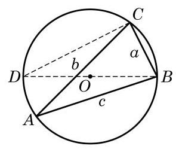

图 6-3-3

少有两个角是锐角,不妨设 $A$ 为锐角,如图 6-3-3 所示. 过 $B$ 作直径 ${BD}$ ,并连接 ${CD}$ . 直径 ${BD}$ 所对的圆周角 $\angle {DCB} = {90}^{ \circ  }$ , 弧 ${BC}$ 所对的圆周角 $\angle D = \angle A$ ,且 ${BD} = {2R}$ . 于是

$$
a = {BC} = {BD}\sin D = {BD}\sin A = {2R}\sin A,
$$

即 $\frac{a}{\sin A} = {2R}$ .

这样, 由正弦定理就得到

$\frac{a}{\sin A} = \frac{b}{\sin B} = \frac{c}{\sin C} = {2R}$ ( $R$ 为 $\bigtriangleup {ABC}$ 的外接圆半径),

换言之

$$
a = {2R}\sin A, b = {2R}\sin B, c = {2R}\sin C.
$$

---

能否用其他方法求解例 2 ?

---

例 3 设 $R$ 是 $\bigtriangleup {ABC}$ 的外接圆的半径, $S$ 为 $\bigtriangleup {ABC}$ 的面积. 求证:

(1) $S = \frac{{abc};}{4R}$ ；

(2) $S = {2{R}^{2}}\sin A\sin B\sin C$ .

证明 (1) $S = \frac{1}{2}{ab}\sin C = \frac{1}{2}{ab} \cdot  \frac{c}{2R} = \frac{abc}{4R}$ .

(2) $S = \frac{1}{2}{ab}\sin C = \frac{1}{2} \cdot  {2R}\sin A \cdot  {2R}\sin B \cdot  \sin C \; = 2{R}^{2}\sin A\sin B\sin C$ .

#### 练习 6.3(1)

1. 在 $\bigtriangleup {ABC}$ 中,已知 $a = 7, B = {30}^{ \circ  }, C = {85}^{ \circ  }$ . 求 $c$ . (结果精确到 0.01)
2. 在 $\bigtriangleup {ABC}$ 中,已知 $a = 5, A = {40}^{ \circ  }, B = {80}^{ \circ  }$ . 求 $b\text{ 、 }c$ 和面积 $S$ . (结果精确到 0.01)
3. 在 $\bigtriangleup {ABC}$ 中,如果 ${\sin }^{2}A + {\sin }^{2}B = {\sin }^{2}C$ ,试判断该三角形的形状.

### 2 余弦定理

正弦定理刻画了三角形中边与角的正弦之间的关系. 那么， 三角形中边与角的余弦之间存在什么关系呢?

在图 6-3-2 中, 由两点间的距离公式, 得

$$
a = \left| {BC}\right|  = \sqrt{{\left( b\cos A - c\right) }^{2} + {\left( b\sin A - 0\right) }^{2}}
$$

$$
= \sqrt{{\left( b\cos A - c\right) }^{2} + {\left( b\sin A\right) }^{2}},
$$

两边平方, 得

$$
{a}^{2} = {b}^{2}{\cos }^{2}A - {2bc}\cos A + {c}^{2} + {b}^{2}{\sin }^{2}A = {b}^{2} + {c}^{2} - {2bc}\cos A,
$$

即

$$
{a}^{2} = {b}^{2} + {c}^{2} - {2bc}\cos A.
$$

同理可得

$$
{b}^{2} = {a}^{2} + {c}^{2} - {2ac}\cos B,
$$

$$
{c}^{2} = {a}^{2} + {b}^{2} - {2ab}\cos C.
$$

这样,我们就得到了余弦定理: 在 $\bigtriangleup {ABC}$ 中,设角 $A\text{ 、 }B$ 及 $C$ 所对边的边长分别为 $a\text{ 、 }b$ 及 $c$ ,则有

$$
{a}^{2} = {b}^{2} + {c}^{2} - {2bc}\cos A,
$$

$$
{b}^{2} = {a}^{2} + {c}^{2} - {2ac}\cos B,
$$

$$
{c}^{2} = {a}^{2} + {b}^{2} - {2ab}\cos C.
$$

余弦定理也可以表示成如下形式:

$$
\cos A = \frac{{b}^{2} + {c}^{2} - {a}^{2}}{2bc}
$$

$$
\cos B = \frac{{a}^{2} + {c}^{2} - {b}^{2}}{2ac}
$$

$$
\cos C = \frac{{a}^{2} + {b}^{2} - {c}^{2}}{2ab}.
$$

将余弦定理用于直角三角形, 立即可得勾股定理. 因此, 勾股定理可视为余弦定理的特例. 正弦定理和余弦定理都定量刻画了三角形的边角关系, 是求解三角形的基本工具. 我们已在上节例 1 中应用正弦定理处理了已知两角和一边求解三角形其他元素的问题,现在再来研究其他情况.

例 4 在 $\bigtriangleup {ABC}$ 中,已知 $a = \sqrt{6}, b = \sqrt{3} + 1, C = {45}^{ \circ  }$ . 求 $c\text{ 、 }A$ 及 $B$ .

解 由余弦定理, 得

$$
{c}^{2} = {a}^{2} + {b}^{2} - {2ab}\cos C = 6 + {\left( \sqrt{3} + 1\right) }^{2} - 2\sqrt{6} \times  \left( {\sqrt{3} + 1}\right)  \times  \frac{\sqrt{2}}{2} = 4,
$$

故 $c = 2$ .

再由余弦定理, 得

$$
\cos A = \frac{{b}^{2} + {c}^{2} - {a}^{2}}{2bc} = \frac{{\left( \sqrt{3} + 1\right) }^{2} + 4 - 6}{2 \times  \left( {\sqrt{3} + 1}\right)  \times  2} = \frac{1}{2}.
$$

?

因为角 $A$ 为三角形的内角,所以 $A = {60}^{ \circ  }$ .

由三角形内角和定理,最后可得 $B = {180}^{ \circ  } - A - C = {75}^{ \circ  }$ .

所以, $c = 2, A = {60}^{ \circ  }, B = {75}^{ \circ  }$ .

例 5 在 $\bigtriangleup {ABC}$ 中,已知 $a = 2, b = 2\sqrt{3}, A = {30}^{ \circ  }$ . 求 $B\text{ 、 }C$ 及 $c$ .

解 方法一: 由正弦定理, 得

$$
\frac{2}{\sin {30}^{ \circ  }} = \frac{2\sqrt{3}}{\sin B},
$$

所以 $\sin B = \frac{\sqrt{3}}{2}$ ,从而 $B = {60}^{ \circ  }$ 或 $B = {180}^{ \circ  } - {60}^{ \circ  } = {120}^{ \circ  }$ .

当 $B = {60}^{ \circ  }$ 时, $C = {180}^{ \circ  } - {30}^{ \circ  } - {60}^{ \circ  } = {90}^{ \circ  }$ ,再由

$$
\frac{2}{\sin {30}^{ \circ  }} = \frac{c}{\sin {90}^{ \circ  }},
$$

得 $c = 4$ ；

当 $B = {120}^{ \circ  }$ 时, $C = {180}^{ \circ  } - {30}^{ \circ  } - {120}^{ \circ  } = {30}^{ \circ  }$ ,再由

$$
\frac{2}{\sin {30}^{ \circ  }} = \frac{c}{\sin {30}^{ \circ  }},
$$

得 $c = 2$ .

所以, $B = {60}^{ \circ  }, C = {90}^{ \circ  }, c = 4$ 或 $B = {120}^{ \circ  }, C = {30}^{ \circ  }, c = 2$ .

方法二:由余弦定理，得

$$
{2}^{2} = {\left( 2\sqrt{3}\right) }^{2} + {c}^{2} - 2 \times  2\sqrt{3} \times  c \times  \cos {30}^{ \circ  },
$$

即 ${c}^{2} - {6c} + 8 = 0$ ,所以 $c = 4$ 或 $c = 2$ .

当 $c = 4$ 时, $\cos B = \frac{{2}^{2} + {4}^{2} - {\left( 2\sqrt{3}\right) }^{2}}{2 \times  4 \times  2} = \frac{1}{2}$ ,所以 $B = {60}^{ \circ  }$ , 从而 $C = {180}^{ \circ  } - {30}^{ \circ  } - {60}^{ \circ  } = {90}^{ \circ  }$ ;

当 $c = 2$ 时, $\cos B = \frac{{2}^{2} + {2}^{2} - {\left( 2\sqrt{3}\right) }^{2}}{2 \times  2 \times  2} =  - \frac{1}{2}$ ,所以 $B = {120}^{ \circ  }$ , 从而 $C = {180}^{ \circ  } - {30}^{ \circ  } - {120}^{ \circ  } = {30}^{ \circ  }$ .

于是得到结论:

$B = {60}^{ \circ  }, C = {90}^{ \circ  }, c = 4$ 或 $B = {120}^{ \circ  }, C = {30}^{ \circ  }, c = 2$ .

例 6 在 $\bigtriangleup {ABC}$ 中,已知 $a = 4, b = 5, c = 6$ . 求角 $A$ 的余弦值和 $\bigtriangleup {ABC}$ 的面积 $S$ .

---

例 4 中,如果用正弦定理求出 $\sin A = \frac{\sqrt{3}}{2}$ , 如何判断 $A = {60}^{ \circ  }$ ?

将例 5 中的数据 $a = 2$ 改为 $a = 4$ ,该三角形只有一解. 对于已知三角形两边及其中一边所对角的三角形求解问题, 有兴趣的同学可以深入加以研究.

---

?

解 由余弦定理, 得

$$
\cos A = \frac{{b}^{2} + {c}^{2} - {a}^{2}}{2bc} = \frac{{5}^{2} + {6}^{2} - {4}^{2}}{2 \times  5 \times  6} = \frac{3}{4}.
$$

---

如例 5 所示, 已知三角形两边和其中一边所对的角, 解出来的三角形可能不唯一确定. 而对其他的情形，如本节例 4、 例 6 和上节中的例 1 , 都有确定的解. 这与证明三角形全等的条件之间有联系吗?

---

由此可得

$$
\sin A = \sqrt{1 - {\cos }^{2}A} = \sqrt{1 - {\left( \frac{3}{4}\right) }^{2}} = \frac{\sqrt{7}}{4},
$$

从而

$$
S = \frac{1}{2}{bc}\sin A = \frac{1}{2} \times  5 \times  6 \times  \frac{\sqrt{7}}{4} = \frac{15}{4}\sqrt{7}.
$$

练习 ${6.3}\left( 2\right)$

1. 在 $\bigtriangleup {ABC}$ 中,已知 $a = 3, b = 4, C = {60}^{ \circ  }$ . 求 $c$ .
2. 在 $\bigtriangleup {ABC}$ 中,已知 $A = {45}^{ \circ  }, a = 2\sqrt{6}, b = 2\sqrt{3}$ . 求 $B\text{ 、 }C$ 及 $c$ .
3. 在 $\bigtriangleup {ABC}$ 中,已知三边之比为 $2 : 3 : 4$ . 求该三角形的最大角的余弦值.

例 7 在 $\bigtriangleup {ABC}$ 中,已知 ${b}^{2} + {c}^{2} - {bc} = {a}^{2}$ ,且 $\frac{b}{c} = \frac{\tan B}{\tan C}$ . 求证: $\bigtriangleup {ABC}$ 为等边三角形.

证明 记 $\bigtriangleup {ABC}$ 外接圆的半径为 $R$ ,由 $\frac{b}{c} = \frac{\tan B}{\tan C}$ ,得

$$
\frac{{2R}\sin B}{{2R}\sin C} = \frac{\sin B \cdot  \cos C}{\cos B \cdot  \sin C}\text{ ,即 }\cos B = \cos C\text{ . }
$$

又由 $B\text{ 、 }C \in  \left( {0,\pi }\right)$ ,得 $B = C$ ,从而 $b = c$ . 再由 ${b}^{2} + {c}^{2} - {bc} = \; {a}^{2}$ ,得 ${b}^{2} = {a}^{2}$ ,从而 $a = b$ .

所以， $\bigtriangleup  {ABC}$ 为等边三角形.

例 8 在 $\bigtriangleup  {ABC}$ 中，已知 $a = 5$ ， $b = 4$ ，且三角形面积 $S = 8$ . 求 $c$ .

解 由 $S = \frac{1}{2}{ab}\sin C = 8$ ,得 $\sin C = \frac{4}{5}$ ,所以

$$
\cos C =  \pm  \sqrt{1 - {\sin }^{2}C} =  \pm  \frac{3}{5}.
$$

当 $\cos C = \frac{3}{5}$ 时,

$$
{c}^{2} = {a}^{2} + {b}^{2} - {2ab}\cos C = {25} + {16} - 2 \times  5 \times  4 \times  \frac{3}{5} = {17};
$$

而当 $\cos C =  - \frac{3}{5}$ 时,

${c}^{2} = {a}^{2} + {b}^{2} - {2ab}\cos C = {25} + {16} - 2 \times  5 \times  4 \times  \left( {-\frac{3}{5}}\right)  = {65}.$

所以, $c = \sqrt{17}$ 或 $c = \sqrt{65}$ .

为了表示例 8 中的角 $C$ ,我们引入如下记号.

一般地,我们用 $\arcsin a$ 表示满足 $\sin x = a\left( {0 \leq  a \leq  1}\right)$ 的角 $x\left( {x \in  \left\lbrack  {0,\frac{\pi }{2}}\right\rbrack  }\right)$ ; 用 $\arccos a$ 表示满足 $\cos x = a\left( {0 \leq  a \leq  1}\right)$ 的角 $x \; \left( {x \in  \left\lbrack  {0,\frac{\pi }{2}}\right\rbrack  }\right)$ ; 用 $\arctan a$ 表示满足 $\tan x = a\left( {a \geq  0}\right)$ 的角 $x \; \left( {x \in  \left\lbrack  {0,\frac{\pi }{2}}\right) }\right)$ . 这样,由 $\sin \frac{\pi }{6} = \frac{1}{2}$ 就得到 $\arcsin \frac{1}{2} = \frac{\pi }{6}$ . 同理,有 $\arccos \frac{\sqrt{2}}{2} = \frac{\pi }{4}$ 及 $\arctan \sqrt{3} = \frac{\pi }{3}$ . 因此,当例 8 中的角 $C$ 为锐角时, 可以表示为 $\arcsin \frac{4}{5}$ 或 $\arccos \frac{3}{5}$ ; 而当角 $C$ 为钝角时,可以表示为 $\pi  - \arcsin \frac{4}{5}$ 或 $\pi  - \arccos \frac{3}{5}$ .

例 9 根据下列条件,分别求角 $x$ :

(1)已知 $\sin x = \frac{1}{3}$ ；

(2)已知 $\cos x =  - \frac{3}{5}, x \in  \left\lbrack  {0,\pi }\right\rbrack$ ；

(3)已知 $\tan x =  - 3, x \in  \left( {\frac{\pi }{2},\frac{3\pi }{2}}\right)$ .

解 (1) 设锐角 $\alpha$ 满足 $\sin \alpha  = \frac{1}{3}$ ,就有 $\alpha  = \arcsin \frac{1}{3}$ . 这样, 原式等价于求解 $\sin x = \sin \alpha$ ,从而有 $x = {k\pi } + {\left( -1\right) }^{k}\alpha , k \in  \mathbf{Z}$ . 于是,满足条件的角为 $x = {k\pi } + {\left( -1\right) }^{k}\arcsin \frac{1}{3}, k \in  \mathbf{Z}$ .

( 2 )设锐角 $\alpha$ 满足 $\cos \alpha  = \frac{3}{5}$ ，就有 $\alpha  = \arccos \frac{3}{5}$ . 因为 $\cos \left( {\pi  - \alpha }\right)  =  - \cos \alpha  =  - \frac{3}{5}$ ,所以原式等价于求解 $\cos x = \; \cos \left( {\pi  - \alpha }\right)$ ,从而有 $x = {2k\pi } \pm  \left( {\pi  - \arccos \frac{3}{5}}\right) , k \in  \mathbf{Z}$ .

---

符号 arcsin、arccos、 arctan 在计算器上一般分别用 ${\sin }^{-1}$ 、 ${\cos }^{-1}$ 、 ${\tan }^{-1}$ 表示.

---

又因为 $x \in  \left\lbrack  {0,\pi }\right\rbrack$ ,所以 $x = \pi  - \arccos \frac{3}{5}$ .

(3)设锐角 $\alpha$ 满足 $\tan \alpha  = 3$ ，就有 $\alpha  = \arctan 3$ . 因为 $\tan \left( {-\alpha }\right) \; =  - \tan \alpha  =  - 3$ ,所以原式等价于求解 $\tan x = \tan \left( {-\alpha }\right)$ ,从而有 $x = {k\pi } + \left( {-\arctan 3}\right) , k \in  \mathbf{Z}.$

又因为 $x \in  \left( {\frac{\pi }{2},\frac{3\pi }{2}}\right)$ ,所以 $x = \pi  - \arctan 3$ .

#### 练习 6.3(3)

1. 在 $\bigtriangleup {ABC}$ 中,已知 $a = 4, B = {60}^{ \circ  }$ ,其面积为 $5\sqrt{3}$ . 求 $b$ .
2. 证明: 平行四边形中, 四边平方和等于对角线平方和.
3. 在 $\bigtriangleup {ABC}$ 中,求证:

(1) $\frac{{a}^{2} + {b}^{2}}{{c}^{2}} = \frac{{\sin }^{2}A + {\sin }^{2}B}{{\sin }^{2}C}$ ；

(2) ${a}^{2} + {b}^{2} + {c}^{2} = 2\left( {{bc}\cos A + {ac}\cos B + {ab}\cos C}\right)$ .

4. 分别求满足下列条件的角.

(1) $\sin x = \frac{3}{5}, x \in  \left\lbrack  {-\frac{\pi }{2},\frac{\pi }{2}}\right\rbrack$ ; (2) $\cos x =  - \frac{2}{3}, x \in  \left\lbrack  {0,\pi }\right\rbrack$ ；

(3) $\tan x =  - 2, x \in  \left( {-\frac{\pi }{2},\frac{\pi }{2}}\right)$ ； (4) $\sin x =  - \frac{2}{3}, x \in  \mathbf{R}$ .

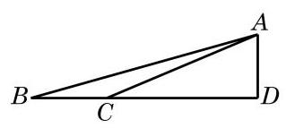

图 6-3-4

解三角形在实际生活中, 尤其是在测量方面, 有着广泛的应用. 下面通过一些实例来体会解三角形在测量上的应用.

例 10 金茂大厦是改革开放以来上海出现的超高层标志性建筑. 有一位测量爱好者在与金茂大厦底部同一水平线上的 $B$ 处测得金茂大厦顶部 $A$ 的仰角为 ${15.66}^{ \circ  }$ ,再向金茂大厦前进 ${500}\mathrm{\;m}$ 到达 $C$ 处,测得金茂大厦顶部 $A$ 的仰角为 ${22.81}^{ \circ  }$ . 请根据以上数据估算出金茂大厦的高度. (结果精确到 $1\mathrm{\;m}$ )

解 根据题意, 作出如图 6-3-4 所示的示意图, 问题转化为求直角三角形 ${ABD}$ 中边 ${AD}$ 的长.

在 $\bigtriangleup {ABC}$ 中, $\angle {ABC} = {15.66}^{ \circ  },\angle {BAC} = {22.81}^{ \circ  } - {15.66}^{ \circ  } = \; {7.15}^{ \circ  },{BC} = {500}\mathrm{\;m}$ .

由正弦定理,有 $\frac{500}{\sin {7.15}^{ \circ  }} = \frac{AC}{\sin {15.66}^{ \circ  }}$ ,即

$$
{AC} = \frac{{500}\sin {15.66}^{ \circ  }}{\sin {7.15}^{ \circ  }} \approx  {1084.3}\left( \mathrm{\;m}\right) .
$$

从而 ${AD} = {AC} \times  \sin {22.81}^{ \circ  } \approx  {420}\left( \mathrm{\;m}\right)$ .

所以，所估算的金茂大厦高度约为 ${420}\mathrm{\;m}$ .

例 11 甲船在距离 $A$ 港口 24 海里并在南偏西 ${20}^{ \circ  }$ 方向的 $C$ 处驻留等候进港,乙船在 $A$ 港口南偏东 ${40}^{ \circ  }$ 方向的 $B$ 处沿直线行驶入港，甲、乙两船距离为 31 海里. 当乙船行驶 20 海里到达 $D$ 处时,接到港口指令,前往救援忽然发生火灾的甲船. 求此时甲、乙两船之间的距离.

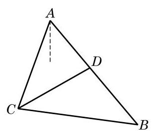

图 6-3-5

解 根据题意, 作出如图 6-3-5 所示的示意图, 其中

$$
{AC} = {24},{BC} = {31},\angle {CAD} = {20}^{ \circ  } + {40}^{ \circ  } = {60}^{ \circ  }.
$$

在 $\bigtriangleup {ABC}$ 中,由正弦定理,得 $\frac{24}{\sin \angle {ABC}} = \frac{31}{\sin {60}^{ \circ  }}$ ,从而 $\sin \angle {ABC} = \frac{{12}\sqrt{3}}{31}.$

由 ${AC} < {BC}$ ,知 $\angle {ABC}$ 为锐角,故

$$
\cos \angle {ABC} = \sqrt{1 - {\sin }^{2}\angle {ABC}} = \frac{23}{31}.
$$

在 $\bigtriangleup {BCD}$ 中,由余弦定理,有

$$
{CD} = \sqrt{B{C}^{2} + B{D}^{2} - {2BD} \cdot  {BC} \cdot  \cos \angle {ABC}}
$$

$$
= \sqrt{{31}^{2} + {20}^{2} - 2 \times  {31} \times  {20} \times  \frac{23}{31}}
$$

$$
= {21}\text{ (海里). }
$$

所以, 此时甲、乙两船之间的距离为 21 海里.

#### 练习 6.3(4)

1. 某货轮在 $A$ 处看灯塔 $S$ 在北偏东 ${30}^{ \circ  }$ 方向. 它以每小时 18 海里的速度向正北方向航行，经过 40 分钟航行到 $B$ 处，看灯塔 $S$ 在北偏东 ${75}^{ \circ  }$ 方向. 求此时货轮到灯塔 $S$ 的距离.
2. 我缉私船发现位于正北方向的走私船以每小时 30 海里的速度向北偏东 ${45}^{ \circ  }$ 方向的公海逃窜，已知缉私船的最大时速是 45 海里，为了及时截住走私船，缉私船应以什么方向追击走私船? (结果精确到 ${0.01}^{ \circ  }$ )
3. 修建铁路时要在一个山体上开挖一隧道,需要测量隧道口 $D$ 、 $E$ 之间的距离. 测量人员在山的一侧选取点 $C$ ,因有障碍物,无法直接测得 ${CE}$ 及 ${DE}$ 的距离. 现测得 ${CA} = {482.80}\mathrm{\;m},{CB} = {631.50}\mathrm{\;m}$ , $\angle {ACB} = {56.3}^{ \circ  }$ ; 又测得 $A$ 及 $B$ 两点到隧道口的距离分别是 ${80.13}\mathrm{\;m}$ 及 ${40.24}\mathrm{\;m}\left( {A\text{ 、 }D\text{ 、 }E\text{ 、 }B}\right.$ 在同一直线上). 求隧道 ${DE}$ 的长. (结果精确到 $1\mathrm{\;m}$ )

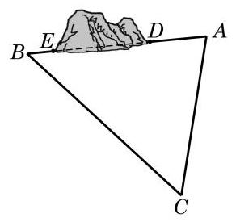

(第 3 题)

#### 习题 6.3

##### A 组

1. 在 $\bigtriangleup {ABC}$ 中,已知 $A = {120}^{ \circ  }, B = {45}^{ \circ  },{AC} = 2$ . 求 ${BC}$ .
2. 在 $\bigtriangleup {ABC}$ 中,已知 $b = {40}, c = {32}, A = {60}^{ \circ  }$ . 求 $a$ .
3. 在 $\bigtriangleup {ABC}$ 中,若 $a = 7, b = 8,\cos C = \frac{13}{14}$ . 求最大角的余弦值.
4. 已知 $\bigtriangleup {ABC}$ 的面积为 $3, a = 3, b = 2\sqrt{2}$ . 求 $c$ .
5. 在 $\bigtriangleup {ABC}$ 中,已知 $b = 2, c = \sqrt{2}, B = {45}^{ \circ  }$ . 求 $C\text{ 、 }a$ 及 $A$ .
6. 在 $\bigtriangleup {ABC}$ 中,若 $c = 2, C = \frac{\pi }{3}$ ,且其面积为 $\sqrt{3}$ ,求 $a$ 及 $b$ .
7. 在 $\bigtriangleup {ABC}$ 中,已知 ${AD}$ 是 $\angle {BAC}$ 的内角平分线. 求证: $\frac{AB}{AC} = \frac{BD}{DC}$ .
8. 在 $\bigtriangleup {ABC}$ 中,已知 ${AB} = \sqrt{3},{BC} = 3,{AC} = 4$ . 求边 ${AC}$ 上的中线 ${BD}$ 的长.
9. 根据下列条件,分别判断三角形 ${ABC}$ 的形状:

(1) $a = {2b}\cos C$ ；

(2) $\tan B = \frac{\cos \left( {B - C}\right) }{\sin A - \sin \left( {B - C}\right) }$ .

10. 如图,自动卸货汽车采用液压机构,设计时需要计算油泵顶杆 ${BC}$ 的长度. 已知车厢的最大仰角为 ${60}^{ \circ  }$ ,油泵顶点 $B$ 与车厢支点 $A$ 之间的距离为 ${1.95}\mathrm{\;m},{AB}$ 与水平线之间的夹角为 ${6}^{ \circ  }{20}^{\prime },{AC}$ 的长为 ${1.4}\mathrm{\;m}$ . 计算 ${BC}$ 的长. (结果精确到 ${0.01}\mathrm{\;m}$ )

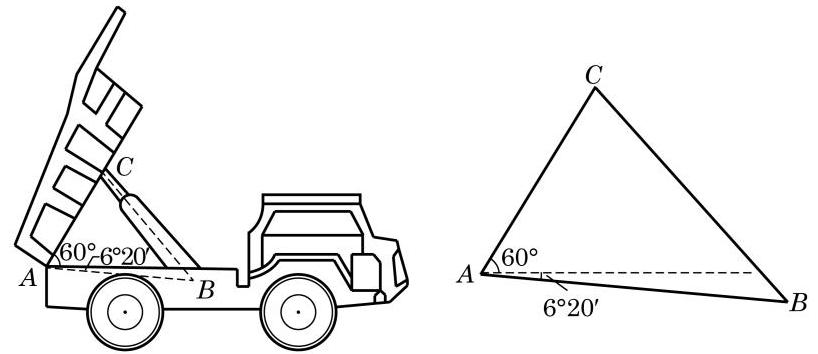

(第 10 题)

B 组

1. 在 $\bigtriangleup {ABC}$ 中,若 $\sqrt{3}a = {2b}\sin A$ ,求 $B$ .
2. 已知 $\bigtriangleup {ABC}$ 的面积 $S = \frac{{b}^{2} + {c}^{2} - {a}^{2}}{4}$ ,求 $A$ .
3. 在 $\bigtriangleup {ABC}$ 中,已知 $a = {13}, b = {14}, c = {15}$ .

(1)求 $\cos A$ ；

(2)求 $\bigtriangleup  {ABC}$ 的面积 $S$ .

4. 已知三角形两边之和为 8，其夹角为 ${60}^{ \circ  }$ . 分别求这个三角形周长的最小值和面积的最大值, 并指出面积最大时三角形的形状.
5. 求分别满足下列条件的角:

(1) $\sin x = \frac{2}{5}, x \in  \left\lbrack  {0,\pi }\right\rbrack$ ; (2) $\cos x =  - \frac{2}{3}, x \in  \left\lbrack  {0,{2\pi }}\right\rbrack$ ;

(3) $\tan x =  - \frac{1}{2}, x \in  \mathbf{R}$ .

6. 在 $\bigtriangleup {ABC}$ 中, $A = {60}^{ \circ  }, b = 1$ ,且其面积为 $\sqrt{3}$ . 求 $a$ .
7. 某船在海面 $A$ 处测得灯塔 $C$ 在北偏东 ${30}^{ \circ  }$ 方向，与 $A$ 相距 ${10}\sqrt{3}$ 海里，且测得灯塔 $B$ 在北偏西 ${75}^{ \circ  }$ 方向,与 $A$ 相距 ${15}\sqrt{6}$ 海里. 船由 $A$ 向正北方向航行到 $D$ 处,测得灯塔 $B$ 在南偏西 ${60}^{ \circ  }$ 方向. 这时灯塔 $C$ 与 $D$ 相距多少海里? $C$ 在 $D$ 的什么方向?

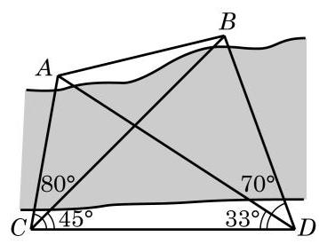

(第 8 题)

8. 如图,为了测定对岸 $A\text{ 、 }B$ 两点之间的距离,在河的一岸定一条基线 ${CD}$ ,测得 ${CD} = {100}\mathrm{\;m},\angle {ACD} = {80}^{ \circ  },\angle {BCD} = \; {45}^{ \circ  },\angle {BDC} = {70}^{ \circ  },\angle {ADC} = {33}^{ \circ  }$ . 求 $A\text{ 、 }B$ 间的距离. (结果精确到 ${0.01}\mathrm{\;m}$ )
9. 在 $\bigtriangleup {ABC}$ 中,求证:

(1) $\frac{\cos {2A}}{{a}^{2}} - \frac{\cos {2B}}{{b}^{2}} = \frac{1}{{a}^{2}} - \frac{1}{{b}^{2}}$ ;

(2) $\left( {{a}^{2} - {b}^{2} - {c}^{2}}\right) \tan A + \left( {{a}^{2} - {b}^{2} + {c}^{2}}\right) \tan B = 0$ .

探究与实践

海伦公式和“三斜求积”公式

已知三角形三边边长求三角形面积的问题, 据说最早是由古希腊数学家阿基米德 (Archimedes)解决的,计算公式为 $S = \sqrt{p\left( {p - a}\right) \left( {p - b}\right) \left( {p - c}\right) }$ (其中 $p = \frac{a + b + c}{2}$ ). 但这个公式通常称为海伦公式, 因为人们最早见到这个公式出现在海伦 (Heron) 的著作《测地术》中，并在海伦的著作《经纬仪》等书中都给出了证明.

我国南宋著名数学家秦九韶也独立发现了与海伦公式等价的公式, 但其证明已经失传. 他在著作《数书九章》卷五“田域类”里指出“问有沙田一段，有三斜. 其小斜十三里， 中斜十四里，大斜十五里，里法三百步，其田几何”，给出的解法为 “以小斜幂并大斜幂减中斜幂，余半之自乘于上，以小斜幂乘大斜幂减上，余四约之，为实. 一为从隅，开平方得积”. 即是说,记三百步为一里,以里为单位, $a = {13}, b = {14}, c = {15}$ ,面积可由公式 $S = \sqrt{\frac{1}{4}\left\lbrack  {{a}^{2}{c}^{2} - {\left( \frac{{a}^{2} + {c}^{2} - {b}^{2}}{2}\right) }^{2}}\right\rbrack  }$ 得出,这就是著名的 “三斜求积”公式. 秦九韶还对一次同余式组、高次方程的数值解法、线性方程组等都有深入研究, 因此美国科学史家萨顿 (G. Sarton)评价他为“他那个民族，那个时代，并且确实也是所有时代最伟大的数学家之一”.

利用三角形面积公式和余弦定理证明海伦公式和“三斜求积”公式虽有一定难度, 但揭示海伦公式和“三斜求积”公式的等价性并不是太困难，希望同学们加以探究.

课后阅读

三角学发展简史

平面三角形的正弦定理是直角三角形边角关系的推广, 余弦定理是勾股定理的推广. 早在我国商代与古希腊时期就已发现了勾股定理(又称毕达哥拉斯定理)，但平面三角的正弦定理与余弦定理却出现得很晚. 在古希腊, 三角学的起源、发展与天文学密不可分, 人们需要使用三角知识来建立定量的天文学, 通过测量天体的运动路线和位置用于报时、航海、历法推算和地理研究等, 因此对球面三角的研究比平面三角更早、更深入. 对于平面测量问题, 古希腊人认为利用平面几何知识已经足够.

公元 9 世纪左右，阿拉伯天文学家阿尔·巴塔尼(Al-Battani)以习题形式给出了平面上的余弦定理. 15 世纪，阿尔·卡西(Al-Kashi)给出了余弦定理的下述形式: ${a}^{2} = {\left( b - c\cos A\right) }^{2} + {c}^{2}{\sin }^{2}A$ . 现在所见到的余弦定理是由 16 世纪法国数学家韦达首次给出的. 著名天文学家阿尔·比鲁尼 (Al-Biruni) 给出了平面三角形的正弦定理, 并给予了证明.

1450 年前的三角学主要是球面三角, 而大地上的测量学还是采用几何方法. 最早将三角学从天文学中独立出来的代表人物是德国数学家约翰·穆勒(J. Müller), 其笔名雷格蒙塔努斯(J. Regiomontanus)更广为人知. 他在 1464 年完成了 5 卷本《论各种三角形》. 这部著作首次对三角学作出了系统性阐述，将平面三角、球面几何和球面三角中有关的知识综合起来, 建立了现代三角学的雏形. 法国数学家韦达将平面和球面三角进一步系统化并加以发展. 正是由于众多数学家的努力, 16 世纪三角学从天文学中分离出来, 成为数学的一个独立分支.

徐光启(1562-1633)，明末科学家，字子先，上海人. 曾译拉丁文 sinus 为 “正弦”，这是现在我们所用 “正弦”这一术语的由来. 徐光启等人还编写了《测量法义》和 《测量异同》. 在这些著作中, 不仅有我们熟悉的正弦定理, 还比较系统地给出了直角三角形和斜三角形的解法. 徐光启将西方的三角知识传播到了中国，并与意大利人利玛窦(M. Ricci)合作翻译了《几何原本》的前 6 卷，被称为中国近代科学的先驱.

## 内容提要

1. 正弦、余弦、正切、余切

弧度制:弧长等于半径的弧所对的圆心角叫做 1 弧度的角. 用“弧度”作为单位来度量角的单位制称为弧度制.

扇形弧长与面积:记扇形的半径为 $r$ ，圆心角为 $\alpha$ 弧度，弧长为 $l$ ，面积为 $S$ ，则有

$$
l = {\alpha r}, S = \frac{1}{2}\alpha {r}^{2}.
$$

单位圆:单位圆泛指半径为 1 个单位的圆. 本章中，在平面直角坐标系中，特指出以原点为圆心、以 1 为半径的圆为单位圆.

正弦、余弦、正切及余切的定义:在平面直角坐标系中，将角 $\alpha$ 的顶点与坐标原点 $O$ 重合，始边与 $x$ 轴的正半轴重合，在角 $\alpha$ 的终边上任取异于原点的一点 $P\left( {x, y}\right)$ ，就有

$$
\sin \alpha  = \frac{y}{r},\cos \alpha  = \frac{x}{r},\tan \alpha  = \frac{y}{x}\left( {x \neq  0}\right) ,\cot \alpha  = \frac{x}{y}\left( {y \neq  0}\right) .
$$

同角三角公式:

$$
{\sin }^{2}\alpha  + {\cos }^{2}\alpha  = 1,\tan \alpha  = \frac{\sin \alpha }{\cos \alpha },\cot \alpha  = \frac{\cos \alpha }{\sin \alpha },\tan \alpha  \cdot  \cot \alpha  = 1.
$$

诱导公式: ${2k\pi } + \alpha \left( {k \in  \mathbf{Z}}\right)$ ， $- \alpha$ ， $\pi  \pm  \alpha$ ， $\frac{\pi }{2} \pm  \alpha$ 的诱导公式，其规律为口诀:奇变偶不变，符号看象限。

2. 常用三角公式:

和角与差角公式:

$$
\sin \left( {\alpha  \pm  \beta }\right)  = \sin \alpha \cos \beta  \pm  \cos \alpha \sin \beta ,
$$

$$
\cos \left( {\alpha  \pm  \beta }\right)  = \cos \alpha \cos \beta  \mp  \sin \alpha \sin \beta ,
$$

$$
\tan \left( {\alpha  \pm  \beta }\right)  = \frac{\tan \alpha  \pm  \tan \beta }{1 \mp  \tan \alpha \tan \beta }.
$$

倍角公式:

$\sin {2\alpha } = 2\sin \alpha \cos \alpha ,\cos {2\alpha } = {\cos }^{2}\alpha  - {\sin }^{2}\alpha  = 2{\cos }^{2}\alpha  - 1 = 1 - 2{\sin }^{2}\alpha ,\tan {2\alpha } = \frac{2\tan \alpha }{1 - {\tan }^{2}\alpha }$ .

3. 解三角形

正弦定理: $\frac{a}{\sin A} = \frac{b}{\sin B} = \frac{c}{\sin C}$ .

余弦定理:

${a}^{2} = {b}^{2} + {c}^{2} - {2bc}\cos A,{b}^{2} = {a}^{2} + {c}^{2} - {2ac}\cos B,{c}^{2} = {a}^{2} + {b}^{2} - {2ab}\cos C.$

三角形面积公式: ${S}_{\bigtriangleup {ABC}} = \frac{1}{2}{ab}\sin C = \frac{1}{2}{ac}\sin B = \frac{1}{2}{bc}\sin A$ .

## 复习题

A 组

1. 选择题:

(1)与 $\sin \left( {\theta  - \frac{\pi }{2}}\right)$ 一定相等的是 ( )

A. $\sin \left( {\frac{3\pi }{2} - \theta }\right)$ ; B. $\cos \left( {\theta  - \frac{\pi }{2}}\right)$ ;

C. $\cos \left( {{2\pi } - \theta }\right)$ ; D. $\sin \left( {\theta  + \frac{\pi }{2}}\right)$ .

( 2 )当 $0 < \alpha  < \frac{\pi }{4}$ 时，化简 $\sqrt{1 - \sin {2\alpha }}$ 的结果是 ( )

A. $\cos \alpha$ ; B. $\sin \alpha  - \cos \alpha$ ;

C. $\cos \alpha  - \sin \alpha$ ; D. $\sin \alpha  + \cos \alpha$ .

2. 填空题:

(1)若 $\theta$ 为锐角,则 ${\log }_{\sin \theta }\left( {1 + {\cot }^{2}\theta }\right)  =$ ___；

(2)若 $- \frac{\pi }{2} < \alpha  < 0$ ，则点 $\left( \right. \cot \alpha ,\cos \alpha$ ) 必在第___象限；

(3)若 $\sin \left( {\pi  - \alpha }\right)  = \frac{2}{3},\alpha  \in  \left( {\frac{\pi }{2},\pi }\right)$ ，则 $\sin {2\alpha } =$ ___.

3. 已知圆 $O$ 上的一段圆弧长等于该圆的内接正方形的边长,求这段圆弧所对的圆心角的弧度.
4. 已知角 $\alpha$ 的终边经过点 $P\left( {{3a},{4a}}\right) \left( {a \neq  0}\right)$ ,求 $\sin \alpha \text{ 、 }\cos \alpha$ 和 $\tan \alpha$ .
5. 化简:

(1) $\frac{\sin \left( {\theta  - {5\pi }}\right) }{\tan \left( {{3\pi } - \theta }\right) } \cdot  \frac{\cot \left( {\frac{\pi }{2} - \theta }\right) }{\tan \left( {\theta  - \frac{3\pi }{2}}\right) } \cdot  \frac{\cos \left( {{8\pi } - \theta }\right) }{\sin \left( {-\theta  - {4\pi }}\right) }$ ;

(2) $\sin \left( {\theta  - \frac{\pi }{4}}\right)  + \cos \left( {\theta  + \frac{\pi }{4}}\right)$ .

6. 已知 $\tan \alpha  = 3$ ,求 $\frac{1}{{\sin }^{2}\alpha  + 2\sin \alpha \cos \alpha }$ 的值.
7. 在 $\bigtriangleup {ABC}$ 中,已知 $a = 5, b = 4, A = {2B}$ . 求 $\cos B$ .
8. 已知 $\bigtriangleup {ABC}$ 的面积为 $S$ ,求证:

(1) $S = \frac{{a}^{2}\sin B\sin C}{2\sin \left( {B + C}\right) }$ ; (2) $S = \frac{{a}^{2}}{2\left( {\cot B + \cot C}\right) }$ .

9. ( 1 )已知 $\sin \alpha  = \frac{\sqrt{5}}{5},\sin \beta  = \frac{\sqrt{10}}{10}$ ，且 $\alpha$ 及 $\beta$ 都是锐角. 求 $\alpha  + \beta$ 的值；

(2)在 $\bigtriangleup {ABC}$ 中，已知 $\tan A$ 与 $\tan B$ 是方程 ${x}^{2} - {6x} + 7 = 0$ 的两个根，求 $\tan C$ .

10. 证明: ${\left( \sin \alpha  + \sin \beta \right) }^{2} + {\left( \cos \alpha  + \cos \beta \right) }^{2} = 4{\cos }^{2}\frac{\alpha  - \beta }{2}$ .

B 组

1. 选择题:

(1)若 $0 < x < \frac{\pi }{4}$ ，且 $\lg \left( {\sin x + \cos x}\right)  = \frac{1}{2}\left( {3\lg 2 - \lg 5}\right)$ ，则 $\cos x - \sin x$ 的值为__( )

A. $\frac{\sqrt{6}}{3}$ ; B. $\frac{\sqrt{3}}{2}$ ; C. $\frac{\sqrt{10}}{5}$ ; D. $\frac{\sqrt{5}}{4}$ .

(2)下列命题中，真命题为 ( )

A. 若点 $P\left( {a,{2a}}\right) \left( {a \neq  0}\right)$ 为角 $\alpha$ 的终边上一点,则 $\sin \alpha  = \frac{2\sqrt{5}}{5}$ ;

B. 同时满足 $\sin \alpha  = \frac{1}{2},\cos \alpha  = \frac{\sqrt{3}}{2}$ 的角 $\alpha$ 有且只有一个;

C. 如果角 $\alpha$ 满足 $- {3\pi } < \alpha  <  - \frac{5}{2}\pi$ ,那么角 $\alpha$ 是第二象限的角;

D. $\tan x =  - \sqrt{3}$ 的解集为 $\left\{  {x\left| {\;x = {k\pi } - \frac{\pi }{3}}\right. , k \in  \mathbf{Z}}\right\}$ .

2. 填空题:

(1)在 $\bigtriangleup  {ABC}$ 中，若 ${a}^{2} + {b}^{2} + {ab} = {c}^{2}$ ，则 $C =$ ___；

(2)若 $\sin \theta  = a,\cos \theta  =  - {2a}$ ，且 $\theta$ 为第四象限的角，则实数 $a =$ ___.

3. 已知 $\sin \alpha  = a\sin \beta , b\cos \alpha  = a\cos \beta$ ，且 $\alpha$ 及 $\beta$ 均为锐角，求证: $\cos \alpha  = \sqrt{\frac{{a}^{2} - 1}{{b}^{2} - 1}}$ .
4. 已知 $0 < \alpha  < \frac{\pi }{2} < \beta  < \pi$ ,且 $\cos \beta  =  - \frac{1}{3},\sin \left( {\alpha  + \beta }\right)  = \frac{7}{9}$ ,求 $\sin \alpha$ 的值.
5. 已知 $\pi  < \alpha  < \frac{3\pi }{2},\pi  < \beta  < \frac{3\pi }{2}$ ,且 $\sin \alpha  =  - \frac{\sqrt{5}}{5},\cos \beta  =  - \frac{\sqrt{10}}{10}$ . 求 $\alpha  - \beta$ 的值.
6. 已知 $\left( {1 + \tan \alpha }\right) \left( {1 + \tan \beta }\right)  = 2$ ,且 $\alpha$ 及 $\beta$ 都是锐角. 求证: $\alpha  + \beta  = \frac{\pi }{4}$ .
7. 已知 $\alpha$ 是第二象限的角,且 $\sin \alpha  = \frac{\sqrt{15}}{4}$ . 求 $\frac{\sin \left( {\alpha  + \frac{\pi }{4}}\right) }{1 + \sin {2\alpha } + \cos {2\alpha }}$ 的值.
8. 证明:

(1) $\frac{2\left( {1 + \sin {2\alpha }}\right) }{1 + \sin {2\alpha } + \cos {2\alpha }} = 1 + \tan \alpha$ ; (2) $2\sin \alpha  + \sin {2\alpha } = \frac{2{\sin }^{3}\alpha }{1 - \cos \alpha }$ .

9. 根据下列条件,分别判断三角形 ${ABC}$ 的形状:

(1) $\sin C + \sin \left( {B - A}\right)  = \sin {2A}$ ;

(2) $\frac{\tan A}{\tan B} = \frac{{a}^{2}}{{b}^{2}}$ .

10. 在 $\bigtriangleup {ABC}$ 中,求证: $\tan \frac{A}{2}\tan \frac{B}{2} + \tan \frac{B}{2}\tan \frac{C}{2} + \tan \frac{C}{2}\tan \frac{A}{2} = 1$ .

拓展与思考

1.(1)完成下表( $\theta$ 为弧度数):

<table><tr><td>$\theta$</td><td>1</td><td>0.5</td><td>0.1</td><td>0.01</td><td>0.001</td></tr><tr><td>$\sin \theta$</td><td></td><td></td><td></td><td></td><td></td></tr><tr><td>$\frac{\sin \theta }{\theta }$</td><td></td><td></td><td></td><td></td><td></td></tr></table>

(2)观察上表中的数据，你能发现什么规律？

(3)已知 $0 < \theta  < \frac{\pi }{2}$ ，利用图形面积公式证明 $\sin \theta  < \theta  < \tan \theta$ ，并应用该公式说明(2) 中猜想的合理性.

2. 在 $\bigtriangleup {ABC}$ 中,已知 $A = {30}^{ \circ  }, b = {18}$ . 分别根据下列条件求 $B$ :

(1)① $a = 6$ ，② $a = 9$ ，③ $a = {13}$ ，④ $a = {18}$ ，⑤ $a = {22}$ ；

(2)根据上述计算结果，讨论使 $B$ 有一解、两解或无解时 $a$ 的取值情况.

3.(1)根据 $\cos {54}^{ \circ  } = \sin {36}^{ \circ  }$ 和三倍角公式，求 $\sin {18}^{ \circ  }$ 的值；

(2)你还能使用其他方法求 $\sin {18}^{ \circ  }$ 的值吗？若能，请给出你的求法.

4. 如图,要在 $A$ 和 $D$ 两地之间修建一条笔直的隧道,现在从 $B$ 地和 $C$ 地测量得到: $\angle {DBC} = {24.2}^{ \circ  },\angle {DCB} = {35.4}^{ \circ  },\angle {DBA} = {31.6}^{ \circ  }$ , $\angle {DCA} = {17.5}^{ \circ  }$ . 试求 $\angle {DAB}$ 以确定隧道 ${AD}$ 的方向. (结果精确到 $\left. {0.1}^{ \circ  }\right)$

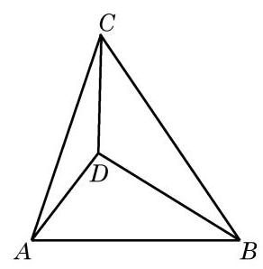

(第 4 题)

# 第 7 章 三角函数

前一章学习了三角, 无论是在锐角三角形中, 还是在平面直角坐标系中, 我们都是从几何的角度, 把正弦、余弦和正切看成一个比值. 本章我们将从函数的角度看待正弦、余弦和正切, 研究这些三角函数的图像与性质.

与幂函数、指数函数及对数函数不同, 三角函数具有周期性. 在现实生活中存在大量的周期现象, 如四季的交替, 钟表指针的转动, 弹簧的振动, 等等. 三角函数是刻画周期现象最典型的数学模型. 根据 19 世纪法国数学家傅里叶(J. B. J. Fourier)建立的傅里叶级数理论，一般的周期函数都可以用正弦函数和余弦函数构成的无穷级数表示，它确认了正弦函数和余弦函数在周期现象研究中重要而本质的作用, 使三角函数成为分析和解决周期问题的基本工具, 在物理学、工程技术和其他许多领域都有广泛的应用.

## 7.1 正弦函数的图像与性质

我们已经知道,任意一个给定的实数 $x$ 都对应着唯一确定的角(其弧度数等于实数 $x$ ),而这个角又对应着唯一确定的正弦值 $\sin x$ . 这样,对于任意一个给定的实数 $x$ ,都有唯一确定的正弦值 $\sin x$ 与之对应. 按照这个对应关系所建立的函数叫做正弦函数,记作 $y = \sin x$ . 正弦函数的定义域是实数集 $\mathbf{R}$ .

### 1 正弦函数的图像

对任意给定的实数 $x$ ,都有 $\sin \left( {x + {2k\pi }}\right)  = \sin x, k \in  \mathbf{Z}$ . 这说明当 $x$ 的值增加或减少 ${2\pi }$ 的整数倍时, $\sin x$ 的值会重复出现. 因此,只要作出正弦函数 $y = \sin x$ 在区间 $\left\lbrack  {0,{2\pi }}\right\rbrack$ 上的图像, 就可以得到正弦函数在 $\mathbf{R}$ 上的图像.

下面,我们结合单位圆,利用描点法作 $y = \sin x$ 的大致图像.

为了描出 $y = \sin x$ 图像上的某个点 $M\left( {\alpha ,\sin \alpha }\right)$ ,先在平面直角坐标系的 $x$ 轴上任取一点 ${O}_{1}$ ,以点 ${O}_{1}$ 为圆心的单位圆与 $x$ 轴有两个交点,其中右边的一个交点记作 $A$ (图 7-1-1). 设 $P$ 是此单位圆上一点, $\angle A{O}_{1}P = \alpha$ ,作 ${PQ}$ 垂直于 $x$ 轴,其垂足为 Q. 对比以坐标原点 $O$ 为圆心的单位圆中角 $\alpha$ 的终边与单位圆的交点,可知点 $P$ 的纵坐标为 $\sin \alpha$ ,而 ${QP}$ 的长是 $\left| {\sin \alpha }\right|$ . 在 $x$ 轴上取点 $N\left( {\alpha ,0}\right)$ ,将线段 ${QP}$ 平移至 ${NM}$ 的位置使点 $Q$ 与点 $N$ 重合,从而点 $M$ 的坐标为 $\left( {\alpha ,\sin \alpha }\right)$ ,这样就得到了函数 $y = \sin x$ 图像上的一点 $M$ .

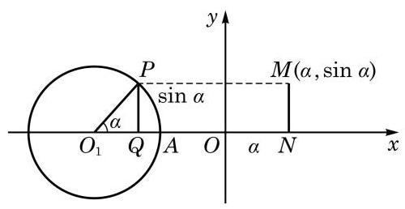

图 7-1-1

---

在本节的阅读材料中将说明简谐运动中物体离开平衡位置的位移关于时间的变化规律可以借助于正弦函数来描述.

单位圆是作正弦函数图像的有力工具. $\sin \alpha$ 就是角 $\alpha$ 的终边与以原点为圆心的单位圆交点的纵坐标.

---

随着 $\alpha$ 的变化,可以得到函数 $y = \sin x$ 图像上的其他点.

方便起见,我们先将单位圆 ${O}_{1}$ 分为 12 等份 (等份数越多, 作出的图像越精确),使得角 $\alpha$ 的弧度数依次取 $0\text{ 、 }\frac{\pi }{6}\text{ 、 }\frac{\pi }{3}\text{ 、 }\frac{\pi }{2}\text{ 、 }\cdots$ . ${2\pi }$ ,再借助圆 ${O}_{1}$ 得到对应的纵坐标,依次作出函数 $y = \; \sin x$ 图像上的点 $\left( {0,\sin 0}\right) \text{ 、 }\left( {\frac{\pi }{6},\sin \frac{\pi }{6}}\right) \text{ 、 }\left( {\frac{\pi }{3},\sin \frac{\pi }{3}}\right)$ 、 $\left( {\frac{\pi }{2},\sin \frac{\pi }{2}}\right) \text{ 、 }\cdots \text{ 、 }\left( {{2\pi },\sin {2\pi }}\right)$ ,用光滑的曲线将这些点连接起来,就得到正弦函数 $y = \sin x, x \in  \left\lbrack  {0,{2\pi }}\right\rbrack$ 的大致图像 (图 7-1-2).

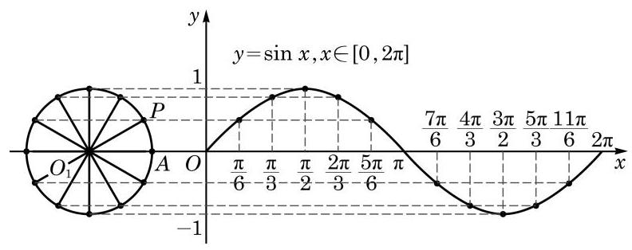

图 7-1-2

因为 $\sin \left( {x + {2k\pi }}\right)  = \sin x, k \in  \mathbf{Z}$ ,所以函数 $y = \sin x$ 当 $x \in  \left\lbrack  {{2\pi },{4\pi }}\right\rbrack  , x \in  \left\lbrack  {{4\pi },{6\pi }}\right\rbrack  ,\cdots$ 时的图像与 $y = \sin x, x \in  \left\lbrack  {0,{2\pi }}\right\rbrack$ 的图像形状完全一样,只需将后者向右平移 ${2\pi }\text{ 、 }{4\pi }\text{ 、 }\cdots$ 就可得到. 同样,函数 $y = \sin x$ 当 $x \in  \left\lbrack  {-{2\pi },0}\right\rbrack  , x \in  \left\lbrack  {-{4\pi }, - {2\pi }}\right\rbrack  ,\cdots$ 时的图像与 $y = \sin x, x \in  \left\lbrack  {0,{2\pi }}\right\rbrack$ 的图像形状也完全一样,只需将后者向左平移 ${2\pi }\text{ 、 }{4\pi }\text{ 、 }\cdots$ 就可得到. 这样,就可以得到函数 $y = \sin x$ 的图像 (图 7-1-3). 正弦函数 $y = \sin x$ 的图像通常称为正弦曲线.

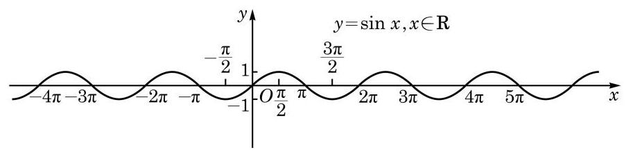

图 7-1-3

从图 7-1-2 可知， $\left( {0,0}\right) \text{ 、 }\left( {\frac{\pi }{2},1}\right) \text{ 、 }\left( {\pi ,0}\right) \text{ 、 }\left( {\frac{3\pi }{2}, - 1}\right)$ 和 $\left( {{2\pi },0}\right)$ 是函数 $y = \sin x, x \in  \left\lbrack  {0,{2\pi }}\right\rbrack$ 图像的五个关键点. 我们描出这五个点, 并用光滑的曲线将它们连接起来, 就得到函数 $y = \sin x, x \in  \left\lbrack  {0,{2\pi }}\right\rbrack$ 的大致图像 (图 7-1-4).

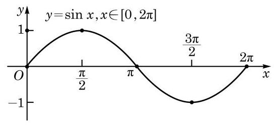

图 7-1-4

这种通过五个关键点作出正弦函数大致图像的方法, 通常称为“五点(作图)法”.

例 1 用 “五点法”作出函数 $y = 1 - \sin x, x \in  \left\lbrack  {0,{2\pi }}\right\rbrack$ 的大致图像,并写出使得 $y < 1$ 的 $x$ 的取值范围.

解 将五个关键点列表 (表 7-1) 如下:

表 7-1

<table><tr><td>$x$</td><td>0</td><td>$\frac{\pi }{2}$</td><td>$\pi$</td><td>$\frac{3\pi }{2}$</td><td>${2\pi }$</td></tr><tr><td>$- \sin x$</td><td>0</td><td>-1</td><td>0</td><td>1</td><td>0</td></tr><tr><td>$1 - \sin x$</td><td>1</td><td>0</td><td>1</td><td>2</td><td>1</td></tr></table>

描点并用光滑曲线把它们连接起来,就得到 $y = 1 - \sin x$ , $x \in  \left\lbrack  {0,{2\pi }}\right\rbrack$ 的大致图像 (图 7-1-5).

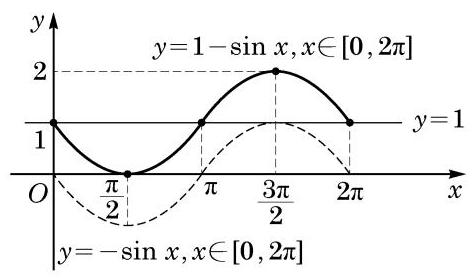

图 7-1-5

?

---

观察图 7-1-5, 函数 $y =  - \sin x$ 的图像与 $y = 1 - \sin x$ 的图像有怎样的关系?

---

作出函数 $y = 1$ 的图像,如图 7-1-5 所示. 由图可知,使得 $y < 1$ 的 $x$ 的取值范围是 $\left( {0,\pi }\right)$ .

#### 练习 7.1(1)

1. 作出函数 $y = \sin x, x \in  \left\lbrack  {-\pi ,\pi }\right\rbrack$ 的大致图像.
2. 作出函数 $y = \frac{1}{2} - \sin x, x \in  \left\lbrack  {0,{2\pi }}\right\rbrack$ 的大致图像,并分别写出使得 $y > 0$ 和 $y < 0$ 的 $x$ 的取值范围.
3. 在同一平面直角坐标系中作出 $y = \sin x$ 和 $y = \sin x + 2$ 的大致图像,并说明它们之间的关系.

### 2 正弦函数的性质

根据正弦函数的定义及图像, 可以得到它具有如下主要的性质.

(1) 周期性

由正弦曲线 (图 7-1-3) 可知，正弦函数的值随着自变量的变化呈现出周期性的变化. 这种“周而复始”的变化规律可以用数学式子表示为

$$
\sin \left( {x + {2\pi }}\right)  = \sin x.
$$

正弦函数的这种性质称为周期性. 这样,若记 $f\left( x\right)  = \sin x$ ,则对任意给定的实数 $x$ ,都有 $f\left( {x + {2\pi }}\right)  = f\left( x\right)$ . 一般地,如何用数学语言来描述一个函数的周期性呢?

定义 对于函数 $y = f\left( x\right)$ ,如果存在一个非零常数 $T$ ,使得当 $x$ 取其定义域 $D$ 中的任意值时,有 $x + T \in  D$ ,且成立

$$
f\left( {x + T}\right)  = f\left( x\right) ,
$$

那么函数 $y = f\left( x\right)$ 就叫做周期函数 (periodic function),而这个非零常数 $T$ 就叫做函数 $y = f\left( x\right)$ 的一个周期 (period).

对于一个周期函数 $y = f\left( x\right)$ ,如果在它的所有周期中存在一个最小正数,那么这个最小正数就叫做函数 $y = f\left( x\right)$ 的最小正周期.

因为对任意给定的实数 $x$ ,都有 $\sin \left( {x + {2k\pi }}\right)  = \sin x$ , $k \in  \mathbf{Z}$ ,由周期函数的定义,正弦函数 $y = \sin x$ 是周期函数,而 ${2k\pi }\left( {k \in  \mathbf{Z}, k \neq  0}\right)$ 均是它的周期. 可以证明, ${2\pi }$ 是它的最小正周期. 事实上,若定义域为 $\mathbf{R}$ 的函数 $y = f\left( x\right)$ 具有正周期 $T$ ,由于对此函数定义域中任意给定的实数 $x$ ,总成立 $f\left( {x + T}\right)  = f\left( x\right)$ , 因此函数 $y = f\left( {x + T}\right)$ 与函数 $y = f\left( x\right)$ 必具有完全相同的图像. 换而言之,将函数 $y = f\left( x\right)$ 的图像向左平移 $T$ 个长度单位,所得图像与 $y = f\left( x\right)$ 原来的图像必完全重合. 对于正弦函数 $y = \sin x$ ,对任何给定的 ${T}^{\prime }\left( {0 < {T}^{\prime } < {2\pi }}\right)$ ,因为 $\sin \left( {\frac{\pi }{2} + {T}^{\prime }}\right)  = \; \cos {T}^{\prime } \neq  1$ ,即 $\sin \left( {\frac{\pi }{2} + {T}^{\prime }}\right)  \neq  \sin \frac{\pi }{2}$ ,所以 $y = \sin \left( {x + {T}^{\prime }}\right)$ 的图像与 $y = \sin x$ 的图像绝不会相同. 这说明正弦函数绝不会有小于 ${2\pi }$ 的正周期,从而其最小正周期为 ${2\pi }$ .

例 2 求下列函数 $y = f\left( x\right)$ 的最小正周期:

(1) $f\left( x\right)  = \sin {3x}$ ；

(2) $f\left( x\right)  = 2\sin \left( {-\frac{1}{2}x + \frac{\pi }{3}}\right)$ .

解(1)因为对于函数 $y = \sin {3x}$ 的定义域 $\mathbf{R}$ 内任意给定的实数 $x$ ,有

$$
f\left( x\right)  = \sin {3x} = \sin \left( {{3x} + {2\pi }}\right)
$$

$$
= \sin 3\left( {x + \frac{2\pi }{3}}\right)  = f\left( {x + \frac{2\pi }{3}}\right) ,
$$

所以 $\frac{2\pi }{3}$ 是函数 $y = \sin {3x}$ 的一个正周期.

此外, $\frac{2\pi }{3}$ 也是函数 $y = \sin {3x}$ 的最小正周期. 事实上,令 $t = {3x}, y = \sin {3x}$ 可改写为 $y = \sin t$ ,其以 $t$ 为自变量的最小正周期为 ${2\pi }$ . 返回到 $x$ 变量,因 $x = \frac{t}{3}$ ,故 $y = \sin {3x}$ 的最小正周期为 $\frac{2\pi }{3}$ .

(2)因为对于函数 $y = 2\sin \left( {-\frac{1}{2}x + \frac{\pi }{3}}\right)$ 的定义域 $\mathbf{R}$ 内任意给定的实数 $x$ ,有

$$
f\left( x\right)  =  - 2\sin \left( {\frac{1}{2}x - \frac{\pi }{3}}\right)
$$

$$
=  - 2\sin \left( {\frac{1}{2}x - \frac{\pi }{3} + {2\pi }}\right)
$$

$$
=  - 2\sin \left\lbrack  {\frac{1}{2}\left( {x + {4\pi }}\right)  - \frac{\pi }{3}}\right\rbrack
$$

$$
= 2\sin \left\lbrack  {-\frac{1}{2}\left( {x + {4\pi }}\right)  + \frac{\pi }{3}}\right\rbrack
$$

$$
= f\left( {x + {4\pi }}\right) ,
$$

所以 ${4\pi }$ 是函数 $y = 2\sin \left( {-\frac{1}{2}x + \frac{\pi }{3}}\right)$ 的一个正周期.

此外, ${4\pi }$ 也是函数 $y = 2\sin \left( {-\frac{1}{2}x + \frac{\pi }{3}}\right)$ 的最小正周期. 事实上,令 $t = \frac{1}{2}x - \frac{\pi }{3}$ ,原来的函数可改写为 $y = 2\sin \left( {-t}\right)  =  - 2\sin t$ , 其以 $t$ 为自变量的最小正周期为 ${2\pi }$ . 返回到 $x$ 变量,因 $x = {2t} + \frac{2\pi }{3}$ , 故原来函数的最小正周期为 ${4\pi }$ .

一般地,函数 $y = A\sin \left( {{\omega x} + \varphi }\right) , x \in  \mathbf{R}$ (其中 $A\text{ 、 }\omega \text{ 、 }\varphi$ 为常数,且 $A \neq  0,\omega  > 0$ )的最小正周期为 $T = \frac{2\pi }{\omega }$ .

今后, 我们可以直接使用这个结果来求这类函数的最小正周期.

例 3 已知函数 $y = \sin \left( {{kx} + \frac{\pi }{3}}\right)$ (其中常数 $k \neq  0$ ) 的最小正周期是 2,求 $k$ 的值.

解 当 $k > 0$ 时,函数 $y = \sin \left( {{kx} + \frac{\pi }{3}}\right)$ 的最小正周期为 $T = \frac{2\pi }{k} = 2$ ,由此解得 $k = \pi$ .

当 $k < 0$ 时, $- k > 0$ ,函数 $y = \sin \left( {{kx} + \frac{\pi }{3}}\right)  =  - \sin \left( {-{kx} - \frac{\pi }{3}}\right)$ , 其最小正周期为 $T = \frac{2\pi }{-k} = 2$ ,由此解得 $k =  - \pi$ .

所以， $k$ 的值为 $\pm  \pi$ .

例 4 对于函数 $y = \sin x$ ,当 $x = \frac{7\pi }{6}$ 时， $\sin \left( {x + \frac{2\pi }{3}}\right)  = \; \sin x$ 能否成立? 如果成立,那么 $\frac{2\pi }{3}$ 是不是 $y = \sin x$ 的周期? 为什么?

解 当 $x = \frac{7\pi }{6}$ 时,

$\sin \left( {x + \frac{2\pi }{3}}\right)  = \sin \left( {\frac{7\pi }{6} + \frac{2\pi }{3}}\right)  = \sin \frac{11\pi }{6} =  - \sin \frac{\pi }{6} =  - \frac{1}{2},$

$\sin \frac{7\pi }{6} =  - \sin \frac{\pi }{6} =  - \frac{1}{2}.$

故当 $x = \frac{7\pi }{6}$ 时, $\sin \left( {x + \frac{2\pi }{3}}\right)  = \sin x$ 成立.

---

当函数 $y = \; A\sin \left( {{\omega x} + \varphi }\right)$ 中 $\omega$ 为负数时，可用诱导公式把 $\omega$ 化为正数(参见例 2 (2)).

---

但是, $\frac{2\pi }{3}$ 不是 $y = \sin x$ 的周期. 事实上, $\sin \left( {x + \frac{2\pi }{3}}\right)  = \; \sin x$ 并不是对函数 $y = \sin x$ 的定义域中一切给定的实数 $x$ 都成立. 例如,当 $x = \frac{\pi }{3}$ 时, $\sin \left( {x + \frac{2\pi }{3}}\right)  \neq  \sin x$ .

#### 练习 7.1(2)

1. 求下列函数的最小正周期:

(1) $y =  - \frac{1}{3}\sin x + 1$ ； (2) $y = 3\sin \left( {{3x} - \frac{\pi }{6}}\right)$ .

2. 当 $x = {2k\pi } + \frac{4\pi }{3}\left( {k \in  \mathbf{Z}}\right)$ 时， $\sin \left( {x + \frac{\pi }{3}}\right)  = \sin x$ 是否成立？如果成立，那么 $\frac{\pi }{3}$ 是不是 $y = \sin x$ 的周期? 为什么?
3. 现实生活中常碰到类似于周期的现象. 根据图中标出的尺度估算下列心电图的周期. (其中横轴的单位是 $2\mathrm{\;{ms}},1\mathrm{\;s} = {1000}\mathrm{{ms}}$ ; 纵轴的单位是 $\mathrm{{mV}}$ )

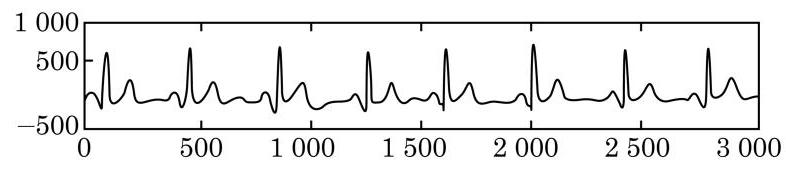

(第 3 题)

由于正弦函数是周期函数, 因此研究它的最值和单调性等性质时, 都可以在长度为一个周期的区间上进行.

(2) 值域与最值

设角 $x$ 的终边与以原点为圆心的单位圆交于点 $P$ (图7-1-6), 点 $P$ 的坐标为 $\left( {u, v}\right)$ . 由正弦的定义, $\sin x = v$ ,于是有 $\left| {\sin x}\right| \; = \left| v\right|  \leq  1$ .

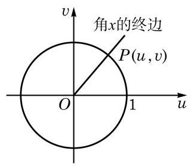

图 7-1-6

因此，正弦函数 $y = \sin x, x \in  \mathbf{R}$ 的值域为 $\left\lbrack  {-1,1}\right\rbrack$ ,其最大值为 1,最小值为 -1 .

考虑到正弦函数 $y = \sin x$ 的最小正周期为 ${2\pi }$ ,因此只需选择一个长度为 ${2\pi }$ 的合适的区间来研究其最大值与最小值. 取此区间为 $\lbrack 0,{2\pi })$ . 在 $\lbrack 0,{2\pi })$ 上,当且仅当 $x = \frac{\pi }{2}$ 时, $y = \sin x$ 取得最大值 1 ; 当且仅当 $x = \frac{3\pi }{2}$ 时, $y = \sin x$ 取得最小值 -1 .

由于正弦函数 $y = \sin x, x \in  \mathbf{R}$ 的最小正周期是 ${2\pi }$ ,因此当且仅当 $x = {2k\pi } + \frac{\pi }{2}, k \in  \mathbf{Z}$ 时, $y = \sin x$ 取得最大值 1; 当且仅当 $x = {2k\pi } + \frac{3\pi }{2}, k \in  \mathbf{Z}$ 时, $y = \sin x$ 取得最小值 -1 .

例 5 求下列函数的最大值和最小值, 并求出取得最大值和最小值时所有 $x$ 的值:

(1) $y =  - 2\sin \left( {{3x} + \frac{\pi }{3}}\right)$ ；

(2) $y = \sin x + \sqrt{3}\cos x$ ；

(3) $y = {\sin }^{2}x - \sin x$ ；

(4) $y = {\sin }^{2}x + 2\sqrt{3}\sin x\cos x + 3{\cos }^{2}x$ .

解 (1) 令 $u = {3x} + \frac{\pi }{3}$ ,由 $x \in  \mathbf{R}$ ,得 $u$ 能取遍所有实数, 因为 $y = \sin u, u \in  \mathbf{R}$ 的最大值是 1,最小值是 -1,所以 $y = \; - 2\sin u, u \in  \mathbf{R}$ 的最大值是 2,最小值是 -2 .

当 $y =  - 2\sin u$ 取得最大值 2 时, $u = {2k\pi } + \frac{3\pi }{2}\left( {k \in  \mathbf{Z}}\right)$ ,即

$$
{3x} + \frac{\pi }{3} = {2k\pi } + \frac{3\pi }{2}\left( {k \in  \mathbf{Z}}\right) , x = \frac{2k\pi }{3} + \frac{7\pi }{18}\left( {k \in  \mathbf{Z}}\right) ;
$$

而当 $y =  - 2\sin u$ 取得最小值 -2 时, $u = {2k\pi } + \frac{\pi }{2}\left( {k \in  \mathbf{Z}}\right)$ ,即

$$
{3x} + \frac{\pi }{3} = {2k\pi } + \frac{\pi }{2}\left( {k \in  \mathbf{Z}}\right) , x = \frac{2k\pi }{3} + \frac{\pi }{18}\left( {k \in  \mathbf{Z}}\right) .
$$

(2) $y = \sin x + \sqrt{3}\cos x$

$$
= 2\left( {\frac{1}{2}\sin x + \frac{\sqrt{3}}{2}\cos x}\right)
$$

$$
= 2\sin \left( {x + \frac{\pi }{3}}\right) .
$$

因为 $- 2 \leq  2\sin \left( {x + \frac{\pi }{3}}\right)  \leq  2$ ,所以 $y$ 的最大值是 2,此时

$$
x + \frac{\pi }{3} = {2k\pi } + \frac{\pi }{2}\left( {k \in  \mathbf{Z}}\right) ,
$$

即 $x = {2k\pi } + \frac{\pi }{6}\left( {k \in  \mathbf{Z}}\right)$ ;

而 $y$ 的最小值是 -2,此时

$$
x + \frac{\pi }{3} = {2k\pi } + \frac{3\pi }{2}\left( {k \in  \mathbf{Z}}\right) ,
$$

即 $x = {2k\pi } + \frac{7\pi }{6}\left( {k \in  \mathbf{Z}}\right)$ .

(3)令 $t = \sin x$ ，由 $x \in  \mathbf{R}$ ，得 $t \in  \left\lbrack  {-1,1}\right\rbrack$ ，则

$$
y = {t}^{2} - t = {\left( t - \frac{1}{2}\right) }^{2} - \frac{1}{4}, t \in  \left\lbrack  {-1,1}\right\rbrack  .
$$

因为 $- 1 \leq  t \leq  1$ 时， $- \frac{3}{2} \leq  t - \frac{1}{2} \leq  \frac{1}{2}$ ，所以 $0 \leq  {\left( t - \frac{1}{2}\right) }^{2} \leq \; \frac{9}{4}$ ,从而 $- \frac{1}{4} \leq  {\left( t - \frac{1}{2}\right) }^{2} - \frac{1}{4} \leq  2$ .

于是, $y$ 的最大值是 2,此时 $t - \frac{1}{2} =  - \frac{3}{2}, t =  - 1$ ,即

$$
\sin x =  - 1, x = {2k\pi } + \frac{3\pi }{2}\left( {k \in  \mathbf{Z}}\right) ;
$$

而 $y$ 的最小值是 $- \frac{1}{4}$ ,此时 $t - \frac{1}{2} = 0, t = \frac{1}{2}$ ,即

$$
\sin x = \frac{1}{2}, x = {2k\pi } + \frac{\pi }{6}\text{ 或 }x = {2k\pi } + \frac{5\pi }{6}\left( {k \in  \mathbf{Z}}\right) .
$$

(4) $y = {\sin }^{2}x + 2\sqrt{3}\sin x\cos x + 3{\cos }^{2}x$

$$
= \left( {{\sin }^{2}x + {\cos }^{2}x}\right)  + \sqrt{3}\sin {2x} + \left( {2{\cos }^{2}x - 1}\right)  + 1
$$

$$
= \sqrt{3}\sin {2x} + \cos {2x} + 2
$$

$$
= 2\left( {\frac{\sqrt{3}}{2}\sin {2x} + \frac{1}{2}\cos {2x}}\right)  + 2
$$

$$
= 2\sin \left( {{2x} + \frac{\pi }{6}}\right)  + 2\text{ . }
$$

因为 $- 2 \leq  2\sin \left( {{2x} + \frac{\pi }{6}}\right)  \leq  2$ ,所以 $y$ 的最大值是 4,此时 ${2x} + \frac{\pi }{6} = {2k\pi } + \frac{\pi }{2}\left( {k \in  \mathbf{Z}}\right)$ ,即 $x = {k\pi } + \frac{\pi }{6}\left( {k \in  \mathbf{Z}}\right)$ ; 而 $y$ 的最小值是 0,此时 ${2x} + \frac{\pi }{6} = {2k\pi } + \frac{3\pi }{2}\left( {k \in  \mathbf{Z}}\right)$ ,即 $x = {k\pi } + \frac{2\pi }{3}\left( {k \in  \mathbf{Z}}\right)$ .

在现实生活中, 我们常常会碰到合理下料、最优设计等方面的问题, 通过建立三角函数模型求最值是其中一种解决问题的方法.

例 6 如图 7-1-7,在一个半径为 $r$ 的半圆形铁板中,截取一块矩形 ${ABCD}$ ,使得矩形的顶点 $A\text{ 、 }B$ 在半圆的直径上, $C\text{ 、 }D$ 在半圆弧上. 问: 如何截取矩形 ${ABCD}$ ,使其面积达到最大值? 并求出这个最大值.

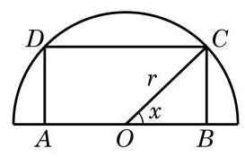

图 7-1-7

解 连接 ${OC}$ . 设 $\angle {COB} = x, x \in  \left( {0,\frac{\pi }{2}}\right)$ ,矩形 ${ABCD}$ 的面积为 $y$ ,则 ${AB} = {2r}\cos x,{BC} = r\sin x$ ,而

$$
y = {AB} \cdot  {BC}
$$

$$
= {2r}\cos x \cdot  r\sin x
$$

$$
= {r}^{2}\sin {2x}, x \in  \left( {0,\frac{\pi }{2}}\right) .
$$

由此可知,当且仅当 $x = \frac{\pi }{4}$ 时,矩形 ${ABCD}$ 的面积 $y$ 有最大值 ${r}^{2}$ . 因此,在半圆形铁板中应截取 ${AB} = \sqrt{2}r,{BC} = \frac{\sqrt{2}}{2}r$ ,这时矩形 ${ABCD}$ 的面积达到最大值 ${r}^{2}$ .

#### 练习 7.1(3)

1. 求下列函数的定义域和值域:

(1) $y = \sin \left( {x + \frac{\pi }{2}}\right)$ ； (2) $y = {2}^{\sin x}$ .

2. 求下列函数的最大值与最小值:

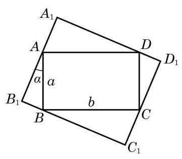

(第 3 题)

(1) $y =  - 5 + \sin \left( {{2x} + \frac{\pi }{4}}\right)$ ;

(2) $y = {\cos }^{2}x + 2\sin x$ ;

(3) $y = 2\sin x \cdot  \cos x - \sqrt{3}{\cos }^{2}x + \sqrt{3}{\sin }^{2}x$ .

3. 如图,矩形 ${ABCD}$ 的四个顶点分别在矩形 ${A}_{1}{B}_{1}{C}_{1}{D}_{1}$ 的四条边上, ${AB} = a,{BC} = b$ . 如果 ${AB}$ 与 ${A}_{1}{B}_{1}$ 的夹角为 $\alpha$ ,那么当 $\alpha$ 取何值时,矩形 ${A}_{1}{B}_{1}{C}_{1}{D}_{1}$ 的周长最大?

(3) 奇偶性

对任意给定的 $x \in  \mathbf{R}$ ,等式 $\sin \left( {-x}\right)  =  - \sin x$ 都成立,因此正弦函数 $y = \sin x$ 是一个奇函数,从而其图像关于坐标原点中心对称.

例 7 判断下列函数 $y = f\left( x\right)$ 的奇偶性,并说明理由:

(1) $f\left( x\right)  = \sin \left| x\right|$ ；

(2) $f\left( x\right)  = \sin \left( {x + \frac{\pi }{2}}\right)$ ；

(3) $f\left( x\right)  = \sin \left( {x - \frac{\pi }{4}}\right)$ .

解(1)因为函数 $y = \sin \left| x\right|$ 的定义域为 $\mathbf{R}$ ,对于任意给定的 $x \in  \mathbf{R}$ ,

$$
f\left( {-x}\right)  = \sin \left| {-x}\right|  = \sin \left| x\right|  = f\left( x\right) ,
$$

所以 $y = \sin \left| x\right|$ 是一个偶函数.

(2)因为函数 $y = \sin \left( {x + \frac{\pi }{2}}\right)$ 的定义域为 $\mathbf{R}$ ，对于任意给定的 $x \in  \mathbf{R}$ ,

$$
f\left( {-x}\right)  = \sin \left( {-x + \frac{\pi }{2}}\right)
$$

$$
= \sin \left\lbrack  {\pi  - \left( {-x + \frac{\pi }{2}}\right) }\right\rbrack
$$

$$
= \sin \left( {x + \frac{\pi }{2}}\right)  = f\left( x\right) ,
$$

所以 $y = \sin \left( {x + \frac{\pi }{2}}\right)$ 是一个偶函数.

(3)注意到 $f\left( {-\frac{\pi }{4}}\right)  = \sin \left( {-\frac{\pi }{4} - \frac{\pi }{4}}\right)  = \sin \left( {-\frac{\pi }{2}}\right)  =  - 1$ , $f\left( \frac{\pi }{4}\right)  = \sin \left( {\frac{\pi }{4} - \frac{\pi }{4}}\right)  = \sin 0 = 0.$ 因为

$$
f\left( {-\frac{\pi }{4}}\right)  \neq  f\left( \frac{\pi }{4}\right) \text{ ,且 }f\left( {-\frac{\pi }{4}}\right)  \neq   - f\left( \frac{\pi }{4}\right) \text{ , }
$$

所以 $y = \sin \left( {x - \frac{\pi }{4}}\right)$ 既不是奇函数也不是偶函数.

(4) 单调性

由于正弦函数是以 ${2\pi }$ 为最小正周期的周期函数,因此在研究它的单调区间时,只需选择一个长度为 ${2\pi }$ 的合适的区间进行考察. 方便起见,我们可以在 $\left\lbrack  {-\frac{\pi }{2},\frac{3\pi }{2}}\right\rbrack$ 上研究正弦函数 $y = \sin x$ 的单调性.

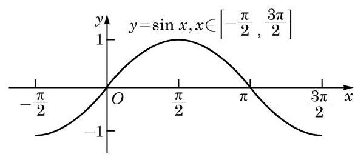

图 7-1-8

观察函数 $y = \sin x, x \in  \left\lbrack  {-\frac{\pi }{2},\frac{3\pi }{2}}\right\rbrack$ 的图像 (图 7-1-8),可以看到: 当 $x$ 由 $- \frac{\pi }{2}$ 增大到 $\frac{\pi }{2}$ 时,曲线上升, $\sin x$ 的值随着 $x$ 的增大而增大,由 -1 增大到 1 ; 而当 $x$ 由 $\frac{\pi }{2}$ 增大到 $\frac{3\pi }{2}$ 时,曲线下降, $\sin x$ 的值随着 $x$ 的增大而减小,由 1 减小到 -1 .

这就是说,正弦函数 $y = \sin x$ 在 $\left\lbrack  {-\frac{\pi }{2},\frac{\pi }{2}}\right\rbrack$ 上是严格增函数; 在 $\left\lbrack  {\frac{\pi }{2},\frac{3\pi }{2}}\right\rbrack$ 上是严格减函数.

由于正弦函数 $y = \sin x$ 的最小正周期是 ${2\pi }$ ,因此正弦函数 $y = \sin x$ 在 $\left\lbrack  {{2k\pi } - \frac{\pi }{2},{2k\pi } + \frac{\pi }{2}}\right\rbrack  \left( {k \in  \mathbf{Z}}\right)$ 上是严格增函数; 在 $\left\lbrack  {{2k\pi } + \frac{\pi }{2},{2k\pi } + \frac{3\pi }{2}}\right\rbrack  \left( {k \in  \mathbf{Z}}\right)$ 上是严格减函数.

例 8 利用函数的单调性, 比较下列各组数的大小:

(1) $\sin \frac{6\pi }{5}$ 与 $\sin \frac{7\pi }{6}$ ；

(2) $\sin \frac{43\pi }{7}$ 与 $\sin \left( {-\frac{47\pi }{8}}\right)$ .

解 (1) 因为 $\frac{\pi }{2} < \frac{7\pi }{6} < \frac{6\pi }{5} < \frac{3\pi }{2}$ ,且正弦函数 $y = \sin x$ 在 $\left\lbrack  {\frac{\pi }{2},\frac{3\pi }{2}}\right\rbrack$ 上是严格减函数,所以 $\sin \frac{6\pi }{5} < \sin \frac{7\pi }{6}$ .

$$
\sin \frac{43\pi }{7} = \sin \left( {{6\pi } + \frac{\pi }{7}}\right)  = \sin \frac{\pi }{7},
$$

$$
\sin \left( {-\frac{47\pi }{8}}\right)  = \sin \left( {-{6\pi } + \frac{\pi }{8}}\right)  = \sin \frac{\pi }{8}.
$$

---

在图 7-1-6 中, 因为在单位圆上, 当 $x$ 由 $- \frac{\pi }{2}$ 增大到 $\frac{\pi }{2}$ 时,点 $P$ 的纵坐标 $v$ 由 -1 增大到 1 , 且 $\sin x = v$ ,所以 $\sin x$ 的值由 -1 增大到 1 .

---

因为 $- \frac{\pi }{2} < \frac{\pi }{8} < \frac{\pi }{7} < \frac{\pi }{2}$ ,且正弦函数 $y = \sin x$ 在 $\left\lbrack  {-\frac{\pi }{2},\frac{\pi }{2}}\right\rbrack$ 上是严格增函数,所以 $\sin \frac{\pi }{7} > \sin \frac{\pi }{8}$ ,即 $\sin \frac{43\pi }{7} > \sin \left( {-\frac{47\pi }{8}}\right)$ .

例 9 ( 1 )求函数 $y = \sin \left( {x + \frac{\pi }{2}}\right)$ 的单调减区间；

(2)求函数 $y = 2\sin \left( {-{2x} + \frac{\pi }{6}}\right) , x \in  ( - \pi ,0\rbrack$ 的单调增区间.

解 (1) 令 $u = x + \frac{\pi }{2}$ ,则原来的函数可改写为 $y = \sin u$ ,且因为 $u = x + \frac{\pi }{2}$ 随 $x$ 的增大而增大,所以只需考察函数 $y = \sin u$ 的单调减区间 $\left\lbrack  {{2k\pi } + \frac{\pi }{2},{2k\pi } + \frac{3\pi }{2}}\right\rbrack  \left( {k \in  \mathbf{Z}}\right)$ ,即

$$
{2k\pi } + \frac{\pi }{2} \leq  x + \frac{\pi }{2} \leq  {2k\pi } + \frac{3\pi }{2}\left( {k \in  \mathbf{Z}}\right) .
$$

由此解得

$$
{2k\pi } \leq  x \leq  {2k\pi } + \pi \left( {k \in  \mathbf{Z}}\right) .
$$

因此, $y = \sin \left( {x + \frac{\pi }{2}}\right)$ 的单调减区间为 $\left\lbrack  {{2k\pi },{2k\pi } + \pi }\right\rbrack  \left( {k \in  \mathbf{Z}}\right)$ .

( 2 )因为 $y = 2\sin \left( {-{2x} + \frac{\pi }{6}}\right)  =  - 2\sin \left( {{2x} - \frac{\pi }{6}}\right)$ ，所以 $y = 2\sin \left( {-{2x} + \frac{\pi }{6}}\right)$ 的单调增区间就是 $y = 2\sin \left( {{2x} - \frac{\pi }{6}}\right)$ 的单调减区间,即 ${2k\pi } + \frac{\pi }{2} \leq  {2x} - \frac{\pi }{6} \leq  {2k\pi } + \frac{3\pi }{2}\left( {k \in  \mathbf{Z}}\right)$ . 由此解得

$$
{k\pi } + \frac{\pi }{3} \leq  x \leq  {k\pi } + \frac{5\pi }{6}\left( {k \in  \mathbf{Z}}\right) .
$$

又因为 $x \in  ( - \pi ,0\rbrack$ ,考虑 $( - \pi ,0\rbrack$ 与 $\left\lbrack  {{k\pi } + \frac{\pi }{3},{k\pi } + \frac{5\pi }{6}}\right\rbrack \; \left( {k \in  \mathbf{Z}}\right)$ 的交集. 只有当 $k =  - 1$ 时， $( - \pi ,0\rbrack$ 与 $\left\lbrack  {{k\pi } + \frac{\pi }{3},{k\pi } + \frac{5\pi }{6}}\right\rbrack \; \left( {k \in  \mathbf{Z}}\right)$ 的交集才非空,且其交集为 $\left\lbrack  {-\frac{2\pi }{3}, - \frac{\pi }{6}}\right\rbrack$ .

因此,函数 $y = 2\sin \left( {-{2x} + \frac{\pi }{6}}\right) , x \in  ( - \pi ,0\rbrack$ 的单调增区间为 $\left\lbrack  {-\frac{2\pi }{3}, - \frac{\pi }{6}}\right\rbrack$ .

#### 练习 7.1(4)

1. 判断下列函数的奇偶性, 并说明理由:

(1) $y = \sin {3x}$ ； (2) $y = \left| {\sin x}\right|$ ；

(3) $y = x\sin x$ ； (4) $y = 2\sin \left( {x + \frac{\pi }{6}}\right)$ .

2. 比较下列各组数的大小:

(1) $\sin \left( {-\frac{\pi }{16}}\right)$ 和 $\sin \left( {-\frac{\pi }{13}}\right)$ ; (2) $\sin {715}^{ \circ  }$ 和 $\sin \left( {-{724}^{ \circ  }}\right)$ .

3. 求下列函数的单调区间:

(1) $y = \sin x - 1$ ； (2) $y =  - \sin x$ ；

(3) $y = \sin \left( {{3x} - \frac{\pi }{4}}\right)$ .

课后阅读

圆周运动与简谐运动

一个质量为 $m$ 的质点绕点 $O$ 按逆时针方向做匀速圆周运动. 设圆的半径为 $r$ ,而质点运动的角速度为 $\omega$ . 以圆心 $O$ 为坐标原点,圆心 $O$ 与质点的初始位置 $B$ 的连线为 $x$ 轴,建立如图 7-1-9 所示的平面直角坐标系. 经过一段时间 $t$ ,该质点沿圆周从点 $B$ 运动到点 $P\left( {x, y}\right)$ . 由于 ${OP}$ 为角 ${\omega t}$ 的终边,由正弦和余弦的定义,有 $\left\{  \begin{array}{l} x = r\cos {\omega t}, \\  y = r\sin {\omega t}. \end{array}\right.$ 这说明匀速圆周运动在水平方向和竖直方向的投影分别按余弦规律和正弦规律随时间 $t$ 而变化.

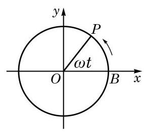

图 7-1-9

从物理学知识知道,质点做匀速圆周运动所需要的向心力的大小是 $m{\omega }^{2}r$ ,方向指向圆心. 向心力的竖直分力为 ${F}_{y} =  - m{\omega }^{2}r\sin {\omega t} =  - m{\omega }^{2}y$ . 记常数 $k = m{\omega }^{2}$ ,就有 ${F}_{y} =  - {ky}$ ,从而质点所受合力的竖直分力与竖直位移成正比且方向相反,这正和简谐运动中质点 (如图 7-1-10 中连接在弹簧上的小球) 的受力情况相仿. 由此类比, 我们知道匀速圆周运动在竖直方向上的投影就是一个简谐运动,它的位移随时间的变化关系为 $y = A\sin {\omega t}$ . 更一般地,如果不要求 $t = 0$ 时 $y = 0$ ,就有 $y = A\sin \left( {{\omega t} + \varphi }\right)$ .

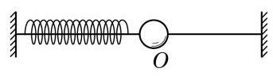

图 7-1-10

#### 习题 7.1

##### A 组

1. 作出下列函数的大致图像:

(1) $y = 1 + \sin x, x \in  \left\lbrack  {0,{2\pi }}\right\rbrack$ ； (2) $y = \left| {\sin x}\right| , x \in  \mathbf{R}$ .

2. 求下列函数的最小正周期:

(1) $y = 1 + \sin \frac{2}{7}x, x \in  \mathbf{R}$ ； (2) $y = \frac{1}{3}\sin \left( {-{3x} + \frac{\pi }{3}}\right) , x \in  \mathbf{R}$ .

3. 已知函数 $y = 2\sin \left( {{2\omega x} - \frac{\pi }{4}}\right)$ (其中常数 $\omega  \neq  0$ )的最小正周期为 2,求 $\omega$ 的值.
4. 求下列函数的最大值和最小值,并指出使其取得最大值和最小值时的所有 $x$ 值的集合:

(1) $y = 2 - 3\sin x, x \in  \mathbf{R}$ ； (2) $y =  - {\sin }^{2}x + 2\sin x + 2, x \in  \mathbf{R}$ ；

(3) $y = 2\sin x - 5, x \in  \left\lbrack  {-\frac{\pi }{3},\frac{5\pi }{6}}\right\rbrack$ ；___ (4) $y = {\cos }^{2}x - \sin x, x \in  \mathbf{R}$ .

5. 判断下列函数的奇偶性, 并说明理由:

(1) $y =  - 2\sin x$ (2) $y = \frac{\sin x}{x}$ ； (3) $y = \frac{x}{1 + \sin x}$ .

6. 利用函数的单调性, 比较下列各组数的大小:

(1) $\sin \frac{3\pi }{11}$ 与 $\sin \frac{5\pi }{12}$ ； (2) $\sin \left( {-\frac{76\pi }{11}}\right)$ 与 $\sin \frac{85\pi }{12}$ .

7. 求下列函数的单调区间:

(1) $y = 2 - \sin x$ ； (2) $y = 3\sin \left( {\frac{x}{3} + \frac{\pi }{4}}\right)$ .

8. 求下列函数的值域:

(1) $y = 3\sin x + \sqrt{3}\cos x$ ; (2) $y = {\sin }^{2}x + 4\sin x.$

9. 求函数 $y = 2\sin x - 1$ 的零点.

##### B 组

1. 可以利用正弦函数 $y = \sin x$ 和 $y = \frac{1}{2}$ 的图像,并结合正弦函数的周期性来求解不等式 $\sin x \geq  \frac{1}{2}$ . 请根据上述方法求函数 $y = \sqrt{2\sin x - 1}$ 的定义域.
2. 求函数 $y = \sin \frac{x}{2} + \cos \frac{x}{2}$ 的单调减区间.
3. 已知函数 $y = \frac{\sqrt{3}}{2}\sin {2kx} + {\cos }^{2}{kx}$ (其中常数 $k > 0$ )的最小正周期为 $\pi$ ，求 $k$ 的值.
4. 求函数 $y = \sin \left( {x + \frac{\pi }{6}}\right) , x \in  \left\lbrack  {-\frac{\pi }{3},\frac{\pi }{2}}\right\rbrack$ 的值域.
5. 求函数 $y = {\sin }^{4}x + {\cos }^{4}x$ 的最小正周期与最值.
6. 设半圆 $O$ 的直径为 2,而 $A$ 为直径延长线上的一点,且 ${OA} = 2$ . 对半圆上任意给定的一点 $B$ ,以 ${AB}$ 为一边作等边三角形 ${ABC}$ ,使 $\bigtriangleup {ABC}$ 和 $\bigtriangleup {ABO}$ 在 ${AB}$ 的两侧 (如图所示). 求四边形 ${OACB}$ 面积的最大值,并求使四边形 ${OACB}$ 面积取得最大值时的 $\angle {AOB}$ 的大小.

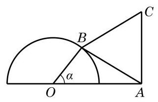

(第 6 题)

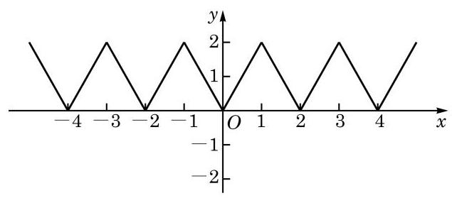

(第 7 题)

7. 如图,函数 $y = f\left( x\right) \left( {x \in  \mathbf{R}}\right)$ 的图像由折线段组成,且当 $x$ 取偶数时,对应的 $y$ 的值为 0 ; 而当 $x$ 取奇数时,对应的 $y$ 的值为 2 .

(1)写出函数 $y = f\left( x\right)$ 的最小正周期；

(2)作出函数 $y = f\left( {x - 1}\right)$ 的图像.

## 7.2 余弦函数的图像与性质

我们知道,对于任意一个给定的实数 $x$ ,都有唯一确定的余弦值 $\cos x$ 与之对应. 按照这个对应关系所建立的函数叫做余弦函数,记作 $y = \cos x$ . 余弦函数的定义域是实数集 $\mathbf{R}$ .

### 1 余弦函数的图像

怎样作余弦函数 $y = \cos x$ 的图像呢?

当然,我们可以像对正弦函数 $y = \sin x$ 一样,把任意角 $x$ 的余弦值 $\cos x$ 用角的终边与单位圆的交点的横坐标表示,用描点法作出余弦函数的图像.

但是,由于已经知道了正弦函数 $y = \sin x$ 的图像,我们可以简便地利用余弦函数与正弦函数的关系来作出余弦函数的图像. 事实上,由于 $\cos x = \sin \left( {x + \frac{\pi }{2}}\right)$ 对任意的 $x \in  \mathbf{R}$ 都成立,因此余弦函数 $y = \cos x$ 与函数 $y = \sin \left( {x + \frac{\pi }{2}}\right)$ 是同一个函数,从而它们的图像相同. 由于将正弦函数 $y = \sin x$ 的图像向左平移 $\frac{\pi }{2}$ 就得到函数 $y = \sin \left( {x + \frac{\pi }{2}}\right)$ 的图像,即 $y = \cos x$ 的图像 (图 7-2-1). 余弦函数的图像通常称为余弦曲线.

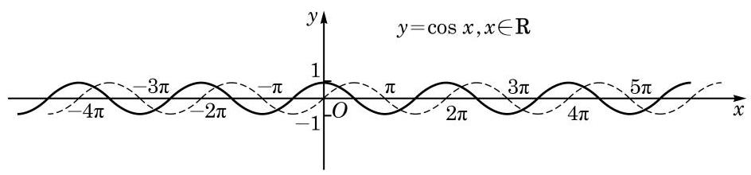

图 7-2-1

观察余弦函数的图像, 并对比正弦曲线, 可知余弦曲线在区间 $\left\lbrack  {0,{2\pi }}\right\rbrack$ 上的五个关键点的坐标是 $\left( {0,1}\right) \text{ 、 }\left( {\frac{\pi }{2},0}\right) \text{ 、 }\left( {\pi , - 1}\right)$ 、

---

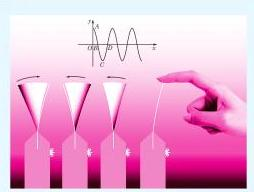

如图, 拨动弹簧片后，弹簧片端点离开平衡位置的位移 $s$ 随时间 $t$ 呈余弦曲线的变化规律.

---

$\left( {\frac{3\pi }{2},0}\right) \text{ 、 }\left( {{2\pi },1}\right) .$

### 2 余弦函数的性质

利用余弦函数 $y = \cos x$ 与正弦函数 $y = \sin x$ 的关系 $\cos x = \; \sin \left( {x + \frac{\pi }{2}}\right)$ ,由正弦函数的性质就容易推出余弦函数的性质:

(1)余弦函数 $y = \cos x$ 是周期函数， ${2k\pi }\left( {k \in  \mathbf{Z}, k \neq  0}\right)$ 均是它的周期,而 ${2\pi }$ 是它的最小正周期.

(2)余弦函数 $y = \cos x$ 的值域是 $\left\lbrack  {-1,1}\right\rbrack$ .

当且仅当 $x = {2k\pi }\left( {k \in  \mathbf{Z}}\right)$ 时, $y = \cos x$ 取得最大值 1 ; 而当且仅当 $x = {2k\pi } + \pi \left( {k \in  \mathbf{Z}}\right)$ 时, $y = \cos x$ 取得最小值 -1 .

(3)余弦函数 $y = \cos x$ 是偶函数，其图像关于 $y$ 轴对称.

(4)余弦函数 $y = \cos x$ 在区间 $\left\lbrack  {{2k\pi } - \pi ,{2k\pi }}\right\rbrack  \left( {k \in  \mathbf{Z}}\right)$ 上是严格增函数,而在区间 $\left\lbrack  {{2k\pi },{2k\pi } + \pi }\right\rbrack  \left( {k \in  \mathbf{Z}}\right)$ 上是严格减函数.

例 1 求下列函数的最大值与最小值, 并求出取得最大值和最小值时所有 $x$ 的值:

(1) $y = {\cos }^{2}x - 4\cos x + 1, x \in  \mathbf{R}$ ；

(2) $y = \cos \frac{x}{2}, x \in  \left\lbrack  {-\frac{4\pi }{3},\frac{\pi }{2}}\right\rbrack$ .

解(1)令 $t = \cos x$ ，则

$$
y = {t}^{2} - {4t} + 1 = {\left( t - 2\right) }^{2} - 3, t \in  \left\lbrack  {-1,1}\right\rbrack  .
$$

当 $- 1 \leq  t \leq  1$ 时,有 $- 3 \leq  t - 2 \leq   - 1$ ,从而 $1 \leq  {\left( t - 2\right) }^{2} \leq  9$ , 于是 $- 2 \leq  {\left( t - 2\right) }^{2} - 3 \leq  6$ .

这样, $y$ 的最大值是 6,此时 $t - 2 =  - 3, t =  - 1$ ,即

$$
\cos x =  - 1, x = {2k\pi } + \pi \left( {k \in  \mathbf{Z}}\right) ;
$$

而 $y$ 的最小值是 -2,此时 $t - 2 =  - 1, t = 1$ ,即

$$
\cos x = 1, x = {2k\pi }\left( {k \in  \mathbf{Z}}\right) .
$$

(2)令 $u = \frac{x}{2}$ ，则

$$
y = \cos u.
$$

由 $x \in  \left\lbrack  {-\frac{4\pi }{3},\frac{\pi }{2}}\right\rbrack$ ,有 $- \frac{2\pi }{3} \leq  \frac{x}{2} \leq  \frac{\pi }{4}$ ,即 $u \in  \left\lbrack  {-\frac{2\pi }{3},\frac{\pi }{4}}\right\rbrack$ .

由余弦函数的性质可知, $y = \cos u$ 在区间 $\left\lbrack  {-\frac{2\pi }{3},0}\right\rbrack$ 上是严格增函数,而在 $\left\lbrack  {0,\frac{\pi }{4}}\right\rbrack$ 上是严格减函数.

又因为

$$
\cos \left( {-\frac{2\pi }{3}}\right)  = \cos \frac{2\pi }{3} =  - \frac{1}{2},\cos 0 = 1,\cos \frac{\pi }{4} = \frac{\sqrt{2}}{2},
$$

所以 $y$ 的最大值是 1,此时 $u = 0$ ,即 $\frac{x}{2} = 0$ ,从而 $x = 0;y$ 的最小值是 $- \frac{1}{2}$ ,此时 $u =  - \frac{2\pi }{3}$ ,即 $\frac{x}{2} =  - \frac{2\pi }{3}$ ,从而 $x =  - \frac{4\pi }{3}$ .

例 2 求函数 $y = 2\cos \left( {{2x} - \frac{\pi }{3}}\right)$ 的最小正周期及单调增区间.

解 因为

$$
2\cos \left( {{2x} - \frac{\pi }{3}}\right)  = 2\sin \left\lbrack  {\frac{\pi }{2} + \left( {{2x} - \frac{\pi }{3}}\right) }\right\rbrack
$$

$$
= 2\sin \left( {{2x} + \frac{\pi }{6}}\right) ,
$$

而 $y = 2\sin \left( {{2x} + \frac{\pi }{6}}\right)$ 的最小正周期是 $\frac{2\pi }{2} = \pi$ ,所以函数 $y = 2\cos \left( {{2x} - \frac{\pi }{3}}\right)$ 的最小正周期是 $\pi$ .

由余弦函数的单调性可知,当 ${2k\pi } - \pi  \leq  {2x} - \frac{\pi }{3} \leq  {2k\pi } \; \left( {k \in  \mathbf{Z}}\right)$ ,即 ${k\pi } - \frac{\pi }{3} \leq  x \leq  {k\pi } + \frac{\pi }{6}\left( {k \in  \mathbf{Z}}\right)$ 时,函数 $y = \; 2\cos \left( {{2x} - \frac{\pi }{3}}\right)$ 是严格增函数,即此函数的单调增区间是 $\left\lbrack  {{k\pi } - \frac{\pi }{3},{k\pi } + \frac{\pi }{6}}\right\rbrack  \left( {k \in  \mathbf{Z}}\right) .$

练习 7.2

1. 已知函数 $y = \cos \left( {{\omega x} + \frac{\pi }{5}}\right)$ (其中常数 $\omega  > 0$ ) 的最小正周期为 ${4\pi }$ ,求 $\omega$ 的值.
2. 判断下列函数的奇偶性, 并说明理由:

(1) $y = x\cos x$ ；

(2) $y = \frac{\sin x}{1 - \cos x}$ ；

(3) $y = \frac{\cos x}{1 - \sin x}$ .

3. 求函数 $y = 2\cos \left( {\frac{x}{2} - \frac{\pi }{6}}\right)$ 的最小正周期及单调区间.

#### 习题 7.2

##### A 组

1. 作出下列函数的大致图像:

(1) $y = 2\cos x - 1, x \in  \left\lbrack  {0,{2\pi }}\right\rbrack$ ; (2) $y = \left| {\cos x}\right| , x \in  \mathbf{R}$ .

2. 求下列函数的最小正周期:

(1) $y = \cos \frac{x}{3}$ ； (2) $y = 2\cos \left( {-{2x} + \frac{\pi }{6}}\right)$ .

3. 求下列函数的最大值和最小值,并指出使其取得最大值和最小值时 $x$ 的集合:

(1) $y = {3}^{\cos {2x}}, x \in  \mathbf{R}$ ; (2) $y = \cos x - {\sin }^{2}x, x \in  \mathbf{R}$ .

4. 判断下列函数的奇偶性, 并说明理由:

(1) $y = {\sin }^{2}x + \cos x$ (2) $y = 2\sin x + \cos {2x}$ ；

(3) $y = \frac{x}{1 + \cos x}$ .

5. 求函数 $y = \cos {2x}, x \in  \left\lbrack  {-\frac{\pi }{6},\frac{2\pi }{3}}\right\rbrack$ 的单调区间和值域.

B 组

1. 函数 $y = 1 - 2{\sin }^{2}\left( {x - \frac{\pi }{4}}\right)$ 是 ( )

A. 最小正周期为 $\pi$ 的奇函数; B. 最小正周期为 $\pi$ 的偶函数;

C. 最小正周期为 $\frac{\pi }{2}$ 的奇函数; D. 最小正周期为 $\frac{\pi }{2}$ 的偶函数.

2. 设函数 $y = \sin \left( {\frac{x}{2} + \varphi }\right)$ (其中常数 $\varphi  \in  \left\lbrack  {0,\pi }\right\rbrack$ )是 $\mathbf{R}$ 上的偶函数,求 $\varphi$ 的值.
3. 已知 $y = \sin x$ 和 $y = \cos x$ 的图像的连续三个交点 $A\text{ 、 }B\text{ 、 }C$ 构成 $\bigtriangleup {ABC}$ ,求 $\bigtriangleup {ABC}$ 的面积.

## 7.3 函数 $y = A\sin \left( {{\omega x} + \varphi }\right)$ 的图像

在现实生活中, 我们知道钟表分针的转动具有周期现象. 怎样用函数来描述这种周期现象呢?

以分针的旋转中心为坐标原点,建立如图 7-3-1 所示的平面直角坐标系. 设指向点 $P$ 的针尖末端对应的点的纵坐标为 $y$ ,因为分针每分钟旋转 $\frac{\pi }{30}$ 弧度,所以针尖末端对应的点在角 $- \frac{\pi }{30}t + \frac{\pi }{6}$ (弧度)的终边上,从而其纵坐标 $y$ 关于时间 $t$ 变化的函数关系为 $y = A\sin \left( {-\frac{\pi }{30}t + \frac{\pi }{6}}\right) , t \in  \lbrack 0, + \infty ).$

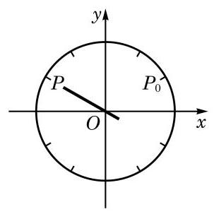

图 7-3-1

如图 7-3-1,假设分针的旋转中心到针尖末端的长度为 $A$ , 设 $t = 0$ 分时,分针针尖指向点 ${P}_{0}$ ,随着 $t$ 的增加,分针沿顺时针方向走动,设经过 $t$ 分钟,针尖指向点 $P$ .

在物理学和工程技术的许多问题中, 经常也会遇到形如 $y = A\sin \left( {{\omega x} + \varphi }\right)$ 的函数 (其中 $A\text{ 、 }\omega \text{ 、 }\varphi$ 均是常数). 例如,物体做简谐运动(如单摆或弹簧的振动) 的过程中, 物体离开平衡位置的位移 $y$ 与时间 $x$ 的关系为 Q

$$
y = A\sin \left( {{\omega x} + \varphi }\right) \left( {A > 0,\omega  > 0}\right) .
$$

---

弹簧下端挂着砝码上下振动. 若从 $x = 0$ 时刻开始，每间隔一小段时间(如 0.1 s)给弹簧和砝码拍一张照片，并按时间顺序, 将弹簧顶端对齐排成一列得到图 7-3-2.

---

上式中, $A$ 是物体振动时离开平衡位置的最大距离,称为该振动的振幅(amplitude). $A$ 越大,振动的幅度越大.

单摆或弹簧往复振动一次所需的时间 $T = \frac{2\pi }{\omega }$ 称为该振动的周期 (即前面所说的最小正周期). $\omega$ 越大,振动的周期越小.

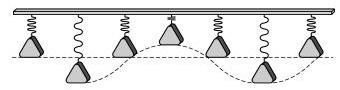

图 7-3-2

Q

在单位时间内振动的次数 $f = \frac{1}{T} = \frac{\omega }{2\pi }$ 称为该振动的频率 (frequency),而 $\omega  = {2\pi f}$ 相应地称为圆频率. $\omega$ 越大,振动的频率越大.

${\omega x} + \varphi$ 称为该振动的相位 (phase). 当 $x = 0$ 时的相位 $\varphi$ 称为初始相位 (initial phase).

---

若函数

$y = A\sin \left( {{\omega x} + \varphi }\right)$ 中 $A < 0$ 或 $\omega  < 0$ ,我们可以用诱导公式将它化为 $A > 0$ 且 $\omega  > 0$ .

---

下面，我们借助于计算器 (机) 来探讨 $A$ 、 $\omega$ 、 $\varphi$ 的变化对函数 $y = A\sin \left( {{\omega x} + \varphi }\right) \left( {A > 0,\omega  > 0}\right)$ 图像的影响.

例 1 当函数 $y = A\sin \left( {{\omega x} + \varphi }\right) \left( {A > 0,\omega  > 0}\right)$ 中的常数 $A\text{ 、 }\omega \text{ 、 }\varphi$ 分别取下列各组值时,用计算器 (机) 在同一平面直角坐标系中作出它们的图像:

(1) $A = 2,\omega  = 1,\varphi  = 0$ ；

(2) $A = 1,\omega  = 2,\varphi  = 0$ ；

(3) $A = 1,\omega  = 1,\varphi  = \frac{\pi }{2}$ .

解 用计算器(机)可作出相应的图像,如图 7-3-3 所示:

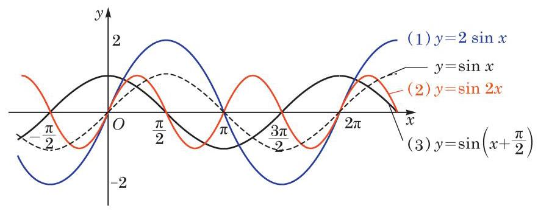

图 7-3-3

把例 1 中的三个函数的图像与正弦函数 $y = \sin x$ 的图像进行比较,可以看到,当 $A$ 增大时,函数图像的振幅增大; 当 $\omega$ 增大时，函数相邻的两个零点的差的绝对值减小，即周期减小； 而当 $\varphi$ 增加一个正数值时，正弦曲线向左平移相应的值.

我们已经知道函数 $y = A\sin \left( {{\omega x} + \varphi }\right) \left( {A > 0,\omega  > 0}\right)$ 的定义域为 $\mathbf{R}$ ,值域为 $\left\lbrack  {-A, A}\right\rbrack$ ,最小正周期为 $\frac{2\pi }{\omega }$ . 那么,如何作出函数 $y = A\sin \left( {{\omega x} + \varphi }\right)$ 的大致图像呢?

我们可先用 “五点法” 作出它在长度为一个周期的区间内的大致图像,再向左、右不断平移,就可以得到函数 $y = A\sin \left( {{\omega x} + \varphi }\right)$ 的大致图像.

例 2 作出函数 $y = 3\sin \left( {{2x} + \frac{\pi }{4}}\right)$ 的大致图像,并指出其振幅、频率和初始相位.

解 函数 $y = 3\sin \left( {{2x} + \frac{\pi }{4}}\right)$ 的最小正周期 $T = \frac{2\pi }{2} = \pi$ .

由 $0 \leq  {2x} + \frac{\pi }{4} \leq  {2\pi }$ ,可得 $- \frac{\pi }{8} \leq  x \leq  \frac{7\pi }{8}$ . 我们先用 “五点法” 作出此函数在区间 $\left\lbrack  {-\frac{\pi }{8},\frac{7\pi }{8}}\right\rbrack$ 上的大致图像.

令 $t = {2x} + \frac{\pi }{4}$ ，将五个关键点列表(表 7-2)如下:

Q

表 7-2

<table><tr><td>$t = {2x} + \frac{\pi }{4}$</td><td>0</td><td>$\frac{\pi }{2}$</td><td>$\pi$</td><td>$\frac{3\pi }{2}$</td><td>${2\pi }$</td></tr><tr><td>$x$</td><td>$- \frac{\pi }{8}$</td><td>$\frac{\pi }{8}$</td><td>$\frac{3\pi }{8}$</td><td>$\frac{5\pi }{8}$</td><td>$\frac{7\pi }{8}$</td></tr><tr><td>$3\sin \left( {{2x} + \frac{\pi }{4}}\right)$</td><td>0</td><td>3</td><td>0</td><td>-3</td><td>0</td></tr></table>

描点并用光滑曲线把它们连接起来. 由于此函数的周期为 $\pi$ , 我们可以把此函数在区间 $\left\lbrack  {-\frac{\pi }{8},\frac{7\pi }{8}}\right\rbrack$ 上的大致图像向左、右不断地平移,就可以得到 $y = 3\sin \left( {{2x} + \frac{\pi }{4}}\right)$ 的大致图像 (图 7-3-4).

这个函数的振幅为 3,频率为 $f = \frac{\omega }{2\pi } = \frac{1}{\pi }$ ,初始相位为 $\frac{\pi }{4}$ .

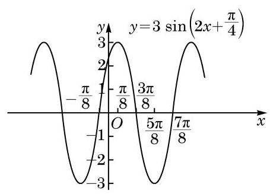

图 7-3-4

例 3 已知交流电的电流强度 $I$ 关于时间 $t$ 的函数为 $I = \; {I}_{0}\sin \left( {{\omega t} + \varphi }\right)$ ,其中 ${I}_{0} > 0,\omega  > 0,0 \leq  \varphi  < {2\pi }$ . 根据图像求出它的周期、频率和电流的最大值,并写出 ${I}_{0}\text{ 、 }\omega$ 和 $\varphi$ 的值.

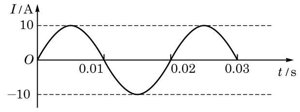

图 7-3-5

---

当 $t = {2x} + \frac{\pi }{4}$ 取 $0\text{ 、 }\frac{\pi }{2}\text{ 、 }\pi \text{ 、 }\frac{3\pi }{2}\text{ 、 }{2\pi }$ 时, 相对应的点是作 $y = 3\sin \left( {{2x} + \frac{\pi }{4}}\right) , \; x \in  \left\lbrack  {-\frac{\pi }{8},\frac{7\pi }{8}}\right\rbrack$ 图像的五个关键点.

---

解 由图像可以看出,这个交流电的周期 $T = {0.02}\mathrm{\;s}$ ,频率 $f = \frac{1}{T} = \frac{1}{0.02} = {50}\mathrm{\;{Hz}}$ ,电流的最大值为 ${10}\mathrm{\;A}$ .

在 $I = {I}_{0}\sin \left( {{\omega t} + \varphi }\right)$ 中, ${I}_{0} = {10},\omega  = \frac{2\pi }{T} = \frac{2\pi }{0.02} = {100\pi }$ . 再把点 $\left( {\frac{T}{4},{10}}\right)$ 即 $\left( {{0.005},{10}}\right)$ 代入 $I = {I}_{0}\sin \left( {{\omega t} + \varphi }\right)$ ,得 $\sin \left( {\frac{\pi }{2} + \varphi }\right)  = 1$ . 又因为 $0 \leq  \varphi  < {2\pi }$ ,所以 $\varphi  = 0$ .

---

在例 3 中确定初相 $\varphi$ 时,若把点 $\left( {0,0}\right)$ 代入函数表达式，得 $\sin \varphi  = 0$ ,并取 $\varphi  = \pi$ , 这种做法对吗? 为什么?

---

练习 7.3

1. 作出下列函数的大致图像:

(1) $y = \sin \left( {x + \frac{\pi }{6}}\right)$ ； (2) $y = 3\sin \left( {{2x} - \frac{\pi }{3}}\right)$ .

2. 下列函数中,与函数 $y = 5\sin \left( {{3x} + \frac{\pi }{4}}\right)$ 的图像形状相同的是 ( )

A. $y = 8\sin \left( {{3x} + \frac{\pi }{4}}\right)$ ; B. $y = 3\sin \left( {{5x} + \frac{\pi }{4}}\right)$ ;

C. $y = 5\sin 2\left( {x + \frac{\pi }{4}}\right)$ ; D. $y = 5\sin 3\left( {x + \frac{\pi }{4}}\right)$ .

3. 下图是函数 $y = A\sin \left( {{\omega x} + \varphi }\right)$ 的图像，请根据图中的信息，写出该图像的一个函数表达式.

(第 3 题)

探究与实践

潮汐的函数模拟

在月亮和太阳的引力作用下, 海水水面发生的周期性涨落现象叫做潮汐. 一般早潮叫潮, 晚潮叫汐. 下面是某港有一天记录的潮汐高度 (cm) 与相应时间 (h) 的关系表 (表7-3) 和潮汐曲线图(图 7-3-6):

表 7-3

<table><tr><td>时间/h</td><td>$1\frac{13}{20}$</td><td>$8\frac{19}{30}$</td><td>13 $\frac{53}{60}$</td><td>20 $\frac{7}{10}$</td></tr><tr><td>潮汐高度/cm</td><td>478</td><td>112</td><td>461</td><td>116</td></tr></table>

图 7-3-6

请根据以上数据，选择适当的函数模型，写出潮汐高度 $y$ (cm) 关于时间 $t$ (h) 的函数的近似表达式.

课后阅读

声音中的三角函数

当我们演奏钢琴、小提琴等乐器时，其琴弦振动引起周围空气的振动，这些振动再传到我们的耳膜引起耳膜振动, 我们就能听到美妙的音乐了. 虽然这些振动变化非常复杂, 但它们都有明显的周期性,可以用三角函数来描述.

音叉振动产生的声音是纯音,可以用函数 $A\sin \left( {{\omega t} + \varphi }\right)$ 来表示,其中振幅 $A$ 决定音量的大小，频率 $f = \frac{\omega }{2\pi }$ 决定音调的高低. 频率高的声音尖利，而频率低的声音低沉. 纯音的频率固定, 很简单, 但它听起来非常单调.

钢琴或小提琴等乐器产生的音都不是纯音, 但它们可以分解为各种纯音的和, 其中频率最低的纯音称为基音, 其他的称为泛音. 不同乐器奏出同一个音符时, 其基音相同, 但泛音各不相同, 形成了乐器的音色. 泛音的频率是基音频率的倍数, 由微积分中的傅里叶级数展开, 可知一个乐器的振动可以写为

$$
{A}_{0} + {A}_{1}\sin \left( {{\omega t} + {\varphi }_{1}}\right)  + {A}_{2}\sin \left( {{2\omega t} + {\varphi }_{2}}\right)  + {A}_{3}\sin \left( {{3\omega t} + {\varphi }_{3}}\right)  + \cdots .
$$

在音乐会上, 当多种乐器同时演奏时, 我们可以通过泛音来辨别出不同乐器所发出的声音.

既然音叉和乐器发出的声音都是振动, 我们也可以通过比较两个声音的差别来调校乐器. 例如, 可以用标准音叉来调准钢琴某个键的发音. 简单起见, 设某标准音叉和钢琴某个键发出的音量大小相同, 即这两个振动的振幅相同, 于是这两个振动可分别记作 $A\sin \left( {{\omega }_{1}t + {\varphi }_{1}}\right)$ 和 $A\sin \left( {{\omega }_{2}t + {\varphi }_{2}}\right)$ ,其中 ${\omega }_{1}$ 及 ${\omega }_{2}$ 分别为两者的圆频率. 当这两个振动合成时, 由和差化积公式, 合成后的振动可以表示为

$$
A\sin \left( {{\omega }_{1}t + {\varphi }_{1}}\right)  + A\sin \left( {{\omega }_{2}t + {\varphi }_{2}}\right)
$$

$$
= {2A}\sin \left( {\frac{{\omega }_{1} + {\omega }_{2}}{2}t + \frac{{\varphi }_{1} + {\varphi }_{2}}{2}}\right) \cos \left( {\frac{{\omega }_{1} - {\omega }_{2}}{2}t + \frac{{\varphi }_{1} - {\varphi }_{2}}{2}}\right) .
$$

当两者的频率很接近,即 ${\omega }_{1}$ 和 ${\omega }_{2}$ 很接近时, $\cos \left( {\frac{{\omega }_{1} - {\omega }_{2}}{2}t + \frac{{\varphi }_{1} - {\varphi }_{2}}{2}}\right)$ 的频率很低, 会产生如下合成后的振动图像(图 7-3-7):

图 7-3-7

这时,我们可以听到时响时轻的拍音. 调整琴键的频率直到听不到拍音时,就得到 ${\omega }_{1} \; \approx  {\omega }_{2}$ ,这个键就校准好了.

#### 习题 7.3

##### A 组

1. 当函数 $y = A\sin \left( {{\omega x} + \varphi }\right) \left( {A > 0,\omega  > 0}\right)$ 中的常数 $A\text{ 、 }\omega \text{ 、 }\varphi$ 分别取下列各组值时, 在同一平面直角坐标系中分别作出它们的图像:

(1) $A = \frac{1}{2},\omega  = 1,\varphi  = 0$ ； (2) $A = 1,\omega  = \frac{1}{2},\varphi  = 0$ ；

(3) $A = 1,\omega  = 1,\varphi  =  - \frac{\pi }{2}$ .

2. 求函数 $y = \sqrt{2}\sin \left( {{30\pi x} - \frac{\pi }{12}}\right)$ 的振幅、频率和初始相位.
3. 已知某交流电流 $I\left( \mathrm{\;A}\right)$ 随时间 $t\left( \mathrm{\;s}\right)$ 的变化规律可以用函数 $I = 8\sin \left( {{100\pi t} - \frac{\pi }{2}}\right)$ , $t \in  \lbrack 0, + \infty )$ 表示. 求这种交流电流在 ${0.5}\mathrm{\;s}$ 内往复运行的次数.
4. 作出函数 $y = 2\sin \left( {\frac{1}{2}x + \frac{\pi }{6}}\right)$ 的大致图像.
5. 如图, 弹簧挂着的小球上下振动. 设小球相对于平衡位置(即静止时的位置) 的距离 $h\left( \mathrm{\;{cm}}\right)$ 与时间 $t\left( \mathrm{\;s}\right)$ 之间的函数表达式是 $h = 2\sin \left( {{\pi t} + \frac{\pi }{4}}\right) , t \geq  0$ ,作出这个函数的大致图像,并回答下列问题:

(第 5 题)

(1)小球开始振动 (即 $t = 0$ ) 时的位置在哪里？

(2)小球最高点和最低点与平衡位置的距离分别是多少？

(3)经过多少时间小球往复振动一次？

(4)每秒钟小球往复振动多少次？

##### B 组

(第 2 题)

1. 作出函数 $y = \sin x + \sqrt{3}\cos x$ 的大致图像.
2. 如图,已知函数 $y = A\cos \left( {{\omega x} + \varphi }\right) (A > 0,\omega  > 0$ , $0 < \varphi  < {2\pi })$ 的图像与 $y$ 轴的交点为 $\left( {0,1}\right)$ ,并已知其在 $y$ 轴右侧的第一个最高点和第一个最低点的坐标分别为 $\left( {{x}_{0},2}\right)$ 和 $\left( {{x}_{0} + {2\pi }, - 2}\right)$ . 求此函数的表达式.
3. 三相交流电的插座上有四个插孔，其电压分别为

$$
{U}_{0} = 0,{U}_{1} = A\sin {\omega t},{U}_{2} = A\sin \left( {{\omega t} + \frac{2\pi }{3}}\right) ,{U}_{3} = A\sin \left( {{\omega t} + \frac{4\pi }{3}}\right) ,
$$

其中 $\omega  = {100\pi }\mathrm{{rad}}/\mathrm{s}, A = {220}\sqrt{2}\mathrm{\;V}$ . 记 ${U}_{2} - {U}_{1},{U}_{3} - {U}_{2},{U}_{1} - {U}_{3}$ 的最大值分别为 ${Y}_{1}$ 、 ${Y}_{2}\text{ 、 }{Y}_{3}$ ,试计算三相交流电的线电压的有效值 $\frac{{Y}_{1}}{\sqrt{2}}\text{ 、 }\frac{{Y}_{2}}{\sqrt{2}}$ 及 $\frac{{Y}_{3}}{\sqrt{2}}$ .

## 7.4 正切函数的图像与性质

由正切的定义可知,对于任意一个给定的实数 $x$ ,只要 $x \neq \; {k\pi } + \frac{\pi }{2}\left( {k \in  \mathbf{Z}}\right)$ ,都有唯一确定的正切值 $\tan x$ 与之对应. 按照这个对应关系所建立的函数叫做正切函数,表示为 $y = \tan x$ . 正切函数的定义域是 $\left\{  {x\left| {\;x \in  \mathbf{R}}\right. }\right.$ 且 $\left. {x \neq  {k\pi } + \frac{\pi }{2}\left( {k \in  \mathbf{Z}}\right) }\right\}$ .

下面我们探讨正切函数的图像和性质.

### 1 正切函数的图像

图 7-4-1

我们知道,正切值 $\tan \alpha$ 可以用角 $\alpha$ 的终边所在直线与直线 $x = 1$ 的交点的纵坐标表示 (图 7-4-1).

类似于作正弦函数图像的方法, 利用单位圆并结合描点法我们可以作出 $y = \tan x, x \in  \left( {-\frac{\pi }{2},\frac{\pi }{2}}\right)$ 的大致图像 (图 7-4-2).

图 7-4-2

因为 $\tan \left( {x + {k\pi }}\right)  = \tan x, k \in  \mathbf{Z}$ ,所以函数 $y = \tan x$ 当 $x \in  \left( {\frac{\pi }{2},\frac{3\pi }{2}}\right) , x \in  \left( {\frac{3\pi }{2},\frac{5\pi }{2}}\right) ,\cdots$ 时的图像与 $y = \tan x$ , $x \in  \left( {-\frac{\pi }{2},\frac{\pi }{2}}\right)$ 的图像形状一样,只需将后者图像的位置向右平移 $\pi \text{ 、 }{2\pi }\text{ 、 }\cdots$ 就可得到; 同理,函数 $y = \tan x$ 当 $x \in  \left( {-\frac{3\pi }{2}, - \frac{\pi }{2}}\right)$ , $x \in  \left( {-\frac{5\pi }{2}, - \frac{3\pi }{2}}\right) ,\cdots$ 时的图像与 $y = \tan x, x \in  \left( {-\frac{\pi }{2},\frac{\pi }{2}}\right)$ 的图像形状也一样,只需将后者图像的位置向左平移 $\pi \text{ 、 }{2\pi }\text{ 、 }\cdots$ 就可得到. 这样,就可以得到函数 $y = \tan x$ 的整个图像 (图 7-4-3).

图 7-4-3

因为 $y = \tan x$ 的定义域是 $\left\{  {x\left| {\;x \in  \mathbf{R}, x \neq  {k\pi } + \frac{\pi }{2}\left( {k \in  \mathbf{Z}}\right) }\right. }\right\}$ , 其图像由无穷多支曲线所组成,它们被直线 $x =  \pm  \frac{\pi }{2}, x =  \pm  \frac{3\pi }{2}$ , $x =  \pm  \frac{5\pi }{2},\cdots$ 即 $x = {k\pi } + \frac{\pi }{2}\left( {k \in  \mathbf{Z}}\right)$ 所隔开.

### 2 正切函数的性质

(1)周期性

由诱导公式 $\tan \left( {x + \pi }\right)  = \tan x$ 可知,正切函数是周期函数, ${k\pi }\left( {k \in  \mathbf{Z}, k \neq  0}\right)$ 均是它的周期, $\pi$ 是它的最小正周期.

(2)值域

由正切函数 $y = \tan x$ 的定义可以得到,正切函数 $y = \tan x$ 的值域是实数集 $\mathbf{R}$ ,它既没有最大值,也没有最小值.

(3)奇偶性

由诱导公式 $\tan \left( {-x}\right)  =  - \tan x$ 可知,正切函数 $y = \tan x$ 是奇函数. 因此, 其图像关于坐标原点对称.

(4) 单调性

由于正切函数是以 $\pi$ 为最小正周期的函数,可以先在区间 $\left( {-\frac{\pi }{2},\frac{\pi }{2}}\right)$ 上研究正切函数的单调性.

对于区间 $\left( {-\frac{\pi }{2},\frac{\pi }{2}}\right)$ 中的任意给定的满足 ${x}_{1} < {x}_{2}$ 的实数 ${x}_{1}\text{ 、 }{x}_{2}$ ,有

$$
\tan {x}_{2} - \tan {x}_{1} = \frac{\sin {x}_{2}}{\cos {x}_{2}} - \frac{\sin {x}_{1}}{\cos {x}_{1}}
$$

$$
= \frac{\sin {x}_{2}\cos {x}_{1} - \cos {x}_{2}\sin {x}_{1}}{\cos {x}_{2}\cos {x}_{1}}
$$

$$
= \frac{\sin \left( {{x}_{2} - {x}_{1}}\right) }{\cos {x}_{2}\cos {x}_{1}}\text{ . }
$$

由 $- \frac{\pi }{2} < {x}_{1} < {x}_{2} < \frac{\pi }{2}$ ,易知 $0 < {x}_{2} - {x}_{1} < \pi$ . 于是 $\cos {x}_{1} > 0$ , $\cos {x}_{2} > 0$ ,且 $\sin \left( {{x}_{2} - {x}_{1}}\right)  > 0$ .

由上式就有 $\tan {x}_{2} - \tan {x}_{1} > 0$ ,即 $\tan {x}_{2} > \tan {x}_{1}$ ,从而正切函数 $y = \tan x$ 在区间 $\left( {-\frac{\pi }{2},\frac{\pi }{2}}\right)$ 上是严格增函数.

又因为正切函数是以 $\pi$ 为最小正周期的周期函数,所以正切函数 $y = \tan x$ 在区间 $\left( {{k\pi } - \frac{\pi }{2},{k\pi } + \frac{\pi }{2}}\right) \left( {k \in  \mathbf{Z}}\right)$ 上是严格增函数.

例 1 求函数 $y = \tan \left( {\frac{\pi }{6}x + \frac{\pi }{3}}\right)$ 的定义域和单调区间.

解 由正切的定义,该函数的自变量 $x$ 满足 $\frac{\pi }{6}x + \frac{\pi }{3} \neq  {k\pi } + \; \frac{\pi }{2}$ ,即 $x \neq  {6k} + 1\left( {k \in  \mathbf{Z}}\right)$ . 所以,该函数的定义域为

$$
\{ x \mid  x \in  \mathbf{R}, x \neq  {6k} + 1, k \in  \mathbf{Z}\} .
$$

由正切函数的单调性可知,当 ${k\pi } - \frac{\pi }{2} < \frac{\pi }{6}x + \frac{\pi }{3} < {k\pi } + \frac{\pi }{2} \; \left( {k \in  \mathbf{Z}}\right)$ 时,即 ${6k} - 5 < x < {6k} + 1\left( {k \in  \mathbf{Z}}\right)$ 时,函数 $y = \tan \left( {\frac{\pi }{6}x + \frac{\pi }{3}}\right)$ 是严格增函数.

因此，函数 $y = \tan \left( {\frac{\pi }{6}x + \frac{\pi }{3}}\right)$ 的单调增区间是 $({6k} - 5$ , ${6k} + 1)\left( {k \in  \mathbf{Z}}\right)$ .

例 2 求函数 $y = \tan \left( {{2x} + \frac{\pi }{6}}\right)$ 的最小正周期.

解 记 $f\left( x\right)  = \tan \left( {{2x} + \frac{\pi }{6}}\right)$ ,有

$$
f\left( x\right)  = \tan \left( {{2x} + \frac{\pi }{6}}\right)  = \tan \left( {{2x} + \frac{\pi }{6} + \pi }\right)
$$

$$
= \tan \left\lbrack  {2\left( {x + \frac{\pi }{2}}\right)  + \frac{\pi }{6}}\right\rbrack   = f\left( {x + \frac{\pi }{2}}\right) ,
$$

可知函数 $y = f\left( x\right)$ 的一个正周期 $T = \frac{\pi }{2}$ .

此外, $\frac{\pi }{2}$ 也是函数 $y = \tan \left( {{2x} + \frac{\pi }{6}}\right)$ 的最小正周期. 事实上, 令 $t = {2x} + \frac{\pi }{6}$ ,原来的函数可改写为 $y = \tan t$ ,其以 $t$ 为自变量的最小正周期为 $\pi$ . 返回到 $x$ 变量,因 $x = \frac{t}{2} - \frac{\pi }{12}$ ,故原来函数的最小正周期为 $\frac{\pi }{2}$ .

练习 7.4

1. 写出满足 $\tan \alpha  = \sqrt{3}$ 的所有 $\alpha$ 的集合.
2. 比较下列各组数的大小, 并说明理由:

(1) $\tan \left( {-\frac{2}{7}\pi }\right)$ 与 $\tan \left( {-\frac{2}{5}\pi }\right)$ ; (2) $\cot {231}^{ \circ  }$ 与 $\cot {237}^{ \circ  }$ ；

(3) $\tan \left( {{k\pi } - \frac{\pi }{3}}\right)$ 与 $\tan \left( {{k\pi } + \frac{\pi }{3}}\right) , k \in  \mathbf{Z}$ .

3. 求函数 $y = \tan \left( {{3x} + \frac{\pi }{4}}\right)$ 的定义域,并写出其单调区间.

探究与实践

球门的张角问题

某国际标准足球场长 ${105}\mathrm{\;m}$ 、宽 ${68}\mathrm{\;m}$ ,球门宽 ${7.32}\mathrm{\;m}$ . 当足球运动员沿边路带球突破时, 距底线多远处射门, 对球门所张的角最大?

#### 习题 7.4

##### A 组

1. 求下列函数的最小正周期:

(1) $y = \tan \left( {-\frac{1}{2}x}\right)$ ； (2) $y = \tan \left( {{3x} + \frac{\pi }{3}}\right)$ .

2. 求函数 $y = \tan \left( {{ax} + b}\right)$ ( $a\text{ 、 }b$ 为常数，且 $a \neq  0$ )的最小正周期.
3. 求函数 $y = \tan x, x \in  \left\lbrack  {-\frac{\pi }{3},\frac{\pi }{4}}\right\rbrack$ 的最大值和最小值,并指出使其取得最大值和最小值时所有 $x$ 的值.
4. 判断下列函数的奇偶性, 并说明理由:

(1) $y = \tan {2x}$ ； (2) $y = \left| {\tan x}\right|$ ；

(3) $y = \frac{1}{\tan x}$ ； (4) $y = \frac{\tan x}{x}$ .

5. 求函数 $y = 2\tan \left( {{3x} - \frac{\pi }{6}}\right)$ 的定义域和单调区间.

##### B 组

1. 求正切函数 $y = \tan x$ 的零点.
2. 对于函数 $y = f\left( x\right)$ ,其中 $f\left( x\right)  = a\sin {2x} + b\tan x + 3$ ,已知 $f\left( {-2}\right)  = 1$ . 求 $f\left( {\pi  + 2}\right)$ 的值.
3. 求函数 $y = {\tan }^{2}x - \tan x, x \in  \left\lbrack  {-\frac{\pi }{4},\frac{\pi }{4}}\right\rbrack$ 的最大值与最小值.

## 内容提要

<table><tr><td>三角函数</td><td>正弦函数 $y = \sin x$</td><td>余弦函数 $y = \cos x$</td><td>正切函数 $y = \tan x$</td></tr><tr><td>定义域</td><td>$\mathbf{R}$</td><td>$\mathbf{R}$</td><td>$\left\langle  {x\left| {\;x \in  \mathbf{R}, x \neq  {k\pi } + \frac{\pi }{2}\left( {k \in  \mathbf{Z}}\right) }\right. }\right\rangle$</td></tr><tr><td>值域</td><td>[-1,1]</td><td>$\left\lbrack  {-1,1}\right\rbrack$</td><td>$\mathbf{R}$</td></tr><tr><td>最大值</td><td>1</td><td>1</td><td>无</td></tr><tr><td>最小值</td><td>-1</td><td>-1</td><td>无</td></tr><tr><td>最小正周期</td><td>${2\pi }$</td><td>${2\pi }$</td><td>$\pi$</td></tr><tr><td>奇偶性</td><td>奇函数</td><td>偶函数</td><td>奇函数</td></tr><tr><td>单调增区间</td><td>$\left\lbrack  {{2k\pi } - \frac{\pi }{2},{2k\pi } + \frac{\pi }{2}}\right\rbrack  \left( {k \in  \mathbf{Z}}\right)$</td><td>$\left\lbrack  {{2k\pi } - \pi ,{2k\pi }}\right\rbrack  \left( {k \in  \mathbf{Z}}\right)$</td><td>$\left( {{k\pi } - \frac{\pi }{2},{k\pi } + \frac{\pi }{2}}\right) \left( {k \in  \mathbf{Z}}\right)$</td></tr><tr><td>单调减区间</td><td>$\left\lbrack  {{2k\pi } + \frac{\pi }{2},{2k\pi } + \frac{3\pi }{2}}\right\rbrack  \left( {k \in  \mathbf{Z}}\right)$</td><td>$\left\lbrack  {{2k\pi },{2k\pi } + \pi }\right\rbrack  \left( {k \in  \mathbf{Z}}\right)$</td><td>无</td></tr><tr><td>图像</td><td></td><td></td><td></td></tr></table>

## 复习题

A 组

1. 求下列函数的最小正周期:

(1) $y = \sin \frac{x}{2}$ ; (2) $y = 2\cos \left( {{3x} - \frac{\pi }{4}}\right)$ .

2. 判断下列函数的奇偶性, 并说明理由:

(1) $y = \sin \left| {2x}\right|$ ； (2) $y = \tan {5x}$ ；

(3) $y = \frac{1}{\cos x}$ ； (4) $y = \sin \left( {x + \frac{\pi }{6}}\right)$ .

3. 已知 $2\sin \left( {2x}\right)  = \sqrt{3}, x \in  \left( {-\frac{\pi }{4},\frac{\pi }{4}}\right)$ . 求 $x$ 的值.
4. 求下列函数的单调区间:

(1) $y =  - \sin {2x}$ ； (2) $y = 2\sin \left( {x + \frac{\pi }{3}}\right)$ ；

(3) $y = \cos \left( {\frac{x}{2} - \frac{\pi }{4}}\right)$ ； (4) $y = 2\tan \left( {{2x} + \frac{\pi }{4}}\right)$ .

5. 作出函数 $y = 2\sin \left( {{2x} + \frac{\pi }{3}}\right)$ 的大致图像.
6. 已知函数 $y = A\sin \left( {{\omega x} + \varphi }\right) \left( {A > 0,\omega  > 0}\right)$ 的振幅是 3,最小正周期是 $\frac{2\pi }{3}$ ,初始相位是 $\frac{\pi }{6}$ . 求这个函数的表达式.
7. 求下列函数的最大值和最小值,并求出取得最大值和最小值时所有 $x$ 的值:

(1) $y = {\cos }^{2}x + \cos x - 2$

(2) $y = \sin {2x}, x \in  \left\lbrack  {-\frac{2\pi }{3},\frac{\pi }{3}}\right\rbrack$ ；

(3) $y = {\sin }^{2}{2x} - 2\sin {2x}$ ；

(4) $y = \cos \left( {x - \frac{\pi }{6}}\right) , x \in  \left\lbrack  {-\frac{\pi }{6},\frac{\pi }{4}}\right\rbrack$ .

8. 某实验室一天的温度 $y$ (单位: ${}^{ \circ  }\mathrm{C}$ ) 随时间 $t$ (单位: $\mathrm{h}$ ) 的变化近似满足函数关系

$$
y = {10} - \sqrt{3}\cos \frac{\pi }{12}t - \sin \frac{\pi }{12}t, t \in  \lbrack 0,{24}).
$$

(1)求实验室一天中的最大温差；

(2)若要求实验室温度不高于 ${11}^{ \circ  }\mathrm{C}$ ，则在哪段时间实验室需要降温？

B 组

1. 求函数 $y = \sin \left( {{2x} - \frac{\pi }{4}}\right)  - 2\sqrt{2}{\sin }^{2}x$ 的最小正周期.
2. 在 $\left( {0,{2\pi }}\right)$ 内,求使 $\sin x > \cos x$ 成立的 $x$ 的取值范围.
3. 求下列函数的最大值,并求出取得最大值时所有 $x$ 的值:

(1) $y = 2{\sin }^{2}x + \sin {2x} - 1$

(2) $y = 1 - \sin x - 2{\cos }^{2}x, x \in  \left\lbrack  {\frac{\pi }{3},\frac{4\pi }{3}}\right\rbrack$ .

4. 若函数 $y = 2\sin {\omega x}$ (其中常数 $\omega$ 是小于 1 的正数) 在区间 $\left\lbrack  {0,\frac{\pi }{3}}\right\rbrack$ 上的最大值是 $\sqrt{2}$ , 求 $\omega$ 的值.
5. 如图，摩天轮上一点 $P$ 距离地面的高度 $y$ 关于时间 $t$ 的函数表达式为 $y = A\sin \left( {{\omega t} + \varphi }\right)  + b,\varphi  \in  \left\lbrack  {-\pi ,\pi }\right\rbrack$ . 已知摩天轮的半径为 ${50}\mathrm{\;m}$ ,其中心点 $O$ 距地面 ${60}\mathrm{\;m}$ ,摩天轮以每 30 分钟转一圈的方式做匀速转动,而点 $P$ 的起始位置在摩天轮的最低点处.

(第 5 题)

(1)根据条件具体写出 $y\left( \mathrm{m}\right)$ 关于 $t\left( \mathrm{{min}}\right)$ 的函数表达式;

(2)在摩天轮转动的一圈内，点 $P$ 有多长时间距离地面超过 ${85}\mathrm{m}$ ？

*6. 说明:用上一章 6.3 节给出的记号 arcsin 与 arccos(见第 49 页)，可以定义函数

$$
y = \arcsin x\left( {x \in  \left\lbrack  {0,1}\right\rbrack  }\right) \text{ 与 }y = \arccos x\left( {x \in  \left\lbrack  {0,1}\right\rbrack  }\right) .
$$

验证:

(1)函数 $y = \sin x\left( {x \in  \left\lbrack  {0,\frac{\pi }{2}}\right\rbrack  }\right)$ 与函数 $y = \arcsin x\left( {x \in  \left\lbrack  {0,1}\right\rbrack  }\right)$ 互为反函数；

(2)函数 $y = \cos x\left( {x \in  \left\lbrack  {0,\frac{\pi }{2}}\right\rbrack  }\right)$ 与函数 $y = \arccos x\left( {x \in  \left\lbrack  {0,1}\right\rbrack  }\right)$ 互为反函数.

*7. 把上题的记号略作推广: 对实数 $x \in  \left\lbrack  {-1,1}\right\rbrack$ , 若实数 $y \in  \left\lbrack  {-\frac{\pi }{2},\frac{\pi }{2}}\right\rbrack$ 使得 $\sin y = x$ ,则记 $y = \arcsin x$ ; 类似地,对实数 $x \in  \left\lbrack  {-1,1}\right\rbrack$ ,若实数 $y \in  \left\lbrack  {0,\pi }\right\rbrack$ 使得 $\cos y = \; x$ ,则记 $y = \arccos x$ . 说明: 经过推广的记号 arcsin 与 $\arccos$ ,定义了函数 $y = \arcsin x\left( {x \in  \left\lbrack  {-1,1}\right\rbrack  }\right)$ 与 $y = \arccos x\left( {x \in  \left\lbrack  {-1,1}\right\rbrack  }\right)$ .

---

函数 $y = \arcsin x\left( {x \in  \left\lbrack  {-1,1}\right\rbrack  }\right)$ 、 $y = \arccos x\left( {x \in  \left\lbrack  {-1,1}\right\rbrack  }\right)$ 与 $y = \; \arctan x\left( {x \in  \left( {-\infty , + \infty }\right) }\right)$ 分别称为反正弦函数、反余弦函数与反正切函数. 这些函数统称为反三角函数.

---

验证:

(1)函数 $y = \sin x\left( {x \in  \left\lbrack  {-\frac{\pi }{2},\frac{\pi }{2}}\right\rbrack  }\right)$ 与函数 $y = \arcsin x(x \in  \left\lbrack  {-1,1}\right\rbrack$ ) 互为反函数；

(2)函数 $y = \cos x\left( {x \in  \left\lbrack  {0,\pi }\right\rbrack  }\right)$ 与函数 $y = \arccos x\left( {x \in  \left\lbrack  {-1,1}\right\rbrack  }\right)$ 互为反函数.

*8. 对 $y = \tan x$ 与 $y = \arctan x$ 做类似的工作.

拓展与思考

1. 定义在区间 $\left( {0,\frac{\pi }{2}}\right)$ 上的函数 $y = 6\cos x$ 的图像与 $y = 5\tan x$ 的图像的交点为 $P$ ,过点 $P$ 作垂直于 $x$ 轴的垂线 $P{P}_{1}$ ,其垂足为 ${P}_{1}$ . 设直线 $P{P}_{1}$ 与 $y = \sin x$ 的图像交于点 ${P}_{2}$ , 求线段 ${P}_{1}{P}_{2}$ 的长.
2. 已知定义在 $\mathbf{R}$ 上的偶函数 $y = f\left( x\right)$ 的最小正周期为 2,当 $0 \leq  x \leq  1$ 时, $f\left( x\right)  = x$ .

(1)求当 $5 \leq  x \leq  6$ 时函数 $y = f\left( x\right)$ 的表达式；

(2)若函数 $y = {kx}, x \in  \mathbf{R}$ 与函数 $y = f\left( x\right)$ 的图像恰有 7 个不同的交点，求 $k$ 的值.

(第 3 题)

3. 如图，有一块边长为3m的正方形铁皮 ${ABCD}$ ，其中阴影部分 ${ATN}$ 是一个半径为 $2\mathrm{\;m}$ 的扇形. 设这个扇形已经腐蚀不能使用, 但其余部分均完好. 工人师傅想在未被腐蚀的部分截下一块其边落在 ${BC}$ 与 ${CD}$ 上的矩形铁皮 ${PQCR}$ ,使点 $P$ 在弧 ${TN}$ 上. 设 $\angle {TAP} = \theta$ ,矩形 ${PQCR}$ 的面积为 $S{\mathrm{\;m}}^{2}$ .

(1)求 $S$ 关于 $\theta$ 的函数表达式；

(2)求 $S$ 的最大值及 $S$ 取得最大值时 $\theta$ 的值.

# 第 8 章 平面向量

在现实世界和科学问题中，常常会见到既有大小又有方向的量，如位移、速度、力等. 数学中的“向量”概念就是从中抽象出来的. 向量不仅有丰富的几何内涵, 向量及其线性运算与数量积运算还构成了精致且有广泛应用的代数结构, 可把有关的几何问题简便地转化为相应代数问题来处理. 本章只讨论平面上的向量, 选择性必修课程第 3 章还将把这一讨论推广到 (三维) 空间中, 至于更一般性的推广则是大学线性代数课程的核心内容.

高中阶段向量的学习重在为解决代数、几何、三角及物理等领域中的问题提供一个简捷有效的工具.

## 8.1 向量的概念和线性运算

### 1 向量的概念

图 8-1-1

图 8-1-1 展示了国产大飞机 C919 在蓝天翱翔的雄姿. 飞机从 $A$ 飞行到 $B$ . 它的位移是一个既有大小又有方向的量,它的大小是 $A\text{ 、 }B$ 间的距离,方向由 $A$ 到 $B$ .

像“一点相对于另一点的位移”这种既有大小又有方向的量叫做向量 (vector). 准确地说, 一个向量由两个要素定义, 一是它的大小(一个非负实数)，一是它的方向.

在研究向量的性质并定义与向量相关的各种运算时, 常常把向量用有向线段 (directed line-segment, 即指定了方向的线段) 表示出来, 线段的长度就是向量的大小, 线段的方向表示向量的方向. 我们也直接把表示向量的有向线段称作向量, 有向线段的起点称为向量的起点, 有向线段的终点称为向量的终点. 本章只研究在一个平面上的向量, 就是要求所涉及的所有向量都能用同一个平面上的有向线段表示出来.

Q

向量通常用上方加箭头的小写字母表示，如 $\overrightarrow{a}$ ，读作向量 $a$ . 向量也可以用上方加箭头的两个大写字母表示，如 $\overrightarrow{AB}$ ，读作向量 ${AB}$ ,其中 $A$ 是向量的起点， $B$ 是向量的终点.

在讨论向量时, 仅仅有数值(可以是任何实数)而没有方向的量称为数量(scalar), 又称为“标量”.

除了位移，向量还有很多现实的原型. 例如，“力”就是一个典型的例子.

---

“向量”又称为“矢量”, 在物理学中较常使用.

物理学中所研究的力有大小、方向和作用点三要素，我们研究的向量舍弃了作用点这一要素, 这种向量叫做自由向量.

---

图 8-1-2 是由若干个单位正方形组成的网格, $\overrightarrow{GH}$ 表示大小为 2 个单位、方向由 $G$ 到 $H$ 的向量; $\overrightarrow{MN}$ 表示大小为 $\sqrt{5}$ 个单位、 方向由 $M$ 到 $N$ 的向量.

图 8-1-2

---

请同学们描述图 8-1-2 中向量 $\overrightarrow{CD}$ 、 $\overrightarrow{EF}$ 、 $\overrightarrow{PQ}$ 的大小与方向.

---

向量 $\overrightarrow{a}$ 的大小叫做 $\overrightarrow{a}$ 的模 (modulus)，记作 $\left| \overrightarrow{a}\right|$ . 模为 1 的向量叫做单位向量(unit vector).

规定模为 0 的向量叫做零向量(zero vector), 记作0 , 可认为它具有任意方向.

如果两个非零向量所在的直线平行或者重合, 那么称这两个向量平行. 我们用记号 $\overrightarrow{a}//\overrightarrow{b}$ 表示向量 $\overrightarrow{a}$ 与 $\overrightarrow{b}$ 平行.

如果两个向量同方向且具有相同的模, 根据向量的定义, 它们就是同一个向量, 不过我们常常只说它们是相等的向量. 特别地, 一个向量平移后得到的向量与原来的向量相等. 例如, 图 8-1-3 中,向量 $\overrightarrow{MN}$ 是向量 $\overrightarrow{AB}$ 经过平移后得到的,所以 $\overrightarrow{MN} = \overrightarrow{AB}$ .

图 8-1-3

由于约定了零向量具有任意方向, 因此它平行于任意向量. 这样, 根据向量相等的定义, 零向量都是相等的.

图 8-1-4

例 1 如图 8-1-4,在等边三角形 ${ABC}$ 中, $D\text{ 、 }E\text{ 、 }F$ 分别是边 ${BC}\text{ 、 }{AB}\text{ 、 }{AC}$ 的中点. 写出图中与向量 $\overrightarrow{EF}$ 平行和相等的向量.

解 根据向量平行与相等的定义,可知图中与 $\overrightarrow{EF}$ 平行的向量有 $\overrightarrow{FE}\text{ 、 }\overrightarrow{BD}\text{ 、 }\overrightarrow{DB}\text{ 、 }\overrightarrow{CD}\text{ 、 }\overrightarrow{DC}\text{ 、 }\overrightarrow{BC}$ 和 $\overrightarrow{CB}$ ,而与 $\overrightarrow{EF}$ 相等的向量有 $\overrightarrow{BD}$ 和 $\overrightarrow{DC}$ .

如果一对平行向量 $\overrightarrow{a}$ 与 $\overrightarrow{b}$ 具有相等的模但方向相反,那么称它们互为负向量,或者称 $\overrightarrow{b}$ 为 $\overrightarrow{a}$ 的负向量,记作 $\overrightarrow{b} =  - \overrightarrow{a}$ . 图 8-1-4 中的向量 $\overrightarrow{DB}$ 与 $\overrightarrow{EF}$ 就是互为负向量. 一般地,对于平面上任意两点 $P\text{ 、 }Q$ ,均有 $\overrightarrow{PQ} =  - \overrightarrow{QP}$ .

---

请在图 8-1-4 中找出与 $\overrightarrow{AE}$ 相等的向量.

---

例 2 在图 8-1-4 中,写出向量 $\overrightarrow{AE}$ 的负向量.

解 根据负向量的定义，可知向量 $\overrightarrow{EA}\text{ 、 }\overrightarrow{BE}$ 和 $\overrightarrow{DF}$ 均为 $\overrightarrow{AE}$ 的负向量.

尽管可以画出一个向量的许多负向量，但由于它们彼此都相等, 因此一个向量的负向量在相等的意义下是唯一的.

#### 练习 8.1(1)

1. 指出下列各种量中的向量:

(1)密度； (2)体积； (3)速度； (4)能量；

(5) 电阻; (6) 加速度; (7) 功; (8) 力矩.

你能找出更多向量的例子吗?

2. 中国象棋中的“马”走“日”。如图是一个棋盘，当“马”自点 $A$ 走“一步”后的落点可以为点 ${A}_{1}\text{ 、 }{A}_{2}$ 或 ${A}_{3}$ ,表示该“马”走“一步”的向量为 $\overrightarrow{A{A}_{1}}\text{ 、 }\overrightarrow{A{A}_{2}}$ 或 $\overrightarrow{A{A}_{3}}$ ,它们是相等的向量吗? 在图中分别用向量表示当“马”在点 $B$ 处各走“一步”的情形.

(第 2 题)

(第 3 题)

3. 如图,点 $O$ 是正六边形 ${ABCDEF}$ 的中心,分别写出图中

(1)与 $\overrightarrow{OA}$ 相等的向量； (2)与 $\overrightarrow{OB}$ 平行的向量；

(3)与 $\overrightarrow{OC}$ 模相等的向量； (4) $\overrightarrow{OB}$ 的负向量.

### 2 向量的加法和减法

在物理学习中, 我们已经知道了当不在同一方向上的两个力 $\overrightarrow{OA}\text{ 、 }\overrightarrow{OB}$ 同时作用于一个物体时,它们的合力是以 $\overrightarrow{OA}\text{ 、 }\overrightarrow{OB}$ 为相邻两边的平行四边形 ${OACB}$ 对角线 $\overrightarrow{OC}$ 所表示的力 (图 8-1-5).

图 8-1-5

一般向量的加法也采用上述求合力的方法. 设给定两个不平行的向量 $\overrightarrow{a}$ 、 $\overrightarrow{b}$ ，如图 8-1-6，如果以点 $O$ 为起点，分别作 $\overrightarrow{OA} = \overrightarrow{a},\overrightarrow{OB} = \overrightarrow{b}$ ,那么以 $\overrightarrow{OA}\text{ 、 }\overrightarrow{OB}$ 为邻边的平行四边形 ${OACB}$ 的对角线所表示的向量 $\overrightarrow{OC} = \overrightarrow{c}$ 就定义为向量 $\overrightarrow{a}$ 与 $\overrightarrow{b}$ 的和，记作 $\overrightarrow{c} = \overrightarrow{a} + \overrightarrow{b}$ . 求向量和的运算,叫做向量的加法 (addition of vectors). 我们把这种作向量和的方法叫做向量加法的平行四边形法则 (parallelogram law).

图 8-1-6

图 8-1-7

由于平行四边形对边平行且相等,有 $\overrightarrow{AC} = \overrightarrow{OB} = \overrightarrow{b}$ ,因此求向量 $\overrightarrow{a}$ 与 $\overrightarrow{b}$ 的和 $\overrightarrow{c} = \overrightarrow{a} + \overrightarrow{b}$ ,在 $\bigtriangleup  {OAC}$ 中就可以实现: 如图8-1-7, 若以 $O$ 为起点作向量 $\overrightarrow{OA} = \overrightarrow{a}$ ，再以 $A$ 为起点作向量 $\overrightarrow{AC} = \overrightarrow{b}$ ，则连接起点 $O$ 与终点 $C$ 得到向量 $\overrightarrow{OC}$ ，它就是 $\overrightarrow{a}$ 、 $\overrightarrow{b}$ 两向量的和 $\overrightarrow{c} = \overrightarrow{a} + \overrightarrow{b}$ . 我们把这种作向量和的方法叫做向量加法的三角形法则.

向量 $\overrightarrow{a}$ 与 $\overrightarrow{b}$ 满足 $\overrightarrow{a}//\overrightarrow{b}$ 时 (包括 $\overrightarrow{a}\text{ 、 }\overrightarrow{b}$ 中出现零向量的情况), 无法使用平行四边形法则, 但上述三角形法则的步骤 (即若从一点 $O$ 出发作向量 $\overrightarrow{OA} = \overrightarrow{a}$ ，再以 $A$ 为起点作向量 $\overrightarrow{AC} = \overrightarrow{b}$ ，则向量 $\overrightarrow{OC} = \overrightarrow{a} + \overrightarrow{b}$ )仍然可以用于作出点 $C$ ,使得 $\overrightarrow{OC} = \overrightarrow{c} = \overrightarrow{a} + \overrightarrow{b}$ ,只不过此时 $\bigtriangleup {OAC}$ 不存在,只剩下一条直线上三条首尾相接、互相重叠的线段了. 图 8-1-8 的三幅图分别给出了 $\overrightarrow{a}$ 与 $\overrightarrow{b}$ 方向相同、 $\overrightarrow{a}$ 与 $\overrightarrow{b}$ 方向相反且 $\left| \overrightarrow{a}\right|  \geq  \left| \overrightarrow{b}\right|$ 和 $\overrightarrow{a}$ 与 $\overrightarrow{b}$ 方向相反且 $\left| \overrightarrow{a}\right|  \leq  \left| \overrightarrow{b}\right|$ 三种情况的图示(后两种情况当 $\left| \overrightarrow{a}\right|  = \left| \overrightarrow{b}\right|$ 时是一致的，此时 $O\text{ 、 }C$ 两点重合,从而 $\overrightarrow{c} = \overrightarrow{0}$ ).

图 8-1-8

特别地, 当三个向量中出现一个零向量, 就得出

$$
\overrightarrow{a} + \overrightarrow{0} = \overrightarrow{0} + \overrightarrow{a} = \overrightarrow{a}\text{ 和 }\overrightarrow{a} + \left( {-\overrightarrow{a}}\right)  = \overrightarrow{0}\text{ . }
$$

向量加法满足如下运算律 ( $\overrightarrow{a}\text{ 、 }\overrightarrow{b}$ 和 $\overrightarrow{c}$ 是平面上的任意向量):

交换律 $\overrightarrow{a} + \overrightarrow{b} = \overrightarrow{b} + \overrightarrow{a}$ .

结合律 $\;\left( {\overrightarrow{a} + \overrightarrow{b}}\right)  + \overrightarrow{c} = \overrightarrow{a} + \left( {\overrightarrow{b} + \overrightarrow{c}}\right)$ .

由结合律,我们常常把 $\left( {\overrightarrow{a} + \overrightarrow{b}}\right)  + \overrightarrow{c}$ 与 $\overrightarrow{a} + \left( {\overrightarrow{b} + \overrightarrow{c}}\right)$ 都简记为 $\overrightarrow{a} + \; \overrightarrow{b} + \overrightarrow{c}.$

根据平行四边形法则, 比较容易验证向量加法的交换律, 而结合律的证明见下面的例 3.

例 3 已知 $\overrightarrow{a}\text{ 、 }\overrightarrow{b}$ 和 $\overrightarrow{c}$ 是平面上任意给定的向量,求证: $\left( {\overrightarrow{a} + \overrightarrow{b}}\right)  + \overrightarrow{c} = \overrightarrow{a} + \left( {\overrightarrow{b} + \overrightarrow{c}}\right) .$

证明 向量加法的三角形法则 (包括向量平行的情况) 实际上说的是: 如果 $A\text{ 、 }B\text{ 、 }C$ 是平面上任意给定的三个点,那么

$$
\overrightarrow{AB} + \overrightarrow{BC} = \overrightarrow{AC}\text{ . }
$$

从任意的一点 $A$ 出发作 $\overrightarrow{AB} = \overrightarrow{a}$ ，再从 $B$ 出发作 $\overrightarrow{BC} = \overrightarrow{b}$ ，最后从 $C$ 出发作 $\overrightarrow{CD} = \overrightarrow{c}$ ，由上式得到

$$
\left( {\overrightarrow{a} + \overrightarrow{b}}\right)  + \overrightarrow{c} = \left( {\overrightarrow{AB} + \overrightarrow{BC}}\right)  + \overrightarrow{CD} = \overrightarrow{AC} + \overrightarrow{CD} = \overrightarrow{AD},
$$

$$
\overrightarrow{a} + \left( {\overrightarrow{b} + \overrightarrow{c}}\right)  = \overrightarrow{AB} + \left( {\overrightarrow{BC} + \overrightarrow{CD}}\right)  = \overrightarrow{AB} + \overrightarrow{BD} = \overrightarrow{AD}\text{ . }
$$

故 $\left( {\overrightarrow{a} + \overrightarrow{b}}\right)  + \overrightarrow{c} = \overrightarrow{a} + \left( {\overrightarrow{b} + \overrightarrow{c}}\right)$ .

把例 3 证明中求向量和的方法略加推广, 可得: 若干个起点、终点依次相接的向量的和是以第一个向量的起点为起点、以最后一个向量的终点为终点的向量. 这是求向量和很实用的规则, 可以称之为 “首尾规则”.

例 4 一物体受水平方向 6 N 和铅垂方向 8 N 的两个力的作用，求合力的大小以及合力与铅垂方向偏离的角度. (结果精确到 $\left. {0.01}^{ \circ  }\right)$

图 8-1-9

解 如图 8-1-9,设力的作用点为 $O$ ,若向量 $\overrightarrow{a} = \overrightarrow{OA}$ 表示水平方向 $6\mathrm{\;N}$ 的作用力,向量 $\overrightarrow{b} = \overrightarrow{OB}$ 表示铅垂方向 $8\mathrm{\;N}$ 的作用力, 则合力是 $\overrightarrow{c} = \overrightarrow{OC} = \overrightarrow{a} + \overrightarrow{b}$ .

由于 ${OACB}$ 为矩形,故

$$
\left| \overrightarrow{c}\right|  = \sqrt{{\left| \overrightarrow{OB}\right| }^{2} + {\left| \overrightarrow{BC}\right| }^{2}} = \sqrt{{\left| \overrightarrow{b}\right| }^{2} + {\left| \overrightarrow{a}\right| }^{2}} = \sqrt{{8}^{2} + {6}^{2}} = {10}\left( \mathrm{\;N}\right) ,
$$

$$
\tan \angle {BOC} = \frac{\left| \overrightarrow{BC}\right| }{\left| \overrightarrow{OB}\right| } = \frac{3}{4}\text{ ， }\angle {BOC} = \arctan \frac{3}{4} \approx  {36.87}^{ \circ  }\text{ . }
$$

所以，合力为 ${10}\mathrm{\;N}$ ，合力与铅垂方向偏离约 ${36.87}^{ \circ  }$ .

我们现在考虑向量的减法.

就像数的运算中减法是加法的逆运算一样, 向量的减法也是作为向量加法的逆运算来定义的. 这就是说,如果已知向量 $\overrightarrow{a} + \; \overrightarrow{b} = \overrightarrow{c}$ ,那么向量 $\overrightarrow{b}$ 叫做向量 $\overrightarrow{c}$ 与向量 $\overrightarrow{a}$ 的差,记作 $\overrightarrow{b} = \overrightarrow{c} - \overrightarrow{a}$ . 求向量差的运算, 叫做向量的减法.

数的运算的经验使我们容易想到

$$
\overrightarrow{c} - \overrightarrow{a} = \overrightarrow{c} + \left( {-\overrightarrow{a}}\right) .
$$

---

向量的减法可以转化为向量的加法.

---

图 8-1-10

只要用向量加法的交换律、结合律以及 $\overrightarrow{a} + \left( {-\overrightarrow{a}}\right)  = \overrightarrow{0}$ 的事实, 就可以直接验证这一公式:

$$
\overrightarrow{c} - \overrightarrow{a} = \overrightarrow{c} + \left\lbrack  {\left( {-\overrightarrow{a}}\right)  + \overrightarrow{a}}\right\rbrack   - \overrightarrow{a}
$$

$$
= \left\lbrack  {\overrightarrow{c} + \left( {-\overrightarrow{a}}\right) }\right\rbrack   + \left( {\overrightarrow{a} - \overrightarrow{a}}\right)
$$

$$
= \overrightarrow{c} + \left( {-\overrightarrow{a}}\right) \text{ . }
$$

当 $\overrightarrow{c}$ 与 $\overrightarrow{a}$ 不平行时,我们还可以借助如图 8-1-10 所示的平行四边形得出这一公式: 由平行四边形右下方的三角形知 $\overrightarrow{a} + \overrightarrow{b} = \overrightarrow{c}$ ,即 $\overrightarrow{b} = \overrightarrow{c} - \overrightarrow{a}$ ,而由左上方的三角形知 $\overrightarrow{b} = \overrightarrow{c} + \left( {-\overrightarrow{a}}\right)$ . 这就得到要证明的结果 $\overrightarrow{c} - \overrightarrow{a} = \overrightarrow{c} + \left( {-\overrightarrow{a}}\right)$ .

例 5 已知 $\bigtriangleup {ABC}$ 是边长为 1 的等边三角形,点 $O$ 是 $\bigtriangleup {ABC}$ 所在平面上的任意一点. 求向量 $\left( {\overrightarrow{OA} - \overrightarrow{OC}}\right)  + \left( {\overrightarrow{OB} - \overrightarrow{OC}}\right)$ 的模.

解 如图 8-1-11,作以 ${CB}\text{ 、 }{CA}$ 为邻边的平行四边形 ${CADB}$ ,连接 ${CD}\text{ 、 }{OB}$ . 根据向量减法的定义,可得 $\overrightarrow{OA} - \overrightarrow{OC} = \; \overrightarrow{CA},\overrightarrow{OB} - \overrightarrow{OC} = \overrightarrow{CB}$ ,故 $\left( {\overrightarrow{OA} - \overrightarrow{OC}}\right)  + \left( {\overrightarrow{OB} - \overrightarrow{OC}}\right)  = \overrightarrow{CA} + \overrightarrow{CB} = \overrightarrow{CD}$ .

图 8-1-11

由于 $\bigtriangleup {ABC}$ 是等边三角形,故 $\angle {ADB}$ 是菱形,且 $\left| \overrightarrow{CD}\right|  = \; 2\left| \overrightarrow{CA}\right| \cos {30}^{ \circ  } = \sqrt{3}$ ,因此向量 $\left( {\overrightarrow{OA} - \overrightarrow{OC}}\right)  + \left( {\overrightarrow{OB} - \overrightarrow{OC}}\right)$ 的模为 $\sqrt{3}$ .

#### 练习 8.1(2)

1. 在 $\bigtriangleup {ABC}$ 中,化简:

(1) $\overrightarrow{AB} - \overrightarrow{AC} =$ ___； (2) $\overrightarrow{BC} - \overrightarrow{AC} =$

2. 已知 $A\text{ 、 }B\text{ 、 }C\text{ 、 }D\text{ 、 }E$ 是平面上任意五个点,求证: $\overrightarrow{AE} = \overrightarrow{AB} + \overrightarrow{BC} + \overrightarrow{CD} + \overrightarrow{DE}$ . 这个结果可以推广到更多点的情况吗?
3. 试说明,如果三个首尾相接的向量 $\overrightarrow{a}\text{ 、 }\overrightarrow{b}$ 和 $\overrightarrow{c}$ 所在的线段能拼接成三角形,那么一定满足条件 $\overrightarrow{a} + \overrightarrow{b} + \overrightarrow{c} = \overrightarrow{0}$ . 反过来,如果 $\overrightarrow{a} + \overrightarrow{b} + \overrightarrow{c} = \overrightarrow{0}$ ,那么三向量 $\overrightarrow{a}\text{ 、 }\overrightarrow{b}$ 和 $\overrightarrow{c}$ 所在的线段一定能拼接成三角形吗? 说明理由.

### 3 实数与向量的乘法

如图 8-1-12，某科考船以 12 海里/时的速度匀速沿东北方向航行,中午 12 时船的位置在点 $A$ 处. 请描述下午 3 时和下午 4 时 30 分该船与点 $A$ 的相对位置.

图 8-1-12

同学们一定很容易给出答案:该船下午 3 时在点 $A$ 东北方向的 36 海里处,而下午 4 时 30 分在点 $A$ 东北方向的 54 海里处. 同学们的计算可能是直接把速度的数值乘时间, 忽略了速度和位移都是向量这一事实. 这样把向量问题简化为数量问题处理, 碰到复杂问题(如多个方向位移的合成)时就可能力不从心了. 如果回到向量记号,用 $\overrightarrow{v}$ 表示科考船的速度,即东北方向 12 海里/时, 那么该船下午 3 时和 4 时 30 分相对于 $A$ 的位移向量可以直接表示为 $3\overrightarrow{v}$ 和 ${4.5}\overrightarrow{v}$ ，这里的 3 与 4.5 是时间，它们只是数量(实数). 为了在向量空间中解释这种乘积, 我们要先定义实数与向量的乘法.

实数 $\lambda$ 与向量 $\overrightarrow{a}$ 的乘积是一个向量,记作 $\lambda \overrightarrow{a}$ . 它的模 $\left| {\lambda \overrightarrow{a}}\right|  = \left| \lambda \right| \left| \overrightarrow{a}\right|$ ; 当 $\lambda  > 0$ 时, $\lambda \overrightarrow{a}$ 的方向与 $\overrightarrow{a}$ 相同; 当 $\lambda  < 0$ 时, $\lambda \overrightarrow{a}$ 的方向与 $\overrightarrow{a}$ 相反. 特别地,当 $\overrightarrow{a} = \overrightarrow{0}$ 或 $\lambda  = 0$ 时, $\lambda \overrightarrow{a} = \overrightarrow{0}$ .

暂不考虑有关量的单位, 采用实数与向量乘积的记号, 下午 3 时和 4 时 30 分科考船相对于 $A$ 的位移向量就可写为 $3\overrightarrow{v}$ 和 4.5v，再考虑有关量的单位，由于 3 及 4.5 的单位是小时，速度的单位是海里/时,从而下午 3 时和 4 时 30 分科考船在点 $A$ 东北方向 36 海里处和 54 海里处. 我们还可以把上午 9 时科考船相对于 $A$ 的位移向量表示成(-3) $\overrightarrow{v}$ ，即点 $A$ 西南方向 36 海里处.

数学上实数与向量的乘积只是简单地理解为原向量的倍数. 但在实际问题中, 向量和实数都有可能被赋予特定的意义和单位, 如上例中的速度、位移和时间, 它们的乘积就可能有更复杂的含义.

容易看出,当 $\lambda$ 是一个正整数时, $\lambda \overrightarrow{a}$ 就是 $\lambda$ 个 $\overrightarrow{a}$ 相加. 例如,当 $\lambda  = 1$ 时, $1\overrightarrow{a} = \overrightarrow{a}$ ; 当 $\lambda  = 3$ 时, $3\overrightarrow{a} = \overrightarrow{a} + \overrightarrow{a} + \overrightarrow{a}$ .

当 $\lambda  =  - 1$ 时, $\left( {-1}\right) \overrightarrow{a}$ 与向量 $\overrightarrow{a}$ 的模相等但方向相反,故 $\left( {-1}\right) \overrightarrow{a}$ 是向量 $\overrightarrow{a}$ 的负向量,即 $\left( {-1}\right) \overrightarrow{a} =  - \overrightarrow{a}$ . 据此,再用下文所示运算律中的第二个公式,我们可以更一般地把 $\left( {-\lambda }\right) \overrightarrow{a}$ 记为 $- \lambda \overrightarrow{a}$ ,它是向量 $\lambda \overrightarrow{a}$ 的负向量.

根据实数与向量的乘积的定义，可知 $\lambda \overrightarrow{a}$ 是与 $\overrightarrow{a}$ 平行的向量. 反之,如果向量 $\overrightarrow{b}$ 与非零向量 $\overrightarrow{a}$ 平行,那么一定存在实数 $\lambda$ ,使得 $\overrightarrow{b} = \lambda \overrightarrow{a}$ . 当向量 $\overrightarrow{a}$ 和 $\overrightarrow{b}$ 同向时, $\lambda  = \frac{\left| \overrightarrow{b}\right| }{\left| \overrightarrow{a}\right| }$ ; 当向量 $\overrightarrow{a}$ 和 $\overrightarrow{b}$ 反向时, $\lambda  =  - \frac{\left| \overrightarrow{b}\right| }{\left| \overrightarrow{a}\right| }$ . 故

向量 $\overrightarrow{b}$ 与非零向量 $\overrightarrow{a}$ 平行的充要条件是:存在实数 $\lambda$ ， 使得 $\overrightarrow{b} = \lambda \overrightarrow{a}$ .

同学们可以验证实数与向量的乘法满足下面的运算律:

设 $\overrightarrow{a}\text{ 、 }\overrightarrow{b}$ 是向量, $\lambda \text{ 、 }\mu  \in  \mathbf{R}$ ,有

$$
\left( {\lambda  + \mu }\right) \overrightarrow{a} = \lambda \overrightarrow{a} + \mu \overrightarrow{a};
$$

$$
\lambda \left( {\mu \overrightarrow{a}}\right)  = \left( {\lambda \mu }\right) \overrightarrow{a};
$$

$$
\lambda \left( {\overrightarrow{a} + \overrightarrow{b}}\right)  = \lambda \overrightarrow{a} + \lambda \overrightarrow{b}.
$$

与非零向量 $\overrightarrow{a}$ 同方向的单位向量叫做向量 $\overrightarrow{a}$ 的单位向量,记作 $\overrightarrow{{a}_{0}}$ . 根据实数与向量的乘法的定义,可知 $\overrightarrow{a} = \left| \overrightarrow{a}\right| \overrightarrow{{a}_{0}}$ ,即

$$
\overrightarrow{{a}_{0}} = \frac{1}{\left| \overrightarrow{a}\right| }\overrightarrow{a}.
$$

向量的加法、减法以及实数与向量的乘法, 统称为向量的线性运算(linear operation). 从一个或几个向量出发, 通过线性运算得到的新向量称为原来那些向量的线性组合 (linear combination). 例如, $\overrightarrow{x} = 3\overrightarrow{a} + \overrightarrow{b} - 4\overrightarrow{c}$ 就是向量 $\overrightarrow{a}\text{ 、 }\overrightarrow{b}\text{ 、 }\overrightarrow{c}$ 的一个线性组合.

例 6 化简下列向量线性运算:

(1)(-2) $\times  \left( {\frac{1}{2}\overrightarrow{a}}\right)$ ；

(2) $2\left( {\overrightarrow{a} - \overrightarrow{b}}\right)  + 3\left( {\overrightarrow{a} + \overrightarrow{b}}\right)$ ；

(3) $\left( {\lambda  - \mu }\right) \left( {\overrightarrow{a} + \overrightarrow{b}}\right)  - \left( {\lambda  + \mu }\right) \left( {\overrightarrow{a} - \overrightarrow{b}}\right)$ .

解 (1) $\left( {-2}\right)  \times  \left( {\frac{1}{2}\overrightarrow{a}}\right)  = \left( {-2 \times  \frac{1}{2}}\right) \overrightarrow{a} =  - \overrightarrow{a}$ .

(2) $2\left( {\overrightarrow{a} - \overrightarrow{b}}\right)  + 3\left( {\overrightarrow{a} + \overrightarrow{b}}\right)  = 2\overrightarrow{a} - 2\overrightarrow{b} + 3\overrightarrow{a} + 3\overrightarrow{b} \; = \left( {2\overrightarrow{a} + 3\overrightarrow{a}}\right)  + \left( {3\overrightarrow{b} - 2\overrightarrow{b}}\right) \; = 5\overrightarrow{a} + \overrightarrow{b}$ .

(3) $\left( {\lambda  - \mu }\right) \left( {\overrightarrow{a} + \overrightarrow{b}}\right)  - \left( {\lambda  + \mu }\right) \left( {\overrightarrow{a} - \overrightarrow{b}}\right)$

$$
= \lambda \left( {\overrightarrow{a} + \overrightarrow{b}}\right)  - \mu \left( {\overrightarrow{a} + \overrightarrow{b}}\right)  - \lambda \left( {\overrightarrow{a} - \overrightarrow{b}}\right)  - \mu \left( {\overrightarrow{a} - \overrightarrow{b}}\right)
$$

$$
= \lambda \overrightarrow{a} + \lambda \overrightarrow{b} - \mu \overrightarrow{a} - \mu \overrightarrow{b} - \lambda \overrightarrow{a} + \lambda \overrightarrow{b} - \mu \overrightarrow{a} + \mu \overrightarrow{b}
$$

$$
= {2\lambda }\overrightarrow{b} - {2\mu }\overrightarrow{a}.
$$

例 7 已知向量 $\overrightarrow{a}$ 、 $\overrightarrow{b}$ 、 $\overrightarrow{c}$ 满足 $\frac{1}{2}\left( {\overrightarrow{a} - 3\overrightarrow{c}}\right)  + 2\left( {2\overrightarrow{a} - 3\overrightarrow{b}}\right)  = \overrightarrow{0}$ ， 试用 $\overrightarrow{a}\text{ 、 }\overrightarrow{b}$ 表示 $\overrightarrow{c}$ .

解 将原式变形为 $\frac{1}{2}\overrightarrow{a} - \frac{3}{2}\overrightarrow{c} + 4\overrightarrow{a} - 6\overrightarrow{b} = \overrightarrow{0}$ ,即 $\frac{3}{2}\overrightarrow{c} = \frac{9}{2}\overrightarrow{a} - \; 6\overrightarrow{b}$ . 所以 $\overrightarrow{c} = 3\overrightarrow{a} - 4\overrightarrow{b}$ .

图 8-1-13

例 8 如图 8-1-13,在 $\bigtriangleup {ABC}$ 中, $D$ 是 ${AB}$ 的中点, $E$ 是 ${BC}$ 延长线上一点,且 ${BE} = {2BC}$ .

(1)用向量 $\overrightarrow{BA}$ 、 $\overrightarrow{BC}$ 表示 $\overrightarrow{DE}$ ；

(2)用向量 $\overrightarrow{CA}$ 、 $\overrightarrow{CB}$ 表示 $\overrightarrow{DE}$ .

解(1)因为 $\overrightarrow{DE} = \overrightarrow{DB} + \overrightarrow{BE},\overrightarrow{DB} =  - \frac{1}{2}\overrightarrow{BA},\overrightarrow{BE} = 2\overrightarrow{BC}$ ， 所以 $\overrightarrow{DE} = 2\overrightarrow{BC} - \frac{1}{2}\overrightarrow{BA}$ .

(2)因为 $\overrightarrow{BA} = \overrightarrow{BC} + \overrightarrow{CA}$ ，所以 $\overrightarrow{DE} = 2\overrightarrow{BC} - \frac{1}{2}\left( {\overrightarrow{BC} + \overrightarrow{CA}}\right)  = \; - \frac{3}{2}\overrightarrow{CB} - \frac{1}{2}\overrightarrow{CA}.$

#### 练习 8.1(3)

1. 化简下列向量线性运算:

(1) $4\left( {{2\overrightarrow{a}} - \overrightarrow{b}}\right)  + 3\left( {{3\overrightarrow{a}} - {2\overrightarrow{b}}}\right)$ ； (2) $\frac{1}{4}\left( {\overrightarrow{a} + 2\overrightarrow{b}}\right)  - \frac{1}{6}\left( {5\overrightarrow{a} - 2\overrightarrow{b}}\right)  + \frac{1}{4}\overrightarrow{b}$ ；

(3) $2\left( {3\overrightarrow{a} - 4\overrightarrow{b} + \overrightarrow{c}}\right)  - 3\left( {2\overrightarrow{a} + \overrightarrow{b} - 3\overrightarrow{c}}\right)$ .

2. 根据下列条件,求向量 $\overrightarrow{x}$ :

(1) $2\overrightarrow{x} + 3\left( {\overrightarrow{b} + \overrightarrow{x}}\right)  = \overrightarrow{0}$ ； (2) $2\overrightarrow{a} + 5\left( {\overrightarrow{b} - \overrightarrow{x}}\right)  = \overrightarrow{0}$ ；

(第 3 题)

(3) $\frac{1}{3}\left( {\overrightarrow{x} - \overrightarrow{a}}\right)  - \frac{1}{2}\left( {\overrightarrow{b} - 2\overrightarrow{x} + \overrightarrow{x}}\right)  + \overrightarrow{b} = \overrightarrow{0}$ .

3. 如图,在 $\bigtriangleup {ABC}$ 中,已知 $D$ 是 ${BC}$ 的中点, $G$ 是 $\bigtriangleup {ABC}$ 的重心. 设向量 $\overrightarrow{BC} = \overrightarrow{a}$ ，向量 $\overrightarrow{AC} = \overrightarrow{b}$ . 试用向量 $\overrightarrow{a}$ 、 $\overrightarrow{b}$ 分别表示向量 $\overrightarrow{AD}\text{ 、 }\overrightarrow{AG}\text{ 、 }\overrightarrow{GC}$ .

#### 习题 8.1

##### A 组

1. 如果把平面上所有的单位向量的起点都平移到同一点, 那么它们的终点构成的图形是什么?
2. 在平面直角坐标系中,作出表示下列向量的有向线段:

(1)向量 $\overrightarrow{a}$ 的起点在坐标原点，与 $x$ 轴正方向的夹角为 ${120}^{ \circ  }$ 且 $\left| \overrightarrow{a}\right|  = 3$ ；

(2)向量 $\overrightarrow{b}$ 的模为 4，方向与 $y$ 轴的正方向反向；

(3)向量 $\overrightarrow{c}$ 的方向与 $y$ 轴的正方向同向，模为 2 .

3. 判断下列命题的真假, 并说明理由:

(1)长度相等的向量均为相等向量;

(2)给定向量 $\overrightarrow{a}\text{ 、 }\overrightarrow{b}\text{ 、 }\overrightarrow{c}$ ，若 $\overrightarrow{a} = \overrightarrow{b},\overrightarrow{b} = \overrightarrow{c}$ ，则 $\overrightarrow{a} = \overrightarrow{c}$ ；

(3)若 ${ABCD}$ 为平行四边形，则必有 $\overrightarrow{AB} = \overrightarrow{CD}$ ；

(4)若平面上四点 $A$ 、 $B$ 、 $C$ 、 $D$ 使 $\overrightarrow{AB} = \overrightarrow{CD}$ ，则 ${AB}//{CD}$ .

4. 如图，在 $\bigtriangleup  {ABC}$ 中，点 $D$ 、 $E$ 、 $F$ 分别是 ${AB}$ 、 ${BC}$ 、 ${CA}$ 的中点，根据下列条件， 写出相应的向量:

(1)与向量 $\overrightarrow{AD}$ 相等的向量；

(2)向量 $\overrightarrow{DE}$ 的负向量；

(3)与向量 $\overrightarrow{EF}$ 平行的向量.

(第 4 题)

(第 5 题)

5. 如图,已知向量 $\overrightarrow{a}\text{ 、 }\overrightarrow{b}\text{ 、 }\overrightarrow{c}$ ,作出下列向量:

(1) $\overrightarrow{a} + \overrightarrow{b},\overrightarrow{b} + \overrightarrow{c},\overrightarrow{a} + \overrightarrow{c}$ ； (2) $\left( {\overrightarrow{a} + \overrightarrow{b}}\right)  + \overrightarrow{c}$ 和 $\overrightarrow{a} + \left( {\overrightarrow{b} + \overrightarrow{c}}\right)$ .

6. 化简下列向量运算:

(1) $\overrightarrow{AB} + \overrightarrow{BC} + \overrightarrow{CD} + \overrightarrow{DA}$ ； (2) $\left( {\overrightarrow{AB} - \overrightarrow{AC}}\right)  + \left( {\overrightarrow{BD} - \overrightarrow{CD}}\right)$ ；

(3) $\left( {\overrightarrow{AB} + \overrightarrow{MB}}\right)  + \left( {\overrightarrow{BD} + \overrightarrow{DM}}\right)$ .

7. 设向量 $\overrightarrow{a}$ 表示 “向东走 2 km” ; 向量 $\overrightarrow{b}$ 表示 “向西走 1 km” ; 向量 $\overrightarrow{c}$ 表示 “向南走 $2\mathrm{\;{km}}$ ”；向量 $\overrightarrow{d}$ 表示“向北走 $1\mathrm{\;{km}}$ ”. 试说明下列向量所表示的意义:

(1) $\overrightarrow{a} + \overrightarrow{a}$ ； (2) $\overrightarrow{a} + \overrightarrow{c}$ ； (3) $\overrightarrow{a} + \overrightarrow{b} + \overrightarrow{d}$ ； (4) $\overrightarrow{c} + \overrightarrow{d} + \overrightarrow{c}$ .

8. 设向量 $\overrightarrow{OA} = \overrightarrow{a},\overrightarrow{OB} = \overrightarrow{b}$ ，且 $\left| \overrightarrow{OA}\right|  = {12},\left| \overrightarrow{OB}\right|  = 4,\angle {AOB} = \frac{\pi }{3}$ . 求 $\left| {\overrightarrow{a} + \overrightarrow{b}}\right|$ .
9. 运用作图的方法, 验证下列等式:

(1) $\frac{1}{2}\left( {\overrightarrow{a} + \overrightarrow{b}}\right)  + \frac{1}{2}\left( {\overrightarrow{a} - \overrightarrow{b}}\right)  = \overrightarrow{a}$ ; (2) $\frac{1}{2}\left( {\overrightarrow{a} + \overrightarrow{b}}\right)  - \frac{1}{2}\left( {\overrightarrow{a} - \overrightarrow{b}}\right)  = \overrightarrow{b}$ .

10. 化简下列向量运算:

(1) $4\left( {\overrightarrow{a} + \overrightarrow{b}}\right)  - 3\left( {\overrightarrow{a} - \overrightarrow{b}}\right)  - {8\overrightarrow{b}}$ ；

(2) $3\left( {\overrightarrow{a} - 2\overrightarrow{b} + \overrightarrow{c}}\right)  + 4\left( {\overrightarrow{c} - \overrightarrow{a} - \overrightarrow{b}}\right)$ ；

(3) $\frac{1}{3}\left\lbrack  {\frac{1}{2}\left( {2\overrightarrow{a} + 8\overrightarrow{b}}\right)  - \left( {4\overrightarrow{a} - 2\overrightarrow{b}}\right) }\right\rbrack$ .

11. 已知四边形 ${ABCD}$ 和点 $O$ 在同一平面上,设向量 $\overrightarrow{OA} = \overrightarrow{a},\overrightarrow{OB} = \overrightarrow{b},\overrightarrow{OC} = \overrightarrow{c},\overrightarrow{OD} = \; \overrightarrow{d}$ ,且 $\overrightarrow{a} + \overrightarrow{c} = \overrightarrow{b} + \overrightarrow{d}$ . 求证: ${ABCD}$ 是平行四边形.
12. 已知平行四边形 ${ABCD}$ ,设向量 $\overrightarrow{AC} = \overrightarrow{a},\overrightarrow{BD} = \overrightarrow{b}$ . 试用 $\overrightarrow{a}\text{ 、 }\overrightarrow{b}$ 表示下列向量:

(1) $\overrightarrow{AB}$ ； (2) $\overrightarrow{BC}$ .

B 组

1. 如图是由边长为 1 的小正方形组成的网格. 按要求,分别以 $A\text{ 、 }B\text{ 、 }C$ 为向量的起点, 在图中画出下列向量:

(1)正北方向且模为 2 的向量 $\overrightarrow{AE}$ ；

(2)模为 $2\sqrt{2}$ 、方向为北偏西 ${45}^{ \circ  }$ 的向量 $\overrightarrow{BF}$ ；

(3)(2)中向量 $\overrightarrow{BF}$ 的负向量.

(第 1 题)

2. 已知正方形 ${ABCD}$ 的边长为 1,求:

(1) $\left| {\overrightarrow{AB} + \overrightarrow{BC}}\right|$ ；

(2) $\left| {\overrightarrow{AB} + \overrightarrow{BD} - \overrightarrow{AC}}\right|$ ；

(3) $\left| {\overrightarrow{AB} - \overrightarrow{BC} + \overrightarrow{AC}}\right|$ .

3. 如图,已知向量 $\overrightarrow{a}$ 、 $\overrightarrow{b}$ 、 $\overrightarrow{c}$ ，作出下列向量:

(1) $\overrightarrow{a} + \overrightarrow{c} - \overrightarrow{b}$ 和 $\overrightarrow{a} + \left( {\overrightarrow{c} - \overrightarrow{b}}\right)$ ； (2) $\overrightarrow{a} - \left( {\overrightarrow{b} + \overrightarrow{c}}\right)$ 和 $\overrightarrow{a} - \overrightarrow{c} - \overrightarrow{b}$ .

(第 3 题)

4. 试用作图法验证下列不等式:

(1) $\left| \overrightarrow{a}\right|  - \left| \overrightarrow{b}\right|  \leq  \left| {\overrightarrow{a} + \overrightarrow{b}}\right|  \leq  \left| \overrightarrow{a}\right|  + \left| \overrightarrow{b}\right|$ ；

(2) $\left| \overrightarrow{a}\right|  - \left| \overrightarrow{b}\right|  \leq  \left| {\overrightarrow{a} - \overrightarrow{b}}\right|  \leq  \left| \overrightarrow{a}\right|  + \left| \overrightarrow{b}\right|$ .

5. 判断下列命题的真假,并说明理由:

(1)若存在一个 $\lambda  \in  \mathbf{R}$ 使 $\lambda \overrightarrow{a} = \lambda \overrightarrow{b}$ ,则 $\overrightarrow{a} = \overrightarrow{b}$ ；

(2)对于任意给定的实数 $\lambda$ 和向量 $\overrightarrow{a}$ 、 $\overrightarrow{b}$ ，均有 $\lambda \left( {\overrightarrow{a} - \overrightarrow{b}}\right)  = \lambda \overrightarrow{a} - \lambda \overrightarrow{b}$ ；

(3)对于任意给定的实数 $\lambda \text{ 、 }\mu$ 和向量 $\overrightarrow{a}$ ，均有 $\left( {\lambda  - \mu }\right) \overrightarrow{a} = \lambda \overrightarrow{a} - \mu \overrightarrow{a}$ .

6. 设 $\overrightarrow{a}\text{ 、 }\overrightarrow{b}$ 是两个不平行的向量,求证: 若实数 $\lambda \text{ 、 }\mu$ 使得 $\lambda \overrightarrow{a} + \mu \overrightarrow{b} = \overrightarrow{0}$ ,则 $\lambda  = \mu  = 0$ .
7. 已知 ${\overrightarrow{e}}_{1}\text{ 、 }{\overrightarrow{e}}_{2}$ 是两个不平行的向量,而向量 $\overrightarrow{AB} = 3{\overrightarrow{e}}_{1} - 2{\overrightarrow{e}}_{2},\overrightarrow{BC} =  - 2{\overrightarrow{e}}_{1} + 4{\overrightarrow{e}}_{2}$ , $\overrightarrow{CD} =  - 2\overrightarrow{{e}_{1}} - 4\overrightarrow{{e}_{2}}$ . 求证: $A\text{ 、 }C\text{ 、 }D$ 三点共线.
8. 已知 $G$ 是 $\bigtriangleup {ABC}$ 的重心, $D\text{ 、 }E\text{ 、 }F$ 分别为 ${AB}\text{ 、 }{AC}\text{ 、 }{BC}$ 中点. 求证: $\overrightarrow{GD} + \overrightarrow{GE} + \; \overrightarrow{GF} = \overrightarrow{0}$ .

## 8.2 向量的数量积

Q

在物理课中，我们学过“功”的概念. 一个物体在外力作用下产生位移, 外力所做的功是这个力在位移方向上的分力大小与位移量的乘积. 如果力 $\overrightarrow{f}$ 和位移 $\overrightarrow{s}$ 如图 8-2-1 所示,那么力 $\overrightarrow{f}$ 所做的功是 $W = \left| \overrightarrow{f}\right| \left| \overrightarrow{s}\right| \cos \theta$ ,其中 $\theta$ 表示力 $\overrightarrow{f}$ 的方向与物体位移 $\overrightarrow{s}$ 的方向之间的夹角， $\left| \overrightarrow{f}\right| \cos \theta$ 是 $\overrightarrow{f}$ 在位移方向上的分力的大小.

图 8-2-1

如上所述，“功”这个数量完全被力和位移这两个向量所决定, 如何从这一具体事例抽象出对任意两个向量定义的一种数学运算呢?

### 1 向量的投影

我们再试着理解功的定义和功的计算公式的推导, 看能得到什么启示.

功并不是把力的大小和位移向量的大小直接相乘而得到, 而是把作用力在位移方向上的分力大小乘物体位移量. “在位移方向上的分力”是作用力 $\overrightarrow{f}$ 在位移向量 $\overrightarrow{s}$ 方向上的投影 $\overrightarrow{{f}_{1}}$ (图 8-2-2). 这就引出了向量在一条直线或另一个向量方向上的投影的概念.

图 8-2-2

平面上一点 $A$ 在直线 $l$ 上的投影就是过点 $A$ 作直线 $l$ 的垂线而得到的垂足 ${A}^{\prime }$ .

如果向量 $\overrightarrow{AB}$ 的起点 $A$ 和终点 $B$ 在直线 $l$ 上的投影分别为点 ${A}^{\prime }$ 和 ${B}^{\prime }$ ,那么向量 $\overrightarrow{{A}^{\prime }{B}^{\prime }}$ 叫做向量 $\overrightarrow{AB}$ 在直线 $l$ 上的投影向量 (图8-2-3),简称为投影. 从而,一个向量 $\overrightarrow{b}$ 在一个非零向量 $\overrightarrow{a}$ 的方向上的投影，就是 $\overrightarrow{b}$ 在 $\overrightarrow{a}$ 的任意一条所在直线上的投影. 因为所有这些直线都互相平行,所以 $\overrightarrow{b}$ 在 $\overrightarrow{a}$ 的方向上的投影 (在相等意义下)是唯一确定的.

---

功不是向量, 而是一个数量.

---

图 8-2-3

我们现在讨论 $\overrightarrow{b}$ 在 $\overrightarrow{a}$ 的方向上的投影与向量 $\overrightarrow{a}\text{ 、 }\overrightarrow{b}$ 的关系. 我们先设 $\overrightarrow{b} \neq  \overrightarrow{0}$ .

以一点 $O$ 为起点,作 $\overrightarrow{OA} = \overrightarrow{a},\overrightarrow{OB} = \overrightarrow{b}$ (图 8-2-4),我们把射线 ${OA}\text{ 、 }{OB}$ 的夹角称为向量 $\overrightarrow{a}$ 与 $\overrightarrow{b}$ 的夹角,记作 $\langle \overrightarrow{a},\overrightarrow{b}\rangle$ ,它的取值范围为 $\left\lbrack  {0,\pi }\right\rbrack$ . 特别地,当 $\langle \overrightarrow{a},\overrightarrow{b}\rangle  = \frac{\pi }{2}$ 时,称 $\overrightarrow{a}$ 与 $\overrightarrow{b}$ 垂直,记作 $\overrightarrow{a} \bot  \overrightarrow{b}$ . 设向量 $\overrightarrow{OB}$ 的终点 $B$ 在 $\overrightarrow{OA}$ 所在直线上的投影为 ${B}^{\prime },\overrightarrow{O{B}^{\prime }}$ 即为向量 $\overrightarrow{b}$ 在 $\overrightarrow{a}$ 方向上的投影.

---

为了行文简洁, 有时也常常用一个希腊字母(如 $\theta$ )来指代向量的夹角.

---

图 8-2-4

容易看出, $\left| \overrightarrow{O{B}^{\prime }}\right|  = \left| \overrightarrow{b}\right| \left| {\cos \langle \overrightarrow{a},\overrightarrow{b}\rangle }\right|$ . 当 $\langle \overrightarrow{a},\overrightarrow{b}\rangle  < \frac{\pi }{2}$ 时, $\overrightarrow{O{B}^{\prime }}$ 与 $\overrightarrow{OA}$ 同向; 当 $\langle \overrightarrow{a},\overrightarrow{b}\rangle  > \frac{\pi }{2}$ 时, $\overrightarrow{O{B}^{\prime }}$ 与 $\overrightarrow{OA}$ 反向; 当 $\langle \overrightarrow{a},\overrightarrow{b}\rangle  = \frac{\pi }{2}$ 时, 即 $\overrightarrow{a} \bot  \overrightarrow{b}$ 时, $\overrightarrow{O{B}^{\prime }} = \overrightarrow{0}$ . 由此可以得知,如果令 $\overrightarrow{{a}_{0}} = \frac{1}{\left| \overrightarrow{a}\right| }\overrightarrow{a}$ 是 $\overrightarrow{a}$ 的单位向量,那么向量 $\overrightarrow{b}$ 在向量 $\overrightarrow{a}$ 方向上的投影为

$$
\left| \overrightarrow{b}\right| \cos \langle \overrightarrow{a},\overrightarrow{b}\rangle \overrightarrow{{a}_{0}} = \frac{\left| \overrightarrow{b}\right| \cos \langle \overrightarrow{a},\overrightarrow{b}\rangle }{\left| \overrightarrow{a}\right| }\overrightarrow{a}.
$$

在上式中,实数 $\left| \overrightarrow{b}\right| \cos \langle \overrightarrow{a},\overrightarrow{b}\rangle$ 称为向量 $\overrightarrow{b}$ 在向量 $\overrightarrow{a}$ 方向上的数量投影,它是一个数量,其绝对值等于向量 $\overrightarrow{b}$ 在向量 $\overrightarrow{a}$ 方向上的投影的模. 当 $\langle \overrightarrow{a},\overrightarrow{b}\rangle  < \frac{\pi }{2}$ 时,其值为正,向量 $\overrightarrow{b}$ 在向量 $\overrightarrow{a}$ 方向上的投影和 $\overrightarrow{a}$ 具有相同方向; 当 $\langle \overrightarrow{a},\overrightarrow{b}\rangle  > \frac{\pi }{2}$ 时,其值为负,向量 $\overrightarrow{b}$ 在向量 $\overrightarrow{a}$ 方向上的投影和 $\overrightarrow{a}$ 具有相反方向；而当 $\langle \overrightarrow{a},\overrightarrow{b}\rangle  = \frac{\pi }{2}$ , 即 $\overrightarrow{a} \bot  \overrightarrow{b}$ 时,其值为 0 .

由投影的定义立即得知, 零向量在任何非零向量方向上的投影是零向量, 而相应的数量投影的绝对值是该投影的模, 因此, 这个数量投影等于 0 .

例 1 已知向量 $\overrightarrow{a}$ 与 $\overrightarrow{b}$ 的夹角为 $\frac{2\pi }{3}$ ,且 $\left| \overrightarrow{a}\right|  = 3,\left| \overrightarrow{b}\right|  = 4$ . 求 $\overrightarrow{b}$ 在 $\overrightarrow{a}$ 方向上的投影与数量投影.

解 向量 $\overrightarrow{b}$ 在 $\overrightarrow{a}$ 方向上的投影是

$$
\frac{\left| \overrightarrow{b}\right| \cos \langle \overrightarrow{a},\overrightarrow{b}\rangle }{\left| \overrightarrow{a}\right| }\overrightarrow{a} = \frac{4\cos \frac{2\pi }{3}}{3}\overrightarrow{a} =  - \frac{2}{3}\overrightarrow{a},
$$

Q

这个结论与练习 8.2(1)的第 1 题的结论一般合称为“投影的线性性质”.

图 8-2-5

相应的数量投影是 $\left| \overrightarrow{b}\right| \cos \langle \overrightarrow{a},\overrightarrow{b}\rangle  = 4\cos \frac{2\pi }{3} =  - 2$ .

证明 如图 8-2-5,设 $\overrightarrow{a}$ 所在的直线为 $l$ . 从任意一点 $O$ 出发作向量 $\overrightarrow{OB} = \overrightarrow{b},\overrightarrow{BC} = \overrightarrow{c}$ ,则 $\overrightarrow{OC} = \overrightarrow{b} + \overrightarrow{c}$ . 分别作点 $O\text{ 、 }B\text{ 、 }C$ 在 $l$ 上的投影 ${O}^{\prime }\text{ 、 }{B}^{\prime }\text{ 、 }{C}^{\prime }$ . 由投影的定义， ${\overrightarrow{b}}^{\prime } = \overrightarrow{{O}^{\prime }{B}^{\prime }},\overrightarrow{{c}^{\prime }} = \; \overrightarrow{{B}^{\prime }{C}^{\prime }}$ ，而 $\overrightarrow{b} + \overrightarrow{c} = \overrightarrow{OC}$ 的投影是 $\overrightarrow{{O}^{\prime }{C}^{\prime }} = \overrightarrow{{O}^{\prime }{B}^{\prime }} + \overrightarrow{{B}^{\prime }{C}^{\prime }} = \overrightarrow{{b}^{\prime }} + \overrightarrow{{c}^{\prime }}$ .

例 2 已知 $\overrightarrow{a}$ 是非零向量, $\overrightarrow{b}$ 与 $\overrightarrow{c}$ 是任意向量,它们在 $\overrightarrow{a}$ 方向上的投影分别为 $\overrightarrow{{b}^{\prime }}$ 与 $\overrightarrow{{c}^{\prime }}$ . 求证: $\overrightarrow{b} + \overrightarrow{c}$ 在 $\overrightarrow{a}$ 方向上的投影为 ${\overrightarrow{b}}^{\prime } + {\overrightarrow{c}}^{\prime }$ .

#### 练习 8.2(1)

1. 设 $\overrightarrow{a}\text{ 、 }\overrightarrow{b}$ 是两个向量,其中 $\overrightarrow{a} \neq  \overrightarrow{0},\overrightarrow{b}$ 在 $\overrightarrow{a}$ 方向上的投影是 $\overrightarrow{{b}^{\prime }}$ . 又设 $\lambda  \in  \mathbf{R}$ . 分 $\lambda  \geq  0$ 与 $\lambda  < 0$ 两种情况,证明 $\lambda \overrightarrow{b}$ 在 $\overrightarrow{a}$ 方向上的投影是 $\lambda \overrightarrow{{b}^{\prime }}$ .
2. 若 $\bigtriangleup  {ABC}$ 为等边三角形，求下列各角:

(1) $\langle \overrightarrow{CA},\overrightarrow{CB}\rangle$ ；(2) $\langle \overrightarrow{AC},\overrightarrow{BC}\rangle$ ；(3) $\langle \overrightarrow{AB},\overrightarrow{BC}\rangle$ 。

3. 已知 $\left| \overrightarrow{a}\right|  = 5,\left| \overrightarrow{b}\right|  = 6,\sin \langle \overrightarrow{a},\overrightarrow{b}\rangle  = 0$ . 6. 求 $\overrightarrow{b}$ 在 $\overrightarrow{a}$ 方向上的投影与数量投影.

### 2 向量的数量积的定义与运算律

---

数量积又称为标量积, 也称为内积 (inner product) 或点积 (dot product). 记号 $\overrightarrow{a} \cdot  \overrightarrow{b}$ 中间的“ $\cdot$ ”不可以省略, 也不可以用 “✗”代替.

---

模仿功的定义,设 $\overrightarrow{a}$ 与 $\overrightarrow{b}$ 是两个非零向量,定义 $\overrightarrow{a}$ 与 $\overrightarrow{b}$ 的数量积 (scalar product)

$$
\overrightarrow{a} \cdot  \overrightarrow{b} = \left| \overrightarrow{a}\right| \left| \overrightarrow{b}\right| \cos \langle \overrightarrow{a},\overrightarrow{b}\rangle ,
$$

即 $\overrightarrow{a} \cdot  \overrightarrow{b}$ 是 $\overrightarrow{a}$ 的模 $\left| \overrightarrow{a}\right| \text{ 、 }\overrightarrow{b}$ 的模 $\left| \overrightarrow{b}\right|$ 与 $\overrightarrow{a}\text{ 、 }\overrightarrow{b}$ 夹角 $\langle \overrightarrow{a},\overrightarrow{b}\rangle$ 的余弦的乘积.

在这个公式中, $\left| \overrightarrow{b}\right| \cos \langle \overrightarrow{a},\overrightarrow{b}\rangle$ 就是 $\overrightarrow{b}$ 在 $\overrightarrow{a}$ 方向上的数量投影,而 $\left| \overrightarrow{a}\right| \cos \langle \overrightarrow{a},\overrightarrow{b}\rangle$ 就是 $\overrightarrow{a}$ 在 $\overrightarrow{b}$ 方向上的数量投影.

我们约定可以把 $\overrightarrow{a} \cdot  \overrightarrow{a}$ 简记为 ${\overrightarrow{a}}^{2}$ ,它其实就是 ${\left| \overrightarrow{a}\right| }^{2}$ .

我们还规定零向量与任意向量的数量积为 0 .

有了这个定义,物理中的功 $W$ 就是力向量 $\overrightarrow{f}$ 与位移向量 $\overrightarrow{s}$ 的数量积 $\overrightarrow{f} \cdot  \overrightarrow{s}$ .

图 8-2-6

例 3 如图 8-2-6,给定边长为 6 的正三角形 ${ABC}$ . 求 $\overrightarrow{AB} \cdot  \overrightarrow{AC}$ 和 $\overrightarrow{AB} \cdot  \overrightarrow{BC}$ .

解 因为 $\langle \overrightarrow{AB},\overrightarrow{AC}\rangle  = {60}^{ \circ  }$ ,所以

$$
\overrightarrow{AB} \cdot  \overrightarrow{AC} = \left| \overrightarrow{AB}\right| \left| \overrightarrow{AC}\right| \cos {60}^{ \circ  } = 6 \times  6 \times  \frac{1}{2} = {18};
$$

又因为 $\langle \overrightarrow{AB},\overrightarrow{BC}\rangle  = {120}^{ \circ  }$ ,所以

$$
\overrightarrow{AB} \cdot  \overrightarrow{BC} = \left| \overrightarrow{AB}\right| \left| \overrightarrow{BC}\right| \cos {120}^{ \circ  } = 6 \times  6 \times  \left( {-\frac{1}{2}}\right)  =  - {18}.
$$

类比数的乘法的运算律, 我们可以证明向量的数量积运算满足如下运算律:

设 $\overrightarrow{a}\text{ 、 }\overrightarrow{b}$ 和 $\overrightarrow{c}$ 是向量, $\lambda$ 是实数,则

向量数量积的交换律: $\overrightarrow{a} \cdot  \overrightarrow{b} = \overrightarrow{b} \cdot  \overrightarrow{a}$ ;

向量数量积对数乘的结合律: $\left( {\lambda \overrightarrow{a}}\right)  \cdot  \overrightarrow{b} = \overrightarrow{a} \cdot  \left( {\lambda \overrightarrow{b}}\right)  = \; \lambda \left( {\overrightarrow{a} \cdot  \overrightarrow{b}}\right)$ ;

向量数量积对加法的分配律: $\overrightarrow{a} \cdot  \left( {\overrightarrow{b} + \overrightarrow{c}}\right)  = \overrightarrow{a} \cdot  \overrightarrow{b} + \; \overrightarrow{a} \cdot  \overrightarrow{c}$ .

证明 (1) 因为 $\langle \overrightarrow{a},\overrightarrow{b}\rangle  = \langle \overrightarrow{b},\overrightarrow{a}\rangle$ ,所以结论是显然的.

(2)如果 $\overrightarrow{a}$ 和 $\overrightarrow{b}$ 有一个是零向量，或者 $\lambda  = 0$ ，那么结论是显然的,从而不妨设 $\overrightarrow{a}$ 和 $\overrightarrow{b}$ 都是非零向量,且 $\lambda  \neq  0$ . 若 $\lambda  > 0$ ,则 $\left| {\lambda \overrightarrow{a}}\right|  =  - \lambda \left| \overrightarrow{a}\right|$ , $\left| {\lambda \overrightarrow{a}}\right|  = \lambda \left| \overrightarrow{a}\right| ,\left\langle  {\lambda \overrightarrow{a},\overrightarrow{b}}\right\rangle   = \langle \overrightarrow{a},\overrightarrow{b}\rangle$ ; 若 $\lambda  < 0$ ,则 $\left| {\lambda \overrightarrow{a}}\right|  =  - \lambda \left| \overrightarrow{a}\right|$ , $\langle \lambda \overrightarrow{a},\overrightarrow{b}\rangle  = \pi  - \langle \overrightarrow{a},\overrightarrow{b}\rangle$ ,两种情况代入数量积定义公式,都得到

$$
\left( {\lambda \overrightarrow{a}}\right)  \cdot  \overrightarrow{b} = \lambda \left( {\overrightarrow{a} \cdot  \overrightarrow{b}}\right) .
$$

---

对向量的数量积谈结合律是没有意义的, 因为不能定义三个向量的数量积; 另外，对向量的数量积, 消去律不成立, 即从 $\overrightarrow{a} \cdot  \overrightarrow{c} = \overrightarrow{b} \cdot  \overrightarrow{c}$ 及 $\overrightarrow{c} \neq  \overrightarrow{0}$ 不能推出 $\overrightarrow{a} = \overrightarrow{b}$ .

---

再利用向量数量积的交换律,就得到 $\overrightarrow{a} \cdot  \left( {\lambda \overrightarrow{b}}\right)  = \lambda \left( {\overrightarrow{a} \cdot  \overrightarrow{b}}\right)$ .

(3)如果 $\overrightarrow{a} = \overrightarrow{0}$ ，那么结论是显然的，从而不妨设 $\overrightarrow{a} \neq  \overrightarrow{0}$ . 把 $\overrightarrow{b}\text{ 、 }\overrightarrow{c}$ 和 $\overrightarrow{b} + \overrightarrow{c}$ 在 $\overrightarrow{a}$ 的方向作投影,根据向量和的投影等于它们投影的和，就得到

$$
\overrightarrow{a} \cdot  \left( {\overrightarrow{b} + \overrightarrow{c}}\right)  = \overrightarrow{a} \cdot  \overrightarrow{b} + \overrightarrow{a} \cdot  \overrightarrow{c}.
$$

由于数量积的交换律和分配律与数的乘法类似, 容易证明如下的公式.

例 4 证明:

(1) ${\left( \overrightarrow{a} + \overrightarrow{b}\right) }^{2} = {\overrightarrow{a}}^{2} + 2\overrightarrow{a} \cdot  \overrightarrow{b} + {\overrightarrow{b}}^{2}$ ；

(2) $\left( {\overrightarrow{a} + \overrightarrow{b}}\right)  \cdot  \left( {\overrightarrow{a} - \overrightarrow{b}}\right)  = {\overrightarrow{a}}^{2} - {\overrightarrow{b}}^{2}$ .

证明 (1)的证明如下:

$$
{\left( \overrightarrow{a} + \overrightarrow{b}\right) }^{2} = \overrightarrow{a} \cdot  \left( {\overrightarrow{a} + \overrightarrow{b}}\right)  + \overrightarrow{b} \cdot  \left( {\overrightarrow{a} + \overrightarrow{b}}\right)
$$

$$
= {\overrightarrow{a}}^{2} + \overrightarrow{a} \cdot  \overrightarrow{b} + \overrightarrow{b} \cdot  \overrightarrow{a} + {\overrightarrow{b}}^{2}
$$

$$
= {\overrightarrow{a}}^{2} + 2\overrightarrow{a} \cdot  \overrightarrow{b} + {\overrightarrow{b}}^{2}\text{ . }
$$

对于 (2), 我们有

$$
\left( {\overrightarrow{a} + \overrightarrow{b}}\right)  \cdot  \left( {\overrightarrow{a} - \overrightarrow{b}}\right)
$$

$$
= {\overrightarrow{a}}^{2} + \overrightarrow{b} \cdot  \overrightarrow{a} - \overrightarrow{a} \cdot  \overrightarrow{b} - {\overrightarrow{b}}^{2}
$$

$$
= {\overrightarrow{a}}^{2} - {\overrightarrow{b}}^{2}\text{ . }
$$

若 $\overrightarrow{a}$ 与 $\overrightarrow{b}$ 均为非零向量,则由向量的数量积的定义,可从数量积来反推向量夹角的公式:

$$
\cos \langle \overrightarrow{a},\overrightarrow{b}\rangle  = \frac{\overrightarrow{a} \cdot  \overrightarrow{b}}{\left| \overrightarrow{a}\right| \left| \overrightarrow{b}\right| }.
$$

在 8.3 节中我们将利用向量的坐标 (从而不通过向量的夹角) 直接来计算向量的数量积, 而上面的公式就提供了计算向量夹角的有效方法.

由向量的数量积的定义, 可以得到:

(1) $\overrightarrow{a}\bot \overrightarrow{b}$ 当且仅当 $\overrightarrow{a} \cdot  \overrightarrow{b} = 0$ ；

(2) $\left| {\overrightarrow{a} \cdot  \overrightarrow{b}}\right|  \leq  \left| \overrightarrow{a}\right| \left| \overrightarrow{b}\right|$ ，当且仅当 $\overrightarrow{a}//\overrightarrow{b}$ 时等号成立.

当 $\overrightarrow{a}$ 与 $\overrightarrow{b}$ 平行且同向时, $\overrightarrow{a} \cdot  \overrightarrow{b} = \left| \overrightarrow{a}\right| \left| \overrightarrow{b}\right|$ ; 当 $\overrightarrow{a}$ 与 $\overrightarrow{b}$ 平行且反向时, $\overrightarrow{a} \cdot  \overrightarrow{b} =  - \left| \overrightarrow{a}\right| \left| \overrightarrow{b}\right|$ . 特别地, ${\overrightarrow{a}}^{2} = {\left| \overrightarrow{a}\right| }^{2}$ .

例 5 设向量 $\overrightarrow{a}\text{ 、 }\overrightarrow{b}$ 满足 $\left| \overrightarrow{a}\right|  = 2,\left| \overrightarrow{b}\right|  = 3,\langle \overrightarrow{a},\overrightarrow{b}\rangle  = \frac{\pi }{3}$ . 求 $\left| {3\overrightarrow{a} - 2\overrightarrow{b}}\right|$ .

解 因为

$$
{\left| 3\overrightarrow{a} - 2\overrightarrow{b}\right| }^{2} = {\left( 3\overrightarrow{a} - 2\overrightarrow{b}\right) }^{2}
$$

$$
= {\left( 3\overrightarrow{a}\right) }^{2} - 2\left( {3\overrightarrow{a}}\right)  \cdot  \left( {2\overrightarrow{b}}\right)  + {\left( 2\overrightarrow{b}\right) }^{2}
$$

$$
= 9{\overrightarrow{a}}^{2} - {12}\overrightarrow{a} \cdot  \overrightarrow{b} + 4{\overrightarrow{b}}^{2}
$$

$$
= 9{\left| \overrightarrow{a}\right| }^{2} - {12}\left| \overrightarrow{a}\right| \left| \overrightarrow{b}\right| \cos \frac{\pi }{3} + 4{\left| \overrightarrow{b}\right| }^{2}
$$

$$
= 9 \times  {2}^{2} - {12} \times  2 \times  3 \times  \frac{1}{2} + 4 \times  {3}^{2}
$$

$$
= {36}\text{ , }
$$

---

由(1)类似可证: ${\left( \overrightarrow{a} - \overrightarrow{b}\right) }^{2} = {\overrightarrow{a}}^{2} - 2\overrightarrow{a} \cdot \; \overrightarrow{b} + {\overrightarrow{b}}^{2}$ .

---

所以 $\left| {3\overrightarrow{a} - 2\overrightarrow{b}}\right|  = 6$ .

例 6 已知 $\left| \overrightarrow{a}\right|  = 6,\left| \overrightarrow{b}\right|  = 3,\overrightarrow{a} \cdot  \overrightarrow{b} =  - 9\sqrt{2}$ . 求 $\langle \overrightarrow{a},\overrightarrow{b}\rangle$ .

解 因为 $\cos \langle \overrightarrow{a},\overrightarrow{b}\rangle  = \frac{\overrightarrow{a} \cdot  \overrightarrow{b}}{\left| \overrightarrow{a}\right| \left| \overrightarrow{b}\right| } = \frac{-9\sqrt{2}}{6 \times  3} =  - \frac{\sqrt{2}}{2}$ ,所以 $\langle \overrightarrow{a},\overrightarrow{b}\rangle  = \frac{3\pi }{4}.$

#### 练习 8.2(2)

1. 在 $\bigtriangleup {ABC}$ 中,已知 $\overrightarrow{AB} \cdot  \overrightarrow{BC} = 0$ . 判断 $\bigtriangleup {ABC}$ 的形状,并说明理由.
2. 填空题:

(1)设向量 $\overrightarrow{a}$ 、 $\overrightarrow{b}$ 满足 $\left| \overrightarrow{a}\right|  = 4$ ， $\left| \overrightarrow{b}\right|  = 9$ ， $\langle \overrightarrow{a},\overrightarrow{b}\rangle  = \frac{\pi }{6}$ ，则 $\overrightarrow{a} \cdot  \left( {\overrightarrow{a} - \overrightarrow{b}}\right)  =$ ___；

(2)设向量 $\overrightarrow{a}$ 、 $\overrightarrow{b}$ 满足 $\left| \overrightarrow{a}\right|  = 5$ ， $\left| \overrightarrow{b}\right|  = 6$ ， $\left( {\overrightarrow{a} + \overrightarrow{b}}\right)  \cdot  \overrightarrow{b} = {21}$ ，则 $\langle \overrightarrow{a},\overrightarrow{b}\rangle  =$ ___.

3. 设向量 $\overrightarrow{a}$ 、 $\overrightarrow{b}$ 满足 $\left| \overrightarrow{a}\right|  = 2$ ， $\left| \overrightarrow{b}\right|  = 3$ ，且 $\langle \overrightarrow{a},\overrightarrow{b}\rangle  = {120}^{ \circ  }$ . 求 $\left| {\overrightarrow{a} + \overrightarrow{b}}\right|$ .

#### 习题 8.2

##### A 组

1. 设向量 $\overrightarrow{a}$ 、 $\overrightarrow{b}$ 满足 $\left| \overrightarrow{a}\right|  = 6$ ， $\left| \overrightarrow{b}\right|  = 3$ ，且 $\overrightarrow{a} \cdot  \overrightarrow{b} =  - {12}$ ，则向量 $\overrightarrow{a}$ 在向量 $\overrightarrow{b}$ 方向上的投影是___.
2. 在 $\bigtriangleup {ABC}$ 中,若 $\left| {AB}\right|  = 3,\left| {AC}\right|  = 2,\left| {BC}\right|  = \sqrt{10}$ ,则 $\overrightarrow{AB} \cdot  \overrightarrow{AC} =$ ___.
3. 已知向量 $\overrightarrow{a}$ 与 $\overrightarrow{b}$ 的夹角为 ${45}^{ \circ  }$ ,且 $\left| \overrightarrow{a}\right|  = 1,\left| {2\overrightarrow{a} - \overrightarrow{b}}\right|  = \sqrt{10}$ ,则 $\left| \overrightarrow{b}\right|  =$ ___.
4. 在菱形 ${ABCD}$ 中， $\left( {\overrightarrow{AB} + \overrightarrow{AD}}\right)$ - $\left( {\overrightarrow{AB} - \overrightarrow{AD}}\right)  =$ ___.
5. 设向量 $\overrightarrow{a}\text{ 、 }\overrightarrow{b}$ 满足 $\left| \overrightarrow{a}\right|  = 1,\left| \overrightarrow{b}\right|  = \sqrt{2}$ ，向量 $\overrightarrow{a} - \overrightarrow{b}$ 与 $\overrightarrow{a}$ 垂直. 求 $\langle \overrightarrow{a},\overrightarrow{b}\rangle$ .
6. 设向量 $\overrightarrow{a}\text{ 、 }\overrightarrow{b}$ 满足 $\langle \overrightarrow{a},\overrightarrow{b}\rangle  = {60}^{ \circ  },\left| \overrightarrow{a}\right|  = 3,\left| \overrightarrow{b}\right|  = 3$ . 求 ${\left( \overrightarrow{a} + \overrightarrow{b}\right) }^{2}$ .
7. 在 $\bigtriangleup {ABC}$ 中, $\left| {AB}\right|  = \left| {AC}\right|  = 4,\overrightarrow{AB} \cdot  \overrightarrow{AC} = 8$ . 判断 $\bigtriangleup {ABC}$ 的形状,并说明理由.
8. 设向量 $\overrightarrow{a}\text{ 、 }\overrightarrow{b}$ 满足 $\left| \overrightarrow{a}\right|  = 4,\left| \overrightarrow{b}\right|  = 5,\left| {\overrightarrow{a} + \overrightarrow{b}}\right|  = \sqrt{21}$ . 分别求下列各式的值:

(1) $\overrightarrow{a} \cdot  \overrightarrow{b}$ ；

(2) $\left( {2\overrightarrow{a} - \overrightarrow{b}}\right)  \cdot  \left( {\overrightarrow{a} + 3\overrightarrow{b}}\right)$ .

9. 设 ${\overrightarrow{e}}_{1}\text{ 、 }{\overrightarrow{e}}_{2}$ 是互相垂直的单位向量,向量 $\overrightarrow{a} = 2{\overrightarrow{e}}_{1} - {\overrightarrow{e}}_{2},\overrightarrow{b} =  - 3{\overrightarrow{e}}_{1} + 2{\overrightarrow{e}}_{2}$ . 求 $\left( {\overrightarrow{a} - 2\overrightarrow{b}}\right)  \cdot  \left( {3\overrightarrow{a} + \overrightarrow{b}}\right) .$
10. 设向量 $\overrightarrow{a}$ 、 $\overrightarrow{b}$ 满足 $\left| \overrightarrow{a}\right|  = 1$ ， $\left( {\overrightarrow{a} + \overrightarrow{b}}\right)  \cdot  \left( {\overrightarrow{a} - \overrightarrow{b}}\right)  = \frac{1}{2}$ .

(1)求 $\left| \overrightarrow{b}\right|$ ；

(2)设 $\overrightarrow{a} \cdot  \overrightarrow{b} = \frac{1}{2}$ ，求 $\langle \overrightarrow{a},\overrightarrow{b}\rangle$ .

11. 设向量 $\overrightarrow{a}$ 、 $\overrightarrow{b}$ 、 $\overrightarrow{c}$ 满足 $\overrightarrow{a} + \overrightarrow{b} + \overrightarrow{c} = \overrightarrow{0}$ ，且 $\left| \overrightarrow{a}\right|  = 4$ ， $\left| \overrightarrow{b}\right|  = 3$ ， $\left| \overrightarrow{c}\right|  = 5$ . 求下列各式的值:

(1) $\overrightarrow{a} \cdot  \overrightarrow{c}$ ；

(2) $\overrightarrow{a} \cdot  \overrightarrow{b} + \overrightarrow{b} \cdot  \overrightarrow{c} + \overrightarrow{c} \cdot  \overrightarrow{a}$ .

12. 在 $\bigtriangleup {ABC}$ 中, $C = \frac{\pi }{2},\left| {AC}\right|  = 1$ . 求 $\overrightarrow{AB} \cdot  \overrightarrow{CA}$ .

B 组

1. 在 $\bigtriangleup {ABC}$ 中,若 $\left| {AB}\right|  = 2,\left| {AC}\right|  = 3,\overrightarrow{AB} \cdot  \overrightarrow{BC} = 1$ ,则 $\left| {BC}\right|  =$ ___.
2. 设向量 $\overrightarrow{a}\text{ 、 }\overrightarrow{b}$ 满足 $\left| \overrightarrow{a}\right|  = 2,\left| \overrightarrow{b}\right|  = 1,\langle \overrightarrow{a},\overrightarrow{b}\rangle  = \frac{2\pi }{3}$ . 求 $\left| {\overrightarrow{a} - \overrightarrow{b}}\right|$ .
3. 在 $\bigtriangleup {ABC}$ 中, $\left| {BC}\right|  = 3,\left| {AC}\right|  = 1,\angle {BCA} = {30}^{ \circ  }$ . 求 $\overrightarrow{BC} \cdot  \overrightarrow{CA}$ .
4. 在直角三角形 ${ABC}$ 中,若 $D$ 是斜边 ${AB}$ 的中点, $P$ 为线段 ${CD}$ 的中点,则 $\frac{{\left| PA\right| }^{2} + {\left| PB\right| }^{2}}{{\left| PC\right| }^{2}} =$ ___.
5. 在 $\bigtriangleup {ABC}$ 中,设 $M$ 是 ${BC}$ 的中点,且 $\left| {AM}\right|  = 3,\left| {BC}\right|  = {10}$ ,则 $\overrightarrow{AB} \cdot  \overrightarrow{AC} =$ ___.
6. 已知 $\overrightarrow{a}\text{ 、 }\overrightarrow{b}$ 都是非零向量,且 $\overrightarrow{a} + 3\overrightarrow{b}$ 与 $7\overrightarrow{a} - 5\overrightarrow{b}$ 垂直, $\overrightarrow{a} - 4\overrightarrow{b}$ 与 $7\overrightarrow{a} - 2\overrightarrow{b}$ 垂直. 求 $\overrightarrow{a}$ 、 $\overrightarrow{b}$ 的夹角.
7. 在 $\bigtriangleup {ABC}$ 中,内角 $A\text{ 、 }B\text{ 、 }C$ 的对边依次为 $a\text{ 、 }b\text{ 、 }c$ . 求证: $\overrightarrow{AB} \cdot  \overrightarrow{AC} = \; \frac{1}{2}\left( {{b}^{2} + {c}^{2} - {a}^{2}}\right) .$
8. 在四边形 ${ABCD}$ 中,设向量 $\overrightarrow{AB} = \overrightarrow{a},\overrightarrow{BC} = \overrightarrow{b},\overrightarrow{CD} = \overrightarrow{c},\overrightarrow{DA} = \overrightarrow{d}$ ,且 $\overrightarrow{a} \cdot  \overrightarrow{b} = \overrightarrow{b}$ . $\overrightarrow{c} = \overrightarrow{c} \cdot  \overrightarrow{d} = \overrightarrow{d} \cdot  \overrightarrow{a}$ . 求证: 四边形 ${ABCD}$ 是矩形.

## 8.3 向量的坐标表示

我们知道平面上的向量是该平面上一个有大小和方向的量, 我们还知道在平面上可以建立直角坐标系. 能否利用平面直角坐标系来研究平面上的向量呢? 取定一个平面直角坐标系, 就可以把平面上的点与有序实数对 (点的坐标) 一一对应. 如果把向量的起点都放在坐标原点上, 那么向量的终点的坐标就完全把这个向量确定了. 这样, 平面上的点与有序实数对的一一对应就可以转化为平面上的向量与有序实数对的一一对应. 这样的对应就是本节要讨论的向量的坐标表示. 形式地定义这样的表示并不难, 重要的是如何以这样的表示为工具, 进一步讨论向量的性质和运算, 使我们对向量的相关认识得到升华.

### 1 向量基本定理

上面我们谈到了通过平面直角坐标系, 可以把平面上的向量和有序实数对一一对应起来. 下面我们要用向量的语言建立和表述这个一一对应.

如图 8-3-1,把向量 $\overrightarrow{a}$ 的起点放在坐标原点 $O$ 上,设其终点是 $A\left( {x, y}\right)$ . 如前所述,就可以把向量 $\overrightarrow{a}$ 与一个有序实数对 $\left( {x, y}\right)$ 相对应. 这个实数对对于向量 $\overrightarrow{a}$ 的实际意义是什么呢?

图 8-3-1

设 $\overrightarrow{i}$ 与 $\overrightarrow{j}$ 分别是 $x$ 轴与 $y$ 轴正方向上的单位向量,把向量 $\overrightarrow{a} = \overrightarrow{OA}$ 在 $\overrightarrow{i}$ 与 $\overrightarrow{j}$ 的方向上作投影 $\overrightarrow{OP}$ 与 $\overrightarrow{OQ}$ . 其中, $P\left( {x,0}\right)$ 与 $Q\left( {0, y}\right)$ 分别是点 $A$ 在 $x$ 轴与 $y$ 轴上的投影. 显然 $\overrightarrow{OP} = x\overrightarrow{i}$ , $\overrightarrow{OQ} = y\overrightarrow{j}$ ,而且 ${OPAQ}$ 是一个矩形, ${OA}$ 是对角线. 于是我们把 $\overrightarrow{a}$ 表示成了向量 $\overrightarrow{i}$ 与 $\overrightarrow{j}$ 的线性组合:

$$
\overrightarrow{a} = \overrightarrow{OA} = x\overrightarrow{i} + y\overrightarrow{j}.
$$

这就是上面所述的向量 $\overrightarrow{a}$ 与有序实数对 $\left( {x, y}\right)$ 相对应的实际意义.

从这里可以看到另一个事实:给定上面所说的两个向量 $\overrightarrow{i}$ 与 $\overrightarrow{j}$ ,平面上的任意一个给定的向量 $\overrightarrow{a}$ 都可以写成 $\overrightarrow{i}$ 与 $\overrightarrow{j}$ 的一个线性组合. 我们可以更一般地考虑: 如果把 $\overrightarrow{i}$ 与 $\overrightarrow{j}$ 换成其他两个非零向量 $\overrightarrow{{e}_{1}}$ 与 $\overrightarrow{{e}_{2}}$ ，那么平面上任意给定的一个向量是否都是 $\overrightarrow{{e}_{1}}$ 与 $\overrightarrow{{e}_{2}}$ 的线性组合呢?

如果 $\overrightarrow{{e}_{1}}//\overrightarrow{{e}_{2}}$ ,那么结论显然不成立,因为这时 $\overrightarrow{{e}_{1}}$ 与 $\overrightarrow{{e}_{2}}$ 的任意一个线性组合 $\lambda \overrightarrow{{e}_{1}} + \mu \overrightarrow{{e}_{2}}\left( \lambda \right.$ 与 $\mu$ 是实数) 都是与 $\overrightarrow{{e}_{1}}$ 和 $\overrightarrow{{e}_{2}}$ 平行的向量, 所以不可能表示平面上的所有向量. 然而, 除了这个例外, $\overrightarrow{{e}_{1}}$ 与 $\overrightarrow{{e}_{2}}$ 的线性组合确实可以把平面上任意一个向量表示出来. 更准确地说, 我们有如下定理:

向量基本定理 如果 $\overrightarrow{{e}_{1}}$ 与 $\overrightarrow{{e}_{2}}$ 是平面上两个不平行的向量,那么该平面上的任意向量 $\overrightarrow{a}$ ,都可唯一地表示为 $\overrightarrow{{e}_{1}}$ 与 $\overrightarrow{{e}_{2}}$ 的线性组合,即存在唯一的一对实数 $\lambda$ 与 $\mu$ ,使得

$$
\overrightarrow{a} = \lambda \overrightarrow{{e}_{1}} + \mu \overrightarrow{{e}_{2}}.
$$

证明 本证明是前面关于把 $\overrightarrow{a}$ 写成 $\overrightarrow{a} = x\overrightarrow{i} + y\overrightarrow{j}$ 的证明的推广. 不过,由于所给的 $\overrightarrow{{e}_{1}}$ 与 $\overrightarrow{{e}_{2}}$ 不一定互相垂直,因此必须用构建平行四边形的方法来代替做投影.

图 8-3-2

给定不平行的两个向量 $\overrightarrow{{e}_{1}}\text{ 、 }\overrightarrow{{e}_{2}}$ 和任意一个向量 $\overrightarrow{a}$ ，如图 8-3-2(1)所示. 从任意给定的一点 $O$ 出发，作向量 $\overrightarrow{O{E}_{1}} = \overrightarrow{{e}_{1}}$ ， $\overrightarrow{O{E}_{2}} = \overrightarrow{{e}_{2}},\overrightarrow{OA} = \overrightarrow{a}$ ，如图 8-3-2(2)所示. 过点 $A$ 作平行于直线 $O{E}_{2}$ 的直线,交直线 $O{E}_{1}$ 于点 $M$ ,并作平行于直线 $O{E}_{1}$ 的直线,交直线 $O{E}_{2}$ 于点 $N$ ,则 ${OMAN}$ 是平行四边形, ${OA}$ 是其对角线,从而 $\overrightarrow{OA} = \overrightarrow{OM} + \overrightarrow{ON}$ . 由于 $\overrightarrow{OM}//\overrightarrow{O{E}_{1}}$ ,因此存在实数 $\lambda$ 使 $\overrightarrow{OM} = \lambda \overrightarrow{O{E}_{1}} = \lambda \overrightarrow{{e}_{1}}$ ；同理，存在实数 $\mu$ 使 $\overrightarrow{ON} = \mu \overrightarrow{{e}_{2}}$ . 于是， $\overrightarrow{a} = \; \lambda \overrightarrow{{e}_{1}} + \mu \overrightarrow{{e}_{2}}.$

下面再证明这个实数对是唯一的. 假设还成立 $\overrightarrow{a} = {\lambda }^{\prime }\overrightarrow{{e}_{1}} + \; {\mu }^{\prime }\overrightarrow{{e}_{2}}$ ,就有

$$
\left( {\lambda  - {\lambda }^{\prime }}\right) \overrightarrow{{e}_{1}} =  - \left( {\mu  - {\mu }^{\prime }}\right) \overrightarrow{{e}_{2}}.
$$

由于 $\overrightarrow{{e}_{1}}$ 与 $\overrightarrow{{e}_{2}}$ 不平行,因此 $\lambda  - {\lambda }^{\prime } = \mu  - {\mu }^{\prime } = 0$ ,即 $\lambda  = {\lambda }^{\prime },\mu  = {\mu }^{\prime }$ .

给定平面上的一组向量, 如果平面上的任意向量都可以唯一地表示成这组向量的线性组合, 那么就称这组向量是平面向量的一个基. 用这个术语, 向量基本定理可以表述成: 平面上任意两个不平行的向量都组成平面向量的一个基.

例 1 如图 8-3-3, 在平行四边形 ABCD 中, 两条对角线的交点是 $M$ ,设 $\overrightarrow{AB} = \overrightarrow{a},\overrightarrow{AD} = \overrightarrow{b}$ . 试用 $\overrightarrow{a}\text{ 、 }\overrightarrow{b}$ 的线性组合分别表示 $\overrightarrow{MA}\text{ 、 }\overrightarrow{MB}\text{ 、 }\overrightarrow{MC}$ 与 $\overrightarrow{MD}$ .

图 8-3-3

解 我们有

$$
\overrightarrow{AC} = \overrightarrow{AB} + \overrightarrow{AD} = \overrightarrow{a} + \overrightarrow{b},
$$

$$
\overrightarrow{DB} = \overrightarrow{AB} - \overrightarrow{AD} = \overrightarrow{a} - \overrightarrow{b}.
$$

故 $\overrightarrow{MA} =  - \frac{1}{2}\overrightarrow{AC} =  - \frac{1}{2}\left( {\overrightarrow{a} + \overrightarrow{b}}\right)  =  - \frac{1}{2}\overrightarrow{a} - \frac{1}{2}\overrightarrow{b}$ ,

$$
\overrightarrow{MB} = \frac{1}{2}\overrightarrow{DB} = \frac{1}{2}\left( {\overrightarrow{a} - \overrightarrow{b}}\right)  = \frac{1}{2}\overrightarrow{a} - \frac{1}{2}\overrightarrow{b},
$$

$$
\overrightarrow{MC} =  - \overrightarrow{MA} = \frac{1}{2}\overrightarrow{a} + \frac{1}{2}\overrightarrow{b},
$$

$$
\overrightarrow{MD} =  - \overrightarrow{MB} =  - \frac{1}{2}\overrightarrow{a} + \frac{1}{2}\overrightarrow{b}.
$$

探究与实践

按提示的步骤探索用向量形式表达三点共线的充要条件, 并导出直线的向量参数方程:

图 8-3-4

(1)如图 8-3-4，给定平面上不共线的三个点 $O$ 、 $A$ 与 $B$ ，根据向量基本定理,对平面上任意一点 $P$ ,都有实数 $\lambda$ 与 $\mu$ ,使得 $\overrightarrow{OP} = \lambda \overrightarrow{OA} + \mu \overrightarrow{OB};$

(2)证明 $A\text{ 、 }B\text{ 、 }P$ 三点共线的充要条件是 $\lambda  + \mu  = 1$ ；

(3)由此推出，对直线 ${AB}$ 上任意一点 $P$ ，一定存在唯一的实数 $\mu$ ,使下列向量等式

$$
\overrightarrow{OP} = \left( {1 - \mu }\right) \overrightarrow{OA} + \mu \overrightarrow{OB}
$$

成立. 反之,对任意给定的实数 $\mu$ ,在直线 ${AB}$ 上都有唯一的点 $P$ 与之对应. 上述向量等式在将 $\mu$ 视为变动参数时,叫做直线 ${AB}$ 的向量参数方程.

#### 练习 8.3(1)

(第 1 题)

1. 如图, $\overrightarrow{i}$ 与 $\overrightarrow{j}$ 分别是平面直角坐标系中 $x$ 轴与 $y$ 轴正方向上的单位向量,点 $A$ 在第一象限内,与坐标原点 $O$ 的距离为 $a,{OA}$ 与 $x$ 轴的夹角为 $\theta$ . 又设 ${A}^{\prime }$ 是 $A$ 关于 $x$ 轴的对称点. 把向量 $\overrightarrow{OA}$ 、 $\overrightarrow{O{A}^{\prime }}$ 表示成向量 $\overrightarrow{i}$ 与 $\overrightarrow{j}$ 的线性组合.
2. 已知平行四边形 ${ABCD}$ 的对角线交于点 $O$ ,且 $\overrightarrow{OA} = \overrightarrow{a},\overrightarrow{OB} \; = \overrightarrow{b}$ . 把向量 $\overrightarrow{OC}\text{ 、 }\overrightarrow{OD}\text{ 、 }\overrightarrow{DC}$ 与 $\overrightarrow{BC}$ 表示成 $\overrightarrow{a}$ 与 $\overrightarrow{b}$ 的线性组合.
3. 设 $G$ 为 $\bigtriangleup {ABC}$ 的重心,用向量 $\overrightarrow{BC} = \overrightarrow{a}$ 与 $\overrightarrow{AC} = \overrightarrow{b}$ 的线性组合来表示向量 $\overrightarrow{AG}$ 、 $\overrightarrow{BG}$ 与 $\overrightarrow{CG}$ .

### 2 向量的正交分解与坐标表示

把向量 $\overrightarrow{a}$ 写成所在平面上两个不平行向量 $\overrightarrow{{e}_{1}}$ 与 $\overrightarrow{{e}_{2}}$ 的线性组合的过程称为 $\overrightarrow{a}$ 关于 $\overrightarrow{{e}_{1}}$ 与 $\overrightarrow{{e}_{2}}$ 的分解 (decomposition). 我们特别关注向量关于两个互相垂直的向量的分解这一特殊而实用的情况， 即在 $\overrightarrow{{e}_{1}} \bot  \overrightarrow{{e}_{2}}$ 情况下进行向量的分解. 这种分解称为向量的正交分解(orthogonal decomposition).

图 8-3-5

物理中常常将力进行正交分解, 就是向量正交分解的一个常见的应用. 如图 8-3-5, 将斜面上物体的重力分解为沿斜面的下滑力和垂直于斜面的正压力.

在平面直角坐标系中任意一个向量 $\overrightarrow{a}$ 关于 $x$ 轴与 $y$ 轴正方向上的单位向量 $\overrightarrow{i}$ 与 $\overrightarrow{j}$ 的分解 $\overrightarrow{a} = x\overrightarrow{i} + y\overrightarrow{j}$ 就是一个正交分解. 这个正交分解称为向量 $\overrightarrow{a}$ 在这个平面直角坐标系中的坐标分解 (coordinate decomposition),而有序实数对 $\left( {x, y}\right)$ 则称为向量 $\overrightarrow{a}$ 的坐标 (coordinates), 并直接表示成

$$
\overrightarrow{a} = \left( {x, y}\right) .
$$

向量的这种表示法称为它的坐标表示 (coordinate representation), 并可以直接用向量的坐标 $\left( {x, y}\right)$ 代表一个向量.

必须注意,在向量 $\overrightarrow{a}$ 的坐标表示中,我们先要作出从坐标原点 $O$ 出发的向量 $\overrightarrow{OA} = \overrightarrow{a}$ ,才能用点 $A$ 的坐标 $\left( {x, y}\right)$ 表示向量 $\overrightarrow{a}$ 的坐标. 为此,我们把向量 $\overrightarrow{OA}$ 称为 $\overrightarrow{a}$ 的位置向量 (position vector). 位置向量终点的坐标才是所给向量的坐标.

图 8-3-6

例 2 如图 8-3-6,写出向量 $\overrightarrow{a}\text{ 、 }\overrightarrow{b}$ 与 $\overrightarrow{c}$ 的坐标.

解 因为 $\overrightarrow{a}$ 与 $\overrightarrow{b}$ 的位置向量都是 $\overrightarrow{OA}$ ,所以 $\overrightarrow{a} = \overrightarrow{b} = \left( {1,2}\right)$ ; 因为 $\overrightarrow{c}$ 的位置向量是 $\overrightarrow{OB}$ ,所以 $\overrightarrow{c} = \left( {1, - 2}\right)$ .

### 3 向量线性运算的坐标表示

有了向量的坐标表示后, 向量的运算可以转化为其坐标的相应运算.

设 $\left( {{x}_{1},{y}_{1}}\right) \text{ 、 }\left( {{x}_{2},{y}_{2}}\right)$ 与 $\left( {x, y}\right)$ 均是坐标表示的向量, $\lambda$ 是一个实数, 则

$$
\left( {{x}_{1},{y}_{1}}\right)  \pm  \left( {{x}_{2},{y}_{2}}\right)  = \left( {{x}_{1} \pm  {x}_{2},{y}_{1} \pm  {y}_{2}}\right) ,
$$

$$
\lambda \left( {x, y}\right)  = \left( {{\lambda x},{\lambda y}}\right) .
$$

这就是说: 向量相加 (减), 可化为把它们的对应坐标相加 (减); 一个向量乘一个实数, 可化为把它的坐标乘这个实数.

这些公式的证明是容易的:

因为 $\left( {{x}_{1},{y}_{1}}\right)  = {x}_{1}\overrightarrow{i} + {y}_{1}\overrightarrow{j},\left( {{x}_{2},{y}_{2}}\right)  = {x}_{2}\overrightarrow{i} + {y}_{2}\overrightarrow{j}$ ,所以

$$
\left( {{x}_{1},{y}_{1}}\right)  + \left( {{x}_{2},{y}_{2}}\right)  = \left( {{x}_{1}\overrightarrow{i} + {y}_{1}\overrightarrow{j}}\right)  + \left( {{x}_{2}\overrightarrow{i} + {y}_{2}\overrightarrow{j}}\right)
$$

$$
= \left( {{x}_{1} + {x}_{2}}\right) \overrightarrow{i} + \left( {{y}_{1} + {y}_{2}}\right) \overrightarrow{j}
$$

$$
= \left( {{x}_{1} + {x}_{2},{y}_{1} + {y}_{2}}\right) \text{ . }
$$

对 $\left( {x, y}\right)  = x\overrightarrow{i} + y\overrightarrow{j}$ ,有

$$
\lambda \left( {x, y}\right)  = \lambda \left( {x\overrightarrow{i} + y\overrightarrow{j}}\right)  = \left( {\lambda x}\right) \overrightarrow{i} + \left( {\lambda y}\right) \overrightarrow{j} = \left( {{\lambda x},{\lambda y}}\right) .
$$

例 3 给定向量 $\overrightarrow{a} = \left( {4, - 1}\right)$ 与 $\overrightarrow{b} = \left( {5,2}\right)$ ，求向量 $2\overrightarrow{a} + 3\overrightarrow{b}$ 的坐标.

解 因为 $2\overrightarrow{a} = \left( {8, - 2}\right) ,3\overrightarrow{b} = \left( {{15},6}\right)$ ,所以

$$
2\overrightarrow{a} + 3\overrightarrow{b} = \left( {8 + {15}, - 2 + 6}\right)  = \left( {{23},4}\right) .
$$

向量的模在坐标表示下也是容易计算的: 设 $\overrightarrow{a} = \left( {x, y}\right)$ ,则

$$
\left| \overrightarrow{a}\right|  = \left| \left( {x, y}\right) \right|  = \sqrt{{x}^{2} + {y}^{2}}.
$$

这是因为 $\left| \overrightarrow{a}\right|$ 是以 $\left| x\right|$ 和 $\left| y\right|$ 为直角边的直角三角形的斜边.

我们已经学过, 为了求出一个向量的坐标, 先要作出它从坐标原点 $O$ 出发的位置向量,才能从位置向量终点的坐标得到这个向量的坐标. 我们希望能从任意向量的起点坐标和终点坐标直接得出向量的坐标.

于是,对平面上的任意两点 $P\left( {{x}_{1},{y}_{1}}\right)$ 与 $Q\left( {{x}_{2},{y}_{2}}\right)$ ,我们要求向量 $\overrightarrow{PQ}$ 的坐标.

由 $\overrightarrow{OP} = \left( {{x}_{1},{y}_{1}}\right) ,\overrightarrow{OQ} = \left( {{x}_{2},{y}_{2}}\right)$ ,得

$$
\overrightarrow{PQ} = \overrightarrow{OQ} - \overrightarrow{OP} = \left( {{x}_{2},{y}_{2}}\right)  - \left( {{x}_{1},{y}_{1}}\right)  = \left( {{x}_{2} - {x}_{1},{y}_{2} - {y}_{1}}\right) .
$$

因此, 一个向量的坐标等于这个向量的终点坐标减去它的起点坐标.

例 4 平面上 $A\text{ 、 }B\text{ 、 }C$ 三点的坐标分别为 $\left( {2,1}\right) \text{ 、 }\left( {-3,2}\right)$ 、 $\left( {-1,3}\right)$ ,写出向量 $\overrightarrow{AC}\text{ 、 }\overrightarrow{BC}$ 的坐标.

解 $\overrightarrow{AC} = \left( {-1 - 2,3 - 1}\right)  = \left( {-3,2}\right)$ ,

$$
\overrightarrow{BC} = \left( {-1 - \left( {-3}\right) ,3 - 2}\right)  = \left( {2,1}\right) .
$$

例 5 已知平面上两点 $P\text{ 、 }Q$ 的坐标分别为 $\left( {-2,4}\right)$ 、 $\left( {2,1}\right)$ ,求 $\overrightarrow{PQ}$ 的单位向量 $\overrightarrow{{a}_{0}}$ 的坐标.

解 因为 $\overrightarrow{PQ} = \left( {2 - \left( {-2}\right) ,1 - 4}\right)  = \left( {4, - 3}\right)$ ,

$$
\left| \overrightarrow{PQ}\right|  = \sqrt{{4}^{2} + {\left( -3\right) }^{2}} = 5,
$$

所以

$$
\overrightarrow{{a}_{0}} = \frac{1}{\left| \overrightarrow{PQ}\right| }\overrightarrow{PQ} = \frac{1}{5}\left( {4, - 3}\right)  = \left( {\frac{4}{5}, - \frac{3}{5}}\right) .
$$

#### 练习 8.3(2)

1. 已知向量 $\overrightarrow{a} = \left( {-2,3}\right) ,\overrightarrow{b} = \left( {2, - 5}\right)$ . 求 $3\overrightarrow{a} - \overrightarrow{b}$ 的坐标及 $\left| {3\overrightarrow{a} - \overrightarrow{b}}\right|$ .
2. 求向量 $\overrightarrow{a} = \left( {3, - 4}\right)$ 的单位向量的坐标.
3. 已知平面上 $A\text{ 、 }B\text{ 、 }C$ 三点的坐标分别为 $\left( {0,1}\right) \text{ 、 }\left( {1,2}\right) \text{ 、 }\left( {3,4}\right)$ ,求 $\overrightarrow{AB}\text{ 、 }\overrightarrow{BC}\text{ 、 }\overrightarrow{AC}$ 的坐标,并证明 $A\text{ 、 }B\text{ 、 }C$ 三点共线.

### 4 向量数量积与夹角的坐标表示

给定两个坐标表示的向量 $\overrightarrow{a} = \left( {{x}_{1},{y}_{1}}\right)$ 与 $\overrightarrow{b} = \left( {{x}_{2},{y}_{2}}\right)$ ,它们的数量积是

$$
\overrightarrow{a} \cdot  \overrightarrow{b} = \left( {{x}_{1}\overrightarrow{i} + {y}_{1}\overrightarrow{j}}\right)  \cdot  \left( {{x}_{2}\overrightarrow{i} + {y}_{2}\overrightarrow{j}}\right)
$$

$$
= \left( {{x}_{1}{x}_{2}}\right) {\overrightarrow{i}}^{2} + \left( {{x}_{1}{y}_{2} + {x}_{2}{y}_{1}}\right) \overrightarrow{i} \cdot  \overrightarrow{j} + {y}_{1}{y}_{2}{\overrightarrow{j}}^{2}.
$$

因为 $\overrightarrow{i}\text{ 、 }\overrightarrow{j}$ 是互相垂直的单位向量,所以 ${\overrightarrow{i}}^{2} = 1,\overrightarrow{i} \cdot  \overrightarrow{j} = 0$ , ${\overrightarrow{j}}^{2} = 1$ ,于是

$$
\overrightarrow{a} \cdot  \overrightarrow{b} = {x}_{1}{x}_{2} + {y}_{1}{y}_{2}.
$$

这就是说, 两个向量的数量积等于它们对应坐标的乘积的和.

我们前面给出过用两个向量的数量积表示两个向量夹角的公式, 但当时因为数量积的计算依赖于向量的夹角, 那个公式的实际意义没有足够地显示出来. 现在, 给定两个非零向量 $\overrightarrow{a} = \left( {{x}_{1},{y}_{1}}\right)$ 与 $\overrightarrow{b} = \left( {{x}_{2},{y}_{2}}\right)$ ,把用坐标表示的模的公式和数量积公式代入原来的向量夹角公式，我们得到

$$
\cos \langle \overrightarrow{a},\overrightarrow{b}\rangle  = \frac{\overrightarrow{a} \cdot  \overrightarrow{b}}{\left| \overrightarrow{a}\right| \left| \overrightarrow{b}\right| } = \frac{{x}_{1}{x}_{2} + {y}_{1}{y}_{2}}{\sqrt{{x}_{1}^{2} + {y}_{1}^{2}}\sqrt{{x}_{2}^{2} + {y}_{2}^{2}}}.
$$

这样, 把向量夹角用它们的坐标表示出来, 使用上就很方便了.

例 6 已知向量 $\overrightarrow{a} = \left( {1,2}\right) ,\overrightarrow{b} = \left( {2, - 2}\right)$ . 求 $\left| \overrightarrow{a}\right| \text{ 、 }\left| \overrightarrow{b}\right|$ 与 $\langle \overrightarrow{a},\overrightarrow{b}\rangle$ .

解 $\left| \overrightarrow{a}\right|  = \sqrt{{1}^{2} + {2}^{2}} = \sqrt{5},\left| \overrightarrow{b}\right|  = \sqrt{{2}^{2} + {\left( -2\right) }^{2}} = 2\sqrt{2}$ ,故

$$
\cos \langle \overrightarrow{a},\overrightarrow{b}\rangle  = \frac{\overrightarrow{a} \cdot  \overrightarrow{b}}{\left| \overrightarrow{a}\right| \left| \overrightarrow{b}\right| } = \frac{1 \times  2 + 2 \times  \left( {-2}\right) }{\sqrt{5} \times  2\sqrt{2}} =  - \frac{\sqrt{10}}{10},
$$

从而 $\langle \overrightarrow{a},\overrightarrow{b}\rangle  = \pi  - \arccos \frac{\sqrt{10}}{10}$ .

例 7 已知 $\bigtriangleup {ABC}$ 中 $A\text{ 、 }B\text{ 、 }C$ 三点的坐标分别为 $\left( {2, - 2}\right)$ 、 $\left( {-2,3}\right) \text{ 、 }\left( {3,7}\right)$ ,求证: $\bigtriangleup {ABC}$ 为直角三角形.

证明 因为 $\overrightarrow{AB} = \left( {-4,5}\right) ,\overrightarrow{BC} = \left( {5,4}\right)$ ,

$$
\overrightarrow{AB} \cdot  \overrightarrow{BC} = \left( {-4}\right)  \times  5 + 5 \times  4 = 0,
$$

所以 $\overrightarrow{AB} \bot  \overrightarrow{BC}$ ,即 $\bigtriangleup {ABC}$ 为直角三角形.

利用坐标形式的向量夹角公式, 我们可以得到两个向量垂直和平行的充要条件:

给定向量 $\overrightarrow{a} = \left( {{x}_{1},{y}_{1}}\right)$ 与 $\overrightarrow{b} = \left( {{x}_{2},{y}_{2}}\right)$ ,则

(1) $\overrightarrow{a}\bot \overrightarrow{b}$ 的充要条件是 ${x}_{1}{x}_{2} + {y}_{1}{y}_{2} = 0$ ；

(2) $\overrightarrow{a}//\overrightarrow{b}$ 的充要条件是 ${x}_{1}{y}_{2} = {x}_{2}{y}_{1}$ .

证明 如果 $\overrightarrow{a}\text{ 、 }\overrightarrow{b}$ 中有零向量,结论是显然的. 因此,只要考虑 $\overrightarrow{a}\text{ 、 }\overrightarrow{b}$ 均不为零向量的情况.

(1)根据向量夹角公式

$$
\overrightarrow{a} \bot  \overrightarrow{b} \Leftrightarrow  \langle \overrightarrow{a},\overrightarrow{b}\rangle  = \frac{\pi }{2}
$$

$$
\Leftrightarrow  \cos \langle \overrightarrow{a},\overrightarrow{b}\rangle  = 0
$$

$$
\Leftrightarrow  {x}_{1}{x}_{2} + {y}_{1}{y}_{2} = 0\text{ . }
$$

(2)因为

$\overrightarrow{a}//\overrightarrow{b} \Leftrightarrow  \langle \overrightarrow{a},\overrightarrow{b}\rangle  = 0$ 或 $\pi  \Leftrightarrow  \cos \langle \overrightarrow{a},\overrightarrow{b}\rangle  =  \pm  1$ ，仍根据向量夹角公式

$$
\overrightarrow{a}//\overrightarrow{b} \Leftrightarrow  \frac{{x}_{1}{x}_{2} + {y}_{1}{y}_{2}}{\sqrt{{x}_{1}^{2} + {y}_{1}^{2}}\sqrt{{x}_{2}^{2} + {y}_{2}^{2}}} =  \pm  1
$$

$$
\Leftrightarrow  {\left( {x}_{1}{x}_{2} + {y}_{1}{y}_{2}\right) }^{2} = \left( {{x}_{1}^{2} + {y}_{1}^{2}}\right) \left( {{x}_{2}^{2} + {y}_{2}^{2}}\right)
$$

$$
\Leftrightarrow  {x}_{1}^{2}{y}_{2}^{2} - 2{x}_{1}{x}_{2}{y}_{1}{y}_{2} + {x}_{2}^{2}{y}_{1}^{2} = 0
$$

$$
\Leftrightarrow  {\left( {x}_{1}{y}_{2} - {x}_{2}{y}_{1}\right) }^{2} = 0
$$

$$
\Leftrightarrow  {x}_{1}{y}_{2} = {x}_{2}{y}_{1}\text{ . }
$$

用坐标形式的向量夹角公式, 并模仿这里所用的把公式两边同时平方的方法, 可以证明一个重要的代数不等式. 这是向量工具在代数中应用的一个实例.

例 8 已知 ${x}_{1}\text{ 、 }{x}_{2}\text{ 、 }{y}_{1}\text{ 、 }{y}_{2}$ 都是实数,求证:

$$
{\left( {x}_{1}{x}_{2} + {y}_{1}{y}_{2}\right) }^{2} \leq  \left( {{x}_{1}^{2} + {y}_{1}^{2}}\right) \left( {{x}_{2}^{2} + {y}_{2}^{2}}\right) ,
$$

并且等式成立的充要条件是 ${x}_{1}{y}_{2} = {x}_{2}{y}_{1}$ .

证明 构造向量 $\overrightarrow{a} = \left( {{x}_{1},{y}_{1}}\right) ,\overrightarrow{b} = \left( {{x}_{2},{y}_{2}}\right)$ . 如果其中有零向量,那么结论显然成立,从而只要考虑 $\overrightarrow{a}\text{ 、 }\overrightarrow{b}$ 都是非零向量的情况. 把坐标形式的向量夹角公式两边同时平方, 整理后可得

$$
{\left( {x}_{1}{x}_{2} + {y}_{1}{y}_{2}\right) }^{2} = \left( {{x}_{1}^{2} + {y}_{1}^{2}}\right) \left( {{x}_{2}^{2} + {y}_{2}^{2}}\right) {\cos }^{2}\langle \overrightarrow{a},\overrightarrow{b}\rangle .
$$

因为 $0 \leq  {\cos }^{2}\langle \overrightarrow{a},\overrightarrow{b}\rangle  \leq  1$ ,所以

$$
{\left( {x}_{1}{x}_{2} + {y}_{1}{y}_{2}\right) }^{2} \leq  \left( {{x}_{1}^{2} + {y}_{1}^{2}}\right) \left( {{x}_{2}^{2} + {y}_{2}^{2}}\right) .
$$

并且,

---

这是著名的柯西- 施瓦兹不等式 (Cauchy -Schwarz Inequality).

---

等号成立 $\Leftrightarrow  {\cos }^{2}\langle \overrightarrow{a},\overrightarrow{b}\rangle  = 1$

$\Leftrightarrow  \overrightarrow{a}//\overrightarrow{b}$

$$
\Leftrightarrow  {x}_{1}{y}_{2} = {x}_{2}{y}_{1}\text{ . }
$$

#### 练习 8.3(3)

1. 已知向量 $\overrightarrow{a} = \left( {2,3}\right) ,\overrightarrow{b} = \left( {-2,4}\right) ,\overrightarrow{c} = \left( {-1, - 2}\right)$ . 求 $\overrightarrow{a} \cdot  \overrightarrow{b},\overrightarrow{c} \cdot  \left( {\overrightarrow{a} - \overrightarrow{b}}\right)$ .
2. 已知向量 $\overrightarrow{a} = \left( {-3,4}\right) ,\overrightarrow{b} = \left( {5,{12}}\right)$ . 求 $\left| \overrightarrow{a}\right| \text{ 、 }\left| \overrightarrow{b}\right|$ 以及 $\langle \overrightarrow{a},\overrightarrow{b}\rangle$ .
3. 在 $\bigtriangleup {ABC}$ 中,已知 $A\text{ 、 }B\text{ 、 }C$ 三点的坐标分别为 $\left( {-2,3}\right) \text{ 、 }\left( {0, - 1}\right) \text{ 、 }\left( {1, k}\right)$ ,且 $\angle C$ 为直角. 求实数 $k$ 的值.
4. 已知向量 $\overrightarrow{a} = \left( {1,2}\right) ,\overrightarrow{b} = \left( {3,1}\right) ,\overrightarrow{c} = \overrightarrow{b} - k\overrightarrow{a}$ ,且 $\overrightarrow{a}\bot \overrightarrow{c}$ . 求实数 $k$ 的值及向量 $\overrightarrow{c}$ 的坐标.

#### 习题 8.3

##### A 组

1. 如图, ${OADB}$ 是以向量 $\overrightarrow{OA} = \overrightarrow{a},\overrightarrow{OB} = \overrightarrow{b}$ 为邻边的平行四边形, $C$ 是对角线的交点,且 ${BM} = \frac{1}{3}{BC},{CN} = \frac{1}{3}{CD}$ . 试用 $\overrightarrow{a}\text{ 、 }\overrightarrow{b}$ 表示 $\overrightarrow{OM}\text{ 、 }\overrightarrow{ON}\text{ 、 }\overrightarrow{MN}$ .

(第 1 题)

2. 已知向量 $\overrightarrow{a} = \left( {-1,2}\right) ,\overrightarrow{b} = \left( {2,1}\right)$ . 求 $2\overrightarrow{a} + 3\overrightarrow{b},\overrightarrow{a} - 2\overrightarrow{b},\frac{1}{2}\overrightarrow{a} - \frac{1}{3}\overrightarrow{b}$ .
3. 已知点 $A\left( {3,2}\right) \text{ 、 }B\left( {7,5}\right) \text{ 、 }C\left( {-1,8}\right)$ ,求 $\overrightarrow{AB} - \frac{1}{2}\overrightarrow{AC}$ .
4. 已知向量 $\overrightarrow{a} = \left( {-5,{12}}\right)$ ，求 $\left| \overrightarrow{a}\right|$ 以及向量 $\overrightarrow{a}$ 的单位向量 $\overrightarrow{{a}_{0}}$ .
5. 已知点 $A\left( {1,2}\right) \text{ 、 }B\left( {-3,1}\right)$ ,且 $\overrightarrow{AC} = \frac{1}{2}\overrightarrow{AB},\overrightarrow{AD} = 3\overrightarrow{AB},\overrightarrow{AE} =  - \frac{1}{3}\overrightarrow{AB}$ . 求点 $C$ 、 $D\text{ 、 }E$ 的坐标.
6. 已知向量 $\overrightarrow{a} = \left( {5,3}\right) ,\overrightarrow{b} = \left( {x,1}\right)$ ，且 $\overrightarrow{a}//\overrightarrow{b}$ . 求实数 $x$ 的值.
7. 已知点 $A\left( {3,0}\right) \text{ 、 }B\left( {-1, - 6}\right)$ ,点 $P$ 是直线 ${AB}$ 上一点,且 $\left| \overrightarrow{AP}\right|  = \frac{1}{3}\left| \overrightarrow{AB}\right|$ . 求点 $P$ 的坐标.
8. 已知向量 $\overrightarrow{a} = \left( {3, - 1}\right) ,\overrightarrow{b} = \left( {1, - 2}\right)$ . 求 $\overrightarrow{a} \cdot  \overrightarrow{b}$ 与 $\langle \overrightarrow{a},\overrightarrow{b}\rangle$ .
9. 已知向量 $\overrightarrow{a} = \left( {3 - m,{3m}}\right) ,\overrightarrow{b} = \left( {m + 2, - 2}\right)$ ，且 $\overrightarrow{a}\bot \overrightarrow{b}$ . 求实数 $m$ 的值.
10. 已知向量 $\overrightarrow{a} = \left( {2,4}\right)$ ，求与 $\overrightarrow{a}$ 垂直的单位向量的坐标.

##### B 组

1. 已知 $O$ 为坐标原点，在 $\bigtriangleup  {ABC}$ 中，向量 $\overrightarrow{OA} = \left( {2,3}\right)$ ， $\overrightarrow{OB} = \left( {1,4}\right)$ ，且 $\overrightarrow{OC} = 3\overrightarrow{OA}$ ， $\overrightarrow{OD} = 3\overrightarrow{OB},\overrightarrow{OE} = 2\overrightarrow{OA} + \overrightarrow{OB}$ . 求 $C\text{ 、 }D\text{ 、 }E$ 三点的坐标,并判断 $C\text{ 、 }D\text{ 、 }E$ 三点是否共线.
2. 已知向量 $\overrightarrow{a} = \left( {1,2}\right) ,\overrightarrow{b} = \left( {m,1}\right)$ ，且 $\overrightarrow{a} + 2\overrightarrow{b}$ 与 $2\overrightarrow{a} - \overrightarrow{b}$ 平行. 求实数 $m$ 的值.
3. 经过点 $M\left( {-2,3}\right)$ 的直线分别与 $x$ 轴、 $y$ 轴交于 $A\text{ 、 }B$ 两点,且 $\left| \overrightarrow{AB}\right|  = 3\left| \overrightarrow{AM}\right|$ . 求点 $A\text{ 、 }B$ 的坐标.
4. 已知向量 $\overrightarrow{a} = \left( {1, - 1}\right) ,\overrightarrow{b} = \left( {2, - 3}\right)$ ，且 $k\overrightarrow{a} - 2\overrightarrow{b}$ 与 $\overrightarrow{a}$ 垂直. 求实数 $k$ 的值.

## 8.4 向量的应用

向量在数学、物理以及实际生活中都有着广泛的应用. 上一节末我们给出了向量在代数中的应用, 本节将继续通过例题给出更多的应用. 先考虑一些几何问题.

例 1 已知 $P$ 是直线 ${P}_{1}{P}_{2}$ 上一点,且 $\overrightarrow{{P}_{1}P} = \lambda \overrightarrow{P{P}_{2}}(\lambda$ 为实数,且 $\lambda  \neq   - 1),{P}_{1}\text{ 、 }{P}_{2}$ 的坐标分别为 $\left( {{x}_{1},{y}_{1}}\right) \text{ 、 }\left( {{x}_{2},{y}_{2}}\right)$ . 求点 $P$ 的坐标 $\left( {x, y}\right)$ .

解 由 $\overrightarrow{{P}_{1}P} = \lambda \overrightarrow{P{P}_{2}}$ ,可知

$$
\left\{  \begin{array}{l} x - {x}_{1} = \lambda \left( {{x}_{2} - x}\right) , \\  y - {y}_{1} = \lambda \left( {{y}_{2} - y}\right) . \end{array}\right.
$$

因为 $\lambda  \neq   - 1$ ,故

$$
\left\{  \begin{array}{l} x = \frac{{x}_{1} + \lambda {x}_{2}}{1 + \lambda }, \\  y = \frac{{y}_{1} + \lambda {y}_{2}}{1 + \lambda }. \end{array}\right.
$$

---

这个公式称为线段的定比分点公式.

---

特别地,当 $\lambda  = 1$ 时, $P$ 为线段 ${P}_{1}{P}_{2}$ 的中点,其坐标为

$$
\left\{  \begin{array}{l} x = \frac{{x}_{1} + {x}_{2}}{2}, \\  y = \frac{{y}_{1} + {y}_{2}}{2}. \end{array}\right.
$$

Q

---

这个公式称为线段中点公式.

---

例 2 已知 $\bigtriangleup {ABC}$ 三个顶点 $A\text{ 、 }B\text{ 、 }C$ 的坐标分别是 $\left( {{x}_{1},{y}_{1}}\right) \text{ 、 }\left( {{x}_{2},{y}_{2}}\right) \text{ 、 }\left( {{x}_{3},{y}_{3}}\right)$ ,求此三角形重心 $G$ 的坐标.

解 如图 8-4-1,由于点 $G$ 是 $\bigtriangleup {ABC}$ 的重心,因此 ${CG}$ 与 ${AB}$ 的交点 $D$ 是 ${AB}$ 的中点,于是点 $D$ 的坐标为 $\left( \frac{{x}_{1} + {x}_{2}}{2}\right.$ , $\left. \frac{{y}_{1} + {y}_{2}}{2}\right)$ .

图 8-4-1

设 $G$ 的坐标为 $\left( {x, y}\right)$ ,因为 $\overrightarrow{CG} = 2\overrightarrow{GD}$ ,所以由上述定比分点公式, 得

$$
\left\{  \begin{array}{l} x = \frac{{x}_{3} + 2 \cdot  \frac{{x}_{1} + {x}_{2}}{2}}{1 + 2}, \\  y = \frac{{y}_{3} + 2 \cdot  \frac{{y}_{1} + {y}_{2}}{2}}{1 + 2}. \end{array}\right.
$$

整理, 得

$$
\left\{  \begin{array}{l} x = \frac{{x}_{1} + {x}_{2} + {x}_{3}}{3}, \\  y = \frac{{y}_{1} + {y}_{2} + {y}_{3}}{3}. \end{array}\right.
$$

这就是 $\bigtriangleup {ABC}$ 重心 $G$ 的坐标.

图 8-4-2

例 3 证明: 对角线互相平分的四边形是平行四边形.

已知 如图 8-4-2,设四边形 ${ABCD}$ 的对角线 ${AC}\text{ 、 }{BD}$ 交于点 $O$ ,且 ${AO} = {OC},{BO} = {OD}$ .

求证 ${ABCD}$ 是平行四边形.

证明 $\overrightarrow{AB} = \overrightarrow{AO} + \overrightarrow{OB} = \frac{1}{2}\overrightarrow{AC} + \frac{1}{2}\overrightarrow{DB}$ ,

$$
\overrightarrow{DC} = \overrightarrow{DO} + \overrightarrow{OC} = \frac{1}{2}\overrightarrow{DB} + \frac{1}{2}\overrightarrow{AC},
$$

于是有 $\overrightarrow{AB} = \overrightarrow{DC}$ ,即 ${AB} = {DC}$ 且 ${AB}//{DC}$ ,故 ${ABCD}$ 是平行四边形.

例 4 在 $\bigtriangleup {ABC}$ 中,设 $\overrightarrow{CA} = \overrightarrow{a},\overrightarrow{CB} = \overrightarrow{b}$ ,记 $\bigtriangleup {ABC}$ 的面积为 $S$ .

(1)求证: $S = \frac{1}{2}\sqrt{{\left| \overrightarrow{a}\right| }^{2}{\left| \overrightarrow{b}\right| }^{2} - {\left( \overrightarrow{a} \cdot  \overrightarrow{b}\right) }^{2}}$ ；

(2)设 $\overrightarrow{a} = \left( {{x}_{1},{y}_{1}}\right) ,\overrightarrow{b} = \left( {{x}_{2},{y}_{2}}\right)$ . 求证: $S = \; \frac{1}{2}\left| {{x}_{1}{y}_{2} - {x}_{2}{y}_{1}}\right| .$

图 8-4-3

证明 (1) 如图 8-4-3,设 $\angle C = \langle \overrightarrow{a},\overrightarrow{b}\rangle  = \theta$ . 我们有 $S = \; \frac{1}{2}\left| a\right| \left| b\right| \sin \theta$ ,于是

$$
{S}^{2} = \frac{1}{4}{\left| \overrightarrow{a}\right| }^{2}{\left| \overrightarrow{b}\right| }^{2}{\sin }^{2}\theta
$$

$$
= \frac{1}{4}{\left| \overrightarrow{a}\right| }^{2}{\left| \overrightarrow{b}\right| }^{2}\left( {1 - {\cos }^{2}\theta }\right)
$$

$$
= \frac{1}{4}\left( {{\left| \overrightarrow{a}\right| }^{2}{\left| \overrightarrow{b}\right| }^{2} - {\left| \overrightarrow{a}\right| }^{2}{\left| \overrightarrow{b}\right| }^{2}{\cos }^{2}\theta }\right)
$$

$$
= \frac{1}{4}\left\lbrack  {{\left| \overrightarrow{a}\right| }^{2}{\left| \overrightarrow{b}\right| }^{2} - {\left( \overrightarrow{a} \cdot  \overrightarrow{b}\right) }^{2}}\right\rbrack  ,
$$

所以 $S = \frac{1}{2}\sqrt{{\left| \overrightarrow{a}\right| }^{2}{\left| \overrightarrow{b}\right| }^{2} - {\left( \overrightarrow{a} \cdot  \overrightarrow{b}\right) }^{2}}$ .

(2)因为

$$
{\left| \overrightarrow{a}\right| }^{2}{\left| \overrightarrow{b}\right| }^{2} - {\left( \overrightarrow{a} \cdot  \overrightarrow{b}\right) }^{2} = \left( {{x}_{1}^{2} + {y}_{1}^{2}}\right) \left( {{x}_{2}^{2} + {y}_{2}^{2}}\right)  - {\left( {x}_{1}{x}_{2} + {y}_{1}{y}_{2}\right) }^{2}
$$

$$
= {x}_{1}^{2}{y}_{2}^{2} - 2{x}_{1}{x}_{2}{y}_{1}{y}_{2} + {x}_{2}^{2}{y}_{1}^{2}
$$

$$
= {\left( {x}_{1}{y}_{2} - {x}_{2}{y}_{1}\right) }^{2}\text{ , }
$$

所以 $S = \frac{1}{2}\left| {{x}_{1}{y}_{2} - {x}_{2}{y}_{1}}\right|$ .

#### 练习 8.4(1)

(第 2 题)

1. 已知坐标平面上三个点 $A\left( {1,1}\right) \text{ 、 }B\left( {4,2}\right)$ 与 $C\left( {-2, - 6}\right)$ ,求 $\bigtriangleup {ABC}$ 的面积.
2. 如图,已知 $\bigtriangleup {ABC}, D\text{ 、 }E$ 分别是 ${AB}\text{ 、 }{AC}$ 的中点. 求证: ${DE}//{BC}$ .
3. 已知平面上 $A\text{ 、 }B$ 两点的坐标分别是 $\left( {2,5}\right) \text{ 、 }\left( {3,0}\right) , P$ 是直线 ${AB}$ 上的一点,且 $\overrightarrow{AP} =  - \frac{2}{3}\overrightarrow{PB}$ . 求点 $P$ 的坐标.

图 8-4-4

例 5 如图 8-4-4,平面上 $A\text{ 、 }B\text{ 、 }C$ 三点的坐标分别是 $\left( {2,3}\right) \text{ 、 }\left( {2,0}\right) \text{ 、 }\left( {1,1}\right)$ . 已知小明在点 $B$ 处休憩,有只小狗沿着 ${AC}$ 所在直线来回跑动. 问: 其在什么位置时,离小明最近?

解 记 $\overrightarrow{a} = \overrightarrow{CA},\overrightarrow{b} = \overrightarrow{BC}$ ,则

$$
\overrightarrow{a} = \left( {2 - 1,3 - 1}\right)  = \left( {1,2}\right) ,
$$

$$
\overrightarrow{b} = \left( {1 - 2,1 - 0}\right)  = \left( {-1,1}\right) .
$$

---

若将题中向量 $\overrightarrow{BD}$ 的模 $\left| {\overrightarrow{b} + \lambda \overrightarrow{a}}\right|$ 看作是一个 $\lambda$ 的函数,则这个例子体现了向量在函数中的应用. 同学们也不妨思考一下，如果不借助于向量方法, 那么如何求得点 ${D}_{0}$ 的坐标?

---

设 $D$ 是直线 ${CA}$ 上随着小狗跑动而动态变化的点,则 $\overrightarrow{CD}$ 可写成 $\lambda \overrightarrow{a}$ 的形式, $\lambda$ 是实数. 问题转化为: 确定 $\lambda$ 的值,使向量 $\overrightarrow{BD} = \overrightarrow{BC} + \overrightarrow{CD} = \overrightarrow{b} + \lambda \overrightarrow{a}$ 的模 $\left| {\overrightarrow{b} + \lambda \overrightarrow{a}}\right|$ 取到最小值,此时向量 $\overrightarrow{CD}$ 的终点 $D$ 即为小狗离小明最近的位置.

如果 $D$ 为 ${D}_{0}$ 使得 $\overrightarrow{B{D}_{0}} \bot  \overrightarrow{CA}$ ,即 $\overrightarrow{CA} \cdot  \overrightarrow{B{D}_{0}} = 0$ ,那么向量 $\overrightarrow{BD}$ 的模取到最小值. 于是, $\lambda$ 要满足 $\overrightarrow{a} \cdot  \left( {\overrightarrow{b} + \lambda \overrightarrow{a}}\right)  = 0$ ,即 $\lambda {\overrightarrow{a}}^{2} \; =  - \overrightarrow{a} \cdot  \overrightarrow{b}$ ,故

$$
\lambda  =  - \frac{\overrightarrow{a} \cdot  \overrightarrow{b}}{{\left| \overrightarrow{a}\right| }^{2}} =  - \frac{1 \times  \left( {-1}\right)  + 2 \times  1}{5} =  - \frac{1}{5}.
$$

从而 $\overrightarrow{B{D}_{0}} = \overrightarrow{b} - \frac{1}{5}\overrightarrow{a} = \left( {-1,1}\right)  - \frac{1}{5}\left( {1,2}\right)  = \left( {-\frac{6}{5},\frac{3}{5}}\right)$ ,最终推出 ${D}_{0}$ 的坐标是

$$
\left( {-\frac{6}{5} + 2,\frac{3}{5} + 0}\right)  = \left( {\frac{4}{5},\frac{3}{5}}\right) .
$$

因此,当其在点 $\left( {\frac{4}{5},\frac{3}{5}}\right)$ 时,离小明最近.

例 6 用向量方法证明:

$$
\cos \left( {\alpha  - \beta }\right)  = \cos \alpha \cos \beta  + \sin \alpha \sin \beta .
$$

图 8-4-5

证明 如图 8-4-5,建立平面直角坐标系,并设 $A\text{ 、 }B$ 是单位圆上的任意两点,而角 $\alpha$ 与 $\beta$ 都是顶点在原点 $O$ 、始边为 $x$ 轴正半轴的角,其终边分别落在 ${OA}$ 与 ${OB}$ 上. 考虑向量

$$
\overrightarrow{a} = \overrightarrow{OA} = \left( {\cos \alpha ,\sin \alpha }\right) ,\overrightarrow{b} = \overrightarrow{OB} = \left( {\cos \beta ,\sin \beta }\right) .
$$

我们要求出 $\langle \overrightarrow{a},\overrightarrow{b}\rangle$ 的余弦). 注意到交换 $\alpha$ 与 $\beta$ 不影响要证明的公式,可以假设从 $\overrightarrow{OB}$ 旋转到 $\overrightarrow{OA}$ 的最小正角就是 $\langle \overrightarrow{a},\overrightarrow{b}\rangle$ . 这个角与角 $\alpha  - \beta$ 有相同的始边与终边,于是

$$
\cos \langle \overrightarrow{a},\overrightarrow{b}\rangle  = \cos \left( {\alpha  - \beta }\right) .
$$

又由于 $\left| \overrightarrow{a}\right|  = \left| \overrightarrow{b}\right|  = 1$ ,我们得到

$$
\overrightarrow{a} \cdot  \overrightarrow{b} = \left| \overrightarrow{a}\right| \left| \overrightarrow{b}\right| \cos \left( {\alpha  - \beta }\right)  = \cos \left( {\alpha  - \beta }\right) .
$$

另一方面, 用向量的坐标表示来计算数量积, 我们有

$$
\overrightarrow{a} \cdot  \overrightarrow{b} = \cos \alpha \cos \beta  + \sin \alpha \sin \beta .
$$

综上所述,

$$
\cos \left( {\alpha  - \beta }\right)  = \cos \alpha \cos \beta  + \sin \alpha \sin \beta .
$$

例 7 将质量为 ${20}\mathrm{\;{kg}}$ 的物体用两根绳子悬挂起来,如图 8-4-6(1)，两根绳子与铅垂线的夹角分别为 ${45}^{ \circ  }$ 与 ${30}^{ \circ  }$ . 求它们分别提供的拉力的大小. (结果精确到 ${0.1}\mathrm{\;N}$ )

解 设两根绳子的拉力分别是 ${\overrightarrow{f}}_{1}$ 与 ${\overrightarrow{f}}_{2}$ ,则它们的合力 ${\overrightarrow{f}}_{1} + {\overrightarrow{f}}_{2}$ 与物体的重力大小相等、方向相反,即 ${\overrightarrow{f}}_{1} + {\overrightarrow{f}}_{2}$ 是垂直向上、模为 ${20g}\left( \mathrm{\;N}\right)$ 的向量,这里 $g \approx  {9.8}\left( {\mathrm{\;m}/{\mathrm{s}}^{2}}\right)$ 是重力加速度.

图 8-4-6

以 $\overrightarrow{{f}_{1}}$ 与 $\overrightarrow{{f}_{2}}$ 的公共作用点为原点,以 $\overrightarrow{{f}_{1}} + \overrightarrow{{f}_{2}}$ 为 $y$ 轴的正半轴, 建立平面直角坐标系, 如图 8-4-6(2) 所示.

令 $a = \left| \overrightarrow{{f}_{1}}\right| , b = \left| \overrightarrow{{f}_{2}}\right|$ ,则

$$
{\overrightarrow{f}}_{1} = a\left( {\cos {45}^{ \circ  },\sin {45}^{ \circ  }}\right)  = \left( {\frac{\sqrt{2}}{2}a,\frac{\sqrt{2}}{2}a}\right) ,
$$

$$
\overrightarrow{{f}_{2}} = b\left( {\cos {120}^{ \circ  },\sin {120}^{ \circ  }}\right)  = \left( {-\frac{1}{2}b,\frac{\sqrt{3}}{2}b}\right) .
$$

因为 $\overrightarrow{{f}_{1}} + \overrightarrow{{f}_{2}} = \left( {0,{20g}}\right)$ ,所以

$$
\left\{  \begin{array}{l} \frac{\sqrt{2}}{2}a - \frac{1}{2}b = 0, \\  \frac{\sqrt{2}}{2}a + \frac{\sqrt{3}}{2}b = {20g}. \end{array}\right.
$$

解得 $a = {10}\left( {\sqrt{6} - \sqrt{2}}\right) g \approx  {101.5}\left( \mathrm{\;N}\right) , b = {20}\left( {\sqrt{3} - 1}\right) g \approx  {143.5}\left( \mathrm{\;N}\right)$ .

综上所述,这两根绳子所提供的拉力分别约为 ${101.5}\mathrm{\;N}$ 和 143.5 N.

#### 练习 8.4(2)

1. 已知两个力 $\left( {\text{ 单位: }\mathrm{N}}\right) \overrightarrow{{f}_{1}}$ 与 $\overrightarrow{{f}_{2}}$ 的夹角为 ${60}^{ \circ  }$ ,其中 $\overrightarrow{{f}_{1}} = \left( {2,0}\right)$ . 某质点在这两个力的共同作用下,由点 $A\left( {1,1}\right)$ 移动至点 $B\left( {6,6}\right)$ (单位: $\mathrm{m}$ ).

(1)求 $\overrightarrow{{f}_{2}}$ ；

(2)求 $\overrightarrow{{f}_{1}}$ 与 $\overrightarrow{{f}_{2}}$ 的合力对质点所做的功.

2. 已知平面上三点 $A\text{ 、 }B\text{ 、 }C$ 的坐标分别是 $\left( {1,7}\right) \text{ 、 }\left( {2,2}\right) \text{ 、 }\left( {0,1}\right) , P$ 为直线 ${AC}$ 上的一动点. 问: $P$ 在什么位置时, $\left| \overrightarrow{BP}\right|$ 取到最小值?

#### 习题 8.4

##### A 组

1. 已知平面上 $A\text{ 、 }B$ 两点的坐标分别是 $\left( {3,5}\right) \text{ 、 }\left( {0,1}\right) , P$ 为直线 ${AB}$ 上一点,且 $\overrightarrow{AP} = \; \frac{1}{5}\overrightarrow{PB}$ . 求点 $P$ 的坐标.
2. 已知 $\bigtriangleup  {ABC}$ 的三个顶点 $A$ 、 $B$ 、 $C$ 的坐标分别是 $\left( {1,2}\right)$ 、 $\left( {2,3}\right)$ 、 $\left( {3,7}\right)$ ，求此三角形的面积.
3. 用向量方法证明三角形的余弦定理.

(第 5 题)

4. 菱形是四条边都相等的四边形. 用向量方法证明菱形的对角线互相垂直.
5. 如图,已知 $M\text{ 、 }N$ 是平行四边形 ${ABCD}$ 的对角线 ${AC}$ 上的两点,且 ${AM} = {CN}$ . 求证: BMDN 是平行四边形.

##### B 组

1. 证明: 三角形的三条中线相交于一点.
2. 已知平面上不共线的三点 $A\left( {{x}_{1},{y}_{1}}\right) \text{ 、 }B\left( {{x}_{2},{y}_{2}}\right)$ 与 $C\left( {{x}_{3},{y}_{3}}\right)$ ,求证: $\bigtriangleup {ABC}$ 的面积 $S = \frac{1}{2}\left| {{x}_{1}\left( {{y}_{2} - {y}_{3}}\right)  + {x}_{2}\left( {{y}_{3} - {y}_{1}}\right)  + {x}_{3}\left( {{y}_{1} - {y}_{2}}\right) }\right|$ .
3. 已知 $a\text{ 、 }b$ 均为正数,且 $a + b = 1$ . 求证: ${\left( a + 2\right) }^{2} + {\left( b + 3\right) }^{2} > {18}$ .
4. 已知 ${ABCD}$ 是正方形， $M$ 是 ${AB}$ 边的中点，点 $E$ 在对角线 ${AC}$ 上，且 ${AE} : {EC} =$ 3:1. 求证: $\angle {MED} = \frac{\pi }{2}$ .
5. 用向量方法证明: 把一个平行四边形的一个顶点和两条不过此顶点的边的中点分别连线, 则这两条连线三等分此平行四边形的一条对角线.

探究与实践

宇航员的训练

地球的重力加速度与月球以及其他星球的重力加速度是不同的. 为了使宇航员适应不同的重力环境，宇航训练部建造了训练装置:如图 8-4-7，一个可滑动的连杆与人的腰部联结, 人在一个固定的斜面上行走, 连杆与斜面始终保持平行, 适当调整这个斜面的位置, 可使人对斜面的作用力相当于人在某个星体上的重力.

图 8-4-7

(1)已知月球重力加速度 ${g}_{1}$ 是地球重力加速度 $g$ 的 $\frac{1}{6}$ ，为模拟月球重力对宇航人员的作用，角 $\theta$ 的大小应如何选取？

(2)先查出火星重力加速度的数据，并判断当 $\theta  = {68}^{ \circ  }$ 时该装置能否训练去火星的宇航员.

课后阅读

话说向量

向量的故事可以追溯到遥远的年代. 早年的向量——物理学家称之为“矢量”，只是物理学专门用来表示力和速度等物理量的工具，并不为数学家所重视. 古希腊学者亚里士多德 (Aristotle) 已经知道两个力的合成可以用平行四边形的法则得到. 但是, 在欧几里得 (Euclid)集古希腊数学大成的《几何原本》中，却没有讨论向量. 此后 2000 年左右，不管是文艺复兴时期, 还是牛顿(I. Newton)与莱布尼茨(G. Leibniz)创立微积分之后的 17、18 世纪，人们对向量的认识并没有发生什么根本性的变化. 但进入 19 世纪，事情开始有了很大的转机. 其中，对“复数”(将在下一章学习)认识的深入起了重要的推动作用. 为了更好地理解复数, 丹麦数学家韦塞尔(C. Wessel) 于 1797 年, 瑞士数学家阿尔冈(J. Argand) 于 1806 年独立地建立起复数的几何表示, 而高斯 (J. Gauss) 的工作则使这一原理广为人知, 并被数学家们普遍接受. 在熟悉复数的几何表示之后, 数学家们逐步认识到复数可用来表示和研究平面上的向量. 平面向量与复数之间建立起一一对应, 这不但为虚数的现实化提供了可能, 也为向量的发展开辟了道路.

在现代数学中, 平面上和空间中直观的向量被形式化地推广为高维向量, 形成了抽象的向量空间的概念, 是大学数学中线性代数的主要内容.

向量连接着代数和几何, 连接着数学与物理. 在数学上, 点的直角坐标、向量的坐标分解、直角三角形中锐角的正弦与余弦、复数的实部与虚部, 这些概念形式上不同, 却又彼此相通. 因此, 向量也会是中学数学舞台上一位独具魅力的角色.

## 内容提要

1. 平面向量的基本概念

(1)向量:既有大小又有方向的量，常用 $\overrightarrow{a}$ 、 $\overrightarrow{AB}$ 等记号表示.

(2)向量的模:向量的大小，向量 $\overrightarrow{a}$ 的模记为 $\left| \overrightarrow{a}\right|$ .

(3)零向量:其模为 0，方向任意.

(4)单位向量:模为 1 的向量；非零向量 $\overrightarrow{a}$ 的单位向量是 $\frac{1}{\left| \overrightarrow{a}\right| }\overrightarrow{a}$ .

(5)平行向量:方向相同或相反的向量.

(6)相等向量:方向相同、模相等的向量.

(7)负向量:方向相反、模相等的向量.

2. 向量的线性运算

(1)平面向量的加法、减法:运用平行四边形法则或三角形法则.

(2)减去一个向量等于加上它的负向量.

(3)实数与平面向量的乘法:实数 $\lambda$ 与向量 $\overrightarrow{a}$ 的乘积，记作 $\lambda \overrightarrow{a}$ .

(4)向量的加法满足交换律和结合律；实数与向量的乘法对向量加减法满足分配律。

3. 向量的投影与数量积

(1)向量的夹角:向量 $\overrightarrow{a}$ 与 $\overrightarrow{b}$ 的夹角记为 $\langle \overrightarrow{a},\overrightarrow{b}\rangle$ ，其值 $0 \leq  \langle \overrightarrow{a},\overrightarrow{b}\rangle  \leq  \pi$ .

(2)向量的投影:向量 $\overrightarrow{b}$ 在非零向量 $\overrightarrow{a}$ 方向上的投影是如下的向量:

$$
\frac{\left| \overrightarrow{b}\right| \cos \langle \overrightarrow{a},\overrightarrow{b}{\rangle }_{\overrightarrow{a}}}{\left| \overrightarrow{a}\right| }\overrightarrow{a}.
$$

其中，系数 $\left| \overrightarrow{b}\right| \cos \langle \overrightarrow{a},\overrightarrow{b}\rangle$ 称为向量 $\overrightarrow{b}$ 在向量 $\overrightarrow{a}$ 方向上的数量投影.

(3)向量 $\overrightarrow{a}$ 与 $\overrightarrow{b}$ 的数量积定义为

$$
\overrightarrow{a} \cdot  \overrightarrow{b} = \left| \overrightarrow{a}\right| \left| \overrightarrow{b}\right| \cos \langle \overrightarrow{a},\overrightarrow{b}\rangle .
$$

(4)向量的数量积满足交换律，并且是线性的(即对向量的加减满足分配律，且可与实数的乘法交换).

4. 平面向量基本定理与向量的坐标表示

(1)平面向量基本定理:给定平面上两个不平行的向量，则该平面上的任意向量都可以唯一地表示为这两个向量的线性组合，也就是说，平面上任意两个不平行的向量都组成了一个基.

(2)向量的坐标表示:在直角坐标系中，把向量 $\overrightarrow{a}$ 的起点放到坐标原点，向量就直接用它的终点坐标 $\left( {x, y}\right)$ 表示为 $\overrightarrow{a} = \left( {x, y}\right)$ ，称为向量的坐标表示，这样，向量 $\overrightarrow{a}$ 就可写成坐标轴正方向上的单位向量 $\overrightarrow{i}\text{ 、 }\overrightarrow{j}$ 的线性组合 $\overrightarrow{a} = x\overrightarrow{i} + y\overrightarrow{j}$ .

(3)给定平面上两点 $A\left( {{x}_{1},{y}_{1}}\right)$ 与 $B\left( {{x}_{2},{y}_{2}}\right)$ ，则 $\overrightarrow{AB} = \left( {{x}_{2} - {x}_{1},{y}_{2} - {y}_{1}}\right)$ .

5. 坐标表示下的向量运算

设向量 $\overrightarrow{a} = \left( {{x}_{1},{y}_{1}}\right) ,\overrightarrow{b} = \left( {{x}_{2},{y}_{2}}\right)$ ,则

(1) $\left| \overrightarrow{a}\right|  = \sqrt{{x}_{1}^{2} + {y}_{1}^{2}}$ .

(2) $\overrightarrow{a} \pm  \overrightarrow{b} = \left( {{x}_{1} \pm  {x}_{2},{y}_{1} \pm  {y}_{2}}\right)$ .

(3) $\lambda \overrightarrow{a} = \left( {\lambda {x}_{1},\lambda {y}_{1}}\right) ,\lambda  \in  \mathbf{R}$ .

(4) $\overrightarrow{a} \cdot  \overrightarrow{b} = {x}_{1}{x}_{2} + {y}_{1}{y}_{2}$ .

6. 向量的夹角、平行与垂直

设向量 $\overrightarrow{a} = \left( {{x}_{1},{y}_{1}}\right) ,\overrightarrow{b} = \left( {{x}_{2},{y}_{2}}\right)$ ,则

(1) $\cos \langle \overrightarrow{a},\overrightarrow{b}\rangle  = \frac{\overrightarrow{a} \cdot  \overrightarrow{b}}{\left| \overrightarrow{a}\right| \left| \overrightarrow{b}\right| } = \frac{{x}_{1}{x}_{2} + {y}_{1}{y}_{2}}{\sqrt{{x}_{1}^{2} + {y}_{1}^{2}}\sqrt{{x}_{2}^{2} + {y}_{2}^{2}}}$ .

(2) $\overrightarrow{a}//\overrightarrow{b} \Leftrightarrow  \overrightarrow{b} = \lambda \overrightarrow{a}\left( {\lambda  \in  \mathbf{R}}\right)$ 或 $\overrightarrow{a} = \mu \overrightarrow{b}\left( {\mu  \in  \mathbf{R}}\right)  \Leftrightarrow  {x}_{1}{y}_{2} = {x}_{2}{y}_{1}$ .

(3) $\overrightarrow{a}\bot \overrightarrow{b} \Leftrightarrow  \overrightarrow{a} \cdot  \overrightarrow{b} = 0 \Leftrightarrow  {x}_{1}{x}_{2} + {y}_{1}{y}_{2} = 0$ .

7. 向量的应用

要体会如何从各种有关的问题中抽象出相应的向量问题，并用所掌握的向量方法解决这个向量问题，从而使原问题得以解决。

## 复习题

##### A 组

(第 1 题)

1. 如图, 在边长为 1 的小正方形组成的网格上, 求:

(1) $\left| \overrightarrow{AB}\right|$ ； (2) $\left| \overrightarrow{CD}\right|$ ； (3) $\left| \overrightarrow{EF}\right|$ .

2. 已知 $\overrightarrow{a}\text{ 、 }\overrightarrow{b}$ 均为非零向量,写出 $\left| {\overrightarrow{a} + \overrightarrow{b}}\right|  = \left| \overrightarrow{a}\right|  + \left| \overrightarrow{b}\right|$ 成立的充要条件.
3. 已知 $\overrightarrow{a}\text{ 、 }\overrightarrow{b}$ 为非零向量,且 $\overrightarrow{a}\text{ 、 }\overrightarrow{b}\text{ 、 }5\overrightarrow{a} - 4\overrightarrow{b}$ 在同一起点上. 求证: 它们的终点在同一条直线上.
4. 在矩形 ${ABCD}$ 中,边 ${AB}\text{ 、 }{AD}$ 的长分别为 $2\text{ 、 }1$ ,若 $M\text{ 、 }N$ 分别是边 ${BC}\text{ 、 }{CD}$ 上的点，且满足 $\frac{\left| \overrightarrow{BM}\right| }{\left| \overrightarrow{BC}\right| } = \frac{\left| \overrightarrow{CN}\right| }{\left| \overrightarrow{CD}\right| }$ ，则 $\overrightarrow{AM} \cdot  \overrightarrow{AN}$ 的取值范围是___.
5. 已知两个向量 $\overrightarrow{{e}_{1}}\text{ 、 }\overrightarrow{{e}_{2}}$ 满足 $\left| \overrightarrow{{e}_{1}}\right|  = 2,\left| \overrightarrow{{e}_{2}}\right|  = 1,\left\langle  {\overrightarrow{{e}_{1}},\overrightarrow{{e}_{2}}}\right\rangle   = {60}^{ \circ  }$ ，且向量 ${2\lambda }\overrightarrow{{e}_{1}} + 7\overrightarrow{{e}_{2}}$ 与向量 $\overrightarrow{{e}_{1}} + \lambda \overrightarrow{{e}_{2}}$ 的夹角为钝角. 求实数 $\lambda$ 的取值范围.
6. 已知向量 $\overrightarrow{a} = \left( {1,0}\right) ,\overrightarrow{b} = \left( {2,1}\right)$ .

(1)求 $\left| {\overrightarrow{a} + 3\overrightarrow{b}}\right|$ ；

(2)当 $k$ 为何实数时， $k\overrightarrow{a} - \overrightarrow{b}$ 与 $\overrightarrow{a} + 3\overrightarrow{b}$ 平行？平行时它们是同向还是反向？

7. 已知在平面直角坐标系中, $O$ 为原点,点 $A\left( {4, - 3}\right) , B\left( {-5,{12}}\right)$ .

(1)求向量 $\overrightarrow{AB}$ 的坐标及 $\left| \overrightarrow{AB}\right|$ ；

(2)已知向量 $\overrightarrow{OC} = 2\overrightarrow{OA} + \overrightarrow{OB},\overrightarrow{OD} = \overrightarrow{OA} - 3\overrightarrow{OB}$ ，求 $\overrightarrow{OC}$ 及 $\overrightarrow{OD}$ 的坐标；

(3)求 $\overrightarrow{OA} \cdot  \overrightarrow{OB}$ .

8. 已知向量 $\overrightarrow{a} = \left( {3, - 2}\right) ,\overrightarrow{b} = \left( {-2,1}\right) ,\overrightarrow{c} = \left( {7, - 4}\right)$ ，求 $\lambda$ 、 $\mu$ ，使得 $\overrightarrow{c} = \lambda \overrightarrow{a} + \mu \overrightarrow{b}$ .
9. 已知点 $M\left( {3, - 2}\right) \text{ 、 }N\left( {-5, - 1}\right)$ ,且 $\overrightarrow{MP} = \frac{1}{3}\overrightarrow{MN}$ . 求点 $P$ 的坐标.
10. 在等腰三角形 ${ABC}$ 中,已知 $D$ 为底边 ${BC}$ 的中点. 求证: ${AD} \bot  {BC}$ .

(第 11 题)

11. 如图,在四边形 ${ABCD}$ 中, $G$ 为对角线 ${AC}$ 与 ${BD}$ 中点连线 ${MN}$ 的中点, $P$ 为平面上任意给定的一点. 求证: $4\overrightarrow{PG} = \; \overrightarrow{PA} + \overrightarrow{PB} + \overrightarrow{PC} + \overrightarrow{PD}$ .
12. 在四边形 ${ABCD}$ 中,向量 $\overrightarrow{AB} = \overrightarrow{i} + 2\overrightarrow{j},\overrightarrow{BC} =  - 4\overrightarrow{i} - \overrightarrow{j}$ , $\overrightarrow{CD} =  - 5\overrightarrow{i} - 3\overrightarrow{j}$ . 求证: ${ABCD}$ 为梯形.

##### B 组

1. 已知 $\overrightarrow{a}\text{ 、 }\overrightarrow{b}\text{ 、 }\overrightarrow{c}$ 均为非零向量,其中的任意两个向量都不平行,且 $\overrightarrow{a} + \overrightarrow{b}$ 与 $\overrightarrow{c}$ 是平行向量, $\overrightarrow{a} + \overrightarrow{c}$ 与 $\overrightarrow{b}$ 是平行向量. 求证: $\overrightarrow{b} + \overrightarrow{c}$ 与 $\overrightarrow{a}$ 是平行向量.
2. 如图,点 $A\text{ 、 }M\text{ 、 }B$ 在同一条直线上,点 $O$ 不在该直线上,且 $\overrightarrow{AM} = \frac{1}{3}\overrightarrow{AB}$ . 设 $\overrightarrow{OA} = \overrightarrow{a},\overrightarrow{OB} = \overrightarrow{b},\overrightarrow{OM} = \overrightarrow{c}$ ,试用向量 $\overrightarrow{a}\text{ 、 }\overrightarrow{b}$ 表示 $\overrightarrow{c}$ .

(第 2 题)

(第 4 题)

3. 设平面上有两个向量 $\overrightarrow{a} = \left( {\cos \alpha ,\sin \alpha }\right) \left( {{0}^{ \circ  } \leq  \alpha  < {360}^{ \circ  }}\right) ,\overrightarrow{b} = \left( {-\frac{1}{2},\frac{\sqrt{3}}{2}}\right)$ .

(1)求证:向量 $\overrightarrow{a} + \overrightarrow{b}$ 与 $\overrightarrow{a} - \overrightarrow{b}$ 垂直；

(2)当向量 $\sqrt{3}\overrightarrow{a} + \overrightarrow{b}$ 与 $\overrightarrow{a} - \sqrt{3}\overrightarrow{b}$ 的模相等时，求 $\alpha$ 的大小.

4. 如图,在矩形 ${ABCD}$ 中, ${AB} = \sqrt{2},{BC} = 2, E$ 为 ${BC}$ 的中点,点 $F$ 在边 ${CD}$ 上且 $\overrightarrow{AB} \cdot  \overrightarrow{AF} = \sqrt{2}$ . 求 $\overrightarrow{AE} \cdot  \overrightarrow{BF}$ 的值.
5. 已知等边三角形 ${ABC}$ 的边长为 $1,\overrightarrow{BC} = \overrightarrow{a},\overrightarrow{CA} = \overrightarrow{b},\overrightarrow{AB} = \overrightarrow{c}$ . 求 $\overrightarrow{a} \cdot  \overrightarrow{b} + \overrightarrow{b} \cdot  \overrightarrow{c} + \; \overrightarrow{c} \bullet  \overrightarrow{a}$ .
6. 已知向量 $\overrightarrow{OA} = \left( {k,{12}}\right) ,\overrightarrow{OB} = \left( {4,5}\right) ,\overrightarrow{OC} = \left( {-k,{10}}\right)$ ，且 $A$ 、 $B$ 、 $C$ 三点共线. 求实数 $k$ 的值.
7. 已知向量 $\overrightarrow{OA} = \left( {1,7}\right) ,\overrightarrow{OB} = \left( {5,1}\right) ,\overrightarrow{OP} = \left( {2,1}\right) , K$ 为直线 ${OP}$ 上的一个动点,当 $\overrightarrow{KA} \cdot  \overrightarrow{KB}$ 取最小值时,求向量 $\overrightarrow{OK}$ 的坐标.
8. 如图,在正方形 ${ABCD}$ 中, $P$ 是对角线 ${AC}$ 上一点, ${PE}$ 垂直 ${AB}$ 于点 $E,{PF}$ 垂直 ${BC}$ 于点 $F$ . 求证: ${PD} \bot  {EF}$ .

(第 8 题)

(第 10 题)

9. 证明: 三角形的三条高相交于一点.
10. 如图,甲、乙分处河的两岸,欲拉船 $M$ 逆流而上,需在正前方有 ${3000}\mathrm{\;N}$ 的力. 已知甲所用的力 ${\overrightarrow{f}}_{1}$ 的大小为 ${2000}\mathrm{\;N}$ ,且与 $M$ 的前进方向的夹角为 $\frac{\pi }{6}$ . 求乙所用的力 ${\overrightarrow{f}}_{2}$ .

拓展与思考

1. 在 $\bigtriangleup {ABC}$ 中, ${AB} = {AC} = 5,{BC} = 6, M$ 是边 ${AC}$ 上靠近 $A$ 的一个三等分点. 问: 在线段 ${BM}$ 上是否存在点 $P$ ,使得 ${PC} \bot  {BM}$ ?
2. 在 $\bigtriangleup {ABC}$ 中,已知点 $O\text{ 、 }G\text{ 、 }H$ 分别是三角形的外心、重心和垂心. 求证: $O$ 、 $G\text{ 、 }H$ 三点共线. (此直线称为欧拉线)

# 第 9 章 复数

实系数一元二次方程并不是总有实数解的, 这是因为在实数范围内负数不能进行开平方运算. 在数学的发展史上有一件有意思的事:数学家在研究三次方程求解的过程中， 即使最终得到实根, 过程中却常常要对一些负数开平方, 遇到了难以自圆其说的尴尬. 于是, 一种被称作为“虚数”的新数于 16 世纪开始被引入了数学. 实数与虚数合称为复数.

复数是人类理性思维的演绎成果，它的产生首先是因为数学家解决数学自身问题的需要，在很长的一段时间内， 人们并不清楚它与现实世界到底有怎样的联系. 后来，数学家建立了复数与向量, 即复数与几何的关联, 在大学学习力学和电磁学时，会看到复数在其中的重要作用，复数在数学及其他科学领域中也越来越体现出它的重要性. 现在, 复数已经成为数学工作者与许多领域的科技人员熟练掌握并广泛应用的基本数学工具.

## 9.1 复数及其四则运算

### 1 复数的引入与复数的四则运算

为了解决负数的开平方问题, 数学家引入了一个不同于实数的新数 i, 称为虚数单位 (imaginary unit), 并规定

$$
{i}^{2} =  - 1,
$$

即规定 $\mathrm{i}$ 是 -1 的一个平方根. 更一般地,把任意 $b \in  \mathbf{R}$ 与虚数单位 $\mathrm{i}$ 的乘积记为 $b\mathrm{i}$ ,并规定虚数单位与实数间的乘法满足交换律与结合律. 对于 $b\mathrm{i}$ ,我们有,

$$
{\left( b\mathrm{i}\right) }^{2} = \left( {b\mathrm{i}}\right) \left( {b\mathrm{i}}\right)  = {b}^{2}{\mathrm{i}}^{2} =  - {b}^{2},
$$

即 $b\mathrm{i}$ 是 $- {b}^{2}$ 的一个平方根. 只要 $b \neq  0, - {b}^{2}$ 就是一个负数,而且任何负数都具有这个形式. 因此, 引进虚数单位后, 我们得到了所有负数的平方根.

一个实数 $a$ 可以与形如 $b\mathrm{i}\left( {b \in  \mathbf{R}}\right)$ 的数相加,规定把它们的和用实系数二项式的形式表示成 $a + b\mathrm{i}$ .

定义 形如 $a + b\mathrm{i}\left( {a\text{ 、 }b \in  \mathbf{R}}\right)$ 的数称为一个复数 (complex number).

全体复数构成的集合用字母 $\mathbf{C}$ 表示.

我们约定:

(1)复数 $a + b\mathrm{i} = 0\left( {a\text{ 、 }b \in  \mathbf{R}}\right)  \Leftrightarrow  a = 0$ 且 $b = 0$ ；

(2)复数 $a + b\mathrm{i} = c + d\mathrm{i}\left( {a\text{ 、 }b\text{ 、 }c\text{ 、 }d \in  \mathbf{R}}\right)  \Leftrightarrow  a = c$ 且 $b = d$ .

在前面规定的实数与虚数单位之间的乘法以及实数与 $b\mathrm{i}$ 形式的复数的加法基础上，可以定义两个复数之间的加法、减法和乘法.

两个复数的相加或相减, 按多项式相加或相减, 再进行去括号与合并同类项. 因此, 我们有如下的公式:

$$
\left( {a + b\mathrm{i}}\right)  \pm  \left( {c + d\mathrm{i}}\right)  = \left( {a \pm  c}\right)  + \left( {b \pm  d}\right) \mathrm{i}
$$

$$
\left( {a\text{ 、 }b\text{ 、 }c\text{ 、 }d \in  \mathbf{R}}\right) \text{ . }
$$

两个复数相乘,可按多项式相乘,再用条件 ${\mathrm{i}}^{2} =  - 1$ 化简整理所得的结果. 因此,如果 $a\text{ 、 }b\text{ 、 }c\text{ 、 }d \in  \mathbf{R}$ ,那么

$$
\left( {a + b\mathrm{i}}\right) \left( {c + d\mathrm{i}}\right)  = {ac} + {bc}\mathrm{i} + {ad}\mathrm{i} + {bd}{\mathrm{i}}^{2}
$$

$$
= \left( {{ac} - {bd}}\right)  + \left( {{bc} + {ad}}\right) \mathrm{i}.
$$

这样, 我们得到了如下复数乘法的公式:

$$
\left( {a + b\mathrm{i}}\right) \left( {c + d\mathrm{i}}\right)  = \left( {{ac} - {bd}}\right)  + \left( {{bc} + {ad}}\right) \mathrm{i}
$$

$$
\left( {a\text{ 、 }b\text{ 、 }c\text{ 、 }d \in  \mathbf{R}}\right) \text{ . }
$$

复数加法与乘法满足交换律、结合律与乘法对加法的分配律.

虽然这里列出了复数加法、减法和乘法的公式, 但在实际计算中, 其实不必硬记并套用公式, 用多项式运算的方式直接解题也是非常简洁的.

例 1 计算:

(1)(1+3i)+(-4+2i)；

(2)(3-2i)-(3+2i)；

(3) $\left( {2 - 3\mathrm{i}}\right) \left( {4 + 2\mathrm{i}}\right)$ ；

(4) $\left( {1 + 2\mathrm{i}}\right) \left( {3 + 4\mathrm{i}}\right) \left( {-2 + \mathrm{i}}\right)$ .

解 (1) $\left( {1 + {3i}}\right)  + \left( {-4 + {2i}}\right)  = \left( {1 - 4}\right)  + \left( {3 + 2}\right) i =  - 3 + {5i}$ .

(2) $\left( {3 - {2i}}\right)  - \left( {3 + {2i}}\right)  = \left( {3 - 3}\right)  + \left( {-2 - 2}\right) \mathrm{i} =  - {4\mathrm{i}}$ .

(3) $\left( {2 - 3\mathrm{i}}\right) \left( {4 + 2\mathrm{i}}\right)  = 2 \times  4 + 2 \times  2\mathrm{i} - 4 \times  3\mathrm{i} - \left( {2\mathrm{i}}\right)  \times  \left( {3\mathrm{i}}\right)$

$= 8 + 4\mathrm{i} - {12}\mathrm{i} - 6 \times  \left( {-1}\right)  = {14} - 8\mathrm{i}.$

(4) $\left( {1 + {2i}}\right) \left( {3 + {4i}}\right) \left( {-2 + i}\right)$

$= \left( {1 \times  3 + 1 \times  4\mathrm{i} + 3 \times  2\mathrm{i} + 2 \times  4{\mathrm{i}}^{2}}\right) \left( {-2 + \mathrm{i}}\right)$

$= \left( {-5 + {10}\mathrm{i}}\right) \left( {-2 + \mathrm{i}}\right)$

$= \left( {-5}\right)  \times  \left( {-2}\right)  - 5\mathrm{i} - 2 \times  {10}\mathrm{i} + {10}{\mathrm{i}}^{2} =  - {25}\mathrm{i}.$

下面讨论复数系中的除法运算.

就像在实数系中一样, 复数系中的除法也是作为乘法的逆运算定义的. 复数 $a + b\mathrm{i}\left( {a\text{ 、 }b \in  \mathbf{R}}\right)$ 除以非零复数 $c + d\mathrm{i}(c\text{ 、 }d \in$ R),就是求一个复数 $x + y\mathrm{i}\left( {x\text{ 、 }y \in  \mathbf{R}}\right)$ ,使得

$$
\left( {c + d\mathrm{i}}\right) \left( {x + y\mathrm{i}}\right)  = a + b\mathrm{i}.
$$

---

与初中学过的形如 $a + b\sqrt{2}$ 的根式之间的运算作个类比.

---

为了找出 $x + y\mathrm{i}$ ,我们把上式两边同乘 $c - d\mathrm{i}$ ,得到

$$
\left( {c - {di}}\right) \left( {c + {di}}\right) \left( {x + {yi}}\right)  = \left( {c - {di}}\right) \left( {a + {bi}}\right) ,
$$

$$
\left( {{c}^{2} + {d}^{2}}\right) \left( {x + y\mathrm{i}}\right)  = \left( {{ac} + {bd}}\right)  + \left( {{bc} - {ad}}\right) \mathrm{i}.
$$

由于 $c + {di}$ 是一个非零复数,实数 ${c}^{2} + {d}^{2} \neq  0$ ,从而可以在等式两边同乘 $\frac{1}{{c}^{2} + {d}^{2}}$ ,得到

$$
x + y\mathrm{i} = \frac{{ac} + {bd}}{{c}^{2} + {d}^{2}} + \frac{{bc} - {ad}}{{c}^{2} + {d}^{2}}\mathrm{i}.
$$

下一步,我们用复数乘法公式不难验证求出的 $x + y\mathrm{i}$ 确实满足 $\left( {c + d\mathrm{i}}\right) \left( {x + y\mathrm{i}}\right)  = a + b\mathrm{i}$ (留作习题). 这就证明了 $x + y\mathrm{i}$ 的存在性及唯一性. 因此,在复数系中可以做除法,且如果把 $a + b\mathrm{i}$ 除以 $c + d\mathrm{i}$ 的商以分式形式记为 $\frac{a + b\mathrm{i}}{c + d\mathrm{i}}$ ,就有如下复数除法公式:

$$
\frac{a + b\mathrm{i}}{c + d\mathrm{i}} = \frac{{ac} + {bd}}{{c}^{2} + {d}^{2}} + \frac{{bc} - {ad}}{{c}^{2} + {d}^{2}}\mathrm{i}
$$

$$
\left( {a\text{ 、 }b\text{ 、 }c\text{ 、 }d \in  \mathbf{R}, c + d\mathrm{i} \neq  0}\right) .
$$

与做复数的加减法及乘法类似, 同学们并不需要死记这个除法公式,实际要做的只是化简分式 $\frac{a + b\mathrm{i}}{c + d\mathrm{i}}$ . 我们可以把分子与分母同乘 $c - d\mathrm{i}$ 后再化简整理,即得

$$
\frac{a + b\mathrm{i}}{c + d\mathrm{i}} = \frac{\left( {a + b\mathrm{i}}\right) \left( {c - d\mathrm{i}}\right) }{\left( {c + d\mathrm{i}}\right) \left( {c - d\mathrm{i}}\right) } = \frac{\left( {{ac} + {bd}}\right)  + \left( {{bc} - {ad}}\right) \mathrm{i}}{{c}^{2} + {d}^{2}}
$$

$$
= \frac{{ac} + {bd}}{{c}^{2} + {d}^{2}} + \frac{{bc} - {ad}}{{c}^{2} + {d}^{2}}\mathrm{i}.
$$

例 2 计算:

(1) $\frac{3 + \mathrm{i}}{2 - \mathrm{i}}$ ；

(2) $\frac{1 + \sqrt{2}\mathrm{i}}{1 - \sqrt{2}\mathrm{i}}$ .

解 (1) $\frac{3 + \mathrm{i}}{2 - \mathrm{i}} = \frac{\left( {3 + \mathrm{i}}\right) \left( {2 + \mathrm{i}}\right) }{\left( {2 - \mathrm{i}}\right) \left( {2 + \mathrm{i}}\right) } = \frac{\left( {6 - 1}\right)  + \left( {3 + 2}\right) \mathrm{i}}{4 - \left( {-1}\right) } = \frac{5 + 5\mathrm{i}}{5} = 1 + \mathrm{i}$ .

(2) $\frac{1 + \sqrt{2}\mathrm{i}}{1 - \sqrt{2}\mathrm{i}} = \frac{{\left( 1 + \sqrt{2}\mathrm{i}\right) }^{2}}{\left( {1 - \sqrt{2}\mathrm{i}}\right) \left( {1 + \sqrt{2}\mathrm{i}}\right) } = \frac{1 + 2\sqrt{2}\mathrm{i} - 2}{1 + 2} =  - \frac{1}{3} + \frac{2\sqrt{2}}{3}\mathrm{i}.$

---

这个方法是否似曾相识? 与分母有理化过程做一比较.

---

我们还约定若干个相同复数相乘可以写成幂的形式: 对任意复数 $a + b\mathrm{i}\left( {a\text{ 、 }b \in  \mathbf{R}}\right)$ 与任何正整数 $n,{\left( a + b\mathrm{i}\right) }^{n}$ 表示 $n$ 个 $a + b\mathrm{i}$ 相乘.

非零复数的负指数幂也是有意义的: 当 $a + b\mathrm{i} \neq  0$ 时,对任何正整数 $n,{\left( a + b\mathrm{i}\right) }^{-n} = \frac{1}{{\left( a + b\mathrm{i}\right) }^{n}}$ ; 当 $a + b\mathrm{i} \neq  0$ 时,还约定 ${\left( a + b\mathrm{i}\right) }^{0} = 1.$

同底数幂的运算规则同样适用于复数,如 ${\left( a + b\mathrm{i}\right) }^{m}{\left( a + b\mathrm{i}\right) }^{n} \; = {\left( a + b\mathrm{i}\right) }^{m + n},{\left\lbrack  {\left( a + b\mathrm{i}\right) }^{m}\right\rbrack  }^{n} = {\left( a + b\mathrm{i}\right) }^{mn}$ (这里 $m\text{ 、 }n$ 都是整数).

此外, 因为复数关于加法和乘法的运算律都成立, 所以两实数和(差)的完全平方公式以及平方差公式等常用的乘法公式在复数范围内也都适用.

例 3 (1)计算虚数单位 i 的整数次幂，并找出规律；

(2)对任意整数 $m$ ，计算 ${\mathrm{i}}^{m} + {\mathrm{i}}^{m + 1} + {\mathrm{i}}^{m + 2} + {\mathrm{i}}^{m + 3}$ .

解 (1) 我们有

$$
{\mathrm{i}}^{1} = \mathrm{i},{\mathrm{i}}^{2} =  - 1,{\mathrm{i}}^{3} = {\mathrm{i}}^{2} \times  \mathrm{i} =  - 1 \times  \mathrm{i} =  - \mathrm{i},{\mathrm{i}}^{4} = {\left( {\mathrm{i}}^{2}\right) }^{2} = {\left( -1\right) }^{2} = 1.
$$

由最后一个等式,推知对任意整数 $n,{\mathrm{i}}^{4n} = {\left( {\mathrm{i}}^{4}\right) }^{n} = {1}^{n} = 1$ . 因此,

i 的幂的一般规律是:对任意给定的整数 $n$ ，均有

$$
{\mathrm{i}}^{4n} = 1,{\mathrm{i}}^{{4n} + 1} = \mathrm{i},{\mathrm{i}}^{{4n} + 2} =  - 1,{\mathrm{i}}^{{4n} + 3} =  - \mathrm{i}.
$$

(2) ${\mathrm{i}}^{m} + {\mathrm{i}}^{m + 1} + {\mathrm{i}}^{m + 2} + {\mathrm{i}}^{m + 3} = {\mathrm{i}}^{m}\left( {1 + \mathrm{i} + {\mathrm{i}}^{2} + {\mathrm{i}}^{3}}\right)$

$$
= {\mathrm{i}}^{m}\left\lbrack  {1 + \mathrm{i} + \left( {-1}\right)  + \left( {-\mathrm{i}}\right) }\right\rbrack   = 0.
$$

例 4 计算: ${\left( a + b\mathrm{i}\right) }^{2} - {\left( a - b\mathrm{i}\right) }^{2}\left( {a\text{ 、 }b \in  \mathbf{R}}\right)$ .

解 ${\left( a + b\mathrm{i}\right) }^{2} - {\left( a - b\mathrm{i}\right) }^{2}$

$$
= \left\lbrack  {\left( {a + b\mathrm{i}}\right)  + \left( {a - b\mathrm{i}}\right) }\right\rbrack  \left\lbrack  {\left( {a + b\mathrm{i}}\right)  - \left( {a - b\mathrm{i}}\right) }\right\rbrack
$$

$= \left( {2a}\right)  \times  \left( {{2b}\mathrm{i}}\right)  = {4ab}\mathrm{i}.$

#### 练习 9.1(1)

1. 已知 $\left( {x + {2y}}\right)  + \left( {{5x} - y}\right) \mathrm{i} = 9 + \mathrm{i}$ ,其中 $x\text{ 、 }y \in  \mathbf{R}$ . 求 $x\text{ 、 }y$ 的值.
2. 计算:

(1) $\left( {-1 + 3\mathrm{i}}\right)  + \left( {2 + 6\mathrm{i}}\right)$ ; (2) $\left( {3 - {2i}}\right)  - \left( {4 + \mathrm{i}}\right)$ ；

(3) $\left( {\frac{1}{2} - \frac{\sqrt{3}}{2}\mathrm{i}}\right) \left( {\sqrt{3} + \mathrm{i}}\right)$ ； (4) ${\left( 1 + \mathrm{i}\right) }^{6}$ ；

(5) $\frac{2}{1 - \mathrm{i}}$ ； (6) $\frac{-1 + 2\mathrm{i}}{-1 - 2\mathrm{i}}$ .

2 复数的实部、虚部与共轭

我们已经引入了复数并介绍了复数的四则运算，本小节将进一步介绍与复数有关的一些概念, 以期对复数及其运算有更好的把握与理解.

复数的表达方式 $a + b\mathrm{i}\left( {a\text{ 、 }b \in  \mathbf{R}}\right)$ 称为它的代数形式,其中的实数 $a$ 和 $b$ 分别叫做该复数的实部 (real part) 和虚部 (imaginary part). 为了行文的简洁与方便, 复数也常常用单个字母(常用 $z$ )来表示，此时它的实部和虚部分别记作 $\operatorname{Re}z$ 与 $\operatorname{Im}z$ . 即,若复数 $z = a + b\mathrm{i}\left( {a\text{ 、 }b \in  \mathbf{R}}\right)$ ,则 $\operatorname{Re}z = a,\operatorname{Im}z = b$ . 若复数 $z = a + b\mathrm{i}$ 的虚部为零,即 $b = 0$ ,则 $z = a$ 是个实数; 当 $b \neq  0$ 时, $z$ 称为虚数 (imaginary number). 特别地,当 $a = 0$ 但 $b \neq  0$ 时, $z = b\mathrm{i}$ 称为纯虚数 (pure imaginary number). 我们已经知道, $z = 0$ 当且仅当 $a = 0$ 且 $b = 0$ ,此时 $z$ 是一个实数.

实数是虚部等于零的复数, 因此, 实数集合是复数集合的子集,并且是一个真子集,即 $\mathbf{R} \subset  \mathbf{C}$ .

复数可以按以下方式分类:

$$
\text{ 复数 }\left( {z = a + b\mathrm{i}, a\text{ 、 }b \in  \mathbf{R}}\right) \left\{  \begin{array}{l} \text{ 实数 }\left( {b = 0}\right) \\  \text{ 虚数 }\left( {b \neq  0}\right)  \end{array}\right.
$$

一纯虚数 $\left( {b \neq  0, a = 0}\right)$

例 5 填写下表:

<table><tr><td>Z</td><td>是否复数</td><td>是否实数</td><td>是否虚数</td><td>是否纯虚数</td><td>$\operatorname{Re}z$</td><td>$\operatorname{Im}z$</td></tr><tr><td>-0.5i</td><td></td><td></td><td></td><td></td><td></td><td></td></tr><tr><td>$- \frac{1}{2} - \sqrt{2}\mathrm{i}$</td><td></td><td></td><td></td><td></td><td></td><td></td></tr><tr><td>$\pi$</td><td></td><td></td><td></td><td></td><td></td><td></td></tr><tr><td>0</td><td></td><td></td><td></td><td></td><td></td><td></td></tr><tr><td>$\sqrt{3}$</td><td></td><td></td><td></td><td></td><td></td><td></td></tr><tr><td>2i-5</td><td></td><td></td><td></td><td></td><td></td><td></td></tr></table>

解

<table><tr><td>$z$</td><td>是否复数</td><td>是否实数</td><td>是否虚数</td><td>是否纯虚数</td><td>$\operatorname{Re}z$</td><td>Im $z$</td></tr><tr><td>-0.5i</td><td>是</td><td>否</td><td>是</td><td>是</td><td>0</td><td>-0.5</td></tr><tr><td>$- \frac{1}{2} - \sqrt{2}\mathrm{i}$</td><td>是</td><td>否</td><td>是</td><td>否</td><td>$- \frac{1}{2}$</td><td>$- \sqrt{2}$</td></tr><tr><td>$\pi$</td><td>是</td><td>是</td><td>否</td><td>否</td><td>$\pi$</td><td>0</td></tr><tr><td>0</td><td>是</td><td>是</td><td>否</td><td>否</td><td>0</td><td>0</td></tr><tr><td>$\sqrt{3}$</td><td>是</td><td>是</td><td>否</td><td>否</td><td>$\sqrt{3}$</td><td>0</td></tr><tr><td>2i-5</td><td>是</td><td>否</td><td>是</td><td>否</td><td>-5</td><td>2</td></tr></table>

例 6 求实数 $m$ 的值或取值范围,使得复数

$$
z = {m}^{2} + m - 2 + \left( {{m}^{2} - 1}\right) \mathrm{i}
$$

分别是:

(1)实数； (2)虚数；

(3)纯虚数； (4) 0 .

解 (1) $z$ 为实数当且仅当 ${m}^{2} - 1 = 0$ ,即 $m = 1$ 或 $m =  - 1$ . 所以,当 $m = 1$ 或 $m =  - 1$ 时,复数 $z = {m}^{2} + m - 2 + \left( {{m}^{2} - 1}\right) \mathrm{i}$ 是实数.

(2) $z$ 是虚数当且仅当 ${m}^{2} - 1 \neq  0$ ，即 $m \neq  1$ 且 $m \neq   - 1$ . 所以,当 $m <  - 1$ 或 $- 1 < m < 1$ 或 $m > 1$ 时,复数 $z = {m}^{2} + m - 2 + \; \left( {{m}^{2} - 1}\right) \mathrm{i}$ 是虚数.

(3) $z$ 是纯虚数当且仅当 $\left\{  \begin{array}{l} {m}^{2} + m - 2 = 0, \\  {m}^{2} - 1 \neq  0, \end{array}\right.$ 即 $\left\{  \begin{array}{l} \left( {m + 2}\right) \left( {m - 1}\right)  = 0, \\  \left( {m + 1}\right) \left( {m - 1}\right)  \neq  0, \end{array}\right.$ 唯一满足此条件的 $m$ 的值是 $m =  - 2$ . 所以,当 $m =  - 2$ 时,复数 $z = {m}^{2} + m - 2 + \left( {{m}^{2} - 1}\right) \mathrm{i}$ 是纯虚数.

(4) $z = 0$ 当且仅当 $\left\{  \begin{array}{l} {m}^{2} + m - 2 = 0, \\  {m}^{2} - 1 = 0, \end{array}\right.$ 即 $\left\{  \begin{array}{l} \left( {m + 2}\right) \left( {m - 1}\right)  = 0, \\  \left( {m + 1}\right) \left( {m - 1}\right)  = 0, \end{array}\right.$ 唯一满足此条件的 $m$ 的值是 $m = 1$ . 所以,当 $m = 1$ 时,复数 $z = {m}^{2} + m - 2 + \left( {{m}^{2} - 1}\right) \mathrm{i}$ 等于 0 .

在推导复数除法公式时, 如果除数 (如果把除法写成分式, 就是分母)是 $c + d\mathrm{i}\left( {c\text{ 、 }d \in  \mathbf{R}}\right)$ ,我们把被除数与除数 (分子与分母) 同乘复数 $c - d\mathrm{i}$ ,就可把除数 (分母) 化为实数 ${c}^{2} + {d}^{2}$ . 像 $c + d\mathrm{i}$ 与 $c - {di}\left( {c\text{ 、 }d \in  \mathbf{R}}\right)$ 这样实部相同而虚部互为相反数的一对复数叫做共轭复数 (conjugate complex number), 也称这两个复数互为共轭, 或者说其中的一个数是另一个数的共轭复数. 共轭复数是复数理论中的一个重要概念. 一对共轭复数的积必为实数, 用此性质可以把分母的虚数化为实数, 从而把除法的结果写成复数的代数形式. 共轭复数的更多性质和应用在进一步的学习中还会见到.

一个复数 $z$ 的共轭复数记为 $\bar{z}$ . 因此,若 $z = a + b\mathrm{i}(a\text{ 、 }b \in$ R),则 $\bar{z} = a - b\mathrm{i}$ . 共轭复数具有如下性质:

(1)一个复数的共轭复数的共轭复数是它自己, 即对任何复数 $z,\bar{z} = z$ ;

(2)取共轭复数的过程与复数的四则运算可交换，即对复数 ${z}_{1}$ 与 ${z}_{2}$ ,

$$
\overline{{z}_{1} \pm  {z}_{2}} = \overline{{z}_{1}} \pm  \overline{{z}_{2}},\overline{{z}_{1}{z}_{2}} = \overline{{z}_{1}}\overline{{z}_{2}},
$$

且当 ${z}_{2} \neq  0$ 时, $\overline{\left( \frac{{z}_{1}}{{z}_{2}}\right) } = \frac{\overline{{z}_{1}}}{\overline{{z}_{2}}}$ .

性质(1)从共轭复数的定义即得.

性质(2)对加法与减法，验证是直截了当的，留作练习. 下面对乘法与除法分别验证这个性质.

设 ${z}_{1} = a + b\mathrm{i},{z}_{2} = c + d\mathrm{i}\left( {a\text{ 、 }b\text{ 、 }c\text{ 、 }d \in  \mathbf{R}}\right)$ ,则

$$
\overline{{z}_{1}}\overline{{z}_{2}} = \left( {a - b\mathrm{i}}\right) \left( {c - d\mathrm{i}}\right)  = \left( {{ac} - {bd}}\right)  - \left( {{ad} + {bc}}\right) \mathrm{i}
$$

$$
= \overline{\left( {{ac} - {bd}}\right)  + \left( {{ad} + {bc}}\right) \mathrm{i}} = \overline{{z}_{1}{z}_{2}},
$$

从而乘法的情况得证.

现设 ${z}_{2} \neq  0$ ,则由乘法情形的结果,有 $\overline{\left( \frac{{z}_{1}}{{z}_{2}}\right) } \cdot  \overline{{z}_{2}} = \overline{\left( \frac{{z}_{1}}{{z}_{2}} \cdot  {z}_{2}\right) } = \; \overline{{z}_{1}}$ . 由于 $\overline{{z}_{2}}$ 也不等于 0,等式两边同除以 $\overline{{z}_{2}}$ ,便得到 $\overline{\left( \frac{{z}_{1}}{{z}_{2}}\right) } = \frac{\overline{{z}_{1}}}{\overline{{z}_{2}}}$ , 这就是除法时的结论.

例 7 设 $z$ 是复数,求证: $\bar{z} = z$ 是 $z \in  \mathbf{R}$ 的充要条件.

证明 必要性: 由 $z \in  \mathbf{R}$ ,可知 $z$ 的代数形式 $a + b\mathrm{i}\left( {a\text{ 、 }b \in  \mathbf{R}}\right)$ 中 $b = 0$ ,所以 $\bar{z} = z$ .

充分性: 设复数 $z = a + b\mathrm{i}\left( {a\text{ 、 }b \in  \mathbf{R}}\right)$ 满足 $z = \bar{z}$ ,即 $a + b\mathrm{i} = \; a - b\mathrm{i}$ . 由复数相等的充要条件,得 $b =  - b$ ,从而 $b = 0$ ,即 $z \in  \mathbf{R}$ .

---

性质 (2) 的含义是, 两个过程 (“取共轭”与 “作四则运算”) 的先后次序可以交换, 即对一个四则运算的结果取共轭, 与先对参与四则运算的各数取共轭后再作四则运算, 所得的结果是一样的.

---

例 8 设 ${z}_{1} = 1 + 3\mathrm{i},{z}_{2} = 1 - \mathrm{i}$ . 求复数 $z$ ,使得 $\bar{z} = \frac{{z}_{1}}{{z}_{2}}$ .

解 根据条件, 并由共轭复数的性质, 得到

$$
z = \overline{\bar{z}} = \frac{\overline{{z}_{1}}}{\overline{{z}_{2}}} = \frac{1 - 3\mathrm{i}}{1 + \mathrm{i}} = \frac{\left( {1 - 3\mathrm{i}}\right) \left( {1 - \mathrm{i}}\right) }{\left( {1 + \mathrm{i}}\right) \left( {1 - \mathrm{i}}\right) }
$$

$$
= \frac{\left( {1 - 3}\right)  + \left( {-3 - 1}\right) \mathrm{i}}{1 + 1} = \frac{-2 - 4\mathrm{i}}{2} =  - 1 - 2\mathrm{i}.
$$

#### 练习 9.1(2)

1. 对复数 ${z}_{1}\text{ 、 }{z}_{2} \in  \mathbf{C}$ ,验证: $\overline{{z}_{1} + {z}_{2}} = \overline{{z}_{1}} + \overline{{z}_{2}},\overline{{z}_{1} - {z}_{2}} = \overline{{z}_{1}} - \overline{{z}_{2}}$ .
2. 在下列复数中, 哪些是实数? 哪些是虚数? 哪些是纯虚数? 各数的实部和虚部分别是什么?

$$
- 5 + 6\mathrm{i}\text{ 、 }\frac{\sqrt{2}}{2} + \frac{\sqrt{2}}{2}\mathrm{i}\text{ 、 } - \sqrt{3}\text{ 、 }\mathrm{i}\text{ 、 }0\text{ 、 }\cos \frac{\pi }{5} + \mathrm{i}\sin \frac{\pi }{5}.
$$

3. 下列关于复数 $z$ 和 $\bar{z}$ 的命题是真命题还是假命题? 请给出结论并说明理由.

(1) $z + \bar{z}$ 一定是实数； (2) $z - \bar{z}$ 一定是纯虚数；

(3)若 $z - \bar{z} = 0$ ，则 $z$ 是实数； (4)若 $z + \bar{z} = 0$ ，则 $z$ 是纯虚数.

4. 求实数 $m$ 的值或取值范围,使得复数 $z = \left( {m + 2}\right)  + \left( {m - 1}\right) \mathrm{i}$ 分别是:

(1)实数； (2)虚数； (3)纯虚数.

#### 习题 9.1

A 组

1. 已知复数 $\left( {\frac{1}{2}x + y}\right)  + \left( {{5x} + \frac{2}{3}y - {16}}\right) \mathrm{i} =  - 4$ ,其中 $x\text{ 、 }y \in  \mathbf{R}$ . 求 $x\text{ 、 }y$ 的值.
2. 已知 $\left( {x + y}\right)  - {xy}\mathrm{i} =  - 5 + {24}\mathrm{i}$ ,其中 $x\text{ 、 }y \in  \mathbf{R}$ . 求 $x\text{ 、 }y$ 的值.
3. 计算:

(1) $\left( {\frac{1}{4} - \frac{13}{5}\mathrm{i}}\right)  + \left( {\frac{2}{3} + \frac{5}{2}\mathrm{i}}\right)$ ；___ (2) $- \left( {3 - {4i}}\right)  + \left( {2 + \mathrm{i}}\right)  - \left( {1 - {5i}}\right)$ ；

(3) $\left\lbrack  {\left( {a + b}\right)  + \left( {a - b}\right) \mathrm{i}}\right\rbrack   - \left\lbrack  {\left( {a - b}\right)  - \left( {a + b}\right) \mathrm{i}}\right\rbrack  \left( {a\text{ 、 }b \in  \mathbf{R}}\right)$ ；

(4) $\left( {4 - {3i}}\right) \left( {3 + {4i}}\right)$ ； (5) $\left( {-2 + {3i}}\right) \left( {5 - {4i}}\right)$ ；

(6) ${\left( \frac{\sqrt{2}}{2} - \frac{\sqrt{2}}{2}\mathrm{i}\right) }^{2}$ ； (7) $\frac{7 + 9\mathrm{i}}{1 + 2\mathrm{i}}$ ；

(8) $\frac{6 - {5i}}{2 + {3i}}$ ； (9) $\frac{\sqrt{5} + \sqrt{3}\mathrm{i}}{\sqrt{5} - \sqrt{3}\mathrm{i}} - \frac{\sqrt{3} + \sqrt{5}\mathrm{i}}{\sqrt{3} - \sqrt{5}\mathrm{i}}$ .

4. 用复数乘法公式验证: 若 $c + d\mathrm{i} \neq  0$ ,则 $\left( {c + d\mathrm{i}}\right) \left( {\frac{{ac} + {bd}}{{c}^{2} + {d}^{2}} + \frac{{bc} - {ad}}{{c}^{2} + {d}^{2}}\mathrm{i}}\right)  = a + b\mathrm{i}$ .
5. 已知复数 ${z}_{1} = \left( {{a}^{2} + 2}\right)  + \left( {-{2a} - 1}\right) \mathrm{i},{z}_{2} = \left( {a - 6}\right)  + \left( {{a}^{2} + a}\right) \mathrm{i}$ ,其中 $a \in  \mathbf{R}$ . 若 ${z}_{1} \; + {z}_{2} = 2 + \mathrm{i}$ ,求 $a$ 的值.
6. 设实数 $x\text{ 、 }y$ 使得 $\left( {x + y\mathrm{i}}\right) \mathrm{i} - 2 + 4\mathrm{i} = \left( {x - y\mathrm{i}}\right) \left( {1 + \mathrm{i}}\right)$ ,求 $x\text{ 、 }y$ 的值.
7. 已知实数 $x\text{ 、 }y$ 使得 $\frac{x}{1 - \mathrm{i}} + \frac{y}{1 - 2\mathrm{i}} = \frac{5}{1 - 3\mathrm{i}}$ ,求 $x\text{ 、 }y$ 的值.
8. 求复数 $- 3 + 2\mathrm{i}$ 与复数 $2 + 3\mathrm{i}$ 的乘积的共轭复数.
9. 若复数 ${z}_{1} = a + 2\mathrm{i}\left( {a \in  \mathbf{R}}\right) ,{\bar{z}}_{2} = 3 + 4\mathrm{i}$ ,且 $\frac{{z}_{1}}{{z}_{2}}$ 为纯虚数,求 $a$ 的值.
10. 已知复数 $z = 1 + \mathrm{i}$ ,求 $\frac{{\bar{z}}^{2} - \bar{z} + 1}{{\bar{z}}^{2} + \bar{z} + 1}$ 的值.
11. 求实数 $m$ 的值,使得复数 $\left( {{m}^{2} - {3m} - 4}\right)  + \left( {{m}^{2} - {5m} - 6}\right) \mathrm{i}$ 分别是:

(1)实数； (2)纯虚数； (3)零.

12. 已知 $\left( {2{x}^{2} - {5x} + 2}\right)  + \left( {{y}^{2} + y - 2}\right) \mathrm{i} = 0$ ,其中 $x\text{ 、 }y \in  \mathbf{R}$ . 求 $x\text{ 、 }y$ 的值.

B 组

1. 计算:

(1) ${\left( \frac{1 - \mathrm{i}}{1 + \mathrm{i}}\right) }^{3}$ ； (2) $\frac{-2 + 2\sqrt{3}\mathrm{i}}{{\left( \sqrt{3} + \mathrm{i}\right) }^{2}}$ ；___

(3) ${\left( 1 + \mathrm{i}\right) }^{10} - {\left( 1 - \mathrm{i}\right) }^{10}$ .

2. 已知复数 ${z}_{1} = 5 + {10}\mathrm{i}$ 及 ${z}_{2} = 3 - 4\mathrm{i}$ ，且复数 $z$ 满足 $\frac{1}{z} = \frac{1}{\overline{{z}_{1}}} + \frac{1}{\overline{{z}_{2}}}$ . 求 $z$ .
3. 已知复数 $\left( {{x}^{2} - {y}^{2} - 7}\right)  + \left( {x - y - 3}\right) \mathrm{i}$ 等于 $- 2\mathrm{i}$ ,其中 $x\text{ 、 }y \in  \mathbf{R}$ . 求 $x\text{ 、 }y$ 的值.
4. 已知 $\left( {{2x} + {3y}}\right)  + \left( {{x}^{2} - {y}^{2}}\right) \mathrm{i} = y + 2 + 4\mathrm{i}$ ,其中 $x\text{ 、 }y \in  \mathbf{R}$ . 求 $x\text{ 、 }y$ 的值.
5. 是否存在实数 $m$ ,使得复数 $z = {m}^{2} + {2m} - {15} + \frac{{m}^{2} - {5m} + 6}{{m}^{2} - {25}}\mathrm{i}$ 分别满足下列条件? 若存在,求出 $m$ 的值或取值范围; 若不存在,请说明理由.

(1)z 是实数； (2)z 是虚数；

(3)z是纯虚数; (4)z 是零.

6. 选择题:

(1)设 ${z}_{1}\text{ 、 }{z}_{2} \in  \mathbf{C}$ ，则 “ ${z}_{1}\text{ 、 }{z}_{2}$ 中至少有一个虚数” 是 “ ${z}_{1} - {z}_{2}$ 为虚数” 的 A. 充分非必要条件; B. 必要非充分条件;

C. 充要条件; D. 既非充分也非必要条件.

(2)若实数 $a$ 使得(1-i)+(1+i) $a \neq  0$ ，则 ( )

A. $a \neq  1$ ; B. $a \neq   - 1$ ;

C. $a \neq  1$ 且 $a \neq   - 1$ ; D. $a$ 可以是任意实数.

7. 如果复数 $z$ 满足 $\left( {1 + 2\mathrm{i}}\right) \bar{z} = 4 + 3\mathrm{i}$ ,求 $z$ .
8. 设复数 $z = a + b\mathrm{i}$ ,其中 $a\text{ 、 }b \in  \mathbf{R}, a \neq  0$ 且 $b \neq  0$ . 求证: $\frac{z + \bar{z}}{z - \bar{z}}$ 是纯虚数.

## 9.2 复数的几何意义

### 1 复平面与复数的坐标表示

复数 $a + b\mathrm{i}\left( {a\text{ 、 }b \in  \mathbf{R}}\right)$ 一一对应于有序实数对 $\left( {a, b}\right)$ ,而有序实数对 $\left( {a, b}\right)$ 与平面直角坐标系中的点 $Z\left( {a, b}\right)$ 又是一一对应的. 因此,可以用平面直角坐标系中的点 $Z\left( {a, b}\right)$ 表示复数 $z = \; a + b\mathrm{i}$ .

图 9-2-1

如图 9-2-1,在平面上建立直角坐标系,以坐标为 $\left( {a, b}\right)$ 的点 $Z$ 表示复数 $z = a + b\mathrm{i}$ ,就可在平面上的点的集合与复数集合之间建立一个一一对应. 这样用来表示复数的平面叫做复平面 (complex plane).

在复平面上, $x$ 轴上的点具有 $\left( {a,0}\right)$ 形式的坐标,从而对应的都是实数,所以把 $x$ 轴叫做实轴 (real axis); 同理, $y$ 轴上的点 (除坐标原点外) 都对应纯虚数,所以把 $y$ 轴叫做虚轴 (imaginary axis). 坐标原点表示实数 0 .

例 1 在复平面上有点 $A\left( {2,0}\right) \text{ 、 }B\left( {0, - 1}\right) \text{ 、 }C\left( {-2,3}\right)$ 、 $D\left( {4, - 3}\right)$ ,分别写出这四个点所对应的复数 ${z}_{A}\text{ 、 }{z}_{B}\text{ 、 }{z}_{C}\text{ 、 }{z}_{D}$ , 并求这些复数的共轭复数在复平面上所对应的点的坐标.

图 9-2-2

如图 9-2-2,共轭复数 $z = a + b\mathrm{i}$ 和 $\bar{z} = a - b\mathrm{i}\left( {a\text{ 、 }b \in  \mathbf{R}}\right)$ 在复平面上所对应的点 $Z\left( {a, b}\right)$ 和 ${Z}^{\prime }\left( {a, - b}\right)$ 关于 $x$ 轴对称; 反之, 如果复平面上的两个点关于 $x$ 轴对称,那么这两个点所对应的复数互为共轭. 特别地,如果 $b = 0$ ,即 $z$ 是实数,则 $z = \bar{z}$ ,此时 $z\text{ 、 }\bar{z}$ 在复平面上所对应的点是位于实轴上的同一点.

解 ${z}_{A} = 2,{z}_{B} =  - \mathrm{i},{z}_{C} =  - 2 + 3\mathrm{i},{z}_{D} = 4 - 3\mathrm{i}$ .

这些复数的共轭复数分别是 ${\bar{z}}_{A} = 2,{\bar{z}}_{B} = \mathrm{i},{\bar{z}}_{C} =  - 2 - 3\mathrm{i}$ , ${\bar{z}}_{D} = 4 + 3\mathrm{i}$ ,它们在复平面上所对应的点分别是 ${A}^{\prime }\left( {2,0}\right) \text{ 、 }{B}^{\prime }\left( {0,1}\right)$ 、 ${C}^{\prime }\left( {-2, - 3}\right) \text{ 、 }{D}^{\prime }\left( {4,3}\right) .$

2 复数的向量表示

上一章我们学过平面向量的坐标表示, 知道通过平面直角坐标系, 可在平面向量与平面上的点之间建立一一对应. 现在, 我们以平面直角坐标系为媒介, 又可以通过复数与平面上的点的一一对应, 在复数与平面向量之间建立一一对应. 如图 9-2-3, 复数 $z = a + b\mathrm{i}\left( {a\text{ 、 }b \in  \mathbf{R}}\right)$ 在复平面上对应坐标为 $\left( {a, b}\right)$ 的点 $Z$ ,而点 $Z$ 又对应于平面向量 $\overrightarrow{OZ} = \left( {a, b}\right)$ ,从而复数 $z = a + b\mathrm{i}$ 对应于平面向量 $\overrightarrow{OZ} = \left( {a, b}\right)$ . 有了这些对应,我们可以把复数 $z = a + b\mathrm{i}$ 方便地看作是复平面上的点 $Z\left( {a, b}\right)$ 或向量 $\overrightarrow{OZ}$ .

图 9-2-3

图 9-2-4

例 2 在复平面上作出表示下列复数的向量:

$$
{z}_{1} = 2 + 2\mathrm{i},{z}_{2} =  - 3 - 2\mathrm{i},{z}_{3} = 2\mathrm{i},{z}_{4} =  - 4,{z}_{5} = 2 - 2\mathrm{i}.
$$

解 在复平面上,表示复数 ${z}_{1} = 2 + 2\mathrm{i},{z}_{2} =  - 3 - 2\mathrm{i}$ , ${z}_{3} = 2\mathrm{i},{z}_{4} =  - 4,{z}_{5} = 2 - 2\mathrm{i}$ 的向量分别为图 9-2-4 中的向量 $\overrightarrow{OA}\text{ 、 }\overrightarrow{OB}\text{ 、 }\overrightarrow{OC}\text{ 、 }\overrightarrow{OD}\text{ 、 }\overrightarrow{OE}$ .

例 3 设复平面上的点 $A$ 和点 $B$ 所对应的复数分别为 ${z}_{A} = {x}_{A} + {y}_{A}\mathrm{i}\left( {{x}_{A}\text{ 、 }{y}_{A} \in  \mathbf{R}}\right)$ 和 ${z}_{B} = {x}_{B} + {y}_{B}\mathrm{i}\left( {{x}_{B}\text{ 、 }{y}_{B} \in  \mathbf{R}}\right)$ ,试用 ${z}_{A}$ 和 ${z}_{B}$ 表示复平面上的向量 $\overrightarrow{AB}$ 所对应的复数 $z$ .

解 复平面上的点 $A$ 与点 $B$ 的坐标分别为 $\left( {{x}_{A},{y}_{A}}\right)$ 与 $\left( {{x}_{B},{y}_{B}}\right)$ ,故向量 $\overrightarrow{AB} = \left( {{x}_{B} - {x}_{A},{y}_{B} - {y}_{A}}\right)$ ,它所对应的复数是 $z = \left( {{x}_{B} - {x}_{A}}\right)  + \left( {{y}_{B} - {y}_{A}}\right) \mathrm{i}$ . 再由复数减法法则,可得 $z = \; {z}_{B} - {z}_{A}$ .

注意, 平面上起点不在原点的向量所表示的复数是该向量相应的位置向量所表示的复数. 上例说明, 这个复数是向量终点对应的复数与起点对应的复数之差.

例 4 设 $z \in  \mathbf{C}$ ,复平面上的点 $Z$ 与 ${Z}^{\prime }$ 分别表示 $z$ 与 $z\mathrm{i}$ . 求证: $\overrightarrow{OZ} \bot  \overrightarrow{O{Z}^{\prime }}$ .

证明 令 $z = x + y\mathrm{i}\left( {x\text{ 、 }y \in  \mathbf{R}}\right)$ ,则 $z\mathrm{i} =  - y + x\mathrm{i}$ ,从而 $\overrightarrow{OZ} = \; \left( {x, y}\right) ,\overrightarrow{O{Z}^{\prime }} = \left( {-y, x}\right)$ ,它们的数量积是 $\overrightarrow{OZ} \cdot  \overrightarrow{O{Z}^{\prime }} = x\left( {-y}\right)  + \; {yx} = 0$ ,所以 $\overrightarrow{OZ} \bot  \overrightarrow{O{Z}^{\prime }}$ .

### 3 复数加法的平行四边形法则

我们已经知道向量的加法适用平行四边形法则, 在将复数与平面向量建立一一对应后, 两个复数的和是否与对应的向量的和一致呢? 也就是说, 在复平面上是否也可以用平行四边形法则表述复数的加法呢?

图 9-2-5

如图 9-2-5,复数 ${z}_{1} = a + b\mathrm{i}\left( {a\text{ 、 }b \in  \mathbf{R}}\right)$ 对应向量 $\overrightarrow{O{Z}_{1}} = \left( {a, b}\right)$ , 复数 ${z}_{2} = c + d\mathrm{i}\left( {c\text{ 、 }d \in  \mathbf{R}}\right)$ 对应向量 $\overrightarrow{O{Z}_{2}} = \left( {c, d}\right)$ . 由于复数 $z = {z}_{1} + {z}_{2} = \left( {a + c}\right)  + \left( {b + d}\right) \mathrm{i}$ ,因此 $z$ 对应于向量

$$
\overrightarrow{OZ} = \left( {a + c, b + d}\right)  = \overrightarrow{O{Z}_{1}} + \overrightarrow{O{Z}_{2}}.
$$

这说明, 两个复数的和所对应的向量就是原来两个复数所对应向量的和,即以 $\overrightarrow{O{Z}_{1}}$ 与 $\overrightarrow{O{Z}_{2}}$ 为邻边的平行四边形的对角线所表示的向量. 这就是复数加法的平行四边形法则. 同样, 两个复数的差 ${z}_{1} - {z}_{2}$ 所对应向量是两个向量 $\overrightarrow{O{Z}_{1}}\text{ 、 }\overrightarrow{O{Z}_{2}}$ 的差 $\overrightarrow{O{Z}_{1}} - \overrightarrow{O{Z}_{2}}$ .

图 9-2-6

例 5 如图 9-2-6,在复平面上给定平行四边形 ${OABC}$ , 其中点 $A$ 与点 $C$ 分别对应于复数 ${z}_{A} =  - 1 + \mathrm{i}$ 与 ${z}_{C} = 3 + 2\mathrm{i}$ . 求点 $B$ 所对应的复数.

解 由平行四边形 ${ABCD}$ ,根据复数加法的平行四边形法则,点 $B$ 所对应的复数为 ${z}_{A} + {z}_{C} = 2 + 3\mathrm{i}$ .

#### 练习 9.2(1)

1. 当复数 $z$ 满足下列条件时,分别指出 $z$ 在复平面上所对应的点 $Z$ 的位置:

(1) $z$ 是正实数； (2) $z$ 是负实数；

(3) $z$ 是实部小于零、虚部大于零的虚数；(4) $z$ 是虚部小于零的纯虚数.

2. 如果复数 $z = \left( {m - 2}\right)  + \left( {{m}^{2} - {16}}\right) \mathrm{i}\left( {m \in  \mathbf{R}}\right)$ 在复平面上所对应的点在第四象限,求 $m$ 的取值范围.
3. 设复数 $3 - 4\mathrm{i}$ 与 5-6i 在复平面上所对应的向量分别为 $\overrightarrow{OA}$ 与 $\overrightarrow{OB}$ ( $O$ 为坐标原点), 求向量 $\overrightarrow{AB}$ 及 $\overrightarrow{BA}$ 所对应的复数.
4. 已知复平面上有点 $C\left( {2,4}\right)$ 和点 $D$ ,使得向量 $\overrightarrow{CD}$ 所对应的复数是 $- 3 - \mathrm{i}$ . 求点 $D$ 的坐标.

### 4 复数的模

复数 $z = a + b\mathrm{i}\left( {a\text{ 、 }b \in  \mathbf{R}}\right)$ 在复平面上所对应的点 $Z\left( {a, b}\right)$ 到原点的距离 $\sqrt{{a}^{2} + {b}^{2}}$ ,叫做复数 $z$ 的模 (modulus),记作 $\left| z\right|$ . 这样,复数 $z = a + b\mathrm{i}\left( {a\text{ 、 }b \in  \mathbf{R}}\right)$ 的模是

$$
\left| z\right|  = \left| {a + b\mathrm{i}}\right|  = \sqrt{{a}^{2} + {b}^{2}}.
$$

由于复数 $z = a + b\mathrm{i}$ 的模与该复数所对应的向量 $\overrightarrow{OZ}$ 的模是一致的, 因此复数的模也可以说成是其对应的向量的模.

例 6 求下列复数的模:

(1) ${z}_{1} = 3 + {4i}$ ；

(2) ${z}_{2} =  - \frac{1}{2} - \sqrt{2}\mathrm{i}.$

解 (1) $\left| {z}_{1}\right|  = \sqrt{{3}^{2} + {4}^{2}} = 5$ .

(2) $\left| {z}_{2}\right|  = \sqrt{{\left( -\frac{1}{2}\right) }^{2} + {\left( -\sqrt{2}\right) }^{2}} = \frac{3}{2}$ .

复数的模有如下性质:

$$
\left| z\right|  = \left| \bar{z}\right| , z\bar{z} = {\left| z\right| }^{2};
$$

$$
\left| {{z}_{1}{z}_{2}}\right|  = \left| {z}_{1}\right| \left| {z}_{2}\right|
$$

$$
\left| \frac{{z}_{1}}{{z}_{2}}\right|  = \frac{\left| {z}_{1}\right| }{\left| {z}_{2}\right| }
$$

其中, $z\text{ 、 }{z}_{1}\text{ 、 }{z}_{2} \in  \mathbf{C}$ ,并在关于除法的性质中需假设 ${z}_{2} \neq  0$ .

证明 设 $z = a + b\mathrm{i}\left( {a\text{ 、 }b \in  \mathbf{R}}\right)$ ,则

$$
\left| z\right|  = \sqrt{{a}^{2} + {b}^{2}} = \sqrt{{a}^{2} + {\left( -b\right) }^{2}} = \left| \bar{z}\right| ,
$$

$$
z\bar{z} = \left( {a + b\mathrm{i}}\right) \left( {a - b\mathrm{i}}\right)  = {a}^{2} - {\left( b\mathrm{i}\right) }^{2} = {a}^{2} + {b}^{2} = {\left| z\right| }^{2}.
$$

为证关于乘法的性质,设有两个复数 ${z}_{1} = a + b\mathrm{i}$ 与 ${z}_{2} = c + \; d\mathrm{i}\left( {a\text{ 、 }b\text{ 、 }c\text{ 、 }d \in  \mathbf{R}}\right)$ ,则

$$
\left| {{z}_{1}{z}_{2}}\right|  = \left| {\left( {a + b\mathrm{i}}\right) \left( {c + d\mathrm{i}}\right) }\right|
$$

$$
= \left| {\left( {{ac} - {bd}}\right)  + \left( {{ad} + {bc}}\right) \mathrm{i}}\right|
$$

$$
= \sqrt{{\left( ac - bd\right) }^{2} + {\left( ad + bc\right) }^{2}}
$$

$$
= \sqrt{{a}^{2}{c}^{2} - {2abcd} + {b}^{2}{d}^{2} + {a}^{2}{d}^{2} + {2abcd} + {b}^{2}{c}^{2}}
$$

$$
= \sqrt{\left( {{a}^{2} + {b}^{2}}\right) \left( {{c}^{2} + {d}^{2}}\right) }
$$

$$
= \sqrt{{a}^{2} + {b}^{2}} \cdot  \sqrt{{c}^{2} + {d}^{2}}
$$

$$
= \left| {z}_{1}\right| \left| {z}_{2}\right| \text{ . }
$$

---

复数的模也称为它的绝对值.

---

现在,进一步设 ${z}_{2} \neq  0$ ,则 ${z}_{1} = {z}_{2} \cdot  \frac{{z}_{1}}{{z}_{2}}$ ,于是 $\left| {z}_{1}\right|  = \; \left| {{z}_{2} \cdot  \frac{{z}_{1}}{{z}_{2}}}\right|  = \left| {z}_{2}\right|  \cdot  \left| \frac{{z}_{1}}{{z}_{2}}\right|$ . 两边除以 $\left| {z}_{2}\right|$ ,就得到 $\left| \frac{{z}_{1}}{{z}_{2}}\right|  = \frac{\left| {z}_{1}\right| }{\left| {z}_{2}\right| }$ .

例 7 已知复数 $z$ 满足 $\left| z\right|  = 1$ ,求证: $z + \frac{1}{z}$ 是实数.

证明 由 $\left| z\right|  = 1$ ,得 $z\bar{z} = {\left| z\right| }^{2} = 1$ ,所以 $\bar{z} = \frac{1}{z}$ ,由此得到 $z + \frac{1}{z} = z + \bar{z}$ ,从而可知 $z + \frac{1}{z}$ 是实数.

例 8 求下列复数的模:

(1) $\frac{\left( {1 - i}\right) \left( {1 + {2i}}\right) }{4 + {3i}}$ ；___

(2) $\frac{\left( {7 - {3i}}\right) \left( {5 + {4i}}\right) }{\left( {7 + {3i}}\right) \left( {-4 - {5i}}\right) }$ .

解 (1) $\left| \frac{\left( {1 - i}\right) \left( {1 + {2i}}\right) }{4 + {3i}}\right|  = \frac{\left| {1 - i}\right|  \times  \left| {1 + {2i}}\right| }{\left| 4 + 3i\right| }$

$$
= \frac{\sqrt{{1}^{2} + {\left( -1\right) }^{2}} \times  \sqrt{{1}^{2} + {2}^{2}}}{\sqrt{{4}^{2} + {3}^{2}}}
$$

$$
= \frac{\sqrt{10}}{5}\text{ . }
$$

---

第(2)小题虽可以像第(1)小题那样直接计算, 但这里的解法提供一个思路: 可以利用一些已知的性质简化计算过程.

---

(2)将原式分子分母都乘 $\mathrm{i}$ ,就得到 $\frac{\left( {7 - 3\mathrm{i}}\right) \left( {5 + 4\mathrm{i}}\right) \mathrm{i}}{\left( {7 + 3\mathrm{i}}\right) \left( {5 - 4\mathrm{i}}\right) }$ ,其中 $7 - 3\mathrm{i}$ 与 $7 + 3\mathrm{i},5 + 4\mathrm{i}$ 与 $5 - 4\mathrm{i}$ 是两对共轭复数,它们都分别有相同的模,所以 $\left| \frac{\left( {7 - 3\mathrm{i}}\right) \left( {5 + 4\mathrm{i}}\right) }{\left( {7 + 3\mathrm{i}}\right) \left( {-4 - 5\mathrm{i}}\right) }\right|  = \left| \mathrm{i}\right|  = 1$ .

复数的模还有如下性质: 对 ${z}_{1}\text{ 、 }{z}_{2} \in  \mathbf{C}$ ,

$$
\left| {z}_{1}\right|  + \left| {z}_{2}\right|  \geq  \left| {{z}_{1} + {z}_{2}}\right| .
$$

这不过是 “三角形两边之和大于第三边” 这个性质的另一种表达方式, 即必修课程第 2 章所述的 “三角不等式”. 如图 9-2-7, 若复平面上 ${Z}_{1}\text{ 、 }{Z}_{2}$ 是复数 ${z}_{1}\text{ 、 }{z}_{2}$ 所对应的点,则平行四边形 $O{Z}_{2}Z{Z}_{1}$ 的顶点 $Z$ 就是复数 ${z}_{1} + {z}_{2}$ 对应的点. 因此,有

$$
\left| {z}_{1}\right|  + \left| {z}_{2}\right|  = \left| {O{Z}_{1}}\right|  + \left| {O{Z}_{2}}\right|
$$

$$
= \left| {O{Z}_{1}}\right|  + \left| {{Z}_{1}Z}\right|
$$

$$
\geq  \left| {OZ}\right|
$$

$$
= \left| {{z}_{1} + {z}_{2}}\right| \text{ . }
$$

图 9-2-7

复平面上两点的距离可以简洁地用对应复数差的模表示出来: 设 ${Z}_{1}\left( {a, b}\right) \text{ 、 }{Z}_{2}\left( {c, d}\right)$ 是复平面上的两个点,其对应的复数为 ${z}_{1} = a + b\mathrm{i},{z}_{2} = c + d\mathrm{i}$ ,则由平面上两点间距离公式可知

$$
\left| {{z}_{1} - {z}_{2}}\right|  = \sqrt{{\left( a - c\right) }^{2} + {\left( b - d\right) }^{2}} = \left| {{Z}_{1}{Z}_{2}}\right|  = \left| \overrightarrow{{Z}_{1}{Z}_{2}}\right| .
$$

例 9 设复数 $- \sqrt{5} + {2\mathrm{i}}$ 和复数 $2 + \sqrt{5}\mathrm{i}$ 在复平面上分别对应点 $A$ 和点 $B$ ,求 $A\text{ 、 }B$ 两点间的距离.

解 $A\text{ 、 }B$ 两点间的距离是

$$
\left| {AB}\right|  = \sqrt{{\left( -\sqrt{5} - 2\right) }^{2} + {\left( 2 - \sqrt{5}\right) }^{2}}
$$

$$
= \sqrt{\left( {5 + 4\sqrt{5} + 4}\right)  + \left( {4 - 4\sqrt{5} + 5}\right) }
$$

$$
= 3\sqrt{2}\text{ . }
$$

练习 ${9.2}\left( 2\right)$

1. 计算下列复数的模:

(1) $\left( {4 - {3i}}\right)  + \left( {-{12} - {5i}}\right)$ ； (2) $\left( {2 - \sqrt{3}\mathrm{i}}\right) {\left( \sqrt{6} - \mathrm{i}\right) }^{2}$ ；

(3) $\frac{7 + \mathrm{i}}{{\left( 3 - 4\mathrm{i}\right) }^{2}}$ .

2. 设复数 ${z}_{1} = 6 + 8\mathrm{i}$ 与 ${z}_{2} = 9 - 4\mathrm{i}$ 在复平面上所对应的点为 ${Z}_{1}$ 与 ${Z}_{2}$ ,试指出 ${Z}_{1}\text{ 、 }{Z}_{2}$ 与以原点为圆心、 10 为半径的圆 $C$ 的位置关系.
3. 设复平面上平行四边形 ${OMNP}$ 的顶点 $O\text{ 、 }M\text{ 、 }P$ 的坐标分别为 $\left( {0,0}\right) \text{ 、 }\left( {3,4}\right)$ 、 $\left( {-2, - 3}\right)$ ,求 ${ON}$ 的长度.
4. 求复数 $8 + 5\mathrm{i}$ 与 $4 - 2\mathrm{i}$ 在复平面上所对应的点之间的距离.

#### 习题 9.2

##### A 组

1. 设复数 ${z}_{A} =  - 4\text{ 、 }{z}_{B} = 2\mathrm{i}\text{ 、 }{z}_{C} = 2 - 3\mathrm{i}\text{ 、 }{z}_{D} = 3 + 2\mathrm{i}\text{ 、 }{z}_{E} =  - 1 - \mathrm{i}$ .

(1)在复平面上分别作出这些复数所对应的点 $A$ 、 $B$ 、 $C$ 、 $D$ 、 $E$ ；

(2)在复平面上分别作出这些复数的共轭复数所对应的向量.

2. 求实数 $m$ 的值或取值范围,使得复数 $z = \left( {{m}^{2} - {8m} + {15}}\right)  + \left( {{m}^{2} - {5m} - {14}}\right) \mathrm{i}$ 在复平面上所对应的点 $Z$ 分别位于

(1)实轴上; (2)虚轴上; (3)第四象限.

3. 设在复平面上的点 $A$ 与点 $B$ 所对应的复数分别为 ${z}_{A}$ 与 ${z}_{B}$ ,对于下列各组复数,分别求向量 $\overrightarrow{AB}$ 和向量 $\overrightarrow{BA}$ 所对应的复数:

(1) ${z}_{A} = 2 - {3\mathrm{i}},{z}_{B} = 4 + {5\mathrm{i}}$ ；

(2) ${z}_{A} = \frac{1}{2} - \frac{\sqrt{3}}{2}\mathrm{i},{z}_{B} = \frac{\sqrt{3}}{2} + \frac{1}{2}\mathrm{i}.$

4. 已知复平面上有点 $A$ 和点 $B$ ,向量 $\overrightarrow{OA}$ 与向量 $\overrightarrow{AB}$ 所对应的复数分别为 $- 1 - {2\mathrm{i}}$ 与 4-i. 求点 $B$ 的坐标.
5. 设复数 $1 + 2\mathrm{i}\text{ 、 } - 2 + \mathrm{i}\text{ 、 } - 1 - 2\mathrm{i}$ 在复平面上所对应的点分别为 $A\text{ 、 }B\text{ 、 }C$ ,求 $\bigtriangleup {ABC}$ 的面积.
6. 计算:

(1) ${\left| 3 - 4\mathrm{i}\right| }^{4}$ ； (2) $\left| {\left( {1 + \mathrm{i}}\right) {\left( -2\sqrt{2} + \mathrm{i}\right) }^{3}}\right|$ ；

(3) $\left| \frac{\left( {\sqrt{5} - 2\mathrm{i}}\right) {\left( 1 + \sqrt{3}\mathrm{i}\right) }^{2}}{\sqrt{13} + \sqrt{23}\mathrm{i}}\right|$ ； (4) $\left| \frac{{\left( 1 + 3i\right) }^{3}\left( {4 - i}\right) }{{\left( 1 - 3i\right) }^{2}}\right|$ .

7. 已知 $\left| {1 - {4ki}}\right|  = 5$ ,其中 $k \in  \mathbf{R}$ . 求 $k$ 的值.
8. 设复数 $\left( {m - 1}\right)  + \left( {{2m} - 3}\right) \mathrm{i}\left( {m \in  \mathbf{R}}\right)$ 的模为 1,求 $m$ 的值.
9. 已知复数 $z = \frac{m + \left( {{3m} - 1}\right) \mathrm{i}}{2 - \mathrm{i}}\left( {m \in  \mathbf{R}}\right)$ 的实部与虚部互为相反数，求 $\left| z\right|$ .
10. 若复数 ${z}_{1} = 5 + {12}\mathrm{i}$ ，复数 ${z}_{2}$ 满足 $\left| {z}_{2}\right|  = {13}$ ，且 ${z}_{1}{z}_{2}$ 是纯虚数，求复数 ${z}_{2}$ .

##### B 组

1. 选择题:

(1)设复平面上表示 $2 - \mathrm{i}$ 和 $3 + 4\mathrm{i}$ 的点分别为点 $A$ 和点 $B$ ，则表示向量 $\overrightarrow{AB}$ 的复数在复平面上所对应的点位于 ( )

A. 第一象限; B. 第二象限; C. 第三象限; D. 第四象限.

(2)复平面上平行于虚轴的非零向量所对应的复数一定是 ( )

A. 正数; B. 负数;

C. 纯虚数; D. 实部不为零的虚数.

2. 已知复平面上平行四边形 ${ABCD}$ 的顶点 $A\text{ 、 }B\text{ 、 }C$ 的坐标分别是 $\left( {-2, - 1}\right) \text{ 、 }\left( {7,3}\right)$ 、 $\left( {{12},9}\right)$ ,求点 $D$ 的坐标和向量 $\overrightarrow{AD}$ 所对应的复数.
3. 设复数 ${z}_{1}$ 与 ${z}_{2}$ 分别对应复平面上的向量 $\overrightarrow{O{Z}_{1}}$ 与 $\overrightarrow{O{Z}_{2}}$ ,已知 $\left| \overrightarrow{O{Z}_{1}}\right|  = \left| \overrightarrow{O{Z}_{2}}\right|  = 1$ , $\overrightarrow{O{Z}_{1}} \bot  \overrightarrow{O{Z}_{2}}$ . 求 $\left| {{z}_{1} + {z}_{2}}\right|$ 与 $\left| {{z}_{1} - {z}_{2}}\right|$ .
4. 已知复数 $z$ 满足 $\left| z\right|  = 1$ ，且 $z$ 不是纯虚数. 求证: $\frac{z + \mathrm{i}}{z - \mathrm{i}}$ 是纯虚数.
5. 证明: 集合 $M = \{ z \mid  z = \cos \theta  + \mathrm{i}\sin \theta ,\theta  \in  \mathbf{R}\}$ 中的所有复数在复平面上所对应的点在同一个圆上.
6. 设 ${z}_{1}\text{ 、 }{z}_{2} \in  \mathbf{C}$ ,求证: ${\left| {z}_{1} + {z}_{2}\right| }^{2} + {\left| {z}_{1} - {z}_{2}\right| }^{2} = 2\left( {{\left| {z}_{1}\right| }^{2} + {\left| {z}_{2}\right| }^{2}}\right)$ .
7. 若复数 $z$ 满足 $\left| {z - 2}\right|  = \left| {z - 2\mathrm{i}}\right|  = 2$ ,求 $z$ .

## 9.3 实系数一元二次方程

在初中课程中已学过了实系数一元二次方程, 它具有标准形式

$$
a{x}^{2} + {bx} + c = 0\left( {a\text{ 、 }b\text{ 、 }c \in  \mathbf{R}, a \neq  0}\right) .
$$

我们已经知道可用判别式 $\Delta  = {b}^{2} - {4ac}$ 来判定这个方程实根的存在性. 具体地说, 在实数范围内考虑:

(1)当 $\Delta  > 0$ 时,该方程有两个不相等的实根 $\frac{-b \pm  \sqrt{\Delta }}{2a}$ ；

(2)当 $\Delta  = 0$ 时,该方程有两个相等的实根 (二重根) $- \frac{b}{2a}$ ;

(3)当 $\Delta  < 0$ 时，该方程没有实根.

我们现在再来讨论实系数一元二次方程的求根问题, 但将根的取值范围从实数拓广到复数. 也就是说, 我们不仅要讨论实根, 还要讨论虚根. 我们要解决的问题实际上有两个:

(A) 当 $\Delta  \geq  0$ 时,除了已经找到的实根外,方程在复数范围还有其他的根吗?

(B) 当 $\Delta  < 0$ 时,方程在复数范围有根吗? 怎样求出它的根?

回答这两个问题,关键是对 $\Delta$ (它是一个实数) 在复数范围的平方根问题有个准确的把握.

### 1 实数的平方根

设 $c \in  \mathbf{R}$ ,并设 $a + b\mathrm{i}\left( {a\text{ 、 }b \in  \mathbf{R}}\right)$ 是它的一个平方根,即 ${\left( a + b\mathrm{i}\right) }^{2} = c$ . 将上式左边展开,得到 $\left( {{a}^{2} - {b}^{2}}\right)  + {2ab}\mathrm{i} = c$ ,再根据复数相等的条件，就得到

$$
\left\{  \begin{array}{l} {a}^{2} - {b}^{2} = c, \\  {2ab} = 0. \end{array}\right.
$$

从第二个等式可知, $a$ 与 $b$ 中至少有一个为零.

当 $c \geq  0$ 时,必须 $b = 0$ ,否则 $a = 0$ ,从而推出 $c =  - {b}^{2} < 0$ , 与假设矛盾. 于是, $a + b\mathrm{i} = a$ 必是 $c$ 的一个实平方根. 这说明, 除了已知的实平方根 $a =  \pm  \sqrt{c}$ ,非负实数 $c$ 在复数范围没有其他的平方根.

而当 $c < 0$ 时,必须 $a = 0$ ,否则 $b = 0$ ,从而推出 $c = {a}^{2} > 0$ , 与假设矛盾. 于是, ${b}^{2} =  - c > 0$ ,从而 $b =  \pm  \sqrt{-c}$ . 此时 $c$ 的平方根有两个: $\pm  \sqrt{-c}\mathrm{i}$ ,它们是两个共轭的纯虚数.

例 1 在复数范围求 25 与 -25 的平方根.

解 因为 ${25} > 0$ ,它在复数范围的平方根与实数范围的平方根是一样的,都是 $\pm  5$ ; 因为 $- {25} < 0$ ,它没有实平方根,而在复数范围其平方根是 $\pm  \sqrt{-\left( {-{25}}\right) }\mathrm{i} =  \pm  5\mathrm{i}$ .

### 2 实系数一元二次方程

我们现在在复数范围求解实系数一元二次方程 $a{x}^{2} + {bx} + c \; = 0\left( {a \neq  0}\right)$ . 用配方法,得到

$$
{\left( x + \frac{b}{2a}\right) }^{2} = \frac{\Delta }{4{a}^{2}}\text{ ,即 }{\left( 2ax + b\right) }^{2} = \Delta \text{ ,其中 }\Delta  = {b}^{2} - {4ac}.
$$

这就是说, ${2ax} + b$ 是实数 $\Delta$ 的平方根. 由前面关于实数平方根的讨论, 就可以回答本节引言中所提的两个问题了, 其答案是: 在复数范围内,

(1)当 $\Delta  > 0$ 时,方程有两个不相等的实根 $\frac{-b \pm  \sqrt{\Delta }}{2a}$ ;

(2)当 $\Delta  = 0$ 时,方程有两个相等的实根 (二重根) $- \frac{b}{2a}$ ;

(3)当 $\Delta  < 0$ 时,方程有一对共轭虚根 $\frac{-b \pm  \sqrt{-\Delta }\mathrm{i}}{2a}$ .

例 2 在复数范围内解方程: $2{x}^{2} - {4x} + 5 = 0$ .

解 该方程的判别式 $\Delta  = {\left( -4\right) }^{2} - 4 \times  2 \times  5 =  - {24} < 0$ ,所以此方程有一对共轭虚根

$$
x = \frac{-\left( {-4}\right)  \pm  \sqrt{24}\mathrm{i}}{4} = 1 \pm  \frac{\sqrt{6}}{2}\mathrm{i}.
$$

---

有兴趣的同学可以写出在复数范围内求解实系数一元二次方程的完整算法, 并上机加以实现.

---

如果实系数一元二次方程 $a{x}^{2} + {bx} + c = 0\left( {a \neq  0}\right)$ 有实根 ${x}_{1}$ 与 ${x}_{2}$ ,由必修课程第 2 章已经知道这两个根与方程的系数有如下关系 (韦达定理):

?

$$
{x}_{1} + {x}_{2} =  - \frac{b}{a},{x}_{1}{x}_{2} = \frac{c}{a}.
$$

---

请同学们自行完成这一验证过程.

---

实系数一元二次方程的根与系数的关系在虚根的情况下仍然成立, 这只要直接把根代入验证就可以了.

例 3 如果 $p\text{ 、 }q$ 都是实数,而关于 $x$ 的方程 $2{x}^{2} + {px} + \; q = 0$ 有一个根 $- 2 + 3\mathrm{i}$ ,求 $p\text{ 、 }q$ 的值.

解 方程 $2{x}^{2} + {px} + q = 0$ 有一个虚根 $- 2 + 3\mathrm{i}$ ,则它的另一个根必为其共轭复数 $- 2 - 3\mathrm{i}$ . 由根与系数的关系,有

$$
\left( {-2 + 3\mathrm{i}}\right)  + \left( {-2 - 3\mathrm{i}}\right)  =  - \frac{p}{2},\left( {-2 + 3\mathrm{i}}\right) \left( {-2 - 3\mathrm{i}}\right)  = \frac{q}{2},
$$

从而 $p = 8, q = {26}$ .

例 4 在复数范围将 $2{x}^{2} - {4x} + 5$ 分解因式.

解 例 2 中已经求出方程 $2{x}^{2} - {4x} + 5 = 0$ 的两个根 $1 + \frac{\sqrt{6}}{2}\mathrm{i}$ 与 $1 - \frac{\sqrt{6}}{2}\mathrm{i}$ ,所以

$$
2{x}^{2} - {4x} + 5 = 2\left( {x - 1 - \frac{\sqrt{6}}{2}\mathrm{i}}\right) \left( {x - 1 + \frac{\sqrt{6}}{2}\mathrm{i}}\right) .
$$

练习 9.3

1. 已知 $k$ 是一个实常数,而关于 $x$ 的一元二次方程 ${x}^{2} - {2kx} - k = 0$ 有两个虚根. 求 $k$ 的取值范围.
2. 在复数范围内解方程:

(1) ${x}^{2} + 2 = 0$ ； (2) ${x}^{2} + {2x} + 3 = 0$ ；

(3) $2\left( {{x}^{2} + 4}\right)  = {5x}$ .

3. 若 ${x}_{1}$ 和 ${x}_{2}$ 是方程 $2{x}^{2} + x + 3 = 0$ 的两个根,求 $\frac{1}{{x}_{1}} + \frac{1}{{x}_{2}}$ 的值.

#### 习题 9.3

##### A 组

1. 在复数范围内解下列一元二次方程:

(1) $4{x}^{2} + {25} = 0$ ； (2) ${x}^{2} - {2x} - 2 = 0$ ；

(3) ${x}^{2} - x + 1 = 0$ ； (4) $\left( {x - 3}\right) \left( {x - 5}\right)  = 2$ .

2. 已知 $2 + 3\mathrm{i}$ 是实系数一元二次方程 ${x}^{2} + {bx} + c = 0$ 的一个根,求 $b\text{ 、 }c$ 的值.
3. 已知关于 $x$ 的实系数一元二次方程 ${x}^{2} + {kx} + 3 = 0$ 有两个虚根 ${x}_{1}$ 和 ${x}_{2}$ ,且 $\left| {{x}_{1} - {x}_{2}}\right|  = 2\sqrt{2}$ . 求 $k$ 的值.

##### B 组

1. 在复数范围内解方程:

(1) ${x}^{4} - {16} = 0$ ； (2) ${x}^{4} + 3{x}^{2} - {10} = 0$ .

2. 已知两个复数的和为 4 、积为 6 ，求这两个复数.
3. 在复数范围内分解因式:

(1) ${a}^{2} + {2ab} + {b}^{2} + {c}^{2}$ ； (2) ${x}^{2} + 5{y}^{2}$ ；

(3) $2{x}^{2} - {6x} + 5$ .

4. 已知关于 $x$ 的实系数一元二次方程 ${x}^{2} + {kx} + {k}^{2} - {2k} = 0$ 有两个虚根 ${x}_{1}$ 和 ${x}_{2}$ ，且 ${x}_{1}^{2} + {x}_{2}^{2} = 3$ . 求 $k$ 的值.

探究与实践

同学们也许会注意到,用配方法导出 ${\left( 2ax + b\right) }^{2} = \Delta$ 时并不在乎原来的一元二次方程 $a{x}^{2} + {bx} + c = 0\left( {a \neq  0}\right)$ 是否具有实系数. 当方程不局限于实系数时,判别式 $\Delta  = {b}^{2} - {4ac}$ 可能为虚数. 如果我们有方法能够找出任意复数的平方根, 那么一般复系数一元二次方程就可解了. 要得到一个复数 $z = a + b\mathrm{i}\left( {a\text{ 、 }b \in  \mathbf{R}}\right)$ 的平方根,可以从假设 ${\left( c + d\mathrm{i}\right) }^{2} = a + b\mathrm{i}$ ( $c\text{ 、 }d \in  \mathbf{R}$ )开始,令等式两边的实部、虚部分别相等,得到关于 $c\text{ 、 }d$ 的方程组并求解. 这个方法是可行的, 有兴趣的同学不妨一试.

## 9.4 复数的三角形式

本章第 1 节讲了用复数的代数形式所表达的复数运算公式. 这时, 复数的加减运算公式比较简洁. 但是, 复数的乘除, 特别是复数的除法, 相应的公式比较复杂, 计算比较繁琐. 本节将介绍复数的另外一种表示形式——三角形式，在这种形式下，复数的乘除有比较简洁的计算公式, 相应运算的意义也会更明显地表现出来.

### 1 复数的三角形式

如图 9-4-1,复数 $z = a + b\mathrm{i}\left( {a\text{ 、 }b \in  \mathbf{R}}\right)$ 对应着复平面上的一个点 $Z\left( {a, b}\right)$ . 我们把以原点 $O$ 为顶点、 $x$ 轴的正半轴为始边、 射线 ${OZ}$ 为终边的角 $\theta$ ,叫做复数 $z$ 的辐角 (argument),记作 Arg $z$ . 这里的角是 6.1 节意义下的任意角,即它是从原点出发的一条射线从始边位置旋转到终边位置所形成的角, 逆时针旋转时其度量取正值, 顺时针旋转时其度量取负值, 不旋转时其度量为 0 .

图 9-4-1

因为一个角的终边绕原点 $O$ 旋转 ${2\pi }$ 仍回到原来的位置,所以任意一个非零复数 $z$ 的辐角都有无穷多个,其任意两个辐角的大小的差一定是 ${2\pi }$ 的整数倍. 例如,虚数单位 $\mathrm{i}$ 的辐角可以是任何 $\frac{\pi }{2} + {2k\pi }, k \in  \mathbf{Z}$ .

规定:复数 0 的辐角的大小是任意的值.

在复数 $z$ 的所有辐角中,满足 $0 \leq  \theta  < {2\pi }$ 的辐角 $\theta$ 称为 $z$ 的辐角主值,记作 $\arg z$ . 复数的辐角虽不是唯一确定的,但非零复数的辐角主值则是唯一确定的. Q

---

两个非零复数相等，当且仅当它们的模与辐角主值分别相等.

---

复数的任意一个辐角 $\theta$ 与复数的模 $r = \left| z\right|  = \sqrt{{a}^{2} + {b}^{2}}$ 一起, 就完全确定了复数 $z = a + b\mathrm{i}$ . 事实上,如图9-4-1,我们有

$$
a = r\cos \theta , b = r\sin \theta .
$$

于是

$$
z = r\left( {\cos \theta  + \mathrm{i}\sin \theta }\right) .
$$

复数的这种表示形式叫做它的三角形式.

例 1 分别写出下列复数的模 $r$ 与辐角主值 $\theta$ ,并把这些复数用三角形式表示:

(1) $\sqrt{3} + \mathrm{i}$ ；

(2)-1+i;

(3)-1；

(4) $- 3 - 4\mathrm{i}$ .

解 (1) $r = \sqrt{{\left( \sqrt{3}\right) }^{2} + {1}^{2}} = 2,\cos \theta  = \frac{\sqrt{3}}{2},\sin \theta  = \frac{1}{2},\theta$ 为第一象限角,故辐角主值为 $\theta  = \arg \left( {\sqrt{3} + \mathrm{i}}\right)  = \frac{\pi }{6}$ ,从而 $\sqrt{3} + \mathrm{i}$ 的三角形式为 $2\left( {\cos \frac{\pi }{6} + \mathrm{i}\sin \frac{\pi }{6}}\right)$ ,即

$$
\sqrt{3} + \mathrm{i} = 2\left( {\cos \frac{\pi }{6} + \mathrm{i}\sin \frac{\pi }{6}}\right) .
$$

(2) $r = \sqrt{{\left( -1\right) }^{2} + {1}^{2}} = \sqrt{2},\cos \theta  =  - \frac{1}{\sqrt{2}} =  - \frac{\sqrt{2}}{2},\sin \theta  = \frac{1}{\sqrt{2}} \; = \frac{\sqrt{2}}{2},\theta$ 为第二象限角,故辐角主值为 $\theta  = \arg \left( {-1 + \mathrm{i}}\right)  = \frac{3\pi }{4}$ . 因此, 用三角形式表示 -1 +i, 有

$$
- 1 + \mathrm{i} = \sqrt{2}\left( {\cos \frac{3\pi }{4} + \mathrm{i}\sin \frac{3\pi }{4}}\right) .
$$

(3)-1 的模 $r = \sqrt{{\left( -1\right) }^{2} + {0}^{2}} = 1$ ， -1 所对应的点 $\left( {-1,0}\right)$ 在 $x$ 轴的负半轴上,故辐角主值为 $\theta  = \arg \left( {-1}\right)  = \pi$ . 因此,用三角形式表示-1，有

$$
- 1 = \cos \pi  + \mathrm{i}\sin \pi .
$$

(4) $r = \sqrt{{\left( -3\right) }^{2} + {\left( -4\right) }^{2}} = 5,\cos \theta  =  - \frac{3}{5},\sin \theta  =  - \frac{4}{5},\theta$ 为第三象限角,且 $\tan \theta  = \frac{4}{3}$ ,故辐角主值为 $\theta  = \arg \left( {-3 - 4\mathrm{i}}\right)  = \; \pi  + \arctan \frac{4}{3}$ . 因此,用三角形式表示 $- 3 - 4\mathrm{i}$ ,有

$$
- 3 - 4\mathrm{i} = 5\left\lbrack  {\cos \left( {\pi  + \arctan \frac{4}{3}}\right)  + \mathrm{i}\sin \left( {\pi  + \arctan \frac{4}{3}}\right) }\right\rbrack  .
$$

例 2 把下列复数用三角形式表示:

(1) $\cos \theta  - \mathrm{i}\sin \theta$ ；

(2) $- 2\left( {\cos \alpha  + \mathrm{i}\sin \alpha }\right)$ .

解 (1) 因为 $\cos \left( {-\theta }\right)  = \cos \theta ,\sin \left( {-\theta }\right)  =  - \sin \theta$ ,所以 $\cos \theta  - \mathrm{i}\sin \theta$ 的三角形式是 $\cos \left( {-\theta }\right)  + \mathrm{i}\sin \left( {-\theta }\right)$ .

(2) $- 2\left( {\cos \alpha  + \mathrm{i}\sin \alpha }\right)$ 的模是 2 . 又因为 $\cos \left( {\pi  + \alpha }\right)  = \; - \cos \alpha ,\sin \left( {\pi  + \alpha }\right)  =  - \sin \alpha$ ,所以 $- 2\left( {\cos \alpha  + \mathrm{i}\sin \alpha }\right)$ 的三角形式是 $2\left\lbrack  {\cos \left( {\pi  + \alpha }\right)  + \mathrm{i}\sin \left( {\pi  + \alpha }\right) }\right\rbrack$ .

练习 ${9.4}\left( 1\right)$

1. 下列复数是否用三角形式来表示的? 为什么?

(1)3π(cos 0.5+i sin 0.5)； (2) $2\left( {\sin 1 + \mathrm{i}\cos 1}\right)$ ；

(3) $\cos {131\pi } + \mathrm{i}\sin {131\pi }$ ； (4) $\sqrt{2}\left( {\cos {0.3\pi } + \mathrm{i}\sin {0.2\pi }}\right)$ ；

(5) $- 2\left( {\cos \frac{\pi }{4} + \mathrm{i}\sin \frac{\pi }{4}}\right)$ ； (6) $3\left( {\cos \frac{\pi }{5} - \mathrm{i}\sin \frac{\pi }{5}}\right)$ .

2. 把下列复数用三角形式表示 (用辐角主值):

(1)3; (2)-2i;

(3) $1 + \mathrm{i}$ ； (4)-1+ $\sqrt{3}\mathrm{i}$ .

### 2 三角形式下复数的乘除运算

现在我们讨论三角形式下的复数乘除运算公式.

Q

设有两个用三角形式表示的复数 ${z}_{1} = r\left( {\cos \alpha  + \mathrm{i}\sin \alpha }\right)$ 与 ${z}_{2} = s\left( {\cos \beta  + \mathrm{i}\sin \beta }\right)$ ,其中 $r = \left| {z}_{1}\right|  \geq  0, s = \left| {z}_{2}\right|  \geq  0$ ,则

$$
{z}_{1}{z}_{2} = {rs}\left\lbrack  {\cos \left( {\alpha  + \beta }\right)  + \mathrm{i}\sin \left( {\alpha  + \beta }\right) }\right\rbrack  ;
$$

$$
\frac{{z}_{1}}{{z}_{2}} = \frac{r}{s}\left\lbrack  {\cos \left( {\alpha  - \beta }\right)  + \mathrm{i}\sin \left( {\alpha  - \beta }\right) }\right\rbrack  \left( {{z}_{2} \neq  0}\right) .
$$

---

三角形式下的复数乘除运算公式称为棣莫弗公式.

---

棣莫弗 (A. De Moivre, 1667—1754), 法国数学家.

也就是说，两个复数相乘，其积的模等于模的积，积的辐角等于辐角的和；两个复数相除(除数不为零)，其商的模等于模的商, 商的辐角等于辐角的差.

证明 乘积的公式的推导是两角和的正弦、余弦公式的直接

应用:

$$
{z}_{1}{z}_{2} = {rs}\left( {\cos \alpha  + \mathrm{i}\sin \alpha }\right) \left( {\cos \beta  + \mathrm{i}\sin \beta }\right)
$$

$$
= {rs}\left\lbrack  {\left( {\cos \alpha \cos \beta  - \sin \alpha \sin \beta }\right)  + \mathrm{i}\left( {\sin \alpha \cos \beta  + \cos \alpha \sin \beta }\right) }\right\rbrack
$$

$$
= {rs}\left\lbrack  {\cos \left( {\alpha  + \beta }\right)  + \mathrm{i}\sin \left( {\alpha  + \beta }\right) }\right\rbrack  ,
$$

乘积公式得证.

现在设 ${z}_{2} \neq  0$ (从而 $s \neq  0$ ),用乘积公式计算复数 ${z}_{2}$ 与 $\frac{r}{s}\left\lbrack  {\cos \left( {\alpha  - \beta }\right)  + \mathrm{i}\sin \left( {\alpha  - \beta }\right) }\right\rbrack$ 的乘积,就得到

$$
{z}_{2} \cdot  \frac{r}{s}\left\lbrack  {\cos \left( {\alpha  - \beta }\right)  + \mathrm{i}\sin \left( {\alpha  - \beta }\right) }\right\rbrack
$$

$$
= s \cdot  \frac{r}{s}\left\lbrack  {\cos \left( {\beta  + \alpha  - \beta }\right)  + \mathrm{i}\sin \left( {\beta  + \alpha  - \beta }\right) }\right\rbrack
$$

$$
= r\left( {\cos \alpha  + \mathrm{i}\sin \alpha }\right)  = {z}_{1},
$$

再把等式两边同除以 ${z}_{2}$ ,就得到所求的除法公式.

例 3 计算, 并用复数的代数形式表示计算结果:

(1) $\sqrt{3}\left( {\cos \frac{\pi }{12} + \mathrm{i}\sin \frac{\pi }{12}}\right)  \cdot  \sqrt{2}\left( {\cos \frac{\pi }{4} + \mathrm{i}\sin \frac{\pi }{4}}\right)$ ；

(2) $\frac{4\left( {\cos \frac{4\pi }{3} + \mathrm{i}\sin \frac{4\pi }{3}}\right) }{2\left( {\cos \frac{5\pi }{6} + \mathrm{i}\sin \frac{5\pi }{6}}\right) }$ .

解 (1) $\sqrt{3}\left( {\cos \frac{\pi }{12} + \mathrm{i}\sin \frac{\pi }{12}}\right)  \cdot  \sqrt{2}\left( {\cos \frac{\pi }{4} + \mathrm{i}\sin \frac{\pi }{4}}\right)$

$$
= \sqrt{3} \times  \sqrt{2}\left\lbrack  {\cos \left( {\frac{\pi }{12} + \frac{\pi }{4}}\right)  + \mathrm{i}\sin \left( {\frac{\pi }{12} + \frac{\pi }{4}}\right) }\right\rbrack
$$

$$
= \sqrt{6}\left( {\cos \frac{\pi }{3} + \mathrm{i}\sin \frac{\pi }{3}}\right)
$$

$$
= \sqrt{6}\left( {\frac{1}{2} + \frac{\sqrt{3}}{2}\mathrm{i}}\right)
$$

$$
= \frac{\sqrt{6}}{2} + \frac{3\sqrt{2}}{2}\mathrm{i}.
$$

(2) $\frac{4\left( {\cos \frac{4\pi }{3} + \mathrm{i}\sin \frac{4\pi }{3}}\right) }{2\left( {\cos \frac{5\pi }{6} + \mathrm{i}\sin \frac{5\pi }{6}}\right) }$

$$
= 2\left\lbrack  {\cos \left( {\frac{4\pi }{3} - \frac{5\pi }{6}}\right)  + \mathrm{i}\sin \left( {\frac{4\pi }{3} - \frac{5\pi }{6}}\right) }\right\rbrack
$$

$$
= 2\left( {\cos \frac{\pi }{2} + \mathrm{i}\sin \frac{\pi }{2}}\right)
$$

$$
= 2\mathrm{i}\text{ . }
$$

我们现在来分析复数乘法的几何意义.

在复平面上,把复数 ${z}_{1} = r\left( {\cos \alpha  + \mathrm{i}\sin \alpha }\right)$ (其中 $r = \left| {z}_{1}\right|  \geq  0$ ) 对应的向量记为 $\overrightarrow{O{Z}_{1}}$ ,则 $\left| \overrightarrow{O{Z}_{1}}\right|  = r$ ,而从 $x$ 轴正向到 $\overrightarrow{O{Z}_{1}}$ 方向需旋转 $\alpha$ 角(当 $\alpha  > 0$ 时,逆时针旋转; 当 $\alpha  < 0$ 时,顺时针旋转).

把 ${z}_{1}$ 乘一个非负实数 $s$ ,就是把向量 $\overrightarrow{O{Z}_{1}}$ 伸缩为原来的 $s$ 倍,成为向量 $\overrightarrow{O{Z}_{1}^{7}} = s\overrightarrow{O{Z}_{1}}$ (向量与实数的乘积),使它的模 $\left| \overrightarrow{O{Z}_{1}^{7}}\right|  = {sr}$ ,而其辐角不变 (图 9-4-2(1)).

图 9-4-2

---

当 $\beta  > 0$ 时,逆时针旋转; 当 $\beta  < 0$ 时, 顺时针旋转.

---

把 ${z}_{1}$ 乘一个模为 1 的复数 $\cos \beta  + \mathrm{i}\sin \beta$ ,就是把 ${z}_{1}$ 的辐角从 $\alpha$ 变成了 $\alpha  + \beta$ ,将向量 $\overrightarrow{O{Z}_{1}}$ 变成为向量 $\overrightarrow{O{Z}_{1}}$ ，而其模 $\left| \overrightarrow{O{Z}_{1}}\right|  = \; r$ 不变 (图 9-4-2(2)). 也就是说,这个乘法就是让向量 $\overrightarrow{O{Z}_{1}}$ 绕坐标原点旋转 $\beta$ 角成为向量 $\overrightarrow{O{Z}_{1}}$ ，使得以 $x$ 轴正半轴为始边、以 $\overrightarrow{O{Z}_{1}}$ 为终边的角是 $\alpha  + \beta$ . 这样，“旋转”这一重要的几何变换可以用复数乘法得到准确的表达. 例如,由于 $\mathrm{i}$ 的辐角主值是 $\frac{\pi }{2}$ ,因此把 ${z}_{1}$ 乘 $\mathrm{i}$ 就是让向量 $\overrightarrow{O{Z}_{1}}$ 绕坐标原点逆时针旋转 $\frac{\pi }{2}$ .

图 9-4-3

一般地,把复数 ${z}_{1}$ 乘任意一个复数 ${z}_{2} = s\left( {\cos \beta  + \mathrm{i}\sin \beta }\right)$ , 在几何上就是对 $\overrightarrow{O{Z}_{1}}$ 作上述两个变换的合成: 先伸缩,再旋转, 或者先旋转, 后伸缩 (图 9-4-2(3)). 从复数乘法的结果我们知道, 这两个不同顺序会得到同样的结果.

例 4 如图 9-4-3,设复数 $- 2 + 2\mathrm{i}$ 在复平面上所对应的向量是 $\overrightarrow{OZ}$ ,将 $\overrightarrow{OZ}$ 绕原点 $O$ 逆时针旋转 ${120}^{ \circ  }$ 得到向量 $\overrightarrow{O{Z}^{\prime }}$ . 求向量 $\overrightarrow{O{Z}^{\prime }}$ 所对应的复数. (结果用复数的代数形式表示)

解 设向量 $\overrightarrow{O{Z}^{\prime }}$ 对应的复数为 ${z}^{\prime }$ ,则

$$
{z}^{\prime } = \left( {-2 + 2\mathrm{i}}\right) \left( {\cos {120}^{ \circ  } + \mathrm{i}\sin {120}^{ \circ  }}\right)
$$

$$
= \left( {-2 + 2\mathrm{i}}\right) \left( {-\frac{1}{2} + \frac{\sqrt{3}}{2}\mathrm{i}}\right)
$$

$$
= \left( {1 - \sqrt{3}}\right)  - \left( {1 + \sqrt{3}}\right) \mathrm{i}.
$$

### 3 三角形式下复数的乘方与开方

复数的 $n$ 次幂 ( $n$ 是正整数) 是 $n$ 个相同复数的连乘,因此, 根据复数乘法公式,一个复数的 $n$ 次幂的模是底数模的 $n$ 次幂, 而其辐角是底数辐角的 $n$ 倍.

作为乘方的逆运算,自然会想到,一个复数开 $n$ 次方,方根的模是被开方数模的 $n$ 次方根,而方根的辐角是被开方数辐角的 $n$ 分之一. 这个规则原则上没错,但要注意的是: 由于被开方数不同辐角的 $n$ 分之一所得出的辐角可能有不同的主值, 在这个过程中被开方数的辐角不能只取主值. 事实上,如果 $\alpha$ 是被开方数的辐角之一,以下 $n$ 个值都可以作为被开方数 $n$ 次方根的辐角:

$$
\frac{\alpha }{n},\frac{\alpha  + {2\pi }}{n},\frac{\alpha  + {4\pi }}{n},\cdots ,\frac{\alpha  + 2\left( {n - 1}\right) \pi }{n}.
$$

这 $n$ 个值之间的差都不是 ${2\pi }$ 的整数倍,它们都给出了不同的 $n$ 次方根; 而其余可能的辐角 $\frac{\alpha  + {2k\pi }}{n}\left( {k \in  \mathbf{Z}}\right)$ 都与上述辐角之一相差 ${2\pi }$ 的整数倍,它们不会再给出更多不同的 $n$ 次方根了.

现在可把复数的乘方与开方的公式总结如下:

设 $z = r\left( {\cos \alpha  + \mathrm{i}\sin \alpha }\right) \left( {r = \left| z\right|  \geq  0}\right)$ ,则对任何正整数 $n$ ,有

${z}^{n} = {r}^{n}\left( {\cos {n\alpha } + \mathrm{i}\sin {n\alpha }}\right) ;$

$z$ 的 $n$ 次方根为

$$
\sqrt[n]{r}\left( {\cos \frac{\alpha  + {2k\pi }}{n} + \mathrm{i}\sin \frac{\alpha  + {2k\pi }}{n}}\right) , k = 0,1,2,\cdots , n - 1.
$$

例 5 计算 ${\left( 1 - \mathrm{i}\right) }^{20}$ .

解 将 $1 - \mathrm{i}$ 写成三角形式 $1 - \mathrm{i} = \sqrt{2}\left( {\cos \frac{7\pi }{4} + \mathrm{i}\sin \frac{7\pi }{4}}\right)$ ，就可

以得到

${\left( 1 - \mathrm{i}\right) }^{20} = {2}^{10}\left( {\cos {35\pi } + \mathrm{i}\sin {35\pi }}\right)  = {1024}\left( {\cos \pi  + \mathrm{i}\sin \pi }\right)  =  - {1024}.$

例 6 求 1 的三次方根.

解 因为 $1 = \cos 0 + \mathrm{i}\sin 0$ ,所以它的三次方根是 $\cos \frac{2k\pi }{3} + \; \mathrm{i}\sin \frac{2k\pi }{3}\left( {k = 0,1,2}\right)$ ,即

$$
1 = \cos 0 + \mathrm{i}\sin 0,
$$

$$
\omega  = \cos \frac{2\pi }{3} + \mathrm{i}\sin \frac{2\pi }{3} =  - \frac{1}{2} + \frac{\sqrt{3}}{2}\mathrm{i},
$$

$$
{\omega }^{2} = \cos \frac{4\pi }{3} + \mathrm{i}\sin \frac{4\pi }{3} =  - \frac{1}{2} - \frac{\sqrt{3}}{2}\mathrm{i}
$$

#### 练习 9.4(2)

1. 计算:

(1) $8\left( {\cos \frac{\pi }{6} + \mathrm{i}\sin \frac{\pi }{6}}\right)  \cdot  2\left( {\cos \frac{\pi }{3} + \mathrm{i}\sin \frac{\pi }{3}}\right)$ ;

(2) $\frac{6\left( {\cos \frac{3\pi }{5} + i\sin \frac{3\pi }{5}}\right) }{2\left( {\cos \frac{\pi }{10} + i\sin \frac{\pi }{10}}\right) }$ ;

(3) ${\left\lbrack  \sqrt{2}\left( \cos \frac{\pi }{6} + \mathrm{i}\sin \frac{\pi }{6}\right) \right\rbrack  }^{5}$ .

2. 求 1 的所有四次方根.

#### 习题 9.4

##### A 组

1. 把下列复数用三角形式表示(用辐角主值):

(1) $4 - {4i}$ ； (2) $- 3\sqrt{3} - 3\mathrm{i}$ ；

(3) $\sin \frac{\pi }{8} + \mathrm{i}\cos \frac{\pi }{8}$ ； (4) $\frac{\pi }{\cos \frac{\pi }{7} + \mathrm{i}\sin \frac{\pi }{7}}$ .

2. 计算, 并将结果用复数的代数形式表示:

(1) $\sqrt{2}\left( {\cos {240}^{ \circ  } + \mathrm{i}\sin {240}^{ \circ  }}\right)  \cdot  \frac{\sqrt{3}}{2}\left( {\cos {60}^{ \circ  } + \mathrm{i}\sin {60}^{ \circ  }}\right)$ ;

(2) $\frac{{12}\left( {\cos \frac{11\pi }{6} + \mathrm{i}\sin \frac{11\pi }{6}}\right) }{6\left( {\cos \frac{2\pi }{3} + \mathrm{i}\sin \frac{2\pi }{3}}\right) }$ ; (3) $\frac{\sqrt{3}\left( {\cos {150}^{ \circ  } + \mathrm{i}\sin {150}^{ \circ  }}\right) }{\sqrt{2}\left( {\cos {300}^{ \circ  } + \mathrm{i}\sin {300}^{ \circ  }}\right) }$ ；___

(4) ${\left\lbrack  \sqrt{2}\left( \sin \frac{\pi }{6} + \mathrm{i}\cos \frac{\pi }{6}\right) \right\rbrack  }^{3}$ ； (5) ${\left( \sqrt{3} - \mathrm{i}\right) }^{12}$ .

3. 求 $- \mathrm{i}$ 的所有三次方根.

##### B 组

1. 计算,并将结果用复数的代数形式表示:

(1) ${\left( \cos \frac{11\pi }{6} + \mathrm{i}\sin \frac{11\pi }{6}\right) }^{2} \cdot  \sqrt{2}\left( {\cos \frac{5\pi }{3} + \mathrm{i}\sin \frac{5\pi }{3}}\right)$ ;

(2) $\frac{\sqrt{5}{\left( \cos \frac{5\pi }{4} + \mathrm{i}\sin \frac{5\pi }{4}\right) }^{2} \cdot  \sqrt{2}\left( {\cos \frac{7\pi }{3} + \mathrm{i}\sin \frac{7\pi }{3}}\right) }{\sqrt{3}\left( {\cos \frac{7\pi }{3} + \mathrm{i}\sin \frac{7\pi }{3}}\right)  \cdot  \sqrt{5}\left( {\cos \frac{7\pi }{3} - \mathrm{i}\sin \frac{7\pi }{3}}\right) }$ .

2. 设复数 -3-4i 在复平面上所对应的向量是 $\overrightarrow{OZ}$ ,将 $\overrightarrow{OZ}$ 绕原点 $O$ 顺时针旋转 ${810}^{ \circ  }$ 得到向量 $\overrightarrow{O{Z}^{\prime }}$ . 求向量 $\overrightarrow{O{Z}^{\prime }}$ 所对应的复数. (结果用复数的代数形式表示)
3. 求复数 $3 + {4i}$ 与复数 $- 1 + {7i}$ 在复平面上所对应的两个向量的夹角的大小.

课后阅读

三次方程求根公式与复数的起源

现代教科书在引进复数时往往从引入负数的平方根开始, 但历史上复数的思想却是从寻找实系数一元三次方程求根公式中萌芽的.

对一般的实系数一元三次方程 $a{x}^{3} + b{x}^{2} + {cx} + d = 0\left( {a \neq  0}\right)$ ,由于总可以通过代换 $x = y - \frac{b}{3a}$ 消去其二次项,因此如何求解形如 ${x}^{3} + {px} + q = 0$ 的三次方程就成为关注的重点.

在一些数学工具书中,我们可以找到方程 ${x}^{3} + {px} + q = 0$ 的求根公式,这一公式被称为卡尔丹公式, 它是以 16 世纪意大利数学家卡尔丹 (J. Cardan) 的名字命名的. 这里用现代数学的语言来介绍一下卡尔丹公式的获得过程.

三次方程 ${x}^{3} + {px} + q = 0$ 可以变形为 ${x}^{3} =  - {px} + \left( {-q}\right)$ ,即把 ${x}^{3}$ 写成了两数之和. 受此启发,设想所求的未知数 $x$ 也可以写成两数之和: $x = m + n$ ,再把等式 ${x}^{3} = {\left( m + n\right) }^{3}$ 的右边展开,就得到 ${x}^{3} = {m}^{3} + {n}^{3} + {3mn}\left( {m + n}\right)$ ,即 ${x}^{3} = {3mnx} + \left( {{m}^{3} + {n}^{3}}\right)$ . 将上式与 ${x}^{3} =  - {px} + \left( {-q}\right)$ 相对照,不妨令

$$
\left\{  \begin{array}{l} {3mn} =  - p, \\  {m}^{3} + {n}^{3} =  - q. \end{array}\right.
$$

把此方程组中的第一个方程两边同时作三次方,并把 ${m}^{3}$ 与 ${n}^{3}$ 看成未知数,由上述方程组可解出

$$
\left\{  \begin{array}{l} {m}^{3} =  - \frac{q}{2} + \sqrt{{\left( \frac{q}{2}\right) }^{2} + {\left( \frac{p}{3}\right) }^{3}}, \\  {n}^{3} =  - \frac{q}{2} - \sqrt{{\left( \frac{q}{2}\right) }^{2} + {\left( \frac{p}{3}\right) }^{3}}. \end{array}\right.
$$

于是,似乎可以顺理成章地把方程 ${x}^{3} + {px} + q = 0$ 的一个根写成

$$
x = \sqrt[3]{-\frac{q}{2} + \sqrt{{\left( \frac{q}{2}\right) }^{2} + {\left( \frac{p}{3}\right) }^{3}}} + \sqrt[3]{-\frac{q}{2} - \sqrt{{\left( \frac{q}{2}\right) }^{2} + {\left( \frac{p}{3}\right) }^{3}}}.
$$

三次方程求根公式的研究推进至此, 看似大功告成. 但是, 将此公式用于另一位意大利数学家邦贝利(R. Bombelli)曾关注过的方程 ${x}^{3} - {15x} - 4 = 0$ ，得到该方程的一个根是 $x = \sqrt[3]{2 + \sqrt{-{121}}} + \sqrt[3]{2 - \sqrt{-{121}}}$ ,在认为负数不能进行开平方运算的 16 世纪,这是一个不知作何解释的结果. 另外,由 ${64} = {15} \times  4 + 4$ 就可以看到方程 ${x}^{3} = {15x} + 4$ 有一个根是 $x = 4$ ,进而可求得该方程另外两个实根为 $x =  - 2 \pm  \sqrt{3}$ . 如何把这两个结果统一起来,让当时的数学家们不知所措了.

其实,只要用现代的复数理论是可以把 $x = \sqrt[3]{2 + \sqrt{-{121}}} + \sqrt[3]{2 - \sqrt{-{121}}}$ 与 $x = 4$ 统一起来的. 事实上,若把 $\sqrt{-{121}}$ 解释为 -121 的一个平方根 (比方说 11i),则

$$
x = \sqrt[3]{2 + {11}\mathrm{i}} + \sqrt[3]{2 - {11}\mathrm{i}}.
$$

可以直接验证 $2 \pm  \mathrm{i}$ 是 $2 \pm  {11}\mathrm{i}$ 的三次方根,于是卡尔丹公式确实给出了方程 ${x}^{3} - {15x} - 4 = 0$ 的一个根 $x = \left( {2 + \mathrm{i}}\right)  + \left( {2 - \mathrm{i}}\right)  = 4$ .

这样的演绎和解释在数学上不够严谨，如二次和三次根号的使用会有歧义，解方程过程中会产生增根等. 在这些方面做些严格化后, 卡尔丹公式就是一个有效的求三次方程根的公式. 在实际求根过程中,一旦找到了 ${m}^{3}$ 与 ${n}^{3}$ 的一对三次方根 ${m}_{1}$ 与 ${n}_{1}$ ,并验证其满足 $3{m}_{1}{n}_{1} =  - p$ ,则方程 ${x}^{3} + {px} + q = 0$ 的三个根就是

$$
{x}_{1} = {m}_{1} + {n}_{1},{x}_{2} = \omega {m}_{1} + {\omega }^{2}{n}_{1},{x}_{3} = {\omega }^{2}{m}_{1} + \omega {n}_{1},
$$

这里 $\omega  =  - \frac{1}{2} + \frac{\sqrt{3}}{2}\mathrm{i}$ 是 1 的一个三次方根(参看本章 9.4 节例 6). 例如，对方程 ${x}^{3} - {15x} - 4 = 0$ ， 我们前面找到的 ${m}_{1} = 2 + \mathrm{i},{n}_{1} = 2 - \mathrm{i}$ ,恰满足 $3{m}_{1}{n}_{1} = {15} =  - p$ ,于是,经过简单的计算就得到方程的三个实根:

$$
{x}_{1} = {m}_{1} + {n}_{1} = 4,{x}_{2} = \omega {m}_{1} + {\omega }^{2}{n}_{1} =  - 2 - \sqrt{3},{x}_{3} = {\omega }^{2}{m}_{1} + \omega {n}_{1} =  - 2 + \sqrt{3}.
$$

为了从卡尔丹的研究走到得以公认的三次方程求根公式, 有许多数学家曾作出了巨大的努力, 关键就是从卡尔丹工作中所隐含的复数思想的萌芽逐步发展成完善的复数理论, 使得解方程过程中每一步都落在坚实的数学基础上.

因此, 通常认为, 求解三次方程的研究是现代复数理论的起点.

## 内容提要

复数是我们继自然数、整数、有理数和实数的学习之后，新认识的一种数.

1. 复数系与相关概念

(1)虚数单位i，满足 ${\mathrm{i}}^{2} =  - 1$ .

(2)复数的代数形式: $z = a + b\mathrm{i}\left( {a\text{ 、 }b \in  \mathbf{R}}\right)$ .

(3)复数的相等: $a + b\mathrm{i} = 0\left( {a\text{ 、 }b \in  \mathbf{R}}\right)$ 的充要条件是 $a\text{ 、 }b$ 同时为 0；复数 $a + b\mathrm{i} = \; c + d\mathrm{i}\left( {a\text{ 、 }b\text{ 、 }c\text{ 、 }d \in  \mathbf{R}}\right)$ 的充要条件是 $a = c$ 且 $b = d$ .

(4)复数的实部与虚部:复数 $z = a + b\mathrm{i}\left( {a\text{ 、 }b \in  \mathbf{R}}\right)$ 的实部是 $a$ ，虚部是 $b$ ；虚部为() 的复数是实数，虚部不为 0 的复数称为虚数，实部为 0 的虚数称为纯虚数.

(5)复数的模:复数 $z = a + b\mathrm{i}\left( {a\text{ 、 }b \in  \mathbf{R}}\right)$ 的模是 $\left| z\right|  = \sqrt{{a}^{2} + {b}^{2}}$ .

(6)复数的共轭:复数 $z = a + b\mathrm{i}\left( {a\text{ 、 }b \in  \mathbf{R}}\right)$ 的共轭复数是 $\overline{z} = a - b\mathrm{i}$ .

2. 复数的四则运算

(1)两个复数进行相加、相减或相乘时，仿照两个二项式进行相加、相减或相乘的规则计算，并用条件 ${\mathrm{i}}^{2} =  - 1$ 及合并同类项以化简结果.

(2)两个复数进行除法(除数不为 0)运算时，将分子和分母同时乘分母的共轭复数， 然后分子和分母分别做复数的乘法而得到运算结果.

(3)复数模对乘、除的分配性:复数积(商)的模等于模的积(商)。

3. 复数的坐标表示

(1)复平面:表示复数的直角坐标平面叫做复平面，其中 $x$ 轴叫做实轴， $y$ 轴叫做虚轴.

(2)复数的坐标表示与向量表示:复数 $z = a + b\mathrm{i}$ ( $a\text{ 、 }b \in  \mathbf{R}$ )可用复平面上坐标为 $\left( {a, b}\right)$ 的点 $Z\left( {a, b}\right)$ 来表示，也可以用从坐标原点 $O$ 出发的向量 $\overrightarrow{OZ} = \left( {a, b}\right)$ 来表示.

(3)复数模的几何意义:复数 $z = a + b\mathrm{i}\left( {a\text{ 、 }b \in  \mathbf{R}}\right)$ 的模 $\left| z\right|$ 等于点 $Z\left( {a, b}\right)$ 与原点的距离，也等于向量 $\overrightarrow{OZ}$ 的模 $\left| \overrightarrow{OZ}\right|$ .

(4)两个复数的和在复平面上所对应的向量就是两个复数对应的向量按平行四边形法则所得到的和向量.

(5)两复数差的模的几何意义:两复数差的模是这两个复数在复平面上对应点之间的距离.

4. 实系数一元二次方程

给定方程 $a{x}^{2} + {bx} + c = 0\left( {a\text{ 、 }b\text{ 、 }c \in  \mathbf{R}, a \neq  0}\right)$ ,并令 $\Delta  = {b}^{2} - {4ac}$ 为其判别式,则

(1)当 $\Delta  > 0$ 时，方程有两个不相等的实根 $\frac{-b \pm  \sqrt{\Delta }}{2a}$ ；

(2)当 $\Delta  = 0$ 时，方程有两个相等的实根(二重根) $- \frac{b}{2a}$ ；

(3)当 $\Delta  < 0$ 时，方程有一对共轭虚根 $\frac{-b \pm  \sqrt{-\Delta }\mathrm{i}}{2a}$ .

*5. 复数的三角形式

(1)复数的辐角:设复数 $z$ 对应复平面上的点 $Z$ ，则以原点为顶点、 $x$ 轴的正半轴为始边、射线 ${OZ}$ 为终边的角 $\theta$ 称为 $z$ 的辐角，记作 $\operatorname{Arg}z$ ；满足 $0 \leq  \theta  < {2\pi }$ 的辐角称为 $z$ 的辐角主值，记为 $\arg z$ .

(2)复数的三角形式:设复数 $z$ 的模为 $r$ ，辐角为 $\theta$ ，则 $z = r\left( {\cos \theta  + \mathrm{i}\sin \theta }\right)$ ，复数的这种表示形式称为它的三角形式.

(3)三角形式下复数的乘法与除法公式:给定三角形式的复数 ${z}_{1} = r\left( {\cos \alpha  + \mathrm{i}\sin \alpha }\right)$ 与 ${z}_{2} = s\left( {\cos \beta  + \mathrm{i}\sin \beta }\right)$ ,则

$$
{z}_{1}{z}_{2} = {rs}\left\lbrack  {\cos \left( {\alpha  + \beta }\right)  + \mathrm{i}\sin \left( {\alpha  + \beta }\right) }\right\rbrack  ,
$$

$$
\frac{{z}_{1}}{{z}_{2}} = \frac{r}{s}\left\lbrack  {\cos \left( {\alpha  - \beta }\right)  + \mathrm{i}\sin \left( {\alpha  - \beta }\right) }\right\rbrack  \left( {{z}_{2} \neq  0}\right) .
$$

(4)三角形式下复数的乘方与开方公式:给定三角形式的复数 $r\left( {\cos \alpha  + \mathrm{i}\sin \alpha }\right)$ ，则对任何正整数 $n$ ,有

${z}^{n} = {r}^{n}\left( {\cos {n\alpha } + \mathrm{i}\sin {n\alpha }}\right) ,$

$z$ 的 $n$ 次方根为 $\sqrt[n]{r}\left( {\cos \frac{\alpha  + {2k\pi }}{n} + \mathrm{i}\sin \frac{\alpha  + {2k\pi }}{n}}\right) , k = 0,1,2,\cdots , n - 1$ .

## 复习题

##### A 组

1. 选择题:

(1)虚数的平方一定是 ( )

A. 正实数； B. 负实数；

C. 虚数； D. 虚数或负实数.

(2)如果复平面上的向量 $\overrightarrow{AB}$ 所对应的复数是 $- 3 + {2i}$ ，那么向量 $\overrightarrow{BA}$ 所对应的复数是( )

A. $3 - 2\mathrm{i}$ ; B. $3 + 2\mathrm{i}$ ;

C. $- 3 + 2\mathrm{i}$ ; D. $- 3 - 2\mathrm{i}$ .

2. 填空题:

(1)设 $z = {11} - {{60}\mathrm{i}}$ ，则 $\operatorname{Re}z =$ ___； $\left| z\right|  =$ ___； $\left| z\right|  =$ ___； $\bar{z} =$ ___.

(2)下列三个命题中，真命题是___.

① 在复平面上, 表示实数的点都在实轴上, 表示虚数的点都在虚轴上;

② 任何一个表示虚数的点一定在某一个象限内;

③ 复数的模表示该复数在复平面上所对应的点到原点的距离.

3. 已知复数 $z = \left( {{a}^{2} - {2a} - 3}\right)  + \left( {{a}^{2} - {4a} + 3}\right) \mathrm{i}$ ,其中 $a$ 是实数.

(1)若 $z \in  \mathbf{R}$ ，求 $a$ 的值；

(2)若 $z$ 在复平面上所对应的点位于第一象限，求 $a$ 的取值范围.

4. 已知复数 ${z}_{1} = \left( {{a}^{2} - a - 6}\right)  + \left( {1 - {2a}}\right) \mathrm{i},{z}_{2} = \left( {a - 3}\right)  + \left( {{a}^{2} - {2a} + 2}\right) \mathrm{i}$ ，其中 $a \in  \mathbf{R}$ . 若 $\overline{{z}_{1}} = {z}_{2}$ ,求 $a$ 的值.
5. 计算:

(1) $\left( {4 + i}\right) \left( {3 + {2i}}\right)$ ；

(2) $\left( {\sqrt{2} + \sqrt{3}i}\right) \left( {\sqrt{2} - \sqrt{3}i}\right) \left( {-\sqrt{3} + \sqrt{2}i}\right) \left( {-\sqrt{3} - \sqrt{2}i}\right)$ ；

(3) $\frac{-3 + {29i}}{1 + {2i}}$ ；

(4) $\frac{{\left( 1 + i\right) }^{4}}{1 + {2i}} + \frac{{\left( 1 - i\right) }^{4}}{1 - {2i}}$ ；

(5) ${\left\lbrack  \left( \sqrt{3} + 1\right)  + \left( \sqrt{3} - 1\right) \mathrm{i}\right\rbrack  }^{2}$ .

6. 已知复数 $z = \frac{{\left( -3 - \mathrm{i}\right) }^{2}\left( {2 - \mathrm{i}}\right) }{{\left( 1 + 2\mathrm{i}\right) }^{3}}$ ,求 $\left| z\right|$ .
7. 在复数范围内解下列方程:

(1) ${x}^{2} - {4x} + 8 = 0$ ；

(2) $3{x}^{2} + {2x} - 3 = 0$ .

B 组

1. 选择题:

(1)设 ${z}_{1}\text{ 、 }{z}_{2} \in  \mathbf{C}$ ，则 “ $\left| {z}_{1}\right|  = \left| {z}_{2}\right|$ ” 是 “ ${z}_{1} = {z}_{2}$ ” 的 ( )

A. 充分非必要条件; B. 必要非充分条件;

C. 充要条件; D. 既非充分也非必要条件.

(2)设复数 $z = a + b\mathrm{i}\left( {a\text{ 、 }b \in  \mathbf{R}}\right)$ ，则 ${z}^{2}$ 是纯虚数的充要条件是 ( )

A. ${a}^{2} = {b}^{2}$ ; B. ${a}^{2} + {b}^{2} = 0$ ;

C. $\left| a\right|  = \left| b\right|  \neq  0$ ; D. ${ab} \neq  0$ .

2. 若复数 $z$ 满足 $z + \bar{z} = 2,\left( {z - \bar{z}}\right) \mathrm{i} = 2$ ,求 $\left| z\right|$ .
3. 若复数 ${z}_{1}$ 和复数 ${z}_{2}$ 满足 ${z}_{1}{z}_{2} = 3 - 4\mathrm{i},\left| {z}_{1}\right|  = 2$ ,求 $\left| {z}_{2}\right|$ .
4. 若 ${x}_{1}$ 和 ${x}_{2}$ 是方程 ${x}^{2} - {5x} + 8 = 0$ 的两个根,求 $\left| {x}_{1}\right|  + \left| {x}_{2}\right|$ 的值.

拓展与思考

1. 若复数 ${z}_{1}$ 和复数 ${z}_{2}$ 满足 $\left| {z}_{1}\right|  = 3,\left| {z}_{2}\right|  = 4,\left| {{z}_{1} + {z}_{2}}\right|  = 5$ ,求 $\left| {{z}_{1} - {z}_{2}}\right|$ .
2. 已知复数 ${z}_{1}$ 和复数 ${z}_{2}$ 满足 ${z}_{1} + {z}_{2} = 3 - 5\mathrm{i},\overline{{z}_{1}} - \overline{{z}_{2}} =  - 2 + 3\mathrm{i}$ . 求 ${z}_{1}^{2} - {z}_{2}^{2}$ .

后 记

本套高中数学教材根据教育部颁布的《普通高中数学课程标准 (2017 年版 2020 年修订)》编写并经国家教材委员会专家委员会审核通过.

本教材是由设在复旦大学和华东师范大学的两个上海市数学教育教学研究基地(上海高校“立德树人”人文社会科学重点研究基地)联合主持编写的. 编写工作依据高中数学课程标准的具体要求，努力符合教育规律和高中学生的认知规律，结合上海城市发展定位和课程改革基础，并力求充分体现特色. 希望我们的这一努力能经得起实践和时间的检验, 对扎实推进数学的基础教育发挥积极的作用.

本册教材是必修第二册, 共为四章, 各章编写人员分别为

邹建兵、周子翔、朱胜林(第 6 章)

肖登鹏、周子翔、朱胜林(第 7 章)

陈兴义、刘攀、邹佳晨 (第 8 章)

况亦军(第 9 章)

上海市中小学(幼儿园)课程改革委员会专家工作委员会、上海市教育委员会教学研究室全程组织、指导和协调了教材编写工作. 在编写过程中，两个基地所在单位给予了大力支持，基地的全体同志积极参与相关的调研、讨论及评阅工作，发挥了重要的作用. 上海市不少中学也热情地参与了有关的调研及讨论工作. 有限公司不但是编辑出版单位, 而且自始至终全面介入了编写工作. 我们对所有这些单位和相关人员的参与、支持和鼓励表示衷心感谢.

限于编写者的水平, 也由于新编教材尚缺乏教学实践的检验, 不妥及疏漏之处在所难免，恳请广大师生及读者不吝赐教. 宝贵意见请通过邮箱 gaozhongshuxue@seph.com.cn 反馈, 不胜感激.

2020 年 7 月
