各专家

普通高中教科书

2020

SHUXUE

# 数学

选择性必修第 三 册

普通高中教科书

SHUXUE

数学选择性必修

第 三 册

主 编 李大潜 王建磐

副 主 编 应坚刚 鲍建生

本册编写人员 徐斌艳 陆立强 朱 雁 蔡志杰 鲁小莉 魏述强 高 虹

责任编辑 李 达

装帧设计 陆 弦 王 捷 周 吉

本册教材图片提供 图虫网(封面一幅图，P20一幅图，P23一幅图，P37一幅图， 封底一幅图)；教材编写组(P23三幅图)；有限公司(P8一幅图，P28一幅图) 插图绘制 朱泽宇

普通高中教科书 数学 选择性必修 第三册

上海市中小学(幼儿园)课程改革委员会组织编写

出 版 有限公司(上海市闵行区号景路159弄C座)

发 行 上海新华书店

印 刷 上海中华印刷有限公司

版 次 2021年12月第1版

印 次 2023年6月第4次

开 本 ${890} \times  {1240}\;1/{16}$

印 张 3.25

字 数 75 千字

书 号 ISBN 978-7-5720-0297-7/G·0219

定 价 4.70 元

版权所有・未经许可不得采用任何方式擅自复制或使用本产品任何部分. 违者必究

如发现内容质量问题，请拨打 021-64319241

如发现印、装质量问题，影响阅读，请与有限公司联系. 电话021-64373213 全国物价举报电话:12315

声明 按照《中华人民共和国著作权法》第二十五条有关规定，我们已尽量寻找著作权人支付报酬.著作权人如有关于支付报酬事宜可及时与出版社联系.

## 前言

数学应该是绝大多数人一生中学得最多的一门功课. 认真学习数学, 努力学好数学, 不仅可以牢固地打好数学的知识基础, 掌握一种科学的语言, 为走进科学的大门提供有力的工具和坚实的后盾; 更重要地, 通过认真而严格的数学学习和训练, 可以领会到数学的思想方法和精神实质, 造就一些特有而重要的素质和能力, 形成自己的数学素养, 让人变得更加聪明, 更有智慧, 更有竞争力, 终身受用不尽. 从这个意义上, 可以毫不夸张地说, 数学教育看起来似乎只是一种知识教育，但本质上是一种素质教育，其意义是十分深远的.

中学阶段的数学学习, 应该为学生今后的成长和发展奠定坚实的基础, 编写教材也要力求遵循这一根本宗旨. 那种以种种名义，将一些“高级”或“时髦”的东西，不顾实际情况地下放进中学的教材，和数学的基础训练“抢跑道” 的做法, 是不可取的. 同时, 数学学科是一个有机联系的整体, 一定要避免知识的碎片化, 从根本上改变单纯根据 “知识点” 来安排教学的做法. 人为地将知识链条打断，或将一些关键内容以“减负”的名义删去，只会造成学生思维的混乱, 影响学生对有关知识的认识与理解, 实际上反而会加重学生学习的负担，是不值得效法的. 在任何情况下，都要基于课程标准，贯彻“少而精”“简而明”的原则，精心选择与组织教材内容，抓住本质，返璞归真，尽可能给学生以明快、清新的感受，使学生能更深入地领会数学的真谛，让数学成为广大学生喜闻乐见的一门课程.

怎么才算“学好了数学”呢？对这个问题是需要一个正确的认识的. 作为一门重思考与理解的学科，数学学习要强调理解深入、运作熟练和表达明晰这三个方面. 这儿所说的“运作”泛指运算、推理及解题等环节. 三者的关键是深入的理解，只有不仅知其然、而且知其所以然，才能掌握数学的精髓，更好地实现另外两方面的要求. 如果只满足于会解题, 甚至以 “刷题”多与快为荣, 但不求甚解, 就难以和数学真正结缘, 是不值得鼓励与提倡的. 表达能力的培养也要引起足够的重视. 要使表述简明清晰并不是一件容易的事，别人三言两语就说清楚了的，自己却颠三倒四、不得要领，能够说真正弄懂了数学吗?!

为了帮助学生学好数学, 也为了帮助教师教好数学, 本教材秉承上述理念, 在编写上做了认真的探索与实践, 希望能成为广大师生的良师益友, 更好地发挥引路和示范的作用. 书中各章的章首语，虽只有不到一页的篇幅， 但却是该章入门的一个宏观向导, 务请认真注意. 各章末的内容提要, 简明扼要地列出了该章的核心内容, 希望对复习能起到较好的帮助. 各章的主体内容, 包括正文、练习及复习题以及边注, 更是字斟句酌、精心编写的. 希望广大同学养成认真阅读及钻研教材的习惯，这样就一定会发现，学习中所碰到的种种问题, 原则上都可以从教材中找到答案, 大家的学习方法和自学能力也一定会得到极大的提升，从而牢牢掌握住学习数学的主动权.

本套教材涵盖《普通高中数学课程标准(2017 年版 2020 年修订)》所规定的必修课程和选择性必修课程的内容，共分七册，包括必修四册、选择性必修三册, 其中必修第四册和选择性必修第三册是数学建模的内容. 必修前三册和选择性必修前两册共同构建了高中数学的知识体系和逻辑结构; 数学建模内容与数学知识的逻辑结构没有直接的关系, 不依附于特定知识性内容的教学, 而在于强调数学知识在解决实际问题中的应用, 强调它的活动性、探索性和综合性. 因此, 两册数学建模教材不是前三册或前两册教材的后继, 而且都包含比教学课时数要求更多的内容, 供各个年段灵活地、有选择地使用, 以实现数学建模的教学目标.

2020 年 6 月

## 

## 目 录

引论 1

第 1 部分 数学建模活动案例

1 刹车距离 4

2 易拉罐的设计 8

3 珠穆朗玛峰顶上有多少氧气 12

4 水葫芦的生长 20

第 2 部分 数学建模活动

5 铅球投掷 28

6 电梯调度 31

第 3 部分 数学建模活动 B

7 存款计划 34

8 民生巨变 40 年 35

9 教室里的照明 37

## 附录

附录 1 数学建模活动报告的写作 38

附录 2 数学建模活动报告样例 39

附录 3 有关数学建模活动中数学内容的说明 41

## 

## 引 论

数学建模是一个实践的过程, 只有通过参加实际的数学建模活动, 才能真正领悟其中的真谛和意义. 通过必修课程数学建模的学习，同学们一定经历和体验了数学建模的全过程, 初步感受到数学建模的意义.

通过本册教材的学习，同学们将进一步认识数学模型和数学建模之间的联系与区别， 且通过完整的数学建模活动, 了解数学模型的丰富内涵, 不仅加深对相关数学知识和技能的理解, 更可以学习如何利用数学建模来解决实际问题.

数学建模活动与科学、社会、经济、工程乃至日常生活紧密相连，背景五花八门，问题层出不穷, 方法丰富多彩. 本册教材提供了 9 个适合普通高中学生开展的数学建模活动, 分成 3 个部分呈现.

第 1 部分给出了 4 个数学建模案例(活动 1-4), 每个案例包含完整的数学建模过程. 由于实际情境的丰富多样性, 在学习这些案例时可以不局限于教材上所列举的问题. 为此, 在每个案例展开过程中, 我们都留出了适当的空间 (以空白框形式呈现), 请同学们结合经验、发挥想象、共同思考，写下你们认为合理的问题、设想及建议. 这 4 个案例供教师在课堂上有选择地使用，选用的次序也不作硬性规定，可以根据实际的教学进程灵活处理, 目的是使同学们能完整地学习并经历数学建模的各个步骤, 了解它们的特点, 对数学建模活动有一个正确的认识. 同时, 指导同学们经历完整的数学建模活动, 并学习如何撰写数学建模活动报告.

教材所提供的活动 5-9 供同学们课余活动选用, 它们又分成 A、B 两组, 分别归在第 2 部分和第 3 部分. 第 2 部分 (A 组) 活动的呈现是半开放式的, 已按照数学建模的一般过程给出了活动提示, 同学们可以以小组为单位, 开展相应的数学建模活动, 并将活动过程或内容填写进表格中的相应位置. 第 3 部分 (B 组) 活动的呈现则是全开放的, 只给出开展数学建模活动的实际情境和基本要求, 同学们可自行组队、自主设定问题, 开展相应的数学建模活动. 在活动 5-9 中, 教师可以是指导者, 也可以是学生组队中的成员.

本册教材有 3 个附录. 附录 1 介绍了数学建模活动报告写作的原则与方法, 附录 2 给出了一个具体的数学建模活动报告, 供同学们参考. 为方便老师们和同学们合理使用本教材，我们在附录 3 中列表说明了本册 9 个数学建模活动可能涉及的数学基础知识内容.

根据《普通高中数学课程标准(2017 年版 2020 年修订)》，选择性必修课程中有 4 课时的数学建模与数学探究活动, 学生可以自主选择数学建模活动或数学探究活动. 选择数学建模活动的学生可以先从本书第 1 部分选择一个活动自行或在教师指导下进行预热, 然后从第 2 部分或第 3 部分选择感兴趣的活动, 自主完成数学建模的全过程. 在这一阶段的学习中, 我们鼓励学生在客观世界和科技实践中自主发现问题, 提炼问题, 开展数学建模活动.

## 

第 1 部分数学建模活动案例

本部分共有 4 个案例, 与日常生活、交通管理或生态环境密切相关. 请同学们根据必修课程中积累的数学建模活动的经验, 进一步发挥想象, 提出你们认为合理的问题、设想及建议，并在数学建模活动中找到答案. 让我们再次积极开展数学建模活动！

## 

## 1 刹车距离

在公路上行车时, 应遵守交通规则, 同时要集中注意力, 观察前方是否有安全隐患. 例如, 是否有障碍物, 或有行人突然出现, 或前方有车辆突然刹车等其他不可预知的情况. 如果这些情况出现, 驾驶人员需要立即采取措施, 避免事故发生.

## 提出问题

驾驶人员碰到上述安全隐患，应该采取紧急刹车的措施. 为保证安全，需要知道刹车距离. 面对上述行车情境，你会提出哪些问题？请列举在方框内.

## 建立模型

为了解急刹车应该有的安全距离，首先需要确定影响刹车距离的主要因素. 例如，刹车距离与刹车前汽车行驶的速度有关；与驾驶人员的反应时间有关，因人而异；与车辆的刹车性能有关，因车而异；还与道路状况、天气状况等一些随机因素有关. 构建数学模型需要确定最为关键的因素. 我们假设汽车在高速公路上行驶, 并且刹车性能良好. 这样我们只需考虑两个因素, 即与反应时间和行车速度有关的反应距离和制动距离.

现在建立急刹车距离模型. 由上面的分析, 可以得到: 刹车距离 $=$ 反应距离+制动距离.

设 $d$ 表示刹车距离, ${d}_{1}$ 表示反应距离, ${d}_{2}$ 表示制动距离,就可把上述模型表示为

$$
d = {d}_{1} + {d}_{2}.
$$

①

为了得到 ${d}_{1}$ 和 ${d}_{2}$ 的具体表达式,可以作如下假设:

假设反应距离是反应时间和汽车速度的函数. 反应时间是指司机意识到应当急刹车到具体实施刹车所需要的时间, 而汽车速度是指司机在实施急刹车之前汽车行驶的速度. 在一般情况下,反应距离 ${d}_{1}$ 应等于反应时间 $t$ 乘汽车速度 $v$ ,即 ${d}_{1} = {tv}$ . 然而,在现实生活中很难确定反

应时间 $t$ 的具体数值. 因此,最终只能确认反应距离与汽车速度成正比,而把这个关系写成

$$
{d}_{1} = {av},
$$

②

这里可以认为用 $\alpha$ 替代了 $t$ .

关于制动距离,假设刹车受力大小近似等于汽车轮胎与路面的摩擦力. 设 $F$ 表示刹车受力,而制动距离为 ${d}_{2}$ ,则汽车刹车时所做的功为 $F{d}_{2}$ . 根据能量守恒定律,得 $F{d}_{2} = \; \frac{m{v}^{2}}{2}$ ,其中 $m$ 是汽车质量, $v$ 是汽车速度. 另一方面,如果急刹车时的加速度是 $a$ ,那么根据牛顿第二定律,得 $F = {ma}$ . 由于急刹车时间极短,可假设 $a$ 为常数.

综合上面两个式子,可以得到 ${ma}{d}_{2} = \frac{m{v}^{2}}{2}$ ,即 ${d}_{2} = \frac{{v}^{2}}{2a}$ . 从而,制动距离与汽车速度的平方成正比:

$$
{d}_{2} = \beta {v}^{2},
$$

③

其中 $\beta$ 是待定参数.

由①-③，得

$$
d = {d}_{1} + {d}_{2} = {\alpha v} + \beta {v}^{2}.
$$

④

请根据你所提出的问题作出合理假设, 并构建相应的数学模型.

## 求解模型

为了估计急刹车时的刹车距离模型中的参数, 需要通过试验得到实际数据. 表 1-1 是美国公路局公布的试验数据(数据引自吉奥丹诺等所著《数学建模》 ${}^{\left\lbrack  1\right\rbrack  }$ ，原始数据的单位是英里、英尺,此处把距离单位换算为千米、米, $\alpha \text{ 、 }\beta$ 值也作了相应的调整).

表 1-1 通过试验观测到的反应距离、制动距离与刹车距离

<table id="cross-table-1"><tr><td>$v/\left( {\mathrm{{km}} \cdot  {\mathrm{h}}^{-1}}\right)$</td><td>${d}_{1}/\mathrm{m}$</td><td>${d}_{2}/\mathrm{m}$</td><td>$d/\mathrm{m}$</td><td>$\alpha$</td><td>$\beta$</td></tr><tr><td>32</td><td>6.7</td><td>6.1</td><td>12.8</td><td>0.209</td><td>0.005 96</td></tr><tr><td>40</td><td>8.5</td><td>8.5</td><td>17.0</td><td>0.213</td><td>0.00531</td></tr><tr><td>48</td><td>10.1</td><td>12.3</td><td>22.4</td><td>0.210</td><td>0.00534</td></tr><tr><td>56</td><td>11.9</td><td>16.0</td><td>27.9</td><td>0.213</td><td>0.005 10</td></tr><tr><td>64</td><td>13.4</td><td>21.9</td><td>35.3</td><td>0.209</td><td>0.00535</td></tr><tr></tr><tr><td>72</td><td>15.2</td><td>28.2</td><td>43.4</td><td>0.211</td><td>0.00544</td></tr><tr><td>80</td><td>16.7</td><td>36.0</td><td>52.7</td><td>0.209</td><td>0.00563</td></tr><tr><td>89</td><td>18.6</td><td>45.3</td><td>63.9</td><td>0.209</td><td>0.00572</td></tr><tr><td>97</td><td>20.1</td><td>55.5</td><td>75.6</td><td>0.207</td><td>0.005 90</td></tr><tr><td>105</td><td>21.9</td><td>67.2</td><td>89.1</td><td>0.209</td><td>0.006 10</td></tr><tr><td>113</td><td>23.5</td><td>81.0</td><td>104.5</td><td>0.208</td><td>0.006 34</td></tr><tr><td>121</td><td>25.3</td><td>96.9</td><td>122.2</td><td>0.209</td><td>0.006 62</td></tr><tr><td>128</td><td>26.8</td><td>114.6</td><td>141.4</td><td>0.209</td><td>0.006 99</td></tr></table>

通过关系式②和③，可以计算出表 1-1 每一行中相应的 $\alpha$ 和 $\beta$ 值. 它们的平均数分别为 $\overline{\alpha } = {0.210},\overline{\beta } = {0.00583}$ ,可取它们为参数 $\alpha \text{ 、 }\beta$ 的估计值. 代入关系式④,就得到刹车距离模型

$$
d = {0.210v} + {0.00583}{v}^{2}.
$$

由此得到汽车刹车距离关于汽车速度的二次函数关系.

为了便于查阅, 除了构建模型、制作表格, 人们也会给出一些直观的图形. 图 1-1 直观地给出了急刹车的刹车距离模型.

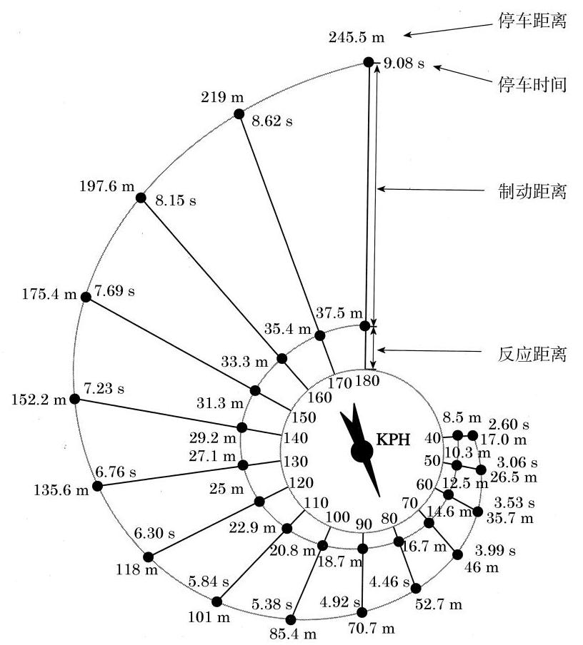

图 1-1 刹车距离示意图

(本图表及所附数据摘自《普通高中数学课程标准(2017 年版 2020 年修订)》第 119 页)

## 检验模型

同学们可以通过查找相关文献, 对以上结果(图 1-1)进行验证.

## 总结

在行车中如何消除安全隐患？一个重要的措施是紧急刹车，本案例中我们建立了急刹车的刹车距离模型. 在建立模型的过程中, 首先确定了影响刹车距离的主要因素, 并且作了合理的假设, 得到刹车距离与反应距离和制动距离有关. 然后根据来自文献的已有试验数据, 得到刹车距离是急刹车前行车速度的二次函数. 这个建模活动的要点在于理解数学模型中关于系数的意义, 由此可见反应时间是影响刹车距离的重要因素. 因此, 驾车时须集中注意力，杜绝酒驾、疲劳驾驶等情况，树立行车安全意识，严格遵守交通规则.

## 参考文献

[1] F. R. Giordano, M. D. Weir, W. P. Fox. A First Course in Mathematical Modeling, 3rd edition. 叶其孝, 姜启源, 等译. 数学建模[M]. 北京: 机械工业出版社, 2005: 57-58.

## 2 易拉罐的设计

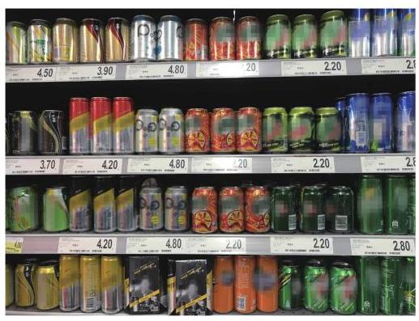

易拉罐发明于 20 世纪 30 年代，最早由罐身、罐盖和罐底三片马口铁组成. 60 年代初出现了由罐身和罐盖两种片材组成的易拉罐并沿用至今. 随着材质和制造工艺的持续革新，易拉罐的重量不断减轻.

目前, 用易拉罐包装的饮料是超市和自动售卖机里的常见商品. 这些罐装饮料种类不同、品牌繁多、图案鲜艳, 很受消费者欢迎. 但是, 你对易拉罐的设计了解多少呢?

## 提出问题

你也许会问:易拉罐的形状、尺寸受哪些因素影响呢？首先容易想到，在满足容积要求的情况下, 饮料生产商总希望包装材料的成本最低, 也就是易拉罐本身的质量最小. 下面我们对此想法通过数学建模进行验证.

## 建立模型

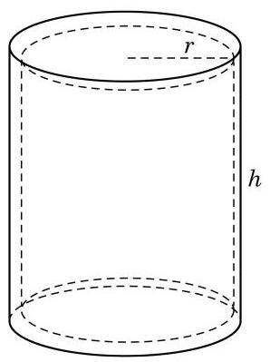

图 2-1

我们通过提出必要的假设, 引入适当的常量和变量, 得到相应的数学模型.

假设 1: 易拉罐容积相同,设为常数 $V$ ;

假设 2: 易拉罐是一个上下封闭的空心圆柱体, 其底部内半径设为 $r$ ,净高度设为 $h$ ,如图 2-1 所示;

假设 3 :易拉罐的罐顶、罐体和罐底的厚度和材质都相同，其厚度设为 $d$ ,密度为 $\rho$ ,当材质确定后, $d\text{ 、 }\rho$ 均可以认为是常数.

根据假设 1 及 2,我们可以得到 $\pi {r}^{2}h = V$ . 根据假设 2 及 3,罐顶和罐底均可以看成一个圆柱体,质量均为 ${\rho \pi }{r}^{2}d$ . 罐体展开后可近似看作棱长分别为 ${2\pi r}\text{ 、 }h\text{ 、 }d$ 的长方体,其质量为 ${2\rho \pi rhd}$ . 这样,易拉罐总质量为

## 

${\rho d}\left( {{2\pi rh} + {2\pi }{r}^{2}}\right)$ ,其中 $d\text{ 、 }\rho$ 是常数,因此当 ${2\pi rh} + {2\pi }{r}^{2}$ 取最小值时,易拉罐的质量最小. 于是,我们得到以下数学模型:

已知常数 $V$ ,求变量 $r\text{ 、 }h$ 的值,使得在满足

$$
\pi {r}^{2}h = V
$$

①

的条件下,

$$
S = {2\pi }{r}^{2} + {2\pi rh}
$$

②

达到最小值.

## 求解模型

由①,得 ${\pi rh} = \frac{V}{r}$ ,代入②,得

$$
S = {2\pi }{r}^{2} + \frac{2V}{r},
$$

求导, 得

$$
{S}^{\prime } = {4\pi r} - \frac{2V}{{r}^{2}}.
$$

令 ${S}^{\prime } = 0$ ,得

$$
r = \sqrt[3]{\frac{V}{2\pi }}.
$$

③

因为 ${\left( {S}^{\prime }\right) }^{\prime } = {4\pi } + \frac{4V}{{r}^{3}} > 0$ ，说明函数 ${S}^{\prime }$ 是严格增函数，它只有一个零点，所以当 $r = \sqrt[3]{\frac{V}{2\pi }}$ 时， $S$ 取得极小值(也是最小值)

$$
S = {2\pi }\sqrt[3]{\frac{{V}^{2}}{4{\pi }^{2}}} + \frac{2V}{\sqrt[3]{\frac{V}{2\pi }}} = 3\sqrt[3]{{2\pi }{V}^{2}}.
$$

将③代入①，得

$$
h = \frac{V}{\pi {r}^{2}} = \frac{V}{\pi \sqrt{\frac{{V}^{2}}{4{\pi }^{2}}}} = \sqrt[3]{\frac{4V}{\pi }}.
$$

④

综合③与④，得 $h = {2r}$ .

以上解答说明:当罐体高度和罐顶直径相等时，易拉罐的质量最小. 但是，常见的易拉罐的高度要比直径大很多, 所以上述结论和实际情况相差还是比较明显的. 这意味着以上模型仍存在问题, 需要修正.

## 修正模型

回到模型假设. 对于假设 1 我们不作修改.

你认为能修改吗？如果能，请给出修改意见，并说明所要解答的问题是否有变化，填入下框.

关于易拉罐形状的假设 2 , 通过观察不难发现: 一般易拉罐顶部有一个收口, 导致罐顶直径小于罐底内直径；罐底也不是平面，而是曲面；等等. 假设“易拉罐是一个上下封闭的空心圆柱体”是为了方便数学建模所作的一种近似, 在此我们也不作修改.

如果你了解简单空间几何体的知识, 不妨基于以上观察对假设 2 作修改, 并将修改内容填入下框.

关于假设 3 ，注意到罐顶一般配有拉环，受力会大于罐体和罐底，相应地，其材料的厚度应该和后两者不同，因此我们将假设 3 修改如下:

易拉罐罐体和罐底厚度为 $d$ ,罐顶厚度是前两者的 $k$ 倍,但三者材质相同 (密度均为 $\rho$ ).

因此, 易拉罐的质量变成

$$
\rho \left( {{k\pi }{r}^{2}d + \pi {r}^{2}d + {2\pi rhd}}\right)  = {\rho d}\left( {{\pi k}{r}^{2} + \pi {r}^{2} + {2\pi rh}}\right) .
$$

考虑到 $\rho \text{ 、 }d$ 为常数,我们就得到以下新模型:

已知常数 $k$ 与 $V$ ,求变量 $r\text{ 、 }h$ 的值,使得在满足

$$
\pi {r}^{2}h = V
$$

的条件下，

$$
M = {\pi k}{r}^{2} + \pi {r}^{2} + {2\pi rh}
$$

达到最小值.

## 

请你参考原模型求解过程, 对上述模型进行求解, 并将解答过程填入下框.

计算可得: 当 $r = \sqrt[3]{\frac{V}{\left( {1 + k}\right) \pi }}, h = \sqrt[3]{\frac{V{\left( 1 + k\right) }^{2}}{\pi }}$ 时, $M$ 取得最小值 $3\sqrt[3]{\left( {1 + k}\right) \pi {V}^{2}}$ . 从而,当罐体高度 $h$ 为罐顶半径 $r$ 的 $\left( {1 + k}\right)$ 倍时,可使易拉罐质量最小.

根据有关资料，市场上容积为 ${355}\mathrm{\;{mL}}$ 的易拉罐罐顶厚度约为罐底和罐体的 3 倍，即 $k = 3$ . 这样,当罐体高度为罐顶半径的 4 倍,即直径的 2 倍时,易拉罐消耗材料最少. 上述结果和现实情况比较接近, 新模型通过了验证, 建模过程结束. 同学们不妨实际测量一下市场上各种易拉罐的尺寸, 以验证以上数据是否合理.

## 总结

本案例以形形色色的易拉罐饮料为情境，借助基本几何图形的体积公式和用导数求函数极值等数学方法, 探讨易拉罐形状背后的“秘密”. 我们引入了刻画形状的两个变量—— 罐体高度 $h$ 和罐顶半径 $r$ ,并设容积为常数,以耗材最省为目标建立了数学模型. 第一个模型假设罐顶、罐体、罐底都采用相同厚度的同一材料,据此所得结论为当 $h = {2r}$ 时耗材最省，与实际情形不符. 第二个模型将上述假设修改为:罐顶、罐体、罐底材质相同，但前者和后两者的厚度之比为常数 $k$ ,据此得到当 $h = \left( {k + 1}\right) r$ 时耗材最省. 经实测,市场上常见的易拉罐罐顶厚度约是罐体的 3 倍,即当 $h = {4r}$ 时耗材最省,这与实际情形比较符合, 建模完成.

建模活动结束后, 需要完成一份数学建模活动报告. 针对这个实际情境, 我们按实验报告的形式编写了报告，详见附录中的样例.

## 参考文献

[1] 姜启源, 谢金星, 叶俊. 数学建模 (第五版)[M]. 北京: 高等教育出版社, 2018.

[2] 谭永基, 俞红. 现实世界的数学视角与思维[M]. 上海: 复旦大学出版社, 2010.

## 3 珠穆朗玛峰顶上有多少氧气

作为世界海拔最高的山峰, 珠穆朗玛峰一直以来吸引着众多的登山爱好者. 根据 2020 年的最新测量结果,珠峰顶部海拔高度为 ${8848.86}\mathrm{\;m}$ . 珠峰顶上的氧气含量是否低于人类生命所能承受的极限?

在海拔高度为 $0\mathrm{\;m}$ 的海平面,大气压 $P = {101.325}\mathrm{{kPa}}$ (千帕). 在 ${0}^{ \circ  }\mathrm{C}$ 的干燥空气中, 氧气的含量 (以体积比计算)为 20.95%，因此大气压中由氧气施加的压强(称为氧分压)为 101.325×20.95%=21.228 kPa. 当然，这些数值都是在理想状态下得到的，当状态改变时, 数据就会发生变化. 例如, 当空气中存在水分时, 水蒸气产生的压强就会占据大气压的部分比例; 当温度变化时, 大气压也会变化. 但我们将忽略这些因素, 聚焦于不同海拔高度上的大气压和它的氧分压.

随着海拔高度的上升, 大气压会逐步下降. 然而, 一个基本的事实是: 在任何海拔高度上，氧气在空气中的占比始终维持在 20.95% 的水平. 也就是说，海拔升高并不意味着空气中氧气含量的比例降低. 但是由于大气压的降低，它的氧分压也会降低，因此空气中所含氧气的绝对量要减少. 为了形象地描述此时空气中所含氧气的情况，人们引进了不同海拔高度上的含氧量的概念, 它是把一个海拔高度上大气压中的氧分压除以海平面的大气压所得到的商 (用百分比表达). 例如,某地大气压为 ${89.234}\mathrm{{kPa}}$ ,则氧分压为 ${89.234} \times$ 20.95%=18.69 (kPa),而此地的含氧量则是 ${18.69} \div  {101.325} = {18.45}\%$ . 注意,这不是说此地空气中只含 18.45% 的氧气,而是指此地空气中所含氧气如果放到压强为 101.325 kPa 的大气中，其所占的比例为 18.45% . 把上面的计算过程进行推广，就得出了一个地区含氧量 $O$ 与大气压 $P$ (以 $\mathrm{{kPa}}$ 为单位) 的关系式

$$
O = \frac{P}{101.325} \times  {20.95}\%  = P \times  {0.20676}\% .
$$

①

长期生活在低海拔地区的人们，到了高海拔的地区，由于大气压降低、含氧量减少， 身体可能会产生不适反应，这就是日常所说的高原反应.

## 提出问题

大气压与含氧量由简单的比例式相联系，那么海拔高度和大气压(或含氧量)之间是否也可能用简单的方式联系起来呢? 从理论上很难直接找到联系两者的数学关系式, 只能借助数据观察,用统计方法建立海拔高度 $H$ (单位: $\mathrm{m}$ ) 与大气压 $P$ (单位: $\mathrm{{kPa}}$ )之间的关系模型. 如果找到合适的模型, 我们就可以推算任何海拔高度上的大气压和含氧量. 例如, 珠峰顶上的含氧量是否低于人类生命所能承受的极限? 地球表面海拔最低的死海湖面 (约 $- {415}\mathrm{\;m}$ )的大气压和含氧量究竟是多少？

## 建立模型

我们从贴近生活的角度着手. 查阅资料, 得到我国部分城市的海拔高度及大气压对照数据(表 3-1).

表 3-1

<table id="cross-table-2"><tr><td>城市</td><td>海拔高度/m</td><td>大气压/kPa</td><td>城市</td><td>海拔高度/m</td><td>大气压/kPa</td></tr><tr><td>北京</td><td>31.2</td><td>99.86</td><td>贵阳</td><td>1071.2</td><td>88.79</td></tr><tr><td>哈尔滨</td><td>171.7</td><td>98.51</td><td>昆明</td><td>1891.4</td><td>80.80</td></tr><tr><td>长春</td><td>236.8</td><td>97.79</td><td>济南</td><td>51.6</td><td>99.85</td></tr><tr><td>沈阳</td><td>41.6</td><td>100.07</td><td>合肥</td><td>29.8</td><td>100.09</td></tr><tr><td>天津</td><td>3.3</td><td>100.48</td><td>郑州</td><td>110.4</td><td>99.17</td></tr><tr><td>石家庄</td><td>80.5</td><td>99.56</td><td>上海</td><td>4.5</td><td>100.53</td></tr><tr><td>太原</td><td>777.9</td><td>91.92</td><td>南京</td><td>8.9</td><td>100.40</td></tr><tr><td>呼和浩特</td><td>1063.0</td><td>88.94</td><td>杭州</td><td>41.7</td><td>100.05</td></tr><tr><td>西安</td><td>396.9</td><td>95.92</td><td>福州</td><td>84.0</td><td>99.64</td></tr><tr><td>兰州</td><td>1517.2</td><td>84.31</td><td>台北</td><td>9.0</td><td>100.53</td></tr><tr></tr><tr><td>乌鲁木齐</td><td>917.9</td><td>90.67</td><td>南昌</td><td>46.7</td><td>99.91</td></tr><tr><td>银川</td><td>1111.5</td><td>88.35</td><td>武汉</td><td>23.3</td><td>100.17</td></tr><tr><td>西宁</td><td>2261.2</td><td>77.35</td><td>长沙</td><td>44.9</td><td>99.94</td></tr><tr><td>拉萨</td><td>3658.0</td><td>65.23</td><td>香港</td><td>32.0</td><td>100.56</td></tr><tr><td>成都</td><td>505.9</td><td>94.77</td><td>广州</td><td>6.6</td><td>100.45</td></tr><tr><td>重庆</td><td>259.1</td><td>97.32</td><td>南宁</td><td>72.2</td><td>99.60</td></tr></table>

数据来源: 百度文库.

根据表 3-1 中的数据绘制散点图 (图 3-1). 我们发现, 随着海拔高度的上升, 大气压逐步下降, 两者之间呈现出较明显的线性关系. 作线性回归分析, 并借助计算器或电脑软件,我们可以找到一条较好反映海拔高度 $H$ 与大气压 $P$ 之间关系的直线

$$
P = {100.229} - {0.01001H}.
$$

②

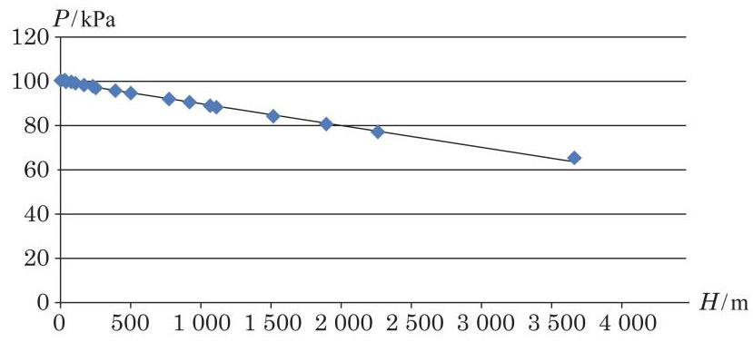

图 3-1

## 模型检验

现在检验关系式②是否能够较为准确地体现海拔高度与大气压的关系. 经计算发现， 除拉萨以外, 其他各城市的实际大气压与根据模型估算出的大气压的离差绝对值介于 0.000 094 13 kPa 和0.751662 kPa 之间(均值为 0.311 810 kPa)，可见关系式②较好地刻画了大部分城市的海拔高度与其大气压的关系. 但拉萨的离差为 ${1.621604}\mathrm{{kPa}}$ ，拟合得相对不好, 这也许还隐含着其他内在的因素. 再次观察数据表 3-1 及对应的散点图 (图 3-1), 我们发现,除拉萨外,所涉及的城市的海拔高度都在 ${3000}\mathrm{\;m}$ 以下. 这提示我们思考: 是否在海拔 ${3000}\mathrm{\;m}$ 以上的地区大气压与海拔高度的关系会呈现不同的模型?

为了验证猜想,我们再次查阅资料,得到我国一些海拔 3000 m 及以上城市的海拔高

## 

度及大气压的数据(表 3-2). 请同学们把根据关系式②算得的这些城市大气压的拟合值(保留 4 位小数)及其离差填入表 3-3.

表 3-2

<table><tr><td>城市</td><td>海拔高度/m</td><td>大气压/kPa</td></tr><tr><td>林芝</td><td>3000.0</td><td>70.54</td></tr><tr><td>都兰</td><td>3191.1</td><td>69.14</td></tr><tr><td>昌都</td><td>3306.0</td><td>68.14</td></tr><tr><td>甘孜</td><td>3393.5</td><td>64.49</td></tr><tr><td>拉萨</td><td>3658.0</td><td>65.23</td></tr><tr><td>玉树</td><td>3681.2</td><td>65.10</td></tr><tr><td>日喀则</td><td>3836.0</td><td>63.83</td></tr><tr><td>索县</td><td>3950.0</td><td>62.04</td></tr><tr><td>玛多</td><td>4272.3</td><td>61.08</td></tr><tr><td>那曲</td><td>4507.0</td><td>58.90</td></tr></table>

表 3-3

<table><tr><td>根据关系式②算出的大气压/kPa</td><td>离差/kPa</td></tr><tr><td></td><td></td></tr><tr><td></td><td></td></tr><tr><td></td><td></td></tr><tr><td></td><td></td></tr><tr><td></td><td></td></tr><tr><td></td><td></td></tr><tr><td></td><td></td></tr></table>

数据来源: 百度文库.

分析表中各城市的离差, 你能得到什么结论? 离差较大的城市是哪些? 从中得到什么启示? 设想一下, 能不能用关系式②计算珠峰含氧量？为什么? 把你的分析和设想填入下框.

## 模型的拓展

同学们一定发现:由于表 3-1 与表 3-2 中海拔 3600 m 以上的数据很少，我们无法从中获取较高海拔地区大气压变化的状况，从而也无法回答一开始关于珠峰含氧量的问题. 我们要寻找更多的数据, 并进一步探究海拔高度与大气压的关系.

由于高海拔地区城市很少, 因此再以城市为标志给出海拔高度与大气压的数据是不现实的. 我们通过网络查询找到另一个数据表, 它以基本等距的方式标注海拔高度与大气压的对照情况. 我们从中选取数据, 列成表 3-4.

表 3-4

<table><tr><td>海拔高度/m</td><td>大气压/kPa</td><td>海拔高度/m</td><td>大气压/kPa</td></tr><tr><td>-400</td><td>106.22</td><td>6400</td><td>44.65</td></tr><tr><td>0</td><td>101.33</td><td>6800</td><td>42.23</td></tr><tr><td>400</td><td>96.61</td><td>7200</td><td>39.92</td></tr><tr><td>800</td><td>92.08</td><td>7600</td><td>37.71</td></tr><tr><td>1200</td><td>87.72</td><td>8000</td><td>35.60</td></tr><tr><td>1600</td><td>83.52</td><td>8400</td><td>33.59</td></tr><tr><td>2000</td><td>79.50</td><td>8 800</td><td>31.67</td></tr><tr><td>2400</td><td>75.63</td><td>9200</td><td>29.84</td></tr><tr><td>2800</td><td>71.91</td><td>9600</td><td>28.10</td></tr><tr><td>3200</td><td>68.34</td><td>10000</td><td>26.44</td></tr><tr><td>3600</td><td>64.92</td><td>10400</td><td>24.86</td></tr><tr><td>4000</td><td>61.64</td><td>10800</td><td>23.36</td></tr><tr><td>4400</td><td>58.49</td><td>11000</td><td>22.63</td></tr><tr><td>4800</td><td>55.48</td><td>11500</td><td>20.92</td></tr><tr><td>5200</td><td>52.59</td><td>12000</td><td>19.33</td></tr><tr><td>5600</td><td>49.83</td><td>12500</td><td>17.87</td></tr><tr><td>6000</td><td>47.18</td><td>13000</td><td>16.51</td></tr><tr><td>13500</td><td>15.26</td><td>14500</td><td>13.03</td></tr><tr><td>14000</td><td>14.10</td><td>15000</td><td>12.05</td></tr></table>

数据来源:海拔高度信息查询工具.

表 3-4 包括了从 $- {400}\mathrm{\;m}$ 到 ${15000}\mathrm{\;m}$ 范围内的海拔高度与大气压对照的抽样数据,其中 ${11000}\mathrm{\;m}$ 以下按 ${400}\mathrm{\;m}$ 间隔取样, ${11000}\mathrm{\;m}$ 以上按 ${500}\mathrm{\;m}$ 间隔取样.

根据表 3-4 中的数据作散点图(图 3-2).

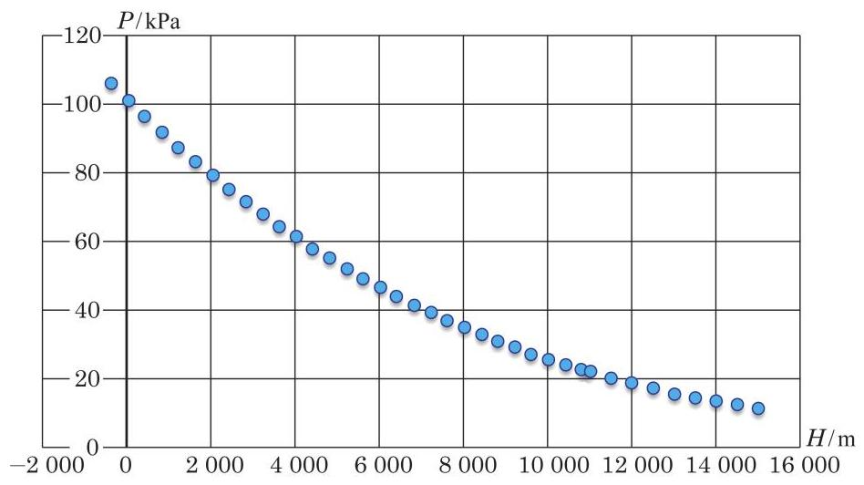

图 3-2

请同学们考察此散点图, 把你的发现和对如何作拟合的设想填入下框.

从散点图可以看出,在低海拔区域 $\left( {{3600}\mathrm{\;m}\text{ 以下 }}\right)$ 数据点基本是线性分布的,而到高海拔区域数据点就明显偏离了线性分布, 呈现出指数分布的性态. 为此, 我们把数据点分成两部分进行分段拟合: 海拔 ${3600}\mathrm{\;m}$ 及以下的点作线性拟合(这也与我们前面得到的经验相符),海拔 ${3600}\mathrm{\;m}$ 以上的点作指数拟合. 为了使线性拟合与指数拟合有较平滑的衔接,把对应海拔 ${2800}\mathrm{\;m}\text{ 、 }{3200}\mathrm{\;m}$ 和 ${3600}\mathrm{\;m}$ 的三个数据点加入到指数拟合中. 由此,我们得到了关于海拔高度 $H$ 与相应大气压 $P$ 的拟合模型

$$
P = \left\{  \begin{array}{ll} {100.841} - {0.01031H}, &  - {400} \leq  H \leq  {3600}, \\  {112.921}{\mathrm{e}}^{-{0.000147H}}, & H > {3600}. \end{array}\right.
$$

③

拟合曲线的图像如图 3-3 所示.

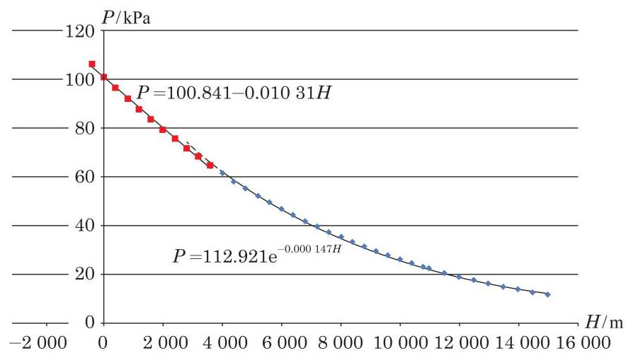

图 3-3

## 拓展模型的检验

分析由模型③计算得到的不同海拔高度的大气压数据与表 3-4 中的数据的拟合度, 再从表 3-1 或表 3-2 中随意挑选若干城市, 用模型③来计算它们的大气压数据，并求计算结果与实际数据的误差. 根据这些计算, 对模型③作出你的评价.

数据验证说明模型③是比较理想的. 还要指出的是，用表 3-1 与表 3-2 中的数据验证由表 3-4 数据得到的模型, 实际上证明了我们前后采用的不同来源的数据是兼容的, 甚至可以说它们都是可靠的.

## 模型的应用

模型的直接应用当然是求各种海拔高度上的大气压. 但是, 我们前面已经有了大气压和含氧量的折算公式①，很容易把以海拔高度和大气压为变量的模型转换成以海拔高度和含氧量为变量的模型, 进而从一处的海拔高度就可以推出该处的含氧量.

模型② 于是转换为含氧量 $O$ 与海拔高度 $H$ (单位: $\mathrm{m}$ ) 的关系式

$$
O = \left( {{100.229} - {0.01001H}}\right)  \times  {0.20676}\%  = \left( {{20.723} - {0.00207H}}\right) \% ,
$$

④

它较好地拟合 $0\mathrm{\;m}$ 到 ${3000}\mathrm{\;m}$ 海拔的地区; 模型③转换为

$$
O = \left\{  \begin{array}{ll} \left( {{20.850} - {0.00213H}}\right) \% , &  - {400} \leq  H \leq  {3600} \\  \left( {{23.3475}{\mathrm{e}}^{-{0.000147H}}}\right) \% , & H > {3600}. \end{array}\right.
$$

⑤

由模型⑤可以算出，地球表面海拔最高的珠穆朗玛峰顶峰的含氧量为 ${6.36}\%$ ，稍高于氧气短时致死含量 $\left( {6\% }\right.$ ,在低于这个含氧量的环境中,人会抽搐,停止呼吸,甚至死亡). 当飞机飞行在 ${13000}\mathrm{\;m}$ 高空时,机外空气含氧量只有 ${3.45}\%$ ,所以一旦机体密封性发生问题, 机上人员必须立即戴上氧气面罩, 否则会很快丧命. 中国陆地海拔最低点新疆吐鲁番的艾丁湖湖面海拔 -154m ，那里的含氧量为 21.17% ，是中国含氧量最高的地方. 地球陆地上的海拔最低点，即有“世界的肚脐”之称的死海湖面，海拔约 -415 m，其大气压约为 105.12 kPa，含氧量约为 21.7%，成为全球含氧量最高的地方(虽然此海拔高度在模型⑤的定义域之外, 但它与海拔最低的取样点靠得很近, 且大气压、含氧量的变化都是连续渐进的过程, 对这个海拔高度使用这些模型没有问题).

## 总结

在本案例中, 我们首先利用部分城市的海拔高度与大气压的观测值, 绘制散点图, 发现两者呈线性关系, 通过线性回归, 找出相对应的一元线性函数关系式. 经检验, 关系式①在

总体上能够较好地反映 3000 m 以下的海拔高度与大气压的关系.

为了得到更大范围内海拔高度与大气压的关系模型, 我们找到另外一批数据, 它在海拔 $- {400}\mathrm{\;m}$ 到 ${11000}\mathrm{\;m}$ 之间按 ${400}\mathrm{\;m}$ 间隔均匀取样,在 ${11000}\mathrm{\;m}$ 到 ${15000}\mathrm{\;m}$ 之间按 ${500}\mathrm{\;m}$ 间隔均匀取样. 从这批数据对应的散点图看出, 在高海拔区间点的分布明显是非线性的, 有指数函数的特征. 于是我们设想进行分段拟合: 在 ${3600}\mathrm{\;m}$ 以下区间仍考虑用线性拟合 (这一方面是散点图提示的,另一方面我们前面已经建立了一个线性模型),在 ${3600}\mathrm{\;m}$ 以上区间作指数拟合. 经尝试发现, ${2800}\mathrm{\;m}\text{ 、 }{3200}\mathrm{\;m}\text{ 、 }{3600}\mathrm{\;m}$ 诸点具有双重性,既承了线性拟合区间的前, 又启了指数拟合区间的后. 我们把它们划在线性拟合区间中, 但又让这几个点参与指数拟合, 使后面的指数模型有更好的拟合度. 同学们可以试试其他的拟合方式(例如，对表 3-4 中的数据作整体的指数拟合，或用其他方法分段拟合)，看看是否有其他理想的拟合模型.

在本案例中, 我们对低海拔区间构建了两个线性模型, 它们的回归系数是不一样的. 这提示了如下一个事实:对统计模型，同样的问题由于数据采样的不同，会有不同的回归模型. 但只要采样过程合理, 数据可靠且数据量足够大, 不同的模型对问题的描述没有太大的差别.

## 4 水葫芦的生长

在一些河道丰富的地区, 我们常常会发现, 一段时间内有一种绿色植物覆盖一大片，甚至是整个河面. 这是一种名为水葫芦的植物，它的学名叫做凤眼莲.

1884 年, 在美国新奥尔良国际博览会上, 原产于南美洲的水葫芦艳丽无比, 人们于是将其作为观赏植物带回了各自的国家. 1901 年, 水葫芦被作为观赏植物引入中国.

随着水葫芦的引入, 人们逐渐发现, 在适宜的环境下它的繁殖能力极强. 据观察, 在三个月的时间内, 水葫芦可以由一株繁殖到数十万株. 由于水葫芦在自然界没有天敌, 这样超强的繁殖力很容易对环境、水上交通、人畜饮水安全、渔业生产造成不良的影响，形成季节性灾难. 那么, 水葫芦的繁殖能力究竟有多强呢?

你对水葫芦有哪些认识？请填入下框.

## 提出问题

要研究水葫芦的繁殖能力, 你觉得可以从哪些方面展开? 请将你的想法填入下框.

经过思考, 我们可以提出如下一些问题:

问题 1: 在一段时间内, 水葫芦可以覆盖多大面积的水域? 其覆盖面积的增长情况是怎样的?

问题 2: 水葫芦的生长率在不同的季节是否会呈现出不同的规律?

## 建立模型

为了回答上述问题，我们需要对水葫芦在不同季节覆盖水域的实际情况进行现场观察和记录, 或是寻找已有的数据资料.

在实际观察中, 我们发现水葫芦的叶片往往会互相覆盖、重叠, 这使得覆盖面积无法成为一个较为理想的观察指标. 为此, 研究人员提出另一种更为可靠的常用量度——生物量(biomass), 对植物可专称植物量(phytomass), 它是指某一时刻单位面积内实际存活的有机物质 (包括生物体内所存食物) 的总质量, 通常以 g 为单位.

这里呈现的是来自华南农业大学有关水葫芦生态研究的实验数据(表 4-1)，包括水葫芦在春(3月上旬)、夏(6月上旬)、秋(9月上旬)三个季节的植物量数据.

表 4-1 水葫芦在春、夏、秋三个季节的植物量数据

<table><tr><td>调查相隔时段/天</td><td>春季</td><td>夏季</td><td>秋季</td></tr><tr><td>0</td><td>25.01</td><td>21.17</td><td>26.83</td></tr><tr><td>10</td><td>57.77</td><td>46.59</td><td>46.67</td></tr><tr><td>20</td><td>126.79</td><td>116.53</td><td>82.87</td></tr><tr><td>30</td><td>254.74</td><td>301.94</td><td>162.70</td></tr><tr><td>40</td><td>625.95</td><td>878.01</td><td>361.05</td></tr><tr><td>50</td><td>1578.94</td><td>2166.43</td><td>842.95</td></tr><tr><td>60</td><td>3621.85</td><td>5085.05</td><td>1866.37</td></tr><tr><td>70</td><td>6721.45</td><td>8620.32</td><td>3972.83</td></tr><tr><td>80</td><td>10 189.24</td><td>13298.84</td><td>5 644.10</td></tr><tr><td>90</td><td>15009.17</td><td>20713.92</td><td>8778.56</td></tr></table>

注:表中数据为 30 株水葫芦调查结果的平均值，其中调查时段 0 代表水葫芦接入时的初始值. 数据源于华南农业大学冯熠荣(2003)的《水葫芦种群生态控制的基础研究》.

有了上面的数据，我们就可以着手建立相应的数学模型，以揭示水葫芦的生长规律. 根据生物学原理, 在一定条件下, 生物的生长率是稳定不变的. 从表 4-1 中的数据可以看出, 三个季节水葫芦的植物量均增长迅速, 其中夏季增长最快, 然后是春季和秋季. 因此, 水葫芦的繁殖能力可以由水葫芦的植物量在其生长时间内的增长情况来表示, 其中的数学关系可以表示如下:

设水葫芦的植物量为 $y$ (单位: $\mathrm{g}$ ),生长时间为 $t$ (单位:天),相应的关系式为 $y = f\left( t\right)$ .

## 求解模型

接下来的任务就是要找出合适的关系函数 $f$ ,以呈现植物量与生长时间的关联.

在探索两个变量之间的关系时, 我们可以使用如下方法:

(1)使用描点法绘制散点图，观察变量之间的关系；

(2)使用相关分析，考察变量之间是否存在线性关系.

根据表 4-1 中的数据,用描点法绘制植物量 $y$ 关于时间 $t$ 的散点图 (图 4-1),以便考察 $y$ 与 $t$ 之间的变化关系.

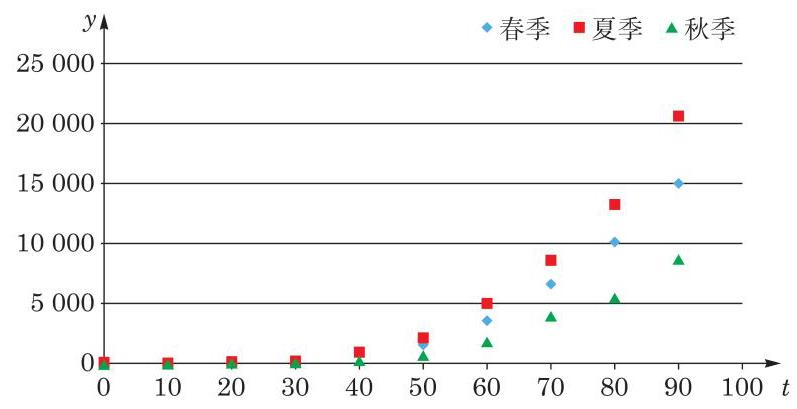

图 4-1

由图 4-1, 水葫芦的植物量与时间呈现出某种函数关系. 请仔细观察, 据此猜测水葫芦的植物量 $y$ 关于时间 $t$ 可能满足哪种函数关系,并将你的猜测填入下框.

经过观察，你可能会发现:

(1)水葫芦的植物量 $y$ 与时间 $t$ 具有某种曲线关系,而非用直线表示的一次函数关系;

(2)水葫芦的植物量 $y$ 与时间 $t$ 呈现出某种二次函数的关系；

(3)水葫芦的植物量 $y$ 与时间 $t$ 呈现出某种指数函数的关系.

如果水葫芦的植物量 $y$ 与时间 $t$ 确实存在某种二次函数关系,那么我们可以将这一函

## 

数关系表示为 $y = k + {mt} + n{t}^{2}$ ,其中 $k\text{ 、 }m\text{ 、 }n$ 是待定的系数.

利用图形计算器或电脑软件，我们可以据此分别得到水葫芦在春季、夏季、秋季的生长函数, 即相应的生长模型:

春季: $y = {799.196} - {132.926t} + {3.15951}{t}^{2}$ ,如图 4-2 所示;

夏季: $y = {1112.68} - {184.387t} + {4.31916}{t}^{2}$ ,如图 4-3 所示;

秋季: $y = {517.62} - {81.2539t} + {1.86572}{t}^{2}$ ,如图 4-4 所示.

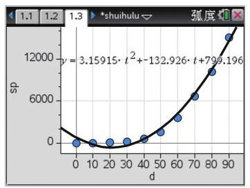

图 4-2

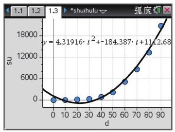

图 4-3

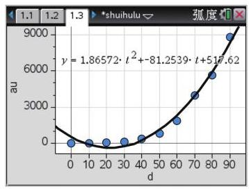

图 4-4

## 模型检验

为检验所建模型能否较好地体现这两个变量之间的关系, 较为常见的方法有:

方法 1:比对所建模型的图形与原始数据的形态；

方法 2:计算误差值并绘制相应的误差分布图，以检验模型估计值是否与原始数据 (即实际观测值)拟合良好.

这里先选用方法 1 ，以春季为例，比对所建模型的图形与原始数据的形态. 观察图4-5， 模型估计值 (红色) 与原始数据 (蓝色) 在总体上还是较为贴合的. 但同时发现,在 $t = {10}$ 、 20 和 30 时,模型估计值呈不应出现的负值,且当 $t = 0$ 时,绝对差值达到 774.186 . 这提示我们, 可能需要对这一函数模型进行调整.

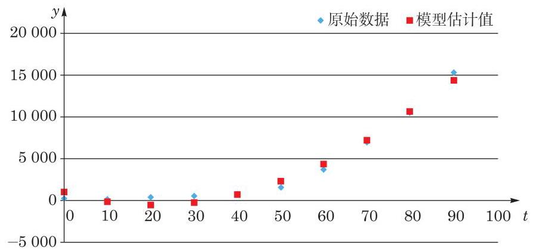

图 4-5

## 模型改进

观察图 4-1,水葫芦的植物量 $y$ 与时间 $t$ 可能呈现出某种指数函数关系. 为了验证这一猜测,我们首先对植物量 $y$ 取对数,再建立 $\ln y$ 与 $t$ 的函数关系. 由图 4-6 可以明显看出, $\ln y$ 与 $t$ 之间存在着某种线性关系.

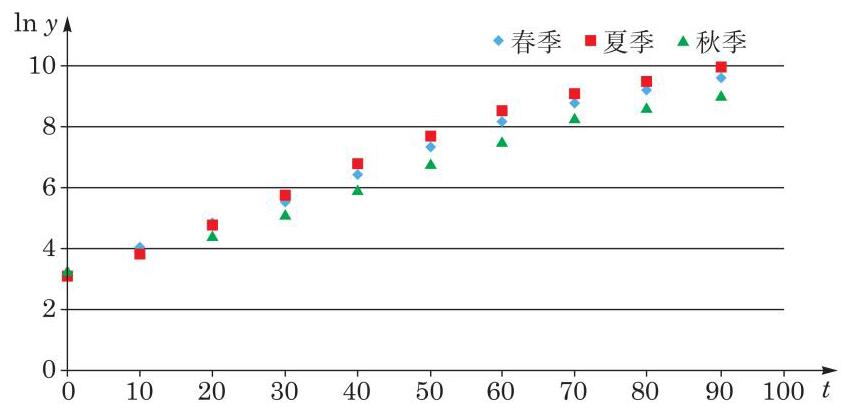

图 4-6

利用最小二乘估计 (参见选择性必修课程第 8 章),我们可以建立 $\ln y$ 与 $t$ 之间的一元线性回归模型: $\ln y = {at} + b$ ,其中 $a$ 和 $b$ 是待定系数. 记 $\ln y$ 为 $s\left( {\text{ 即 }s = {at} + b}\right)$ ,可得三个季节中 $s$ 与 $t$ 的线性拟合模型: 春季为 $s = {0.0803t} + {3.27}$ ,夏季为 $s = {0.0743t} + {3.39}$ , 秋季为 $s = {0.0686t} + {3.19}$ . 将这些函数还原为指数函数,就可以分别得到: 春季的生长模型为 $y = {26.3} \times  {1.08}^{t}$ ,夏季的生长模型为 $y = {29.7} \times  {1.08}^{t}$ ,秋季的生长模型为 $y = {24.3} \times  {1.07}^{t}$ (图 4-7).

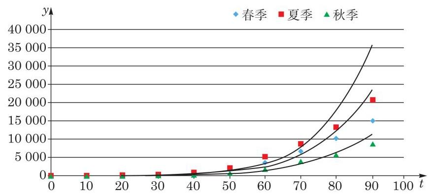

图 4-7

## 模型再检验

现在我们选用方法 2 ，计算误差值并绘制出相应的误差分布图，对指数函数模型的拟合程度进行鉴定. 图 4-8 显示, 模型估计值与实际观测值在前 70 天差距甚微, 而之后的估计值则与实际观测值产生了较大的偏差.

显然,70 天之后的模型估计值要远大于实际观测值,特别是当 $t = {90}$ 时. 事实上,许多生物种群在繁殖之初, 由于种群数量较少, 增长速度较快, 确实会呈指数形式增长. 但随着时间的推移, 当种群数量达到环境资源所能容纳的最大数量时, 种群数量的增长速度会越来越慢, 最终几乎停止增长.

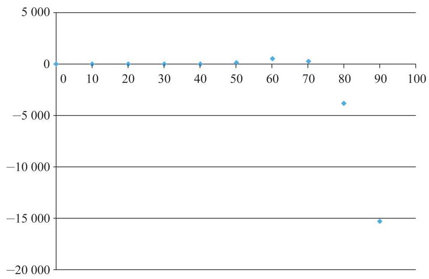

图 4-8

数学生物学家韦吕勒(P. F. Verhulst)针对此现象, 在 1838 至 1847 年间对指数增长模型进行了调整, 提出了著名的逻辑斯蒂函数(Logistic Function)模型

$$
y = \frac{A}{1 + {\mathrm{e}}^{b - {kt}}},
$$

其中, $k$ 为增长率, $b$ 为常数.

该模型的计算相对复杂, 但选用恰当的电脑软件, 就可以得到水葫芦在春、夏、秋三个季节的逻辑斯蒂函数模型分别为:

春季: $y = \frac{23005.460}{1 + {\mathrm{e}}^{{6.402} - {0.078t}}},0 \leq  t \leq  {90}$ ;

夏季: $y = \frac{39605.959}{1 + {\mathrm{e}}^{{6.254} - {0.070t}}},0 \leq  t \leq  {90}$ ;

秋季: $y = \frac{14499.129}{1 + {\mathrm{e}}^{{6.446} - {0.076t}}},0 \leq  t \leq  {90}$ .

以春季的增长模型为例, 通过检验发现, 逻辑斯蒂函数模型所对应的绝对误差介于 13.075 和 383.801 之间, 指数函数模型的误差介于 4.69 和 15252.60 之间, 而二次函数模型的误差介于 89.154 和 774.186 之间. 显然, 在这三种函数模型中, 逻辑斯蒂函数模型能更准确地反映水葫芦的生长规律.

至此, 请同学们撰写建模活动报告, 记录整个研究的过程.

## 总结

在本案例中，我们关注的是身边的生态问题. 对于这样一个既熟悉又陌生的现象，我们手边往往没有现成的资料可使用, 这时实地采集数据或搜索已有的相关文献资料是常用的方法.

在本课题中, 我们所要探索的是水葫芦的生长规律. 在数学上, 就是要找寻水葫芦的植物量与生长时间之间的关系. 运用描点法、最小二乘法和现代技术手段(如图形计算器或计算机编程), 我们找出了对应的函数关系式, 并通过比较原始数据与模型估计值的形态 (方法 1) 和绘制误差分布图 (方法 2), 发现指数函数模型能较好地刻画水葫芦在初始阶段的生长规律, 但在生长后期模型会出现明显的误差. 历史上, 韦吕勒正是基于这样的生态现象, 提出了目前广泛应用于生物学、医学、经济管理学等领域的逻辑斯蒂方程. 误差检验也证实, 相比于指数函数模型和二次函数模型, 逻辑斯蒂函数模型能更准确地刻画水葫芦的生长规律.

需要指出的是, 在本案例中, 基于现有数据所建立的二次函数模型和指数函数模型在总体上也呈现出不错的拟合程度, 这与我们所用的数据量较小不无关系. 有兴趣的同学可以尝试获取更多的数据，对这两个模型进行更精细的验证.

## 参考文献

[1] 冯煜荣. 水葫芦种群生态控制的基础研究[D]. 广州: 华南农业大学, 2003.

[2] L. Edelstein-Keshet. Mathematical Models in Biology[M]. Philadelphia, PA: Society for Industrial and Applied Mathematics, 1988.

第 2 部分

数学建模活动 A

本部分提供另外 2 个数学建模活动, 供大家选择, 以进一步丰富数学建模活动经历. 这里给出了相应的活动提示, 供同学们参考. 请大家有选择地分组开展活动.

## 

## 5 铅球投掷

掷铅球是我们熟悉的一项体育运动. 一般情况下，运动员先是用正确的姿势握住铅球, 然后持球滑步, 当身体左侧接近与地面垂直的一刹那, 以左肩为轴, 右腿迅速伸直, 身体转向投掷方向，挺胸、抬头，右肩用力向前推送，同时右臂迅速伸直将球向前上方推出(图 5-1). 问题是:如何投掷才能获得更好的成绩？

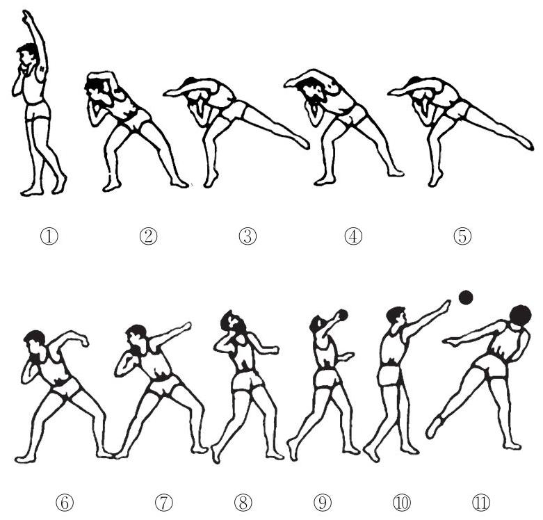

图 5-1

## 活动提示

## 提出问题

根据上述情境，你能提出什么数学问题？请将你的问题填入下框.

## 建立模型

为解决上面的问题, 我们需要作出一些合理的假设, 如假设空气阻力产生的影响可以忽略不计. 是否还需要其他假设? 请将你的假设填入下框.

假设 1 : 空气阻力产生的影响可以忽略不计.

根据上述假设建立数学模型, 并回答你所提出的问题. 请将你的研究过程填入下框.

## 模型的检验与改进

以下是 2017 年田径世锦赛女子铅球决赛中, 12 名选手最佳投掷轮次的出手参数:

<table id="cross-table-3"><tr><td>运动员</td><td>最佳投掷轮次</td><td>成绩/m</td><td>出手速度/ (m/s)</td><td>出手角度/°</td><td>出手高度/m</td><td>出手高度相对人体高度/%</td><td>超出抵趾板距离/m</td><td>出手时前后倾斜角/°</td><td>出手时左右倾斜角/‘</td></tr><tr><td>巩立姣 (中国)</td><td>5</td><td>19.94</td><td>13.24</td><td>37.0</td><td>2.08</td><td>119</td><td>0.09</td><td>8</td><td>-21</td></tr><tr><td>阿妮塔·马顿 (匈牙利)</td><td>6</td><td>19.49</td><td>13.31</td><td>35.0</td><td>1.91</td><td>112</td><td>-0.02</td><td>-2</td><td>4</td></tr><tr><td>米歇尔・卡特 (美国)</td><td>3</td><td>19.14</td><td>12.95</td><td>35.4</td><td>2.11</td><td>121</td><td>0.18</td><td>6</td><td>-20</td></tr><tr><td>丹尼尔· 托马斯-多德 (牙买加)</td><td>5</td><td>18.91</td><td>13.34</td><td>33.0</td><td>1.89</td><td>114</td><td>0.00</td><td>-2</td><td>-10</td></tr><tr><td>高阳 (中国)</td><td>6</td><td>18.25</td><td>12.64</td><td>38.1</td><td>2.00</td><td>112</td><td>-0.14</td><td>-6</td><td>-4</td></tr><tr><td>布里塔妮・克鲁 (加拿大)</td><td>2</td><td>18.21</td><td>12.63</td><td>39.3</td><td>1.98</td><td>111</td><td>0.13</td><td>-7</td><td>9</td></tr><tr><td>尤利娅・莱特休克 (白俄罗斯)</td><td>3</td><td>18.12</td><td>12.44</td><td>37.7</td><td>2.11</td><td>114</td><td>0.08</td><td>3</td><td>-8</td></tr><tr><td>亚努维斯・洛佩兹 (古巴)</td><td>3</td><td>18.03</td><td>12.59</td><td>35.8</td><td>2.09</td><td>116</td><td>0.01</td><td>13</td><td>-24</td></tr><tr></tr><tr><td>盖尔萨·阿卡约 (巴西)</td><td>3</td><td>18.03</td><td>12.37</td><td>35.3</td><td>2.08</td><td>115</td><td>0.17</td><td>6</td><td>-13</td></tr><tr><td>雷文・桑德斯 (美国)</td><td>3</td><td>17.86</td><td>12.50</td><td>41.0</td><td>1.97</td><td>119</td><td>-0.03</td><td>-5</td><td>1</td></tr><tr><td>梅尔萨·博科尔曼 (荷兰)</td><td>2</td><td>17.73</td><td>12.48</td><td>34.4</td><td>2.05</td><td>116</td><td>0.10</td><td>5</td><td>-17</td></tr><tr><td>卞卡 (中国)</td><td>1</td><td>17.60</td><td>12.35</td><td>36.6</td><td>2.05</td><td>113</td><td>-0.06</td><td>11</td><td>-17</td></tr></table>

数据来源: A. Dinsdale, A. Thomas, A. Bissa. Biomechanical Report for the IAAF World Championships London 2017: Shot put women's. UK: Leeds Beckett University, 2018.

请将你的研究结果与实际情形比较, 如果不符, 试改进你的模型. 请将你的研究过程填入下框.

## 撰写数学建模活动报告

活动报告一般包含以下内容:

(1)根据上述情境所提出的数学问题;

(2)必要的假设和所需的变量或常量;

(3)相应的数学模型及解答；

(4)模型检验及说明.

## 6 电梯调度

某商务大楼管理公司的助理接到公司领导的邮件:

“最近大楼内许多员工上班迟到, 不能按照规定于上午 9 时到达办公室, 据了解是因为当前使用的电梯无法负荷上班时间的人流. 但根据目前公司的财务状况以及电梯设备的实际情况, 不可能考虑安装任何额外的电梯, 或增加现有电梯的负载能力. 请你开展调研, 给出一些可能的解决方案, 并分析这些方案的优缺点. "

通过调查, 该助理了解到:

(1)电梯在第一层时，需要 25 秒的时间让员工进入电梯. 电梯每上一层需要 5 秒， 每一层停靠时间为 15 秒；如果电梯门需重新打开随后关上，则又需要多用 5 秒.

(2)每一层的员工人数统计如下:

<table><tr><td>楼层</td><td>第一层</td><td>第二层</td><td>第三层</td><td>第四层</td><td>第五层</td><td>第六层</td></tr><tr><td>人数</td><td>0</td><td>60</td><td>60</td><td>60</td><td>60</td><td>60</td></tr></table>

(3)今天有 60 人迟到.

请你为该助理提出相应的解决方案，并评述方案的优缺点.

## 活动提示

## 提出问题

根据上述情境, 你能提出什么数学问题? 请将你的问题填入下框.

## 建立模型

为了解决上面的问题，我们需要作出一些合理的假设，如假设员工们都是在上午 9 时前到达并开始等电梯, 以保证有稳定的人流乘搭电梯. 是否还需要其他假设? 请将你的假设填入下框.

假设 1: 员工们都是在上午 9 时前到达并开始等电梯.

根据上述假设建立相应的数学模型, 并回答你所提出的问题. 请将你的研究过程填入下框.

## 模型的检验与改进

将你的研究结果与实际情形比较. 如果不符, 试改进你的模型. 请将你的研究过程填入下框.

## 撰写数学建模活动报告

活动报告一般包含以下内容:

(1)根据上述情境所提出的数学问题;

(2)必要的假设和所需的变量或常量;

(3)相应的数学模型及解答;

(4)模型检验及说明.

第 3 部分

数学建模活动 B

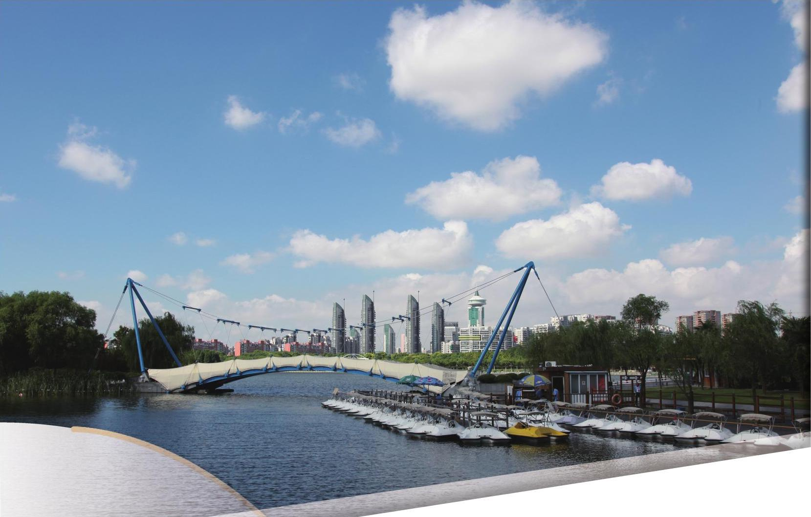

经历了丰富的数学建模活动, 同学们一定更深入地感受到数学建模的特点和价值. 这里再提供 3 个数学建模活动, 供大家选择. 相信大家已经有能力迎接这些新的挑战了。

## 

## 7 存款计划

银行储蓄存款是一种风险较小的投资方式. 将一定数额的本金存入银行，约定存期， 到期后可以得到相应的利息，从而获得收益.

下表列出了上海某银行 2020 年 1 月的存款利率:

<table><tr><td>存期</td><td>活期</td><td>三个月</td><td>半年</td><td>一年</td><td>二年</td><td>三年</td><td>五年</td></tr><tr><td>利率</td><td>0.35%</td><td>1.35%</td><td>1.55%</td><td>1.75%</td><td>2.25%</td><td>2.75%</td><td>2.75%</td></tr></table>

存款是一种讲究技巧的投资方式.

比如, 你准备存入 10 万元, 存期 5 年. 你可以选择一次性存 5 年; 也可以选择先存 2 年，到期后再续存 3 年；还可以选择存期为 1 年的定期存款，通过设置“自动转存”，到期后将存款本息(本金和利息之和)自动续存 1 年定期，连存 5 年. 相比之下，哪种存款方式更合算呢?

又如, 你有 10 万元的 5 年定期银行存款, 该钱款存满 1 年时恰好遇到银行存款利率上调. 此时你有几种选择:一种选择是提前支取这笔存款(注:银行规定存期未满提前支取的存款将按照活期利率计息)，将本息存 2 年，到期后自动续存 2 年；另一种选择是提前支取这笔存款，将本息存 3 年，到期后自动续存 1 年；还可以选择维持原存款方式不变. 哪种选择更好呢?

请你构建数学模型, 给出相应的选择.

## 8 民生巨变 40 年

改革开放 40 年是我国经济飞速发展、经济总量连上新台阶的 40 年，也是全国人民共享改革发展成果、生活水平大幅提高的 40 年. 2018 年，我国居民人均可支配收入达到了 28228元，扣除价格因素，比 1978 年实际增长 24.2 倍，年均增长 8.5%.

表 8-1 是国家统计局提供的 1978-2018 年间我国城镇和农村常住居民的人均可支配收入及消费支出情况的统计数据. 某国际知名经济研究机构的高级研究人员预测，中国的这一发展趋势在未来还将进一步持续. 那么 5 年后 (2023 年)、10 年后 (2028 年) 和 20 年后 (2038 年), 我国居民的人均可支配收入及消费支出分别会达到什么水平?

表 8-1 我国城镇和农村常住居民人均可支配收入及消费支出情况(1978—2018)

<table id="cross-table-4"><tr><td>年份</td><td>城镇常住居民人均可支配收入/元</td><td>城镇常住居民人均消费支出/元</td><td>农村常住居民人均可支配收入/元</td><td>农村常住居民人均消费支出/元</td></tr><tr><td>1978</td><td>343</td><td>311</td><td>134</td><td>116</td></tr><tr><td>1979</td><td>387</td><td>361</td><td>161</td><td>135</td></tr><tr><td>1980</td><td>478</td><td>412</td><td>191</td><td>162</td></tr><tr><td>1981</td><td>458</td><td>457</td><td>223</td><td>191</td></tr><tr><td>1982</td><td>495</td><td>471</td><td>270</td><td>220</td></tr><tr><td>1983</td><td>526</td><td>506</td><td>310</td><td>248</td></tr><tr><td>1984</td><td>608</td><td>559</td><td>355</td><td>274</td></tr><tr><td>1985</td><td>739</td><td>673</td><td>398</td><td>317</td></tr><tr><td>1986</td><td>900</td><td>799</td><td>424</td><td>357</td></tr><tr><td>1987</td><td>1002</td><td>884</td><td>463</td><td>398</td></tr><tr><td>1988</td><td>1181</td><td>1104</td><td>545</td><td>477</td></tr><tr><td>1989</td><td>1376</td><td>1211</td><td>602</td><td>535</td></tr><tr><td>1990</td><td>1510</td><td>1279</td><td>686</td><td>585</td></tr><tr><td>1991</td><td>1701</td><td>1454</td><td>709</td><td>620</td></tr><tr><td>1992</td><td>2027</td><td>1672</td><td>784</td><td>659</td></tr><tr><td>1993</td><td>2577</td><td>2111</td><td>922</td><td>770</td></tr><tr><td>1994</td><td>3496</td><td>2851</td><td>1221</td><td>1017</td></tr><tr><td>1995</td><td>4283</td><td>3538</td><td>1578</td><td>1310</td></tr><tr><td>1996</td><td>4839</td><td>3919</td><td>1926</td><td>1572</td></tr><tr><td>1997</td><td>5160</td><td>4186</td><td>2090</td><td>1617</td></tr><tr><td>1998</td><td>5425</td><td>4322</td><td>2162</td><td>1590</td></tr><tr></tr><tr><td>1999</td><td>5854</td><td>4 616</td><td>2210</td><td>1577</td></tr><tr><td>2000</td><td>6280</td><td>4998</td><td>2253</td><td>1670</td></tr><tr><td>2001</td><td>6860</td><td>5309</td><td>2366</td><td>1741</td></tr><tr><td>2002</td><td>7703</td><td>6 030</td><td>2476</td><td>1834</td></tr><tr><td>2003</td><td>8472</td><td>6 511</td><td>2622</td><td>1943</td></tr><tr><td>2004</td><td>9422</td><td>7182</td><td>2936</td><td>2185</td></tr><tr><td>2005</td><td>10 493</td><td>7 943</td><td>3255</td><td>2555</td></tr><tr><td>2006</td><td>11 759</td><td>8697</td><td>3587</td><td>2829</td></tr><tr><td>2007</td><td>13 786</td><td>9 997</td><td>4140</td><td>3224</td></tr><tr><td>2008</td><td>15 781</td><td>11243</td><td>4761</td><td>3661</td></tr><tr><td>2009</td><td>17 175</td><td>12265</td><td>5153</td><td>3 994</td></tr><tr><td>2010</td><td>19 109</td><td>13472</td><td>5 919</td><td>4382</td></tr><tr><td>2011</td><td>21810</td><td>15 160</td><td>6 977</td><td>5 221</td></tr><tr><td>2012</td><td>24 565</td><td>16674</td><td>7 917</td><td>5908</td></tr><tr><td>2013</td><td>26467</td><td>18488</td><td>9430</td><td>7485</td></tr><tr><td>2014</td><td>28844</td><td>19968</td><td>10 489</td><td>8383</td></tr><tr><td>2015</td><td>31 195</td><td>21392</td><td>11422</td><td>9223</td></tr><tr><td>2016</td><td>33 616</td><td>23079</td><td>12363</td><td>10 130</td></tr><tr><td>2017</td><td>36396</td><td>24 445</td><td>13432</td><td>10 955</td></tr><tr><td>2018</td><td>39251</td><td>26 112</td><td>14 617</td><td>12124</td></tr></table>

数据来源: 国家统计局《中国民政统计年鉴》.

## 9 教室里的照明

日光灯所发出的白光是多种频率的光线的混合, 所发的光基本上是均匀的, 因此教室照明较多选用日光灯. 如何安装教室里的日光灯是大有讲究的宝安装数量过多, 不仅浪费资源，还会造成眩光，影响学生的视力；安装数量太少，教室里照明度不够，同样会影响学生的视力.

新近出台的国家标准《中小学校普通教室照明设计安装卫生要求》(以下简称《要求》)于 2019 年 4 月正式实施. 《要求》对教室桌面、黑板面的照度和教室照明的设计安装进行了详细规定，有助于更科学合理地保护青少年视力. 《要求》规定:教室桌面维持平均照度不低于 300 lx(勒克斯，照度的国际单位)，照度均匀度不低于 0.7；黑板面维持平均照度不低于 ${500}\mathrm{{lx}}$ ,照度均匀度不低于 0.8 .

在教室照明的设计安装上，《要求》建议采用悬挂式格栅灯具，黑板照明灯具应采用有非对称光强分布特性的专用黑板灯具. 灯具应采用吊杆安装方式, 其中桌面照明灯具长轴应垂直于黑板且均匀分布, 灯具距课桌垂直距离不低于 1700 mm. 而黑板灯应平行于黑板安装，距黑板平行间距应为 ${700} \sim  {1000}\mathrm{\;{mm}}$ ，距黑板上缘垂直距离应为 ${100} \sim  {200}\mathrm{\;{mm}}$ .

理解这些要求, 了解灯管与配套设施的技术参数, 为教室设计照明方案, 包括所需安装的日光灯管数量和布局. 教室里应该安装多少盏日光灯才比较合理？应如何布局才能达到照明要求?

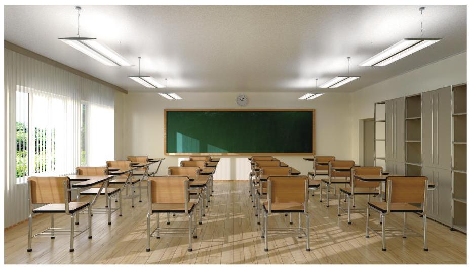

## 附 录

## 数学建模活动报告的写作

当我们完成数学建模活动后, 需要对所做的工作进行小结, 形成活动报告. 报告的主要目的在于交流, 因此不仅自己要读懂, 更要让他人理解和明白. 首先, 报告应清楚地展示建模工作的全貌，突出其精华所在；其次，报告应尽量使用简洁准确的语言，包括文字、数学符号、图像、表格等各种形式，以增强其可读性.

数学建模活动报告可以采用实验报告表或者小论文等不同的形式. 写作时要考虑到数学建模的各个环节，报告一般应该包括如下方面:

(1)标题;

(2)实际情境；

(3)提出问题；

(4)建立模型；

(5)求解模型；

(6)检验结果与改进模型；

(7)参考文献.

下面的样例针对易拉罐形状尺寸问题 (详见活动 2 “易拉罐的设计”), 参照物理等其他学科的实验报告，给出一个报告.

## 数学建模活动报告样例

数学建模活动内容多样, 难度各不相同, 报告也可以有多种形式. 针对易拉罐形状尺寸问题, 我们参照物理等其他学科的实验报告, 给出以下报告样例.

<table id="cross-table-5"><tr><td colspan="2">易拉罐形状和尺寸的最优设计方案</td></tr><tr><td></td><td>年级___ 班级___ 姓名___ 学号___</td></tr><tr><td>1. 实际情境</td><td>易拉罐是一类常见的饮料容器, 其所装饮料的类型和品牌有所不同, 但是我们发现, 同一种规格的易拉罐的形状和大小几乎相同. 为什么易拉罐要设计成这样的尺寸?</td></tr><tr><td>2. 提出问题</td><td>在容积固定的情况下，饮料生产商总希望包装成本最低，也就是易拉罐的质量最小.</td></tr><tr><td>3. 建立模型</td><td>假设 1: 易拉罐容积固定,设为常数 $V$ ;    假设 2: 易拉罐是一个上下有盖的空心圆柱体,其底部内半径设为 $r$ ,净高度设为 $h$ ;    假设 3: 易拉罐的罐顶、罐体和罐底的厚度和材质都相同,其厚度设为 $d$ ,密度为 $\rho$ .    已知常数 $V$ ,求变量 $r\text{ 、 }h$ 的值,使得在满足 $\pi {r}^{2}h = V$ 的条件下, $S = {2\pi }{r}^{2} + \; {2\pi rh}$ 达到最小值.</td></tr><tr><td>4. 求解模型 (呈现关键步骤)</td><td>对 $S = {2\pi }{r}^{2} + \frac{2V}{r}$ 求导,得到 ${S}^{\prime } = {4\pi r} - \frac{2V}{{r}^{2}}$ ; 令 ${S}^{\prime } = 0$ ,解得 $r = \sqrt[3]{\frac{V}{2\pi }}$ . 又因为 ${\left( {S}^{\prime }\right) }^{\prime } = {4\pi } + \frac{4V}{{r}^{3}} > 0,{S}^{\prime }$ 是严格增函数,所以 $r = \sqrt[3]{\frac{V}{2\pi }}$ 是它唯一取得零值的地方,此时 $S$ 取得唯一的极小值,也是唯一的最小值 $3\sqrt[3]{{2\pi }{V}^{2}}$ . 对应地, $h = \sqrt[3]{\frac{4V}{\pi }} = {2r}$ .</td></tr><tr><td>5. 检验结果</td><td>所得的结果说明: 当易拉罐的高度和罐顶直径相等时, 所需耗材最少. 但是, 常见的易拉罐的高度要比直径大, 所以上述结论和实际情况相差比较明显. 这意味着原有数学模型存在问题, 需要修正.</td></tr><tr><td>6. 改进模型 (模型如有改进，请重复步骤 2-5; 也可以指出模型改进方向)</td><td>易拉罐形状和尺寸的最优设计方案    假设 1: 保留原假设 1;    假设 2: 保留原假设 2;    假设 3: 易拉罐的罐顶厚度是罐体和罐底的 $k$ 倍,三者材质相同 (密度均为 $\rho$ ), 罐体和罐底的厚度为 $d$ .    建立新模型: 已知常数 $k\text{ 、 }V$ ,求变量 $r\text{ 、 }h$ 的值,使得在满足 $\pi {r}^{2}h = V$ 的条件下, $M = {\pi k}{r}^{2} + \pi {r}^{2} + {2\pi rh}$ 达到最小值.    求解模型: 当 $r = \sqrt[3]{\frac{V}{\left( {1 + k}\right) \pi }}, h = \sqrt[3]{\frac{V{\left( 1 + k\right) }^{2}}{\pi }}$ 时, $M$ 取得最小值 $3\sqrt[3]{\left( {1 + k}\right) \pi {V}^{2}}$ . 这说明: 当罐体高度 $h$ 为罐顶半径 $r$ 的 $\left( {1 + k}\right)$ 倍时,可使易拉罐耗材最少.    检验结果:根据有关资料，市场上容积为 ${355}\mathrm{\;{mL}}$ 的易拉罐罐顶厚度约为罐底和罐体的 3 倍,即 $k = 3$ . 因此,当罐体高度为罐顶半径的 4 倍,即直径的 2 倍时, 可使耗材最少. 这个结果和实际测量结果比较接近, 这样, 新模型通过了验证, 建模过程完成.</td></tr><tr><td>7. 参考文献</td><td>[1] 姜启源, 谢金星, 叶俊. 数学建模 (第五版) [M]. 北京: 高等教育出版社，2018.    [2] 谭永基，俞红. 现实世界的数学视角与思维[M]. 上海: 复旦大学出版社，2010.</td></tr><tr><td colspan="2">完成时间___</td></tr></table>

## 提示:

在数学建模过程中, 上表中各栏所对应的工作不一定存在明确的界限和先后顺序. 例如, 提出问题的过程可以是先提出假设、定义变量和常量, 然后提出数学问题, 也可以是先提出数学问题再作假设; 此外, 变量和常量有时是在建立模型的过程中确立的. 因此, 明确建模活动报告的组成部分主要是帮助理清建模思路，写作时不应拘泥于这些环节及其先后顺序.

## 

附录 3

# 有关数学建模活动中 数学内容的说明

<table><tr><td>数学建模活动</td><td>所涉及的数学内容</td></tr><tr><td colspan="2">数学建模活动案例</td></tr><tr><td>1 刹车距离</td><td>二次函数模型, 数据收集与处理</td></tr><tr><td>2 易拉罐的设计</td><td>圆柱体积, 函数最值, 求导数</td></tr><tr><td>3 珠穆朗玛峰顶上有多少氧气</td><td>绘制散点图, 线性回归分析, 指数函数拟合</td></tr><tr><td>4 水葫芦的生长</td><td>一元二次函数拟合, 指数函数拟合, 数据收集与处理, 最小二乘法</td></tr><tr><td colspan="2">数学建模活动 A</td></tr><tr><td>5 铅球投掷</td><td>参数方程, 函数最值</td></tr><tr><td>6 电梯调度</td><td>随机事件的条件概率</td></tr><tr><td colspan="2">数学建模活动 B</td></tr><tr><td>7 存款计划</td><td>数列</td></tr><tr><td>8 民生巨变 40 年</td><td>数据拟合</td></tr><tr><td>9 教室里的照明</td><td>立体几何，三角</td></tr></table>

## 后 记

本套高中数学教材根据教育部颁布的《普通高中数学课程标准(2017 年版 2020 年修订)》编写并经国家教材委员会专家委员会审核通过.

本教材是由设在复旦大学和华东师范大学的两个上海市数学教育教学研究基地(上海高校“立德树人”人文社会科学重点研究基地)联合主持编写的. 编写工作依据高中数学课程标准的具体要求，努力符合教育规律和高中学生的认知规律，结合上海城市发展定位和课程改革基础，并力求充分体现特色. 希望我们的这一努力能经得起实践和时间的检验, 对扎实推进数学的基础教育发挥积极的作用.

本册教材是选择性必修第三册，内容为数学建模，编写人员为

徐斌艳、陆立强、朱雁、蔡志杰、鲁小莉、魏述强、高虹

上海市中小学(幼儿园)课程改革委员会专家工作委员会、上海市教育委员会教学研究室全程组织、指导和协调了教材编写工作. 在编写过程中，两个基地所在单位给予了大力支持，基地的全体同志积极参与相关的调研、讨论及评阅工作，发挥了重要的作用. 上海市不少中学也热情地参与了有关的调研及讨论工作. 有限公司不但是编辑出版单位，而且自始至终全面介入了编写工作. 我们对所有这些单位和相关人员的参与、支持和鼓励表示衷心感谢.

限于编写者的水平, 也由于新编教材尚缺乏教学实践的检验, 不妥及疏漏之处在所难免，恳请广大师生及读者不吝赐教. 宝贵意见请通过邮箱 gaozhongshuxue@seph.com.cn 反馈, 不胜感激.

2020 年 7 月

SHUXUE 普通高中教科书数学选择性必修

2024 蛰伏

精进

# IATEX 实用功能简介

整理错题、积累典型题、记录教学心得、整理解题笔记必备工具

编写试卷讲义、制作课件、出版校本教材的不二选择

数学老师的新一代生产力工具

向每一个选择长期主义的老师致敬

## 目录

一、IATEX 是什么？软件的渊源、使用人群和 IATEX 生态 2

1.1 软件渊源 2

1.2 使用人群 2

1.3 IATEX 生态 2

二、软件功能简介 3

2.1 编辑数学公式高效、规范、稳定 3

2.2 编辑试卷、讲义、校本教材自动化程度高 4

2.3 画图高效、美观、方便修改与正文浑然一体 4

2.4 试题、讲义、校本教材效果展示 5

试卷 5

讲义 8

校本教材 9

知 幻灯片 10

2.5 数学作图方便、精准、美观与文档浑然一体 12

函数图 12

知立体图 12

统计图 12

知圆锥曲线图 13

知其他平面图 13

4 其它图形 14

知三视图 14

4 与文档浑然一体 16

三、课程简介与学习流程 17

附件二:公式效果 18

## 面向中学数学教师的 IATEX 培训课程手册

## 一、 IATEX 是什么？软件的渊源、使用人群和 IATEX 生态

### 1.1 软件渊源

图灵奖得主高德纳教授在修订他的《计算机程序设计的艺术》(这本书的学界地位与《几何原本》、《相对论》、《量子力学》比肩而立) 第二卷时，因不满出版社的排版质量而自己设计了一个新的排版系统 TEX，这就是 LaTeX 的前身，经过兰伯特、美国数学学会以及其他的行业大咖不断维护更新, 形成了今天的 LATEX, 广泛应用于理工科文档编辑排版, 被誉为排版之王, 甚至很多杂志也要求用 LATEX 排版.

### 1.2 使用人群

IATEX 以其在编辑数学公式方面无可比拟的优势而闻名于世, 目前在国外家喻户晓，在国内的使用者主要是大学理工科教授、研究所、科技企业、 出版社. 最早就是由中科院吴凌云等教授汉化软件并在国内推广的, 现在很多名校的理工科的研究生 (尤其是数学专业的研究生) 的毕业论文都必须使用IATEX 完成。

### 1.3 IATEX 生态

IATEX 已经作为行业标准, 广泛应用于和公式编辑相关的大多数场景, 越来越多的公司提供相关服务，比如 mathpix、腾讯云、有道云都可以将图片版的数学公式转化为 $\mathrm{I}$ ATEX,可以大大提高公式的输入效率. 越来越多的出版社包括科学出版社、中科大出版社、浙江大学出版社、清华大学出版社支持 IATEX 书稿出版.

随着中学教师的学历的不断提升，电脑的普及，信息化能力的提升，很多教师都萌生了整理自己的教学成果，教学资料的想法，以前苦于没有良好的工具, 自从 LATEX 被引进中学老师圈, 越来越多的中学老师使用 LATEX 编辑整理教案、讲义、试卷、画图、校本教材，使用 IATEX 在中学已经蔚然成风.

## 二、软件功能简介

### 2.1 编辑数学公式高效、规范、稳定

IATEX 输入数学公式全部通过键盘的, 而不需要像公式编辑器那样通过鼠标点击来回切换插入公式，减少麻烦，另外 LATEX 的符号更加全面，老师们不会因为找不到符号而苦恼.

除了编辑效率高, 还有规范、稳定的优势. LATEX 编辑的公式与文本格式统一, 大小字号也可以统一调整, 也可以任意复制粘贴, 在任意电脑上播放, 永不变形、不错位、不乱码, 受到老师们的一致喜爱. 以下为效果:

$$
f\left( x\right)  = \left\{  \begin{array}{ll} {x}^{2} - {2x} + 3, & x \leq  1, \\  x - 2, & x > 1. \end{array}\right. \;\left\{  \begin{array}{l} \widehat{b} = \frac{\mathop{\sum }\limits_{{i = 1}}^{n}\left( {{x}_{i} - \bar{x}}\right) \left( {{y}_{i} - \bar{y}}\right) }{\mathop{\sum }\limits_{{i = 1}}^{n}{\left( {x}_{i} - \bar{x}\right) }^{2}} = \frac{\mathop{\sum }\limits_{{i = 1}}^{n}{x}_{i}{y}_{i} - n\bar{x}\bar{y}}{\mathop{\sum }\limits_{{i = 1}}^{n}{x}_{i}^{2} - n{\bar{x}}^{2}} \\  \widehat{a} = \bar{y} - \widehat{b}\bar{x} \end{array}\right.
$$

$$
\mathop{\sum }\limits_{{i = 1}}^{n}\left( {{x}_{i} - \bar{x}}\right) \left( {{y}_{i} - \bar{y}}\right)
$$

$$
= \left( {{x}_{1} - \bar{x}}\right) \left( {{y}_{1} - \bar{y}}\right)  + \left( {{x}_{2} - \bar{x}}\right) \left( {{y}_{2} - \bar{y}}\right)  + \cdots \left( {{x}_{n} - \bar{x}}\right) \left( {{y}_{n} - \bar{y}}\right)
$$

$$
= \left( {{x}_{1}{y}_{1} - {x}_{1}\bar{y} - \bar{x}{y}_{1} + \bar{x}\bar{y}}\right)  + \left( {{x}_{2}{y}_{2} - {x}_{2}\bar{y} - \bar{x}{y}_{2} + \bar{x}\bar{y} + \cdots  + \left( {{x}_{n}{y}_{n} - {x}_{n}\bar{y} - \bar{x}{y}_{n} + \bar{x}\bar{y}}\right) }\right.
$$

$$
= \left( {{x}_{1}{y}_{1} + {x}_{2}{y}_{2} + \cdots  + {x}_{n}{y}_{n}}\right)  - \left( {{x}_{1} + {x}_{2} + \cdots  + {x}_{n}}\right) \bar{y} - \bar{x}\left( {{y}_{1} + {y}_{2} + \cdots  + {y}_{n}}\right)  + n\bar{x}\bar{y}
$$

$$
= \mathop{\sum }\limits_{{i = 1}}^{n}{x}_{i}{y}_{i} - \left( {\mathop{\sum }\limits_{{i = 1}}^{n}{x}_{i}}\right) \bar{y} - \bar{x}\left( {\mathop{\sum }\limits_{{i = 1}}^{n}{y}_{i}}\right)  + n\bar{x}\bar{y}
$$

$$
= \mathop{\sum }\limits_{{i = 1}}^{n}{x}_{i}{y}_{i} - n\bar{x} \cdot  \bar{y} - \bar{x} \cdot  n\bar{y} + n\bar{x}\bar{y}
$$

$$
= \mathop{\sum }\limits_{{i = 1}}^{n}{x}_{i}{y}_{i} - n\bar{x}\bar{y}
$$

很多老师在准备公开课时, 由于公式编辑器的效率低甚至符号不全, 大多选择拼凑、修改一些课件，而这些课件的公式格式混乱、不规范，修改的时间比重新输入都要长,让老师们感到精疲力尽. LATEX 的编辑效率高、规范、稳定, 公式直接编辑就行了, 让老师把主要精力放到作课的思路上, 节约老师大量时间和心理成本.

### 2.2 编辑试卷、讲义、校本教材自动化程度高

IATEX 自动化程度高最重要的体现方面是可以一键控制是否显示试题的答案、分析、详细解析, 从而得到学生版和教师版, 也可以单独得到答案, 这个过程不需要逐一的剪切、粘贴答案. 另外也可以实现:

1. 试题的来源、难度等试题标识能够一键控制是否显示;

2. 能够一键设置 A4 纸、A3 纸，单栏、双栏、多栏，无需过多调整；

3. 题号自动生成、对齐，调换顺序不用手动编号，不用担心答案不匹配；

4. 试题后的距离, 可一键控制是否显示, 可根据需要给学生留作答空间;

5. 选择题的选项可以自动排版, 会根据选项的长短自动确定一行排四个、 两个或一个选项, 选择题括号生成、自动右对齐;

6. 解答题的序号可以一键全部设置为罗马数字或阿拉伯数字.

这些自动化的设计极大地提高了教师整理试题、编写文档的效率，方便老师整理自己的讲义, 给学生更有针对性的出题, 布置作业. 还可以给讲义设置很多漂亮的文档结构, 也可以根据实际需要定制各种各样的功能.

### 2.3 画图高效、美观、方便修改与正文浑然一体

数学画图是中学老师们遇到的另一个难题, 虽然也有几何画板、GeoGe-bra 等诸多软件可以画图, 但是也会存在一些问题, 比如:

1. 很多图画得慢, 不精确, 甚至画不出来. 如: 立体图、程序框图等;

2. 在图中输入数学公式比较麻烦, 图中文字的字体、大小也不容易统一;

3. 清晰度不高. 将其他软件制作的图插入文档，清晰的度会降低.

4. 细节调整比较麻烦, 后期修改不方便. 比如: 调整坐标轴的箭头, 坐标的位置等比较麻烦, 如果后期修改之前图中的错误, 几乎需要重做.

IATEX 画图可以完美解决这些问题, 不仅仅前期画图方便, 字体字号可以统一调整, 图中可以插入任意公式, 自由编辑. 在可修改性和复用性方面更是无可比拟. 比如题干中画好的图, 在解析中仍然可以在画好的图上进行编辑.

接下来我们来看具体效果.

### 2.4 试题、讲义、校本教材效果展示

## 试卷

按秘密事项管理★启用前

## 2024 全国新课标 I 卷

## 一、选择题: 本大题共 8 小题, 每小题 5 分, 共 40 分. 在每小题给出的四个选项中, 只有 一项是符合题目要求的.

1. 已知集合 $A = \left\{  {x \mid   - 5 < {x}^{3} < 5}\right\}  , B = \{  - 3, - 1,0,2,3\}$ ,则 $A \cap  B =$ ( )

A. $\{  - 1,0\}$ B. $\{ 2,3\}$ C. $\{  - 3, - 1,0\}$ D. $\{  - 1,0,2\}$

2. 若 $\frac{z}{z - 1} = 1 + \mathrm{i}$ ,则 $z =$ ( )

A. $- 1 - \mathrm{i}$ B. $- 1 + \mathrm{i}$ C. $1 - \mathrm{i}$ D. $1 + \mathrm{i}$

3. 已知向量 $\mathbf{a} = \left( {0,1}\right) ,\mathbf{b} = \left( {2, x}\right)$ ,若 $\mathbf{b} \bot  \left( {\mathbf{b} - 4\mathbf{a}}\right)$ ,则 $x =$ ( )

A. -2 B. -1 C. 1 D. 2

4. 已知 $\cos \left( {\alpha  + \beta }\right)  = m,\tan \alpha \tan \beta  = 2$ ,则 $\cos \left( {\alpha  - \beta }\right)  =$ ( )

A. $- {3m}$ B. $- \frac{m}{3}$ C. $\frac{m}{3}$ D. ${3m}$

5. 已知圆柱和圆锥的底面半径相等，侧面积相等，且它们的高均为 $\sqrt{3}$ ，则圆锥的体积为 ( )

A. $2\sqrt{3}\pi$ B. $3\sqrt{3}\pi$ C. $6\sqrt{3}\pi$ D. $9\sqrt{3}\pi$

6. 已知函数 $f\left( x\right)  = \left\{  \begin{matrix}  - {x}^{2} - {2ax} - a, & x < 0 \\  {\mathrm{e}}^{x} + \ln \left( {x + 1}\right) , & x \geq  0 \end{matrix}\right.$ 在 $\mathbf{R}$ 上单调递增,则 $a$ 的取值范围是 ( )

A. $( - \infty ,0\rbrack$ B. $\left\lbrack  {-1,0}\right\rbrack$ C. $\left\lbrack  {-1,1}\right\rbrack$ D. $\lbrack 0, + \infty )$

7. 当 $x \in  \left\lbrack  {0,{2\pi }}\right\rbrack$ 时,曲线 $y = \sin x$ 与 $y = 2\sin \left( {{3x} - \frac{\pi }{6}}\right)$ 的交点个数为 ( )

A. 3 B. 4 C. 6 D. 8

8. 已知函数为 $f\left( x\right)$ 的定义域为 $\mathbf{R}, f\left( x\right)  > f\left( {x - 1}\right)  + f\left( {x - 2}\right)$ ,且当 $x < 3$ 时, $f\left( x\right)  = x$ , 则下列结论中一定正确的是 ( )

A. $f\left( {10}\right)  > {100}$ B. $f\left( {20}\right)  > {1000}$ C. $f\left( {10}\right)  < {1000}$ D. $f\left( {20}\right)  < {10000}$

## 二、选择题: 本题共 3 小题, 每小题 6 分, 共 18 分. 在每小题给出的选项中, 有多项符合 题目要求. 全部选对的得 6 分, 部分选对的得部分分, 有选错的得 0 分.

9. 多选题:随着”一带一路”国际合作的深入，某茶叶种植区多措并举推动茶叶出口. 为了解推动出口后的亩收入 (单位: 万元) 情况, 从该种植区抽取样本, 得到推动出口后亩收入的样本均值 $\bar{x} = {2.1}$ ,样本方差 ${s}^{2} = {0.01}$ ,已知该种植区以往的亩收入 $X$ 服从正态分布 $N\left( {{1.8},{0.1}^{2}}\right)$ . 假设推动出口后的亩收入 $Y$ 服从正态分布 $N\left( {\bar{x},{s}^{2}}\right)$ ,则 (若随机变量 $Z$ 服从正态分布 $N\left( {\mu ,{\sigma }^{2}}\right)$ ,则 $P\left( {Z < \mu  + \sigma }\right)  \approx  {0.8413}$ ) ( )

A. $P\left( {X > 2}\right)  > {0.2}$ B. $P\left( {X > 2}\right)  < {0.5}$ C. $P\left( {Y > 2}\right)  > {0.5}$ D. $P\left( {Y > 2}\right)  < {0.8}$ 10. 多选题,设函数 $f\left( x\right)  = {\left( x - 1\right) }^{2}\left( {x - 4}\right)$ ,则 ( )

A. $x = 3$ 是 $f\left( x\right)$ 的极小值点 B. 当 $0 < x < 1$ 时, $f\left( x\right)  < f\left( {x}^{2}\right)$

C. 当 $1 < x < 2$ 时, $- 4 < f\left( {{2x} - 1}\right)  < 0$ D. 当 $- 1 < x < 0$ 时, $f\left( {2 - x}\right)  > f\left( x\right)$

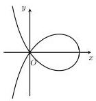

11. (多选题) 设计一条美丽的丝带,其造型 $\smallsetminus   \text{ ○ }$ 可以看作图中的曲线 $C$ 的一部分,已知 $C$ 过坐标原点 $O$ ,且 $C$ 上的点满足横坐标大于 -2,到点 $F\left( {2,0}\right)$ 的距离与到定直线 $x = a\left( {a < 0}\right)$ 的距离之积为 4 , 则 ( )

A. $a =  - 2$

B. 点 $\left( {2\sqrt{2},0}\right)$ 在 $C$ 上

C. $C$ 在第一象限的点的纵坐标的最大值为 1

D. 当点 $\left( {{x}_{0},{y}_{0}}\right)$ 在 $C$ 上时, ${y}_{0} \leq  \frac{4}{{x}_{0} + 2}$

## 三、填空题:本大题共 3 小题，每小题 5 分，共 15 分.

12. 设双曲线 $C : \frac{{x}^{2}}{{a}^{2}} - \frac{{y}^{2}}{{b}^{2}} = 1\left( {a > 0, b > 0}\right)$ 的左右焦点分别为 ${F}_{1},{F}_{2}$ ,过 ${F}_{2}$ 作平行于 $y$ 轴的直线交 $C$ 于 $A, B$ 两点,若 $\left| {{F}_{1}A}\right|  = {13},\left| {AB}\right|  = {10}$ ,则 $C$ 的离心率为 .

13. 若曲线 $y = {\mathrm{e}}^{x} + x$ 在点 $\left( {0,1}\right)$ 处的切线也是曲线 $y = \ln \left( {x + 1}\right)  + a$ 的切线,则 $a =$

2024 全国新课标 I 卷 第 1 页 共 2 页

14. 甲、乙两人各有四张卡片，每张卡片上标有一个数字，甲的卡片上分别标有数字 1,3,5,7,乙的卡片上分别标有数字2,4,6,8. 两人进行四轮比赛,在每轮比赛中,两人各自从自己持有的卡片中随机选一张，并比较所选卡片上数字的大小，数字大的人得 1 分, 数字小的人得 0 分, 然后各自弃置此轮所选的卡片 (弃置的卡片在此后的轮次中不能使用). 则四轮比赛比赛后, 甲的总得分不小于 2 的概率为

## 四、解答题:本大题共 5 小题, 共 77 分. 解答应写出必要的文字说明、证明过程或演算 步骤.

15. 记 $\bigtriangleup {ABC}$ 的内角 $A, B, C$ 的对边分别为 $a, b, c$ ,已知 $\sin C = \sqrt{2}\cos B,{a}^{2} + {b}^{2} - {c}^{2} = \; \sqrt{2}{ab}$ .

( 1 ) 求 $B$ ;

(2) 若 $\bigtriangleup {ABC}$ 的面积为 $3 + \sqrt{3}$ ,求 $c$ .

16. 已知 $A\left( {0,3}\right)$ 和 $P\left( {3,\frac{3}{2}}\right)$ 为椭圆 $C : \frac{{x}^{2}}{{a}^{2}} + \frac{{y}^{2}}{{b}^{2}} = 1\left( {a > b > 0}\right)$ 上两点.

(1)求 $C$ 的离心率；

(2) 若过 $P$ 的直线 $l$ 交 $C$ 于另一点 $B$ ,且 $\bigtriangleup {ABP}$ 的面积为 9,求 $l$ 的方程.

17. 如图,四棱锥 $P - {ABCD}$ 中, ${PA} \bot$ 底面 ${ABCD},{PA} = {AC} = 2,{BC} = 1,{AB} = \sqrt{3}$ .

( 1 ) 若 ${AD} \bot  {PB}$ ,证明: ${AD}//$ 平面 ${PBC}$ ;

( 2 ) 若 ${AD} \bot  {DC}$ ,且二面角 $A - {CP} - D$ 的正弦值为 $\frac{\sqrt{42}}{7}$ ,求 ${AD}$ .

18. 已知函数 $f\left( x\right)  = \ln \frac{x}{2 - x} + {ax} + b{\left( x - 1\right) }^{3}$

( 1 ) 若 $b = 0$ ,且 ${f}^{\prime }\left( x\right)  \geq  0$ ,求 $a$ 的最小值;

( 2 ) 证明: 曲线 $y = f\left( x\right)$ 是中心对称图形;

( 3 ) 若 $f\left( x\right)  >  - 2$ ,当且仅当 $1 < x < 2$ ,求 $b$ 的取值范围.

19. 设 $m$ 为正整数,数列 ${a}_{1},{a}_{2},\cdots ,{a}_{{4m} + 2}$ 是公差不为 0 的等差数列,若从中删去两项 ${a}_{i}$ 和 ${a}_{j}\left( {i < j}\right)$ 后剩余的 ${4m}$ 项可被平均分为 $m$ 组,且每组的 4 个数都能构成等差数列,则称数列 ${a}_{1},{a}_{2},\cdots ,{a}_{{4m} + 2}$ 是 $\left( {i, j}\right)$ - 可分数列.

(1)写出所有的 $\left( {i, j}\right) ,1 \leq  i < j \leq  6$ ,使数列 ${a}_{1},{a}_{2},\cdots ,{a}_{6}\left( {i, j}\right)$ - 可分数列;

(2) 当 $m \geq  3$ 时,证明: 数列 ${a}_{1},{a}_{2},\cdots ,{a}_{{4m} + 2}$ 是 $\left( {2,{13}}\right)  -$ 可分数列;

( 3 ) 从 $1,2,\cdots ,{4m} + 2$ 中一次任取两个数 $i$ 和 $j\left( {i < j}\right)$ ,记数列 ${a}_{1},{a}_{2},\cdots ,{a}_{{4m} + 2}$ 是 $\left( {i, j}\right)$ - 可分数列的概率为 ${P}_{m}$ ,证明 ${P}_{m} > \frac{1}{8}$ .

按秘密事项管理★启用前

## 2024 全国新课标 I 卷

一、选择题: 本大题共 8 小题, 每小题 5 分, 共 40 分. 在每小题给出的四个选项中, 只有一项是符合题目要求的.

1. 已知集合 $A = \left\{  {x \mid   - 5 < {x}^{3} < 5}\right\}  , B = \{  - 3, - 1,0,2,3\}$ ,则 $A \cap  B =$

A. $\{  - 1,0\}$ B. $\{ 2,3\}$ C. $\{  - 3, - 1,0\}$ D. $\{  - 1,0,2\}$

2. 若 $\frac{z}{z - 1} = 1 + \mathrm{i}$ ,则 $z =$ ( )

A. $- 1 - \mathrm{i}$ B. $- 1 + \mathrm{i}$ C. $1 - \mathrm{i}$ D. $1 + \mathrm{i}$

3. 已知向量 $\mathbf{a} = \left( {0,1}\right) ,\mathbf{b} = \left( {2, x}\right)$ ,若 $\mathbf{b} \bot  \left( {\mathbf{b} - 4\mathbf{a}}\right)$ ,则 $x =$ ( )

A. -2 B. -1 C. 1 D. 2

4. 已知 $\cos \left( {\alpha  + \beta }\right)  = m,\tan \alpha \tan \beta  = 2$ ,则 $\cos \left( {\alpha  - \beta }\right)  =$ ( )

A. $- {3m}$ B. $- \frac{m}{3}$ C. $\frac{m}{3}$ D. ${3m}$

5. 已知圆柱和圆锥的底面半径相等，侧面积相等，且它们的高均为 $\sqrt{3}$ ，则圆锥的体积为 ( )

A. $2\sqrt{3}\pi$ B. $3\sqrt{3}\pi$ C. $6\sqrt{3}\pi$ D. $9\sqrt{3}\pi$

6. 已知函数 $f\left( x\right)  = \left\{  \begin{array}{ll}  - {x}^{2} - {2ax} - a, & x < 0 \\  {\mathrm{e}}^{x} + \ln \left( {x + 1}\right) , & x \geq  0 \end{array}\right.$ 在 $\mathbf{R}$ 上单调递增,则 $a$ 的取值范围是 ( A. $( - \infty ,0\rbrack$ B. $\left\lbrack  {-1,0}\right\rbrack$ C. $\left\lbrack  {-1,1}\right\rbrack$ D. $\lbrack 0, + \infty )$

7. 当 $x \in  \left\lbrack  {0,{2\pi }}\right\rbrack$ 时,曲线 $y = \sin x$ 与 $y = 2\sin \left( {{3x} - \frac{\pi }{6}}\right)$ 的交点个数为

A. 3 B. 4 C. 6 D. 8

关注【觅宁参考】即可联系作者，获取无水印有答案版本，也可以学公式编辑与排版

关注微信公众号:宽宁参考

三、填空题:本大题共 3 小题，每小题 5 分，共 15 分.

12. 设双曲线 $C : \frac{{x}^{2}}{{a}^{2}} - \frac{{y}^{2}}{{b}^{2}} = 1\left( {a > 0, b > 0}\right)$ 的左右焦点分别为 ${F}_{1},{F}_{2}$ ,过 ${F}_{2}$ 作平行于 $y$ 轴的直线交 $C$ 于 $A, B$ 两点,若 $\left| {{F}_{1}A}\right|  = {13},\left| {AB}\right|  = {10}$ ,则 $C$ 的离心率为

13. 若曲线 $y = {\mathrm{e}}^{x} + x$ 在点 $\left( {0,1}\right)$ 处的切线也是曲线 $y = \ln \left( {x + 1}\right)  + a$ 的切线,则 $a =$ ___.

14. 甲、乙两人各有四张卡片，每张卡片上标有一个数字，甲的卡片上分别标有数字 1,3,5,7,乙的卡片上分别标有数字2,4,6,8. 两人进行四轮比赛,在每轮比赛中,两人各自从自己持有的卡片中随机选一张, 并比较所选卡片上数字的大小, 数字大的人得 1 分, 数字小的人得 0 分, 然后各自弃置此轮所选的卡片 (弃置的卡片在此后的轮次中不能使用). 则四轮比赛比赛后, 甲的总得分不小于 2 的概率为 .

四、解答题:本大题共 5 小题, 共 77 分. 解答应写出必要的文字说明、证明过程或演算步骤.

15. 记 $\bigtriangleup {ABC}$ 的内角 $A, B, C$ 的对边分别为 $a, b, c$ ,已知 $\sin C = \sqrt{2}\cos B,{a}^{2} + {b}^{2} - {c}^{2} = \; \sqrt{2}{ab}$ .

( 1 ) 求 $B$ ;

(2 ) 若 $\bigtriangleup {ABC}$ 的面积为 $3 + \sqrt{3}$ ,求 $c$ .

16. 已知 $A\left( {0,3}\right)$ 和 $P\left( {3,\frac{3}{2}}\right)$ 为椭圆 $C : \frac{{x}^{2}}{{a}^{2}} + \frac{{y}^{2}}{{b}^{2}} = 1\left( {a > b > 0}\right)$ 上两点.

(1)求 $C$ 的离心率；

(2)若过 $P$ 的直线 $l$ 交 $C$ 于另一点 $B$ ,且 $\bigtriangleup {ABP}$ 的面积为 9,求 $l$ 的方程.

8. 已知函数为 $f\left( x\right)$ 的定义域为 $\mathbf{R}, f\left( x\right)  > f\left( {x - 1}\right)  + f\left( {x - 2}\right)$ ,且当 $x < 3$ 时, $f\left( x\right)  = x$ , 则下列结论中一定正确的是 (   )

A. $f\left( {10}\right)  > {100}$ B. $f\left( {20}\right)  > {1000}$ C. $f\left( {10}\right)  < {1000}$ D. $f\left( {20}\right)  < {10000}$

二、选择题: 本题共 3 小题, 每小题 6 分, 共 18 分. 在每小题给出的选项中, 有多项符合题目要求. 全部选对的得 6 分, 部分选对的得部分分, 有选错的得 0 分.

9. 随着”一带一路”国际合作的深入，某茶叶种植区多措并举推动茶叶出口. 为了解推动出口后的亩收入 (单位: 万元) 情况, 从该种植区抽取样本, 得到推动出口后亩收入的样本均值 $\bar{x} = {2.1}$ ,样本方差 ${s}^{2} = {0.01}$ ,已知该种植区以往的亩收入 $X$ 服从正态分布 $N\left( {{1.8},{0.1}^{2}}\right)$ . 假设推动出口后的亩收入 $Y$ 服从正态分布 $N\left( {\bar{x},{s}^{2}}\right)$ ,则 (若随机变量 $Z$ 服从正态分布 $N\left( {\mu ,{\sigma }^{2}}\right)$ ,则 $P\left( {Z < \mu  + \sigma }\right)  \approx  {0.8413})$ ( )

A. $P\left( {X > 2}\right)  > {0.2}$ B. $P\left( {X > 2}\right)  < {0.5}$ C. $P\left( {Y > 2}\right)  > {0.5}$ D. $P\left( {Y > 2}\right)  < {0.8}$

10. 设函数 $f\left( x\right)  = {\left( x - 1\right) }^{2}\left( {x - 4}\right)$ ,则 ( )

A. $x = 3$ 是 $f\left( x\right)$ 的极小值点 B. 当 $0 < x < 1$ 时, $f\left( x\right)  < f\left( {x}^{2}\right)$

C. 当 $1 < x < 2$ 时, $- 4 < f\left( {{2x} - 1}\right)  < 0$ D. 当 $- 1 < x < 0$ 时, $f\left( {2 - x}\right)  > f\left( x\right)$

11. 设计一条美丽的丝带,其造型 $\smallsetminus   \text{ ○ }$ 可以看作图中的曲线 $C$ 的一部分,已知 $C$ 过坐标原点 $O$ ,且 $C$ 上的点满足横坐标大于 -2,到点 $F\left( {2,0}\right)$ 的距离与到定直线 $x = a\left( {a < 0}\right)$ 的距离之积为 4 , 则 ( )

A. $a =  - 2$

B. 点 $\left( {2\sqrt{2},0}\right)$ 在 $C$ 上

C. $C$ 在第一象限的点的纵坐标的最大值为 1

D. 当点 $\left( {{x}_{0},{y}_{0}}\right)$ 在 $C$ 上时, ${y}_{0} \leq  \frac{4}{{x}_{0} + 2}$

17. 如图,四棱锥 $P - {ABCD}$ 中, ${PA} \bot$ 底面 ${ABCD},{PA} = {AC} = 2,{BC} = 1,{AB} = \sqrt{3}$ . ( 1 ) 若 ${AD} \bot  {PB}$ ,证明: ${AD}//$ 平面 ${PBC}$ ;

( 2 ) 若 ${AD} \bot  {DC}$ ,且二面角 $A - {CP} - D$ 的正弦值为 $\frac{\sqrt{42}}{7}$ ,求 ${AD}$ .

18. 已知函数 $f\left( x\right)  = \ln \frac{x}{2 - x} + {ax} + b{\left( x - 1\right) }^{3}$

( 1 ) 若 $b = 0$ ,且 ${f}^{\prime }\left( x\right)  \geq  0$ ,求 $a$ 的最小值;

( 2 ) 证明: 曲线 $y = f\left( x\right)$ 是中心对称图形;

( 3 ) 若 $f\left( x\right)  >  - 2$ ,当且仅当 $1 < x < 2$ ,求 $b$ 的取值范围.

19. 设 $m$ 为正整数,数列 ${a}_{1},{a}_{2},\cdots ,{a}_{{4m} + 2}$ 是公差不为 0 的等差数列,若从中删去两项 ${a}_{i}$ 和 ${a}_{j}\left( {i < j}\right)$ 后剩余的 ${4m}$ 项可被平均分为 $m$ 组,且每组的 4 个数都能构成等差数列,则称数列 ${a}_{1},{a}_{2},\cdots ,{a}_{{4m} + 2}$ 是 $\left( {i, j}\right)$ - 可分数列.

( 1 ) 写出所有的 $\left( {i, j}\right) ,1 \leq  i < j \leq  6$ ,使数列 ${a}_{1},{a}_{2},\cdots ,{a}_{6}\left( {i, j}\right)$ - 可分数列;

( 2 ) 当 $m \geq  3$ 时,证明: 数列 ${a}_{1},{a}_{2},\cdots ,{a}_{{4m} + 2}$ 是 $\left( {2,{13}}\right)$ - 可分数列;

( 3 ) 从 $1,2,\cdots ,{4m} + 2$ 中一次任取两个数 $i$ 和 $j\left( {i < j}\right)$ ,记数列 ${a}_{1},{a}_{2},\cdots ,{a}_{{4m} + 2}$ 是 $\left( {i, j}\right)$ - 可分数列的概率为 ${P}_{m}$ ,证明 ${P}_{m} > \frac{1}{8}$ .

## 试题 + 答案版本和纯答案版本

按秘密事项管理★启用前 【解答】

2022 年普通高等学生招生全国统一考试 (模拟卷) 4.

( )

数 学 A. B. C. D.

【考试声明】

【分析】

【简要答案】

1. 认真考试，不要作弊，可以百度答案，但是百度不了人生; 【解答】

5.

2. 把答案写到答题卡上;

3. 参考公式:我就不写了；

( )

一、选择题:本大题共 12 小题，每小题 5 分，共 60 分。在每小题给出的四个选项中，只有一项是符合题目要求的。 A. B. C. D.

【分析】

1. 【简要答案】

( ) 【解答】

A. B. C. 6.

【分析】 ( )

【简要答案】 A. B. C. D.

【解答】 【分析】

2. 【简要答案】

( ) 【解答】

A. B. C. 7.

【分析】 ( )

【简要答案】 A. B. C. D.

【解答】 【分析】

3. 【简要答案】

【解答】

A. B. C. D. 8.

【分析】

【简要答案】

按秘密事项管理★启用前 7.【分析】

2022 年普通高等学生招生全国统一考试(模拟卷) 【简要答案】

【解答】

数 学 8.【分析】

【考试声明】

【简要答案】

【解答】

1. 认真考试，不要作弊，可以百度答案，但是百度不了人生;

9.【分析】

2. 把答案写到答题卡上;

【简要答案】

3. 参考公式:我就不写了；

【解答】

一、选择题:本大题共 12 小题，每小题 5 分，共 60 分。在每小题给出的四个选项中，只有一项是符合题目要求的。 10.【分析】

【简要答案】

1.【分析】 【解答】

【简要答案】 11.【分析】

【解答】 【简要答案】

2.【分析】 【解答】

【简要答案】 12.【分析】

【解答】 【简要答案】

3.【分析】 【解答】

【简要答案】 二、填空题:本大题共 4 小题，每小题 5 分，共 20 分。把答案填写在题中的横线上。

【解答】 13.【分析】

4.【分析】 【简要答案】

【简要答案】 【解答】

14.【分析】

5.【分析】 【简要答案】

【简要答案】 【解答】

【解答】 15.【分析】

6.【分析】 【简要答案】

【简要答案】 【解答】

【解答】 16.【分析】

第 1 页 共 2 页

讲义

## 导数 函数单调性的讨论

## 觅宁参考出品

## 【主要内容】

口典例精炼 3. 含参二次函数单调性的讨论

1. 含参一次函数单调性的讨论 4. 类含参二次函数单调性的讨论

2. 类含参一次函数单调性的讨论 5. 超越函数的零点问题

## 【核心逻辑】

讨论参数的不同，得到导函数的单调性和导函数零点判断导函数在相应区间的正负，进而判断原函数的单调性.

## 【问题方法】

一、求不含参函数的单调区间

1. 求函数定义域 易漏

2. 求出原函数的导函数,解出 ${f}^{\prime }\left( x\right)  = 0$ 的根 ${x}_{1},{x}_{2},\cdots$ ;

3. 用 ${x}_{1},{x}_{2},\cdots$ 将定义域划分为若干单调区间,分别计算每个区间上导函数的正负值;

4. 画出原函数的草图检验, 然后总结作答.

注意 若相邻两个单调区间的单调性一致, 则可视为一个单调区间.

二、含参一次函数单调性的讨论

1. 讨论最高次项是否为 0 ，正负情况 易漏

2. 求解导函数的根;

3. 定义域划分为若干单调区间, 分别讨论每个区间上导函数的正负值.

三、含参二次函数单调性的讨论

核心逻辑 就是三讨论: 讨论开口方向、讨论两根大小、讨论根的数量.

讨论开口方向观察二次项系数是否含参，如果含参，注意讨论开口方向(包括是否为 0 $)$ . 易漏

讨论两根大小观察能否分解因式, 能分解因式的, 注意比较两根大小, 以及两根

是否相等;

讨论根的数量如果不能分解因式, 计算判别式, 根据情况讨论;

方法步骤

(1)求函数定义域，求出原函数的导函数

(2)讨论最高次项是否为 0，正负情况；

(a) $\left\{  \begin{array}{l} \text{ 可以分解因式 } \Rightarrow  \text{ 解得 }{x}_{1},{x}_{2}\text{ (注意讨论 }{x}_{1} = {x}_{2}\text{ ) } \\  \text{ 不能分解 } \Rightarrow  \left\{  \begin{array}{l} \Delta  \leq  0 \\  \Delta  > 0 \end{array}\right.  \end{array}\right.$

(3)讨论 ${x}_{1}$ 和 ${x}_{2}$ 的大小，能分解因式的，注意讨论 ${x}_{1} = {x}_{2}$ .

(4) ${x}_{1}$ ， ${x}_{2}$ 将定义域划分为若干单调区间，分别讨论每个区间上导函数的正负值. 四、超越函数的零点问题

超越函数的零点, 关键在于零点的求解, 而一般超越函数的零点是不可解, 那么我们的方法有三:

1. 从题意中获取.

2. 试根. 一般是让对数式、指数式等于 0 或 1 等特殊值.

3. 零点本身不可解. 一般求出零点满足的关系式与取值范围，用 ${x}_{0}$ 表示这个零点, 这就是通常所说的隐零点.

## 【知识清单】

在某个区间 $\left( {a, b}\right)$ 内,

如果 ${f}^{\prime }\left( x\right)  > 0$ ,那么函数 $y = f\left( x\right)$ 在这个区间内单调递增;

如果 ${f}^{\prime }\left( x\right)  < 0$ ,那么函数 $y = f\left( x\right)$ 在这个区间内单调递减.

***典例精练***

## 一、对回归方程的理解

1. (2012 湖南理 4(4/8)★☆☆☆☆☆)

设某大学的女生体重 $y$ (单位: $\mathrm{{kg}}$ ) 与身高 $x$ (单位: $\mathrm{{cm}}$ ) 具有线性相关关系,根据一组样本数据 $\left( {{x}_{i},{y}_{i}}\right) \left( {i = 1,2,\cdots , n}\right)$ ,用最小二乘法建立的回归方程为 $y = \; {0.85x} - {85.71}$ ,则下列结论中不正确的是

A. $y$ 与 $x$ 具有正的线性相关关系

B. 回归直线过样本点的中心 $\left( {\bar{x},\bar{y}}\right)$

C. 若该大学某女生身高增加 $1\mathrm{\;{cm}}$ ，则其体重约增加 ${0.85}\mathrm{\;{kg}}$

D. 若该大学某女生身高为 170 cm，则可断定其体重必为 58.79 kg

2. (2012 全国 I 文 $3\left( {3/{12}}\right)  \star   \star   \star   \star   \star   \star$ 交

在一组样本数据 $\left( {{x}_{i},{y}_{1}}\right) ,\left( {{x}_{2},{y}_{2}}\right) ,\cdots ,\left( {{x}_{n},{y}_{n}}\right) \left( {n \geq  2,{x}_{1},{x}_{2},\cdots ,{x}_{n}}\right.$ 不全相等) 的散点图中,若所有样本点 $\left( {{x}_{i},{y}_{i}}\right) \left( {i = 1,2,\cdots , n}\right)$ 都在直线 $y = \frac{1}{2}x + 1$ 上,则这组样本数据的样本相关关系为 ( )

A. -1 B. 0 C. $\frac{1}{2}$ D. 1

3. (2014 湖北理 4 文 $6\left( {4/{10}}\right)$ ★☆☆☆☆)

根据如下样本数据

<table><tr><td></td><td>$x$</td><td>3</td><td>4</td><td>5</td><td>6</td><td>7</td><td>8</td></tr><tr><td></td><td>$y$</td><td>4.0</td><td>2.5</td><td>-0.5</td><td>0.5</td><td>-2.0</td><td>-3.0</td></tr></table>

得到的回归方程为 $\widehat{y} = {bx} + a$ ,则 ( )

A. $a > 0, b < 0$ B. $a > 0, b > 0$

C. $a < 0, b < 0$ D. $a < 0, b > 0$

二、回归直线过样本中心

4. (2014 重庆理 $3\left( {3/{10}}\right)  \star   \star$ 奇奇奇

已知变量 $x$ 与 $y$ 正相关,且由观测数据算得样本的平均数 $\widetilde{x} = {2.5},\widetilde{y} = {3.5}$ ,则由观测的数据得线性回归方程可能为 ( )

A. $\widehat{y} = {0.4x} + {2.3}$ B. $\widehat{y} = {2x} - {2.4}$

C. $\widehat{y} =  - {2x} + {9.5}$ D. $\widehat{y} =  - {0.3x} + {4.4}$

5. (2011 山东理 $7\left( {7/{12}}\right) 4\bigstar 4\text{ ☆ }4$ )

某产品的广告费用 $x$ 与销售额 $y$ 的统计数据如下表

<table><tr><td>广告费用 $x$ (万元)</td><td>4</td><td>2</td><td>3</td><td>5</td></tr><tr><td>销售额 $y$ (万元)</td><td>49</td><td>26</td><td>39</td><td>54</td></tr></table>

根据上表可得回归方程 $\widehat{y} = \widehat{b}x + \widehat{a}$ 中的 $\widehat{b}$ 为 9.4,据此模型预报广告费用为 6 万元时销售额为 ( )

A. 63.6 万元 B. 65.5 万元 C. 67.7 万元 D. 72.0 万元

6. (2015 福建理 4(4/10)★★☆☆☆)

为了解某社区居民的家庭年收入所年支出的关系，随机调查了该社区 5 户家庭， 得到如下统计数据表

<table><tr><td>收入 x(万元)</td><td>8.2</td><td>8.6</td><td>10.0</td><td>11.3</td><td>11.9</td></tr><tr><td>支出 y(万元)</td><td>6.2</td><td>7.5</td><td>8.0</td><td>8.5</td><td>9.8</td></tr></table>

根据上表可得回归直线方程 $\widehat{y} = \widehat{b}x + \widehat{a}$ ,其中 $\widehat{b} = {0.76},\widehat{a} = \bar{y} - \widehat{b}\bar{x}$ ,据此估计,该社区一户收入为 15 万元家庭年支出为 ( )

A. 11.4 万元 B. 11.8 万元 C. 12.0 万元 D. 12.2 万元

7. (2017 山东理 $5\left( {5/{10}}\right)  \star   \star   \star   \star   \star$ )

为了研究某班学生的脚长 $x$ (单位: 厘米) 和身高 $y$ (单位: 厘米) 的关系,从该班随机抽取 10 名学生,根据测量数据的散点图可以看出 $y$ 与 $x$ 之间有线性相关关系. 设其回归直线方程为 $\widehat{y} = \widehat{b}x + \widehat{a}$ . 已知 $\mathop{\sum }\limits_{{i = 1}}^{{10}}{x}_{i} = {225},\mathop{\sum }\limits_{{i = 1}}^{{10}}{y}_{i} = {1600},\widehat{b} = 4$ . 该班某同学的脚长为 24 ，据此估计其身高为 ( )

A. 160 B. 163 C. 166 D. 170

8.(★★★☆☆)

两个相关变量满足如下关系:

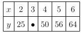

## 校本教材

专题 1 标题

知识框架

(1)

二、 (2)

1. (a)

2. (b)

一、大类知识点

1、小题型

例1 ★★★★★

微信公众号《觅宁参考》制作 微信公众号《觅宁参考》制作 微信公众号《觅宁参考》制作 微信公众号《觅宁参考》制作 微信公众号《觅宁参考》制作 微信公众号 《觅宁参考》制作 微信公众号《觅宁参考》制作 ( )

A. B. C. D.

【简要答案】

练 1.1 微信公众号《觅宁参考》制作 微信公众号《觅宁参考》制作 微信公众号《觅宁参考》制作 微信公众号《觅宁参考》制作 微信公众号《觅宁参考》制作 微信公众号《觅宁参考》制作 微信公众号《觅宁参考》制作 ( )

A. D.

【简要答案】

知识总结

微信公众号《觅宁参考》制作 微信公众号《觅宁参考》制作 微信公众号《觅宁参考》制作 微信公众号《觅宁参考》制作 微信公众号

号《觅宁参考》制作 微信公众号《觅 《觅宁参考》制作 微信公众号《觅宁参考》制作

抛物线知识清单

## 【知识清单】

一、概念性质

定义 平面内与一个定点 $F$ 和一条定直线 $l\left( l\right.$ 不经过点 $F$ ) 距离相等的点的轨迹叫做抛物线. 点 $F$ 叫做抛物线的焦点,直线 $l$ 叫做抛物线的 准线.

## 几何性质

<table><tr><td>标准方程 $\left( {p > 0}\right)$</td><td>${y}^{2} = {2px}$</td><td>${y}^{2} =  - {2px}$</td><td>${x}^{2} = {2py}$</td><td>${x}^{2} =  - {2py}$</td></tr><tr><td>图象</td><td></td><td></td><td></td><td></td></tr><tr><td>开口方向</td><td>向右</td><td>向左</td><td>向上</td><td>向下</td></tr><tr><td>焦点坐标</td><td>$P\left( {\frac{p}{2},0}\right)$</td><td>$P\left( {-\frac{p}{2},0}\right)$</td><td>$P\left( {0,\frac{p}{2}}\right)$</td><td>$P\left( {0, - \frac{p}{2}}\right)$</td></tr><tr><td>准线方程</td><td>$x =  - \frac{p}{2}$</td><td>$x = \frac{p}{2}$</td><td>$y =  - \frac{p}{2}$</td><td>$y = \frac{p}{2}$</td></tr><tr><td>对称轴</td><td colspan="2">$y = 0$</td><td colspan="2">$x = 0$</td></tr><tr><td>顶点坐标</td><td colspan="4">$\left( {0,0}\right)$</td></tr><tr><td>离心率</td><td colspan="4">$e = 1$ (到定点与到定直线的距离之比称之为离心率)</td></tr></table>

总结记忆

1. 抛物线方程一定首先转化为标准方程;

2. 焦点与一次项保持一致;

3. 焦点到原点的距离为一次项系数的 $\frac{1}{4}$

课后练习

1.

( )

A. B. C. D.

【简要答案】

2.

( )

A. B. C. D.

【简要答案】

二、二级结论

1. 焦点弦 $\left( {p > 0}\right)$

<table><tr><td>标准方程</td><td>${y}^{2} = {2px}$</td><td>${y}^{2} =  - {2px}$</td><td>${x}^{2} = {2py}$</td><td>${x}^{2} =  - {2py}$</td></tr><tr><td>焦点弦韦达定理</td><td colspan="2">${y}_{1}{y}_{2} =  - {p}^{2},{x}_{1}{x}_{2} = \frac{{p}^{2}}{4}$</td><td colspan="2">${x}_{1}{x}_{2} =  - {p}^{2},{y}_{1}{y}_{2} = \frac{{p}^{2}}{4}$</td></tr><tr><td>焦半径与坐标</td><td>${x}_{0} + \frac{p}{2}$</td><td>$- {x}_{0} + \frac{p}{2}$</td><td>${y}_{0} + p$</td><td>$- {y}_{0} + \frac{p}{2}$</td></tr><tr><td>焦半径与倾斜角</td><td colspan="2">$\left| {AF}\right|  = \frac{p}{1 - \cos \theta },\left| {BF}\right|  = \frac{p}{1 + \cos \theta }$ 点 $A$ 在 $x$ 轴上方</td><td colspan="2">$\left| {AF}\right|  = \frac{p}{1 - \sin \theta },\left| {AF}\right|  = \frac{p}{1 + \sin \theta }$ 注意焦半径小的分母较大</td></tr><tr><td>推论</td><td colspan="2">以 ${AF}$ (或 ${BF}$ ) 为直径的圆与 $y$ 轴相切</td><td colspan="2">以 ${AF}$ (或 ${BF}$ ) 为直径的圆与 $x$ 轴相切</td></tr><tr><td>焦半径与定值</td><td colspan="4">$\frac{1}{\left| AF\right| } + \frac{1}{\left| BF\right| }$ 为定值为 $\frac{2}{p}$</td></tr><tr><td>焦点弦长与坐标</td><td>${x}_{1} + {x}_{2} + p$</td><td>$- {x}_{1} - {x}_{2} + p$</td><td>${y}_{1} + {y}_{2} + p$</td><td>$- {y}_{1} - {y}_{2} + p$</td></tr><tr><td>焦点弦长与倾斜角</td><td colspan="2">$\left| {AB}\right|  = \frac{2p}{{\sin }^{2}\theta }$</td><td colspan="2">$\left| {AB}\right|  = \frac{2p}{{\cos }^{2}\theta }$</td></tr><tr><td>通径</td><td colspan="4">最短的焦点弦为通径长为 ${2p}$</td></tr><tr><td>${S}_{\bigtriangleup {OAB}}$</td><td colspan="2">$\frac{{p}^{2}}{2\sin \theta }$</td><td colspan="2">$\frac{{p}^{2}}{2\cos \theta }$</td></tr><tr><td>推论</td><td colspan="4">以 ${AB}$ 为直径的圆与准线相切,记切点为 $P$ ,则 $\angle {APB} = {90}^{ \circ  }$</td></tr></table>

2. 中点弦

${y}^{2} = {2px}$ 与 $y = {kx} + b$ 交于 $A, B$ 两点,记 ${AB}$ 中点为 $\left( {{x}_{0},{y}_{0}}\right)$ ,则有 $\underline{k{y}_{0} = p}$ ; ${x}^{2} = {2py}$ 与 $y = {kx} + b$ 交于 $A, B$ 两点,记 ${AB}$ 中点为 $\left( {{x}_{0},{y}_{0}}\right)$ ,则有 $\frac{1}{k}{x}_{0} = p$ ;

## 幻灯片

二、探究新知，动手操作

(一)探究新知，回顾背景

觅宁参考 §6.3.1 平面向量基本定理 3 / 11

二、探究新知，动手操作

(一) 探究新知, 回顾背景

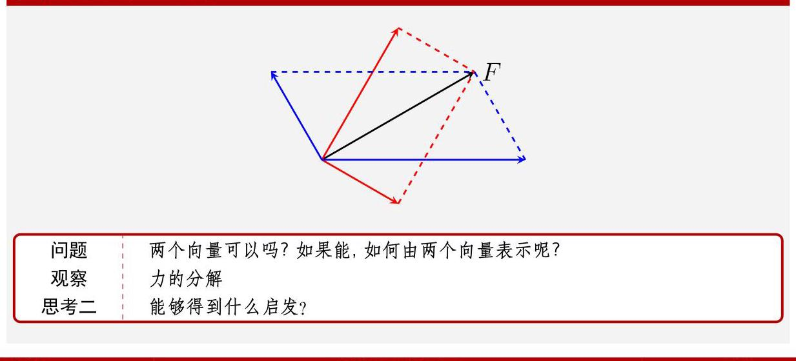

1. IATEX 本身都可以画出高清矢量图, 同时图中的元素也可以轻松实现逐步显示;

2. 类似地, 图中的文字、公式也可以轻松实现逐步显示, 并且自动对齐;

3. 公式中的数字等实现逐步显示是其他很多软件无法实现的.

## 二、探究新知, 动手操作

(二) 探究新知, 动手操作

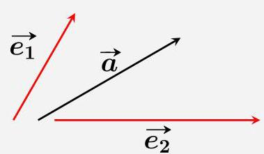

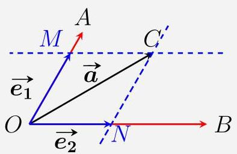

$$
\overrightarrow{OC} = \overrightarrow{OM} + \overrightarrow{ON}
$$

$$
\overrightarrow{OM} = {\lambda }_{1}\overrightarrow{OA},\overrightarrow{ON} = {\lambda }_{2}\overrightarrow{OB},
$$

$$
\overrightarrow{OC} = {\lambda }_{1}\overrightarrow{OA} + {\lambda }_{2}\overrightarrow{OB}
$$

- GeoGebra 动态演示

觅宁参考 §6.3.1 平面向量基本定理

裂项相消的一般步骤

例 1

已知数列 ${b}_{n} = \frac{2}{\left( {{2n} - 1}\right) \left( {{2n} + 1}\right) }$ ,求其前 $n$ 项和 ${S}_{n}$ .

解答

因为 ${b}_{n} = \frac{2}{\left( {{2n} - 1}\right) \left( {{2n} + 1}\right) } = \frac{1}{{2n} - 1} - \frac{1}{{2n} + 1}$ , 对通项裂项

所以 ${S}_{n} = {b}_{1} + {b}_{2} + {b}_{3}\cdots  + {b}_{n - 1} + {b}_{n}$ 求谁表示谁

$= \left( {\frac{1}{1} - \frac{1}{3}}\right)  + \left( {\frac{1}{3} - \frac{1}{5}}\right)  + \left( {\frac{1}{5} - \frac{1}{7}}\right)  + \cdots  + \left( {\frac{1}{{2n} - 3} - \frac{1}{{2n} - 1}}\right)  + \left( {\frac{1}{{2n} - 1} - \frac{1}{{2n} + 1}}\right)$ 代进去

$= 1 - \frac{1}{{2n} + 1}$ 消去

$= \frac{2n}{{2n} + 1}$ 化简

4. 方便对题干、解答做批注, 可以非常方面的提示、引导学生;

5. 试卷、讲义和幻灯片中的内容可以互相复制粘贴, 无需过多调整, 互相兼容性好.

6. 样式简约美观, 格式自动排版, 教师只需要专注内容, 无需花大量时间到格式调整上, 效率高.

### 2.5 数学作图方便、精准、美观与文档浑然一体

- 函数图象

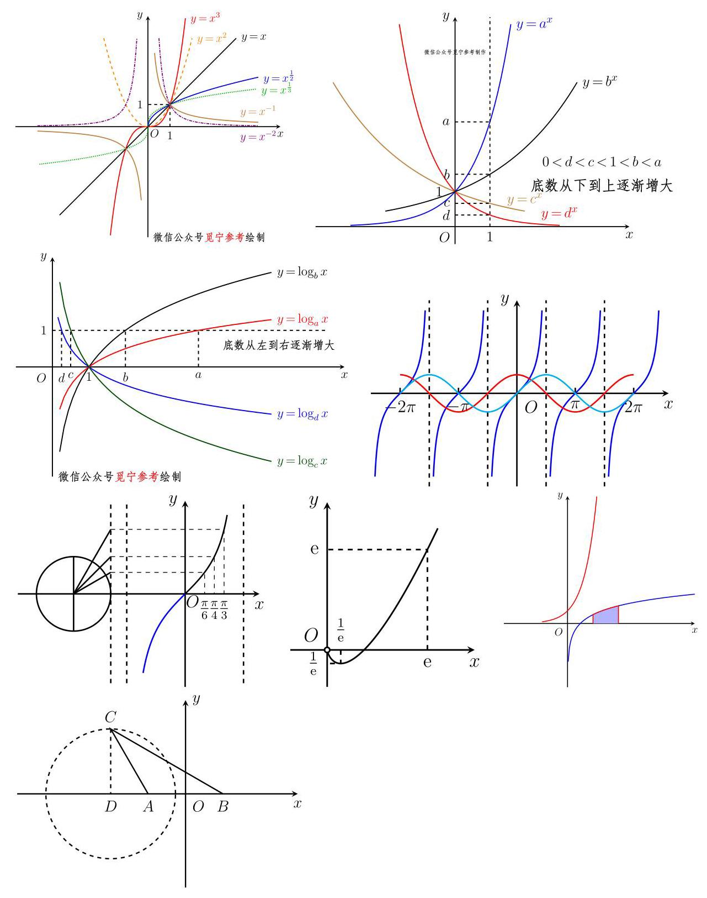

+ 立体几何

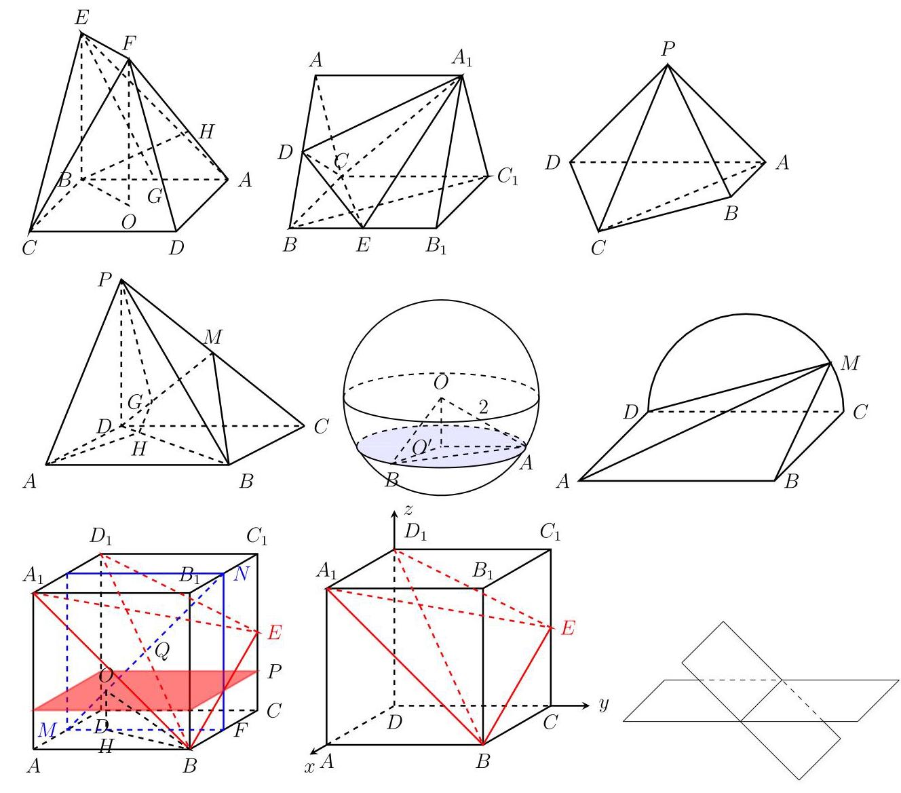

统计图

关注微信公众号《觅宁参考》免费下载软件、教程, 添加微信与作者交流第 13 页 共 20 页

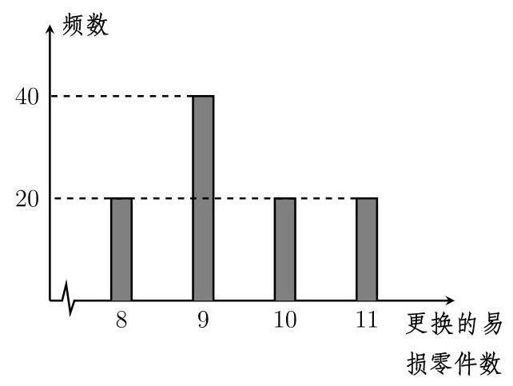

建设后经济收入构成比例

- 圆锥曲线的图

$y$

-0

## 4 其他平面图形

+ 其它图形

+ 三视图

## 与文档浑然一体

## 三、指对幂的函数图象

## 例 6 $\left( {\bigstar \bigstar \text{ ☆ }\text{ ☆ }\text{ ☆ }}\right)$

已知 ${y}_{1} = {\left( \frac{1}{3}\right) }^{x},{y}_{2} = {3}^{x},{y}_{3} = {10}^{-x},{y}_{4} = {10}^{x}$ ,则在同一直角坐标系内,他们的图象为 ( )

A

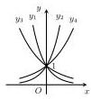

B

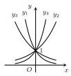

C

D

练 6 (★★★☆☆)

已知 $0 < m < n < 1$ ，则指数函数 $\text{ ① }y = {m}^{x}$ ， $\text{ ② }y = {n}^{x}$ 的图象是 ( )

A

B

C

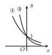

D

例 7 $\left( {x + {\Delta t}{\Delta \phi }}\right)$

如图所示的曲线是对数函数 $y = {\log }_{a}x, y = {\log }_{b}x, y = {\log }_{c}x, y = {\log }_{d}x$ 的图象, 则 $a, b, c, d$ 与 1 的大小关系为 ( )

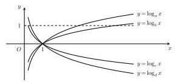

A. $1 < d < c < a < b$ B. $c < d < 1 < a < b$

C. $c < d < 1 < b < a$ D. $d < c < 1 < a < b$

练 7 (★★★☆☆)

已知 $a > 0, b > 0$ ,且 ${ab} = 1, a \neq  1$ ,则函数 $f\left( x\right)  = {a}^{x}$ 与函数 $g\left( x\right)  =  - {\log }_{b}x$ 在

同一坐标系中的图象可能是 ( )

A

B

C

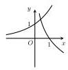

D

例 8 $\left( {\bigstar \bigstar \text{ ☆ }\text{ ☆ }\text{ ☆ }}\right)$

如图,幂函数 $y = {x}^{a}, y = {x}^{b}, y = {x}^{c}, y = {x}^{d}$ 在第一象限内的图象,则 $a, b, c, d$ 的大小关系为 ( )

A. $a < b < c < d\;$ B. $a < b < d < c\;$ C. $b < a < c < d\;$ D. $b < a < d < c$

练 8 $\left( {\phi  \star  \phi  \star  \phi  \star  \phi }\right)$

函数 $y = \frac{1}{x}, y = x, y = 1$ 的图象和直线 $x = 1$ 将平面直角坐标系的第一象限分为 8 个部分:①②③④⑤⑥⑦⑧，若幂函数 $f\left( x\right)$ 的图象经过的部分是④⑧，则 $f\left( x\right)$ 可能是 ( )

A. $y = {x}^{2}$ B. $y = \frac{1}{\sqrt{x}}$ C. $y = {x}^{\frac{1}{2}}$ D. $y = {x}^{-2}$

1、根据平移、对称、翻折和伸缩变换画图

例 1 已知 $f\left( x\right)  = \ln x$ ,画出下列函数的图象

(1) $y = f\left( {x - 1}\right)$ (2) $y = f\left( x\right)  + 1$ (3) $y = f\left( {-x}\right)$

(4) $y =  - f\left( x\right)$ (5) $y = \left| {f\left( x\right) }\right|$ (6) $y = f\left( \left| x\right| \right)$

(1)

(2)

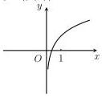

(3)

(4)

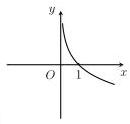

(5)

(6)

练 1 画出下列函数的图象

(1) $y = {2}^{x + 1} - 1$

(4) $y = \frac{x - 1}{x + 1}$

(2) $y = {2}^{-\left| x\right| }$

(5) $y = \frac{{2x} + 1}{x - 1}$

(3) $y = \left| {{2}^{\left| x\right| } - 2}\right|$

(6) $y = \left| {x + 1}\right|$

【答案】

(1)

(2)

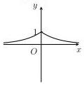

(3)

(4)

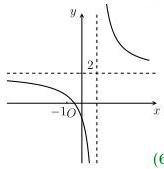

## 2、根据函数的性质画图

例 2 画出下列函数的图象

(1)

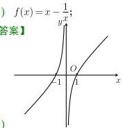

(2) $f\left( x\right)  = x + \ln x$ ;

(2)

练 2 已知奇函数 $f\left( x\right)$ 定义域为 $\mathbf{R}$ ,当 $x \in  \left\lbrack  {0,1}\right\rbrack$ 时, $f\left( x\right)  = x$ ,且 $f\left( x\right)$ 的图象关于 $x = 1$ 对称,画出 $f\left( x\right)$ 在 $\left\lbrack  {-5,5}\right\rbrack$ 的函数图象.

【答案】

## 3、复杂函数运用导数画图

例 3 画出下列函数的图象

(1) $y = x\ln x$

(2) $y = \frac{\ln x}{x}$

(3)

(3)

$f\left( x\right)  = x\ln x$

(2) (1)

1. 图的细节均可直接修改, 整体效果与文档本身浑然一体.

2. 选项可以根据图的大小, 自动排列一行四个或两个或一个, 图可以居中、居右或居左.

## 三、课程简介与学习流程

目前全部课程大约有 40 课时的视频，包括四方面内容，分别为:试卷编辑基础模块、讲义编辑提高模块、画图模版、幻灯片制作模版. 除此之外, 也会将学员经常遇到的问题解答制作成视频上传, 90% 的老师都可以根据视频学习掌握, 对于在学习中有疑惑的地方, 还会提供答疑, 远程协助解决问题, 确保参与课程的学员完成学习目标, 能够独立编辑出试卷、讲义等文档. 课程目标与教学内容见附件.

## 课程形式

课程包括视频课程、文档资料和若干次答疑, 其中视频课程为在线视频, 可以回放, 老师们可以根据自己的时间安排学习, 同时参考提供的文档资料, 对于有疑问的地方, 会通过微信或者远程提供答疑, 这样的教学方式,符合学习规律,节约时间,效率高,比自学节约 90% 的时间,参加课程快则一天，慢则一周即可独立排版一份试卷、讲义。

## 电脑基础

学习软件所需要的电脑基础:会打字，大多数情况能够打字不看键盘。 课程是面向零基础的中学老师, 不需要额外的编程基础.

## 学习流程

1. 报名参加课程、安装软件、配置软件, 浏览课程所发资料, 知道资料都有哪些内容;

2. 认真观看前五个视频, 认真操作;

3. 尝试排版一份高考试卷, 遇到问题, 先查看视频和代码手册, 如果不能解决, 微信联系我即可.

4. 后期根据自己需求, 选择性的学习视频课程.

未尽事宜，可微信交流.

## 附件: 公式效果

基本符号

希腊字母

集合

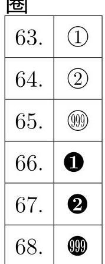

<table><tr><td></td><td>序号</td><td>符号</td></tr><tr><td></td><td>1.</td><td>$\sqrt{2},\sqrt[3]{3},\sqrt{\frac{1}{2}}$</td></tr><tr><td></td><td>2.</td><td>$\frac{2}{3},\frac{\sqrt{3}}{2}$</td></tr><tr><td></td><td>3.</td><td>$\overrightarrow{AB},\mathbf{a}$</td></tr><tr><td></td><td>4.</td><td>$\bar{a},\widehat{a},\overline{1234}$</td></tr><tr><td></td><td>5.</td><td>${a}_{m},{a}^{n},{a}_{n + 1}^{n + 2}$</td></tr><tr><td></td><td>6.</td><td>\{\}</td></tr><tr><td></td><td>7.</td><td>%</td></tr><tr><td></td><td>8.</td><td>$+ \infty , - \infty$</td></tr><tr><td></td><td>9.</td><td>$\because \therefore$</td></tr><tr><td></td><td>10.</td><td>$\langle \mathbf{a},\mathbf{b}\rangle$</td></tr><tr><td></td><td>11.</td><td>$\int$</td></tr><tr><td></td><td>12.</td><td>✘</td></tr><tr><td></td><td>13.</td><td>÷</td></tr><tr><td></td><td>14.</td><td>+</td></tr><tr><td></td><td>15.</td><td><</td></tr><tr><td></td><td>16.</td><td>之</td></tr><tr><td></td><td>17.</td><td>$\neq$</td></tr><tr><td></td><td>18.</td><td>$\approx$</td></tr><tr><td></td><td>19.</td><td>...</td></tr><tr><td></td><td>20.</td><td>十</td></tr><tr><td></td><td>21.</td><td>(mod $m$ )</td></tr><tr><td></td><td>22.</td><td>着重号</td></tr><tr><td></td><td>23.</td><td>公式中中文</td></tr><tr><td></td><td>24.</td><td></td></tr></table>

<table><tr><td></td><td>序号</td><td>符号</td></tr><tr><td></td><td>25.</td><td>$\alpha$</td></tr><tr><td></td><td>26.</td><td>$\beta$</td></tr><tr><td></td><td>27.</td><td>$\gamma$</td></tr><tr><td></td><td>28.</td><td>$\delta$</td></tr><tr><td></td><td>29.</td><td>$\varepsilon$</td></tr><tr><td></td><td>30.</td><td>$\eta$</td></tr><tr><td></td><td>31.</td><td>$\theta$</td></tr><tr><td></td><td>32.</td><td>$\lambda$</td></tr><tr><td></td><td>33.</td><td>$\mu$</td></tr><tr><td></td><td>34.</td><td>$\nu$</td></tr><tr><td></td><td>35.</td><td>$\xi$</td></tr><tr><td></td><td>36.</td><td>$\pi$</td></tr><tr><td></td><td>37.</td><td>$\rho$</td></tr><tr><td></td><td>38.</td><td>$\sigma$</td></tr><tr><td></td><td>39.</td><td>$\varphi$</td></tr><tr><td></td><td>40.</td><td>$\omega$</td></tr><tr><td></td><td>41.</td><td>$\Delta$</td></tr><tr><td></td><td>42.</td><td>$\Omega$</td></tr><tr><td></td><td>43.</td><td>$\Gamma$</td></tr></table>

<table><tr><td>序号</td><td>符号</td></tr><tr><td>48.</td><td>UU</td></tr><tr><td>49.</td><td>$\cap   \cap$</td></tr><tr><td>50.</td><td>C</td></tr><tr><td>51.</td><td>三</td></tr><tr><td>52.</td><td>字</td></tr><tr><td>53.</td><td>${\complement }_{U}A$</td></tr><tr><td>54.</td><td>$\in   \notin$</td></tr><tr><td>55.</td><td>$\varnothing$</td></tr><tr><td>56.</td><td>$\otimes$</td></tr><tr><td>57.</td><td>$\oplus$</td></tr><tr><td>58.</td><td>※</td></tr><tr><td>59.</td><td>$\neg p$</td></tr><tr><td>60.</td><td>$p \vee  q$</td></tr><tr><td>61.</td><td>$p \land  q$</td></tr><tr><td>62.</td><td>$\exists \forall$</td></tr></table>

卷

<table><tr><td colspan="4">大型运算符号</td></tr><tr><td></td><td>44.</td><td>$\mathop{\sum }\limits_{{i = 1}}^{n}$</td><td></td></tr><tr><td></td><td>45.</td><td>$\mathop{\prod }\limits_{{i = 1}}^{n}$</td><td></td></tr><tr><td></td><td>46.</td><td>${\int }_{1}^{n}$</td><td></td></tr><tr><td></td><td>47.</td><td>lim   $x \rightarrow   + \infty$</td><td></td></tr></table>

判断对错

<table><tr><td>69.</td><td></td></tr><tr><td>70.</td><td></td></tr></table>

几何

<table><tr><td>序号</td><td>符号</td></tr><tr><td>71.</td><td>⊥</td></tr><tr><td>72.</td><td>丨</td></tr><tr><td>73.</td><td>$\bigtriangleup$</td></tr><tr><td>74.</td><td>②</td></tr><tr><td>75.</td><td>L</td></tr><tr><td>76.</td><td>$\square$</td></tr><tr><td>77.</td><td>//</td></tr><tr><td>78.</td><td>～</td></tr><tr><td>79.</td><td>了</td></tr><tr><td>80.</td><td>≅</td></tr><tr><td>81.</td><td>19</td></tr><tr><td>82.</td><td>$\overset{\text{ ⏜ }}{AB}$</td></tr></table>

难度选择填空

$$
f\left( x\right)  = \left\{  {\begin{array}{l} {x}^{2} - {2x} + 3, x \leq  1, \\  x - 2, x > 1, \end{array}\;f\left( x\right)  = \left\{  \begin{array}{ll} {x}^{2} - {2x} + 3, & x \leq  1, \\  x - 2, & x > 1, \end{array}\right. }\right.
$$

<table><tr><td></td><td>83.</td><td>★☆☆☆☆</td></tr><tr><td></td><td>84.</td><td>★★☆☆☆</td></tr><tr><td></td><td>85.</td><td>★★★☆☆</td></tr><tr><td></td><td>86.</td><td>★★★★☆</td></tr><tr><td></td><td>87.</td><td>★★★★★</td></tr><tr><td></td><td>88.</td><td>☆☆☆☆☆</td></tr><tr><td></td><td>89.</td><td>★★★☆☆</td></tr><tr><td></td><td>90.</td><td>( )</td></tr><tr><td></td><td>91.</td><td>___</td></tr><tr><td></td><td>92.</td><td>___</td></tr></table>

<table><tr><td colspan="3">函数</td></tr><tr><td rowspan="13"></td><td>序号</td><td>符号</td></tr><tr><td>93.</td><td>$\lim x$</td></tr><tr><td>94.</td><td>$\cos x$</td></tr><tr><td>95.</td><td>$\sin x$</td></tr><tr><td>96.</td><td>$\tan x$</td></tr><tr><td>97.</td><td>$\lg x$</td></tr><tr><td>98.</td><td>$\ln x$</td></tr><tr><td>99.</td><td>$\log x$</td></tr><tr><td>100.</td><td>$\max x$</td></tr><tr><td>101.</td><td>$\min x$</td></tr><tr><td>102.</td><td>$\arccos x$</td></tr><tr><td>103.</td><td>$\arcsin x$</td></tr><tr><td>104.</td><td>$\arctan x$</td></tr></table>

罗马数字

105. I

106. II

107. III

108. X

109. XV

110. i

111. ii

112. iii

113. X

114. XV

<table><tr><td colspan="2">箭头</td></tr><tr><td>115.</td><td>✓</td></tr><tr><td>116.</td><td>$\rightarrow$</td></tr><tr><td>117.</td><td>$\Leftarrow$</td></tr><tr><td>118.</td><td>$\Rightarrow$</td></tr><tr><td>119.</td><td>⇔</td></tr><tr><td>120.</td><td>今</td></tr><tr><td>121.</td><td>↗</td></tr><tr><td>122.</td><td>↘</td></tr><tr><td>123.</td><td>应</td></tr><tr><td>124.</td><td>✓</td></tr><tr><td>125.</td><td>$\uparrow   \downarrow$</td></tr><tr><td>126.</td><td>✓</td></tr><tr><td>127.</td><td>一</td></tr><tr><td>128.</td><td>一</td></tr><tr><td>129.</td><td>一</td></tr><tr><td>130.</td><td>$\Rightarrow$</td></tr><tr><td>131.</td><td>$\Leftrightarrow$</td></tr><tr><td>132.</td><td>上</td></tr><tr><td>133.</td><td>上</td></tr><tr><td>134.</td><td>占</td></tr><tr><td>135.</td><td>二</td></tr></table>

## 公式等号对齐

${10} = 1 + 9$

$$
{10} = 1 + 9
$$

${10} = 1 + 1 + 8 \; {10} = 1 + 1 + 8$

${10} = 1 + 1 + 1 + 7 \; {10} = 1 + 1 + 1 + 7$

在我们教学、做题的过程中, 有很多好的想法、思路, 但由于没有及时的记录、整理，而逐渐遗忘，即使努力回想，多是徒劳，非常遗憾. 学会 IATEX, 可以方程方便的编辑公式, 画图, 大大提高效率记录我们专业成长的每一步，让每个灵感闪现的时刻不再转瞬即逝！

给大家提供一个决策的角度:一件事是否值得做，当下可能觉得受很多因素影响, 不知道如何取舍的时, 不妨让五年、十年后的自己帮做决策, 十年之后哪些因素才是最重要的, 立刻变得清晰.

一项技能会在时间的作用下, 愈发珍贵, IATEX 这一工具, 方便记录, 平时的积累够了，关键时刻就能迸发无穷的力量，一起加入学习吧.

## 一、函数图象

关注微信公众号《觅宁参考》免费下载上述画图软件，添加小编微信，学习公式编辑、画图、下载高中数学专题第 1 页 共 4 页

## 二、立体几何

## 三、统计图

关注微信公众号《觅宁参考》免费下载上述画图软件，添加小编微信，学习公式编辑、画图、下载高中数学专题

第 2 页 共 4 页

第三产业收入

28%

种植收入 37%

5% 其他收入

30% 养殖收入

建设后经济收入构成比例

四、圆锥曲线等平面图

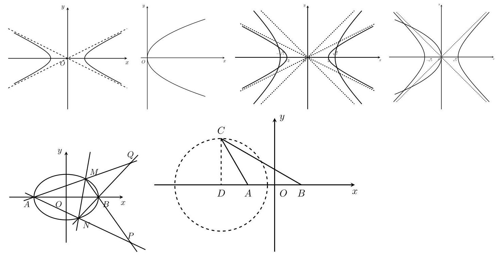

## 五、 其他平面图形

关注微信公众号《觅宁参考》免费下载上述画图软件，添加小编微信，学习公式编辑、画图、下载高中数学专题第 3 页 共 4 页

## 六、其它图形

七、三视图

## 八、流程图

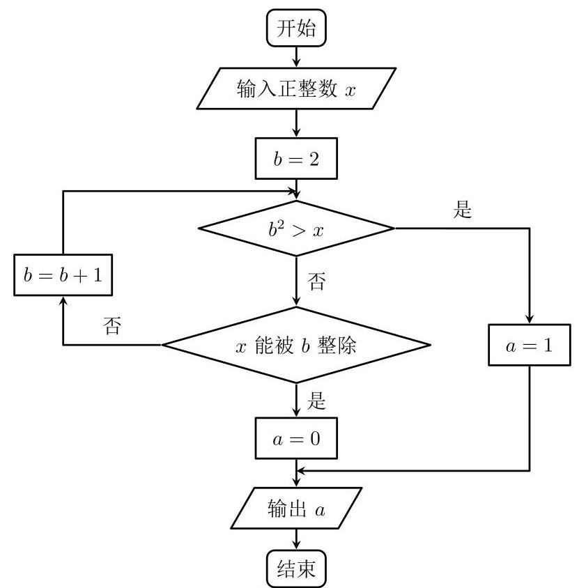

关注微信公众号《觅宁参考》免费下载上述画图软件，添加小编微信，学习公式编辑、画图、下载高中数学专题第 4 页 共 4 页

## 指对幂图象及其性质

## 一、指对幂的函数图象

例 1 已知 ${y}_{1} = {\left( \frac{1}{3}\right) }^{x},{y}_{2} = {3}^{x},{y}_{3} = {10}^{-x},{y}_{4} = {10}^{x}$ ,则在同一直角坐标系内,他们的图象为 ( )

A

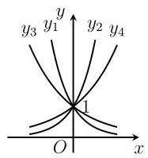

B

C

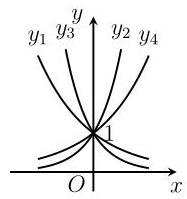

D

练 1 已知 $0 < m < n < 1$ ,则指数函数 $\text{ ① }y = {m}^{x},\text{ ② }y = {n}^{x}$ 的图象是 ( )

A

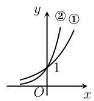

B

C

D

例 2 如图所示的曲线是对数函数 $y = {\log }_{a}x, y = {\log }_{b}x, y = {\log }_{c}x, y = {\log }_{d}x$ 的图象,则 $a, b, c, d$ 与 1 的大小关系为 ( )

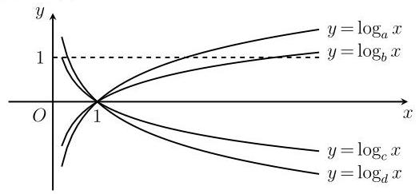

A. $1 < d < c < a < b$ B. $c < d < 1 < a < b$ C. $c < d < 1 < b < a$ D. $d < c < 1 < a < b$

练 2 已知 $a > 0, b > 0$ ,且 ${ab} = 1, a \neq  1$ ,则函数 $f\left( x\right)  = {a}^{x}$ 与函数 $g\left( x\right)  =  - {\log }_{b}x$ 在同一坐标系中的图象可能是 ( )

A

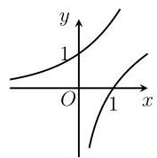

B

C

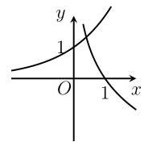

D

例 3 如图,幂函数 $y = {x}^{a}, y = {x}^{b}, y = {x}^{c}, y = {x}^{d}$ 在第一象限内的图象,则 $a, b, c, d$ 的大小关系为 ( )

A. $a < b < c < d$ B. $a < b < d < c$

C. $b < a < c < d$ D. $b < a < d < c$

练 3 函数 $y = \frac{1}{x}, y = x, y = 1$ 的图象和直线 $x = 1$ 将平面直角坐标系的第一象限分为 8 个部分:①②③④⑤⑥⑦⑧，若幂函数 $f\left( x\right)$ 的图象经过的部分是④⑧，则 $f\left( x\right)$ 可能是 ( )

A. $y = {x}^{2}$ B. $y = \frac{1}{\sqrt{x}}$

C. $y = {x}^{\frac{1}{2}}$ D. $y = {x}^{-2}$

## 1、根据平移、对称、翻折和伸缩变换画图

例 1 已知 $f\left( x\right)  = \ln x$ ,画出下列函数的图象

(1) $y = f\left( {x - 1}\right)$ (2) $y = f\left( x\right)  + 1$ (3) $y = f\left( {-x}\right)$

(4) $y =  - f\left( x\right)$ (5) $y = \left| {f\left( x\right) }\right|$ (6) $y = f\left( \left| x\right| \right)$

【答案】

(1)

(2)

(3)

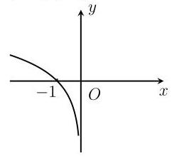

(4)

(5)

(6)

练 1 画出下列函数的图象

(1) $y = {2}^{x + 1} - 1$ (2) $y = {2}^{-\left| x\right| }$ (3) $y = \left| {{2}^{\left| x\right| } - 2}\right|$

(4) $y = \frac{x - 1}{x + 1}$ (5) $y = \frac{{2x} + 1}{x - 1}$ (6) $y = \left| {x + 1}\right|$

【答案】

(1)

(2)

(3)

(4)

(5)

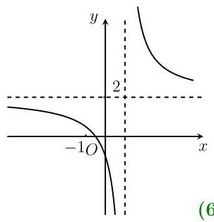

## 2、根据函数的性质画图

例 2 画出下列函数的图象

(1) $f\left( x\right)  = x - \frac{1}{x}$

【答案】

(1)

(2) $f\left( x\right)  = x + \ln x$

(2)

练 2 已知奇函数 $f\left( x\right)$ 定义域为 $\mathbf{R}$ ,当 $x \in  \left\lbrack  {0,1}\right\rbrack$ 时, $f\left( x\right)  = x$ ,且 $f\left( x\right)$ 的图象关于 $x = 1$ 对称,画出 $f\left( x\right)$ 在 $\left\lbrack  {-5,5}\right\rbrack$ 的函数图象.

【答案】

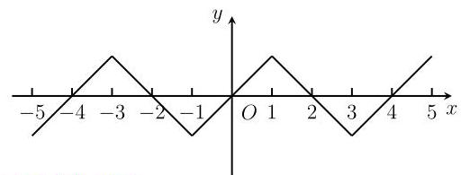

## 3、复杂函数运用导数画图

例 3 画出下列函数的图象

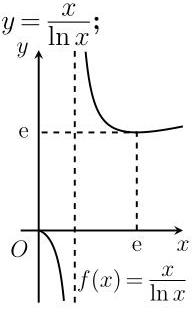

(1) $y = x\ln x$ (2) $y = \frac{\ln x}{x}$ (3) $y = \frac{x}{\ln x}$

(1)

(2)

(3)

## 抛物线知识清单

## 【知识清单】

## 一、概念性质

1. 定义平面内与一个定点 $F$ 和一条定直线 $l\left( l\right.$ 不经过点 $\left. F\right)$ 距离相等的点的轨迹叫做抛物线. 点 $F$ 叫做抛物线的焦点,直线 $l$ 叫做抛物线的准线.

2.几何性质

<table><tr><td>标准方程 $\left( {p > 0}\right)$</td><td>${y}^{2} = {2px}$</td><td>${y}^{2} =  - {2px}$</td><td>${x}^{2} = {2py}$</td><td>${x}^{2} =  - {2py}$</td></tr><tr><td>图象</td><td></td><td></td><td></td><td></td></tr><tr><td>开口方向</td><td>向右</td><td>向左</td><td>向上</td><td>向下</td></tr><tr><td>焦点坐标</td><td>$P\left( {\frac{p}{2},0}\right)$</td><td>$P\left( {-\frac{p}{2},0}\right)$</td><td>$P\left( {0,\frac{p}{2}}\right)$</td><td>$P\left( {0, - \frac{p}{2}}\right)$</td></tr><tr><td>准线方程</td><td>$x =  - \frac{p}{2}$</td><td>$x = \frac{p}{2}$</td><td>$y =  - \frac{p}{2}$</td><td>$y = \frac{p}{2}$</td></tr><tr><td>对称轴</td><td colspan="2">$y = 0$</td><td colspan="2">$x = 0$</td></tr><tr><td>顶点坐标</td><td colspan="4">(0,0)</td></tr><tr><td>离心率</td><td colspan="4">$e = 1$ (到定点与到定直线的距离之比称之为离心率)</td></tr></table>

## 总结记忆

3.抛物线方程一定首先转化为标准方程;

4.焦点与一次项保持一致;

5. 焦点到原点的距离为一次项系数的 $\frac{1}{4}$ .

## 二、二级结论

1. 焦点弦 $\left( {p > 0}\right)$

<table><tr><td>标准方程</td><td>${y}^{2} = {2px}$</td><td>${y}^{2} =  - {2px}$</td><td>${x}^{2} = {2py}$</td><td>${x}^{2} =  - {2py}$</td></tr><tr><td>焦点弦韦达定理</td><td colspan="2">${y}_{1}{y}_{2} = \underline{-{p}^{2}},{x}_{1}{x}_{2} = \underline{\frac{{p}^{2}}{4}}$</td><td colspan="2">${x}_{1}{x}_{2} = \underline{-{p}^{2}},{y}_{1}{y}_{2} = \underline{\frac{{p}^{2}}{4}}$</td></tr><tr><td>焦半径与坐标</td><td>${x}_{0} + \frac{p}{2}$</td><td>$- {x}_{0} + \frac{p}{2}$</td><td>${y}_{0} + p$</td><td>$- {y}_{0} + \frac{p}{2}$</td></tr><tr><td>焦半径与倾斜角</td><td colspan="2">$\left| {AF}\right|  = \frac{p}{1 - \cos \theta },\left| {BF}\right|  = \frac{p}{1 + \cos \theta }$ 点 $A$ 在 $x$ 轴上方</td><td colspan="2">$\left| {AF}\right|  = \frac{p}{1 - \sin \theta },\left| {AF}\right|  = \frac{p}{1 + \sin \theta }$ 注意焦半径小的分母较大</td></tr><tr><td>推论</td><td colspan="2">以 ${AF}\left( {\text{ 或 }{BF}}\right)$ 为直径的圆与 $y$ 轴相切</td><td colspan="2">以 ${AF}\left( {\text{ 或 }{BF}}\right)$ 为直径的圆与 $\underline{x}$ 轴相切</td></tr><tr><td>焦半径与定值</td><td colspan="4">$\frac{1}{\left| AF\right| } + \frac{1}{\left| BF\right| }$ 为定值为 $\frac{2}{\underline{p}}$</td></tr><tr><td>焦点弦长与坐标</td><td>${x}_{1} + {x}_{2} + p$</td><td>$- {x}_{1} - {x}_{2} + p$</td><td>${y}_{1} + {y}_{2} + p$</td><td>$- {y}_{1} - {y}_{2} + p$</td></tr><tr><td>焦点弦长与倾斜角</td><td colspan="2">$\left| {AB}\right|  = \frac{2p}{{\sin }^{2}\theta }$</td><td colspan="2">$\left| {AB}\right|  = \frac{2p}{{\cos }^{2}\theta }$</td></tr><tr><td>通径</td><td colspan="4">最短的焦点弦为通径,长为 ${2p}$</td></tr><tr><td>${S}_{\bigtriangleup {OAB}}$</td><td colspan="2">$\frac{{p}^{2}}{2\sin \theta }$</td><td colspan="2">$\frac{{p}^{2}}{2\cos \theta }$</td></tr><tr><td>推论</td><td colspan="4">以 ${AB}$ 为直径的圆与准线相切,记切点为 $P$ ,则 $\angle {APB} = {90}^{ \circ  }$</td></tr></table>

2. 中点弦

${y}^{2} = {2px}$ 与 $y = {kx} + b$ 交于 $A, B$ 两点,记 ${AB}$ 中点为 $\left( {{x}_{0},{y}_{0}}\right)$ ,则有 $\underline{k{y}_{0} = p}$ ;

${x}^{2} = {2py}$ 与 $y = {kx} + b$ 交于 $A, B$ 两点,记 ${AB}$ 中点为 $\left( {{x}_{0},{y}_{0}}\right)$ ,则有 $\frac{1}{k}{x}_{0} = p$ .