各专家

普通高中教科书

2020

SHUXUE

# 数学

选择性必修

第 二 册

上海大剧院

SHANGHAI GRAND THEATRE

普通高中教科书

SHUXUE 数学选择性必修第二册

上海大剧院

SHANGHAI GRAND THEATRE

主 编 李大潜 王建磐

副主 编 应坚刚 鲍建生

本册编写人员 程 靖 肖恩利 姚一隽 应坚刚 田万国 任升录 陈月兰 汪家录

责任编辑 曲春蕊 李 达

装帧设计 陆 弦 王 捷 周 吉

本册教材图片提供 图虫网(封面一幅图，P1一幅图，P2一幅图，P79一幅图，P115一幅图，

P133一幅图)；有限公司(封底一幅图)

插图绘制 朱泽宇

普通高中教科书 数学 选择性必修 第二册

上海市中小学(幼儿园)课程改革委员会组织编写

出版 有限公司(上海市闵行区号景路159弄C座)

发行 上海新华书店

印 刷 上海四维数字图文有限公司

版 次 2022年7月第1版

印 次 2025年6月第4次

开 本 ${890} \times  {1240}\;1/{16}$

印 张 10

字 数 172 千字

书 号 ISBN 978-7-5720-0187-1/G·0144

定 价 12.45 元

版权所有・未经许可不得采用任何方式擅自复制或使用本产品任何部分・违者必究

如发现内容质量问题, 请拨打 021-64319241

如发现印、装质量问题，影响阅读，请与有限公司联系. 电话021-64373213 价格依据文件:沪价费 [2017] 15 号

声明 按照《中华人民共和国著作权法》第二十五条有关规定，我们已尽量寻找著作权人支付报酬.著作权人如有关于支付报酬事宜可及时与出版社联系.

# 前言

数学应该是绝大多数人一生中学得最多的一门功课. 认真学习数学，努力学好数学, 不仅可以牢固地打好数学的知识基础, 掌握一种科学的语言, 为走进科学的大门提供有力的工具和坚实的后盾; 更重要地, 通过认真而严格的数学学习和训练，可以领会到数学的思想方法和精神实质，造就一些特有而重要的素质和能力, 形成自己的数学素养, 让人变得更加聪明, 更有智慧, 更有竞争力, 终身受用不尽. 从这个意义上, 可以毫不夸张地说, 数学教育看起来似乎只是一种知识教育，但本质上是一种素质教育，其意义是十分深远的.

中学阶段的数学学习, 应该为学生今后的成长和发展奠定坚实的基础, 编写教材也要力求遵循这一根本宗旨. 那种以种种名义，将一些“高级”或“时髦”的东西，不顾实际情况地下放进中学的教材，和数学的基础训练“抢跑道” 的做法, 是不可取的. 同时, 数学学科是一个有机联系的整体, 一定要避免知识的碎片化, 从根本上改变单纯根据 “知识点” 来安排教学的做法. 人为地将知识链条打断，或将一些关键内容以“减负”的名义删去，只会造成学生思维的混乱, 影响学生对有关知识的认识与理解, 实际上反而会加重学生学习的负担，是不值得效法的. 在任何情况下，都要基于课程标准，贯彻“少而精”“简而明”的原则，精心选择与组织教材内容，抓住本质，返璞归真，尽可能给学生以明快、清新的感受，使学生能更深入地领会数学的真谛，让数学成为广大学生喜闻乐见的一门课程.

怎么才算“学好了数学”呢？对这个问题是需要一个正确的认识的. 作为一门重思考与理解的学科，数学学习要强调理解深入、运作熟练和表达明晰这三个方面. 这儿所说的“运作”泛指运算、推理及解题等环节. 三者的关键是深入的理解，只有不仅知其然、而且知其所以然，才能掌握数学的精髓，更好地实现另外两方面的要求. 如果只满足于会解题, 甚至以 “刷题” 多与快为荣, 但不求甚解, 就难以和数学真正结缘, 是不值得鼓励与提倡的. 表达能

力的培养也要引起足够的重视. 要使表述简明清晰并不是一件容易的事，别人三言两语就说清楚了的，自己却颠三倒四、不得要领，能够说真正弄懂了数学吗?!

为了帮助学生学好数学，也为了帮助教师教好数学，本教材秉承上述理念, 在编写上做了认真的探索与实践, 希望能成为广大师生的良师益友, 更好地发挥引路和示范的作用. 书中各章的章首语，虽只有不到一页的篇幅， 但却是该章入门的一个宏观向导，务请认真注意. 各章末的内容提要，简明扼要地列出了该章的核心内容, 希望对复习能起到较好的帮助. 各章的主体内容, 包括正文、练习及复习题以及边注, 更是字斟句酌、精心编写的. 希望广大同学养成认真阅读及钻研教材的习惯，这样就一定会发现，学习中所碰到的种种问题, 原则上都可以从教材中找到答案, 大家的学习方法和自学能力也一定会得到极大的提升，从而牢牢掌握住学习数学的主动权.

本套教材涵盖《普通高中数学课程标准(2017 年版 2020 年修订)》所规定的必修课程和选择性必修课程的内容，共分七册，包括必修四册、选择性必修三册, 其中必修第四册和选择性必修第三册是数学建模的内容. 必修前三册和选择性必修前两册共同构建了高中数学的知识体系和逻辑结构; 数学建模内容与数学知识的逻辑结构没有直接的关系, 不依附于特定知识性内容的教学, 而在于强调数学知识在解决实际问题中的应用, 强调它的活动性、探索性和综合性. 因此, 两册数学建模教材不是前三册或前两册教材的后继, 而且都包含比教学课时数要求更多的内容, 供各个年段灵活地、有选择地使用, 以实现数学建模的教学目标.

2020 年 6 月

# 目录

- 第 5 章 导数及其应用

5.1 导数的概念及意义 2

5.2 导数的运算 12

5.3 导数的应用 21

内容提要 36

复习题 37

- 第 6 章 计数原理

6.1 乘法原理与加法原理 40

6.2 排列 46

6.3 组合 57

6.4 计数原理在古典概率中的应用 66

6.5 二项式定理 69

内容提要 76

复习题 76

- 第 7 章 概率初步(续)

7.1 条件概率与相关公式 80

7.2 随机变量的分布与特征 89

7.3 常用分布 101

内容提要 112

复习题 113

目录

- 第 8 章 成对数据的统计分析

8.1 成对数据的相关分析 116

8.2 一元线性回归分析 125

${8.32} \times  2$ 列联表 138

内容提要 146

复习题 146

# 第 5 章 导数及其应用

初等数学可以帮助我们对匀速运动进行描述和分析, 也能够顺利解决一些具有规则形状的物体的度量问题. 然而, 人类在实际生活中所面临的问题往往更为复杂. 例如, 运动中速度可以不断变化，图形的边界不再具有规则的形状，等等. 要处理这一类问题，本质上要有处理变化和变化中的瞬时状态的数学工具，这就需要用到高等数学，特别是微积分的知识.

由于系统深入地介绍高等数学的内容不是高中课程所能承担的任务，因此本章将用比较直观和粗略的方式引入微积分中的一个最基本的概念——导数，为研究函数性质提供一个有力的工具，并展示其在解决变速运动等现实问题中的一些应用.

由于知识基础不足且为了避免产生理解上的困难及误导, 本章中的某些结论没有给出证明, 而仅作形式化的表述. 希望同学们对导数的基本内涵及其应用有所认识和体会，并对未来在大学课程中继续深入学习微积分抱有渴望.

## 5.1 导数的概念及意义

在本节中, 我们将学习如何刻画运动物体的瞬时速度, 以及如何确定一条曲线上一点处的切线, 通过这些例子初步认识导数这一表示函数瞬时变化率的数学概念.

### 1 导数的概念

当物体作匀速运动时,运动的速度 $v$ 等于距离 $s$ 除以运动时间 $t$ ,即 $v = \frac{s}{t}$ . 但是,如果一个作变速运动的物体在时间段 $t$ 内的运动距离是 $s$ ,上面的公式所给出的只能是这段运动过程中运动物体的平均速度 $\bar{v} = \frac{s}{t}$ .

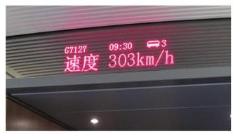

图 5-1-1

当我们乘坐高铁时, 常常会在车厢内看到如图 5-1-1 所示的列车信息显示屏. 如何理解图中“速度 303 km/h”呢?

仅用一个时间段内的平均速度难以准确地描述在该时间段内变速运动的过程. 为了精准地描述变速运动, 一个自然的想法是把整个运动时间分割成若干个小的时间段, 并分别求每个时间段内的平均速度. 可以想象，随着时间段的分割越来越精细, 利用分段的平均速度就可以越来越精确地对整个运动过程进行描述.

以自由落体运动为例，已知物体下落的距离 $d$ (单位: $\mathrm{m}$ ) 与时间 $t$ (单位: $\mathrm{s}$ )满足函数关系 $d = \frac{1}{2}g{t}^{2}$ ,其中 $g$ 是重力加速度. 若近似地取 $g = {10}\mathrm{\;m}/{\mathrm{s}}^{2}$ ,则 $d = 5{t}^{2}$ .

考虑从 $t = 1$ 到 $t = 3$ (用区间符号记作 $\left\lbrack  {1,3}\right\rbrack$ )时间段内的自由落体运动. 它的平均速度是 $\frac{d\left( 3\right)  - d\left( 1\right) }{3 - 1} = {20}\left( {\mathrm{\;m}/\mathrm{s}}\right)$ . 如果把这段时间分成 $\left\lbrack  {1,2}\right\rbrack$ 与 $\left\lbrack  {2,3}\right\rbrack$ 两段，那么在这两个时间段内自由落体的平均速度分别是 $\frac{d\left( 2\right)  - d\left( 1\right) }{2 - 1} = {15}\left( {\mathrm{\;m}/\mathrm{s}}\right)$ 与 $\frac{d\left( 3\right)  - d\left( 2\right) }{3 - 2} = {25}\left( {\mathrm{\;m}/\mathrm{s}}\right)$ .

而如果以 ${0.5}\mathrm{\;s}$ 为间隔把 $\left\lbrack  {1,3}\right\rbrack$ 分为 4 个时间段,可以得出这 4 个时间段内的平均速度分别是 ${12.5}\mathrm{\;m}/\mathrm{s}\text{ 、 }{17.5}\mathrm{\;m}/\mathrm{s}\text{ 、 }{22.5}\mathrm{\;m}/\mathrm{s}$ 与 27.5 m/s. 由此可见, 随着时间段的不断细分, 自由落体的运动状态确实得到了越来越精确的描述. 这种做法其实蕴含着 “极限” 这个朴素而深刻的思想.

先把时间段分割，在越来越小的时间段内对运动进行分析， 再从整体上得到对运动状态越来越精确的描述, 这就是被称为 “微积分”的数学工具给我们提供的解决此类问题的基本途径. 在这里, 我们只介绍如何寻找适当的数学工具刻画运动物体在某一时刻的瞬时速度. 这里的瞬时速度指的是，运动物体在临近指定时刻的某个时间段内的平均速度在时间段长度越来越小的变化过程中所趋近于的一个稳定值. 下面的例子展现了利用平均速度趋近瞬时速度的过程.

例 1 自由落体运动中，物体下落的距离 $d$ (单位: $\mathrm{m}$ ) 与时间 $t$ (单位: $\mathrm{s}$ )近似满足函数关系 $d = 5{t}^{2}$ . 试求物体在 $t = 2$ 时的瞬时速度.

解 对不同时间段长度值 $\left| h\right| , t = 2$ 附近时间段 $\left\lbrack  {2 + h,2}\right\rbrack \; \left( {h < 0}\right)$ 或者 $\left\lbrack  {2,2 + h}\right\rbrack  \left( {h > 0}\right)$ 内的平均速度为

$$
\bar{v} = \frac{d\left( {2 + h}\right)  - d\left( 2\right) }{h} = \frac{5 \times  {\left( 2 + h\right) }^{2} - 5 \times  {2}^{2}}{h},
$$

得到表 5-1.

表 5-1

<table><tr><td>$h\left( { < 0}\right)$</td><td>$\left\lbrack  {2 + h,2}\right\rbrack$ 上的 $\bar{v}$</td><td>$h\left( { > 0}\right)$</td><td>[2,2+h]上的v</td></tr><tr><td>-0.1</td><td>19.5</td><td>0.1</td><td>20.5</td></tr><tr><td>-0.01</td><td>19.95</td><td>0.01</td><td>20.05</td></tr><tr><td>-0.001</td><td>19.995</td><td>0.001</td><td>20.005</td></tr><tr><td>-0.000 1</td><td>19.9995</td><td>0.000 1</td><td>20.000 5</td></tr><tr><td>-0.000 01</td><td>19.999 95</td><td>0.000 01</td><td>20.000 05</td></tr><tr><td>...</td><td>...</td><td>...</td><td>...</td></tr></table>

在表 5-1 中,我们通过不断缩小 $h$ 的绝对值,发现在 $h$ 趋近于 0 时, 平均速度趋近于一个确定的值 20. 因此, 从表中数值我们可以初步判断物体在 $t = 2$ 时的瞬时速度为 ${20}\mathrm{\;m}/\mathrm{s}$ .

下面用数学的计算与推理证实我们的判断.

---

左边的式子在 $h > 0$ 时是显然的. 在 $h < 0$ 时,时间段 $\left\lbrack  {2 + h,2}\right\rbrack$ 上的平均速度一开始应写为 $\frac{d\left( 2\right)  - d\left( {2 + h}\right) }{\left| h\right| } = \; \frac{d\left( 2\right)  - d\left( {2 + h}\right) }{-h}$ ,它和 $h > 0$ 时一样,也可统一地写为 $\frac{d\left( {2 + h}\right)  - d\left( 2\right) }{h}$ .

---

当 $h \neq  0$ 时， $t = 2$ 附近时间段 $\left\lbrack  {2 + h,2}\right\rbrack  \left( {h < 0}\right)$ 或者 $\left\lbrack  {2,2 + h}\right\rbrack \; \left( {h > 0}\right)$ 的平均速度是

$$
\bar{v} = \frac{d\left( {2 + h}\right)  - d\left( 2\right) }{h} = \frac{5 \times  {\left( 2 + h\right) }^{2} - 5 \times  {2}^{2}}{h} = \frac{{20h} + 5{h}^{2}}{h} = {20} + {5h}.
$$

因为当 $h$ 趋近于 0 时, $\bar{v}$ 趋近于 20,所以物体在 $t = 2$ 时的瞬时速度为 ${20}\mathrm{\;m}/\mathrm{s}$ .

用瞬时速度的说法, 图 5-1-1 中所示的高铁速度可解释为: 在 9 时 30 分的某一瞬间(列车信息屏的时间显示只精确到分，但瞬时速度在时间上的精确度远高于分)，列车以 303 km/h 的瞬时速度前进.

例 1 告诉我们, 研究运动物体的瞬时速度, 本质上就是在已知函数关系 $y = f\left( x\right)$ 的前提下,对于自变量某个给定值 ${x}_{0}$ ,赋予 ${x}_{0}$ 一个变化量 $h$ ,分析当 $h$ 趋近于 0 时,函数值的变化量 $f\left( {{x}_{0} + h}\right)  - f\left( {x}_{0}\right)$ 相对于自变量变化量 $h$ 的比值 $\frac{f\left( {{x}_{0} + h}\right)  - f\left( {x}_{0}\right) }{h}$ 是否趋近于某个稳定值.

如果这个稳定值存在,就说明 $\frac{f\left( {{x}_{0} + h}\right)  - f\left( {x}_{0}\right) }{h}$ 在 $h$ 趋近于 0 时有极限,并把这个极限值记作 $\mathop{\lim }\limits_{{h \rightarrow  0}}\frac{f\left( {{x}_{0} + h}\right)  - f\left( {x}_{0}\right) }{h}$ ,称为函数 $y = f\left( x\right)$ 在 $x = {x}_{0}$ 处的导数 (derivative),记作 ${f}^{\prime }\left( {x}_{0}\right)$ , 即有

$$
{f}^{\prime }\left( {x}_{0}\right)  = \mathop{\lim }\limits_{{h \rightarrow  0}}\frac{f\left( {{x}_{0} + h}\right)  - f\left( {x}_{0}\right) }{h}.
$$

因此,在满足函数关系 $d = f\left( t\right)$ 的运动中,函数 $d = f\left( t\right)$ 在 $t = {t}_{0}$ 处的导数 ${f}^{\prime }\left( {t}_{0}\right)$ 就是 ${t}_{0}$ 时刻的瞬时速度.

一般地,对于一个函数 $y = f\left( x\right)$ ,通常将 $\frac{f\left( {{x}_{0} + h}\right)  - f\left( {x}_{0}\right) }{h}$ 称为函数 $y = f\left( x\right)$ 在以 ${x}_{0}$ 和 ${x}_{0} + h$ 为端点的区间上的平均变化率, 而 ${f}^{\prime }\left( {x}_{0}\right)  = \mathop{\lim }\limits_{{h \rightarrow  0}}\frac{f\left( {{x}_{0} + h}\right)  - f\left( {x}_{0}\right) }{h}$ 就是函数 $y = f\left( x\right)$ 在 $x = {x}_{0}$ 处的瞬时变化率. 平均变化率反映了一个函数在一个区间上的平均变化情况,而瞬时变化率则反映了该函数在某个自变量 ${x}_{0}$ 处的瞬时变化情况.

例 2 已知在使用某种杀菌剂 $t$ 小时后室内的细菌数量为

$$
f\left( t\right)  = {10}^{5} + {10}^{4}t - {10}^{3}{t}^{2}.
$$

(1)求 ${f}^{\prime }\left( {10}\right)$ ；

(2) ${f}^{\prime }\left( {10}\right)$ 的实际意义是什么？

解(1)当 $h \neq  0$ 时，在使用杀菌剂 10 小时附近的时间段 $\left\lbrack  {{10} + h,{10}}\right\rbrack  \left( {h < 0}\right)$ 或者 $\left\lbrack  {{10},{10} + h}\right\rbrack  \left( {h > 0}\right)$ 内,细菌数量关于时间的平均变化率为

$$
\frac{f\left( {{10} + h}\right)  - f\left( {10}\right) }{h}
$$

$$
= \frac{{10}^{5} + {10}^{4}\left( {{10} + h}\right)  - {10}^{3}{\left( {10} + h\right) }^{2} - \left( {{10}^{5} + {10}^{4} \times  {10} - {10}^{3} \times  {10}^{2}}\right) }{h}
$$

$$
= \frac{-{10}^{4}h - {10}^{3}{h}^{2}}{h}
$$

$$
=  - {10}^{4} - {10}^{3}h,
$$

从而,令 $h$ 趋近于 0,就得到

$$
{f}^{\prime }\left( {10}\right)  = \mathop{\lim }\limits_{{h \rightarrow  0}}\left( {-{10}^{4} - {10}^{3}h}\right)  =  - {10}^{4}.
$$

(2) ${f}^{\prime }\left( {10}\right)$ 的实际意义是细菌数量在 $t = {10}$ 时的瞬时变化率. 它表明在 $t = {10}$ 附近,细菌数量大约以每小时 ${10}^{4}$ 的速率减少.

#### 练习 5.1(1)

1. 自由落体运动中，物体下落的距离 $d$ (单位: $\mathrm{m}$ ) 与时间 $t$ (单位: $\mathrm{s}$ ) 近似满足函数关系 $d = 5{t}^{2}$ .

(1)求物体在 $\left\lbrack  {2,4}\right\rbrack$ 时间段内的平均速度；

(2)求物体在 $t = 3$ 时的瞬时速度；

(3)求物体在 $t = a\left( {a > 0}\right)$ 时的瞬时速度.

2. 将石子投入水中，水面产生的圆形波纹不断扩散.

(1)当半径 $r$ 从 $a$ 增加到 $a + h\left( {h > 0}\right)$ 时，求圆周长相对于半径的平均变化率；

(2)当半径 $r = a$ 时,求圆周长相对于半径的瞬时变化率.

### 2 导数的几何意义

在上一节中谈到, 在研究物体的变速运动时, 我们可以通过把时间分成若干个小的时间段, 并计算每个时间段内物体的平均

速度, 以近似地描述物体的运动状况. 当时间段的划分越来越细时, 对运动的描述就越来越精确. 特别地, 在一个时间点附近的时间段长度越来越小时, 如果相应的平均速度趋近于一个稳定值, 这个稳定值就是运动物体在这个时间点的瞬时速度.

在几何学中有类似的情境:为了研究一条曲线的特性，我们可以把曲线划分成小段, 并把连接每一小段两端点的线段看作曲线的这一小段的近似. 当曲线的划分越来越细时, 由这些小线段所连接起来的折线就越来越接近于原来的曲线.

我们把连接曲线上任意两点的直线称为该曲线的一条割线 (secant line). 如图 5-1-2,给定曲线上的一点 $P$ ,考虑以 $P$ 为端点的一条小曲线段 $\overset{\text{ ⏜ }}{PQ}$ 和割线 ${PQ}$ . 像平均速度趋近于瞬时速度那样,当曲线段 $\overset{\text{ ⏜ }}{PQ}$ 取得越来越短,即点 $Q$ 越来越靠近点 $P$ 时,如果割线 ${PQ}$ 趋近于一条确定的直线,那么我们就将这条直线称为曲线在点 $P$ 处的切线 (tangent line). 就像瞬时速度是物体在给定时刻的运动状态的最好描述一样,在点 $P$ 处的切线是曲线在点 $P$ 附近性质的最好描述.

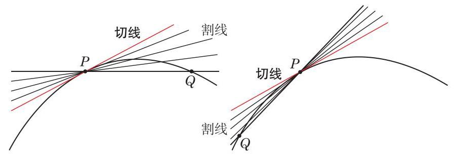

图 5-1-2

切线这个术语我们并不陌生, 在平面几何的学习中已定义过圆的切线, 并讨论过它的性质. 那里所定义的圆的切线是否与上面这个新定义一致呢?

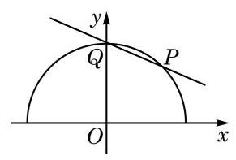

图 5-1-3

例 3 如图 5-1-3,曲线 $y = \sqrt{2 - {x}^{2}}\left( {-\sqrt{2} \leq  x \leq  \sqrt{2}}\right)$ 是圆 ${x}^{2} + {y}^{2} = 2$ 在 $x$ 轴及其上方的部分， $P\left( {1,1}\right)$ 和 $Q\left( {0,\sqrt{2}}\right)$ 是该曲线上的两点.

(1)求割线 ${PQ}$ 的斜率；

(2)对正整数 $n$ ,令 ${x}_{n} = 1 - \frac{1}{n},{y}_{n} = \sqrt{2 - {x}_{n}^{2}},{Q}_{n}\left( {{x}_{n},{y}_{n}}\right)$ 均在该圆周上,且随着 $n$ 的增大越来越接近点 $P$ . 借助信息技术工具,适当地计算一些割线 $P{Q}_{n}$ 的斜率,观察并总结当 $n$ 逐渐

增大时,割线 $P{Q}_{n}$ 的斜率的变化趋势.

解 (1) 割线 ${PQ}$ 的斜率是

$$
{k}_{PQ} = \frac{{y}_{Q} - {y}_{P}}{{x}_{Q} - {x}_{P}} = \frac{\sqrt{2} - 1}{0 - 1} = 1 - \sqrt{2}.
$$

(2)割线 $P{Q}_{n}$ 的斜率是

$$
{k}_{P{Q}_{n}} = \frac{{y}_{{Q}_{n}} - {y}_{P}}{{x}_{{Q}_{n}} - {x}_{P}} = \frac{{y}_{n} - {y}_{P}}{{x}_{n} - {x}_{P}} = \frac{\sqrt{2 - {\left( 1 - \frac{1}{n}\right) }^{2}} - 1}{1 - \frac{1}{n} - 1} = n\left( {1 - \sqrt{2 - {\left( 1 - \frac{1}{n}\right) }^{2}}}\right) .
$$

借助计算器或计算机可以得到表 5-2 中关于 ${k}_{P{Q}_{n}}$ 的近似值(结果精确到 0.000 000 001 ):

表 5-2

<table><tr><td>$n$</td><td>${Q}_{n}$</td><td>${k}_{P{Q}_{n}}$</td></tr><tr><td>1</td><td>(0.000000000, 1.414213562)</td><td>-0.414213562</td></tr><tr><td>5</td><td>(0.800000000, 1.166 190 379)</td><td>-0.830951895</td></tr><tr><td>10</td><td>(0.900000000, 1.090871211)</td><td>-0.908712115</td></tr><tr><td>100</td><td>(0.990000000, 1.009 900 985)</td><td>-0.990 098 525</td></tr><tr><td>1000</td><td>(0.999 000 000, 1.000 999 001)</td><td>-0.999 000 999</td></tr><tr><td>10000</td><td>(0.999 900 000, 1.000 099 990)</td><td>-0.999 900 010</td></tr><tr><td>100000</td><td>(0.999990000, 1.000010000)</td><td>-0.999 990 000</td></tr><tr><td>1000000</td><td>(0.999999000, 1.000001000)</td><td>-0.999999000</td></tr><tr><td>10000000</td><td>(0.999999900, 1.000000100)</td><td>-0.999999898</td></tr><tr><td>...</td><td>...</td><td>...</td></tr></table>

观察表 5-2 可知,当 $n$ 逐渐增大时,割线 $P{Q}_{n}$ 的斜率逐渐减小,并趋近于 -1 .

由例 3 可以看出,根据现在的定义,曲线在点 $P\left( {1,1}\right)$ 处的切线的斜率是 -1,容易求得它的点斜式方程是 $y - 1 =  - \left( {x - 1}\right)$ , 即 $x + y - 2 = 0$ . 另一方面,因为平面几何所定义的圆的切线垂直于过切点的半径,即向量 $\overrightarrow{OP} = \left( {1,1}\right)$ 是切线的法向量,用直线的点法式方程可求出切线的方程也是 $x + y - 2 = 0$ . 这就说明,对于圆来说, 两个切线的定义一致.

对于任意曲线 $y = f\left( x\right)$ ,如何从定义出发求它在点 $P \; \left( {{x}_{0}, f\left( {x}_{0}\right) }\right)$ 处的切线?

例 3 给我们的启示是先求切线的斜率, 且进一步揭示了斜率的求法: 如果记 $f\left( x\right)  = \sqrt{2 - {x}^{2}}$ ,那么

$$
{k}_{P{Q}_{n}} = \frac{{y}_{n} - {y}_{P}}{{x}_{n} - {x}_{P}} = \frac{f\left( {{x}_{0} + h}\right)  - f\left( {x}_{0}\right) }{h},
$$

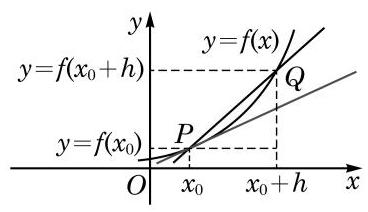

图 5-1-4

其中 ${x}_{0} = 1, h =  - \frac{1}{n}$ . 当 $n$ 增大时, $h$ 趋近于 0, ${k}_{P{Q}_{n}}$ 的稳定值就是

$$
\mathop{\lim }\limits_{{h \rightarrow  0}}\frac{f\left( {{x}_{0} + h}\right)  - f\left( {x}_{0}\right) }{h}.
$$

这个方法适用于一般情况. 如图 5-1-4,在曲线上点 $P$ 的附近取一点 $Q\left( {{x}_{0} + h, f\left( {{x}_{0} + h}\right) }\right)$ ,割线 ${PQ}$ 的斜率 $\frac{f\left( {{x}_{0} + h}\right)  - f\left( {x}_{0}\right) }{h}$ 就是函数 $y = f\left( x\right)$ 在以 ${x}_{0}$ 和 ${x}_{0} + h$ 为端点的区间上的平均变化率. 当点 $Q$ 沿曲线趋近于点 $P$ 时,割线 ${PQ}$ 的斜率趋近于某一稳定值, 这个稳定值

$$
\mathop{\lim }\limits_{{h \rightarrow  0}}\frac{f\left( {{x}_{0} + h}\right)  - f\left( {x}_{0}\right) }{h}
$$

就是函数 $y = f\left( x\right)$ 在 $x = {x}_{0}$ 处的瞬时变化率 ${f}^{\prime }\left( {x}_{0}\right)$ . 因此,函数 $y = f\left( x\right)$ 在 $x = {x}_{0}$ 处的导数 ${f}^{\prime }\left( {x}_{0}\right)$ 就是曲线 $y = f\left( x\right)$ 在点 $P\left( {{x}_{0}, f\left( {x}_{0}\right) }\right)$ 处切线的斜率. 从而,曲线 $y = f\left( x\right)$ 在点 $P\left( {{x}_{0}, f\left( {x}_{0}\right) }\right)$ 处的切线方程为

$$
y - f\left( {x}_{0}\right)  = {f}^{\prime }\left( {x}_{0}\right) \left( {x - {x}_{0}}\right) .
$$

例 4 已知 $f\left( x\right)  = {x}^{2}$ ,求曲线 $y = f\left( x\right)$ 在点 $P\left( {1,1}\right)$ 处的切线方程.

解 先求曲线 $y = f\left( x\right)$ 在点 $P\left( {1,1}\right)$ 处切线的斜率 ${f}^{\prime }\left( 1\right)$ :

当 $h \neq  0$ 时,

$$
\frac{f\left( {1 + h}\right)  - f\left( 1\right) }{h} = \frac{{\left( 1 + h\right) }^{2} - {1}^{2}}{h} = 2 + h,
$$

从而当 $h$ 趋近于 0 时,

$$
{f}^{\prime }\left( 1\right)  = \mathop{\lim }\limits_{{h \rightarrow  0}}\left( {2 + h}\right)  = 2.
$$

因此,曲线 $y = {x}^{2}$ 在点 $P\left( {1,1}\right)$ 处切线的斜率为 2 . 于是,所求切线方程为

$$
y - 1 = 2\left( {x - 1}\right) ,
$$

即

$$
y = {2x} - 1.
$$

例 5 已知 $f\left( x\right)  = {x}^{3}$ ,求曲线 $y = f\left( x\right)$ 在点 $P\left( {0,0}\right)$ 处的切线方程.

解 先求曲线 $y = f\left( x\right)$ 在点 $P\left( {0,0}\right)$ 处切线的斜率 ${f}^{\prime }\left( 0\right)$ :

当 $h \neq  0$ 时,

$$
\frac{f\left( h\right)  - f\left( 0\right) }{h} = \frac{{h}^{3} - {0}^{3}}{h} = {h}^{2},
$$

从而当 $h$ 趋近于 0 时,

$$
{f}^{\prime }\left( 0\right)  = \mathop{\lim }\limits_{{h \rightarrow  0}}{h}^{2} = 0.
$$

因此,曲线 $y = {x}^{3}$ 在点 $P\left( {0,0}\right)$ 处切线的斜率为 0 . 于是,所求切线方程为

$$
y = 0\text{ . }
$$

在例 5 中,函数 $y = {x}^{3}$ 在 $x = 0$ 处的导数为零,即曲线 $y = {x}^{3}$ 在点 $P\left( {0,0}\right)$ 处的切线斜率为零,此时曲线的切线是一条水平直线.

通常, 我们将导数为零的点称为函数的驻点 (stationary point),曲线在其驻点处的切线是一条水平直线. 例如, $x = 0$ 是函数 $y = {x}^{3}$ 的驻点.

---

尝试寻找例 3 和例 4 中函数的驻点.

---

#### 练习 5.1(2)

1. 已知 $f\left( x\right)  = 3{x}^{2}$ ,分别求曲线 $y = f\left( x\right)$ 在点 $P\left( {-1,3}\right)$ 和点 $Q\left( {1,3}\right)$ 处的切线方程.
2. 借助函数图像, 判断下列导数的正负 (可利用信息技术工具):

(1) ${f}^{\prime }\left( \frac{\pi }{4}\right)$ ，其中 $f\left( x\right)  = \sin x$ ； (2) ${f}^{\prime }\left( 0\right)$ ，其中 $f\left( x\right)  = {\left( \frac{1}{2}\right) }^{x}$ .

#### 习题 5.1

##### A 组

1. 自由落体运动的位移 $d$ (单位: $\mathrm{m}$ ) 与时间 $t$ (单位: $\mathrm{s}$ ) 满足函数关系 $d = \frac{1}{2}g{t}^{2}$ ( $g$ 为重力加速度).

(1)分别求[4,4.1]、[4,4.01]、[4,4.001]这些时间段内自由落体的平均速度；

(2)求 $t = 4$ 时的瞬时速度；

(3)求 $t = a\left( {a > 0}\right)$ 时的瞬时速度；

(4)借助(3)的结果，求 $t = \frac{5}{2}$ 时的瞬时速度.

2. 竖直向上发射的火箭熄火时上升速度达到 ${100}\mathrm{\;m}/\mathrm{s}$ ，此后其位移 $H$ (单位: $\mathrm{m}$ )与时间 $t$ (单位: $\mathrm{s}$ )近似满足函数关系 $H = {100t} - 5{t}^{2}$ .

(1)分别求火箭在 $\left\lbrack  {0,2}\right\rbrack$ 、 $\left\lbrack  {2,4}\right\rbrack$ 这些时间段内的平均速度；

(2)求火箭在 $t = 2$ 时的瞬时速度；

(3)熄火后多长时间火箭上升速度为 0 ？

3. 某水管的流水量 $y$ (单位: ${\mathrm{m}}^{3}$ ) 与时间 $t$ (单位: $\mathrm{s}$ ) 满足函数关系 $y = f\left( t\right)$ ,其中 $f\left( t\right)  = {3t}.$

(1)求 $f\left( t\right)$ 在 $t = a$ 处的导数 ${f}^{\prime }\left( a\right)$ ；

(2) ${f}^{\prime }\left( a\right)$ 的实际意义是什么？

(3)随着 $a$ 的取值变化， ${f}^{\prime }\left( a\right)$ 是否发生变化？为什么？

4. 将石子投入水中，水面产生的圆形波纹不断扩散. 计算:

(1)当半径 $r$ 从 $a$ 增加到 $a + h\left( {h > 0}\right)$ 时,圆面积相对于半径的平均变化率；

(2)当半径 $r = a$ 时,圆面积相对于半径的瞬时变化率.

5. 函数 $y = f\left( x\right)$ 的图像如图所示.

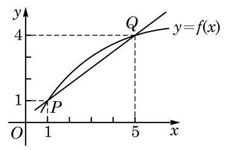

(第 5 题)

(1)求割线 ${PQ}$ 的斜率；

(2)当点 $Q$ 沿曲线向点 $P$ 运动时,割线 ${PQ}$ 的斜率会变大还是变小?

6. 已知 $f\left( x\right)  =  - {x}^{2}$ ,根据以下所给的自变量 $x$ 的值,求曲线 $y = f\left( x\right)$ 在对应点 $\left( {x, f\left( x\right) }\right)$ 处切线的斜率,并说明这些斜率的值是如何随着自变量的变化而变化的:

(1) $x =  - 2$ ； (2) $x =  - 1$ ； (3) $x = 0$ ；

(4) $x = 1$ ； (5) $x = 2$ .

7. 借助函数图像，判断下列导数的正负:

(1) ${f}^{\prime }\left( {-\frac{\pi }{4}}\right)$ ，其中 $f\left( x\right)  = \cos x$ ； (2) ${f}^{\prime }\left( 3\right)$ ，其中 $f\left( x\right)  = \ln x$ .

##### B 组

1. 已知车辆启动后的一段时间内, 车轮旋转的角度和时间 (单位:秒) 的平方成正比, 且车辆启动后车轮转动第一圈需要 1 秒.

(1)求车轮转动前 2 秒的平均角速度；

(2)求车轮在转动开始后第 3 秒的瞬时角速度.

2. 根据导数的几何意义,求函数 $y = \sqrt{4 - {x}^{2}}$ 在下列各点处的导数:

(1) $x =  - 1$ ； (2) $x = 0$ ； (3) $x = 1$ .

3. 已知曲线 $y = f\left( x\right)$ 在 $x = 1$ 处的切线方程为 $y = {4x} - 3$ ,求 $f\left( 1\right)$ 和 ${f}^{\prime }\left( 1\right)$ .
4. 如图,已知直线 $l$ 是曲线 $y = f\left( x\right)$ 在 $x = 3$ 处的切线,求 ${f}^{\prime }\left( 3\right)$ .

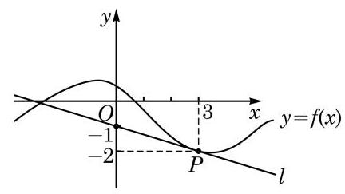

(第 4 题)

## 5.2 导数的运算

在本章 5.1 节的学习中, 我们已经了解到一个函数在某点处导数的概念. 从导数的定义中不难发现: 给定函数 $y = f\left( x\right)$ ,在导数存在的前提下，对于不同的 ${x}_{0}$ ,总有一个确定的导数值 ${f}^{\prime }\left( {x}_{0}\right)$ 与之对应. 换句话说,如果用 $x$ 表示自变量,那么 ${y}^{\prime } = \; {f}^{\prime }\left( x\right)$ 也是一个关于 $x$ 的函数. 称为函数 $y = f\left( x\right)$ 的导函数 (derived function, 也简称为导数), 其中

$$
{f}^{\prime }\left( x\right)  = \mathop{\lim }\limits_{{h \rightarrow  0}}\frac{f\left( {x + h}\right)  - f\left( x\right) }{h}.
$$

求一个函数的导 (函) 数的过程常简称为求导.

如果能够求出函数 $y = f\left( x\right)$ 的导数 ${y}^{\prime } = {f}^{\prime }\left( x\right)$ ,那么求该函数在某点处导数的问题就可以通过简单的代入求值来解决.

### 1 基本初等函数的导数

根据导数的定义，可以求出一些基本初等函数的导数.

例 1 求常数函数 $y = C$ 的导数.

解 记 $f\left( x\right)  = C$ . 当 $h \neq  0$ 时,

$$
\frac{f\left( {x + h}\right)  - f\left( x\right) }{h} = \frac{C - C}{h} = \frac{0}{h} = 0.
$$

因此,当 $h$ 趋近于 0 时, ${f}^{\prime }\left( x\right)  = \mathop{\lim }\limits_{{h \rightarrow  0}}0 = 0$ .

对于例 1 中的函数 $y = f\left( x\right)$ ,坐标平面中的相应曲线 $y = \; f\left( x\right)$ 是平行于 $x$ 轴的直线 $y = C$ ,连接该直线上任何两点的割线都是这条直线本身, 从而该直线上任何一点处的切线也是这条直线本身. 由此可见,该直线上任何一点处的切线的斜率都是 0 , 即对任何给定的 ${x}_{0}$ ,都有 ${f}^{\prime }\left( {x}_{0}\right)  = 0$ . 由此推出 ${f}^{\prime }\left( x\right)  = 0$ . 这就从导数的几何意义诠释了例 1 的结论.

类似的分析适用于函数 $y = {kx} + b$ . 记 $f\left( x\right)  = {kx} + b$ . 直线 $y \; = {kx} + b$ 上任何一点处的切线都是这条直线本身,从而都具有斜率 $k$ ,即对任何给定的 ${x}_{0}$ ,都有 ${f}^{\prime }\left( {x}_{0}\right)  = k$ . 由此推出 ${f}^{\prime }\left( x\right)  = k$ .

---

常数函数、幂函数、指数函数、对数函数、三角函数、反三角函数被称为基本初等函数.

---

这个从几何上推出的结论也可用导数的定义来验证.

例 2 求函数 $y = {kx} + b$ 的导数.

解 记 $f\left( x\right)  = {kx} + b$ . 当 $h \neq  0$ 时,

$$
\frac{f\left( {x + h}\right)  - f\left( x\right) }{h} = \frac{k\left( {x + h}\right)  + b - \left( {{kx} + b}\right) }{h} = \frac{kh}{h} = k.
$$

因此,当 $h$ 趋近于 0 时, ${f}^{\prime }\left( x\right)  = \mathop{\lim }\limits_{{h \rightarrow  0}}k = k$ .

例 3 求下列幂函数 $y = f\left( x\right)$ 的导数,其中:

(1) $f\left( x\right)  = {x}^{2}$ ； (2) $f\left( x\right)  = {x}^{-1}$ ； (3) $f\left( x\right)  = {x}^{\frac{1}{2}}$ .

解(1)当 $h \neq  0$ 时，

$$
\frac{f\left( {x + h}\right)  - f\left( x\right) }{h} = \frac{{\left( x + h\right) }^{2} - {x}^{2}}{h} = \frac{{2xh} + {h}^{2}}{h} = {2x} + h.
$$

因此,当 $h$ 趋近于 0 时, ${f}^{\prime }\left( x\right)  = \mathop{\lim }\limits_{{h \rightarrow  0}}\left( {{2x} + h}\right)  = {2x}$ .

(2)当 $h \neq  0$ 时,

$$
\frac{f\left( {x + h}\right)  - f\left( x\right) }{h} = \frac{{\left( x + h\right) }^{-1} - {x}^{-1}}{h} = \frac{x - \left( {x + h}\right) }{x\left( {x + h}\right) h} = \frac{-1}{x\left( {x + h}\right) }.
$$

因此,当 $h$ 趋近于 0 时, ${f}^{\prime }\left( x\right)  = \mathop{\lim }\limits_{{h \rightarrow  0}}\frac{-1}{x\left( {x + h}\right) } =  - \frac{1}{{x}^{2}} =  - {x}^{-2}$ .

(3)当 $h \neq  0$ 时,

$$
\frac{f\left( {x + h}\right)  - f\left( x\right) }{h} = \frac{\sqrt{x + h} - \sqrt{x}}{h}
$$

$$
= \frac{\left( {\sqrt{x + h} - \sqrt{x}}\right) \left( {\sqrt{x + h} + \sqrt{x}}\right) }{h\left( {\sqrt{x + h} + \sqrt{x}}\right) }
$$

$$
= \frac{1}{\sqrt{x + h} + \sqrt{x}}.
$$

因此,当 $h$ 趋近于 0 时, ${f}^{\prime }\left( x\right)  = \mathop{\lim }\limits_{{h \rightarrow  0}}\frac{1}{\sqrt{x + h} + \sqrt{x}} = \frac{1}{2\sqrt{x}} = \frac{1}{2}{x}^{-\frac{1}{2}}$ .

为了更便捷地处理求导问题, 我们通常将以下基本初等函数的导数作为公式使用:

(1) ${\left( C\right) }^{\prime } = 0$ ， $C$ 为常数；

(2) ${\left( {x}^{\alpha }\right) }^{\prime } = \alpha {x}^{\alpha  - 1}$ ， $\alpha$ 为常数；

(3) ${\left( {\mathrm{e}}^{x}\right) }^{\prime } = {\mathrm{e}}^{x}$ ；

(4) ${\left( \ln x\right) }^{\prime } = \frac{1}{x}$ ；

(5) ${\left( \sin x\right) }^{\prime } = \cos x$

(6) ${\left( \cos x\right) }^{\prime } =  - \sin x$ .

---

我们已经推导了公式(1)以及公式(2) 的一些特殊情况. 如果对这些公式的完整推导过程感兴趣, 可参阅高等数学的有关教科书.

---

例 4 已知函数 $y = f\left( x\right)$ ,其中 $f\left( x\right)  = \frac{1}{{x}^{2}}$ . 求 ${f}^{\prime }\left( 2\right)$ .

解 因为

$$
{f}^{\prime }\left( x\right)  = {\left( \frac{1}{{x}^{2}}\right) }^{\prime } = {\left( {x}^{-2}\right) }^{\prime } =  - 2{x}^{-2 - 1} =  - 2{x}^{-3},
$$

所以

$$
{f}^{\prime }\left( 2\right)  =  - 2 \times  {2}^{-3} =  - \frac{1}{4}.
$$

例 5 求正弦函数 $y = \sin x$ 的驻点.

解 因为 ${y}^{\prime } = \cos x$ ,而 $\cos x = 0$ 的解是 $x = {k\pi } + \frac{\pi }{2}\left( {k \in  \mathbf{Z}}\right)$ , 所以当且仅当 $x = {k\pi } + \frac{\pi }{2}\left( {k \in  \mathbf{Z}}\right)$ 时，正弦函数 $y = \sin x$ 的导数为零,即正弦函数 $y = \sin x$ 的驻点为 $x = {k\pi } + \frac{\pi }{2}\left( {k \in  \mathbf{Z}}\right)$ .

?

---

从函数图像上看, 这些驻点有什么特殊性质?

---

#### 练习 5.2(1)

1. 用导数的定义求函数 $y = {x}^{2} + {3x} - 5$ 的导数.
2. 用公式求下列函数 $y = f\left( x\right)$ 的导数,其中:

(1) $f\left( x\right)  = \sqrt[3]{{x}^{2}}$ ； (2) $f\left( x\right)  = {x}^{\pi }$ .

3. 求余弦函数 $y = \cos x$ 在 $x = \frac{\pi }{2}$ 处的导数.
4. 证明函数 $y = \ln x$ 与 $y = {\mathrm{e}}^{x}$ 没有驻点.

探究与实践

在我们熟悉的基本初等函数中, 有哪些函数的图像存在水平切线? 有哪些函数的图像在所有点处切线的斜率均大于 0 ? 尝试从导数公式和函数图像两个角度进行探究.

### 2 导数的四则运算

基本初等函数可以通过四则运算产生新的初等函数. 这些初等函数的求导可以通过以下的“导数四则运算法则”归结为基本初

等函数的求导.

对函数 $y = f\left( x\right)$ 与 $y = g\left( x\right)$ ,以下等式成立:

(7) ${\left( f\left( x\right)  \pm  g\left( x\right) \right) }^{\prime } = {f}^{\prime }\left( x\right)  \pm  {g}^{\prime }\left( x\right)$ ;

(8) ${\left( f\left( x\right) g\left( x\right) \right) }^{\prime } = {f}^{\prime }\left( x\right) g\left( x\right)  + f\left( x\right) {g}^{\prime }\left( x\right)$ ;

(9) ${\left( \frac{f\left( x\right) }{g\left( x\right) }\right) }^{\prime } = \frac{{f}^{\prime }\left( x\right) g\left( x\right)  - f\left( x\right) {g}^{\prime }\left( x\right) }{{\left( g\left( x\right) \right) }^{2}}$ ,其中 $g\left( x\right)  \neq  0$ .

用导数的定义可以推导出这些公式. 这里只推导关于积的求导公式 (8), 其余的留给有兴趣的同学自行完成.

由导数的定义,当 $h \neq  0$ 时,

$$
f\left( {x + h}\right) g\left( {x + h}\right)  - f\left( x\right) g\left( x\right)
$$

$$
= f\left( {x + h}\right) g\left( {x + h}\right)  - f\left( x\right) g\left( {x + h}\right)  + f\left( x\right) g\left( {x + h}\right)  - f\left( x\right) g\left( x\right)
$$

$$
= \left\lbrack  {f\left( {x + h}\right)  - f\left( x\right) }\right\rbrack  g\left( {x + h}\right)  + f\left( x\right) \left\lbrack  {g\left( {x + h}\right)  - g\left( x\right) }\right\rbrack  ,
$$

于是可得

$$
\frac{f\left( {x + h}\right) g\left( {x + h}\right)  - f\left( x\right) g\left( x\right) }{h}
$$

$$
= \frac{f\left( {x + h}\right)  - f\left( x\right) }{h}g\left( {x + h}\right)  + f\left( x\right) \frac{g\left( {x + h}\right)  - g\left( x\right) }{h}.
$$

所以,当 $h$ 趋近于 0 时,就有

$$
{\left( f\left( x\right) g\left( x\right) \right) }^{\prime } = {f}^{\prime }\left( x\right) g\left( x\right)  + f\left( x\right) {g}^{\prime }\left( x\right) .
$$

例 6 证明: 对函数 $y = f\left( x\right)$ 与任何常数 $C$ ,都有

$$
\text{ (10) }{\left( Cf\left( x\right) \right) }^{\prime } = C{f}^{\prime }\left( x\right) \text{ . }
$$

证明 用积的求导公式和常数函数的求导公式, 得到

$$
{\left( Cf\left( x\right) \right) }^{\prime } = {\left( C\right) }^{\prime }f\left( x\right)  + C{f}^{\prime }\left( x\right)  = C{f}^{\prime }\left( x\right) .
$$

例 7 求下列函数 $y = f\left( x\right)$ 的导数,其中:

(1) $f\left( x\right)  = {x}^{2}\sin x$ (2) $f\left( x\right)  = \frac{{x}^{2}}{x + 2}$ ；

(3) $f\left( x\right)  = {\left( x - 2\right) }^{2}$ .

解(1)用积的求导公式以及幂函数与正弦函数的求导公式, 得到

${f}^{\prime }\left( x\right)  = {\left( {x}^{2}\sin x\right) }^{\prime } = {\left( {x}^{2}\right) }^{\prime }\sin x + {x}^{2}{\left( \sin x\right) }^{\prime } = {2x}\sin x + {x}^{2}\cos x.$

(2)用商的求导公式、和的求导公式以及幂函数与常数函数的求导公式, 得到

$$
{f}^{\prime }\left( x\right)  = {\left( \frac{{x}^{2}}{x + 2}\right) }^{\prime } = \frac{{\left( {x}^{2}\right) }^{\prime }\left( {x + 2}\right)  - {x}^{2}{\left( x + 2\right) }^{\prime }}{{\left( x + 2\right) }^{2}} = \frac{{2x}\left( {x + 2}\right)  - {x}^{2}}{{\left( x + 2\right) }^{2}} = \frac{{x}^{2} + {4x}}{{\left( x + 2\right) }^{2}}.
$$

(3)先把函数表达式展开，得 $f\left( x\right)  = {x}^{2} - {4x} + 4$ ，再用和、 差的求导公式、公式 (10) 以及幂函数与常数函数的求导公式, 得到

$$
{f}^{\prime }\left( x\right)  = {\left( {x}^{2}\right) }^{\prime } - {\left( 4x\right) }^{\prime } + {\left( 4\right) }^{\prime } = {2x} - 4.
$$

例 8 设实数 $a > 0$ 且 $a \neq  1$ ,求证: ${\left( {\log }_{a}x\right) }^{\prime } = \frac{1}{x\ln a}$ .

证明 先用换底公式,有 ${\log }_{a}x = \frac{\ln x}{\ln a}$ ,再由公式 (10) 以及对数函数的求导公式, 得到

$$
{\left( {\log }_{a}x\right) }^{\prime } = {\left( \frac{\ln x}{\ln a}\right) }^{\prime } = \frac{1}{\ln a}{\left( \ln x\right) }^{\prime } = \frac{1}{x\ln a}.
$$

练习 $\mathbf{{5.2}\left( 2\right) }$

求下列函数 $y = f\left( x\right)$ 的导数,其中:

(1) $f\left( x\right)  = 3{\mathrm{e}}^{x} - {x}^{\mathrm{e}} + \mathrm{e}$ ； (2) $f\left( x\right)  = \cos x - \frac{2}{x}$ ；

(3) $f\left( x\right)  = {\left( 2x + 1\right) }^{3}$ ； (4) $f\left( x\right)  = \sqrt{x}\sin x$ ；

(5) $f\left( x\right)  = x\ln x - \frac{1}{{x}^{2}}$ ; (6) $f\left( x\right)  = \frac{{x}^{2} - 1}{x}$ ；

(7) $f\left( x\right)  = \frac{{x}^{2} - 1}{{x}^{2} + 1}$ ; (8) $f\left( x\right)  = \tan x$ .

### 3 简单复合函数的导数

在本节例 7 第( 3 )小题中，为了求 $f\left( x\right)  = {\left( x - 2\right) }^{2}$ 的导数，我们先借助于完全平方公式将 ${\left( x - 2\right) }^{2}$ 化为 ${x}^{2} - {4x} + 4$ ,再利用导数四则运算法则求导. 从另一个角度看,函数 $y = {\left( x - 2\right) }^{2}$ 也可以看作由两个函数 $y = {u}^{2}\text{ 、 }u = x - {2}^{u}$ 套”在一起所构成的新函数. 像这样,如果一个函数 $y = f\left( u\right)$ 的自变量 $u$ 又是另一个变量 $x$ 的函数 $u = g\left( x\right)$ , 那么就可将 $y$ 直接看作变量 $x$ 的函数而得到一个新函数 $y =$

 $f\left( {g\left( x\right) }\right)$ ,这个新函数被称为两个函数的复合函数 (composite function).

在对复合函数求导数时, 往往不是把两个预先给定的函数先复合成较复杂的函数，然后直接求导，而是反过来，先引进一个中间变量, 把原来的函数看作两个相对简单的函数的复合, 再利用复合函数的求导法则求其导数, 从而使求导过程得到简化. 例如,函数 $y = {\left( x - 2\right) }^{2}$ 可看作由函数 $y = {u}^{2}$ 与 $u = x - 2$ 复合而成, 而函数 $y = \sin {2x}$ 可看作由函数 $y = \sin u$ 与 $u = {2x}$ 复合而成.

我们不讨论一般复合函数的求导问题,仅考虑由 $y = f\left( u\right)$ 与 $u = {ax} + b\left( {a \neq  0}\right)$ 复合而成的 $y = f\left( {{ax} + b}\right)$ 型复合函数的求导法则.

因为当 $h \neq  0$ 时,有

$$
\frac{f\left( {a\left( {x + h}\right)  + b}\right)  - f\left( {{ax} + b}\right) }{h} = a \cdot  \frac{f\left( {u + {ah}}\right)  - f\left( u\right) }{ah},
$$

且注意到 $h$ 趋近于 0 当且仅当 ${ah}$ 趋近于 0 ，所以

$$
\mathop{\lim }\limits_{{h \rightarrow  0}}\frac{f\left( {a\left( {x + h}\right)  + b}\right)  - f\left( {{ax} + b}\right) }{h} = a\mathop{\lim }\limits_{{{ah} \rightarrow  0}}\frac{f\left( {u + {ah}}\right)  - f\left( u\right) }{ah}.
$$

这就给出了 $y = f\left( {{ax} + b}\right)$ 型复合函数的如下求导法则:

(11) ${\left( f\left( ax + b\right) \right) }^{\prime } = a{f}^{\prime }\left( u\right)$ ,其中 $u = {ax} + b$ .

例 9 求 $y = \ln \left( {2 - {5x}}\right)$ 的导数.

解 将 $y = \ln \left( {2 - {5x}}\right)$ 看作由 $y = \ln u$ 与 $u = 2 - {5x}$ 复合而成, 则

$$
{y}^{\prime } =  - 5{\left( \ln u\right) }^{\prime } =  - \frac{5}{u} = \frac{5}{{5x} - 2}.
$$

例 10 设实数 $a > 0$ 且 $a \neq  1$ ,求证: ${\left( {a}^{x}\right) }^{\prime } = {a}^{x}\ln a$ .

证明 因为 ${a}^{x} = {\mathrm{e}}^{\ln {a}^{x}} = {\mathrm{e}}^{x\ln a}$ ,可以把 $y = {\mathrm{e}}^{x\ln a}$ 看作由 $y = {\mathrm{e}}^{u}$ 与 $u = x\ln a$ 复合而成,所以

$$
{y}^{\prime } = {\left( {\mathrm{e}}^{u}\right) }^{\prime }\ln a = {\mathrm{e}}^{u}\ln a = {\mathrm{e}}^{x\ln a}\ln a = {a}^{x}\ln a,
$$

即 ${\left( {a}^{x}\right) }^{\prime } = {a}^{x}\ln a$ .

#### 练习 5.2(3)

1. 利用 $y = f\left( {{ax} + b}\right)$ 型复合函数的求导法则求下列函数的导数:

(1) $y = {\left( 3 - 2x\right) }^{2}$ ; (2) $y = \sin {2x}$ .

2. 尝试用两种不同的方法求 $y = \frac{1}{{2x} - 1}$ 的导数.

导数及其应用

3. 求曲线 $y = {2}^{1 - {3x}}$ 在点 $\left( {0,2}\right)$ 处的切线方程.
4. 求下列函数的导数:

(1) $y = {3x}\sqrt{2 - x}$ ； (2) $y = \frac{\ln \left( {{2x} + 1}\right) }{x}$ .

探究与实践

按以下步骤探究复合函数求导的一般规律:

1. 分别求 $y = {\left( {x}^{3} - 2\right) }^{2}\text{ 、 }y = {u}^{2}$ 与 $u = {x}^{3} - 2$ 的导数,并探索三个导数之间的联系;
2. 分别求 $y = {\sin }^{2}x + \sin x - 1\text{ 、 }y = {u}^{2} + u - 1$ 与 $u = \sin x$ 的导数,并探索三个导数之间的联系;
3. 根据上述两个特例, 猜想复合函数求导的一般规律, 并用一些实例验证你的猜想.

#### 习题 5.2

##### A 组

1. 求下列函数 $y = f\left( x\right)$ 的导数:

(1) $f\left( x\right)  = \pi$ ； (2) $f\left( x\right)  = \sqrt[3]{{x}^{5}}$ ；

(3) $f\left( x\right)  = \frac{1}{{x}^{3}}$ .

2. 求曲线 $y = \cos x$ 在 $x = \frac{\pi }{2}$ 处的切线方程.
3. 已知曲线 $y = {x}^{3}$ 在原点以外某点 $P$ 处切线的斜率为 $a$ .

(1)求点 $P$ 的坐标； (2)判断 $a$ 的正负.

4. 求曲线 $y = {x}^{3} - {3x} + 5$ 平行于 $x$ 轴的切线及其切点坐标.
5. 求曲线 $y = \frac{1}{x}$ 平行于直线 $y =  - x$ 的切线及其切点坐标.
6. 求下列函数 $y = f\left( x\right)$ 的导数:

(1) $f\left( x\right)  = 2{x}^{e} - {\mathrm{e}}^{2}$ ; (2) $f\left( x\right)  = {\mathrm{e}}^{x}\cos x$ ；

(3) $f\left( x\right)  = \frac{x - 1}{x - 2}$ ； (4) $f\left( x\right)  = \frac{\ln x}{\sin x}$ .

7. 用两种方法求函数 $y = \left( {x - 2}\right) \left( {3 - {4x}}\right)$ 的导数.
8. 已知函数 $y = f\left( x\right)$ 与 $y = g\left( x\right)$ 满足条件 $f\left( 1\right)  = 2,{f}^{\prime }\left( 1\right)  = 3, g\left( 1\right)  = 4$ 与 ${g}^{\prime }\left( 1\right)  = 5$ . 对于下列函数 $y = h\left( x\right)$ ,求 $h\left( 1\right)$ 和 ${h}^{\prime }\left( 1\right)$ :

(1) $h\left( x\right)  = {2g}\left( x\right)  - \frac{1}{3}f\left( x\right)$ ； (2) $h\left( x\right)  = {2g}\left( x\right) f\left( x\right)  - \frac{1}{3};$

(3) $h\left( x\right)  = \frac{{2g}\left( x\right)  - 1}{{3f}\left( x\right) }$ .

9. 利用 $y = f\left( {{ax} + b}\right)$ 型复合函数的求导法则,求下列函数的导数:

(1) $y = \sqrt{{2x} - 5}$ ； (2) $y = \cos \frac{x}{2}$ ；

(3) $y = \frac{1}{{\mathrm{e}}^{x + 1}}.$

10. 用两种方法求函数 $y = \frac{2}{x - 1}$ 的导数.
11. 某种动物的体温 $T$ (单位: ${}^{ \circ  }\mathrm{C}$ ) 与太阳落山后经过的时间 $t$ (单位: $\mathrm{{min}}$ ) 满足函数关系 $T = \frac{120}{t + 5} + {15}$ .

(1)当 $t = 5$ 时，求该动物体温的瞬时变化率；

(2)在哪一时刻该动物体温的瞬时变化率是 $- 2{}^{ \circ  }\mathrm{C}/\mathrm{{min}}$ ？(结果精确到 ${0.1}\mathrm{{min}}$ )

12. 已知某港口一天内潮水的深度 $y$ (单位: $\mathrm{m}$ ) 与时间 $t$ (单位: $\mathrm{h}$ ) 近似满足函数关系 $y = 3\sin \left( {\frac{\pi }{12}t + \frac{5\pi }{6}}\right) ,0 \leq  t \leq  {24}$ . 分别求上午 6 时与下午 6 时潮水涨(落)的速度.

##### B 组

1. 已知一列火车从静止开始加速的一段时间内,其行驶速度 $v$ (单位: $\mathrm{m}/\mathrm{s}$ )与行驶时间 $t$ (单位: $\mathrm{s}$ )满足函数关系 $v = {0.4t} + {0.6}{t}^{2}$ .

(1)求这段时间内火车行驶的加速度；

(2)火车行驶到哪一时刻，其加速度为 $4\mathrm{\;m}/{\mathrm{s}}^{2}$ ？

2. 直线 $y =  - x + b$ 是下列曲线的切线吗? 如果是,请求出 $b$ 的值; 如果不是,请说明理由.

(1) $y = \ln x$ ；

(2) $y = \frac{1}{x}$ .

3. 吹一个球形的气球时,气球半径 $r$ 将随空气容量 $V$ 的增加而增大.

(1)写出气球半径 $r$ 关于气球内空气容量 $V$ 的函数表达式；

(2)求 $V = 1$ 时，气球的瞬时膨胀率(即气球半径关于气球内空气容量的瞬时变化率).

4. 判断下列求导结果是否正确. 如果不正确, 请指出错在哪里, 并予以改正.

(1) ${\left( \frac{\sin x}{x}\right) }^{\prime } =  - \frac{1}{{x}^{2}}\sin x - \frac{\cos x}{x}$ ；___ (2) ${\left( \ln \left( 2 - x\right) \right) }^{\prime } = \frac{1}{2 - x}$ .

5. 求过点 $\left( {0, - 1}\right)$ 且与曲线 $y = 2{x}^{2}$ 相切的直线的方程.
6. 已知一罐汽水放入冰箱后的温度 $x$ (单位: $C$ ) 与时间 $t$ (单位: $h$ ) 满足函数关系 $x = 4 + {16}{\mathrm{e}}^{-{2t}}.$

(1)求 ${x}^{\prime }\left( 1\right)$ ，并解释其实际意义；

(2)已知摄氏度 $x$ 与华氏度 $y$ (单位: $F$ 的满足函数关系 $x = \frac{5}{9}\left( {y - {32}}\right)$ ，求 $y$ 关于 $t$ 的导数,并解释其实际意义.

7. 求下列函数 $y = f\left( x\right)$ 的导数,其中:

(1) $f\left( x\right)  = {x}^{2}\sin {3x} - \frac{2}{\sqrt{x}}$ ; (2) $f\left( x\right)  = \frac{{\mathrm{e}}^{x} - {\mathrm{e}}^{-x}}{{\mathrm{e}}^{x} + {\mathrm{e}}^{-x}}$ .

## 5.3 导数的应用

在对函数的研究中, 单调性与极大 (小) 值、最大 (小) 值是重要的主题之一. 但限于初等数学所能提供的工具, 在很多常见函数面前，我们往往束手无策，而导数则为我们研究函数的这些性质提供了通用和便捷的手段.

本章引入的定理大多需要高等数学的知识才能严格证明，但同学们可以借助一些熟悉的函数(如二次函数)来验证这些结论的合理性.

### 1 利用导数研究函数的单调性

函数的单调性研究的是在一个区间内函数是否严格增或严格减, 即函数值是否随着自变量的增大而增大, 或随着自变量的增大而减小. 导数是函数的瞬时变化率, 反映了在自变量发生变化的瞬间, 函数值随之发生的增减变化, 因此, 导数是研究函数单调性的最佳工具. 特别地, 从导数的正负就可以直接判断函数的单调性:

定理 在区间 $I$ 上,若 ${f}^{\prime }\left( x\right)  > 0$ ,则函数 $y = f\left( x\right)$ 在该区间严格增; 若 ${f}^{\prime }\left( x\right)  < 0$ ,则函数 $y = f\left( x\right)$ 在该区间严格减.

在导数值都存在的情况下，导数值由正变负或由负变正的过程中会出现导数等于零的点, 即函数的驻点. 因此, 要把函数的单调增区间和单调减区间划分出来, 就要先找到函数的驻点. 找到驻点后, 再看驻点两侧导数值的正负是否发生变化, 如果发生变化了, 此驻点就成为单调增区间与单调减区间的分界点.

例 1 已知 $f\left( x\right)  = {x}^{2} - {4x} + 2$ ,求函数 $y = f\left( x\right)$ 的单调区间.

解 先求函数的驻点: ${f}^{\prime }\left( x\right)  = {2x} - 4$ . 令 ${f}^{\prime }\left( x\right)  = 0$ ,解得

---

对一些你熟悉的函数, 借助信息技术工具，从数值和图像两个角度进行尝试， 获得的结论一致吗?

---

$x = 2$ . 此函数只有一个驻点.

当 $x > 2$ 时, ${f}^{\prime }\left( x\right)  > 0$ ,函数 $y = f\left( x\right)$ 严格增;

当 $x < 2$ 时， ${f}^{\prime }\left( x\right)  < 0$ ，函数 $y = f\left( x\right)$ 严格减.

?

因此，函数 $y = f\left( x\right)$ 的单调增区间为 $\left( {2, + \infty }\right)$ ,单调减区间为 $\left( {-\infty ,2}\right)$ .

例 2 已知 $f\left( x\right)  = {x}^{3} + {x}^{2} - x - 1$ ,求函数 $y = f\left( x\right)$ 的单调区间.

解 对函数求导,得 ${f}^{\prime }\left( x\right)  = 3{x}^{2} + {2x} - 1$ . 令 ${f}^{\prime }\left( x\right)  = 0$ , 解得 ${x}_{1} =  - 1,{x}_{2} = \frac{1}{3}$ . 此函数有两个驻点.

?

当 $x <  - 1$ 或 $x > \frac{1}{3}$ 时, ${f}^{\prime }\left( x\right)  > 0$ ,函数 $y = f\left( x\right)$ 严格增;

当 $- 1 < x < \frac{1}{3}$ 时, ${f}^{\prime }\left( x\right)  < 0$ ,函数 $y = f\left( x\right)$ 严格减.

因此，函数 $y = f\left( x\right)$ 的单调增区间为 $\left( {-\infty , - 1}\right)$ 及 $\left( {\frac{1}{3}, + \infty }\right)$ , 单调减区间为 $\left( {-1,\frac{1}{3}}\right)$ .

注意, 有时驻点并不是单调增区间与单调减区间的分界点.

例 3 已知 $f\left( x\right)  = {x}^{3}$ ,求函数 $y = f\left( x\right)$ 的单调区间.

解 对函数求导,得 ${f}^{\prime }\left( x\right)  = 3{x}^{2}$ . 令 ${f}^{\prime }\left( x\right)  = 0$ ,解得 $x = 0$ ,所以此函数在 $x = 0$ 时有唯一的驻点. 但是,由于永远成立 ${f}^{\prime }\left( x\right)  \geq  0$ ,驻点两侧导数值的正负没有发生变化,因此该驻点不是单调区间的分界点. 此函数的单调增区间为 $\left( {-\infty , + \infty }\right)$ .

在讨论中, 我们也要注意函数没有定义的点. 这样的点也可能成为单调增区间与单调减区间的分界点.

例 4 已知 $f\left( x\right)  = {x}^{-2}$ ,求函数 $y = f\left( x\right)$ 的单调区间.

解 该函数在 $x = 0$ 处没有定义. 当 $x \neq  0$ 时, ${f}^{\prime }\left( x\right)  = \; - 2{x}^{-3}$ ,因为方程 ${f}^{\prime }\left( x\right)  = 0$ 无解,所以函数 $y = f\left( x\right)$ 没有驻点. 但当 $x > 0$ 时, ${f}^{\prime }\left( x\right)  < 0, f\left( x\right)$ 严格减; 当 $x < 0$ 时, ${f}^{\prime }\left( x\right)  > 0$ , $f\left( x\right)$ 严格增. 可见,函数 $y = f\left( x\right)$ 的单调增区间为 $\left( {-\infty ,0}\right)$ ,单调减区间为 $\left( {0, + \infty }\right)$ ,而其分界点恰是该函数没有定义的点.

上面我们用导数值的正负来判断函数在某区间上的单调性.

---

在学习了更多相关知识后, 还可以进一步讨论单调区间是否包含端点.

用已经学过的二次函数知识验证这个结果.

利用信息技术工具绘制这个函数的图像以验证结果.

此例表明, ${f}^{\prime }\left( x\right)$ >0 并不是函数在一个区间上严格增的必要条件.

---

除此之外,导数值还可用以判断函数变化速度的快慢: 导数 ${f}^{\prime }\left( {x}_{0}\right)$ 是曲线 $y = f\left( x\right)$ 在点 $\left( {{x}_{0}, f\left( {x}_{0}\right) }\right)$ 处的切线的斜率,它描述了曲线 $y = f\left( x\right)$ 在点 $\left( {{x}_{0}, f\left( {x}_{0}\right) }\right)$ 附近相对于 $x$ 轴的倾斜程度: 当 ${f}^{\prime }\left( {x}_{0}\right)  > 0$ 时, ${f}^{\prime }\left( {x}_{0}\right)$ 越大,曲线 $y = f\left( x\right)$ 在点 $\left( {{x}_{0}, f\left( {x}_{0}\right) }\right)$ 附近相对于 $x$ 轴倾斜程度越大,函数值 $y = f\left( x\right)$ 递增得越快; 而当 ${f}^{\prime }\left( {x}_{0}\right)  < 0$ 时, ${f}^{\prime }\left( {x}_{0}\right)$ 越小,曲线 $y = f\left( x\right)$ 在点 $\left( {{x}_{0}, f\left( {x}_{0}\right) }\right)$ 附近相对于 $x$ 轴倾斜程度越大,函数值 $y = f\left( x\right)$ 递减得越快. 总之,导数的绝对值越大, 函数图像就越“陡峭”，也就是函数值的变化速度越快.

例 5 已知在区间 $\left( {0,1}\right)$ 上 ${f}^{\prime }\left( x\right)  > 1$ . 在图 5-3-1 所示的图像中,哪些有可能表示函数 $y = f\left( x\right)$ ? 为什么?

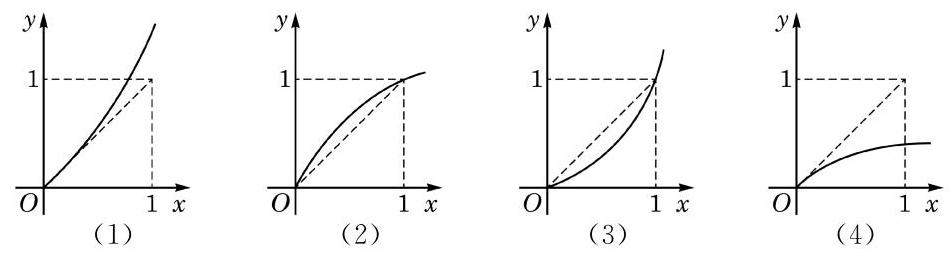

图 5-3-1

解 在区间 $\left( {0,1}\right)$ 上,因为 ${f}^{\prime }\left( x\right)  > 1$ ,所以函数图像中每一点处切线的斜率都应大于 1 . 在图 5-3-1 中，由观察可知:

图(1)中的曲线越来越“陡峭”，在区间 $\left( {0,1}\right)$ 上各点处的切线斜率始终大于 1 ;

图(2)中的曲线由“陡峭”变得“平缓”，在区间 $\left( {0,1}\right)$ 的右半段的切线斜率小于 1 ;

图(3)中的曲线由 “平缓” 变得 “陡峭”，在区间 $\left( {0,1}\right)$ 的左半段的切线斜率小于 1 ;

图(4)中的曲线越来越“平缓”，在区间 $\left( {0,1}\right)$ 上各点处的切线斜率始终小于 1 .

因此,只有图 5-3-1(1) 中的图像有可能表示函数 $y = f\left( x\right)$ .

#### 练习 5.3(1)

1. 利用导数研究下列函数的单调性, 并说明所得结果与你之前的认识是否一致:

(1) $y = {\mathrm{e}}^{x}$ ； (2) $y = \ln x$ ；

(3) $y = a{x}^{2} + {bx} + c$ ，其中 $a \neq  0$ .

2. 确定下列函数的单调区间:

(1) $y = x{\mathrm{e}}^{x}$ ； (2) $y = 4{x}^{3} - 9{x}^{2} + {6x} + 7$ .

### 2 利用导数研究函数的极值

观察图 5-3-2 中函数 $y = f\left( x\right)$ 的图像,其中有一些特殊的点, 在这些特殊点的左右两侧附近, 函数的单调性发生了改变. 例如,函数在点 $\left( {{x}_{1}, f\left( {x}_{1}\right) }\right)$ 的左侧附近严格增,右侧附近严格减，此处出现了一个“山峰”；又如，函数在点 $\left( {{x}_{2}, f\left( {x}_{2}\right) }\right)$ 的左侧附近严格减，右侧附近严格增，此处出现了一个“山谷”.

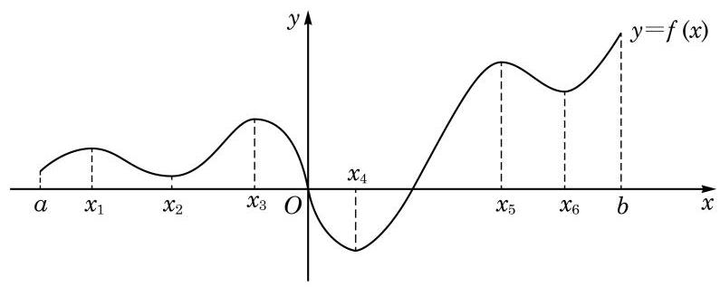

图 5-3-2

换句话说,存在含有 ${x}_{1}$ 的一个开区间,该区间内其他自变量所对应的函数值都不大于 $f\left( {x}_{1}\right)$ ,此时,就说函数 $y = f\left( x\right)$ 在 $x = {x}_{1}$ 处取得极大值 $f\left( {x}_{1}\right)$ ,而点 ${x}_{1}$ 称为函数 $y = f\left( x\right)$ 的极大值点. 类似地, 存在含有 ${x}_{2}$ 的一个开区间,该区间内其他自变量所对应的函数值都不小于 $f\left( {x}_{2}\right)$ ,此时,就说函数 $y = f\left( x\right)$ 在 $x = {x}_{2}$ 处取得极小值 $f\left( {x}_{2}\right)$ ,而点 ${x}_{2}$ 称为函数 $y = f\left( x\right)$ 的极小值点.

因此,图 5-3-2 所示的函数有三个极大值点 ${x}_{1}\text{ 、 }{x}_{3}\text{ 、 }{x}_{5}$ , 还有三个极小值点 ${x}_{2}\text{ 、 }{x}_{4}\text{ 、 }{x}_{6}$ .

极大值和极小值统称为极值, 而极大值点和极小值点则统称为极值点.

在导数存在的前提下，极值点一定是函数的驻点，函数曲线在该点的切线是水平的. 但反过来, 我们却不能说一个函数的驻点一定是其极值点. 例如,在函数 $y = {x}^{3}$ 中,点 $x = 0$ 虽是其驻点,但不是极值点,因为这个函数在整个区间 $\left( {-\infty , + \infty }\right)$ 上是严格增的. 因此,要找到函数 $y = f\left( x\right)$ 的极值点,通过 ${f}^{\prime }\left( {x}_{0}\right)  = 0$ 找到驻点 $x = {x}_{0}$ 只是第一步,还要根据驻点附近 ${f}^{\prime }\left( x\right)$ 的符号才能断定 ${x}_{0}$ 是否为 $f\left( x\right)$ 的极值点.

具体地说,我们有如下定理:

定理 设点 $x = {x}_{0}$ 是函数 $y = f\left( x\right)$ 的驻点.

(1)若在点 ${x}_{0}$ 的左侧附近有 ${f}^{\prime }\left( x\right)  > 0$ ，而在 ${x}_{0}$ 的右侧附近有 ${f}^{\prime }\left( x\right)  < 0$ ,则函数 $y = f\left( x\right)$ 在 ${x}_{0}$ 处取得极大值;

(2)若在点 ${x}_{0}$ 的左侧附近有 ${f}^{\prime }\left( x\right)  < 0$ ，而在 ${x}_{0}$ 的右侧附近有 ${f}^{\prime }\left( x\right)  > 0$ ,则函数 $y = f\left( x\right)$ 在 ${x}_{0}$ 处取得极小值.

例 6 已知 $f\left( x\right)  =  - {x}^{2} + {6x} - 1$ ,求函数 $y = f\left( x\right)$ 的单调区间和极值.

解 对函数求导,得 ${f}^{\prime }\left( x\right)  =  - {2x} + 6$ . 令 ${f}^{\prime }\left( x\right)  = 0$ ,解得 $x = 3$ ,从而 $x = 3$ 为函数 $y = f\left( x\right)$ 的唯一驻点. 把该驻点与其两侧的区间列表如下: O

表 5-3

<table><tr><td>$x$</td><td>(−∞,3)</td><td>3</td><td>(3,十)</td></tr><tr><td>${f}^{\prime }\left( x\right)$</td><td>+</td><td>0</td><td>-</td></tr><tr><td>$f\left( x\right)$</td><td>↗</td><td>极大值 8</td><td>↘</td></tr></table>

因此, $y = f\left( x\right)$ 在区间 $\left( {-\infty ,3}\right)$ 内严格增,在区间 $\left( {3, + \infty }\right)$ 内严格减，在 $x = 3$ 处取得极大值 $f\left( 3\right)  = 8$ .

例 7 求正弦函数 $y = \sin x$ 的单调区间和极值.

解 这是一个周期为 ${2\pi }$ 的周期函数. 记 $f\left( x\right)  = \sin x$ ,求导可得 ${f}^{\prime }\left( x\right)  = \cos x$ . 令 ${f}^{\prime }\left( x\right)  = 0$ ,解得 $x = {2k\pi } \pm  \frac{\pi }{2}, k \in  \mathbf{Z}$ . 将不同驻点及其所划分出的区间在一个周期上的情况列表如下:

表 5-4

<table><tr><td>$x$</td><td>${2k\pi } - \frac{\pi }{2}$</td><td>$\left( {{2k\pi } - \frac{\pi }{2},}\right.$   ${2k\pi } + \frac{\pi }{2})$</td><td>${2k\pi } + \frac{\pi }{2}$</td><td>$\left( {{2k\pi } + \frac{\pi }{2}}\right.$   $\left. {2\left( {k + 1}\right) \pi  - \frac{\pi }{2}}\right)$</td><td>$2\left( {k + 1}\right) \pi  - \frac{\pi }{2}$</td></tr><tr><td>${f}^{\prime }\left( x\right)$</td><td>0</td><td>+</td><td>0</td><td>-</td><td>0</td></tr><tr><td>$f\left( x\right)$</td><td>极小值 -1</td><td>↗</td><td>极大值 1</td><td>↘</td><td>极小值 -1</td></tr></table>

因此,对任意给定的 $k \in  \mathbf{Z}$ ,正弦函数 $y = \sin x$ 在区间 $\left( {{2k\pi } - \frac{\pi }{2},{2k\pi } + \frac{\pi }{2}}\right)$ 内严格增，在区间 $\left( {{2k\pi } + \frac{\pi }{2},2\left( {k + 1}\right) \pi  - \frac{\pi }{2}}\right)$ 内严格减，在 $x = {2k\pi } - \frac{\pi }{2}$ 时取得极小值 -1，在 $x = {2k\pi } + \frac{\pi }{2}$ 时取得极大值 1 .

---

把驻点与驻点所划分的区间列表, 可以简明清晰地呈现函数的增减情况和极值点.

---

例 8 已知 $f\left( x\right)  = \frac{1}{3}{x}^{3} - x + 2$ ,求函数 $y = f\left( x\right)$ 的单调区间和极值.

解 对函数求导,得 ${f}^{\prime }\left( x\right)  = {x}^{2} - 1$ . 令 ${f}^{\prime }\left( x\right)  = 0$ ,解得两个驻点 ${x}_{1} =  - 1,{x}_{2} = 1$ . 列表如下:

表 5-5

<table><tr><td>$x$</td><td>$\left( {-\infty , - 1}\right)$</td><td>-1</td><td>(-1,1)</td><td>1</td><td>(1,十〜)</td></tr><tr><td>${f}^{\prime }\left( x\right)$</td><td>+</td><td>0</td><td>-</td><td>0</td><td>+</td></tr><tr><td>$f\left( x\right)$</td><td>↗</td><td>极大值 $\frac{8}{3}$</td><td>↘</td><td>极小值 $\frac{4}{3}$</td><td>↗</td></tr></table>

因此,函数 $y = f\left( x\right)$ 的单调增区间为 $\left( {-\infty , - 1}\right)$ 及 $\left( {1, + \infty }\right)$ , 单调减区间为 $\left( {-1,1}\right) .y = f\left( x\right)$ 在 $x =  - 1$ 处取得极大值 $f\left( {-1}\right)  = \; \frac{8}{3}$ ,在 $x = 1$ 处取得极小值 $f\left( 1\right)  = \frac{4}{3}$ .

#### 练习 5.3(2)

1. 求余弦函数 $y = \cos x$ 的单调区间和极值.
2. 求函数 $y = {x}^{3} - {3x}$ 的单调区间和极值.

### 3 利用导数研究函数的最值

在许多理论和现实的问题中, 常常需要求函数的最大值或者最小值(统称为最值). 最值反映了函数在定义域上整体的情况， 而极值则仅考虑函数在某点附近的局部特征. 有时最值和极值是一致的,如函数 $y = \sin x$ ; 但有时却不一致,如图 5-3-2 所示的函数. 当然, 一个函数的极值与最值可能都不存在, 如函数 $y = {x}^{3}$ . 但是,如果考虑一个在闭区间上的连续函数,函数的最大值与最小值一定存在.

上面所说的一个区间 $I$ 上的连续函数,可以直观地理解为在

区间 $I$ 上图像为一条连绵不断的曲线的函数. 更精确及普适的连续函数的定义, 要用到严格的极限语言, 在高等数学中才能给出.

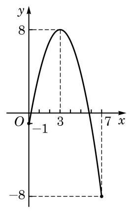

图 5-3-3

例 9 已知 $f\left( x\right)  =  - {x}^{2} + {6x} - 1$ ,求函数 $y = f\left( x\right)$ 在区间 $\left\lbrack  {0,7}\right\rbrack$ 上的最大值与最小值.

解 由本节例 6 可知,函数 $y =  - {x}^{2} + {6x} - 1$ 的驻点为 $x = 3$ , 比较 $f\left( 3\right)  = 8, f\left( 0\right)  =  - 1, f\left( 7\right)  =  - 8$ ,可知该函数在 $\left\lbrack  {0,7}\right\rbrack$ 上的最大值是 8 , 最小值是 -8 , 如图 5-3-3 所示.

---

为什么只要比较这几个点的函数值(甚至不必分析驻点是不是极值点), 就可以求出最值?

---

在例 9 中, 我们对驻点处与区间两端点处的函数值进行比较, 其中最大的就是最大值, 最小的就是最小值. 在导数存在的前提下, 闭区间上的连续函数的最值原则上都可以按照这样的方法求出.

?

例 10 已知 $f\left( x\right)  = \frac{1}{3}{x}^{3} - x + 2$ ,求函数 $y = f\left( x\right)$ 在 [0,3]上的最大值与最小值.

解 由本节例 8 可知,函数 $y = \frac{1}{3}{x}^{3} - x + 2$ 的两个驻点为 ${x}_{1} =  - 1,{x}_{2} = 1$ .

由于驻点 ${x}_{1} =  - 1$ 不在区间 $\left\lbrack  {0,3}\right\rbrack$ 内,因此只需比较 $f\left( 1\right)  = \frac{4}{3}, f\left( 0\right)  = 2, f\left( 3\right)  = 8$ ,可知函数 $y = \frac{1}{3}{x}^{3} - x + 2$ 在 $\left\lbrack  {0,3}\right\rbrack$ 上的最大值是 8,最小值是 $\frac{4}{3}$ .

### 4 利用导数研究二次函数

导数为研究函数的单调性、极值与最值提供了有力的工具. 利用这一工具,我们可以对熟悉的二次函数 $y = a{x}^{2} + {bx} + c \; \left( {a \neq  0}\right)$ 进行回顾和再认识. 以下仅讨论 $a > 0$ 的情况, $a < 0$ 的情况也可以用类似的方法获得相应的结果.

首先,可以利用导数的正负来判断函数 $y = a{x}^{2} + {bx} + c\left( {a > 0}\right)$ 的单调性, 同时求出它的极值.

记 $f\left( x\right)  = a{x}^{2} + {bx} + c$ . 对该函数求导,可得 ${f}^{\prime }\left( x\right)  = {2ax} + b$ , 令 ${f}^{\prime }\left( x\right)  = 0$ ,解得函数有唯一驻点 ${x}_{0} =  - \frac{b}{2a}$ . 可以列表如下:

表 5-6

<table><tr><td>$x$</td><td>$\left( {-\infty , - \frac{b}{2a}}\right)$</td><td>$- \frac{b}{2a}$</td><td>$\left( {-\frac{b}{2a}, + \infty }\right)$</td></tr><tr><td>${f}^{\prime }\left( x\right)$</td><td>-</td><td>0</td><td>+</td></tr><tr><td>$f\left( x\right)$</td><td>↘</td><td>极小值 $\frac{{4ac} - {b}^{2}}{4a}$</td><td>↗</td></tr></table>

因此,函数 $y = f\left( x\right)$ 的单调减区间为 $\left( {-\infty , - \frac{b}{2a}}\right)$ ,单调增区间为 $\left( {-\frac{b}{2a}, + \infty }\right) .y = f\left( x\right)$ 在 ${x}_{0} =  - \frac{b}{2a}$ 处取得极小值 $f\left( {-\frac{b}{2a}}\right)  = \frac{{4ac} - {b}^{2}}{4a}$ . 这个极小值也是该函数在区间 $\left( {-\infty , + \infty }\right)$ 上的最小值.

知道了该函数的单调区间之后，结合函数的零点，就可以解决相应的不等式问题.

我们已经知道,求二次函数 $y = a{x}^{2} + {bx} + c\left( {a > 0}\right)$ 的零点, 就是求一元二次方程 $a{x}^{2} + {bx} + c = 0\left( {a > 0}\right)$ 的实根.

令 $\Delta  = {b}^{2} - {4ac}$ ,我们已知: 当 $\Delta  > 0$ 时,方程有两个不相等的实根 ${x}_{1} = \frac{-b - \sqrt{{b}^{2} - {4ac}}}{2a},{x}_{2} = \frac{-b + \sqrt{{b}^{2} - {4ac}}}{2a}$ ; 当 $\Delta  = 0$ 时,方程有两个相等的实根 ${x}_{1} = {x}_{2} =  - \frac{b}{2a}$ ; 当 $\Delta  < 0$ 时,方程无实根.

上述方程 $a{x}^{2} + {bx} + c = 0$ 的实根就是函数 $y = a{x}^{2} + {bx} + c$ 的零点; 再结合函数 $y = f\left( x\right)$ 的单调性,我们就可以求得使 $f\left( x\right)  \geq  0$ (或 $f\left( x\right)  \leq  0$ )的 $x$ 的取值范围,也就是不等式 $a{x}^{2} + {bx} + c \geq  0$ (或 $a{x}^{2} + {bx} + c \leq  0$ ) 的解集.

记 $f\left( x\right)  = a{x}^{2} + {bx} + c$ . 为了解不等式 $a{x}^{2} + {bx} + c \geq  0\left( {a > 0}\right)$ , 可以分以下三种情况讨论:

(1)当 $\Delta  > 0$ 时,比较函数零点与驻点的大小关系,有

$$
{x}_{1} = \frac{-b - \sqrt{{b}^{2} - {4ac}}}{2a} < {x}_{0} < {x}_{2} = \frac{-b + \sqrt{{b}^{2} - {4ac}}}{2a}.
$$

因为 $y = f\left( x\right)$ 在区间 $\left( {-\infty ,{x}_{0}}\right)$ 上严格减,所以

---

此处所得结果与你之前的认识是否一致? 方法是不是更简便?

---

当 $x \in  \left( {-\infty ,{x}_{1}}\right)$ 时, $f\left( x\right)  > f\left( {x}_{1}\right)  = 0$ ;

当 $x \in  \left( {{x}_{1},{x}_{0}}\right)$ 时, $f\left( x\right)  < f\left( {x}_{1}\right)  = 0$ .

同样地,因为 $y = f\left( x\right)$ 在区间 $\left( {{x}_{0}, + \infty }\right)$ 上严格增,所以

当 $x \in  \left( {{x}_{0},{x}_{2}}\right)$ 时, $f\left( x\right)  < f\left( {x}_{2}\right)  = 0$ ;

当 $x \in  \left( {{x}_{2}, + \infty }\right)$ 时, $f\left( x\right)  > f\left( {x}_{2}\right)  = 0$ .

此外, $f\left( {x}_{1}\right)  = f\left( {x}_{2}\right)  = 0, f\left( {x}_{0}\right)  = \frac{{4ac} - {b}^{2}}{4a} < 0$ .

因此，该不等式的解集为 $\left( {-\infty ,{x}_{1}}\right\rbrack   \cup  \left\lbrack  {{x}_{2}, + \infty }\right)$ , 即 $\left( {-\infty ,\frac{-b - \sqrt{{b}^{2} - {4ac}}}{2a}}\right\rbrack   \cup  \left\lbrack  {\frac{-b + \sqrt{{b}^{2} - {4ac}}}{2a}, + \infty }\right)$ .

(2)当 $\Delta  = 0$ 时,有 ${x}_{1} = {x}_{2} = {x}_{0} =  - \frac{b}{2a}$ ，由函数单调性可知,当 $x \in  \left( {-\infty , + \infty }\right)$ 时,均有 $f\left( x\right)  \geq  f\left( {x}_{0}\right)  = f\left( {x}_{1}\right)  = \; f\left( {x}_{2}\right)  = 0$ . 因此,该不等式的解集为 $\mathbf{R}$ .

(3)当 $\Delta  < 0$ 时，由函数单调性可知，当 $x \in  \left( {-\infty , + \infty }\right)$ 时,均有 $f\left( x\right)  \geq  f\left( {x}_{0}\right)  = f\left( {-\frac{b}{2a}}\right)  = \frac{{4ac} - {b}^{2}}{4a} > 0$ . 因此,该不等式的解集为 $\mathbf{R}$ .

综合以上分析可得: 当 $\Delta  > 0$ 时,不等式 $a{x}^{2} + {bx} + c \geq  0 \; \left( {a > 0}\right)$ 的解集为 $\left( {-\infty ,\frac{-b - \sqrt{{b}^{2} - {4ac}}}{2a}}\right\rbrack   \cup  \left\lbrack  {\frac{-b + \sqrt{{b}^{2} - {4ac}}}{2a}, + \infty }\right)$ ; 当 $\Delta  \leq  0$ 时,该不等式的解集为 $\mathbf{R}$ . 这就很方便地得到必修课程第 2 章中的相应结论.

#### 练习 5.3(3)

1. 判断下列说法是否正确，并说明理由:

(1)函数在某区间上的极大值不会小于它的极小值；

(2)函数在某区间上的最大值不会小于它的最小值；

(3)函数在某区间上的极大值就是它在该区间上的最大值；

(4)函数在某区间上的最大值就是它在该区间上的极大值.

2. 求函数 $y = {x}^{2} - {6x} + 5, x \in  \left\lbrack  {1,4}\right\rbrack$ 的值域.
3. 求函数 $y = {x}^{3} - {3x}$ 在区间 $\left\lbrack  {-\frac{3}{2},0}\right\rbrack$ 上的最大值与最小值.

---

知道了函数的单调性和零点, 相应的不等式问题就迎刃而解了.

---

### 5 利用导数解决实际问题

前面已经看到, 导数可用来研究函数在某区间上的最大 (小)值, 从而对解决何时利润最大、何时用料最省等优化问题发挥着重要作用.

例 11 图 5-3-4 是一张边长为 3 的正方形硬纸板, 先在它的四个角上裁去边长为 $x$ 的四个小正方形,再折叠成无盖纸盒. 当裁去的小正方形边长 $x$ 发生变化时,纸盒的容积 $V$ 会随之发生变化. 当 $x$ 在什么范围内变化时,容积 $V$ 随着 $x$ 的增大而增大? 当 $x$ 在什么范围内变化时,容积 $V$ 随着 $x$ 的增大而减小? 当 $x$ 取何值时,容积 $V$ 最大? 最大值是多少? (纸板厚度忽略不计)

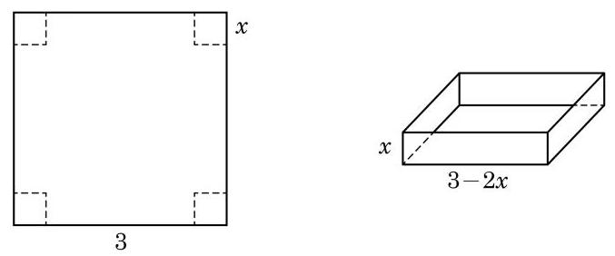

图 5-3-4

解 由题意, 得

$$
V\left( x\right)  = x{\left( 3 - 2x\right) }^{2}, x \in  \left( {0,\frac{3}{2}}\right) .
$$

求导可得

$$
{V}^{\prime }\left( x\right)  = {12}{x}^{2} - {24x} + 9.
$$

为求驻点,令 ${12}{x}^{2} - {24x} + 9 = 0$ ,得 ${x}_{1} = \frac{1}{2}$ 与 ${x}_{2} = \frac{3}{2}$ ,后者不在定义域内,舍去.

容易算出,当 $x \in  \left( {0,\frac{1}{2}}\right)$ 时, ${V}^{\prime }\left( x\right)  > 0$ ; 当 $x \in  \left( {\frac{1}{2},\frac{3}{2}}\right)$ 时, ${V}^{\prime }\left( x\right)  < 0$ . 因此,当 $x$ 在 0 到 $\frac{1}{2}$ 之间变化时,容积 $V$ 随着 $x$ 的增大而增大; 当 $x$ 在 $\frac{1}{2}$ 到 $\frac{3}{2}$ 之间变化时,容积 $V$ 随着 $x$ 的增大而

减小; 而当 $x = \frac{1}{2}$ 时,容积 $V\left( \frac{1}{2}\right)  = 2$ 是极大值,也是最大值.

例 12 已知某商品的成本 $C$ 与产量 $q$ 满足函数关系 $C = \; C\left( q\right)$ ,其中 $C\left( q\right)  = {100} + \frac{1}{4}{q}^{2}$ ,并定义平均成本为 $\bar{C} = \bar{C}\left( q\right)$ , 其中 $\bar{C}\left( q\right)  = \frac{C\left( q\right) }{q}$ .

---

经济学中通常将 ${C}^{\prime }\left( q\right)$ 称为边际成本, 它代表产量为 $q$ 时, 增加单位产量需付出的成本增加量.

---

(1)比较 ${C}^{\prime }\left( {10}\right)$ 和 ${C}^{\prime }\left( {20}\right)$ ，解释两者的大小代表了怎样的实际意义;

(2)当产量为多少时, 平均成本最少？

解 (1) 因为 ${C}^{\prime }\left( q\right)  = \frac{1}{2}q$ ,所以 ${C}^{\prime }\left( {10}\right)  = 5,{C}^{\prime }\left( {20}\right)  = {10}$ , 有 ${C}^{\prime }\left( {10}\right)  < {C}^{\prime }\left( {20}\right)$ .

${C}^{\prime }\left( {10}\right)  = 5$ 代表当产量为 $q = {10}$ 时,增加单位产量需付出的成本增加量为 5 ; 而 ${C}^{\prime }\left( {20}\right)  = {10}$ 代表当产量为 $q = {20}$ 时,增加单位产量需付出的成本增加量为 10 .

(2)平均成本 $\bar{C}\left( q\right)  = \frac{C\left( q\right) }{q} = \frac{100}{q} + \frac{q}{4},{\bar{C}}^{\prime }\left( q\right)  =  - \frac{100}{{q}^{2}} + \frac{1}{4}$ .

令 ${\bar{C}}^{\prime }\left( q\right)  = 0$ ,得 ${q}^{2} = {400}$ ,根据实际意义,可知 $q > 0$ ,因此, $q = {20}$ 是其驻点.

当 $0 < q < {20}$ 时, ${\bar{C}}^{\prime }\left( q\right)  < 0$ ,函数 $\bar{C} = \bar{C}\left( q\right)$ 严格减; 而当 $q >$ 20 时, ${\bar{C}}^{\prime }\left( q\right)  > 0$ ,函数 $\bar{C} = \bar{C}\left( q\right)$ 严格增. 因此,当产量 $q = {20}$ 时, 平均成本最少.

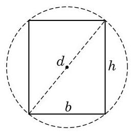

图 5-3-5

例 13 如图 5-3-5,将一根直径为 $d$ 的圆木锯成截面为矩形的梁. 问: 矩形的高 $h$ 和宽 $b$ 应如何选择,才能使梁的抗弯强度 $W = \frac{1}{6}b{h}^{2}$ 最大?

解 根据题意,可知 ${h}^{2} = {d}^{2} - {b}^{2}$ ,所以 $W\left( b\right)  = \frac{1}{6}b\left( {{d}^{2} - {b}^{2}}\right)$ , $0 < b < d$ .

求导,得 ${W}^{\prime }\left( b\right)  = \frac{1}{6}{d}^{2} - \frac{1}{2}{b}^{2}$ . 令 ${W}^{\prime }\left( b\right)  = 0$ ,得到驻点 $b = \frac{\sqrt{3}}{3}d$ .

由问题的实际意义,当 $b = \frac{\sqrt{3}}{3}d$ 时,梁的抗弯强度最大,此时, ${h}^{2} = {d}^{2} - {b}^{2} = \frac{2}{3}{d}^{2}$ ,即 $h = \frac{\sqrt{6}}{3}d$ .

在很多情形下(如例 11 与例 13)，由实际问题本身的意义， 可知函数在区间内部必定存在最大值(或最小值)，而区间内部只有一个驻点，由此即可断定:该函数在区间内部的唯一驻点处取得最大值(或最小值).

例 14 一艘船航行所需的燃料费与船速的平方成正比. 如果船速是 ${10}\mathrm{\;{km}}/\mathrm{h}$ ,那么每小时的燃料费是 80 元. 已知该船航行的其他费用为每小时 480 元,在 ${100}\mathrm{\;{km}}$ 的航程中,保持怎样的船速可使航行总费用最少? (结果精确到 $1\mathrm{\;{km}}/\mathrm{h}$ )

解 设当船速为 $x\left( {\mathrm{\;{km}}/\mathrm{h}}\right)$ 时,每小时所需燃料费为 $k{x}^{2}$ 元.

根据题意,当 $x = {10}$ 时, $k{x}^{2} = {100k} = {80}$ ,从而解得 $k = \frac{4}{5}$ . 因此，船在 ${100}\mathrm{\;{km}}$ 航程中的总费用为

$$
y = f\left( x\right)  = \frac{100}{x}\left( {\frac{4}{5}{x}^{2} + {480}}\right)  = {80x} + \frac{48000}{x}, x > 0.
$$

求导,得 ${f}^{\prime }\left( x\right)  = {80} - \frac{48000}{{x}^{2}}$ ,令 ${f}^{\prime }\left( x\right)  = 0$ ,得 $x = {10}\sqrt{6}$ 是唯一驻点. 当 $0 < x < {10}\sqrt{6}$ 时, ${f}^{\prime }\left( x\right)  < 0$ ,函数 $y = f\left( x\right)$ 严格减; 而当 $x > {10}\sqrt{6}$ 时, ${f}^{\prime }\left( x\right)  > 0$ ,函数 $y = f\left( x\right)$ 严格增. 因此,函数 $y = f\left( x\right)$ 在 $x = {10}\sqrt{6} \approx  {24}\left( {\mathrm{\;{km}}/\mathrm{h}}\right)$ 处取得最小值.

所以,在 ${100}\mathrm{\;{km}}$ 的航程中,保持约 ${24}\mathrm{\;{km}}/\mathrm{h}$ 的船速可使航行总费用最少.

#### 练习 5.3(4)

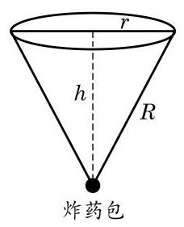

(第 2 题)

1. 某商品的成本 $C$ 和产量 $q$ 满足函数关系 $C = {50000} + {200q}$ ,该商品的销售单价 $p$ 和产量 $q$ 满足函数关系 $p = {24200} - \frac{1}{5}{q}^{2}$ . 问: 要使利润最大, 应如何确定产量?
2. 采矿、采石或取土时，常用炸药包进行爆破，部分爆破呈圆锥漏斗形状 (如图),已知圆锥的母线长是炸药包的爆破半径 $R$ ,它的值是固定的. 问:炸药包埋多深可使爆破体积最大？

#### 习题 5.3

##### A 组

1. 利用导数研究下列函数的单调性, 并说明结果与你之前的认识是否一致:

(1) $y = {\left( \frac{1}{\mathrm{e}}\right) }^{x}$ ; (2) $y = {\log }_{\frac{1}{\mathrm{e}}}x$ .

2. 利用导数判断函数 $y = \frac{1}{\cos x}, x \in  \left( {-\frac{\pi }{2},\frac{\pi }{2}}\right)$ 的单调性,并求出极值.
3. 某函数图像如图所示,它在 $\left\lbrack  {a, b}\right\rbrack$ 上哪一点处取得最大值? 它是极大值点吗? 在哪一点处取得最小值? 它是极小值点吗?

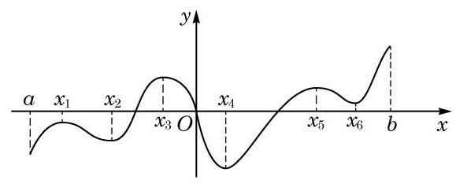

(第 3 题)

4. 求下列函数的单调区间、极值点和极值:

(1) $y = {x}^{2} + {2x} + {3;}$

(2) $y = x + \frac{1}{x}$ ；

(3) $y = {3x} - {x}^{3}$ ； (4) $y = {x}^{2}{\mathrm{e}}^{x}$ .

5. 证明: 函数 $y = {x}^{3} + {4x}$ 在 $\left( {-\infty , + \infty }\right)$ 上严格增.
6. 求函数 $y =  - {x}^{3} + {12x} - 1$ 的单调减区间.
7. 证明: 函数 $y = x - \frac{1}{x}$ 没有极值点.
8. 求函数 $y =  - {x}^{3} + {12x} - 1, x \in  \left\lbrack  {0,3}\right\rbrack$ 的值域.

##### B 组

1. 判断下列函数在 $\left( {-\infty , + \infty }\right)$ 上是否存在驻点,是否存在极值点,并说明理由:

(1) $y = {x}^{n}$ ， $n$ 为正奇数；

(2) $y = {x}^{n}$ ， $n$ 为正偶数.

2. 已知函数 $y = {x}^{3} + {2m}{x}^{2} - {nx} + m$ 在 $x = 1$ 处有极值 0,求 $m + n$ 的值.
3. 用长为 ${18}\mathrm{\;m}$ 的钢条制作一个如图所示的长方体框架. 已知长方体的长宽比为2÷1，间:该长方体的长、宽、高各为多少时，其体积最大? 最大体积是多少?

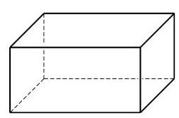

(第 3 题)

4. 某分公司经销一品牌产品, 每件产品的成本为 4 元, 且每件产品需向总公司交 3 元的管理费，预计当每件产品的售价为 $x$ 元( $8 \leq  x \leq  {11}$ ) 时,一年的销售量为 ${\left( {12} - x\right) }^{2}$ 万件. 问: 当每件产品的售价为多少元时,该分公司一年的利润 $L$ 最大?(结果精确到 1 元)

课后阅读

微积分简史

17 世纪，两位科学巨匠伽利略(G. Galilei)和开普勒(J. Kepler)的一系列发现导致了数学从古典数学向现代数学的转折. 自然科学, 特别是天文学和力学等学科的发展都需要一种新的数学工具来研究运动和变化的过程, 这促成了微积分的发明和发展.

朴素的积分学思想其实可以追溯到古希腊时代，在中国古代的数学中也有其踪迹，但直到 17 世纪，微积分才出现重大突破. 微积分主要来源于对四类问题的研究:面积、体积、弧长问题; 位移、速度、加速度关系问题; 切线问题; 最值问题. 许多数学家对此作出了贡献，这其中有卡瓦列利(F. Cavalieri)、费马(P. de Fermat)、沃利斯(J. Wallis)、笛卡儿(R. Descartes)和巴罗(I. Barrow)等. 在经过了半个世纪的酝酿后，牛顿(I. Newton) 和莱布尼茨(G. Leibniz)分别独立地完成了微积分创立过程中最后也是最关键的一步. 牛顿和莱布尼茨的杰出贡献，不在于发现求切线和求面积的方法，而是给出了一般的无穷小算法, 同时又找出了微分学和积分学的互逆关系, 现称为微积分基本定理, 这一深刻的思想已成为人类文明中的瑰宝.

牛顿对微积分问题的研究始于 1664 年秋, 当时他正在剑桥大学读书. 他因对笛卡儿圆法产生兴趣而开始寻找更好的求切线方法. 1665 年 11 月，牛顿发明了“正流数术”(微分法)，次年5月又建立了“反流数术”(积分法). 1666 年 10 月，牛顿将前两年的研究成果整理成一篇总结性论文，现以《流数简论》著称. 这是历史上第一篇系统的微积分文献. 在这篇论文中，牛顿通过揭示微分和积分的互逆关系而将两者统一为一个整体. 尽管如此，这一论文在许多方面还是不成熟的. 在其后的大约四分之一世纪的时间里，牛顿不断地完善自己的微积分学说，先后著成了三篇微积分论文:《分析学》(1669)、《流数法》(1671)和 《求积术》(1691). 它们真实地再现了牛顿创建微积分的思想历程.

与牛顿发明微积分的运动学背景不同, 莱布尼茨创立微积分首先是出于对几何学问题的思考. 1673 年, 他因在帕斯卡 (B. Pascal) 的有关论文中获得启迪, 而提出自己的“微分

三角形”理论. 在对微分三角形的研究中, 莱布尼茨逐渐认识到什么是求曲线的切线和求曲线下的面积的实质, 并发现了这两类问题的互逆关系. 由此他建立起一种更一般的算法, 并将以往解决这两类问题的各种结果和技巧加以统一.

刚刚诞生的微积分以其神奇的效果赢得了普遍的关注, 但在理论上却是粗糙和不完美的, 后世的许多数学家为其理论的建立和完善作出了不懈的努力, 特别是欧拉(L. Euler)、 达朗贝尔(J. d'Alembert)、波尔查诺(B. Bolzano)、柯西(A. L. Cauchy)和维尔斯特拉斯 (K. Weierstrass)等人作出了重要的贡献. 直到 19 世纪后半叶，现代意义的严密的微积分与数学分析理论才真正成形. 特别值得一提的是, 1859 年, 我国历史上首部微积分中文教科书《代微积拾级》在上海出版，标志着高等数学的传入. 此书的原作者为美国数学家罗密士(E. Loomis)，译者为中国数学家李善兰和英国人伟烈亚力(A. Wylie).

微积分的创立具有划时代的意义, 它开辟了数学的新时代, 使数学获得了极大的发展, 取得了空前的繁荣, 诸如微分方程、复变函数、微分几何等数学分支都应运而生. 微积分给出了一整套的科学方法，开创了科学的新纪元，并因此加强和加深了数学的巨大作用与应用. 有了微积分，人类才有能力把握运动和变化，进而推动了工业革命，促进了大工业生产, 最终有了现代化的社会. 微积分不仅极大地促进了天文学、力学、物理学等基础学科的发展，还在现代化学、生物学、工程学、地理学、经济学等自然科学、社会科学及应用科学各个分支获得了极其广泛的应用. 几乎所有现代技术领域, 如机械、仪器仪表、建筑、航海、航空航天、信息与通讯等，其技术的发展和产品的设计也都以微积分为基本数学工具.

纵观微积分的历史之旅，有着说不完的数学故事. 请同学们课后查阅有关书籍和资料, 认真地进行回顾和小结.

## 内容提要

1. 导数的概念及意义

(1)导数的概念:函数 $y = f\left( x\right)$ 在 $x = {x}_{0}$ 处的导数 ${f}^{\prime }\left( {x}_{0}\right)$ ，是函数在 $x = {x}_{0}$ 附近的平均变化率 $\frac{f\left( {{x}_{0} + h}\right)  - f\left( {x}_{0}\right) }{h}$ 当 $h$ 趋近于 0 时所趋近的稳定值，记作

$$
{f}^{\prime }\left( {x}_{0}\right)  = \mathop{\lim }\limits_{{h \rightarrow  0}}\frac{f\left( {{x}_{0} + h}\right)  - f\left( {x}_{0}\right) }{h}.
$$

把自变量值 ${x}_{0}$ 对应到 ${f}^{\prime }\left( {x}_{0}\right)$ 所给出的函数记作 $y = {f}^{\prime }\left( x\right)$ ,称为 $y = f\left( x\right)$ 的导函数,简称导数.

(2)导数的物理意义:在满足函数关系 $d = f\left( t\right)$ 的运动中，该函数在 $t = {t}_{0}$ 处的导数 ${f}^{\prime }\left( {t}_{0}\right)$ 就是 ${t}_{0}$ 时刻的瞬时速度.

(3)导数的几何意义:对于曲线 $y = f\left( x\right)$ ，函数 $y = f\left( x\right)$ 在 $x = {x}_{0}$ 处的导数 ${f}^{\prime }\left( {x}_{0}\right)$ 就是曲线在点 $\left( {{x}_{0}, f\left( {x}_{0}\right) }\right)$ 处的切线斜率.

2. 常用的求导公式与法则

(1) ${\left( C\right) }^{\prime } = 0$ ， $C$ 为常数；

(2) ${\left( {x}^{\alpha }\right) }^{\prime } = \alpha {x}^{\alpha  - 1}$ ， $\alpha$ 为常数；

(3) ${\left( {\mathrm{e}}^{x}\right) }^{\prime } = {\mathrm{e}}^{x}$ ；

(4) ${\left( \ln x\right) }^{\prime } = \frac{1}{x}$ ；

(5) ${\left( \sin x\right) }^{\prime } = \cos x$ ；

(6) ${\left( \cos x\right) }^{\prime } =  - \sin x$ ；

(7) ${\left( f\left( x\right)  \pm  g\left( x\right) \right) }^{\prime } = {f}^{\prime }\left( x\right)  \pm  {g}^{\prime }\left( x\right)$ ;

(8) ${\left( f\left( x\right) g\left( x\right) \right) }^{\prime } = {f}^{\prime }\left( x\right) g\left( x\right)  + f\left( x\right) {g}^{\prime }\left( x\right)$ ;

(9) ${\left( \frac{f\left( x\right) }{g\left( x\right) }\right) }^{\prime } = \frac{{f}^{\prime }\left( x\right) g\left( x\right)  - f\left( x\right) {g}^{\prime }\left( x\right) }{{\left( g\left( x\right) \right) }^{2}}$ ，其中 $g\left( x\right)  \neq  0$ ；

(10) ${\left( Cf\left( x\right) \right) }^{\prime } = C{f}^{\prime }\left( x\right) , C$ 为常数；

(11) ${\left( f\left( ax + b\right) \right) }^{\prime } = a{f}^{\prime }\left( u\right)$ ,其中 $u = {ax} + b$ .

3. 用导数研究函数

(1)函数的单调性:在区间 $I$ 上，若 ${f}^{\prime }\left( x\right)  > 0$ ，则函数 $y = f\left( x\right)$ 严格增；若 ${f}^{\prime }\left( x\right)  < 0$ ， 则函数 $y = f\left( x\right)$ 严格减.

(2)函数的极值:在导数存在的前提下，若 ${x}_{0}$ 是函数 $y = f\left( x\right)$ 的极值点，则 ${f}^{\prime }\left( {x}_{0}\right)  =$ 0,即 ${x}_{0}$ 是函数 $y = f\left( x\right)$ 的驻点. 反之,在 ${x}_{0}$ 是函数 $y = f\left( x\right)$ 的驻点的前提下,若在 ${x}_{0}$ 的

左侧附近有 ${f}^{\prime }\left( x\right)  > 0$ ,在 ${x}_{0}$ 的右侧附近有 ${f}^{\prime }\left( x\right)  < 0$ ,则 $y = f\left( x\right)$ 在 ${x}_{0}$ 处取得极大值; 若在 ${x}_{0}$ 的左侧附近有 ${f}^{\prime }\left( x\right)  < 0$ ,在 ${x}_{0}$ 的右侧附近有 ${f}^{\prime }\left( x\right)  > 0$ ,则 $y = f\left( x\right)$ 在 ${x}_{0}$ 处取得极小值.

(3)连续函数在闭区间上必存在最值(最大值与最小值).

## 复习题

##### A 组

1. 请根据图中的函数图像，将下列数值按从小到大的顺序排列:___.

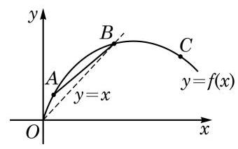

(第 1 题)

① 曲线在点 $A$ 处切线的斜率；

② 曲线在点 $B$ 处切线的斜率；

③ 曲线在点 $C$ 处切线的斜率；

④ 割线 ${AB}$ 的斜率；

⑤ 数值 0 ；

⑥ 数值 1 .

2. 已知 $f\left( x\right)  = \sqrt{x}, g\left( x\right)  = k{x}^{2}$ .

(1)求曲线 $y = f\left( x\right)$ 在点 $\left( {4,2}\right)$ 处的切线方程；

(2)若曲线 $y = g\left( x\right)$ 经过点 $\left( {4,2}\right)$ ，求它与(1)中切线的另一个交点.

3. 从桥上将一小球掷向空中，小球相对于地面的高度 $h$ (单位: $\mathrm{m}$ ) 和时间 $t$ (单位: $\mathrm{s}$ ) 近似满足函数关系 $h =  - 5{t}^{2} + {15t} + {12}$ . 问:

(1)小球的初始高度是多少？

(2)小球在 $t = 0$ 到 $t = 1$ 这段时间内的平均速度是多少？

(3)小球在 $t = 1$ 时的瞬时速度是多少？

(4)小球所能达到的最大高度是多少？何时达到？

4. 已知 $f\left( x\right)  = \ln x, g\left( x\right)  = {\mathrm{e}}^{x}$ ,计算下列函数 $y = h\left( x\right)$ 在点 $x = 1$ 处的导数值:

(1) $h\left( x\right)  = {3f}\left( x\right)  - {5g}\left( x\right)$ ； (2) $h\left( x\right)  = f\left( x\right) g\left( x\right)$ ；

(3) $h\left( x\right)  = \frac{f\left( x\right) }{g\left( x\right) }$ ； (4) $h\left( x\right)  = f\left( {{2x} + 1}\right)  + g\left( {{3x} - 1}\right)$ .

5. 计算下列函数 $y = f\left( x\right)$ 的导数,其中:

(1) $f\left( x\right)  = \frac{\pi }{2} + \sin \left( {-x}\right)$ ; (2) $f\left( x\right)  = \sqrt[3]{x} - \frac{1}{{x}^{3}}$ ；

(3) $f\left( x\right)  = \left( {\frac{1}{2}x - 5}\right) \left( {3 - {4x}}\right)$ ； (4) $f\left( x\right)  = \frac{\cos x}{{x}^{2}}$ .

6. 求下列函数 $y = f\left( x\right)$ 的单调区间和极值点,其中:

(1) $f\left( x\right)  = \frac{2}{3}x - 1$ ； (2) $f\left( x\right)  = 2 + x - {x}^{2}$ ；

(3) $f\left( x\right)  = {x}^{3} + {x}^{2} - {8x} + 7$ .

7. 借助第 6 题的结果,求下列函数 $y = f\left( x\right)$ 在给定区间上的最大值和最小值,其中:

(1) $f\left( x\right)  = \frac{2}{3}x - 1, x \in  \left\lbrack  {0,3}\right\rbrack$ ；

(2) $f\left( x\right)  = 2 + x - {x}^{2}, x \in  \left\lbrack  {-1,1}\right\rbrack$ ；

(3) $f\left( x\right)  = {x}^{3} + {x}^{2} - {8x} + 7, x \in  \left\lbrack  {-3,3}\right\rbrack$ .

##### B 组

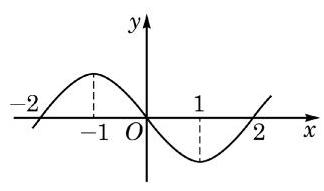

(第 1 题)

1. 已知 $y = {f}^{\prime }\left( x\right)$ 的图像如图所示,求函数 $y = f\left( x\right)$ 在 $\left( {-2,2}\right)$ 上的单调区间和极值点.
2. 若直线 $y = x$ 是曲线 $y = {x}^{3} - 3{x}^{2} + {ax}$ 的切线,求 $a$ 的值.
3. 设函数 $y = {x}^{3} + a{x}^{2} + {bx} + c$ 的图像与 $y = 0$ 在原点相切, 若函数的极小值为 -4 ，求函数的表达式与单调减区间.
4. 某种型号的汽车在匀速行驶中每小时的耗油量 $y$ (单位: $\mathrm{L}$ ) 关于行驶速度 $x$ (单位: $\mathrm{{km}}/\mathrm{h})$ 满足函数关系 $y = \frac{1}{128000}{x}^{3} - \frac{3}{80}x + 8\left( {0 < x \leq  {120}}\right)$ . 已知甲、乙两地相距 ${100}\mathrm{\;{km}}$ . 问: 当汽车保持怎样的速度匀速行驶时, 从甲地到乙地的耗油量最小?
5. 要建造一个给定容积 $V$ 的圆柱体蓄水池,已知池底单位造价为池侧面单位造价的 2 倍. 问: 应如何选择蓄水池的底面半径 $r$ 和高 $h$ ,才能使总造价最低?
6. 已知某厂生产一种产品的总成本 $C$ (单位:万元) 与产品件数 $x$ 满足函数关系 $C = {1200} + \frac{2}{75}{x}^{3}$ ,产品单价 $P$ (单位: 万元)和产品件数 $x$ 满足函数关系 ${P}^{2} = \frac{250000}{x}$ . 问: 产量为多少件时, 总利润最大?

拓展与思考

1. 讨论函数 $y = {x}^{3} + {ax} + b$ 的单调性. (可借助信息技术工具)
2. 判断方程 ${x}^{3} + {ax} + b = 0$ 有几个实根. (可借助信息技术工具)

# 第 6 章 计数原理

自远古以来，数(shù)的概念就来源于数(shǔ)这个动作. 直到今天，精确地知道一个有限集合中元素的个数，仍然是一类非常重要的问题. 例如, 在必修课程第 12 章中, 我们已经看到古典概率的计算往往需要用到一些集合的元素个数之间的比值，但在那里，因为样本空间较小，大多数计数都是通过枚举完成的. 在本章里，我们将学习一些基本的计数原理, 以便能够解决更多的计数问题.

## 6.1 乘法原理与加法原理

### 1 乘法原理

先看下面的问题:

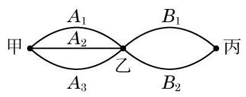

图 6-1-1

如图 6-1-1, 从甲地到丙地, 需经过乙地. 其中, 从甲地到乙地有 3 条路线 ${A}_{1}\text{ 、 }{A}_{2}\text{ 、 }{A}_{3}$ ,而从乙地到丙地有 2 条路线 ${B}_{1}$ 、 ${B}_{2}$ . 那么,从甲地经由乙地到丙地,共有多少种不同的走法?

从甲地到乙地有 3 种不同的走法, 按其中任何一种走法到达乙地后,再由乙地到丙地又有 2 种不同的走法. 于是,不同的走法就有以下 6 种情形 (其中符号 ${A}_{1}{B}_{1}$ 的含义是 “先走路线 ${A}_{1}$ , 再走路线 ${B}_{1}{}^{n}$ ,其余类同):

$$
{A}_{1}{B}_{1}\text{ 、 }{A}_{1}{B}_{2}\text{ 、 }{A}_{2}{B}_{1}\text{ 、 }{A}_{2}{B}_{2}\text{ 、 }{A}_{3}{B}_{1}\text{ 、 }{A}_{3}{B}_{2}.
$$

其中，每一种情形都可“从甲地经由乙地到丙地”. 因此，从甲地经由乙地到丙地共有

$$
3 \times  2 = 6
$$

种不同的走法.

这里使用的就是下面的

乘法原理(分步计数原理) 做一件事,需要依次完成 $n$ 个步骤,其中完成第一步有 ${a}_{1}$ 种不同的方法,完成第二步有 ${a}_{2}$ 种不同的方法, $\cdots \cdots$ ,完成第 $n$ 步有 ${a}_{n}$ 种不同的方法. 那么完成这件事共有

$$
{a}_{1}{a}_{2}\cdots {a}_{n}
$$

种不同的方法.

例 1 一个三层的书架上共放有 9 本书, 其中第一层放有 4 本不同的语文书, 第二层放有 3 本不同的数学书, 第三层放有 2 本不同的外语书. 若从书架的第一、二、三层各取 1 本书, 共

有多少种不同的取法?

解 从书架的第一、二、三层各取 1 本书，可以分三个步骤完成:

第一步:从第一层取 1 本语文书，有 4 种取法；

第二步:从第二层取 1 本数学书，有 3 种取法；

第三步:从第三层取 1 本外语书，有 2 种取法.

根据乘法原理, 不同取法的种数为

$$
4 \times  3 \times  2 = {24}.
$$

即从书架的第一、二、三层各取 1 本书, 有 24 种不同的取法.

例 2 用 1、2、3、4、5 可以组成多少个没有重复数字的三位数?

解 要组成一个没有重复数字的三位数, 可以分三个步骤完成:

第一步:确定百位上的数字，从 5 个数字中任选一个，有 5 种选法;

第二步:确定十位上的数字，因为不允许有重复数字，所以从第一步余下的数字中任选一个，有 4 种选法；

第三步:确定个位上的数字，因为不允许有重复数字，所以从前两步余下的数字中任选一个，有 3 种选法.

根据乘法原理, 不同取法的种数为

$$
5 \times  4 \times  3 = {60}.
$$

因此, 可以组成 60 个没有重复数字的三位数.

例 3 正整数 540 有多少个不同的正约数?

解 将 540 进行素因数分解, 得

$$
{540} = {2}^{2} \times  {3}^{3} \times  5\text{ . }
$$

因此，540的正约数都可以写成 ${2}^{a}{3}^{b}{5}^{c}$ 的形式，其中 $a \in  \{ 0,1,2\}$ ， $b \in  \{ 0,1,2,3\} , c \in  \{ 0,1\}$ ,通过 $a\text{ 、 }b\text{ 、 }c$ 的不同取值，可以得到 540 的所有不同的正约数.

这样, 确定 540 的正约数可以分下面三个步骤完成:

第一步: 确定约数中 $a$ 的值,有 $a = 0, a = 1, a = 2$ 共 3 种可能;

第二步: 确定约数中 $b$ 的值,有 4 种可能;

第三步: 确定约数中 $c$ 的值,有 2 种可能.

根据乘法原理, 540 的不同正约数的个数为

$$
3 \times  4 \times  2 = {24}.
$$

因此, 540 有 24 个不同的正约数.

#### 练习 6.1(1)

1. 公园有 4 个门, 从一个门进, 再从另一个门出, 共有多少种不同的走法?
2. 4 名学生报名参加两项体育比赛，每人至少报一项，每项比赛参加的人数不限，共有多少种不同的报名结果?

### 2 加法原理

再看下面的问题:

从甲地到乙地, 可以乘飞机, 可以乘轮船, 也可以乘汽车. 一天中，飞机有 4 班，轮船有 3 班，汽车有 2 班. 问:一天中乘坐这些交通工具从甲地到乙地共有多少种不同的走法?

因为一天中乘飞机有 4 种走法, 乘轮船有 3 种走法, 乘汽车有 2 种走法, 其中每一种方法都可以实现从甲地到乙地的目的, 所以一天中乘坐这些交通工具从甲地到乙地共有

$$
4 + 3 + 2 = 9
$$

种不同的走法.

这里使用的就是下面的

?

---

每一类办法中的每一种方法都可以单独完成这件事情, 这是“加法原理”与“乘法原理”的区别.

---

加法原理(分类计数原理) 做一件事,完成它有 $n$ 类办法,其中第一类办法有 ${a}_{1}$ 种不同的方法,第二类办法有 ${a}_{2}$ 种不同的方法, $\cdots \cdots$ ,第 $n$ 类办法有 ${a}_{n}$ 种不同的方法. 那么完成这件事共有

$$
{a}_{1} + {a}_{2} + \cdots  + {a}_{n}
$$

种不同的方法.

例 4 用 1、2、3、4、5 这五个数字可以组成多少个十位数字大于个位数字的两位数?

解 十位数字大于个位数字的两位数可以分成四类:

十位为 5 , 有 51、52、53、54 共 4 个;

十位为 4 , 有 41 、42、43 共 3 个;

十位为3 ，有 31、32 共 2 个；

十位为 2, 只有 21 一个.

根据加法原理, 十位数字大于个位数字的两位数共有 4+3 $+ 2 + 1 = {10}$ 个.

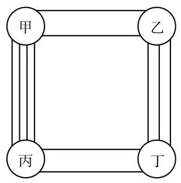

图 6-1-2

例 5 如图 6-1-2, 从甲地到乙地有 2 条路, 从乙地到丁地有 3 条路; 从甲地到丙地有 4 条路, 从丙地到丁地有 2 条路. 那么, 从甲地到丁地, 如果每条路至多走一次, 且每个地点至多经过一次, 有多少种不同的走法?

解 从甲地到丁地的走法可以分成两类:

第一类:从甲地经由乙地到丁地. 这类走法可以分成两个步骤: 先从甲地到乙地, 有 2 种走法; 再从乙地到丁地, 有 3 种走法. 根据乘法原理, 这一类走法的种数为

$$
2 \times  3 = 6.
$$

第二类:从甲地经由丙地到丁地. 这类走法可以分成两个步骤: 先从甲地到丙地, 有 4 种走法; 再从丙地到丁地, 有 2 种走法. 根据乘法原理, 这一类走法的种数为

$$
4 \times  2 = 8.
$$

根据加法原理, 从甲地到丁地共有

$$
6 + 8 = {14}
$$

种不同的走法.

例 6 在 300 和 800 之间，有多少个没有重复数字的奇数?

解 一个三位奇数的个位上的数字必是奇数, 且因为不允许有重复数字出现, 当一个奇数字 $\left( {1\text{ 、 }3\text{ 、 }5\text{ 、 }7\text{ 、 }9}\right)$ 作为个位数时, 它就不能作为百位数. 所以，符合条件的数可以按百位上的数字是奇数或偶数分成两类:

第一类:百位上的数字是偶数. 这样的三位数可以由以下三个步骤确定:

第一步, 百位上的数字从 4 和 6 中任选一个，有 2 种选法;

第二步, 个位上的数字从 1、3、5、7、9 中任选一个, 有 5 种选法;

第三步, 十位上的数字从余下的 8 个数字中任选一个, 有 8

种选法.

根据乘法原理, 这一类奇数的个数为

$$
2 \times  5 \times  8 = {80}.
$$

第二类:百位上的数字是奇数. 这样的三位数可以由以下三个步骤确定:

第一步，百位上的数字从 3、5、7 中任选一个，有 3 种选法；

第二步, 个位上的数字从余下的 4 个奇数中任选一个, 有 4 种选法;

第三步, 十位上的数字从余下的 8 个数字中任选一个, 有 8 种选法.

根据乘法原理, 这一类奇数的个数为

$$
3 \times  4 \times  8 = {96}.
$$

根据加法原理, 在 300 和 800 之间共有

$$
{80} + {96} = {176}
$$

个没有重复数字的奇数.

#### 练习 6.1(2)

1. 在平面直角坐标系中,以 1、2、3、4、5 这五个数中的两个分别作为一个点的横坐标和纵坐标,可以组成多少个位于直线 $y = x$ 下方的点?
2. 书架上放有 6 本不同的数学书和 5 本不同的语文书. 从中任取一本，有多少种不同的取法?

#### 习题 6.1

##### A 组

1. 4 名学生分别报名参加学校的足球队、篮球队和棒球队, 每人限报其中的一支. 问:有多少种不同的报名方法?
2. 某服装厂为学校设计了 4 种样式的上衣、 3 种样式的裤子. 若取其中的一件上衣和一条裤子配成校服，则可以配出多少种不同样式的校服?
3. 在一种编码方式中, 每个编码都是两位字符, 规定第一位用数字 0 至 9 中之一, 第二位用 26 个小写英文字母中之一. 这种编码方式共可以产生多少个不同的编码?
4. 设集合 $A = \{ \left( {x, y}\right)  \mid  x \in  \mathbf{Z}, y \in  \mathbf{Z}$ ,且 $\left| x\right|  \leq  6,\left| y\right|  \leq  7\}$ ,则集合 $A$ 中有多少个

元素?

5. 从 $a\text{ 、 }b\text{ 、 }c\text{ 、 }d\text{ 、 }e$ 这 5 个元素中取出 4 个,放在 4 个不同的格子中,且元素 $b$ 不能放在第二个格子里. 问: 一共有多少种不同的放法?
6. $A\text{ 、 }B\text{ 、 }C\text{ 、 }D\text{ 、 }E$ 五人站成一排,如果 $B$ 必须站在 $A$ 的右边 $\left( A\right. \text{ 、 }B$ 可以不相邻), 那么有多少种不同的排法?

##### B 组

1. 乘积 $\left( {{a}_{1} + {a}_{2}}\right) \left( {{b}_{1} + {b}_{2} + {b}_{3}}\right) \left( {{c}_{1} + {c}_{2} + {c}_{3} + {c}_{4}}\right)$ 的展开式中有多少项?
2. 如图,要接通从 $A$ 到 $B$ 的电路,不同的接通方法有多少种?

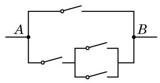

(第 2 题)

3. 用 1、2、3、4、5、6 组成没有重复数字的六位数，要求所有相邻两个数字的奇偶性都不同, 且 1 和 2 相邻. 问: 有多少个这样的六位数?
4. 已知 ${p}_{1}\text{ 、 }{p}_{2}\text{ 、 }{p}_{3}$ 是互不相同的素数, $\alpha \text{ 、 }\beta \text{ 、 }\gamma$ 是正整数, $n = {p}_{1}^{\alpha }{p}_{2}^{\beta }{p}_{3}^{\gamma }$ . 问: $n$ 有多少个不同的正约数?

## 6.2 排列

### 1 排列的定义

考虑下面两个问题:

问题 1: 从甲、乙、丙 3 名学生中任选 2 名, 一名担任正班长, 另一名担任副班长. 有多少种不同的选法?

这个问题就是从甲、乙、丙 3 名学生中，每次任选 2 名，按照正班长在左、副班长在右的顺序排列, 求一共有多少种不同的排法.

首先确定正班长，在 3 名学生中，任选一名作为正班长，有 3 种方法; 然后确定副班长, 当正班长选定后, 副班长就只能在其余的两人中选取，有 2 种方法. 于是，根据乘法原理，从甲、 乙、丙 3 名学生中，每次任选 2 名，按照正班长在左、副班长在右的顺序排列的不同方法共有

$$
3 \times  2 = 6
$$

种, 即有 6 种不同的选法.

问题 1 是从 3 个不同的元素 $a\text{ 、 }b\text{ 、 }c$ 中任取 2 个,并按序排列, 求一共有多少种不同的排列方法. 所有的排列是

$$
{ab}\text{ 、 }{ac}\text{ 、 }{ba}\text{ 、 }{bc}\text{ 、 }{ca}\text{ 、 }{cb}\text{ . }
$$

这些排列的总数为 $3 \times  2 = 6$ .

问题 2: 已知抛物线的方程为 $y = a{x}^{2} + {bx} + c$ ,其中 $a\text{ 、 }b$  、 $c \in  \{ 1,2,3,4\}$ ,且 $a\text{ 、 }b\text{ 、 }c$ 两两不同. 求这样的抛物线的个数.

这个问题就是从 4 个不同的数字中，每次任取 3 个不同的数字,按照 ${x}^{2}$ 的系数、 $x$ 的系数和常数项这样的顺序排列起来, 求一共有多少种不同的排法.

第一步,先确定 ${x}^{2}$ 的系数,从 $1\text{ 、 }2\text{ 、 }3\text{ 、 }4$ 这 4 个数字中任取 1 个, 有 4 种方法;

第二步,确定 $x$ 的系数,当 ${x}^{2}$ 的系数确定以后, $x$ 的系数

只能从余下的 3 个数字中任取 1 个，有 3 种方法；

第三步,确定常数项,当 ${x}^{2}$ 的系数和 $x$ 的系数都确定以后, 常数项只能从余下的 2 个数字中任取 1 个, 有 2 种方法.

根据乘法原理, 从 4 个不同的数字中, 每次任取 3 个不同的数字,分别作为 ${x}^{2}$ 的系数、 $x$ 的系数和常数项的方法共有

$$
4 \times  3 \times  2 = {24}
$$

种. 具体方法如图 6-2-1 所示( ☐☐ ☐ 中的数字从左至右依次为 ${x}^{2}$ 的系数、 $x$ 的系数和常数项).

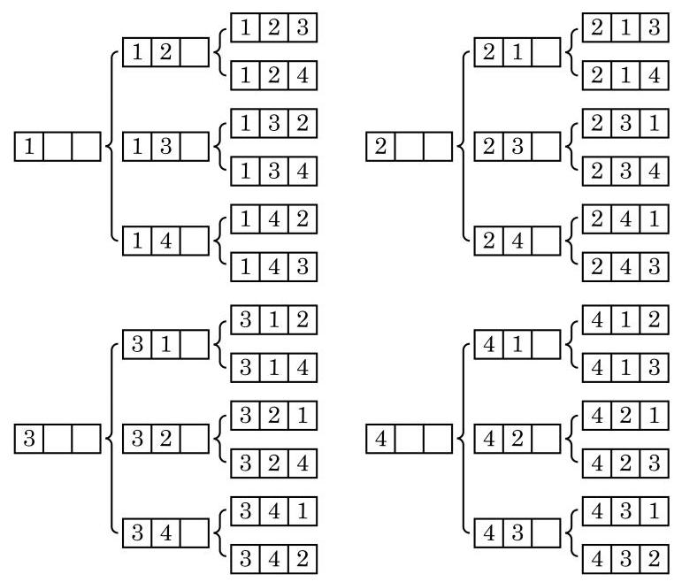

图 6-2-1

以上两个问题的共同点在于, 都是从若干个不同元素中选取部分(或全部)元素，并按序排列，求一共有多少种不同的排法.

定义 从 $n$ 个互不相同的元素中,取出 $m\left( {m \leq  n}\right)$ 个不同元素按照一定的顺序排成一列,叫做从 $n$ 个元素中取出 $m$ 个元素的一个排列 (permutation).

从排列的定义可以看出, 如果两个排列是相同的, 不仅组成这两个排列的元素完全相同, 而且排列的顺序也是完全相同的. 如果所取的元素不完全相同, 那么这两个排列是两个不同的排列 (如问题 1 中的 ${ab}$ 与 ${ac}$ ); 如果所取的元素完全相同,但排列顺序不同, 那么这两个排列也是不同的排列 (如问题 2 中的 3[2] 与 3 1 2).

例 1 写出从 $a\text{ 、 }b\text{ 、 }c\text{ 、 }d$ 四个元素中任取两个不同元素的所有排列.

解 先画出下面的树形图 (图 6-2-2):

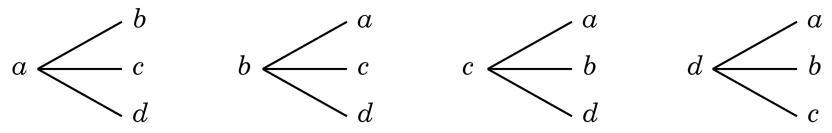

图 6-2-2

于是可知,所有的排列是 ${ab}\text{ 、 }{ac}\text{ 、 }{ad}\text{ 、 }{ba}\text{ 、 }{bc}\text{ 、 }{bd}\text{ 、 }{ca}\text{ 、 }{cb}$ 、 ${cd}\text{ 、 }{da}\text{ 、 }{db}\text{ 、 }{dc}.$

例 2 将 6 本不同的书排成一排, 有多少种不同的排法?

解 考虑一排的 6 个位子 (图 6-2-3). 将 6 本书排成一排, 相当于将这 6 本书分别放到这 6 个位子中, 这是将全部 6 个元素进行排列的问题.

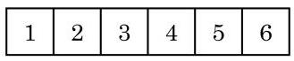

图 6-2-3

从左至右将 6 个位子依次编号为 1 到 6 ，完成一个排列可以分为以下六个步骤:

第一步:确定放在 1 号位上的书，有 6 种方法；

第二步:确定放在 2 号位上的书，有 5 种方法；

第三步:确定放在 3 号位上的书，有 4 种方法；

第四步:确定放在 4 号位上的书，有 3 种方法；

第五步:确定放在 5 号位上的书，有 2 种方法；

第六步:确定放在 6 号位上的书, 有 1 种方法.

根据乘法原理, 不同的排法数为

$$
6 \times  5 \times  4 \times  3 \times  2 \times  1 = {720}.
$$

于是, 将 6 本不同的书排成一排, 有 720 种不同的排法.

例 3 10 名学生排成两排照相, 每排 5 人，共有多少种不同的排列方式?

解 将第一排的 5 个位置从左至右编号, 号码分别为 1 到 5 ; 再将第二排的 5 个位置从左至右编号, 号码分别为 6 到 10 . 这样, 问题就转化为: 10 名学生排在编号为 1 到 10 的十个位置上，共有多少种不同的排法？ 这时，完成一个排列可以分为以下十个步骤:

第一步:确定坐在 1 号位上的学生，有 10 种方法；

第二步:确定坐在 2 号位上的学生，有 9 种方法；

......

第 $k$ 步: 确定坐在 $k$ 号位上的学生,有 ${11} - k$ 种方法;

......

第十步:确定坐在 10 号位上的学生，有 1 种方法.

根据乘法原理, 不同的排法数为

$$
{10} \times  9 \times  8 \times  \cdots  \times  2 \times  1 = {3628800}.
$$

#### 练习 6.2(1)

1. 写出从 $a\text{ 、 }b\text{ 、 }c\text{ 、 }d\text{ 、 }e$ 这五个不同元素中任意取出两个元素的所有排列.
2. 已知 $M = \{ 1,2,3,4\}$ ,且 $m \in  M, n \in  M$ ,方程 $\frac{{x}^{2}}{m} + \frac{{y}^{2}}{n} = 1$ 表示的曲线是椭圆. 问: 可以有多少个不同的椭圆?

### 2 排列数的计算

怎样计算从 $n$ 个不同元素中取出 $m$ 个元素的排列的个数? 一般地，我们有下面的定义:

定义 从 $n$ 个互不相同的元素中,取出 $m\left( {m \leq  n}\right)$ 个不同元素的所有排列的个数,叫做从 $n$ 个元素中取出 $m$ 个元素的排列数,用符号 ${\mathbf{P}}_{n}^{m}$ 表示.

---

P 是英文 permutation 的第一个字母. 在有些资料中也用符号 ${\mathrm{A}}_{n}^{m}$ 表示排列数.

---

例如,问题 1 中的选法数可以表示为 ${\mathrm{P}}_{3}^{2} = 6$ ; 问题 2 中的抛物线个数可以表示为 ${\mathrm{P}}_{4}^{3} = {24}$ . 下面研究排列数的计算公式.

求排列数 ${\mathrm{P}}_{n}^{3}$ ,可以这样考虑: 假定有排好顺序的 3 个位子 (图 6-2-4),从 $n$ 个互不相同的元素 ${a}_{1}\text{ 、 }{a}_{2}\text{ 、 }\cdots \text{ 、 }{a}_{n}$ 中任取 3 个填空, 一个位子填一个元素, 每一种填法就得到一个排列; 反过来, 任何一个排列都可以由这样的一种填法得到. 因此, 所有不同填法的总数就是排列数 ${\mathrm{P}}_{n}^{3}$ .

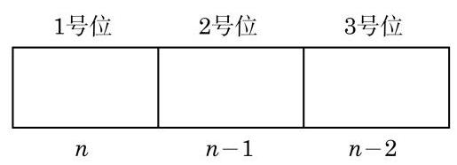

图 6-2-4

为了计算 ${\mathrm{P}}_{n}^{3}$ ,可以分成以下三个步骤:

第一步,确定 1 号位上的元素,这可以从 $n$ 个互不相同的元素中任取一个填空,有 $n$ 种方法;

第二步,确定 2 号位上的元素,这可以从剩下的 $n - 1$ 个互不相同的元素中任取一个填空,有 $n - 1$ 种方法;

第三步，确定 3 号位上的元素，这可以从剩下的 $n - 2$ 个互不相同的元素中任取一个填空,有 $n - 2$ 种方法.

根据乘法原理, 可以得到排列数为

$$
{\mathrm{P}}_{n}^{3} = n\left( {n - 1}\right) \left( {n - 2}\right) .
$$

同样,求 ${\mathrm{P}}_{n}^{m}$ ,可以这样考虑: 假定有排好顺序的 $m$ 个位子 (图 6-2-5),从 $n$ 个互不相同的元素 ${a}_{1}\text{ 、 }{a}_{2}\text{ 、 }\cdots \text{ 、 }{a}_{n}$ 中任取 $m$ 个填空, 一个位子填一个元素, 每一种填法就得到一个排列; 反过来, 任何一个排列都可以由这样的一种填法得到. 因此, 所有不同填法的总数就是排列数 ${\mathrm{P}}_{n}^{m}$ .

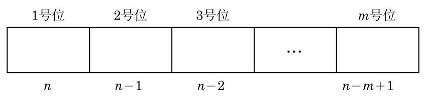

图 6-2-5

为了计算 ${\mathrm{P}}_{n}^{m}$ ,可以分成以下 $m$ 个步骤:

第一步,确定 1 号位上的元素,这可以从 $n$ 个互不相同的元素中任取一个填空,有 $n$ 种方法;

第二步,确定 2 号位上的元素,这可以从剩下的 $n - 1$ 个互不相同的元素中任取一个填空, 有 n-1 种方法;

第三步,确定 3 号位上的元素,这可以从剩下的 $n - 2$ 个互不相同的元素中任取一个填空,有 $n - 2$ 种方法;

以此类推,当前面的 $m - 1$ 个位子都被填好后, $m$ 号位可以从余下的 $n - \left( {m - 1}\right)$ 个互不相同的元素中任取一个填空,有 $n - \; m + 1$ 种方法.

根据乘法原理, 可以得到排列数为

$$
{\mathrm{P}}_{n}^{m} = n\left( {n - 1}\right) \left( {n - 2}\right) \cdots \left( {n - m + 1}\right) ,
$$

其中 $m$ 及 $n$ 是正整数,且 $m \leq  n$ . 这个公式叫做排列数公式.

例 4 用 0、1、2、3、4、5 这 6 个数字，可以组成多少个没有重复数字的三位数?

解 解法一: 用 0 到 5 这 6 个数字组成一个三位数, 可以看成从这 6 个数字中任取 3 个的一个排列 (0 排在百位的除外). 由于百位上的数字不能是 0 , 因此可以分两个步骤考虑: 先排百位上的数字, 再排十位和个位上的数字.

百位上的数字从 1 到 5 这 5 个数字中任取 1 个,有 ${\mathrm{P}}_{5}^{1}$ 种情形; 十位和个位上的数字, 可以从余下的 5 个数字中任取 2 个, 有 ${\mathrm{P}}_{5}^{2}$ 种情形. 根据乘法原理,所求的三位数的个数为

$$
{\mathrm{P}}_{5}^{1}{\mathrm{P}}_{5}^{2} = 5 \times  5 \times  4 = {100}.
$$

解法二: 从 0 到 5 这 6 个数字中任取 3 个数字的排列数, 减去其中以 0 为排头的排列数, 就是用这 6 个数字组成的没有重复数字的三位数的个数.

从 0 到 5 这 6 个数字中任取 3 个数字的排列数为 ${\mathrm{P}}_{6}^{3}$ ,其中以 0 为排头的排列数为 ${\mathrm{P}}_{5}^{2}$ ,因此所求的三位数的个数为

$$
{\mathrm{P}}_{6}^{3} - {\mathrm{P}}_{5}^{2} = 6 \times  5 \times  4 - 5 \times  4 = {100}.
$$

解法三: 由于 0 不能出现在百位上, 因此可以根据数码中是否有 0 和 0 出现在哪一位上进行分类讨论.

满足条件的三位数可以分成三类:

每一位数字都不是 0 的三位数有 ${\mathrm{P}}_{5}^{3}$ 个;

个位数字是 0 的三位数有 ${\mathrm{P}}_{5}^{2}$ 个;

十位数字是 0 的三位数有 ${\mathrm{P}}_{5}^{2}$ 个.

根据加法原理, 符合条件的三位数的个数为

$$
{\mathrm{P}}_{5}^{3} + {\mathrm{P}}_{5}^{2} + {\mathrm{P}}_{5}^{2} = {60} + {20} + {20} = {100}.
$$

例 5 (1)7 个人站成一排. 若甲和乙不能相邻排列，有多少种不同的排法?

(2)要将 8 本各不相同的教科书排成一排放在书架上，其中数学书 3 本、外语书 2 本、物理书 3 本. 如果 3 本数学书要排在一起，2 本外语书也要排在一起，那么有多少种不同的排法?

解(1)解法一:因为甲和乙不能相邻，所以可以先考虑确定甲和乙在排列中的位置, 再进行排列.

将一排的 7 个位置从左向右依次编号为 1 到 7 , 则甲和乙所在位置的编号有以下 15 种情形:

 $\left( {1,3}\right) \text{ 、 }\left( {1,4}\right) \text{ 、 }\left( {1,5}\right) \text{ 、 }\left( {1,6}\right) \text{ 、 }\left( {1,7}\right) \text{ 、 }\left( {2,4}\right) \text{ 、 }\left( {2,5}\right) \text{ 、 }\left( {2,6}\right)$  、

$\left( {2,7}\right) \text{ 、 }\left( {3,5}\right) \text{ 、 }\left( {3,6}\right) \text{ 、 }\left( {3,7}\right) \text{ 、 }\left( {4,6}\right) \text{ 、 }\left( {4,7}\right) \text{ 、 }\left( {5,7}\right)$ .

这样, 可以分两步找出符合条件的排列:

第一步,确定甲和乙在以上 15 种情形中的位置,有 ${15} \times  2$ 种情形;

第二步,确定余下 5 人在排列中的位置,有 ${\mathrm{P}}_{5}^{5}$ 种情形.

根据乘法原理, 符合条件的排列的个数为

$$
{15} \times  2 \times  {\mathrm{P}}_{5}^{5} = {30} \times  {120} = {3600}.
$$

解法二: 因为甲和乙不能相邻, 所以可以先将余下 5 人排列好, 相邻两人中间均留有一个空位, 加上两端的空位, 共有 6 个空位, 再将甲乙两人分别插入其中两个不同的空位即可.

这样, 可以分两步找出符合条件的排列:

第一步,先对甲和乙以外的 5 人进行排列,共有 ${\mathrm{P}}_{5}^{5}$ 种情形, 这 5 人形成了 6 个空位;

第二步, 再将甲和乙分别插入这 6 个空位中的 2 个, 共有 ${\mathrm{P}}_{6}^{2}$ 种情形.

根据乘法原理, 符合条件的排列的个数为

$$
{\mathrm{P}}_{5}^{5}{\mathrm{P}}_{6}^{2} = {120} \times  {30} = {3600}.
$$

总之, 7 个人站成一排, 若甲和乙不能相邻排列, 共有 3600 种排法.

(2)分三个步骤完成这件事情:

第一步:将 3 本数学书和 2 本外语书都分别看作一本书，然后连同其他 3 本物理书排成一排,有 ${\mathrm{P}}_{5}^{5}$ 种排法;

第二步:3 本数学书的位置可以互换,有 ${\mathrm{P}}_{3}^{3}$ 种排法;

第三步:2 本外语书的位置也可以互换，有 ${\mathrm{P}}_{2}^{2}$ 种排法.

根据乘法原理, 不同排法的总数为

$$
{\mathrm{P}}_{5}^{5}{\mathrm{P}}_{3}^{3}{\mathrm{P}}_{2}^{2} = {120} \times  6 \times  2 = {1440}.
$$

例 6 将 $a\text{ 、 }b\text{ 、 }c\text{ 、 }d\text{ 、 }e\text{ 、 }f$ 六个不同元素排成一列,其中 $a$ 不在首位, $b$ 不在末位. 问: 有多少种不同的排法?

解 根据 $a$ 所在的位置可以分以下两种情形:

若 $a$ 在末位,则余下 5 个元素可任意排列,这样的排列的个数为

$$
{\mathrm{P}}_{5}^{5} = 5 \times  4 \times  3 \times  2 \times  1 = {120}.
$$

若 $a$ 不在末位,则因为 $a$ 不在首位,可以分三步找出符合条

件的排列:

第一步,确定 $a$ 的位置,有 4 种情形;

第二步,确定 $b$ 的位置,有 4 种情形;

第三步，确定余下 4 个元素在排列中的位置，有 ${\mathrm{P}}_{4}^{4}$ 种情形.

根据乘法原理, $a$ 不在首位和末位的排列的个数为

$$
4 \times  4 \times  {\mathrm{P}}_{4}^{4} = {16} \times  4 \times  3 \times  2 \times  1 = {384}.
$$

综上, 满足条件的排列的个数为

$$
{120} + {384} = {504}.
$$

#### 练习 6.2(2)

1. 5 名篮球队员甲、乙、丙、丁、戊，排成一排.

(1)共有多少种不同的排法？

(2)若甲必须站在排头，有多少种不同的排法？

(3)若甲不能站排头，也不能站排尾，有多少种不同的排法？

2.(1)配制某种染色剂，需要加入 3 种有机染料、 2 种无机染料和 2 种添加剂，其中有机染料的添加顺序不可以相邻. 为研究所有不同的添加顺序对染色效果的影响, 总共要试验多少次?

(2)某展览馆计划展出 10 幅不同的画, 其中水彩画 1 幅、油画 4 幅、国画 5 幅. 现排成一排陈列, 要求同一品种的画必须连在一起, 并且水彩画不放在两端. 问: 有多少种不同的陈列方式?

### 3 排列数的性质

把 $n$ 个不同元素全部进行排列,叫做这 $n$ 个元素的全排列. 在排列数公式 ${\mathrm{P}}_{n}^{m} = n\left( {n - 1}\right) \left( {n - 2}\right) \cdots \left( {n - m + 1}\right) \left( {1 \leq  m \leq  n}\right)$ 中, 令 $m = n$ ,得知 $n$ 个元素的全排列总数是

$$
{\mathrm{P}}_{n}^{n} = n\left( {n - 1}\right) \left( {n - 2}\right) \cdots 3 \times  2 \times  1.
$$

为方便起见,把乘积 $n\left( {n - 1}\right) \left( {n - 2}\right) \cdots 3 \times  2 \times  1$ 记作 $n!$ ,读作 $n$ 的阶乘,那么 $n$ 个不同元素的全排列数可以写成

$$
{\mathrm{P}}_{n}^{n} = n!
$$

利用阶乘符号可以将排列数公式作如下变形:

$$
{\mathrm{P}}_{n}^{m} = n\left( {n - 1}\right) \left( {n - 2}\right) \cdots \left( {n - m + 1}\right)
$$

$$
= \frac{n\left( {n - 1}\right) \left( {n - 2}\right) \cdots \left( {n - m + 1}\right) \left( {n - m}\right) \cdots 2 \times  1}{\left( {n - m}\right) \cdots 2 \times  1}
$$

$$
= \frac{n!}{\left( {n - m}\right) !}
$$

即排列数公式还可写成

$$
{\mathrm{P}}_{n}^{m} = \frac{n!}{\left( {n - m}\right) !}.
$$

为了使这个公式在 $m = n$ 时也成立,我们规定

$$
0! = 1\text{ . }
$$

同理,为了使 ${\mathrm{P}}_{n}^{m} = \frac{n!}{\left( {n - m}\right) !}$ 在 $m = 0$ 时也成立,我们规定 ${\mathrm{P}}_{n}^{0} = 1$ .

例 7 设 $n$ 是一个不小于 17 的正整数,用排列数表示 $\left( {n - {16}}\right) \left( {n - {15}}\right) \cdots \left( {n - 6}\right) .$

解 根据排列数公式, 可以得到

$$
\left( {n - {16}}\right) \left( {n - {15}}\right) \cdots \left( {n - 6}\right)  = \left( {n - 6}\right) \left\lbrack  {\left( {n - 6}\right)  - 1}\right\rbrack  \left\lbrack  {\left( {n - 6}\right)  - 2}\right\rbrack
$$

$$
\cdots \left\lbrack  {\left( {n - 6}\right)  - {11} + 1}\right\rbrack
$$

$$
= {\mathrm{P}}_{n - 6}^{11}\text{ . }
$$

例 8 已知 $m\text{ 、 }n$ 是正整数,且 $m \leq  n$ . 求证:

(1) ${\mathrm{P}}_{n}^{m} = n{\mathrm{P}}_{n - 1}^{m - 1}$ ;

(2) ${\mathrm{P}}_{n}^{m} + m{\mathrm{P}}_{n}^{m - 1} = {\mathrm{P}}_{n + 1}^{m}$ .

证明(1)根据排列数公式，可以得到

$$
{\mathrm{P}}_{n}^{m} = \frac{n!}{\left( {n - m}\right) !} = \frac{n \cdot  \left( {n - 1}\right) !}{\left\lbrack  {\left( {n - 1}\right)  - \left( {m - 1}\right) }\right\rbrack  !}
$$

$$
= n{\mathrm{P}}_{n - 1}^{m - 1}\text{ . }
$$

所以, ${\mathrm{P}}_{n}^{m} = n{\mathrm{P}}_{n - 1}^{m - 1}$ .

(2)根据排列数公式，可以得到

$$
{\mathrm{P}}_{n}^{m} + m{\mathrm{P}}_{n}^{m - 1} = \frac{n!}{\left( {n - m}\right) !} + m\frac{n!}{\left( {n - m + 1}\right) !}
$$

$$
= \frac{n!\left( {n - m + 1}\right)  + n! \times  m}{\left( {n - m + 1}\right) !}
$$

$$
= \frac{n!\left( {n - m + 1 + m}\right) }{\left\lbrack  {\left( {n + 1}\right)  - m}\right\rbrack  !}
$$

$$
= \frac{\left( {n + 1}\right) !}{\left\lbrack  {\left( {n + 1}\right)  - m}\right\rbrack  !}
$$

$$
= {\mathrm{P}}_{n + 1}^{m}\text{ . }
$$

所以, ${\mathrm{P}}_{n}^{m} + m{\mathrm{P}}_{n}^{m - 1} = {\mathrm{P}}_{n + 1}^{m}$ .

例 9 解关于正整数 $n$ 的方程: ${\mathrm{P}}_{{2n} + 1}^{4} = {140}{\mathrm{P}}_{n}^{3}$ .

解 首先,由排列数的定义,有 $\left\{  \begin{array}{l} {2n} + 1 \geq  4, \\  n \geq  3, \end{array}\right.$ 由此解得 $n \geq  3$ . 此外, 原方程可化为

$$
\left( {{2n} + 1}\right) {2n}\left( {{2n} - 1}\right) \left( {{2n} - 2}\right)  = {140n}\left( {n - 1}\right) \left( {n - 2}\right) ,
$$

再化简, 可得

$$
\left( {{2n} + 1}\right) \left( {{2n} - 1}\right)  = {35}\left( {n - 2}\right) ,
$$

即

$$
4{n}^{2} - {35n} + {69} = 0,
$$

即

$$
\left( {n - 3}\right) \left( {{4n} - {23}}\right)  = 0.
$$

舍去非整数的根 $n = \frac{23}{4}$ ,故

$$
n = 3\text{ . }
$$

#### 练习 6.2(3)

1. 已知 $n$ 是正整数，且 $\frac{{\mathrm{P}}_{n}^{7} - {\mathrm{P}}_{n}^{5}}{{\mathrm{P}}_{n}^{5}} = {89}$ . 求 $n$ 的值.
2. 已知 $n$ 为不小于 2 的正整数,求证: ${\mathrm{P}}_{n + 1}^{n + 1} - {\mathrm{P}}_{n}^{n} = {n}^{2}{\mathrm{P}}_{n - 1}^{n - 1}$ .

#### 习题 6.2

##### A 组

1. 用 1、2、3、4 可以组成多少个没有重复数字的四位正整数? 其中有多少个偶数?
2. 从 1、2、3、4、5 这 5 个数字中，任取 2 个不同的数字作为一个点的坐标，一共可以组成多少个不同的点?
3. 在方程 ${ax} + {by} = 0$ 中,设系数 $a\text{ 、 }b$ 是集合 $\{ 0,1,2,3,5,7\}$ 中两个不同的元素. 求这些方程所表示的不同直线的条数.

计数原理

4. 将 5 个人排成一排, 若甲和乙必须排在一起, 则有多少种不同的排法?
5. 从 7 名运动员中选 4 名组成接力队参加 $4 \times  {100}$ 米接力赛. 问:甲、乙两人都不跑中间两棒的排法有多少种?
6. 从 7 名男生和 5 名女生中选取 3 人依次进行面试.

(1)若参加面试的人全是女生，则有多少种不同的面试方法？

(2)若参加面试的人中，恰好有 1 名女生，则有多少种不同的面试方法？

7. 若 $m$ 为正整数，且 $m < {27}$ ，则 $\left( {{27} - m}\right) \left( {{28} - m}\right) \cdots \left( {{34} - m}\right)$ 等于 ( )

A. ${\mathrm{P}}_{{27} - m}^{8}$ ; B. ${\mathrm{P}}_{{34} - m}^{{27} - m}$ ;

C. ${\mathrm{P}}_{{34} - m}^{7}$ ; D. ${\mathrm{P}}_{{34} - m}^{8}$ .

8. 求满足等式 ${\mathrm{P}}_{2n}^{3} = {28}{\mathrm{P}}_{n}^{2}$ 的正整数 $n$ 的值.
9. 解关于正整数 $x$ 的不等式 ${\mathrm{P}}_{8}^{x} < 6{\mathrm{P}}_{8}^{x - 2}$ .

##### B 组

1. 有 4 张分别标有数字 1、2、3、4 的红色卡片和 4 张分别标有数字 1、2、3、4 的蓝色卡片，从这 8 张卡片中取出 4 张排成一行. 如果所取出的 4 张卡片所标数字之和等于 10 , 那么不同的排法共有多少种?
2. 有 6 张连号的电影票, 分给 3 名教师和 3 名学生, 要求师生相间而坐. 求不同分法的种数.
3. 在一张节目单中原有 6 个节目已排好顺序, 现要插入 3 个节目, 并要求不改变原有 6 个节目前后相对顺序. 问: 一共有多少种不同的插法?

4.2 名男生和 4 名女生排成一排. 问:男生既不相邻也不排两端的不同排法共有多少种?

5. 在一次电影展中, 某影院要在两天内放映 12 部参赛影片, 每天只有 6 个时间段放映 6 部参赛影片，每个时间段放映 1 部，其中甲、乙两部电影不能在同一天放映. 问:有多少种不同的排片方案？
6. 从 6 人中选取 4 人分别去 $A\text{ 、 }B\text{ 、 }C\text{ 、 }D$ 四个城市游览,要求每个城市有一人游览, 而每人只游览一个城市，且这 6 人中，甲、乙两人都不去 A 地游览. 问:不同的选择方案共有多少种?

## 6.3 组合

### 1 组合的定义

考虑下面的问题: 从甲、乙、丙 3 名学生中选出 2 名, 有多少种不同的选法?

这个问题与本章 6.2 节的问题 1 不同. 6.2 节的问题 1 是从 3 个互不相同的元素中任取 2 个, 并按序排列, 求一共有多少种不同的排列方法, 这是排列问题; 而本节所考虑的问题是, 从 3 个互不相同的元素中任取 2 个, 不管怎样的顺序都看作同一组, 求一共有多少个不同的组. 这就是所要研究的组合问题.

定义 从 $n$ 个互不相同的元素中,取出 $m\left( {m \leq  n}\right)$ 个不同元素作为一组,叫做从 $n$ 个元素中取出 $m$ 个元素的一个组合 (combination).

上面的问题中要确定有几种不同的选法, 就是要求从 3 个互不相同的元素中取出 2 个不同元素的所有组合的个数. 如果两个组合中的元素完全相同, 不管元素的顺序如何, 这两个组合都是相同的组合; 而只有当两个组合中的元素不完全相同时, 这两个组合才是不同的组合. 上面问题的所有组合有 3 个, 分别是:

甲乙、乙丙、丙甲.

注意:组合“甲乙”与组合“乙甲”是相同的组合，而组合“甲乙”与组合“乙丙”是不同的组合.

从排列和组合的定义可以看到, 排列与元素的顺序有关, 组合与元素的顺序无关. 例如, “甲乙”与 “乙甲” 是不同的排列, 但它们是同一个组合.

例 1 判断下列问题分别是排列问题还是组合问题:

(1)从 10 名学生中任选 5 名去参观一个展览，求有多少种不同的选法;

(2)从 1、2、3、4、5 这 5 个数字中，每次任取 2 个不同的

---

注意排列与组合的区别.

---

数作为一个点的坐标, 求所有不同点的个数;

(3)一个黄袋中装有四张分别写有 1、3、5、7 的卡片，另一个红袋中装有四张分别写有 2、8、16、32 的卡片. 从红袋和黄袋中各任取一张卡片，问这两张卡片上的数相加所得的和有多少种；

(4)有四本不同的书要分别送给四个人，每人一本，问一共有多少种不同的送法. ?

---

请同学们思考本例中各题的判断依据.

---

解(1)组合问题;(2)排列问题;(3)组合问题;(4)排列问题.

例 2 甲、乙、丙、丁 4 支篮球队举行单循环赛(即任意两支球队都要比赛一场).

(1)写出每场比赛的两支球队；

(2)写出冠亚军的所有可能情况.

解(1)这是一个组合问题，将两支球队的组合用一个集合表示，共有 6 个组合:

\{甲,乙\}、\{甲,丙\}、\{甲,丁\}、\{乙,丙\}、\{乙,丁\}、\{丙,丁\}.

(2)这是一个排列问题，即从 4 支球队中任意选取 2 支，按照冠军和亚军顺序排列，共有 12 种排列方式(符号(甲，乙)表示 “甲是冠军，乙是亚军”):

(甲，乙)、(甲，丙)、(甲，丁)、(乙，丙)、(乙，丁)、(丙，丁)、

(乙, 甲)、(丙, 甲)、(丁, 甲)、(丙, 乙)、(丁, 乙)、(丁, 丙).

#### 练习 6.3(1)

1. ( 1 )写出从 $a\text{ 、 }b\text{ 、 }c\text{ 、 }d\text{ 、 }e$ 五个元素中任取两个不同元素的所有组合；

(2)写出从 $a\text{ 、 }b\text{ 、 }c\text{ 、 }d\text{ 、 }e$ 五个元素中任取两个不同元素的所有排列.

2. 平面上的 6 个点 $A\text{ 、 }B\text{ 、 }C\text{ 、 }D\text{ 、 }E\text{ 、 }F$ 中的任意 3 个点都不在同一条直线上,写出所有以其中 3 个点为顶点的三角形.

### 2 组合数的计算

类似于排列数, 我们给出组合数的定义:

定义 从 $n$ 个互不相同的元素中,取出 $m\left( {m \leq  n}\right)$ 个不同元素的所有组合的个数,叫做从 $n$ 个元素中取出 $m$ 个元素的组合

数,用符号 ${\mathbf{C}}_{n}^{m}$ 表示.

因此，从甲、乙、丙 3 名学生中任选 2 名，有 ${\mathrm{C}}_{3}^{2}$ 种不同的方法.

下面我们研究组合数 ${\mathrm{C}}_{n}^{m}$ 的计算方法,这可以从组合数 ${\mathrm{C}}_{n}^{m}$ 与排列数 ${\mathrm{P}}_{n}^{m}$ 的关系入手.

例如,从 3 个不同元素 $a\text{ 、 }b\text{ 、 }c$ 中取出 2 个不同元素的排列与组合的关系如表 6-1 所示:

表 6-1

<table><tr><td>组合</td><td colspan="2">排列</td></tr><tr><td>$a, b$</td><td>$a, b$</td><td>$b, a$</td></tr><tr><td>$b, c$</td><td>$b, c$</td><td>$c, b$</td></tr><tr><td>$c, a$</td><td>$c, a$</td><td>$a, c$</td></tr></table>

从表 6-1 可以看到, 对于每一个组合都有 2 种不同的排列. 因此，求从 3 个互不相同的元素中任取 2 个不同元素的排列数 ${\mathrm{P}}_{3}^{2}$ ,可以分成以下两步进行:

第一步, 从 3 个互不相同的元素中任取 2 个不同元素, 共有 ${\mathrm{C}}_{3}^{2}$ 个不同的组合;

第二步,将每一个组合中的 2 个元素进行全排列,各有 ${\mathrm{P}}_{2}^{2}$ 个排列.

根据乘法原理, 有

$$
{\mathrm{P}}_{3}^{2} = {\mathrm{C}}_{3}^{2}{\mathrm{P}}_{2}^{2},
$$

即

$$
{\mathrm{C}}_{3}^{2} = \frac{{\mathrm{P}}_{3}^{2}}{{\mathrm{P}}_{2}^{2}}
$$

一般地,从 $n$ 个互不相同的元素中任取 $m$ 个不同元素进行排列, 可以分成以下两步进行:

第一步,从 $n$ 个互不相同的元素中任取 $m$ 个不同元素,共有 ${\mathrm{C}}_{n}^{m}$ 个不同的组合;

第二步,将每一个组合中的 $m$ 个元素进行全排列,各有 ${\mathrm{P}}_{m}^{m}$ 个排列.

这样,根据乘法原理,从 $n$ 个互不相同的元素中任取 $m$ 个不同元素的排列数 ${\mathrm{P}}_{n}^{m}$ 满足

$$
{\mathrm{P}}_{n}^{m} = {\mathrm{C}}_{n}^{m}{\mathrm{P}}_{m}^{m},
$$

---

C 是英文 combination 的第一个字母. 在数学文献中, ${\mathrm{C}}_{n}^{m}$ 也常记作 $\left( \begin{array}{l} n \\  m \end{array}\right)$ .

---

因此

$$
{\mathrm{C}}_{n}^{m} = \frac{{\mathrm{P}}_{n}^{m}}{{\mathrm{P}}_{m}^{m}} = \frac{n\left( {n - 1}\right) \left( {n - 2}\right) \cdots \left( {n - m + 1}\right) }{m!},
$$

其中 $m$ 及 $n$ 是正整数,且 $m \leq  n$ . 这个公式称为组合数公式.

例 3 圆上有 10 个不同的点, 以其中任意 3 个点为顶点, 可以组成多少个不同的三角形？

解 由于圆上的 10 个点中不可能有三点共线, 因此以其中任意 3 个点为顶点的三角形的个数, 就是从 10 个互不相同的元素中任取 3 个不同元素的组合数, 即

$$
{\mathrm{C}}_{10}^{3} = \frac{{10} \times  9 \times  8}{3 \times  2 \times  1} = {120}.
$$

因此, 可以组成 120 个不同的三角形.

例 4 某校高中一年级举行篮球赛. 比赛时先分成两组, 其中 1 班、 2 班、 3 班、 4 班为第一组，5 班、 6 班、 7 班、 8 班、 9 班、 10 班为第二组. 各组先进行单循环赛(即同组中的每两支队都要比赛一场), 然后由各组的前两名共 4 支队进行单循环赛决出冠军和亚军. 问:一共需要比赛多少场?

解 由题意,第一组单循环赛的比赛场数是 ${\mathrm{C}}_{4}^{2}$ ; 第二组单循环赛的比赛场数是 ${\mathrm{C}}_{6}^{2}$ ; 各组的前两名共 4 支队再进行单循环赛,还需要比赛 ${\mathrm{C}}_{4}^{2}$ 场. 所以,这次篮球赛一共需要比赛的场次为

$$
{\mathrm{C}}_{4}^{2} + {\mathrm{C}}_{6}^{2} + {\mathrm{C}}_{4}^{2} = 6 + {15} + 6 = {27}.
$$

例 5 有甲、乙、丙三项任务, 其中甲需 2 人承担, 乙、 丙各需 1 人承担. 现从 10 人中任选 4 人承担这三项任务，不同的选法有多少种?

解 从 10 人中任选 4 人分配任务,可分成以下三个步骤:

第一步:从 10 人中任选 2 人承担甲任务，有 ${\mathrm{C}}_{10}^{2}$ 种选法；

第二步:从余下的 8 人中任选 1 人承担乙任务，有 ${\mathrm{C}}_{8}^{1}$ 种选法;

第三步:从余下的 7 人中任选 1 人承担丙任务，有 ${\mathrm{C}}_{7}^{1}$ 种选法.

根据乘法原理, 不同选法的种数为

$$
{\mathrm{C}}_{10}^{2}{\mathrm{C}}_{8}^{1}{\mathrm{C}}_{7}^{1} = \frac{{10} \times  9}{2} \times  8 \times  7 = {2520}.
$$

例 6 某班要选举班干部，现有 10 名候选人.

(1)从这 10 名候选人中任选 5 人组成班委，有多少种不同的选法?

(2)从这 10 名候选人中任选 5 人分别担任班委中五项不同的职务，每项职务由一人担任，每人只担任一项职务，有多少种不同的选法?

解(1)从这 10 名候选人中任选 5 人组成班委，这是从 10 个互不相同的元素中任取 5 个不同元素的组合问题, 有

$$
{\mathrm{C}}_{10}^{5} = \frac{{10} \times  9 \times  8 \times  7 \times  6}{5 \times  4 \times  3 \times  2 \times  1} = {252}
$$

种选法.

(2)将选出的 5 名候选人按照职务的顺序排列, 这是从 10 个互不相同的元素中任取 5 个不同元素的排列问题, 共有

$$
{\mathrm{P}}_{10}^{5} = {10} \times  9 \times  8 \times  7 \times  6 = {30240}
$$

种选法.

练习 ${6.3}\left( 2\right)$

1. 某班有 20 名男生、18 名女生, 现从中任选 5 人组成一个宣传小组, 其中男生和女生都有的选法有多少种?
2. 从 1、2、3、4、5 这五个数字中任取两个不同的奇数和两个不同的偶数.

(1)一共有多少种不同的选法?

(2)可以组成多少个没有重复数字的四位奇数？

### 3 组合数的性质

在组合数公式

${\mathrm{C}}_{n}^{m} = \frac{{\mathrm{P}}_{n}^{m}}{{\mathrm{P}}_{m}^{m}}$ (其中 $m$ 及 $n$ 是正整数,且 $m \leq  n$ )

中,将 ${\mathrm{P}}_{n}^{m} = \frac{n!}{\left( {n - m}\right) !}$ 代入,得

$$
{\mathrm{C}}_{n}^{m} = \frac{n!}{m!\left( {n - m}\right) !}.
$$

并规定 ${\mathrm{C}}_{n}^{0} = 1$ . 从而,上述公式对 $m = 0$ 也成立.

例 7 已知 $m$ 是自然数， $n$ 为正整数，且 $m + 1 \leq  n$ . 求证: ${\mathrm{C}}_{n}^{m} = \frac{m + 1}{n - m}{\mathrm{C}}_{n}^{m + 1}$ .

证明 根据组合数公式, 可以得到

$$
\frac{m + 1}{n - m}{\mathrm{C}}_{n}^{m + 1} = \frac{m + 1}{n - m} \cdot  \frac{n!}{\left( {m + 1}\right) !\left( {n - m - 1}\right) !}
$$

$$
= \frac{n!}{m!\left( {n - m}\right) !}
$$

$$
= {\mathrm{C}}_{n}^{m}\text{ . }
$$

Q 例 8 已知 $m$ 是自然数， $n$ 是正整数，且 $m \leq  n$ . 求证:

(1) ${\mathrm{C}}_{n}^{m} = {\mathrm{C}}_{n}^{n - m}$ ；

(2) ${\mathrm{C}}_{n + 1}^{m} = {\mathrm{C}}_{n}^{m} + {\mathrm{C}}_{n}^{m - 1}$ .

证明 (1) 根据组合数公式, 可以得到

$$
{\mathrm{C}}_{n}^{n - m} = \frac{n!}{\left( {n - m}\right) !\left\lbrack  {n - \left( {n - m}\right) }\right\rbrack  !} = \frac{n!}{m!\left( {n - m}\right) !}
$$

$$
= {\mathrm{C}}_{n}^{m}\text{ . }
$$

Q

这个等式也可以根据组合数的定义得到. 从 $n$ 个互不相同的元素中任取 $m$ 个元素后,会剩下 $n - m$ 个元素,因此,每一个从 $n$ 个互不相同的元素中任取 $m$ 个元素的组合,都唯一对应一个从 $n$ 个互不相同的元素中任取 $n - m$ 个元素的组合; 反过来,每一个从 $n$ 个互不相同的元素中任取 $n - m$ 个元素的组合,都唯一对应一个从 $n$ 个互不相同的元素中任取 $m$ 个元素的组合. 因此,从 $n$ 个互不相同的元素中任取 $m$ 个元素的组合数,等于从 $n$ 个互不相同的元素中任取 $n - m$ 个元素的组合数,即 ${\mathrm{C}}_{n}^{m} = {\mathrm{C}}_{n}^{n - m}$ .

? (2)根据组合数公式，可以得到

$$
{\mathrm{C}}_{n}^{m} + {\mathrm{C}}_{n}^{m - 1} = \frac{n!}{m!\left( {n - m}\right) !} + \frac{n!}{\left( {m - 1}\right) !\left( {n - m + 1}\right) !}
$$

$$
= \frac{n!}{m!\left( {n - m + 1}\right) !} + \frac{n!m}{m!\left( {n - m + 1}\right) !}
$$

$$
= \frac{n!\left( {n - m + 1 + m}\right) }{m!\left( {n - m + 1}\right) !}
$$

$$
= \frac{n!\left( {n + 1}\right) }{m!\left( {n - m + 1}\right) !}
$$

$$
= \frac{\left( {n + 1}\right) !}{m!\left( {n - m + 1}\right) !}
$$

$$
= {\mathrm{C}}_{n + 1}^{m}\text{ . }
$$

---

这两个式子是组合数的两个基本运算性质, 在组合数的计算、化简中起着非常重要的作用.

在计算 ${\mathrm{C}}_{n}^{m}$ 时,若 $m > \frac{n}{2}$ ,可利用此性质,转化为 ${\mathrm{C}}_{n}^{n - m}$ 来计算.

能否类似于(1)， 利用组合数的定义， 解释等式 ${\mathrm{C}}_{n + 1}^{m} = {\mathrm{C}}_{n}^{m} + \; {\mathrm{C}}_{n}^{m - 1}$ ?

---

例 9 (1)计算 ${\mathrm{C}}_{100}^{97}$ ；

(2)求满足等式 ${\mathrm{C}}_{n + 3}^{n + 1} = {\mathrm{C}}_{n + 1}^{n - 1} + {\mathrm{C}}_{n}^{n - 2} + {\mathrm{C}}_{n + 1}^{n}$ 的正整数 $n$ .

解 (1) 由性质 ${\mathrm{C}}_{n}^{m} = {\mathrm{C}}_{n}^{n - m}$ ,得

$$
{\mathrm{C}}_{100}^{97} = {\mathrm{C}}_{100}^{3} = \frac{{100} \times  {99} \times  {98}}{3 \times  2 \times  1} = {161700}.
$$

(2)由性质 ${\mathrm{C}}_{n}^{m} = {\mathrm{C}}_{n}^{n - m}$ 和 ${\mathrm{C}}_{n + 1}^{m} = {\mathrm{C}}_{n}^{m} + {\mathrm{C}}_{n}^{m - 1}$ ，有

$$
{\mathrm{C}}_{n + 3}^{n + 1} = {\mathrm{C}}_{n + 3}^{2},
$$

$$
{\mathrm{C}}_{n + 1}^{n - 1} + {\mathrm{C}}_{n}^{n - 2} + {\mathrm{C}}_{n + 1}^{n} = {\mathrm{C}}_{n + 1}^{2} + {\mathrm{C}}_{n}^{2} + {\mathrm{C}}_{n + 1}^{1} = {\mathrm{C}}_{n + 2}^{2} + {\mathrm{C}}_{n}^{2}.
$$

所以, 已知等式可化为

$$
{\mathrm{C}}_{n + 3}^{2} - {\mathrm{C}}_{n + 2}^{2} = {\mathrm{C}}_{n}^{2}.
$$

再由性质 ${\mathrm{C}}_{n + 1}^{m} = {\mathrm{C}}_{n}^{m} + {\mathrm{C}}_{n}^{m - 1}$ ,有

$$
{\mathrm{C}}_{n + 2}^{1} = {\mathrm{C}}_{n}^{2},
$$

即

$$
n + 2 = \frac{n\left( {n - 1}\right) }{2},
$$

即

$$
{n}^{2} - {3n} - 4 = 0.
$$

解得

$$
{n}_{1} =  - 1\text{ (舍去), }{n}_{2} = 4\text{ . }
$$

故 $n$ 的值为 4 .

#### 练习 6.3(3)

1. 解关于正整数 $x$ 的方程:

(1) ${\mathrm{C}}_{16}^{{x}^{2} - x} = {\mathrm{C}}_{16}^{{5x} - 5}$ ；

(2) ${\mathrm{C}}_{x + 2}^{x - 2} + {\mathrm{C}}_{x + 2}^{x - 3} = \frac{1}{4}{\mathrm{P}}_{x + 3}^{3}$ .

2. 观察下列等式及其所示的规律:

$$
{\mathrm{C}}_{3}^{0} + {\mathrm{C}}_{4}^{1} = {\mathrm{C}}_{4}^{0} + {\mathrm{C}}_{4}^{1} = {\mathrm{C}}_{5}^{1},
$$

$$
{\mathrm{C}}_{3}^{0} + {\mathrm{C}}_{4}^{1} + {\mathrm{C}}_{5}^{2} = {\mathrm{C}}_{5}^{1} + {\mathrm{C}}_{5}^{2} = {\mathrm{C}}_{6}^{2},
$$

$$
{\mathrm{C}}_{3}^{0} + {\mathrm{C}}_{4}^{1} + {\mathrm{C}}_{5}^{2} + {\mathrm{C}}_{6}^{3} = {\mathrm{C}}_{6}^{2} + {\mathrm{C}}_{6}^{3} = {\mathrm{C}}_{7}^{3},
$$

并据此化简 ${\mathrm{C}}_{3}^{0} + {\mathrm{C}}_{4}^{1} + {\mathrm{C}}_{5}^{2} + {\mathrm{C}}_{6}^{3} + \cdots  + {\mathrm{C}}_{n + 3}^{n}$ ,其中 $n$ 为正整数.

#### 习题 6.3

##### A 组

1. 平面上有 10 个点, 其中有 4 个点在同一条直线上, 除此以外, 不再有三点共线. 问: 由这些点可以确定多少条直线?

2.(1)从10男8女中任选 5 人，共有多少种不同的选法？

(2)从10男8女中任选 5 人(男女都有)担任 5 项不同的工作，共有多少种不同的分配方法?

3. 从 5 名男生和 3 名女生中各任选 2 名参加一个歌唱小组，有多少种不同的选择方案?
4. 某批次 200 件产品中有 5 件次品, 现从该批次中任取 4 件产品.

(1)若 4 件产品都不是次品，则这样的取法有多少种？

(2)若 4 件产品中至少有 1 件次品，则这样的取法有多少种？

(3)若 4 件产品不都是次品，则这样的取法有多少种？

5. 从 5 名外语系大学生中任选 4 名参加翻译、交通、礼仪三项义工活动, 要求翻译有 2 人参加, 交通和礼仪各有 1 人参加. 问: 不同的分配方法共有多少种?
6. 某小组共有 10 名学生, 其中女生 3 名. 现任选 2 名代表, 则至少有 1 名女生当选的选法有多少种?
7. 设 $n$ 为正整数,求值:

(1) ${\mathrm{C}}_{{2n} - 3}^{n - 1} + {\mathrm{C}}_{n + 1}^{{2n} - 3}$ ； (2) ${\mathrm{C}}_{{13} + n}^{3n} + {\mathrm{C}}_{{12} + n}^{{3n} - 1} + {\mathrm{C}}_{{11} + n}^{{3n} - 2} + \cdots  + {\mathrm{C}}_{2n}^{{17} - n}$ .

8. 求满足等式 ${\mathrm{C}}_{18}^{k} = {\mathrm{C}}_{18}^{{2k} - 3}$ 的所有正整数 $k$ .
9. 证明: ${\mathrm{C}}_{n}^{m} = \frac{m + 1}{n + 1}{\mathrm{C}}_{n + 1}^{m + 1}$ ,其中 $m$ 是自然数, $n$ 是正整数,且 $m \leq  n$ .

##### B 组

1. 把 4 本不同的书全部分给 3 名学生, 每人至少 1 本, 有多少种不同的分法?
2. 袋中装有 $m$ 个红球和 $n$ 个白球,且 $m \geq  n \geq  2$ . 这些红球和白球的大小及质地都相

同. 从袋中同时任取 2 个球, 若 2 个球都是红球的取法总数是 2 个球颜色不同的取法总数的整数倍,求证: $m$ 必为奇数.

3. 如图,在 $\angle {AOB}$ 的两边 ${OA}\text{ 、 }{OB}$ 上分别有 5 个点和 6 个点 (都不同于点 $O$ ),这连同点 $O$ 在内的 12 个点可以确定多少个不同的三角形?

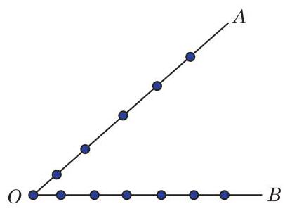

(第 3 题)

4. 有 12 名翻译人员，其中 3 人只能翻译英语，4 人只能翻译法语，其余 5 人既能翻译英语，也能翻译法语. 从这 12 名翻译人员中任选 6 人，其中 3 人翻译英语，3 人翻译法语, 有多少种不同的分配方法?
5. 利用组合数的性质化简: ${\mathrm{C}}_{3}^{3} + {\mathrm{C}}_{4}^{3} + {\mathrm{C}}_{5}^{3} + \cdots  + {\mathrm{C}}_{n}^{3}$ .

## 6.4 计数原理在古典概率中的应用

我们知道,如果一次试验有 $n$ 个等可能出现的样本点,而随机事件 $A$ 包含 $k$ 个样本点,那么事件 $A$ 发生的概率是

$$
P\left( A\right)  = \frac{k}{n}.
$$

当 $n$ 值较大时,枚举法难以使用,就需要利用排列组合的知识.

Q

例 1 一个罐子中有大小与质地完全相同的 20 个玻璃球, 其中 4 个是红色的, 6 个是黑色的, 10 个是白色的. 经充分混合后, 从罐子中同时任取 2 个球, 求下列事件的概率:

(1)2 个球都是黑色的；

(2)2 个球的颜色不同.

解 随机地从 20 个球中取出 2 个球,可能出现的结果有 ${\mathrm{C}}_{20}^{2}$ 种,即所有的样本点有 ${\mathrm{C}}_{20}^{2}$ 个.

(1)将“取出的 2 个球都是黑色的”这一事件记为 $A$ . $A$ 所包含的样本点有 ${\mathrm{C}}_{6}^{2}$ 个，因此事件 $A$ 的概率是

$$
P\left( A\right)  = \frac{{\mathrm{C}}_{6}^{2}}{{\mathrm{C}}_{20}^{2}} = \frac{3}{38}.
$$

(2)将“取出的 2 个球颜色不同”的事件记为 $B$ . “取出的 2 个球颜色不同”可以分为三种情况:(1)取出 1 个红球、1 个黑球；(2) 取出 1 个黑球、 1 个白球；(3)取出 1 个白球、 1 个红球. 由乘法原理和加法原理,易知 $B$ 所包含的样本点有 ${\mathrm{C}}_{4}^{1}{\mathrm{C}}_{6}^{1} + {\mathrm{C}}_{6}^{1}{\mathrm{C}}_{10}^{1} + {\mathrm{C}}_{10}^{1}{\mathrm{C}}_{4}^{1}$ 个,所以事件 $B$ 的概率是

$$
P\left( B\right)  = \frac{{\mathrm{C}}_{4}^{1}{\mathrm{C}}_{6}^{1} + {\mathrm{C}}_{6}^{1}{\mathrm{C}}_{10}^{1} + {\mathrm{C}}_{10}^{1}{\mathrm{C}}_{4}^{1}}{{\mathrm{C}}_{20}^{2}} = \frac{62}{95}.
$$

例 2 在 100 件产品中有 90 件一等品、 10 件二等品, 从中随机抽取 4 件产品.

(1)求恰好含 1 件二等品的概率；

(2)求至少含有 1 件二等品的概率.

(以上结果均精确到 0.01)

---

“大小与质地完全相同”和“经充分混合” 这两个条件, 保证了各个样本点的发生是等可能的.

---

解 从这 100 件产品中随机抽取 4 件产品, 所有的样本点的个数为 ${\mathrm{C}}_{100}^{4}$ .

(1)将“恰好含 1 件二等品”的事件记为 $A$ . 由乘法原理和加法原理,易知 $A$ 所包含的样本点有 ${\mathrm{C}}_{90}^{3}{\mathrm{C}}_{10}^{1}$ 个,所以事件 $A$ 的概率是

$$
\frac{{\mathrm{C}}_{90}^{3}{\mathrm{C}}_{10}^{1}}{{\mathrm{C}}_{100}^{4}} = \frac{1174800}{3921225} \approx  {0.30}.
$$

(2)将“至少含有 1 件二等品”的事件记为 $B$ . $B$ 的对立事件 $\bar{B}$ 为“ 4 件产品全是一等品”，而 $\bar{B}$ 所包含的样本点有 ${\mathrm{C}}_{90}^{4}$ 个， 所以

$$
P\left( \bar{B}\right)  = \frac{{\mathrm{C}}_{90}^{4}}{{\mathrm{C}}_{100}^{4}} = \frac{2555190}{3921225},
$$

从而事件 $B$ 的概率是

$$
P\left( B\right)  = 1 - P\left( \bar{B}\right)  \approx  {0.35}.
$$

例 3 某学习小组共有 10 名学生, 求其中至少有 2 名学生在同一月份出生的概率. (默认每月天数相同, 结果精确到 0.001)

解 由于每名学生的出生月份可能是 1 月到 12 月中的任何一个,因此 10 名学生的出生月份共有 ${12}^{10}$ 种可能的排列,每个排列对应一个样本点,从而样本点就有 ${12}^{10}$ 个,且每个样本点发生的概率都相等. 设 $A$ 表示事件“10 名学生中没有任何 2 名学生在同一月份出生”,那么 10 名学生的出生月份共有 ${\mathrm{P}}_{12}^{10}$ 种可能的排列,即事件 $A$ 包含 ${\mathrm{P}}_{12}^{10}$ 个样本点,所以事件 $A$ 的概率是

$$
P\left( A\right)  = \frac{{\mathrm{P}}_{12}^{10}}{{12}^{10}}.
$$

这样, “至少有 2 名学生在同一月份出生”的概率是

$$
1 - P\left( A\right)  \approx  {0.996}.
$$

练习 6.4

1. 袋中装有 4 个红球、3 个黄球、3 个白球, 所有小球的大小与质地完全相同. 从中同时任取 2 个小球, 求取出的 2 个球颜色相同的概率.
2. 某校要从 2 名男生和 4 名女生中任选 4 人担任一项赛事的志愿者工作，每个人被选中的可能性相同. 求在选出的志愿者中，男生和女生都有的概率.

#### 习题 6.4

##### A 组

1. 将两颗质地均匀的骰子同时抛掷一次,求向上的点数之和为 5 的概率.
2. 用 1、2、3、4、5 组成没有重复数字的三位数，从中随机地取一个，求取到的数为奇数的概率.

##### B 组

1. 从甲、乙、丙、丁、戊五人中任选两人参加一项活动, 求甲、乙两人中至少有一人被选中的概率.
2. 在 10 件产品中有 8 件一等品、 2 件二等品, 从中随机抽取 2 件产品. 求取到的产品中至多有 1 件二等品的概率.
3. 某校高一年级举行演讲比赛, 共有 10 名学生参赛, 其中一班有 3 名, 二班有 2 名, 其他班有 5 名. 若采用抽签的方式确定他们的演讲顺序, 求一班的 3 名学生恰好被排在一起(指演讲序号相连)的概率.

## 6.5 二项式定理

### 1 杨辉三角和二项式定理

我们知道,对于任意的 $a\text{ 、 }b$ ,都有

$$
{\left( a + b\right) }^{2} = {a}^{2} + {2ab} + {b}^{2},
$$

$$
{\left( a + b\right) }^{3} = {a}^{3} + 3{a}^{2}b + {3a}{b}^{2} + {b}^{3},
$$

$$
{\left( a + b\right) }^{4} = {a}^{4} + 4{a}^{3}b + 6{a}^{2}{b}^{2} + {4a}{b}^{3} + {b}^{4},
$$

$$
{\left( a + b\right) }^{5} = {a}^{5} + 5{a}^{4}b + {10}{a}^{3}{b}^{2} + {10}{a}^{2}{b}^{3} + {5a}{b}^{4} + {b}^{5}.
$$

我们把等式右边的代数式称为 ${\left( a + b\right) }^{k}$ 的二项展开式,其中 $k = 2,3,4,5$ . 一般地,对于任意正整数 $n,{\left( a + b\right) }^{n}$ 的二项展开式有什么规律呢?

在 $n$ 的取值不大的情况下,也可以利用下面的数阵求 ${\left( a + b\right) }^{n}$ 的二项展开式中各项的系数:

$$
{\left( a + b\right) }^{1}
$$

$$
{\left( a + b\right) }^{2}
$$

$$
{\left( a + b\right) }^{3}
$$

$$
{\left( a + b\right) }^{4}
$$

$$
{\left( a + b\right) }^{5}
$$

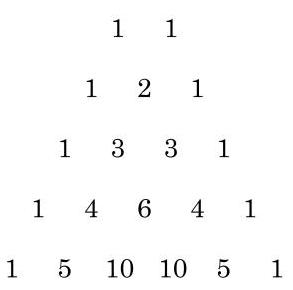

这个数阵的特点是:①每一行的第一个数和最后一个数都是 1 . ②每一行中，除了第一个数和最后一个数外，每个数等于它“肩上”的两个数之和. ③当 $n$ 为偶数时，最大的系数是中间一项; 当 $n$ 为奇数时,最大的系数是中间两项.

在我国数学家杨辉于 1261 年所著的《详解九章算法》中出现了类似的图表(类似于图 6-5-1)，习惯上称之为杨辉三角，杨辉在该图旁注明 “贾宪用此术”，故亦称贾宪三角. 它是中国古代数学的杰出研究成果之一. Q

---

请将特点①和特点②用组合数的公式表示.

杨辉，字谦光， 钱塘(今杭州)人，中国南宋末年数学家、 数学教育家. 约在 13 世纪中叶至后半叶活动于苏、杭一带。

---

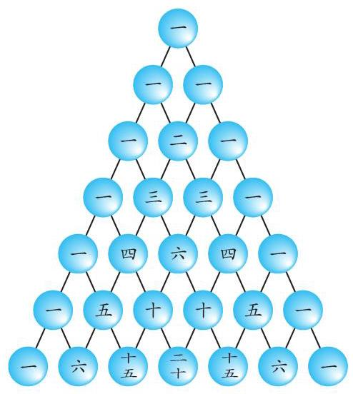

图 6-5-1

一般地,我们有下面的

定理 设 $n$ 是正整数,等式

${\left( a + b\right) }^{n} = {\mathrm{C}}_{n}^{0}{a}^{n} + {\mathrm{C}}_{n}^{1}{a}^{n - 1}b + {\mathrm{C}}_{n}^{2}{a}^{n - 2}{b}^{2} + \cdots  + {\mathrm{C}}_{n}^{r}{a}^{n - r}{b}^{r} + \cdots  + {\mathrm{C}}_{n}^{n}{b}^{n}$ 称为二项式定理. ${T}_{r + 1} = {\mathrm{C}}_{n}^{r}{a}^{n - r}{b}^{r}$ 表示 ${\left( a + b\right) }^{n}$ 的二项展开式中的第 $r + 1$ 项,其中 $r = 0,1,2,\cdots , n$ .

证明 当 $n = 1$ 时,

$$
{\left( a + b\right) }^{1} = a + b = {\mathrm{C}}_{1}^{0}{a}^{1}{b}^{0} + {\mathrm{C}}_{1}^{1}{a}^{0}{b}^{1}.
$$

假设 $n = k$ ( $k$ 为正整数) 时,

$$
{\left( a + b\right) }^{k} = {\mathrm{C}}_{k}^{0}{a}^{k}{b}^{0} + {\mathrm{C}}_{k}^{1}{a}^{k - 1}{b}^{1} + {\mathrm{C}}_{k}^{2}{a}^{k - 2}{b}^{2}
$$

$$
+ \cdots  + {\mathrm{C}}_{k}^{r}{a}^{k - r}{b}^{r} + \cdots  + {\mathrm{C}}_{k}^{k}{a}^{0}{b}^{k}.
$$

则当 $n = k + 1$ 时,根据多项式的乘法运算规则,有

$$
{\left( a + b\right) }^{k + 1} = \left( {a + b}\right) {\left( a + b\right) }^{k}
$$

$$
= \left( {a + b}\right) \left( {{\mathrm{C}}_{k}^{0}{a}^{k}{b}^{0} + {\mathrm{C}}_{k}^{1}{a}^{k - 1}{b}^{1} + {\mathrm{C}}_{k}^{2}{a}^{k - 2}{b}^{2}}\right.
$$

$$
\left. {+\cdots  + {\mathrm{C}}_{k}^{r}{a}^{k - r}{b}^{r} + \cdots  + {\mathrm{C}}_{k}^{k}{a}^{0}{b}^{k}}\right)
$$

$$
= {\mathrm{C}}_{k}^{0}{a}^{k + 1}{b}^{0} + \left( {{\mathrm{C}}_{k}^{1} + {\mathrm{C}}_{k}^{0}}\right) {a}^{k}{b}^{1} + \left( {{\mathrm{C}}_{k}^{2} + {\mathrm{C}}_{k}^{1}}\right) {a}^{k - 1}{b}^{2}
$$

$$
+ \cdots  + \left( {{\mathrm{C}}_{k}^{r} + {\mathrm{C}}_{k}^{r - 1}}\right) {a}^{k - r + 1}{b}^{r}
$$

$$
+ \cdots  + \left( {{\mathrm{C}}_{k}^{k} + {\mathrm{C}}_{k}^{k - 1}}\right) {a}^{1}{b}^{k} + {\mathrm{C}}_{k}^{k}{a}^{0}{b}^{k + 1}.
$$

从而由性质 ${\mathrm{C}}_{n + 1}^{m} = {\mathrm{C}}_{n}^{m} + {\mathrm{C}}_{n}^{m - 1}$ 和 ${\mathrm{C}}_{n}^{0} = {\mathrm{C}}_{n}^{n} = 1$ ,得

$$
{\left( a + b\right) }^{k + 1}
$$

$$
= {\mathrm{C}}_{k + 1}^{0}{a}^{k + 1}{b}^{0} + {\mathrm{C}}_{k + 1}^{1}{a}^{\left( {k + 1}\right)  - 1}{b}^{1} + {\mathrm{C}}_{k + 1}^{2}{a}^{\left( {k + 1}\right)  - 2}{b}^{2}
$$

---

西方称类似表格为帕斯卡三角形.

在讨论二项式定理相关内容时, 我们约定 ${a}^{0} = {b}^{0} = 1$ .

---

$$
+ \cdots  + {\mathrm{C}}_{k + 1}^{r}{a}^{\left( {k + 1}\right)  - r}{b}^{r} + \cdots  + {\mathrm{C}}_{k + 1}^{k + 1}{a}^{0}{b}^{k + 1}.
$$

所以,由数学归纳法,对于 $a\text{ 、 }b$ 和正整数 $n$ ,都有

$$
{\left( a + b\right) }^{n} = {\mathrm{C}}_{n}^{0}{a}^{n}{b}^{0} + {\mathrm{C}}_{n}^{1}{a}^{n - 1}{b}^{1} + {\mathrm{C}}_{n}^{2}{a}^{n - 2}{b}^{2}
$$

$$
+ \cdots  + {\mathrm{C}}_{n}^{r}{a}^{n - r}{b}^{r} + \cdots  + {\mathrm{C}}_{n}^{n}{a}^{0}{b}^{n}.
$$

例 1 求 ${\left( x + \frac{1}{x}\right) }^{5}$ 的二项展开式.

解 由二项式定理, ${\left( x + \frac{1}{x}\right) }^{5}$ 的二项展开式是

$$
{x}^{5} + 5{x}^{3} + {10x} + \frac{10}{x} + \frac{5}{{x}^{3}} + \frac{1}{{x}^{5}}.
$$

例 2 求 ${\left( 3 - 2x\right) }^{6}$ 的二项展开式中 ${x}^{3}$ 项的系数.

解 由二项式定理, ${\left( 3 - 2x\right) }^{6}$ 的二项展开式中的第 $r + 1$ 项为 ${T}_{r + 1} = {\mathrm{C}}_{6}^{r}{3}^{6 - r}{\left( -2x\right) }^{r}$ ,其中 $r = 0,1,2,\cdots ,6$ . 令 $r = 3$ , 得 ${x}^{3}$ 项的系数是 ${\mathrm{C}}_{6}^{3}{3}^{3}{\left( -2\right) }^{3} =  - {4320}$ .

例 3 利用 ${\left( a + 1\right) }^{n}$ 的二项展开式,证明: ${15}^{30} - 1$ 是 7 的倍数.

证明 由二项式定理, 我们有

$$
{\left( a + 1\right) }^{n} = {a}^{n} + {\mathrm{C}}_{n}^{1}{a}^{n - 1} + {\mathrm{C}}_{n}^{2}{a}^{n - 2} + \cdots  + {\mathrm{C}}_{n}^{n - 1}a + {\mathrm{C}}_{n}^{n}
$$

$$
= {a}^{n} + {\mathrm{C}}_{n}^{1}{a}^{n - 1} + {\mathrm{C}}_{n}^{2}{a}^{n - 2} + \cdots  + {\mathrm{C}}_{n}^{n - 1}a + 1.
$$

在其中令 $a = {14}$ ,得

$$
{\left( {14} + 1\right) }^{n} = {14}^{n} + {14}^{n - 1}{\mathrm{C}}_{n}^{1} + {14}^{n - 2}{\mathrm{C}}_{n}^{2} + \cdots  + {14}{\mathrm{C}}_{n}^{n - 1} + 1,
$$

从而

$$
{15}^{n} - 1 = {14}^{n} + {14}^{n - 1}{\mathrm{C}}_{n}^{1} + {14}^{n - 2}{\mathrm{C}}_{n}^{2} + \cdots  + {14}{\mathrm{C}}_{n}^{n - 1}.
$$

显然,等号右边的每一项都是 7 的倍数,所以 ${15}^{n} - 1$ 是 7 的倍数. 于是, ${15}^{30} - 1$ 也一定是 7 的倍数.

#### 练习 6.5(1)

1. (1) 求 ${\left( x - \sqrt{2}y\right) }^{8}$ 的二项展开式;

(2)求 ${\left( x - {x}^{-\frac{1}{3}}\right) }^{12}$ 的二项展开式中的常数项；

(3)求 ${\left( x - \frac{2}{x}\right) }^{9}$ 的二项展开式中 ${x}^{3}$ 的系数；

(4)在 ${\left( 1 - {x}^{2}\right) }^{20}$ 的二项展开式中，如果第 ${4r}$ 项和第 $r + 2$ 项的系数的绝对值相等,求此展开式的第 ${4r}$ 项.

2. 利用二项式定理证明: ${7}^{100} - 1$ 是 8 的倍数.

二项式定理的应用 ——组合数的性质

Q

在二项式定理中,特别令 $a = 1, b = 1$ ,就得到

$$
{\mathrm{C}}_{n}^{0} + {\mathrm{C}}_{n}^{1} + {\mathrm{C}}_{n}^{2} + \cdots  + {\mathrm{C}}_{n}^{n} = {2}^{n}.
$$

令 $a = 1, b =  - 1$ ,就得到

$$
{\mathrm{C}}_{n}^{0} - {\mathrm{C}}_{n}^{1} + {\mathrm{C}}_{n}^{2} - {\mathrm{C}}_{n}^{3} + \cdots  + {\left( -1\right) }^{n}{\mathrm{C}}_{n}^{n} = 0.
$$

由上述二式就得到

$$
{\mathrm{C}}_{n}^{0} + {\mathrm{C}}_{n}^{2} + {\mathrm{C}}_{n}^{4} + \cdots  = {\mathrm{C}}_{n}^{1} + {\mathrm{C}}_{n}^{3} + {\mathrm{C}}_{n}^{5} + \cdots  = {2}^{n - 1}.
$$

例 4 已知对任意给定的实数 $x$ ,都有

$$
{\left( 1 + 2x\right) }^{100} = {a}_{0} + {a}_{1}\left( {x - 1}\right)  + {a}_{2}{\left( x - 1\right) }^{2} + \cdots  + {a}_{100}{\left( x - 1\right) }^{100}.
$$

求值:

(1) ${a}_{0} + {a}_{1} + {a}_{2} + \cdots  + {a}_{100}$ ；

(2) ${a}_{1} + {a}_{3} + {a}_{5} + \cdots  + {a}_{99}$ .

解 令 $x - 1 = y$ ,则 $x = y + 1$ ,从而

$$
1 + {2x} = 1 + 2\left( {y + 1}\right)  = 3 + {2y},
$$

$$
{a}_{0} + {a}_{1}\left( {x - 1}\right)  + {a}_{2}{\left( x - 1\right) }^{2} + \cdots  + {a}_{100}{\left( x - 1\right) }^{100}
$$

$$
= {a}_{0} + {a}_{1}y + {a}_{2}{y}^{2} + \cdots  + {a}_{100}{y}^{100}.
$$

因此, 已知的等式可改写为

$$
{\left( 3 + 2y\right) }^{100} = {a}_{0} + {a}_{1}y + {a}_{2}{y}^{2} + \cdots  + {a}_{100}{y}^{100}.
$$

(1) 令 $y = 1$ ,得

$$
{a}_{0} + {a}_{1} + {a}_{2} + \cdots  + {a}_{100} = {5}^{100}.
$$

(2) 令 $y =  - 1$ ,得

$$
{a}_{0} - {a}_{1} + {a}_{2} - {a}_{3} + \cdots  - {a}_{99} + {a}_{100} = 1.
$$

二式联立就得到

$$
{a}_{1} + {a}_{3} + \cdots  + {a}_{99} = \frac{{5}^{100} - 1}{2}.
$$

例 5 证明: 在 $n + 1$ 个组合数 ${\mathrm{C}}_{n}^{0},{\mathrm{C}}_{n}^{1},{\mathrm{C}}_{n}^{2},\cdots ,{\mathrm{C}}_{n}^{n}$ 中, 当 $n$ 为偶数时,最大值是中间的一项 ${\mathrm{C}}_{n}^{\frac{n}{2}}$ ; 而当 $n$ 为奇数时,最大值是中间的两项 ${\mathrm{C}}_{n}^{\frac{n - 1}{2}}$ 和 ${\mathrm{C}}_{n}^{\frac{n + 1}{2}}$ .

证明 对于任给的 $r \in  \{ 0,1,2,\cdots , n - 1\}$ ,有

$$
\frac{{\mathrm{C}}_{n}^{r + 1}}{{\mathrm{C}}_{n}^{r}} = \frac{\frac{n!}{\left( {r + 1}\right) !\left( {n - r - 1}\right) !}}{\frac{n!}{r!\left( {n - r}\right) !}} = \frac{n - r}{r + 1}.
$$

---

在二项展开式中代入适当的特殊值, 会得到一些与组合数有关的特殊的恒等式.

---

由于 ${\mathrm{C}}_{n}^{r + 1} > 0$ 且 ${\mathrm{C}}_{n}^{r} > 0$ ,因此当 $\frac{n - r}{r + 1} > 1$ 即 $r < \frac{n - 1}{2}$ 时, ${\mathrm{C}}_{n}^{r + 1} > \; {\mathrm{C}}_{n}^{r}$ ; 而当 $\frac{n - r}{r + 1} < 1$ 时, ${\mathrm{C}}_{n}^{r + 1} < {\mathrm{C}}_{n}^{r}$ .

若 $n$ 为偶数,则当 $r \in  \left\{  {0,1,2,\cdots ,\frac{n - 2}{2}}\right\}$ 时,

$$
{\mathrm{C}}_{n}^{0} < {\mathrm{C}}_{n}^{1} < {\mathrm{C}}_{n}^{2} < \cdots  < {\mathrm{C}}_{n}^{\frac{n - 2}{2}} < {\mathrm{C}}_{n}^{\frac{n}{2}};
$$

而当 $r \in  \left\{  {\frac{n}{2},\frac{n}{2} + 1,\cdots , n - 1}\right\}$ 时,

$$
{\mathrm{C}}_{n}^{\frac{n}{2}} > {\mathrm{C}}_{n}^{\frac{n}{2} + 1} > \cdots  > {\mathrm{C}}_{n}^{n}.
$$

所以,当 $n$ 为偶数时,最大值是中间的一项 ${\mathrm{C}}_{n}^{\frac{n}{2}}$ .

若 $n$ 为奇数,则当 $r \in  \left\{  {0,1,2,\cdots ,\frac{n - 3}{2}}\right\}$ 时,

$$
{\mathrm{C}}_{n}^{0} < {\mathrm{C}}_{n}^{1} < {\mathrm{C}}_{n}^{2} < \cdots  < {\mathrm{C}}_{n}^{\frac{n - 3}{2}} < {\mathrm{C}}_{n}^{\frac{n - 1}{2}};
$$

当 $r = \frac{n - 1}{2}$ 时, ${\mathrm{C}}_{n}^{r + 1} = {\mathrm{C}}_{n}^{r}$ ,即 ${\mathrm{C}}_{n}^{\frac{n - 1}{2}} = {\mathrm{C}}_{n}^{\frac{n + 1}{2}}$ ; 而当 $r \in \; \left\{  {\frac{n + 1}{2},\frac{n + 3}{2},\cdots , n - 1}\right\}$ 时,

$$
{\mathrm{C}}_{n}^{\frac{n + 1}{2}} > {\mathrm{C}}_{n}^{\frac{n + 3}{2}} > \cdots  > {\mathrm{C}}_{n}^{n}.
$$

所以,当 $n$ 为奇数时,最大值是中间的两项 ${\mathrm{C}}_{n}^{\frac{n - 1}{2}}$ 及 ${\mathrm{C}}_{n}^{\frac{n + 1}{2}}$ .

例 6 求 ${\left( 1 + 3x\right) }^{15}$ 的二项展开式中系数最大的项.

解 对 $r = 0,1,2,\cdots ,{15}$ ,二次展开式中的第 $r + 1$ 项是 ${T}_{r + 1} = {\mathrm{C}}_{15}^{r}{\left( 3x\right) }^{r}$ . 设这一项的系数为 ${c}_{r + 1}$ ,就有 ${c}_{r + 1} = {3}^{r}{\mathrm{C}}_{15}^{r}$ . 显然, ${c}_{r + 1} > 0$ .

因此,对于 $r \in  \{ 0,1,2,\cdots ,{14}\}$ ,就有

$$
\frac{{c}_{r + 2}}{{c}_{r + 1}} - 1 = \frac{{3}^{r + 1}{\mathrm{C}}_{15}^{r + 1}}{{3}^{r}{\mathrm{C}}_{15}^{r}} - 1 = \frac{{44} - {4r}}{r + 1}.
$$

所以,当 $r \in  \{ 0,1,2,\cdots ,{10}\}$ 时, ${c}_{r + 2} > {c}_{r + 1}$ 成立,即 ${c}_{12} > {c}_{11} > \cdots  > \; {c}_{1}$ ; 当 $r = {11}$ 时, ${c}_{r + 2} = {c}_{r + 1}$ ,即 ${c}_{12} = {c}_{13}$ ; 而当 $r \in  \{ {12},{13},{14}\}$ 时, ${c}_{r + 2} < {c}_{r + 1}$ 成立,即 ${c}_{16} < {c}_{15} < {c}_{14} < {c}_{13}$ .

因此,系数最大的项是第 12 项 ${\mathrm{C}}_{15}^{11}{3}^{11}{x}^{11} = {241805655}{x}^{11}$ 和第 13 项 ${\mathrm{C}}_{15}^{12}{3}^{12}{x}^{12} = {241805655}{x}^{12}$ ,其中 ${\mathrm{C}}_{15}^{11}{3}^{11} = {\mathrm{C}}_{15}^{12}{3}^{12}$ .

计数原理

#### 练习 6.5(2)

1. ( 1 )若 ${\left( 1 - x\right) }^{6} = {a}_{0} + {a}_{1}x + {a}_{2}{x}^{2} + \cdots  + {a}_{6}{x}^{6}$ ，求 ${a}_{0} + {a}_{1} + {a}_{2} + \cdots  + {a}_{6}$ 的值；

(2)已知 ${\left( x + 1\right) }^{n} = {a}_{0} + {a}_{1}\left( {x - 1}\right)  + {a}_{2}{\left( x - 1\right) }^{2} + {a}_{3}{\left( x - 1\right) }^{3} + \cdots  + {a}_{n}{\left( x - 1\right) }^{n}(n \geq  2$ , $n$ 为正整数),求 ${a}_{0} + {a}_{1} + {a}_{2} + \cdots  + {a}_{n}$ 的值.

2.(1)求 ${\left( 1 + 2x\right) }^{7}$ 的二项展开式中系数最大的项；

(2)求 ${\left( 1 - 2x\right) }^{7}$ 的二项展开式中系数最大的项.

#### 习题 6.5

##### A 组

1. 求 ${\left( 2{x}^{2} - \frac{1}{x}\right) }^{6}$ 的二项展开式中的中间项.
2. 求 ${\left( x + \frac{1}{x}\right) }^{10}$ 的二项展开式中的常数项.
3. 在 ${\left( \sqrt{x} + \frac{1}{\sqrt[3]{x}}\right) }^{24}$ 的二项展开式中, $x$ 的幂指数是负数的项一共有多少个?
4. 求 ${\left( x + \frac{1}{2}\right) }^{8}$ 的二项展开式中系数最大的项.
5. 已知 $x > 0$ ,且 ${\left( x + \frac{1}{{x}^{3}}\right) }^{9}$ 的二项展开式中,第二项不大于第三项. 求实数 $x$ 的取值范围.

##### B 组

1. 已知 ${\left( 1 + x\right) }^{10} = {a}_{0} + {a}_{1}\left( {1 - x}\right)  + {a}_{2}{\left( 1 - x\right) }^{2} + \cdots  + {a}_{10}{\left( 1 - x\right) }^{10}$ ,求 ${a}_{8}$ 的值.
2. 求 ${\left( 3 - 2x\right) }^{9}$ 的二项展开式中系数最大的项.
3. 设 $f\left( x\right)  = {\left( 1 + x\right) }^{m} + {\left( 1 + x\right) }^{n}\left( {m\text{ 、 }n}\right.$ 为正整数 $)$ . 若二项展开式中关于 $x$ 的一次项系数之和为 11,则当 $m\text{ 、 }n$ 为何值时,含 ${x}^{2}$ 项的系数取得最小值?
4. 在 ${\left( 1 + x\right) }^{n}$ 的二项展开式中,设奇数项之和为 $A$ ,偶数项之和为 $B$ . 求证: ${A}^{2} - {B}^{2} = \; {\left( 1 - {x}^{2}\right) }^{n}$ .

课后阅读

利用组合的定义和多项式的乘法规则证明二项式定理

先来考察 ${\left( a + b\right) }^{3} = \left( {a + b}\right) \left( {a + b}\right) \left( {a + b}\right)$ 的二项展开式.

根据多项式的乘法运算规则, ${\left( a + b\right) }^{3}$ 的二项展开式中的每一项是从 $\left( {a + b}\right) \left( {a + b}\right) \left( {a + b}\right)$ 的每一个括号中任意取出一个字母的乘积,因而展开式的每一项都是三次式,即 ${\left( a + b\right) }^{3}$ 的二项展开式恰由以下 4 个形式的项组成:

$$
{a}^{3},{a}^{2}b, a{b}^{2},{b}^{3}.
$$

---

从特殊到一般, 这是数学中常用的研究方法.

---

对于每一项的系数，可以利用组合的定义得到:

${a}^{3}$ 相当于 3 个括号中,每一个都不取字母 $b$ ,这样的取法有 ${\mathrm{C}}_{3}^{0}$ 种,所以 ${a}^{3}$ 的系数为 ${\mathrm{C}}_{3}^{0} = 1$

${a}^{2}b$ 相当于 3 个括号中,恰有一个取出字母 $b$ ,这样的取法有 ${\mathrm{C}}_{3}^{1}$ 种,所以 ${a}^{2}b$ 的系数为 ${\mathrm{C}}_{3}^{1} = 3$ ;

$a{b}^{2}$ 相当于 3 个括号中,恰有两个取出字母 $b$ ,这样的取法有 ${\mathrm{C}}_{3}^{2}$ 种,所以 $a{b}^{2}$ 的系数为 ${\mathrm{C}}_{3}^{2} = 3$ ;

${b}^{3}$ 相当于 3 个括号中,每一个都取出字母 $b$ ,这样的取法有 ${\mathrm{C}}_{3}^{3}$ 种,所以 ${b}^{3}$ 的系数为 ${\mathrm{C}}_{3}^{3} = 1.$

因此, ${\left( a + b\right) }^{3}$ 的二项展开式可以写为

$$
{\mathrm{C}}_{3}^{0}{a}^{3} + {\mathrm{C}}_{3}^{1}{a}^{2}b + {\mathrm{C}}_{3}^{2}a{b}^{2} + {\mathrm{C}}_{3}^{3}{b}^{3}.
$$

一般地,对于 ${\left( a + b\right) }^{n} = \underset{n\text{ 个括号 }}{\underbrace{\left( {a + b}\right) \left( {a + b}\right) \cdots \left( {a + b}\right) }}$ ,根据多项式的乘法运算规则, ${\left( a + b\right) }^{n}$ 的二项展开式中的每一项是从 $\underset{n\text{ 个括号 }}{\underbrace{\left( {a + b}\right) \left( {a + b}\right) \cdots \left( {a + b}\right) }}$ 的每一个括号中任意取出一个字母的乘积,因而展开式的每一项都是一个 $n$ 次式,即 ${\left( a + b\right) }^{n}$ 的二项展开式由以下 $n + 1$ 个形式的项组成:

$$
{a}^{n},{a}^{n - 1}b,\cdots ,{a}^{n - r}{b}^{r},\cdots , a{b}^{n - 1},{b}^{n}\text{ ,其中 }r = 0,1,\cdots , n\text{ . }
$$

类似于上面的分析,对于 $r = 0,1,\cdots , n,{a}^{n - r}{b}^{r}$ 相当于 $n$ 个括号中,恰有 $r$ 个取出字母 $b$ ,这样的取法有 ${\mathrm{C}}_{n}^{r}$ 种,所以 ${a}^{n - r}{b}^{r}$ 的系数为 ${\mathrm{C}}_{n}^{r}$ . 因此, ${\left( a + b\right) }^{n}$ 的二项展开式可以写为

$$
{\mathrm{C}}_{n}^{0}{a}^{n} + {\mathrm{C}}_{n}^{1}{a}^{n - 1}b + {\mathrm{C}}_{n}^{2}{a}^{n - 2}{b}^{2} + \cdots  + {\mathrm{C}}_{n}^{r}{a}^{n - r}{b}^{r} + \cdots  + {\mathrm{C}}_{n}^{n}{b}^{n}.
$$

## 内容提要

1. 乘法原理(分步计数原理):做一件事，需要依次完成 $n$ 个步骤，其中完成第一步有 ${a}_{1}$ 种不同的方法,完成第二步有 ${a}_{2}$ 种不同的方法, $\cdots \cdots$ ,完成第 $n$ 步有 ${a}_{n}$ 种不同的方法，那么完成这件事共有 ${a}_{1}{a}_{2}\cdots {a}_{n}$ 种不同的方法.
2. 加法原理(分类计数原理):做一件事，完成它有 $n$ 类办法，其中第一类办法有 ${a}_{1}$ 种不同的方法，第二类办法有 ${a}_{2}$ 种不同的方法，……，第 $n$ 类办法有 ${a}_{n}$ 种不同的方法， 那么完成这件事共有 ${a}_{1} + {a}_{2} + \cdots  + {a}_{n}$ 种不同的方法.
3. 乘法原理和加法原理是关于计数的两个基本原理，它们是推导排列数、组合数公式的基础，在解题中应正确区分和灵活使用.
4. 从 $n$ 个互不相同的元素中，取出 $m\left( {m \leq  n}\right)$ 个不同元素按照一定的顺序排成一列， 叫做从 $n$ 个元素中取出 $m$ 个元素的一个排列. 所有这样的排列的个数 (排列数) 用符号 ${\mathrm{P}}_{n}^{m}$ 表示,其值为 ${\mathrm{P}}_{n}^{m} = n\left( {n - 1}\right) \left( {n - 2}\right) \cdots \left( {n - m + 1}\right)  = \frac{n!}{\left( {n - m}\right) !}$ ,而 $n! = n\left( {n - 1}\right) \left( {n - 2}\right) \cdots \; 3 \cdot  2 \cdot  1$ .
5. 从 $n$ 个互不相同的元素中，取出 $m\left( {m \leq  n}\right)$ 个不同元素作为一组，叫做从 $n$ 个元素中取出 $m$ 个元素的一个组合. 所有这样的组合的个数(组合数)用符号 ${\mathrm{C}}_{n}^{m}$ 表示，其值为 ${\mathrm{C}}_{n}^{m} \; = \frac{{\mathrm{P}}_{n}^{m}}{{\mathrm{\;P}}_{m}^{m}} = \frac{n!}{m!\left( {n - m}\right) !}.$
6. 已知 $m$ 是自然数， $n$ 是正整数，且 $m \leq  n$ ，则 ${\mathrm{C}}_{n}^{m} = {\mathrm{C}}_{n}^{n - m}$ ， ${\mathrm{C}}_{n + 1}^{m} = {\mathrm{C}}_{n}^{m} + {\mathrm{C}}_{n}^{m - 1}$ .
7. 排列和组合是两个基本的计数问题，在解决实际问题时，要善于分析问题的条件， 把问题转化为相应的排列或组合问题.
8. 等式 ${\left( a + b\right) }^{n} = {\mathrm{C}}_{n}^{0}{a}^{n} + {\mathrm{C}}_{n}^{1}{a}^{n - 1}b + {\mathrm{C}}_{n}^{2}{a}^{n - 2}{b}^{2} + \cdots  + {\mathrm{C}}_{n}^{r}{a}^{n - r}{b}^{r} + \cdots  + {\mathrm{C}}_{n}^{n}{b}^{n}$ 称为二项式定理. 等式右边的第 $r + 1$ 项为 ${T}_{r + 1} = {\mathrm{C}}_{n}^{r}{a}^{n - r}{b}^{r}\left( {r = 0,1,2,\cdots , n - 1, n}\right)$ .
9. 对任意正整数 $n,{\mathrm{C}}_{n}^{0} + {\mathrm{C}}_{n}^{1} + {\mathrm{C}}_{n}^{2} + \cdots  + {\mathrm{C}}_{n}^{n} = {2}^{n}$ .

## 复习题

##### A 组

1. 如图,用 6 种不同的颜色将 $A\text{ 、 }B\text{ 、 }C$ 三个区域涂色,每个区域涂上一种颜色,且有公共边的区域不能涂同一种颜色. 问: 不同的涂色方法共有多少种?

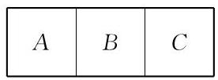

(第 1 题)

2.5 个工程队分别承建某项工程的 5 个不同的子项目, 每个工程队各承建其中的 1 项, 且甲工程队不能承建 1 号子项目. 问: 不同的承建方案有多少种?

3. 从 0、1、2、3、4、5 六个数字中任取四个数字，可以组成多少个没有重复数字、 且为奇数的四位数?
4. 解关于正整数 $x$ 的方程: ${11}{\mathrm{C}}_{x}^{3} = {24}{\mathrm{C}}_{x + 1}^{2}$ .
5. 已知 ${\left( {x}^{2} + \frac{1}{x}\right) }^{n}$ 的二项展开式的各项系数之和为 32,求该二项展开式中 $x$ 的系数.
6. 若 ${\left( 1 - 2x\right) }^{4} = {a}_{0} + {a}_{1}x + {a}_{2}{x}^{2} + {a}_{3}{x}^{3} + {a}_{4}{x}^{4}$ ,求 $\left| {a}_{0}\right|  + \left| {a}_{1}\right|  + \left| {a}_{3}\right|$ 的值.
7. 若 ${\left( {x}^{6} + \frac{1}{x\sqrt{x}}\right) }^{n}$ 的二项展开式中含有常数项,求 $n$ 的最小值.

##### B 组

1.7 名学生站成一排拍毕业纪念照，其中甲必须站在正中间，并且乙、丙 2 名学生要站在一起. 问: 有多少种不同的排法?

2. 将 5 个不同的小球分别放到 3 个不同的盒子中, 要求每个盒子都不空. 问: 有多少种不同的放法?
3. 从 7 名男乒乓球队员、 5 名女乒乓球队员中任选 4 名进行男女混合双打，不同的分组方法有多少种?

4.3 名男生、4 名女生排成一行. 在下列要求下，分别求不同排列方法的种数:

(1)甲不在最左边，乙不在最右边；

(2)男生必须排在一起；

(3)男生和女生相间排列；

(4)在甲、乙两人中间必须有 3 人.

5. 一个口袋内有 4 个不同的红球、6 个不同的白球.

(1)从中任取 4 个球，红球的个数不比白球少的取法有多少种？

(2)若取一个红球记 2 分，取一个白球记 1 分. 从中任取 5 个球，使总分不少于 7 分的取法有多少种?

6. 设 ${\left( 2 - \sqrt{3}x\right) }^{100} = {a}_{0} + {a}_{1}x + {a}_{2}{x}^{2} + \cdots  + {a}_{100}{x}^{100}$ ,求下列各式的值:

(1) ${a}_{0}$ ;

(2) ${a}_{1} + {a}_{3} + {a}_{5} + \cdots  + {a}_{99}$ ;

(3) ${\left( {a}_{0} + {a}_{2} + {a}_{4} + \cdots  + {a}_{100}\right) }^{2} - {\left( {a}_{1} + {a}_{3} + \cdots  + {a}_{99}\right) }^{2}$ .

7. 利用二项式定理,求 ${55}^{55}$ 被 8 除所得的余数.

拓展与思考

1. 设集合 $A$ 是由所有满足下面条件的有序数组 $\left( {{x}_{1},{x}_{2},{x}_{3},{x}_{4},{x}_{5}}\right)$ 构成的: 每一个元素 ${x}_{i}$ 等于 0、1、-1 中之一，其中 $i = 1,2,3,4,5$ . 那么集合 $A$ 中满足条件 “ $1 \leq  \left| {x}_{1}\right| \; + \left| {x}_{2}\right|  + \left| {x}_{3}\right|  + \left| {x}_{4}\right|  + \left| {x}_{5}\right|  \leq  3$ ” 的元素有多少个?
2. 利用二项式定理证明: 对于任意正整数 $n,\frac{1}{\sqrt{5}}\left\lbrack  {{\left( 2 + \sqrt{5}\right) }^{n} - {\left( 2 - \sqrt{5}\right) }^{n}}\right\rbrack$ 都是正整数.

# 第 7 章 概率初步(续)

本章作为概率初步 (必修课程第 12 章) 的续篇, 将重点介绍条件概率、概率的乘法公式以及全概率公式. 条件概率表示所考察的事件在其他事件发生的条件下的概率, 是概率论中的一个重要概念. 由条件概率可以得到全概率公式和贝叶斯公式等重要公式, 它们是计算概率的重要方法, 并进一步展示了概率的直观含义. 本章还将介绍随机变量的概念及其分布，以及它们的期望与方差，最后简单地介绍几个重要而基本的概率模型与正态分布.

## 7.1 条件概率与相关公式

### 1 条件概率

假设一个袋子里装有大小与质地相同的 2 个黑球、 3 个白球, 两人依次随机不放回地摸 1 个球, 可知第一个人摸到白球的概率为 $\frac{3}{5}$ ,那么第二个人摸到白球的概率是多少呢? 第二个人摸到白球的概率是否与第一个人相同？有的人会认为:如果第一个人摸到的是白球, 那么剩下的白球还有 2 个, 第二个人摸到白球的概率应是 $\frac{1}{2}$ ; 而如果第一个人摸到的是黑球,那么剩下的白球还有 3 个,第二个人摸到白球的概率应是 $\frac{3}{4}$ . 人们必然会产生疑惑:第二个人摸到白球的概率究竟是多少？

其实, 我们刚才所说的是两个不同意义的概率: 一个是以前讨论过的概率, 一个则是本章要介绍的条件概率. 我们知道, 一个事件发生的概率是该事件的一个属性, 它不会因为其他事件是否发生而改变. 但是我们可以谈论在其他事件发生的条件下, 该事件发生的概率. 这时候谈论的就是条件概率, 而不是原本的概率.

从上面这个例子看,设事件 $A$ 是第一个人摸到白球,事件 $B$ 是第二个人摸到白球. 当 $A$ 发生之后,袋子里剩下 4 个球,其中 2 个白球、 2 个黑球. 这样, 对第二个摸球的人来说, 相应的随机现象就与第一个人摸球之前不同, 样本空间也不同了. 这时 $B$ 发生的概率是 $\frac{1}{2}$ ,这是条件概率.

什么是条件概率 (conditional probability)? 在古典概率模型中,事件 $A$ 发生之后,随机现象的结果就剩下事件 $A$ 中的样本点,所以事件 $A$ 变成了由这些样本点所构成的新的样本空间. 这个样本空间仍然是等可能的,这时事件 $B$ 发生的概率称为事

---

注意 “求事件 $A$ 发生且事件 $B$ 发生的概率”与“已知事件 $A$ 发生,求事件 $B$ 发生的概率”两者的不同.

---

件 $B$ 关于 $A$ 的条件概率,或在事件 $A$ 发生的条件下,事件 $B$ 发生的概率,或已知事件 $A$ 发生,事件 $B$ 发生的概率,记为 $P\left( {B \mid  A}\right)$ . 事实上,这等于是在一个样本空间为 $A$ 的随机试验中,求事件 $A \cap  B$ 发生的概率,即

$$
P\left( {B \mid  A}\right)  = \frac{\left| A \cap  B\right| }{\left| A\right| }.
$$

将上式的分子、分母同时除以 $\left| \Omega \right|$ ,就得到条件概率公式: 在事件 $A$ 发生的条件下,事件 $B$ 发生的概率是

$$
P\left( {B \mid  A}\right)  = \frac{P\left( {A \cap  B}\right) }{P\left( A\right) }.
$$

例 1 掷一颗骰子并观察出现的点数. 已知出现的点数不超过 3 ，求出现的点数是奇数的概率.

解 设事件 $A$ 表示“出现的点数不超过 3 ”，事件 $B$ 表示“出现的点数是奇数”. 题目所求概率是事件 $A$ 发生的条件下,事件 $B$ 发生的概率,也就是求 $P\left( {B \mid  A}\right)$ . 因为 $A = \{ 1,2,3\} , B = \; \{ 1,3,5\}$ ,所以 $A \cap  B = \{ 1,3\}$ ,从而 $P\left( {A \cap  B}\right)  = \frac{2}{6}$ . 因此

$$
P\left( {B \mid  A}\right)  = \frac{P\left( {A \cap  B}\right) }{P\left( A\right) } = \frac{\frac{2}{6}}{\frac{3}{6}} = \frac{2}{3}.
$$

如果已知相应的条件概率, 那么就可以计算两事件同时发生的概率: 事件 $A\text{ 、 }B$ 同时发生的概率等于 $A$ 发生的概率与在 $A$ 发生的条件下 $B$ 发生的概率的乘积,即

$$
P\left( {A \cap  B}\right)  = P\left( A\right) P\left( {B \mid  A}\right) .
$$

这个公式称为概率的乘法公式.

例 2 一个罐子中有大小与质地相同的黑、白、红三个球, 不放回地摸球. 求:

(1)在第一次没有摸到黑球的条件下，第二次也没有摸到黑球的概率;

---

前一个公式适用于古典概率模型, 后一个公式适用于所有的情况.

---

(2)两次都没有摸到黑球的概率.

解 用 $A\text{ 、 }B$ 分别表示第一次、第二次没有摸到黑球的事件.

(1)第一个问题是计算条件概率. $A$ 发生之后,罐子中还有两个球, 且其中一个是黑球, 所以

$$
P\left( {B \mid  A}\right)  = \frac{1}{2}.
$$

( 2 )第二个问题是计算 $A$ 、 $B$ 同时发生的概率. 已知 $P\left( A\right)  = \frac{2}{3}, P\left( {B \mid  A}\right)  = \frac{1}{2}$ ,由概率的乘法公式,有

$$
P\left( {A \cap  B}\right)  = P\left( A\right) P\left( {B \mid  A}\right)  = \frac{2}{3} \times  \frac{1}{2} = \frac{1}{3}.
$$

如果事件 $A$ 与 $B$ 独立,那么就有 $P\left( {A \cap  B}\right)  = P\left( A\right) P\left( B\right)$ , 从而条件概率

$$
P\left( {B \mid  A}\right)  = \frac{P\left( {A \cap  B}\right) }{P\left( A\right) } = \frac{P\left( A\right) P\left( B\right) }{P\left( A\right) } = P\left( B\right) .
$$

这说明在两个事件独立的情况下，条件概率等于概率. 反之, 若条件概率等于概率, 则两个事件是独立的.

#### 练习 7.1(1)

1. 一个家庭有两个孩子.

(1)已知年龄大的是女孩，求年龄小的也是女孩的概率；

(2)已知其中一个是女孩，求另一个也是女孩的概率.

2. 掷一颗骰子,令事件 $A = \{ 2,3,5\} , B = \{ 1,2,4,5,6\}$ . 求 $P\left( A\right) \text{ 、 }P\left( B\right)$ 、 $P\left( {A \cap  B}\right)$ 及 $P\left( {A \mid  B}\right)$ .
3. 在一个盒子中有大小与质地相同的 20 个球, 其中 10 个红球, 10 个白球. 两人依次不放回地各摸 1 个球, 求:

(1)在第一个人摸出 1 个红球的条件下，第二个人摸出 1 个白球的概率；

(2)第一个人摸出 1 个红球，且第二个人摸出 1 个白球的概率.

### 2 全概率公式

全概率公式是指一个事件发生的概率是其在不同条件下发生概率的加权平均, 这是一个简单直观的重要公式.

例 3 假设某产品的一个部件来自三个供应商，供货占比分别是 $\frac{1}{2}\text{ 、 }\frac{1}{6}\text{ 、 }\frac{1}{3}$ ,而它们的良品率分别是 ${0.96}\text{ 、 }{0.90}\text{ 、 }{0.93}$ . 问: 该部件的总体良品率是多少?

解 总体良品率显然不是三个良品率的简单平均, 而是与部件供应商的供货占比有关. 因此, 总体良品率为

$$
{0.96} \times  \frac{1}{2} + {0.90} \times  \frac{1}{6} + {0.93} \times  \frac{1}{3} = {0.48} + {0.15} + {0.31} = {0.94},
$$

即为这三个供应商良品率的加权平均, 而其中的权重就是供货占比.

这正应用了全概率公式的思想. 设某个随机试验的结果可以分成 $n$ 种情况,即设样本空间 $\Omega$ 可分成 $n$ 个两两不同时发生 (两两互斥)的事件 ${\Omega }_{1},{\Omega }_{2},\cdots ,{\Omega }_{n}$ ,即

$$
\Omega  = {\Omega }_{1} \cup  {\Omega }_{2} \cup  \cdots  \cup  {\Omega }_{n},
$$

且当 $i \neq  j$ 时有 ${\Omega }_{i} \cap  {\Omega }_{j} = \varnothing$ . 因此有

$$
\mathop{\sum }\limits_{{k = 1}}^{n}P\left( {\Omega }_{k}\right)  = 1
$$

一个事件 $A$ 的发生可以看作是在不同情况下分别发生,即成立

$$
A = \left( {A \cap  {\Omega }_{1}}\right)  \cup  \left( {A \cap  {\Omega }_{2}}\right)  \cup  \cdots  \cup  \left( {A \cap  {\Omega }_{n}}\right) .
$$

因此, 由概率的可加性和乘法公式, 得

$$
P\left( A\right)  = P\left( {A \cap  {\Omega }_{1}}\right)  + P\left( {A \cap  {\Omega }_{2}}\right)  + \cdots  + P\left( {A \cap  {\Omega }_{n}}\right)
$$

$$
= P\left( {A \mid  {\Omega }_{1}}\right) P\left( {\Omega }_{1}\right)  + P\left( {A \mid  {\Omega }_{2}}\right) P\left( {\Omega }_{2}\right)  + \cdots  + P\left( {A \mid  {\Omega }_{n}}\right) P\left( {\Omega }_{n}\right) .
$$

于是我们得到全概率公式

$$
P\left( A\right)  = \mathop{\sum }\limits_{{k = 1}}^{n}P\left( {A \mid  {\Omega }_{k}}\right) P\left( {\Omega }_{k}\right) .
$$

---

全概率公式是概率的可加性与乘法公式的组合.

---

所以 $P\left( A\right)$ 实际上是条件概率 $P\left( {A \mid  {\Omega }_{k}}\right)$ 的加权平均,而条件概率 $P\left( {A \mid  {\Omega }_{k}}\right)$ 的权重为 $P\left( {\Omega }_{k}\right) , k = 1,2,\cdots , n$ .

全概率公式是计算概率的一种重要方法. 现在我们用它来回答抽签时抽到好签的概率是否与抽签顺序有关的问题.

抽签的方式有两种:放回与不放回. 放回的情况很简单，因为每次抽签的结果是相互独立的, 所以抽到好签的概率当然与抽签顺序无关. 对于不放回的情况，我们用前面不放回摸球的例子来说明.

例 4 一个袋子中装有大小与质地相同的 3 个白球、 2 个黑球，5 个人依次不放回地摸球，求每个人摸到白球的概率.

解 用事件 $A$ 表示第一个人摸到白球,事件 $B$ 表示第二个人摸到白球. 显然, $P\left( A\right)  = \frac{3}{5}$ . 第二个人摸球的时候有两种可能的情况:一种是 $A$ 发生，即第一个人摸到白球，这时袋子中剩有 2 白 2 黑; 另一种是 $A$ 没有发生,即第一个人摸到黑球,这时袋子中剩有 3 白 1 黑. 在第一种情况下,条件概率为 $P\left( {B \mid  A}\right) \; = \frac{2}{4}$ ; 而在第二种情况下,条件概率为 $P\left( {B \mid  \bar{A}}\right)  = \frac{3}{4}$ . 由于上述两种情况发生的概率分别是 $\frac{3}{5}$ 和 $\frac{2}{5}$ ,因此可以直观地看出 $B$ 发生的概率应该是两个条件概率的加权平均, 即

$$
P\left( B\right)  = \frac{2}{4} \times  \frac{3}{5} + \frac{3}{4} \times  \frac{2}{5} = \frac{12}{20} = \frac{3}{5},
$$

其值与 $P\left( A\right)$ 相等.

第三个人摸球，记他摸到白球的事件为 $C$ ，其概率是多少呢? 前面两个人摸球会产生四种可能的情况:

$$
{\Omega }_{1} = A \cap  B,{\Omega }_{2} = A \cap  \bar{B},{\Omega }_{3} = \bar{A} \cap  B,{\Omega }_{4} = \bar{A} \cap  \bar{B}.
$$

用乘法公式, 这四种情况发生的概率分别是

$$
\frac{3}{5} \times  \frac{2}{4} = \frac{6}{20},\frac{3}{5} \times  \frac{2}{4} = \frac{6}{20},\frac{2}{5} \times  \frac{3}{4} = \frac{6}{20},\frac{2}{5} \times  \frac{1}{4} = \frac{2}{20}.
$$

例如,

$$
P\left( {\Omega }_{2}\right)  = P\left( {A \cap  \bar{B}}\right)  = P\left( A\right) P\left( {\bar{B} \mid  A}\right)  = \frac{3}{5} \times  \frac{2}{4} = \frac{6}{20},
$$

其余同理. 在这四种情况下, 袋子中剩下的黑、白球的个数分别是: 1 白 2 黑、 2 白 1 黑、 3 白 1 黑、 3 白 0 黑, 因此事件 $C$ 的条件概率分别是 $\frac{1}{3}\text{ 、 }\frac{2}{3}\text{ 、 }\frac{2}{3}\text{ 、 }1$ . 再应用全概率公式,就推出

$$
P\left( C\right)  = \mathop{\sum }\limits_{{k = 1}}^{4}P\left( {C \mid  {\Omega }_{k}}\right) P\left( {\Omega }_{k}\right)
$$

$$
= \frac{1}{3} \times  \frac{6}{20} + \frac{2}{3} \times  \frac{6}{20} + \frac{2}{3} \times  \frac{6}{20} + 1 \times  \frac{2}{20}
$$

$$
= \frac{36}{60} = \frac{3}{5},
$$

---

请详细证明第四、 第五个人摸到白球的概率仍然是 $\frac{3}{5}$ .

---

其值仍与 $P\left( A\right)$ 相等.

类似地,第四、第五个人摸到白球的概率仍然是 $\frac{3}{5}$ ,也就是说, 摸到白球的概率与摸球的顺序无关.

---

我们经常简单地说“抽签与顺序无关”，实际上是指抽到什么签的可能性与顺序无关.

---

例 5 设有两个罐子, $A$ 罐中放有 2 个白球、 1 个黑球, $B$ 罐中放有 3 个白球,这些球的大小与质地相同. 现在从两个罐子中各摸 1 个球并交换,求这样交换 2 次后,黑球还在 $A$ 罐中的概率.

解 设事件 ${A}_{1}\text{ 、 }{A}_{2}$ 分别表示“交换 1 次后黑球还在 $A$ 罐中” 和“交换 2 次后黑球还在 $A$ 罐中”. 易见 ${A}_{1}$ 相当于第一次摸球的时候没有摸到黑球,其概率为 $\frac{2}{3}$ ,即 $P\left( {A}_{1}\right)  = \frac{2}{3}$ . 第一次交换之后,有两种可能的情况: 一种是黑球在 $A$ 罐中,其概率是 $\frac{2}{3}$ ; 另一种是黑球在 $B$ 罐中,其概率是 $\frac{1}{3}$ . 由全概率公式

$$
P\left( {A}_{2}\right)  = P\left( {{A}_{2} \mid  {A}_{1}}\right) P\left( {A}_{1}\right)  + P\left( {{A}_{2} \mid  {\bar{A}}_{1}}\right) P\left( {\bar{A}}_{1}\right) ,
$$

其中 $P\left( {{A}_{2} \mid  {A}_{1}}\right)$ 是已知黑球在 $A$ 罐中、再次交换后还在 $A$ 罐中的条件概率,它等于第二次没有摸到黑球的概率,是 $\frac{2}{3}$ ; 类似地, $P\left( {{A}_{2} \mid  {\bar{A}}_{1}}\right)$ 是已知黑球在 $B$ 罐中、再次交换后又回到 $A$ 罐中的条件概率,它等于第二次摸到黑球的概率,是 $\frac{1}{3}$ . 因此

$$
P\left( {A}_{2}\right)  = \frac{2}{3} \times  \frac{2}{3} + \frac{1}{3} \times  \frac{1}{3} = \frac{5}{9}.
$$

#### 练习 7.1(2)

1. 公司库房中的某个零件的 70% 来自 A 公司, 30% 来自 B 公司，两个公司的正品率分别是 95% 和 90%. 从库房中任取一个零件, 求它是正品的概率.
2. 盒子中有大小与质地相同的 5 个红球和 4 个白球, 从中随机取 1 个球, 观察其颜色后放回, 并同时放入与其相同颜色的球 3 个, 再从盒子中取 1 个球. 求第二次取出的球是白色的概率.
3. 从一个放有大小与质地相同的 3 个黑球、 2 个白球的袋子里摸出 2 个球并放入另外一个空袋子里, 再从后一个袋子里摸出 1 个球. 求该球是黑色的概率.

*3 贝叶斯公式

全概率公式是利用条件概率 $P\left( {A \mid  {\Omega }_{k}}\right)$ 与权重 $P\left( {\Omega }_{k}\right) \; \left( {k = 1,2,\cdots , n}\right)$ 来计算事件发生的概率 $P\left( A\right)$ . 在某些场合下, 我们也需要计算在 $A$ 发生的条件下 ${\Omega }_{k}$ 发生的概率 $P\left( {{\Omega }_{k} \mid  A}\right) \; \left( {k = 1,2,\cdots , n}\right)$ .

例 6 已知人群中有 5%的人患有一种严重的疾病，而已有的检测方法很繁琐, 也很昂贵. 某公司自称发明了一种方便且成本低廉的医学检测方法，已知这种方法对患有这种疾病的人检测时, 90%呈阳性反应, 而对不患有这种疾病的人检测时, 有 5%的人呈阳性反应. 从这两个数据看, 这种方法似乎是不错的, 管理部门该怎么评价它的准确率？

解 首先要清楚什么是一个检测方法的准确率. 检测方法的准确率是指当一个人被检测呈阳性反应时, 他的确患有这种疾病的概率. 用事件 $B$ 表示一个人患有此疾病, $P\left( B\right)$ 就是患病率,并用事件 $A$ 来表示其检测呈阳性. 我们要计算条件概率 $P\left( {B \mid  A}\right)$ . 由已知条件,患病率 $P\left( B\right)  = {0.05}$ ,患病者检测呈阳性的概率 $P\left( {A \mid  B}\right)  = {0.9}$ ,非患病者检测呈阳性的概率 $P\left( {A \mid  \bar{B}}\right)  = {0.05}$ . 由全概率公式, 有

$$
P\left( A\right)  = P\left( {A \mid  B}\right) P\left( B\right)  + P\left( {A \mid  \bar{B}}\right) P\left( \bar{B}\right)
$$

$$
= {0.9} \times  {0.05} + {0.05} \times  {0.95} = {0.0925}\text{ . }
$$

再由条件概率公式及概率的乘法公式, 就得到

$$
P\left( {B \mid  A}\right)  = \frac{P\left( {A \cap  B}\right) }{P\left( A\right) } = \frac{P\left( {A \mid  B}\right) P\left( B\right) }{P\left( A\right) } = \frac{{0.9} \times  {0.05}}{0.0925} = \frac{18}{37}.
$$

这说明其准确率不到 $\frac{1}{2}$ ,管理部门可能认为这种检测方法的准确率不够理想.

上面计算概率 $P\left( {B \mid  A}\right)$ 的公式的一般形式称为贝叶斯公式, 即对 $i = 1,2,\cdots , n$ ,成立

$$
P\left( {{\Omega }_{i} \mid  A}\right)  = \frac{P\left( {A \mid  {\Omega }_{i}}\right) P\left( {\Omega }_{i}\right) }{\mathop{\sum }\limits_{{k = 1}}^{n}P\left( {A \mid  {\Omega }_{k}}\right) P\left( {\Omega }_{k}\right) }.
$$

实际上, 由乘法公式得

$$
P\left( {A \mid  {\Omega }_{i}}\right) P\left( {\Omega }_{i}\right)  = P\left( {A \cap  {\Omega }_{i}}\right)  = P\left( A\right) P\left( {{\Omega }_{i} \mid  A}\right) ,
$$

因此

$$
P\left( {{\Omega }_{i} \mid  A}\right)  = \frac{P\left( {A \mid  {\Omega }_{i}}\right) P\left( {\Omega }_{i}\right) }{P\left( A\right) },
$$

再对分母应用全概率公式即推出贝叶斯公式.

对于任意给定的 $i$ 来说, $P\left( {\Omega }_{i}\right)$ 称为事件 ${\Omega }_{i}$ 的先验概率 (prior probability). 一个已经发生了的事件 $A$ 可以看作一个新的信息. 在 $A$ 发生的条件下, ${\Omega }_{i}$ 的概率 $P\left( {{\Omega }_{i} \mid  A}\right)$ 可以看作对原概率 $P\left( {\Omega }_{i}\right)$ 的一个矫正,称为后验概率 (posterior probability).

---

贝叶斯公式诱导出一种统计学观点， 也是哲学观点: 事件的概率可以根据出现的新信息进行修正.

---

贝叶斯公式提供了一种通过不断学习经验来认识随机现象的思想, 是机器学习的理论基础之一.

#### 练习 7.1(3)

1. 设某公路上经过的货车与客车的数量之比为 2 :1 , 货车中途停车修理的概率为 0.02，客车中途停车修理的概率为 0.01 . 今有一辆汽车中途停车修理，求该汽车是货车的概率.
2. 已知在所有男子中有 5% 患有色盲症，在所有女子中有 0.25% 患有色盲症. 现随机抽取一人发现患有色盲症，问:其为男子的概率是多少？(设男子和女子的人数相等)

#### 习题 7.1

##### A 组

1. 掷一颗骰子所得的样本空间为 $\Omega  = \{ 1,2,3,4,5,6\}$ . 令事件 $A = \{ 2,3,5\} , B = \{ 1,2,4$ , 5,6\}. 求 $P\left( {B \mid  A}\right)$ .
2. 将一枚质地均匀的硬币抛掷 2 次，设事件 $A$ 为“第一次出现正面”，事件 $B$ 为“第二次出现正面”. 求 $P\left( {A \mid  B}\right)$ 与 $P\left( {B \mid  A}\right)$ .
3. 某工厂有四条流水线生产同一产品, 已知这四条流水线的产量分别占总产量的 15%、20%、30%和35%，又知这四条流水线的产品不合格率依次为 0.05、0.04、0.03 和 0.02 . 从该厂的这一产品中任取一件, 抽到不合格品的概率是多少?
4. 假设有两箱同种零件, 第一箱内装有 50 件, 其中 10 件为一等品; 第二箱内装有 30 件, 其中 18 件为一等品(两箱外观相同). 现从两箱中随意挑出一箱, 然后从该箱中随机地取出一个零件. 求取出的零件是一等品的概率.

##### B 组

1. 设某种动物活到 20 岁的概率为 0.8 ，活到 25 岁的概率为 0.4 . 现有一只 20 岁的该种动物, 它活到 25 岁的概率是多少?
2. 袋中装有编号为 1 到 $N$ 的 $N$ 个球. 先从袋中任取一个球,若该球不是 1 号球,则放回袋中; 若是 1 号球, 则不放回, 然后再摸一次. 求第二次摸到 2 号球的概率.

## 7.2 随机变量的分布与特征

### 1 随机变量与分布

在许多情况下，我们可以使用数来表示随机现象的结果. 生活中就有很多例子:

(1)掷一颗骰子，用 $X$ 表示点数，例如， $X = 6$ 表示掷出 6 点, $X = 1$ 表示掷出 1 点;

(2)抛掷一枚硬币 10 次，用 $X$ 表示得到正面的次数，例如, $X = 5$ 表示 5 次是正面;

(3)从一个放有大小与质地相同的 10 个白球、10 个黑球的罐子中摸出 5 个球,用 $X$ 表示其中白球的个数;

(4)用 $X$ 表示明天的降雨量(单位: $\mathrm{{mm}}$ )；

(5)用 $X$ 表示保险公司某客户一年中的车辆损失(单位:元).

在这些例子中, 我们都是用数来表示随机现象的结果, 这引出随机变量这个重要的概念.

在本章中, 除 7.3 节外, 我们总是假设样本空间是有限的. 这时,以样本空间作为定义域的一个函数 $X$ 称为一个随机变量 (random variable),即对样本空间 $\Omega$ 中任意给定的元素 $\omega$ ,都有唯一的实数 $X\left( \omega \right)$ 与之对应.

尽管随机变量的名字中用了“变量”这两个字，但实际上它是一个函数. 随机变量的取值在随机现象发生前是随机的, 且其取某一具体值这一事件的概率是该随机变量在该值上的分布. 分布是日常生活中经常使用的一个词, 如收入分布、人口分布、年龄分布、成绩分布等. 在数学中, 分布的定义如下:

随机变量所有可能的取值以及相应的概率, 称为随机变量的分布.

注意,在上述定义中,随机变量 $X$ 的所有可能取值 (以 $X$ 作为观察角度的所有结果)的概率的和等于 1 .

分布的表示方法很多, 常用图表来表示, 这比较直观易懂. 例如, 下面例 1 中的分布, 第一行表示随机变量的取值, 第二行表示相应取值的概率.

例 1 分别抛掷 1、2、3 枚硬币，计算其中正面朝上枚数 $X$ 的分布.

解 (1) 先考虑抛掷 1 枚硬币的情形. 此时 $X$ 的可能取值是 0、1，且 $P\left( {X = 0}\right)  = P\left( {X = 1}\right)  = \frac{1}{2}$ ，所以 $X$ 的分布是

$$
\left( \begin{matrix} 0 & 1 \\  \frac{1}{2} & \frac{1}{2} \end{matrix}\right)
$$

(2)再考虑抛掷 2 枚硬币的情形. 此时 $X$ 的可能取值是 0 、 1、2，分别表示两个反面、一正一反、两个正面这三个事件，因为 $P\left( {X = 0}\right)  = P\left( {X = 2}\right)  = \frac{1}{4}, P\left( {X = 1}\right)  = \frac{1}{2}$ ,所以 $X$ 的分布是

$$
\left( \begin{matrix} 0 & 1 & 2 \\  \frac{1}{4} & \frac{1}{2} & \frac{1}{4} \end{matrix}\right)
$$

让我们用这个例子来详细解释一下随机变量. 用 $H$ 及 $T$ 分别表示正反面, 那么样本空间

$$
\Omega  = \{ {HH},{HT},{TH},{TT}\}
$$

是等可能的. 随机变量 $X$ 是正面朝上的个数,故

$$
X\left( {HH}\right)  = 2, X\left( {HT}\right)  = 1, X\left( {TH}\right)  = 1, X\left( {TT}\right)  = 0,
$$

且

$$
\{ X = 0\}  = \{ {TT}\}
$$

$$
\{ X = 1\}  = \{ {HT},{TH}\} ,
$$

$$
\{ X = 2\}  = \{ {HH}\}
$$

分别包含 1、2 及 1 个元素，因此概率分别是 $\frac{1}{4}$ 、 $\frac{2}{4}$ 、 $\frac{1}{4}$ .

(3)若抛掷 3 枚硬币，则 $X$ 的可能取值是 0、1、2、3，分别表示三个反面、一正两反、两正一反、三个正面这四个事件, 而

$$
P\left( {X = 0}\right)  = P\left( {X = 3}\right)  = \frac{1}{8},
$$

$$
P\left( {X = 1}\right)  = P\left( {X = 2}\right)  = \frac{3}{8},
$$

所以 $X$ 的分布是

$$
\left( \begin{array}{llll} 0 & 1 & 2 & 3 \\  \frac{1}{8} & \frac{3}{8} & \frac{3}{8} & \frac{1}{8} \end{array}\right) .
$$

例 2 掷一颗骰子，观察掷得的点数.

(1)求点数 $X$ 的分布；

(2)只关心点数 6 是否出现. 若出现,则记 $Y = 1$ ,否则记 $Y = 0$ . 求 $Y$ 的分布.

解(1)因为掷得每个点数为等可能事件，所以点数 $X$ 的分布为

$$
\left( \begin{array}{llllll} 1 & 2 & 3 & 4 & 5 & 6 \\  \frac{1}{6} & \frac{1}{6} & \frac{1}{6} & \frac{1}{6} & \frac{1}{6} & \frac{1}{6} \end{array}\right) .
$$

( 2 )因为 $P\left( {Y = 1}\right)  = \frac{1}{6}$ ，而 $P\left( {Y = 0}\right)  = \frac{5}{6}$ ，所以 $Y$ 的分布为

$$
\left( \begin{matrix} 0 & 1 \\  \frac{5}{6} & \frac{1}{6} \end{matrix}\right)
$$

当随机变量取所有值的概率均相等时, 称它是等可能分布或均匀分布的, 如例 1(1) 与例 2(1). 另外, 只取两个值的随机变量称为伯努利型, 其分布称为伯努利分布, 如例 1(1) 与例 2(2).

一个如下形式的图表被称为一个分布:

$$
\left( \begin{array}{llll} {x}_{1} & {x}_{2} & \cdots & {x}_{n} \\  {p}_{1} & {p}_{2} & \cdots & {p}_{n} \end{array}\right)
$$

其中 ${x}_{1}\text{ 、 }{x}_{2}\text{ 、 }\cdots \text{ 、 }{x}_{n}$ 是互异的实数, ${p}_{1}\text{ 、 }{p}_{2}\text{ 、 }\cdots \text{ 、 }{p}_{n}$ 是非负数, 作为概率值, 其总和为 1 , 即成立

$$
{p}_{1} + {p}_{2} + \cdots  + {p}_{n} = 1.
$$

例 3 统计某地历史上近两百年的年降水量, 得到以下数据:

<table><tr><td>年降水量/mm</td><td>0~100</td><td>100~200</td><td>200~300</td><td>300~400</td><td>400 以上</td></tr><tr><td>年数</td><td>10</td><td>55</td><td>85</td><td>35</td><td>15</td></tr></table>

---

一般要求概率值是正数，因为 0 概率值在分布中所处的这一列总可以删去.

分布直观上表示总值为 1 的量是怎么分布在一些数上的.

---

请据此构造一个随机变量并求其分布.

解 用 $X$ 表示年降水量级别, $X = 1\text{ 、 }2\text{ 、 }3\text{ 、 }4\text{ 、 }5$ 分别表示年降水量为 0~100、100~200、200~300、300~400 和 400 以上. $X$ 是一个随机变量,其分布为

$$
\left( \begin{matrix} 1 & 2 & 3 & 4 & 5 \\  \frac{2}{40} & \frac{11}{40} & \frac{17}{40} & \frac{7}{40} & \frac{3}{40} \end{matrix}\right)
$$

分布通常可用更直观的形式来表示，如下面的条形图 (图 7-2-1)所示.

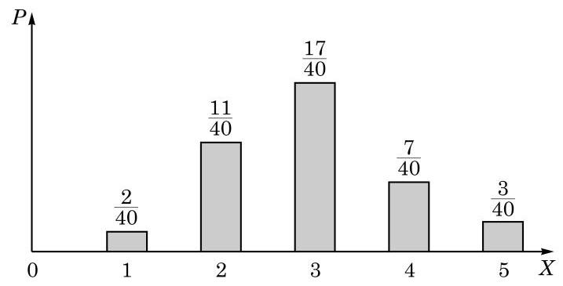

图 7-2-1

#### 练习 7.2(1)

1. 掷两颗骰子,用 $X$ 表示两点数差的绝对值. 求 $X$ 的分布.
2. 以下是分布的为 ( )

A. $\left( \begin{array}{ll} 0 & 1 \\  1 & 1 \end{array}\right)$ ; B. $\left( \begin{matrix}  - 1 & 0 & 1 \\  \frac{1}{2} & \frac{1}{3} & \frac{1}{6} \end{matrix}\right)$ ;

C. $\left( \begin{matrix} 1 & 2 & 3 \\  \frac{1}{2} & \frac{1}{4} & \frac{1}{8} \end{matrix}\right)$ ; D. $\left( \begin{matrix} 1 & {1.2} & 2 & {2.4} \\   - {0.5} & {0.5} & {0.3} & {0.7} \end{matrix}\right)$ .

Q

2 期望

---

期望是概率论中的一个重要概念, 它的全称是数学期望, 简称期望, 也称均值. 因为期望实际上是由某个分布所确定的, 所以也称为该分布的期望.

---

随机变量的分布体现的是随机变量取值的概率分布. 把概率作为权重，对随机变量的相应取值进行加权平均后所得到的值， 称为随机变量的期望 (expectation):

定义 如果随机变量 $X$ 的分布是

$$
\left( \begin{array}{llll} {x}_{1} & {x}_{2} & \cdots & {x}_{n} \\  {p}_{1} & {p}_{2} & \cdots & {p}_{n} \end{array}\right)
$$

那么它的期望定义为如下的加权平均:

$$
E\left\lbrack  X\right\rbrack   = {x}_{1}{p}_{1} + {x}_{2}{p}_{2} + \cdots  + {x}_{n}{p}_{n}.
$$

例 4 (1)掷一颗骰子，求掷得点数的期望；

(2)掷两颗骰子，求掷得点数和的期望.

解(1)掷一颗骰子，掷得点数 $X$ 的期望是

$$
E\left\lbrack  X\right\rbrack   = 1 \times  \frac{1}{6} + 2 \times  \frac{1}{6} + 3 \times  \frac{1}{6} + 4 \times  \frac{1}{6} + 5 \times  \frac{1}{6} + 6 \times  \frac{1}{6}
$$

$$
= \frac{1 + 2 + 3 + 4 + 5 + 6}{6} = {3.5}.
$$

(2)掷两颗骰子，掷得点数和 $X$ 的分布为

$$
\left( \begin{matrix} 2 & 3 & 4 & 5 & 6 & 7 & 8 & 9 & {10} & {11} & {12} \\  \frac{1}{36} & \frac{2}{36} & \frac{3}{36} & \frac{4}{36} & \frac{5}{36} & \frac{6}{36} & \frac{5}{36} & \frac{4}{36} & \frac{3}{36} & \frac{2}{36} & \frac{1}{36} \end{matrix}\right) ,
$$

其期望为

$$
E\left\lbrack  X\right\rbrack   = 2 \times  \frac{1}{36} + 3 \times  \frac{2}{36} + 4 \times  \frac{3}{36} + 5 \times  \frac{4}{36} + 6 \times  \frac{5}{36} + 7 \times  \frac{6}{36} +
$$

$$
8 \times  \frac{5}{36} + 9 \times  \frac{4}{36} + {10} \times  \frac{3}{36} + {11} \times  \frac{2}{36} + {12} \times  \frac{1}{36}
$$

$$
= 7\text{ . }
$$

例 5 抛掷 $n$ 枚硬币，用 $X$ 表示正面朝上的硬币数. 求它的分布及期望.

解 抛掷 $n$ 枚硬币是一个古典概率模型,其样本点是

$$
\left( \frac{n\text{ 枚 }}{*, * ,\cdots , * }\right) \text{ , }
$$

其中括号里的每一个 * 表示每一枚硬币抛掷的结果:正面朝上 $\left( H\right)$ 或者反面朝上 $\left( T\right)$ . 所以,抛掷 $n$ 枚硬币的随机试验的样本空间中有 ${2}^{n}$ 个元素. 事件 $X = k$ 表示 “出现 $k$ 个正面朝上”，即其中有 $k$ 个 $H\text{ 、 }\left( {n - k}\right)$ 个 $T$ 的样本点全体. 用选择性必修课程第 6 章介绍的排列组合方法, $X = k$ 这个事件含有的样本点数为在 $n$ 个位置上取 $k$ 个位置放置 $H$ 的组合数 ${\mathrm{C}}_{n}^{k}$ .

$X$ 的取值范围是 $k = 0,1,2,\cdots , n$ ,有

$$
P\left( {X = k}\right)  = \frac{{\mathrm{C}}_{n}^{k}}{{2}^{n}}.
$$

---

数学期望是一个加权平均, 其中的权是随机变量取值对应的概率.

---

有了 $X$ 的分布,就可以得到 $X$ 的期望,为

$$
E\left\lbrack  X\right\rbrack   = \mathop{\sum }\limits_{{k = 0}}^{n}\frac{k{\mathrm{C}}_{n}^{k}}{{2}^{n}}.
$$

当 $k \geq  1$ 时,有

$$
k{\mathrm{C}}_{n}^{k} = \frac{{kn}!}{k!\left( {n - k}\right) !} = \frac{n!}{\left( {k - 1}\right) !\left( {n - k}\right) !}
$$

$$
= n\frac{\left( {n - 1}\right) !}{\left( {k - 1}\right) !\left( {n - k}\right) !} = n{\mathrm{C}}_{n - 1}^{k - 1},
$$

由选择性必修课程 6.5 节中所介绍的二项式定理, 得所求的期望为

$$
E\left\lbrack  X\right\rbrack   = \mathop{\sum }\limits_{{k = 0}}^{n}\frac{k{\mathrm{C}}_{n}^{k}}{{2}^{n}} = \mathop{\sum }\limits_{{k = 1}}^{n}\frac{n{\mathrm{C}}_{n - 1}^{k - 1}}{{2}^{n}}
$$

$$
= \frac{n}{{2}^{n}}\mathop{\sum }\limits_{{k = 1}}^{n}{\mathrm{C}}_{n - 1}^{k - 1} = \frac{n}{{2}^{n}}\mathop{\sum }\limits_{{k = 0}}^{{n - 1}}{\mathrm{C}}_{n - 1}^{k}
$$

$$
= \frac{n}{{2}^{n}} \times  {2}^{n - 1} = \frac{n}{2}.
$$

掷一颗骰子, 掷得点数的期望是 3.5, 甚至不是一个整数, 那么, 期望到底有什么意义呢? 实际上, 期望的意义在多次重复试验中可以明显地体现出来. 例如,重复掷一颗骰子 $n$ 次,所得到的点数分别记为 ${X}_{1}\text{ 、 }{X}_{2}\text{ 、 }\cdots \text{ 、 }{X}_{n}$ ,那么,当 $n$ 很大时,平均点数必定逼近于期望, 即成立

$$
\frac{{X}_{1} + {X}_{2} + \cdots  + {X}_{n}}{n} \approx  {3.5}.
$$

这个结果类似于在必修课程 12.3 节中所述的伯努利大数定律.

随机变量的期望是一个确定的数, 它满足下面两个性质.

期望的线性性质

1. 如果 $X$ 是一个随机变量, $a$ 是一个实数,那么

$$
E\left\lbrack  {aX}\right\rbrack   = {aE}\left\lbrack  X\right\rbrack  .
$$

2. 如果 $X\text{ 、 }Y$ 是两个随机变量,那么

$$
E\left\lbrack  {X + Y}\right\rbrack   = E\left\lbrack  X\right\rbrack   + E\left\lbrack  Y\right\rbrack  .
$$

性质 1 的证明是容易的, 性质 2 的证明超出所学的知识范围.

---

请同学们尝试完成性质 1 的证明.

---

这两个性质的证明这里均略去, 只列出它们的结论. 为了方便, 我们把一个确定的常数也看作一个随机变量, 称为常数随机变量. 常数随机变量是确定的, 没有随机性, 它的期望等于它本身.

例 4(2)中求得点数之和的期望是 7 ，这是通过分布来计算的. 更方便的方法是利用期望的性质来计算. 用 ${X}_{1}$ 、 ${X}_{2}$ 分别表示掷第一颗及第二颗骰子得到的点数,那么 ${X}_{1} + {X}_{2}$ 就是两颗骰子的点数之和. 这样, 根据期望的线性性质, 并利用例 4(1) 的结果, 就得到

$$
E\left\lbrack  {{X}_{1} + {X}_{2}}\right\rbrack   = E\left\lbrack  {X}_{1}\right\rbrack   + E\left\lbrack  {X}_{2}\right\rbrack   = {3.5} + {3.5} = 7.
$$

#### 练习 7.2(2)

1. 抛掷 4 枚硬币,用 $X$ 表示正面朝上的枚数. 求 $X$ 的期望.
2. 从一个放有大小与质地相同的 5 个白球、 4 个黑球的罐子中不放回地摸 3 个球, 用 $X$ 表示摸到的白球数. 求 $X$ 的期望.

### 3 方差

通过前面的学习，我们不仅能够时刻感知无处不在的随机性， 还能够感知随机性的大小. 一般来说, 如果某件事发生的可能性很大或者很小, 它的随机性就相对较小. 例如, 抛掷一枚硬币, 正面和反面朝上的概率都是 $\frac{1}{2}$ ,而掷一颗骰子得到 “ 6 ” 与 “非 6 ” 两个结果的概率则是 $\frac{1}{6}$ 与 $\frac{5}{6}$ . 相比之下,抛掷硬币的结果更不确定,所以随机性更大. 与之比较, 买彩票中奖的概率要小很多, 因此随机性更小. 人们经常把随机性很小 (概率接近 0 或 1 ) 的事件近似为确定的事件, 即近似确定不发生或近似确定发生, 此时, 就模糊了确定性和随机性的界限, 把“确定”当作是随机性非常小的代名词.

期望大体上表示一个随机变量的“中间”态. 随机变量的取值虽不确定, 但总是分布在期望的两侧, 可能远也可能近. 通俗地说, 如果一个随机变量分布在期望两侧比较远的地方, 就说这个随机变量比较分散. 反过来, 如果一个随机变量分布在期望两侧比较近的地方, 就说这个随机变量比较集中.

---

事件可以看成是一个随机变量: 发生定义为 1 , 不发生定义为 0 . 这样, 随机性大小与分散度大小实际上是统一的.

---

数学上用什么指标来衡量随机变量的分散度呢? 按照上面的

分析,对随机变量 $X$ 而言,我们用 $X$ 与其期望的偏差的平方的期望, 即

$$
E\left\lbrack  {\left( X - E\left\lbrack  X\right\rbrack  \right) }^{2}\right\rbrack
$$

来衡量随机变量 $X$ 的分散度,称为 $X$ 的方差 (variance),记为 $D\left\lbrack  X\right\rbrack$ .

定义 随机变量 $X$ 的方差 $D\left\lbrack  X\right\rbrack$ 定义为

$$
D\left\lbrack  X\right\rbrack   = E\left\lbrack  {\left( X - E\left\lbrack  X\right\rbrack  \right) }^{2}\right\rbrack  .
$$

考虑一个极端的情况. 如果 $X$ 是一个常数随机变量,那么就有 $D\left\lbrack  X\right\rbrack   = 0$ . 这说明一个确定的量的分散度为零. 反之,如果 $D\left\lbrack  X\right\rbrack   = 0$ ,那么 $X$ 就是一个常数随机变量. 这说明分散度为零的量必是一个确定的量.

下面推导一个更方便使用的方差公式. 事实上, 根据期望的线性性质,并注意到 $E\left\lbrack  X\right\rbrack$ 是一个常数,就有

$$
D\left\lbrack  X\right\rbrack   = E\left\lbrack  {{X}^{2} - {2XE}\left\lbrack  X\right\rbrack   + {\left( E\left\lbrack  X\right\rbrack  \right) }^{2}}\right\rbrack
$$

$$
= E\left\lbrack  {X}^{2}\right\rbrack   - {2E}\left\lbrack  {{XE}\left\lbrack  X\right\rbrack  }\right\rbrack   + E\left\lbrack  {\left( E\left\lbrack  X\right\rbrack  \right) }^{2}\right\rbrack
$$

$$
= E\left\lbrack  {X}^{2}\right\rbrack   - 2{\left( E\left\lbrack  X\right\rbrack  \right) }^{2} + {\left( E\left\lbrack  X\right\rbrack  \right) }^{2}
$$

$$
= E\left\lbrack  {X}^{2}\right\rbrack   - {\left( E\left\lbrack  X\right\rbrack  \right) }^{2}.
$$

这样, 就得到方差的如下计算公式:

$$
D\left\lbrack  X\right\rbrack   = E\left\lbrack  {X}^{2}\right\rbrack   - {\left( E\left\lbrack  X\right\rbrack  \right) }^{2}.
$$

例 6 掷一颗骰子,用 $X$ 表示掷得的点数. 求 $X$ 的方差.

解 由本节例 4 可知 $X$ 的期望 $E\left\lbrack  X\right\rbrack   = {3.5}$ ,现在需要计算 $E\left\lbrack  {X}^{2}\right\rbrack$ ,为此先计算 ${X}^{2}$ 的分布. 显然, ${X}^{2}$ 的取值是 ${1}^{2}\text{ 、 }{2}^{2}$ 、 ${3}^{2}\text{ 、 }{4}^{2}\text{ 、 }{5}^{2}\text{ 、 }{6}^{2}$ ,且

$$
P\left( {{X}^{2} = {k}^{2}}\right)  = P\left( {X = k}\right)  = \frac{1}{6}, k = 1,2,\cdots ,6.
$$

于是

$$
E\left\lbrack  {X}^{2}\right\rbrack   = {1}^{2} \times  \frac{1}{6} + {2}^{2} \times  \frac{1}{6} + {3}^{2} \times  \frac{1}{6} + {4}^{2} \times  \frac{1}{6} + {5}^{2} \times  \frac{1}{6} + {6}^{2} \times  \frac{1}{6}
$$

$$
= \frac{{1}^{2} + {2}^{2} + {3}^{2} + {4}^{2} + {5}^{2} + {6}^{2}}{6}
$$

$$
= \frac{91}{6}.
$$

因此

$$
D\left\lbrack  X\right\rbrack   = E\left\lbrack  {X}^{2}\right\rbrack   - {\left( E\left\lbrack  X\right\rbrack  \right) }^{2} = \frac{91}{6} - {3.5}^{2} = \frac{35}{12}.
$$

---

方差是 $X - E\left\lbrack  X\right\rbrack$ 平方之后的期望, 它与期望 $E\left\lbrack  X\right\rbrack$ 的尺度不同. 统计中经常使用标准差 $\sqrt{D\left\lbrack  X\right\rbrack  }$ 来代替方差.

---

例 6 中 $E\left\lbrack  {X}^{2}\right\rbrack$ 的计算实际上无需求助于 ${X}^{2}$ 的分布,只要知道 $X$ 自身的分布就够了. 事实上,若 $X$ 的取值为 ${x}_{1}\text{ 、 }{x}_{2}\text{ 、 }\cdots$ 、 ${x}_{n}$ ,而相应的概率为 ${p}_{1}\text{ 、 }{p}_{2}\text{ 、 }\cdots \text{ 、 }{p}_{n}$ ,就有

$$
E\left\lbrack  {X}^{2}\right\rbrack   = {x}_{1}^{2}{p}_{1} + {x}_{2}^{2}{p}_{2} + \cdots  + {x}_{n}^{2}{p}_{n}.
$$

方差有以下两个性质:

性质

1. 如果 $X$ 是一个随机变量, $a$ 是一个实数,那么

$$
D\left\lbrack  {aX}\right\rbrack   = {a}^{2}D\left\lbrack  X\right\rbrack  .
$$

2. 如果 $X\text{ 、 }Y$ 分别是两个独立的随机变量,那么

$$
D\left\lbrack  {X + Y}\right\rbrack   = D\left\lbrack  X\right\rbrack   + D\left\lbrack  Y\right\rbrack  .
$$

性质 1 的证明是容易的, 但性质 2 的证明超出所学的知识范围. 这两个性质的证明这里均略去, 只列出它们的结论.

例 7 掷两颗骰子,掷得的点数分别为 $X\text{ 、 }Y$ . 求点数和 $X + Y$ 与点数差 $X - Y$ 的期望与方差.

解 本节例 4 说明 $E\left\lbrack  X\right\rbrack   = E\left\lbrack  Y\right\rbrack   = {3.5}$ ,本节例 6 说明 $D\left\lbrack  X\right\rbrack \; = D\left\lbrack  Y\right\rbrack   = \frac{35}{12}.$

由期望的线性性质, 可得

$$
E\left\lbrack  {X + Y}\right\rbrack   = E\left\lbrack  X\right\rbrack   + E\left\lbrack  Y\right\rbrack   = 7,
$$

$$
E\left\lbrack  {X - Y}\right\rbrack   = E\left\lbrack  X\right\rbrack   + E\left\lbrack  {-Y}\right\rbrack   = E\left\lbrack  X\right\rbrack   - E\left\lbrack  Y\right\rbrack   = 0.
$$

因为掷两颗骰子是两个独立的随机试验,而 $X\text{ 、 }Y$ 分别是这两个独立的随机试验所对应的随机变量, 所以由方差的性质可得

$$
D\left\lbrack  {X + Y}\right\rbrack   = D\left\lbrack  X\right\rbrack   + D\left\lbrack  Y\right\rbrack   = \frac{35}{12} + \frac{35}{12} = \frac{35}{6},
$$

$$
D\left\lbrack  {X - Y}\right\rbrack   = D\left\lbrack  {X + \left( {-Y}\right) }\right\rbrack   = D\left\lbrack  X\right\rbrack   + D\left\lbrack  {-Y}\right\rbrack
$$

$$
= D\left\lbrack  X\right\rbrack   + {\left( -1\right) }^{2}D\left\lbrack  Y\right\rbrack   = D\left\lbrack  X\right\rbrack   + D\left\lbrack  Y\right\rbrack
$$

$$
= \frac{35}{6}\text{ . }
$$

综上所述, 一个随机变量是以其样本空间为定义域的函数, 期望描述它的中心位置, 而方差描述此随机变量对其期望的偏离

---

请同学们尝试完成性质 1 的证明.

---

度, 即其随机程度. 期望与方差是随机变量最重要的两个特征. 它们是通过数字来描述的, 也称为数字特征.

#### 练习 7.2(3)

1. 设 $X$ 是一个随机变量, $c$ 是常数. 求证: $X + c$ 的方差与 $X$ 的方差相等.
2. 已知随机变量 $X$ 的分布为

$$
\left( \begin{matrix} 1 & 2 & 3 \\  {0.4} & {0.2} & {0.4} \end{matrix}\right)
$$

求 $X$ 的方差.

#### 习题 7.2

##### A 组

1. 一袋中装有 6 个大小与质地相同的白球,编号为 1、2、3、4、5、6. 从该袋内随机取出 3 个球,记被取出球的最大号码数为 $X$ . 写出随机变量 $X$ 的分布.
2. 掷两颗骰子，用 $X$ 表示较大的点数 (在点数相同时， $X$ 表示共同的点数). 求 $X$ 的分布与期望.
3. 设某射手打靶环数 $X$ 的分布为

$$
\left( \begin{matrix} 7 & 8 & 9 & {10} \\  a & {0.1} & {0.3} & b \end{matrix}\right) ,
$$

已知期望 $E\left\lbrack  X\right\rbrack   = {8.9}$ . 求 $a\text{ 、 }b$ 的值.

4. 一袋中装有大小与质地相同的 2 个白球和 3 个黑球.

(1)从中有放回地依次摸出 2 个球，求 2 球颜色不同的概率；

(2)从中不放回地依次摸出 2 个球，记 2 球中白球的个数为 $X$ . 求 $X$ 的期望和方差.

##### B 组

1. 编号为 1、2、3、4 的四名学生随机入座编号为 1、2、3、4 的座位，每个座位坐一人. 座位编号和学生编号一样时称为一个配对. 用 $X$ 表示配对数,求 $E\left\lbrack  X\right\rbrack$ .
2. 已知一个随机变量 $X$ 的分布为

$$
\left( \begin{matrix}  - 1 & 0 & 1 \\  a & b & c \end{matrix}\right)
$$

若 $a + c = {2b}$ ,且 $E\left\lbrack  X\right\rbrack   = \frac{1}{3}$ ,求 $D\left\lbrack  X\right\rbrack$ 的值.

3. 一袋中装有编号为 1、2、3、4、5 的五个大小与质地相同的球. 依次摸两个球, 用 ${X}_{1}\text{ 、 }{X}_{2}$ 分别表示第一个及第二个球的编号. 在以下两种情况下分别求 ${X}_{1}\text{ 、 }{X}_{2}$ 以及两编号之和 ${X}_{1} + {X}_{2}$ 的分布,再分别验证等式 $E\left\lbrack  {{X}_{1} + {X}_{2}}\right\rbrack   = E\left\lbrack  {X}_{1}\right\rbrack   + E\left\lbrack  {X}_{2}\right\rbrack$ 与 $D\left\lbrack  {{X}_{1} + {X}_{2}}\right\rbrack \; = D\left\lbrack  {X}_{1}\right\rbrack   + D\left\lbrack  {X}_{2}\right\rbrack$ 是否成立.

(1)放回;

(2)不放回.

4. 先掷一颗骰子,记朝上的点数为 $X$ . 再抛掷 $X$ 枚硬币,记 $Y$ 为正面朝上的硬币数. 求 $Y$ 的分布、期望与方差.

课后阅读

随机商品的定价与风险

商品是大家熟悉的东西，生活离不开商品. 除了通常的商品外，还有随机商品. 所谓随机商品, 就是其价值在购买的时候不确定, 在未来的某个时刻才会确定的商品, 如彩票、股票、保险等. 不确定性意味着风险 (risk). 因为人们对于风险的需求或者偏好不同, 所以随机商品可以用来实现风险的转移. 有的人喜欢风险, 喜欢碰运气, 他就会买彩票, 也就是用不多的钱购买一个中大奖的微小机会; 相反, 有的人不喜欢风险, 他就会买保险, 保险源于人们对于未知风险的恐惧, 把自己未来不确定的损失换成确定的付出, 或者说付费让保险公司来分担风险. 一个基本的常识是，潜在收益越大，风险就越大，风险和收益是成正比的.

简单地说,随机商品的未来价值是一个随机变量 $X$ ,它在购买时的价格 (不计其他成本)应该就是它的期望. 为什么? 因为由大数定律, 在有很多人购买时, 它的平均价值趋向于期望. 这就是说, 随机商品的定价通常是它的期望值. 但是随机商品的另外一个特征是风险,这通常由方差来衡量. 例如,比较一个中奖率为 $\frac{1}{100}$ ,奖金 100 元的彩票 $X$ ,与一个中奖率为 $\frac{1}{10000}$ ,奖金 10000 元的彩票 $Y$ ,两个彩票的期望是一样的,但是风险收益有很大的差别,比起彩票 $X$ ,彩票 $Y$ 中奖的可能性小,但是奖金却高得多,其实就是风险大, 但潜在的收益高. 风险是不确定性, 而方差是不确定性的一个度量指标, 因此方差可以看成是风险的一个指标. 例如,通过简单的计算可以知道,彩票 $Y$ 的方差大约百倍于彩票 $X$ 的方差. 要注意,风险是个内涵丰富的词,没有公认的数学定义,方差只是风险的一个指标, 体现风险的某种特征, 银行与企业经常使用另外一个指标: 在某个警戒概率下可能造成的最大损失, 称为在险价值.

心理期望与数学期望

从中文字义看, 期望是内心的期待, 是涉及人的心理的, 可以说是心理期望, 概率中所说的期望是数学期望, 这个概念在费马和帕斯卡讨论分奖金问题时就产生了. 心理期望和数学期望两者有什么关系呢? 拿一个随机商品来说, 它的期望值是不是与人们的心理期望重合呢？在多数情况下的确如此，因为期望是随机商品在大样本条件下的平均价值. 但是在一些极端情况下, 两者明显是背离的.

考虑如下的游戏:请你抛掷 20 枚硬币，如果 20 枚都是正面朝上，那么你将得到 10 亿元，否则得 0 元. 这是一个随机产品，它的价值记为 $X$ ， $X$ 以大约一百万分之一的概率取值为 10 亿,剩余的概率取值为 0,因此数学期望 $E\left\lbrack  X\right\rbrack$ 约等于 1000 . 问题是你愿意花多少钱玩这个游戏, 也就是问它的心理期望是多少. 在大多数人的心目中, 它的价值是远远小于 1000 元的. 如果这还不能说服你, 那我们来看经典的圣彼得堡悖论. 考虑这样一个游戏:不断地抛掷一枚硬币直到出现正面朝上为止,如果正面朝上出现在第 $n$ 次,那么你将得到 ${2}^{n}$ 元. 记这个游戏的价值是 $X$ . 因为第 $n$ 次首次出现正面朝上这个事件发生的概率是 $\frac{1}{{2}^{n}}$ ,得到的钱数是 ${2}^{n}$ ,所以由期望公式可以看出 $X$ 的数学期望是无穷大. 按照数学期望来看, 无论你花多少钱玩这个游戏都是值得的. 但根据调查, 很少有人愿意花 25 元去参加一次这样的游戏. 现在你可以抛掷一枚硬币试一下, 然后考虑一下，你愿意花多少钱玩这个游戏呢？或者说它在你的心里价值几何？

---

Q

圣彼得堡悖论是尼古拉・伯努利(N. Bernoulli, 他是证明大数定律的雅各布· 伯努利的侄子)于 1738 年提出的.

---

## 7.3 常用分布

### 1 二项分布

考虑如下问题:一次测验共有 10 道选择题，每题备有 4 个选项，其中只有 1 个正确. 如果某学生随意猜测答题，问其答对一半以上的概率有多大. 这样的概率计算具有普遍性, 现在就来讨论这种题型的概率计算.

设有一个伯努利试验,其成功概率为 $p\left( {0 < p < 1}\right)$ ,失败概率为 $q$ ,且 $p + q = 1$ . 独立地重复该伯努利试验 $n$ 次,用 $X$ 表示成功的次数. 把 $n$ 次试验看作具有 $n$ 个标号的位置,其中每个位置都有两种可能:成功或者失败，分别标记为 1 和 0 . “成功次数为 $k$ ”的事件 $X = k$ 可以看作从 $n$ 个位置里选择 $k$ 个位置标记为 1,而其他标记为 0,这样的选择共有 ${\mathrm{C}}_{n}^{k}$ 种. 因为每次试验都是独立地进行,所以由独立性,每种标记发生的概率是 ${p}^{k}{q}^{n - k}$ . 再由概率的可加性,可得成功次数为 $k$ 的概率为

$$
P\left( {X = k}\right)  = {\mathrm{C}}_{n}^{k}{p}^{k}{q}^{n - k},
$$

其中 $k = 0,1,2,\cdots , n$ . 因为 ${\mathrm{C}}_{n}^{0} = {\mathrm{C}}_{n}^{n} = 1$ ,所以 $X$ 的分布可表示为

$$
\left( \begin{matrix} 0 & 1 & 2 & \cdots & k & \cdots & n \\  {q}^{n} & {\mathrm{C}}_{n}^{1}p{q}^{n - 1} & {\mathrm{C}}_{n}^{2}{p}^{2}{q}^{n - 2} & \cdots & {\mathrm{C}}_{n}^{k}{p}^{k}{q}^{n - k} & \cdots & {p}^{n} \end{matrix}\right) .
$$

从这个角度可以证明二项式定理

$$
\mathop{\sum }\limits_{{k = 0}}^{n}{\mathrm{C}}_{n}^{k}{p}^{k}{q}^{n - k} = \mathop{\sum }\limits_{{k = 0}}^{n}P\left( {X = k}\right)  = 1.
$$

这是这个分布被称为二项分布的理由.

定义 独立地重复一个成功概率为 $p$ 的伯努利试验 $n$ 次,其成功次数的分布称为二项分布 (binomial distribution), 亦称成功

次数 $X$ 服从二项分布 $B\left( {n, p}\right)$ .

独立重复伯努利试验是一个非常重要的概率模型, 在实际中经常出现.

例 1 独立地重复 $n$ 次成功概率为 $p$ 的伯努利试验,求至少有一次成功的概率.

解 用 $X$ 表示成功次数. 至少有一次成功相当于 $X > 0$ ,它的对立事件是 $X = 0$ . 由概率的性质,至少有一次成功的概率为

$$
P\left( {X > 0}\right)  = 1 - P\left( {X = 0}\right)  = 1 - {\left( 1 - p\right) }^{n}.
$$

当成功概率 $p$ 很小时,通常说成功是小概率事件. 虽然在一次试验中,小概率事件几乎不可能发生,但因为 $0 < p < 1$ ,有 $0 < 1 - p < 1$ ,当试验次数 $n$ 充分大时, ${\left( 1 - p\right) }^{n}$ 接近于零,即 $1 - {\left( 1 - p\right) }^{n}$ 接近于 1,所以至少有一次成功的概率就会很大.

直观地说, 做一件事情, 不管成功概率多小, 只要执着地努力，重复的次数足够多，就有很大可能会成功. 如同俗语所说: 失败是成功之母. 反过来说, 如果不断地重复, 小概率的坏事也终有可能发生. 例如, 开车一次发生事故的概率 $p$ 很小,但是如果每天开车,长期下去还是很有可能发生事故的. 所以，不仅每次开车都要格外小心，减小事故发生的概率 $p$ ,而且要尽可能地减少开车次数 $n$ ,这样就能使发生事故的概率尽量减小.

例 2 设 $X$ 服从二项分布 $B\left( {n, p}\right)$ ,求 $X$ 的期望与方差.

解 用 ${X}_{k}$ 表示第 $k$ 次随机试验的结果: 若成功,则 ${X}_{k} = 1$ ; 若失败,则 ${X}_{k} = 0$ . 总的成功次数 $X$ 可以表示为

$$
X = {X}_{1} + {X}_{2} + \cdots  + {X}_{n}.
$$

按照定义, ${X}_{k}$ 的期望是

$$
E\left\lbrack  {X}_{k}\right\rbrack   = 1 \times  p + 0 \times  \left( {1 - p}\right)  = p.
$$

所以, 由期望的线性性质, 得

$$
E\left\lbrack  X\right\rbrack   = E\left\lbrack  {X}_{1}\right\rbrack   + E\left\lbrack  {X}_{2}\right\rbrack   + \cdots  + E\left\lbrack  {X}_{n}\right\rbrack   = {np}.
$$

用同样的方法可以计算 $X$ 的方差. 先计算 $D\left\lbrack  {X}_{1}\right\rbrack$ . 因为 $E\left\lbrack  {X}_{1}^{2}\right\rbrack   = p$ ,所以

$$
D\left\lbrack  {X}_{1}\right\rbrack   = E\left\lbrack  {X}_{1}^{2}\right\rbrack   - {\left( E\left\lbrack  {X}_{1}\right\rbrack  \right) }^{2} = p - {p}^{2} = p\left( {1 - p}\right) .
$$

因为每次试验是独立地重复,所以 ${X}_{1},{X}_{2},\cdots ,{X}_{n}$ 是相互独立的,且 $D\left\lbrack  {X}_{k}\right\rbrack   = p\left( {1 - p}\right) , k = 1,2,\cdots , n$ . 由方差的

---

如果不断地重复， 那么一个小概率事件终究会发生.

---

性质, 有

$$
D\left\lbrack  X\right\rbrack   = D\left\lbrack  {X}_{1}\right\rbrack   + D\left\lbrack  {X}_{2}\right\rbrack   + \cdots  + D\left\lbrack  {X}_{n}\right\rbrack   = {np}\left( {1 - p}\right) .
$$

由上式可见,方差关于概率 $p$ 的图像是一个开口向下的二次函数图像的一部分,且它在 $p = \frac{1}{2}$ 时达到最大值. 这说明,在成功概率是 $\frac{1}{2}$ 时, $X$ 的分散度最大; 而当 $p$ 与 $\frac{1}{2}$ 相差较大时, $X$ 的分散度较小. 这就从数学上诠释了前面所说的随机性大小与概率大小的直观关系.

#### 练习 7.3(1)

1. 已知随机变量 $X$ 服从二项分布 $B\left( {n, p}\right)$ ,若 $E\left\lbrack  X\right\rbrack   = {30}, D\left\lbrack  X\right\rbrack   = {20}$ ,求 $p$ 的值.
2. 一批产品的二等品率为 0.3 . 从这批产品中每次随机抽取一件, 并有放回地抽取 20 次. 用 $X$ 表示抽到二等品的件数,求 $D\left\lbrack  X\right\rbrack$ .

### 2 超几何分布

再看另外一个常见的概率模型.

例 3 设袋中装有大小与质地相同的 6 个白球、 4 个黑球. 现在依次不放回地摸 5 个球,用 $X$ 表示摸出的白球个数. 求 $X$ 的分布.

解 首先, 因为所考虑的是白球的个数, 与摸球的顺序无关, 而且是不放回地摸球, 所以从随机性的角度讲, 依次摸出 5 个球和一次摸出 5 个球是一样的. 其次, 由于是不放回地摸球, 前面摸球的结果会影响后面摸球的结果, 因此考虑问题的方法应该不同于放回摸球的情况.

因为白球有 6 个,所以变量 $X$ 的取值范围是 1、2、3、4、 5. 从 10 个球中取 5 个球的所有可能的取法, 不计顺序, 共有 ${\mathrm{C}}_{10}^{5}$ 种. 举例来说,事件 $X = 3$ 可以分为从 6 个白球中取 3 个,并从 4 个黑球中取 2 个这样两个步骤, 即

$$
P\left( {X = 3}\right)  = \frac{{\mathrm{C}}_{6}^{3}{\mathrm{C}}_{4}^{2}}{{\mathrm{C}}_{10}^{5}}.
$$

所以, 一般地说,

$$
P\left( {X = k}\right)  = \frac{{\mathrm{C}}_{6}^{k}{\mathrm{C}}_{4}^{5 - k}}{{\mathrm{C}}_{10}^{5}}, k = 1,2,3,4,5.
$$

因此,如果一袋中装有大小与质地相同的 $a$ 个白球、 $b$ 个黑球,依次随机且不放回地取 $n$ 个球,用 $X$ 表示其中的白球数, 那么 $X$ 的分布可由下式给出:

$$
P\left( {X = k}\right)  = \frac{{\mathrm{C}}_{a}^{k}{\mathrm{C}}_{b}^{n - k}}{{\mathrm{C}}_{a + b}^{n}}.
$$

其中, $k$ 的取值范围由以下几个条件决定: 取得的白球个数不能超过 $n$ ,也不能超过 $a$ ; 同时,取得的黑球个数不能超过 $b$ ,即成立

$$
k \leq  n, k \leq  a, n - k \leq  b.
$$

如果简单地约定: 当 $k < 0$ 或者 $k > n$ 时,组合符号 ${\mathrm{C}}_{n}^{k} = 0$ , 这样, $P\left( {X = k}\right)$ 式中的 $k$ 原则上就可以取任意的整数值.

定义 从一个装有大小与质地相同的 $a$ 个白球、 $b$ 个黑球的袋中随机且不放回地取 $n$ 个球,其中的白球数 $X$ 服从超几何分布 (hypergeometric distribution).

例 4 计算例 3 中 $X$ 的期望.

解 我们将利用期望的性质来进行计算.

从装有大小与质地相同的 $a$ 个白球、 $b$ 个黑球的袋子中不放回地随机取 $n$ 个球, $n$ 不能超过总个数 $a + b$ . 用 $X$ 表示其中的白球个数. 这可以想象成依次取球,用 ${X}_{k}$ 表示第 $k$ 次取球的结果: 如果是白球, ${X}_{k} = 1$ ; 如果是黑球, ${X}_{k} = 0$ . 那么

$$
X = {X}_{1} + {X}_{2} + \cdots  + {X}_{n}.
$$

本章 7.1 节中例 4 已经证明, 抽签概率与顺序无关, 所以

$$
P\left( {{X}_{k} = 1}\right)  = \frac{a}{a + b}, P\left( {{X}_{k} = 0}\right)  = \frac{b}{a + b}.
$$

因此

$$
E\left\lbrack  {X}_{k}\right\rbrack   = \frac{a}{a + b},
$$

从而

$$
E\left\lbrack  X\right\rbrack   = E\left\lbrack  {X}_{1}\right\rbrack   + \cdots  + E\left\lbrack  {X}_{n}\right\rbrack   = \frac{na}{a + b},
$$

即 $X$ 的期望为取球的个数乘白球的比例. 这与放回摸球情况下

---

根据定义, $X$ 的期望为

$E\llbracket X\rrbracket  = \mathop{\sum }\limits_{k}k \cdot  \frac{{\mathrm{C}}_{a}^{k}{\mathrm{C}}_{b}^{n - k}}{{\mathrm{C}}_{a + b}^{n}},$

$k$ 取遍它的取值范围. 此式的直接计算比较困难.

---

取得白球个数的期望是一样的.

从二项分布的期望计算到超几何分布的期望计算, 可以看出, 虽然期望和方差是用分布来定义的, 但是其计算过程实际上不一定要用到分布, 而只要使用期望和方差的性质即可.

---

注意，虽然期望是一样的, 但它们的分布是不同的, 一个是二项分布, 另一个是超几何分布.

---

二项分布和超几何分布的区别, 实质上就是摸球模型中放回摸球和不放回摸球的区别. 当 $a + b$ 远大于 $n$ 时,放回与不放回两种情况下的分布之间差别不大, 即二项分布与超几何分布之间差别不大.

练习 ${7.3}\left( 2\right)$

1. 盒子中有大小与质地相同的 3 个白球、 1 个黑球, 若从中随机地摸出 2 个球, 求它们颜色不同的概率.
2. 从放有 6 黑 2 白共 8 颗珠子的袋子中抓 3 颗珠子,分别求黑珠颗数 $X$ 与白珠颗数 $Y$ 的分布、期望与方差.
3. 从一副去掉大小王牌的 52 张扑克牌中任取 5 张牌，求:

(1)至少有一张黑桃的概率；

(2)至少有一个对子(两张牌的数字一样)的概率.

### 3 正态分布

现今的信息时代，各媒体都充斥着数据，因此正确地理解数据成为非常重要的事. 正态分布已经是生活中一个常用的词了. 例如, 我们常提起学生的考试成绩是不是正态分布, 某个城市的家庭收入是不是正态分布, 等等. 那么, 究竟什么是正态分布呢? 平日所说的正态分布, 大体上是指数据对称地分布在某个中心值两边, 且离中心值越远, 分布得越少.

一包米的外包装上标示的质量是 ${5000}\mathrm{\;g}$ ,但实际上是有误差的. 假设包装米的公司没有偷工减料, 计量员精确地检测所有在售的该种米，把米包质量的频率分布直方图画出来，会是一个什么形状呢? 图 7-3-1 中是一条峰值在 ${5000}\mathrm{\;g}$ 左右的曲线,它具有一个单峰, 粗略展示了一个正态分布的形状. 实际上, 很多测量数据的分布都呈现出这样的形状.

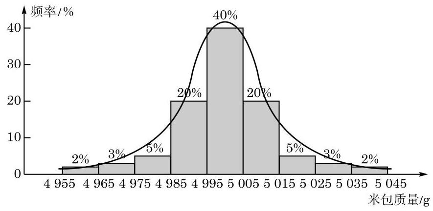

图 7-3-1

数学中的正态分布是指由下面的函数所表达的分布:

$$
{\varphi }_{\mu ,{\sigma }^{2}}\left( x\right)  = \frac{1}{\sqrt{{2\pi }{\sigma }^{2}}}{\mathrm{e}}^{-\frac{{\left( x - \mu \right) }^{2}}{2{\sigma }^{2}}},
$$

其中有两个参数:

(1) $\mu$ 是该分布的期望或均值；

(2) ${\sigma }^{2}$ 是该分布的方差，且总是假设 $\sigma  > 0$ .

这个函数的图像如同钟形, 如图 7-3-2 所示. 该函数在数学上称为正态密度函数, 也称为钟形曲线.

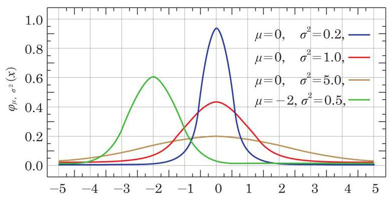

图 7-3-2

为了理解“一个函数所表达的分布”, 要说明两点: 第一, 分布是指总数为 1 的量以某种方式分布在直线上; 第二, 该函数图像与 $x$ 轴所夹部分的面积等于 1,但这个事实需要用到高等数学的知识才能证明.

定义 设 $X$ 是一个取实数值的随机变量. 如果对任何给定的实数 $a$ 与 $b\left( {a < b}\right) , X$ 落在区间 $\left( {a, b}\right)$ 上的概率 $P\left( {a < X < b}\right)$ 等

于三条直线: $y = 0\text{ 、 }x = a\text{ 、 }x = b$ 与正态密度函数 $y = {\varphi }_{\mu ,{\sigma }^{2}}\left( x\right)$ 的图像所围的区域面积(或者简称作此函数在该区间上的面积，如图 7-3-3 所示),那么 $X$ 服从正态分布 (normal distribution),或更准确地说, $X$ 服从参数为 $\mu \text{ 、 }{\sigma }^{2}$ 的正态分布,记为

$$
X \sim  N\left( {\mu ,{\sigma }^{2}}\right) .
$$

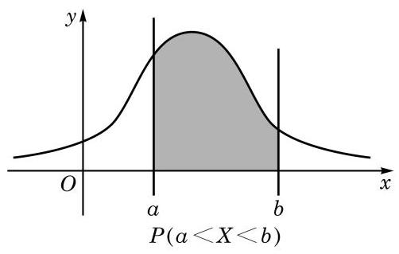

图 7-3-3

当 $\mu  = 0\text{ 、 }{\sigma }^{2} = 1$ 时,相应的正态分布称为标准正态分布,记作 $X \sim  N\left( {0,1}\right)$ ,其密度函数

$$
y = \frac{1}{\sqrt{2\pi }}{\mathrm{e}}^{-\frac{{x}^{2}}{2}}
$$

称为标准正态分布的密度函数,简记作 $y = \varphi \left( x\right)$ . 实际上,一般的正态分布的密度函数总是标准正态分布的密度函数的某种平移和伸缩变换, 其形状保持钟形不变.

用 $\Phi \left( x\right)$ 表示标准正态分布的密度函数 $y = \varphi \left( x\right)$ 从 $- \infty$ 到 $x$ 的累计面积, 如图 7-3-4 所示, 称为标准正态分布函数.

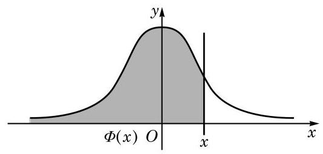

图 7-3-4

这个函数没有简单的表达式, 其函数值可通过近似计算得到. 我们也可以通过某些型号的计算器来查它或者它的反函数的值, 如

$$
\Phi \left( 1\right)  \approx  {0.8413},\Phi \left( 2\right)  \approx  {0.9772},\Phi \left( 3\right)  \approx  {0.9987},\cdots .
$$

容易验证 $y = \varphi \left( x\right)$ 是一个偶函数,所以该函数在区间 $\left( {-\infty , - x}\right)$ 上的面积等于其在区间 $\left( {x, + \infty }\right)$ 上的面积,如图 7-3-5 所示. 此外,由于 $y = \varphi \left( x\right)$ 与 $x$ 轴所围面积为 1,因此 $y = \Phi \left( x\right)$ 满足

$$
\Phi \left( {-x}\right)  = 1 - \Phi \left( x\right) .
$$

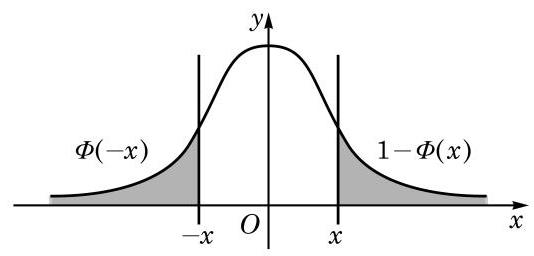

图 7-3-5

如果 $X \sim  N\left( {\mu ,{\sigma }^{2}}\right)$ ,那么将 $X$ 平移再伸缩后将服从标准正态分布, 即成立

$$
\frac{X - \mu }{\sigma } \sim  N\left( {0,1}\right) .
$$

这样,正态分布 $X \sim  N\left( {\mu ,{\sigma }^{2}}\right)$ 的密度函数的图像是一条钟形曲线,它关于直线 $x = \mu$ 对称,其最大值在 $x = \mu$ 处达到. 在 $x = \mu$ 的左侧,函数严格增,而在 $x = \mu$ 的右侧,函数严格减,从而它是一条单峰曲线. 当区间 $\left( {a, b}\right)$ 在 $x$ 轴上平移时,显然当 $\mu$ 处于该区间的中心时,概率 $P\left( {a < X < b}\right)$ 即函数在区间 $\left( {a, b}\right)$ 上的面积达到最大. 因此,我们通常说正态分布集中在其期望 $\mu$ 的附近,即参数 $\mu$ 表示分布集中的位置.

另外一个参数 $\sigma$ 描述的是分布的集中程度. 从图 7-3-2 中可以看出,密度函数的最大值在 $x = \mu$ 处达到,其最大值为

$$
{\varphi }_{\mu ,{\sigma }^{2}}\left( \mu \right)  = \frac{1}{\sqrt{2\pi }\sigma },
$$

它与 $\sigma$ 成反比. 由于图像与 $x$ 轴之间的区域的总面积是一个固定值 1,因此当 $\sigma$ 变小时,最大值变大,钟形变“高瘦”,分布向中心 $x = \mu$ 处集中; 反之,当 $\sigma$ 变大时,最大值变小,钟形变 “矮胖”,分布向 $x = \mu$ 的两侧分散.

出于种种原因, 在测量的过程中总有误差存在. 通常我们总假设误差是一个服从正态分布的随机变量.

例 5 某公司生产的糖果每包标识质量是 ${500}\mathrm{\;g}$ ,但公司承认实际质量存在误差. 已知每包糖果的实际质量服从 $\mu  = {500}$ 、 ${\sigma }^{2} = {2.5}^{2}$ 的正态分布. 问: 随意买一包该公司生产的糖果,其质量误差超过 $5\mathrm{\;g}$ (即 $1\%$ )的可能性有多大?(结果精确到 ${0.1}\%$ )

解 用 $X$ 表示糖果质量,由题意,可知 $X \sim  N\left( {{500},{2.5}^{2}}\right)$ . 要求 $\left| {X - {500}}\right|  > 5$ 的概率,即求 $P\left( {\left| {X - {500}}\right|  > 5}\right)$ 的值. 令 $Y = \frac{X - {500}}{2.5}$ ,则 $Y \sim  N\left( {0,1}\right)$ . 因此,有

$$
P\left( {\left| {X - {500}}\right|  > 5}\right)  = P\left( {\left| Y\right|  > 2}\right)  = P\left( {Y > 2}\right)  + P\left( {Y <  - 2}\right)
$$

$$
= {2\Phi }\left( {-2}\right)  = 2\left( {1 - \Phi \left( 2\right) }\right)
$$

$$
\approx  2 \times  \left( {1 - {0.9772}}\right)  = 2 \times  {0.0228}
$$

$$
= {0.0456} \approx  {4.6}\%
$$

即误差超过 $5\mathrm{\;g}$ 的可能性约是 ${4.6}\%$ .

例 6 设 $X$ 为任取的某袋有包装误差的产品的质量, $X \sim  N\left( {\mu ,{\sigma }^{2}}\right)$ . 分别求 $\left| {X - \mu }\right|  < \sigma ,\left| {X - \mu }\right|  < {2\sigma }$ 及 $\left| {X - \mu }\right|  < {3\sigma }$ 的概率. (结果精确到 ${0.1}\%$ )

解 令

$$
Y = \frac{X - \mu }{\sigma }.
$$

那么 $P\left( {\left| {X - \mu }\right|  < \sigma }\right)  = P\left( {\left| Y\right|  < 1}\right)$ . 而 $P\left( {\left| Y\right|  < 1}\right)$ 是标准正态分布的密度函数在区间 $\left( {-1,1}\right)$ 上的面积,它等于函数在区间 $\left( {-\infty ,1}\right)$ 上的面积减去在区间 $\left( {-\infty , - 1}\right)$ 上的面积. 这样,就有

$$
P\left( {\left| Y\right|  < 1}\right)  = \Phi \left( 1\right)  - \Phi \left( {-1}\right)  = \Phi \left( 1\right)  - \left( {1 - \Phi \left( 1\right) }\right)
$$

$$
= {2\Phi }\left( 1\right)  - 1 \approx  2 \times  {0.8413} - 1
$$

$$
= {0.6826} \approx  {68.3}\% \text{ . }
$$

同样，

$$
P\left( {\left| Y\right|  < 2}\right)  = {2\Phi }\left( 2\right)  - 1 \approx  2 \times  {0.9772} - 1 = {0.9544} \approx  {95.4}\% ;
$$

$$
P\left( {\left| Y\right|  < 3}\right)  = {2\Phi }\left( 3\right)  - 1 \approx  2 \times  {0.9987} - 1 = {0.9974} \approx  {99.7}\% .
$$

因此，随意购买一袋该产品，约有 68.3% 的可能性其质量在 $\mu$ 左右 $\sigma$ 的范围内; 约有 95.4% 的可能性其质量在 $\mu$ 左右 ${2\sigma }$ 的范围内; 约有 99.7% 的可能性其质量在 $\mu$ 左右 ${3\sigma }$ 的范围内,如

图 7-3-6 所示. 这称为正态分布的 ${3\sigma }$ (sigma)原则.

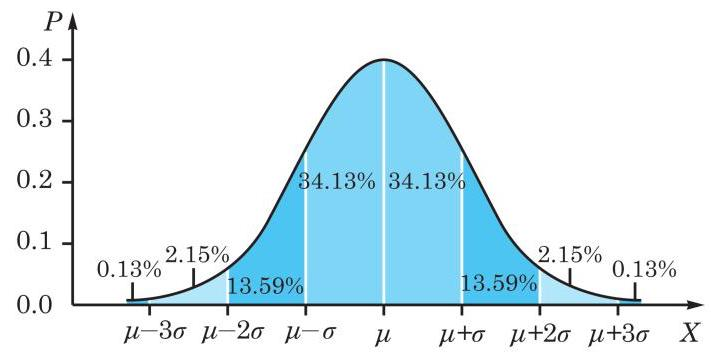

图 7-3-6

#### 练习 7.3(3)

1. 已知随机变量 $X$ 服从正态分布 $N\left( {-2,{\sigma }^{2}}\right)$ ，且 $P\left( {X \leq   - 1}\right)  = k$ . 求 $P\left( {X \leq   - 3}\right)$ 的值.
2. 某校高中三年级 1600 名学生参加了区第一次高考模拟统一考试,已知数学考试成绩 $X$ 服从正态分布 $N\left( {{100},{\sigma }^{2}}\right)$ (试卷满分为 150 分). 统计结果显示,数学考试成绩在 80 分到 120 分之间的人数约为总人数的 $\frac{3}{4}$ ，则此次统考中成绩不低于 120 分的学生人数约为 ( )

A. 80 ; B. 100 ; C. 120 ; D. 200.

#### 习题 7.3

##### A 组

1. 一名学生每天骑车上学, 从家到学校的途中经过 6 个路口. 假设他在各个路口遇到红灯的事件是相互独立的,并且概率都是 $\frac{1}{3}$ .

(1)用 $X$ 表示这名学生在途中遇到红灯的次数，求 $X$ 的分布；

(2)求这名学生在途中至少遇到一次红灯的概率.

2. 从有 7 名男生的 15 名学生中任意选择 10 名,用 $X$ 表示其中的男生人数. 求 $P\left( {X = 4}\right)$ 的值.
3. 某学生参加一次考试, 已知在备选的 10 道试题中, 能答对其中的 6 道题. 规定每次考试都从备选题中随机抽出 3 道题进行测试,求该生答对试题数 $X$ 的分布.

B 组

1. 从一副去掉大小王牌的 52 张扑克牌中任取 5 张牌，用 $X$ 表示其中黑桃的张数. 求 $X$ 的分布、期望与方差.
2. 对于本节例 4 中所定义的 ${X}_{k}\left( {k = 1,2,\cdots , n}\right)$ ,设 $n = 2$ . 求:

(1) $E\left\lbrack  {{X}_{1}{X}_{2}}\right\rbrack$ ；

(2) $E\left\lbrack  {X}^{2}\right\rbrack$ 与 $D\left\lbrack  X\right\rbrack$ .

3. 已知随机变量 $X$ 服从正态分布 $N\left( {3,{\sigma }^{2}}\right)$ ，且 $P\left( {1 \leq  X \leq  5}\right)  = {0.6}$ . 求 $P\left( {X > 5}\right)$ 的值.

## 内容提要

1. 条件概率公式

$$
P\left( {B \mid  A}\right)  = \frac{P\left( {B \cap  A}\right) }{P\left( A\right) }.
$$

2. 全概率公式

$$
P\left( A\right)  = \mathop{\sum }\limits_{{k = 1}}^{n}P\left( {A \mid  {\Omega }_{k}}\right) P\left( {\Omega }_{k}\right) .
$$

*3. 贝叶斯公式

$$
P\left( {{\Omega }_{i} \mid  A}\right)  = \frac{P\left( {A \mid  {\Omega }_{i}}\right) P\left( {\Omega }_{i}\right) }{\mathop{\sum }\limits_{{k = 1}}^{n}P\left( {A \mid  {\Omega }_{k}}\right) P\left( {\Omega }_{k}\right) }.
$$

4. 设随机变量 $X$ 的分布如上，那么其期望定义为

$$
E\left\lbrack  X\right\rbrack   = {x}_{1}{p}_{1} + {x}_{2}{p}_{2} + \cdots  + {x}_{n}{p}_{n};
$$

其方差定义为

$$
D\left\lbrack  X\right\rbrack   = E\left\lbrack  {\left( X - E\left\lbrack  X\right\rbrack  \right) }^{2}\right\rbrack   = E\left\lbrack  {X}^{2}\right\rbrack   - {\left( E\left\lbrack  X\right\rbrack  \right) }^{2}.
$$

5. 期望的线性性质

(1)如果 $X$ 是一个随机变量， $a$ 是一个实数，那么

$$
E\left\lbrack  {aX}\right\rbrack   = {aE}\left\lbrack  X\right\rbrack  .
$$

(2)如果 $X$ 、 $Y$ 是两个随机变量，那么

$$
E\left\lbrack  {X + Y}\right\rbrack   = E\left\lbrack  X\right\rbrack   + E\left\lbrack  Y\right\rbrack  .
$$

6. 方差的性质

(1)如果 $X$ 是一个随机变量， $a$ 是一个实数，那么

$$
D\left\lbrack  {aX}\right\rbrack   = {a}^{2}D\left\lbrack  X\right\rbrack  .
$$

(2)如果 $X$ 、 $Y$ 分别是两个独立的随机变量，那么

$$
D\left\lbrack  {X + Y}\right\rbrack   = D\left\lbrack  X\right\rbrack   + D\left\lbrack  Y\right\rbrack  .
$$

7. 二项分布:独立地重复一个成功概率为 $p$ 的伯努利试验 $n$ 次，其成功次数的分布称为二项分布(binomial distribution),亦称成功次数 $X$ 服从二项分布 $B\left( {n, p}\right)$ .
8. 超几何分布:从一个装有大小与质地相同的 $a$ 个白球、 $b$ 个黑球的袋子中随机且不放回地取 $n$ 个球，其中的白球的分布称为超几何分布(hypergeometric distribution).
9. 正态分布:由钟形曲线

$$
y = \frac{1}{\sqrt{{2\pi }{\sigma }^{2}}}{\mathrm{e}}^{-\frac{{\left( x - \mu \right) }^{2}}{2{\sigma }^{2}}}
$$

所刻画的分布称为正态分布(normal distribution).

## 复习题

##### A 组

1. 掷黄、白两颗骰子, 当黄色骰子的点数为 4 或 6 时, 求两颗骰子的点数之积大于 20 的概率.
2. 连续掷一颗骰子两次, 已知第一次掷出的是偶数点. 求第二次也掷出偶数点的概率.
3. 在 5 道题中有 3 道数学题和 2 道语文题. 如果不放回地依次抽取 2 道题, 求:

(1)第 1 次抽到数学题的概率；

(2)第 1 次和第 2 次都抽到数学题的概率；

(3)在第 1 次抽到数学题的条件下，第 2 次也抽到数学题的概率.

4. 已知随机变量 $X$ 的分布为

$$
\left( \begin{matrix}  - 1 & 0 & 1 \\  a & b & c \end{matrix}\right)
$$

若 $E\left\lbrack  X\right\rbrack   = \frac{1}{3}, D\left\lbrack  X\right\rbrack   = \frac{5}{9}$ ,求 $a\text{ 、 }b\text{ 、 }c$ 的值.

5. 同时抛掷两枚相同的均匀硬币,设随机变量 $X = 1$ 表示结果中有正面朝上, $X = 0$ 表示结果中没有正面朝上. 求 $E\left\lbrack  X\right\rbrack$ 及 $D\left\lbrack  X\right\rbrack$ .
6. 从 4 名男生和 2 名女生中任选 3 人参加演讲比赛,设随机变量 $X$ 表示所选 3 人中女生的人数. 求:

(1) $X$ 的分布；

(2) $X$ 的期望与方差；

(3)“所选 3 人中女生人数 $X \leq$ 1”的概率.

7. 一批产品的二等品率为 0.02 . 从这批产品中每次随机取一件, 有放回地抽取 100 次. 用 $X$ 表示抽到的二等品件数,求 $D\left\lbrack  X\right\rbrack$ .
8. 袋中有 10 个大小与质地相同的球, 其中 7 个是红球. 从中任取 5 个球, 求取出的球中红球个数 $X$ 的分布.

##### B 组

1. 某人提出一个问题, 甲先答, 答对的概率为 0.4 . 若甲答错, 则由乙答, 乙答对的概率为 0.5 . 求该问题由乙答对的概率.

概率初步(续)

2.100 件产品中有 5 件次品, 不放回地抽取两次, 每次抽 1 件. 已知第一次抽出的是次品, 求第二次抽出正品的概率.

3. 盒中有大小与质地相同的 25 个球, 其中 10 个白球、 5 个黄球、 10 个黑球. 从盒中任意取出 1 个球, 已知它不是黑球, 求它是黄球的概率.
4. 在 1、2、3、...、9 这 9 个自然数中, 任取 3 个数.

(1)求这 3 个数中恰有 1 个是偶数的概率；

(2)设 $X$ 为这 3 个数中两数相邻的组数(例如，若取出的数为 1、2、3，则有两组相邻的数 1、2 和 2、3，此时 $X$ 的值为 2)，求随机变量 $X$ 的分布及期望.

5. 口袋里装有大小与质地相同的 4 个红球和 8 个白球, 甲、乙两人依下面的规则从袋中有放回地摸球，每次摸 1 个球. 规则如下:若一方摸出 1 个红球，则此人继续下一次摸球; 若一方摸出 1 个白球, 则由对方接替下一次摸球. 假设每次摸球相互独立, 且由甲进行第一次摸球. 求在前三次摸球中,甲摸得红球的次数 $X$ 的分布及期望.

拓展与思考

1. 在一个游戏中,每次输赢的概率都是 $\frac{1}{2}$ . 甲的策略是: 第一次押 1 元,如果赢,就结束; 如果输, 押 2 元再来一次, 无论输赢都结束. 乙的策略是: 押 1 元, 无论输赢都结束.

(1)求甲赢的概率与乙赢的概率；

(2)用 $X$ 、 $Y$ 分别表示甲、乙最终赢得的金额(即所押金额)，求它们的分布与期望；

(3)比较甲与乙的策略.

2. 设有两个罐子, $A$ 罐中放有 2 个白球、 1 个黑球, $B$ 罐中放有 3 个白球,这些球的大小与质地相同. 现在从两个罐子中各摸 1 个球进行交换，求这样交换 3 次后，黑球还在 $A$ 罐中的概率. 交换 $n$ 次后呢?
3. 有一种骰子游戏, 某人掷两颗骰子, 若掷出的点数之和是 7 或 11, 则赢; 若掷出的点数之和是 2、3 或 12，则输；若掷出其他的点数和，则记下这个数，继续掷这两颗骰子, 直到掷出的点数和是这个记下的数或者 7 为止, 若是这个记下的数, 则赢, 若是 7, 则输. 求此人赢的概率是多少.

# 第 8 章 成对数据的 统计分析

在必修课程第 13 章“统计”中，我们主要研究了来自单一变量数据的一些统计特征, 如集中趋势、离散程度、分布等. 但现实世界中许多事物和现象之间都是有联系的. 在本章中, 我们将主要学习来自两个变量的成对数据的相关分析和回归分析, 掌握它们之间的统计规律.

本章将要学习的相关分析、回归分析及 ${\chi }^{2}$ 检验都属于推断性统计方法, 它们在构建统计模型、预测结果和因果分析等方面有许多应用.

在必修课程中学过的散点图是进行成对数据统计分析的基础, 通过观察散点图可以大致了解数据的整体形态和偏离情况, 发现两组数据之间的变化规律, 构建适当的统计模型. 统计图表不仅可以直观地表示数据及其规律, 也是建立统计直觉的重要途径.

## 8.1 成对数据的相关分析

### 1 成对数据间的关系

在统计活动中, 我们常常需要研究来自同一对象的两个相关变量的两组数据间的关系. 例如, 为考察某班学生的身高与体重的关系, 首先需要对每个学生的身高和体重进行测量, 得到两组数据:一组是反映“身高”这个变量的数据，另一组是反映“体重”这个变量的数据. 我们把这样来自同一对象的两组数据称为成对数据. 研究成对数据相关性的方法称为相关分析 (correlation analysis).

在必修课程第 13 章中, 我们曾经用散点图观察两个变量之间的相关性. 例如, 我们分别讨论了钻石价格与质量、颜色之间的关系.

下面再来看一个例子.

例 1 通过随机抽样, 我们获得某种商品每千克价格 (单位:百元)与该商品消费者年需求量(单位:千克)的一组调查数据, 如表 8-1 所示.

表 8-1 消费者年需求量与商品每千克价格

<table><tr><td>每千克价格/百元</td><td>4.0</td><td>4.0</td><td>4.6</td><td>5.0</td><td>5.2</td><td>5.6</td><td>6.0</td><td>6.6</td><td>7.0</td><td>10.0</td></tr><tr><td>年需求量/千克</td><td>3.5</td><td>3.0</td><td>2.7</td><td>2.4</td><td>2.5</td><td>2.0</td><td>1.5</td><td>1.2</td><td>1.2</td><td>1.0</td></tr></table>

请绘制上述数据的散点图，并依据散点图观察两组数据的相关性.

解 由于这两组数据分别来自同一商品的两个变量: “每千克价格”与“年需求量”，因此来自这两个变量的两组数据可以看作成对数据. 把 “每千克价格” 作为横坐标 (自变量), “年需求量” 作为纵坐标 (因变量), 在平面直角坐标系中绘制相应的点, 就得到年需求量和每千克价格的散点图 (图 8-1-1).

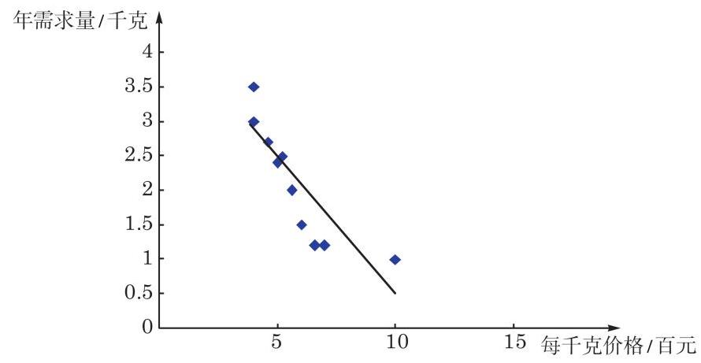

图 8-1-1 消费者年需求量与商品每千克价格的散点图

---

散点图中的点和必修课程第 13 章中一样, 用小方块 “●”或 “ $\bullet$ ”表示.

---

从图 8-1-1 可以看出, 消费者对该商品的年需求量大体上随着价格的上升而减少，但也有一些例外的情况. 例如，价格都是 4 百元, 但不同年份的需求量分别是 3.5 千克和 3 千克, 说明在价格不变的情况下，需求量仍可能发生变化. 类似地，价格改变, 需求也可能基本不变.

对例 1 所示的散点图, 从整体上看, 所有点都在一条直线的附近波动，在这种情况下，我们说两个变量之间具有一种线性相关关系. 此时可以用一条直线来拟合这两组数据(图 8-1-1).

#### 练习 8.1(1)

1. 若已知下列各组数据，它们是否可以看作成对数据？是否可以进行相关分析？判断并简要说明理由.

(1)A 校学生的身高与 B 校学生的体重；

(2)人体内的脂肪含量与体重；

(3)某班学生的物理成绩与数学成绩.

2.《国家学生体质健康标准(2014 年修订)》中，体能监测包含身高、体重、肺活量、 50 米跑、坐位体前屈、引体向上(女:仰卧起坐)、立定跳远、1000 米跑(女:800 米跑)， 据此得到的每项指标都可以按照相应的单项指标评分表进行测量和计分, 分别得到相应的数据.

(1)这些数据中的任意两组是否都可以作为成对数据进行相关分析？

(2)依据你的经验，哪两组数据的相关程度可能最高？哪两组数据的相关程度可能最低? 如何通过统计方法检验你的判断?

3. 某市 104 路公交车上午 7:05-8:55 时段在起点站每 9 分钟发一班次. 公交公司为了了解早高峰时段各班次上客情况, 某日上午 7:14-8:35 记录了在起点站各班次车辆上客的人数:

<table><tr><td>发车时刻</td><td>7:14</td><td>7:23</td><td>7:32</td><td>7:41</td><td>7:50</td><td>7:59</td><td>8:08</td><td>8:17</td><td>8:26</td><td>8:35</td></tr><tr><td>上车乘客数/人</td><td>10</td><td>13</td><td>13</td><td>18</td><td>17</td><td>15</td><td>12</td><td>9</td><td>3</td><td>3</td></tr></table>

请绘制这组成对数据的散点图, 并通过观察散点图大致判断客车发车时刻与上车乘客人数之间的相关性.

### 2 相关系数

从本节例 1 可以看出, 一些成对数据具有明显的相关性, 且在绘制出散点图后可以用一条直线进行拟合, 也就是说具有线性相关性. 在这种情况下, 我们如何进一步描述成对数据的线性相关程度呢?

设由变量 $x$ 和 $y$ 获得的两组数据分别为 ${x}_{i}$ 和 ${y}_{i}\left( {i = 1,2,\cdots }\right.$ , $n)$ ，其对应关系如表 8-2 所示.

表 8-2

<table><tr><td>变量 $\;x$</td><td>${x}_{1}$</td><td>${x}_{2}$</td><td>${x}_{3}$</td><td>${x}_{4}$</td><td>${x}_{5}$</td><td>${x}_{6}$</td><td>...</td><td>${x}_{n}$</td></tr><tr><td>变量 $\;y$</td><td>${y}_{1}$</td><td>${y}_{2}$</td><td>${y}_{3}$</td><td>${y}_{4}$</td><td>${y}_{5}$</td><td>${y}_{6}$</td><td>...</td><td>${y}_{n}$</td></tr></table>

两组数据 ${x}_{i}$ 和 ${y}_{i}$ 的线性相关系数 (linear correlation coefficient) 是度量两个变量 $x$ 与 $y$ 之间线性相关程度的统计量,其计算公式为

$$
r = \frac{\mathop{\sum }\limits_{{i = 1}}^{n}\left( {{x}_{i} - \bar{x}}\right) \left( {{y}_{i} - \bar{y}}\right) }{\sqrt{\mathop{\sum }\limits_{{i = 1}}^{n}{\left( {x}_{i} - \bar{x}\right) }^{2}\mathop{\sum }\limits_{{i = 1}}^{n}{\left( {y}_{i} - \bar{y}\right) }^{2}}}.
$$

①

其中, $\bar{x} = \frac{1}{n}\mathop{\sum }\limits_{{i = 1}}^{n}{x}_{i},\bar{y} = \frac{1}{n}\mathop{\sum }\limits_{{i = 1}}^{n}{y}_{i}$ ,它们分别是这两组数据的算术平均数.

线性相关系数常常简称为相关系数 (correlation coefficient), 也称为皮尔逊相关系数(Pearson's correlation coefficient). 相关系数计算公式的推导过程比较复杂, 这里不予涉及. 一般情况下, 只需要把两组数据输入计算机或计算器, 有很多软件可以帮助我们进行这一计算.

可以证明,相关系数 $r$ 的值满足 $\left| r\right|  \leq  1.\left| r\right|$ 越接近 1, 两个变量的线性相关程度越高; $\left| r\right|$ 越接近 0,两个变量的线性相关程度越低. $r > 0$ 时,当 $x$ 的值由小变大, $y$ 的值具有由小变大的变化趋势,称这种相关为正相关; $r < 0$ 时,当 $x$ 的值由小变大, $y$ 的值具有由大变小的变化趋势,称这种相关为负相关.

相关系数 $r$ 描述的是两个变量之间线性关系的方向与程度, 是一种定量分析的方法. 相关系数具有以下特点:

(1)相关系数的计算公式关于 $x$ 和 $y$ 这两个变量是对称的. 画散点图时, 不论以哪个变量作为横轴 (纵轴), 所得的相关系数都一样.

(2)两个变量的相关系数与这两个变量的单位无关. 例如， 在计算身高与体重的相关系数时, 身高单位不管取 “米”还是 “厘米”, 相关系数的结果都一样. Q

(3)与平均数和标准差一样，相关系数不仅会受到数据量多少的影响, 也会受到少数异常值较大的影响.

例 2 为了解某市高中男生身高与体重的关系, 随机抽取 5 所高中学校, 并获得这些学校全部男生的身高 (单位: $\mathrm{{cm}}$ ) 与体重(单位: $\mathrm{{kg}}$ )的数据. 为了减少篇幅，从中随机选取 10 名高中男生的身高与体重的数据，如表 8-3 所示. 试根据表中数据绘制散点图, 计算相关系数并判断学生身高与体重的相关程度.

表 8-3 10 名高中男生的身高与体重

<table><tr><td>编号</td><td>1</td><td>2</td><td>3</td><td>4</td><td>5</td><td>6</td><td>7</td><td>8</td><td>9</td><td>10</td></tr><tr><td>身高/cm</td><td>174</td><td>176</td><td>176</td><td>181</td><td>182</td><td>179</td><td>169</td><td>168</td><td>171</td><td>180</td></tr><tr><td>体重/kg</td><td>55</td><td>58</td><td>62</td><td>74</td><td>88</td><td>68</td><td>54</td><td>52</td><td>56</td><td>86</td></tr></table>

---

不等式 $\left| r\right|  \leq  1$ 的证明不作要求, 本节的课后阅读“相关系数的几何意义”将给出直观的解释.

用相关系数来描述两个随机变量的相关性，一般要求这两个变量均满足正态分布.

---

解 将表 8-3 中的数据输入计算机电子表格办公软件的工作簿， 先选中身高与体重两行(或两列)数据，再选择插入统计图中的散点图, 选择图形样式, 就完成了散点图的绘制, 如图 8-1-2 所示.

Q

---

在本例中，若删去一组数据 $\left( {{182},{88}}\right)$ , 则相关系数变为 0.844 ; 若样本数据中身高为 182 cm 的学生体重为 58 kg，则相关系数变为 0.684 .

---

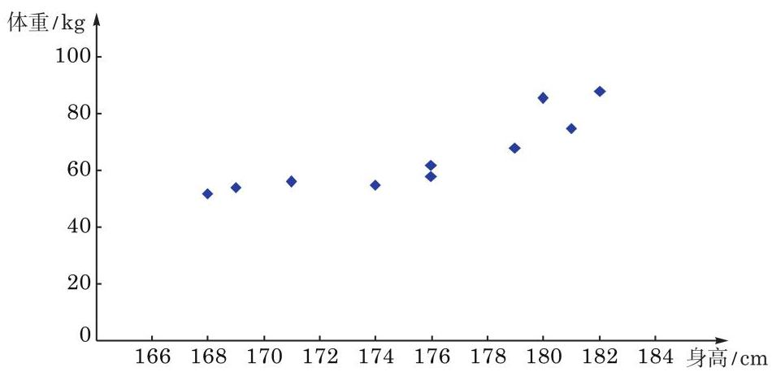

图 8-1-2 10 名高中男生身高与体重的散点图

---

用计算机或计算器算得数值的小数位数较多, 在统计应用中可根据需要进行取舍.

---

从图 8-1-2 中可以看出, 总体上来说, 样本学生的身高和体重之间具有明显的相关性, 个子高的学生往往更重一些.

为了计算相关系数, 我们把表中的两组数据代入本节公式 ①，通过计算机或计算器算得 $r \approx  {0.873}$ . 这说明样本学生的身高与体重之间具有很高的相关性.

#### 练习 8.1(2)

1. 用经过匿名处理的本班同学最近一次期中或期末测验的各科成绩表, 考察不同科目测验成绩之间的相关性.
2. 为了研究豆类脂肪含量与其产生的热量的关系, 选取了 5 种豆类进行实验测定. 下面是 ${0.1}\mathrm{\;{kg}}$ 豆类中脂肪含量 (单位: $\mathrm{{kg}}$ ) 与相应热量 (单位: $\mathrm{{kJ}}$ ) 的对照表.

<table><tr><td>豆类</td><td>黄豆</td><td>豇豆</td><td>青毛豆</td><td>豌豆(鲜)</td><td>四季豆</td></tr><tr><td>脂肪含量/kg</td><td>0.0184</td><td>0.000 2</td><td>0.0057</td><td>0.000 3</td><td>0.000 4</td></tr><tr><td>热量/kJ</td><td>1726</td><td>108</td><td>527</td><td>336</td><td>130</td></tr></table>

(1)根据表中的数据绘制散点图；

(2)观察散点图的趋势，如果能看成线性关系，请在图中画出一条直线来近似地表示这种关系, 并计算豆类脂肪含量与热量的相关系数.

#### 习题 8.1

##### A 组

1. 计算例 1 中商品每千克价格与年需求量之间的相关系数.
2. 必修课程第 13 章中曾给出 A 校 66 名高一年级学生身高(单位:cm) 与体重(单位: kg)的数据, 见下表. 试计算它们的相关系数.

<table><tr><td>性别</td><td>身高/cm</td><td>体重/kg</td><td>性别</td><td>身高/cm</td><td>体重/kg</td><td>性别</td><td>身高/cm</td><td>体重/kg</td></tr><tr><td>女</td><td>152</td><td>46</td><td>女</td><td>164</td><td>52</td><td>男</td><td>172</td><td>92</td></tr><tr><td>女</td><td>153</td><td>47</td><td>男</td><td>165</td><td>54</td><td>男</td><td>172</td><td>64</td></tr><tr><td>女</td><td>154</td><td>63</td><td>男</td><td>165</td><td>60</td><td>女</td><td>172</td><td>69</td></tr><tr><td>女</td><td>155</td><td>50</td><td>男</td><td>165</td><td>48</td><td>男</td><td>173</td><td>75</td></tr><tr><td>女</td><td>156</td><td>48</td><td>女</td><td>165</td><td>51</td><td>男</td><td>173</td><td>72</td></tr><tr><td>女</td><td>156</td><td>50</td><td>女</td><td>165</td><td>55</td><td>男</td><td>174</td><td>55</td></tr><tr><td>女</td><td>156</td><td>51</td><td>女</td><td>165</td><td>58</td><td>男</td><td>174</td><td>56</td></tr><tr><td>女</td><td>157</td><td>51</td><td>女</td><td>165</td><td>63</td><td>男</td><td>174</td><td>63</td></tr><tr><td>女</td><td>157</td><td>50</td><td>男</td><td>166</td><td>64</td><td>男</td><td>174</td><td>74</td></tr><tr><td>女</td><td>159</td><td>49</td><td>男</td><td>167</td><td>54</td><td>男</td><td>175</td><td>53</td></tr><tr><td>女</td><td>159</td><td>51</td><td>男</td><td>167</td><td>52</td><td>男</td><td>176</td><td>64</td></tr><tr><td>女</td><td>160</td><td>47</td><td>男</td><td>167</td><td>53</td><td>男</td><td>176</td><td>60</td></tr><tr><td>女</td><td>160</td><td>62</td><td>女</td><td>167</td><td>69</td><td>男</td><td>177</td><td>63</td></tr><tr><td>女</td><td>160</td><td>50</td><td>女</td><td>167</td><td>61</td><td>男</td><td>177</td><td>75</td></tr><tr><td>女</td><td>160</td><td>63</td><td>男</td><td>168</td><td>97</td><td>男</td><td>178</td><td>62</td></tr><tr><td>女</td><td>161</td><td>53</td><td>女</td><td>168</td><td>60</td><td>男</td><td>178</td><td>60</td></tr><tr><td>女</td><td>162</td><td>84</td><td>女</td><td>168</td><td>44</td><td>男</td><td>178</td><td>73</td></tr><tr><td>女</td><td>163</td><td>66</td><td>男</td><td>170</td><td>53</td><td>男</td><td>178</td><td>68</td></tr><tr><td>女</td><td>163</td><td>53</td><td>男</td><td>170</td><td>54</td><td>男</td><td>179</td><td>78</td></tr><tr><td>女</td><td>164</td><td>63</td><td>男</td><td>170</td><td>57</td><td>男</td><td>181</td><td>80</td></tr><tr><td>女</td><td>164</td><td>68</td><td>男</td><td>170</td><td>47</td><td>男</td><td>182</td><td>92</td></tr><tr><td>女</td><td>164</td><td>52</td><td>男</td><td>170</td><td>69</td><td>男</td><td>184</td><td>78</td></tr></table>

3. 某公司为研究工人操作熟练程度对产品合格率的影响, 随机抽取 15 名工人进行调查, 得到如下数据:

<table><tr><td>工人编号</td><td>1</td><td>2</td><td>3</td><td>4</td><td>5</td><td>6</td><td>7</td><td>8</td></tr><tr><td>操作熟练程度/%</td><td>7.6</td><td>15.2</td><td>37.9</td><td>45.5</td><td>7.6</td><td>0.0</td><td>15.2</td><td>75.8</td></tr><tr><td>产品合格率/%</td><td>50</td><td>55</td><td>68</td><td>75</td><td>52</td><td>30</td><td>55</td><td>90</td></tr><tr><td>工人编号</td><td>9</td><td>10</td><td>11</td><td>12</td><td>13</td><td>14</td><td>15</td><td>/</td></tr><tr><td>操作熟练程度/%</td><td>90.9</td><td>60.6</td><td>7.6</td><td>15.2</td><td>37.9</td><td>45.5</td><td>98.5</td><td>/</td></tr><tr><td>产品合格率/%</td><td>92</td><td>80</td><td>58</td><td>60</td><td>70</td><td>80</td><td>95</td><td>/</td></tr></table>

试计算工人操作熟练程度与产品合格率的相关系数.

4. 为判断能不能用气温推测海水表层温度, 收集了某沿海地区的气温和海水表层温度 (单位:℃)的统计数据，如下表所示.

<table><tr><td>气温/℃</td><td>海水表层温度/℃</td><td>气温/℃</td><td>海水表层温度/℃</td></tr><tr><td>13.9</td><td>9.4</td><td>31.1</td><td>28.3</td></tr><tr><td>15.0</td><td>10.6</td><td>31.1</td><td>26.7</td></tr><tr><td>18.3</td><td>13.3</td><td>28.9</td><td>25.0</td></tr><tr><td>23.9</td><td>18.9</td><td>23.9</td><td>22.2</td></tr><tr><td>27.2</td><td>21.7</td><td>20.0</td><td>15.6</td></tr><tr><td>30.0</td><td>25.6</td><td>15.0</td><td>10.0</td></tr></table>

试计算气温与海水表层温度的相关系数.

B 组

1. 如果两种证券在一段时间内收益数据的相关系数为正数, 那么表明 ( )

A. 两种证券的收益之间存在完全同向的联动关系, 即同时涨或同时跌;

B. 两种证券的收益之间存在完全反向的联动关系, 即涨或跌是相反的;

C. 两种证券的收益有同向变动的倾向;

D. 两种证券的收益有反向变动的倾向.

2. 据说职工迟到的频率与其居住地离上班地点的远近有关. 为验证这个说法, 一位社会学家随机抽取 10 名职工进行了调查, 其调查数据如下表所示.

<table><tr><td>职工编号</td><td>年迟到次数/次</td><td>住地远近/km</td><td>职工编号</td><td>年迟到次数/次</td><td>住地远近/km</td></tr><tr><td>1</td><td>8</td><td>1.1</td><td>6</td><td>3</td><td>10.1</td></tr><tr><td>2</td><td>5</td><td>2.9</td><td>7</td><td>5</td><td>12.0</td></tr><tr><td>3</td><td>8</td><td>4.0</td><td>8</td><td>2</td><td>14.3</td></tr><tr><td>4</td><td>7</td><td>5.9</td><td>9</td><td>4</td><td>14.1</td></tr><tr><td>5</td><td>6</td><td>8.2</td><td>10</td><td>2</td><td>7.8</td></tr></table>

试计算职工年迟到次数与住地远近之间的相关系数.

3. 下表是某国家由 18 支足球队参加的职业联赛(比赛采用双循环制，得分计算方法为:每场赛事胜方得 3 分，负方得 0 分，平局双方各得 1 分)的各队积分和射门次数，求这 18 支球队的积分与射门次数的相关系数.

<table><tr><td>足球队</td><td>A</td><td>B</td><td>C</td><td>D</td><td>E</td><td>F</td><td>G</td><td>H</td><td>I</td></tr><tr><td>积分</td><td>51</td><td>64</td><td>62</td><td>53</td><td>47</td><td>43</td><td>44</td><td>42</td><td>46</td></tr><tr><td>射门次数</td><td>418</td><td>509</td><td>485</td><td>425</td><td>452</td><td>425</td><td>393</td><td>350</td><td>375</td></tr><tr><td>足球队</td><td>J</td><td>K</td><td>L</td><td>M</td><td>$\mathrm{N}$</td><td>O</td><td>P</td><td>Q</td><td>R</td></tr><tr><td>积分</td><td>43</td><td>50</td><td>35</td><td>40</td><td>40</td><td>32</td><td>41</td><td>26</td><td>32</td></tr><tr><td>射门次数</td><td>428</td><td>415</td><td>363</td><td>372</td><td>377</td><td>271</td><td>395</td><td>306</td><td>357</td></tr></table>

课后阅读

相关系数的几何意义

观察相关系数 $r$ 的计算公式

$$
r = \frac{\mathop{\sum }\limits_{{i = 1}}^{n}\left( {{x}_{i} - \bar{x}}\right) \left( {{y}_{i} - \bar{y}}\right) }{\sqrt{\mathop{\sum }\limits_{{i = 1}}^{n}{\left( {x}_{i} - \bar{x}\right) }^{2}\mathop{\sum }\limits_{{i = 1}}^{n}{\left( {y}_{i} - \bar{y}\right) }^{2}}},
$$

①

你是否觉得似曾相识?

在学习向量时, 我们曾经给出过两个向量的夹角公式. 下面以空间向量为例, 来看看两个空间向量的夹角公式与公式①的联系. 设 $\overrightarrow{x} = \left( {{x}_{1},{x}_{2},{x}_{3}}\right) ,\overrightarrow{y} = \left( {{y}_{1},{y}_{2},{y}_{3}}\right)$ ,那么它们夹角的余弦为

$$
\cos \langle \overrightarrow{x},\overrightarrow{y}\rangle  = \frac{{x}_{1}{y}_{1} + {x}_{2}{y}_{2} + {x}_{3}{y}_{3}}{\sqrt{\left( {{x}_{1}^{2} + {x}_{2}^{2} + {x}_{3}^{2}}\right) \left( {{y}_{1}^{2} + {y}_{2}^{2} + {y}_{3}^{2}}\right) }} = \frac{\mathop{\sum }\limits_{{i = 1}}^{3}{x}_{i}{y}_{i}}{\sqrt{\mathop{\sum }\limits_{{i = 1}}^{3}{x}_{i}^{2}\mathop{\sum }\limits_{{i = 1}}^{3}{y}_{i}^{2}}}.
$$

从结构上看,这两个公式是一样的. 如果把两组数据 ${x}_{i}\text{ 、 }{y}_{i}\left( {i = 1,2,\cdots , n}\right)$ 看作两个 $n$ 维向量 $\overrightarrow{x} = \left( {{x}_{1},{x}_{2},\cdots ,{x}_{n}}\right) \text{ 、 }\overrightarrow{y} = \left( {{y}_{1},{y}_{2},\cdots ,{y}_{n}}\right)$ ,并记由这两组数据的平均数构成的两个 $n$ 维向量分别是 $\overrightarrow{x} = \left( {\bar{x},\bar{x},\cdots ,\bar{x}}\right)$ 及 $\overrightarrow{y} = \left( {\bar{y},\bar{y},\cdots ,\bar{y}}\right)$ ,那么比较公式①和向量的夹角公式可以发现: $r = \cos \left\langle  {\overrightarrow{x} - \overrightarrow{x},\overrightarrow{y} - \overrightarrow{y}}\right\rangle$ ,这说明相关系数 $r$ 其实就是两个向量 $\overrightarrow{x} - \overrightarrow{z}$ 与 $\overrightarrow{y}$ 一子的夹角的余弦值. 余弦值越接近 1 或 -1，意味着这两个向量越接近平行，散点图中的点更多地落在同一条直线的附近, 说明这两组数据的变化方向接近相同或相反, 正相关或负相关的程度越高; 余弦值越接近 0 , 意味着这两个向量越接近垂直, 表示这两组数据的相关程度越低. 此外,两组数据 ${x}_{i}\text{ 、 }{y}_{i}\left( {i = 1,2,\cdots , n}\right)$ 之所以分别减去各自的平均数,相应地得到差向量 $\overrightarrow{x}$ 一 $\overrightarrow{z}$ 与 $\overrightarrow{y}$ 一 $\overrightarrow{y}$ ,从几何上看是在作一个平移变换,而用统计学的说法, 则相应于做了一个数据中心化的处理.

## 8.2 一元线性回归分析

### 1 一元线性回归分析的基本思想

对于一组有某种线性关系的成对数据, 上一节介绍的相关系数分析了数据之间线性关系的方向与程度. 但有时我们还需要进一步了解其中一个变量随另一个变量变化的大致情况. 更准确地说, 我们要找到关联两个变量的一个线性方程, 使得在平面直角坐标系上数据所确定的点尽可能地 “贴近” 方程所定义的直线.

先回到本章 8.1 节的例 1. 为了找一条直线去“贴近”数据散点图 (图 8-1-1) 中的各点, 甲、乙两名同学分别给出了线性方程:

甲: $y =  - {0.5x} + {5.0}$ ,

乙: $y =  - {0.4x} + {4.5}$ .

我们在散点图上把这两个线性方程所定义的直线绘制出来, 如图 8-2-1 所示, 其中红色直线是甲的方程所定义的, 蓝色直线是乙的方程所定义的.

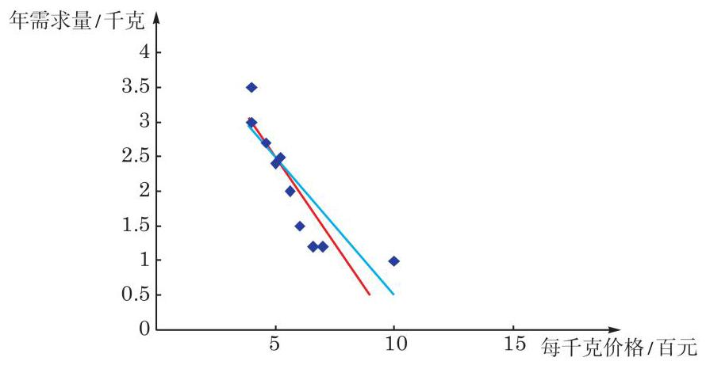

图 8-2-1

凭直觉我们很难断定哪条直线与数据点贴近得更好.

至此, 我们会提出问题: (1)有没有明确的标准来衡量直线与数据点的贴近程度? (2)如果有这样的标准，如何找出在此标

准下最佳的直线?

要解决这两个问题, 可以用下面介绍的回归分析的方法.

一般地,设给定一组有线性相关关系的成对数据 $\left( {{x}_{1},{y}_{1}}\right)$ 、 $\left( {{x}_{2},{y}_{2}}\right) \text{ 、 }\cdots \text{ 、 }\left( {{x}_{n},{y}_{n}}\right)$ 和一个线性方程 (或称线性模型)

$$
y = {ax} + b.
$$

①

如何描述数据与此线性方程的贴近度呢?

当变量 $x$ 取值 ${x}_{i}\left( {i = 1,2,\cdots , n}\right)$ 时,令 ${\widehat{y}}_{i} = a{x}_{i} + b$ ,它是变量 $y$ 与 ${x}_{i}$ 对应的理想值. 但数据中的 ${y}_{i}$ 与 ${\widehat{y}}_{i}$ 不一定相同, 它们的差 ${y}_{i} - {\widehat{y}}_{i}$ 称为在 ${x}_{i}$ 处的离差 (dispersion),当 ${y}_{i} - {\widehat{y}}_{i} \geq  0$ 时称为正离差,而当 ${y}_{i} - {\widehat{y}}_{i} < 0$ 时称为负离差. 显然,离差直观地描述了单对数据与线性方程①的贴近度.

由于离差可正可负, 考虑数据整体与线性方程①的贴近度时, 不能简单地用离差的代数和作为指标. 我们可以像计算方差那样, 用离差的平方和

$$
Q = \mathop{\sum }\limits_{{i = 1}}^{n}{\left( {y}_{i} - {\widehat{y}}_{i}\right) }^{2}
$$

来刻画直线与点之间的拟合程度. $Q$ 称为拟合误差 (fitting error), 它是一个很好的描述数据与线性方程①贴近度的指标. 我们把拟合误差取得最小值时得到的线性方程(线性模型)记为

$$
y = \widehat{a}x + \widehat{b},
$$

②

并称之为变量 $y$ 随 $x$ 波动的回归方程 (regression equation) 或回归模型 (regression model),其中自变量 $x$ 称为解释变量 (explanatory variable),因变量 $y$ 称为反应变量 (response variable). 回归方程所定义的直线称为回归直线 (regression line), 回归方程的系数 (或称回归模型的参数) $\widehat{a}$ 与 $\widehat{b}$ 称为回归系数 (regression coefficients). 由一组有某种线性关系的成对数据求其回归方程的方法称为一元线性回归分析(regression analysis).

回归系数 $\widehat{a}$ 与 $\widehat{b}$ 的计算公式如下:

$$
\left\{  \begin{array}{l} \widehat{a} = \frac{\mathop{\sum }\limits_{{i = 1}}^{n}\left( {{x}_{i} - \bar{x}}\right) \left( {{y}_{i} - \bar{y}}\right) }{\mathop{\sum }\limits_{{i = 1}}^{n}{\left( {x}_{i} - \bar{x}\right) }^{2}} = \frac{\mathop{\sum }\limits_{{i = 1}}^{n}{x}_{i}{y}_{i} - n\bar{x}\bar{y}}{\mathop{\sum }\limits_{{i = 1}}^{n}{x}_{i}{}^{2} - n{\bar{x}}^{2}}, \\  \widehat{b} = \bar{y} - \widehat{a}\bar{x} = \frac{\mathop{\sum }\limits_{{i = 1}}^{n}{y}_{i} - \widehat{a}\mathop{\sum }\limits_{{i = 1}}^{n}{x}_{i}}{n}, \end{array}\right.
$$

③

其中 $\bar{x}$ 与 $\bar{y}$ 分别是数据 ${x}_{i}$ 与 ${y}_{i}\left( {i = 1,2,\cdots , n}\right)$ 的算术平均值, 数对 $\left( {\bar{x},\bar{y}}\right)$ 称为样本点的中心.

公式③的一个初等的推导过程在本节的课后阅读中介绍. 回归系数 $\widehat{a}$ 与 $\widehat{b}$ 的值只与给定的数据有关，而与回归分析过程中初始选择的线性模型无关.

有了回归系数 $\widehat{a}$ 与 $\widehat{b}$ ,代入方程②就得到了这一组成对数据的回归方程. 这样, 我们对本节开头提的两个问题都有了明确的答案.

我们的回归分析是基于 $Q$ 取最小值的假设,即基于所有离差的平方和取最小值的假设进行的. 这种回归分析的方法称为最小二乘法 (least squares), 由最小二乘法导出的估计量称为最小二乘估计量,所得到的回归系数 $\widehat{a}$ 与 $\widehat{b}$ 又称为模型参数 $a$ 与 $b$ 的最小二乘估计 (least squares estimate).

在解决具体问题时, 如果数据量不大, 可以用上面的公式直接计算出回归系数 $\widehat{a}$ 与 $\widehat{b}$ ,进而得出回归方程. 如果数据量大, 就要借助统计软件, 通过计算机或计算器来实现这一过程了.

下面我们针对本章 8.1 节中的例 1 来求回归方程, 并理解回归直线与观察值之间的关系.

依据表 8-1 给出的某种商品“年需求量” $\left( y\right)$ 与“每千克价格” (✗)之间的一组观察数据以及所得到的散点图 8-1-1，我们已经知道这两个变量形成的数据点大致分布在一条直线的附近, 即 “年需求量” (y) 与 “每千克价格” $\left( x\right)$ 大致呈线性关系,因而可以用线性回归方程来刻画它们之间的数量关系. 用回归系数的计算公式可求得 $\left\{  \begin{array}{l} \widehat{a} \approx   - {0.413}, \\  \widehat{b} \approx  {4.495}, \end{array}\right.$ 于是所求的回归方程为

$$
y =  - {0.413x} + {4.495},
$$

这个方程所定义的直线即这组数据的回归直线, 它是给定数据点的最佳拟合直线.

由回归方程,我们可以算出每个 ${x}_{i}$ 对应的计算值 ${\widehat{y}}_{i}$ (结果精确到 0.1 )，列表 8-4 如下:

表 8-4

<table><tr><td>$x$</td><td>4.0</td><td>4.0</td><td>4.6</td><td>5.0</td><td>5.2</td><td>5.6</td><td>6.0</td><td>6.6</td><td>7.0</td><td>10</td></tr><tr><td>$y$</td><td>3.5</td><td>3.0</td><td>2.7</td><td>2.4</td><td>2.5</td><td>2.0</td><td>1.5</td><td>1.2</td><td>1.2</td><td>1.0</td></tr><tr><td>$\widehat{y}$</td><td>2.8</td><td>2.8</td><td>2.6</td><td>2.4</td><td>2.3</td><td>2.2</td><td>2.0</td><td>1.8</td><td>1.6</td><td>0.4</td></tr><tr><td>离差 ${y}_{i} - {\widehat{y}}_{i}$</td><td>0.7</td><td>0.2</td><td>0.1</td><td>0.0</td><td>0.2</td><td>-0.2</td><td>-0.5</td><td>-0.6</td><td>-0.4</td><td>0.6</td></tr></table>

---

从回归系数公式 ③可以看出，回归直线经过样本点的中心 $\left( {\bar{x},\bar{y}}\right)$ ,也就是散点图中数据点的中心.

---

据此可进一步算出拟合误差 $Q = \mathop{\sum }\limits_{{i = 1}}^{{10}}{\left( {y}_{i} - {\widehat{y}}_{i}\right) }^{2} = {0.7}^{2} + \; {0.2}^{2} + {0.1}^{2} + {0.0}^{2} + {0.2}^{2} + {\left( -{0.2}\right) }^{2} + {\left( -{0.5}\right) }^{2} + {\left( -{0.6}\right) }^{2} + \; {\left( -{0.4}\right) }^{2} + {0.6}^{2} = {1.75}$ . 它当然是这组数据的线性拟合中拟合误差所能达到的最小值. ?

---

如果两组数据之间的相关系数很小, 根据公式求回归系数还有意义吗?

---

有了上述准备，现在我们就能判断本节开始时学生甲和乙给出的线性方程哪个更贴近所给的数据点了. 学生乙所给的方程实际上是系数精确度不同的回归方程, 如果用这个方程来制作表 8-4, 只会出现一些由数据精确度不同引起的小误差; 学生甲所给的方程与回归方程有本质的差别.

#### 练习 8.2(1)

1. 将学生甲所给的线性方程 $y =  - {0.5x} + {5.0}$ 作为本章 8.1 节例 1 数据的线性拟合, 计算各数据点的离差, 再计算拟合误差. 把结果与表 8-4 的数据相比较, 说说你对 “最佳拟合”有什么新的理解和体会.
2. 两个变量 $x$ 与 $y$ 之间的回归方程 ( )

A. 表示 $x$ 与 $y$ 之间的函数关系;

B. 表示 $x$ 与 $y$ 之间的不确定关系;

C. 反映 $x$ 与 $y$ 之间的真实关系;

D. 是反映 $x$ 与 $y$ 之间的真实关系的一种最佳拟合.

3. 用最小二乘法求回归方程是为了使 ( )

A. $\mathop{\sum }\limits_{{i = 1}}^{n}\left( {{y}_{i} - \bar{y}}\right)  = 0$ ; B. $\mathop{\sum }\limits_{{i = 1}}^{n}\left( {{y}_{i} - {\widehat{y}}_{i}}\right)  = 0$ ;

C. $\mathop{\sum }\limits_{{i = 1}}^{n}\left( {{y}_{i} - {\widehat{y}}_{i}}\right)$ 最小; D. $\mathop{\sum }\limits_{{i = 1}}^{n}{\left( {y}_{i} - {\widehat{y}}_{i}\right) }^{2}$ 最小.

### 2 一元线性回归分析的应用举例

例 1 依据本章 8.1 节例 2 中某市高中男生身高与体重的抽样数据,运用电子表格办公软件求 “体重” (y) 关于 “身高” $\left( x\right)$ 的回归方程.

解 将表 8-3 中的数据输入工作簿，然后选择“插入图表”， 再选择“散点图”，则自动生成如下的散点图 (图 8-2-2).

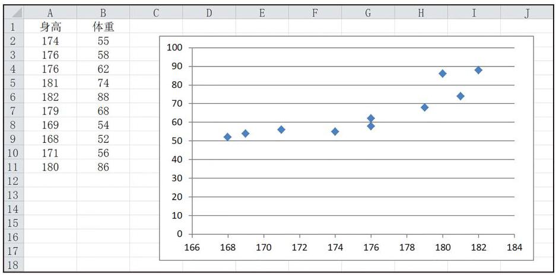

图 8-2-2

在数据点上单击右键, 选择“添加趋势线”- “线型”, 并在 “趋势线选项”标签中要求给出公式，可以得到回归直线(图 8-2-3).

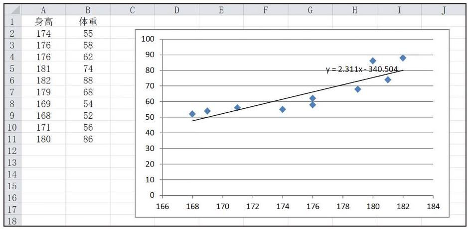

图 8-2-3

图 8-2-3 中标明了所求的回归方程为: $y = {2.311x} - {340.504}$ .

根据所得的回归方程,对于身高 ${178}\mathrm{\;{cm}}$ 的男生,可以预测其体重为 ${2.311} \times  {178} - {340.504} = {70.854}\left( \mathrm{\;{kg}}\right)$ .

从上述例子可以看出, 建立一元线性回归模型的一般步骤如下:

(1)确定研究对象，从一组数据出发，根据实际问题，明确哪个变量是自变量, 哪个变量是因变量;

(2)对确定的自变量和因变量，绘制相应的散点图，观察它们之间的关系 (如是否存在线性关系等);

(3)若观察到数据呈线性关系，则选用线性方程 $y = {ax} + b$ ；

(4)利用最小二乘法估计线性方程中的参数 $a$ 、 $b$ ，得到回

归方程 $y = \widehat{a}x + \widehat{b}$ ;

(5)得出结果后计算离差，采用统计方法检验模型是否合适 (这一步本书不作要求)；

(6)利用所求的回归方程进行预测.

相关分析和回归分析作为处理成对数据的两种基本统计方法, 它们之间有如下联系与区别:

(1)相关分析主要测定变量之间相关性的强弱和变化方向， 而回归分析则是在相关分析的基础上建立回归模型, 定量地描述变量间具体的变动关系. 只有在两组变量具有线性相关性时, 才作线性回归分析, 得到回归直线.

(2)在相关分析中，两个变量的地位是对等的；而在回归分析中, 要考察的是一个变量随另一个变量的变化趋势, 其中自变量是解释变量, 因变量是反应变量.

(3)回归分析具有因果分析和预测的功能, 可以分析反应变量受解释变量的影响程度, 也可以通过回归方程求得反应变量的计算值来估计其他同类的观察值.

(4)在相关分析中，一般要求两个变量的总体都满足正态分布；而在回归分析时，一般只要求反应变量的总体满足正态分布.

除了具有线性关系的散点图以外, 线性回归分析还可以处理呈指数分布性状的数据分布. 表 8-5 是 1999 年至 2018 年我国国内游客数量(单位:万人次)的统计表，图 8-2-4 是根据这些数据所作的散点图. 从图上可以看出年份与游客人数之间不是线性关系, 而是有明显的指数增长的性状.

表 8-5

<table><tr><td>年份</td><td>1999</td><td>2000</td><td>2001</td><td>2002</td><td>2003</td><td>2004</td><td>2005</td></tr><tr><td>国内游客数量/ 万人次</td><td>71 900</td><td>74400</td><td>78400</td><td>87800</td><td>87000</td><td>110 200</td><td>121200</td></tr><tr><td>年份</td><td>2006</td><td>2007</td><td>2008</td><td>2009</td><td>2010</td><td>2011</td><td>2012</td></tr><tr><td>国内游客数量/ 万人次</td><td>139 400</td><td>161 000</td><td>171 200</td><td>190 200</td><td>210 300</td><td>264 100</td><td>295 700</td></tr><tr><td>年份</td><td>2013</td><td>2014</td><td>2015</td><td>2016</td><td>2017</td><td>2018</td><td>/</td></tr><tr><td>国内游客数量/ 万人次</td><td>326 200</td><td>361 100</td><td>400 000</td><td>444000</td><td>500 000</td><td>553 900</td><td>/</td></tr></table>

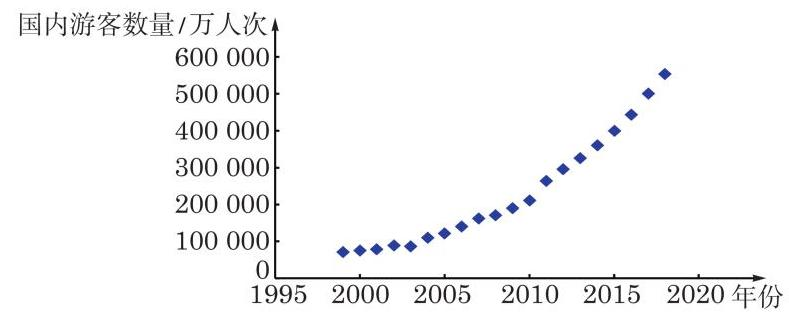

图 8-2-4

为了建立这组数据的拟合模型, 我们将国内游客数量 (方便起见记为 $N$ ,单位: 万人次) 取自然对数 $\ln N$ ,可得到表 8-6.

表 8-6

<table><tr><td>年份(Y)</td><td>1999</td><td>2000</td><td>2001</td><td>2002</td><td>2003</td><td>2004</td><td>2005</td></tr><tr><td>$N$</td><td>71 900</td><td>74400</td><td>78400</td><td>87800</td><td>87000</td><td>110 200</td><td>121200</td></tr><tr><td>$\ln N$</td><td>11.18</td><td>11.22</td><td>11.27</td><td>11.38</td><td>11.37</td><td>11.61</td><td>11.71</td></tr><tr><td>年份(Y)</td><td>2006</td><td>2007</td><td>2008</td><td>2009</td><td>2010</td><td>2011</td><td>2012</td></tr><tr><td>$N$</td><td>139 400</td><td>161 000</td><td>171 200</td><td>190 200</td><td>210 300</td><td>264 100</td><td>295700</td></tr><tr><td>$\ln N$</td><td>11.85</td><td>11.99</td><td>12.05</td><td>12.16</td><td>12.26</td><td>12.48</td><td>12.60</td></tr><tr><td>年份(Y)</td><td>2013</td><td>2014</td><td>2015</td><td>2016</td><td>2017</td><td>2018</td><td>/</td></tr><tr><td>$N$</td><td>326 200</td><td>361 100</td><td>400000</td><td>444000</td><td>500 000</td><td>553 900</td><td>/</td></tr><tr><td>$\ln N$</td><td>12.70</td><td>12.80</td><td>12.90</td><td>13.00</td><td>13.12</td><td>13.22</td><td>/</td></tr></table>

对表 8-6 中的变量 $Y$ (年份) 和 $\ln N$ 绘制散点图 (图 8-2-5).

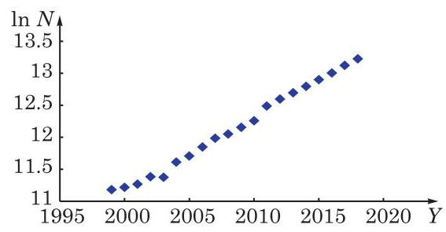

图 8-2-5

从图 8-2-5 中可以看出各数据点之间呈线性关系, 于是我们作线性回归分析,求得 $Y$ 与 $\ln N$ 之间的线性拟合 $\ln N = {aY} + b$ . 最终我们得到

$$
N = {\mathrm{e}}^{{aY} + b} = {\mathrm{e}}^{b}{\mathrm{e}}^{aY} = c{\mathrm{e}}^{aY},
$$

其中 $c = {\mathrm{e}}^{b}$ 是一个常数.

相关分析和回归分析都是处理变量与变量之间关系的重要统计方法, 在大数据时代更具有广泛的应用.

#### 练习 8.2(2)

1. 某公司为了解用电量 $y$ (单位: $\mathrm{{kW}} \cdot  \mathrm{h}$ ) 与气温 $x$ (单位: ${}^{ \circ  }\mathrm{C}$ ) 之间的关系,随机统计了 4 天的用电量与当天气温, 并制作了如下对照表:

<table><tr><td>气温 $x$ /℃</td><td>18</td><td>13</td><td>10</td><td>-1</td></tr><tr><td>用电量 $y/\left( {\mathrm{{kW}} \cdot  \mathrm{h}}\right)$</td><td>24</td><td>34</td><td>38</td><td>62</td></tr></table>

由表中数据可得回归方程 $y = {ax} + b$ 中 $\widehat{a} =  - 2$ ，试预测当气温为 $- 4{}^{ \circ  }\mathrm{C}$ 时，用电量约为___ $\mathrm{{kW}} \cdot  \mathrm{h}$ .

2. 用计算器或计算机软件建立下列观测数据的回归方程:

<table><tr><td>${x}_{i}$</td><td>70</td><td>115</td><td>130</td><td>190</td><td>195</td><td>400</td><td>450</td></tr><tr><td>${y}_{i}$</td><td>1.10</td><td>1.00</td><td>0.85</td><td>0.75</td><td>0.85</td><td>0.67</td><td>0.50</td></tr></table>

3. 为了研究长江口滨海湿地乡土植物芦苇高度(单位:cm)与干重(单位:g)之间的关系, 观察芦苇高度与干重的数据(见下表), 其中干重为植物收获并烘干到一定标准后的质量. 试建立芦苇干重关于芦苇高度的回归方程.

<table><tr><td>编号</td><td>高度/cm</td><td>干重/g</td><td>编号</td><td>高度/cm</td><td>干重/g</td></tr><tr><td>1</td><td>136</td><td>15.01</td><td>13</td><td>147</td><td>16.87</td></tr><tr><td>2</td><td>136</td><td>14.88</td><td>14</td><td>150</td><td>17.13</td></tr><tr><td>3</td><td>135</td><td>15.12</td><td>15</td><td>148</td><td>17.26</td></tr><tr><td>4</td><td>138</td><td>14.99</td><td>16</td><td>150</td><td>18.13</td></tr><tr><td>5</td><td>139</td><td>15.54</td><td>17</td><td>149</td><td>17.66</td></tr><tr><td>6</td><td>138</td><td>15.24</td><td>18</td><td>152</td><td>17.84</td></tr><tr><td>7</td><td>141</td><td>15.68</td><td>19</td><td>151</td><td>18.17</td></tr><tr><td>8</td><td>143</td><td>15.88</td><td>20</td><td>154</td><td>18.36</td></tr><tr><td>9</td><td>142</td><td>18.16</td><td>21</td><td>155</td><td>17.95</td></tr><tr><td>10</td><td>144</td><td>16.33</td><td>22</td><td>155</td><td>18.65</td></tr><tr><td>11</td><td>148</td><td>15.99</td><td>23</td><td>157</td><td>18.89</td></tr><tr><td>12</td><td>146</td><td>16.57</td><td>24</td><td>156</td><td>19.26</td></tr></table>

#### 习题 8.2

##### A 组

1. 下表中是某家庭 2009 年至 2018 年电费开支的情况,设年电费开支为 $y$ (单位: 元),试建立年份 $x$ 与 $y$ 的回归方程.

<table><tr><td>年份 $x$</td><td>2009</td><td>2010</td><td>2011</td><td>2012</td><td>2013</td><td>2014</td><td>2015</td><td>2016</td><td>2017</td><td>2018</td></tr><tr><td>电费 $y$ /元</td><td>1323</td><td>1552</td><td>1679</td><td>1852</td><td>1975</td><td>2129</td><td>2327</td><td>2494</td><td>2667</td><td>2791</td></tr></table>

2. 随机抽取 8 对成年母女的身高数据(单位:cm)，试据此建立母亲身高与女儿身高的回归方程.

<table><tr><td>母亲身高 $x/\mathrm{{cm}}$</td><td>154</td><td>157</td><td>158</td><td>159</td><td>160</td><td>161</td><td>162</td><td>163</td></tr><tr><td>女儿身高 $y/\mathrm{{cm}}$</td><td>155</td><td>156</td><td>159</td><td>162</td><td>161</td><td>164</td><td>165</td><td>166</td></tr></table>

3. 某生物学家对白鲸游泳速度与其摆尾频率之间的关系进行了研究. 研究的样本为 19 头白鲸, 测量其游泳速度和摆尾频率. 白鲸游泳速度的测量单位为每秒向前移动的身长数 (1.0 代表每秒向前移动一个身长), 而摆尾频率的测量单位是赫兹(1.0 代表每秒摆尾 1 个来回). 测量数据如下表所示.

(第 3 题)

<table><tr><td>白鲸编号</td><td>游泳速度/(L/s)</td><td>摆尾频率/Hz</td><td>白鲸编号</td><td>游泳速度/(L/s)</td><td>摆尾频率/Hz</td></tr><tr><td>1</td><td>0.37</td><td>0.62</td><td>11</td><td>0.68</td><td>1.20</td></tr><tr><td>2</td><td>0.50</td><td>0.68</td><td>12</td><td>0.86</td><td>1.38</td></tr><tr><td>3</td><td>0.35</td><td>0.68</td><td>13</td><td>0.68</td><td>1.41</td></tr><tr><td>4</td><td>0.34</td><td>0.71</td><td>14</td><td>0.73</td><td>1.44</td></tr><tr><td>5</td><td>0.46</td><td>0.80</td><td>15</td><td>0.95</td><td>1.49</td></tr><tr><td>6</td><td>0.44</td><td>0.88</td><td>16</td><td>0.79</td><td>1.50</td></tr><tr><td>7</td><td>0.51</td><td>0.88</td><td>17</td><td>0.84</td><td>1.50</td></tr><tr><td>8</td><td>0.68</td><td>0.92</td><td>18</td><td>1.06</td><td>1.56</td></tr><tr><td>9</td><td>0.51</td><td>1.08</td><td>19</td><td>1.04</td><td>1.67</td></tr><tr><td>10</td><td>0.67</td><td>1.14</td><td>/</td><td>/</td><td>/</td></tr></table>

生物学家聚焦的研究问题是 “白鲸的摆尾频率依赖于其游泳速度吗”,这里的因变量 $y$ 是摆尾频率,自变量 $x$ 是游泳速度.

(1)绘制数据散点图；

(2)建立 $x$ 与 $y$ 的回归方程.

4. 某公司购进一新型设备, 为了分配合适的工人操作该设备, 进行了操作该设备的工人工龄(单位:年)与劳动生产率(单位:件/时)之间的相关分析，下表是 12 名 5~10 年工龄的工人操作新设备的劳动生产率的试验记录.

<table><tr><td>工人编号</td><td>1</td><td>2</td><td>3</td><td>4</td><td>5</td><td>6</td><td>7</td><td>8</td><td>9</td><td>10</td><td>11</td><td>12</td></tr><tr><td>工龄 $x$ /年</td><td>5</td><td>5</td><td>6</td><td>6</td><td>6</td><td>7</td><td>7</td><td>8</td><td>8</td><td>9</td><td>10</td><td>10</td></tr><tr><td>劳动生产率 $y/\left( {\text{ 件 }/\text{ 时 }}\right)$</td><td>7.1</td><td>7.2</td><td>7.5</td><td>7.5</td><td>7.7</td><td>8.3</td><td>8.6</td><td>9.2</td><td>9.2</td><td>10.0</td><td>9.7</td><td>10.0</td></tr></table>

试建立工人操作新设备的劳动生产率 $y$ 与工龄 $x$ 的回归方程.

5. 某工厂生产某种产品的月产量(单位:千件)与单位成本(单位:元/件)的数据如下:

<table><tr><td>月份</td><td>产量 $x$ /千件</td><td>单位成本 $y/\left( \text{ 元/件 }\right)$</td></tr><tr><td>1</td><td>2</td><td>73</td></tr><tr><td>2</td><td>3</td><td>72</td></tr><tr><td>3</td><td>4</td><td>71</td></tr><tr><td>4</td><td>3</td><td>73</td></tr><tr><td>5</td><td>4</td><td>69</td></tr><tr><td>6</td><td>5</td><td>68</td></tr></table>

(1)计算产量与单位成本的相关系数；

(2)建立产量与单位成本的回归方程；

(3)若该工厂计划 7 月份生产 7 千件该产品，则单位成本预计是多少？

##### B 组

1. 为了解大学校园附近餐馆的月营业收入(单位:千元)和该店周围的大学生人数(单位:千人)之间的关系，抽取了 10 所大学附近餐馆的有关数据，如下表所示.

<table><tr><td>学生人数 $x$ /千人</td><td>2</td><td>6</td><td>8</td><td>8</td><td>12</td><td>16</td><td>20</td><td>20</td><td>22</td><td>26</td></tr><tr><td>月营业收入 $y$ /千元</td><td>58</td><td>105</td><td>88</td><td>118</td><td>117</td><td>137</td><td>157</td><td>169</td><td>149</td><td>202</td></tr></table>

(1)根据以上数据，建立月营业收入 $y$ 与该店周围的大学生人数 $x$ 的回归方程；

(2)已知某餐馆周围的大学生人数为 10000 人，试对该店月营业收入作出预测.

2. 某运动生理学家在一项健身活动中选择了 19 位参与者, 以他们的皮下脂肪厚度来估计身体的脂肪含量，其中脂肪含量以占体重(单位:kg)的百分比表示. 得到脂肪含量和体重的数据如下表所示. 其中，参与者 1 ~10 为男性，11 ~19 为女性.

<table><tr><td>参与者编号</td><td>体重 $x/\mathrm{{kg}}$</td><td>脂肪含量 $y/\%$</td><td>参与者编号</td><td>体重 $x/\mathrm{{kg}}$</td><td>脂肪含量 $y/\%$</td></tr><tr><td>1</td><td>89</td><td>28</td><td>11</td><td>57</td><td>29</td></tr><tr><td>2</td><td>88</td><td>27</td><td>12</td><td>68</td><td>32</td></tr><tr><td>3</td><td>66</td><td>24</td><td>13</td><td>69</td><td>35</td></tr><tr><td>4</td><td>59</td><td>23</td><td>14</td><td>59</td><td>31</td></tr><tr><td>5</td><td>93</td><td>29</td><td>15</td><td>62</td><td>29</td></tr><tr><td>6</td><td>73</td><td>25</td><td>16</td><td>59</td><td>26</td></tr><tr><td>7</td><td>82</td><td>29</td><td>17</td><td>56</td><td>28</td></tr><tr><td>8</td><td>77</td><td>25</td><td>18</td><td>66</td><td>33</td></tr><tr><td>9</td><td>100</td><td>30</td><td>19</td><td>72</td><td>33</td></tr><tr><td>10</td><td>67</td><td>23</td><td>/</td><td>/</td><td>/</td></tr></table>

(1)分别建立男性和女性体重与脂肪含量的回归方程；

(2)男性和女性合在一起所构成的样本的回归方程为 $y = {0.021x} + {26.886}$ ，其斜率与 (1)中所计算的斜率有差异吗？能否对这种差异进行解释？

(3)计算下列情况下体重与脂肪含量的相关系数:① 男性；② 女性；③ 男女合计. 这些值与(2)中所反映的信息是否一致？

3.(1)完成本节中提供的我国 1999 年至 2018 年国内游客数量与年份关系的回归模型, 并据此模型预测 2021 年我国国内的游客数量(回归系数保留 4 位小数, 游客数量精确到百万人次)；

(2)查阅 2021 年我国国内实际游客数量，与上述模型预测数据进行比较，并讨论数据出现偏差的原因.

课后阅读

一元线性回归系数公式的推导

在这个阅读材料中, 我们将用初等的方法推导本节中所介绍的回归系数公式③.

先回顾我们的问题. 设有一组成对的数据 $\left( {{x}_{1},{y}_{1}}\right) \text{ 、 }\left( {{x}_{2},{y}_{2}}\right) \text{ 、 }\cdots \text{ 、 }\left( {{x}_{n},{y}_{n}}\right)$ 和一个 $y$ 与 $x$ 的线性关系 $y = {ax} + b$ . 对给定 $i\left( {i = 1,2,\cdots , n}\right)$ ,令 ${\widehat{y}}_{i} = a{x}_{i} + b$ . 我们要“优化”线性关系,使离差 ${y}_{i} - {\widehat{y}}_{i}$ 的平方和 (即拟合误差)

$$
Q = \mathop{\sum }\limits_{{i = 1}}^{n}{\left( {y}_{i} - {\widehat{y}}_{i}\right) }^{2}
$$

达到最小值. 满足这个条件的线性关系是拟合数据的最佳选择.

为了找到最佳的线性关系, 我们从略微不同的角度考察拟合误差. 把拟合误差改写成

$$
Q = \mathop{\sum }\limits_{{i = 1}}^{n}{\left( {y}_{i} - a{x}_{i} - b\right) }^{2}.
$$

由于数据 $\left( {{x}_{i},{y}_{i}}\right) \left( {i = 1,2,\cdots , n}\right)$ 是给定的,故 $Q$ 是 $a\text{ 、 }b$ 的二元函数. 于是问题化为: 求变量 $a\text{ 、 }b$ 的最小二乘估计 $\widehat{a}\text{ 、 }\widehat{b}$ ,使函数值达到最小.

令 $\bar{x} = \frac{1}{n}\mathop{\sum }\limits_{{i = 1}}^{n}{x}_{i}$ 与 $\bar{y} = \frac{1}{n}\mathop{\sum }\limits_{{i = 1}}^{n}{y}_{i}$ 分别是数据 ${x}_{i}$ 与 ${y}_{i}\left( {i = 1,2,\cdots , n}\right)$ 的算术平均值,则

$$
{\left( {y}_{i} - a{x}_{i} - b\right) }^{2}
$$

$$
= {\left\{  \left( {y}_{i} - \bar{y}\right)  + \left\lbrack  \bar{y} - \left( a\bar{x} + b\right) \right\rbrack   - a\left( {x}_{i} - \bar{x}\right) \right\}  }^{2}
$$

$$
= {\left( {y}_{i} - \bar{y}\right) }^{2} + {\left\lbrack  \bar{y} - \left( a\bar{x} + b\right) \right\rbrack  }^{2} + {a}^{2}{\left( {x}_{i} - \bar{x}\right) }^{2} - {2a}\left( {{x}_{i} - \bar{x}}\right) \left( {{y}_{i} - \bar{y}}\right)
$$

$$
+ 2\left\lbrack  {\bar{y} - \left( {a\bar{x} + b}\right) }\right\rbrack  \left( {{y}_{i} - \bar{y}}\right)  - {2a}\left\lbrack  {\bar{y} - \left( {a\bar{x} + b}\right) }\right\rbrack  \left( {{x}_{i} - \bar{x}}\right) .
$$

因为 $\mathop{\sum }\limits_{{i = 1}}^{n}{x}_{i} = n\bar{x}$ ,所以 $\mathop{\sum }\limits_{{i = 1}}^{n}\left( {{x}_{i} - \bar{x}}\right)  = \mathop{\sum }\limits_{{i = 1}}^{n}{x}_{i} - n\bar{x} = 0$ ; 同理 $\mathop{\sum }\limits_{{i = 1}}^{n}\left( {{y}_{i} - \bar{y}}\right)  = 0$ . 这样,把上式对 $i$ 从 1 到 $n$ 求和,其最后两项所对应的和式都是 0 . 于是,

$$
Q = \mathop{\sum }\limits_{{i = 1}}^{n}{\left( {y}_{i} - \bar{y}\right) }^{2} + n{\left\lbrack  \bar{y} - \left( a\bar{x} + b\right) \right\rbrack  }^{2} + {a}^{2}\mathop{\sum }\limits_{{i = 1}}^{n}{\left( {x}_{i} - \bar{x}\right) }^{2} - {2a}\mathop{\sum }\limits_{{i = 1}}^{n}\left( {{x}_{i} - \bar{x}}\right) \left( {{y}_{i} - \bar{y}}\right)
$$

$$
= \mathop{\sum }\limits_{{i = 1}}^{n}{\left( {y}_{i} - \bar{y}\right) }^{2} + n{\left\lbrack  \bar{y} - \left( a\bar{x} + b\right) \right\rbrack  }^{2} + \mathop{\sum }\limits_{{i = 1}}^{n}{\left( {x}_{i} - \bar{x}\right) }^{2}{\left\lbrack  a - \frac{\mathop{\sum }\limits_{{i = 1}}^{n}\left( {{x}_{i} - \bar{x}}\right) \left( {{y}_{i} - \bar{y}}\right) }{\mathop{\sum }\limits_{{i = 1}}^{n}{\left( {x}_{i} - \bar{x}\right) }^{2}}\right\rbrack  }^{2}
$$

$$
= \frac{{\left\lbrack  \mathop{\sum }\limits_{{i = 1}}^{n}\left( {x}_{i} - \bar{x}\right) \left( {y}_{i} - \bar{y}\right) \right\rbrack  }^{2}}{\mathop{\sum }\limits_{{i = 1}}^{n}{\left( {x}_{i} - \bar{x}\right) }^{2}}
$$

$$
\geq  \mathop{\sum }\limits_{{i = 1}}^{n}{\left( {y}_{i} - \bar{y}\right) }^{2} - \frac{{\left\lbrack  \mathop{\sum }\limits_{{i = 1}}^{n}\left( {x}_{i} - \bar{x}\right) \left( {y}_{i} - \bar{y}\right) \right\rbrack  }^{2}}{\mathop{\sum }\limits_{{i = 1}}^{n}{\left( {x}_{i} - \bar{x}\right) }^{2}}.
$$

所以, 当

$$
a = \frac{\mathop{\sum }\limits_{{i = 1}}^{n}\left( {{x}_{i} - \bar{x}}\right) \left( {{y}_{i} - \bar{y}}\right) }{\mathop{\sum }\limits_{{i = 1}}^{n}{\left( {x}_{i} - \bar{x}\right) }^{2}},\bar{y} = a\bar{x} + b
$$

时, $Q$ 取得最小值

$$
\mathop{\sum }\limits_{{i = 1}}^{n}{\left( {y}_{i} - \bar{y}\right) }^{2} = \frac{{\left\lbrack  \mathop{\sum }\limits_{{i = 1}}^{n}\left( {x}_{i} - \bar{x}\right) \left( {y}_{i} - \bar{y}\right) \right\rbrack  }^{2}}{\mathop{\sum }\limits_{{i = 1}}^{n}{\left( {x}_{i} - \bar{x}\right) }^{2}}.
$$

亦即, 我们求得了模型参数的最小二乘估计

$$
\left\{  \begin{array}{l} \widehat{a} = \frac{\mathop{\sum }\limits_{{i = 1}}^{n}\left( {{x}_{i} - \bar{x}}\right) \left( {{y}_{i} - \bar{y}}\right) }{\mathop{\sum }\limits_{{i = 1}}^{n}{\left( {x}_{i} - \bar{x}\right) }^{2}} = \frac{\mathop{\sum }\limits_{{i = 1}}^{n}{x}_{i}{y}_{i} - n\bar{x}\bar{y}}{\mathop{\sum }\limits_{{i = 1}}^{n}{x}_{i}{}^{2} - n{\bar{x}}^{2}}, \\  \widehat{b} = \bar{y} - \widehat{a}\bar{x} = \frac{\mathop{\sum }\limits_{{i = 1}}^{n}{y}_{i} - \widehat{a}\mathop{\sum }\limits_{{i = 1}}^{n}{x}_{i}}{n}. \end{array}\right.
$$

这就是本节正文的公式③.

上面推导过程的最后一步配方技巧性较强, 不过同学们可以通过展开平方式以验证等式的成立.

在选择性必修课程第 5 章中, 我们曾用求导的方法求函数的最值. 求导方法对解决这个问题也是有效的, 不过问题要远比第 5 章的情况复杂, 因为我们面对的是二元函数, 所要求的是称为“偏导数”的一种更为复杂的导数. 粗略地说, 针对我们的问题, 可以先把 $b$ 看作常数,求函数 $Q$ 对 $a$ 的导数,再把 $a$ 看作常数,求函数 $Q$ 对 $b$ 的导数,然后分别令导数为零,解关于 $a\text{ 、 }b$ 的方程组,求得估计值 $\widehat{a}\text{ 、 }\widehat{b}$ . 有兴趣的同学可以一试.

## 8.3 2×2 列联表

### 1 2 x 2 列联表独立性检验

在实际问题中经常遇到要证实两类变量是相关的, 或者反过来, 证实它们是相互独立的. 如何利用取自这两类变量的样本来判断它们是否相互独立呢?

下面通过案例来加以说明.

某疾病预防中心随机调查了 339 名 50 岁以上的公民，研究吸烟习惯与慢性气管炎患病的关系，调查数据如表 8-7 所示. 问:患慢性气管炎与吸烟是否相互独立？

表 8-7

<table><tr><td></td><td>不吸烟者</td><td>吸烟者</td><td>总计</td></tr><tr><td>不患慢性气管炎者</td><td>121</td><td>162</td><td>283</td></tr><tr><td>患慢性气管炎者</td><td>13</td><td>43</td><td>56</td></tr><tr><td>总计</td><td>134</td><td>205</td><td>339</td></tr></table>

表 8-7 对 50 岁以上的公民进行了两种分类:按是否吸烟进行分类及按是否患慢性气管炎进行分类. 从是否吸烟的角度来看, 吸烟的公民是一类, 不吸烟的公民是另一类, 这种变量的不同“值”表示公民所属的不同类别，这类变量称为分类变量 (categorical variable).

在表 8-7 中, 两个分类变量分别占两行和两列, 形成 4 个格子, 每个格子中的数据是同时满足所在行列对应类别的个体的频数. 例如, 第 1 行第 1 列中的数据 121 表示“不吸烟同时不患慢性气管炎”的样本人数. 这些数据都是通过实际调查得到的，称为观察值. 这些观察值形成的 2 行、 2 列的频数

表格,称为 2 行 $\times  2$ 列列联表,简称 $2 \times  2$ 列联表,也称为四格表.

由表 8-7 中的数据可以计算其中一个分类变量的不同类别在另一个分类变量中的百分比. 例如, 在不吸烟者中, 约有 9.70%患慢性气管炎，而在吸烟者中，约有 20.98%患慢性气管炎, 两者相差较大. 因此, 我们可以初步推断: 患慢性气管炎可能与吸烟有关，吸烟者患慢性气管炎的可能性更大. 但这种推断是否具有统计意义呢? 我们有多大把握认为患慢性气管炎与吸烟有关呢? 这就需要用到 $2 \times  2$ 列联表独立性检验方法.

要检验两个随机变量是否有关, 统计上一般先假设它们没有关系, 即相互独立, 再进行统计检验. 这种假设称为原假设 (null hypothesis),也称为零假设,习惯上用 ${H}_{0}$ 表示. 以上述问题为例, 我们提出的原假设是:

${H}_{0}$ : 患慢性气管炎与吸烟没有关系,即它们相互独立.

要检验上述假设,我们需要对 $2 \times  2$ 列联表 (表 8-7) 中的观察值与预期值进行比较. 预期值是当原假设 ${H}_{0}$ 成立时的预期结果. 例如, 由表 8-7 可知, 总计 339 位样本公民中有 56 位患有慢性气管炎，其百分比为 $\frac{56}{339} \times  {100}\%  \approx  {16.52}\%$ . 假设患慢性气管炎与吸烟没有关系，那么 205 位吸烟者中应该有 205×16.52% ≈ 33.87 位患有慢性气管炎，这里的 33.87 就是原假设 ${H}_{0}$ 成立时计算得到的预期值. 我们把这样计算得到的所有预期值与观察值建立表格，就得到表 8-8.

表 8-8

<table><tr><td rowspan="2"></td><td colspan="2">不吸烟者</td><td colspan="2">吸烟者</td></tr><tr><td>观察值</td><td>预期值</td><td>观察值</td><td>预期值</td></tr><tr><td>不患慢性气管炎者</td><td>121</td><td>111.86</td><td>162</td><td>171.13</td></tr><tr><td>患慢性气管炎者</td><td>13</td><td>22.14</td><td>43</td><td>33.87</td></tr></table>

为了描述观察值与预期值之间的总体偏差, 我们引入统计量 ${\mathcal{\chi }}^{2}$ :

$$
{\chi }^{2} = \sum \frac{{\left( \text{ 观察值 } - \text{ 预期值 }\right) }^{2}}{\text{ 预期值 }}
$$

---

在实际应用中， 跟原假设相对立的假设, 称为备择假设, 记作 ${H}_{1}$ . 在本例中, 备择假设 ${H}_{1}$ 是: 患慢性气管炎与吸烟有关。 通常备择假设可略而不写.

---

$$
= \frac{{\left( {121} - {111.86}\right) }^{2}}{111.86} + \frac{{\left( {162} - {171.13}\right) }^{2}}{171.13} + \frac{{\left( {13} - {22.14}\right) }^{2}}{22.14}
$$

$$
+ \frac{{\left( {43} - {33.87}\right) }^{2}}{33.87}
$$

$$
\approx  {7.468}\text{ . }
$$

${\chi }^{2}$ 的值越大,说明表 8-8 中观察值与预期值的总体偏差越大,原假设成立的可能性就越小. 那么究竟 ${\chi }^{2}$ 多大时,我们才可以拒绝原假设呢? 这涉及 ${\chi }^{2}$ 分布. 通过查阅 ${\chi }^{2}$ 分布概率表, 可以得到 ${\chi }^{2}$ 值超过某些界限的概率. 例如,

$$
P\left( {{\chi }^{2} \geq  {6.635}}\right)  \approx  {0.01},
$$

$$
P\left( {{\chi }^{2} \geq  {5.024}}\right)  \approx  {0.025},
$$

$$
P\left( {{\chi }^{2} \geq  {3.841}}\right)  \approx  {0.05},
$$

$$
P\left( {{\chi }^{2} \geq  {2.706}}\right)  \approx  {0.1}.
$$

以 $P\left( {{\chi }^{2} \geq  {3.841}}\right)  \approx  {0.05}$ 为例,其含义是: 如果原假设成立, 那么 ${\chi }^{2} \geq  {3.841}$ 成立的概率约为 0.05 . 这是一个小概率事件,不太可能发生. 由于在本例中, ${\chi }^{2} \approx  {7.468} > {3.841}$ ,因此我们可以推断原假设 “患慢性气管炎与吸烟没有关系” 成立的可能性小于 5%. 或者说,我们有 95%的把握认为患慢性气管炎与吸烟有关.

为了计算方便,我们给出 $2 \times  2$ 列联表 ${\chi }^{2}$ 检验的计算公式:

设有两组分类数据 $\mathrm{A}\text{ 、 }\mathrm{\;B}$ ,每组数据的两种状态分别用 0 和 1 表示 (如 A 组是“不吸烟者”，B 组是“吸烟者”；用 “O”表示“不患慢性气管炎者”，用“1”表示“患慢性气管炎者”)，则可得到下面的 $2 \times  2$ 列联表 (表 8-9): 其中, $a\text{ 、 }b\text{ 、 }c\text{ 、 }d$ 为实际观察值.

表 8-9 两组分类变量的 $2 \times  2$ 列联表

<table><tr><td></td><td>A 组</td><td>B 组</td><td>总计</td></tr><tr><td>0</td><td>$a$</td><td>$b$</td><td>$a + b$</td></tr><tr><td>1</td><td>$C$</td><td>$d$</td><td>$c + d$</td></tr><tr><td>总计</td><td>$a + c$</td><td>$b + d$</td><td>$a + b + c + d$</td></tr></table>

由 ${\chi }^{2} = \sum \frac{{\left( \text{ 观察值一预期值 }\right) }^{2}}{\text{ 预期值 }}$ ,经过变形可得 ${\chi }^{2}$ 的一般计算公式

$$
{\chi }^{2} = \frac{n{\left( ad - bc\right) }^{2}}{\left( {a + b}\right) \left( {c + d}\right) \left( {a + c}\right) \left( {b + d}\right) }.
$$

①

---

0.05 、 0.01 等小概率值在统计上称为显著性水平,记作 $\alpha$ . 方便起见, 本书的显著性水平规定为0.05 .

虽然小概率事件发生的概率很小, 但在统计上由于小概率事件发生而作出拒绝原假设的推断还是有风险的. 显著性水平为 0.05 , 可以理解为错误拒绝的概率不超过0.05 .

---

其中, $n = a + b + c + d$ .

该公式的证明留作习题.

本例所用的 ${\chi }^{2}$ 检验方法在统计学中称为 $2 \times  2$ 列联表独立性检验 (independence test in contingency table).

从上面的例子可以看出, $2 \times  2$ 列联表独立性检验通常有如下步骤:

(1)提出两个随机变量没有关系的原假设 ${H}_{0}$ .

(2)确定显著性水平 $\alpha$ ，本书中规定 $\alpha  = {0.05}$ ，也即 $P\left( {{\chi }^{2} \geq  }\right.$ 3.841) $\approx  {0.05}$ .

(3)计算统计量 ${\chi }^{2}$ 的值.

(4)统计决断:比较上述 ${\chi }^{2}$ 值与 3.841 的大小，若 ${\chi }^{2}$ 值 $\geq$ 3.841,则拒绝 (或否定) ${H}_{0}$ ; 若 ${\chi }^{2}$ 值 $< {3.841}$ ,则不能拒绝 (或否定) ${H}_{0}$ ,即接受 ${H}_{0}$ . 根据上述推断作出结论.

#### 练习 8.3(1)

某初中调查了该校 1000 名初三学生最近一次数学测试成绩与课堂注意力表现情况， 得到下表:

<table><tr><td></td><td>数学成绩≥80 分</td><td>数学成绩<80 分</td><td>总计</td></tr><tr><td>上课注意力集中</td><td>418</td><td>279</td><td>697</td></tr><tr><td>上课注意力不集中</td><td>43</td><td>260</td><td>303</td></tr><tr><td>总计</td><td>461</td><td>539</td><td>1000</td></tr></table>

请根据表中提供的数据判断:上课注意力集中与否对学习成绩有影响吗？

### 2 独立性检验的具体应用

为了研究两个因素是否相互影响, 常常要用到独立性检验.

例 1 为了研究色盲与性别是否有关, 随机抽取 480 位男性和 520 位女性, 测得他们是否为色盲的数据如表 8-10 所示.

表 8-10 男女色盲分布列联表

<table><tr><td></td><td>男性</td><td>女性</td><td>总计</td></tr><tr><td>正常</td><td>442</td><td>514</td><td>956</td></tr><tr><td>色盲</td><td>38</td><td>6</td><td>44</td></tr><tr><td>总计</td><td>480</td><td>520</td><td>1000</td></tr></table>

问: 色盲与性别是否有关?

解 把性别作为一个分类变量, 把是否为色盲作为另一个分类变量,问题为判断色盲与性别是否有关,因此可采用 $2 \times  2$ 列联表独立性检验.

(1)提出原假设 ${H}_{0}$ :色盲与性别无关.

(2)确定显著性水平 $\alpha  = {0.05}$ .

(3)计算 ${\chi }^{2}$ 的值，直接把表 8-10 中的数据代入 ${\chi }^{2}$ 的计算公式①，其中 $a = {442}, b = {514}, c = {38}, d = 6, n = a + b + c + d = \; {1000}, a + b = {956}, c + d = {44}, a + c = {480}, b + d = {520}$ ,可得 ${\chi }^{2} = \frac{{1000} \times  {\left( {442} \times  6 - {514} \times  {38}\right) }^{2}}{{956} \times  {44} \times  {480} \times  {520}} \approx  {27.139}.$

(4)统计决断:由 $P\left( {{\chi }^{2} \geq  {3.841}}\right)  \approx  {0.05}$ ，而 ${27.139} > {3.841}$ ， ${\chi }^{2}$ 的值超过了 $\alpha$ 所确定的界限，从而否定原假设，即判定色盲与性别有关.

例 2 一次语文测验, 王老师所任教的甲、乙两个班级的成绩情况如表 8-11 所示.

表 8-11

<table><tr><td></td><td>甲班</td><td>乙班</td><td>总计</td></tr><tr><td>优秀</td><td>15</td><td>13</td><td>28</td></tr><tr><td>不优秀</td><td>20</td><td>18</td><td>38</td></tr><tr><td>总计</td><td>35</td><td>31</td><td>66</td></tr></table>

根据表 8-11 的数据, 判断甲、乙两个班级语文测验的成绩是否有显著差异.

解 把班级作为一个分类变量, 把语文测验的成绩是否优秀作为另一个分类变量, 问题为判断语文测验的成绩与所在的班级是否有关.

(1)提出原假设 ${H}_{0}$ :甲、乙两个班级语文测验的成绩没有显著差异.

(2)确定显著性水平 $\alpha  = {0.05}$ .

(3)计算 ${\chi }^{2} = \frac{{66} \times  {\left( {15} \times  {18} - {13} \times  {20}\right) }^{2}}{{28} \times  {38} \times  {35} \times  {31}} \approx  {0.006}$ .

(4)统计决断:由 $P\left( {{\chi }^{2} \geq  {3.841}}\right)  \approx  {0.05}$ ，而 0.006<3.841， 小概率事件没有发生, 故不能否定原假设.

因此, 甲、乙两个班级语文测验的成绩没有显著差异.

例 3 为了研究 55 岁以上的人群与 50 岁以下的人群服用一种胶囊药物后的反应是否有显著差异，某医学院进行了志愿者口服该胶囊的观察试验, 试验结果如表 8-12 所示. 根据表中数据, 能否作出这两类人群对此药物的反应有显著差异的结论?

表 8-12

<table><tr><td></td><td>≥55 岁人群</td><td><50岁人群</td><td>总计</td></tr><tr><td>有明显反应</td><td>6</td><td>7</td><td>13</td></tr><tr><td>无明显反应</td><td>29</td><td>75</td><td>104</td></tr><tr><td>总计</td><td>35</td><td>82</td><td>117</td></tr></table>

解 把两年龄范围的人群作为一个分类变量, 把对此药物有无明显反应作为另一个分类变量, 问题是判断两类人群对此药物的反应是否有显著差异.

(1)提出原假设 ${H}_{0}$ : 两类人群对此药物的反应没有显著差异.

(2)确定显著性水平 $\alpha  = {0.05}$ .

(3)计算 ${\chi }^{2} = \frac{{117} \times  {\left( 6 \times  {75} - 7 \times  {29}\right) }^{2}}{{13} \times  {104} \times  {35} \times  {82}} \approx  {1.840}$ .

(4)统计决断:由于 $P\left( {{\chi }^{2} \geq  {3.841}}\right)  \approx  {0.05}$ ,而 ${1.840} <$ 3.841, 因此根据本试验数据, 不能认为 55 岁以上人群对此胶囊药物的反应与 50 岁以下人群有显著差异.

#### 练习 8.3(2)

1. 为了调查髋关节保护器在减少老年人髋部骨折中的作用, 随机选择一些老年人, 其中一部分佩戴髋关节保护器，而另一部分不佩戴，作为对照组. 得到如下列联表:

---

本案例研究的样本较小, 仅能作为该群体的参考数据. 如果要得到更为可靠的结论, 那么需要增加样本量.

---

<table><tr><td></td><td>佩戴髋关节保护器</td><td>对照组</td><td>总计</td></tr><tr><td>髋部骨折</td><td>13</td><td>67</td><td>80</td></tr><tr><td>无髋部骨折</td><td>640</td><td>1081</td><td>1721</td></tr><tr><td>总计</td><td>653</td><td>1148</td><td>1801</td></tr></table>

根据表中的数据回答: 髋关节保护器是否可以降低老年人髋部骨折的可能性?

2. 下表是 A、B 两所中学的学生对报考某类大学的意愿的列联表:

<table><tr><td></td><td>愿意报考某类大学</td><td>不愿意报考某类大学</td><td>总计</td></tr><tr><td>A 中学</td><td>18</td><td>37</td><td>55</td></tr><tr><td>B 中学</td><td>38</td><td>57</td><td>95</td></tr><tr><td>总计</td><td>56</td><td>94</td><td>150</td></tr></table>

根据表中的数据回答:A、B 两所中学的学生对报考某类大学的态度是否有显著差异？

#### 习题 8.3

##### A 组

1. 某校为考察高中生数学成绩与语文成绩的关系, 抽取 55 名学生进行了一次测试, 并按照测试成绩优秀(进入年级前 30%)和不优秀(没有进入年级前 30%)统计人数，得到如下列联表:

<table><tr><td></td><td>优秀</td><td>不优秀</td><td>总计</td></tr><tr><td>数学成绩</td><td>21</td><td>34</td><td>55</td></tr><tr><td>语文成绩</td><td>13</td><td>42</td><td>55</td></tr><tr><td>总计</td><td>34</td><td>76</td><td>110</td></tr></table>

根据表中的数据回答: 该校高中生的数学成绩与语文成绩之间是否有关系?

2. 慢性气管炎是一种常见的呼吸道疾病. 医药研究人员对甲、乙两种中草药治疗慢性气管炎的效果进行了对比, 所得数据如下表所示.

<table><tr><td></td><td>有效</td><td>无效</td><td>总计</td></tr><tr><td>甲药</td><td>184</td><td>61</td><td>245</td></tr><tr><td>乙药</td><td>91</td><td>9</td><td>100</td></tr><tr><td>总计</td><td>275</td><td>70</td><td>345</td></tr></table>

根据表中的数据回答: 甲、乙两种中草药的疗效有无显著差异?

B 组

1. 某工人在操作方法改进前后生产某种零件的情况如下表所示.

<table><tr><td></td><td>合格</td><td>不合格</td><td>总计</td></tr><tr><td>改进前</td><td>2422</td><td>439</td><td>2861</td></tr><tr><td>改进后</td><td>2892</td><td>447</td><td>3339</td></tr><tr><td>总计</td><td>5314</td><td>886</td><td>6200</td></tr></table>

根据表中的数据回答: 改进操作方法能否显著降低不合格率?

2. 证明本节中的公式①: ${\chi }^{2} = \frac{n{\left( ad - bc\right) }^{2}}{\left( {a + b}\right) \left( {c + d}\right) \left( {a + c}\right) \left( {b + d}\right) }$ .

课后阅读

不同类型的随机变量

成对数据的统计分析方法是由两个变量的属性决定的. 统计中有三种常用类型的变量: 分类变量、顺序变量和数值变量.

(1)分类变量:它的值属于非数量范畴. 例如，性别变量的值为男和女；语文成绩分成合格和不合格；学科变量的值为体育、艺术、音乐、劳技、语文、数学、外语、物理、化学、生物、历史、地理、政治、信息技术等. 本章 8. 3 节中把人群分为吸烟者和不吸烟者，以及患慢性气管炎者和不患慢性气管炎者，就是分类变量.

(2)顺序变量:它的值是有序的. 例如，月份1 月、2 月、3 月、4 月；国际足联世界杯将四强分为冠军、亚军、第三名、第四名；将顾客对服务的满意度分为非常满意、满意、一般、不满意、非常不满意; 在某次选举中投票分为赞成、反对、弃权; 等等.

(3)数值变量:它的值是可以作数学计算(如加、乘)的数值，如考分、收入、质量等.

成对的两个变量不一定是同一类变量,它们共有 9 种(3×3)可能的排列方式. 本章8.3 节所讨论的是两个分类变量的独立性检验(仅讨论分两类的简单情形)，而在本章 8.2 节进行线性回归分析的两个变量中,解释变量 $x$ 既可以是数值变量也可以是顺序变量 (如年份),但反应变量 $y$ 必须为数值变量.

## 内容提要

相关分析和一元线性回归分析是研究两个变量关系的两个互为补充的方法. 相关分析描述了两个变量的相关程度，而回归分析则描述了因变量是怎样受自变量影响的.

1. 为了得到两个变量之间是否具有一定关系的直观印象，可以用散点图来描述这些数据.
2. 相关系数可以度量两个随机变量之间的线性关系. 相关系数 $r$ 的值满足 $\left| r\right|  \leq  1$ , 且 $\left| r\right|$ 越接近 1,两个随机变量的线性关系越密切.
3. 回归方程代表了两个变量间的关系，回归直线经过散点图中数据点的中心. 回归直线斜率的绝对值越大，解释变量 $x$ 的一个单位变化所引起的反应变量 $y$ 的波动就越大.
4. 回归方程可以通过最小二乘法得到. 回归直线能较好地反映一个变量对另一个变量的依赖情况，具有解释因果关系和预测的功能. 利用回归方程可以由解释变量的值来预测反应变量的值，从而给出反应变量真实值的一个估计.
5. $2 \times  2$ 列联表描述两个分类变量所有值的组合数据是如何分布的. 判断 $2 \times  2$ 列联表中出现的两个分类变量是否独立可采用 ${\chi }^{2}$ 检验. ${\chi }^{2}$ 检验的一般步骤是:(1)提出原假设 ${H}_{0}$ ; (2)确定显著性水平 $\alpha  = {0.05}$ ; (3)计算统计量 ${\chi }^{2}$ 的值; (4)统计决断: 当 ${\chi }^{2} \geq$ 3.841 时，拒绝原假设，推断两个变量相关，否则，接受原假设，推断两个变量不相关 (即两个变量是独立的). 在实际情况下，是否完全拒绝原假设，还需要考虑样本量的大小.

## 复习题

##### A 组

1. 在研究硝酸钠的可溶性程度时,观测它在不同温度 (单位:℃) ${100}\mathrm{\;g}$ 的水中的溶解度(单位:g)，得到如下观测结果:

<table><tr><td>温度 $x/\text{ ℃ }$</td><td>10</td><td>25</td><td>40</td><td>50</td><td>55</td><td>60</td><td>65</td><td>75</td></tr><tr><td>溶解度 $y/\mathrm{g}$</td><td>81</td><td>92</td><td>104</td><td>114</td><td>117</td><td>124</td><td>130</td><td>150</td></tr></table>

由此得到回归直线的斜率是___.

2. 若对具有线性相关关系的两个变量建立的回归方程为 $y =  - {0.960x} + {3.134}$ ,则当 $x = {50}$ 时， $y$ 的估计值为___.
3. 某产品的广告费投入与销售额的统计数据如下表所示.

<table><tr><td>广告费 $x$ /万元</td><td>4</td><td>2</td><td>3</td><td>5</td></tr><tr><td>销售额 $y$ /万元</td><td>49</td><td>26</td><td>39</td><td>54</td></tr></table>

根据上表建立的回归方程 $y = \widehat{a}x + \widehat{b}$ 中, $\widehat{a} = {9.4}$ . 9.4 的实际意义是什么?

4. 经过分层抽样得到 16 名学生高一和高二结束时的数学考试成绩(满分:100 分)， 如下表所示.

<table><tr><td>学生编号</td><td>1</td><td>2</td><td>3</td><td>4</td><td>5</td><td>6</td><td>7</td><td>8</td></tr><tr><td>高一</td><td>84</td><td>85</td><td>71</td><td>74</td><td>60</td><td>58</td><td>51</td><td>82</td></tr><tr><td>高二</td><td>84</td><td>88</td><td>72</td><td>73</td><td>68</td><td>62</td><td>60</td><td>85</td></tr><tr><td>学生编号</td><td>9</td><td>10</td><td>11</td><td>12</td><td>13</td><td>14</td><td>15</td><td>16</td></tr><tr><td>高一</td><td>87</td><td>69</td><td>79</td><td>80</td><td>83</td><td>84</td><td>63</td><td>54</td></tr><tr><td>高二</td><td>88</td><td>73</td><td>84</td><td>82</td><td>83</td><td>83</td><td>66</td><td>67</td></tr></table>

(1)绘制这些成对数据的散点图；

(2)计算学生高一和高二数学成绩的相关系数. 根据此相关系数，你能得出什么结论?

5. 通过随机询问 72 名大学生在购买食品时是否读营养说明，得到如下列联表:

<table><tr><td></td><td>男</td><td>女</td><td>总计</td></tr><tr><td>读营养说明</td><td>28</td><td>16</td><td>44</td></tr><tr><td>不读营养说明</td><td>8</td><td>20</td><td>28</td></tr><tr><td>总计</td><td>36</td><td>36</td><td>72</td></tr></table>

根据表中的数据回答: 是否有 ${95}\%$ 的把握判定性别与读营养说明之间有关系?

B 组

1. 某人对一地区近几年的年人均可支配收入 $x$ (单位:千元)与年人均消费支出 $y$ (单位: 千元)进行统计调查,发现 $y$ 与 $x$ 具有线性相关关系,且得到回归方程 $y = {0.71x} -$ 1.814. 若该地区去年的年人均消费支出为 4 万 3 千元，试估计该地区去年的年人均消费支出占人均可支配收入的百分比.
2. 某连锁日用品销售公司下属 5 个社区便利店某月的销售额与利润额如下表所示.

<table><tr><td>便利店编号</td><td>1</td><td>2</td><td>3</td><td>4</td><td>5</td></tr><tr><td>销售额 $x$ /万元</td><td>30</td><td>60</td><td>45</td><td>80</td><td>89</td></tr><tr><td>利润额 $y$ /万元</td><td>2.3</td><td>3.5</td><td>3.2</td><td>4.0</td><td>5.3</td></tr></table>

(1)绘制销售额和利润额的散点图；

(2)若销售额和利润额具有线性相关关系,试建立利润额 $y$ 与销售额 $x$ 的回归方程.

3. 某一商品在某地区的年销售额与该地区的居民人数和平均每个家庭每年的总收入都有关系. 现有 16 个地区的统计数据, 如下表所示.

<table><tr><td>地区编号</td><td>销售额/ (万元/年)</td><td>居民人数/ 万人</td><td>平均家庭总收入/ (万元/年)</td><td>地区编号</td><td>销售额/ (万元/年)</td><td>居民人数/ 万人</td><td>平均家庭总收入 (万元/年)</td></tr><tr><td>1</td><td>145</td><td>20.7</td><td>6.9</td><td>9</td><td>233</td><td>33.0</td><td>8.3</td></tr><tr><td>2</td><td>83</td><td>19.3</td><td>5.4</td><td>10</td><td>112</td><td>11.5</td><td>8.3</td></tr><tr><td>3</td><td>179</td><td>27.1</td><td>5.9</td><td>11</td><td>147</td><td>16.1</td><td>8.4</td></tr><tr><td>4</td><td>248</td><td>38.1</td><td>7.2</td><td>12</td><td>70</td><td>4.4</td><td>8.9</td></tr><tr><td>5</td><td>237</td><td>38.2</td><td>7.5</td><td>13</td><td>60</td><td>2.6</td><td>8.9</td></tr><tr><td>6</td><td>286</td><td>40.5</td><td>7.8</td><td>14</td><td>98</td><td>12.8</td><td>9.0</td></tr><tr><td>7</td><td>90</td><td>7.8</td><td>7.8</td><td>15</td><td>125</td><td>15.1</td><td>9.6</td></tr><tr><td>8</td><td>165</td><td>21.5</td><td>8.0</td><td>16</td><td>198</td><td>20.0</td><td>10.7</td></tr></table>

(1)试分别计算该商品年销售额与地区居民人数和平均每个家庭每年总收入的相关系数;

(2)选取(1)中相关系数较大的一对数据作回归分析.

4. 为了验证蔬菜植株感染红叶螨能否引起植株对枯萎病的抗性，随机抽取 57 棵植株， 获得如下观察数据:26棵植株感染红叶螨，其中 15 株无枯萎病，11 株有枯萎病；31 棵植株未感染红叶螨，其中 17 株无枯萎病，14 株有枯萎病.

(1)根据上述数据制作一张 2×2 列联表;

(2)这些数据能否说明感染红叶螨可引起植株对枯萎病的抗性这一结论？

拓展与思考

1. 某公司随机调查了 45 户家庭,研究其一种产品的家庭人均消费量 $y$ 与家庭人均月收入 $x$ 之间的关系,得到的数据如下表所示.

<table id="cross-table-1"><tr><td>家庭编号</td><td>家庭人均月收入</td><td>家庭人均消费量 $y$ /元</td></tr><tr><td>1</td><td>5432</td><td>6.32</td></tr><tr><td>2</td><td>2336</td><td>3.52</td></tr><tr><td>3</td><td>3944</td><td>6.32</td></tr><tr><td>4</td><td>4656</td><td>21.60</td></tr><tr><td>5</td><td>9246</td><td>29.12</td></tr><tr><td>6</td><td>17512</td><td>76.00</td></tr><tr><td>7</td><td>8776</td><td>42.72</td></tr><tr><td>8</td><td>16624</td><td>54.80</td></tr><tr><td>9</td><td>14544</td><td>46.72</td></tr><tr><td>10</td><td>13600</td><td>41.68</td></tr><tr><td>11</td><td>5976</td><td>26.00</td></tr><tr><td>12</td><td>13144</td><td>25.28</td></tr><tr><td>13</td><td>3312</td><td>4.00</td></tr><tr><td>14</td><td>2832</td><td>1.36</td></tr><tr><td>15</td><td>10208</td><td>15.04</td></tr><tr><td>16</td><td>5960</td><td>6.16</td></tr><tr><td>17</td><td>3480</td><td>11.12</td></tr><tr><td>18</td><td>4320</td><td>4.48</td></tr><tr><td>19</td><td>6992</td><td>12.48</td></tr><tr><td>20</td><td>12344</td><td>42.24</td></tr><tr><td>21</td><td>8232</td><td>5.12</td></tr><tr><td>22</td><td>5680</td><td>32.00</td></tr><tr></tr><tr><td>23</td><td>6696</td><td>33.60</td></tr><tr><td>24</td><td>13984</td><td>39.04</td></tr><tr><td>25</td><td>11048</td><td>27.84</td></tr><tr><td>26</td><td>10040</td><td>21.04</td></tr><tr><td>27</td><td>14216</td><td>39.92</td></tr><tr><td>28</td><td>2960</td><td>4.72</td></tr><tr><td>29</td><td>9040</td><td>38.32</td></tr><tr><td>30</td><td>3704</td><td>4.08</td></tr><tr><td>31</td><td>6160</td><td>13.92</td></tr><tr><td>32</td><td>5792</td><td>32.80</td></tr><tr><td>33</td><td>6464</td><td>31.52</td></tr><tr><td>34</td><td>6320</td><td>6.68</td></tr><tr><td>35</td><td>6264</td><td>26.32</td></tr><tr><td>36</td><td>3248</td><td>3.52</td></tr><tr><td>37</td><td>9 936</td><td>25.92</td></tr><tr><td>38</td><td>5264</td><td>17.12</td></tr><tr><td>39</td><td>13968</td><td>45.68</td></tr><tr><td>40</td><td>3744</td><td>5.12</td></tr><tr><td>41</td><td>8912</td><td>15.20</td></tr><tr><td>42</td><td>3304</td><td>4.08</td></tr><tr><td>43</td><td>14296</td><td>66.64</td></tr><tr><td>44</td><td>11 960</td><td>40.88</td></tr><tr><td>45</td><td>12208</td><td>31.44</td></tr></table>

(1)绘制变量 $y$ 与 $x$ 的散点图;

(2)计算 $y$ 与 $x$ 的相关系数;

(3)试分析研究 $y$ 与 $x$ 之间的线性回归关系.

2. 下图是某地区 2000 年至 2016 年环境基础设施投资额 y (单位:亿元) 的折线图.

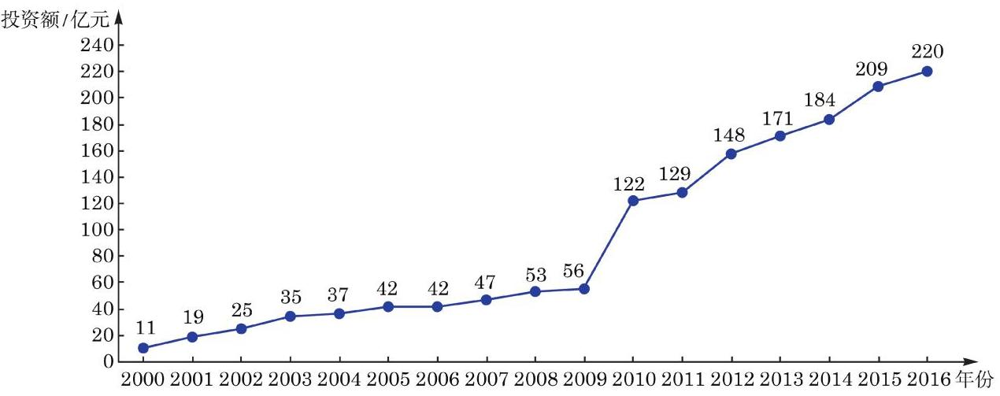

(第 2 题)

为预测该地区 2018 年的环境基础设施投资额,建立了 $y$ 与时间变量 $t$ 的两个线性回归模型. 其中,根据 2000 年至 2016 年的数据 (时间变量 $t$ 的值依次为 $1,2,\cdots ,{17}$ ) 建立了模型①: $y =  - {30.4} + {13.5t}$ ；而根据 2010 年至 2016 年的数据(时间变量 $t$ 的值依次为 $1,2,\cdots ,7)$ 建立了模型②: $y = {99} + {17.5t}$ .

(1)分别利用这两个模型，求该地区 2018 年环境基础设施投资额的预测值；

(2)你认为用哪个模型得到的预测值更可靠？请说明理由.

3. 某地区市场上有 80 种品牌的饼干, 它们近一段时间内的平均售价 (以下简称“价格”)和销售量的数据如下表所示.

<table id="cross-table-2"><tr><td>品牌编号</td><td>价格/(元/千克)</td><td>销售量/千克</td><td>品牌编号</td><td>价格/(元/千克)</td><td>销售量/千克</td></tr><tr><td>1</td><td>14</td><td>1231.85</td><td>12</td><td>19.09</td><td>3566.58</td></tr><tr><td>2</td><td>34.62</td><td>1465.89</td><td>13</td><td>26.67</td><td>4264.28</td></tr><tr><td>3</td><td>30.86</td><td>1774.29</td><td>14</td><td>17.51</td><td>4672.33</td></tr><tr><td>4</td><td>14</td><td>1892.91</td><td>15</td><td>13</td><td>4752.20</td></tr><tr><td>5</td><td>36</td><td>2324.44</td><td>16</td><td>25.24</td><td>4865.42</td></tr><tr><td>6</td><td>28.41</td><td>2480.04</td><td>17</td><td>31.1</td><td>5042.91</td></tr><tr><td>7</td><td>9.09</td><td>2545.33</td><td>18</td><td>26.24</td><td>5108.73</td></tr><tr><td>8</td><td>44.84</td><td>2568.11</td><td>19</td><td>25.88</td><td>5367.70</td></tr><tr><td>9</td><td>31.68</td><td>2638.48</td><td>20</td><td>17.81</td><td>5465.26</td></tr><tr><td>10</td><td>20</td><td>3233.99</td><td>21</td><td>29.56</td><td>5 500.35</td></tr><tr><td>11</td><td>14.67</td><td>3518.17</td><td>22</td><td>25</td><td>5 655.53</td></tr><tr></tr><tr><td>23</td><td>31.41</td><td>5865.45</td><td>52</td><td>16.95</td><td>10101.74</td></tr><tr><td>24</td><td>23.48</td><td>6103.94</td><td>53</td><td>15.38</td><td>10461.08</td></tr><tr><td>25</td><td>23.6</td><td>6 243.10</td><td>54</td><td>13.88</td><td>10 561.53</td></tr><tr><td>26</td><td>22.13</td><td>6509.67</td><td>55</td><td>13.04</td><td>10 960.55</td></tr><tr><td>27</td><td>21.48</td><td>6758.18</td><td>56</td><td>29.33</td><td>11627.43</td></tr><tr><td>28</td><td>25.03</td><td>7100.93</td><td>57</td><td>4.9</td><td>11838.62</td></tr><tr><td>29</td><td>19.55</td><td>7356.44</td><td>58</td><td>11.91</td><td>12 303.55</td></tr><tr><td>30</td><td>24.81</td><td>7439.63</td><td>59</td><td>13.9</td><td>12 713.01</td></tr><tr><td>31</td><td>20.92</td><td>7627.28</td><td>60</td><td>17.78</td><td>12830.94</td></tr><tr><td>32</td><td>17.7</td><td>7740.45</td><td>61</td><td>17.31</td><td>13 686.17</td></tr><tr><td>33</td><td>20.79</td><td>7744.67</td><td>62</td><td>12.27</td><td>14 181.94</td></tr><tr><td>34</td><td>24.63</td><td>7989.30</td><td>63</td><td>11.89</td><td>15175.16</td></tr><tr><td>35</td><td>13.59</td><td>7996.84</td><td>64</td><td>10.08</td><td>17658.74</td></tr><tr><td>36</td><td>19.29</td><td>8151.09</td><td>65</td><td>6.13</td><td>18058.67</td></tr><tr><td>37</td><td>20</td><td>8231.85</td><td>66</td><td>10.4</td><td>19 937.88</td></tr><tr><td>38</td><td>22.03</td><td>8289.18</td><td>67</td><td>12.7</td><td>23055.87</td></tr><tr><td>39</td><td>20.08</td><td>8524.06</td><td>68</td><td>9.19</td><td>26508.14</td></tr><tr><td>40</td><td>19.03</td><td>8689.36</td><td>69</td><td>8</td><td>29504.40</td></tr><tr><td>41</td><td>16.67</td><td>8874.66</td><td>70</td><td>5.22</td><td>31693.07</td></tr><tr><td>42</td><td>16.04</td><td>8888.74</td><td>71</td><td>9.23</td><td>32 123.53</td></tr><tr><td>43</td><td>14.12</td><td>9005.62</td><td>72</td><td>7.6</td><td>34732.28</td></tr><tr><td>44</td><td>13.75</td><td>9046.93</td><td>73</td><td>8.33</td><td>36321.39</td></tr><tr><td>45</td><td>19.87</td><td>9384.98</td><td>74</td><td>9.25</td><td>36898.25</td></tr><tr><td>46</td><td>15.72</td><td>9 414.11</td><td>75</td><td>9.36</td><td>38343.50</td></tr><tr><td>47</td><td>25.04</td><td>9 454.50</td><td>76</td><td>8.42</td><td>39033.51</td></tr><tr><td>48</td><td>14</td><td>9731.32</td><td>77</td><td>6.25</td><td>43832.88</td></tr><tr><td>49</td><td>11.26</td><td>9762.08</td><td>78</td><td>23.01</td><td>112827.40</td></tr><tr><td>50</td><td>11.25</td><td>9809.51</td><td>79</td><td>8.7</td><td>139 493.10</td></tr><tr><td>51</td><td>20.92</td><td>9 924.99</td><td>80</td><td>12.32</td><td>21 134.65</td></tr></table>

试对这 80 种品牌饼干近一段时间内的价格和销售量进行回归分析.

后 记

本套高中数学教材根据教育部颁布的《普通高中数学课程标准(2017 年版 2020 年修订)》编写并经国家教材委员会专家委员会审核通过.

本教材是由设在复旦大学和华东师范大学的两个上海市数学教育教学研究基地(上海高校“立德树人”人文社会科学重点研究基地)联合主持编写的. 编写工作依据高中数学课程标准的具体要求，努力符合教育规律和高中学生的认知规律，结合上海城市发展定位和课程改革基础，并力求充分体现特色. 希望我们的这一努力能经得起实践和时间的检验, 对扎实推进数学的基础教育发挥积极的作用.

本册教材是选择性必修第二册, 共为四章, 各章编写人员分别为

程靖(第 5 章)

肖恩利、姚一隽(第 6 章)

应坚刚、田万国(第 7 章)

任升录、陈月兰、汪家录(第 8 章)

上海市中小学(幼儿园)课程改革委员会专家工作委员会、上海市教育委员会教学研究室全程组织、指导和协调了教材编写工作. 在编写过程中，两个基地所在单位给予了大力支持，基地的全体同志积极参与相关的调研、讨论及评阅工作，发挥了重要的作用. 上海市不少中学也热情地参与了有关的调研及讨论工作. 有限公司不但是编辑出版单位, 而且自始至终全面介入了编写工作. 我们对所有这些单位和相关人员的参与、支持和鼓励表示衷心感谢.

限于编写者的水平, 也由于新编教材尚缺乏教学实践的检验, 不妥及疏漏之处在所难免，恳请广大师生及读者不吝赐教. 宝贵意见请通过邮箱 gaozhongshuxue@seph.com.cn 反馈, 不胜感激.

2020 年 7 月
