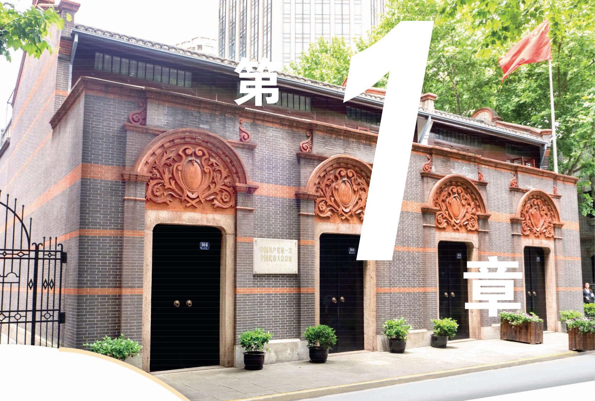
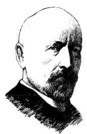
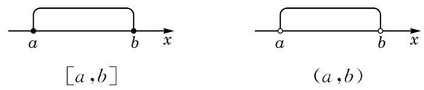
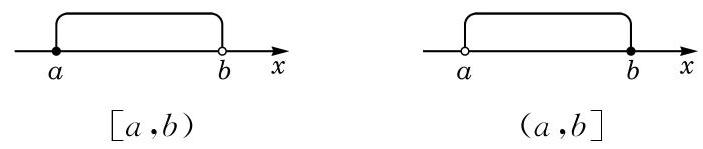
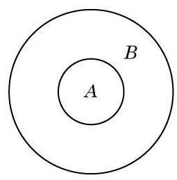
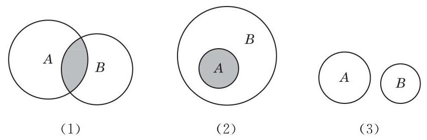
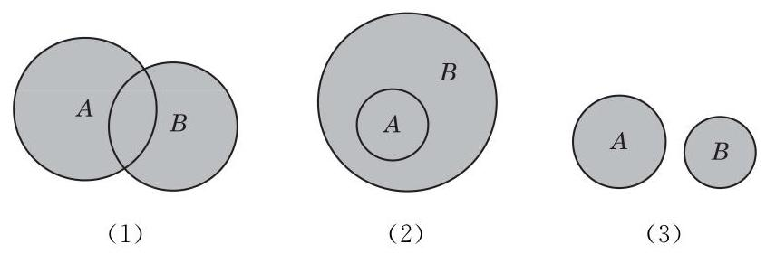
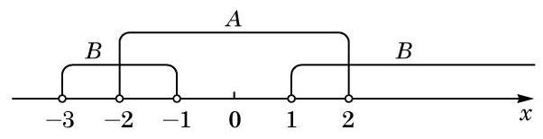
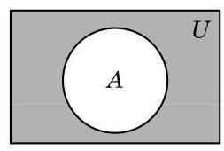

集合与逻辑

数学语言十分精确, 不容易产生歧义. 集合是现代数学语言的重要组成部分. 使用集合的语言, 可以准确、简洁地表示所要研究的对象, 更好地描述所研究的对象之间的关系.

数学作为很多其他学科的基础和工具, 其内涵及语言都是按照逻辑的方式来组织的. 根据正确的前提, 按照严格的逻辑推理, 总是能够得到正确的结论.

在数学语言的表达方面，有一些公认的特殊约定，努力学习并遵循这些约定，能够更好地在数学领域里与他人开展交流, 对进一步的学习和研究都非常有益.

### 1.1 集合初步

## 1 集合

康托(G. Cantor, 1845- 1918), 德国数学家, 集合论创始人.

我们经常需要把满足一定要求或具有一定特征的对象放在一起或归为一类. 例如:

(1)申辉中学高一(1)班的全体学生；

(2)所有不大于 100 的自然数；

(3)直线 $l$ 上的所有点；

(4)不等式 ${2x} + 1 \leq  0$ 的所有解;

(5)太阳系的所有行星.

概括地说, 把一些确定的对象的全体叫做集合 (set), 简称集. 集合通常用大写字母 $A\text{ 、 }B\text{ 、 }C\cdots \cdots$ 表示.

集合所含的各个对象叫做该集合的元素 (element). 元素通常用小写字母 $a\text{ 、 }b\text{ 、 }c\cdots \cdots$ 表示.

如果 $a$ 是集合 $A$ 的元素，就记作 $a \in  A$ ，读作“ $a$ 属于 $A$ ”； 如果 $a$ 不是集合 $A$ 的元素，就记作 $a \notin  A$ ，读作“ $a$ 不属于 $A$ ”. 例如,若 $A$ 是由数 $1\text{ 、 }3\text{ 、 }5\text{ 、 }7\text{ 、 }9$ 组成的集合,则 $1 \in  A,2 \notin  A$ .

集合的元素是确定的. 也就是说, 给定一个集合, 一个对象在不在这个集合中就确定了. 例如, “我国的直辖市”组成一个集合, 北京、上海、天津、重庆在这个集合中, 而杭州、南京、深圳等城市不在这个集合中.

一些不确定的对象不能组成一个集合. 例如, “我们班里高个子的同学”不能组成一个集合. 因为“高个子”的标准不够明确、 具体, 所以 “我们班里高个子的同学” 是不确定的.

一个给定集合中的各个元素是互不相同的, 即一个元素在同一个集合中是不能重复出现的.

如果两个集合 $A$ 与 $B$ 的组成元素完全相同,就称这两个集合相等,记作 $A = B$ .

元素个数有限的集合称为有限集, 否则就称为无限集.

例 1 判断下列集合是有限集还是无限集, 并说明理由:

(1)6 的正整数倍的全体组成的集合;

(2)600 的正约数的全体组成的集合;

(3)2019 年在上海出生的所有人组成的集合;

(4)给定的一条长度为 1 的线段上的所有点组成的集合.

解(1)6 的正整数倍可表示为 ${6n}$ ，其中 $n$ 是正整数. 因为正整数有无限个, 所以 6 的正整数倍的全体组成的集合是一个无限集.

(2)600 的正约数一定是小于或等于 600 的正整数，其个数不超过 600 . 所以 600 的正约数的全体组成的集合是一个有限集.

(3)虽然 2019 年出生在上海的人比较多，但总数还是有限的. 所以 2019 年在上海出生的所有人组成的集合是一个有限集.

(4)因为该线段的二等分点、三等分点、四等分点……都是该集合中的元素，所以一条给定的长度为 1 的线段上的所有点组成的集合是一个无限集.

数学中, 常常需要用到数的集合. 数的集合简称数集. 常用的数集可用以下特定的符号来表示，见表 1-1.

表 1-1 常用数集的符号

<table><tr><td>数集</td><td>符号</td></tr><tr><td>自然数集</td><td>N</td></tr><tr><td>整数集</td><td>Z</td></tr><tr><td>有理数集</td><td>Q</td></tr><tr><td>实数集</td><td>R</td></tr></table>

例 2 用符号“ $\in$ ”或“ $\notin$ ”填空:

(1)0___N； (2)1___Z；

(3) $\sqrt{2}$ ___Q； (4) $- \sqrt{\pi }$ ___R.

解 (1) $0 \in  \mathbf{N}$ . (2) $1 \in  \mathbf{Z}$ . (3) $\sqrt{2} \notin  \mathbf{Q}$ . (4) $- \sqrt{\pi } \in  \mathbf{R}$ .

不含有任何元素的集合称为空集，记作 $\varnothing$ . 引进空集是有必要的. 例如,方程 ${x}^{2} + 1 = 0$ 没有实数解,我们就说它的实数解组成的集合是空集. 又如, 当两条直线平行时, 它们没有公共点, 就可说这两条直线的公共点组成的集合是空集. 在以后学习交集时, 我们还将进一步体会到引入空集的必要性.

## 练习 1.1(1)

1. 判断下列各组对象能否组成集合. 若能组成集合，指出是有限集还是无限集；若不能组成集合, 请说明理由.

(1)上海市现有各区的名称；

(2)未位是 3 的自然数；

(3)比较大的苹果.

2. 用符号“ $\in$ ”或“ $\notin$ ”填空:

(1) $\frac{1}{2}$ ___ $\mathbf{N}$ ； (2)5___ $\mathbf{Z}$ ；

(3)-2___Q； (4)π___R.

## 2 集合的表示方法

除了用自然语言描述集合，我们还有一些其他方法用来表示集合.

将集合中的元素不重复地一一列举出来并写在大括号内, 这种表示集合的方法叫做列举法. 例如,方程 ${x}^{2} - {3x} + 2 = 0$ 的所有解组成的集合可以表示为 $\{ 1,2\}$ ,也可以表示为 $\{ 2,1\}$ . 这是因为在讨论集合时, 不考虑其元素的顺序.

例 3 用列举法表示下列集合:

(1)所有不大于 10 的正整数组成的集合;

(2)方程 $\left( {x - 1}\right) \left( {x - 2}\right) \left( {x - 3}\right) \left( {x - 4}\right)  = 0$ 的所有解组成的集合;

(3)集合 $\{ 1,2,3,4\}$ 中任意两个不同元素之和组成的集合.

解(1)所有不大于 10 的正整数组成的集合是 $\{ 1,2,3,4,5$ , $6,7,8,9,{10}\}$ .

(2)该方程的所有解组成的集合是 $\{ 1,2,3,4\}$ .

(3)该集合中任意两个不同元素之和组成的集合是 $\{ 3,4,5,6,7\}$ .

能用列举法表示的集合一般是有限集, 但对于一些有规律的无限集, 在不会引起歧义的前提下, 也可用列举法表示. 例如, 全体正偶数组成的集合可以表示为 $\{ 2,4,6,\cdots ,{2n},\cdots \}$ .

集合还有另外一种表示方法.

在大括号内先写出这个集合中元素的一个记号, 再画一条竖线, 并在竖线的右边写上集合中所有元素具有的共同特征, 即

Q

$$
A = \{ x \mid  x\text{ 满足性质 }p\} \text{ . }
$$

---

“集合中所有元素具有的共同特征”是指:

(1)在该集合中的元素都具有这个特征;

(2)不在该集合中的元素不具有这个特征.

---

这种表示集合的方法叫做描述法. 例如,方程 ${x}^{2} - {3x} + 2 = 0$ 的所有解组成的集合可以表示为 $\left\{  {x \mid  {x}^{2} - {3x} + 2 = 0}\right\}$ . 又如,函数 $y = x$ 图像上的所有点组成的集合可以表示为 $\{ \left( {x, y}\right)  \mid  y = x\}$ .

例 4 选择适当的方法表示下列集合:

(1)大于 0 且小于 10 的全体偶数组成的集合 $A$ ；

(2)被 3 除余 2 的所有自然数组成的集合 $B$ ；

(3)直角坐标平面上由第二象限与第四象限中的所有点组成的集合 $C$ .

解 (1) 用列举法: $A = \{ 2,4,6,8\}$ .

(2)用描述法: $B = \{ n \mid  n = {3k} + 2, k \in  \mathbf{N}\}$ .

(3)因为第二象限中所有点 $\left( {x, y}\right)$ 具有的特征是 $x < 0$ 且 $y > 0$ ,而第四象限中所有点具有的特征是 $x > 0$ 且 $y < 0$ ,所以第二象限与第四象限中所有点具有的特征可统一地写为 ${xy} < 0$ ,于是可用描述法表示该集合:

$$
C = \{ \left( {x, y}\right)  \mid  {xy} < 0\} .
$$

数学中, 常常需要表示满足一些不等式的全体实数所组成的集合. 为了方便起见, 我们引入区间 (interval) 的概念.

当 $a\text{ 、 }b \in  \mathbf{R}$ 且 $a < b$ 时,规定:

满足不等式 $a \leq  x \leq  b$ 的全体实数 $x$ 组成的集合称为一个闭区间,记作 $\left\lbrack  {a, b}\right\rbrack$ .

满足不等式 $a < x < b$ 的全体实数 $x$ 组成的集合称为一个开区间,记作 $\left( {a, b}\right)$ .

闭区间与开区间在数轴上的表示,如图 1-1-1 所示.

图 1-1-1

满足不等式 $a \leq  x < b$ 或 $a < x \leq  b$ 的全体实数 $x$ 所组成的集合称为一个半开半闭区间,分别记作 $\left\lbrack  {a, b)\text{ 或 }(a, b}\right\rbrack$ .

半开半闭区间在数轴上的表示, 如图 1-1-2 所示.

图 1-1-2

这里的实数 $a\text{ 、 }b$ 统称为这些区间的端点.

此外,满足不等式 $x \geq  a, x > a, x \leq  b$ 或 $x < b$ 的全体实数 $x$ 所组成的集合可分别用区间表示为 $\lbrack a, + \infty ),\left( {a, + \infty }\right)$ , $( - \infty , b\rbrack$ 或 $\left( {-\infty , b}\right)$ .

实数集 $\mathbf{R}$ 可用区间表示为 $\left( {-\infty , + \infty }\right)$ .

---

符号“ $\infty$ ” 读作“无穷大”.

---

? 例 5 用区间表示下列集合:

---

结合例题, 试比较分别用自然语言、 列举法、描述法和区间表示集合时, 其各自的特点和适用对象.

---

(1) $\{ x \mid  1 \leq  x < 2\}$ ；

(2)不等式 ${2x} \leq  6$ 的所有解组成的集合.

解 (1) 该集合可用区间 $\lbrack 1,2)$ 表示.

(2)因为不等式 ${2x} \leq  6$ 的解是 $x \leq  3$ ，所以它的所有解组成的集合是 $( - \infty ,3\rbrack$ .

## 练习 1.1(2)

1. 用列举法表示下列集合:

(1)能整除 10 的所有正整数组成的集合;

(2)绝对值小于 4 的所有整数组成的集合.

2. 用描述法表示下列集合:

(1)全体偶数组成的集合;

(2)平面直角坐标系中 $x$ 轴上所有点组成的集合.

3. 用区间表示下列集合:

(1) $\{ x \mid   - 1 < x \leq  5\}$ ；

(2)不等式 $- {2x} > 6$ 的所有解组成的集合.

## 3 集合之间的关系

考察以下四组集合:

(1)C 是申辉中学高一(1)班的全体学生组成的集合，D 是申辉中学全体学生组成的集合;

(2)C是一平面上所有矩形组成的集合，D 是该平面上所有平行四边形组成的集合;

(3) $C = \{ 2,3\} , D = \left\{  {x \mid  {x}^{2} - {5x} + 6 = 0}\right\}$ ；

(4) $C = \{ x \mid  x = {2k} + 1, k \in  \mathbf{Z}\} , D = \{ x \mid  x$ 是奇数 $\}$ .

容易发现,在上述每组集合中,集合 $C$ 中的每个元素都属于集合 $D$ . 两个集合之间的这种关系是十分常见的.

定义 对于两个集合 $A$ 与 $B$ ,如果集合 $A$ 的每个元素都是集合 $B$ 的元素,那么集合 $A$ 叫做集合 $B$ 的子集 (subset),记作 $A \subseteq  B$ (或 $B \supseteq  A$ ),读作“ $A$ 包含于 $B$ ”(或“ $B$ 包含 $A$ ”).

对任何集合 $A$ ,规定

$$
\varnothing  \subseteq  A\text{ . }
$$

图 1-1-3

我们常用文氏图 (Venn diagram) 来直观表示集合以及集合之间的关系. 图 1-1-3 是 $A \subseteq  B$ 的文氏图.

上述四组集合中的每组都有 $C \subseteq  D$ . 但是,第 (1)(2)组与第 (3)(4)组是有区别的. 在第(1)(2)组中，集合 $D$ 中有些元素不属于集合 $C$ ,即 $D$ 不是 $C$ 的子集; 而在第(3)(4)组中,集合 $D$ 中的每个元素都属于集合 $C$ ,即 $D \subseteq  C$ .

对于集合之间的包含关系, 我们有下列结论:

(1) $A \subseteq  A$ ；

(2)若 $A \subseteq  B$ 且 $B \subseteq  A$ ，则 $A = B$ ；

---

集合关系中的“若 $A \subseteq  B$ 且 $B \subseteq  A$ ,则 $A \; = B$ ”与实数大小关系中“若 $a \leq  b$ 且 $b \leq  a$ , 则 $a = b$ ” 类似.

---

(3)传递性:若 $A \subseteq  B$ 且 $B \subseteq  C$ ，则 $A \subseteq  C$ .

由此,对第 (3)(4) 组集合, $C = D$ 成立; 而对第 (1)(2) 组集合, $C = D$ 不成立. 为此,我们引入真子集的概念.

定义 对于两个集合 $A$ 与 $B$ ,如果 $A \subseteq  B$ ,且 $B$ 中至少有一个元素不属于 $A$ (即 $B$ 不是 $A$ 的子集),那么称集合 $A$ 是集合 $B$ 的真子集 (proper subset),记作 $A \subset  B$ (或 $B \supset  A$ ),读作“ $A$ 真包含于 $B$ ”(或“ $B$ 真包含 $A$ ”).

对第(1)(2)组集合， $C \subset  D$ 成立.

对于常用的数集，我们有如下的包含关系:

$$
\mathrm{N} \subset  \mathbf{Z} \subset  \mathrm{Q} \subset  \mathbf{R}.
$$

例 6 确定 $x$ 与 $y$ ,使得集合 $\{ {2x}, x + y\}  = \{ 4,8\}$ .

解 由集合相等的定义，可知

$$
\left\{  {\begin{array}{l} {2x} = 4, \\  x + y = 8 \end{array}\text{ 或 }\left\{  \begin{array}{l} {2x} = 8, \\  x + y = 4. \end{array}\right. }\right.
$$

---

此处为什么有两种情况?

---

分别解得 $\left\{  \begin{array}{l} x = 2, \\  y = 6 \end{array}\right.$ 或 $\left\{  \begin{array}{l} x = 4, \\  y = 0. \end{array}\right.$

例 7 确定下列每组中两个集合之间的关系:

(1) $A = \{ n \mid  n$ 是 12 的正约数 $\} , B = \{ 1,2,3,6\}$ ;

(2) $C = \{ n \mid  n = {3k} + 1, k \in  \mathbf{N}\} , D = \{ n \mid  n = {3m} - 2, m \in  \mathbf{N}\}$ .

解(1)因为 $A = \{ 1,2,3,4,6,{12}\}$ ，所以 $B \subset  A$ .

(2)因为当 $k \in  \mathbf{N}$ 时， $C$ 中的元素 $n = {{3k} + 1} = 3\left( {k + 1}\right)  - 2$ 必定属于 $D$ ,所以 $C \subseteq  D$ .

又因为 $- 2 \in  D$ ,而 $- 2 \notin  C$ ,所以 $C \subset  D$ .

例 8 写出集合 $\{ a, b, c\}$ 的所有子集,并指出哪些是真子集.

解 可以按照子集的元素个数分类:

不含任何元素的子集 1 个:空集 $\mathcal{A}$ ；

含 1 个元素的子集 3 个: $\{ a\} ,\{ b\} ,\{ c\}$ ；

含 2 个元素的子集 3 个: $\{ a, b\} ,\{ a, c\} ,\{ b, c\}$ ；

含 3 个元素的子集 1 个: $\{ a, b, c\}$ .

除集合 $\{ a, b, c\}$ 本身外,其余 7 个都是真子集.

## 练习 1.1(3)

1. 判断下列说法是否正确, 并简要说明理由:

(1)若 $a \in  A$ 且 $A \subseteq  B$ ，则 $a \in  B$ ；

(2)若 $A \subseteq  B$ 且 $A \subseteq  C$ ，则 $B = C$ ；

(3)若 $A \subset  B$ 且 $B \subseteq  C$ ，则 $A \subset  C$ .

2. 用符号“ $\neg$ ”“=”或“⊂”填空:

(1) $\{ a\}$ ___ $\{ a, b, c\}$ ；

(2) $\{ a, b, c\}$ ___ $\{ a, c\}$ ；

(3) $\{ 1,2\}$ ___ $\{ x \mid  {x}^{2} - {3x} + 2 = 0\}$ .

3. 写出所有满足 $\{ a\}  \subset  M \subset  \{ a, b, c, d\}$ 的集合 $M$ .

## 4 集合的运算

先看一个校园生活的例子. 申辉中学高一年级的学生报名参加数学建模社与理学社. 这样, 除该校高一年级的全体学生组成的集合 $U$ 外,还有参加数学建模社的学生组成的集合 $A$ ,参加理学社的学生组成的集合 $B$ ,两个社都参加的学生组成的集合 $C$ ,两个社中至少参加一个的学生组成的集合 $D$ ,还有未参加数学建模社的学生组成的集合 $E$ ,等等.

可以看到,集合 $A\text{ 、 }B\text{ 、 }C\text{ 、 }D\text{ 、 }E$ 等都是集合 $U$ 的子集, 集合 $C$ 是由集合 $A$ 与 $B$ 的公共元素组成的,集合 $D$ 是由集合 $A$ 与 $B$ 的所有元素组成的,集合 $E$ 是由集合 $U$ 中去掉 $A$ 中的元素后剩下的元素组成的. ?

---

当集合 $U\text{ 、 }A\text{ 、 }B$ 确定时, 如何确定集合 $C\text{ 、 }D\text{ 、 }E$ 呢?

---

本节我们要从已知的集合出发，通过“交”“并”“补”的运算得到新的集合.

首先, 我们可以对任意两个集合取公共元素, 从而得到一个新的集合.

定义 由既属于集合 $A$ 又属于集合 $B$ 的所有元素组成的集合,叫做集合 $A$ 与 $B$ 的交集(intersection),记作 $A \cap  B$ (读作“ $A$ 交 $B$ ”),即

$$
A \cap  B = \{ x \mid  x \in  A\text{ 且 }x \in  B\} .
$$

可以用文氏图直观地反映 $A \cap  B$ 的几种不同情况,如图 1-1-4 所示.

图 1-1-4

图 1-1-4(1)表示集合 $A$ 与 $B$ 既有公共元素又都有非公共元素的情况,此时阴影部分 $A \cap  B$ 既是 $A$ 的真子集又是 $B$ 的真子集; 图 1-1-4(2) 表示集合 $A$ 是 $B$ 的子集的情况,此时 $A \cap  B = A$ ; 图 1-1-4(3)表示集合 $A$ 与 $B$ 没有公共元素的情况, 此时 $A \cap  B = \varnothing$ .

例 9 已知集合

$$
A = \{ \left( {x, y}\right)  \mid  {2x} + y = 5\} , B = \{ \left( {x, y}\right)  \mid  {3x} + {2y} = 8\} .
$$

求 $A \cap  B$ .

解 由题意, $\left( {x, y}\right)  \in  A \cap  B$ 表示 $\left( {x, y}\right)$ 既属于 $A$ 又属于 $B$ ,即 $\left( {x, y}\right)$ 是方程组

$$
\left\{  \begin{array}{l} {2x} + y = 5 \\  {3x} + {2y} = 8 \end{array}\right.
$$

的解,所以 $x = 2, y = 1$ . 于是, $A \cap  B = \{ \left( {2,1}\right) \}$ .

其次, 我们可以把两个已知集合的所有元素放在一起组成一个新的集合.

定义 由所有属于集合 $A$ 或属于集合 $B$ 的元素所组成的集合,叫做集合 $A$ 与 $B$ 的并集 (union),记作 $A \cup  B$ (读作“ $A$ 并 B”), 即

$$
A \cup  B = \{ x \mid  x \in  A\text{ 或 }x \in  B\} .
$$

可以用文氏图直观地反映 $A \cup  B$ 的几种不同情况,如图 1-1-5所示,其中阴影部分表示 $A \cup  B$ .

图 1-1-5

---

对照图 1-1-4 的三种情况，请各举一实例.

例 9 中, $A \cap  B$ 表示二元一次方程组的所有解组成的集合. 它可以理解为两个一次函数 $y =  - {2x} + 5$ 与 $y =  - \frac{3}{2}x + 4$ 的图像的交点组成的集合.

对照图 1-1-5 的三种情况, 请各举一实例.

---

图 1-1-5(1)表示集合 $A$ 与 $B$ 既有公共元素又都有非公共元素的情况,此时 $A$ 和 $B$ 都是 $A \cup  B$ 的真子集; 图 1-1-5(2)表示集合 $A$ 是 $B$ 的子集的情况,此时 $A \cup  B = B$ ; 图 1-1-5(3)表示集合 $A$ 与 $B$ 没有公共元素的情况.

例 10 已知集合

$$
A = \left( {-2,2}\right) , B = \left( {-3, - 1}\right)  \cup  \left( {1, + \infty }\right) .
$$

求 $A \cap  B$ 及 $A \cup  B$ .

解 在数轴上标出集合 $A$ 与 $B$ ,如图 1-1-6 所示.

图 1-1-6

于是 $A \cap  B = \left( {-2, - 1}\right)  \cup  \left( {1,2}\right) , A \cup  B = \left( {-3, + \infty }\right)$ .

例 11 已知集合 $A = \{ 1,2\}$ ，求所有满足 $A \cup  B = \{ 1,2,3\}$ 的集合 $B$ .

解 因为 $B \subseteq  A \cup  B = \{ 1,2,3\}$ ,所以 $B$ 的元素只能在 1、2、3 中取. 为了使得 $A \cup  B$ 中有 3,3 必须是 $B$ 的一个元素. 至于 1、2 是否为 $B$ 的元素，不会影响 $A \cup  B$ 的结果.

因此，满足条件的集合 $B$ 一共有 4 个: $\{ 3\} ,\{ 1,3\}$ ， $\{ 2,3\} ,\{ 1,2,3\}$ .

最后, 我们介绍全集与补集.

在数学研究中, 所研究的对象往往是某个确定集合的一个子集或元素. 例如, 求方程的实数解时, 所有解组成的集合一定是实数集 $\mathbf{R}$ 的一个子集; 求三角形的内角的大小时,如果以度 $\left( {}^{ \circ  }\right)$ 为单位, 那么角的度数一定是开区间 $\left( {0,{180}}\right)$ 中的一个元素; 等等. 这个确定的集合称为全集 (universal set),常用符号 $U$ 表示. 它含有我们所要研究问题的全部可能的元素.

定义 设 $U$ 为全集, $A$ 是 $U$ 的子集. 由 $U$ 中所有不属于 $A$ 的元素组成的集合称为集合 $A$ 在全集 $U$ 中的补集 (complementary set),记作 $\bar{A}$ (读作“ $A$ 补”),即

$$
\bar{A} = \{ x \mid  x \in  U\text{ 且 }x \notin  A\} .
$$

有时为了强调全集 $U$ ,集合 $A$ 在全集 $U$ 中的补集 $\bar{A}$ 也可以记作 ${\complement }_{U}A$ .

当全集为实数集 $\mathbf{R}$ 时,有理数集 $\mathbf{Q}$ 的补集 $\overline{\mathbf{Q}}$ 就是全体无理数组成的集合.

图 1-1-7

可以用文氏图直观地反映 $\bar{A}$ ，如图 1-1-7，其中阴影部分表示集合 $A$ 在全集 $U$ 中的补集 $\bar{A}$ .

例 12 设全集 $U = \{ a, b, c, d, e\}$ ,集合 $A = \{ a, b, c\}$ , 集合 $B = \{ c, d\}$ . 分别求: $\overline{A \cup  B},\bar{A} \cap  \bar{B},\overline{A \cap  B}$ 及 $\bar{A} \cup  \bar{B}$ .

解 由条件, 可得

$$
A \cup  B = \{ a, b, c, d\} ,\bar{A} = \{ d, e\} ,\bar{B} = \{ a, b, e\} .
$$

所以

$$
\overline{A \cup  B} = \{ e\} ,\bar{A} \cap  \bar{B} = \{ e\} .
$$

而 $A \cap  B = \{ c\}$ ,所以

$$
\overline{A \cap  B} = \{ a, b, d, e\} ,\overline{A} \cup  \overline{B} = \{ a, b, d, e\} .
$$

## 练习 1.1(4)

1. 设 $A$ 为全集 $U$ 的任一子集,则

(1) $\overline{\overline{A}} =$ ___；( $\overline{\overline{A}}$ 表示 $A$ 的补集 $\overline{A}$ 的补集)

(2) $A \cap  \overline{A} =$ ___；

(3) $A \cup  \bar{A} =$ ___.

2. 已知全集为 $\mathbf{R}$ ,集合 $A = \{ x \mid   - 2 < x \leq  1\}$ . 求 $\bar{A}$ .

3. 已知集合 $A = \{ 1,2,3,4,5\} , B = \{ 2,4,6,8\} , C = \{ 3,4,5,6\}$ . 求:

(1) $\left( {A \cap  B}\right)  \cup  C,\left( {A \cup  C}\right)  \cap  \left( {B \cup  C}\right)$ ；

(2) $\left( {A \cup  B}\right)  \cap  C,\left( {A \cap  C}\right)  \cup  \left( {B \cap  C}\right)$ .

## 习题 1.1

## A 组

1. 用列举法表示下列集合:

(1)10 以内的所有素数组成的集合;

(2) $\left\{  {y\left| {\;y = x - 1}\right. ,0 \leq  x \leq  3, x \in  \mathbf{Z}}\right\}$ .

2. 用描述法表示下列集合:

(1)被 3 除余 1 的所有自然数组成的集合;

(2)比 1 大又比 10 小的所有实数组成的集合;

(3)平面直角坐标系中坐标轴上所有点组成的集合.

3. 集合 $\{ \left( {x, y}\right)  \mid  {xy} > 0, x\text{ 、 }y$ 为实数 $\}$ 是指 ( )

A. 第一象限内的所有点组成的集合;

B. 第三象限内的所有点组成的集合;

C. 第一象限和第三象限内的所有点组成的集合;

D. 不在第二象限也不在第四象限内的所有点组成的集合.

4. 用符号“ $\subset$ ”“=”或“ $\supset$ ”连接集合 $A$ 与 $B$ :

(1) $A = \left\{  {x \mid  {x}^{2} - {2x} + 1 = 0}\right\}  , B = \left\{  {x \mid  {x}^{2} - 1 = 0}\right\}$ ;

(2) $A = \{ 1,2,4,8\} , B = \{ x \mid  x$ 是 8 的正约数 $\}$ .

5. 已知集合 $A = \{ 1\} , B = \left\{  {x \mid  {x}^{2} - {3x} + a = 0}\right\}$ . 是否存在实数 $a$ ,使得 $A \subset  B$ ? 若存在,求 $a$ 的值; 若不存在,说明理由.

6. 已知集合 $A = \{ x, y\} , B = \left\{  {{2x},2{x}^{2}}\right\}$ ,且 $A = B$ . 求集合 $A$ .

7. 已知集合 $A = \{ x \mid  x \leq  7\} , B = \{ x \mid  x < 2\} , C = \{ x \mid  x > 5\}$ . 求: $A \cap  B, A \cap  C$ , $A \cap  \left( {B \cap  C}\right)$ .

8. 已知集合 $A = \{ \left( {x, y}\right)  \mid  y =  - x + 1\} , B = \left\{  {\left( {x, y}\right)  \mid  y = {x}^{2} - 1}\right\}$ . 求 $A \cap  B$ .

9. 已知全集 $U = \mathbf{R}$ ，集合 $A = \{ x \mid  4 - x > {2x} + 1\}$ . 求 $\bar{A}$ .

## B 组

1. 已知集合 $A = \left\{  {2,{\left( a + 1\right) }^{2},{a}^{2} + {3a} + 3}\right\}$ ,且 $1 \in  A$ . 求实数 $a$ 的值.

2. 已知集合 $A = \{ x \mid  x = {2n} + 1, n \in  \mathbf{Z}\} , B = \{ x \mid  x = {4n} - 1, n \in  \mathbf{Z}\}$ . 判断集合 $A$ 与 $B$ 的包含关系,并证明你的结论.

3. 设 $a$ 是实数,集合 $M = \left\{  {x \mid  {x}^{2} + x - 6 = 0}\right\}  , N = \{ y \mid  {ay} + 2 = 0\}$ . 是否存在 $a$ ,使得 $N \subset  M$ ? 若存在,求这些 $a$ 的值; 若不存在,说明理由.

4. 已知集合 $A = \{ 1,4, x\} , B = \left\{  {1,{x}^{2}}\right\}$ ，且 $A \cup  B = A$ . 求 $x$ 的值及集合 $A$ 、 $B$ .

### 1.2 常用逻辑用语

1 命题

在初中时已经知道, 用自然语言、符号或式子表达, 且可以判断其真假的语句叫做命题(proposition). 命题通常用陈述句表述. 其含义判断为真的命题叫做真命题，判断为假的命题叫做假命题. 例如, “ 4 能被 2 整除”是真命题， “ 3 能被 2 整除”是假命题.

例 1 下列语句哪些是命题？如果是命题，那么它们是真命题还是假命题? 为什么?

(1)个位数字是 5 的自然数能被 5 整除；

(2)凡直角三角形都相似;

(3)请起立；

(4)若两个角互为补角，则这两个角不相等；

(5)若两个三角形的三组对应边相等，则这两个三角形全等;

(6)你是高一学生吗？

(7) $x > 3$ .

解 语句(3)(6)(7)不是命题；语句(1)(2)(4)(5)是命题，其中语句(1)(5)是真命题，语句(2)(4)是假命题.

(1)这是一个真命题. 因为个位数字是 5 的自然数可写成 ${10k} + 5$ 的形式 $\left( {k \in  \mathbf{N}}\right)$ ,而 ${10k} + 5 = 5\left( {{2k} + 1}\right)$ ,它总能被 5 整除, 所以个位数字是 5 的自然数能被 5 整除.

(2)因为三个角分别为 ${90}^{ \circ  }$ 、 ${45}^{ \circ  }$ 、 ${45}^{ \circ  }$ 的直角三角形与三个角分别为 ${90}^{ \circ  }$ 、 ${60}^{ \circ  }$ 、 ${30}^{ \circ  }$ 的直角三角形是不相似的，所以“凡直角三角形都相似”是一个假命题.

(3)“请起立”无法判定真假，它不是一个命题.

(4)取一个角为 ${90}^{ \circ  }$ ，另一个角也为 ${90}^{ \circ  }$ ，它们是互补的，同时它们也是相等的，所以“若两个角互为补角，则这两个角不相等”是一个假命题.

(5)这是一个真命题，它是两个三角形全等的一个判定定理.

(6)因为“你是高一学生吗？”不是陈述句，无法判断其真假， 所以它不是命题.

(7)虽然“ $x > 3$ ”是陈述句，但是它包含一个可变的对象 $x$ ， 无法判断其真假,因此它不是命题. 当 $x$ 被赋予不同的值时,它就成为不同的命题. 例如,当 $x = 4$ 时,“ $x > 3$ ”是真命题; 当 $x = 1$ 时,“ $x > 3$ ”是假命题.

Q

例 1 中命题(4)与(5)具有“若 $\alpha$ ，则 $\beta$ ”的形式. 在保持含义不变的前提下，例 1 中命题(1)与(2)也可改写为这种形式:

若一个自然数的个位数字是 5 ，则这个自然数能被 5 整除；

若两个三角形都是直角三角形, 则它们相似.

在形如

“若 $\alpha$ ,则 $\beta$ ”

的命题中，陈述句 $\alpha$ 称为条件， $\beta$ 称为结论.

命题“若 $\alpha$ ,则 $\beta$ ”是真命题,是指所有满足条件 $\alpha$ 的对象都满足结论 $\beta$ . 用集合的语言描述即

$\{ x \mid  x$ 满足 $\alpha \}  \subseteq  \{ x \mid  x$ 满足 $\beta \}$ .

所以, 要确定这类命题是真命题, 就必须给出其证明, 如例 1 中的(1)与(5).

命题“若 $\alpha$ ，则 $\beta$ ”是假命题，是指存在满足条件 $\alpha$ 的对象， 它不满足结论 $\beta$ . 所以,要确定这类命题是假命题,可用处理例 1 中( 2 )与( 4 )的方法，举一个满足条件 $\alpha$ 而不满足结论 $\beta$ 的例子就可以了.

定义 如果命题“若 $\alpha$ ,则 $\beta$ ”是真命题,那么就称 $\alpha$ 推出 $\beta$ , 记作 $\alpha  \Rightarrow  \beta$ (或 $\beta  \Leftarrow  \alpha$ ).

因为子集关系满足传递性, 所以推出关系也满足传递性:

若 $\alpha  \Rightarrow  \beta$ 且 $\beta  \Rightarrow  \gamma$ ,则 $\alpha  \Rightarrow  \gamma$ .

它是逻辑推理的基础.

例 2 将下列命题改写成“若 $\alpha$ ，则 $\beta$ ”的形式，并判断 “ $\alpha  \Rightarrow  \beta$ ”是否成立.

(1)等腰三角形的两底角相等;

(2)凡是素数都是奇数；

(3)对顶角相等.

解(1)若一个三角形是等腰三角形，则它的两个底角相等. 这是一个真命题. 所以,“ $\alpha  \Rightarrow  \beta$ ”成立.

---

“若 $\alpha$ ,则 $\beta$ ”形式的命题也可写为“如果 $\alpha$ ,那么 $\beta$ ”的形式.

这种方法在数学上称为举反例.

---

(2)若 $n$ 是素数，则 $n$ 是奇数. 这是一个假命题，因为 2 是素数,但它是偶数. 所以,“ $\alpha  \Rightarrow  \beta$ ”不成立.

(3)若两个角是对顶角，则这两个角相等. 这是一个真命题. 所以，“ $\alpha  \Rightarrow  \beta$ ”成立.

## 练习 1.2(1)

1. 举几个生活中的命题的例子, 并判断其真假.

2. 判断下列命题的真假, 并说明理由:

(1)所有偶数都不是素数；

(2) $\left\{  1\right\}$ 是 $\{ 0,1,2\}$ 的真子集；

(3)0是 $\{ 0,1,2\}$ 的真子集；

(4)如果集合 $A$ 是集合 $B$ 的子集，那么 $B$ 不是 $A$ 的子集.

3. 用“ $\Rightarrow$ ”表示下列陈述句 $\alpha$ 与 $\beta$ 之间的推出关系:

(1) $\alpha  : {\bigtriangleup {ABC}}$ 是等边三角形， $\beta$ : ${\bigtriangleup {ABC}}$ 是轴对称图形；

(2) $\alpha  : {x}^{2} = 4,\beta  : x = 2$ .

## 2 充分条件与必要条件

先看一个例子:我们要培养的是德智体美劳全面发展的社会主义建设者和接班人. 显然, 对于这样“全面发展”的学生来说, 其学习成绩一定是好的; 反过来, 学习成绩好的学生不一定是 “全面发展”的，因为可能其他方面不是很好. 也就是说，“学习成绩好” 对于“全面发展”是不可缺少的, 但只有“学习成绩好”还不够.

定义 对于两个陈述句 $\alpha$ 与 $\beta$ ,如果 $\alpha  \Rightarrow  \beta$ ,就称 $\alpha$ 是 $\beta$ 的充分条件 (sufficient condition),亦称 $\beta$ 是 $\alpha$ 的必要条件 (necessary condition).

由例 2 知道, “一个三角形是等腰三角形”是 “一个三角形有两个角相等”的充分条件，“两个角相等”是“两个角是对顶角”的必要条件, 而“一个数是素数”不是“一个数是奇数”的充分条件.

例 3 判断下列各组中的 $\alpha$ 分别是 $\beta$ 的什么条件,并说明理由.

(1) $\alpha$ :四边形 ${ABCD}$ 是正方形， $\beta$ :四边形 ${ABCD}$ 的四个内角都是直角;

---

该定义中,“充分”二字说明 “ $\alpha$ 成立时， $\beta$ 一定成立”；而 “必要”二字说明“ $\beta$ 不成立时, $\alpha$ 一定不成立”.

---

(2) $\alpha  : {x}^{2}$ 是有理数， $\beta  : x$ 是有理数.

解(1)因为正方形的四个内角都是直角，所以命题“若 $\alpha$ ， 则 $\beta$ ”是真命题， $\alpha$ 是 $\beta$ 的充分条件.

反之, 因为四个内角都是直角的四边形也可以是长宽不相等的矩形,所以命题“若 $\beta$ ,则 $\alpha$ ”是假命题, $\alpha$ 不是 $\beta$ 的必要条件.

(2)因为有理数 $\frac{r}{s}\left( {r\text{ 、 }s \in  \mathbf{Z}}\right)$ 的平方 $\frac{{r}^{2}}{{s}^{2}}$ 必是一个有理数, 所以“若 $\beta$ ,则 $\alpha$ ”是真命题, $\alpha$ 是 $\beta$ 的必要条件. Q

---

下一小节将给出 $\sqrt{2}$ 是无理数的证明.

---

反之,因为 ${\left( \sqrt{2}\right) }^{2} = 2$ 是有理数,但 $\sqrt{2}$ 是无理数,所以“若 $\alpha$ ,则 $\beta$ ”是假命题, $\alpha$ 不是 $\beta$ 的充分条件.

定义 对于两个陈述句 $\alpha$ 与 $\beta$ ,如果既有 $\alpha  \Rightarrow  \beta$ ,又有 $\beta  \Rightarrow  \alpha$ , 就称 $\alpha$ 是 $\beta$ 的充分必要条件,简称充要条件,记作 $\alpha  \Leftrightarrow  \beta$ ,读作 “ $\alpha$ 与 $\beta$ 等价”或“ $\alpha$ 成立当且仅当 $\beta$ 成立”.

例如, “三角形的两个内角相等”是 “三角形的两条边相等” 的充要条件; “实数 $x\text{ 、 }y$ 满足 $\left| x\right|  = \left| y\right|$ ” 是 “实数 $x\text{ 、 }y$ 满足 $\left( {x + y}\right) \left( {x - y}\right)  = 0$ ”的充要条件.

例 4 已知 $m$ 是实数，集合

$$
M = \{ 2,3, m + 6\} , N = \{ 0,7\} .
$$

求证: “ $m = 1$ ” 是 “ $M \cap  N = \{ 7\}$ ” 的充要条件.

证明 先证充分性 (即证 $m = 1 \Rightarrow  M \cap  N = \{ 7\}$ ). 当 $m = 1$ 时, $M = \{ 2,3,7\}$ . 又因为 $N = \{ 0,7\}$ ,所以 $M \cap  N = \{ 7\}$ .

再证必要性 (即证 $M \cap  N = \{ 7\}  \Rightarrow  m = 1$ ). 当 $M \cap  N = \{ 7\}$ 时, 由 $7 \in  M$ ,得 $m + 6 = 7$ ,因此 $m = 1$ .

综上所述，“ $m = 1$ ”是“ $M \cap  N = \{ 7\}$ ”的充要条件.

## 练习 1.2(2)

1. 已知 $\alpha$ : 四边形 ${ABCD}$ 的两组对边分别平行, $\beta$ : 四边形 ${ABCD}$ 为矩形, $\gamma$ : 四边形 ABCD 的两组对边分别相等. 用“充分非必要”“必要非充分”“充要”或“既非充分又非必要”填空:

(1) $\alpha$ 是 $\beta$ 的___条件；

(2) $\beta$ 是 $\gamma$ 的___条件；

(3) $\alpha$ 是 $\gamma$ 的___条件。

2. 设 $\alpha  : 1 \leq  x < 4,\beta  : x < m,\alpha$ 是 $\beta$ 的充分条件. 求实数 $m$ 的取值范围.

反证法是数学中常用的证明方法之一. 下面, 我们学习如何用反证法证明一些命题.

在前面已经提到,要判断命题“若 $\alpha$ ,则 $\beta$ ”是假命题,只要存在一个满足条件 $\alpha$ 但不满足结论 $\beta$ 的对象就行了. 但是要判断命题“若 $\alpha$ ,则 $\beta$ ”是真命题,就需要证明所有满足条件 $\alpha$ 的对象都满足结论 $\beta$ . 有时直接验证这一点并不是一件容易的事.

例 5 设 $n \in  \mathbf{Z}$ . 证明: 若 ${n}^{2}$ 是偶数,则 $n$ 也是偶数.

证明 假设结论“ $n$ 是偶数”不成立,即假设 $n$ 是奇数. 由 $n$ 是奇数,可设 $n = {2k} + 1, k \in  \mathbf{Z}$ .

因为

$$
{n}^{2} = {\left( 2k + 1\right) }^{2} = 4{k}^{2} + {4k} + 1 = 4\left( {{k}^{2} + k}\right)  + 1,
$$

这说明 ${n}^{2}$ 是奇数,与已知条件 ${n}^{2}$ 是偶数矛盾.

所以,一开始的假设不成立,即 $n$ 是偶数.

例 5 的证明方法与以前的证明方法不同. 它首先假设结论 $\beta$ 不成立( $\beta$ 为假)，然后经过正确的逻辑推理得出矛盾，从而说明 “ $\beta$ 为假”是不可能发生的,即结论 $\beta$ 是正确的. 这样的证明方法叫反证法.

应用反证法证明命题的第一步是假设命题的结论不成立, 即否定命题的结论. 这一步是十分关键的. 只有这一步表述对了, 接下来的逻辑推理才有意义.

数学上一些常用的否定形式见表 1-2.

表 1-2 一些常用的否定形式

<table><tr><td>陈述句 $\alpha$</td><td>$\alpha$ 的否定形式</td></tr><tr><td>$x > 1$</td><td>$x \leq  1$</td></tr><tr><td>$x > 1$ 或 $y > 1$</td><td>$x \leq  1$ 且 $y \leq  1$</td></tr><tr><td>集合 $A$ 中满足性质 $p$ 的元素至少有两个</td><td>集合 $A$ 中满足性质 $p$ 的元素最多有一个</td></tr><tr><td>所有的 $a \in  A$ 满足性质 $p$</td><td>至少存在一个 $a \in  A$ 不满足性质 $p$</td></tr><tr><td>所有的 $a \in  A$ 不满足性质 $p$</td><td>至少存在一个 $a \in  A$ 满足性质 $p$</td></tr></table>

例 6 设 $x\text{ 、 }y \in  \mathbf{R}$ . 证明: 若 $x + y > 2$ ,则 $x > 1$ 或 $y > 1$ .

证明 用反证法证明.

---

数学命题中的“所有”也可称为“对任意给定的一个”或“对每一个”.

元素个数一般指正整数.

---

Q

假设 $x \leq  1$ 且 $y \leq  1$ ,则 $x + y \leq  2$ ,这与已知条件 $x + y > 2$ 矛盾.

---

结论“ $x > 1$ 或 $y$ >1”不成立，即“ $x$ 与 $y$ 中至少有一个大于 1”不成立. 也就是 “ $x$ 与 $y$ 都不大于 1 ”.

---

所以假设不成立,即 $x > 1$ 或 $y > 1$ .

例 5 和例 6 证明的都是“若 $\alpha$ ,则 $\beta$ ” 形式的命题. 对一些其他形式的命题, 也可用反证法证明.

Q

例 7 证明: $\sqrt{2}$ 是无理数.

---

例 7 的证明是历史上著名的一个反证法证明.

---

证明 用反证法证明.

假设 $\sqrt{2}$ 是有理数. 则可设

$$
\sqrt{2} = \frac{m}{n}
$$

Q

---

一个实数是有理数当且仅当它可以表示成两个整数的商 $\frac{m}{n}$ . 如果 $m$ 与 $n$ 有大于 1 的公因数, 总可以进行约分, 所以不妨设 $m$ 与 $n$ 是互素的.

---

其中 $m$ 与 $n$ 是互素的正整数. 于是 $m = \sqrt{2}n$ . 两边平方,得 ${m}^{2} = 2{n}^{2}$ . 所以, ${m}^{2}$ 是偶数. 由例 5,知 $m$ 也是偶数. 于是,可设 $m = {2k}, k$ 为正整数. 将其代入 ${m}^{2} = 2{n}^{2}$ ,得 $2{n}^{2} = 4{k}^{2}$ ,即 ${n}^{2} = 2{k}^{2}$ ,故 ${n}^{2}$ 是偶数. 再根据例 5,知 $n$ 也是偶数. 于是 $m\text{ 、 }n$ 有公因数 2,这与 $m\text{ 、 }n$ 互素的假设矛盾.

所以假设不成立,即 $\sqrt{2}$ 是无理数.

## 练习 1.2(3)

1. 设 $n \in  \mathbf{Z}$ . 证明: 若 ${n}^{3}$ 是奇数,则 $n$ 是奇数.

2. 证明: 对于三个实数 $a\text{ 、 }b\text{ 、 }c$ ,若 $a \neq  c$ ,则 $a \neq  b$ 或 $b \neq  c$ .

## 习题 1.2

## A 组

1. 判断下列语句是否为命题:

(1)有的正方形是三角形；

(2)任意一个三角形的内角和都为 ${180}^{ \circ  }$ ；

(3)1 是自然数吗?

(4)3>π；

(5) $2 \in  \left( {0,5}\right)$ ,且 $2 \in  \mathbf{Z}$ .

2. 判断下列命题的真假, 并说明理由:

(1)如果 $a\text{ 、 }b$ 都是奇数，那么 $a + b$ 是偶数；

(2)一组对边平行且两对角线等长的四边形是平行四边形;

(3)如果 $A \cap  B = A$ ，那么 $A \cup  B = B$ .

3. 如果 $a\text{ 、 }b\text{ 、 }c$ 为实数,设 $\alpha  : a = b = c = 0;\beta  : a\text{ 、 }b\text{ 、 }c$ 中至少有一个为 0 ; $\gamma  : {a}^{2} + \sqrt{b} + \left| c\right|  = 0$ . 那么 $\alpha$ ___ $\beta ;\alpha$ ___ $\gamma ;\beta$ ___ $\gamma$ . (用符号“ $\Leftarrow$ ”“ $\Rightarrow$ ”或 “⇔”填空)

4. 下列各组中, $\alpha$ 是 $\beta$ 的什么条件?

(1) $\alpha$ :四边形 ${ABCD}$ 的四条边等长， $\beta$ :四边形 ${ABCD}$ 是正方形；

(2) $\alpha  : {\bigtriangleup {ABC}}$ 与 ${\bigtriangleup {DEF}}$ 全等， $\beta  : {\bigtriangleup {ABC}}$ 与 ${\bigtriangleup {DEF}}$ 的周长相等，

(3) $\alpha  : x$ 是 2 的倍数， $\beta  : x$ 是 6 的倍数；

(4) $\alpha  :$ 集合 $A \subseteq  B, B \subseteq  C, C \subseteq  A,\beta  :$ 集合 $A = B = C$ ；

(5) $\alpha  : A \cap  B = A \cap  C,\beta  : B = C$ .

5. 已知 $l\text{ 、 }m$ 都是自然数,试判断“ $l + m$ 是偶数”与“ $l\text{ 、 }m$ 都是偶数”是否等价,并说明理由.

6. 证明: “四边形 ${ABCD}$ 是平行四边形” 是“四边形 ${ABCD}$ 的对角线互相平分”的充要条件.

## B 组

1. 判断下列命题的真假,并说明理由:

(1)若 $A \cap  B = \varnothing , C \subset  B$ ，则 $A \cap  C = \varnothing$ ；

(2)若 $a\text{ 、 }b \in  \mathbf{R}$ ,则关于 $x$ 的方程 $\left( {a + 1}\right) x + b = 0$ 的解为 $x =  - \frac{b}{a + 1}$ .

2. 已知 $a$ 为实数. 写出关于 $x$ 的方程 $a{x}^{2} + {2x} + 1 = 0$ 至少有一个实根的一个充要条件、一个充分非必要条件和一个必要非充分条件.

3. 若 $\alpha  : \{ 2\}  \subset  B \subseteq  \{ 2,3,4\} ,\beta  : B = \{ 2,4\}$ ,则 $\alpha$ 是 $\beta$ 的 ( )

A. 充分非必要条件; B. 必要非充分条件;

C. 充要条件; D. 既非充分又非必要条件.

4. 已知 $\alpha  : x < {3m} - 1$ 或 $x >  - m,\beta  : x < 2$ 或 $x \geq  4$ .

(1)若 $\alpha$ 是 $\beta$ 的充分条件，求实数 $m$ 的取值范围；

(2)若 $\alpha$ 是 $\beta$ 的必要条件，求实数 $m$ 的取值范围.

## 内容提要

1. 集合的概念与表示:

(1)集合是一些确定对象的全体. 集合中的元素具有确定、无序、不重复的特征. 常用数集有 $\mathbf{N}\text{ 、 }\mathbf{Z}\text{ 、 }\mathbf{Q}\text{ 、 }\mathbf{R}$ 等.

(2)空集是不含任何元素的集合.

(3)当 $a\text{ 、 }b \in  \mathbf{R}$ ，且 $a < b$ 时，满足 $a < x < b$ 的所有实数 $x$ 组成的集合记作开区间 $\left( {a, b}\right)$ ,满足 $a \leq  x \leq  b$ 的所有实数 $x$ 组成的集合记作闭区间 $\left\lbrack  {a, b}\right\rbrack$ .

2. 集合的关系与运算:

(1)子集关系可分为两类:真子集与相等的集合.

(2)集合 $A$ 与 $B$ 的交集是这两个集合的所有公共元素组成的集合，记作 $A \cap  B$ ；集合 $A$ 与 $B$ 的并集是这两个集合的所有元素组成的集合，记作 $A \cup  B$ .

(3)对于全集 $U$ ，其任一子集 $A$ 均有补集. 一个集合 $A$ 的补集是指在全集 $U$ 中而不在 $A$ 中的所有元素组成的集合，记作 $\overline{A}$ .

3. 命题:

(1)命题是指能判断其真假的语句.

(2)命题有真、假两类.

4. 充分条件与必要条件:

(1)当 $\alpha  \Rightarrow  \beta$ 时， $\alpha$ 是 $\beta$ 的充分条件， $\beta$ 是 $\alpha$ 的必要条件.

(2)当 $\alpha  \Leftrightarrow  \beta$ 时， $\alpha$ 是 $\beta$ 的充要条件. 此时，在推理过程中 $\alpha$ 与 $\beta$ 能互相替换.

5. 反证法，是指通过否定结论，推出矛盾，进而证明结论成立的证明方法.

## 复习题

## A 组

1. 用列举法表示下列集合:

(1)十二生肖组成的集合;

(2)中国国旗上所有颜色组成的集合.

2. 用描述法表示下列集合:

(1)平面直角坐标系中第一象限的角平分线上的所有点组成的集合;

(2)3 的所有倍数组成的集合.

3.(1)若 $\alpha  : {x}^{2} - {5x} + 6 = 0,\beta  : x = 2$ ，则 $\alpha$ 是 $\beta$ 的___条件；

(2)若 $\alpha$ :四边形 ${ABCD}$ 是正方形， $\beta$ :四边形 ${ABCD}$ 的两条对角线互相垂直平分， 则 $\alpha$ 是 $\beta$ 的___条件.

4. 已知方程 ${x}^{2} + {px} + 4 = 0$ 的所有解组成的集合为 $A$ ,方程 ${x}^{2} + x + q = 0$ 的所有解组成的集合为 $B$ ,且 $A \cap  B = \{ 4\}$ . 求集合 $A \cup  B$ 的所有子集.

5. 已知集合 $A = \left( {-2,1}\right) , B = \left( {-\infty , - 2}\right)  \cup  \lbrack 1, + \infty )$ . 求: $A \cup  B, A \cap  B$ .

6. 已知全集 $U = \left( {-\infty ,1}\right)  \cup  \lbrack 2, + \infty )$ ,集合 $A = \left( {-1,1}\right)  \cup  \lbrack 3, + \infty )$ . 求 $\bar{A}$ .

7. 已知集合 $A = \left\{  {x \mid  {x}^{2} + {px} + q = 0}\right\}  , B = \left\{  {x \mid  {x}^{2} - x + r = 0}\right\}$ ，且 $A \cap  B = \{  - 1\}$ ， $A \cup  B = \{  - 1,2\}$ . 求实数 $p\text{ 、 }q\text{ 、 }r$ 的值.

8. 设 $a$ 是实数. 若 $x = 1$ 是 $x > a$ 的一个充分条件，则 $a$ 的取值范围为___.

9. 已知陈述句 $\alpha$ 是 $\beta$ 的充分非必要条件. 若集合 $M = \{ x \mid  x$ 满足 $\alpha \} , N = \{ x \mid  x$ 满足 $\beta \}$ , 则 $M$ 与 $N$ 的关系为 ( )

A. $M \subset  N$ ; B. $M \supset  N$ ; C. $M = N$ ; D. $M \cap  N = \varnothing$ .

10. 证明: 若梯形的对角线不相等, 则该梯形不是等腰梯形.

## B 组

1. 若集合 $M = \{ a \mid  a = x + \sqrt{2}y, x\text{ 、 }y \in  \mathbf{Q}\}$ ,则下列结论正确的是 ( )

A. $M \subseteq  \mathbf{Q}$ ; B. $M = \mathbf{Q}$ ; C. $M \supset  \mathbf{Q}$ ; D. $M \subset  \mathbf{Q}$ .

2. 若 $\alpha$ 是 $\beta$ 的必要非充分条件, $\beta$ 是 $\gamma$ 的充要条件, $\gamma$ 是 $\delta$ 的必要非充分条件,则 $\delta$ 是 $\alpha$ 的___条件， $\gamma$ 是 $\alpha$ 的___条件.

3. 已知全集 $U = \{ x \mid  x$ 为不大于 20 的素数 $\}$ . 若 $A \cap  \bar{B} = \{ 3,5\} ,\bar{A} \cap  B = \{ 7,{19}\}$ ， $\overline{A \cup  B} = \{ 2,{17}\}$ ，则 $A =$ ___， $B =$ ___.

4. 已知集合 $P = \{ x \mid   - 2 \leq  x \leq  5\} , Q = \{ x \mid  x \geq  k + 1$ 且 $x \leq  {2k} - 1\}$ ，且 $Q \subseteq  P$ . 求实数 $k$ 的取值范围.

5. 已知全集 $U = \mathbf{R}$ ,集合 $A = \{ x \mid  x \leq  a - 1\} , B = \{ x \mid  x > a + 2\} , C = \{ x \mid  x < 0$ 或 $x >$ 4),且 $\overline{A \cup  B} \subseteq  C$ . 求实数 $a$ 的取值范围.

6. 已知集合 $A = \left\{  {x \mid  \left( {a - 1}\right) {x}^{2} + {3x} - 2 = 0}\right\}$ . 是否存在这样的实数 $a$ ,使得集合 $A$ 有且仅有两个子集? 若存在,求出实数 $a$ 的值及对应的两个子集; 若不存在,说明理由.

7. 证明: $\sqrt[3]{2}$ 是无理数.

## 拓展与思考

1. 设 $a\text{ 、 }b$ 是正整数. 求证: 若 ${ab} - 1$ 是 3 的倍数,则 $a$ 与 $b$ 被 3 除的余数相同.

2. 已知非空数集 $S$ 满足: 对任意给定的 $x\text{ 、 }y \in  S\left( {x\text{ 、 }y}\right.$ 可以相同 $)$ ,有 $x + y \in  S$ 且 $x - y \in  S.$

(1)哪个数一定是 $S$ 中的元素？说明理由；

(2)若 $S$ 是有限集，求 $S$ ；

(3)若 $S$ 中最小的正数为 5，求 $S$ .