幂函数、 指数函数与对数函数

初中已经学过一些基本的初等函数, 如正比例函数、反比例函数、一次函数、二次函数等. 函数是描述客观世界中变量之间相互关系和变化规律的重要语言和工具. 例如, 一次函数可描述匀速运动，二次函数可描述匀加速运动等.

本章我们将在上一章的基础上, 通过固定等式 ${a}^{b} = c$ 中的三个量 $a\text{ 、 }b\text{ 、 }c$ 中的一个量, 研究另两个量的相互关系和变化规律, 定义三种基本而应用广泛的函数——幂函数、指数函数和对数函数. 要学会用函数图像和代数运算的方法研究这些函数的性质, 了解它们各自蕴含的规律. 同时，要通过建立数学模型，解决一些简单的实际问题，并体会这些函数在解决有关实际问题中的作用. 这些都将为下一章“函数的概念、性质及应用”的学习奠定基础.

### 4.1 幂函数

## 1 幂函数的定义与图像

在初中阶段我们已经学过正比例函数如 $y = x$ ,反比例函数如 $y = \frac{1}{x}$ 即 $y = {x}^{-1}$ ,以及二次函数如 $y = {x}^{2}$ 等函数的图像与性质.

这三个函数的共同特征都是将幂的指数 $a$ 固定,底数取为变量 $x$ ,而研究幂 ${x}^{a}$ 随 $x$ 的变化而变化的规律. 用

$$
y = {x}^{a}
$$

来描述 $y$ 与 $x$ 之间的关系就得到了幂函数.

Q

定义 当指数 $a$ 固定,等式

$$
y = {x}^{a}
$$

确定了变量 $y$ 随变量 $x$ 变化的规律,称为指数为 $a$ 的幂函数 (power function).

使得 ${x}^{a}$ 有意义的 $x$ 的取值范围,称为此幂函数的定义域. 幂函数的定义域可以是不相同的,它与指数 $a$ 的值有关.

例 1 求下列函数的定义域:

(1) $y = {x}^{3}$ ;

(2) $y = {x}^{\frac{1}{2}}$ ；

(3) $y = {x}^{-\frac{2}{3}}$ .

解(1)对一切实数 $x$ 该函数都有意义,所以其定义域是 $\mathbf{R}$ .

(2) $y = {x}^{\frac{1}{2}} = \sqrt{x}$ ，当 $x \geq  0$ 时，该函数才有意义，所以其定义域是 $\lbrack 0, + \infty )$ .

(3) $y = {x}^{-\frac{2}{3}} = \frac{1}{\sqrt[3]{{x}^{2}}}$ ，当 $x \neq  0$ 时，该函数才有意义，所以其定义域是 $\left( {-\infty ,0}\right)  \cup  \left( {0, + \infty }\right)$ .

---

幂函数的指数 $a \in  \mathbf{R}$ .

---

函数图像是直观理解变量间关系的一个重要手段. 下面我们考察幂函数 $y = {x}^{a}$ 的图像及性质.

在平面直角坐标系中把满足 $y = {x}^{a}$ 的一切点 $\left( {x, y}\right)$ 描绘出来,就构成幂函数 $y = {x}^{a}$ 的图像. 需要注意,幂函数的图像依赖于指数 $a$ 的值,可以有不同的形状.

---

作出函数的大致图像的步骤可以是: 列表一描点一连线.

---

例 2 分别作出幂函数 $y = {x}^{\frac{1}{2}}$ 及 $y = {x}^{3}$ 的大致图像.

<table><tr><td>$x$</td><td>$y = {x}^{\frac{1}{2}}$</td></tr><tr><td>0</td><td>0</td></tr><tr><td>0.25</td><td>0.5</td></tr><tr><td>0.5</td><td>0.7071</td></tr><tr><td>1</td><td>1</td></tr><tr><td>2</td><td>1.4142</td></tr><tr><td>4</td><td>2</td></tr><tr><td>6</td><td>2.4495</td></tr><tr><td>9</td><td>3</td></tr></table>

解 幂函数 $y = {x}^{\frac{1}{2}}$ 的定义域为所有的非负数,我们在其图像上取一些特殊的点. 由

$$
{0}^{\frac{1}{2}} = 0,{\left( \frac{1}{4}\right) }^{\frac{1}{2}} = \frac{1}{2},{1}^{\frac{1}{2}} = 1,{4}^{\frac{1}{2}} = 2,{9}^{\frac{1}{2}} = 3,
$$

就得到幂函数 $y = {x}^{\frac{1}{2}}$ 的图像过下面的点:

$$
\left( {0,0}\right) \text{ 、 }\left( {\frac{1}{4},\frac{1}{2}}\right) \text{ 、 }\left( {1,1}\right) \text{ 、 }\left( {4,2}\right) \text{ 、 }\left( {9,3}\right) .
$$

再使用计算器多采集一些点, 可以粗略地作出其图像, 如图 4-1-1(1)所示.

幂函数 $y = {x}^{3}$ 的定义域为所有实数. 由

$$
{\left( -3\right) }^{3} =  - {27},{\left( -2\right) }^{3} =  - 8,{\left( -1\right) }^{3} =  - 1,{\left( -\frac{1}{2}\right) }^{3} =  - \frac{1}{8},
$$

$$
{0}^{3} = 0,{\left( \frac{1}{2}\right) }^{3} = \frac{1}{8},{1}^{3} = 1,{2}^{3} = 8,{3}^{3} = {27},
$$

就得到幂函数 $y = {x}^{3}$ 的图像过下面的点:

$$
\left( {-3, - {27}}\right) \text{ 、 }\left( {-2, - 8}\right) \text{ 、 }\left( {-1, - 1}\right) \text{ 、 }\left( {-\frac{1}{2}, - \frac{1}{8}}\right) \text{ 、 }
$$

$$
\left( {0,0}\right) \text{ 、 }\left( {\frac{1}{2},\frac{1}{8}}\right) \text{ 、 }\left( {1,1}\right) \text{ 、 }\left( {2,8}\right) \text{ 、 }\left( {3,{27}}\right) \text{ . }
$$

再使用计算器多采集一些点, 可以粗略地作出其图像, 如图 4-1-1(2)所示.

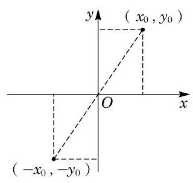

图 4-1-2

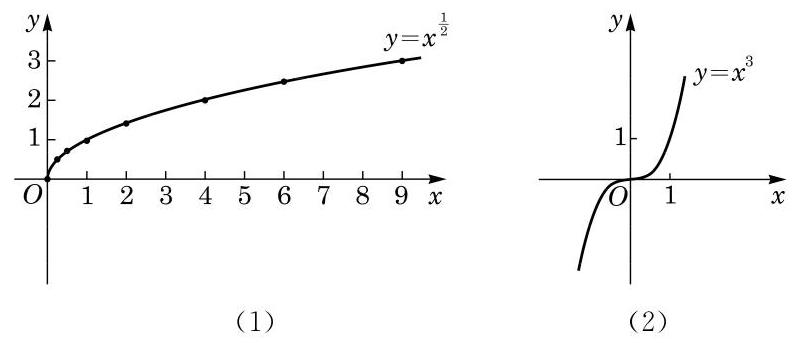

图 4-1-1

因为幂函数 $y = {x}^{3}$ 的定义域为一切实数,若点 $\left( {{x}_{0},{y}_{0}}\right)$ 在幂函数 $y = {x}^{3}$ 的图像上,就有 ${y}_{0} = {x}_{0}^{3}$ . 而点 $\left( {{x}_{0},{y}_{0}}\right)$ 关于原点的对称点易知是 $\left( {-{x}_{0}, - {y}_{0}}\right)$ ,如图 4-1-2 所示. 由 ${y}_{0} = {x}_{0}^{3}$ ,得 $- {y}_{0} = \; {\left( -{x}_{0}\right) }^{3}$ ,因此点 $\left( {-{x}_{0}, - {y}_{0}}\right)$ 也落在幂函数 $y = {x}^{3}$ 的图像上. 这说明幂函数 $y = {x}^{3}$ 的图像关于原点成中心对称.

例 3 作出幂函数 $y = {x}^{-\frac{2}{3}}$ 的大致图像.

解 因为 ${\left( -1\right) }^{-\frac{2}{3}} = \sqrt[3]{{\left( -\frac{1}{1}\right) }^{2}} = 1,{\left( -\frac{\sqrt{2}}{4}\right) }^{-\frac{2}{3}} = \sqrt[3]{{\left( -\frac{4}{\sqrt{2}}\right) }^{2}} \; = \sqrt[3]{8} = 2,{\left( \frac{\sqrt{2}}{4}\right) }^{-\frac{2}{3}} = \sqrt[3]{{\left( \frac{4}{\sqrt{2}}\right) }^{2}} = \sqrt[3]{8} = 2,{1}^{-\frac{2}{3}} = \sqrt[3]{{\left( \frac{1}{1}\right) }^{2}} = 1$ ,所以幂函数 $y = {x}^{-\frac{2}{3}}$ 的图像必过下面的点:

$$
\left( {-1,1}\right) \text{ 、 }\left( {-\frac{\sqrt{2}}{4},2}\right) \text{ 、 }\left( {\frac{\sqrt{2}}{4},2}\right) \text{ 、 }\left( {1,1}\right) .
$$

再使用计算器多采集一些点, 可以粗略作出此幂函数的图像, 如图 4-1-3 所示.

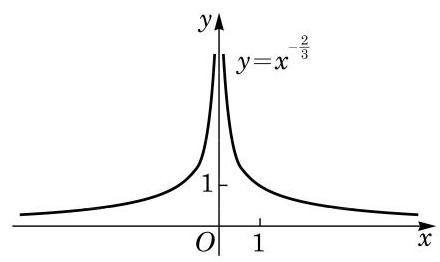

图 4-1-3

由例 1,可知幂函数 $y = {x}^{-\frac{2}{3}}$ 的定义域为不等于 0 的一切实数. 若点 $\left( {{x}_{0},{y}_{0}}\right)$ 在幂函数 $y = {x}^{-\frac{2}{3}}$ 的图像上,则有 ${y}_{0} = {x}_{0}^{-\frac{2}{3}}$ . 而点 $\left( {{x}_{0},{y}_{0}}\right)$ 关于 $y$ 轴的对称点易知是 $\left( {-{x}_{0},{y}_{0}}\right)$ ,如图 4-1-4 所示. 由 ${y}_{0} = {x}_{0}^{-\frac{2}{3}}$ ,且 ${\left( -{x}_{0}\right) }^{-\frac{2}{3}} = \frac{1}{\sqrt[3]{{\left( -{x}_{0}\right) }^{2}}} = \frac{1}{\sqrt[3]{{x}_{0}^{2}}} = {x}_{0}^{-\frac{2}{3}}$ ,易知同时有 ${y}_{0} = {\left( -{x}_{0}\right) }^{-\frac{2}{3}}$ ,从而点 $\left( {-{x}_{0},{y}_{0}}\right)$ 也落在幂函数 $y = {x}^{-\frac{2}{3}}$ 的图像上. 这说明幂函数 $y = {x}^{-\frac{2}{3}}$ 的图像关于 $y$ 轴成轴对称.

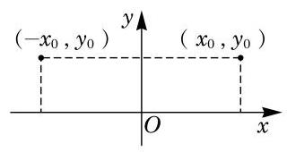

图 4-1-4

## 练习4.1(1)

1. 若幂函数 $y = {x}^{a}$ 的图像经过点 $\left( {3,\sqrt{3}}\right)$ ,求此幂函数的表达式.

2. 求下列函数的定义域, 并作出它们的大致图像:

(1) $y = {x}^{\frac{1}{3}}$ ；

(2) $y = {x}^{-\frac{1}{2}}$ ；

(3) $y = {x}^{\frac{4}{3}}$ .

3. 若幂函数 $y = {x}^{-{m}^{2} + {2m} + 3}$ ( $m$ 为整数) 的定义域为 $\mathbf{R}$ ,求 $m$ 的值.

## 2 幂函数的性质

由前述,不管指数 $a$ 取何值,当 $x > 0$ 时,幂函数 $y = {x}^{a}$ 总是有定义的,且其函数值 $y > 0$ . 这说明,幂函数 $y = {x}^{a}$ 在第一象限总有图像,其图像随指数 $a$ 取值的不同,可分为两种情况.

(1) $a > 0$ 的情况. 此时观察幂函数 $y = {x}^{a}$ 在第一象限的图像,不难发现,当指数 $0 < a < 1$ 时,相应的图像类似图 4-1-5 中 $y = {x}^{\frac{1}{2}}$ 的图像; 当指数 $a > 1$ 时,相应的图像类似图 4-1-5 中 $y = {x}^{3}$ 的图像; 而当 $a = 1$ 时,幂函数 $y = x$ 的图像是一条经过原点的直线. ?

---

当 $a = 0$ 时,幂函数 $y = {x}^{0} = 1\left( {x \neq  0}\right)$ 的图像是平行于 $x$ 轴、 并在 $x$ 轴上方一个单位的一条直线(除去点 (0,1)).

当 $a = 1$ 时,幂函数 $y = x$ 的图像是经过原点的一条直线.

---

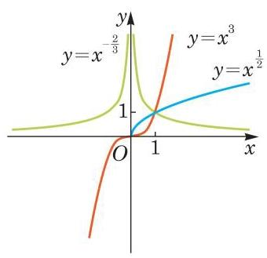

图 4-1-5

观察图 4-1-5 所示的幂函数 $y = {x}^{a}\left( {a > 0}\right)$ 在第一象限的图像,可发现图像由左至右是上升的,也就是说,随着自变量 $x$ 的不断增大,函数值 $y$ 也不断增大. 这是因为当 $a > 0$ 时,若 ${x}_{2} > {x}_{1} > 0$ ,则 $\frac{{x}_{2}}{{x}_{1}} > 1$ ,从而由幂的基本不等式,得

$$
{\left( \frac{{x}_{2}}{{x}_{1}}\right) }^{a} > 1
$$

即 ${x}_{2}^{a} > {x}_{1}^{a}$ . 这说明在区间 $\left( {0, + \infty }\right)$ 上幂函数 $y = {x}^{a}\left( {a > 0}\right)$ 的函数值 $y$ 随着 $x$ 的 (严格) 增大而 (严格) 增大. 此时称幂函数 $y = {x}^{a} \; \left( {a > 0}\right)$ 在区间 $\left( {0, + \infty }\right)$ 上是严格增函数.

(2) $a < 0$ 的情况. 此时幂函数 $y = {x}^{a}$ 在第一象限的图像类似图 4-1-5 中 $y = {x}^{-\frac{2}{3}}$ 的图像. 该图像由左至右是下降的,也就是说,在区间 $\left( {0, + \infty }\right)$ 上幂函数 $y = {x}^{a}\left( {a < 0}\right)$ 的函数值 $y$ 随着 $x$ 的 (严格) 增大而 (严格) 减小. 此时称幂函数 $y = {x}^{a}\left( {a < 0}\right)$ 在区间 $\left( {0, + \infty }\right)$ 上是严格减函数.

因为 ${1}^{a} = 1$ ,所以无论 $a > 0$ 还是 $a < 0$ ,幂函数的图像均经过点 $\left( {1,1}\right)$ .

例 4 比较下列各题中两个数的大小:

(1) ${2.5}^{-2}$ 与 ${1.8}^{-2}$ ；

(2) ${1.32}^{\frac{4}{5}}$ 与 ${\left( -\sqrt{2}\right) }^{\frac{4}{5}}$ .

解 (1) 考虑幂函数 $y = {x}^{-2}$ . 由于指数小于 0 的幂函数在区间 $\left( {0, + \infty }\right)$ 上是严格减函数,因此 ${2.5}^{-2} < {1.8}^{-2}$ .

(2)考虑幂函数 $y = {x}^{\frac{4}{5}}$ . 由于

$$
{\left( -\sqrt{2}\right) }^{\frac{4}{5}} = \sqrt[5]{{\left( -\sqrt{2}\right) }^{4}} = \sqrt[5]{{\left( \sqrt{2}\right) }^{4}} = {\sqrt{2}}^{\frac{4}{5}},
$$

而指数大于 0 的幂函数在区间 $\left( {0, + \infty }\right)$ 上是严格增函数,因此

$$
{1.32}^{\frac{4}{5}} < {\sqrt{2}}^{\frac{4}{5}},
$$

故

$$
{1.32}^{\frac{4}{5}} < {\left( -\sqrt{2}\right) }^{\frac{4}{5}}\text{ . }
$$

下面我们研究一些函数图像之间的关系.

例 5 已知函数 $y = \frac{1}{x}$ 和 $y = \frac{1}{x - 2}$ ,说明这两个函数图像之间的关系, 并在同一平面直角坐标系中作出它们的大致图像.

解 在幂函数 $y = \frac{1}{x}$ 的图像上任取一点 $P\left( {a,\frac{1}{a}}\right)$ ,易得点 ${P}^{\prime }\left( {a + 2,\frac{1}{a}}\right)$ 一定在函数 $y = \frac{1}{x - 2}$ 的图像上,而将点 $P$ 向右平移 2 个单位就与点 ${P}^{\prime }$ 重合. 反之亦然. 因此,将函数 $y = \frac{1}{x}$ 的图像向右平移 2 个单位就得到函数 $y = \frac{1}{x - 2}$ 的图像. 反之,将函数 $y = \frac{1}{x - 2}$ 的图像向左平移 2 个单位就得到函数 $y = \frac{1}{x}$ 的图像,如图 4-1-6 所示.

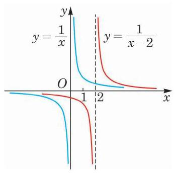

图 4-1-6

例 6 已知函数 $y = \frac{1}{x - 2}$ 和 $y = \frac{x - 1}{x - 2}$ ,说明这两个函数图像之间的关系, 并在同一平面直角坐标系中作出它们的大致图像.

解 将 $y = \frac{x - 1}{x - 2}$ 整理变形,得 $y = 1 + \frac{1}{x - 2}$ . 若点 $Q\left( {a,\frac{1}{a - 2}}\right)$ 在函数 $y = \frac{1}{x - 2}$ 的图像上,则点 ${Q}^{\prime }\left( {a,1 + \frac{1}{a - 2}}\right)$ 就一定在函数 $y = 1 + \frac{1}{x - 2}$ 的图像上,即将点 $Q$ 向上平移 1 个单位就与点 ${Q}^{\prime }$ 重合. 反之亦然. 因此,将函数 $y = \frac{1}{x - 2}$ 的图像向上平移 1 个单位就得到函数 $y = \frac{x - 1}{x - 2}$ 的图像. 反之,将函数 $y = \frac{x - 1}{x - 2}$ 的图像向下平移 1 个单位就得到函数 $y = \frac{1}{x - 2}$ 的图像,如图 4-1-7 所示.

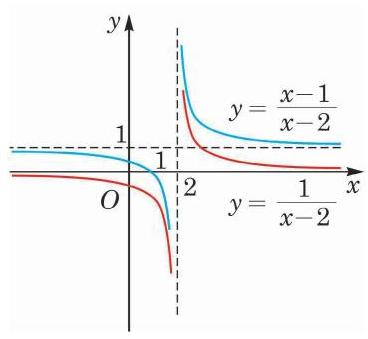

图 4-1-7

## 练习4.1(2)

1. ( 1 )已知函数 $y = {x}^{\frac{2}{3}}$ 和 $y = {\left( x - 1\right) }^{\frac{2}{3}}$ ，说明这两个函数图像之间的关系，并在同一平面直角坐标系中作出它们的大致图像;

(2)已知函数 $y = {x}^{\frac{2}{3}}$ 和 $y = {x}^{\frac{2}{3}} + 1$ ，说明这两个函数图像之间的关系，并在同一平面直角坐标系中作出它们的大致图像.

2. 比较下列各题中两个数的大小:

(1) ${2.5}^{-3}$ 与 ${3.1}^{-3}$ ； (2) ${1.7}^{\frac{3}{2}}$ 与 ${1.6}^{\frac{3}{2}}$ .

3. 作出函数 $y = \frac{-x - 1}{x + 2}$ 的大致图像.

## 习题 4.1

## A 组

1. 若幂函数 $y = {x}^{a}$ 的图像经过点 $\left( {\sqrt[4]{3},3}\right)$ ,求此幂函数的表达式.

2. 求下列函数的定义域, 并作出它们的大致图像:

(1) $y = {x}^{\frac{1}{5}}$ ； (2) $y = {x}^{-2}$ ； (3) $y = {x}^{-\frac{3}{4}}$ .

3. 在固定压力差 (压力差为常数) 的前提下,当气体通过圆形管道时,其速率 $v$ (单位: $\left. {{\mathrm{{cm}}}^{3}/\mathrm{s}}\right)$ 与管道半径 $r$ (单位: $\mathrm{{cm}}$ ) 的四次方成正比. 若在半径为 $3\mathrm{\;{cm}}$ 的管道中,某气体的速率为 ${400}{\mathrm{\;{cm}}}^{3}/\mathrm{s}$ ,求该气体通过半径为 $5\mathrm{\;{cm}}$ 的管道时的速率. (结果精确到 $1{\mathrm{\;{cm}}}^{3}/\mathrm{s}$ )

4. 比较下列各题中两个数的大小:

(1) ${3.1}^{-\frac{1}{2}}$ 与 ${3.2}^{-\frac{1}{2}}$ ； (2) ${\left( a + 2\right) }^{\frac{1}{3}}$ 与 ${a}^{\frac{1}{3}}$ .

5. 下列幂函数在区间 $\left( {0, + \infty }\right)$ 上是严格增函数,且图像关于原点成中心对称的是 ___(请填入全部正确的序号).

① $y = {x}^{\frac{1}{2}}$ ； ② $y = {x}^{\frac{1}{3}}$ ； ③ $y = {x}^{\frac{2}{3}}$ ； ④ $y = {x}^{-\frac{1}{3}}$ .

6. 作出函数 $y = \frac{x - 1}{x + 2}$ 的大致图像.

## B 组

1. 填空题:

(1)幂函数 $y = {x}^{n\left( {n + 1}\right) }$ ( $n$ 为正整数)的图像一定经过___象限.

(2)若幂函数 $y = {x}^{s}$ 在 $0 < x < 1$ 时的图像位于直线 $y = x$ 的上方,则 $s$ 的取值范围是___.

2. 下列命题中, 正确的是 ( )

A. 当 $n = 0$ 时,函数 $y = {x}^{n}$ 的图像是一条直线;

B. 幂函数 $y = {x}^{n}$ 的图像都经过 $\left( {0,0}\right)$ 和 $\left( {1,1}\right)$ 两个点;

C. 若幂函数 $y = {x}^{n}$ 的图像关于原点成中心对称,则 $y = {x}^{n}$ 在区间 $\left( {-\infty ,0}\right)$ 上是严格增函数;

D. 幂函数的图像不可能在第四象限.

3. 写出一个图像经过第一、第二象限但不经过原点的幂函数的表达式.

4. 已知函数 $y = \frac{{ax} + 1}{x + 2}$ (常数 $a \in  \mathbf{Z}$ ). 问: 是否存在整数 $a$ ,使该函数在区间 $\lbrack 1, + \infty )$ 上是严格减函数，并且函数值不恒为负？若存在，求出所有符合条件的 $a$ ；若不存在，请说明理由.

### 4.2 指数函数

## 1 指数函数的定义与图像

研究这样一个问题: 一张纸对折一次, 由 1 层变为 2 层, 再对折一次,由 2 层变为 4 层, $\cdots \cdots$ ,对折 $x$ 次后,层数 $y$ 与对折次数 $x$ 的函数关系为 $y = {2}^{x}$ .

将幂的底数 $a$ 固定,指数用变量 $x$ 代替,研究幂 ${a}^{x}$ 随 $x$ 变化而变化的规律, 即用

$$
y = {a}^{x}
$$

来描述 $y$ 与 $x$ 之间的关系,就得到指数函数.

这里首先要假设 $a > 0$ ,以保证对所有的实数 $x,{a}^{x}$ 都有意义. 还要假设 $a \neq  1$ ,因为如果 $a = 1,{a}^{x}$ 就恒等于 1,这种极为特殊的情况不必专门研究.

定义 当底数 $a$ 固定,且 $a > 0, a \neq  1$ 时,等式

$$
y = {a}^{x}
$$

确定了变量 $y$ 随变量 $x$ 变化的规律,称为底为 $a$ 的指数函数 (exponential function).

因为对所有实数 $x,{a}^{x}$ 都是有意义的,所以指数函数的定义域是全体实数.

在平面直角坐标系中,满足 $y = {a}^{x}\left( {a > 0\text{ 且 }a \neq  1}\right)$ 的一切点 $\left( {x, y}\right)$ 构成指数函数 $y = {a}^{x}\left( {a > 0\text{ 且 }a \neq  1}\right)$ 的图像.

例 1 若指数函数 $y = {a}^{x}\left( {a > 0\text{ 且 }a \neq  1}\right)$ 的图像经过点 $\left( {2,9}\right)$ ,求该指数函数的表达式.

解 因为指数函数 $y = {a}^{x}\left( {a > 0\text{ 且 }a \neq  1}\right)$ 的图像经过点 $\left( {2,9}\right)$ ,所以 $9 = {a}^{2}\left( {a > 0\text{ 且 }a \neq  1}\right)$ ,解得 $a = 3$ .

因此,该指数函数的表达式为 $y = {3}^{x}$ .

例 2 分别作出指数函数 $y = {2}^{x}$ 及 $y = {3}^{x}$ 的大致图像.

解 先在相应的图像上取一些特殊的点.

由 ${2}^{-2} = \frac{1}{4},{2}^{-1} = \frac{1}{2},{2}^{0} = 1,{2}^{1} = 2,{2}^{2} = 4$ ,可知指数函数 $y = {2}^{x}$ 的图像必经过下面的点:

$$
\left( {-2,\frac{1}{4}}\right) \text{ 、 }\left( {-1,\frac{1}{2}}\right) \text{ 、 }\left( {0,1}\right) \text{ 、 }\left( {1,2}\right) \text{ 、 }\left( {2,4}\right) .
$$

---

规定指数函数底 $a > 0$ 且 $a \neq  1$ .

---

再使用计算器多采集一些点, 可以粗略地作出其图像.

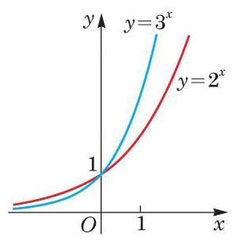

图 4-2-1

由 ${3}^{-2} = \frac{1}{9},{3}^{-1} = \frac{1}{3},{3}^{0} = 1,{3}^{1} = 3,{3}^{2} = 9$ ,可知指数函数 $y = {3}^{x}$ 的图像必经过下面的点:

$$
\left( {-2,\frac{1}{9}}\right) \text{ 、 }\left( {-1,\frac{1}{3}}\right) \text{ 、 }\left( {0,1}\right) \text{ 、 }\left( {1,3}\right) \text{ 、 }\left( {2,9}\right) .
$$

再使用计算器多采集一些点, 可以粗略地作出其图像.

我们把这两个图像放在同一个平面直角坐标系中以便观察比较, 如图4-2-1所示.

例 3 作出指数函数 $y = {\left( \frac{1}{2}\right) }^{x}$ 的大致图像.

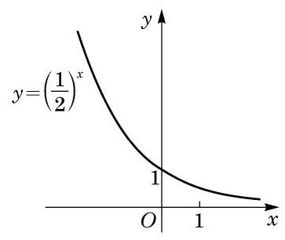

图 4-2-2

解 由 ${\left( \frac{1}{2}\right) }^{-2} = 4,{\left( \frac{1}{2}\right) }^{-1} = 2,{\left( \frac{1}{2}\right) }^{0} = 1,{\left( \frac{1}{2}\right) }^{1} = \frac{1}{2}$ , ${\left( \frac{1}{2}\right) }^{2} = \frac{1}{4}$ ,可知指数函数 $y = {\left( \frac{1}{2}\right) }^{x}$ 的图像必经过下面的点:

$$
\left( {-2,4}\right) \text{ 、 }\left( {-1,2}\right) \text{ 、 }\left( {0,1}\right) \text{ 、 }\left( {1,\frac{1}{2}}\right) \text{ 、 }\left( {2,\frac{1}{4}}\right) .
$$

类似地, 可以粗略作出其相应的图像, 如图 4-2-2 所示.

## 练习 4.2(1)

1. 判断下列函数哪些是指数函数, 哪些是幂函数:

(1) $y = x$ ； (2) $y = {x}^{3}$ ； (3) $y = {\mathrm{e}}^{x}$ ；

(4) $y = \sqrt[3]{x}$ ； (5) $y = {2}^{-x}$ ; (6) $y = {2}^{x}$ .

2. 求下列函数的定义域:

(1) $y = {3}^{x}$ ； (2) $y = {3}^{\frac{1}{x - 2}}$ .

3. 在同一平面直角坐标系中分别作出下列函数的大致图像:

(1) $y = {4}^{x}$ ； (2) $y = {\left( \frac{1}{4}\right) }^{x}$ .

## 2 指数函数的性质

由前述两种指数函数的图像可见,它们的图像均在 $x$ 轴的上方. 这是因为当 $a > 0$ 时,对一切实数 $x,{a}^{x}$ 均大于 0 . 因此,我们有如下的性质:

指数函数 $y = {a}^{x}\left( {a > 0\text{ 且 }a \neq  1}\right)$ 的函数值恒大于 0 .

因为 ${a}^{0} = 1$ ,所以指数函数 $y = {a}^{x}$ 的图像均经过点 $\left( {0,1}\right)$ . 因此，我们有如下的性质:

指数函数 $y = {a}^{x}\left( {a > 0\text{ 且 }a \neq  1}\right)$ 的图像都经过定点 $\left( {0,1}\right)$ .

由例 2 和例 3 可见,指数函数 $y = {a}^{x}$ 的图像可分为两种情况.

(1) $a > 1$ 的情况. 此时指数函数 $y = {a}^{x}$ 的图像类似图4-2-1 中 $y = {2}^{x}$ 的图像,当 $x > 0$ 时,函数值大于 1,其图像在直线 $y = 1$ 的上方; 而当 $x < 0$ 时,函数值小于 1 且大于 0,其图像在直线 $y = 1$ 的下方,且位于 $x$ 轴的上方.

(2) $0 < a < 1$ 的情况. 此时指数函数 $y = {a}^{x}$ 的图像类似图 4-2-2中 $y = {\left( \frac{1}{2}\right) }^{x}$ 的图像,当 $x > 0$ 时,函数值小于 1 且大于 0, 其图像在直线 $y = 1$ 的下方,且位于 $x$ 轴的上方; 而当 $x < 0$ 时, 函数值大于 1,其图像在直线 $y = 1$ 的上方.

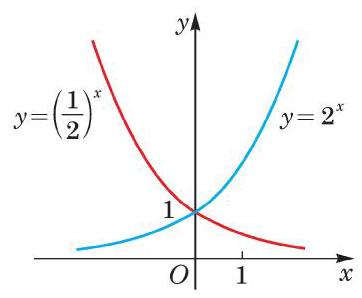

图 4-2-3

这两种情况在同一平面直角坐标系中的图像如图 4-2-3 所示. 易见这两个指数函数 $y = {2}^{x}$ 与 $y = {\left( \frac{1}{2}\right) }^{x}$ 的图像关于 $y$ 轴对称.

一般地说, 由指数幂的运算性质

$$
{a}^{{x}_{0}} = {\left( {a}^{-1}\right) }^{-{x}_{0}},
$$

容易看到: 若 $\left( {{x}_{0},{y}_{0}}\right)$ 为指数函数 $y = {a}^{x}$ 图像上的一点,则 $\left( {-{x}_{0},{y}_{0}}\right)$ 必为指数函数 $y = {\left( {a}^{-1}\right) }^{x}$ 图像上的点,反之亦然. 由于 $\left( {{x}_{0},{y}_{0}}\right)$ 及 $\left( {-{x}_{0},{y}_{0}}\right)$ 两点关于 $y$ 轴对称,因此指数函数 $y = {a}^{x}$ 及 $y = {\left( {a}^{-1}\right) }^{x}$ 的图像必关于 $y$ 轴对称.

Q

---

指数函数 $y = {a}^{x}$ 的图像与指数函数 $y = {\left( {a}^{-1}\right) }^{x}$ 的图像关于 $y$ 轴对称.

---

观察图 4-2-1 中两个指数函数的图像, 它们的底都大于 1, 图像由左至右是上升的,也就是说,随着自变量 $x$ 的不断增大, 函数值 $y$ 也不断增大,这点也可以证明如下:

当 $a > 1$ 时,若 ${x}_{2} > {x}_{1}$ ,则 ${x}_{2} - {x}_{1} > 0$ ,由幂的基本不等式有

$$
{a}^{{x}_{2} - {x}_{1}} > 1,
$$

即 ${a}^{{x}_{2}} > {a}^{{x}_{1}}$ . 此时,称指数函数 $y = {a}^{x}\left( {a > 1}\right)$ 在 $\mathbf{R}$ 上是严格增函数,即函数值 $y$ 随着 $x$ 的 (严格) 增大而 (严格) 增大.

同理可证: 当 $0 < a < 1$ 时,指数函数 $y = {a}^{x}$ 在 $\mathbf{R}$ 上是严格减函数.

因此,我们有

指数函数的单调性 当 $a > 1$ 时,指数函数 $y = {a}^{x}$ 在 $\mathbf{R}$ 上是严格增函数; 当 $0 < a < 1$ 时,指数函数 $y = {a}^{x}$ 在 $\mathbf{R}$ 上是严格减函数.

指数函数的图像与性质可总结见下表 4-1:

表 4-1

<table><tr><td>$y = {a}^{x}$</td><td>$a > 1$</td><td>$0 < a < 1$</td></tr><tr><td>图像</td><td></td><td></td></tr><tr><td rowspan="3">图像特征</td><td colspan="2">(1)图像都在 $x$ 轴上方，无限趋近于 $x$ 轴，但永不相交.</td></tr><tr><td colspan="2">(2)过点 $\left( {0,1}\right)$ .</td></tr><tr><td>(3)由左至右图像上升.</td><td>(3)由左至右图像下降.</td></tr><tr><td rowspan="3">函数性质</td><td colspan="2">(1)定义域为 $\mathbf{R}$ ，函数值恒正.</td></tr><tr><td colspan="2">(2)当 $x = 0$ 时， $y = 1$ .</td></tr><tr><td>(3)在 $\mathbf{R}$ 上是严格增函数.</td><td>(3)在 $\mathbf{R}$ 上是严格减函数.</td></tr></table>

例 4 利用指数函数的性质, 比较下列各题中两个数的大小:

(1) ${1.7}^{2.5}$ 与 ${1.7}^{3}$ ；

(2) ${\left( \frac{3}{4}\right) }^{\frac{1}{6}}$ 与 ${\left( \frac{4}{3}\right) }^{-\frac{1}{5}}$ ；

(3) ${a}^{\frac{1}{2}}$ 与 ${a}^{\frac{1}{3}}\left( {a > 0\text{ 且 }a \neq  1}\right)$ .

解(1)由于底数 $a$ 大于 1 的指数函数 $y = {a}^{x}$ 在 $\mathbf{R}$ 上是严格增函数,因此 ${1.7}^{2.5} < {1.7}^{3}$ .

(2)由于 ${\left( \frac{4}{3}\right) }^{-\frac{1}{5}} = {\left( \frac{3}{4}\right) }^{\frac{1}{5}}$ ，且底数 $a$ 小于 1 大于 0 的指数函数 $y = {a}^{x}$ 在 $\mathbf{R}$ 上是严格减函数,因此

$$
{\left( \frac{3}{4}\right) }^{\frac{1}{6}} > {\left( \frac{4}{3}\right) }^{-\frac{1}{5}}.
$$

(3)当 $0 < a < 1$ 时，指数函数 $y = {a}^{x}$ 在 $\mathbf{R}$ 上是严格减函数， 故 ${a}^{\frac{1}{2}} < {a}^{\frac{1}{3}}$ ;

当 $a > 1$ 时,指数函数 $y = {a}^{x}$ 在 $\mathbf{R}$ 上是严格增函数,故 ${a}^{\frac{1}{2}} > {a}^{\frac{1}{3}}$ .

例 5 求下列不等式的解集:

(1) ${3}^{x} > \frac{1}{27}$ ；

(2) ${a}^{{x}^{2} - {2x} + 3} > {a}^{6}\left( {0 < a < 1}\right)$ .

解 (1) 将 $\frac{1}{27}$ 写成 ${3}^{-3}$ ,因为指数函数 $y = {3}^{x}$ 在 $\mathbf{R}$ 上是严格增函数,所以 $x >  - 3$ . 故原不等式的解集为 $\left( {-3, + \infty }\right)$ .

(2)当 $0 < a < 1$ 时，指数函数 $y = {a}^{x}$ 在 $\mathbf{R}$ 上是严格减函数， 因此有 ${x}^{2} - {2x} + 3 < 6$ ,整理得 ${x}^{2} - {2x} - 3 < 0$ ,解得 $- 1 < x < 3$ . 故原不等式的解集为 $\left( {-1,3}\right)$ .

## 练习 4.2(2)

1. 比较下列各题中两个数的大小:

(1) ${1.4}^{0.3}$ 与 ${1.4}^{0.4}$ ；

(2) ${0.3}^{1.4}$ 与 ${0.3}^{1.5}$ ；

(3) ${a}^{-{3.14}}$ 与 ${\left( \frac{1}{a}\right) }^{\pi }\left( {a > 0\text{ 且 }a \neq  1}\right)$ .

2. 已知 $a > 0$ 且 $a \neq  1$ . 若 $m > n$ ，且 ${a}^{m} < {a}^{n}$ ，求实数 $a$ 的取值范围.

3. 求下列不等式的解集:

(1) ${3}^{x} > {3}^{0.5}$ ； (2) ${0.2}^{x} < {25}$ .

例 6 已知指数函数 $y = {a}^{x}\left( {a > 1}\right)$ 在区间 $\left\lbrack  {1,2}\right\rbrack$ 上的最大值比最小值大 $\frac{a}{3}$ ,求实数 $a$ 的值.

解 当 $a > 1$ 时,指数函数 $y = {a}^{x}$ 在区间 $\left\lbrack  {1,2}\right\rbrack$ 上是严格增函数. 所以,在区间 $\left\lbrack  {1,2}\right\rbrack$ 上,当 $x = 2$ 时,该指数函数取到最大值 ${a}^{2}$ ; 当 $x = 1$ 时,该指数函数取到最小值 $a$ . 由题意,得 ${a}^{2} - a = \frac{a}{3}$ , 解得 $a = \frac{4}{3}$ .

指数函数在生产实际和科学研究中有很多应用. 银行存款和贷款、GDP 的增长、人口增长等都可能涉及指数函数. 我们用以下的例子来体会“指数增长”.

例 7 统计资料显示: 某外来入侵物种现有种群数量为 $k$ ,若有理想的外部环境条件,该物种的年平均增长率约为 20%. 试建立该物种的种群数量增长模型, 并预测 30 年后该物种的种群数量约为现有种群数量的多少倍. (结果精确到个位)

解 设经过 1 年后, 该种群数量为

$$
{y}_{1} = k + k \cdot  {20}\%  = k\left( {1 + {20}\% }\right) ;
$$

经过 2 年后, 该种群数量为

$$
{y}_{2} = k\left( {1 + {20}\% }\right)  + k\left( {1 + {20}\% }\right)  \cdot  {20}\%
$$

$$
= k{\left( 1 + {20}\% \right) }^{2}\text{ ; }
$$

---

当 $a > 1$ 时,不仅 ${a}^{x}$ 随着 $x$ 的增长而增长,且因为 ${a}^{x + 1} - {a}^{x} \; = {a}^{x}\left( {a - 1}\right)$ ,随着 $x$ 的增长, ${a}^{x}$ 增长得越来越快. 这就是所谓的“指数增长”.

---

......

以此类推,经过 $n$ ( $n$ 为正整数) 年后,该种群数量为 ${y}_{n} = \; k{\left( 1 + {20}\% \right) }^{n}$ .

当 $n = {30}$ 时,该种群数量为 ${y}_{30} = k{\left( 1 + {20}\% \right) }^{30} \approx  {237k}$ .

因此, 若不加控制, 该种群的数量在 30 年之后约为现在的 237 倍, 从而可能极大地破坏当地生态系统的稳定, 这说明指数函数可以用于预测种群数量, 便于及早进行干预.

## 练习 4.2(3)

1. 已知指数函数 $y = {a}^{x}\left( {0 < a < 1}\right)$ 在区间 $\left\lbrack  {1,2}\right\rbrack$ 上的最大值比最小值大 $\frac{a}{3}$ ,求实数 $a$ 的值.

2. 某服装店对原价分别为 175 元和 200 元的甲乙两种服装搞促销活动, 规定甲服装每天降价 5%，直到其售完为止；乙服装每天降价 7%，直到其售完为止。假设两种服装在 10 天内均没有售完, 几天后甲服装的售价将高于乙服装的售价?

## 习题 4.2

## A 组

1. 下列函数是指数函数的序号为___. (请填入全部正确的序号)

① $y = {\left( -4\right) }^{x}$ ； ② $y = {\left( \frac{1}{4}\right) }^{x}$ ； ③ $y = {4}^{x}$ ； ④ $y = {x}^{-4}$ ； ⑤ $y = {\left( \sqrt{4}\right) }^{x}$ .

2. 求下列函数的定义域:

(1) $y = {2}^{\sqrt{3 - x}}$ ； (2) $y = {0.1}^{\frac{1}{x}}$ .

3. 在同一直角坐标系中作出下列函数的大致图像, 并指出这些函数图像间的关系:

(1) $y = {\left( \frac{3}{2}\right) }^{x}$ ; (2) $y = {\left( \frac{2}{3}\right) }^{x}$ ； (3) $y = {\left( \frac{2}{3}\right) }^{x} - 1$ .

4. 已知指数函数 $y = {\left( m - 2\right) }^{x}$ 在 $\mathbf{R}$ 上是严格减函数,求实数 $m$ 的取值范围.

5. 已知常数 $a > 0$ 且 $a \neq  1$ . 假设无论 $a$ 取何值，函数 $y = {a}^{2 - x}$ 的图像恒经过一个定点， 求此定点的坐标.

6. 比较下列各题中两个数的大小:

(1)1. ${2}^{2.6}$ 和 ${1.2}^{2.61}$ ；

(2) ${\left( \sqrt{3}\right) }^{-\frac{1}{3}}$ 和 ${\left( \frac{\sqrt{3}}{3}\right) }^{\frac{1}{2}}$ .

7. 求下列不等式的解集:

(1) ${3}^{{x}^{2} - {2x} + 3} < {3}^{2x}$ ；

(2) ${\left( \frac{1}{3}\right) }^{\sqrt{x}} \leq  \frac{1}{81}$ .

8. 已知指数函数 $y = {a}^{x}\left( {a > 0\text{ 且 }a \neq  1}\right)$ 在区间 $\left\lbrack  {1,2}\right\rbrack$ 上的最大值与最小值之和等于 6, 求实数 $a$ 的值.

9. 某公司去年购置平板电脑 50 台, 并计划从今年起, 新购置的平板电脑数将按每年 5%的比例增长. 求从今年起的第 10 年新购置的平板电脑数. (结果精确到 1 台)

## B 组

1. 在同一平面直角坐标系中,指数函数 $y = {a}^{x}\left( {a > 0\text{ 且 }a \neq  1}\right)$ 和一次函数 $y = a\left( {x + 1}\right)$ 的图像关系可能是 ( )

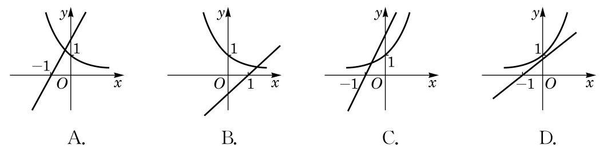

(第 1 题)

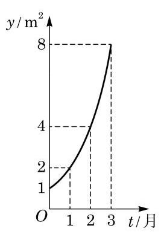

(第 2 题)

2. 如图所示的是某池塘中的浮萍蔓延的面积 $y$ (单位: ${\mathrm{m}}^{2}$ ) 与时间 $t$ (单位: 月) 的关系: $y = {a}^{t}\left( {a > 0\text{ 且 }a \neq  1}\right)$ . 以下结论:

① 这个指数函数的底数是 2 ;

② 第 5 个月时，浮萍的面积就会超过 30 ${\mathrm{m}}^{2}$ ；

③ 浮萍面积从 $4{\mathrm{\;m}}^{2}$ 到 ${12}{\mathrm{\;m}}^{2}$ 需要经过 1.5 个月；

④ 浮萍每个月增加的面积都相等.

其中, 正确结论的序号是 ( )

A. ①②③； B. ①②③④；

C. ②③④; D. ①②.

3. 若 $x > 0$ 时,指数函数 $y = {\left( {a}^{2} - 1\right) }^{x}$ 的值总大于 1,求实数 $a$ 的取值范围.

4. 若 $- 1 < x < 0$ ,比较 ${3}^{x},{3}^{-x}$ 及 ${3}^{2x}$ 的大小.

5. 设 $a > 1$ ,若 ${a}^{{x}^{2} + {2x} + 1} < {a}^{2{x}^{2} - {3x} + 1}$ ,求实数 $x$ 的取值范围.

6. 若函数 $y = {5}^{x + 1} + m$ 的图像不经过第二象限,求实数 $m$ 的取值范围.

### 4.3 对数函数

## 1 对数函数的定义与图像

我们已经学过幂函数及指数函数. 本节我们将利用对数来引入对数函数.

前面我们已经知道什么是正数 $N$ 以 $a$ 为底的对数 ${\log }_{a}N$ , 其中 $a > 0$ 且 $a \neq  1$ .

现在，将对数的底数 $a$ 固定，而将真数 $N$ 用变量 $x$ 代替， 以研究对数的值 ${\log }_{a}x$ 随 $x$ 变化而变化的规律. 用

$$
y = {\log }_{a}x
$$

来描述 $y$ 与 $x$ 的关系就是对数函数.

定义 当底数 $a$ 固定,且 $a > 0, a \neq  1$ 时, $x$ 以 $a$ 为底的对数

$$
y = {\log }_{a}x
$$

确定了变量 $y$ 随变量 $x$ 变化的规律,称为底为 $a$ 的对数函数 (logarithmic function).

因为只有当 $x > 0$ 时, ${\log }_{a}x$ 才有意义,所以对数函数的定义域是全体正数.

例 1 求下列函数的定义域:

(1) $y = {\log }_{2}\left( {x - 1}\right)$ ；

(2) $y = {\log }_{a}\left( {{x}^{2} - {4x} - 5}\right)$ (常数 $a > 0$ 且 $a \neq  1)$ .

解(1)当 $x - 1 > 0$ ，即 $x > 1$ 时，该函数才有意义，所以该函数的定义域是 $\left( {1, + \infty }\right)$ .

(2)当 ${x}^{2} - {4x} - 5 > 0$ 时，该函数才有意义，而

$$
{x}^{2} - {4x} - 5 = \left( {x + 1}\right) \left( {x - 5}\right) ,
$$

不等式 ${x}^{2} - {4x} - 5 > 0$ 的解是 $x <  - 1$ 或 $x > 5$ ,所以该函数的定义域是 $\left( {-\infty , - 1}\right)  \cup  \left( {5, + \infty }\right)$ .

前面已经看到, 函数图像是直观理解变量间关系的一个重要手段. 下面我们来考察对数函数 $y = {\log }_{a}x$ 的图像及其性质,这里总假设 $a > 0$ 且 $a \neq  1$ .

---

规定对数函数的底 $a > 0$ 且 $a \neq  1$ .

---

在平面直角坐标系中,把满足 $y = {\log }_{a}x$ 的一切点 $\left( {x, y}\right)$ 描绘出来就构成对数函数 $y = {\log }_{a}x$ 的图像. 像以前学习过的其他函数一样, 对数函数的图像也是一条曲线.

例 2 分别作出对数函数 $y = {\log }_{2}x$ 及 $y = {\log }_{3}x$ 的大致图像.

解 先取此图像上的一些特别的点,由 ${\log }_{2}\frac{1}{4} =  - 2$ , ${\log }_{2}\frac{1}{2} =  - 1,{\log }_{2}1 = 0,{\log }_{2}2 = 1,{\log }_{2}4 = 2$ ,所以对数函数 $y = {\log }_{2}x$ 的图像必经过下面的点:

$$
\left( {\frac{1}{4}, - 2}\right) \text{ 、 }\left( {\frac{1}{2}, - 1}\right) \text{ 、 }\left( {1,0}\right) \text{ 、 }\left( {2,1}\right) \text{ 、 }\left( {4,2}\right) .
$$

再使用计算器多采集一些点, 就可以粗略地作出其图像.

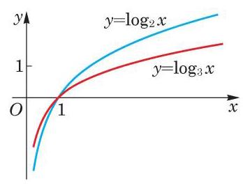

图 4-3-1

因为 ${\log }_{3}\frac{1}{9} =  - 2,{\log }_{3}\frac{1}{3} =  - 1,{\log }_{3}1 = 0,{\log }_{3}3 = 1$ , ${\log }_{3}9 = 2$ ,所以对数函数 $y = {\log }_{3}x$ 的图像必经过点:

$$
\left( {\frac{1}{9}, - 2}\right) \text{ 、 }\left( {\frac{1}{3}, - 1}\right) \text{ 、 }\left( {1,0}\right) \text{ 、 }\left( {3,1}\right) \text{ 、 }\left( {9,2}\right) .
$$

再多采集一些点, 就可以粗略地作出其图像.

我们把这两个图像放在同一个图上以便观察比较, 如图 4-3-1 所示.

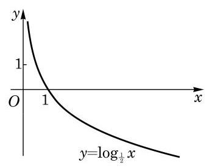

图 4-3-2

例 3 作出对数函数 $y = {\log }_{\frac{1}{2}}x$ 的大致图像.

解 因为 ${\log }_{\frac{1}{2}}\frac{1}{4} = 2,{\log }_{\frac{1}{2}}\frac{1}{2} = 1,{\log }_{\frac{1}{2}}1 = 0,{\log }_{\frac{1}{2}}2 =  - 1$ , ${\log }_{\frac{1}{2}}4 =  - 2$ ,所以该函数的图像经过下面的点:

$$
\left( {\frac{1}{4},2}\right) \text{ 、 }\left( {\frac{1}{2},1}\right) \text{ 、 }\left( {1,0}\right) \text{ 、 }\left( {2, - 1}\right) \text{ 、 }\left( {4, - 2}\right) .
$$

类似地, 可以粗略地作出其相应的图像, 如图 4-3-2 所示.

## 练习 4.3(1)

1. 若对数函数 $y = {\log }_{a}x\left( {a > 0\text{ 且 }a \neq  1}\right)$ 的图像经过点 $\left( {4,2}\right)$ ,求此对数函数的表达式.

2. 求下列函数的定义域:

(1) $y = {\log }_{2}\frac{2 + x}{1 - x}$ ； (2) $y = {\log }_{a}\left( {4 - {x}^{2}}\right)$ (常数 $a > 0$ 且 $a \neq  1$ ).

3. 在同一平面直角坐标系中作出 $y = \lg x$ 及 $y = {\log }_{0.1}x$ 的大致图像.

## 2 对数函数的性质

由上述,对数函数的图像可分为两种情况:

(1) $a > 1$ 的情况. 此时，对数函数 $y = {\log }_{a}x$ 的图像类似图 4-3-1中 $y = {\log }_{2}x$ 的图像. 当 $x > 1$ 时,函数值大于零,其图像在 $x$ 轴的上方; 而当 $0 < x < 1$ 时,函数值小于零,其图像在 $x$ 轴的下方.

(2) $0 < a < 1$ 的情况. 此时，对数函数图像类似图 4-3-2 中 $y = {\log }_{\frac{1}{2}}x$ 的图像. 当 $x > 1$ 时,函数值小于零,其图像在 $x$ 轴的下方; 当 $0 < x < 1$ 时,函数值大于零,其图像在 $x$ 轴的上方.

这两种情况下的图像可见图 4-3-3 中两个对数函数 $y = {\log }_{2}x$ 与 $y = {\log }_{\frac{1}{2}}x$ 的图像. 它们看上去关于 $x$ 轴对称,实际上也的确如此. 事实上, 由换底公式

$$
{\log }_{a}x =  - {\log }_{{a}^{-1}}x
$$

可得,在 $0 < a < 1$ 时,底 $a$ 小于 1 的对数函数 $y = {\log }_{a}x$ 与底 ${a}^{-1}$ 大于 1 的对数函数 $y = {\log }_{{a}^{-1}}x$ 恰相差一个符号,它们的图像关于 $x$ 轴对称.

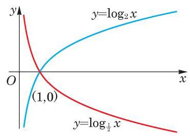

图 4-3-3

因为 ${a}^{0} = 1$ 或者 ${\log }_{a}1 = 0$ ,所有指数函数 $y = {a}^{x}$ 的图像均经过点 $\left( {0,1}\right)$ ,而所有对数函数 $y = {\log }_{a}x$ 的图像均经过点 $\left( {1,0}\right)$ , 所以我们有如下的性质:

对数函数的图像总是经过点 $\left( {1,0}\right)$ .

因为 $y = {\log }_{a}x$ 是 ${a}^{y} = x$ 的解,所以说对数运算是指数运算的一种逆运算. 作为函数,称对数函数 $y = {\log }_{a}x$ 是指数函数 $y = {a}^{x}$ 的反函数.

指数函数 $y = {a}^{x}$ 的图像与其反函数即对数函数 $y = {\log }_{a}x$ 的图像之间有什么关系呢? 它们的关系是: 对数函数 $y = {\log }_{a}x$ 的

---

函数 $y = {\log }_{a}x$ 的图像与 $y = {\log }_{{a}^{-1}}x$ 的图像关于 $x$ 轴对称.

反函数的概念将在下一章学习.

---

Q 图像与指数函数 $y = {a}^{x}$ 的图像关于直线 $y = x$ 是对称的. 这就是说,对数函数 $y = {\log }_{a}x$ 的图像关于直线 $y = x$ 对称的图像就是指数函数 $y = {a}^{x}$ 的图像. 事实上,若点 $\left( {{x}_{0},{y}_{0}}\right)$ 在对数函数 $y = {\log }_{a}x$ 的图像上,就有 ${y}_{0} = {\log }_{a}{x}_{0}$ ,即 ${x}_{0} = {a}^{{y}_{0}}$ . 而点 $\left( {{x}_{0},{y}_{0}}\right)$ 关于直线 $y = x$ 的对称点就是 $\left( {{y}_{0},{x}_{0}}\right)$ ,由于 ${x}_{0} = {a}^{{y}_{0}}$ , 因此 $\left( {{y}_{0},{x}_{0}}\right)$ 必落在指数函数 $y = {a}^{x}$ 的图像上. 反之亦然. 如图 4-3-4所示.

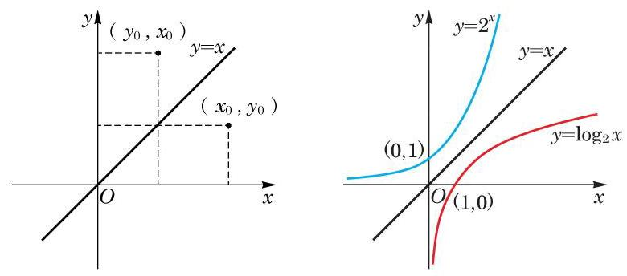

图 4-3-4

观察图 4-3-1 中的两个对数函数图像, 它们的底都大于 1, 且都是递增的,即在自变量 $x$ 增大时,函数值 $y$ 也增大. 这点在理论上也可以证明. 为此, 先证明下面的定理.

定理 当 $a > 1, N > 1$ 时, ${\log }_{a}N > 0$ .

证明 用反证法证明. 如果 $x = {\log }_{a}N \leq  0$ ,由指数函数的性质,就可得 $N = {a}^{x} \leq  1$ ,与 $N > 1$ 矛盾.

对数函数的单调性 当 $a > 1$ 时,对数函数 $y = {\log }_{a}x$ 在区间 $\left( {0, + \infty }\right)$ 上是严格增函数; 当 $0 < a < 1$ 时,对数函数 $y = {\log }_{a}x$ 在区间 $\left( {0, + \infty }\right)$ 上是严格减函数.

证明 当 $a > 1$ 时,如果 ${x}_{2} > {x}_{1} > 0$ ,那么 $\frac{{x}_{2}}{{x}_{1}} > 1$ ,由上面的定理可得

$$
{\log }_{a}\frac{{x}_{2}}{{x}_{1}} > 0,
$$

即 ${\log }_{a}{x}_{2} > {\log }_{a}{x}_{1}$ . 这说明对数函数 $y = {\log }_{a}x$ 在区间 $\left( {0, + \infty }\right)$ 上是严格增函数,即 $y$ 随着 $x$ 的 (严格) 增大而 (严格) 增大.

当 $0 < a < 1$ 时的结论,其证明留作课后练习.

关于对数函数 $y = {\log }_{a}x$ 的图像与性质的总结见表 4-2.

---

指数函数 $y = {a}^{x}$ 的图像与其反函数对数函数 $y = {\log }_{a}x$ 的图像关于直线 $y = x$ 对称.

点 $\left( {{x}_{0},{y}_{0}}\right)$ 关于直线 $y = x$ 的对称点是 $\left( {{y}_{0},{x}_{0}}\right)$ ,将在下一章证明.

此定理又称为对数的基本不等式.

---

表 4-2

<table><tr><td>$y = {\log }_{a}x$</td><td>$a > 1$</td><td>$0 < a < 1$</td></tr><tr><td>图像</td><td></td><td></td></tr><tr><td rowspan="3">图像特征</td><td colspan="2">(1)图像都在 $y$ 轴右侧，无限趋近于 $y$ 轴,但永不相交.</td></tr><tr><td colspan="2">(2)过点 $\left( {1,0}\right)$ .</td></tr><tr><td>(3)由左至右图像上升.</td><td>(3)由左至右图像下降.</td></tr><tr><td rowspan="3">函数性质</td><td colspan="2">(1)定义域为 $\left( {0, + \infty }\right)$ .</td></tr><tr><td colspan="2">(2)当 $x = 1$ 时， $y = 0$ .</td></tr><tr><td>(3) 在区间 $\left( {0, + \infty }\right)$ 上是严格增函数.</td><td>(3)在区间 $\left( {0, + \infty }\right)$ 上是严格减函数.</td></tr></table>

例 4 利用对数函数的单调性, 比较下列各题中两个对数的大小.

(1)log ${}_{2}5$ 与 ${\log }_{2}6$ ;

(2) ${\log }_{a}{0.1}$ 与 ${\log }_{a}{0.2}\left( {a > 0\text{ 且 }a \neq  1}\right)$ ；

(3) ${\log }_{5}7$ 与 ${\log }_{6}7$ .

解(1)因为 $a > 1$ 时对数函数 $y = {\log }_{a}x$ 在区间 $\left( {0, + \infty }\right)$ 上是严格增函数，所以 ${\log }_{2}5 < {\log }_{2}6$ .

(2)因为 $0 < a < 1$ 时对数函数 $y = {\log }_{a}x$ 在区间 $\left( {0, + \infty }\right)$ 上是严格减函数，故 ${\log }_{a}{0.1} > {\log }_{a}{0.2}$ ；而当 $a > 1$ 时，对数函数在区间 $\left( {0, + \infty }\right)$ 上是严格增函数,故 ${\log }_{a}{0.1} < {\log }_{a}{0.2}$ .

(3)需要换成同底数的对数之后才易于进行比较. 由换底公式, 得

$$
{\log }_{5}7 = \frac{1}{{\log }_{7}5},{\log }_{6}7 = \frac{1}{{\log }_{7}6},
$$

由 ${\log }_{7}6 > {\log }_{7}5 > 0$ ,故 ${\log }_{5}7 > {\log }_{6}7$ .

例 5 比较 ${89}^{99}$ 与 ${99}^{89}$ 的大小.

解 取以 10 为底的对数, 由对数函数单调性, 只需要比较两个对数 $\lg {89}^{99} = {99}\lg {89}$ 与 $\lg {99}^{89} = {89}\lg {99}$ 的大小就足够了. 由计算器得 ${99}\lg {89} \approx  {192.99},{89}\lg {99} \approx  {177.61}$ ,因为

$$
{192.99} > {177.61}\text{ , }
$$

所以

$$
{89}^{99} > {99}^{89}\text{ . }
$$

## 练习 4.3(2)

1. 已知常数 $a > 0$ 且 $a \neq  1$ ,假设无论 $a$ 取何值,函数 $y = {\log }_{a}\left( {x - 1}\right)$ 的图像恒经过一个定点, 求此点的坐标.

2. 利用对数函数的性质, 比较下列各题中两个对数的大小:

(1)lo ${\mathrm{g}}_{0.2}3$ 和lo ${\mathrm{g}}_{0.2}6$ ；

(2)lo ${\mathrm{g}}_{0.2}3$ 和lo ${\mathrm{g}}_{0.3}3$ .

3. 设 $0 < a < 1$ ,求证: 对数函数 $y = {\log }_{a}x$ 在区间 $\left( {0, + \infty }\right)$ 上是严格减函数.

例 6 试利用对数函数单调性来估算对数 ${\log }_{2}3$ 的第一位小数的值.

解 因为 ${2}^{1} = 2 < 3 < 4 = {2}^{2}$ ,由对数函数单调性,所以

$$
1 < {\log }_{2}3 < 2\text{ . }
$$

又因为 $9 > 8$ ,即 $3 > 2\sqrt{2} = {2}^{1.5}$ ,再次由对数函数单调性,得

$$
{\log }_{2}3 > {1.5}\text{ . }
$$

现在比较 ${\log }_{2}3$ 与 1.6. 这等价于比较 3 与 ${2}^{1.6} = {2}^{\frac{8}{5}}$ ,即比较 ${3}^{5}$ 与 ${2}^{8}$ . 由于 ${3}^{5} = {243} < {256} = {2}^{8}$ ,因此 $3 < {2}^{1.6}$ . 再由对数函数的单调性, 得

$$
{\log }_{2}3 < {1.6}\text{ . }
$$

最后我们得到

$$
{1.5} < {\log }_{2}3 < {1.6}\text{ . }
$$

因此 ${\log }_{2}3$ 的第一位小数是 5 .

从这个例子可以看出估算对数的更多位精确小数的困难程度.

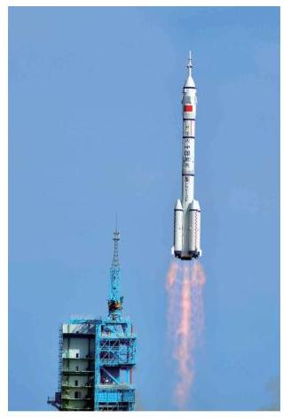

例 7 如果不考虑空气阻力,火箭的最大速度 $v$ (单位: $\mathrm{{km}}/\mathrm{s}$ )和燃料的质量 $M$ (单位: $\mathrm{{kg}}$ )、火箭 (除燃料外) 的质量 ${m}_{0}$ (单位: $\mathrm{{kg}}$ )之间的关系是

$$
v = 2\ln \left( {1 + \frac{M}{{m}_{0}}}\right) ,
$$

这里 $\ln$ 表示以 $\mathrm{e}$ 为底的自然对数. 问当燃料质量至少是火箭质量的多少倍时,火箭的最大速度才能超过 $8\mathrm{\;{km}}/\mathrm{s}$ . (结果精确到 0.1 倍)

解 根据题意, 得

$$
2\ln \left( {1 + \frac{M}{{m}_{0}}}\right)  > 8,
$$

$$
\ln \left( {1 + \frac{M}{{m}_{0}}}\right)  > 4,
$$

$$
1 + \frac{M}{{m}_{0}} > {\mathrm{e}}^{4},
$$

$$
\frac{M}{{m}_{0}} > {\mathrm{e}}^{4} - 1 \approx  {54.6} - 1 = {53.6}.
$$

所以，当燃料质量至少是火箭质量的 53.6 倍时，火箭的最大速度才能超过 $8\mathrm{\;{km}}/\mathrm{s}$ .

例 8 现在我们可以回答必修课程 3.2 节一开始提出的问题: 在年利率为 5%，且按年计复利的条件下，1 万元钱存多少年会超过5 万元?

解 问题是要找到一个最小的整数 $n$ ,使得

$$
{\left( 1 + {0.05}\right) }^{n} > 5\text{ . }
$$

这等价于 $n > {\log }_{1.05}5$ . 用计算器求精确到五位小数的常用对数值, 可得 $\lg 5 \approx  {0.69897},\lg {1.05} \approx  {0.02119}$ . 由换底公式可得

$$
{\log }_{1.05}5 = \frac{\lg 5}{\lg {1.05}} \approx  \frac{0.69897}{0.02119} \approx  {32.98584}.
$$

所以，存 33 年会超过 5 万元.

最后, 从函数的角度看, 对数的换底公式说的是两个底数不同的对数函数实际上只相差一个常数倍. 事实上,设 $a\text{ 、 }b$ 都是不等于 1 的正数,那么以 $a$ 为底的对数函数 $y = {\log }_{a}x$ 和以 $b$ 为底的对数函数 $y = {\log }_{b}x$ 仅相差一个常数倍,即

$$
{\log }_{b}x = \frac{1}{{\log }_{a}b}{\log }_{a}x, x > 0,
$$

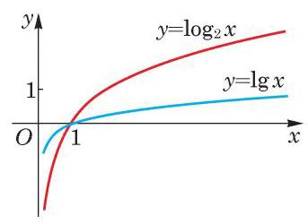

图 4-3-5

其中,因为 ${\log }_{a}b$ 不包含自变量 $x$ ,在自变量 $x$ 的变化过程中是不变的, 称为常量. 例如,

$$
\lg x = \frac{1}{{\log }_{2}{10}}{\log }_{2}x,
$$

函数 $y = \lg x$ 和 $y = {\log }_{2}x$ 的图像比较如图 4-3-5 所示.

## 练习 4.3(3)

1. 动物死亡后,体内碳的放射同位素 ${}^{14}\mathrm{C}$ 的含量每年衰减 0.012%，设在动物死亡的时刻 $t = 0$ 时, ${}^{14}\mathrm{C}$ 的含量为 $a$ .

(1)写出 ${}^{14}\mathrm{C}$ 的含量 $y$ 随时间 $t$ 变化的函数表达式；

(2)问至少经过多少年， ${}^{14}\mathrm{C}$ 的含量才能低于原来的 90%.

2. 利用对数函数的单调性来估算对数 ${\log }_{2}5$ 的第一位小数的值.

## 习题 4.3

## A 组

1. 求下列函数的定义域:

(1) $y = {\log }_{a}\left( {x + {12}}\right)$ (常数 $a > 0$ 且 $a \neq  1$ )；

(2) $y = {\log }_{2}\frac{1}{{x}^{2} - {2x} + 5}$ .

2. 已知对数函数 $y = {\log }_{a}x\;\left( {a > 0\text{ 且 }a \neq  1}\right)$ 的图像经过点 $\left( {3,2}\right)$ . 若点 $P\left( {b,4}\right)$ 为此函数图像上的点,求实数 $b$ 的值.

3. 在同一平面直角坐标系中画出下列函数的图像, 并指出这些函数图像之间的关系.

(1) $y = {\log }_{3}x$ ； (2) $y = {\log }_{\frac{1}{3}}x$ ；

(3) $y = {\left( \frac{1}{3}\right) }^{x}$ .

4. 已知常数 $a > 0$ 且 $a \neq  1$ ，假设无论 $a$ 取何值，函数 $y = {\log }_{a}x - 1$ 的图像恒经过一个定点. 求此点的坐标.

5. 根据下列不等式,确定底数 $a$ 的取值范围:

(1) ${\log }_{a}{0.2} < {\log }_{a}{0.1}$ ; (2) ${\log }_{a}\pi  > {\log }_{a}\mathrm{e}$ .

6. 已知 $y = {\log }_{{a}^{2} - 1}x$ 在区间 $\left( {0, + \infty }\right)$ 上是严格减函数，求实数 $a$ 的取值范围.

7. 已知对数函数 $y = {\log }_{a}x\left( {a > 1}\right)$ 在区间 $\left\lbrack  {1,2}\right\rbrack$ 上的最大值比最小值大 1,求 $a$ 的值.

## B 组

1. 若 $a > b > c > 1$ ，则下列不等式不成立的是___. (填写所有不成立的不等式的序号)

① ${\log }_{a}b > {\log }_{a}c$ ; ② ${\log }_{a}\frac{1}{b} > {\log }_{a}\frac{1}{c}$ ; ③ ${\log }_{\frac{1}{a}}b > {\log }_{\frac{1}{a}}c$ ; ④ ${\log }_{\frac{1}{a}}\frac{1}{b} > {\log }_{\frac{1}{a}}\frac{1}{c}$ .

2. 设常数 $a > 0$ 且 $a \neq  1$ ，求函数 $y = {\log }_{a}\left( {a - {a}^{x}}\right)$ 的定义域.

3. 根据下列不等式,比较正数 $m$ 及 $n$ 的大小:

(1) ${\log }_{3}m < {\log }_{3}n$ ；

(2) ${\log }_{a}m < {\log }_{a}n\left( {a > 0\text{ 且 }a \neq  1}\right)$ ；

(3) ${\log }_{m}N < {\log }_{n}N\left( {0 < m < 1,0 < n < 1,0 < N < 1}\right)$ .

4. 设 $0 < a < 1$ ,若 ${\log }_{a}\left( {4{x}^{2} - 1}\right)  < {\log }_{a}\left( {-2{x}^{2} + x + 1}\right)$ ,求实数 $x$ 的取值范围.

5. 比较 ${22}^{23}$ 与 ${23}^{22}$ 的大小.

6. 如果 ${}^{237}\mathrm{U}$ 在不断的裂变中,每天所剩留质量与前一天剩留质量相比,按同一比例减少，且经过 7 天裂变，剩余的质量是原来的 50%. 计算至少要经过多少天裂变，其剩留质量才小于原来的 10%.

## 探究与实践

## 幂函数、指数函数与对数函数增长速度的比较

我们已经知道,如果指数函数的底数 $a$ 大于 1,当自变量 $x$ 增大时,指数函数 $y = {a}^{x}$ 增长得非常快，称为“指数增长”. 类似地，可以分析底数 $a$ 大于 1 的对数函数 $y = {\log }_{a}x$ 的增长速度.

(1)计算函数 $y = {0.01x}$ 和 $y = \lg x$ 当 $x = {10}^{2}$ ， ${10}^{4}$ ， ${10}^{6}$ ， ${10}^{8}$ ， ${10}^{10}$ 时的值，并由此比较两个函数的增长速度.

(2)计算函数 $y = {x}^{0.1}$ 和 $y = \lg x$ 当 $x = {10}^{10}$ ， ${10}^{20}$ ， ${10}^{50}$ ， ${10}^{100}$ ， ${10}^{200}$ 时的值，并由此比较两个函数的增长速度.

(3)计算函数 $y = {1.1}^{x}$ 和 $y = \lg x$ 当 $x = {10}^{2}$ ， ${10}^{4}$ ， ${10}^{6}$ ， ${10}^{8}$ ， ${10}^{10}$ 时的值，并由此比较两个函数的增长速度.

通过上述比较, 你对对数函数的增长速度有何体会?

## 课后阅读

## 火箭速度的计算公式

航天之父、俄罗斯科学家齐奥科夫斯基(K. E. Tsiolkovsky)于 1903 年给出火箭速度的计算公式

$$
v = {V}_{0}\ln \left( {1 + \frac{M}{{m}_{0}}}\right) .
$$

其中, ${V}_{0}$ 是燃料相对于火箭的喷射速度, $M$ 是燃料的质量, ${m}_{0}$ 是火箭 (除去燃料) 的质量, $v$ 是火箭将燃料喷射完之后达到的速度. 可以看出 $v$ 与 $M$ 是对数函数的关系,由于对数函数增长速度很慢,通过大量增加燃料 (即增加 $\frac{M}{{m}_{0}}$ ) 难以达到航天器绕地球运行所需要的第一宇宙速度，据此他又提出了采用多级火箭发射航天器的设想.

现代运载火箭大多采用三级火箭，当第一级火箭的燃料用完时，点燃第二级火箭并抛弃第一级火箭,这相当于大大减小第二级火箭推进时的 ${m}_{0}$ ,从而在第二级火箭燃料用完时航天器可以达到较高的速度. 然后类似地点燃第三级火箭并抛弃第二级火箭, 最终可以将航天器送入太空轨道.

## 内容提要

1. 幂函数 $y = {x}^{a}$ 的定义域由指数 $a$ 决定. 随着指数 $a$ 的不同，幂函数的定义域是不同的.

2. 幂函数 $y = {x}^{a}$ 有单调性:当 $a > 0$ 时，它在区间 $\left( {0, + \infty }\right)$ 上是严格增函数；而当 $a < 0$ 时，它在区间 $\left( {0, + \infty }\right)$ 上是严格减函数.

3. 指数函数 $y = {a}^{x}\left( {a > 0\text{ 且 }a \neq  1}\right)$ 的定义域是全体实数.

4. 指数函数 $y = {a}^{x}\left( {a > 0\text{ 且 }a \neq  1}\right)$ 有单调性:当 $a > 1$ 时，它在 $\mathbf{R}$ 上是严格增函数； 而当 $0 < a < 1$ 时，它在 $\mathbf{R}$ 上是严格减函数.

5. 对数函数 $y = {\log }_{a}x\left( {a > 0\text{ 且 }a \neq  1}\right)$ 的定义域是全体正实数.

6. 对数函数 $y = {\log }_{a}x\left( {a > 0\text{ 且 }a \neq  1}\right)$ 有单调性:当 $a > 1$ 时，它在区间 $\left( {0, + \infty }\right)$ 上是严格增函数；而当 $0 < a < 1$ 时，它在区间 $\left( {0, + \infty }\right)$ 上是严格减函数.

## 复习题

## A 组

1. 填空题:

(1)若点 $\left( {2,\sqrt{2}}\right)$ 在幂函数 $y = {x}^{a}$ 的图像上，则该幂函数的表达式为___； 若点 $\left( {2,\sqrt{2}}\right)$ 在指数函数 $y = {a}^{x}\left( {a > 0\text{ 且 }a \neq  1}\right)$ 的图像上,则该指数函数的表达式为 ; 若点 $\left( {\sqrt{2},2}\right)$ 在对数函数 $y = {\log }_{a}x\left( {a > 0\text{ 且 }a \neq  1}\right)$ 的图像上,则该对数函数的表达式为___.

(2)若幂函数 $y = {x}^{k}$ 在区间 $\left( {0, + \infty }\right)$ 上是严格减函数，则实数 $k$ 的取值范围为___.

(3)已知常数 $a > 0$ 且 $a \neq  1$ ，假设无论 $a$ 为何值，函数 $y = {a}^{x - 2} + 1$ 的图像恒经过一个定点. 则这个点的坐标为___.

2. 选择题:

(1)若指数函数 $y = {a}^{x}\left( {a > 0\text{ 且 }a \neq  1}\right)$ 在 $\mathbf{R}$ 上是严格减函数，则下列不等式中，一定能成立的是 ( )

A. $a > 1$ ; B. $a < 0$ ;

C. $a\left( {a - 1}\right)  < 0$ ; D. $a\left( {a - 1}\right)  > 0$ .

(2)在同一平面直角坐标系中,一次函数 $y = x + a$ 与对数函数 $y = {\log }_{a}x$ ( $a > 0$ 且 $a \neq  1)$ 的图像关系可能是 ( )

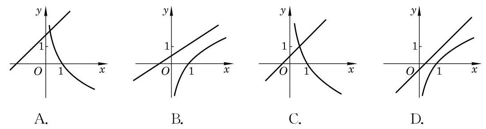

(第 2(2)题)

3. 求下列函数的的定义域:

(1) $y = {\left( x - 1\right) }^{\frac{5}{2}}$ ; (2) $y = {3}^{\sqrt{x - 1}}$ ；

(3) $y = \lg \frac{1 + x}{1 - x}$ .

4. 比较下列各题中两个数的大小:

(1) ${0.1}^{0.7}$ 与 ${0.2}^{0.7}$ ； (2) ${0.7}^{0.1}$ 与 ${0.7}^{0.2}$ ；

(3) ${\log }_{0.7}{0.1}$ 与 ${\log }_{0.7}{0.2}$ .

5. 设点 $\left( {\sqrt{2},2}\right)$ 在幂函数 ${y}_{1} = {x}^{a}$ 的图像上,点 $\left( {-2,\frac{1}{4}}\right)$ 在幂函数 ${y}_{2} = {x}^{b}$ 的图像上. 当 $x$ 取何值时, ${y}_{1} = {y}_{2}$ ?

6. 设 $a = {\left( \frac{2}{3}\right) }^{x}, b = {x}^{\frac{3}{2}}$ 及 $c = {\log }_{\frac{2}{3}}x$ ,当 $x > 1$ 时,试比较 $a\text{ 、 }b$ 及 $c$ 之间的大小关系.

7. 设常数 $a > 0$ 且 $a \neq  1$ ,若函数 $y = {\log }_{a}\left( {x + 1}\right)$ 在区间 $\left\lbrack  {0,1}\right\rbrack$ 上的最大值为 1,最小值为 0,求实数 $a$ 的值.

8. 如果光线每通过一块玻璃其强度要减少 ${10}\%$ ,那么至少需要将多少块这样的玻璃重叠起来,才能使通过它们的光线强度低于原来的 $\frac{1}{3}$ ?

## B 组

1. 填空题:

(1)已知 $m \in  \mathbf{Z}$ ，设幂函数 $y = {x}^{{m}^{2} - {4m}}$ 的图像关于原点成中心对称，且与 $x$ 轴及 $y$ 轴均无交点,则 $m$ 的值为___.

(2)设 $a$ 、 $b$ 为常数，若 $0 < a < 1$ ， $b <  - 1$ ，则函数 $y = {a}^{x} + b$ 的图像必定不经过第象限.

2. 选择题:

(1)若 $m > n > 1$ ,而 $0 < x < 1$ ,则下列不等式正确的是 ( )

A. ${m}^{x} < {n}^{x}$ ; B. ${x}^{m} < {x}^{n}$ ;

C. ${\log }_{x}m > {\log }_{x}n$ ; D. ${\log }_{m}x < {\log }_{n}x$ .

(2)在同一平面直角坐标系中,二次函数 $y = a{x}^{2} + {bx}$ 与指数函数 $y = {\left( \frac{b}{a}\right) }^{x}$ 的图像关系可能为 ( )

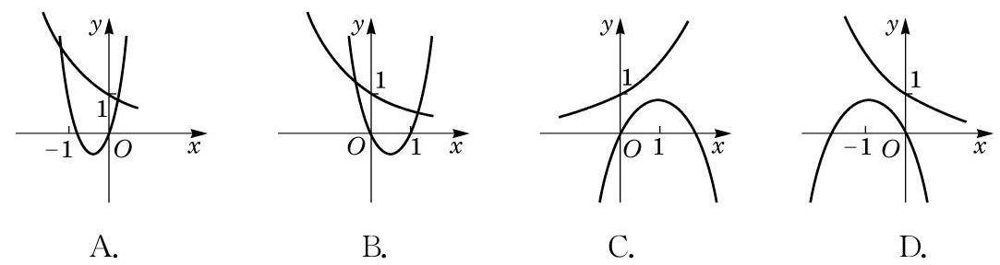

(第 2(2)题)

3. 设 $a$ 为常数且 $0 < a < 1$ ,若 $y = {\left( {\log }_{a}\frac{3}{5}\right) }^{x}$ 在 $\mathbf{R}$ 上是严格增函数,求实数 $a$ 的取值范围.

4. 在同一平面直角坐标系中,作出函数 $y = {\left( \frac{1}{2}\right) }^{x}$ 及 $y = {x}^{\frac{1}{2}}$ 的大致图像,并求方程 ${\left( \frac{1}{2}\right) }^{x} = {x}^{\frac{1}{2}}$ 的解的个数.

5. 已知集合 $A = \left\{  {y\left| {\;y = {\left( \frac{1}{2}\right) }^{x}}\right. , x \in  \lbrack  - 2,0)}\right\}$ ，用列举法表示集合 $B = \left\{  {y \mid  y = {\log }_{3}x, x}\right. \; \in  A$ 且 $y \in  \mathbf{Z}\}$ .

## 拓展与思考

1. ${\log }_{2}3$ 是有理数吗? 请证明你的结论.

2. 仅利用对数函数的单调性和计算器上的乘方功能来确定对数 ${\log }_{2}3$ 第二位小数的值.