# 函数的概念、性质及应用

在初中和上一章中，我们已学习了一次函数、二次函数、反比例函数、幂函数、指数函数及对数函数。这些函数的共同点是有两个变量，当其中的一个变量在某个范围内变化时，另一个变量就按照某种规则随之变化。这种一个变量随着另一个变量的变化而变化的对应关系，在数学上就称为函数。在对二次函数、幂函数、指数函数与对数函数的研究中，已经可以看到不同的函数间有一些共同的性质，本章将概括有关函数的一些比较重要的性质，并用严格的数学语言加以描述。

函数是刻画世间万物之间联系的有力工具，借助于函数，可以更好地掌握事物的发展规律，从而深化人们的认识。函数概念的引入，使数学本身也经历了从常量到变量、从有限到无限的发展，从而逐步由初等数学走向高等数学。学好函数，对进一步学习以后的一些数学知识，如三角、微积分等，都是非常必要的。

## 5.1 函数

### 1 函数

我们已经学习了正比例函数、反比例函数、一次函数、二次函数、幂函数、指数函数及对数函数等。

例如，对于正比例函数 $y = 2x$，变量 $x$ 的取值范围是 $\mathbf{R}$，其对应关系是将一个实数对应到它的 2 倍。当变量 $x = 1$ 时，对应得到唯一的值 $y = 2 \times 1 = 2$；当变量 $x = -3$ 时，对应得到唯一的值 $y = 2 \times (-3) = -6$；当变量 $x$ 取遍一切实数时，对应得到所有的实数 $y$。

又如，对于对数函数 $y = \log_3 x$，变量 $x$ 的取值范围是 $(0, +\infty)$。其对应关系是将 $(0, +\infty)$ 中的实数对应到它的以 3 为底的对数。当变量 $x = \frac{1}{3}$ 时，对应得到唯一的值 $y = -1$；当变量 $x = 1$ 时，对应得到唯一的值 $y = 0$；当变量 $x$ 取遍一切正数时，对应得到所有的实数 $y$。

在这些例子中，都出现了两个处于变化之中的量，其中一个量之值随另一个量之值的确定而按一定的对应关系唯一确定，从而随着另一个量在一定范围内的变化而相应地发生变化。在用数学工具解决实际问题的过程中，我们还会遇到其他一些类似的情况。由此可抽象出函数的概念。

**定义** 设 $D$ 是一个非空的实数集，如果按照某种确定的对应关系 $f$，使对集合 $D$ 中的任意给定的 $x$，都有唯一的实数 $y$ 与之对应，就称这个对应关系 $f$ 为集合 $D$ 上的一个函数（function），记作

$$y = f(x), x \in D.$$

其中，$x$ 叫做自变量（independent variable），其取值范围（数集 D）称为该函数的定义域（domain）。

此时，就称 $y$ 是 $x$ 的函数。当自变量 $x$ 取值 $x_0$ 时，由对应关系 $f$ 所确定的对应于 $x_0$ 的值 $y_0$，称为函数在 $x_0$ 处的函数值，记作 $y_0 = f(x_0)$。

---

对应关系常用小写字母，如 $f$、$g$、$h$ 等表示。

---

所有函数值组成的集合 $\{ y \mid y = f(x), x \in D \}$ 称为这个函数的值域（range）。

根据函数的定义，在定义域和对应关系确定的时候，这个函数就完全被确定了，从而值域也随之被确定。因此，定义域和对应关系称为函数的两个要素。

在之前学习具体的函数，如幂函数、指数函数及对数函数的时候，我们往往只写出反映函数对应关系的表达式，如 $y = x^{\frac{1}{2}}, y = 2^x, y = \log_3 x$ 等，而不明显地写出其定义域。此时，函数 $y = f(x)$ 的定义域由使得其表达式 $f(x)$ 有意义的全体实数组成。

**例 1** 求下列函数的定义域：

(1) $y = \frac{1}{x^2 - 1}$；

(2) $y = \log_2(x + 1)$；

(3) $y = \frac{\sqrt{x + 3}}{x - 1}$。

**解** (1) 定义域 $D = \{ x \mid x^2 - 1 \neq 0 \} = \{ x \mid x \neq \pm 1 \}$。

(2) 定义域 $D = \{ x \mid x + 1 > 0 \} = (-1, +\infty)$。

(3) 解不等式组

$$\begin{cases} x + 3 \geq 0, \\ x - 1 \neq 0, \end{cases}$$

得

$$x \geq -3 \text{ 且 } x \neq 1 \text{。}$$

故定义域 $D = [-3, 1) \cup (1, +\infty)$。

在实际问题中，有关函数的定义域应该受到问题实际意义的制约。例如，某物体作自由落体运动时，其位移 $s$ 关于时间 $t$ 的函数可表示为 $s = \frac{1}{2}gt^2$，其中的自变量 $t$ 就受到 $0 \leq t \leq T$ 的限制（$g$ 是重力加速度，而 $T$ 表示下落的总时间）。

除定义域外，函数的另一要素是对应关系。

如果两个函数的定义域和对应关系都完全一致，就称这两个函数是相同的。

这样，$y = x^2$ 与 $y = x^2, x \in [-1, 1]$ 是两个不同的函数。

此外，同一个对应关系可能有不同的表述形式。例如，$y = x$ 与 $y = (\sqrt[3]{x})^3$ 实际上是相同的。

**例 2** 判断下列函数与函数 $y = x$ 是否相同，并说明理由：

(1) $y = (\sqrt{x})^2$；(2) $y = \ln e^x$；

(3) $y = \frac{x^2}{x}$；(4) $y = \sqrt[4]{x^4}$。

**解** (1) 负数不属于 $y = (\sqrt{x})^2$ 的定义域，因此该函数的定义域与 $y = x$ 的定义域不同，它与 $y = x$ 不是相同的函数。

---

你能再举出几组对应关系一致、但表述形式不同的两个相同的函数吗？

---

(2) $y = \ln e^x = x \ln e = x$ 的定义域为 $\mathbf{R}$，并且其对应关系是将任一给定的实数 $x_0$ 对应到 $x_0$，与 $y = x$ 的对应关系一致，因此该函数与 $y = x$ 是相同的函数。

(3) 0 不在 $y = \frac{x^2}{x}$ 的定义域中，因此该函数的定义域与 $y = x$ 的定义域不同，从而与 $y = x$ 不是相同的函数。

(4) $y = \sqrt[4]{x^4}$ 的对应关系将 -1 对应到了 1，而不是 -1，它与 $y = x$ 的对应关系不同，因此该函数与 $y = x$ 不是相同的函数。

在例 2 中，只有 $y = \ln e^x$ 的对应关系和定义域与 $y = x$ 的相同，它们是相同的函数。

根据已经学过的一些简单函数的值域，可以求得稍复杂函数的值域。

**例 3** 求函数 $y = \frac{1}{2^x + 1}$ 的值域。

**解** 该函数的定义域为 $\mathbf{R}$。

根据指数函数的性质，当 $x$ 取遍所有实数时，$2^x$ 的取值范围为 $(0, +\infty)$，因而 $2^x + 1$ 的取值范围为 $(1, +\infty)$。

又根据不等式的性质，令 $t = 2^x + 1$，当 $t$ 取遍 $(1, +\infty)$ 中所有数时，$\frac{1}{t}$ 的取值范围为 $(0, 1)$。

因此，函数 $y = \frac{1}{2^x + 1}$ 的值域为 $(0, 1)$。

### 练习 5.1(1)

1. 求下列函数的定义域：

(1) $y = \sqrt{(x - 2)(x + 3)}$；

(2) $y = \frac{1}{1 - \sqrt{x - 1}}$。

2. 下列四组函数中，同组的两个函数是相同函数的是（）

A. $y = |x|$ 与 $y = (\sqrt{x})^2$；B. $y = x$ 与 $y = e^{\ln x}$；

C. $y = x$ 与 $y = \sqrt[5]{x^5}$；D. $y = x$ 与 $y = (\frac{1}{x})^{-1}$。

3. 求下列函数的值域：

(1) $y = (\lg x)^2 + 1, x \in (0, +\infty)$；(2) $y = 3x^2 - 4x + 1, x \in [0, 1]$。

### 2 函数的表示方法

用一个数学表达式来表示两个变量之间的对应关系，这种表示函数的方法称为解析法。

例如，$y = 3x + 2, y = x^2 + 2x + 1, y = \sqrt{x^2 + 1} \; (x \in [0, 1]), y = \log_2(2^x - 1)$ 等都是用解析法表示的函数。作自由落体运动的物体的位移 $s$ 与时间 $t$ 满足 $s = \frac{1}{2}gt^2, t \in [0, T]$（$g$ 是重力加速度），也是用解析法来表示的函数。

通过列出自变量的值与对应函数值的相应表格来表达函数关系的方法称为列表法，列表法通常用在定义域为有限集的情况。

例如，表 5-1 列出了国家统计局网站上发布的 2000 年至 2016 年的国内生产总值（GDP）。

**表 5-1** 2000 年至 2016 年中国 GDP 变化表

| 年份 | GDP/亿元 | 年份 | GDP/亿元 |
|------|----------|------|----------|
| 2000 | 100280 | 2009 | 348518 |
| 2001 | 110863 | 2010 | 412119 |
| 2002 | 121717 | 2011 | 487940 |
| 2003 | 137422 | 2012 | 538580 |
| 2004 | 161840 | 2013 | 592963 |
| 2005 | 187319 | 2014 | 641281 |
| 2006 | 219439 | 2015 | 685993 |
| 2007 | 270092 | 2016 | 740061 |
| 2008 | 319245 | | |

注：未包括中国香港、澳门特别行政区和台湾省的地区生产总值数据。

从上表中可以看出，当自变量年份（2000 至 2016 中的整数）确定时，可按照表中所给出的对应关系，查到该年度我国的 GDP 值作为函数值。该函数的定义域为 $\{2000, 2001, 2002, \ldots, 2016\}$，是一个有限集。

我们知道，对于函数 $y = f(x), x \in D$，其定义域 $D$ 中每一个 $x$ 的值都有唯一的一个 $y$ 值与之对应。把这两个对应的数构成的有序实数对 $(x, y)$ 作为点 $P$ 的坐标，记作 $P(x, y)$。所有这些点组成的集合 $G$ 叫做函数 $y = f(x), x \in D$ 的图像（graph），即

$$G = \{ (x, y) \mid y = f(x), x \in D \}.$$

可以看出，如果对定义域 $D$ 中的实数 $x_0$，有 $f(x_0) = y_0$，那么点 $P(x_0, y_0)$ 一定在该函数的图像上；反之，如果点 $P(x_0, y_0)$ 在该函数的图像上，那么必有 $x_0 \in D$，且 $y_0 = f(x_0)$。

常见的一次函数、二次函数、幂函数、指数函数及对数函数的图像，已经在初中和上一章中学过了。

**例 4** 作出函数 $y = \frac{x}{x^2 + 1}$ 的大致图像。

**解** 取自变量 $x$ 的值分别为 -3、$-\frac{5}{2}$、-2、$-\frac{3}{2}$、-1、$-\frac{1}{2}$、$0$、$\frac{1}{2}$、$1$、$\frac{3}{2}$、$2$、$\frac{5}{2}$、$3$，计算出相应的函数值。在平面直角坐标系中标出相应的点，并用光滑的曲线连接这些点，得大致图像如图 5-1-1 所示。

**图 5-1-1**

利用函数的图像来表示函数的方法称为图像法。

**例 5** 以下图形中，哪些是函数的图像，哪些不是？

**图 5-1-2**

---

该函数的图像会出现在第二或第四象限吗？为什么？

需要注意的是，绘制在纸上的或计算机屏幕上的函数图像，终究只是大致的图像，它们无法精确地表示一个函数。但大致的图像能够帮助我们直观地了解函数的性质，从而能更好地发现和研究有关函数的性质。"数形结合"的方法是研究函数的重要方法之一。

---

**解** (1) 这是函数的图像。该函数的定义域是由有限个数构成的集合，定义域中每个自变量的值对应的函数值唯一确定。

(2) 这是函数的图像。该函数的定义域是区间 $[0, a]$，定义域中的每个自变量的值所对应的函数值唯一确定。

(3) 这不是函数的图像。如图 5-1-3，$x_0$ 对应了 $y_1$ 和 $y_2$。

**图 5-1-3**

(4) 这是函数的图像。该函数的定义域是区间 $[0, a]$，定义域中的每个自变量的值所对应的函数值唯一确定。

前文中 2000 年至 2016 年中国国内生产总值（GDP）关于年份的函数，也可以用图像法表示，如图 5-1-4 所示。

**图 5-1-4**

函数图像上所有点的横坐标的集合就是该函数的定义域，而纵坐标的集合就是该函数的值域。

在用解析法表示函数时，有一些函数在不同的区间上可以有不同的表达式。例如，函数 $y = |x|$ 就是通过

$$y = \begin{cases} x, & x \geq 0, \\ -x, & x < 0 \end{cases}$$

来定义的。这样表示函数的方法叫做分段表示法。

**例 6** 某车辆装配车间每 2 h 装配完成一辆车。按照计划，该车间今天生产 8 h。用解析法和图像法分别表示从当天开始生产的时刻起所经过的时间 $x$（单位：h）与装配完成的车辆数 $y$（单位：辆）之间的函数 $y = f(x)$。

**解** 由题意，当 $x \in [0, 2)$ 时，$y = 0$；当 $x \in [2, 4)$ 时，$y = 1$；当 $x \in [4, 6)$ 时，$y = 2$；当 $x \in [6, 8)$ 时，$y = 3$；当 $x = 8$ 时，$y = 4$。

---

在检验平面直角坐标系中的一个图形是否为函数的图像时，需要注意该图形反映的对应关系是否符合函数的定义，即定义域中的每一个 $x$ 的值是否对应到唯一的一个 $y$ 的值。

分段表示法也是一种解析法。用分段表示法表示一个函数时，其定义域就是每一部分中自变量的取值范围的并集。

---

可以用如下的分段表示法表示 $y$ 与 $x$ 之间的函数关系：

$$y = \begin{cases} 0, & 0 \leq x < 2, \\ 1, & 2 \leq x < 4, \\ 2, & 4 \leq x < 6, \\ 3, & 6 \leq x < 8, \\ 4, & x = 8. \end{cases}$$

该函数的大致图像如图 5-1-5 所示。

**图 5-1-5**

---

不大于 $x$ 的最大整数，称为实数 $x$ 的整数部分。

---

数学上，常用 $[x]$ 表示不大于 $x$ 的最大整数。注意到当 $2k \leq x < 2k + 2 (k \in \mathbf{Z})$ 时，$k \leq \frac{x}{2} < k + 1$，从而 $[\frac{x}{2}] = k$。使用此符号，例 6 中的函数可以简洁地表示为 $y = [\frac{x}{2}], x \in [0, 8]$。

### 练习 5.1(2)

1. 作下列函数的大致图像：

(1) $y = -|x|$；(2) $y = \sqrt{x + 2}$；

(3) $y = \frac{1}{x^2 + 1}$；(4) $y = \frac{2x - 1}{x - 1}$。

2. 根据下图的函数图像，用解析法表示 $y$ 关于 $x$ 的函数。

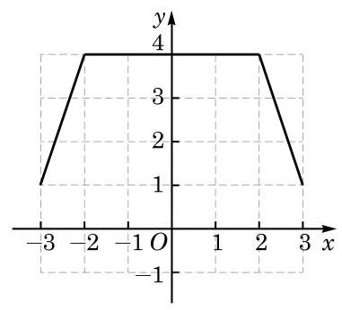

**(第 2 题)**

### 习题 5.1

#### A 组

1. 求下列函数的定义域：

(1) $y = \frac{1}{x^2 + 2x - 3}$；(2) $y = \sqrt{4 - 3x - x^2}$；

(3) $y = \sqrt{x - 2} + \sqrt{x + 3}$；

(4) $y = \frac{1}{\lg(x + 2)} + \frac{1}{\sqrt{5 - x}}$。

2. 设 $p$、$q$ 是常数，函数 $y = f(x)$ 的表达式为 $f(x) = x^2 + px + q$。若 $f(1) = f(2) = 0$，求 $f(-1)$。

3. 观察下列函数的图像，并写出它们的值域：

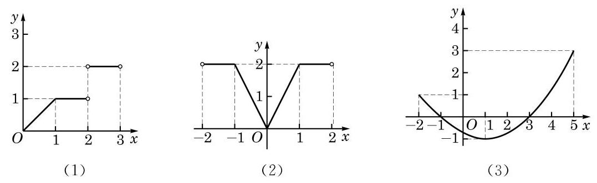

**(第 3 题)**

#### B 组

1. 设 $a$ 是常数，求下列函数的定义域：

(1) $y = \frac{1}{|x| - a}$；(2) $y = \sqrt{x(x - a)}$。

2. 已知函数 $y = f(x)$ 的表达式为 $f(x) = \begin{cases} 2x(3 + x), & x \geq 0, \\ 2x(3 - x), & x < 0. \end{cases}$ 求 $f(2), f(-4)$ 及 $f(-a)$，其中 $a$ 为实数。

### 课后阅读

#### 函数概念的形成和发展

17 世纪是工业生产和科学技术飞速发展的时代，在对天文和航海技术的探索中，科学家们往往需要研究一些运动中的对象，如天体位置、航海中经纬度等。这些问题的实质都是分析研究两个变化中的量之间的关系，并据此描述物体的变化规律。这是函数概念产生和发展的背景。

在 17 世纪早期，意大利科学家伽利略（G. Galilei）、法国数学家笛卡儿（R. Descartes）等在他们的著作中已经注意到了一个变量对另一个变量的依赖关系，但并没有提炼出函数的概念。17 世纪后期，英国数学家牛顿（I. Newton）和德国数学家莱布尼茨（G. W. Leibniz）在分别创立微积分时，考虑的主要对象还是曲线，而牛顿则一直用"流量"一词来表示变量之间的关系。

"函数"（function）一词作为数学概念首先由莱布尼茨引入，用于描述随曲线变化而变化的几何量，如坐标、切线等。此后，瑞士数学家约翰·伯努利（John Bernoulli）首次给出了明确的函数定义，他将函数描述为"由变量和常量以某种方式组成的量"。将函数作为中心概念进行数学研究并作为微积分基础的是瑞士数学家欧拉（L. Euler）。欧拉称变量的函数是一个解析表达式，引入了函数符号 $f(x)$ 并沿用至今。欧拉还将函数分成代数函数（由四则运算和开根等运算组成的函数）和超越函数（含指数、对数、三角运算等的函数），他也是第一个将正弦、余弦等当作函数处理的数学家。欧拉的很多数学发现基于他的函数观点。在 1755 年，欧拉将函数的定义修改为：如果某些变量以某种方式依赖于另一些变量，即当后面的变量变化时，前面的变量也随之变化，那么称前面的变量是后面变量的函数。

在欧拉时代，人们还是习惯于用表达式来表示函数。随着对微积分研究的深入，18 世纪末 19 世纪初，人们对函数的认识有了进一步提高。德国数学家狄利克雷（P. G. L. Dirichlet）于 1837 年提出了如下的函数的定义：若对于 $x$ 的每一个值，$y$ 总有一个唯一确定的值与之对应，则称 $y$ 是 $x$ 的函数。这个定义较清楚地说明了函数概念的本质是对应关系，这个对应关系可以用公式、图像、表格或其他形式表示。这个概念非常清晰，很快被数学家所接受。到 19 世纪 70 年代以后，随着集合论的出现，就有了使用规范的集合语言表述的函数定义，函数概念也就更加精确了。

中文"函数"一词是由我国清代数学家李善兰在 1859 年和英国人伟烈亚力（A. Wylie）合译《代微积拾级》时从英文"function"翻译而来，这一名词一直使用至今。

从上面介绍可以看出，历史上函数概念的建立是从模糊到清晰、从朴素到深入逐步完善的，这符合人们认识事物的一般规律。了解函数概念的发展历史，对于我们更好地理解函数这一重要的数学概念会有很大的帮助。

## 5.2 函数的基本性质

函数是描述客观世界中变量关系和规律的最为基本的数学语言和工具。了解了函数，就把握了相应事物的变化规律。为了深入了解函数，有必要研究其有关的性质，因此，学习函数的性质非常重要。

函数的性质是多种多样的，且不同的函数有不同的性质。

关于一次函数、二次函数、幂函数、指数函数和对数函数，我们已经接触过很多研究其性质的方法，且已经知道了不少结论。本节将以此为出发点，概括函数的一些常见的性质。

### 1 函数的奇偶性

在生活中，我们经常遇到对称的图形。拱桥的桥面形成的弧，就可以视为是轴对称的。如果把桥面抽象成一条曲线，以曲线的最高点为原点，过原点作一水平直线为 $x$ 轴，再过原点作一竖直直线为 $y$ 轴，那么这条由拱桥桥面抽象出的曲线就成为一个函数的图像，并且该图像的一个特点是关于 $y$ 轴成轴对称，如图 5-2-1 所示。

**图 5-2-1**

在学习二次函数和幂函数时，我们知道，形如 $y = ax^2 + c \; (a \neq 0)$ 的二次函数和幂函数 $y = x^{-\frac{2}{3}}$ 的图像都是关于 $y$ 轴成轴对称的，如图 5-2-2 所示。

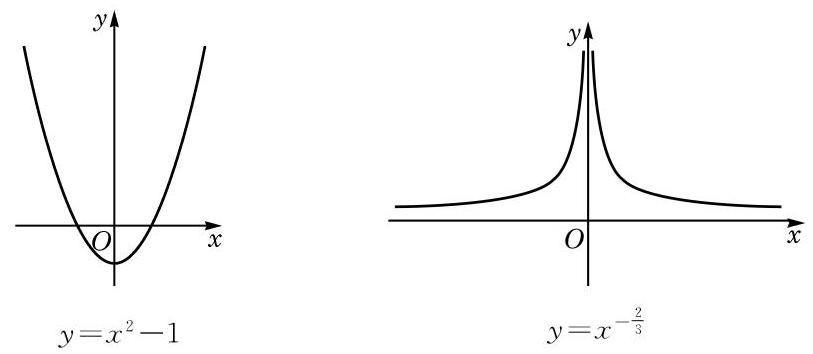

**图 5-2-2**

---

图 5-2-2 中的这两个函数的图像都具有关于 $y$ 轴成轴对称的共同特征，其相应的自变量与函数值的对应关系是如何体现这个特征的？

---

一个图形关于某条直线 $l$ 成轴对称，是指该图形上的任意一点关于直线 $l$ 的对称点也在此图形上。

现在，我们来探究"函数的图像关于 $y$ 轴成轴对称"这一条件的等价表达形式。

在函数 $y = f(x), x \in D$ 的图像 $G$ 上任取一点 $P(x_1, y_1)$，就有

$$x_1 \in D \text{，并且 } y_1 = f(x_1) \text{。}$$

**图 5-2-3**

点 $P(x_1, y_1)$ 关于 $y$ 轴的对称点为 $P'(-x_1, y_1)$（图 5-2-3）。如果函数 $y = f(x), x \in D$ 的图像关于 $y$ 轴成轴对称，那么 $P'(-x_1, y_1)$ 也在图像 $G$ 上，即

$$-x_1 \in D \text{，并且 } y_1 = f(-x_1) \text{。}$$

这说明，如果函数 $y = f(x), x \in D$ 的图像关于 $y$ 轴成轴对称，那么对于任意给定的 $x \in D$，均有

$$-x \in D \text{，并且 } f(x) = f(-x) \text{。}$$

反之，如果对于任意给定的 $x \in D$，均有 $-x \in D$，并且 $f(x) = f(-x)$，那么对于函数 $y = f(x), x \in D$ 的图像上的任一点 $Q(x_2, y_2)$，它关于 $y$ 轴的对称点 $Q'(-x_2, y_2)$，由于满足 $-x_2 \in D$，并且 $y_2 = f(-x_2)$，也必在此函数的图像上。因此，该函数的图像关于 $y$ 轴成轴对称。

总结一下，就得到下述关于偶函数的定义：

**定义** 对于函数 $y = f(x)$，如果对于其定义域 $D$ 中任意给定的实数 $x$，都有 $-x \in D$，并且

$$f(-x) = f(x),$$

就称函数 $y = f(x)$ 为偶函数（even function）。

根据上述推导及定义，从图形的角度来看，偶函数就是其图像关于 $y$ 轴成轴对称的函数。

根据上述性质，如果要得到偶函数 $y = f(x)$ 的图像，只需要获得其在定义域中 $x \geq 0$（或 $x \leq 0$）部分的图像就可以了。同理，如果要研究偶函数的性质，也只要研究其在定义域中 $x \geq 0$（或 $x \leq 0$）部分的性质就可以了。

**例 1** 证明：函数 $y = 2x^4 - 3x^2$ 是一个偶函数。

**证明** 函数 $y = 2x^4 - 3x^2$ 的定义域为 $\mathbf{R}$。

记 $f(x) = 2x^4 - 3x^2$。在 $\mathbf{R}$ 中任取一个实数 $x$，都有 $-x \in \mathbf{R}$，并且

$$f(-x) = 2(-x)^4 - 3(-x)^2 = 2x^4 - 3x^2 = f(x)。$$

因此，$y = 2x^4 - 3x^2$ 是一个偶函数。

除了轴对称外，中心对称也是平面上非常重要的一类对称关系。一个图形关于某个点 $P$ 成中心对称，是指该图形上的任意一点关于点 $P$ 的对称点也在此图形上。

函数 $y = x^3$ 的图像就关于原点成中心对称。相应地，类似于偶函数，我们把满足以下条件的函数称为奇函数。

**定义** 对于函数 $y = f(x)$，如果对于其定义域 $D$ 中的任意给定的实数 $x$，都有 $-x \in D$，并且

$$f(-x) = -f(x)，$$

就称函数 $y = f(x)$ 为奇函数（odd function）。

类似于偶函数图像性质的推导，可以知道，奇函数就是图像关于原点成中心对称的函数。并且，已知奇函数在其定义域中 $x \geq 0$（或 $x \leq 0$）部分的图像（或性质），可以推导出其另一部分的图像（或性质）。

---

根据奇函数的图像特征，你能从已学的函数（如一次函数、幂函数）中举出几个奇函数的例子吗？

---

**例 2** 证明：$y = x^3 - \frac{1}{x}$ 是一个奇函数。

**证明** 函数 $y = x^3 - \frac{1}{x}$ 的定义域为 $D = \{ x \mid x \neq 0 \}$。

记 $f(x) = x^3 - \frac{1}{x}$。在 $D$ 中任取一个实数 $x$，都有 $-x \neq 0$，因此 $-x \in D$，并且

$$f(-x) = (-x)^3 - \frac{1}{-x} = -(x^3 - \frac{1}{x}) = -f(x)。$$

因此，$y = x^3 - \frac{1}{x}$ 是一个奇函数。

**例 3** 是否存在定义在 $\mathbf{R}$ 上的，且既是奇函数又是偶函数的函数？若存在，求出所有满足此条件的函数；若不存在，说明理由。

**解** 这样的函数是存在的，函数 $y = 0, x \in \mathbf{R}$ 就是一个满足这些条件的函数。

设满足这些条件的函数为 $y = f(x)$。对任一给定的实数 $x_0$，因该函数是奇函数，故 $f(-x_0) = -f(x_0)$；另一方面，因该函数是偶函数，故 $f(-x_0) = f(x_0)$。因此 $f(x_0) = -f(x_0)$，即 $f(x_0) = 0$。所以这样的函数只有一个，即 $y = 0, x \in \mathbf{R}$。

### 练习 5.2(1)

1. 奇函数的图像是不是一定通过原点？偶函数的图像是不是一定与 $y$ 轴相交？请说明理由。

2. 如图，已知偶函数 $y = f(x)$ 在 $y$ 轴及 $y$ 轴一侧的部分图像，作出 $y = f(x)$ 的大致图像。

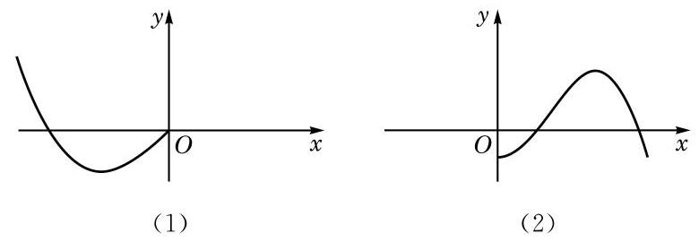

**(第 2 题)**

3. 证明下列函数是奇函数：

(1) $y = 2^x - 2^{-x}$；(2) $y = \log_2(1 + x) - \log_2(1 - x)$。

在判断一个比较复杂的函数的奇偶性的时候，往往采取"先猜后证"的方法。

**例 4** 判断下列函数的奇偶性，并说明理由：

(1) $y = (x - 1)^2, x \in \mathbf{R}$；

(2) $y = \begin{cases} x(x + 1), & x > 0, \\ x(1 - x), & x < 0. \end{cases}$

**解** (1) 因为当 $x = 1$ 时，$y = 0$；而当 $x = -1$ 时，$y = 4$，两者不相等，所以 $y = (x - 1)^2$ 不是偶函数；

又因为 $0 \neq -4$，所以 $y = (x - 1)^2$ 亦不是奇函数。

综上所述，函数 $y = (x - 1)^2$ 既不是奇函数，又不是偶函数。

(2) 经试验，发现当 $x = 1$ 时，$y = 2$，而当 $x = -1$ 时，$y = -2$；又当 $x = 10$ 时，$y = 110$，而当 $x = -10$ 时，$y = -110$；等等。猜测该函数可能是奇函数。

该函数的定义域为 $\{ x \mid x \neq 0 \}$。记 $g(x) = \begin{cases} x(x + 1), & x > 0, \\ x(1 - x), & x < 0. \end{cases}$

对任意给定的 $x > 0, g(x) = x(x + 1)$。因 $-x < 0$，故

$$g(-x) = (-x)[1 - (-x)] = -x(1 + x) = -g(x)。$$

而对任意给定的 $x < 0, g(x) = x(1 - x)$。因 $-x > 0$，故

$$g(-x) = (-x)[1 + (-x)] = -x(1 - x) = -g(x)。$$

综上所述，$y = g(x)$ 确实是奇函数。

**例 5** 是否存在正数 $a$，使函数 $y = \frac{a^x + 1}{2^x}$ 是偶函数？

**解** 记 $f(x) = \frac{a^x + 1}{2^x}$。由 $f(1) = \frac{1 + a}{2}, f(-1) = \frac{2}{a} + 2$，若 $y = f(x)$ 是偶函数，就应有 $\frac{1 + a}{2} = \frac{2}{a} + 2$。解这个方程，得 $a = -1$（舍去）或 $a = 4$。

因此，$y = f(x)$ 是偶函数的一个必要条件是 $a = 4$。

另一方面，当 $a = 4$ 时，$f(x) = \frac{4^x + 1}{2^x} = 2^x + 2^{-x}$，其定义域为 $\mathbf{R}$。对任意给定的 $x \in \mathbf{R}$，都有 $-x \in \mathbf{R}$，并且

$$f(-x) = 2^{-x} + 2^{-(-x)} = 2^{-x} + 2^x = f(x)。$$

---

可以从函数值的角度来猜测，也可以借助函数图像的几何直观。

也可以将 $y = g(x)$ 表示为 $y = x(1 + |x|), x \neq 0$。以此证明该函数是奇函数。

为了表明存在性，寻找必要条件的过程不是必须表达出来的。

---

因此，当 $a = 4$ 时，$y = f(x)$ 是偶函数。

综上所述，满足条件的正数 $a$ 存在。

**例 6** 已知函数 $y = f(x), x \in \mathbf{R}$，且当 $x \geq 0$ 时，

$$f(x) = 2x^3 + 2^x - 1。$$

(1) 若函数 $y = f(x)$ 是偶函数，求 $f(-2)$；

(2) $y = f(x)$ 是否可能是奇函数？若可能，求 $f(x)$ 的表达式；若不可能，说明理由。

**解** (1) 若 $y = f(x)$ 是偶函数，应有 $f(-2) = f(2)$。而 $f(2) = 2 \times 2^3 + 2^2 - 1 = 19$，因此 $f(-2) = 19$。

(2) 若 $y = f(x)$ 是奇函数，当 $x < 0$ 时，应有

$$f(x) = -f(-x) = -[2(-x)^3 + 2^{-x} - 1] = 2x^3 - 2^{-x} + 1。$$

---

在例 6(2) 的解答中我们并没有验证"当 $x > 0$ 时，$f(x) = -f(-x)$"。事实上，这是由"当 $x < 0$ 时，$f(-x) = -f(x)$"所蕴涵的。

---

此外，当 $x = 0$ 时，

$$f(x) = 2 \times 0^3 + 2^0 - 1 = 0 = -f(-x)。$$

因此，$y = f(x)$ 可能是奇函数，此时

$$f(x) = \begin{cases} 2x^3 + 2^x - 1, & x \geq 0, \\ 2x^3 - 2^{-x} + 1, & x < 0. \end{cases}$$

### 练习 5.2(2)

1. 判断下列函数的奇偶性，并说明理由：

(1) $y = |x|$；(2) $y = \frac{1}{1 + x} - \frac{1}{1 - x}$；

(3) $y = x^3 - x, x \in [-3, 3)$；(4) $y = 0, x \in [-1, 1]$。

2. 已知 $a$ 是实数，而定义在 $\mathbf{R}$ 上的函数 $y = f(x)$ 的表达式为 $f(x) = |x - a|$。

(1) 是否存在实数 $a$，使得 $y = f(x)$ 是奇函数？说明理由；

(2) 是否存在实数 $a$，使得 $y = f(x)$ 是偶函数？说明理由。

### 2 函数的单调性

在现实生活中，有不少在一定范围内随着时间的增加而增加（或减少）的量，如自由落体运动的位移 $s = \frac{1}{2}gt^2, t \in [0, T]$ 就是如此。作出位移 $s$ 关于时间 $t$ 的函数图像，如图 5-2-4 所示。从图像上看，随着时间的增大，位移的确随之增大。这就是一种单调现象。此外，通过一个电阻的电流随其两端电压的增大而增大；许多物质在水中的溶解度随温度的升高而增加；山区的气温随海拔高度的升高而降低等，都是单调现象。

**图 5-2-4**

在学习指数函数及对数函数时，我们已经了解到如下的事实：

当 $a > 1$ 时，函数 $y = a^x$ 与函数 $y = \log_a x$ 的图像都表现出"$y$ 随 $x$ 的增大而增大"的趋势；而当 $0 < a < 1$ 时，函数 $y = a^x$ 与函数 $y = \log_a x$ 的图像却都表现出"$y$ 随 $x$ 的增大而减小"的趋势。

图像上这样的趋势在函数性质的研究中被称为单调性，它是函数重要的性质之一。借助于单调性，就能够更好地掌握函数值的变化规律。

借助指数和对数运算的性质，必修课程第 4 章中已经证明了，若 $x_1 > x_2$，当 $a > 1$ 时，$a^{x_1} > a^{x_2}$ 及 $\log_a x_1 > \log_a x_2$；而当 $0 < a < 1$ 时，$a^{x_1} < a^{x_2}$ 及 $\log_a x_1 < \log_a x_2$。这样，我们就解释了为何这些函数的图像会表现出相应的单调性趋势。概括起来，可对一般函数给出其单调性的定义。

**定义** 对于定义在 $D$ 上的函数 $y = f(x)$，设区间 $I$ 是 $D$ 的一个子集。对于区间 $I$ 上的任意给定的两个自变量的值 $x_1$、$x_2$，当 $x_1 < x_2$ 时，如果总有

$$f(x_1) \leq f(x_2)，$$

就称函数 $y = f(x)$ 在区间 $I$ 上是增函数（increasing function）；而如果总有

$$f(x_1) \geq f(x_2)，$$

就称函数 $y = f(x)$ 在区间 $I$ 上是减函数（decreasing function）。

特别地，如果总有

$$f(x_1) < f(x_2)，$$

就称函数 $y = f(x)$ 在区间 $I$ 上是严格增函数（strictly increasing function）；而如果总有

$$f(x_1) > f(x_2)，$$

就称函数 $y = f(x)$ 在区间 $I$ 上是严格减函数（strictly decreasing function）。

"严格增""严格减""增"及"减"统称为函数的单调性。

例如，$y = 2x$ 在区间 $(-\infty, +\infty)$ 上是严格增函数；$y = x^2$ 在区间 $(-\infty, 0]$ 上是严格减函数，在区间 $[0, +\infty)$ 上是严格增函数；$y = \log_2 x$ 在区间 $(0, +\infty)$ 上是严格增函数；等等。

根据已经学习过的实数幂的性质，对于幂函数 $y = x^r$，当 $r > 0$ 时，该函数在区间 $(0, +\infty)$ 上是严格增函数；而当 $r < 0$ 时，该函数在区间 $(0, +\infty)$ 上是严格减函数。

根据指数及对数的运算性质，当 $a > 1$ 时，$y = a^x$ 在区间 $(-\infty, +\infty)$ 上是严格增函数，$y = \log_a x$ 在区间 $(0, +\infty)$ 上是严格增函数；而当 $0 < a < 1$ 时，$y = a^x$ 在区间 $(-\infty, +\infty)$ 上是严格减函数，$y = \log_a x$ 在区间 $(0, +\infty)$ 上是严格减函数。

---

根据定义，严格增函数是增函数，严格减函数是减函数。

你能用定义证明初中学过的一次函数和反比例函数的单调性吗？

---

**例 7** 证明：函数 $y = x^2 - 2x$ 在区间 $(-\infty, 1]$ 上是严格减函数。

**证明** 记 $f(x) = x^2 - 2x$。设 $x_1$、$x_2$ 是区间 $(-\infty, 1]$ 上任意给定的两个实数，且 $x_1 < x_2$，我们有

$$f(x_1) = x_1^2 - 2x_1, f(x_2) = x_2^2 - 2x_2。$$

由于

$$f(x_1) - f(x_2) = (x_1^2 - 2x_1) - (x_2^2 - 2x_2)$$

$$= (x_1^2 - x_2^2) - 2(x_1 - x_2)$$

$$= (x_1 - x_2)(x_1 + x_2 - 2)，$$

又 $x_1 - x_2 < 0$，且 $x_1 + x_2 - 2 < 1 + 1 - 2 = 0$，故

$$f(x_1) - f(x_2) > 0，$$

即 $f(x_1) > f(x_2)$。

因此，函数 $y = x^2 - 2x$ 在区间 $(-\infty, 1]$ 上是严格减函数。

对于一般的二次函数 $y = f(x)$，其中 $f(x) = ax^2 + bx + c \; (a \neq 0)$，通过配方法，得到

$$f(x) = a(x + \frac{b}{2a})^2 + \frac{4ac - b^2}{4a}。$$

因此，点 $(-\frac{b}{2a}, \frac{4ac - b^2}{4a})$ 被称为该二次函数的图像的顶点，它是相应曲线（抛物线）的最高点或最低点。

先考察 $a > 0$ 的情形。设 $x_1$、$x_2$ 是任意给定的两个实数，且 $x_1 < x_2$，我们有 $f(x_1) - f(x_2) = a(x_1 - x_2)[(x_1 + x_2) + \frac{b}{a}]$。当 $x_1 < x_2 \leq -\frac{b}{2a}$ 时，由 $x_1 - x_2 < 0$ 以及 $x_1 + x_2 + \frac{b}{a} < 0$，可得 $f(x_1) > f(x_2)$；而当 $-\frac{b}{2a} \leq x_1 < x_2$ 时，由 $x_1 - x_2 < 0$ 以及 $x_1 + x_2 + \frac{b}{a} > 0$，可得 $f(x_1) < f(x_2)$。

因此，当 $a > 0$ 时，函数 $y = ax^2 + bx + c$ 在区间 $(-\infty, -\frac{b}{2a}]$ 上是严格减函数，在区间 $[-\frac{b}{2a}, +\infty)$ 上是严格增函数。

类似地，当 $a < 0$ 时，函数 $y = ax^2 + bx + c$ 在区间 $(-\infty, -\frac{b}{2a}]$ 上是严格增函数，在区间 $[-\frac{b}{2a}, +\infty)$ 上是严格减函数。

由上述二次函数的单调性可知，二次函数图像的上升与下降的趋势恰好以它对应的抛物线的顶点为分界点。

**例 8** 判断函数 $y = \log_2(3x + 2)$ 在其定义域上的单调性，并说明理由。

**解** 设 $x_1$、$x_2$ 是定义域 $D = \{ x \mid 3x + 2 > 0 \}$ 上任意给定的两个实数，且 $x_1 < x_2$，易知 $0 < 3x_1 + 2 < 3x_2 + 2$。因为函数 $y = \log_2 x$ 在区间 $(0, +\infty)$ 上是严格增函数，所以 $\log_2(3x_1 + 2) < \log_2(3x_2 + 2)$。

因此，$y = \log_2(3x + 2)$ 在其定义域上是严格增函数。

### 练习 5.2(3)

1. 小明说："如果当 $x > 0$ 时，总有 $f(x) > f(0)$，那么函数 $y = f(x)$ 在区间 $[0, +\infty)$ 上是严格增函数。"他的说法是否正确？说明理由。

2. 证明：函数 $y = \frac{2}{x^3}$ 在区间 $(-\infty, 0)$ 上是严格减函数。

3. 构造一个二次函数，使得它在区间 $[-1, 1]$ 上是严格减函数，并说明理由。

需要注意的是，函数的单调性是针对包含于定义域中的某个区间而言的。有些函数虽然在整个定义域上不是单调函数，但是在包含于定义域中的某些区间上却可以是单调函数。

---

一般来说，所讨论的单调区间总是指满足这一要求的"最大"的单调区间。

---

**定义** 如果函数 $y = f(x)$ 在某个区间 $I$ 上是增（减）函数，那么就称函数 $y = f(x)$ 在区间 $I$ 上是单调函数（monotonic function），并称区间 $I$ 是函数 $y = f(x)$ 的一个单调区间。

**例 9** 判断函数 $y = x^2 - 2x, x \in [-2, 2]$ 的单调性，并求出它的单调区间。

---

你能用上一节课学习的一般二次函数的单调性结论来求这个函数的单调区间吗？

---

**解** 记 $f(x) = x^2 - 2x$。$f(0) = f(2) = 0$，而 $f(1) = -1$，因此 $y = x^2 - 2x$ 在区间 $[-2, 2]$ 上既不是增函数，也不是减函数。

对区间 $I$ 上任意给定的两个实数 $x_1$、$x_2$，总有

$$f(x_1) - f(x_2) = (x_1 - x_2)(x_1 + x_2 - 2)。$$

当 $x_1 < x_2$，且 $x_1$、$x_2 \in [-2, 1]$ 时，总有 $x_1 + x_2 - 2 < 0$ 及 $x_1 - x_2 < 0$，故 $f(x_1) - f(x_2) > 0$，从而函数 $y = x^2 - 2x$，$x \in [-2, 2]$ 在区间 $[-2, 1]$ 上是严格减函数。

类似地，当 $x_1 < x_2$，且 $x_1$、$x_2 \in [1, 2]$ 时，总有 $x_1 + x_2 - 2 > 0$ 及 $x_1 - x_2 < 0$，故 $f(x_1) - f(x_2) < 0$，从而函数 $y = x^2 - 2x$，$x \in [-2, 2]$ 在区间 $[1, 2]$ 上是严格增函数。

因此，函数 $y = x^2 - 2x, x \in [-2, 2]$ 的单调区间有 $[-2, 1]$ 和 $[1, 2]$。

**例 10** 设 $y = f(x)$ 是偶函数，且它在区间 $[-2, -1]$ 上是严格减函数，判断它在区间 $[1, 2]$ 上的单调性，并说明理由。

**解** 设 $x_1$、$x_2$ 是区间 $[1, 2]$ 上任意给定的两个实数，且 $x_1 < x_2$，则 $-x_1$、$-x_2 \in [-2, -1]$，且 $-x_2 < -x_1$。

因为函数 $y = f(x)$ 在区间 $[-2, -1]$ 上是严格减函数，所以 $f(-x_2) > f(-x_1)$。又因为 $y = f(x)$ 是偶函数，所以 $f(x_2) = f(-x_2) > f(-x_1) = f(x_1)$。

因此，$y = f(x)$ 在区间 $[1, 2]$ 上是严格增函数。

例 10 展示了如何利用函数的奇偶性来研究函数的其他性质。

### 练习 5.2(4)

1. 根据下列函数 $y = f(x)$ 的图像（包括端点），分别指出这两个函数的单调区间，以及在每一个单调区间上函数的单调性。

**(第 1 题)**

2. 判断函数 $y = |x + 1|, x \in [-2, 2]$ 的单调性，并求出其单调区间。

3. 设 $y = f(x)$ 是奇函数，且它在区间 $(-3, 0]$ 上是严格增函数。

(1) 求证：它在区间 $[0, 3)$ 上是严格增函数；

(2) $y = f(x)$ 是否在区间 $(-3, 3)$ 上是严格增函数？说明理由。

### 3 函数的最值

在必修课程第 2 章中，我们已经利用不等式的性质及基本不等式求解了一些代数式的最大值和最小值。对于只有一个未知数的代数式，如 $x + \frac{1}{x}, x^2 - 2x$ 等，当 $x$ 的值改变时，相应代数式的值也随之改变，从而都可以将它们看成是自变量 $x$ 的函数。函数值的大小变化趋势是函数的单调性研究所关心的内容。而在生产和生活中，除了函数值的大小变化趋势之外，往往也关心函数何时取到最大值（最小值），以及最大值（最小值）为多少等问题。

**定义** 函数 $y = f(x)$ 在 $x_0$ 处的函数值是 $f(x_0)$，对于定义域内任意给定的 $x$，如果

$$f(x) \geq f(x_0)$$

都成立，那么 $f(x_0)$ 就叫做函数 $y = f(x)$ 的最小值（minimum）；相反，如果

$$f(x) \leq f(x_0)$$

都成立，那么 $f(x_0)$ 就叫做函数 $y = f(x)$ 的最大值（maximum）。

**例 11** 求函数 $y = 2x^2 - 3x + 1, x \in \mathbf{R}$ 的最大值与最小值。

**解** 由于 $y = 2x^2 - 3x + 1 = 2(x - \frac{3}{4})^2 - \frac{1}{8} \geq -\frac{1}{8}$，且当 $x = \frac{3}{4}$ 时上述不等式中的等号可以取到，因此该函数的最小值为 $-\frac{1}{8}$。

由二次函数的单调性可知，该函数无最大值。

对于定义在闭区间 $[a, b]$ 上的单调函数 $y = f(x)$，它的最大值和最小值一定能在区间的端点 $a$ 和 $b$ 处取到。因此，对于具有单调性的函数，可以借助其单调性来求得其最值。

**例 12** 求函数 $y = \frac{2}{x}, x \in [1, 2]$ 的最大值与最小值。

**解** 由于函数 $y = \frac{2}{x}$ 在区间 $[1, 2]$ 上是严格减函数，因此，其最大值在左端点 $x = 1$ 处取到，其值为 2；而最小值在右端点 $x = 2$ 处取到，其值为 1。

**例 13** 已知 $a < 2$，求函数 $y = |x - 1|, x \in [a, 2]$ 的最大值。

**解** 对于函数 $y = |x - 1|$，当 $x \geq 1$ 时，$y = x - 1$；而当 $x \leq 1$ 时，$y = -x + 1$。因此，$y = |x - 1|$ 在区间 $[1, +\infty)$ 上是严格增函数，在区间 $(-\infty, 1]$ 上是严格减函数。

情形一：当 $1 \leq a < 2$ 时，$y = |x - 1|$ 在区间 $[a, 2]$ 上是严格增函数，如图 5-2-5(1) 所示。此时函数的最大值为 1。

---

最大值与最小值统称为最值。

---

情形二：当 $a < 1$ 时，$y = |x - 1|$ 在区间 $[a, 1]$ 上是严格减函数，而在区间 $[1, 2]$ 上是严格增函数，如图 5-2-5 (2) 所示。从而此时函数的最大值为 $|2 - 1|$ 与 $|a - 1|$ 中的较大者。因此，当 $a < 0$ 时，该函数的最大值为 $|a - 1| = 1 - a$；而当 $0 \leq a < 1$ 时，该函数的最大值为 1。

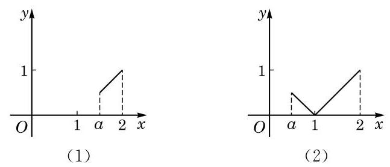

**图 5-2-5**

综上所述，当 $a < 0$ 时，该函数的最大值为 $1 - a$；当 $0 \leq a < 2$ 时，该函数的最大值为 1。

### 练习 5.2(5)

1. 求函数 $y = (\frac{1}{2})^x, x \in [1, 3]$ 的最大值与最小值。

2. 求下列函数的最大值与最小值：

(1) $y = 1 - x^2$；(2) $y = 1 - x^2, x \in [-1, 2]$；

(3) $y = 2x^2 - 8x$；(4) $y = 2x^2 - 8x, x \in [0, 1]$。

3. 已知 $a > -2$，求函数 $y = x^2 + 1, x \in [-2, a]$ 的最大值。

### 习题 5.2

#### A 组

1. 若函数 $y = f(x)$ 的定义域为 $\mathbf{R}$，则 $y = f(x)$ 为奇函数的充要条件为（）

A. $f(0) = 0$；

B. 对任意 $x \in \mathbf{R}, f(x) = 0$ 都成立；

C. 存在某个 $x_0 \in \mathbf{R}$，使得 $f(x_0) + f(-x_0) = 0$；

D. 对任意给定的 $x \in \mathbf{R}, f(x) + f(-x) = 0$ 都成立。

2. 证明下列函数 $y = f(x)$ 为偶函数：

(1) $f(x) = x^2 + x^{-2}$；(2) $f(x) = \frac{x(2^x - 1)}{2^x + 1}$。

3. 证明下列函数 $y = f(x)$ 为奇函数：

(1) $f(x) = x^{-3}$；

(2) $f(x) = \frac{e^x - e^{-x}}{2}$。

4. 判断下列函数 $y = f(x)$ 的奇偶性，并说明理由：

(1) $f(x) = 2x + \sqrt[3]{x}$；(2) $f(x) = 2x^4 - x^2$；

(3) $f(x) = x^2 - x$；(4) $f(x) = \frac{1 - x}{1 + x}$；

(5) $f(x) = \lg \frac{1 - x}{1 + x}$。

5. 证明：函数 $y = x - \frac{1}{x}, x \in (-\infty, 0)$ 是严格增函数。

6. 证明：函数 $y = \lg(1 - x)$ 在其定义域上是严格减函数。

7. 求下列函数的最大值与最小值，并写出取最值时相应自变量的值：

(1) $y = x^2 - 4x - 2$；

(2) $y = 6x - 3x^2$；

(3) $y = -x^2 - 4x - 3, x \in [-3, 1]$；

(4) $y = x^2 - 2x - 3, x \in [-2, 0]$。

8. 求函数 $y = \log_{\frac{1}{2}}(x + 2), x \in [2, 6]$ 的最大值与最小值。

9. 已知 $y = x^2 + px + q$ 和 $y = x + \frac{4}{x}$ 都是定义在 $[1, 4]$ 上的函数，且在 $x_0$ 处同时取到相同的最小值。求 $y = x^2 + px + q$ 的最大值。

#### B 组

1. 已知实数 $b < 2$，而函数 $y = x^2 + ax + 1, x \in [b, 2]$ 是偶函数。求实数 $a$、$b$ 的值。

2. 判断下列函数 $y = f(x)$ 的奇偶性，并说明理由：

(1) $f(x) = \frac{10^x - 10^{-x}}{10^x + 10^{-x}}$；(2) $f(x) = x(\frac{1}{2^x - 1} + \frac{1}{2})$。

3. 当表达式 $f(x) =$ ___时，函数 $y = f(x)$ 同时满足以下条件：

① 不是偶函数；

② 在区间 $(-\infty, -1)$ 上是严格减函数；

③ 在区间 $(0, 1)$ 上是严格增函数。

4. 作出函数 $y = x^2 - 2|x|$ 的大致图像，并分别写出它的定义域、奇偶性、单调区间及最小值。

5. 研究函数 $y = \frac{1}{1 + x^2}$ 的定义域、奇偶性、单调性及最大值。

6. 如果函数 $y = x^2 - 2mx + 1$ 在区间 $(-\infty, 2]$ 上是严格减函数，那么实数 $m$ 的取值范围为___。

7. 设 $t$ 是实数，且 $t < 4$。求函数 $y = |2^{x + 1} - 8|, x \in [t, 4]$ 的最小值。

## 5.3 函数的应用

### 1 函数关系的建立

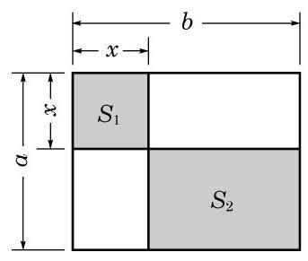

**图 5-3-1**

在研究某些数学问题时，所研究的变量往往依赖于另一个变量，此时就需要建立这两个变量之间的函数关系。

**例 1** 如图 5-3-1，一个边长为 $a$、$b$（$a < b$）的长方形被分别平行于长与宽的两条直线所分割，试用解析法将图中阴影部分的总面积 $S$ 表示为 $x$ 的函数。

**解** 因为左上角阴影部分的面积 $S_1 = x^2$，而右下角阴影部分的面积 $S_2 = (a - x)(b - x)$，所以阴影部分的总面积

$$S = S_1 + S_2 = x^2 + (a - x)(b - x)。$$

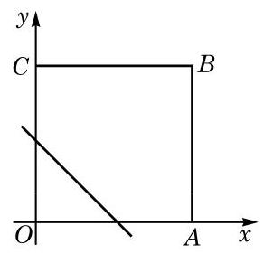

**图 5-3-2**

因此，所求函数为 $S = 2x^2 - (a + b)x + ab, x \in (0, a)$。

**例 2** 如图 5-3-2，四边形 $OABC$ 是平面直角坐标系中边长为 1 的正方形。一直线 $y = -x + t$（$t \in (0, 2)$）与正方形 $OABC$ 相交，将正方形分为两个部分，其中包含原点 $O$ 的部分的面积记为 $S$。试将 $S$ 表示为 $t$ 的函数。

**解** $t$ 是直线 $y = -x + t$ 在 $y$ 轴上的截距。

**图 5-3-3**

情形一：当 $0 < t \leq 1$ 时，设该直线与线段 $OC$ 交于点 $E$，并与线段 $OA$ 交于点 $D$，如图 5-3-3 所示。

此时，包含点 $O$ 的部分是直角三角形 $ODE$。由于 $OD = OE = t$，因此

$$S = \frac{1}{2}OD \cdot OE = \frac{1}{2}t^2。$$

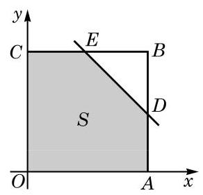

**图 5-3-4**

情形二：当 $1 < t < 2$ 时，设该直线与线段 $BC$ 交于点 $E$，并与线段 $AB$ 交于点 $D$，如图 5-3-4 所示。

此时，包含点 $O$ 的部分是五边形 $OADEC$，它可以看成是正方形 $OABC$ 除去直角三角形 $BDE$ 所得的部分，由于 $BD = BE = 2 - t$，因此

$$S = OA \cdot OC - \frac{1}{2}BD \cdot BE = 1 - \frac{1}{2}(2 - t)^2 = -\frac{1}{2}t^2 + 2t - 1。$$

综上所述，可以分段表示 $S$ 关于 $t$ 的函数如下：

$$S = \begin{cases} \frac{1}{2}t^2, & 0 < t \leq 1, \\ -\frac{1}{2}t^2 + 2t - 1, & 1 < t < 2. \end{cases}$$

当我们用数学方法解决实际问题时，首先要把问题中的有关变量及其关系表示出来，这显示了建立变量之间的函数关系的重要性。

**例 3** 要建造一面靠墙、且面积相同的两间相邻的长方形居室，如图 5-3-5 所示。如果已有材料可建成的围墙总长度为 $30 \mathrm{m}$，那么当宽 $x$（单位：m）为多少时，才能使所建造的居室总面积最大？居室的最大总面积是多少？

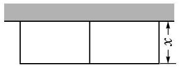

**图 5-3-5**

**解** 由题意，应有 $0 < x < 10$。

如果把建筑材料全部用完，那么此两间居室的总长应为 $(30 - 3x) \mathrm{m}$。

设居室的总面积为 $y \mathrm{m}^2$，则

$$y = x(30 - 3x) = -3(x - 5)^2 + 75, 0 < x < 10。$$

所以，当居室的宽为 $5 \mathrm{m}$ 时，其总面积最大，且最大总面积为 $75 \mathrm{m}^2$。

**例 4** 某小区要建造一个直径为 $16 \mathrm{m}$ 的圆形喷水池，并在池的周边靠近水面的位置安装一圈喷水头，使喷出的水柱在离池中心 $3 \mathrm{m}$ 的地方达到最高高度 $4 \mathrm{m}$。各方向喷来的水柱在池中心上方某一点汇合，求该点离水面的高度。

**解** 过水池的中心任取一个竖直截面，如图 5-3-6 所示。根据力学的原理，喷出的水珠轨迹应为一条抛物线，此抛物线上任何一个点距池中心的水平距离与其所处的高度之间是对应的。为了建立水平距离 $x$（单位：m）与离水面的高度 $y$（单位：m）之间的函数关系 $y = f(x)$，建立如图 5-3-6 所示的直角坐标系。

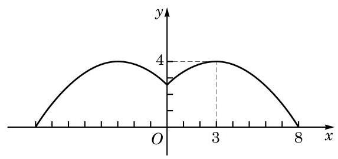

**图 5-3-6**

设图中右半部分的曲线所对应的函数表达式为

$$y = -a(x - b)^2 + c, 0 \leq x \leq 8，$$

其中点 $(b, c)$ 是此抛物线的顶点。由题意，可得 $b = 3, c = 4$。

又由 $f(8) = 0$，解得 $a = 0.16$。

这样，该汇合点离水面的高度应为

$$h = f(0) = -0.16 \times (0 - 3)^2 + 4 = 2.56 (\mathrm{m})。$$

### 练习 5.3(1)

1. 已知一等腰三角形的周长为 $12 \mathrm{cm}$，试将该三角形的腰长 $y$（单位：cm）表示为底边长 $x$（单位：cm）的函数。

2. 如图，在平面直角坐标系的第一象限内，$\triangle OAB$ 是边长为 2 的等边三角形。用直线 $l : x = t$（$0 < t < 2$）截这个三角形，记截得的靠近 $y$ 轴的部分的面积为 $S$。试将 $S$ 表示为 $t$ 的函数。

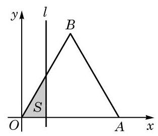

**(第 2 题)**

3. 某商场购物优惠活动如下：一次购物总额不超过 500 元的不予优惠；一次购物总额超过 500 元但不超过 1000 元的，按标价给予 9 折优惠；一次购物总额超过 1000 元的，其中的 1000 元按上述标准给予优惠，而超过 1000 元的部分给予 7 折优惠。设某位顾客一次购物总额为 $x$ 元，而优惠后实际付款额为 $y$ 元。试写出 $y$ 关于 $x$ 的函数关系。

### 2 用函数观点求解方程与不等式

我们知道：一元一次方程总可以化简为 $ax + b = 0$ 的形式，而一元二次方程总可以化简为 $ax^2 + bx + c = 0$ 的形式。一般地，在求解含有一个未知数的方程时，经过适当地化简，总可以化为在一定的范围 $D$ 内求解形如 $f(x) = 0$ 的方程，这里 $y = f(x)$，$x \in D$ 是一个函数。

在学习了函数及其性质之后，我们可用函数的观点来考察方程 $f(x) = 0$ 的求解。

**定义** 对于函数 $y = f(x), x \in D$，如果存在实数 $c \in D$，使得

$$f(c) = 0，$$

就把 $c$ 叫做该函数的零点（zero）。

函数 $y = f(x), x \in D$ 的零点，就是方程 $f(x) = 0$ 在集合 $D$ 中的解，也是该函数 $y = f(x)$ 的图像与 $x$ 轴的交点的横坐标。这就将方程 $f(x) = 0$ 的求解与求函数 $y = f(x)$ 的零点联系起来。

**例 5** 方程 $x^3 + 2x = 99$ 是否有整数解？说明理由。

**解** 记 $f(x) = x^3 + 2x - 99$。

对任意给定的 $x_1$、$x_2 \in \mathbf{R}$，当 $x_1 < x_2$ 时，根据不等式的性质，可得 $x_1^3 < x_2^3$，并且 $2x_1 < 2x_2$，因此 $f(x_1) < f(x_2)$，故函数 $y = f(x)$ 在其定义域上是一个严格增函数。

经计算，得

$$f(4) = -27 < 0, f(5) = 36 > 0。$$

由单调性可知，当 $n \in \mathbf{Z}$，且 $n < 4$ 时，$f(n) < f(4) < 0$；而当 $n \in \mathbf{Z}$，且 $n > 5$ 时，$f(n) > f(5) > 0$。

因此，任一整数一定不是函数 $y = x^3 + 2x - 99$ 的零点，从而方程 $x^3 + 2x = 99$ 没有整数解。

从上述解答的过程中可以看到，原先在解方程时，我们的观点是静态的，而一旦引入函数的观点，就可以利用函数的性质尝试用动态的观点审视方程的求解了。

在必修课程第 2 章中，我们已经学过解一元二次不等式。现在我们同样可以用函数的观点来审视一元二次不等式的求解。

我们在必修课程第 2 章中已经知道，对于一元二次不等式

$$ax^2 + bx + c > 0 (a > 0)，$$

可先考察它对应的方程 $ax^2 + bx + c = 0$，而该方程的解集可能有两个元素，可能只有一个元素，也可能为空集。

这个图像可以帮助我们回忆二次函数的单调性。根据本章 5.2 节中关于二次函数单调性的结论，函数 $y = ax^2 + bx + c$ 在区间 $(-\infty, -\frac{b}{2a}]$ 上是严格减函数，而在区间 $[-\frac{b}{2a}, +\infty)$ 上是严格增函数。

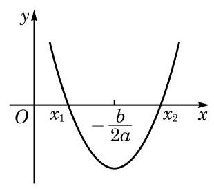

**图 5-3-7**

记 $\Delta = b^2 - 4ac$。当 $\Delta > 0$ 时，该方程的解集可记为 $\{x_1, x_2\}$，其中 $x_1 < x_2$。此时函数 $y = ax^2 + bx + c$ 的大致图像如图 5-3-7 所示。

此外，$x_1$ 及 $x_2$ 是该函数的两个零点；在图像上，$x_1$ 及 $x_2$ 是相应抛物线与 $x$ 轴的交点的横坐标，且 $\frac{x_1 + x_2}{2} = -\frac{b}{2a}$。

这样，求解不等式 $ax^2 + bx + c > 0 (a > 0)$，就是要求函数 $y = ax^2 + bx + c (a > 0)$ 的图像上位于 $y > 0$ 部分的所有点的横坐标。因此，根据单调性及零点的位置，参照函数的图像，可以很容易地得到不等式 $ax^2 + bx + c > 0 (a > 0)$ 的解集为 $(-\infty, x_1) \cup (x_2, +\infty)$。由此可见，借助于构造一个与不等式有关的函数，如果这个函数的单调性与零点比较容易确定，就可以较便捷地求解相应的不等式。

这样，可将二次项系数为正的一元二次不等式的解集总结如下。

**表 5-2** 二次项系数 $a > 0$ 时，二次不等式与相应二次函数的联系

| $f(x) = ax^2 + bx + c$ | $b^2 - 4ac > 0$ | $b^2 - 4ac = 0$ | $b^2 - 4ac < 0$ |
|------------------------|-----------------|-----------------|-----------------|
| 零点 | $x_1$、$x_2$（$x_1 < x_2$） | $x_0$ | 不存在 |
| $f(x) > 0$ 的解集 | $(-\infty, x_1) \cup (x_2, +\infty)$ | $\{ x \mid x \neq x_0 \}$ | $\mathbf{R}$ |
| $f(x) < 0$ 的解集 | $(x_1, x_2)$ | $\varnothing$ | $\varnothing$ |

**例 6** 用函数的观点在区间 $(0, +\infty)$ 上解不等式 $x^4 + x > 2$。

**解** 记 $f(x) = x^4 + x$。

对任意给定的 $x_1$、$x_2 \in (0, +\infty)$，当 $0 < x_1 < x_2$ 时，有 $x_1^4 < x_2^4$，故

$$x_1^4 + x_1 < x_2^4 + x_2。$$

因此，$y = f(x)$ 在区间 $(0, +\infty)$ 上是严格增函数。

由函数 $y = f(x)$ 的单调性，并注意到 $f(1) = 1^4 + 1 = 2$，可知在区间 $(0, +\infty)$ 上，$f(x) > 2$ 当且仅当 $x > 1$。

因此，在区间 $(0, +\infty)$ 上不等式 $x^4 + x > 2$ 的解集为 $(1, +\infty)$。

### 练习 5.3(2)

1. 利用函数与不等式的关系，在 $a < 0$ 时，求解实系数一元二次不等式 $ax^2 + bx + c \leq 0$。

2. 用函数的观点解不等式：$2^x + \log_2 x > 2$。

### 3 用二分法求函数的零点

在建立了函数关系后，常常会遇到一些解方程的问题。如果相应的函数是一次函数或者二次函数，就可以用已经学习过的求根公式来求解。但是遇到一些更复杂的函数，相应的方程如何求解呢？此时，要求得问题的精确解答，通常是做不到的，而基于实际问题的需要，往往只要求得具有足够精度的近似解就可以了。本课我们将利用上一节课的思想，将求方程的近似解的问题转化为求函数的近似零点的问题，再利用函数的性质来求得方程的近似解。

我们来看一个例子：在一块边长为 $13 \mathrm{cm}$ 的正方形金属薄片的四个角上都剪去一个边长为 $x \mathrm{cm}$ 的小正方形，做成一个容积是 $140 \mathrm{cm}^3$ 的无盖长方体盒子，如图 5-3-8 所示（图中单位：cm）。问：$x$ 是多少？（结果精确到 $0.1 \mathrm{cm}$）

**图 5-3-8**

根据要求，得 $x(13 - 2x)^2 = 140$，我们的目标就是求该方程在区间 $(0, \frac{13}{2})$ 上的实根。

令 $f(x) = x(13 - 2x)^2 - 140, 0 < x < \frac{13}{2}$。上述方程的实根就是函数 $y = f(x)$ 的零点，先用描点法作出该函数的大致图像如下：

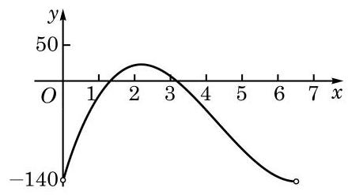

**图 5-3-9**

从图像上可以看出，函数 $y = f(x)$ 在区间 $(1, 2)$ 和区间 $(3, 4)$ 上各有一个零点。

**定理** 如果在区间 $[a, b]$ 上，函数 $y = f(x)$ 的图像是一段连续曲线，并且 $f(a) \cdot f(b) < 0$，那么 $y = f(x)$ 在区间 $(a, b)$ 上一定有零点。

下面用二分法寻求该函数在区间 $(3, 4)$ 上的零点的近似值。

二分法的思想非常直接和简单：在确定了区间 $(a, b)$ 上一定有零点的前提下，将区间一分为二，这两部分中总有一个含有零点，而含有零点的区间的长度变为原先的一半。反复执行这种"一分为二"的操作，就能将零点限制在一个足够小的区间中，从而容易求得其近似值了。

因为 $f(3) = 7 > 0, f(4) = -40 < 0$，所以此函数 $y = f(x)$ 在区间 $(3, 4)$ 上至少有一个有零点。

取 $(3, 4)$ 的中点 $x_1 = \frac{3 + 4}{2} = 3.5$，计算可得 $f(3.5) = -14 < 0$。因为 $f(3) \cdot f(3.5) < 0$，所以 $y = f(x)$ 在区间 $(3, 3.5)$ 上一定有零点。

将这一步骤重复若干次，见表 5-3：

**表 5-3** 用二分法求函数零点的一个例子

| 步骤 | $L$（左端点） | $M$（中点） | $R$（右端点） | $f(L)$ | $f(M)$ | $f(R)$ |
|------|--------------|------------|--------------|--------|--------|--------|
| 1 | 3 | 3.5 | 4 | + | - | - |
| 2 | 3 | 3.25 | 3.5 | + | - | - |
| 3 | 3 | 3.125 | 3.25 | + | + | - |
| 4 | 3.125 | 3.1875 | 3.25 | + | - | - |
| 5 | 3.125 | 3.15625 | 3.1875 | + | + | - |

注意到区间 (3.15625, 3.1875) 中的所有数精确到 0.1 时的近似值都是 3.2，所以 $y = f(x)$ 在区间 $(3, 4)$ 上零点的近似值是 3.2。

按同样的操作方法，可以求得 $y = f(x)$ 在区间 $(1, 2)$ 上的零点近似值是 1.3。

综上所述，上述问题中所剪去的小正方形的边长约是 $1.3 \mathrm{cm}$ 或 $3.2 \mathrm{cm}$。

可以看到，在二分法的实际操作中，从第二步起，每一步只需要计算一个函数值，并判断它的符号，同时，所考虑的区间长度减半。

---

我们学过的一次函数、二次函数、反比例函数、幂函数、指数函数、对数函数以及必修课程第 7 章将要学习的三角函数等，在包含于定义域的任一区间上，图像都是连续的曲线。

---

二分法的这些步骤中，每一步都是明确的。尽管每一步的计算可能不一定简单，而且可能需要重复较多的步骤才能得到具有足够精度的零点近似值，但根据这一算法不断重复同一类计算的特点，可利用计算机强大的计算功能，通过编制计算机程序，很高效地求出零点的近似值。

---

有兴趣的同学可以设计一个二分法求函数零点的程序。

---

### 练习 5.3(3)

1. 对于在区间 $[a, b]$ 上的图像是一段连续曲线的函数 $y = f(x)$，如果 $f(a) \cdot f(b) > 0$，那么是否该函数在区间 $(a, b)$ 上一定无零点？说明理由。

2. 已知函数 $y = 2x^3 - 3x^2 - 18x + 28$ 在区间 $(1, 2)$ 上有且仅有一个零点。试用二分法求出该零点的近似值。（结果精确到 0.1）

### 习题 5.3

#### A 组

1. 某企业去年四个季度生产某种型号机器的数量 $y$（单位：万台）与季度 $x$ 的函数关系如下表所示：

| $x$/季度 | 1 | 2 | 3 | 4 |
|----------|---|---|---|---|
| $y$/万台 | 10 | 12 | 14 | 16 |

试写出该函数的定义域，并作出其大致图像。

2. 某地区住宅电话费收取标准为：接通后 3 分钟内（含 3 分钟）收费 0.20 元，以后每分钟（不足 1 分钟按 1 分钟计）收费 0.10 元。如果一次通话时间为 $t$（单位：min），写出通话费 $y$（单位：元）关于通话时间 $t$ 的函数关系。

3. 求函数 $y = \sqrt{2x + 1} - x + 1$ 的零点。

4. 已知函数 $y = x^3 + x^2 + x - 1$ 在区间 $(0, 1)$ 上有且仅有一个零点，用二分法求该零点的近似值。（结果精确到 0.1）

#### B 组

1. 已知某气垫船的最大船速是 48 海里/时，船每小时使用的燃料费用和船速的平方成正比。当船速为 30 海里/时时，船每小时的燃料费用为 600 元，而其余费用（不论船速为多少）都是每小时 864 元。船从甲地行驶到乙地，甲乙两地相距 100 海里。

(1) 试把船每小时使用的燃料费用 $P$（单位：元）表示成船速 $v$（单位：海里/时）的函数；

(2) 试把船从甲地到乙地所需的总费用 $y$（单位：元）表示成船速 $v$（单位：海里/时）的函数；

(3) 当船速为多少时，船从甲地到乙地所需的总费用最少？

2. 为分流短途乘客，减缓轨道交通高峰压力，某地地铁实行新的计费标准，其分段计费规则如下：0 至 $6 \mathrm{km}$（含 $6 \mathrm{km}$）票价 3 元；6 至 $16 \mathrm{km}$（含 $16 \mathrm{km}$）票价 4 元；$16 \mathrm{km}$ 以上每 6 km（不足 $6 \mathrm{km}$ 时按 6 km 计）票价递增 1 元，但总票价不超过 8 元。

(1) 试作出票价 $y$（单位：元）关于路程 $x$（单位：km）的函数的大致图像；

(2) 某人买了 5 元的车票，他乘车的路程不能超过多少？

3. 某物流公司在上海及杭州的仓库分别有某机器 12 台和 6 台，现决定销售给 $A$ 市 10 台、$B$ 市 8 台。已知上海调运一台机器到 $A$、$B$ 市的运费分别为 400 元和 800 元；杭州调运一台机器到 $A$、$B$ 市的运费分别为 300 元和 500 元。设从上海调运 $x$ 台机器往 $A$ 市，求总运费 $y$（单位：元）关于 $x$（单位：台）的函数关系。

4. 证明：方程 $\lg x + 2x = 16$ 没有整数解。

5. 解不等式：$\frac{2}{x^2} \geq 3x - 1$。

## 5.4 反函数

### 1 反函数的概念

在进行摄氏度（$^{\circ}\mathrm{C}$）和华氏度（$^{\circ}\mathrm{F}$）两种温度单位换算时会发现，有时选用相同的数据如表 5-4 所示，但所建立的函数关系和作出的图像不同，如图 5-4-1 所示。

**表 5-4** 华氏度与摄氏度的转换

| 摄氏度/$^{\circ}\mathrm{C}$ | 0 | 20 | 35 | 100 | 115 |
|---------------------------|---|----|----|-----|-----|
| 华氏度/$^{\circ}\mathrm{F}$ | 32 | 68 | 95 | 212 | 239 |

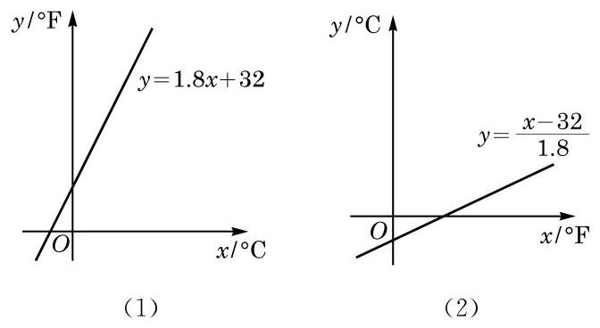

**图 5-4-1**

这是为什么呢？原来这两个函数所选取的自变量和函数值恰好相反。看似完全不同的两个函数关系式和图像都正确反映了两种温度单位之间的转换关系，前者将摄氏度转换为华氏度，而后者恰好相反。

从函数表达式来看，在函数 $y = 1.8x + 32$ 中，$x$ 是自变量，$y$ 是 $x$ 的函数。但从 $y = 1.8x + 32$ 这个关系式中解出 $x$，就得到了 $x = \frac{y - 32}{1.8}$。这样，根据这一转换关系，对于在某一个范围内的每一个 $y$ 值，同样有唯一的 $x$ 与之对应。也就是说，也可以把 $y$ 看成自变量，$x$ 作为 $y$ 的函数。这时，我们就说函数 $x = \frac{y - 32}{1.8}$ 是函数 $y = 1.8x + 32$ 的反函数。

由于习惯上函数的自变量用 $x$ 表示，在图像上作为点的横坐标，而函数值用 $y$ 表示，在图像上作为点的纵坐标，因此 $y = 1.8x + 32$ 的反函数通常写成 $y = \frac{x - 32}{1.8}$。

**定义** 对于函数 $y = f(x), x \in D$，记其值域为 $f(D)$。如果对 $f(D)$ 中的任意给定的一个值 $y$，在 $D$ 中满足 $f(x) = y$ 的 $x$ 值只有一个，那么由此得到的 $x$ 关于 $y$ 的函数叫做 $y = f(x)$，$x \in D$ 的反函数（inverse function），记作 $x = f^{-1}(y), y \in f(D)$。由于自变量习惯上常用 $x$ 表示，而函数值常用 $y$ 表示，因此通常把该函数改写为

$$y = f^{-1}(x), x \in f(D)。$$

例如，函数 $y = 2x$ 的反函数为 $y = \frac{x}{2}$，函数 $y = 3x + 1$ 的反函数为 $y = \frac{x - 1}{3}$。

一个定义域为 $D$ 的函数 $y = f(x)$ 存在反函数，当且仅当对于其值域 $f(D)$ 中的每一个值 $y_0$，在定义域 $D$ 中仅存在一个 $x_0$，满足 $f(x_0) = y_0$。也就是说，如果函数 $y = f(x)$ 在定义域 $D$ 上不同的 $x$ 处所取到的函数值也不相同，那么 $y = f(x)$ 就存在反函数。因此，在定义域上的严格增函数或严格减函数均存在反函数。

从反函数的定义可知：如果函数 $y = f(x), x \in D$ 存在反函数 $y = f^{-1}(x)$，$x \in f(D)$，那么函数 $y = f^{-1}(x), x \in f(D)$ 的反函数就是 $y = f(x), x \in D$。也就是说，$y = f(x)$ 及 $y = f^{-1}(x)$ 是互为反函数的。

函数 $y = f^{-1}(x)$ 的定义域就是 $y = f(x)$ 的值域，函数 $y = f^{-1}(x)$ 的值域就是函数 $y = f(x)$ 的定义域。

**例 1** 若 $f(x) = \log_3 x$，并设 $y = f^{-1}(x)$ 是 $y = f(x)$ 的反函数，求 $f^{-1}(2), f^{-1}(a)$。

**解** 设 $f^{-1}(2) = t$，根据反函数的定义，可得 $f(t) = 2$，即 $\log_3 t = 2$，因此 $t = 9$，即 $f^{-1}(2) = 9$。

类似地，设 $f^{-1}(a) = b$，可得 $f(b) = \log_3 b = a$，即 $b = 3^a$，因此 $f^{-1}(a) = 3^a$。

一般地，当 $a > 0, a \neq 1$ 时，解关于 $x$ 的方程 $y = \log_a x$，得 $x = a^y$。因此，当 $a > 0, a \neq 1$ 时，$y = a^x$ 与 $y = \log_a x$ 互为反函数。

**例 2** 求下列函数的反函数：

(1) $y = 4x + 2$；

(2) $y = x^2 + 1, x \in [1, 3]$；

(3) $y = \frac{3x + 1}{4x + 2}$。

**解** (1) 该函数的值域为 $\mathbf{R}$。解关于 $x$ 的方程 $y = 4x + 2$，得 $x = \frac{y - 2}{4}$。因此，相应的反函数为 $y = \frac{x - 2}{4}$。

---

在例 2(1) 中，使得表达式 $y = \frac{x - 2}{4}$ 有意义的 $x$ 的范围已经是 $y = 4x + 2$ 的值域 $\mathbf{R}$ 了，因此此处反函数的定义域不必明显地写出。例 2 (3) 不注明反函数的定义域的理由类似。

---

(2) 该函数的值域为 $[2, 10]$。

在 $x \in [1, 3], y \in [2, 10]$ 的前提下，解关于 $x$ 的方程 $y = x^2 + 1$，得 $x = \sqrt{y - 1}$。因此，相应的反函数为 $y = \sqrt{x - 1}, x \in [2, 10]$。

(3) 由 $y = \frac{3x + 1}{4x + 2} = \frac{3}{4} - \frac{1}{8x + 4}$ 可知，该函数的值域为 $\{ y \mid y \neq \frac{3}{4} \}$。

在 $x \neq -\frac{1}{2}, y \neq \frac{3}{4}$ 的前提下，解关于 $x$ 的方程 $y = \frac{3x + 1}{4x + 2}$，得 $x = \frac{1 - 2y}{4y - 3}$。

因此，相应的反函数为 $y = \frac{1 - 2x}{4x - 3}$。

### 练习 5.4(1)

1. 求函数 $y = x^2 + 2x, x \in [0, +\infty)$ 的反函数的定义域。

2. 求下列函数的反函数：

(1) $y = 3x + 2$；(2) $y = -\frac{3}{x}$；

(3) $y = x^2, x \in (-\infty, 0]$；(4) $y = \sqrt{x} + 1$。

3. 判断函数 $y = \begin{cases} x, & -1 \leq x \leq 0, \\ 1 - x, & 0 < x < 1 \end{cases}$ 是否存在反函数。若存在反函数，求出它的反函数；若不存在反函数，说明理由。

### 2 反函数的图像

为了研究函数与其反函数的图像的特征，我们需要一个如下的命题：

**命题** 在平面直角坐标系中，点 $P(a, b)$ 与点 $P'(b, a)$ 关于直线 $y = x$ 成轴对称。

**证明** 当 $a = b$ 时，点 $P$ 与 $P'$ 重合，且在直线 $y = x$ 上，结论成立。

当 $a \neq b$ 时，点 $P$ 与 $P'$ 是不重合的两点，要证明它们关于直线 $y = x$ 成轴对称，即证直线 $y = x$ 是线段 $PP'$ 的垂直平分线。

线段 $PP'$ 的垂直平分线即点集 $\{ Q(x, y) \mid |QP| = |QP'| \}$。由两点 $(x_1, y_1)$ 及 $(x_2, y_2)$ 之间的距离公式 $\sqrt{(x_1 - x_2)^2 + (y_1 - y_2)^2}$，该集合也可以表示为

$$\{ Q(x, y) \mid \sqrt{(x - a)^2 + (y - b)^2} = \sqrt{(x - b)^2 + (y - a)^2} \}，$$

即

$$\{ Q(x, y) \mid ax + by = bx + ay \}。$$

因 $a \neq b$，故该集合为 $\{ Q(x, y) \mid x = y \}$。

所以，线段 $PP'$ 的垂直平分线是直线 $y = x$，因而点 $P(a, b)$ 与点 $P'(b, a)$ 关于直线 $y = x$ 对称。

作为指数函数和对数函数的图像关系在一般函数中的推广，我们有

**性质** 互为反函数的两函数的图像关于直线 $y = x$ 成轴对称。

**证明** 设函数 $y = f(x), x \in D$ 的反函数为 $y = f^{-1}(x)$，$x \in f(D)$。

若 $P(a, b)$ 为函数 $y = f(x)$ 图像上任取的一点，则必有 $a \in D$，且 $b = f(a)$。这样，$b = f(a) \in f(D)$，且根据反函数的定义，$a = f^{-1}(b)$，因此 $P(a, b)$ 关于直线 $y = x$ 的对称点 $P'(b, a)$ 在函数 $y = f^{-1}(x)$ 的图像上。

另一方面，因为 $y = f^{-1}(x)$ 的反函数是 $y = f(x)$，由上述，$y = f^{-1}(x)$ 图像上任一点 $Q$ 关于直线 $y = x$ 的对称点 $Q'$ 在函数 $y = f(x)$ 的图像上。

综上所述，互为反函数的两函数的图像关于直线 $y = x$ 成轴对称。

在求一个函数 $y = f(x)$ 的反函数时，一般要经历下述三个步骤：求出反函数的定义域（即原来函数的值域）；解方程 $y = f(x)$，求出 $x$ 关于 $y$ 的函数表达式；再交换 $x$ 与 $y$。

正是将 $x$ 和 $y$ 对换，即将点的横纵两个坐标作了对换，才导致了函数与其反函数的图像关于直线 $y = x$ 对称。

**例 3** 求函数 $y = x^3$ 的反函数，并在同一坐标系中作出函数 $y = x^3$ 和它的反函数的图像。

**解** $y = x^3$ 的值域是 $\mathbf{R}$。解关于 $x$ 的方程 $y = x^3$，得 $x = \sqrt[3]{y}$，因此其反函数为 $y = \sqrt[3]{x}$。

**图 5-4-2**

同一坐标系中，$y = x^3$ 的图像与 $y = \sqrt[3]{x}$ 的图像如图 5-4-2 所示，它们关于直线 $y = x$ 对称。

**例 4** 已知函数 $y = a^x + b$ 的图像经过点 $(1, 7)$，而其反函数的图像经过点 $(4, 0)$，求实数 $a$、$b$ 的值。

**解** 由 $y = a^x + b$ 的图像经过点 $(1, 7)$，可知 $7 = a^1 + b = a + b$。此外，其反函数的图像经过点 $(4, 0)$，也就是 $y = a^x + b$ 的图像经过点 $(0, 4)$，故 $4 = a^0 + b = 1 + b$。

由此解得 $a$、$b$ 的值分别为 4、3。

### 练习 5.4(2)

1. 定义在 $\mathbf{R}$ 上的偶函数存在反函数吗？说明理由。

2. 下列各图中，存在反函数的函数 $y = f(x)$ 的图像只可能是（）

**(第 2 题)**

3. 已知函数 $y = f(x), x \in D$ 存在反函数 $y = f^{-1}(x), x \in f(D)$。函数 $y = f(x + 1)$ 与 $y = f^{-1}(x + 1)$ 是否一定互为反函数？说明理由。

### 习题 5.4

#### A 组

1. 已知函数 $y = x^2 - 4x - 5, x \in [1, 3]$，判断其是否存在反函数。若存在，求出反函数；若不存在，说明理由。

2. 求下列函数的反函数：

(1) $y = -x^3$；(2) $y = \frac{x}{x + 2}$；(3) $y = x^2 + 1, x \in (-\infty, 0)$。

3. 求下列函数的反函数：

(1) $y = 10^x + 1$；(2) $y = \log_2(x + 1)$；(3) $y = \log_2(2x)$。

4. 已知 $f(x) = 1 - \log_2 x$，设 $y = f^{-1}(x)$ 是 $y = f(x)$ 的反函数。求 $f^{-1}(-3)$ 的值。

5. 已知函数 $y = \frac{a}{x + 1}$ 的反函数的图像经过点 $(\frac{1}{2}, 1)$，求实数 $a$ 的值。

## 内容提要

1. 函数的概念：

(1) 设 $D$ 是一个非空的数集，如果按照某种确定的对应关系 $f$，使对集合 $D$ 中任意给定的 $x$，都有唯一的实数 $y$ 与之对应，就称这个对应关系 $f$ 为集合 $D$ 上的一个函数。

(2) 定义域和对应关系是函数的两个重要要素。函数的值域由其定义域和对应关系决定。两个函数的定义域和对应关系都相同（形式上未必相同）时，两个函数是相同的。

(3) 函数的图像是表示函数性质的直观有力的工具。

2. 函数的性质：

(1) 如果对定义域 $D$ 中的任意给定的 $x$，均有 $-x \in D$，并且 $f(x) = f(-x)$，那么称 $y = f(x), x \in D$ 是一个偶函数；如果对定义域 $D$ 中的任意给定的 $x$，均有 $-x \in D$，并且 $f(x) = -f(-x)$，那么称 $y = f(x), x \in D$ 是一个奇函数。函数的奇偶性刻画了函数图像关于原点及 $y$ 轴的对称性。

(2) 对于定义在 $D$ 上的函数 $y = f(x)$，设区间 $I$ 是 $D$ 的子集。对于区间 $I$ 上的任意给定的两个自变量的值 $x_1$、$x_2$，当 $x_1 < x_2$ 时，如果总有 $f(x_1) < f(x_2)$（$f(x_1) \leq f(x_2)$），就称函数 $y = f(x)$ 在区间 $I$ 上是严格增函数（增函数）；如果总有 $f(x_1) > f(x_2)$（$f(x_1) \geq f(x_2)$），就称函数 $y = f(x)$ 在区间 $I$ 上是严格减函数（减函数）。这种单调性刻画了函数图像上升或下降的趋势。

(3) 设函数 $y = f(x)$ 在 $x_0$ 处的函数值是 $f(x_0)$。对于定义域内任意给定的 $x$，如果不等式 $f(x) \geq f(x_0)$ 都成立，那么 $f(x_0)$ 叫做函数 $y = f(x)$ 的最小值；如果不等式 $f(x) \leq f(x_0)$ 都成立，那么 $f(x_0)$ 叫做函数 $y = f(x)$ 的最大值。最大值与最小值分别为函数图像的最高点与最低点的纵坐标。

3. 函数的应用：

(1) 在建立函数关系时，需要注意其定义域。

(2) 依靠函数 $y = f(x)$，可以用动态的观点来考察方程 $f(x) = 0$ 的求解，以及不等式 $f(x) > 0$ 的求解。

(3) 对于函数 $y = f(x), x \in D$，若存在 $c \in D$，且 $f(c) = 0$，则称 $c$ 是函数 $y = f(x), x \in D$ 的一个零点。零点是指函数图像与 $x$ 轴交点的横坐标。对于图像是连续曲线的函数，二分法是求近似零点的有效手段。

*4. 反函数：

(1) 反函数来源于解关于 $x$ 的方程 $f(x) = y$ 所得到的对应关系。

(2) 如果函数 $y = f(x)$ 在定义域 $D$ 上不同的 $x$ 处所取到的函数值也不相同，那么 $y = f(x)$ 就存在反函数。在定义域上严格单调的函数必存在反函数。

(3) 函数 $y = f(x)$ 的图像与其反函数 $y = f^{-1}(x)$ 的图像关于直线 $y = x$ 成轴对称。

## 复习题

### A 组

1. 求函数 $y = \frac{1}{2 - x} + \sqrt{x^2 - 1}$ 的定义域。

2. 判断下列函数 $y = f(x)$ 的奇偶性，并说明理由：

(1) $f(x) = |\frac{1}{2}x - 3| + |\frac{1}{2}x + 3|$；

(2) $f(x) = x^3 + \frac{2}{x}$；

(3) $f(x) = x^2, x \in (k, 2)$（其中常数 $k < 2$）。

3. 已知 $m$、$n$ 是常数，而函数 $y = (m - 1)x^2 + 3x + (2 - n)$ 为奇函数。求 $m$、$n$ 的值。

4. 求函数 $y = x + \frac{4}{x}$ 的单调区间。

5. 分别作出下列函数的大致图像，并指出它们的单调区间：

(1) $y = |x^2 - 4x|$；

(2) $y = 2|x| - 3$。

6. 已知二次函数 $y = f(x)$，其中 $f(x) = ax^2 - 2ax + 3 - a (a > 0)$。比较 $f(-1)$ 和 $f(2)$ 的大小。

7. 已知 $k$ 是常数，设 $\alpha$、$\beta$ 是二次方程 $x^2 - 2kx + k + 20 = 0$ 的两个实根。问：当 $k$ 为何值时，$(\alpha + 1)^2 + (\beta + 1)^2$ 取到最小值？

8. 邮局规定：当邮件质量不超过 $100 \mathrm{g}$ 时，每 $20 \mathrm{g}$ 邮费 0.8 元，且不足 $20 \mathrm{g}$ 时按 $20 \mathrm{g}$ 计算；超过 $100 \mathrm{g}$ 时，超过 $100 \mathrm{g}$ 的部分按每 $100 \mathrm{g}$ 邮费 2 元计算，且不足 $100 \mathrm{g}$ 按 $100 \mathrm{g}$ 计算；同时规定邮件总质量不得超过 2000 g。请写出邮费关于邮件质量的函数表达式，并计算 $50 \mathrm{g}$ 和 $500 \mathrm{g}$ 的邮件分别收多少邮费。

9. 若函数 $y = (a^2 + 4a - 5)x^2 - 4(a - 1)x + 3$ 的图像都在 $x$ 轴上方（不含 $x$ 轴），求实数 $a$ 的取值范围。

### B 组

1. 已知 $y = f(x)$ 是奇函数，其定义域为 $\mathbf{R}$；而 $y = g(x)$ 是偶函数，其定义域为 $D$。判断函数 $y = f(x)g(x)$ 的奇偶性，并说明理由。

2. 设函数 $y = x^2 + 10x - a + 3$，当 $x \in [-2, +\infty)$ 时，其函数值恒大于等于零。求实数 $a$ 的取值范围。

3. 已知函数 $y = -x^2 + 2ax + 1 - a, x \in [0, 1]$ 的最大值为 2。求实数 $a$ 的值。

4. 设 $f(x) = x^2 + ax + 1$。若对任意给定的实数 $x, f(2 + x) = f(2 - x)$ 恒成立，求实数 $a$ 的值。

5. 已知 $y = f(x)$ 是定义在 $(-1, 1)$ 上的奇函数，在区间 $[0, 1)$ 上是严格减函数，且 $f(1 - a) + f(1 - a^2) < 0$。求实数 $a$ 的取值范围。

6. 已知 $f(x) = 2 - x^2$ 及 $g(x) = x$。定义 $h(x)$ 如下：当 $f(x) \geq g(x)$ 时，$h(x) = g(x)$；而当 $f(x) < g(x)$ 时，$h(x) = f(x)$。求函数 $y = h(x)$ 的最大值。

### 拓展与思考

1. 试讨论函数 $y = \frac{x}{1 - x^2}$ 的单调性。

2. 作出函数 $y = (x^2 - 1)^2 - 1$ 的大致图像，写出它的单调区间，并证明你的结论。

3. 已知函数 $y = f(x)$ 为偶函数，$y = g(x)$ 为奇函数，且 $f(x) + g(x) = x^2 + 2|x - 1| + 3$。求 $y = f(x)$ 及 $y = g(x)$ 的表达式。

*4. 设函数 $y = f(x), x \in \mathbf{R}$ 的反函数是 $y = f^{-1}(x)$。

(1) 如果 $y = f(x)$ 是奇函数，那么 $y = f^{-1}(x)$ 的奇偶性如何？

(2) 如果 $y = f(x)$ 在定义域上是严格增函数，那么 $y = f^{-1}(x)$ 的单调性如何？
