## 空间直线 与平面

初中学习的平面几何, 研究的是平面上一些简单图形及其几何性质. 从本章开始，我们将把视野从二维的平面拓展到三维的空间. 在三维空间中的图形统称为空间图形或立体图形. 立体几何所研究的就是一些简单的空间图形及其几何性质.

从平面几何到立体几何, 我们要注意借鉴平面几何中已有的一些概念、方法和结论, 更要特别注意立体几何和平面几何之间的区别. 以本章学习的空间直线与平面为例, 我们不仅要研究平面这类典型的空间图形, 而且要对“直线”有更为深刻的认识. 比如, 空间两条直线之间的位置关系，除了平行与相交，还有既不相交、也不平行的情况，从而出现了异面直线这种更为复杂的研究对象. 这些都与平面几何情况大不相同, 也使立体几何的内涵变得格外丰富多彩.

我们生活在一个三维世界中, 立体几何的学习有助于我们从几何的角度更好地理解现实的世界，并且锻炼我们的几何直观想象能力. 因此, 在学习中, 要着重注意几何的直观和内涵，不要仅仅停留在表面上的严格推导和论证, 还要多画一些示意图来帮助理解, 这样才能更好地掌握几何的实质，逐步培养自己的立体感和空间想象能力.

### 10.1 平面及其基本性质

## 1 空间的点、直线与平面

与平面几何中的点 (point) 与直线 (straight line) 一样, 平面 (plane)也是一个从实际生活中抽象出来的数学概念. 如图 10-1-1, 平静的水面、平整的墙面、太阳能反射板等都给了我们平面的形象.

图 10-1-1

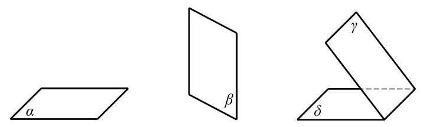

图 10-1-2

平面通常用一个小写希腊字母表示，如图 10-1-2 中的平面 $\alpha \text{ 、 }\beta \text{ 、 }\gamma \text{ 、 }\delta$ 等,有时也可以用一个或多个大写英文字母表示, 如平面 $M$ 、平面 ${ABCD}$ 等. 在平面几何中我们已经知道,点是没有大小的, 直线是没有粗细并且可以无限延伸的; 类似地, 我们说, 平面是没有厚薄并且可以无限延展的.

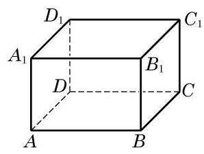

图 10-1-3

由于平面无边无界, 因此我们不可能将一个平面完整地画在纸上, 只能画其示意图. 习惯上, 我们用一个平行四边形来表示平面. 当平面是水平放置时, 通常把这个平行四边形的锐角画成 ${45}^{ \circ  }$ 左右,且横边长约为邻边长的 2 倍. 如果一个平面被另一个平面遮挡住，应将被遮挡的部分画成虚线，以增强立体感，如图 10-1-2所示.

平面是立体几何中的一个基本图形. 长方体的每个面都是某个平面的一部分. 图 10-1-3 中,长方体 ${ABCD} - {A}_{1}{B}_{1}{C}_{1}{D}_{1}$ 就可以看作是由六个平面所围成的空间图形.

下面, 我们来讨论点、直线与平面之间的位置关系. 我们把空间的直线和平面都看成是由点所组成的集合, 这样就可以借用集合的语言和符号来表示点、直线与平面之间的关系. 为了叙述方便,我们一般用大写的英文字母 $A\text{ 、 }B\text{ 、 }C$ 等表示点,用小写的英文字母 $a\text{ 、 }b\text{ 、 }c$ 等表示直线,用小写的希腊字母 $\alpha \text{ 、 }\beta \text{ 、 }\gamma$ 等表示平面.

在空间, 点与直线、点与平面的位置关系如下:

<table><tr><td></td><td>位置关系</td><td>符号表示</td><td>图形表示</td></tr><tr><td rowspan="2">点与直线</td><td>点 $A$ 在直线 $l$ 上,也称直线 $l$ 经过点 $A$</td><td>$A \in  l$</td><td></td></tr><tr><td>点 $B$ 不在直线 $l$ 上,也称直线 $l$ 不经过点 $B$</td><td>$B \notin  l$</td><td></td></tr><tr><td rowspan="2">点与平面</td><td>点 $A$ 在平面 $\alpha$ 上,也称平面 $\alpha$ 经过点 $A$</td><td>$A \in  \alpha$</td><td></td></tr><tr><td>点 $B$ 不在平面 $\alpha$ 上,也称平面 $\alpha$ 不经过点 $B$</td><td>$B \notin  \alpha$</td><td></td></tr></table>

在图 10-1-3 的长方体 ${ABCD} - {A}_{1}{B}_{1}{C}_{1}{D}_{1}$ 中, $A \in$ 直线 ${AB}$ , ${A}_{1} \notin$ 直线 ${AB}, B \in$ 平面 $B{B}_{1}{C}_{1}C, A \notin$ 平面 $B{B}_{1}{C}_{1}C$ 等. 我们还可以发现,直线 ${AB}$ 在平面 ${ABCD}$ 上 (即直线 ${AB}$ 上的所有点都在平面 ${ABCD}$ 上),但直线 ${AB}$ 不在平面 $B{B}_{1}{C}_{1}C$ 上.

在平面几何中, 我们已经知道两点确定一条直线. 由此是否可以推测: 如果一条直线上有两个点在一个平面上, 那么整条直线都在这个平面上? 其实, 这正是人们经过长期的观察与实践总结出来的一个基本事实, 我们把它当作一个公理. 9

公理 1 如果一条直线上有两点在一个平面上, 那么这条直线上所有的点都在这个平面上.

这时, 我们说这条直线在这个平面上, 或者说此平面经过该直线. 如图 10-1-4, 公理 1 可用符号语言表述为:

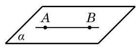

图 10-1-4

若点 $A \in  \alpha$ ,点 $B \in  \alpha$ ,则直线 ${AB} \subset  \alpha$ .

公理 1 可以用来判断一条直线是否在某个平面上. 由公理 1 知, 不在平面上的直线与这个平面最多只有一个公共点.

如果直线 $l$ 与平面 $\alpha$ 只有一个公共点 $A$ ,就称直线 $l$ 与平面 $\alpha$ 相交于点 $A$ ,或称 $A$ 是直线 $l$ 与平面 $\alpha$ 的交点,记作 $l \cap  \alpha  = A$ (图 10-1-5(1)). 如果直线 $l$ 与平面 $\alpha$ 没有公共点,就称直线 $l$ 与平面 $\alpha$ 平行,记作 $l \cap  \alpha  = \varnothing$ 或 $l//\alpha$ (图 10-1-5(2)).

---

如无特别说明, 本章中所说的两个点、 两条直线、两个平面等均指它们不相重合的情形.

---

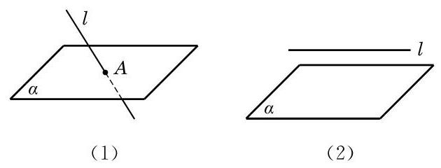

图 10-1-5

画图时,若直线 $l$ 在平面 $\alpha$ 上时,应将直线 $l$ 画在表示平面 $\alpha$ 的平行四边形的内部,如图 10-1-6 所示.

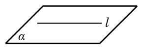

图 10-1-6

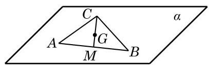

图 10-1-7

例 1 已知三角形 ${ABC}$ 的三个顶点 $A\text{ 、 }B\text{ 、 }C$ 都在平面 $\alpha$ 上，求证:该三角形的重心 $G$ 也在平面 $\alpha$ 上.

证明 如图 10-1-7,记线段 ${AB}$ 的中点为 $M$ . 因为 $A \in  \alpha$ , $B \in  \alpha$ ,由公理 1 可知,直线 ${AB} \subset  \alpha$ ,而 $M \in  {AB}$ ,从而 $M \in  \alpha$ .

又因为 $C \in  \alpha$ ,仍由公理 1 知, ${CM} \subset  \alpha$ . 由于重心 $G$ 是线段 ${CM}$ 的一个三等分点,因此 $G \in  \alpha$ .

## 练习 10.1(1)

1. 如图, 用集合语言描述下列图形中的点、直线、平面之间的位置关系.

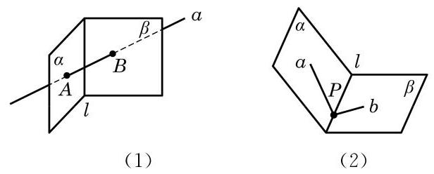

(第 1 题)

2. 证明:若四边形有三条边在一个平面上, 则它的第四条边也在这个平面上.

我们知道两点确定一条直线, 那么在空间要确定一个平面需要几个点呢?

生活中我们都有这样的经验: 三脚架在不平的地面上也可以稳固地支撑一部照相机；两个轮子的自行车在停止运动后要加上一个支撑脚才能稳定; 一扇门尽管有两个合页固定在门框上, 但仍然可以转动, 只有锁上后才可以固定下来. 这些例子都说明了一个事实, 那就是不在同一直线上的三点才能确定一个平面. 由此, 我们得到下面的公理.

公理 2 不在同一直线上的三点确定一个平面.

这里，“确定一个平面”意指“(经过这三个点)有且只有一个平面”或“存在唯一的平面”，如图 10-1-8 所示. 公理 2 可以具体表述为: 若 $A\text{ 、 }B\text{ 、 }C$ 三点不在同一直线上,则存在唯一的平面 $\alpha$ ,使得 $A\text{ 、 }B\text{ 、 }C$ 三点均在此平面上.

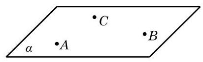

图 10-1-8

根据公理 2 可以得到下面的三个推论:

推论 1 一条直线和这条直线外的一点确定一个平面.

推论 2 两条相交直线确定一个平面.

推论 3 两条平行直线确定一个平面.

图 10-1-9 给出了上述三个推论的直观表示. 这些推论也可以用符号语言来表述，如推论 1 可以表述为:若 $A \notin  l$ ，则存在唯一的平面 $\alpha$ ,使得 $A \in  \alpha , l \subset  \alpha$ .

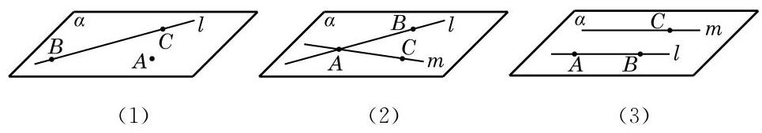

图 10-1-9

公理是进一步推理的基础, 是不证自明的事实, 但公理的推论是需要证明的. 下面，我们仅给出推论 1 的证明. 推论 2 的证明可以仿照推论 1 进行, 推论 3 的证明要借助于公理 4 ，我们分别把它们放在本节和下一节的习题中留给同学们完成.

证明 设 $A$ 是直线 $l$ 外的一点,在直线 $l$ 上任取 $B$ 和 $C$ 两点 (图 10-1-9(1)). 由公理 2 可知, $A\text{ 、 }B$ 和 $C$ 三点能确定一个平面 $\alpha$ . 因为点 $B\text{ 、 }C \in  \alpha$ ,由公理 1 可知, $B\text{ 、 }C$ 所在的直线 $l \subset  \alpha$ ,从而平面 $\alpha$ 是由直线 $l$ 和点 $A$ 确定的平面.

公理 2 及其三个推论可以用来构造一个平面或者判断点与直线是不是在同一个平面上. 如果可以判定某个空间图形在同一个平面上, 那么它实际上就是一个平面图形, 从而可以用平面几何的知识和方法来处理相应的问题.

例 2 已知三条直线 ${l}_{1}\text{ 、 }{l}_{2}$ 和 ${l}_{3}$ 两两相交,且不交于同一点. 求证: 直线 ${l}_{1}\text{ 、 }{l}_{2}$ 和 ${l}_{3}$ 在同一平面上.

证明 因为直线 ${l}_{1}\text{ 、 }{l}_{2}$ 和 ${l}_{3}$ 两两相交,设 ${l}_{1} \cap  {l}_{2} = A$ , ${l}_{2} \cap  {l}_{3} = B,{l}_{3} \cap  {l}_{1} = C$ ,如图 10-1-10 所示.

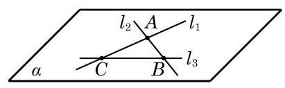

图 10-1-10

由推论 2 可知,相交的直线 ${l}_{1}$ 与 ${l}_{2}$ 可确定一个平面 $\alpha$ ,即有 ${l}_{1} \subset  \alpha ,{l}_{2} \subset  \alpha$ . 因为 $B \in  {l}_{2}, C \in  {l}_{1}$ ,所以 $B\text{ 、 }C \in  \alpha$ ,且 $B\text{ 、 }C$ 不重合. 由公理 1 可知,点 $B\text{ 、 }C$ 所在的直线 ${l}_{3} \subset  \alpha$ ,从而直线 ${l}_{1}\text{ 、 }{l}_{2}$ 和 ${l}_{3}$ 都在平面 $\alpha$ 上.

## 练习 10.1(2)

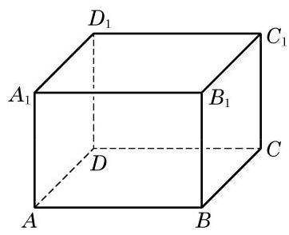

(第 2 题)

1. 已知 $a\text{ 、 }b\text{ 、 }c$ 是空间的三条直线， $a//b$ ，且 $c$ 与 $a\text{ 、 }b$ 都相交. 求证: 直线 $a\text{ 、 }b\text{ 、 }c$ 在同一平面上.

2. 如图,在长方体 ${ABCD} - {A}_{1}{B}_{1}{C}_{1}{D}_{1}$ 中,画出 ${A}_{1}B$ 与 $A$ 、 ${B}_{1}\text{ 、 }C$ 所确定的平面的交点,并说明理由.

3. 如何用绳子检查桌椅的四个脚是否立于同一平面上? 给出方案并说明理由.

## 2 相交平面

观察教室里的墙面，可以看到:相邻的两个墙面都有一条交线. 在一般的情况下, 我们有下面的公理.

公理 3 可具体表述为: 若两平面 $\alpha$ 及 $\beta$ 有一个公共点 $A$ ,则它们有唯一的公共直线 $l$ ,且公共点 $A$ 在 $l$ 上,如图 10-1-11 所示.

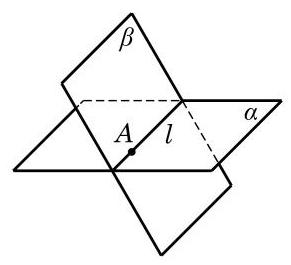

图 10-1-11

公理 3 如果两个不同的平面有一个公共点, 那么它们有且只有一条过该点的公共直线.

根据公理 3,两个平面 $\alpha$ 和 $\beta$ 间的位置关系只有两种: 相交于一条公共直线 $l$ 或者没有公共点. 前者称为相交,记作 $\alpha  \cap  \beta  = \; l$ ; 后者称为平行,记作 $\alpha //\beta$ 或 $\alpha  \cap  \beta  = \varnothing$ .

画两个相交平面时, 通常要画出它们的交线, 如图 10-1-11 所示; 画两个平行平面时, 要使表示这两个平面的相应平行四边形的对应边平行, 如图 10-1-12 所示. 注意, 在画图时, 凡被一个平面遮住的所有线条要画成虚线.

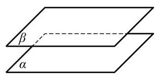

图 10-1-12

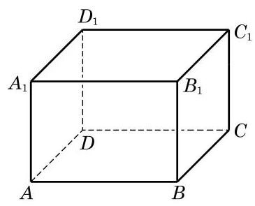

图 10-1-13

例 3 如图 10-1-13,在长方体 ${ABCD} - {A}_{1}{B}_{1}{C}_{1}{D}_{1}$ 中,找出下列各对平面的交线:

(1)平面 ${ABCD}$ 与平面 $A{A}_{1}{B}_{1}B$ ；

(2)平面 ${A}_{1}{BD}$ 与平面 ${C}_{1}{BD}$ ；

(3)平面 ${AC}{C}_{1}{A}_{1}$ 与平面 ${BD}{D}_{1}{B}_{1}$ ；

(4)平面 ${ABCD}$ 与平面 $B{B}_{1}{D}_{1}$ .

解 (1) 因为 $A$ 及 $B$ 是平面 ${ABCD}$ 与平面 $A{A}_{1}{B}_{1}B$ 的公共点,所以这两个平面的交线是棱 ${AB}$ 所在的直线.

(2)因为 $B$ 及 $D$ 是平面 ${A}_{1}{BD}$ 与平面 ${C}_{1}{BD}$ 的公共点，所以这两个平面的交线是长方体底面对角线 ${BD}$ 所在的直线.

(3)如图 10-1-14，连接 ${AC}$ 与 ${BD}$ ，其交点为 $O$ ，连接 ${A}_{1}{C}_{1}$ 与 ${B}_{1}{D}_{1}$ ,其交点为 ${O}_{1}$ . 因为点 $A$ 及 $C$ 都在平面 ${AC}{C}_{1}{A}_{1}$ 上,所以直线 ${AC}$ 在平面 ${AC}{C}_{1}{A}_{1}$ 上. 又 $O \in  {AC}$ ,所以 $O$ 在平面 ${AC}{C}_{1}{A}_{1}$ 上. 同理可得, $O$ 在平面 ${BD}{D}_{1}{B}_{1}$ 上. 于是,点 $O$ 是平面 ${AC}{C}_{1}{A}_{1}$ 与平面 ${BD}{D}_{1}{B}_{1}$ 的公共点. 同理可知,点 ${O}_{1}$ 也是平面 ${AC}{C}_{1}{A}_{1}$ 与平面 ${BD}{D}_{1}{B}_{1}$ 的公共点. 这样,由公理 $3, O{O}_{1}$ 所在的直线是平面 ${AC}{C}_{1}{A}_{1}$ 与平面 ${BD}{D}_{1}{B}_{1}$ 的交线.

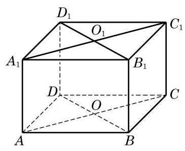

图 10-1-14

(4)因为 $B{B}_{1}//D{D}_{1}$ ，由公理 2 的推论 3 可知，这两条平行线 $B{B}_{1}$ 与 $D{D}_{1}$ 确定一个平面,从而 $D \in$ 平面 $B{B}_{1}{D}_{1}$ . 这样, $B$ 及 $D$ 是平面 ${ABCD}$ 与平面 $B{B}_{1}{D}_{1}$ 的公共点,从而直线 ${BD}$ 是这两个平面的交线.

## 练习 10.1(3)

1. 画三个平面, 使其中的两个平面互相平行, 而第三个平面与这两个平面都相交.

2. 用硬纸板作为平面的模型, 摆出三个平面两两相交各种不同的情况.

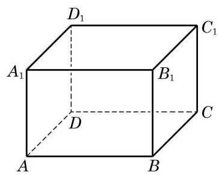

(第 3 题)

3. 如图,在长方体 ${ABCD} - {A}_{1}{B}_{1}{C}_{1}{D}_{1}$ 中,

(1)设 ${AC}$ 与 ${BD}$ 的交点为 $O$ ， $O$ 必为平面___与平面___的公共点(答案不唯一)；

(2)画出平面 ${A}_{1}{BC}{D}_{1}$ 与平面 ${B}_{1}{BD}{D}_{1}$ 的交线.

## 3 空间图形的平面直观图的画法

我们知道, 立体几何的研究对象是空间图形. 要将空间图形在一个平面上体现出来, 就需要在平面内画出具有立体感的空间图形的直观图.

为了把空间图形画得既富有立体感, 又能表达出图形各主要部分的位置关系和度量关系，我们通常采用斜二测画法画空间图形的直观图.

下面, 我们通过两个例子来体会用斜二测画法画空间图形直观图的方法与步骤.

例 4 用斜二测画法画一个水平放置的正六边形的直观图.

画法 (1) 如图 10-1-15(1), 在已知正六边形 ABCDEF 中,取 ${AD}$ 所在直线为 $x$ 轴,取线段 ${AD}$ 的对称轴 ${MN}$ 为 $y$ 轴, 两轴相交于点 $O$ . 在图 10-1-15(2) 中,画相应的 ${x}^{\prime }$ 轴和 ${y}^{\prime }$ 轴, 两轴相交于点 ${O}^{\prime }$ ,且使 $\angle {x}^{\prime }{O}^{\prime }{y}^{\prime } = {45}^{ \circ  }$ .

(2)在图 10-1-15(2)中，以 ${O}^{\prime }$ 为中点，在 ${x}^{\prime }$ 轴上取 ${A}^{\prime }{D}^{\prime } = \; {AD}$ ,在 ${y}^{\prime }$ 轴上取 ${M}^{\prime }{N}^{\prime }$ ,使 ${M}^{\prime }{O}^{\prime } = {N}^{\prime }{O}^{\prime } = \frac{1}{2}{MO}$ . 以 ${M}^{\prime }$ 为中点画 ${E}^{\prime }{F}^{\prime }$ 平行于 ${x}^{\prime }$ 轴,并使 ${E}^{\prime }{F}^{\prime } = {EF}$ ; 类似地,再以 ${N}^{\prime }$ 为中点画 ${B}^{\prime }{C}^{\prime }$ 平行于 ${x}^{\prime }$ 轴,并使 ${B}^{\prime }{C}^{\prime } = {BC}$ .

(3)顺次连接 ${A}^{\prime }\text{ 、 }{B}^{\prime }\text{ 、 }{C}^{\prime }\text{ 、 }{D}^{\prime }\text{ 、 }{E}^{\prime }\text{ 、 }{F}^{\prime }\text{ 、 }{A}^{\prime }$ ，所得到的六边形 ${A}^{\prime }{B}^{\prime }{C}^{\prime }{D}^{\prime }{E}^{\prime }{F}^{\prime }$ 就是水平放置的正六边形 ${ABCDEF}$ 的直观图. 画好图后, 要擦去辅助线, 如图 10-1-15(3) 所示.

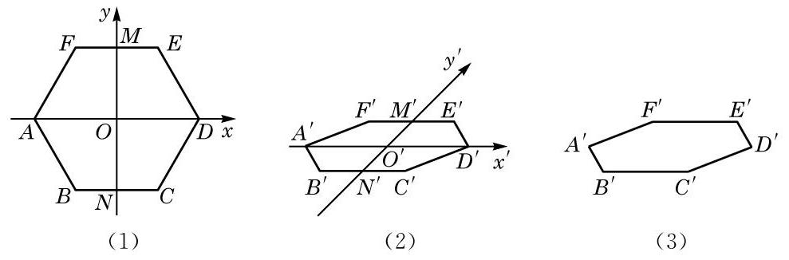

图 10-1-15

例 5 用斜二测画法画长、宽、高分别为 4、3、2 的长方体的直观图.

画法 (1) 画底面:画 $\square {OABC}$ ，使得 ${OA} = 4,{OC} = \frac{3}{2}, \; \angle {AOC} = {45}^{ \circ  }$ ,如图 10-1-16(1) 所示.

(2)画侧棱:过 $O$ 、 $A$ 、 $B$ 、 $C$ 各点分别作 ${OA}$ 和 ${BC}$ 的垂线,在这些垂线上分别截取长为 2 的线段 $O{O}^{\prime }\text{ 、 }A{A}^{\prime }\text{ 、 }B{B}^{\prime }$ 、 $C{C}^{\prime }$ ,如图 10-1-16(2) 所示.

(3)成图:顺次连接 ${O}^{\prime }\text{ 、 }{A}^{\prime }\text{ 、 }{B}^{\prime }\text{ 、 }{C}^{\prime }$ ，并擦去辅助线，将被遮挡的部分改为虚线, 得长方体的直观图, 如图 10-1-16(3) 所示.

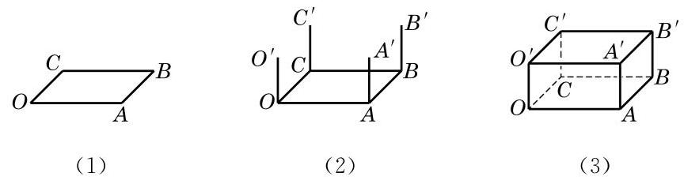

图 10-1-16

## 练习 10.1(4)

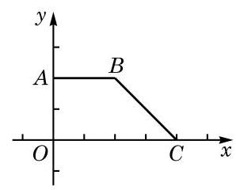

(第 2 题)

1. 在水平放置的平面上有一个边长为 $3\mathrm{\;{cm}}$ 的正三角形,请画出其直观图.

2. 画出如图水平放置的直角梯形 ${OABC}$ 的直观图.

## 习题 10.1

## A 组

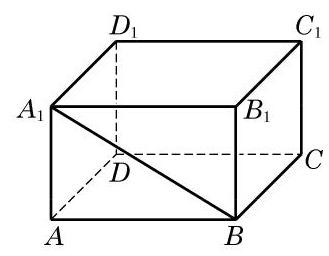

(第 1 题)

1. 如图,观察长方体 ${ABCD} - {A}_{1}{B}_{1}{C}_{1}{D}_{1}$ 中的点、线、面,用适当的符号或字母填空:

(1)点 $B$ ___直线 ${BC}$ ；

(2)点 $A$ ___直线 ${BC}$ ；

(3)点 $D$ ___平面 ${ABCD}$ ；

(4)点 ${A}_{1}$ ___平面 ${ABCD}$ ；

(5)直线 ${A}_{1}B \cap$ 直线 ${BC} =$ ___；

(6)直线 ${A}_{1}B \cap$ 平面 ${A}_{1}{B}_{1}{C}_{1}{D}_{1} =$ ___；

(7)直线 ${B}_{1}{C}_{1}$ ___平面 $B{B}_{1}{C}_{1}C$ .

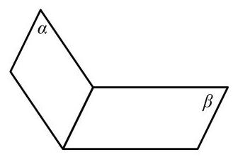

(第 2 题)

2. 用集合符号表述下列语句，并将语句所描述的图形画在右图中:

(1)点 $A$ 在平面 $\alpha$ 上:___；

(2)平面 $\alpha$ 经过直线 ${AC}$ :___；

(3)点 $B$ 不在平面 $\beta$ 上:___，

(4)直线 ${BC}$ 平行于平面 $\beta$ :___.

3. 下列图形一定是平面图形吗? 请说明理由.

(1)三角形; (2)梯形； (3)四边形; (4)菱形.

4. 判断下列命题的真假:

(1)若空间四点共面，则其中必有三点共线；

(2)若空间四点中有三点共线, 则此四点必共面;

(3)若空间四点中任何三点不共线, 则此四点不共面;

(4)若空间四点不共面，则其中任意三点不共线.

5. 证明公理 2 的推论 2.

6. 平面 $\alpha$ 与平面 $\beta$ 相交于直线 $l$ ,点 $A\text{ 、 }B$ 在平面 $\alpha$ 上,点 $C$ 在平面 $\beta$ 上但不在直线 $l$ 上,直线 ${AB}$ 与直线 $l$ 相交于点 $R$ . 设 $A\text{ 、 }B\text{ 、 }C$ 三点确定的平面为 $\gamma$ ,则 $\beta$ 与 $\gamma$ 的交线是 ( )

A. 直线 ${AC}$ ; B. 直线 ${BC}$ ;

C. 直线 ${CR}$ ; D. 以上均不正确.

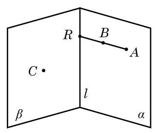

(第 6 题)

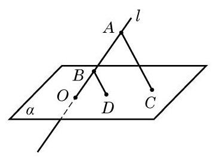

(第 7 题)

7. 如图,已知直线 $l$ 与平面 $\alpha$ 相交于点 $O, A\text{ 、 }B \in  l, C\text{ 、 }D \in  \alpha$ ,且 ${AC}//{BD}$ . 求证: $O\text{ 、 }C\text{ 、 }D$ 三点共线.

8. 画出棱长为 $3\mathrm{\;{cm}}$ 的正方体的直观图.

## B 组

1.1 个平面把空间分成 2 部分，2 个平面把空间分成 3 或 4 部分，3 个平面把空间分成几部分?

2. 若平面 $\alpha$ 与平面 $\beta$ 、 $\gamma$ 都相交,则这三个平面的交线可能有几条?

A. 1 条或 2 条; B. 2 条或 3 条;

C. 1 条或 3 条; D. 1 条或 2 条或 3 条.

3. 如图,在正方体 ${ABCD} - {A}_{1}{B}_{1}{C}_{1}{D}_{1}$ 中,已知 $O$ 是 ${DB}$ 的中点,且直线 ${A}_{1}C$ 交平面 ${C}_{1}{BD}$ 于点 $M$ ，点 ${C}_{1}\text{ 、 }M\text{ 、 }O$ 的位置关系是___.

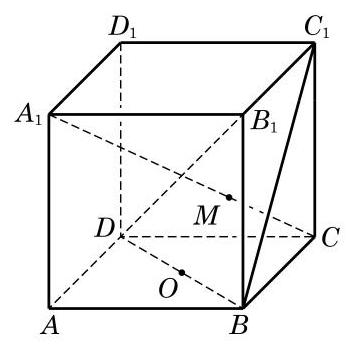

(第 3 题)

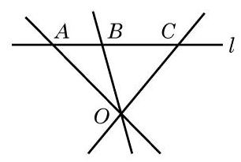

(第 4 题)

4. 如图,已知 $A \in  l, B \in  l, C \in  l, O \notin  l$ . 求证: ${OA}\text{ 、 }{OB}\text{ 、 }{OC}$ 在同一平面上.

5. 如图,已知 $D$ 及 $E$ 是 $\bigtriangleup {ABC}$ 的边 ${AC}$ 及 ${BC}$ 上的点,平面 $\alpha$ 经过 $D\text{ 、 }E$ 两点,直线 ${AB}$ 与平面 $\alpha$ 交于点 $P$ . 求证: 点 $P$ 在直线 ${DE}$ 上.

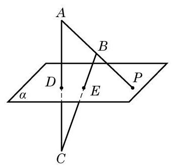

(第 5 题)

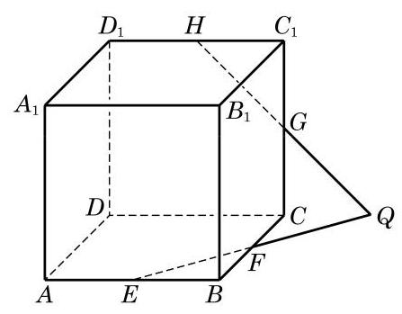

(第 6 题)

6. 如图,已知 $E\text{ 、 }F\text{ 、 }G\text{ 、 }H$ 分别是正方体 ${ABCD} - {A}_{1}{B}_{1}{C}_{1}{D}_{1}$ 的棱 ${AB}\text{ 、 }{BC}\text{ 、 }C{C}_{1}$ 、 ${C}_{1}{D}_{1}$ 的中点,且 ${EF}$ 与 ${HG}$ 相交于点 $Q$ . 求证: 点 $Q$ 在直线 ${DC}$ 上.

### 10.2 直线与直线的位置关系

## 1 空间的平行直线

在平面几何里我们知道平行关系具有传递性, 即在同一平面上，如果两条直线都和第三条直线平行，那么这两条直线也互相平行. 对于空间的直线, 这种传递性是否还存在?

仔细观察下面的两种实际情景:当打开一本书时，每一页的外边界看上去都是相互平行的 (图 10-2-1); 而围栏的每一根竖条, 从不同的角度看, 也都是相互平行的(图 10-2-2).

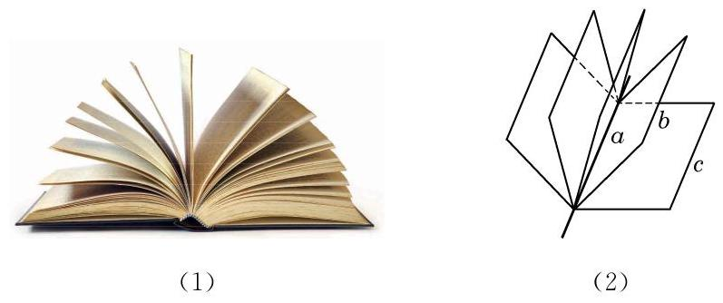

图 10-2-1

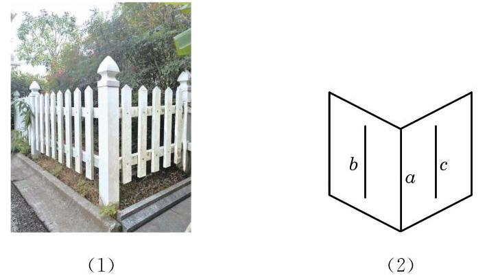

图 10-2-2

正是基于这种经验, 我们有下面的公理.

公理 4 平行于同一条直线的两条直线互相平行.

这条公理用符号语言可以表述为: 若 $a//b$ ,且 $a//c$ ,则 $b//c$ .

公理 4 表明, 直线的平行关系在空间同样具有传递性.

有了公理 4 ，我们就可以解释前面的两种实际情景. 例如， 在图 10-2-1 的情景中, 因为书的每一页都是矩形, 所以每一页的外边界所在的直线都平行于书脊所在的直线, 从而由平行关系的传递性知, 每一页的外边界所在的直线都是相互平行的.

---

围栏的情景请同学们自己依据公理 4 给出合理的解释.

---

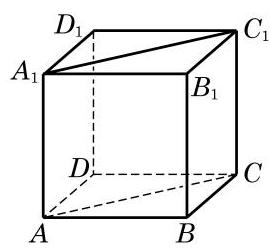

图 10-2-3

例 1 如图 10-2-3,在正方体 ${ABCD} - {A}_{1}{B}_{1}{C}_{1}{D}_{1}$ 中,

(1)找出与 ${AB}$ 平行的所有棱,并解释你的结论;

(2)求证: ${AC}//{A}_{1}{C}_{1}$ ；

(3)求证: $\angle {BAC} = \angle {{B}_{1}{A}_{1}{C}_{1}}$ .

解 (1) 与 ${AB}$ 平行的棱有 ${CD}\text{ 、 }{A}_{1}{B}_{1}$ 和 ${C}_{1}{D}_{1}$ . 因为正方体的每个面都是正方形,所以 ${AB}//{CD},{AB}//{A}_{1}{B}_{1}$ , ${CD}//{C}_{1}{D}_{1}$ ，从而由公理 4，知 ${AB}//{C}_{1}{D}_{1}$ .

(2)证明:因为 ${ABCD} - {A}_{1}{B}_{1}{C}_{1}{D}_{1}$ 是一个正方体，所以 $B{B}_{1}//A{A}_{1}, B{B}_{1}//C{C}_{1}$ . 由公理 4,可得 $A{A}_{1}//C{C}_{1}$ . 此外,显然有 $A{A}_{1} = C{C}_{1}$ ,从而 ${A}_{1}{AC}{C}_{1}$ 是一个平行四边形,所以 ${AC} \; //{A}_{1}{C}_{1}$ .

(3)证明:因为正方体的每个面都是正方形，所以 $\bigtriangleup  {BAC}$ 和 $\bigtriangleup {B}_{1}{A}_{1}{C}_{1}$ 都是等腰直角三角形,从而 $\angle {BAC} = \angle {{B}_{1}{A}_{1}{C}_{1}} \; = {45}^{ \circ  }$ .

例 1 中 $\angle {BAC}$ 与 $\angle {B}_{1}{A}_{1}{C}_{1}$ 的位置关系比较特殊,它们的两边分别平行且方向相同. 空间中具有这种位置关系的两个角是否一定相等呢? 我们可以证明以下定理.

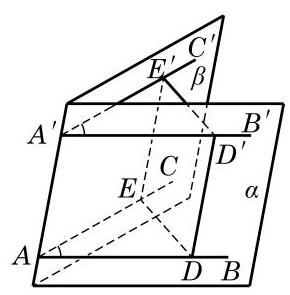

图 10-2-4

等角定理 如果一个角的两边和另一个角的两边分别平行并且方向相同, 那么这两个角相等.

如图 10-2-4,已知 $\angle {BAC}$ 与 $\angle {B}^{\prime }{A}^{\prime }{C}^{\prime }$ 的边 ${AB}//{A}^{\prime }{B}^{\prime }$ , ${AC}//{A}^{\prime }{C}^{\prime }$ ,并且方向相同.

求证: $\angle {BAC} = \angle {B}^{\prime }{A}^{\prime }{C}^{\prime }$ .

证明 因为 ${AB}//{A}^{\prime }{B}^{\prime },{AC}//{A}^{\prime }{C}^{\prime }$ ，由公理 2 推论 3 可知， ${AB}\text{ 、 }{A}^{\prime }{B}^{\prime }$ 确定一个平面,记为 $\alpha ;{AC}\text{ 、 }{A}^{\prime }{C}^{\prime }$ 也确定一个平面, 记为 $\beta$ . 在直线 ${AB}\text{ 、 }{AC}$ 上分别取点 $D\text{ 、 }E$ ,在直线 ${A}^{\prime }{B}^{\prime }$ 、 ${A}^{\prime }{C}^{\prime }$ 上分别取点 ${D}^{\prime }\text{ 、 }{E}^{\prime }$ ,使得 ${AD} = {A}^{\prime }{D}^{\prime },{AE} = {A}^{\prime }{E}^{\prime }$ . 因为在平面 $\alpha$ 上， ${AD}//{A}^{\prime }{D}^{\prime },{AD} = {A}^{\prime }{D}^{\prime }$ ，所以 ${A}^{\prime }{D}^{\prime }{DA}$ 是一个平行四边形,从而 $A{A}^{\prime }//D{D}^{\prime }$ ,且 $A{A}^{\prime } = D{D}^{\prime }$ . 同理, $A{A}^{\prime }//E{E}^{\prime }$ , 且 $A{A}^{\prime } = E{E}^{\prime }$ . 这样就有 $D{D}^{\prime }//E{E}^{\prime }$ ,且 $D{D}^{\prime } = E{E}^{\prime }$ ,即 ${D}^{\prime }{E}^{\prime }{ED}$ 是一个平行四边形. 于是, ${ED} = {E}^{\prime }{D}^{\prime }$ ,从而 $\bigtriangleup {ADE} \cong \; \bigtriangleup {A}^{\prime }{D}^{\prime }{E}^{\prime }$ ,即得 $\angle {BAC} = \angle {B}^{\prime }{A}^{\prime }{C}^{\prime }$ .

---

这里我们用到了不同平面上两个全等三角形的判定与性质. 之所以可以推广这种性质到空间的情形， 是因为三角形的全等与相似都具有运动的不变性.

---

由上述定理, 我们容易得出下面两个推论.

推论 1 如果一个角的两边和另一个角的两边分别平行, 那么这两个角相等或者互补.

推论 2 如果两条相交直线和另两条相交直线分别平行, 那么这两组直线所成的锐角(或直角)相等.

例 2 如图 10-2-5, ${ABC}$ 是一张三角形的纸片, $D$ 是边 ${AC}$ 上的一点. 我们将此三角形纸片沿 ${BD}$ 折成一个空间四边形 ${ABCD}$ . 在这个空间四边形 ${ABCD}$ 中, $E\text{ 、 }F\text{ 、 }G\text{ 、 }H$ 分别为边 ${AB}\text{ 、 }{BC}\text{ 、 }{CD}\text{ 、 }{DA}$ 的中点.

Q

---

由空间四点首尾相接所成的四边形叫做空间四边形.

---

求证: ${EFGH}$ 是平行四边形.

?

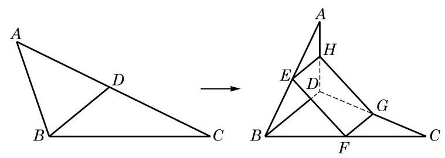

图 10-2-5

---

(1)将空间四边形 ABCD 还原到原来的位置, 那么所得到的四边形 EFGH 还是平行四边形吗?

(2)若 $E$ 、 $F$ 、 $G$ 、 $H$ 不是所在边的中点, ${EFGH}$ 是否仍可能是平行四边形?

---

证明 因为 ${EH}$ 是 $\bigtriangleup {ABD}$ 的一条中位线,所以 ${EH}//{BD}$ , 且 ${EH} = \frac{1}{2}{BD}$ . 同理, ${FG}$ 是 $\bigtriangleup {CBD}$ 的一条中位线,有 ${FG}// \; {BD}$ ,且 ${FG} = \frac{1}{2}{BD}$ . 由公理 4,知 ${EH}//{FG}$ ,且 ${EH} = {FG}$ ,从而 ${EFGH}$ 是平行四边形.

## 练习 10.2(1)

1. 如图,在长方体 ${ABCD} - {A}_{1}{B}_{1}{C}_{1}{D}_{1}$ 中,直线 ${A}_{1}C$ 与 $B{D}_{1}$ 相交吗? 为什么?

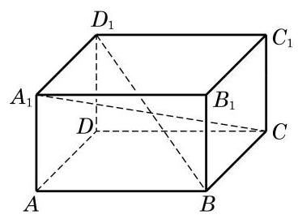

(第 1 题)

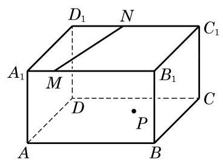

(第 2 题)

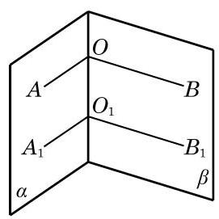

(第 3 题)

2. 在如图所示的长方体 ${ABCD} - {A}_{1}{B}_{1}{C}_{1}{D}_{1}$ 中,平面 ${A}_{1}{B}_{1}{C}_{1}{D}_{1}$ 上有一条直线 ${MN}$ ,而平面 ${ABCD}$ 上有一点 $P$ . 试过点 $P$ 作一条直线 $l$ , 使得 $l//{MN}$ .

3. 如图，在两个相交平面 $\alpha$ 、 $\beta$ 的交线上任意取两点 $O$ 与 ${O}_{1}$ . 在平面 $\alpha$ 上,过 $O$ 与 ${O}_{1}$ 分别作射线 ${OA}$ 与 ${O}_{1}{A}_{1}$ 垂直于 $O{O}_{1}$ ; 在平面 $\beta$ 上,过 $O$ 与 ${O}_{1}$ 分别作射线 ${OB}$ 与 ${O}_{1}{B}_{1}$ 垂直于 $O{O}_{1}$ . 求证: $\angle {AOB} \; = \angle {A}_{1}{O}_{1}{B}_{1}$ .

## 2 异面直线

我们知道, 在同一平面上的两条直线只有平行或相交两种位置关系. 空间的两条直线, 除了平行和相交这两种位置关系, 是否还有其他的位置关系呢? 观察下面的两幅实景图. 在图 10-2-6(1)中，如果把远方的高楼看作是一条直线，将马路看作是另外一条直线, 这两条直线看起来既不平行, 也不相交. 类似地，在图 10-2-6(2) 中，如果把高铁轨道和其下的高速公路分别看作是两条直线, 那么它们看起来不会在同一个平面上. 我们用图10-2-7 直观地分别表示这两种实际的情景.

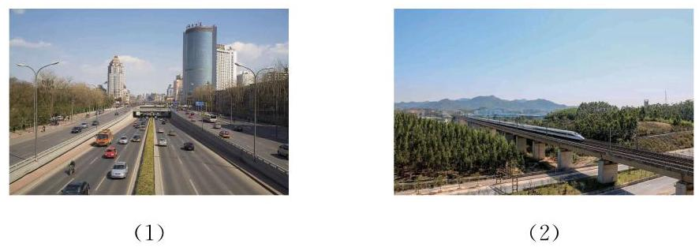

图 10-2-6

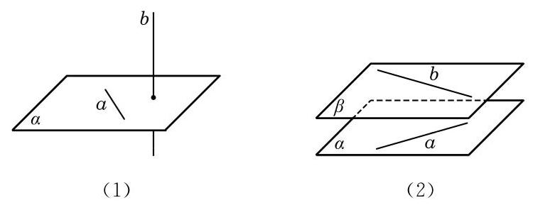

图 10-2-7

像上述这种不在同一个平面上, 既不相交也不平行的两条直线是空间中特有的一种两直线位置关系. 相应地，我们给出下面的定义.

定义 不同在任何一个平面上的两条直线叫做异面直线 (noncoplanar straight lines).

这里, “不同在任何一个平面上的两条直线”是指不存在一个平面, 使得这两条直线都在这个平面上. 例如, 观察图 10-2-8 中长方体 ${ABCD} - {A}_{1}{B}_{1}{C}_{1}{D}_{1}$ 的棱所在的直线,可以发现,直线 $A{A}_{1}$ 与 $C{C}_{1}$ 虽然不在这个长方体的同一个表面上,但是可以找到一个平面 (即平面 ${A}_{1}{AC}{C}_{1}$ ),使得它们都在这个平面上,所以 $A{A}_{1}$ 与 $C{C}_{1}$ 不是异面直线. 但直线 ${AB}$ 与 $C{C}_{1}$ 则不是这种情况. 假设存在一个平面 $\alpha$ 同时包含直线 ${AB}$ 与 $C{C}_{1}$ ,那么不共线的三点 $A\text{ 、 }B\text{ 、 }C$ 就在这个平面上,从而由公理 2 可知,平面 $\alpha$ 就应是长方体的下底面 ${ABCD}$ ,从而直线 $C{C}_{1}$ 就应在长方体的下底面上,但这是不可能的,所以这样的平面 $\alpha$ 是不存在的. 也就是说,直线 ${AB}$ 与 $C{C}_{1}$ 是异面直线.

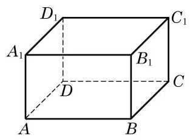

图 10-2-8

这样, 空间的两条直线就有三种不同的位置关系, 可以用下表来分类:

<table><tr><td>位置关系</td><td>是否共面</td><td>是否有公共点</td></tr><tr><td>相交</td><td>是</td><td>是</td></tr><tr><td>平行</td><td>是</td><td>否</td></tr><tr><td>异面</td><td>否</td><td>否</td></tr></table>

画两条异面直线时, 通常需要用一个或两个平面来衬托, 如图 10-2-9 所示.

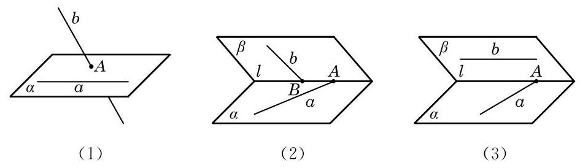

图 10-2-9

为了判断两条直线是否为异面直线，由定义，就要判断两条直线是否“不同在任何一个平面上”，这显然不太方便，一般只能用反证法来进行论证. 为了便于判断两条直线是否异面，我们给出下面的定理.

异面直线判定定理 过平面外一点与平面上一点的直线, 和此平面上不经过该点的任何一条直线都是异面直线.

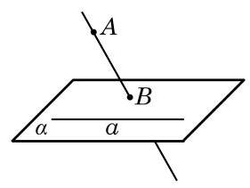

图 10-2-10

已知: 如图 10-2-10,直线 $a$ 在平面 $\alpha$ 上,点 $A$ 不在平面 $\alpha$ 上,直线 ${AB}$ 与平面 $\alpha$ 交于点 $B$ ,点 $B$ 在平面 $\alpha$ 上但不在直线 $a$ 上.

求证: 直线 ${AB}$ 和 $a$ 是异面直线.

证明 假设存在一个平面 $\beta$ ,使得直线 ${AB}$ 与 $a$ 均在平面 $\beta$ 上,那么平面 $\beta$ 一定经过点 $A\text{ 、 }B$ 和直线 $a$ . 因为 $B \notin  a$ ,由公理 2 推论 1,经过点 $B$ 与直线 $a$ 只能有一个平面,它就是 $\alpha$ ,从而平面 $\alpha$ 与 $\beta$ 是同一个平面. 这样,点 $A$ 就应在平面 $\alpha$ 上,与假设 $A \notin  \alpha$ 矛盾. 所以,直线 ${AB}$ 和 $a$ 必为异面直线.

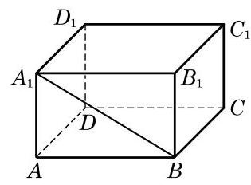

图 10-2-11

例 3 如图 10-2-11,在长方体 ${ABCD} - {A}_{1}{B}_{1}{C}_{1}{D}_{1}$ 中, 哪些棱所在的直线与直线 $B{A}_{1}$ 是异面直线?

解 长方体共有 12 条棱. 过顶点 $B$ 和 ${A}_{1}$ 的棱各有 3 条,这 6 条棱所在的直线都与直线 $B{A}_{1}$ 相交,必定与其共面.

对于棱 $C{C}_{1}$ ,它落在平面 ${BC}{C}_{1}{B}_{1}$ 上,而 $B{A}_{1}$ 是过此平面上点 $B$ 及此平面外点 ${A}_{1}$ 的直线,由上述定理知,棱 $C{C}_{1}$ 所在的直线与直线 $B{A}_{1}$ 是异面直线. 同理,棱 $D{D}_{1}\text{ 、 }{DC}\text{ 、 }{D}_{1}{C}_{1}\text{ 、 }{AD}$ 及 ${B}_{1}{C}_{1}$ 所在的直线均分别与直线 $B{A}_{1}$ 是异面直线.

例 4 给定不共面的 4 点，作过其中 3 个点的平面，所有 4 个这样的平面围成的几何体称为四面体 (图 10-2-12). 预先给定的 4 个点称为四面体的顶点, 2 个顶点的连线称为四面体的棱, 3 个顶点所确定的三角形称为四面体的面. 求证: 四面体中任何一对不共顶点的棱所在的直线一定是异面直线.

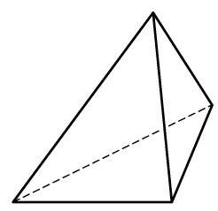

图 10-2-12

证明 一条棱上有 2 个顶点, 两条不共顶点的棱上一共有 4 个不同的顶点, 也就是说, 两条不共顶点的棱上有全部预先给定的 4 个点了. 如果这两条棱共面, 那么 4 个顶点也共面, 这与已知的 4 点不共面条件矛盾. 由此可见, 任何一对不共顶点的棱所在的直线一定是异面直线.

?

---

本例可以运用异面直线判定定理证明吗?

---

## 练习 10.2(2)

1. 在教室里找出几对异面直线的例子.

2. 如果一条直线和两条异面直线中的一条平行, 那么它和另一条直线的位置关系是___.

3. 下页左图是一个正方体的平面展开图, 请在下页右图的正方体中画出对应的线段， 并指出正方体中的线段 ${CN}\text{ 、 }{AF}\text{ 、 }{BM}\text{ 、 }{ME}$ 中，哪些线段所在的直线与 ${DN}$ 所在的直线是异面直线.

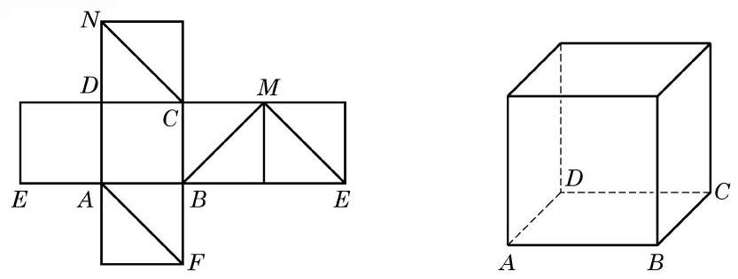

(第 3 题)

## 3 两条异面直线所成的角

几何学除了要讨论几何图形之间的相互位置关系, 还要更精确地以定量的方法判断图形的位置与形状. 在平面几何中, 我们已分别通过夹角或距离来确定两条相交或平行的直线之间的相对位置. 空间中的两条相交或平行直线, 本质上可以看成某一平面上的两条相交或平行直线, 也可以用类似方法处理. 那么, 我们该如何确定两条异面直线的相对位置呢?

生活中经常可以看到图 10-2-13(1)所示的道路指示牌. 这些指示牌看上去形成了不同的角度, 指明了不同的方向. 我们把左边的实景图抽象为 10-2-13(2)中的示意图，用 $a$ 、 $b$ 等分别表示道路指示牌. 依据异面直线判定定理可知, 它们两两都是异面直线. 现在的问题是: 我们是否可以定义并确定这些异面直线之间的角度呢?

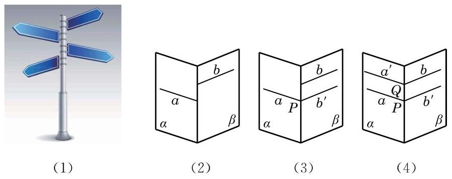

图 10-2-13

一个自然的想法是将两条异面直线转化为相交直线, 然后观察它们所成的角. 例如,在图 10-2-13(3) 中,在平面 $\beta$ 内,把直线 $b$ 平移到直线 $a$ 上的点 $P$ 处,记为 ${b}^{\prime }$ . 这样,直线 $a$ 与 ${b}^{\prime }$ 就在点 $P$ 处相交,它们之间可以用平面几何的方法来度量夹角的大小. 由于这样将直线平移的方法可以有很多, 需要考虑的是: 这样通过平移所形成的角的大小是唯一确定的吗? 例如, 在图 10-2-13(4)中，我们也可在平面 $\alpha$ 内，把直线 $a$ 平移到直线 $b$ 上的点 $Q$ 处,同样得到两条相交直线 ${a}^{\prime }$ 和 $b$ ,它们所成夹角的大小与 $a\text{ 、 }{b}^{\prime }$ 所成夹角的大小相等吗? 由等角定理的推论 2 可知,这两组相交直线所成的锐角 (或直角) 的确是相等的. 事实上,我们可以有下面更为一般的结论:

如图 10-2-14,设 $a\text{ 、 }b$ 是两条异面直线,在空间任取一点 $P$ ,过点 $P$ 分别作 $a\text{ 、 }b$ 的平行线 ${a}^{\prime }\text{ 、 }{b}^{\prime }$ ,那么相交直线 ${a}^{\prime }\text{ 、 }{b}^{\prime }$ 所成锐角(或直角)的大小是唯一确定的.

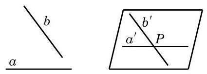

图 10-2-14

这样, 就可以给出下面的定义.

定义 两条异面直线平移到相交位置时所得到的锐角或直角, 称为这两条异面直线所成的角.

由上述定义知,两条异面直线所成角的范围是 ${0}^{ \circ  } < \theta  \leq  {90}^{ \circ  }$ , 在弧度制下是 $\theta  \in  \left( {0,\frac{\pi }{2}}\right\rbrack$ .

特别地,如果两条异面直线 $a\text{ 、 }b$ 所成的角是直角,就说这两条异面直线互相垂直,记作 $a \bot  b$ . 由上述定义容易推出: 如果 $a \bot  b, b//c$ ,那么 $a \bot  c$ .

例 5 如图 10-2-15(1),在正方体 ${ABCD} - {A}_{1}{B}_{1}{C}_{1}{D}_{1}$ 中,

(1)求异面直线 ${A}_{1}B$ 与 ${DC}$ 所成的角的大小；

(2)求异面直线 ${A}_{1}B$ 与 ${AC}$ 所成的角的大小；

(3)求证: $D{D}_{1}\bot {AB}$ .

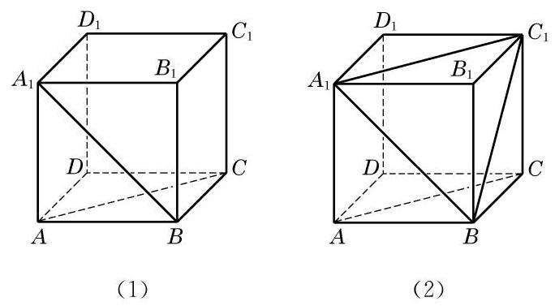

图 10-2-15

解(1)因为 ${DC}//{AB}$ ，所以 $\angle {A}_{1}{BA}$ 就是异面直线 ${A}_{1}B$ 与 ${DC}$ 所成的角或其补角. 因为正方形 ${AB}{B}_{1}{A}_{1}$ 中, $\angle {A}_{1}{BA} = \; {45}^{ \circ  }$ ,所以异面直线 ${A}_{1}B$ 与 ${DC}$ 所成的角为 ${45}^{ \circ  }$ .

---

过空间一点, 可以作几条直线与已知直线平行? 垂直呢?

求两条异面直线所成角时, 一般通过平移将所求角置于某个三角形中, 利用三角形的边角关系来求出这个角的大小.

---

(2)如图10-2-15(2)，连接 ${A}_{1}{C}_{1}$ . 由 $A{A}_{1}{C}_{1}C$ 是平行四边形,知 ${AC}//{A}_{1}{C}_{1}$ . 连接 $B{C}_{1}$ . 在 $\bigtriangleup B{A}_{1}{C}_{1}$ 中,因为 $B{A}_{1} = \; {A}_{1}{C}_{1} = B{C}_{1} = \sqrt{2}{AB}$ ,所以 $\bigtriangleup B{A}_{1}{C}_{1}$ 是一个等边三角形,从而 $\angle B{A}_{1}{C}_{1} = {60}^{ \circ  }$ . 因为 ${AC}//{A}_{1}{C}_{1}$ ,所以 $\angle B{A}_{1}{C}_{1}$ 就是异面直线 ${A}_{1}B$ 与 ${AC}$ 所成的角. 所以,异面直线 ${A}_{1}B$ 与 ${AC}$ 所成的角为 ${60}^{ \circ  }$ .

(3)证明:因为 $D{D}_{1}//A{A}_{1}$ ，且 $A{A}_{1} \bot  {AB}$ ，所以 $D{D}_{1} \; \bot  {AB}$ .

## 练习 10.2(3)

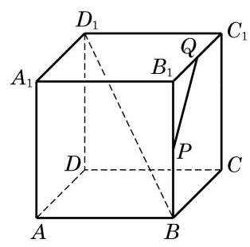

(第 2 题)

1. 在长方体 ${ABCD} - {A}_{1}{B}_{1}{C}_{1}{D}_{1}$ 中,与棱 $A{A}_{1}$ 所在直线异面且垂直的棱有几条?

2. 在如图所示的正方体 ${ABCD} - {A}_{1}{B}_{1}{C}_{1}{D}_{1}$ 中,设 $P\text{ 、 }Q$ 分别是棱 $B{B}_{1}\text{ 、 }{B}_{1}{C}_{1}$ 的中点. 请画出异面直线 $B{D}_{1}$ 与 ${PQ}$ 所成的角.

## 习题 10.2

## A 组

1. 证明公理 2 的推论 3.

2. 空间两条互相平行的直线指的是 ( )

A. 在空间没有公共点的两条直线;

B. 分别在两个平面上的两条直线;

C. 在两个不同的平面上且没有公共点的两条直线;

D. 在同一平面上且没有公共点的两条直线.

3. 如图,在正方体 ${ABCD} - {A}_{1}{B}_{1}{C}_{1}{D}_{1}$ 中, $M\text{ 、 }N$ 分别为 ${CD}\text{ 、 }{AD}$ 的中点. 求证: ${MN}//{A}_{1}{C}_{1}$ .

4. 如图是一个正方体的平面展开图, 在这个正方体中, 下列说法中正确的序号是___.

① 直线 ${AF}$ 与直线 ${DE}$ 相交;

② 直线 ${CN}$ 与直线 ${DE}$ 平行;

③ 直线 ${BM}$ 与直线 ${DE}$ 是异面直线；

④ 直线 ${CN}$ 与直线 ${BM}$ 成 ${60}^{ \circ  }$ 角.

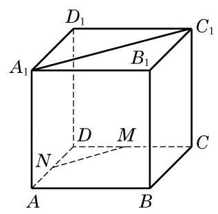

(第 3 题)

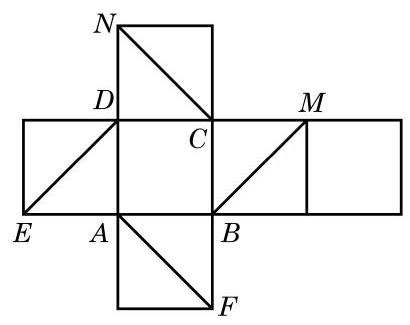

(第 4 题)

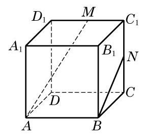

(第 5 题)

5. 如图,在正方体 ${ABCD} - {A}_{1}{B}_{1}{C}_{1}{D}_{1}$ 中, $M\text{ 、 }N$ 分别是棱 ${C}_{1}{D}_{1}\text{ 、 }{C}_{1}C$ 的中点. 判断下列结论是否成立, 并说明理由:

(1)直线 ${AM}$ 与 $C{C}_{1}$ 是相交直线;

(第 7 题)

(2)直线 ${AM}$ 与 ${BN}$ 是平行直线；

(3)直线 ${AM}$ 与 $D{D}_{1}$ 是异面直线.

6. 已知 $A\text{ 、 }B\text{ 、 }C\text{ 、 }D$ 是空间四个点,且直线 ${AB}$ 与 ${CD}$ 是两条异面直线. 求证: 直线 ${AC}$ 与 ${BD}$ 也是异面直线.

7. 如图,在四面体 ${ABCD}$ 中, ${AB} = {CD},{AB} \bot  {CD}, E\text{ 、 }F$ 分别为 ${BC}\text{ 、 }{AD}$ 的中点. 求直线 ${EF}$ 和 ${AB}$ 所成角的大小.

## B 组

1. 如果两个三角形不在同一平面上，它们的边两两对应平行，那么这两个三角形( )

A. 全等; B. 相似;

C. 相似但不全等; D. 不相似.

2. 如图,在正方体 ${ABCD} - {A}_{1}{B}_{1}{C}_{1}{D}_{1}$ 中, $E\text{ 、 }F\text{ 、 }G$ 分别是 ${AB}\text{ 、 }B{B}_{1}\text{ 、 }{BC}$ 的中点. 求证: $\bigtriangleup {EFG} \backsim  \bigtriangleup {C}_{1}D{A}_{1}$ .

(第 2 题)

(第 3 题)

3. 如图，在长方体 ${ABCD} - {A}_{1}{B}_{1}{C}_{1}{D}_{1}$ 中，判断下列直线的位置关系:

(1)直线 ${A}_{1}B$ 与直线 ${D}_{1}C$ 的位置关系是___；

(2)直线 ${A}_{1}B$ 与直线 ${B}_{1}C$ 的位置关系是___；

(3)直线 ${D}_{1}D$ 与直线 ${D}_{1}C$ 的位置关系是___.

(4)直线 ${AB}$ 与直线 ${B}_{1}C$ 的位置关系是___.

4. 如图,已知不在同一平面上的三条直线 $a\text{ 、 }b\text{ 、 }c$ 相交于点 $O, M\text{ 、 }P$ 是直线 $a$ 上的两点, $N\text{ 、 }Q$ 分别是直线 $b\text{ 、 }c$ 上与点 $O$ 不重合的点. 求证: ${MN}$ 和 ${PQ}$ 是异面直线.

5. 如图,在四面体 ${ABCD}$ 中, ${AC} = 8,{BD} = 6, M\text{ 、 }N$ 分别为 ${AB}\text{ 、 }{CD}$ 的中点,并且异面直线 ${AC}$ 与 ${BD}$ 所成的角为 ${90}^{ \circ  }$ . 求 ${MN}$ 的长.

(第 4 题)

(第 5 题)

(第 6 题)

6. 如图,在空间四边形 ${ABCD}$ 中, $E\text{ 、 }F\text{ 、 }G\text{ 、 }H$ 分别是边 ${AB}\text{ 、 }{BC}\text{ 、 }{CD}\text{ 、 }{DA}$ 的中点. 当对角线 ${AC}$ 和 ${BD}$ 满足什么条件时, ${EFGH}$ 分别是矩形、菱形、正方形?

### 10.3 直线与平面的位置关系

一条直线和一个平面的位置关系有且只有以下三种:

1. 直线在平面上一一有无数个公共点;

2. 直线和平面相交一一只有一个公共点;

3. 直线和平面平行一一没有公共点.

## 1 直线与平面平行

上面我们已按照直线与平面的公共点的个数来划分了空间直线与平面的位置关系, 其中, 当直线与平面没有公共点时, 我们说直线与平面平行, 并沿用平面几何中的平行符号来表示, 如 $l//\alpha$ . 但是,因为直线与平面都是无限延伸的,要直接判断直线与平面是否有公共点往往是比较困难的, 所以我们需要一个简便的直线与平面平行的判定定理.

观察房门的转动情景可以看到，房门开启后，无论门转到什么位置, 房门外沿所在的直线始终都是和门框所在的平面平行的. 这是因为房门的外沿与内沿是平行的, 而在房门的转动过程中, 内沿始终都在门框所在的平面上. 由此可以引出下面的直线与平面平行的判定定理:

直线与平面平行的判定定理 如果不在平面上的一条直线与这个平面上的一条直线平行, 那么该直线与这个平面平行.

下面, 用反证法来证明这个定理.

已知: 如图 10-3-1,直线 $a$ 不在平面 $\alpha$ 上,直线 $b$ 在平面 $\alpha$ 上,且 $a//b$ .

图 10-3-1

求证: 直线 $a//$ 平面 $\alpha$ .

证明 假设直线 $a$ 不平行于平面 $\alpha$ ,则直线 $a$ 与平面 $\alpha$ 有公共点,设为点 $P$ . 在平面 $\alpha$ 上,过点 $P$ 作已知直线 $b$ 的平行线 ${a}^{\prime }$ . 因为 $a$ 不在 $\alpha$ 上,所以 ${a}^{\prime }$ 与 $a$ 不重合. 另一方面,因为 $a// \; b,{a}^{\prime }//b$ ,所以 ${a}^{\prime }//a$ ,这和 $a$ 与 ${a}^{\prime }$ 交于点 $P$ 矛盾. 所以原假设不成立,从而 $a//\alpha$ .

依据上述判定定理, 要判定不在平面上的一条直线与这个平面平行, 只要在此平面上找到此直线的一条平行线即可.

证明 如图 10-3-2,因为棱 $B{B}_{1}$ 平行且等于棱 $D{D}_{1}$ ,所以 $B{B}_{1}{D}_{1}D$ 是平行四边形,从而 ${BD}//{B}_{1}{D}_{1}$ . 因为直线 ${B}_{1}{D}_{1}$ 在平面 $A{B}_{1}{D}_{1}$ 上,而直线 ${BD}$ 不在平面 $A{B}_{1}{D}_{1}$ 上,由上述判定定理,得到直线 ${BD}//$ 平面 $A{B}_{1}{D}_{1}$ .

图 10-3-2

例 1 在长方体 ${ABCD} - {A}_{1}{B}_{1}{C}_{1}{D}_{1}$ 中,证明直线 ${BD}$ 平行于平面 $A{B}_{1}{D}_{1}$ .

图 10-3-3

例 2 证明: 空间四边形相邻两边中点的连线, 必平行于经过另外两边的平面.

已知: 如图 10-3-3,在空间四边形 ${ABCD}$ 中,设 $E\text{ 、 }F$ 分别是两边 ${AB}\text{ 、 }{AD}$ 的中点.

求证: ${EF}//$ 平面 ${BCD}$ .

证明 连接 ${BD}$ . 在 $\bigtriangleup {ABD}$ 中,中位线 ${EF}$ 必平行于边 ${BD}$ .

因为 ${BD}$ 在平面 ${BCD}$ 上,而 ${EF}$ 不在平面 ${BCD}$ 上,由上述判定定理,得到 ${EF}//$ 平面 ${BCD}$ .

## 练习 10.3(1)

(第 1 题)

1. 如图,在长方体 ${ABCD} - {A}_{1}{B}_{1}{C}_{1}{D}_{1}$ 的 6 个面中,

(1)与 ${AB}$ 平行的平面是___；

(2)与 $A{D}_{1}$ 平行的平面是___.

2. 判断下列命题的真假, 并说明理由:

(1)若直线 $a$ 上有无数个点不在平面 $\alpha$ 上，则 $a//\alpha$ ；

(2)若直线 $a$ 与平面 $\alpha$ 上的一条直线平行,则 $a$ 与平面 $\alpha$ 上的任意一条直线都平行;

(3)若两条平行直线中的一条平行于一个平面, 则另一条直线也平行于这个平面;

(4)设直线 $a$ 在平面 $\alpha$ 上，直线 $b$ 不在平面 $\alpha$ 上，并且 $a//b$ ，则 $b//\alpha$ .

3. 若直线 $l$ 不平行于平面 $\alpha$ ,且 $l$ 不在平面 $\alpha$ 上,判断下列结论是否成立,并说明理由:

(1)平面 $\alpha$ 上的所有直线都与 $l$ 异面;

(2)平面 $\alpha$ 上不存在与 $l$ 平行的直线；

(3)平面 $\alpha$ 上存在唯一的一条直线与 $l$ 平行;

(4)平面 $\alpha$ 上的直线都与 $l$ 相交.

如果一条直线和一个平面平行, 那么这个平面上是否一定可以找到与这条直线平行的直线呢? 有下面的定理.

直线与平面平行的性质定理 如果一条直线与一个平面平行, 过这条直线的一个平面与此平面相交, 那么其交线必与该直线平行.

图 10-3-4

如图 10-3-4,已知直线 $a$ 与平面 $\alpha$ 平行,过直线 $a$ 的一个平面 $\beta$ 与平面 $\alpha$ 相交于直线 $b$ .

求证: $a//b$ .

证明 由 $a//\alpha$ ,故 $a$ 和 $\alpha$ 没有公共点.

又因为 $b \subset  \alpha$ ,所以 $a$ 和 $b$ 没有公共点.

因为 $a$ 和 $b$ 同在平面 $\beta$ 上,且没有公共点,所以 $a//b$ .

图 10-3-5

例 3 在如图 10-3-5 所示的一块木料中,棱 ${BC}$ 平行于平面 ${A}^{\prime }{B}^{\prime }{C}^{\prime }{D}^{\prime }$ .

(1)要经过平面 ${A}^{\prime }{B}^{\prime }{C}^{\prime }{D}^{\prime }$ 内的一点 $P$ 和棱 ${BC}$ 将木料锯开, 应怎样画线?

(2)所画的线与平面 ${ABCD}$ 是什么位置关系？

解(1)因为 ${BC}$ 平行于平面 ${A}^{\prime }{B}^{\prime }{C}^{\prime }{D}^{\prime }$ ,平面 ${BC}{C}^{\prime }{B}^{\prime }$ 经过 ${BC}$ 并与平面 ${A}^{\prime }{B}^{\prime }{C}^{\prime }{D}^{\prime }$ 交于 ${B}^{\prime }{C}^{\prime }$ ,由上述定理,得 ${BC}//{B}^{\prime }{C}^{\prime }$ .

图 10-3-6

在平面 ${A}^{\prime }{B}^{\prime }{C}^{\prime }{D}^{\prime }$ 上,过点 $P$ 作直线 ${EF}$ ,使 ${EF}//{B}^{\prime }{C}^{\prime }$ , ${EF}$ 分别交棱 ${A}^{\prime }{B}^{\prime }\text{ 、 }{C}^{\prime }{D}^{\prime }$ 于点 $E\text{ 、 }F$ . 连接 ${BE}\text{ 、 }{CF}$ ,则 ${EF}$ 、 ${BE}$ 及 ${CF}$ 就是应画的线,如图 10-3-6 所示.

(2)所画的线中， ${BE}\text{ 、 }{CF}$ 显然都与平面 ${ABCD}$ 相交. 又因为 ${EF}//{B}^{\prime }{C}^{\prime }$ ，从而 ${EF}//{BC}$ . 因此，由前述的判定定理，有 ${EF}//$ 平面 ${ABCD}$ .

## 练习 10.3(2)

1. 判断下列命题的真假, 并说明理由:

(1)若两直线 $a\text{ 、 }b$ 互相平行,则 $a$ 平行于经过 $b$ 的任何平面；

(2)若直线 $a$ 与平面 $\alpha$ 平行，则 $a$ 平行于 $\alpha$ 内的任何直线；

(3)若两直线 $a\text{ 、 }b$ 都与平面 $\alpha$ 平行，则 $a//b$ ；

(4)若直线 $a$ 平行于平面 $\alpha$ ，直线 $b$ 在平面 $\alpha$ 上，则 $a//b$ 或者 $a$ 与 $b$ 为异面直线.

2. 证明:若不在给定平面上的两条平行直线中的一条平行于给定平面, 则另一条直线也平行于给定平面.

3. 设直线 $a//$ 平面 $\alpha$ ,求证: 过 $a$ 任意作与 $\alpha$ 相交的平面,所有这些平面与 $\alpha$ 的交线都是平行的.

## 2 直线与平面垂直

如图 10-3-7,将书打开直立在桌面上,观察书的书脊 ${AB}$ 和各页与桌面的交线的位置关系,可以发现: 书脊 ${AB}$ 所在的直线,和每一页与桌面的交线都是垂直的. 这时,我们说书脊 ${AB}$ 所在的直线垂直于桌面所在的平面.

图 10-3-7

日常生活中, 旗杆与地面、桥柱与水面等, 都给我们以一条直线和一个平面垂直的形象.

定义 如果一条直线与平面上的任意一条直线都垂直, 就说这条直线与这个平面互相垂直.

图 10-3-8

如果直线 $l$ 与平面 $\alpha$ 垂直,我们记作 $l\bot \alpha$ . 这时,直线 $l$ 叫做平面 $\alpha$ 的垂线 (或者法线), $l$ 与 $\alpha$ 的交点叫做垂足. 画示意图时,通常使直线 $l$ 与表示平面 $\alpha$ 的平行四边形的一边垂直 (图 10-3-8).

显然, 用上述定义来直接判断线面垂直关系是很困难的, 能否像线面平行的情形一样找到一个简便的判定定理呢?

先做一个实验: 请同学们准备一块三角形纸片 ${ABC}$ ,过 $\bigtriangleup {ABC}$ 的顶点 $A$ 翻折纸片,得到折痕 ${AD}$ . 将翻折后的纸片竖起放置在桌面上,并使得边 ${DB}\text{ 、 }{DC}$ 均在桌面上.

(1)折痕 ${AD}$ 与桌面垂直吗?

(2)如何翻折才能使折痕 ${AD}$ 与桌面所在平面 $\alpha$ 垂直？

通过实验会发现,当且仅当折痕 ${AD}$ 是边 ${BC}$ 上的高时, ${AD}$ 所在直线与桌面所在平面才垂直(图 10-3-9).

图 10-3-10

图 10-3-9

生活中, 我们可以发现许多竖杆的底座是十字形的(图 10-3-10)，只要竖杆与底座的两条边垂直，就可以保证竖杆垂直于地面。

由上面的实验和实际经验, 我们可以发现下面的事实.

?

直线与平面垂直的判定定理 如果一条直线与一个平面上的两条相交直线都垂直, 那么此直线与该平面垂直.

---

有兴趣的同学可以自己试一试证明此判定定理.

---

有了这个判定定理, 我们就可以解释上面的实验与实际经验. 例如,在图 10-3-9 中,由折痕 ${AD} \bot  {BC}$ ,而翻折保持这种垂直关系不变,从而 ${AD} \bot  {CD},{AD} \bot  {BD}$ . 因此,由上述判定定理就知道,折痕 ${AD}$ 与桌面所在的平面 $\alpha$ 垂直.

例 4 证明: 如果两条平行直线 $a\text{ 、 }b$ 中的一条 $a$ 垂直于一个平面 $\alpha$ ,那么另一条 $b$ 也垂直于这个平面 $\alpha$ .

图 10-3-11

证明 如图 10-3-11,在平面 $\alpha$ 内作两条相交直线 $m\text{ 、 }n$ . 因为 $a \bot  \alpha$ ,根据直线与平面垂直的定义,知 $a \bot  m, a \bot  n$ . 又因为 $a//b$ ,所以 $b \bot  m, b \bot  n$ . 因为 $m\text{ 、 }n$ 是平面 $\alpha$ 上的两条相交直线,所以 $b \bot$ 平面 $\alpha$ .

由例 4 可知, 如果一组平行线中的一条与一个平面垂直, 那么其他平行线也都与这个平面垂直. 我们现在考虑反过来的问题: 垂直于同一个平面的直线是否都平行呢?

答案是肯定的, 我们有下面的定理.

直线与平面垂直的性质定理 垂直于同一个平面的两条直线互相平行.

图 10-3-12

已知: $a\text{ 、 }b$ 是两条直线,且 $a \bot  \alpha , b \bot  \alpha$ (图 10-3-12).

求证: $a//b$ .

证明 用反证法. 设 $a$ 与 $b$ 不平行,直线 $b$ 与平面 $\alpha$ 的交点为 $B$ . 过点 $B$ 作直线 ${b}^{\prime }$ ,使得 ${b}^{\prime }//a$ . 由直线 $b$ 与 ${b}^{\prime }$ 确定的平面记为 $\beta$ ,设平面 $\beta$ 与平面 $\alpha$ 的交线为 $l$ . 因为 $a \bot  \alpha , b \bot  \alpha$ ,所以 $a \bot  l, b \bot  l$ ; 由 ${b}^{\prime }//a$ ,又可得出 ${b}^{\prime } \bot  l$ . 直线 $b$ 与 ${b}^{\prime }$ 都在平面 $\beta$ 上，都过点 $B$ ，且都垂直于直线 $l$ ，这与“在同一个平面上，过一点有且只有一条直线与已知直线垂直”矛盾. 由此得到 $a//b$ .

由上述线面垂直的定义和定理可以得到下面的推论:

推论 1 过一点有且只有一个平面与给定的直线垂直.

推论 2 过一点有且只有一条直线与给定的平面垂直.

由推论 2,如图 10-3-13 (1),过平面 $\alpha$ 外任意给定的一点 $M$ ,有且只有一条直线与平面 $\alpha$ 垂直,从而把点 $M$ 与垂足 $N$ 之间的距离叫做点 $M$ 到平面 $\alpha$ 的距离. 利用线面平行和线面垂直的性质定理可以证明,如果一条直线 $l$ 平行于一个平面 $\alpha$ ,那么直线 $l$ 上任意两点到平面 $\alpha$ 的距离都相等 (证明过程留作习题),从而就可以把直线 $l$ 上一点 $M$ 到平面 $\alpha$ 的距离定义为直线 $l$ 到与它平行的平面 $\alpha$ 的距离 (图10-3-13(2)).

图 10-3-13

图 10-3-14

例 5 如图 10-3-14,在正方体 ${ABCD} - {A}_{1}{B}_{1}{C}_{1}{D}_{1}$ 中,

(1)判断直线 ${AC}$ 与平面 $B{B}_{1}{D}_{1}D$ ,以及直线 ${AC}$ 与平面 ${A}_{1}{BD}$ 是否垂直,并证明你的结论;

(2)设正方体的棱长为 1，分别求点 $A$ 及直线 $A{A}_{1}$ 到平面 $B{B}_{1}{D}_{1}D$ 的距离.

解 (1) 直线 ${AC}$ 与平面 $B{B}_{1}{D}_{1}D$ 垂直. 证明如下: 由正方体的定义,知 ${B}_{1}B \bot  {AB},{B}_{1}B \bot  {BC}$ ,从而 ${B}_{1}B$ 垂直于底面 ${ABCD}$ ,所以 ${AC} \bot  {B}_{1}B$ . 因为底面是正方形,其对角线互相垂直,所以 ${AC} \bot  {BD}$ . 由于 ${B}_{1}B$ 和 ${BD}$ 是平面 $B{B}_{1}{D}_{1}D$ 内的两条相交直线,由前述的判定定理,得 ${AC} \bot$ 平面 $B{B}_{1}{D}_{1}D$ .

直线 ${AC}$ 与平面 ${A}_{1}{BD}$ 不垂直. 理由是: 因为 ${AC}//{A}_{1}{C}_{1}$ , 而 $\bigtriangleup D{A}_{1}{C}_{1}$ 是等边三角形, $\angle D{A}_{1}{C}_{1} = {60}^{ \circ  }$ ,所以直线 ${AC}$ 与平面 ${A}_{1}{BD}$ 上的一条直线 ${A}_{1}D$ 不垂直,从而直线 ${AC}$ 与平面 ${A}_{1}{BD}$ 不垂直.

(2)由(1)，知 ${AC}$ 与平面 $B{B}_{1}{D}_{1}D$ 垂直，所以 $A$ 到平面 $B{B}_{1}{D}_{1}D$ 的距离就是垂线段 ${AO}$ 的长度,它等于 $\frac{\sqrt{2}}{2}$ . 又因为 $A{A}_{1}//B{B}_{1}$ ,由直线和平面平行的判定定理,知 $A{A}_{1}//$ 平面 $B{B}_{1}{D}_{1}D$ ,从而 $A{A}_{1}$ 到平面 $B{B}_{1}{D}_{1}D$ 的距离就是点 $A$ 到平面 $B{B}_{1}{D}_{1}D$ 的距离,等于 $\frac{\sqrt{2}}{2}$ .

## 练习 10.3(3)

1. 加工六角螺母, 只要螺母的六个侧面都是矩形, 那么六条侧棱一定都垂直于螺母的上下两面. 请说明理由.

(第 1 题)

(第 3 题)

2. 设 ${AB}$ 和 ${CD}$ 都是平面 $\alpha$ 的垂线,其垂足分别为 $B\text{ 、 }D$ . 已知 ${AB} = 2\mathrm{\;{cm}}$ , ${CD} = 5\mathrm{\;{cm}}$ ， ${BD} = 4\mathrm{\;{cm}}$ . 求线段 ${AC}$ 的长.

3. 如图,已知 ${PA}$ 垂直于平面 $\alpha ,{PB}$ 垂直于平面 $\beta , A\text{ 、 }B$ 为相应的垂足,且 $l$ 为平面 $\alpha$ 与平面 $\beta$ 的交线. 求证: $l \bot$ 平面 ${PAB}$ .

## 3 直线与平面所成的角

不在平面上的一条直线与这个平面的位置关系, 除了平行和垂直, 还有一种更一般的位置关系, 即此直线与平面虽然相交, 但不垂直,称之为斜交. 如图 10-3-15(1),此时直线 $l$ 称为平面 $\alpha$ 的斜线,直线 $l$ 与平面 $\alpha$ 的交点 $A$ 称为斜足.

图 10-3-15

如何度量平面的斜线与平面的倾斜程度呢? 我们在直线 $l$ 上任取一个不同于斜足的点 $P$ ,如图 10-3-15(2) 所示. 过点 $P$ 作平面 $\alpha$ 的垂线,垂足记为 $O$ . 连接 ${OA}$ ,直线 ${OA}$ 叫做斜线 $l$ 在平面 $\alpha$ 上的投影 (也称射影). 线段 ${PA}$ 的投影是线段 ${OA}$ . 容易证明, 平面的一条斜线在平面上的投影与点 $P$ 的选择无关,是唯一确定的,从而可以用斜线与它的投影所成的锐角 $\theta$ 来定义此斜线与平面所成的角.

定义 平面的一条斜线和它在平面上的投影所成的锐角, 叫做这条直线和这个平面所成的角.

---

在直线与平面垂直的情况下，其投影就是相应的垂足.

---

另外, 我们约定, 如果一条直线垂直于平面, 我们说它们所成的角是直角; 如果一条直线和平面平行或在该平面上, 就说二者所成的角是 ${0}^{ \circ  }$ 的角.

例 6 证明: 从平面外一点向这个平面所引的垂线段和斜线段中,

(1)垂线段比任何给定的一条斜线段都短;

(2)两条斜线段相等的充要条件是它们相应的两条投影相等.

(1)因为 ${PO} \bot  \alpha$ ，由直线与平面垂直的定义，有 ${PO} \bot  {OA}$ . 由直角三角形中斜边与直角边的关系,知 ${PO} < {PA}$ ,所以垂线段比任何给定的一条斜线段都短.

图 10-3-16

证明 如图 10-3-16,记 ${PO}$ 是平面 $\alpha$ 的垂线段, ${PA}$ 和 ${PB}$ 是平面 $\alpha$ 的斜线段, ${OA}$ 和 ${OB}$ 分别是它们在平面 $\alpha$ 内的投影.

(2)先证充分性. 设 ${OA} = {OB}$ ，则直角三角形 ${PAO}$ 与直角三角形 ${PBO}$ 全等，所以 ${PA} = {PB}$ . 再证必要性. 如果 ${PA} = {PB}$ , 那么同样有 $\bigtriangleup {PAO} \cong  \bigtriangleup {PBO}$ ,所以 ${OA} = {OB}$ .

图 10-3-17

例 7 如图 10-3-17,设 $l$ 是平面 $\alpha$ 的一条斜线,与平面 $\alpha$ 交于点 $O,{l}^{\prime }$ 是 $l$ 在平面 $\alpha$ 上的投影, ${l}^{\prime \prime }$ 是平面 $\alpha$ 上过点 $O$ 的另一条直线, $l$ 与 ${l}^{\prime }$ 所成的角为 $\theta , l$ 与 ${l}^{\prime \prime }$ 所成的角为 $\mu$ . 求证: $\theta  < \mu$ .

证明 在 $l$ 上取异于 $O$ 的一点 $A$ ,过点 $A$ 作 ${l}^{\prime }$ 与 ${l}^{\prime \prime }$ 的垂线, 垂足分别是 $B$ 与 $C$ ,连接 ${BC}$ . 因为 ${l}^{\prime }$ 是 $l$ 在平面 $\alpha$ 上的投影, ${AB}$ 是平面 $\alpha$ 的垂线， $\bigtriangleup {ABC}$ 是直角三角形， $\angle {ABC}$ 是直角， 所以 $\left| {AB}\right|  < \left| {AC}\right|$ . 在直角三角形 ${ABO}$ 与 ${ACO}$ 中,分别有

Q

$$
\sin \theta  = \frac{\left| AB\right| }{\left| AO\right| },\sin \mu  = \frac{\left| AC\right| }{\left| AO\right| },
$$

---

这个例题的证明不是“纯几何”的, 但数学不同分支的知识和方法的综合运用, 有时可以快捷地解决问题.

---

由此可见 $\sin \theta  < \sin \mu$ . 因为在 $\left( {0,\frac{\pi }{2}}\right)$ 中正弦函数是增函数,所以 $\theta  < \mu$ .

如果 ${l}^{\prime \prime }$ 是平面 $\alpha$ 上的任意直线, $l$ 与 ${l}^{\prime \prime }$ 所成的角 $\mu$ 可以通过把 ${l}^{\prime \prime }$ 在平面 $\alpha$ 上平行移动到通过 $O$ 的位置 (不排除与 ${l}^{\prime }$ 重合的情况)而得到. 据例 7 得知,总有 $\theta  \leq  \mu$ . 这说明了: 斜线与平面所成的角, 是这条斜线与平面内任何直线所成角中的最小的角.

## 练习 10.3(4)

1. 已知斜线段的长度是斜线段在平面内的投影的长的两倍, 求这条斜线和这个平面所成的角的大小.

2. 在正方体 ${ABCD} - {A}_{1}{B}_{1}{C}_{1}{D}_{1}$ 中, $E$ 是边 ${A}_{1}{D}_{1}$ 的中点.

(1)求 ${A}_{1}C$ 和底面 ${ABCD}$ 所成角的大小；

(2)求 ${EB}$ 和底面 ${A}_{1}{B}_{1}{C}_{1}{D}_{1}$ 所成角的大小.

3. 在图 10-3-17 中,平面 $\alpha$ 上的斜线 $l$ 与平面 $\alpha$ 所成的角为 $\theta ,{l}^{\prime }$ 是 $l$ 在平面 $\alpha$ 上的投影, $O$ 是 $l$ 与平面 $\alpha$ 的交点,点 $B$ 是 $l$ 上一点 $A$ 在 $\alpha$ 上的投影, ${OC}$ 是 $\alpha$ 上的任意一条直线. 如果 $\theta  = {45}^{ \circ  },\angle {BOC} = {45}^{ \circ  }$ ,求 $\angle {AOC}$ ,并验证 $\angle {AOC} > \theta$ .

## 4 三垂线定理

关于平面的斜线及其在平面上的投影, 我们有下面的定理.

三垂线定理 平面上的一条直线和这个平面的一条斜线垂直的充要条件是它和这条斜线在平面上的投影垂直.

---

在讨论空间直线的垂直关系时，三垂线定理是一个常用的工具.

---

图 10-3-18

已知: 如图 10-3-18, $P$ 是平面 $\alpha$ 外一点, ${PA}$ 是平面 $\alpha$ 的斜线,交 $\alpha$ 于点 $A$ . 过点 $P$ 作平面 $\alpha$ 的垂线 ${PO}$ ,垂足是 $O$ ,直线 ${OA}$ 是 ${PA}$ 在平面 $\alpha$ 上的投影.

求证: 对平面 $\alpha$ 上的任一直线 $a, a \bot  {OA}$ 是 $a \bot  {PA}$ 的充要条件.

证明 先证充分性,即证明从 $a \bot  {OA}$ 可以推出 $a \bot  {PA}$ .

因为 ${PO} \bot$ 平面 $\alpha$ ,而 $a \subset  \alpha$ ,所以 ${PO} \bot  a$ . 这样,连同假设条件,直线 $a$ 垂直于两条相交直线 ${PO}$ 与 ${OA}$ ,从而它垂直于这两条相交直线所确定的平面 ${PAO}$ . 而直线 ${PA} \subset$ 平面 ${PAO}$ ,于是 $a \bot  {PA}$ .

再证必要性,即反过来从 $a \bot  {PA}$ 可以推出 $a \bot  {OA}$ .

同上,我们有 ${PO} \bot  a$ ,这个条件连同假设条件 $a \bot  {PA}$ ,推出直线 $a$ 垂直于两条相交直线 ${PO}$ 与 ${PA}$ 所确定的平面 ${PAO}$ . 而直线 ${OA} \subset$ 平面 ${PAO}$ ,于是 $a \bot  {OA}$ .

例 8 如图 10-3-19,已知正方体 ${ABCD} - {A}_{1}{B}_{1}{C}_{1}{D}_{1}$ .

求证: ${AC} \bot  B{D}_{1}$ .

图 10-3-19

---

在此正方体中, 还有哪些面的对角线与 $B{D}_{1}$ 垂直? 为什么? 由此能得到 $B{D}_{1}$ 垂直于哪些截面?

---

证明 直线 $B{D}_{1}$ 在平面 ${ABCD}$ 上的投影是 ${BD}$ ,显然有 ${BD} \; \bot  {AC}$ .

由三垂线定理,就得 ${AC} \bot  B{D}_{1}$ .

例 9 如图 10-3-20,小河的一侧有一条笔直的道路 $l$ , 对岸有电塔 ${AB}$ ,已知其高为 $h$ . 现只有小平板仪 (可用于测量水平的角度) 和皮尺作为测量工具, 请说明还需测量的数据, 然后运用三垂线定理给出求电塔顶 $A$ 与道路 $l$ 的距离 $d$ 的公式.

图 10-3-20

Q

解 在道路 $l$ 上取一点 $C$ ,使 ${BC} \bot  l$ ,再用小平板仪在 $l$ 上另取一点 $D$ ,使 $\angle {CDB} = {45}^{ \circ  }$ ,用皮尺测得 ${CD} = a$ .

---

选择满足 $\angle {CDB} \; = {45}^{ \circ  }$ (也可以是 ${30}^{ \circ  }$ 或 ${60}^{ \circ  }$ 的特殊角) 的点 $D$ 使解题过程最简洁, 得到的计算公式最简单. 其他的选择也可解决问题, 但过程和结果都更复杂.

---

因为 ${BC}$ 是 ${AC}$ 在地面上的投影,且 ${BC} \bot  {CD}$ ,由三垂线定理,得 ${AC} \bot  {CD}$ ,从而斜线 ${AC}$ 的长度就是电塔顶 $A$ 与道路 $l$ 的距离 $d$ .

在直角三角形 ${BCD}$ 中, $\angle {BCD} = {90}^{ \circ  },\angle {CDB} = {45}^{ \circ  },{CD} \; = a$ ,故 ${BC} = a$ . 而在直角三角形 ${ABC}$ 中,由勾股定理,得 $A{C}^{2} = A{B}^{2} + B{C}^{2}$ ,故 ${AC} = \sqrt{{h}^{2} + {a}^{2}}$ ,即电塔顶 $A$ 与道路 $l$ 的距离是

$$
d = \sqrt{{h}^{2} + {a}^{2}},
$$

其中 $h$ 是电塔的高度, $a$ 是道路 $l$ 上所取两个点 $C$ 与 $D$ 之间的距离.

## 练习 10.3(5)

1. 过 $\bigtriangleup {ABC}$ 所在平面 $\alpha$ 外的一点 $P$ ,作 ${PO} \bot  \alpha$ ,垂足为 $O$ ,连接 ${PA}\text{ 、 }{PB}$ 及 ${PC}$ .

(1)若 ${PA} = {PB} = {PC}$ ，则点 $O$ 是 $\bigtriangleup  {ABC}$ 的___，心；

(2)若 ${PA} = {PB} = {PC}$ ， ${\angle {ACB}} = {90}^{ \circ  }$ ，则点 $O$ 是边 ${AB}$ 的___，点；

(3)若 ${PA}\bot {PB},{PB}\bot {PC},{PC}\bot {PA}$ ，则点 $O$ 是 $\bigtriangleup  {ABC}$ 的___，心.

(第 3 题)

2. 已知 $O$ 是 $\bigtriangleup {ABC}$ 的垂心,过点 $O$ 作平面 ${ABC}$ 的垂线, $P$ 是垂线上的一点. 求证: ${PA} \bot  {BC}$ .

3. 如图,已知 ${ABCD}$ 是矩形, ${PA} \bot$ 平面 ${ABCD}$ .

(1)求证: $\angle {PBC} = {90}^{ \circ  }$ ；

(2)若 ${PC}\bot {BD}$ ，求证:四边形 ${ABCD}$ 是正方形.

## 习题 10.3

## A 组

1. 如图,在长方体 ${ABCD} - {A}_{1}{B}_{1}{C}_{1}{D}_{1}$ 中, $E$ 是棱 $D{D}_{1}$ 的中点,试判断 $B{D}_{1}$ 与平面 ${AEC}$ 的位置关系,并说明理由.

(第 1 题)

(第 3 题)

2. 在长方体 ${ABCD} - {A}_{1}{B}_{1}{C}_{1}{D}_{1}$ 中, $M\text{ 、 }N$ 分别为矩形 ${A}_{1}{AD}{D}_{1}$ 和 ${D}_{1}{C}_{1}{CD}$ 的中心. 求证: ${MN}//$ 平面 ${ABCD}$ .

3. 如图， $\alpha  \cap  \beta  = {CD}$ ， $\alpha  \cap  \gamma  = {EF}$ ， $\beta  \cap  \gamma  = {AB}$ ， ${AB}//\alpha$ . 求证: ${CD}//{EF}$ .

4. 已知 $E\text{ 、 }F$ 分别是空间四边形 ${ABCD}$ 的边 ${BC}\text{ 、 }{AD}$ 的中点,过直线 ${EF}$ 且平行于 ${AB}$ 的平面与 ${AC}$ 交于点 $G$ . 求证: $G$ 是 ${AC}$ 的中点.

5. 证明: 如果直线 $l//$ 平面 $\alpha$ ,那么 $l$ 上任意两点到平面 $\alpha$ 的距离都相等.

6. 已知平面 $\alpha$ 与平面 $\beta$ 相交于直线 ${AB}$ ,直线 ${PC}$ 垂直于平面 $\alpha$ ,直线 ${PD}$ 垂直于平面 $\beta$ ,其垂足分别为 $C\text{ 、 }D$ . 求证: ${AB} \bot  {CD}$ .

7. 由平面 $\alpha$ 外一点 $A$ 向 $\alpha$ 分别引斜线段 ${AB}\text{ 、 }{AC}$ ，已知这两条斜线段和平面 $\alpha$ 所成角的大小之比为 $2 : 1$ ,而它们的长度之比为 $2 : 3$ . 分别求斜线段 ${AB}\text{ 、 }{AC}$ 和平面 $\alpha$ 所成角的大小.

8. 从平面外一点 $D$ 向该平面引垂线段 ${DA}$ 及斜线段 ${DB}\text{ 、 }{DC}$ ，已知 ${DA}$ 的长为 $a$ ， $\angle {BDA} = \angle {CDA} = {60}^{ \circ  },\angle {BDC} = {90}^{ \circ  }$ . 求 ${BC}$ 的长.

9. 证明: 两条平行直线和同一个平面所成的角相等.

10. 在正方体 ${ABCD} - {A}_{1}{B}_{1}{C}_{1}{D}_{1}$ 中,求证: ${D}_{1}B \bot$ 平面 $A{B}_{1}C$ .

## B 组

(第 1 题)

1. 如图,在四面体 ${ABCD}$ 中, $E\text{ 、 }F$ 分别是 $\bigtriangleup {ACD}\text{ 、 }\bigtriangleup {BCD}$ 的重心. 该四面体中,哪些面与 ${EF}$ 平行? 请说明理由.

2. 如图,已知 ${BD}$ 是 $\odot  O$ 的直径,点 $C$ 是 $\odot  O$ 上的动点. 设过动点 $C$ 的直线 ${AC}$ 垂直于 $\odot  O$ 所在的平面,且 $E\text{ 、 }F$ 分别是边 ${AC}\text{ 、 }{AD}$ 的中点. 求证: ${EF} \bot$ 平面 ${ABC}$ .

(第 2 题)

(第 3 题)

3. 如图,在棱长为 1 的正方体 ${ABCD} - {A}_{1}{B}_{1}{C}_{1}{D}_{1}$ 中, $E\text{ 、 }F$ 及 $G$ 分别为棱 $B{B}_{1}$ 、 $D{D}_{1}$ 和 $C{C}_{1}$ 的中点.

(1)求证: ${C}_{1}F//$ 平面 ${DEG}$ ；

(2)试在棱 ${CD}$ 上取一点 $M$ ，使 ${D}_{1}M \bot$ 平面 ${DEG}$ .

4. 经过一个角的顶点引这个角所在平面的斜线. 如果此斜线和这个角两边的夹角相等, 求证: 该斜线在平面上的投影是这个角的角平分线所在的直线.

(第 5 题)

5. 如图，在 $\bigtriangleup  {ABC}$ 中， $\angle {ACB} = {90}^{ \circ  }$ ，且 ${DA}$ 垂直于 $\bigtriangleup  {ABC}$ 所在的平面 $\alpha , M\text{ 、 }N$ 分别是边 ${AC}\text{ 、 }{DB}$ 的中点.

求证: ${MN} \bot  {AC}$ .

### 10.4 平面与平面的位置关系

两个平面的位置关系只有两种情况:平行或相交. 在本节中, 我们将讨论如何判断平面间的平行与垂直关系, 以及如何更精确地刻画两个相交平面间的位置关系.

## 1 平面与平面平行

我们希望通过直线间或线面间的平行关系来判断平面间的平行关系. 为此, 先思考下面的问题:

(1)如果平面 $\alpha$ 平行于平面 $\beta$ ,那么这两个平面上的一切直线都相互平行吗?

(2)如果平面 $\alpha$ 上有一条直线与平面 $\beta$ 平行,那么能保证这两个平面平行吗?

(3)如果平面 $\alpha$ 上有两条相交直线与平面 $\beta$ 平行，那么能保证这两个平面平行吗?

问题(1)的回答是否定的. 事实上，长方体的上、下两个底面平行,但这两个底面上的直线间有不同的位置关系,如 ${AB}$ 平行于 ${A}_{1}{B}_{1}$ ,而 ${AB}$ 与 ${A}_{1}{D}_{1}$ 异面且垂直,如图 10-4-1 所示.

图 10-4-1

问题(2)的回答也是否定的. 例如，当三角板的一条边所在的直线与桌面所在的平面平行时, 不能保证三角板所在平面与桌面所在平面保持平行, 因为这个三角板还可以绕这条边转动.

至于问题(3)，其答案应是肯定的，因为两条相交的直线完全确定了这个平面. 我们可以用反证法来严格地加以证明: 如图 10-4-2,假设 $\alpha$ 不平行于 $\beta$ ,那么 $\alpha$ 与 $\beta$ 相交于直线 $l$ . 由直线与平面平行的性质定理知,直线 $a$ 及 $b$ 均平行于 $l$ ,从而 $a//b$ . 这与已知 $a\text{ 、 }b$ 是相交直线矛盾. 故假设不成立,即 $\alpha //\beta$ .

图 10-4-2

由此, 我们就得到了下面的定理.

两个平面平行的判定定理 如果一个平面上的两条相交直线与另一个平面平行, 那么这两个平面平行.

上述定理可以帮助我们方便地判断两个平面是否平行. 例如, 在测量时, 为判断一个平面与水平面是否平行, 可将水平仪 (图 10-4-3)置放在这个平面上, 并变换方向测试两次, 如果水平仪的水泡两次都居中, 就可以断定这个平面和水平面是平行的.

图 10-4-3

例 1 证明: 长方体 ${ABCD} - {A}_{1}{B}_{1}{C}_{1}{D}_{1}$ 的平面 $A{B}_{1}{D}_{1}$ 平行于平面 ${C}_{1}{DB}$ .

图 10-4-4

证明 如图 10-4-4,不在平面 $A{B}_{1}{D}_{1}$ 上的直线 $B{C}_{1}$ 平行于平面 $A{B}_{1}{D}_{1}$ 上的直线 $A{D}_{1}$ ,所以直线 $B{C}_{1}//$ 平面 $A{B}_{1}{D}_{1}$ . 同理,不在平面 $A{B}_{1}{D}_{1}$ 上的直线 ${C}_{1}D//$ 平面 $A{B}_{1}{D}_{1}$ . 因为 $B{C}_{1}$ 与 ${C}_{1}D$ 是相交直线,所以它们确定的平面 ${C}_{1}{BD}//$ 平面 $A{B}_{1}{D}_{1}$ .

由上面的讨论可知, 如果两个平面平行, 一个平面上的直线与另一个平面上的直线可能是平行的, 也有可能是异面的. 那么, 如何在两个平行平面上找到相互平行的直线呢? 为此, 我们来考察两个平行平面与第三个平面相交的情况, 得出下面的定理.

图 10-4-5

两个平面平行的性质定理 如果两个平行平面同时和第三个平面相交,那么它们的交线平行.

证明 如图 10-4-5,设平面 $\gamma$ 与平行平面 $\alpha \text{ 、 }\beta$ 相交,有两条交线 $a\text{ 、 }b$ . 因为 $\alpha //\beta$ ,所以 $\alpha \text{ 、 }\beta$ 没有公共点,从而交线 $a$ 、 $b$ 也没有公共点. 又因为 $a\text{ 、 }b$ 都在平面 $\gamma$ 上,所以 $a//b$ .

例 2 若一条直线 $l$ 垂直于两个平行平面 $\alpha \text{ 、 }\beta$ 中的一个平面 $\alpha$ ,则它必垂直于另一个平面 $\beta$ .

图 10-4-6

证明 如图 10-4-6,记 $A$ 为直线 $l$ 与平面 $\alpha$ 的交点 (垂足). 设 $b$ 是平面 $\beta$ 内任意给定的一条直线,而平面 $\gamma$ 是经过点 $A$ 与直线 $b$ 的平面. 设 $\gamma  \cap  \alpha  = a$ .

因为平面 $\alpha //$ 平面 $\beta$ ,平面 $\gamma$ 与平面 $\alpha$ 和平面 $\beta$ 的交线分别为直线 $a$ 和直线 $b$ ,所以 $a//b$ . 又因为直线 $l$ 垂直于平面 $\alpha$ ,所以 $l \bot  b$ . 由直线与平面垂直的定义,知 $l \bot  \beta$ .

在 10.3 节我们已经定义过点到平面的距离以及一条直线到与它平行的平面的距离, 现在可以进一步定义两个平行平面之间的距离. 为此,先注意到,如果平面 $\alpha //$ 平面 $\beta$ ,在平面 $\alpha$ 上任取两点 $M$ 与 $N$ ,那么平面 $\alpha$ 上的直线 ${MN}$ 与平面 $\beta$ 没有交点, 所以 ${MN}//$ 平面 $\beta$ (图 10-4-7). 由此可见,点 $M$ 与点 $N$ 到平面 $\beta$ 的距离是相等的. 这说明了平面 $\alpha$ 上的任意点到平面 $\beta$ 的距离都相等. 这个距离也等于平面 $\beta$ 上任意一点到平面 $\alpha$ 的距离: 如图10-4-7,过平面 $\alpha$ 上的点 $M$ 作平面 $\beta$ 的垂线,交平面 $\beta$ 于 ${M}^{\prime }$ , 则 $M{M}^{\prime }$ 既是点 $M$ 到平面 $\beta$ 的距离,也是点 ${M}^{\prime }$ 到平面 $\alpha$ 的距离.

图 10-4-7

这样, 我们可以把两个平行平面之间的距离定义为其中一个平面上的任意一点到另外一个平面的距离. 上一段的论述表明这样的定义是没有歧义的.

## 练习 10.4(1)

1. 判断下列命题的真假, 并说明理由:

(1)若一个平面内的两条直线均平行于另一个平面，则这两个平面平行；

(2)若一个平面内两条不平行的直线都平行于另一个平面，则这两个平面平行；

(3)若两个平面平行，则其中一个平面中的任何直线都平行于另一个平面；

(4)平行于同一个平面的两个平面平行；

(5)若一个平面内的任何一条直线都平行于另一个平面, 则这两个平面平行.

(第 2 题)

2. 如图,已知正方体 ${ABCD} - {A}_{1}{B}_{1}{C}_{1}{D}_{1}$ 的棱长为 $a$ ,求:

(1)点 ${A}_{1}$ 到直线 ${BC}$ 的距离；

(2)点 $A$ 到平面 ${B}_{1}{BC}{C}_{1}$ 的距离；

(3) ${B}_{1}{D}_{1}$ 到平面 ${ABCD}$ 的距离；

(4)平面 ${B}_{1}{BC}{C}_{1}$ 到平面 ${A}_{1}{AD}{D}_{1}$ 的距离.

3. 证明:夹在两个平行平面间的平行线段相等.

## 2 二面角

在开门时，有时开得大些，有时开得小些，这里的“大”或 “小”，可用门所在平面和门框所在平面之间的夹角来度量. 现在, 我们来定义两个平面之间的夹角.

图 10-4-8

图 10-4-9

如图 10-4-8, 从一条直线出发的两个半平面所组成的图形叫做二面角(dihedral angle). 这条直线叫做二面角的棱, 这两个半平面叫做二面角的面. 棱为 ${AB}$ ,两个面为 $\alpha \text{ 、 }\beta$ 的二面角,记作二面角 $\alpha  - {AB} - \beta$ ；也可以在 $\alpha \text{ 、 }\beta$ 上(棱以外的半平面部分)分别取点 $P\text{ 、 }Q$ ,将这个二面角记作二面角 $P - {AB} - Q$ . 如果棱记作 $l$ ,那么这个二面角也可以记作二面角 $\alpha  - l - \beta$ 或 $P - l - Q$ .

下面我们要讨论的问题是应该如何刻画一个二面角的大小.

如图 10-4-9,若在二面角 $\alpha  - l - \beta$ 的棱 $l$ 上任取一点 $O$ ,且过 $O$ 分别在面 $\alpha$ 、 $\beta$ 上作棱 $l$ 的垂线 ${OA}$ 和 ${OB}$ ,容易证明射线 ${OA}$ 和 ${OB}$ 构成的角 $\angle {AOB}$ 的大小与点 $O$ 的取法无关. 因此,我们可以用 $\angle {AOB}$ 来表示二面角 $\alpha  - l - \beta$ 的大小,并称其为二面角 $\alpha  - l - \beta$ 的平面角. 二面角的取值范围是 $\left\lbrack  {0,\pi }\right\rbrack$ . 当二面角 $\alpha  - l - \beta$ 的大小等于直角时, 我们称这个二面角为直二面角.

当两个平面相交所成的二面角是直二面角时, 我们就说这两个平面互相垂直.

两个互相垂直的平面, 一般画成图 10-4-10 的样子: 将直立平面的竖边画成和水平平面的横边垂直. 平面 $\alpha$ 与平面 $\beta$ 垂直， 记作 $\alpha  \bot  \beta$ .

图 10-4-10

用下面的定理判定两个平面垂直比直接用定义要方便一些.

平面与平面垂直的判定定理 如果一个平面经过另一个平面的一条垂线,那么这两个平面垂直.

证明 设平面 $\beta$ 过另一平面 $\alpha$ 的垂线 ${OA}$ ,点 $O$ 在平面 $\alpha$ 上, 则平面 $\beta$ 与平面 $\alpha$ 交于过点 $O$ 的直线 $l$ ，且 ${OA} \bot  l$ . 如图 10-4-11， 在平面 $\alpha$ 上过点 $O$ 作 ${OB} \bot  l$ ，则 $\angle {AOB}$ 是二面角 $\alpha  - l - \beta$ 的平面角. 由 ${OA} \bot  \alpha$ 与 ${OB} \subset  \alpha$ ,推出 ${OA} \bot  {OB}$ ,即 $\angle {AOB}$ 是直角,从而二面角 $\alpha  - l - \beta$ 是直二面角,所以 $\beta  \bot  \alpha$ .

图 10-4-11

上面的定理的条件与结论实际上是一对充要条件, 也就是说, 我们还可以证明: 如果两个平面垂直, 那么其中一个平面过另一个平面的一条垂线. 下面的定理是这个结论的推广.

平面与平面垂直的性质定理 如果两个平面垂直, 那么其中一个平面上垂直于两平面交线的直线与另一个平面垂直.

证明 仍参看图 10-4-11,平面 $\alpha  \bot$ 平面 $\beta$ ,它们的交线是 $l$ . 直线 ${OA} \subset  \beta$ ,且 ${OA} \bot  l$ ,垂足是 $O$ . 过点 $O$ 在平面 $\alpha$ 上作 ${OB} \bot  l$ , 则 $\angle {AOB}$ 是二面角 $\alpha  - l - \beta$ 的平面角. 由于 $\beta  \bot  \alpha ,\angle {AOB}$ 是直角, 即 ${OA} \bot  {OB}$ ,这个条件连同条件 ${OA} \bot  l$ 立即推出 ${OA} \bot$ 平面 $\alpha$ .

图 10-4-12

例 3 如图 10-4-12,已知正方体 ${ABCD} - {A}_{1}{B}_{1}{C}_{1}{D}_{1}$ .

(1)作出二面角 ${A}_{1} - {BD} - A$ 的平面角;

(2)求证:平面 ${A}_{1}{AC}{C}_{1}\bot$ 平面 ${A}_{1}{BD}$ .

解(1)连接 ${AC},{AC}$ 与 ${BD}$ 交于点 $O$ ,则 ${AC} \bot  {BD}$ ,连接 $O{A}_{1}$ . 由 ${A}_{1}B = {A}_{1}D$ ,知 ${A}_{1}O \bot  {BD}$ ,所以 $\angle {A}_{1}{OA}$ 就是二面角 ${A}_{1} - {BD} - A$ 的一个平面角.

(2)证明:因为 ${A}_{1}A \bot$ 平面 ${ABCD}$ ，所以 ${BD} \bot  {A}_{1}A$ . 再由 ${BD} \bot  {AC},{A}_{1}A \cap  {AC} = A$ ，可得 ${BD} \bot$ 平面 ${A}_{1}{AC}{C}_{1}$ . 由上述判定定理,得平面 ${A}_{1}{AC}{C}_{1} \bot$ 平面 ${A}_{1}{BD}$ .

## 练习 10.4(2)

1. 已知平面 $\alpha  \bot$ 平面 $\beta$ ,判断下列命题是否正确,并说明理由:

(1)平面 $\alpha$ 上的任意一条直线都垂直于平面 $\beta$ 上的任意一条直线；

(2)平面 $\alpha$ 上的任意一条直线都垂直于平面 $\beta$ 上的无数条直线；

(第 2 题)

(3)平面 $\alpha$ 上的任意一条直线都垂直于平面 $\beta$ ；

(4)过平面 $\alpha$ 上任意一点作平面 $\alpha$ 与 $\beta$ 交线的垂线 $l$ ，则 $l\bot \beta$ .

2. 如图,已知 ${AB} \bot$ 平面 ${BCD},{BC} \bot  {CD}$ ,有哪些平面互相垂直? 为什么?

3. 证明: 如果两个平面垂直, 那么过第一个平面上一点且垂直于第二个平面的直线, 必在第一个平面上.

## 习题 10.4

## A 组

1. 判断下列命题的真假, 并说明理由:

(1)平行于同一条直线的两个平面平行;

(2)若两个平面分别经过两条平行直线，则这两个平面平行；

(3)分别在两个平行平面上的两条直线平行；

(4)与两条异面直线都平行的两个平面平行.

2. 如图,在正方体 ${ABCD} - {A}_{1}{B}_{1}{C}_{1}{D}_{1}$ 中, ${AE} = {A}_{1}{E}_{1},{AF} = {A}_{1}{F}_{1}$ . 求证: ${EF}// \; {E}_{1}{F}_{1}$ ,且 ${EF} = {E}_{1}{F}_{1}$ .

3. 如图, $A\text{ 、 }B\text{ 、 }C$ 为不共线的三点, $A{A}_{1}//B{B}_{1}//C{C}_{1}$ ,且 $A{A}_{1} = B{B}_{1} = C{C}_{1}$ . 求证: 平面 ${ABC}//$ 平面 ${A}_{1}{B}_{1}{C}_{1}$ .

(第 2 题)

(第 3 题)

4. 如图,直线 $a$ 及直线 $b$ 是异面直线,直线 $a\text{ 、 }b$ 分别在两个平行平面 $\alpha$ 和 $\beta$ 上. 又设直线 $l\bot a, l\bot b$ . 求证: $l\bot \alpha , l\bot \beta$ .

(第 4 题)

(第 5 题)

5. 如图,设 $\alpha \text{ 、 }\beta \text{ 、 }\gamma$ 三平面互相平行,直线 $a$ 与 $b$ 分别交 $\alpha \text{ 、 }\beta \text{ 、 }\gamma$ 于点 $A\text{ 、 }B\text{ 、 }C$ 和点 $D\text{ 、 }E\text{ 、 }F$ . 求证: $\frac{AB}{BC} = \frac{DE}{EF}$ .

6. 在正方体 ${ABCD} - {A}^{\prime }{B}^{\prime }{C}^{\prime }{D}^{\prime }$ 中,平面 ${AB}{C}^{\prime }{D}^{\prime }$ 与正方体的各个面所成的二面角的大小分别是多少?

7. 在 ${30}^{ \circ  }$ 二面角的一个面内有一个点,它到另一个面的距离是 ${10}\mathrm{\;{cm}}$ . 求这个点到二面角的棱的距离.

8. 如图，在四面体 ${ABCD}$ 中，已知 ${AB} = {AC} = {BD} = {CD} = 2,{BC} = 2\sqrt{3},$ 且 ${AD} = 1$ . 试作出二面角 $A - {BC} - D$ 的平面角,并求它的度数.

(第 8 题)

(第 10 题)

9. 判断下列命题的真假, 并说明理由:

(1)若平面 $\alpha  \bot$ 平面 $\beta$ ，平面 $\beta  \bot$ 平面 $\gamma$ ，则平面 $\alpha  \bot$ 平面 $\gamma$ ；

(2)若平面 $\alpha //$ 平面 ${\alpha }_{1}$ ，平面 $\beta //$ 平面 ${\beta }_{1}$ ，平面 $\alpha  \bot$ 平面 $\beta$ ，则平面 ${\alpha }_{1} \bot$ 平面 ${\beta }_{1}$ .

10. 如图,已知 ${AB}$ 是平面 $\alpha$ 的垂线, ${AC}$ 是平面 $\alpha$ 的一条斜线, ${CD}$ 在 $\alpha$ 上,且垂直于 ${AC}$ . 求证: 平面 ${ABC} \bot$ 平面 ${ACD}$ .

11. 已知平面 $\alpha \text{ 、 }\beta \text{ 、 }\gamma$ ,且 $\alpha$ 及 $\beta$ 均垂直于 $\gamma$ ,记 $\alpha$ 与 $\beta$ 的交线为 $l$ . 求证: $l$ 垂直于 $\gamma$ .

## B 组

1. 假设 $m\text{ 、 }n$ 是两条相交直线, ${l}_{1}\text{ 、 }{l}_{2}$ 是与 $m\text{ 、 }n$ 都垂直的两条直线,但直线 $l$ 至少与 $m\text{ 、 }n$ 中的一条不垂直. 求证: 直线 $l$ 与 ${l}_{1}\text{ 、 }{l}_{2}$ 所成的角相等.

(第 2 题)

2. 如图，在四面体 ${VABC}$ 中，从顶点 $V$ 作平面 ${ABC}$ 的垂线，垂足 $O$ 恰好落在 $\bigtriangleup {ABC}$ 的中线 ${CD}$ 上. 如果 ${VA} = {VB}$ ,能否判定 ${AC} = \; {BC}$ 以及平面 ${VCD} \bot$ 平面 ${VAB}$ ?

3. 证明: 三个两两垂直的平面的相应交线也两两垂直.

4. 自二面角内一点分别向两个面作垂线, 求证: 它们所成的角与二面角的平面角相等或互补.

5. 证明: 垂直于同一条直线的两个平面平行.

### 10.5 异面直线间的距离

前面已经定义了两条异面直线所成的角, 但这显然还不足以完全确定两条异面直线的相互位置. 例如, 在图 10-5-1 中, $\alpha  - l - \beta$ 为一个二面角,在平面 $\alpha$ 上作一直线 $a$ 垂直于棱 $l$ ,垂足为 $A$ ; 而在平面 $\beta$ 上分别作两条直线 $b$ 及 $c$ 垂直于棱 $l$ ,垂足分别为 $B\text{ 、 }C$ . 由 $b//c$ ,异面直线 $a\text{ 、 }b$ 所成的角与 $a\text{ 、 }c$ 所成的角是相等的,但 $b$ 及 $c$ 离 $a$ 的距离却不一样. 该如何定义两条异面直线的距离呢?

图 10-5-1

在图 10-5-1 中,是否可以用线段 ${AB}$ 和 ${AC}$ 来分别表示异面直线 $a\text{ 、 }b$ 之间及异面直线 $a\text{ 、 }c$ 之间的距离呢? 要想这样做, 首先需要保证用这样的方式所定义的距离是唯一确定的, 也就是说, 要证明下面的定理.

定理 对于任意给定的两条异面直线, 存在唯一的一条直线与这两条直线都垂直并且相交.

证明 先证明存在性. 如图 10-5-2,在直线 $a$ 上任取一点 $P$ ,过 $P$ 作直线 ${b}_{1}$ ,使得 ${b}_{1}//b$ . 设 $a$ 及 ${b}_{1}$ 所确定的平面为 $\alpha$ , 则 $b//\alpha$ . 过直线 $b$ 作平面 $\beta$ 垂直于平面 $\alpha$ ,并相交于直线 ${b}_{2}$ . 由 $b// \; \alpha$ ,有 $b//{b}_{2}$ . 又因 $b//{b}_{1}$ ,故 ${b}_{1}//{b}_{2}$ . 设 $a$ 与 ${b}_{2}$ 的交点为 $A$ ,在平面 $\beta$ 上过 $A$ 作直线 ${AB}$ 垂直于 ${b}_{2}$ . 因为平面 $\beta$ 垂直于平面 $\alpha$ , 所以直线 ${AB}$ 垂直于平面 $\alpha$ ,从而直线 ${AB} \bot  a$ . 这样,直线 ${AB}$ 与异面直线 $a\text{ 、 }b$ 都垂直且相交.

图 10-5-2

已知: 直线 $a\text{ 、 }b$ 是异面直线.

求证: 存在唯一的直线与 $a\text{ 、 }b$ 都垂直且相交.

Q

---

这个存在性的证明方法称为构造法, 即在证明过程中实际上给出了构造公垂线的方法.

---

图 10-5-3

再证明唯一性. 如图 10-5-3,假设除了 ${AB}$ ,还有一条公垂线 ${MN}$ ,使得 ${MN} \bot  a,{MN} \bot  b$ ,垂足分别为 $M\text{ 、 }N$ . 因为 $b//{b}_{2}$ , 所以 ${MN} \bot  {b}_{2}$ ,而 $a$ 与 ${b}_{2}$ 是平面 $\alpha$ 上的两条相交直线,所以 ${MN} \bot  \alpha$ . 又 ${AB} \bot  \alpha$ ,所以 ${MN}//{AB}$ ,从而 $A\text{ 、 }B\text{ 、 }M\text{ 、 }N$ 共面,而这与 ${AM}\text{ 、 }{BN}$ 是异面直线矛盾.

由此定理, 任意两条异面直线的公垂线是唯一存在的. 我们将与两条异面直线都垂直且相交的直线称为这两条异面直线的公垂线, 公垂线的两个垂足之间的线段称为异面直线的公垂线段, 两条异面直线的公垂线段的长度就叫做两条异面直线的距离. 我们还可以证明: 两条异面直线的公垂线段, 是连接两条异面直线所有线段中的最短线段.

求两条异面直线之间的距离是立体几何中比较困难的问题, 其难点主要在于要找两条异面直线的公垂线段. 回顾上述定理的证明过程,如图 10-5-2,因为 $b//\alpha$ ,异面直线 $a$ 与 $b$ 之间的距离等于公垂线段 ${AB}$ 的长,也等于直线 $b$ 到平面 $\alpha$ 的距离,所以在求两条异面直线的距离时, 可以先过其中一条直线作一个平面平行于另一条直线, 从而把线线间的距离转化为线面间的距离.

图 10-5-4

例 1 如图 10-5-4,已知正方体 ${ABCD} - {A}_{1}{B}_{1}{C}_{1}{D}_{1}$ 的棱长为 $a$ .

(1)求异面直线 ${D}_{1}{B}_{1}$ 与 ${AB}$ 之间的距离；

(2)求异面直线 $B{D}_{1}$ 与 ${AD}$ 之间的距离.

解(1)因为 ${AB}\bot {B{B}_{1}},{D}_{1}{B}_{1}\bot {B{B}_{1}}$ ，所以 $B{B}_{1}$ 就是异面直线 ${D}_{1}{B}_{1}$ 与 ${AB}$ 的公垂线段,从而所求的距离为 $a$ .

(2)因为 ${AD}//{BC}$ ，而 ${BC}$ 在平面 ${A}_{1}{BC}{D}_{1}$ 上，所以 ${AD}//D$ 平面 ${A}_{1}{BC}{D}_{1}$ . 又因为 $B{D}_{1}$ 在平面 ${A}_{1}{BC}{D}_{1}$ 上,所以异面直线 $B{D}_{1}$ 与 ${AD}$ 之间的距离就等于直线 ${AD}$ 到平面 ${A}_{1}{BC}{D}_{1}$ 的距离, 即等于点 $A$ 到平面 ${A}_{1}{BC}{D}_{1}$ 的距离,其值为 $\frac{\sqrt{2}}{2}a$ .

例 2 如图 10-5-5,在空间四边形 ${ABCD}$ 中, ${AB} = \; {AD} = 2\sqrt{13},{BC} = {CD} = {BD} = 4$ ,二面角 $A - {BD} - C$ 的平面角等于 ${120}^{ \circ  }$ . 求直线 ${AC}$ 与 ${BD}$ 之间的距离.

图 10-5-5

解 取 ${BD}$ 的中点 $E$ . 因为 ${AB} = {AD},{BC} = {CD}$ ,所以 ${AE} \; \bot  {BD},{CE} \bot  {BD}$ ,从而二面角 $A - {BD} - C$ 的平面角为 $\angle {AEC}$ ,且 ${BD}$ 垂直于平面 ${AEC}$ . 在 $\bigtriangleup {AEC}$ 中,作 ${EF} \bot  {AC}$ ,垂足为 $F$ , 则 ${EF}$ 为异面直线 ${AC}$ 与 ${BD}$ 的公垂线段. 由 ${AB} = {AD} = 2\sqrt{13}$ ， ${BC} = {CD} = {BD} = 4$ ，可得 ${AE} = 4\sqrt{3},{CE} = 2\sqrt{3}$ . 因为二面角 $A - {BD} - C$ 的平面角 $\angle {AEC} = {120}^{ \circ  }$ ，所以由余弦定理，得 ${AC} = \; \sqrt{A{E}^{2} + C{E}^{2} - {2AE} \cdot  {CE} \cdot  \cos {120}^{ \circ  }} = \sqrt{{48} + {12} + 2 \times  4\sqrt{3} \times  2\sqrt{3} \times  \frac{1}{2}} = \; 2\sqrt{21}$ . 由三角形面积公式,得 ${EF} \cdot  {AC} = {AE} \cdot  {EC} \cdot  \sin \angle {AEC}$ . 所以, ${EF} = \frac{{12}\sqrt{3}}{2\sqrt{21}} = \frac{6\sqrt{7}}{7}$ ,即为所求异面直线的距离.

## 练习 10.5

(第 1 题)

1. 如图,设正方体 ${ABCD} - {A}_{1}{B}_{1}{C}_{1}{D}_{1}$ 的棱长为 1,求下列异面直线之间的距离:

(1) ${AD}$ 与 ${B}_{1}B$ ；

(2) ${AB}$ 与 ${D}_{1}C$ .

2. 求两条异面直线之间的距离问题, 除了可转化为求直线与平面间的距离, 还可以转化为求两个平行平面之间的距离. 请给出两个平行平面的构造方法, 并说明为什么两条异面直线之间的距离就等于这样两个平行平面之间的距离.

3. 设两条电线所在的直线是异面直线,它们的距离是 $1\mathrm{\;m}$ ,所成的角是 ${60}^{ \circ  }$ . 已知这两条电线上各有一点,距离公垂线的垂足都是 ${10}\mathrm{\;m}$ . 求这两点之间的距离.

## 习题 10.5

## A 组

1. 已知一平面平行于两条异面直线, 一直线与两异面直线都垂直, 那么这个平面与这条直线的位置关系是 ( )

A. 平行; B. 垂直;

C. 斜交; D. 不能确定.

2. 在棱长为 $a$ 的正方体 ${ABCD} - {A}_{1}{B}_{1}{C}_{1}{D}_{1}$ 中,求:

(1) ${D}_{1}{B}_{1}$ 与 ${C}_{1}C$ 之间的距离；

(2) ${AC}$ 与 ${D}_{1}{B}_{1}$ 之间的距离.

(第 3 题)

3. 如图,在四面体 ${ABCD}$ 中,已知所有棱长都为 $a$ . 求两异面直线 ${AB}$ 与 ${CD}$ 之间的距离.

4. 在 ${60}^{ \circ  }$ 的二面角的棱上,有两个点 $A\text{ 、 }B,{AC}\text{ 、 }{BD}$ 分别是这个二面角的两个面上垂直于 ${AB}$ 的线段. 已知 ${AB} = 4\mathrm{\;{cm}},{AC} = \; 6\mathrm{\;{cm}},{BD} = 8\mathrm{\;{cm}}$ . 求 ${CD}$ 的长.

5. 若两异面直线 $a\text{ 、 }b$ 所成的角为 ${70}^{ \circ  }$ ,过空间内一点 $P$ 作与直线 $a\text{ 、 }b$ 所成角均是 ${70}^{ \circ  }$ 的直线 $l$ ,则所作直线 $l$ 的条数为( )

A. 1 ; B. 2 ;

C. 3; D. 4.

6. 如果两个平面分别垂直于两条异面直线中的一条, 求证: 这两个平面的交线与这两条异面直线的公垂线平行或重合.

## B 组

1. 在直二面角的棱上有 $A\text{ 、 }B$ 两点, ${AC}$ 和 ${BD}$ 分别在两个面上,并且都垂直于棱 ${AB}$ . 若 ${AB} = 8\mathrm{\;{cm}},{AC} = 6\mathrm{\;{cm}},{BD} = {24}\mathrm{\;{cm}}$ ，求 ${CD}$ 的长及 ${AB}$ 和 ${CD}$ 之间的距离.

2. 如图，在长方体 ${ABCD} - {A}_{1}{B}_{1}{C}_{1}{D}_{1}$ 中， ${AB} = a,{BC} = b,{A{A}_{1}} = c$ . 求异面直线 ${B}_{1}B$ 与 $A{C}_{1}$ 之间的距离.

(第 2 题)

(第 3 题)

3. 如图,已知正方体 ${ABCD} - {A}_{1}{B}_{1}{C}_{1}{D}_{1}$ 的棱长为 1 . 求异面直线 ${A}_{1}B$ 与 ${B}_{1}{D}_{1}$ 之间的距离.

## 内容提要

1. 立体几何中的公理及其推论

(1)公理 1 如果一条直线上有两点在一个平面上，那么这条直线上所有的点都在这个平面上.

(2)公理 2 不在同一直线上的三点确定一个平面.

推论 1 一条直线和这条直线外的一点确定一个平面.

推论 2 两条相交直线确定一个平面.

推论 3 两条平行直线确定一个平面.

(3)公理 3 如果两个不同的平面有一个公共点，那么它们有且只有一条过该点的公共直线.

(4)公理 4 平行于同一条直线的两条直线互相平行.

2. 直线与直线的位置关系

(1)有三种可能的位置关系:相交、平行、异面.

(2)等角定理 如果一个角的两边和另一个角的两边分别平行并且方向相同，那么这两个角相等.

推论 1 如果一个角的两边和另一个角的两边分别平行，那么这两个角相等或者互补.

推论 2 如果两条相交直线和另两条相交直线分别平行，那么这两组直线所成的锐角 (或直角)相等.

(3)异面直线的定义 不同在任何一个平面上的两条直线叫做异面直线.

(4)异面直线判定定理 过平面外一点与平面上一点的直线，和此平面上不经过该点的任何一条直线是异面直线.

(5)异面直线所成角的定义 两条异面直线平移到相交位置时所得到的锐角或直角， 称为这两条异面直线所成的角.

3. 直线与平面的位置关系

(1)直线与平面平行的判定定理 如果不在平面上的一条直线与这个平面上的一条直线平行，那么该直线与这个平面平行.

(2)直线与平面平行的性质定理 如果一条直线与一个平面平行，过这条直线的一个平面与此平面相交，那么其交线必与该直线平行.

(3)线面垂直的定义 如果一条直线与平面上的任意一条直线都垂直，就说这条直线与这个平面互相垂直.

(4)直线与平面垂直的判定定理 如果一条直线与一个平面上的两条相交直线都垂直，那么此直线与该平面垂直.

(5)直线与平面垂直的性质定理 垂直于同一个平面的两条直线互相平行.

推论 1 过一点有且只有一个平面与给定的直线垂直.

推论 2 过一点有且只有一条直线与给定的平面垂直.

(6)线面所成角的定义 平面的一条斜线和它在平面上的投影所成的锐角，叫做这条直线和这个平面所成的角.

(7)三垂线定理 平面上的一条直线和这个平面的一条斜线垂直的充要条件是它和这条斜线在平面上的投影垂直.

4. 平面与平面的位置关系

(1)两个平面平行的判定定理 如果一个平面上的两条相交直线与另一个平面平行， 那么这两个平面平行.

(2)两个平面平行的性质定理 如果两个平行平面同时和第三个平面相交，那么它们的交线平行.

(3)从一条直线出发的两个半平面所组成的图形叫做二面角，一个二面角的大小等于它的平面角的大小.

(4)平面与平面垂直的判定定理 如果一个平面经过另一个平面的一条垂线，那么这两个平面垂直.

(5)平面与平面垂直的性质定理 如果两个平面垂直，那么其中一个平面上垂直于两平面交线的直线与另一个平面垂直.

## 5. *异面直线间的距离

(1)定理 对于任意给定的两条异面直线，存在唯一的一条直线与这两条直线都垂直并且相交.

(2)定义 两条异面直线的公垂线段的长度叫做这两条异面直线的距离.

## 复习题

## A 组

(第 1 题)

1. 如图，在长方体 ${ABCD} - {A}_{1}{B}_{1}{C}_{1}{D}_{1}$ 中， $E$ 为 ${A}_{1}{B}_{1}$ 的中点， ${AB} = {B{B}_{1}} = 2,{AC} = {2\sqrt{5}}$ . 求异面直线 ${BE}$ 与 ${AC}$ 所成角的大小.

2. 如图,设 $P$ 为矩形 ${ABCD}$ 所在平面外的一点,矩形对角线的交点为 $O, M$ 为 ${PB}$ 的中点. 判断下列结论是否正确,并说明理由:

(1) OM // PD ;

(2) OM // 平面 PCD ;

(3) OM //平面 ${PDA}$ ；

(4) OM //平面 ${PBA}$ ；

(5) OM // 平面 ${PBC}$ .

(第 2 题)

(第 3 题)

3. 如图,正方体的棱长是 $a$ ,点 $E\text{ 、 }F$ 分别是两条棱的中点.

(1)求证:四边形 BDEF(图中阴影部分)是一个梯形；

(2)求四边形 BDEF 的面积.

4. 判断下列命题的真假, 并说明理由:

(1)若直线 $l$ 与平面 $M$ 斜交，则 $M$ 内不存在与 $l$ 垂直的直线；

(2)若直线 $l$ 上平面 $M$ ，则 $M$ 内不存在与 $l$ 不垂直的直线；

(3)若直线 $l$ 与平面 $M$ 斜交，则 $M$ 内不存在与 $l$ 平行的直线；

(4)若直线 $l//$ 平面 $M$ ，则 $M$ 内不存在与 $l$ 不平行的直线.

5. 如果不在平面上的一条直线上有两点到这个平面的距离相等, 那么这条直线和这个平面有什么位置关系? 画示意图表示.

6. 如图,直线 $A{A}^{\prime }\text{ 、 }B{B}^{\prime }\text{ 、 }C{C}^{\prime }$ 相交于点 $O$ ,且 ${AO} = {A}^{\prime }O,{BO} = {B}^{\prime }O,{CO} = {C}^{\prime }O$ . 求证: 平面 ${ABC}//$ 平面 ${A}^{\prime }{B}^{\prime }{C}^{\prime }$ .

(第 6 题)

(第 8 题)

7. 已知直线 $l\bot$ 平面 $\alpha$ ,直线 $m \subset$ 平面 $\beta$ ,判断下列命题的真假,并说明理由:

(1)若 $\alpha //\beta$ ，则 $l\bot m$ ；

(2)若 $\alpha \bot \beta$ ，则 $l//m$ ；

(3)若 $l//m$ ，则 $\alpha \bot \beta$ ；

(4)若 $l\bot m$ ，则 $\alpha //\beta$ .

8. 如图,已知线段 ${AB}$ 垂直于三角形 ${BCD}$ 所在的平面,且 ${AB} = {BC} = {CD} = 1$ , $\angle {BCD} = {90}^{ \circ  }$ . ${BE} \bot  {AD}$ , $E$ 为垂足, $F$ 为 ${AC}$ 的中点. 求 ${EF}$ 的长.

9. 设正六边形 ${ABCDEF}$ 的边长为 $a$ ,线段 ${PA}$ 垂直于正六边形所在的平面,且 ${PA} \; = {2a}$ . 分别求点 $P$ 到 ${CD}\text{ 、 }{DE}$ 与 ${BC}$ 所在直线的距离.

## B 组

1. 已知直线 $a\text{ 、 }b$ 和平面 $\alpha \text{ 、 }\beta$ ,判断下列命题的真假,并说明理由:

(1)若 $a//\alpha$ ， $b\bot a$ ，则 $b\bot \alpha$ ；

(2)若 $a//\alpha$ ， $\alpha \bot \beta$ ，则 $a\bot \beta$ ；

(3)若 $a//b$ ， $b \subset  \alpha$ ，则 $a//\alpha$ .

2. 证明: 如果平面 $\alpha$ 和不在这个平面上的直线 $a$ 都垂直于平面 $\beta$ ,那么直线 $a$ 必平行于平面 $\alpha$ .

3. 三个平面两两相交, 得到三条交线. 求证: 这三条交线交于一点或两两平行.

4. 如图,已知 $\bigtriangleup  {ABC}$ 是正三角形， ${EA}$ 、 ${CD}$ 都垂直于平面 ${ABC}$ ，且 ${EA} = {AB} = {2a}$ ， ${DC} = a, F$ 是 ${BE}$ 的中点.

(1)求证: ${FD}//$ 平面 ${ABC}$ ；

(2)求证: ${AF}\bot$ 平面 ${EDB}$ .

(第 4 题)

(第 6 题)

5. 证明: 如果一个平面的一条平行线垂直于另一个平面, 那么这两个平面互相垂直.

6. 如图,以等腰直角三角形 ${ABC}$ 斜边 ${BC}$ 上的高 ${AD}$ 为折痕,使 $\bigtriangleup {ABD}$ 和 $\bigtriangleup {ACD}$ 折成互相垂直的两个面. 求证: ${BD} \bot  {CD}$ ,且 $\angle {BAC} = {60}^{ \circ  }$ .

7. 证明: 如果共点的三条直线两两垂直, 那么它们中每两条直线所确定的平面也两两垂直.

8. 如图, $P$ 是平面 $\alpha$ 外一点,直线 ${PA}$ 与平面 $\alpha$ 斜交于点 $A$ ,从点 $P$ 作平面 $\alpha$ 上的一条直线 ${OA}$ 的垂线 ${PO}$ ,垂足为 $O$ . 又设 $a$ 是平面 $\alpha$ 上的一条直线,且 $a \bot  {OA}, a \bot  {PA}$ . 求证: ${PO} \bot$ 平面 $\alpha$ ,从而 ${OA}$ 是 ${PA}$ 在平面 $\alpha$ 上的投影.

(第 8 题)

(第 9 题)

9. 如图,直角三角形 ${ABC}$ 在平面 $\alpha$ 上,且 $\angle {BAC} = {90}^{ \circ  }$ . 以 $A$ 为垂足作 ${DA} \bot  \alpha$ ,在 ${DB}$ 上取一点 $E$ ,使 ${AE} \bot  {DB}$ . 求证: ${CE} \bot  {DB}$ .

## 拓展与思考

1. 设平面 $\alpha$ 与平面 $\beta$ 平行, $A \in  \alpha , B \in  \beta , C$ 是 ${AB}$ 的中点. 当 $A\text{ 、 }B$ 分别在 $\alpha \text{ 、 }\beta$ 上运动时,所有的动点 $C$ 是否保持在同一个平面上? 证明你的结论.

2. 在长方体 ${ABCD} - {A}_{1}{B}_{1}{C}_{1}{D}_{1}$ 中,如果对角线 $A{C}_{1}$ 与过点 $A$ 的相邻三个面所成的角分别为 $\alpha \text{ 、 }\beta \text{ 、 }\gamma$ ，那么 ${\cos }^{2}\alpha  + {\cos }^{2}\beta  + {\cos }^{2}\gamma  =$ ___.

(第 2 题)

## 探究与实践

## 正方体的截面

我们知道, 用一把刀去切一个球形的西瓜, 其切口截面是一个圆. 但如果用一个平面去截一个正方体, 得到的截面会是什么图形呢? Q

---

用一个平面去截一个几何体，几何体表面与平面的交线所围成的平面图形叫做平面截几何体的截面.

---

平面截在正方体的不同位置时, 截面的形状会有所不同, 下面是正方体几种截面图形的示意图.

三角形正方形矩形

梯形五边形六边形

利用空间线面关系的有关性质, 我们可以准确地作出平面截正方体所得到的截面图形.

问题: 已知 $P\text{ 、 }Q\text{ 、 }R$ 分别是正方体 ${ABCD} - {A}_{1}{B}_{1}{C}_{1}{D}_{1}$ 的棱 ${AB}\text{ 、 }{BC}$ 和 ${D}_{1}{C}_{1}$ 的中点,如何作出过 $P\text{ 、 }Q\text{ 、 }R$ 三点的平面 $\alpha$ 截正方体所得到的截面呢?

作法:

(1)取 ${A}_{1}{D}_{1}$ 的中点 $S$ ，连接 ${SR}$ . 由 ${SR}//{A}_{1}{C}_{1},{A}_{1}{C}_{1}//{AC}$ ， ${AC}//{PQ}$ ,知 ${SR}//{PQ}$ ,从而由两平行线 ${SR}$ 和 ${PQ}$ 确定的平面即为 $\alpha$ ,从而 $S \in  \alpha$ .

(2)延长 ${RS}$ ，交 ${B}_{1}{A}_{1}$ 的延长线于点 $M$ . 连接 ${MP}$ ，交 $A{A}_{1}$ 于点 $T$ . 由直线 ${SR} \in  \alpha$ ,知 $M \in  \alpha$ . 又由 $P \in  \alpha$ ,可得 $T \in  \alpha$ .

(3)延长 ${PQ}$ ，交 ${DC}$ 的延长线于点 $N$ . 连接 ${NR}$ ，交 $C{C}_{1}$ 于点 $W$ . 同理可得 $W \in  \alpha$ ,从而 $P\text{ 、 }Q\text{ 、 }W\text{ 、 }R\text{ 、 }S\text{ 、 }T$ 六点都在平面 $\alpha$ 上.

---

连接 $P\text{ 、 }Q\text{ 、 }R$ 三点得到的三角形 ${PQR}$ 是所要求的截面吗? 为什么?

---

(4)连接线段 ${ST}$ 及 ${RW}$ ,得六边形 ${PQWRST}$ . 由于六边形 ${PQWRST}$ 各边的端点都在正方体的表面上, 因此六边形 PQWRST 的各条边也在正方体的表面上. 所以, 六边形 PQWRST 就是平面 $\alpha$ 截正方体所得的截面.

由上可知,作平面 $\alpha$ 截正方体的截面的关键,是确定截面多边形的各个顶点:

(1)要确保截面多边形的各个顶点都在平面 $\alpha$ 上；

(2)要确保截面多边形的相邻两个顶点都在正方体的同一表面上.

由于正方体的棱所在直线是相邻两个表面的交线, 因此常利用棱上的点从一个表面转化到另一个表面.

思考: 用一个平面截正方体.

(1)如果截面是三角形，可以截出几类不同的三角形？为什么？

(2)能否截出正五边形？为什么？

(3)其截面有没有可能是边数超过 6 的多边形？为什么？

## 课后阅读

## 中国微分几何学派的创立者——苏步青

苏步青(1902—2003)，著名数学家、教育家，中国微分几何学派的创始人，曾被誉为 “东方第一几何学家”. 1955 年当选为中国科学院学部委员(即后来的中国科学院院士). 苏步青主要从事微分几何学和计算几何学等方面的研究, 在仿射微分几何学和射影微分几何学等领域中取得杰出的研究成果, 在几何外型设计、计算机辅助几何设计等领域做出了开创性的成就. 他还是一位数学教育的大师.

苏步青于 1902 年出生在浙江省平阳县的一个小山村. 童年时代的他曾是牛背上的野孩子，小时候的求学路经历了从“背榜”到第一名的过程, 13 岁时苏步青考入在温州的浙江省立第十中学读书. 1919 年 7 月, 他在校长洪彦远先生的资助下到日本留学. 经过一个月的日语补习，1920 年 2 月参加东京高等工业学校招考，以优秀的成绩被录取到该校电机系学习. 后又报考日本东北帝国大学理学院数学系，以两门课均满分的成绩被录取. 在就读期间，苏步青在仿射微分几何领域就已取得了出色的研究成果，数学界称他为 “东方国度上升起的灿烂的数学明星”，并于 1931 年获得理学博士学位. 1931 年秋, 因与早于他留学日本的陈建功先生有约在先, 苏步青回到阔别 12 年的故土, 到浙江大学数学系任教. 经过多年的努力, 包括在抗战期间随浙江大学西迁贵州这一段颠沛流离的艰辛岁月中, 他们获得了一系列重要研究成果, 在国际上享有崇高的声誉, 以苏步青为首的浙江大学微分几何学派也开始形成. 两位先生创导的数学讨论班活动, 在培养学生上居功至伟. 浙江大学因而被英国科技史专家李约瑟(Joseph Needham)誉为“东方的剑桥”. 1952 年，全国高等院校院系调整，苏步青被调到复旦大学，从此创立于浙江大学的微分几何学派在复旦大学得到发扬和光大. 在 70 多岁高龄时，苏步青还结合解决船体数学放样的实际课题, 创建和开始了计算几何这一新的研究方向.

除了出色的研究工作，苏步青还是一位优秀的教育家. 他一生教书育人，为祖国培养了一大批优秀的数学人才, 在他培养的学生中, 有多名是中国科学院院士. 苏步青也十分关注基础教育，曾领导编写过中学数学教材，多次给中小学生作报告，在晚年还亲自为提高中学数学教师的水平开办讲学班. 1991 年起设立的苏步青数学教育奖, 奖励为中学数学基础教育做出杰出贡献的教师，已成为我国中学数学教育的大奖.

由于苏步青的杰出贡献，在他逝世后不久的 2003 年 8 月，国际工业与应用数学联合会(ICIAM)决定设立“ICIAM 苏步青奖”，奖励在数学对新兴经济和人类发展的应用方面做出突出贡献的个人. 这是国际工业与应用数学联合会继拉格朗日 (Lagrange) 奖、柯拉兹 (Collatz)奖、先驱(Pioneer)奖及麦克斯韦(Maxwell)奖后设立的第五个奖项，是第一个以中国科学家名字命名的国际数学大奖.