简单几何体

必修课程第 10 章讨论了空间中点、线及面的位置关系和一些性质. 在此基础上, 本章将讨论柱体、锥体及球体等常见的空间几何体的形状、性质和度量.

对简单几何体的研究有许多实际的应用. 从粉墙黛瓦的传统民居到高耸入云的摩天大楼, 各式建筑虽然千姿百态, 但它们往往都是由简单几何体组合而成的. 因此, 简单几何体的研究自古以来就是数学的重要内容, 《九章算术》中的“堑堵”“阳马”“鳖臑”等几何体就是一些特殊的柱体和锥体.

### 11.1 柱体

日常生活中，长方体粉笔盒、六角螺帽、易拉罐、电池等都是我们常见的柱体模型.

## 1 棱柱与圆柱

在上一章学习中我们见到过的长方体、四面体等都是由若干三角形或平面多边形包围起来的几何体. 像这样由三角形或平面多边形围成的封闭几何体称为多面体 (polyhedron), 构成多面体表面的各三角形或平面多边形称为多面体的面(face), 相邻面的公共边称为多面体的棱(edge), 棱与棱的交点称为多面体的顶点(vertex).

观察图 11-1-1 中的多面体, 可以发现它们有如下的共同特征:有一对互相平行的面，且这两个面是两个全等的三角形或平面多边形; 同时, 不在这两个面上的棱都相互平行. 我们把这样的多面体叫做棱柱 (prism). 那一对互相平行的面称为棱柱的底面, 其余的面则称为棱柱的侧面, 不在底面上的棱称为棱柱的侧棱, 而棱柱的两个底面之间的距离称为棱柱的高. 侧棱垂直于底面的棱柱称为直棱柱 (right prism), 否则称为斜棱柱 (oblique prism). 底面是正多边形的直棱柱称为正棱柱 (regular prism).

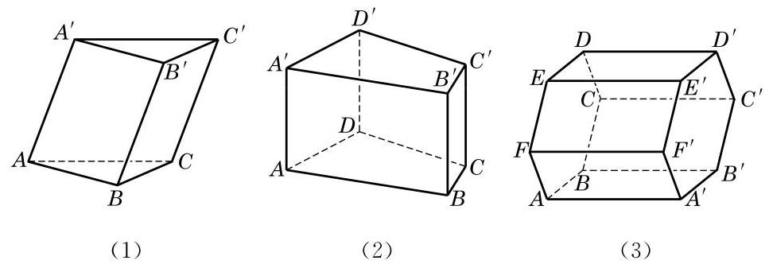

图 11-1-1

通常又可按照棱柱底面的多边形的边数把棱柱分为三棱柱、 四棱柱、五棱柱等. 例如, 图 11-1-1 中, (1)是三棱柱, 又因为它的侧棱不垂直于底面，所以是斜三棱柱；(2)是四棱柱，又因为侧棱垂直于底面, 所以是直四棱柱; (3)的底面是正六边形, 侧棱又垂直于底面, 所以是正六棱柱.

---

棱柱常用表示两底面多边形的记号(顶点相应排列)再用短横连接来记. 例如, 图 11-1-1 中, 三棱柱 (1) 可记为棱柱 ${ABC} - \; {A}^{\prime }{B}^{\prime }{C}^{\prime }$ ,六棱柱 (3) 可记为棱柱 ${ABCDEF} - \; {A}^{\prime }{B}^{\prime }{C}^{\prime }{D}^{\prime }{E}^{\prime }{F}^{\prime }$ .

---

例 1 已知斜三棱柱 ${ABC} - {A}^{\prime }{B}^{\prime }{C}^{\prime }$ 的底面是正三角形,侧棱 $A{A}^{\prime } \bot  {BC}$ ,并且与底面所成角是 ${60}^{ \circ  }$ . 设侧棱长为 $l$ .

(1)求此三棱柱的高；

(2)求证:侧面 $B{B}^{\prime }{C}^{\prime }C$ 是矩形；

(3)求证: ${A}^{\prime }$ 在平面 ${ABC}$ 上的射影 $O$ 在 $\angle {BAC}$ 的平分线上.

解(1)如图 11-1-2,过 ${A}^{\prime }$ 作 ${A}^{\prime }O$ 垂直于平面 ${ABC}, O$ 为垂足,则线段 ${A}^{\prime }O$ 的长就是三棱柱的高, $\angle {A}^{\prime }{AO}$ 就是侧棱 $A{A}^{\prime }$ 与底面所成角.

由 $\angle {A}^{\prime }{AO} = {60}^{ \circ  }, A{A}^{\prime } = l$ ,可得三棱柱的高 ${A}^{\prime }O = l\sin {60}^{ \circ  } \; = \frac{\sqrt{3}}{2}l$ .

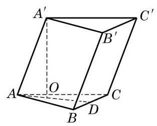

图 11-1-2

(2)由棱柱的定义，可知侧面 $B{B}^{\prime }{C}^{\prime }C$ 是平行四边形. 又因为 $A{A}^{\prime } \bot  {BC}, A{A}^{\prime }//B{B}^{\prime }$ ,所以 $B{B}^{\prime } \bot  {BC}$ ,所以侧面 $B{B}^{\prime }{C}^{\prime }C$ 是矩形.

(3)因为 $A{A}^{\prime } \bot  {BC}$ ， ${A}^{\prime }O$ 垂直于平面 ${ABC}$ ，由三垂线定理,知 ${AO} \bot  {BC}$ . 延长 ${AO}$ 交 ${BC}$ 于点 $D$ ,则 ${AD}$ 是 $\bigtriangleup {ABC}$ 的边 ${BC}$ 上的高. 因为 $\bigtriangleup {ABC}$ 是正三角形,所以 ${AD}$ 也是 $\angle {BAC}$ 的平分线,即 ${A}^{\prime }$ 在平面 ${ABC}$ 上的射影在 $\angle {BAC}$ 的平分线上.

如图 11-1-3, 将矩形 ABCD 绕其一条边 AB 所在直线旋转一周,所形成的几何体叫做圆柱 (cylinder), ${AB}$ 所在直线叫做该圆柱的轴,线段 ${AD}$ 和 ${BC}$ 分别旋转而成的圆面叫做该圆柱的底面, 线段 ${CD}$ 旋转而成的曲面叫做该圆柱的侧面， ${CD}$ 叫做该圆柱的母线,圆柱的两个底面间的距离(即 ${AB}$ 的长度)叫做该圆柱的高.

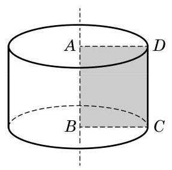

图 11-1-3

根据圆柱的形成过程, 易知圆柱有两个相互平行的底面, 有无穷多条母线, 且所有母线都与其轴平行.

方便起见, 我们把棱柱和圆柱统称为柱体.

例 2 证明: (1) 过圆柱的轴的任意平面与圆柱形成的截面都是全等的矩形;

(2)任一平行于圆柱底面的平面与圆柱形成的截面都是与底面全等的圆.

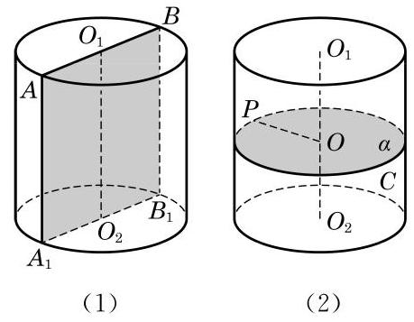

图 11-1-4

证明(1)设过圆柱的轴 ${O}_{1}{O}_{2}$ 的任一平面与圆柱相截所形成的截面为 $A{A}_{1}{B}_{1}B$ ,且 ${AB}\text{ 、 }{A}_{1}{B}_{1}$ 都是底面圆的直径,如图 11-1-4(1)所示. 因为圆柱的底面平行，所以由两个平面平行的性质定理, ${AB}//{A}_{1}{B}_{1}$ . 又因为 $A{A}_{1}//{O}_{1}{O}_{2}//B{B}_{1}$ ,所以 $A{A}_{1}{B}_{1}B$ 是平行四边形. 由 ${O}_{1}{O}_{2}$ 垂直于底面,知 $A{A}_{1}$ 垂直于底面,因此 $A{A}_{1} \bot  {A}_{1}{B}_{1}$ . 所以 $A{A}_{1}{B}_{1}B$ 是矩形,其一组对边的长是底面的直径, 另一组对边的长是圆柱的高, 它们都是完全确定的, 即这些截面互相都全等.

(2)任作一个平行于底面并与圆柱相交的平面 $\alpha$ ,把平面 $\alpha$ 截圆柱侧面所形成的封闭曲线记为 $C$ ,设 $P$ 是 $C$ 上的任意一点, 如图 11-1-4(2)所示. 由圆柱的形成过程，知圆柱侧面上任意一点到圆柱的轴的距离都等于圆柱的底面半径,所以 $P$ 到点 $O$ 的距离必等于底面半径,从而 $C$ 所围出的截面是一个与底面全等的圆.

## 练习 11.1(1)

1. 证明: 棱柱的所有侧面都是平行四边形.

2. 证明: 平行于棱柱底面的平面截这个棱柱所得到的截面是一个与底面全等的多边形.

3. 一个水平放置的封闭圆柱形容器中装了部分的水，此时水面的形状是什么图形？如果把圆柱沿侧面放倒在水平的面上, 那么水面的形状又会是什么图形? 请分别画出以上两种情形的示意图.

## 2 柱体的体积

我们已经知道长方体的体积等于长、宽、高的乘积. 对于一般的柱体, 是否也可以给出相应的体积公式呢?

早在公元 5 世纪，我国数学家祖暅在求球体积时，就创造性地提出了一个原理: “幂势既同，则积不容异. ”这里，“幂”是截面积, “势”是几何体的高. 意思是两个同高的几何体, 若在任意给定的等高处的截面积相等, 则体积相等. 如图 11-1-5, 这个原理可以用现代的数学语言表示如下: Q

---

“祖暅原理” 是祖冲之(429-500)和他的儿子祖暅(456- 536)提出的, 解决了球体等几何体体积计算问题. 国外用意大利数学家卡瓦列里 (B. Cavalieri, 1598- 1674)的名字命名此原理, 称为 “卡瓦列里原理”.

---

祖暅原理 夹在两个平行平面间的两个几何体, 如果被平行于这两个平面的任意平面截得的两个截面都有相等的面积, 那么这两个几何体的体积必相等.

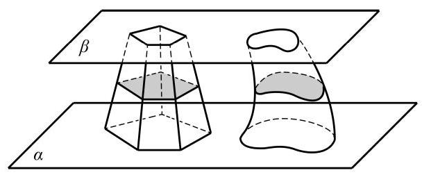

图 11-1-5

我们可以把图 11-1-5 看成装满水的两个不同容器. 若在任意给定的等高处液面面积相等, 则容器中的水一样多. 我们还可以用下面的方法直观地解释祖暅原理:如图 11-1-6，取一堆书放在桌面上, 将这堆书如图那样改变一下形状, 这时书堆的高度没有改变, 每页的面积也没有改变, 这堆书的体积与变形前相等.

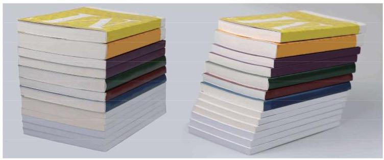

图 11-1-6

有了祖暅原理，下面就可以方便地推导一般柱体的体积. 设某个棱柱的底面积是 ${S}_{\text{ 底 }}$ ,高是 $h$ . 为了计算它的体积,我们先构造一个底面积为 ${S}_{\text{ 底 }}$ ,高为 $h$ 的长方体,然后把棱柱和长方体同时置于两个平行平面之间, 如图11-1-7所示.

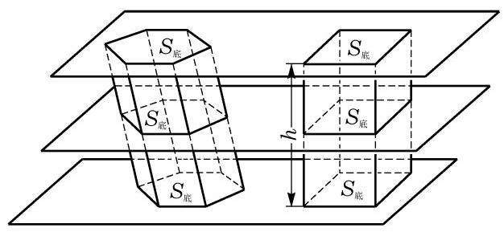

图 11-1-7

依据棱柱的定义, 用平行于底面的任意平面去截棱柱所形成的截面与底面多边形全等, 面积自然也相等. 这样, 由祖暅原理可以得到一般棱柱的体积公式:

$$
{V}_{\text{ 棱柱 }} = {S}_{\text{ 底 }}h\text{ . }
$$

其中, ${S}_{\text{ 底 }}$ 为棱柱的底面积, $h$ 为棱柱的高.

用类似的方法可以推导出圆柱的体积公式:

$$
{V}_{\text{ 圆柱 }} = {S}_{\text{ 底 }}h = \pi {r}^{2}h.
$$

其中, ${S}_{\text{ 底 }}$ 为圆柱的底面积, $h$ 为圆柱的高, $r$ 为圆柱的底面半径.

例 3 已知三棱柱的底面三角形 ${ABC}$ 的三边长分别是 ${AB} = {13}\mathrm{\;{cm}},{BC} = 5\mathrm{\;{cm}},{CA} = {12}\mathrm{\;{cm}}$ ,侧棱 $A{A}^{\prime } = {20}\mathrm{\;{cm}}$ ,且侧棱 $A{A}^{\prime }$ 与底面所成的角为 ${60}^{ \circ  }$ . 求这个三棱柱的体积.

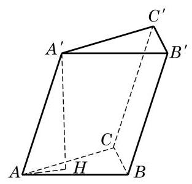

图 11-1-8

解 如图 11-1-8,设 ${A}^{\prime }$ 在平面 ${ABC}$ 上的射影为 $H$ ,则 ${A}^{\prime }H$ 是棱柱的高,且 $\angle {A}^{\prime }{AH} = {60}^{ \circ  }$ .

因为 $\bigtriangleup {A}^{\prime }{AH}$ 是直角三角形,所以

$$
{A}^{\prime }H = {A}^{\prime }A \cdot  \sin {60}^{ \circ  } = {20} \times  \frac{\sqrt{3}}{2} = {10}\sqrt{3}.
$$

又因为 $A{B}^{2} = B{C}^{2} + C{A}^{2}$ ,所以 $\angle C = {90}^{ \circ  }$ . 从而棱柱的底面积 $S = \frac{1}{2} \times  5 \times  {12} = {30}$ .

所以,棱柱的体积 $V = {Sh} = {30} \times  {10}\sqrt{3} = {300}\sqrt{3}\left( {\mathrm{\;{cm}}}^{3}\right)$ .

## 练习 11.1(2)

1. 在修建铁路时, 路基需要用碎石铺垫. 已知路基的形状及尺寸如图所示 (单位: m),每修建 $1\mathrm{\;{km}}$ 铁路需要碎石多少 ${\mathrm{m}}^{3}$ ?

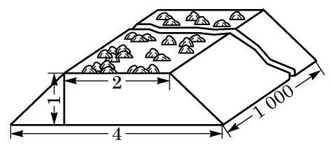

(第 1 题)

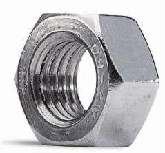

(第 3 题)

2. 一个圆柱形油桶的底面半径为 ${50}\mathrm{\;{cm}}$ ,高为 ${100}\mathrm{\;{cm}}$ . 求这个油桶的体积.

3. 如图, 查一查六角螺帽的尺寸规格, 并说明如何计算它的体积.

## 3 柱体的表面积

柱体的表面由底面和侧面组成. 其中, 底面是多边形或圆. 因此, 柱体的表面积等于两个底面的面积再加上所有侧面的面积. 其中, 所有侧面的面积之和称为柱体的侧面积. 例如, 棱长分别为 $a\text{ 、 }b\text{ 、 }c$ 的长方体的表面积等于 $2\left( {{ab} + {bc} + {ca}}\right)$ .

为了计算方便, 下面我们只讨论直棱柱和圆柱的表面积.

对于直棱柱, 由定义得每个侧面都是矩形, 且每个矩形的一边都等于棱柱的高, 另一边是底面多边形的一条边. 所以, 直棱柱的侧面积等于棱柱的高乘底面多边形的周长.

我们也可以用平面展开图的方法来求直棱柱的表面积. 如图 11-1-9, 将左边的直六棱柱沿其某条棱剪开, 并展开在一个平面上，可以得到右边的平面图形.

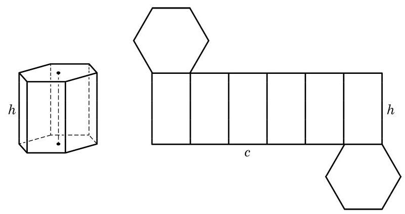

图 11-1-9

显然, 这个平面图形的面积就是直棱柱的表面积. 其中, 所有侧面正好组成一个矩形,此矩形的一边等于棱柱的高 $h$ ,另一边等于底面多边形的周长 $c$ . 这样,我们就得到了直棱柱的表面积公式:

$$
{S}_{\text{ 直棱柱表 }} = {ch} + 2{S}_{\text{ 底 }}\text{ , }
$$

其中 ${S}_{\text{ 底 }}$ 为直棱柱的底面积.

对于圆柱, 因为侧面是一个曲面, 不能像直棱柱那样直接求面积, 但仍可以采用平面展开图的方法来求侧面积. 如图 11-1-10, 将圆柱的侧面沿某条母线剪开, 并展开在一个平面上, 同样得到一个矩形. 此矩形的一边等于圆柱的母线长 $h$ (即其高), 另一边等于底面圆的周长 $c$ . 这样,我们就得到了圆柱的表面积公式:

$$
{S}_{\text{ 圆柱表 }} = {ch} + 2{S}_{\text{ 底 }} = {2\pi rh} + {2\pi }{r}^{2},
$$

其中, ${S}_{\text{ 底 }}$ 为圆柱的底面积, $r$ 是圆柱底面的半径.

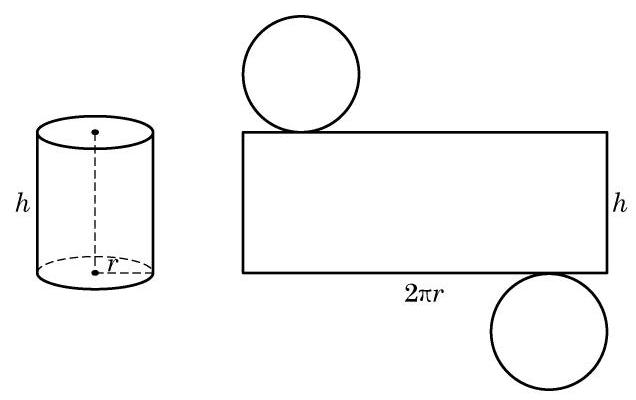

图 11-1-10

例 4 一张 A4 纸的规格为: ${{210}\mathrm{\;{mm}}} \times  {{297}\mathrm{\;{mm}}}$ ，把它作为一个圆柱的侧面. 求卷成的圆柱体体积. (结果精确到 ${0.001}{\mathrm{\;{mm}}}^{3}$ )

解 (1) 如果以 ${210}\mathrm{\;{mm}}$ 的边为高,那么 ${297} = {2\pi }{r}_{1}$ , ${r}_{1} = \frac{297}{2\pi }$ ,此时圆柱体体积为

$$
{V}_{1} = {210\pi }{r}_{1}^{2} = {210} \times  \frac{{297}^{2}}{4\pi } \approx  {1474084.329}\left( {\mathrm{\;{mm}}}^{3}\right) .
$$

(2)如果以 ${297}\mathrm{\;{mm}}$ 的边为高,那么 ${210} = {2\pi }{r}_{2},{r}_{2} = \frac{210}{2\pi }$ , 此时圆柱体体积为

$$
{V}_{2} = {297\pi }{r}_{2}^{2} = {297} \times  \frac{{210}^{2}}{4\pi } \approx  {1042281.849}\left( {\mathrm{\;{mm}}}^{3}\right) .
$$

## 练习 11.1(3)

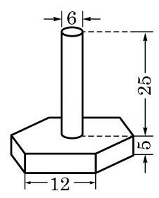

(第 1 题)

1. 如图(图中单位:cm)是一种机器零件，零件下部是实心的直六棱柱(底面是正六边形，侧面是全等的矩形)，上部是实心的圆柱. 求此零件的体积与表面积. (结果分别精确到 ${0.1}{\mathrm{\;{cm}}}^{3}$ 与 ${0.1}{\mathrm{\;{cm}}}^{2}$ )

2. 要给一批共 10000 根相同规格的空心钢管镀锌，钢管的长度为 $1\mathrm{\;m}$ ,内外直径分别为 $8\mathrm{\;{cm}}$ 与 ${10}\mathrm{\;{cm}}$ . 若电镀这批钢管每平方米要用锌 ${0.11}\mathrm{\;{kg}}$ ,求需要用锌的总量. (结果精确到 ${0.01}\mathrm{\;{kg}}$ )

3. 证明: 表面积相等的长方体中, 正方体的体积最大.

## 习题 11.1

## A 组

1. 若圆柱的底面半径是 1 , 母线长为 2 , 则这个圆柱的体积是___.

2. 若一个圆柱的侧面积是 ${4\pi }$ ,高为 1,则这个圆柱的体积是___.

3. 若正六棱柱的高为 4，底面边长为 2，则这个正六棱柱的体积是___.

4. 将一个棱长为 $a$ 的正方体切成 27 个全等的小正方体，其表面积增加了___.

5. 已知侧面都是矩形的四棱柱, 侧棱长为 5, 底面是边长为 2 的菱形, 则这个棱柱的侧面积是___.

6. 在正四棱柱 ${ABCD} - {A}_{1}{B}_{1}{C}_{1}{D}_{1}$ 中,若 $A{A}_{1} = {2AB}$ ,则异面直线 ${CD}$ 与 $A{C}_{1}$ 所成角的大小为___.

7. 在正方体 ${ABCD} - {A}_{1}{B}_{1}{C}_{1}{D}_{1}$ 中,若 $E$ 是 $B{C}_{1}$ 的中点,则直线 ${DE}$ 与平面 ${ABCD}$ 所成角的大小为___.

8. 已知三棱柱 ${ABC} - {A}_{1}{B}_{1}{C}_{1}$ 的三个侧面均是矩形,求证: 它的任意两个侧面的面积之和大于第三个侧面的面积.

## B 组

1. 已知长方体 ${ABCD} - {A}_{1}{B}_{1}{C}_{1}{D}_{1}$ 的对角线 $A{C}_{1}$ 的长是 $l$ ,且直线 $A{C}_{1}$ 与长方体经过点 $A$ 的三个面所成角分别是 $\alpha \text{ 、 }\beta \text{ 、 }\gamma$ . 求此长方体的体积.

2. 如图, 设圆柱有一个内接棱柱(即棱柱的侧棱都是圆柱的母线, 棱柱的两个底面分别在圆柱的两个底面内). 已知圆柱的体积是 $4\sqrt{3}\pi$ ,棱柱的底面是边长为 2 的正三角形. 求棱柱的体积.

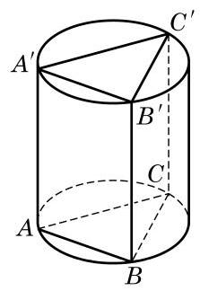

(第 2 题)

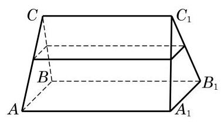

(第 3 题)

3. 如图,一个直三棱柱形容器中盛有水,且侧棱 $A{A}_{1} = 8$ . 当侧面 $A{A}_{1}{B}_{1}B$ 水平放置时,液面恰好过 ${AC}\text{ 、 }{BC}\text{ 、 }{A}_{1}{C}_{1}\text{ 、 }{B}_{1}{C}_{1}$ 的中点. 当底面 ${ABC}$ 水平放置时,液面高为多少?

## 11.2

和柱体一样, 锥体也是日常生活中常见的空间图形, 如铅锤、金字塔等(图 11-2-1). 本节我们将讨论一些简单锥体的形状特征和度量方法.

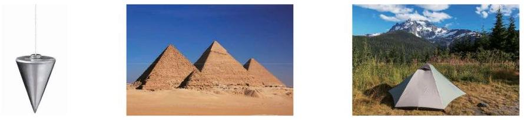

图 11-2-1

## 1 棱锥与圆锥

观察图 11-2-2 中的图形, 可以发现它们有如下的共同特征: 有一个面是三角形或平面多边形, 且不在这个面上的棱都有一个公共点, 这样的多面体叫做棱锥 (pyramid). 其中, 这个三角形或平面多边形称为棱锥的底面, 其余的面称为棱锥的侧面, 不在底面上的棱称为棱锥的侧棱, 所有侧棱的公共点称为棱锥的顶点, 顶点到底面的距离叫做棱锥的高. 如果棱锥的底面是正多边形, 且底面中心与顶点的连线垂直于底面, 那么这个棱锥叫做正棱锥 (regular pyramid).

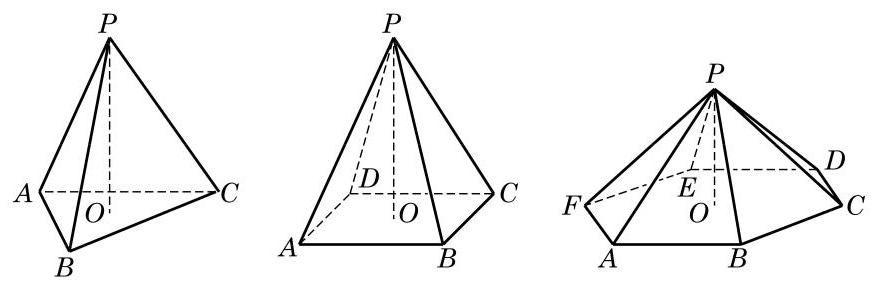

图 11-2-2

类比于棱柱的分类, 按照底面多边形的边数, 棱锥可以分别称为三棱锥、四棱锥、五棱锥等.

例 1 证明: 在正三棱锥中, 任意两条异面的棱都相互垂直.

---

棱锥常用表示其顶点的字母与表示其底面多边形的记号之间加短横来记，例如, 图 11-2-2 中, 左边的三棱锥可记为 $P - {ABC}$ ，右边的六棱锥可记为 $P - {ABCDEF}$ .

---

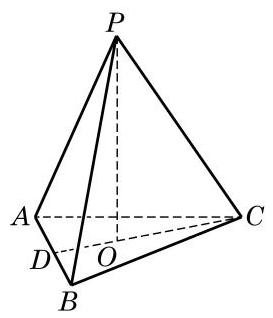

图 11-2-3

证明 如图 11-2-3,设 $P - {ABC}$ 是正三棱锥,从而它的底面三角形 ${ABC}$ 是正三角形,顶点 $P$ 在底面上的射影 $O$ 为 $\bigtriangleup {ABC}$ 的中心. 两条异面的棱可以 ${PC}$ 与 ${AB}$ 为代表 (其余情况完全类似),所以要证的是 ${PC} \bot  {AB}$ .

连接 ${CO}$ 并延长,与 ${AB}$ 交于点 $D$ . 因为 $O$ 为 $\bigtriangleup {ABC}$ 的中心,所以 ${CD} \bot  {AB}$ . 又因为 ${PO}$ 垂直于平面 ${ABC}$ ,所以 ${CD}$ 是 ${PC}$ 在平面 ${ABC}$ 上的射影. 由三垂线定理,知 ${PC} \bot  {AB}$ .

三棱锥由四个三角形围成, 它就是 10.2 节例 4 中出现过的四面体. 三棱锥是一种比较重要的棱锥, 因为由平面多边形围成的多面体 (见 11.3 节) 总可以看成由三棱锥拼合而成, 从而多面体的度量计算问题常常可以转化为三棱锥的问题; 而且三棱锥的每个面都可以作为棱锥的底面, 解决问题时便具有一定的灵活性.

除了棱锥, 还有一类常见的锥体就是圆锥. 如图 11-2-4, 将直角三角形 ${AOB}$ 绕其一条直角边 ${AO}$ 所在直线旋转一周,所形成的几何体叫做圆锥 (cone). 其中, ${AO}$ 所在直线叫做圆锥的轴, 点 $A$ 叫做圆锥的顶点,直角边 ${OB}$ 旋转而成的圆面叫做圆锥的底面,斜边 ${AB}$ 旋转而成的曲面叫做圆锥的侧面,斜边 ${AB}$ 叫做圆锥的母线,圆锥的顶点到底面间的距离(即 ${AO}$ 的长度) 叫做圆锥的高.

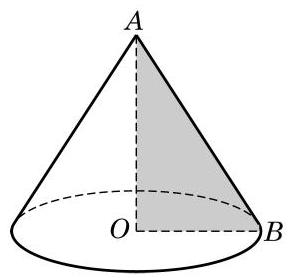

图 11-2-4

---

圆锥可用表示顶点的字母与表示底面圆心的字母之间加短横来记, 如图 11-2-4 的圆锥可记为圆锥 A-O.

---

由圆锥的形成过程可以知道, 圆锥有无穷多条母线, 且所有的母线都交于圆锥的顶点.

方便起见,我们把棱锥与圆锥统称为锥体.

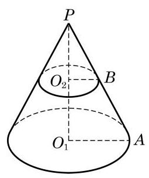

图 11-2-5

例 2 如图 11-2-5,用平行于圆锥 $P - {O}_{1}$ 底面的平面截这个圆锥,得到一个小圆锥 $P - {O}_{2}$ . 如果这两个圆锥的高分别是 ${h}_{1}\text{ 、 }{h}_{2}$ ,求这两个圆锥的底面面积之比.

解 设 ${PA}$ 是大圆锥的一条母线,过 ${PA}$ 和 $P{O}_{1}$ 的平面与两个圆锥的底面的交线分别为直线 ${O}_{1}A$ 和 ${O}_{2}B$ ,则由两个平面平行的性质定理,知 ${O}_{1}A//{O}_{2}B$ . 所以 $\bigtriangleup P{O}_{2}B \backsim  \bigtriangleup P{O}_{1}A$ , 所以

$$
\frac{{S}_{\text{ 圆 }{O}_{1}}}{{S}_{\text{ 圆 }{O}_{2}}} = {\left( \frac{P{O}_{1}}{P{O}_{2}}\right) }^{2} = {\left( \frac{{h}_{1}}{{h}_{2}}\right) }^{2}.
$$

把一个锥体用平行于底面的平面截去含顶点的小锥体后, 剩下的几何体称为台体(frustum). 在例 2 中, 大圆锥截去小圆锥后剩下的几何体称为圆台. 由圆锥的形成过程, 容易看出圆台是由直角梯形 ${O}_{1}{AB}{O}_{2}$ 绕直角边 ${O}_{1}{O}_{2}$ 旋转一周所形成的几何体. 类似地, 如果棱锥被一个平行于底面的平面所截, 那么截去一个小棱锥后剩下的多面体称为棱台. 其中, 由正棱锥截得的棱台称为正棱台. 与台体有关的问题, 我们一方面可以转化为锥体的问题来解决, 另一方面也可以把锥体和柱体看作是台体的极端情形.

## 练习 11.2(1)

1. 用平行于棱锥底面的平面截这个棱锥, 得到一个小棱锥. 已知这两个棱锥的高分别是 ${h}_{1}\text{ 、 }{h}_{2}$ ,求这两个棱锥的底面面积之比.

2.(1)过圆锥的任意两条母线作一个平面与圆锥相截，得到的截面是什么图形？在什么条件下, 所得到的截面面积最大?

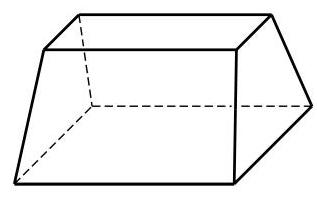

(第 3 题)

(2)如果圆锥的母线与底面所成的角为 ${60}^{ \circ  }$ ,那么经过圆锥两条母线的平面与圆锥底面所成的二面角有可能小于 ${60}^{ \circ  }$ 吗?

3. 显然, 通过延长圆台的任意一条母线都可以使它们交于一点, 从而得到一个圆锥. 如图, 这样的几何体是否也可以通过延长棱的方法得到一个棱锥?

## 2 锥体的体积

可以证明 (见本节的“探究与实践”), 任一棱锥的体积都是与它同底等高的柱体的体积的三分之一, 由此得到棱锥的体积公式:

$$
{V}_{\text{ 棱锥 }} = \frac{1}{3}{Sh}.
$$

其中, $S$ 为棱锥底面的面积, $h$ 为棱锥的高.

利用棱锥的体积公式和祖暅原理，可以进一步得出圆锥的体积公式:

$$
{V}_{\text{ 圆锥 }} = \frac{1}{3}{Sh} = \frac{1}{3}\pi {r}^{2}h.
$$

其中, $r$ 为底面半径.

例 3 如图 11-2-6,设 $E\text{ 、 }F$ 分别是给定正方体 ${ABCD} - \; {A}_{1}{B}_{1}{C}_{1}{D}_{1}$ 的棱 ${C}_{1}{D}_{1}$ 和 ${CD}$ 上的任意点. 求证: 三棱锥 $E - {ABF}$ 的体积是定值.

证明 设正方体 ${ABCD} - {A}_{1}{B}_{1}{C}_{1}{D}_{1}$ 的棱长为 $a$ . 因为 ${AB}//{CD}$ ,所以当点 $F$ 在 ${CD}$ 上移动时,它与 ${AB}$ 的距离 (即 $\bigtriangleup {FAB}$ 的高)都等于 ${BC}$ ,三角形 ${FAB}$ 的面积 ${S}_{\bigtriangleup {FAB}} = \frac{1}{2}{AB} \times \; {BC} = \frac{1}{2}{a}^{2}$ 为定值.

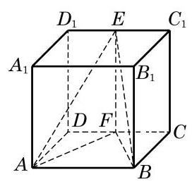

图 11-2-6

又因为正方体的棱 ${C}_{1}{D}_{1}$ 与下底面平行,所以 ${C}_{1}{D}_{1}$ 上任意一点到下底面的距离都等于 $a$ ,所以三棱锥 $E - {ABF}$ 的体积 ${V}_{\text{ 三棱锥 }E - {ABF}} = \frac{1}{3}a{S}_{\bigtriangleup {FAB}} = \frac{1}{6}{a}^{3}$ 为定值.

由上述证明过程还可以得出,当点 $E$ 在正方体 ${ABCD} - \; {A}_{1}{B}_{1}{C}_{1}{D}_{1}$ 的上底面上任意移动时,三棱锥 $E - {ABF}$ 的体积均为定值.

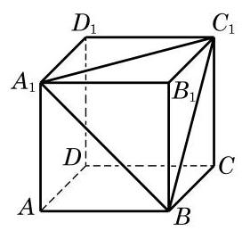

图 11-2-7

例 4 如图 11-2-7,设正方体 ${ABCD} - {A}_{1}{B}_{1}{C}_{1}{D}_{1}$ 的棱长为 $a$ . 求顶点 ${B}_{1}$ 到面 $B{A}_{1}{C}_{1}$ 的距离.

解 设顶点 ${B}_{1}$ 到面 $B{A}_{1}{C}_{1}$ 的距离为 $h$ ,则 ${V}_{\text{ 三棱锥 }{B}_{1} - {A}_{1}B{C}_{1}} = \; \frac{1}{3}h{S}_{\bigtriangleup {A}_{1}B{C}_{1}} = \frac{\sqrt{3}}{6}h{a}^{2}$ . 因为

$$
{V}_{\text{ 三棱锥 }{B}_{1} - {A}_{1}B{C}_{1}} = {V}_{\text{ 三棱锥 }{A}_{1} - {B}_{1}B{C}_{1}} = \frac{1}{3}a{S}_{\bigtriangleup {B}_{1}B{C}_{1}} = \frac{1}{6}{a}^{3},
$$

所以 $\frac{\sqrt{3}}{6}h{a}^{2} = \frac{1}{6}{a}^{3}, h = \frac{\sqrt{3}}{3}a$ .

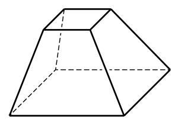

图 11-2-8

例 5 如图 11-2-8,设台体上、下底面积分别为 ${S}^{\prime }$ 和 $S$ , 上下底面的距离为 $h$ . 求证: ${V}_{\text{ 台 }} = \frac{1}{3}\left( {{S}^{\prime } + \sqrt{{S}^{\prime }S} + S}\right) h$ .

证明 设去掉的锥体和原来的锥体的体积分别为 ${V}^{\prime }$ 和 $V$ , 去掉的锥体高为 $x$ ,则

$$
{V}^{\prime } = \frac{1}{3}{S}^{\prime }x, V = \frac{1}{3}S\left( {h + x}\right) .
$$

因为 $\frac{x}{x + h} = \frac{\sqrt{{S}^{\prime }}}{\sqrt{S}}$ ,可解得 $x = \frac{\sqrt{{S}^{\prime }}h}{\sqrt{S} - \sqrt{{S}^{\prime }}}$ ,所以

$$
{V}_{\text{ 合 }} = \frac{1}{3}S\left( {h + x}\right)  - \frac{1}{3}{S}^{\prime }x = \frac{1}{3}{Sh} + \frac{1}{3}\left( {S - {S}^{\prime }}\right) \frac{\sqrt{{S}^{\prime }}h}{\sqrt{S} - \sqrt{{S}^{\prime }}}
$$

$$
= \frac{1}{3}{Sh} + \frac{1}{3}\left( {\sqrt{S} + \sqrt{{S}^{\prime }}}\right) \sqrt{{S}^{\prime }}h = \frac{1}{3}\left( {{S}^{\prime } + \sqrt{{S}^{\prime }S} + S}\right) h.
$$

## 练习 11.2(2)

1. 已知四棱锥 $P - {ABCD}$ 的底面是边长为 6 的正方形，侧棱 ${PA}$ 垂直于底面，且 ${PA} \; = 8$ . 求该四棱锥的体积.

2. 已知直三棱柱 ${ABC} - {A}^{\prime }{B}^{\prime }{C}^{\prime }$ 的侧棱长为 9，底面相邻边的长分别是 7 和 5，夹角为 ${120}^{ \circ  }$ . 求三棱锥 $B - {A}^{\prime }{B}^{\prime }{C}^{\prime }$ 的体积.

3. 已知圆台上、下底面的半径分别为 ${r}_{1}\text{ 、 }{r}_{2}$ ,高为 $h$ . 求证: ${V}_{\text{ 圆台 }} = \frac{1}{3}\pi \left( {{r}_{1}^{2} + {r}_{1}{r}_{2} + {r}_{2}^{2}}\right) h$ .

## 探究与实践

下面我们尝试由棱柱的体积公式推导棱锥的体积公式.

平面几何中, 在推导三角形的面积公式时, 可以先把两个全等的三角形拼成一个平行四边形, 如图 11-2-9, 然后利用已知的平行四边形的面积公式导出三角形的面积公式.

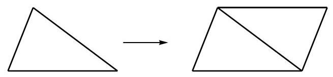

图 11-2-9

前面我们已经得到了柱体的体积公式, 能否类似平面几何的做法, 利用柱体的体积公式来推导锥体的体积公式呢? 要这样做, 显然应该从三棱锥开始, 因为任意一个棱锥都可以分割为若干个三棱锥.

作为准备, 我们先证明: 等底等高的三棱锥的体积相等.

已知三棱锥 $O - {ABC}$ 和 $P - {DEF}$ 的底面积都是 $S$ ,高都是 $h$ .

求证: 三棱锥 $O - {ABC}$ 和 $P - {DEF}$ 的体积相等.

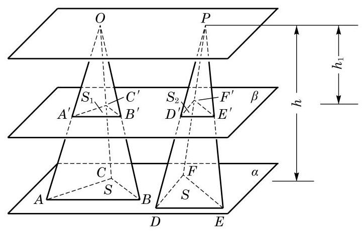

图 11-2-10

证明 如图 11-2-10,把两个三棱锥的底面都放在平面 $\alpha$ 上,任意作平面 $\beta$ 平行于 $\alpha$ , 设平面 $\beta$ 截三棱锥 $O - {ABC}$ 所得的截面为 $\bigtriangleup {A}^{\prime }{B}^{\prime }{C}^{\prime }$ ,其面积为 ${S}_{1}$ ; 平面 $\beta$ 截三棱锥 $P - {DEF}$ 所得的截面为 $\bigtriangleup  {D}^{\prime }{E}^{\prime }{F}^{\prime }$ ，其面积为 ${S}_{2}$ . 如果三棱锥的顶点 $O$ 和 $P$ 到平面 $\beta$ 的距离为 ${h}_{1}$ ,那么推得 $\frac{O{A}^{\prime }}{OA} = \frac{O{B}^{\prime }}{OB} = \frac{O{C}^{\prime }}{OC} = \frac{{h}_{1}}{h}$ 和 $\frac{{A}^{\prime }{B}^{\prime }}{AB} = \frac{{B}^{\prime }{C}^{\prime }}{BC} = \frac{{C}^{\prime }{A}^{\prime }}{CA} = \frac{{h}_{1}}{h}$ . 于是,得 $\bigtriangleup {A}^{\prime }{B}^{\prime }{C}^{\prime } \backsim \; \bigtriangleup {ABC}$ ,相似比是 $\frac{{h}_{1}}{h}$ . 同理可得 $\bigtriangleup {D}^{\prime }{E}^{\prime }{F}^{\prime }\varnothing \bigtriangleup {DEF}$ ,相似比也是 $\frac{{h}_{1}}{h}$ . 由相似形的性质, 得

$$
\frac{{S}_{1}}{S} = {\left( \frac{{h}_{1}}{h}\right) }^{2},\frac{{S}_{2}}{S} = {\left( \frac{{h}_{1}}{h}\right) }^{2},
$$

即

$$
{S}_{1} = {S}_{2} = {\left( \frac{{h}_{1}}{h}\right) }^{2}S.
$$

这说明用任意平行于底面的平面截两个等底的三棱锥时, 所得的截面面积相等, 所以由祖暅原理得三棱锥 $O - {ABC}$ 和 $P - {DEF}$ 的体积相等,即等底等高的三棱锥的体积相等.

下面我们来推导三棱锥的体积公式.

如图 11-2-11,设 $P - {ABC}$ 是任一给定的三棱锥,其底面面积为 $S,{PO}$ 为高,且 ${PO} = h$ . 过顶点 $P$ 分别作 $P{C}_{1}\overset{//}{ = }{BC}, P{A}_{1}\overset{//}{ = }{BA}$ ,连接 ${A}_{1}{C}_{1}\text{ 、 }{C}_{1}C\text{ 、 }{A}_{1}A$ ,显然 $\bigtriangleup {ABC}\overset{//}{ = } \; \bigtriangleup {A}_{1}P{C}_{1}$ . 由棱柱的定义,可知 ${A}_{1}P{C}_{1} - {ABC}$ 为三棱柱,其底面面积为 $S$ ,高为 $h$ . 下面需要研究的是三棱柱 ${A}_{1}P{C}_{1} - {ABC}$ 与三棱锥 $P - {ABC}$ 的体积之间的关系.

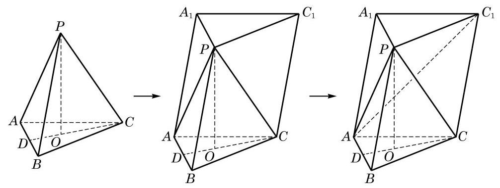

图 11-2-11

考察三棱柱的构造可以发现,比原三棱锥 $P - {ABC}$ 多出的部分是一个四棱锥 $P - {AC}{C}_{1}{A}_{1}$ . 连接 $A{C}_{1}$ ,将这个四棱锥分割成两个等底同高的三棱锥 $P - {AC}{C}_{1}$ 和 $P - A{C}_{1}{A}_{1}$ . 因此 ${V}_{\text{ 棱锥 }P - {AC}{C}_{1}} = {V}_{\text{ 棱锥 }P - A{C}_{1}{A}_{1}}$ . 另一方面,可将三棱锥 $P - A{C}_{1}{A}_{1}$ 视作三棱锥 $A - P{C}_{1}{A}_{1}$ ,则它和原三棱锥 $P - {ABC}$ 又是等底同高的三棱锥,于是 ${V}_{\text{ 棱锥 }P - {ABC}} = {V}_{\text{ 棱锥 }A - P{C}_{1}{A}_{1}} = \; {V}_{\text{ 棱锥 }P - A{C}_{1}{A}_{1}}$ . 我们证明了三个三棱锥 $P - {ABC}\text{ 、 }P - {AC}{C}_{1}$ 与 $P - A{C}_{1}{A}_{1}$ 都具有相同的体积, 于是

$$
{V}_{\text{ 棱柱 }{A}_{1}P{C}_{1} - {ABC}} = {V}_{\text{ 棱锥 }P - {ABC}} + {V}_{\text{ 棱锥 }P - {AC}{C}_{1}} + {V}_{\text{ 棱锥 }P - A{C}_{1}{A}_{1}}
$$

$$
= 3{V}_{\text{ 棱锥 }}{P}_{\text{ -ABC }}\text{ . }
$$

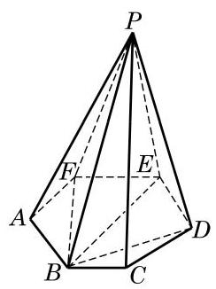

图 11-2-12

由此得 ${V}_{\text{ 棱锥P-ABC }} = \frac{1}{3}{Sh}$ .

由于任意棱锥都可以分割为若干个同高的三棱锥 (图 11-2-12), 因此可得棱锥的体积公式:

$$
{V}_{\text{ 棱锥 }} = \frac{1}{3}{Sh}.
$$

其中, $S$ 为棱锥的底面积, $h$ 为棱锥的高.

## 3 锥体的表面积

与柱体类似, 锥体的表面积也等于侧面积与底面积之和. 对于棱锥或圆锥来说, 由于底面是一个平面多边形或一个圆, 可以用平面几何的方法计算面积, 因此求侧面积是关键. 对于一般的棱锥来说, 每个侧面都是三角形, 其侧面积也易于求出, 但难以写出一个一般的公式. 对于圆锥来说, 求其侧面积则是一个新的问题, 下面我们只讨论正棱锥和圆锥的表面积.

依据定义, 正棱锥的每个侧面都是全等的等腰三角形, 我们把这些等腰三角形底边上的高称为棱锥的斜高,记为 ${h}^{\prime }$ . 如果棱锥底面多边形的周长是 $c$ ,底面面积是 ${S}_{\text{ 底 }}$ ,那么容易求得棱锥的侧面积和表面积分别是:

$$
{S}_{\text{ 正棱锥侧 }} = \frac{1}{2}c{h}^{\prime },
$$

$$
{S}_{\text{ 止棱锥长 }} = \frac{1}{2}c{h}^{\prime } + {S}_{\text{ 底 }}\text{ . }
$$

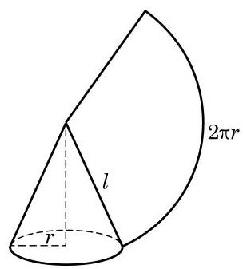

图 11-2-13

对于圆锥, 我们可以采用求圆柱侧面积的方法, 将其沿一条母线剪开, 展开在一个平面内. 可以看到, 圆锥侧面的平面展开图是一个以圆锥母线 $l$ 为半径的扇形,扇形的弧长就等于圆锥底面的圆周长,如图 11-2-13 所示. 设圆锥的底面圆半径为 $r$ ,则扇形的中心角 $\theta  = \frac{2\pi r}{l}$ (弧度). 由扇形的面积公式,可得

$$
S\text{ 圆锥侧 } = {\pi rl}\text{ . }
$$

所以，圆锥的表面积公式为:

$$
{S}_{\text{ 圆锥表 }} = {\pi rl} + \pi {r}^{2}.
$$

例 6 已知正三棱锥 $O - {ABC}$ 的底面边长为 $2\mathrm{\;{cm}}$ ，高为 $1\mathrm{\;{cm}}$ . 求该三棱锥的表面积.

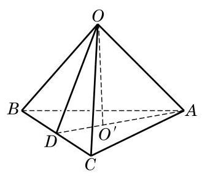

图 11-2-14

解 如图 11-2-14,因为底面三角形 ${ABC}$ 是边长为 $2\mathrm{\;{cm}}$ 的正三角形,所以计算可得底面面积 ${S}_{\bigtriangleup {ABC}} = \sqrt{3}\left( {\mathrm{\;{cm}}}^{2}\right)$ .

设 ${O}^{\prime }$ 是正三角形 ${ABC}$ 的中心. 由正三棱锥的性质可知, $O{O}^{\prime }$ 垂直于平面 ${ABC}$ . 连接 $A{O}^{\prime }$ ,并延长交 ${BC}$ 于 $D$ ,连接 ${OD}$ . 由三垂线定理,得 ${OD} \bot  {BC}$ . 计算可得 ${AD} = \sqrt{3},{O}^{\prime }D = \frac{\sqrt{3}}{3}$ . 又 $O{O}^{\prime } = 1$ ，正三棱锥的斜高 ${OD} = \frac{2\sqrt{3}}{3}$ ，所以 ${S}_{\text{ 侧 }} = \frac{1}{2} \times  6 \times  \frac{2\sqrt{3}}{3} = \; 2\sqrt{3}\left( {\mathrm{\;{cm}}}^{2}\right)$ . 所以, ${S}_{\text{ 表 }} = \sqrt{3} + 2\sqrt{3} = 3\sqrt{3}\left( {\mathrm{\;{cm}}}^{2}\right)$ .

例 7 有一个圆锥形漏斗,其底面直径是 ${10}\mathrm{\;{cm}}$ ,母线长为 ${20}\mathrm{\;{cm}}$ . 在漏斗口的点 $P$ 处用一根绳子将漏斗挂在墙面上,当绳子的长度最短时, 可以紧紧地箍住漏斗, 不会上下滑动. 求此时绳子的长度. (结果精确到 $1\mathrm{\;{cm}}$ )

解 如图 11-2-15,将圆锥侧面沿母线 ${OP}$ 展开,其平面展开图是一个以 $O$ 为圆心,半径为 ${20}\mathrm{\;{cm}}$ 的扇形. 此扇形的中心角 $\theta  = \frac{2\pi r}{l} = \frac{\pi }{2}$ (弧度),是一个直角扇形.

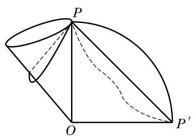

图 11-2-15

如果有一根绳子从点 $P$ 出发,绕漏斗侧面一周回到点 $P$ , 那么展开后这条绳子就变成平面上 $P$ 和 ${P}^{\prime }$ 两点之间的一条曲线. 因此,当这条曲线变成直线段 $P{P}^{\prime }$ 时,绳子的长度最短,其最短长度为 ${20}\sqrt{2} \approx  {28}\left( \mathrm{\;{cm}}\right)$ .

## 练习 11.2(3)

1. 已知圆锥侧面展开图中扇形的中心角为 $\frac{2\pi }{3}$ ，底面周长为 ${2\pi }$ . 求这个圆锥的侧面积和表面积.

2. 棱长都是 1 的三棱锥的表面积为___.

3. 推导正棱台的侧面积公式.

## 习题 11.2

## A 组

1. 已知一个正三棱锥的底面边长为 6 , 侧棱长为 $\sqrt{15}$ . 求这个三棱锥的体积.

2. 如图,已知三棱锥 $P - {ABC}$ 中, ${PA}$ 垂直于平面 ${ABC},{AB} \bot  {BC},{PA} = 4,{AB} =$ 3, ${AC} = 5$ .

(1)求点 $A$ 到平面 ${PBC}$ 的距离；

(2)求三棱锥 $P - {ABC}$ 的表面积.

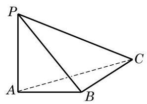

(第 2 题)

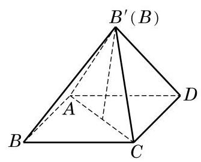

(第 3 题)

3. 把边长为 1 的正方形 ${ABCD}$ 沿对角线 ${AC}$ 折起,使 (折叠后的) $A\text{ 、 }{B}^{\prime }\text{ 、 }C\text{ 、 }D$ 四点为顶点的三棱锥体积最大. 求此三棱锥的表面积.

4. 棱锥被平行于底面的平面所截, 当截面分别平分棱锥的高与体积时, 相应的截面面积分别为 ${S}_{1}\text{ 、 }{S}_{2}$ . 求证: ${S}_{1} < {S}_{2}$ .

5. 若圆锥的底面半径为 1,高为 $\sqrt{3}$ ,求圆锥的表面积.

6. 把一个圆锥截成圆台,已知圆台的上、下底面半径的比为 $1 : 4$ ,母线 (原圆锥母线在圆台中的部分) 长为 ${10}\mathrm{\;{cm}}$ . 求原圆锥的母线长.

7. 已知圆锥的底面半径为 3,沿该圆锥的母线把侧面展开后可得到圆心角为 $\frac{2\pi }{3}$ 的扇形. 求该圆锥的高.

8. 用一个平面去截正方体, 得到一个三棱锥, 截得的三棱锥中, 除了截面外另三个面的面积分别为 ${S}_{1}\text{ 、 }{S}_{2}\text{ 、 }{S}_{3}$ . 求这个三棱锥的体积.

## B 组

1. 在三棱锥 $P - {ABC}$ 中,已知 ${PA} = {PB} = {PC} = 1,{AB} = \sqrt{2},{BC} = 1,{AC} = \sqrt{3}$ . 求该三棱锥底面 ${ABC}$ 上的高与三棱锥的体积.

2. 用过圆柱和圆锥的轴的平面截这两个几何体, 分别得到边长为 2 的正方形和正三角形, 求圆柱和圆锥的表面积之比.

3. 已知圆锥底面的半径为 10，母线长为 60 . 求底面圆周上一点 $B$ 沿侧面绕两周回到点 $B$ 的最短距离.

4. 设圆台的母线长为 $l$ ,上、下底面的半径分别为 ${r}^{\prime }\text{ 、 }r$ . 试用 ${r}^{\prime }\text{ 、 }r$ 和 $l$ 表示圆台的侧面积.

### 11.3 面体与旋转体

本章前两节我们研究了一些重要的简单几何体, 主要是棱柱、棱锥、圆柱和圆锥. 这些几何体又可分为多面体与旋转体.

## 1 多面体

在 11.1 节中, 我们把多面体定义为由三角形或平面多边形围成的封闭几何体, 我们还知道了棱柱、棱锥、棱台等几何体都是多面体. 本节将从多面体中面的数量和特点这个不同角度对多面体做一些探讨.

多面体可以用它的面的数量进行命名，有几个面的多面体就叫做几面体. 例如, 三棱锥有一个底面和三个侧面, 所以是四面体; 长方体 (四棱柱) 有六个面,是六面体. 一般地,一个 $n$ 棱锥有一个底面和 $n$ 个侧面,所以是 $n + 1$ 面体; $n$ 棱柱或 $n$ 棱台有两个底面和 $n$ 个侧面,所以是 $n + 2$ 面体.

容易看出, 一个多面体至少有四个面. 这是因为, 如果在一个多面体中任意选定一个面, 那么这个面至少有三条边, 即它的边界上至少有多面体的三条棱. 每条棱还是这个面与另一个面的交线, 于是得到了另外三个面. 这三个面互不重合, 否则有一个面与预先选定的面有两条公共棱, 从而与选定的面重合, 这是不可能的. 于是, 我们至少在这个多面体上找到了四个面.

由此可见, 面数最少的多面体是四面体, 即三棱锥. 四面体在立体几何中的作用相当于三角形在平面几何中的作用. 例如, 平面上的多边形都可以由三角形拼合而成, 而空间中的多面体都可以由四面体拼合而成.

Q

与平面上的正多边形类似, 在空间中可以考虑正多面体. 如果一个多面体的所有面都是全等的正三角形或正多边形, 每个顶点聚集的棱的条数都相等, 这个多面体就叫做正多面体 (regular polyhedron). 图 11-3-1 给出了五种不同的正多面体. 事实上， 用本节“课后阅读”中所介绍多面体的欧拉定理, 可以验证只有这五种正多面体.

---

正多面体又称为柏拉图立体 (platonic solid), 因古希腊哲学家柏拉图(Plato，公元前 427-公元前 347) 对它们所做的研究而得名.

---

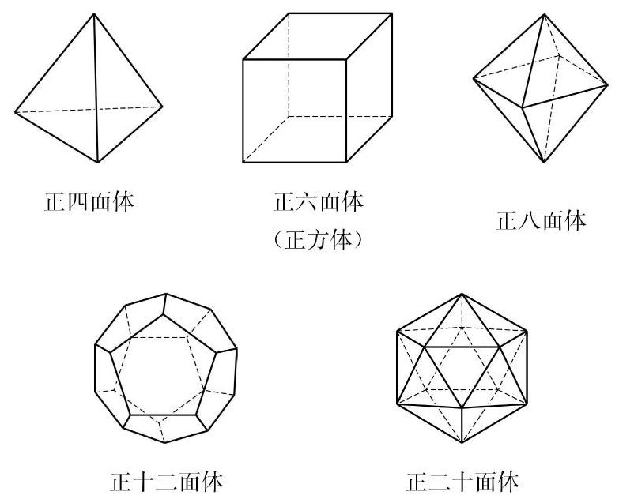

图 11-3-1

## 2 旋转体

虽然圆柱和圆锥也是常见的几何体, 但它们具有与多面体完全不同的特征:组成这两类几何体的表面不全是平面多边形. 我们在前两节中把圆柱(圆锥)定义成由一个矩形(直角三角形)绕它的一条边 (一条直角边) 旋转一周所形成的几何体. 这里的关键词是“旋转”，由此我们抽象出一般旋转体的概念:由一个平面封闭图形绕其所在平面上的一条定直线旋转一周所形成的空间封闭几何体称为旋转体 (revolving solid) (图 11-3-2), 这条直线叫做该旋转体的轴.

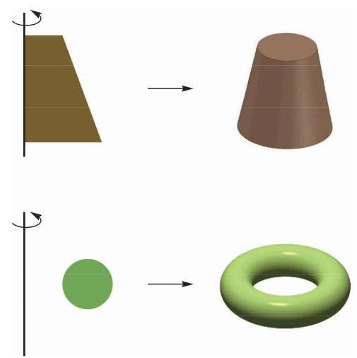

图 11-3-2

在车床加工零件或陶瓷工坊制作陶器时, 我们都可以直观地体验旋转体和它的轴.

与旋转体类似地可以定义空间中的旋转面: 一条平面曲线 (包括直线、折线等)绕其所在平面上的一条直线旋转一周所形成的空间图形称为旋转面. 图 11-3-2 右边的空间几何体的表面就是旋转面, 它可由左边对应平面图形的外框线绕旋转轴旋转而得到.

旋转面是大学空间解析几何课程中的内容之一. 我们这里只关注最简单的情况: 一条直线 $a$ 绕同一平面内的另一条直线 $l$ 旋转一周所形成的曲面: 圆柱面或圆锥面. 当直线 $a$ 与直线 $l$ 平行时,得到的是圆柱面; 当直线 $a$ 与直线 $l$ 相交 (但不垂直) 时,得到的是圆锥面 (图 11-3-3). 直线 $a$ 称为圆柱面或圆锥面的母线. 在圆锥面的情况中,母线与转轴的交点 $O$ 旋转以后仍然是一个点 (仍记为 $O$ ),这个点称为圆锥面的顶点.

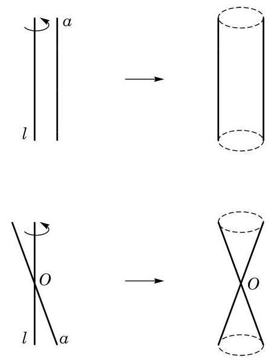

图 11-3-3

## 课后阅读

## 多面体的欧拉定理

多面体的世界是丰富多彩的, 但会遵循一些非常简单的基本规律, 多面体的欧拉定理就描述了这样一个规律.

多面体的欧拉定理: 简单多面体的顶点数 $V$ 、棱数 $E$ 与面数 $F$ 有关系

$$
V + F - E = 2.
$$

这里首先要知道什么是“简单多面体”. 要弄清这个概念, 设想多面体的面都是用具有良好弹性的橡胶做成的. 如果往这个多面体充足够多的气体以后能够使这个多面体膨胀成一个球体, 那么这个多面体就是一个简单多面体.

我们迄今所见的多面体(如棱柱、棱锥、正多面体等)都是简单多面体. 但要构造一个非简单多面体也不难. 如图 11-3-4, 这是一个中间有一个长方体空洞的十六面体, 往这样的橡胶多面体充气，得到的是一个游泳圈，而不是球. 算一算，对于图 11-3-4 的多面体, $V + F - E$ 等于多少.

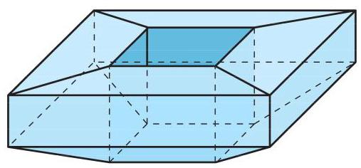

图 11-3-4

多面体的欧拉定理的证明与中学数学教材中常见的几何证明有着本质的不同, 它设想所讨论的多面体是用一种可随意变形但不会撕破或粘连的材料(如橡胶)做成的，于是可以把它拉伸或压缩，转换为一个能更好把握的几何体进行研究. 这里我们不做深入讨论, 但要指出, 这个定理及其证明实际上归入一个新的几何学一一拓扑学的领域. 拓扑学关注的是 “相邻” 状态与 “连续” 变形, 而不是度量 (长度、角度以及派生的面积、体积等), 因此拓扑学常被人戏称为 “橡皮筋上的几何学”.

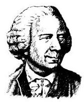

欧拉 (L. Euler, 1707 — 1783), 瑞士数学家，是科学史上最多产的一位杰出数学家， 在许多领域都作出了奠基性的贡献.

多面体的欧拉定理及其推广是拓扑学中的重要定理, 其所揭示的“欧拉示性数”已成为拓扑学的基础概念.

有了多面体的欧拉定理,再对正多面体的顶点数 $V$ 、棱数 $E$ 、面数 $F$ 以及每面的边数和每顶点聚集的棱数之间的关系做一些分析, 就可以证明正多面体只有图 11-3-1 所示的 5 种, 有兴趣的同学不妨一试. 正多面体的相关数据如表 11-1 所示:

表 11-1

<table><tr><td>类型</td><td>面数</td><td>棱数</td><td>顶点数</td><td>每面边数</td><td>每顶点棱数</td></tr><tr><td>正四面体</td><td>4</td><td>6</td><td>4</td><td>3</td><td>3</td></tr><tr><td>正六面体</td><td>6</td><td>12</td><td>8</td><td>4</td><td>3</td></tr><tr><td>正八面体</td><td>8</td><td>12</td><td>6</td><td>3</td><td>4</td></tr><tr><td>正十二面体</td><td>12</td><td>30</td><td>20</td><td>5</td><td>3</td></tr><tr><td>正二十面体</td><td>20</td><td>30</td><td>12</td><td>3</td><td>5</td></tr></table>

## 练习 11.3

1. 我国古代数学著作《九章算术》中研究过一种叫“鳖 (biē) 臑(nào)”的几何体 (见《九章算术》卷第五“商功”之一六)，它指的是由四个直角三角形围成的四面体. 用你学过的立体几何知识说明这种四面体确实存在.

2. 有两个面平行, 其余各面都是平行四边形的多面体一定是柱体吗? 请给出你的理由或反例.

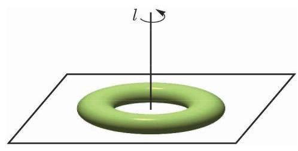

(第 3 题)

3. 如图是一个置于地面上的救生圈, 它是绕一条垂直于地平面的直线 $l$ 旋转而成的旋转体.

(1)如果用一个经过旋转轴 $l$ 的平面去截这个救生圈, 得到的截面是什么图形? 请画出示意图.

(2)如果用一个平行于地面的平面去截这个救生圈, 得到的截面可能是什么图形? 请画出示意图.

## 习题 11.3

## A 组

1. 如图,以正方体 ${ABCD} - {A}_{1}{B}_{1}{C}_{1}{D}_{1}$ 六个面的中心为顶点所构成的多面体有多少条棱和多少个面? 设正方体的棱长为 1,设个多面体的表面积和体积是多少?

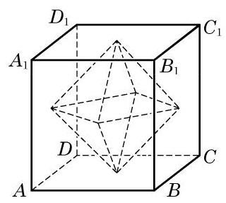

(第 1 题)

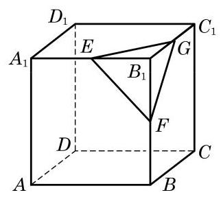

(第 2 题)

2. 如图,设 $E\text{ 、 }F\text{ 、 }G$ 分别是正方体 ${ABCD} - {A}_{1}{B}_{1}{C}_{1}{D}_{1}$ 的共点的三条棱 ${A}_{1}{B}_{1}$ 、 ${B}_{1}B\text{ 、 }{B}_{1}{C}_{1}$ 的中点,过这三个点的平面截正方体得到的一个“角”是四面体 ${B}_{1}{EFG}$ . 设正方体的棱长为 1 .

(1)求证:四面体 ${B}_{1}{EFG}$ 是以 ${B}_{1}$ 为顶点、以 ${EFG}$ 为底面的正三棱锥；

(2)在四面体 ${B}_{1}{EFG}$ 中，求顶点 ${B}_{1}$ 到底面 ${EFG}$ 的距离；

(3)如果将正方体按照题设的方法截去八个“角”，那么剩余的多面体有几个顶点、几条棱、几个面? 并求这个剩余多面体的表面积与体积.

3. 在如图所示的多面体中, 已知 ABCD 为矩形, ${ABFE}$ 和 ${DCFE}$ 为全等的等腰梯形, ${AB} = 4,{BC} = {AE} = \; {EF} = 2$ . 求此多面体的表面积与体积.

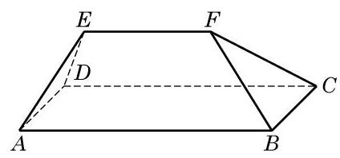

(第 3 题)

4. 一个直角三角形有一个 $\frac{\pi }{6}$ 的内角,这个内角所对直角边的长度为 1 . 把这个三角形绕其斜边旋转一周, 求所得旋转体的表面积与体积.

## B 组

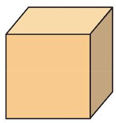

(第 1 题)

1. 如图, 给定一个正方体形状的土豆块, 只切一刀, 可以得到下面哪些类型的多面体?

① 四面体; ② 四棱锥; ③ 四棱柱;

④ 五棱锥; ⑤ 五棱柱; ⑥ 六棱锥；

⑦ 七面体.

___(找出可能的结果，并将序号填在横线上)

2. 如图, 有两张全等的正三角形纸片, 按照下面两种方法分别将它们剪拼成一个三棱锥和一个三棱柱. 试比较这两个多面体的体积的大小.

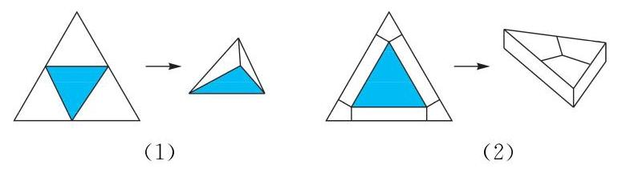

(第 2 题)

## 11.4

球是日常生活中最常见的几何体之一, 如足球、篮球、乒乓球等，其形状都是球体，如图 11-4-1 所示.

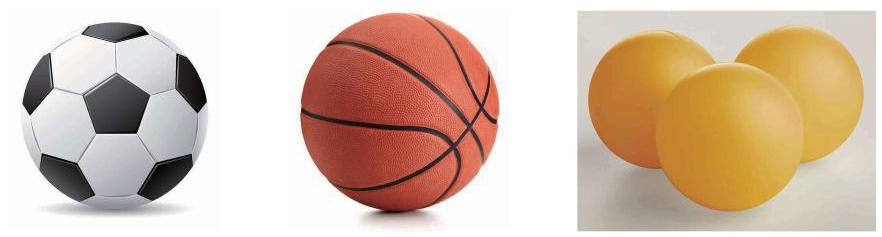

图 11-4-1

## 1 求

和圆柱、圆锥一样, 球也是一个旋转体. 如图 11-4-2, 将圆心为 $O$ 的半圆面绕其直径所在的直线旋转一周,所形成的几何体叫做球 (ball),记作球 $O$ . 半圆的圆弧绕直径旋转所形成的旋转面叫做球面 (sphere),点 $O$ 到球面上任意一点的距离都相等, 点 $O$ 叫做球心,把原半圆的半径和直径分别叫做球的半径和直径. 与圆柱和圆锥只有一条轴不同, 球具有丰富的对称性, 所有经过球心的直线都可以作为球的旋转轴, 每条旋转轴与球面交点之间的线段都是球的直径.

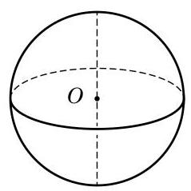

图 11-4-2

假设我们用一个平面 $\alpha$ 去截球,得到的截面是什么图形呢? 如图 11-4-3,由直线与平面垂直的性质可知,过球心 $O$ 有且只有一条直线与平面 $\alpha$ 垂直. 设这条直线与球面的交点分别是 $A$ 和 $B$ ,则 ${AB}$ 是球 $O$ 的一条直径. 设平面 $\alpha$ 与 ${AB}$ 的交点是 ${O}_{1}, C$ 是平面 $\alpha$ 与球面的任意公共点. 连接 ${O}_{1}C$ . 在直角三角形 $O{O}_{1}C$ 中,由勾股定理,易知 ${O}_{1}C$ 为定值,与点 $C$ 的选取无关. 这就是说,在平面 $\alpha$ 上, $C$ 到定点 ${O}_{1}$ 的距离为定值,所以平面 $\alpha$ 与球面的交线是一个以 ${O}_{1}$ 为圆心,以 ${O}_{1}C$ 为半径的圆. 特别地, 若平面 $\alpha$ 经过球心,则 ${O}_{1}$ 与 $O$ 重合,此时的截面称为球的大圆 (great circle). 有时, 为了区分, 也把球的非大圆截面称为小圆.

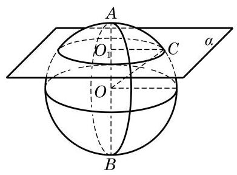

图 11-4-3

例 1 如图 11-4-3,已知球的半径为 $5, O{O}_{1} = 4$ . 求小圆 ${O}_{1}$ 的半径.

解 在圆 ${O}_{1}$ 上任意取点 $C$ . 因为点 $C$ 在球面上,所以 ${OC} \; = 5$ . 又因为 ${AB}$ 垂直于平面 $\alpha ,{O}_{1}C$ 在平面 $\alpha$ 上,所以 ${AB} \bot \; {O}_{1}C$ . 于是,由勾股定理,得

$$
{O}_{1}C = \sqrt{O{C}^{2} - O{O}_{1}^{2}}.
$$

根据已知条件, 有

$$
{O}_{1}C = \sqrt{{5}^{2} - {4}^{2}} = 3.
$$

例 2 如图 11-4-4,设 ${AB}$ 是球 $O$ 的一条直径,过球心 $O$ 作一个大圆 ${ODC}$ 与 ${AB}$ 垂直,过直径 ${AB}$ 上不同于点 $O$ 的任一点 ${O}_{1}$ 作与 ${AB}$ 垂直的平面,与球 $O$ 交于小圆 ${O}_{1}$ ,过直径 ${AB}$ 作两个平面与球分别交于两个大圆 ${OEC}$ 和 ${OFD}, E$ 和 $F$ 分别是这两个大圆的圆周与圆 ${O}_{1}$ 的交点. 求证:

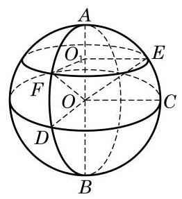

图 11-4-4

(1) $\angle {DOC}\text{ 、 }\angle {F{O}_{1}E}$ 都是二面角 $D - {AB} - C$ 的平面角；

(2) ${OE}$ 和 ${OF}$ 与平面 ${ODC}$ 所成的角相等.

---

当以一点为圆心的圆不只一个时, 可以用表示圆心的字母后面跟着表示圆周上不在一条直径上的两个点的字母来表示所指的圆, 如本题的圆 ${ODC}$ . 这样的三点完全决定了圆所在的平面以及在平面上圆心位置和圆的大小.

---

证明(1)由题设，大圆 ${ODC}$ 及小圆 ${O}_{1}$ 所在平面都垂直于 ${AB}$ ,所以 ${O}_{1}F \bot  {AB},{O}_{1}E \bot  {AB},{OD} \bot  {AB},{OC} \bot  {AB}$ ,即 $\angle {DOC}\text{ 、 }\angle F{O}_{1}E$ 都是二面角 $D - {AB} - C$ 的平面角.

(2)因为平面 ${OEC}$ 和平面 ${OFD}$ 都经过直线 ${AB}$ ，而直线 ${AB}$ 垂直于平面 ${ODC}$ ,由平面与平面垂直的判定定理,知平面 ${OEC}$ 和平面 ${OFD}$ 都垂直于平面 ${ODC}$ ,所以直线 ${OC}$ 和 ${OD}$ 分别是斜线 ${OE}$ 和 ${OF}$ 在平面 ${ODC}$ 上的射影,即 $\angle {EOC}\text{ 、 }\angle {FOD}$ 分别是斜线 ${OE}$ 和 ${OF}$ 与平面 ${ODC}$ 所成的角. 因为 ${OE} = {OF}$ , ${O}_{1}E = {O}_{1}F, O{O}_{1}$ 是公共边,所以 $\bigtriangleup {OF}{O}_{1} \cong  \bigtriangleup {OE}{O}_{1}$ ,所以 $\angle {EO}{O}_{1} = \angle {FO}{O}_{1}$ . 由此得 $\angle {EOC} = \angle {FOD}$ ,即 ${OE}$ 和 ${OF}$ 与平面 ${ODC}$ 所成的角相等.

由例 2, 我们可以对地球的经纬度进行数学解释. 首先我们把地球看作是一个球体. 如图 11-4-4,设直径 ${AB}$ 的端点分别是地球的北极点和南极点,大圆 ${ODC}$ 是赤道所在的平面. 用平行于赤道平面的平面截地球得到的小圆 (如圆 ${O}_{1}$ ) 的圆周称为纬线, 按照南北方向分为南纬和北纬. 过 ${AB}$ 的大圆的半圆周 (如半圆 AFDB)称为经线. 按照约定, 通过英国伦敦格林尼治天文台原址的那条经线称为 0 度经线，从它开始，分别按照东西方向分为东经和西经. 地球上某点的纬度是该点和地心连线与赤道平面所成的角. 由例 2 , 知同一条纬线上的点的纬度都相同; 该点的经度是它所在的经线半圆与 0 度经线半圆所成二面角的度数. 例如,图 11-4-5 中,红点的方位就是 (东经 ${50}^{ \circ  }$ ,北纬 ${40}^{ \circ  }$ ).

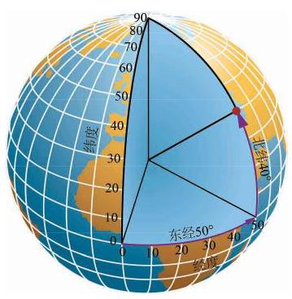

图 11-4-5

## 练习 11.4(1)

1. 如图 11-4-4, $O$ 为球心, ${O}_{1}$ 为小圆的圆心,用球的半径 $r$ 和小圆的半径 ${r}_{1}$ 表示 $O{O}_{1}$ 的距离 $d$ .

2. 已知半径为 $R$ 的球面上三点 $A\text{ 、 }B\text{ 、 }C$ 满足 ${AB} = 6,{BC} = 8,{CA} = {10}$ ,球心到平面 ${ABC}$ 的距离为 12. 求球的半径 $R$ .

3. 已知上海地处东经 ${120}^{ \circ  }{52}^{\prime }$ 至 ${122}^{ \circ  }{12}^{\prime }$ ,北纬 ${30}^{ \circ  }{40}^{\prime }$ 至 ${31}^{ \circ  }{53}^{\prime }$ 之间,地球半径为 6371.004 km. 求上海所辖区域:

(1)经线对应的两平面所成的二面角的大小；

(2)纬线所在两平面的距离.

## 2 球的体积

设有一个半径为 $R$ 的球. 和柱体、锥体一样,我们也可以应用祖暅原理推导球的体积公式. 我们先只考虑半球, 即由球的一个大圆把球切成两部分中的一部分(图 11-4-6(1)). 作为对比的几何体,我们取底面半径为 $R$ 、高为 $R$ 的圆柱,并从中切去一个倒置的底面半径为 $R$ 、高为 $R$ 的圆锥 (圆锥的底面置于圆柱的上底面，圆锥的顶点置于圆柱下底面的圆心) (图 11-4-6(2)).

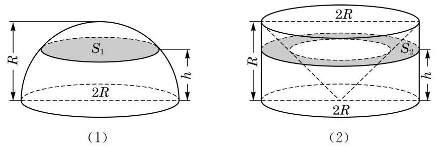

图 11-4-6

用平行于底面高度为 $h$ 的平面截这两个几何体. 半球在大圆截口上方高度 $h$ 处的截面是半径为 $\sqrt{{R}^{2} - {h}^{2}}$ 的圆,所以它的面积是 $\pi \left( {{R}^{2} - {h}^{2}}\right)$ ; 容易看出右边几何体中被切掉的圆锥在高度 $h$ 上的截面的半径是 $h$ ,所以右边几何体在高度 $h$ 上的截面面积是 $\pi {R}^{2} - \pi {h}^{2} = \pi \left( {{R}^{2} - {h}^{2}}\right)$ . 这两个截面面积相等,根据祖暅原理, 这两个几何体的体积相等, 即半球的体积为图 11-4-6(2) 中圆柱体积减去圆锥体积 $\pi {R}^{3} - \frac{1}{3}\pi {R}^{3} = \frac{2}{3}\pi {R}^{3}$ .

由此可见, 球的体积是

$$
{V}_{\text{ 球 }} = \frac{4}{3}\pi {R}^{3}.
$$

例 3 有一种空心钢球,质量为 ${142}\mathrm{\;g}$ ,测得球的外直径等于 ${5.0}\mathrm{\;{cm}}$ . 求它的内直径. (钢的密度是 ${7.9}\mathrm{\;g}/{\mathrm{{cm}}}^{3}$ ,结果精确到 ${0.1}\mathrm{\;{cm}}$ )

解 设空心钢球的内直径为 ${2r}$ ,那么钢球的质量是

${7.9}\left\lbrack  {\frac{4}{3}\pi {\left( \frac{5}{2}\right) }^{3} - \frac{4}{3}\pi {r}^{3}}\right\rbrack   = {142}$ ,解得 $r \approx  {2.24}\left( \mathrm{\;{cm}}\right)$ .

答: 空心钢球的内直径约为 ${4.5}\mathrm{\;{cm}}$ .

## 3 球的表面积

球的表面积就是球面的面积. 由球的定义可以看出, 球面是由一条半圆弧绕其直径旋转一周而成的曲面, 它不能像圆柱面、 圆锥面那样展开为平面图, 求它的面积就不能化为平面的问题.

实际上, 球面面积公式的严格推导或证明需要用到极限与微积分等工具, 本教材中无法完整给出. 作为替代, 本小节给出球面面积公式, 并描述一种证明的思路, 等同学们学了更多数学知识后, 就有可能对这种思路有更深的理解, 甚至可以自己把它补成严格的数学证明.

以 $R$ 为半径的球面面积是

$$
{S}_{\text{ 球 }} = {4\pi }{R}^{2}.
$$

图 11-4-7

如图 11-4-7(1)所示，把球面剖分成许多小区域. 取其中一个区域, 把它近似地看成平面的三角形或多边形, 从而它与球心组成了一个侧棱是 $R$ 的棱锥,当这个区域足够小时,棱锥的高也近似于 $R$ ,棱锥的体积 ${\Delta V} \approx  \frac{1}{3}{R\Delta S}$ ,其中 ${\Delta S}$ 为棱锥底面积 (图 11-4-7(2)). 当取遍剖分中的所有小区域时, ${\Delta S}$ 的总和近似于球面的面积 ${S}_{\text{ 球 }}$ ,而 ${\Delta V}$ 的总和近似于球的体积 ${V}_{\text{ 球 }}$ ,于是我们得到球面面积与球的体积之间的关系

$$
{V}_{\text{ 球 }} \approx  \frac{1}{3}R{S}_{\text{ 球. }}
$$

这个关系式与剖分过程无关. 可以想象, 当剖分做得越来越精细时, 推导过程中的“近似”越来越趋向于“精确”, 于是上述近似关系最终成为相等关系, 再把球的体积公式代入, 得到

$$
\frac{4}{3}\pi {R}^{3} = \frac{1}{3}R{S}_{\text{ 球 }},
$$

整理即得球面面积公式.

图 11-4-8

例 4 如图 11-4-8, 已知圆柱的底面直径与高都等于球的直径. 求证:

(1)球的表面积等于圆柱的侧面积；

(2)球的表面积等于圆柱表面积的 $\frac{2}{3}$ .

证明 (1) 设球的半径为 $R$ ,则圆柱的底面半径为 $R$ ,高为 ${2R}$ . 得

$$
{S}_{\text{ 球 }} = {4\pi }{R}^{2},{S}_{\text{ 圆柱侧 }} = {2\pi R} \cdot  {2R} = {4\pi }{R}^{2}\text{ , }
$$

所以 ${S}_{\text{ 球 }} = {S}_{\text{ 圆柱侧 }}$ .

(2)因为 ${S}_{\text{ 圆柱表 }} = {4\pi }{R}^{2} + {2\pi }{R}^{2} = {6\pi }{R}^{2} = \frac{3}{2} \cdot  {4\pi }{R}^{2}$ ， 所以 ${S}_{\text{ 球 }} = \frac{2}{3}{S}_{\text{ 圆柱表 }}$ .

## 练习 11.4(2)

(第 3 题)

1. 已知地球的半径约为 ${6371}\mathrm{\;{km}}$ ,计算地球的表面积. (结果精确到 ${10000}{\mathrm{\;{km}}}^{2}$ )

2. 把一个半径为 $R$ 的实心铁球熔化铸成两个小球,两个小球的半径之比为1 :2. 求其中较小球的半径.

3. 如图,有一个水平放置的透明无盖的正方体容器,容器高 $8\mathrm{\;{cm}}$ ,将一个球放在容器口, 再向容器注水, 当球面恰好接触水面时, 测得水深为 $6\mathrm{\;{cm}}$ . 若不计容器的厚度,求球的体积.

## 习题 11.4

## A 组

1. 若一个球的体积是 $\frac{4}{3}\pi$ ，则这个球的表面积是___.

2. 若用与球心距离为 1 的平面截球体所得的圆面半径为 3 ，则球的体积为___.

3. 若平面 $\alpha$ 截球 $O$ 所得圆的半径为 1,球的表面积是 ${12\pi }$ ,则球心 $O$ 到平面 $\alpha$ 的距离为___.

4. 已知两个球的表面积之差为 ${48\pi }$ ,它们的大圆周长之和为 ${12\pi }$ ,则这两个球的半径之差为___.

5. 已知正三角形 ${ABC}$ 的三个顶点都在半径为 2 的球面上,球心 $O$ 到平面 ${ABC}$ 的距离为 $1, E$ 是线段 ${AB}$ 的中点,过点 $E$ 作球 $O$ 的截面,则截面面积的最小值是___.

## B 组

1. 已知过球面上 $A\text{ 、 }B\text{ 、 }C$ 三点的截面和球心的距离等于球半径的一半,且 ${AB} = {BC} \; = {CA} = 2$ . 求截面的面积.

2. 已知三棱柱 ${ABC} - {A}_{1}{B}_{1}{C}_{1}$ 的 6 个顶点都在球 $O$ 的球面上,且 ${AB} = 3,{AC} = 4$ ， ${AB} \bot  {AC}, A{A}_{1} = {12}$ . 求球 $O$ 的半径.

3. 如图为一个用鲜花做成的花柱,它的下面是一个直径为 $1\mathrm{\;m}$ 、高为 $3\mathrm{\;m}$ 的圆柱形物体, 上面是一个半球形体. 如果每平方米大约需要鲜花 120 朵, 那么装饰这个花柱大约需要多少朵鲜花?

(第 3 题)

(第 4 题)

4. 如图,半径为 $R$ 的球 $O$ 中有一内接圆柱,当圆柱的侧面积最大时,求球的表面积与该圆柱的侧面积之差.

## 内容提要

1. 多面体与旋转体是两类重要的几何体.

(1)多面体:由三角形或平面多边形围成的封闭几何体称为多面体.

(2)旋转体:一个平面封闭图形绕其所在平面上的一条直线在空间旋转一周所得到的空间封闭几何体称为旋转体.

2. 本章所讨论的“简单几何体”有:

(1)柱体(包括棱柱和圆柱)，其中棱柱是多面体，而圆柱是旋转体.

(2)锥体(包括棱锥和圆锥)，其中棱锥是多面体，而圆锥是旋转体.

(3)球，它是一个旋转体.

3. 我们主要关注所涉及几何体的体积和表面积的计算.

(1)柱体的体积和表面积:

柱体的体积: ${V}_{\text{ 柱 }} = {S}_{\text{ 底 }}h$ .

直棱柱(侧棱垂直于底面的棱柱)的表面积: ${S}_{\text{ 表 }} = {ch} + 2{S}_{\text{ 底 }}$ .

圆柱的表面积: ${S}_{\text{ 表 }} = {ch} + 2{S}_{\text{ 底 }} = {2\pi rh} + {{2\pi }{r}^{2}}$ .

其中， ${S}_{\text{ 底 }}$ 、 $h$ 与 $c$ 分别是柱体的底面积、高与底面周长， $r$ 是圆柱的底面半径.

(2)锥体的体积和表面积:

锥体的体积: ${V}_{\text{ 锥 }} = \frac{1}{3}{S}_{\text{ 底 }}h$ .

正棱锥(底面为正三角形或正多边形且高通过底面中心的棱锥)的表面积: ${S}_{\text{ 表 }} = \frac{1}{2}c{h}^{\prime } + {S}_{\text{ 底 }}$ .

圆锥的表面积: ${S}_{\text{ 表 }} = \frac{1}{2}{cl} + {S}_{\text{ 底 }} = {\pi rl} + \pi {r}^{2}$ .

其中, ${S}_{\text{ 底 }}\text{ 、 }h$ 与 $c$ 分别是锥体的底面积、高与底面周长, ${h}^{\prime }$ 是正三棱锥的斜高, $r$ 与 $l$ 是圆锥的底半径和母线长.

(3)球的体积和表面积:

球的体积: ${V}_{\text{ 球 }} = \frac{4}{3}\pi {R}^{3}$ .

球面面积: ${S}_{\text{ 球 }} = {4\pi }{R}^{2}$ .

其中, $R$ 是球的半径.

## 复习题

A 组

1. 如图, 该几何体是由哪个平面图形旋转得到的？画出其余平面图形旋转得到的几何体.

(第 1 题)

(A)

(B)

(C)

(D)

2. 判断下列命题是否正确，并说明理由:

(1)以直角三角形的一直角边为轴旋转所形成的旋转体是圆锥；

(2)以直角梯形的一腰为轴旋转所形成的旋转体是圆台；

(3)圆柱、圆锥、圆台都有两个底面；

(4)圆锥的侧面展开图为扇形，这个扇形所在圆的半径等于圆锥底面圆的半径.

3. 已知一个圆锥的侧面展开图恰是一个半圆. 用通过圆锥的轴的平面截此圆锥, 求截面三角形的顶角.

4. 过圆锥高的三等分点分别作平行于底面的截面, 求它们把圆锥侧面分成的三部分的面积之比.

5. 在棱长为 1 的正方体上，用过同一顶点的三条棱中点的平面分别截该正方体，截去 8 个三棱锥. 求剩下的几何体的体积.

(第 8 题)

6. 已知长方体一个顶点上的三条棱长分别是 $3\text{ 、 }4\text{ 、 }5$ ,且它的 8 个顶点都在同一球面上. 求这个球的表面积.

7. 在等边圆柱 (底面直径等于高的圆柱) 、球、正方体的体积相等的情况下,讨论它们的表面积的大小关系.

8. 如图,在三棱柱的侧棱 ${A}_{1}A$ 和 ${B}_{1}B$ 上分别取 $P\text{ 、 }Q$ 两点, 使 ${PQ}$ 平分侧面 ${AB}{B}_{1}{A}_{1}$ 的面积. 求平面 ${PQC}$ 把棱柱所分成的两部分的体积之比.

9. 已知用通过圆锥的轴的平面去截一个圆锥, 得到的截面是面积为 $9\sqrt{3}{\mathrm{\;{cm}}}^{2}$ 的正三角形. 求此圆锥内接球的半径.

## B 组

1. 若一个长方体长、宽、高之比为 $2 : 1 : 3$ ,表面积为 22,求它的体积.

2. 如果两个球的体积之比为 8 : 27, 求这两个球的表面积之比.

3. 设点 ${O}_{1}$ 为圆锥的高靠近顶点的三等分点,求过 ${O}_{1}$ 与底面平行的截面面积与底面面积之比.

4. 若棱锥的高为 16 , 底面积为 256 , 平行于底面的截面面积为 50 , 求该截面与棱锥底面之间的距离.

5. 设圆锥的母线长为 1,高为 $\frac{1}{2}$ ,过圆锥的任意给定的两条母线作一个截面. 求截面面积的最大值.

6. 将若干毫升水倒入底面半径为 $2\mathrm{\;{cm}}$ 的圆柱形器皿中,量得水面高度为 $6\mathrm{\;{cm}}$ . 若将这些水倒入底面半径等于母线的倒圆锥形器皿中, 且恰好装满, 求圆锥形器皿的高.

7. 已知长方体 ${ABCD} - {A}_{1}{B}_{1}{C}_{1}{D}_{1}$ 的三条棱长分别为 $3\mathrm{\;{cm}}\text{ 、 }2\mathrm{\;{cm}}\text{ 、 }1\mathrm{\;{cm}}$ ,求表面有一只蜘蛛从 $A$ 爬行到 ${C}_{1}$ 的最短距离.

8. 如图,已知点 $P$ 在圆柱 ${O}_{1}O$ 的底面圆 $O$ 的圆周上, ${AB}$ 为圆 $O$ 的直径,圆柱的表面积为 ${20\pi },{OA} = 2,\angle {AOP} = {120}^{ \circ  }$ .

(1)求三棱锥 ${A}_{1} - {ABP}$ 的体积；

(2)求异面直线 ${A}_{1}B$ 与 ${AP}$ 所成角的大小.

(第 8 题)

(第 9 题)

(第 10 题)

9. 如图,在圆柱中,底面直径 ${AB}$ 等于母线 ${AD}$ ,点 $E$ 在底面的圆周上,且 ${AF} \bot \; {DE}, F$ 是垂足.

(1)求证: ${AF}\bot {DB}$ ；

(2)若圆柱与三棱锥 $D - {ABE}$ 的体积的比等于 ${3\pi }$ ，求直线 ${DE}$ 与平面 ${ABD}$ 所成角的大小.

10. 如图, 半球内有一内接正方体(即正方体的一个面在半球的底面圆上, 其余顶点在半球面上). 若正方体的棱长为 $\sqrt{6}$ ,求半球的表面积和体积.

## 拓展与思考

1. 已知圆锥的底面半径为 $r$ ,高为 $h$ ,正方体 ${ABCD} - {A}_{1}{B}_{1}{C}_{1}{D}_{1}$ 内接于该圆锥. 求这个正方体的棱长.

2. 如图, 一个圆锥形的空杯子上放着一个半球形的冰激凌, 如果冰激凌融化了, 会溢出来吗?

(第 2 题)

(第 3 题)

3. 如图,用一块钢锭浇铸一个厚度均匀,且表面积为 $2{\mathrm{\;m}}^{2}$ 的正四棱锥形有盖容器. 设容器的高为 $h\mathrm{\;m}$ ,盖子的边长为 $a\mathrm{\;m}$ .

(1)求 $a$ 关于 $h$ 的函数表达式；

(2)当 $h$ 为何值时,容器的容积 $V$ 最大? 并求出 $V$ 的最大值.

4. 将一块边长为 ${10}\mathrm{\;{cm}}$ 的正方形铁片裁下如图所示的阴影部分，用余下的四个全等的等腰三角形加工成一个无盖的正四棱锥形容器罩.

(1)试把容器罩的表面积 $S$ 表示为 $x$ 的函数;

(2)试把容器罩的体积 $V$ 表示为 $x$ 的函数.

(第 4 题)