### 6.1 正弦、余弦、正切、余切

三角

在平面几何中我们已经知道, 在一个三角形中，大角对大边，但这只是一个关于边与角之间关系的定性性质. 为了定量地刻画三角形的边与角之间的关系，为测量、航海及天文等方面的实际应用提供依据，需要引入一个角的正弦、余弦、正切、余切等概念，建立三角学的基本理论. 在初中，当一个角为锐角时，已经对有关的概念及结论做了初步的讨论, 并介绍了求解直角三角形的方法及其应用. 本章将拓展角的概念, 并对一个任意给定的角给出其相应的正弦、余弦、正切、余切的定义, 学习使用三角恒等变换化简三角表达式, 进一步探讨三角形中边与角之间的定量关系, 从而有效地解决有关的实际问题, 并为下章学习三角函数的性质以及学习解析几何、立体几何等后续章节奠定基础.

## 1 锐角的正弦、余弦、正切、余切

$$
\sin A = \frac{a}{c},\cos A = \frac{b}{c},\tan A = \frac{a}{b},\cot A = \frac{b}{a}.
$$

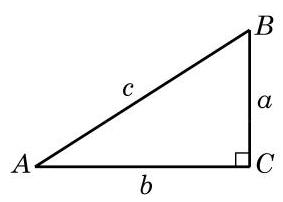

图 6-1-1

如图 6-1-1,将直角三角形 ${ABC}$ 中(其中 $\angle C = {90}^{ \circ  }$ ) $\angle A$ 、 $\angle B\text{ 、 }\angle C$ 的对边边长分别记作 $a\text{ 、 }b\text{ 、 }c$ . 在初中我们已经知道, 锐角 $A$ 的正弦、余弦、正切、余切的定义分别为

由简单的比值关系以及勾股定理, 还有如下结论:

$$
{\sin }^{2}A + {\cos }^{2}A = 1,\tan A = \frac{\sin A}{\cos A},
$$

$$
\cot A = \frac{\cos A}{\sin A},\cot A = \frac{1}{\tan A},
$$

$$
\sin \left( {{90}^{ \circ  } - A}\right)  = \cos A,\cos \left( {{90}^{ \circ  } - A}\right)  = \sin A,
$$

$$
\tan \left( {{90}^{ \circ  } - A}\right)  = \cot A,\cot \left( {{90}^{ \circ  } - A}\right)  = \tan A.
$$

我们还知道如下一些特殊角的正弦、余弦、正切、余切值 (表 6-1):

表 6-1

<table><tr><td>角度 $\alpha$</td><td>$\sin \alpha$</td><td>$\cos \alpha$</td><td>$\tan \alpha$</td><td>$\cot \alpha$</td></tr><tr><td>${30}^{ \circ  }$</td><td>1</td><td>$\frac{\sqrt{3}}{2}$</td><td>$\frac{\sqrt{3}}{3}$</td><td>$\sqrt{3}$</td></tr><tr><td>${45}^{ \circ  }$</td><td>$\frac{\sqrt{2}}{2}$</td><td>2</td><td>1</td><td>1</td></tr><tr><td>${60}^{ \circ  }$</td><td>$\frac{\sqrt{3}}{2}$</td><td>$\frac{1}{2}$</td><td>$\sqrt{3}$</td><td>$\frac{\sqrt{3}}{3}$</td></tr></table>

## 2 任意角及其度量

在小学和初中我们已经知道, 角是具有公共端点的两条射线所组成的图形, 角还可以看作是平面上由一条射线绕着其端点从初始位置(始边)旋转到终止位置(终边)所形成的图形(图 6-1-2). 我们以前学习过的锐角、直角、钝角、平角和周角, 其大小都在 ${0}^{ \circ  }$ 到 ${360}^{ \circ  }$ 之间. 不过在体操、跳水等体育运动中,会听到转体 720°、转体1 080°等术语；当手表比标准时间慢或者快 10 分钟的时候,只需要将分针旋转 ${60}^{ \circ  }$ 就可以调节准确,但也有按顺时针和逆时针方向旋转的差异. 因此,要准确地刻画这些现象,对于角而言, 不但要考察旋转量, 而且要考察旋转方向, 这就需要适当推广角的概念.

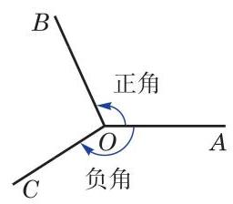

图 6-1-2

习惯上规定:一条射线绕端点按逆时针方向旋转所形成的角为正角，其度量值是正的；按顺时针方向旋转所形成的角为负角, 其度量值是负的(图 6-1-2).

特别地, 当一条射线没有旋转时, 我们也认为形成了一个角, 称为零角. 零角的始边与终边重合.

这样, 我们可将角的概念推广到任意角, 包括正角、负角与零角,也包括超过 ${360}^{ \circ  }$ 的角.

为了便于研究角及与其相关的问题, 可将角置于平面直角坐标系中,使得角的顶点与坐标原点重合,角的始边与 $x$ 轴的正半轴重合. 此时角的终边在第几象限, 就说这个角是第几象限的角,或者说这个角属于第几象限. 如图 6-1-3, ${60}^{ \circ  }$ 和 ${420}^{ \circ  }$ 都是第一象限的角, ${135}^{ \circ  }$ 和 $- {225}^{ \circ  }$ 都是第二象限的角. 当角的终边在坐标轴上时, 就不说这些角属于哪一象限.

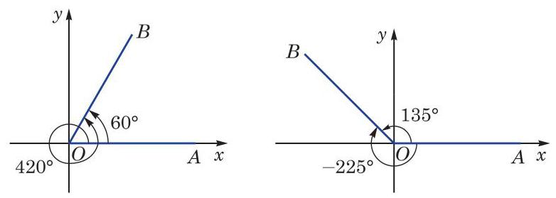

图 6-1-3

例如,若角 $\alpha$ 是第一象限的角,将其终边绕原点逆时针旋转 ${90}^{ \circ  }$ 后,所得的角 $\alpha  + {90}^{ \circ  }$ 是第二象限的角; 将其终边绕原点逆时针旋转 ${180}^{ \circ  }$ 后,所得的角 $\alpha  + {180}^{ \circ  }$ 是第三象限的角; 而将其终边绕原点顺时针旋转 ${90}^{ \circ  }$ 后,所得的角 $\alpha  - {90}^{ \circ  }$ 则是第四象限的角.

从角的形成过程中可以看到,与某一个角 $\alpha$ 的始边相同且终边重合的角有无数个,它们的大小与角 $\alpha$ 都相差 ${360}^{ \circ  }$ 的整数倍. 在图 6-1-3 中, ${60}^{ \circ  }$ 的角和 ${420}^{ \circ  }$ 的角的终边重合,前者与后者之差为 $- {360}^{ \circ  };{135}^{ \circ  }$ 的角和 $- {225}^{ \circ  }$ 的角的终边重合,前者与后者之差为 ${360}^{ \circ  }$ . 进一步,我们可以把所有与角 $\alpha$ 的终边重合的角 (包括角 $\alpha$ 本身)的集合表示为

$$
\{ \beta  \mid  \beta  = k \cdot  {360}^{ \circ  } + \alpha , k \in  \mathbf{Z}\} .
$$

---

为简单起见, 在不引起混淆的前提下， “角 $\alpha$ ”或“ $\angle \alpha$ ”可简记作“ $\alpha$ ”.

---

例 1 判断下列各角分别属于哪个象限:

(1) $- {240}^{ \circ  }$ ； (2) ${2100}^{ \circ  }$ .

解(1)因为 $- {240}^{ \circ  } =  - {360}^{ \circ  } + {120}^{ \circ  }$ ，而 ${120}^{ \circ  }$ 的角属于第二象限, 所以 -240° 的角属于第二象限.

(2)因为 ${2100}^{ \circ  } = 5 \times  {360}^{ \circ  } + {300}^{ \circ  }$ ,而 ${300}^{ \circ  }$ 的角属于第四象限, 所以 2 ${100}^{ \circ  }$ 的角属于第四象限.

例 2 写出与 $- {200}^{ \circ  }$ 的终边重合的所有角组成的集合 $S$ , 并列举 $S$ 中满足不等式 $- {360}^{ \circ  } \leq  \beta  < {720}^{ \circ  }$ 的所有元素 $\beta$ .

解 因为

$$
S = \left\{  {\beta  \mid  \beta  = k \cdot  {360}^{ \circ  } - {200}^{ \circ  }, k \in  \mathbf{Z}}\right\}  ,
$$

所以当 $- {360}^{ \circ  } \leq  \beta  < {720}^{ \circ  }$ 时, $\beta  =  - {200}^{ \circ  }$ 或 ${160}^{ \circ  }$ 或 ${520}^{ \circ  }$ .

## 练习 6.1(1)

1. 判断下列命题是否正确:

(1)终边重合的两个角相等; (2)锐角是第一象限的角；

(3)第二象限的角是钝角； (4)小于 ${90}^{ \circ  }$ 的角都是锐角.

2. 分别用集合的形式表示终边位于第三象限的所有角和终边位于 $y$ 轴正半轴上的所有角.

3. 在 ${0}^{ \circ  } \sim  {360}^{ \circ  }$ 范围内,分别找出终边与下列各角的终边重合的角,并判断它们是第几象限的角:

(1)一315°； (2)905.3°； (3)一1090°； (4) ${530}^{ \circ  }$ .

度量长度可以用米为单位, 度量质量可以用千克为单位, 适当的单位制会给解决问题带来极大的便利. 度量角的大小与度量其他量一样, 也要选择一个同类的量作为度量的单位. 在平面几何中,我们把周角的 $\frac{1}{360}$ 作为 1 度. 用 “度”作为单位来度量角的单位制叫做角度制.

表示角的方法，用角度制虽很直观，但很多情况下并不一定方便. 下面我们引入一种度量角的新方法. 观察不难发现: 在半径为 $r$ 的圆中,当圆心角为 ${360}^{ \circ  }$ 时,圆的周长为 ${2\pi r}$ ; 当圆心角为 ${180}^{ \circ  }$ 时,半圆的弧长为 ${\pi r}$ ; 而当圆心角为 ${90}^{ \circ  }$ 时,四分之一圆的弧长为 $\frac{\pi r}{2}$ . 由初中所学习的计算扇形弧长公式可知,在给定半径的圆中, 弧的长度与相应圆心角的大小成正比例关系, 因此我们不仅可以用角度来度量弧的长度,而且可以用弧长来度量角的大小. 具体来说,在半径为 $r$ 的圆周上,弧长 $l$ 与以角度度量的圆心角 $\alpha$ 之间的关系式为 $l = {2\pi r} \cdot  \frac{\alpha }{360}$ ,即 $\frac{l}{r} = \frac{\pi }{180} \cdot  \alpha$ ,这说明比值 $\frac{l}{r}$ 仅由角 $\alpha$ 的大小决定. 这样我们就可以用圆弧的长与圆半径的比值来表示这个圆弧所对的圆心角的大小. 相应地，把弧长等于半径的弧所对的圆心角叫做 1 弧度 (radian) 的角 (图 6-1-4). 用“弧度”作为单位来度量角的单位制叫做弧度制.

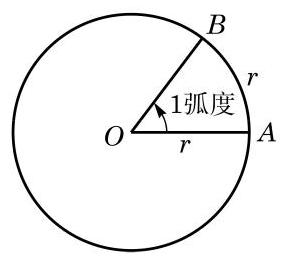

图 6-1-4

一般地说,如果一个半径为 $r$ 的圆的圆心角 $\alpha$ 所对的弧长为 $l$ ,那么 $\frac{l}{r}$ 就是角 $\alpha$ 的弧度的绝对值,即 $\left| \alpha \right|  = \frac{l}{r}$ ,这里 $\alpha$ 的符号由它的始边旋转至终边的方向决定. 零角的弧度数为 0 . 从弧度的定义不难得知,周角为 ${2\pi }$ 弧度,即 ${360}^{ \circ  } = {2\pi }$ 弧度; 平角为 $\pi$ 弧度,即 ${180}^{ \circ  } = \pi$ 弧度. 从而有

$$
{1}^{ \circ  } = \frac{\pi }{180}\text{ 弧度,1 弧度 } = \frac{{180}^{ \circ  }}{\pi }\text{ . }
$$

---

在学习微积分后可以更明显地看出弧度制的优点.

---

例 3 按下列要求,将 ${75}^{ \circ  }$ 换算成弧度:

(1)精确值;

(2)近似值. (结果精确到 0.001)

解 (1) ${75}^{ \circ  } = {75} \times  \frac{\pi }{180}$ 弧度 $= \frac{5}{12}\pi$ 弧度.

(2)计算得 $\frac{5}{12}\pi  \approx  {1.309}$ ,从而 ${75}^{ \circ  } \approx  {1.309}$ 弧度.

例 4 将 2.1 弧度换算成角度. (用度数表示, 结果保留两位小数)

解 2.1 弧度 $= {2.1} \times  \frac{{180}^{ \circ  }}{\pi } \approx  {120.32}^{ \circ  }$ .

请同学们根据一些常用特殊角的角度与弧度的对应关系, 填写下表.

表 6-2

<table><tr><td>角度</td><td>${0}^{ \circ  }$</td><td>${30}^{ \circ  }$</td><td>${45}^{ \circ  }$</td><td>${60}^{ \circ  }$</td><td></td><td></td><td>${135}^{ \circ  }$</td><td></td><td>${180}^{ \circ  }$</td><td>270°</td><td>360°</td></tr><tr><td>弧度</td><td></td><td></td><td></td><td></td><td>$\frac{\pi }{2}$</td><td>$\frac{2\pi }{3}$</td><td></td><td>$\frac{5\pi }{6}$</td><td>$\pi$</td><td></td><td>${2\pi }$</td></tr></table>

在弧度和角度的换算过程中, 应当注意角度制为 60 进位制. 例如, ${32}^{ \circ  }{18}^{\prime }$ 应先换算成 ${32.3}^{ \circ  }$ ,再换算成弧度.

在弧度制下, 每个角都是一个确定的实数, 而每个实数也可以表示一个确定的角, 这就构成了角的集合与实数集合之间的一

三角个一一对应关系.

---

角度和弧度不可混用。在使用计算器的时候, 要注意所指的是角度制还是弧度制.

---

在用弧度制表示角时，通常省略“弧度”两字，只写这个角所对应的弧度数. 例如,角 $\alpha$ 和角 $\beta$ 的互补关系可以表示为 $\alpha  + \beta  = \; \pi$ ,而 $\sin {1.2}$ 则表示 1.2 弧度的角的正弦.

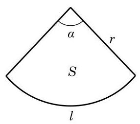

图 6-1-5

引入弧度制使得扇形的弧长和面积公式变得简洁漂亮, 更使微积分中的许多公式变得格外简明. 例如，如图6-1-5，当扇形的圆心角为 ${n}^{ \circ  }$ ,而半径为 $r$ 时,扇形的弧长 $l$ 和面积 $S$ 的公式分别为 $l = \frac{n}{180} \times  {\pi r} = \frac{n\pi r}{180}$ 及 $S = \frac{n}{360} \times  \pi {r}^{2} = \frac{{n\pi }{r}^{2}}{360}$ . 在使用弧度制后,圆心角相应的弧度为 $\alpha  = \frac{\pi }{180} \times  n = \frac{n\pi }{180}$ ,因此上述公式可分别简化为

扇形的弧长 $l = {\alpha r}$ ,

扇形的面积 $S = \frac{1}{2}\alpha {r}^{2}$ .

例 5 写出终边在 $x$ 轴上的所有角组成的集合. (用弧度制表示)

解 当角 $\alpha$ 的终边在 $x$ 轴正半轴上时, $\alpha  = {2k\pi }, k \in  \mathbf{Z}$ ; 而当角 $\alpha$ 的终边在 $x$ 轴负半轴上时, $\alpha  = {2k\pi } + \pi , k \in  \mathbf{Z}$ .

所以,所求的角的集合为 $\{ \alpha  \mid  \alpha  = {k\pi }, k \in  \mathbf{Z}\}$ .

例 6 设 $\alpha$ 是第二象限的角,判断 $\frac{\alpha }{2}$ 是哪个象限的角.

解 因为 $\alpha$ 是第二象限的角,所以

$$
{2k\pi } + \frac{\pi }{2} < \alpha  < {2k\pi } + \pi , k \in  \mathbf{Z},
$$

从而有

$$
{k\pi } + \frac{\pi }{4} < \frac{\alpha }{2} < {k\pi } + \frac{\pi }{2}, k \in  \mathbf{Z}.
$$

(1)当 $k$ 为奇数时，设 $k = {2n} + 1, n \in  \mathbf{Z}$ ，就有

$$
{2n\pi } + \frac{5}{4}\pi  < \frac{\alpha }{2} < {2n\pi } + \frac{3}{2}\pi , n \in  \mathbf{Z},
$$

所以 $\frac{\alpha }{2}$ 是第三象限的角;

(2)当 $k$ 为偶数时,设 $k = {2n}, n \in  \mathbf{Z}$ ,就有

$$
{2n\pi } + \frac{\pi }{4} < \frac{\alpha }{2} < {2n\pi } + \frac{\pi }{2}, n \in  \mathbf{Z},
$$

所以 $\frac{\alpha }{2}$ 是第一象限的角.

由上可知, $\frac{\alpha }{2}$ 是第一象限或第三象限的角.

## 练习 6.1(2)

1. 分别将下列角度化为弧度:

${15}^{ \circ  }$ ; $- {108}^{ \circ  }$ ; ${22}^{ \circ  }{30}^{\prime }$ .

2. 分别将下列弧度化为角度:

$\frac{11}{12}\pi \; - \frac{2}{5}\pi$ -3 (结果精确到 ${0.01}^{ \circ  }$ ).

3. 已知扇形的弧所对的圆心角为 ${54}^{ \circ  }$ ,且半径为 ${10}\mathrm{\;{cm}}$ . 求该扇形的弧长和面积.

4. 如果 $\alpha$ 是第三象限的角,判断 $\frac{\alpha }{2}$ 是哪个象限的角.

## 3 任意角的正弦、余弦、正切、余切

我们将锐角 $\alpha$ 置于平面直角坐标系中,使角 $\alpha$ 的顶点与坐标原点 $O$ 重合,始边与 $x$ 轴的正半轴重合,那么它的终边必在第一象限. 如图 6-1-6,在角 $\alpha$ 的终边上任取异于原点的一点 $P\left( {x, y}\right)$ ,它与原点的距离 $r = \sqrt{{x}^{2} + {y}^{2}} > 0$ . 过点 $P$ 作 $x$ 轴的垂线,设垂足为 $M$ ,则线段 ${OM}$ 的长度 $\left| {OM}\right|$ 为 $x$ ,而线段 ${MP}$ 的长度 $\left| {MP}\right|$ 为 $y$ . 根据锐角的正弦、余弦、正切及余切的定义, 有

$$
\sin \alpha  = \frac{\left| MP\right| }{\left| OP\right| } = \frac{y}{r},\cos \alpha  = \frac{\left| OM\right| }{\left| OP\right| } = \frac{x}{r}.
$$

$$
\tan \alpha  = \frac{\left| MP\right| }{\left| OM\right| } = \frac{y}{x},\cot \alpha  = \frac{\left| OM\right| }{\left| MP\right| } = \frac{x}{y}.
$$

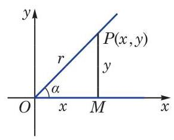

图 6-1-6

---

线段 ${OM}$ 的长度通常用 $\left| {OM}\right|$ 表示. 在不引起混淆的前提下， 也可用 OM 表示.

---

这说明锐角 $\alpha$ 的正弦、余弦、正切及余切可以用角 $\alpha$ 的终边上点的坐标来定义. 这样,就可以对任意给定的角 $\alpha$ ,定义其相应的正弦、余弦、正切及余切.

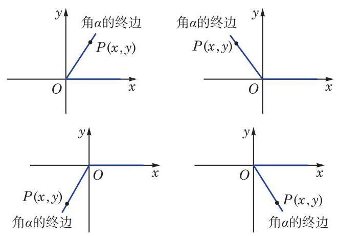

图 6-1-7

如图 6-1-7,在任意角 $\alpha$ 的终边上任取异于原点的一点 $P$ , 设其坐标为 $\left( {x, y}\right)$ ,并令 $\left| {OP}\right|  = r$ ,必有 $r = \sqrt{{x}^{2} + {y}^{2}} > 0$ . 这样,就可以分别定义角 $\alpha$ 的正弦、余弦、正切、余切为

$$
\sin \alpha  = \frac{y}{r},\;\cos \alpha  = \frac{x}{r},
$$

$$
\tan \alpha  = \frac{y}{x}\left( {x \neq  0}\right) ,\cot \alpha  = \frac{x}{y}\left( {y \neq  0}\right) .
$$

应当注意的是: 当 $\alpha  = {k\pi } + \frac{\pi }{2}\left( {k \in  \mathbf{Z}}\right)$ ,即角 $\alpha$ 的终边位于 $y$ 轴上时, $\tan \alpha  = \frac{y}{x}$ 无意义; 而当 $\alpha  = {k\pi }\left( {k \in  \mathbf{Z}}\right)$ ,即角 $\alpha$ 的终边位于 $x$ 轴上时, $\cot \alpha  = \frac{x}{y}$ 无意义.

例 7 已知角 $\alpha$ 的终边经过点 $P\left( {1, - 2}\right)$ ,求角 $\alpha$ 的正弦、 余弦、正切及余切值.

解 由 $x = 1, y =  - 2$ ,有 $r = \sqrt{{1}^{2} + {\left( -2\right) }^{2}} = \sqrt{5}$ ,从而

$$
\sin \alpha  = \frac{y}{r} =  - \frac{2\sqrt{5}}{5},\cos \alpha  = \frac{x}{r} = \frac{\sqrt{5}}{5},
$$

$$
\tan \alpha  = \frac{y}{x} =  - 2,\cot \alpha  = \frac{x}{y} =  - \frac{1}{2}.
$$

例 8 已知角 $\alpha$ 的终边经过点 $P\left( {-2,0}\right)$ ,求角 $\alpha$ 的正弦、 余弦、正切及余切值.

解 由 $x =  - 2, y = 0$ ,有 $r = \sqrt{{\left( -2\right) }^{2} + {0}^{2}} = 2$ ,从而

$$
\sin \alpha  = \frac{y}{r} = 0,\cos \alpha  = \frac{x}{r} =  - 1,
$$

$$
\tan \alpha  = \frac{y}{x} = 0,\cot \alpha \text{ 不存在. }
$$

由于角 $\alpha$ 的正弦、余弦、正切及余切值可以由其终边上一点 $P$ 的坐标求出,因此不难根据点 $P$ 的坐标来判断角 $\alpha$ 的正弦、 余弦、正切及余切的符号,如表 6-3 所示. 上表的结果可用图 6-1-8 直观表示.

表 6-3

<table><tr><td rowspan="2">角 $\alpha$ 所属的象限</td><td colspan="2">点 $P$ 的坐标</td><td rowspan="2">$\sin \alpha$</td><td rowspan="2">$\cos \alpha$</td><td rowspan="2">$\tan \alpha$</td><td rowspan="2">$\cot \alpha$</td></tr><tr><td>$x$</td><td>$y$</td></tr><tr><td>第一象限</td><td>+</td><td>+</td><td>+</td><td>+</td><td>+</td><td>+</td></tr><tr><td>第二象限</td><td>-</td><td>+</td><td>+</td><td>-</td><td>-</td><td>-</td></tr><tr><td>第三象限</td><td>-</td><td>-</td><td>-</td><td>-</td><td>+</td><td>+</td></tr><tr><td>第四象限</td><td>+</td><td>-</td><td>-</td><td>+</td><td>-</td><td>-</td></tr></table>

---

由相似三角形知识可知,角 $\alpha$ 的正弦、 余弦、正切及余切值只与角 $\alpha$ 的终边有关， 而与在终边上所取的点 $P$ 的位置无关.

---

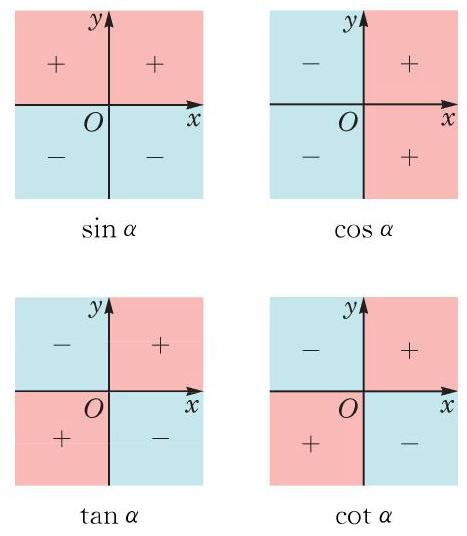

图 6-1-8

例 9 若角 $\alpha$ 满足 $\sin \alpha  > 0$ ,且 $\tan \alpha  < 0$ ,则角 $\alpha$ 属于第几象限?

解 由 $\sin \alpha  > 0$ ,知角 $\alpha$ 属于第一象限或第二象限或其终边位于 $y$ 轴的正半轴上. 又由 $\tan \alpha  < 0$ ,知 $\alpha$ 属于第二象限或第四象限.

因此,角 $\alpha$ 属于第二象限.

## 练习 6.1(3)

1. 已知角 $\alpha$ 的终边过点 $P\left( {{2a}, - {3a}}\right) \left( {a < 0}\right)$ ,求角 $\alpha$ 的正弦、余弦、正切及余切值.

2. 已知角 $\alpha$ 的终边过点 $P\left( {0, - 3}\right)$ ,则下列值不存在的是 ( )

A. $\sin \alpha$ ; B. $\cos \alpha$ ;

C. $\tan \alpha$ ; D. $\cot \alpha$ .

3. 根据下列条件,分别判断角 $\theta$ 属于第几象限:

(1) $\sin \theta  =  - \frac{1}{2}$ 且 $\cos \theta  =  - \frac{\sqrt{3}}{2}$ ; (2) $\sin \theta  < 0$ 且 $\tan \theta  > 0$ .

根据定义,角 $\alpha$ 的正弦、余弦、正切及余切值仅与角 $\alpha$ 的大小有关,而与角 $\alpha$ 的终边上的点 $P$ 的位置无关,因此我们可以用角 $\alpha$ 的终边上到原点距离为 1 的点来确定角 $\alpha$ 的正弦、余弦、 正切及余切值.

半径为 1 个单位的圆称为单位圆(unit circle). 本章中, 如无特别说明, 单位圆通常指在平面直角坐标系中以原点为圆心, 以 1 为半径的圆.

将角 $\alpha$ 的顶点置于坐标原点 $O$ ,始边与 $x$ 轴的正半轴重合,

例 10 求角 $\frac{5\pi }{4}$ 的正弦、余弦和正切值. 则角 $\alpha$ 的终边与以原点为圆心的单位圆交于唯一的一点 $P\left( {x, y}\right)$ , 如图 6-1-9 所示. 这样,任意一个角 $\alpha$ 对应于单位圆上一点 $P$ ; 反之,单位圆上一点 $P$ 可对应无穷多个角,但这些角的弧度数之差必为 ${2\pi }$ 的整数倍. 由定义可知, $x = \cos \alpha , y = \sin \alpha$ . 因此, 单位圆上点 $P$ 的坐标必可以写为 $\left( {\cos \alpha ,\sin \alpha }\right)$ .

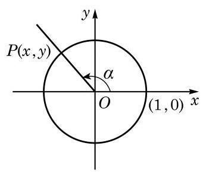

图 6-1-9

解 设角 $\frac{5\pi }{4}$ 的终边交以原点为圆心的单位圆于点 $P$ ,过点 $P$ 作 $x$ 轴的垂线,其垂足为 $M$ ,如图 6-1-10 所示. 在直角三角形 ${OMP}$ 中, $\angle {MOP} = \frac{\pi }{4}$ ,由此可得 $\left| {OM}\right|  = \frac{\sqrt{2}}{2},\left| {MP}\right|  = \frac{\sqrt{2}}{2}$ ,所以点 $P$ 的坐标为 $\left( {-\frac{\sqrt{2}}{2}, - \frac{\sqrt{2}}{2}}\right)$ . 于是, $\sin \frac{5\pi }{4} =  - \frac{\sqrt{2}}{2},\cos \frac{5\pi }{4} = \; - \frac{\sqrt{2}}{2}$ ,而 $\tan \frac{5\pi }{4} = 1$ .

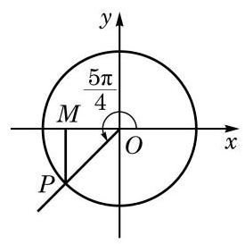

图 6-1-10

对终边与坐标轴重合的角 $\alpha$ ,设终边与以原点为圆心的单位圆的交点为 $P$ ,请同学们完成以下表格 (表 6-4).

表 6-4

<table><tr><td>$\alpha$</td><td>点 $P$ 的坐标</td><td>$\sin \alpha$</td><td>$\cos \alpha$</td><td>$\tan \alpha$</td><td>$\cot \alpha$</td></tr><tr><td>$\alpha  = {2k\pi }\left( {k \in  \mathbf{Z}}\right)$</td><td>(1,0)</td><td>0</td><td>1</td><td>0</td><td>不存在</td></tr><tr><td></td><td>(0,1)</td><td></td><td></td><td></td><td></td></tr><tr><td></td><td>(-1,0)</td><td></td><td></td><td></td><td></td></tr><tr><td></td><td>(0，-1)</td><td></td><td></td><td></td><td></td></tr></table>

设角 $\alpha$ 的终边经过异于原点的一点 $P\left( {x, y}\right)$ ,并记

$$
r = \sqrt{{x}^{2} + {y}^{2}} > 0.
$$

由定义, 有

$$
\sin \alpha  = \frac{y}{r},\cos \alpha  = \frac{x}{r},\tan \alpha  = \frac{y}{x}\left( {x \neq  0}\right) ,\cot \alpha  = \frac{x}{y}\left( {y \neq  0}\right) .
$$

由 ${x}^{2} + {y}^{2} = {r}^{2}$ ,就有

$$
{\sin }^{2}\alpha  + {\cos }^{2}\alpha  = 1.
$$

当 $\cos \alpha  \neq  0$ 时,有

$$
\tan \alpha  = \frac{\sin \alpha }{\cos \alpha }.
$$

当 $\sin \alpha  \neq  0$ 时,有

$$
\cot \alpha  = \frac{\cos \alpha }{\sin \alpha }.
$$

当 $\tan \alpha \text{ 、 }\cot \alpha$ 都有意义时,有

$$
\tan \alpha  \cdot  \cot \alpha  = 1.
$$

根据以上关系,如果知道角 $\alpha$ 的正弦、余弦、正切及余切之中的一个值, 就可以求出其他值.

例 11 已知 $\sin \alpha  = \frac{3}{5}$ ,且 $\alpha$ 为第二象限的角. 求 $\cos \alpha$ , $\tan \alpha$ 及 $\cot \alpha$ .

解 因为 $\alpha$ 为第二象限的角,所以 $\cos \alpha  < 0$ .

由 ${\sin }^{2}\alpha  + {\cos }^{2}\alpha  = 1$ ,得

$$
\cos \alpha  =  - \sqrt{1 - {\sin }^{2}\alpha } =  - \frac{4}{5},
$$

从而

$$
\tan \alpha  = \frac{\sin \alpha }{\cos \alpha } =  - \frac{3}{4},\cot \alpha  = \frac{1}{\tan \alpha } =  - \frac{4}{3}.
$$

例 12 已知 $\tan \alpha  =  - \frac{5}{12}$ ,求 $\sin \alpha \text{ 、 }\cos \alpha$ 及 $\cot \alpha$ .

解

$$
\cot \alpha  = \frac{1}{\tan \alpha } =  - \frac{12}{5}.
$$

因为 $\tan \alpha  =  - \frac{5}{12} < 0$ ,所以 $\alpha$ 为第二象限或第四象限的角.

因为 $\tan \alpha  = \frac{\sin \alpha }{\cos \alpha }$ ,所以 $\frac{\sin \alpha }{\cos \alpha } =  - \frac{5}{12}$ .

又因为 ${\sin }^{2}\alpha  + {\cos }^{2}\alpha  = 1$ ,解方程组

$$
\left\{  \begin{array}{l} {\sin }^{2}\alpha  + {\cos }^{2}\alpha  = \\  \frac{\sin \alpha }{\cos \alpha } =  - \frac{5}{12}, \end{array}\right.
$$

得

$$
\sin \alpha  = \frac{5}{13},\cos \alpha  =  - \frac{12}{13}\text{ ,或 }\sin \alpha  =  - \frac{5}{13},\cos \alpha  = \frac{12}{13}\text{ . }
$$

于是,当 $\alpha$ 为第二象限的角时, $\sin \alpha  = \frac{5}{13},\cos \alpha  =  - \frac{12}{13}$ ; 而当 $\alpha$ 为第四象限的角时, $\sin \alpha  =  - \frac{5}{13},\cos \alpha  = \frac{12}{13}$ .

## 练习 6.1(4)

1. 求角 $\frac{5}{3}\pi$ 的正弦、余弦、正切及余切值.

---

能否利用直角三角形知识与角的正弦、 余弦、正切和余切值在各象限的符号, 快速给出例 12 的答案?

---

2. 分别求 $\sin {k\pi }\left( {k \in  \mathbf{Z}}\right)$ 和 $\cos {k\pi }\left( {k \in  \mathbf{Z}}\right)$ 的值.

3. 已知 $\alpha$ 为第三象限的角, $\cos \alpha  =  - \frac{\sqrt{5}}{5}$ . 求 $\sin \alpha \text{ 、 }\tan \alpha$ 及 $\cot \alpha$ .

4. 已知 $\cot \alpha  = \frac{1}{3}$ ,求 $\sin \alpha \text{ 、 }\cos \alpha$ 及 $\tan \alpha$ .

利用任意角 $\alpha$ 的正弦、余弦、正切及余切之间的关系，可以化简表达式并证明一些恒等式.

例 13 ( 1 )已知 $\sin \alpha  + \cos \alpha  = \frac{1}{5}$ ，求 $\sin \alpha \cos \alpha$ 的值；

( 2 )已知 $\tan \alpha  = \frac{1}{2}$ ，求 ${\sin }^{2}\alpha  - \sin \alpha \cos \alpha  - {\cos }^{2}\alpha$ 的值.

解 (1) 因为

$$
{\left( \sin \alpha  + \cos \alpha \right) }^{2} = {\sin }^{2}\alpha  + {\cos }^{2}\alpha  + 2\sin \alpha \cos \alpha  = 1 + 2\sin \alpha \cos \alpha ,
$$

即

$$
\frac{1}{25} = 1 + 2\sin \alpha \cos \alpha ,
$$

所以 $\sin \alpha \cos \alpha  =  - \frac{12}{25}$ .

( 2 )因为 $\tan \alpha  = \frac{1}{2}$ ，所以 $\cos \alpha  \neq  0$ ，从而有

$$
{\sin }^{2}\alpha  - \sin \alpha \cos \alpha  - {\cos }^{2}\alpha  = \frac{{\sin }^{2}\alpha  - \sin \alpha \cos \alpha  - {\cos }^{2}\alpha }{{\sin }^{2}\alpha  + {\cos }^{2}\alpha }
$$

$$
= \frac{{\tan }^{2}\alpha  - \tan \alpha  - 1}{{\tan }^{2}\alpha  + 1}
$$

$$
= \frac{\frac{1}{4} - \frac{1}{2} - 1}{\frac{1}{4} + 1} =  - 1\text{ . }
$$

例 14 证明下列恒等式:

(1) $1 + {\tan }^{2}\alpha  = \frac{1}{{\cos }^{2}\alpha }$ ；

Q

(2) $1 + {\cot }^{2}\alpha  = \frac{1}{{\sin }^{2}\alpha }$ ；

---

通常记

$\sec \alpha  = \frac{1}{\cos \alpha }$ ,

$\csc \alpha  = \frac{1}{\sin \alpha }$

例 14(1)与(2)中的公

式就可简写为

$1 + {\tan }^{2}\alpha  = {\sec }^{2}\alpha \; 1 + {\cot }^{2}\alpha  = {\csc }^{2}\alpha$ .

---

(3) $\frac{1 + \cos \alpha }{\sin \alpha } = \frac{\sin \alpha }{1 - \cos \alpha }$ ；___

(4) $\frac{{\sin }^{2}\alpha  - {\sin }^{2}\beta }{{\tan }^{2}\alpha  - {\tan }^{2}\beta } = {\cos }^{2}\alpha {\cos }^{2}\beta$ .

证明 (1) $1 + {\tan }^{2}\alpha  = 1 + \frac{{\sin }^{2}\alpha }{{\cos }^{2}\alpha } = \frac{{\cos }^{2}\alpha  + {\sin }^{2}\alpha }{{\cos }^{2}\alpha } = \frac{1}{{\cos }^{2}\alpha }$ .

(2) $1 + {\cot }^{2}\alpha  = 1 + \frac{{\cos }^{2}\alpha }{{\sin }^{2}\alpha } = \frac{{\sin }^{2}\alpha  + {\cos }^{2}\alpha }{{\sin }^{2}\alpha } = \frac{1}{{\sin }^{2}\alpha }$ .

(3)因为

$$
\frac{1 + \cos \alpha }{\sin \alpha } = \frac{\left( {1 + \cos \alpha }\right) \left( {1 - \cos \alpha }\right) }{\sin \alpha \left( {1 - \cos \alpha }\right) } = \frac{1 - {\cos }^{2}\alpha }{\sin \alpha \left( {1 - \cos \alpha }\right) }
$$

$$
= \frac{{\sin }^{2}\alpha }{\sin \alpha \left( {1 - \cos \alpha }\right) } = \frac{\sin \alpha }{1 - \cos \alpha },
$$

所以原式成立.

(4)因为左边 $= \frac{{\sin }^{2}\alpha  - {\sin }^{2}\beta }{\frac{{\sin }^{2}\alpha }{{\cos }^{2}\alpha } - \frac{{\sin }^{2}\beta }{{\cos }^{2}\beta }} = \frac{\left( {{\sin }^{2}\alpha  - {\sin }^{2}\beta }\right) {\cos }^{2}\alpha {\cos }^{2}\beta }{{\sin }^{2}\alpha {\cos }^{2}\beta  - {\sin }^{2}\beta {\cos }^{2}\alpha }$

$$
= \frac{\left( {{\sin }^{2}\alpha  - {\sin }^{2}\beta }\right) {\cos }^{2}\alpha {\cos }^{2}\beta }{{\sin }^{2}\alpha \left( {1 - {\sin }^{2}\beta }\right)  - {\sin }^{2}\beta \left( {1 - {\sin }^{2}\alpha }\right) }
$$

$$
= \frac{\left( {{\sin }^{2}\alpha  - {\sin }^{2}\beta }\right) {\cos }^{2}\alpha {\cos }^{2}\beta }{{\sin }^{2}\alpha  - {\sin }^{2}\beta }
$$

$$
= {\cos }^{2}\alpha {\cos }^{2}\beta  = \text{ 右边, }
$$

所以原式成立.

## 练习 6.1(5)

1. 已知 $\tan \alpha  = 3$ ,求 $\frac{2\sin \alpha  + \cos \alpha }{\sin \alpha  - \cos \alpha }$ 的值.

2. 化简:

(1) ${\sin }^{2}\alpha  + {\sin }^{2}\alpha {\cos }^{2}\alpha  + {\cos }^{4}\alpha$ ; (2) $\sin \alpha \cos \alpha \left( {\tan \alpha  + \cot \alpha }\right)$ .

3. 证明: ${\cot }^{2}\alpha  - {\cos }^{2}\alpha  = {\cot }^{2}\alpha  \cdot  {\cos }^{2}\alpha$ .

## 4 诱导公式

${2k\pi } + \alpha \left( {k \in  \mathbf{Z}}\right) , - \alpha ,\pi  \pm  \alpha ,\frac{\pi }{2} \pm  \alpha$ 这些角都与角 $\alpha$ 有特殊的关系. 已知角 $\alpha$ 的正弦、余弦、正切及余切值,能否快速给出上述这些角的正弦、余弦、正切及余切值？这就是诱导公式要解决的问题.

由于角 ${2k\pi } + \alpha \left( {k \in  \mathbf{Z}}\right)$ 的终边与角 $\alpha$ 的终边重合,因此由定义有如下诱导公式:

$\tan \left( {{2k\pi } + \alpha }\right)  = \tan \alpha ,\;\cot \left( {{2k\pi } + \alpha }\right)  = \cot \alpha \left( {k \in  \mathbf{Z}}\right) .$

由这组诱导公式, 求任意角的正弦、余弦、正切及余切值可以转化为求 $\lbrack 0,{2\pi })$ 范围内一个角的相应值.

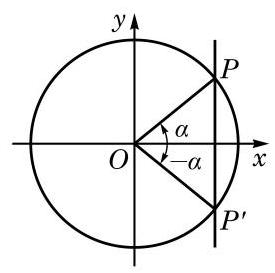

图 6-1-11

角 $\alpha$ 的终边与角 $- \alpha$ 的终边关于 $x$ 轴对称(图 6-1-11)，角 $\alpha$ 的终边与单位圆交于点 $P\left( {\cos \alpha ,\sin \alpha }\right)$ ,而角 $- \alpha$ 的终边与单位圆交于点 ${P}^{\prime }\left( {\cos \left( {-\alpha }\right) ,\sin \left( {-\alpha }\right) }\right)$ . 由于点 $P$ 与点 ${P}^{\prime }$ 关于 $x$ 轴对称, 其横坐标相等, 而纵坐标互为相反数, 因此有如下诱导公式:

$$
\sin \left( {-\alpha }\right)  =  - \sin \alpha ,\;\cos \left( {-\alpha }\right)  = \cos \alpha ,
$$

$$
\tan \left( {-\alpha }\right)  =  - \tan \alpha ,\;\cot \left( {-\alpha }\right)  =  - \cot \alpha .
$$

由这组诱导公式, 求负角的正弦、余弦、正切及余切值可以转化为求正角的相应值.

将角 $\alpha$ 的终边绕着原点 $O$ 按逆时针方向旋转 $\pi$ 弧度,得到角 $\pi  + \alpha$ 的终边 (图 6-1-12),这说明角 $\alpha$ 和角 $\pi  + \alpha$ 的终边在同一条直线上,但方向相反. 角 $\alpha$ 的终边与单位圆交于点 $P\left( {\cos \alpha ,\sin \alpha }\right)$ ,角 $\pi  + \alpha$ 的终边与单位圆交于点 ${P}^{\prime }(\cos \left( {\pi  + \alpha }\right)$ , $\sin \left( {\pi  + \alpha }\right) )$ . 由于点 $P$ 与点 ${P}^{\prime }$ 关于原点对称,其横坐标和纵坐标都互为相反数，因此有如下诱导公式:

$$
\sin \left( {\pi  + \alpha }\right)  =  - \sin \alpha ,\;\cos \left( {\pi  + \alpha }\right)  =  - \cos \alpha ,
$$

$$
\tan \left( {\pi  + \alpha }\right)  = \tan \alpha ,\;\cot \left( {\pi  + \alpha }\right)  = \cot \alpha .
$$

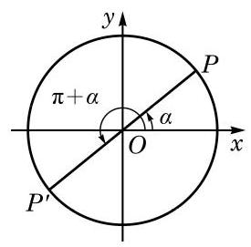

图 6-1-12

由这组诱导公式,求 $\lbrack 0,{2\pi })$ 范围内的角的正弦、余弦、正切及余切值可以转化到 $\lbrack 0,\pi )$ 范围内一个角的相应值.

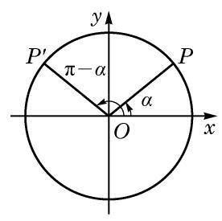

图 6-1-13

角 $\alpha$ 的终边与单位圆交于点 $P\left( {\cos \alpha ,\sin \alpha }\right)$ ,而角 $\pi  - \alpha$ 的终边与单位圆交于点 ${P}^{\prime }\left( {\cos \left( {\pi  - \alpha }\right) ,\sin \left( {\pi  - \alpha }\right) }\right)$ . 由于角 $\alpha$ 的终边和角 $\pi  - \alpha$ 的终边关于 $y$ 轴对称(图 6-1-13)，点 $P$ 与点 ${P}^{\prime }$ 关于 $y$ 轴对称, 其横坐标为相反数, 而纵坐标相等, 因此有如下诱导公式:

$$
\sin \left( {\pi  - \alpha }\right)  = \sin \alpha ,\;\cos \left( {\pi  - \alpha }\right)  =  - \cos \alpha ,
$$

$$
\tan \left( {\pi  - \alpha }\right)  =  - \tan \alpha ,\;\cot \left( {\pi  - \alpha }\right)  =  - \cot \alpha .
$$

由这组诱导公式,求 $\lbrack 0,\pi )$ 范围内的角的正弦、余弦、正切及余切值可以转化到 $\left\lbrack  {0,\frac{\pi }{2}}\right)$ 范围内一个角的相应值.

利用以上四组诱导公式, 就可以将终边不位于坐标轴上的任意角的正弦、余弦、正切及余切值, 与初中已学过的锐角的相应值有机地联系起来.

以上四组诱导公式说明, ${2k\pi } + \alpha \left( {k \in  \mathbf{Z}}\right) , - \alpha ,\pi  \pm  \alpha$ 的正弦、余弦、正切及余切值的绝对值等于角 $\alpha$ 的相应量的绝对值, 但这两个值之间可能差一个正负号. 由于诱导公式较多, 记忆其中的正负号并不容易, 但有一个很简单的方法可以加以判断, 即: 当 $\alpha$ 为锐角时,等式两边必须同时为正数或同时为负数.

例如, $\cos \left( {\pi  - \alpha }\right)$ 的绝对值应该同 $\cos \alpha$ 的绝对值相等,即成立 $\cos \left( {\pi  - \alpha }\right)  =  \pm  \cos \alpha$ . 但当 $\alpha$ 为锐角时, $\pi  - \alpha$ 是第二象限的角,这时 $\cos \left( {\pi  - \alpha }\right)  < 0$ ,而 $\cos \alpha  > 0$ ,所以前式中应该取负号, 即有 $\cos \left( {\pi  - \alpha }\right)  =  - \cos \alpha$ .

例 15 利用诱导公式求值:

(1) $\sin \frac{20}{3}\pi$ ;

(2) $\cos \left( {-\frac{7}{6}\pi }\right)$ ;

(3) $\tan \left( {-\frac{19}{4}\pi }\right)$ .

解(1) $\sin \frac{20}{3}\pi  = \sin \left( {{6\pi } + \frac{2}{3}\pi }\right)  = \sin \frac{2}{3}\pi$

$$
= \sin \left( {\pi  - \frac{\pi }{3}}\right)  = \sin \frac{\pi }{3} = \frac{\sqrt{3}}{2}\text{ . }
$$

---

到底使用哪一个诱导公式求值, 可以有多种选择.

---

(2) $\cos \left( {-\frac{7}{6}\pi }\right)  = \cos \frac{7}{6}\pi  = \cos \left( {\pi  + \frac{\pi }{6}}\right)  =  - \cos \frac{\pi }{6} =  - \frac{\sqrt{3}}{2}$ .

(3) $\tan \left( {-\frac{19}{4}\pi }\right)  =  - \tan \frac{19}{4}\pi  =  - \tan \left( {{5\pi } - \frac{\pi }{4}}\right)$

$$
=  - \tan \left( {\pi  - \frac{\pi }{4}}\right)  = \tan \frac{\pi }{4} = 1.
$$

例 16 化简: $\frac{\sin \left( {{2\pi } - \alpha }\right) \tan \left( {\pi  + \alpha }\right) \cot \left( {-\pi  - \alpha }\right) }{\cos \left( {\pi  - \alpha }\right) \tan \left( {{3\pi } - \alpha }\right) }$ .

解 因为

$$
\sin \left( {{2\pi } - \alpha }\right)  = \sin \left( {-\alpha }\right)  =  - \sin \alpha ,\tan \left( {\pi  + \alpha }\right)  = \tan \alpha ,
$$

$$
\cot \left( {-\pi  - \alpha }\right)  =  - \cot \left( {\pi  + \alpha }\right)  =  - \cot \alpha ,\cos \left( {\pi  - \alpha }\right)  =  - \cos \alpha ,
$$

$$
\tan \left( {{3\pi } - \alpha }\right)  = \tan \left( {\pi  - \alpha }\right)  =  - \tan \alpha ,
$$

所以

原式 $= \frac{\left( {-\sin \alpha }\right) \tan \alpha \left( {-\cot \alpha }\right) }{\left( {-\cos \alpha }\right) \left( {-\tan \alpha }\right) } = \frac{\sin \alpha }{\cos \alpha }\cot \alpha  = \tan \alpha \cot \alpha  = 1$ .

## 练习 6.1(6)

1. 证明:

(1) $\sin \left( {{2\pi } - \alpha }\right)  =  - \sin \alpha$ ; (2) $\cos \left( {{2\pi } - \alpha }\right)  = \cos \alpha$ ;

(3) $\tan \left( {{2\pi } - \alpha }\right)  =  - \tan \alpha$ ； (4) $\cot \left( {{2\pi } - \alpha }\right)  =  - \cot \alpha$ .

2. 利用诱导公式求值:

(1) $\sin \frac{11}{4}\pi$ (2) $\cos \left( {-\frac{5}{6}\pi }\right)$ ； (3) $\tan \left( {-\frac{14}{3}\pi }\right)$ .

3. 化简:

(1) $\frac{\sin \left( {{180}^{ \circ  } - \alpha }\right) }{\sin \left( {{180}^{ \circ  } + \alpha }\right) } + \frac{\cos \left( {{360}^{ \circ  } - \alpha }\right) }{\cos \left( {{180}^{ \circ  } + \alpha }\right) } + \frac{\tan \left( {{180}^{ \circ  } + \alpha }\right) }{\tan \left( {-\alpha }\right) }$ ;

(2) $\frac{\sin \left( {\pi  - \alpha }\right) }{\cos \left( {\pi  + \alpha }\right) } \cdot  \frac{\sin \left( {{2\pi } - \alpha }\right) }{\tan \left( {\pi  + \alpha }\right) }$ .

角 $\alpha$ 的终边与角 $\frac{\pi }{2} - \alpha$ 的终边关于直线 $y = x$ 对称 (图 6-1-14),角 $\alpha$ 的终边与单位圆交于点 $P\left( {\cos \alpha ,\sin \alpha }\right)$ ,而角 $\frac{\pi }{2} - \alpha$ 的终边与单位圆交于点 ${P}^{\prime }\left( {\cos \left( {\frac{\pi }{2} - \alpha }\right) ,\sin \left( {\frac{\pi }{2} - \alpha }\right) }\right)$ . 由于点 $P$ 与点 ${P}^{\prime }$ 关于直线 $y = x$ 对称,即点 $P$ 的横坐标与点 ${P}^{\prime }$ 的纵坐标相等,而点 $P$ 的纵坐标与点 ${P}^{\prime }$ 的横坐标相等,因此有如下诱导公式:

$$
\sin \left( {\frac{\pi }{2} - \alpha }\right)  = \cos \alpha ,\;\cos \left( {\frac{\pi }{2} - \alpha }\right)  = \sin \alpha ,
$$

$$
\tan \left( {\frac{\pi }{2} - \alpha }\right)  = \cot \alpha ,\;\cot \left( {\frac{\pi }{2} - \alpha }\right)  = \tan \alpha .
$$

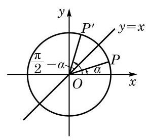

图 6-1-14

Q

在以上公式中将 $\alpha$ 用 $- \alpha$ 代换，就有

$$
\sin \left( {\frac{\pi }{2} + \alpha }\right)  = \cos \left( {-\alpha }\right)  = \cos \alpha ,
$$

---

角 $\alpha$ 的终边和角 $- \alpha$ 的终边关于角 $\frac{\alpha  + \left( {-\alpha }\right) }{2} = 0$ 的终边所在直线 $\left( {x\text{ 轴 }}\right)$ 对称; 角 $\alpha$ 的终边和角 $\pi  - \alpha$ 的终边关于角 $\frac{\alpha  + \left( {\pi  - \alpha }\right) }{2} = \frac{\pi }{2}$ 的终边所在直线 $\left( {y\text{ 轴 }}\right)$ 对称. 一般地,角 $\alpha$ 的终边和角 $\beta$ 的终边关于角 $\frac{\alpha  + \beta }{2}$ 的终边所在直线对称.

---

即

$$
\sin \left( {\frac{\pi }{2} + \alpha }\right)  = \cos \alpha .
$$

同理, 有如下诱导公式:

$$
\sin \left( {\frac{\pi }{2} + \alpha }\right)  = \cos \alpha ,\;\cos \left( {\frac{\pi }{2} + \alpha }\right)  =  - \sin \alpha ,
$$

$$
\tan \left( {\frac{\pi }{2} + \alpha }\right)  =  - \cot \alpha ,\;\cot \left( {\frac{\pi }{2} + \alpha }\right)  =  - \tan \alpha .
$$

上述两组诱导公式说明正弦和余弦可以互相转化, 正切和余切也可以互相转化.

以上两组诱导公式说明角 $\frac{\pi }{2} \pm  \alpha$ 的正(余)弦、正(余)切值的绝对值,必等于角 $\alpha$ 的余(正)弦、余(正)切值的绝对值,但这两者可能差一个正负号. 这个正负号的确定方法是: 当 $\alpha$ 为锐角时, 等式两边必须同时为正数或同时为负数.

例如, $\cos \left( {\frac{\pi }{2} + \alpha }\right)$ 的绝对值应该同 $\sin \alpha$ 的绝对值相等,即成立 $\cos \left( {\frac{\pi }{2} + \alpha }\right)  =  \pm  \sin \alpha$ . 但当 $\alpha$ 为锐角时, $\frac{\pi }{2} + \alpha$ 是第二象限的角,这时 $\cos \left( {\frac{\pi }{2} + \alpha }\right)  < 0$ ,而 $\sin \alpha  > 0$ ,所以前式中应该取负号,即有 $\cos \left( {\frac{\pi }{2} + \alpha }\right)  =  - \sin \alpha$ .

例 17 证明:

(1) $\sin \left( {\frac{3\pi }{2} + \alpha }\right)  =  - \cos \alpha$ ;

(2) $\cos \left( {\frac{3\pi }{2} + \alpha }\right)  = \sin \alpha$ ；

(3) $\tan \left( {\frac{3\pi }{2} + \alpha }\right)  =  - \cot \alpha$ ;

(4) $\cot \left( {\frac{3\pi }{2} + \alpha }\right)  =  - \tan \alpha$ .

证明 (1) $\sin \left( {\frac{3\pi }{2} + \alpha }\right)  = \sin \left( {\pi  + \frac{\pi }{2} + \alpha }\right)$

$$
=  - \sin \left( {\frac{\pi }{2} + \alpha }\right)  =  - \cos \alpha .
$$

(2)(3)(4)的证明方法类似，请同学们自行完成.

例 17 中的这组公式也可称为诱导公式. 观察所有上述这些诱导公式,关于角 $\frac{k\pi }{2} \pm  \alpha \left( {k \in  \mathbf{Z}}\right)$ 的正弦、余弦、正切及余切值呈现的规律可以总结为如下口诀: 奇变偶不变, 符号看象限. 例如, $\frac{\pi }{2}$ 及 $\frac{3\pi }{2}$ 都是 $\frac{\pi }{2}$ 的奇数倍,如果等式左边是 $\frac{\pi }{2} \pm  \alpha ,\frac{3\pi }{2} \pm  \alpha$ 的正弦、余弦、正切、余切之一,那么等式右边相应的必定是 $\alpha$ 的余弦、正弦、余切、正切,这就是“奇变”; 而 ${2k\pi }\left( {k \in  \mathbf{Z}}\right) \text{ 、 }0\text{ 、 }\pi$ 都是 $\frac{\pi }{2}$ 的偶数倍,等式两边的正弦、余弦、正切及余切的名称就应该相同，这就是“偶不变”. 等式右边角 $\alpha$ 的正弦、余弦、正切及余切前的符号可以将 $\alpha$ 视为锐角 (实际上 $\alpha$ 此时可以为任意

角),由等式左边的角 $\frac{\pi }{2} \pm  \alpha ,\frac{3\pi }{2} + \alpha ,{2k\pi } + \alpha , - \alpha ,\pi  \pm  \alpha$ 所在象限的正弦、余弦、正切及余切值的符号来确定，即“符号看象限”. 这一点在前面已有说明.

例 18 化简: $\frac{\sin \left( {\frac{\pi }{2} + \alpha }\right) \cos \left( {\frac{\pi }{2} + \alpha }\right) \sin \left( {\frac{\pi }{2} - \alpha }\right) }{\tan \left( {\frac{\pi }{2} + \alpha }\right) \cos \left( {\frac{3}{2}\pi  + \alpha }\right) \sin \left( {-\pi  + \alpha }\right) }$ .

解 原式 $= \frac{\cos \alpha \left( {-\sin \alpha }\right) \cos \alpha }{\left( {-\cot \alpha }\right) \sin \alpha \left( {-\sin \alpha }\right) }$

$$
=  - \frac{{\cos }^{2}\alpha }{\frac{\cos \alpha }{\sin \alpha }\sin \alpha }
$$

$$
=  - \cos \alpha \text{ . }
$$

例 19 已知点 $A$ 的坐标为 $\left( {-\frac{3}{5},\frac{4}{5}}\right)$ ,将 ${OA}$ 绕坐标原点 $O$ 逆时针旋转 $\frac{\pi }{2}$ 至 $O{A}^{\prime }$ . 求点 ${A}^{\prime }$ 的坐标.

$$
{x}^{\prime } = \cos \left( {\theta  + \frac{\pi }{2}}\right)  =  - \sin \theta  =  - \frac{4}{5},
$$

$$
{y}^{\prime } = \sin \left( {\theta  + \frac{\pi }{2}}\right)  = \cos \theta  =  - \frac{3}{5}.
$$

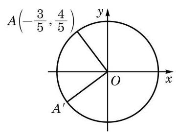

图 6-1-15

解 如图 6-1-15,由 ${OA} = O{A}^{\prime } = 1$ ,在单位圆中 $A(\cos \theta$ , $\sin \theta )$ 满足 $\cos \theta  =  - \frac{3}{5},\sin \theta  = \frac{4}{5}$ .

这样对点 ${A}^{\prime }\left( {{x}^{\prime },{y}^{\prime }}\right)$ ,有

所以，点 ${A}^{\prime }$ 的坐标为 $\left( {-\frac{4}{5}, - \frac{3}{5}}\right)$ .

## 练习 6.1(7)

1. 证明:

(1) $\sin \left( {\frac{3\pi }{2} - \alpha }\right)  =  - \cos \alpha$ ; (2) $\cos \left( {\frac{3\pi }{2} - \alpha }\right)  =  - \sin \alpha$ ；

(3) $\tan \left( {\frac{3\pi }{2} - \alpha }\right)  = \cot \alpha$ ； (4) $\cot \left( {\frac{3\pi }{2} - \alpha }\right)  = \tan \alpha$ .

2. 化简: $\frac{\sin \left( {\frac{\pi }{2} + \alpha }\right) \cot \left( {\frac{3\pi }{2} - \alpha }\right) \cos \left( {{3\pi } + \alpha }\right) }{\cot \left( {\frac{\pi }{2} - \alpha }\right) \cos \left( {\frac{3\pi }{2} + \alpha }\right) \cot \left( {\pi  - \alpha }\right) }$ .

3. 已知点 $A$ 的坐标为 $\left( {3,4}\right)$ ,将 ${OA}$ 绕坐标原点 $O$ 顺时针旋转 $\frac{\pi }{2}$ 至 $O{A}^{\prime }$ . 求点 ${A}^{\prime }$ 的坐标.

5 已知正弦、余弦或正切值求角

如果 $\alpha$ 是锐角,且满足 $\sin \alpha  = \frac{1}{2}$ ,那么 $\alpha  = \frac{\pi }{6}$ . 如果不限定 $\alpha$ 是锐角,那么由诱导公式 $\sin \left( {\pi  - \alpha }\right)  = \sin \alpha  = \frac{1}{2}$ 可知, $\alpha  = \frac{5\pi }{6}$ 也满足 $\sin \alpha  = \frac{1}{2}$ . 再由诱导公式 $\sin \left( {{2k\pi } + \alpha }\right)  = \sin \alpha \left( {k \in  \mathbf{Z}}\right)$ 可知, $\alpha  = {2k\pi } + \frac{\pi }{6}$ 或 $\alpha  = {2k\pi } + \frac{5\pi }{6}\left( {k \in  \mathbf{Z}}\right)$ 都满足 $\sin \alpha  = \frac{1}{2}$ . 那么,是否还有其他的角 $\alpha$ 满足 $\sin \alpha  = \frac{1}{2}$ 呢? 下面我们就来研究这个问题.

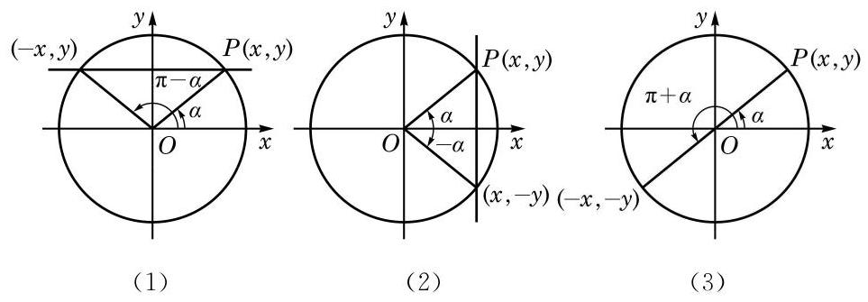

图 6-1-16

为此目的,设 $\alpha$ 是一个任意给定的角,我们希望确定所有满足 $\sin \beta  = \sin \alpha$ 的角 $\beta$ . 设角 $\alpha$ 的终边与以原点为圆心的单位圆的交点为 $P\left( {x, y}\right)$ ,过点 $P$ 作 $y$ 轴的垂线,如图 6-1-16(1) 所示. 由正弦的定义，满足 $\sin \beta  = \sin \alpha$ 的角 $\beta$ 的终边与单位圆的交点必在此直线上.

当 $\alpha  \neq  {l\pi } + \frac{\pi }{2}\left( {l \in  \mathbf{Z}}\right)$ 时，此直线交单位圆于两点 $\left( {x, y}\right)$ 和 $\left( {-x, y}\right)$ . 由于这两点分别位于角 $\alpha$ 和角 $\pi  - \alpha$ 的终边上,因此满足 $\sin \beta  = \sin \alpha$ 的角 $\beta$ 的全体为 $\left\{  {\beta  \mid  \beta  = {2k\pi } + \alpha }\right.$ 或 $\beta  = {2k\pi } + \pi  - \alpha$ , $k \in  \mathbf{Z}\}$ ,可简记作 $\left\{  {\beta  \mid  \beta  = {k\pi } + {\left( -1\right) }^{k}\alpha , k \in  \mathbf{Z}}\right\}$ .

当 $\alpha  = {l\pi } + \frac{\pi }{2}\left( {l \in  \mathbf{Z}}\right)$ 时,过点 $P$ 且垂直于 $y$ 轴的直线与单位圆相切于 $\left( {0, y}\right)$ ,此时满足 $\sin \beta  = \sin \alpha$ 的角 $\beta$ 的全体为 $\{ \beta  \mid  \beta  = {2k\pi } + \alpha , k \in  \mathbf{Z}\}$ ,这个集合也可以用上面所示的形式来表示. 事实上, 其表达式与上述集合第一部分中所给的表达式完全相同, 而对于上述集合第二部分所给的表达式, 由于在 $\alpha  = {l\pi } + \frac{\pi }{2}\left( {l \in  \mathbf{Z}}\right)$ 时,

$$
\beta  = {2k\pi } + \pi  - \alpha  = {2k\pi } - {l\pi } + \frac{\pi }{2}
$$

$$
= 2\left( {k - l}\right) \pi  + {l\pi } + \frac{\pi }{2} = 2\left( {k - l}\right) \pi  + \alpha \left( {k - l \in  \mathbf{Z}}\right) ,
$$

此时它也与上述集合第一部分中所给的表达式一致.

这样, 我们就得到:

若 $\sin x = \sin \alpha$ ,则

$$
x = {2k\pi } + \alpha \text{ 或 }x = {2k\pi } + \pi  - \alpha , k \in  \mathbf{Z},
$$

即

$$
x = {k\pi } + {\left( -1\right) }^{k}\alpha , k \in  \mathbf{Z}.
$$

同理,如图 6-1-16(2),若角 $\alpha$ 的终边与以原点为圆心的单位圆的交点为 $P\left( {x, y}\right)$ ,则由余弦的定义,满足 $\cos \beta  = \cos \alpha$ 的角 $\beta$ 的终边与单位圆的交点在过点 $P$ 且垂直于 $x$ 轴的直线上,从而满足 $\cos \beta  = \cos \alpha$ 的角 $\beta$ 的全体为 $\left\{  {\beta  \mid  \beta  = {2k\pi } \pm  \alpha , k \in  \mathbf{Z}}\right\}$ . 这样, 我们就得到:

若 $\cos x = \cos \alpha$ ,则 $x = {2k\pi } \pm  \alpha , k \in  \mathbf{Z}$ .

如图 6-1-16(3)，若角 $\alpha$ 的终边与以原点为圆心的单位圆的交点为 $P\left( {x, y}\right)$ ,则由正切的定义,满足 $\tan \beta  = \tan \alpha$ 的角 $\beta$ 的终边与单位圆的交点在过原点 $O$ 和点 $P$ 的直线上,从而满足 $\tan \beta  = \tan \alpha$ 的角 $\beta$ 的全体为 $\{ \beta  \mid  \beta  = {k\pi } + \alpha , k \in  \mathbf{Z}\}$ . 这样,我们就得到:

若 $\tan x = \tan \alpha$ ,则 $x = {k\pi } + \alpha , k \in  \mathbf{Z}$ .

例 20 根据下列条件,分别求角 $x$ :

(1)已知 $\sin x = \frac{\sqrt{3}}{2}$ ；

(2)已知 $\cos x =  - \frac{\sqrt{2}}{2}$ ；

(3)已知 $\tan x = \frac{\sqrt{3}}{3}$ .

解(1)因为 $\sin \frac{\pi }{3} = \frac{\sqrt{3}}{2}$ ，所以原式等价于求解 $\sin x = \; \sin \frac{\pi }{3}$ ,从而其解为 $x = {k\pi } + {\left( -1\right) }^{k}\frac{\pi }{3}, k \in  \mathbf{Z}$ .

( 2 )因为 $\cos \left( {\pi  - \frac{\pi }{4}}\right)  =  - \cos \frac{\pi }{4} =  - \frac{\sqrt{2}}{2}$ ，所以原式等价于求解 $\cos x = \cos \frac{3\pi }{4}$ ,从而其解为 $x = {2k\pi } \pm  \frac{3\pi }{4}, k \in  \mathbf{Z}$ .

(3)因为 $\tan \frac{\pi }{6} = \frac{\sqrt{3}}{3}$ ，所以原式等价于求解 $\tan x = \tan \frac{\pi }{6}$ ， 从而其解为 $x = {k\pi } + \frac{\pi }{6}, k \in  \mathbf{Z}$ .

例 21 分别求满足下列条件的角 $x$ 的集合:

(1) $\sin {2x} = \frac{\sqrt{3}}{2}, x \in  \left\lbrack  {0,{2\pi }}\right\rbrack$ ；

(2) $\cos \left( {x + \frac{\pi }{6}}\right)  = \frac{\sqrt{2}}{2}$ ；___

(3) $\tan \left( {{2x} + \frac{\pi }{3}}\right)  =  - \frac{\sqrt{3}}{3}$ .

解(1)因为 $\sin \frac{\pi }{3} = \frac{\sqrt{3}}{2}$ ，所以原式等价于求解 $\sin {2x} = \; \sin \frac{\pi }{3}$ ,从而 ${2x} = {k\pi } + {\left( -1\right) }^{k}\frac{\pi }{3}, k \in  \mathbf{Z}$ ,即 $x = \frac{k\pi }{2} + {\left( -1\right) }^{k}\frac{\pi }{6}$ , $k \in  \mathbf{Z}$ . 又因为 $x \in  \left\lbrack  {0,{2\pi }}\right\rbrack$ ,所以满足条件的所有角 $x$ 组成的集合为 $\left\{  {\frac{\pi }{6},\frac{\pi }{3},\frac{7\pi }{6},\frac{4\pi }{3}}\right\}$ .

(2)因为 $\cos \frac{\pi }{4} = \frac{\sqrt{2}}{2}$ ，所以原式等价于求解 $\cos \left( {x + \frac{\pi }{6}}\right)  = \; \cos \frac{\pi }{4}$ ,从而 $x + \frac{\pi }{6} = {2k\pi } \pm  \frac{\pi }{4}, k \in  \mathbf{Z}$ ,于是满足条件的所有角 $x$ 组成的集合为 $\left\{  {x\left| {\;x = {2k\pi } + \frac{\pi }{12}}\right. \text{ 或 }x = {2k\pi } - \frac{5\pi }{12}, k \in  \mathbf{Z}}\right\}$ .

(3)因为 $\tan \left( {\pi  - \frac{\pi }{6}}\right)  =  - \tan \frac{\pi }{6} =  - \frac{\sqrt{3}}{3}$ ，所以原式等价于求解 $\tan \left( {{2x} + \frac{\pi }{3}}\right)  = \tan \frac{5\pi }{6}$ ,从而 ${2x} + \frac{\pi }{3} = {k\pi } + \frac{5\pi }{6}, k \in  \mathbf{Z}$ ,于是满足条件的所有角 $x$ 组成的集合为 $\left\{  {x\left| {\;x = \frac{k\pi }{2} + \frac{\pi }{4}}\right. , k \in  \mathbf{Z}}\right\}$ .

## 练习 6.1(8)

1. 根据下列条件,分别求角 $x$ :

(1)已知 $\sin x =  - \frac{\sqrt{3}}{2}$ ；

(2)已知 $\cos x =  - \frac{1}{2}$ ；

三角

(3)已知 $\tan x =  - \sqrt{3}$ .

2. 分别求满足下列条件的角 $x$ 的集合:

(1) $2\sin \left( {x + \frac{\pi }{3}}\right)  = 1, x \in  \left\lbrack  {0,{2\pi }}\right\rbrack$ ；

(2) $\cos \left( {{2x} + \frac{\pi }{4}}\right)  =  - \frac{1}{2}$ ；

(3) $\tan \left( {{3x} + \frac{\pi }{4}}\right)  =  - 1$ .

## 习题 6.1

## A 组

1. 选择题:

(1)在下列各组的两个角中，终边不重合的一组是 ( )

A. -43° 与 677° ; B. ${900}^{ \circ  }$ 与 $- {1260}^{ \circ  }$ ;

C. -120° 与 960°; D. ${150}^{ \circ  }$ 与 ${630}^{ \circ  }$ .

(2)在平面直角坐标系中，下列结论正确的是 ( )

A. 小于 $\frac{\pi }{2}$ 的角一定是锐角; B. 第二象限的角一定是钝角;

C. 始边相同且相等的角的终边一定重合; D. 始边相同且终边重合的角一定相等.

(3)如果 $\alpha$ 是锐角,那么 ${2\alpha }$ 是 ( )

A. 第一象限的角; B. 第二象限的角;

C. 小于 ${180}^{ \circ  }$ 的正角; D. 钝角.

2. 找出与下列各角的终边重合的角 $\alpha \left( {{0}^{ \circ  } \leq  \alpha  < {360}^{ \circ  }}\right)$ ,并判别下列各角是第几象限的角:

(1)一1441°； (2) ${890}^{ \circ  }$ .

3. 把下列各角度化为弧度, 并判断它们是第几象限的角:

(1) ${225}^{ \circ  }$ ; (2) ${1500}^{ \circ  }$ ； (3) $- {22}^{ \circ  }{30}^{\prime }$ ； (4) $- {216}^{ \circ  }$ .

4. 已知扇形的弧长为 $\frac{5\pi }{3}$ ,半径为 2. 求该扇形的圆心角 $\alpha$ 及面积 $S$ .

5. 已知角 $\alpha$ 的终边分别经过以下各点,求角 $\alpha$ 的正弦、余弦、正切和余切值:

(1) $\left( {3, - 4}\right)$ ； (2) $\left( {-1, - \sqrt{3}}\right)$ .

6. 不用计算器, 根据角所属的象限, 判断下列各式的符号:

(1)sin ${237}^{ \circ  }\cos {390}^{ \circ  }$ ; (2) $\tan {135}^{ \circ  }\cos {275}^{ \circ  }$ ;

(3) $\frac{\cos \frac{5\pi }{6}\tan \frac{11\pi }{6}}{\sin \frac{2\pi }{3}}$ .

7. 根据下列条件,确定角 $\theta$ 所属的象限:

(1) $\sin \theta  < 0$ 且 $\cos \theta  > 0$ ；

(2) $\frac{\sin \theta }{\tan \theta } > 0$ .

8. 分别求 $\frac{2\pi }{3}$ 及 $\frac{7\pi }{6}$ 的正弦、余弦及正切值.

9. ( 1 )已知 $\sin \alpha  =  - \frac{2}{3}$ ，且 $\alpha$ 是第四象限的角. 求 $\cos \alpha$ 及 $\tan \alpha$ ；

( 2 )已知 $\tan \alpha  =  - \frac{1}{2}$ ，求 $\sin \alpha$ 及 $\cos \alpha$ .

10. 证明下列恒等式:

(1) ${\sin }^{4}\alpha  + {\cos }^{4}\alpha  = 1 - 2{\sin }^{2}\alpha {\cos }^{2}\alpha$ ;

(2) $\tan \alpha  - \cot \alpha  = \frac{1 - 2{\cos }^{2}\alpha }{\sin \alpha \cos \alpha }$ .

11. ( 1 )已知 $\tan \alpha  = 2$ ，求 $\frac{\sin \alpha  - \cos \alpha }{\sin \alpha  + \cos \alpha }$ 的值；

(2)若 $\sin \alpha  - \cos \alpha  = \frac{1}{2}$ ，求 $\sin \alpha \cos \alpha$ 的值.

12. 用诱导公式求值:

(1) $\sin {1110}^{ \circ  }$ ； (2) $\cos \frac{7\pi }{4}$ ； (3) $\cos \left( {-{600}^{ \circ  }}\right)$ ； (4) $\tan \left( {-\frac{7\pi }{6}}\right)$ .

13. 利用诱导公式,分别求角 $\frac{23\pi }{3}$ 和 $- \frac{87\pi }{4}$ 的正弦、余弦及正切值.

14. 化简下列各式:

(1) $\cos \left( {{90}^{ \circ  } + \alpha }\right)  + \sin \left( {{180}^{ \circ  } - \alpha }\right)  - \sin \left( {{180}^{ \circ  } + \alpha }\right)  + \sin \left( {-\alpha }\right)$ ;

(2) $\frac{\sin \left( {\pi  - \alpha }\right) }{\tan \left( {\pi  + \alpha }\right) } \cdot  \frac{\cot \left( {\frac{\pi }{2} - \alpha }\right) }{\tan \left( {\frac{\pi }{2} + \alpha }\right) } \cdot  \frac{\cos \left( {-\alpha }\right) }{\sin \left( {{2\pi } - \alpha }\right) }$ ;

(3) $\frac{\sin \left( {\alpha  - \pi }\right) \cot \left( {\alpha  - {2\pi }}\right) }{\cos \left( {\alpha  - \pi }\right) \tan \left( {\alpha  - {2\pi }}\right) }$ ；

(4) $\frac{\tan \left( {\pi  + \alpha }\right) \cos \left( {-\pi }\right) \cos \left( {{2\pi } - \alpha }\right) }{\cot \left( {\pi  - \alpha }\right) \sin \left( {{3\pi } + \alpha }\right) }$ .

B 组

1. 写出与下列各角的终边重合的所有角组成的集合 $S$ ,并写出 $S$ 中适合不等式 $- {360}^{ \circ  } \leq \; \alpha  < {720}^{ \circ  }$ 的元素 $\alpha$ :

(1) 60°; (2) $- {21}^{ \circ  }$ .

2. 已知 ${0}^{ \circ  } < \beta  < {180}^{ \circ  }$ ,若将角 $\beta$ 的终边顺时针旋转 ${120}^{ \circ  }$ 所得的角的终边与角 $\beta$ 的 5 倍角的终边重合. 求角 $\beta$ .

3. 已知一个扇形的周长是 16 , 面积是 12 . 求其圆心角的大小.

4. 写出终边在直线 $y = x$ 上的所有角组成的集合. (分别用角度制和弧度制来表示)

三角

5. 填空题:

(1)若 $\alpha$ 为第二象限的角，则 ${2\pi } - \alpha$ 为第___象限的角；

(2)若角 $\alpha$ 的终边与角 $\beta$ 的终边关于 $x$ 轴对称，则 $\alpha$ 与 $\beta$ 的关系是___；

(3)若角 $\alpha$ 与 $\beta$ 满足关系 $\alpha  = \left( {{2k} + 1}\right) \pi  - \beta \left( {k \in  \mathbf{Z}}\right)$ ，则角 $\alpha$ 与 $\beta$ 的终边关于___ 对称.

6. 已知一个扇形的周长为 ${20}\mathrm{\;{cm}}$ ，当圆心角等于多少时，这个扇形的面积最大，并求该最大值.

7. 已知 $\alpha$ 为第二象限的角,其终边上有一点 $P\left( {x,\sqrt{5}}\right)$ ,且 $\cos \alpha  = \frac{\sqrt{2}}{4}x$ . 求 $\tan \alpha$ .

8. 证明下列恒等式:

(1) ${\sin }^{2}\alpha  + {\sin }^{2}\beta  - {\sin }^{2}\alpha {\sin }^{2}\beta  + {\cos }^{2}\alpha {\cos }^{2}\beta  = 1$ ;

(2) $2\left( {1 - \sin \alpha }\right) \left( {1 + \cos \alpha }\right)  = {\left( 1 - \sin \alpha  + \cos \alpha \right) }^{2}$ .

9. 已知 $\alpha$ 是第二象限的角,化简: $\sqrt{\frac{1 + \sin \alpha }{1 - \sin \alpha }} + \sqrt{\frac{1 - \sin \alpha }{1 + \sin \alpha }}$ .

10. 已知 $\sin \alpha  + \cos \alpha  = \frac{1}{5},\alpha  \in  \left( {0,\pi }\right)$ . 求 $\sin \alpha$ 和 $\cos \alpha$ .

11. 已知 $\sin \alpha$ 及 $\cos \alpha$ 是关于 $x$ 的方程 $2{x}^{2} + {4kx} + {3k} = 0$ 的两个实根,求实数 $k$ .

12. 根据下列条件,求角 $x$ :

(1) $\tan x = \sqrt{3}$ ，且 $x$ 是第三象限的角； (2) $\cos x =  - \frac{\sqrt{2}}{2}, x \in  \lbrack 0,{2\pi })$ ；

(3) $\sin x =  - \frac{1}{2}$ ； (4) $2\cos \left( {{2x} + \frac{\pi }{8}}\right)  = 1$ .

### 6.2 常用三角公式

我们在学习对数时知道,对于正实数 $a\text{ 、 }b$ ,一般 $\lg \left( {a + b}\right)  \neq \; \lg a + \lg b$ ,但可以用 $a\text{ 、 }b$ 的对数来表示 ${ab}$ 或 $\frac{a}{b}\left( {b \neq  0}\right)$ 的对数, 并可由此化简很多涉及对数的表达式. 类似地,一般 $\sin \left( {\alpha  + \beta }\right)  \neq \; \sin \alpha  + \sin \beta$ 及 $\cos \left( {\alpha  - \beta }\right)  \neq  \cos \alpha  - \cos \beta$ . 本节中,我们要学习两个角的和与差的三角公式,即学习如何用 $\alpha \text{ 、 }\beta$ 的正弦、余弦及正切来表示 $\alpha  \pm  \beta$ 的正弦、余弦及正切,并在此基础上学习如何运用这组公式及其推论来化简有关的三角表达式, 为后面用三角知识解决各种具体问题做好准备.

1

## 两角和与差的正弦、余弦、 正切公式

我们先推导两角差 $\left( {\alpha  - \beta }\right)$ 的余弦公式.

设 $\alpha \text{ 、 }\beta$ 为任意给定的两个角,把它们的顶点置于平面直角坐标系的原点 $O$ ,始边都与 $x$ 轴的正半轴重合,而它们的终边分别与单位圆相交于 $A\text{ 、 }B$ 两点 (图 6-2-1). 点 $A\text{ 、 }B$ 的坐标分别为 $A\left( {\cos \alpha ,\sin \alpha }\right) \text{ 、 }B\left( {\cos \beta ,\sin \beta }\right)$ .

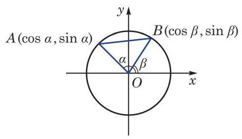

图 6-2-1

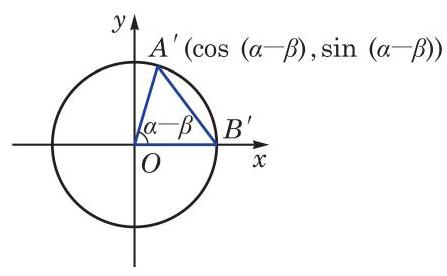

图 6-2-2

下面考虑角 $\left( {\alpha  - \beta }\right)$ 的余弦. 为此把角 $\alpha \text{ 、 }\beta$ 的终边 ${OA}$ 及 ${OB}$ 都绕原点 $O$ 旋转 $- \beta$ 角,它们分别交单位圆于点 ${A}^{\prime }$ 及 ${B}^{\prime }$ (图6-2-2). 由于都转动了 $- \beta$ 角,因此 $\alpha  - \beta$ 也可以是一个以射线 $O{B}^{\prime }$ 为始边、以射线 $O{A}^{\prime }$ 为终边的角,而点 ${A}^{\prime }$ 的坐标是 $\left( {\cos \left( {\alpha  - \beta }\right) ,\sin \left( {\alpha  - \beta }\right) }\right)$ ,点 ${B}^{\prime }$ 的坐标是 $\left( {1,0}\right)$ .

根据两点间的距离公式,在图 6-2-1 中,有

$$
{\left| AB\right| }^{2} = {\left( \cos \alpha  - \cos \beta \right) }^{2} + {\left( \sin \alpha  - \sin \beta \right) }^{2}
$$

$$
= {\cos }^{2}\alpha  - 2\cos \alpha \cos \beta  + {\cos }^{2}\beta  + {\sin }^{2}\alpha  - 2\sin \alpha \sin \beta  + {\sin }^{2}\beta
$$

$$
= 2 - 2\cos \alpha \cos \beta  - 2\sin \alpha \sin \beta \text{ . }
$$

而在图 6-2-2 中, 有

$$
{\left| {A}^{\prime }{B}^{\prime }\right| }^{2} = {\left\lbrack  \cos \left( \alpha  - \beta \right)  - 1\right\rbrack  }^{2} + {\sin }^{2}\left( {\alpha  - \beta }\right)
$$

$$
= {\cos }^{2}\left( {\alpha  - \beta }\right)  - 2\cos \left( {\alpha  - \beta }\right)  + 1 + {\sin }^{2}\left( {\alpha  - \beta }\right)
$$

$$
= 2 - 2\cos \left( {\alpha  - \beta }\right) \text{ . }
$$

因为将射线 ${OA}\text{ 、 }{OB}$ 同时绕原点 $O$ 旋转 $- \beta$ 角,就分别得到射线 $O{A}^{\prime }\text{ 、 }O{B}^{\prime }$ ,所以

$$
\left| {AB}\right|  = \left| {{A}^{\prime }{B}^{\prime }}\right| ,
$$

从而得到

$$
2 - 2\cos \alpha \cos \beta  - 2\sin \alpha \sin \beta  = 2 - 2\cos \left( {\alpha  - \beta }\right) ,
$$

即

$$
\cos \left( {\alpha  - \beta }\right)  = \cos \alpha \cos \beta  + \sin \alpha \sin \beta .
$$

这个式子对任意给定的角 $\alpha$ 及 $\beta$ 都成立，称为两角差的余弦公式.

在两角差的余弦公式中,用 $- \beta$ 代换 $\beta$ ,就可得到两角和的余弦公式:

$$
\cos \left( {\alpha  + \beta }\right)  = \cos \alpha \cos \left( {-\beta }\right)  + \sin \alpha \sin \left( {-\beta }\right)
$$

$$
= \cos \alpha \cos \beta  - \sin \alpha \sin \beta \text{ . }
$$

这样, 我们就得到两角和与差的余弦公式

$$
\cos \left( {\alpha  + \beta }\right)  = \cos \alpha \cos \beta  - \sin \alpha \sin \beta ,
$$

$$
\cos \left( {\alpha  - \beta }\right)  = \cos \alpha \cos \beta  + \sin \alpha \sin \beta .
$$

简记作

$$
\cos \left( {\alpha  \pm  \beta }\right)  = \cos \alpha \cos \beta  \mp  \sin \alpha \sin \beta .
$$

例 1 利用两角和与差的余弦公式,求 $\cos {75}^{ \circ  }$ 和 $\cos {15}^{ \circ  }$ 的值.

解 $\cos {75}^{ \circ  } = \cos \left( {{45}^{ \circ  } + {30}^{ \circ  }}\right)$

$$
= \cos {45}^{ \circ  }\cos {30}^{ \circ  } - \sin {45}^{ \circ  }\sin {30}^{ \circ  } = \frac{\sqrt{6} - \sqrt{2}}{4}\text{ . }
$$

$$
\cos {15}^{ \circ  } = \cos \left( {{45}^{ \circ  } - {30}^{ \circ  }}\right)
$$

$$
= \cos {45}^{ \circ  }\cos {30}^{ \circ  } + \sin {45}^{ \circ  }\sin {30}^{ \circ  } = \frac{\sqrt{6} + \sqrt{2}}{4}.
$$

例 2 已知 $\sin \alpha  = \frac{3}{5},\alpha  \in  \left( {\frac{\pi }{2},\pi }\right) ,\cos \beta  = \frac{5}{13},\beta  \in  \left( {\frac{3}{2}\pi ,{2\pi }}\right)$ . 求 $\cos \left( {\alpha  - \beta }\right)$ .

解 由 $\sin \alpha  = \frac{3}{5},\alpha  \in  \left( {\frac{\pi }{2},\pi }\right)$ ,得 $\cos \alpha  =  - \sqrt{1 - {\sin }^{2}\alpha } =  - \frac{4}{5}$ .

由 $\cos \beta  = \frac{5}{13},\beta  \in  \left( {\frac{3}{2}\pi ,{2\pi }}\right)$ ,得 $\sin \beta  =  - \sqrt{1 - {\cos }^{2}\beta } =  - \frac{12}{13}$ .

于是

$$
\cos \left( {\alpha  - \beta }\right)  = \cos \alpha \cos \beta  + \sin \alpha \sin \beta
$$

$$
= \left( {-\frac{4}{5}}\right)  \times  \frac{5}{13} + \frac{3}{5} \times  \left( {-\frac{12}{13}}\right)  =  - \frac{56}{65}.
$$

例 3 若 $\alpha \text{ 、 }\beta$ 为锐角, $\sin \alpha  = \frac{4\sqrt{3}}{7},\cos \left( {\alpha  + \beta }\right)  =  - \frac{11}{14}$ . 求角 $\beta$ .

解 由 $\alpha$ 为锐角,且 $\sin \alpha  = \frac{4\sqrt{3}}{7}$ ,得 $\cos \alpha  = \sqrt{1 - {\sin }^{2}\alpha } = \frac{1}{7}$ .

又由 $\alpha \text{ 、 }\beta$ 为锐角,得 $0 < \alpha  + \beta  < \pi$ ,从而

$$
\sin \left( {\alpha  + \beta }\right)  = \sqrt{1 - {\cos }^{2}\left( {\alpha  + \beta }\right) } = \frac{5\sqrt{3}}{14}.
$$

于是

$$
\cos \beta  = \cos \left( {\alpha  + \beta  - \alpha }\right)  = \cos \left( {\alpha  + \beta }\right) \cos \alpha  + \sin \left( {\alpha  + \beta }\right) \sin \alpha
$$

$$
= \frac{1}{7} \times  \left( {-\frac{11}{14}}\right)  + \frac{4\sqrt{3}}{7} \times  \frac{5\sqrt{3}}{14} = \frac{1}{2}.
$$

因为 $\beta$ 为锐角,所以 $\beta  = \frac{\pi }{3}$ .

## 练习 6.2(1)

1. 化简:

(1) $\cos \left( {{22}^{ \circ  } - x}\right) \cos \left( {{23}^{ \circ  } + x}\right)  - \sin \left( {{22}^{ \circ  } - x}\right) \sin \left( {{23}^{ \circ  } + x}\right)$ ;

(2) $\cos \left( {\frac{\pi }{6} + \alpha }\right) \cos \alpha  + \sin \left( {\frac{\pi }{6} + \alpha }\right) \sin \alpha$ .

2. 已知 $\sin \theta  =  - \frac{5}{13},\theta  \in  \left( {\pi ,\frac{3}{2}\pi }\right)$ . 求 $\cos \left( {\theta  + \frac{\pi }{4}}\right)$ 的值.

3. 证明:

(1) $\frac{2\cos A\cos B - \cos \left( {A - B}\right) }{\cos \left( {A - B}\right)  - 2\sin A\sin B} = 1$ ;

(2) $\cos \left( {\alpha  + \beta }\right) \cos \left( {\alpha  - \beta }\right)  = {\cos }^{2}\beta  - {\sin }^{2}\alpha$ .

根据两角差的余弦公式和诱导公式, 就可以得到两角和的正弦公式. 事实上，

$$
\sin \left( {\alpha  + \beta }\right)  = \cos \left\lbrack  {\frac{\pi }{2} - \left( {\alpha  + \beta }\right) }\right\rbrack   = \cos \left\lbrack  {\left( {\frac{\pi }{2} - \alpha }\right)  - \beta }\right\rbrack
$$

$$
= \cos \left( {\frac{\pi }{2} - \alpha }\right) \cos \beta  + \sin \left( {\frac{\pi }{2} - \alpha }\right) \sin \beta
$$

$$
= \sin \alpha \cos \beta  + \cos \alpha \sin \beta \text{ . }
$$

将上式中的 $\beta$ 用 $- \beta$ 代换,就可以得到两角差的正弦公式

$$
\sin \left( {\alpha  - \beta }\right)  = \sin \alpha \cos \beta  - \cos \alpha \sin \beta .
$$

这样, 我们得到两角和与差的正弦公式

$$
\sin \left( {\alpha  + \beta }\right)  = \sin \alpha \cos \beta  + \cos \alpha \sin \beta ,
$$

$$
\sin \left( {\alpha  - \beta }\right)  = \sin \alpha \cos \beta  - \cos \alpha \sin \beta .
$$

简记作

$$
\sin \left( {\alpha  \pm  \beta }\right)  = \sin \alpha \cos \beta  \pm  \cos \alpha \sin \beta .
$$

例 4 利用两角差的正弦公式,求 $\sin {15}^{ \circ  }$ 的值.

解 $\sin {15}^{ \circ  } = \sin \left( {{60}^{ \circ  } - {45}^{ \circ  }}\right)$

$$
= \sin {60}^{ \circ  }\cos {45}^{ \circ  } - \cos {60}^{ \circ  }\sin {45}^{ \circ  }
$$

$$
= \frac{\sqrt{6} - \sqrt{2}}{4}\text{ . }
$$

例 5 证明: $\sin \left( {\alpha  + \beta }\right) \sin \left( {\alpha  - \beta }\right)  = {\sin }^{2}\alpha  - {\sin }^{2}\beta$ .

证明 左边 $= \left( {\sin \alpha \cos \beta  + \cos \alpha \sin \beta }\right) \left( {\sin \alpha \cos \beta  - \cos \alpha \sin \beta }\right)$

$$
= {\sin }^{2}\alpha {\cos }^{2}\beta  - {\cos }^{2}\alpha {\sin }^{2}\beta
$$

$$
= {\sin }^{2}\alpha \left( {1 - {\sin }^{2}\beta }\right)  - \left( {1 - {\sin }^{2}\alpha }\right) {\sin }^{2}\beta
$$

$$
= {\sin }^{2}\alpha  - {\sin }^{2}\beta
$$

$$
= \text{ 右边. }
$$

所以，原等式成立.

根据两角和的正弦、余弦公式, 就可以得到两角和的正切公式. 事实上，

$$
\tan \left( {\alpha  + \beta }\right)  = \frac{\sin \left( {\alpha  + \beta }\right) }{\cos \left( {\alpha  + \beta }\right) } = \frac{\sin \alpha \cos \beta  + \cos \alpha \sin \beta }{\cos \alpha \cos \beta  - \sin \alpha \sin \beta }
$$

$$
= \frac{\frac{\sin \alpha \cos \beta  + \cos \alpha \sin \beta }{\cos \alpha \cos \beta }}{\frac{\cos \alpha \cos \beta  - \sin \alpha \sin \beta }{\cos \alpha \cos \beta }} = \frac{\tan \alpha  + \tan \beta }{1 - \tan \alpha \tan \beta }.
$$

将上式中的 $\beta$ 用 $- \beta$ 代换,就得到两角差的正切公式

$$
\tan \left( {\alpha  - \beta }\right)  = \frac{\tan \alpha  - \tan \beta }{1 + \tan \alpha \tan \beta }.
$$

这样, 我们得到两角和与差的正切公式

$$
\tan \left( {\alpha  + \beta }\right)  = \frac{\tan \alpha  + \tan \beta }{1 - \tan \alpha \tan \beta },
$$

$$
\tan \left( {\alpha  - \beta }\right)  = \frac{\tan \alpha  - \tan \beta }{1 + \tan \alpha \tan \beta }.
$$

简记作

$$
\tan \left( {\alpha  \pm  \beta }\right)  = \frac{\tan \alpha  \pm  \tan \beta }{1 \mp  \tan \alpha \tan \beta }.
$$

不难知道,只要 $\tan \alpha \text{ 、 }\tan \beta$ 和 $\tan \left( {\alpha  \pm  \beta }\right)$ 均有意义,上面的公式一定成立.

例 6 已知 $\tan \alpha  = \frac{1}{3},\tan \beta  =  - 2$ . 求:

(1) $\tan \left( {\alpha  + \beta }\right)$ ;

(2) $\cot \left( {\alpha  - \beta }\right)$ .

解 (1) $\tan \left( {\alpha  + \beta }\right)  = \frac{\tan \alpha  + \tan \beta }{1 - \tan \alpha \tan \beta } = \frac{\frac{1}{3} + \left( {-2}\right) }{1 - \frac{1}{3} \times  \left( {-2}\right) } =  - 1$ .

(2) 因为

$$
\tan \left( {\alpha  - \beta }\right)  = \frac{\tan \alpha  - \tan \beta }{1 + \tan \alpha \tan \beta } = \frac{\frac{1}{3} - \left( {-2}\right) }{1 + \frac{1}{3} \times  \left( {-2}\right) } = 7,
$$

所以 $\cot \left( {\alpha  - \beta }\right)  = \frac{1}{7}$ .

例 7 利用两角和的正切公式,求 $\frac{1 + \tan {75}^{ \circ  }}{1 - \tan {75}^{ \circ  }}$ 的值.

解 方法一:

因为

$$
\tan {75}^{ \circ  } = \tan \left( {{45}^{ \circ  } + {30}^{ \circ  }}\right)  = \frac{\tan {45}^{ \circ  } + \tan {30}^{ \circ  }}{1 - \tan {45}^{ \circ  }\tan {30}^{ \circ  }} = 2 + \sqrt{3},
$$

所以

$$
\frac{1 + \tan {75}^{ \circ  }}{1 - \tan {75}^{ \circ  }} = \frac{1 + \left( {2 + \sqrt{3}}\right) }{1 - \left( {2 + \sqrt{3}}\right) } =  - \sqrt{3}.
$$

方法二: 因为 $\tan {45}^{ \circ  } = 1$ ,所以

$$
\frac{1 + \tan {75}^{ \circ  }}{1 - \tan {75}^{ \circ  }} = \frac{\tan {45}^{ \circ  } + \tan {75}^{ \circ  }}{1 - \tan {45}^{ \circ  }\tan {75}^{ \circ  }} = \tan \left( {{45}^{ \circ  } + {75}^{ \circ  }}\right)
$$

$$
= \tan {120}^{ \circ  } =  - \tan {60}^{ \circ  } =  - \sqrt{3}\text{ . }
$$

## 练习 6.2(2)

1. 求下列各式的值:

(1) $\sin \frac{5\pi }{12}\cos \frac{\pi }{12} - \cos \frac{5\pi }{12}\sin \frac{\pi }{12}$ ; (2) $\frac{1 + \tan {15}^{ \circ  }}{1 - \tan {15}^{ \circ  }}$ .

2. 已知 $\cos \theta  =  - \frac{3}{5},\theta  \in  \left( {0,\pi }\right)$ . 求 $\sin \left( {\theta  + \frac{\pi }{4}}\right)$ 和 $\tan \left( {\theta  - \frac{\pi }{4}}\right)$ 的值.

3. 证明下列恒等式:

(1) $\frac{\sin \left( {\alpha  + \beta }\right) \sin \left( {\alpha  - \beta }\right) }{{\cos }^{2}\alpha {\cos }^{2}\beta } = {\tan }^{2}\alpha  - {\tan }^{2}\beta$ ; (2) $\tan \left( {\theta  + \frac{\pi }{4}}\right)  = \frac{1 + \tan \theta }{1 - \tan \theta }$ .

例 8 若 $\bigtriangleup {ABC}$ 不是直角三角形,求证:

$$
\tan A + \tan B + \tan C = \tan A\tan B\tan C.
$$

证明 因为 $A + B + C = \pi$ ,且 $\tan \left( {A + B}\right)  = \frac{\tan A + \tan B}{1 - \tan A\tan B}$ , 所以

$$
\tan A + \tan B = \tan \left( {A + B}\right) \left( {1 - \tan A\tan B}\right)
$$

$$
= \tan \left( {\pi  - C}\right) \left( {1 - \tan A\tan B}\right)
$$

$$
=  - \tan C\left( {1 - \tan A\tan B}\right) \text{ , }
$$

从而

$$
\tan A + \tan B + \tan C =  - \tan C\left( {1 - \tan A\tan B}\right)  + \tan C
$$

$$
= \tan A\tan B\tan C\text{ . }
$$

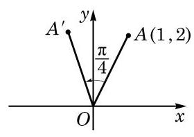

图 6-2-3

例 9 如图 6-2-3,已知点 $A$ 的坐标为 $\left( {1,2}\right)$ ,将 ${OA}$ 绕坐标原点 $O$ 逆时针旋转 $\frac{\pi }{4}$ 至 $O{A}^{\prime }$ . 求点 ${A}^{\prime }$ 的坐标.

解 设以 $x$ 轴正半轴为始边、 ${OA}$ 为终边的角为 $\theta$ .

由点 $A$ 的坐标为 $\left( {1,2}\right)$ ,可得 ${OA} = \sqrt{5},\sin \theta  = \frac{2\sqrt{5}}{5},\cos \theta  = \frac{\sqrt{5}}{5}$ .

设点 ${A}^{\prime }$ 的坐标为 $\left( {x, y}\right)$ ,由 $O{A}^{\prime } = {OA} = \sqrt{5}$ ,得

$$
x = O{A}^{\prime }\cos \left( {\theta  + \frac{\pi }{4}}\right)  = \sqrt{5}\left( {\cos \theta \cos \frac{\pi }{4} - \sin \theta \sin \frac{\pi }{4}}\right)
$$

$$
= \sqrt{5}\left( {\frac{\sqrt{5}}{5} \times  \frac{\sqrt{2}}{2} - \frac{2\sqrt{5}}{5} \times  \frac{\sqrt{2}}{2}}\right)  =  - \frac{\sqrt{2}}{2},
$$

$$
y = O{A}^{\prime }\sin \left( {\theta  + \frac{\pi }{4}}\right)  = \sqrt{5}\left( {\sin \theta \cos \frac{\pi }{4} + \cos \theta \sin \frac{\pi }{4}}\right)
$$

$$
= \sqrt{5}\left( {\frac{2\sqrt{5}}{5} \times  \frac{\sqrt{2}}{2} + \frac{\sqrt{5}}{5} \times  \frac{\sqrt{2}}{2}}\right)  = \frac{3\sqrt{2}}{2}.
$$

于是,点 ${A}^{\prime }$ 的坐标为 $\left( {-\frac{\sqrt{2}}{2},\frac{3\sqrt{2}}{2}}\right)$ .

例 10 把下列各式化为 $A\sin \left( {\alpha  + \varphi }\right) \left( {A > 0}\right)$ 的形式:

(1) $\frac{1}{2}\sin \alpha  + \frac{\sqrt{3}}{2}\cos \alpha$ ；

(2) $\sin \alpha  - \cos \alpha$ ；

(3) $a\sin \alpha  + b\cos \alpha \left( {{ab} \neq  0}\right)$ .

解 (1) $\frac{1}{2}\sin \alpha  + \frac{\sqrt{3}}{2}\cos \alpha  = \sin \alpha \cos \frac{\pi }{3} + \cos \alpha \sin \frac{\pi }{3} = \sin \left( {\alpha  + \frac{\pi }{3}}\right)$ .

(2)因为

$$
\sin \alpha  - \cos \alpha  = \sqrt{2}\left( {\frac{\sqrt{2}}{2}\sin \alpha  - \frac{\sqrt{2}}{2}\cos \alpha }\right) ,
$$

所以

$$
\sin \alpha  - \cos \alpha  = \sqrt{2}\left( {\sin \alpha \cos \frac{\pi }{4} - \cos \alpha \sin \frac{\pi }{4}}\right)  = \sqrt{2}\sin \left( {\alpha  - \frac{\pi }{4}}\right) .
$$

(3) $a\sin \alpha  + b\cos \alpha  = \sqrt{{a}^{2} + {b}^{2}}\left( {\frac{a}{\sqrt{{a}^{2} + {b}^{2}}}\sin \alpha  + \frac{b}{\sqrt{{a}^{2} + {b}^{2}}}\cos \alpha }\right)$ .

注意到 $\left( {\frac{a}{\sqrt{{a}^{2} + {b}^{2}}},\frac{b}{\sqrt{{a}^{2} + {b}^{2}}}}\right)$ 为单位圆上的一点,由正弦及余弦的定义,存在唯一的角 $\varphi  \in  \lbrack 0,{2\pi })$ ,使得

$$
\cos \varphi  = \frac{a}{\sqrt{{a}^{2} + {b}^{2}}},\sin \varphi  = \frac{b}{\sqrt{{a}^{2} + {b}^{2}}},
$$

于是有

$$
a\sin \alpha  + b\cos \alpha  = \sqrt{{a}^{2} + {b}^{2}}\left( {\sin \alpha \cos \varphi  + \cos \alpha \sin \varphi }\right)
$$

$$
= \sqrt{{a}^{2} + {b}^{2}}\sin \left( {\alpha  + \varphi }\right) \text{ . }
$$

## 练习 6.2(3)

1. 在 $\bigtriangleup {ABC}$ 中,已知 $\cos A = \frac{12}{13},\cos B = \frac{8}{17}$ . 求 $\sin C$ 和 $\cos C$ 的值.

2. 已知 $\cos \alpha  = \frac{4}{5},\alpha  \in  \left( {0,\frac{\pi }{2}}\right) ,\sin \beta  = \frac{12}{13},\beta  \in  \left( {\frac{\pi }{2},\pi }\right)$ . 求 $\sin \left( {\alpha  + \beta }\right)$ 和 $\cos \left( {\alpha  + \beta }\right)$ 的值,并判断 $\alpha  + \beta$ 是第几象限的角.

3. 把下列各式化为 $A\sin \left( {\alpha  + \varphi }\right) \left( {A > 0}\right)$ 的形式:

(1) $\sin \alpha  + \cos \alpha$

(2) $- \sin \alpha  + \sqrt{3}\cos \alpha$ .

## 2 二倍角公式

在两角和的正弦、余弦和正切公式中,用 $\beta  = \alpha$ 代入,就得到二倍角的正弦、余弦和正切公式

$$
\sin {2\alpha } = 2\sin \alpha \cos \alpha ,
$$

$$
\cos {2\alpha } = {\cos }^{2}\alpha  - {\sin }^{2}\alpha ,
$$

$$
\tan {2\alpha } = \frac{2\tan \alpha }{1 - {\tan }^{2}\alpha }.
$$

由于 ${\sin }^{2}\alpha  + {\cos }^{2}\alpha  = 1$ ,因此二倍角的余弦公式还可以表示为

$$
\cos {2\alpha } = 2{\cos }^{2}\alpha  - 1 = 1 - 2{\sin }^{2}\alpha .
$$

二倍角公式是两角和公式的特例, 简称为倍角公式.

例 11 已知 $\sin \alpha  = \frac{4}{5},\alpha  \in  \left( {\frac{\pi }{2},\pi }\right)$ . 求 $\sin {2\alpha }\text{ 、 }\cos {2\alpha }$ 和 $\tan {2\alpha }$ 的值.

解 由 $\sin \alpha  = \frac{4}{5},\alpha  \in  \left( {\frac{\pi }{2},\pi }\right)$ ,得

$$
\cos \alpha  =  - \sqrt{1 - {\sin }^{2}\alpha } =  - \frac{3}{5},\tan \alpha  = \frac{\sin \alpha }{\cos \alpha } =  - \frac{4}{3},
$$

于是

$$
\sin {2\alpha } = 2\sin \alpha \cos \alpha  = 2 \times  \left( {-\frac{3}{5}}\right)  \times  \frac{4}{5} =  - \frac{24}{25},
$$

$$
\cos {2\alpha } = 1 - 2{\sin }^{2}\alpha  = 1 - 2 \times  {\left( \frac{4}{5}\right) }^{2} =  - \frac{7}{25},
$$

$$
\tan {2\alpha } = \frac{2\tan \alpha }{1 - {\tan }^{2}\alpha } = \frac{2 \times  \left( {-\frac{4}{3}}\right) }{1 - {\left( -\frac{4}{3}\right) }^{2}} = \frac{24}{7}.
$$

例 12 试用 $\cos \theta$ 表示 $\cos {3\theta }$ .

解 因为 $\cos {3\theta } = \cos \left( {{2\theta } + \theta }\right)  = \cos {2\theta }\cos \theta  - \sin {2\theta }\sin \theta$

$$
= \left( {2{\cos }^{2}\theta  - 1}\right) \cos \theta  - 2{\sin }^{2}\theta \cos \theta
$$

$$
= \left( {2{\cos }^{2}\theta  - 1}\right) \cos \theta  - 2\left( {1 - {\cos }^{2}\theta }\right) \cos \theta
$$

$$
= 4{\cos }^{3}\theta  - 3\cos \theta \text{ , }
$$

所以 $\cos {3\theta } = 4{\cos }^{3}\theta  - 3\cos \theta$ .

Q

这个公式称为三倍角的余弦公式. 类似地, 可以推导出三倍角的正弦公式.

例 13 证明:

(1) $2{\cos }^{2}\theta  + 2\sin \theta \cos \theta  - 1 = \sqrt{2}\sin \left( {{2\theta } + \frac{\pi }{4}}\right)$ ；

---

历史上，三倍角公式曾为求解一元三次方程提供思路.

---

(2) $\frac{1 + \sin {2\theta } + \cos {2\theta }}{1 + \sin {2\theta } - \cos {2\theta }} = \cot \theta$ .

证明 (1) $2{\cos }^{2}\theta  + 2\sin \theta \cos \theta  - 1 = \cos {2\theta } + \sin {2\theta }$

$$
= \sqrt{2}\left( {\sin \frac{\pi }{4}\cos {2\theta } + \cos \frac{\pi }{4}\sin {2\theta }}\right)  = \sqrt{2}\sin \left( {{2\theta } + \frac{\pi }{4}}\right) .
$$

2) $\frac{1 + \sin {2\theta } + \cos {2\theta }}{1 + \sin {2\theta } - \cos {2\theta }} = \frac{1 + 2\sin \theta \cos \theta  + \left( {2{\cos }^{2}\theta  - 1}\right) }{1 + 2\sin \theta \cos \theta  - \left( {1 - 2{\sin }^{2}\theta }\right) }$

$$
= \frac{2\cos \theta \left( {\sin \theta  + \cos \theta }\right) }{2\sin \theta \left( {\sin \theta  + \cos \theta }\right) } = \cot \theta .
$$

## 练习 6.2(4)

1. 利用二倍角公式, 求下列各式的值:

(1) $\sin \frac{5\pi }{12}\cos \frac{5\pi }{12}$ ; (2) ${\cos }^{2}{22.5}^{ \circ  } - {\sin }^{2}{22.5}^{ \circ  }$ ；

(3) $\frac{\tan {15}^{ \circ  }}{1 - {\tan }^{2}{15}^{ \circ  }}$ .

2. 已知 $\cos \alpha  =  - \frac{\sqrt{5}}{5},\alpha  \in  \left( {\frac{\pi }{2},\pi }\right)$ . 求 $\sin {2\alpha },\cos {2\alpha }$ 和 $\tan {2\alpha }$ 的值.

3. 证明下列恒等式:

(1) ${\left( \sin \alpha  + \cos \alpha \right) }^{2} = 1 + \sin {2\alpha }$ ； (2) ${\cos }^{4}\alpha  - {\sin }^{4}\alpha  = \cos {2\alpha }$ ；

(3) $\sin {3\alpha } = 3\sin \alpha  - 4{\sin }^{3}\alpha$ .

## 3 三角变换的应用

在学习两角和与差的公式、二倍角公式的基础上，我们可以推导出更多的三角恒等关系. 如果已知角 $\alpha$ 的正弦、余弦及正切值,用二倍角公式就可以得到角 ${2\alpha }$ 的相应值. 反之,如果已知角 ${2\alpha }$ 的正弦、余弦及正切值,也可以得到角 $\alpha$ 的相应值.

例 14 用 $\cos \alpha$ 分别表示 ${\sin }^{2}\frac{\alpha }{2},{\cos }^{2}\frac{\alpha }{2}$ 及 ${\tan }^{2}\frac{\alpha }{2}$ .

解 因为 $\cos \alpha  = 1 - 2{\sin }^{2}\frac{\alpha }{2} = 2{\cos }^{2}\frac{\alpha }{2} - 1$ ,所以

$$
{\sin }^{2}\frac{\alpha }{2} = \frac{1 - \cos \alpha }{2},{\cos }^{2}\frac{\alpha }{2} = \frac{1 + \cos \alpha }{2},
$$

从而 ${\tan }^{2}\frac{\alpha }{2} = \frac{1 - \cos \alpha }{1 + \cos \alpha }$ .

从例 14 不难得到以下公式:

$$
\sin \frac{\alpha }{2} =  \pm  \sqrt{\frac{1 - \cos \alpha }{2}}
$$

$$
\cos \frac{\alpha }{2} =  \pm  \sqrt{\frac{1 + \cos \alpha }{2}}
$$

$$
\tan \frac{\alpha }{2} =  \pm  \sqrt{\frac{1 - \cos \alpha }{1 + \cos \alpha }}
$$

它们分别叫做半角的正弦、余弦和正切公式. 其中, 公式右侧的 “ $\pm$ ”号,根据角 $\frac{\alpha }{2}$ 所在的象限由左侧值相应的符号确定.

例如,因为 ${15}^{ \circ  }$ 是第一象限的角,所以 $\sin {15}^{ \circ  } > 0$ ,从而

$$
\sin {15}^{ \circ  } = \sqrt{\frac{1 - \cos {30}^{ \circ  }}{2}} = \sqrt{\frac{1 - \frac{\sqrt{3}}{2}}{2}} = \sqrt{\frac{2 - \sqrt{3}}{4}} = \sqrt{\frac{8 - 4\sqrt{3}}{16}} = \frac{\sqrt{6} - \sqrt{2}}{4}.
$$

例 15 证明: $\tan \frac{\alpha }{2} = \frac{\sin \alpha }{1 + \cos \alpha }$ .

证明 $\tan \frac{\alpha }{2} = \frac{\sin \frac{\alpha }{2}}{\cos \frac{\alpha }{2}} = \frac{2\sin \frac{\alpha }{2}\cos \frac{\alpha }{2}}{2{\cos }^{2}\frac{\alpha }{2}} = \frac{\sin \alpha }{1 + \cos \alpha }$ .

这样, 半角的正切公式又可以表示为

$$
\tan \frac{\alpha }{2} = \frac{\sin \alpha }{1 + \cos \alpha }.
$$

半角的正切公式还可以表示为

$$
\tan \frac{\alpha }{2} = \frac{1 - \cos \alpha }{\sin \alpha }.
$$

例如, $\tan {22.5}^{ \circ  } = \frac{1 - \cos {45}^{ \circ  }}{\sin {45}^{ \circ  }} = \frac{1 - \frac{\sqrt{2}}{2}}{\frac{\sqrt{2}}{2}} = \sqrt{2} - 1$ .

例 16 证明: $\sin \alpha \cos \beta  = \frac{1}{2}\left\lbrack  {\sin \left( {\alpha  + \beta }\right)  + \sin \left( {\alpha  - \beta }\right) }\right\rbrack$ .

证明 我们已经知道

$$
\sin \left( {\alpha  + \beta }\right)  = \sin \alpha \cos \beta  + \cos \alpha \sin \beta ,
$$

$$
\sin \left( {\alpha  - \beta }\right)  = \sin \alpha \cos \beta  - \cos \alpha \sin \beta ,
$$

将上述两式相加, 得

$$
\sin \left( {\alpha  + \beta }\right)  + \sin \left( {\alpha  - \beta }\right)  = 2\sin \alpha \cos \beta ,
$$

即

$$
\sin \alpha \cos \beta  = \frac{1}{2}\left\lbrack  {\sin \left( {\alpha  + \beta }\right)  + \sin \left( {\alpha  - \beta }\right) }\right\rbrack  .
$$

类似地, 利用两角和与差的正弦、余弦公式, 就可以得到下面一组公式:

$$
\sin \alpha \cos \beta  = \frac{1}{2}\left\lbrack  {\sin \left( {\alpha  + \beta }\right)  + \sin \left( {\alpha  - \beta }\right) }\right\rbrack  ,
$$

$$
\cos \alpha \sin \beta  = \frac{1}{2}\left\lbrack  {\sin \left( {\alpha  + \beta }\right)  - \sin \left( {\alpha  - \beta }\right) }\right\rbrack  ,
$$

$$
\cos \alpha \cos \beta  = \frac{1}{2}\left\lbrack  {\cos \left( {\alpha  + \beta }\right)  + \cos \left( {\alpha  - \beta }\right) }\right\rbrack  ,
$$

$$
\sin \alpha \sin \beta  =  - \frac{1}{2}\left\lbrack  {\cos \left( {\alpha  + \beta }\right)  - \cos \left( {\alpha  - \beta }\right) }\right\rbrack  .
$$

它们统称为积化和差公式.

例 17 证明: $\sin \alpha  + \sin \beta  = 2\sin \frac{\alpha  + \beta }{2}\cos \frac{\alpha  - \beta }{2}$ .

证明 由例 16,有 $\sin x\cos y = \frac{1}{2}\left\lbrack  {\sin \left( {x + y}\right)  + \sin \left( {x - y}\right) }\right\rbrack$ , 在其中取 $x = \frac{\alpha  + \beta }{2}, y = \frac{\alpha  - \beta }{2}$ ,就有

$$
\sin \frac{\alpha  + \beta }{2}\cos \frac{\alpha  - \beta }{2} = \frac{1}{2}\left( {\sin \alpha  + \sin \beta }\right) ,
$$

即 $\sin \alpha  + \sin \beta  = 2\sin \frac{\alpha  + \beta }{2}\cos \frac{\alpha  - \beta }{2}$ .

类似地, 我们可以得到下面一组公式:

$$
\sin \alpha  + \sin \beta  = 2\sin \frac{\alpha  + \beta }{2}\cos \frac{\alpha  - \beta }{2},
$$

$$
\sin \alpha  - \sin \beta  = 2\cos \frac{\alpha  + \beta }{2}\sin \frac{\alpha  - \beta }{2},
$$

$$
\cos \alpha  + \cos \beta  = 2\cos \frac{\alpha  + \beta }{2}\cos \frac{\alpha  - \beta }{2},
$$

$$
\cos \alpha  - \cos \beta  =  - 2\sin \frac{\alpha  + \beta }{2}\sin \frac{\alpha  - \beta }{2}.
$$

它们统称为和差化积公式.

积化和差公式与和差化积公式相互等价, 都可由两角和与差的正弦、余弦公式通过恒等变换得到. 这两组公式常用来化简比较复杂的三角表达式.

## 练习 6.2(5)

1. 证明: $\cos \alpha \cos \beta  = \frac{1}{2}\left\lbrack  {\cos \left( {\alpha  + \beta }\right)  + \cos \left( {\alpha  - \beta }\right) }\right\rbrack$ .

2. 证明: $\cos \alpha  + \cos \beta  = 2\cos \frac{\alpha  + \beta }{2}\cos \frac{\alpha  - \beta }{2}$ .

3. 证明: $\tan \frac{\alpha }{2} = \frac{1 - \cos \alpha }{\sin \alpha }$ .

## 习题 6.2

## A 组

1. 利用两角和与差的相应公式, 分别求下列各值:

(1) $\cos {105}^{ \circ  }$ ； (2)sin ${165}^{ \circ  }$ ； (3) $\tan \frac{5\pi }{12}$ .

2. 化简下列各式:

(1) $\cos \left( {\alpha  + \beta }\right) \cos \beta  + \sin \left( {\alpha  + \beta }\right) \sin \beta$ ;

(2) $\sin \left( {\theta  + {105}^{ \circ  }}\right) \cos \left( {\theta  - {15}^{ \circ  }}\right)  - \cos \left( {\theta  + {105}^{ \circ  }}\right) \sin \left( {\theta  - {15}^{ \circ  }}\right)$ ；

(3) $\cos \left( {\theta  + \frac{\pi }{4}}\right)  + \sin \left( {\frac{\pi }{4} + \theta }\right)$ ;

(4) $\frac{\tan \left( {\alpha  - \beta }\right)  + \tan \beta }{1 - \tan \left( {\alpha  - \beta }\right) \tan \beta }$ .

3. 已知 $\sin \alpha  = \frac{8}{17},\cos \beta  =  - \frac{5}{13}$ ,且 $\alpha \text{ 、 }\beta  \in  \left( {\frac{\pi }{2},\pi }\right)$ . 求 $\cos \left( {\alpha  + \beta }\right)$ 的值.

4. 已知 $\sin \alpha  = \frac{5}{13},\cos \beta  =  - \frac{3}{5}$ ,且 $\alpha \text{ 、 }\beta$ 都是第二象限的角. 求 $\sin \left( {\alpha  - \beta }\right) ,\cos \left( {\alpha  - \beta }\right)$ 和 $\tan \left( {\alpha  - \beta }\right)$ 的值.

5. 已知 $\tan \alpha  = 2,\tan \beta  = 3$ ,其中 $\alpha$ 及 $\beta$ 均为锐角. 求 $\alpha  + \beta$ 的值.

6. 已知 $\sin \theta  =  - \frac{7}{25},\theta  \in  \left( {\pi ,\frac{3\pi }{2}}\right)$ . 求 $\tan \left( {\theta  - \frac{\pi }{4}}\right)$ 的值.

7. 证明下列恒等式:

(1) $\frac{\sin \left( {\alpha  + \beta }\right) }{\cos \alpha \cos \beta } = \tan \alpha  + \tan \beta$ ;

(2) $\sin \left( {\alpha  + \beta }\right) \cos \left( {\alpha  - \beta }\right)  = \sin \alpha \cos \alpha  + \sin \beta \cos \beta$ .

8. 已知 $\cos \varphi  =  - \frac{1}{3}$ ,且 $\pi  < \varphi  < \frac{3\pi }{2}$ . 求 $\sin {2\varphi },\cos {2\varphi }$ 和 $\tan {2\varphi }$ 的值.

9. 已知等腰三角形的底角的正弦值等于 $\frac{4}{5}$ ,求这个三角形的顶角的正弦、余弦和正切值.

10. 证明下列恒等式:

(1) $1 + \sin \alpha  = {\left( \sin \frac{\alpha }{2} + \cos \frac{\alpha }{2}\right) }^{2}$ ； (2) $8{\sin }^{4}\alpha  = \cos {4\alpha } - 4\cos {2\alpha } + 3$ ；

(3) $\frac{1 + \sin \alpha }{\cos \alpha } = \frac{1 + \tan \frac{\alpha }{2}}{1 - \tan \frac{\alpha }{2}}$ ；___ (4) $\tan \alpha  + \cot \alpha  = \frac{2}{\sin {2\alpha }}$ .

## B 组

1. 已知 $\sin \alpha  - \sin \beta  =  - \frac{1}{3},\cos \alpha  - \cos \beta  = \frac{1}{2}$ . 求 $\cos \left( {\alpha  - \beta }\right)$ .

2. 已知锐角 $\alpha \text{ 、 }\beta$ 满足 $\cos \alpha  = \frac{4}{5}$ 及 $\cos \left( {\alpha  + \beta }\right)  = \frac{3}{5}$ ,求 $\sin \beta$ .

3. 已知 $\tan \left( {\frac{\pi }{4} + \alpha }\right)  = 2,\tan \beta  = \frac{1}{2}$ . 求下列各式的值:

(1) $\tan \alpha$ ;

(2) $\frac{\sin \left( {\alpha  + \beta }\right)  - 2\sin \alpha \cos \beta }{2\sin \alpha \sin \beta  + \cos \left( {\alpha  + \beta }\right) }$ .

4. 已知 $\cos \left( {\alpha  + \beta }\right)  = \frac{1}{2},\cos \left( {\alpha  - \beta }\right)  = \frac{1}{3}$ . 求 $\tan \alpha \tan \beta$ 的值.

5. 已知 $\sin \alpha  =  - \frac{1}{4},\alpha  \in  \left( {\pi ,\frac{3\pi }{2}}\right) ,\cos \beta  = \frac{4}{5},\beta  \in  \left( {\frac{3\pi }{2},{2\pi }}\right)$ . 判断 $\alpha  + \beta$ 是第几象限的角.

6. 用 $\cot \alpha$ 和 $\cot \beta$ 表示 $\cot \left( {\alpha  + \beta }\right)$ .

7. 把下列各式化成 $A\sin \left( {\alpha  + \varphi }\right) \left( {A > 0}\right)$ 的形式:

(1) $\sqrt{3}\sin \alpha  + \cos \alpha$ ； (2) $5\sin \alpha  - {12}\cos \alpha$ .

8. 设点 $P$ 是以原点为圆心的单位圆上的一个动点,它从初始位置 ${P}_{0}\left( {1,0}\right)$ 出发,沿单位圆按逆时针方向转动角 $\alpha \left( {0 < \alpha  < \frac{\pi }{2}}\right)$ 后到达点 ${P}_{1}$ ,然后继续沿单位圆按逆时针方向转动角 $\frac{\pi }{4}$ 到达点 ${P}_{2}$ . 若点 ${P}_{2}$ 的横坐标为 $- \frac{3}{5}$ ,求点 ${P}_{1}$ 的坐标.

9. 若 $\sin \alpha  = \frac{8}{5}\sin \frac{\alpha }{2}$ ,求 $\cos \alpha$ .

## 探究与实践

已知通过半角公式可以用 $\cos \alpha$ 来表示半角 $\frac{\alpha }{2}$ 的正弦、余弦及正切,自然会问: 可以用角 $\frac{\alpha }{2}$ 的正弦、余弦及正切中的某一个来分别表示角 $\alpha$ 的正弦、余弦及正切吗? 答案是肯定的,我们可以用 $\tan \frac{\alpha }{2}$ 来表示 $\sin \alpha \text{ 、 }\cos \alpha$ 及 $\tan \alpha$ . 这组表达式统称为万能代换公式, 并有着较多的应用. 请同学们思考并证明下述万能代换公式: 当 $\alpha  \neq  {2k\pi } + \pi \left( {k \in  \mathbf{Z}}\right)$ 时,设 $t = \tan \frac{\alpha }{2}$ ,则成立(1) $\sin \alpha  = \frac{2t}{1 + {t}^{2}}$ ; (2) $\cos \alpha  = \frac{1 - {t}^{2}}{1 + {t}^{2}}$ ; (3) $\tan \alpha  = \frac{2t}{1 - {t}^{2}}\left( {t \neq  1\text{ 且 }t \neq   - 1}\right)$ .

## 课后阅读

## 三角变换公式简史

三角变换公式很早就为数学家所熟知. 在古希腊时期, 由于研究天文的需要, 所考察的主要是球面三角学. 数学家托勒密(C. Ptolemy)在其《大汇编》一书中就给出了已知 $\sin A$ 及 $\sin B$ ,求 $\sin \left( {A + B}\right)$ 与 $\sin \left( {A - B}\right)$ 的方法,即两角和与差的正弦公式 $\sin \left( {A \pm  B}\right)  = \; \sin A\cos B \pm  \cos A\sin B$ . 他在书中还详细给出了在知道 ${72}^{ \circ  }$ 及 ${60}^{ \circ  }$ 的正弦的基础上,如何求出 ${12}^{ \circ  }$ 的正弦的方法,并给出了已知 $\sin A$ 求 $\sin \frac{A}{2}$ 和 $\sin {2A}$ 的方法. 在此基础上,他对从 ${0}^{ \circ  }$ 到 ${180}^{ \circ  }$ 间所有相差 ${\left( \frac{1}{2}\right) }^{ \circ  }$ 的角度编制出了正弦表.

虽然很多三角恒等式在托勒密的《大汇编》中都已存在, 但法国数学家韦达(F. Viete) 进行了较为系统的整理、补充和发展. 韦达是最早将代数变换方法引入三角学的人，他不仅给出了和差化积公式,也对 $n$ 倍角的 $\sin {n\alpha }$ 及 $\cos {n\alpha }$ 进行了深入的研究. 在研究奇数等分角的过程中,他发现了一元三次方程 ${x}^{3} - 3{a}^{2}x = {a}^{2}b\left( {a > 0, b > 0, a > \frac{b}{2}}\right)$ 如下的三角解法: 在三倍角余弦公式 $\cos {3\alpha } = 4{\cos }^{3}\alpha  - 3\cos \alpha$ 中,令 $\frac{b}{a} = 2\cos {3\alpha }$ ,就可知 $x = {2a}\cos \alpha$ 为上述三次方程的一个根. 不仅如此,他还根据 $n$ 倍角的 $\sin {n\alpha }$ 的公式,给出了一个 45 次方程的 23 个根 (可惜的是, 其余的 22 个负根均被舍去).

从三角学发展史看, 利用几何知识证明三角变换公式十分常见, 韦达就曾用几何知识证明了和差化积公式. 这里我们给出倍角公式的一个几何证明方法.

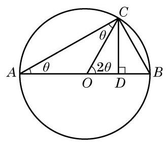

图 6-2-4

如图 6-2-4, ${AB}$ 是圆心为 $O$ 且半径为 1 的圆的一条直径,点 $C$ 为圆上一点. 连接 ${CO}$ ,并过点 $C$ 作 ${CD} \bot  {AB}$ ,记其垂足为 $D$ . 设 $\angle {CAB} = \theta$ ,则 $\angle {COB} = {2\theta }$ . 因为 ${AB}$ 为圆 $O$ 的一条直径,所以 $\angle {ACB} = {90}^{ \circ  }$ .

在直角三角形 ${ACB}$ 中,有 ${AC} = 2\cos \theta$ . 于是,在直角三角形 ${ACD}$ 中,就有 ${CD} = {AC}\sin \theta  = 2\cos \theta \sin \theta$ 及 ${OD} = {AD} - {AO} = \; {AC}\cos \theta  - 1 = 2{\cos }^{2}\theta  - 1.$

但在直角三角形 ${CDO}$ 中,有 ${CD} = \sin {2\theta },{OD} = \cos {2\theta }$ .

比较上面的式子,就得到倍角公式: $\sin {2\theta } = 2\sin \theta \cos \theta ,\cos {2\theta } = 2{\cos }^{2}\theta  - 1$ .

同学们也可思考其他一些三角变换公式的几何证明. 虽然几何方法直观, 但在上述公式的证明过程中,角的限定范围多在 ${0}^{ \circ  } \sim  {90}^{ \circ  }$ 或 ${0}^{ \circ  } \sim  {180}^{ \circ  }$ 之间. 考虑到一般性,我们在本书中借助于平面直角坐标系及单位圆来论证三角公式, 并利用代换和转化思想得到更多的三角公式.

### 6.3 解三角形

## 1 正弦定理

在初中我们已学习了直角三角形的求解问题, 但在解决实际问题时, 所遇到的三角形往往不是直角三角形. 我们将不是直角三角形的三角形统称为斜三角形. 在三角形的三个角和三条边这六个元素中, 经常会遇到已知其中三个元素 (至少一个元素为边) 求其他元素的问题, 这称为解三角形. 为此, 需要知道边和角之间的数量关系.

例如,某林场为了及时发现火情,设立了两个观测点 $A$ 和 $B$ . 某日两个观测点的林场人员都观测到 $C$ 处出现火情. 在 $A$ 处观测到火情发生在北偏西 ${40}^{ \circ  }$ 方向，而在 $B$ 处观测到火情在北偏西 60° 方向. 已知 $B$ 在 $A$ 的正东方向 ${10}\mathrm{\;{km}}$ 处 (图 6-3-1),要确定火场 $C$ 分别距 $A$ 及 $B$ 多远. 将此问题转化为数学问题: 在 $\bigtriangleup {ABC}$ 中,已知 $\angle {CAB} = {130}^{ \circ  },\angle {CBA} = {30}^{ \circ  },{AB} = {10}\mathrm{\;{km}}$ . 求 ${AC}$ 与 ${BC}$ 的长.

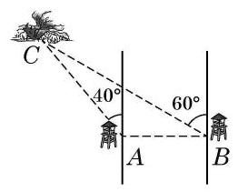

图 6-3-1

为解答这个斜三角形问题, 就要研究斜三角形中边与角之间的关系.

在 $\bigtriangleup {ABC}$ 中,无论 $A$ 为锐角、直角还是钝角,对边 ${AB}$ 上的高 $h$ ,都有 $h = b\sin A$ ,其中 $b$ 为边 ${AC}$ 的长. 为了避免分类讨论, 我们借助平面直角坐标系来统一处理.

如图 6-3-2,以 $\bigtriangleup {ABC}$ 的顶点 $A$ 为坐标原点,边 ${AB}$ 所在直线为 $x$ 轴,建立平面直角坐标系. 将角 $A\text{ 、 }B$ 及 $C$ 所对边的边长分别记作 $a\text{ 、 }b$ 及 $c$ ,则点 $B\text{ 、 }C$ 的坐标分别为 $\left( {c,0}\right)$ 及 $\left( {b\cos A, b\sin A}\right)$ ,而 $\bigtriangleup {ABC}$ 的面积 ${S}_{\bigtriangleup {ABC}} = \frac{1}{2}{AB} \cdot  h = \frac{1}{2}{bc}\sin A$ . 同理可得 ${S}_{\bigtriangleup {ABC}} = \frac{1}{2}{ac}\sin B,{S}_{\bigtriangleup {ABC}} = \frac{1}{2}{ab}\sin C$ .

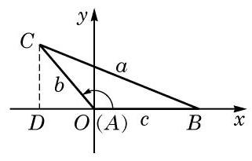

图 6-3-2

Q

---

本章以后若不特别说明,在 $\bigtriangleup {ABC}$ 中角 $A\text{ 、 }B\text{ 、 }C$ 所对边的边长都分别记作 $a$ 、 $b\text{ 、 }c$ .

---

这就是说, 三角形的面积等于任意两边与它们夹角正弦值的乘积的一半, 即三角形的面积公式为

$$
{S}_{\bigtriangleup {ABC}} = \frac{1}{2}{ab}\sin C = \frac{1}{2}{ac}\sin B = \frac{1}{2}{bc}\sin A.
$$

将上式同时除以 $\frac{1}{2}{abc}$ ,就得到

$$
\frac{\sin A}{a} = \frac{\sin B}{b} = \frac{\sin C}{c},
$$

即

$$
\frac{a}{\sin A} = \frac{b}{\sin B} = \frac{c}{\sin C}.
$$

这样,我们就得到了正弦定理: 在 $\bigtriangleup {ABC}$ 中,若角 $A\text{ 、 }B$ 及 $C$ 所对边的边长分别为 $a\text{ 、 }b$ 及 $c$ ,则有

$$
\frac{a}{\sin A} = \frac{b}{\sin B} = \frac{c}{\sin C}.
$$

---

正弦定理是“大角对大边”这一几何性质的定量刻画.

---

例 1 如图 6-3-1,在 $\bigtriangleup {ABC}$ 中,已知 $\angle {CAB} = {130}^{ \circ  }$ , $\angle {CBA} = {30}^{ \circ  },{AB} = {10}\mathrm{\;{km}}$ . 求 ${AC}$ 与 ${BC}$ 的长. (结果精确到 ${0.1}\mathrm{\;{km}}$ )

解 在 $\bigtriangleup {ABC}$ 中,由于 $C = {180}^{ \circ  } - {130}^{ \circ  } - {30}^{ \circ  } = {20}^{ \circ  }$ ,由正弦定理, 得

$$
\frac{a}{\sin {130}^{ \circ  }} = \frac{b}{\sin {30}^{ \circ  }} = \frac{10}{\sin {20}^{ \circ  }},
$$

从而

$$
a = {10} \times  \frac{\sin {130}^{ \circ  }}{\sin {20}^{ \circ  }} \approx  {22.4}\left( \mathrm{\;{km}}\right) , b = {10} \times  \frac{\sin {30}^{ \circ  }}{\sin {20}^{ \circ  }} \approx  {14.6}\left( \mathrm{\;{km}}\right) .
$$

所以， ${AC}$ 长约为 ${14.6}\mathrm{\;{km}}$ ， ${BC}$ 长约为 ${22.4}\mathrm{\;{km}}$ .

利用例 1 的结果, 在本节一开始所考虑的问题中, 就可以确定火场 $C$ 的位置.

正弦定理表明三角形的各边和它所对角的正弦的比相等. 那么, 这个比的几何意义是什么呢?

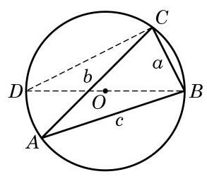

图 6-3-3

例 2 已知圆 $O$ 是 $\bigtriangleup {ABC}$ 的外接圆,其圆心为 $O$ ,直径为 ${2R}$ . 试用 $R$ 与角 $A\text{ 、 }B$ 及 $C$ 的正弦来表示三角形三边的边长 $a\text{ 、 }b$ 及 $c$ .

解 由于三角形内角和等于 ${180}^{ \circ  }$ ,因此角 $A\text{ 、 }B$ 及 $C$ 中至少有两个角是锐角,不妨设 $A$ 为锐角,如图 6-3-3 所示. 过 $B$ 作直径 ${BD}$ ,并连接 ${CD}$ . 直径 ${BD}$ 所对的圆周角 $\angle {DCB} = {90}^{ \circ  }$ , 弧 ${BC}$ 所对的圆周角 $\angle D = \angle A$ ,且 ${BD} = {2R}$ . 于是

$$
a = {BC} = {BD}\sin D = {BD}\sin A = {2R}\sin A,
$$

即 $\frac{a}{\sin A} = {2R}$ .

?

这样, 由正弦定理就得到

$$
\frac{a}{\sin A} = \frac{b}{\sin B} = \frac{c}{\sin C} = {2R}\text{ ( }R\text{ 为 } \bigtriangleup  {ABC}\text{ 的外接圆半径), }
$$

---

能否用其他方法求解例 2 ?

---

换言之

$$
a = {2R}\sin A, b = {2R}\sin B, c = {2R}\sin C.
$$

例 3 设 $R$ 是 $\bigtriangleup {ABC}$ 的外接圆的半径, $S$ 为 $\bigtriangleup {ABC}$ 的面积. 求证:

(1) $S = \frac{abc}{4R}$ ；

(2) $S = {2{R}^{2}}\sin A\sin B\sin C$ .

证明 (1) $S = \frac{1}{2}{ab}\sin C = \frac{1}{2}{ab} \cdot  \frac{c}{2R} = \frac{abc}{4R}$ .

(2) $S = \frac{1}{2}{ab}\sin C = \frac{1}{2} \cdot  {2R}\sin A \cdot  {2R}\sin B \cdot  \sin C \; = 2{R}^{2}\sin A\sin B\sin C$ .

## 练习 6.3(1)

1. 在 $\bigtriangleup {ABC}$ 中,已知 $a = 7, B = {30}^{ \circ  }, C = {85}^{ \circ  }$ . 求 $c$ . (结果精确到 0.01)

2. 在 $\bigtriangleup {ABC}$ 中,已知 $a = 5, A = {40}^{ \circ  }, B = {80}^{ \circ  }$ . 求 $b\text{ 、 }c$ 和面积 $S$ . (结果精确到 0.01)

3. 在 $\bigtriangleup {ABC}$ 中,如果 ${\sin }^{2}A + {\sin }^{2}B = {\sin }^{2}C$ ,试判断该三角形的形状.

## 2 余弦定理

正弦定理刻画了三角形中边与角的正弦之间的关系. 那么, 三角形中边与角的余弦之间存在什么关系呢?

在图 6-3-2 中, 由两点间的距离公式, 得

$$
a = \left| {BC}\right|  = \sqrt{{\left( b\cos A - c\right) }^{2} + {\left( b\sin A - 0\right) }^{2}}
$$

$$
= \sqrt{{\left( b\cos A - c\right) }^{2} + {\left( b\sin A\right) }^{2}},
$$

两边平方, 得

$$
{a}^{2} = {b}^{2}{\cos }^{2}A - {2bc}\cos A + {c}^{2} + {b}^{2}{\sin }^{2}A = {b}^{2} + {c}^{2} - {2bc}\cos A,
$$

即

$$
{a}^{2} = {b}^{2} + {c}^{2} - {2bc}\cos A.
$$

同理可得

$$
{b}^{2} = {a}^{2} + {c}^{2} - {2ac}\cos B,
$$

$$
{c}^{2} = {a}^{2} + {b}^{2} - {2ab}\cos C.
$$

这样,我们就得到了余弦定理: 在 $\bigtriangleup {ABC}$ 中,设角 $A\text{ 、 }B$ 及 $C$ 所对边的边长分别为 $a\text{ 、 }b$ 及 $c$ ,则有

$$
{a}^{2} = {b}^{2} + {c}^{2} - {2bc}\cos A,
$$

$$
{b}^{2} = {a}^{2} + {c}^{2} - {2ac}\cos B,
$$

$$
{c}^{2} = {a}^{2} + {b}^{2} - {2ab}\cos C.
$$

余弦定理也可以表示成如下形式:

$$
\cos A = \frac{{b}^{2} + {c}^{2} - {a}^{2}}{2bc},
$$

$$
\cos B = \frac{{a}^{2} + {c}^{2} - {b}^{2}}{2ac}
$$

$$
\cos C = \frac{{a}^{2} + {b}^{2} - {c}^{2}}{2ab}.
$$

将余弦定理用于直角三角形, 立即可得勾股定理. 因此, 勾股定理可视为余弦定理的特例. 正弦定理和余弦定理都定量刻画了三角形的边角关系, 是求解三角形的基本工具. 我们已在上节例 1 中应用正弦定理处理了已知两角和一边求解三角形其他元素的问题,现在再来研究其他情况.

例 4 在 $\bigtriangleup {ABC}$ 中,已知 $a = \sqrt{6}, b = \sqrt{3} + 1, C = {45}^{ \circ  }$ . 求 $c\text{ 、 }A$ 及 $B$ .

解 由余弦定理, 得

$$
{c}^{2} = {a}^{2} + {b}^{2} - {2ab}\cos C = 6 + {\left( \sqrt{3} + 1\right) }^{2} - 2\sqrt{6} \times  \left( {\sqrt{3} + 1}\right)  \times  \frac{\sqrt{2}}{2} = 4,
$$

故 $c = 2$ .

再由余弦定理,得

$$
\cos A = \frac{{b}^{2} + {c}^{2} - {a}^{2}}{2bc} = \frac{{\left( \sqrt{3} + 1\right) }^{2} + 4 - 6}{2 \times  \left( {\sqrt{3} + 1}\right)  \times  2} = \frac{1}{2}.
$$

因为角 $A$ 为三角形的内角,所以 $A = {60}^{ \circ  }$ .

由三角形内角和定理,最后可得 $B = {180}^{ \circ  } - A - C = {75}^{ \circ  }$ .

所以, $c = 2, A = {60}^{ \circ  }, B = {75}^{ \circ  }$ .

例 5 在 $\bigtriangleup {ABC}$ 中,已知 $a = 2, b = 2\sqrt{3}, A = {30}^{ \circ  }$ . 求 $B\text{ 、 }C$ 及 $c$ .

---

例 4 中,如果用正弦定理求出 $\sin A = \frac{\sqrt{3}}{2}$ , 如何判断 $A = {60}^{ \circ  }$ ?

---

解 方法一:由正弦定理，得

$$
\frac{2}{\sin {30}^{ \circ  }} = \frac{2\sqrt{3}}{\sin B},
$$

所以 $\sin B = \frac{\sqrt{3}}{2}$ ,从而 $B = {60}^{ \circ  }$ 或 $B = {180}^{ \circ  } - {60}^{ \circ  } = {120}^{ \circ  }$ .

当 $B = {60}^{ \circ  }$ 时, $C = {180}^{ \circ  } - {30}^{ \circ  } - {60}^{ \circ  } = {90}^{ \circ  }$ ,再由

$$
\frac{2}{\sin {30}^{ \circ  }} = \frac{c}{\sin {90}^{ \circ  }},
$$

得 $c = 4$ ；

当 $B = {120}^{ \circ  }$ 时, $C = {180}^{ \circ  } - {30}^{ \circ  } - {120}^{ \circ  } = {30}^{ \circ  }$ ,再由

$$
\frac{2}{\sin {30}^{ \circ  }} = \frac{c}{\sin {30}^{ \circ  }},
$$

得 $c = 2$ .

所以, $B = {60}^{ \circ  }, C = {90}^{ \circ  }, c = 4$ 或 $B = {120}^{ \circ  }, C = {30}^{ \circ  }, c = 2$ .

方法二: 由余弦定理, 得

$$
{2}^{2} = {\left( 2\sqrt{3}\right) }^{2} + {c}^{2} - 2 \times  2\sqrt{3} \times  c \times  \cos {30}^{ \circ  },
$$

即 ${c}^{2} - {6c} + 8 = 0$ ,所以 $c = 4$ 或 $c = 2$ .

当 $c = 4$ 时, $\cos B = \frac{{2}^{2} + {4}^{2} - {\left( 2\sqrt{3}\right) }^{2}}{2 \times  4 \times  2} = \frac{1}{2}$ ,所以 $B = {60}^{ \circ  }$ , 从而 $C = {180}^{ \circ  } - {30}^{ \circ  } - {60}^{ \circ  } = {90}^{ \circ  }$ ;

当 $c = 2$ 时, $\cos B = \frac{{2}^{2} + {2}^{2} - {\left( 2\sqrt{3}\right) }^{2}}{2 \times  2 \times  2} =  - \frac{1}{2}$ ,所以 $B = {120}^{ \circ  }$ , 从而 $C = {180}^{ \circ  } - {30}^{ \circ  } - {120}^{ \circ  } = {30}^{ \circ  }$ .

于是得到结论:

$$
B = {60}^{ \circ  }, C = {90}^{ \circ  }, c = 4\text{ 或 }B = {120}^{ \circ  }, C = {30}^{ \circ  }, c = 2\text{ . }
$$

例 6 在 $\bigtriangleup {ABC}$ 中,已知 $a = 4, b = 5, c = 6$ . 求角 $A$ 的余弦值和 $\bigtriangleup {ABC}$ 的面积 $S$ .

?

解 由余弦定理, 得

$$
\cos A = \frac{{b}^{2} + {c}^{2} - {a}^{2}}{2bc} = \frac{{5}^{2} + {6}^{2} - {4}^{2}}{2 \times  5 \times  6} = \frac{3}{4}.
$$

由此可得

$$
\sin A = \sqrt{1 - {\cos }^{2}A} = \sqrt{1 - {\left( \frac{3}{4}\right) }^{2}} = \frac{\sqrt{7}}{4},
$$

从而

$$
S = \frac{1}{2}{bc}\sin A = \frac{1}{2} \times  5 \times  6 \times  \frac{\sqrt{7}}{4} = \frac{15}{4}\sqrt{7}.
$$

---

将例 5 中的数据 $a = 2$ 改为 $a = 4$ ,该三角形只有一解. 对于已知三角形两边及其中一边所对角的三角形求解问题, 有兴趣的同学可以深入加以研究.

如例 5 所示, 已知三角形两边和其中一边所对的角, 解出来的三角形可能不唯一确定. 而对其他的情形，如本节例 4 、 例 6 和上节中的例 1 , 都有确定的解. 这与证明三角形全等的条件之间有联系吗?

---

## 练习 6.3(2)

1. 在 $\bigtriangleup {ABC}$ 中,已知 $a = 3, b = 4, C = {60}^{ \circ  }$ . 求 $c$ .

2. 在 $\bigtriangleup {ABC}$ 中,已知 $A = {45}^{ \circ  }, a = 2\sqrt{6}, b = 2\sqrt{3}$ . 求 $B\text{ 、 }C$ 及 $c$ .

3. 在 $\bigtriangleup {ABC}$ 中,已知三边之比为 $2 : 3 : 4$ . 求该三角形的最大角的余弦值.

例 7 在 $\bigtriangleup {ABC}$ 中,已知 ${b}^{2} + {c}^{2} - {bc} = {a}^{2}$ ,且 $\frac{b}{c} = \frac{\tan B}{\tan C}$ . 求证: $\bigtriangleup {ABC}$ 为等边三角形.

证明 记 $\bigtriangleup {ABC}$ 外接圆的半径为 $R$ ,由 $\frac{b}{c} = \frac{\tan B}{\tan C}$ ,得

$$
\frac{{2R}\sin B}{{2R}\sin C} = \frac{\sin B \cdot  \cos C}{\cos B \cdot  \sin C}\text{ ,即 }\cos B = \cos C\text{ . }
$$

又由 $B\text{ 、 }C \in  \left( {0,\pi }\right)$ ,得 $B = C$ ,从而 $b = c$ . 再由 ${b}^{2} + {c}^{2} - {bc} \; = {a}^{2}$ ,得 ${b}^{2} = {a}^{2}$ ,从而 $a = b$ .

所以， $\bigtriangleup  {ABC}$ 为等边三角形.

例 8 在 $\bigtriangleup  {ABC}$ 中，已知 $a = 5$ ， $b = 4$ ，且三角形面积 $S = 8$ . 求 $c$ .

解 由 $S = \frac{1}{2}{ab}\sin C = 8$ ,得 $\sin C = \frac{4}{5}$ ,所以

$$
\cos C =  \pm  \sqrt{1 - {\sin }^{2}C} =  \pm  \frac{3}{5}.
$$

当 $\cos C = \frac{3}{5}$ 时,

$$
{c}^{2} = {a}^{2} + {b}^{2} - {2ab}\cos C = {25} + {16} - 2 \times  5 \times  4 \times  \frac{3}{5} = {17};
$$

而当 $\cos C =  - \frac{3}{5}$ 时,

${c}^{2} = {a}^{2} + {b}^{2} - {2ab}\cos C = {25} + {16} - 2 \times  5 \times  4 \times  \left( {-\frac{3}{5}}\right)  = {65}.$

所以, $c = \sqrt{17}$ 或 $c = \sqrt{65}$ .

为了表示例 8 中的角 $C$ ,我们引入如下记号.

一般地,我们用 $\arcsin a$ 表示满足 $\sin x = a\left( {0 \leq  a \leq  1}\right)$ 的角 $x\left( {x \in  \left\lbrack  {0,\frac{\pi }{2}}\right\rbrack  }\right)$ ; 用 $\arccos a$ 表示满足 $\cos x = a\left( {0 \leq  a \leq  1}\right)$ 的角 $x \; \left( {x \in  \left\lbrack  {0,\frac{\pi }{2}}\right\rbrack  }\right)$ ; 用 $\arctan a$ 表示满足 $\tan x = a\left( {a \geq  0}\right)$ 的角 $x \; \left( {x \in  \left\lbrack  {0,\frac{\pi }{2}}\right) }\right)$ . 这样,由 $\sin \frac{\pi }{6} = \frac{1}{2}$ 就得到 $\arcsin \frac{1}{2} = \frac{\pi }{6}$ . 同理, 有 $\arccos \frac{\sqrt{2}}{2} = \frac{\pi }{4}$ 及 $\arctan \sqrt{3} = \frac{\pi }{3}$ . 因此,当例 8 中的角 $C$ 为锐角时,可以表示为 $\arcsin \frac{4}{5}$ 或 $\arccos \frac{3}{5}$ ; 而当角 $C$ 为钝角时,可以表示为 $\pi  - \arcsin \frac{4}{5}$ 或 $\pi  - \arccos \frac{3}{5}$ .

---

符号 arcsin、arccos、 arc tan 在计算器上一般分别用 ${\sin }^{-1}$ 、 ${\cos }^{-1}$ 、 ${\tan }^{-1}$ 表示.

---

例 9 根据下列条件,分别求角 $x$ :

(1)已知 $\sin x = \frac{1}{3}$ ；

(2)已知 $\cos x =  - \frac{3}{5}, x \in  \left\lbrack  {0,\pi }\right\rbrack$ ；

(3)已知 $\tan x =  - 3, x \in  \left( {\frac{\pi }{2},\frac{3\pi }{2}}\right)$ .

解(1)设锐角 $\alpha$ 满足 $\sin \alpha  = \frac{1}{3}$ ，就有 $\alpha  = \arcsin \frac{1}{3}$ . 这样， 原式等价于求解 $\sin x = \sin \alpha$ ,从而有 $x = {k\pi } + {\left( -1\right) }^{k}\alpha , k \in  \mathbf{Z}$ . 于是,满足条件的角为 $x = {k\pi } + {\left( -1\right) }^{k}\arcsin \frac{1}{3}, k \in  \mathbf{Z}$ .

(2)设锐角 $\alpha$ 满足 $\cos \alpha  = \frac{3}{5}$ ，就有 $\alpha  = \arccos \frac{3}{5}$ . 因为 $\cos \left( {\pi  - \alpha }\right)  =  - \cos \alpha  =  - \frac{3}{5}$ ,所以原式等价于求解 $\cos x = \; \cos \left( {\pi  - \alpha }\right)$ ,从而有 $x = {2k\pi } \pm  \left( {\pi  - \arccos \frac{3}{5}}\right) , k \in  \mathbf{Z}$ .

又因为 $x \in  \left\lbrack  {0,\pi }\right\rbrack$ ,所以 $x = \pi  - \arccos \frac{3}{5}$ .

(3)设锐角 $\alpha$ 满足 $\tan \alpha  = 3$ ，就有 $\alpha  = \arctan 3$ . 因为 $\tan \left( {-\alpha }\right) \; =  - \tan \alpha  =  - 3$ ,所以原式等价于求解 $\tan x = \tan \left( {-\alpha }\right)$ ,从而有 $x = {k\pi } + \left( {-\arctan 3}\right) , k \in  \mathbf{Z}.$

又因为 $x \in  \left( {\frac{\pi }{2},\frac{3\pi }{2}}\right)$ ,所以 $x = \pi  - \arctan 3$ .

## 练习 6.3(3)

1. 在 $\bigtriangleup {ABC}$ 中,已知 $a = 4, B = {60}^{ \circ  }$ ,其面积为 $5\sqrt{3}$ . 求 $b$ .

2. 证明: 平行四边形中, 四边平方和等于对角线平方和.

3. 在 $\bigtriangleup {ABC}$ 中,求证:

(1) $\frac{{a}^{2} + {b}^{2}}{{c}^{2}} = \frac{{\sin }^{2}A + {\sin }^{2}B}{{\sin }^{2}C}$ ;

(2) ${a}^{2} + {b}^{2} + {c}^{2} = 2\left( {{bc}\cos A + {ac}\cos B + {ab}\cos C}\right)$ .

4. 分别求满足下列条件的角.

(1) $\sin x = \frac{3}{5}, x \in  \left\lbrack  {-\frac{\pi }{2},\frac{\pi }{2}}\right\rbrack$ ; (2) $\cos x =  - \frac{2}{3}, x \in  \left\lbrack  {0,\pi }\right\rbrack$ ;

(3) $\tan x =  - 2, x \in  \left( {-\frac{\pi }{2},\frac{\pi }{2}}\right)$ ; (4) $\sin x =  - \frac{2}{3}, x \in  \mathbf{R}$ .

解三角形在实际生活中, 尤其是在测量方面, 有着广泛的应用. 下面通过一些实例来体会解三角形在测量上的应用.

例 10 金茂大厦是改革开放以来上海出现的超高层标志性建筑. 有一位测量爱好者在与金茂大厦底部同一水平线上的 $B$ 处测得金茂大厦顶部 $A$ 的仰角为 ${15.66}^{ \circ  }$ ,再向金茂大厦前进 ${500}\mathrm{\;m}$ 到达 $C$ 处,测得金茂大厦顶部 $A$ 的仰角为 ${22.81}^{ \circ  }$ . 请根据以上数据估算出金茂大厦的高度. (结果精确到 $1\mathrm{\;m}$ )

解 根据题意, 作出如图 6-3-4 所示的示意图, 问题转化为求直角三角形 ${ABD}$ 中边 ${AD}$ 的长.

在 $\bigtriangleup {ABC}$ 中, $\angle {ABC} = {15.66}^{ \circ  },\angle {BAC} = {22.81}^{ \circ  } - {15.66}^{ \circ  } = \; {7.15}^{ \circ  },{BC} = {500}\mathrm{\;m}$ .

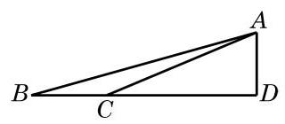

图 6-3-4

由正弦定理,有 $\frac{500}{\sin {7.15}^{ \circ  }} = \frac{AC}{\sin {15.66}^{ \circ  }}$ ,即

$$
{AC} = \frac{{500}\sin {15.66}^{ \circ  }}{\sin {7.15}^{ \circ  }} \approx  {1084.3}\left( \mathrm{\;m}\right) .
$$

从而 ${AD} = {AC} \times  \sin {22.81}^{ \circ  } \approx  {420}\left( \mathrm{\;m}\right)$ .

所以，所估算的金茂大厦高度约为 ${420}\mathrm{\;m}$ .

例 11 甲船在距离 $A$ 港口 24 海里并在南偏西 ${20}^{ \circ  }$ 方向的 $C$ 处驻留等候进港，乙船在 $A$ 港口南偏东 ${40}^{ \circ  }$ 方向的 $B$ 处沿直线行驶入港，甲、乙两船距离为 31 海里. 当乙船行驶 20 海里到达 $D$ 处时,接到港口指令,前往救援忽然发生火灾的甲船. 求此时甲、乙两船之间的距离.

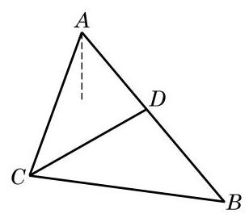

图 6-3-5

解 根据题意, 作出如图 6-3-5 所示的示意图, 其中

$$
{AC} = {24},{BC} = {31},\angle {CAD} = {20}^{ \circ  } + {40}^{ \circ  } = {60}^{ \circ  }.
$$

在 $\bigtriangleup {ABC}$ 中,由正弦定理,得 $\frac{24}{\sin \angle {ABC}} = \frac{31}{\sin {60}^{ \circ  }}$ ,从而 $\sin \angle {ABC} = \frac{{12}\sqrt{3}}{31}.$

由 ${AC} < {BC}$ ,知 $\angle {ABC}$ 为锐角,故

$$
\cos \angle {ABC} = \sqrt{1 - {\sin }^{2}\angle {ABC}} = \frac{23}{31}.
$$

在 $\bigtriangleup {BCD}$ 中,由余弦定理,有

$$
{CD} = \sqrt{B{C}^{2} + B{D}^{2} - {2BD} \cdot  {BC} \cdot  \cos \angle {ABC}}
$$

$$
= \sqrt{{31}^{2} + {20}^{2} - 2 \times  {31} \times  {20} \times  \frac{23}{31}}
$$

$$
= {21}\text{ (海里). }
$$

所以, 此时甲、乙两船之间的距离为 21 海里.

## 练习 6.3(4)

1. 某货轮在 $A$ 处看灯塔 $S$ 在北偏东 ${30}^{ \circ  }$ 方向. 它以每小时 18 海里的速度向正北方向航行，经过 40 分钟航行到 $B$ 处，看灯塔 $S$ 在北偏东 ${75}^{ \circ  }$ 方向. 求此时货轮到灯塔 $S$ 的距离.

2. 我缉私船发现位于正北方向的走私船以每小时 30 海里的速度向北偏东 ${45}^{ \circ  }$ 方向的公海逃窜，已知缉私船的最大时速是 45 海里，为了及时截住走私船，缉私船应以什么方向追击走私船? (结果精确到 ${0.01}^{ \circ  }$ )

3. 修建铁路时要在一个山体上开挖一隧道, 需要测量隧道口 $D\text{ 、 }E$ 之间的距离. 测量人员在山的一侧选取点 $C$ ,因有障碍物, 无法直接测得 ${CE}$ 及 ${DE}$ 的距离. 现测得 ${CA} = {482.80}\mathrm{\;m},{CB} = \; {631.50}\mathrm{\;m},\angle {ACB} = {56.3}^{ \circ  }$ ; 又测得 $A$ 及 $B$ 两点到隧道口的距离分别是 ${80.13}\mathrm{\;m}$ 及 ${40.24}\mathrm{\;m}\left( {A\text{ 、 }D\text{ 、 }E\text{ 、 }B}\right.$ 在同一直线上 $)$ . 求隧道 ${DE}$ 的长. (结果精确到 $1\mathrm{\;m}$ )

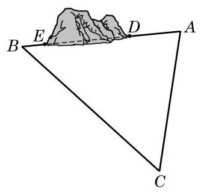

(第 3 题)

## 习题 6.3

## A 组

1. 在 $\bigtriangleup {ABC}$ 中,已知 $A = {120}^{ \circ  }, B = {45}^{ \circ  },{AC} = 2$ . 求 ${BC}$ .

2. 在 $\bigtriangleup {ABC}$ 中,已知 $b = {40}, c = {32}, A = {60}^{ \circ  }$ . 求 $a$ .

3. 在 $\bigtriangleup {ABC}$ 中,若 $a = 7, b = 8,\cos C = \frac{13}{14}$ . 求最大角的余弦值.

4. 已知 $\bigtriangleup {ABC}$ 的面积为 $3, a = 3, b = 2\sqrt{2}$ . 求 $c$ .

5. 在 $\bigtriangleup {ABC}$ 中,已知 $b = 2, c = \sqrt{2}, B = {45}^{ \circ  }$ . 求 $C\text{ 、 }a$ 及 $A$ .

6. 在 $\bigtriangleup {ABC}$ 中,若 $c = 2, C = \frac{\pi }{3}$ ,且其面积为 $\sqrt{3}$ ,求 $a$ 及 $b$ .

7. 在 $\bigtriangleup {ABC}$ 中,已知 ${AD}$ 是 $\angle {BAC}$ 的内角平分线. 求证: $\frac{AB}{AC} = \frac{BD}{DC}$ .

8. 在 $\bigtriangleup {ABC}$ 中,已知 ${AB} = \sqrt{3},{BC} = 3,{AC} = 4$ . 求边 ${AC}$ 上的中线 ${BD}$ 的长.

9. 根据下列条件,分别判断三角形 ${ABC}$ 的形状:

(1) $a = {2b}\cos C$ ；

(2) $\tan B = \frac{\cos \left( {B - C}\right) }{\sin A - \sin \left( {B - C}\right) }$ .

10. 如图,自动卸货汽车采用液压机构,设计时需要计算油泵顶杆 ${BC}$ 的长度. 已知车厢的最大仰角为 ${60}^{ \circ  }$ ,油泵顶点 $B$ 与车厢支点 $A$ 之间的距离为 ${1.95}\mathrm{\;m},{AB}$ 与水平线之间的夹角为 ${6}^{ \circ  }{20}^{\prime },{AC}$ 的长为 ${1.4}\mathrm{\;m}$ . 计算 ${BC}$ 的长. (结果精确到 ${0.01}\mathrm{\;m}$ )

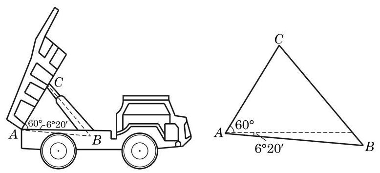

(第 10 题)

## B 组

1. 在 $\bigtriangleup {ABC}$ 中,若 $\sqrt{3}a = {2b}\sin A$ ,求 $B$ .

2. 已知 $\bigtriangleup {ABC}$ 的面积 $S = \frac{{b}^{2} + {c}^{2} - {a}^{2}}{4}$ ,求 $A$ .

3. 在 $\bigtriangleup {ABC}$ 中,已知 $a = {13}, b = {14}, c = {15}$ .

(1)求 $\cos A$ ；

(2)求 $\bigtriangleup  {ABC}$ 的面积 $S$ .

4. 已知三角形两边之和为 8，其夹角为 ${60}^{ \circ  }$ . 分别求这个三角形周长的最小值和面积的最大值, 并指出面积最大时三角形的形状.

5. 求分别满足下列条件的角:

(1) $\sin x = \frac{2}{5}, x \in  \left\lbrack  {0,\pi }\right\rbrack$ ; (2) $\cos x =  - \frac{2}{3}, x \in  \left\lbrack  {0,{2\pi }}\right\rbrack$ ；

(3) $\tan x =  - \frac{1}{2}, x \in  \mathbf{R}$ .

6. 在 $\bigtriangleup {ABC}$ 中, $A = {60}^{ \circ  }, b = 1$ ,且其面积为 $\sqrt{3}$ . 求 $a$ .

7. 某船在海面 $A$ 处测得灯塔 $C$ 在北偏东 ${30}^{ \circ  }$ 方向，与 $A$ 相距 ${10}\sqrt{3}$ 海里，且测得灯塔 $B$ 在北偏西 ${75}^{ \circ  }$ 方向,与 $A$ 相距 ${15}\sqrt{6}$ 海里. 船由 $A$ 向正北方向航行到 $D$ 处,测得灯塔 $B$ 在南偏西 ${60}^{ \circ  }$ 方向. 这时灯塔 $C$ 与 $D$ 相距多少海里? $C$ 在 $D$ 的什么方向?

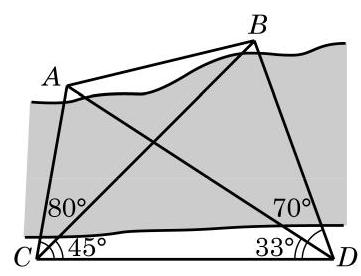

(第 8 题)

8. 如图,为了测定对岸 $A\text{ 、 }B$ 两点之间的距离,在河的一岸定一条基线 ${CD}$ ,测得 ${CD} = {100}\mathrm{\;m},\angle {ACD} = {80}^{ \circ  },\angle {BCD} = \; {45}^{ \circ  },\angle {BDC} = {70}^{ \circ  },\angle {ADC} = {33}^{ \circ  }$ . 求 $A\text{ 、 }B$ 间的距离. (结果精确到 ${0.01}\mathrm{\;m}$ )

9. 在 $\bigtriangleup {ABC}$ 中,求证:

(1) $\frac{\cos {2A}}{{a}^{2}} - \frac{\cos {2B}}{{b}^{2}} = \frac{1}{{a}^{2}} - \frac{1}{{b}^{2}}$ ;

(2) $\left( {{a}^{2} - {b}^{2} - {c}^{2}}\right) \tan A + \left( {{a}^{2} - {b}^{2} + {c}^{2}}\right) \tan B = 0$ .

## 探究与实践

## 海伦公式和“三斜求积”公式

已知三角形三边边长求三角形面积的问题, 据说最早是由古希腊数学家阿基米德 (Archimedes)解决的,计算公式为 $S = \sqrt{p\left( {p - a}\right) \left( {p - b}\right) \left( {p - c}\right) }$ (其中 $p = \frac{a + b + c}{2}$ ). 但这个公式通常称为海伦公式, 因为人们最早见到这个公式出现在海伦 (Heron) 的著作《测地术》中，并在海伦的著作《经纬仪》等书中都给出了证明.

我国南宋著名数学家秦九韶也独立发现了与海伦公式等价的公式, 但其证明已经失传. 他在著作《数书九章》卷五“田域类”里指出 “问有沙田一段，有三斜. 其小斜十三里, 中斜十四里，大斜十五里，里法三百步，其田几何”，给出的解法为 “以小斜幂并大斜幂减中斜幂，余半之自乘于上，以小斜幂乘大斜幂减上，余四约之，为实. 一为从隅，开平方得积”. 即是说,记三百步为一里,以里为单位, $a = {13}, b = {14}, c = {15}$ ,面积可由公式 $S = \sqrt{\frac{1}{4}\left\lbrack  {{a}^{2}{c}^{2} - {\left( \frac{{a}^{2} + {c}^{2} - {b}^{2}}{2}\right) }^{2}}\right\rbrack  }$ 得出,这就是著名的 “三斜求积” 公式. 秦九韶还对一次同余式组、高次方程的数值解法、线性方程组等都有深入研究, 因此美国科学史家萨顿 (G. Sarton)评价他为“他那个民族，那个时代，并且确实也是所有时代最伟大的数学家之一”.

利用三角形面积公式和余弦定理证明海伦公式和“三斜求积”公式虽有一定难度，但揭示海伦公式和“三斜求积”公式的等价性并不是太困难，希望同学们加以探究.

## 课后阅读

## 三角学发展简史

平面三角形的正弦定理是直角三角形边角关系的推广, 余弦定理是勾股定理的推广. 早在我国商代与古希腊时期就已发现了勾股定理(又称毕达哥拉斯定理)，但平面三角的正弦定理与余弦定理却出现得很晚. 在古希腊, 三角学的起源、发展与天文学密不可分, 人们需要使用三角知识来建立定量的天文学，通过测量天体的运动路线和位置用于报时、航海、历法推算和地理研究等, 因此对球面三角的研究比平面三角更早、更深入. 对于平面测量问题, 古希腊人认为利用平面几何知识已经足够.

公元 9 世纪左右，阿拉伯天文学家阿尔·巴塔尼(Al-Battani)以习题形式给出了平面上的余弦定理. 15 世纪，阿尔·卡西(Al-Kashi)给出了余弦定理的下述形式: ${a}^{2} = {\left( b - c\cos A\right) }^{2} + {c}^{2}{\sin }^{2}A$ . 现在所见到的余弦定理是由 16 世纪法国数学家韦达首次给出的. 著名天文学家阿尔·比鲁尼 (Al-Biruni) 给出了平面三角形的正弦定理, 并给予了证明.

1450 年前的三角学主要是球面三角, 而大地上的测量学还是采用几何方法. 最早将三角学从天文学中独立出来的代表人物是德国数学家约翰·穆勒(J. Müller), 其笔名雷格蒙塔努斯(J. Regiomontanus)更广为人知. 他在 1464 年完成了 5 卷本《论各种三角形》. 这部著作首次对三角学作出了系统性阐述，将平面三角、球面几何和球面三角中有关的知识综合起来, 建立了现代三角学的雏形. 法国数学家韦达将平面和球面三角进一步系统化并加以发展. 正是由于众多数学家的努力, 16 世纪三角学从天文学中分离出来, 成为数学的一个独立分支.

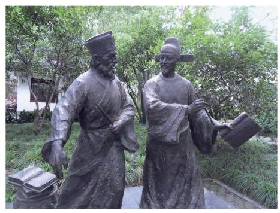

徐光启(1562—1633)，明末科学家，字子先，上海人. 曾译拉丁文 sinus 为 “正弦”，这是现在我们所用 “正弦”这一术语的由来. 徐光启等人还编写了《测量法义》和 《测量异同》. 在这些著作中, 不仅有我们熟悉的正弦定理, 还比较系统地给出了直角三角形和斜三角形的解法. 徐光启将西方的三角知识传播到了中国，并与意大利人利玛窦(M. Ricci)合作翻译了《几何原本》的前 6 卷，被称为中国近代科学的先驱.

## 内容提要

1. 正弦、余弦、正切、余切

弧度制:弧长等于半径的弧所对的圆心角叫做 1 弧度的角. 用“弧度”作为单位来度量角的单位制称为弧度制.

扇形弧长与面积:记扇形的半径为 $r$ ，圆心角为 $\alpha$ 弧度，弧长为 $l$ ，面积为 $S$ ，则有

$$
l = {\alpha r}, S = \frac{1}{2}\alpha {r}^{2}.
$$

单位圆:单位圆泛指半径为 1 个单位的圆. 本章中，在平面直角坐标系中，特指出以原点为圆心、以 1 为半径的圆为单位圆.

正弦、余弦、正切及余切的定义:在平面直角坐标系中，将角 $\alpha$ 的顶点与坐标原点 $O$ 重合，始边与 $x$ 轴的正半轴重合，在角 $\alpha$ 的终边上任取异于原点的一点 $P\left( {x, y}\right)$ ，就有

$$
\sin \alpha  = \frac{y}{r},\cos \alpha  = \frac{x}{r},\tan \alpha  = \frac{y}{x}\left( {x \neq  0}\right) ,\cot \alpha  = \frac{x}{y}\left( {y \neq  0}\right) .
$$

同角三角公式:

$$
{\sin }^{2}\alpha  + {\cos }^{2}\alpha  = 1,\tan \alpha  = \frac{\sin \alpha }{\cos \alpha },\cot \alpha  = \frac{\cos \alpha }{\sin \alpha },\tan \alpha  \cdot  \cot \alpha  = 1.
$$

诱导公式: ${2k\pi } + \alpha \left( {k \in  \mathbf{Z}}\right)$ ， $- \alpha$ ， $\pi  \pm  \alpha$ ， $\frac{\pi }{2} \pm  \alpha$ 的诱导公式，其规律为口诀:奇变偶不变，符号看象限。

2. 常用三角公式

和角与差角公式:

$$
\sin \left( {\alpha  \pm  \beta }\right)  = \sin \alpha \cos \beta  \pm  \cos \alpha \sin \beta ,
$$

$$
\cos \left( {\alpha  \pm  \beta }\right)  = \cos \alpha \cos \beta  \mp  \sin \alpha \sin \beta ,
$$

$$
\tan \left( {\alpha  \pm  \beta }\right)  = \frac{\tan \alpha  \pm  \tan \beta }{1 \mp  \tan \alpha \tan \beta }.
$$

倍角公式:

$\sin {2\alpha } = 2\sin \alpha \cos \alpha ,\cos {2\alpha } = {\cos }^{2}\alpha  - {\sin }^{2}\alpha  = 2{\cos }^{2}\alpha  - 1 = 1 - 2{\sin }^{2}\alpha ,\tan {2\alpha } = \frac{2\tan \alpha }{1 - {\tan }^{2}\alpha }$ .

3. 解三角形

正弦定理: $\frac{a}{\sin A} = \frac{b}{\sin B} = \frac{c}{\sin C}$ .

余弦定理:

${a}^{2} = {b}^{2} + {c}^{2} - {2bc}\cos A,{b}^{2} = {a}^{2} + {c}^{2} - {2ac}\cos B,{c}^{2} = {a}^{2} + {b}^{2} - {2ab}\cos C$ .

三角形面积公式: ${S}_{\bigtriangleup {ABC}} = \frac{1}{2}{ab}\sin C = \frac{1}{2}{ac}\sin B = \frac{1}{2}{bc}\sin A$ .

## 复习题

A 组

1. 选择题:

(1)与 $\sin \left( {\theta  - \frac{\pi }{2}}\right)$ 一定相等的是 ( )

A. $\sin \left( {\frac{3\pi }{2} - \theta }\right)$ ; B. $\cos \left( {\theta  - \frac{\pi }{2}}\right)$ ;

C. $\cos \left( {{2\pi } - \theta }\right)$ ; D. $\sin \left( {\theta  + \frac{\pi }{2}}\right)$ .

( 2 )当 $0 < \alpha  < \frac{\pi }{4}$ 时，化简 $\sqrt{1 - \sin {2\alpha }}$ 的结果是 ( )

A. $\cos \alpha$ ; B. $\sin \alpha  - \cos \alpha$ ;

C. $\cos \alpha  - \sin \alpha$ ; D. $\sin \alpha  + \cos \alpha$ .

2. 填空题:

(1)若 $\theta$ 为锐角,则 ${\log }_{\sin \theta }\left( {1 + {\cot }^{2}\theta }\right)  =$ ___；

(2)若 $- \frac{\pi }{2} < \alpha  < 0$ ，则点 $\left( {\cot \alpha ,\cos \alpha }\right)$ 必在第___象限；

(3)若 $\sin \left( {\pi  - \alpha }\right)  = \frac{2}{3},\alpha  \in  \left( {\frac{\pi }{2},\pi }\right)$ ，则 $\sin {2\alpha } =$ ___.

3. 已知圆 $O$ 上的一段圆弧长等于该圆的内接正方形的边长,求这段圆弧所对的圆心角的弧度.

4. 已知角 $\alpha$ 的终边经过点 $P\left( {{3a},{4a}}\right) \left( {a \neq  0}\right)$ ,求 $\sin \alpha \text{ 、 }\cos \alpha$ 和 $\tan \alpha$ .

5. 化简:

(1) $\frac{\sin \left( {\theta  - {5\pi }}\right) }{\tan \left( {{3\pi } - \theta }\right) } \cdot  \frac{\cot \left( {\frac{\pi }{2} - \theta }\right) }{\tan \left( {\theta  - \frac{3\pi }{2}}\right) } \cdot  \frac{\cos \left( {{8\pi } - \theta }\right) }{\sin \left( {-\theta  - {4\pi }}\right) }$ ;

(2) $\sin \left( {\theta  - \frac{\pi }{4}}\right)  + \cos \left( {\theta  + \frac{\pi }{4}}\right)$ .

6. 已知 $\tan \alpha  = 3$ ,求 $\frac{1}{{\sin }^{2}\alpha  + 2\sin \alpha \cos \alpha }$ 的值.

7. 在 $\bigtriangleup {ABC}$ 中,已知 $a = 5, b = 4, A = {2B}$ . 求 $\cos B$ .

8. 已知 $\bigtriangleup {ABC}$ 的面积为 $S$ ,求证:

(1) $S = \frac{{a}^{2}\sin B\sin C}{2\sin \left( {B + C}\right) }$ ； (2) $S = \frac{{a}^{2}}{2\left( {\cot B + \cot C}\right) }$ .

9. ( 1 )已知 $\sin \alpha  = \frac{\sqrt{5}}{5},\sin \beta  = \frac{\sqrt{10}}{10}$ ，且 $\alpha$ 及 $\beta$ 都是锐角. 求 $\alpha  + \beta$ 的值；

(2)在 $\bigtriangleup  {ABC}$ 中，已知 $\tan A$ 与 $\tan B$ 是方程 ${x}^{2} - {6x} + 7 = 0$ 的两个根，求 $\tan C$ .

10. 证明: ${\left( \sin \alpha  + \sin \beta \right) }^{2} + {\left( \cos \alpha  + \cos \beta \right) }^{2} = 4{\cos }^{2}\frac{\alpha  - \beta }{2}$ .

B 组

1. 选择题:

(1)若 $0 < x < \frac{\pi }{4}$ ，且 $\lg \left( {\sin x + \cos x}\right)  = \frac{1}{2}\left( {3\lg 2 - \lg 5}\right)$ ，则 $\cos x - \sin x$ 的值为( )

A. $\frac{\sqrt{6}}{3}$ ; B. $\frac{\sqrt{3}}{2}$ ; C. $\frac{\sqrt{10}}{5}$ ; D. $\frac{\sqrt{5}}{4}$ .

(2)下列命题中，真命题为 ( )

A. 若点 $P\left( {a,{2a}}\right) \left( {a \neq  0}\right)$ 为角 $\alpha$ 的终边上一点,则 $\sin \alpha  = \frac{2\sqrt{5}}{5}$ ;

B. 同时满足 $\sin \alpha  = \frac{1}{2},\cos \alpha  = \frac{\sqrt{3}}{2}$ 的角 $\alpha$ 有且只有一个;

C. 如果角 $\alpha$ 满足 $- {3\pi } < \alpha  <  - \frac{5}{2}\pi$ ,那么角 $\alpha$ 是第二象限的角;

D. $\tan x =  - \sqrt{3}$ 的解集为 $\left\{  {x\left| {\;x = {k\pi } - \frac{\pi }{3}}\right. , k \in  \mathbf{Z}}\right\}$ .

2. 填空题:

(1)在 $\bigtriangleup  {ABC}$ 中，若 ${a}^{2} + {b}^{2} + {ab} = {c}^{2}$ ，则 $C =$ ___；

(2)若 $\sin \theta  = a,\cos \theta  =  - {2a}$ ，且 $\theta$ 为第四象限的角，则实数 $a =$ ___.

3. 已知 $\sin \alpha  = a\sin \beta , b\cos \alpha  = a\cos \beta$ ,且 $\alpha$ 及 $\beta$ 均为锐角,求证: $\cos \alpha  = \sqrt{\frac{{a}^{2} - 1}{{b}^{2} - 1}}$ .

4. 已知 $0 < \alpha  < \frac{\pi }{2} < \beta  < \pi$ ,且 $\cos \beta  =  - \frac{1}{3},\sin \left( {\alpha  + \beta }\right)  = \frac{7}{9}$ ,求 $\sin \alpha$ 的值.

5. 已知 $\pi  < \alpha  < \frac{3\pi }{2},\pi  < \beta  < \frac{3\pi }{2}$ ,且 $\sin \alpha  =  - \frac{\sqrt{5}}{5},\cos \beta  =  - \frac{\sqrt{10}}{10}$ . 求 $\alpha  - \beta$ 的值.

6. 已知 $\left( {1 + \tan \alpha }\right) \left( {1 + \tan \beta }\right)  = 2$ ,且 $\alpha$ 及 $\beta$ 都是锐角. 求证: $\alpha  + \beta  = \frac{\pi }{4}$ .

7. 已知 $\alpha$ 是第二象限的角,且 $\sin \alpha  = \frac{\sqrt{15}}{4}$ . 求 $\frac{\sin \left( {\alpha  + \frac{\pi }{4}}\right) }{1 + \sin {2\alpha } + \cos {2\alpha }}$ 的值.

8. 证明:

(1) $\frac{2\left( {1 + \sin {2\alpha }}\right) }{1 + \sin {2\alpha } + \cos {2\alpha }} = 1 + \tan \alpha$ ; (2) $2\sin \alpha  + \sin {2\alpha } = \frac{2{\sin }^{3}\alpha }{1 - \cos \alpha }$ .

9. 根据下列条件,分别判断三角形 ${ABC}$ 的形状:

(1) $\sin C + \sin \left( {B - A}\right)  = \sin {2A}$ ;

(2) $\frac{\tan A}{\tan B} = \frac{{a}^{2}}{{b}^{2}}$ .

10. 在 $\bigtriangleup {ABC}$ 中,求证: $\tan \frac{A}{2}\tan \frac{B}{2} + \tan \frac{B}{2}\tan \frac{C}{2} + \tan \frac{C}{2}\tan \frac{A}{2} = 1$ .

## 拓展与思考

1.(1)完成下表 $\left( \theta \right.$ 为弧度数):

<table><tr><td>$\theta$</td><td>1</td><td>0.5</td><td>0.1</td><td>0.01</td><td>0.001</td></tr><tr><td>$\sin \theta$</td><td></td><td></td><td></td><td></td><td></td></tr><tr><td>$\frac{\sin \theta }{\theta }$</td><td></td><td></td><td></td><td></td><td></td></tr></table>

(2)观察上表中的数据，你能发现什么规律？

(3)已知 $0 < \theta  < \frac{\pi }{2}$ ，利用图形面积公式证明 $\sin \theta  < \theta  < \tan \theta$ ，并应用该公式说明(2) 中猜想的合理性.

2. 在 $\bigtriangleup {ABC}$ 中,已知 $A = {30}^{ \circ  }, b = {18}$ . 分别根据下列条件求 $B$ :

(1)① $a = 6$ ，② $a = 9$ ，③ $a = {13}$ ，④ $a = {18}$ ，⑤ $a = {22}$ ；

(2)根据上述计算结果，讨论使 $B$ 有一解、两解或无解时 $a$ 的取值情况.

3.(1)根据 $\cos {54}^{ \circ  } = \sin {36}^{ \circ  }$ 和三倍角公式，求 $\sin {18}^{ \circ  }$ 的值；

(2)你还能使用其他方法求 $\sin {18}^{ \circ  }$ 的值吗？若能，请给出你的求法.

4. 如图,要在 $A$ 和 $D$ 两地之间修建一条笔直的隧道,现在从 $B$ 地和 $C$ 地测量得到: $\angle {DBC} = {24.2}^{ \circ  },\angle {DCB} = {35.4}^{ \circ  },\angle {DBA} = {31.6}^{ \circ  }$ , $\angle {DCA} = {17.5}^{ \circ  }$ . 试求 $\angle {DAB}$ 以确定隧道 ${AD}$ 的方向. (结果精确到 0.1°)

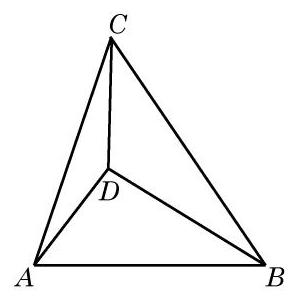

(第 4 题)