平面向量

在现实世界和科学问题中，常常会见到既有大小又有方向的量, 如位移、速度、力等. 数学中的“向量”概念就是从中抽象出来的. 向量不仅有丰富的几何内涵，向量及其线性运算与数量积运算还构成了精致且有广泛应用的代数结构, 可把有关的几何问题简便地转化为相应代数问题来处理. 本章只讨论平面上的向量, 选择性必修课程第 3 章还将把这一讨论推广到 (三维)空间中，至于更一般性的推广则是大学线性代数课程的核心内容.

高中阶段向量的学习重在为解决代数、几何、三角及物理等领域中的问题提供一个简捷有效的工具.

### 8.1 向量的概念和线性运算

1 向量的概念

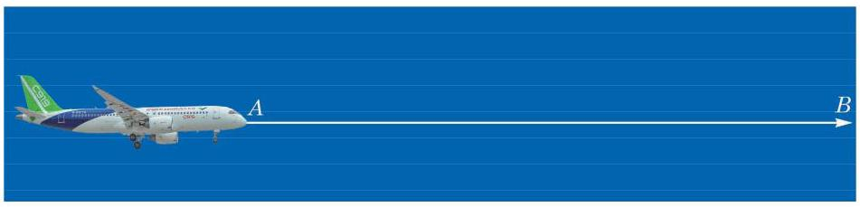

图 8-1-1

图 8-1-1 展示了国产大飞机 C919 在蓝天翱翔的雄姿. 飞机从 $A$ 飞行到 $B$ . 它的位移是一个既有大小又有方向的量,它的大小是 $A\text{ 、 }B$ 间的距离,方向由 $A$ 到 $B$ .

像“一点相对于另一点的位移”这种既有大小又有方向的量叫做向量 (vector). 准确地说, 一个向量由两个要素定义, 一是它的大小(一个非负实数)，一是它的方向.

在研究向量的性质并定义与向量相关的各种运算时, 常常把向量用有向线段 (directed line-segment, 即指定了方向的线段) 表示出来, 线段的长度就是向量的大小, 线段的方向表示向量的方向. 我们也直接把表示向量的有向线段称作向量, 有向线段的起点称为向量的起点，有向线段的终点称为向量的终点. 本章只研究在一个平面上的向量, 就是要求所涉及的所有向量都能用同一个平面上的有向线段表示出来.

向量通常用上方加箭头的小写字母表示，如 $\overrightarrow{a}$ ，读作向量 $a$ . 向量也可以用上方加箭头的两个大写字母表示，如 $\overrightarrow{AB}$ ，读作向量 ${AB}$ ,其中 $A$ 是向量的起点， $B$ 是向量的终点.

Q

在讨论向量时，仅仅有数值(可以是任何实数)而没有方向的量称为数量 (scalar), 又称为 “标量”.

除了位移，向量还有很多现实的原型. 例如，“力”就是一个典型的例子.

图 8-1-2 是由若干个单位正方形组成的网格, $\overrightarrow{GH}$ 表示大小为 2 个单位、方向由 $G$ 到 $H$ 的向量; $\overrightarrow{MN}$ 表示大小为 $\sqrt{5}$ 个单位、 方向由 $M$ 到 $N$ 的向量.

---

“向量”又称为“矢量”, 在物理学中较常使用.

物理学中所研究的力有大小、方向和作用点三要素，我们研究的向量舍弃了作用点这一要素, 这种向量叫做自由向量.

---

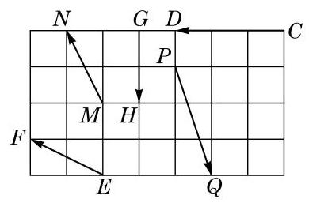

图 8-1-2

---

请同学们描述图 8-1-2 中向量 $\overrightarrow{CD}$ 、 $\overrightarrow{EF}\text{ 、 }\overrightarrow{PQ}$ 的大小与方向.

---

向量 $\overrightarrow{a}$ 的大小叫做 $\overrightarrow{a}$ 的模 (modulus)，记作 $\left| \overrightarrow{a}\right|$ . 模为 1 的向量叫做单位向量(unit vector).

规定模为 0 的向量叫做零向量(zero vector),记作 $\overrightarrow{0}$ ,可认为它具有任意方向.

如果两个非零向量所在的直线平行或者重合, 那么称这两个向量平行. 我们用记号 $\overrightarrow{a}//\overrightarrow{b}$ 表示向量 $\overrightarrow{a}$ 与 $\overrightarrow{b}$ 平行.

如果两个向量同方向且具有相同的模, 根据向量的定义, 它们就是同一个向量, 不过我们常常只说它们是相等的向量. 特别地, 一个向量平移后得到的向量与原来的向量相等. 例如, 图 8-1-3 中,向量 $\overrightarrow{MN}$ 是向量 $\overrightarrow{AB}$ 经过平移后得到的,所以 $\overrightarrow{MN} = \overrightarrow{AB}$ .

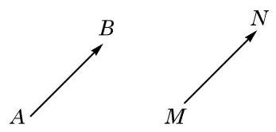

图 8-1-3

由于约定了零向量具有任意方向, 因此它平行于任意向量. 这样, 根据向量相等的定义, 零向量都是相等的.

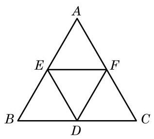

图 8-1-4

例 1 如图 8-1-4,在等边三角形 ${ABC}$ 中, $D\text{ 、 }E\text{ 、 }F$ 分别是边 ${BC}\text{ 、 }{AB}\text{ 、 }{AC}$ 的中点. 写出图中与向量 $\overrightarrow{EF}$ 平行和相等的向量.

解 根据向量平行与相等的定义,可知图中与 $\overrightarrow{EF}$ 平行的向量有 $\overrightarrow{FE}\text{ 、 }\overrightarrow{BD}\text{ 、 }\overrightarrow{DB}\text{ 、 }\overrightarrow{CD}\text{ 、 }\overrightarrow{DC}\text{ 、 }\overrightarrow{BC}$ 和 $\overrightarrow{CB}$ ,而与 $\overrightarrow{EF}$ 相等的向量有 $\overrightarrow{BD}$ 和 $\overrightarrow{DC}$ .

---

请在图 8-1-4 中找出与 $\overrightarrow{AE}$ 相等的向量.

---

如果一对平行向量 $\overrightarrow{a}$ 与 $\overrightarrow{b}$ 具有相等的模但方向相反,那么称它们互为负向量,或者称 $\overrightarrow{b}$ 为 $\overrightarrow{a}$ 的负向量,记作 $\overrightarrow{b} =  - \overrightarrow{a}$ . 图 8-1-4中的向量 $\overrightarrow{DB}$ 与 $\overrightarrow{EF}$ 就是互为负向量. 一般地,对于平面上任意两点 $P\text{ 、 }Q$ ,均有 $\overrightarrow{PQ} =  - \overrightarrow{QP}$ .

?

例 2 在图 8-1-4 中，写出向量 $\overrightarrow{AE}$ 的负向量.

解 根据负向量的定义，可知向量 $\overrightarrow{EA}\text{ 、 }\overrightarrow{BE}$ 和 $\overrightarrow{DF}$ 均为 $\overrightarrow{AE}$ 的负向量.

尽管可以画出一个向量的许多负向量，但由于它们彼此都相等, 因此一个向量的负向量在相等的意义下是唯一的.

## 练习 8.1(1)

1. 指出下列各种量中的向量:

(1)密度； (2)体积； (3)速度； (4)能量;

(5) 电阻; (6)加速度； (7)功; (8) 力矩.

你能找出更多向量的例子吗?

2. 中国象棋中的“马”走“日”。如图是一个棋盘，当“马”自点 $A$ 走“一步”后的落点可以为点 ${A}_{1}\text{ 、 }{A}_{2}$ 或 ${A}_{3}$ ,表示该“马”走“一步”的向量为 $\overrightarrow{A{A}_{1}}\text{ 、 }\overrightarrow{A{A}_{2}}$ 或 $\overrightarrow{A{A}_{3}}$ ,它们是相等的向量吗? 在图中分别用向量表示当“马”在点 $B$ 处各走“一步”的情形.

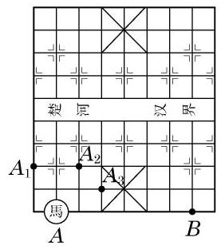

(第 2 题)

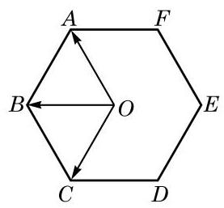

(第 3 题)

3. 如图,点 $O$ 是正六边形 ${ABCDEF}$ 的中心,分别写出图中

(1)与 $\overrightarrow{OA}$ 相等的向量； (2)与 $\overrightarrow{OB}$ 平行的向量；

(3)与 $\overrightarrow{OC}$ 模相等的向量； (4) $\overrightarrow{OB}$ 的负向量.

## 2 向量的加法和减法

在物理学习中, 我们已经知道了当不在同一方向上的两个力 $\overrightarrow{OA}\text{ 、 }\overrightarrow{OB}$ 同时作用于一个物体时,它们的合力是以 $\overrightarrow{OA}\text{ 、 }\overrightarrow{OB}$ 为相邻两边的平行四边形 ${OACB}$ 对角线 $\overrightarrow{OC}$ 所表示的力 (图 8-1-5).

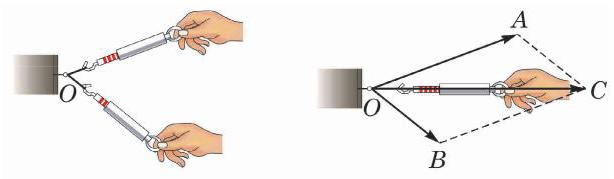

图 8-1-5

一般向量的加法也采用上述求合力的方法. 设给定两个不平行的向量 $\overrightarrow{a}$ 、 $\overrightarrow{b}$ ，如图 8-1-6，如果以点 $O$ 为起点，分别作 $\overrightarrow{OA} = \overrightarrow{a},\overrightarrow{OB} = \overrightarrow{b}$ ,那么以 $\overrightarrow{OA}\text{ 、 }\overrightarrow{OB}$ 为邻边的平行四边形 ${OACB}$ 的对角线所表示的向量 $\overrightarrow{OC} = \overrightarrow{c}$ 就定义为向量 $\overrightarrow{a}$ 与 $\overrightarrow{b}$ 的和,记作 $\overrightarrow{c} = \overrightarrow{a} + \overrightarrow{b}$ . 求向量和的运算,叫做向量的加法 (addition of vectors). 我们把这种作向量和的方法叫做向量加法的平行四边形法则 (parallelogram law).

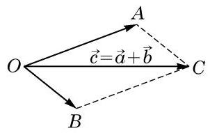

图 8-1-6

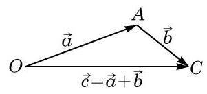

图 8-1-7

由于平行四边形对边平行且相等,有 $\overrightarrow{AC} = \overrightarrow{OB} = \overrightarrow{b}$ ,因此求向量 $\overrightarrow{a}$ 与 $\overrightarrow{b}$ 的和 $\overrightarrow{c} = \overrightarrow{a} + \overrightarrow{b}$ ,在 $\bigtriangleup {OAC}$ 中就可以实现: 如图8-1-7, 若以 $O$ 为起点作向量 $\overrightarrow{OA} = \overrightarrow{a}$ ，再以 $A$ 为起点作向量 $\overrightarrow{AC} = \overrightarrow{b}$ ，则连接起点 $O$ 与终点 $C$ 得到向量 $\overrightarrow{OC}$ ,它就是 $\overrightarrow{a}\text{ 、 }\overrightarrow{b}$ 两向量的和 $\overrightarrow{c} = \overrightarrow{a} + \overrightarrow{b}$ . 我们把这种作向量和的方法叫做向量加法的三角形法则.

向量 $\overrightarrow{a}$ 与 $\overrightarrow{b}$ 满足 $\overrightarrow{a}//\overrightarrow{b}$ 时 (包括 $\overrightarrow{a}\text{ 、 }\overrightarrow{b}$ 中出现零向量的情况), 无法使用平行四边形法则, 但上述三角形法则的步骤 (即若从一点 $O$ 出发作向量 $\overrightarrow{OA} = \overrightarrow{a}$ ，再以 $A$ 为起点作向量 $\overrightarrow{AC} = \overrightarrow{b}$ ，则向量 $\overrightarrow{OC} = \overrightarrow{a} + \overrightarrow{b}$ )仍然可以用于作出点 $C$ ,使得 $\overrightarrow{OC} = \overrightarrow{c} = \overrightarrow{a} + \overrightarrow{b}$ ,只不过此时 $\bigtriangleup {OAC}$ 不存在,只剩下一条直线上三条首尾相接、互相重叠的线段了. 图 8-1-8 的三幅图分别给出了 $\overrightarrow{a}$ 与 $\overrightarrow{b}$ 方向相同、 $\overrightarrow{a}$ 与 $\overrightarrow{b}$ 方向相反且 $\left| \overrightarrow{a}\right|  \geq  \left| \overrightarrow{b}\right|$ 和 $\overrightarrow{a}$ 与 $\overrightarrow{b}$ 方向相反且 $\left| \overrightarrow{a}\right|  \leq  \left| \overrightarrow{b}\right|$ 三种情况的图示(后两种情况当 $\left| \overrightarrow{a}\right|  = \left| \overrightarrow{b}\right|$ 时是一致的，此时 $O\text{ 、 }C$ 两点重合,从而 $\overrightarrow{c} = \overrightarrow{0}$ ).

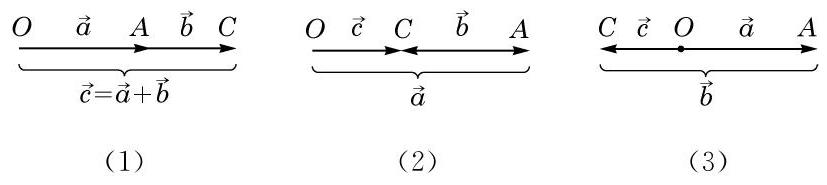

图 8-1-8

特别地, 当三个向量中出现一个零向量, 就得出

$$
\overrightarrow{a} + \overrightarrow{0} = \overrightarrow{0} + \overrightarrow{a} = \overrightarrow{a}\text{ 和 }\overrightarrow{a} + \left( {-\overrightarrow{a}}\right)  = \overrightarrow{0}.
$$

向量加法满足如下运算律 ( $\overrightarrow{a}\text{ 、 }\overrightarrow{b}$ 和 $\overrightarrow{c}$ 是平面上的任意向量):

交换律 $\overrightarrow{a} + \overrightarrow{b} = \overrightarrow{b} + \overrightarrow{a}$ .

结合律 $\;\left( {\overrightarrow{a} + \overrightarrow{b}}\right)  + \overrightarrow{c} = \overrightarrow{a} + \left( {\overrightarrow{b} + \overrightarrow{c}}\right)$ .

由结合律,我们常常把 $\left( {\overrightarrow{a} + \overrightarrow{b}}\right)  + \overrightarrow{c}$ 与 $\overrightarrow{a} + \left( {\overrightarrow{b} + \overrightarrow{c}}\right)$ 都简记为 $\overrightarrow{a} + \overrightarrow{b}$ + 己.

根据平行四边形法则, 比较容易验证向量加法的交换律, 而结合律的证明见下面的例 3.

例 3 已知 $\overrightarrow{a}\text{ 、 }\overrightarrow{b}$ 和 $\overrightarrow{c}$ 是平面上任意给定的向量,求证: $\left( {\overrightarrow{a} + \overrightarrow{b}}\right)  + \overrightarrow{c} = \overrightarrow{a} + \left( {\overrightarrow{b} + \overrightarrow{c}}\right) .$

证明 向量加法的三角形法则 (包括向量平行的情况) 实际上说的是: 如果 $A\text{ 、 }B\text{ 、 }C$ 是平面上任意给定的三个点,那么

$$
\overrightarrow{AB} + \overrightarrow{BC} = \overrightarrow{AC}\text{ . }
$$

从任意的一点 $A$ 出发作 $\overrightarrow{AB} = \overrightarrow{a}$ ,再从 $B$ 出发作 $\overrightarrow{BC} = \overrightarrow{b}$ ,最后从 $C$ 出发作 $\overrightarrow{CD} = \overrightarrow{c}$ ，由上式得到

$$
\left( {\overrightarrow{a} + \overrightarrow{b}}\right)  + \overrightarrow{c} = \left( {\overrightarrow{AB} + \overrightarrow{BC}}\right)  + \overrightarrow{CD} = \overrightarrow{AC} + \overrightarrow{CD} = \overrightarrow{AD},
$$

$$
\overrightarrow{a} + \left( {\overrightarrow{b} + \overrightarrow{c}}\right)  = \overrightarrow{AB} + \left( {\overrightarrow{BC} + \overrightarrow{CD}}\right)  = \overrightarrow{AB} + \overrightarrow{BD} = \overrightarrow{AD}\text{ . }
$$

故 $\left( {\overrightarrow{a} + \overrightarrow{b}}\right)  + \overrightarrow{c} = \overrightarrow{a} + \left( {\overrightarrow{b} + \overrightarrow{c}}\right)$ .

把例 3 证明中求向量和的方法略加推广, 可得: 若干个起点、终点依次相接的向量的和是以第一个向量的起点为起点、以最后一个向量的终点为终点的向量. 这是求向量和很实用的规则, 可以称之为 “首尾规则”.

例 4 一物体受水平方向 6 N 和铅垂方向 8 N 的两个力的作用，求合力的大小以及合力与铅垂方向偏离的角度. (结果精确到 $\left. {0.01}^{ \circ  }\right)$

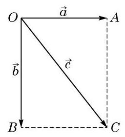

图 8-1-9

解 如图 8-1-9,设力的作用点为 $O$ ,若向量 $\overrightarrow{a} = \overrightarrow{OA}$ 表示水平方向 $6\mathrm{\;N}$ 的作用力,向量 $\overrightarrow{b} = \overrightarrow{OB}$ 表示铅垂方向 $8\mathrm{\;N}$ 的作用力, 则合力是 $\overrightarrow{c} = \overrightarrow{OC} = \overrightarrow{a} + \overrightarrow{b}$ .

由于 ${OACB}$ 为矩形,故

$\left| \overrightarrow{c}\right|  = \sqrt{{\left| \overrightarrow{OB}\right| }^{2} + {\left| \overrightarrow{BC}\right| }^{2}} = \sqrt{{\left| \overrightarrow{b}\right| }^{2} + {\left| \overrightarrow{a}\right| }^{2}} = \sqrt{{8}^{2} + {6}^{2}} = {10}\left( \mathrm{\;N}\right) , \; \tan \angle {BOC} = \frac{\left| \overrightarrow{BC}\right| }{\left| \overrightarrow{OB}\right| } = \frac{3}{4}$ ， $\angle {BOC} = \arctan \frac{3}{4} \approx  {36.87}^{ \circ  }$ .

所以，合力为 ${10}\mathrm{\;N}$ ，合力与铅垂方向偏离约 ${36.87}^{ \circ  }$ .

我们现在考虑向量的减法.

就像数的运算中减法是加法的逆运算一样,向量的减法也是作为向量加法的逆运算来定义的. 这就是说,如果已知向量 $\overrightarrow{a} + \; \overrightarrow{b} = \overrightarrow{c}$ ,那么向量 $\overrightarrow{b}$ 叫做向量 $\overrightarrow{c}$ 与向量 $\overrightarrow{a}$ 的差,记作 $\overrightarrow{b} = \overrightarrow{c} - \overrightarrow{a}$ . 求向量差的运算, 叫做向量的减法.

数的运算的经验使我们容易想到

$$
\overrightarrow{c} - \overrightarrow{a} = \overrightarrow{c} + \left( {-\overrightarrow{a}}\right) .
$$

---

向量的减法可以转化为向量的加法.

---

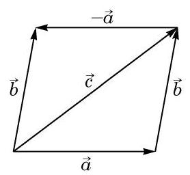

图 8-1-10

只要用向量加法的交换律、结合律以及 $\overrightarrow{a} + \left( {-\overrightarrow{a}}\right)  = \overrightarrow{0}$ 的事实, 就可以直接验证这一公式:

$$
\overrightarrow{c} - \overrightarrow{a} = \overrightarrow{c} + \left\lbrack  {\left( {-\overrightarrow{a}}\right)  + \overrightarrow{a}}\right\rbrack   - \overrightarrow{a}
$$

$$
= \left\lbrack  {\overrightarrow{c} + \left( {-\overrightarrow{a}}\right) }\right\rbrack   + \left( {\overrightarrow{a} - \overrightarrow{a}}\right)
$$

$$
= \overrightarrow{c} + \left( {-\overrightarrow{a}}\right) \text{ . }
$$

当 $\overrightarrow{c}$ 与 $\overrightarrow{a}$ 不平行时,我们还可以借助如图 8-1-10 所示的平行四边形得出这一公式: 由平行四边形右下方的三角形知 $\overrightarrow{a} + \overrightarrow{b} = \overrightarrow{c}$ ,即 $\overrightarrow{b} = \overrightarrow{c} - \overrightarrow{a}$ ,而由左上方的三角形知 $\overrightarrow{b} = \overrightarrow{c} + \left( {-\overrightarrow{a}}\right)$ . 这就得到要证明的结果 $\overrightarrow{c} - \overrightarrow{a} = \overrightarrow{c} + \left( {-\overrightarrow{a}}\right)$ .

例 5 已知 $\bigtriangleup {ABC}$ 是边长为 1 的等边三角形,点 $O$ 是 $\bigtriangleup {ABC}$ 所在平面上的任意一点. 求向量 $\left( {\overrightarrow{OA} - \overrightarrow{OC}}\right)  + \left( {\overrightarrow{OB} - \overrightarrow{OC}}\right)$ 的模.

解 如图 8-1-11,作以 ${CB}\text{ 、 }{CA}$ 为邻边的平行四边形 ${CADB}$ ,连接 ${CD}\text{ 、 }{OB}$ . 根据向量减法的定义,可得 $\overrightarrow{OA} - \overrightarrow{OC} = \; \overrightarrow{CA},\overrightarrow{OB} - \overrightarrow{OC} = \overrightarrow{CB}$ ，故 $\left( {\overrightarrow{OA} - \overrightarrow{OC}}\right)  + \left( {\overrightarrow{OB} - \overrightarrow{OC}}\right)  = \overrightarrow{CA} + \overrightarrow{CB} = \overrightarrow{CD}$ .

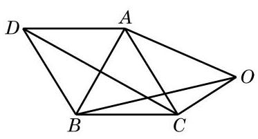

图 8-1-11

由于 $\bigtriangleup {ABC}$ 是等边三角形,故 $\angle {ADB}$ 是菱形,且 $\left| \overrightarrow{CD}\right|  = \; 2\left| \overrightarrow{CA}\right| \cos {30}^{ \circ  } = \sqrt{3}$ ,因此向量 $\left( {\overrightarrow{OA} - \overrightarrow{OC}}\right)  + \left( {\overrightarrow{OB} - \overrightarrow{OC}}\right)$ 的模为 $\sqrt{3}$ .

## 练习 8.1(2)

1. 在 $\bigtriangleup {ABC}$ 中,化简:

(1) $\overrightarrow{AB} - \overrightarrow{AC} =$ ___； (2) $\overrightarrow{BC} - \overrightarrow{AC} =$

2. 已知 $A\text{ 、 }B\text{ 、 }\overrightarrow{C\text{ 、 }D}\text{ 、 }E$ 是平面上任意五个点,求证: $\overrightarrow{AE} = \overrightarrow{AB} + \overrightarrow{BC} + \overrightarrow{CD} + \overrightarrow{DE}$ . 这个结果可以推广到更多点的情况吗?

3. 试说明,如果三个首尾相接的向量 $\overrightarrow{a}\text{ 、 }\overrightarrow{b}$ 和 $\overrightarrow{c}$ 所在的线段能拼接成三角形,那么一定满足条件 $\overrightarrow{a} + \overrightarrow{b} + \overrightarrow{c} = \overrightarrow{0}$ . 反过来,如果 $\overrightarrow{a} + \overrightarrow{b} + \overrightarrow{c} = \overrightarrow{0}$ ,那么三向量 $\overrightarrow{a}\text{ 、 }\overrightarrow{b}$ 和 $\overrightarrow{c}$ 所在的线段一定能拼接成三角形吗? 说明理由.

## 3 实数与向量的乘法

如图 8-1-12, 某科考船以 12 海里/时的速度匀速沿东北方向航行，中午 12 时船的位置在点 $A$ 处. 请描述下午 3 时和下午 4 时 30 分该船与点 $A$ 的相对位置.

图 8-1-12

同学们一定很容易给出答案:该船下午 3 时在点 $A$ 东北方向的 36 海里处,而下午 4 时 30 分在点 $A$ 东北方向的 54 海里处. 同学们的计算可能是直接把速度的数值乘时间, 忽略了速度和位移都是向量这一事实. 这样把向量问题简化为数量问题处理, 碰到复杂问题(如多个方向位移的合成)时就可能力不从心了. 如果回到向量记号,用 $\overrightarrow{v}$ 表示科考船的速度,即东北方向 12 海里/时, 那么该船下午 3 时和 4 时 30 分相对于 $A$ 的位移向量可以直接表示为 $3\overrightarrow{v}$ 和 ${4.5}\overrightarrow{v}$ ，这里的 3 与 4.5 是时间，它们只是数量(实数). 为了在向量空间中解释这种乘积, 我们要先定义实数与向量的乘法.

实数 $\lambda$ 与向量 $\overrightarrow{a}$ 的乘积是一个向量,记作 $\lambda \overrightarrow{a}$ . 它的模 $\left| {\lambda \overrightarrow{a}}\right|  = \left| \lambda \right| \left| \overrightarrow{a}\right|$ ; 当 $\lambda  > 0$ 时, $\lambda \overrightarrow{a}$ 的方向与 $\overrightarrow{a}$ 相同; 当 $\lambda  < 0$ 时, $\lambda \overrightarrow{a}$ 的方向与 $\overrightarrow{a}$ 相反. 特别地,当 $\overrightarrow{a} = \overrightarrow{0}$ 或 $\lambda  = 0$ 时, $\lambda \overrightarrow{a} \; = \overrightarrow{0}$ .

暂不考虑有关量的单位,采用实数与向量乘积的记号,下午 3 时和 4 时 30 分科考船相对于 $A$ 的位移向量就可写为 $3\overrightarrow{v}$ 和 4.5v，再考虑有关量的单位，由于 3 及 4.5 的单位是小时，速度的单位是海里/时,从而下午 3 时和 4 时 30 分科考船在点 $A$ 东北方向 36 海里处和 54 海里处. 我们还可以把上午 9 时科考船相对于 $A$ 的位移向量表示成(-3) $\overrightarrow{v}$ ，即点 $A$ 西南方向 36 海里处.

数学上实数与向量的乘积只是简单地理解为原向量的倍数. 但在实际问题中, 向量和实数都有可能被赋予特定的意义和单位, 如上例中的速度、位移和时间, 它们的乘积就可能有更复杂的含义.

容易看出,当 $\lambda$ 是一个正整数时, $\lambda \overrightarrow{a}$ 就是 $\lambda$ 个 $\overrightarrow{a}$ 相加. 例如,当 $\lambda  = 1$ 时, $1\overrightarrow{a} = \overrightarrow{a}$ ; 当 $\lambda  = 3$ 时, $3\overrightarrow{a} = \overrightarrow{a} + \overrightarrow{a} + \overrightarrow{a}$ .

当 $\lambda  =  - 1$ 时, $\left( {-1}\right) \overrightarrow{a}$ 与向量 $\overrightarrow{a}$ 的模相等但方向相反,故 $\left( {-1}\right) \overrightarrow{a}$ 是向量 $\overrightarrow{a}$ 的负向量,即 $\left( {-1}\right) \overrightarrow{a} =  - \overrightarrow{a}$ . 据此,再用下文所示运算律中的第二个公式,我们可以更一般地把 $\left( {-\lambda }\right) \overrightarrow{a}$ 记为 $- \lambda \overrightarrow{a}$ ,它是向量 $\lambda \overrightarrow{a}$ 的负向量.

根据实数与向量的乘积的定义，可知 $\lambda \overrightarrow{a}$ 是与 $\overrightarrow{a}$ 平行的向量. 反之,如果向量 $\overrightarrow{b}$ 与非零向量 $\overrightarrow{a}$ 平行,那么一定存在实数 $\lambda$ ,使得 $\overrightarrow{b} = \lambda \overrightarrow{a}$ . 当向量 $\overrightarrow{a}$ 和 $\overrightarrow{b}$ 同向时, $\lambda  = \frac{\left| \overrightarrow{b}\right| }{\left| \overrightarrow{a}\right| }$ ; 当向量 $\overrightarrow{a}$ 和 $\overrightarrow{b}$ 反向时, $\lambda  =  - \frac{\left| \overrightarrow{b}\right| }{\left| \overrightarrow{a}\right| }$ . 故

向量 $\overrightarrow{b}$ 与非零向量 $\overrightarrow{a}$ 平行的充要条件是:存在实数 $\lambda$ ， 使得 $\overrightarrow{b} = \lambda \overrightarrow{a}$ .

同学们可以验证实数与向量的乘法满足下面的运算律:

设 $\overrightarrow{a}\text{ 、 }\overrightarrow{b}$ 是向量, $\lambda \text{ 、 }\mu  \in  \mathbf{R}$ ,有

$$
\left( {\lambda  + \mu }\right) \overrightarrow{a} = \lambda \overrightarrow{a} + \mu \overrightarrow{a};
$$

$$
\lambda \left( {\mu \overrightarrow{a}}\right)  = \left( {\lambda \mu }\right) \overrightarrow{a};
$$

$$
\lambda \left( {\overrightarrow{a} + \overrightarrow{b}}\right)  = \lambda \overrightarrow{a} + \lambda \overrightarrow{b}.
$$

与非零向量 $\overrightarrow{a}$ 同方向的单位向量叫做向量 $\overrightarrow{a}$ 的单位向量,记作 $\overrightarrow{{a}_{0}}$ . 根据实数与向量的乘法的定义,可知 $\overrightarrow{a} = \left| \overrightarrow{a}\right| \overrightarrow{{a}_{0}}$ ,即

$$
\overrightarrow{{a}_{0}} = \frac{1}{\left| \overrightarrow{a}\right| }\overrightarrow{a}.
$$

向量的加法、减法以及实数与向量的乘法, 统称为向量的线性运算(linear operation). 从一个或几个向量出发, 通过线性运算得到的新向量称为原来那些向量的线性组合 (linear combination). 例如, $\overrightarrow{x} = 3\overrightarrow{a} + \overrightarrow{b} - 4\overrightarrow{c}$ 就是向量 $\overrightarrow{a}\text{ 、 }\overrightarrow{b}\text{ 、 }\overrightarrow{c}$ 的一个线性组合.

例 6 化简下列向量线性运算:

(1) $\left( {-2}\right)  \times  \left( {\frac{1}{2}\overrightarrow{a}}\right)$ ；

(2) $2\left( {\overrightarrow{a} - \overrightarrow{b}}\right)  + 3\left( {\overrightarrow{a} + \overrightarrow{b}}\right)$ ；

(3) $\left( {\lambda  - \mu }\right) \left( {\overrightarrow{a} + \overrightarrow{b}}\right)  - \left( {\lambda  + \mu }\right) \left( {\overrightarrow{a} - \overrightarrow{b}}\right)$ .

解 (1) $\left( {-2}\right)  \times  \left( {\frac{1}{2}\overrightarrow{a}}\right)  = \left( {-2 \times  \frac{1}{2}}\right) \overrightarrow{a} =  - \overrightarrow{a}$ .

(2) $2\left( {\overrightarrow{a} - \overrightarrow{b}}\right)  + 3\left( {\overrightarrow{a} + \overrightarrow{b}}\right)  = 2\overrightarrow{a} - 2\overrightarrow{b} + 3\overrightarrow{a} + 3\overrightarrow{b} \; = \left( {2\overrightarrow{a} + 3\overrightarrow{a}}\right)  + \left( {3\overrightarrow{b} - 2\overrightarrow{b}}\right) \; = 5\overrightarrow{a} + \overrightarrow{b}$ .

(3) $\left( {\lambda  - \mu }\right) \left( {\overrightarrow{a} + \overrightarrow{b}}\right)  - \left( {\lambda  + \mu }\right) \left( {\overrightarrow{a} - \overrightarrow{b}}\right)$

$= \lambda \left( {\overrightarrow{a} + \overrightarrow{b}}\right)  - \mu \left( {\overrightarrow{a} + \overrightarrow{b}}\right)  - \lambda \left( {\overrightarrow{a} - \overrightarrow{b}}\right)  - \mu \left( {\overrightarrow{a} - \overrightarrow{b}}\right)$

$= \lambda \overrightarrow{a} + \lambda \overrightarrow{b} - \mu \overrightarrow{a} - \mu \overrightarrow{b} - \lambda \overrightarrow{a} + \lambda \overrightarrow{b} - \mu \overrightarrow{a} + \mu \overrightarrow{b}$

$$
= {2\lambda }\overrightarrow{b} - {2\mu }\overrightarrow{a}\text{ . }
$$

例 7 已知向量 $\overrightarrow{a}$ 、 $\overrightarrow{b}$ 、 $\overrightarrow{c}$ 满足 $\frac{1}{2}\left( {\overrightarrow{a} - 3\overrightarrow{c}}\right)  + 2\left( {2\overrightarrow{a} - 3\overrightarrow{b}}\right) \; = \overrightarrow{0}$ ,试用 $\overrightarrow{a}\text{ 、 }\overrightarrow{b}$ 表示 $\overrightarrow{c}$ .

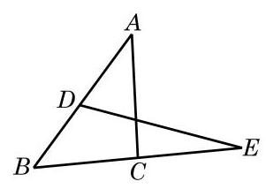

图 8-1-13

解 将原式变形为 $\frac{1}{2}\overrightarrow{a} - \frac{3}{2}\overrightarrow{c} + 4\overrightarrow{a} - 6\overrightarrow{b} = \overrightarrow{0}$ ,即 $\frac{3}{2}\overrightarrow{c} = \frac{9}{2}\overrightarrow{a} - \; 6\overrightarrow{b}$ . 所以 $\overrightarrow{c} = 3\overrightarrow{a} - 4\overrightarrow{b}$ .

例 8 如图 8-1-13,在 $\bigtriangleup {ABC}$ 中, $D$ 是 ${AB}$ 的中点, $E$ 是 ${BC}$ 延长线上一点,且 ${BE} = {2BC}$ .

(1)用向量 $\overrightarrow{BA}$ 、 $\overrightarrow{BC}$ 表示 $\overrightarrow{DE}$ ；

(2)用向量 $\overrightarrow{CA}$ 、 $\overrightarrow{CB}$ 表示 $\overrightarrow{DE}$ .

解 (1) 因为 $\overrightarrow{DE} = \overrightarrow{DB} + \overrightarrow{BE},\overrightarrow{DB} =  - \frac{1}{2}\overrightarrow{BA},\overrightarrow{BE} = 2\overrightarrow{BC}$ , 所以 $\overrightarrow{DE} = 2\overrightarrow{BC} - \frac{1}{2}\overrightarrow{BA}$ .

(2)因为 $\overrightarrow{BA} = \overrightarrow{BC} + \overrightarrow{CA}$ ，所以 $\overrightarrow{DE} = 2\overrightarrow{BC} - \frac{1}{2}\left( {\overrightarrow{BC} + \overrightarrow{CA}}\right) \; =  - \frac{3}{2}\overrightarrow{CB} - \frac{1}{2}\overrightarrow{CA}.$

## 练习 8.1(3)

1. 化简下列向量线性运算:

(1) $4\left( {{2\overrightarrow{a}} - \overrightarrow{b}}\right)  + 3\left( {{3\overrightarrow{a}} - {2\overrightarrow{b}}}\right)$ ； (2) $\frac{1}{4}\left( {\overrightarrow{a} + 2\overrightarrow{b}}\right)  - \frac{1}{6}\left( {5\overrightarrow{a} - 2\overrightarrow{b}}\right)  + \frac{1}{4}\overrightarrow{b}$ ；

(3) $2\left( {3\overrightarrow{a} - 4\overrightarrow{b} + \overrightarrow{c}}\right)  - 3\left( {2\overrightarrow{a} + \overrightarrow{b} - 3\overrightarrow{c}}\right)$ .

2. 根据下列条件,求向量 $\overrightarrow{x}$ :

(1) $2\overrightarrow{x} + 3\left( {\overrightarrow{b} + \overrightarrow{x}}\right)  = \overrightarrow{0}$ ； (2) $2\overrightarrow{a} + 5\left( {\overrightarrow{b} - \overrightarrow{x}}\right)  = \overrightarrow{0}$ ；

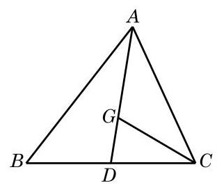

(第 3 题)

(3) $\frac{1}{3}\left( {\overrightarrow{x} - \overrightarrow{a}}\right)  - \frac{1}{2}\left( {\overrightarrow{b} - 2\overrightarrow{x} + \overrightarrow{x}}\right)  + \overrightarrow{b} = \overrightarrow{0}$ .

3. 如图,在 $\bigtriangleup {ABC}$ 中,已知 $D$ 是 ${BC}$ 的中点, $G$ 是 $\bigtriangleup {ABC}$ 的重心. 设向量 $\overrightarrow{BC} = \overrightarrow{a}$ ，向量 $\overrightarrow{AC} = \overrightarrow{b}$ . 试用向量 $\overrightarrow{a}$ 、 $\overrightarrow{b}$ 分别表示向量 $\overrightarrow{AD}\text{ 、 }\overrightarrow{AG}\text{ 、 }\overrightarrow{GC}$ .

## 习题 8.1

## A 组

1. 如果把平面上所有的单位向量的起点都平移到同一点, 那么它们的终点构成的图形是什么?

2. 在平面直角坐标系中, 作出表示下列向量的有向线段:

(1)向量 $\overrightarrow{a}$ 的起点在坐标原点，与 $x$ 轴正方向的夹角为 ${120}^{ \circ  }$ 且 $\left| \overrightarrow{a}\right|  = 3$ ；

(2)向量 $\overrightarrow{b}$ 的模为 4，方向与 $y$ 轴的正方向反向；

(3)向量 $\overrightarrow{c}$ 的方向与 $y$ 轴的正方向同向，模为 2 .

3. 判断下列命题的真假, 并说明理由:

(1)长度相等的向量均为相等向量;

(2)给定向量 $\overrightarrow{a}\text{ 、 }\overrightarrow{b}\text{ 、 }\overrightarrow{c}$ ，若 $\overrightarrow{a} = \overrightarrow{b},\overrightarrow{b} = \overrightarrow{c}$ ，则 $\overrightarrow{a} = \overrightarrow{c}$ ；

(3)若 ${ABCD}$ 为平行四边形，则必有 $\overrightarrow{AB} = \overrightarrow{CD}$ ；

(4)若平面上四点 $A$ 、 $B$ 、 $C$ 、 $D$ 使 $\overrightarrow{AB} = \overrightarrow{CD}$ ，则 ${AB}//{CD}$ .

4. 如图，在 $\bigtriangleup  {ABC}$ 中，点 $D$ 、 $E$ 、 $F$ 分别是 ${AB}$ 、 ${BC}$ 、 ${CA}$ 的中点，根据下列条件， 写出相应的向量:

(1)与向量 $\overrightarrow{AD}$ 相等的向量；

(2)向量 $\overrightarrow{DE}$ 的负向量；

(3)与向量 $\overrightarrow{EF}$ 平行的向量.

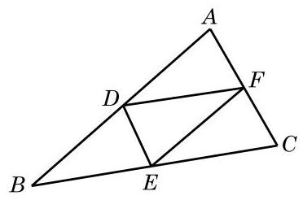

(第 4 题)

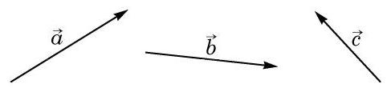

(第 5 题)

5. 如图,已知向量 $\overrightarrow{a}\text{ 、 }\overrightarrow{b}\text{ 、 }\overrightarrow{c}$ ,作出下列向量:

(1) $\overrightarrow{a} + \overrightarrow{b},\overrightarrow{b} + \overrightarrow{c},\overrightarrow{a} + \overrightarrow{c}$ ； (2) $\left( {\overrightarrow{a} + \overrightarrow{b}}\right)  + \overrightarrow{c}$ 和 $\overrightarrow{a} + \left( {\overrightarrow{b} + \overrightarrow{c}}\right)$ .

6. 化简下列向量运算:

(1) $\overrightarrow{AB} + \overrightarrow{BC} + \overrightarrow{CD} + \overrightarrow{DA}$ ； (2) $\left( {\overrightarrow{AB} - \overrightarrow{AC}}\right)  + \left( {\overrightarrow{BD} - \overrightarrow{CD}}\right)$ ；

(3) $\left( {\overrightarrow{AB} + \overrightarrow{MB}}\right)  + \left( {\overrightarrow{BD} + \overrightarrow{DM}}\right)$ .

7. 设向量 $\overrightarrow{a}$ 表示 “向东走 $2\mathrm{\;{km}}$ ” ; 向量 $\overrightarrow{b}$ 表示 “向西走 $1\mathrm{\;{km}}$ ”; 向量 $\overrightarrow{c}$ 表示 “向南走 $2\mathrm{\;{km}}$ ”; 向量 $\overrightarrow{d}$ 表示“向北走 $1\mathrm{\;{km}}$ ”. 试说明下列向量所表示的意义:

(1) $\overrightarrow{a} + \overrightarrow{a}$ ； (2) $\overrightarrow{a} + \overrightarrow{c}$ ； (3) $\overrightarrow{a} + \overrightarrow{b} + \overrightarrow{d}$ ； (4) $\overrightarrow{c} + \overrightarrow{d} + \overrightarrow{c}$ .

8. 设向量 $\overrightarrow{OA} = \overrightarrow{a},\overrightarrow{OB} = \overrightarrow{b}$ ，且 $\left| \overrightarrow{OA}\right|  = {12},\left| \overrightarrow{OB}\right|  = 4,\angle {AOB} = \frac{\pi }{3}$ . 求 $\left| {\overrightarrow{a} + \overrightarrow{b}}\right|$ .

9. 运用作图的方法, 验证下列等式:

(1) $\frac{1}{2}\left( {\overrightarrow{a} + \overrightarrow{b}}\right)  + \frac{1}{2}\left( {\overrightarrow{a} - \overrightarrow{b}}\right)  = \overrightarrow{a}$ ; (2) $\frac{1}{2}\left( {\overrightarrow{a} + \overrightarrow{b}}\right)  - \frac{1}{2}\left( {\overrightarrow{a} - \overrightarrow{b}}\right)  = \overrightarrow{b}$ .

10. 化简下列向量运算:

(1) $4\left( {\overrightarrow{a} + \overrightarrow{b}}\right)  - 3\left( {\overrightarrow{a} - \overrightarrow{b}}\right)  - 8\overrightarrow{b}$ ；

(2) $3\left( {\overrightarrow{a} - 2\overrightarrow{b} + \overrightarrow{c}}\right)  + 4\left( {\overrightarrow{c} - \overrightarrow{a} - \overrightarrow{b}}\right)$ ；

(3) $\frac{1}{3}\left\lbrack  {\frac{1}{2}\left( {2\overrightarrow{a} + 8\overrightarrow{b}}\right)  - \left( {4\overrightarrow{a} - 2\overrightarrow{b}}\right) }\right\rbrack$ .

11. 已知四边形 ${ABCD}$ 和点 $O$ 在同一平面上,设向量 $\overrightarrow{OA} = \overrightarrow{a},\overrightarrow{OB} = \overrightarrow{b},\overrightarrow{OC} = \overrightarrow{c},\overrightarrow{OD} \; = \overrightarrow{d}$ ,且 $\overrightarrow{a} + \overrightarrow{c} = \overrightarrow{b} + \overrightarrow{d}$ . 求证: ${ABCD}$ 是平行四边形.

12. 已知平行四边形 ${ABCD}$ ,设向量 $\overrightarrow{AC} = \overrightarrow{a},\overrightarrow{BD} = \overrightarrow{b}$ . 试用 $\overrightarrow{a}\text{ 、 }\overrightarrow{b}$ 表示下列向量:

(1) $\overrightarrow{AB}$ ； (2) $\overrightarrow{BC}$ .

B 组

1. 如图是由边长为 1 的小正方形组成的网格. 按要求,分别以 $A\text{ 、 }B\text{ 、 }C$ 为向量的起点, 在图中画出下列向量:

(1)正北方向且模为 2 的向量 $\overrightarrow{AE}$ ；

(2)模为 $2\sqrt{2}$ 、方向为北偏西 ${45}^{ \circ  }$ 的向量 $\overrightarrow{BF}$ ；

(3)(2)中向量 $\overrightarrow{BF}$ 的负向量.

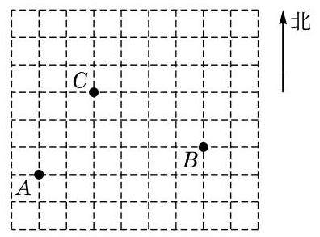

(第 1 题)

2. 已知正方形 ${ABCD}$ 的边长为 1,求:

(1) $\left| {\overrightarrow{AB} + \overrightarrow{BC}}\right|$ ；

(2) $\left| {\overrightarrow{AB} + \overrightarrow{BD} - \overrightarrow{AC}}\right|$ ；

(3) $\left| {\overrightarrow{AB} - \overrightarrow{BC} + \overrightarrow{AC}}\right|$ .

3. 如图,已知向量 $\overrightarrow{a}\text{ 、 }\overrightarrow{b}\text{ 、 }\overrightarrow{c}$ ,作出下列向量:

(1) $\overrightarrow{a} + \overrightarrow{c} - \overrightarrow{b}$ 和 $\overrightarrow{a} + \left( {\overrightarrow{c} - \overrightarrow{b}}\right)$ ； (2) $\overrightarrow{a} - \left( {\overrightarrow{b} + \overrightarrow{c}}\right)$ 和 $\overrightarrow{a} - \overrightarrow{c} - \overrightarrow{b}$ .

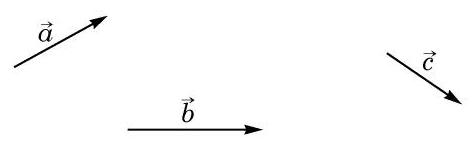

(第 3 题)

4. 试用作图法验证下列不等式:

(1) $\left| \overrightarrow{a}\right|  - \left| \overrightarrow{b}\right|  \leq  \left| {\overrightarrow{a} + \overrightarrow{b}}\right|  \leq  \left| \overrightarrow{a}\right|  + \left| \overrightarrow{b}\right|$ ；

(2) $\left| \overrightarrow{a}\right|  - \left| \overrightarrow{b}\right|  \leq  \left| {\overrightarrow{a} - \overrightarrow{b}}\right|  \leq  \left| \overrightarrow{a}\right|  + \left| \overrightarrow{b}\right|$ .

5. 判断下列命题的真假, 并说明理由:

(1)若存在一个 $\lambda  \in  \mathbf{R}$ 使 $\lambda \overrightarrow{a} = \lambda \overrightarrow{b}$ ,则 $\overrightarrow{a} = \overrightarrow{b}$ ；

(2)对于任意给定的实数 $\lambda$ 和向量 $\overrightarrow{a}$ 、 $\overrightarrow{b}$ ，均有 $\lambda \left( {\overrightarrow{a} - \overrightarrow{b}}\right)  = \lambda \overrightarrow{a} - \lambda \overrightarrow{b}$ ；

(3)对于任意给定的实数 $\lambda \text{ 、 }\mu$ 和向量 $\overrightarrow{a}$ ,均有 $\left( {\lambda  - \mu }\right) \overrightarrow{a} = \lambda \overrightarrow{a} - \mu \overrightarrow{a}$ .

6. 设 $\overrightarrow{a}\text{ 、 }\overrightarrow{b}$ 是两个不平行的向量,求证: 若实数 $\lambda \text{ 、 }\mu$ 使得 $\lambda \overrightarrow{a} + \mu \overrightarrow{b} = \overrightarrow{0}$ ,则 $\lambda  = \mu  = 0$ .

7. 已知 $\overrightarrow{{e}_{1}}\text{ 、 }\overrightarrow{{e}_{2}}$ 是两个不平行的向量,而向量 $\overrightarrow{AB} = 3\overrightarrow{{e}_{1}} - 2\overrightarrow{{e}_{2}},\overrightarrow{BC} =  - 2\overrightarrow{{e}_{1}} + 4\overrightarrow{{e}_{2}},\overrightarrow{CD} \; =  - 2\overrightarrow{{e}_{1}} - 4\overrightarrow{{e}_{2}}$ . 求证: $A\text{ 、 }C\text{ 、 }D$ 三点共线.

8. 已知 $G$ 是 $\bigtriangleup {ABC}$ 的重心， $D$ 、 $E$ 、 $F$ 分别为 ${AB}$ 、 ${AC}$ 、 ${BC}$ 中点. 求证: $\overrightarrow{GD} + \overrightarrow{GE} \; + \overrightarrow{GF} = \overrightarrow{0}$ .

### 8.2 向量的数量积

在物理课中，我们学过“功”的概念. 一个物体在外力作用下产生位移, 外力所做的功是这个力在位移方向上的分力大小与位移量的乘积. 如果力 $\overrightarrow{f}$ 和位移 $\overrightarrow{s}$ 如图 8-2-1 所示，那么力 $\overrightarrow{f}$ 所做的功是 $W = \left| \overrightarrow{f}\right| \left| \overrightarrow{s}\right| \cos \theta$ ,其中 $\theta$ 表示力 $\overrightarrow{f}$ 的方向与物体位移 $\overrightarrow{s}$ 的方向之间的夹角, $\left| \overrightarrow{f}\right| \cos \theta$ 是 $\overrightarrow{f}$ 在位移方向上的分力的大小.

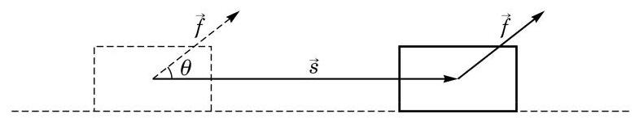

图 8-2-1

如上所述, “功”这个数量完全被力和位移这两个向量所决定, 如何从这一具体事例抽象出对任意两个向量定义的一种数学运算呢?

## 1 向量的投影

我们再试着理解功的定义和功的计算公式的推导, 看能得到什么启示.

功并不是把力的大小和位移向量的大小直接相乘而得到, 而是把作用力在位移方向上的分力大小乘物体位移量. “在位移方向上的分力”是作用力 $\overrightarrow{f}$ 在位移向量 $\overrightarrow{s}$ 方向上的投影 ${\overrightarrow{f}}_{1}$ (图 8-2-2). 这就引出了向量在一条直线或另一个向量方向上的投影的概念.

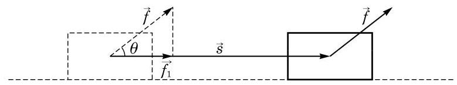

图 8-2-2

平面上一点 $A$ 在直线 $l$ 上的投影就是过点 $A$ 作直线 $l$ 的垂线而得到的垂足 ${A}^{\prime }$ .

---

功不是向量, 而是一个数量.

---

如果向量 $\overrightarrow{AB}$ 的起点 $A$ 和终点 $B$ 在直线 $l$ 上的投影分别为点 ${A}^{\prime }$ 和 ${B}^{\prime }$ ,那么向量 $\overrightarrow{{A}^{\prime }{B}^{\prime }}$ 叫做向量 $\overrightarrow{AB}$ 在直线 $l$ 上的投影向量(图 8-2-3),简称为投影. 从而,一个向量 $\overrightarrow{b}$ 在一个非零向量 $\overrightarrow{a}$ 的方向上的投影，就是 $\overrightarrow{b}$ 在 $\overrightarrow{a}$ 的任意一条所在直线上的投影. 因为所有这些直线都互相平行,所以 $\overrightarrow{b}$ 在 $\overrightarrow{a}$ 的方向上的投影 (在相等意义下)是唯一确定的.

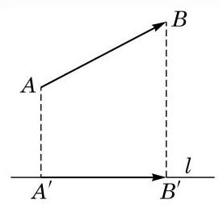

图 8-2-3

我们现在讨论 $\overrightarrow{b}$ 在 $\overrightarrow{a}$ 的方向上的投影与向量 $\overrightarrow{a}\text{ 、 }\overrightarrow{b}$ 的关系. 我们先设 $\overrightarrow{b} \neq  \overrightarrow{0}$ .

---

为了行文简洁, 有时也常常用一个希腊字母(如 $\theta$ )来指代向量的夹角.

---

以一点 $O$ 为起点,作 $\overrightarrow{OA} = \overrightarrow{a},\overrightarrow{OB} = \overrightarrow{b}$ (图 8-2-4),我们把射线 ${OA}\text{ 、 }{OB}$ 的夹角称为向量 $\overrightarrow{a}$ 与 $\overrightarrow{b}$ 的夹角,记作 $\langle \overrightarrow{a},\overrightarrow{b}\rangle$ ,它的取值范围为 $\left\lbrack  {0,\pi }\right\rbrack$ . 特别地,当 $\langle \overrightarrow{a},\overrightarrow{b}\rangle  = \frac{\pi }{2}$ 时,称 $\overrightarrow{a}$ 与 $\overrightarrow{b}$ 垂直,记作 $\overrightarrow{a} \bot  \overrightarrow{b}$ . 设向量 $\overrightarrow{OB}$ 的终点 $B$ 在 $\overrightarrow{OA}$ 所在直线上的投影为 ${B}^{\prime },\overrightarrow{O{B}^{\prime }}$ 即为向量 $\overrightarrow{b}$ 在 $\overrightarrow{a}$ 方向上的投影.

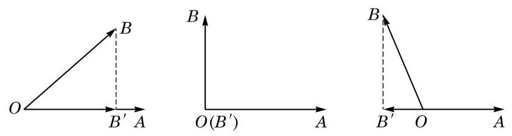

图 8-2-4

容易看出, $\left| \overrightarrow{O{B}^{\prime }}\right|  = \left| \overrightarrow{b}\right| \left| {\cos \langle \overrightarrow{a},\overrightarrow{b}\rangle }\right|$ . 当 $\langle \overrightarrow{a},\overrightarrow{b}\rangle  < \frac{\pi }{2}$ 时, $\overrightarrow{O{B}^{\prime }}$ 与 $\overrightarrow{OA}$ 同向; 当 $\langle \overrightarrow{a},\overrightarrow{b}\rangle  > \frac{\pi }{2}$ 时, $\overrightarrow{O{B}^{\prime }}$ 与 $\overrightarrow{OA}$ 反向；当 $\langle \overrightarrow{a},\overrightarrow{b}\rangle  = \frac{\pi }{2}$ 时, 即 $\overrightarrow{a} \bot  \overrightarrow{b}$ 时, $\overrightarrow{O{B}^{\prime }} = \overrightarrow{0}$ . 由此可以得知,如果令 $\overrightarrow{{a}_{0}} = \frac{1}{\left| \overrightarrow{a}\right| }\overrightarrow{a}$ 是 $\overrightarrow{a}$ 的单位向量,那么向量 $\overrightarrow{b}$ 在向量 $\overrightarrow{a}$ 方向上的投影为

$$
\left| \overrightarrow{b}\right| \cos \langle \overrightarrow{a},\overrightarrow{b}\rangle \overrightarrow{{a}_{0}} = \frac{\left| \overrightarrow{b}\right| \cos \langle \overrightarrow{a},\overrightarrow{b}\rangle }{\left| \overrightarrow{a}\right| }\overrightarrow{a}.
$$

在上式中,实数 $\left| \overrightarrow{b}\right| \cos \langle \overrightarrow{a},\overrightarrow{b}\rangle$ 称为向量 $\overrightarrow{b}$ 在向量 $\overrightarrow{a}$ 方向上的数量投影,它是一个数量,其绝对值等于向量 $\overrightarrow{b}$ 在向量 $\overrightarrow{a}$ 方向上的投影的模. 当 $\langle \overrightarrow{a},\overrightarrow{b}\rangle  < \frac{\pi }{2}$ 时,其值为正,向量 $\overrightarrow{b}$ 在向量 $\overrightarrow{a}$ 方向上的投影和 $\overrightarrow{a}$ 具有相同方向; 当 $\langle \overrightarrow{a},\overrightarrow{b}\rangle  > \frac{\pi }{2}$ 时,其值为负,向量 $\overrightarrow{b}$ 在向量 $\overrightarrow{a}$ 方向上的投影和 $\overrightarrow{a}$ 具有相反方向; 而当 $\langle \overrightarrow{a},\overrightarrow{b}\rangle  = \frac{\pi }{2}$ , 即 $\overrightarrow{a} \bot  \overrightarrow{b}$ 时,其值为 0 .

由投影的定义立即得知, 零向量在任何非零向量方向上的投影是零向量, 而相应的数量投影的绝对值是该投影的模, 因此, 这个数量投影等于 0 .

例 1 已知向量 $\overrightarrow{a}$ 与 $\overrightarrow{b}$ 的夹角为 $\frac{2\pi }{3}$ ,且 $\left| \overrightarrow{a}\right|  = 3,\left| \overrightarrow{b}\right|  = 4$ . 求 $\overrightarrow{b}$ 在 $\overrightarrow{a}$ 方向上的投影与数量投影.

解 向量 $\overrightarrow{b}$ 在 $\overrightarrow{a}$ 方向上的投影是

$$
\frac{\left| \overrightarrow{b}\right| \cos \langle \overrightarrow{a},\overrightarrow{b}\rangle }{\left| \overrightarrow{a}\right| }\overrightarrow{a} = \frac{4\cos \frac{2\pi }{3}}{3}\overrightarrow{a} =  - \frac{2}{3}\overrightarrow{a},
$$

相应的数量投影是 $\left| \overrightarrow{b}\right| \cos \langle \overrightarrow{a},\overrightarrow{b}\rangle  = 4\cos \frac{2\pi }{3} =  - 2$ .

---

这个结论与练习 8.2(1)的第 1 题的结论一般合称为“投影的线性性质”.

---

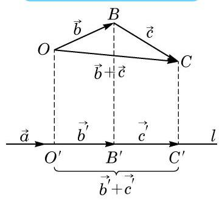

图 8-2-5

例 2 已知 $\overrightarrow{a}$ 是非零向量, $\overrightarrow{b}$ 与 $\overrightarrow{c}$ 是任意向量,它们在 $\overrightarrow{a}$ 方向上的投影分别为 ${\overrightarrow{b}}^{\prime }$ 与 ${\overrightarrow{c}}^{\prime }$ . 求证: $\overrightarrow{b} + \overrightarrow{c}$ 在 $\overrightarrow{a}$ 方向上的投影为 ${\overrightarrow{b}}^{\prime } \; + \overrightarrow{{c}^{\prime }}$ .

证明 如图 8-2-5,设 $\overrightarrow{a}$ 所在的直线为 $l$ . 从任意一点 $O$ 出发作向量 $\overrightarrow{OB} = \overrightarrow{b},\overrightarrow{BC} = \overrightarrow{c}$ ,则 $\overrightarrow{OC} = \overrightarrow{b} + \overrightarrow{c}$ . 分别作点 $O\text{ 、 }B\text{ 、 }C$ 在 $l$ 上的投影 ${O}^{\prime }\text{ 、 }{B}^{\prime }\text{ 、 }{C}^{\prime }$ . 由投影的定义, ${\overrightarrow{b}}^{\prime } = \overrightarrow{{O}^{\prime }{B}^{\prime }},\overrightarrow{{c}^{\prime }} = \; \overrightarrow{{B}^{\prime }{C}^{\prime }}$ ，而 $\overrightarrow{b} + \overrightarrow{c} = \overrightarrow{OC}$ 的投影是 $\overrightarrow{{O}^{\prime }{C}^{\prime }} = \overrightarrow{{O}^{\prime }{B}^{\prime }} + \overrightarrow{{B}^{\prime }{C}^{\prime }} = \overrightarrow{{b}^{\prime }} + \overrightarrow{{c}^{\prime }}$ .

## 练习 8.2(1)

1. 设 $\overrightarrow{a}\text{ 、 }\overrightarrow{b}$ 是两个向量,其中 $\overrightarrow{a} \neq  \overrightarrow{0},\overrightarrow{b}$ 在 $\overrightarrow{a}$ 方向上的投影是 $\overrightarrow{{b}^{\prime }}$ . 又设 $\lambda  \in  \mathbf{R}$ . 分 $\lambda  \geq  0$ 与 $\lambda  < 0$ 两种情况,证明 $\lambda \overrightarrow{b}$ 在 $\overrightarrow{a}$ 方向上的投影是 $\lambda {\overrightarrow{b}}^{\prime }$ .

2. 若 $\bigtriangleup  {ABC}$ 为等边三角形，求下列各角:

(1) $\langle \overrightarrow{CA},\overrightarrow{CB}\rangle$ ； (2) $\langle \overrightarrow{AC},\overrightarrow{BC}\rangle$ ； (3) $\langle \overrightarrow{AB},\overrightarrow{BC}\rangle$ .

3. 已知 $\left| \overrightarrow{a}\right|  = 5,\left| \overrightarrow{b}\right|  = 6,\sin \langle \overrightarrow{a},\overrightarrow{b}\rangle  = {0.6}$ ，求 $\overrightarrow{b}$ 在 $\overrightarrow{a}$ 方向上的投影与数量投影.

## 2 向量的数量积的定义与运算律

模仿功的定义,设 $\overrightarrow{a}$ 与 $\overrightarrow{b}$ 是两个非零向量,定义 $\overrightarrow{a}$ 与 $\overrightarrow{b}$ 的数量积 (scalar product)

$$
\overrightarrow{a} \cdot  \overrightarrow{b} = \left| \overrightarrow{a}\right| \left| \overrightarrow{b}\right| \cos \langle \overrightarrow{a},\overrightarrow{b}\rangle ,
$$

---

数量积又称为标量积, 也称为内积 (inner product) 或点积 (dot product). 记号 $\overrightarrow{a} \cdot  \overrightarrow{b}$ 中间的“ $\cdot$ ”不可以省略, 也不可以用 “✗”代替·

---

即 $\overrightarrow{a} \cdot  \overrightarrow{b}$ 是 $\overrightarrow{a}$ 的模 $\left| \overrightarrow{a}\right| \text{ 、 }\overrightarrow{b}$ 的模 $\left| \overrightarrow{b}\right|$ 与 $\overrightarrow{a}\text{ 、 }\overrightarrow{b}$ 夹角 $\langle \overrightarrow{a},\overrightarrow{b}\rangle$ 的余弦的乘积.

在这个公式中, $\left| \overrightarrow{b}\right| \cos \langle \overrightarrow{a},\overrightarrow{b}\rangle$ 就是 $\overrightarrow{b}$ 在 $\overrightarrow{a}$ 方向上的数量投影,而 $\left| \overrightarrow{a}\right| \cos \langle \overrightarrow{a},\overrightarrow{b}\rangle$ 就是 $\overrightarrow{a}$ 在 $\overrightarrow{b}$ 方向上的数量投影.

我们约定可以把 $\overrightarrow{a} \cdot  \overrightarrow{a}$ 简记为 ${\overrightarrow{a}}^{2}$ ,它其实就是 ${\left| \overrightarrow{a}\right| }^{2}$ .

我们还规定零向量与任意向量的数量积为 0 .

有了这个定义,物理中的功 $W$ 就是力向量 $\overrightarrow{f}$ 与位移向量 $\overrightarrow{s}$ 的数量积 $\overrightarrow{f} \cdot  \overrightarrow{s}$ .

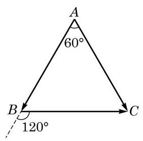

图 8-2-6

例 3 如图 8-2-6,给定边长为 6 的正三角形 ${ABC}$ . 求 $\overrightarrow{AB} \cdot  \overrightarrow{AC}$ 和 $\overrightarrow{AB} \cdot  \overrightarrow{BC}$ .

解 因为 $\langle \overrightarrow{AB},\overrightarrow{AC}\rangle  = {60}^{ \circ  }$ ,所以

$$
\overrightarrow{AB} \cdot  \overrightarrow{AC} = \left| \overrightarrow{AB}\right| \left| \overrightarrow{AC}\right| \cos {60}^{ \circ  } = 6 \times  6 \times  \frac{1}{2} = {18};
$$

又因为 $\langle \overrightarrow{AB},\overrightarrow{BC}\rangle  = {120}^{ \circ  }$ ,所以

$$
\overrightarrow{AB} \cdot  \overrightarrow{BC} = \left| \overrightarrow{AB}\right| \left| \overrightarrow{BC}\right| \cos {120}^{ \circ  } = 6 \times  6 \times  \left( {-\frac{1}{2}}\right)  =  - {18}.
$$

类比数的乘法的运算律, 我们可以证明向量的数量积运算满足如下运算律:

设 $\overrightarrow{a}\text{ 、 }\overrightarrow{b}$ 和 $\overrightarrow{c}$ 是向量, $\lambda$ 是实数,则

向量数量积的交换律: $\overrightarrow{a} \cdot  \overrightarrow{b} = \overrightarrow{b} \cdot  \overrightarrow{a}$ ;

向量数量积对数乘的结合律: $\left( {\lambda \overrightarrow{a}}\right)  \cdot  \overrightarrow{b} = \overrightarrow{a} \cdot  \left( {\lambda \overrightarrow{b}}\right) \; = \lambda \left( {\overrightarrow{a} \cdot  \overrightarrow{b}}\right) ;$

向量数量积对加法的分配律: $\overrightarrow{a} \cdot  \left( {\overrightarrow{b} + \overrightarrow{c}}\right)  = \overrightarrow{a} \cdot  \overrightarrow{b} + \; \overrightarrow{a} \cdot  \overrightarrow{c}$ .

证明(1)因为 $\langle \overrightarrow{a},\overrightarrow{b}\rangle  = \langle \overrightarrow{b},\overrightarrow{a}\rangle$ ，所以结论是显然的.

---

对向量的数量积谈结合律是没有意义的, 因为不能定义三个向量的数量积; 另外，对向量的数量积, 消去律不成立, 即从 $\overrightarrow{a} \cdot  \overrightarrow{c} = \overrightarrow{b} \cdot  \overrightarrow{c}$ 及 $\overrightarrow{c} \neq  \overrightarrow{0}$ 不能推出 $\overrightarrow{a} = \overrightarrow{b}$ .

---

(2)如果 $\overrightarrow{a}$ 和 $\overrightarrow{b}$ 有一个是零向量，或者 $\lambda  = 0$ ，那么结论是显然的,从而不妨设 $\overrightarrow{a}$ 和 $\overrightarrow{b}$ 都是非零向量,且 $\lambda  \neq  0$ . 若 $\lambda  > 0$ ,则 $\left| {\lambda \overrightarrow{a}}\right|  =  - \lambda \left| \overrightarrow{a}\right|$ , $\left| {\lambda \overrightarrow{a}}\right|  = \lambda \left| \overrightarrow{a}\right| ,\left\langle  {\lambda \overrightarrow{a},\overrightarrow{b}}\right\rangle   = \langle \overrightarrow{a},\overrightarrow{b}\rangle$ ; 若 $\lambda  < 0$ ,则 $\left| {\lambda \overrightarrow{a}}\right|  =  - \lambda \left| \overrightarrow{a}\right|$ , $\langle \lambda \overrightarrow{a},\overrightarrow{b}\rangle  = \pi  - \langle \overrightarrow{a},\overrightarrow{b}\rangle$ ,两种情况代入数量积定义公式,都得到

$$
\left( {\lambda \overrightarrow{a}}\right)  \cdot  \overrightarrow{b} = \lambda \left( {\overrightarrow{a} \cdot  \overrightarrow{b}}\right) .
$$

再利用向量数量积的交换律,就得到 $\overrightarrow{a} \cdot  \left( {\lambda \overrightarrow{b}}\right)  = \lambda \left( {\overrightarrow{a} \cdot  \overrightarrow{b}}\right)$ .

(3)如果 $\overrightarrow{a} = \overrightarrow{0}$ ，那么结论是显然的，从而不妨设 $\overrightarrow{a} \neq  \overrightarrow{0}$ . 把 $\overrightarrow{b}$ 、 $\overrightarrow{c}$ 和 $\overrightarrow{b} + \overrightarrow{c}$ 在 $\overrightarrow{a}$ 的方向作投影，根据向量和的投影等于它们投影的和，就得到

$$
\overrightarrow{a} \cdot  \left( {\overrightarrow{b} + \overrightarrow{c}}\right)  = \overrightarrow{a} \cdot  \overrightarrow{b} + \overrightarrow{a} \cdot  \overrightarrow{c}.
$$

由于数量积的交换律和分配律与数的乘法类似, 容易证明如下的公式.

例 4 证明:

(1) ${\left( \overrightarrow{a} + \overrightarrow{b}\right) }^{2} = {\overrightarrow{a}}^{2} + 2\overrightarrow{a} \cdot  \overrightarrow{b} + {\overrightarrow{b}}^{2}$ ;

(2) $\left( {\overrightarrow{a} + \overrightarrow{b}}\right)  \cdot  \left( {\overrightarrow{a} - \overrightarrow{b}}\right)  = {\overrightarrow{a}}^{2} - {\overrightarrow{b}}^{2}$ .

证明 (1)的证明如下: ?

$$
{\left( \overrightarrow{a} + \overrightarrow{b}\right) }^{2} = \overrightarrow{a} \cdot  \left( {\overrightarrow{a} + \overrightarrow{b}}\right)  + \overrightarrow{b} \cdot  \left( {\overrightarrow{a} + \overrightarrow{b}}\right)
$$

$$
= {\overrightarrow{a}}^{2} + \overrightarrow{a} \cdot  \overrightarrow{b} + \overrightarrow{b} \cdot  \overrightarrow{a} + {\overrightarrow{b}}^{2}
$$

$$
= {\overrightarrow{a}}^{2} + 2\overrightarrow{a} \cdot  \overrightarrow{b} + {\overrightarrow{b}}^{2}\text{ . }
$$

对于 (2), 我们有

$$
\left( {\overrightarrow{a} + \overrightarrow{b}}\right)  \cdot  \left( {\overrightarrow{a} - \overrightarrow{b}}\right)
$$

$$
= {\overrightarrow{a}}^{2} + \overrightarrow{b} \cdot  \overrightarrow{a} - \overrightarrow{a} \cdot  \overrightarrow{b} - {\overrightarrow{b}}^{2}
$$

$$
= {\overrightarrow{a}}^{2} - {\overrightarrow{b}}^{2}\text{ . }
$$

若 $\overrightarrow{a}$ 与 $\overrightarrow{b}$ 均为非零向量,则由向量的数量积的定义,可从数量积来反推向量夹角的公式:

$$
\cos \langle \overrightarrow{a},\overrightarrow{b}\rangle  = \frac{\overrightarrow{a} \cdot  \overrightarrow{b}}{\left| \overrightarrow{a}\right| \left| \overrightarrow{b}\right| }.
$$

在 8.3 节中我们将利用向量的坐标 (从而不通过向量的夹角) 直接来计算向量的数量积, 而上面的公式就提供了计算向量夹角的有效方法.

由向量的数量积的定义, 可以得到:

(1) $\overrightarrow{a}\bot \overrightarrow{b}$ 当且仅当 $\overrightarrow{a} \cdot  \overrightarrow{b} = 0$ ；

(2) $\left| {\overrightarrow{a} \cdot  \overrightarrow{b}}\right|  \leq  \left| \overrightarrow{a}\right| \left| \overrightarrow{b}\right|$ ，当且仅当 $\overrightarrow{a}//\overrightarrow{b}$ 时等号成立.

当 $\overrightarrow{a}$ 与 $\overrightarrow{b}$ 平行且同向时, $\overrightarrow{a} \cdot  \overrightarrow{b} = \left| \overrightarrow{a}\right| \left| \overrightarrow{b}\right|$ ; 当 $\overrightarrow{a}$ 与 $\overrightarrow{b}$ 平行且反向时, $\overrightarrow{a} \cdot  \overrightarrow{b} =  - \left| \overrightarrow{a}\right| \left| \overrightarrow{b}\right|$ . 特别地, ${\overrightarrow{a}}^{2} = {\left| \overrightarrow{a}\right| }^{2}$ .

例 5 设向量 $\overrightarrow{a}\text{ 、 }\overrightarrow{b}$ 满足 $\left| \overrightarrow{a}\right|  = 2,\left| \overrightarrow{b}\right|  = 3,\langle \overrightarrow{a},\overrightarrow{b}\rangle  = \frac{\pi }{3}$ . 求 $\left| {3\overrightarrow{a} - 2\overrightarrow{b}}\right|$ .

解 因为

$$
{\left| 3\overrightarrow{a} - 2\overrightarrow{b}\right| }^{2} = {\left( 3\overrightarrow{a} - 2\overrightarrow{b}\right) }^{2}
$$

$$
= {\left( 3\overrightarrow{a}\right) }^{2} - 2\left( {3\overrightarrow{a}}\right)  \cdot  \left( {2\overrightarrow{b}}\right)  + {\left( 2\overrightarrow{b}\right) }^{2}
$$

$$
= 9{\overrightarrow{a}}^{2} - {12}\overrightarrow{a} \cdot  \overrightarrow{b} + 4{\overrightarrow{b}}^{2}
$$

$$
= 9{\left| \overrightarrow{a}\right| }^{2} - {12}\left| \overrightarrow{a}\right| \left| \overrightarrow{b}\right| \cos \frac{\pi }{3} + 4{\left| \overrightarrow{b}\right| }^{2}
$$

$$
= 9 \times  {2}^{2} - {12} \times  2 \times  3 \times  \frac{1}{2} + 4 \times  {3}^{2}
$$

$$
= {36}\text{ , }
$$

所以 $\left| {3\overrightarrow{a} - 2\overrightarrow{b}}\right|  = 6$ .

---

由(1)类似可证: ${\left( \overrightarrow{a} - \overrightarrow{b}\right) }^{2} = {\overrightarrow{a}}^{2} - 2\overrightarrow{a} \cdot  \overrightarrow{b} \; + {\overrightarrow{b}}^{2}$ .

---

例 6 已知 $\left| \overrightarrow{a}\right|  = 6,\left| \overrightarrow{b}\right|  = 3,\overrightarrow{a} \cdot  \overrightarrow{b} =  - 9\sqrt{2}$ . 求 $\langle \overrightarrow{a},\overrightarrow{b}\rangle$ .

解 因为 $\cos \langle \overrightarrow{a},\overrightarrow{b}\rangle  = \frac{\overrightarrow{a} \cdot  \overrightarrow{b}}{\left| \overrightarrow{a}\right| \left| \overrightarrow{b}\right| } = \frac{-9\sqrt{2}}{6 \times  3} =  - \frac{\sqrt{2}}{2}$ ,所以 $\langle \overrightarrow{a},\overrightarrow{b}\rangle \; = \frac{3\pi }{4}$ .

## 练习 8.2(2)

1. 在 $\bigtriangleup {ABC}$ 中,已知 $\overrightarrow{AB} \cdot  \overrightarrow{BC} = 0$ . 判断 $\bigtriangleup {ABC}$ 的形状,并说明理由.

2. 填空题:

(1)设向量 $\overrightarrow{a}\text{ 、 }\overrightarrow{b}$ 满足 $\left| \overrightarrow{a}\right|  = 4,\left| \overrightarrow{b}\right|  = 9,\langle \overrightarrow{a},\overrightarrow{b}\rangle  = \frac{\pi }{6}$ ，则 $\overrightarrow{a} \cdot  \left( {\overrightarrow{a} - \overrightarrow{b}}\right)  =$ ___；

(2)设向量 $\overrightarrow{a}$ 、 $\overrightarrow{b}$ 满足 $\left| \overrightarrow{a}\right|  = 5$ ， $\left| \overrightarrow{b}\right|  = 6$ ， $\left( {\overrightarrow{a} + \overrightarrow{b}}\right)  \cdot  \overrightarrow{b} = {21}$ ，则 $\langle \overrightarrow{a},\overrightarrow{b}\rangle  =$ ___.

3. 设向量 $\overrightarrow{a}$ 、 $\overrightarrow{b}$ 满足 $\left| \overrightarrow{a}\right|  = 2$ ， $\left| \overrightarrow{b}\right|  = 3$ ，且 $\langle \overrightarrow{a},\overrightarrow{b}\rangle  = {120}^{ \circ  }$ . 求 $\left| {\overrightarrow{a} + \overrightarrow{b}}\right|$ .

## 习题 8.2

## A 组

1. 设向量 $\overrightarrow{a}\text{ 、 }\overrightarrow{b}$ 满足 $\left| \overrightarrow{a}\right|  = 6,\left| \overrightarrow{b}\right|  = 3$ ，且 $\overrightarrow{a} \cdot  \overrightarrow{b} =  - {12}$ ，则向量 $\overrightarrow{a}$ 在向量 $\overrightarrow{b}$ 方向上的投影是___.

2. 在 $\bigtriangleup  {ABC}$ 中，若 $\left| {AB}\right|  = 3$ ， $\left| {AC}\right|  = 2$ ， $\left| {BC}\right|  = \sqrt{10}$ ，则 $\overrightarrow{AB} \cdot  \overrightarrow{AC} =$ ___.

3. 已知向量 $\overrightarrow{a}$ 与 $\overrightarrow{b}$ 的夹角为 ${45}^{ \circ  }$ ，且 $\left| \overrightarrow{a}\right|  = 1$ ， $\left| {2\overrightarrow{a} - \overrightarrow{b}}\right|  = \sqrt{10}$ ，则 $\left| \overrightarrow{b}\right|  =$ ___.

4. 在菱形 ${ABCD}$ 中， $\left( {\overrightarrow{AB} + \overrightarrow{AD}}\right)  \cdot  \left( {\overrightarrow{AB} - \overrightarrow{AD}}\right)  =$ ___.

5. 设向量 $\overrightarrow{a}\text{ 、 }\overrightarrow{b}$ 满足 $\left| \overrightarrow{a}\right|  = 1,\left| \overrightarrow{b}\right|  = \sqrt{2}$ ，向量 $\overrightarrow{a} - \overrightarrow{b}$ 与 $\overrightarrow{a}$ 垂直. 求 $\langle \overrightarrow{a},\overrightarrow{b}\rangle$ .

6. 设向量 $\overrightarrow{a}\text{ 、 }\overrightarrow{b}$ 满足 $\left\langle  {\overrightarrow{a},\overrightarrow{b}}\right\rangle   = {60}^{ \circ  },\left| \overrightarrow{a}\right|  = 3,\left| \overrightarrow{b}\right|  = 3$ . 求 ${\left( \overrightarrow{a} + \overrightarrow{b}\right) }^{2}$ .

7. 在 $\bigtriangleup {ABC}$ 中, $\left| {AB}\right|  = \left| {AC}\right|  = 4,\overrightarrow{AB} \cdot  \overrightarrow{AC} = 8$ . 判断 $\bigtriangleup {ABC}$ 的形状,并说明理由.

8. 设向量 $\overrightarrow{a}\text{ 、 }\overrightarrow{b}$ 满足 $\left| \overrightarrow{a}\right|  = 4,\left| \overrightarrow{b}\right|  = 5,\left| {\overrightarrow{a} + \overrightarrow{b}}\right|  = \sqrt{21}$ . 分别求下列各式的值:

(1) $\overrightarrow{a} \cdot  \overrightarrow{b}$ ；

(2) $\left( {{2\overrightarrow{a}} - \overrightarrow{b}}\right)  \cdot  \left( {\overrightarrow{a} + 3\overrightarrow{b}}\right)$ .

9. 设 ${\overrightarrow{e}}_{1}\text{ 、 }{\overrightarrow{e}}_{2}$ 是互相垂直的单位向量,向量 $\overrightarrow{a} = 2{\overrightarrow{e}}_{1} - {\overrightarrow{e}}_{2},\overrightarrow{b} =  - 3{\overrightarrow{e}}_{1} + 2{\overrightarrow{e}}_{2}$ . 求 $\left( {\overrightarrow{a} - 2\overrightarrow{b}}\right)  \cdot  \left( {3\overrightarrow{a} + \overrightarrow{b}}\right) .$

10. 设向量 $\overrightarrow{a}\text{ 、 }\overrightarrow{b}$ 满足 $\left| \overrightarrow{a}\right|  = 1,\left( {\overrightarrow{a} + \overrightarrow{b}}\right)  \cdot  \left( {\overrightarrow{a} - \overrightarrow{b}}\right)  = \frac{1}{2}$ .

(1)求 $\left| \overrightarrow{b}\right|$ ；

(2)设 $\overrightarrow{a} \cdot  \overrightarrow{b} = \frac{1}{2}$ ，求 $\langle \overrightarrow{a},\overrightarrow{b}\rangle$ .

11. 设向量 $\overrightarrow{a}\text{ 、 }\overrightarrow{b}\text{ 、 }\overrightarrow{c}$ 满足 $\overrightarrow{a} + \overrightarrow{b} + \overrightarrow{c} = \overrightarrow{0}$ ,且 $\left| \overrightarrow{a}\right|  = 4,\left| \overrightarrow{b}\right|  = 3,\left| \overrightarrow{c}\right|  = 5$ . 求下列各式的值:

(1) $\overrightarrow{a} \cdot  \overrightarrow{c}$ ；

(2) $\overrightarrow{a} \cdot  \overrightarrow{b} + \overrightarrow{b} \cdot  \overrightarrow{c} + \overrightarrow{c} \cdot  \overrightarrow{a}$ .

12. 在 $\bigtriangleup {ABC}$ 中, $C = \frac{\pi }{2},\left| {AC}\right|  = 1$ . 求 $\overrightarrow{AB} \cdot  \overrightarrow{CA}$ .

B 组

1. 在 $\bigtriangleup {ABC}$ 中,若 $\left| {AB}\right|  = 2,\left| {AC}\right|  = 3,\overrightarrow{AB} \cdot  \overrightarrow{BC} = 1$ ,则 $\left| {BC}\right|  =$ ___.

2. 设向量 $\overrightarrow{a}\text{ 、 }\overrightarrow{b}$ 满足 $\left| \overrightarrow{a}\right|  = 2,\left| \overrightarrow{b}\right|  = 1,\langle \overrightarrow{a},\overrightarrow{b}\rangle  = \frac{2\pi }{3}$ . 求 $\left| {\overrightarrow{a} - \overrightarrow{b}}\right|$ .

3. 在 $\bigtriangleup {ABC}$ 中, $\left| {BC}\right|  = 3,\left| {AC}\right|  = 1,\angle {BCA} = {30}^{ \circ  }$ . 求 $\overrightarrow{BC} \cdot  \overrightarrow{CA}$ .

4. 在直角三角形 ${ABC}$ 中,若 $D$ 是斜边 ${AB}$ 的中点, $P$ 为线段 ${CD}$ 的中点,则 $\frac{{\left| PA\right| }^{2} + {\left| PB\right| }^{2}}{{\left| PC\right| }^{2}} =$ ___.

5. 在 $\bigtriangleup {ABC}$ 中,设 $M$ 是 ${BC}$ 的中点,且 $\left| {AM}\right|  = 3,\left| {BC}\right|  = {10}$ ,则 $\overrightarrow{AB}$ . $\overrightarrow{AC} =$ ___.

6. 已知 $\overrightarrow{a}\text{ 、 }\overrightarrow{b}$ 都是非零向量,且 $\overrightarrow{a} + 3\overrightarrow{b}$ 与 $7\overrightarrow{a} - 5\overrightarrow{b}$ 垂直, $\overrightarrow{a} - 4\overrightarrow{b}$ 与 $7\overrightarrow{a} - 2\overrightarrow{b}$ 垂直. 求 $\overrightarrow{a}$ 、 $\overrightarrow{b}$ 的夹角.

7. 在 $\bigtriangleup {ABC}$ 中，内角 $A\text{ 、 }B\text{ 、 }C$ 的对边依次为 $a\text{ 、 }b\text{ 、 }c$ . 求证: $\overrightarrow{AB} \cdot  \overrightarrow{AC} = \; \frac{1}{2}\left( {{b}^{2} + {c}^{2} - {a}^{2}}\right) .$

8. 在四边形 ${ABCD}$ 中,设向量 $\overrightarrow{AB} = \overrightarrow{a},\overrightarrow{BC} = \overrightarrow{b},\overrightarrow{CD} = \overrightarrow{c},\overrightarrow{DA} = \overrightarrow{d}$ ,且 $\overrightarrow{a} \cdot  \overrightarrow{b} = \overrightarrow{b}$ . $\overrightarrow{c} = \overrightarrow{c} \cdot  \overrightarrow{d} = \overrightarrow{d} \cdot  \overrightarrow{a}$ . 求证: 四边形 ${ABCD}$ 是矩形.

### 8.3 向量的坐标表示

我们知道平面上的向量是该平面上一个有大小和方向的量, 我们还知道在平面上可以建立直角坐标系. 能否利用平面直角坐标系来研究平面上的向量呢? 取定一个平面直角坐标系, 就可以把平面上的点与有序实数对 (点的坐标) 一一对应. 如果把向量的起点都放在坐标原点上, 那么向量的终点的坐标就完全把这个向量确定了. 这样, 平面上的点与有序实数对的一一对应就可以转化为平面上的向量与有序实数对的一一对应. 这样的对应就是本节要讨论的向量的坐标表示. 形式地定义这样的表示并不难, 重要的是如何以这样的表示为工具, 进一步讨论向量的性质和运算, 使我们对向量的相关认识得到升华.

## 1 向量基本定理

上面我们谈到了通过平面直角坐标系, 可以把平面上的向量和有序实数对一一对应起来. 下面我们要用向量的语言建立和表述这个一一对应.

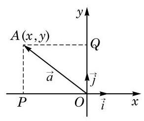

图 8-3-1

如图 8-3-1,把向量 $\overrightarrow{a}$ 的起点放在坐标原点 $O$ 上,设其终点是 $A\left( {x, y}\right)$ . 如前所述,就可以把向量 $\overrightarrow{a}$ 与一个有序实数对 $\left( {x, y}\right)$ 相对应. 这个实数对对于向量 $\overrightarrow{a}$ 的实际意义是什么呢?

设 $\overrightarrow{i}$ 与 $\overrightarrow{j}$ 分别是 $x$ 轴与 $y$ 轴正方向上的单位向量,把向量 $\overrightarrow{a} = \overrightarrow{OA}$ 在 $\overrightarrow{i}$ 与 $\overrightarrow{j}$ 的方向上作投影 $\overrightarrow{OP}$ 与 $\overrightarrow{OQ}$ . 其中, $P\left( {x,0}\right)$ 与 $Q\left( {0, y}\right)$ 分别是点 $A$ 在 $x$ 轴与 $y$ 轴上的投影. 显然 $\overrightarrow{OP} = {xi}$ , $\overrightarrow{OQ} = y\overrightarrow{j}$ ,而且 ${OPAQ}$ 是一个矩形, ${OA}$ 是对角线. 于是我们把 $\overrightarrow{a}$ 表示成了向量 $\overrightarrow{i}$ 与 $\overrightarrow{j}$ 的线性组合:

$$
\overrightarrow{a} = \overrightarrow{OA} = x\overrightarrow{i} + y\overrightarrow{j}.
$$

这就是上面所述的向量 $\overrightarrow{a}$ 与有序实数对 $\left( {x, y}\right)$ 相对应的实际意义.

从这里可以看到另一个事实: 给定上面所说的两个向量 $\overrightarrow{i}$ 与 $\overrightarrow{j}$ ,平面上的任意一个给定的向量 $\overrightarrow{a}$ 都可以写成 $\overrightarrow{i}$ 与 $\overrightarrow{j}$ 的一个线性组合. 我们可以更一般地考虑: 如果把 $\overrightarrow{i}$ 与 $\overrightarrow{j}$ 换成其他两个非零向量 $\overrightarrow{{e}_{1}}$ 与 $\overrightarrow{{e}_{2}}$ ，那么平面上任意给定的一个向量是否都是 $\overrightarrow{{e}_{1}}$ 与 $\overrightarrow{{e}_{2}}$ 的线性组合呢?

如果 $\overrightarrow{{e}_{1}}//\overrightarrow{{e}_{2}}$ ,那么结论显然不成立,因为这时 $\overrightarrow{{e}_{1}}$ 与 $\overrightarrow{{e}_{2}}$ 的任意一个线性组合 $\lambda \overrightarrow{{e}_{1}} + \mu \overrightarrow{{e}_{2}}$ ( $\lambda$ 与 $\mu$ 是实数)都是与 $\overrightarrow{{e}_{1}}$ 和 $\overrightarrow{{e}_{2}}$ 平行的向量, 所以不可能表示平面上的所有向量. 然而, 除了这个例外, $\overrightarrow{{e}_{1}}$ 与 $\overrightarrow{{e}_{2}}$ 的线性组合确实可以把平面上任意一个向量表示出来. 更准确地说,我们有如下定理:

向量基本定理 如果 $\overrightarrow{{e}_{1}}$ 与 $\overrightarrow{{e}_{2}}$ 是平面上两个不平行的向量,那么该平面上的任意向量 $\overrightarrow{a}$ ,都可唯一地表示为 $\overrightarrow{{e}_{1}}$ 与 $\overrightarrow{{e}_{2}}$ 的线性组合,即存在唯一的一对实数 $\lambda$ 与 $\mu$ ,使得

$$
\overrightarrow{a} = \lambda \overrightarrow{{e}_{1}} + \mu \overrightarrow{{e}_{2}}.
$$

证明 本证明是前面关于把 $\overrightarrow{a}$ 写成 $\overrightarrow{a} = x\overrightarrow{i} + y\overrightarrow{j}$ 的证明的推广. 不过,由于所给的 $\overrightarrow{{e}_{1}}$ 与 $\overrightarrow{{e}_{2}}$ 不一定互相垂直,因此必须用构建平行四边形的方法来代替做投影.

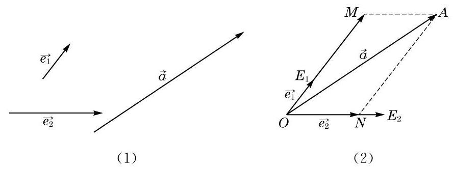

图 8-3-2

给定不平行的两个向量 ${\overrightarrow{e}}_{1}\text{ 、 }{\overrightarrow{e}}_{2}$ 和任意一个向量 $\overrightarrow{a}$ ,如图 8-3-2(1)所示. 从任意给定的一点 $O$ 出发，作向量 $\overrightarrow{O{E}_{1}} = {\overrightarrow{e}}_{1}$ ， $\overrightarrow{O{E}_{2}} = \overrightarrow{{e}_{2}},\overrightarrow{OA} = \overrightarrow{a}$ ，如图 8-3-2(2)所示. 过点 $A$ 作平行于直线 $O{E}_{2}$ 的直线,交直线 $O{E}_{1}$ 于点 $M$ ,并作平行于直线 $O{E}_{1}$ 的直线,交直线 $O{E}_{2}$ 于点 $N$ ,则 ${OMAN}$ 是平行四边形, ${OA}$ 是其对角线,从而 $\overrightarrow{OA} = \overrightarrow{OM} + \overrightarrow{ON}$ . 由于 $\overrightarrow{OM}//\overrightarrow{O{E}_{1}}$ ,因此存在实数 $\lambda$ 使 $\overrightarrow{OM} = \lambda \overrightarrow{O{E}_{1}} = \lambda \overrightarrow{{e}_{1}}$ ；同理，存在实数 $\mu$ 使 $\overrightarrow{ON} = \mu \overrightarrow{{e}_{2}}$ . 于是， $\overrightarrow{a} = \; \lambda \overrightarrow{{e}_{1}} + \mu \overrightarrow{{e}_{2}}.$

下面再证明这个实数对是唯一的. 假设还成立 $\overrightarrow{a} = {\lambda }^{\prime }\overrightarrow{{e}_{1}} + \; {\mu }^{\prime }\overrightarrow{{e}_{2}}$ ,就有

$$
\left( {\lambda  - {\lambda }^{\prime }}\right) \overrightarrow{{e}_{1}} =  - \left( {\mu  - {\mu }^{\prime }}\right) \overrightarrow{{e}_{2}}.
$$

由于 $\overrightarrow{{e}_{1}}$ 与 $\overrightarrow{{e}_{2}}$ 不平行,因此 $\lambda  - {\lambda }^{\prime } = \mu  - {\mu }^{\prime } = 0$ ,即 $\lambda  = {\lambda }^{\prime },\mu  = {\mu }^{\prime }$ .

给定平面上的一组向量, 如果平面上的任意向量都可以唯一地表示成这组向量的线性组合, 那么就称这组向量是平面向量的一个基. 用这个术语, 向量基本定理可以表述成: 平面上任意两个不平行的向量都组成平面向量的一个基.

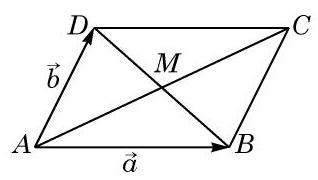

图 8-3-3

例 1 如图 8-3-3, 在平行四边形 ABCD 中, 两条对角线的交点是 $M$ ,设 $\overrightarrow{AB} = \overrightarrow{a},\overrightarrow{AD} = \overrightarrow{b}$ . 试用 $\overrightarrow{a}\text{ 、 }\overrightarrow{b}$ 的线性组合分别表示 $\overrightarrow{MA}\text{ 、 }\overrightarrow{MB}\text{ 、 }\overrightarrow{MC}$ 与 $\overrightarrow{MD}$ .

解 我们有

$$
\overrightarrow{AC} = \overrightarrow{AB} + \overrightarrow{AD} = \overrightarrow{a} + \overrightarrow{b},
$$

$$
\overrightarrow{DB} = \overrightarrow{AB} - \overrightarrow{AD} = \overrightarrow{a} - \overrightarrow{b}.
$$

故 $\overrightarrow{MA} =  - \frac{1}{2}\overrightarrow{AC} =  - \frac{1}{2}\left( {\overrightarrow{a} + \overrightarrow{b}}\right)  =  - \frac{1}{2}\overrightarrow{a} - \frac{1}{2}\overrightarrow{b}$ ,

$$
\overrightarrow{MB} = \frac{1}{2}\overrightarrow{DB} = \frac{1}{2}\left( {\overrightarrow{a} - \overrightarrow{b}}\right)  = \frac{1}{2}\overrightarrow{a} - \frac{1}{2}\overrightarrow{b},
$$

$$
\overrightarrow{MC} =  - \overrightarrow{MA} = \frac{1}{2}\overrightarrow{a} + \frac{1}{2}\overrightarrow{b},
$$

$$
\overrightarrow{MD} =  - \overrightarrow{MB} =  - \frac{1}{2}\overrightarrow{a} + \frac{1}{2}\overrightarrow{b}.
$$

## 探究与实践

按提示的步骤探索用向量形式表达三点共线的充要条件, 并导出直线的向量参数方程:

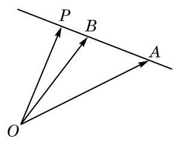

图 8-3-4

(1)如图 8-3-4，给定平面上不共线的三个点 $O$ 、 $A$ 与 $B$ ，根据向量基本定理,对平面上任意一点 $P$ ,都有实数 $\lambda$ 与 $\mu$ ,使得 $\overrightarrow{OP} = \lambda \overrightarrow{OA} + \mu \overrightarrow{OB};$

(2)证明 $A\text{ 、 }B\text{ 、 }P$ 三点共线的充要条件是 $\lambda  + \mu  = 1$ ；

(3)由此推出，对直线 ${AB}$ 上任意一点 $P$ ，一定存在唯一的实数 $\mu$ ,使下列向量等式

$$
\overrightarrow{OP} = \left( {1 - \mu }\right) \overrightarrow{OA} + \mu \overrightarrow{OB}
$$

成立. 反之,对任意给定的实数 $\mu$ ,在直线 ${AB}$ 上都有唯一的点 $P$ 与之对应. 上述向量等式在将 $\mu$ 视为变动参数时,叫做直线 ${AB}$ 的向量参数方程.

## 练习 8.3(1)

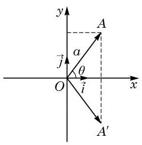

(第 1 题)

1. 如图, $\overrightarrow{i}$ 与 $\overrightarrow{j}$ 分别是平面直角坐标系中 $x$ 轴与 $y$ 轴正方向上的单位向量,点 $A$ 在第一象限内,与坐标原点 $O$ 的距离为 $a,{OA}$ 与 $x$ 轴的夹角为 $\theta$ . 又设 ${A}^{\prime }$ 是 $A$ 关于 $x$ 轴的对称点. 把向量 $\overrightarrow{OA}\text{ 、 }\overrightarrow{O{A}^{\prime }}$ 表示成向量 $\overrightarrow{i}$ 与 $\overrightarrow{j}$ 的线性组合.

2. 已知平行四边形 ${ABCD}$ 的对角线交于点 $O$ ,且 $\overrightarrow{OA} = \overrightarrow{a},\overrightarrow{OB} \; = \overrightarrow{b}$ . 把向量 $\overrightarrow{OC}\text{ 、 }\overrightarrow{OD}\text{ 、 }\overrightarrow{DC}$ 与 $\overrightarrow{BC}$ 表示成 $\overrightarrow{a}$ 与 $\overrightarrow{b}$ 的线性组合.

3. 设 $G$ 为 $\bigtriangleup {ABC}$ 的重心,用向量 $\overrightarrow{BC} = \overrightarrow{a}$ 与 $\overrightarrow{AC} = \overrightarrow{b}$ 的线性组合来表示向量 $\overrightarrow{AG}$ 、 $\overrightarrow{BG}$ 与 $\overrightarrow{CG}$ .

## 2 向量的正交分解与坐标表示

把向量 $\overrightarrow{a}$ 写成所在平面上两个不平行向量 $\overrightarrow{{e}_{1}}$ 与 $\overrightarrow{{e}_{2}}$ 的线性组合的过程称为 $\overrightarrow{a}$ 关于 $\overrightarrow{{e}_{1}}$ 与 $\overrightarrow{{e}_{2}}$ 的分解(decomposition). 我们特别关注向量关于两个互相垂直的向量的分解这一特殊而实用的情况， 即在 $\overrightarrow{{e}_{1}} \bot  \overrightarrow{{e}_{2}}$ 情况下进行向量的分解. 这种分解称为向量的正交分解(orthogonal decomposition).

物理中常常将力进行正交分解, 就是向量正交分解的一个常见的应用. 如图 8-3-5, 将斜面上物体的重力分解为沿斜面的下滑力和垂直于斜面的正压力.

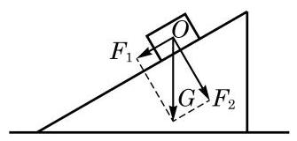

图 8-3-5

在平面直角坐标系中任意一个向量 $\overrightarrow{a}$ 关于 $x$ 轴与 $y$ 轴正方向上的单位向量 $\overrightarrow{i}$ 与 $\overrightarrow{j}$ 的分解 $\overrightarrow{a} = x\overrightarrow{i} + y\overrightarrow{j}$ 就是一个正交分解. 这个正交分解称为向量 $\overrightarrow{a}$ 在这个平面直角坐标系中的坐标分解 (coordinate decomposition),而有序实数对 $\left( {x, y}\right)$ 则称为向量 $\overrightarrow{a}$ 的坐标 (coordinates), 并直接表示成

$$
\overrightarrow{a} = \left( {x, y}\right) .
$$

向量的这种表示法称为它的坐标表示 (coordinate representation), 并可以直接用向量的坐标 $\left( {x, y}\right)$ 代表一个向量.

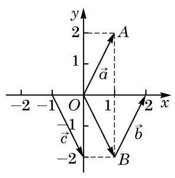

图 8-3-6

必须注意,在向量 $\overrightarrow{a}$ 的坐标表示中,我们先要作出从坐标原点 $O$ 出发的向量 $\overrightarrow{OA} = \overrightarrow{a}$ ,才能用点 $A$ 的坐标 $\left( {x, y}\right)$ 表示向量 $\overrightarrow{a}$ 的坐标. 为此,我们把向量 $\overrightarrow{OA}$ 称为 $\overrightarrow{a}$ 的位置向量 (position vector). 位置向量终点的坐标才是所给向量的坐标.

例 2 如图 8-3-6,写出向量 $\overrightarrow{a}$ 、 $\overrightarrow{b}$ 与 $\overrightarrow{c}$ 的坐标.

解 因为 $\overrightarrow{a}$ 与 $\overrightarrow{b}$ 的位置向量都是 $\overrightarrow{OA}$ ,所以 $\overrightarrow{a} = \overrightarrow{b} = \left( {1,2}\right)$ ; 因为 $\overrightarrow{c}$ 的位置向量是 $\overrightarrow{OB}$ ,所以 $\overrightarrow{c} = \left( {1, - 2}\right)$ .

## 3 向量线性运算的坐标表示

有了向量的坐标表示后, 向量的运算可以转化为其坐标的相应运算.

设 $\left( {{x}_{1},{y}_{1}}\right) \text{ 、 }\left( {{x}_{2},{y}_{2}}\right)$ 与 $\left( {x, y}\right)$ 均是坐标表示的向量, $\lambda$ 是一个实数, 则

$$
\left( {{x}_{1},{y}_{1}}\right)  \pm  \left( {{x}_{2},{y}_{2}}\right)  = \left( {{x}_{1} \pm  {x}_{2},{y}_{1} \pm  {y}_{2}}\right) ,
$$

$$
\lambda \left( {x, y}\right)  = \left( {{\lambda x},{\lambda y}}\right) .
$$

这就是说: 向量相加 (减), 可化为把它们的对应坐标相加 (减); 一个向量乘一个实数, 可化为把它的坐标乘这个实数.

这些公式的证明是容易的:

因为 $\left( {{x}_{1},{y}_{1}}\right)  = {x}_{1}\overrightarrow{i} + {y}_{1}\overrightarrow{j},\left( {{x}_{2},{y}_{2}}\right)  = {x}_{2}\overrightarrow{i} + {y}_{2}\overrightarrow{j}$ ,所以

$$
\left( {{x}_{1},{y}_{1}}\right)  + \left( {{x}_{2},{y}_{2}}\right)  = \left( {{x}_{1}\overrightarrow{i} + {y}_{1}\overrightarrow{j}}\right)  + \left( {{x}_{2}\overrightarrow{i} + {y}_{2}\overrightarrow{j}}\right)
$$

$$
= \left( {{x}_{1} + {x}_{2}}\right) \overrightarrow{i} + \left( {{y}_{1} + {y}_{2}}\right) \overrightarrow{j}
$$

$$
= \left( {{x}_{1} + {x}_{2},{y}_{1} + {y}_{2}}\right) \text{ . }
$$

对 $\left( {x, y}\right)  = x\overrightarrow{i} + y\overrightarrow{j}$ ,有

$$
\lambda \left( {x, y}\right)  = \lambda \left( {x\overrightarrow{i} + y\overrightarrow{j}}\right)  = \left( {\lambda x}\right) \overrightarrow{i} + \left( {\lambda y}\right) \overrightarrow{j} = \left( {{\lambda x},{\lambda y}}\right) .
$$

例 3 给定向量 $\overrightarrow{a} = \left( {4, - 1}\right)$ 与 $\overrightarrow{b} = \left( {5,2}\right)$ ，求向量 $2\overrightarrow{a} + 3\overrightarrow{b}$ 的坐标.

解 因为 $2\overrightarrow{a} = \left( {8, - 2}\right) ,3\overrightarrow{b} = \left( {{15},6}\right)$ ,所以

$$
2\overrightarrow{a} + 3\overrightarrow{b} = \left( {8 + {15}, - 2 + 6}\right)  = \left( {{23},4}\right) .
$$

向量的模在坐标表示下也是容易计算的: 设 $\overrightarrow{a} = \left( {x, y}\right)$ ,则

$$
\left| \overrightarrow{a}\right|  = \left| \left( {x, y}\right) \right|  = \sqrt{{x}^{2} + {y}^{2}}.
$$

这是因为 $\left| \overrightarrow{a}\right|$ 是以 $\left| x\right|$ 和 $\left| y\right|$ 为直角边的直角三角形的斜边.

我们已经学过, 为了求出一个向量的坐标, 先要作出它从坐标原点 $O$ 出发的位置向量,才能从位置向量终点的坐标得到这个向量的坐标. 我们希望能从任意向量的起点坐标和终点坐标直接得出向量的坐标.

于是,对平面上的任意两点 $P\left( {{x}_{1},{y}_{1}}\right)$ 与 $Q\left( {{x}_{2},{y}_{2}}\right)$ ,我们要求向量 $\overrightarrow{PQ}$ 的坐标.

由 $\overrightarrow{OP} = \left( {{x}_{1},{y}_{1}}\right) ,\overrightarrow{OQ} = \left( {{x}_{2},{y}_{2}}\right)$ ,得

$$
\overrightarrow{PQ} = \overrightarrow{OQ} - \overrightarrow{OP} = \left( {{x}_{2},{y}_{2}}\right)  - \left( {{x}_{1},{y}_{1}}\right)  = \left( {{x}_{2} - {x}_{1},{y}_{2} - {y}_{1}}\right) .
$$

因此, 一个向量的坐标等于这个向量的终点坐标减去它的起点坐标.

例 4 平面上 $A\text{ 、 }B\text{ 、 }C$ 三点的坐标分别为 $\left( {2,1}\right) \text{ 、 }\left( {-3,2}\right)$ 、 $\left( {-1,3}\right)$ ,写出向量 $\overrightarrow{AC}\text{ 、 }\overrightarrow{BC}$ 的坐标.

解 $\overrightarrow{AC} = \left( {-1 - 2,3 - 1}\right)  = \left( {-3,2}\right)$ ,

$$
\overrightarrow{BC} = \left( {-1 - \left( {-3}\right) ,3 - 2}\right)  = \left( {2,1}\right) .
$$

例 5 已知平面上两点 $P$ 、 $Q$ 的坐标分别为 $\left( {-2,4}\right)$ 、 $\left( {2,1}\right)$ ,求 $\overrightarrow{PQ}$ 的单位向量 $\overrightarrow{{a}_{0}}$ 的坐标.

解 因为 $\overrightarrow{PQ} = \left( {2 - \left( {-2}\right) ,1 - 4}\right)  = \left( {4, - 3}\right)$ ,

$$
\left| \overrightarrow{PQ}\right|  = \sqrt{{4}^{2} + {\left( -3\right) }^{2}} = 5,
$$

所以

$$
\overrightarrow{{a}_{0}} = \frac{1}{\left| \overrightarrow{PQ}\right| }\overrightarrow{PQ} = \frac{1}{5}\left( {4, - 3}\right)  = \left( {\frac{4}{5}, - \frac{3}{5}}\right) .
$$

## 练习 8.3(2)

1. 已知向量 $\overrightarrow{a} = \left( {-2,3}\right) ,\overrightarrow{b} = \left( {2, - 5}\right)$ . 求 $3\overrightarrow{a} - \overrightarrow{b}$ 的坐标及 $\left| {3\overrightarrow{a} - \overrightarrow{b}}\right|$ .

2. 求向量 $\overrightarrow{a} = \left( {3, - 4}\right)$ 的单位向量的坐标.

3. 已知平面上 $A\text{ 、 }B\text{ 、 }C$ 三点的坐标分别为 $\left( {0,1}\right) \text{ 、 }\left( {1,2}\right) \text{ 、 }\left( {3,4}\right)$ ,求 $\overrightarrow{AB}\text{ 、 }\overrightarrow{BC}\text{ 、 }\overrightarrow{AC}$ 的坐标,并证明 $A\text{ 、 }B\text{ 、 }C$ 三点共线.

## 4 向量数量积与夹角的坐标表示

给定两个坐标表示的向量 $\overrightarrow{a} = \left( {{x}_{1},{y}_{1}}\right)$ 与 $\overrightarrow{b} = \left( {{x}_{2},{y}_{2}}\right)$ ,它们的数量积是

$$
\overrightarrow{a} \cdot  \overrightarrow{b} = \left( {{x}_{1}\overrightarrow{i} + {y}_{1}\overrightarrow{j}}\right)  \cdot  \left( {{x}_{2}\overrightarrow{i} + {y}_{2}\overrightarrow{j}}\right)
$$

$$
= \left( {{x}_{1}{x}_{2}}\right) {\overrightarrow{i}}^{2} + \left( {{x}_{1}{y}_{2} + {x}_{2}{y}_{1}}\right) \overrightarrow{i} \cdot  \overrightarrow{j} + {y}_{1}{y}_{2}{\overrightarrow{j}}^{2}.
$$

因为 $\overrightarrow{i}\text{ 、 }\overrightarrow{j}$ 是互相垂直的单位向量,所以 ${\overrightarrow{i}}^{2} = 1,\overrightarrow{i} \cdot  \overrightarrow{j} = 0$ , ${\overrightarrow{\jmath }}^{2} = 1$ ,于是

$$
\overrightarrow{a} \cdot  \overrightarrow{b} = {x}_{1}{x}_{2} + {y}_{1}{y}_{2}.
$$

这就是说, 两个向量的数量积等于它们对应坐标的乘积的和.

我们前面给出过用两个向量的数量积表示两个向量夹角的公式, 但当时因为数量积的计算依赖于向量的夹角, 那个公式的实际意义没有足够地显示出来. 现在, 给定两个非零向量 $\overrightarrow{a} = \left( {{x}_{1},{y}_{1}}\right)$ 与 $\overrightarrow{b} = \left( {{x}_{2},{y}_{2}}\right)$ ,把用坐标表示的模的公式和数量积公式代入原来的向量夹角公式，我们得到

$$
\cos \langle \overrightarrow{a},\overrightarrow{b}\rangle  = \frac{\overrightarrow{a} \cdot  \overrightarrow{b}}{\left| \overrightarrow{a}\right| \left| \overrightarrow{b}\right| } = \frac{{x}_{1}{x}_{2} + {y}_{1}{y}_{2}}{\sqrt{{x}_{1}^{2} + {y}_{1}^{2}}\sqrt{{x}_{2}^{2} + {y}_{2}^{2}}}.
$$

这样, 把向量夹角用它们的坐标表示出来, 使用上就很方便了.

例 6 已知向量 $\overrightarrow{a} = \left( {1,2}\right) ,\overrightarrow{b} = \left( {2, - 2}\right)$ . 求 $\left| \overrightarrow{a}\right| \text{ 、 }\left| \overrightarrow{b}\right|$ 与 $\langle \overrightarrow{a},\overrightarrow{b}\rangle$ .

解 $\left| \overrightarrow{a}\right|  = \sqrt{{1}^{2} + {2}^{2}} = \sqrt{5},\left| \overrightarrow{b}\right|  = \sqrt{{2}^{2} + {\left( -2\right) }^{2}} = 2\sqrt{2}$ ,故

$$
\cos \langle \overrightarrow{a},\overrightarrow{b}\rangle  = \frac{\overrightarrow{a} \cdot  \overrightarrow{b}}{\left| \overrightarrow{a}\right| \left| \overrightarrow{b}\right| } = \frac{1 \times  2 + 2 \times  \left( {-2}\right) }{\sqrt{5} \times  2\sqrt{2}} =  - \frac{\sqrt{10}}{10},
$$

从而 $\langle \overrightarrow{a},\overrightarrow{b}\rangle  = \pi  - \arccos \frac{\sqrt{10}}{10}$ .

例 7 已知 $\bigtriangleup {ABC}$ 中 $A\text{ 、 }B\text{ 、 }C$ 三点的坐标分别为 $\left( {2, - 2}\right)$ 、 $\left( {-2,3}\right) \text{ 、 }\left( {3,7}\right)$ ,求证: $\bigtriangleup {ABC}$ 为直角三角形.

证明 因为 $\overrightarrow{AB} = \left( {-4,5}\right) ,\overrightarrow{BC} = \left( {5,4}\right)$ ,

$$
\overrightarrow{AB} \cdot  \overrightarrow{BC} = \left( {-4}\right)  \times  5 + 5 \times  4 = 0,
$$

所以 $\overrightarrow{AB} \bot  \overrightarrow{BC}$ ,即 $\bigtriangleup {ABC}$ 为直角三角形.

利用坐标形式的向量夹角公式, 我们可以得到两个向量垂直和平行的充要条件:

给定向量 $\overrightarrow{a} = \left( {{x}_{1},{y}_{1}}\right)$ 与 $\overrightarrow{b} = \left( {{x}_{2},{y}_{2}}\right)$ ,则

(1) $\overrightarrow{a}\bot \overrightarrow{b}$ 的充要条件是 ${x}_{1}{x}_{2} + {y}_{1}{y}_{2} = 0$ ；

(2) $\overrightarrow{a}//\overrightarrow{b}$ 的充要条件是 ${x}_{1}{y}_{2} = {x}_{2}{y}_{1}$ .

证明 如果 $\overrightarrow{a}\text{ 、 }\overrightarrow{b}$ 中有零向量,结论是显然的. 因此,只要考虑 $\overrightarrow{a}\text{ 、 }\overrightarrow{b}$ 均不为零向量的情况.

(1)根据向量夹角公式

$$
\overrightarrow{a} \bot  \overrightarrow{b} \Leftrightarrow  \langle \overrightarrow{a},\overrightarrow{b}\rangle  = \frac{\pi }{2}
$$

$$
\Leftrightarrow  \cos \langle \overrightarrow{a},\overrightarrow{b}\rangle  = 0
$$

$$
\Leftrightarrow  {x}_{1}{x}_{2} + {y}_{1}{y}_{2} = 0\text{ . }
$$

(2)因为

$\overrightarrow{a}//\overrightarrow{b} \Leftrightarrow  \langle \overrightarrow{a},\overrightarrow{b}\rangle  = 0$ 或 $\pi  \Leftrightarrow  \cos \langle \overrightarrow{a},\overrightarrow{b}\rangle  =  \pm  1$ ,仍根据向量夹角公式

$$
\overrightarrow{a}//\overrightarrow{b} \Leftrightarrow  \frac{{x}_{1}{x}_{2} + {y}_{1}{y}_{2}}{\sqrt{{x}_{1}^{2} + {y}_{1}^{2}}\sqrt{{x}_{2}^{2} + {y}_{2}^{2}}} =  \pm  1
$$

$$
\Leftrightarrow  {\left( {x}_{1}{x}_{2} + {y}_{1}{y}_{2}\right) }^{2} = \left( {{x}_{1}^{2} + {y}_{1}^{2}}\right) \left( {{x}_{2}^{2} + {y}_{2}^{2}}\right)
$$

$$
\Leftrightarrow  {x}_{1}^{2}{y}_{2}^{2} - 2{x}_{1}{x}_{2}{y}_{1}{y}_{2} + {x}_{2}^{2}{y}_{1}^{2} = 0
$$

$$
\Leftrightarrow  {\left( {x}_{1}{y}_{2} - {x}_{2}{y}_{1}\right) }^{2} = 0
$$

$$
\Leftrightarrow  {x}_{1}{y}_{2} = {x}_{2}{y}_{1}\text{ . }
$$

用坐标形式的向量夹角公式, 并模仿这里所用的把公式两边同时平方的方法, 可以证明一个重要的代数不等式. 这是向量工具在代数中应用的一个实例.

例 8 已知 ${x}_{1}\text{ 、 }{x}_{2}\text{ 、 }{y}_{1}\text{ 、 }{y}_{2}$ 都是实数,求证:

$$
{\left( {x}_{1}{x}_{2} + {y}_{1}{y}_{2}\right) }^{2} \leq  \left( {{x}_{1}^{2} + {y}_{1}^{2}}\right) \left( {{x}_{2}^{2} + {y}_{2}^{2}}\right) ,
$$

---

这是著名的柯西- 施瓦兹不等式 (Cauchy -Schwarz Inequality).

---

并且等式成立的充要条件是 ${x}_{1}{y}_{2} = {x}_{2}{y}_{1}$ .

证明 构造向量 $\overrightarrow{a} = \left( {{x}_{1},{y}_{1}}\right) ,\overrightarrow{b} = \left( {{x}_{2},{y}_{2}}\right)$ . 如果其中有零向量,那么结论显然成立,从而只要考虑 $\overrightarrow{a}\text{ 、 }\overrightarrow{b}$ 都是非零向量的情况. 把坐标形式的向量夹角公式两边同时平方, 整理后可得

$$
{\left( {x}_{1}{x}_{2} + {y}_{1}{y}_{2}\right) }^{2} = \left( {{x}_{1}^{2} + {y}_{1}^{2}}\right) \left( {{x}_{2}^{2} + {y}_{2}^{2}}\right) {\cos }^{2}\langle \overrightarrow{a},\overrightarrow{b}\rangle .
$$

因为 $0 \leq  {\cos }^{2}\langle \overrightarrow{a},\overrightarrow{b}\rangle  \leq  1$ ,所以

$$
{\left( {x}_{1}{x}_{2} + {y}_{1}{y}_{2}\right) }^{2} \leq  \left( {{x}_{1}^{2} + {y}_{1}^{2}}\right) \left( {{x}_{2}^{2} + {y}_{2}^{2}}\right) .
$$

并且,

等号成立 $\Leftrightarrow  {\cos }^{2}\langle \overrightarrow{a},\overrightarrow{b}\rangle  = 1$

$$
\Leftrightarrow  \overrightarrow{a}//\overrightarrow{b}
$$

$$
\Leftrightarrow  {x}_{1}{y}_{2} = {x}_{2}{y}_{1}\text{ . }
$$

## 练习 8.3(3)

1. 已知向量 $\overrightarrow{a} = \left( {2,3}\right) ,\overrightarrow{b} = \left( {-2,4}\right) ,\overrightarrow{c} = \left( {-1, - 2}\right)$ . 求 $\overrightarrow{a} \cdot  \overrightarrow{b},\overrightarrow{c} \cdot  \left( {\overrightarrow{a} - \overrightarrow{b}}\right)$ .

2. 已知向量 $\overrightarrow{a} = \left( {-3,4}\right) ,\overrightarrow{b} = \left( {5,{12}}\right)$ . 求 $\left| \overrightarrow{a}\right| \text{ 、 }\left| \overrightarrow{b}\right|$ 以及 $\langle \overrightarrow{a},\overrightarrow{b}\rangle$ .

3. 在 $\bigtriangleup {ABC}$ 中,已知 $A\text{ 、 }B\text{ 、 }C$ 三点的坐标分别为 $\left( {-2,3}\right) \text{ 、 }\left( {0, - 1}\right) \text{ 、 }\left( {1, k}\right)$ ,且 $\angle C$ 为直角. 求实数 $k$ 的值.

4. 已知向量 $\overrightarrow{a} = \left( {1,2}\right) ,\overrightarrow{b} = \left( {3,1}\right) ,\overrightarrow{c} = \overrightarrow{b} - k\overrightarrow{a}$ ,且 $\overrightarrow{a} \bot  \overrightarrow{c}$ . 求实数 $k$ 的值及向量 $\overrightarrow{c}$ 的坐标.

## 习题 8.3

## A 组

1. 如图, ${OADB}$ 是以向量 $\overrightarrow{OA} = \overrightarrow{a},\overrightarrow{OB} = \overrightarrow{b}$ 为邻边的平行四边形, $C$ 是对角线的交点,且 ${BM} = \frac{1}{3}{BC},{CN} = \frac{1}{3}{CD}$ . 试用 $\overrightarrow{a}\text{ 、 }\overrightarrow{b}$ 表示 $\overrightarrow{OM}\text{ 、 }\overrightarrow{ON}\text{ 、 }\overrightarrow{MN}$ .

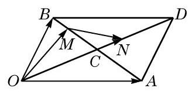

(第 1 题)

2. 已知向量 $\overrightarrow{a} = \left( {-1,2}\right) ,\overrightarrow{b} = \left( {2,1}\right)$ . 求 $2\overrightarrow{a} + 3\overrightarrow{b},\overrightarrow{a} - 2\overrightarrow{b},\frac{1}{2}\overrightarrow{a} - \frac{1}{3}\overrightarrow{b}$ .

3. 已知点 $A\left( {3,2}\right) \text{ 、 }B\left( {7,5}\right) \text{ 、 }C\left( {-1,8}\right)$ ,求 $\overrightarrow{AB} - \frac{1}{2}\overrightarrow{AC}$ .

4. 已知向量 $\overrightarrow{a} = \left( {-5,{12}}\right)$ ，求 $\left| \overrightarrow{a}\right|$ 以及向量 $\overrightarrow{a}$ 的单位向量 $\overrightarrow{{a}_{0}}$ .

5. 已知点 $A\left( {1,2}\right) \text{ 、 }B\left( {-3,1}\right)$ ,且 $\overrightarrow{AC} = \frac{1}{2}\overrightarrow{AB},\overrightarrow{AD} = 3\overrightarrow{AB},\overrightarrow{AE} =  - \frac{1}{3}\overrightarrow{AB}$ . 求点 $C$ 、 $D\text{ 、 }E$ 的坐标.

6. 已知向量 $\overrightarrow{a} = \left( {5,3}\right) ,\overrightarrow{b} = \left( {x,1}\right)$ ，且 $\overrightarrow{a}//\overrightarrow{b}$ . 求实数 $x$ 的值.

7. 已知点 $A\left( {3,0}\right) \text{ 、 }B\left( {-1, - 6}\right)$ ,点 $P$ 是直线 ${AB}$ 上一点,且 $\left| \overrightarrow{AP}\right|  = \frac{1}{3}\left| \overrightarrow{AB}\right|$ . 求点 $P$ 的坐标.

8. 已知向量 $\overrightarrow{a} = \left( {3, - 1}\right) ,\overrightarrow{b} = \left( {1, - 2}\right)$ . 求 $\overrightarrow{a} \cdot  \overrightarrow{b}$ 与 $\langle \overrightarrow{a},\overrightarrow{b}\rangle$ .

9. 已知向量 $\overrightarrow{a} = \left( {3 - m,{3m}}\right) ,\overrightarrow{b} = \left( {m + 2, - 2}\right)$ ，且 $\overrightarrow{a}\bot \overrightarrow{b}$ . 求实数 $m$ 的值.

10. 已知向量 $\overrightarrow{a} = \left( {2,4}\right)$ ，求与 $\overrightarrow{a}$ 垂直的单位向量的坐标.

## B 组

1. 已知 $O$ 为坐标原点，在 $\bigtriangleup  {ABC}$ 中，向量 $\overrightarrow{OA} = \left( {2,3}\right)$ ， $\overrightarrow{OB} = \left( {1,4}\right)$ ，且 $\overrightarrow{OC} = 3\overrightarrow{OA}$ ， $\overrightarrow{OD} = 3\overrightarrow{OB},\overrightarrow{OE} = 2\overrightarrow{OA} + \overrightarrow{OB}$ . 求 $C\text{ 、 }D\text{ 、 }E$ 三点的坐标,并判断 $C\text{ 、 }D\text{ 、 }E$ 三点是否共线.

2. 已知向量 $\overrightarrow{a} = \left( {1,2}\right) ,\overrightarrow{b} = \left( {m,1}\right)$ ，且 $\overrightarrow{a} + 2\overrightarrow{b}$ 与 $2\overrightarrow{a} - \overrightarrow{b}$ 平行. 求实数 $m$ 的值.

3. 经过点 $M\left( {-2,3}\right)$ 的直线分别与 $x$ 轴、 $y$ 轴交于 $A\text{ 、 }B$ 两点,且 $\left| \overrightarrow{AB}\right|  = 3\left| \overrightarrow{AM}\right|$ . 求点 $A\text{ 、 }B$ 的坐标.

4. 已知向量 $\overrightarrow{a} = \left( {1, - 1}\right) ,\overrightarrow{b} = \left( {2, - 3}\right)$ ，且 $k\overrightarrow{a} - 2\overrightarrow{b}$ 与 $\overrightarrow{a}$ 垂直. 求实数 $k$ 的值.

### 8.4 向量的应用

向量在数学、物理以及实际生活中都有着广泛的应用. 上一节末我们给出了向量在代数中的应用, 本节将继续通过例题给出更多的应用. 先考虑一些几何问题.

例 1 已知 $P$ 是直线 ${P}_{1}{P}_{2}$ 上一点,且 $\overrightarrow{{P}_{1}P} = \lambda \overrightarrow{P{P}_{2}}(\lambda$ 为实数,且 $\lambda  \neq   - 1),{P}_{1}\text{ 、 }{P}_{2}$ 的坐标分别为 $\left( {{x}_{1},{y}_{1}}\right) \text{ 、 }\left( {{x}_{2},{y}_{2}}\right)$ . 求点 $P$ 的坐标 $\left( {x, y}\right)$ .

解 由 $\overrightarrow{{P}_{1}P} = \lambda \overrightarrow{P{P}_{2}}$ ,可知

$$
\left\{  \begin{array}{l} x - {x}_{1} = \lambda \left( {{x}_{2} - x}\right) , \\  y - {y}_{1} = \lambda \left( {{y}_{2} - y}\right) . \end{array}\right.
$$

因为 $\lambda  \neq   - 1$ ,故

$$
\left\{  \begin{array}{l} x = \frac{{x}_{1} + \lambda {x}_{2}}{1 + \lambda }, \\  y = \frac{{y}_{1} + \lambda {y}_{2}}{1 + \lambda }. \end{array}\right.
$$

---

这个公式称为线段的定比分点公式.

---

特别地,当 $\lambda  = 1$ 时, $P$ 为线段 ${P}_{1}{P}_{2}$ 的中点,其坐标为

$$
\left\{  \begin{array}{l} x = \frac{{x}_{1} + {x}_{2}}{2}, \\  y = \frac{{y}_{1} + {y}_{2}}{2}. \end{array}\right.
$$

---

这个公式称为线段中点公式.

---

例 2 已知 $\bigtriangleup {ABC}$ 三个顶点 $A\text{ 、 }B\text{ 、 }C$ 的坐标分别是 $\left( {{x}_{1},{y}_{1}}\right) \text{ 、 }\left( {{x}_{2},{y}_{2}}\right) \text{ 、 }\left( {{x}_{3},{y}_{3}}\right)$ ,求此三角形重心 $G$ 的坐标.

解 如图 8-4-1,由于点 $G$ 是 $\bigtriangleup {ABC}$ 的重心,因此 ${CG}$ 与 ${AB}$ 的交点 $D$ 是 ${AB}$ 的中点,于是点 $D$ 的坐标为 $\left( \frac{{x}_{1} + {x}_{2}}{2}\right.$ , $\left. \frac{{y}_{1} + {y}_{2}}{2}\right)$

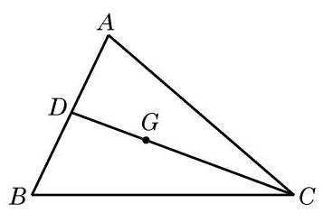

图 8-4-1

设 $G$ 的坐标为 $\left( {x, y}\right)$ ,因为 $\overrightarrow{CG} = 2\overrightarrow{GD}$ ,所以由上述定比分点公式, 得

$$
\left\{  \begin{array}{l} x = \frac{{x}_{3} + 2 \cdot  \frac{{x}_{1} + {x}_{2}}{2}}{1 + 2}, \\  y = \frac{{y}_{3} + 2 \cdot  \frac{{y}_{1} + {y}_{2}}{2}}{1 + 2}. \end{array}\right.
$$

整理, 得

$$
\left\{  \begin{array}{l} x = \frac{{x}_{1} + {x}_{2} + {x}_{3}}{3}, \\  y = \frac{{y}_{1} + {y}_{2} + {y}_{3}}{3}. \end{array}\right.
$$

这就是 $\bigtriangleup {ABC}$ 重心 $G$ 的坐标.

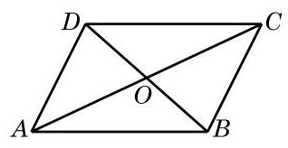

图 8-4-2

例 3 证明: 对角线互相平分的四边形是平行四边形.

已知 如图 8-4-2,设四边形 ${ABCD}$ 的对角线 ${AC}\text{ 、 }{BD}$ 交于点 $O$ ,且 ${AO} = {OC},{BO} = {OD}$ .

求证 ${ABCD}$ 是平行四边形.

$$
\overrightarrow{AB} = \overrightarrow{AO} + \overrightarrow{OB} = \frac{1}{2}\overrightarrow{AC} + \frac{1}{2}\overrightarrow{DB},
$$

$$
\overrightarrow{DC} = \overrightarrow{DO} + \overrightarrow{OC} = \frac{1}{2}\overrightarrow{DB} + \frac{1}{2}\overrightarrow{AC},
$$

于是有 $\overrightarrow{AB} = \overrightarrow{DC}$ ,即 ${AB} = {DC}$ 且 ${AB}//{DC}$ ,故 ${ABCD}$ 是平行四边形.

例 4 在 $\bigtriangleup {ABC}$ 中,设 $\overrightarrow{CA} = \overrightarrow{a},\overrightarrow{CB} = \overrightarrow{b}$ ,记 $\bigtriangleup {ABC}$ 的面积为 $S$ .

(1)求证: $S = \frac{1}{2}\sqrt{{\left| \overrightarrow{a}\right| }^{2}{\left| \overrightarrow{b}\right| }^{2} - {\left( \overrightarrow{a} \cdot  \overrightarrow{b}\right) }^{2}}$ ；

(2)设 $\overrightarrow{a} = \left( {{x}_{1},{y}_{1}}\right) ,\overrightarrow{b} = \left( {{x}_{2},{y}_{2}}\right)$ . 求证: $S = \; \frac{1}{2}\left| {{x}_{1}{y}_{2} - {x}_{2}{y}_{1}}\right| .$

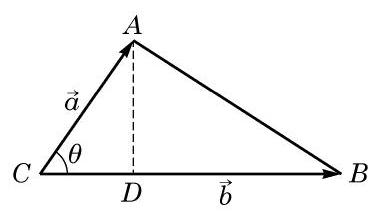

图 8-4-3

证明 ( 1 )如图 8-4-3,设 $\angle C = \langle \overrightarrow{a},\overrightarrow{b}\rangle  = \theta$ . 我们有 $S = \; \frac{1}{2}\left| a\right| \left| b\right| \sin \theta$ ,于是

$$
{S}^{2} = \frac{1}{4}{\left| \overrightarrow{a}\right| }^{2}{\left| \overrightarrow{b}\right| }^{2}{\sin }^{2}\theta
$$

$$
= \frac{1}{4}{\left| \overrightarrow{a}\right| }^{2}{\left| \overrightarrow{b}\right| }^{2}\left( {1 - {\cos }^{2}\theta }\right)
$$

$$
= \frac{1}{4}\left( {{\left| \overrightarrow{a}\right| }^{2}{\left| \overrightarrow{b}\right| }^{2} - {\left| \overrightarrow{a}\right| }^{2}{\left| \overrightarrow{b}\right| }^{2}{\cos }^{2}\theta }\right)
$$

$$
= \frac{1}{4}\left\lbrack  {{\left| \overrightarrow{a}\right| }^{2}{\left| \overrightarrow{b}\right| }^{2} - {\left( \overrightarrow{a} \cdot  \overrightarrow{b}\right) }^{2}}\right\rbrack  ,
$$

所以 $S = \frac{1}{2}\sqrt{{\left| \overrightarrow{a}\right| }^{2}{\left| \overrightarrow{b}\right| }^{2} - {\left( \overrightarrow{a} \cdot  \overrightarrow{b}\right) }^{2}}$ .

(2)因为

$$
{\left| \overrightarrow{a}\right| }^{2}{\left| \overrightarrow{b}\right| }^{2} - {\left( \overrightarrow{a} \cdot  \overrightarrow{b}\right) }^{2} = \left( {{x}_{1}^{2} + {y}_{1}^{2}}\right) \left( {{x}_{2}^{2} + {y}_{2}^{2}}\right)  - {\left( {x}_{1}{x}_{2} + {y}_{1}{y}_{2}\right) }^{2}
$$

$$
= {x}_{1}^{2}{y}_{2}^{2} - 2{x}_{1}{x}_{2}{y}_{1}{y}_{2} + {x}_{2}^{2}{y}_{1}^{2}
$$

$$
= {\left( {x}_{1}{y}_{2} - {x}_{2}{y}_{1}\right) }^{2}\text{ , }
$$

所以 $S = \frac{1}{2}\left| {{x}_{1}{y}_{2} - {x}_{2}{y}_{1}}\right|$ .

## 练习 8.4(1)

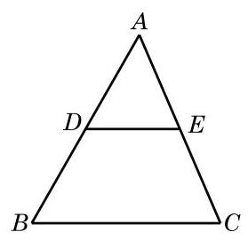

(第 2 题)

1. 已知坐标平面上三个点 $A\left( {1,1}\right) \text{ 、 }B\left( {4,2}\right)$ 与 $C\left( {-2, - 6}\right)$ ,求 $\bigtriangleup {ABC}$ 的面积.

2. 如图,已知 $\bigtriangleup {ABC}, D\text{ 、 }E$ 分别是 ${AB}\text{ 、 }{AC}$ 的中点. 求证: ${DE}//{BC}$ .

3. 已知平面上 $A\text{ 、 }B$ 两点的坐标分别是 $\left( {2,5}\right) \text{ 、 }\left( {3,0}\right) , P$ 是直线 ${AB}$ 上的一点,且 $\overrightarrow{AP} =  - \frac{2}{3}\overrightarrow{PB}$ . 求点 $P$ 的坐标.

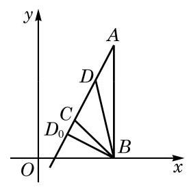

图 8-4-4

例 5 如图 8-4-4,平面上 $A\text{ 、 }B\text{ 、 }C$ 三点的坐标分别是 $\left( {2,3}\right) \text{ 、 }\left( {2,0}\right) \text{ 、 }\left( {1,1}\right)$ . 已知小明在点 $B$ 处休憩,有只小狗沿着 ${AC}$ 所在直线来回跑动. 问: 其在什么位置时,离小明最近?

解 记 $\overrightarrow{a} = \overrightarrow{CA},\overrightarrow{b} = \overrightarrow{BC}$ ,则

$$
\overrightarrow{a} = \left( {2 - 1,3 - 1}\right)  = \left( {1,2}\right) ,
$$

$$
\overrightarrow{b} = \left( {1 - 2,1 - 0}\right)  = \left( {-1,1}\right) .
$$

---

若将题中向量 $\overrightarrow{BD}$ 的模 $\left| {\overrightarrow{b} + \lambda \overrightarrow{a}}\right|$ 看作是一个 $\lambda$ 的函数,则这个例子体现了向量在函数中的应用. 同学们也不妨思考一下，如果不借助于向量方法, 那么如何求得点 ${D}_{0}$ 的坐标?

---

设 $D$ 是直线 ${CA}$ 上随着小狗跑动而动态变化的点,则 $\overrightarrow{CD}$ 可写成 $\lambda \overrightarrow{a}$ 的形式, $\lambda$ 是实数. 问题转化为: 确定 $\lambda$ 的值,使向量 $\overrightarrow{BD} = \overrightarrow{BC} + \overrightarrow{CD} = \overrightarrow{b} + \lambda \overrightarrow{a}$ 的模 $\left| {\overrightarrow{b} + \lambda \overrightarrow{a}}\right|$ 取到最小值,此时向量 $\overrightarrow{CD}$ 的终点 $D$ 即为小狗离小明最近的位置.

如果 $D$ 为 ${D}_{0}$ 使得 $\overrightarrow{B{D}_{0}} \bot  \overrightarrow{CA}$ ,即 $\overrightarrow{CA} \cdot  \overrightarrow{B{D}_{0}} = 0$ ,那么向量 $\overrightarrow{BD}$ 的模取到最小值. 于是, $\lambda$ 要满足 $\overrightarrow{a} \cdot  \left( {\overrightarrow{b} + \lambda \overrightarrow{a}}\right)  = 0$ ,即 $\lambda {\overrightarrow{a}}^{2} \; =  - \overrightarrow{a} \cdot  \overrightarrow{b}$ ,故

$$
\lambda  =  - \frac{\overrightarrow{a} \cdot  \overrightarrow{b}}{{\left| \overrightarrow{a}\right| }^{2}} =  - \frac{1 \times  \left( {-1}\right)  + 2 \times  1}{5} =  - \frac{1}{5}.
$$

从而 $\overrightarrow{B{D}_{0}} = \overrightarrow{b} - \frac{1}{5}\overrightarrow{a} = \left( {-1,1}\right)  - \frac{1}{5}\left( {1,2}\right)  = \left( {-\frac{6}{5},\frac{3}{5}}\right)$ ,最终推出 ${D}_{0}$ 的坐标是

$$
\left( {-\frac{6}{5} + 2,\frac{3}{5} + 0}\right)  = \left( {\frac{4}{5},\frac{3}{5}}\right) .
$$

因此,当其在点 $\left( {\frac{4}{5},\frac{3}{5}}\right)$ 时,离小明最近.

例 6 用向量方法证明:

$$
\cos \left( {\alpha  - \beta }\right)  = \cos \alpha \cos \beta  + \sin \alpha \sin \beta .
$$

我们要求出 $\langle \overrightarrow{a},\overrightarrow{b}\rangle$ 的余弦). 注意到交换 $\alpha$ 与 $\beta$ 不影响要证明的公式,可以假设从 $\overrightarrow{OB}$ 旋转到 $\overrightarrow{OA}$ 的最小正角就是 $\langle \overrightarrow{a},\overrightarrow{b}\rangle$ . 这个角与角 $\alpha  - \beta$ 有相同的始边与终边,于是

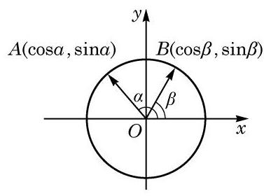

图 8-4-5

证明 如图 8-4-5,建立平面直角坐标系,并设 $A\text{ 、 }B$ 是单位圆上的任意两点,而角 $\alpha$ 与 $\beta$ 都是顶点在原点 $O$ 、始边为 $x$ 轴正半轴的角,其终边分别落在 ${OA}$ 与 ${OB}$ 上. 考虑向量

$$
\overrightarrow{a} = \overrightarrow{OA} = \left( {\cos \alpha ,\sin \alpha }\right) ,\overrightarrow{b} = \overrightarrow{OB} = \left( {\cos \beta ,\sin \beta }\right) .
$$

$$
\cos \langle \overrightarrow{a},\overrightarrow{b}\rangle  = \cos \left( {\alpha  - \beta }\right) .
$$

又由于 $\left| \overrightarrow{a}\right|  = \left| \overrightarrow{b}\right|  = 1$ ,我们得到

$$
\overrightarrow{a} \cdot  \overrightarrow{b} = \left| \overrightarrow{a}\right| \left| \overrightarrow{b}\right| \cos \left( {\alpha  - \beta }\right)  = \cos \left( {\alpha  - \beta }\right) .
$$

另一方面, 用向量的坐标表示来计算数量积, 我们有

$$
\overrightarrow{a} \cdot  \overrightarrow{b} = \cos \alpha \cos \beta  + \sin \alpha \sin \beta .
$$

综上所述,

$$
\cos \left( {\alpha  - \beta }\right)  = \cos \alpha \cos \beta  + \sin \alpha \sin \beta .
$$

例 7 将质量为 ${20}\mathrm{\;{kg}}$ 的物体用两根绳子悬挂起来,如图 8-4-6(1)，两根绳子与铅垂线的夹角分别为 ${45}^{ \circ  }$ 与 ${30}^{ \circ  }$ . 求它们分别提供的拉力的大小. (结果精确到 ${0.1}\mathrm{\;N}$ )

解 设两根绳子的拉力分别是 ${\overrightarrow{f}}_{1}$ 与 ${\overrightarrow{f}}_{2}$ ,则它们的合力 ${\overrightarrow{f}}_{1} + {\overrightarrow{f}}_{2}$ 与物体的重力大小相等、方向相反,即 ${\overrightarrow{f}}_{1} + {\overrightarrow{f}}_{2}$ 是垂直向上、模为 ${20g}\left( \mathrm{\;N}\right)$ 的向量,这里 $g \approx  {9.8}\left( {\mathrm{\;m}/{\mathrm{s}}^{2}}\right)$ 是重力加速度.

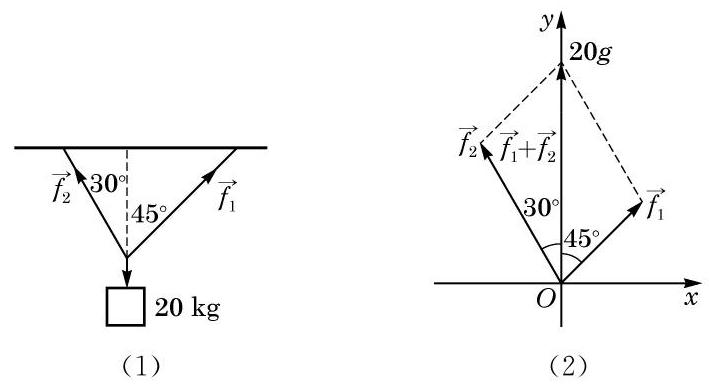

图 8-4-6

以 $\overrightarrow{{f}_{1}}$ 与 $\overrightarrow{{f}_{2}}$ 的公共作用点为原点,以 $\overrightarrow{{f}_{1}} + \overrightarrow{{f}_{2}}$ 为 $y$ 轴的正半轴, 建立平面直角坐标系, 如图 8-4-6(2) 所示.

令 $a = \left| \overrightarrow{{f}_{1}}\right| , b = \left| \overrightarrow{{f}_{2}}\right|$ ,则

$$
\overrightarrow{{f}_{1}} = a\left( {\cos {45}^{ \circ  },\sin {45}^{ \circ  }}\right)  = \left( {\frac{\sqrt{2}}{2}a,\frac{\sqrt{2}}{2}a}\right) ,
$$

$$
\overrightarrow{{f}_{2}} = b\left( {\cos {120}^{ \circ  },\sin {120}^{ \circ  }}\right)  = \left( {-\frac{1}{2}b,\frac{\sqrt{3}}{2}b}\right) .
$$

因为 $\overrightarrow{{f}_{1}} + \overrightarrow{{f}_{2}} = \left( {0,{20g}}\right)$ ,所以

$$
\left\{  \begin{array}{l} \frac{\sqrt{2}}{2}a - \frac{1}{2}b = 0, \\  \frac{\sqrt{2}}{2}a + \frac{\sqrt{3}}{2}b = {20g}. \end{array}\right.
$$

解得 $a = {10}\left( {\sqrt{6} - \sqrt{2}}\right) g \approx  {101.5}\left( \mathrm{\;N}\right) , b = {20}\left( {\sqrt{3} - 1}\right) g \approx  {143.5}\left( \mathrm{\;N}\right)$ .

综上所述,这两根绳子所提供的拉力分别约为 ${101.5}\mathrm{\;N}$ 和 143.5 N.

## 练习 8.4(2)

1. 已知两个力 (单位: $\mathrm{N}$ ) $\overrightarrow{{f}_{1}}$ 与 $\overrightarrow{{f}_{2}}$ 的夹角为 ${60}^{ \circ  }$ ,其中 $\overrightarrow{{f}_{1}} = \left( {2,0}\right)$ . 某质点在这两个力的共同作用下,由点 $A\left( {1,1}\right)$ 移动至点 $B\left( {6,6}\right)$ (单位: $\mathrm{m}$ ).

(1)求 $\overrightarrow{{f}_{2}}$ ；

(2)求 $\overrightarrow{{f}_{1}}$ 与 $\overrightarrow{{f}_{2}}$ 的合力对质点所做的功.

2. 已知平面上三点 $A$ 、 $B$ 、 $C$ 的坐标分别是 $\left( {1,7}\right)$ 、 $\left( {2,2}\right)$ 、 $\left( {0,1}\right)$ ， $P$ 为直线 ${AC}$ 上的一动点. 问: $P$ 在什么位置时, $\left| \overrightarrow{BP}\right|$ 取到最小值?

## 习题 8.4

## A 组

1. 已知平面上 $A\text{ 、 }B$ 两点的坐标分别是 $\left( {3,5}\right) \text{ 、 }\left( {0,1}\right) , P$ 为直线 ${AB}$ 上一点,且 $\overrightarrow{AP} = \; \frac{1}{5}\overrightarrow{PB}$ . 求点 $P$ 的坐标.

2. 已知 $\bigtriangleup {ABC}$ 的三个顶点 $A\text{ 、 }B\text{ 、 }C$ 的坐标分别是 $\left( {1,2}\right) \text{ 、 }\left( {2,3}\right) \text{ 、 }\left( {3,7}\right)$ ,求此三角形的面积.

3. 用向量方法证明三角形的余弦定理.

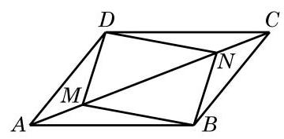

(第 5 题)

4. 菱形是四条边都相等的四边形. 用向量方法证明菱形的对角线互相垂直.

5. 如图,已知 $M\text{ 、 }N$ 是平行四边形 ${ABCD}$ 的对角线 ${AC}$ 上的两点,且 ${AM} = {CN}$ . 求证: ${BMDN}$ 是平行四边形.

## B 组

1. 证明: 三角形的三条中线相交于一点.

2. 已知平面上不共线的三点 $A\left( {{x}_{1},{y}_{1}}\right) \text{ 、 }B\left( {{x}_{2},{y}_{2}}\right)$ 与 $C\left( {{x}_{3},{y}_{3}}\right)$ ,求证: $\bigtriangleup {ABC}$ 的面积 $S = \frac{1}{2}\left| {{x}_{1}\left( {{y}_{2} - {y}_{3}}\right)  + {x}_{2}\left( {{y}_{3} - {y}_{1}}\right)  + {x}_{3}\left( {{y}_{1} - {y}_{2}}\right) }\right|$ .

3. 已知 $a\text{ 、 }b$ 均为正数,且 $a + b = 1$ . 求证: ${\left( a + 2\right) }^{2} + {\left( b + 3\right) }^{2} \geq  {18}$ .

4. 已知 ${ABCD}$ 是正方形, $M$ 是 ${AB}$ 边的中点,点 $E$ 在对角线 ${AC}$ 上,且 ${AE} : {EC} =$ 3 : 1. 求证: $\angle {MED} = \frac{\pi }{2}$ .

5. 用向量方法证明: 把一个平行四边形的一个顶点和两条不过此顶点的边的中点分别连线, 则这两条连线三等分此平行四边形的一条对角线.

## 探究与实践

## 宇航员的训练

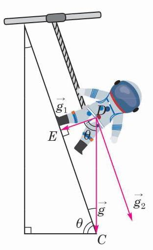

图 8-4-7

地球的重力加速度与月球以及其他星球的重力加速度是不同的. 为了使宇航员适应不同的重力环境, 宇航训练部建造了训练装置:如图 8-4-7，一个可滑动的连杆与人的腰部联结，人在一个固定的斜面上行走，连杆与斜面始终保持平行，适当调整这个斜面的位置, 可使人对斜面的作用力相当于人在某个星体上的重力.

(1)已知月球重力加速度 ${g}_{1}$ 是地球重力加速度 $g$ 的 $\frac{1}{6}$ ，为模拟月球重力对宇航人员的作用，角 $\theta$ 的大小应如何选取？

(2)先查出火星重力加速度的数据，并判断当 $\theta  = {68}^{ \circ  }$ 时该装置能否训练去火星的宇航员.

## 课后阅读

## 话说向量

向量的故事可以追溯到遥远的年代. 早年的向量——物理学家称之为“矢量”，只是物理学专门用来表示力和速度等物理量的工具, 并不为数学家所重视. 古希腊学者亚里士多德 (Aristotle) 已经知道两个力的合成可以用平行四边形的法则得到. 但是, 在欧几里得 (Euclid)集古希腊数学大成的《几何原本》中，却没有讨论向量. 此后 2000 年左右，不管是文艺复兴时期, 还是牛顿(I. Newton)与莱布尼茨(G. Leibniz)创立微积分之后的 17、18 世纪, 人们对向量的认识并没有发生什么根本性的变化. 但进入 19 世纪，事情开始有了很大的转机. 其中, 对 “复数” (将在下一章学习) 认识的深入起了重要的推动作用. 为了更好地理解复数, 丹麦数学家韦塞尔 (C. Wessel) 于 1797 年, 瑞士数学家阿尔冈 (J. Argand) 于 1806 年独立地建立起复数的几何表示, 而高斯 (J. Gauss) 的工作则使这一原理广为人知, 并被数学家们普遍接受. 在熟悉复数的几何表示之后, 数学家们逐步认识到复数可用来表示和研究平面上的向量. 平面向量与复数之间建立起一一对应, 这不但为虚数的现实化提供了可能, 也为向量的发展开辟了道路.

在现代数学中, 平面上和空间中直观的向量被形式化地推广为高维向量, 形成了抽象的向量空间的概念, 是大学数学中线性代数的主要内容.

向量连接着代数和几何, 连接着数学与物理. 在数学上, 点的直角坐标、向量的坐标分解、直角三角形中锐角的正弦与余弦、复数的实部与虚部, 这些概念形式上不同, 却又彼此相通. 因此, 向量也会是中学数学舞台上一位独具魅力的角色.

## 内容提要

1. 平面向量的基本概念

(1)向量:既有大小又有方向的量，常用 $\overrightarrow{a}\text{ 、 }\overrightarrow{AB}$ 等记号表示.

(2)向量的模:向量的大小，向量 $\overrightarrow{a}$ 的模记为 $\left| \overrightarrow{a}\right|$ .

(3)零向量:其模为 0，方向任意.

(4)单位向量:模为 1 的向量；非零向量 $\overrightarrow{a}$ 的单位向量是 $\frac{\overrightarrow{a}}{\left| \overrightarrow{a}\right| }$ .

(5)平行向量:方向相同或相反的向量.

(6)相等向量:方向相同、模相等的向量.

(7)负向量:方向相反、模相等的向量.

2. 向量的线性运算

(1)平面向量的加法、减法:运用平行四边形法则或三角形法则.

(2)减去一个向量等于加上它的负向量.

(3)实数与平面向量的乘法:实数 $\lambda$ 与向量 $\overrightarrow{a}$ 的乘积，记作 $\lambda \overrightarrow{a}$ .

(4)向量的加法满足交换律和结合律；实数与向量的乘法对向量加减法满足分配律。

3. 向量的投影与数量积

(1)向量的夹角:向量 $\overrightarrow{a}$ 与 $\overrightarrow{b}$ 的夹角记为 $\langle \overrightarrow{a},\overrightarrow{b}\rangle$ ，其值 $0 \leq  \langle \overrightarrow{a},\overrightarrow{b}\rangle  \leq  \pi$ .

(2)向量的投影:向量 $\overrightarrow{b}$ 在非零向量 $\overrightarrow{a}$ 方向上的投影是如下的向量:

$$
\left| \overrightarrow{b}\right| \cos \langle \overrightarrow{a},\overrightarrow{b}\rangle \frac{\overrightarrow{a}}{\left| \overrightarrow{a}\right| }.
$$

其中，系数 $\left| \overrightarrow{b}\right| \cos \langle \overrightarrow{a},\overrightarrow{b}\rangle$ 称为向量 $\overrightarrow{b}$ 在向量 $\overrightarrow{a}$ 方向上的数量投影.

(3)向量 $\overrightarrow{a}$ 与 $\overrightarrow{b}$ 的数量积定义为

$$
\overrightarrow{a} \cdot  \overrightarrow{b} = \left| \overrightarrow{a}\right| \left| \overrightarrow{b}\right| \cos \langle \overrightarrow{a},\overrightarrow{b}\rangle .
$$

(4)向量的数量积满足交换律，并且是线性的(即对向量的加减满足分配律，且可与实数的乘法交换).

4. 平面向量基本定理与向量的坐标表示

(1)平面向量基本定理:给定平面上两个不平行的向量，则该平面上的任意向量都可以唯一地表示为这两个向量的线性组合，也就是说，平面上任意两个不平行的向量都组成了一个基.

(2)向量的坐标表示:在直角坐标系中，把向量 $\overrightarrow{a}$ 的起点放到坐标原点，向量就直接用它的终点坐标 $\left( {x, y}\right)$ 表示为 $\overrightarrow{a} = \left( {x, y}\right)$ ，称为向量的坐标表示，这样，向量 $\overrightarrow{a}$ 就可写成坐标轴正方向上的单位向量 $\overrightarrow{i}\text{ 、 }\overrightarrow{j}$ 的线性组合 $\overrightarrow{a} = x\overrightarrow{i} + y\overrightarrow{j}$ .

(3)给定平面上两点 $A\left( {{x}_{1},{y}_{1}}\right)$ 与 $B\left( {{x}_{2},{y}_{2}}\right)$ ，则 $\overrightarrow{AB} = \left( {{x}_{2} - {x}_{1},{y}_{2} - {y}_{1}}\right)$ .

5. 坐标表示下的向量运算

设向量 $\overrightarrow{a} = \left( {{x}_{1},{y}_{1}}\right) ,\overrightarrow{b} = \left( {{x}_{2},{y}_{2}}\right)$ ,则

(1) $\left| \overrightarrow{a}\right|  = \sqrt{{x}_{1}^{2} + {y}_{1}^{2}}$ .

(2) $\overrightarrow{a} \pm  \overrightarrow{b} = \left( {{x}_{1} \pm  {x}_{2},{y}_{1} \pm  {y}_{2}}\right)$ .

(3) $\lambda \overrightarrow{a} = \left( {\lambda {x}_{1},\lambda {y}_{1}}\right) ,\lambda  \in  \mathbf{R}$ .

(4) $\overrightarrow{a} \cdot  \overrightarrow{b} = {x}_{1}{x}_{2} + {y}_{1}{y}_{2}$ .

6. 向量的夹角、平行与垂直

设向量 $\overrightarrow{a} = \left( {{x}_{1},{y}_{1}}\right) ,\overrightarrow{b} = \left( {{x}_{2},{y}_{2}}\right)$ ,则

(1) $\cos \langle \overrightarrow{a},\overrightarrow{b}\rangle  = \frac{\overrightarrow{a} \cdot  \overrightarrow{b}}{\left| \overrightarrow{a}\right| \left| \overrightarrow{b}\right| } = \frac{{x}_{1}{x}_{2} + {y}_{1}{y}_{2}}{\sqrt{{x}_{1}^{2} + {y}_{1}^{2}}\sqrt{{x}_{2}^{2} + {y}_{2}^{2}}}$ .

(2) $\overrightarrow{a}//\overrightarrow{b} \Leftrightarrow  \overrightarrow{b} = \lambda \overrightarrow{a}\left( {\lambda  \in  \mathbf{R}}\right)$ 或 $\overrightarrow{a} = \mu \overrightarrow{b}\left( {\mu  \in  \mathbf{R}}\right)  \Leftrightarrow  {x}_{1}{y}_{2} = {x}_{2}{y}_{1}$ .

(3) $\overrightarrow{a} \bot  \overrightarrow{b} \Leftrightarrow  \overrightarrow{a} \cdot  \overrightarrow{b} = 0 \Leftrightarrow  {x}_{1}{x}_{2} + {y}_{1}{y}_{2} = 0$ .

7. 向量的应用

要体会如何从各种有关的问题中抽象出相应的向量问题，并用所掌握的向量方法解决这个向量问题，从而使原问题得以解决.

## 复习题

## A 组

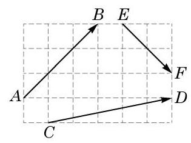

(第 1 题)

1. 如图, 在边长为 1 的小正方形组成的网格上, 求:

(1) $\left| \overrightarrow{AB}\right|$ ； (2) $\left| \overrightarrow{CD}\right|$ ； (3) $\left| \overrightarrow{EF}\right|$ .

2. 已知 $\overrightarrow{a}\text{ 、 }\overrightarrow{b}$ 均为非零向量,写出 $\left| {\overrightarrow{a} + \overrightarrow{b}}\right|  = \left| \overrightarrow{a}\right|  + \left| \overrightarrow{b}\right|$ 成立的充要条件.

3. 已知 $\overrightarrow{a}\text{ 、 }\overrightarrow{b}$ 为非零向量,且 $\overrightarrow{a}\text{ 、 }\overrightarrow{b}\text{ 、 }5\overrightarrow{a} - 4\overrightarrow{b}$ 在同一起点上. 求证: 它们的终点在同一条直线上.

4. 在矩形 ${ABCD}$ 中,边 ${AB}\text{ 、 }{AD}$ 的长分别为 $2\text{ 、 }1$ ,若 $M\text{ 、 }N$ 分别是边 ${BC}\text{ 、 }{CD}$ 上的点,且满足 $\frac{\left| \overrightarrow{BM}\right| }{\left| \overrightarrow{BC}\right| } = \frac{\left| \overrightarrow{CN}\right| }{\left| \overrightarrow{CD}\right| }$ ,则 $\overrightarrow{AM} \cdot  \overrightarrow{AN}$ 的取值范围是___.

5. 已知两个向量 $\overrightarrow{{e}_{1}}$ 、 $\overrightarrow{{e}_{2}}$ 满足 $\left| \overrightarrow{{e}_{1}}\right|  = 2$ ， $\left| \overrightarrow{{e}_{2}}\right|  = 1$ ， $\left\langle  {\overrightarrow{{e}_{1}},\overrightarrow{{e}_{2}}}\right\rangle   = {60}^{ \circ  }$ ，且向量 ${2\lambda }\overrightarrow{{e}_{1}} + 7\overrightarrow{{e}_{2}}$ 与向量 $\overrightarrow{{e}_{1}} + \lambda \overrightarrow{{e}_{2}}$ 的夹角为钝角. 求实数 $\lambda$ 的取值范围.

6. 已知向量 $\overrightarrow{a} = \left( {1,0}\right) ,\overrightarrow{b} = \left( {2,1}\right)$ .

(1)求 $\left| {\overrightarrow{a} + 3\overrightarrow{b}}\right|$ ；

(2)当 $k$ 为何实数时， $k\overrightarrow{a} - \overrightarrow{b}$ 与 $\overrightarrow{a} + 3\overrightarrow{b}$ 平行？平行时它们是同向还是反向？

7. 已知在平面直角坐标系中, $O$ 为原点,点 $A\left( {4, - 3}\right) , B\left( {-5,{12}}\right)$ .

(1)求向量 $\overrightarrow{AB}$ 的坐标及 $\left| \overrightarrow{AB}\right|$ ；

(2)已知向量 $\overrightarrow{OC} = 2\overrightarrow{OA} + \overrightarrow{OB},\overrightarrow{OD} = \overrightarrow{OA} - 3\overrightarrow{OB}$ ，求 $\overrightarrow{OC}$ 及 $\overrightarrow{OD}$ 的坐标；

(3)求 $\overrightarrow{OA} \cdot  \overrightarrow{OB}$ .

8. 已知向量 $\overrightarrow{a} = \left( {3, - 2}\right) ,\overrightarrow{b} = \left( {-2,1}\right) ,\overrightarrow{c} = \left( {7, - 4}\right)$ ，求 $\lambda$ 、 $\mu$ ，使得 $\overrightarrow{c} = \lambda \overrightarrow{a} + \mu \overrightarrow{b}$ .

9. 已知点 $M\left( {3, - 2}\right) \text{ 、 }N\left( {-5, - 1}\right)$ ,且 $\overrightarrow{MP} = \frac{1}{3}\overrightarrow{MN}$ . 求点 $P$ 的坐标.

10. 在等腰三角形 ${ABC}$ 中,已知 $D$ 为底边 ${BC}$ 的中点. 求证: ${AD} \bot  {BC}$ .

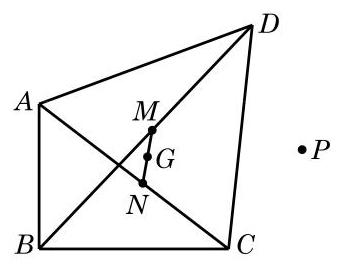

(第 11 题)

11. 如图,在四边形 ${ABCD}$ 中, $G$ 为对角线 ${AC}$ 与 ${BD}$ 中点连线 ${MN}$ 的中点, $P$ 为平面上任意给定的一点. 求证: $4\overrightarrow{PG} = \; \overrightarrow{PA} + \overrightarrow{PB} + \overrightarrow{PC} + \overrightarrow{PD}.$

12. 在四边形 ${ABCD}$ 中,向量 $\overrightarrow{AB} = \overrightarrow{i} + 2\overrightarrow{j},\overrightarrow{BC} =  - 4\overrightarrow{i} - \overrightarrow{j}$ , $\overrightarrow{CD} =  - 5\overrightarrow{i} - 3\overrightarrow{j}$ . 求证: ${ABCD}$ 为梯形.

## B 组

1. 已知 $\overrightarrow{a}\text{ 、 }\overrightarrow{b}\text{ 、 }\overrightarrow{c}$ 均为非零向量,其中的任意两个向量都不平行,且 $\overrightarrow{a} + \overrightarrow{b}$ 与 $\overrightarrow{c}$ 是平行向量, $\overrightarrow{a} + \overrightarrow{c}$ 与 $\overrightarrow{b}$ 是平行向量. 求证: $\overrightarrow{b} + \overrightarrow{c}$ 与 $\overrightarrow{a}$ 是平行向量.

2. 如图,点 $A\text{ 、 }M\text{ 、 }B$ 在同一条直线上,点 $O$ 不在该直线上,且 $\overrightarrow{AM} = \frac{1}{3}\overrightarrow{AB}$ . 设 $\overrightarrow{OA} = \overrightarrow{a},\overrightarrow{OB} = \overrightarrow{b},\overrightarrow{OM} = \overrightarrow{c}$ ,试用向量 $\overrightarrow{a}\text{ 、 }\overrightarrow{b}$ 表示 $\overrightarrow{c}$ .

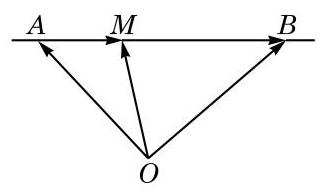

(第 2 题)

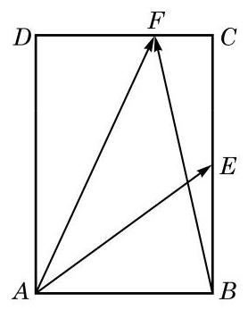

(第 4 题)

3. 设平面上有两个向量 $\overrightarrow{a} = \left( {\cos \alpha ,\sin \alpha }\right) \left( {{0}^{ \circ  } \leq  \alpha  < {360}^{ \circ  }}\right) ,\overrightarrow{b} = \left( {-\frac{1}{2},\frac{\sqrt{3}}{2}}\right)$ .

(1)求证:向量 $\overrightarrow{a} + \overrightarrow{b}$ 与 $\overrightarrow{a} - \overrightarrow{b}$ 垂直；

(2)当向量 $\sqrt{3}\overrightarrow{a} + \overrightarrow{b}$ 与 $\overrightarrow{a} - \sqrt{3}\overrightarrow{b}$ 的模相等时，求 $\alpha$ 的大小.

4. 如图，在矩形 ${ABCD}$ 中， ${AB} = \sqrt{2},{BC} = 2, E$ 为 ${BC}$ 的中点，点 $F$ 在边 ${CD}$ 上且 $\overrightarrow{AB} \cdot  \overrightarrow{AF} = \sqrt{2}$ . 求 $\overrightarrow{AE} \cdot  \overrightarrow{BF}$ 的值.

5. 已知等边三角形 ${ABC}$ 的边长为 $1,\overrightarrow{BC} = \overrightarrow{a},\overrightarrow{CA} = \overrightarrow{b},\overrightarrow{AB} = \overrightarrow{c}$ . 求 $\overrightarrow{a} \cdot  \overrightarrow{b} + \overrightarrow{b} \cdot  \overrightarrow{c} + \; \overrightarrow{c} \cdot  \overrightarrow{a}$ .

6. 已知向量 $\overrightarrow{OA} = \left( {k,{12}}\right) ,\overrightarrow{OB} = \left( {4,5}\right) ,\overrightarrow{OC} = \left( {-k,{10}}\right)$ ，且 $A$ 、 $B$ 、 $C$ 三点共线. 求实数 $k$ 的值.

7. 已知向量 $\overrightarrow{OA} = \left( {1,7}\right) ,\overrightarrow{OB} = \left( {5,1}\right) ,\overrightarrow{OP} = \left( {2,1}\right) , K$ 为直线 ${OP}$ 上的一个动点,当 $\overrightarrow{KA} \cdot  \overrightarrow{KB}$ 取最小值时,求向量 $\overrightarrow{OK}$ 的坐标.

8. 如图,在正方形 ${ABCD}$ 中, $P$ 是对角线 ${AC}$ 上一点, ${PE}$ 垂直 ${AB}$ 于点 $E,{PF}$ 垂直 ${BC}$ 于点 $F$ . 求证: ${PD} \bot  {EF}$ .

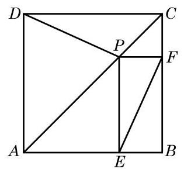

(第 8 题)

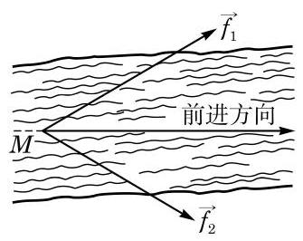

(第 10 题)

9. 证明: 三角形的三条高相交于一点.

10. 如图,甲、乙分处河的两岸,欲拉船 $M$ 逆流而上,需在正前方有 3 000 N 的力. 已知甲所用的力 ${\overrightarrow{f}}_{1}$ 的大小为 ${2000}\mathrm{\;N}$ ,且与 $M$ 的前进方向的夹角为 $\frac{\pi }{6}$ . 求乙所用的力 ${\overrightarrow{f}}_{2}$ .

## 拓展与思考

1. 在 $\bigtriangleup {ABC}$ 中, ${AB} = {AC} = 5,{BC} = 6, M$ 是边 ${AC}$ 上靠近 $A$ 的一个三等分点. 问: 在线段 ${BM}$ 上是否存在点 $P$ ,使得 ${PC} \bot  {BM}$ ?

2. 在 $\bigtriangleup {ABC}$ 中,已知点 $O\text{ 、 }G\text{ 、 }H$ 分别是三角形的外心、重心和垂心. 求证: $O$ 、 $G\text{ 、 }H$ 三点共线. (此直线称为欧拉线)