普通高中教科书

SHUXUE

SHUXUE

主 编 李大潜 王建磐

副 主 编 应坚刚 鲍建生

本册编写人员 徐斌艳 陆立强 朱 雁 蔡志杰 鲁小莉 魏述强 高 虹

责任编辑 李 达

装帧设计 陆 弦 王 捷 周 吉

本册教材图片提供 图虫网(封面一幅图，P6一幅图，P13一幅图，P10一幅图，P20一幅图， P27一幅图, P28一幅图, P30一幅图, P32一幅图, P35一幅图, P36一幅图, P37一幅图, P38 一幅图); 教材编写组 (P16六幅图, P17七幅图)

插图绘制 王 捷 朱泽宇

普通高中教科书 数学 必修 第四册

上海市中小学 (幼儿园) 课程改革委员会组织编写

出版 上海教育出版社有限公司(上海市闵行区号景路159弄C座)

发行 上海新华书店

印 刷 上海中华印刷有限公司

版 次 2020年12月第1版

印 次 2021年12月第3次

开 本 ${890} \times  {1240}\mathrm{1/{16}}$

印 张 3.5

字 数 60 千字

书 号 978-7-5720-0295-3/G·0218

定 价 4.95 元

版权所有・未经许可不得采用任何方式擅自复制或使用本产品任何部分. 违者必究

如发现内容质量问题, 请拨打 021-64319241

如发现印、装质量问题，影响阅读，请与上海教育出版社有限公司联系. 电话021-64373213 全国物价举报电话:12315

声明 按照《中华人民共和国著作权法》第二十五条有关规定，我们已尽量寻找著作权人支付报酬.著作权人如有关于支付报酬事宜可及时与出版社联系.

## 前言

数学应该是绝大多数人一生中学得最多的一门功课. 认真学习数学，努力学好数学, 不仅可以牢固地打好数学的知识基础, 掌握一种科学的语言, 为走进科学的大门提供有力的工具和坚实的后盾; 更重要地, 通过认真而严格的数学学习和训练, 可以领会到数学的思想方法和精神实质, 造就一些特有而重要的素质和能力, 形成自己的数学素养, 让人变得更加聪明, 更有智慧, 更有竞争力, 终身受用不尽. 从这个意义上, 可以毫不夸张地说, 数学教育看起来似乎只是一种知识教育，但本质上是一种素质教育，其意义是十分深远的.

中学阶段的数学学习, 应该为学生今后的成长和发展奠定坚实的基础, 编写教材也要力求遵循这一根本宗旨. 那种以种种名义，将一些“高级”或“时髦”的东西，不顾实际情况地下放进中学的教材，和数学的基础训练“抢跑道” 的做法, 是不可取的. 同时, 数学学科是一个有机联系的整体, 一定要避免知识的碎片化，从根本上改变单纯根据“知识点”来安排教学的做法. 人为地将知识链条打断，或将一些关键内容以“减负”的名义删去，只会造成学生思维的混乱, 影响学生对有关知识的认识与理解, 实际上反而会加重学生学习的负担，是不值得效法的. 在任何情况下，都要基于课程标准，贯彻“少而精”“简而明”的原则，精心选择与组织教材内容，抓住本质，返璞归真，尽可能给学生以明快、清新的感受，使学生能更深入地领会数学的真谛，让数学成为广大学生喜闻乐见的一门课程.

怎么才算“学好了数学”呢？对这个问题是需要一个正确的认识的. 作为一门重思考与理解的学科，数学学习要强调理解深入、运作熟练和表达明晰这三个方面. 这儿所说的“运作”泛指运算、推理及解题等环节. 三者的关键是深入的理解，只有不仅知其然、而且知其所以然，才能掌握数学的精髓，更好地实现另外两方面的要求. 如果只满足于会解题, 甚至以 “刷题”多与快为荣, 但不求甚解, 就难以和数学真正结缘, 是不值得鼓励与提倡的. 表达能力的培养也要引起足够的重视. 要使表述简明清晰并不是一件容易的事，别人三言两语就说清楚了的，自己却颠三倒四、不得要领，能够说真正弄懂了数学吗?!

为了帮助学生学好数学，也为了帮助教师教好数学，本教材秉承上述理念, 在编写上做了认真的探索与实践, 希望能成为广大师生的良师益友, 更好地发挥引路和示范的作用. 书中各章的章首语, 虽只有不到一页的篇幅, 但却是该章入门的一个宏观向导，务请认真注意. 各章末的内容提要，简明扼要地列出了该章的核心内容, 希望对复习能起到较好的帮助. 各章的主体内容, 包括正文、练习及复习题以及边注, 更是字斟句酌、精心编写的. 希望广大同学养成认真阅读及钻研教材的习惯，这样就一定会发现，学习中所碰到的种种问题, 原则上都可以从教材中找到答案, 大家的学习方法和自学能力也一定会得到极大的提升，从而牢牢掌握住学习数学的主动权.

本套教材涵盖《普通高中数学课程标准(2017 年版 2020 年修订)》所规定的必修课程和选择性必修课程的内容, 共分七册, 包括必修四册、选择性必修三册, 其中必修第四册和选择性必修第三册是数学建模的内容. 必修前三册和选择性必修前两册共同构建了高中数学的知识体系和逻辑结构; 数学建模内容与数学知识的逻辑结构没有直接的关系, 不依附于特定知识性内容的教学, 而在于强调数学知识在解决实际问题中的应用, 强调它的活动性、探索性和综合性. 因此, 两册数学建模教材不是前三册或前两册教材的后继, 而且都包含比教学课时数要求更多的内容, 供各个年段灵活地、有选择地使用, 以实现数学建模的教学目标.

2020 年 6 月

## 目 录

引论 1

第 1 部分 数学建模活动案例

1 红绿灯管理 6

2 “诱人”的优惠券 9

3 车辆转弯时的安全隐患 13

4 雨中行 20

第 2 部分 数学建模活动 A

5 出租车运价 28

6 家具搬运 30

7 登山行程设计 32

第 3 部分 数学建模活动 B

8 包装彩带 36

9 削菠萝 37

10 高度测量 38

11 外卖与环保 40

附录

附录 1 数学建模活动报告的写作 41

附录 2 数学建模活动报告样例 42

附录 3 有关数学建模活动中数学内容的说明 45

## 引论

本册教材的主题是数学建模. 数学之所以具有广泛的应用性, 是因为它可以为其他学科、生产实践及日常生活提供多样化的数学模型. 其实, 同学们对数学模型应该并不完全陌生, 在本套教材各章中经常可以看到它的身影. 例如, 在学习函数时, 我们已经学习了利用函数模型来解决一些实际问题; 在学习统计时, 通过观察统计图了解数据的整体形态、发现数据的变化规律和数据之间的联系，进而构建合适的统计模型，以预测数据的发展趋势, 等等.

但是, 上述这些内容大多只是解答教师或者课本中提出的问题, 较多地侧重于用数学模型来解决实际问题, 是从学习知识这一层面展开的, 并没有充分展示建立数学模型即数学建模的过程, 因而难以深入体验建立一个正确的数学模型的反复、曲折及艰辛的全过程. 数学建模是一个实践的过程, 只有通过参加实际的数学建模活动, 才能真正领悟其中的真谛和意义. 正因为如此, 本册数学建模教材不像其他各册教材那样按部就班地讲授知识, 而是激发同学们参加数学建模活动的兴趣, 并帮助同学们更好地参加此类活动. 开展数学建模活动的宗旨不是进一步灌输更多的数学知识，也不是特别强调这些应用课题的重要性, 而是把这些应用课题作为载体, 使同学们通过开展相应的数学建模活动, 经历和体验数学建模的全过程, 逐步领悟数学建模的真谛.

通过本册教材的学习，同学们将认识数学模型和数学建模之间的联系与区别，且通过完整的数学建模活动, 了解数学模型的丰富内涵, 不仅加深对相关数学知识和技能的理解, 更可以学习如何利用数学建模来解决实际问题.

## 什么是数学建模

每位同学自小学开始就一直与数学相伴. 从基本的四则运算到复杂的幂运算、对数运算, 从解方程到解不等式, 从算术、代数、平面几何到函数、三角、立体几何、解析几何和概率统计, 同学们的数学知识越来越丰富, 解题能力也越来越强, 相信大家已经有扎实的基础和充足的信心来迎接实际问题的挑战.

实际问题是如何呈现的呢? 同学们比较熟悉的可能是这样一类应用题: “甲、乙两人同时从山脚开始登山, 他们各自到达山顶后就立即下山. 假设甲比乙速度快, 而他们两人的下山速度都是各自上山速度的 $a$ 倍. 如果出发 $b$ 小时后,甲与乙在离山顶 $c$ 米处相遇, 而当乙到达山顶时，甲恰好下到半山腰. 问:甲回到出发点共用多少小时？”这类题目的提问直截了当, 已知条件明确充分, 解题要求清晰, 答案存在且唯一. 解答这类题目的主要目的是检查是否掌握了教材上的知识、技能或方法.

现实生活中, 与上述登山活动相关的情境可能是这样的: “某人计划登上一座名山的山顶, 但为安全考虑, 必须当天天黑以前返回山下驻地. 请选择一条比较合理的线路并规划具体往返时间, 并从数学角度说明这一规划的合理性. "这个问题和上述应用题有以下明显的不同:

(1)问题不够明确:什么是合理的线路？是时间最短、体力最省、景色最美，还是费用最省？

(2)条件并不完备:未给出天黑时间、步行速度、有哪些可选择的线路、每条线路的长度、上下山难度的差别、沿途是否有补给站等.

(3)细节尚需补充:景区是否有索道？如有，其开放时间、排队情况、所需费用等亦不明确.

(4)答案常常不唯一:以上要素将直接影响到问题的答案，对于不同的合理性标准、 不同的季节，答案往往是不同的.

(5)答案形式不同:应用题答案用一个确定的数往往就够了，而本问题的解答需要包括:合理性标准及其选择依据，各项条件如何确定，有无考虑索道等其他因素，以及线路和出发时间的确定过程等.

以上现实生活中的“登山问题”就可归结为一个数学建模问题.

一般来说, 数学建模 (mathematical modeling) 是对某个现实问题经过必要的简化、合理的假设得到一个数学问题, 称为数学模型 (mathematical model), 再求解所得到的数学问题, 然后根据实际情况验证该数学答案是否合理; 在合理性得不到保证时, 还要进行反复迭代和修正模型.

因此, 数学建模是一个建立数学模型的过程, 而数学模型是数学建模的一个结果. 数学建模的全过程一般包括在实际情境中从数学的视角发现问题、提出问题、分析问题、建立模型、求解模型得到答案、回到实际情境验证答案、如果答案不合理则加以改进等步骤, 如此循环直到实际情境中的问题得到合理的回答(图 0-1). 在本册教材中, 这个过程统称为数学建模活动.

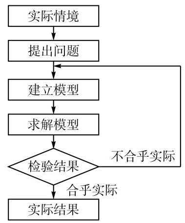

图 0-1 数学建模活动过程图示

## 如何开展数学建模活动

数学建模问题来自生活、社会、经济、工程、科学等不同领域，解决问题的数学方法事先并无规定，往往需要根据具体情况综合、灵活地运用代数、几何、三角、统计等数学知识; 一般也没有统一的答案, 从不同角度出发, 各显神通, 完全可能会得到不同的解答. 因此, 参加数学建模活动不应追求得到统一的“标准答案”, 而应在过程中不断提高自己的数学建模能力与水平，充分发挥自己的创新精神和意识，不求“最好”，只求“更好”.

在学习数学建模时，需要注意以下几点:

1. 通过研读数学建模活动案例, 整体把握数学建模的全过程

鉴于数学建模问题的综合性和多样性, 在学习过程中不能把有关内容分解为定义、性质(条件、结论)等一个个孤立的知识点来理解和操练. 要学会从具体案例出发体会数学建模的完整过程, 再进一步分析各步骤的作用和特点.

2. 勇于参加数学建模活动，增强数学应用意识

只有下到水里才能学会游泳. 理解和掌握教材中详细阐述的案例可以为我们打下一个数学建模的基础. 若要真正掌握，还需要亲自动手做建模课题、参加数学建模活动. 建模活动除了可以在教师指导下进行, 更提倡同学们增强数学建模的自觉性, 注意在日常生活和社会实践中发现问题、提出问题、建立模型、解决问题.

3. 积极参与团队讨论，培养合作探究精神

数学建模问题一般比较复杂, 需要综合应用多学科的知识, 并涉及诸多环节, 适合用团队合作的方式加以解决. 团队的每位成员应增强团队合作的意识, 充分发挥自己的特长, 并认真倾听队友的意见, 通过集体智慧使得对问题的理解更准确, 模型更合理, 解答更创新，表达更规范.

4. 完成数学建模活动报告，积累数学活动经验

数学建模活动结束后, 应该及时对已有工作进行小结, 形成完整的数学建模活动报告. 报告一般包括标题、实际情境、提出问题、建立模型、求解模型、检验结果、改进模型和参考文献等内容.

报告可回顾记录建模活动的全过程，积累数学活动经验，同时方便他人通过阅读报告了解建模的方法、结论及其特点. 报告应使用简明准确的语言，综合应用数学公式、图像、表格等各种表达形式，以提高可读性和科学性. 数学建模活动报告是评价数学核心素养的重要依据.

## 关于本册教材

数学建模活动与科学、社会、经济、工程乃至日常生活紧密相连，背景五花八门，问题层出不穷, 方法丰富多彩. 本册教材提供了 11 个适合普通高中学生开展的数学建模活动, 分成 3 个部分呈现.

第 1 部分给出了 4 个数学建模案例 (活动 1-4), 每个案例包含完整的数学建模过程. 由于实际情境的丰富多样性, 在学习这些案例时可以不局限于教材上所列举的问题. 为此, 在每个案例展开过程中, 我们都留出了适当的空间 (以空白框形式呈现), 请同学们结合经验、发挥想象、共同思考，写下你们认为合理的问题、设想及建议. 这 4 个案例供教师在课堂上有选择地使用, 选用的次序也不作硬性规定, 可以根据实际的教学进程灵活处理, 目的是使同学们能完整地学习并经历数学建模的各个步骤, 了解它们的特点, 对数学建模活动有一个正确的认识. 同时, 指导同学们经历完整的数学建模活动, 并学习如何撰写数学建模活动报告.

教材所提供的活动 5-11 供同学们课余活动选用, 它们又分成 A、B 两组, 分别归在第 2 部分和第 3 部分. 第 2 部分 (A 组) 活动的呈现是半开放式的, 已按照数学建模的一般过程给出了活动提示，同学们可以以小组为单位，开展相应的数学建模活动，并将活动过程或内容填写进表格中的相应位置. 第 3 部分(B 组)活动的呈现则是全开放的，只给出开展数学建模活动的实际情境和基本要求，同学们可自行组队、自主设定问题，开展相应的数学建模活动. 在活动 5-11 中, 教师可以是指导者, 也可以是学生组队中的成员.

本册教材有三个附录. 附录 1 介绍了数学建模活动报告写作的原则与方法, 附录 2 给出了一个具体的数学建模活动报告，供同学们参考. 为方便老师们和同学们合理使用本教材, 我们在附录 3 中列表说明了本册 11 个数学建模活动可能涉及的数学基础知识内容.

根据《普通高中数学课程标准(2017 年版 2020 年修订)》，在必修课程中有 6 课时的数学建模与数学探究活动, 我们建议其中至少 4 个课时用于数学建模活动(其余课时用于数学学科内部的探究活动), 教师可在对数学建模作一般性引导之后, 从本册第 1 部分选用一个活动, 与学生共同完成建模全过程, 撰写数学建模活动报告, 然后让学生组成小组, 从第 2 部分中自主选用一个活动, 参照教材的活动提示, 完成建模过程, 由教师给予适当的帮助.

数学建模活动案例

本部分共有 4 个案例, 与日常生活、科学技术或生态环境息息相关. 由于每个案例的实际情境丰富多样, 教材上无法列举所有相关的问题. 因此, 在每个案例的展开过程中, 留出了空间 (以空白框形式呈现), 请同学们结合经验、发挥想象、共同思考，提出你们认为合理的问题、设想和建议，并在数学建模活动中找到答案.

让我们一起积极开展数学建模活动！

## 1 红绿灯管理

随着经济的快速发展、人口的大量增加和交通工具的广泛使用，世界各国都面临交通问题, 如何科学地进行交通管理为人们所广泛关注. 红绿灯管理是对交叉路口实施交通管理的最常见方法. 作为城市交通指挥棒的红绿灯如果设置不合理, 就可能会造成不必要的城市交通堵塞. 如何合理地设置交通路口的红绿灯呢?

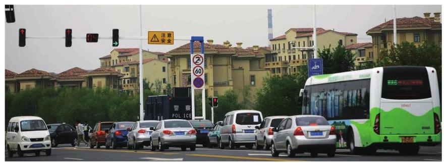

## 提出问题

交通路口信号灯的变换通常是周期性的. 在一个周期内, 先是东西方向开绿灯, 东西方向车辆可以行驶，同时南北方向开红灯，车辆必须等待；然后，交通信号灯转换，东西方向开红灯，车辆等待，同时南北方向开绿灯，车辆通行. 如果交通路口的红绿灯设置合理, 可以使得所有车辆在交叉路口的滞留时间的总和最短. 如何合理地设置红绿灯的时间，使得车辆总的等待时间最短?

同学们也许会提出其他问题. 这里我们只针对“所有车辆在交叉路口的等待时间的总和最短”建立模型. 针对其他问题, 同学们可以建立自己的模型.

## 构建模型

考虑一个十字路口, 其东西方向和南北方向分别只有一对相向的直行车道 (假设 1 ，如图 1-1). 由于主要考虑红绿灯时间的设置对车辆通行的影响，可忽略其他一些次要因素(假设 2 和假设 3). 又为了方便起见, 假设车流量是均匀、稳定的 (假设 4). 这里的车流量是指单位时间内通过某路段的车辆数. 不同路口红绿灯的最小周期通常是不相同的, 为了便于分析比较, 将路口红绿灯变化的最小周期取作单位时间(假设 5 ).

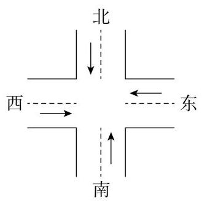

图 1-1

将我们所作的简化假设完整地列出来, 如下:

假设 1: 每个行车方向只有一条车道, 车辆不能转弯;

假设 2: 不考虑路口行人和非机动车辆的影响;

假设 3: 忽略黄灯的影响;

假设 4: 两个方向的车流量均是稳定和均匀的;

假设 5 : 将交通信号灯转换的最小周期(简称周期)取作单位时间 1 .

记单位时间内从东西方向到达十字路口的车辆数为 $H$ ,从南北方向到达十字路口的车辆数为 $V$ . 在一个周期内,假设东西方向开红灯、南北方向开绿灯的时间为 $R$ ,那么在该时间段内,东西方向开绿灯、南北方向开红灯的时间为 $1 - R$ .

我们要确定交通灯的控制方案,就是要确定 $R$ ,使得在一个周期内,车辆在路口的总滞留时间最短. 一辆车在路口的滞留时间包括两个部分:一部分是遇红灯后的停车等待时间; 另一部分是停车后司机见到绿灯重新发动到开动的时间,称为启动时间,记为 $S$ ,它是可以测定的.

由于在一个周期内,从东西方向到达路口的车辆为 $H$ 辆,该周期内东西方向开红灯的比例为 $R : 1$ ,因此需停车等待的车辆共 ${HR}$ 辆. 这些车辆等待信号灯改变的时间有的较短,有的较长,它们的平均等待时间为 $\frac{R}{2}$ . 所以,东西方向行驶的车辆在此周期内等待时间的总和为

$$
{HR} \cdot  \frac{R}{2} = \frac{H{R}^{2}}{2};
$$

①

同理, 南北方向行驶的车辆在此周期内等待时间的总和为

$$
\frac{V{\left( 1 - R\right) }^{2}}{2}\text{ . }
$$

②

凡遇红灯停车的车辆均需 $S$ 单位的启动时间. 在此周期内,各方向遇红灯停车的车辆总和为 ${HR} + V\left( {1 - R}\right)$ ,而相应的启动时间为

$$
S\left\lbrack  {{HR} + V\left( {1 - R}\right) }\right\rbrack  \text{ . }
$$

③

由①一③，可得在此周期内所有过此路口的车辆的总滞留时间为

$$
T = T\left( R\right)  = \frac{H{R}^{2}}{2} + \frac{V{\left( 1 - R\right) }^{2}}{2} + S\left\lbrack  {{HR} + V\left( {1 - R}\right) }\right\rbrack
$$

$$
= \frac{H + V}{2}{R}^{2} - \left\lbrack  {V\left( {1 + S}\right)  - {HS}}\right\rbrack  R + {SV} + \frac{V}{2}.
$$

④

这样,红绿灯控制问题的数学模型为: 求 $R$ ,使得由④式定义的 $T\left( R\right)$ 达到最小.

## 求解模型

从④式可以看到，车辆的总滞留时间 $T = T\left( R\right)$ 是 $R$ 的一元二次函数，对其进行配方可以得到

$$
T = T\left( R\right)  = \frac{H + V}{2}{\left\lbrack  R - \frac{V\left( {1 + S}\right)  - {HS}}{H + V}\right\rbrack  }^{2} + {SV} + \frac{V}{2} - \frac{{\left\lbrack  V\left( 1 + S\right)  - HS\right\rbrack  }^{2}}{2\left( {H + V}\right) }
$$

$$
= \frac{H + V}{2}{\left\lbrack  R - \frac{V\left( {1 + S}\right)  - {HS}}{H + V}\right\rbrack  }^{2} + \frac{\left( {2{S}^{2} + {4S} + 1}\right) {HV} - {S}^{2}\left( {{H}^{2} + {V}^{2}}\right) }{2\left( {H + V}\right) }.
$$

⑤

在⑤式中,由于 ${\left\lbrack  R - \frac{V\left( {1 + S}\right)  - {HS}}{H + V}\right\rbrack  }^{2} \geq  0$ ,且 $H\text{ 、 }V$ 显然都是正数,因此

$$
T \geq  \frac{\left( {2{S}^{2} + {4S} + 1}\right) {HV} - {S}^{2}\left( {{H}^{2} + {V}^{2}}\right) }{2\left( {H + V}\right) },
$$

⑥

且当

$$
R = {R}^{ * } = \frac{V\left( {1 + S}\right)  - {HS}}{H + V}
$$

⑦

时, $T$ 达到最小值

$$
T = {T}^{ * } = \frac{\left( {2{S}^{2} + {4S} + 1}\right) {HV} - {S}^{2}\left( {{H}^{2} + {V}^{2}}\right) }{2\left( {H + V}\right) },
$$

⑧

即当 $R = {R}^{ * }$ 时,车辆的总滞留时间最短,最短总滞留时间为 $T = {T}^{ * }$ .

## 检验模型

这里我们假设了 $V\left( {1 + S}\right)  - {HS} > 0$ ,这在实践中是能够达到的. 例如,设置适当长的单位时间，使得 $S$ 是个比较小的数，这也是个合理的假设.

特别地,如果忽略车辆的启动时间 $S$ ,即假设 $S = 0$ ,那么最佳控制方案为 $R = \frac{V}{H + V}$ 或 $1 - R = \frac{H}{H + V}$ . 也就是说,两个方向开绿灯的时间之比,应等于两个方向车流量之比, 从而车流量较大的方向开绿灯的时间应较长, 这与我们日常的生活经验是完全一致的. 由此可见, 我们在建立模型时所作的简化假设是合理的. 请同学们选取一个十字路口, 采集两个方向的车流量, 检验该模型的合理性.

## 总结

这个案例聚焦于我们日常生活中常见的交通信号灯,把车辆总滞留时间 $T$ 构造成某一方向上红灯设置时长 $R$ 的一元二次函数. 对于开口向上的一元二次函数,通过配方法求得它的最小值点和相应的最小值, 从而解决了红绿灯的设置问题.

在这个案例中，我们假设车流量是稳定、均匀的，但实际中的车流量是随机的，需要用到概率统计的知识才能予以解决. 而作出车流量稳定、均匀的假设, 本质上是使用了平均的概念, 也就是使得车辆的平均等待时间最短. 从这样的处理方式可以看到, 如何简化问题是建模过程中非常关键的一步, 一种好的简化方式可以使问题变得简单而易于处理.

面对红绿灯管理，同学们有什么其他问题? 如何合理设置红绿灯，可以使得所有车辆在交叉路口的最大等待时间最短? 请同学们针对自己提出的问题, 建立自己的模型, 并求解、分析和检验.

## 参考文献

[1] 谭永基, 蔡志杰. 数学模型(第三版)[M]. 上海: 复旦大学出版社, 2019.

## 2 “诱人”的优惠券

近年来，“双十一”演变成为一年一度的购物狂欢节. 从 2009 年开始，“双十一”购物规则的复杂度不断增大, 而面对商家复杂的优惠规则, 消费者都尝试用足优惠. 最近, 某商家推出三种优惠券, 分别是满 199 元减 20 元、满 299 元减 50 元、满 499 元减 110 元. 这些优惠券之间不可叠加使用, 但它们可以与满 400 元减 50 元的购物津贴同时使用 (图 2-1). 此外, 这两类优惠券有使用顺序, 必须先使用商家优惠券, 再使用购物津贴.

图 2-1

## 提出问题

这些俗称为“满减”的优惠券容易让人产生购物的冲动. 为了“凑单”，消费者可能会买些不需要的东西. 这样的购物行为是否理性呢? 商家使用了怎样的优惠策略? 是否购买金额越大, 享受的优惠也越大?

面对上述实际情境，你会提出哪些问题？请列举在下框中.

## 建立模型

我们假设,商家在设计优惠策略时只考虑两个因素:一个是购买金额，记为 $x$ ，单位是元; 另一个是买家所享受到的优惠率,即原价与折扣价之差占原价的百分比,记为 $y$ .

为简单起见, 这里我们只考虑用两种优惠券满 199 元减 20 元和满 299 元减 50 元的情况, 其他优惠暂不考虑. 有兴趣的同学可以进一步讨论使用更多优惠措施的情况.

根据实际情境, 我们需要分情况考虑.

情况 1: 当购买金额 $0 < x < {199}$ 时,无法使用优惠券;

情况 2: 当购买金额 $x \geq  {199}$ 时,可以使用优惠券.

在可使用优惠券的情况下, 不同的购买金额有其可对应使用的优惠券类型, 并有不同的优惠后价格. 当购买金额 $x$ 满足 199≤✓≤0.9% 9.9% 10. 用 31.9% 10.0% 11.5% 11.5% 惠后的价格为 $x - {20}$ ; 而当购买金额 $x \geq  {299}$ 时,可使用满 299 减 50 的优惠券,优惠后的价格为 $x - {50}$ .

因此,相应的购买金额 $x$ 与优惠率 $y$ 之间的关系如下:

(1)当 $0 < x < {199}$ 时,无法享受优惠, $y = \frac{x - x}{x} = 0$ ;

(2)当 ${199} \leq  x < {299}$ 时，可使用满 199 减 20 的优惠券， $y = \frac{20}{x}$ ；

(3)当 $x \geq  {299}$ 时，可使用满 299 减 50 的优惠券， $y = \frac{50}{x}$ .

综上所述,买家所享受到的优惠率 $y$ 与购买金额 $x$ 之间形成如下的分段函数:

$$
y = \left\{  \begin{array}{ll} 0, & 0 < x < {199}, \\  \frac{20}{x}, & {199} \leq  x < {299}, \\  \frac{50}{x}, & x \geq  {299}. \end{array}\right.
$$

①

这就是针对我们所提出的问题及假设而得到的商家优惠策略的数学模型. 同学们也可以根据你们各自所提出的问题, 设定相关参数或变量, 构建相应的数学模型, 并填写在下框中.

## 求解与分析模型

根据上述函数关系①，作出该分段函数的图像，如图 2-2 所示.

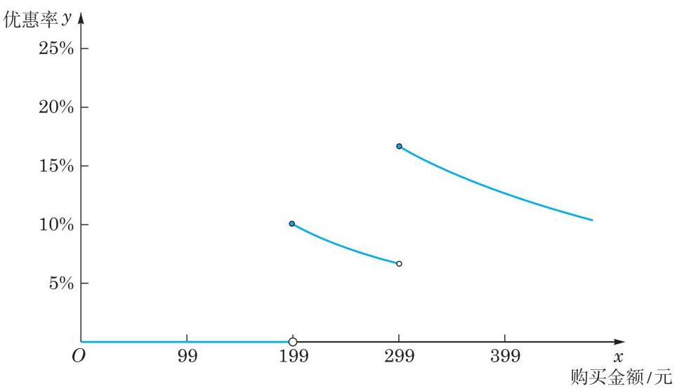

图 2-2 购买金额与优惠率之间的函数关系

从图 2-2 可以看出,当 $0 < x < {199}$ 时,优惠率 ${y}_{1}$ 是常值函数, ${y}_{1} = 0\%$ ;

当 $x = {199}$ 时,优惠率 ${y}_{2} = \frac{20}{199} = {10.05}\% ,{y}_{2} > {y}_{1}$ ,因此当购买金额接近 199 元时, 可以考虑适当地“凑单”购买物品，使得购买金额达到或少许超过 199 元，可以享受到相应的优惠;

当 ${199} \leq  x < {299}$ 时,优惠率 ${y}_{3} = \frac{20}{x},{y}_{3}$ 是 $x$ 的严格减函数,且 ${6.69}\%  < {y}_{3} \leq$ 10.05%;

当 $x = {299}$ 时,优惠率 ${y}_{4} = \frac{50}{299} = {16.72}\% ,{y}_{4} > {y}_{3}$ ,因此当购买金额接近 299 元时, 可以考虑适当地“凑单”购买物品，使得购买金额达到或少许超过 299 元，从而享受到更高的优惠率. 反之, 当购买金额虽超过 199 元, 但与 299 元距离尚大时, 可以考虑适当地 “减单”购买物品，使得购买金额恰好达到或少许超过 199 元，从而享受到更高的优惠率.

根据图 2-2, 当购买金额为 299 元时, 优惠率最高, 达到了 16.72%. 这说明, 商家的 “满减”优惠能吸引人是有一定道理的.

从图 2-2 还可以看出,当 ${199} \leq  x < {299}$ 时,对于该分段区间上的函数 $y = \frac{20}{x}$ ,优惠率随着购买金额的增大而降低, 并不是买得越多, 优惠率越高. 在该区间内, 恰好“凑单”到 199 元享受的优惠率最高.

同理,当 $x \geq  {299}$ 时,对于相应分段区间上的函数 $y = \frac{50}{x}$ ,优惠率随着购买金额的增大而降低, 同样是买得越多, 优惠率越低. 在该区间内, 最佳的“凑单”方式是使购买金额刚好达到 299 元, 继续购买并不划算. 但在实际购物中, 恰好“凑单”到 199 元或 299 元的可能性是很小的, 因此最高优惠率是很难实现的, 这也是商家设计的一种“陷阱”.

相信同学们针对上述实际情境提出了自己感兴趣的问题, 并建立了相应的数学模型, 现在请求解并分析你所构建的数学模型, 并填写在下框中.

## 回归现实，反思结果

根据上述优惠策略模型, 我们已经发现商家设计优惠策略时隐藏着一般消费者不能直观体验的“陷阱”:并不是购买金额越大，优惠率就越高. 这也是商家常用的营销策略. 尽管在建立优惠策略模型时，我们只考虑了购买金额与优惠率两个因素，但所得模型仍然是有意义的. 当然, 商家在实际设计策略时一定还会考虑到其他一些因素, 有兴趣的同学可以继续探究.

## 探究活动

1. 如果考虑使用实际情境中给出的三种优惠券, 是否购买金额越大, 享受的优惠也越大?

2. 如果在使用三种优惠券的基础上，再使用购物津贴，是否购买金额越大，享受的优惠越大?

请感兴趣的同学继续建模探究, 看看能得到怎样的答案.

## 总结

在这个数学建模活动中, 我们面对的是现实生活中购物消费的情境. 我们讨论了如何从数学角度理性地看待商家给出的优惠. 这里运用分类讨论的思想, 把不同情境用分段函数加以表征, 给出了简化的商家优惠策略模型 (购买金额与优惠率的函数关系). 在求解模型时可以绘制函数图像, 比较不同分段区间上的优惠率, 以及得到优惠率最高的购买金额. 通过分析与计算，我们发现并不是购买金额越大，享受的优惠率越高(优惠越大). 相反，有时好不容易“凑单”到一定的购买金额，所享受的优惠率还有可能比“凑单”前低. 希望通过这样的模型建立与解答过程, 同学们能够理性地审视自己的消费行为. 当你面对这种“诱人”的优惠券时，可以运用相关的数学知识和技能，为自己制定一个合理的购物方案.

建模活动结束后, 需要完成一份数学建模活动报告. 针对这个实际情境, 我们以小论文的形式编写了报告, 详见附录 2.

## 3 车辆转弯时的安全隐患

同学们如果时常阅读报纸或浏览新闻网站, 可能看到过关于大型车辆右转时引发交通事故的报道. 有时事故较大，危及了人的生命. 为什么大型车辆转弯时容易引发事故？细读一些报道和查阅相关资料后发现, 这些事故中很大一部分与“内轮差”有关.

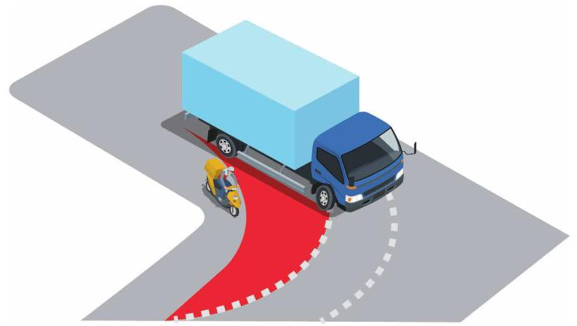

车辆在转弯时, 后轮并不是沿着前轮的轨迹行驶的, 会产生偏差, 转弯形成的偏差叫 “轮差”. 内轮差是车辆转弯时前内轮转弯半径与后内轮转弯半径之差. 由于内轮差的存在, 车辆转弯时, 前、后车轮的运动轨迹不重合.

## 提出问题

内轮差在现实生活中常常被人们所忽视. 特别是一些大型车辆(如公交车、集装箱卡车等)在转弯时，前轮虽然通过了路口，但后轮由于与前轮的运动轨迹不同，可能会伤及在车辆旁边行走的路人或损坏路边的建筑. 大型车辆的内轮差有多大? 为什么会损害人或物呢?

## 建立模型

查阅资料，我们发现车辆转弯大都遵循阿克曼(Ackermann)转向几何原理. 依据阿克曼转向几何原理设计的车辆,沿着弯道转弯时,内侧轮的转向角比外侧轮要大 ${2}^{ \circ  } \sim  {4}^{ \circ  }$ , 四个轮子转弯路径的圆心大致交会于后轴延长线上的瞬时转向中心，让车辆可以顺畅地转弯 (图 3-1).

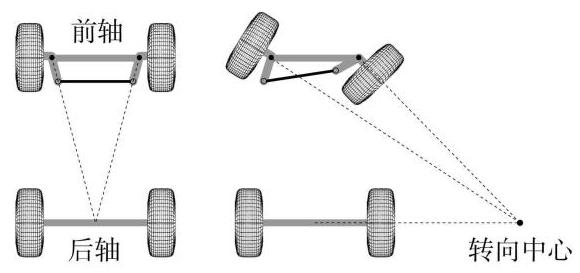

图 3-1 阿克曼转向几何原理

在现实生活中, 机动车辆一般有四个车轮, 分别是:前外轮、前内轮、后外轮、后内轮. 为了便于研究, 我们对问题作出如下假设:

假设 1: 车辆有两个前轮和两个后轮;

假设 2: 车辆四个车轮的中心形成一个矩形;

假设 3: 车辆在转弯时处于理想状态, 不产生侧滑;

假设 4: 车轮为刚性的, 转弯过程中不发生形变;

假设 5 :车轮的大小与厚度对内轮差没有影响；

假设 6 : 车辆转弯遵循阿克曼转向几何原理.

让我们先来看车辆分析图,如图 3-2 所示. 记车辆的转向中心为 $O$ . 设 $O$ 到两后轮中点的距离为 $R$ ,此即车辆的转弯半径. 又设两前轮之间距离 (称为轮距) 为 $w$ ,同侧前后两轮距离 (称为轴距) 为 $l$ ,车辆转弯时前内轮转角为 $\delta$ . 把 $O$ 到后内轮和前内轮的距离分别记为 ${R}_{1}$ 和 ${R}_{2}$ ,它们分别是后内轮和前内轮的转弯半径. 于是,我们要求的车辆转弯时的内轮差为 ${R}_{2} - {R}_{1}$ .

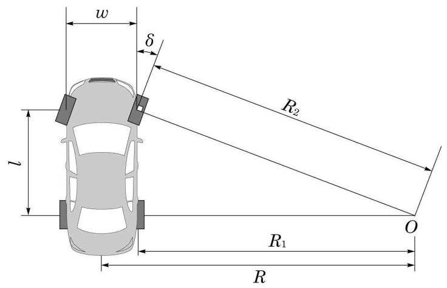

图 3-2 车辆分析图

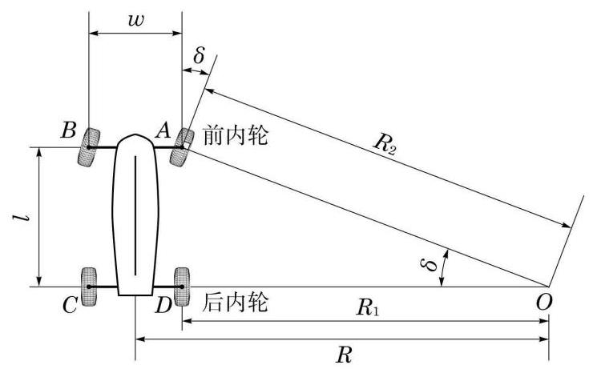

图 3-3 车辆内部图

车辆转弯状态可以用前内轮转角 $\delta$ 或车辆转弯半径 $R$ 来描述. 这是两个(互相关联的) 参数. 我们分别用这两个参数建立模型.

模型 I 如图 3-3,记四个车轮的中心分别为 $A\text{ 、 }B\text{ 、 }C\text{ 、 }D$ . 容易得到, $\angle {AOC}$ 与前内轮转角 $\delta$ 相等. 于是

$$
\tan \delta  = \frac{l}{{R}_{1}},\sin \delta  = \frac{l}{{R}_{2}}.
$$

①

这样, 后内轮和前内轮的转弯半径分别为

$$
{R}_{1} = \frac{l}{\tan \delta },{R}_{2} = \frac{l}{\sin \delta }.
$$

②

车辆转弯时的内轮差为

$$
{R}_{\text{ 内轮差 }} = l\left( {\frac{1}{\sin \delta } - \frac{1}{\tan \delta }}\right)  = l\tan \frac{\delta }{2}.
$$

③

模型 II 现在用车辆的转弯半径 $R$ 作参数. 由于 $R = {R}_{1} + \frac{w}{2}$ ,我们可以用 ${R}_{1}$ 取代 $R$ 作参数. 从图 3-3 可以看出, ${R}_{2} = \sqrt{{l}^{2} + {R}_{1}^{2}}$ . 这样,我们得到内轮差模型

$$
{R}_{\text{ 内轮差 }} = \sqrt{{l}^{2} + {R}_{1}^{2}} - {R}_{1},
$$

④

或记为

$$
{R}_{\text{ 内轮差 }} = \frac{{l}^{2}}{\sqrt{{l}^{2} + {R}_{1}^{2}} + {R}_{1}}.
$$

⑤

参数 $\delta$ 与 ${R}_{1}$ 通过①式或②式相联系，用三角函数定义和半角公式容易验证，两个模型得到的内轮差公式是等价的.

## 分析模型

从两个模型容易看出 (见③式和④式)，在同样的转角或同样的转弯半径下，轴距 $l$ 越大, 内轮差越大. 特别地, ③式表明, 内轮差的大小与车辆的轴距成正比. 这说明, 长车 (大型车辆)在转弯时形成的内轮差比短车(小型车辆)要大很多. 因此，在大型车辆转弯时, 行人和非机动车不要过于靠近汽车, 尤其是绝对不要靠近后内轮, 以避免事故的产生.

从两个模型还可以看出, 当车辆的轴距不能改变时, 车辆转弯时的转角越大, 内轮差越大(见③式)，也就是车辆的转弯半径越小，内轮差越大(见⑤式). 当然，车辆不转弯时,内轮差为 0,这可以从③式推出 (此时 $\delta  = 0$ ),也可以从⑤式推出 (因为此式表明，当 ${R}_{1}$ 趋于无穷大时,内轮差趋于 0 ). 这一结论给我们的启示是,驾驶员 (尤其是大型车辆的驾驶员)在驾驶车辆拐弯时，一定要有内轮差意识:道路条件许可时，尽量加大转弯半径； 由于道路条件不许可而不得不作急转弯(例如在交叉路口的右转弯)时，应特别注意减速慢行, 密切观察路况, 避免内轮差造成的伤害事故.

我们还得关注一下车身比较宽的车辆. ④式和⑤式中用的参数不是车辆的转弯半径 $R$ ,而是后内轮的转弯半径 ${R}_{1} = R - \frac{w}{2}$ (其中 $w$ 是轮距,基本上可以看成车的宽度). 因此, 在同样的转弯半径下, 较宽车辆的后内轮转弯半径比较小, 从而会产生比较大的内轮差. 这也是值得注意的.

为了验证转弯半径、轮距、轴距对内轮差的影响，我们用图形计算器模拟了车辆转弯时的情形，并用来检验前面得到的模型.

为了研究的方便, 我们忽略了前轮轮胎到车头、后轮轮胎到车尾的部分. 将车辆近似看成一个矩形, 车轮安装在车头和车尾两侧部分 (图 3-4 至图 3-7).

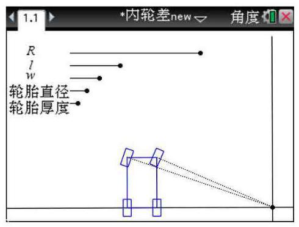

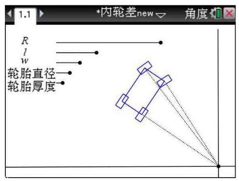

图 3-4 图 3-5

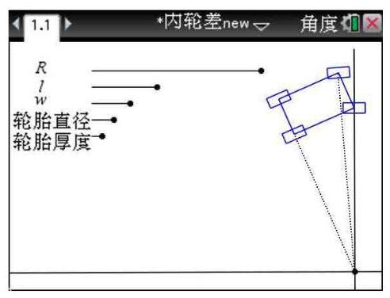

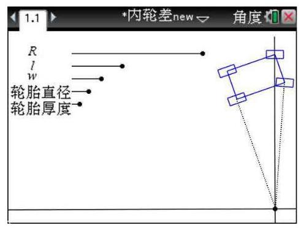

图 3-6 图 3-7

设置动态演示, 我们得到了四个车轮的行驶轨迹 (图 3-8 至图 3-12).

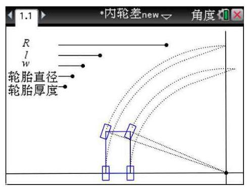

图 3-8

图 3-9

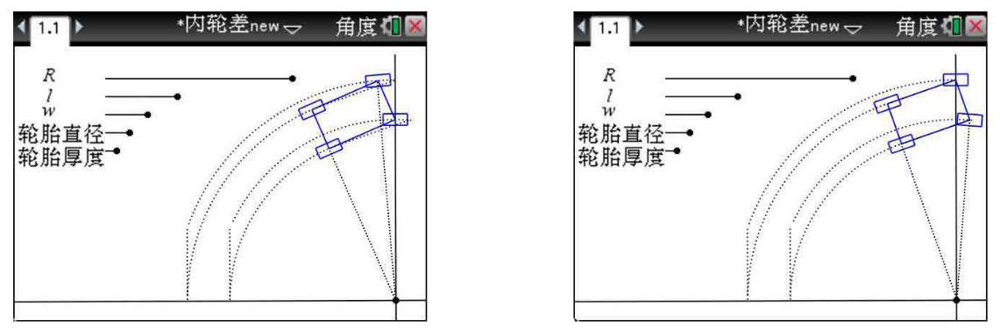

图 3-10

图 3-11

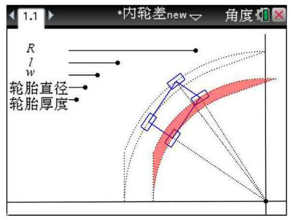

图 3-12

通过实验模拟以及数据计算可以发现, 在每次只改变一个参数、而其余参数不变的情况下, 有如下结论:

(1)转弯半径越小, 内轮差越大 (比较图 3-13、图 3-14);

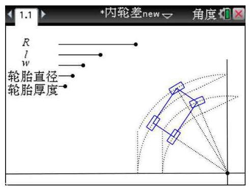

图 3-13

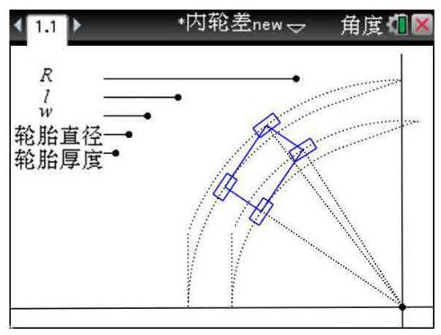

图 3-14

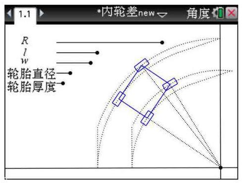

图 3-15

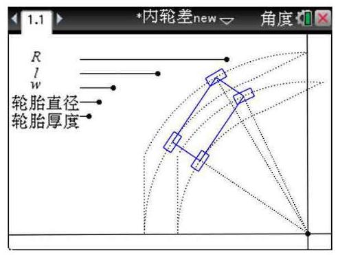

图 3-16

(2)轮距(与车身宽度有关)越大，内轮差越大(比较图 3-14、图3-15)；

(3)轴距(与车身长度有关)越大，内轮差越大(比较图 3-14、图 3-16).

这些模拟实验的结论与我们前面建立的内轮差模型的结果基本吻合.

## 检验模型

查阅相关文献,获悉汽车前内轮的转向角一般在 ${32}^{ \circ  } \sim  {42}^{ \circ  }$ 范围内 ${}^{\left\lbrack  1\right\rbrack  }$ . 不妨设 $\delta  = {42}^{ \circ  }$ , 根据内轮差模型④计算得到三种常见车型的最大内轮差, 如表 3-1 所示.

表 3-1 几种车型相关理论数据

<table><tr><td>车型</td><td>$l/\mathrm{m}$</td><td>${R}_{\text{ 后内轮 }}/\mathrm{m}$</td><td>${R}_{\text{ 前内轮 }}/\mathrm{m}$</td><td>最大内轮差/m</td></tr><tr><td>某微型轿车</td><td>2.34</td><td>2.599</td><td>3.497</td><td>0.898</td></tr><tr><td>某中型卡车</td><td>3.60</td><td>3.998</td><td>5.380</td><td>1.382</td></tr><tr><td>某大客车</td><td>6.265</td><td>6.958</td><td>9.363</td><td>2.405</td></tr></table>

2013 年, 公安部交通管理局公布了各种车辆的最大内轮差: 小型车辆最大内轮差为 ${0.6} \sim  {1.0}\mathrm{\;m}$ ,中型车辆最大内轮差为 ${0.9} \sim  {1.5}\mathrm{\;m}$ ,大型车辆最大内轮差为 ${1.5} \sim  {2.3}{\mathrm{\;m}}^{\left\lbrack  2\right\rbrack  }$ .

根据上述模型计算出来的三种车辆的最大内轮差, 其中微型轿车与中型卡车是达标的,而大客车有所超标,可以限制其转向角而使其达标,如限制其转向角在 ${40}^{ \circ  }$ 之内,其最大内轮差为 ${2.280}\mathrm{\;m}$ .

为了更好地检验模型, 我们再以某重卡复合型自卸车 (车轮前 4 个后 8 个, 货箱长度 ${7.6}\mathrm{\;m})$ 为例,分别计算 $\delta  = {10}^{ \circ  }\text{ 、 }{20}^{ \circ  }\text{ 、 }{30}^{ \circ  }$ 时的内轮差(表 3-2).

表 3-2 某重卡复合型自卸车内轮差

<table><tr><td>$\delta {/}^{ \circ  }$</td><td>${R}_{\text{ 后内轮 }}/\mathrm{m}$</td><td>${R}_{\text{ 前内轮 }}/\mathrm{m}$</td><td>内轮差/m</td></tr><tr><td>10</td><td>39.415</td><td>40.023</td><td>0.608</td></tr><tr><td>20</td><td>19.095</td><td>20.320</td><td>1.225</td></tr><tr><td>30</td><td>12.038</td><td>13.900</td><td>1.862</td></tr></table>

注: 该重卡复合型自卸车的前后轮距离 $l = {6.95}\mathrm{\;m}$ .

经过比对, 我们发现所得数据与相关文献 ${}^{\left\lbrack  3\right\rbrack  }$ 公布的数据基本一致, 再次印证了我们建立的内轮差模型的合理性与适用性.

我们的模型根据阿克曼转向几何原理简化后, 运算也得到了一定的简化, 答案简洁明了, 便于解决生活中的一些问题, 所得结论与事实基本吻合.

## 总结

在本案例中，我们根据阿克曼转向几何原理，通过简化汽车模型，根据三角的相关知识, 建立了计算汽车行驶中内轮差的模型. 通过将模型应用于具体车辆，我们不难发现， 在汽车转弯时, 内侧的前后轮的轨迹相差是很明显的, 并且车身越长, 差值会越大, 大客车转弯时的内轮差甚至超过了 $2\mathrm{\;m}$ . 在实际行驶中,如果司机对这样的内轮差不引起足够的重视, 就会给位于内侧的行人或非机动车带来不小的安全隐患. 尽管模型给出的是理论上的推断, 但对车辆驾驶人有重要的警示作用. 在车辆实际行驶中, 司机应该谨慎驾驶, 行人也应该有自我保护意识.

## 参考文献

[1] 王戈. 浅谈汽车前轮转向角的检测[J]. 计量与测试技术, 2006(12): 62-64.

[2] 公安部交通管理局. 认识汽车的内轮差[J]. 汽车与安全, 2013(6).

[3] 周磊, 胡沁如, 龚书晨, 刘有军. 基于汽车内轮差的警示装置设计研究[J]. 浙江科技学院学报, 2018(10): 429-434.

## 4 雨中行

生活中你是否曾遇到过这种尴尬的事:上学时天气好好的，放学时走了一段路突然下雨了；或是出去踢球的时候没带伞，回家路上却碰巧下雨了. 遇到这种情况该怎么办呢？ 也许你会冒雨跑回家，或者赶紧找个避雨的地方，又或者找公交站或地铁站乘车回家. 不管采用何种方法，你都需要淋雨从当下所处的位置前往想要去的地方. 在这一过程中，有什么方法可以减少淋雨呢?

一个简单的策略是:尽可能快地跑到目的地，以减少被雨淋的时间。这真的是一个最好的策略吗? 除了减少被雨淋的时间，还有没有其他选择呢?

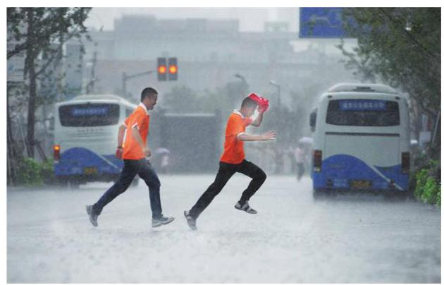

请将你认为可以选择的最优目标填入下框.

## 提出问题

事实上, 淋雨时间最少不应该成为我们希望达到的最优目标, 至少不是唯一的目标. 一种可以选择的合理目标是:在雨中行走时，被淋雨的程度应尽可能低，也就是应使得淋雨量最小. 因此, 我们首先要构建模型来描述雨中行走时的淋雨量.

## 相关因素与假设

要建立适当的模型, 先要考虑与问题有关的主要因素有哪些. 就淋雨量问题而言, 其中一个相关因素是降雨量的大小. 请你思考一下，还有哪些因素会影响淋雨量的大小？请将你的想法填入下框.

仔细思考后就会发现, 影响淋雨量大小的因素还有路程的远近、行走的速度、人体的形状等.

为了建立模型, 我们需要作出一些假设. 事实上, 我们所建立的模型与假设是密不可分的, 基于不同的假设可能会得到不同的模型, 进而得出不同的结论.

对淋雨量问题来说, 为了简化问题, 我们可以假设降雨强度保持不变. 于是问题转化为:在相同的降雨强度下，我们如何选择策略以达到期望的最优目标. 除此之外，你认为还需要哪些假设? 请填入下框.

假设 1 :降雨强度保持不变.

经过思考, 我们作出以下假设:

假设 1: 降雨强度保持不变;

假设 2: 行走的速度保持不变;

假设 3: 将人体视为一个长方体.

## 初步模型

人在雨中行走，其头顶会被雨淋湿. 如图 4-1，记人的身高为 $h\left( \mathrm{\;m}\right)$ ，宽度为 $w\left( \mathrm{\;m}\right)$ ， 厚度为 $d\left( \mathrm{\;m}\right)$ ,则头顶被雨淋到的面积为

$$
{S}_{1} = {wd}\text{ . }
$$

①

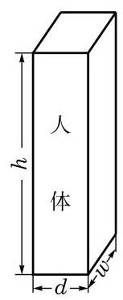

图 4-1

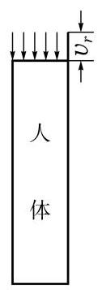

图 4-2

用 $p$ 来度量雨滴的密度,称为降雨强度系数,它表示单位体积的空间中雨滴所占的比例. 又记降雨的速度为 ${v}_{r}\left( {\mathrm{\;m}/\mathrm{s}}\right)$ . 那么,如果人站着不动,在单位时间 $\left( {1\mathrm{\;s}}\right)$ 内,头顶的淋雨量就是头顶上方高度为 ${v}_{r}$ 的长方体中的雨滴量(图 4-2)，可表示为

$$
{C}_{h} = {pwd}{v}_{r}.
$$

②

通常, 降雨伴随着大风, 雨水不是垂直落下, 而是有一定的角度的. 这会对头顶的淋雨量产生影响吗?

如图 4-3,记水平风速为 ${v}_{w}\left( {\mathrm{\;m}/\mathrm{s}}\right)$ ,单位时间 $\left( {1\mathrm{\;s}}\right)$ 内落在头顶上的雨滴包含在一个倾斜的平行六面体中. 它的底面就是头顶,是一个长方形,面积为 ${wd}$ ; 它的高等于 ${v}_{r}$ . 根据平行六面体的体积公式，单位时间内头顶的淋雨量为

$$
{C}_{h} = {pwd}{v}_{r},
$$

这与无风情形下得到的单位时间淋雨量②式完全相同.

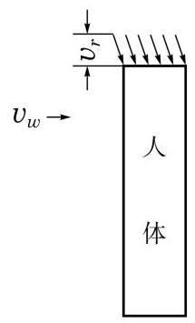

图 4-3

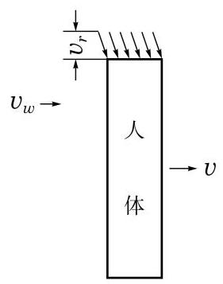

图 4-4

降雨时，人不会傻傻地站在雨中，而是想尽快跑至目的地，也就是说人处于运动当中. 记人在雨中的行走速度为 $v\left( {\mathrm{\;m}/\mathrm{s}}\right)$ (图 4-4),我们可以将人看成是固定不动的，那么风相对于人的运动速度大小就变为 $V = \left| {v - {v}_{w}}\right|$ . 根据上面的分析,风速的大小对单位时间内头顶的淋雨量没有影响，即淋雨量仍由②式给出. 这样，影响头顶淋雨量的因素就只剩下时间了. 记人在雨中行走的距离为 $D\left( \mathrm{\;m}\right)$ ，那么行走的时间为

$$
t = \frac{D}{v}
$$

③

从而头顶上总的淋雨量为

$$
{T}_{h} = \frac{{pwd}{v}_{r}D}{v}.
$$

④

## 模型的改进

初步模型只考虑了降雨时头顶被雨淋湿的情形, 请参考苏联趣味科学大师别莱利曼 (Y. I. Perelman)在《趣味力学》一书中介绍的类似的趣味问题. 根据生活经验, 人在雨中行走时，不仅头顶会被雨淋湿，其前后左右的衣服通常也会被淋湿. 因此，我们需要对初步模型作进一步的改进.

基于上述判断, 你能对初步模型作出适当的改进吗? 请将你的改进模型填入下框.

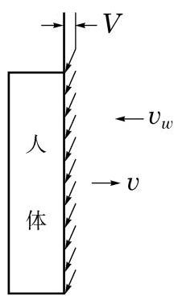

要计算前后衣服的淋雨量, 就要考虑风相对于行走的方向. 如果风是迎面吹来的, 那么被雨淋湿的部位就只有头顶和身体前部. 这样, 雨滴相对于人体的水平速度大小为 $V = {v}_{w} + v$ ,单位时间内身体前部淋到的雨包含在一个倾斜的平行六面体中,其底面为身体前部,面积为 ${wh}$ ,高等于 $V$ (图 4-5). 因此,单位时间内身体前部的淋雨量为

$$
{C}_{f} = {pwhV} = {pwh}\left( {{v}_{w} + v}\right) .
$$

⑤

而行走时间为

$$
t = \frac{D}{v}
$$

图 4-5

所以，身体前部总的淋雨量为

$$
{T}_{f} = \frac{p{wh}D}{v}\left( {{v}_{w} + v}\right) .
$$

这样, 人体总的淋雨量为

$$
T = {T}_{h} + {T}_{f} = \frac{pwD}{v}\left\lbrack  {d{v}_{r} + h\left( {{v}_{w} + v}\right) }\right\rbrack  .
$$

⑥

## 模型的分析

回顾一下先前的问题和目标. 我们希望找到在雨中行走的策略, 使得淋雨量达到最小. 在前面得到的淋雨量的函数表达式⑥中，降雨强度、降雨速度、人体尺寸、行走距离均可假设为定值, 与行走策略的选择无关. 在这个模型中, 与行走策略有关的量为风速、 风向和行走速度, 于是问题就变为: 给定风速和风向, 如何选择行走速度, 使得淋雨量达到最小?

下面分三种情况进行分析.

情形 1 无风的情形.

此时, ${v}_{w} = 0$ ,雨垂直落下,人体总的淋雨量为

$$
T = \frac{pwD}{v}\left( {d{v}_{r} + {hv}}\right)  = {pwD}\left( {\frac{d{v}_{r}}{v} + h}\right) .
$$

⑦

从⑦式可知, $T$ 是 $v$ 的严格减函数, $v$ 越大, $T$ 就越小. 只有当行走速度尽可能大时,淋雨量 $T$ 才能达到尽可能小. 也就是说,此时的行走策略应是在雨中尽可能快地跑,这与直观的想法是吻合的.

情形 2 风迎面吹来的情形.

此时,风速 ${v}_{w}$ 与行走速度 $v$ 方向相反. 由⑥式，总的淋雨量为

$$
T = \frac{pwD}{v}\left\lbrack  {d{v}_{r} + h\left( {{v}_{w} + v}\right) }\right\rbrack  .
$$

⑧

这与情形 1 类似, 请同学们自行分析, 并将分析的过程填入下框.

情形 3 风从背后吹来的情形.

此时，风速 ${v}_{w}$ 与行走速度 $v$ 方向相同，前面得到的淋雨量函数⑥不再适用. 由于这种情况已经超出前面讨论的范围, 必须回到开始的地方对这种情况重新进行分析.

首先考虑行走速度比风速慢的情形,即 $v \leq  {v}_{w}$ . 此时,雨滴将淋在背上,淋在背上的雨水量为

$$
{T}_{b} = \frac{pwhD}{v}\left( {{v}_{w} - v}\right) .
$$

于是, 总的淋雨量为

$$
T = {T}_{h} + {T}_{b} = \frac{pwD}{v}\left\lbrack  {d{v}_{r} + h\left( {{v}_{w} - v}\right) }\right\rbrack
$$

$$
= {pw}D\left( {\frac{d{v}_{r} + h{v}_{w}}{v} - h}\right) .
$$

⑨

这个函数的形式表面上与情形 1 和情形 2 类似, 但实际上是有所不同的.

在现在这种情形下, $T$ 仍是 $v$ 的严格减函数,因此,行走策略仍应是在雨中尽可能快地跑. 但与前面不同的是, 现在的行走速度是有范围限制的, 行走速度不能无限增大,而是要在限定范围内以最大速度奔跑. 此时的最大速度为 ${v}_{w}$ ,即应以 ${v}_{w}$ 的速度奔跑, 淋雨量才能达到最小. 这意味着刚好跟着雨滴向前行走, 从而身体前后都没有淋到雨. 如果行走速度低于风速, 那么将会有雨水落在背上, 从而使得淋雨量增加.

如果行走速度比风速快，即 $v \geq  {v}_{w}$ ，会发生什么情况呢？请将你的分析过程和结果填入下框.

## 总结

一般地, 影响数学模型构建的因素有很多, 我们应仔细分析哪些是主要因素, 哪些是次要因素. 忽略次要因素, 可以使问题得到简化, 从而更好地解决问题.

对淋雨量问题, 影响因素有路程的远近、行走的速度、风向、人体形状等, 其中人体形状比较复杂, 不容易处理. 我们对人体形状作了适当的简化, 使问题容易解决, 这是建立模型的重要一环. 在众多因素中, 行走速度和风向对行走策略的影响最大. 我们构建了淋雨量与行走速度的函数关系, 通过分析函数的单调性, 得到不同风向时淋雨最少的行走策略.

综合上面的分析，我们得到以下结论:

如果你在雨中行走，风迎面吹来(即逆风行走)或无风时，策略很简单，应该以尽可能大的速度向前跑.

如果在雨中行走，风从背后吹来(即顺风行走)，情况较为复杂. 当雨速较大而风速较小时 (精确地说, 当雨速与风速之比大于身体高度与厚度之比时), 头顶淋雨是影响总淋雨量的主要因素, 你仍应该尽量提高速度往前跑. 在其他情况下, 身体前部或后部淋雨是影响总淋雨量的主要因素, 你应该控制在雨中的行走速度, 让它刚好等于雨落下的水平速度 (也就是风速). 如果超过这个速度, 虽然可以更快地到达目的地, 但你是追着雨在跑, 身体前部会淋到更多的雨.

## 探究题

1. 对风从侧面吹来的情形，尝试建立模型并进行分析.

2. 本节的淋雨量问题中, 假设人体是一个长方体, 与实际情况还是有出入的, 但已经能够说明问题了. 有兴趣的同学可以考虑将人体假设为其他形状, 重新建立模型进行分析.

## 参考文献

[1] 姜启源. 数学模型(第二版)[M]. 北京:高等教育出版社，1993.

[2] 别莱利曼. 趣味力学[M]. 符其珣, 译. 北京: 中国青年出版社, 2010.

数学建模活动 A

相信同学们在教师指导下, 通过第 1 部分案例的学习, 已经体验了数学建模活动的基本流程, 积累了一定的数学建模活动经验. 这里提供另外 3 个建模活动, 供大家选择. 尽管没有提供详细的建模过程, 但仍给出了相应的活动提示, 可供大家参考. 请同学们有选择地分组开展活动, 相信你们能够应对这些活动的挑战.

## 5 出租车运价

某晚报曾刊登过一则生活趣事. 某市民乘坐出租车时, 在半途中要求司机临时停靠, 打表计价结账，然后重新计价，继续前行. 该市民解释说，根据经验，这样分开支付车费比一次性付费便宜一些. 他的这一说法有道理吗?

确实, 由于出租车运价上调, 有些人出行时会估计一下可能的价格, 再决定是否乘坐出租车. 据了解, 2018 年上海出租车在 5 时到 23 时之间起租价为 14 元/3 千米, 超起租里程单价为 2.50 元/千米. 总里程超过 15 千米(不含 15 千米)部分按超起租里程单价加价 50%. 低速等候费为每 4 分钟计收 1 千米超起租里程单价. 此外, 相关部门还规定了其他时段的计价办法，以及适合其他车型的计价办法.

市域出租汽车运价具体调整方案

根据市域出租汽车运价调整实施方案，起租价由13元/3千米调整为14元/3千米， 超起租里程运价由2.40元/千米调整为2.50元/千米.

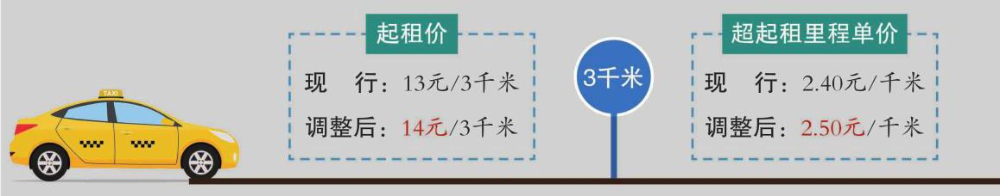

你会仿效那位市民的做法吗？为什么？

## 活动提示

## 提出问题

根据上述情境, 你能提出什么数学问题? 请将你的问题填入下框.

## 建立模型

为解决上面的问题, 我们需要作出一些合理的假设, 如假设没有交通拥堵, 不计出租车行驶中的等候时间等. 是否还需要其他假设? 请将你的假设填入下框.

假设 1: 不计出租车行驶中的等候时间.

根据上述假设建立数学模型, 并回答你所提出的问题. 请将你的研究过程填入下框.

## 模型的检验与改进

请将你的研究结果与实际情形比较. 如果不符, 试改进你的模型. 请将你的研究过程填入下框.

## 撰写数学建模活动报告

活动报告一般包含以下内容:

(1)根据上述情境所提出的数学问题;

(2)必要的假设和所需的变量或常量;

(3)相应的数学模型及解答;

(4)模型检验及说明.

## 6 家具搬运

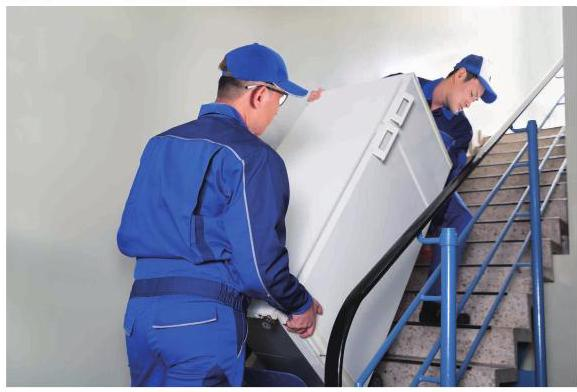

随着生活水平的逐步提高, 越来越多的人开始改善居住条件，搬家成了生活中经常谈及的话题. 在搬运大型家具的过程中，经常需要考虑家具能否通过狭长的转角过道.

如果我们能根据过道的宽度和家具的尺寸, 用数学的方法预先判断家具能否转弯, 必将为搬运家具提供很实用的依据，从而避免因家具尺寸过大而不能转弯的麻烦.

## 活动提示

## 提出问题

根据上述情境，你能提出什么数学问题？请将你的问题填入下框.

## 建立模型

为了解决上面的问题, 我们需要作出一些合理的假设, 如转角两侧的过道宽度相同等. 是否还需要其他假设? 请将你的假设填入下框.

假设 1: 转角两侧的过道宽度相同.

根据上述假设建立相应的数学模型, 并回答你所提出的问题. 请将你的研究过程填入下框.

## 模型的检验与改进

请将你的研究结果与实际情形比较. 如果不符, 试改进你的模型. 请将你的研究过程填入下框.

## 撰写数学建模活动报告

活动报告一般包含以下内容:

(1)根据上述情境所提出的数学问题;

(2)必要的假设和所需的变量或常量;

(3)相应的数学模型及解答；

(4) 模型检验及说明.

## 7 登山行程设计

在本册教材的引论部分, 我们以登山线路规划为例, 阐述了应用题和数学建模问题的区别. 下面, 请同学们合作完成这样的数学建模活动.

同学们会利用假期游览祖国大好河山， 亲身感受祖国在社会、经济、文化等各方面的发展. 例如, 有同学计划去有世界文化与自然双重遗产之称的黄山旅游. 请制作一份游览规划.

## 活动提示

## 提出问题

你在规划登黄山行程时主要考虑了哪些因素, 如节省时间、体力或者费用等? 请将你的想法填入下框.

规划目标

## 建立模型

为实现规划目标, 需要先查阅有关资料, 了解黄山旅游的相关信息, 并据此作出一些合理的假设. 例如, 上黄山时坐索道, 而下黄山时不坐. 是否还需要其他假设? 请将你的假设填入下框.

假设 1:

假设 2:

......

基于上述假设, 对不同线路建立估计所需时间、费用等的数学模型, 并根据规划目标确定其中最合适的一条线路. 请将你的规划过程、相关推导步骤等填入下框.

确定最合适的线路

## 模型的检验与改进

请指出所建数学模型的不足之处并加以改进, 提出更合理的登山线路.

补充和修改

## 撰写数学建模活动报告

活动报告一般包含以下内容:

(1)根据上述情境所提出的数学问题;

(2)必要的假设和所需的变量或常量;

(3)相应的数学模型及解答；

(4)模型检验及说明.

数学建模

活动 B

经历了一些数学建模活动, 大家是欣喜还是苦恼？这都没有关系。通过继续合作开展数学建模活动, 同学们一定能更深入地感受到数学建模的特点和价值. 这里再提供 4 个数学建模活动, 供大家选择. 相信大家已经拥有一定的数学建模能力，这次没有再作任何提示，请大胆尝试吧！

## 8 包装彩带

按照中国的传统习俗, 走亲访友会带上一些朋友喜欢的礼物, 可能是一盒点心、一本书或一个玩具等. 一般来说, 我们不仅会用包装纸把礼物包好, 还会用彩带捆扎包装好的礼物，有时还会扎出一个花结. 其实，这些精美的包装彩带也不便宜，我们在捆扎时不仅要考虑美观、结实, 也要考虑尽量地节省包装彩带. 生活中, 你见到过哪些用彩带捆扎包装礼物的方法? 请推荐一种比较节省彩带的方法, 并说明你的理由.

## 9 削菠萝

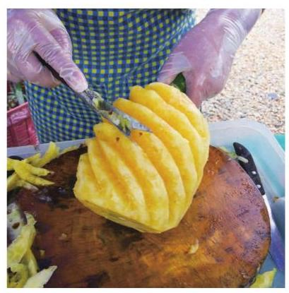

在菠萝上市的季节, 为方便消费者品尝到新鲜的菠萝, 水果店通常有专人帮助大家削皮去籽, 方法多样. 其中一种刨削方法很有艺术味, 削完后, 菠萝上留下的是一条条螺线形的凹槽.

在品尝香甜的菠萝肉时, 你是否想过水果店员工为什么这样削菠萝？请从数学角度来思考并给出说明.

## 10 高度测量

上海浦东陆家嘴地区高楼林立，尤其是东方明珠周边的建筑物似乎一幢比一幢高. 当你从不同角度观察, 建筑物的相对高度似乎有变化, 这说明, 仅靠目测可能会对建筑物高度产生误判. 同学们也许在思考, 如何去测量这样“高不可攀”的建筑物的高度? 让我们回到自己的校园，面对高度各异的教学楼，你一定希望了解:哪幢楼最高？如何知道它的高度?

请同学们行动起来，完成如下测量任务:

(1)测量本校一座教学楼的高度；

(2)测量学校院墙外一座虽不可及、但从操场上可以看得见的建筑物的高度.

建议 2 至 3 位同学组成一个测量小组，以小组为单位完成上述任务；各人填写测量模型及相应的实施报告表 (可参考表 10-1).

进一步的建议:

(1)成立项目小组，确定工作目标，准备测量工具；

(2)小组成员查阅有关资料，进行讨论交流，寻求高效率的测量方法，设计测量方案 (最好设计两套测量方案)；

(3)分工合作，明确责任. 例如，测量、记录数据、计算求解、撰写报告等具体由谁负责；

(4)撰写报告，讨论交流. 可以用照片、模型、电脑幻灯片等形式展示获得的成果.

表 10-1 测量模型及其实施报告表

项目名称: 完成时间:

<table><tr><td colspan="2">1. 成员与分工</td></tr><tr><td>姓名</td><td>分工</td></tr><tr><td></td><td></td></tr><tr><td></td><td></td></tr><tr><td></td><td></td></tr><tr><td colspan="2">2. 测量对象   例如,某小组选择的测量对象是: $\times$ 号教学楼、校外的 $\times   \times$ 大厦.</td></tr><tr><td colspan="2">3. 测量方法(请说明测量的原理、测量工具、创新点等)</td></tr><tr><td colspan="2">4. 测量数据、计算过程和结果(可以另外附图或附页)</td></tr><tr><td colspan="2">5. 研究结果(包括误差分析)</td></tr><tr><td colspan="2">6. 工作感受(简述)</td></tr></table>

## 11 外卖与环保

伴随着网络经济的发展, 外卖平台层出不穷, 外卖已经成为许多人日常生活的重要组成部分, 外卖包装物品对环境造成的影响也逐渐为人们所关注.

2017 年 9 月, 有观点认为 “每周最少有 4 亿份外卖飞驰在中国的大街小巷, 至少产生 4 亿个一次性打包盒和 4 亿个塑料袋, 以及 4 亿份废弃的一次性餐具”. 一个塑料袋降解大约需要 470 年, 因此塑料袋很可能会毁了下一代的生存环镜, 危及地球的未来生态.

一些环保领域的专业人士对外卖所产生的垃圾问题也有过思考和研究. 2016 年 12 月 26 日的《中国环境报》曾经刊发过有关专家的意见，认为只要全社会提高环境保护意识， 在政府的统一规划和指导下，外卖平台、商家、个人各司其职，外卖行业发展所导致的环境污染问题是可以解决的.

请同学们组队讨论外卖对环境的影响问题, 根据对周边区域的实地调研数据, 估算上海地区由于外卖所产生的废弃物数量, 结合《上海市生活垃圾处理条例》的实施, 定量分析这些废弃物对环境的影响. 在此基础上，提出由相应的数学模型所支持的研究报告，报告内容应包括数据来源、分析依据、可靠性检验、相关参考资料等.

## 附 录1

## 数学建模活动报告的写作

当我们完成数学建模活动后, 需要对所做的工作进行小结, 形成活动报告. 报告的主要目的在于交流, 因此不仅自己要读懂, 更要让他人理解和明白. 首先, 报告应清楚地展示建模工作的全貌，突出其精华所在；其次，报告应尽量使用简洁准确的语言，包括文字、数学符号、图像、表格等各种形式，以增强其可读性.

数学建模活动报告可以采用实验报告表或者小论文等不同的形式, 写作时要考虑到数学建模的各个环节. 报告一般应该包括如下方面:

(1)标题；

(2)实际情境；

(3)提出问题；

(4)建立模型；

(5)求解模型；

(6)检验结果与改进模型；

(7)参考文献.

下面的样例针对生活中的优惠问题(详见活动 2 “‘诱人’的优惠券”)，我们采用小论文的形式写出报告.

## 数学建模活动报告样例

## 这样的购物行为理性吗?

作者/小组(名)，所在学校、年级、班级

## 一、实际情境

近年来，“双十一”演变成为一年一度的购物狂欢节. 从 2009 年开始，“双十一”购物规则的复杂度不断增大, 而面对着商家复杂的优惠规则, 消费者都尝试见招拆招、用足优惠. 最近, 某商家推出三种优惠券, 分别是满 199 元减 20 元、满 299 元减 50 元、 满 499 元减 110 元. 这些优惠券之间不可叠加使用, 但它们可以与满 400 元减 50 元的购物津贴同时使用. 此外，这两类优惠券有使用顺序，必须先使用商家优惠券，再使用购物津贴.

## 二、提出问题

这些俗称为“满减”的优惠券容易让人产生购物的冲动. 为了凑单, 消费者可能会买些不需要的东西. 这样的购物行为是否理性呢? 商家使用了怎样的优惠策略? 是否购买金额越大, 享受的优惠也越大?

## 三、建立模型

我们假设,商家在设计优惠策略时只考虑两个因素: 一个是购买金额,记为 $x$ ,单位是元; 另一个是买家所享受到的优惠率, 即原价与折扣价之差占原价的百分比, 记为 $y$ .

我们先考虑只用两种优惠券满 199 元减 20 元和满 299 元减 50 元的情况, 其他优惠暂不考虑.

根据实际情境, 我们需要分情况考虑.

情况 1: 当购买金额 $0 < x < {199}$ 时,无法使用优惠券;

情况 2: 当购买金额 $x \geq  {199}$ 时,可以使用优惠券.

在可使用优惠券的情况下, 不同的购买金额有其可对应使用的优惠券类型, 并有不同的优惠后价格. 当购买金额 $x$ 满足 ${199} \leq  x < {299}$ 时,可使用满 199 减 20 的优惠券, 则优惠后的价格为 $x = {20}$ ；而当购买金额 $x \geq  {299}$ 时，可使用满 299 减 50 的优惠券，优惠后的价格为 $x - {50}$ .

因此,相应的购买金额 $x$ 与优惠率 $y$ 之间的关系如下:

(1)当 $0 < x < {199}$ 时,无法享受优惠, $y = \frac{x - x}{x} = 0$ ;

(2)当 ${199} \leq  x < {299}$ 时，可使用满 199 减 20 的优惠券， $y = \frac{20}{x}$ ；

(3)当 $x \geq  {299}$ 时，可使用满 299 减 50 的优惠券， $y = \frac{50}{x}$ .

综上所述,买家所享受到的优惠率 $y$ 与购买金额 $x$ 之间形成如下的分段函数:

$$
y = \left\{  \begin{array}{ll} 0, & 0 < x < {199}, \\  \frac{20}{x}, & {199} \leq  x < {299}, \\  \frac{50}{x}, & x \geq  {299}. \end{array}\right.
$$

①

这就是针对我们所提出的问题及假设而得到的商家优惠策略的数学模型.

## 四、求解与分析模型

根据上述函数关系①，作出该分段函数的图像，如图 1 所示.

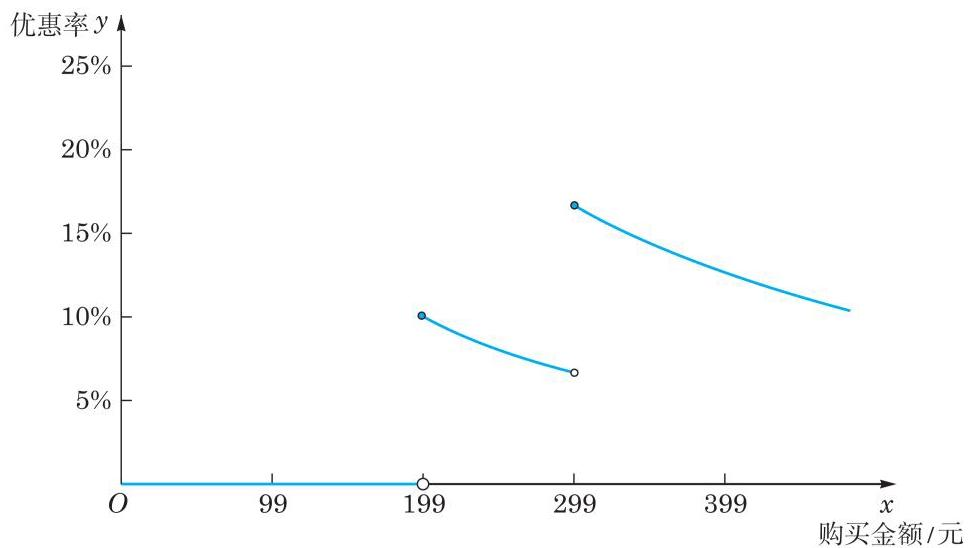

图 1 购买金额与优惠率之间的函数关系

从图 1 可以看出,当 $0 < x < {199}$ 时,优惠率 ${y}_{1}$ 是常值函数, ${y}_{1} = 0\%$ ;

当 $x = {199}$ 时,优惠率 ${y}_{2} = \frac{20}{199} = {10.05}\% ,{y}_{2} > {y}_{1}$ ,因此当购买金额接近 199 元时, 可以考虑适当地“凑单”购买物品, 使得购买金额达到或少许超过 199 元, 可以享受到相应的优惠;

当 ${199} \leq  x < {299}$ 时,优惠率 ${y}_{3} = \frac{20}{x},{y}_{3}$ 是 $x$ 的严格减函数,且 ${6.69}\%  < {y}_{3} \leq$ 10.05%;

当 $x = {299}$ 时,优惠率 ${y}_{4} = \frac{50}{299} = {16.72}\% ,{y}_{4} > {y}_{3}$ ,因此当购买金额接近 299 元时, 可以考虑适当地“凑单”购买物品, 使得购买金额达到或少许超过 299 元, 从而享受到更高的优惠率. 反之, 当购买金额虽超过 199 元, 但与 299 元距离尚大时, 可以考虑适当地“减单”购买物品，使得购买金额恰好达到或少许超过 199 元，从而享受到更高的优惠率.

根据图 1, 当购买金额为 299 元时, 优惠率最高. 这说明, 商家的“满减”优惠能吸引人是有一定道理的.

从图 1 还可以看出,当 ${199} \leq  x < {299}$ 时,对于该分段区间上的函数 $y = \frac{20}{x}$ ,优惠率随着购买金额的增大而降低, 并不是买得越多, 优惠率越高. 在该区间内, 恰好“凑单” 到 199 元享受的优惠率最高,继续购买并不划算. 同理,当 $x \geq  {299}$ 时,对于相应分段区间上的函数 $y = \frac{50}{x}$ ,优惠率随着购买金额的增大而降低,同样是买得越多,优惠率越低. 在该区间内, 最佳的“凑单”方式是使购买金额刚好达到 299 元, 继续购买并不划算.

## 五、反思模型

根据上述优惠策略模型, 我们已经发现商家设计优惠策略时隐藏着一般消费者不能直观体验的“陷阱”: 并不是购买金额越大, 优惠率就越高. 这也是商家常用的营销策略. 尽管在建立优惠策略模型时, 我们只考虑了购买金额与优惠率两个因素, 但所得模型仍然是有意义的.

这里运用分类讨论的思想, 把不同情境用分段函数加以表征, 给出了简化的商家优惠策略模型 (购买金额与优惠率的函数关系). 在求解模型时, 计算不同分段区间上的优惠率, 以及购买金额趋于某特定值时优惠率的最值. 通过分析与计算, 我们发现并不是购买金额越大, 享受的优惠率越高 (优惠越大). 相反, 有时好不容易 “凑单”到一定的购买金额，所享受的优惠率还有可能比“凑单”前低. 况且，在实际购物中，恰好“凑单”到 199 元或 299 元的可能性是很小的, 因此最高优惠率是很难实现的, 这也是商家设计的一种“陷阱”. 通过这样的模型建立与解答过程, 我们能够更加理性地审视自己的消费行为.

附录 3

有关数学建模活动中数学内容的说明

<table><tr><td>数学建模活动</td><td>所涉及的数学内容</td></tr><tr><td colspan="2">数学建模活动案例</td></tr><tr><td>1 红绿灯管理</td><td>建立一元二次函数关系, 利用配方法求最小值</td></tr><tr><td>2 “诱人”的优惠券</td><td>分段函数, 分段区间上的减函数, 绘制函数图像, 分类讨论</td></tr><tr><td>3 车辆转弯时的安全隐患</td><td>三角函数</td></tr><tr><td>4 雨中行</td><td>长方体表面积, 柱体的体积, 函数单调性</td></tr><tr><td colspan="2">数学建模活动 A</td></tr><tr><td>5 出租车运价</td><td>分段函数</td></tr><tr><td>6 家具搬运</td><td>三角函数最值</td></tr><tr><td>7 登山行程设计</td><td>数据收集与处理</td></tr><tr><td colspan="2">数学建模活动 B</td></tr><tr><td>8 包装彩带</td><td>平面展开图, 三角形的性质</td></tr><tr><td>9 削菠萝</td><td>平面展开图, 勾股定理</td></tr><tr><td>10 高度测量</td><td>解三角形, 比例</td></tr><tr><td>11 外卖与环保</td><td>数据收集与处理</td></tr></table>

## 后 记

本套高中数学教材根据教育部颁布的《普通高中数学课程标准(2017 年版 2020 年修订)》编写并经国家教材委员会专家委员会审核通过.

本教材是由设在复旦大学和华东师范大学的两个上海市数学教育教学研究基地(上海高校“立德树人”人文社会科学重点研究基地)联合主持编写的. 编写工作依据高中数学课程标准的具体要求，努力符合教育规律和高中学生的认知规律，结合上海城市发展定位和课程改革基础，并力求充分体现特色. 希望我们的这一努力能经得起实践和时间的检验, 对扎实推进数学的基础教育发挥积极的作用.

本册教材是必修第四册, 内容为数学建模, 编写人员为

徐斌艳、陆立强、朱雁、蔡志杰、鲁小莉、魏述强、高虹

上海市中小学(幼儿园)课程改革委员会专家工作委员会、上海市教育委员会教学研究室全程组织、指导和协调了教材编写工作. 在编写过程中，两个基地所在单位给予了大力支持，基地的全体同志积极参与相关的调研、讨论及评阅工作，发挥了重要的作用. 上海市不少中学也热情地参与了有关的调研及讨论工作. 上海教育出版社有限公司不但是编辑出版单位，而且自始至终全面介入了编写工作. 我们对所有这些单位和相关人员的参与、支持和鼓励表示衷心感谢.

限于编写者的水平, 也由于新编教材尚缺乏教学实践的检验, 不妥及疏漏之处在所难免，恳请广大师生及读者不吝赐教. 宝贵意见请通过邮箱 gaozhongshuxue@seph.com.cn 反馈, 不胜感激.

2020 年 7 月

# SHUXUE 普通高中教科书 数学 必修

第 四 册

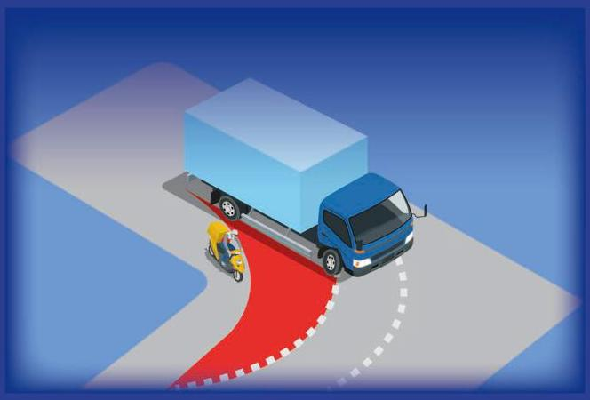