我们已学习了平面上的向量，讨论了平面

## 空间向量 及其应用

向量的运算规则及其坐标表示, 并用于解决一些来自数学其他分支和其他学科领域中的问题, 特别是平面几何问题.

本章将在空间中讨论向量. 本章学习和理解的重点是空间中的向量与平面上的向量有哪些类同和差异, 包括哪些空间的问题可以转化到平面上处理. 我们将会看到空间向量的理论为解决立体几何问题提供了一个有效手段. 通过本章的学习，大家要进一步感受数形结合、 利用代数知识解决几何问题的数学思想方法.

### 3.1 空间向量及其运算

我们已经知道, 向量是既有大小又有方向的量, 它可以用有向线段来表示. 必修课程第 8 章 “平面向量” 中, 讨论的是同一个平面中的有向线段所表示的向量. 本章将去掉这一限制, 考虑可以用空间任何有向线段表示的向量.

我们可以仿照必修课程第 8 章, 对空间向量做一系列定义, 给出一系列法则, 推导一系列性质. 但这将是一个冗长而无趣的过程, 几乎原原本本地复述必修课程第 8 章前两节. 我们放弃了这样的做法, 取而代之的是把基础框架的建立尽可能地归结到平面上, 然后再探索在空间讨论向量所遇到的新问题. 归结到平面的过程也是对必修课程第 8 章的复习，为同学们进一步学习空间向量做好铺垫.

首先注意到，在必修课程第 8 章“平面向量”中，虽然仅仅讨论平面上的向量, 但许多定义都没有特别冠以“平面”二字, 有关的概念实际上都适合于本章的讨论, 这些概念包括: 向量的模、 单位向量、零向量、平行向量、相等向量、负向量等.

为进一步把空间向量问题归结到平面上讨论, 需要引入共面向量的概念: 如果一组向量可以平移到同一个平面上, 那么称这组向量是共面的. 显然, 任意两个向量都是共面的.

一组共面向量的问题都可当作平面向量来处理和讨论. 特别地, 空间中任何只涉及一个或两个向量的运算、概念和相关性质, 都可以直接运用平面向量的有关结论. 这些运算和概念包括向量的和、向量的差、实数与向量的乘法等, 与这些运算相联系的运算律也全部适用. 空间中一个向量在一个非零向量方向上的投影以及向量的夹角也可以在一个平面上实现, 所以空间向量的数量积与向量的夹角也都可以运用平面向量数量积的定义与有关的计算公式. 特别地, 空间中两向量垂直的充要条件是其数量积为零.

虽然空间向量的加法结合律涉及三个向量, 它们可能不共面, 但每一步加法都只涉及两个向量, 可以用平面向量加法法则来证明此定律成立: 先把空间任意三个向量平移为首尾相接的向量 $\overrightarrow{AB}\text{ 、 }\overrightarrow{BC}$ 与 $\overrightarrow{CD}$ ,因为 $\overrightarrow{AB}$ 与 $\overrightarrow{BC}$ 共面, $\overrightarrow{AC}$ 与 $\overrightarrow{CD}$ 共面,我们得到

$$
\left( {\overrightarrow{AB} + \overrightarrow{BC}}\right)  + \overrightarrow{CD} = \overrightarrow{AC} + \overrightarrow{CD} = \overrightarrow{AD};
$$

同理, $\overrightarrow{AB} + \left( {\overrightarrow{BC} + \overrightarrow{CD}}\right)  = \overrightarrow{AB} + \overrightarrow{BD} = \overrightarrow{AD}$ . 这就证明了空间向量的加法结合律.

有了加法结合律, 我们可以求空间向量的连加, 而不必顾及式中的括号，而且向量加法的 “首尾规则” 对空间向量依然成立:若干个起点、终点依次相接的向量的和是以第一个向量的起点为起点, 以最后一个向量的终点为终点的向量. 结合律的证明过程略加推广就证明了 “首尾规则”.

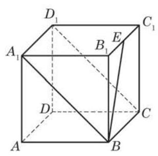

图 3-1-1

例 1 如图 3-1-1,在正方体 ${ABCD} - {A}_{1}{B}_{1}{C}_{1}{D}_{1}$ 中, $E$ 为棱 ${B}_{1}{C}_{1}$ 上任意一点. 只考虑图上已作出线段所对应的向量, 分别写出:

(1) $\overrightarrow{AB}$ 的相等向量， $\overrightarrow{{A}_{1}B}$ 的负向量；

(2)用另外两个向量的和或差表示 $\overrightarrow{B{B}_{1}}$ ；

(3)用三个或三个以上向量的和表示 $\overrightarrow{BE}$ (举两个例子).

解(1)根据正方体棱与棱之间的关系， $\overrightarrow{AB}$ 的相等向量有 $\overrightarrow{{A}_{1}{B}_{1}}\text{ 、 }\overrightarrow{DC}\text{ 、 }\overrightarrow{{D}_{1}{C}_{1}},\overrightarrow{{A}_{1}B}$ 的负向量有 $\overrightarrow{B{A}_{1}}\text{ 、 }\overrightarrow{C{D}_{1}}$ .

(2)此小题用“首尾规则”求解. 如果只在含 $\overrightarrow{B{B}_{1}}$ 的三角形中考虑,有 $\overrightarrow{B{B}_{1}} = \overrightarrow{B{A}_{1}} + \overrightarrow{{A}_{1}{B}_{1}},\overrightarrow{B{B}_{1}} = \overrightarrow{BE} + \overrightarrow{E{B}_{1}},\overrightarrow{B{B}_{1}} = \overrightarrow{B{A}_{1}} - \overrightarrow{{B}_{1}{A}_{1}}$ , $\overrightarrow{B{B}_{1}} = \overrightarrow{BE} - \overrightarrow{{B}_{1}E}.$

如果考虑 $\overrightarrow{B{B}_{1}}$ 的相等向量所在的三角形,那么可以有更多的解答, 请同学们自行补出.

(3)此小题用“首尾规则”求解，有许多不同的答案，以下是两个例子:

$$
\overrightarrow{BE} = \overrightarrow{B{A}_{1}} + \overrightarrow{{A}_{1}{B}_{1}} + \overrightarrow{{B}_{1}E},
$$

$$
\overrightarrow{BE} = \overrightarrow{B{B}_{1}} + \overrightarrow{{B}_{1}{A}_{1}} + \overrightarrow{{A}_{1}{D}_{1}} + \overrightarrow{{D}_{1}{C}_{1}} + \overrightarrow{{C}_{1}E}\text{ . }
$$

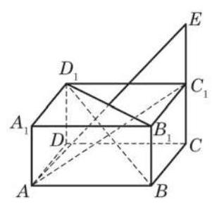

图 3-1-2

例 2 如图 3-1-2,在长方体 ${ABCD} - {A}_{1}{B}_{1}{C}_{1}{D}_{1}$ 中,点 $E$ 在棱 $C{C}_{1}$ 的延长线上,且 $\left| {{C}_{1}E}\right|  = \left| {C{C}_{1}}\right|$ . 设 $\overrightarrow{A{A}_{1}} = \overrightarrow{a}$ , $\overrightarrow{AB} = \overrightarrow{b},\overrightarrow{AD} = \overrightarrow{c}$ ,试用 $\overrightarrow{a}\text{ 、 }\overrightarrow{b}\text{ 、 }\overrightarrow{c}$ 的线性组合表示下列向量:

(1) $\overrightarrow{A{C}_{1}}$ ；(2) $\overrightarrow{{D}_{1}{B}_{1}}$ ；(3) $\overrightarrow{B{D}_{1}}$ ；(4) $\overrightarrow{AE}$ .

解 (1) $\overrightarrow{A{C}_{1}} = \overrightarrow{AB} + \overrightarrow{BC} + \overrightarrow{C{C}_{1}} = \overrightarrow{AB} + \overrightarrow{AD} + \overrightarrow{A{A}_{1}} = \overrightarrow{b} + \; \overrightarrow{c} + \overrightarrow{a}$ .

(2) $\overrightarrow{{D}_{1}{B}_{1}} = \overrightarrow{{A}_{1}{B}_{1}} - \overrightarrow{{A}_{1}{D}_{1}} = \overrightarrow{AB} - \overrightarrow{AD} = \overrightarrow{b} - \overrightarrow{c}$ .

(3) $\overrightarrow{B{D}_{1}} = \overrightarrow{BA} + \overrightarrow{A{A}_{1}} + \overrightarrow{{A}_{1}{D}_{1}} =  - \overrightarrow{AB} + \overrightarrow{A{A}_{1}} + \overrightarrow{AD} =  - \overrightarrow{b} + \; \overrightarrow{a} + \overrightarrow{c}$ .

(4) $\overrightarrow{AE} = \overrightarrow{AB} + \overrightarrow{BC} + \overrightarrow{CE} = \overrightarrow{AB} + \overrightarrow{AD} + 2\overrightarrow{C{C}_{1}} = \overrightarrow{AB} + \overrightarrow{AD} + \; 2\overrightarrow{A{A}_{1}} = \overrightarrow{b} + \overrightarrow{c} + 2\overrightarrow{a}.$

## 练习 3.1(1)

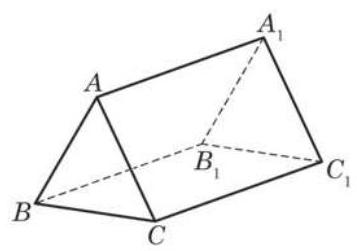

(第 2 题)

1. 空间中有异面向量的概念吗? 为什么?

2. 如图, 请在图中找出三个不共面的向量.

3. 化简下列算式:

(1) $3\left( {2\overrightarrow{a} - \overrightarrow{b} - 4\overrightarrow{c}}\right)  - 4\left( {\overrightarrow{a} - 2\overrightarrow{b} + 3\overrightarrow{c}}\right)$ ；

(2) $\overrightarrow{OA} - \left\lbrack  {\overrightarrow{OB} - \left( {\overrightarrow{AB} - \overrightarrow{AC}}\right) }\right\rbrack$ .

向量的数量积对向量加法的分配律也涉及三个向量, 它们可能不共面，但是可以仿照平面向量中分配律的证明(见必修课程 8.2 节)给出空间向量情形的证明, 见练习 3.1(2)第 1 题.

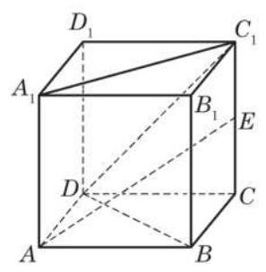

图 3-1-3

例 3 如图 3-1-3,已知正方体 ${ABCD} - {A}_{1}{B}_{1}{C}_{1}{D}_{1}$ 的棱长为 $a, E$ 是棱 $C{C}_{1}$ 的中点.

(1)求 $\overrightarrow{D{D}_{1}} \cdot  \overrightarrow{D{C}_{1}}$ ；

(2)求 $\overrightarrow{AE} \cdot  \overrightarrow{{C}_{1}{A}_{1}}$ ；

(3)求 $\overrightarrow{AE}$ 与 $\overrightarrow{{C}_{1}{A}_{1}}$ 的夹角的大小；

(4)判断 $\overrightarrow{AE}$ 与 $\overrightarrow{DB}$ 是否垂直.

解 (1) 由 $\overrightarrow{D{D}_{1}} \bot  \overrightarrow{{D}_{1}{C}_{1}}$ 与 $\left| \overrightarrow{D{D}_{1}}\right|  = \left| \overrightarrow{{D}_{1}{C}_{1}}\right|  = a$ ,得

$$
\left| \overrightarrow{D{C}_{1}}\right|  = \sqrt{{a}^{2} + {a}^{2}} = \sqrt{2}a.
$$

再根据向量数量积的定义, 得

$$
\overrightarrow{D{D}_{1}} \cdot  \overrightarrow{D{C}_{1}} = \left| \overrightarrow{D{D}_{1}}\right| \left| \overrightarrow{D{C}_{1}}\right| \cos \left\langle  {\overrightarrow{D{D}_{1}},\overrightarrow{D{C}_{1}}}\right\rangle
$$

$$
= a \cdot  \sqrt{2}a \cdot  \cos {45}^{ \circ  } = {a}^{2}.
$$

(2)因为

$$
\overrightarrow{AE} = \overrightarrow{AB} + \overrightarrow{BC} + \overrightarrow{CE} = \overrightarrow{AB} + \overrightarrow{BC} + \frac{1}{2}\overrightarrow{A{A}_{1}},
$$

$$
\overrightarrow{{C}_{1}{A}_{1}} = \overrightarrow{{C}_{1}{D}_{1}} + \overrightarrow{{D}_{1}{A}_{1}} =  - \overrightarrow{AB} - \overrightarrow{BC},
$$

并注意到 $\overrightarrow{A{A}_{1}} \bot  \overrightarrow{AB},\overrightarrow{A{A}_{1}} \bot  \overrightarrow{BC},\overrightarrow{AB} \bot  \overrightarrow{BC}$ 以及 $\left| {AB}\right|  = \left| {BC}\right|  = a$ , 所以

$$
\overrightarrow{AE} \cdot  \overrightarrow{{C}_{1}{A}_{1}} = \left( {\overrightarrow{AB} + \overrightarrow{BC} + \frac{1}{2}\overrightarrow{A{A}_{1}}}\right)  \cdot  \left( {-\overrightarrow{AB} - \overrightarrow{BC}}\right)
$$

$$
=  - {\left( \overrightarrow{AB} + \overrightarrow{BC}\right) }^{2} - \frac{1}{2}\overrightarrow{A{A}_{1}} \cdot  \left( {\overrightarrow{AB} + \overrightarrow{BC}}\right)
$$

$$
=  - \overrightarrow{A{B}^{2}} - \overrightarrow{B{C}^{2}} =  - 2{a}^{2}\text{ . }
$$

Q

(3)由(1)类似的方法，可得

$$
\left| \overrightarrow{{C}_{1}{A}_{1}}\right|  = \sqrt{2}a.
$$

---

例 3(3) 也可以用解三角形的方法求解.

---

又由 $\overrightarrow{AB}\text{ 、 }\overrightarrow{BC}$ 与 $\overrightarrow{A{A}_{1}}$ 两两互相垂直且模均为 $a$ ,得

$$
\left| \overrightarrow{AE}\right|  = \sqrt{{\left( \overrightarrow{AB} + \overrightarrow{BC} + \frac{1}{2}\overrightarrow{A{A}_{1}}\right) }^{2}}
$$

$$
= \sqrt{{\left| \overrightarrow{AB}\right| }^{2} + {\left| \overrightarrow{BC}\right| }^{2} + \frac{1}{4}{\left| \overrightarrow{A{A}_{1}}\right| }^{2}} = \frac{3}{2}a.
$$

从而

$$
\cos \left\langle  {\overrightarrow{AE},\overrightarrow{{C}_{1}{A}_{1}}}\right\rangle   = \frac{\overrightarrow{AE} \cdot  \overrightarrow{{C}_{1}{A}_{1}}}{\left| \overrightarrow{AE}\right| \left| \overrightarrow{{C}_{1}{A}_{1}}\right| } = \frac{-2{a}^{2}}{\frac{3}{2}a \cdot  \sqrt{2}a}
$$

$$
=  - \frac{2\sqrt{2}}{3}\text{ . }
$$

所以

$$
\left\langle  {\overrightarrow{AE},\overrightarrow{{C}_{1}{A}_{1}}}\right\rangle   = \pi  - \arccos \frac{2\sqrt{2}}{3}.
$$

---

例 3(4) 可以用三垂线定理证明, 但三垂线定理是立体几何中有一定深度的内容, 本身的证明比较困难. 不过, 本章将用空间向量给出三垂线定理的一个简单证明 (本章 3.4 节例 1).

---

(4)由于 $\overrightarrow{DB} = \overrightarrow{AB} - \overrightarrow{AD} = \overrightarrow{AB} - \overrightarrow{BC}$ ,且 $\overrightarrow{AB} \bot  \overrightarrow{BC},\overrightarrow{A{A}_{1}} \bot \; \overrightarrow{AB},\overrightarrow{A{A}_{1}} \bot  \overrightarrow{BC}$ ,因此

$$
\overrightarrow{AE} \cdot  \overrightarrow{DB} = \left( {\overrightarrow{AB} + \overrightarrow{BC} + \frac{1}{2}\overrightarrow{A{A}_{1}}}\right)  \cdot  \left( {\overrightarrow{AB} - \overrightarrow{BC}}\right)
$$

$$
= {\left| \overrightarrow{AB}\right| }^{2} - {\left| \overrightarrow{BC}\right| }^{2} = {a}^{2} - {a}^{2} = 0,
$$

由此可知 $\overrightarrow{AE} \bot  \overrightarrow{DB}$ .

平面向量平行的充要条件同样适用于空间向量, 即

空间中的向量 $\overrightarrow{b}$ 与非零向量 $\overrightarrow{a}$ 平行的充要条件是存在实数 $\lambda$ ,使得 $\overrightarrow{b} = \lambda \overrightarrow{a}$ .

平行向量也称为共线向量.

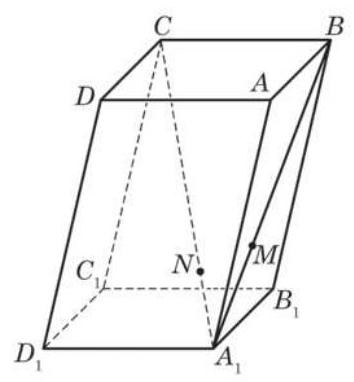

图 3-1-4

例 4 底面是平行四边形的棱柱称为平行六面体, 其特点是六个面都是平行四边形, 且两两互相平行. 如图 3-1-4, 在平行六面体 ${ABCD} - {A}_{1}{B}_{1}{C}_{1}{D}_{1}$ 中,点 $M$ 在对角线 ${A}_{1}B$ 上,且 $\left| {{A}_{1}M}\right|  = \frac{1}{2}\left| {MB}\right|$ ,点 $N$ 在对角线 ${A}_{1}C$ 上,且 $\left| {{A}_{1}N}\right|  = \frac{1}{3}\left| {NC}\right|$ . 求证: $M\text{ 、 }N\text{ 、 }{D}_{1}$ 三点共线.

证明 令 $\overrightarrow{AB} = \overrightarrow{a},\overrightarrow{AD} = \overrightarrow{b},\overrightarrow{A{A}_{1}} = \overrightarrow{c}$ ,则

$$
\overrightarrow{{D}_{1}{A}_{1}} = \overrightarrow{DA} =  - \overrightarrow{b},
$$

$$
\overrightarrow{{A}_{1}B} = \overrightarrow{AB} - \overrightarrow{A{A}_{1}} = \overrightarrow{a} - \overrightarrow{c},
$$

$$
\overrightarrow{{A}_{1}M} = \frac{1}{3}\overrightarrow{{A}_{1}B} = \frac{1}{3}\left( {\overrightarrow{a} - \overrightarrow{c}}\right) ,
$$

所以, $\overrightarrow{{D}_{1}M} = \overrightarrow{{D}_{1}{A}_{1}} + \overrightarrow{{A}_{1}M} =  - \overrightarrow{b} + \frac{1}{3}\left( {\overrightarrow{a} - \overrightarrow{c}}\right)  = \frac{1}{3}\left( {\overrightarrow{a} - 3\overrightarrow{b} - \overrightarrow{c}}\right)$ . 又因为

$$
\overrightarrow{{A}_{1}C} = \overrightarrow{{A}_{1}B} + \overrightarrow{BC} = \overrightarrow{{A}_{1}B} + \overrightarrow{AD} = \overrightarrow{a} - \overrightarrow{c} + \overrightarrow{b},
$$

$$
\overrightarrow{{A}_{1}N} = \frac{1}{4}\overrightarrow{{A}_{1}C} = \frac{1}{4}\left( {\overrightarrow{a} - \overrightarrow{c} + \overrightarrow{b}}\right) ,
$$

所以

$$
\overrightarrow{{D}_{1}N} = \overrightarrow{{D}_{1}{A}_{1}} + \overrightarrow{{A}_{1}N} =  - \overrightarrow{b} + \frac{1}{4}\left( {\overrightarrow{a} - \overrightarrow{c} + \overrightarrow{b}}\right)  = \frac{1}{4}\left( {\overrightarrow{a} - 3\overrightarrow{b} - \overrightarrow{c}}\right) .
$$

由此可知, $\overrightarrow{{D}_{1}M} = \frac{4}{3}\overrightarrow{{D}_{1}N}$ ,所以 $\overrightarrow{{D}_{1}M}//\overrightarrow{{D}_{1}N}$ .

因为点 ${D}_{1}$ 为 $\overrightarrow{{D}_{1}M}$ 与 $\overrightarrow{{D}_{1}N}$ 的公共起点,所以 $M\text{ 、 }N\text{ 、 }{D}_{1}$ 三点共线.

## 练习 3.1(2)

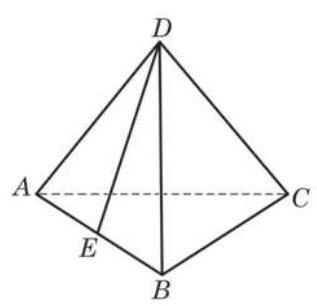

(第 1 题)

1. 如图,棱长为 $a$ 的正四面体 ${ABCD}$ 中, $E$ 为棱 ${AB}$ 的中点. 求 $\overrightarrow{DC} \cdot  \overrightarrow{DE}$ 与 $\overrightarrow{BC} \cdot  \overrightarrow{DE}$ .

2. 设 $\overrightarrow{a}\text{ 、 }\overrightarrow{b}\text{ 、 }\overrightarrow{c}$ 是三个空间向量,求证: $\overrightarrow{a} \cdot  \left( {\overrightarrow{b} + \overrightarrow{c}}\right)  = \overrightarrow{a} \cdot  \overrightarrow{b} + \; \overrightarrow{a} \cdot  \overrightarrow{c}.$

## 习题 3.1

## A 组

1. 在长方体 ${ABCD} - {A}^{\prime }{B}^{\prime }{C}^{\prime }{D}^{\prime }$ 中, $\left| {AB}\right|  = 4,\left| {BC}\right|  = 3,\left| {A{A}^{\prime }}\right|  = 5$ . 写出:

(1)与 $\overline{A{C}^{\prime }}$ 有相等模的向量；

(2) $\overrightarrow{AB}$ 的相等向量；

(3)与 $\overrightarrow{A{A}^{\prime }}$ 垂直的向量.

2. 如图,在直三棱柱 ${ABC} - {A}_{1}{B}_{1}{C}_{1}$ 中, $\overrightarrow{CA} = \overrightarrow{a},\overrightarrow{CB} = \overrightarrow{b},\overrightarrow{C{C}_{1}} = \overrightarrow{c}$ . 将向量 $\overrightarrow{{A}_{1}B}$ 表示为 $\overrightarrow{a}\text{ 、 }\overrightarrow{b}\text{ 、 }\overrightarrow{c}$ 的线性组合.

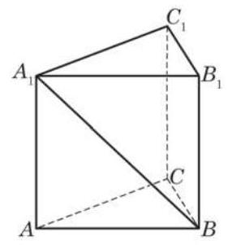

(第 2 题)

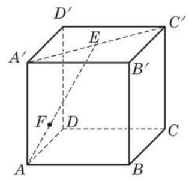

(第 3 题)

3. 如图,在正方体 ${ABCD} - {A}^{\prime }{B}^{\prime }{C}^{\prime }{D}^{\prime }$ 中, $E$ 是 ${A}^{\prime }{C}^{\prime }$ 的中点,点 $F$ 在 ${AE}$ 上,且 $\left| {AF}\right|  = \; \frac{1}{2}\left| {EF}\right|$ . 试用向量 $\overrightarrow{A{A}^{\prime }}\text{ 、 }\overrightarrow{AB}$ 与 $\overrightarrow{AD}$ 的线性组合表示 $\overrightarrow{AF}$ .

4. 已知 $\overrightarrow{a}\bot \overrightarrow{b},\overrightarrow{c}$ 与 $\overrightarrow{a}\text{ 、 }\overrightarrow{b}$ 的夹角都是 ${60}^{ \circ  }$ ,且 $\left| \overrightarrow{a}\right|  = 1,\left| \overrightarrow{b}\right|  = 2,\left| \overrightarrow{c}\right|  = 3$ . 计算:

(1)(3 $\overrightarrow{a} - 2\overrightarrow{b}) \cdot  \left( {\overrightarrow{b} - 3\overrightarrow{c}}\right)$ ；

(2) $\left| {\overrightarrow{a} + 2\overrightarrow{b} - \overrightarrow{c}}\right|$ .

5. 已知空间四边形 ${ABCD}$ 中, ${AB} \bot  {CD},{AC} \bot  {BD}$ . 求证: ${AD} \bot  {BC}$ .

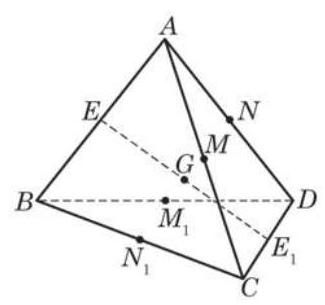

(第 6 题)

6. 如图，在四面体 ${ABCD}$ 中， $E$ 、 $M$ 、 $N$ 分别是棱 ${AB}$ 、 ${AC}\text{ 、 }{AD}$ 的中点, ${E}_{1}\text{ 、 }{M}_{1}\text{ 、 }{N}_{1}$ 分别是棱 ${CD}\text{ 、 }{BD}\text{ 、 }{BC}$ 的中点, $G$ 是线段 $E{E}_{1}$ 的中点. 试判断下列各组中的三点是否共线:

(1) $G$ 、 $M$ 、 ${M}_{1}$ ；

(2) $G$ 、 $N$ 、 ${N}_{1}$ .

B 组

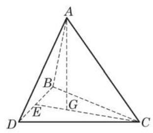

(第 1 题)

1. 如图, $A$ 是 $\bigtriangleup {BCD}$ 所在平面外一点, $G$ 是 $\bigtriangleup {BCD}$ 的重心. 求证: $\overrightarrow{AG} = \frac{1}{3}\left( {\overrightarrow{AB} + \overrightarrow{AC} + \overrightarrow{AD}}\right)$ .

2. 如图,在三棱锥 $D - {ABC}$ 中, $\angle {DAC} = \angle {BAC} = {60}^{ \circ  }$ , ${AC} = 1,{AB} = 2,{AD} = 3.$

(1)求 $\overrightarrow{AC} \cdot  \overrightarrow{BD}$ ，并说明异面直线 ${AC}$ 与 ${BD}$ 所成的角 $\theta$ 的大小在棱 ${BD}$ 长度增大时是怎样变化的；

(2)若 ${AC}\bot {BC}$ ，判断点 $D$ 在平面 ${ABC}$ 上的射影是否可能在直线 ${BC}$ 上，给出你的结论并加以证明.

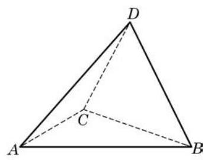

(第 2 题)

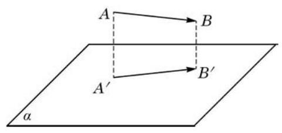

(第 3 题)

3. 在空间中还可以讨论一个向量 $\overrightarrow{AB}$ 在一个平面 $\alpha$ 上的投影. 如图,若 $\overrightarrow{a} = \overrightarrow{AB}$ ,点 $A$ 与点 $B$ 在平面 $\alpha$ 上的投影分别是点 ${A}^{\prime }$ 与点 ${B}^{\prime }$ ,则 $\overrightarrow{a} = \overrightarrow{AB}$ 在平面 $\alpha$ 上的投影就是向量 $\overrightarrow{{A}^{\prime }{B}^{\prime }}$ . 现在给定向量 $\overrightarrow{a}$ 、平面 $\alpha$ 以及平面 $\alpha$ 上的非零向量 $\overrightarrow{b}$ . 设向量 $\overrightarrow{a}$ 在平面 $\alpha$ 上的投影是向量 $\overrightarrow{{a}^{\prime }}$ ，向量 $\overrightarrow{{a}^{\prime }}$ 在向量 $\overrightarrow{b}$ 方向上的投影是向量 $\overrightarrow{{a}^{\prime \prime }}$ . 求证:向量 $\overrightarrow{{a}^{\prime \prime }}$ 是向量 $\overrightarrow{a}$ 在向量 $\overrightarrow{b}$ 方向上的投影.

### 3.2 空间向量基本定理

## 1 向量共面的充要条件

我们说过空间的任意两个向量总是共面的. 但是, 空间中的三个向量却不一定共面. 例如，图 3-2-1 所示的平行六面体中， 相交于一个顶点 $A$ 的三条棱 ${AB}\text{ 、 }{AD}$ 与 $A{A}_{1}$ 所对应的向量 $\overrightarrow{AB}$ 、 $\overrightarrow{AD}$ 与 $\overrightarrow{A{A}_{1}}$ 就是不共面的.

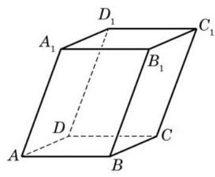

图 3-2-1

我们在上一节中定义过的共面向量也可以用向量平行于平面的语言来刻画:如果一个向量所在的直线平行于一个平面，那么称这个向量平行于这个平面. 一组向量共面是指它们平行于同一个平面, 也就是说, 它们通过平行移动可以放到同一平面上.

因为两个向量的和是通过平行四边形或三角形 (都是平面图形)作出的, 所以两个向量的任何线性组合都与原来的两个向量共面. 反之, 如果给定两个互不平行的向量, 任意与这两个向量共面的向量都是这两个向量的线性组合. 这个结论是在给定的两个向量所在的平面上使用(见必修课程 8.1 节)平面向量基本定理得到的. 事实上, 平面向量基本定理在空间中应该叙述为如下的向量共面的充要条件.

向量共面的充要条件 如果 $\overrightarrow{{e}_{1}}$ 与 $\overrightarrow{{e}_{2}}$ 是两个不平行的向量,那么空间中的向量 $\overrightarrow{a}$ 与 $\overrightarrow{{e}_{1}}\text{ 、 }\overrightarrow{{e}_{2}}$ 共面的充要条件是,存在唯一的一对实数 $\lambda$ 与 $\mu$ ,使得 ?

$$
\overrightarrow{a} = \lambda \overrightarrow{{e}_{1}} + \mu \overrightarrow{{e}_{2}}.
$$

---

利用向量共面的充要条件, 如何用向量表达空间四点共面的充要条件? (对比必修课程 8.3 节的探究)

---

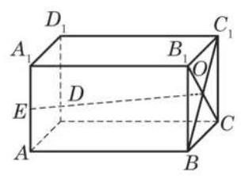

图 3-2-2

例 1 如图 3-2-2,在长方体 ${ABCD} - {A}_{1}{B}_{1}{C}_{1}{D}_{1}$ 中, $E$ 是棱 $A{A}_{1}$ 的中点, $O$ 是面对角线 $B{C}_{1}$ 与 ${B}_{1}C$ 的交点. 试判断向量 $\overrightarrow{EO}$ 与 $\overrightarrow{AB}\text{ 、 }\overrightarrow{AD}$ 是否共面.

解 因为

$$
\overrightarrow{EO} = \overrightarrow{EA} + \overrightarrow{AB} + \overrightarrow{BO},
$$

$$
\overrightarrow{BO} = \frac{1}{2}\left( {\overrightarrow{BC} + \overrightarrow{B{B}_{1}}}\right)  = \frac{1}{2}\left( {\overrightarrow{AD} + \overrightarrow{A{A}_{1}}}\right) ,
$$

所以

$$
\overrightarrow{EO} =  - \frac{1}{2}\overrightarrow{A{A}_{1}} + \overrightarrow{AB} + \frac{1}{2}\left( {\overrightarrow{AD} + \overrightarrow{A{A}_{1}}}\right)
$$

$$
= \overrightarrow{AB} + \frac{1}{2}\overrightarrow{AD},
$$

因此,向量 $\overrightarrow{EO}$ 与 $\overrightarrow{AB}\text{ 、 }\overrightarrow{AD}$ 共面.

例 2 利用向量证明: 如果一条直线垂直于一个平面上的两条相交直线, 那么这条直线垂直于这个平面 (即垂直于这个平面中的任何直线).

---

例 2 是必修课程第 10 章中的直线与平面垂直的判定定理.

---

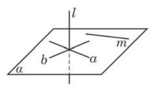

图 3-2-3

已知 如图 3-2-3, $a\text{ 、 }b$ 是平面 $\alpha$ 上的两条相交直线,直线 $l$ 满足 $l\bot a, l\bot b$ .

求证 $l \bot  \alpha$ .

证明 在平面 $\alpha$ 上任意作直线 $m$ ,并分别在直线 $l\text{ 、 }a\text{ 、 }b$ 、 $m$ 上取非零向量 $\overrightarrow{l}\text{ 、 }\overrightarrow{a}\text{ 、 }\overrightarrow{b}\text{ 、 }\overrightarrow{m}$ .

因为直线 $a$ 与 $b$ 相交,所以向量 $\overrightarrow{a}\text{ 、 }\overrightarrow{b}$ 不平行. 由向量共面的充要条件知, $\overrightarrow{m}$ 是 $\overrightarrow{a}\text{ 、 }\overrightarrow{b}$ 的线性组合,即

$$
\overrightarrow{m} = \lambda \overrightarrow{a} + \mu \overrightarrow{b}\left( {\lambda \text{ 、 }\mu  \in  \mathbf{R}}\right) .
$$

将上式两边与向量 $\overrightarrow{l}$ 作数量积,由题意知 $\overrightarrow{l} \cdot  \overrightarrow{a} = 0,\overrightarrow{l} \cdot  \overrightarrow{b} = 0$ , 所以

$$
\overrightarrow{l} \cdot  \overrightarrow{m} = \lambda \overrightarrow{l} \cdot  \overrightarrow{a} + \mu \overrightarrow{l} \cdot  \overrightarrow{b} = 0,
$$

从而 $l \bot  m$ . 这说明直线 $l$ 垂直于平面 $\alpha$ 上的任意一条直线,所以 $l\bot \alpha$ .

## 2 空间向量基本定理

已知平面上两个不共线向量的线性组合可以表示该平面上的所有向量. 是否可以做一个类推, 空间三个不共面向量的线性组合可以表示空间中的所有向量? 下面的定理对此给出了肯定的回答.

空间向量基本定理 如果 $\overrightarrow{{e}_{1}}\text{ 、 }\overrightarrow{{e}_{2}}$ 与 $\overrightarrow{{e}_{3}}$ 是不共面的向量, 那么对空间中任意一个向量 $\overrightarrow{a}$ ,存在唯一的一组实数 $\lambda \text{ 、 }\mu$ 与 $\nu$ ,使得

$$
\overrightarrow{a} = \lambda \overrightarrow{{e}_{1}} + \mu \overrightarrow{{e}_{2}} + \nu \overrightarrow{{e}_{3}}.
$$

证明: 先证线性组合的存在性.

因为 $\overrightarrow{{e}_{1}}\text{ 、 }\overrightarrow{{e}_{2}}$ 与 $\overrightarrow{{e}_{3}}$ 不共面,所以它们都不是零向量. 我们还可以假设向量 $\overrightarrow{a}$ 不与 $\overrightarrow{{e}_{1}}\text{ 、 }\overrightarrow{{e}_{2}}$ 与 $\overrightarrow{{e}_{3}}$ 中的任何两个向量共面,否则,由向量共面的充要条件就立即给出了我们所需要的线性组合.

如图 3-2-4,在空间任取一点 $O$ ,作 $\overrightarrow{OA} = {\overrightarrow{e}}_{1},\overrightarrow{OB} = {\overrightarrow{e}}_{2}$ , $\overrightarrow{OC} = \overrightarrow{{e}_{3}},\overrightarrow{OP} = \overrightarrow{a}$ . OA 与 ${OB}$ 是不重合的相交直线,它们确定了一个平面 $\alpha ;{OC}$ 与 ${OP}$ 是不重合的相交直线,它们也确定一个平面 $\beta$ . 平面 $\alpha$ 与 $\beta$ 不重合 (否则 $\overrightarrow{{e}_{1}}\text{ 、 }\overrightarrow{{e}_{2}}$ 与 $\overrightarrow{{e}_{3}}$ 共面),但有公共点 $O$ ,所以它们有唯一的交线 $l$ . 在 $l$ 上任取一个非零向量 $\overrightarrow{b}$ ,则 $\overrightarrow{b}$ 与 $\overrightarrow{{e}_{3}}$ 不共线.

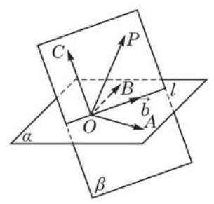

图 3-2-4

根据向量共面的充要条件,在平面 $\alpha$ 上,向量 $\overrightarrow{b}$ 是 $\overrightarrow{OA}$ 与 $\overrightarrow{OB}$ (即 $\overrightarrow{{e}_{1}}$ 与 $\overrightarrow{{e}_{2}}$ )的线性组合; 在平面 $\beta$ 上,向量 $\overrightarrow{a}$ 是向量 $\overrightarrow{b}$ 与 $\overrightarrow{OC}$ (即 $\overrightarrow{{e}_{3}}$ )的线性组合. 于是,向量 $\overrightarrow{a}$ 是向量 $\overrightarrow{{e}_{1}}\text{ 、 }\overrightarrow{{e}_{2}}$ 与 $\overrightarrow{{e}_{3}}$ 的线性组合.

再证线性组合的唯一性.

设 $\overrightarrow{a} = \lambda \overrightarrow{{e}_{1}} + \mu \overrightarrow{{e}_{2}} + \nu \overrightarrow{{e}_{3}} = {\lambda }^{\prime }\overrightarrow{{e}_{1}} + {\mu }^{\prime }\overrightarrow{{e}_{2}} + {\nu }^{\prime }\overrightarrow{{e}_{3}}$ ,则

$$
\left( {\lambda  - {\lambda }^{\prime }}\right) \overrightarrow{{e}_{1}} + \left( {\mu  - {\mu }^{\prime }}\right) \overrightarrow{{e}_{2}} + \left( {\nu  - {\nu }^{\prime }}\right) \overrightarrow{{e}_{3}} = \overrightarrow{0}.
$$

如果此式左边三个系数中有一个 (比如 $\lambda  - {\lambda }^{\prime }$ ) 非零,那么

$$
\overrightarrow{{e}_{1}} =  - \frac{\mu  - {\mu }^{\prime }}{\lambda  - {\lambda }^{\prime }}\overrightarrow{{e}_{2}} - \frac{\nu  - {\nu }^{\prime }}{\lambda  - {\lambda }^{\prime }}\overrightarrow{{e}_{3}},
$$

这与 $\overrightarrow{{e}_{1}}\text{ 、 }\overrightarrow{{e}_{2}}$ 与 $\overrightarrow{{e}_{3}}$ 不共面矛盾. 所以三个系数必须全为零,则 $\lambda  = \; {\lambda }^{\prime },\mu  = {\mu }^{\prime },\nu  = {\nu }^{\prime }$ . 所以,线性组合是唯一的.

(1)在此四面体的棱所对应的向量中找出两组各三个不共面的向量, 并把其他棱对应的向量分别表示成这两组向量的线性组合 (互为负向量的不必另行表示), 要求第一组三个向量所在的棱有公共点, 第二组三个向量所在的棱没有公共点 (答案不唯一);

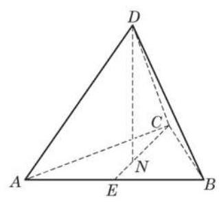

图 3-2-5

例 3 如图 3-2-5,在正四面体 ${ABCD}$ 中, $N$ 是面 ${ABC}$ 的中心.

(2)在(1)的条件下，把 $\overrightarrow{DN}$ 也分别表示为这两组向量的线性组合. Q

---

可以看出, 第一种选择有更好的对称性.

---

解( 1 )第一组向量可选 $\overrightarrow{DA} = \overrightarrow{a},\overrightarrow{DB} = \overrightarrow{b}$ 与 $\overrightarrow{DC} = \overrightarrow{c}$ ,则

$$
\overrightarrow{AB} = \overrightarrow{b} - \overrightarrow{a},\overrightarrow{BC} = \overrightarrow{c} - \overrightarrow{b},\overrightarrow{CA} = \overrightarrow{a} - \overrightarrow{c}.
$$

第二组向量可选 $\overrightarrow{DA} = \overrightarrow{a},\overrightarrow{DB} = \overrightarrow{b}$ 与 $\overrightarrow{BC} = \overrightarrow{d}$ ,则

$$
\overrightarrow{AB} = \overrightarrow{b} - \overrightarrow{a},\overrightarrow{DC} = \overrightarrow{b} + \overrightarrow{d},\overrightarrow{CA} = \overrightarrow{a} - \overrightarrow{b} - \overrightarrow{d}.
$$

(2)如图 3-2-5，取 $E$ 为 ${AB}$ 的中点，连接 ${CE}$ ，则点 $N$ 在

${CE}$ 上,且 $\overrightarrow{CN} = \frac{2}{3}\overrightarrow{CE} = \frac{2}{3}\left( {\overrightarrow{CA} + \overrightarrow{AE}}\right)  = \frac{2}{3}\left( {\overrightarrow{CA} + \frac{1}{2}\overrightarrow{AB}}\right)$ ,所以

$$
\overrightarrow{DN} = \overrightarrow{DC} + \overrightarrow{CN} = \overrightarrow{DC} + \frac{2}{3}\left( {\overrightarrow{CA} + \frac{1}{2}\overrightarrow{AB}}\right)  = \overrightarrow{DC} + \frac{2}{3}\overrightarrow{CA} + \frac{1}{3}\overrightarrow{AB},
$$

分别代入 (1) 的结果, 化简得

$$
\overrightarrow{DN} = \frac{1}{3}\overrightarrow{a} + \frac{1}{3}\overrightarrow{b} + \frac{1}{3}\overrightarrow{c}\text{ 与 }\overrightarrow{DN} = \frac{1}{3}\overrightarrow{a} + \frac{2}{3}\overrightarrow{b} + \frac{1}{3}\overrightarrow{d}.
$$

## 练习 3.2

1. 下列命题是否为真命题? 如果是, 请说明理由; 如果不是, 请举出反例.

(1)设 $A\text{ 、 }B\text{ 、 }C\text{ 、 }D$ 是空间中的四个不同的点，直线 ${AB}$ 与 ${CD}$ 是异面直线，则向量 $\overrightarrow{AB}$ 与 $\overrightarrow{CD}$ 不共面；

(2)如果 $\overrightarrow{a}$ 、 $\overrightarrow{b}$ 是平面 $\alpha$ 上的互不平行的向量，点 $C$ 、 $D$ 不在平面 $\alpha$ 上，那么向量 $\overrightarrow{CD}$ 与向量 $\overrightarrow{a}$ 、 $\overrightarrow{b}$ 不共面；

(3)如果 $\overrightarrow{a}$ 、 $\overrightarrow{b}$ 是平面 $\alpha$ 上的互不平行的向量，点 $C$ 在平面 $\alpha$ 上，点 $D$ 不在平面 $\alpha$ 上， 那么向量 $\overrightarrow{CD}$ 与向量 $\overrightarrow{a}$ 、 $\overrightarrow{b}$ 不共面.

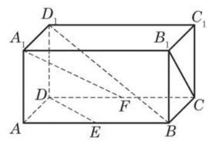

(第 2 题)

2. 如图,在长方体 ${ABCD} - {A}_{1}{B}_{1}{C}_{1}{D}_{1}$ 中, ${AB} : A{A}_{1} : {AD} = \; 2 : 1 : 1, E$ 与 $F$ 分别是棱 ${AB}$ 与 ${DC}$ 的中点. 设 $\overrightarrow{A{A}_{1}} = \overrightarrow{a},\overrightarrow{AB} = \overrightarrow{b}$ , $\overrightarrow{AD} = \overrightarrow{c}$ .

(1)用向量 $\overrightarrow{a}$ 、 $\overrightarrow{b}$ 、 $\overrightarrow{c}$ 表示 $\overrightarrow{B{D}_{1}}$ 、 $\overrightarrow{{A}_{1}F}$ ；

(2)求 $\overrightarrow{{A}_{1}F} \cdot  \overrightarrow{{B}_{1}C}$ ；

(3)判断 $\overrightarrow{{A}_{1}F}$ 与 $\overrightarrow{DE}$ 是否垂直.

## 习题 3.2

## A 组

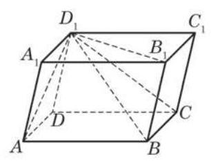

(第 1 题)

1. 如图,在平行六面体 ${ABCD} - {A}_{1}{B}_{1}{C}_{1}{D}_{1}$ 中,设 $\overrightarrow{{D}_{1}A} = \overrightarrow{a}$ , $\overrightarrow{{D}_{1}{B}_{1}} = \overrightarrow{b},\overrightarrow{{D}_{1}C} = \overrightarrow{c}$ . 试用 $\overrightarrow{a}\text{ 、 }\overrightarrow{b}\text{ 、 }\overrightarrow{c}$ 表示 $\overrightarrow{{D}_{1}B}$ .

2. 已知 $\overrightarrow{a}\text{ 、 }\overrightarrow{b}$ 是空间的非零向量,分析 $\overrightarrow{a} \cdot  \overrightarrow{b} = \left| \overrightarrow{a}\right|  \cdot  \left| \overrightarrow{b}\right|$ 与 $\overrightarrow{a}//\overrightarrow{b}$ 的关系.

3. 在正方体 ${ABCD} - {A}^{\prime }{B}^{\prime }{C}^{\prime }{D}^{\prime }$ 中, $E$ 是面 ${A}^{\prime }{B}^{\prime }{C}^{\prime }{D}^{\prime }$ 的中心. 求下列各式中实数 $\lambda \text{ 、 }\mu \text{ 、 }\nu$ 的值:

(1) $\overrightarrow{B{D}^{\prime }} = \lambda \overrightarrow{AD} + \mu \overrightarrow{AB} + \nu \overrightarrow{A{A}^{\prime }}$ ；

(2) $\overrightarrow{AE} = \lambda \overrightarrow{AD} + \mu \overrightarrow{AB} + \nu \overrightarrow{A{A}^{\prime }}$ .

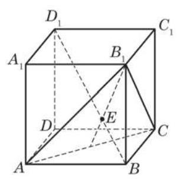

(第 4 题)

4. 如图,在棱长为 1 的正方体 ${ABCD} - {A}_{1}{B}_{1}{C}_{1}{D}_{1}$ 中, $B{D}_{1}$ 交平面 ${AC}{B}_{1}$ 于点 $E$ . 求证:

(1) $B{D}_{1} \bot$ 平面 ${AC}{B}_{1}$ ；

(2) $\left| {BE}\right|  = \frac{1}{2}\left| {E{D}_{1}}\right|$ .

## B 组

1. 在平面上有如下命题: “若 $O$ 为直线 ${AB}$ 外的一点,则点 $P$ 在直线 ${AB}$ 上的充要条件是:存在实数 $\lambda$ 、 $\mu$ ，满足 $\overrightarrow{OP} = \lambda \overrightarrow{OA} + \mu \overrightarrow{OB}$ ，且 $\lambda  + \mu  = 1.$ ”类比此命题，给出空间某点在某一平面上的充要条件并加以证明.

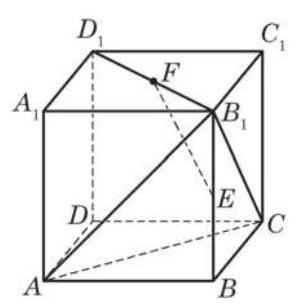

(第 4 题)

2. 如图,在正方体 ${ABCD} - {A}_{1}{B}_{1}{C}_{1}{D}_{1}$ 中, $E\text{ 、 }F$ 分别是 $B{B}_{1}\text{ 、 }{D}_{1}{B}_{1}$ 的中点. 求证: ${EF} \bot$ 平面 ${B}_{1}{AC}$ .

3. 在棱长为 1 的正方体 ${ABCD} - {A}_{1}{B}_{1}{C}_{1}{D}_{1}$ 中, $E\text{ 、 }F$ 分别是 $D{D}_{1}\text{ 、 }{DB}$ 的中点,点 $G$ 在棱 ${CD}$ 上, $\left| {CG}\right|  = \frac{1}{4}\left| {CD}\right| , H$ 是 ${C}_{1}G$ 的中点.

(1)求证: ${EF}\bot {B}_{1}C$ ；

(2)求 ${EF}$ 与 ${C}_{1}G$ 所成角的余弦值；

(3)求线段 ${FH}$ 的长.

### 3.3 空间向量的坐标表示

平面向量的坐标表示使得向量的运算可以转化为向量坐标的代数运算, 带来了很大的方便. 空间向量也可以类似处理. 但为此要先建立空间直角坐标系.

## 1 空间直角坐标系

如图 3-3-1, 在正方体中, 总可以找到从一个顶点出发的三条两两互相垂直的棱,如 ${AB}\text{ 、 }{AD}$ 与 $A{A}_{1}$ . 受此启示,从空间一点 $O$ 出发,可以作三条两两互相垂直的坐标轴,建立空间直角坐标系 $O - {xyz}$ (图 3-3-2).

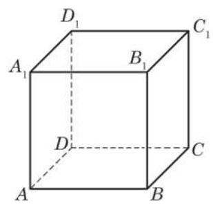

图 3-3-1

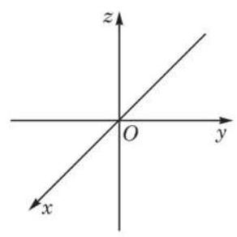

图 3-3-2

点 $O$ 叫做坐标原点,三条坐标轴分别是横轴 (即 $x$ 轴)、纵轴 (即 $y$ 轴) 与竖轴 (即 $z$ 轴). 我们约定坐标系采用右手制,即右手翘起拇指、其他四指握拳做“点赞”状，当四指所指的方向是 $x$ 轴正方向到 $y$ 轴正方向的旋转方向时,拇指所指为 $z$ 轴正方向 (图 3-3-3). 通过每两个坐标轴的平面叫坐标平面, 分别称为 ${xOy}$ 平面, ${yOz}$ 平面与 ${zOx}$ 平面. 三个坐标平面把空间划分成八个部分，每个部分称为一个卦限(octant)(图 3-3-4).

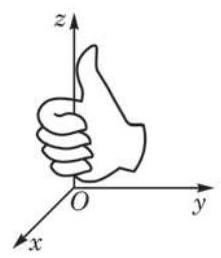

图 3-3-3

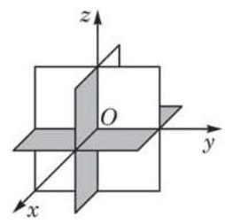

图 3-3-4

给定空间一点 $P$ ,如图 3-3-5,过点 $P$ 分别作与坐标平面 ${yOz}\text{ 、 }{zOx}$ 与 ${xOy}$ 平行的平面,与坐标平面一起围出一个长方体,所作的三个平面与 $x$ 轴、 $y$ 轴、 $z$ 轴的交点 $A\text{ 、 }B\text{ 、 }C$ (它们都是上述长方体的顶点) 在轴上的坐标,给出了点 $P$ 的坐标 $(x, y$ , $z)$ ,其中 $x\text{ 、 }y$ 与 $z$ 分别称为点 $P$ 的横坐标、纵坐标与竖坐标.

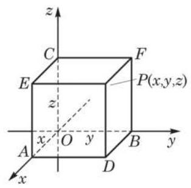

图 3-3-5

有了空间直角坐标系, 空间中的点与实数的有序三元组就建立了一一对应.

例 1 在空间直角坐标系 $O - {xyz}$ 中给定点 $P\left( {7,6,4}\right)$ ,求该点关于坐标平面 ${xOy}$ 的对称点 ${P}^{\prime }$ 的坐标.

解 如图 3-3-6,过点 $P$ 分别作与三个坐标平面平行的平面,与坐标平面一起围成了长方体 ${OADB} - {CEPF}$ ,根据点 $P$ 的坐标知道 $A\text{ 、 }B\text{ 、 }C$ 三点在轴上的坐标分别是 $7\text{ 、 }6\text{ 、 }4$ .

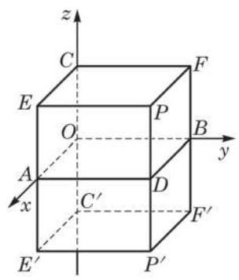

图 3-3-6

因为 ${PD} \bot$ 平面 ${xOy}$ ,所以点 $P$ 关于坐标平面 ${xOy}$ 的对称点 ${P}^{\prime }$ 在 ${PD}$ 延长线上,并使 $\left| {PD}\right|  = \left| {D{P}^{\prime }}\right|$ .

为了求出点 ${P}^{\prime }$ 的坐标,把长方体 ${OADB} - {CEPF}$ 关于坐标平面 ${xOy}$ 作对称: 分别作 ${EA}\text{ 、 }{CO}\text{ 、 }{FB}$ 的延长线到点 ${E}^{\prime }\text{ 、 }{C}^{\prime }\text{ 、 }{F}^{\prime }$ ,使 $\left| {EA}\right|  = \left| {A{E}^{\prime }}\right| ,\left| {CO}\right|  = \left| {O{C}^{\prime }}\right| ,\left| {FB}\right|  = \left| {B{F}^{\prime }}\right|$ ,则得到长方体 ${OADB} - {CEPF}$ 关于坐标平面 ${xOy}$ 的对称长方体 ${OADB} - {C}^{\prime }{E}^{\prime }{P}^{\prime }{F}^{\prime }$ , 可见点 ${P}^{\prime }$ 的坐标由点 $A\text{ 、 }B\text{ 、 }{C}^{\prime }$ 在轴上的坐标给出. 又因为点 ${C}^{\prime }$ 在 ${Oz}$ 轴上的坐标与点 $C$ 在 ${Oz}$ 轴上的坐标互为相反数,所以点 $A$ 、 $B\text{ 、 }{C}^{\prime }$ 在轴上的坐标分别是 $7\text{ 、 }6\text{ 、 } - 4$ ,即点 ${P}^{\prime }$ 的坐标是 $\left( {7,6, - 4}\right)$ .

---

不难看出, $A$ 、 $B\text{ 、 }C$ 分别是从点 $P$ 所作的坐标轴的垂线 ${PA}\text{ 、 }{PB}\text{ 、 }{PC}$ (图上未画出)的垂足.

---

## 2 空间向量的坐标表示

模仿平面的情况,设 $\overrightarrow{i}\text{ 、 }\overrightarrow{j}\text{ 、 }\overrightarrow{k}$ 分别是 $x$ 轴、 $y$ 轴、 $z$ 轴正方向的单位向量. 由于三个坐标轴两两互相垂直, 因此这些向量之间的数量积为

$$
{\overrightarrow{i}}^{2} = {\overrightarrow{j}}^{2} = {\overrightarrow{k}}^{2} = 1,\overrightarrow{i} \cdot  \overrightarrow{j} = \overrightarrow{j} \cdot  \overrightarrow{k} = \overrightarrow{k} \cdot  \overrightarrow{i} = 0.
$$

给定任意一个向量 $\overrightarrow{p}$ . 我们先通过平移把 $\overrightarrow{p}$ 的起点放到坐标原点 $O$ ,这时得到的向量 $\overrightarrow{OP}$ 称为 $\overrightarrow{p}$ 的位置向量. 设 $\overrightarrow{OP}$ 的终点坐标是 $P\left( {x, y, z}\right)$ ,则直接记 $\overrightarrow{p} = \left( {x, y, z}\right)$ ,并称向量的这种表示法为它的坐标表示.

从图 3-3-5 可以看出, $\overrightarrow{OP} = \overrightarrow{OA} + \overrightarrow{AD} + \overrightarrow{DP} = \overrightarrow{OA} + \overrightarrow{OB} + \overrightarrow{OC}$ , 而根据点的坐标的定义， $\overrightarrow{OA} = x\overrightarrow{i},\overrightarrow{OB} = y\overrightarrow{j},\overrightarrow{OC} = z\overrightarrow{k}$ ，所以 $\overrightarrow{p} = \left( {x, y, z}\right)$ 的实际含义是

$$
\overrightarrow{p} = x\overrightarrow{i} + y\overrightarrow{j} + z\overrightarrow{k}.
$$

有了这个表达式, 就可以像平面向量那样推知: 如果 $\left( {{x}_{1},{y}_{1},{z}_{1}}\right) \text{ 、 }\left( {{x}_{2},{y}_{2},{z}_{2}}\right)$ 与 $\left( {x, y, z}\right)$ 是坐标表示的向量, $\lambda$ 是实数, 那么

$$
\left( {{x}_{1},{y}_{1},{z}_{1}}\right)  \pm  \left( {{x}_{2},{y}_{2},{z}_{2}}\right)  = \left( {{x}_{1} \pm  {x}_{2},{y}_{1} \pm  {y}_{2},{z}_{1} \pm  {z}_{2}}\right) ,
$$

$$
\lambda \left( {x, y, z}\right)  = \left( {{\lambda x},{\lambda y},{\lambda z}}\right) .
$$

这说明: 把向量用坐标表示后, 两个向量相加 (减), 等于把它们的对应坐标相加(减); 一个实数乘一个向量, 等于把这个实数乘它的坐标.

一个向量 $\overrightarrow{p} = \left( {x, y, z}\right)$ 的模就是它的位置向量 $\overrightarrow{OP}$ 的终点 $P$ 与坐标原点 $O$ 的距离,所以

$$
\left| \overrightarrow{OP}\right|  = \left| \left( {x, y, z}\right) \right|  = \sqrt{{x}^{2} + {y}^{2} + {z}^{2}}.
$$

如果向量不是由位置向量给出, 也可以不通过位置向量得到此向量的坐标表示: 设有空间任意两点 $P\left( {{x}_{1},{y}_{1},{z}_{1}}\right)$ 与 $Q\left( {{x}_{2},{y}_{2},{z}_{2}}\right)$ ,则

$$
\overrightarrow{PQ} = \overrightarrow{OQ} - \overrightarrow{OP}
$$

$$
= \left( {{x}_{2},{y}_{2},{z}_{2}}\right)  - \left( {{x}_{1},{y}_{1},{z}_{1}}\right)
$$

$$
= \left( {{x}_{2} - {x}_{1},{y}_{2} - {y}_{1},{z}_{2} - {z}_{1}}\right) \text{ . }
$$

即, 一个向量的坐标等于这个向量的终点坐标减去它的起点坐标.

有了上面两个公式,空间任意两点 $P\left( {{x}_{1},{y}_{1},{z}_{1}}\right)$ 与 $Q\left( {{x}_{2},{y}_{2},{z}_{2}}\right)$ 的距离就很容易求出了,因为这两点的距离 $\left| {PQ}\right|$ 等于向量 $\overrightarrow{PQ} = \left( {{x}_{2} - {x}_{1},{y}_{2} - {y}_{1},{z}_{2} - {z}_{1}}\right)$ 的模 $\left| \overrightarrow{PQ}\right|$ . 由此得到

$$
\left| \overrightarrow{PQ}\right|  = \sqrt{{\left( {x}_{2} - {x}_{1}\right) }^{2} + {\left( {y}_{2} - {y}_{1}\right) }^{2} + {\left( {z}_{2} - {z}_{1}\right) }^{2}}.
$$

最后, 我们看两个空间向量的数量积如何用坐标表示.

给定两个向量 $\overrightarrow{a} = \left( {{x}_{1},{y}_{1},{z}_{1}}\right)$ 与 $\overrightarrow{b} = \left( {{x}_{2},{y}_{2},{z}_{2}}\right)$ ,把它们写成坐标轴正方向的单位向量的线性组合,就有 $\overrightarrow{a} = {x}_{1}\overrightarrow{i} + {y}_{1}\overrightarrow{j} + \; {z}_{1}\overrightarrow{k}$ 与 $\overrightarrow{b} = {x}_{2}\overrightarrow{i} + {y}_{2}\overrightarrow{j} + {z}_{2}\overrightarrow{k}$ ,于是

$$
\overrightarrow{a} \cdot  \overrightarrow{b} = \left( {{x}_{1}\overrightarrow{i} + {y}_{1}\overrightarrow{j} + {z}_{1}\overrightarrow{k}}\right)  \cdot  \left( {{x}_{2}\overrightarrow{i} + {y}_{2}\overrightarrow{j} + {z}_{2}\overrightarrow{k}}\right) .
$$

对上式用分配律展开计算,并注意到 $\overrightarrow{i}\text{ 、 }\overrightarrow{j}\text{ 、 }\overrightarrow{k}$ 是两两互相垂直的向量,且 ${\overrightarrow{i}}^{2} = {\overrightarrow{j}}^{2} = {\overrightarrow{k}}^{2} = 1$ ,所以

$$
\overrightarrow{a} \cdot  \overrightarrow{b} = {x}_{1}{x}_{2}{\overrightarrow{i}}^{2} + {y}_{1}{y}_{2}{\overrightarrow{j}}^{2} + {z}_{1}{z}_{2}{\overrightarrow{k}}^{2} = {x}_{1}{x}_{2} + {y}_{1}{y}_{2} + {z}_{1}{z}_{2}.
$$

这就是我们所需要的两向量数量积公式

$$
\left( {{x}_{1},{y}_{1},{z}_{1}}\right)  \cdot  \left( {{x}_{2},{y}_{2},{z}_{2}}\right)  = {x}_{1}{x}_{2} + {y}_{1}{y}_{2} + {z}_{1}{z}_{2}.
$$

两个非零向量 $\overrightarrow{a} = \left( {{x}_{1},{y}_{1},{z}_{1}}\right)$ 与 $\overrightarrow{b} = \left( {{x}_{2},{y}_{2},{z}_{2}}\right)$ 夹角的余弦公式是

$$
\cos \langle \overrightarrow{a},\overrightarrow{b}\rangle  = \frac{{x}_{1}{x}_{2} + {y}_{1}{y}_{2} + {z}_{1}{z}_{2}}{\sqrt{{x}_{1}^{2} + {y}_{1}^{2} + {z}_{1}^{2}}\sqrt{{x}_{2}^{2} + {y}_{2}^{2} + {z}_{2}^{2}}}.
$$

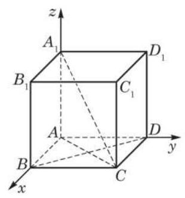

图 3-3-7

从两向量夹角的余弦公式和两向量平行的充要条件可分别得到两个非零向量垂直与平行的充要条件:

$\overrightarrow{a} \bot  \overrightarrow{b} \Leftrightarrow  {x}_{1}{x}_{2} + {y}_{1}{y}_{2} + {z}_{1}{z}_{2} = 0;$

$\overrightarrow{a}//\overrightarrow{b} \Leftrightarrow$ 存在 $\lambda  \in  \mathbf{R}$ ,使得 ${x}_{1} = \lambda {x}_{2},{y}_{1} = \lambda {y}_{2},{z}_{1} = \lambda {z}_{2}$ .

例 2 如图 3-3-7,给定正方体 ${ABCD} - {A}_{1}{B}_{1}{C}_{1}{D}_{1}$ .

(1)求对角线 $C{A}_{1}$ 与 ${CA}$ 所成角的余弦值；

(2)求证: $C{A}_{1} \bot  {BD}$ .

解(1)以点 $A$ 为坐标原点，分别以射线 ${AB}$ 、 ${AD}$ 、 $A{A}_{1}$ 为 $x$ 轴、 $y$ 轴、 $z$ 轴的正半轴,建立空间直角坐标系. 设正方体的棱长为 $a$ ,可得有关点的坐标分别为 $B\left( {a,0,0}\right) \text{ 、 }D\left( {0, a,0}\right)$ 、 $C\left( {a, a,0}\right) \text{ 、 }{A}_{1}\left( {0,0, a}\right)$ ,从而 $\overrightarrow{CA} = \left( {-a, - a,0}\right) ,\overrightarrow{C{A}_{1}} = \; \left( {-a, - a, a}\right)$ . 于是

$\cos \left\langle  {\overrightarrow{C{A}_{1}},\overrightarrow{CA}}\right\rangle   = \frac{\overrightarrow{C{A}_{1}} \cdot  \overrightarrow{CA}}{\left| \overrightarrow{C{A}_{1}}\right| \left| \overrightarrow{CA}\right| } = \frac{{a}^{2} + {a}^{2}}{\sqrt{{a}^{2} + {a}^{2}}\sqrt{{a}^{2} + {a}^{2} + {a}^{2}}} = \frac{2}{\sqrt{6}} = \frac{\sqrt{6}}{3}$ .

(2)证明:由 $\overrightarrow{C{A}_{1}} = \left( {-a, - a, a}\right) ,\overrightarrow{BD} = \left( {-a, a,0}\right)$ ，得

$$
\overrightarrow{C{A}_{1}} \cdot  \overrightarrow{BD} = {\left( -a\right) }^{2} + \left( {-a}\right) a + 0 = 0.
$$

所以, $C{A}_{1} \bot  {BD}$ .

## 练习 3.3

1. 讨论满足下列条件的点 $P$ 的坐标 $\left( {x, y, z}\right)$ 的特征:

(1)点 $P$ 在坐标平面上; (2)点 $P$ 在坐标轴上.

2. 求向量 $\overrightarrow{a} = \left( {0,1,0}\right)$ 与 $\overrightarrow{b} = \left( {1, - 1,0}\right)$ 的夹角的大小.

3. 已知向量 $\overrightarrow{a} = \left( {-m,1,3}\right)$ 平行于向量 $\overrightarrow{b} = \left( {2, n,1}\right)$ ，求 $m\text{ 、 }n$ .

## 习题 3.3

## A 组

1. 已知长方体 ${ABCD} - {A}_{1}{B}_{1}{C}_{1}{D}_{1}$ 的棱长 $\left| {AB}\right|  = {14},\left| {AD}\right|  = 6,\left| {A{A}_{1}}\right|  = {10}$ ,以这个长方体的顶点 $A$ 为坐标原点,分别以射线 ${AB}\text{ 、 }{AD}\text{ 、 }A{A}_{1}$ 为 $x$ 轴、 $y$ 轴、 $z$ 轴的正半轴, 建立空间直角坐标系. 求长方体各顶点的坐标.

2. 已知 ${PA}$ 垂直于正方形 ${ABCD}$ 所在的平面, $M\text{ 、 }N$ 分别是 ${AB}\text{ 、 }{PC}$ 的中点,且 $\left| {PA}\right|  = \left| {AD}\right|$ ,分别以射线 ${AB}\text{ 、 }{AD}\text{ 、 }{AP}$ 为 $x$ 轴、 $y$ 轴、 $z$ 轴的正半轴,建立空间直角坐标系. 求向量 $\overrightarrow{MN}\text{ 、 }\overrightarrow{DC}$ 的坐标表示.

3. 已知 $\overrightarrow{a} = \overrightarrow{i} + \overrightarrow{j} - 4\overrightarrow{k},\overrightarrow{b} = \overrightarrow{i} - 2\overrightarrow{j} + 2\overrightarrow{k}$ . 求:

(1)向量 $\overrightarrow{a}$ 与 $\overrightarrow{b}$ 的夹角的大小；

(2)向量 $\overrightarrow{a}$ 与 $\overrightarrow{b}$ 所在直线的夹角的大小.

4. 已知平行四边形 ${ABCD}$ 中的三个顶点的坐标分别为 $A\left( {1,2,3}\right) \text{ 、 }B\left( {2, - 1,5}\right)$ 与 $C\left( {3,2, - 5}\right)$ ,求顶点 $D$ 的坐标.

5. 设 $\overrightarrow{a} = \left( {{a}_{1},{a}_{2},{a}_{3}}\right) ,\overrightarrow{b} = \left( {{b}_{1},{b}_{2},{b}_{3}}\right)$ ,且 $\overrightarrow{a} \neq  \overrightarrow{b}$ . 记 $\left| {\overrightarrow{a} - \overrightarrow{b}}\right|  = m$ ,求 $\overrightarrow{a} - \overrightarrow{b}$ 与 $x$ 轴正方向的夹角的余弦值.

## B 组

1. 在 $\bigtriangleup {ABC}$ 中,已知 $\overrightarrow{AB} = \left( {2,4,0}\right) ,\overrightarrow{BC} = \left( {-1,3,0}\right)$ . 求 $\angle {ABC}$ 的大小.

2. 给定空间三点 $A\left( {0,2,3}\right) , B\left( {-2,1,6}\right) , C\left( {1, - 1,5}\right)$ .

(1)求以向量 $\overrightarrow{AB}$ 、 $\overrightarrow{AC}$ 为一组邻边的平行四边形的面积 $S$ ；

(2)若向量 $\overrightarrow{a}$ 与向量 $\overrightarrow{AB}$ 、 $\overrightarrow{AC}$ 都垂直，且 $\left| \overrightarrow{a}\right|  = \sqrt{3}$ ，求向量 $\overrightarrow{a}$ 的坐标.

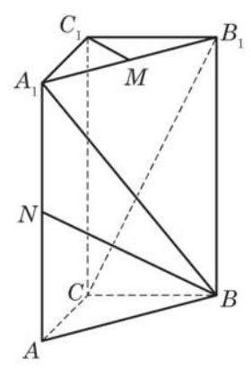

(第 3 题)

3. 如图,在直三棱柱 ${ABC} - {A}_{1}{B}_{1}{C}_{1}$ 中, $\left| {CA}\right|  = \left| {CB}\right|  = 1$ , $\angle {BCA} = {90}^{ \circ  },\left| {A{A}_{1}}\right|  = 2, M\text{ 、 }N$ 分别是 ${A}_{1}{B}_{1}\text{ 、 }{A}_{1}A$ 的中点. 建立适当的空间直角坐标系, 解决如下问题:

(1)求 $\overrightarrow{BN}$ 的模；

(2)求 $\cos \left\langle  {\overrightarrow{B{A}_{1}},\overrightarrow{C{B}_{1}}}\right\rangle$ ；

(3)求证: ${A}_{1}B \bot  {C}_{1}M$ .

### 3.4 空间向量在立体几何中的应用

空间向量常常可为解决立体几何中的有关问题提供简捷方便的方法. 在本章 3.2 节的例 2 中就非常方便地利用向量证明了直线与平面垂直的判定定理.

本节继续介绍空间向量在立体几何中的一些应用. 如下一些与直线和平面相关的向量是很重要的.

直线的方向向量:与直线平行的任何非零向量.

平面的法向量: 垂直于平面的任何非零向量.

用向量方法解决有关直线和平面的问题, 一般先把相应的问题化为关于上述这些向量的问题然后加以解决. 建立一个适当的空间直角坐标系常常是有效的辅助手段, 特别是在需要数值求解的问题上.

## 1 判断空间直线、平面的位置关系

下面的结论是显然的:

两条直线平行的充要条件是它们的方向向量平行; 两条直线垂直的充要条件是它们的方向向量垂直.

这样, 就把直线间的平行或垂直关系化为向量的平行或垂直关系. 我们给出一个“简单”的例子——三垂线定理的向量证明， 它的关键就是把直线垂直问题化为向量垂直问题.

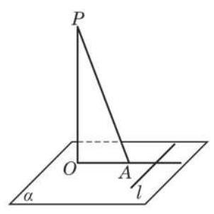

图 3-4-1

例 1 证明: 平面上的一条直线和这个平面的一条斜线垂直的充要条件是它和这条斜线在平面上的投影垂直.

已知 如图 3-4-1, ${PA}$ 是平面 $\alpha$ 的一条斜线, ${OA}$ 是 ${PA}$ 在 $\alpha$ 上的投影，直线 $l$ 在平面 $\alpha$ 上.

求证 $l\bot {PA}$ 当且仅当 $l\bot {OA}$ .

证明 根据投影的定义， ${PO}\bot \alpha$ ，所以 ${PO}\bot l$ . 由于 $\overrightarrow{PO}$ 是直线 ${PO}$ 的方向向量，再取 $l$ 的任意一个方向向量 $\overrightarrow{a}$ ，则 $\overrightarrow{PO}\bot \overrightarrow{a}$ ， 即 $\overrightarrow{a} \cdot  \overrightarrow{PO} = 0$ . 又因为 $\overrightarrow{PA} = \overrightarrow{PO} + \overrightarrow{OA}$ ,所以

$$
\overrightarrow{a} \cdot  \overrightarrow{PA} = \overrightarrow{a} \cdot  \left( {\overrightarrow{PO} + \overrightarrow{OA}}\right)  = \overrightarrow{a} \cdot  \overrightarrow{PO} + \overrightarrow{a} \cdot  \overrightarrow{OA} = \overrightarrow{a} \cdot  \overrightarrow{OA}.
$$

由此推出

$$
l \bot  {PA} \Leftrightarrow  \overrightarrow{a} \cdot  \overrightarrow{PA} = 0 \Leftrightarrow  \overrightarrow{a} \cdot  \overrightarrow{OA} = 0 \Leftrightarrow  l \bot  {OA}.
$$

现在我们把直线与平面的平行与垂直关系用向量描述如下:

直线和平面垂直的充要条件是直线的方向向量为平面的法向量; 不在平面上的一条直线和平面平行的充要条件是直线的方向向量垂直于平面的法向量.

上述第一个结论不过是平面法向量定义的变形. 为得出第二个结论, 过直线作一个平面与给定平面相交. 根据直线与平面平行的判定定理与性质定理, 直线平行于给定平面的充要条件是该直线平行于交线; 又因为交线在给定平面上, 它垂直于此平面的法向量, 所以直线平行于交线的充要条件是该直线垂直于这个法向量. 于是, 直线平行于一个平面的充要条件是该直线垂直于该平面的法向量.

两个平面的垂直与平行也可以用向量描述如下:

两个平面垂直的充要条件是它们的法向量垂直; 两个平面平行的充要条件是它们的法向量平行. 这个结论的证明留作练习题.

证明(1)设正方体的棱长为 $a$ . 以点 $D$ 为原点，分别以 $\overrightarrow{DA}\text{ 、 }\overrightarrow{DC}$ 与 $\overrightarrow{D{D}_{1}}$ 的方向为 $x\text{ 、 }y$ 与 $z$ 轴的正方向，建立空间直角坐标系, 则得到正方体各顶点的坐标如下:

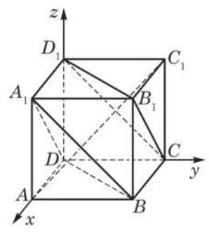

图 3-4-2

例 2 如图 3-4-2,在正方体 ${ABCD} - {A}_{1}{B}_{1}{C}_{1}{D}_{1}$ 中, 求证:

(1) $A{C}_{1} \bot$ 平面 ${A}_{1}{BD}, A{C}_{1} \bot$ 平面 $C{D}_{1}{B}_{1}$ ；

(2)平面 ${A}_{1}{BD}//$ 平面 $C{D}_{1}{B}_{1}$ .

$$
A\left( {a,0,0}\right) , B\left( {a, a,0}\right) , C\left( {0, a,0}\right) , D\left( {0,0,0}\right) ,
$$

$$
{A}_{1}\left( {a,0, a}\right) ,{B}_{1}\left( {a, a, a}\right) ,{C}_{1}\left( {0, a, a}\right) ,{D}_{1}\left( {0,0, a}\right) .
$$

据此求出直线 $A{C}_{1}\text{ 、 }{A}_{1}B\text{ 、 }{D}_{1}C\text{ 、 }{A}_{1}D$ 与 ${B}_{1}C$ 的方向向量分别为

$$
\overrightarrow{A{C}_{1}} = \left( {-a, a, a}\right) ,
$$

$$
\overrightarrow{{A}_{1}B} = \overrightarrow{{D}_{1}C} = \left( {0, a, - a}\right) ,
$$

$$
\overrightarrow{{A}_{1}D} = \overrightarrow{{B}_{1}C} = \left( {-a,0, - a}\right) .
$$

计算得到

$$
\overrightarrow{A{C}_{1}} \cdot  \overrightarrow{{A}_{1}B} = \overrightarrow{A{C}_{1}} \cdot  \overrightarrow{{D}_{1}C} = \overrightarrow{A{C}_{1}} \cdot  \overrightarrow{{A}_{1}D} = \overrightarrow{A{C}_{1}} \cdot  \overrightarrow{{B}_{1}C} = 0,
$$

所以

$$
A{C}_{1} \bot  \text{ 平面 }{A}_{1}{BD}, A{C}_{1} \bot  \text{ 平面 }C{D}_{1}{B}_{1}\text{ . }
$$

(2)平面 ${A}_{1}{BD}$ 与平面 $C{D}_{1}{B}_{1}$ 有共同的法向量 $\overrightarrow{A{C}_{1}}$ ，所以这两个平面平行.

## 练习 3.4(1)

1. 试证明:

(1)两个平面垂直的充要条件是它们的法向量垂直；

(2)两个平面平行的充要条件是它们的法向量平行.

2. 如图，在平面 $\alpha$ 与平面 $\beta$ 上分别有不共线的三点 $A$ 、 $B$ 、 $C$ 与 ${A}_{1}$ 、 ${B}_{1}$ 、 ${C}_{1}$ ，假设 $A{A}_{1}\text{ 、 }B{B}_{1}$ 与 $C{C}_{1}$ 交于一点 $O$ ,且 $\left| {AO}\right|  = \left| {O{A}_{1}}\right| ,\left| {BO}\right|  = \left| {O{B}_{1}}\right| ,\left| {CO}\right|  = \left| {O{C}_{1}}\right|$ . 求证: 平面 $\alpha //$ 平面 $\beta$ .

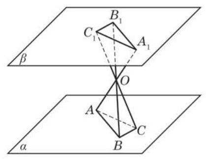

(第 2 题)

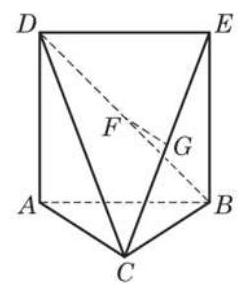

(第 3 题)

3. 如图， $\bigtriangleup  {ABC}$ 中， ${AC} = {BC} = \frac{\sqrt{2}}{2}{AB}$ ，平面 ${ABED}\bot$ 平面 ${ABC}$ ， ${ABED}$ 是边长为 1 的正方形, $G\text{ 、 }F$ 分别是 ${EC}\text{ 、 }{BD}$ 的中点. 求证:

(1) ${FG}//$ 平面 ${ABC}$ ；

(2) ${AC} \bot$ 平面 ${EBC}$ .

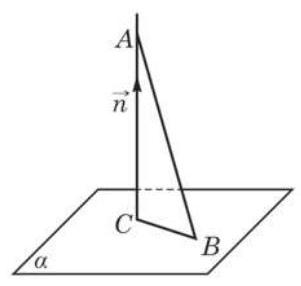

图 3-4-3

## 2 求距离

我们先证明点到平面距离的一般公式.

如果 $A\text{ 、 }B$ 是空间中的两个点,其中点 $B$ 在平面 $\alpha$ 上, $\overrightarrow{n}$ 是平面 $\alpha$ 的一个法向量 (图 3-4-3),那么点 $A$ 到平面 $\alpha$ 的距离 $d$ 是 $\overrightarrow{AB}$ 在 $\overrightarrow{n}$ 的方向上的投影 $\overrightarrow{AC} = \left| \overrightarrow{AB}\right| \cos \langle \overrightarrow{n},\overrightarrow{AB}\rangle \overrightarrow{{n}_{0}}$ 的模,其中 $\overrightarrow{{n}_{0}}$ 是 $\overrightarrow{n}$ 的单位向量(称为平面 $\alpha$ 的单位法向量)，于是

$$
d = \left| \right| \overrightarrow{{n}_{0}}\left| \right| \overrightarrow{AB}\left| {\cos \langle \overrightarrow{n},\overrightarrow{AB}\rangle }\right| .
$$

用向量的数量积表示, 即

$$
d = \left| {\overrightarrow{{n}_{0}} \cdot  \overrightarrow{AB}}\right|  = \frac{\left| \overrightarrow{n} \cdot  \overrightarrow{AB}\right| }{\left| \overrightarrow{n}\right| }.
$$

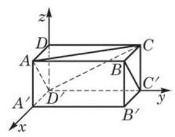

图 3-4-4

例 3 如图 3-4-4,在长方体 ${ABCD} - {A}^{\prime }{B}^{\prime }{C}^{\prime }{D}^{\prime }$ 中, $\left| {AB}\right|  = 2,\left| {AD}\right|  = \left| {A{A}^{\prime }}\right|  = 1.$

(1)求顶点 ${B}^{\prime }$ 到平面 ${D}^{\prime }{AC}$ 的距离；

(2)求直线 $B{C}^{\prime }$ 到平面 ${D}^{\prime }{AC}$ 的距离.

解 (1) 如图 3-4-4, 建立空间直角坐标系, 则可得有关点的坐标分别为 ${D}^{\prime }\left( {0,0,0}\right) \text{ 、 }A\left( {1,0,1}\right) \text{ 、 }C\left( {0,2,1}\right)$ 、 ${B}^{\prime }\left( {1,2,0}\right)$ . 所以 $\overrightarrow{{D}^{\prime }A} = \left( {1,0,1}\right) ,\overrightarrow{{D}^{\prime }C} = \left( {0,2,1}\right)$ .

设平面 ${D}^{\prime }{AC}$ 的法向量为 $\overrightarrow{n} = \left( {u, v, w}\right)$ ,则 $\overrightarrow{n} \cdot  \overrightarrow{{D}^{\prime }A} = 0$ , $\overrightarrow{n} \cdot  \overrightarrow{{D}^{\prime }C} = 0$ . 把各向量的坐标代入,计算得到 $u + w = 0$ , ${2v} + w = 0$ . 可以取 $v = 1$ ,从而得到平面 ${D}^{\prime }{AC}$ 的一个法向量为 $\overrightarrow{n} = \left( {2,1, - 2}\right)$ . Q

---

平面的法向量不是唯一的, 所以可以给它的某个坐标一个值, 再确定其他坐标的值.

---

因为 $\overrightarrow{{B}^{\prime }C} = \left( {-1,0,1}\right)$ ,根据上面得到的点到平面的距离公式知,点 ${B}^{\prime }$ 到平面 ${D}^{\prime }{AC}$ 的距离为

$$
d = \frac{\left| \overrightarrow{n} \cdot  \overrightarrow{{B}^{\prime }C}\right| }{\left| \overrightarrow{n}\right| } = \frac{\left| 2 \times  \left( -1\right)  + \left( -2\right)  \times  1\right| }{\sqrt{{2}^{2} + {1}^{2} + {\left( -2\right) }^{2}}} = \frac{4}{3}.
$$

(2)因为 $\overrightarrow{B{C}^{\prime }} = \overrightarrow{A{D}^{\prime }}$ ，所以 $B{C}^{\prime }//A{D}^{\prime }$ ，从而 $B{C}^{\prime }//$ 平面 ${D}^{\prime }{AC}$ ,问题转化为求点 ${C}^{\prime }\left( {0,2,0}\right)$ 到平面 ${D}^{\prime }{AC}$ 的距离. 因为 $\overrightarrow{{C}^{\prime }C} = \left( {0,0,1}\right)$ ,所以直线 $B{C}^{\prime }$ 到平面 ${D}^{\prime }{AC}$ 的距离为 $\frac{\left| \overrightarrow{n} \cdot  \overrightarrow{{C}^{\prime }C}\right| }{\left| \overrightarrow{n}\right| } = \frac{2}{3}.$

---

如何求两条异面直线之间的距离?

---

求平面的平行线与平面的距离, 只要求平行线上一点到平面的距离; 求两个平行平面的距离, 也只要求其中一个平面上的一个点到另一个平面的距离.

下一道例题继续用例 2 的题设. 回忆一下, 例 2 已经证明了题中的平面 ${A}_{1}{BD}$ 与平面 $C{D}_{1}{B}_{1}$ 是平行的.

例 4 设正方体 ${ABCD} - {A}_{1}{B}_{1}{C}_{1}{D}_{1}$ 的棱长为 $a$ ,求平行平面 ${A}_{1}{BD}$ 与 $C{D}_{1}{B}_{1}$ 之间的距离.

解 求平行平面 ${A}_{1}{BD}$ 与 $C{D}_{1}{B}_{1}$ 之间的距离,只要求平面

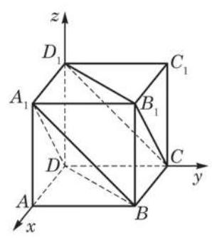

图 3-4-5

$C{D}_{1}{B}_{1}$ 上一点 (例如 ${D}_{1}$ ) 到平面 ${A}_{1}{BD}$ 的距离. 如图 3-4-5,建立空间直角坐标系, 可得点的坐标

$$
D\left( {0,0,0}\right) ,{D}_{1}\left( {0,0, a}\right) ,{A}_{1}\left( {a,0, a}\right) , B\left( {a, a,0}\right) ,
$$

于是

$$
\overrightarrow{{D}_{1}D} = \left( {0,0, - a}\right) ,\overrightarrow{D{A}_{1}} = \left( {a,0, a}\right) ,\overrightarrow{DB} = \left( {a, a,0}\right) .
$$

设 $\overrightarrow{n} = \left( {x, y, z}\right)$ 是平面 ${A}_{1}{BD}$ 的一个法向量,则

$$
\left\{  \begin{array}{l} \overrightarrow{n} \cdot  \overrightarrow{D{A}_{1}} = {ax} + {az} = 0, \\  \overrightarrow{n} \cdot  \overrightarrow{DB} = {ax} + {ay} = 0. \end{array}\right.
$$

因为 $a \neq  0$ ,所以

$$
\left\{  \begin{array}{l} x + z = 0, \\  x + y = 0. \end{array}\right.
$$

不妨取 $z = 1$ ,则 $x =  - 1, y = 1$ ,就得到平面 ${A}_{1}{BD}$ 的一个法向量 $\overrightarrow{n} = \left( {-1,1,1}\right)$ . 这样,点 ${D}_{1}$ 到平面 ${A}_{1}{BD}$ 的距离为

$$
d = \frac{\left| \overrightarrow{n} \cdot  \overrightarrow{{D}_{1}D}\right| }{\left| \overrightarrow{n}\right| } = \frac{\left| \left( -1\right)  \times  0 + 1 \times  0 + 1 \times  \left( -a\right) \right| }{\sqrt{{\left( -1\right) }^{2} + {1}^{2} + {1}^{2}}} = \frac{\sqrt{3}}{3}a.
$$

因此,平行平面 ${A}_{1}{BD}$ 与平面 $C{D}_{1}{B}_{1}$ 之间的距离为 $\frac{\sqrt{3}}{3}a$ .

## 练习 3.4(2)

1. 已知三棱锥 $A - {BCD}$ 的三条侧棱 ${AB}$ 、 ${AC}$ 、 ${AD}$ 两两垂直，且 $\left| {AB}\right|  = 1$ ， $\left| {AC}\right|  =$ 2, $\left| {AD}\right|  = 3$ . 求顶点 $A$ 到平面 ${BCD}$ 的距离.

2. 在习题 3.4(1)第 3 题的题设条件下，求直线 ${FG}$ 与平面 ${ABC}$ 的距离.

## 3 求角的大小

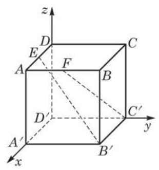

图 3-4-6

例 5 如图 3-4-6,在正方体 ${ABCD} - {A}^{\prime }{B}^{\prime }{C}^{\prime }{D}^{\prime }$ 中, $E$ 、 $F$ 分别是 ${AD}\text{ 、 }{AB}$ 的中点. 求直线 ${B}^{\prime }E$ 与 ${C}^{\prime }F$ 所成角的大小.

解 设正方体的棱长为 $a$ . 以点 ${D}^{\prime }$ 为原点，分别以 $\overrightarrow{{D}^{\prime }{A}^{\prime }}$ 、 $\overrightarrow{{D}^{\prime }{C}^{\prime }}$ 与 $\overrightarrow{{D}^{\prime }D}$ 的方向为 $x\text{ 、 }y$ 与 $z$ 轴的正方向,建立空间直角坐标系,则可得有关点的坐标分别为 ${B}^{\prime }\left( {a, a,0}\right) \text{ 、 }E\left( {\frac{a}{2},0, a}\right)$ 、 ${C}^{\prime }\left( {0, a,0}\right) \text{ 、 }F\left( {a,\frac{a}{2}, a}\right)$ ,因此,直线 ${B}^{\prime }E$ 与 ${C}^{\prime }F$ 的方向向量分别是

$$
\overrightarrow{{B}^{\prime }E} = \left( {-\frac{a}{2}, - a, a}\right) \text{ 与 }\overrightarrow{{C}^{\prime }F} = \left( {a, - \frac{a}{2}, a}\right) .
$$

从而

$$
\cos \left\langle  {\overrightarrow{{B}^{\prime }E},\overrightarrow{{C}^{\prime }F}}\right\rangle   = \frac{\overrightarrow{{B}^{\prime }E} \cdot  \overrightarrow{{C}^{\prime }F}}{\left| \overrightarrow{{B}^{\prime }E}\right| \left| \overrightarrow{{C}^{\prime }F}\right| } = \frac{4}{9}.
$$

所以,直线 ${B}^{\prime }E$ 与 ${C}^{\prime }F$ 所成角的大小为 $\arccos \frac{4}{9}$ .

例 5 中的两条直线是异面直线. 事实上, 用向量方法求两条直线所成的角时, 无须区分它们是否为异面直线. 但要注意,如果两条直线 ${l}_{1}$ 与 ${l}_{2}$ 的方向向量分别是 $\overrightarrow{{r}_{1}}$ 与 $\overrightarrow{{r}_{2}}$ ,当求出的方向向量的夹角 $\left\langle  {\overrightarrow{{r}_{1}},\overrightarrow{{r}_{2}}}\right\rangle   > \frac{\pi }{2}$ 时, ${l}_{1}$ 与 ${l}_{2}$ 所成的角 $\theta$ 是它的补角 $\pi  - \left\langle  {\overrightarrow{{r}_{1}},\overrightarrow{{r}_{2}}}\right\rangle$ . 因为我们约定两条直线所成角的取值在 0 和 $\frac{\pi }{2}$ 之间. 所以,用方向向量 ${\overrightarrow{r}}_{1}$ 与 ${\overrightarrow{r}}_{2}$ 表达的两条直线所成角 $\theta$ 的公式为

$$
\cos \theta  = \frac{\left| \overrightarrow{{r}_{1}} \cdot  \overrightarrow{{r}_{2}}\right| }{\left| \overrightarrow{{r}_{1}}\right| \left| \overrightarrow{{r}_{2}}\right| }.
$$

立体几何中常见的有关角的问题还有直线与平面所成的角和平面与平面所成的角(二面角). 确定这两类角的大小, 都可以通过转化为直线的方向向量和平面的法向量两个向量夹角的问题加以解决. 当然, 为得到最终的解答, 必须知道所要讨论的角与转化后的向量夹角的关系.

先考虑直线与平面所成的角. 从图 3-4-7 可以看出, 直线与平面垂线(法向量所在直线)所成的角和直线与平面所成的角的关系: 如果直线与平面所成的角为 $\theta$ ,那么直线与平面垂线 (法向量所在直线) 所成的角为 $\frac{\pi }{2} - \theta$ . 因此,如果直线的一个方向向量为 $\overrightarrow{r}$ ,平面的一个法向量为 $\overrightarrow{n}$ ,那么直线与平面所成的角 $\theta$ 由如下公式确定:

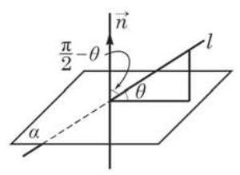

图 3-4-7

例 6 如图 3-4-8,在四棱锥 $P - {ABCD}$ 中, ${PA} \bot$ 平面 ${ABCD},{AB} \bot  {AD},{BC}//{AD},\left| {PA}\right|  = \left| {AB}\right|  = \left| {BC}\right|  = 1$ , $\left| {CD}\right|  = \sqrt{2},\angle {CDA} = {45}^{ \circ  }$ . 求直线 ${PB}$ 与平面 ${PCD}$ 所成角的大小.

$$
\sin \theta  = \cos \left( {\frac{\pi }{2} - \theta }\right)  = \frac{\left| \overrightarrow{r} \cdot  \overrightarrow{n}\right| }{\left| \overrightarrow{r}\right| \left| \overrightarrow{n}\right| }.
$$

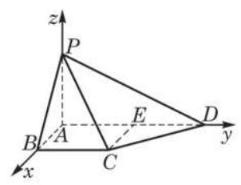

图 3-4-8

解 因为 ${PA} \bot$ 平面 ${ABCD},{AB} \bot  {AD}$ ,则可取点 $A$ 为原点,分别以 $\overrightarrow{AB}\text{ 、 }\overrightarrow{AD}$ 与 $\overrightarrow{AP}$ 的方向为 $x\text{ 、 }y$ 与 $z$ 轴的正方向,建立空间直角坐标系. 作 ${CE}//{BA}$ 交 ${AD}$ 于点 $E$ ，则 $\left| {CE}\right|  = 1$ . 又 $\left| {CD}\right|  = \sqrt{2}$ ,由勾股定理,易知 $\bigtriangleup {CDE}$ 是等腰直角三角形,从而 $\left| {ED}\right|  = 1,\left| {AD}\right|  = 2$ . 于是,可得有关点的坐标分别为 $A\left( {0,0,0}\right)$ 、 $B\left( {1,0,0}\right) \text{ 、 }C\left( {1,1,0}\right) \text{ 、 }D\left( {0,2,0}\right) \text{ 、 }P\left( {0,0,1}\right)$ ,所以 $\overrightarrow{PB} = \left( {1,0, - 1}\right) \text{ 、 }\overrightarrow{CD} = \left( {-1,1,0}\right) \text{ 、 }\overrightarrow{PD} = \left( {0,2, - 1}\right)$ .

设平面 ${PCD}$ 的法向量为 $\overrightarrow{n} = \left( {u, v, w}\right)$ ,则 $\overrightarrow{n} \cdot  \overrightarrow{CD} = 0$ , $\overrightarrow{n} \cdot  \overrightarrow{PD} = 0$ . 即 $- u + v = 0,{2v} - w = 0$ . 取 $v = 1$ ,从而得到平面 ${PCD}$ 的一个法向量为 $\overrightarrow{n} = \left( {1,1,2}\right)$ .

设直线 ${PB}$ 与平面 ${PCD}$ 所成角的大小为 $\theta \left( {0 \leq  \theta  \leq  \frac{\pi }{2}}\right)$ ,则

$$
\sin \theta  = \cos \left( {\frac{\pi }{2} - \theta }\right)  = \frac{\left| \overrightarrow{n} \cdot  \overrightarrow{PB}\right| }{\left| \overrightarrow{n}\right| \left| \overrightarrow{PB}\right| } = \frac{\sqrt{3}}{6}.
$$

所以,直线 ${PB}$ 与平面 ${PCD}$ 所成角的大小为 $\arcsin \frac{\sqrt{3}}{6}$ .

## 练习 3.4(3)

1. 如图,四边形 ${ABCD}$ 是矩形, ${PA} \bot$ 平面 ${ABCD}, E$ 是线段 ${PA}$ 的中点. 已知 $\left| {PA}\right|  = 2,\left| {AB}\right|  = \sqrt{3},\left| {BC}\right|  = 1$ . 求异面直线 ${BE}$ 与 ${PC}$ 所成角的大小.

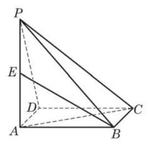

(第 1 题)

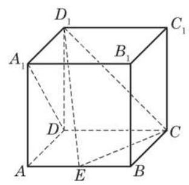

(第 2 题)

2. 如图,在棱长为 1 的正方体 ${ABCD} - {A}_{1}{B}_{1}{C}_{1}{D}_{1}$ 中, $E$ 是棱 ${AB}$ 上的动点.

(1)求证: $D{A}_{1}\bot E{D}_{1}$ ；

(2)确定点 $E$ 的位置，使得直线 $D{A}_{1}$ 与平面 ${CE}{D}_{1}$ 所成的角是 ${45}^{ \circ  }$ .

现在考虑二面角的平面角和它的两个半平面所在平面的法向量夹角大小的关系. 如图 3-4-9, 一个平面的法向量垂直于该平面上的所有直线, 所以法向量夹角的两条边垂直于二面角的平面角相应的边. 从平面几何知道, 这样两个角或者相等, 或者互补.

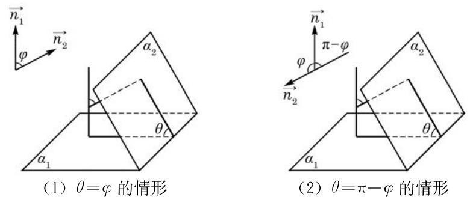

图 3-4-9

因此,如果 $\overrightarrow{{n}_{1}}$ 与 $\overrightarrow{{n}_{2}}$ 分别是两个平面的法向量,那么这两个平面所成的锐二面角 (或直二面角) $\theta$ 由如下公式确定:

$$
\cos \theta  = \frac{\left| \overrightarrow{{n}_{1}} \cdot  \overrightarrow{{n}_{2}}\right| }{\left| \overrightarrow{{n}_{1}}\right| \left| \overrightarrow{{n}_{2}}\right| }.
$$

例 7 如图 3-4-10(1),在正四棱锥 $P - {ABCD}$ 中, $\left| {PA}\right|  = \; \left| {AB}\right|  = 2\sqrt{2}, E\text{ 、 }F$ 分别为 ${PB}\text{ 、 }{PD}$ 的中点. 若平面 ${AEF}$ 与棱 ${PC}$ 交于点 $G$ ,求平面 ${AEGF}$ 与平面 ${ABCD}$ 所成二面角的大小.

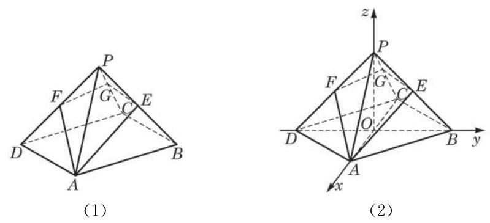

图 3-4-10

解 如图 3-4-10(2),连接 ${AC}\text{ 、 }{BD}$ 交于点 $O$ ,则 ${OA}$ 、 ${OB}\text{ 、 }{OP}$ 两两互相垂直. 以点 $O$ 为坐标原点,分别以 $\overrightarrow{OA}$ 、 $\overrightarrow{OB}\text{ 、 }\overrightarrow{OP}$ 的方向为 $x\text{ 、 }y$ 与 $z$ 轴的正方向,建立空间直角坐标系.

因为 $\left| {PA}\right|  = \left| {AB}\right|  = 2\sqrt{2}$ ,由勾股定理,易知 $\left| {OA}\right|  = \left| {OB}\right|  = \; \left| {OP}\right|  = 2$ ,从而可得有关点的坐标分别为 $A\left( {2,0,0}\right) \text{ 、 }B\left( {0,2,0}\right)$ 、 $C\left( {-2,0,0}\right) \text{ 、 }D\left( {0, - 2,0}\right) \text{ 、 }P\left( {0,0,2}\right) \text{ 、 }E\left( {0,1,1}\right) \text{ 、 }F\left( {0, - 1,1}\right) .$ 所以 $\overrightarrow{AE} = \left( {-2,1,1}\right) ,\overrightarrow{AF} = \left( {-2, - 1,1}\right)$ .

设平面 ${AEGF}$ 的法向量为 $\overrightarrow{n} = \left( {u, v, w}\right)$ ,由 $\overrightarrow{n} \cdot  \overrightarrow{AE} = 0$ 与 $\overrightarrow{n} \cdot  \overrightarrow{AF} = 0$ ,推出关系式 $- {2u} + v + w = 0$ 与 $- {2u} - v + w = 0$ . 可取 $u = 1$ ,解得 $v = 0, w = 2$ ,从而得到平面 ${AEGF}$ 的一个法向量 $\overrightarrow{n} = \left( {1,0,2}\right)$ .

平面 ${ABCD}$ 的法向量显然可取为 $\overrightarrow{m} = \left( {0,0,1}\right)$ ,从而

$$
\cos \langle \overrightarrow{m},\overrightarrow{n}\rangle  = \frac{\overrightarrow{m} \cdot  \overrightarrow{n}}{\left| \overrightarrow{m}\right| \left| \overrightarrow{n}\right| } = \frac{2}{1 \times  \sqrt{5}} = \frac{2\sqrt{5}}{5}.
$$

所以,平面 ${AEGF}$ 与平面 ${ABCD}$ 所成的二面角是 $\arccos \frac{2\sqrt{5}}{5}$ 与 $\pi  - \arccos \frac{2\sqrt{5}}{5}$ (前者是锐二面角).

## 练习 3.4(4)

1. 在正方体 ${ABCD} - {A}^{\prime }{B}^{\prime }{C}^{\prime }{D}^{\prime }$ 中, $E\text{ 、 }F$ 分别是 ${BC}\text{ 、 }{CD}$ 的中点. 求二面角 $B - {B}^{\prime }E - F$ 的大小.

2. 如图，在正方体 ${ABCD} - {A}_{1}{B}_{1}{C}_{1}{D}_{1}$ 中，求平面 $D{A}_{1}B$ 与平面 ${A}_{1}{B}_{1}{C}_{1}{D}_{1}$ 所成二面角的正弦值.

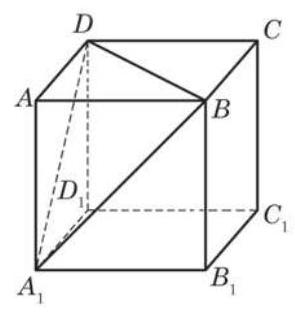

(第 2 题)

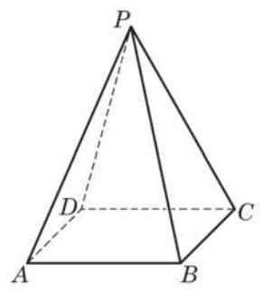

(第 3 题)

3. 如图,在正四棱锥 $P - {ABCD}$ 中,底面边长为 2,高为 3. 求二面角 $A - {PB} - C$ 的大小.

## 习题 3.4

A 组

1. 在正四棱柱 ${ABCD} - {A}_{1}{B}_{1}{C}_{1}{D}_{1}$ 中, $\left| {A{A}_{1}}\right|  = 2\left| {AB}\right|  = 2, E$ 为 $A{A}_{1}$ 的中点. 求异面直线 ${BE}$ 与 $C{D}_{1}$ 所成角的大小.

2. 在正方体 ${ABCD} - {A}_{1}{B}_{1}{C}_{1}{D}_{1}$ 中, $M\text{ 、 }N\text{ 、 }P$ 分别是 $C{C}_{1}\text{ 、 }{B}_{1}{C}_{1}\text{ 、 }{C}_{1}{D}_{1}$ 的中点. 求证: 平面 ${MNP}//$ 平面 ${A}_{1}{BD}$ .

3. 在正方体 ${ABCD} - {A}_{1}{B}_{1}{C}_{1}{D}_{1}$ 中,求 $B{B}_{1}$ 与平面 ${AC}{D}_{1}$ 所成角的大小.

4. 如图,已知正三棱柱 ${ABC} - {A}_{1}{B}_{1}{C}_{1}$ 的各条棱长均为 $a, D$ 是棱 $C{C}_{1}$ 的中点. 求证: 平面 $A{B}_{1}D \bot$ 平面 ${AB}{B}_{1}{A}_{1}$ .

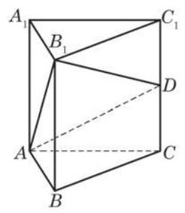

(第 4 题)

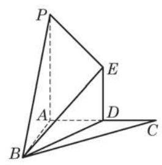

(第 5 题)

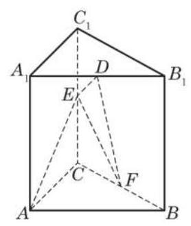

(第 6 题)

5. 如图,已知 $P$ 为平面 ${ABC}$ 外一点, ${AP}\text{ 、 }{AB}\text{ 、 }{AC}$ 两两互相垂直,过 ${AC}$ 的中点 $D$ 作 ${ED} \bot$ 平面 ${ABC}$ ,且 $\left| {ED}\right|  = 1,\left| {PA}\right|  = 2$ , $\left| {AC}\right|  = 2$ ,多面体 $B - {PADE}$ 的体积是 $\frac{\sqrt{3}}{3}$ . 求平面 ${PBE}$ 与平面 ${ABC}$ 所成二面角的大小.

6. 如图,在直棱柱 ${ABC} - {A}_{1}{B}_{1}{C}_{1}$ 中, $\left| {A{A}_{1}}\right|  = \left| {AB}\right|  = \left| {AC}\right|  = 2$ , ${AB} \bot  {AC}, D\text{ 、 }E\text{ 、 }F$ 分别是 ${A}_{1}{B}_{1}\text{ 、 }C{C}_{1}\text{ 、 }{BC}$ 的中点.

(1)求 ${AE}$ 与平面 ${DEF}$ 所成角的大小；

(2)求 $A$ 到平面 ${DEF}$ 的距离.

## B 组

1. 如图，在空间四边形 ${ABCD}$ 中， $\left| {AC}\right|  = \left| {AD}\right|$ ， $\angle {BAC} = \angle {BAD}$ . 求证: ${CD} \bot  {AB}$ .

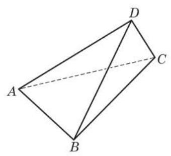

(第 1 题)

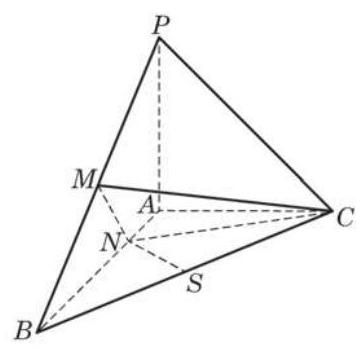

(第 2 题)

2. 如图，在三棱锥 $P - {ABC}$ 中， ${PA}\bot$ 平面 ${ABC}$ ， ${AB}\bot {AC}$ ， $\left| {PA}\right|  = \left| {AC}\right|  = \frac{1}{2}\left| {AB}\right|$ ， $M\text{ 、 }S$ 分别为 ${PB}\text{ 、 }{BC}$ 的中点, $N$ 为 ${AB}$ 上一点, $\left| {BN}\right|  = 3\left| {NA}\right|$ .

(1)求证: ${CM}\bot {SN}$ ；

(2)求二面角 $P - {BC} - A$ 的大小.

3. 在正方体 ${ABCD} - {A}_{1}{B}_{1}{C}_{1}{D}_{1}$ 中,设 ${AB}\text{ 、 }D{D}_{1}$ 的中点分别为 $M\text{ 、 }N$ . 求直线 ${B}_{1}M$ 与 ${CN}$ 所成角的大小.

(第 5 题)

4. 过边长为 1 的正方形 ${ABCD}$ 的顶点 $A$ ,作长度为 1 的线段 ${AE} \bot$ 平面 ${ABCD}$ . 求平面 ${ADE}$ 与平面 ${BCE}$ 所成二面角的大小.

5. 如图,在棱长为 1 的正方体 ${ABCD} - {A}_{1}{B}_{1}{C}_{1}{D}_{1}$ 中, $E\text{ 、 }F$ 分别为棱 $A{A}_{1}\text{ 、 }B{B}_{1}$ 的中点, $G$ 为棱 ${A}_{1}{B}_{1}$ 上的一点. 求点 $G$ 到平面 ${D}_{1}{EF}$ 的距离.

## 内容提要

## 1. 空间向量的概念与运算

(1)空间向量的定义和相关概念(模、零向量、单位向量、平行向量、相等向量、负向量等)与平面向量情形相同.

(2)对只与一组共面向量相关的问题，有关平面向量的定义与结论均适用. 特别地， 平面向量运算(加法、减法、与实数的乘法、数量积)的定义与性质直接适用于空间向量.

2. 向量共面的充要条件与空间向量基本定理

(1)向量共面的充要条件:如果 $\overrightarrow{{e}_{1}}$ 与 $\overrightarrow{{e}_{2}}$ 是两个不平行的向量，那么空间中的向量 $\overrightarrow{a}$ 与 $\overrightarrow{{e}_{1}}\text{ 、 }\overrightarrow{{e}_{2}}$ 共面的充要条件是:存在唯一的一对实数 $\lambda$ 与 $\mu$ ，使得 $\overrightarrow{a} = \lambda \overrightarrow{{e}_{1}} + \mu \overrightarrow{{e}_{2}}$ .

(2)空间向量基本定理:如果 $\overrightarrow{{e}_{1}}\text{ 、 }\overrightarrow{{e}_{2}}$ 与 $\overrightarrow{{e}_{3}}$ 是不共面的向量，那么对于空间中任一向量 $\overrightarrow{a}$ ,存在唯一的一组实数 $\lambda \text{ 、 }\mu$ 与 $\nu$ ,使得 $\overrightarrow{a} = \lambda {\overrightarrow{e}}_{1} + \mu {\overrightarrow{e}}_{2} + \nu {\overrightarrow{e}}_{3}$ . 也就是说,空间任意三个不共面的向量都组成空间向量的一个基.

3. 空间向量的坐标表示

(1)空间向量的坐标表示:建立空间直角坐标系，把向量 $\overrightarrow{p}$ 的起点放在坐标原点，该向量就直接用它的终点坐标 $\left( {x, y, z}\right)$ 表示为 $p = \left( {x, y, z}\right)$ ，这个表示的意义是: $\overrightarrow{p}$ 是坐标轴正方向上的单位向量 $\overrightarrow{i}\text{ 、 }\overrightarrow{j}$ 与 $\overrightarrow{k}$ 的线性组合 $\overrightarrow{p} = x\overrightarrow{i} + y\overrightarrow{j} + z\overrightarrow{k}$ .

(2)给定空间两点 $A\left( {{x}_{1},{y}_{1},{z}_{1}}\right)$ 与 $B\left( {{x}_{2},{y}_{2},{z}_{2}}\right)$ ，则 $\overrightarrow{AB} = \left( {{x}_{2} - {x}_{1},{y}_{2} - {y}_{1},{z}_{2} - {z}_{1}}\right)$ .

4. 坐标表示下的空间向量运算

设向量 $\overrightarrow{a} = \left( {{x}_{1},{y}_{1},{z}_{1}}\right) ,\overrightarrow{b} = \left( {{x}_{2},{y}_{2},{z}_{2}}\right)$ ,则

(1) $\left| \overrightarrow{a}\right|  = \sqrt{{x}_{1}^{2} + {y}_{1}^{2} + {z}_{1}^{2}}$ ；

(2) $\overrightarrow{a} \pm  \overrightarrow{b} = \left( {{x}_{1} \pm  {x}_{2},{y}_{1} \pm  {y}_{2},{z}_{1} \pm  {z}_{2}}\right)$ ；

(3) $\lambda \overrightarrow{a} = \left( {\lambda {x}_{1},\lambda {y}_{1},\lambda {z}_{1}}\right) ,\lambda  \in  \mathbf{R}$ ；

(4) $\overrightarrow{a} \cdot  \overrightarrow{b} = {x}_{1}{x}_{2} + {y}_{1}{y}_{2} + {z}_{1}{z}_{2}$ .

5. 空间向量的夹角、平行与垂直

设向量 $\overrightarrow{a} = \left( {{x}_{1},{y}_{1},{z}_{1}}\right) ,\overrightarrow{b} = \left( {{x}_{2},{y}_{2},{z}_{2}}\right)$ 均为非零向量，则

(1) $\cos \langle \overrightarrow{a},\overrightarrow{b}\rangle  = \frac{\overrightarrow{a} \cdot  \overrightarrow{b}}{\left| \overrightarrow{a}\right| \left| \overrightarrow{b}\right| } = \frac{{x}_{1}{x}_{2} + {y}_{1}{y}_{2} + {z}_{1}{z}_{2}}{\sqrt{{x}_{1}^{2} + {y}_{1}^{2} + {z}_{1}^{2}}\sqrt{{x}_{2}^{2} + {y}_{2}^{2} + {z}_{2}^{2}}}$ ;

(2) $\overrightarrow{a}//\overrightarrow{b} \Leftrightarrow  \overrightarrow{a} = \lambda \overrightarrow{b},\lambda  \in  \mathbf{R} \Leftrightarrow  {x}_{1} = \lambda {x}_{2},{y}_{1} = \lambda {y}_{2},{z}_{1} = \lambda {z}_{2},\lambda  \in  \mathbf{R}$ ；

(3) $\overrightarrow{a} \bot  \overrightarrow{b} \Leftrightarrow  \overrightarrow{a} \cdot  \overrightarrow{b} = 0 \Leftrightarrow  {x}_{1}{x}_{2} + {y}_{1}{y}_{2} + {z}_{1}{z}_{2} = 0$ .

6. 空间向量在立体几何中的应用

空间中的直线和平面可以分别通过方向向量和法向量与空间向量联系起来，从而把立体几何的许多问题化为向量的问题加以解决.

(1)空间直线与平面之间的平行与垂直

① 两条直线平行的充要条件是它们的方向向量平行；两条直线垂直的充要条件是它们的方向向量垂直.

② 直线和平面垂直的充要条件是直线的方向向量为平面的法向量；平面外一条直线和平面平行的充要条件是直线的方向向量垂直于平面的法向量.

③ 两个平面垂直的充要条件是其中一个平面过另一个平面的一个法向量；两个平面平行的充要条件是它们的法向量平行.

(2)求距离

① 平面外一点 $A$ 到平面的距离 $d$ 由公式

$$
d = \frac{\left| \overrightarrow{n} \cdot  \overrightarrow{AB}\right| }{\left| \overrightarrow{n}\right| }
$$

给出，其中 $\overrightarrow{n}$ 是平面的一个法向量， $B$ 是平面上任意一点.

② 平面的平行线到平面的距离、平行平面间的距离均化为点到平面的距离来处理.

(3)求角的大小

① 具有方向向量 $\overrightarrow{{r}_{1}}$ 与 $\overrightarrow{{r}_{2}}$ 的两条直线的夹角 $\theta$ 由如下公式确定:

$$
\cos \theta  = \frac{\left| \overrightarrow{{r}_{1}} \cdot  \overrightarrow{{r}_{2}}\right| }{\left| \overrightarrow{{r}_{1}}\right| \left| \overrightarrow{{r}_{2}}\right| }.
$$

② 具有方向向量 $\overrightarrow{r}$ 的直线与具有法向量 $\overrightarrow{n}$ 的平面的夹角 $\theta$ 由如下公式确定:

$$
\sin \theta  = \frac{\left| \overrightarrow{r} \cdot  \overrightarrow{n}\right| }{\left| \overrightarrow{r}\right| \left| \overrightarrow{n}\right| }
$$

③ 具有法向量 $\overrightarrow{{n}_{1}}$ 与 $\overrightarrow{{n}_{2}}$ 的两个平面所成的锐二面角(或直二面角) $\theta$ 由如下公式确定:

$$
\cos \theta  = \frac{\left| \overrightarrow{{n}_{1}} \cdot  \overrightarrow{{n}_{2}}\right| }{\left| \overrightarrow{{n}_{1}}\right| \left| \overrightarrow{{n}_{2}}\right| }.
$$

## 复习题

## A 组

1. 求连接点 $A\left( {x, y, z}\right)$ 与点 $B\left( {{x}^{\prime },{y}^{\prime },{z}^{\prime }}\right)$ 的线段 ${AB}$ 的中点 $M$ 的坐标.

(第 4 题)

2. 在正四面体 ${ABCD}$ 中, $E$ 为 ${BC}$ 的中点, $F$ 为 ${CD}$ 的中点. 试用向量 $\overrightarrow{AB}\text{ 、 }\overrightarrow{AC}$ 、 $\overrightarrow{AD}$ 来表示 $\overrightarrow{BF}$ .

3. 给定点 $A\left( {1,0,0}\right) \text{ 、 }B\left( {3,1,1}\right) \text{ 、 }C\left( {2,0,1}\right)$ 与点 $D\left( {5, - 4,3}\right)$ .

(1)求 $\overrightarrow{AD}$ 在 $\overrightarrow{AB}\text{ 、 }\overrightarrow{BC}\text{ 、 }\overrightarrow{CA}$ 方向上的投影向量；

(2)求点 $D$ 到平面 ${ABC}$ 的距离.

4. 如图,在正三棱柱 ${ABC} - {A}_{1}{B}_{1}{C}_{1}$ 中, $\left| {AB}\right|  = \sqrt{2}\left| {A{A}_{1}}\right|$ , $D$ 是 ${A}_{1}{B}_{1}$ 的中点,点 $E$ 在 ${A}_{1}{C}_{1}$ 上,且 ${DE} \bot  {AE}$ .

(1)求证:平面 ${ADE}\bot$ 平面 ${AC}{C}_{1}{A}_{1}$ ；

(2)求直线 ${AD}$ 和平面 ${AB}{C}_{1}$ 所成角的大小.

5. 已知正四棱锥的体积为 12，底面对角线的长为 $2\sqrt{6}$ . 求侧面与底面所成二面角的大小.

6. 如图,已知 ${ABCD} - {A}_{1}{B}_{1}{C}_{1}{D}_{1}$ 是底面边长为 1 的正四棱柱, ${O}_{1}$ 是 ${A}_{1}{C}_{1}$ 和 ${B}_{1}{D}_{1}$ 的交点.

(1)设 $A{B}_{1}$ 与底面 ${A}_{1}{B}_{1}{C}_{1}{D}_{1}$ 所成角的大小为 $\alpha$ ，二面角 $A - {B}_{1}{D}_{1} - {A}_{1}$ 的大小为 $\beta$ . 求证: $\tan \beta  = \sqrt{2}\tan \alpha$ ;

(2)若点 $C$ 到平面 $A{B}_{1}{D}_{1}$ 的距离为 $\frac{4}{3}$ ，求此正四棱柱的高.

(第 6 题)

(第 7 题)

7. 如图，在直三棱柱 ${ABC} - {A}_{1}{B}_{1}{C}_{1}$ 中， $\angle {ACB} = {90}^{ \circ  }$ ， $\left| {AC}\right|  = \left| {BC}\right|  = \left| {C{C}_{1}}\right|  = 2$ .

(1)求证: $A{B}_{1} \bot  B{C}_{1}$ ；

(2)求点 $B$ 到平面 $A{B}_{1}{C}_{1}$ 的距离.

8. 如图,四棱锥 $P - {ABCD}$ 的底面 ${ABCD}$ 为梯形, ${AD}//{BC},{AB} \bot  {BC},\left| {AB}\right|  = 1$ , $\left| {AD}\right|  = 3,\angle {ADC} = {45}^{ \circ  }$ ,且 ${PA} \bot$ 平面 ${ABCD},\left| {PA}\right|  = 1$ .

(1)求异面直线 ${PB}$ 与 ${CD}$ 所成角的大小；

(2)求四棱锥 $P - {ABCD}$ 的体积.

(第 8 题)

(第 9 题)

9. 如图,在直三棱柱 ${ABC} - {A}_{1}{B}_{1}{C}_{1}$ 中, $\angle {BAC} = {90}^{ \circ  },\left| {AB}\right|  = \left| {AC}\right|  = a,\left| {A{A}_{1}}\right|  = {2a}$ , $D$ 为 ${BC}$ 的中点, $E$ 为 $C{C}_{1}$ 上的点,且 $\left| {CE}\right|  = \frac{1}{4}\left| {C{C}_{1}}\right|$ .

(1)求证: ${BE}\bot$ 平面 ${AD}{B}_{1}$ ；

(2)求二面角 $B - A{B}_{1} - D$ 的大小.

B 组

1. 在长方体 ${ABCD} - {A}_{1}{B}_{1}{C}_{1}{D}_{1}$ 中, $\left| {AB}\right|  = \left| {BC}\right|  = 2,{A}_{1}D$ 与 $B{C}_{1}$ 所成的角为 $\frac{\pi }{2}$ . 求 $B{C}_{1}$ 与平面 $B{B}_{1}{D}_{1}D$ 所成角的大小.

2. 如图,在平行六面体 ${ABCD} - {A}_{1}{B}_{1}{C}_{1}{D}_{1}$ 中,点 $E\text{ 、 }F$ 分别在 ${B}_{1}B$ 和 ${D}_{1}D$ 上,且 $\left| {BE}\right|  = \frac{1}{3}\left| {B{B}_{1}}\right| ,\left| {DF}\right|  = \frac{2}{3}\left| {D{D}_{1}}\right| .$

(1)求证: $A$ 、 $E$ 、 ${C}_{1}$ 、 $F$ 四点共面；

(2)若 $\overrightarrow{EF} = \lambda \overrightarrow{AB} + \mu \overrightarrow{AD} + \nu \overrightarrow{A{A}_{1}}$ ，求 $\lambda  + \mu  + \nu$ 的值.

(第 2 题)

(第 3 题)

3. 如图,在正方体 ${ABCD} - {A}_{1}{B}_{1}{C}_{1}{D}_{1}$ 中, $E\text{ 、 }F$ 分别是 ${BC}\text{ 、 }{A}_{1}{D}_{1}$ 的中点.

(1)求证:四边形 ${B}_{1}{EDF}$ 是菱形；

(2)求异面直线 ${A}_{1}C$ 与 ${DE}$ 所成角的大小.

4. 在正方体 ${ABCD} - {A}_{1}{B}_{1}{C}_{1}{D}_{1}$ 中, $E\text{ 、 }F$ 分别是 ${BC}\text{ 、 }C{C}_{1}$ 的中点.

(1)求证:点 ${D}_{1}$ 在平面 ${AEF}$ 上；

(2)求平面 ${AEF}{D}_{1}$ 与底面 ${ABCD}$ 所成二面角的大小.

## 拓展与思考

(第 1 题)

1. 如图, ${ABCD} - {A}_{1}{B}_{1}{C}_{1}{D}_{1}$ 为正方体,动点 $P$ 在对角线 $B{D}_{1}$ 上,记 $\frac{\left| {D}_{1}P\right| }{\left| {D}_{1}B\right| } = \lambda$ .

(1)求证: ${AP}\bot {B}_{1}C$ ；

(2)若异面直线 ${AP}$ 与 ${D}_{1}{B}_{1}$ 所成角为 $\frac{\pi }{4}$ ，求 $\lambda$ 的值；

(3)当 $\angle {APC}$ 为钝角时,求 $\lambda$ 的取值范围.

(第 2 题)

2. 如图,平行六面体 ${ABCD} - {A}_{1}{B}_{1}{C}_{1}{D}_{1}$ 的底面 ${ABCD}$ 是正方形, $O$ 为底面的中心, ${A}_{1}O \bot$ 平面 ${ABCD}$ , $\left| {AB}\right|  = \left| {A{A}_{1}}\right|  = \sqrt{2}.$

(1)求证: ${A}_{1}C\bot$ 平面 $B{B}_{1}{D}_{1}D$ ；

(2)求平面 ${OC}{B}_{1}$ 与平面 $B{B}_{1}{D}_{1}D$ 所成二面角的大小.