数列

对数列的研究是基于现实生产、生活的需要. 例如, 在若干离散的时间节点, 记录某种数量的变化, 并按时间先后顺序排列起来就得到一个数列. 数列是一个重要的数学概念, 上至一个国家每年的国内生产总值 (GDP)，下至一个人每年的身高或体重，都可以用数列表示. 数列也是学习微积分的一个必要的基础. 本章采用从特殊到一般、从具体到抽象的方法, 先研究两类特殊的数列——等差数列和等比数列, 再在此基础上研究一般的数列. 同时, 介绍数学归纳法这一与数列有关的重要方法, 并通过给出一个利用迭代序列求平方根的方法, 揭示算法在求近似解中的重要作用.

### 4.1 等差数列

## 1 等差数列及其通项公式

在现实生活中, 我们经常见到按一定顺序排列起来的一列数, 称之为数列. 我们将数列中的每一个数叫做这个数列的项. 排在第一位的数称为这个数列的第 1 项 (通常叫做首项), 排在第二位的数称为这个数列的第 2 项, ……, 排在第 $n$ 位的数称为这个数列的第 $n$ 项,等等.

数列的一般形式可以记成

$$
{a}_{1},{a}_{2},{a}_{3},\cdots ,{a}_{n},\cdots ,
$$

其中 ${a}_{n}$ 是数列的第 $n$ 项,下标 $n$ 是 ${a}_{n}$ 的序数. 上面的数列常简记为 $\left\{  {a}_{n}\right\}$ .

观察以下数列, 看它们有什么共同的特点.

(1)月历(图 4-1-1)最后一列数依次为:

$$
3,{10},{17},{24},{31}\text{ . }
$$

①

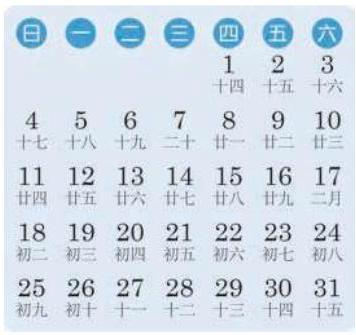

图 4-1-1

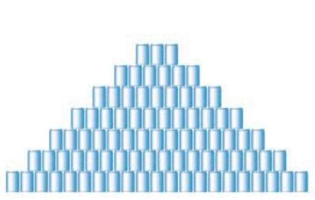

图 4-1-2

(2)按一定规律堆放在一起的食品罐头(图 4-1-2)，共堆放 7 层, 从下到上各层的罐头数依次为:

$$
{21},{18},{15},{12},9,6,3.
$$

②

(3)全国统一的鞋号中，常见的成年女鞋的尺寸(单位:cm) 由小至大依次为:

$$
{22.5},{23},{23.5},{24},{24.5},{25},{25.5},{26}.
$$

③

可以看到, 对于数列①, 从第 2 项起, 每一项与其前一项的差都等于 7; 对于数列②, 从第 2 项起, 每一项与其前一项的差都等于 -3 ; 对于数列③，从第 2 项起，每一项与其前一项的差都等于 0.5 .

这些数列有一个共同特点: 从第 2 项起, 每一项与其前一项的差都等于同一个常数.

定义 如果一个数列从第 2 项起, 每一项与其前一项的差都等于同一个常数, 这个数列就叫做等差数列 (arithmetic sequence), 而这个常数叫做等差数列的公差 (common difference). 公差通常用小写字母 $d$ 表示.

给定一个数列 $a, A, b$ . 若 $a, A, b$ 是等差数列,由定义可得 $A - a = b - A$ ,从而 $A = \frac{a + b}{2}$ . 反之,若 $A = \frac{a + b}{2}$ ,则 ${2A} = a + b$ ,即 $A - a = b - A$ ,从而 $a, A, b$ 成等差数列.

这时, $A$ 叫做 $a$ 与 $b$ 的等差中项.

如果等差数列 $\left\{  {a}_{n}\right\}$ 的首项为 ${a}_{1}$ ,公差为 $d$ ,由定义可得

$$
{a}_{n} - {a}_{n - 1} = d\left( {n \geq  2}\right) ,
$$

从而

$$
{a}_{2} - {a}_{1} = d,
$$

$$
{a}_{3} - {a}_{2} = d,
$$

$$
{a}_{4} - {a}_{3} = d,
$$

...

$$
{a}_{n} - {a}_{n - 1} = d\left( {n \geq  2}\right) \text{ . }
$$

把这 $\left( {n - 1}\right)$ 个等式相加得

$$
{a}_{n} - {a}_{1} = \left( {n - 1}\right) d,
$$

由此

$$
{a}_{n} = {a}_{1} + \left( {n - 1}\right) d\left( {n \geq  2}\right) .
$$

当 $n = 1$ 时,容易验证上面的等式也成立. 因此,当 $n$ 为正整数时,等差数列 $\left\{  {a}_{n}\right\}$ 的第 $n$ 项可以用如下公式表示:

$$
{a}_{n} = {a}_{1} + \left( {n - 1}\right) d.
$$

像这种用数列的序数 $n$ 表示相应项 ${a}_{n}$ 的公式称为数列 $\left\{  {a}_{n}\right\}$ 的通项公式. 而上式就是等差数列 $\left\{  {a}_{n}\right\}$ 的通项公式.

例 1 已知等差数列 $- 5, - 9, - {13},\cdots$ .

(1)求该等差数列的第 20 项；

(2)一401 是不是该等差数列的项？如果是, 指明是第几项; 如果不是, 请说明理由.

---

由三个数组成的等差数列可以看成最简单的等差数列.

如果三个数成等差数列, 那么等差中项必等于其前后两项的算术平均数.

---

解 设该等差数列为 $\left\{  {a}_{n}\right\}$ ,由 ${a}_{1} =  - 5,{a}_{2} =  - 9$ ,得该等差数列的公差 $d =  - 9 - \left( {-5}\right)  =  - 4$ . 由等差数列的通项公式,得

$$
{a}_{n} =  - 5 - 4\left( {n - 1}\right)  =  - {4n} - 1.
$$

(1)由上述通项公式可得, 该等差数列的第 20 项为

$$
{a}_{20} =  - 4 \times  {20} - 1 =  - {81}.
$$

(2)假设 -401 是这个等差数列中的第 $n$ 项，则有

$$
- {401} =  - {4n} - 1,
$$

解得

$$
n = {100}\text{ . }
$$

所以, -401 是这个等差数列的第 100 项.

例 2 假设体育场一角看台的座位从第 2 排起每一排都比前一排多相等数目的座位. 若第 3 排有 10 个座位, 第 9 排有 28 个座位, 则第 12 排有多少个座位?

解 由题意可知,体育场该角看台每排的座位数成等差数列,设该数列为 $\left\{  {a}_{n}\right\}$ ,其公差为 $d$ ,则 ${a}_{3} = {10},{a}_{9} = {28}$ . 由等差数列的通项公式, 得

$$
\left\{  \begin{array}{l} {a}_{1} + {2d} = {10}, \\  {a}_{1} + {8d} = {28}, \end{array}\right.
$$

解得

$$
\left\{  \begin{array}{l} {a}_{1} = 4, \\  d = 3. \end{array}\right.
$$

所以, ${a}_{12} = 4 + \left( {{12} - 1}\right)  \times  3 = {37}$ .

答: 体育场该角看台的第 12 排有 37 个座位.

例 3 已知 ${a}_{n} = {pn} + q$ 是数列 $\left\{  {a}_{n}\right\}$ 的通项公式,其中 $p$ 和 $q$ 均为常数. 试判断数列 $\left\{  {a}_{n}\right\}$ 是否为等差数列,并证明你的结论.

分析 为了判断 $\left\{  {a}_{n}\right\}$ 是否为等差数列,可以利用等差数列的定义,只要判断 ${a}_{n} - {a}_{n - 1}\left( {n \geq  2}\right)$ 的值是否为一个与 $n$ 无关的常数即可.

解 任取数列 $\left\{  {a}_{n}\right\}$ 中的相邻两项 ${a}_{n}$ 与 ${a}_{n - 1}\left( {n \geq  2}\right)$ ,求差得

$$
{a}_{n} - {a}_{n - 1} = \left( {{pn} + q}\right)  - \left\lbrack  {p\left( {n - 1}\right)  + q}\right\rbrack   = p\left( {n \geq  2}\right) .
$$

$p$ 是一个与 $n$ 无关的常数,所以 $\left\{  {a}_{n}\right\}$ 是等差数列,且是以 $p + q$ 为首项、以 $p$ 为公差的等差数列.

## 练习 4.1(1)

1. 下列数列中成等差数列的是 ( )

A.0,1,3,5,7;

B. $1,\frac{1}{3},\frac{1}{5},\frac{1}{7},\frac{1}{9}$ ;

C. $1,\sqrt{2},\sqrt{3},2,\sqrt{5}$ ; D. $1,\frac{1}{3}, - \frac{1}{3}, - 1, - \frac{5}{3}$ .

2. 设数列 $\left\{  {a}_{n}\right\}$ 为等差数列,其公差为 $d$ .

(1)已知 ${a}_{1} =  - 1, d = 4$ ，求 ${a}_{8}$ ；

(2)已知 ${a}_{7} = 8, d =  - \frac{1}{3}$ ，求 ${a}_{1}$ ；

(3)已知 ${a}_{1} = 9, d =  - 2,{a}_{n} =  - {15}$ ，求 $n$ .

3. 已知数列 $\left\{  {a}_{n}\right\}$ 是等差数列,正整数 $m\text{ 、 }n\text{ 、 }p\text{ 、 }q$ 满足 $m + n = p + q$ . 求证: ${a}_{m} + {a}_{n} = \; {a}_{p} + {a}_{q}.$

## 2 等差数列的前 $n$ 项和

---

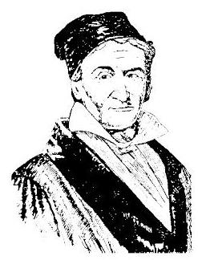

高斯 (C. F. Gauss, 1777—1855) 德国数学家. 研究的内容涉及数学的诸多领域, 并对天文学和大地测量学的研究有突出贡献. 他在世界上享有崇高的声望，被誉为 “数学王子”.

---

据说 200 多年前, 著名数学家高斯的算术老师在课堂上曾经提出了下面的问题:

求 $1 + 2 + 3 + \cdots  + {100}$ 的值.

少年高斯用下面的方法迅速算出了正确的答案:

$$
1 + 2 + 3 + \cdots  + {100} = ?
$$

$$
{100} + {99} + {98} + \cdots  + 1 = ?
$$

上述两式相加得: ${{101} + {101} + {101} + \cdots  + {101}} = 2 \times$ ?

所以，结果为 $\frac{{101} \times  {100}}{2} = {5050}$ .

高斯的计算方法实际上解决了求等差数列 $1,2,3,\cdots$ , $n,\cdots$ 前 100 项和的问题.

事实上, 古代的中国人和希腊人也是这么求等差数列之和的. 例如, 宋朝数学家杨辉提出了一个问题: “今有圭垛草一堆, 顶上一束，底阔八束. 问共几束？答:36 束. ”他的计算方法可以用图 4-1-3 表示.

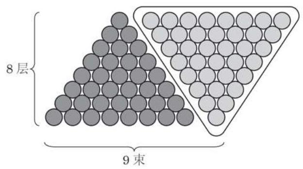

图 4-1-3

一般地,将数列 $\left\{  {a}_{n}\right\}$ 的前 $n$ 项和记作 ${S}_{n}$ ,即

$$
{S}_{n} = {a}_{1} + {a}_{2} + \cdots  + {a}_{n - 1} + {a}_{n}.
$$

根据等差数列的通项公式, 上式可以写为

$$
{S}_{n} = {a}_{1} + \left( {{a}_{1} + d}\right)  + \cdots  + \left\lbrack  {{a}_{1} + \left( {n - 2}\right) d}\right\rbrack   + \left\lbrack  {{a}_{1} + \left( {n - 1}\right) d}\right\rbrack  \text{ . ① }
$$

受高斯算法的启示,我们又可将 ${S}_{n}$ 表示为

$$
{S}_{n} = {a}_{n} + {a}_{n - 1} + \cdots  + {a}_{2} + {a}_{1}
$$

$$
= {a}_{n} + \left( {{a}_{n} - d}\right)  + \cdots  + \left\lbrack  {{a}_{n} - \left( {n - 2}\right) d}\right\rbrack   + \left\lbrack  {{a}_{n} - \left( {n - 1}\right) d}\right\rbrack  \text{ . ② }
$$

②

由①+②, 得

$$
2{S}_{n} = \underset{n \uparrow  }{\underbrace{\left( {{a}_{1} + {a}_{n}}\right)  + \left( {{a}_{1} + {a}_{n}}\right)  + \cdots  + \left( {{a}_{1} + {a}_{n}}\right)  + \left( {{a}_{1} + {a}_{n}}\right) }}
$$

$$
= n\left( {{a}_{1} + {a}_{n}}\right) \text{ . }
$$

于是就可得到等差数列 $\left\{  {a}_{n}\right\}$ 的前 $n$ 项和公式

Q

$$
{S}_{n} = \frac{n\left( {{a}_{1} + {a}_{n}}\right) }{2}.
$$

由于 ${a}_{n} = {a}_{1} + \left( {n - 1}\right) d$ ,上述公式又可以写作

$$
{S}_{n} = n{a}_{1} + \frac{n\left( {n - 1}\right) }{2}d.
$$

数列 $\left\{  {a}_{n}\right\}$ 的前 $n$ 项和也可记作 $\mathop{\sum }\limits_{{i = 1}}^{n}{a}_{i}$ ,即

$$
\mathop{\sum }\limits_{{i = 1}}^{n}{a}_{i} = {a}_{1} + {a}_{2} + {a}_{3} + \cdots  + {a}_{n}.
$$

其中， $\sum$ (读作 Sigma)称为求和符号，其下方的 $i = 1$ 表示 $i$ 从 1 开始取连续的整数值,而上方的 $n$ 表示 $i$ 的取值到 $n$ 结束. 这样, $\mathop{\sum }\limits_{{i = 1}}^{n}{a}_{i}$ 就表示该数列从第一项 ${a}_{1}$ 开始,连续 $n$ 项相加. 例如, $\mathop{\sum }\limits_{{i = 1}}^{n}i = 1 + 2 + 3 + \cdots  + n = \frac{n\left( {n + 1}\right) }{2}.$

此外, 根据乘法分配律可得

$$
\mathop{\sum }\limits_{{i = 1}}^{n}c{a}_{i} = c\mathop{\sum }\limits_{{i = 1}}^{n}{a}_{i}\text{ ( }c\text{ 为常数). }
$$

例 4 设数列 $\left\{  {a}_{n}\right\}$ 为等差数列,其前 $n$ 项和为 ${S}_{n}$ .

---

特别地 $1 + 2 + 3 + \cdots  + n = \frac{n\left( {n + 1}\right) }{2}.$

---

(1)已知 ${a}_{1} = {50},{a}_{8} = {15}$ ,求 ${S}_{8}$ ;

(2)已知 ${a}_{1} = {0.7},{a}_{2} = {1.5}$ ,求 ${S}_{7}$ ;

(3)已知 ${a}_{4} = 7$ ，求 ${S}_{7}$ .

解(1)由等差数列的前 $n$ 项和公式,得

$$
{S}_{8} = \frac{8 \times  \left( {{50} + {15}}\right) }{2} = {260}.
$$

(2)设公差为 $d$ ，则 $d = {a}_{2} - {a}_{1} = {0.8}$ ，于是由等差数列的前 $n$ 项和公式,有

$$
{S}_{7} = 7 \times  {0.7} + \frac{7 \times  6}{2} \times  {0.8} = {21.7}.
$$

(3)设公差为 $d$ ，则 ${a}_{1} = {a}_{4} - {3d},{a}_{7} = {a}_{4} + {3d}$ . 从而

$$
{S}_{7} = \frac{7\left( {{a}_{1} + {a}_{7}}\right) }{2} = \frac{7\left\lbrack  {\left( {{a}_{4} - {3d}}\right)  + \left( {{a}_{4} + {3d}}\right) }\right\rbrack  }{2} = 7{a}_{4} = {49}.
$$

例 5 已知等差数列 $\left\{  {a}_{n}\right\}$ 的前 10 项和 ${S}_{10} = {310}$ ,前 20 项和 ${S}_{20} = {1220}$ ,由此可以确定数列 $\left\{  {a}_{n}\right\}$ 前 30 项和 ${S}_{30}$ 吗?

解 设该等差数列 $\left\{  {a}_{n}\right\}$ 的公差为 $d$ . 由等差数列的前 $n$ 项和公式 ${S}_{n} = n{a}_{1} + \frac{n\left( {n - 1}\right) }{2}d$ ,可得

$$
\left\{  \begin{array}{l} {10}{a}_{1} + {45d} = {310}, \\  {20}{a}_{1} + {190d} = {1220}, \end{array}\right.
$$

解得

$$
\left\{  \begin{array}{l} {a}_{1} = 4, \\  d = 6. \end{array}\right.
$$

所以, ${S}_{30} = {30} \times  4 + \frac{{30} \times  \left( {{30} - 1}\right) }{2} \times  6 = {2730}$ .

例 6 已知数列 $\left\{  {a}_{n}\right\}$ 的前 $n$ 项和为 ${S}_{n} = {n}^{2} + {2n}$ .

(1)求数列 $\left\{  {a}_{n}\right\}$ 的通项公式；

(2)求证:数列 $\left\{  {a}_{n}\right\}$ 是等差数列.

解(1)当 $n \geq  2$ 时,

$$
{S}_{n - 1} = {\left( n - 1\right) }^{2} + 2\left( {n - 1}\right) ,
$$

从而

$$
{a}_{n} = {S}_{n} - {S}_{n - 1} = {n}^{2} + {2n} - \left\lbrack  {{\left( n - 1\right) }^{2} + 2\left( {n - 1}\right) }\right\rbrack   = {2n} + 1.
$$

而当 $n = 1$ 时, ${a}_{1} = {S}_{1} = {1}^{2} + 2 \times  1 = 3$ 亦满足上式.

所以，数列 $\left\{  {a}_{n}\right\}$ 的通项公式为 ${a}_{n} = {2n} + 1$ .

(2)证明:由(1)中的结果，当 $n \geq  2$ 时，

$$
{a}_{n - 1} = 2\left( {n - 1}\right)  + 1 = {2n} - 1,
$$

从而

$$
{a}_{n} - {a}_{n - 1} = \left( {{2n} + 1}\right)  - \left( {{2n} - 1}\right)  = 2.
$$

---

如果一个数列 $\left\{  {a}_{n}\right\}$ 的前 $n$ 项和为 ${S}_{n} \; = p{n}^{2} + {qn} + r$ ,其中 $p\text{ 、 }q\text{ 、 }r$ 均为常数, 这个数列是等差数列吗?

---

所以，数列 $\left\{  {a}_{n}\right\}$ 是一个以 3 为首项、以 2 为公差的等差数列.

## 练习 4.1(2)

1. 计算 $\mathop{\sum }\limits_{{i = 1}}^{n}{2i}$ .

2. 设数列 $\left\{  {a}_{n}\right\}$ 为等差数列,其前 $n$ 项和为 ${S}_{n}$ .

(1)已知 ${a}_{1} =  - 4,{a}_{8} =  - {18}$ ，求 ${S}_{8}$ ；

(2)已知 ${a}_{1} =  - 4,{a}_{12} = {18}$ ，求 ${S}_{15}$ .

3. 已知数列 $\left\{  {a}_{n}\right\}$ 的前 $n$ 项和 ${S}_{n} = {n}^{2} - {3n}$ ,求证: 数列 $\left\{  {a}_{n}\right\}$ 是等差数列.

## 习题 4.1

## A 组

1. 分别求下列两数的等差中项:

(1) $\frac{8 - \sqrt{2}}{2}$ 与 $\frac{8 + \sqrt{2}}{2}$ ；___

(2) ${\left( a + b\right) }^{2}$ 与 ${\left( a - b\right) }^{2}$ .

2. 设数列 $\left\{  {a}_{n}\right\}$ 为等差数列,其公差为 $d$ .

(1)已知 ${a}_{1} = 2, d = 3$ ，求 ${a}_{10}$ ；

(2)已知 ${a}_{1} = 3,{a}_{n} = {21}, d = 2$ ，求 $n$ ；

(3)已知 ${a}_{1} = {12},{a}_{6} = {27}$ ，求 $d$ ；

(4)已知 ${a}_{6} = 9, d =  - \frac{1}{2}$ ，求 ${a}_{1}$ .

3. 已知数列 $\left\{  {a}_{n}\right\}$ 为等差数列,其公差为 $d$ . 求证: 对任意给定的正整数 $m\text{ 、 }n$ ,都有 ${a}_{n} = {a}_{m} + \left( {n - m}\right) d.$

4. 设数列 $\left\{  {a}_{n}\right\}$ 为等差数列,其公差为 $d$ .

(1)已知 ${a}_{2} = {31},{a}_{7} = {76}$ ,求 ${a}_{1}$ 及 $d$ ;

(2)已知 ${a}_{1} + {a}_{6} = {12},{a}_{4} = 7$ ，求 ${a}_{9}$ .

5. 设数列 $\left\{  {a}_{n}\right\}$ 为等差数列,其公差为 $d$ ,前 $n$ 项和为 ${S}_{n}$ .

(1)已知 ${a}_{1} = {20},{a}_{n} = {54},{S}_{n} = {999}$ ,求 $d$ 及 $n$ ;

(2)已知 $d = \frac{1}{3},{S}_{37} = {629}$ ,求 ${a}_{1}$ 及 ${a}_{37}$ ;

(3)已知 ${a}_{1} = \frac{5}{6}, d =  - \frac{1}{6},{S}_{n} =  - 5$ ,求 $n$ 及 ${a}_{n}$ ;

(4)已知 $d = 2,{a}_{15} =  - {10}$ ，求 ${a}_{1}$ 及 ${S}_{15}$ .

6. 设数列 $\left\{  {a}_{n}\right\}$ 为等差数列,其前 $n$ 项和为 ${S}_{n}$ .

(1)已知 ${a}_{6} = {10},{S}_{5} = 5$ ,求 ${S}_{8}$ ；

(2)已知 ${S}_{4} = 2,{S}_{9} =  - 6$ ，求 ${S}_{12}$ .

7. 设数列 $\left\{  {a}_{n}\right\}$ 为等差数列,其前 $n$ 项和为 ${S}_{n}$ .

(1)已知 ${a}_{4} + {a}_{14} = 1$ ，求 ${S}_{17}$ ；

(2)已知 ${S}_{21} = {420}$ ，求 ${a}_{11}$ ；

(3)已知 ${a}_{1} + {a}_{2} + {a}_{3} =  - 3,{a}_{18} + {a}_{19} + {a}_{20} = 6$ ，求 ${S}_{20}$ ；

(4)已知 ${S}_{4} = 2,{S}_{8} = 6$ ，求 ${S}_{16}$ .

8. 求证: “ $\bigtriangleup  {ABC}$ 三个内角的度数可以构成等差数列” 是 “ $\bigtriangleup  {ABC}$ 中有一个内角为 60°”的充要条件.

9.《九章算术》中的“竹九节”问题: 现有一根 9 节的竹子, 自上而下各节的容积成等差数列. 若最上面 4 节的容积共 3 升, 最下面 3 节的容积共 4 升, 则第 5 节的容积为多少升?

B 组

1.(1)在等差数列 $\left\{  {a}_{n}\right\}$ 中，等式 ${a}_{n} = \frac{{a}_{n - 1} + {a}_{n + 1}}{2}\left( {n \geq  2}\right)$ 是否都成立？

(2)在数列 $\left\{  {a}_{n}\right\}$ 中，如果对于任意的正整数 $n\left( {n \geq  2}\right)$ ，都有 ${a}_{n} = \frac{{a}_{n - 1} + {a}_{n + 1}}{2}$ ，那么数列 $\left\{  {a}_{n}\right\}$ 一定是等差数列吗?

2. 在等差数列 $\left\{  {a}_{n}\right\}$ 中,其前 $n$ 项和为 ${S}_{n}$ . 已知公差 $d = 2,{S}_{20} = {400}$ .

(1)写出 $\mathop{\sum }\limits_{{i = 1}}^{{10}}{a}_{{2i} - 1}$ 的具体展开式，并求其值；

(2)用求和符号表示 ${a}_{2} + {a}_{4} + {a}_{6} + \cdots  + {a}_{20}$ ，并求其值.

3. 在等差数列 $\left\{  {a}_{n}\right\}$ 中,已知 ${a}_{1} =  - 3,{11}{a}_{5} = 5{a}_{8}$ . 求数列 $\left\{  {a}_{n}\right\}$ 的前 $n$ 项和 ${S}_{n}$ 的最小值.

4. 已知等差数列 $\left\{  {a}_{n}\right\}$ ,其前 $n$ 项和为 ${S}_{n}$ . 若存在两个不相等的正整数 $p$ 和 $q$ ,满足 ${S}_{p} = q,{S}_{q} = p$ ,求 ${S}_{p + q}$ .

5. 已知一个凸多边形各个内角的度数可以排列成一个公差为 5 的等差数列, 且最小角为 ${120}^{ \circ  }$ ,该多边形是几边形?

6. 某产品按质量分成 10 个档次, 生产最低档次产品的利润是 8 元/件. 每提高一个档次, 每件产品的利润增加 2 元, 但产量每天减少 3 件. 如果在某段时间内, 最低档次 (记作第 1 档次) 的产品每天可生产 60 件, 那么在该段时间内, 生产第几档次的产品可获得最大利润?

### 4.2 等比数列

## 1 等比数列及其通项公式

观察以下数列, 看这些数列有什么共同特点.

(1)-1 的 1 次幂、2 次幂、3 次幂、4 次幂……依次为

$$
- 1,1, - 1,1,\cdots \text{ . }
$$

①

(2)科克雪花曲线. 即将一个边长为 1 的等边三角形的每条边三等分, 以中间一段为边向外作等边三角形, 并擦去中间一段, 如图 4-2-1, 如此继续下去得到图形的每条边的长度依次为

$$
1,\frac{1}{3},\frac{1}{9},\frac{1}{27},\cdots
$$

②

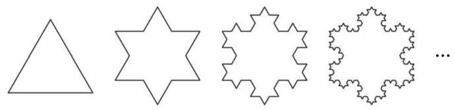

图 4-2-1

(3)图 4-2-1 中的每个图形的边数依次为

$$
3,{12},{48},{192},\cdots \text{ . }
$$

③

可以看到, 对于数列①, 从第 2 项起, 每一项与其前一项的比都等于 -1 ; 对于数列②, 从第 2 项起, 每一项与其前一项的比都等于 $\frac{1}{3}$ ; 对于数列③,从第 2 项起,每一项与其前一项的比都等于 4 .

这些数列有一个共同特点: 从第 2 项起, 每一项与其前一项的比都等于同一个常数.

定义 如果一个数列从第 2 项起, 每一项与其前一项的比都等于同一个非零常数, 这个数列就叫做等比数列 (geometric sequence), 而这个常数叫做等比数列的公比(common ratio). 公比通常用小写字母 $q\left( {q \neq  0}\right)$ 表示.

---

既是等差数列又是等比数列的数列存在吗? 如果存在, 你能举出例子吗?

---

在两个非零实数 $a$ 与 $b$ 中间插入一个数 $G$ ,使 $a, G, b$ 成等比数列. 根据等比数列的定义,有 $\frac{G}{a} = \frac{b}{G}$ ,从而 ${G}^{2} = {ab}$ ,即 $G = \sqrt{ab}$ 或 $G =  - \sqrt{ab}$ . 这两种情形下, $a, G, b$ 均为等比数列. 此时, $G$ 叫做 $a$ 与 $b$ 的等比中项.

根据等比数列的定义,以 ${a}_{1}$ 为首项、以 $q$ 为公比的等比数列 $\left\{  {a}_{n}\right\}$ 满足 $\frac{{a}_{n}}{{a}_{n - 1}} = q\left( {n \geq  2}\right)$ . 因此,当 $n \geq  2$ 时,有

$$
\frac{{a}_{2}}{{a}_{1}} = q,\frac{{a}_{3}}{{a}_{2}} = q,\frac{{a}_{4}}{{a}_{3}} = q,\cdots ,\frac{{a}_{n}}{{a}_{n - 1}} = q.
$$

由此可得, $\frac{{a}_{n}}{{a}_{1}} = {q}^{n - 1}$ . 所以, ${a}_{n} = {a}_{1}{q}^{n - 1}\left( {n \geq  2}\right)$ . 而当 $n = 1$ 时,上面的等式也显然成立.

因此,当 $n$ 为正整数时,等比数列 $\left\{  {a}_{n}\right\}$ 的第 $n$ 项可表示为

$$
{a}_{n} = {a}_{1}{q}^{n - 1}.
$$

这称为等比数列 $\left\{  {a}_{n}\right\}$ 的通项公式.

例 1 设数列 $\left\{  {a}_{n}\right\}$ 为等比数列.

(1)已知 ${a}_{1} = 3$ ，公比 $q =  - 2$ ，求 ${a}_{6}$ ；

(2)已知 ${a}_{3} = {20},{a}_{6} = {160}$ ，求 ${a}_{n}$ .

解(1)由等比数列的通项公式，得

$$
{a}_{6} = 3 \times  {\left( -2\right) }^{6 - 1} =  - {96}.
$$

(2)设等比数列 $\left\{  {a}_{n}\right\}$ 的公比为 $q$ ，那么

$$
\left\{  \begin{array}{l} {a}_{1}{q}^{2} = {20}, \\  {a}_{1}{q}^{5} = {160}. \end{array}\right.
$$

解得

$$
\left\{  \begin{array}{l} {a}_{1} = 5, \\  q = 2. \end{array}\right.
$$

所以, ${a}_{n} = {a}_{1}{q}^{n - 1} = 5 \times  {2}^{n - 1}$ .

例 2 某种放射性物质不断衰变为其他物质, 设每经过一年剩余的这种放射性物质是年初的 84%. 这种放射性物质的半衰期约为多少? (结果精确到 1 年)

解 设这种物质最初的质量是 1,而经过 $n$ 年,剩余量是 ${a}_{n}$ .

由条件可知,数列 $\left\{  {a}_{n}\right\}$ 是一个等比数列,且 ${a}_{1} = {0.84}$ , 公比 $q = {0.84}$ . 当 ${a}_{n} = {0.5}$ 时,则 ${0.84}^{n} = {0.5}$ .

在上式两边同时取以 10 为底的对数, 并求解得

$$
n = \frac{\lg {0.5}}{\lg {0.84}} \approx  4.
$$

---

如果三个数成等比数列, 那么等比中项的平方必等于其前后两项的积.

---

答: 这种物质的半衰期大约为 4 年.

例 3 (1)已知 $a, b, c$ 成等差数列，其公差为 $d$ . 求证: ${3}^{a},{3}^{b},{3}^{c}$ 成等比数列.

(2)已知正实数 $a, b, c$ 成等比数列，其公比为 $q$ . 求证: $\lg a,\lg b,\lg c$ 成等差数列.

证明 (1) 因为 $a, b, c$ 成等差数列,所以 ${2b} = a + c$ . 从而

$$
{3}^{2b} = {3}^{a + c} = {3}^{a} \cdot  {3}^{c},
$$

所以， ${3}^{a}$ ， ${3}^{b}$ ， ${3}^{c}$ 成等比数列，其公比为 $\frac{{3}^{b}}{{3}^{a}} = {3}^{b - a} = {3}^{d}$ .

(2)因为正实数 $a, b, c$ 成等比数列，所以 ${b}^{2} = {ac}$ . 在上式两边同时取以 10 为底的对数, 得

$$
2\lg b = \lg a + \lg c,
$$

所以, $\lg a,\lg b,\lg c$ 成等差数列,其公差为 $\lg b - \lg a = \lg \frac{b}{a} = \; \lg q$ .

## 练习 4.2(1)

1. 下列数列中成等比数列的是 ( )

A. $1,\frac{1}{4},\frac{1}{9},\frac{1}{16}$ ; B. $1,1, - 1, - 1$ ;

C. $1,\frac{\sqrt{2}}{2},\frac{1}{2},\frac{\sqrt{2}}{4}$ ; D. $\frac{1}{2},2,\frac{1}{2},2$ .

2. 设数列 $\left\{  {a}_{n}\right\}$ 为等比数列,其公比为 $q$ .

(1)已知 ${a}_{1} =  - 3, q = 2$ ,求 ${a}_{5}$ ；

(2)已知 ${a}_{1} = 1, q = 2,{a}_{n} = {16}$ ，求 $n$ ；

(3)已知 ${a}_{1} = \frac{1}{3},{a}_{7} = 9$ ，求 $q$ ；

(4)已知 $q =  - \frac{3}{2},{a}_{4} =  - {27}$ ，求 ${a}_{1}$ .

3. 已知数列 $\left\{  {a}_{n}\right\}$ 是等比数列,正整数 $m\text{ 、 }n\text{ 、 }s\text{ 、 }t$ 满足 $m + n = s + t$ . 求证: ${a}_{m} \cdot  {a}_{n} = \; {a}_{s} \cdot  {a}_{t}$ .

## 2 等比数列的前 $n$ 项和

国际象棋起源于古代印度. 发明者将棋盘划分为 8 行 8 列, 构成 64 个方格. 相传国王要奖励该发明者, 问他有什么要求. 发明者说: “请在棋盘的第 1 个格子里放上 1 颗麦粒, 在第 2 个格子里放上 2 颗麦粒, 在第 3 个格子里放上 4 颗麦粒, 依次类推, 每个格子里放的麦粒数都是前一个格子里放的麦粒数的 2 倍, 直到放完 64 个格子为止. 请给我足够的麦粒以实现上述要求. ”这位发明者要了多少颗麦粒？国王能实现他的要求吗?

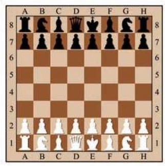

这实际上是求以 1 为首项、以 2 为公比的等比数列的前 64 项的和:

$$
{S}_{64} = 1 + 2 + {2}^{2} + \cdots  + {2}^{62} + {2}^{63}.
$$

如果用公比 2 乘上述等式的两边, 就得到

$$
2{S}_{64} = 2 + {2}^{2} + {2}^{3}\cdots  + {2}^{63} + {2}^{64}.
$$

可以发现, 上面两式中有许多相同的项, 两式相减可以消去这些项, 得到

$$
{S}_{64} = {2}^{64} - 1.
$$

这是一个二十位数, 将这些小麦折算成质量 (每千粒麦子的质量设为 40 $\mathrm{g}$ ),会超过 7000 亿吨. 即使到小麦年产量比较高的现代，全世界小麦年总产量也远低于 10 亿吨，国王根本满足不了发明者的要求.

一般地,设等比数列 $\left\{  {a}_{n}\right\}$ 的公比为 $q$ ,其前 $n$ 项和为

$$
{S}_{n} = {a}_{1} + {a}_{1}q + {a}_{1}{q}^{2} + \cdots  + {a}_{1}{q}^{n - 1}.
$$

将上式两边同乘公比 $q$ ,可得

$$
q{S}_{n} = {a}_{1}q + {a}_{1}{q}^{2} + {a}_{1}{q}^{3} + \cdots  + {a}_{1}{q}^{n}.
$$

将两式相减, 可得

$$
{S}_{n} - q{S}_{n} = {a}_{1} - {a}_{1}{q}^{n},
$$

即

$$
\left( {1 - q}\right) {S}_{n} = {a}_{1}\left( {1 - {q}^{n}}\right) .
$$

由此得到,当 $q \neq  1$ 时,等比数列 $\left\{  {a}_{n}\right\}$ 的前 $n$ 项和为

$$
{S}_{n} = \frac{{a}_{1}\left( {1 - {q}^{n}}\right) }{1 - q}.
$$

综上所述,可以得到以 ${a}_{1}$ 为首项、以 $q\left( {q \neq  1}\right)$ 为公比的等比数列的前 $n$ 项和公式为

$$
{S}_{n} = \frac{{a}_{1}\left( {1 - {q}^{n}}\right) }{1 - q}\left( {q \neq  1}\right) .
$$

因为 ${a}_{n} = {a}_{1}{q}^{n - 1}$ ,所以上式又可写为

$$
{S}_{n} = \frac{{a}_{1} - {a}_{n}q}{1 - q}\left( {q \neq  1}\right) .
$$

而当 $q = 1$ 时,因为 ${a}_{1} = {a}_{2} = \cdots  = {a}_{n}$ ,所以 ${S}_{n} = n{a}_{1}$ .

例 4 设数列 $\left\{  {a}_{n}\right\}$ 为等比数列,其前 $n$ 项和为 ${S}_{n}$ .

(1)已知 ${a}_{1} =  - 4$ ，公比 $q =  - \frac{1}{2}$ ，求 ${S}_{10}$ ；

(2)已知 ${a}_{1} = {27},{a}_{n} = \frac{1}{243}$ ，公比 $q =  - \frac{1}{3}$ ，求 ${S}_{n}$ .

解(1)根据等比数列的前 $n$ 项和公式，得

$$
{S}_{10} = \frac{-4 \times  \left\lbrack  {1 - {\left( -\frac{1}{2}\right) }^{10}}\right\rbrack  }{1 - \left( {-\frac{1}{2}}\right) } =  - \frac{341}{128}.
$$

(2)根据等比数列的前 $n$ 项和公式，得

$$
{S}_{n} = \frac{{a}_{1} - {a}_{n}q}{1 - q} = \frac{{27} - \frac{1}{243} \times  \left( {-\frac{1}{3}}\right) }{1 - \left( {-\frac{1}{3}}\right) } = \frac{4921}{243}.
$$

例 5 在等比数列 $\left\{  {a}_{n}\right\}$ 中,其前 $n$ 项和为 ${S}_{n}$ . 已知 ${S}_{3} = \frac{7}{2}$ , ${S}_{6} = \frac{63}{2}$ ,求 ${a}_{n}$ .

解 设该等比数列的公比为 $q$ . 若 $q = 1$ ,则 ${S}_{6} = 2{S}_{3}$ . 这与已知条件矛盾,所以 $q \neq  1$ . 从而有

$$
{S}_{3} = \frac{{a}_{1}\left( {1 - {q}^{3}}\right) }{1 - q} = \frac{7}{2},
$$

$$
{S}_{6} = \frac{{a}_{1}\left( {1 - {q}^{6}}\right) }{1 - q} = \frac{63}{2},
$$

将上面两个等式相除, 得

$$
1 + {q}^{3} = 9.
$$

于是 $q = 2$ ,从而由上面关于 ${S}_{3}$ 的式子就可得 ${a}_{1} = \frac{1}{2}$ ,因此

$$
{a}_{n} = \frac{1}{2} \times  {2}^{n - 1} = {2}^{n - 2}.
$$

?

例 6 已知数列 $\left\{  {a}_{n}\right\}$ 的前 $n$ 项和为 ${S}_{n} = {3}^{n} + a$ . 当常数 $a$ 满足什么条件时,数列 $\left\{  {a}_{n}\right\}$ 是等比数列?

解 当 $n = 1$ 时,可得 ${a}_{1} = {S}_{1} = 3 + a$ . 而当 $n \geq  2$ 时,

$$
{a}_{n} = {S}_{n} - {S}_{n - 1} = \left( {{3}^{n} + a}\right)  - \left( {{3}^{n - 1} + a}\right)  = 2 \times  {3}^{n - 1}.
$$

从而

$$
\frac{{a}_{n + 1}}{{a}_{n}} = \frac{2 \times  {3}^{n}}{2 \times  {3}^{n - 1}} = 3, n \geq  2.
$$

于是,当且仅当 $\frac{{a}_{2}}{{a}_{1}} = 3$ 时,数列 $\left\{  {a}_{n}\right\}$ 是等比数列. 由上式, ${a}_{1} = 3 + a$ ,而 ${a}_{2} = 6$ ,由 $\frac{{a}_{2}}{{a}_{1}} = 3$ ,解得 $a =  - 1$ .

---

若数列 $\left\{  {a}_{n}\right\}$ 的前 $n$ 项和为 ${S}_{n} = A{q}^{n} + B \; \left( {q \neq  0\text{ 、 }1}\right)$ ,当 $A\text{ 、 }B$ 满足什么条件时，数列 $\left\{  {a}_{n}\right\}$ 是等比数列?

---

因此,当 $a =  - 1$ 时,数列 $\left\{  {a}_{n}\right\}$ 是等比数列.

## 练习 $\mathbf{{4.2}\left( 2\right) }$

1. 设数列 $\left\{  {a}_{n}\right\}$ 为等比数列,其前 $n$ 项和为 ${S}_{n}$ .

(1)已知 ${a}_{1} = 3$ ，公比 $q = 2$ ，求 ${S}_{6}$ ；

(2)已知 ${a}_{1} =  - {2.7}$ ，公比 $q =  - \frac{1}{3}$ ， ${a}_{n} = \frac{1}{90}$ ，求 ${S}_{n}$ .

2. 已知等比数列 $\left\{  {a}_{n}\right\}$ 的前 5 项和为 10，前 10 项和为 50 . 求这个数列的前 15 项和.

3. 中国古代数学著作《算法统宗》中有这样一个问题: “三百七十八里关，初行健步不为难，次日脚痛减一半，六朝才得到其关，要见次日行里数，请公仔细算相还.”其意思为:有一个人要走 378 里路，第一天健步行走，从第二天起因为脚痛，每天走的路程为前一天的一半, 走了 6 天后到达目的地. 请问第二天走了多少里.

中国古代庄周所著的《庄子·天下篇》说:“一尺之棰，日取其半, 万世不竭. ”其含义是: 一根一尺长的木棒, 每天截取其一半, 这样的过程可以无限进行下去. 如果从第一天开始截取, 把木棒每天剩余的长度记录下来，可得到下面一个数列:

$$
\frac{1}{2},\frac{1}{4},\frac{1}{8},\frac{1}{16},\cdots ,{\left( \frac{1}{2}\right) }^{n},\cdots .
$$

---

一个数列 $\left\{  {a}_{n}\right\}$ 中, 如果当 $n$ 无限增大时, ${a}_{n}$ 的值越来越趋近于某个确定的数 $a$ ,那么称这个数列的极限为 $a$ ,记作 $\mathop{\lim }\limits_{{n \rightarrow   + \infty }}{a}_{n} = a$ , 其中记号 $\lim$ 是英文单词 limit (极限) 的缩写.

---

随着 $n$ 无限增大,此数列的第 $n$ 项 ${a}_{n} = {\left( \frac{1}{2}\right) }^{n}$ 的值越来越趋近于零,从而 ${a}_{n}$ 的极限为零. 记作 $\mathop{\lim }\limits_{{n \rightarrow   + \infty }}{a}_{n} = 0$ .

上述数列的前 $n$ 项之和为

$$
{S}_{n} = \frac{1}{2} + \frac{1}{4} + \frac{1}{8} + \cdots  + {\left( \frac{1}{2}\right) }^{n}
$$

$$
= \frac{\frac{1}{2}\left\lbrack  {1 - {\left( \frac{1}{2}\right) }^{n}}\right\rbrack  }{1 - \frac{1}{2}}
$$

$$
= 1 - {\left( \frac{1}{2}\right) }^{n}\text{ . }
$$

随着 $n$ 无限增大, ${\left( \frac{1}{2}\right) }^{n}$ 的值越来越趋近于零, ${S}_{n}$ 的值越来越趋近于 1,从而 ${S}_{n}$ 的极限为 1,记作 $\mathop{\lim }\limits_{{n \rightarrow   + \infty }}{S}_{n} = 1$ .

更一般地,对于首项为 $a$ 、公比为 $q$ 的等比数列:

$$
{a}_{n} = a{q}^{n - 1}\text{ ( }n\text{ 为正整数), }
$$

当 $0 < \left| q\right|  < 1$ 时,此数列的前 $n$ 项和为

$$
{S}_{n} = a + {aq} + \cdots  + a{q}^{n - 1}
$$

$$
= \frac{a}{1 - q}\left( {1 - {q}^{n}}\right) .
$$

随着 $n$ 无限增大, ${q}^{n}$ 的值越来越趋近于零, ${S}_{n}$ 的值越来越趋近于 $\frac{a}{1 - q}$ ,从而 ${S}_{n}$ 的极限为 $\frac{a}{1 - q}$ ,记作 $\mathop{\lim }\limits_{{n \rightarrow   + \infty }}{S}_{n} = \frac{a}{1 - q}$ .

---

如果一个数列 $\left\{  {a}_{n}\right\}$ 的前 $n$ 项和为 ${S}_{n}$ ,则 $\mathop{\sum }\limits_{{i = 1}}^{{+\infty }}{a}_{i}$ 表示 $\mathop{\lim }\limits_{{n \rightarrow   + \infty }}{S}_{n}$ .

---

综上所述，以 $a$ 为首项、 $q$ 为公比的等比数列，当公比 $0 < \; \left| q\right|  < 1$ 时,有

$$
\mathop{\sum }\limits_{{i = 1}}^{{+\infty }}a{q}^{i - 1} = \frac{a}{1 - q}.
$$

例 7 化下列循环小数为分数:

(1)0.29； (2)0.431 .

解 (1) ${0.29} = {0.29} + {0.29} \times  {0.01} + {0.29} \times  {\left( {0.01}\right) }^{2} + \cdots  + \; {0.29} \times  {\left( {0.01}\right) }^{n - 1} + \cdots$ .

相应的无穷等比数列是 ${0.29},{0.29} \times  {0.01},{0.29} \times  {\left( {0.01}\right) }^{2},\cdots$ , ${0.29} \times  {\left( {0.01}\right) }^{n - 1},\cdots$ ,其首项是 0.29,公比是 0.01,于是有 Q

$$
{0.29} = \frac{0.29}{1 - {0.01}} = \frac{29}{99}.
$$

---

类似地,我们可以证明: $0.\dot{9} = 1$ .

---

(2) ${0.431} = {0.4} + {{0.031} + }{0.031} \times  {{0.01} + }{{0.031} \times  }{\left( {0.01}\right) }^{2} + \cdots  + \; {0.031} \times  {\left( {0.01}\right) }^{n - 1} + \cdots$ .

上述等式的右边除 0.4 外,相应的无穷等比数列是 ${0.031},{0.031} \times \; {0.01},{0.031} \times  {\left( {0.01}\right) }^{2},\cdots ,{0.031} \times  {\left( {0.01}\right) }^{n - 1},\cdots$ ,其首项是 0.031 , 公比是 0.01 , 于是有

例 8 如图 4-2-2,正方形 ${ABCD}$ 的边长等于 1,连接这个正方形各边的中点得到一个小正方形 ${A}_{1}{B}_{1}{C}_{1}{D}_{1}$ ; 又连接正方形 ${A}_{1}{B}_{1}{C}_{1}{D}_{1}$ 各边的中点得到一个更小的正方形 ${A}_{2}{B}_{2}{C}_{2}{D}_{2}$ ; 如此无限继续下去. 求所有这些正方形的周长的和与面积的和.

$$
{0.4}\dot{3}\dot{1} = {0.4} + \frac{0.031}{1 - {0.01}} = \frac{4}{10} + \frac{31}{990} = \frac{427}{990}.
$$

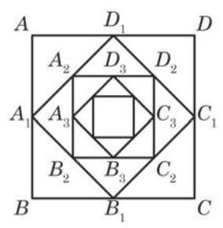

图 4-2-2

解 由题设,可得到第 1 个正方形的边长 ${a}_{1} = 1$ ,第 2 个

正方形的边长 ${a}_{2} = \frac{\sqrt{2}}{2},\cdots \cdots$ ,第 $n$ 个正方形的边长 ${a}_{n} = \; \sqrt{{\left( \frac{{a}_{n - 1}}{2}\right) }^{2} + {\left( \frac{{a}_{n - 1}}{2}\right) }^{2}} = \frac{\sqrt{2}{a}_{n - 1}}{2}\left( {n \geq  2}\right) .$

所有这些正方形的边长组成的数列为

$$
1,\frac{\sqrt{2}}{2},\frac{1}{2},\frac{\sqrt{2}}{4},\cdots ,{\left( \frac{\sqrt{2}}{2}\right) }^{n - 1},\cdots ,
$$

从而所有这些正方形的周长组成的数列为

$$
4,2\sqrt{2},2,\sqrt{2},\cdots ,4 \cdot  {\left( \frac{\sqrt{2}}{2}\right) }^{n - 1},\cdots .
$$

这是一个以 4 为首项、以 $\frac{\sqrt{2}}{2}$ 为公比的等比数列,因此所有这些正方形的周长的和为

$$
\mathop{\sum }\limits_{{i = 1}}^{{+\infty }}4 \cdot  {\left( \frac{\sqrt{2}}{2}\right) }^{i - 1} = \frac{4}{1 - \frac{\sqrt{2}}{2}} = 8 + 4\sqrt{2}.
$$

所有这些正方形的面积组成的数列为

$$
1,\frac{1}{2},\frac{1}{4},\frac{1}{8},\cdots ,{\left( \frac{1}{2}\right) }^{n - 1},\cdots .
$$

这是以 1 为首项、以 $\frac{1}{2}$ 为公比的等比数列,因此所有这些正方形的面积的和为

$$
\mathop{\sum }\limits_{{i = 1}}^{{+\infty }}{\left( \frac{1}{2}\right) }^{i - 1} = \frac{1}{1 - \frac{1}{2}} = 2.
$$

## 练习 4.2(3)

1. 计算 $\mathop{\sum }\limits_{{i = 1}}^{{+\infty }}{\left( \frac{1}{3}\right) }^{i}$ .

2. 化下列循环小数为分数:

(1) $0.\dot{13}$ ;

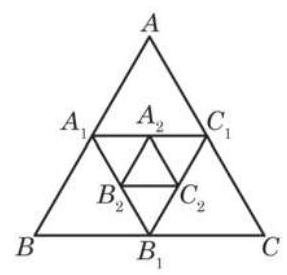

(第 3 题)

(2)1.332 .

3. 如图,已知等边三角形 ${ABC}$ 的面积等于 1,连接这个三角形各边的中点得到一个小的三角形 ${A}_{1}{B}_{1}{C}_{1}$ ,又连接三角形 ${A}_{1}{B}_{1}{C}_{1}$ 各边的中点得到一个更小的三角形 ${A}_{2}{B}_{2}{C}_{2}$ ,这样的过程可以无限继续下去. 求所有三角形 ${A}_{i}{B}_{i}{C}_{i}\left( {i = 1,2,3,\cdots }\right)$ 的面积的和.

## 习题 4.2

## A 组

1. 求下列各组数的等比中项:

(1) $\sqrt{3} + 1$ 与 $\sqrt{3} - 1$ ；

(2) ${a}^{4} + {a}^{2}{b}^{2}$ 与 ${b}^{4} + {a}^{2}{b}^{2}\left( {a \neq  0, b \neq  0}\right)$ .

2. 设数列 $\left\{  {a}_{n}\right\}$ 为等比数列,其公比为 $q$ .

(1)已知 ${a}_{5} = 8,{a}_{8} = 1$ ,求 ${a}_{1}\text{ 、 }q$ ;

(2)已知 ${a}_{3} = 2, q =  - 1$ ，求 ${a}_{15}$ ；

(3)已知 ${a}_{4} = {12},{a}_{8} = 6$ ，求 ${a}_{12}$ .

3. 已知数列 $\left\{  {a}_{n}\right\}$ 为等比数列,其公比为 $q$ . 判断下列数列是否为等比数列. 如果是, 求其公比; 如果不是, 请说明理由.

(1)数列 $\left\{  {2{a}_{n}}\right\}$ ；

(2)数列 $\left\{  {{a}_{n} + {a}_{n + 1}}\right\}$ .

4. 已知数列 $\left\{  {a}_{n}\right\}$ 和数列 $\left\{  {b}_{n}\right\}$ 为项数相同的等比数列,公比分别为 ${q}_{1}$ 和 ${q}_{2}$ . 求证: 数列 $\left\{  {{a}_{n}{b}_{n}}\right\}$ 为等比数列,其公比为 ${q}_{1}{q}_{2}$ .

5. 已知直角三角形的斜边长为 $c$ ,两条直角边长分别为 $a$ 和 $b\left( {a < b}\right)$ ,且 $a, b, c$ 成等比数列. 求 $a : c$ 的值.

6. 某产品经过 4 次革新后, 成本由原来的 105 元下降到 60 元. 如果这种产品每次革新后成本下降的百分比相同,那么每次革新后成本下降的百分比是多少? (结果精确到 0.1%)

7. 设数列 $\left\{  {a}_{n}\right\}$ 为等比数列,其公比为 $q$ ,前 $n$ 项和为 ${S}_{n}$ .

(1)已知 ${a}_{1} = 5, q = 3$ ，求 ${S}_{5}$ ；

(2)已知 ${a}_{8} = \frac{1}{16}, q = \frac{1}{2}$ ，求 ${S}_{8}$ ；

(3)已知 ${a}_{1} =  - 2, q =  - \frac{1}{2},{a}_{n} = \frac{1}{1024}$ ,求 ${S}_{n}$ ;

(4)已知 ${S}_{6} = \frac{189}{4}, q = \frac{1}{2}$ ,求 ${a}_{1}$ .

8. 设等比数列 $\left\{  {a}_{n}\right\}$ 的公比 $q < 1$ ,前 $n$ 项和为 ${S}_{n}$ . 已知 ${a}_{3} = 2,{S}_{4} = 5{S}_{2}$ ,求数列 $\left\{  {a}_{n}\right\}$ 的通项公式.

9. 一个球从 ${100}\mathrm{\;m}$ 高处自由落下,假设每次着地后又跳回到原高度的一半再落下.

(1)当它第 10 次着地时,求它经过的总路程;

(2)它可能在某次着地时，经过的总路程超过 ${300}\mathrm{\;m}$ 吗？如果可能，请说明是第几次着地首次超过 ${300}\mathrm{\;m}$ ；如果不可能，请说明理由.

B 组

1. 已知 $b$ 是 $a$ 与 $c$ 的等比中项,且 $a\text{ 、 }b\text{ 、 }c$ 同号. 求证: $\frac{a + b + c}{3},\sqrt{\frac{{ab} + {bc} + {ca}}{3}}$ , $\sqrt[3]{abc}$ 成等比数列.

2. 已知 $a \neq  b$ ,且 $a\text{ 、 }b$ 都不为 0 . 设 $n$ 为正整数,写出 $\mathop{\sum }\limits_{{i = 0}}^{n}{a}^{n - i}{b}^{i}$ 的具体展开式,并证明 $\mathop{\sum }\limits_{{i = 0}}^{n}{a}^{n - i}{b}^{i} = \frac{{a}^{n + 1} - {b}^{n + 1}}{a - b}$ .

3. 已知对任意给定的正整数 $n$ ,数列 $\left\{  {a}_{n}\right\}$ 的前 $n$ 项和 ${S}_{n} = \frac{1 - {q}^{n}}{1 - q}\left( {q \neq  0\text{ 且 }q \neq  1}\right)$ . 判断 $\left\{  {a}_{n}\right\}$ 是否为等比数列,并说明理由.

4. 已知数列 $\left\{  {a}_{n}\right\}$ 为等差数列,数列 $\left\{  {b}_{n}\right\}$ 满足 ${b}_{n} = {\left( \frac{1}{2}\right) }^{{a}_{n}}$ ( $n$ 为正整数).

(1)求证:数列 $\left\{  {b}_{n}\right\}$ 为等比数列；

(2)若 ${b}_{1} + {b}_{2} + {b}_{3} = \frac{21}{8},{b}_{1}{b}_{2}{b}_{3} = \frac{1}{8}$ ，求数列 $\left\{  {a}_{n}\right\}$ 的通项公式.

5. 如图,已知直角三角形 ${AOB}$ 的两条直角边 ${AO}$ 和 ${BO}$ 的长分别为 5 和 12,点 ${O}_{1}\text{ 、 }{O}_{2}\text{ 、 }\cdots \text{ 、 }{O}_{n}\text{ 、 }\cdots$ 在边 ${OB}$ 上,半圆 ${O}_{1}$ 与 ${AO}$ 和 ${AB}$ 所在直线均相切,半圆 ${O}_{2}\text{ 、 }{O}_{3}\text{ 、 }\cdots \text{ 、 }{O}_{n}\text{ 、 }\cdots$ 与 ${AB}$ 所在直线相切,且与半圆 ${O}_{1}\text{ 、 }{O}_{2}\text{ 、 }\cdots \text{ 、 }{O}_{n - 1}\text{ 、 }\cdots$ 分别外切. 设这些半圆的半径分别为 ${r}_{1}\text{ 、 }{r}_{2}\text{ 、 }\cdots \text{ 、 }{r}_{n}\text{ 、 }\cdots$ .

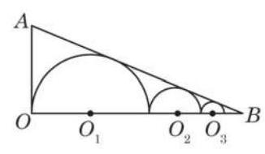

(第 5 题)

(1)求证:数列 $\left\{  {r}_{n}\right\}$ 为等比数列；

(2)求前 $n$ 个半圆弧长的总和 ${L}_{n}$ ；

(3)利用前 $n$ 个半圆弧长的总和 ${L}_{n}$ 的表达式,计算 $\mathop{\lim }\limits_{{n \rightarrow   + \infty }}{L}_{n}$ .

### 4.3 数列

## 1 数列的概念与性质

除了我们前面学过的等差数列、等比数列这两类特殊的数列外, 在现实世界中, 许多事物的数量也可以排成一列数.

(1)如图 4-3-1，能够表示成三角形点阵的点数依次为

$$
1,3,6,{10},{15},{21},{28},\cdots \text{ . }
$$

①

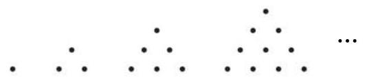

图 4-3-1

(2)如图 4-3-2，能够表示成正方形点阵的点数依次为

$$
1,4,9,{16},{25},\cdots \text{ . }
$$

②

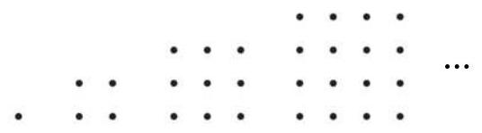

图 4-3-2

(3)目前通用的第五套人民币纸币的面额(单位:元)按照从大到小的顺序排列依次为

$$
{100},{50},{20},{10},5,1.
$$

③

(4)医生要对病人的体温进行 24 小时监控，某天从 0 时开始记录，每隔 4 小时记录一次，共记录 7 次，监测到病人的体温 (单位:℃)依次为

$$
{39.2},{38.3},{37.5},{37.0},{36.8},{37.2},{37.6}\text{ . }
$$

④

(5)将 $\sqrt{2}$ 的不足近似值按小数位数从少到多的顺序排列依次为

$$
1,{1.4},{1.41},{1.414},{1.4142},{1.41421},\cdots \text{ . }
$$

⑤

像这样, 按照一定顺序排列的一列数称为一个数列 (number sequence). 数列与以往学过的数集相比, 有下述不同点: 集合中的元素是无序的, 而数列的项必须按一定顺序排列, 即为有序的; 此外, 集合中的元素要求互异, 而数列的项可以是相同的.

---

$\sqrt{2}$ 的不足近似值: 按照所需要的精确度截取指定数位后, 直接略去后面的数位, 就得到了一个小于 $\sqrt{2}$ 的近似值,称为 $\sqrt{2}$ 的不足近似值.

---

给定一个数列 $\left\{  {a}_{n}\right\}$ ,当项的序数 $n$ 确定时,相应的项 ${a}_{n}$ 也就确定了. 于是,项 ${a}_{n}$ 与项的序数 $n$ 之间存在着对应关系,这种对应关系可描述如下

$$
\text{ 项的序数 }1,2,3,4,\cdots , n,\cdots \text{ . }
$$

$\downarrow   \downarrow   \downarrow   \downarrow   \downarrow$

项 ${a}_{1},{a}_{2},{a}_{3},{a}_{4},\cdots ,{a}_{n},\cdots$ .

项数有限的数列叫做有穷数列 (finite sequence); 项数无限的数列叫做无穷数列 (infinite sequence). 从第 2 项起, 每一项都不小于其前一项的数列 $\left\{  {a}_{n}\right\}$ 叫做增数列,此时 ${a}_{n + 1} \geq  {a}_{n}$ ( $n$ 为正整数)成立. 特别地，从第 2 项起, 每一项都大于其前一项的数列 $\left\{  {a}_{n}\right\}$ 叫做严格增数列,此时 ${a}_{n + 1} > {a}_{n}$ ( $n$ 为正整数) 成立. 相应地,从第 2 项起,每一项都不大于其前一项的数列 $\left\{  {a}_{n}\right\}$ 叫做减数列,此时 ${a}_{n + 1} \leq  {a}_{n}$ ( $n$ 为正整数) 成立. 特别地,从第 2 项起,每一项都小于其前一项的数列 $\left\{  {a}_{n}\right\}$ 叫做严格减数列,此时 ${a}_{n + 1} < {a}_{n}$ ( $n$ 为正整数) 成立. 增数列和减数列统称为单调数列. 各项均相等的数列叫做常数列.

给定数列 $\left\{  {a}_{n}\right\}$ ,如果可以用一个关于序数 $n$ 的公式来表示数列中的任一项 ${a}_{n}$ ,那么这个公式就称为数列 $\left\{  {a}_{n}\right\}$ 的通项公式 (general term). 有了数列的通项公式, 就可以算出数列中的各项.

实际中, 也常用列表法来表示数列. 例如, 对于数列④, 我们可以用下表直观地表示:

表 4-1

<table><tr><td>监测次数 $\left( n\right)$</td><td>1</td><td>2</td><td>3</td><td>4</td><td>5</td><td>6</td><td>7</td></tr><tr><td>体温 $\left( {a}_{n}\right)$</td><td>39.2</td><td>38.3</td><td>37.5</td><td>37.0</td><td>36.8</td><td>37.2</td><td>37.6</td></tr></table>

注:体温单位为℃ (摄氏度).

例 1 已知数列 $\left\{  {a}_{n}\right\}$ 的通项公式,写出这些数列的前 5 项:

(1) ${a}_{n} = \frac{n - 2}{n + 1}$ ；

(2) ${a}_{n} = 1 + {\left( -\frac{1}{2}\right) }^{n}$ .

解 我们可根据相应的通项公式, 用列表法分别写出这两个数列的前 5 项.

---

公差为正数的等差数列为严格增数列; 公差为负数的等差数列为严格减数列; 公差为零的等差数列为常数列.

---

表 4-2

<table><tr><td>$n$</td><td>1</td><td>2</td><td>3</td><td>4</td><td>5</td></tr><tr><td>${a}_{n} = \frac{n - 2}{n + 1}$</td><td>$- \frac{1}{2}$</td><td>0</td><td>$\frac{1}{4}$</td><td>$\frac{2}{5}$</td><td>$\frac{1}{2}$</td></tr><tr><td>${a}_{n} = 1 + {\left( -\frac{1}{2}\right) }^{n}$</td><td>$\frac{1}{2}$</td><td>$\frac{5}{4}$</td><td>$\frac{7}{8}$</td><td>17 16</td><td>31 32</td></tr></table>

例 2 给出数列 $\left\{  {a}_{n}\right\}$ 的下述通项公式,判断这些数列是否为单调数列, 请说明理由.

(1) ${a}_{n} = 1 + {\left( \frac{1}{2}\right) }^{n}$ ；

(2) ${a}_{n} = n - \frac{1}{n}$ .

解( 1 )因为

$$
{a}_{n + 1} - {a}_{n} = \left\lbrack  {1 + {\left( \frac{1}{2}\right) }^{n + 1}}\right\rbrack   - \left\lbrack  {1 + {\left( \frac{1}{2}\right) }^{n}}\right\rbrack
$$

$$
=  - {\left( \frac{1}{2}\right) }^{n + 1} < 0,
$$

所以 ${a}_{n + 1} < {a}_{n}$ . 从而数列 $\left\{  {a}_{n}\right\}$ 为严格减数列.

(2)因为

$$
{a}_{n + 1} - {a}_{n} = \left( {n + 1 - \frac{1}{n + 1}}\right)  - \left( {n - \frac{1}{n}}\right)
$$

$$
= 1 + \frac{1}{n\left( {n + 1}\right) } > 0,
$$

所以 ${a}_{n + 1} > {a}_{n}$ . 从而数列 $\left\{  {a}_{n}\right\}$ 为严格增数列.

例 3 已知数列 $\left\{  {a}_{n}\right\}$ 的通项公式是 ${a}_{n} = \left( {n + 1}\right) {\left( \frac{9}{10}\right) }^{n - 1}$ . 试问: 该数列是否有最大项? 若有, 指出第几项最大; 若没有, 试说明理由.

解 因为

$$
{a}_{n + 1} - {a}_{n} = \left( {n + 2}\right) {\left( \frac{9}{10}\right) }^{n} - \left( {n + 1}\right) {\left( \frac{9}{10}\right) }^{n - 1}
$$

$$
= {\left( \frac{9}{10}\right) }^{n - 1} \cdot  \left( \frac{8 - n}{10}\right) ,
$$

所以当 $n \leq  7$ 时, ${a}_{n + 1} > {a}_{n}$ ; 当 $n = 8$ 时, ${a}_{n + 1} = {a}_{n}$ ; 当 $n \geq  9$ 时, ${a}_{n + 1} < {a}_{n}$ .

于是,数列 $\left\{  {a}_{n}\right\}$ 的最大项为第 8 项和第 9 项,其值为 $\frac{{9}^{8}}{{10}^{7}}$ .

## 练习 4.3(1)

1. 根据数列 $\left\{  {a}_{n}\right\}$ 的通项公式填表:

<table><tr><td>$n$</td><td>1</td><td>2</td><td>...</td><td>5</td><td>...</td><td></td><td>...</td><td>$n$</td><td>...</td></tr><tr><td>${a}_{n}$</td><td></td><td></td><td>...</td><td></td><td>...</td><td>156</td><td>...</td><td>$n\left( {n + 1}\right)$</td><td>...</td></tr></table>

2. 图中的三角形图案称为谢宾斯基三角形. 在下图四个三角形图案中, 着色的小三角形的个数依次排列成一个数列的前四项, 请写出其前四项, 并给出这个数列的一个通项公式.

(第 2 题)

3. 已知数列 $\left\{  {a}_{n}\right\}$ 的通项公式是 ${a}_{n} = \left| {{2n} - 7}\right|$ . 试问: 该数列是否有最小项? 若有,指出第几项最小; 若没有, 试说明理由.

## 2 利用递推公式表示数列

等差数列 $\left\{  {a}_{n}\right\}$ ,其中 ${a}_{1} = 2$ ,公差 $d = 3$ ,可以用下面的公式表示:

$$
\left\{  \begin{array}{l} {a}_{n} = {a}_{n - 1} + 3\left( {n \geq  2}\right) , \\  {a}_{1} = 2. \end{array}\right.
$$

等比数列 $\left\{  {a}_{n}\right\}$ ,其中 ${a}_{1} = 2$ ,公比 $q = 3$ ,可以用下面的公式表示:

$$
\left\{  \begin{array}{l} {a}_{n} = 3{a}_{n - 1}\left( {n \geq  2}\right) , \\  {a}_{1} = 2. \end{array}\right.
$$

如果数列 $\left\{  {a}_{n}\right\}$ 的任一项 ${a}_{n}$ 可由其前一项 ${a}_{n - 1}$ (或前几项) 通过一个公式来表示，那么这个公式就叫做这个数列的一个递推公式. 它也是表示数列的一种方法. 有时, 数列通项公式不容易被发现, 但可通过数列的递推关系来描述该数列.

例 4 在平面上画 $n$ 条直线,假设其中任意 2 条直线都相交,且任意 3 条直线都不共点. 设这 $n$ 条直线将平面分成了 ${a}_{n}$ 个部分.

(1)写出数列 $\left\{  {a}_{n}\right\}$ 的一个递推公式；

(2)写出数列 $\left\{  {a}_{n}\right\}$ 的一个通项公式.

解 (1) 我们先通过观察 $n = 1$ 、 2、3 时的图形来探究 ${a}_{n}$ 的情况.

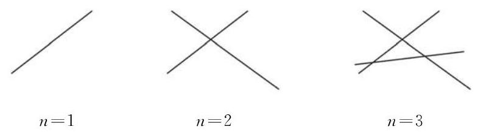

图 4-3-3

从图 4-3-3 中可以看出:

当 $n = 1$ 时,第 1 条直线将平面分为两个部分,所以

$$
{a}_{1} = 2\text{ . }
$$

当 $n = 2$ 时,第 2 条直线与前面的 1 条直线相交,有 1 个交点. 这个交点将第 2 条直线分成 2 段, 且每一段将原有的平面部分进一步多分出两个部分, 所以

$$
{a}_{2} = {a}_{1} + 2\text{ . }
$$

当 $n = 3$ 时,第 3 条直线与前面的 2 条直线都相交,有 2 个交点. 这 2 个交点将第 3 条直线分成 3 段, 且每一段将原有的平面部分进一步多分出三个部分, 所以

$$
{a}_{3} = {a}_{2} + 3\text{ . }
$$

依此类推: 第 $n\left( {n \geq  2}\right)$ 条直线与前面的 $\left( {n - 1}\right)$ 条直线都相交, 有 $\left( {n - 1}\right)$ 个交点. 这 $\left( {n - 1}\right)$ 个交点将第 $n$ 条直线分成 $n$ 段,且每一段将原有的平面部分进一步多分出 $n$ 个部分,所以

$$
{a}_{n} = {a}_{n - 1} + n\left( {n \geq  2}\right) .
$$

这样,数列 $\left\{  {a}_{n}\right\}$ 可以用下面的递推公式表示:

$$
\left\{  \begin{array}{l} {a}_{n} = {a}_{n - 1} + n\left( {n \geq  2}\right) , \\  {a}_{1} = 2. \end{array}\right.
$$

(2)由上述递推公式, 有

$$
{a}_{2} = {a}_{1} + 2,
$$

$$
{a}_{3} = {a}_{2} + 3,
$$

$$
{a}_{4} = {a}_{3} + 4,
$$

...

$$
{a}_{n} = {a}_{n - 1} + n\left( {n \geq  2}\right) .
$$

由上述等式以及 ${a}_{1} = 2$ ,可得

$$
{a}_{n} = {a}_{1} + 2 + 3 + 4 + \cdots  + n
$$

$$
= {a}_{1} + \frac{\left( {n + 2}\right) \left( {n - 1}\right) }{2}
$$

$$
= \frac{{n}^{2} + n + 2}{2}\;\left( {n \geq  2}\right) .
$$

当 $n = 1$ 时,由于 ${a}_{1} = 2$ ,上面的等式也成立.

所以,数列 $\left\{  {a}_{n}\right\}$ 的通项公式为 ${a}_{n} = \frac{{n}^{2} + n + 2}{2}$ .

例 5 已知数列 $\left\{  {a}_{n}\right\}$ 的递推公式为 $\left\{  \begin{array}{l} {a}_{n} = 2{a}_{n - 1} + 1\left( {n \geq  2}\right) , \\  {a}_{1} = 1. \end{array}\right.$

(1)求证:数列 $\left\{  {{a}_{n} + 1}\right\}$ 为等比数列；

(2)求数列 $\left\{  {a}_{n}\right\}$ 的通项公式.

解 (1) 证明: 已知递推公式 ${a}_{n} = 2{a}_{n - 1} + 1\left( {n \geq  2}\right)$ .

在上述等式两边同时加 1 , 得

$$
{a}_{n} + 1 = 2{a}_{n - 1} + 2 = 2\left( {{a}_{n - 1} + 1}\right) \left( {n \geq  2}\right) .
$$

由递推公式,易证 ${a}_{n} > 0\left( {n \geq  1}\right)$ ,于是 ${a}_{n - 1} + 1 > 0\left( {n \geq  2}\right)$ , 故 $\frac{{a}_{n} + 1}{{a}_{n - 1} + 1} = 2\left( {n \geq  2}\right)$ . 所以,数列 $\left\{  {{a}_{n} + 1}\right\}$ 是以 ${a}_{1} + 1 = 2$ 为首项、以 2 为公比的等比数列.

(2)因为数列 $\left\{  {{a}_{n} + 1}\right\}$ 是以 ${a}_{1} + 1 = 2$ 为首项、以 2 为公比的等比数列, 所以

$$
{a}_{n} + 1 = {2}^{n}\left( {n \geq  1}\right) ,
$$

从而 ${a}_{n} = {2}^{n} - 1\left( {n \geq  1}\right)$ ,这就是数列 $\left\{  {a}_{n}\right\}$ 的一个通项公式.

## 练习 4.3(2)

1. 已知数列 $\left\{  {a}_{n}\right\}$ 对任意正整数 $n$ ,均满足 ${a}_{1}{a}_{2}\cdots {a}_{n} = {n}^{2}$ .

(1)写出数列 $\left\{  {a}_{n}\right\}$ 的前五项；

(2)求数列 $\left\{  {a}_{n}\right\}$ 的通项公式.

2. 在数列 $\left\{  {a}_{n}\right\}$ 中, ${a}_{1} = 2$ ,且 ${a}_{n} = {a}_{n - 1} + \lg \frac{n}{n - 1}\left( {n \geq  2}\right)$ . 求数列 $\left\{  {a}_{n}\right\}$ 的通项公式.

3. 已知数列 $\left\{  {a}_{n}\right\}$ 满足 ${a}_{1} = 1,{a}_{n} = 2{a}_{n - 1} + 3\left( {n \geq  2}\right)$ .

(1)求证:数列 $\left\{  {{a}_{n} + 3}\right\}$ 为等比数列；

(2)求数列 $\left\{  {a}_{n}\right\}$ 的通项公式.

## 课后阅读

## 神奇的斐波那契数列

1202 年, 意大利数学家斐波那契 (L. Fibonacci) 出版了一部著作《算盘全书》(Liber Abacci). 他在书中提出了一个关于兔子繁殖的问题: 一对新生的小兔子(一雄一雌)，到第 3 个月开始每月新生一对(一雄一雌)小兔子. 在假设不发生死亡的情况下，问:从第一对新生小兔子开始, 到第 10 个月底会有多少对兔子?

第 1 个月, 只有 1 对小兔子; 第 2 个月, 那对小兔子长成熟了; 第 3 个月, 成熟的兔子生下 1 对小兔子, 这时有 2 对兔子; 第 4 个月, 成熟的兔子再生 1 对小兔子, 而另 1 对小兔子长成熟了，共有 3 对兔子; 如此推算下去，我们可以得到下面的表格:

表 4-3

<table><tr><td>时间(月)</td><td>初生兔子(对)</td><td>成熟兔子(对)</td><td>兔子总数(对)</td></tr><tr><td>1</td><td>1</td><td>0</td><td>1</td></tr><tr><td>2</td><td>0</td><td>1</td><td>1</td></tr><tr><td>3</td><td>1</td><td>1</td><td>2</td></tr><tr><td>4</td><td>1</td><td>2</td><td>3</td></tr><tr><td>5</td><td>2</td><td>3</td><td>5</td></tr><tr><td>6</td><td>3</td><td>5</td><td>8</td></tr><tr><td>7</td><td>5</td><td>8</td><td>13</td></tr><tr><td>8</td><td>8</td><td>13</td><td>21</td></tr><tr><td>9</td><td>13</td><td>21</td><td>34</td></tr><tr><td>10</td><td>21</td><td>34</td><td>55</td></tr></table>

如果时间不限于 10 个月, 在理想的情境下, 这个问题引出如下的无穷数列:

$1,1,2,3,5,8,{13},{21},{34},{55},{89},{144},{233},\cdots ,$

这就是斐波那契数列, 其中的每一个数都称为斐波那契数. 它有这样的特点: 从第三项开始,每一项都是其前两项的和. 如果用 ${F}_{n}$ 表示第 $n$ 个斐波那契数,那么有

$$
{F}_{n} = {F}_{n - 1} + {F}_{n - 2}\left( {n \geq  3}\right) .
$$

可以证明 (有兴趣的同学, 可查阅有关的课外阅读资料), 其通项公式为

$$
{F}_{n} = \frac{1}{\sqrt{5}}\left\lbrack  {{\left( \frac{1 + \sqrt{5}}{2}\right) }^{n} - {\left( \frac{1 - \sqrt{5}}{2}\right) }^{n}}\right\rbrack  .
$$

人们在研究斐波那契数列的过程中，发现该数列在自然界竟是如此普遍. 例如，考虑树木枝条的数量. 某种树木第 1 年长出幼枝，第 2 年幼枝长成粗干，第 3 年粗干可生出幼枝. 如图 4-3-4, 每条树枝都按照这个规律成长, 则每年的分枝数正好构成斐波那契数列.

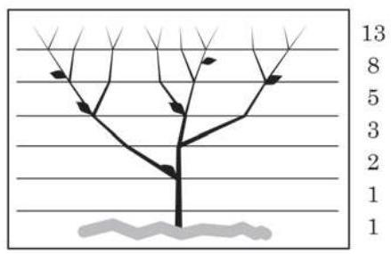

图 4-3-4

---

黄金比例又称为黄金分割数, 是指点 $P$ 把线段 ${AB}$ 分割成 ${AP}$ 和 ${PB}$ 两段,使得 ${AP}$ 是 ${AB}$ 和 ${PB}$ 的比例中项. 其中, ${AP}$ 与 ${AB}$ 的比值 $\frac{\sqrt{5} - 1}{2}$ 称为黄金比例, 也叫黄金分割数, 它是被公认的最具有审美意义的比例数.

---

在数学上, 斐波那契数列有许多奇妙的性质. 其任一给定项与其后一项的比交替地大于或小于黄金比例, 并且该比值无限趋近于黄金比例, 即有

$$
\mathop{\lim }\limits_{{n \rightarrow   + \infty }}\frac{{F}_{n}}{{F}_{n + 1}} = \frac{\sqrt{5} - 1}{2}.
$$

只要你的心中有“数”，随处可见斐波那契数列. 它蕴含在自然界中, 也出现在文艺作品里. 它是解开不少数学谜题的钥匙, 更在诸多科学领域中有着广泛的应用. 经由斐波那契数列的镜像, 我们的世界竟是如此五彩缤纷!

## 习题 4.3

## A 组

1. 已知下列数列 $\left\{  {a}_{n}\right\}$ 的通项公式,写出它的前 4 项.

(1) ${a}_{n} = {n}^{2} - {5n}$ ； (2) ${a}_{n} = \frac{\cos {n\pi }}{2}$ .

2. 已知数列 $\left\{  {a}_{n}\right\}$ 的通项公式为 ${a}_{n} = \frac{{n}^{2} + n - 1}{3}$ ，79 $\frac{2}{3}$ 是否是该数列中的项？若是，是第几项?

3. 已知数列 $\left\{  {a}_{n}\right\}$ 的通项公式为 ${a}_{n} = {n}^{2} - {8n} + 5$ .

(1)写出这个数列的前 5 项;

(2)这个数列有没有最小项？如果有，是第几项？

4. 已知数列 $\left\{  {a}_{n}\right\}$ 的通项公式为 ${a}_{n} = \left( {{3n} - 2}\right) {\left( \frac{3}{5}\right) }^{n}$ ,试问: 该数列是否有最大项、最小项? 若有, 分别指出第几项最大、最小; 若没有, 试说明理由.

5. 已知数列 $\left\{  {a}_{n}\right\}$ 的首项 ${a}_{1} = 1$ ,且 ${a}_{n} = {2}^{n - 1} \cdot  {a}_{n - 1}\left( {n \geq  2}\right)$ . 求数列 $\left\{  {a}_{n}\right\}$ 的通项公式.

6. 已知数列 $\left\{  {a}_{n}\right\}$ 满足 ${a}_{1} = {33}$ ,且 ${a}_{n} - {a}_{n - 1} = 2\left( {n - 1}\right) \left( {n \geq  2}\right)$ . 求数列 $\left\{  \frac{{a}_{n}}{n}\right\}$ 的最小项.

7. 一个正方形被等分成九个相等的小正方形,将最中间的一个正方形挖掉,得图①; 再将剩下的每个正方形都分成九个相等的小正方形, 并将其最中间的一个正方形挖掉, 得图②; 如此继续下去……

(1)图③中共挖掉了多少个正方形？

(2)求每次挖掉的正方形个数所构成的数列的一个递推公式.

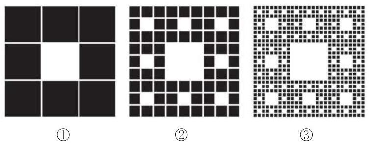

(第 7 题)

B 组

1. 已知数列 $\left\{  {a}_{n}\right\}$ 的通项公式为 ${a}_{n} = \frac{n - \sqrt{97}}{n - \sqrt{98}}$ ,试问: 该数列是否有最大项、最小项? 若有, 分别指出第几项最大、最小; 若没有, 试说明理由.

2. 已知数列 $\left\{  {a}_{n}\right\}$ 的通项公式为 ${a}_{n} = {n}^{2} + {\lambda n}$ ,其中 $\lambda$ 是常数. 若数列 $\left\{  {a}_{n}\right\}$ 为严格增数列,求 $\lambda$ 的取值范围.

3. 已知数列 $\left\{  {a}_{n}\right\}$ 的前 $n$ 项和为 ${S}_{n}$ ,且 ${a}_{1} = 1,{a}_{n + 1} = 2{S}_{n}\left( {n\text{ 为正整数 }}\right)$ . 求数列 $\left\{  {a}_{n}\right\}$ 的通项公式.

4. 已知数列 $\left\{  {a}_{n}\right\}$ 的前 $n$ 项和为 ${S}_{n} = {12} - {12} \cdot  {\left( \frac{2}{3}\right) }^{n}$ .

(1)求数列 $\left\{  {a}_{n}\right\}$ 的通项公式；

(2)若数列 $\left\{  {b}_{n}\right\}$ 满足 ${b}_{n} = \left( {{2n} - 1}\right) {a}_{n}$ ，间是否存在正整数 $m$ ，使得 ${b}_{m} \geq  9$ 成立，并说明理由.

5. 某皮革厂第 1 年初有资金 1000 万元，由于引进了先进的生产设备，资金年平均增长率可达到 50%. 每年年底定额扣除下一年的消费基金后, 将剩余资金投入再生产. 这家皮革厂每年应扣除多少消费基金, 才能实现资金在第 5 年年底扣除消费基金后达到 2000 万元的目标?(结果精确到 1 万元)

### 4.4 数学归纳法

## 1 数学归纳法

已知数列 $\left\{  {a}_{n}\right\}$ 满足 ${a}_{1} = 1$ ,且 ${a}_{n + 1} = \frac{{a}_{n}}{1 + {a}_{n}}(n = 1,2$ , $3,\cdots )$ . 利用数列的递推公式,可以得到 ${a}_{1} = 1,{a}_{2} = \frac{1}{2}$ , ${a}_{3} = \frac{1}{3},{a}_{4} = \frac{1}{4},\cdots$ ,进而猜想数列 $\left\{  {a}_{n}\right\}$ 的通项公式应为 ${a}_{n} = \frac{1}{n}$ .

像这种由特殊到一般的推理方法, 叫做归纳法. 用归纳法可以帮助我们从一些具体事例中发现一般规律. 但是, 仅根据有限的特殊事例归纳得出的结论,不能确定它对后续的项也成立,所以上面这个猜想需要加以证明. 自然地,我们会想到从 $n = 5$ 开始再一个个往下验证,但不仅当 $n$ 较大时,验证起来会很麻烦, 而且证明 $n$ 取所有正整数都成立时,逐一验证是不可能的. 因此, 我们需要另辟蹊径, 寻求一种方法: 通过有限个步骤的推理,证明相应命题对 $n$ 取所有正整数时都成立.

我们先从多米诺骨牌说起. 这是一种码放骨牌的游戏, 码放时要保证任意相邻的两块骨牌, 若前一块骨牌倒下, 则后一块骨牌也要跟着倒下. 因此, 只要推倒第一块骨牌, 由于第一块骨牌倒下，可以导致第二块骨牌倒下；而第二块骨牌倒下， 又可导致第三块骨牌倒下……最后，不论有多少块骨牌，都能全部倒下. 综上所述, 在这个游戏中欲使所有多米诺骨牌全部倒下, 只需满足以下两个条件:

(1)第一块骨牌倒下;

(2)任意相邻的两块骨牌，前一块倒下一定导致后一块倒下.

类似地,为证明前述数列的通项公式是 ${a}_{n} = \frac{1}{n}$ 的这个猜想, 可类比多米诺骨牌这个游戏, 将

证得 ${a}_{1} = 1\;$ 类似于 第一块骨牌倒下;

证得 ${a}_{2} = \frac{1}{2}\;$ 类似于 第二块骨牌倒下;

......

证得 ${a}_{n} = \frac{1}{n}\;$ 类似于 第 $n$ 块骨牌倒下.

因此,为证明数列 $\left\{  {a}_{n}\right\}$ 的通项公式是 ${a}_{n} = \frac{1}{n}$ ,即 ${a}_{n} = \frac{1}{n}$ 对于一切正整数 $n$ 均成立,就类似于要使所有的骨牌均倒下. 在 $n = 1$ 时猜想成立，就相当于游戏的条件( 1 )，而类似于条件( 2 )， 就要证明下面的一个递推关系:

如果 $n = k$ ( $k$ 为正整数) 时上述猜想成立,即 ${a}_{k} = \frac{1}{k}$ 成立, 那么当 $n = k + 1$ 时该猜想也成立,即 ${a}_{k + 1} = \frac{1}{k + 1}$ 成立.

事实上,如果 ${a}_{k} = \frac{1}{k}$ ,那么

$$
{a}_{k + 1} = \frac{{a}_{k}}{1 + {a}_{k}} = \frac{\frac{1}{k}}{1 + \frac{1}{k}} = \frac{1}{k + 1},
$$

即 $n = k + 1$ 时猜想也成立.

这样,就可以得到对任意的正整数 $n$ ,猜想都成立,即数列 $\left\{  {a}_{n}\right\}$ 的通项公式为 ${a}_{n} = \frac{1}{n}$ .

一般地,证明一个与正整数 $n$ 有关的命题,可按下列步骤进行:

(1)证明当 $n$ 取第一个值 ${n}_{0}$ ( ${n}_{0}$ 为正整数)时，命题成立；

(2)假设当 $n = k$ ( $k \geq  {n}_{0}$ ， $k$ 为正整数)时命题成立，证明当 $n = k + 1$ 时命题也成立.

那么,命题对于从 ${n}_{0}$ 开始的所有正整数 $n$ 都成立. 这种证明方法叫做数学归纳法 (mathematical induction).

数学归纳法是证明有关正整数命题的一种方法. 步骤 (1) 是命题论证的基础, 而步骤 (2) 是判断命题的正确性能否递推下去的保证. 这两个步骤是缺一不可的.

例 1 用数学归纳法证明:

$$
1 + 3 + 5 + \cdots  + \left( {{2n} - 1}\right)  = {n}^{2}\text{ ( }n\text{ 为正整数). }
$$

证明 (1) 当 $n = 1$ 时,左边 $= 1$ ,右边 $= 1$ ,等式成立.

(2)假设当 $n = k$ ( $k$ 为正整数)时，等式成立，即有

$$
1 + 3 + 5 + \cdots  + \left( {{2k} - 1}\right)  = {k}^{2}.
$$

那么当 $n = k + 1$ 时,就有

$$
1 + 3 + 5 + \cdots  + \left( {{2k} - 1}\right)  + \left\lbrack  {2\left( {k + 1}\right)  - 1}\right\rbrack
$$

$$
= {k}^{2} + \left\lbrack  {2\left( {k + 1}\right)  - 1}\right\rbrack
$$

$$
= {k}^{2} + {2k} + 1
$$

$$
= {\left( k + 1\right) }^{2}\text{ , }
$$

等式也成立.

根据(1)和(2)，由数学归纳法就可以断定 $1 + 3 + 5 + \cdots  + \; \left( {{2n} - 1}\right)  = {n}^{2}$ 对任意正整数 $n$ 都成立.

例 2 用数学归纳法证明:

$$
{1}^{3} + {2}^{3} + {3}^{3} + \cdots  + {n}^{3} = {\left\lbrack  \frac{n\left( {n + 1}\right) }{2}\right\rbrack  }^{2}\text{ ( }n\text{ 为正整数). }
$$

证明 (1) 当 $n = 1$ 时,左边 $= {1}^{3} = 1$ ,右边 $= {\left( \frac{1 \times  2}{2}\right) }^{2} = 1$ , 等式成立.

(2)假设当 $n = k$ ( $k$ 为正整数)时，等式成立，即有

$$
{1}^{3} + {2}^{3} + {3}^{3} + \cdots  + {k}^{3} = {\left\lbrack  \frac{k\left( {k + 1}\right) }{2}\right\rbrack  }^{2}.
$$

那么当 $n = k + 1$ 时,就有

$$
{1}^{3} + {2}^{3} + {3}^{3} + \cdots  + {k}^{3} + {\left( k + 1\right) }^{3}
$$

$$
= {\left\lbrack  \frac{k\left( {k + 1}\right) }{2}\right\rbrack  }^{2} + {\left( k + 1\right) }^{3}
$$

$$
= \frac{{k}^{2}{\left( k + 1\right) }^{2} + 4{\left( k + 1\right) }^{3}}{4}
$$

$$
= \frac{{\left( k + 1\right) }^{2}\left( {{k}^{2} + {4k} + 4}\right) }{4}
$$

$$
= \frac{{\left( k + 1\right) }^{2}{\left( k + 2\right) }^{2}}{4}
$$

$$
= {\left\lbrack  \frac{\left( {k + 1}\right) \left( {k + 2}\right) }{2}\right\rbrack  }^{2},
$$

等式也成立.

根据(1)和(2)，由数学归纳法就可以断定 ${1}^{3} + {2}^{3} + {3}^{3} + \cdots  + \; {n}^{3} = {\left\lbrack  \frac{n\left( {n + 1}\right) }{2}\right\rbrack  }^{2}$ 对任意正整数 $n$ 都成立.

---

在数学归纳法的证明中,由 $n = k$ 时等式成立,到 $n = k + 1$ 时等式也成立,最后到对所有正整数 $n$ 等式都成立. 请注意“等式成立”“等式也成立” “等式都成立”之间的递推关系和逻辑关系， 以及“也”和“都”这两个副词的作用.

---

## 练习 4.4(1)

1. 请指出下列各题用数学归纳法证明过程中的错误.

(1)设 $n$ 为正整数，求证: $2 + 4 + 6 + \cdots  + {2n} = {n}^{2} + n + 1$ .

证明: 假设当 $n = k$ ( $k$ 为正整数) 时等式成立,即有

$$
2 + 4 + 6 + \cdots  + {2k} = {k}^{2} + k + 1.
$$

那么当 $n = k + 1$ 时,就有

$$
2 + 4 + 6 + \cdots  + {2k} + 2\left( {k + 1}\right)
$$

$$
= {k}^{2} + k + 1 + 2\left( {k + 1}\right)
$$

$$
= {\left( k + 1\right) }^{2} + \left( {k + 1}\right)  + 1.
$$

因此,对于任意正整数 $n$ 等式都成立.

(2)设 $n$ 为正整数，求证: $1 + 2 + {2}^{2} + \cdots  + {2}^{n - 1} = {2}^{n} - 1$ .

证明: ① 当 $n = 1$ 时,左边 $= 1$ ,右边 $= 1$ ,等式成立.

② 假设当 $n = k$ ( $k$ 为正整数) 时，等式成立，即有

$$
1 + 2 + {2}^{2} + \cdots  + {2}^{k - 1} = {2}^{k} - 1.
$$

那么当 $n = k + 1$ 时,由等比数列求和公式,就有

$$
1 + 2 + {2}^{2} + \cdots  + {2}^{k - 1} + {2}^{k}
$$

$$
= \frac{1 \times  \left( {1 - {2}^{k + 1}}\right) }{1 - 2}
$$

$$
= {2}^{k + 1} - 1\text{ , }
$$

等式也成立.

根据①和②，由数学归纳法可以断定 $1 + 2 + {2}^{2} + \cdots  + {2}^{n - 1} = {2}^{n} - 1$ 对任意正整数 $n$ 都成立.

2. 用数学归纳法证明:

$$
- 1 + 3 - 5 + \cdots  + {\left( -1\right) }^{n}\left( {{2n} - 1}\right)  = {\left( -1\right) }^{n}n\text{ ( }n\text{ 为正整数). }
$$

3. 用数学归纳法证明:

$$
1 \times  2 + 2 \times  3 + 3 \times  4 + \cdots  + n\left( {n + 1}\right)  = \frac{n\left( {n + 1}\right) \left( {n + 2}\right) }{3}\text{ ( }n\text{ 为正整数). }
$$

## 2 数学归纳法的应用

我们已经学习了用数学归纳法证明一些命题, 但是这些命题又是如何得到的呢? 在数学的探索中, 为了寻求一般的规律, 往往先考虑一些特例, 进行归纳, 形成猜想, 再去证明这些猜想正确与否. 一般与正整数有关的命题也可以通过这样的途径得到.

Q

---

“大胆猜想、小心求证”是科学研究的基本方法. 纵观数学发展的历史，很多著名的数学结论都经历了先猜想再证明的过程.

---

例 3 已知数列 $\left\{  {a}_{n}\right\}$ 满足 $\left\{  \begin{array}{l} {a}_{n + 1} = {a}_{n} + \frac{n}{{a}_{n}}, \\  {a}_{1} = 1. \end{array}\right.$ 尝试通过计算数列 $\left\{  {a}_{n}\right\}$ 的前四项,猜想数列 $\left\{  {a}_{n}\right\}$ 的通项公式,并用数学归纳法加以证明.

解 已知 ${a}_{1} = 1$ ,利用递推公式计算得

$$
{a}_{2} = {a}_{1} + \frac{1}{{a}_{1}} = 2,
$$

$$
{a}_{3} = {a}_{2} + \frac{2}{{a}_{2}} = 3,
$$

$$
{a}_{4} = {a}_{3} + \frac{3}{{a}_{3}} = 4,
$$

由此猜想,对任意正整数 $n$ ,都有 ${a}_{n} = n$ .

下面用数学归纳法证明这一猜想.

(1)当 $n = 1$ 时, ${a}_{1} = 1$ ，所以猜想成立.

(2)假设 $n = k$ ( $k$ 为正整数)时，猜想成立，即有

$$
{a}_{k} = k\text{ . }
$$

那么当 $n = k + 1$ 时,就有

$$
{a}_{k + 1} = {a}_{k} + \frac{k}{{a}_{k}} = k + 1,
$$

猜想也成立.

根据(1)和(2)，由数学归纳法就可以断定 ${a}_{n} = n$ 对任意正整数 $n$ 都成立,这就是该数列的通项公式.

例 4 是否存在常数 $a\text{ 、 }b\text{ 、 }c$ ,使等式

$$
{1}^{2} + {2}^{2} + {3}^{2} + \cdots  + {n}^{2} = a{n}^{3} + b{n}^{2} + {cn}
$$

对任意正整数 $n$ 都成立?

解 假设存在常数 $a\text{ 、 }b\text{ 、 }c$ ,使上述等式对任意正整数 $n$ 都成立. 当 $n = 1$ 时,有

$$
{1}^{2} = a \cdot  {1}^{3} + b \cdot  {1}^{2} + c \cdot  1,
$$

即

$$
1 = a + b + c;
$$

①

当 $n = 2$ 时,有

$$
{1}^{2} + {2}^{2} = a \cdot  {2}^{3} + b \cdot  {2}^{2} + c \cdot  2,
$$

即

$$
5 = {8a} + {4b} + {2c}\text{ ； }
$$

②

当 $n = 3$ 时,有

$$
{1}^{2} + {2}^{2} + {3}^{2} = a \cdot  {3}^{3} + b \cdot  {3}^{2} + c \cdot  3,
$$

即

$$
{14} = {27a} + {9b} + {3c}.
$$

③

联立①②③，解关于 $a\text{ 、 }b\text{ 、 }c$ 的三元一次方程组得

$$
a = \frac{1}{3}, b = \frac{1}{2}, c = \frac{1}{6}.
$$

由此猜想

$$
{1}^{2} + {2}^{2} + {3}^{2} + \cdots  + {n}^{2} = \frac{1}{3}{n}^{3} + \frac{1}{2}{n}^{2} + \frac{1}{6}n
$$

$$
= \frac{n\left( {n + 1}\right) \left( {{2n} + 1}\right) }{6}
$$

对任意正整数 $n$ 都成立.

下面用数学归纳法证明这一猜想.

(1)当 $n = 1$ 时,左边 $= {1}^{2} = 1$ ,右边 $= \frac{1 \times  2 \times  3}{6} = 1$ ,等式成立.

(2)假设当 $n = k$ ( $k$ 为正整数)时，等式成立，即有

$$
{1}^{2} + {2}^{2} + {3}^{2} + \cdots  + {k}^{2} = \frac{k\left( {k + 1}\right) \left( {{2k} + 1}\right) }{6}.
$$

那么当 $n = k + 1$ 时,就有

$$
{1}^{2} + {2}^{2} + {3}^{2} + \cdots  + {k}^{2} + {\left( k + 1\right) }^{2}
$$

$$
= \frac{k\left( {k + 1}\right) \left( {{2k} + 1}\right) }{6} + {\left( k + 1\right) }^{2}
$$

$$
= \frac{k\left( {k + 1}\right) \left( {{2k} + 1}\right)  + 6{\left( k + 1\right) }^{2}}{6}
$$

$$
= \frac{\left( {k + 1}\right) \left( {2{k}^{2} + k + {6k} + 6}\right) }{6}
$$

$$
= \frac{\left( {k + 1}\right) \left( {k + 2}\right) \left( {{2k} + 3}\right) }{6}
$$

$$
= \frac{\left( {k + 1}\right) \left\lbrack  {\left( {k + 1}\right)  + 1}\right\rbrack  \left\lbrack  {2\left( {k + 1}\right)  + 1}\right\rbrack  }{6}\text{ , }
$$

等式也成立.

根据(1)和(2)，由数学归纳法可以断定 ${1}^{2} + {2}^{2} + {3}^{2} + \cdots  + {n}^{2} = \; \frac{n\left( {n + 1}\right) \left( {{2n} + 1}\right) }{6}$ 对任意正整数 $n$ 都成立.

## 练习 4.4(2)

1. 已知数列: $\frac{1}{1 \times  2},\frac{1}{2 \times  3},\frac{1}{3 \times  4},\cdots ,\frac{1}{n\left( {n + 1}\right) },\cdots$ ,设 ${S}_{n}$ 为该数列的前 $n$ 项和. 计算 ${S}_{1},{S}_{2},{S}_{3},{S}_{4}$ 的值; 根据计算的结果,猜想

$$
{S}_{n} = \frac{1}{1 \times  2} + \frac{1}{2 \times  3} + \frac{1}{3 \times  4} + \cdots  + \frac{1}{n\left( {n + 1}\right) }\text{ ( }n\text{ 为正整数) }
$$

的表达式, 并用数学归纳法加以证明.

2. 已知数列 $\left\{  {a}_{n}\right\}$ 满足 ${a}_{1} = 1,{a}_{n + 1} = \frac{3{a}_{n}}{{a}_{n} + 3},{a}_{n} \neq  0$ .

(1)求 ${a}_{2},{a}_{3},{a}_{4}$ ；

(2)猜想数列 $\left\{  {a}_{n}\right\}$ 的通项公式，并用数学归纳法加以证明.

3. 是否存在常数 $a$ 、 $b$ ，使等式

$$
{1}^{2} + {3}^{2} + {5}^{2} + \cdots  + {\left( 2n - 1\right) }^{2} = a{n}^{3} + {bn}
$$

对任意正整数 $n$ 都成立? 证明你的结论.

## 习题 4.4

A 组

1. 用数学归纳法证明 $1 + a + {a}^{2} + \cdots  + {a}^{n + 1} = \frac{1 - {a}^{n + 2}}{1 - a}\left( {a \neq  1, n}\right.$ 为正整数 $)$ . 在验证 $n = 1$ 等式成立时,等式左边为 ( )

A. 1; B. $1 + a$ ; C. $1 + a + {a}^{2}$ ; D. $1 + a + {a}^{2} + {a}^{3}$ .

2. 用数学归纳法证明:

$$
1 \times  2 + 2 \times  5 + \cdots  + n\left( {{3n} - 1}\right)  = {n}^{2}\left( {n + 1}\right) \text{ ( }n\text{ 为正整数). }
$$

3. 用数学归纳法证明:

$$
\frac{1}{1 \times  3} + \frac{1}{3 \times  5} + \frac{1}{5 \times  7} + \cdots  + \frac{1}{\left( {{2n} - 1}\right) \left( {{2n} + 1}\right) } = \frac{n}{{2n} + 1}\text{ ( }n\text{ 为正整数). }
$$

4. 已知数列 $\left\{  {a}_{n}\right\}$ 满足 ${a}_{1} = 1$ ,设该数列的前 $n$ 项和为 ${S}_{n}$ ,且 ${S}_{n},{S}_{n + 1},2{a}_{1}$ 成等差数列. 用数学归纳法证明: ${S}_{n} = \frac{{2}^{n} - 1}{{2}^{n - 1}}$ ( $n$ 为正整数).

B 组

1. 用数学归纳法证明:

$1 \cdot  n + 2 \cdot  \left( {n - 1}\right)  + 3 \cdot  \left( {n - 2}\right)  + \cdots  + n \cdot  1 = \frac{1}{6}n\left( {n + 1}\right) \left( {n + 2}\right)$ ( $n$ 为正整数).

2. 已知数列 $\left\{  {a}_{n}\right\}$ 满足 ${a}_{1} = \frac{1}{2}$ ,且对任意正整数 $n,{a}_{1} + {a}_{2} + \cdots  + {a}_{n} = {n}^{2}{a}_{n}$ 成立. 试用数学归纳法证明: ${a}_{n} = \frac{1}{n\left( {n + 1}\right) }$ .

3. 设 ${a}_{n} = 1 + \frac{1}{2} + \frac{1}{3} + \cdots  + \frac{1}{n}\left( {n\text{ 为正整数 }}\right)$ ,是否存在一次函数 $g\left( x\right)  = {kx} + b$ ,使得等式

$$
{a}_{1} + {a}_{2} + {a}_{3} + \cdots  + {a}_{n - 1} = g\left( n\right) \left( {{a}_{n} - 1}\right)
$$

对大于 1 的正整数 $n$ 都成立? 证明你的结论.

## * 4.5 用迭代序列求 √2的近似值

现实生活中, 大量复杂的方程很难得到精确解. 而从应用上的需要看, 求得一个具有适当高精度的近似解就已足够. 为了得到解的近似值, 我们可以通过选取适当的首项与递推公式, 得到一个越来越趋近于精确解的数列, 这就形成了一个相应的算法 (algorithm). 具体地说,记 $A$ 为某个方程的解,选定一个函数 $f\left( x\right)$ 以及一个首项 ${x}_{1}$ ,然后利用下面的递推公式

$$
{x}_{n + 1} = f\left( {x}_{n}\right)
$$

重复地计算. 如果 ${x}_{n}$ 越来越趋近于 $A$ ,即 $\mathop{\lim }\limits_{{n \rightarrow   + \infty }}{x}_{n} = A$ ,就得到一个求 $A$ 的算法. 在此算法中,我们把首项 ${x}_{1}$ 称为初值,数列 $\left\{  {x}_{n}\right\}$ 称为迭代序列,而这个方法就称为迭代算法.

下面以求 $\sqrt{2}$ 的近似值为例来说明迭代算法. 我们可以通过求方程 ${x}^{2} = 2$ 的正根来计算 $\sqrt{2}$ . 容易看到,方程 ${x}^{2} = 2$ 可等价地变形为

$$
x = \frac{1}{2}\left( {x + \frac{2}{x}}\right) ,
$$

即取 $f\left( x\right)  = \frac{1}{2}\left( {x + \frac{2}{x}}\right)$ . 为了求解,我们任取一个初值 ${x}_{1} > 0$ , 并构造递推公式

$$
{x}_{n + 1} = \frac{1}{2}\left( {{x}_{n} + \frac{2}{{x}_{n}}}\right)
$$

来形成一个迭代序列 $\left\{  {x}_{n}\right\}$ . 这就是计算 $\sqrt{2}$ 的巴比伦算法 (Babylonian method).

这样构造出来的迭代序列 $\left\{  {x}_{n}\right\}$ ,当 $n \rightarrow   + \infty$ 时, ${x}_{n}$ 会越来越趋近于一个值吗?

如选取初值 ${x}_{1} = 1$ ,通过计算器操作,迭代序列前 5 项结果如下表所示:

表 4-4

<table><tr><td>$n$</td><td>${x}_{n}$</td></tr><tr><td>1</td><td>1</td></tr><tr><td>2</td><td>1.5</td></tr></table>

Q

---

我国古代数学的成就灿烂辉煌，早在公元前一世纪，我国经典数学著作《九章算术》就介绍了笔算开平方的算法.

古巴比伦王国是世界四大文明古国之一. 古巴比伦人掌握许多计算方法, 特别是开平方根的算法非常成熟. 对于正数 $A$ , 通过将 ${x}^{2} = A$ 变形为 $x = \frac{1}{2}\left( {x + \frac{A}{x}}\right)$ 得到递推公式, 再通过迭代运算求解 $x$ 平方根的方法称为巴比伦算法.

可以借助计算器的 Ans 键求解迭代序列.

---

<table><tr><td>$n$</td><td>${x}_{n}$</td></tr><tr><td>3</td><td>1.416 666 667</td></tr><tr><td>4</td><td>1.414 215 686</td></tr><tr><td>5</td><td>1.414 213 562</td></tr><tr><td>...</td><td>...</td></tr></table>

注: 划线部分是 $\sqrt{2}$ 的不足近似值.

我们发现,当 $n$ 越来越大时, ${x}_{n + 1}$ 与 ${x}_{n}$ 的值越来越接近. 且存在一个正的常数 $A$ ,满足当 $n$ 越来越大时, ${x}_{n}$ 越来越趋近于 $A$ ,即 $\mathop{\lim }\limits_{{n \rightarrow   + \infty }}{x}_{n} = A$ 成立. 从而由递推公式

$$
{x}_{n + 1} = \frac{1}{2}\left( {{x}_{n} + \frac{2}{{x}_{n}}}\right) ,
$$

可知 $A$ 是方程

$$
A = \frac{1}{2}\left( {A + \frac{2}{A}}\right)
$$

的解,即 $A = \sqrt{2}$ ,而迭代序列 $\left\{  {x}_{n}\right\}$ 中的项 ${x}_{n}$ ,当 $n$ 足够大时, 就给出了 $\sqrt{2}$ 的近似值.

我们也可以选取 ${x}^{2} = 2$ 的其他变形来构造相应的迭代序列. 需要说明的是, 并非所有的变形都能形成有效的算法. 例如, 方程 ${x}^{2} = 2$ 也可等价地变形为

$$
x = \frac{2}{x}.
$$

如果据此构造递推公式

$$
{x}_{n + 1} = \frac{2}{{x}_{n}},
$$

我们同样可以得到一个迭代序列 $\left\{  {x}_{n}\right\}$ . 但如仍取初值 ${x}_{1} = 1$ ,通过计算器操作, 迭代序列前 5 项结果如下表所示: 该迭代序列绝不会趋近于 $\sqrt{2}$ .

表 4-5

<table id="cross-table-1"><tr><td>$n$</td><td>${x}_{n}$</td></tr><tr><td>1</td><td>1</td></tr><tr><td>2</td><td>2</td></tr><tr><td>3</td><td>1</td></tr><tr></tr><tr><td>4</td><td>2</td></tr><tr><td>5</td><td>1</td></tr><tr><td>...</td><td>...</td></tr></table>

方程 ${x}^{2} = 2$ 还可以等价地变形为

$$
x = 1 + \frac{1}{x + 1}.
$$

任取一个初值 ${x}_{1} > 0$ ,据此构造相应的递推公式

$$
{x}_{n + 1} = 1 + \frac{1}{{x}_{n} + 1},
$$

我们仍可以得到一个迭代序列 $\left\{  {x}_{n}\right\}$ . 如仍选取初值 ${x}_{1} = 1$ ,通过计算器操作, 迭代序列前 8 项结果如下表所示:

表 4-6

<table><tr><td>$n$</td><td>${x}_{n}$</td></tr><tr><td>1</td><td>1</td></tr><tr><td>2</td><td>1.5</td></tr><tr><td>3</td><td>1.4</td></tr><tr><td>4</td><td>1.416 666 667</td></tr><tr><td>5</td><td>1.413 793 103</td></tr><tr><td>6</td><td>1.414 285 714</td></tr><tr><td>7</td><td>1.414 201 183</td></tr><tr><td>8</td><td>1.414 215 686</td></tr><tr><td>...</td><td>...</td></tr></table>

注: 划线部分是 $\sqrt{2}$ 的不足近似值.

这个迭代序列也可以用来提供 $\sqrt{2}$ 的近似值. 但与表 4-4 比较可以发现,该迭代序列趋近于极限 $\sqrt{2}$ 的速度远比巴比伦算法慢, 因此巴比伦算法更为优秀.

本节我们说明了用迭代序列计算 $\sqrt{2}$ 的近似值的算法. 实际上, 算法中递推公式的设计与初值的选取常常要基于实际问题的背景, 并经过实践的检验.

在现今的信息时代，算法的作用进一步得到凸显，一些优秀的企业甚至明确提出了“算法是其核心竞争力”. 这充分说明，算法值得引起高度重视.

## 练习 4.5

1. 在计算 $\sqrt{2}$ 的巴比伦算法中,若选取初值 ${x}_{1} =  - 2$ ,通过计算器操作,写出迭代序列的前 5 项.

2. 选取初值 ${x}_{1} =  - 2$ ,利用递推公式 ${x}_{n + 1} = 1 + \frac{1}{{x}_{n} + 1}$ ,通过计算器操作,写出迭代序列的前 8 项.

3. 仿照计算 $\sqrt{2}$ 的巴比伦算法,构造计算 $\sqrt{3}$ 的迭代算法的递推公式,并选取初值 ${x}_{1} = 1$ ,通过计算器操作,列出该迭代序列的前 5 项.

## 内容提要

1. 等差数列:设 $n$ 为正整数，若数列 $\left\{  {a}_{n}\right\}$ 满足 ${a}_{n + 1} - {a}_{n} = d$ ，则 $\left\{  {a}_{n}\right\}$ 为等差数列； 等差数列 $\left\{  {a}_{n}\right\}$ 的通项公式: ${a}_{n} = {a}_{1} + \left( {n - 1}\right) d$ ；

等差数列 $\left\{  {a}_{n}\right\}$ 的前 $n$ 项和公式: ${S}_{n} = \frac{n\left( {{a}_{1} + {a}_{n}}\right) }{2}$ 或 ${S}_{n} = n{a}_{1} + \frac{n\left( {n - 1}\right) }{2}d$ .

2. 等比数列:设 $n$ 为正整数，若数列 $\left\{  {a}_{n}\right\}$ 满足 $\frac{{a}_{n + 1}}{{a}_{n}} = q\left( {q \neq  0}\right)$ ，则 $\left\{  {a}_{n}\right\}$ 为等比数列； 等比数列 $\left\{  {a}_{n}\right\}$ 的通项公式: ${a}_{n} = {a}_{1}{q}^{n - 1}$ ；

等比数列 $\left\{  {a}_{n}\right\}$ 的前 $n$ 项和公式: ${S}_{n} = \frac{{a}_{1}\left( {1 - {q}^{n}}\right) }{1 - q}\left( {q \neq  1}\right)$ 或 ${S}_{n} = \frac{{a}_{1} - {a}_{n}q}{1 - q}\left( {q \neq  1}\right)$ .

3. 数列:按照一定顺序排列的一列数称为数列.

4. 用数学归纳法证明命题的一般步骤是:

(1)证明当 $n$ 取第一个值 ${n}_{0}$ 时，命题成立；

(2)假设当 $n = k\left( {k \geq  {n}_{0}}\right)$ 时命题成立，证明当 $n = k + 1$ 时命题也成立.

## 复习题

## A 组

1. 填空题:

(1)已知数列 $\left\{  {a}_{n}\right\}$ 是等差数列，下面的数列中必为等差数列的序号是___.

① $\left\{  {a}_{2n}\right\}$ ② $\left\{  {{a}_{n} + {a}_{n + 1}}\right\}$ ③ $\left\{  {3{a}_{n} + 1}\right\}$ ④ $\left\{  \left| {a}_{n}\right| \right\}$

(2)已知数列 $\left\{  {a}_{n}\right\}$ 是等比数列，下面的数列中必为等比数列的序号是___.

① $\left\{  {a}_{n}^{2}\right\}$ ② $\left\{  {{a}_{n} + {a}_{n + 1}}\right\}$ ③ $\left\{  \frac{1}{{a}_{n}}\right\}$ ④ $\left\{  {2}^{{a}_{n}}\right\}$

2. 选择题:

(1)我国古代数学名著《算法统宗》中有如下问题: “远望巍巍塔七层，红光点点倍加增，共灯三百八十一，请问尖头几盏灯?”意思是:一座 7 层塔共挂了 381 盏灯，且相邻两层中的下一层灯的盖数是上一层灯的盖数的 2 倍, 则塔的顶层灯的盖数是 ( )

A. 1; B. 3; C. 5; D. 9.

(2)已知数列 $\left\{  {a}_{n}\right\}$ ，若 ${a}_{1} = 3,{a}_{2} = 6$ ，且 ${a}_{n + 2} = {a}_{n + 1} - {a}_{n}$ ( $n$ 为正整数)，则数列的第 35 项为 ( )

A. 6 ; B. -3 ; C. -12; D. -6.

3. 在等差数列 $\left\{  {a}_{n}\right\}$ 中,已知公差 $d = \frac{1}{2}$ ,且 ${a}_{1} + {a}_{3} + {a}_{5} + \cdots  + {a}_{99} = {60}$ . 求 ${a}_{1} + {a}_{2} + \; {a}_{3} + \cdots  + {a}_{99} + {a}_{100}$ 的值.

4. 已知存在常数 $t$ ,使得等差数列 $\left\{  {a}_{n}\right\}$ 的前 $n$ 项和为 ${S}_{n} = t{n}^{2} + \left( {t - 9}\right) n + t - \frac{3}{2}$ . 求该数列 $\left\{  {a}_{n}\right\}$ 的通项公式.

5. 设 ${S}_{n}$ 为等差数列 $\left\{  {a}_{n}\right\}$ 的前 $n$ 项和,求证: 数列 $\left\{  \frac{{S}_{n}}{n}\right\}$ 是等差数列.

6. 已知数列 $\left\{  {{\log }_{3}{a}_{n}}\right\}$ 是等差数列,且 ${\log }_{3}{a}_{1} + {\log }_{3}{a}_{2} + \cdots  + {\log }_{3}{a}_{10} = {10}$ . 求 ${a}_{5}{a}_{6}$ .

7. 已知等差数列 $\left\{  {a}_{n}\right\}$ 的前 $n$ 项和为 ${S}_{n}$ ,且满足 ${a}_{1} = {29},{S}_{10} = {S}_{20}$ . 这个数列的前多少项和最大? 并求此最大值.

8. 在 2 与 9 之间插入两个数, 使前三个数成等差数列, 后三个数成等比数列. 试写出这个数列.

9. 已知数列 $\left\{  {a}_{n}\right\}$ 是等比数列,且 ${a}_{1},{a}_{2},{a}_{4}$ 成等差数列. 求数列 $\left\{  {a}_{n}\right\}$ 的公比.

10. 用数学归纳法证明:

$$
\frac{1}{2} + \frac{2}{{2}^{2}} + \frac{3}{{2}^{3}} + \cdots  + \frac{n}{{2}^{n}} = 2 - \frac{n + 2}{{2}^{n}}\text{ ( }n\text{ 为正整数). }
$$

11. (1) 依次计算下列各式的值:

$$
\frac{1}{1},\frac{1}{1} + \frac{1}{1 + 2},\frac{1}{1} + \frac{1}{1 + 2} + \frac{1}{1 + 2 + 3},\frac{1}{1} + \frac{1}{1 + 2} + \frac{1}{1 + 2 + 3} + \frac{1}{1 + 2 + 3 + 4}.
$$

(2)根据(1)中的计算结果，猜想

$$
{S}_{n} = \frac{1}{1} + \frac{1}{1 + 2} + \frac{1}{1 + 2 + 3} + \cdots  + \frac{1}{1 + 2 + 3 + \cdots  + n}\text{ ( }n\text{ 为正整数) }
$$

的表达式, 并用数学归纳法证明相应的结论.

B 组

1. 选择题:

(1)已知 $a, x, b$ 和 $b, y, c$ 均为等差数列，而 $a, b, c$ 为等比数列，且 ${xy} \neq  0$ ， 则 $\frac{a}{x} + \frac{c}{y}$ 的值等于 ( )

A. 1 ; B. 2; C. 3; D. 4.

(2)已知两个等差数列 $\left\{  {a}_{n}\right\}$ 和 $\left\{  {b}_{n}\right\}$ 的前 $n$ 项和分别为 ${A}_{n}$ 和 ${B}_{n}$ ，且满足 $\frac{{A}_{n}}{{B}_{n}} = \frac{{7n} + {45}}{n + 3}$ ， 则使得 $\frac{{a}_{n}}{{b}_{n}}$ 为整数的正整数 $n$ 的个数为 ( )

A. 2 ; B. 3; C. 4; D. 5.

2. 已知 ${S}_{n}$ 是等比数列 $\left\{  {a}_{n}\right\}$ 的前 $n$ 项和,且 ${S}_{3},{S}_{9},{S}_{6}$ 成等差数列. 求证: ${a}_{2},{a}_{8}$ , ${a}_{5}$ 成等差数列.

3. 已知在等差数列 $\left\{  {a}_{n}\right\}$ 中, ${a}_{10} = 0$ .

(1)求证: ${a}_{1} + {a}_{2} + \cdots  + {a}_{n} = {a}_{1} + {a}_{2} + \cdots  + {a}_{{19} - n}$ 对一切小于 19 的正整数 $n$ 都成立;

(2)类比上述性质，在等比数列 $\left\{  {b}_{n}\right\}$ 中，若 ${b}_{9} = 1$ ，可以得到什么结论？

4. 已知数列 $\left\{  {a}_{n}\right\}$ 的各项均为正数， ${a}_{1} = \frac{1}{3}$ ，且 ${a}_{n} = \frac{{a}_{n - 1}}{2{a}_{n - 1} + 1}\left( {n \geq  2}\right)$ .

(1)求证:数列 $\left\{  \frac{1}{{a}_{n}}\right\}$ 是等差数列；

(2)若数列 $\left\{  {b}_{n}\right\}$ 满足 ${b}_{n} = \left\{  \begin{array}{l} 2, n = 1, \\  n{a}_{n}, n \geq  2, \end{array}\right.$ 求数列 $\left\{  {b}_{n}\right\}$ 中的最大项与最小项.

5. 已知数列 $\left\{  {a}_{n}\right\}$ 的前 $n$ 项和为 ${S}_{n}$ ,且 ${S}_{n} = \frac{n\left( {{a}_{1} + {a}_{n}}\right) }{2}$ . 求证: 数列 $\left\{  {a}_{n}\right\}$ 为等差数列.

6. 用数学归纳法证明:

$$
1 - \frac{1}{2} + \frac{1}{3} - \frac{1}{4} + \cdots  + \frac{1}{{2n} - 1} - \frac{1}{2n} = \frac{1}{n + 1} + \frac{1}{n + 2} + \cdots  + \frac{1}{2n}\text{ ( }n\text{ 为正整数). }
$$

7. 是否存在常数 $a\text{ 、 }b\text{ 、 }c$ ,使等式

$$
1 \cdot  \left( {{n}^{2} - {1}^{2}}\right)  + 2 \cdot  \left( {{n}^{2} - {2}^{2}}\right)  + \cdots  + n \cdot  \left( {{n}^{2} - {n}^{2}}\right)  = a{n}^{4} + b{n}^{2} + c
$$

对任意正整数 $n$ 都成立? 证明你的结论.

## 拓展与思考

1. 如图所示, 有三根直杆和套在一根直杆上的若干金属片, 把金属片按下列规则从一根直杆上全部移到另一根直杆上:

① 每次只移动 1 个金属片;

② 较大的金属片不能放在较小的金属片上面.

试推测: 把 $n$ 个金属片从 1 号直杆移到 3 号直杆,最少需要移动多少次?

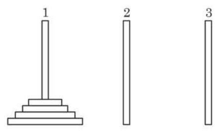

(第 1 题)

2. 如图, 将一个边长为 1 的正三角形的每条边三等分, 以中间一段为边向外作正三角形, 并擦去中间这一段, 如此继续下去得到的曲线称为科克雪花曲线. 将下面的图形依次记作 ${M}_{1}\text{ 、 }{M}_{2}\text{ 、 }{M}_{3}\text{ 、 }\cdots \text{ 、 }{M}_{n}\text{ 、 }\cdots$ .

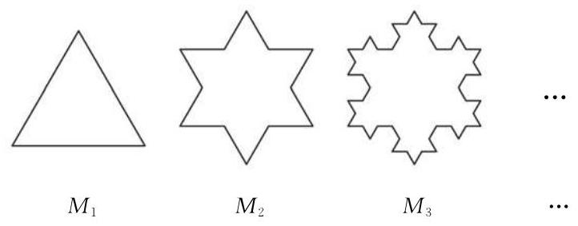

(第 2 题)

(1)求 ${M}_{n}$ 的周长;

(2)求 ${M}_{n}$ 的面积；

(3)当 $n \rightarrow   + \infty$ 时,科克雪花曲线所围成的图形是周长无限增大而面积却有极限的图形吗? 若是, 请求出其面积的极限; 若不是, 请说明理由.