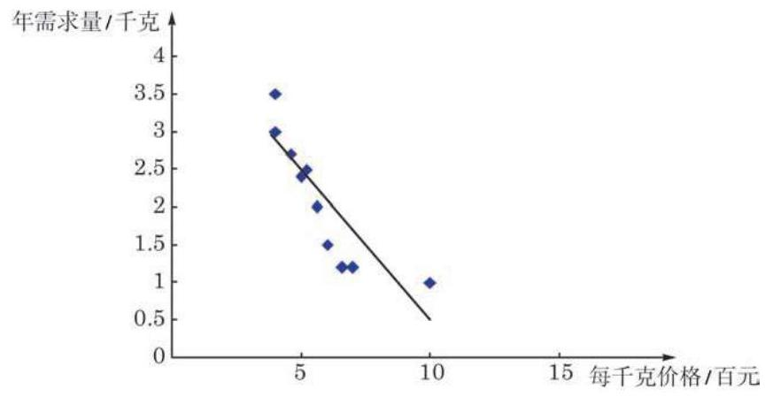
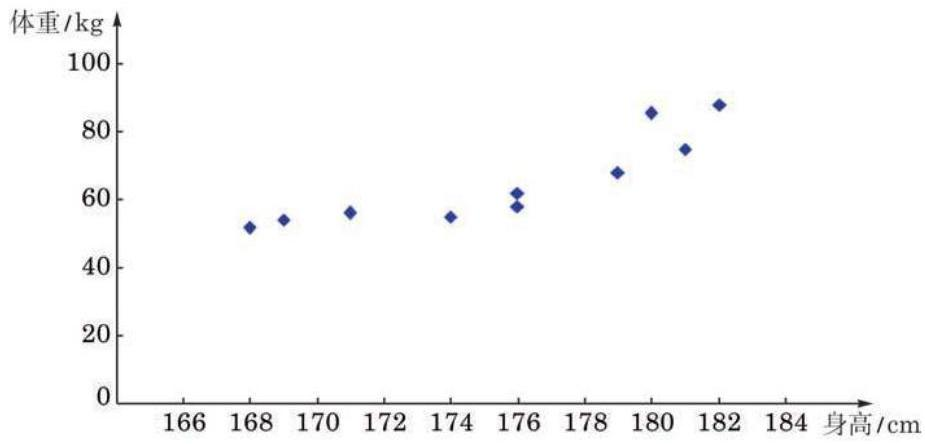
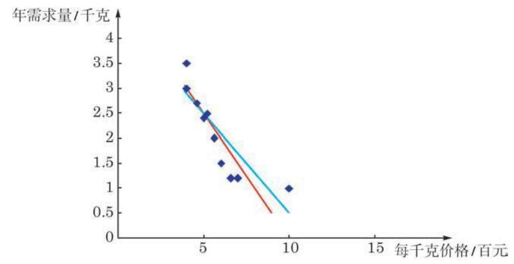
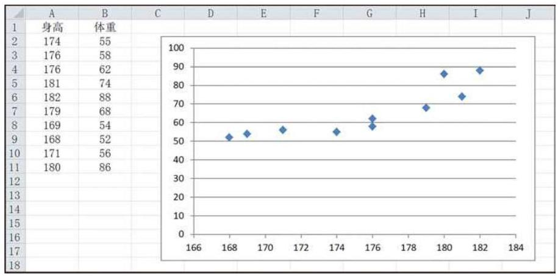
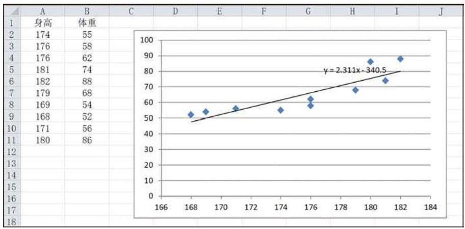
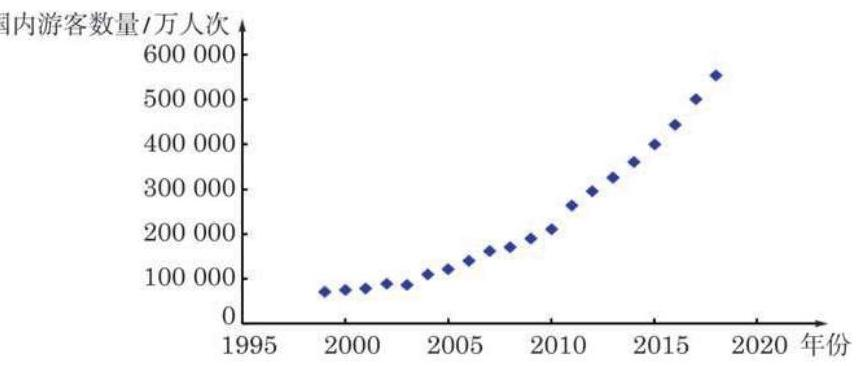
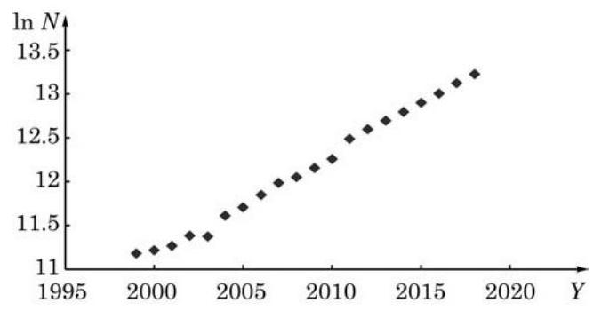
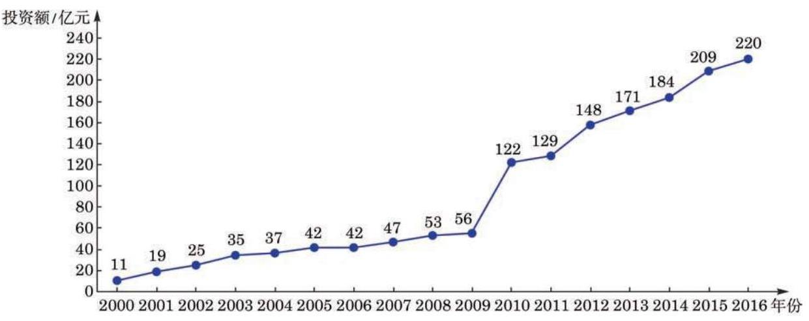

成对数据的统计分析

在必修课程第 13 章“统计”中，我们主要研究了来自单一变量数据的一些统计特征, 如集中趋势、离散程度、分布等. 但现实世界中许多事物和现象之间都是有联系的. 在本章中， 我们将主要学习来自两个变量的成对数据的相关分析和回归分析, 掌握它们之间的统计规律.

本章将要学习的相关分析、回归分析及 ${\mathcal{X}}^{2}$ 检验都属于推断性统计方法, 它们在构建统计模型、预测结果和因果分析等方面有许多应用.

在必修课程中学过的散点图是进行成对数据统计分析的基础, 通过观察散点图可以大致了解数据的整体形态和偏离情况, 发现两组数据之间的变化规律，构建适当的统计模型. 统计图表不仅可以直观地表示数据及其规律，也是建立统计直觉的重要途径.

### 8.1 成对数据的相关分析

## 1 成对数据间的关系

在统计活动中, 我们常常需要研究来自同一对象的两个相关变量的两组数据间的关系. 例如, 为考察某班学生的身高与体重的关系, 首先需要对每个学生的身高和体重进行测量, 得到两组数据:一组是反映“身高”这个变量的数据，另一组是反映“体重”这个变量的数据. 我们把这样来自同一对象的两组数据称为成对数据. 研究成对数据相关性的方法称为相关分析(correlation analysis).

在必修课程第 13 章中, 我们曾经用散点图观察两个变量之间的相关性. 例如, 我们分别讨论了钻石价格与质量、颜色之间的关系.

下面再来看一个例子.

例 1 通过随机抽样, 我们获得某种商品每千克价格 (单位:百元)与该商品消费者年需求量(单位:千克)的一组调查数据, 如表 8-1 所示.

表 8-1 消费者年需求量与商品每千克价格

<table><tr><td>每千克价格/百元</td><td>4.0</td><td>4.0</td><td>4.6</td><td>5.0</td><td>5.2</td><td>5.6</td><td>6.0</td><td>6.6</td><td>7.0</td><td>10.0</td></tr><tr><td>年需求量/千克</td><td>3.5</td><td>3.0</td><td>2.7</td><td>2.4</td><td>2.5</td><td>2.0</td><td>1.5</td><td>1.2</td><td>1.2</td><td>1.0</td></tr></table>

请绘制上述数据的散点图，并依据散点图观察两组数据的相关性.

解 由于这两组数据分别来自同一商品的两个变量: “每千克价格”与“年需求量”，因此来自这两个变量的两组数据可以看作成对数据. 把“每千克价格”作为横坐标(自变量)，“年需求量” 作为纵坐标 (因变量), 在平面直角坐标系中绘制相应的点, 就得到年需求量和每千克价格的散点图 (图 8-1-1).

图 8-1-1 消费者年需求量与商品每千克价格的散点图

---

散点图中的点和必修课程第 13 章中一样, 用小方块 “●”或 “ $\bullet$ ”表示.

---

从图 8-1-1 可以看出, 消费者对该商品的年需求量大体上随着价格的上升而减少，但也有一些例外的情况. 例如，价格都是 4 百元, 但不同年份的需求量分别是 3.5 千克和 3 千克, 说明在价格不变的情况下，需求量仍可能发生变化. 类似地，价格改变, 需求也可能基本不变.

对例 1 所示的散点图, 从整体上看, 所有点都在一条直线的附近波动, 在这种情况下, 我们说两个变量之间具有一种线性相关关系. 此时可以用一条直线来拟合这两组数据(图 8-1-1).

## 练习 8.1(1)

1. 若已知下列各组数据，它们是否可以看作成对数据？是否可以进行相关分析？判断并简要说明理由.

(1)A 校学生的身高与 B 校学生的体重；

(2)人体内的脂肪含量与体重；

(3)某班学生的物理成绩与数学成绩.

2.《国家学生体质健康标准(2014 年修订)》中，体能监测包含身高、体重、肺活量、 50 米跑、坐位体前屈、引体向上(女:仰卧起坐)、立定跳远、1000 米跑(女:800 米跑)， 据此得到的每项指标都可以按照相应的单项指标评分表进行测量和计分，分别得到相应的数据.

(1)这些数据中的任意两组是否都可以作为成对数据进行相关分析？

(2)依据你的经验，哪两组数据的相关程度可能最高？哪两组数据的相关程度可能最低? 如何通过统计方法检验你的判断?

3.某市 104 路公交车上午 7:05-8:55 时段在起点站每 9 分钟发一班次. 公交公司为了了解早高峰时段各班次上客情况, 某日上午 7:14-8:35 记录了在起点站各班次车辆上客的人数:

<table><tr><td>发车时刻</td><td>7:14</td><td>7:23</td><td>7:32</td><td>7:41</td><td>7:50</td><td>7:59</td><td>8:08</td><td>8:17</td><td>8:26</td><td>8:35</td></tr><tr><td>上车乘客数/人</td><td>10</td><td>13</td><td>13</td><td>18</td><td>17</td><td>15</td><td>12</td><td>9</td><td>3</td><td>3</td></tr></table>

请绘制这组成对数据的散点图, 并通过观察散点图大致判断客车发车时刻与上车乘客人数之间的相关性.

## 2 相关系数

从本节例 1 可以看出, 一些成对数据具有明显的相关性, 且在绘制出散点图后可以用一条直线进行拟合, 也就是说具有线性相关性. 在这种情况下, 我们如何进一步描述成对数据的线性相关程度呢?

设由变量 $x$ 和 $y$ 获得的两组数据分别为 ${x}_{i}$ 和 ${y}_{i}\left( {i = 1,2,\cdots }\right.$ , n), 其对应关系如表 8-2 所示.

表 8-2

<table><tr><td>变量 $\;x$</td><td>${x}_{1}$</td><td>${x}_{2}$</td><td>${x}_{3}$</td><td>${x}_{4}$</td><td>${x}_{5}$</td><td>${x}_{6}$</td><td>...</td><td>${x}_{n}$</td></tr><tr><td>变量 $\;y$</td><td>${y}_{1}$</td><td>${y}_{2}$</td><td>${y}_{3}$</td><td>${y}_{4}$</td><td>${y}_{5}$</td><td>${y}_{6}$</td><td>...</td><td>${y}_{n}$</td></tr></table>

两组数据 ${x}_{i}$ 和 ${y}_{i}$ 的线性相关系数 (linear correlation coefficient) 是度量两个变量 $x$ 与 $y$ 之间线性相关程度的统计量,其计算公式为

$$
r = \frac{\mathop{\sum }\limits_{{i = 1}}^{n}\left( {{x}_{i} - \bar{x}}\right) \left( {{y}_{i} - \bar{y}}\right) }{\sqrt{\mathop{\sum }\limits_{{i = 1}}^{n}{\left( {x}_{i} - \bar{x}\right) }^{2}\mathop{\sum }\limits_{{i = 1}}^{n}{\left( {y}_{i} - \bar{y}\right) }^{2}}}.
$$

①

其中, $\bar{x} = \frac{1}{n}\mathop{\sum }\limits_{{i = 1}}^{n}{x}_{i},\bar{y} = \frac{1}{n}\mathop{\sum }\limits_{{i = 1}}^{n}{y}_{i}$ ,它们分别是这两组数据的算术平均数.

线性相关系数常常简称为相关系数(correlation coefficient), 也称为皮尔逊相关系数 (Pearson's correlation coefficient). 相关系数计算公式的推导过程比较复杂, 这里不予涉及. 一般情况下, 只需要把两组数据输入计算机或计算器，有很多软件可以帮助我们进行这一计算. Q

---

不等式 $\left| r\right|  \leq  1$ 的证明不作要求, 本节的课后阅读“相关系数的几何意义”将给出直观的解释.

---

可以证明,相关系数 $r$ 的值满足 $\left| r\right|  \leq  1.\left| r\right|$ 越接近 1,两个变量的线性相关程度越高; $\left| r\right|$ 越接近 0,两个变量的线性相关程度越低. $r > 0$ 时,当 $x$ 的值由小变大, $y$ 的值具有由小变大的变化趋势,称这种相关为正相关; $r < 0$ 时,当 $x$ 的值由小变大, $y$ 的值具有由大变小的变化趋势,称这种相关为负相关.

相关系数 $r$ 描述的是两个变量之间线性关系的方向与程度, 是一种定量分析的方法. 相关系数具有以下特点:

(1)相关系数的计算公式关于 $x$ 和 $y$ 这两个变量是对称的. 画散点图时, 不论以哪个变量作为横轴 (纵轴), 所得的相关系数都一样.

(2)两个变量的相关系数与这两个变量的单位无关. 例如， 在计算身高与体重的相关系数时, 身高单位不管取 “米”还是 “厘米”, 相关系数的结果都一样.

(3)与平均数和标准差一样，相关系数不仅会受到数据量多少的影响, 也会受到少数异常值较大的影响.

例 2 为了解某市高中男生身高与体重的关系，随机抽取 5 所高中学校, 并获得这些学校全部男生的身高 (单位: cm) 与体重(单位:kg)的数据. 为了减少篇幅，从中随机选取 10 名高中男生的身高与体重的数据，如表 8-3 所示. 试根据表中数据绘制散点图, 计算相关系数并判断学生身高与体重的相关程度.

表 8-3 10 名高中男生的身高与体重

<table><tr><td>编号</td><td>1</td><td>2</td><td>3</td><td>4</td><td>5</td><td>6</td><td>7</td><td>8</td><td>9</td><td>10</td></tr><tr><td>身高/cm</td><td>174</td><td>176</td><td>176</td><td>181</td><td>182</td><td>179</td><td>169</td><td>168</td><td>171</td><td>180</td></tr><tr><td>体重/kg</td><td>55</td><td>58</td><td>62</td><td>74</td><td>88</td><td>68</td><td>54</td><td>52</td><td>56</td><td>86</td></tr></table>

解 将表 8-3 中的数据输入计算机电子表格办公软件的工作簿， 先选中身高与体重两行(或两列)数据，再选择插入统计图中的散点图, 选择图形样式, 就完成了散点图的绘制, 如图 8-1-2 所示.

图 8-1-2 10 名高中男生身高与体重的散点图

---

用相关系数来描述两个随机变量的相关性, 一般要求这两个变量均满足正态分布.

在本例中，若删去一组数据 $\left( {{182},{88}}\right)$ , 则相关系数变为 0.844; 若样本数据中身高为 ${182}\mathrm{\;{cm}}$ 的学生体重为 ${58}\mathrm{\;{kg}}$ ,则相关系数变为 0.684 .

---

从图 8-1-2 中可以看出, 总体上来说, 样本学生的身高和体重之间具有明显的相关性, 个子高的学生往往更重一些.

---

用计算机或计算器算得数值的小数位数较多, 在统计应用中可根据需要进行取舍.

---

为了计算相关系数, 我们把表中的两组数据代入本节公式 ①，通过计算机或计算器算得 $r \approx  {0.873}$ . 这说明样本学生的身高与体重之间具有很高的相关性.

## 练习 8.1(2)

1. 用经过匿名处理的本班同学最近一次期中或期末测验的各科成绩表，考察不同科目测验成绩之间的相关性.

2. 为了研究豆类脂肪含量与其产生的热量的关系, 选取了 5 种豆类进行实验测定. 下面是 ${0.1}\mathrm{\;{kg}}$ 豆类中脂肪含量 (单位: $\mathrm{{kg}}$ ) 与相应热量 (单位: $\mathrm{{kJ}}$ ) 的对照表.

<table><tr><td>豆类</td><td>黄豆</td><td>豇豆</td><td>青毛豆</td><td>豌豆(鲜)</td><td>四季豆</td></tr><tr><td>脂肪含量/kg</td><td>0.0184</td><td>0.000 2</td><td>0.0057</td><td>0.000 3</td><td>0.000 4</td></tr><tr><td>热量/kJ</td><td>1726</td><td>108</td><td>527</td><td>336</td><td>130</td></tr></table>

(1)根据表中的数据绘制散点图；

(2)观察散点图的趋势，如果能看成线性关系，请在图中画出一条直线来近似地表示这种关系, 并计算豆类脂肪含量与热量的相关系数.

## 习题 8.1

## A 组

1. 计算例 1 中商品每千克价格与年需求量之间的相关系数.

2. 必修课程第 13 章中曾给出 A 校 66 名高一年级学生身高(单位:cm) 与体重(单位: kg)的数据，见下表. 试计算它们的相关系数.

<table id="cross-table-1"><tr><td>性别</td><td>身高/cm</td><td>体重/kg</td><td>性别</td><td>身高/cm</td><td>体重/kg</td><td>性别</td><td>身高/cm</td><td>体重/kg</td></tr><tr><td>女</td><td>152</td><td>46</td><td>女</td><td>164</td><td>52</td><td>男</td><td>172</td><td>92</td></tr><tr><td>女</td><td>153</td><td>47</td><td>男</td><td>165</td><td>54</td><td>男</td><td>172</td><td>64</td></tr><tr><td>女</td><td>154</td><td>63</td><td>男</td><td>165</td><td>60</td><td>女</td><td>172</td><td>69</td></tr><tr><td>女</td><td>155</td><td>50</td><td>男</td><td>165</td><td>48</td><td>男</td><td>173</td><td>75</td></tr><tr></tr><tr><td>女</td><td>156</td><td>48</td><td>女</td><td>165</td><td>51</td><td>男</td><td>173</td><td>72</td></tr><tr><td>女</td><td>156</td><td>50</td><td>女</td><td>165</td><td>55</td><td>男</td><td>174</td><td>55</td></tr><tr><td>女</td><td>156</td><td>51</td><td>女</td><td>165</td><td>58</td><td>男</td><td>174</td><td>56</td></tr><tr><td>女</td><td>157</td><td>51</td><td>女</td><td>165</td><td>63</td><td>男</td><td>174</td><td>63</td></tr><tr><td>女</td><td>157</td><td>50</td><td>男</td><td>166</td><td>64</td><td>男</td><td>174</td><td>74</td></tr><tr><td>女</td><td>159</td><td>49</td><td>男</td><td>167</td><td>54</td><td>男</td><td>175</td><td>53</td></tr><tr><td>女</td><td>159</td><td>51</td><td>男</td><td>167</td><td>52</td><td>男</td><td>176</td><td>64</td></tr><tr><td>女</td><td>160</td><td>47</td><td>男</td><td>167</td><td>53</td><td>男</td><td>176</td><td>60</td></tr><tr><td>女</td><td>160</td><td>62</td><td>女</td><td>167</td><td>69</td><td>男</td><td>177</td><td>63</td></tr><tr><td>女</td><td>160</td><td>50</td><td>女</td><td>167</td><td>61</td><td>男</td><td>177</td><td>75</td></tr><tr><td>女</td><td>160</td><td>63</td><td>男</td><td>168</td><td>97</td><td>男</td><td>178</td><td>62</td></tr><tr><td>女</td><td>161</td><td>53</td><td>女</td><td>168</td><td>60</td><td>男</td><td>178</td><td>60</td></tr><tr><td>女</td><td>162</td><td>84</td><td>女</td><td>168</td><td>44</td><td>男</td><td>178</td><td>73</td></tr><tr><td>女</td><td>163</td><td>66</td><td>男</td><td>170</td><td>53</td><td>男</td><td>178</td><td>68</td></tr><tr><td>女</td><td>163</td><td>53</td><td>男</td><td>170</td><td>54</td><td>男</td><td>179</td><td>78</td></tr><tr><td>女</td><td>164</td><td>63</td><td>男</td><td>170</td><td>57</td><td>男</td><td>181</td><td>80</td></tr><tr><td>女</td><td>164</td><td>68</td><td>男</td><td>170</td><td>47</td><td>男</td><td>182</td><td>92</td></tr><tr><td>女</td><td>164</td><td>52</td><td>男</td><td>170</td><td>69</td><td>男</td><td>184</td><td>78</td></tr></table>

3. 某公司为研究工人操作熟练程度对产品合格率的影响, 随机抽取 15 名工人进行调查, 得到如下数据:

<table><tr><td>工人编号</td><td>1</td><td>2</td><td>3</td><td>4</td><td>5</td><td>6</td><td>7</td><td>8</td></tr><tr><td>操作熟练程度/%</td><td>7.6</td><td>15.2</td><td>37.9</td><td>45.5</td><td>7.6</td><td>0.0</td><td>15.2</td><td>75.8</td></tr><tr><td>产品合格率/%</td><td>50</td><td>55</td><td>68</td><td>75</td><td>52</td><td>30</td><td>55</td><td>90</td></tr><tr><td>工人编号</td><td>9</td><td>10</td><td>11</td><td>12</td><td>13</td><td>14</td><td>15</td><td>/</td></tr><tr><td>操作熟练程度/%</td><td>90.9</td><td>60.6</td><td>7.6</td><td>15.2</td><td>37.9</td><td>45.5</td><td>98.5</td><td>/</td></tr><tr><td>产品合格率/%</td><td>92</td><td>80</td><td>58</td><td>60</td><td>70</td><td>80</td><td>95</td><td>/</td></tr></table>

试计算工人操作熟练程度与产品合格率的相关系数.

4. 为判断能不能用气温推测海水表层温度, 收集了某沿海地区的气温和海水表层温度 (单位:℃)的统计数据，如下表所示.

<table><tr><td>气温/℃</td><td>海水表层温度/℃</td><td>气温/℃</td><td>海水表层温度/℃</td></tr><tr><td>13.9</td><td>9.4</td><td>31.1</td><td>28.3</td></tr><tr><td>15.0</td><td>10.6</td><td>31.1</td><td>26.7</td></tr><tr><td>18.3</td><td>13.3</td><td>28.9</td><td>25.0</td></tr><tr><td>23.9</td><td>18.9</td><td>23.9</td><td>22.2</td></tr><tr><td>27.2</td><td>21.7</td><td>20.0</td><td>15.6</td></tr><tr><td>30.0</td><td>25.6</td><td>15.0</td><td>10.0</td></tr></table>

试计算气温与海水表层温度的相关系数.

## B 组

1. 如果两种证券在一段时间内收益数据的相关系数为正数, 那么表明 ( )

A. 两种证券的收益之间存在完全同向的联动关系, 即同时涨或同时跌;

B. 两种证券的收益之间存在完全反向的联动关系, 即涨或跌是相反的;

C. 两种证券的收益有同向变动的倾向;

D. 两种证券的收益有反向变动的倾向.

2. 据说职工迟到的频率与其居住地离上班地点的远近有关. 为验证这个说法, 一位社会学家随机抽取 10 名职工进行了调查, 其调查数据如下表所示.

<table><tr><td>职工编号</td><td>年迟到次数/次</td><td>住地远近/km</td><td>职工编号</td><td>年迟到次数/次</td><td>住地远近/km</td></tr><tr><td>1</td><td>8</td><td>1.1</td><td>6</td><td>3</td><td>10.1</td></tr><tr><td>2</td><td>5</td><td>2.9</td><td>7</td><td>5</td><td>12.0</td></tr><tr><td>3</td><td>8</td><td>4.0</td><td>8</td><td>2</td><td>14.3</td></tr><tr><td>4</td><td>7</td><td>5.9</td><td>9</td><td>4</td><td>14.1</td></tr><tr><td>5</td><td>6</td><td>8.2</td><td>10</td><td>2</td><td>7.8</td></tr></table>

试计算职工年迟到次数与住地远近之间的相关系数.

3. 下表是某国家由 18 支足球队参加的职业联赛(比赛采用双循环制，得分计算方法为:每场赛事胜方得 3 分，负方得 0 分，平局双方各得 1 分)的各队积分和射门次数，求这 18 支球队的积分与射门次数的相关系数.

<table><tr><td>足球队</td><td>A</td><td>B</td><td>C</td><td>D</td><td>E</td><td>F</td><td>G</td><td>H</td><td>I</td></tr><tr><td>积分</td><td>51</td><td>64</td><td>62</td><td>53</td><td>47</td><td>43</td><td>44</td><td>42</td><td>46</td></tr><tr><td>射门次数</td><td>418</td><td>509</td><td>485</td><td>425</td><td>452</td><td>425</td><td>393</td><td>350</td><td>375</td></tr><tr><td>足球队</td><td>J</td><td>K</td><td>L</td><td>M</td><td>N</td><td>O</td><td>P</td><td>Q</td><td>R</td></tr><tr><td>积分</td><td>43</td><td>50</td><td>35</td><td>40</td><td>40</td><td>32</td><td>41</td><td>26</td><td>32</td></tr><tr><td>射门次数</td><td>428</td><td>415</td><td>363</td><td>372</td><td>377</td><td>271</td><td>395</td><td>306</td><td>357</td></tr></table>

## 课后阅读

## 相关系数的几何意义

观察相关系数 $r$ 的计算公式

$$
r = \frac{\mathop{\sum }\limits_{{i = 1}}^{n}\left( {{x}_{i} - \bar{x}}\right) \left( {{y}_{i} - \bar{y}}\right) }{\sqrt{\mathop{\sum }\limits_{{i = 1}}^{n}{\left( {x}_{i} - \bar{x}\right) }^{2}\mathop{\sum }\limits_{{i = 1}}^{n}{\left( {y}_{i} - \bar{y}\right) }^{2}}},
$$

①

你是否觉得似曾相识?

在学习向量时, 我们曾经给出过两个向量的夹角公式. 下面以空间向量为例, 来看看两个空间向量的夹角公式与公式 ① 的联系. 设 $\overrightarrow{x} = \left( {{x}_{1},{x}_{2},{x}_{3}}\right) ,\overrightarrow{y} = \left( {{y}_{1},{y}_{2},{y}_{3}}\right)$ ,那么它们夹角的余弦为

$$
\cos \langle \overrightarrow{x},\overrightarrow{y}\rangle  = \frac{{x}_{1}{y}_{1} + {x}_{2}{y}_{2} + {x}_{3}{y}_{3}}{\sqrt{\left( {{x}_{1}^{2} + {x}_{2}^{2} + {x}_{3}^{2}}\right) \left( {{y}_{1}^{2} + {y}_{2}^{2} + {y}_{3}^{2}}\right) }} = \frac{\mathop{\sum }\limits_{{i = 1}}^{3}{x}_{i}{y}_{i}}{\sqrt{\mathop{\sum }\limits_{{i = 1}}^{3}{x}_{i}^{2}\mathop{\sum }\limits_{{i = 1}}^{3}{y}_{i}^{2}}}.
$$

从结构上看,这两个公式是一样的. 如果把两组数据 ${x}_{i}\text{ 、 }{y}_{i}\left( {i = 1,2,\cdots , n}\right)$ 看作两个 $n$ 维向量 $\overrightarrow{x} = \left( {{x}_{1},{x}_{2},\cdots ,{x}_{n}}\right) \text{ 、 }\overrightarrow{y} = \left( {{y}_{1},{y}_{2},\cdots ,{y}_{n}}\right)$ ,并记由这两组数据的平均数构成的两个 $n$ 维向量分别是 $\overrightarrow{z} = \left( {\bar{x},\bar{x},\cdots ,\bar{x}}\right)$ 及 $\overrightarrow{y} = \left( {\bar{y},\bar{y},\cdots ,\bar{y}}\right)$ ,那么比较公式①和向量的夹角公式可以发现: $r = \cos \langle \overrightarrow{x} - \overrightarrow{x},\overrightarrow{y} - \overrightarrow{y}\rangle$ ,这说明相关系数 $r$ 其实就是两个向量 $\overrightarrow{x} - \overrightarrow{z}$ 与 $\overrightarrow{y}$ 一 $\overrightarrow{y}$ 的夹角的余弦值. 余弦值越接近 1 或 -1，意味着这两个向量越接近平行，散点图中的点更多地落在同一条直线的附近, 说明这两组数据的变化方向接近相同或相反, 正相关或负相关的程度越高; 余弦值越接近 0 , 意味着这两个向量越接近垂直, 表示这两组数据的相关程度越低. 此外,两组数据 ${x}_{i}\text{ 、 }{y}_{i}\left( {i = 1,2,\cdots , n}\right)$ 之所以分别减去各自的平均数,相应地得到差向量 $\overrightarrow{x}$ 一 $\overrightarrow{z}$ 与 $\overrightarrow{y}$ 一 $\overrightarrow{y}$ ,从几何上看是在作一个平移变换,而用统计学的说法, 则相应于做了一个数据中心化的处理.

### 8.2 一元线性回归分析

## 1 一元线性回归分析的基本思想

对于一组有某种线性关系的成对数据, 上一节介绍的相关系数分析了数据之间线性关系的方向与程度. 但有时我们还需要进一步了解其中一个变量随另一个变量变化的大致情况. 更准确地说, 我们要找到关联两个变量的一个线性方程, 使得在平面直角坐标系上数据所确定的点尽可能地 “贴近” 方程所定义的直线.

先回到本章 8.1 节的例 1. 为了找一条直线去“贴近”数据散点图 (图 8-1-1) 中的各点, 甲、乙两名同学分别给出了线性方程:

甲: $y =  - {0.5x} + {5.0}$ ,

乙: $y =  - {0.4x} + {4.5}$ .

我们在散点图上把这两个线性方程所定义的直线绘制出来, 如图 8-2-1 所示, 其中红色直线是甲的方程所定义的, 蓝色直线是乙的方程所定义的.

图 8-2-1

凭直觉我们很难断定哪条直线与数据点贴近得更好.

至此, 我们会提出问题: (1)有没有明确的标准来衡量直线与数据点的贴近程度? (2)如果有这样的标准，如何找出在此标准下最佳的直线?

要解决这两个问题, 可以用下面介绍的回归分析的方法.

一般地,设给定一组有线性相关关系的成对数据 $\left( {{x}_{1},{y}_{1}}\right)$ 、 $\left( {{x}_{2},{y}_{2}}\right) \text{ 、 }\cdots \text{ 、 }\left( {{x}_{n},{y}_{n}}\right)$ 和一个线性方程 (或称线性模型)

$$
y = {ax} + b.
$$

①

如何描述数据与此线性方程的贴近度呢?

当变量 $x$ 取值 ${x}_{i}\left( {i = 1,2,\cdots , n}\right)$ 时,令 ${\widehat{y}}_{i} = a{x}_{i} + b$ ,它是变量 $y$ 与 ${x}_{i}$ 对应的理想值. 但数据中的 ${y}_{i}$ 与 ${\widehat{y}}_{i}$ 不一定相同, 它们的差 ${y}_{i} - {\widehat{y}}_{i}$ 称为在 ${x}_{i}$ 处的离差 (dispersion),当 ${y}_{i} - {\widehat{y}}_{i} \geq  0$ 时称为正离差,而当 ${y}_{i} - {\widehat{y}}_{i} < 0$ 时称为负离差. 显然,离差直观地描述了单对数据与线性方程①的贴近度.

由于离差可正可负, 考虑数据整体与线性方程①的贴近度时, 不能简单地用离差的代数和作为指标. 我们可以像计算方差那样, 用离差的平方和

$$
Q = \mathop{\sum }\limits_{{i = 1}}^{n}{\left( {y}_{i} - {\widehat{y}}_{i}\right) }^{2}
$$

来刻画直线与点之间的拟合程度. $Q$ 称为拟合误差 (fitting error), 它是一个很好的描述数据与函数贴合程度的指标. 我们把拟合误差取得最小值时得到的线性方程(线性模型)记为

$$
y = \widehat{a}x + \widehat{b},
$$

②

并称之为变量 $y$ 随 $x$ 波动的回归方程 (regression equation) 或回归模型 (regression model),其中自变量 $x$ 称为解释变量 (explanatory variable),因变量 $y$ 称为反应变量 (response variable). 回归方程所定义的直线称为回归直线 (regression line), 回归方程的系数 (或称回归模型的参数) $\widehat{a}$ 与 $\widehat{b}$ 称为回归系数 (regression coefficients). 由一组有某种线性关系的成对数据求其回归方程的方法称为一元线性回归分析 (regression analysis).

回归系数 $\widehat{a}$ 与 $\widehat{b}$ 的计算公式如下:

$$
\left\{  \begin{array}{l} \widehat{a} = \frac{\mathop{\sum }\limits_{{i = 1}}^{n}\left( {{x}_{i} - \bar{x}}\right) \left( {{y}_{i} - \bar{y}}\right) }{\mathop{\sum }\limits_{{i = 1}}^{n}{\left( {x}_{i} - \bar{x}\right) }^{2}} = \frac{\mathop{\sum }\limits_{{i = 1}}^{n}{x}_{i}{y}_{i} - n\bar{x}\bar{y}}{\mathop{\sum }\limits_{{i = 1}}^{n}{x}_{i}{}^{2} - n{\bar{x}}^{2}}, \\  \widehat{b} = \bar{y} - \widehat{a}\bar{x} = \frac{\mathop{\sum }\limits_{{i = 1}}^{n}{y}_{i} - \widehat{a}\mathop{\sum }\limits_{{i = 1}}^{n}{x}_{i}}{n}, \end{array}\right.
$$

③

其中 $\bar{x}$ 与 $\bar{y}$ 分别是数据 ${x}_{i}$ 与 ${y}_{i}\left( {i = 1,2,\cdots , n}\right)$ 的算术平均值, 数对 $\left( {\bar{x},\bar{y}}\right)$ 称为样本点的中心.

公式③的一个初等的推导过程在本节的课后阅读中介绍. 回归系数 $\widehat{a}$ 与 $\widehat{b}$ 的值只与给定的数据有关，而与回归分析过程中初始选择的线性模型无关.

---

从回归系数公式 ③可以看出，回归直线经过样本点的中心 $\left( {\bar{x},\bar{y}}\right)$ ,也就是散点图中数据点的中心.

---

有了回归系数 $\widehat{a}$ 与 $\widehat{b}$ ,代入方程②就得到了这一组成对数据的回归方程. 这样, 我们对本节开头提的两个问题都有了明确的答案.

我们的回归分析是基于 $Q$ 取最小值的假设,即基于所有离差的平方和取最小值的假设进行的. 这种回归分析的方法称为最小二乘法 (least squares), 由最小二乘法导出的估计量称为最小二乘估计量,所得到的回归系数 $\widehat{a}$ 与 $\widehat{b}$ 又称为模型参数 $a$ 与 $b$ 的最小二乘估计 (least squares estimate).

在解决具体问题时, 如果数据量不大, 可以用上面的公式直接计算出回归系数 $\widehat{a}$ 与 $\widehat{b}$ ,进而得出回归方程. 如果数据量大, 就要借助统计软件, 通过计算机或计算器来实现这一过程了.

下面我们针对本章 8.1 节中的例 1 来求回归方程, 并理解回归直线与观察值之间的关系.

依据表 8-1 给出的某种商品“年需求量”(y)与“每千克价格” (x)之间的一组观察数据以及所得到的散点图 8-1-1，我们已经知道这两个变量形成的数据点大致分布在一条直线的附近，即“年需求量” $\left( y\right)$ 与“每千克价格” $\left( x\right)$ 大致呈线性关系,因而可以用线性回归方程来刻画它们之间的数量关系. 用回归系数的计算公式可求得 $\left\{  \begin{array}{l} \widehat{a} =  - {0.413}, \\  \widehat{b} = {4.495}, \end{array}\right.$ 于是所求的回归方程为

$$
y =  - {0.413x} + {4.495},
$$

这个方程所定义的直线即这组数据的回归直线, 它是给定数据点的最佳拟合直线.

由回归方程,我们可以算出每个 ${x}_{i}$ 对应的计算值 ${\widehat{y}}_{i}$ (结果精确到 0.1 )，列表 8-4 如下:

表 8-4

<table><tr><td>$x$</td><td>4.0</td><td>4.0</td><td>4.6</td><td>5.0</td><td>5.2</td><td>5.6</td><td>6.0</td><td>6.6</td><td>7.0</td><td>10</td></tr><tr><td>$y$</td><td>3.5</td><td>3.0</td><td>2.7</td><td>2.4</td><td>2.5</td><td>2.0</td><td>1.5</td><td>1.2</td><td>1.2</td><td>1.0</td></tr><tr><td>$\widehat{y}$</td><td>2.8</td><td>2.8</td><td>2.6</td><td>2.4</td><td>2.3</td><td>2.2</td><td>2.0</td><td>1.8</td><td>1.6</td><td>0.4</td></tr><tr><td>离差 ${y}_{i} - {\widehat{y}}_{i}$</td><td>0.7</td><td>0.2</td><td>0.1</td><td>0.0</td><td>0.2</td><td>-0.2</td><td>-0.5</td><td>-0.6</td><td>-0.4</td><td>0.6</td></tr></table>

据此可进一步算出拟合误差 $Q = \mathop{\sum }\limits_{{i = 1}}^{{10}}{\left( {y}_{i} - {\widehat{y}}_{i}\right) }^{2} = {0.7}^{2} +$ 0. ${2}^{2} + {0.1}^{2} + {0.0}^{2} + {0.2}^{2} + {\left( -{0.2}\right) }^{2} + {\left( -{0.5}\right) }^{2} + {\left( -{0.6}\right) }^{2} + \; {\left( -{0.4}\right) }^{2} + {0.6}^{2} = {1.75}$ . 它当然是这组数据的线性拟合中拟合误差所能达到的最小值.

---

如果两组数据之间的相关系数很小, 根据公式求回归系数还有意义吗?

---

有了上述准备，现在我们就能判断本节开始时学生甲和乙给出的线性方程哪个更贴近所给的数据点了. 学生乙所给的方程实际上是系数精确度不同的回归方程, 如果用这个方程来制作表 8-4, 只会出现一些由数据精确度不同引起的小误差; 学生甲所给的方程与回归方程有本质的差别.

## 练习 8.2(1)

1. 将学生甲所给的线性方程 $y =  - {0.5x} + {5.0}$ 作为本章 8.1 节例 1 数据的线性拟合, 计算各数据点的离差, 再计算拟合误差. 把结果与表 8-4 的数据相比较, 说说你对“最佳拟合”有什么新的理解和体会.

2. 两个变量 $x$ 与 $y$ 之间的回归方程 ( )

A. 表示 $x$ 与 $y$ 之间的函数关系; B. 表示 $x$ 与 $y$ 之间的不确定关系;

C. 反映 $x$ 与 $y$ 之间的真实关系; D. 是反映 $x$ 与 $y$ 之间的真实关系的一种最佳拟合.

3. 用最小二乘法求回归方程是为了使 ( )

A. $\mathop{\sum }\limits_{{i = 1}}^{n}\left( {{y}_{i} - \bar{y}}\right)  = 0$ ; B. $\mathop{\sum }\limits_{{i = 1}}^{n}\left( {{y}_{i} - {\widehat{y}}_{i}}\right)  = 0$ ;

C. $\mathop{\sum }\limits_{{i = 1}}^{n}\left( {{y}_{i} - {\widehat{y}}_{i}}\right)$ 最小; D. $\mathop{\sum }\limits_{{i = 1}}^{n}{\left( {y}_{i} - {\widehat{y}}_{i}\right) }^{2}$ 最小.

## 2 一元线性回归分析的应用举例

例 1 依据本章 8.1 节例 2 中某市高中男生身高与体重的抽样数据,运用电子表格办公软件求“体重” $\left( y\right)$ 关于“身高” $\left( x\right)$ 的回归方程.

解 将表 8-3 中的数据输入工作簿，然后选择“插入图表”， 再选择“散点图”，则自动生成如下的散点图 (图 8-2-2).

图 8-2-2

在数据点上单击右键, 选择 “添加趋势线” 一“线型”, 并在 “趋势线选项”标签中要求给出公式，可以得到回归直线(图 8-2-3).

图 8-2-3

图 8-2-3 中标明了所求的回归方程为: $y = {2.311x} - {340.5}$ .

根据所得的回归方程,对于身高 ${178}\mathrm{\;{cm}}$ 的男生,可以预测其体重为 ${2.311} \times  {178} - {340.5} = \mathbf{{70}.{858}}\left( \mathrm{\;{kg}}\right)$ .

从上述例子可以看出, 建立一元线性回归模型的一般步骤如下:

(1)确定研究对象，从一组数据出发，根据实际问题，明确哪个变量是自变量, 哪个变量是因变量;

(2)对确定的自变量和因变量，绘制相应的散点图，观察它们之间的关系(如是否存在线性关系等)；

(3)若观察到数据呈线性关系，则选用线性方程 $y = {ax} + b$ ；

(4)利用最小二乘法估计线性方程中的参数 $a\text{ 、 }b$ ，得到回归方程 $y = \widehat{a}x + \widehat{b}$ ；

(5)得出结果后计算离差，采用统计方法检验模型是否合适 (这一步本书不作要求);

(6)利用所求的回归方程进行预测.

相关分析和回归分析作为处理成对数据的两种基本统计方法, 它们之间有如下联系与区别:

(1)相关分析主要测定变量之间相关性的强弱和变化方向， 而回归分析则是在相关分析的基础上建立回归模型, 定量地描述变量间具体的变动关系. 只有在两组变量具有线性相关性时, 才作线性回归分析, 得到回归直线.

(2)在相关分析中，两个变量的地位是对等的; 而在回归分析中, 要考察的是一个变量随另一个变量的变化趋势, 其中自变量是解释变量, 因变量是反应变量.

(3)回归分析具有因果分析和预测的功能，可以分析反应变量受解释变量的影响程度, 也可以通过回归方程求得反应变量的计算值来估计其他同类的观察值.

(4)在相关分析中，一般要求两个变量的总体都满足正态分布；而在回归分析时，一般只要求反应变量的总体满足正态分布.

除了具有线性关系的散点图以外, 线性回归分析还可以处理呈指数分布性状的数据分布. 表 8-5 是 1999 年至 2018 年我国国内游客数量(单位:万人次)的统计表，图 8-2-4 是根据这些数据所作的散点图. 从图上可以看出年份与游客人数之间不是线性关系, 而是有明显的指数增长的性状.

表 8-5

<table><tr><td>年份</td><td>1999</td><td>2000</td><td>2001</td><td>2002</td><td>2003</td><td>2004</td><td>2005</td></tr><tr><td>国内游客数量/ 万人次</td><td>71 900</td><td>74400</td><td>78400</td><td>87800</td><td>87000</td><td>110 200</td><td>121 200</td></tr><tr><td>年份</td><td>2006</td><td>2007</td><td>2008</td><td>2009</td><td>2010</td><td>2011</td><td>2012</td></tr><tr><td>国内游客数量/ 万人次</td><td>139 400</td><td>161 000</td><td>171 200</td><td>190 200</td><td>210 300</td><td>264 100</td><td>295700</td></tr><tr><td>年份</td><td>2013</td><td>2014</td><td>2015</td><td>2016</td><td>2017</td><td>2018</td><td>/</td></tr><tr><td>国内游客数量/ 万人次</td><td>326 200</td><td>361 100</td><td>400 000</td><td>444 000</td><td>500 000</td><td>553 900</td><td>/</td></tr></table>

图 8-2-4

为了建立这组数据的拟合模型, 我们将国内游客数量 (方便起见记为 $N$ ,单位: 万人次)取自然对数 $\ln N$ ,可得到表 8-6.

表 8-6

<table><tr><td>年份(Y)</td><td>1999</td><td>2000</td><td>2001</td><td>2002</td><td>2003</td><td>2004</td><td>2005</td></tr><tr><td>$N$</td><td>71 900</td><td>74400</td><td>78400</td><td>87800</td><td>87000</td><td>110 200</td><td>121200</td></tr><tr><td>$\ln N$</td><td>11.18</td><td>11.22</td><td>11.27</td><td>11.38</td><td>11.37</td><td>11.61</td><td>11.71</td></tr><tr><td>年份(Y)</td><td>2006</td><td>2007</td><td>2008</td><td>2009</td><td>2010</td><td>2011</td><td>2012</td></tr><tr><td>$N$</td><td>139 400</td><td>161000</td><td>171 200</td><td>190 200</td><td>210 300</td><td>264 100</td><td>295700</td></tr><tr><td>$\ln N$</td><td>11.85</td><td>11.99</td><td>12.05</td><td>12.16</td><td>12.26</td><td>12.48</td><td>12.60</td></tr><tr><td>年份(Y)</td><td>2013</td><td>2014</td><td>2015</td><td>2016</td><td>2017</td><td>2018</td><td>/</td></tr><tr><td>$N$</td><td>326 200</td><td>361 100</td><td>400000</td><td>444 000</td><td>500 000</td><td>553 900</td><td>/</td></tr><tr><td>$\ln N$</td><td>12.70</td><td>12.80</td><td>12.90</td><td>13.00</td><td>13.12</td><td>13.22</td><td>/</td></tr></table>

对表 8-6 中的变量 $Y$ (年份) 和 $\ln N$ 绘制散点图 (图 8-2-5).

图 8-2-5

从图 8-2-5 中可以看出各数据点之间呈线性关系, 于是我们作线性回归分析,求得 $Y$ 与 $\ln N$ 之的线性拟合 $\ln N = {aY} + b$ . 最终我们得到

$$
N = {\mathrm{e}}^{{aY} + b} = {\mathrm{e}}^{b}{\mathrm{e}}^{aY} = c{\mathrm{e}}^{aY},
$$

其中 $c = {\mathrm{e}}^{b}$ 是一个常数.

相关分析和回归分析都是处理变量与变量之间关系的重要统计方法, 在大数据时代更具有广泛的应用.

## 练习 8.2(2)

1. 某公司为了解用电量 $y$ (单位: $\mathrm{{kW}} \cdot  \mathrm{h}$ ) 与气温 $x$ (单位: ${}^{ \circ  }\mathrm{C}$ ) 之间的关系,随机统计了 4 天的用电量与当天气温, 并制作了如下对照表:

<table><tr><td>气温 $x/\text{ ℃ }$</td><td>18</td><td>13</td><td>10</td><td>-1</td></tr><tr><td>用电量 $y/\left( {\mathrm{{kW}} \cdot  \mathrm{h}}\right)$</td><td>24</td><td>34</td><td>38</td><td>64</td></tr></table>

由表中数据可得回归方程 $y = {ax} + b$ 中 $a =  - 2$ ,试预测当气温为 $- 4{}^{ \circ  }\mathrm{C}$ 时,用电量约为___ $\mathrm{{kw}} \cdot  \mathrm{h}$ .

2. 用计算器或计算机软件建立下列观测数据的回归方程:

<table><tr><td>${x}_{i}$</td><td>70</td><td>115</td><td>130</td><td>190</td><td>195</td><td>400</td><td>450</td></tr><tr><td>${y}_{i}$</td><td>1.10</td><td>1.00</td><td>0.85</td><td>0.75</td><td>0.85</td><td>0.67</td><td>0.50</td></tr></table>

3. 为了研究长江口滨海湿地乡土植物芦苇高度(单位:cm)与干重(单位:g)之间的关系, 观察芦苇高度与干重的数据(见下表), 其中干重为植物收获并烘干到一定标准后的质量. 试建立芦苇干重关于芦苇高度的回归方程.

<table><tr><td>编号</td><td>高度/cm</td><td>千重/g</td><td>编号</td><td>高度/cm</td><td>干重/g</td></tr><tr><td>1</td><td>136</td><td>15.01</td><td>13</td><td>147</td><td>16.87</td></tr><tr><td>2</td><td>136</td><td>14.88</td><td>14</td><td>150</td><td>17.13</td></tr><tr><td>3</td><td>135</td><td>15.12</td><td>15</td><td>148</td><td>17.26</td></tr><tr><td>4</td><td>138</td><td>14.99</td><td>16</td><td>150</td><td>18.13</td></tr><tr><td>5</td><td>139</td><td>15.54</td><td>17</td><td>149</td><td>17.66</td></tr><tr><td>6</td><td>138</td><td>15.24</td><td>18</td><td>152</td><td>17.84</td></tr><tr><td>7</td><td>141</td><td>15.68</td><td>19</td><td>151</td><td>18.17</td></tr><tr><td>8</td><td>143</td><td>15.88</td><td>20</td><td>154</td><td>18.36</td></tr><tr><td>9</td><td>142</td><td>18.16</td><td>21</td><td>155</td><td>17.95</td></tr><tr><td>10</td><td>144</td><td>16.33</td><td>22</td><td>155</td><td>18.65</td></tr><tr><td>11</td><td>148</td><td>15.99</td><td>23</td><td>157</td><td>18.89</td></tr><tr><td>12</td><td>146</td><td>16.57</td><td>24</td><td>156</td><td>19.26</td></tr></table>

## 习题 8.2

## A 组

1. 下表中是某家庭 2009 年至 2018 年电费开支的情况,设年电费开支为 $y$ (单位: 元),试建立年份 $x$ 与 $y$ 的回归方程.

<table><tr><td>年份 $x$</td><td>2009</td><td>2010</td><td>2011</td><td>2012</td><td>2013</td><td>2014</td><td>2015</td><td>2016</td><td>2017</td><td>2018</td></tr><tr><td>电费 $y$ /元</td><td>1323</td><td>1552</td><td>1679</td><td>1852</td><td>1975</td><td>2129</td><td>2327</td><td>2494</td><td>2667</td><td>2791</td></tr></table>

2. 随机抽取 8 对成年母女的身高数据(单位:cm)，试据此建立母亲身高与女儿身高的回归方程.

<table><tr><td>母亲身高 $x/\mathrm{{cm}}$</td><td>154</td><td>157</td><td>158</td><td>159</td><td>160</td><td>161</td><td>162</td><td>163</td></tr><tr><td>女儿身高 $y/\mathrm{{cm}}$</td><td>155</td><td>156</td><td>159</td><td>162</td><td>161</td><td>164</td><td>165</td><td>166</td></tr></table>

3. 某生物学家对白鲸游泳速度与其摆尾频率之间的关系进行了研究. 研究的样本为 19 头白鲸, 测量其游泳速度和摆尾频率. 白鲸游泳速度的测量单位为每秒向前移动的身长数 (1.0 代表每秒向前移动一个身长), 而摆尾频率的测量单位是赫兹(1.0 代表每秒摆尾 1 个来回). 测量数据如下表所示.

(第 3 题)

<table id="cross-table-2"><tr><td>白鲸编号</td><td>游泳速度/(L/s)</td><td>摆尾频率/Hz</td><td>白鲸编号</td><td>游泳速度/(L/s)</td><td>摆尾频率/Hz</td></tr><tr><td>1</td><td>0.37</td><td>0.62</td><td>7</td><td>0.51</td><td>0.88</td></tr><tr><td>2</td><td>0.50</td><td>0.68</td><td>8</td><td>0.68</td><td>0.92</td></tr><tr><td>3</td><td>0.35</td><td>0.68</td><td>9</td><td>0.51</td><td>1.08</td></tr><tr><td>4</td><td>0.34</td><td>0.71</td><td>10</td><td>0.67</td><td>1.14</td></tr><tr><td>5</td><td>0.46</td><td>0.80</td><td>11</td><td>0.68</td><td>1.20</td></tr><tr><td>6</td><td>0.44</td><td>0.88</td><td>12</td><td>0.86</td><td>1.38</td></tr><tr></tr><tr><td>13</td><td>0.68</td><td>1.41</td><td>17</td><td>0.84</td><td>1.50</td></tr><tr><td>14</td><td>0.73</td><td>1.44</td><td>18</td><td>1.06</td><td>1.56</td></tr><tr><td>15</td><td>0.95</td><td>1.49</td><td>19</td><td>1.04</td><td>1.67</td></tr><tr><td>16</td><td>0.79</td><td>1.50</td><td>/</td><td>/</td><td>/</td></tr></table>

生物学家聚焦的研究问题是 “白鲸的摆尾频率依赖于其游泳速度吗”, 这里的因变量 $y$ 是摆尾频率,自变量 $x$ 是游泳速度.

(1)绘制数据散点图；

(2)建立 $x$ 与 $y$ 的回归方程.

4. 某公司购进一新型设备, 为了分配合适的工人操作该设备, 进行了操作该设备的工人工龄(单位:年)与劳动生产率(单位:件/时)之间的相关分析，下表是 12 名 5~10 年工龄的工人操作新设备的劳动生产率的试验记录.

<table><tr><td>工人编号</td><td>1</td><td>2</td><td>3</td><td>4</td><td>5</td><td>6</td><td>7</td><td>8</td><td>9</td><td>10</td><td>11</td><td>12</td></tr><tr><td>工龄 $x$ /年</td><td>5</td><td>5</td><td>6</td><td>6</td><td>6</td><td>7</td><td>7</td><td>8</td><td>8</td><td>9</td><td>10</td><td>10</td></tr><tr><td>劳动生产率 $y/\left( {\text{ 件 }/\text{ 时 }}\right)$</td><td>7.1</td><td>7.2</td><td>7.5</td><td>7.5</td><td>7.7</td><td>8.3</td><td>8.6</td><td>9.2</td><td>9.2</td><td>10.0</td><td>9.7</td><td>10.0</td></tr></table>

试建立工人操作新设备的劳动生产率 $y$ 与工龄 $x$ 的回归方程.

5. 某工厂生产某种产品的月产量(单位:千件)与单位成本(单位:元/件)的数据如下:

<table><tr><td>月份</td><td>产量 $x$ /千件</td><td>单位成本 $y/\left( \text{ 元/件 }\right)$</td></tr><tr><td>1</td><td>2</td><td>73</td></tr><tr><td>2</td><td>3</td><td>72</td></tr><tr><td>3</td><td>4</td><td>71</td></tr><tr><td>4</td><td>3</td><td>73</td></tr><tr><td>5</td><td>4</td><td>69</td></tr><tr><td>6</td><td>5</td><td>68</td></tr></table>

(1)计算产量与单位成本的相关系数；

(2)建立产量与单位成本的回归方程；

(3)若该工厂计划 7 月份生产 7 千件该产品，则单位成本预计是多少？

## B 组

1. 为了解大学校园附近餐馆的月营业收入(单位:千元)和该店周围的大学生人数(单位:千人)之间的关系，抽取了 10 所大学附近餐馆的有关数据，如下表所示.

<table><tr><td>学生人数 $x/$ 千人</td><td>2</td><td>6</td><td>8</td><td>8</td><td>12</td><td>16</td><td>20</td><td>20</td><td>22</td><td>26</td></tr><tr><td>月营业收入 $y$ /千元</td><td>58</td><td>105</td><td>88</td><td>118</td><td>117</td><td>137</td><td>157</td><td>169</td><td>149</td><td>202</td></tr></table>

(1)根据以上数据，建立月营业收入 $y$ 与该店周围的大学生人数 $x$ 的回归方程；

(2)已知某餐馆周围的大学生人数为 10000 人，试对该店月营业收入作出预测.

2. 某运动生理学家在一项健身活动中选择了 19 位参与者, 以他们的皮下脂肪厚度来估计身体的脂肪含量, 其中脂肪含量以占体重 (单位: kg) 的百分比表示. 得到脂肪含量和体重的数据如下表所示. 其中，参与者 1 ~10 为男性，11 ~19 为女性.

<table><tr><td>参与者编号</td><td>体重 $x/\mathrm{{kg}}$</td><td>脂肪含量 $y/\%$</td><td>参与者编号</td><td>体重 $x/\mathrm{{kg}}$</td><td>脂肪含量 $y/\%$</td></tr><tr><td>1</td><td>89</td><td>28</td><td>11</td><td>57</td><td>29</td></tr><tr><td>2</td><td>88</td><td>27</td><td>12</td><td>68</td><td>32</td></tr><tr><td>3</td><td>66</td><td>24</td><td>13</td><td>69</td><td>35</td></tr><tr><td>4</td><td>59</td><td>23</td><td>14</td><td>59</td><td>31</td></tr><tr><td>5</td><td>93</td><td>29</td><td>15</td><td>62</td><td>29</td></tr><tr><td>6</td><td>73</td><td>25</td><td>16</td><td>59</td><td>26</td></tr><tr><td>7</td><td>82</td><td>29</td><td>17</td><td>56</td><td>28</td></tr><tr><td>8</td><td>77</td><td>25</td><td>18</td><td>66</td><td>33</td></tr><tr><td>9</td><td>100</td><td>30</td><td>19</td><td>72</td><td>33</td></tr><tr><td>10</td><td>67</td><td>23</td><td>/</td><td>/</td><td>/</td></tr></table>

(1)分别建立男性和女性体重与脂肪含量的回归方程；

(2)男性和女性合在一起所构成的样本的回归方程为 $y = {0.021x} + {26.88}$ ，其斜率与 (1)中所计算的斜率有差异吗？能否对这种差异进行解释？

(3)计算下列情况下体重与脂肪含量的相关系数:① 男性；② 女性；③ 男女合计. 这些值与(2)中所反映的信息是否一致？

3. 完成本节中提供的我国 1999 年至 2018 年国内游客数量与年份关系的回归模型, 并以此模型预测今年和明年我国国内游客的数量.

## 课后阅读

## 一元线性回归系数公式的推导

在这个阅读材料中, 我们将用初等的方法推导本节中所介绍的回归系数公式③.

先回顾我们的问题. 设有一组成对的数据 $\left( {{x}_{1},{y}_{1}}\right) \text{ 、 }\left( {{x}_{2},{y}_{2}}\right) \text{ 、 }\cdots \text{ 、 }\left( {{x}_{n},{y}_{n}}\right)$ 和一个 $y$ 与 $x$ 的线性关系 $y = {ax} + b$ . 对给定 $i\left( {i = 1,2,\cdots , n}\right)$ ,令 ${\widehat{y}}_{i} = a{x}_{i} + b$ . 我们要“优化”线性关系,使离差 ${y}_{i} - {\widehat{y}}_{i}$ 的平方和 (即拟合误差)

$$
Q = \mathop{\sum }\limits_{{i = 1}}^{n}{\left( {y}_{i} - {\widehat{y}}_{i}\right) }^{2}
$$

达到最小值. 满足这个条件的线性关系是拟合数据的最佳选择.

为了找到最佳的线性关系, 我们从略微不同的角度考察拟合误差. 把拟合误差改写成

$$
Q = \mathop{\sum }\limits_{{i = 1}}^{n}{\left( {y}_{i} - a{x}_{i} - b\right) }^{2}.
$$

由于数据 $\left( {{x}_{i},{y}_{i}}\right) \left( {i = 1,2,\cdots , n}\right)$ 是给定的,故 $Q$ 是 $a\text{ 、 }b$ 的二元函数. 于是问题化为: 求变量 $a\text{ 、 }b$ 的最小二乘估计 $\widehat{a}\text{ 、 }\widehat{b}$ ,使函数值达到最小.

令 $\bar{x} = \frac{1}{n}\mathop{\sum }\limits_{{i = 1}}^{n}{x}_{i}$ 与 $\bar{y} = \frac{1}{n}\mathop{\sum }\limits_{{i = 1}}^{n}{y}_{i}$ 分别是数据 ${x}_{i}$ 与 ${y}_{i}\left( {i = 1,2,\cdots , n}\right)$ 的算术平均值,则

$$
{\left( {y}_{i} - a{x}_{i} - b\right) }^{2}
$$

$$
= {\left\{  \left( {y}_{i} - \bar{y}\right)  + \left\lbrack  \bar{y} - \left( a\bar{x} + b\right) \right\rbrack   - a\left( {x}_{i} - \bar{x}\right) \right\}  }^{2}
$$

$$
= {\left( {y}_{i} - \bar{y}\right) }^{2} + {\left\lbrack  \bar{y} - \left( a\bar{x} + b\right) \right\rbrack  }^{2} + {a}^{2}{\left( {x}_{i} - \bar{x}\right) }^{2} - {2a}\left( {{x}_{i} - \bar{x}}\right) \left( {{y}_{i} - \bar{y}}\right)
$$

$$
+ 2\left\lbrack  {\bar{y} - \left( {a\bar{x} + b}\right) }\right\rbrack  \left( {{y}_{i} - \bar{y}}\right)  - {2a}\left\lbrack  {\bar{y} - \left( {a\bar{x} + b}\right) }\right\rbrack  \left( {{x}_{i} - \bar{x}}\right) .
$$

因为 $\mathop{\sum }\limits_{{i = 1}}^{n}{x}_{i} = n\bar{x}$ ,所以 $\mathop{\sum }\limits_{{i = 1}}^{n}\left( {{x}_{i} - \bar{x}}\right)  = \mathop{\sum }\limits_{{i = 1}}^{n}{x}_{i} - n\bar{x} = 0$ ; 同理 $\mathop{\sum }\limits_{{i = 1}}^{n}\left( {{y}_{i} - \bar{y}}\right)  = 0$ . 这样,把上式对 $i$ 从 1 到 $n$ 求和,其最后两项所对应的和式都是 0 . 于是,

$$
Q = \mathop{\sum }\limits_{{i = 1}}^{n}{\left( {y}_{i} - \bar{y}\right) }^{2} + n{\left\lbrack  \bar{y} - \left( a\bar{x} + b\right) \right\rbrack  }^{2} + {a}^{2}\mathop{\sum }\limits_{{i = 1}}^{n}{\left( {x}_{i} - \bar{x}\right) }^{2} - {2a}\mathop{\sum }\limits_{{i = 1}}^{n}\left( {{x}_{i} - \bar{x}}\right) \left( {{y}_{i} - \bar{y}}\right)
$$

$$
= \mathop{\sum }\limits_{{i = 1}}^{n}{\left( {y}_{i} - \bar{y}\right) }^{2} + n{\left\lbrack  \bar{y} - \left( a\bar{x} + b\right) \right\rbrack  }^{2} + \mathop{\sum }\limits_{{i = 1}}^{n}{\left( {x}_{i} - \bar{x}\right) }^{2}{\left\lbrack  a - \frac{\mathop{\sum }\limits_{{i = 1}}^{n}\left( {{x}_{i} - \bar{x}}\right) \left( {{y}_{i} - \bar{y}}\right) }{\mathop{\sum }\limits_{{i = 1}}^{n}{\left( {x}_{i} - \bar{x}\right) }^{2}}\right\rbrack  }^{2}
$$

$$
- \frac{{\left\lbrack  \mathop{\sum }\limits_{{i = 1}}^{n}\left( {x}_{i} - \bar{x}\right) \left( {y}_{i} - \bar{y}\right) \right\rbrack  }^{2}}{\mathop{\sum }\limits_{{i = 1}}^{n}{\left( {x}_{i} - \bar{x}\right) }^{2}}
$$

$$
\geq  \mathop{\sum }\limits_{{i = 1}}^{n}{\left( {y}_{i} - \bar{y}\right) }^{2} - \frac{{\left\lbrack  \mathop{\sum }\limits_{{i = 1}}^{n}\left( {x}_{i} - \bar{x}\right) \left( {y}_{i} - \bar{y}\right) \right\rbrack  }^{2}}{\mathop{\sum }\limits_{{i = 1}}^{n}{\left( {x}_{i} - \bar{x}\right) }^{2}}.
$$

所以, 当

$$
a = \frac{\mathop{\sum }\limits_{{i = 1}}^{n}\left( {{x}_{i} - \bar{x}}\right) \left( {{y}_{i} - \bar{y}}\right) }{\mathop{\sum }\limits_{{i = 1}}^{n}{\left( {x}_{i} - \bar{x}\right) }^{2}},\bar{y} = a\bar{x} + b
$$

时, $Q$ 取得最小值

$$
\mathop{\sum }\limits_{{i = 1}}^{n}{\left( {y}_{i} - \bar{y}\right) }^{2} = \frac{{\left\lbrack  \mathop{\sum }\limits_{{i = 1}}^{n}\left( {x}_{i} - \bar{x}\right) \left( {y}_{i} - \bar{y}\right) \right\rbrack  }^{2}}{\mathop{\sum }\limits_{{i = 1}}^{n}{\left( {x}_{i} - \bar{x}\right) }^{2}}.
$$

亦即, 我们求得了模型参数的最小二乘估计

$$
\left\{  \begin{array}{l} \widehat{a} = \frac{\mathop{\sum }\limits_{{i = 1}}^{n}\left( {{x}_{i} - \bar{x}}\right) \left( {{y}_{i} - \bar{y}}\right) }{\mathop{\sum }\limits_{{i = 1}}^{n}{\left( {x}_{i} - \bar{x}\right) }^{2}} = \frac{\mathop{\sum }\limits_{{i = 1}}^{n}{x}_{i}{y}_{i} - n\bar{x}\bar{y}}{\mathop{\sum }\limits_{{i = 1}}^{n}{x}_{i}{}^{2} - n{\bar{x}}^{2}}, \\  \widehat{b} = \bar{y} - \widehat{a}\bar{x} = \frac{\mathop{\sum }\limits_{{i = 1}}^{n}{y}_{i} - \widehat{a}\mathop{\sum }\limits_{{i = 1}}^{n}{x}_{i}}{n}. \end{array}\right.
$$

这就是本节正文的公式③.

上面推导过程的最后一步配方技巧性较强, 不过同学们可以通过展开平方式以验证等式的成立.

在选择性必修课程第 5 章中, 我们曾用求导的方法求函数的最值. 求导方法对解决这个问题也是有效的, 不过问题要远比第 5 章的情况复杂, 因为我们面对的是二元函数, 所要求的是称为 “偏导数” 的一种更为复杂的导数. 粗略地说, 针对我们的问题, 可以先把 $b$ 看作常数,求函数 $Q$ 对 $a$ 的导数,再把 $a$ 看作常数,求函数 $Q$ 对 $b$ 的导数,然后分别令导数为零,解关于 $a\text{ 、 }b$ 的方程组,求得估计值 $\widehat{a}\text{ 、 }\widehat{b}$ . 有兴趣的同学可以一试.

### 8.3 2×2 列联表

## $1\;2 \times  2$ 列联表独立性检验

在实际问题中经常遇到要证实两类变量是相关的, 或者反过来, 证实它们是相互独立的. 如何利用取自这两类变量的样本来判断它们是否相互独立呢?

下面通过案例来加以说明.

某疾病预防中心随机调查了 339 名 50 岁以上的公民，研究吸烟习惯与慢性气管炎患病的关系，调查数据如表 8-7 所示. 问:患慢性气管炎与吸烟是否相互独立？

表 8-7

<table><tr><td></td><td>不吸烟者</td><td>吸烟者</td><td>总计</td></tr><tr><td>不患慢性气管炎者</td><td>121</td><td>162</td><td>283</td></tr><tr><td>患慢性气管炎者</td><td>13</td><td>43</td><td>56</td></tr><tr><td>总计</td><td>134</td><td>205</td><td>339</td></tr></table>

表 8-7 对 50 岁以上的公民进行了两种分类:按是否吸烟进行分类及按是否患慢性气管炎进行分类. 从是否吸烟的角度来看, 吸烟的公民是一类, 不吸烟的公民是另一类, 这种变量的不同“值”表示公民所属的不同类别，这类变量称为分类变量 (categorical variable).

在表 8-7 中, 两个分类变量分别占两行和两列, 形成 4 个格子, 每个格子中的数据是同时满足所在行列对应类别的个体的频数. 例如, 第 1 行第 1 列中的数据 121 表示“不吸烟同时不患慢性气管炎”的样本人数. 这些数据都是通过实际调查得到的，称为观察值. 这些观察值形成的 2 行、 2 列的频数表格,称为 2 行 $\times  2$ 列列联表,简称 $2 \times  2$ 列联表,也称为四格表.

由表 8-7 中的数据可以计算其中一个分类变量的不同类别在另一个分类变量中的百分比. 例如, 在不吸烟者中, 有 9.70%患慢性气管炎，而在吸烟者中，有 20.98%患慢性气管炎，两者相差较大. 因此，我们可以初步推断:患慢性气管炎可能与吸烟有关，吸烟者患慢性气管炎的可能性更大. 但这种推断是否具有统计意义呢? 我们有多大把握认为患慢性气管炎与吸烟有关呢? 这就需要用到 $2 \times  2$ 列联表独立性检验方法.

要检验两个随机变量是否有关, 统计上一般先假设它们没有关系, 即相互独立, 再进行统计检验. 这种假设称为原假设 (null hypothesis),也称为零假设,习惯上用 ${H}_{0}$ 表示. 以上述问题为例, 我们提出的原假设是:

${H}_{0}$ : 患慢性气管炎与吸烟没有关系,即它们相互独立.

要检验上述假设,我们需要对 $2 \times  2$ 列联表 (表 8-7) 中的观察值与预期值进行比较. 预期值是当原假设 ${H}_{0}$ 成立时的预期结果. 例如, 由表 8-7 可知, 总计 339 位样本公民中有 56 位患有慢性气管炎，其百分比为 $\frac{56}{339} \times  {100}\%  \approx  {16.52}\%$ . 假设患慢性气管炎与吸烟没有关系，那么 205 位吸烟者中应该有 205×16.52% ≈ 33.87 位患有慢性气管炎，这里的 33.87 就是原假设 ${H}_{0}$ 成立时计算得到的预期值. 我们把这样计算得到的所有预期值与观察值建立表格，就得到表 8-8.

表 8-8

<table><tr><td rowspan="2"></td><td colspan="2">不吸烟者</td><td colspan="2">吸烟者</td></tr><tr><td>观察值</td><td>预期值</td><td>观察值</td><td>预期值</td></tr><tr><td>不患慢性气管炎者</td><td>121</td><td>111.86</td><td>162</td><td>171.13</td></tr><tr><td>患慢性气管炎者</td><td>13</td><td>22.14</td><td>43</td><td>33.87</td></tr></table>

为了描述观察值与预期值之间的总体偏差, 我们引入统计量 ${\chi }^{2}$ :

$$
{\chi }^{2} = \sum \frac{{\left( \text{ 观察值 } - \text{ 预期值 }\right) }^{2}}{\text{ 预期值 }}
$$

$$
= \frac{{\left( {121} - {111.86}\right) }^{2}}{111.86} + \frac{{\left( {162} - {171.13}\right) }^{2}}{171.13} + \frac{{\left( {13} - {22.14}\right) }^{2}}{22.14}
$$

$$
+ \frac{{\left( {43} - {33.87}\right) }^{2}}{33.87}
$$

$$
\approx  {7.468}\text{ . }
$$

---

在实际应用中， 跟原假设相对立的假设, 称为备择假设, 记作 ${H}_{1}$ . 在本例中, 备择假设 ${H}_{1}$ 是: 患慢性气管炎与吸烟有关。 通常备择假设可略而不写.

---

${\chi }^{2}$ 的值越大,说明表 8-8 中观察值与预期值的总体偏差越大,原假设成立的可能性就越小. 那么究竟 ${\chi }^{2}$ 多大时,我们才可以拒绝原假设呢? 这涉及 ${\chi }^{2}$ 分布. 通过查阅 ${\chi }^{2}$ 分布概率表, 可以得到 ${\chi }^{2}$ 值超过某些界限的概率. 例如,

$$
P\left( {{\chi }^{2} \geq  {6.635}}\right)  \approx  {0.01},
$$

$$
P\left( {{\chi }^{2} \geq  {5.024}}\right)  \approx  {0.025},
$$

$$
P\left( {{\chi }^{2} \geq  {3.841}}\right)  \approx  {0.05},
$$

$$
P\left( {{\chi }^{2} \geq  {2.706}}\right)  \approx  {0.1}.
$$

以 $P\left( {{\chi }^{2} \geq  {3.841}}\right)  \approx  {0.05}$ 为例,其含义是: 如果原假设成立, 那么 ${\chi }^{2} \geq  {3.841}$ 成立的概率约为 0.05 . 这是一个小概率事件,不太可能发生. 由于在本例中, ${\chi }^{2} \approx  {7.468} > {3.841}$ ,因此我们可以推断原假设 “患慢性气管炎与吸烟没有关系” 成立的可能性小于 5%. 或者说,我们有 95%的把握认为患慢性气管炎与吸烟有关.

为了计算方便,我们给出 $2 \times  2$ 列联表 ${\chi }^{2}$ 检验的计算公式:

设有两组分类数据 $\mathrm{A}\text{ 、 }\mathrm{\;B}$ ,每组数据的两种状态分别用 0 和 1 表示 (如 A 组是“不吸烟者”, B 组是“吸烟者”; 用 “O”表示“不患慢性气管炎者”，用“1”表示“患慢性气管炎者”)，则可得到下面的 $2 \times  2$ 列联表 (表 8-9): 其中, $a\text{ 、 }b\text{ 、 }c\text{ 、 }d$ 为实际观察值.

表 8-9 两组分类变量的 $2 \times  2$ 列联表

<table><tr><td></td><td>A 组</td><td>B 组</td><td>总计</td></tr><tr><td>0</td><td>$a$</td><td>$b$</td><td>$a + b$</td></tr><tr><td>1</td><td>C</td><td>$d$</td><td>$c + d$</td></tr><tr><td>总计</td><td>$a + c$</td><td>$b + d$</td><td>$a + b + c + d$</td></tr></table>

由 ${\chi }^{2} = \sum \frac{{\left( \text{ 观察值一预期值 }\right) }^{2}}{\text{ 预期值 }}$ ,经过变形可得 ${\chi }^{2}$ 的一般计算公式

$$
{\chi }^{2} = \frac{n{\left( ad - bc\right) }^{2}}{\left( {a + b}\right) \left( {c + d}\right) \left( {a + c}\right) \left( {b + d}\right) }.
$$

①

---

0.05 、 0.01 等小概率值在统计上称为显著性水平,记作 $\alpha$ . 方便起见, 本书的显著性水平规定为 0.05 .

虽然小概率事件发生的概率很小, 但在统计上由于小概率事件发生而作出拒绝原假设的推断还是有风险的. 显著性水平为 0.05 , 可以理解为错误拒绝的概率不超过0.05 .

---

其中, $n = a + b + c + d$ .

该公式的证明留作习题.

本例所用的 ${\chi }^{2}$ 检验方法在统计学中称为 $2 \times  2$ 列联表独立性检验 (independence test in contingency table).

从上面的例子可以看出, $2 \times  2$ 列联表独立性检验通常有如下步骤:

(1)提出两个随机变量没有关系的原假设 ${H}_{0}$ .

(2)确定显著性水平 $\alpha$ ,本书中规定 $\alpha  = {0.05}$ ,也即 $P\left( {{\chi }^{2} \geq  }\right. \; {3.841}) \approx  {0.05}$ .

(3)计算统计量 ${\chi }^{2}$ 的值.

(4)统计决断:比较上述 ${\chi }^{2}$ 值与 3.841 的大小，若 ${\chi }^{2}$ 值 $\geq$ 3.841,则拒绝 (或否定) ${H}_{0}$ ; 若 ${\chi }^{2}$ 值 $< {3.841}$ ,则不能拒绝 (或否定) ${H}_{0}$ ,即接受 ${H}_{0}$ . 根据上述推断作出结论.

## 练习 8.3(1)

某初中调查了该校 1000 名初三学生最近一次数学测试成绩与课堂注意力表现情况， 得到下表:

<table><tr><td></td><td>数学成绩≥80 分</td><td>数学成绩<80 分</td><td>总计</td></tr><tr><td>上课注意力集中</td><td>418</td><td>279</td><td>697</td></tr><tr><td>上课注意力不集中</td><td>43</td><td>260</td><td>303</td></tr><tr><td>总计</td><td>461</td><td>539</td><td>1000</td></tr></table>

请根据表中提供的数据判断:上课注意力集中与否对学习成绩有影响吗？

## 2 独立性检验的具体应用

为了研究两个因素是否相互影响, 常常要用到独立性检验.

例 1 为了研究色盲与性别是否有关, 随机抽取 480 位男性和 520 位女性, 测得他们是否为色盲的数据如表 8-10 所示.

表 8-10 男女色盲分布列联表

<table><tr><td></td><td>男性</td><td>女性</td><td>总计</td></tr><tr><td>正常</td><td>442</td><td>514</td><td>956</td></tr><tr><td>色盲</td><td>38</td><td>6</td><td>44</td></tr><tr><td>总计</td><td>480</td><td>520</td><td>1000</td></tr></table>

问:色盲与性别是否有关？

解 把性别作为一个分类变量, 把是否为色盲作为另一个分类变量,问题为判断色盲与性别是否有关,因此可采用 $2 \times  2$ 列联表独立性检验.

(1)提出原假设 ${H}_{0}$ :色盲与性别无关.

(2)确定显著性水平 $\alpha  = {0.05}$ .

(3)计算 ${\chi }^{2}$ 的值，直接把表 8-10 中的数据代入 ${\chi }^{2}$ 的计算公式①，其中 $a = {442}, b = {514}, c = {38}, d = 6, n = a + b + c + d \; = {1000}, a + b = {956}, c + d = {44}, a + c = {480}, b + d = {520}$ ,可得 ${\chi }^{2} = \frac{{1000} \times  {\left( {442} \times  6 - {514} \times  {38}\right) }^{2}}{{956} \times  {44} \times  {480} \times  {520}} \approx  {27.1387}$ .

(4)统计决断:由 $P\left( {{\chi }^{2} \geq  {3.841}}\right)  \approx  {0.05}$ ，而 27.1387> 3.841, ${\chi }^{2}$ 的值超过了 $\alpha$ 所确定的界限,从而否定原假设,即判定色盲与性别有关.

例 2 一次语文测验, 王老师所任教的甲、乙两个班级的成绩情况如表 8-11 所示.

表 8-11

<table><tr><td></td><td>甲班</td><td>乙班</td><td>总计</td></tr><tr><td>优秀</td><td>15</td><td>13</td><td>28</td></tr><tr><td>不优秀</td><td>20</td><td>18</td><td>38</td></tr><tr><td>总计</td><td>35</td><td>31</td><td>66</td></tr></table>

根据表 8-11 的数据, 判断甲、乙两个班级语文测验的成绩是否有显著差异.

解 把班级作为一个分类变量, 把语文测验的成绩是否优秀作为另一个分类变量, 问题为判断语文测验的成绩与所在的班级是否有关.

(1)提出原假设 ${H}_{0}$ :甲、乙两个班级语文测验的成绩没有显著差异.

(2)确定显著性水平 $\alpha  = {0.05}$ .

(3)计算 ${\chi }^{2} = \frac{{66} \times  {\left( {15} \times  {18} - {13} \times  {20}\right) }^{2}}{{28} \times  {38} \times  {35} \times  {31}} \approx  {0.0057}$ .

(4)统计决断:由 $P\left( {{\chi }^{2} \geq  {3.841}}\right)  \approx  {0.05}$ ，而 0.0057<3.841， 小概率事件没有发生, 故不能否定原假设.

因此, 甲、乙两个班级语文测验的成绩没有显著差异.

例 3 为了研究 55 岁以上的人群与 50 岁以下的人群服用一种胶囊药物后的反应是否有显著差异，某医学院进行了志愿者口服该胶囊的观察试验, 试验结果如表 8-12 所示. 根据表中数据, 能否作出这两类人群对此药物的反应有显著差异的结论?

表 8-12

<table><tr><td></td><td>≥55 岁人群</td><td><50岁人群</td><td>总计</td></tr><tr><td>有明显反应</td><td>6</td><td>7</td><td>13</td></tr><tr><td>无明显反应</td><td>29</td><td>75</td><td>104</td></tr><tr><td>总计</td><td>35</td><td>82</td><td>117</td></tr></table>

解 把两年龄范围的人群作为一个分类变量, 把对此药物有无明显反应作为另一个分类变量, 问题是判断两类人群对此药物的反应是否有显著差异.

(1)提出原假设 ${H}_{0}$ :两类人群对此药物的反应没有显著差异.

(2)确定显著性水平 $\alpha  = {0.05}$ .

(3)计算 ${\chi }^{2} = \frac{{117} \times  {\left( 6 \times  {75} - 7 \times  {29}\right) }^{2}}{{13} \times  {104} \times  {35} \times  {82}} \approx  {1.8396}$ .

(4)统计决断:由于 $P\left( {{\chi }^{2} \geq  {3.841}}\right)  \approx  {0.05}$ ,而 ${1.8396} <$ 3.841, 因此根据本试验数据, 不能认为 55 岁以上人群对此胶囊药物的反应与 50 岁以下人群有显著差异.

---

本案例研究的样本较小, 仅能作为该群体的参考数据. 如果要得到更为可靠的结论, 那么需要增加样本量.

---

## 练习 8.3(2)

1. 为了调查髋关节保护器在减少老年人髋部骨折中的作用, 随机选择一些老年人, 其中一部分佩戴髋关节保护器，而另一部分不佩戴，作为对照组. 得到如下列联表:

<table><tr><td></td><td>佩戴髋关节保护器</td><td>对照组</td><td>总计</td></tr><tr><td>髋部骨折</td><td>13</td><td>67</td><td>80</td></tr><tr><td>无髋部骨折</td><td>640</td><td>1081</td><td>1721</td></tr><tr><td>总计</td><td>653</td><td>1148</td><td>1801</td></tr></table>

根据表中的数据回答:髋关节保护器是否可以降低老年人髋部骨折的可能性？

2. 下表是 A、B 两所中学的学生对报考某类大学的意愿的列联表:

<table><tr><td></td><td>愿意报考某类大学</td><td>不愿意报考某类大学</td><td>总计</td></tr><tr><td>A 中学</td><td>18</td><td>37</td><td>55</td></tr><tr><td>B 中学</td><td>38</td><td>57</td><td>95</td></tr><tr><td>总计</td><td>56</td><td>94</td><td>150</td></tr></table>

根据表中的数据回答:A、B 两所中学的学生对报考某类大学的态度是否有显著差异？

## 习题 8.3

A 组

1. 某校为考察高中生数学成绩与语文成绩的关系, 抽取 55 名学生进行了一次测试, 并按照测试成绩优秀 (进入年级前 30%) 和不优秀 (没有进入年级前 30%) 统计人数, 得到如下列联表:

<table><tr><td></td><td>优秀</td><td>不优秀</td><td>总计</td></tr><tr><td>数学成绩</td><td>21</td><td>34</td><td>55</td></tr><tr><td>语文成绩</td><td>13</td><td>42</td><td>55</td></tr><tr><td>总计</td><td>34</td><td>76</td><td>110</td></tr></table>

根据表中的数据回答: 该校高中生的数学成绩与语文成绩之间是否有关系?

2. 慢性气管炎是一种常见的呼吸道疾病. 医药研究人员对甲、乙两种中草药治疗慢性气管炎的效果进行了对比，所得数据如下表所示.

<table><tr><td></td><td>有效</td><td>无效</td><td>总计</td></tr><tr><td>甲药</td><td>184</td><td>61</td><td>245</td></tr><tr><td>乙药</td><td>91</td><td>9</td><td>100</td></tr><tr><td>总计</td><td>275</td><td>70</td><td>345</td></tr></table>

根据表中的数据回答: 甲、乙两种中草药的疗效有无显著差异?

B 组

1. 某工人在操作方法改进前后生产某种零件的情况如下表所示.

<table><tr><td></td><td>合格</td><td>不合格</td><td>总计</td></tr><tr><td>改进前</td><td>2422</td><td>439</td><td>2861</td></tr><tr><td>改进后</td><td>2892</td><td>447</td><td>3339</td></tr><tr><td>总计</td><td>5314</td><td>886</td><td>6200</td></tr></table>

根据表中的数据回答:改进操作方法能否显著降低不合格率？

2. 证明本节中的公式①: ${\chi }^{2} = \frac{n{\left( ad - bc\right) }^{2}}{\left( {a + b}\right) \left( {c + d}\right) \left( {a + c}\right) \left( {b + d}\right) }$ .

## 课后阅读

## 不同类型的随机变量

成对数据的统计分析方法是由两个变量的属性决定的. 统计中有三种常用类型的变量: 分类变量、顺序变量和数值变量.

(1)分类变量:它的值属于非数量范畴. 例如，性别变量的值为男和女；语文成绩分成合格和不合格；学科变量的值为体育、艺术、音乐、劳技、语文、数学、外语、物理、化学、生物、历史、地理、政治、信息科技等. 本章 8.3 节中把人群分为吸烟者和不吸烟者，以及患慢性气管炎者和不患慢性气管炎者，就是分类变量.

(2)顺序变量:它的值是有序的. 例如，月份 1 月、 2 月、 3 月、 4 月；国际足联世界杯将四强分为冠军、亚军、第三名、第四名；将顾客对服务的满意度分为非常满意、满意、一般、不满意、非常不满意; 在某次选举中投票分为赞成、反对、弃权; 等等.

(3)数值变量:它的值是可以作数学计算(如加、乘)的数值，如考分、收入、质量等.

成对的两个变量不一定是同一类变量,它们共有 9 种(3×3)可能的排列方式. 本章8.3 节所讨论的是两个分类变量的独立性检验(仅讨论分两类的简单情形)，而在本章 8.2 节进行线性回归分析的两个变量中,解释变量 $x$ 既可以是数值变量也可以是顺序变量 (如年份),但反应变量 $y$ 必须为数值变量.

## 内容提要

相关分析和一元线性回归分析是研究两个变量关系的两个互为补充的方法. 相关分析描述了两个变量的相关程度，而回归分析则描述了因变量是怎样受自变量影响的。

1. 为了得到两个变量之间是否具有一定关系的直观印象，可以用散点图来描述这些数据.

2. 相关系数可以度量两个随机变量之间的线性关系. 相关系数 $r$ 的值满足 $\left| r\right|  \leq  1$ , 且 $\left| r\right|$ 越接近 1,两个随机变量的线性关系越密切.

3. 回归方程代表了两个变量间的关系，回归直线通过散点图中数据点的中心. 回归直线的斜率越大，解释变量 $x$ 的一个单位变化所引起的反应变量 $y$ 的波动就越大.

4. 回归方程可以通过最小二乘法得到. 回归直线能较好地反映一个变量对另一个变量的依赖情况，具有解释因果关系和预测的功能. 利用回归方程可以由解释变量的值来预测反应变量的值，从而给出反应变量真实值的一个估计.

5. $2 \times  2$ 列联表描述两个分类变量所有值的组合数据是如何分布的. 判断 $2 \times  2$ 列联表中出现的两个分类变量是否独立可采用 ${\chi }^{2}$ 检验. ${\chi }^{2}$ 检验的一般步骤是:(1)提出原假设 ${H}_{0}$ ；(2)确定显著性水平 $\alpha  = {0.05}$ ；(3)计算统计量 ${\chi }^{2}$ 的值；(4)统计决断:当 ${\chi }^{2} \geq$ 3.841 时，拒绝原假设，推断两个变量相关，否则，接受原假设，推断两个变量不相关 (即两个变量是独立的). 在实际情况下，是否完全拒绝原假设，还需要考虑样本量的大小.

## 复习题

## A 组

1. 在研究硝酸钠的可溶性程度时,观测它在不同温度 (单位:℃) ${100}\mathrm{\;g}$ 的水中的溶解度(单位:g)，得到如下观测结果:

<table><tr><td>温度 $x/2\mathrm{C}$</td><td>10</td><td>25</td><td>40</td><td>50</td><td>55</td><td>60</td><td>65</td><td>75</td></tr><tr><td>溶解度 $y/\mathrm{g}$</td><td>81</td><td>92</td><td>104</td><td>114</td><td>117</td><td>124</td><td>130</td><td>150</td></tr></table>

由此得到回归直线的斜率是___.

2. 若对具有线性相关关系的两个变量建立的回归方程为 $y =  - {0.960x} + {3.134}$ ,则当 $x = {50}$ 时, $y$ 的估计值为___.

3. 某产品的广告费投入与销售额的统计数据如下表所示.

<table><tr><td>广告费 $x$ /万元</td><td>4</td><td>2</td><td>3</td><td>5</td></tr><tr><td>销售额 $y$ /万元</td><td>49</td><td>26</td><td>39</td><td>54</td></tr></table>

根据上表建立的回归方程 $y = \widehat{a}x + \widehat{b}$ 中, $\widehat{a} = {9.4}$ . 9.4 的实际意义是什么?

4. 经过分层抽样得到 16 名学生高一和高二结束时的数学考试成绩(满分:100 分)， 如下表所示.

<table><tr><td>学生编号</td><td>1</td><td>2</td><td>3</td><td>4</td><td>5</td><td>6</td><td>7</td><td>8</td></tr><tr><td>高一</td><td>84</td><td>85</td><td>71</td><td>74</td><td>60</td><td>58</td><td>51</td><td>82</td></tr><tr><td>高二</td><td>84</td><td>88</td><td>72</td><td>73</td><td>68</td><td>62</td><td>60</td><td>85</td></tr><tr><td>学生编号</td><td>9</td><td>10</td><td>11</td><td>12</td><td>13</td><td>14</td><td>15</td><td>16</td></tr><tr><td>高一</td><td>87</td><td>69</td><td>79</td><td>80</td><td>83</td><td>84</td><td>63</td><td>54</td></tr><tr><td>高二</td><td>88</td><td>73</td><td>84</td><td>82</td><td>83</td><td>83</td><td>66</td><td>67</td></tr></table>

(1)绘制这些成对数据的散点图；

(2)计算学生高一和高二数学成绩的相关系数. 根据此相关系数，你能得出什么结论?

5. 通过随机询问 72 名大学生在购买食品时是否读营养说明，得到如下列联表:

<table><tr><td></td><td>男</td><td>女</td><td>总计</td></tr><tr><td>读营养说明</td><td>28</td><td>16</td><td>44</td></tr><tr><td>不读营养说明</td><td>8</td><td>20</td><td>28</td></tr><tr><td>总计</td><td>36</td><td>36</td><td>72</td></tr></table>

根据表中的数据回答: 是否有 95%的把握判定性别与读营养说明之间有关系?

## B 组

1. 某人对一地区近几年的年人均可支配收入 $x$ (单位:千元) 与年人均消费支出 $y$ (单位: 千元)进行统计调查,发现 $y$ 与 $x$ 具有线性相关关系,且得到回归方程 $y = {0.71x} -$ 1.814. 若该地区去年的年人均消费支出为 4 万 3 千元，试估计该地区去年的年人均消费支出占人均可支配收入的百分比.

2. 某连锁日用品销售公司下属 5 个社区便利店某月的销售额与利润额如下表所示.

<table><tr><td>便利店编号</td><td>1</td><td>2</td><td>3</td><td>4</td><td>5</td></tr><tr><td>销售额 $x$ /万元</td><td>30</td><td>60</td><td>45</td><td>80</td><td>89</td></tr><tr><td>利润额 $y$ /万元</td><td>2.3</td><td>3.5</td><td>3.2</td><td>4.0</td><td>5.3</td></tr></table>

(1)绘制销售额和利润额的散点图；

(2)若销售额和利润额具有线性相关关系，试计算利润额 $y$ 与销售额 $x$ 的回归方程.

3. 某一商品在某地区的年销售额与该地区的居民人数和平均每个家庭每年的总收入都有关系. 现有 16 个地区的统计数据, 如下表所示.

<table><tr><td>地区编号</td><td>销售额/ (万元/年)</td><td>居民人数/ 万人</td><td>平均家庭总收入/ (万元/年)</td><td>地区编号</td><td>销售额/ (万元/年)</td><td>居民人数/ 万人</td><td>平均家庭总收入/ (万元/年)</td></tr><tr><td>1</td><td>145</td><td>20.7</td><td>6.9</td><td>9</td><td>233</td><td>33.0</td><td>8.3</td></tr><tr><td>2</td><td>83</td><td>19.3</td><td>5.4</td><td>10</td><td>112</td><td>11.5</td><td>8.3</td></tr><tr><td>3</td><td>179</td><td>27.1</td><td>5.9</td><td>11</td><td>147</td><td>16.1</td><td>8.4</td></tr><tr><td>4</td><td>248</td><td>38.1</td><td>7.2</td><td>12</td><td>70</td><td>4.4</td><td>8.9</td></tr><tr><td>5</td><td>237</td><td>38.2</td><td>7.5</td><td>13</td><td>60</td><td>2.6</td><td>8.9</td></tr><tr><td>6</td><td>286</td><td>40.5</td><td>7.8</td><td>14</td><td>98</td><td>12.8</td><td>9.0</td></tr><tr><td>7</td><td>90</td><td>7.8</td><td>7.8</td><td>15</td><td>125</td><td>15.1</td><td>9.6</td></tr><tr><td>8</td><td>165</td><td>21.5</td><td>8.0</td><td>16</td><td>198</td><td>20.0</td><td>10.7</td></tr></table>

(1)试分别计算该商品年销售额与地区居民人数和平均每个家庭每年总收入的相关系数;

(2)选取(1)中相关系数较大的一对数据作回归分析.

4. 为了验证蔬菜植株感染红叶螨能否引起植株对枯萎病的抗性，随机抽取 57 棵植株， 获得如下观察数据:26棵植株感染红叶螨，其中 15 株无枯萎病，11 株有枯萎病；31 棵植株未感染红叶螨，其中 17 株无枯萎病，14 株有枯萎病.

(1)根据上述数据制作一张 $2 \times  2$ 列联表;

(2)这些数据能否说明感染红叶螨可引起植株对枯萎病的抗性这一结论？

## 拓展与思考

1. 某公司随机调查了 45 户家庭,研究其一种产品的家庭人均消费量 $y$ 与家庭人均月收入 $x$ 之间的关系,得到的数据如下表所示.

<table id="cross-table-3"><tr><td>家庭编号</td><td>家庭人均月收入 $x$ /元</td><td>家庭人均消费量 $y$ /元</td></tr><tr><td>1</td><td>5432</td><td>6.32</td></tr><tr><td>2</td><td>2336</td><td>3.52</td></tr><tr><td>3</td><td>3944</td><td>6.32</td></tr><tr><td>4</td><td>4656</td><td>21.60</td></tr><tr><td>5</td><td>9246</td><td>29.12</td></tr><tr><td>6</td><td>17512</td><td>76.00</td></tr><tr><td>7</td><td>8776</td><td>42.72</td></tr><tr><td>8</td><td>16624</td><td>54.80</td></tr><tr><td>9</td><td>14544</td><td>46.72</td></tr><tr><td>10</td><td>13600</td><td>41.68</td></tr><tr><td>11</td><td>5.976</td><td>26.00</td></tr><tr><td>12</td><td>13144</td><td>25.28</td></tr><tr><td>13</td><td>3312</td><td>4.00</td></tr><tr><td>14</td><td>2832</td><td>1.36</td></tr><tr><td>15</td><td>10208</td><td>15.04</td></tr><tr><td>16</td><td>5960</td><td>6.16</td></tr><tr><td>17</td><td>3480</td><td>11.12</td></tr><tr><td>18</td><td>4320</td><td>4.48</td></tr><tr><td>19</td><td>6992</td><td>12.48</td></tr><tr><td>20</td><td>12344</td><td>42.24</td></tr><tr><td>21</td><td>8232</td><td>5.12</td></tr><tr><td>22</td><td>5680</td><td>32.00</td></tr><tr><td>23</td><td>6696</td><td>33.60</td></tr><tr><td>24</td><td>13984</td><td>39.04</td></tr><tr><td>25</td><td>11048</td><td>27.84</td></tr><tr><td>26</td><td>10040</td><td>21.04</td></tr><tr><td>27</td><td>14216</td><td>39.92</td></tr><tr><td>28</td><td>2960</td><td>4.72</td></tr><tr><td>29</td><td>9040</td><td>38.32</td></tr><tr></tr><tr><td>30</td><td>3704</td><td>4.08</td></tr><tr><td>31</td><td>6160</td><td>13.92</td></tr><tr><td>32</td><td>5792</td><td>32.80</td></tr><tr><td>33</td><td>6464</td><td>31.52</td></tr><tr><td>34</td><td>6320</td><td>6.68</td></tr><tr><td>35</td><td>6264</td><td>26.32</td></tr><tr><td>36</td><td>3248</td><td>3.52</td></tr><tr><td>37</td><td>9936</td><td>25.92</td></tr><tr><td>38</td><td>5264</td><td>17.12</td></tr><tr><td>39</td><td>13 968</td><td>45.68</td></tr><tr><td>40</td><td>3744</td><td>5.12</td></tr><tr><td>41</td><td>8912</td><td>15.20</td></tr><tr><td>42</td><td>3304</td><td>4.08</td></tr><tr><td>43</td><td>14296</td><td>66.64</td></tr><tr><td>44</td><td>11 960</td><td>40.88</td></tr><tr><td>45</td><td>12208</td><td>31.44</td></tr></table>

(1)绘制变量 $y$ 与 $x$ 的散点图；

(2)计算 $y$ 与 $x$ 的相关系数；

(3)试分析研究 $y$ 与 $x$ 之间的线性回归关系.

2. 下图是某地区 2000 年至 2016 年环境基础设施投资额 $y$ (单位:亿元)的折线图.

(第 2 题)

为预测该地区 2018 年的环境基础设施投资额,建立了 $y$ 与时间变量 $t$ 的两个线性回归模型. 其中,根据 2000 年至 2016 年的数据 (时间变量 $t$ 的值依次为 $1,2,\cdots ,{17}$ ) 建立了模型①: $y =  - {30.4} + {13.5t}$ ; 而根据 2010 年至 2016 年的数据 (时间变量 $t$ 的值依次为 $1,2,\cdots ,7)$ 建立了模型②: $y = {99} + {17.5t}$ .

(1)分别利用这两个模型，求该地区 2018 年环境基础设施投资额的预测值；

(2)你认为用哪个模型得到的预测值更可靠？请说明理由.

3. 某地区市场上有 80 种品牌的饼干, 它们近一段时间内的平均售价 (以下简称“价格”)和销售量的数据如下表所示.

<table id="cross-table-4"><tr><td>品牌编号</td><td>价格/(元/千克)</td><td>销售量/千克</td><td>品牌编号</td><td>价格/(元/千克)</td><td>销售量/千克</td></tr><tr><td>1</td><td>14</td><td>1231.85</td><td>23</td><td>31.41</td><td>5865.45</td></tr><tr><td>2</td><td>34.62</td><td>1465.89</td><td>24</td><td>23.48</td><td>6103.94</td></tr><tr><td>3</td><td>30.86</td><td>1774.29</td><td>25</td><td>23.6</td><td>6 243.10</td></tr><tr><td>4</td><td>14</td><td>1892.91</td><td>26</td><td>22.13</td><td>6509.67</td></tr><tr><td>5</td><td>36</td><td>2324.44</td><td>27</td><td>21.48</td><td>6758.18</td></tr><tr><td>6</td><td>28.41</td><td>2480.04</td><td>28</td><td>25.03</td><td>7100.93</td></tr><tr><td>7</td><td>9.09</td><td>2545.33</td><td>29</td><td>19.55</td><td>7356.44</td></tr><tr><td>8</td><td>44.84</td><td>2568.11</td><td>30</td><td>24.81</td><td>7439.63</td></tr><tr><td>9</td><td>31.68</td><td>2638.48</td><td>31</td><td>20.92</td><td>7627.28</td></tr><tr><td>10</td><td>20</td><td>3233.99</td><td>32</td><td>17.7</td><td>7740.45</td></tr><tr><td>11</td><td>14.67</td><td>3518.17</td><td>33</td><td>20.79</td><td>7744.67</td></tr><tr><td>12</td><td>19.09</td><td>3566.58</td><td>34</td><td>24.63</td><td>7 989.30</td></tr><tr><td>13</td><td>26.67</td><td>4264.28</td><td>35</td><td>13.59</td><td>7996.84</td></tr><tr><td>14</td><td>17.51</td><td>4672.33</td><td>36</td><td>19.29</td><td>8151.09</td></tr><tr><td>15</td><td>13</td><td>4752.20</td><td>37</td><td>20</td><td>8231.85</td></tr><tr><td>16</td><td>25.24</td><td>4865.42</td><td>38</td><td>22.03</td><td>8289.18</td></tr><tr><td>17</td><td>31.1</td><td>5042.91</td><td>39</td><td>20.08</td><td>8524.06</td></tr><tr><td>18</td><td>26.24</td><td>5108.73</td><td>40</td><td>19.03</td><td>8689.36</td></tr><tr><td>19</td><td>25.88</td><td>5367.70</td><td>41</td><td>16.67</td><td>8874.66</td></tr><tr><td>20</td><td>17.81</td><td>5465.26</td><td>42</td><td>16.04</td><td>8888.74</td></tr><tr><td>21</td><td>29.56</td><td>5 500.35</td><td>43</td><td>14.12</td><td>9005.62</td></tr><tr><td>22</td><td>25</td><td>5 655.53</td><td>44</td><td>13.75</td><td>9046.93</td></tr><tr></tr><tr><td>45</td><td>19.87</td><td>9384.98</td><td>63</td><td>11.89</td><td>15175.16</td></tr><tr><td>46</td><td>15.72</td><td>9414.11</td><td>64</td><td>10.08</td><td>17658.74</td></tr><tr><td>47</td><td>25.04</td><td>9454.50</td><td>65</td><td>6.13</td><td>18058.67</td></tr><tr><td>48</td><td>14</td><td>9731.32</td><td>66</td><td>10.4</td><td>19 937.88</td></tr><tr><td>49</td><td>11.26</td><td>9762.08</td><td>67</td><td>12.7</td><td>23 055.87</td></tr><tr><td>50</td><td>11.25</td><td>9809.51</td><td>68</td><td>9.19</td><td>26 508.14</td></tr><tr><td>51</td><td>20.92</td><td>9924.99</td><td>69</td><td>8</td><td>29 504.40</td></tr><tr><td>52</td><td>16.95</td><td>10101.74</td><td>70</td><td>5.22</td><td>31693.07</td></tr><tr><td>53</td><td>15.38</td><td>10461.08</td><td>71</td><td>9.23</td><td>32 123.53</td></tr><tr><td>54</td><td>13.88</td><td>10 561.53</td><td>72</td><td>7.6</td><td>34732.28</td></tr><tr><td>55</td><td>13.04</td><td>10 960.55</td><td>73</td><td>8.33</td><td>36321.39</td></tr><tr><td>56</td><td>29.33</td><td>11 627.43</td><td>74</td><td>9.25</td><td>36898.25</td></tr><tr><td>57</td><td>4.9</td><td>11838.62</td><td>75</td><td>9.36</td><td>38 343.50</td></tr><tr><td>58</td><td>11.91</td><td>12 303.55</td><td>76</td><td>8.42</td><td>39033.51</td></tr><tr><td>59</td><td>13.9</td><td>12713.01</td><td>77</td><td>6.25</td><td>43832.88</td></tr><tr><td>60</td><td>17.78</td><td>12830.94</td><td>78</td><td>23.01</td><td>112827.40</td></tr><tr><td>61</td><td>17.31</td><td>13 686.17</td><td>79</td><td>8.7</td><td>139 493.10</td></tr><tr><td>62</td><td>12.27</td><td>14 181.94</td><td>80</td><td>12.32</td><td>21 134.65</td></tr></table>

试对这 80 种品牌饼干近一段时间内的价格和销售量进行回归分析.