# 2025 届上海市崇明区高三二模数学试题

202503

## 一、填空题(本大题满分 54 分)本大题共有 12 题. 考生应在答题纸相应编号的空格内直接填写结果, 1-6 题每个空格填对得 4 分, 7-12 题每个空格填对得 5 分, 否则一律得零分.

1. 不等式 $\left| {x - 1}\right|  < 2$ 的解为___.

【答案】(-1,3)

【详解】解: $\left| {x - 1}\right|  < 2$ ,即 $- 2 < x - 1 < 2$ ,解得 $- 1 < x < 3$ ,故所求解集为 $\left( {-1,3}\right)$ .

2. 已知复数 $\frac{z}{\mathrm{i}} = 1 - 2\mathrm{i}$ ( $\mathrm{i}$ 为虚数单位)，则 $z =$ ___.

【答案】 $2 + \mathrm{i}$

【详解】 $z = \mathrm{i} - 2{\mathrm{i}}^{2} = 2 + \mathrm{i}$ ,故答案为: $2 + \mathrm{i}$

3. 已知全集 $U = \mathbf{R}$ ，集合 $A = \{ 1,2,4\} , B = \{ 2,4,5\}$ ，则 $A \cap  \bar{B} =$ ___.

【答案】 \{1\}

【详解】 ${C}_{U}B = \left( {-\infty ,2}\right)  \cup  \left( {2,4}\right)  \cup  \left( {4,5}\right)  \cup  \left( {5, + \infty }\right) ,\therefore A \cap  {C}_{U}B = \{ 1\}$

4. 求直线 $x =  - 2$ 与直线 $\sqrt{3}x - y + 1 = 0$ 的夹角为___.

【答案】 $\frac{\pi }{6}$

【详解】 $\because$ 直线 $x =  - 2$ 的斜率不存在,倾斜角为 $\frac{\pi }{2}$ ,直线 $\sqrt{3}x - y + 1 = 0$ 的斜率为 $\sqrt{3}$ ,倾斜角为 $\frac{\pi }{3}$ , 故直线 $x =  - 2$ 与直线 $\sqrt{3}x - y + 1 = 0$ 的夹角为 $\frac{\pi }{2} - \frac{\pi }{3} = \frac{\pi }{6}$ ,故答案为: $\frac{\pi }{6}$ .

5. 已知 $\overrightarrow{a} = \left( {1,0}\right) ,\overrightarrow{b} = \left( {2,1}\right)$ ，则 $\left| {\overrightarrow{a} + 2\overrightarrow{b}}\right|  =$ ___.

【答案】 $\sqrt{29}$

【详解】 $\overrightarrow{a} + 2\overrightarrow{b} = \left( {5,2}\right) ,\therefore \left| {\overrightarrow{a} + 2\overrightarrow{b}}\right|  = \sqrt{{5}^{2} + {2}^{2}} = \sqrt{29}$ .

6. 函数 $y = 2\sin \left( {{\omega x} - \frac{\pi }{16}}\right) \left( {\omega  > 0}\right)$ 的最小正周期是 $\pi$ ,则 $\omega  =$ ___.

【答案】 2

【详解】因为函数 $y = 2\sin \left( {{\omega x} - \frac{\pi }{16}}\right) \left( {\omega  > 0}\right)$ 的最小正周期是 $\pi$ ,则 $\omega  = \frac{2\pi }{\pi } = 2$ .

7. 某次数学考试后，随机选取 14 位学生的成绩，得到如下茎叶图，其中个数部分作为“叶”，百位数和十位数作为“茎”, 若该组数据的第 25 百分位数是 87 , 则 $X$ 的值为___.

---

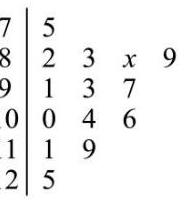

---

【答案】 7

【详解】 ${14} \times  {25}\%  = {3.5}$ ,则该组数据从小到大排列后的第四位数是 87,即 $x = 7$

8. 在 $\bigtriangleup  {ABC}$ 中，若 $c = 3$ ， $C = \frac{\pi }{3}$ ，其面积为 $\sqrt{3}$ ，则 $a + b =$ ___.

【答案】 $\sqrt{21}$

【详解】已知 $C = \frac{\pi }{3},{S}_{\bigtriangleup {ABC}} = \sqrt{3}$ ,代入面积公式可得: $\sqrt{3} = \frac{1}{2}{ab}\sin \frac{\pi }{3}$ ,则 $\sqrt{3} = \frac{1}{2}{ab} \times  \frac{\sqrt{3}}{2}$ ,可得: ${ab} = 4$ . 根据余弦定理为 ${c}^{2} = {a}^{2} + {b}^{2} - {2ab}\cos C$ ,可得 ${3}^{2} = {a}^{2} + {b}^{2} - {2ab}\cos \frac{\pi }{3}$ ,则 $9 = {a}^{2} + {b}^{2} - {ab}$ . 即 $9 = {\left( a + b\right) }^{2} - {2ab} - {ab} = {\left( a + b\right) }^{2} - {3ab}$ ,把 ${ab} = 4$ 代入可得: $9 = {\left( a + b\right) }^{2} - 3 \times  4$ ,即 ${\left( a + b\right) }^{2} = 9 + {12} = {21}$ . 由于 $a, b$ 为边长,可得 $a + b = \sqrt{21}$ . 故答案为: $\sqrt{21}$ .

9. 若 ${\left( x + 1\right) }^{10} = {a}_{0} + {a}_{1}\left( {x - 1}\right)  + {a}_{2}{\left( x - 1\right) }^{2} + \cdots  + {a}_{10}{\left( x - 1\right) }^{10}$ ,则 ${a}_{0} + {a}_{1} + {a}_{2} + \cdots  + {a}_{10} =$ ___.

【答案】 ${3}^{10}/{59049}$ 令值法

【详解】令 $x = 2$ ,则 ${\left( 2 + 1\right) }^{10} = {a}_{0} + {a}_{1} + {a}_{2} + \cdots  + {a}_{10}$ ,即 ${a}_{0} + {a}_{1} + {a}_{2} + \cdots  + {a}_{10} = {3}^{10}$ . 故答案为: ${3}^{10}$

10. 已知 $f\left( x\right)  = \left\{  \begin{array}{l}  - {x}^{2} + {ax}, x \leq  1 \\  {ax} - 1, x > 1 \end{array}\right.$ ,若函数 $y = f\left( x\right)$ 有两个极值点,则实数 $a$ 的取值范围是___.

【答案】 $\left( {0,2}\right)$

【详解】 $\because$ 二次函数 $g\left( x\right)  =  - {x}^{2} + {ax}$ 开口向下, $x =  - \frac{a}{2 \times  \left( {-1}\right) } = \frac{a}{2}$ 是 $g\left( x\right)$ 极大值,

一次函数 $h\left( x\right)  = {ax} - 1$ ,当 $a \neq  0$ 时,函数 $h\left( x\right)$ 时单调函数,没有极值点,

要想函数 $y = f\left( x\right)$ 有两个极值点,则这两个极值点为 $x = \frac{a}{2}$ 和 $x = 1$ ,

又 $\because$ 函数 $g\left( x\right)$ 在 $\left( {\frac{a}{2},1}\right)$ 上单调递减, $\therefore h\left( x\right)$ 在 $\left( {1, + \infty }\right)$ 上递增, $\therefore \left\{  \begin{array}{l} \frac{a}{2} < 1 \\  a > 0 \\   - 1 + a \leq  a - 1 \end{array}\right.$ , $\therefore a \in  \left( {0,2}\right)$ .

11. 已知双曲线 ${x}^{2} - \frac{{y}^{2}}{{b}^{2}} = 1\left( {b > 0}\right)$ 的左、右焦点为 ${F}_{1},{F}_{2}$ ,以 $O$ 为顶点, ${F}_{2}$ 为焦点作抛物线交双曲线于 $P$ , 且 $\angle P{F}_{1}{F}_{2} = {45}^{ \circ  }$ ，则 ${b}^{2} =$ ___.

【答案】 $2 + 2\sqrt{2}$

【详解】由题意可知, $\left| {{F}_{1}{F}_{2}}\right|  = p = 2\sqrt{{b}^{2} + 1}$ ,如图,过点 $P$ 作准线的垂线,垂足为 $D$ ,则 $\left| {PD}\right|  = p$ ,

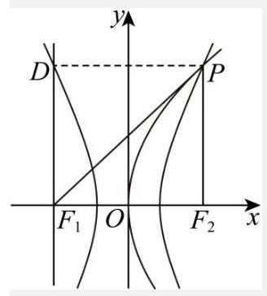

则 $\cos \angle P{F}_{1}{F}_{2} = \cos \angle {F}_{1}{PD} = \frac{\left| DP\right| }{\left| P{F}_{1}\right| } = \frac{p}{\left| P{F}_{1}\right| } = \frac{\sqrt{2}}{2}$ ,得 $\left| {P{F}_{1}}\right|  = \sqrt{2}p$ ,在 $\bigtriangleup P{F}_{1}{F}_{2}$ 中由余弦定理可得,

${\left| P{F}_{2}\right| }^{2} = {\left| P{F}_{1}\right| }^{2} + {\left| {F}_{1}{F}_{2}\right| }^{2} - 2\left| {P{F}_{1}}\right| \left| {{F}_{1}{F}_{2}}\right| \cos \frac{\pi }{4} = 2{p}^{2} + {p}^{2} - 2\sqrt{2}{p}^{2} \times  \frac{\sqrt{2}}{2} = {p}^{2}$ ,即 $\left| {P{F}_{2}}\right|  = p$ ,则由双曲线的定义可得 $\left| {P{F}_{1}}\right|  - \left| {P{F}_{2}}\right|  = \left( {\sqrt{2} - 1}\right) p = 2$ ,得 $p = 2 + 2\sqrt{2}$ ,则 ${b}^{2} = \frac{{p}^{2}}{4} - 1 = 2 + 2\sqrt{2}$

12. 已知集合 $M$ 中的任一个元素都是整数,当存在整数 $a, c \in  M, b \notin  M$ 且 $a < b < c$ 时,称 $M$ 为 “间断整数集”. 集合 $\{ x \mid  1 \leq  x \leq  {10}, x \in  \mathbf{Z}\}$ 的所有子集中，是 “间断整数集” 的个数为___.

【答案】968

【解析】分类讨论。正难则反。总子集个数把全为连续元素 (含只有一个元素或没有元素) 的子集排除即可。 ${2}^{10} - 1$ (空集)-10(一个元素) $- \left\lbrack  {9 - 8 - 7 - 6 - 5 - 4 - 3 - 2 - 1}\right\rbrack   = {968}$

## 二、选择题 (本题共 4 小题, 13-14 每小题 4 分, 15-16 每小题 5 分, 共 18 分. 在每小题给出的四个 选项中, 只有一项是符合题目要求的. )

13. 若 $a > b > 0, c > d$ ，则下列结论正确的是( )

A. $a - b < 0$ B. ${ac} > {bd}$

C. $a{c}^{2} > b{c}^{2}$

D. $\frac{a}{{c}^{2} + 1} > \frac{b}{{c}^{2} + 1}$

【答案】D

【详解】因为 $a > b > 0, c > d$ ,对于 $\mathrm{A}$ 选项, $a - b > 0,\mathrm{\;A}$ 错;

对于 $\mathrm{B}$ 选项，不妨取 $a = 2, b = 1, c =  - 1, d =  - 2$ ，则 ${ac} =  - 2 = {bd}$ ， $\mathrm{B}$ 错；

对于 $\mathrm{C}$ 选项,取 $c = 0$ ,则 $a{c}^{2} = 0 = b{c}^{2},\mathrm{C}$ 错;

对于 $\mathrm{D}$ 选项,由题意可知, ${c}^{2} + 1 > 0$ ,由不等式的基本性质可得 $\frac{a}{{c}^{2} + 1} > \frac{b}{{c}^{2} + 1}$ , D 对.

故选: D.

14. 已知一个圆锥的轴截面是边长为 2 的等边三角形, 则这个圆锥的侧面积为 ( )

A. ${2\pi }$ B. ${3\pi }$ C. ${4\pi }$

D. $\frac{\sqrt{3}}{3}\pi$

【答案】A

【详解】由题意可知,圆锥的母线长和底面圆的直径均为 2,所以圆锥的侧面积为 $\pi  \times  1 \times  2 = {2\pi }$ .

15. 抛掷一枚质地均匀的硬币 $n$ 次 (其中 $n$ 为大于等于 2 的整数),设事件 $A$ 表示 “ $n$ 次中既有正面朝上又有反面朝上”，事件 $B$ 表示 “ $n$ 次中至多有一次正面朝上”，若事件 $A$ 与事件 $B$ 是独立的，则 $n$ 的值为( )

A. 5 B. 4 C. 3 D. 2

【答案】C 4星 独立性的考察

【详解】抛掷一枚质地均匀的硬币 $n$ 次,所有可能的结果有 ${2}^{n}$ 种.

事件 A 表示 “ $n$ 次中既有正面朝上又有反面朝上”,其对立事件 $\bar{A}$ 为 “ $n$ 次都是正面朝上或 $n$ 次都是反面朝上”, $\bar{A}$ 包含的情况有 2 种,所以 $P\left( \bar{A}\right)  = \frac{2}{{2}^{n}} = \frac{1}{{2}^{n - 1}}$ . 可得 $P\left( A\right)  = 1 - P\left( \bar{A}\right)  = 1 - \frac{1}{{2}^{n - 1}}$ .

事件 $B$ 表示 “ $n$ 次中至多有一次正面朝上”,即 “ $n$ 次中没有正面朝上(全是反面朝上)” 或 “ $n$ 次中有一次正面朝上”. 所以事件 $B$ 包含的情况共有 $n + 1$ 种,则 $P\left( B\right)  = \frac{n + 1}{{2}^{n}}$ .

事件 $A \cap  B$ 表示 “ $n$ 次中既有正面朝上又有反面朝上且至多有一次正面朝上”,即 “ $n$ 次中有一次正面朝上”,有 ${\mathrm{C}}_{n}^{1} = n$ 种情况,所以 $P\left( {A \cap  B}\right)  = \frac{n}{{2}^{n}}$ .

因为事件 $\mathrm{A}$ 与事件 $B$ 是独立的,所以 $P\left( {A \cap  B}\right)  = P\left( A\right) P\left( B\right)$ ,即 $\frac{n}{{2}^{n}} = \left( {1 - \frac{1}{{2}^{n - 1}}}\right)  \times  \frac{n + 1}{{2}^{n}}$ .

可得: $n = \left( {1 - \frac{1}{{2}^{n - 1}}}\right) \left( {n + 1}\right)$ . 展开得: $n = n + 1 - \frac{n + 1}{{2}^{n - 1}}$ . 即 $n + 1 = {2}^{n - 1}$ .

当 $n = 2$ 时, $2 + 1 = 3,{2}^{2 - 1} = 2$ ,等式不成立; 当 $n = 3$ 时, $3 + 1 = 4,{2}^{3 - 1} = 4$ ,等式成立;

当 $n = 4$ 时, $4 + 1 = 5,{2}^{4 - 1} = 8$ ,等式不成立. 所以 $n = 3$ . 故选: C.

16. 数列 $\left\{  {a}_{n}\right\}$ 是等差数列,周期数列 $\left\{  {b}_{n}\right\}$ 满足 ${b}_{n} = \cos \left( {a}_{n}\right)$ ,若集合 $X = \left\{  {x \mid  x = {b}_{n}}\right. , n$ 是正整数 $\}$ 中恰有三个元素，则数列 $\left\{  {b}_{n}\right\}$ 的周期 $T$ 的取值不可能是( )

A. 4 B. 5 C. 6 D. 7

【答案】D 老题

【详解】 ${b}_{n + T} = {b}_{n} \Rightarrow  \cos \left( {a}_{n + T}\right)  = \cos \left( {a}_{n}\right)$ ,取 ${a}_{n + T} = {a}_{n} + {2\pi }$ ,则公差 $d = \frac{2\pi }{T}$ ,

当 $T = 4$ ,是 $d = \frac{2\pi }{4} = \frac{\pi }{2}$ ,此时角度序列为: ${a}_{1},{a}_{1} + \frac{\pi }{2},{a}_{1} + \pi ,{a}_{1} + \frac{3\pi }{2}$ ,

取 ${a}_{1} = 0$ ，则对应的余弦值为 $1,0, - 1,0$ ，此时 $X = \{ 1,0, - 1\}$ ，三个元素合题意；

当 $T = 5$ ,是 $d = \frac{2\pi }{5}$ ,此时角度序列为: ${a}_{1},{a}_{1} + \frac{2\pi }{5},{a}_{1} + \frac{4\pi }{5},{a}_{1} + \frac{6\pi }{5},{a}_{1} + \frac{8\pi }{5}$ , 取 ${a}_{1} = 0$ ，则对应的余弦值为 $1,\cos \frac{2\pi }{5},\cos \frac{4\pi }{5},\cos \frac{6\pi }{5},\cos \frac{8\pi }{5}$ ，

又 $\cos \frac{4\pi }{5} = \cos \frac{6\pi }{5},\cos \frac{8\pi }{5} = \cos \frac{2\pi }{5}$ ,此时 $X$ 也是三个元素,合题意;

当 $T = 6$ ,是 $d = \frac{2\pi }{6} = \frac{\pi }{3}$ ,此时角度序列为: ${a}_{1},{a}_{1} + \frac{\pi }{3},{a}_{1} + \frac{2\pi }{3},{a}_{1} + \pi ,{a}_{1} + \frac{4\pi }{3},{a}_{1} + \frac{5\pi }{3}$ ,

取 ${a}_{1} = \frac{\pi }{6}$ ，则对应的余弦值为 $\frac{\sqrt{3}}{2}$ ，0， $- \frac{\sqrt{3}}{2}$ ， $- \frac{\sqrt{3}}{2}$ ，0， $\frac{\sqrt{3}}{2}$ ，此时 $X$ 也是三个元素，合题意；

当 $T = 7$ ,是 $d = \frac{2\pi }{7}$ ,此时角度序列为: ${a}_{1},{a}_{1} + \frac{2\pi }{7},{a}_{1} + \frac{4\pi }{7},{a}_{1} + \frac{6\pi }{7},{a}_{1} + \frac{8\pi }{7},{a}_{1} + \frac{10\pi }{7},{a}_{1} + \frac{12\pi }{7}$ ,

由于 7 是质数,角度间隔 $\frac{2\pi }{7}$ 无法分解为更小的对称单元,余弦值的对称性不足以将 7 个不同角度映射为

3个不同值, 故选: D.

## 三、解答题 (本题共 5 小题, 17-19 题每题 14 分, 20-21 题每题 18 分, 共 78 分. 解答应写出文字 说明, 证明过程或演算步骤.)

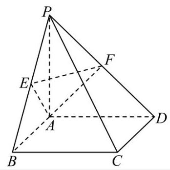

17. 如图,在四棱锥 $P - {ABCD}$ 中,底面 ${ABCD}$ 是边长为 2 的正方形,且 ${CB} \bot  {BP},{CD} \bot  {DP},{PA} = 2$ ,点 $E, F$ 分别为 ${PB},{PD}$ 的中点.

(1)求证: ${PA} \bot$ 平面 ${ABCD}$ ；

(2)求点 $P$ 到平面 ${AEF}$ 的距离.

【答案】(1)证明见解析; (2) $\frac{2\sqrt{3}}{3}$ .

【详解】(1)由底面 ${ABCD}$ 为正方形，得 ${CB}\bot {AB},$ 又 ${CB}\bot {BP},{{AB} \cap  {BP}} = {B,{AB},{BP}} \subset$ 平面 ${ABP}$ ， 于是 ${CB} \bot$ 平面 ${ABP}$ ,而 ${PA} \subset$ 平面 ${ABP}$ ,则 ${CB} \bot  {PA}$ ,同理 ${CD} \bot  {PA}$ , 又 ${CB} \cap  {CD} = C,{CB},{CD} \subset$ 平面 ${ABCD}$ ,所以 ${PA} \bot$ 平面 ${ABCD}$ .

(2)由(1)得 ${PA} \bot  {AB}$ ，点 $E$ 为 ${PB}$ 的中点，在 $\mathrm{{Rt}} \bigtriangleup  {PAB}$ 中， ${AE} = \sqrt{2}$ ，点 $F$ 为 ${PD}$ 的中点，同理 ${AF} = \sqrt{2}$ ， 在 $\bigtriangleup {PBD}$ 中, ${EF} = \frac{1}{2}{BD} = \sqrt{2}$ ,因此 ${S}_{\bigtriangleup {AEF}} = \frac{1}{2} \times  \sqrt{2} \times  \sqrt{2} \times  \frac{\sqrt{3}}{2} = \frac{\sqrt{3}}{2}$ ,

在直角 $\bigtriangleup  {PAB}$ 中， ${S}_{\bigtriangleup {APE}} = \frac{1}{2} \times  \frac{1}{2} \times  2 \times  2 = 1$ ，由( 1 )知 ${CB}\bot$ 平面 ${ABP}$ ，则 ${AD}\bot$ 平面 ${ABP}$ ，于是点 $F$ 到平面 ${APE}$ 的距离为 $\frac{1}{2}{AD} = 1$ ,设点 $P$ 到平面 ${AEF}$ 的距离为 $h$ ,由 ${V}_{P - {AEF}} = {V}_{F - {AEP}}$ ,得 $\frac{1}{3} \times  \frac{\sqrt{3}}{2} \times  h = \frac{1}{3} \times  1 \times  1$ , 解得 $h = \frac{2\sqrt{3}}{3}$ ,所以点 $P$ 到平面 ${AEF}$ 的距离为 $\frac{2\sqrt{3}}{3}$ .

18. 已知 $f\left( x\right)  = {\log }_{3}\left( {x + a}\right)  + {\log }_{3}\left( {6 - x}\right)$ .

(1)是否存在实数 $a$ ，使得函数 $y = f\left( x\right)$ 是偶函数？若存在，求实数 $a$ 的值，若不存在，请说明理由； (2)若 $a >  - 3$ 且 $a \neq  0$ ,解关于 $X$ 的不等式 $f\left( x\right)  \leq  f\left( {6 - x}\right)$ .

【答案】(1)存在实数 $a = 6$ ,使得函数 $y = f\left( x\right)$ 是偶函数(2)答案见解析

【详解】(1)存在实数 $a = 6$ ,使得函数 $y = f\left( x\right)$ 是偶函数.

要使函数 $f\left( x\right)  = {\log }_{3}\left( {x + a}\right)  + {\log }_{3}\left( {6 - x}\right)$ 有意义,须满足 $\left\{  \begin{array}{l} x + a > 0 \\  6 - x > 0 \end{array}\right.$ ,即 $\left\{  \begin{array}{l} x >  - a \\  x < 6 \end{array}\right.$ ,

显然 $- a < 6$ ,即 $a >  - 6$ ,函数 $y = f\left( x\right)$ 的定义域 $D = \left( {-a,6}\right)$ .

当 $a \neq  6$ 时,函数定义域不关于原点对称,此时必然存在 $x \in  D$ 且 $- x \notin  D$ ,此时函数 $y = f\left( x\right)$ 不是偶函数. 当 $a = 6$ 时, $f\left( x\right)  = {\log }_{3}\left( {x + 6}\right)  + {\log }_{3}\left( {6 - x}\right)$ ,函数 $y = f\left( x\right)$ 的定义域为 $\left( {-6,6}\right)$ ,对于任意的 $x \in  \left( {-6,6}\right)$ ,都有 $- x \in  \left( {-6,6}\right)$ ,并且 $f\left( {-x}\right)  = {\log }_{3}\left( {-x + 6}\right)  + {\log }_{3}\left( {6 + x}\right)  = f\left( x\right)$ ,因此函数 $y = f\left( x\right)$ 是一个偶函数综上所述,存在实数 $a = 6$ ,使得函数 $y = f\left( x\right)$ 是偶函数

(2) 由 $f\left( x\right)  \leq  f\left( {6 - x}\right)$ ,得 ${\log }_{3}\left( {x + a}\right)  + {\log }_{3}\left( {6 - x}\right)  \leq  {\log }_{3}\left( {6 - x + a}\right)  + {\log }_{3}x$

所以 $\left\{  \begin{array}{l} x + a > 0, \\  6 - x > 0, \\  6 - x + a > 0, \\  x > 0 \end{array}\right.$ 且 $\left( {x + a}\right) \left( {6 - x}\right)  \leq  \left( {6 - x + a}\right) x$ ①.

由①得, ${ax} \geq  {3a}$ . 因为 $a >  - 3$ 且 $a \neq  0$ ,所以当 $- 3 < a < 0$ 时, $- a < x \leq  3$ ,当 $a > 0$ 时, $3 \leq  x < 6$ .

综上可得: 当 $- 3 < a < 0$ 时,不等式 $f\left( x\right)  \leq  f\left( {6 - x}\right)$ 的解集为 $( - a,3\rbrack$ ; 当 $a > 0$ 时,不等式 $f\left( x\right)  \leq  f\left( {6 - x}\right)$ 的解集为 $\lbrack 3,6)$ .

19. 某区 2025 年 3 月 31 日至 4 月 13 日的天气预报如图所示.

<table><tr><td>31       大部分晴 17/9°C</td><td>04月01日       阵雨 18/9°C</td><td>02       阵雨 18/10°C</td><td>03       阵雨 19/10°C</td><td>04       多云 18/9°C</td><td>05       间歇性多云 19/10°C</td><td>06       多云 20/10°C</td></tr><tr><td>07       阵雨 19/10°C</td><td>08       大部分多云 19/10°C</td><td>09       大部分晴 20/8°C</td><td>10       多云 18/8°C</td><td>11       大部分晴 18/10°C</td><td>12       阵雨 17/8°C</td><td>13       阵雨 17/9°C</td></tr></table>

(1)从 3 月 31 日至 4 月 13 日某天开始，连续统计三天，求这三天中至少有两天是阵雨的概率；

(2)根据天气预报，该区 4 月 14 日的最低气温是 $9{}^{ \circ  }\mathrm{C}$ ，温差是指一段时间内最高温度与最低温度之间的差值,例如 3 月 31 日的最高温度为 ${17}^{ \circ  }\mathrm{C}$ ,最低温度为 ${9}^{ \circ  }\mathrm{C}$ ,当天的温差为 ${8}^{ \circ  }\mathrm{C}$ 记 4 月 1 日至 4 日这 4 天温差的方差为 ${s}_{1}^{2},4$ 月 11 日至 14 日这 4 天温差的方差为 ${s}_{2}^{2}$ ,若 ${s}_{2}^{2} = \frac{4}{3}{s}_{1}^{2}$ ,求 4 月 14 日天气预报的最高气温；

(3)从 3 月 31 日至 4 月 13 日中随机抽取两天，用 $X$ 表示一天温差不高于 ${9}^{ \circ  }\mathrm{C}$ 的天数，求 $X$ 的分布列及期望.

【答案】 $\left( 1\right) \frac{1}{3}\;\left( 2\right) {18}^{ \circ  }\mathrm{C}\;\left( 3\right)$ 分布列见解析, $E\left( X\right)  = \frac{11}{7}$

【详解】(1)设“从 3 月 31 日至 4 月 13 日某天开始，连续统计三天，这三天中至少有两天是阵雨” 为事件 $A$ ,连续统计三天共有 12 个样本点,事件 $A$ 共有 4 个样本点,所以 $P\left( A\right)  = \frac{4}{12} = \frac{1}{3}$

(2)4 月 1 日至 4 日这 4 天温差分别为 ${9}^{ \circ  }\mathrm{C}$ 、 ${8}^{ \circ  }\mathrm{C}$ 、 ${9}^{ \circ  }\mathrm{C}$ ，

因此 ${s}_{1}^{2} = \frac{1}{4}\mathop{\sum }\limits_{{i = 1}}^{4}{\left( {x}_{i} - \bar{x}\right) }^{2} = \frac{3}{16}$ ,设 4 月 14 日的温差为 ${x}^{ \circ  }\mathrm{C}$ ,

则 4 月 11 日至 14 日这 4 天温差分别为 ${8}^{ \circ  }\mathrm{C}\text{ 、 }{9}^{ \circ  }\mathrm{C}\text{ 、 }{8}^{ \circ  }\mathrm{C}\text{ 、 }{x}^{ \circ  }\mathrm{C}$ ,因此 $\bar{x} = \frac{x + {25}}{4}{}^{ \circ  }\mathrm{C}$ , ${s}_{2}^{2} = \frac{1}{4}\left\lbrack  {{\left( 8 - \frac{x + {25}}{4}\right) }^{2} \times  2 + {\left( 9 - \frac{x + {25}}{4}\right) }^{2} + {\left( x - \frac{x + {25}}{4}\right) }^{2}}\right\rbrack   = \frac{4}{3} \times  \frac{3}{16}$ ,解得 $x = 9$ ,因此,4 月 11 日这天最高气温是 ${18}^{ \circ  }\mathrm{C}$ .

(3)从 3 月 31 日至 4 月 13 日，一天温差不超过 ${9}^{ \circ  }\mathrm{C}$ 的共有 11 天，高于 ${9}^{ \circ  }\mathrm{C}$ 的共有 3 天 $X$ 可能取值为0,1,2.

$P\left( {X = 0}\right)  = \frac{{\mathrm{C}}_{3}^{2}}{{\mathrm{C}}_{14}^{2}} = \frac{3}{91}, P\left( {X = 1}\right)  = \frac{{\mathrm{C}}_{11}^{1}{\mathrm{C}}_{3}^{1}}{{\mathrm{C}}_{14}^{2}} = \frac{33}{91}, P\left( {X = 2}\right)  = \frac{{\mathrm{C}}_{11}^{2}}{{\mathrm{C}}_{14}^{2}} = \frac{55}{91}$

随机变量 $\mathbf{X}$ 的分布列为:

<table><tr><td>$X$</td><td>0</td><td>1</td><td>2</td></tr><tr><td>$P$</td><td>3 91</td><td>33 91</td><td>55 91</td></tr></table>

随机变量 $X$ 的期望 $E\left( X\right)  = 0 \times  \frac{3}{91} + 1 \times  \frac{33}{91} + 2 \times  \frac{55}{91} = \frac{11}{7}$ .

20. 已知抛物线 $\Gamma  : {x}^{2} = {4y}$ ,过点 $P\left( {a, b}\right)$ 的直线 $l$ 与抛物线 $\Gamma$ 交于点 $\mathrm{A}\text{ 、 }B$ ,与 $y$ 轴交于点 $C$ .

(1)若点 $\mathrm{A}$ 位于第一象限，且点 $\mathrm{A}$ 到抛物线 $\Gamma$ 的焦点的距离等于3，求点 $\mathrm{A}$ 的坐标；

(2)若点 $\mathrm{A}$ 坐标为 $\left( {4,4}\right)$ ，且点 $B$ 恰为线段 ${AC}$ 的中点，求原点 $O$ 到直线 $l$ 的距离；

(3)若抛物线 $\Gamma$ 上存在定点 $D$ 使得满足题意的点 $\mathrm{A}$ 、 $B$ 都有 ${DA} \bot  {DB}$ ，求 $a$ 、 $b$ 满足的关系式.

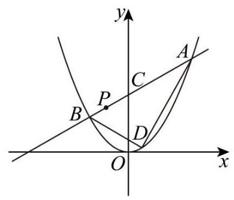

【答案】 $\left( 1\right) \left( {2\sqrt{2},2}\right) \;\left( 2\right) \frac{4\sqrt{13}}{13}\;\left( 3\right) {a}^{2} = {4b} - {16}$

【详解】(1)设 $A\left( {x, y}\right) \left( {x > 0, y > 0}\right)$ ，因为点 $\mathrm{A}$ 在抛物线上，

所以点 $\mathrm{A}$ 到抛物线 $\Gamma$ 的焦点的距离等于它到抛物线 $\Gamma$ 的准线 $y =  - 1$ 的距离,所以 $y + 1 = 3$ ,则 $y = 2$ ,所以 $x = 2\sqrt{y} = 2\sqrt{2}$ ,故点 $\mathrm{A}$ 的坐标是 $\left( {2\sqrt{2},2}\right)$ .

(2)设 $B\left( {b,\frac{{b}^{2}}{4}}\right)$ ，则 $C\left( {{2b} - 4,\frac{{b}^{2}}{2} - 4}\right)$ ，由题意 ${{2b} - 4} = 0$ ，所以 $b = 2$ ，所以点 $B$ 的坐标为 $\left( {2,1}\right)$ ，则 ${k}_{AB} = \frac{4 - 1}{4 - 2} = \frac{3}{2}$ ,所以,直线 $l$ 的方程为 $y - 1 = \frac{3}{2}\left( {x - 2}\right)$ ,即直线 $l$ 的方程为 ${3x} - {2y} - 4 = 0$ , 所以原点 $O$ 到直线 $l$ 的距离为 $d = \frac{4}{\sqrt{{3}^{2} + {\left( -2\right) }^{2}}} = \frac{4\sqrt{13}}{13}$ .

(3)设 $D\left( {{x}_{0},\frac{{x}_{0}^{2}}{4}}\right)$ ，若直线 $l$ 的斜率不存在时，则直线 $l$ 与抛物线 $\Gamma$ 只有一个交点，不合乎题意， 所以,直线 $l$ 斜率必然存在,设其方程为 $y - b = k\left( {x - a}\right)$ ,代入 ${x}^{2} = {4y}$ 中,得 ${x}^{2} - {4kx} + {4ka} - {4b} = 0$ , 设 $A\left( {{x}_{1},\frac{{x}_{1}^{2}}{4}}\right) \text{ 、 }B\left( {{x}_{2},\frac{{x}_{2}^{2}}{4}}\right)$ ,则 ${x}_{1} + {x}_{2} = {4k},{x}_{1}{x}_{2} = {4ka} - {4b}$ ,

因为 ${DA} \bot  {DB}$ ,且 $\overrightarrow{DA} = \left( {{x}_{1} - {x}_{0},\frac{{x}_{1}^{2} - {x}_{0}^{2}}{4}}\right) ,\overrightarrow{DB} = \left( {{x}_{2} - {x}_{0},\frac{{x}_{2}^{2} - {x}_{0}^{2}}{4}}\right)$

所以 $\overrightarrow{DA} \cdot  \overrightarrow{DB} = \left( {{x}_{1} - {x}_{0}}\right) \left( {{x}_{2} - {x}_{0}}\right)  + \frac{\left( {{x}_{1} - {x}_{0}}\right) \left( {{x}_{1} + {x}_{0}}\right) \left( {{x}_{2} - {x}_{0}}\right) \left( {{x}_{2} + {x}_{0}}\right) }{16} = 0$ ,

显然 ${x}_{1} - {x}_{0} \neq  0,{x}_{2} - {x}_{0} \neq  0$ ,则 $1 + \frac{\left( {{x}_{1} + {x}_{0}}\right) \left( {{x}_{2} + {x}_{0}}\right) }{16} = 0$ ,所以 ${x}_{1}{x}_{2} + \left( {{x}_{1} + {x}_{2}}\right) {x}_{0} + {x}_{0}^{2} + {16} = 0$

故 ${4ka} - {4b} + {4k}{x}_{0} + {x}_{0}^{2} + {16} = 0$ ,即 $4\left( {a + {x}_{0}}\right) k + {x}_{0}^{2} + {16} - {4b} = 0$ . 由题意,得 $\left\{  \begin{array}{l} {x}_{0} =  - a \\  {x}_{0}^{2} = {4b} - {16} \end{array}\right.$ ,因此 ${a}^{2} = {4b} - {16}$ .

21. 已知函数 $y = f\left( x\right)$ ， $P$ 为坐标平面上一点. 若函数 $y = f\left( x\right)$ 的图像上存在与 $P$ 不同的一点 $Q$ ，使得直线 ${PQ}$ 是函数 $y = f\left( x\right)$ 在点 $Q$ 处的切线,则称点 $P$ 具有性质 ${M}_{f}$ .

(1)若 $f\left( x\right)  = {x}^{2}$ ，判断点 $P\left( {1,0}\right)$ 是否具有性质 ${M}_{f}$ ，并说明理由；

(2)若 $f\left( x\right)  = 2{x}^{3} - 4{x}^{2} + {2x}$ ,证明: 线段 $x = \frac{1}{2}\left( {-1 \leq  y \leq  1}\right)$ 上的所有点均具有性质 ${M}_{f}$ ;

(3)若 $f\left( x\right)  = {e}^{x}$ ，证明: “点 $P\left( {x, y}\right)$ 具有性质 ${M}_{f}$ ” 的充要条件是 “ $y < {\mathrm{e}}^{x}$ ” .

【答案】(1)点 $P\left( {1,0}\right)$ 具有性质 ${M}_{f}$ ,理由见解析(2)证明见解析(3)证明见解析

【详解】(1) 点 $P\left( {1,0}\right)$ 具有性质 ${M}_{f}$ ,理由如下: 设 $Q\left( {q,{q}^{2}}\right)$ ,因为 ${f}^{\prime }\left( x\right)  = {2x}$ ,

所以曲线 $y = f\left( x\right)$ 在点 $Q$ 处的切线方程为: $y = {2qx} - {q}^{2}$ ,

将点 $P\left( {1,0}\right)$ 坐标代入,得: ${2q} - {q}^{2} = 0$ ,所以 $q = 0$ 或 2,即函数 $y = f\left( x\right)$ 的图像上存在与 $P$ 不同的一点 $Q\left( {0,0}\right)$ ,使得直线 ${PQ}$ 是函数 $y = f\left( x\right)$ 图像在点 $Q$ 处的切线,故点 $P\left( {1,0}\right)$ 具有性质 ${M}_{f}$ ;

(2)证明: ${f}^{\prime }\left( x\right)  = 6{x}^{2} - {8x} + 2$ . 设 $P\left( {\frac{1}{2}, y}\right) \left( {-1 \leq  y \leq  1}\right) , Q\left( {q,2{q}^{3} - 4{q}^{2} + {2q}}\right)$ 函数 $y = f\left( x\right)$ 的图像在 $Q$ 处的切线方程为: $y = \left( {6{q}^{2} - {8q} + 2}\right) \left( {x - q}\right)  + 2{q}^{3} - 4{q}^{2} + {2q}$ ① 当 $y = \frac{1}{4}$ 时,点 $P$ 在函数 $y = f\left( x\right)$ 的图像上,将 $x = \frac{1}{2}, y = \frac{1}{4}$ 代入①式,得: $4{q}^{3} - 7{q}^{2} + {4q} - \frac{3}{4} = 0$ ② 令 $g\left( q\right)  = 4{q}^{3} - 7{q}^{2} + {4q} - \frac{3}{4}$ ,则 $g\left( {0.6}\right)  =  - \frac{3}{500} < 0, g\left( 1\right)  = \frac{1}{4} > 0$

所以关于 $q$ 的方程②必有实数解 $x = q$ ，且 $q \neq  \frac{1}{2}$

故函数 $y = f\left( x\right)$ 的图像上存在与 $P$ 不同的一点 $Q$ ,使得直线 ${PQ}$ 是函数 $y = f\left( x\right)$ 图像在点 $Q$ 处的切线, 即点 $\left( {\frac{1}{2},\frac{1}{4}}\right)$ 具有性质 ${M}_{f}$ ;

当 $y \neq  \frac{1}{4}$ 时,点 $P$ 不在函数 $y = f\left( x\right)$ 的图像上,

将 $x = \frac{1}{2}$ 代入①式，得: $y =  - 4{q}^{3} + 7{q}^{2} - {4q} + 1$ ③

令 $h\left( q\right)  =  - 4{q}^{3} + 7{q}^{2} - {4q} + 1$ ,则 $h\left( 0\right)  = 1, h\left( 2\right)  =  - {11} <  - 1$

所以当 $- 1 \leq  y \leq  1$ 时,关于 $q$ 的方程③必有解,

故函数 $y = f\left( x\right)$ 的图像上存在与 $P$ 不同的一点 $Q$ ,使得直线 ${PQ}$ 是函数 $y = f\left( x\right)$ 图像在点 $Q$ 处的切线, 即点 $P\left( {\frac{1}{2}, y}\right) \left( {-1 \leq  y \leq  1, y \neq  \frac{1}{4}}\right)$ 具有性质 ${M}_{f}$ ,综上所述,线段 $x = \frac{1}{2}\left( {-1 \leq  y \leq  1}\right)$ 上的所有点均具有性质 ${M}_{f}$ ;

(3)证明:设 $Q\left( {q,{\mathrm{e}}^{q}}\right)$ ，函数 $y = f\left( x\right)$ 的图像在 $Q$ 处的切线方程为: $y = {\mathrm{e}}^{q}x - {\mathrm{e}}^{q} \cdot  q + {\mathrm{e}}^{q}$

必要性: 若点 $P\left( {x, y}\right)$ 具有性质 ${M}_{f}$ ,则点 $P\left( {x, y}\right)$ 应满足方程 $y = {\mathrm{e}}^{q}x - {\mathrm{e}}^{q} \cdot  q + {\mathrm{e}}^{q}$

令 $g\left( x\right)  = {\mathrm{e}}^{x} - y = {\mathrm{e}}^{x} - {\mathrm{e}}^{q}x + {\mathrm{e}}^{q} \cdot  q - {\mathrm{e}}^{q}$ ,则由 ${g}^{\prime }\left( x\right)  = {\mathrm{e}}^{x} - {\mathrm{e}}^{q} = 0$ ,得: $x = q$ ,

当 $x < q$ 时, ${g}^{\prime }\left( x\right)  < 0$ ,当 $x > q$ 时, ${g}^{\prime }\left( x\right)  > 0$ ,故函数 $y = g\left( x\right)$ 在 $x = q$ 时取得最小值 $g\left( q\right)  = 0$

因为 $P$ 与 $Q$ 是不相同的点,所以点 $P$ 的横坐标 $x \neq  q$ ,因此 ${\mathrm{e}}^{x} - y > 0$ ,即 $y < {\mathrm{e}}^{x}$ .

充分性: 当 $y < {\mathrm{e}}^{x}$ 时,令 $h\left( q\right)  = x{\mathrm{e}}^{q} - q{\mathrm{e}}^{q} + {\mathrm{e}}^{q} - y = \left( {x - q + 1}\right) {\mathrm{e}}^{q} - y$

对于函数 $t = h\left( q\right)$ ,当 $q$ 趋向 $+ \infty$ 时, $h\left( q\right)$ 趋向 $- \infty$ ,

又 $h\left( x\right)  = {\mathrm{e}}^{x} - y > 0$ ,故关于 $q$ 的方程 $h\left( q\right)  = 0$ 必然有解,

即存在点 $Q\left( {q,{\mathrm{e}}^{q}}\right)$ 使得直线 ${PQ}$ 是函数 $y = f\left( x\right)$ 的图像的切线,所以点 $P\left( {x, y}\right)$ 具有性质 ${M}_{f}$

综上所述,“点 $P\left( {x, y}\right)$ 具有性质 ${M}_{f}$ ” 的充要条件是 “ $y < {\mathrm{e}}^{x}$ ”.

## 2025 届上海市浦东新区高三二模数学试卷

## 考生注意:

1、本试卷共 21 道试题, 满分 150 分, 答题时间 120 分钟;

2、请在答题纸上规定的地方解答，否则一律不予评分.

1. $\left( {0,2}\right)$ 2. -2 3. $\sqrt{3}$ 4. $\pi$ 5.4 6.17 7. -252 8.5

9. $\frac{8}{5}$ 10. 66.4

11. $\arccos \frac{\sqrt{2}}{4}$ 12. ${2}^{1012} - 1$

## 选择题 D B C A

1. 不等式 $\frac{x - 2}{x} < 0$ 的解为___.

【答案】 $\left( {0,2}\right)$

【详解】不等式 $\frac{x - 2}{x} < 0$ 化为 $x\left( {x - 2}\right)  < 0$ ,解得 $0 < x < 2,\therefore$ 不等式 $\frac{x - 2}{x} < 0$ 的解集为 $\left( {0,2}\right)$ .

2. 已知向量 $\overrightarrow{a} = \left( {1,2}\right) ,\overrightarrow{b} = \left( {m,1}\right)$ ，若 $\overrightarrow{a}\bot \overrightarrow{b}$ ，则 $m =$ ___.

【答案】-2

【详解】解: 因为 $\overrightarrow{a}\bot \overrightarrow{b}$ ,所以 $\overrightarrow{a} \cdot  \overrightarrow{b} = 0$ ,得 $1 \times  m + 2 \times  1 = 0$ ,解得 $m =  - 2$

3. 设圆 $C$ 方程为 ${x}^{2} + {y}^{2} + {4x} - {6y} + {10} = 0$ ，则圆 $C$ 的半径为___.

【答案】 $\sqrt{3}$

【详解】将圆 $C$ 的方程化为标准方程可得 ${\left( x + 2\right) }^{2} + {\left( y - 3\right) }^{2} = 3$ ,故圆 $C$ 的半径为 $\sqrt{3}$ . 故答案为: $\sqrt{3}$ .

4. 若 $f\left( x\right)  = \cos \left( {3x}\right) \cos x + \sin \left( {3x}\right) \sin x$ ，则函数 $y = f\left( x\right)$ 的最小正周期为___.

【答案】 $\pi$

【详解】 $f\left( x\right)  = \cos \left( {3x}\right) \cos x + \sin \left( {3x}\right) \sin x = \cos \left( {{3x} - x}\right)  = \cos \left( {2x}\right)$ ,故最小正周期为 $\frac{2\pi }{2} = \pi$ .

5. 若关于 $x$ 的方程 ${x}^{2} - x + m = 0$ 的一个虚根的模为 2,则实数 $m$ 的值为___.

【答案】 4

【详解】设关于 $x$ 的方程 ${x}^{2} - x + m = 0\left( {m \in  \mathbf{R}}\right)$ 的两根虚根为 ${x}_{1},{x}_{2}$ ,则 ${x}_{1}{x}_{2} = m$ 且 ${x}_{1} = \overline{{x}_{2}}$ ,

所以 $\left| {x}_{1}\right|  = \left| {x}_{2}\right|  = 2$ ,又 $\left| {{x}_{1}{x}_{2}}\right|  = \left| {x}_{1}\right| \left| {x}_{2}\right|  = \left| m\right|  = 4$ ,所以 $m =  \pm  4$ ,

当 $m =  - 4$ 时, $\Delta  = {\left( -1\right) }^{2} - 4 \times  1 \times  \left( {-4}\right)  > 0$ ,所以关于 $x$ 的方程 ${x}^{2} - x + m = 0$ 有两个不相等实数根,不符合题意;

当 $m = 4$ 时, $\Delta  = {\left( -1\right) }^{2} - 4 \times  1 \times  4 < 0$ ,所以关于 $x$ 的方程 ${x}^{2} - x + m = 0$ 有两个虚根,符合题意;

所以 $m = 4$ . 故答案为: 4

6. 设数列 $\left\{  {a}_{n}\right\}$ 为等差数列,其前 $n$ 项和为 ${S}_{n}$ ,已知 ${a}_{3} + {a}_{15} = 2$ ,则 ${S}_{17} =$ ___.

【答案】 17

【详解】因为 ${a}_{3} + {a}_{15} = 2$ ,所以 ${S}_{17} = \frac{{17}\left( {{a}_{1} + {a}_{17}}\right) }{2} = \frac{{17}\left( {{a}_{3} + {a}_{15}}\right) }{2} = {17}$ . 故答案为:17

7. 在 ${\left( x - \frac{1}{x}\right) }^{10}$ 的展开式中，常数项为___.

【答案】-252

【详解】根据二项式定理,第 $r + 1$ 项为 ${C}_{10}^{r}{x}^{{10} - r} \cdot  {\left( -\frac{1}{x}\right) }^{r}$ ,由于是常数, $r = {10} - r, r = 5$ , 其常数项系数为 $- {C}_{10}^{5} =  - {252}$ .,故答案为: -252 .

8. 设 $M\left( {x, y}\right)$ 为抛物线 ${y}^{2} = {4x}$ 上任意一点，若 $x + {2y} + m$ 的最小值为 1，则 $m$ 的值为___.

【答案】 5

【详解】因为 $M\left( {x, y}\right)$ 为抛物线 ${y}^{2} = {4x}$ 上任意一点，所以 $x = \frac{{y}^{2}}{4}, y \in  \mathrm{R}$ ，所以

$x + {2y} + m = \frac{{y}^{2}}{4} + {2y} + m = \frac{1}{4}{\left( y + 4\right) }^{2} + m - 4$ ,

所以当 $y =  - 4$ 时 $x + {2y} + m$ 取得最小值 $m - 4$ ,依题意可得 $m - 4 = 1$ ,所以 $m = 5$ . 故答案为: 5

9. 李老师在整理建模小组 10 名学生的成绩时不小心遗失了一位学生的成绩，且剩余学生的成绩数据如下:5 6 6 7 7 7 8 9 9，但李老师记得这名学生的成绩恰好是本组学生成绩的第 25 百分位数， 则这 10 名学生的成绩的方差为___.

【答案】 $\frac{8}{5}$

【详解】 ${10} \times  {25}\%  = {2.5}$ ,则该学生的成绩为从小到大排列的第 3 个,故该生的成绩为 6,

则这 10 名学生的成绩的平均数为 $\frac{5 + 6 \times  3 + 7 \times  3 + 8 + 9 \times  2}{10} = 7$ ,

方差为 ${s}^{2} = \frac{{\left( 5 - 7\right) }^{2} + {\left( 6 - 7\right) }^{2} \times  3 + {\left( 7 - 7\right) }^{2} \times  3 + {\left( 8 - 7\right) }^{2} + {\left( 9 - 7\right) }^{2} \times  2}{10} = \frac{8}{5}$ 故答案为: $\frac{8}{5}$

10. 如图,某建筑物 ${OP}$ 垂直于地面,从地面点 $\mathrm{A}$ 处测得建筑物顶部 $P$ 的仰角为 ${30}^{ \circ  }$ ,从地面点 $B$ 处测得建筑物顶部 $P$ 的仰角为 ${45}^{ \circ  }$ ，已知 $A$ 、 $B$ 相距 100 米， $\angle {AOB} = {60}^{ \circ  }$ ，则该建筑物 ${OP}$ 高度约为___ 米. (保留一位小数)

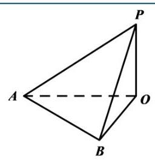

【答案】66.4

【详解】在 Rt $\bigtriangleup {AOP}$ 中,已知从地面点 $\mathrm{A}$ 处测得建筑物顶部 $P$ 的仰角为 ${30}^{ \circ  }$ ,即 $\angle {PAO} = {30}^{ \circ  }$ . 因为 $\tan \angle {PAO} = \frac{OP}{OA}$ ,所以 ${OA} = \frac{OP}{\tan {30}^{ \circ  }} = \sqrt{3}{OP}$ .

在 Rt $\bigtriangleup {BOP}$ 中,从地面点 $B$ 处测得建筑物顶部 $P$ 的仰角为 ${45}^{ \circ  }$ ,即 $\angle {PBO} = {45}^{ \circ  }$ . 因为 $\tan \angle {PBO} = \frac{OP}{OB}$ ,且 $\tan {45}^{ \circ  } = 1$ ,所以 ${OB} = {OP}$ .

在 $\bigtriangleup {AOB}$ 中,已知 ${AB} = {100}$ 米, $\angle {AOB} = {60}^{ \circ  }$ .根据余弦定理 $A{B}^{2} = O{A}^{2} + O{B}^{2} - 2 \cdot  {OA} \cdot  {OB} \cdot  \cos \angle {AOB}$ ,将 ${OA} = \sqrt{3}{OP},{OB} = {OP}$ 代入可得:

${100}^{2} = {\left( \sqrt{3}OP\right) }^{2} + O{P}^{2} - 2 \cdot  \sqrt{3}{OP} \cdot  {OP} \cdot  \cos {60}^{ \circ  }$ ,即 ${10000} = \left( {4 - \sqrt{3}}\right) O{P}^{2}$

可得 $O{P}^{2} = \frac{10000}{4 - \sqrt{3}} = \frac{{10000}\left( {4 + \sqrt{3}}\right) }{\left( {4 - \sqrt{3}}\right) \left( {4 + \sqrt{3}}\right) } = \frac{{10000}\left( {4 + \sqrt{3}}\right) }{{16} - 3} = \frac{{10000}\left( {4 + \sqrt{3}}\right) }{13}$ .

则 ${OP} = \sqrt{\frac{{10000}\left( {4 + \sqrt{3}}\right) }{13}} \approx  \sqrt{\frac{{10000}\left( {4 + {1.732}}\right) }{13}} \approx  \sqrt{4409.23} \approx  {66.4}$ . 故答案为: 66.4 .

11. 已知 $\overrightarrow{a}\text{ 、 }\overrightarrow{b}\text{ 、 }\overrightarrow{c}$ 为空间中三个单位向量，且 $\overrightarrow{a} \cdot  \overrightarrow{b} = \overrightarrow{b} \cdot  \overrightarrow{c} = \overrightarrow{c} \cdot  \overrightarrow{a} = 0$ ，若向量 $\overrightarrow{p}$ 满足 $\left| {\overrightarrow{p} - 2\overrightarrow{a}}\right|  = \frac{3}{2}$ ， $\left| {\overrightarrow{p} - 2\overrightarrow{b}}\right|  = \frac{3}{2}$ ， 则向量 $\overrightarrow{p}$ 与向量 $\overrightarrow{c}$ 夹角的最小值为___. (用反三角表示)

【答案】 $\arccos \frac{\sqrt{2}}{4}$

【详解】可设 $\overrightarrow{a} = \left( {1,0,0}\right) ,\overrightarrow{b} = \left( {0,1,0}\right) ,\overrightarrow{c} = \left( {0,0,1}\right)$ ,设 $\overrightarrow{p} = \left( {x, y, z}\right)$ ,则 $\overrightarrow{p} - 2\overrightarrow{a} = \left( {x - 2, y, z}\right) ,\overrightarrow{p} - 2\overrightarrow{b} = \left( {x, y - 2, z}\right)$ , 所以 $\left\{  \begin{array}{l} {\left( x - 2\right) }^{2} + {y}^{2} + {z}^{2} = \frac{9}{4} \\  {x}^{2} + {\left( y - 2\right) }^{2} + {z}^{2} = \frac{9}{4} \end{array}\right.$ ,两式相减可得: $x = y$ ,再代入第一个式子,可得: $2{x}^{2} + {z}^{2} = {4x} - \frac{7}{4}$ 设向量 $\overrightarrow{p}$ 与向量 $\overrightarrow{c}$ 夹角为 $\theta$ ,则 $\cos \theta  = \frac{z}{\sqrt{{x}^{2} + {y}^{2} + {z}^{2}}} = \frac{\sqrt{{4x} - \frac{7}{4} - 2{x}^{2}}}{\sqrt{{4x} - \frac{7}{4}}} = \sqrt{-\frac{2{x}^{2}}{{4x} - \frac{7}{4}}} = \sqrt{-\frac{2}{4 - \frac{7}{4}}}$ , 易知对于 $y =  - \frac{7}{4{x}^{2}} + \frac{4}{x}$ 当 $\frac{1}{x} = \frac{8}{7}$ 即 $x = \frac{7}{8}$ 取得最大值 $\frac{16}{7}$ ,此时 $\sqrt{1 - \frac{2}{\frac{4}{x} - \frac{7}{4{x}^{2}}}}$ 取得最大值 $\frac{\sqrt{2}}{4}$ , 即 $\cos \theta$ 的最大值为 $\frac{\sqrt{2}}{4}, x = \frac{7}{8}$ 时取得,再由余弦函数的单调性可知 $\theta$ 的最小值为 $\arccos \frac{\sqrt{2}}{4}$ , 故答案为: $\arccos \frac{\sqrt{2}}{4}$

12. 已知数列 $\left\{  {a}_{n}\right\}  ,{a}_{1} = 1,{a}_{n} \in  \{ 1, - 1\} ,\left( {n \geq  2}\right)$ ,并且前 $n$ 项的和 ${S}_{n}$ 满足:

①存在小于 1013 的正整数 $t$ ，使得 ${S}_{{2t} + 1} =  - 1$ ；

②对任意的正整数 $k$ 和 $m$ ，都有 $\left| {{S}_{2m} - {S}_{{2k} - 1}}\right|  \leq  1$ .

则满足以上条件的数列 $\left\{  {S}_{n}\right\}  \left( {1 \leq  n \leq  {2025}}\right)$ 共有___个.

【答案】 ${2}^{1012} - 1$

【详解】因为 ${a}_{1} = 1,{a}_{n} \in  \{ 1, - 1\} ,\left( {n \geq  2}\right)$ ,可知 ${S}_{n}$ 的奇偶性与 $n$ 的奇偶性一致,

对于①:存在小于 1013 的正整数 $t$ ，使得 ${S}_{{2t} + 1} =  - 1$ ，

对于②:对任意的正整数 $k$ 和 $m$ ，都有 $\left| {{S}_{2m} - {S}_{{2k} - 1}}\right|  \leq  1$ ，可知 $\left| {{S}_{2m} - {S}_{{2k} - 1}}\right|$ 为奇数，即 $\left| {{S}_{2m} - {S}_{{2k} - 1}}\right|  = 1$ ， 令 $k = t + 1$ ,则 $\left| {{S}_{2m} - {S}_{{2t} + 1}}\right|  = \left| {{S}_{2m} + 1}\right|  = 1$ ,可得 ${S}_{2m} = 0$ 或 ${S}_{2m} =  - 2$ ;

令 $k = 1$ ,则 $\left| {{S}_{2m} - {S}_{1}}\right|  = \left| {{S}_{2m} - 1}\right|  = 1$ ,可得 ${S}_{2m} = 0$ 或 ${S}_{2m} = 2$ ;

综上所述: 对任意的正整数 $m,{S}_{2m} = 0$ .

且 ${a}_{1} = 1$ ,可得 ${a}_{2} =  - 1,{a}_{{2k} + 1} + {a}_{{2k} + 2} = 0, k \in  {\mathbf{N}}^{ * }$ ,即 ${a}_{1},{a}_{2}$ 确定, ${a}_{{2k} + 1},{a}_{{2k} + 2}$ 不相等,有 2 种可能,

此时 ${S}_{2n} = 0,{S}_{{2n} - 1} =  \pm  1$ ,条件②满足,对于数列 $\left\{  {S}_{n}\right\}  \left( {1 \leq  n \leq  {2025}}\right)$ 可知: $\left( {{a}_{3},{a}_{4}}\right) ,\left( {{a}_{5},{a}_{6}}\right) ,\cdots ,\left( {{a}_{2023},{a}_{2024}}\right) ,{a}_{2025}$

均有 2 种可能,则满足条件的数列共有 ${2}^{\frac{{2024} - 2}{2} + 1} = {2}^{1012}$ 个,又因为存在小于 1013 的正整数 $t$ ,使得 ${S}_{{2t} + 1} =  - 1$ ,

可知对任意 $k \in  {\mathbf{N}}^{ * }$ ， $k \leq  {1012}$ ， ${a}_{{2k} + 1} = 1$ 不成立，即 ${a}_{3} = {a}_{5} = \cdots  = {a}_{2025} = 1$ 这种情况不符合题意，

综上所述: 符合题意的数列共有 ${2}^{1012} - 1$ 个. 故答案为: ${2}^{1012} - 1$ .

## 二、单选题

13. 已知集合 $P = \{  - 1,1,3,5,7\}$ ，集合 $Q = \{ x\left| \right| x - 3 \mid   > 3\}$ ，全集为 $\mathrm{R}$ ，则 $P \cap  \bar{Q} =$ ( )

A. $\{  - 1,1\}$ B. $\{  - 1,7\}$ C. $\{ 1,3,5,7\}$ D. $\{ 1,3,5\}$

【答案】D

【详解】 $Q = \{ x\left.\parallel  {x - 3}\right|  > 3\}$ ,可得 $\bar{Q} = \{ x\parallel x - 3 \mid   \leq  3\}$ ,可得: $\bar{Q} = \{ x\begin{Vmatrix}{x - 3}\end{Vmatrix} \leq  3\}  = \{ x \mid  0 \leq  x \leq  6\}$ , 所以 $P \cap  \bar{Q} = \{ 1,3,5\}$ ,故选: D

14. ( $a > b$ ” 是 “ $\lg a > \lg b$ ” 的 ( )

A. 充分不必要条件 B. 必要不充分条件

C. 充要条件 D. 既不充分也不必要条件

【答案】B

【详解】因为 $y = \lg x$ 在 $\left( {0, + \infty }\right)$ 上是增函数,故由 $\lg a > \lg b$ 可得 $a > b > 0$ ;

取 $a = 2, b =  - 3$ ,此时满足 $a > b$ ,但是不满足 $\lg a > \lg b$ ,

综上,“ $a > b$ ” 是 “ $\lg a > \lg b$ ” 的必要不充分条件. 故选: B

15. 研究变量 $x, y$ 得到一组成对数据 $\left( {{x}_{i},{y}_{i}}\right) , i = 1,2,\cdots , n$ ,先进行一次线性回归分析,接着增加一个数据 $\left( {{x}_{n + 1},{y}_{n + 1}}\right)$ ,其中 ${x}_{n + 1} = \frac{1}{n}\mathop{\sum }\limits_{{i = 1}}^{n}{x}_{i},{y}_{n + 1} = \frac{1}{n}\mathop{\sum }\limits_{{i = 1}}^{n}{y}_{i}$ ,再重新进行一次线性回归分析,则下列说法正确的是 ( )

A. 变量 $x$ 与变量 $y$ 的相关性变强 B. 相关系数 $r$ 的绝对值变小

C. 线性回归方程 $y = \widehat{a}x + \widehat{b}$ 不变 D. 拟合误差 $Q$ 变大

【答案】C

【详解】设变量 $x, y$ 的平均数分别为 $\bar{x},\bar{y}$ ,则 $\bar{x} = \frac{1}{n}\mathop{\sum }\limits_{{i = 1}}^{n}{x}_{i},\bar{y} = \frac{1}{n}\mathop{\sum }\limits_{{i = 1}}^{n}{y}_{i}$ ,即 $\bar{x} = {x}_{n + 1},\bar{y} = {y}_{n + 1}$ , 可知新数据的样本中心点不变,仍为 $\left( {\overset{ - }{x},\overset{ - }{y}}\right)$ ,

对于 $\mathrm{{AB}}$ : 可得 $\mathop{\sum }\limits_{{i = 1}}^{{n + 1}}{\left( {x}_{i} - \bar{x}\right) }^{2} = \mathop{\sum }\limits_{{i = 1}}^{n}{\left( {x}_{i} - \bar{x}\right) }^{2} + {\left( {x}_{n + 1} - \bar{x}\right) }^{2} = \mathop{\sum }\limits_{{i = 1}}^{n}{\left( {x}_{i} - \bar{x}\right) }^{2}$ ,

同理可得 $\mathop{\sum }\limits_{{i = 1}}^{{n + 1}}{\left( {y}_{i} - \bar{y}\right) }^{2} = \mathop{\sum }\limits_{{i = 1}}^{n}{\left( {y}_{i} - \bar{y}\right) }^{2},\mathop{\sum }\limits_{{i = 1}}^{{n + 1}}\left( {{x}_{i} - \bar{x}}\right) \left( {{y}_{i} - \bar{y}}\right)  = \mathop{\sum }\limits_{{i = 1}}^{n}\left( {{x}_{i} - \bar{x}}\right) \left( {{y}_{i} - \bar{y}}\right)$ ,

则相关系数 $r = \frac{\mathop{\sum }\limits_{{i = 1}}^{{n + 1}}\left( {{x}_{i} - \bar{x}}\right) \left( {{y}_{i} - \bar{y}}\right) }{\sqrt{\mathop{\sum }\limits_{{i = 1}}^{{n + 1}}{\left( {x}_{i} - \bar{x}\right) }^{2}\mathop{\sum }\limits_{{i = 1}}^{{n + 1}}{\left( {y}_{i} - \bar{y}\right) }^{2}}} = \frac{\mathop{\sum }\limits_{{i = 1}}^{n}\left( {{x}_{i} - \bar{x}}\right) \left( {{y}_{i} - \bar{y}}\right) }{\sqrt{\mathop{\sum }\limits_{{i = 1}}^{n}{\left( {x}_{i} - \bar{x}\right) }^{2}\mathop{\sum }\limits_{{i = 1}}^{n}{\left( {y}_{i} - \bar{y}\right) }^{2}}}$ ,

可知相关系数 $r$ 的值不变,变量 $x$ 与变量 $y$ 的相关性不变,故 $\mathrm{{AB}}$ 错误;

对于 $\mathrm{C}$ : 因为 $\widehat{b} = \frac{\mathop{\sum }\limits_{{i = 1}}^{{n + 1}}\left( {{x}_{i} - \bar{x}}\right) \left( {{y}_{i} - \bar{y}}\right) }{\mathop{\sum }\limits_{{i = 1}}^{{n + 1}}{\left( {x}_{i} - \bar{x}\right) }^{2}} = \frac{\mathop{\sum }\limits_{{i = 1}}^{n}\left( {{x}_{i} - \bar{x}}\right) \left( {{y}_{i} - \bar{y}}\right) }{\mathop{\sum }\limits_{{i = 1}}^{n}{\left( {x}_{i} - \bar{x}\right) }^{2}}$ ,且线性回归方程过样本中心点 $\left( {\bar{x},\bar{y}}\right)$ ,

即 $\widehat{b},\widehat{a}$ 均不变,所以线性回归方程 $y = \widehat{a}x + \widehat{b}$ 不变,故 $\mathrm{C}$ 正确;

因为 $\left( {{x}_{n + 1},{y}_{n + 1}}\right)$ 即为样本中心点,即 $\widehat{{y}_{n + 1}} = {y}_{n + 1}$ ,可知残差平方和 $\mathop{\sum }\limits_{{i = 1}}^{{n + 1}}{\left( \widehat{{y}_{i}} - {y}_{i}\right) }^{2}$ 不变,

所以拟合误差 $Q$ 不变,故 $\mathrm{D}$ 错误; 故选: $\mathrm{C}$ .

16. 已知圆锥曲线 $\Gamma$ 的对称中心为原点 $O$ ,若对于 $\Gamma$ 上的任意一点 $\mathrm{A}$ ,均存在 $\Gamma$ 上两点 $B, C$ ,使得原点 $O$ 到直线 ${AB},{AC}$ 和 ${BC}$ 的距离都相等,则称曲线 $\Gamma$ 为 “完美曲线”. 现有如下两个命题: ①任意椭圆都是 “完美曲线”；②存在双曲线是 “完美曲线”.

下列判断正确的是( )

A. ①是真命题，②是假命题 B. ①是假命题，②是真命题

C. ①②都是真命题 D. ①②都是假命题

【答案】A

【详解】判断命题①: 已知过椭圆上任意一点 $\mathrm{A}$ 作以原点为圆心的圆的切线,分别交椭圆于 $B, C$ 两点, 连接 ${BC}$ . 根据直线与圆的位置关系,当 ${BC}$ 与圆相切时,满足给定条件.

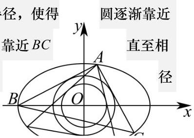

当 ${BC}$ 与圆相交时,因为圆的圆心是固定的原点,我们可以通过缩小圆的半径,使得 ${BC}$ ,直到 ${BC}$ 与圆相切; 同理,当 ${BC}$ 与圆相离时,扩大圆的半径,也能使圆靠近 ${BC}$ 切. 所以从直线与圆位置关系的动态调整角度可知, 一定能找到合适的圆半使得 ${BC}$ 与圆相切,故①正确.

判断命题②:当A在双曲线顶点时，过 $\mathrm{A}$ 作圆的切线，交双曲线于另外两点 $B, C$ . 由双曲线的性质可知,双曲线在顶点附近的形状特点决定了, 过顶点作圆的切线与双曲线相交得到的线段 ${BC}$ ,其整体位置与以原点为圆心的圆是相离的. 这是因为双曲线的渐近线性质以及顶点处的曲线走向, 使得从顶点出发的切线与双曲线相交形成的线段不会与圆相切, 所以②不正确.

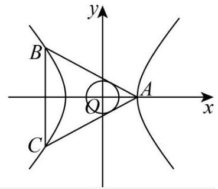

故选: A.

17. 解: (1) 因为函数 $y = f\left( x\right)$ 是奇函数,

$y = f\left( x\right)$ 的定义域 $\left( {-\infty , + \infty }\right)$ 关于原点对称, -1 分

由 $f\left( {-x}\right)  = \frac{1}{{e}^{-x} + 1} - a = \frac{{e}^{x}}{1 + {e}^{x}} - a$ ,则 $f\left( {-x}\right)  + f\left( x\right)  = \frac{{e}^{x}}{1 + {e}^{x}} + \frac{1}{{e}^{x} + 1} - {2a} = 1 - {2a} = 0$ , -5 分

所以 $a = \frac{1}{2}$ -7 分

法二: 因为函数 $y = f\left( x\right)$ 是奇函数,定义域为 $\mathrm{R}$ , -1 分

所以 $f\left( 0\right)  = 0 \Rightarrow  \frac{1}{{e}^{0} + 1} - a = 0 \Rightarrow  a = \frac{1}{2}$ -4 分

$f\left( {-x}\right)  + f\left( x\right)  = \frac{{e}^{x}}{1 + {e}^{x}} - \frac{1}{2} + \frac{1}{{e}^{x} + 1} - \frac{1}{2} = 1 - 1 = 0$ ,函数 $y = f\left( x\right)$ 是奇函数。所以 $a = \frac{1}{2}$

-7 分

(2)方法一:判断函数 $f\left( x\right)  = \frac{1}{{e}^{x} + 1} - a$ 的单调性:

对任意实数 ${x}_{1},{x}_{2} \in  \left\lbrack  {-1,1}\right\rbrack$ 且 ${x}_{1} < {x}_{2}, f\left( {x}_{1}\right)  - f\left( {x}_{2}\right)  = \frac{1}{{e}^{{x}_{1}} + 1} - \frac{1}{{e}^{{x}_{2}} + 1} = \frac{{e}^{{x}_{2}} - {e}^{{x}_{1}}}{\left( {{e}^{{x}_{1}} + 1}\right) \left( {{e}^{{x}_{2}} + 1}\right) }$

因为 ${x}_{1} < {x}_{2}$ ,所以 ${e}^{{x}_{1}} < {e}^{{x}_{2}}$ ,所以 $f\left( {x}_{1}\right)  - f\left( {x}_{2}\right)  > 0$

所以函数 $f\left( x\right)  = \frac{1}{{e}^{x} + 1} - a\left( {a \in  \mathrm{R}}\right)$ 在 $\left\lbrack  {-1,1}\right\rbrack$ 上是严格减函数; -10 分

所以当 $x =  - 1$ 时,函数 $y = f\left( x\right)$ 的最大值为 $\frac{e}{e + 1} - a$ , -12 分

所以 $a \geq  \frac{e}{e + 1}$ -14 分

方法二: 对任意实数 $x \in  \left\lbrack  {-1,1}\right\rbrack$ ,不等式 $f\left( x\right)  \leq  0$ 恒成立,即 $a \geq  \frac{1}{{e}^{x} + 1}$ . -9 分

设 $g\left( x\right)  = \frac{1}{{e}^{x} + 1}$ ,对任意实数 ${x}_{1},{x}_{2} \in  \left\lbrack  {-1,1}\right\rbrack$ 且 ${x}_{1} < {x}_{2}$

$g\left( {x}_{1}\right)  - g\left( {x}_{2}\right)  = \frac{1}{{e}^{{x}_{1}} + 1} - \frac{1}{{e}^{{x}_{2}} + 1} = \frac{{e}^{{x}_{2}} - {e}^{{x}_{1}}}{\left( {{e}^{{x}_{1}} + 1}\right) \left( {{e}^{{x}_{2}} + 1}\right) }$

因为 ${x}_{1} < {x}_{2}$ ,所以 ${e}^{{x}_{1}} < {e}^{{x}_{2}}$ ,所以 $g\left( {x}_{1}\right)  - g\left( {x}_{2}\right)  > 0$

所以函数 $y = g\left( x\right)$ 在 $\left\lbrack  {-1,1}\right\rbrack$ 上是严格减函数; -12 分

$g\left( x\right)  \leq  g\left( {-1}\right)  = \frac{e}{e + 1}$ ,所以 $a \geq  \frac{e}{e + 1}$ -14 分

方法三: 对任意实数 $x \in  \left\lbrack  {-1,1}\right\rbrack$ ,不等式 $f\left( x\right)  \leq  0$ 恒成立,即 $a \geq  \frac{1}{{e}^{x} + 1}$ -9 分

$\because  - 1 \leq  x \leq  1\;\therefore \frac{1}{e} \leq  {e}^{x} \leq  e\;\therefore \frac{1}{e} + 1 \leq  {e}^{x} + 1 \leq  e + 1$ ,

$\therefore \frac{1}{e + 1} \leq  \frac{1}{{e}^{x} + 1} \leq  \frac{e}{e + 1}$ -12 分

所以 $a \geq  \frac{e}{e + 1}$ -14 分

(说明: 函数单调性没有证明或没有利用不等式性质说明的, 直接写出最值的, 扣 2 分)

18. 解 1: (1) 证明: 取 ${AP}$ 中点 $G$ ,连接 ${EG}\text{ 、 }{DG}$ ,

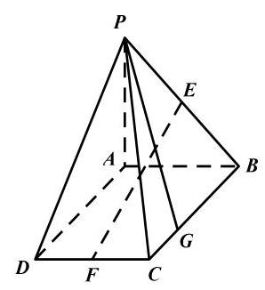

$\because {GE}//{AB},{DF}//{AB}$

$\therefore {GE}//{DF}$ 1 分

$\because {GE} = \frac{1}{2}{AB},{DF} = \frac{1}{2}{AB}$

$\therefore {GE} = {DF}$ 1 分

$\therefore$ 四边形 ${DFEG}$ 为平行四边形

$\therefore {EF}//{DG}$ 3 分

$\because {DG} \subset$ 平面 ${PDA},{EF}$ 在平面 ${PDA}$ 外

$\therefore {EF}//$ 平面 ${PDA}$ 1 分

(2)解:作 ${GH}\bot {AD}$ ，垂足为 $H$ ，连接 ${PH}$

$\because {PA} \bot$ 平面 ${ABCD}$

$\therefore {PA} \bot  {GH}$

$\therefore {GH} \bot$ 平面 ${PAD}$ 2 分

$\therefore$ 直线 ${PG}$ 与平面 ${PAD}$ 所成的角为 $\angle {GPH} = {30}^{ \circ  }$ , 2 分

$\therefore \frac{HG}{PH} = \tan {30}^{ \circ  } = \frac{1}{\sqrt{3}}$ ,

$\therefore {PH} = 2\sqrt{3}$ 1 分

$\therefore {BG} = {AH} = \sqrt{P{H}^{2} - P{A}^{2}} = 2\sqrt{2}$ 2 分

$\therefore$ 边 ${BC}$ 上存在点 $G$ ,使得直线 ${PG}$ 与平面 ${PAD}$ 所成的角为 ${30}^{ \circ  },{BG} = 2\sqrt{2}$ 1 分解 2:

(1)证:如图建立空间直角坐标，则 $D\left( {3,0,0}\right)$ ， $B\left( {0,2,0}\right)$ ， $P\left( {0,0,2}\right)$ ，

$F\left( {3,1,0}\right) , E\left( {0,1,1}\right) , C\left( {3,2,0}\right)$ ,

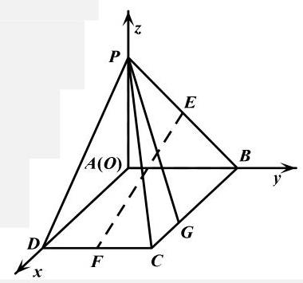

$\therefore \overrightarrow{EF} = \left( {3,0, - 1}\right)$ , 2 分

取平面 ${PAD}$ 的法向量 $\overrightarrow{n} = \left( {0,1,0}\right)$ 1 分

$\because \overrightarrow{EF} \cdot  \overrightarrow{n} = 0$ , 2 分

且 ${EF}$ 在平面 ${PDA}$ 外

$\therefore {EF}//$ 平面 ${PDA}$ 1 分

(2)设 ${BG} = t\left( {0 \leq  t \leq  3}\right)$ ，则 $G\left( {t,2,0}\right)$ ，

$\therefore \overrightarrow{PG} = \left( {t,2, - 2}\right)$ , 2 分

取平面 ${PAD}$ 的法向量 $\overrightarrow{n} = \left( {0,1,0}\right)$ 1 分

设 $\overrightarrow{PG}$ 与 $\overrightarrow{n}$ 的夹角为 $\varphi$ ,

则 $\sin {30}^{ \circ  } = \left| {\cos \varphi }\right|  = \frac{2}{\sqrt{{t}^{2} + 8}}$ , 2 分

求得 $t = 2\sqrt{2}$ 2 分

$\therefore$ 边 ${BC}$ 上存在点 $G$ ,使得直线 ${PG}$ 与平面 ${PAD}$ 所成的角为 ${30}^{ \circ  },{BG} = 2\sqrt{2}$ 1 分

19. 解: (1) 记 $\mathrm{A}$ 、 $\mathrm{B}$ 软件能正确解答数学问题的概率为 ${p}_{1}$ 和 ${p}_{2}$ ,

则 ${p}_{1} = \frac{40}{50} = {0.8},{p}_{2} = \frac{38}{50} = \frac{19}{25}$ . (4 分)

(2)记“A 软件能正确解答这道题”为事件 A， “B 软件能正确解答这道题” 为事件 B， “该题为几何题” 为事件 $\mathrm{C}$ . 则

$P\left( A\right)  = P\left( C\right) P\left( {A \mid  C}\right)  + P\left( \bar{C}\right) P\left( {A \mid  \bar{C}}\right)  = \frac{1}{3} \times  \frac{16}{20} + \frac{2}{3} \times  \frac{24}{30} = \frac{4}{5}\;(6$ 分

同理可得

$P\left( B\right)  = \frac{1}{3} \times  \frac{20}{30} + \frac{2}{3} \times  \frac{18}{20} = \frac{37}{45}.$ (7 分)

因为 $P\left( B\right)  > P\left( A\right)$ ,所以 $\mathrm{B}$ 软件能够正确解决这道试题的概率更大,小浦应该使用 $\mathrm{B}$ 软件来解决这道试题.

(8 分)

(3)几何试题用 A 软件解答，函数试题用 B 软件解答.

因为

$$
{X}_{1} \sim  B\left( {3,\frac{4}{5}}\right) ,\;{X}_{2} \sim  B\left( {3,\frac{9}{10}}\right)
$$

所以

$$
E\left\lbrack  {X}_{1}\right\rbrack   = 3 \times  \frac{4}{5} = \frac{12}{5}, E\left\lbrack  {X}_{2}\right\rbrack   = 3 \times  \frac{9}{10} = \frac{27}{10}.
$$

于是

$$
E\left\lbrack  {{X}_{1} + {X}_{2}}\right\rbrack   = E\left\lbrack  {X}_{1}\right\rbrack   + E\left\lbrack  {X}_{2}\right\rbrack   = \frac{12}{5} + \frac{27}{10} = \frac{51}{10}\text{ . (12 分) }
$$

显然 ${X}_{1},{X}_{2}$ 相互独立,

所以

$$
D\left\lbrack  {{X}_{1} + {X}_{2}}\right\rbrack   = D\left\lbrack  {X}_{1}\right\rbrack   + D\left\lbrack  {X}_{2}\right\rbrack
$$

$= \frac{12}{5} \times  \frac{1}{5} + \frac{27}{10} \times  \frac{1}{10}$

$= \frac{3}{4}.$ (14 分)

20.

(1)由题，椭圆 ${C}_{1}$ 的离心率为 $\frac{\sqrt{6}}{3}$ ，椭圆 ${C}_{2}$ 的离心率为 $\frac{\sqrt{{a}^{2} - {2a}}}{a}$ 2 分 $\frac{\sqrt{6}}{3} = \frac{\sqrt{{a}^{2} - {2a}}}{a}$ 解得 $a = 6$ ; 4 分

(2)由题， $A\left( {\sqrt{3},0}\right) , B\left( {0,1}\right)$ ，所以 $\left| {AB}\right|  = 2$ ，直线 ${AB}$ 的方程为 $y =  - \frac{\sqrt{3}}{3}x + 1\cdots 2$ 分设 ${C}_{2}$ 的方程为 ${x}^{2} + 3{y}^{2} = \lambda \left( {\lambda  > 0}\right) , C\left( {{x}_{1},{y}_{1}}\right) , D\left( {{x}_{2},{y}_{2}}\right)$

联立直线 ${AB}$ 与椭圆 ${C}_{2} : \left\{  \begin{array}{l} y =  - \frac{\sqrt{3}}{3}x + 1 \\  {x}^{2} + 3{y}^{2} = \lambda  \end{array}\right.$ ,代入整理得 $2{x}^{2} - 2\sqrt{3}x + 3 - \lambda  = 0\cdots$ 4 分

故 $\left| {CD}\right|  = \sqrt{1 + {\left( -\frac{\sqrt{3}}{3}\right) }^{2}}\left| {{x}_{1} - {x}_{2}}\right|  = \frac{2}{\sqrt{3}}\frac{\sqrt{{12} - 8\left( {3 - \lambda }\right) }}{2} = 3\left| {AB}\right|  = 6$

即 $\sqrt{{12} - 8\left( {3 - \lambda }\right) } = 6\sqrt{3}$ ,解得 $\lambda  = {15}$ .

所以 ${C}_{2}$ 的标准方程为 $\frac{{x}^{2}}{15} + \frac{{y}^{2}}{5} = 1$ . 6 分

(3)由题,设 ${C}_{2}$ 的方程为 $3{x}^{2} + {y}^{2} = \lambda \left( {\lambda  > 0}\right)$

由题意, ${AP} \bot  {AQ}$ 且 ${\left| AP\right| }^{2} = {\left| AQ\right| }^{2}$

任取 ${C}_{1}$ 上一点 $P\left( {{x}_{0},{y}_{0}}\right)$ (不与点 $\mathrm{A}$ 重合),则 ${\left| AP\right| }^{2} = {\left( {x}_{0} - \sqrt{3}\right) }^{2} + {y}_{0}{}^{2},{k}_{AP} = \frac{{y}_{0}}{{x}_{0} - \sqrt{3}}$ 设 $Q\left( {{x}_{Q},{y}_{Q}}\right)$ ,则 ${\left| AQ\right| }^{2} = {\left( {x}_{Q} - \sqrt{3}\right) }^{2} + {y}_{Q}{}^{2}$ 2 分

直线 ${AQ}$ 的方程为 $x = \frac{1}{{k}_{AQ}}y + \sqrt{3} =  - {k}_{AP}y + \sqrt{3}$ ,故 ${x}_{Q} - \sqrt{3} =  - {k}_{AP}{y}_{Q}$

代入得 ${\left| AQ\right| }^{2} = {\left( {x}_{Q} - \sqrt{3}\right) }^{2} + {y}_{Q}{}^{2} = \left( {{k}_{AP}{}^{2} + 1}\right) {y}_{Q}{}^{2} = \frac{{\left( {x}_{0} - \sqrt{3}\right) }^{2} + {y}_{0}{}^{2}}{{\left( {x}_{0} - \sqrt{3}\right) }^{2}}{y}_{Q}{}^{2} = \frac{{\left| AP\right| }^{2}}{{\left( {x}_{0} - \sqrt{3}\right) }^{2}}{y}_{Q}{}^{2}$

因为 ${\left| AP\right| }^{2} = {\left| AQ\right| }^{2}$ ,解得 ${y}_{Q}{}^{2} = {\left( {x}_{0} - \sqrt{3}\right) }^{2}$ ,

由对称性,不妨设 ${y}_{Q} = {x}_{0} - \sqrt{3}$ ,代回直线 ${AQ}$ 方程可解得 $Q\left( {\sqrt{3} - {y}_{0},{x}_{0} - \sqrt{3}}\right) \cdots \cdots 4$ 4 分而点 $Q$ 位于 ${C}_{2}$ 上,所以 $\lambda  = 3{\left( \sqrt{3} - {y}_{0}\right) }^{2} + {\left( {x}_{0} - \sqrt{3}\right) }^{2} = 3\left( {{y}_{0}{}^{2} - 2\sqrt{3}{y}_{0} + 3}\right)  + {x}_{0}{}^{2} - 2\sqrt{3}{x}_{0} + 3 \; = \left( {{x}_{0}^{2} + 3{y}_{0}^{2}}\right)  + {12} - 2\sqrt{3}\left( {{x}_{0} + 3{y}_{0}}\right)$

$P\left( {{x}_{0},{y}_{0}}\right)$ 为 ${C}_{1}$ 上任一点,所以 ${x}_{0}^{2} + 3{y}_{0}^{2} = 3$ 为定值,化简得

$\lambda  = {15} - 2\sqrt{3}\left( {{x}_{0} + 3{y}_{0}}\right)$ 6 分

设 ${x}_{0} + 3{y}_{0} = b, P\left( {{x}_{0},{y}_{0}}\right)$ 为 ${C}_{1}$ 上任一点,即 $\left\{  \begin{array}{l} \frac{{x}_{0}{}^{2}}{3} + {y}_{0}{}^{2} = 1 \\  {x}_{0} + 3{y}_{0} = b \end{array}\right.$ 有解

整理得 ${12}{y}_{0}{}^{2} - {6b}{y}_{0} + {b}^{2} - 3 = 0,\Delta  = {36}{b}^{2} - {48}\left( {{b}^{2} - 3}\right)  = {12}\left( {{12} - {b}^{2}}\right)  \geq  0$

解得 $b \in  \left\lbrack  {-2\sqrt{3},2\sqrt{3}}\right\rbrack$ ,所以 $\lambda  = {15} - 2\sqrt{3}b \in  \left\lbrack  {3,{27}}\right\rbrack$

故 ${C}_{2}$ 的长轴长 $2\sqrt{\lambda } \in  \left\lbrack  {2\sqrt{3},6\sqrt{3}}\right\rbrack$ . .8 分 21.

解析: (1) 假设 ${x}_{1},{x}_{2},{x}_{3}$ 成等差数列,得 ${x}_{2} = \frac{{x}_{1} + {x}_{3}}{2}$ ,

设公差为 $d$ ,则 $d = {x}_{2} - {x}_{1} = {x}_{3} - {x}_{2} > 0$ ,

对于 $f\left( x\right)$ ,

直线 ${AC}$ 的斜率 ${k}_{AC} = \frac{{y}_{3} - {y}_{1}}{{x}_{3} - {x}_{1}} = \frac{{x}_{3}^{2} + {x}_{3} - {x}_{1}^{2} - {x}_{1}}{{x}_{3} - {x}_{1}} = {x}_{3} + {x}_{1} + 1$ ,

因为 ${f}^{\prime }\left( x\right)  = {2x} + 1$ ,所以曲线 $y = f\left( x\right)$ 在点 $B$ 处的切线斜率为 ${k}_{B} = 2{x}_{2} + 1$ ,

由题意, ${k}_{AC} = {k}_{B} \Rightarrow  {x}_{3} + {x}_{1} + 1 = 2{x}_{2} + 1$ 恒成立,

取 ${x}_{2} = 2, d = 1$ ,则 ${x}_{1},{x}_{2},{x}_{3}$ 成等差数列且均为整数,故 $f\left( x\right)$ 是 “整数等差函数”.

对于 $g\left( x\right)$ ,

直线 ${AC}$ 的斜率 ${k}_{AC} = \frac{{y}_{3} - {y}_{1}}{{x}_{3} - {x}_{1}} = \frac{\sin {x}_{3} - \sin {x}_{1}}{{x}_{3} - {x}_{1}} = \frac{\sin \left( {{x}_{2} + d}\right)  - \sin \left( {{x}_{2} - d}\right) }{2d} = \frac{\cos {x}_{2}\sin d}{d}$ ,

因为 ${f}^{\prime }\left( x\right)  = \cos x$ ,所以曲线 $y = f\left( x\right)$ 在点 $B$ 处的切线斜率为 ${k}_{B} = \cos {x}_{2}$ ,

由题意, ${k}_{AC} = {k}_{B} \Rightarrow  \frac{\cos {x}_{2}\sin d}{d} = \cos {x}_{2} \Rightarrow  \cos {x}_{2}\left( {\sin d - d}\right)  = 0$ ,

若 ${x}_{2} \in  \mathbf{Z}$ ,则 ${x}_{2} \neq  \left( {k + \frac{1}{2}}\right) \pi , k \in  \mathbf{Z} \Rightarrow  \cos {x}_{2} \neq  0$ ,

同时,由 $d > 0$ ,得 $\sin d - d < 0$ 恒成立,故 $f\left( x\right)$ 不是 “整数等差函数”.

(2)因为 $f\left( x\right)$ 为 “整数等差函数”，所以 ${x}_{1},{x}_{2},{x}_{3}$ 成等差数列且 ${x}_{1},{x}_{2},{x}_{3}$ 均为整数， 设公差为 $d$ ,则 $d = {x}_{2} - {x}_{1} = {x}_{3} - {x}_{2} > 0$ ,且 $d \in  \mathbf{Z}$ ,

直线 ${AC}$ 的斜率 ${k}_{AC} = \frac{{y}_{3} - {y}_{1}}{{x}_{3} - {x}_{1}} = \frac{\frac{1}{{x}_{3}^{2} + m} - \frac{1}{{x}_{1}^{2} + m}}{{x}_{3} - {x}_{1}} =  - \frac{{x}_{1} + {x}_{3}}{\left( {{x}_{1}^{2} + m}\right) \left( {{x}_{3}^{2} + m}\right) }$ ,

因为 ${f}^{\prime }\left( x\right)  =  - \frac{2x}{{\left( {x}^{2} + m\right) }^{2}}$ ,所以曲线 $y = f\left( x\right)$ 在点 $B$ 处的切线斜率为 ${k}_{B} =  - \frac{2{x}_{2}}{{\left( {x}_{2}^{2} + m\right) }^{2}}$ ,

由题意, ${k}_{AC} = {k}_{B} \Rightarrow   - \frac{{x}_{1} + {x}_{3}}{\left( {{x}_{1}^{2} + m}\right) \left( {{x}_{3}^{2} + m}\right) } =  - \frac{2{x}_{2}}{{\left( {x}_{2}^{2} + m\right) }^{2}}$ ,

因为 ${x}_{1} = {x}_{2} - d,{x}_{3} = {x}_{2} + d$ ,

所以 ${\left( {x}_{2}^{2} + m\right) }^{2} = \left( {{x}_{1}^{2} + m}\right) \left( {{x}_{3}^{2} + m}\right)$

$\Rightarrow  {x}_{2}^{4} + {2m}{x}_{2}^{2} = {\left( {x}_{2} - d\right) }^{2}{\left( {x}_{2} + d\right) }^{2} + m\left( {{\left( {x}_{2} - d\right) }^{2} + {\left( {x}_{2} + d\right) }^{2}}\right)$

$\Rightarrow  {x}_{2}^{4} + {2m}{x}_{2}^{2} = {x}_{2}^{4} - 2{x}_{2}^{2}{d}^{2} + {d}^{4} + {2m}{x}_{2}^{2} + {2m}{d}^{2}$

$\Rightarrow  m = \frac{2{x}_{2}^{2} - {d}^{2}}{2}$ ,

又 $y = f\left( x\right)$ 的定义域为 $\mathbf{R}$ ,有 $m > 0$ ,则 $m \geq  \frac{1}{2}$ ,

可取 ${x}_{2} = d = 1$ 使等号成立,故 $m$ 的最小值为 $\frac{1}{2}$ .

(3)充分性，因为 $f\left( x\right)$ 为常值函数，所以 ${f}^{\prime }\left( x\right)  = 0$ ，

任意取等差数列 ${x}_{1},{x}_{2},{x}_{3}$ ,则直线 ${AC}$ 的斜率 ${k}_{AC} = \frac{{y}_{3} - {y}_{1}}{{x}_{3} - {x}_{1}} = 0$ ,

曲线 $y = f\left( x\right)$ 在点 $B$ 处的切线斜率为 ${k}_{B} = {f}^{\prime }\left( {x}_{2}\right)  = 0$ ,

因为 ${k}_{AC} = {k}_{B}$ ,所以 $f\left( x\right)$ 为 “等差函数”.

必要性,因为 $f\left( x\right)$ 为 “等差函数”,所以 ${x}_{1},{x}_{2},{x}_{3}$ 成等差数列,

设公差为 $d$ ,则 $d = {x}_{2} - {x}_{1} = {x}_{3} - {x}_{2} > 0$ ,

直线 ${AC}$ 的斜率 ${k}_{AC} = \frac{{y}_{3} - {y}_{1}}{{x}_{3} - {x}_{1}} = \frac{f\left( {x}_{3}\right)  - f\left( {x}_{1}\right) }{{x}_{3} - {x}_{1}}$ ,

曲线 $y = f\left( x\right)$ 在点 $B$ 处的切线斜率为 ${k}_{B} = {f}^{\prime }\left( {x}_{2}\right)$ ,

由题意, ${k}_{AC} = {k}_{B} \Rightarrow  \frac{f\left( {x}_{3}\right)  - f\left( {x}_{1}\right) }{{x}_{3} - {x}_{1}} = {f}^{\prime }\left( {x}_{2}\right)$

$\Rightarrow  f\left( {{x}_{2} + d}\right)  - f\left( {{x}_{2} - d}\right)  = {2d}{f}^{\prime }\left( {x}_{2}\right) ,$

令 $g\left( x\right)  = f\left( {{x}_{2} + x}\right)  - f\left( {{x}_{2} - x}\right)  - {2x}{f}^{\prime }\left( {x}_{2}\right) , x > 0$ ,

${g}^{\prime }\left( x\right)  = {f}^{\prime }\left( {{x}_{2} + x}\right)  + {f}^{\prime }\left( {{x}_{2} - x}\right)  - 2{f}^{\prime }\left( {x}_{2}\right)$

$= f\left( {{x}_{2} + x + T}\right)  + f\left( {{x}_{2} - x + T}\right)  - {2f}\left( {{x}_{2} + T}\right)$ ,

令 $h\left( x\right)  = f\left( {{x}_{2} + x + T}\right)  + f\left( {{x}_{2} - x + T}\right)  - {2f}\left( {{x}_{2} + T}\right)$ ,

${h}^{\prime }\left( x\right)  = {f}^{\prime }\left( {{x}_{2} + x + T}\right)  - {f}^{\prime }\left( {{x}_{2} - x + T}\right) ,$

因为 ${f}^{\prime }\left( x\right)$ 在 $\mathbf{R}$ 上为增函数,所以 ${h}^{\prime }\left( x\right)  \geq  0, h\left( x\right)$ 在 $\left( {0, + \infty }\right)$ 上为增函数,

因为 $h\left( 0\right)  = 0$ ,所以 ${g}^{\prime }\left( x\right)  = h\left( x\right)  \geq  0, g\left( x\right)$ 在 $\mathbf{R}$ 上为增函数,

因为 $g\left( 0\right)  = 0$ ,所以 $g\left( x\right)  \geq  0$ 在 $\left( {0, + \infty }\right)$ 上恒成立,

又 $g\left( d\right)  = 0$ ,由 $g\left( x\right)$ 的单调性知 $g\left( x\right)  = 0, x \in  \left( {0, d}\right)$ ,

故 ${g}^{\prime }\left( x\right)  = 0, x \in  \left( {0, d}\right) ,{h}^{\prime }\left( x\right)  = 0, x \in  \left( {0, d}\right)$ ,

${f}^{\prime }\left( x\right)  = C, x \in  \left( {{x}_{2} - d + T,{x}_{2} + d + T}\right) , C$ 为常数,

$f\left( x\right)  = C, x \in  \left( {{x}_{2} - d + {2T},{x}_{2} + d + {2T}}\right) ,$

${f}^{\prime }\left( x\right)  = 0, x \in  \left( {{x}_{2} - d + {2T},{x}_{2} + d + {2T}}\right) ,$

$f\left( x\right)  = 0, x \in  \left( {{x}_{2} - d + {3T},{x}_{2} + d + {3T}}\right) ,$

接下来,一方面,因为 $f\left( {x + t}\right)  = {f}^{\prime }\left( x\right)$ ,且 ${f}^{\prime }\left( x\right)$ 在 $\mathbf{R}$ 上为增函数,

所以 $f\left( x\right)$ 在 $\mathbf{R}$ 上为增函数,故 ${f}^{\prime }\left( x\right)  \geq  0, f\left( x\right)  \geq  0$ ,

由 $f\left( x\right)  = 0, x \in  \left( {{x}_{2} - d + {3T},{x}_{2} + d + {3T}}\right)$ ,可得 $f\left( x\right)  = 0, x \in  \left( {-\infty ,{x}_{2} + d + {3T}}\right)$ ,

另一方面,因为 $f\left( {x + T}\right)  = {f}^{\prime }\left( x\right)$ ,

所以 ${f}^{\prime }\left( x\right)  = 0, x \in  \left( {-\infty ,{x}_{2} + d + {3T}}\right)$ ,可得 $f\left( x\right)  = 0, x \in  \left( {-\infty ,{x}_{2} + d + {4T}}\right)$ ,

以此类推, $f\left( x\right)  = 0$ 在 $\mathbf{R}$ 上恒成立,即 $f\left( x\right)$ 为常值函数.

命题得证!

2025 届上海市嘉定区高三二模数学试卷

202504

## 一、填空题

1. 已知集合 $A = \{ x \mid   - 1 < x \leq  3\}$ ，集合 $B = \{ x \mid  1 \leq  x < 4\}$ ，则 $A \cap  B =$ ___.

【答案】 $\{ x \mid  1 \leq  x \leq  3\}$

【详解】 $A \cap  B = \{ x \mid  1 \leq  x \leq  3\}$ . 故答案为: $\{ x \mid  1 \leq  x \leq  3\}$ .

2. 不等式 $\frac{x - 2}{x + 1} < 0$ 的解集为___.

【答案】 $\left( {-1,2}\right)$

【详解】解: 由分式不等式的解法得原不等式 $\frac{x - 2}{x + 1} < 0$ 等价于 $\left( {x - 2}\right) \left( {x + 1}\right)  < 0$ , 解不等式 $\left( {x - 2}\right) \left( {x + 1}\right)  < 0$ 得 $- 1 < x < 2$ . 故不等式 $\frac{x - 2}{x + 1} < 0$ 的解集为 $\left( {-1,2}\right)$ .

3. 已知向量 $\overrightarrow{m} = \left( {1, - 2}\right) ,\overrightarrow{n} = \left( {k,4}\right)$ ，若 $\overrightarrow{m} \bot  \overrightarrow{n}$ ，则 $k =$ ___.

【答案】8

【详解】由题设 $\overrightarrow{m} \cdot  \overrightarrow{n} = 1 \times  k + \left( {-2}\right)  \times  4 = k - 8 = 0 \Rightarrow  k = 8$ . 故答案为: 8

4. 已知等比数列 $\left\{  {a}_{n}\right\}$ 的首项为 1,公比为 $q$ ,其前 $n$ 项和为 ${S}_{n}$ . 若 ${S}_{3} > {S}_{4}$ ,则 $q$ 的取值范围为___.

【答案】 $\left( {-\infty ,0}\right)$

【详解】依题意, ${S}_{3} > {S}_{4}$ ,即 ${S}_{4} - {S}_{3} = {a}_{4} = {a}_{1}{q}^{3} = {q}^{3} < 0$ ,所以 $q < 0$ . 故答案为: $\left( {-\infty ,0}\right)$

5. 在 ${\left( 2x - \frac{1}{\sqrt{x}}\right) }^{6}$ 的二项展开式中,常数项的值为___.

【答案】60

【详解】二项式 ${\left( 2x - \frac{1}{\sqrt{x}}\right) }^{6}$ 的展开式的通项公式为: ${T}_{r + 1} = {\mathrm{C}}_{6}^{r}{\left( 2x\right) }^{6 - r}{\left( -\frac{1}{\sqrt{x}}\right) }^{r} = {\left( -1\right) }^{r}{\mathrm{C}}_{6}^{r}{2}^{6 - r}{x}^{6 - \frac{3}{2}r}$ , 令 $6 - \frac{3}{2}r = 0$ ,解得 $r = 4$ ,所以二项式的展开式中的常数项为 ${\left( -1\right) }^{4}{\mathrm{C}}_{6}^{4}{2}^{2} = {60}$ . 故答案为: 60 .

6. 已知 $\theta  \in  \mathbf{R}$ ,若 $\tan \theta  + \cot \theta  = 5$ ,则 $\sin {2\theta } =$ ___.

【答案】 $\frac{2}{5}$

【详解】由 $\tan \theta  + \cot \theta  = \frac{\sin \theta }{\cos \theta } + \frac{\cos \theta }{\sin \theta } = \frac{{\sin }^{2}\theta  + {\cos }^{2}\theta }{\sin \theta \cos \theta } = \frac{1}{\sin \theta \cos \theta } = 5$ ,

所以 $\sin \theta \cos \theta  = \frac{1}{5}$ ,则 $\sin {2\theta } = 2\sin \theta \cos \theta  = \frac{2}{5}$ . 故答案为: $\frac{2}{5}$

7. 直线 $l : y = x + 1$ 与圆 $C : {x}^{2} + {y}^{2} - {4x} - {2y} = 0$ 相交所得的弦长为___.

【答案】 $2\sqrt{3}$

【详解】由 $C : {x}^{2} + {y}^{2} - {4x} - {2y} = 0$ ,即 $C : {\left( x - 2\right) }^{2} + {\left( y - 1\right) }^{2} = 5$ ,所以圆心为 $C\left( {2,1}\right)$ ,半径为 $r = \sqrt{5}$ , 所以 $C\left( {2,1}\right)$ 到 $l : y = x + 1$ 的距离 $d = \frac{\left| 2 - 1 + 1\right| }{\sqrt{2}} = \sqrt{2}$ ,综上,直线与圆的相交弦长为 $2\sqrt{{r}^{2} - {d}^{2}} = 2\sqrt{3}$ .

8. 已知复数 ${z}_{1},{z}_{2}$ 满足 $\left| {z}_{1}\right|  = 1,\left| {z}_{2}\right|  = 2,\left| {{z}_{1} - {z}_{2}}\right|  = \sqrt{7}$ ，则 $\left| {{z}_{1} + {z}_{2}}\right|$ 的值为___.

【答案】 $\sqrt{3}$

【详解】设 $\overrightarrow{OA}$ 对应的复数为 ${z}_{1},\overrightarrow{OB}$ 对应的复数为 ${z}_{2}$ ,则 $\overrightarrow{OA} + \overrightarrow{OB}$ 对应的复数为 ${z}_{1} + {z}_{2},\overrightarrow{OA} - \overrightarrow{OB}$ 对应的复数为 ${z}_{1} - {z}_{2}$ ,因为 $\left| {z}_{1}\right|  = 1,\left| {z}_{2}\right|  = 2,\left| {{z}_{1} - {z}_{2}}\right|  = \sqrt{7}$ , 由平行四边形的性质可得: ${\left| {z}_{1} + {z}_{2}\right| }^{2} + {\left| {z}_{1} - {z}_{2}\right| }^{2} = 2\left( {{\left| {z}_{1}\right| }^{2} + {\left| {z}_{2}\right| }^{2}}\right)$ 所以 $\left| {{z}_{1} + {z}_{2}}\right|  = \sqrt{2{\left| {z}_{1}\right| }^{2} + 2{\left| {z}_{2}\right| }^{2} - {\left| {z}_{1} - {z}_{2}\right| }^{2}} = \sqrt{2 + 8 - 7} = \sqrt{3}$ ,故答案为: $\sqrt{3}$ .

9. 在由 1,2,3,4,5 这五个数组成的无重复数字的四位数中,其能被 3 整除的概率为___.

【答案】 $\frac{1}{5}$

【详解】由1,2,3,4,5这五个数组成的无重复数字的四位数共 ${\mathrm{A}}_{5}^{4} = 5 \times  4 \times  3 \times  2 = {120}$ 个, 其中能被 3 整除的四位数是由1,2,4,5组成的,共 ${\mathrm{A}}_{4}^{4} = 4 \times  3 \times  2 \times  1 = {24}$ , 故由1,2,3,4,5这五个数组成的无重复数字的四位数中,其能被 3 整除的概率为 $\frac{24}{120} = \frac{1}{5}$ .

10. 已知某次数学的测试成绩 $X$ 服从 $\mu  = {75}\text{ 、 }{\sigma }^{2} = {64}$ 的正态分布,若小明的成绩不低于 91 分,那么他的成绩大约超过了___ $\%$ 的学生(精确到 0.1%). (参考数据:

$P\left( {\left| X\right|  < \sigma }\right)  \approx  {68.3}\% , P\left( {\left| X\right|  < {2\sigma }}\right)  \approx  {95.4}\% , P\left( {\left| X\right|  < {3\sigma }}\right)  \approx  {997}\% )$

【答案】97.7%

【详解】因为 $\mu  = {75}\text{ 、 }{\sigma }^{2} = {64}$ ,所以 $P\left( {X < {91}}\right)  \approx  {0.5} + \frac{1}{2} \times  {95.4}\%  = {97.7}\%$ ,故答案为: 97.7%

11. 某建筑公司欲设计一个正四棱锥形纪念碑,要求其顶点位于容积为 ${36\pi }$ 立方米的球形景观灯所在球面上. 考虑到抗风、抗震等结构安全需求,侧棱长度 $l$ 需满足 $2\sqrt{3} \leq  l \leq  3\sqrt{3}$ . 当纪念碑体积取得最大值时, 正四棱锥的侧棱长约为___米(精确到 0.01 米).

【答案】 4.90

【详解】若球的半径为 $r$ ,则 $\frac{4}{3}\pi {r}^{3} = {36\pi }$ ,可得 $r = 3$ ,又 $2\sqrt{3} \leq  l \leq  3\sqrt{3}$ ,对于正四棱锥,设底面边长为 $a$ ,

高为 $h$ ,则 ${h}^{2} = {l}^{2} - {\left( \frac{\sqrt{2}}{2}a\right) }^{2} = {l}^{2} - \frac{{a}^{2}}{2}$ ,所以 $\frac{{a}^{2}}{2} = {l}^{2} - {h}^{2}$ ,即 ${a}^{2} = 2\left( {{l}^{2} - {h}^{2}}\right)$ ,

又 ${\left( h - r\right) }^{2} + \frac{{a}^{2}}{2} = {r}^{2}$ ,则 $\frac{{a}^{2}}{2} = {6h} - {h}^{2}$ ,故 ${6h} = {l}^{2}$ ,即 $h = \frac{{l}^{2}}{6}$ ,

纪念碑体积 $V = \frac{1}{3}{a}^{2}h = \frac{2}{3} \times  \left( {{l}^{2} - \frac{{l}^{4}}{36}}\right)  \cdot  \frac{{l}^{2}}{6} = \frac{1}{9} \times  \left( {{l}^{4} - \frac{{l}^{6}}{36}}\right)$ ,令 $t = {l}^{2} \in  \left\lbrack  {{12},{27}}\right\rbrack$ ,

对于 $y = {t}^{2} - \frac{{t}^{3}}{36}$ ,则 ${y}^{\prime } = {2t} - \frac{{t}^{2}}{12} = \frac{{24t} - {t}^{2}}{12}$ 在 $t \in  \left\lbrack  {{12},{27}}\right\rbrack$ 上单调递减,

当 ${12} \leq  t < {24}$ 时 ${y}^{\prime } > 0$ ,即 $y = {t}^{2} - \frac{{t}^{3}}{36}$ 在 $\lbrack {12},{24})$ 上单调递增,

当 ${24} < t \leq  {27}$ 时 ${y}^{\prime } < 0$ ,即 $y = {t}^{2} - \frac{{t}^{3}}{36}$ 在 $({24},{27}\rbrack$ 上单调递减,

所以 ${y}_{\max } = {24}^{2} - \frac{{24}^{3}}{36} = {192}$ ,故 ${V}_{\max } = \frac{1}{9} \times  {192} = \frac{64}{3}$ ,此时 $l = 2\sqrt{6} \approx  {4.90}$ 米. 故答案为: 4.90

12. 在平面直角坐标系中,一质点 $P$ 从原点 $O$ 出发,第一次从点 $O$ 移动到点 ${P}_{1}$ ,第二次从点 ${P}_{1}$ 移动到点 ${P}_{2},\cdots$ ,第 $k$ 次从点 ${P}_{k - 1}$ (规定 ${P}_{0} = O$ ) 移动到点 ${P}_{k}$ . 记向量 $\overrightarrow{{v}_{k}} = \overrightarrow{{P}_{k - 1}{P}_{k}}$ ,其模长为 $k$ ,方向与 $x$ 轴正方向成 ${\left( {90}k\right) }^{ \circ  }$ 角,设 $\overrightarrow{{S}_{n}}$ 为经过 $n$ 次移动的位移向量,即 $\overrightarrow{{S}_{n}} = \overrightarrow{O{P}_{n}}$ ,则当 $\left| \overrightarrow{{S}_{n}}\right|  = \sqrt{85}$ 时, $n$ 的值为___.

【答案】 13

【详解】根据题意可知 $\overrightarrow{{v}_{k}} = \overrightarrow{{P}_{k - 1}{P}_{k}}$ 的模长为 $k$ ,方向与 $x$ 轴正方向成 ${\left( {90}k\right) }^{ \circ  }$ 角,

$\therefore \overrightarrow{{v}_{k}} = \overrightarrow{{P}_{k - 1}{P}_{k}} = \left( {k\cos {\left( {90}k\right) }^{ \circ  }, k\sin {\left( {90}k\right) }^{ \circ  }}\right)$ ,

$\overrightarrow{{S}_{n}} = \overrightarrow{O{P}_{n}} = \left( {1 \times  \cos {90}^{ \circ  } + 2\cos {180}^{ \circ  } + 3\cos {270}^{ \circ  } + \cdots  + n\cos {\left( {90}n\right) }^{ \circ  },1 \times  \sin {90}^{ \circ  } + 2\sin {180}^{ \circ  } + 3\sin {270}^{ \circ  } + \cdots  + n\sin {\left( {90}n\right) }^{ \circ  }}\right)$

$\therefore \overrightarrow{{S}_{4}} = \overrightarrow{O{P}_{4}} = \left( {-2 + 4,1 - 3}\right)  = \left( {2, - 2}\right) ,\left| \overrightarrow{{S}_{4}}\right|  = 2\sqrt{2}$ ;

$\overrightarrow{{S}_{8}} = \overrightarrow{O{P}_{8}} = \left( {-2 + 4 - 6 + 8,1 - 3 + 5 - 7}\right)  = \left( {4, - 4}\right) ,\left| \overrightarrow{{S}_{8}}\right|  = 4\sqrt{2}$ ;

$\overrightarrow{{S}_{12}} = \overrightarrow{O{P}_{12}} = \left( {-2 + 4 - 6 + 8 - {10} + {12},1 - 3 + 5 - 7 + 9 - {11}}\right)  = \left( {6, - 6}\right) ,\left| \overrightarrow{{S}_{12}}\right|  = 6\sqrt{2}$ ;

$\overrightarrow{{S}_{13}} = \overrightarrow{O{P}_{13}} = \left( {-2 + 4 - 6 + 8 - {10} + {12},1 - 3 + 5 - 7 + 9 - {11} + {13}}\right)  = \left( {6,7}\right) ,\left| \overrightarrow{{S}_{13}}\right|  = \sqrt{85}$ . 故 $n = {13}$ . 故答案为:13.

## 二、单选题

13. 已知实数 $a, b$ 满足 $a > b$ ,则下列不等式中,不恒成立的是 ( )

A. ${a}^{3} > {b}^{3}$ B. $\frac{a}{b} > 1$ C. ${a}^{2} + {b}^{2} > {2ab}$ D. ${2}^{a} > {2}^{b}$

【答案】B

【详解】A 选项,幂函数 $y = {x}^{3}$ 在 $\mathrm{R}$ 上单调递增,由于 $a > b$ ,所以 ${a}^{3} > {b}^{3},\mathrm{\;A}$ 选项不等式恒成立.

$\mathrm{B}$ 选项,当 $a =  - 1, b =  - 2$ 时, $a > b$ ,但 $\frac{a}{b} = \frac{1}{2} < 1,\mathrm{B}$ 选项不等式不恒成立.

$\mathrm{C}$ 选项, $a > b$ ,根据基本不等式可知 ${a}^{2} + {b}^{2} > {2ab},\mathrm{B}$ 选项不等式恒成立.

D 选项,指数函数 $y = {2}^{x}$ 在上单调递增,由于 $a > b$ ,所以 ${2}^{a} > {2}^{b},\mathrm{D}$ 选项不等式恒成立. 故选: B

14. 已知平面 $\alpha$ 和平面 $\beta$ ,直线 $m \subset  \alpha$ ,直线 $n \subset  \beta$ ,则下列结论一定成立的是 ( )

A. 若 $m//n$ ，则 $\alpha //\beta$ B. 若 $m$ 与 $n$ 为异面直线，则 $\alpha //\beta$

C. 若 $m \bot  n$ ,则 $\alpha  \bot  \beta$ D. 若 $n \bot  \alpha$ ,则 $m \bot  n$

【答案】D

【详解】对于 $\mathrm{A}$ ,直线 $m \subset  \alpha$ ,直线 $n \subset  \beta$ ,若 $m//n$ ,则 $\alpha //\beta$ 或平面 $\alpha$ 、平面 $\beta$ 相交,故 $\mathrm{A}$ 错误. 对于 $\mathrm{B}$ ,直线 $m \subset  \alpha$ ,直线 $n \subset  \beta$ ,若 $m$ 与 $n$ 为异面直线,则 $\alpha //\beta$ 或平面 $\alpha$ 、平面 $\beta$ 相交,故 $\mathrm{B}$ 错误. 对于 $\mathrm{C}$ ,直线 $m \subset  \alpha$ ,直线 $n \subset  \beta$ ,若 $m \bot  n$ ,则 $\alpha //\beta$ 或平面 $\alpha$ 、平面 $\beta$ 相交,故 $\mathrm{C}$ 错误.

对于 $\mathrm{D}$ ,直线 $m \subset  \alpha$ ,直线 $n \subset  \beta$ ,若 $n \bot  \alpha$ ,则 $m \bot  n$ .

故选: D

15. 已知关于 $x$ 的不等式 $\left| {\sin {2x}}\right|  > \cos x$ 在区间 $\left\lbrack  {0,{2\pi }}\right\rbrack$ 内有 $k$ 个整数解，则 $k$ 的值为( )

A. 3 B. 4 C. 5 D. 6

【答案】C

【详解】由题设 $2\left| {\sin x\cos x}\right|  > \cos x$ ,显然 $x \notin  \left\{  {0,\frac{\pi }{2},\frac{3\pi }{2},{2\pi }}\right\}$ ,当 $x \in  \left( {0,\frac{\pi }{2}}\right)  \cup  \left( {\frac{3\pi }{2},{2\pi }}\right)$ ,则 $\left| {\sin x}\right|  > \frac{1}{2}$ ,此时 $x \in  \left( {\frac{\pi }{6},\frac{\pi }{2}}\right)  \cup  \left( {\frac{3\pi }{2},\frac{5\pi }{3}}\right)$ ,当 $x \in  \left( {\frac{\pi }{2},\frac{3\pi }{2}}\right)$ ,则 $2\left| {\sin x\cos x}\right|  \geq  0 > \cos x$ ,此时 $x \in  \left( {\frac{\pi }{2},\frac{3\pi }{2}}\right)$ , 所以,整数解有1,2,3,4,5,共 5 个整数解.故选: $\mathrm{C}$

16. 设数列 $\left\{  {a}_{n}\right\}$ 满足 ${a}_{n} = \sin \left( \frac{n\pi }{3}\right)  + {\left( -1\right) }^{n}\cos \left( \frac{n\pi }{4}\right)$ ,记其前 $n$ 项和为 ${S}_{n}$ ,前 $n$ 项积为 ${T}_{n}$ . 则下列结论正确的是 ( )

A. 数列 $\left\{  {S}_{n}\right\}$ 和数列 $\left\{  {T}_{n}\right\}$ 均不是周期数列

C. 数列 $\left\{  {S}_{n}\right\}$ 不是周期数列,数列 $\left\{  {T}_{n}\right\}$ 是周期数列 D. 数列 $\left\{  {S}_{n}\right\}$ 和数列 $\left\{  {T}_{n}\right\}$ 均为周期数列

【答案】B

【详解】令 ${b}_{n} = \sin \left( \frac{n\pi }{3}\right)$ ,则数列 $\left\{  {b}_{n}\right\}$ 的一个周期为 6,又

${b}_{1} = \frac{\sqrt{3}}{2},{b}_{2} = \frac{\sqrt{3}}{2},{b}_{3} = 0,{b}_{4} =  - \frac{\sqrt{3}}{2},{b}_{5} =  - \frac{\sqrt{3}}{2},{b}_{6} = 0$ ,则 ${b}_{1} + {b}_{2} + {b}_{3} + {b}_{4} + {b}_{5} + {b}_{6} = 0$ ,

令 ${c}_{n} = {\left( -1\right) }^{n}\cos \left( \frac{n\pi }{4}\right)$ ,则数列 $\left\{  {c}_{n}\right\}$ 的一个周期为 8,又

${c}_{1} =  - \frac{\sqrt{2}}{2},{c}_{2} = 0,{c}_{3} = \frac{\sqrt{2}}{2},{c}_{4} =  - 1,{c}_{5} = \frac{\sqrt{2}}{2},{c}_{6} = 0,{c}_{7} =  - \frac{\sqrt{2}}{2},{c}_{8} = 1$ ,则 ${c}_{1} + {c}_{2} + {c}_{3} + {c}_{4} + {c}_{5} + {c}_{6} + {c}_{7} + {c}_{8} = 0$ , 所以数列 $\left\{  {a}_{n}\right\}$ 的一个周期为 24,且 ${S}_{24} = 0$ ,所以 ${S}_{n} = {S}_{n + {24}}$ ,则 $\left\{  {S}_{n}\right\}$ 的一个周期为 24,

又 ${a}_{1} = {b}_{1} + {c}_{1} = \frac{\sqrt{3}}{2} - \frac{\sqrt{2}}{2} \neq  0,{a}_{6} = 0$ ,所以 ${T}_{1} = \frac{\sqrt{3}}{2} - \frac{\sqrt{2}}{2},{T}_{6} = 0$ ,故 ${T}_{n} = 0\left( {n \geq  6, n \in  {\mathrm{N}}^{ * }}\right)$ ,所以 $\left\{  {T}_{n}\right\}$ 不是周期数列. 故选: B.

## 三、解答题

17. 如图,在四棱锥 $P - {ABCD}$ 中, ${PA} \bot$ 平面 ${ABCD},{PA} = {AC} = 2,{BC} = 1,{AB} = \sqrt{3}$ .

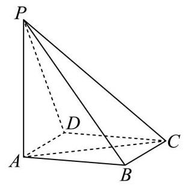

(1)若 ${AD}//$ 平面 ${PBC}$ ，证明: ${AD}\bot {PB}$ ；

(2)在我国古代数学典籍《九章算术》中，记载了一种特殊的三棱锥——鳖臑，其四个面均为直角三角形, 找出本题图中的一个鳖臑, 并计算它的体积和表面积.

【答案】(1)证明见解析;

(2) $P - {ABC}$ 为一个鳖臑，体积为 $\frac{\sqrt{3}}{3}$ ，表面积为 $\frac{4 + {3\sqrt{3}} + \sqrt{7}}{2}$ .

【详解】(1)由题设 $B{C}^{2} + A{B}^{2} = A{C}^{2}$ ,则 ${AB} \bot  {BC}$ ,

由 ${PA} \bot$ 平面 ${ABCD},{BC} \subset$ 平面 ${ABCD}$ ,则 ${PA} \bot  {BC}$ ,

而 ${PA} \cap  {AB} = A$ 都在面 ${PAB}$ 内,则 ${BC} \bot$ 面 ${PAB}$ ,

由 ${AD}//$ 平面 ${PBC},{AD} \subset$ 面 ${ABCD}$ ,面 ${ABCD} \cap$ 面 ${PBC} = {BC}$ ,

所以 ${AD}//{BC}$ ,则 ${AD} \bot$ 面 ${PAB},{PB} \subset$ 面 ${PAB}$ ,故 ${AD} \bot  {PB}$ .

(2)由 ${PA} \bot$ 平面 ${ABCD}$ ， ${AB},{AC} \subset$ 平面 ${ABCD}$ ，则 ${PA} \bot  {AB},{PA} \bot  {AC}$ ，

由(1)知 ${AB} \bot  {BC}$ ，且 ${BC} \bot$ 面 ${PAB}$ ， ${PB} \subset$ 面 ${PAB}$ ，则 ${BC} \bot  {PB}$ ，

所以 $\bigtriangleup  {PAB}, \bigtriangleup  {PAC}, \bigtriangleup  {ABC}, \bigtriangleup  {PBC}$ 都是直角三角形,且 ${PB} = \sqrt{7}$ ，

根据题设定义， $P - {ABC}$ 为一个鳖臑，体积 $V = \frac{1}{3}{PA} \cdot  \frac{1}{2}{AB} \cdot  {BC} = \frac{1}{3} \times  2 \times  \frac{1}{2} \times  \sqrt{3} \times  1 = \frac{\sqrt{3}}{3}$ ，

表面积 $S = {S}_{\bigtriangleup {PAB}} + {S}_{\bigtriangleup {PAC}} + {S}_{\bigtriangleup {ABC}} + {S}_{\bigtriangleup {PBC}} = \sqrt{3} + 2 + \frac{\sqrt{3}}{2} + \frac{\sqrt{7}}{2} = \frac{4 + 3\sqrt{3} + \sqrt{7}}{2}$ .

18. 已知函数 $y = f\left( x\right)$ ,其中 $f\left( x\right)  = a \cdot  {\mathrm{e}}^{x} + b \cdot  {\mathrm{e}}^{-x}, a, b$ 为实常数且 ${ab} \neq  0$ .

(1)若 $y = f\left( x\right)$ 为偶函数，且其最小值为 4，求实数 $a$ 与 $b$ 的值；

(2)若 $a = 1$ ， $g\left( x\right)  = {\mathrm{e}}^{x} - x$ ，对任意实数 $x$ 均满足 $f\left( x\right)  \geq  g\left( x\right)$ ，求实数 $b$ 的取值范围.

【答案】(1) $a = b = 2;\left( 2\right) b \geq  \frac{1}{\mathrm{e}}$ .

【详解】(1)由题设 $f\left( {-x}\right)  = f\left( x\right)  \Rightarrow  a \cdot  {\mathrm{e}}^{-x} + b \cdot  {\mathrm{e}}^{x} = a \cdot  {\mathrm{e}}^{x} + b \cdot  {\mathrm{e}}^{-x}$ ,

所以 $\left( {a - b}\right)  \cdot  {\mathrm{e}}^{-x} = \left( {a - b}\right)  \cdot  {\mathrm{e}}^{x}$ 恒成立,则 $a = b$ ,又 ${ab} \neq  0$ ,所以 $f\left( x\right)  = a\left( {{\mathrm{e}}^{x} + {\mathrm{e}}^{-x}}\right)$ 的最小值为 4,显然 $a > 0$ , 又 ${\mathrm{e}}^{x} + {\mathrm{e}}^{-x} \geq  2$ ,当且仅当 $x = 0$ 时取等号,则 $f\left( x\right)  \geq  {2a} = 4$ ,即 $a = 2$ ,所以 $a = b = 2$ ,经检验满足题设, 故 $a = b = 2$ ;

(2)由题设 ${\mathrm{e}}^{x} + b{\mathrm{e}}^{-x} \geq  {\mathrm{e}}^{x} - x$ ，即在 $\mathrm{R}$ 上 $b \geq   - x{\mathrm{e}}^{x}$ 恒成立，令 $h\left( x\right)  =  - x{\mathrm{e}}^{x}$ ，则 ${h}^{\prime }\left( x\right)  =  - \left( {x + 1}\right) {\mathrm{e}}^{x}$ ，

当 $x <  - 1$ 时 ${h}^{\prime }\left( x\right)  > 0, h\left( x\right)$ 在 $\left( {-\infty , - 1}\right)$ 上单调递增,当 $x >  - 1$ 时 ${h}^{\prime }\left( x\right)  < 0, h\left( x\right)$ 在 $\left( {-1, + \infty }\right)$ 上单调递减, 所以 $h\left( x\right)  \leq  h\left( {-1}\right)  = \frac{1}{\mathrm{e}}$ ,故 $b \geq  \frac{1}{\mathrm{e}}$ .

19. 某学校对学生的课外阅读时间进行调查, 随机抽取了 150 位学生, 得到如下样本数据频率分布直方图.

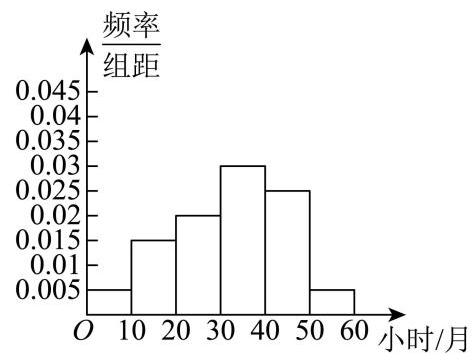

(1)估计该校学生的平均课外阅读时间；(同一组数据用该区间的中点值作代表)

(2)估计该校学生课外阅读时间位于区间 $\lbrack {30},{60})$ (单位:小时/月)的概率； (3)已知该校喜欢阅读的学生占比为 18%，初一年级学生占该校总学生数的 28%，且初一年级学生中喜欢阅读的占 40%，求其他年级学生中喜欢阅读的比例. (精确到 0.1%)

【答案】(1)平均课外阅读时间32小时/月； (2)0.6; (3)9.4%.

【详解】(1)由直方图知, 平均课外阅读时间为

${0.05} \times  5 + {0.15} \times  {15} + {0.2} \times  {25} + {0.3} \times  {35} + {0.25} \times  {45} + {0.05} \times  {55} = {32}$ 小时/月;

(2)由直方图知,时间位于区间 $\lbrack {30},{60})$ 的频率为 $\left( {{0.03} + {0.025} + {0.005}}\right)  \times  {10} = {0.6}$ , 所以该校学生课外阅读时间位于区间 $\lbrack {30},{60})$ (单位: 小时/月) 的概率为 0.6 .

(3)由题设，初一年级学生中喜欢阅读的学生占比为 ${28}\%  \times  {40}\%  = {11.2}\%$ ，

所以其他年级学生中喜欢阅读的学生占比为 ${18}\%  - {11.2}\%  = {6.8}\%$ ,

故其他年级学生中喜欢阅读的比例 $\frac{{6.8}\% }{1 - {28}\% } \approx  {9.4}\%$ .

20. 已知椭圆 $C : \frac{{x}^{2}}{9} + {y}^{2} = 1$ . $F$ 为椭圆的右焦点,过椭圆上一点 $P\left( {3,0}\right)$ 的直线 ${l}_{1}$ 交椭圆于另一点 $Q$ ,点 $M$ 为椭圆上任意一点.

(1)求 $\left| {MF}\right|$ 的最小值；

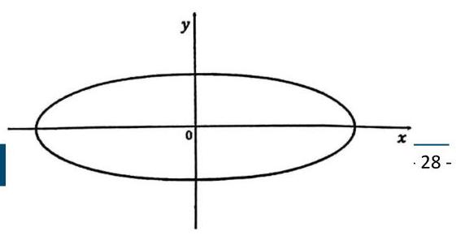

(2)当直线 ${l}_{1}$ 的斜率为 1 时，求 $\bigtriangleup  {PQM}$ 面积的最大值及此时点 $M$ 的坐标；

(3)若直线 ${PQ}$ 与直线 ${l}_{2} : x =  - 3$ 交于点 $D$ ，点 $D$ 不在 $x$ 轴上， $Q$ 关于原点的对称点为点 $R$ ，直线 ${PR}$ 与 ${l}_{2}$ 交于点 $E$ ,求线段 $\left| {DE}\right|$ 的取值范围.

【答案】(1) $3 - 2\sqrt{2},\left( 2\right) \frac{9 + 3\sqrt{10}}{10}, M\left( {-\frac{9}{\sqrt{10}},\frac{1}{\sqrt{10}}}\right) \;\left( 3\right) \lbrack 4, + \infty )$

【详解】(1) 由椭圆方程 $\frac{{x}^{2}}{9} + {y}^{2} = 1$ 知, ${a}^{2} = 9,{b}^{2} = 1,{c}^{2} = {a}^{2} - {b}^{2} = 9 - 1 = 8$ , 所以右焦点 $F\left( {2\sqrt{2},0}\right)$ ,设 $M\left( {m, n}\right)$ ,则 $\left| {MF}\right|  = \sqrt{{\left( m - 2\sqrt{2}\right) }^{2} + {n}^{2}}$ ,由 $\frac{{m}^{2}}{9} + {n}^{2} = 1 \Rightarrow  {n}^{2} = 1 - \frac{{m}^{2}}{9}$ 代入得:

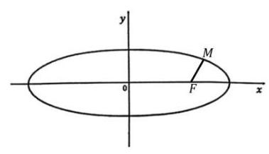

$\left| {MF}\right|  = \sqrt{{\left( m - 2\sqrt{2}\right) }^{2} + {n}^{2}} = \sqrt{{\left( m - 2\sqrt{2}\right) }^{2} + 1 - \frac{{m}^{2}}{9}} = \sqrt{\frac{8{m}^{2}}{9} - 4\sqrt{2}m + 9} = \frac{\sqrt{8{m}^{2} - {36}\sqrt{2}m + {81}}}{3}$ ,

由于 $m \in  \left\lbrack  {-3,3}\right\rbrack$ ,对称轴 $m = \frac{9\sqrt{2}}{4} > 3$ ,

所以 $\left| {MF}\right|  \geq  \frac{\sqrt{8 \times  9 - {36}\sqrt{2} \times  3 + {81}}}{3} = \sqrt{{17} - {12}\sqrt{2}} = \sqrt{9 - 2 \times  3 \times  \sqrt{8} + 8} = 3 - 2\sqrt{2}$ ,

即 $\left| {MF}\right|$ 的最小值为 $3 - 2\sqrt{2}$ ，此时点 $M$ 为椭圆的右顶点.

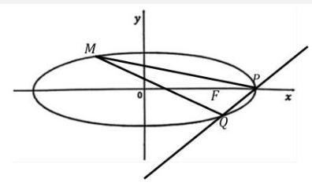

(2)由直线 ${l}_{1}$ 的斜率为 1 且经过 $P\left( {3,0}\right)$ ，可得直线方程 $y = x - 3$ ， 与椭圆 $\frac{{x}^{2}}{9} + {y}^{2} = 1$ 联立方程组,消元得:

$\frac{{x}^{2}}{9} + {\left( x - 3\right) }^{2} = 1 \Rightarrow  {10}{x}^{2} - {54x} + {72} = 0$ ,

解得 $x = 3, x = \frac{12}{5}$ ,则代入 $x = \frac{12}{5}$ 得: $y = \frac{12}{5} - 3 =  - \frac{3}{5}$ ,所以 $Q\left( {\frac{12}{5}, - \frac{3}{5}}\right)$ ,

则 $\left| {PQ}\right|  = \sqrt{{\left( \frac{12}{5} - 3\right) }^{2} + {\left( -\frac{3}{5} - 0\right) }^{2}} = \frac{3\sqrt{2}}{5}$ ,

设平行于直线 ${l}_{1}$ 的直线方程为 $y = x + t$ ,则与椭圆 $\frac{{x}^{2}}{9} + {y}^{2} = 1$ 联立方程组,消元得:

$\frac{{x}^{2}}{9} + {\left( x + t\right) }^{2} = 1 \Rightarrow  {10}{x}^{2} + {18tx} + 9{t}^{2} - 9 = 0$ ,当此直线与椭圆相切时,满足判别式为 0,

即 $\Delta  = {18}^{2}{t}^{2} - 4 \times  {10} \times  \left( {9{t}^{2} - 9}\right)  = 0$ ,解得 $t =  \pm  \sqrt{10}$ ,

根据数形结合可得 $t = \sqrt{10}$ 时,满足切点 $M$ 取到 $\bigtriangleup  {PQM}$ 面积最大值,

此时方程为 ${10}{x}^{2} + {18}\sqrt{10}x + {81} = 0 \Rightarrow  {\left( \sqrt{10}x + 9\right) }^{2} = 0 \Rightarrow  x =  - \frac{9}{\sqrt{10}}$ ,

代入直线得 $y =  - \frac{9}{\sqrt{10}} + \sqrt{10} = \frac{1}{\sqrt{10}}$ ,则 $M\left( {-\frac{9}{\sqrt{10}},\frac{1}{\sqrt{10}}}\right)$ ,

由点 $M\left( {-\frac{9}{\sqrt{10}},\frac{1}{\sqrt{10}}}\right)$ 到直线 $y = x - 3$ 的距离公式得: $\;d = \frac{\left| -\frac{9}{\sqrt{10}} - \frac{1}{\sqrt{10}} - 3\right| }{\sqrt{2}} = \frac{3 + \sqrt{10}}{\sqrt{2}}$ ,

所以 $\bigtriangleup  {PQM}$ 面积的最大值为 $S = \frac{1}{2} \times  \frac{3\sqrt{2}}{5} \times  \frac{3 + \sqrt{10}}{\sqrt{2}} = \frac{9 + 3\sqrt{10}}{10}$ ，此时点 $M\left( {-\frac{9}{\sqrt{10}},\frac{1}{\sqrt{10}}}\right)$ ；

(3)设过点 $P\left( {3,0}\right)$ 直线为: $y = k\left( {x - 3}\right)$ ，与椭圆 $\frac{{x}^{2}}{9} + {y}^{2} = 1$ 联立方程组，消元得:

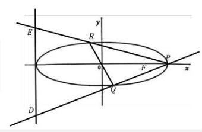

$\frac{{x}^{2}}{9} + {k}^{2}{\left( x - 3\right) }^{2} = 1 \Rightarrow  \left( {1 + 9{k}^{2}}\right) {x}^{2} - {54}{k}^{2}x + {81}{k}^{2} - 9 = 0,$

由 $\Delta  = {\left( -{54}{k}^{2}\right) }^{2} - 4\left( {1 + 9{k}^{2}}\right) \left( {{81}{k}^{2} - 9}\right)  = {36} > 0$ ,

再由于交点 $D$ 不在 $X$ 轴上,即 $k \neq  0$ ,

设交点 $Q\left( {{x}_{1},{y}_{1}}\right)$ ,则有 ${x}_{1} + 3 = \frac{{54}{k}^{2}}{1 + 9{k}^{2}} \Rightarrow  {x}_{1} = \frac{{27}{k}^{2} - 3}{1 + 9{k}^{2}}$ ,代入 ${x}_{1} = \frac{{27}{k}^{2} - 3}{1 + 9{k}^{2}}$ 得: ${y}_{1} = k\left( {\frac{{27}{k}^{2} - 3}{1 + 9{k}^{2}} - 3}\right)  = \frac{-{6k}}{1 + 9{k}^{2}}$ , 由于 $Q$ 关于原点的对称点为点 $R$ ,所以 $R\left( {-\frac{{27}{k}^{2} - 3}{1 + 9{k}^{2}},\frac{6k}{1 + 9{k}^{2}}}\right)$ ,

则直线 ${PR}$ 方程为 $y = \frac{\frac{6k}{1 + 9{k}^{2}}}{-\frac{{27}{k}^{2} - 3}{1 + 9{k}^{2}} - 3}\left( {x - 3}\right)$ ,与直线 $x =  - 3$ 相交得: $E$ 点纵坐标为 $y =  - 6\frac{\frac{6k}{1 + 9{k}^{2}}}{-\frac{{27}{k}^{2} - 3}{1 + 9{k}^{2}} - 3} = \frac{2}{3k}$ , 而直线 $y = k\left( {x - 3}\right)$ 与直线 $x =  - 3$ 相交得: $D$ 点纵坐标为 $y =  - {6k}$ ，所以可得 $\left| {DE}\right|  = \left| {\frac{2}{3k} + {6k}}\right|  = \left| \frac{2}{3k}\right|  + \left| {6k}\right|  \geq  2\sqrt{\frac{2}{3k}\left| {6k}\right| } = 4$ ,当且仅当 $\left| \frac{2}{3k}\right|  = \left| {6k}\right|$ ,即 $k =  \pm  \frac{1}{3}$ 时, $\left| {DE}\right|$ 取到最小值 4 . 即 $\left| {DE}\right|$ 的取值范围是 $\lbrack 4, + \infty )$

21. 已知函数 $y = f\left( x\right)$ ,其中 $f\left( x\right)  = {x}^{2} + {ax} + b,\left( {a, b \in  \mathbf{R}}\right)$ ,定义集合 $S\left( f\right)  = \{ \left( {x, y}\right)  \mid  y = f\left( x\right) , x \in  \mathbf{R}\}$ . 对于点 $P\left( {p, q}\right)$ ,定义集合 $D\left( P\right)  = \{ \left( {x, y}\right) \parallel x - p \mid   \leq  1,\left( {x, y}\right)  \in  S\left( f\right) \}$ . 若对任意 $\left( {x, y}\right)  \in  D\left( P\right)$ ,均有 $\left| {y - q}\right|  \leq  1$ , 则称点 $P$ 为平衡点.

(1)当 $a = b = 0$ 时,判断点 $P\left( {0,0}\right)$ 是否为平衡点;

(2)当 $a = 0$ 时，求实数 $b$ 的取值范围，使得点 $P\left( {0,0}\right)$ 是平衡点；

(3)求所有实数 $a$ 和 $b$ ，使得点 $P\left( {0,0}\right)$ 是平衡点.

【答案】(1)是,理由见解析; (2) $b \in  \left\lbrack  {-1,0}\right\rbrack$ ; (3)答案见解析.

【详解】(1)由题设 $f\left( x\right)  = {x}^{2}$ ，而 $\left| {x - 0}\right|  \leq  1 \Rightarrow   - 1 \leq  x \leq  1$ ， 当 $x \in  \left\lbrack  {-1,1}\right\rbrack$ ,则 $f\left( x\right)  \in  \left\lbrack  {0,1}\right\rbrack$ ,即 $y \in  \left\lbrack  {0,1}\right\rbrack$ ,故 $\left| {y - 0}\right|  \leq  1$ ,所以点 $P\left( {0,0}\right)$ 是平衡点;

(2)由题设 $f\left( x\right)  = {x}^{2} + b$ ，若 $P\left( {0,0}\right)$ 是平衡点，则 $x \in  \left\lbrack  {-1,1}\right\rbrack$ ，即 ${x}^{2} \in  \left\lbrack  {0,1}\right\rbrack$ ， 此时 $\left| {{x}^{2} + b - 0}\right|  \leq  1 \Rightarrow   - 1 - {x}^{2} \leq  b \leq  1 - {x}^{2}$ 恒成立,则 $b \in  \left\lbrack  {-1,0}\right\rbrack$ ;

(3)由题意，对于 $\forall x \in  \left\lbrack  {-1,1}\right\rbrack$ ，都有 $\left| {{x}^{2} + {ax} + b - 0}\right|  \leq  1 \Rightarrow   - 1 \leq  {x}^{2} + {ax} + b \leq  1$ ， 当 $- \frac{a}{2} \leq   - 1$ ,即 $a \geq  2$ 时, $f\left( x\right)$ 在 $\left\lbrack  {-1,1}\right\rbrack$ 上单调递增,则 $\left\{  \begin{array}{l} f\left( {-1}\right)  = 1 - a + b \geq   - 1 \\  f\left( 1\right)  = 1 + a + b \leq  1 \end{array}\right.$ ,

所以 $a - 2 \leq  b \leq   - a$ ,易知 $a \leq  1$ ,显然不满足前提;

当 $- 1 <  - \frac{a}{2} \leq  0$ ,即 $0 \leq  a < 2$ 时, $f\left( x\right)$ 在 $\left\lbrack  {-1, - \frac{a}{2}}\right\rbrack$ 上单调递减,在 $\left\lbrack  {-\frac{a}{2},1}\right\rbrack$ 上单调递增,

则 $\left\{  \begin{array}{l} f\left( {-\frac{a}{2}}\right)  = b - \frac{{a}^{2}}{4} \geq   - 1 \\  f\left( 1\right)  = 1 + a + b \leq  1 \end{array}\right.$ ,故 $\frac{{a}^{2}}{4} - 1 \leq  b \leq   - a$ ,则 $- 2\sqrt{2} - 2 \leq  a \leq  2\sqrt{2} - 2$ ,

所以 $0 \leq  a \leq  2\sqrt{2} - 2$ 时, $\frac{{a}^{2}}{4} - 1 \leq  b \leq   - a$ ;

当 $0 <  - \frac{a}{2} \leq  1$ ,即 $- 2 \leq  a < 0$ 时, $f\left( x\right)$ 在 $\left\lbrack  {-1, - \frac{a}{2}}\right\rbrack$ 上单调递减,在 $\left\lbrack  {-\frac{a}{2},1}\right\rbrack$ 上单调递增, 则 $\left\{  \begin{array}{l} f\left( {-\frac{a}{2}}\right)  = b - \frac{{a}^{2}}{4} \geq   - 1 \\  f\left( {-1}\right)  = 1 - a + b \leq  1 \end{array}\right.$ ,故 $\frac{{a}^{2}}{4} - 1 \leq  b \leq  a$ ,则 $2 - 2\sqrt{2} \leq  a \leq  2 + 2\sqrt{2}$ ,

所以 $2 - 2\sqrt{2} \leq  a < 0$ 时, $\frac{{a}^{2}}{4} - 1 \leq  b \leq  a$ ;

当 $- \frac{a}{2} > 1$ ,即 $a <  - 2$ 时, $f\left( x\right)$ 在 $\left\lbrack  {-1,1}\right\rbrack$ 上单调递减,则 $\left\{  \begin{array}{l} f\left( {-1}\right)  = 1 - a + b \leq  1 \\  f\left( 1\right)  = 1 + a + b \geq   - 1 \end{array}\right.$ ,

所以 $- a - 2 \leq  b \leq  a$ ,易知 $a \geq   - 1$ ,显然不满足前提;

综上, $0 \leq  a \leq  2\sqrt{2} - 2$ 时, $\frac{{a}^{2}}{4} - 1 \leq  b \leq   - a;2 - 2\sqrt{2} \leq  a < 0$ 时, $\frac{{a}^{2}}{4} - 1 \leq  b \leq  a$ .

# 2025 届上海市闵行区高三二模数学试卷

202504

一. 填空题 $1.\{  - 1,1\} ;2.\left\lbrack  {-3,7}\right\rbrack  ;3.\sqrt{2};{4.9\pi };{5.160};6.\frac{4}{3}$ ;

7. $9;8.\left\lbrack  {0,\frac{1}{2}}\right) ;9.{2.3}\% ;{10}.\left( {2, + \infty }\right) ;{11}.{14.4}^{ \circ  };{12}. - {12}$ .

二. 选择题 13. D; 14. B; 15. D; 16. C.

1. 设全集 $U = \{  - 1,0,1,2\}$ ，若集合 $A = \{ 0,2\}$ ，则 $\bar{A} =$ ___.

【答案】 $\{  - 1,1\}$

【详解】由题意可得 $\bar{A} = \{  - 1,1\}$ .

2. 设 $x \in  \mathbf{R}$ ,则不等式 $\left| {x - 2}\right|  \leq  5$ 的解集为___.

【答案】 $\left\lbrack  {-3,7}\right\rbrack$

【详解】由 $\left| {x - 2}\right|  \leq  5 \Rightarrow   - 5 \leq  x - 2 \leq  5 \Rightarrow   - 3 \leq  x \leq  7$ . 所以不等式 $\left| {x - 2}\right|  \leq  5$ 的解集为: $\left\lbrack  {-3,7}\right\rbrack$ .

3. 已知 $\mathrm{i}$ 是虚数单位,则 $\frac{\left| 1 + \mathrm{i}\right| }{\mathrm{i}} =$ ___.

【答案】 $\sqrt{2}$

【详解】 $\left| \frac{1 + \mathrm{i}}{\mathrm{i}}\right|  = \left| {-\left( {1 + \mathrm{i}}\right) \mathrm{i}}\right|  = \left| {-\mathrm{i} + 1}\right|  = \sqrt{{\left( -1\right) }^{2} + {1}^{2}} = \sqrt{2}$ .

4. 已知圆柱的底面半径为 $\sqrt{3}$ ，高为 3，则圆柱的体积为___.

【答案】 ${9\pi }$

【详解】由圆柱的体积公式可得 $V = {Sh} = \pi  \times  {\left( \sqrt{3}\right) }^{2} \times  3 = {9\pi }$ .

5. 在 ${\left( 2x + \frac{1}{x}\right) }^{6}$ 的二项展开式中,常数项是___. (用数值作答)

【答案】160

【详解】展开式的通项为 ${T}_{r + 1} = {\mathrm{C}}_{6}^{r}{\left( 2x\right) }^{6 - r}{\left( {x}^{-1}\right) }^{r}$ ,令 $6 - r - r = 0 \Rightarrow  r = 3$ ,所以常数项为 ${\mathrm{C}}_{6}^{3}{2}^{3} = {160}$ .

6. 已知向量 $\overrightarrow{a} = \left( {3,4}\right) ,\overrightarrow{b} = \left( {\cos \theta ,\sin \theta }\right)$ ，若 $\overrightarrow{a}//\overrightarrow{b}$ ，则 $\tan \theta  =$ ___

【答案】 $\frac{4}{3}$

【详解】因为 $\overrightarrow{a}//\overrightarrow{b}$ ,且 $\overrightarrow{a} = \left( {3,4}\right) ,\overrightarrow{b} = \left( {\cos \theta ,\sin \theta }\right)$ ,所以 $4\cos \theta  = 3\sin \theta$ ,显然 $\cos \theta  \neq  0$ ,所以 $\frac{4}{3} = \frac{\sin \theta }{\cos \theta }$ , 即 $\tan \theta  = \frac{4}{3}$ ; 故答案为: $\frac{4}{3}$ .

7. 已知数据 ${x}_{1}$ 、 ${x}_{2}$ 、、、 ${x}_{100}$ 的平均数为 2，方差为 5，则 ${x}_{1}^{2}$ 、 ${x}_{2}^{2}$ 、、、 ${x}_{100}^{2}$ 的平均数为___.

【答案】 9

【详解】由题意可得 $\frac{1}{100}\mathop{\sum }\limits_{{i = 1}}^{{100}}{\left( {x}_{i} - 2\right) }^{2} = 5,\frac{1}{100}\mathop{\sum }\limits_{{i = 1}}^{{100}}{x}_{i} = 2$ ,所以 $\frac{1}{100}\mathop{\sum }\limits_{{i = 1}}^{{100}}{\left( {x}_{i} - 2\right) }^{2} = \frac{1}{100}\mathop{\sum }\limits_{{i = 1}}^{{100}}\left( {{x}_{i}^{2} - 4{x}_{i} + 4}\right)  = 5$ , 又 $\frac{1}{100}\mathop{\sum }\limits_{{i = 1}}^{{100}}\left( {{x}_{i}^{2} - 4{x}_{i} + 4}\right)  = \frac{1}{100}\left( {\mathop{\sum }\limits_{{i = 1}}^{{100}}{x}_{i}^{2} - 4\mathop{\sum }\limits_{{i = 1}}^{{100}}{x}_{i} + \mathop{\sum }\limits_{{i = 1}}^{{100}}4}\right)  = \frac{1}{100}\left( {\mathop{\sum }\limits_{{i = 1}}^{{100}}{x}_{i}^{2} - 4 \times  {200} + {400}}\right)  = 5$ , 即 $\mathop{\sum }\limits_{{i = 1}}^{{100}}{x}_{i}^{2} - {400} = {500}$ ,即 $\mathop{\sum }\limits_{{i = 1}}^{{100}}{x}_{i}^{2} = {900}$ ,所以 ${x}_{1}^{2}\text{ 、 }{x}_{2}^{2}\text{ 、 }\cdots \text{ 、 }{x}_{100}^{2}$ 的平均数为 9 .

8. 已知函数 $f\left( x\right)  = \left\{  \begin{array}{l} \left( {1 - {2m}}\right) x + {3m}, x < 1 \\  {x}^{2}, x \geq  1 \end{array}\right.$ 的值域为 $\mathrm{R}$ ，则 $m$ 的取值范围是___.

【答案】 $\left\lbrack  {0,\frac{1}{2}}\right)$

【详解】由于 $f\left( x\right)$ 的值域为 $\mathrm{R}$ ,当 $x \geq  1$ 时, ${x}^{2} \geq  1$ ,所以 $\left\{  \begin{array}{l} 1 - {2m} > 0 \\  1 - {2m} + {3m} \geq  1 \end{array}\right.$ ,解得 $0 \leq  m < \frac{1}{2}$ . 故 $m$ 的范围是 $\left\lbrack  {0,\frac{1}{2}}\right)$ .

9. 某公司生产的糖果每包的标识质量是 500 克, 但公司承认实际质量存在误差. 已知每包糖果的实际质量服从正态分布 $N\left( {{500},{\sigma }^{2}}\right)$ ,且任意一包的糖果质量介于 495 克到 505 克之间的可能性为 95.4%,则随意买一包该公司生产的糖果，其质量超过 505 克的可能性约为___. (精确到 0.1%)

【答案】 2.3%

【详解】设每包糖果的实际质量为 $X$ ,则 $X \sim  N\left( {{500},{\sigma }^{2}}\right)$ ,又 $P\left( {{495} < X < {505}}\right)  = {95.4}\%$ , 所以 $P\left( {X > {505}}\right)  = \frac{1 - {95.4}\% }{2} = {2.3}\%$ ,故质量超过 505 克的可能性约为 2.3%. 故答案为: 2.3%.

10. 已知数列 $\left\{  {a}_{n}\right\}$ 为等差数列,数列 $\left\{  {b}_{n}\right\}$ 为等比数列,且 ${a}_{1} = {b}_{1} = 1,{a}_{2} = {b}_{2} = t$ ,若 ${a}_{6} + {b}_{6} > {38}$ ,则实数 $t$ 的取值范围为___.

【答案】 $\left( {2, + \infty }\right)$

【详解】由题意可得等差数列的公差为 $t - 1$ ,所以 ${a}_{n} = 1 + \left( {n - 1}\right) \left( {t - 1}\right)$ ,所以 ${a}_{6} = {5t} - 4$ ,

等比数列的公比为 $t$ ,则 ${b}_{n} = {b}_{1}{q}^{n - 1} \Rightarrow  {b}_{6} = {t}^{5}$ ,因为 ${a}_{6} + {b}_{6} > {38}$ ,即 ${t}^{5} + {5t} - 4 > {38}$ ,即 ${t}^{5} + {5t} - {42} > 0$ , 设 $f\left( t\right)  = {t}^{5} + {5t} - {42}$ ,由复合函数的单调性可得 $f\left( t\right)$ 在 $\mathrm{R}$ 上单调递增,再由二分法确定当 $t = 2$ 时, $f\left( t\right)  = 0$ ,所以实数 $t$ 的取值范围为 $\left( {2, + \infty }\right)$ . 故答案为: $\left( {2, + \infty }\right)$ .

11. 已知某星球的球心为 $F$ ,半径为 $R$ ,该星球的卫星的运行轨道是以 $F$ 为一个焦点的椭圆,该椭圆的

离心率为 $\frac{3}{5}$ ,卫星运行过程中离该星球表面最近的距离为 $R$ ,若当卫星处于某位置时,用卫星上的光学仪器观测该星球, 把光学仪器的镜头与星球表面被观测点的连线称为视线, 任意两条视线所成的最大夹角称为张角，则卫星运行过程中张角的最小值为___. (精确到 ${0.1}^{ \circ  }$ )

【答案】 ${14.4}^{ \circ  }$

【详解】设椭圆轨道的半长轴为 $a$ ,焦距为 ${2c}$ ,由题意可得,卫星运行过程中离该星球表面最近的距离为 $R$ ,在近日点即 $a - c = {2R}$ ,又椭圆的离心率为 $\frac{3}{5}$ ,即 $\frac{c}{a} = \frac{3}{5}$ ,由以上可得 $a = {5R}, c = {3R}$ , 易得在远日点时张角最小,设此时张角为 $\theta$ ,则 $\sin \left( \frac{\theta }{2}\right)  = \frac{R}{8R} = \frac{1}{8}$ ,即 $\theta  = 2\arcsin \left( \frac{1}{8}\right)  \approx  {14.4}^{ \circ  }$ . 故答案为: ${14.4}^{ \circ  }$ .

12. 定义 $D = \left\lbrack  {a, b}\right\rbrack$ 的区间长度为 $b - a$ . 若 $m < 0$ 且关于 $x$ 的不等式 $\left| {{\left( x - 1\right) }^{3} + m\left( {x - 1}\right) }\right|  \leq  {16}$ 的解集的区间长度之和为 $T$ ,则当 $T$ 取最大值时,实数 $m$ 的值为___.

【答案】 -12 平移思想 - 猜想 - 三次函数走向趋势

【详解】由题意, ${\left( x - 1\right) }^{3} + m\left( {x - 1}\right)$ 为 ${x}^{3} + {mx}$ 向右平移得到,即 $\left| {{x}^{3} + {mx}}\right|  \leq  {16}$ 区间长度与原题一致,

不妨设 $f\left( x\right)  = {x}^{3} + {mx}$ ,易得 ${f}^{\prime }\left( x\right)  = 3{x}^{2} + m \geq  0 \Rightarrow  x \geq  \sqrt{\frac{-m}{3}}$ 或 $x \leq   - \sqrt{\frac{-m}{3}}$ ,

即 $f\left( x\right)$ 在 $\left( {-\infty , - \sqrt{\frac{-m}{3}}}\right)$ 和 $\left( {\sqrt{\frac{-m}{3}}, + \infty }\right)$ 上单调递增,在 $\left( {-\sqrt{\frac{-m}{3}},\sqrt{\frac{-m}{3}}}\right)$ 上单调递减,

由 $f\left( x\right)$ 关于 $\left( {0,0}\right)$ 对称,仅考虑 $x > 0$ 即可,当分类讨论:

当 $f\left( \sqrt{\frac{-m}{3}}\right)  = \frac{-m}{3}\sqrt{\frac{-m}{3}} + m\sqrt{\frac{-m}{3}} =  - {16} \Rightarrow  m =  - {12}$ 时,易得 $f\left( x\right)  = {x}^{3} - {12x} = {16} \Rightarrow  {x}_{1} =  - 2,{x}_{2} = 4$ ,即 $T = 8$ ;

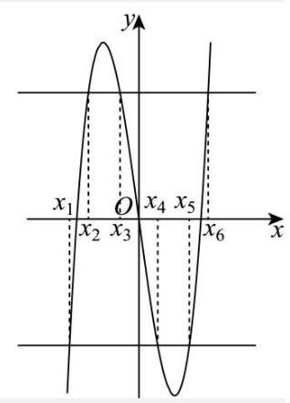

当 $f\left( \sqrt{\frac{-m}{3}}\right)  = \frac{-m}{3}\sqrt{\frac{-m}{3}} + m\sqrt{\frac{-m}{3}} >  - {16} \Rightarrow  m >  - {12}$ 时,

$f\left( 4\right)  = {64} + {4m} > {16} \Rightarrow  T < 8;$

当 $f\left( \sqrt{\frac{-m}{3}}\right)  = \frac{-m}{3}\sqrt{\frac{-m}{3}} + m\sqrt{\frac{-m}{3}} <  - {16} \Rightarrow  m <  - {12}$ 时,

如下图,不妨设 ${x}^{3} + {mx} = {16}$ 的三个跟分别为 ${x}_{2},{x}_{3},{x}_{6}$ ,不妨设 ${x}^{3} + {mx} =  - {16}$ 的三个跟分别为 ${x}_{1},{x}_{4},{x}_{5}$ ,由三次韦达定理可得 ${x}_{2} + {x}_{3} + {x}_{6} = 0,{x}_{1} + {x}_{4} + {x}_{5} = 0$ ,

$T = {x}_{2} - {x}_{1} + {x}_{4} - {x}_{3} + {x}_{6} - {x}_{5} = 2\left( {{x}_{4} - {x}_{3}}\right)  < 8$ ,综上,当且仅当 $m =  - {12}$ 时, $T = 8$ .

故答案为: -12 .

13. 两个变量 $x$ 与 $y$ 之间的回归方程( )

A. 表示 $x$ 与 $y$ 之间的函数关系; B. 表示 $x$ 与 $y$ 之间的不确定关系;

C. 反映 $x$ 与 $y$ 之间的真实关系; D. 是反映 $x$ 与 $y$ 之间的真实关系的一种最佳拟合.

【答案】D

【详解】根据回归方程的定义,可得两个变量 $x$ 与 $y$ 之间的回归方程是反映 $x$ 与 $y$ 之间的真实关系的一种最佳拟合. 故选: D.

14. 已知 $a > 0, b > 0$ ,则 “ $a + b > 2$ ” 是 “ ${ab} > 1$ ” 的()

A. 充分不必要条件 B. 必要不充分条件

C. 充要条件 D. 既不充分也不必要条件

【答案】B

【详解】若 $a = {1.5}, b = {0.6}$ ,满足 $a + b > 2$ ,但 ${ab} < 1$ ,若 $a > 0, b > 0,{ab} > 1$ ,则 $a + b \geq  2\sqrt{ab} > 2$ ,即 $a + b > 2$ , 所以 “ $a + b > 2$ ” 是 “ ${ab} > 1$ ” 的必要不充分条件. 故选:B

15. 已知函数 $y = \cos \left( {\frac{\pi }{6}x + \frac{\pi }{3}}\right)$ 在区间 $\left\lbrack  {a, a + 9}\right\rbrack$ 上既有最大值又有最小值,则关于实数 $a$ 的取值,以下不可能的是( ).

A. 2024 B. 2025 C. 2026 D. 2027

【答案】D

【详解】由题意可得函数的周期为 $T = \frac{2\pi }{\frac{\pi }{6}} = {12}$ ,最大值点满足 $\frac{\pi }{6}x + \frac{\pi }{3} = {2k\pi }, k \in  \mathrm{Z}$ ,解得 $x = {12k} - 2, k \in  \mathrm{Z}$ , 最小值点满足 $\frac{\pi }{6}x + \frac{\pi }{3} = {2k\pi } + \pi , k \in  \mathrm{Z}$ ,解得 $x = {12k} + 4, k \in  \mathrm{Z}$ ,因为函数 $y = \cos \left( {\frac{\pi }{6}x + \frac{\pi }{3}}\right)$ 在区间 $\left\lbrack  {a, a + 9}\right\rbrack$ 上既有最大值又有最小值, 区间的长度为 9 ,

对于 A，若 $a = {2024}$ ，当 $k = {169}$ 时，最大值点为 2026，最小值点为 2032，此时位于区间 [2024,2033] 内， 故 A 正确;

对于 B，若 $a = {2025}$ ，当 $k = {169}$ 时，最大值点为 2026，最小值点为 2032，此时位于区间 [2025,2034] 内， 故 B 正确;

对于 $\mathrm{C}$ ,若 $a = {2026}$ ,当 $k = {169}$ 时,最大值点为 2026,最小值点为 2032,此时位于区间 $\left\lbrack  {{2026},{2035}}\right\rbrack$ 内, 故 C 正确;

对于 D,若 $a = {2027}$ ,当 $k = {169}$ 时,最大值点为 2026,当 $k = {170}$ 时,最大值点为 2038,此时不位于区间 $\left\lbrack  {{2027},{2036}}\right\rbrack$ 内,故 D 错误.

故选: D

16. 设 $n$ 为正整数,空间中 $n$ 个单位向量构成集合 ${A}_{n} = \left\{  {{\overrightarrow{a}}_{1},{\overrightarrow{a}}_{2},\cdots ,{\overrightarrow{a}}_{n}}\right\}$ ,若存在实数 $t$ ,满足对任意 ${\overrightarrow{a}}_{i} \in  {A}_{n},{\overrightarrow{a}}_{j} \in  {A}_{n},{\overrightarrow{a}}_{i} \neq  {\overrightarrow{a}}_{j}$ ,都有 ${\overrightarrow{a}}_{i} \cdot  {\overrightarrow{a}}_{j} = t$ ,则当 $n$ 取得最大值时, $t$ 的值为( ).

A. $- \frac{1}{2}$ B. $\frac{1}{2}$ C. $- \frac{1}{3}$ D. $\frac{1}{3}$

【答案】C

【详解】令集合 ${A}_{n} = \left\{  {{\overrightarrow{a}}_{1},{\overrightarrow{a}}_{2},\cdots ,{\overrightarrow{a}}_{n}}\right\}$ 的各向量起点为 $O$ ,对应终点依次为 ${A}_{1},{A}_{2},\cdots ,{A}_{n}$ ,

由向量 ${\overrightarrow{a}}_{i}\left( {i \in  {\mathrm{N}}^{ * }, i \leq  n}\right)$ 为单位向量,则点 ${A}_{1},{A}_{2},\cdots ,{A}_{n}$ 在以 $O$ 为球心,1 为半径的球面上,

由 ${\overrightarrow{a}}_{i} \in  {A}_{n},{\overrightarrow{a}}_{j} \in  {A}_{n},{\overrightarrow{a}}_{i} \neq  {\overrightarrow{a}}_{j}$ ,得点 ${A}_{1},{A}_{2},\cdots ,{A}_{n}$ 中任意三点不共线,

由 $t = {\overrightarrow{a}}_{1} \cdot  {\overrightarrow{a}}_{2} = {\overrightarrow{a}}_{2} \cdot  {\overrightarrow{a}}_{3}$ ,得 $\overrightarrow{O{A}_{2}} \cdot  \left( {\overrightarrow{O{A}_{1}} - \overrightarrow{O{A}_{3}}}\right)  = \overrightarrow{O{A}_{2}} \cdot  \overrightarrow{{A}_{3}{A}_{1}} = 0$ ,则 $O{A}_{2} \bot  {A}_{1}{A}_{3}$ ,

由 $t = {\overrightarrow{a}}_{4} \cdot  {\overrightarrow{a}}_{2} = {\overrightarrow{a}}_{2} \cdot  {\overrightarrow{a}}_{3}$ ,同理得 $O{A}_{2} \bot  {A}_{4}{A}_{3}$ ,而点 ${A}_{1},{A}_{3},{A}_{4}$ 不共线,

于是点 ${A}_{1},{A}_{2},{A}_{3},{A}_{4}$ 不共面,点 ${A}_{1},{A}_{2},{A}_{3},{A}_{4}$ 为球 $O$ 内接正四面体的 4 个顶点,

若 $n \geq  5$ ,不妨取 $n = 5$ ,同理得 $O{A}_{5} \bot  {A}_{1}{A}_{3}, O{A}_{5} \bot  {A}_{4}{A}_{3}, O{A}_{5} \bot$ 平面 ${A}_{1}{A}_{3}{A}_{4}$ ,

又 $O{A}_{5} \bot  {A}_{2}{A}_{3}$ ,由过一点有且只有一个平面垂直于已知直线,得点 ${A}_{2} \in$ 平面 ${A}_{1}{A}_{3}{A}_{4}$ ,

与点 ${A}_{1},{A}_{2},{A}_{3},{A}_{4}$ 不共面矛盾,因此 ${n}_{\max } = 4$ ,设正四面体 ${A}_{1}{A}_{2}{A}_{3}{A}_{4}$ 的棱长为 $m$ ,

则正 $\bigtriangleup {A}_{1}{A}_{2}{A}_{3}$ 的外接圆半径为 $\frac{\sqrt{3}}{2}m \cdot  \frac{2}{3} = \frac{\sqrt{3}}{3}m$ ,正四面体的高为 $\sqrt{{m}^{2} - {\left( \frac{3}{3}m\right) }^{2}} = \frac{\sqrt{6}}{3}m$ ,

球心到平面 ${A}_{1}{A}_{2}{A}_{3}$ 的距离为 $\frac{\sqrt{6}}{3}m - 1$ ,因此 ${\left( \frac{\sqrt{6}}{3}m - 1\right) }^{2} + {\left( \frac{\sqrt{3}}{3}m\right) }^{2} = {1}^{2}$ ,解得 $m = \frac{2\sqrt{6}}{3}$ ,

所以 $t = \cos \angle {A}_{1}O{A}_{2} = \frac{{1}^{2} + {1}^{2} - {\left( \frac{2\sqrt{6}}{3}\right) }^{2}}{2 \times  1 \times  1} =  - \frac{1}{3}$ . 故选: C

思路二:题意即为最多找多少个单位向量夹角两两相等。在空间中，显然最多找 4 条(即为正四面体内部外心与四个顶点所成四个向量)。这些向量间夹角根据余弦定理可快速求出。

## 三. 解答题

17. ( 1 )证明:因为 ${PA} \bot$ 底面 ${ABCD}$ ，所以 ${AP} \bot  {AD}$ ， 2 分

又因为 ${ABCD}$ 为长方形,所以 ${AB} \bot  {AD}$ ,

而 ${AP}$ 和 ${AB}$ 是平面 ${PAB}$ 上的两条相交直线,

所以 ${AD} \bot$ 平面 ${PAB}$ , 4 分

又 ${BP} \subset$ 平面 ${PAB}$ ,所以 ${AD} \bot  {BP}$ ; 6 分

(2)以 $A$ 为原点，直线 ${AB}$ 为 $x$ 轴，直线 ${AD}$ 为 $y$ 轴，直线 ${AP}$ 为 $z$ 轴建立直角坐标系.

由题平面 ${ABCD}$ 的一个法向量为 $\left( {0,0,1}\right)$ , 8 分

且 $A\left( {0,0,0}\right) , D\left( {0,2\sqrt{2},0}\right) , E\left( {1,\sqrt{2},1}\right)$ ,设平面 ${EAD}$ 的法向量 $\overrightarrow{n} = \left( {x, y, z}\right)$ ,则 $\left\{  \begin{array}{l} 2\sqrt{2}y = 0, \\  x + \sqrt{2}y +  \end{array}\right.$ 可取 $x = 1$ ,解得 $y = 0, z =  - 1$ ,从而可得平面 ${EAD}$ 的一个法向量 $\overrightarrow{n} = \left( {1,0, - 1}\right) ,\cdots$ 10 分记二面角 $E - {AD} - B$ 的大小为 $\theta \left( {0 < \theta  < \frac{\pi }{2}}\right)$ ,则 $\cos \theta  = \left| \frac{-1}{\sqrt{2} \times  1}\right|  = \frac{\sqrt{2}}{2}$ ,解得 $\theta  = \frac{\pi }{4}$ ,

所以二面角 $E - {AD} - B$ 的大小为 $\frac{\pi }{4}$ . 14 分

18. 解: (1) 由图,因为 $\frac{4\pi }{3} - \frac{\pi }{3} = \frac{T}{2}$ 得周期 $T = {2\pi }$ ,由 $\frac{2\pi }{\omega } = {2\pi }$ 得 $\omega  = 1$ . 3 分

又 $f\left( \frac{\pi }{3}\right)  = 1$ 得 $\frac{\pi }{3} + \varphi  = {2k\pi } + \frac{\pi }{2}, k \in  \mathbf{Z}$ ,又因为 $0 < \varphi  < \pi$ ,

所以 $\varphi  = \frac{\pi }{6}$ ,所以 $f\left( x\right)  = \sin \left( {x + \frac{\pi }{6}}\right)$ , 6 分

(2)因为 $f\left( A\right)  = f\left( B\right)$ ，又 $0 < A + B < \pi$ ， $A \neq  B$ ，

结合图像可知: $A + B = \frac{2}{3}\pi$ ， $C = \frac{\pi }{3}$ ， 8 分

又 $c = 2$ ,由余弦定理可得 ${c}^{2} = {a}^{2} + {b}^{2} - {2ab}\cos C = 4$ ,

所以 ${a}^{2} + {b}^{2} - 4 = {ab} \geq  {2ab} - 4$ ,

所以 $0 < {ab} \leq  4$ , 12 分

因为 $A \neq  B$ ,所以 $a \neq  b$ ,因此上述不等式中等号不能取到,

所以 $S = \frac{1}{2}{ab}\sin C \in  \left( {0,\sqrt{3}}\right)$ ,

因此, $\bigtriangleup {ABC}$ 面积 $S$ 的取值范围为 $\left( {0,\sqrt{3}}\right)$ . 14 分

19. 解:(1)逐个抽选 2 人参加数学知识问答可能出现的结果有 ${P}_{12}^{2}$ 个，即所有的样本点有 ${P}_{12}^{2}$ 个，将 “恰好第一个是男生” 这一事件记为 $A, A$ 所包含的样本点有 ${P}_{5}^{1}{P}_{11}^{1}$ 个,因此事件 $A$ 的概率为:

$\frac{{P}_{5}^{1}{P}_{11}^{1}}{{P}_{12}^{2}} = \frac{5}{12}$ 4 分

(2)记事件 $B$ :恰好抽选了 1 名男生与 1 名女生，事件 $C$ :两名学生都是高二学生，

$P\left( {C \mid  B}\right)  = \frac{\left| B \cap  C\right| }{\left| B\right| } = \frac{{C}_{3}^{1} \cdot  {C}_{3}^{1}}{{C}_{5}^{1} \cdot  {C}_{7}^{1}} = \frac{9}{35};$ 8 分

(3)因为共抽取了 2 名学生，所以男生与女生的人数之差只能为偶数，分两种情况讨论: $X = 0$ 时,

2025 届高考数学二模试卷汇编 (黄老师)

<table><tr><td></td><td>男</td><td>女</td></tr><tr><td>高一</td><td>1</td><td>0</td></tr><tr><td>高二</td><td>0</td><td>1</td></tr></table>

<table><tr><td></td><td>男</td><td>女</td></tr><tr><td>高一</td><td>0</td><td>1</td></tr><tr><td>高二</td><td>1</td><td>0</td></tr></table>

10 分

$P\left( {X = 0}\right)  = \frac{{C}_{2}^{1}{C}_{3}^{1} + {C}_{3}^{1}{C}_{4}^{1}}{{C}_{6}^{1}{C}_{6}^{1}} = \frac{1}{2},$

$X = 2$ 时,

<table><tr><td></td><td>男</td><td>女</td></tr><tr><td>高一</td><td>1</td><td>0</td></tr><tr><td>高二</td><td>1</td><td>0</td></tr></table>

<table><tr><td></td><td>男</td><td>女</td></tr><tr><td>高一</td><td>0</td><td>1</td></tr><tr><td>高二</td><td>0</td><td>1</td></tr></table>

$P\left( {X = 2}\right)  = \frac{{C}_{3}^{1}{C}_{2}^{1} + {C}_{3}^{1}{C}_{4}^{1}}{{C}_{6}^{1}{C}_{6}^{1}} = \frac{1}{2},$ 12 分

$X$ 的分布列为 $\left( \begin{matrix} 0 & 2 \\  \frac{1}{2} & \frac{1}{2} \end{matrix}\right) , E\left\lbrack  X\right\rbrack   = 1$ . 14 分

20. ( 3 )【面积比问题】难度 5 星

解析:(1)双曲线 $\Gamma  : {x}^{2} - \frac{{y}^{2}}{3} = 1$ 的渐近线方程为: $y =  \pm  \sqrt{3}x$ ； 4 分

(2)由题意知 $F\left( {2,0}\right)$ ， $A\left( {2,3}\right)$ ，设 $C\left( {{x}_{0},{y}_{0}}\right)$ ，则由 $\tan \angle {BAC} = \frac{1}{2}$ 得

${k}_{AC} = \tan \left( {\angle {BAC} + {90}^{ \circ  }}\right)  =  - 2,$ 6 分

即 $\frac{{y}_{0} - 3}{{x}_{0} - 2} =  - 2$ ,又由 ${x}_{0}{}^{2} - \frac{{y}_{0}{}^{2}}{3} = 1$ ,解得 $\left\{  \begin{array}{l} {x}_{0} = {26}, \\  {y}_{0} =  - {45}, \end{array}\right.$

所以点 $C$ 的坐标为 $\left( {{26}, - {45}}\right)$ . 10 分

(3)法一:设直线 $l : x = {my} + 2$ ，点 $A\left( {{x}_{1},{y}_{1}}\right)$ 、 $B\left( {{x}_{2},{y}_{2}}\right)$ 、 $C\left( {{x}_{3},{y}_{3}}\right)$ ， 将直线 $l$ 的方程代入双曲线方程后整理可得: $\left( {3{m}^{2} - 1}\right) {y}^{2} + {12my} + 9 = 0$ ,

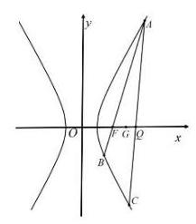

即有 $\left\{  \begin{array}{l} \Delta  = {36}\left( {{m}^{2} + 1}\right)  > 0, \\  {y}_{1} + {y}_{2} = \frac{-{12m}}{3{m}^{2} - 1}, \\  {y}_{1}{y}_{2} = \frac{9}{3{m}^{2} - 1}. \end{array}\right.$ 12 分

因为直线 $l$ 过点 $F$ 且与双曲线 $\Gamma$ 右支交于 $A\text{ 、 }B$ 两点, $\therefore m \in  \left( {-\frac{\sqrt{3}}{3},\frac{\sqrt{3}}{3}}\right)$ ,

又因为 $\bigtriangleup {ABC}$ 的重心 $G$ 在 $x$ 轴上,所以 ${y}_{1} + {y}_{2} + {y}_{3} = 0$ ,

由点 $Q$ 在点 $\mathrm{F}$ 的右侧,可得 ${y}_{3} < 0$ ,所以 ${y}_{1} + {y}_{2} > 0$ ,解得 $m > 0$ ,所以 $m \in  \left( {0,\frac{\sqrt{3}}{3}}\right)$ , 14 分而 $\left| {{y}_{1} - {y}_{2}}\right|  = \sqrt{{\left( {y}_{1} + {y}_{2}\right) }^{2} - 4{y}_{1}{y}_{2}}$ ,代入可得 ${y}_{1} - {y}_{2} =  - \frac{6\sqrt{{m}^{2} + 1}}{3{m}^{2} - 1}$ .

$\frac{{S}_{1}}{{S}_{2}} = \frac{\frac{{S}_{1}}{{S}_{\bigtriangleup {ABG}}}}{\frac{{S}_{2}}{{S}_{\bigtriangleup {ACG}}}} = \frac{\frac{\left| AF\right| }{\left| AB\right| }}{\frac{CQ}{\left| AC\right| }} = \frac{\frac{{y}_{1}}{{y}_{1} - {y}_{2}}}{\frac{-{y}_{3}}{{y}_{1} - {y}_{3}}} = \frac{\frac{{y}_{1}}{{y}_{1} - {y}_{2}}}{\frac{{y}_{1} + {y}_{2}}{2{y}_{1} + {y}_{2}}} = \frac{\left( {{y}_{1} + {y}_{2} + {y}_{1}}\right) \left( {{y}_{1} + {y}_{2} - {y}_{2}}\right) }{\left( {{y}_{1} - {y}_{2}}\right) \left( {{y}_{1} + {y}_{2}}\right) }$

$= \frac{{y}_{1} + {y}_{2}}{{y}_{1} - {y}_{2}} + 1 - \frac{{y}_{1}{y}_{2}}{\left( {{y}_{1} + {y}_{2}}\right) \left( {{y}_{1} - {y}_{2}}\right) }$ ,代入后化简可得: $\frac{{S}_{1}}{{S}_{2}} = \frac{{13}{m}^{2} + 1}{{8m}\sqrt{{m}^{2} + 1}} + 1\ldots$ 16 分

所以 $\frac{{S}_{1}}{{S}_{2}} = \frac{{13}{m}^{2} + 1}{{8m}\sqrt{{m}^{2} + 1}} + 1 = \frac{{12}{m}^{2}}{{8m}\sqrt{{m}^{2} + 1}} + \frac{{m}^{2} + 1}{{8m}\sqrt{{m}^{2} + 1}} + 1 \geq  \frac{\sqrt{3}}{2} + 1$ ,

当且仅当 $m = \frac{\sqrt{11}}{11}$ 时等号成立, $\therefore \frac{{S}_{1}}{{S}_{2}}$ 的最小值为 $\frac{\sqrt{3}}{2} + 1$ . 18 分

法二: 记 $\overrightarrow{AF} = \lambda \overrightarrow{AB},\overrightarrow{AQ} = \mu \overrightarrow{AC}$ ,由重心 $G$ 得 $\overrightarrow{AG} = \frac{1}{3}\overrightarrow{AB} + \frac{1}{3}\overrightarrow{AC}$ ,

因为 $\overrightarrow{AF} = \lambda \overrightarrow{AB},\overrightarrow{AQ} = \mu \overrightarrow{AC}$ ,得 $\overrightarrow{AG} = \frac{1}{3\lambda }\overrightarrow{AF} + \frac{1}{3\mu }\overrightarrow{AQ}$ ,所以 $\frac{1}{\lambda } + \frac{1}{\mu } = 3$ ,

而 $\frac{{S}_{1}}{{S}_{2}} = \frac{\frac{{S}_{1}}{{S}_{\bigtriangleup {ABG}}}}{\frac{{S}_{2}}{{S}_{\bigtriangleup {ACG}}}} = \frac{\frac{\left| AF\right| }{\left| AB\right| }}{\frac{\left| CQ\right| }{\left| AC\right| }} = \frac{\lambda }{1 - \mu } = \frac{1}{4 - \left( {\frac{1}{\mu } + {3\mu }}\right) } \geq  \frac{1}{4 - 2\sqrt{3}} = \frac{\sqrt{3}}{2} + 1,$ “=”成立当且仅当 $\left\{  \begin{array}{l} \lambda  = \frac{1}{3 - \sqrt{3}}, \\  \mu  = \frac{\sqrt{3}}{3}. \end{array}\right.$

21. (1)是 2 分

以下反例不唯一.

存在 ${x}_{1} = \frac{1}{2},{x}_{2} = 2$ ,有 $\left\lbrack  {1 \cdot  \frac{1}{2} - \frac{1}{4} + 0}\right\rbrack   \cdot  \left\lbrack  {1 \cdot  2 - 4 + 0}\right\rbrack   = \frac{1}{4} \cdot  \left( {-2}\right)  < 0$ 满足; 4 分

(2)令 $d\left( x\right)  = x\ln 2 - \ln x + m$ ，而 ${d}^{\prime }\left( x\right)  = \ln 2 - \frac{1}{x}$ ，

所以当 $1 < x < \frac{1}{\ln 2}$ 时, ${d}^{\prime }\left( x\right)  < 0$ ; 当 $\frac{1}{\ln 2} < x < 2$ 时, ${d}^{\prime }\left( x\right)  > 0$ , 6 分

所以 $y = d\left( x\right)$ 在 $x = \frac{1}{\ln 2}$ 处取得极小值,也是最小值,

所以 $y = d\left( x\right)$ 在区间 $\left( {1,2}\right)$ 上的值域为 $\lbrack 1 + m + \ln \left( {\ln 2}\right) , m + \ln 2)$ , 8 分

若 $\left( {\ln 2, m}\right)$ 为 $y = f\left( x\right)$ 在区间 $D$ 上的 “分割数对”

即要满足 $y = d\left( x\right)$ 在区间 $\left( {1,2}\right)$ 上的函数值有正有负,

所以 $\left\{  \begin{array}{l} m + \ln 2 > 0 \Rightarrow  m >  - \ln 2, \\  1 + m + \ln \left( {\ln 2}\right)  < 0 \Rightarrow  m <  - 1 - \ln \left( {\ln 2}\right) , \end{array}\right.$

即实数 $m$ 的取值范围为 $\left( {-\ln 2, - 1 - \ln \left( {\ln 2}\right) }\right)$ ; 10 分

(3)对于任意 $t \in  \mathbf{R}$ ,考虑 $d\left( x\right)  = {f}^{\prime }\left( t\right) x - f\left( x\right)  + f\left( t\right)  - t{f}^{\prime }\left( t\right)$ ,

则 $\left( {{f}^{\prime }\left( t\right) , f\left( t\right)  - t{f}^{\prime }\left( t\right) }\right)$ 不是 $y = f\left( x\right)$ 在 $D$ 上的 “分割数对” 等价于 $d\left( x\right)  \geq  0$ 恒成立或 $d\left( x\right)  \leq  0$ 恒成立, 12 分

显然, $d\left( t\right)  = t{f}^{\prime }\left( t\right)  - f\left( t\right)  + f\left( t\right)  - t{f}^{\prime }\left( t\right)  = 0$ ,

由于 ${d}^{\prime }\left( x\right)  = {f}^{\prime }\left( t\right)  - {f}^{\prime }\left( x\right)$ ,显然 ${d}^{\prime }\left( t\right)  = {f}^{\prime }\left( t\right)  - {f}^{\prime }\left( t\right)  = 0$ , 14 分

令 $h\left( x\right)  = {d}^{\prime }\left( x\right)  = {f}^{\prime }\left( t\right)  - {f}^{\prime }\left( x\right)$ ,

因为 ${f}^{\prime }\left( x\right)  = \left( {{x}^{2} + \left( {a + 2}\right) x + a + b}\right)  \cdot  {\mathrm{e}}^{x}$ ,则 $h\left( x\right)  = {f}^{\prime }\left( t\right)  - \left( {{x}^{2} + \left( {a + 2}\right) x + a + b}\right)  \cdot  {\mathrm{e}}^{x}$

所以 ${h}^{\prime }\left( x\right)  =  - \left( {{x}^{2} + \left( {a + 4}\right) x + {2a} + b + 2}\right) {\mathrm{e}}^{x}$ ,结合函数 $y = {h}^{\prime }\left( x\right)$ 的性质可知,

“ ${h}^{\prime }\left( x\right)  \leq  0$ 恒成立” 等价于 “对任意 $t \in  \mathbf{R}, d\left( x\right)  \leq  0$ 恒成立” 16 分

即 ${x}^{2} + \left( {a + 4}\right) x + {2a} + b + 2 \geq  0$ 在 $\mathbf{R}$ 上恒成立,即 $\Delta  = {a}^{2} - {4b} + 8 \leq  0$ ,

由题意,满足 ${a}^{2} - {4b} + 8 \leq  0$ 的实数 $a$ 有且仅有一个,则 $b = 2$ . 18 分

# 2025 届上海市奉贤区高三二模数学试卷

202504

一、填空题

1、13

6、 $\frac{\sqrt{5}}{5}$ 10、 $\frac{b}{a + b}$ 2、 $\sqrt{2}$

3、0.94 7、充要条件 11、180

4、-672 8、4π 12、8、

5、3 9、-0.8627

法二: 设 $\overrightarrow{b} = \overrightarrow{OB} = \left( {0,4}\right) ,\overrightarrow{c} = \overrightarrow{O{C}_{1}} = \left( {4,0}\right) , - \overrightarrow{c} = \overrightarrow{O{C}_{2}} = \left( {-4,0}\right) ,\overrightarrow{a} = \overrightarrow{OA}$ ,

将 $\bigtriangleup {AB}{C}_{2}$ 绕 ${C}_{2}$ 顺时针旋转 ${45}^{ \circ  }$ 并扩大到 $\sqrt{2}$ 倍,得到 $\bigtriangleup {A}^{\prime }{C}_{2}{}^{\prime }{B}^{\prime }$ ,

则 $\left| {A{A}^{\prime }}\right|  = \left| {A{C}_{2}}\right| ,\left| {{A}^{\prime }{B}^{\prime }}\right|  = \sqrt{2}\left| {AB}\right|$ ,当 ${C}_{1}, A,{A}^{\prime },{B}^{\prime }$ 四点共线时最小,

此时 $\angle {C}_{1}{C}_{2}{B}^{\prime } = {45}^{ \circ  } + {45}^{ \circ  } = {90}^{ \circ  },{C}_{1}{C}_{2} = 8,{C}_{2}{B}^{\prime } = 4\sqrt{2} \times  \sqrt{2} = 8$ ,

则 ${C}_{1}{B}^{\prime } = 8\sqrt{2}$ ，所以 $\sqrt{2}\left| {\overrightarrow{a} - \overrightarrow{b}}\right|  + \left| {\overrightarrow{a} - \overrightarrow{c}}\right|  + \left| {\overrightarrow{a} + \overrightarrow{c}}\right|$ 的最小值为 $8\sqrt{2}$ .

二、选择题

13、C 14、D 15、B 16、B

## 一、填空题(本题共 12 小题，1-6 每小题 4 分，7-12 每小题 5 分，共 54 分.)

1. 等差数列首项为 1 ，公差是 3 ，则第 5 项等于___.

【答案】 13

【详解】设首项为 1,公差是 3 的等差数列为 $\left\{  {a}_{n}\right\}$ ,则 ${a}_{n} = {a}_{1} + \left( {n - 1}\right) d = {3n} - 2$ ,

故 ${a}_{5} = 3 \times  5 - 2 = {13}$ . 故答案为:13

2. 已知 $\mathrm{i}$ 为虚数单位,复数 $z$ 满足 $z\mathrm{i} - \mathrm{i} = 1$ ,则 $\left| z\right|  =$ ___.

【答案】 $\sqrt{2}$

【详解】设 $z = a + b\mathrm{i}$ ,由 $z\mathrm{i} - \mathrm{i} = \left( {a + b\mathrm{i}}\right) \mathrm{i} - \mathrm{i} =  - b + \left( {a - 1}\right) \mathrm{i} = 1$ ,则 $b =  - 1, a = 1$ ,即 $z = 1 - \mathrm{i}$ ,所以 $\left| z\right|  = \sqrt{1 + 1} = \sqrt{2}$ . 故答案为: $\sqrt{2}$ .

3. 假设生产某产品的一个部件来自三个供应商,供货占比分别是 $\frac{1}{2}\text{ 、 }\frac{1}{6}\text{ 、 }\frac{1}{3}$ ,而它们的良品率分别是 ${0.96}\text{ 、 }{0.90}\text{ 、 }{0.93}$ ，则该部件的总体良品率是___.

【答案】0.94

【详解】由题意可知该部件的总体良品率是: $\frac{1}{2} \times  {0.96} + \frac{1}{6} \times  {0.90} + \frac{1}{3} \times  {0.93} = {0.94}$ ,故答案为: 0.94 4. 在 ${\left( \sqrt{x} - \frac{2}{x}\right) }^{9}$ 的二项展开式中,常数项为___. (用数字作答)

【答案】-672

【详解】通项为 ${T}_{r + 1} = {\mathrm{C}}_{9}^{r}{\left( \sqrt{x}\right) }^{9 - r}{\left( -\frac{2}{x}\right) }^{r} = {\mathrm{C}}_{9}^{r}{\left( -2\right) }^{r}{x}^{\frac{9 - {3r}}{2}},0 \leq  r \leq  9, r \in  \mathrm{Z}$ , 故当 $r = 3$ 时,常数项为 ${T}_{3} = {\mathrm{C}}_{9}^{3}{\left( -2\right) }^{3} =  - {672}$ . 故答案为: -672

5. 直线 ${3x} + {4y} - 5 = 0$ 上的动点 $P$ 和直线 ${3x} + {4y} + {10} = 0$ 上的动点 $Q$ ,则点 $P$ 与点 $Q$ 之间距离的最小值是___.

【答案】 3

【详解】直线 ${3x} + {4y} - 5 = 0$ 和直线 ${3x} + {4y} + {10} = 0$ 互相平行, 故点 $P$ 与点 $Q$ 之间距离的最小值即两条直线间的距离,且两条直线间的距离: $d = \frac{\left| -5 - {10}\right| }{\sqrt{{3}^{2} + {4}^{2}}} = 3$ .

6. 已知 $\theta$ 是斜率为 -1 的直线的倾斜角,计算 $\sin \left( {\theta  - \frac{\pi }{2}}\right)  =$

【答案】 $\frac{\sqrt{2}}{2}$

【详解】因为 $\theta$ 是斜率为 -1 的直线的倾斜角,所以 $\tan \theta  =  - 1,\theta  \in  \lbrack 0,\pi )$ ,所以 $\theta  = \frac{3\pi }{4}$ , 所以 $\sin \left( {\theta  - \frac{\pi }{2}}\right)  = \sin \left( {\frac{3\pi }{4} - \frac{\pi }{2}}\right)  = \sin \frac{\pi }{4} = \frac{\sqrt{2}}{2}$ . 故答案为: $\frac{\sqrt{2}}{2}$ .

7. 已知 $\bigtriangleup {ABC}$ ， “ $A$ 、 $B$ 、 $C$ 成等差数列且 $\sin A$ 、 $\sin B$ 、 $\sin C$ 成等比数列” 是 “ $\bigtriangleup {ABC}$ 是正三角形” 的___条件。

【答案】充要

【详解】在 $\bigtriangleup {ABC}$ 中,由 $\mathrm{A}\text{ 、 }B\text{ 、 }C$ 成等差数列,得 ${2B} = A + C$ ,而 $A + B + C = \pi$ ,则 $B = \frac{\pi }{3}$ , 由 $\sin A\text{ 、 }\sin B\text{ 、 }\sin C$ 成等比数列,得 ${\sin }^{2}B = \sin A\sin C$ ,由正弦定理得 ${b}^{2} = {ac}$ , 由余弦定理得 ${b}^{2} = {a}^{2} + {c}^{2} - {2ac}\cos B$ ,即 ${ac} = {a}^{2} + {c}^{2} - {ac}$ ,解得 $a = c$ ,因此 $\bigtriangleup {ABC}$ 是正三角形; 若 $\bigtriangleup {ABC}$ 是正三角形,则 $A = B = C = \frac{\pi }{3},\sin B = \sin A = \sin C = \frac{\sqrt{3}}{2}$ ,

因此 $\mathrm{A}\text{ 、 }B\text{ 、 }C$ 成等差数列且 $\sin A\text{ 、 }\sin B\text{ 、 }\sin C$ 成等比数列,

所以 “ $\mathrm{A}\text{ 、 }B\text{ 、 }C$ 成等差数列且 $\sin A\text{ 、 }\sin B\text{ 、 }\sin C$ 成等比数列” 是 “ $\bigtriangleup {ABC}$ 是正三角形” 的充要条件.

故答案为:充要.

8. 抛物线 ${x}^{2} = {4y}$ 的准线与圆 ${x}^{2} + {y}^{2} = {r}^{2}$ 相切,将圆绕直径所在直线旋转一周形成一个几何体,则该几何体的表面积为___.

【答案】 ${4\pi }$

【详解】因为抛物线方程为 ${x}^{2} = {4y}$ ,可知准线方程为 $y =  - 1$ ,

又由圆 ${x}^{2} + {y}^{2} = {r}^{2}$ 与准线相切,可知: $r = 1$ ,将圆绕直径旋转一周所成的球的表面积为: $S = {4\pi }$

9. 通过随机抽样, 获得某种商品消费者年需求量与该商品每千克价格之间的一组数据调查, 如下表所示:

<table><tr><td>价格 (百元)</td><td>${X}_{1}$</td><td>${x}_{2}$</td><td>${x}_{3}$</td><td>${x}_{4}$</td><td>${x}_{5}$</td><td>${x}_{6}$</td><td>${x}_{7}$</td><td>${x}_{8}$</td><td>${x}_{9}$</td><td>${x}_{10}$</td></tr><tr><td></td><td>4</td><td>4</td><td>4.6</td><td>5</td><td>5.2</td><td>5.6</td><td>6</td><td>6.6</td><td>7</td><td>10</td></tr><tr><td>需求量(千克)</td><td>${y}_{1}$</td><td>${y}_{2}$</td><td>${y}_{3}$</td><td>${y}_{4}$</td><td>${y}_{5}$</td><td>${y}_{6}$</td><td>${y}_{7}$</td><td>${y}_{8}$</td><td>${y}_{9}$</td><td>${y}_{10}$</td></tr><tr><td></td><td>3.5</td><td>3</td><td>2.7</td><td>2.4</td><td>2.5</td><td>2</td><td>1.5</td><td>1.2</td><td>1.2</td><td>1</td></tr></table>

那么线性相关系数 $r =$ ___. (精确到 0.001 ) 线性相关系数公式

$r = \frac{\mathop{\sum }\limits_{{i = 1}}^{n}\left( {{x}_{i} - \bar{x}}\right) \left( {{y}_{i} - \bar{y}}\right) }{\sqrt{\mathop{\sum }\limits_{{i = 1}}^{n}{\left( {x}_{i} - \bar{x}\right) }^{2} \cdot  \mathop{\sum }\limits_{{i = 1}}^{n}{\left( {y}_{i} - \bar{y}\right) }^{2}}}$

【答案】-0.8627

【详解】由题意可得 $\bar{x} = \frac{1}{10}\left( {4 + 4 + {4.6} + 5 + {5.2} + {5.6} + 6 + {6.6} + 7 + {10}}\right)  = {5.8}$ , $\bar{y} = \frac{1}{10}\left( {{3.5} + 3 + {2.7} + {2.4} + {2.5} + 2 + {1.5} + {1.2} + {1.2} + 1}\right)  = {2.1},$ 所以 $\mathop{\sum }\limits_{{i = 1}}^{{10}}\left( {{y}_{i} - \bar{y}}\right)  = \left( {4 - {5.8}}\right) \left( {{3.5} - {2.1}}\right)  + \left( {4 - {5.8}}\right) \left( {3 - {2.1}}\right)  + \cdots  + \left( {{10} - {5.8}}\right) \left( {1 - {2.1}}\right)  =  - {11.86} \; \mathop{\sum }\limits_{{i = 1}}^{{10}}{\left( {x}_{i} - \bar{x}\right) }^{2} = {\left( 4 - {5.8}\right) }^{2} + {\left( 4 - {5.8}\right) }^{2} + \cdots  + {\left( {10} - {5.8}\right) }^{2} = {28.72} \; \mathop{\sum }\limits_{{i = 1}}^{{10}}{\left( {y}_{i} - \bar{y}\right) }^{2} = {\left( {3.5} - {2.1}\right) }^{2} + {\left( 3 - {2.1}\right) }^{2} + \cdots  + {\left( 1 - {2.1}\right) }^{2} = {6.58},$

$\mathop{\sum }\limits_{{i = 1}}^{{10}}{\left( {x}_{i} - \bar{x}\right) }^{2}\mathop{\sum }\limits_{{i = 1}}^{{10}}{\left( {y}_{i} - \bar{y}\right) }^{2} = \sqrt{{28.72} \times  {6.58}} = {13.7469},$

所以 $r = \frac{\mathop{\sum }\limits_{{i = 1}}^{{10}}\left( {{x}_{i} - \bar{x}}\right) \left( {{y}_{i} - \bar{y}}\right) }{\sqrt{\mathop{\sum }\limits_{{i = 1}}^{{10}}{\left( {x}_{i} - \bar{x}\right) }^{2} \cdot  \mathop{\sum }\limits_{{i = 1}}^{{10}}{\left( {y}_{i} - \bar{y}\right) }^{2}}} = \frac{-{11.86}}{13.7469} =  - {0.8627}$ . 故答案为: 0.8627 .

10. 盒子中有大小与质地均相同的 $a$ 个红球和 $b$ 个白球,从中随机取 1 个球,观察其颜色后放回,并同时放入与其相同颜色的球 $c$ 个(大小与质地均相同)，再从中随机取 1 个球，计算此次取到白球的概率是___.

【答案】 $\frac{b}{a + b}$

【详解】由题意可设 ${A}_{1} =$ \{第一次取得红球\}, ${B}_{1} =$ \{第一次取得白球\}, ${A}_{2} =$ \{第二次取得红球\}, ${B}_{2} =$ \{第二次取得白球\},易知 $P\left( {A}_{1}\right)  = \frac{a}{a + b}, P\left( {B}_{1}\right)  = \frac{b}{a + b}, P\left( {{B}_{2} \mid  {A}_{1}}\right)  = \frac{b}{a + b + c}, P\left( {{B}_{2} \mid  {B}_{1}}\right)  = \frac{b + c}{a + b + c}$ , 所以 $P\left( {B}_{2}\right)  = P\left( {A}_{1}\right) P\left( {{B}_{2} \mid  {A}_{1}}\right)  + P\left( {B}_{1}\right) P\left( {{B}_{2} \mid  {B}_{1}}\right)  = \frac{b}{a + b}$ . 故答案为: $\frac{b}{a + b}$ .

11. 中企联合大厦是奉贤区的第一高楼, 是奉贤美奉贤强的一个缩影. 某数学建模兴趣小组的同学们去实地进行测量,经过多次的测量,最终在平行于地面的同一水平面上选取三个点: 点 $B$ 、点 $C$ 、点 $O$ 作为测量基点. 设大厦的最高点为 $\mathrm{A}$ ,在点 $B$ 处测得点 $\mathrm{A}$ 的仰角为 $\angle {ABO} = \theta  = {71.5}^{ \circ  }$ ,在点 $C$ 处测得点 $\mathrm{A}$ 的仰角为 $\angle {ACO} = {44}^{ \circ  }$ ,又测得 ${BC} = {221}$ 米, $\angle {BOC} = {119}^{ \circ  }$ ,(见图). 现作出以下几个假设:

① 直线 ${AO}$ 垂直于平面 ${OBC}$ ;

②平面 ${OBC}$ 到地面的距离等于测角仪高度，在计算过程中测角仪高度忽略不计；

③其它次要因素等忽略不计. 根据以上信息估算奉贤第一高楼的高度约___米. (结果保留整数)

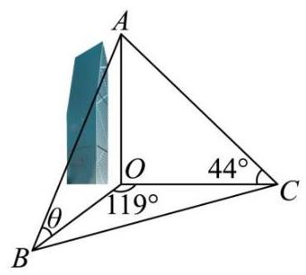

【答案】180

【详解】设高度为 $h$ ,在 $\bigtriangleup {ABO}$ 中,根据正弦定理有: $\frac{h}{\sin {71.5}^{ \circ  }} = \frac{BO}{\sin \left( {{90}^{ \circ  } - {71.5}^{ \circ  }}\right) }$ ,即

${BO} = \tan {18.5}^{ \circ  }h \approx  {0.33h}$ ,在 $\bigtriangleup {ACO}$ 中,根据正弦定理有: $\frac{h}{\sin {44}^{ \circ  }} = \frac{CO}{\sin \left( {{90}^{ \circ  } - {44}^{ \circ  }}\right) }$ ,即

${CO} = \tan {46}^{ \circ  }h \approx  {1.04h}$ ,

由余弦定理可知:

$B{C}^{2} = B{O}^{2} + C{O}^{2} - {2BO} \cdot  {CO}\cos \left( {119}^{ \circ  }\right)  = {0.33}^{2}{h}^{2} + {1.04}^{2}{h}^{2} - 2 \times  {0.33h} \times  {1.04h} \times  \left( {-{0.48}}\right) \; = {0.11}{h}^{2} + {1.08}{h}^{2} + {0.33}{h}^{2} \approx  {1.5}{h}^{2} = {221}^{2}$ ,解得: $h \approx  {180}$ .

故答案为:180

12. $\bigtriangleup  {ABC}$ 内一点 $F$ (见图 1)，式子 ${FA} + {FC} + {FB}$ 可以写成 $1 \times  {FA} + 1 \times  {FC} + 1 \times  {FB}$ ，这个式子中 ${FA}\text{ 、 }{FC}\text{ 、 }{FB}$ 的系数均为 1，以三个系数1作为边长可构造一个等边三角形，因此我们尝试把 $\vartriangle  {AFC}$ 绕点 $C$ 顺时针旋转 $\frac{\pi }{3}$ ，得到 $\bigtriangleup  {A}^{\prime }{F}^{\prime }C$ (见图 2)，所以 ${FA} + {FC} + {FB}$ 等于 ${F}^{\prime }{A}^{\prime } + {F}^{\prime }F + {FB}$ ，显然 ${F}^{\prime }{A}^{\prime } + {F}^{\prime }F + {FB} \geq  {A}^{\prime }B$ ,当 ${A}^{\prime }\text{ 、 }{F}^{\prime }\text{ 、 }F\text{ 、 }B$ 四点共线时 (见图 3), ${FA} + {FC} + {FB}$ 最小.

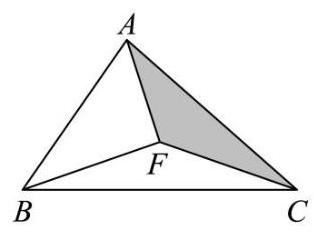

图1

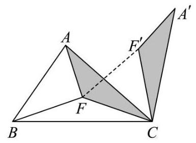

图2

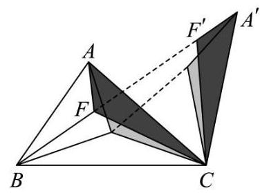

图3

试用类似的方法解决下面这道题目:

已知 $\overrightarrow{a}$ 是平面内的任意一个向量,向量 $\overrightarrow{b}\text{ 、 }\overrightarrow{c}$ 满足 $\overrightarrow{b} \cdot  \overrightarrow{c} = 0$ ,且 $\left| \overrightarrow{b}\right|  = 4,\left| \overrightarrow{c}\right|  = 4$ ,则 $\sqrt{2}\left| {\overrightarrow{a} - \overrightarrow{b}}\right|  + \left| {\overrightarrow{a} - \overrightarrow{c}}\right|  + \left| {\overrightarrow{a} + \overrightarrow{c}}\right|$ 的最小值为___.

【答案】 $8\sqrt{2}$

【详解】在如下图所示的平面直角坐标系 ${xOy}$ 中,设 $B\left( {4,0}\right) \text{ 、 }{C}_{1}\left( {0,4}\right) \text{ 、 }{C}_{2}\left( {0, - 4}\right)$ ,

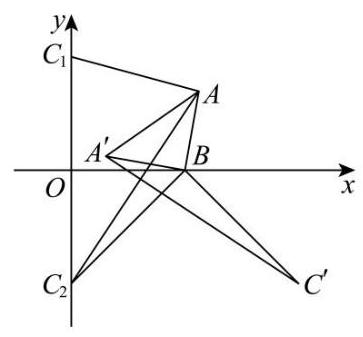

不妨设 $\overrightarrow{a} = \overrightarrow{OA},\overrightarrow{b} = \overrightarrow{OB},\overrightarrow{c} = \overrightarrow{O{C}_{1}}$ ,

由题意可得 $\sqrt{2}\left| {\overrightarrow{a} - \overrightarrow{b}}\right|  + \left| {\overrightarrow{a} - \overrightarrow{c}}\right|  + \left| {\overrightarrow{a} + \overrightarrow{c}}\right|  = \sqrt{2}\left| {AB}\right|  + \left| {A{C}_{1}}\right|  + \left| {A{C}_{2}}\right|$ ,

将 $\bigtriangleup {AB}{C}_{2}$ 绕点 $B$ 逆时针旋转 $\frac{\pi }{2}$ 得到 $\bigtriangleup {A}^{\prime }B{C}^{\prime }$ ,则 $\left| {A{A}^{\prime }}\right|  = \sqrt{2}\left| {AB}\right| ,\left| {{A}^{\prime }{C}^{\prime }}\right|  = \left| {A{C}_{2}}\right|$ ,其中点 ${C}^{\prime }\left( {8, - 4}\right)$ , 故 $\sqrt{2}\left| {\overrightarrow{a} - \overrightarrow{b}}\right|  + \left| {\overrightarrow{a} - \overrightarrow{c}}\right|  + \left| {\overrightarrow{a} + \overrightarrow{c}}\right|  = \sqrt{2}\left| {AB}\right|  + \left| {A{C}_{1}}\right|  + \left| {A{C}_{2}}\right|  = \left| {A{A}^{\prime }}\right|  + \left| {A{C}_{1}}\right|  + \left| {{A}^{\prime }{C}^{\prime }}\right|  \geq  \left| {{C}_{1}{C}^{\prime }}\right| \; = \sqrt{{\left( 8 - 0\right) }^{2} + {\left( -4 - 4\right) }^{2}} = 8\sqrt{2}$ ,当且仅当点 $\mathrm{A}$ 与点 $B$ 重合时,此时,点 ${A}^{\prime }$ 也与点 $B$ 重合,等号成立, 故 $\sqrt{2}\left| {\overrightarrow{a} - \overrightarrow{b}}\right|  + \left| {\overrightarrow{a} - \overrightarrow{c}}\right|  + \left| {\overrightarrow{a} + \overrightarrow{c}}\right|$ 的最小值为 $8\sqrt{2}$ . 故答案为: $8\sqrt{2}$ .

## 二、选择题 (本题共 4 小题, 13-14 每小题 4 分, 15-16 每小题 5 分, 共 18 分. 在每小 题给出的四个选项中, 只有一项是符合题目要求的.)

13. 下列有关排列组合数的计算公式, 错误的是 ( )

A. ${\mathrm{P}}_{n}^{m} + {\mathrm{P}}_{n}^{m - 1} = {\mathrm{P}}_{n + 1}^{m}\;\left( {m, n\text{ 是正整数,且 }m \leq  n}\right)$

B. ${\mathrm{P}}_{n}^{m} = {\mathrm{C}}_{n}^{m}{\mathrm{P}}_{m}^{m}\;\left( {m, n\text{ 是正整数,且 }m \leq  n}\right)$

C. ${\mathrm{P}}_{n}^{m} = n{\mathrm{P}}_{n - 1}^{m - 1}\left( {m, n\text{ 是正整数,且 }m \leq  n}\right)$

D. ${\mathrm{C}}_{n}^{m} + {\mathrm{C}}_{n}^{m - 1} = {\mathrm{C}}_{n + 1}^{m}\left( {m, n}\right.$ 是正整数,且 $\left. {m \leq  n}\right)$

【答案】A

【详解】对于选项 $\mathrm{A}$ : 例如 $m = n = 2$ ,则 ${\mathrm{P}}_{2}^{2} + {\mathrm{P}}_{2}^{1} = 4,{\mathrm{P}}_{3}^{2} = 6$ ,即 ${\mathrm{P}}_{2}^{2} + {\mathrm{P}}_{2}^{1} \neq  {\mathrm{P}}_{3}^{2}$ ,故 $\mathrm{A}$ 错误;

对于选项 B: 因为 ${\mathrm{C}}_{n}^{m}{\mathrm{P}}_{m}^{m} = \frac{n!}{m! \cdot  \left( {n - m}\right) !} \cdot  m! = \frac{n!}{\left( {n - m}\right) !} = {\mathrm{P}}_{n}^{m}$ ,故 B 正确;

对于选项 C: 因为 $n{\mathrm{P}}_{n - 1}^{m - 1} = n \cdot  \frac{\left( {n - 1}\right) !}{\left( {n - m}\right) !} = \frac{n!}{\left( {n - m}\right) !} = {\mathrm{P}}_{n}^{m}$ ,故 $\mathrm{C}$ 正确;

对于选项 D: 因为 ${\mathrm{C}}_{n}^{m} + {\mathrm{C}}_{n}^{m - 1} = \frac{n!}{m!\left( {n - m}\right) !} + \frac{n!}{\left( {m - 1}\right) !\left( {n - m + 1}\right) !}$

$= \frac{n!}{m! \cdot  \left( {n - m + 1}\right) !}\left\lbrack  {\left( {n - m + 1}\right)  + m}\right\rbrack   = \frac{\left( {n + 1}\right) !}{m! \cdot  \left( {n - m + 1}\right) !} = {\mathrm{C}}_{n + 1}^{m}$ ,所以 ${\mathrm{C}}_{n}^{m} + {\mathrm{C}}_{n}^{m - 1} = {\mathrm{C}}_{n + 1}^{m}$ ,故 D 正确;

故选: A.

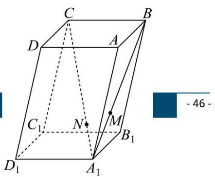

14. 如图，在平行六面体 ${ABCD} - {A}_{1}{B}_{1}{C}_{1}{D}_{1}$ 中，点 $N$ 在对角线 ${A}_{1}C$ 上，点 $M$ 在对角线 ${A}_{1}B$ 上， $\overrightarrow{{A}_{1}N} = \frac{1}{3}\overrightarrow{NC},\overrightarrow{{A}_{1}M} = \frac{1}{2}\overrightarrow{MB}$ ，以下命题正确的是( )

A. $\overrightarrow{MN}//\overrightarrow{BC}$

让优秀成为一种习惯!

B. ${D}_{1}\text{ 、 }N\text{ 、 }M$ 三点共线

C. ${D}_{1}M$ 与 ${A}_{1}C$ 是异面直线

D. $\overrightarrow{{D}_{1}N} = \frac{1}{2}\overrightarrow{NM}$

【答案】B

【详解】在平行六面体 ${ABCD} - {A}_{1}{B}_{1}{C}_{1}{D}_{1}$ 中,令 $\overrightarrow{AB} = \overrightarrow{a},\overrightarrow{AD} = \overrightarrow{b},\overrightarrow{A{A}_{1}} = \overrightarrow{c}$ ,

则 $\overrightarrow{{A}_{1}B} = \overrightarrow{{A}_{1}A} + \overrightarrow{AB} =  - \overrightarrow{c} + \overrightarrow{a} = \overrightarrow{a} - \overrightarrow{c},\overrightarrow{{A}_{1}C} = \overrightarrow{{A}_{1}A} + \overrightarrow{AB} + \overrightarrow{BC} =  - \overrightarrow{c} + \overrightarrow{a} + \overrightarrow{b} = \overrightarrow{a} + \overrightarrow{b} - \overrightarrow{c}$ ,

$\overrightarrow{MN} = \overrightarrow{M{A}_{1}} + \overrightarrow{{A}_{1}N} =  - \frac{1}{3}\overrightarrow{{A}_{1}B} + \frac{1}{4}\overrightarrow{{A}_{1}C} =  - \frac{1}{3}\left( {\overrightarrow{a} - \overrightarrow{c}}\right)  + \frac{1}{4}\left( {\overrightarrow{a} + \overrightarrow{b} - \overrightarrow{c}}\right)  =  - \frac{1}{12}\overrightarrow{a} + \frac{1}{4}\overrightarrow{b} + \frac{1}{12}\overrightarrow{c}$ ,

$\overrightarrow{BC} = \overrightarrow{AD} = \overrightarrow{b}$ ,因为 $\overrightarrow{a},\overrightarrow{b},\overrightarrow{c}$ 不共线所以 $\overrightarrow{MN}$ 与 $\overrightarrow{BC}$ 不平行,故 $\mathrm{A}$ 错误.

$\overrightarrow{{D}_{1}N} = \overrightarrow{{D}_{1}{A}_{1}} + \overrightarrow{{A}_{1}N} =  - \overrightarrow{AD} + \frac{1}{4}\overrightarrow{{A}_{1}C} =  - \overrightarrow{b} + \frac{1}{4}\left( {\overrightarrow{a} + \overrightarrow{b} - \overrightarrow{c}}\right)  = \frac{1}{4}\overrightarrow{a} - \frac{3}{4}\overrightarrow{b} - \frac{1}{4}\overrightarrow{c}$ ,

$\overrightarrow{MN} =  - \frac{1}{3}\overrightarrow{{D}_{1}N}$ ,即有 $\overrightarrow{MN}//\overrightarrow{{D}_{1}N},\overrightarrow{MN},\overrightarrow{{D}_{1}N}$ 有公共点 $N$ ,所以 ${D}_{1}\text{ 、 }N\text{ 、 }M$ 三点共线, $\mathrm{B}$ 选项正确.

因为点 $N$ 在直线 ${D}_{1}M$ 上,点 $N$ 也在直线 ${A}_{1}C$ 上所以 ${D}_{1}M$ 与 ${A}_{1}C$ 是相交直线,故 $\mathrm{C}$ 选项错误. 因为 $\overrightarrow{MN} =  - \frac{1}{3}\overrightarrow{{D}_{1}N}$ ,所以 $\overrightarrow{{D}_{1}N} = 3\overrightarrow{NM}$ ,故 $\mathrm{D}$ 选项错误. 故选: $\mathrm{B}$

15. 函数 $y = f\left( x\right)$ 的导函数为 $y = g\left( x\right)$ ,若存在实数 ${x}_{0}$ ,使得 $g\left( {x}_{0}\right) f\left( {-{x}_{0}}\right)  = 1$ 成立,则称函数 $y = f\left( x\right)$ 具有 ${x}_{0}$ 性质,下列函数 $y = f\left( x\right)$ 具有 ${x}_{0}$ 性质的函数是 ( )

A. $y = {\mathrm{e}}^{-x}$ B. $y = \sin x$ C. $y = {\mathrm{e}}^{x} + {\mathrm{e}}^{-x}$

D. $y = \frac{1}{2}\ln \left( {{x}^{2} + 1}\right)$

【答案】C

【详解】对于选项 A: 因为函数 $f\left( x\right)  = {\mathrm{e}}^{-x}$ 的导函数为 $g\left( x\right)  =  - {\mathrm{e}}^{-x}$ ,所以

$g\left( {x}_{0}\right) f\left( {-{x}_{0}}\right)  =  - {\mathrm{e}}^{-{x}_{0}} \cdot  {\mathrm{e}}^{{x}_{0}} =  - 1 \neq  1$ ,故选项 A 错误;

对于选项 B: 因为函数 $f\left( x\right)  = \sin x$ 的导函数为 $g\left( x\right)  = \cos x$ ,

所以 $g\left( {x}_{0}\right) f\left( {-{x}_{0}}\right)  = \cos {x}_{0} \cdot  \sin \left( {-{x}_{0}}\right)  = \cos {x}_{0} \cdot  \left( {-\sin {x}_{0}}\right)  =  - \frac{1}{2}\sin 2{x}_{0}$ ,而 $\sin 2{x}_{0} \in  \left\lbrack  {-1,1}\right\rbrack$ ,

所以 $g\left( {x}_{0}\right) f\left( {-{x}_{0}}\right)  \in  \left\lbrack  {-\frac{1}{2},\frac{1}{2}}\right\rbrack  ,1 \notin  \left\lbrack  {-\frac{1}{2},\frac{1}{2}}\right\rbrack$ ,故选项 B 错误;

对于选项 $\mathrm{C}$ : 因为函数 $f\left( x\right)  = {\mathrm{e}}^{x} + {\mathrm{e}}^{-x}$ 的导函数为 $g\left( x\right)  = {\mathrm{e}}^{x} - {\mathrm{e}}^{-x}$ ,

所以 $g\left( {x}_{0}\right) f\left( {-{x}_{0}}\right)  = \left( {{\mathrm{e}}^{{x}_{0}} - {\mathrm{e}}^{-{x}_{0}}}\right) \left( {{\mathrm{e}}^{-{x}_{0}} + {\mathrm{e}}^{{x}_{0}}}\right)  = {\mathrm{e}}^{2{x}_{0}} - {\mathrm{e}}^{-2{x}_{0}} = {\mathrm{e}}^{2{x}_{0}} - \frac{1}{{\mathrm{e}}^{2{x}_{0}}}$ .

令 ${\mathrm{e}}^{2{x}_{0}} - \frac{1}{{\mathrm{e}}^{2{x}_{0}}} = 1$ ,解得: ${\mathrm{e}}^{2{x}_{0}} = \frac{1 + \sqrt{5}}{2},{x}_{0} = \frac{1}{2}\ln \left( \frac{1 + \sqrt{5}}{2}\right)$ ,即存在实数 ${x}_{0} = \frac{1}{2}\ln \left( \frac{1 + \sqrt{5}}{2}\right)$ ,使得 $g\left( {x}_{0}\right) f\left( {-{x}_{0}}\right)  = 1$ 成立,所以函数 $y = f\left( x\right)$ 具有 ${x}_{0}$ 性质,故选项 $\mathrm{C}$ 正确;

对于选项 D: 因为函数 $f\left( x\right)  = \frac{1}{2}\ln \left( {{x}^{2} + 1}\right)$ 的导函数为 $g\left( x\right)  = \frac{x}{{x}^{2} + 1}$ ,

所以 $g\left( {x}_{0}\right) f\left( {-{x}_{0}}\right)  = \frac{{x}_{0}}{{x}_{0}^{2} + 1} \cdot  \frac{1}{2}\ln \left\lbrack  {{\left( -{x}_{0}\right) }^{2} + 1}\right\rbrack   = \frac{{x}_{0}}{2\left( {{x}_{0}^{2} + 1}\right) } \cdot  \ln \left( {{x}_{0}^{2} + 1}\right)$ .

令 $\frac{{x}_{0}}{2\left( {{x}_{0}^{2} + 1}\right) } \cdot  \ln \left( {{x}_{0}^{2} + 1}\right)  = 1$ ,显然 ${x}_{0} \neq  0$ ,化简得: $\ln \left( {{x}_{0}^{2} + 1}\right)  = 2\left( {{x}_{0} + \frac{1}{{x}_{0}}}\right)$ .

下面证明方程 $\ln \left( {{x}^{2} + 1}\right)  = 2\left( {x + \frac{1}{x}}\right)$ (*) 无解.

当 $x < 0$ 时 $\ln \left( {{x}^{2} + 1}\right)  > \ln 1 = 0,2\left( {x + \frac{1}{x}}\right)  < 0$ ,方程 (*) 无解

当 $x > 0$ 时, $2\left( {x + \frac{1}{x}}\right)  > {2x}$ ,而 $\ln \left( {{x}^{2} + 1}\right)  < {2x}$ :

令 $h\left( x\right)  = \ln \left( {{x}^{2} + 1}\right)  - {2x}, x > 0$ ,则 ${h}^{\prime }\left( x\right)  = \frac{2x}{{x}^{2} + 1} - 2 \leq  \frac{2x}{2\sqrt{{x}^{2} \times  1}} - 2 = 1 - 2 =  - 1 < 0$ ,

所以 $h\left( x\right)$ 单调递减. 又因为 $h\left( 0\right)  = 0$ ,所以 $h\left( x\right)  < h\left( 0\right)  = 0$ ,即 $h\left( 0\right)  < 0$ ,

所以 $\ln \left( {{x}^{2} + 1}\right)  < {2x} < 2\left( {x + \frac{1}{x}}\right)$ . 综上,方程(*)无解.

所以不存在实数 ${x}_{0}$ ,使得 $g\left( {x}_{0}\right) f\left( {-{x}_{0}}\right)  = 1$ 成立,故选项 $\mathrm{D}$ 错误.

故选: $\mathrm{C}$

16. 若 ${5\pi }$ 是函数 $y = \cos {nx}\sin \frac{2000}{{n}^{2}}x$ 的一个周期,则正整数 $n$ 所有可能取值个数是( )

A 2 B. 3 C. 4 D. 9

【答案】B

【详解】由题意可得 $\cos n\left( {x + {5\pi }}\right)  \cdot  \sin \frac{2000}{{n}^{2}}\left( {x + {5\pi }}\right)  = \cos \left( {{nx} + {5n\pi }}\right)  \cdot  \sin \left( {\frac{2000}{{n}^{2}}x + \frac{10000}{{n}^{2}}\pi }\right) \; = \cos {nx}\sin \frac{2000}{{n}^{2}}x,$

则 ${5n\pi } = 2{k}_{1}\pi ,{k}_{1} \in  Z,\frac{10000}{{n}^{2}}\pi  = 2{k}_{2}\pi ,{k}_{2} \in  Z$ ,

或 ${5n\pi } = 2{k}_{1}\pi  + \pi ,{k}_{1} \in  Z,\frac{10000}{{n}^{2}}\pi  = 2{k}_{2}\pi  + \pi ,{k}_{2} \in  Z$ ,

解得 $n = \frac{2}{5}{k}_{1},{k}_{1} \in  Z, n = {50}\sqrt{\frac{2}{{k}_{2}}},{k}_{2} \in  Z$ ,①

或 $n = \frac{2{k}_{1} + 1}{5},{k}_{1} \in  Z, n = {100}\sqrt{\frac{1}{2{k}_{2} + 1}},{k}_{2} \in  Z$ ,②

①由 $n$ 为正整数，且 50 的因数为1,2,5,10,25,50，则 ${k}_{2}$ 的取值可能有2,8,50,200,1250,5000， 此时 $n$ 的可能取值有50,25,10,5,2,1,由 ${k}_{1} \in  Z$ ,则 $n$ 为 2 的倍数,故 $n$ 的可能取值有50,10,2.

② 由 $n$ 为正整数，且 100 的因数为1,2,4,5,10,20,25,50,100，则奇数 $\sqrt{2{k}_{2} + 1}$ 的取值只可能有 5,25, 此时 $n$ 的可能取值有 20,4,由 ${k}_{1} \in  Z$ ,则 $n$ 奇数,所以此时 $n$ 无取值.

故选: B.

三、解答题

17. (1) 由已知, $t = {205}, m = {43}$

所以，估算样本中吸烟者约有 26.54%患有慢性支气管炎. 6 分

假设患慢性支气管炎与吸烟无关，计算 ${\chi }^{2}$

${\chi }^{2} = \frac{n{\left( ad - bc\right) }^{2}}{\left( {a + b}\right) \left( {c + d}\right) \left( {a + c}\right) \left( {b + d}\right) } = \frac{{339}{\left( {121} \times  {43} - {162} \times  {13}\right) }^{2}}{{283} \times  {56} \times  {134} \times  {205}} \approx  {7.468}$

${\chi }^{2} \approx  {7.468} > {6.635}$ ,所以我们有 ${99}\%$ 把握认为患慢性支气管炎与吸烟有关. 4 分

18. (1) 由已知,函数 $y = f\left( x\right)$ 的定义域为 $\mathrm{R}$

$\because$ 函数 $y = f\left( x\right)$ 是偶函数, $\therefore$ 对任意的 $x \in  \mathrm{R}$ ,都有 $f\left( {-x}\right)  = f\left( x\right)$

$\therefore {\mathrm{e}}^{-\frac{{\left( x - \mu \right) }^{2}}{2}} = {\mathrm{e}}^{-\frac{{\left( -x - \mu \right) }^{2}}{2}},\therefore {\left( x + u\right) }^{2} = {\left( x - u\right) }^{2},\;\therefore u = 0$ .

$\therefore y = f\left( x\right)  = {\mathrm{e}}^{-\frac{{x}^{2}}{2}}\;\because f\left( t\right)  = \frac{1}{\sqrt{e}},\;\therefore {e}^{-\frac{{t}^{2}}{2}} = {e}^{-\frac{1}{2}}$

$\therefore {t}^{2} = 1\;\therefore t =  \pm  1$ .

(2) $\because  - \frac{{\left( x - u\right) }^{2}}{2} \leq  0\;$ 又 $\because y = {e}^{x}$ 是 $\mathrm{R}$ 上的严格增函数， $\therefore f\left( x\right)  = {e}^{-\frac{{\left( x - u\right) }^{2}}{2}} \in  (0,1\rbrack$ 3 分

$\because k > 0\therefore k + \frac{1}{k} \geq  2$ . 当且仅当 $k = 1$ 时等号成立, $k + \frac{1}{k}$ 的最小值为 2 3 分.

$\because {2f}\left( x\right)  \leq  2,\therefore$ 对任意的正实数 $k$ 和实数 $x, k + \frac{1}{k} \geq  {2f}\left( x\right)$ 恒成立 2 分

19、(I)选择甲方案

(1) ${S}_{\text{ 侧 }}\left( x\right)  = \frac{1}{2}x \cdot  \left( {5 - \frac{x}{2}}\right)  \cdot  4 = {10x} - {x}^{2}\left( {0 < x < {10}}\right) \;$ 4 分

(2)该正四棱锥的高 $h\left( x\right)  = \sqrt{{\left( 5 - \frac{x}{2}\right) }^{2} - {\left( \frac{x}{2}\right) }^{2}} = \sqrt{{25} - {5x}}\left( {0 < x < {10}}\right) \;2\;3$

$\therefore V\left( x\right)  = \frac{1}{3}{S}_{\text{ 底 }}\left( x\right)  \cdot  h\left( x\right)  = \frac{1}{3}{x}^{2}\sqrt{{25} - {5x}} = \frac{1}{6}\sqrt{{25}{x}^{4} - 5{x}^{5}}\left( {0 < x < {10}}\right) \;2$ 分

设 $g\left( x\right)  = {25}{x}^{4} - 5{x}^{5}\left( {0 < x < {10}}\right)$ ,则 ${g}^{\prime }\left( x\right)  = {100}{x}^{3} - {25}{x}^{4}\left( {0 < x < {10}}\right)$

$\therefore$ 函数 $y = g\left( x\right)$ 在区间 $\left( {0,4}\right)$ 上严格增,在区间 $\left( {4,{10}}\right)$ 上严格减

$\therefore$ 当 $x = 4$ 时， $V{\left( x\right) }_{\max } = \frac{{16}\sqrt{5}}{3}$ . 5 分

选择乙方案

(1) ${S}_{\text{ 侧 }}\left( x\right)  = \frac{1}{2}m \cdot  5 \cdot  4 = {10m}\left( {0 < m < {10}}\right) \;$ 4 分

( 2 )该正四棱锥的高 $h\left( m\right)  = \sqrt{{5}^{2} - {\left( \frac{m}{2}\right) }^{2}} = \sqrt{{25} - \frac{{m}^{2}}{4}}\left( {0 < m < {10}}\right) \;2$ 分

$\therefore V\left( x\right)  = \frac{1}{3}{S}_{\text{ 底 }}\left( m\right)  \cdot  h\left( m\right)  = \frac{1}{3}{m}^{2}\sqrt{{5}^{2} - {\left( \frac{m}{2}\right) }^{2}} = \frac{1}{6}\sqrt{{100}{m}^{4} - {m}^{6}}\left( {0 < m < {10}}\right) \;2$ 分

设 $g\left( m\right)  = {100}{m}^{4} - {m}^{6}\left( {0 < m < {10}}\right)$ ,则 ${g}^{\prime }\left( m\right)  = {400}{m}^{3} - 6{m}^{5}\left( {0 < m < {10}}\right)$

$\therefore$ 函数 $y = g\left( m\right)$ 在区间 $\left( {0,\frac{10}{3}\sqrt{6}}\right)$ 上严格增,在区间 $\left( {\frac{10}{3}\sqrt{6},{10}}\right)$ 上严格减

$\therefore$ 当 $m = \frac{{10}\sqrt{6}}{3}$ 时, $V{\left( m\right) }_{\max } = \frac{{1000}\sqrt{3}}{27}$ . 5 分

选择丙方案

$$
S\left( n\right)  = \frac{1}{2}n\left( {5\sqrt{2} - \frac{n}{2}}\right)  =  - {n}^{2} + {10}\sqrt{2}\left( {0 < n < 5\sqrt{2}}\right) \;4
$$

该正四棱锥的高 $h\left( n\right)  = \sqrt{{\left( 5\sqrt{2} - \frac{n}{2}\right) }^{2} - {\left( \frac{1}{2}n\right) }^{2}} = \sqrt{{50} - 5\sqrt{2n}},\left( {0 < n < 5\sqrt{2}}\right) \;2$ 分

$V\left( n\right)  = \frac{1}{3}{n}^{2}\sqrt{{50} - 5\sqrt{2n}} = \frac{1}{3}\sqrt{{50}{n}^{4} - 5\sqrt{2}{n}^{5}},\left( {0 < n < 5\sqrt{2}}\right) \;2$ 分

$f\left( n\right)  = {50}{n}^{4} - 5\sqrt{2}{n}^{5},\therefore {f}^{\prime }\left( n\right)  = {400}{n}^{3} - {25}\sqrt{2}{n}^{4}$

所以函数 $y = f\left( n\right)$ 在区间 $\left( {0,4\sqrt{2}}\right)$ 上严格增,在区间 $\left( {4\sqrt{2},5\sqrt{2}}\right)$ 上严格减

所以当 $n = 4\sqrt{2}$ 时, $V{\left( n\right) }_{\max } = \frac{{32}\sqrt{10}}{3}$ 5 分

(II) 甲乙丙中总面积一样, 由于乙的方案是不需要盖, 所以相应的侧面积多了, 因此凭直觉猜想乙的体积最大,可以猜想: ${V}_{\max }\left( m\right)  > {V}_{\max }\left( n\right) { > }_{\max }V\left( x\right)$ 3 分

20、解:(1) $\left( {-1,\frac{3}{2}}\right)$ 代入 $\frac{{x}^{2}}{4} + \frac{{y}^{2}}{{b}^{2}} = 1$ ，得 ${b}^{2} = 3$ 2 分

所以 $\frac{{y}^{2}}{3} - \frac{{x}^{2}}{4} = 1\left( {y \geq  0}\right)$ ,渐近线方程: $y =  \pm  \frac{\sqrt{3}}{2}x$ . 2 分

(2) $b = \sqrt{2}$ ，曲线 $\Gamma$ 是 $\frac{{x}^{2}}{4} + \frac{{y}^{2}}{2} = 1\left( {y \geq  0}\right)$ 和 $\frac{{y}^{2}}{2} - \frac{{x}^{2}}{4} = 1\left( {y \geq  0}\right)$ 的组合

当 $t \in  \left\lbrack  {-\frac{\sqrt{2}}{2},\sqrt{2}}\right\rbrack$ 时, $\left| \overline{QT}\right|$ 取到最小值点 $Q$ 一定在 $\frac{{x}^{2}}{4} + \frac{{y}^{2}}{2} = 1$ 上， $\therefore {x}^{2} = 4\left( {1 - \frac{{y}^{2}}{2}}\right) \left( {0 \leq  y \leq  \sqrt{2}}\right)$

设点 $Q\left( {x, y}\right)$ ,则 $\left| \overrightarrow{TQ}\right|  = \sqrt{{x}^{2} + {\left( y - t\right) }^{2}}$ 1 分

$\left| {TQ}\right|  = \sqrt{4 - 2{y}^{2} + {y}^{2} - {2ty} + {t}^{2}} = \sqrt{-{\left( y + t\right) }^{2} + 4 + 2{t}^{2}}\left( {0 \leq  y \leq  \sqrt{2}}\right) \;1$ 分

当 $t =  - \frac{\sqrt{2}}{2}$ 时,存在三个点 $Q\left( {\pm 2,0}\right)$ 或 $Q\left( {0,\sqrt{2}}\right) ,\left| \overline{QT}\right|$ 最小值 $\frac{3\sqrt{2}}{2}$ 1 分

当 $- \frac{\sqrt{2}}{2} < t \leq  \sqrt{2}$ 时,存在唯一的点 $Q\left( {0,\sqrt{2}}\right) ,\left| \overrightarrow{QT}\right|$ 最小值 $\sqrt{2} - t$ 1 分

当 $t \in  \left( {\sqrt{2},3\sqrt{2}}\right\rbrack$ 时, $\left| \overrightarrow{QT}\right|$ 取到最小值点 $Q$ 一定在 $\frac{{y}^{2}}{2} - \frac{{x}^{2}}{4} = 1$ 上 $\therefore {x}^{2} = 4\left( {\frac{{y}^{2}}{2} - 1}\right) \left( {y \geq  \sqrt{2}}\right)$

$\left| {TQ}\right|  = \sqrt{2{y}^{2} - 4 + {y}^{2} - {2ty} + {t}^{2}} = \sqrt{3{\left( y - \frac{t}{3}\right) }^{2} + 4 + \frac{2}{3}{t}^{2}}\left( {y \geq  \sqrt{2}}\right) \;$ 1 分

$\because \sqrt{2} < t \leq  3\sqrt{2},\therefore \frac{\sqrt{2}}{3} < \frac{t}{3} \leq  \sqrt{2}$ 时存在唯一的点 $Q\left( {0,\sqrt{2}}\right) ,\left| \overrightarrow{QT}\right|$ 最小值 $t - \sqrt{2}$ 1 分

(3)设 ${l}_{1} : y = {k}_{1}x + 1,{l}_{2} : y = {k}_{2}x + 1$

设 $A\left( {{x}_{1},{y}_{1}}\right) , B\left( {{x}_{2},{y}_{2}}\right) , M\left( {{x}_{3},{y}_{3}}\right) , N\left( {{x}_{4},{y}_{4}}\right) \; \left\{  {\begin{array}{l} y = {k}_{1}x + 1 \\  \frac{{x}^{2}}{4} + {y}^{2} = 1 \end{array} \Rightarrow  {x}_{1} = \frac{-8{k}_{1}}{4{k}_{1}^{2} + 1}\left( {0 < {k}_{1} < \frac{1}{2}}\right) \;\therefore A\left( {\frac{-8{k}_{1}}{4{k}_{1}^{2} + 1},\frac{-4{k}_{1}^{2} + 1}{4{k}_{1}^{2} + 1}}\right) }\right.$ 1 分 $\left\{  {\begin{array}{l} y = {k}_{2}x + 1 \\  \frac{{x}^{2}}{4} + {y}^{2} = 1 \end{array} \Rightarrow  {x}_{2} = \frac{-8{k}_{2}}{4{k}_{2}{}^{2} + 1}\left( {-\frac{1}{2} < {k}_{2} < 0}\right) }\right. \;\therefore B\left( {\frac{-8{k}_{2}}{4{k}_{2}{}^{2} + 1},\frac{-4{k}_{2}{}^{2} + 1}{4{k}_{2}{}^{2} + 1}}\right)$ 1 分 1 分 $\left\{  {\begin{array}{l} y = {k}_{2}x + 1 \\  {y}^{2} - \frac{{x}^{2}}{4} = 1 \end{array} \Rightarrow  {x}_{4} = \frac{-8{k}_{2}}{4{k}_{2}{}^{2} - 1}\left( {-\frac{1}{2} < {k}_{2} < 0}\right) \;\therefore N\left( {-\frac{8{k}_{2}}{4{k}_{2}{}^{2} - 1},\frac{-4{k}_{2}{}^{2} - 1}{4{k}_{2}{}^{2} - 1}}\right) }\right.$ 1 分

计算出 ${k}_{AB} = \frac{{k}_{1} + {k}_{2}}{1 - 4{k}_{1}{k}_{2}},{k}_{MN} = \frac{{k}_{1} + {k}_{2}}{1 + 4{k}_{1}{k}_{2}}\;2$

当 ${k}_{1} + {k}_{2} = 0$ 时,存在非零实数 $\lambda$ 使得 $\overline{MN} = \lambda \overrightarrow{AB}$ 成立 1 分

当 ${k}_{1} + {k}_{2} \neq  0$ 时,不存在实数 $\lambda$ 使得 $\overrightarrow{MN} = \lambda \overrightarrow{AB}$ 成立 1 分

21、(1) $f\left( 2\right)  = \frac{21}{4}$ 1 分

原式 $= \mathop{\lim }\limits_{{h \rightarrow  0}}\frac{{\left( 2 + h\right) }^{3} - {\left( 2 + h\right) }^{2} + \frac{1}{2}\left( {h + 2}\right)  + \frac{1}{4} - \frac{21}{4}}{h} = \mathop{\lim }\limits_{{h \rightarrow  0}}\left( {{h}^{2} + {5h} + \frac{17}{2}}\right)  = \frac{17}{2}\;$ 3 分

几何意义是函数在点 $\left( {2,\frac{21}{4}}\right)$ 处切线的斜率是 $\frac{17}{2}$ 2 分

( 2 )变形 $f\left( x\right)  = a + x$ 得到 $a = {x}^{3} - {x}^{2} - \frac{1}{2}x + \frac{1}{4}$ ， 1 分

令 $h\left( x\right)  = {x}^{3} - {x}^{2} - \frac{1}{2}x + \frac{1}{4},{h}^{\prime }\left( x\right)  = 3{x}^{2} - {2x} - \frac{1}{2}$ 在 $\left( {0,\frac{1}{2}}\right)$ 内恒小于零,

所以函数 $h\left( x\right)  = {x}^{3} - {x}^{2} - \frac{1}{2}x + \frac{1}{4}$ 在 $\left( {0,\frac{1}{2}}\right)$ 严格减 2 分

得到 $h\left( x\right)  = {x}^{3} - {x}^{2} - \frac{1}{2}x + \frac{1}{4}$ 值域为 $\left( {-\frac{1}{8},\frac{1}{4}}\right)$ ,所以 $a$ 的取值范围为 $\left( {-\frac{1}{8},\frac{1}{4}}\right)$ 1 分

(3) 由 (2) 知函数 $g\left( x\right)  = f\left( x\right)  - x$ 在 $\left( {0,\frac{1}{2}}\right)$ 严格减,且存在唯一的零点 ${x}_{0} \in  \left( {0,\frac{1}{2}}\right)$ 使得 $\mathrm{g}\left( {x}_{0}\right)  = 0$ , 即 $f\left( {x}_{0}\right)  = {x}_{0}$ 1 分

${x}_{1} = 0,{x}_{2} = f\left( {x}_{1}\right)  = \frac{1}{4},\therefore \frac{1}{2} > \frac{1}{4} > {x}_{2} > {x}_{1} > 0$ ,根据函数单调性知 $\therefore f\left( {x}_{2}\right)  < f\left( {x}_{1}\right)$ ,

即 ${x}_{3} > {x}_{2}$ ,依次类推,得到 $\frac{1}{2} > {x}_{0} > {x}_{n + 1} > {x}_{n} > 0$ , 1 分

同理 ${x}_{0} < {y}_{n + 1} < {y}_{n} < \frac{1}{2}$ 1 分

即 $0 < {x}_{n} < {x}_{n + 1} < {x}_{n + 2} < \cdots  < {x}_{0} < \cdots  < {y}_{n + 2} < {y}_{n + 1} < {y}_{n} < \cdots  < \frac{1}{2}$

$\frac{{y}_{n + 1} - {x}_{n + 1}}{{y}_{n} - {x}_{n}} = \frac{f\left( {y}_{n}\right)  - f\left( {x}_{n}\right) }{{y}_{n} - {x}_{n}} = {y}_{n}^{2} + {x}_{n}{y}_{n} + {x}_{n}^{2} - \left( {{x}_{n} + {y}_{n}}\right)  + \frac{1}{2} \leq  {\left( {y}_{n} + {x}_{n}\right) }^{2} - \left( {{y}_{n} + {x}_{n}}\right)  + \frac{1}{2} \leq  \left\lbrack  {{\left( {y}_{n} + {x}_{n} - \frac{1}{2}\right) }^{2} + \frac{1}{4}}\right\rbrack$

$\because 0 < {y}_{n} + {x}_{n} < 1,\therefore {\left\lbrack  \left( {y}_{n} + {x}_{n}\right)  - \frac{1}{2}\right\rbrack  }^{2} + \frac{1}{4} \in  \left( {\frac{1}{4},\frac{1}{2}}\right)$

$\therefore 0 < \frac{{y}_{n + 1} - {x}_{n + 1}}{{y}_{n} - {x}_{n}} < \frac{1}{2}$ ,所以得到 $0 < {y}_{n + 1} - {x}_{n + 1} < \frac{1}{2}\left( {{y}_{n} - {x}_{n}}\right)$ 2 分

1 分

$$
\mathop{\sum }\limits_{{i = 1}}^{n}{b}_{n} < \left( {\frac{1}{{2}^{n - 1}} + \frac{1}{{2}^{n - 2}} + \frac{1}{2} + 1}\right) \left( {{y}_{1} - {x}_{1}}\right)  < \frac{1\left\lbrack  {1 - {\left( \frac{1}{2}\right) }^{n - 1}}\right\rbrack  }{1 - \frac{1}{2}}\left( {\frac{1}{2} - 0}\right)
$$

$$
\therefore \mathop{\sum }\limits_{{\mathrm{i} = 1}}^{n}{b}_{n} < 1 - {\left( \frac{1}{2}\right) }^{n} \in  \left( {0,1}\right)
$$

# 2025 届上海市静安区高三二模数学试卷

202504

$\rightarrow$ 1. $\{ x \mid  x \leq   - 2$ 或 $x > 1\}$ ; 2. $\left( {-2,\frac{1}{2}}\right)$ ; 3. $\frac{1}{2}$ ; 4. $\frac{1}{3}$ ;

5. $4 + \frac{1}{a}$ ; 6. $\frac{7}{25}$ ; 7. $\frac{1}{2}$ ; 8. $y = {16} + 2\sin \frac{\pi }{6}t$ ;

9. 1.2; 10. $2\sqrt{2}$ ; 11. 4 ; 12. $2\sqrt{3} - 3$ .

二、13. B. 14. D. 15. C. 16. A.

11. 由 $P\left( A\right)  = P\left( B\right)$ ,有 ${C}_{m}^{2} + {C}_{n}^{2} = {C}_{m}^{1}{C}_{n}^{1}$ ,整理得 ${\left( m - n\right) }^{2} = m + n$ , 由 $9 \leq  m + n \leq  {19}$ ,得 $m + n = 9$ (舍) 或 $m + n = {16}$ .

12. 设 ${AD} = x,\angle {ADE} = \alpha$ ,则 $\frac{x}{\sin {60}^{ \circ  }} = \frac{1 - x}{\sin \left( {{2\alpha } - {60}^{ \circ  }}\right) }$ .

16. $f\left( {x + 1}\right)  - f\left( x\right)  =  - \left\lbrack  {f\left( {x + 2}\right)  - f\left( {x + 1}\right) }\right\rbrack   + f\left( {x + 2}\right)  - f\left( x\right)  \geq   - {2}^{x + 1} + 3 \times  {2}^{x} = {2}^{x}$ , 所以, $f\left( {x + 1}\right)  - f\left( x\right)  = {2}^{x}$ .

故, $f\left( {2025}\right)  - f\left( 0\right)  = {2}^{2024} + {2}^{2023} + \cdots  + 2 + 1 = {2}^{2025} - 1, f\left( {2025}\right)  = {2}^{2025} + {2024}$

三、17. 解: (1) $f\left( x\right)  = \overrightarrow{a} \cdot  \overrightarrow{b} = \cos \left( {{2x} + \frac{\pi }{3}}\right)$ , (4 分)

故,函数 $y = f\left( x\right)$ 的最小正周期为 $\frac{2\pi }{2} = \pi$ . (2 分)

(2) $f\left( {x + \theta }\right)  = \cos \left( {{2x} + {2\theta } + \frac{\pi }{3}}\right)$ . (2 分)

由函数 $y = f\left( {x + \theta }\right)$ 为奇函数,得 $f\left( {0 + \theta }\right)  = 0$ (此处也可以用诱导公式推得)

即 ${2\theta } + \frac{\pi }{3} = {k\pi } + \frac{\pi }{2},\theta  = \frac{k\pi }{2} + \frac{\pi }{12}, k \in  \mathbf{Z}$ , (4 分)

由常数 $\theta  \in  \left( {0,\frac{\pi }{2}}\right)$ ,解得 $\theta  = \frac{\pi }{12}$ . (2 分)

18. 解:(1) 高三(1)班抽取的 8 名学生视力的平均值为

$\frac{{4.4} \times  2 + {4.6} \times  2 + {4.8} \times  2 + {4.9} + {5.1}}{8} = {4.7}.$

据此估计高三(1)班学生视力的平均值约为 4.7. (6 分)

(2)因为高三六个班学生视力的平均值分别为 ${4.3}\text{ 、 }{4.4}\text{ 、 }{4.5}\text{ 、 }{4.6}\text{ 、 }{4.7}\text{ 、 }{4.8}$ ， 所以任意抽取两个班学生视力的平均值数对有:

$\left( {{4.3},{4.4}}\right) ,\left( {{4.3},{4.5}}\right) ,\left( {{4.3},{4.6}}\right) ,\left( {{4.3},{4.7}}\right) ,\left( {{4.3},{4.8}}\right) ,\left( {{4.4},{4.5}}\right) ,\left( {{4.4},{4.6}}\right)$ ,

$\left( {{4.4},{4.7}}\right) ,\left( {{4.4},{4.8}}\right) ,\left( {{4.5},{4.6}}\right) ,\left( {{4.5},{4.7}}\right) ,\left( {{4.5},{4.8}}\right) ,\left( {{4.6},{4.7}}\right) ,\left( {{4.6},{4.8}}\right)$ ,

(4.7, 4.8) 共 15 种情形; (3 分)

其中抽取的两个班学生视力的平均值之差的绝对值不小于 0.2 的有

$\left( {{4.3},{4.5}}\right) ,\left( {{4.3},{4.6}}\right) ,\left( {{4.3},{4.7}}\right) ,\left( {{4.3},{4.8}}\right) ,\left( {{4.4},{4.6}}\right) ,\left( {{4.4},{4.7}}\right) ,\left( {{4.4},{4.8}}\right)$ , $\left( {{4.5},{4.7}}\right) ,\left( {{4.5},{4.8}}\right) ,\left( {{4.6},{4.8}}\right)$ ,共 10 种. (3 分)

所以抽取的两个班学生视力的平均值之差的绝对值不小于 0.2 的概率为 $\frac{10}{15} = \frac{2}{3}$ .

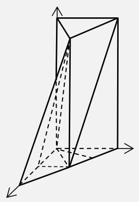

19. (1)证明:① 由已知，有 ${C}_{1}{B}_{1} = {CB} = {BD}$ ， ${C}_{1}B//{B}_{1}D$ .

又因为 ${B}_{1}D \subset$ 平面 $A{B}_{1}D$ ,所以,直线 ${C}_{1}B//$ 平面 $A{B}_{1}D$ . (4 分)

②由已知，有 $B{B}_{1} \bot$ 平面 ${ABC}$ ，

所以,直线 ${CD}$ 是直线 ${B}_{1}D$ 在平面 ${ABC}$ 内的射影.

又因为 $E$ 是线段 ${CD}$ 的中点, $\bigtriangleup {ABC}$ 是全等三角形,有 ${AE} \bot  {CD}$ .

再由三垂线定理,得 ${AE} \bot  D{B}_{1}$ . (4 分)

(2) 解 1: 取 ${AD}$ 的中点 $F$ ,

由于 ${BD} = {BA}$ ,有 ${BF} \bot  {AD},{BF} = 1$ ,所以, $\angle {B}_{1}{FB}$ 是二面角 ${B}_{1} - {AD} - C$ 的平面角. (3 分)

故,二面角 ${B}_{1} - {AD} - C$ 的大小为 $\arctan 4$ . 所以,二面角 ${B}_{1} - {AD} - C$ 的正弦值为 $\frac{4\sqrt{17}}{17}$ . (3 分) 解 2: 在 $\bigtriangleup {ACD}$ 中,由于 ${CB} = {BD} = {BA}$ ,所以 $\angle {DAC} = {90}^{ \circ  }$ .

以点 $A$ 为原点,建立空间直角坐标系 $O - {xyz}$ , (1 分)

则 $A\left( {0,0,0}\right) \text{ 、 }{B}_{1}\left( {\sqrt{3},1,4}\right) \text{ 、 }D\left( {2\sqrt{3},0,0}\right) ,\overrightarrow{AD} = \left( {2\sqrt{3},0,0}\right) ,\overrightarrow{A{B}_{1}} = \left( {\sqrt{3},1,4}\right)$ . (2 分)

设平面 $A{B}_{1}D$ 的法向量 $\overrightarrow{n} = \left( {x, y, z}\right)$ ,则 $\left\{  \begin{array}{l} \overrightarrow{n} \cdot  \overrightarrow{AD} = 0, \\  \overrightarrow{n} \cdot  \overrightarrow{A{B}_{1}} = 0, \end{array}\right.$ 即 $\left\{  \begin{array}{l} 2\sqrt{3}x = 0, \\  \sqrt{3}x + y + {4z} = 0, \end{array}\right.$ 所以 $\left\{  \begin{array}{l} x = 0, \\  y =  - {4z}, \end{array}\right.$

所以 $\overrightarrow{n} = \left( {0, - 4,1}\right)$ . 取平面 ${ACB}$ 的法向量 $\overrightarrow{m} = \left( {0,0,1}\right)$ ,则 $\cos \langle \overrightarrow{n},\overrightarrow{m}\rangle  = \frac{\overrightarrow{n} \cdot  \overrightarrow{m}}{\left| \overrightarrow{n}\right| \left| \overrightarrow{m}\right| } = \frac{1}{\sqrt{17}}$ ,

所以,二面角 ${B}_{1} - {AD} - C$ 的正弦值为 $\frac{4\sqrt{17}}{17}$ . (3 分)

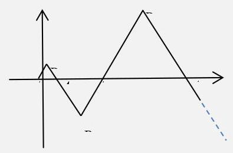

20. (1) $\overrightarrow{O{A}_{n}} = \overrightarrow{O{A}_{1}} + \overrightarrow{{A}_{1}{A}_{2}} + \cdots  + \overrightarrow{{A}_{n - 1}{A}_{n}}$ ,

${X}_{n} =  - \frac{1}{4} + \mathop{\sum }\limits_{{i = 1}}^{{n - 1}}\left( {{2i} - 1}\right)  =  - \frac{1}{4} + {\left( n - 1\right) }^{2}.\;\left( {4\text{ 分 }}\right)$

(2) 点 ${B}_{n}$ 的坐标为 $\left( {x, y}\right)$ ,则

$\left\{  {\begin{array}{l} x =  - \frac{1}{4} + {\left( n - 1\right) }^{2} + \frac{{2n} - 1}{2}, \\  \left| y\right|  = \frac{\sqrt{3}}{2}\left( {{2n} - 1}\right) . \end{array}\text{ 即 }\left\{  \begin{array}{l} x = {\left( n - \frac{1}{2}\right) }^{2}, \\  \left| y\right|  = \frac{\sqrt{3}}{2}\left( {{2n} - 1}\right) . \end{array}\right. }\right.$

满足方程 ${y}^{2} = {3x}$ ,故点 ${B}_{1},{B}_{2},\cdots ,{B}_{n}\cdots$ 在抛物线 $\Gamma  : {y}^{2} = {3x}$ 上. (6 分)

(3) 抛物线 $\Gamma  : {y}^{2} = {3x}$ 的焦点为 $F\left( {\frac{3}{4},0}\right)$ . (1 分)

互相垂直的弦 ${AC}$ 和 ${BD}$ 显然都不垂直坐标轴,

设直线 ${AC}$ 的方程为 $x = {my} + \frac{3}{4}$ , (1 分)

代入 $\Gamma  : {y}^{2} = {3x}$ ,得 ${y}^{2} - {3my} - \frac{9}{4} = 0$ .

所以有 ${y}_{A} + {y}_{C} = {3m},{y}_{A} + {y}_{C} =  - \frac{9}{4}$ ,

所以, $\left| {AC}\right|  = \sqrt{1 + {m}^{2}}\left| {{y}_{A} - {y}_{C}}\right|  = 3\left( {1 + {m}^{2}}\right)$ . (1 分)

将上式中的 $m$ 用 $- \frac{1}{m}$ 代换,得 $\left| {BD}\right|  = 3\left( {1 + \frac{1}{{m}^{2}}}\right)$ , (1 分)

于是 ${S}_{ABCD} = \frac{1}{2}\left| {AC}\right|  \cdot  \left| {BD}\right|  = \frac{9}{2}\left( {1 + {m}^{2}}\right) \left( {1 + \frac{1}{{m}^{2}}}\right)  = \frac{9}{2}\left( {2 + {m}^{2} + \frac{1}{{m}^{2}}}\right)  \geq  {18}$ .

当且仅当 $m =  \pm  1$ 时,上式等号成立.

故, 四边形 ${ABCD}$ 面积的最小值为 18 . (4 分)

21. 解: (1) $y = x + b\left( {b \in  \left\lbrack  {-\frac{1}{2}, - 1}\right\rbrack  }\right)$ . (4 分)

( 2 )当 $x \in  \left( {0, + \infty }\right)$ 时， $x + \frac{1}{x} > x$ ； $x \geq  2 - \frac{1}{x}$ (因为 $x + \frac{1}{x} \geq  2$ ).

所以, $y = x$ 是函数 $y = x + \frac{1}{x}$ 和函数 $y = 2 - \frac{1}{x}$ 在 $\left( {0, + \infty }\right)$ 上过坐标原点的分界线. (1 分) 设 $y = {kx}$ 是函数 $y = x + \frac{1}{x}$ 和函数 $y = 2 - \frac{1}{x}$ 在 $\left( {0, + \infty }\right)$ 上过坐标原点的分界线.

当 $x \in  \left( {0, + \infty }\right)$ 时,若 $k > 1$ ,则不等式 ${kx} > x + \frac{1}{x}$ 有解为 $x > \frac{1}{\sqrt{k - 1}}$ ,得 $k \leq  1$ ;

若 $k < 1$ ,则不等式 ${kx} < 2 - \frac{1}{x}$ 的解集为 $\left( {\frac{-k - \sqrt{4 - {4k}}}{2k},\frac{-k + \sqrt{4 - {4k}}}{2k}}\right)$ ,得 $k \geq  1$ . (2 分) 故, $k = 1$ . (1 分)

(3)若存在，则 ${\mathrm{e}}^{x}\left( {x + 1}\right)  \geq  {kx} + m \geq   - {x}^{2} + {2x} + 1$ 恒成立.

令 $x = 0$ ,则 $1 \geq  m \geq  1$ ,所以 $m = 1$ . (1 分)

因此, ${kx} + m \geq   - {x}^{2} + {2x} + 1$ 恒成立,即 ${x}^{2} + \left( {k - 2}\right) x \geq  0$ 恒成立,

由 $\Delta  \leq  0$ 得, $k = 2$ . (1 分)

现在只要判断 ${\mathrm{e}}^{x}\left( {x + 1}\right)  \geq  {2x} + 1$ 是否恒成立.

设 $\varphi \left( x\right)  = {\mathrm{e}}^{x}\left( {x + 1}\right)  - \left( {{2x} + 1}\right)$ ,则 ${\varphi }^{\prime }\left( x\right)  = {\mathrm{e}}^{x}\left( {x + 2}\right)  - 2$ , (1 分)

当 $x > 0$ 时, ${\mathrm{e}}^{x} > 1, x + 2 > 2,{\varphi }^{\prime }\left( x\right)  > 0$ ,

当 $x < 0$ 时, ${\mathrm{e}}^{x}\left( {x + 2}\right)  < 2{\mathrm{e}}^{x} < 2,{\varphi }^{\prime }\left( x\right)  < 0$ ,

所以 $\varphi \left( x\right)  \geq  \varphi \left( 0\right)  = 0$ ,即 ${\mathrm{e}}^{x}\left( {x + 1}\right)  \geq  {2x} + 1$ 恒成立. (4 分)

所以,函数 $y = {\mathrm{e}}^{x}\left( {x + 1}\right)$ 和函数 $y =  - {x}^{2} + {2x} + 1$ 在 $\mathbf{R}$ 上存在分界线,

其方程为 $y = {2x} + 1$ . (1 分)

# 2025 届上海市黄浦区高三二模数学试卷

(完卷时间:120 分钟 满分:150 分)

2025 年 4 月

## 一、填空题

<table><tr><td>1.</td><td>(0,2)</td><td>2.</td><td>2</td><td>3.</td><td>$\frac{1}{4}$</td><td>4.</td><td>$2\sqrt{3}$</td></tr><tr><td>5.</td><td>-1</td><td>6.</td><td>2</td><td>7.</td><td>4</td><td>8.</td><td>1</td></tr><tr><td>9.</td><td>3.15</td><td>10.</td><td>2 5</td><td>11.</td><td>15</td><td>12.</td><td>$\left\lbrack  {-\frac{1}{2},\frac{1}{2}}\right\rbrack$</td></tr></table>

## 二、选择题

13. B 14. B 15. A 16. B

## 三、解答题

## 17. (本题满分 14 分) 本题共有 2 小题, 第 1 小题满分 6 分, 第 2 小题满分 8 分

解 (1) 由题设, ${2}^{x} - {2}^{2 - x} = 3$ ,即 ${\left( {2}^{x}\right) }^{2} - 3 \cdot  {2}^{x} - 4 = 0$ ,解得 ${2}^{x} = 4$ ,负值舍. 因此 $x = 2$ .

(2)函数 $y = {2}^{x} + a \cdot  {2}^{-x}$ 的定义域为 $\mathbf{R}$ . 记 $h\left( x\right)  = {2}^{x} + a \cdot  {2}^{-x}$ .

若 $y = h\left( x\right)$ 是奇函数,则 $h\left( 0\right)  = 0$ ,即 $1 + a = 0$ ,解得 $a =  - 1$ .

当 $a =  - 1$ 时, $h\left( x\right)  = {2}^{x} - {2}^{-x}$ ,其定义域为 $\mathbf{R}$ .

对任意给定的 $x \in  \mathbf{R}$ ,都有 $- x \in  \mathbf{R}$ ,并且 $h\left( {-x}\right)  = {2}^{-x} - {2}^{x} =  - h\left( x\right)$ .

因此,当 $a =  - 1$ 时,函数 $y = f\left( x\right)  + {af}\left( {-x}\right)$ 是奇函数.

## 18. (本题满分 14 分) 本题共有 2 个小题, 第 1 小题满分 6 分, 第 2 小题满分 8 分

解 取 ${BC}$ 中点 $E$ ,连接 ${AE}\text{ 、 }{DE}$ .

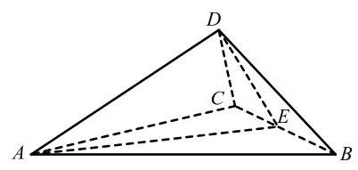

(1)由题设，得 ${DE}\bot {BC}$ ，又平面 ${ABC}\bot$ 平面 ${DBC}$ ，故 ${DE}\bot$ 平面 ${ABC}$ .

在等腰 $\mathrm{{Rt}}\bigtriangleup {BCD}$ 中， ${DE} = \sqrt{2}$ ， ${BC} = 2\sqrt{2}$ .

四面体 ${ABCD}$ 体积 $V = \frac{1}{3} \times  {DE} \times  {S}_{\bigtriangleup {ABC}} = \frac{2\sqrt{6}}{3}$ .

(2)由题设，得 ${DE}\bot {BC}$ ， ${AE}\bot {BC}$ ，故 $\angle {AED}$ 为二面角 $A - {BC} - D$ 的平面角.

在等腰 $\bigtriangleup {ABC}$ 中, ${AE} = \sqrt{14}$ .

在 $\bigtriangleup {AED}$ 中, $\cos \angle {AED} = \frac{A{E}^{2} + D{E}^{2} - A{D}^{2}}{{2AE} \cdot  {DE}} = \frac{\sqrt{7}}{4}$ . 因此二面角 $A - {BC} - D$ 的大小为 $\arccos \frac{\sqrt{7}}{4}$ .

## 19. (本题满分 14 分) 本题共有 2 小题, 第 1 小题满分 6 分, 第 2 小题满分 8 分

解 (1) 由题设, $P\left( {B \mid  A}\right)  = \frac{5}{19}$ .

$P\left( A\right)  = \frac{3}{10}, P\left( \bar{A}\right)  = \frac{7}{10}, P\left( {B \mid  \bar{A}}\right)  = \frac{6}{19}$ ,故 $P\left( B\right)  = P\left( {B \mid  A}\right) P\left( A\right)  + P\left( {B \mid  \bar{A}}\right) P\left( \bar{A}\right)  = \frac{3}{10}$ .

因为 $P\left( {B \mid  A}\right)  \neq  P\left( B\right)$ ,所以事件 $A$ 与 $B$ 不相互独立.

(2)从盒子中一次性随机取 10 个球，设其中恰有 3 个白球的概率为 ${a}_{n}\left( {3 \leq  n \leq  {13}}\right)$ .

由 ${a}_{n} = \frac{{\mathrm{C}}_{n}^{3}{\mathrm{C}}_{{20} - n}^{7}}{{\mathrm{C}}_{20}^{10}}$ ,得 $\frac{{a}_{n}}{{a}_{n - 1}} = \frac{{\mathrm{C}}_{n}^{3}{\mathrm{C}}_{{20} - n}^{7}}{{\mathrm{C}}_{n - 1}^{3}{\mathrm{C}}_{{21} - n}^{7}} = \frac{n\left( {{14} - n}\right) }{\left( {n - 3}\right) \left( {{21} - n}\right) }\left( {4 \leq  n \leq  {13}}\right)$ .

当 $4 \leq  n \leq  6$ 时, ${a}_{n} > {a}_{n - 1}$ ; 当 $7 \leq  n \leq  {13}$ 时, ${a}_{n} < {a}_{n - 1}$ .

故当 $n = 6$ 时, ${a}_{n}$ 取到最大值.

又 ${a}_{3} = \frac{2}{19},{a}_{13} = \frac{1}{646}$ ,且 $\frac{2}{19} > \frac{1}{646}$ ,当 $n = {13}$ 时, ${a}_{n}$ 取到最小值.

因此, 当该同学放置 6 个白球时, 参与者获奖的可能性最大; 当该同学放置 13 个白球时, 参与者获奖的可能性最小.

20. (本题满分 18 分) 本题共有 3 个小题, 第 1 小题满分 4 分, 第 2 小题满分 6 分, 第 3 小题满分 8 分解 (1) 由题意,直线 $l$ 的方程为 $\sqrt{2}x - {4y} + 2\sqrt{2} = 0$ . 因此,点 ${F}_{2}\left( {2,0}\right)$ 到直线 $l$ 的距离 $d = \frac{\left| \sqrt{2} \times  2 - 4 \times  0 + 2\sqrt{2}\right| }{3\sqrt{2}} = \frac{4}{3}$ .

(2)设点 $P$ 的坐标为 $\left( {{x}_{0},{y}_{0}}\right)$ .

由 $P{F}_{1} \bot  P{F}_{2}$ ,得 ${x}_{0}^{2} + {y}_{0}^{2} = {c}^{2}$ .

由方程组 $\left\{  \begin{array}{l} {x}_{0}^{2} + {y}_{0}^{2} = {c}^{2}, \\  \frac{{x}_{0}^{2}}{{a}^{2}} + \frac{{y}_{0}^{2}}{{b}^{2}} = 1. \end{array}\right.$ (*) 消 ${x}_{0}$ ,得 ${y}_{0}^{2} = \frac{{b}^{4}}{{c}^{2}}$ .

由 $b \leq  c$ ,得 $0 < \frac{{b}^{2}}{{c}^{2}} \leq  1$ ,进而 $0 < \frac{{b}^{4}}{{c}^{2}} \leq  {b}^{2}$ ,即 $0 < {y}_{0}^{2} \leq  {b}^{2}$ .

当 $b = c$ 时, ${x}_{0} = 0,{y}_{0} =  \pm  b$ ,满足 $P{F}_{1} \bot  P{F}_{2}$ 的点 $P$ 的个数为两个;

当 $b < c$ 时, $0 < {y}_{0}^{2} < {b}^{2}$ , ${y}_{0}$ 有两解,方程组 (*) 有四组不同的解,即满足 $P{F}_{1} \bot  P{F}_{2}$ 的点 $P$ 有四个.

(3)设点 $P$ 的纵坐标为 ${y}_{P}$ ，点 $Q$ 的坐标为 $\left( {{x}_{Q},{y}_{Q}}\right)$ .

由 $\overrightarrow{{F}_{1}Q} = \lambda \overrightarrow{QP}$ ,得 ${x}_{Q} = \frac{c\left( {\lambda  - 2}\right) }{2\left( {1 + \lambda }\right) },{y}_{Q} = \frac{\lambda {y}_{P}}{1 + \lambda }$ .

代入 $\Gamma$ 方程,得 $\frac{{\left( \lambda  - 2\right) }^{2}{c}^{2}}{4{\left( 1 + \lambda \right) }^{2}{a}^{2}} + \frac{{\lambda }^{2}{y}_{P}^{2}}{{\left( 1 + \lambda \right) }^{2}{b}^{2}} = 1$ .(*)

由点 $P$ 在 $\Gamma$ 上,得 $\frac{{c}^{2}}{4{a}^{2}} + \frac{{y}_{P}^{2}}{{b}^{2}} = 1$ ,进而 $\frac{{y}_{P}^{2}}{{b}^{2}} = 1 - \frac{{c}^{2}}{4{a}^{2}}$ .

代入 (*) 式,结合离心率 $e = \frac{c}{a}$ ,化简得 $\lambda  = \frac{{e}^{2} - 1}{{e}^{2} + 2}$ . 由 $\frac{1}{2} < e < 1$ ,得 $- \frac{1}{3} < \lambda  < 0$ . 因此 $\lambda$ 的取值范围是 $\left( {-\frac{1}{3},0}\right)$ .

21. (本题满分 18 分) 本题共有 3 个小题, 第 1 小题满分 4 分, 第 2 小题满分 6 分, 第 3 小题满分 8 分

解 (1) 当 $x < 0$ 时,函数 $y = x + \frac{1}{x}$ 的值域为 $( - \infty , - 2\rbrack$ .

因为不存在常数 $b$ ,使得 $f\left( x\right)  \geq  b$ 对任意的 $x \in  D$ 成立,所以函数 $y = f\left( x\right) , x \in  D$ 不具有性质 $\mathrm{H}$ .

(2)对 $f\left( x\right)  = \frac{1}{3}{x}^{3} - x + 1$ 求导，得 ${f}^{\prime }\left( x\right)  = {x}^{2} - 1$ .

令 ${f}^{\prime }\left( x\right)  = 0$ ,得 ${x}_{1} =  - 1,{x}_{2} = 1$ ,此函数有两个驻点.

当 $x <  - 1$ 时, ${f}^{\prime }\left( x\right)  > 0$ ,函数 $y = f\left( x\right)$ 严格增; 当 $- 1 < x < 1$ 时, ${f}^{\prime }\left( x\right)  < 0$ ,函数 $y = f\left( x\right)$ 严格减; 当 $x > 1$ 时, ${f}^{\prime }\left( x\right)  > 0$ ,函数 $y = f\left( x\right)$ 严格增.

函数 $y = f\left( x\right)$ 在 $x =  - 1$ 处取到极大值 $f\left( {-1}\right)  = \frac{5}{3}$ ,在 $x = 1$ 处取到极小值 $f\left( 1\right)  = \frac{1}{3}$ .

令 $f\left( x\right)  = \frac{1}{3}$ ,得 $x =  - 2$ 为该方程的另一解.

① 当 $m <  - 2$ 时， $f\left( x\right)  > \frac{1}{3}{m}^{3} - m + 1$ ，此时 $\frac{1}{3}{m}^{3} - m + 1$ 的取值范围是 $\left( {-\infty ,\frac{1}{3}}\right)$ ，不满足 $b = \frac{1}{3}$ 是该函数的一个下界;

②当 $- 2 \leq  m < 1$ 时， $f\left( x\right)  \geq  \frac{1}{3}$ ，此时该函数具有性质 $\mathrm{H}$ ，且 $b = \frac{1}{3}$ 是该函数的一个下界；

③ 当 $1 \leq  m < 2$ 时，函数 $y = f\left( x\right)$ 在 $D$ 上严格增，不具有性质 $\mathrm{H}$ .

综上,当且仅当 $- 2 \leq  m < 1$ 时,函数 $y = f\left( x\right) , x \in  D$ 具有性质 $\mathrm{H}$ ,且 $b = \frac{1}{3}$ 是该函数的一个下界.

(3) 对 $f\left( x\right)  = \ln \left( {x + 1}\right)  + {ax}\left( {x - 2}\right)$ 求导,得 ${f}^{\prime }\left( x\right)  = \frac{1}{x + 1} + {2a}\left( {x - 1}\right)  = \frac{{2a}{x}^{2} + \left( {1 - {2a}}\right) }{x + 1}$ .

当 $0 < a \leq  \frac{1}{2}$ 时, ${f}^{\prime }\left( x\right)  > 0$ ,函数 $y = f\left( x\right)$ 在 $D$ 上严格增,不具有性质 $\mathrm{H}$ .

因此,当且仅当 $\frac{1}{2} < a \leq  1$ 时,函数 $y = f\left( x\right) , x \in  D$ 具有性质 $\mathrm{H}$ .

于是 $\ln \left( {x + 1}\right)  + {ax}\left( {x - 2}\right)  \geq  b$ 对任意的 $x \in  \left( {0,1}\right)$ 及任意的 $a \in  \left( {\frac{1}{2},1}\right\rbrack$ 成立.

令 $g\left( a\right)  = {ax}\left( {x - 2}\right)  + \ln \left( {x + 1}\right)$ ,其中 $x \in  \left( {0,1}\right)$ .

因为当 $x \in  \left( {0,1}\right)$ 时, $- 1 < x\left( {x - 2}\right)  < 0$ ,所以函数 $y = g\left( a\right)$ 严格减,当 $a = 1$ 时,函数 $y = g\left( a\right)$ 取到最小值 $g\left( 1\right)  = {x}^{2} - {2x} + \ln \left( {x + 1}\right) .$

于是 ${x}^{2} - {2x} + \ln \left( {x + 1}\right)  \geq  b$ 对任意的 $x \in  \left( {0,1}\right)$ 成立.

令 $h\left( x\right)  = {x}^{2} - {2x} + \ln \left( {x + 1}\right)$ ,求导,得 ${h}^{\prime }\left( x\right)  = {2x} - 2 + \frac{1}{x + 1}$ ,令 ${h}^{\prime }\left( x\right)  = 0$ ,得 $x = \frac{\sqrt{2}}{2}$ 为该函数的一个驻点.

当 $0 < x < \frac{\sqrt{2}}{2}$ 时, ${h}^{\prime }\left( x\right)  < 0$ ,函数 $y = h\left( x\right)$ 严格减; 当 $\frac{\sqrt{2}}{2} < x < 1$ 时, ${h}^{\prime }\left( x\right)  < 0$ ,函数 $y = h\left( x\right)$ 严格增.

该函数在 $x = \frac{\sqrt{2}}{2}$ 处取到极小值 $h\left( \frac{\sqrt{2}}{2}\right)  = \frac{1}{2} - \sqrt{2} + \ln \left( {\frac{\sqrt{2}}{2} + 1}\right)$ .

因此 $b$ 的取值范围是 $\left( {-\infty ,\frac{1}{2} - \sqrt{2} + \ln \left( {\frac{\sqrt{2}}{2} + 1}\right) }\right)$ .

2025 届上海市普陀区高三二模数学试卷

202504

## 一、填空题

<table><tr><td>1</td><td>2</td><td>3</td><td>4</td><td>5</td><td>6</td></tr><tr><td>(-1,0)</td><td>-4</td><td>$\frac{3}{10}$</td><td>$\frac{3}{2}$</td><td>9</td><td>2</td></tr><tr><td>7</td><td>8</td><td>9</td><td>10</td><td>11</td><td>12</td></tr><tr><td>2 5</td><td>$\sqrt{2}\pi$</td><td>$k = 4$ 等   不唯一</td><td>19</td><td>$\frac{{32} + 8\sqrt{6}}{3}$</td><td>(2, e)</td></tr></table>

## 二、选择题

<table><tr><td>13</td><td>14</td><td>15</td><td>16</td></tr><tr><td>$C$</td><td>$B$</td><td>$D$</td><td>$A$</td></tr></table>

## 一、填空题(本大题共有 12 题，满分 54 分)考生应在答题纸相应编号的空格内直接填 写结果, 每个空格填对前 6 题得 4 分、后 6 题得 5 分, 否则一律得零分.

1. 不等式 $1 + \frac{1}{x} < 0$ 的解集是___.

【答案】 $\left( {-1,0}\right)$

【详解】因为 $1 + \frac{1}{x} < 0 \Rightarrow  \frac{x + 1}{x} < 0 \Rightarrow  x\left( {x + 1}\right)  < 0$ ,所以原不等式的解集为: $\left( {-1,0}\right)$ . 故答案为: $\left( {-1,0}\right)$

2. 已知复数 $z = \frac{3 - 2\mathrm{i}}{\mathrm{i}}$ ，其中 $\mathrm{i}$ 为虚数单位，则 $z + \bar{z} =$ ___.

【答案】-4

【详解】因为 $z = \frac{\left( {3 - 2\mathrm{i}}\right) \left( {-\mathrm{i}}\right) }{\mathrm{i}\left( {-\mathrm{i}}\right) } =  - 2 - 3\mathrm{i},\bar{z} =  - 2 + 3\mathrm{i},\therefore z + \bar{z} = \left( {-2 - 3\mathrm{i}}\right)  + \left( {-2 + 3\mathrm{i}}\right)  =  - 4$ .

3. 已知事件 $\mathrm{A}$ 与事件 $B$ 相互独立，若 $P\left( {A \cap  \bar{B}}\right)  = \frac{3}{25}, P\left( B\right)  = \frac{3}{5}$ ，则 $P\left( A\right)  =$ ___.

【答案】 $\frac{3}{10}$

【详解】由独立事件性质 $P\left( {A \cap  \bar{B}}\right)  = P\left( A\right) P\left( \bar{B}\right)  = \frac{3}{25}, P\left( \bar{B}\right)  = 1 - \frac{3}{5} = \frac{2}{5},\therefore P\left( A\right)  = \frac{\frac{3}{25}}{\frac{2}{5}} = \frac{3}{10}$

4. 设 $n \geq  1$ ， $n \in  \mathrm{N}$ ， ${S}_{n}$ 是等差数列 $\left\{  {a}_{n}\right\}$ 的前 $n$ 项和，若 ${a}_{3n} = 3{a}_{n} \neq  0$ ，则 $\frac{{S}_{5}}{{a}_{10}}$ 的值为___.

【答案】 $\frac{3}{2}$

【详解】设等差数列 $\left\{  {a}_{n}\right\}$ 的首项为 ${a}_{1}$ ,公差为 $d$ ,

${a}_{1} + \left( {{3n} - 1}\right) d = 3\left\lbrack  {{a}_{1} + \left( {n - 1}\right) d}\right\rbrack   \Rightarrow  {a}_{1} + \left( {{3n} - 1}\right) d = 3{a}_{1} + \left( {{3n} - 3}\right) d \Rightarrow  {a}_{1} = d$ .

所以 ${S}_{5} = \frac{5\left( {{a}_{1} + {a}_{5}}\right) }{2} = 5{a}_{3} = 5\left( {{a}_{1} + {2d}}\right)  = {15d},{a}_{10} = {a}_{1} + {9d} = {10d}$ ,所以: $\frac{{S}_{5}}{{a}_{10}} = \frac{15d}{10d} = \frac{3}{2}$ .

5. 设 $m > 2$ ,抛物线 $C : {x}^{2} = {2my}$ 上的点 $P$ 到 $C$ 的焦点的距离为 5,点 $P$ 到 $y$ 轴的距离为 3,则 $m$ 的值为___.

【答案】 9

【详解】抛物线 $C : {x}^{2} = {2my}$ 的准线为 $y =  - \frac{m}{2}$ ,由点 $P$ 到 $y$ 轴的距离为 3,得点 $P$ 的纵坐标 ${y}_{P} = \frac{9}{2m}$ , 由点 $P$ 到 $C$ 的焦点的距离为 5,得 $\frac{9}{2m} + \frac{m}{2} = 5$ ,解得 $m = 1$ 或 $m = 9$ ,而 $m > 2$ ,所以 $m = 9$ .

6. 设 $t \in  \mathrm{R}$ ,若 $\left( {1 + \frac{t}{x}}\right) {\left( 1 - x\right) }^{6}$ 的展开式中 ${x}^{3}$ 项的系数为 10,则 $t =$ ___.

【答案】 2

【详解】 ${x}^{3}$ 项为 $1 \times  {\mathrm{C}}_{6}^{3} \cdot  {1}^{3} \cdot  {\left( -x\right) }^{3} + \frac{t}{x} \times  {\mathrm{C}}_{6}^{4} \cdot  {1}^{2} \cdot  {\left( -x\right) }^{4} = \left( {-{20} + {15t}}\right) {x}^{3}$ ,由 $- {20} + {15t} = {10} \Rightarrow  t = 2$ .

7. 在一个不透明的盒中装着标有数字1,2,3,4的大小与质地都相同的小球各 2 个,现从该盒中一次取出 2 个球,设事件 A 为 “取出 2 个球的数字之和大于 5 ”,事件 $B$ 为 “取出的 2 个球中最小数字是 2”,则 $P\left( {B \mid  A}\right)  =$ ___.

【答案】 $\frac{2}{5}$

【详解】事件 A (数字之和大于 5) 的基本事件数 (数字组合 $\left( {2,4}\right) ,\left( {3,3}\right) ,\left( {3,4}\right) ,\left( {4,4}\right)$ ),

共有 $2 \times  2 + {\mathrm{C}}_{2}^{2} + 2 \times  2 + {\mathrm{C}}_{2}^{2} = 4 + 1 + 4 + 1 = {10}$ 种;

而事件 $A \cap  B$ (最小数字是 2 且和大于 5,即 $\left( {2,4}\right)$ ) 的基本事件数有 $2 \times  2 = 4$ 种, 由条件概率公式 $P\left( {B \mid  A}\right)  = \frac{n\left( {A \cap  B}\right) }{n\left( A\right) } = \frac{4}{10} = \frac{2}{5}$ . 故答案为: $\frac{2}{5}$

8. 若一个圆锥的高为 $\sqrt{2}$ ，侧面积为 $2\sqrt{2}\pi$ ，则该圆锥侧面展开图中扇形的中心角的大小为___.

【答案】 $\sqrt{2}\pi$

【详解】设底面半径为 $r$ ,母线长为 1 。由 ${\pi rl} = 2\sqrt{2}\pi$ ,得 ${rl} = 2\sqrt{2}$ ,又 $h = \sqrt{2}$ ,由勾股定理 $l = \sqrt{{r}^{2} + 2}$ , 所以 $r\sqrt{{r}^{2} + 2} = 2\sqrt{2}$ ,解得 $r = \sqrt{2}, l = 2$ ,底面圆周长 $L = {2\pi r} = 2\sqrt{2}\pi$ ,扇形中心角 $\theta  = \frac{L}{l} = \frac{2\sqrt{2}\pi }{2} = \sqrt{2}\pi$ ,故答案为: $\sqrt{2}\pi$

9. 设 $k \geq  1, k \in  \mathrm{N},0 < \varphi  < \frac{\pi }{2}$ ,函数 $y = f\left( x\right)$ 的表达式为 $f\left( x\right)  = 2\sin \left( {{kx} + \varphi }\right)$ ,则对任意的实数 $a$ ,皆有 $\{ f\left( x\right)  \mid  a < x < a + 2\}  = \{ f\left( x\right)  \mid  x \in  \mathrm{R}\}$ 成立的一个充分条件是___.

【答案】 $k = 4$

【详解】因为函数 $f\left( x\right)  = 2\sin \left( {{kx} + \varphi }\right)$ ,要使 $\{ f\left( x\right)  \mid  a < x < a + 2\}  = \{ f\left( x\right)  \mid  x \in  \mathrm{R}\}$ ,则周期 $T = \frac{2\pi }{k} \leq  2$ ,即 $k \geq  \pi  \approx  {3.14}$ ,因为 $k \in  \mathrm{N}$ ,所以一个充分条件是 $k = 4$ ,故答案为: $k = 4$

10. 设 $i, j, n$ 为正整数,集合 $M = \{ 1,3,5,\cdots ,{2n} - 1\}$ ,若集合 $\mathrm{A}$ 满足 $A \subseteq  M$ ,且对 $\mathrm{A}$ 中任意的两个元素 $i, j$ ，皆有 $\left| {i - j}\right|  > 4$ 成立，记满足条件的集合 A 的个数为 ${a}_{n}$ ，则 ${a}_{8} =$ ___.

【答案】 28

【详解】当 $n = 8$ 时, $M = \{ 1,3,5,\cdots ,{15}\}$ ,若 $\mathrm{A}$ 为空集,符合题意; 只有 1 种,若 $\mathrm{A}$ 为一元集: 共有 8 种,若 $\mathrm{A}$ 为二元集: 如 $\{ 1,7\} ,\{ 1,9\} ,\{ 1,{11}\} ,\{ 1,{13}\} ,\{ 1,{15}\} ,\{ 3,9\} ,\{ 3,{11}\} ,\{ 3,{13}\} ,\{ 3,{15}\} ,\{ 5,{11}\} ,\{ 5,{13}\} ,\{ 5,{15}\}$ , $\{ 5,{15}\} ,\{ 7,{13}\} ,\{ 7,{15}\} ,\{ 9,{15}\}$ ,共有 15 种,若 $A$ 为三元集: $4me\{ 1,7,{13}\} ,\{ 1,7,{15}\} ,\{ 1,9,{15}\} ,\{ 3,9,{15}\}$ ,共有 4 种,所以总共有: ${a}_{8} = 1 + 8 + {15} + 4 = {28}$ 种; 故答案为: 28 .

11. 在棱长为 4 的正方体 ${ABCD} - {A}_{1}{B}_{1}{C}_{1}{D}_{1}$ 中， $\overrightarrow{AN} = 2\overrightarrow{AM} = \frac{1}{2}\overrightarrow{A{C}_{1}}$ ，若一动点 $G$ 满足 $\left| \overrightarrow{GN}\right|  = \sqrt{2}\left| \overrightarrow{GM}\right|$ ，则三棱锥 $G - {A}_{1}{B}_{1}{D}_{1}$ 体积的最大值为___.

【答案】 $\frac{{32} + 8\sqrt{6}}{3}$

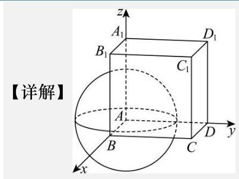

如图,以 $\mathrm{A}$ 为坐标原点建立空间直角坐标系,则有 $A\left( {0,0,0}\right) ,{C}_{1}\left( {4,4,4}\right)$ . 又 $\overrightarrow{AN} = 2\overrightarrow{AM} = \frac{1}{2}\overrightarrow{A{C}_{1}}$ ,所以 $M\left( {1,1,1}\right) , N\left( {2,2,2}\right)$ . 设 $G\left( {x, y, z}\right)$ ,则 $\overrightarrow{GN} = \left( {2 - x,2 - y,2 - z}\right) ,\overrightarrow{GM} = \left( {1 - x,1 - y,1 - z}\right)$ . 因为 $\left| \overrightarrow{GN}\right|  = \sqrt{2}\left| \overrightarrow{GM}\right|$ ,代入可得 ${\left( 2 - x\right) }^{2} + {\left( 2 - y\right) }^{2} + {\left( 2 - z\right) }^{2} = 2\left\lbrack  {{\left( 1 - x\right) }^{2} + {\left( 1 - y\right) }^{2} + {\left( 1 - z\right) }^{2}}\right\rbrack$ , 整理可得 ${x}^{2} + {y}^{2} + {z}^{2} = 6$ ,即 $G$ 在以点 $\mathrm{A}$ 为球心, $r = \sqrt{6}$ 为半径的球上.

又 $\operatorname{Rt}\bigtriangleup {A}_{1}{B}_{1}{D}_{1}$ 的面积为 ${S}_{\bigtriangleup {A}_{1}{B}_{1}{D}_{1}} = \frac{1}{2} \times  4 \times  4 = 8$ ,平面 ${ABCD}$ 到平面 ${A}_{1}{B}_{1}{C}_{1}{D}_{1}$ 的距离为 4, 所以 $G$ 到平面 ${A}_{1}{B}_{1}{D}_{1}$ 的最大距离为 ${d}_{\max } = 4 + r = 4 + \sqrt{6}$ . 体积最大值为 $V = \frac{1}{3} \times  {S}_{\bigtriangleup {A}_{1}{B}_{1}{D}_{1}} \times  {d}_{\max } = \frac{1}{3} \times  8 \times  \left( {4 + \sqrt{6}}\right)  = \frac{{32} + 8\sqrt{6}}{3}$ . 故答案为: $\frac{{32} + 8\sqrt{6}}{3}$ .

12. 设 $a \in  \mathrm{R}$ ,函数 $y = f\left( x\right)$ 的表达式为 $f\left( x\right)  = \left\{  \begin{array}{l} {\mathrm{e}}^{x}, x > 0 \\  \frac{1}{x + a}, x < 0 \end{array}\right.$ ,若函数 $g\left( x\right)  = f\left( x\right) f\left( {x + 1}\right)  - 1$ 恰有三个零点,则 $a$ 的取值范围是___.

【答案】 $\left( {2,\mathrm{e}}\right)$

【详解】① 当 $x > 0$ 时, $x + 1 > 0$ ,所以 $f\left( x\right)  = {e}^{x}, f\left( {x + 1}\right)  = {\mathrm{e}}^{x + 1}, g\left( x\right)  = {\mathrm{e}}^{x}{\mathrm{e}}^{x + 1} - 1 = {\mathrm{e}}^{{2x} + 1} - 1 > 0$ , 解得 $x =  - \frac{1}{2}$ ,不符合题意,所以 $g\left( x\right)$ 在 $\left( {0, + \infty }\right)$ 上无解.

② 当 $- 1 < x < 0$ 时， $0 < x + 1 < 1$ ，所以 $f\left( x\right)  = \frac{1}{x + a}$ ， $f\left( {x + 1}\right)  = {\mathrm{e}}^{x + 1}$ ， $g\left( x\right)  = \frac{{\mathrm{e}}^{x + 1}}{x + a} - 1$ ， 令 $g\left( x\right)  = \frac{{\mathrm{e}}^{x + 1}}{x + a} - 1 = 0$ ,所以 ${\mathrm{e}}^{x + 1} = x + a$ ,即 ${\mathrm{e}}^{x + 1} - x = a, x \in  \left( {-1,0}\right)$ 令 $h\left( x\right)  = {\mathrm{e}}^{x + 1} - x$ ,所以 ${h}^{\prime }\left( x\right)  = {\mathrm{e}}^{x + 1} - 1$ ,所以 ${h}^{\prime }\left( x\right)  = {\mathrm{e}}^{x + 1} - 1 > 0$ ,所以 $h\left( x\right)$ 在 $\left( {-1,0}\right)$ 单调递增, 所以 $2 < h\left( x\right)  < \mathrm{e}$ ,即 $2 < a < \mathrm{e}$ . 此时 $g\left( x\right)$ 在 $\left( {-1,0}\right)$ 上有唯一解;

③ 当 $x <  - 1$ 时， $x + 1 < 0, g\left( x\right)  = \frac{1}{x + a} \cdot  \frac{1}{x + a + 1} - 1 = 0$

因为函数 $g\left( x\right)  = f\left( x\right) f\left( {x + 1}\right)  - 1$ 恰有三个零点,所以 $g\left( x\right)  = \frac{1}{x + a} \cdot  \frac{1}{x + a + 1} - 1 = 0$ 在 $\left( {-\infty , - 1}\right)$ 上有

两解,即 $\left( {x + a}\right) \left( {x + 1 + a}\right)  = 1$ 在 $\left( {-\infty , - 1}\right)$ 上有两解,即 ${x}^{2} + \left( {{2a} + 1}\right) x + {a}^{2} + a - 1 = 0$ 在 $\left( {-\infty , - 1}\right)$ 上有两解. 令 $m\left( x\right)  = {x}^{2} + \left( {{2a} + 1}\right) x + {a}^{2} + a - 1$ ,所以 $\left\{  \begin{matrix} m\left( {-1}\right)  = {a}^{2} - a - 1 > 0 \\   - \frac{{2a} + 1}{2} <  - 1 \\  \Delta  = {\left( 2a + 1\right) }^{2} - 4\left( {{a}^{2} + a - 1}\right)  > 0 \end{matrix}\right.$ ,即

$\left\{  {\begin{matrix} a > \frac{1 + \sqrt{5}}{2}\text{ 或 }a < \frac{1 - \sqrt{5}}{2} \\  a > \frac{1}{2} \\  a \in  \mathrm{R} \end{matrix}\text{ ,解得 }a > \frac{1 + \sqrt{5}}{2},\text{ 综上 } \text{ ○ } \text{ ② ③,所以 }a}\right.$ 的取值范围是 $\left( {2,\mathrm{e}}\right)$ .

故答案为: $\left( {2,\mathrm{e}}\right)$ .

## 二、选择题 (本大题共有 4 题, 满分 18 分, 第 13-14 题每题 4 分, 第 15-16 题每题 5 分) 每题有且只有一个正确答案, 考生应在大题纸的相应编号上, 将代表答案的小方格涂 黑, 否则一律得零分.

13. 某市职业技能大赛的移动机器人比赛项目有 19 位同学参赛, 他们在预赛中所得的积分互不相同, 只有积分在前 10 位的同学才能进入决赛.若该比赛项目中的某同学知道自己的积分后, 要判断自己能否进入决赛，则他只需要知道这 19 位同学的预赛积分的 ( )

A. 平均数 B. 众数 C. 中位数 D. 方差

【答案】C

【详解】因为 19 位同学的积分, 中位数是第 10 名, 所以知道中位数即可判断是否在前 10 . 故选: C

14. 设 $m \in  \mathrm{R}$ ,在平面直角坐标系 ${XOy}$ 中,角 $\alpha$ 的顶点在坐标原点,始边与 $x$ 轴的正半轴重合,若角 $\alpha$ 的终边经过点 $P\left( {-3, m}\right)$ ，且 $\sin \left( {\pi  + {2\alpha }}\right)  > 0$ ，则角 $\alpha$ 属于( )

A. 第一象限 B. 第二象限 C. 第三象限 D. 第四象限

【答案】B

【详解】因为 $\sin \left( {\pi  + {2\alpha }}\right)  =  - \sin {2\alpha } > 0$ ,所以 $\sin {2\alpha } < 0$ ,所以 $2\cos \alpha \sin \alpha  < 0$ ,所以 $\sin \alpha ,\cos \alpha$ 异号,所以 $\alpha$ 在第二、四象限,又 $P\left( {-3, m}\right)$ ,所以 $\alpha$ 在第二象限.故选: B.

15. 设 $a > 0, b > 0$ ,点 $M\left( {{x}_{0},{y}_{0}}\right) , O$ 是坐标原点, $\left| {OM}\right|  = a, F$ 是双曲线 $\Gamma  : \frac{{x}^{2}}{{a}^{2}} - \frac{{y}^{2}}{{b}^{2}} = 1$ 的左焦点,

若直线 $l : {x}_{0}x + {y}_{0}y = {a}^{2}$ 经过点 $F$ ,且与双曲线 $\Gamma$ 的右支在第一象限内交于 $P$ 点,则双曲线 $\Gamma$ 的离心率的一个可能的值是( )

A. $\frac{\sqrt{5}}{2}$ B. $\frac{\sqrt{6}}{2}$ C. $\frac{\sqrt{7}}{2}$ D. $\frac{\sqrt{11}}{2}$

【答案】D

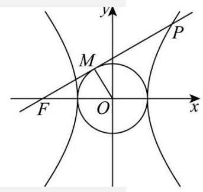

【详解】如图: 因为 $\left| {OM}\right|  = a$ ,所以 $M$ 点的轨迹是以 $O$ 为圆心,以 $a$ 为半径的圆,方程为: ${x}^{2} + {y}^{2} = {a}^{2}$ . 因为点 $O$ 到直线 $l : {x}_{0}x + {y}_{0}y - {a}^{2} = 0$ 的距离为: $d = \frac{{a}^{2}}{\sqrt{{x}_{0}^{2} + {y}_{0}^{2}}} = \frac{{a}^{2}}{a} = a$ , 所以直线 $l$ 与圆 ${x}^{2} + {y}^{2} = {a}^{2}$ 相切.

又 $l$ 过点 $F\left( {-c,0}\right)$ ,且 ${c}^{2} = {a}^{2} + {b}^{2}$ ,直线 $l$ 与双曲线 $\Gamma$ 的右支在第一象限内交于 $P$ 点, 所以直线 $l$ 的斜率为: ${k}_{l} = \frac{\left| OM\right| }{\left| FM\right| } = \frac{a}{b}$ .

又一、三象限双曲线的渐近线的斜率为: $\frac{b}{a}$ .

又 $\frac{b}{a} > \frac{a}{b} \Rightarrow  {b}^{2} > {a}^{2} \Rightarrow  {c}^{2} - {a}^{2} > {a}^{2} \Rightarrow  {c}^{2} > 2{a}^{2} \Rightarrow  \frac{{c}^{2}}{{a}^{2}} > 2$ . 即 ${e}^{2} > 2 \Rightarrow  e > \sqrt{2}$ .

故选: D

16. 设 $k \geq  2, n \geq  1, k\text{ 、 }n \in  \mathrm{N},{S}_{n}$ 是数列 $\left\{  {a}_{n}\right\}$ 的前 $n$ 项和,且满足 $2{S}_{n} = 3{a}_{n} - 1$ ,数列 $\left\{  {b}_{n}\right\}$ 是由 $k$ 个大于 -2 的整数组成的有穷数列,若 ${b}_{1} \neq  0,\mathop{\sum }\limits_{{i = 1}}^{k}{b}_{i}{a}_{k - i + 1} = 0$ ,则称数列 $\left\{  {b}_{n}\right\}$ 是数列 $\left\{  {a}_{n}\right\}$ 的 “ $T$ 数列”. 对于数列 $\left\{  {b}_{n}\right\}$ 有如下两个命题:①若 ${b}_{1} > 0$ ，则数列 $\left\{  {b}_{n}\right\}$ 不是数列 $\left\{  {a}_{n}\right\}$ 的 “ $T$ 数列”；②若 $k \geq  3$ ，则数列 $\left\{  {a}_{n}\right\}$ 的 “ $T$ 数列” 至少有 5 个. 则下列结论中正确的是 ( )

A. ①为真②为真 B. ①为真②为假 C. ①为假②为真 D. ①为假②为假

【答案】A

【详解】对数列 $\left\{  {a}_{n}\right\}   : 2{S}_{n} = 3{a}_{n} - 1$ ① $2{S}_{n - 1} = 3{a}_{n - 1} - 1, n \geq  2$ ②

①-②得: $2{a}_{n} = 3{a}_{n} - 3{a}_{n - 1} \Rightarrow  {a}_{n} = 3{a}_{n - 1}$ ，所以 $\left\{  {a}_{n}\right\}$ 是以 3 为公比的等比数列，

令 $n = 1 \Rightarrow  {a}_{1} = 1,\therefore {a}_{n} = {3}^{n - 1}$

对①: 若 ${b}_{1} > 0,\mathop{\sum }\limits_{{i = 1}}^{k}{b}_{i}{a}_{k - i + 1} = 0$ . 因为 ${a}_{n} > 0,{b}_{i} >  - 2$ 且为整数, ${b}_{1} > 0$ ,其余 ${b}_{i} \geq   - 1$ .

以 $k = 2$ 为例, $\mathop{\sum }\limits_{{i = 1}}^{k}{b}_{i}{a}_{k - i + 1} = 3{b}_{1} + {b}_{2} = 0$ .

若 ${b}_{1} = 1$ ,则 ${b}_{2} =  - 3$ ,这与 ${b}_{i} >  - 2$ 矛盾。所以 $\mathop{\sum }\limits_{{i = 1}}^{k}{b}_{i}{a}_{k - i + 1} = 0$ 不能恒成立. 故①为真.

对②: 以 $k = 3$ 为例: 设 $\mathop{\sum }\limits_{{i = 1}}^{3}{b}_{i}{a}_{k - i + 1} = {b}_{1}{a}_{3} + {b}_{2}{a}_{2} + {b}_{3}{a}_{1} = 9{b}_{1} + 3{b}_{2} + {b}_{3} = 0$ ,

令 ${b}_{1} =  - 1$ ,则方程 $3{b}_{2} + {b}_{3} = 9$ 的解有 $\left( {-1,{12}}\right) ,\left( {0,9}\right) ,\left( {1,6}\right) ,\left( {2,3}\right) ,\left( {3,0}\right) 5$ 个满足 ${b}_{i} >  - 2$ .

即 $k = 3$ 时,数列的 “ $T$ 数列” 有 5 个.

当 $k = 4$ 时, $\mathop{\sum }\limits_{{i = 1}}^{4}{b}_{i}{a}_{k - i + 1} = {b}_{1}{a}_{4} + {b}_{2}{a}_{3} + {b}_{3}{a}_{2} + {b}_{4}{a}_{1} = {27}{b}_{1} + 9{b}_{2} + 3{b}_{3} + {b}_{4} = 0$ ,

令 ${b}_{1} =  - 1$ ，则方程 $9{b}_{2} + 3{b}_{3} + {b}_{4} = {27}$ 满足 ${b}_{i} >  - 2$ 的解的个数更多.

即 $k = 4$ 时,数列的 “ $T$ 数列” 多于 5 个. ……依次类推: 当 $k \geq  3, T$ 数列至少 5 个,故②为真.

故选: A

## 三、解答题

17. (1)连接 ${A}_{1}B,{A}_{1}B$ 与 $A{B}_{1}$ 交于 $D$ 点，连接 ${CD}$ ，

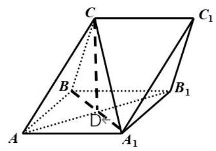

由条件得,四边形 $A{A}_{1}{B}_{1}B$ 是菱形,则 $A{B}_{1} \bot  {A}_{1}B$ ,

又 $C{A}_{1} \bot  A{B}_{1},{A}_{1}B \cap  {A}_{1}C = {A}_{1}$ ,则 $A{B}_{1} \bot$ 平面 $C{A}_{1}B$ ,

又 ${CD} \subset$ 平面 $C{A}_{1}B$ ,则 $A{B}_{1} \bot  {CD}$ , 4 分

又 ${CB} = {CA}$ ,且 $D$ 是 ${A}_{1}B$ 中点,则 ${A}_{1}B \bot  {CD}$ ,则 ${CD} \bot$ 平面 $A{A}_{1}{B}_{1}B$ ,

又 ${CD} \subset$ 平面 ${CA}{B}_{1}$ ,则平面 ${CA}{B}_{1} \bot$ 平面 $A{A}_{1}{B}_{1}B$ . 6 分

(2)以 $D$ 为原点， $\overrightarrow{D{B}_{1}},\overrightarrow{DB},\overrightarrow{DC}$ 分别为 $x, y, z$ 轴正方向建立空间直角坐标系， 则 ${B}_{1}\left( {\sqrt{3},0,0}\right) , B\left( {0,1,0}\right) , C\left( {0,0,1}\right) ,{A}_{1}\left( {0, - 1,0}\right) ,\overrightarrow{C{A}_{1}} = \left( {0,1,1}\right)$ , 4 分设平面 $B{B}_{1}{C}_{1}C$ 的法向量为 $\overrightarrow{n}$ ,由 $\left\{  \begin{array}{l} \overrightarrow{n} \cdot  \overrightarrow{B{B}_{1}} = 0 \\  \overrightarrow{n} \cdot  \overrightarrow{BC} = 0 \end{array}\right.$ ,解得 $\overrightarrow{n} = \left( {1,\sqrt{3},\sqrt{3}}\right)$ , 6 分设直线 $C{A}_{1}$ 与平面 $B{B}_{1}{C}_{1}C$ 所成的角为 $\theta$ ,则 $\sin \theta  = \left| \frac{\overrightarrow{n} \cdot  \overrightarrow{C{A}_{1}}}{\left| \overrightarrow{n}\right| \left| \overrightarrow{C{A}_{1}}\right| }\right|  = \frac{2\sqrt{3}}{\sqrt{7} \times  \sqrt{2}} = \frac{\sqrt{42}}{7}$ ,

即直线 $C{A}_{1}$ 与平面 $B{B}_{1}{C}_{1}C$ 所成的角的正弦值为 $\frac{\sqrt{42}}{7}$ . 8 分

18. (1) 由 $\cos \left| {{2C} - \frac{\pi }{6}}\right|  =  - \frac{\sqrt{3}}{2}$ 且 $C \in  \left( {0,\pi }\right)$ ,得 $C = \frac{\pi }{2}$ 或 $C = \frac{2\pi }{3}$ , 2 分

当 $C = \frac{\pi }{2}$ 时,与 ${c}^{2} - {a}^{2} - {b}^{2} = 4$ 矛盾,不符合条件;

当 $C = \frac{2\pi }{3}$ 时,则 $\cos C = \frac{{a}^{2} + {b}^{2} - {c}^{2}}{2ab} = \frac{-4}{2ab} =  - \frac{1}{2}$ ,即 ${ab} = 4$ . 4 分

则 ${S}_{\bigtriangleup {ABC}} = \frac{1}{2}{ab}\sin C = \frac{1}{2}4\frac{\sqrt{3}}{2} = \sqrt{3}$ . 6 分

( 2 )由条件得, $\omega  \times  \frac{\pi }{3} - \frac{\pi }{6} = {2k\pi }$ ， $k \in  \mathbf{Z}$ ，且 $\frac{1}{2}T = \frac{2\pi }{2\omega } \geq  \frac{\pi }{6}$ ，

则 $\omega  = \frac{1}{2}$ ,即 $f\left( x\right)  = \cos \left| {\frac{1}{2}x - \frac{\pi }{6}}\right|$ , 4 分

当 $x \in  \left| {\frac{4\pi }{3},\frac{17\pi }{6}}\right|$ 时,则 $\frac{1}{2}x - \frac{\pi }{6} \in  \left| {\frac{\pi }{2},\frac{5\pi }{4}}\right|$ , 6 分

若 $\frac{1}{2}x - \frac{\pi }{6} \in  \left| {\frac{\pi }{2},\pi }\right|$ ,即 $x \in  \left| {\frac{4\pi }{3},\frac{7\pi }{3}}\right|$ 时,函数 $y = f\left( x\right)$ 是严格减函数;

若 $\frac{1}{2}x - \frac{\pi }{6} \in  \left| {\pi ,\frac{5\pi }{4}}\right|$ ,即 $x \in  \left| {\frac{7\pi }{3},\frac{17\pi }{6}}\right|$ 时,函数 $y = f\left( x\right)$ 是严格增函数,

则函数 $y = f\left( x\right)$ 的单调增区间是 $\left| {\frac{7\pi }{3},\frac{17\pi }{6}}\right|$ ,单调减区间是 $\left| {\frac{4\pi }{3},\frac{7\pi }{3}}\right|$ . 8 分

19.(1)设事件 $M$ 为“随机选取一题为B 层题”，则 $P\left( M\right)  = \frac{3}{7 + 3 + 2} = \frac{1}{4}$ ， 2 分设事件 $N$ 为 “至少有 2 人选题来自 B 层”,

则 $P\left( N\right)  = {\mathrm{C}}_{4}^{2} - \frac{1}{4}{}^{2} - \frac{3}{4}{}^{2} + {\mathrm{C}}_{4}^{3} - \frac{1}{4}{}^{3} - \frac{3}{4}{}^{1} + {\mathrm{C}}_{4}^{4} - \frac{1}{4}{}^{4}\frac{67}{256}$ ; 6 分

(2)12 道题中有 7 题 A 层，3 题 B 层，2 题 C 层，

则 $P\left( {X = 0}\right)  = \frac{{\mathrm{C}}_{7}^{0} \times  {\mathrm{C}}_{5}^{3}}{{\mathrm{C}}_{12}^{3}} = \frac{1}{22}, P\left( {X = 1}\right)  = \frac{{\mathrm{C}}_{7}^{1} \times  {\mathrm{C}}_{5}^{2}}{{\mathrm{C}}_{12}^{3}} = \frac{7}{22}$ ,

$P\left( {X = 2}\right)  = \frac{{\mathrm{C}}_{7}^{2} \times  {\mathrm{C}}_{5}^{1}}{{\mathrm{C}}_{12}^{3}} = \frac{21}{44}, P\left( {X = 3}\right)  = \frac{{\mathrm{C}}_{7}^{3} \times  {\mathrm{C}}_{5}^{0}}{{\mathrm{C}}_{12}^{3}} = \frac{7}{44},$ 4 分

则 $X$ 的分布为 $\left| \begin{matrix} 0 & 1 & 2 & 3 \\  \frac{1}{22} & \frac{7}{22} & \frac{21}{44} & \frac{7}{44} \end{matrix}\right|$ , 6 分

则期望为 $E\left\lbrack  X\right\rbrack   = 0 \times  \frac{1}{22} + 1 \times  \frac{7}{22} + 2 \times  \frac{21}{44} + 3 \times  \frac{7}{44} = \frac{7}{4}$ . 8 分

20. ( 1 )由直线 $l : x - {my} - 1 = 0$ 经过点 $F$ ，得

点 $F\left( {1,0}\right)$ ,又 $\left| {AF}\right|  = 2$ ,则 $a = 2$ , 2 分

即 ${b}^{2} = {a}^{2} - {c}^{2} = 3$ ,则所求的椭圆 $\Gamma$ 的方程为 $\frac{{x}^{2}}{4} + \frac{{y}^{2}}{3} = 1$ . 4 分

(2)设 $P\left( {{x}_{1},{y}_{1}}\right) , Q\left( {{x}_{1},{y}_{1}}\right) , M\left( {{x}_{0},0}\right)$ ,由 $\left\{  \begin{array}{l} \frac{{x}^{2}}{4} + \frac{{y}^{2}}{3} = 1 \\  x = {my} + 1 \end{array}\right.$ 得, $\left( {4 + 3{m}^{2}}\right) {y}^{2} + {6my} - 9 = 0$ , 2 分则 ${y}_{1} + {y}_{2} = \frac{-{6m}}{4 + 3{m}^{2}},{y}_{1}{y}_{2} = \frac{-9}{4 + 3{m}^{2}}$ , 又 $m = \sqrt{3}$ ，则 $\left| {{y}_{1} - {y}_{2}}\right|  = \sqrt{{\left( {y}_{1} + {y}_{2}\right) }^{2} - 4{y}_{1}{y}_{2}} = \frac{24}{13}$ ，又 ${\Delta M}{PQ}$ 的面积为 $\frac{6}{13}$ ， 则 ${S}_{\bigtriangleup {MPQ}} = \frac{1}{2}\left| {MF}\right|  \cdot  \left| {{y}_{1} - {y}_{2}}\right|  = \frac{1}{2} \times  \frac{24}{13}\left| {{x}_{0} - 1}\right|  = \frac{6}{13}$ , 4 分即 $\left| {{x}_{0} - 1}\right|  = \frac{1}{2}$ ,即 ${x}_{0} = \frac{1}{2}$ 或 $\frac{3}{2}$ ,则所求的点 $M$ 的坐标为 $\left( {\frac{1}{2},0}\right)$ 或 $\left( {\frac{3}{2},0}\right)$ . 6 分

(3)由点 $G$ 在直线 $x = 5$ 上，向量 $\overrightarrow{PG}$ 在直线 $l$ 上的投影为向量 $\overrightarrow{PF}$ ，得

${GF} \bot  {PQ}$ ,且点 $G$ 的坐标为 $\left( {5, - {4m}}\right)$ , 2 分

又 ${x}_{1} = m{y}_{1} + 1,{x}_{2} = m{y}_{2} + 1$ ,则 $\left| {QF}\right|  = \sqrt{1 + {m}^{2}}\left| {y}_{2}\right| ,\left| {PF}\right|  = \sqrt{1 + {m}^{2}}\left| {y}_{1}\right| ,\left| {GF}\right|  = 4\sqrt{1 + {m}^{2}}$ ,

因为 $m > 0,{GF} \bot  {PQ}$ ,所以在 ${\Delta GFP}$ 和 ${\Delta GFQ}$ 中分别有

$\tan \angle {PGF} = \frac{\left| PF\right| }{\left| GF\right| } = \frac{\left| {y}_{1}\right| }{4},\tan \angle {QGF} = \frac{\left| QF\right| }{\left| GF\right| } = \frac{\left| {y}_{2}\right| }{4}$ ，

则 $\tan \angle {PGQ} = \tan \left( {\angle {PGF} + \angle {QGF}}\right)  = \frac{\frac{\left| {y}_{1}\right| }{4} + \frac{\left| {y}_{2}\right| }{4}}{1 - \frac{\left| {y}_{1}\right| }{4} \cdot  \frac{\left| {y}_{2}\right| }{4}}$ ,

化简整理得, $\tan \angle {PGQ} = \frac{4\left( {\left| {y}_{1}\right|  + \left| {y}_{2}\right| }\right) }{{16} - \left| {y}_{1}\right| \left| {y}_{2}\right| } = \frac{4\left| {{y}_{1} - {y}_{2}}\right| }{{16} - \left| {{y}_{1}{y}_{2}}\right| }$ , 4 分

由 (2) 中得, ${y}_{1} + {y}_{2} = \frac{-{6m}}{4 + 3{m}^{2}},{y}_{1}{y}_{2} = \frac{-9}{4 + 3{m}^{2}}$ ,则 $\tan \angle {PGQ} = \frac{{48}\sqrt{1 + {m}^{2}}}{{48}{m}^{2} + {55}}$ , 6 分令 $h = \sqrt{1 + {m}^{2}}$ ,则 $\tan \angle {PGQ} = \frac{48}{{48h} + \frac{7}{h}}$ ,

设函数 $g\left( h\right)  = {48h} + \frac{7}{h}$ ,则 ${g}^{\prime }\left( h\right)  = {48} - \frac{7}{{h}^{2}}$ ,因为 $m > 0$ ,所以 $h > 1$ ,

则 ${g}^{\prime }\left( h\right)  > 0$ ,即函数 $g\left( h\right)  = {48h} + \frac{7}{h}$ 在区间 $\left( {1, + \infty }\right)$ 上是严格增函数,

则 $g\left( h\right)  > g\left( 1\right)  = {55}$ ,即 $0 < \tan \angle {PGQ} < \frac{48}{55} < 1$ ,则 $\angle {PGQ} < \frac{\pi }{4}$ . 8 分

21. 解: (1) 设点 $P\left( {x, y}\right)$ 是函数 $f\left( x\right)  = \frac{1}{x} - \frac{3x}{4}$ 图像上的一点,点 $O\left( {0,0}\right)$ ,

则 ${\left| PO\right| }^{2} = {x}^{2} + {\left( \frac{1}{x} - \frac{3x}{4}\right) }^{2} = \frac{{25}{x}^{2}}{16} + \frac{1}{{x}^{2}} - \frac{3}{2} \geq  2\sqrt{\frac{{25}{x}^{2}}{16} \cdot  \frac{1}{{x}^{2}}} - \frac{3}{2} = 1$ ,

且等号当且仅当 $\frac{{25}{x}^{2}}{16} = \frac{1}{{x}^{2}}$ 时,即 $x =  \pm  \frac{2\sqrt{5}}{5}$ 时成立, 3 分

即 $x = \frac{2\sqrt{5}}{5}, y = \frac{\sqrt{5}}{5}$ ,或 $x =  - \frac{2\sqrt{5}}{5}, y =  - \frac{\sqrt{5}}{5}$ ,则 ${M}_{f}\left( {0,0}\right)$ 中仅有两个元素. 4 分

(2)设点 $P\left( {x, y}\right)$ 是函数 $f\left( x\right)  = \sqrt{x + k}$ 图像上的一点，点 $M\left( {\frac{1}{2},0}\right)$ ，

则 ${\left| PM\right| }^{2} = {\left( x - \frac{1}{2}\right) }^{2} + {\left( \sqrt{x + k}\right) }^{2} = {x}^{2} + k + \frac{1}{4}$ , 2 分

又 $x \in  \lbrack  - k, + \infty )$ ,且 $k > 0$ ,则当 $x = 0$ 时, ${\left| PM\right| }^{2}$ 取得最小值 $k + \frac{1}{4}$ ,

要使得 ${M}_{f}\left( {\frac{1}{2},0}\right)  = \left\{  \left( {{x}_{0},{y}_{0}}\right) \right\}$ ,则 $k + \frac{1}{4} = 1$ ,即 $k = \frac{3}{4},{x}_{0} = 0,{y}_{0} = \frac{\sqrt{3}}{2}$ , 4 分

则曲线 $y = f\left( x\right)$ 在点 $P\left( {0,\frac{\sqrt{3}}{2}}\right)$ 处的切线斜率为 ${f}^{\prime }\left( {x}_{0}\right)  = \frac{1}{2\sqrt{{x}_{0} + k}} = \frac{\sqrt{3}}{3}$ ,

则所求的切线方程为 $y = \frac{\sqrt{3}}{3}x + \frac{\sqrt{3}}{2}$ . 6 分

(3)要使得对于任意的 $a$ ，皆有 ${M}_{f}\left( {a,0}\right)  = \varnothing$ 成立，

则函数 $f\left( x\right)  = {\mathrm{e}}^{x} - \frac{\ln x}{x} - \frac{1}{x} + m$ 图像上的点到 $x$ 轴的距离都大于 1,

设 $g\left( x\right)  = {\mathrm{e}}^{x} - \frac{\ln x}{x} - \frac{1}{x}\left( {x > 0}\right)$ ,则 ${g}^{\prime }\left( x\right)  = \frac{{x}^{2}{\mathrm{e}}^{x} + \ln x}{{x}^{2}}$ , 1 分令 $h\left( x\right)  = {x}^{2}{\mathrm{e}}^{x} + \ln x$ ,则 $h{\left( x\right) }^{\prime } = \left( {{2x} + {x}^{2}}\right) {\mathrm{e}}^{x} + \frac{1}{x} > 0$ ,

则函数 $h\left( x\right)  = {x}^{2}{\mathrm{e}}^{x} + \ln x$ 在区间 $\left( {0, + \infty }\right)$ 上是严格增函数,又 $h\left( 1\right)  = \mathrm{e} > 0, h\left( \frac{1}{\mathrm{e}}\right)  = {\mathrm{e}}^{\frac{1}{\mathrm{e}} - 2} - 1 < 0$ ,

则必存在 ${x}_{0} \in  \left( {\frac{1}{\mathrm{e}},1}\right)$ ,使得 $h\left( {x}_{0}\right)  = 0$ ,即 ${x}_{0}{}^{2}{\mathrm{e}}^{{x}_{0}} + \ln {x}_{0} = 0$ , 3 分

则当 $x \in  \left( {0,{x}_{0}}\right)$ 时, ${x}^{2}{\mathrm{e}}^{x} + \ln x < {x}_{0}{}^{2}{\mathrm{e}}^{{x}_{0}} + \ln {x}_{0} = 0$ ,即 ${g}^{\prime }\left( x\right)  = \frac{{x}^{2}{\mathrm{e}}^{x} + \ln x}{{x}^{2}} < 0$ ,

当 $x \in  \left( {{x}_{0}, + \infty }\right)$ 时, ${x}^{2}{\mathrm{e}}^{x} + \ln x > {x}_{0}^{2}{\mathrm{e}}^{{x}_{0}} + \ln {x}_{0} = 0$ ,即 ${g}^{\prime }\left( x\right)  = \frac{{x}^{2}{\mathrm{e}}^{x} + \ln x}{{x}^{2}} > 0$ ,

则函数 $g\left( x\right)  = {\mathrm{e}}^{x} - \frac{\ln x}{x} - \frac{1}{x}$ 在区间 $\left( {0,{x}_{0}}\right)$ 上严格减,在区间 $\left( {{x}_{0}, + \infty }\right)$ 上严格增,

则函数 $g\left( x\right)  = {\mathrm{e}}^{x} - \frac{\ln x}{x} - \frac{1}{x}$ 在区间 $\left( {0, + \infty }\right)$ 上的最小值为 $g\left( {x}_{0}\right)$ ,且 $x \rightarrow   + \infty$ 时, $g\left( x\right)  \rightarrow   + \infty$ ,

因此,要使得函数 $f\left( x\right)  = {\mathrm{e}}^{x} - \frac{\ln x}{x} - \frac{1}{x} + m$ 图像上的点到 $x$ 轴的距离都大于 1,

则只需 $g\left( {x}_{0}\right)  + m > 1$ , 5 分

又 ${x}_{0}{}^{2}{\mathrm{e}}^{{x}_{0}} + \ln {x}_{0} = 0$ ,则 ${x}_{0}{}^{2}{\mathrm{e}}^{{x}_{0}} + \ln {x}_{0} + {x}_{0} + \ln {x}_{0} = {x}_{0} + \ln {x}_{0}$ ,即 ${x}_{0}{}^{2}{\mathrm{e}}^{{x}_{0}} + \ln \left( {{x}_{0}{}^{2}{\mathrm{e}}^{{x}_{0}}}\right)  = {x}_{0} + \ln {x}_{0}$ , 令 $y = x + \ln x$ ,又函数 $y = x + \ln x$ 在 $\left( {0, + \infty }\right)$ 上是严格增函数,

则 ${x}_{0}{}^{2}{\mathrm{e}}^{{x}_{0}} = {x}_{0}$ ,即 ${\mathrm{e}}^{{x}_{0}} = \frac{1}{{x}_{0}}$ ,则 $g\left( {x}_{0}\right)  = {\mathrm{e}}^{{x}_{0}} - \frac{\ln {x}_{0}}{{x}_{0}} - \frac{1}{{x}_{0}} = {\mathrm{e}}^{{x}_{0}} - \frac{\ln {\mathrm{e}}^{-{x}_{0}}}{{x}_{0}} - {\mathrm{e}}^{{x}_{0}} = 1$ ,

即 $1 + m > 1$ ,则满足条件的 $m$ 的取值范围为 $\left( {0, + \infty }\right)$ . 8 分

2025 届上海市虹口区高三二模数学试卷

202504

1. $\{ 3,4\}$ 2. $( - 1,2\rbrack$ 3. $\frac{1}{9}$ 4. ${4\pi }$ 5. $x - y - 1 = 0$ 6. 24

7. $\frac{64}{7}\pi$ 8. -2 9. $\frac{729}{2500}$ 10. 41 11. ${r}_{0}x\left( t\right) \left( {1 - \frac{x\left( t\right) }{N}}\right)$ 12. $\left( {0,\frac{2\operatorname{le}}{2}}\right\rbrack$

13. C 14. D 15. D 16. A

## 一、填空题(本大题共有 12 题，满分 54 分，第 1-6 题每题 4 分，第 7-12 题每题 5 分) 考生应在答题纸的相应位置直接填写结果.

1. 已知全集 $U = \{ 1,2,3,4\} , A = \{ 1,2\}$ ，则 $\overline{A} =$ ___

【答案】 $\{ 3,4\}$

【详解】由题全集 $U = \{ 1,2,3,4\} , A = \{ 1,2\}$ ,所以 $\bar{A} = \{ 3,4\}$ . 故答案为: $\{ 3,4\}$ .

2. 不等式 $\frac{x - 2}{x + 1} \leq  0$ 的解集是___.

【答案】 $( - 1,2\rbrack$

【详解】原不等式等价于 $\left( {x - 2}\right) \left( {x + 1}\right)  \leq  0$ 且 $x \neq   - 1$ ,解为 $- 1 < x \leq  2$ ,故答案为 $( - 1,2\rbrack$

3. 若 $\sin \alpha  = \frac{2}{3}$ ，则 $\cos {2\alpha } =$ ___.

【答案】 $\frac{1}{9}$

【详解】 $\cos {2\alpha } = 1 - 2{\sin }^{2}\alpha  = 1 - 2 \times  {\left( \frac{2}{3}\right) }^{2} = \frac{1}{9}$ . 故答案为: $\frac{1}{9}$ .

4. 已知圆柱的底面半径为 1 , 母线长为 2 , 则其侧面积为___.

【答案】 ${4\pi }$

【详解】由题意, 圆柱的底面半径为 1, 母线长为 2, 根据圆柱的侧面积公式, 可得其侧面积为 $S = {2\pi rl} = {2\pi } \times  1 \times  2 = {4\pi }$ .

5. 若直线 $l$ 与直线 $y = x$ 平行,且经过圆 ${x}^{2} - {2x} + {y}^{2} = 0$ 的圆心,则 $l$ 的方程为___

【答案】 $x - y - 1 = 0$

【详解】圆 ${x}^{2} - {2x} + {y}^{2} = 0$ 的标准方程为 ${\left( x - 1\right) }^{2} + {y}^{2} = 1$ ,圆心坐标为 $\left( {1,0}\right)$ ,

因为直线 $l$ 与直线 $y = x$ 平行,且经过圆 ${x}^{2} - {2x} + {y}^{2} = 0$ 的圆心,所以,直线 $l$ 的方程为 $x - y - 1 = 0$ .

6. 某公司为了解用电量 $y$ (单位: 千瓦时) 与气温 $x$ (单位: 摄氏度) 之间的关系,随机统计了 4 天的

用电量与当天气温,绘制了如右表格,由表中数据可得回归方程 $y =  - {2x} + {59.5}$ ,则实数 $m =$ ___

<table><tr><td>$x$</td><td>-1</td><td>10</td><td>13</td><td>18</td></tr><tr><td>$y$</td><td>62</td><td>38</td><td>34</td><td>$m$</td></tr></table>

【答案】 24

【详解】由表格中的数据可知, $\bar{x} = \frac{-1 + {10} + {13} + {18}}{4} = {10},\bar{y} = \frac{{62} + {38} + {34} + m}{4} = \frac{m + {134}}{4}$ , 所以,样本中心点的坐标为 $\left( {{10},\frac{m + {134}}{4}}\right)$ ,将样本中心点的坐标代入回归直线方程可得 $- 2 \times  {10} + {59.5} = \frac{m + {134}}{4}$ ,解得 $m = {24}$ . 故答案为: 24 .

7. 若 $\bigtriangleup  {ABC}$ 的三条边的长分别为4、5、6，则 $\bigtriangleup  {ABC}$ 的外接圆面积为___.(结果保留 $\pi$ ) 【答案】 $\frac{64\pi }{7}$

【详解】不妨设 $a = 4, b = 5, c = 6$ ,由余弦定理可得 $\cos C = \frac{{a}^{2} + {b}^{2} - {c}^{2}}{2ab} = \frac{{16} + {25} - {36}}{2 \times  4 \times  5} = \frac{1}{8}$ , 所以,角 $C$ 为锐角,故 $\sin C = \sqrt{1 - {\cos }^{2}C} = \sqrt{1 - {\left( \frac{1}{8}\right) }^{2}} = \frac{3\sqrt{7}}{8}$ ,

设 $\bigtriangleup  {ABC}$ 的外接圆半径为 $r$ ，则 ${2r} = \frac{c}{\sin C} = \frac{6}{\frac{3\sqrt{7}}{8}} = \frac{16}{\sqrt{7}}$ ，所以， $r = \frac{8}{\sqrt{7}}$ ，

因此， $\bigtriangleup  {ABC}$ 的外接圆的面积为 $\pi {r}^{2} = \pi  \times  {\left( \frac{8}{\sqrt{7}}\right) }^{2} = \frac{64\pi }{7}$ . 故答案为: $\frac{64\pi }{7}$ .

8. 已知 $z$ 是实系数一元二次方程 ${x}^{2} + {px} + q = 0$ 的一个虚根,且 $\left| {z - 1}\right|  = 2$ ,若 $z$ 在复平面上所对应的点在抛物线 ${y}^{2} = {4x}$ 上,则 $p =$ ___.

【答案】-2

【详解】设 $z = a + b\mathrm{i}$ ,因为 $z$ 在复平面上所对应的点在抛物线 ${y}^{2} = {4x}$ 上,

所以 ${b}^{2} = {4a}, a > 0$ ,因为 $\left| {z - 1}\right|  = \left| {a - 1 + b\mathrm{i}}\right|  = 2$ ,故 ${\left( a - 1\right) }^{2} + {b}^{2} = 4$ ,即 ${\left( a - 1\right) }^{2} + {4a} = 4$ ,

解得: $a = 1$ 或 $a =  - 3$ (舍去),故 ${b}^{2} = {4a} = 4, b =  \pm  2$ ,当 $z = 1 + {2i}$ 时,代入方程 ${x}^{2} + {px} + q = 0$ 得,

${\left( 1 + 2\mathrm{i}\right) }^{2} + p\left( {1 + 2\mathrm{i}}\right)  + q = 0$ ,即 $p + q - 3 + \left( {{2p} + 4}\right) \mathrm{i} = 0$ ,故 ${2p} + 4 = 0, p =  - 2$ ,

当 $z = 1 - {2i}$ 时,代入方程 ${x}^{2} + {px} + q = 0$ 得,

${\left( 1 - 2\mathrm{i}\right) }^{2} + p\left( {1 - 2\mathrm{i}}\right)  + q = 0$ ,即 $p + q - 3 - \left( {{2p} + 4}\right) \mathrm{i} = 0$ ,故 ${2p} + 4 = 0, p =  - 2$ ,综上可得, $p =  - 2$ 故答案为:-2

9. 某工厂生产的零件长度 $X$ (单位: 毫米) 服从正态分布 $N\left( {3,{\sigma }^{2}}\right)$ ,且 $P\left( {\left| {X - 3}\right|  \leq  {0.5}}\right)  = {0.8}$ ,若对该工厂同批生产的 4 个零件逐一检查, 则仅有 1 个零件的长度大于 3.5 毫米的概率为___

【答案】0.2916

【详解】根据 $P\left( {\left| {X - 3}\right|  \leq  {0.5}}\right)  = {0.8}$ 可得 $P\left( {\left| {X - 3}\right|  > {0.5}}\right)  = 1 - {0.8} = {0.2}$ ,

即 $P\left( {X > {3.5}}\right)  + P\left( {X < {2.5}}\right)  = {0.2}$ ,又由对称性可知 $P\left( {X > {3.5}}\right)  = P\left( {X < {2.5}}\right)  = {0.1}$ ,

所以 $P\left( {X > {3.5}}\right)  = {0.1}$ ,即任取 1 个零件其长度大于 3.5 毫米的概率为 0.1 ;

因此 4 个零件逐一检查,仅有 1 个零件的长度大于 3.5 毫米的概率为 $P = {\mathrm{C}}_{4}^{1} \times  {0.1} \times  {\left( 1 - {0.1}\right) }^{3} = {0.2916}$ ; 故答案为:0.2916

10. 已知 9 个小球的编号为1、2、...、9，从中有放回地摸取小球三次，并依次记录其编号，若这三个编号成等差数列, 则共有___种不同的摸取方法.

【答案】41

【详解】若三个编号成等差数列, 若三个编号相同, 共有 9 种, 若三个编号彼此都不相同, 设这三个编号为 $a\text{ 、 }b\text{ 、 }c$ ,则 ${2b} = a + c$ ,则 $a\text{ 、 }c$ 同为奇数或同为偶数,则 $b$ 可由 ${2b} = a + c$ 来确定,奇数编号的小球共 5 个，偶数编号的小球共 4 个，若 $a\text{ 、 }c$ 同为奇数，则 $a\text{ 、 }c$ 的选择方法种数为 $2{\mathrm{C}}_{5}^{2} = {20}$ 种； 若 $a\text{ 、 }c$ 同为偶数,则 $a\text{ 、 }c$ 的选择方法种数为 $2{\mathrm{C}}_{4}^{2} = {12}$ 种.

当三个编号彼此不同时,不同的摸法种数为 ${20} + {12} = {32}$ 种.

综上所述,不同的摸法种数为 $9 + {32} = {41}$ 种. 故答案为: 41 .

11.1798 年,人口学家马尔萨斯假设: ①人口数 $x\left( t\right)$ 是随着时间 $t$ 连续变化的函数; ②人口增长率 $r$ 为常数,且单位时间内的人口增长量 ${x}^{\prime }\left( t\right)$ 与 $x\left( t\right)$ 成正比,进而建立了人口增长模型. 19 世纪中叶的生物学家们发现由于人类生存条件的限制, $r$ 不是常数,因此改进了马尔萨斯的假设②,并添加了 1 条假设: ② $r$ 是随着时间 $t$ 连续变化的函数，存在人口最大瞬时增长率 ${r}_{0}$ ，使 $r = {r}_{0} - k \cdot  x\left( t\right) \left( {k > 0}\right)$ ，且 ${x}^{\prime }\left( t\right)$ 仅与 $r$ 和 $x\left( t\right)$ 有关; ③存在最大人口数 $N$ ,当人口数达到 $N$ 时, $r = 0$ . 那么在这些假设下建立的人口增长模型 ${x}^{\prime }\left( t\right)  =$ ___. (用含有 $x\left( t\right) \text{ 、 }{r}_{0}\text{ 、 }N$ 的式子表示)

【答案】 ${r}_{0} \cdot  x\left( t\right) \left( {1 - \frac{x\left( t\right) }{N}}\right)$

【详解】根据假设,可得 $r = {r}_{0} - k \cdot  x\left( t\right) \left( {k > 0}\right)$ ,当 $x\left( t\right)  = N$ 时, $r = 0$ ,代入可得 $0 = {r}_{0} - k \cdot  N$ ,解得 $k = \frac{{r}_{0}}{N}$ ,

由单位时间内的人口增长量 ${x}^{\prime }\left( t\right)$ 与 $x\left( t\right)$ 成正比,可得 ${x}^{\prime }\left( t\right)  = {rx}\left( t\right)$ ,

将 $r = {r}_{0} - k \cdot  x\left( t\right)$ ,代入可得 ${x}^{\prime }\left( t\right)  = \left\lbrack  {{r}_{0} - \frac{{r}_{0}}{N}x\left( t\right) }\right\rbrack   \cdot  x\left( t\right)  = {r}_{0} \cdot  x\left( t\right) \left( {1 - \frac{x\left( t\right) }{N}}\right)$ ,

所以假设下建立的人口增长模型 ${x}^{\prime }\left( t\right)  = {r}_{0} \cdot  x\left( t\right) \left( {1 - \frac{x\left( t\right) }{N}}\right)$ . 故答案: ${r}_{0} \cdot  x\left( t\right) \left( {1 - \frac{x\left( t\right) }{N}}\right)$ .

12. 记 $\left| A\right|$ 为有限集合 $\mathrm{A}$ 中的元素个数. 设 $\omega  > 0,{S}_{\omega } = \left\{  {\theta  \mid  {2}^{2025} + \omega  \cdot  \theta }\right.$ 能被 7 整除 $\}$ ,若对于任意实数 $a$ 和任意正整数 $n$ ，恒有 $\left| {{S}_{\omega } \cap  \left( {a, a + n{\mathrm{e}}^{-{0.5n}}}\right) }\right|  \leq  3$ ，则实数 $\omega$ 的取值范围是___.

【答案】 $\left( {0,\frac{{21}\mathrm{e}}{2}}\right\rbrack$

【详解】由于 ${2}^{2025} = {8}^{\frac{2025}{3}} = {\left( 1 + 7\right) }^{675} = 1 + {\mathrm{C}}_{675}^{1} \cdot  7 + {\mathrm{C}}_{675}^{2} \cdot  {7}^{2} + \cdots  + {\mathrm{C}}_{675}^{674} \cdot  {7}^{674} + {7}^{675}$ ,所以, ${2}^{2025}$ 被 7 除余数为 1,因此,集合 ${S}_{\omega }$ 中的元素 $\theta$ 只需满足 ${\omega \theta } + 1$ 能被 7 整除即可,

设 ${\omega \theta } + 1 = {7k}\left( {k \in  \mathbf{Z}}\right)$ ,从而可得 $\theta  = \frac{{7k} - 1}{\omega }$ ,即 $\theta$ 需取以 $\frac{7}{\omega }$ 为间隔的等间隔分布的实数,

不论实数 $a$ 和正整数 $n$ 如何选取,区间 $\left( {a, a + {n}^{-\frac{1}{2}n}}\right)$ 中最多只能找到三个 $\theta$ 值,

考虑到任意性,考虑区间长度最长的情况,即求 $n{\mathrm{e}}^{-\frac{1}{2}n}$ 的最大值,

设 $f\left( x\right)  = x{\mathrm{e}}^{-\frac{1}{2}}$ ,其中 $x \in  \mathbf{R}$ ,则 ${f}^{\prime }\left( x\right)  = \left( {1 - \frac{1}{2}x}\right) {\mathrm{e}}^{-\frac{1}{2}x}$ ,

由 ${f}^{\prime }\left( x\right)  > 0$ 可得 $x < 2$ ,由 ${f}^{\prime }\left( x\right)  < 0$ 可得 $x > 2$ ,所以,函数 $f\left( x\right)$ 的增区间为 $\left( {-\infty ,2}\right)$ ,减区间为 $\left( {2, + \infty }\right)$ ,

所以, $f{\left( x\right) }_{\max } = f\left( 2\right)  = \frac{2}{\mathrm{e}}$ ,因此,问题的要求是在任意一段长度不超过 $\frac{2}{\mathrm{e}}$ 的区间里最多只能找到三个 $\theta$ 值,

而 $\theta$ 的取值是以 $\frac{7}{\omega }$ 为间隔的,故临界情况是: 长度为 $\frac{2}{\mathrm{e}}$ 的区间刚好对应 3 个间隔, 因此,只需 $\frac{3 \times  7}{\omega } \geq  \frac{2}{\mathrm{e}}$ ,解得 $0 < \omega  \leq  \frac{2\mathrm{{le}}}{2}$ . 故答案为: $\left( {0,\frac{{21}\mathrm{e}}{2}}\right\rbrack$ .

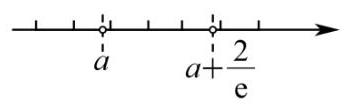

## 二、选择题(本大题共有 4 题，满分 18 分，第 13-14 题每题 4 分，第 15-16 题每题 5 分) 每题有且只有一个正确答案, 考生应在答题纸的相应位置上, 将所选答案的代号涂黑.

13. 若 $a$ 是实数，则 “ ${a}^{2} > 1$ ” 是 “ $a > 2$ ” 的( )条件.

A. 充要 B. 充分非必要

C. 必要非充分 D. 既非充分又非必要

【答案】C

【详解】“ ${a}^{2} > 1$ ” 即 “ $a > 1$ 或 $a <  - 1$ ”,故 “ ${a}^{2} > 1$ ” 不能推出 “ $a > 2$ ”, “ $a > 2$ ” 可以推出 “ ${a}^{2} > 1$ ”, 故 “ ${a}^{2} > 1$ ” 是 “ $a > 2$ ” 的必要非充分条件. 故选: C

14. 下列函数中为奇函数的是( )

A. $y = \sqrt{x}$ B. $y = {x}^{-2}$

C. $y = \sin \left( {x + \frac{\pi }{2}}\right)$ D. $y = \tan \left( {x + \pi }\right)$

【答案】D

【详解】对于 $\mathrm{A}$ 选项,函数 $y = \sqrt{x}$ 的定义域为 $\lbrack 0, + \infty )$ ,该函数为非奇非偶函数, $\mathrm{A}$ 不满足要求; 对于 $\mathrm{B}$ 选项,函数 $y = {x}^{-2}$ 的定义域为 $\{ x \mid  x \neq  0\}$ ,且 $y = \frac{1}{{x}^{2}}$ ,

设 $f\left( x\right)  = \frac{1}{{x}^{2}}$ ,则 $f\left( {-x}\right)  = \frac{1}{{\left( -x\right) }^{2}} = \frac{1}{{x}^{2}} = f\left( x\right)$ ,故函数 $y = {x}^{-2}$ 为偶函数, $\mathrm{B}$ 不满足要求;

对于 $\mathrm{C}$ 选项,函数 $y = \sin \left( {x + \frac{\pi }{2}}\right)  = \cos x$ 为偶函数, $\mathrm{C}$ 不满足要求;

对于 $\mathrm{D}$ 选项,函数 $y = \tan \left( {x + \pi }\right)  = \tan x$ 为奇函数, $\mathrm{D}$ 满足要求.

故选: D.

15. 春节期间, 小明和弟弟玩起了一种自定义游戏, 规定先由弟弟掷一颗质量均匀的骰子, 若弟弟掷出的点数为 6 , 则吃 1 颗花生; 若掷出其他点数, 则记下这个点数, 然后由小明开始两个人轮流掷这颗骰子, 直至任意一方掷出这个记下的点数或者 6, 一次游戏结束.若掷出的是这个记下的点数, 则弟弟吃 1 颗花生; 若是 6 , 则小明吃 3 颗花生.任意一次游戏中弟弟能吃到 1 颗花生的概率为( ).

A. $\frac{5}{24}$ B. $\frac{5}{12}$ C. $\frac{3}{8}$ D. $\frac{7}{12}$

【答案】D

【详解】第一步:第一次掷骰子的概率

(1)掷出 6 点:概率为 $\frac{1}{6}$ ，弟弟直接吃 1 颗花生；

(2)非 6 点:概率为 $\frac{5}{6}$ ，记下点数 $k\left( {k = 1,2,3,4,5}\right)$ ，进入后续阶段.

第二步:后续阶段的概率分析

设小明掷骰子时弟弟吃到花生的概率为 $P$ ,弟弟掷骰子时弟弟吃到花生的概率为 $Q$ ,

若小明掷骰子:

(1)掷出 $k$ :概率为 $\frac{1}{6}$ ，弟弟吃 1 颗花生;

(2)掷出 6 :概率为 $\frac{1}{6}$ ，小明吃 3 颗花生；

(3)其他点数:概率为 $\frac{4}{6}$ ，轮到弟弟掷骰子，此时概率为 $Q$ ，

故有 $P = \frac{1}{6} \times  1 + \frac{1}{6} \times  0 + \frac{4}{6} \times  Q$ ①;

若弟弟掷骰子:

(1)掷出 $k$ :概率为 $\frac{1}{6}$ ，弟弟吃 1 颗花生；

(2)掷出 6 :概率为 $\frac{1}{6}$ ，小明吃 3 颗花生；

(3)其他点数:概率为 $\frac{4}{6}$ ，轮到小明掷骰子，此时概率为 $P$ ，

故有 $Q = \frac{1}{6} \times  1 + \frac{1}{6} \times  0 + \frac{4}{6} \times  P$ ②;

联立①②两式，可得 $P = Q = \frac{1}{2}$ ，即后续阶段弟弟吃到花生的概率为 $\frac{5}{6} \times  \frac{1}{2} = \frac{5}{12}$ ，

故任意一次游戏中弟弟能吃到 1 颗花生的概率为 $\frac{1}{6} + \frac{5}{12} = \frac{7}{12}$ .

故选: D

16. 在空间中,点 $O$ 为定点,设集合 $S = \left\{  {P{\left| \overrightarrow{OP}\right| }^{2} - 2\overrightarrow{OA} \cdot  \overrightarrow{OP} \leq  1,\left| \overrightarrow{OA}\right|  = 1}\right\}$ ,则以下说法正确的是 ( ).

①若 $\overrightarrow{OP}$ 在 $\overrightarrow{OA}$ 上的数量投影为 $- \frac{1}{5}$ ，则线段 ${OP}$ 在运动过程中所形成的几何体体积为 $\frac{14}{375}\pi$ ；

②对于任意的 ${P}_{i} \in  S$ 以及任意的正实数 ${a}_{i}$ ，设 $\overrightarrow{OQ} = \mathop{\sum }\limits_{{i = 1}}^{4}{a}_{i}\overrightarrow{O{P}_{i}}$ ，若 $\mathop{\sum }\limits_{{i = 1}}^{4}{a}_{i} = 1$ ，则 $Q \in  S$ .

A. ①是真命题，②是真命题 B. ①是真命题，②是假命题

C. ①是假命题，②是真命题 D. ①是假命题，②是假命题

【答案】A

【详解】由 ${\left| \overrightarrow{OP}\right| }^{2} - 2\overrightarrow{OA} \cdot  \overrightarrow{OP} = {\left| \overrightarrow{OP} - \overrightarrow{OA}\right| }^{2} - {\left| \overrightarrow{OA}\right| }^{2}$ ,因为 ${\left| \overrightarrow{OP}\right| }^{2} - 2\overrightarrow{OA} \cdot  \overrightarrow{OP} \leq  1$ 且 $\left| \overrightarrow{OA}\right|  = 1$ ,可得

${\left| \overrightarrow{OP} - \overrightarrow{OA}\right| }^{2} - 1 \leq  1$ ,即 ${\left| \overrightarrow{OP} - \overrightarrow{OA}\right| }^{2} \leq  2$ ,即 ${\left| \overrightarrow{AP}\right| }^{2} \leq  2$ ,所以 $\mathrm{S}$ 是以 $\mathrm{A}$ 为球心,半径为 $\sqrt{2}$ 的球体内部及其表面,

①若 $\overrightarrow{OP}$ 在 $\overrightarrow{OA}$ 上的数量投影为 $- \frac{1}{5}$ ，即 $\overrightarrow{OP} \cdot  \overrightarrow{OA} =  - \frac{1}{5}$ ，设 $\overrightarrow{OA}$ 是 $x$ 轴上的单位向量，点 $P$ 的坐标为 $\left( {x, y, z}\right)$ ,

则满足 $x =  - \frac{1}{5}$ ,且 ${\left( x - 1\right) }^{2} + {y}^{2} + {z}^{2} \leq  2$ ,将 $x =  - \frac{1}{5}$ 代入可得 ${\left( -\frac{1}{5} - 1\right) }^{2} + {y}^{2} + {z}^{2} \leq  2$ ,解得 ${y}^{2} + {z}^{2} \leq  \frac{14}{25},$

所以轨迹为半径为 $r = \frac{\sqrt{14}}{5}$ ,位于平面 $x =  - \frac{1}{5}$ 上,所以线段 ${OP}$ 在运动中所形成的几何体为圆锥,其中底面半径为 $r = \frac{\sqrt{14}}{5}$ ,高为 $h = \frac{1}{5}$ ,则圆锥的体积为 $V = \frac{1}{3}\pi {r}^{2} \cdot  h = \frac{1}{3}\pi  \times  {\left( \frac{\sqrt{14}}{5}\right) }^{2} \cdot  \frac{1}{5} = \frac{14}{375}\pi$ ,所以 ①是真命题；

由集合 $\mathrm{S}$ 是以 $\mathrm{A}$ 为球心,半径为 $\sqrt{2}$ 的球体内部及其表面,对于任意的 ${P}_{i} \in  S$ ,以及任意的正实数 ${a}_{i}$ , 且 $\mathop{\sum }\limits_{{i = 1}}^{4}{a}_{i} = 1$ ,即 ${P}_{1},{P}_{2},{P}_{3},{P}_{4} \in  S$ ,且 ${a}_{1} + {a}_{2} + {a}_{3} + {a}_{4} = 1$ ,且 $0 < {a}_{1},{a}_{2},{a}_{3},{a}_{4} < 1$

若 $\overrightarrow{OQ} = \mathop{\sum }\limits_{{i = 1}}^{4}{a}_{i}\overrightarrow{O{P}_{i}} = {a}_{1}\overrightarrow{O{P}_{1}} + {a}_{2}\overrightarrow{O{P}_{2}} + {a}_{3}\overrightarrow{O{P}_{3}} + {a}_{4}\overrightarrow{O{P}_{4}}$ ,

因为球体中的任意两点的连线段上的点均在球体内, 根据 S 是凸集, 结合凸集的性质, 可得 ${\left| \overrightarrow{OQ} - \overrightarrow{OA}\right| }^{2} \leq  2$ ,即 ${\left| \overrightarrow{OQ}\right| }^{2} - 2\overrightarrow{OA} \cdot  \overrightarrow{OQ} \leq  1$ ,所以 $Q \in  S$ ,所以②正确.

故选: A.

17. 解: (1) ${AC} = {CD} = 2\sqrt{2}$ ，所以 $A{C}^{2} + C{D}^{2} = A{D}^{2}$ ，故 ${AC}\bot {CD}$ . 2 分

由 ${PA} \bot$ 平面 ${ABCD},{CD}$ 在平面 ${ABCD}$ 上,所以 ${PA} \bot  {CD}$ . 4 分

由于 ${AC}$ 与 ${PA}$ 是平面 ${PAC}$ 上的两条相交直线,所以 ${CD} \bot$ 平面 ${PAC}$ .

由于 ${CD}$ 在平面 ${PCD}$ 上,所以平面 ${PAC} \bot$ 平面 ${PCD}$ . 6 分

( 2 )以点 $A$ 为原点，分别以 $\overrightarrow{AB}$ 、 $\overrightarrow{AD}$ 、 $\overrightarrow{AP}$ 为 $x$ 、 $y$ 、 $z$ 轴的正方向建立直角坐标系.

设 $P\left( {0,0, h}\right)$ ,则 $\overrightarrow{PB} = \left( {2,0, - h}\right) ,\overrightarrow{CD} = \left( {-2,2,0}\right)$ , 8 分

所以 $\cos \frac{\pi }{3} = \frac{\left| \overrightarrow{PB} \cdot  \overrightarrow{CD}\right| }{\left| \overrightarrow{PB}\right|  \cdot  \left| \overrightarrow{CD}\right| } = \frac{4}{\sqrt{4 + {h}^{2}} \times  2\sqrt{2}} = \frac{1}{2}$ . 解得 $h = 2$ . 10 分

$\overrightarrow{PC} = \left( {2,2, - 2}\right) ,\overrightarrow{PB} = \left( {2,0, - 2}\right)$ ,设 $\overrightarrow{n} = \left( {x, y, z}\right)$ 为平面 ${PCD}$ 的一个法向量,

则 $\left\{  \begin{array}{l} \overrightarrow{n} \cdot  \overrightarrow{PC} = 0, \\  \overrightarrow{n} \cdot  \overrightarrow{CD} = 0. \end{array}\right.$ 即 $\left\{  \begin{array}{l} {2x} + {2y} - {2z} = 0, \\   - {2x} + {2y} = 0. \end{array}\right.$ 取 $y = 1$ ,可得 $\overrightarrow{n} = \left( {1,1,2}\right)$ . 12 分

故点 $B$ 到平面 ${PCD}$ 的距离 $d = \frac{\left| \overrightarrow{PB} \cdot  \overrightarrow{n}\right| }{\left| \overrightarrow{n}\right| } = \frac{2}{\sqrt{6}} = \frac{\sqrt{6}}{3}$ . 14 分

18. 解: (1) ${\log }_{2}\left( {{2}^{x} - 1}\right)  + {\log }_{2}{2}^{x} \leq  1$ ,即 ${\log }_{2}\left\lbrack  {\left( {{2}^{x} - 1}\right)  \cdot  {2}^{x}}\right\rbrack   \leq  {\log }_{2}2$ . 2 分故 $\left\{  \begin{array}{l} \left( {{2}^{x} - 1}\right)  \cdot  {2}^{x} \leq  2, \\  {2}^{x} - 1 > 0. \end{array}\right.$ 4 分

解得 $x \in  (0,1\rbrack$ . 6 分

( 2 )由于 $f\left( {m\sin {x}_{0}}\right) , f\left( {2 + \sin 2{x}_{0}}\right) , f\left( {m\cos {x}_{0}}\right)$ 成等比数列，故 ${\left( {2}^{2 + \sin 2{x}_{0}}\right) }^{2} = {2}^{m\sin {x}_{0}} \cdot  {2}^{m\cos {x}_{0}}$ ， 即 $4 + 2\sin 2{x}_{0} = m\left( {\sin {x}_{0} + \cos {x}_{0}}\right)$ 对 ${x}_{0} \in  \left\lbrack  {0,\frac{\pi }{2}}\right\rbrack$ 有解. 8 分令 $t = \sin {x}_{0} + \cos {x}_{0} = \sqrt{2}\sin \left( {{x}_{0} + \frac{\pi }{4}}\right)  \in  \left\lbrack  {1,\sqrt{2}}\right\rbrack$ ,

所以 $\sin 2{x}_{0} = 2\sin {x}_{0}\cos {x}_{0} = {t}^{2} - 1$ . 10 分

所以 $m = \frac{4 + 2\sin 2{x}_{0}}{\sin {x}_{0} + \cos {x}_{0}} = \frac{2{t}^{2} + 2}{t} = {2t} + \frac{2}{t}$ 对 $t \in  \left\lbrack  {1,\sqrt{2}}\right\rbrack$ 有解. 12 分

由于 ${2t} + \frac{2}{t} \geq  2\sqrt{{2t} \cdot  \frac{2}{t}} = 4$ ,等号当且仅当 ${2t} = \frac{2}{t}$ ,即 $t = 1$ 时成立.

所以 $m \in  \left\lbrack  {4,3\sqrt{2}}\right\rbrack$ ,故 $m$ 的最小值为 4 . 14 分

19. 解: (1) 事件 $A$ 表示志愿者是 “志愿模范队” 成员,事件 $B$ 表示其周平均服务时长超过 2 小时. 则 $P\left( {B \mid  A}\right)  = \frac{P\left( {A \cap  B}\right) }{P\left( A\right) } = \frac{\frac{54}{120}}{\frac{72}{120}} = \frac{3}{4}.$ 2 分

( 2 )可得如下 $2 \times  2$ 列联表:

<table><tr><td></td><td>是“志愿模范队”成员</td><td>不是“志愿模范队”成员</td><td>总计</td></tr><tr><td>周平均服务时长超过 2 小时</td><td>54</td><td>18</td><td>72</td></tr><tr><td>周平均服务时长不超过 2 小时</td><td>18</td><td>30</td><td>48</td></tr><tr><td>总计</td><td>72</td><td>48</td><td>120</td></tr></table>

提出原假设 ${H}_{0}$ : 是否 “是 ‘志愿模范队’ 成员” 与 “周平均服务时长超过 2 小时” 无关，确定显著性水

平 $\alpha  = {0.001}$ . 4 分

可得 ${\chi }^{2} = \frac{{120}{\left( {54} \times  {30} - {18} \times  {18}\right) }^{2}}{{72}\;{48}\;{72}\;{48}} = \frac{135}{8} = {16.875}$ . 6 分

由于 ${\chi }^{2} > {10.828}$ ,拒绝原假设,即有 99.9%的把握认为 “是‘志愿模范队’成员”与“周平均服务时长超过 2 小时” 有关. 8 分

(3)根据 $2 \times  2$ 列联表可得 “志愿模范队” 成员中 “周平均服务时长超过 2 小时” 占全部的 $\frac{54}{72} = \frac{3}{4}$ . 选取的 8 人中“周平均服务时长超过 2 小时” 为 6 人，“周平均服务时长不超过 2 小时”为 2 人， $X = 0,1,2$ . $P\left( {X = 0}\right)  = \frac{{C}_{6}^{0}{C}_{2}^{2}}{{C}_{8}^{2}} = \frac{1}{28}, P\left( {X = 1}\right)  = \frac{{C}_{6}^{1}{C}_{2}^{1}}{{C}_{8}^{2}} = \frac{3}{7}, P\left( {X = 2}\right)  = \frac{{C}_{6}^{2}{C}_{2}^{0}}{{C}_{8}^{2}} = \frac{15}{28}.$

$X$ 的分布为 $\left( \begin{matrix} 0 & 1 & 2 \\  \frac{1}{28} & \frac{3}{7} & \frac{15}{28} \end{matrix}\right)$ . 10 分

$E\left\lbrack  X\right\rbrack   = 0 \times  \frac{1}{28} + 1 \times  \frac{3}{7} + 2 \times  \frac{15}{28} = \frac{3}{2}.$ 12 分

又由于 $E\left\lbrack  {X}^{2}\right\rbrack   = \frac{18}{7}$ . 所以 $D\left\lbrack  X\right\rbrack   = E\left\lbrack  {X}^{2}\right\rbrack   - {\left( E\left\lbrack  X\right\rbrack  \right) }^{2} = \frac{9}{28}$ . 14 分

20. 解: (1) 双曲线 $C$ 的渐近线为 $y =  \pm  \frac{1}{a}x$ ,

由于 $y = x$ 是双曲线 $C$ 的一条渐近线,故 $a = 1$ . 2 分

所以 ${c}^{2} = {a}^{2} + 1 = 2$ ,故 $e = \frac{c}{a} = \sqrt{2}$ . 4 分

( 2 )由于点 $P$ 满足 $\left| {P{F}_{1}}\right|  + \left| {P{F}_{2}}\right|  = 4 > 2\sqrt{2}$ ，所以点 $P$ 落在椭圆 $\frac{{x}^{2}}{4} + {y}^{2} = 1$ 上. $\cdots$ 6 分

设 $P\left( {x, y}\right)$ ,则 $\left\{  \begin{array}{l} \frac{{x}^{2}}{2} - {y}^{2} = 1, \\  \frac{{x}^{2}}{4} + {y}^{2} = 1 \end{array}\right.$ 解得 ${y}^{2} = \frac{1}{3}$ . 8 分

由于 $\left| {{F}_{1}{F}_{2}}\right|  = 2\sqrt{3}$ ,所以 ${\Delta P}{F}_{1}{F}_{2}$ 的面积 $S = \frac{1}{2}2\sqrt{3}\frac{\sqrt{3}}{3} = 1$ . 10 分

(3)由于存在实数 $\lambda$ 使 $\overrightarrow{{F}_{2}A} = \lambda \overrightarrow{{F}_{1}B}$ ，故 ${F}_{2}A//{F}_{1}B$ .

延长 $A{F}_{2}$ 交双曲线 $C$ 于点 ${B}^{\prime }$ ，由双曲线的对称性，可得 ${B}^{\prime }$ 与 $B$ 关于原点对称，故四边形 ${F}_{1}{BA}{F}_{2}$ 的面积与三角形 ${BA}{B}^{\prime }$ 的面积相等. 12 分

设 $A{B}^{\prime }$ 的直线方程为 $x = {ty} + c$ ,其中 $c = \sqrt{{a}^{2} + 1}$ ,设 $A\left( {{x}_{1},{y}_{1}}\right) ,{B}^{\prime }\left( {{x}_{2},{y}_{2}}\right)$ .

$\left\{  \begin{array}{l} x = {ty} + c, \\  {x}^{2} - {a}^{2}{y}^{2} = {a}^{2} \end{array}\right.$ 化简得 $\left( {{t}^{2} - {a}^{2}}\right) {y}^{2} + {2tcy} + {c}^{2} - {a}^{2} = 0$ ,故 ${y}_{1} + {y}_{2} =  - \frac{2tc}{{t}^{2} - {a}^{2}}$ , ${y}_{1}{y}_{2} = \frac{{c}^{2} - {a}^{2}}{{t}^{2} - {a}^{2}} = \frac{1}{{t}^{2} - {a}^{2}}$ .

由于 $A\left( {{x}_{1},{y}_{1}}\right)$ 在第一象限, ${B}^{\prime }\left( {{x}_{2},{y}_{2}}\right)$ 在第四象限,故 ${y}_{1}{y}_{2} = \frac{{c}^{2} - {a}^{2}}{{t}^{2} - {a}^{2}} = \frac{1}{{t}^{2} - {a}^{2}} < 0$ ,解得

${t}^{2} \in  \left\lbrack  {0,{a}^{2}}\right)$ . 14 分

所以三角形 ${BA}{B}^{\prime }$ 的面积 $S = \frac{1}{2}\left| {{F}_{1}{F}_{2}}\right|  \cdot  \left| {{y}_{1} - {y}_{2}}\right|  = \frac{2ac}{{a}^{2} - {t}^{2}}\sqrt{{t}^{2} + 1}$ . 16 分

由 $S = 2\sqrt{{a}^{2} + 1} = {2c}$ ,故 $\frac{2ac}{{a}^{2} - {t}^{2}}\sqrt{{t}^{2} + 1} = {2c}$ 对 ${t}^{2} \in  \left\lbrack  {0,{a}^{2}}\right)$ 有解.

化简得 ${t}^{4} - 3{a}^{2}{t}^{2} + {a}^{4} - {a}^{2} = 0$ 对 ${t}^{2} \in  \left\lbrack  {0,{a}^{2}}\right)$ 有解.

设 $m = {t}^{2} \in  \left\lbrack  {0,{a}^{2}}\right)$ ,则 ${m}^{2} - 3{a}^{2}m + {a}^{4} - {a}^{2} = 0$ 对 $m \in  \left\lbrack  {0,{a}^{2}}\right)$ 有解. 设 $f\left( m\right)  = {m}^{2} - 3{a}^{2}m + {a}^{4} - {a}^{2}$ , 可得 $f\left( {a}^{2}\right)  = {a}^{4} - 3{a}^{4} + {a}^{4} - {a}^{2} =  - {a}^{4} - {a}^{2} < 0$ 恒成立,

故 $f\left( 0\right)  \geq  0$ ,即 ${a}^{4} - {a}^{2} \geq  0$ ,由 $a > 0$ ,解得 $a \geq  1$ . 18 分

21. 解: (1) 记 $F\left( x\right)  = f\left( x\right)  - g\left( 0\right)  = {2}^{x} - 1 - \cos 0 = {2}^{x} - 2$ , 2 分

函数 $y = F\left( x\right) , x \geq  0$ 上的值域为 $\lbrack  - 1, + \infty )$ ,即 ${M}_{0} = \lbrack  - 1, + \infty )$ . 4 分

( 2 )设 $G\left( x\right)  = f\left( x\right)  - g\left( a\right)  = {x}^{3} - 3{x}^{2} + a$ 在 $x \in  \lbrack a, + \infty )$ 上的最小值 ${G}_{\min } \geq  0$ .

${G}^{\prime }\left( x\right)  = 3{x}^{2} - {6x} = {3x}\left( {x - 2}\right) .$

当 $x \in  \left( {-\infty ,0}\right)$ 时, ${G}^{\prime }\left( x\right)  > 0, G\left( x\right)$ 严格增; 当 $x \in  \left( {0,2}\right)$ 时, ${G}^{\prime }\left( x\right)  < 0, G\left( x\right)$ 严格减; 当 $x \in  \left( {2, + \infty }\right)$ 时, ${G}^{\prime }\left( x\right)  > 0, G\left( x\right)$ 严格增. 当 $x = 2$ 时 $G\left( x\right)$ 取得极小值. 6 分

当 $a \leq  2$ 时, $\left\{  {\begin{array}{l} G\left( a\right)  \geq  0 \\  G\left( 2\right)  \geq  0 \end{array} \Rightarrow  \left\{  {\begin{array}{l} {a}^{3} - 3{a}^{2} + a \geq  0 \\   - 4 + a \geq  0 \end{array} \Rightarrow  \left\{  \begin{array}{l} a\left( {{a}^{2} - {3a} + 1}\right)  \geq  0, \\  a \geq  4, \end{array}\right. }\right. }\right.$ 舍去. 8 分

当 $a > 2$ 时, $G\left( a\right)  \geq  0 \Rightarrow  a\left( {{a}^{2} - {3a} + 1}\right)  \geq  0, a \geq  \frac{3 + \sqrt{5}}{2}$ . 10 分

综上， $a \geq  \frac{3 + \sqrt{5}}{2}$ .

(3) (充分性) 若 $y = f\left( x\right)$ 是严格增函数,则 $y = f\left( x\right)  - g\left( a\right) , x \geq  a$ 的最小值为 $f\left( a\right)  - g\left( a\right)$ ,而 ${M}_{a} = \lbrack 0, + \infty )$ ,故对任意 $a \in  \mathbf{R}$ ,都有 $f\left( a\right)  = g\left( a\right)$ ,即 $y = g\left( x\right)$ 与 $y = f\left( x\right)$ 是相同函数. 12 分故 $y = g\left( x\right)$ 是严格增函数,所以 $y = h\left( x\right)$ 严格增函数,故对任意 $a \in  \mathbf{R}, h\left( x\right)  = g\left( x\right)  - a$ 的零点个数有限.

(必要性) 对任意 $a \in  \mathbf{R}$ ,都有 ${M}_{a} = \lbrack 0, + \infty )$ ,故 $y = f\left( x\right) , x \geq  a$ 的值域为 $\lbrack g\left( a\right) , + \infty )$ ,即 $y = f\left( x\right)$ 在 $x \in  \lbrack a, + \infty )$ 上的最小值为 $g\left( a\right)$ .

先证 $y = g\left( x\right)$ 是严格增函数.

对任意 ${a}_{1} < {a}_{2}$ ,函数 $y = f\left( x\right) , x \geq  {a}_{1}$ 和 $y = f\left( x\right) , x \geq  {a}_{2}$ 的最小值分别为 $g\left( {a}_{1}\right)$ 和 $g\left( {a}_{2}\right)$ ,则由最小值的定义, $g\left( {a}_{1}\right)  \leq  g\left( {a}_{2}\right)$ ,故函数 $y = g\left( x\right)$ 是增函数. 14 分

假设存在 ${a}_{1} < {a}_{2}$ ,使得 $g\left( {a}_{1}\right)  = g\left( {a}_{2}\right)$ ,则对任意 $x \in  \left\lbrack  {{a}_{1},{a}_{2}}\right\rbrack$ ,均有 $g\left( {a}_{1}\right)  \leq  g\left( x\right)  \leq  g\left( {a}_{2}\right)$ ,从而方程 $g\left( x\right)  = g\left( {a}_{2}\right)$ 的解有无限多个,与条件 “对任意 $a \in  \mathbf{R}$ ,函数 $y = h\left( x\right)$ 零点个数均有限” 矛盾. 故假设不成立,从而 $y = g\left( x\right)$ 是严格增函数. 16 分

再证对任意 $a \in  \mathbf{R}$ ,函数 $y = f\left( x\right) , x \geq  a$ 的最小值为 $f\left( a\right)$ .

假设存在 ${x}_{0} > a$ 使得 $f\left( {x}_{0}\right)  = g\left( a\right)$ ,取 $c \in  \left( {a,{x}_{0}}\right)$ ,则 $y = f\left( x\right) , x \geq  c$ 的最小值为 $g\left( c\right)$ . 由 $y = g\left( x\right)$ 严格增, 知 $g\left( c\right)  > g\left( a\right)$ . 而 ${x}_{0} \in  \lbrack c, + \infty )$ ,故 $f\left( {x}_{0}\right)  \geq  g\left( c\right)  > g\left( a\right)$ ,矛盾. 所以假设不成立,对任意 $a \in  \mathbf{R}$ ,函数 $y = f\left( x\right) , x \geq  a$ 的最小值为 $f\left( a\right)$ .

而对任意 $a \in  \mathbf{R}, y = f\left( x\right) , x \geq  a$ 的值域为 $\lbrack g\left( a\right) , + \infty )$ ,故 $f\left( a\right)  = g\left( a\right)$ . 于是 $y = g\left( x\right)$ 与 $y = f\left( x\right)$ 是相同函数,所以 $y = f\left( x\right)$ 是严格增函数。

# 2025 届上海市徐汇区高三二模数学试卷

202504

## 一、填空题(本大题共有 12 题，满分 54 分，第 1-6 题每题 4 分，第 7-12 题每题 5 分)考生应在答 题纸的相应位置直接填写结果.

1. $\lbrack  - 1,1)$

2. $\frac{1}{2}$ 3. -4 4. $\left( {0, + \infty }\right)$

5. 90 6. 7 7. $3\sqrt{2}$ 8. $\frac{\pi }{2}$

9. $\frac{7}{15}$ 10. $\sqrt{5}$ 11. ${10}\sqrt{2}$ 12. $\frac{3}{4}$

## 二、选择题 (本大题共有 4 题, 满分 18 分, 第 13-14 题每题 4 分, 第 15-16 题每题 5 分) 每题有且 只有一个正确选项. 考生应在答题纸的相应位置, 将代表正确选项的小方格涂黑.

13. B 14. A 15. C 16. B

## 三、解答题 (本大题共有 5 题, 满分 78 分) 解答下列各题必须在答题纸的相应位置写出必要的步骤. 17. (本题满分 14 分, 第 1 小题满分 6 分, 第 2 小题满分 8 分)

解: (1) 设正方形 ${ABCD},{A}_{1}{B}_{1}{C}_{1}{D}_{1}$ 的中心分别为 $O,{O}_{1}$ ,连接 $O{O}_{1}$ ,则 $O{O}_{1} \bot$ 平面 ${ABCD}$ .

分别取 ${BC},{B}_{1}{C}_{1}$ 的中点 $E,{E}_{1}$ ,连接 $E{E}_{1},{OE}, O{E}_{1}$ ,则 ${OE} \bot  {BC},{O}_{1}{E}_{1} \bot  {B}_{1}{C}_{1}$ .

又 $E,{E}_{1}$ 分别为等腰梯形 ${BC}{C}_{1}{B}_{1}$ 底边 ${BC},{B}_{1}{C}_{1}$ 的中点,所以 $E{E}_{1} \bot  {BC}$ .

由 ${O}_{1}{E}_{1}//{A}_{1}{B}_{1}//{AB}//{OE}$ 可得四边形 ${O}_{1}{OE}{E}_{1}$ 是一个直角梯形.

$E{E}_{1} \bot  {BC}$ ,又 ${OE} \bot  {BC},\angle {OE}{E}_{1}$ 为侧面 ${BC}{C}_{1}{B}_{1}$ 与底面 ${ABCD}$ 所成二面角的平面角.

由条件知 ${O}_{1}{E}_{1} = \frac{1}{2}{A}_{1}{B}_{1} = {10},{OE} = \frac{1}{2}{AB} = {20}, O{O}_{1} = {30}$ ,

所以 $\tan \angle {OE}{E}_{1} = \frac{O{O}_{1}}{{OE} - {O}_{1}{E}_{1}} = \frac{30}{10} = 3$ .

所以侧面 ${BC}{C}_{1}{B}_{1}$ 与底面 ${ABCD}$ 所成二面角的大小为 $\arctan 3$

(2)设圆台 $O - {O}_{1}$ 上底面圆半径 $r = {10}\mathrm{\;{cm}}$ ，下底面圆半径 $R = {20}\mathrm{\;{cm}}$ ，高 ${O}_{1}O = {30}\mathrm{\;{cm}}$ ，

则圆台 $O - {O}_{1}$ 的体积为 ${V}_{1} = \frac{1}{3}\pi \left( {{10}^{2} + {20}^{2} + {10} \times  {20}}\right)  \times  {30} = {7000\pi }\left( {\mathrm{{cm}}}^{3}\right)$ .

又正四棱台的体积 ${V}_{2} = \frac{1}{3}\left( {{20}^{2} + {40}^{2} + \sqrt{{20}^{2} \times  {40}^{2}}}\right)  \times  {30} = {28000}\left( {\mathrm{\;{cm}}}^{3}\right)$ ,

所以削去部分的体积 ${V}_{3} = {28000} - {7000\pi }\left( {\mathrm{{cm}}}^{3}\right)$ ,

所以削去部分与正四棱台的体积之比为 $\frac{{28000} - {7000\pi }}{28000} = \frac{4 - \pi }{4}$ .

## 18. (本题满分 14 分, 第 1 小题满分 6 分, 第 2 小题满分 8 分)

解: (1) $0 < {3x} - 2 < {2x} + 1 \Rightarrow  x \in  \left( {\frac{2}{3},3}\right)$

(2)原问题等价于关于 $x$ 的方程 ${\log }_{2}x + 1 = 2{\log }_{2}\left( {x - a}\right)$ 恰有一个实数解,求实数 $a$ 的取值范围. 即 $\frac{1}{2}{\log }_{2}\left( {2x}\right)  = {\log }_{2}\left( {x - a}\right)$ 在 $x \in  \left( {0, + \infty }\right)$ 上恰有一个实数解.

等价于 $\sqrt{2x} = x - a$ 在 $x \in  \left( {0, + \infty }\right)$ 上恰有一个实数解.

$\Leftrightarrow  a = x - \sqrt{2x}$ 在 $x \in  \left( {0, + \infty }\right)$ 上恰有一个实数解.

令 $\sqrt{2x} = t\left( {t > 0}\right)$ ,则 $a = \frac{1}{2}{t}^{2} - t$ 在 $t \in  \left( {0, + \infty }\right)$ 上恰有一个实数解.

画出关于 $t$ 的二次函数在 $t \in  \left( {0, + \infty }\right)$ 上的图像可知, $a \in  \left\{  {-\frac{1}{2}}\right\}   \cup  \lbrack 0, + \infty )$ 时只有一个交点; $\therefore a \in  \left\{  {-\frac{1}{2}}\right\}   \cup  \lbrack 0, + \infty )$ .

## 19. (本题满分 14 分, 第 1 小题满分 6 分, 第 2 小题满分 8 分)

解: (1) 由题意, $\xi  \sim  N\left( {{500},{2.5}^{2}}\right) ,\left| {\xi  - {500}}\right|  > 5$ 的概率等于 $P\left( {\left| {\xi  - {500}}\right|  > 5}\right)$ .

令 $Y = \frac{\xi  - {500}}{2.5}$ ,则 $Y \sim  N\left( {0,1}\right)$ .

因此, $P\left( {\left| {\xi  - {500}}\right|  > 5}\right)  = P\left( {\left| Y\right|  > 2}\right)  = 2\left( {1 - \Phi \left( 2\right) }\right)  \approx  {0.0456}$ .

故净含量误差超过 $5\mathrm{\;g}$ 的概率约为 0.046 .

$X$ 可能的取值为 $0\text{ 、 }1\text{ 、 }2\text{ 、 }3$ .

由 (1) 可知,任取一包糖果,净含量小于 ${497.5}\mathrm{\;g}$ 的概率为 $\Phi \left( {-1}\right)  = 1 - \Phi \left( 1\right)  \approx  {0.1587}$ .

故 $X$ 服从二项分布 $B\left( {3,{0.1587}}\right)$ .

记 $p = {0.1587}$ ,从而 $X$ 的分布为 $\left( \begin{matrix} 0 & 1 & 2 & 3 \\  {C}_{3}^{0}{\left( 1 - p\right) }^{3} & {C}_{3}^{1}p{\left( 1 - p\right) }^{2} & {C}_{3}^{2}{p}^{2}{\left( 1 - p\right) }^{1} & {C}_{3}^{3}{p}^{3} \end{matrix}\right)$

$= \left( \begin{matrix} 0 & 1 & 2 & 3 \\  {0.595} & {0.337} & {0.064} & {0.004} \end{matrix}\right)$ ,因此 $E\left\lbrack  X\right\rbrack   = {np} = 3 \times  {0.1587} \approx  {0.476}$ .

## 20. (本题满分 18 分, 第 1 小题满分 4 分, 第 2 小题满分 6 分, 第 3 小题满分 8 分)

解: (1) 由已知可得 ${2p} = 4$ ,即 $p = 2$ ,所以点 $F$ 的坐标为 $\left( {1,0}\right)$ ,点 $F$ 到准线 $l$ 的距离为 2 .

(2)证明:由已知可知直线 ${l}_{1},{l}_{2}$ 的斜率存在且不等于 0 并过点 $F\left( {1,0}\right)$ ，

设 ${l}_{1}$ 的方程为 $y = k\left( {x - 1}\right) \left( {k \neq  0}\right) ,{l}_{1}$ 与 $C$ 相交于 ${P}_{1}\left( {{x}_{1},{y}_{1}}\right) ,{P}_{2}\left( {{x}_{2},{y}_{2}}\right)$ ,

由 $\left\{  \begin{array}{l} {y}^{2} = {4x} \\  y = k\left( {x - 1}\right)  \end{array}\right.$ 得 ${k}^{2}{x}^{2} - \left( {2{k}^{2} + 4}\right) x + {k}^{2} = 0$ ,则 ${x}_{1} + {x}_{2} = \frac{2{k}^{2} + 4}{{k}^{2}},{x}_{1}{x}_{2} = 1$ ,

$\left| {{P}_{1}{P}_{2}}\right|  = {x}_{1} + {x}_{2} + 2 = \frac{2{k}^{2} + 4}{{k}^{2}} + 2 = \frac{4{k}^{2} + 4}{{k}^{2}}$ ,

同理可得 $\left| {{Q}_{1}{Q}_{2}}\right|  = \frac{4{\left( -\frac{1}{k}\right) }^{2} + 4}{{\left( -\frac{1}{k}\right) }^{2}} = 4{k}^{2} + 4$ ,所以 $\frac{1}{\left| {P}_{1}{P}_{2}\right| } + \frac{1}{\left| {Q}_{1}{Q}_{2}\right| } = \frac{{k}^{2}}{4{k}^{2} + 4} + \frac{1}{4{k}^{2} + 4} = \frac{1}{4}$ .

(3)由已知可得直线 ${AB}$ 的方程为 $y = \sqrt{3}\left( {x - 1}\right)$ ， 由 $\left\{  \begin{array}{l} y = \sqrt{3}\left( {x - 1}\right) \\  {y}^{2} = {4x} \end{array}\right.$ ,解得 $\left\{  \begin{array}{l} {x}_{1} = \frac{1}{3} \\  {y}_{1} =  - \frac{2\sqrt{3}}{3} \end{array}\right.$ , $\left\{  \begin{array}{l} {x}_{1} = 3 \\  {y}_{1} = 2\sqrt{3} \end{array}\right.$ ,不妨令 $B\left( {\frac{1}{3}, - \frac{2\sqrt{3}}{3}}\right) , A\left( {3,2\sqrt{3}}\right)$ , 则 $\left| {AB}\right|  = \frac{1}{3} + 1 + 3 + 1 = \frac{16}{3},\frac{\left| AF\right| }{\left| BF\right| } = \frac{3 + 1}{\frac{1}{3} + 1} = 3$ , 在 $\bigtriangleup {PAF}$ 中, $\frac{\left| PA\right| }{\sin \angle {PFA}} = \frac{\left| AF\right| }{\sin \angle {APF}}$ ,在 $\bigtriangleup {PBF}$ 中, $\frac{\left| PB\right| }{\sin \angle {PFB}} = \frac{\left| BF\right| }{\sin \angle {BPF}}$ , 由 $\angle {PFA} + \angle {PFB} = \pi$ 及 $\angle {APF} = \angle {BPF}$ 得 $\frac{\left| PA\right| }{\left| PB\right| } = \frac{\left| AF\right| }{\left| BF\right| } = 3$ 设点 $P\left( {x, y}\right)$ ,于是 $\sqrt{{\left( x - 3\right) }^{2} + {\left( y - 2\sqrt{3}\right) }^{2}} = 3\sqrt{{\left( x - \frac{1}{3}\right) }^{2} + {\left( y + \frac{2\sqrt{3}}{3}\right) }^{2}}$ ,整理得 ${x}^{2} + {\left( y + \sqrt{3}\right) }^{2} = 4$ , 所以点 $P$ 在以点 $\left( {0, - \sqrt{3}}\right)$ 为圆心,2 为半径的圆上 (除去与直线 ${AB}$ 的两个交点), 因为圆心 $\left( {0, - \sqrt{3}}\right)$ 在直线 ${AB}$ 上,则点 $P$ 到直线 ${AB}$ 距离的最大值为 2, 所以 $\bigtriangleup {PAB}$ 面积最大值为 $\frac{1}{2} \times  2 \times  \frac{16}{3} = \frac{16}{3}$ .

## 21. (本题满分 18 分, 第 1 小题满分 4 分, 第 2 小题满分 6 分, 第 3 小题满分 8 分)

(1)证明:因为 ${f}^{\left( 1\right) }\left( x\right)  = a\cos \left( {x + t}\right)  - b\sin \left( {x + t}\right) ,{f}^{\left( 2\right) }\left( x\right)  =  - a\sin \left( {x + t}\right)  - b\cos \left( {x + t}\right)$ ， ${f}^{\left( 3\right) }\left( x\right)  =  - a\cos \left( {x + t}\right)  + b\sin \left( {x + t}\right) ,\;{f}^{\left( 4\right) }\left( x\right)  = a\sin \left( {x + t}\right)  + b\cos \left( {x + t}\right)  = f\left( x\right) ,$ 所以,对任意实数 $a, b, t$ ,都有 ${f}^{\left( 4\right) }\left( x\right)  = f\left( x\right)$ .

(2)解: $g\left( x\right)  = {e}^{mx} + n\cos x,{g}^{\left( 1\right) }\left( x\right)  = m{e}^{mx} - n\sin x,{g}^{\left( 2\right) }\left( x\right)  = {m}^{2}{e}^{mx} - n\cos x$ ，

由题意知, ${e}^{mx} + n\cos x = {m}^{2}{e}^{mx} - n\cos x$ 对任意实数 $x$ 恒成立,

令 $x = 0$ ,则 $1 + n = {m}^{2} - n$ ,即 ${m}^{2} = 1 + {2n}$ ,

令 $x = \frac{\pi }{2}$ ,则 ${e}^{\frac{m\pi }{2}} = {m}^{2}{e}^{\frac{m\pi }{2}}$ ,则 ${m}^{2} = 1$ ,所以 $m = 1, n = 0$ 或 $m =  - 1, n = 0$ .

若 $m = 1, n = 0$ ,则 $g\left( x\right)  = {e}^{x},{g}^{\left( 1\right) }\left( x\right)  = {\mathrm{e}}^{x} = g\left( x\right)$ ,最小导周期不是 2,矛盾;

若 $m =  - 1, n = 0$ ,则 $g\left( x\right)  = {e}^{-x},{g}^{\left( 1\right) }\left( x\right)  =  - {\mathrm{e}}^{-x},{g}^{\left( 2\right) }\left( x\right)  = {\mathrm{e}}^{-x} = g\left( x\right)$ ,最小导周期为 2,符合要求, 所以 $g\left( x\right)  = {e}^{-x}$ .

$M\left( {a, b}\right)  = \sqrt{{\left( a - b\right) }^{2} + {\left( a + 1 + g\left( b\right) \right) }^{2}} = \sqrt{{\left( a - b\right) }^{2} + {\left( -a - 1 - {e}^{-b}\right) }^{2}}$ 可视为点 $P\left( {a, - a - 1}\right)$ 与点 $Q\left( {b,{e}^{-b}}\right)$ 之间的距离,当实数 $a, b$ 变化时,点 $P\left( {a, - a - 1}\right)$ 在直线 $y =  - x - 1$ 上运动,点 $Q\left( {b,{e}^{-b}}\right)$ 在曲线 $y = {e}^{-x}$ 上运动,因此所求最小值可转化为曲线 $y = {e}^{-x}$ 上的点到直线 $y =  - x - 1$ 距离的最小值,而曲线 $y = {e}^{-x}$ 在直线 $y =  - x - 1$ 上方,平移直线 $y =  - x - 1$ 使其与曲线 $y = {e}^{-x}$ 相切,

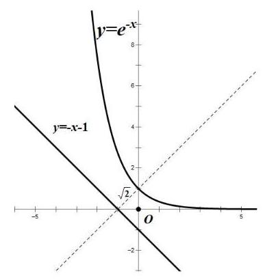

则切点到直线 $y =  - x - 1$ 的距离即为所求.

设切点 $M\left( {{x}_{0},{e}^{-{x}_{0}}}\right) ,{y}^{\prime } =  - {e}^{-x}$ ,切线斜率 $- {e}^{-{x}_{0}} =  - 1$ ,得 ${x}_{0} = 0$ ,切点为 $\left( {0,1}\right)$ , 点 $\left( {0,1}\right)$ 到直线 $y =  - x - 1$ 距离 $d = \frac{\left| 1 + 0 + 1\right| }{\sqrt{{1}^{2} + {1}^{2}}} = \sqrt{2}$ . 即 $M\left( {a, b}\right)$ 的最小值为 $\sqrt{2}$ .

(3) 解: ${h}^{\left( 1\right) }\left( x\right)  =  - \omega \sin \left( {\omega x}\right) ,{h}^{\left( 2\right) }\left( x\right)  =  - {\omega }^{2}\cos \left( {\omega x}\right)$ ,

记 $\varphi \left( x\right)  = {h}^{\left( 2\right) }\left( x\right)  - x$ ,即 $\varphi \left( x\right)  =  - {\omega }^{2}\cos {\omega x} - x$ .

由 $\varphi \left( x\right)  = {h}^{\left( 2\right) }\left( x\right)  - x \leq  0$ 在 $\left( {0, + \infty }\right)$ 上恒成立及存在 ${x}_{0} > 0$ 使 $\varphi \left( {x}_{0}\right)  = {h}^{\left( 2\right) }\left( {x}_{0}\right)  - {x}_{0} = 0$ ,可知 $x = {x}_{0}$ 是函数 $y = \varphi \left( x\right)$ 的极大值点,于是 ${\varphi }^{\prime }\left( {x}_{0}\right)  = {\omega }^{3}\sin \omega {x}_{0} - 1 = 0$ ,则 $\sin \omega {x}_{0} = \frac{1}{{\omega }^{3}}$ ①,

又 $\varphi \left( {x}_{0}\right)  =  - {\omega }^{2}\cos \omega {x}_{0} - {x}_{0} = 0$ ,则 $\cos \omega {x}_{0} = \frac{-{x}_{0}}{{\omega }^{2}}$ ②,

${\mathbb{O}}^{2} + {@}^{2}$ ,得 $\frac{1}{{\omega }^{6}} + \frac{{x}_{0}{}^{2}}{{\omega }^{4}} = 1$ ,则 ${x}_{0} = \frac{\sqrt{{\omega }^{6} - 1}}{\omega }$ .

又因为 $\sin \omega {x}_{0} = \frac{1}{{\omega }^{3}} > 0,\cos \omega {x}_{0} = \frac{-{x}_{0}}{{\omega }^{2}} < 0$ ,

所以 ${2k\pi } + \frac{\pi }{2} < \omega {x}_{0} < {2k\pi } + \pi \left( {k \in  \mathbf{Z}}\right)$ ,由 $\omega {x}_{0} > 0$ 得 $k \geq  0$ ,

又因为 $\frac{\pi }{2\omega } < {x}_{0} - \frac{2k\pi }{\omega } < \frac{\pi }{\omega }\left( {k \in  \mathbf{Z}}\right)$ ,

所以 $\varphi \left( {{x}_{0} - \frac{2k\pi }{\omega }}\right)  =  - {\omega }^{2}\cos \left\lbrack  {\omega \left( {{x}_{0} - \frac{2k\pi }{\omega }}\right) }\right\rbrack   - \left( {{x}_{0} - \frac{2k\pi }{\omega }}\right)  =  - {\omega }^{2}\cos \omega {x}_{0} - {x}_{0} + \frac{2k\pi }{\omega } = \frac{2k\pi }{\omega } \leq  0$ , 有 $k \leq  0$ ,于是 $k = 0$ ,所以 $\frac{\pi }{2\omega } < {x}_{0} < \frac{\pi }{\omega }$ .

# 2025 届上海市宝山区高三二模数学试卷

202504

## 一、填空题(本大题共有 12 题，满分 54 分，第 1~6 题每题 4 分，第 7~12 题每题 5 分)

1. $\sqrt{2}$ 2. $\{ 1,2,4\}$ 3. $y =  - 1$ 4.2 5.3 6.60

7. $\left( {-1,2}\right) \; {8.27\pi }$ 9.8 10. 56 11. 9

12. $\frac{4\sqrt{3}}{9}$

7. 已知函数 $y = {a}^{x + 1} - {\log }_{a}\left( {x + 2}\right)  + 1\left( {a > 0\text{ 且 }a \neq  1}\right)$ 的图像经过定点 $\mathrm{A}$ ，则点 $\mathrm{A}$ 的坐标为___

【答案】 $\left( {-1,2}\right)$

【详解】令 $x =  - 1$ ,可得 $y = {a}^{-1 + 1} - {\log }_{a}\left( {-1 + 2}\right)  + 1 = {a}^{0} - {\log }_{a}1 + 1 = 2$ . 所以定点 $\mathrm{A}$ 的坐标为 $\left( {-1,2}\right)$ .

8. 已知圆柱的底面积为 ${9\pi }$ ，侧面积为 ${18\pi }$ ，则该圆柱的体积为___.

【答案】 ${27\pi }$

【详解】设圆柱的底面圆的半径为 $r$ ,高为 $h$ ,由题意可得 $\left\{  \begin{array}{l} \pi {r}^{2} = {9\pi } \\  {2\pi rh} = {18\pi } \end{array}\right.$ ,解得 $\left\{  \begin{array}{l} r = 3 \\  h = 3 \end{array}\right.$ ,

所以圆柱的体积 $V = \pi {r}^{2}h = {27\pi }$ . 故答案为: ${27\pi }$ .

9. 已知 $\bigtriangleup {ABC}$ 中, ${AB} = {AC} = 4,\angle {BAC} = \frac{2}{3}\pi$ ,点 $D$ 在线段 ${BC}$ 上,且 ${S}_{\bigtriangleup {ACD}} = 2{S}_{\bigtriangleup {ABD}}$ ,则 $\overrightarrow{AB} \cdot  \overrightarrow{AD}$ 的值为___.

【答案】 8

【详解】设等腰 $\bigtriangleup {ABC}$ 在 ${BC}$ 边上的高为 $h$ ,

因为 ${S}_{\bigtriangleup {ACD}} = 2{S}_{\bigtriangleup {ABD}}$ ,所以 $\frac{1}{2} \times  {CD} \times  h = 2 \times  \frac{1}{2} \times  {BD} \times  h$ ，所以 ${CD} = {2BD}$ ，

所以 $\overrightarrow{AD} = \overrightarrow{AB} + \overrightarrow{BD} = \overrightarrow{AB} + \frac{1}{3}\overrightarrow{BC} = \overrightarrow{AB} + \frac{1}{3}\left( {\overrightarrow{AC} - \overrightarrow{AB}}\right)  = \frac{2}{3}\overrightarrow{AB} + \frac{1}{3}\overrightarrow{AC}$ ,

所以 $\overrightarrow{AB} \cdot  \overrightarrow{AD} = \overrightarrow{AB} \cdot  \left( {\frac{2}{3}\overrightarrow{AB} + \frac{1}{3}\overrightarrow{AC}}\right)  = \frac{2}{3}{\overrightarrow{AB}}^{2} + \frac{1}{3}\overrightarrow{AB} \cdot  \overrightarrow{AC} = \frac{2}{3}{\left| \overrightarrow{AB}\right| }^{2} + \frac{1}{3}\left| \overrightarrow{AB}\right|  \cdot  \left| \overrightarrow{AC}\right| \cos \angle {BAC} \; = \frac{2}{3} \times  {4}^{2} + \frac{1}{3} \times  4 \times  4 \times  \left( {-\frac{1}{2}}\right)  = 8$ .

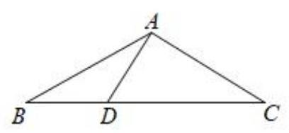

故答案为:8.

10. 有 3 件商品的编号分别为 $i\left( {i = 1,2,3}\right)$ ,它们的售价 (元) $S\left( i\right)  \in  \{ 5,7,8,{10},{11},{20}\}$ ,且满足 $S\left( 1\right)  \leq  S\left( 2\right)  \leq  S\left( 3\right)$ ，则这 3 件商品售价的所有可能情况有___种.

【答案】 56

【详解】分四类讨论: ① 当 $S\left( 1\right)  = S\left( 2\right)  = S\left( 3\right)$ 时,有 6 种情况;

② 当 $S\left( 1\right)  = S\left( 2\right)  < S\left( 3\right)$ 时,若 $S\left( 1\right)  = S\left( 2\right)  = 5, S\left( 3\right)$ 有 5 种选法;

若 $S\left( 1\right)  = S\left( 2\right)  = 7, S\left( 3\right)$ 有 4 种选法; 若 $S\left( 1\right)  = S\left( 2\right)  = 8, S\left( 3\right)$ 有 3 种选法;

若 $S\left( 1\right)  = S\left( 2\right)  = {10}, S\left( 3\right)$ 有 2 种选法; 若 $S\left( 1\right)  = S\left( 2\right)  = {11}, S\left( 3\right)$ 有 1 种选法;

由加法原理可得共有 15 种;

③ 当 $S\left( 1\right)  < S\left( 2\right)  = S\left( 3\right)$ 时,若 $S\left( 1\right)  = 5$ ,选择 $S\left( 2\right)  = S\left( 3\right)$ 有 5 种选法;

若 $S\left( 1\right)  = 7$ ,选择 $S\left( 2\right)  = S\left( 3\right)$ 有 4 种选法; 若 $S\left( 1\right)  = 8$ ,选择 $S\left( 2\right)  = S\left( 3\right)$ 有 3 种选法;

若 $S\left( 1\right)  = {10}$ ,选择 $S\left( 2\right)  = S\left( 3\right)$ 有 2 种选法; 若 $S\left( 1\right)  = {11}$ ,选择 $S\left( 2\right)  = S\left( 3\right)$ 有 1 种选法;

由加法原理可得共有 15 种;

④ 当 $S\left( 1\right)  < S\left( 2\right)  < S\left( 3\right)$ 时,有 ${\mathrm{C}}_{6}^{3} = {20}$ 种,综上,共有 $6 + {15} + {15} + {20} = {56}$ 种.

故答案为: 56 .

11. 某分公司经销一产品, 每件产品的成本为 5 元, 且每件产品需向总公司交 2 元的管理费, 预计每件产品的售价为 $x$ 元 $\left( {8 \leq  x \leq  {11}}\right)$ 时，一年的销售量为 ${\left( {12} - x\right) }^{2}$ 万件，则每件产品售价为___元时， 该分公司一年的利润达到最大值. (结果精确到 1 元)

【答案】 9

【详解】分公司一年的利润 $y$ (万元)与售价 $x$ 的函数关系式为

$y = \left( {x - 5 - 2}\right) {\left( {12} - x\right) }^{2} = \left( {x - 7}\right) {\left( {12} - x\right) }^{2}, x \in  \left\lbrack  {8,{11}}\right\rbrack$ ,

所以 ${y}^{\prime } = {\left( {12} - x\right) }^{2} - 2\left( {x - 7}\right) \left( {{12} - x}\right)  = \left( {{12} - x}\right) \left( {{26} - {3x}}\right)$ ,

令 ${y}^{\prime } = 0$ ,即 $\left( {{12} - x}\right) \left( {{26} - {3x}}\right)  = 0$ ,解得 $x = \frac{26}{3}$ 或 $x = {12}$ (舍),

当 $x \in  \left\lbrack  {8,\frac{26}{3}}\right)$ 时, ${y}^{\prime } > 0$ ,此时 $y = \left( {x - 5 - 2}\right) {\left( {12} - x\right) }^{2}$ 在 $\left\lbrack  {8,\frac{26}{3}}\right)$ 上单调递增,

当 $x \in  \left( {\frac{26}{3},{11}}\right\rbrack$ 时, ${y}^{\prime } < 0$ ,此时 $y = \left( {x - 5 - 2}\right) {\left( {12} - x\right) }^{2}$ 在 $\left( {\frac{26}{3},{11}}\right\rbrack$ 单调递减,

又因为结果精确到 1 元,且当 $x = 8$ 时, $y = {16}$ ,且当 $x = 9$ 时, $y = {18}$ ,

于是: 当每件产品的售价为 9 元时, 该分公司一年的利润最大. 故答案为: 9 .

12. 空间中有相互垂直的两条异面直线 ${l}_{1}\text{ 、 }{l}_{2}$ ,点 $A\text{ 、 }B \in  {l}_{1}, C\text{ 、 }D \in  {l}_{2}$ ,且 ${AB} = 4,{CD} = 1$ ,若 ${DA}\bot {DB}$ ，且 ${AC} = {BC} + 2$ ，则二面角 $D - {AB} - C$ 平面角的余弦值最小为___.

【答案】 $\frac{4\sqrt{3}}{9}$

【详解】根据双曲线的定义,平面内到两个定点 $\mathrm{A}\text{ 、 }B$ (焦点) 的距离之差的绝对值为定值 (小于 $\left| {AB}\right|$ ) 的点的轨迹为双曲线. 由 ${AC} = {BC} + 2$ ,可知 $\left| {{AC} - {BC}}\right|  = 2$ ,

所以点 $C$ 在以 $\mathrm{A}\text{ 、 }B$ 为焦点的双曲线上. 在空间中,是此双曲线 ${AB}$ 旋转得到的曲面.

因为 ${DA}\bot {DB}$ ，根据直径所对的圆周角是直角，所以点 $D$ 同时在以 ${AB}$ 为直径的球面上.

由于 ${l}_{1} \bot  {l}_{2}$ ,所以 $C\text{ 、 }D$ 在与 ${AB}$ 垂直的面上.

不妨令 $C$ 固定在一支双曲线上,设双曲线方程为 ${y}^{2} - \frac{{x}^{2}}{3} = 1$ .

过 $C$ 作 ${CE} \bot  {AB}$ 于 $E$ ,在双曲线 ${y}^{2} - \frac{{x}^{2}}{3} = 1$ 中,变形可得 ${x}^{2} = 3\left( {{y}^{2} - 1}\right)$ .

在 Rt $\bigtriangleup {CEB}$ (因为 ${CE}\bot {AB}$ ) 中, ${CE}$ 的长度可根据坐标关系得到, ${CE} = \sqrt{3{y}^{2} - 3}$

因为 $D$ 在过 $C$ 与 ${AB}$ 垂直的面与球的交线上,设球心为 $O\left( {AB}\right.$ 中点 $)$ ,

由 $D{E}^{2} + O{E}^{2} = 4$ (球的半径的平方为 4,根据勾股定理得到此关系), ${OE}$ 的长度与 $y$ 有关 ( $E$ 点坐标与 $C$ 点纵坐标 $y$ 有关),且 ${OE}$ 在 $y$ 轴上的投影长度就是 $y$ ,所以 ${DE} = \sqrt{4 - {y}^{2}}$ .

在 $\bigtriangleup {CED}$ 中,根据余弦定理 $\cos \angle {CED} = \frac{C{E}^{2} + D{E}^{2} - C{D}^{2}}{2 \cdot  {CE} \cdot  {DE}}$ ,

通过 $C{E}^{2} = 3{y}^{2} - 3, D{E}^{2} = 4 - {y}^{2}$ 代入余弦定理公式化简得

到, $\cos \angle {CED} = \frac{3{y}^{2} - 3 + 4 - {y}^{2} - 1}{2\sqrt{\left( {3{y}^{2} - 3}\right) \left( {4 - {y}^{2}}\right) }} = \frac{\sqrt{3}}{3} \cdot  \sqrt{\frac{{y}^{4}}{-{y}^{4} + 5{y}^{2} - 4}} = \frac{\sqrt{3}}{3} \cdot  \sqrt{\frac{1}{-1 - \frac{4}{{y}^{4}} + \frac{5}{{y}^{2}}}}$ .

令 $t = \frac{1}{{y}^{2}}\left( {t > 0}\right)$ ,则 $\cos \angle {CED} = \frac{\sqrt{3}}{3} \cdot  \sqrt{\frac{1}{-4{t}^{2} + {5t} - 1}}$ .

对于二次函数 $f\left( t\right)  =  - 4{t}^{2} + {5t} - 1$ ,其对称轴为 $t =  - \frac{5}{2 \times  \left( {-4}\right) } = \frac{5}{8}$ ,当 $t = \frac{5}{8}$ 时, $f\left( t\right)$ 取得最大值

$f\left( \frac{5}{8}\right)  =  - 4 \times  {\left( \frac{5}{8}\right) }^{2} + 5 \times  \frac{5}{8} - 1 = \frac{9}{16}.$

所以 $\cos \angle {CED} = \frac{\sqrt{3}}{3} \cdot  \sqrt{\frac{1}{-4{t}^{2} + {5t} - 1}} \geq  \frac{\sqrt{3}}{3} \cdot  \sqrt{\frac{1}{\frac{9}{16}}} = \frac{4\sqrt{3}}{9}$ .

故答案为: $\frac{4\sqrt{3}}{9}$ .

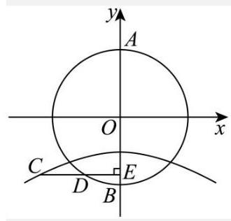

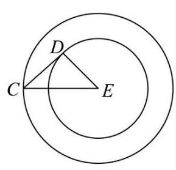

## 二、选择题(本大题共有 4 题，满分 18 分，第 13~14 题每题 4 分，第 15~16 题每题 5 分)

13. $D$ 14. $C$ 15. $C$ 16. $A$

15. 甲、乙两名篮球运动员在 8 场比赛中的单场得分用茎叶图表示如左下图, 茎叶图中甲的得分有部分数据丢失，但甲得分的折线图完好(右下图)，则下列结论正确的是( )

<table><tr><td>甲</td><td></td><td>乙</td></tr><tr><td>9</td><td>0</td><td>9</td></tr><tr><td>3 2</td><td>1</td><td>4 5 6 7 8 9</td></tr><tr><td>8 6 0</td><td>2</td><td>0</td></tr></table>

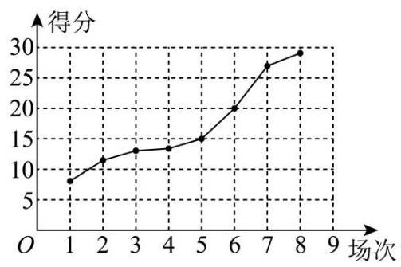

A. 甲得分的极差小于乙得分的极差

B. 甲得分的第 25 百分位数大于乙得分的第 75 百分位数

C. 甲得分的平均数大于乙得分的平均数

D. 甲得分的方差小于乙得分的方差

【答案】C

【详解】对于 A 选项,甲得分的极差为: ${28} - 9 = {19}$ ,乙得分的极差为: ${20} - 9 = {11}$ ,

因为 ${19} > {11}$ ,所以甲得分的极差大于乙得分的极差,故 A 错误;

对于 $\mathrm{B}$ 选项,因为 $8 \times  {25}\%  = 2$ ,所以甲得分的第 25 百分位数为 $\frac{{12} + {13}}{2} = \frac{25}{2}$ ,

又 $8 \times  {75}\%  = 6$ ,所以乙得分的第 75 百分位数为 $\frac{{18} + {19}}{2} = \frac{37}{2}$ ,

因为 $\frac{25}{2} < \frac{37}{2}$ ,所以甲得分的第 25 百分位数小于乙得分的第 75 百分位数,故 B 错误;

对于 $\mathrm{C}$ 选项,由折线图可知,在茎叶图中甲的得分中丢失的数据一个为 15,另一个设为 $m$ ,其中 ${10} < m < {15}$ ,

所以甲的平均数为 $\frac{9 + {12} + {13} + {15} + {20} + {26} + {28} + m}{8} = \frac{{123} + m}{8}$ ,

乙的平均数为 $\frac{9 + {14} + {15} + {16} + {17} + {18} + {19} + {20}}{8} = \frac{128}{8} = {16}$ ,因为 ${10} < m < {15}$ ,所以

$\frac{133}{8} < \frac{{123} + m}{8} < \frac{138}{8}$ ,所以 $\frac{{123} + m}{8} > \frac{128}{8} = {16}$ ,所以甲得分的平均数大于乙得分的平均数,故 C 正确;

对于 D 选项, 方差是刻画数据离散程度或波动幅度的指标. 从茎叶图中可以看到, 甲的得分分布比乙的得分分布分散, 所以甲得分的方差大于乙得分的方差, 故 D 错误.

故选: C

16. 若对任意正整数 $n$ ，数列 $\left\{  {a}_{n}\right\}$ 的前 $n$ 项和 ${S}_{n}$ 都是完全平方数，则称数列 $\left\{  {a}_{n}\right\}$ 为 “完全平方数列”. 有如下两个命题:①若数列 $\left\{  {b}_{n}\right\}$ 的前 $n$ 项和 ${T}_{n} = {\left( n - t\right) }^{2}$ ，( $t$ 为正整数)，则使得数列 $\left\{  \left| {b}_{n}\right| \right\}$ 为 “完全平方数列”的 $t$ 值有且仅有一个; ②存在无穷多个“完全平方数列”的等差数列. 则下列选项中正确的是( )

A. ①是真命题，②是真命题； B. ①是真命题，②是假命题；

C. ①是假命题，②是真命题； D. ①是假命题，②是假命题.

【答案】A

【详解】对于①,数列 $\left\{  {b}_{n}\right\}$ 的前 $n$ 项和 ${T}_{n} = {\left( n - t\right) }^{2}$ ( $t$ 为正整数),当 $n \geq  2$ 时, ${b}_{n} = {T}_{n} - {T}_{n - 1} = {\left( n - t\right) }^{2} - {\left( n - 1 - t\right) }^{2} = {2n} - {2t} - 1$ ,当 $n = 1$ 时, ${b}_{1} = {T}_{1} = {\left( 1 - t\right) }^{2}$ 不满足上式,所以 $\left| {b}_{n}\right|  = \left\{  \begin{array}{l} {\left( 1 - t\right) }^{2}, n = 1 \\  {2n} - {2t} - 1, n \geq  2 \end{array}\right.$ ,当 $t = 1, n \geq  2$ 时, ${2n} - {2t} - 1 = {2n} - 3 > 0$ ,所以数列 $\left\{  \left| {b}_{n}\right| \right\}$ 与原数列相同,所以 ${T}_{n} = {\left( n - 1\right) }^{2}$ ,所以当 $t = 1$ 时,数列 $\left\{  \left| {b}_{n}\right| \right\}$ 为完全平方数列,

当 $t \geq  2$ 时, $\left| {b}_{1}\right|  + \left| {b}_{2}\right|  = {\left( t - 1\right) }^{2} + \left| {3 - {2t}}\right|  = {t}^{2} - {2t} + 1 + {2t} - 3 = {t}^{2} - 2$ 不是 “完全平方数,

所以当 $t \geq  2$ 时,数列 $\left\{  \left| {b}_{n}\right| \right\}$ 不是完全平方数列,

综上所述: 数列 $\left\{  \left| {b}_{n}\right| \right\}$ 为 “完全平方数列”,故①是真命题;

对于②,因为 ${S}_{n}$ 为完全平方数,故 $d \geq  0,{a}_{1} \geq  0, d,{a}_{1} \in  \mathrm{N}$ ,

若 $d = 0$ ,则 ${S}_{n} = n{a}_{1}$ ,若对任意的 $n \in  {\mathrm{N}}^{ * }, n{a}_{1}$ 均为完全平方数,

则 ${a}_{1} = 0$ ,否则假设 $p$ 为 ${a}_{1}$ 的素因数,且 ${p}^{a}$ 恰好整除 ${a}_{1}, a$ 为正整数,

若 $a$ 为奇数,则 ${a}_{1}$ 不是完全平方数,矛盾,若 $a$ 为偶数,取 $n = {p}^{a + 1}$ ,则 $n{a}_{1}$ 不是完全平方数,矛盾, 若 $d \geq  1$ ,则 ${S}_{n} = \frac{n\left( {{a}_{1} + {a}_{n}}\right) }{2} = \frac{n\left( {2{a}_{1} - d + {nd}}\right) }{2}$ ,

若 $2{a}_{1} - d \neq  0$ ,取 $n = \left| {2{a}_{1} - d}\right|$ ,则 ${S}_{n} = \frac{{\left| 2{a}_{1} - d\right| }^{2}\left( {d + 1}\right) }{2}$ 或 ${S}_{n} = \frac{{\left| 2{a}_{1} - d\right| }^{2}\left( {d - 1}\right) }{2}$ ,

当 $d$ 为偶数时,此时 $\frac{{\left| 2{a}_{1} - d\right| }^{2}\left( {d + 1}\right) }{2},\frac{{\left| 2{a}_{1} - d\right| }^{2}\left( {d - 1}\right) }{2}$ 均不是完全平方数,

当 $d$ 为奇数时,取 $n = 4,{S}_{n} = 2\left( {2{a}_{1} + {3d}}\right) ,2{a}_{1} + {3d}$ 为奇数,故此时 ${S}_{n}$ 不是完全平方数,

故 $2{a}_{1} - d = 0$ ，即 $2{a}_{1} = d$ ，故 ${S}_{n} = {a}_{1}{n}^{2}$ ，设 ${a}_{1} = {k}^{2}$ ，故 ${S}_{n} = {k}^{2}{n}^{2}$ ，

当 $n \geq  2$ 时， ${a}_{n} = {S}_{n} - {S}_{n - 1} = {k}^{2}{n}^{2} - {k}^{2}{\left( n - 1\right) }^{2} = {k}^{2}\left( {{2n} - 1}\right)$ ，又 ${a}_{1} = {k}^{2}$ 适合上式，即 ${a}_{n} = {k}^{2}\left( {{2n} - 1}\right) , k \in  \mathrm{Z}.$

故存在无穷多个“完全平方数列”的等差数列, 故②是真命题.

故选: A.

## 三、解答题(本大题共有 5 题，满分 78 分)

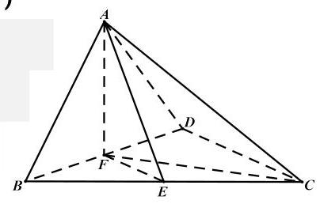

## 17. (本题满分 14 分, 第 1 小题满分 6 分, 第 2 小题满分 8 分)

解: (1) 取 ${BD}$ 中点 $F$ ,连接 ${AF}\text{ 、 }{CF}$

由已知条件 $\bigtriangleup {BCD}$ 是边长为 2 的正三角形, ${AB} = {AD}$ 得

${BD} \bot  {AF},{BD} \bot  {CF}$ .2 分

所以 ${BD} \bot$ 平面 ${ACF}$ .4 分

所以 ${BD} \bot  {AC}$ .6 分

(2)二面角 $A - {BD} - C$ 的大小为 $\frac{\pi }{2}$ ，即平面 ${ABD} \bot$ 平面 ${BCD}$

由平面 ${ABD} \cap$ 平面 ${BCD} = {BD}$ ，且由( 1 )知 ${AF} \bot  {BD}$ ， ${AF} \subset$ 平面 ${ABD}$

所以 ${AF} \bot$ 平面 ${BCD}$ .8 分

从而 $\angle {AEF}$ 即为 ${AE}$ 与平面 ${BCD}$ 所成角 .10 分

在 Rt $\bigtriangleup {ABF}$ 中, ${AB} = \sqrt{2},{BD} = 1$ ,从而 ${AF} = 1$

在 $\bigtriangleup {BCD}$ 中, ${EF} = \frac{1}{2}{CD} = 1$

因为 ${AF} \bot$ 平面 ${BCD}$ ,且 ${EF} \subset$ 平面 ${BCD}$ ,所以 ${AF} \bot  {EF}$

所以在 $R\mathbf{t}{\Delta AEF}$ 中, ${AF} \bot  {EF}$ ,且 ${AF} = {EF} = 1$ .12 分

易求得 $\angle {AEF} = \frac{\pi }{4}\;$ 即 ${AE}$ 与平面 ${BCD}$ 所成角的大小为 $\frac{\pi }{4}$ .14 分

## 18. (本题满分 14 分, 第 1 小题满分 6 分, 第 2 小题满分 8 分)

解: (1) $f\left( 2\right)  = 4$ ,即 ${a}^{2} = 4$ ,解得 $a = 2$ ,于是 $f\left( x\right)  = {2}^{x}$ .2 分

方程 $f\left( x\right)  - f\left( {-x}\right)  = 2$ 即为 ${2}^{x} - {2}^{-x} = 2$

令 $t = {2}^{x} > 0$ ,则有 $t - \frac{1}{t} = 2$ 即 ${t}^{2} - {2t} - 1 = 0$

求得 $t = 1 \pm  \sqrt{2}$ (舍负) .4 分

所以方程的解为 $x = {\log }_{2}\left( {1 + \sqrt{2}}\right)$ .6 分

(2)由已知 ${\left\lbrack  f\left( mx\right) \right\rbrack  }^{2} \geq  f\left( {{x}^{2} + 1}\right)  \cdot  f\left( {x + 3}\right)$ 得 ${\left( {a}^{mx}\right) }^{2} \geq  {a}^{{x}^{2} + 1} \cdot  {a}^{x + 3}$

整理得 ${a}^{2mx} \geq  {a}^{{x}^{2} + x + 4}$ 8 分

因为 $0 < a < 1$ ,所以 ${2mx} \leq  {x}^{2} + x + 4$ .10 分

从而 ${2m} \leq  \frac{{x}^{2} + x + 4}{x} = x + \frac{4}{x} + 1$ 对任意 $x \in  \left\lbrack  {1,2}\right\rbrack$ 恒成立

因为 $x + \frac{4}{x} + 1 \geq  2\sqrt{4} + 1 = 5$ (当且仅当 $x = 2$ 取等号) .12 分

所以 ${2m} \leq  5$

即实数 $m$ 的最大值为 $\frac{5}{2}$ .14 分

## 19. (本题满分 16 分, 第 1 小题满分 4 分, 第 2 小题满分 6 分, 第 3 小题满分 6 分)

解: (1) $\bar{x} = \frac{4 + 5 + 6 + 7 + 8}{5} = 6,\bar{y} = \frac{{76} + {73} + {67} + m + {60}}{5} = \frac{m + {276}}{5}$ , .2 分

代入回归方程 $y =  - {4.3x} + {93.8}$ ，得:

$\frac{m + {276}}{5} =  - {4.3} \times  6 + {93.8}$ 解得 $m = {64}$ .3 分

$x = {10}$ 时 $y =  - {4.3} \times  {10} + {93.8} = {50.8}$

即开放所有体验类项目时的平均等待时间约为 51 分钟 .4 分

(2)事件 $A$ : 等待总时间恰为 120 分钟;

事件 $B$ : 选择的 3 个项目中至少包含 1 个互动类项目

全部的项目数为 15 个,其中互动类项目有 3 个,则事件 $B$ 共包含了 ${C}_{15}^{3} - {C}_{12}^{3}$ 种;

.6 分

在事件 $B$ 的条件下,等待总时间恰为 120 分钟,此时的可能情况是:

①一个互动类项目，一个体验类项目，一个演出类项目，此时共有 ${C}_{3}^{1}{C}_{8}^{1}{C}_{4}^{1}$ 种情况；

②两个互动类项目，一个体验类项目，此时共有 ${C}_{3}^{2}{C}_{8}^{1}$ 种情况.

.8 分

由条件概率公式得

$P\left( {A \mid  B}\right)  = \frac{P\left( {A \cap  B}\right) }{P\left( B\right) } = \frac{\left| A \cap  B\right| }{\left| B\right| } = \frac{{C}_{3}^{2}{C}_{8}^{1} + {C}_{3}^{1}{C}_{4}^{1}{C}_{8}^{1}}{{C}_{15}^{3} - {C}_{12}^{3}} = \frac{24}{47}$ .10 分

(3)事件 $X = k$ 表示 “小王参加决赛获得的游园币”,则

$P\left( {X = {40}}\right)  = {p}^{2}, P\left( {X = {10}}\right)  = {C}_{2}^{1}p\left( {1 - p}\right) , P\left( {X =  - {20}}\right)  = {\left( 1 - p\right) }^{2}$ .13 分

所以 $E\left( X\right)  = {40} \cdot  {P}^{2} + {10} \cdot  {C}_{2}^{1}p\left( {1 - p}\right)  + \left( {-{20}}\right)  \cdot  {\left( 1 - p\right) }^{2} = {60p} - {20}$ .14 分

所以,当 $0 \leq  p < \frac{1}{3}$ 时, $E\left( X\right)  < 0$ ,不建议小王继续闯关;

当 $p = \frac{1}{3}$ 时, $E\left( X\right)  = 0$ ,小王可根据自己的情况随机选择;

当 $\frac{1}{3} < p \leq  1$ 时, $E\left( X\right)  > 0$ ,建议小王继续闯关.

.16 分

## 20. (本题满分 16 分, 第 1 小题满分 4 分, 第 2 小题满分 5 分, 第 3 小题满分 7 分)

解: (1)根据双曲线定义得: $\left| {A{F}_{1}}\right|  - \left| {A{F}_{2}}\right|  = 2,\left| {B{F}_{1}}\right|  - \left| {B{F}_{2}}\right|  = 2$ .2 分

两式相加得 $\left| {A{F}_{1}}\right|  + \left| {B{F}_{1}}\right|  - \left( {\left| {A{F}_{2}}\right|  + \left| {B{F}_{2}}\right| }\right)  = 4$

即 $\left| {A{F}_{1}}\right|  + \left| {B{F}_{1}}\right|  - \left| {AB}\right|  = 4$

由已知 $\left| {AB}\right|  = 6$ 得 $\left| {A{F}_{1}}\right|  + \left| {B{F}_{1}}\right|  = {10}$

所以 $\bigtriangleup {AB}{F}_{1}$ 的周长为 16 .4 分

设直线 ${AN}\text{ 、 }{BN}$ 的倾斜角分别为 $\alpha \text{ 、 }\beta$ ,

由已知 ${k}_{AN} + {k}_{BN} = 0$ 得 $\alpha  + \beta  = \pi$ , .5 分

不妨设 $0 < \alpha  < \frac{\pi }{2} < \beta  < \pi$

则 $\angle {ANB} = {2\alpha }$

则 $\tan \angle {ANB} = \tan {2\alpha } = \frac{4}{3}$ 可求得 $\tan \alpha  = \frac{1}{2}$ 或-2(舍), $\tan \beta  =  - \frac{1}{2}$ . .7 分

所以直线 ${AN} : y - 3 = \frac{1}{2}\left( {x + 2}\right)$ 解得 $R\left( {0,4}\right)$

直线 ${BN} : y - 3 =  - \frac{1}{2}\left( {x + 2}\right)$ 解得 $S\left( {0,2}\right)$

所以 ${\Delta RSN}$ 的面积为 $\frac{1}{2}\left| {RS}\right|  \cdot  \left| {x}_{N}\right|  = \frac{1}{2} \times  2 \times  2 = 2$ .9 分

(3)设 $P\left( {{x}_{0},{y}_{0}}\right) ,\left( {{x}_{0} > 0,{y}_{0} > 0}\right)$ ，由 $\overrightarrow{OQ} = 2\overrightarrow{OP}$ 知 $Q\left( {2{x}_{0},2{y}_{0}}\right)$ ，

若直线 $l$ 斜率不存在，则 $l : x = 2$ ，此时 $P\left( {1,0}\right) , Q\left( {2,0}\right)$ 与点 ${F}_{2}\left( {2,0}\right)$ 重合，不符题意，舍.

10 分

设直线 $l$ 方程为: $y = k\left( {x - 2}\right)$

与双曲线 $C : {x}^{2} - \frac{{y}^{2}}{3} = 1$ 联立化简得 $\left( {{k}^{2} - 3}\right) {x}^{2} - 4{k}^{2}x + 4{k}^{2} + 3 = 0$

${k}^{2} - 3 \neq  0,\Delta  > 0$ 显然成立

设交点 $A\left( {{x}_{1},{y}_{1}}\right) \text{ 、 }B\left( {{x}_{2},{y}_{2}}\right)$

由韦达定理: ${x}_{1} + {x}_{2} = \frac{4{k}^{2}}{{k}^{2} - 3},{x}_{1}{x}_{2} = \frac{4{k}^{2} + 3}{{k}^{2} - 3}$ , .11 分

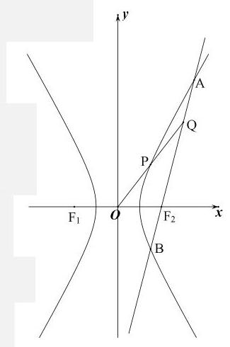

由 $\overrightarrow{AB} = 2\overrightarrow{Q{F}_{2}}$ 得 $\left( {{x}_{2} - {x}_{1},{y}_{2} - {y}_{1}}\right)  = 2\left( {2 - 2{x}_{0}, - 2{y}_{0}}\right)$

从而 ${x}_{2} - {x}_{1} = 2\left( {2 - 2{x}_{0}}\right)$ ,即 ${\left( {x}_{1} - {x}_{2}\right) }^{2} = {16}{\left( {x}_{0} - 1\right) }^{2}$

将韦达定理代入 ${\left( \frac{4{k}^{2}}{{k}^{2} - 3}\right) }^{2} - 4 \times  \frac{4{k}^{2} + 3}{{k}^{2} - 3} = {16}{\left( {x}_{0} - 1\right) }^{2}$

化简得 $9\left( {{k}^{2} + 1}\right)  = 4{\left( {x}_{0} - 1\right) }^{2}{\left( {k}^{2} - 3\right) }^{2}$ (※)

.13 分

因为 $k = {k}_{Q{F}_{2}} = \frac{2{y}_{0}}{2{x}_{0} - 2} = \frac{{y}_{0}}{{x}_{0} - 1}$ ,即 ${y}_{0} = k\left( {{x}_{0} - 1}\right)$

由已知 $P\left( {{x}_{0},{y}_{0}}\right)$ 在双曲线上,得 $3{x}_{0}^{2} - {y}_{0}^{2} = 3$

从而 $3{x}_{0}{}^{2} - {\left( k\left( {x}_{0} - 1\right) \right) }^{2} = 3$ 得 ${k}^{2} = \frac{3{x}_{0}{}^{2} - 3}{{\left( {x}_{0} - 1\right) }^{2}} = \frac{3\left( {{x}_{0} + 1}\right) }{{x}_{0} - 1}$ 代入 (※) 式 $9\left( {\frac{3{x}_{0} + 3}{{x}_{0} - 1} + 1}\right)  = 4{\left( {x}_{0} - 1\right) }^{2}{\left( \frac{3{x}_{0} + 3}{{x}_{0} - 1} - 3\right) }^{2}$

化简得 $9\frac{4{x}_{0} + 2}{{x}_{0} - 1} = 4{\left( {x}_{0} - 1\right) }^{2}{\left( \frac{6}{{x}_{0} - 1}\right) }^{2}$ ,即 $9\frac{4{x}_{0} + 2}{{x}_{0} - 1} = 4 \times  {36}$

解得 ${x}_{0} = \frac{3}{2}$ .15 分

点 $P$ 的坐标为 $\left( {\frac{3}{2},\frac{\sqrt{15}}{2}}\right)$ .16 分

21. (本题满分 18 分, 第 1 小题满分 4 分, 第 2 小题满分 6 分, 第 3 小题满分 8 分).

解: (1) 由题得 $f\left( x\right)  = {2x},{f}^{\prime }\left( x\right)  = 2$ ,所以 $F\left( x\right)  = {2x} + 2$ .2 分

因为 $f\left( x\right)  \in  {A}_{\left( 1, m\right) }$ ,所以 ${2x} + 2 = 1, x =  - \frac{1}{2}$

所以 $m = 1$ ,固着点 $x =  - \frac{1}{2}$ .4 分

(2)由题得 $f\left( x\right)  = x + \sin x,{f}^{\prime }\left( x\right)  = 1 + \cos x$ .5 分

所以 $F\left( x\right)  = x + 1 + \sqrt{2}\sin \left( {x + \frac{\pi }{4}}\right)$

因为 $F\left( x\right)$ 是 $D$ 上的严格增函数,

所以 ${F}^{\prime }\left( x\right)  = 1 + \sqrt{2}\cos \left( {x + \frac{\pi }{4}}\right)  \geq  0$ 在 $\left\lbrack  {s, t}\right\rbrack$ 上恒成立 .7 分

由于不等式 $\cos \left( {x + \frac{\pi }{4}}\right)  \geq   - \frac{\sqrt{2}}{2}$ 的解是 ${2k\pi } + \pi  \leq  x \leq  {2k\pi } + \frac{5\pi }{2}\left( {k \in  Z}\right)$

所以 $\left\lbrack  {s, t}\right\rbrack   \subseteq  \left\lbrack  {{2k\pi } + \pi ,{2k\pi } + \frac{5\pi }{2}}\right\rbrack  \left( {k \in  Z}\right)$ .9 分

所以 $t - s \leq  \left( {{2k\pi } + \frac{5\pi }{2}}\right)  - \left( {{2k\pi } + \pi }\right)  = \frac{3\pi }{2}$ 因此 $t - s$ 的最大值是 $\frac{3\pi }{2}$ .10 分

(3) (方法一) 由题得 $f\left( x\right)  = a{e}^{x} - x,{f}^{\prime }\left( x\right)  = a{e}^{x} - 1$ ,

所以 $F\left( x\right)  = {2a}{e}^{x} - x - 1$ .

因为 $f\left( x\right)  \in  {A}_{\left( 0,1\right) }$ 且 $t$ 是 $f\left( x\right)$ 的固着点,所以 ${2a} = \frac{x + 1}{{e}^{x}}\;\left( *\right)$ 在 $\left( {0, + \infty }\right)$ 上有唯一的解 $t$

.11 分

记 $g\left( x\right)  = \frac{x + 1}{{e}^{x}}\left( {x > 0}\right)$ ,则 ${g}^{\prime }\left( x\right)  =  - \frac{x}{{e}^{x}} < 0$ ,所以 $g\left( x\right)$ 在 $\left( {0, + \infty }\right)$ 是严格减函数,

从而 $g\left( x\right)  < g\left( 0\right)  = 1$

又当 $x \rightarrow   + \infty$ 时, $g\left( x\right)  \rightarrow  0$ ,故 $g\left( x\right)$ 的值域是 $\left( {0,1}\right)$ ,

所以 $0 < {2a} < 1$ ,即 $a \in  \left( {0,\frac{1}{2}}\right)$ .13 分

记 $h\left( x\right)  = \frac{x + 1}{{e}^{x}} - {2a}$ ,则由上述可知 $h\left( x\right)$ 是 $\left( {0, + \infty }\right)$ 的严格减函数且 $h\left( t\right)  = 0$

$h\left( {\ln \frac{1}{2a}}\right)  = \frac{\ln \frac{1}{2a} + 1}{{e}^{\ln \frac{1}{2a}}} - {2a} =  - {2a}\ln \left( {2a}\right)$ ,

因为 $0 < a < \frac{1}{2}$ ,所以 $\ln \left( {2a}\right)  < 0$ ,所以 $h\left( {\ln \frac{1}{2a}}\right)  > 0$ .15 分

$h\left( {\ln \frac{1}{{a}^{2}}}\right)  = \frac{\ln \frac{1}{{a}^{2}} + 1}{{e}^{\frac{1}{\ln \frac{1}{{a}^{2}}}}} - {2a} = {a}^{2} - 2{a}^{2}\ln a - {2a}$

记 $m\left( x\right)  = {x}^{2} - 2{x}^{2}\ln x - {2x}\left( {0 < x < \frac{1}{2}}\right)$ ,则 ${m}^{\prime }\left( x\right)  =  - {2x}\left( {2\ln x + 1}\right)$

因为 $0 < x < \frac{1}{2}$ ,所以 $2\ln x + 1 < 2\ln \frac{1}{2} + 1 < 0$ ,所以 ${m}^{\prime }\left( x\right)  > 0$

所以 $m\left( x\right)$ 是 $\left( {0,\frac{1}{2}}\right)$ 上的严格增函数,

故 $m\left( x\right)  < m\left( \frac{1}{2}\right)  = {\left( \frac{1}{2}\right) }^{2} - 2 \cdot  {\left( \frac{1}{2}\right) }^{2} \cdot  \ln \frac{1}{2} - 2 \cdot  \frac{1}{2} < 0$ ,从而 $h\left( {\ln \frac{1}{{a}^{2}}}\right)  < 0$ .17 分

由①②可知, $h\left( {\ln \frac{1}{{a}^{2}}}\right)  < 0 < h\left( {\ln \frac{1}{2a}}\right)$ ,即 $h\left( {\ln \frac{1}{{a}^{2}}}\right)  < h\left( t\right)  < h\left( {\ln \frac{1}{2a}}\right)$

又 $h\left( x\right)$ 是 $\left( {0, + \infty }\right)$ 的严格减函数,所以 $\ln \frac{1}{2a} < t < \ln \frac{1}{{a}^{2}}$ .18 分

所以 $\frac{1}{2a} < {e}^{t} < \frac{1}{{a}^{2}}$ .

(方法二)

由题得 $f\left( x\right)  = a{e}^{x} - x,{f}^{\prime }\left( x\right)  = a{e}^{x} - 1$ ,所以 $F\left( x\right)  = {2a}{e}^{x} - x - 1$

因为 $f\left( x\right)  \in  {A}_{\left( 0,1\right) }$ 且 $t$ 是 $f\left( x\right)$ 的固着点,所以 $F\left( x\right)  = 0\left( *\right)$ 在 $\left( {0, + \infty }\right)$ 上有唯一的解 $t$

.11 分

求导得 ${F}^{\prime }\left( x\right)  = {2a}{e}^{x} - 1$

当 $a \leq  0$ 时, ${F}^{\prime }\left( x\right)  < 0, F\left( x\right)$ 是 $\left( {0, + \infty }\right)$ 上的严格减函数,

所以 $F\left( x\right)  < F\left( 0\right)  = {2a} - 1 \leq   - 1$ ,所以方程 (*) 无解;

当 $a > 0$ 时,

$\mathrm{i}$ . 当 $a \geq  \frac{1}{2}$ 时, ${F}^{\prime }\left( x\right)  > {2a} - 1 \geq  0$ 在 $\left( {0, + \infty }\right)$ 恒成立,故 $F\left( x\right)$ 是 $\left( {0, + \infty }\right)$ 上的严格增函数.

所以 $F\left( x\right)  > F\left( 0\right)  = {2a} - 1 \geq  1 > 0$ ,所以方程 (*) 无解;

ii. 当 $0 < a < \frac{1}{2}$ 时,如下表

<table id="cross-table-1"><tr><td>$x$</td><td>$\left( {0,\ln \frac{1}{2a}}\right)$</td><td>$\ln \frac{1}{2a}$</td><td>$\left( {\ln \frac{1}{2a}, + \infty }\right)$</td></tr><tr><td>${F}^{\prime }\left( x\right)$</td><td>-</td><td>0</td><td>+</td></tr></table>

可知 $F\left( x\right)$ 在 $\left( {0,\ln \frac{1}{2a}}\right)$ 严格减,在 $\left( {\ln \frac{1}{2a}, + \infty }\right)$ 严格增

又 $F\left( 0\right)  = {2a} - 1 < 0, F\left( {\ln \frac{1}{2a}}\right)  = \ln \left( {2a}\right)  < 0$ ,当 $x \rightarrow   + \infty$ 时, $F\left( x\right)  \rightarrow   + \infty$

所以方程 (*) 在 $\left( {0,\ln \frac{1}{2a}}\right)$ 无解,在 $\left( {\ln \frac{1}{2a}, + \infty }\right)$ 有唯一解

满足题意的 $a$ 的取值范围 $0 < a < \frac{1}{2}$ . .13 分

因为 $t$ 是 $\left( {\ln \frac{1}{2a}, + \infty }\right)$ 的唯一解,所以 $t > \ln \frac{1}{2a}$

又 $F\left( {\ln \frac{1}{{a}^{2}}}\right)  = \frac{2}{a} + 2\ln a - 1$

令 $h\left( x\right)  = \frac{2}{x} + 2\ln x - 1,0 < x < \frac{1}{2}$ ,

则 ${h}^{\prime }\left( x\right)  =  - \frac{2}{{x}^{2}} + \frac{2}{x} =  - 2{\left( \frac{1}{x} - \frac{1}{2}\right) }^{2} + \frac{1}{2} <  - 4$ ,所以 $h\left( x\right)$ 是 $\left( {0,\frac{1}{2}}\right)$ 上的严格减函数

所以 $h\left( x\right)  > h\left( \frac{1}{2}\right)  = 4 + 2\ln \frac{1}{2} - 1 \approx  {1.614} > 0$ ,即 $F\left( {\ln \frac{1}{{a}^{2}}}\right)  > 0$ .16 分

又当 $0 < a < \frac{1}{2}$ 时, $\ln \frac{1}{2a} - \ln \frac{1}{{a}^{2}} = \ln \frac{a}{2} < 0$ ,所以 $\ln \frac{1}{2a} < \ln \frac{1}{{a}^{2}}$

又 $F\left( x\right)$ 在 $\left( {\ln \frac{1}{2a},\ln \frac{1}{{a}^{2}}}\right)$ 上有唯一的零点,则 $\ln \frac{1}{2a} < t < \ln \frac{1}{{a}^{2}}$ .18 分

综上, $a \in  \left( {0,\frac{1}{2}}\right)$ ,此时 $\frac{1}{2a} < {e}^{t} < \frac{1}{{a}^{2}}$ .

# 2025 届上海市金山区高三二模数学试卷

202504

(满分: 150 分, 完卷时间: 120 分钟)

## 一、填空题(本大题共有 12 题，满分 54 分，第 1 ~ 6 题每题 4 分，第 7~12 题每题 5 分)考生应在答 题纸的相应位置直接填写结果.

1. \{2\} 2. -i 3. 1

4. $- \frac{4}{3}$ 5. 2

6. $- \frac{1}{2}$

7. $\sqrt{3}$ 8. 2

9. ${0.648}/\frac{81}{125}$ 10. $\frac{1}{8}$ 11. 468 12. 22

6. 若直线 $l$ 是曲线 $y = \frac{2}{x - 1}$ 在 $x = 3$ 处的切线,则 $l$ 的斜率为___.

【答案】 $- \frac{1}{2}$

【详解】函数 $y = \frac{2}{x - 1}$ ,求导得 ${y}^{\prime } =  - \frac{2}{{\left( x - 1\right) }^{2}}$ ,则 ${\left. {y}^{\prime }\right| }_{x = 3} =  - \frac{2}{{\left( 3 - 1\right) }^{2}} =  - \frac{1}{2}$ ,所以 $l$ 的斜率为 $- \frac{1}{2}$ .

7. 已知圆锥底面半径为 1，高为 $\sqrt{3}$ ，则过圆锥母线的截面面积的最大值为___.

【答案】 $\sqrt{3}$

【详解】依题意,设圆锥的母线长为 $l,\because$ 圆锥的底面半径为 1,高为 $\sqrt{3},\therefore l = \sqrt{3 + 1} = 2$ ,

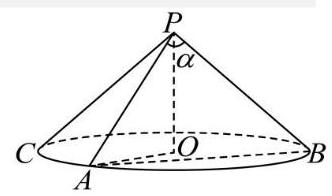

设圆锥的轴截面的两母线夹角为 $\theta$ ,显然 $\theta  = \frac{\pi }{3}$ ,

则过该圆锥的母线作截面,截面上的两母线夹角设为 $\alpha ,\alpha  \in  \left( {0,\frac{\pi }{3}}\right\rbrack$ ,

故截面的面积为 $S = \frac{1}{2} \times  2 \times  2 \times  \sin \alpha  = 2\sin \alpha  \leq  \sqrt{3}$ ,当且仅当 $\alpha  = \frac{\pi }{3}$ 时,等号成立,故截面的面积的最大值为 $\sqrt{3}$ . 故答案为: $\sqrt{3}$ .

8. 已知 $\left\{  {a}_{n}\right\}$ 是等差数列,若 ${a}_{3}\text{ 、 }{a}_{7}$ 分别是函数 $y = {x}^{2} - {4x} + 2$ 的两个零点,则 ${a}_{5} =$ ___.

【答案】 2

【详解】由题意得 ${a}_{3}\text{ 、 }{a}_{7}$ 是 ${x}^{2} - {4x} + 2 = 0$ 的两个根,由韦达定理得 ${a}_{3} + {a}_{7} = 4$ ,

因为 $\left\{  {a}_{n}\right\}$ 是等差数列,所以 ${a}_{5} = \frac{{a}_{3} + {a}_{7}}{2} = 2$ . 故答案为: 2

9. 投篮测试中，每人投 3 次，至少投中 2 次才能通过测试. 已知某同学每次投篮投中的概率为 0.6 ，且各次投篮是否投中相互独立，则该同学通过测试的概率为___.

【答案】 $\frac{81}{125}$

【详解】该同学通过测试的概率为 ${C}_{3}^{2} \cdot  {0.6}^{2} \cdot  {0.4} + {C}_{3}^{3} \cdot  {0.6}^{3} = \frac{81}{125}$ ,故答案为 $\frac{81}{125}$ .

10. 已知函数 $y = g\left( x\right)$ 的图象是折线段 ${ABC}$ ,且 $A\left( {0,0}\right) , B\left( {\frac{1}{2},\frac{1}{2}}\right) , C\left( {1,0}\right)$ ,则函数 $y = x \cdot  g\left( x\right) \left( {0 \leq  x \leq  1}\right)$ 的图象与 $x$ 轴围成的图形面积为___.

【答案】 $\frac{1}{8}$

【详解】由题可得, $g\left( x\right)  = \left\{  {\begin{array}{l} x,0 \leq  x \leq  \frac{1}{2} \\   - x + 1,\frac{1}{2} < x \leq  1 \end{array},\therefore y = x \cdot  g\left( x\right)  = \left\{  \begin{array}{l} {x}^{2},0 \leq  x \leq  \frac{1}{2} \\   - {x}^{2} + x,\frac{1}{2} < x \leq  1 \end{array}\right. }\right.$ ,

设函数 $y = x \cdot  g\left( x\right) \left( {0 \leq  x \leq  1}\right)$ 的图象与 $x$ 轴围成的图形面积为 $\mathrm{S}$ ,

如图,由二次函数 $y = {x}^{2}$ 和 $y =  - {x}^{2} + x$ 可知,曲边三角形 ${OEA}$ 的面积等于曲边三角形 ${ACF}$ 的面积,所以 $S = {S}_{ACFE} = \frac{1}{2} \times  \frac{1}{4} = \frac{1}{8}$ .

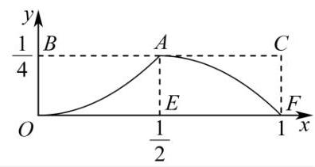

故答案为: $\frac{1}{8}$ .

11. 如图,现对某景区一长 ${AB} = {600}\mathrm{\;m}$ ，宽 ${AD} = {360}\mathrm{\;m}$ 的矩形空地进行建设. 规划在边 ${AB},{AD}$ 上分别取点 $M, N$ 修建人行步道(不考虑宽度)，且满足点 $\mathrm{A}$ 关于步道 ${MN}$ 的对称点 $E$ 在边 ${DC}$ 上. 在 $\bigtriangleup  {AMN}$ 内种植花卉，在 $\bigtriangleup  {EMN}$ 内搭建娱乐设施，其余区域规划为露营区，则人行步道 ${MN}$ 的最短距离为___ m. (结果精确到 $\mathrm{{lm}}$ )

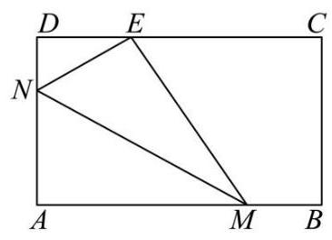

【答案】 468

【详解】由题意, ${\operatorname{Rt}}_{ \bigtriangleup  }{MAN} \cong  {\operatorname{Rt}}_{ \bigtriangleup  }{MEN}$ ,设 $\angle {AMN} = \theta \left( {0 < \theta  < \frac{\pi }{2}}\right)$ ,则 $\angle {DNE} = \pi  - 2\left( {\frac{\pi }{2} - \theta }\right)  = {2\theta }$ , 在 Rt $\bigtriangleup {DEN}$ 中 $\cos {2\theta } = \frac{DN}{NE} = \frac{{360} - {AN}}{AN}$ ,得 ${AN} = \frac{360}{\cos {2\theta } + 1} = \frac{180}{{\cos }^{2}\theta }$ ,

则 ${MN} = \frac{AN}{\sin \theta } = \frac{180}{\sin \theta {\cos }^{2}\theta } = \frac{180}{\sin \theta \left( {1 - {\sin }^{2}\theta }\right) }$ ,

由于 $\left\{  \begin{array}{l} {AN} = \frac{180}{{\cos }^{2}\theta } = {180}\left( {1 + {\tan }^{2}\theta }\right)  \leq  {360} \\  {AM} = \frac{AN}{\tan \theta } = {180}\left( {\tan \theta  + \frac{1}{\tan \theta }}\right)  \leq  {600} \end{array}\right.$ ,解得 $\frac{1}{3} \leq  \tan \theta  \leq  1$ ,

则 ${\tan }^{2}\theta  = \frac{{\sin }^{2}\theta }{{\cos }^{2}\theta } = \frac{{\sin }^{2}\theta }{1 - {\sin }^{2}\theta } \in  \left\lbrack  {\frac{1}{9},1}\right\rbrack$ ,解得 $\frac{\sqrt{10}}{10} \leq  \sin \theta  \leq  \frac{\sqrt{2}}{2}$ ,

令 $\sin \theta  = t, t \in  \left\lbrack  {\frac{\sqrt{10}}{10},\frac{\sqrt{2}}{2}}\right\rbrack$ ,则 ${MN} = \frac{180}{t - {t}^{3}}$ .

令 $f\left( t\right)  = t - {t}^{3}$ ,则 ${f}^{\prime }\left( t\right)  = 1 - 3{t}^{2}$ ,令 ${f}^{\prime }\left( t\right)  > 0$ ,则 $t \in  \left\lbrack  {\frac{\sqrt{10}}{10},\frac{\sqrt{3}}{3}}\right)$ ,函数 $f\left( t\right)$ 单调递增;

令 ${f}^{\prime }\left( t\right)  < 0$ ,则 $t \in  \left( {\frac{\sqrt{3}}{3},\frac{\sqrt{2}}{2}}\right\rbrack$ ,函数 $f\left( t\right)$ 单调递减; 所以 $f{\left( t\right) }_{\max } = f\left( \frac{\sqrt{3}}{3}\right)  = \frac{2\sqrt{3}}{9}$ ,

所以 $M{N}_{\min } = {270}\sqrt{3} \approx  {468}$ ,即人行步道 ${MN}$ 的最短距离为 ${468}\mathrm{\;m}$ .

故答案为:468 .

12. 设 ${x}_{1},{x}_{2},{x}_{3},{x}_{4},{x}_{5}$ 均是正整数,且 $\left\{  {x \mid  x = {x}_{m}{x}_{n}{x}_{p}{x}_{q},1 \leq  m < n < p < q \leq  5}\right\}   = \{ {108},{144},{288},{432}\}$ ,则 ${x}_{1} + {x}_{2} + {x}_{3} + {x}_{4} + {x}_{5}$ 的值为___.

【答案】 22

【详解】 ${108} = {2}^{2} \times  {3}^{3} = 2 \times  3 \times  3 \times  6 = 3 \times  3 \times  3 \times  4,{144} = {2}^{4} \times  {3}^{2},{288} = {2}^{5} \times  {3}^{2},{432} = {2}^{4} \times  {3}^{3}$ ,

当 ${108} = 2 \times  3 \times  3 \times  6$ 时,不妨取 ${x}_{1} = 2,{x}_{2} = 3,{x}_{3} = 3,{x}_{4} = 6$ ,

则 ${432} = {2}^{4} \times  {3}^{3} = 3 \times  3 \times  6 \times  8 = 8{x}_{2}{x}_{3}{x}_{4}$ ,此时 ${x}_{5} = 8$ ,

而 ${144} = {2}^{4} \times  {3}^{2} = 2 \times  3 \times  3 \times  8,{288} = {2}^{5} \times  {3}^{2} = 2 \times  3 \times  6 \times  8$ ,

所以 ${x}_{1} = 2,{x}_{2} = 3,{x}_{3} = 3,{x}_{4} = 6,{x}_{5} = 8$ 满足题目条件;

当 ${108} = 3 \times  3 \times  3 \times  4$ 时,不妨取 ${x}_{1} = 3,{x}_{2} = 3,{x}_{3} = 3,{x}_{4} = 4$ ,

则 ${432} = {2}^{4} \times  {3}^{3} = 3 \times  3 \times  3 \times  {16} = {16}{x}_{1}{x}_{2}{x}_{3}$ ,此时 ${x}_{5} = {16}$ ,

而从 ${x}_{1} = 3,{x}_{2} = 3,{x}_{3} = 3,{x}_{4} = 4,{x}_{5} = {16}$ 中任取 4 个数相乘不能得出 144,

所以 ${x}_{1} = 3,{x}_{2} = 3,{x}_{3} = 3,{x}_{4} = 4,{x}_{5} = {16}$ 不满足条件,

综上所述, ${x}_{1} = 2,{x}_{2} = 3,{x}_{3} = 3,{x}_{4} = 6,{x}_{5} = 8$ ,所以 ${x}_{1} + {x}_{2} + {x}_{3} + {x}_{4} + {x}_{5} = {22}$ .

故答案为: 22 .

## 二、选择题 (本题共有 4 题, 满分 18 分, 13、14 每题 4 分, 15、16 题每题 5 分) 每题有且只有一个正 确选项, 考生应在答题纸的相应位置, 将代表正确选项的小方格涂黑.

13. B 14. C 15. C 16. A

15. 已知定义在 $\mathbf{R}$ 上的函数 $y = f\left( x\right)$ ,满足以下两个条件: (1) $f\left( x\right)  > 0$ 对任意 $x \in  \mathbf{R}$ 恒成立,且 $f\left( 1\right)  = 1$ ;

(2)对任意 ${x}_{1}\text{ 、 }{x}_{2} \in  \mathbf{R}$ 都有 $f\left( {{x}_{1} + 2{x}_{2}}\right)  = {4f}\left( {x}_{1}\right)  \cdot  {f}^{2}\left( {x}_{2}\right)$ ，则下列关于函数 $y = f\left( x\right)$ 的表述中正确的个数为( ) ① $f\left( 0\right)  = \frac{1}{2}$ ; ② $f\left( x\right)  \cdot  f\left( {-x}\right)  = \frac{1}{4}$ ; ③ 函数 $y = f\left( x\right)$ 有最小值.

A. 0 B. 1 C. 2 D. 3

【答案】C

【详解】由任意 ${x}_{1},{x}_{2} \in  \mathrm{R}$ ,都有 $f\left( {{x}_{1} + 2{x}_{2}}\right)  = {4f}\left( {x}_{1}\right)  \cdot  {f}^{2}\left( {x}_{2}\right)$ ,

令 ${x}_{1} = {x}_{2} = 0$ ,可得 $f\left( 0\right)  = 4{f}^{3}\left( 0\right)$ ,因为 $f\left( 0\right)  > 0$ ,解得 $f\left( 0\right)  = \frac{1}{2}$ ,故①正确；

令 ${x}_{1} =  - x,{x}_{2} = x$ ,可得 $f\left( {-x + {2x}}\right)  = {4f}\left( {-x}\right)  \cdot  {f}^{2}\left( x\right)$ ,

整理得 $f\left( x\right)  = {4f}\left( {-x}\right)  \cdot  {f}^{2}\left( x\right)$ ,又 $f\left( x\right)  > 0$ ,得 $f\left( x\right)  \cdot  f\left( {-x}\right)  = \frac{1}{4}$ ,故②正确；

对于③ 举反例，如 $f\left( x\right)  = {2}^{x - 1}$ ，满足条件 (1) ，又 $f\left( {{x}_{1} + 2{x}_{2}}\right)  = {2}^{{x}_{1} + 2{x}_{2} - 1}$ ， ${4f}\left( {x}_{1}\right)  \cdot  {f}^{2}\left( {x}_{2}\right)  = 4 \times  {2}^{{x}_{1} - 1} \times  {\left( {2}^{{x}_{2} - 1}\right) }^{2}$ ，

则 $f\left( {{x}_{1} + 2{x}_{2}}\right)  = {4f}\left( {x}_{1}\right)  \cdot  {f}^{2}\left( {x}_{2}\right)$ ,满足条件 (2),而 $f\left( x\right)  = {2}^{x - 1} > 0$ 没有最小值,故③错误.

所以正确的有 2 个.

故选: C.

16. 已知点 $A\left( {{x}_{1},{y}_{1}}\right)$ 在圆 ${x}^{2} + {y}^{2} = 9$ 上,点 $B\left( {{x}_{2},{y}_{2}}\right)$ 在圆 ${x}^{2} + {y}^{2} = {12}$ 上,且 ${x}_{1}{x}_{2} + {y}_{1}{y}_{2} = {x}_{1} + {x}_{2} - 1, O$ 为坐标原点. 对于以下两个命题, 判断正确的是 ( )

① 在坐标平面内存在点 $P$ ,使得 ${AP} \bot  {BP}$ 恒成立;

②三角形 ${OAB}$ 面积的最小值为 $\sqrt{22}$ .

A. ①是真命题，②是真命题 B. ①是假命题，②是真命题

C. ①是真命题，②是假命题 D. ①是假命题，②是假命题

【答案】A

【详解】 ${x}_{1}{x}_{2} + {y}_{1}{y}_{2} = {x}_{1} + {x}_{2} - 1 \Rightarrow  {x}_{1}{x}_{2} - {x}_{1} - {x}_{2} + 1 + {y}_{1}{y}_{2} = 0 \Rightarrow$

$\left( {{x}_{1} - 1}\right) \left( {{x}_{2} - 1}\right)  + {y}_{1}{y}_{2} = 0$ ,则当 $P\left( {1,0}\right)$ 时, $\overrightarrow{AP} = \left( {1 - {x}_{1}, - {y}_{1}}\right) ,\overrightarrow{BP} = \left( {1 - {x}_{2}, - {y}_{2}}\right)$ ,

$\overrightarrow{AP} \cdot  \overrightarrow{BP} = \left( {1 - {x}_{1}}\right) \left( {1 - {x}_{2}}\right)  + {y}_{1}{y}_{2} = 0$ ,即当 $P\left( {1,0}\right)$ 时, ${AP} \bot  {BP}$ 恒成立,则①是真命题；

设 $A\left( {3\cos \theta ,3\sin \theta }\right) , B\left( {2\sqrt{3}\cos \beta ,2\sqrt{3}\sin \beta }\right)$ ,则 $\overrightarrow{OA} = \left( {3\cos \theta ,3\sin \theta }\right) ,\overrightarrow{OB} = \left( {2\sqrt{3}\cos \beta ,2\sqrt{3}\sin \beta }\right)$ ,

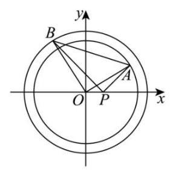

又 $\cos \angle {AOB} = \frac{\overrightarrow{OA} \cdot  \overrightarrow{OB}}{\left| \overrightarrow{OA}\right|  \cdot  \left| \overrightarrow{OB}\right| } = \frac{6\sqrt{3}\cos \theta \cos \beta  + 6\sqrt{3}\sin \theta \sin \beta }{3 \cdot  2\sqrt{3}} = \cos \left( {\theta  - \beta }\right)$ ， 则 ${S}_{\bigtriangleup {AOB}} = \frac{1}{2}\left| {OA}\right| \left| {OB}\right| \sin \angle {AOB} = 3\sqrt{3}\left| {\sin \left( {\theta  - \beta }\right) }\right|$ .

因 ${x}_{1}{x}_{2} + {y}_{1}{y}_{2} = {x}_{1} + {x}_{2} - 1$ ,则

$6\sqrt{3}\cos \theta \cos \beta  + 6\sqrt{3}\sin \theta \sin \beta  = 3\cos \theta  + 2\sqrt{3}\cos \beta  - 1,$

则 $6\sqrt{3}\cos \left( {\theta  - \beta }\right)  = 3\cos \theta  + 2\sqrt{3}\cos \beta  - 1$ ,令 $\theta  - \beta  = \alpha$ ,则 $6\sqrt{3}\cos \alpha  = 3\cos \theta  + 2\sqrt{3}\cos \left( {\theta  - \alpha }\right)  - 1$ ,

即 $6\sqrt{3}\cos \alpha  = 3\cos \theta  + 2\sqrt{3}\cos \theta \cos \alpha  + 2\sqrt{3}\sin \theta \sin \alpha  - 1$ ,

则 $6\sqrt{3}\cos \alpha  + 1 = \left( {3 + 2\sqrt{3}\cos \alpha }\right) \cos \theta  + 2\sqrt{3}\sin \alpha \sin \theta  = \sqrt{{\left( 3 + 2\sqrt{3}\cos \alpha \right) }^{2} + {\left( 2\sqrt{3}\sin \alpha \right) }^{2}}\cos \left( {\theta  - \gamma }\right)$ ,其中

$\tan \gamma  = \frac{2\sqrt{3}\sin \alpha }{3 + 2\sqrt{3}\cos \alpha },\gamma  \in  \left( {-\frac{\pi }{2},\frac{\pi }{2}}\right)$ ,则 $\cos \left( {\theta  - \gamma }\right)  = \frac{6\sqrt{3}\cos \alpha  + 1}{\sqrt{{\left( 3 + 2\sqrt{3}\cos \alpha \right) }^{2} + {\left( 2\sqrt{3}\sin \alpha \right) }^{2}}}$ ,

因 $\cos \left( {\theta  - \gamma }\right)  \in  \left\lbrack  {-1,1}\right\rbrack$ ,则 $\frac{6\sqrt{3}\cos \alpha  + 1}{\sqrt{{\left( 3 + 2\sqrt{3}\cos \alpha \right) }^{2} + {\left( 2\sqrt{3}\sin \alpha \right) }^{2}}} \in  \left\lbrack  {-1,1}\right\rbrack   \Rightarrow$

$\frac{{\left( 6\sqrt{3}\cos \alpha  + 1\right) }^{2}}{{\left( 3 + 2\sqrt{3}\cos \alpha \right) }^{2} + {\left( 2\sqrt{3}\sin \alpha \right) }^{2}} \in  \left\lbrack  {0,1}\right\rbrack   \Rightarrow  {\left( 6\sqrt{3}\cos \alpha  + 1\right) }^{2} \leq  {\left( 3 + 2\sqrt{3}\cos \alpha \right) }^{2} + {\left( 2\sqrt{3}\sin \alpha \right) }^{2}$ ,

则 ${108}{\cos }^{2}\alpha  \leq  {20} \Rightarrow  {108}\left( {1 - {\sin }^{2}\alpha }\right)  \leq  {20} \Rightarrow  {\sin }^{2}\alpha  \geq  \frac{22}{27} \Rightarrow  \sin \alpha  \geq  \frac{\sqrt{22}}{3\sqrt{3}}$ ,

则 ${S}_{\bigtriangleup {AOB}} = 3\sqrt{3}\left| {\sin \left( {\theta  - \beta }\right) }\right|  = 3\sqrt{3}\left| {\sin \alpha }\right|  \geq  \sqrt{22}$ ,故②是真命题.

故选: A.

## 三、解答题 (本大题满分 76 分) 本大题共有 5 题, 解答下列各题必须在答题纸相应编号的规定区域内 写出必要的步骤.

## 17. (本题满分 14 分) 本题共有 2 个小题, 第 1 小题满分 6 分, 第 2 小题满分 8 分.

(1)因为 $y = f\left( x\right)$ 是定义在 $\mathbf{R}$ 上的奇函数，所以 $f\left( 0\right)  = 0$ . 2 分

又 $x > 0$ 时, $f\left( x\right)  = {\log }_{2}x$ ,故当 $x < 0$ 时, $f\left( {-2}\right)  =  - f\left( 2\right)  =  - {\log }_{2}2 =  - 1$ ,

所以 $f\left( {-2}\right)  + f\left( 0\right)  =  - 1$ ,即所求值为 -1 . 6 分

(2) 由题意: $g\left( x\right)  = \left( {{\log }_{2}x}\right)  \cdot  \left( {{\log }_{2}\frac{x}{4}}\right)  = \left( {{\log }_{2}x}\right)  \cdot  \left( {{\log }_{2}x - 2}\right)  = {\left( {\log }_{2}x\right) }^{2} - 2{\log }_{2}x.{.8}$ 分令 ${\log }_{2}x = t, t \in  \left\lbrack  {0,3}\right\rbrack$ ,问题等价于求 $h\left( t\right)  = {t}^{2} - {2t}, t \in  \left\lbrack  {0,3}\right\rbrack$ 的值域. 10 分

又函数 $h\left( t\right)  = {t}^{2} - {2t}$ 图像开口向上,对称轴为直线 $t = 1$ .

故 $h\left( t\right)$ 在 $\left\lbrack  {0,1}\right\rbrack$ 上严格减,在 $\left\lbrack  {1,3}\right\rbrack$ 上严格增. 12 分

又 $h\left( 1\right)  = 1 - 2 =  - 1, h\left( 0\right)  = 0, h\left( 3\right)  = 9 - 6 = 3$ ,

故 $h{\left( t\right) }_{\min } =  - 1, h{\left( t\right) }_{\max } = 3$ . 即函数 $g\left( x\right)$ 的值域为 $\left\lbrack  {-1,3}\right\rbrack$ . 14 分

## 18. (本题满分 14 分)本题共有 2 个小题, 第 1 小题满分 6 分, 第 2 小题满分 8 分

(1)由 ${PA} \bot$ 平面 ${PBC}$ ， ${BC} \subset$ 平面 ${PBC}$ ，则 ${PA} \bot  {BC}$ ， 2 分

又 ${AB} \bot  {BC}$ ,由 ${PA} \cap  {AB} = A$ 且都在平面 ${PAB}$ 内,则 ${BC} \bot$ 平面 ${PAB}$ , 4 分又 ${BC} \subset$ 面 ${ABCD}$ ,所以平面 ${ABCD} \bot$ 平面 ${PAB}$ . 6 分

(2)法一:由(1)易知 ${PA} \bot  {PB}$ ，又 $\angle {ABP} = \frac{\pi }{3}$ ，过 $P$ 作 ${PO} \bot  {AB}$ 于 $O$ ，

由平面 ${ABCD} \bot$ 平面 ${PAB}$ ,平面 ${ABCD} \cap$ 平面 ${PAB} = {AB},{PO} \subset$ 平面 ${PAB}$ ,

所以 ${PO} \bot$ 平面 ${ABCD}$ ,过 $O$ 作 ${Oz}//{BC}$ ,易知 ${Oz} \bot  {AB}$ , 8 分故建立如下图示空间直角坐标系,又 ${AB} = {2DC} = 4,{BC} = 2\sqrt{2},{DC}//{AB}$ ,

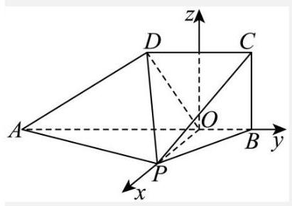

则 $A\left( {0, - 3,0}\right) , P\left( {\sqrt{3},0,0}\right) , C\left( {0,1,2\sqrt{2}}\right) , D\left( {0, - 1,2\sqrt{2}}\right)$ ,

所以 $\overrightarrow{AP} = \left( {\sqrt{3},3,0}\right) ,\overrightarrow{AD} = \left( {0,2,2\sqrt{2}}\right) ,\overrightarrow{DC} = \left( {0,2,0}\right)$ , 10 分

设 $\overrightarrow{m} = \left( {x, y, z}\right)$ 是平面 ${PAD}$ 的一个法向量,则 $\left\{  \begin{array}{l} \overrightarrow{m} \cdot  \overrightarrow{AP} = \sqrt{3}x + {3y} = 0 \\  \overrightarrow{m} \cdot  \overrightarrow{AD} = {2y} + 2\sqrt{2}z = 0 \end{array}\right.$ ,

令 $z =  - 1$ ,则 $\overrightarrow{m} = \left( {-\sqrt{6},\sqrt{2}, - 1}\right)$ , 12 分

所以点 $C$ 到平面 ${PAD}$ 的距离 $\frac{\left| \overrightarrow{m} \cdot  \overrightarrow{DC}\right| }{\left| \overrightarrow{m}\right| } = \frac{2\sqrt{2}}{3}$ . 14 分

法二: 由 (1) 易知 ${PA} \bot  {PB}$ ,又 $\angle {ABP} = \frac{\pi }{3}$ ,过 $P$ 作 ${PO} \bot  {AB}$ 于 $O$ ,

由平面 ${ABCD} \bot$ 平面 ${PAB}$ ,平面 ${ABCD} \cap$ 平面 ${PAB} = {AB},{PO} \subset$ 平面 ${PAB}$ ,

所以 ${PO} \bot$ 平面 ${ABCD}$ 8 分

过 $D$ 作 ${DH} \bot  {AB}$ 于 $H$ ,连接 ${PH}$ 易得 ${DH}//{BC},{DH} = {BC} = 2\sqrt{2}$

因为 $\angle {ABP} = \frac{\pi }{3},{PA} \bot$ 平面 ${PBC}$ ,所以 ${PA} \bot  {PB}$ ,又 ${AB} = 4$ ,所以, ${PB} = 2,{AP} = 2\sqrt{3}$ ,

${PH} = 2,{DP} = 2\sqrt{3} = {AD} = {AP},$ 10 分

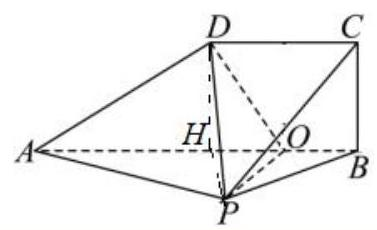

设 $C$ 到平面 ${PAD}$ 的距离为 $d,{V}_{C - {ADP}} = {V}_{P - {ADC}}$ ,

即 $\frac{1}{3} \times  \frac{\sqrt{3}}{4} \times  {\left( 2\sqrt{3}\right) }^{2} \cdot  d = \frac{1}{3} \times  \frac{1}{2} \times  2 \times  2\sqrt{2} \times  \sqrt{3}, d = \frac{2\sqrt{2}}{3}$ 所以点 $C$ 到平面 ${PAD}$ 距离为 $\frac{2\sqrt{2}}{3}$ . 14 分

19. (本题满分 14 分) 本题共有 3 个小题, 第 1 小题满分 4 分, 第 2 小题满分 4 分, 第 3 小题满分 6 分.

(1)填表如下 2 分

<table><tr><td></td><td>数学成绩总评优秀人数</td><td>数学成绩总评非优秀人数</td><td>合计</td></tr><tr><td>每天都整理数学错题人数</td><td>14</td><td>6</td><td>20</td></tr><tr><td>不是每天都整理数学错题人数</td><td>5</td><td>15</td><td>20</td></tr><tr><td>合计</td><td>19</td><td>21</td><td>40</td></tr></table>

每天都整理数学错题且数学成绩总评优秀的经验概率 $\widehat{P} = \frac{14}{40} = {0.35}$ . 4 分

(2)提出原假设 ${H}_{0}$ :数学成绩总评优秀与每天都整理数学错题无关. 5 分

确定显著性水平 $\alpha  = {0.01}$ ,即 $P\left( {{\chi }^{2} \geq  {6.635}}\right)  \approx  {0.01}$

计算 ${\chi }^{2} = \frac{{40} \times  {\left( {14} \times  {15} - 6 \times  5\right) }^{2}}{{20} \times  {20} \times  {19} \times  {21}} \approx  {8.120} > {6.635}$ , 7 分

所以原假设 ${H}_{0}$ 不成立,即有 99%的把握认为数学成绩总评优秀与每天都整理数学错题有关. 8 分

(3)不是每天都整理数学错题的学生中数学成绩总评优秀的有 5 个，不优秀的有 15 个， 恰好抽取到数学成绩总评优秀的人数为 $X$ ,

$P\left( {X = 0}\right)  = \frac{{\mathrm{C}}_{5}^{0}{\mathrm{C}}_{15}^{3}}{{\mathrm{C}}_{20}^{3}} = \frac{91}{228}, P\left( {X = 1}\right)  = \frac{{\mathrm{C}}_{5}^{1}{\mathrm{C}}_{15}^{2}}{{\mathrm{C}}_{20}^{3}} = \frac{35}{76},$

$P\left( {X = 2}\right)  = \frac{{\mathrm{C}}_{5}^{2}{\mathrm{C}}_{15}^{1}}{{\mathrm{C}}_{20}^{3}} = \frac{5}{38}, P\left( {X = 3}\right)  = \frac{{\mathrm{C}}_{5}^{3}{\mathrm{C}}_{15}^{0}}{{\mathrm{C}}_{20}^{3}} = \frac{1}{114},$ 12 分

故 $X$ 的分布为: $\left( \begin{matrix} 0 & 1 & 2 & 3 \\  \frac{91}{228} & \frac{35}{76} & \frac{5}{38} & \frac{1}{114} \end{matrix}\right)$ 13 分

所以 $X$ 的期望为 $E\left( X\right)  = 0 \times  \frac{91}{228} + 1 \times  \frac{35}{76} + 2 \times  \frac{5}{38} + 3 \times  \frac{1}{114} = \frac{3}{4}$ . 14 分

20. (本题满分 18 分, 第 1 小题满分 4 分, 第 2 小题满分 6 分, 第 3 小题满分 8 分)

(1)解:由题意: ${a}^{2} = 4$ ， ${b}^{2} = 3$ ， ${c}^{2} = {a}^{2} - {b}^{2} = 4 - 3 = 1$ ，得: $a = 2$ ， $c = 1$ ，…… 2 分因此 $\bigtriangleup A{F}_{1}{F}_{2}$ 的周长为 ${2a} + {2c} = 6$ . 4 分

(2)设 $Q\left( {x, y}\right) \left( {x > 0, y > 0}\right) , A\left( {0,\sqrt{3}}\right) , B\left( {0, - \sqrt{3}}\right) ,{F}_{1}\left( {-1,0}\right) ,{F}_{2}\left( {1,0}\right)$ ， ${S}_{\bigtriangleup }{ABQ} = \frac{1}{2}\left| {AB}\right|  \cdot  \left| x\right|  = \sqrt{3}x;{S}_{\bigtriangleup }{F}_{1}{F}_{2}Q = \frac{1}{2}\left| {{F}_{1}{F}_{2}}\right|  \cdot  \left| y\right|  = y$ , 6 分 $\left\{  {\begin{array}{l} \sqrt{3}x > y > 0 \\  \frac{{x}^{2}}{4} + \frac{{y}^{2}}{3} = 1 \end{array}\text{ ,解得 }x \in  \left( {\frac{2\sqrt{5}}{5},2}\right) }\right.$ ,即点 $Q$ 的横坐标取值范围为 $\left( {\frac{2\sqrt{5}}{5},2}\right)$ . 10 分

(3)过点 $A$ 、 $H$ 、 $O$ ( $O$ 为坐标原点)三点的圆是定圆. 11 分

法一: 设 ${l}_{PQ} : \left\{  \begin{array}{l} x = {my} + n \\  3{x}^{2} + 4{y}^{2} = {12} \end{array}\right.$ ,得 $\left( {3{m}^{2} + 4}\right) {y}^{2} + {6mny} + 3{n}^{2} - {12} = 0$ ,

$\Delta  = {36}{m}^{2}{n}^{2} - 4\left( {3{m}^{2} + 4}\right) \left( {3{n}^{2} - {12}}\right)  = {48}\left( {3{m}^{2} - {n}^{2} + 4}\right)  > 0,$

设 $P\left( {{x}_{1},{y}_{1}}\right) , Q\left( {{x}_{2},{y}_{2}}\right) ,{y}_{1} + {y}_{2} = \frac{-{6mn}}{3{m}^{2} + 4},{y}_{1}{y}_{2} = \frac{3{n}^{2} - {12}}{3{m}^{2} + 4}$ , 13 分

由题意 ${k}_{CP} = 3{k}_{DQ}$ ,即 $\frac{{y}_{1}}{{x}_{1} + 2} = \frac{3{y}_{2}}{{x}_{2} - 2},{y}_{1}\left( {m{y}_{2} + n - 2}\right)  = 3{y}_{2}\left( {m{y}_{1} + n + 2}\right)$ . 14 分

即 ${2m}{y}_{1}{y}_{2} + 3\left( {n + 2}\right) {y}_{2} - \left( {n - 2}\right) {y}_{1} = 0$ .

$\frac{{2m}\left( {3{n}^{2} - {12}}\right) }{3{m}^{2} + 4} + 4\left( {n + 1}\right) {y}_{2} - \left( {n - 2}\right) \left( {{y}_{1} + {y}_{2}}\right)  = 0,\frac{{6m}\left( {{n}^{2} - 4}\right) }{3{m}^{2} + 4} - \left( {n - 2}\right)  \cdot  \frac{-{6mn}}{3{m}^{2} + 4} + 4\left( {n + 1}\right) {y}_{2} = 0$ , $\frac{{12m}\left( {n - 2}\right) \left( {n + 1}\right) }{3{m}^{2} + 4} + 4\left( {n + 1}\right) {y}_{2} = 0,4\left( {n + 1}\right) \left\lbrack  {\frac{{3m}\left( {n - 2}\right) }{3{m}^{2} + 4} + {y}_{2}}\right\rbrack   = 0, n =  - 1$ ,即 ${l}_{PQ}$ 过定点 $\left( {-1,0}\right) .\;\cdots {16}$ 分设 $H\left( {x, y}\right) ,\left( {x + 1}\right) x + y\left( {y - \sqrt{3}}\right)  = 0$ 过原点,即过点 $A\text{ 、 }H\text{ 、 }O(O$ 为坐标原点)三点的圆是定圆 ${\left( x + \frac{1}{2}\right) }^{2} + {\left( y - \frac{\sqrt{3}}{2}\right) }^{2} = 1.$ 18 分

法二: 设 ${l}_{CP} : y = {3k}\left( {x + 2}\right) ,{l}_{DQ} : y = k\left( {x - 2}\right) \left( {k \neq  0}\right)$ , 12 分联立 $\left\{  \begin{array}{l} \frac{{x}^{2}}{4} + \frac{{y}^{2}}{3} = 1, \\  y = k\left( {x - 2}\right)  \end{array}\right.$ 消元得: $\left( {4{k}^{2} + 3}\right) {x}^{2} - {16}{k}^{2}x + {16}{k}^{2} - {12} = 0$ ,则 $2{x}_{Q} = \frac{{16}{k}^{2} - {12}}{4{k}^{2} + 3}$ 得 $Q\left( {\frac{8{k}^{2} - 6}{4{k}^{2} + 3},\frac{-{12k}}{4{k}^{2} + 3}}\right)$ , 13 分

同理联立 $\left\{  {\begin{array}{l} \frac{{x}^{2}}{4} + \frac{{y}^{2}}{3} = 1 \\  y = {3k}\left( {x + 2}\right)  \end{array},\left( {{12}{k}^{2} + 1}\right) {x}^{2} + {48}{k}^{2}x + {48}{k}^{2} - 4 = 0}\right.$ ,

$- 2 \cdot  {x}_{p} = \frac{{48}{k}^{2} - 4}{{12}{k}^{2} + 1}$ 得 $P\left( {\frac{-{24}{k}^{2} + 2}{{12}{k}^{2} + 1},\frac{12k}{{12}{k}^{2} + 1}}\right)$ . 14 分

① 当 ${x}_{p} \neq  {x}_{Q}$ 即 ${k}^{2} \neq  \frac{1}{4}$ 时， ${k}_{PQ} = \frac{\frac{12k}{{12}{k}^{2} + 1} - \frac{-{12k}}{4{k}^{2} + 3}}{\frac{-{24}{k}^{2} + 2}{{12}{k}^{2} + 1} - \frac{8{k}^{2} - 6}{4{k}^{2} + 3}} = \frac{4k}{1 - 4{k}^{2}}$ ,

${l}_{PQ} : y + \frac{12k}{4{k}^{2} + 3} = \frac{4k}{1 - 4{k}^{2}}\left( {x - \frac{8{k}^{2} - 6}{4{k}^{2} + 3}}\right)$ ,即 $y = \frac{4k}{1 - 4{k}^{2}}\left( {x + 1}\right)$ ,过 $\left( {-1,0}\right)$ . 15 分

② 当 ${x}_{P} = {x}_{Q}$ 即 ${k}^{2} = \frac{1}{4}$ 时，此时 ${x}_{P} = {x}_{Q} =  - 1$ ，也过 $\left( {-1,0}\right)$ ，故 ${l}_{PQ}$ 过定点 $\left( {-1,0}\right)$ ， 16 分设 $H\left( {x, y}\right) ,\left( {x + 1}\right) x + y\left( {y - \sqrt{3}}\right)  = 0$ 过原点,

即过点 $A\text{ 、 }H\text{ 、 }O\left( {O\text{ 为坐标原点 }}\right)$ 三点的圆是定圆 ${\left( x + \frac{1}{2}\right) }^{2} + {\left( y - \frac{\sqrt{3}}{2}\right) }^{2} = 1$ . 18 分

## 21. (本题满分 18 分, 第 1 小题满分 4 分, 第 2 小题满分 6 分, 第 3 小题满分 8 分)

解: (1) $y = \sin x$ 的 “ $W$ 函数” 为 $y = 1$ , 2 分

“ $W$ 点” 为 ${2k\pi } + \frac{\pi }{2}\left( {k \in  \mathbf{Z}}\right)$ . 4 分

(2)(i)(充分性)当 $M\bigcap N \neq  \varnothing$ 时，存在 ${x}_{0} \in  M\bigcap N$ ，则 ${x}_{0} \in  M$ ， ${x}_{0} \in  N$ ， 故 $f\left( {x}_{0}\right)  = g\left( {x}_{0}\right)  = h\left( {x}_{0}\right)$ .

又 $y = g\left( x\right)$ 为 $y = f\left( x\right)$ 的 “ $W$ 函数”, $y = h\left( x\right)$ 为 $y = g\left( x\right)$ 的 “ $W$ 函数”,

则对任意 $x \in  \mathbf{R}$ ,都有 $h\left( x\right)  \geq  g\left( x\right)  \geq  f\left( x\right)$ ,

故函数 $y = h\left( x\right)$ 为 $y = f\left( x\right)$ 的 “ $W$ 函数”. 7 分

(ii) (必要性) 当函数 $y = h\left( x\right)$ 为 $y = f\left( x\right)$ 的 “ $W$ 函数” 时,

存在 ${x}_{0} \in  \mathbf{R}$ ,使得 $f\left( {x}_{0}\right)  = h\left( {x}_{0}\right)$ .

又 $y = g\left( x\right)$ 为 $y = f\left( x\right)$ 的 “ $W$ 函数”, $y = h\left( x\right)$ 为 $y = g\left( x\right)$ 的 “ $W$ 函数”,

则对任意 $x \in  \mathbf{R}$ ,都有 $h\left( x\right)  \geq  g\left( x\right)  \geq  f\left( x\right)$ ,从而 $f\left( {x}_{0}\right)  = g\left( {x}_{0}\right)  = h\left( {x}_{0}\right)$ ,

故 ${x}_{0} \in  M,{x}_{0} \in  N$ ,即 ${x}_{0} \in  M \cap  N$ ,从而 $M \cap  N \neq  \varnothing$ . 10 分

(3) 令 $F\left( x\right)  = g\left( x\right)  - f\left( x\right)  = {kx} + m - \frac{x}{{\mathrm{e}}^{x}}$ ,则 ${F}^{\prime }\left( x\right)  = k - \frac{1 - x}{{\mathrm{e}}^{x}}$

因为 $y = g\left( x\right)$ 为 $y = f\left( x\right)$ 的 “ $W$ 函数”,且 “ $W$ 点” 为 ${x}_{0}$ ,

所以对于任意 $x \in  \mathbf{R}$ ,均有函数 $F\left( x\right)  \geq  0$ ,且 $F\left( {x}_{0}\right)  = 0$ ,进而 ${F}^{\prime }\left( {x}_{0}\right)  = 0$ ,

所以 $k = \frac{1 - {x}_{0}}{{\mathrm{e}}^{{x}_{0}}}, m = \frac{{x}_{0}}{{\mathrm{e}}^{{x}_{0}}} - k{x}_{0} = \frac{{x}_{0}^{2}}{{\mathrm{e}}^{{x}_{0}}}$ 12 分

得 $F\left( x\right)  = \frac{1 - {x}_{0}}{{\mathrm{e}}^{{x}_{0}}}x + \frac{{x}_{0}^{2}}{{\mathrm{e}}^{{x}_{0}}} - \frac{x}{{\mathrm{e}}^{x}}$ ,

当 ${x}_{0} > 1$ 时,设 ${x}_{1} = \frac{{x}_{0}^{2}}{{x}_{0} - 1}$ ,则 $F\left( {x}_{1}\right)  =  - \frac{{x}_{1}}{{\mathrm{e}}^{{x}_{1}}} < 0$ ,与 $F\left( x\right)  \geq  0$ 恒成立矛盾。所以 $0 < {x}_{0} \leq  1$ . 14 分令 $G\left( x\right)  = \frac{{x}^{2}}{{\mathrm{e}}^{x}}\left( {x > 0}\right)$ ,则 ${G}^{\prime }\left( x\right)  = \frac{{2x} - {x}^{2}}{{\mathrm{e}}^{x}}$ ,

当 $0 < x \leq  1$ 时， ${G}^{\prime }\left( x\right)  > 0$ ，从而 $y = G\left( x\right)$ 在 $(0,1\rbrack$ 上是严格增函数，

于是 $G\left( x\right)  \leq  G\left( 1\right)  = \frac{1}{\mathrm{e}}$ ,即 $m = \frac{{x}_{0}^{2}}{{\mathrm{e}}^{{x}_{0}}} \leq  \frac{1}{\mathrm{e}}$ . 16 分

当 $m = \frac{1}{\mathrm{e}}$ 时, ${x}_{0} = 1, k = 0,{F}^{\prime }\left( x\right)  = \frac{x - 1}{{\mathrm{e}}^{x}}, F\left( x\right)  = 1 - \frac{x}{{\mathrm{e}}^{x}}$

<table><tr><td>$x$</td><td>$\left( {-\infty ,1}\right)$</td><td>1</td><td>$\left( {1, + \infty }\right)$</td></tr><tr><td>${F}^{\prime }\left( x\right)$</td><td>-</td><td>0</td><td>+</td></tr><tr><td>$F\left( x\right)$</td><td>严格减</td><td>有极小值 $F\left( 1\right)  = 0$</td><td>严格增</td></tr></table>

所以当 $m = \frac{1}{\mathrm{e}}$ 时, $y = g\left( x\right)$ 为 $y = f\left( x\right)$ 的 “ $W$ 函数”, $m$ 的最大值为 $\frac{1}{\mathrm{e}}$ . 18 分

# 2025 届上海市杨浦区高三二模数学试卷

202504

## 一、填空题(本大题共有 12 题，满分 54 分，第 1-6 题每题 4 分，第 7-12 题每题 5 分)请在答题纸相 应编号的空格内直接写结果.

1. 已知集合 $A = \{ 1,2,3,4\} , B = \{ x \mid  1 < x < 4\}$ ，则 $A \cap  B =$ ___.

【答案】 $\{ 2,3\}$

【详解】因为集合 $A$ 中大于 1 且小于 4 的数只有 2,3,所以 $A \cap  B = \{ 2,3\}$ .

2. 不等式 $\frac{x + 1}{x - 2} < 0$ 的解集为___.

【答案】 $\left( {-1,2}\right)$

【详解】不等式 $\frac{x + 1}{x - 2} < 0$ 等价于 $\left( {x + 1}\right) \left( {x - 2}\right)  < 0$ ,解得 $- 1 < x < 2$ ,

因此,不等式 $\frac{x + 1}{x - 2} < 0$ 的解集为 $\left( {-1,2}\right)$ ,故答案为 $\left( {-1,2}\right)$ .

3. 函数 $y = \sin {2x}$ 的最小正周期是___.

【答案】 $\pi$

【详解】 $y = \sin {2x}$ 的最小正周期是 $\frac{2\pi }{2} = \pi$ ,故答案为: $\pi$

4. 已知 $\sin \theta  = \frac{3}{5}$ ,则 $\cos {2\theta } =$ ___.

【答案】 $\frac{7}{25}$

【详解】因为 $\sin \theta  = \frac{3}{5}$ ,所以 $\cos {2\theta } = 1 - 2{\sin }^{2}\theta  = 1 - 2 \times  {\left( \frac{3}{5}\right) }^{2} = \frac{7}{25}$ ,故答案为: $\frac{7}{25}$

5. 已知 $a > 0, b > 0, a + b = 2,{ab}$ 的最大值为___.

【答案】 1

【详解】由基本不等式得 ${ab} \leq  {\left( \frac{a + b}{2}\right) }^{2} = 1$ .

6. 在 ${\left( x + \frac{1}{\sqrt{x}}\right) }^{6}$ 的二项展开式中,常数项的值为___

【答案】 15

【详解】二项展开式通项为: ${C}_{6}^{r} \cdot  {x}^{6 - r} \cdot  {\left( \frac{1}{\sqrt{x}}\right) }^{r} = {C}_{6}^{r} \cdot  {x}^{6 - r} \cdot  {x}^{-\frac{r}{2}} = {C}_{6}^{r} \cdot  {x}^{6 - \frac{3r}{2}}$

当 $6 - \frac{3r}{2} = 0$ 时, $r = 4,\therefore$ 常数项为: ${C}_{6}^{4} = {15}$

7. 已知复数 $z$ 满足 $\left| {z - 1 + \mathrm{i}}\right|  = 1$ ，其中 $\mathrm{i}$ 为虚数单位，则 $\left| z\right|$ 的最小值为___.

【答案】 $\sqrt{2} - 1$

【详解】在复平面内, $\left| {z - 1 + \mathrm{i}}\right|  = 1$ 表示复数 $z$ 对应的点 $Z$ 与复数 $1 - \mathrm{i}$ 对应点 $A\left( {1, - 1}\right)$ 的距离为 1, 因此点 $Z$ 的轨迹是以 $A\left( {1, - 1}\right)$ 为圆心,1 为半径的圆, $\left| z\right|$ 表示点 $Z$ 到原点 $O$ 的距离,所以 $\left| z\right|$ 的最小值为 $\left| {OA}\right|  - 1 = \sqrt{2} - 1$ .

8. 不等式 $\left| {x + 3}\right|  + \left| {a - x}\right|  > 6$ 对一切实数 $x$ 恒成立,则实数 $a$ 的取值范围为___.

【答案】 $\left( {-\infty , - 9}\right)  \cup  \left( {3, + \infty }\right)$

【详解】 $\left| {x + 3}\right|$ 表示 $x$ 到 -3 的距离， $\left| {a - x}\right|  = \left| {x - a}\right|$ 表示 $x$ 到 $a$ 的距离，它们的和为 $x$ 到 -3 和 $x$ 到 $a$ 的距离之和,根据三角不等式,当 $x$ 位于 -3 和 $a$ 之间时,距离和取得最小值,即两点之间的距离为 $\left| {a - \left( {-3}\right) }\right|  = \left| {a + 3}\right|$ ,所以不等式 $\left| {x + 3}\right|  + \left| {a - x}\right|  > 6$ 对一切实数 $x$ 恒成立等价于若最小值 $\left| {a + 3}\right|  > 6$ ,则原式对所有 $x$ 恒成立,所以 $a + 3 > 6$ 或 $a + 3 <  - 6$ ,解得 $a > 3$ 或 $a <  - 9$ . 故答案为: $\left( {-\infty , - 9}\right)  \cup  \left( {3, + \infty }\right)$ .

9. 植物社团的同学观察一株植物的生长情况,为了解植物高度 $y$ (单位: 厘米) 与生长期 $x$ (单位: 天) 之间的关系, 随机统计了某 4 天的植物高度, 并制作了如下对照表:

<table><tr><td>生长期 $x$</td><td>3</td><td>9</td><td>11</td><td>17</td></tr><tr><td>植物高度 $y$</td><td>2.4</td><td>3.4</td><td>3.8</td><td>5.2</td></tr></table>

由表中数据可得回归方程 $y = \widehat{a}x + \widehat{b}$ 中 $\widehat{a} = 0$ .2,试预测生长期是 30 天时,植物高度约为___ *- $\left( {\widehat{a} = \frac{\mathop{\sum }\limits_{{i = 1}}^{n}{x}_{i}{y}_{i} - n\overline{xy}}{\mathop{\sum }\limits_{{i = 1}}^{n}{x}_{i}^{2} - n{\bar{x}}^{2}},\widehat{b} = \bar{y} - \widehat{a}\bar{x}}\right)$

【答案】 7.7

【详解】由题意可得 $\bar{x} = \frac{3 + 9 + {11} + {17}}{4} = {10},\bar{y} = \frac{{2.4} + {3.4} + {3.8} + {5.2}}{4} = {3.7}$ ,

所以 $\widehat{b} = \bar{y} - \widehat{a}\bar{x} = {3.7} - {0.2} \times  {10} = {1.7}$ ,所以回归方程为 $y = {0.2x} + {1.7}$ ,

所以预测生长期是 30 天时,植物高度约为 ${0.2} \times  {30} + {1.7} = {7.7}$ 厘米. 故答案为: 7.7 .

10. 如图,点 $D\text{ 、 }E$ 分别是直角三角形 ${ABC}$ 的边 ${AB}\text{ 、 }{AC}$ 上的点,斜边 ${AC}$ 与扇形的弧 $\overset{\text{ ⏜ }}{DE}$ 相切,已知 ${AC} = 4,{BC} = 2$ ，则阴影部分绕直线 ${AB}$ 旋转一周所形成的几何体的体积为___.

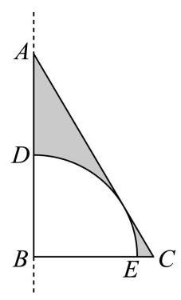

【答案】 $\frac{2\sqrt{3}\pi }{3}$

【详解】在 Rt $\bigtriangleup {ABC}$ 中, $\angle B = {90}^{ \circ  }$ ,则 ${AB} = \sqrt{A{C}^{2} - B{C}^{2}} = \sqrt{{4}^{2} - {2}^{2}} = 2\sqrt{3}$ ,

由斜边 ${AC}$ 与扇形的弧 $\overset{\text{ ⏜ }}{DE}$ 相切,扇形半径 $r = \frac{{AB} \cdot  {BC}}{AC} = \sqrt{3}$ ,

阴影部分绕直线 ${AB}$ 旋转一周所形成的几何体是 $\mathrm{{Rt}} \bigtriangleup  {ABC}$ 绕直线 ${AB}$ 旋转一周所得圆锥，

挖去扇形弧 $\overset{\text{ ⏜ }}{DE}$ 绕直线 ${AB}\;{AB}$ 旋转一周所得半球,所以所求体积为

$\frac{1}{3}\pi  \times  {2}^{2} \times  2\sqrt{3} - \frac{1}{2} \times  \frac{4\pi }{3} \times  {\left( \sqrt{3}\right) }^{3} = \frac{2\sqrt{3}\pi }{3}$ . 故答案为: $\frac{2\sqrt{3}\pi }{3}$

11. 如图,阿基米德椭圆规是由基座、带孔的横杆、两条互相垂直的空槽、两个可动滑块 $A\text{ 、 }B$ 组成的一种绘图工具,横杆的一端 $C$ 上装有铅笔,假设两条互相垂直的空槽和带孔的横杆都足够长,将滑块 $A\text{ 、 }B$ 固定在带孔的横杆上,令滑块 $\mathrm{A}$ 在中一条空槽上滑动,滑块 $B$ 在另一条空槽上滑动,铅笔 $C$ 随之运动就能画出椭圆. 当 $A\text{ 、 }B$ 之间的距离为 14 厘米时,若需要画出一个离心率为 $\frac{4}{5}$ 的椭圆,则 $B\text{ 、 }C$ 之间的距离为 ___.厘米.

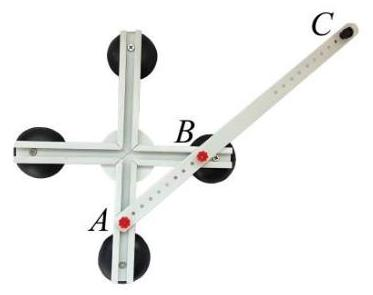

【答案】 21

【详解】依题意,当滑块 $B$ 在两条空槽的交点处时, ${BC}$ 长为椭圆的短半轴长 $b$ ,

当滑块 $\mathrm{A}$ 在两条空槽的交点处时, ${AC}$ 长为椭圆的长半轴长 $a$ ,则 $a = {14} + b$ ,

由椭圆的离心率为 $\frac{4}{5}$ ,得 $\frac{\sqrt{{a}^{2} - {b}^{2}}}{a} = \sqrt{1 - {\left( \frac{b}{a}\right) }^{2}} = \frac{4}{5}$ ,解得 $\frac{b}{a} = \frac{3}{5}$ ,即 $\frac{b}{{14} + b} = \frac{3}{5}$ ,解得 $b = {21}$ ,

所以 $B\text{ 、 }C$ 之间的距离为 21 厘米. 故答案为:21

12. 由若干个多边形所覆盖的区域,称为这些多边形的并集,例如图中,梯形 ${ACDE}$ 是 $\bigtriangleup {ACE}$ 与矩形 ${BCDE}$ 的并集. 已知 $n$ 是正整数,在平面直角坐标系 ${xOy}$ 中,直线 ${l}_{n}$ 的方程为 $y =  - {2}^{n}x + n$ ,若直线 ${l}_{n}$ 交 $x$ 轴于点 ${A}_{n}$ ，交 $y$ 轴于点 ${B}_{n}$ ，则 $\bigtriangleup  {A}_{1}O{B}_{1}$ ， $\bigtriangleup  {A}_{2}O{B}_{2}$ ， $\cdots$ ， $\bigtriangleup  {A}_{10}O{B}_{10}$ 的并集，其面积为___.

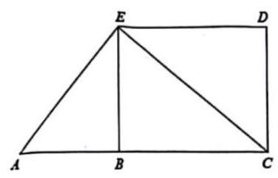

【答案】 $\frac{767}{1024}$

【详解】由题意可得 ${A}_{n}\left( {\frac{n}{{2}^{n}},0}\right) ,{B}_{n}\left( {0, n}\right)$ ,令 ${a}_{n} = \frac{n}{{2}^{n}}$ ,则 ${a}_{n + 1} - {a}_{n} = \frac{n + 1}{{2}^{n + 1}} - \frac{n}{{2}^{n}} = \frac{1 - n}{{2}^{n + 1}}$ ,

当 $n = 1$ 时, ${a}_{n + 1} - {a}_{n} = 0$ ; 当 $n \geq  2$ 时, ${a}_{n + 1} - {a}_{n} < 0$ ,即 ${a}_{1} = {a}_{2} > {a}_{3} > {a}_{4} > \cdots$ ,

则随着三角形的个数增加, 所有三角形围成的图形每次增加一个小三角形,

设直线 ${l}_{n}$ 与直线 ${l}_{n + 1}$ 的交点为 ${C}_{n}$ ,联立 $\left\{  \begin{array}{l} y =  - {2}^{n}x + n \\  y =  - {2}^{n + 1}x + n + 1 \end{array}\right.$ ,解得 $x = \frac{1}{{2}^{n}}, y = n - 1$ ,即 ${C}_{n}\left( {\frac{1}{{2}^{n}}, n - 1}\right)$ , 则 ${S}_{\bigtriangleup {C}_{n}{B}_{n}{B}_{n + 1}} = \frac{1}{2}\left| {{B}_{n}{B}_{n + 1}}\right|  \cdot  {x}_{{C}_{n}} = \frac{1}{2} \times  \left( {n + 1 - n}\right)  \times  \frac{1}{{2}^{n}} = \frac{1}{{2}^{n + 1}}$ ,

设前 $n$ 个三角形围成图形的面积为 ${S}_{n}$ ,则 ${S}_{n + 1} - {S}_{n} = {S}_{\bigtriangleup {C}_{n}{B}_{n}{B}_{n + 1}} = \frac{1}{{2}^{n + 1}}$ ,

且 ${S}_{1} = {S}_{\bigtriangleup O{A}_{1}{B}_{1}} = \frac{1}{2} \times  \frac{1}{2} \times  1 = \frac{1}{4}$ ,则 ${S}_{2} - {S}_{1} = \frac{1}{{2}^{2}},{S}_{3} - {S}_{2} = \frac{1}{{2}^{3}},\cdots ,{S}_{n} - {S}_{n - 1} = \frac{1}{{2}^{n}}, n \geq  2$ ,

由累加法可得, ${S}_{n} - {S}_{1} = \frac{1}{{2}^{2}} + \frac{1}{{2}^{3}} + \cdots  + \frac{1}{{2}^{n}} = \frac{\frac{1}{{2}^{2}} - \frac{1}{{2}^{n + 1}}}{1 - \frac{1}{2}} = \frac{1}{2} - \frac{1}{{2}^{n}}, n \geq  2$ ,

则 ${S}_{n} = \frac{3}{4} - \frac{1}{{2}^{n}}, n \geq  2$ ,而 ${S}_{1} = \frac{1}{4}$ 符合上式,则 ${S}_{n} = \frac{3}{4} - \frac{1}{{2}^{n}}, n \in  {\mathrm{N}}^{ * }$ ,故 ${S}_{10} = \frac{3}{4} - \frac{1}{{2}^{10}} = \frac{767}{1024}$ ,

则 $\bigtriangleup  {A}_{1}O{B}_{1}, \bigtriangleup  {A}_{2}O{B}_{2},\cdots , \bigtriangleup  {A}_{10}O{B}_{10}$ 的并集,其面积为 $\frac{767}{1024}$ .

故答案为: $\frac{767}{1024}$ .

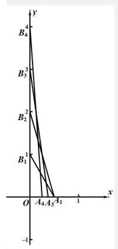

## 二、选择题(本大题共有 4 题，满分 18 分，第 13-14 题每题 4 分，第 15-16 题每题 5 分)每题有且只 有一个正确选项，请在答题纸的相应编号上将代表答案的小方格涂黑.

13. $\bigtriangleup {ABC}$ 中，" $\sin A = \sin B$ " 是 “ $A = B$ " 的())条件.

A. 充分非必要 B. 必要非充分

C. 充要 D. 既非充分也非必要

【答案】C

【详解】在 $\bigtriangleup  {ABC}$ 中,令内角 $A, B, C$ 所对的边分别为 $a, b, c$ ，由正弦定理得

$\sin A = \sin B \Leftrightarrow  a = b \Leftrightarrow  A = B$ ,

所以 $\sin A = \sin B$ ” 是 “ $A = B$ ” 的充要条件. 故选: C

14.3 名同学报名参加社团活动, 有 4 个社团可以报名, 这些社团招收人数不限, 但每位同学只能报名其中 1 个社团，则这 3 位同学可能的报名结果共有( )种.

A. 6 B. 24 C. 64 D. 81

【答案】C

【详解】由题意可得每位同学有 4 种选择,根据乘法原理,共有 ${4}^{3} = {64}$ 种. 故选: C

15. 已知 $\mathrm{A}\text{ 、 }B\text{ 、 }C$ 是单位圆上的三个点,若 $\left| \overrightarrow{AB}\right|  = \sqrt{2}$ ,则 $\overrightarrow{AB} \cdot  \overrightarrow{BC}$ 的最大值为 ( ) .

A. $\sqrt{2}$

B. $1 + \frac{\sqrt{2}}{2}$ C. $\sqrt{2} + 1$ D. $\sqrt{2} - 1$

【答案】D

【详解】因为 $\mathrm{A}\text{ 、 }B\text{ 、 }C$ 是单位圆上的三个点,如图建立平面直角坐标系,

因为 $\left| \overrightarrow{AB}\right|  = \sqrt{2}$ ,即 $\left| {\overrightarrow{OB} - \overrightarrow{OA}}\right|  = \sqrt{2}$ ,所以 ${\overrightarrow{OB}}^{2} - 2\overrightarrow{OB} \cdot  \overrightarrow{OA} + {\overrightarrow{OA}}^{2} = 2$ ,所以 $\overrightarrow{OB} \cdot  \overrightarrow{OA} = 0$ ,即 $\overrightarrow{OB} \bot  \overrightarrow{OA}$ , 不妨设 $A\left( {1,0}\right)$ ， $B\left( {0,1}\right)$ ，设 $C\left( {\cos \alpha ,\sin \alpha }\right)$ ，所以 $\overrightarrow{AB} = \left( {-1,1}\right)$ ， $\overrightarrow{BC} = \left( {\cos \alpha ,\sin \alpha  - 1}\right)$ ， 所以 $\overrightarrow{AB} \cdot  \overrightarrow{BC} =  - \cos \alpha  + \sin \alpha  - 1 = \sqrt{2}\sin \left( {\alpha  - \frac{\pi }{4}}\right)  - 1$ ,

所以当 $\sin \left( {\alpha  - \frac{\pi }{4}}\right)  = 1$ ,即 $\alpha  - \frac{\pi }{4} = \frac{\pi }{2} + {2k\pi }, k \in  \mathrm{Z}$ 时 $\overrightarrow{AB} \cdot  \overrightarrow{BC}$ 取得最大值,且 ${\left( \overrightarrow{AB} \cdot  \overrightarrow{BC}\right) }_{\max } = \sqrt{2} - 1$ . 故选: D

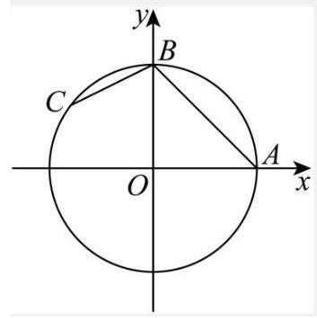

16. 设 $\mathrm{A}$ 是由 $k$ 个二次函数组成的集合,对于连续的正整数 $1,2,3,\cdots ,{2025}$ ,存在二次函数 $y = {f}_{i}\left( x\right)  \in  A\left( {1 \leq  i \leq  {2025}, i \in  \mathbf{Z}, y = {f}_{i}\left( x\right) \text{ 可重复),使得 }{f}_{1}\left( 1\right) ,{f}_{2}\left( 2\right) ,{f}_{3}\left( 3\right) ,\cdots ,{f}_{2025}\left( {2025}\right) }\right)$ 是等差数列,则 $k$ 的最小可能值是 ( ) .

A. 507 B. 1013 C. 1519 D. 2025

【答案】B

【详解】设等差数列的首项为 $a$ ,公差为 $d$ ,则第 $i$ 项满足 ${a}_{i} = a + \left( {i - 1}\right) d$ ,

每个二次函数 ${f}_{i}\left( x\right)  = {a}_{i}{x}^{2} + {b}_{i}x + {c}_{i}$ 满足 ${f}_{i}\left( i\right)  = {a}_{i}{i}^{2} + {b}_{i}i + {c}_{i} = {a}_{1} + \left( {i - 1}\right) d$ ,

变形为 ${a}_{i}{i}^{2} + \left( {{b}_{i} - d}\right) i + \left( {{c}_{i} - a + d}\right)  = 0$ ,

对于固定的 ${a}_{i},{b}_{i},{c}_{i}, d$ ,这是一个关于 $i$ 的二次方程,最多有两个整数解,因此,每个二次函数最多能覆盖两个不同的 $i$ 值. 所以总共 2025 个 $i$ 值需要覆盖,因此需要 $\frac{2025}{2} = {1012.5}$ 个,但 $i$ 为整数,所以需要 1013 个.故选: B

## 三、解答题 (本大题共有 5 题, 本大题满分 78 分) 请在答题纸相应的编号规定区域内写出必要的步骤.

17. 已知函数 $y = f\left( x\right)$ 是定义在 $\mathbf{R}$ 上的偶函数.

(1)当 $x \in  \lbrack 0, + \infty )$ 时， $f\left( x\right)  = {\log }_{2}\left( {x + 1}\right)$ ，求 $x \in  \left( {-\infty ,0}\right)$ 时， $y = f\left( x\right)$ 的表达式；

(2)当 $x \in  \lbrack 0, + \infty )$ 时， $f\left( x\right)  = {x}^{3} + {2025}^{x}$ ，若实数 $t$ 满足 $f\left( {{3t} - 2}\right)  < f\left( {t - 1}\right)$ ，求 $t$ 的取值范围.

【答案】( 1 ) $f\left( x\right)  = {\log }_{2}\left( {-x + 1}\right)$ (2) $\frac{1}{2} < t < \frac{3}{4}$

【解析】(1) 因为函数 $y = f\left( x\right)$ 是定义在 $\mathbf{R}$ 上的偶函数,即 $f\left( {-x}\right)  = f\left( x\right)$

当 $x \in  \left( {-\infty ,0}\right)$ 时, $- x \in  \left( {0, + \infty }\right)$ ,所以 $f\left( {-x}\right)  = {\log }_{2}\left( {-x + 1}\right)$ ,所以 $f\left( x\right)  = {\log }_{2}\left( {-x + 1}\right)$ .

( 2 )当 $x \in  \lbrack 0, + \infty )$ 时， $f\left( x\right)  = {x}^{3} + {2025}^{x}$ ，由幂函数和指数函数的单调性可得 $f\left( x\right)$ 为递增函数.

又函数为偶函数,所以 $f\left( {{3t} - 2}\right)  < f\left( {t - 1}\right)  \Leftrightarrow  \left| {{3t} - 2}\right|  < \left| {t - 1}\right|$ ,

两边平方后展开可得 $9{t}^{2} - {12t} + 4 < {t}^{2} - {2t} + 1$ ,即 $8{t}^{2} - {10t} + 3 < 0$ ,解得 $\frac{1}{2} < t < \frac{3}{4}$ .

18. 座落于杨浦滨江的世界技能博物馆由百年历史文化保护建筑改建而成, 其中的支柱保留了原有的正八棱柱,既考虑了结构力学优势,又体现了对历史建筑的尊重和传承. 如图, ${O}_{1}\text{ 、 }O$ 分别为正八棱柱的上下两个底面的中心,已知 ${OA} = 1, A{A}_{1} = 4$ .

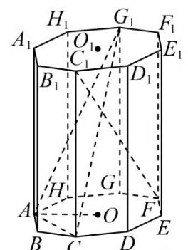

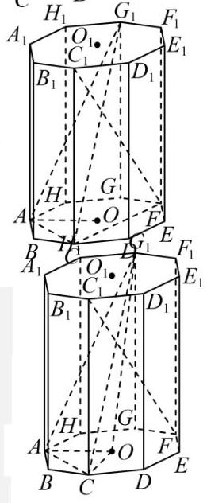

(1)求证: ${BC}\bot {C}_{1}F$ ；

(2)求点 $O$ 到平面 ${AC}{G}_{1}$ 的距离.

【答案】(1)证明见解析

(2) $\frac{2}{3}$

【解析】(1)连接 ${CF}$ ,因为底面为正八边形,所以 ${CF} \bot  {BC}$ ,

又正八棱柱侧棱 $C{C}_{1} \bot$ 底面 ${ABCDEFGH}$ , ${BC} \subset$ 底面 ${ABCDEFGH}$ ,

所以 $C{C}_{1} \bot  {BC}, C{C}_{1} \cap  {CF} = C, C{C}_{1},{CF} \subset$ 平面 ${CF}{C}_{1}$ ,

所以 ${BC} \bot$ 平面 ${CF}{C}_{1}$ ,又 ${C}_{1}F \subset$ 平面 ${CF}{C}_{1}$ ,所以 ${BC} \bot  {C}_{1}F$ .

(2)连接 ${OC}, O{G}_{1}$ ，因为 ${OA} = 1,{A{A}_{1}} = 4$ ，

由正八边形 ${ABCDEFGH}$ 的性质可得 $\angle {AOB} = \frac{{360}^{ \circ  }}{8} = {45}^{ \circ  },{OC} = {OA} = 1,{G{G}_{1}}$ 为 ${G}_{1}$ 到底面 ${AOC}$ 的距离， $G{G}_{1} = 4$ ，所以 ${S}_{\bigtriangleup {AOC}} = \frac{1}{2} \times  1 \times  1 = \frac{1}{2}$ ，

由勾股定理可得, $A{C}^{2} = A{O}^{2} + C{O}^{2} = 2$ ,

又 $A{G}^{2} = A{C}^{2} = 2$ ,所以 $A{G}_{1} = \sqrt{2 + {16}} = \sqrt{18} = 3\sqrt{2}$ ,

又 ${CG} = {2AO} = 2$ ,所以 $C{G}_{1} = \sqrt{4 + {16}} = \sqrt{20} = 2\sqrt{5}$ ,

因为 $A{C}^{2} + A{G}_{1}^{2} = C{G}_{1}^{2}$ ,所以 ${AC} \bot  A{G}_{1}$ ,即 ${S}_{\bigtriangleup {AC}{G}_{1}} = \frac{1}{2} \times  \sqrt{2} \times  3\sqrt{2} = 3$ ,

设点 $O$ 到平面 ${AC}{G}_{1}$ 的距离为 $d$ ,则 ${V}_{O - {AC}{G}_{1}} = {V}_{{G}_{1} - {OAC}}$ ,即 $\frac{1}{3} \times  {S}_{\bigtriangleup {{AC}{G}_{1}}} \cdot  d = \frac{1}{3} \times  {S}_{\bigtriangleup {AOC}} \times  4$ ,即 ${3d} = 2$ , 解得 $d = \frac{2}{3}$ ,所以点 $O$ 到平面 ${AC}{G}_{1}$ 的距离为 $\frac{2}{3}$ .

19. 为弘扬中华民族传统文化、增强民族自豪感，某学校开展中华古诗词背诵比赛，分为初赛和复赛. 全校同学都参加了初赛，并随机抽取一个班级进行初赛成绩统计，已知该班级共有 40 位学生, 他们的初赛分数的频率分布直方图如图所示:

(1)计算 $b$ 的值，并估计该校这次初赛的平均分数.

让优秀成为一种习惯！

(2)初赛分数达到 80 及以上的同学，称为优秀参赛选手，现从班级中随机选出 2 位同学，用 $X$ 代表其中的优秀参赛选手人数，求 $X$ 的分布；

(3)为增加比赛的趣味性，复赛规则如下:复赛试题将从题库中随机抽取，每位参赛选手将有机会回答填空、选择和简答各 1 题; 每答对 1 题得 1 分, 答错或不答得 0 分, 每位选手可以自行选择回答问题的顺序, 若答对一题可继续答下一题, 直到 3 题全部答完; 若答错或不答则比赛结束. 例如: 选手甲可自行按“简答一填空一选择”顺序答题，甲答对第一题得 1 分，并继续回答第二题且答错得 0 分，结束比赛, 总分为 1 分.

小杨作为优秀参赛选手, 代表班级参加复赛.根据他初赛的答题正确频率, 可估计他填空、选择和简答的答题正确概率分别为:

<table><tr><td>题型</td><td>填空</td><td>选择</td><td>简答</td></tr><tr><td>答题正确概率</td><td>80%</td><td>90%</td><td>80%</td></tr></table>

若小杨每次答题的结果都相互独立, 那么为尽量在比赛中获得较高分数, 小杨应该采用怎样的答题顺序? 请说明理由.

【答案】(1) $b = {0.010}$ ；该校这次初赛的平均分数为 68 分 (2)分布列见解析 (3)答案见解析

【解析】(1) 由频率分步直方图中小矩形的面积和为 1 可得: ${20} \times  \left( {{0.005} + b + {0.020} + {0.015}}\right)  = 1$ , 解得 $b = {0.010}$ ; 该校这次初赛的平均分数为

${20} \times  \left( {{30} \times  {0.005} + {50} \times  {0.010} + {70} \times  {0.020} + {90} \times  {0.015}}\right)  = {68}.$

(2)初赛分数达到 80 及以上的同学为 ${0.015} \times  {20} \times  {40} = {12}$ 人，非优秀为 28 人，

由题意可得 $X$ 的可能取值为 $0,1,2, P\left( {X = 0}\right)  = \frac{{\mathrm{C}}_{28}^{2}}{{\mathrm{C}}_{40}^{2}} = \frac{\frac{{28} \times  {27}}{2}}{\frac{{40} \times  {39}}{2}} = \frac{63}{130}$ ,

$P\left( {X = 1}\right)  = \frac{{\mathrm{C}}_{28}^{1}{\mathrm{C}}_{12}^{1}}{{\mathrm{C}}_{40}^{2}} = \frac{{28} \times  {12}}{\frac{{40} \times  {39}}{2}} = \frac{56}{130} = \frac{28}{65}, P\left( {X = 2}\right)  = \frac{{\mathrm{C}}_{12}^{2}}{{\mathrm{C}}_{40}^{2}} = \frac{\frac{{12} \times  {11}}{2}}{\frac{{40} \times  {39}}{2}} = \frac{11}{130},$

所以 $X$ 的分布列为:

<table><tr><td>$X$</td><td>0</td><td>1</td><td>2</td></tr><tr><td>$P$</td><td>63 130</td><td>28 65</td><td>11 130</td></tr></table>

(3) 按照不同题目顺序分类讨论: 填空, 选择, 简答:

得零分的概率: $1 - {0.8} = {0.2}$ ,得一分的概率: ${0.8} \times  \left( {1 - {0.9}}\right)  = {0.08}$ ,得两分的概率:

${0.8} \times  {0.9} \times  {0.2} = {0.144}$ ,

得三分的概率: ${0.8} \times  {0.9} \times  {0.8} = {0.576}$ ,

期望为 ${E}_{1} = 0 \times  {0.2} + 1 \times  {0.08} + 2 \times  {0.144} + 3 \times  {0.576} = {2.096}$ 分;

因为填空和简答的正确率相同, 所以 “简答, 选择, 填空” 的期望与之相同;

填空, 简答, 选择:

得零分的概率: $1 - {0.8} = {0.2}$ ,

得一分的概率: ${0.8} \times  {0.2} = {0.16}$ ,

得两分的概率: ${0.8} \times  {0.8} \times  {0.1} = {0.064}$ ,

得三分的概率: ${0.8} \times  {0.8} \times  {0.9} = {0.576}$ ,

期望为 ${E}_{2} = 0 \times  {0.2} + 1 \times  {0.16} + 2 \times  {0.064} + 3 \times  {0.576} = {2.016}$ 分;

因为填空和简答的正确率相同, 所以 “简答, 填空, 选择” 的期望与之相同;

选择, 填空, 简答:

得零分的概率: $1 - {0.9} = {0.1}$ ,

得一分的概率: ${0.9} \times  \left( {1 - {0.8}}\right)  = {0.18}$ ,

得两分的概率: ${0.9} \times  {0.8} \times  {0.2} = {0.144}$ ,

得三分的概率: ${0.9} \times  {0.8} \times  {0.8} = {0.576}$ ,

期望为 ${E}_{3} = 0 \times  {0.1} + 1 \times  {0.18} + 2 \times  {0.144} + 3 \times  {0.576} = {2.196}$ 分;

因为填空和简答的正确率相同, 所以 “选择，简答，填空” 的期望与之相同；

所以 ${E}_{3} > {E}_{1} > {E}_{2}$ ,

小杨应采用“选择，填空，简答”或“选择，简答，填空”的顺序.

20. 已知双曲线 $\Gamma$ 的标准方程为 ${x}^{2} - \frac{{y}^{2}}{2} = 1$ ,点 $P$ 是双曲线 $\Gamma$ 右支上的一个动点.

(1)求双曲线 $\Gamma$ 的焦点坐标和渐近线方程；

(2)过点 $P$ 分别向两条渐近线作垂线，垂足为点 ${P}_{1},{P}_{2}$ ，求 $\overrightarrow{P{P}_{1}} \cdot  \overrightarrow{P{P}_{2}}$ 的值；

(3)若 $\left| {OP}\right|  > \sqrt{2}$ ，如图，过 $P$ 作圆 $O : {x}^{2} + {y}^{2} = 2$ 的切线 $l$ ，切点为 $M$ ，交双曲线 $\Gamma$ 的左支于点 $Q$ ,分别交两条渐近线于点 $A\text{ 、 }B$ . 设 $\left| {PQ}\right|  = \lambda \left| {AB}\right|$ ,求实数 $\lambda$ 的取值范围.

【答案】(1) 焦点坐标为 $\left( {\pm \sqrt{3},0}\right)$ ,渐近线方程为 $y =  \pm  \sqrt{2}x\;\left( 2\right)$ (2) $\frac{2}{9}$ (3) $\left( {1,\sqrt{2}}\right\rbrack$

【解析】(1) 双曲线 $\Gamma$ 的标准方程为 ${x}^{2} - \frac{{y}^{2}}{2} = 1$ ,则 $c = \sqrt{3}$ ,

所以双曲线 $\Gamma$ 的焦点坐标为 $\left( {\pm \sqrt{3},0}\right)$ ,渐近线方程为 $y =  \pm  \sqrt{2}x$ ;

( 2 )设 $P\left( {m, n}\right)$ ，则 $2{m}^{2} - {n}^{2} = 2$ ，由 $\left\{  \begin{array}{l} y = \sqrt{2}x \\  y - n =  - \frac{\sqrt{2}}{2}\left( {x - m}\right)  \end{array}\right.$ ，解得 $\left\{  \begin{array}{l} x = \frac{m + \sqrt{2}n}{3} \\  y = \frac{\sqrt{2}m + {2n}}{3} \end{array}\right.$ ，所以 ${P}_{1}\left( {\frac{m + \sqrt{2}n}{3},\frac{\sqrt{2}m + {2n}}{3}}\right)$ ,由 $\left\{  \begin{array}{l} y =  - \sqrt{2}x \\  y - n = \frac{\sqrt{2}}{2}\left( {x - m}\right)  \end{array}\right.$ ,解得 $\left\{  \begin{array}{l} x = \frac{m - \sqrt{2}n}{3} \\  y = \frac{-\sqrt{2}m + {2n}}{3} \end{array}\right.$ ,所以 ${P}_{2}\left( {\frac{m - \sqrt{2}n}{3},\frac{-\sqrt{2}m + {2n}}{3}}\right) ,$ 所以 $\overrightarrow{P{P}_{1}} = \left( {\frac{-{2m} + \sqrt{2}n}{3},\frac{\sqrt{2}m - n}{3}}\right) ,\overrightarrow{P{P}_{2}} = \left( {\frac{-{2m} - \sqrt{2}n}{3},\frac{-\sqrt{2}m - n}{3}}\right)$ , 所以 $\overrightarrow{P{P}_{1}} \cdot  \overrightarrow{P{P}_{2}} = \frac{\left( {\sqrt{2}n - {2m}}\right) \left( {-{2m} - \sqrt{2}n}\right) }{9} + \frac{\left( {\sqrt{2}m - n}\right) \left( {-\sqrt{2}m - n}\right) }{9} \; = \frac{4{m}^{2} - 2{n}^{2} + {n}^{2} - 2{m}^{2}}{9} = \frac{2{m}^{2} - {n}^{2}}{9} = \frac{2}{9}$ ,即 $\overrightarrow{P{P}_{1}} \cdot  \overrightarrow{P{P}_{2}} = \frac{2}{9}$ .

(3)

设切点 $M\left( {s, t}\right)$ ,则切线 $l$ 的方程为 ${sx} + {ty} = 2$ ,且 ${s}^{2} + {t}^{2} = 2$ ,

由 $\left\{  \begin{array}{l} {x}^{2} + {y}^{2} = 2 \\  {x}^{2} - \frac{{y}^{2}}{2} = 1 \end{array}\right.$ ,解得 $\left\{  \begin{array}{l} {y}^{2} = \frac{2}{3} \\  {x}^{2} = \frac{4}{3} \end{array}\right.$ ,所以 $\left\{  \begin{array}{l} \left| s\right|  < \frac{2\sqrt{3}}{3} \\  \frac{\sqrt{6}}{3} < \left| t\right|  < \sqrt{2} \end{array}\right.$ ,

设 $P\left( {{x}_{1},{y}_{1}}\right) , Q\left( {{x}_{2},{y}_{2}}\right) , A\left( {{x}_{3},{y}_{3}}\right) , B\left( {{x}_{4},{y}_{4}}\right)$ ,

由 $\left\{  \begin{array}{l} {sx} + {ty} = 2 \\  {x}^{2} - \frac{{y}^{2}}{2} = 1 \end{array}\right.$ ,消去 $y$ 得 $\left( {2{t}^{2} - {s}^{2}}\right) {x}^{2} + {4sx} - 4 - 2{t}^{2} = 0$ ,所以 $\left\{  \begin{array}{l} {x}_{1} + {x}_{2} =  - \frac{4s}{2{t}^{2} - {s}^{2}} \\  {x}_{1}{x}_{2} = \frac{-4 - 2{t}^{2}}{2{t}^{2} - {s}^{2}} \end{array}\right.$ ;

由 $\left\{  \begin{array}{l} {sx} + {ty} = 2 \\  {x}^{2} - \frac{{y}^{2}}{2} = 0 \end{array}\right.$ ,消去 $y$ 得 $\left( {2{t}^{2} - {s}^{2}}\right) {x}^{2} + {4sx} - 4 = 0$ ,所以 $\left\{  \begin{array}{l} {x}_{3} + {x}_{4} =  - \frac{4s}{2{t}^{2} - {s}^{2}} \\  {x}_{3}{x}_{4} = \frac{-4}{2{t}^{2} - {s}^{2}} \end{array}\right.$ ;

所以 $\left| {PQ}\right|  = \sqrt{{1}^{2} + {\left( -\frac{s}{t}\right) }^{2}}\left| {{x}_{1} - {x}_{2}}\right| ,\left| {AB}\right|  = \sqrt{{1}^{2} + {\left( -\frac{s}{t}\right) }^{2}}\left| {{x}_{3} - {x}_{4}}\right|$ ,

所以 $\lambda  = \frac{\left| PQ\right| }{\left| AB\right| } = \frac{\left| {x}_{1} - {x}_{2}\right| }{\left| {x}_{3} - {x}_{4}\right| } = \frac{\sqrt{{\left( {x}_{1} + {x}_{2}\right) }^{2} - 4{x}_{1}{x}_{2}}}{\sqrt{{\left( {x}_{3} + {x}_{4}\right) }^{2} - 4{x}_{3}{x}_{4}}}$

$= \frac{\sqrt{{\left( -\frac{4s}{2{t}^{2} - {s}^{2}}\right) }^{2} + \frac{{16} + 8{t}^{2}}{2{t}^{2} - {s}^{2}}}}{\sqrt{{\left( -\frac{4s}{2{t}^{2} - {s}^{2}}\right) }^{2} + \frac{16}{2{t}^{2} - {s}^{2}}}} = \frac{\sqrt{{16}{s}^{2} + \left( {{16} + 8{t}^{2}}\right) \left( {2{t}^{2} - {s}^{2}}\right) }}{\sqrt{{16}{s}^{2} + {16}\left( {2{t}^{2} - {s}^{2}}\right) }} = \frac{\sqrt{{32}{t}^{2} + {16}{t}^{4} - 8{t}^{2}{s}^{2}}}{\sqrt{{32}{t}^{2}}}$

$= \sqrt{1 + \frac{1}{2}{t}^{2} - \frac{1}{4}{s}^{2}}$ ,

又 ${s}^{2} = 2 - {t}^{2}$ ,所以 $\sqrt{1 + \frac{1}{2}{t}^{2} - \frac{1}{4}{s}^{2}} = \sqrt{1 + \frac{1}{2}{t}^{2} - \frac{1}{4}\left( {2 - {t}^{2}}\right) } = \sqrt{\frac{1}{2} + \frac{3}{4}{t}^{2}}$ , 因为 $\frac{\sqrt{6}}{3} < \left| t\right|  \leq  \sqrt{2}$ ,所以 $\frac{2}{3} < {t}^{2} \leq  2$ ,所以 $1 < \frac{1}{2} + \frac{3}{4}{t}^{2} \leq  2$ ,所以 $1 < \sqrt{\frac{1}{2} + \frac{3}{4}{t}^{2}} \leq  \sqrt{2}$ , 即 $\lambda  = \sqrt{1 + \frac{1}{2}{t}^{2} - \frac{1}{4}{s}^{2}} \in  (1,\sqrt{2}\rbrack$ .

21. 已知函数 $y = f\left( x\right)$ 的导函数为 $y = {f}^{\prime }\left( x\right)$ ,若函数 $y = f\left( x\right)$ 的定义域为 $\mathbf{R}$ ,且不等式 $f\left( x\right)  > {f}^{\prime }\left( x\right)$ 对任意 $x \in  \mathbf{R}$ 成立,则称函数 $y = f\left( x\right)$ 是 “超导函数”.

(1)判断 $f\left( x\right)  = {\mathrm{e}}^{x} + 1$ 是否为 “超导函数”，并说明理由；

(2)若函数 $y = g\left( x\right)$ 与 $y = h\left( x\right)$ 都是 “超导函数”，且对任意 $x \in  \mathbf{R}$ ，都有 ${h}^{\prime }\left( x\right)  > 0$ ， ${g}^{\prime }\left( x\right)  < 0$ ， 记 $F\left( x\right)  = g\left( x\right) h\left( x\right)$ ,求证: 函数 $y = F\left( x\right)$ 是 “超导函数”;

(3) 已知函数 $y = \varphi \left( x\right)$ 是 “超导函数” 且 $\varphi \left( 1\right)  = \mathrm{e}$ ,若有且仅有一个实数 $t$ 满足 $\varphi \left( {\ln t + 1 - {at}}\right)  = {\mathrm{e}}^{\ln t + 1 - {at}}$ , 求 $a$ 的取值范围.

【答案】(1)是, 理由见解析; (2)证明见解析;

(3) $a \leq  0$ 或 $a = \frac{1}{\mathrm{e}}$ .

【解析】(1)函数 $f\left( x\right)  = {\mathrm{e}}^{x} + 1$ ,求导得 ${f}^{\prime }\left( x\right)  = {\mathrm{e}}^{x}$ ,则 $f\left( x\right)  = {\mathrm{e}}^{x} + 1 > {\mathrm{e}}^{x} = {f}^{\prime }\left( x\right)$ , 所以 $f\left( x\right)$ 是 “超导函数”.

(2)函数 $F\left( x\right)  = g\left( x\right) h\left( x\right)$ ，求导得 ${F}^{\prime }\left( x\right)  = {g}^{\prime }\left( x\right) h\left( x\right)  + g\left( x\right) {h}^{\prime }\left( x\right)$ ， 则 $F\left( x\right)  - {F}^{\prime }\left( x\right)  = g\left( x\right) h\left( x\right)  - {g}^{\prime }\left( x\right) h\left( x\right)  - g\left( x\right) {h}^{\prime }\left( x\right)  = \left\lbrack  {g\left( x\right)  - {g}^{\prime }\left( x\right) }\right\rbrack  \left\lbrack  {h\left( x\right)  - {h}^{\prime }\left( x\right) }\right\rbrack   - {g}^{\prime }\left( x\right) {h}^{\prime }\left( x\right)$ , 由函数 $y = g\left( x\right)$ 与 $y = h\left( x\right)$ 都是 “超导函数”,得 $g\left( x\right)  - {g}^{\prime }\left( x\right)  > 0, h\left( x\right)  - {h}^{\prime }\left( x\right)  > 0$ , 由对任意 $x \in  \mathbf{R}$ ,都有 ${h}^{\prime }\left( x\right)  > 0,{g}^{\prime }\left( x\right)  < 0$ ,得 ${g}^{\prime }\left( x\right) {h}^{\prime }\left( x\right)  < 0$ , 因此 $F\left( x\right)  - {F}^{\prime }\left( x\right)  > 0$ ,即 $F\left( x\right)  > {F}^{\prime }\left( x\right)$ ,所以函数 $y = F\left( x\right)$ 是 “超导函数”.

(3) 由函数 $y = \varphi \left( x\right)$ 是 “超导函数”,得对任意 $x \in  \mathbf{R},\varphi \left( x\right)  > {\varphi }^{\prime }\left( x\right)$ ,

令 $u\left( x\right)  = \frac{\varphi \left( x\right) }{{\mathrm{e}}^{x}}$ ,求导得 ${u}^{\prime }\left( x\right)  = \frac{\varphi \left( x\right)  - {\varphi }^{\prime }\left( x\right) }{{\mathrm{e}}^{x}} > 0$ ,函数 $u\left( x\right)$ 在 $\mathbf{R}$ 上单调递增,且 $u\left( 1\right)  = 1$ ,

由 $\varphi \left( {\ln t + 1 - {at}}\right)  = {\mathrm{e}}^{\ln t + 1 - {at}}$ ,得 $\frac{\varphi \left( {\ln t + 1 - {at}}\right) }{{\mathrm{e}}^{\ln t + 1 - {at}}} = 1$ ,即 $u\left( {\ln t + 1 - {at}}\right)  = u\left( 1\right)$ ,

因此 $\ln t + 1 - {at} = 1$ ,即 $a = \frac{\ln t}{t}$ ,令 $G\left( t\right)  = \frac{\ln t}{t}$ ,

由有且仅有一个实数 $t$ 满足 $\varphi \left( {\ln t + 1 - {at}}\right)  = {\mathrm{e}}^{\ln t + 1 - {at}}$ ,得直线 $y = a$ 与函数 $y = G\left( t\right)$ 的图象有且只有 1 个交点,

${G}^{\prime }\left( t\right)  = \frac{1 - \ln t}{{t}^{2}}$ ,当 $0 < t < \mathrm{e}$ 时, ${G}^{\prime }\left( t\right)  > 0$ ; 当 $t > e$ 时, ${G}^{\prime }\left( t\right)  < 0$ ,

函数 $G\left( t\right)$ 在 $(0,\mathrm{e}\rbrack$ 上单调递增,函数值的集合为 $\left( {-\infty ,\frac{1}{\mathrm{e}}}\right\rbrack$ ,在 $\lbrack \mathrm{e}, + \infty )$ 上单调递减,函数值的集合为 $\left( {0,\frac{1}{\mathrm{e}}}\right\rbrack$ , 因此当 $a \leq  0$ 或 $a = \frac{1}{\mathrm{e}}$ 时,直线 $y = a$ 与函数 $y = G\left( t\right)$ 的图象有且只有 1 个交点,

所以 $a$ 的取值范围 $a \leq  0$ 或 $a = \frac{1}{\mathrm{e}}$ .

# 2025 届上海市松江区高三二模数学试卷

202504

## 一、填空题

1. $\{ 1,2\}$ 2.4 3. $\sqrt{2}$ 4.1 5. 135 6. -0.7

7. 12 8. 1 9. $\frac{\sqrt{2}}{3}$ 10. 1 11. $\left\lbrack  {0,{16}}\right\rbrack$ 12. $\left( {2,3}\right\rbrack$

二、选择题: BDDA

三、解答题

17. 解: (1) 由题意 $x = \frac{\pi }{6}$ 时 $f\left( x\right)$ 取得最大值 $4,\therefore A = 4$ , 2 分

$4\sin \left( {2 \times  \frac{\pi }{6} + \varphi }\right)  = 4,\therefore \sin \left( {\frac{\pi }{3} + \varphi }\right)  = 1$ ,又 $0 < \varphi  < \pi$ ,所以 $\varphi  = \frac{\pi }{6}$ , 2 分

$\therefore f\left( x\right)  = 4\sin \left( {{2x} + \frac{\pi }{6}}\right)$ . 2 分

(2) $\because {a}_{2} = f\left( 0\right)  = 2,{a}_{4} = f\left( \frac{\pi }{6}\right)  = 4$ , 2 分

数列 $\left\{  {a}_{n}\right\}$ 为等差数列, $\therefore {a}_{n} = n$ . 2 分

则 ${b}_{n} = {2}^{{a}_{n}} = {2}^{n}$ ,所以数列 $\left\{  {b}_{n}\right\}$ 是以 2 为首项,2 为公比的等比数列,

所以 ${T}_{n} = \frac{2\left( {1 - {2}^{n}}\right) }{1 - 2} = {2}^{n + 1} - 2$ . 4 分

18.(1)解法一:取 ${PE}$ 的中点 $G$ ，连接 ${BG}$ 、 ${FG}$ ，

因为点 $F$ 为棱 ${PD}$ 的中点,所以 ${FG}\parallel {DE}$ 且 ${FG} = \frac{1}{2}{DE}$ , 2 分

因为 ${BC}\parallel {DE}$ 且 ${BC} = \frac{1}{2}{DE}$ ,所以 ${FG}\parallel {BC}$ 且 ${FG} = {BC}$ ,

所以四边形 ${BCFG}$ 为平行四边形, ${BG}\parallel {FC}$ , 2 分

因为 ${BG} \subset$ 平面 ${PBE}$ , ${FC}$ 不在平面 ${PBE}$ 上,所以 ${FC}\parallel$ 平面 ${PBE}$ .

解法二: 取 ${ED}$ 的中点 $M$ ,连接 ${CM}\text{ 、 }{FM}$ ,

因为点 $F$ 为棱 ${PD}$ 的中点,且 ${BC} = \frac{1}{2}{ED}$ ,所以 ${FM}\parallel {PE}$ 且 ${CM}\parallel {BE}$ ,

所以 ${FM} \parallel$ 平面 ${PBE},{CM}\parallel$ 平面 ${PBE}$ . 2 分

因为 ${FM} \subset$ 平面 ${CFM},{CM} \subset$ 平面 ${CFM}$ ,且 ${FM} \cap  {CM} = M$ ,

所以平面 ${CFM}\parallel$ 平面 ${PBE}$ . 2 分

因为 ${FC} \subset$ 平面 ${CFM}$ ,所以 ${FC}\parallel$ 平面 ${PBE}$ . 2 分

(2)过点 $F$ 作 ${FH} \bot  {ED}$ 于点 $H$ ，连接 ${CH}$ ，

因为 ${BE} \bot$ 平面 ${PDE}$ ,所以 ${BE} \bot  {FH}$ ,

因为 ${BE} \subset$ 平面 ${BCDE},{ED} \subset$ 平面 ${BCDE}$ ,且 ${BE} \cap  {ED} = E$ ,

所以 ${FH} \bot$ 平面 ${BCDE}$ .

........2 分

所以 LFCH 就是直线 ${FC}$ 和平面 ${BCDE}$ 所成角.

由题意得:二面角 $P - {BE} - C$ 的平面角为 $\angle {PED} = \frac{2\pi }{3}$ ,

由( 1 )解法二,易得 $\angle {FMD} = \frac{2\pi }{3}$ ,

在 Rt $\bigtriangleup {FHM}$ 中,由 $\angle {FMH} = \frac{\pi }{3},{FM} = \frac{1}{2}$ ,得 ${FH} = \frac{\sqrt{3}}{4}$ , 2 分

在 ${Rt}\bigtriangleup {BEG}$ 中,由 ${EG} = \frac{1}{2},{BE} = 1$ ,得 ${BG} = \frac{\sqrt{5}}{2}$ ,则 ${CF} = \frac{\sqrt{5}}{2}$ . 2 分

在 Rt $\bigtriangleup {FHC}$ 中,由 $\sin \angle {FCH} = \frac{FH}{FC} = \frac{\sqrt{15}}{10}$ ,得 $\angle {FCH} = \arcsin \frac{\sqrt{15}}{10}$ ,

即得直线 ${FC}$ 和平面 ${BCDE}$ 所成角为 $\arcsin \frac{\sqrt{15}}{10}$ . 2 分

19. 解:

(1) $\bar{x} = {1.25} \times  \frac{1}{50} + {1.75} \times  \frac{3}{50} + {2.25} \times  \frac{3}{25} + {2.75} \times  \frac{1}{5} + {3.25} \times  \frac{2}{5} + {3.75} \times  \frac{1}{5} = 3$

${x}_{0} = 3 + \frac{1}{4} \times  \frac{1}{2} = {3.125}.$

........ 6 分

(2)解:样本中线上学习时间不少于 3 小时频率为 $\left( {\frac{4}{5} + \frac{2}{5}}\right)  \times  \frac{1}{2} = \frac{3}{5}$ ，以样本估计总体，线上学习时间不少于 3 小时的概率 $\frac{3}{5}$ .

记 $X$ 为从 $n$ 人中抽取的线上学习时间不少于 3 小时的人数,则

$P\left( {n, k}\right)  = {C}_{n}^{k}{\left( \frac{3}{5}\right) }^{k}{\left( \frac{2}{5}\right) }^{n - k}\left( {n, k \in  N, n \geq  4, k = 0,1,2,\cdots , n}\right) .$ 2 分

由 $\left\{  \begin{array}{l} {C}_{n}^{k}{\left( \frac{3}{5}\right) }^{k}{\left( \frac{2}{5}\right) }^{n - k} \geq  {C}_{n}^{k + 1}{\left( \frac{3}{5}\right) }^{k + 1}{\left( \frac{2}{5}\right) }^{n - k - 1} \\  {C}_{n}^{k}{\left( \frac{3}{5}\right) }^{k}{\left( \frac{2}{5}\right) }^{n - k} \geq  {C}_{n}^{k - 1}{\left( \frac{3}{5}\right) }^{k - 1}{\left( \frac{2}{5}\right) }^{n - k + 1} \end{array}\right.$ 2 分

解得 $\frac{{3n} - 2}{5} \leq  k \leq  \frac{{3n} + 3}{5}$ .

由题意 $\frac{{3n} - 2}{5} \leq  4 \leq  \frac{{3n} + 3}{5}$ 解得 $\frac{17}{3} \leq  n \leq  \frac{22}{3}$ ,因为 $n \geq  4$ ,所以 $n = 6$ 或 $n = 7$ .

所以,当 $n = 6$ 或 $n = 7$ 时,其中有 4 人周末线上学习的时间不小于 3 小时的可能性最大.

2 分

20. (1)设椭圆 $C$ 的焦距为 $\left| {{F}_{1}{F}_{2}}\right|  = {2c}\left( {c > 0}\right)$ ，则 $\left| {O{F}_{2}}\right|  = c$ ，

因为 $\left| {O{B}_{1}}\right|  = b$ ,所以 ${Rt}\bigtriangleup {B}_{1}O{F}_{2}$ 中 $\left| {{B}_{1}{F}_{2}}\right|  = a$ ,

又因为 $\Delta {B}_{1}{F}_{1}{F}_{2}$ 为正三角形,所以 $\left| {{B}_{1}{F}_{2}}\right|  = 2\left| {O{F}_{2}}\right|$ ,即: $a = {2c}$ ,

所以椭圆的离心率 $e = \frac{c}{a} = \frac{1}{2}$ . 4 分

(2)设 $R\left( {x, y}\right)$ ，

由于正三角形 ${F}_{1}{F}_{2}{B}_{1}$ 的面积为 $\sqrt{3}$ ,所以 $\left\{  \begin{array}{l} \frac{\sqrt{3}}{2} = \frac{1}{2}\left| {{F}_{1}{F}_{2}}\right| b = {bc} \\  b = \frac{\sqrt{3}}{2} \times  {2c} = \sqrt{3}c \end{array}\right.$ ,

得: $c = 1, b = \sqrt{3}$ ,又 ${a}^{2} = {c}^{2} + {b}^{2}$ ,所以 $a = 2$ .

所以椭圆方程为: $\frac{{x}^{2}}{4} + \frac{{y}^{2}}{3} = 1$ . 2 分

$\left| {RM}\right|  = \sqrt{{x}^{2} + {\left( y - m\right) }^{2}} = \sqrt{-\frac{1}{3}{y}^{2} - {2my} + {m}^{2} + 4} = \sqrt{-\frac{1}{3}{\left( y + 3m\right) }^{2} + 4{m}^{2} + 4} - \sqrt{3} \leq  y \leq  \sqrt{3}$

当 $0 < m \leq  \frac{\sqrt{3}}{3}, y =  - {3m}$ 时, ${\left| RM\right| }_{\max } = \sqrt{4{m}^{2} + 4}$ ; 2 分

当 $m > \frac{\sqrt{3}}{3}, y =  - \sqrt{3}$ 时, ${\left| RM\right| }_{\max } = m + \sqrt{3}$ . 2 分

(3)设直线 ${PQ}$ 为 $x = {ty} + 1$ 或 $y = 0$ (舍去)，设点 $P\left( {{x}_{1},{y}_{1}}\right)$ ， $Q\left( {{x}_{2},{y}_{2}}\right)$ ，将直线 ${PQ}$ 与椭圆方程联立， $\left\{  \begin{array}{l} x = {ty} + 1 \\  \frac{{x}^{2}}{4} + \frac{{y}^{2}}{3} = 1 \end{array}\right.$ ,可得 $\left( {3{t}^{2} + 4}\right) {y}^{2} + {6ty} - 9 = 0$ ,则 $\left\{  \begin{array}{l} {y}_{1} + {y}_{2} = \frac{-{6t}}{3{t}^{2} + 4} \\  {y}_{1} \cdot  {y}_{2} = \frac{-9}{3{t}^{2} + 4} \end{array}\right.$ , 2 分

记四边形 ${B}_{1}{QP}{B}_{2}$ 面积为 $S = {S}_{\bigtriangleup {OP}{B}_{2}} + {S}_{\bigtriangleup O{B}_{1}Q} + {S}_{\bigtriangleup {OQP}}$ ,又因为点 $P, Q$ 分别在第一、四象限,

则 $\left\{  {\begin{array}{l} {x}_{1} + {x}_{2} > 0 \\  {x}_{1} \cdot  {x}_{2} > 0 \end{array} \Rightarrow  \left\{  \begin{array}{l} t\left( {{y}_{1} + {y}_{2}}\right)  + 2 > 0 \\  {t}^{2}{y}_{1}{y}_{2} + t\left( {{y}_{1} + {y}_{2}}\right)  + 1 > 0 \end{array}\right. }\right.$ ,即 $\left\{  \begin{array}{l} \frac{-6{t}^{2}}{3{t}^{2} + 4} + 2 > 0 \\  \frac{-9{t}^{2}}{3{t}^{2} + 4} + \frac{-6{t}^{2}}{3{t}^{2} + 4} + 1 > 0 \end{array}\right.$ ,

解得 $- \frac{\sqrt{3}}{3} < t < \frac{\sqrt{3}}{3}$ ,

则 $S = \frac{1}{2}\left| {O{B}_{2}}\right|  \cdot  {x}_{1} + \frac{1}{2}\left| {O{B}_{1}}\right|  \cdot  {x}_{2} + \frac{1}{2}\left| {O{F}_{2}}\right|  \cdot  \left| {{y}_{1} - {y}_{2}}\right|  = \frac{\sqrt{3}}{2}\left( {{x}_{1} + {x}_{2}}\right)  + \frac{1}{2}\left| {{y}_{1} - {y}_{2}}\right|$

$= \frac{\sqrt{3}}{2}\left\lbrack  {t\left( {{y}_{1} + {y}_{2}}\right)  + 2}\right\rbrack   + \frac{1}{2}\sqrt{{\left( {y}_{1} + {y}_{2}\right) }^{2} - 4{y}_{1}{y}_{2}}$

$= \frac{\sqrt{3}}{2}\left\lbrack  {t\left( \frac{-{6t}}{3{t}^{2} + 4}\right)  + 2}\right\rbrack   + \frac{1}{2}\sqrt{{\left( \frac{-{6t}}{3{t}^{2} + 4}\right) }^{2} + \frac{36}{3{t}^{2} + 4}} = \frac{4\sqrt{3} + 6\sqrt{{t}^{2} + 1}}{3{t}^{2} + 4},$ 2 分

令 $4\sqrt{3} + 6\sqrt{{t}^{2} + 1} = m, m \in  \left\lbrack  {6 + 4\sqrt{3},8\sqrt{3}}\right\rbrack$ ,则 $S = \frac{12m}{{m}^{2} - 8\sqrt{3}m + {60}} = \frac{12}{m + \frac{60}{m} - 8\sqrt{3}}$ ,

由于 $\sqrt{60} < 6 + 4\sqrt{3}$ ,则当 $m \in  \left\lbrack  {6 + 4\sqrt{3},8\sqrt{3}}\right\rbrack  , S$ 单调递减,

所以 $S \in  \left( {\frac{8\sqrt{3}}{5},\frac{3}{2} + \sqrt{3}}\right\rbrack$ . 2 分

21. 解:

(1) ${f}^{\prime }\left( x\right)  = \frac{1}{x - 1} - \frac{2a}{{x}^{2}}$ ,由题知 $x = 4$ 是 $y = {f}^{\prime }\left( x\right)$ 的变号零点,

代入得 ${f}^{\prime }\left( 4\right)  = \frac{1}{3} - \frac{2a}{{4}^{2}} = 0$ ,解得 $a = \frac{8}{3}$ , 2 分

将 $a = \frac{8}{3}$ 代入 $y = {f}^{\prime }\left( x\right)$ 检验,适合。所以点 $P$ 坐标为 $\left( {4,\ln 3}\right)$ ,

得点 $P$ 处的切线方程为 $y = \ln 3$ . 2 分

(2)函数 $y = f\left( x\right)$ 的定义域为 $\left( {1, + \infty }\right) ,{f}^{\prime }\left( x\right)  = \frac{1}{x - 1} - \frac{2a}{{x}^{2}} = \frac{{x}^{2} - {2ax} + {2a}}{\left( {x - 1}\right) {x}^{2}}$ ，

令 ${f}^{\prime }\left( x\right)  = 0$ ,可得 ${x}^{2} - {2ax} + {2a} = 0$ ,由 $\bigtriangleup  = 4{a}^{2} - {8a} = 0$ ,解得 $a = 2$ 或 $a = 0$ ,

2 分

① 若 $0 \leq  a \leq  2$ ，此时 $\Delta  \leq  0$ ， ${f}^{\prime }\left( x\right)  \geq  0$ 在 $\left( {0, + \infty }\right)$ 恒成立，

所以函数 $y = f\left( x\right)$ 在 $\left( {1, + \infty }\right)$ 上为增函数。

②若 $a > 2$ ，此时 $\bigtriangleup   > 0$ ，方程 ${x}^{2} - {2ax} + {2a} = 0$ 的两根为:

${x}_{1} = a + \sqrt{{a}^{2} - {2a}},{x}_{2} = a - \sqrt{{a}^{2} - {2a}}$ 且 ${x}_{1} > {x}_{2} > 1$ ,

所以函数 $y = f\left( x\right)$ 在 $\left( {1, a - \sqrt{{a}^{2} - {2a}}}\right)$ 和 $\left( {a + \sqrt{{a}^{2} - {2a}}, + \infty }\right)$ 上严格增,

在 $\left( {a - \sqrt{{a}^{2} - {2a}}, a + \sqrt{{a}^{2} - {2a}}}\right)$ 上严格减。

③若 $a < 0$ ，此时 $\Delta  > 0$ ，方程 ${x}^{2} - {2ax} + {2a} = 0$ 的两根为:

${x}_{1} = a + \sqrt{{a}^{2} - {2a}},{x}_{2} = a - \sqrt{{a}^{2} - {2a}}$ ,且 ${x}_{2} < {x}_{1} < 1$ ,所以函数 $y = f\left( x\right)$ 在 $\left( {1, + \infty }\right)$ 上严格增。

综上所述: 当 $a \leq  2$ 时,函数 $y = f\left( x\right)$ 在 $\left( {1, + \infty }\right)$ 上为增函数;

当 $a > 2$ 时,函数 $y = f\left( x\right)$ 在 $\left( {1, a - \sqrt{{a}^{2} - {2a}}}\right)$ 和 $\left( {a + \sqrt{{a}^{2} - {2a}}, + \infty }\right)$ 上严格增,

在 $\left( {a - \sqrt{{a}^{2} - {2a}}, a + \sqrt{{a}^{2} - {2a}}}\right)$ 上严格减. 4 分

(3)由题得 $f\left( x\right)  = \ln \left( {x - 1}\right)  - \frac{4}{3}, k = \frac{f\left( {x}_{2}\right)  - f\left( {x}_{1}\right) }{{x}_{2} - {x}_{1}} = \frac{\ln \left( {{x}_{2} - 1}\right)  - \ln \left( {{x}_{1} - 1}\right) }{\left( {{x}_{2} - 1}\right)  - \left( {{x}_{1} - 1}\right) }$ ,

要证 ${x}_{1} < \frac{1 + k}{k} < {x}_{2}$ ,即证 ${x}_{1} - 1 < \frac{1}{k} < {x}_{2} - 1$ , 2 分

即证 ${x}_{1} - 1 < \frac{\left( {{x}_{2} - 1}\right)  - \left( {{x}_{1} - 1}\right) }{\ln \left( {{x}_{2} - 1}\right)  - \ln \left( {{x}_{1} - 1}\right) } < {x}_{2} - 1$ ,

此式等价于 $1 < \frac{\frac{{x}_{2} - 1}{{x}_{1} - 1} - 1}{\ln \frac{{x}_{2} - 1}{{x}_{1} - 1}} < \frac{{x}_{2} - 1}{{x}_{1} - 1}$ ,

........2 分

令 $\mathrm{t} = \frac{{\mathrm{x}}_{2} - 1}{{\mathrm{x}}_{1} - 1}\left( {\mathrm{t} > 1}\right)$ ,则只要证明 $1 < \frac{\mathrm{t} - 1}{\mathrm{{lnt}}} < \mathrm{t}$ 即可.

由 $t > 1$ 知, $\ln t > 0$ ,故上式等价 $\ln t < t - 1 < t\operatorname{lnt}\left( {t > 1}\right) \left( {* * }\right)$ .

① 设 $g\left( t\right)  = t - 1 - \operatorname{lnt}\left( {t > 1}\right)$ ，则 ${g}^{\prime }\left( x\right)  = 1 - \frac{1}{t} > 0\left( {t > 1}\right)$ ，即 $g\left( t\right)$ 在 $\left( {1, + \infty }\right)$ 严格增， 故 $g\left( t\right)  > g\left( 1\right)  = 0$ ,即 $t - 1 > \ln t$ .

........2 分

② 设 $h\left( \mathrm{t}\right)  = \operatorname{tlnt} - \left( {\mathrm{t} - 1}\right) \left( {\mathrm{t} > 1}\right)$ ，则 ${h}^{\prime }\left( \mathrm{t}\right)  = \operatorname{lnt} > 0\left( {\mathrm{t} > 1}\right)$ ，即 $h\left( \mathrm{t}\right)$ 在 $\left( {1, + \infty }\right)$ 严格增， 故 $h\left( \mathrm{t}\right)  > h\left( 1\right)  = 0$ ,即 $\mathrm{t} - 1 < \mathrm{t}\mathrm{{ln}}\mathrm{t}$ .

........2 分

由①②证明可知(**)成立.

综上可知: ${x}_{1} < \frac{1 + k}{k} < {x}_{2}$ .

1. 答案: $\{ 1,2\}$

- 解析:集合 $B$ 是函数 $y = {\log }_{2}x$ 的定义域，对数函数中真数大于0，所以 $B = \{ x \mid  x > 0\}$ 。

$A = \{  - 1,0,1,2\}$ ，那么 $A \cap  B$ 就是 $A$ 中大于0的元素，即 $\{ 1,2\}$ 。

2. 答案: 4

解析:对于抛物线 ${y}^{2} = {2px}$ ，其焦点到准线的距离是 $\left| p\right|$ 。在抛物线 ${y}^{2} = {8x}$ 中， ${2p} = 8$ ，则 $p = 4$ ， 所以焦点到准线的距离为 4 。

3. 答案: $1 - i$

解析:已知 $\frac{1 + i}{z} = i$ ，则 $z = \frac{1 + i}{i}$ 。将分子分母同时乘以 $i$ 的共轭 $- i$ 进行化简， $z = \frac{\left( {1 + i}\right) \left( {-i}\right) }{i \times  \left( {-i}\right) } = \frac{-i - {i}^{2}}{-{i}^{2}}$ ，

因为 ${i}^{2} =  - 1$ ，所以 $z = \frac{-i - \left( {-1}\right) }{-\left( {-1}\right) } = 1 - i$ 。

4. 答案: 1

- 解析:若两向量 $\overrightarrow{a} = \left( {2,\lambda ,3}\right)$ ， $\overrightarrow{b} = \left( {-4,2,2}\right)$ 垂直，则它们的数量积 $\overrightarrow{a} \cdot  \overrightarrow{b} = 0$ 。即 $2 \times  \left( {-4}\right)  + {2\lambda } + 3 \times  2 = 0$ ，化简得 $- 8 + {2\lambda } + 6 = 0$ ， ${2\lambda } = 2$ ，解得 $\lambda  = 1$ 。

5. 答案:135

解析:对于 ${\left( a + b\right) }^{n}$ 的二项展开式的通项公式是 ${T}_{r + 1} = {C}_{n}^{r}{a}^{n - r}{b}^{r}$ ，在 ${\left( 3{x}^{2} + \frac{1}{x}\right) }^{6}$ 中， $a = 3{x}^{2}$ ， $b = \frac{1}{x}, n = 6$ ，通项为 ${T}_{r + 1} = {C}_{6}^{r}{\left( 3{x}^{2}\right) }^{6 - r}{\left( \frac{1}{x}\right) }^{r} = {C}_{6}^{r}{3}^{6 - r}{x}^{{12} - {2r}}{x}^{-r} = {C}_{6}^{r}{3}^{6 - r}{x}^{{12} - {3r}}$ 。令 ${12} - {3r} = 0$ ，得 $r = 4$ 。所以常数项为 ${C}_{6}^{4}{3}^{6 - 4} = {C}_{6}^{4}{3}^{2} = \frac{6!}{4!\left( {6 - 4}\right) !} \times  9 = {15} \times  9 = {135}$ 。

6. 答案: -1.2

解析:首先计算 $\overline{x} = \frac{6 + 8 + 9 + {10} + {12}}{5} = 9$ ， $\overline{y} = \frac{6 + 5 + 4 + 3 + 2}{5} = 4$ 。因为回归直线过样本中心点 $\left( {\overline{x},\overline{y}}\right)$ ，把 $\left( {9,4}\right)$ 代入 $y = \widehat{a}x + {10.3}$ ，可得 $4 = 9\widehat{a} + {10.3}$ ， $9\widehat{a} =  - {6.3}$ ，解得 $\widehat{a} =  - {1.2}$ 。

7. 答案:48

解析:客车甲占两个车位且乙车与客车甲相邻停放。若甲停在最左边两个车位，乙车有2种停法，剩下2 辆车全排列，有 ${A}_{3}^{2}$ 种停法；若甲停在从左往右数第2、3个车位，乙车有2种停法，剩下2辆车全排列，有 ${A}_{3}^{2}$ 种停法；若甲停在从左往右数第3、4个车位，乙车有2种停法，剩下2辆车全排列，有 ${A}_{3}^{2}$ 种停法；若甲停在最右边两个车位，乙车有2种停法，剩下2辆车全排列，有 ${A}_{3}^{2}$ 种停法。所以共有 $4 \times  2 \times  {A}_{3}^{2} = 4 \times  2 \times  6 = {48}$ 种不同的停放方法。

## 8. 答案: 3

解析:根据题意画出示意图，在 $\bigtriangleup  {ABC}$ 中， $\angle A = {80}^{ \circ  } + {40}^{ \circ  } = {120}^{ \circ  }$ ， ${AB} = 2$ ， ${AC} = \sqrt{7}$ 。由余弦定理 $B{C}^{2} = A{B}^{2} + A{C}^{2} - {2AB} \cdot  {AC} \cdot  \cos A$ ,可得

$B{C}^{2} = {2}^{2} + {\sqrt{7}}^{2} - 2 \times  2 \times  \sqrt{7} \times  \cos {120}^{ \circ  } = 4 + 7 - 4\sqrt{7} \times  \left( {-\frac{1}{2}}\right)  = {11} + 2\sqrt{7}$ 。又

$\cos {120}^{ \circ  } =  - \frac{1}{2}$ ，计算得 $B{C}^{2} = 9$ ，所以 ${BC} = 3$ ，即乙丙两人间的距离为 ${3km}$ 。

9. 答案: $\frac{\sqrt{2}}{2}$

解析:圆 $N : {\left( x - 1\right) }^{2} + {\left( y - 1\right) }^{2} = 1$ 的圆心 $N\left( {1,1}\right)$ ，半径 $r = 1$ 。 $\cos \angle {PNA} = \frac{NA}{NP} = \frac{1}{NP}$ ，当 ${NP}$ 最小时， $\cos \angle {PNA}$ 最大。 ${NP}$ 的最小值为圆心 $N$ 到直线 $l : x + y + 1 = 0$ 的距离 $d$ ，根据点到直线距离公式 $d = \frac{\left| 1 + 1 + 1\right| }{\sqrt{{1}^{2} + {1}^{2}}} = \frac{3}{\sqrt{2}} = \frac{3\sqrt{2}}{2}$ ，所以 ${\left( \cos \angle {PNA}\right) }_{max} = \frac{1}{\frac{3\sqrt{2}}{2}} = \frac{\sqrt{2}}{2}$ 。

10. 答案: 1

- 解析:已知 ${PA} \bot  {PB}$ ， ${PA} = 3$ ， ${PB} = 2$ ，则 ${S}_{\bigtriangleup {PAB}} = \frac{1}{2} \times  3 \times  2 = 3$ 。因为 $f\left( M\right)  = \left( {\frac{2}{3}, x, y}\right)$ ，且 ${V}_{M - {PAB}} = \frac{1}{3}{S}_{\bigtriangleup {PAB}} \cdot  {h}_{1} = \frac{2}{3}\left( {{h}_{1}\text{ 为 }M\text{ 到平面 }{PAB}}\right.$ 的距离)，所以 $\frac{1}{3} \times  3 \cdot  {h}_{1} = \frac{2}{3}$ ，解得 ${h}_{1} = \frac{2}{3}$ 。又 ${V}_{P - {ABC}} = \frac{1}{6}{PA} \cdot  {PB} \cdot  {PC} = \frac{1}{6} \times  3 \times  2 \times  1 = 1$ ，则 $x + y + \frac{2}{3} = 1$ ，即 $x + y = \frac{1}{3}$ 。

$\frac{a}{x} + \frac{1}{y} = 3\left( {\frac{a}{x} + \frac{1}{y}}\right) \left( {x + y}\right)  = 3\left( {a + 1 + \frac{ay}{x} + \frac{x}{y}}\right)  \geq  3\left( {a + 1 + 2\sqrt{a}}\right)$ ，当且仅当 $\frac{ay}{x} = \frac{x}{y}$ 时取等

号。由 $\frac{a}{x} + \frac{1}{y} \geq  {12}$ 恒成立，得 $3\left( {a + 1 + 2\sqrt{a}}\right)  \geq  {12}$ ，令 $\sqrt{a} = t\left( {t > 0}\right)$ ，则

$3\left( {{t}^{2} + {2t} + 1}\right)  \geq  {12}$ ，即 ${t}^{2} + {2t} - 3 \geq  0$ ， $\left( {t + 3}\right) \left( {t - 1}\right)  \geq  0$ ，解得 $t \geq  1$ ，所以 $a = {t}^{2} \geq  1$ ，正实数 $a$ 的最小值为 1 。

11. 答案: $\left\lbrack  {4,8}\right\rbrack$

- 解析:将圆 $C : {x}^{2} + {y}^{2} + {4x} - {2y} = 0$ 化为标准方程 ${\left( x + 2\right) }^{2} + {\left( y - 1\right) }^{2} = 5$ ，圆心 $C\left( {-2,1}\right)$ ， 半径 $r = \sqrt{5}$ 。因为 ${A}_{1}{A}_{2} \bot  {A}_{2}{A}_{3}$ ，所以 ${A}_{1}{A}_{3}$ 为圆的直径。设 ${A}_{1}\left( {{x}_{1},{y}_{1}}\right)$ ， ${A}_{2}\left( {{x}_{2},{y}_{2}}\right)$ ， ${A}_{3}\left( {{x}_{3},{y}_{3}}\right) ,\overrightarrow{O{A}_{1}} = \left( {{x}_{1},{y}_{1}}\right) ,\overrightarrow{O{A}_{2}} = \left( {{x}_{2},{y}_{2}}\right) ,\overrightarrow{O{A}_{3}} = \left( {{x}_{3},{y}_{3}}\right)$ 。由 $\overrightarrow{O{A}_{1}} * \overrightarrow{O{A}_{2}} + \overrightarrow{O{A}_{2}} * \overrightarrow{O{A}_{3}} = {x}_{1}{x}_{2} - {y}_{1}{y}_{2} + {x}_{2}{x}_{3} - {y}_{2}{y}_{3} = {x}_{2}\left( {{x}_{1} + {x}_{3}}\right)  - {y}_{2}\left( {{y}_{1} + {y}_{3}}\right)$ 。因为 ${A}_{1}{A}_{3}$ 为直径，所以 ${x}_{1} + {x}_{3} =  - 4,{y}_{1} + {y}_{3} = 2$ ，则 $\overrightarrow{O{A}_{1}} * \overrightarrow{O{A}_{2}} + \overrightarrow{O{A}_{2}} * \overrightarrow{O{A}_{3}} =  - 4{x}_{2} - 2{y}_{2}$ 。设 ${A}_{2}\left( {x, y}\right)$ ，则 ${\left( x + 2\right) }^{2} + {\left( y - 1\right) }^{2} = 5$ ，令 $z =  - {4x} - {2y}$ ，即 $y =  - {2x} - \frac{z}{2}$ ，当直线 $y =  - {2x} - \frac{z}{2}$ 与圆相切时， $z$ 取得最值。根据圆心到直线的距离等于半径， $\frac{\left| -2 \times  \left( -2\right)  - 2 \times  1 - \frac{z}{2}\right| }{\sqrt{{\left( -4\right) }^{2} + {\left( -2\right) }^{2}}} = \sqrt{5}$ ， 解得 $z = 4$ 或 $z = 8$ ，所以 $\left| {\overrightarrow{O{A}_{1}} * \overrightarrow{O{A}_{2}} + \overrightarrow{O{A}_{2}} * \overrightarrow{O{A}_{3}}}\right|$ 的取值范围是 $\lbrack 4,8\rbrack$ 。

12. 答案: $\left( {2,\frac{5}{2}}\right\rbrack$

- 解析:当 $x < a$ 时，令 $f\left( x\right)  = \sin \left( {{2\pi x} - {2\pi a}}\right)  = 0$ ，则 ${2\pi x} - {2\pi a} = {k\pi }\left( {k \in  Z}\right)$ ，解得 $x = a + \frac{k}{2}\left( {k \in  Z}\right)$ 。因为 $x \in  \left( {0, + \infty }\right)$ ，所以当 $k = 0$ 时， $x = a$ (舍去)；当 $k = 1$ 时， $x = a + \frac{1}{2}$ ; 当 $k = 2$ 时, $x = a + 1$ ; 当 $k = 3$ 时, $x = a + \frac{3}{2}$ ; 当 $k = 4$ 时, $x = a + 2$ ; 当 $k = 5$ 时， $x = a + \frac{5}{2}$ 。当 $x \geq  a$ 时， $f\left( x\right)  = {x}^{2} - 2\left( {a + 1}\right) x + {a}^{2} + 5$ ，其对称轴为 $x = a + 1$ 。函数 $f\left( x\right)$ 在区间 $\left( {0, + \infty }\right)$ 内恰有6个零点，结合二次函数图象性质，

$\left\{  \begin{array}{l} f\left( a\right)  = {a}^{2} - {2a}\left( {a + 1}\right)  + {a}^{2} + 5 \geq  0 \\  f\left( {a + 1}\right)  = {\left( a + 1\right) }^{2} - 2\left( {a + 1}\right) \left( {a + 1}\right)  + {a}^{2} + 5 < 0 \end{array}\right.$ ,解 $f\left( a\right)  \geq  0$ 得 $5 - {2a} \geq  0$ ,即 $a \leq  \frac{5}{2}$

; 解 $f\left( {a + 1}\right)  < 0$ 得 ${\left( a + 1\right) }^{2} - 2{\left( a + 1\right) }^{2} + {a}^{2} + 5 < 0$ ,即 $- {\left( a + 1\right) }^{2} + {a}^{2} + 5 < 0$ ,

$- {a}^{2} - {2a} - 1 + {a}^{2} + 5 < 0\text{ ， } - {2a} + 4 < 0\text{ ， }a > 2$ ，所以 $a$ 的取值范围是 $(2,\frac{5}{2}\rbrack$ 。

13. 答案:B

解析:若 $a > b$ 且 $c > d$ ，那么 $a + c > b + d$ 一定成立；但当 $a = 1$ ， $c = 3$ ， $b = 2$ ， $d = 1$ 时， $a + c = 4, b + d = 3$ ，满足 $a + c > b + d$ ，然而 $a < b$ ，所以 " $a + c > b + d$ " 是 " $a > b$ 且 $c > d$ " 的必要非充分条件 1 2 。

14. 答案:D

解析:逐一分析选项。A 选项， $y = \ln \left| x\right|$ 是偶函数，不符合奇函数要求；B 选项， $y = \left| {x - 1}\right|$ 既不是奇函数也不是偶函数；C 选项， $y = \frac{1}{{2}^{x}}$ 是非奇非偶函数；D 选项， $y =  - \frac{1}{x}$ ，其定义域为 $\left( {-\infty ,0}\right)  \cup  \left( {0, + \infty }\right)$ 关于原点对称，且 $- \frac{1}{-x} = \frac{1}{x} =  - \left( {-\frac{1}{x}}\right)$ ，是奇函数，同时在 $\left( {0, + \infty }\right)$ 上 $y =  - \frac{1}{x}$ 随 $x$ 增大而增大，是严格增函数，所以 D 正确 3-4 。

15. 答案: B

解析:对于正三棱柱 ${ABC} - {A}_{1}{B}_{1}{C}_{1},{AB} = A{A}_{1} = 1$ 。因为 $\overrightarrow{BP} = \lambda \overrightarrow{BC} + \overrightarrow{B{B}_{1}},\lambda  \in  \left( {0,1}\right)$ ，所以点 $P$ 到平面 ${A}_{1}{AC}{C}_{1}$ 的距离等于点 $B$ 到平面 ${A}_{1}{AC}{C}_{1}$ 的距离，为定值。

${S}_{{A}_{1}{AC}{C}_{1}} = A{A}_{1} \times  {AC} = 1 \times  \sqrt{3} \times  \frac{1}{2} \times  2 = \sqrt{3} \times  \frac{1}{2} \times  2 = \sqrt{3}\left( {AC}\right.$ 根据正三角形边长 ${AB} = 1$ 计算)。根据四棱锥体积公式 $V = \frac{1}{3}{Sh}$ ( $S$ 为底面积， $h$ 为高)，四棱锥 $P - {A}_{1}{AC}{C}_{1}$ 的体积 ${V}_{P - {A}_{1}{AC}{C}_{1}} = \frac{1}{3}{S}_{{A}_{1}{AC}{C}_{1}} \times  h$ ( $h$ 为点 $P$ 到平面 ${A}_{1}{AC}{C}_{1}$ 的距离)为定值。A 选项，点 $P$ 到平面 ${A}_{1}{AB}{B}_{1}$ 的距离随 $\lambda$ 变化；C 选项， ${V}_{P - {A}_{1}B{C}_{1}}$ ， ${V}_{P - {A}_{1}{BC}}$ 中，点 $P$ 到相应平面的距离均随 $\lambda$ 变化，所以体积不是定值 $\begin{array}{ll} 5 & 6 \end{array}$ 。

16. 答案: $\mathrm{C}$

解析:对于①，当 $n$ 为正整数时，已知 $f\left( {x + 1}\right)  = f\left( x\right)  - x$ ，则 $f\left( n\right)  - f\left( {n - 1}\right)  =  - \left( {n - 1}\right)$ ， $f\left( {n - 1}\right)  - f\left( {n - 2}\right)  =  - \left( {n - 2}\right) ,\cdots , f\left( 2\right)  - f\left( 1\right)  =  - 1, f\left( 1\right)  = \sqrt{1} - 1 + 1 = 1$ 。将这些式子累加可得 $f\left( n\right)  - f\left( 1\right)  =  - \left( {1 + 2 + \cdots  + \left( {n - 1}\right) }\right)$ ，由等差数列求和公式 $1 + 2 + \cdots  + \left( {n - 1}\right)  = \frac{\left( {n - 1}\right) n}{2}$ ，所以 $f\left( n\right)  = 1 - \frac{\left( {n - 1}\right) n}{2} = \frac{-{n}^{2} + n + 2}{2}$ ，①错误。 - 对于②，当 $n - 1 < x \leq  n\left( {n \in  {N}^{ * }}\right)$ 时， $f\left( x\right)  = f\left( {x - \left( {n - 1}\right) }\right)  - \left( {x - \left( {n - 1}\right) }\right)  - \left( {x - \left( {n - 2}\right) }\right)  - \cdots  - x$ ，由①可得 $f\left( x\right)  = \frac{-{\left( x - \left( n - 1\right) \right) }^{2} + \left( {x - \left( {n - 1}\right) }\right)  + 2}{2} - \mathop{\sum }\limits_{{k = 0}}^{{n - 2}}\left( {x - k}\right)$ 。对 $f\left( x\right)$ 求导分析其单调性，进而可得在区间 $(0, k\rbrack$ 内极大值点个数情况。当 $k \in  \lbrack \frac{73}{36},3)$ 时， $y = f\left( x\right)$ 在区间 $(0, k\rbrack$ 内有2个极大值点，②正确 7 8

## 17 题

- (1) 答案: $y = 4\sin \left( {{2x} + \frac{\pi }{6}}\right)$

)解析:已知当 $x = \frac{\pi }{6}$ 时函数 $y = A\sin \left( {{2x} + \varphi }\right)$ 取得最大值4，因为 $A > 0$ ，所以 $A = 4$ 。此时 $2 \times  \frac{\pi }{6} + \varphi  = \frac{\pi }{2} + {2k\pi }\text{ ， }k \in  Z$ ，又 $0 < \varphi  < \pi$ ，解得 $\varphi  = \frac{\pi }{6}$ ，所以函数 $y = f\left( x\right)$ 的表达式为 $y = 4\sin \left( {{2x} + \frac{\pi }{6}}\right)$  。

- (2) 答案: ${S}_{n} = \frac{2\left( {{4}^{n} - 1}\right) }{3}$

- 解析:由(1)知 $f\left( x\right)  = 4\sin \left( {{2x} + \frac{\pi }{6}}\right)$ ，则 ${a}_{2} = f\left( 0\right)  = 4\sin \frac{\pi }{6} = 2$ ， ${a}_{4} = f\left( \frac{\pi }{6}\right)  = 4\sin \left( \frac{\pi }{2}\right)  = 4$ 。因为 $\left\{  {a}_{n}\right\}$ 是等差数列，设公差为 $d$ ，则 ${a}_{4} - {a}_{2} = {2d} = 4 - 2 = 2$ ， 解得 $d = 1,{a}_{1} = {a}_{2} - d = 2 - 1 = 1$ ,所以 ${a}_{n} = 1 + \left( {n - 1}\right)  \times  1 = n$ 。又 ${b}_{n} = {2}^{{a}_{n}} = {2}^{n}$ ,数列 $\left\{  {b}_{n}\right\}$ 是以 ${b}_{1} = 2$ 为首项， $q = 2$ 为公比的等比数列，根据等比数列求和公式 ${S}_{n} = \frac{{b}_{1}\left( {1 - {q}^{n}}\right) }{1 - q}$ ，可得 ${S}_{n} = \frac{2\left( {1 - {2}^{n}}\right) }{1 - 2} = \frac{2\left( {{4}^{n} - 1}\right) }{3}$  。

## 18 题

- (1) 证明:取 ${PE}$ 中点 $G$ ，连接 ${FG}$ 、 ${BG}$ 。因为 $F$ 为 ${PD}$ 中点，所以 ${FG} \parallel  {ED}$ 且 ${FG} = \frac{1}{2}{ED}$ 。又 ${BC} \parallel  {ED}$ 且 ${BC} = \frac{1}{2}{ED}$ ，所以 ${FG} \parallel  {BC}$ 且 ${FG} = {BC}$ ，则四边形 ${FGBC}$ 是平行四边形，所以 ${FC}\parallel {BG}$ 。又 ${FC} \text{ ⊄ }$ 平面 ${PBE}$ ， ${BG} \subset$ 平面 ${PBE}$ ，所以 ${FC}\parallel$ 平面 ${PBE}$ 。

- (2) 答案: $\frac{\pi }{6}$

- 解析:因为 ${BE} \bot  {PD}$ ，翻折后 ${BE} \bot  {PE}$ ， ${BE} \bot  {ED}$ ，所以 $\angle {PED}$ 是二面角 $P - {BE} - C$ 的平面角，即 $\angle {PED} = \theta  = \frac{2\pi }{3}$ 。以 $E$ 为原点，分别以 ${EB}$ ， ${ED}$ ， ${EP}$ 所在直线为 $x$ ， $y$ ， $z$ 轴建立空间直角坐标系。则 $E\left( {0,0,0}\right)$ ， $B\left( {1,0,0}\right)$ ， $C\left( {1,\frac{1}{2},0}\right)$ ， $D\left( {0,1,0}\right)$ ， $P\left( {0,0,1}\right)$ ，因为 $F$ 为 ${PD}$ 中点，所以 $F\left( {0,\frac{1}{2},\frac{1}{2}}\right)$ 。 $\overrightarrow{FC} = \left( {1,0, - \frac{1}{2}}\right)$ ，平面 ${BCDE}$ 的法向量 $\overrightarrow{n} = \left( {0,0,1}\right)$ 。设直线 ${FC}$ 和平面 ${BCDE}$ 所成角为 $\alpha$ ，则 $\sin \alpha  = \left| {\cos \langle \overrightarrow{FC},\overrightarrow{n}\rangle }\right|  = \frac{\left| \overrightarrow{FC} \cdot  \overrightarrow{n}\right| }{\left| \overrightarrow{FC}\right|  \cdot  \left| \overrightarrow{n}\right| } = \frac{\frac{1}{2}}{\sqrt{1 + 0 + \frac{1}{4}} \times  1} = \frac{1}{2}$ ，又 $0 \leq  \alpha  \leq  \frac{\pi }{2}$ ，所以 $\alpha  = \frac{\pi }{6}$ ，即直线 ${FC}$ 和平面 ${BCDE}$ 所成角的大小为 $\frac{\pi }{6}$ 。

## 19 题

- (1) 答案:平均数 $\bar{x} = {2.15}$ 小时，中位数 ${x}_{0} = {2.125}$ 小时

解析:

- 平均数 $\bar{x}$ :根据频率分布直方图，用区间中点值乘以对应频率再求和。

$\bar{x} = {0.25} \times  {0.05} + {0.75} \times  {0.1} + {1.25} \times  {0.15} + {1.75} \times  {0.2} + {2.25} \times  {0.25} + {2.75} \times \; {0.15} + {3.25} \times  {0.1} + {3.75} \times  {0.05} = {2.15}$

(小时)。

- 中位数 ${x}_{0}$ : 设中位数为 ${x}_{0}$ ，因为 ${0.05} + {0.1} + {0.15} + {0.2} = {0.5}$ ，所以中位数在 $\lbrack 2,{2.5})$ 内。由 ${0.05} + {0.1} + {0.15} + {0.2} + \left( {{x}_{0} - 2}\right)  \times  {0.5} = {0.5}$ ，解得 ${x}_{0} = {2.125}$ 小时。

- (2) 答案: $n = {10}$

解析:由频率分布直方图可知，学习时间不小于3小时的频率为 $\left( {{0.1} + {0.05}}\right)  \times  {0.5} = {0.075}$ 。设从全部高三年级学生中随机抽取 $n$ 人，其中有4人周末线上学习时间不小于3小时的概率为 $P\left( {X = 4}\right)$ ，根据二项分布概率公式 $P\left( {X = k}\right)  = {C}_{n}^{k}{p}^{k}{\left( 1 - p\right) }^{n - k}$ (这里 $p = {0.075}$ )，

$P\left( {X = 4}\right)  = {C}_{n}^{4}{\left( {0.075}\right) }^{4}{\left( {0.925}\right) }^{n - 4}$ 。要使 $P\left( {X = 4}\right)$ 最大，则

$\left\{  \begin{array}{l} {C}_{n}^{4}{\left( {0.075}\right) }^{4}{\left( {0.925}\right) }^{n - 4} \geq  {C}_{n}^{3}{\left( {0.075}\right) }^{3}{\left( {0.925}\right) }^{n - 3} \\  {C}_{n}^{4}{\left( {0.075}\right) }^{4}{\left( {0.925}\right) }^{n - 4} \geq  {C}_{n}^{5}{\left( {0.075}\right) }^{5}{\left( {0.925}\right) }^{n - 5} \end{array}\right.$ ,解不等式组得 ${9.5} \leq  n \leq  {10.5}$ ,因为 $n$ 为正整数,所以 $n = {10}$ 。

## 20 题

- (1) 答案: $e = \frac{1}{2}$

- 解析:因为 $\bigtriangleup {B}_{1}{F}_{1}{F}_{2}$ 是面积为 $\sqrt{3}$ 的正三角形， $\left| {{F}_{1}{F}_{2}}\right|  = {2c}$ ( $c$ 为半焦距)， $\left| {{B}_{1}{F}_{1}}\right|  = a$ ，则 $\frac{\sqrt{3}}{4} \times  {\left( 2c\right) }^{2} = \sqrt{3}$ ，解得 $c = 1$ 。又 $a = {2c}$ ，所以离心率 $e = \frac{c}{a} = \frac{1}{2}$ 。

- (2) 答案:当 $0 < m \leq  \frac{1}{2}$ 时，最大距离为 $\sqrt{3 - 4{m}^{2}}$ ；当 $m > \frac{1}{2}$ 时，最大距离为 $m + \sqrt{3}$

- 解析:由(1)知 $a = 2$ ， $b = \sqrt{3}$ ，椭圆方程为 $\frac{{x}^{2}}{4} + \frac{{y}^{2}}{3} = 1$ 。设 $R\left( {x, y}\right)$ ，则 $\frac{{x}^{2}}{4} + \frac{{y}^{2}}{3} = 1$ ，即 ${x}^{2} = 4 - \frac{4{y}^{2}}{3}$  。

${\left| RM\right| }^{2} = {x}^{2} + {\left( y - m\right) }^{2} = 4 - \frac{4{y}^{2}}{3} + {y}^{2} - {2my} + {m}^{2} =  - \frac{1}{3}{y}^{2} - {2my} + {m}^{2} + 4$ ,其对称轴为 $y =  - {3m}$ 。因为 $- \sqrt{3} \leq  y \leq  \sqrt{3}$ ，当 $- {3m} \leq   - \sqrt{3}$ 即 $m \geq  \frac{1}{2}$ 时， ${\left| RM\right| }^{2}$ 在 $y =  - \sqrt{3}$ 时取得最大值， ${\left| RM\right| }_{max} = m + \sqrt{3}$ ；当 $- {3m} >  - \sqrt{3}$ 即 $0 < m < \frac{1}{2}$ 时， ${\left| RM\right| }^{2}$ 在 $y =  - {3m}$ 时取得最大值， ${\left| RM\right| }_{max} = \sqrt{3 - 4{m}^{2}}$ 。

- (3) 答案: $\left( {\sqrt{3},2\sqrt{3}}\right)$

- 解析:设直线 ${PQ}$ 的方程为 $x = {my} + 1\left( {m \neq  0}\right)$ ， $P\left( {{x}_{1},{y}_{1}}\right)$ ， $Q\left( {{x}_{2},{y}_{2}}\right)$ ，联立 $\left\{  \begin{array}{l} x = {my} + 1 \\  \frac{{x}^{2}}{4} + \frac{{y}^{2}}{3} = 1 \end{array}\right.$ ， 消去 $x$ 得 $\left( {3{m}^{2} + 4}\right) {y}^{2} + {6my} - 9 = 0$ ，由韦达定理 ${y}_{1} + {y}_{2} =  - \frac{6m}{3{m}^{2} + 4}$ ， ${y}_{1}{y}_{2} =  - \frac{9}{3{m}^{2} + 4}$ 。四边形 ${B}_{1}{B}_{2}{QP}$ 的面积 $S = {S}_{\bigtriangleup {B}_{1}{B}_{2}Q} + {S}_{\bigtriangleup {B}_{1}{B}_{2}P} = \frac{1}{2}\left| {{B}_{1}{B}_{2}}\right|  \times  \left( {\left| {x}_{P}\right|  + \left| {x}_{Q}\right| }\right)$ ,因为 $\left| {{B}_{1}{B}_{2}}\right|  = 2\sqrt{3}$ ， ${x}_{1} = m{y}_{1} + 1,{x}_{2} = m{y}_{2} + 1$ ,所以 $S = \sqrt{3}\left| {{y}_{1} - {y}_{2}}\right|  = \sqrt{3}\sqrt{{\left( {y}_{1} + {y}_{2}\right) }^{2} - 4{y}_{1}{y}_{2}} = \sqrt{3}\sqrt{{\left( -\frac{6m}{3{m}^{2} + 4}\right) }^{2} - 4 \times  \left( {-\frac{9}{3{m}^{2} + 4}}\right) } = \frac{{12}\sqrt{{m}^{2} + 1}}{3{m}^{2} + 4}$ 。令 $t = \sqrt{{m}^{2} + 1}\left( {t > 1}\right)$ ，则 $S = \frac{12t}{3{t}^{2} + 1} = \frac{12}{{3t} + \frac{1}{t}}$ ，因为 $y = {3t} + \frac{1}{t}$ 在 $\left( {1, + \infty }\right)$ 上单调递增，所以 $S \in  \left( {\sqrt{3},2\sqrt{3}}\right)$ 。

## 21 题

- (1) 答案: $y = \frac{1}{6}x + \ln 3 - \frac{5}{3}$

解析:对 $f\left( x\right)  = \ln \left( {x - 1}\right)  + \frac{2a}{x} - \frac{4}{3}$ 求导， ${f}^{\prime }\left( x\right)  = \frac{1}{x - 1} - \frac{2a}{{x}^{2}}$ 。因为 $x = 4$ 是函数 $y = f\left( x\right)$ 的一个极值点，所以 ${f}^{\prime }\left( 4\right)  = \frac{1}{4 - 1} - \frac{2a}{{4}^{2}} = 0$ ，即 $\frac{1}{3} - \frac{a}{8} = 0$ ，解得 $a = \frac{8}{3}$ 。则 $f\left( x\right)  = \ln \left( {x - 1}\right)  + \frac{16}{3x} - \frac{4}{3}$ ， $f\left( 4\right)  = \ln 3 + \frac{4}{3} - \frac{4}{3} = \ln 3$ ， ${f}^{\prime }\left( 4\right)  = \frac{1}{6}$ 。根据点斜式方程，切线方程为 $y - \ln 3 = \frac{1}{6}\left( {x - 4}\right)$ ， 整理得 $y = \frac{1}{6}x + \ln 3 - \frac{5}{3}$ 。

- (2) 答案:当 $a \leq  0$ 时， $f\left( x\right)$ 在 $\left( {1, + \infty }\right)$ 上单调递增；当 $a > 0$ 时， $f\left( x\right)$ 在 $\left( {1, a + 1 - \sqrt{{a}^{2} + 1}}\right)$ 和 $\left( {a + 1 + \sqrt{{a}^{2} + 1}, + \infty }\right)$ 上单调递增，在 $\left( {a + 1 - \sqrt{{a}^{2} + 1}, a + 1 + \sqrt{{a}^{2} + 1}}\right)$ 上单调递减

---

		解析: $f\left( x\right)$ 的定义域为 $\left( {1, + \infty }\right) ,{f}^{\prime }\left( x\right)  = \frac{1}{x - 1} - \frac{2a}{{x}^{2}} = \frac{{x}^{2} - {2ax} + {2a}}{{x}^{2}\left( {x - 1}\right) }$ 。令 $g\left( x\right)  = {x}^{2} - {2ax} + {2a}$ ,其

		对称轴为 $x = a,\Delta  = 4{a}^{2} - {8a} = {4a}\left( {a - 2}\right)$ 。

			- 当 $\Delta  \leq  0$ ，即 $0 \leq  a \leq  2$ 时， $g\left( x\right)  \geq  0$ ， ${f}^{\prime }\left( x\right)  \geq  0$ ， $f\left( x\right)$ 在 $\left( {1, + \infty }\right)$ 上单调递增。

			- 当 $\Delta  > 0$ ,即 $a > 2$ 时, $g\left( x\right)  = 0$ 的两根为 ${x}_{1} = a + 1 - \sqrt{{a}^{2} + 1},{x}_{2} = a + 1 + \sqrt{{a}^{2} + 1}$ ,

				且 $1 < {x}_{1} < {x}_{2}$ 。在 $\left( {1,{x}_{1}}\right)$ 和 $\left( {{x}_{2}, + \infty }\right)$ 上, $g\left( x\right)  > 0,{f}^{\prime }\left( x\right)  > 0, f\left( x\right)$ 单调递增; 在 $\left( {{x}_{1},{x}_{2}}\right)$

				上, $g\left( x\right)  < 0,{f}^{\prime }\left( x\right)  < 0, f\left( x\right)$ 单调递减。

			- 当 $a < 0$ 时， $g\left( x\right)$ 的对称轴 $x = a < 0$ ，在 $\left( {1, + \infty }\right)$ 上 $g\left( x\right)  > 0$ ， ${f}^{\prime }\left( x\right)  > 0$ ， $f\left( x\right)$ 单调递增。

- (3) 证明: 已知 $a = 0$ ,则 $f\left( x\right)  = \ln \left( {x - 1}\right)  - \frac{4}{3}, k = \frac{f\left( {x}_{2}\right)  - f\left( {x}_{1}\right) }{{x}_{2} - {x}_{1}} = \frac{\ln \left( {{x}_{2} - 1}\right)  - \ln \left( {{x}_{1} - 1}\right) }{{x}_{2} - {x}_{1}}$ 。要证

	${x}_{1} < \frac{1 + k}{k} < {x}_{2}$ ,即证 ${x}_{1} < \frac{1 + \frac{\ln \left( {{x}_{2} - 1}\right)  - \ln \left( {{x}_{1} - 1}\right) }{{x}_{2} - {x}_{1}}}{\frac{\ln \left( {{x}_{2} - 1}\right)  - \ln \left( {{x}_{1} - 1}\right) }{{x}_{2} - {x}_{1}}} < {x}_{2}$ ,化简得 ${x}_{1} < \frac{{x}_{2} - {x}_{1}}{\ln \left( {{x}_{2} - 1}\right)  - \ln \left( {{x}_{1} - 1}\right) } + 1 < {x}_{2}$ ,即证

	$\left( {{x}_{1} - 1}\right)  < \frac{{x}_{2} - {x}_{1}}{\ln \frac{{x}_{2} - 1}{{x}_{1} - 1}} < \left( {{x}_{2} - 1}\right)$ 。令 $t = \frac{{x}_{2} - 1}{{x}_{1} - 1}\left( {t > 1}\right)$ ，则只需证 $1 < \frac{t - 1}{\ln t} < t$ 。

	- 先证 $\frac{t - 1}{\ln t} > 1$ ,即证 $t - 1 > \ln t$ ,令 $h\left( t\right)  = t - 1 - \ln t\left( {t > 1}\right) ,{h}^{\prime }\left( t\right)  = 1 - \frac{1}{t} = \frac{t - 1}{t} > 0$ ,所

			以 $h\left( t\right)$ 在 $\left( {1, + \infty }\right)$ 上单调递增， $h\left( t\right)  > h\left( 1\right)  = 0$ ，即 $t - 1 > \ln t$ 。

	- 再证 $\frac{t - 1}{\ln t} < t$ ,即证 $t - 1 < t\ln t$ ,令 $m\left( t\right)  = t\ln t - \left( {t - 1}\right) \left( {t > 1}\right)$ ,

			${m}^{\prime }\left( t\right)  = \ln t + 1 - 1 = \ln t > 0$ ，所以 $m\left( t\right)$ 在 $\left( {1, + \infty }\right)$ 上单调递增， $m\left( t\right)  > m\left( 1\right)  = 0$ ，即

			$t - 1 < t\ln t$ 。综上， ${x}_{1} < \frac{1 + k}{k} < {x}_{2}$ 得证。

---

# 2025 届上海市青浦区高三二模数学试卷

202504

## 一、填空题(本大题共有 12 题，满分 54 分，第 1-6 题每题 4 分，第 7-12 题每题 5 分)请在答题纸相 应编号的空格内直接写结果.

1. 已知集合 $A = \{ x \mid  {2x} \leq  1\} , B = \{  - 1,0,1,2\}$ ，则 $A \cap  B =$ ___.

【答案】 $\{  - 1,0\}$

【详解】解集合 $A$ 中的不等式 ${2x} \leq  1$ ,得 $x \leq  \frac{1}{2}, A \cap  B$ 就是求既属于 $A$ 又属于 $B$ 的元素,所以 $A \cap  B = \{  - 1,0\}$ . 故答案为: $\{  - 1,0\}$

2. 函数 $y = 2\sin x - 3\cos x$ 的值域是___.

【答案】 $\left\lbrack  {-\sqrt{13},\sqrt{13}}\right\rbrack$

【详解】 $y = 2\sin x - 3\cos x = \sqrt{13}\left( {\frac{2}{\sqrt{13}}\sin x - \frac{3}{\sqrt{13}}\cos x}\right)  = \sqrt{3}\sin \left( {x - \varphi }\right)  \in  \left\lbrack  {-\sqrt{13},\sqrt{13}}\right\rbrack$ ,

其中 $\tan \varphi  = \frac{3}{2}$ ,则其值域为 $\left\lbrack  {-\sqrt{13},\sqrt{13}}\right\rbrack$ ,故答案为: $\left\lbrack  {-\sqrt{13},\sqrt{13}}\right\rbrack$ .

3. ${\left( 1 - ax\right) }^{6}$ 的二项展开式中 ${x}^{3}$ 项的系数是 20,则实数 $a$ 的值是___.

【答案】 -1

【详解】根据二项式展开式的通项公式 ${T}_{r + 1} = {\mathrm{C}}_{n}^{r}{a}^{n - r}{b}^{r}$ ,则 ${\left( 1 - ax\right) }^{6}$ 展开式中 ${x}^{3}$ 项为 ${\mathrm{C}}_{6}^{3} \times  {1}^{6 - 3} \times  {\left( -ax\right) }^{3}$ , 又 ${\mathrm{C}}_{6}^{3} = \frac{6!}{3!\left( {6 - 3}\right) !} = {20}$ ,则该项为 ${20} \times  {\left( -a\right) }^{3}{x}^{3}$ ,已知 ${x}^{3}$ 项的系数是 20,则 ${20} \times  {\left( -a\right) }^{3} = {20}$ ,即 ${\left( -a\right) }^{3} = 1$ , 解得 $a =  - 1$ . 故答案为: -1 .

4. 如图是 6 株果树植株挂果个数(两位数)的茎叶图，则 6 株果数植株挂果个数的中位数为___.

【答案】21.5

【详解】将这 6 个数从小到大排列为16,18,21,22,22,31,

因数据有偶数个,则中位数是中间两个数的平均数,故中位数为 $\frac{{21} + {22}}{2} = {21.5}$ . 故答案为: 21.5 .

5. 向量 $\overrightarrow{a} = \left( {{310},{118}}\right)$ 在向量 $\overrightarrow{b} = \left( {0,{2025}}\right)$ 方向上的数量投影是___.

【答案】118

【详解】因为 $\left| \overrightarrow{b}\right|  = {2025}$ ,向量 $\overrightarrow{a}$ 在向量 $\overrightarrow{b}$ 方向上的数量投影公式为 $\frac{\overrightarrow{a} \cdot  \overrightarrow{b}}{\left| \overrightarrow{b}\right| } = \frac{{310} \times  0 + {118} \times  {2025}}{2025} = {118}$ .

故答案为: 118

6. 已知 $\bigtriangleup  {ABC}$ 的角 $A$ 、 $B$ 、 $C$ 对应边长分别为 $a = 4, b = 5, c = 6$ ，则 $A =$ ___.

【答案】 $\arccos \frac{3}{4}$

【详解】根据余弦定理得 $\cos A = \frac{{b}^{2} + {c}^{2} - {a}^{2}}{2bc}$ ,把 $a = 4, b = 5, c = 6$ 代入可得 $\cos A = \frac{{5}^{2} + {6}^{2} - {4}^{2}}{2 \times  5 \times  6} = \frac{3}{4}$ , 因为 $A \in  \left( {0,\pi }\right)$ ,所以 $A = \arccos \frac{3}{4}$ . 故答案为: $\arccos \frac{3}{4}$ .

7. 数列 $\left\{  {a}_{n}\right\}$ 中, ${a}_{1} = 1,{a}_{n} = 2{a}_{n + 1}$ ,则 $\mathop{\sum }\limits_{{i = 1}}^{\infty }{a}_{i} =$ ___.

【答案】 2

【详解】 ${a}_{1} = 1,{a}_{n} = 2{a}_{n + 1}$ ,即 $\frac{{a}_{n}}{{a}_{n + 1}} = \frac{1}{2},\left\{  {a}_{n}\right\}$ 是等比数列,公比为 $\frac{1}{2},\therefore \mathop{\sum }\limits_{{i = 1}}^{\infty }{a}_{i} = \frac{1}{1 - \frac{1}{2}} = 2$ .

故答案为: 2 .

8. 已知随机变量 $\xi  \sim  N\left( {3,{\sigma }^{2}}\right) \left( {\sigma  > 0}\right)$ ,若 $P\left( {\xi  \geq  1}\right)  = {0.9}$ ,则 $P\left( {3 \leq  \xi  \leq  5}\right)  =$

【答案】0.4

【详解】因为随机变量 $\xi  \sim  N\left( {3,{\sigma }^{2}}\right) \left( {\sigma  > 0}\right)$ ,正态曲线关于 $x = 3$ 对称.

$P\left( {\xi  \geq  1}\right)  = {0.9}$ ,则 $P\left( {\xi  \leq  1}\right)  = 1 - {0.9} = {0.1}, P\left( {1 \leq  \xi  \leq  3}\right)  = {0.5} - {0.1} = {0.4}$ ,

根据正态曲线的对称性 $P\left( {3 \leq  \xi  \leq  5}\right)  = P\left( {1 \leq  \xi  \leq  3}\right)  = {0.4}$ .

故答案为: 0.4 .

9. 已知复数 $z$ 、 $w$ 满足 $\left| z\right|  = 2, z = \left( {1 + \mathrm{i}}\right) w$ ( $\mathrm{i}$ 是虚数单位)，则 $\left| {w + 2}\right|$ 的最大值是___.

【答案】 $2 + \sqrt{2}$

【详解】已知 $\left| z\right|  = 2, z = \left( {1 + \mathrm{i}}\right) w$ ,则 $\left| z\right|  = \left| {\left( {1 + \mathrm{i}}\right) w}\right|  = \left| {1 + \mathrm{i}}\right| w \mid$ . 因为 $\left| {1 + \mathrm{i}}\right|  = \sqrt{{1}^{2} + {1}^{2}} = \sqrt{2}$ ,所以 $\left| w\right|  = \frac{\left| z\right| }{\left| 1 + \mathrm{i}\right| } = \frac{2}{\sqrt{2}} = \sqrt{2},\left| {w + 2}\right|$ 表示复数 $w$ 所对应的点到 -2 所对应的点的距离, $\left| w\right|  = \sqrt{2}$ 说明 $w$ 对应的点在以原点为圆心, $\sqrt{2}$ 为半径的圆上, 所以 $\left| {w + 2}\right|$ 的最大值为圆心 $\left( {0,0}\right)$ 到点 $\left( {-2,0}\right)$ 的距离加上半径,即 $2 + \sqrt{2}$ . 故答案为: $2 + \sqrt{2}$ .

10. 已知点 $P$ 是抛物线 ${y}^{2} = {8x}$ 上一动点，点 $Q$ 在圆 ${\left( x - 5\right) }^{2} + {y}^{2} = 1$ 上运动，则 $P$ 与 $Q$ 两点间最短距离为___.

【答案】 $2\sqrt{6} - 1$

【详解】设抛物线 ${y}^{2} = {8x}$ 上的点 $P$ 坐标为 $\left( {\frac{{y}^{2}}{8}, y}\right)$ ,圆 ${\left( x - 5\right) }^{2} + {y}^{2} = 1$ 的圆心为 $C\left( {5,0}\right)$ ,半径 $r = 1$ . 点 $P$ 到圆心 $C$ 的距离 $d = \sqrt{{\left( \frac{{y}^{2}}{8} - 5\right) }^{2} + {y}^{2}} = \sqrt{\frac{{y}^{4}}{64} - \frac{5}{4}{y}^{2} + {25} + {y}^{2}} = \sqrt{\frac{{y}^{4}}{64} - \frac{1}{4}{y}^{2} + {25}}$ . 令 $t = {y}^{2}\left( {t \geq  0}\right)$ ,则 $d = \sqrt{\frac{{t}^{2}}{64} - \frac{1}{4}t + {25}} = \sqrt{\frac{1}{64}{\left( t - 8\right) }^{2} + {24}}$ ,对其求最小值,

根据二次函数性质,当 $t = 8$ 时, $d$ 最小为 $2\sqrt{6}$ .

则 $P$ 与 $Q$ 两点间最短距离为 ${d}_{\min } - r = 2\sqrt{6} - 1$ . 故答案为: $2\sqrt{6} - 1$ .

11. 道路通行能力指单位时间(1 小时)内通过道路上指定断面的最大车辆数，是度量道路疏导交通能力的指标. 同时为了行驶安全, 车辆之间必须保持一定的安全距离. 为了研究某城市道路通行能力, 现给出如下假设:

假设 1: 车身长度均为 4.8 米;

假设 2: 所有车辆以相同的速度 $v$ (单位: 千米/小时) 匀速行驶;

假设 3: 安全距离 $d$ (单位: 米) 与车辆速度 $v$ 近似满足 $d = {3.2} + {0.6522v} + {0.01}{v}^{2}$ .

该城市道路通行能力的最大值约为___. (结果保留整数)

【答案】821

【详解】1 小时 $= {3600}$ 秒,车辆速度 $v$ (千米 $/$ 小时) 换算为米 $/$ 秒是 $\frac{v}{3.6}$ 米 $/$ 秒.

1 小时内通过的车辆数 $n = \frac{{3600} \times  \frac{v}{3.6}}{{4.8} + {3.2} + {0.6522v} + {0.01}{v}^{2}} = \frac{1000v}{8 + {0.6522v} + {0.01}{v}^{2}} = \frac{1000}{{0.01v} + \frac{8}{v} + {0.6522}}$ .

根据基本不等式 $a + b \geq  2\sqrt{ab}\;\left( {a, b > 0}\right) ,{0.01v} + \frac{8}{v} \geq  2\sqrt{{0.01v} \times  \frac{8}{v}} = \frac{2\sqrt{2}}{5}$ ,

当且仅当 ${0.01v} = \frac{8}{v}$ 时等号成立. 所以 $n \leq  \frac{1000}{\frac{2\sqrt{2}}{5} + {0.6522}} \approx  {821}$ ,即该城市道路通行能力的最大值约为 821 故答案为:821.

12. 如图,正方体 ${ABCD} - {A}_{1}{B}_{1}{C}_{1}{D}_{1}$ 绕直线 $D{B}_{1}$ 旋转 $\frac{\pi }{3}$ ,直线 ${AB}$ 旋转至直线 ${A}^{\prime }{B}^{\prime }$ ,则直线 ${AB}$ 与直线 ${A}^{\prime }{B}^{\prime }$ 所成角的大小为___.

【答案】 $\arccos \frac{2}{3}$

【详解】根据 ${AB}//{{A}_{1}{B}_{1}}$ ，可由题意将所求角转化为将 ${A}_{1}{B}_{1}$ 绕 ${B}_{1}D$ 旋转 $\frac{\pi }{3}$ 所得到的直线 ${B}_{1}{A}_{1}^{\prime }$ 与 ${A}_{1}{B}_{1}$ 所成的角,即可将其转移到圆锥 ${B}_{1}O$ 中求解,图中直线 ${B}_{1}O$ 与 ${B}_{1}D$ 重合,圆锥母线为 ${A}_{1}{B}_{1}$ ,如下图: 由旋转 $\frac{\pi }{3}$ 可转化到 $\angle {A}_{1}^{\prime }O{A}_{1} = \frac{\pi }{3}$ 在正方体中,假设正方体的边长为 1,则可知 ${A}_{1}{B}_{1} = 1,{A}_{1}D = \sqrt{2},{B}_{1}D = \sqrt{3}$ , 所以 $\cos \angle {A}_{1}{B}_{1}D = \frac{1}{\sqrt{3}}$ ,即在圆锥中有 $\cos \angle {A}_{1}{B}_{1}O = \frac{1}{\sqrt{3}},\sin \angle {A}_{1}{B}_{1}O = \frac{\sqrt{2}}{\sqrt{3}}$ , 由 ${A}_{1}{B}_{1} = 1$ ,可得 ${A}_{1}O = {A}_{1}{B}_{1}\sin \angle {A}_{1}{B}_{1}O = \frac{\sqrt{2}}{\sqrt{3}}$ ,由等边三角形 $O{A}_{1}{A}_{1}^{\prime }$ ,可得 ${A}_{1}{A}_{1}^{\prime } = \frac{\sqrt{2}}{\sqrt{3}}$ ，在 $\bigtriangleup  {A}_{1}{B}_{1}{A}_{1}^{\prime }$ 中，由余弦定理， $\cos \angle {A}_{1}{B}_{1}{A}_{1}^{\prime } = \frac{1 + 1 - \frac{2}{3}}{2} = \frac{2}{3}$ 从而可得旋转后直线 ${A}^{\prime }{B}^{\prime }$ 方向向量与直线 ${AB}$ 方向向量夹角的余弦值为 $\frac{2}{3}$ , 所以直线 ${AB}$ 与直线 ${A}^{\prime }{B}^{\prime }$ 所成角的大小为 $\arccos \frac{2}{3}$ . 故答案为: $\arccos \frac{2}{3}$ .

## 二、选择题(本大题共有 4 题，满分 18 分，第 13-14 题每题 4 分，第 15-16 题每题 5 分)每题有且只 有一个正确选项, 请在答题纸的相应编号上将代表答案的小方格涂黑.

13. “函数 $y = \sin \left( {x + \varphi }\right)$ 为偶函数” 是 “ $\varphi  = \frac{\pi }{2}$ ” 的

A. 充分不必要条件 B. 必要不充分条件

C. 充要条件 D. 既不充分也不必要条件

【答案】B

【详解】 $\varphi  = \frac{\pi }{2}$ 时, $y = \sin \left( {x + \varphi }\right)  = \cos x$ 为偶函数; 若 $y = \sin \left( {x + \varphi }\right)$ 为偶函数,则 $\varphi  = {k\pi } + \frac{\pi }{2}, k \in  Z$ ; 选 B.

14. 若正数 $m, n, a$ 均不为 1,则下列不等式中与 “ $m > n$ ” 等价的是 ( )

A. ${a}^{m} > {a}^{n}$ B. ${\log }_{a}m > {\log }_{a}n$

C. ${m}^{a} > {n}^{a}$ D. ${\log }_{m}a > {\log }_{n}a$

【答案】C

【详解】对于 $\mathrm{A}$ ,当 $0 < a < 1$ 时,函数 $y = {a}^{x}$ 单调递减,由 $m > n$ 可得 ${a}^{m} < {a}^{n}$ ,故 $\mathrm{A}$ 错误;

对于 $\mathrm{B}$ ,当 $0 < a < 1$ 时,函数 $y = {\log }_{a}x$ 在 $\left( {0, + \infty }\right)$ 单调递减,由 $m > n > 0$ 可得 ${\log }_{a}m < {\log }_{a}n$ ,故 $\mathrm{B}$ 错误; 对于 $\mathrm{C}$ ,因 $m > 0, n > 0, a > 0$ ,函数 $y = {x}^{a}$ 在 $\left( {0, + \infty }\right)$ 上单调递增,由 $m > n > 0$ ,可得 ${m}^{a} > {n}^{a}$ ,由 ${m}^{a} > {n}^{a}$ , 也可得 $m > n$ ,故 $\mathrm{C}$ 正确;

对于 $\mathrm{D}$ ,若取 $m = 4, n = 2, a = 8$ ,显然满足正数 $m, n, a$ 均不为 1,且 $m > n$ ,但

${\log }_{m}a = {\log }_{4}8 = \frac{3}{2} < {\log }_{n}a = {\log }_{2}8 = 3$ ,即 ${\log }_{m}a > {\log }_{n}a$ 与 $m > n$ 不等价,故 $\mathrm{D}$ 错误.

故选: C.

15. 一个质地均匀的正四面体,四个面上分别标有数字1,2,3,4. 任意掷一次该四面体,观察它与地面接触面上的数字,得到样本空间 $\Omega  = \{ 1,2,3,4\}$ ,记事件 $A = \{ 1,2\}$ ,事件 $B = \{ 1,3\}$ ,事件 $C = \{ 1,4\}$ ,则 ( )

A. 事件 $A, B, C$ 两两独立,事件 $A, B, C$ 相互独立

B. 事件 $A, B, C$ 两两独立,事件 $A, B, C$ 不相互独立

C. 事件 $A, B, C$ 不两两独立,事件 $A, B, C$ 相互独立

D. 事件 $A, B, C$ 不两两独立,事件 $A, B, C$ 不相互独立

【答案】B

【详解】由题知: $P\left( A\right)  = \frac{2}{4} = \frac{1}{2}, P\left( B\right)  = \frac{2}{4} = \frac{1}{2}, P\left( C\right)  = \frac{2}{4} = \frac{1}{2}, P\left( {AB}\right)  = \frac{1}{4}, P\left( {AC}\right)  = \frac{1}{4}, P\left( {BC}\right)  = \frac{1}{4}$ , $P\left( {ABC}\right)  = \frac{1}{4}$ . 因为 $P\left( {AB}\right)  = \frac{1}{4} = P\left( A\right) P\left( B\right) , P\left( {AC}\right)  = \frac{1}{4} = P\left( A\right) P\left( C\right) , P\left( {BC}\right)  = \frac{1}{4} = P\left( B\right) P\left( C\right)$ , 所以事件 $A, B, C$ 两两独立; 但 $P\left( {ABC}\right)  = \frac{1}{4} \neq  P\left( A\right) P\left( B\right) P\left( C\right)  = \frac{1}{8}$ ,所以事件 $A, B, C$ 不相互独立. 故选: B.

16. 数学上用符号 $\mathop{\prod }\limits_{{i = 1}}^{n}{a}_{i}$ 表示 $n$ 个实数 ${a}_{1},{a}_{2},\cdots ,{a}_{n}$ 的积. 设 ${x}_{1},{x}_{2},\cdots ,{x}_{200},{y}_{1},{y}_{2},\ldots ,{y}_{200}$ 为互不相同的实数, 已知 $\mathop{\prod }\limits_{{j = 1}}^{{200}}\left( {{x}_{i} + {y}_{j}}\right)  = {2025}\left( {i = 1,2,\cdots ,{200}}\right)$ ,则 $\mathop{\prod }\limits_{{i = 1}}^{{200}}\left( {{x}_{i} + {y}_{j}}\right)  =$ (   ).

A. -2025 B. 2025 C. -2026 D. 2026

【答案】A

【分析】定义多项式 $P\left( t\right)  = \mathop{\prod }\limits_{{j = 1}}^{{200}}\left( {t + {y}_{j}}\right)$ ,每个 ${x}_{i}$ 都是方程 $P\left( t\right)  - {2025} = 0$ 的根,可分解为 $P\left( t\right)  - {2025} = k \cdot  \mathop{\prod }\limits_{{i = 1}}^{{200}}\left( {t - {x}_{i}}\right)$ ,求出 $k$ 联立即可求解.

【详解】定义多项式 $P\left( t\right)  = \mathop{\prod }\limits_{{j = 1}}^{{200}}\left( {t + {y}_{j}}\right)$ ,当 $t = {x}_{i}$ 时, $P\left( {x}_{i}\right)  = {2025}$ ,即每个 ${x}_{i}$ 都是方程 $P\left( t\right)  - {2025} = 0$ 的根,多项式 $P\left( t\right)  - {2025}$ 有 200 个根 ${x}_{1},{x}_{2},\ldots ,{x}_{200}$ ,因此可分解为 $P\left( t\right)  - {2025} = k \cdot  \mathop{\prod }\limits_{{i = 1}}^{{200}}\left( {t - {x}_{i}}\right)$ , 由于 $P\left( t\right)$ 的最高次项系数为 1,比较两边最高次项系数可得 $k = 1$ ,故 $P\left( t\right)  - {2025} = \mathop{\prod }\limits_{{i = 1}}^{{200}}\left( {t - {x}_{i}}\right)$ , 当 $t =  - {y}_{j}$ 时,左边为 $P\left( {-{y}_{j}}\right)  - {2025} = \mathop{\prod }\limits_{{{j}^{\prime } = 1}}^{{200}}\left( {-{y}_{i} + {y}_{j}}\right)  - {2025}$ , 当 ${j}^{\prime } = j$ 时, $- {y}_{j} + {y}_{j} = 0$ ,因此 $\mathop{\prod }\limits_{{{j}^{\prime } = 1}}^{{200}}\left( {-{y}_{i} + {y}_{{j}^{\prime }}}\right)  = 0$ ,代入得左边值为 -2025, 右边此时为 $\mathop{\prod }\limits_{{i = 1}}^{{200}}\left( {-{y}_{j} - {x}_{i}}\right)  = {\left( -1\right) }^{200}\mathop{\prod }\limits_{{i = 1}}^{{200}}\left( {{x}_{i} + {y}_{j}}\right)  = \mathop{\prod }\limits_{{i = 1}}^{{200}}\left( {{x}_{i} + {y}_{j}}\right)$ ,联立左右两边得 $\mathop{\prod }\limits_{{i = 1}}^{{200}}\left( {{x}_{i} + {y}_{j}}\right)  =  - {2025}$ . 故选: A.

## 三、解答题 (本大题共有 5 题, 本大题满分 78 分) 请在答题纸相应的编号规定区域内写出必要的步骤.

17. 对于函数 $y = f\left( x\right)$ ,其中 $f\left( x\right)  = {\log }_{a}x\left( {a > 0, a \neq  1}\right)$ .

(1)若函数 $y = f\left( x\right)$ 的图像过点 $\left( {4,2}\right)$ ，求 $f\left( {{2x} - 2}\right)  < f\left( x\right)$ 的解集；

(2) 求证:当 $a = \sqrt{2}$ 时，存在 $x$ 使得 $f\left( {x + 1}\right) , f\left( {ax}\right) , f\left( {x + 2}\right)$ 成等差数列.

【答案】(1)(1,2) (2)证明见解析

【详解】(1)已知函数 $y = f\left( x\right)  = {\log }_{a}x$ 的图像过点 $\left( {4,2}\right)$ ,所以 ${\log }_{a}4 = 2$ ,即 ${a}^{2} = 4$ ，因为 $a > 0, a \neq  1$ ， 所以 $a = 2$ ,则 $f\left( x\right)  = {\log }_{2}x$ . 函数 $f\left( x\right)  = {\log }_{2}x$ 的定义域为 $\left( {0, + \infty }\right)$ ,且在定义域上单调递增.

由 $f\left( {{2x} - 2}\right)  < f\left( x\right)$ 可得 $\left\{  \begin{array}{l} {2x} - 2 > 0 \\  x > 0 \\  {2x} - 2 < x \end{array}\right.$ ,解得 $1 < x < 2$ ,所以不等式的解集为 $\left( {1,2}\right)$ .

(2)当 $a = \sqrt{2}$ 时， $f\left( x\right)  = {\log }_{\sqrt{2}}x, f\left( {x + 1}\right)  = {\log }_{\sqrt{2}}\left( {x + 1}\right)$ ，

$f\left( {ax}\right)  = {\log }_{\sqrt{2}}\left( {\sqrt{2}x}\right)  = {\log }_{\sqrt{2}}\sqrt{2} + {\log }_{\sqrt{2}}x = 1 + {\log }_{\sqrt{2}}x, f\left( {x + 2}\right)  = {\log }_{\sqrt{2}}\left( {x + 2}\right)$ .

若 $f\left( {x + 1}\right) \text{ 、 }f\left( {ax}\right) \text{ 、 }f\left( {x + 2}\right)$ 成等差数列,则 ${2f}\left( {ax}\right)  = f\left( {x + 1}\right)  + f\left( {x + 2}\right)$ ,

即 $2\left( {1 + {\log }_{\sqrt{2}}x}\right)  = {\log }_{\sqrt{2}}\left( {x + 1}\right)  + {\log }_{\sqrt{2}}\left( {x + 2}\right)$ .

所以 $2 + 2{\log }_{\sqrt{2}}x = {\log }_{\sqrt{2}}\left\lbrack  {\left( {x + 1}\right) \left( {x + 2}\right) }\right\rbrack$ ,即 ${\log }_{\sqrt{2}}{\left( \sqrt{2}\right) }^{2} + {\log }_{\sqrt{2}}{x}^{2} = {\log }_{\sqrt{2}}\left( {{x}^{2} + {3x} + 2}\right)$ ,

即 ${\log }_{\sqrt{2}}\left( {2{x}^{2}}\right)  = {\log }_{\sqrt{2}}\left( {{x}^{2} + {3x} + 2}\right)$ ,则 $2{x}^{2} = {x}^{2} + {3x} + 2$ ,移项可得 ${x}^{2} - {3x} - 2 = 0$ .

对于一元二次方程 ${x}^{2} - {3x} - 2 = 0,\Delta  = {\left( -3\right) }^{2} - 4 \times  \left( {-2}\right)  = 9 + 8 = {17} > 0$ ,

所以方程有实数解,即存在 $x$ 使得 $f\left( {x + 1}\right) \text{ 、 }f\left( {ax}\right) \text{ 、 }f\left( {x + 2}\right)$ 成等差数列.

18. 如图,已知四棱锥 $S - {ABCD}$ 的底面为菱形, $\angle {BAD} = \frac{\pi }{3},{AS} = {CS}$ .

(1)求证: ${AC}\bot$ 平面 ${BDS}$ ；

(2)若 ${AB} = 2,{BS} = \sqrt{3},{DS} = 1$ ，求四棱锥 $S - {ABCD}$ 的体积.

【答案】(1)证明见解析 (2) 1

【详解】(1)设 ${AC}$ 与 ${BD}$ 相交于点 $O$ ，

因为底面 ${ABCD}$ 为菱形,所以 ${AC} \bot  {BD}$ ,且 $O$ 为 ${AC}\text{ 、 }{BD}$ 中点.

又因为 ${AS} = {CS}$ ,所以 ${SO} \bot  {AC},{SO} \cap  {BD} = O,{SO}\text{ 、 }{BD} \subset$ 平面 ${BDS}$ ,

所以 ${AC} \bot$ 平面 ${BDS}$ .

(2)因为底面 ${ABCD}$ 是菱形， $\angle {BAD} = \frac{\pi }{3},{AB} = 2$ ，所以 $\bigtriangleup  {ABD}$ 是等边三角形,则 ${BD} = {AB} = 2$ .

在 $\bigtriangleup  {BDS}$ 中， ${BS} = \sqrt{3},{DS} = 1,{BD} = 2$ ，满足 $B{S}^{2} + D{S}^{2} = B{D}^{2}$ ，

根据勾股定理逆定理可知 $\angle {BSD} = {90}^{ \circ  }$ ，即 ${SD} \bot  {SB}$ .

由(1)知 ${AC} \bot$ 平面 ${BDS}$ ，所以 ${V}_{S - {ABCD}} = \frac{1}{3}{S}_{\text{ 菱形 }{ABCD}} \cdot  {SO}$ ， ${S}_{\text{ 菱形 }{ABCD}} = 2{S}_{\bigtriangleup {ABD}} = 2 \times  \frac{\sqrt{3}}{4} \times  {2}^{2} = 2\sqrt{3}$ . 在 Rt $\bigtriangleup {BDS}$ 中, ${SO} = \frac{{BS} \cdot  {DS}}{BD} = \frac{\sqrt{3} \times  1}{2} = \frac{\sqrt{3}}{2}$ ,则 ${V}_{S - {ABCD}} = \frac{1}{3} \times  2\sqrt{3} \times  \frac{\sqrt{3}}{2} = 1$ .

19. 如图,椭圆 ${C}_{1} : \frac{{x}^{2}}{8} + \frac{{y}^{2}}{{b}^{2}} = 1\left( {0 < b < 2\sqrt{2}}\right)$ 与双曲线 ${C}_{2} : \frac{{x}^{2}}{{b}^{2}} - {y}^{2} = 1$ 在第一象限的公共点为 $A\left( {{x}_{A},{y}_{A}}\right) \left( {{x}_{A} > 0}\right)$ . 曲线 $\Gamma$ 由两段曲线组成: 当 $x \leq  {x}_{A}$ 时,曲线 $\Gamma$ 与椭圆 ${C}_{1}$ 重合,当 $x > {x}_{A}$ 时,曲线 $\Gamma$ 与双曲线 ${C}_{2}$ 重合.

(1)当 ${x}_{A} = 2$ 时，求 $b$ 的值；

(2)已知 $b = \sqrt{2}$ ，直线 $l$ 过点 $D\left( {2,0}\right)$ 与曲线 $\Gamma$ 交于 $E$ 、 $F$ 两点，若 $\overrightarrow{AD} \cdot  \overrightarrow{EF} = 2$ ，求直线 $l$ 的方程；

(3)已知 $A\left( {2,1}\right)$ ，斜率为 $k\left( {k \geq  1}\right)$ 的直线 $m$ 过点 $P\left( {0,1}\right)$ 与曲线 $\Gamma$ 交于 $M$ 、 $N$ 两点，若 ${S}_{\bigtriangleup {AMN}} = \lambda \tan \angle {MAN}$ ，求实数 $\lambda$ 的最大值.

【答案】 $\left( 1\right) b = \sqrt{2};\;\left( 2\right) x = 2;\;\left( 3\right) \lambda$ 最大值为 $\frac{14}{5}$ .

【详解】(1)如图,已知当 ${x}_{A} = 2$ 时,点 $A\left( {2,{y}_{A}}\right)$ 为椭圆 ${C}_{1} : \frac{{x}^{2}}{8} + \frac{{y}^{2}}{{b}^{2}} = 1\left( {0 < b < 2\sqrt{2}}\right)$ 与双曲线

${C}_{2} : \frac{{x}^{2}}{{b}^{2}} - {y}^{2} = 1$ 在第一象限的公共点.

将 $x = 2$ 代入椭圆方程得 $\frac{{2}^{2}}{8} + \frac{{y}^{2}}{{b}^{2}} = 1$ ,即 $\frac{1}{2} + \frac{{y}^{2}}{{b}^{2}} = 1$ ,解得 ${y}^{2} = \frac{{b}^{2}}{2}$ . 把 $x = 2,{y}^{2} = \frac{{b}^{2}}{2}$ 代入双曲线方程 $\frac{{2}^{2}}{{b}^{2}} - \frac{{b}^{2}}{2} = 1$ ,整理得 $\frac{4}{{b}^{4}} - \frac{{b}^{2}}{2} = 1$ , 设 $t = {b}^{2}\left( {t > 0}\right)$ ,则 $\frac{4}{t} - \frac{t}{2} = 1$ ,即 $8 - {t}^{2} = {2t},{t}^{2} + {2t} - 8 = 0,\left( {t + 4}\right) \left( {t - 2}\right)  = 0$ , 解得 $t = 2$ 或 $t =  - 4$ (舍去),所以 ${b}^{2} = 2$ ,即 $b = \sqrt{2}$ .

(2)当 $b = \sqrt{2}$ 时，椭圆 ${C}_{1} : \frac{{x}^{2}}{8} + \frac{{y}^{2}}{2} = 1$ ，双曲线 ${C}_{2} : \frac{{x}^{2}}{2} - {y}^{2} = 1$ .

联立 $\left\{  \begin{array}{l} \frac{{x}^{2}}{8} + \frac{{y}^{2}}{2} = 1 \\  \frac{{x}^{2}}{2} - {y}^{2} = 1 \end{array}\right.$ ，解方程组求交点 $\mathrm{A}$ 的坐标.

由 $\frac{{x}^{2}}{8} + \frac{{y}^{2}}{2} = 1$ 得 ${x}^{2} + 4{y}^{2} = 8$ ,由 $\frac{{x}^{2}}{2} - {y}^{2} = 1$ 得 ${x}^{2} - 2{y}^{2} = 2$ ,

两式相减消去 ${x}^{2}$ 得 $6{y}^{2} = 6,{y}^{2} = 1$ ,代入双曲线方程得 ${x}^{2} = 4$ ,

因为点 $\mathrm{A}$ 在第一象限,所以 $A\left( {2,1}\right)$ .

设 $E\left( {{x}_{1},{y}_{1}}\right) , F\left( {{x}_{2},{y}_{2}}\right)$ . $\overrightarrow{AD} = \left( {0, - 1}\right) ,\overrightarrow{EF} = \left( {{x}_{2} - {x}_{1},{y}_{2} - {y}_{1}}\right)$ ,由 $\overrightarrow{AD} \cdot  \overrightarrow{EF} = 2$ 得 $- \left( {{y}_{2} - {y}_{1}}\right)  = 2$ ,即 ${y}_{1} - {y}_{2} = 2$ , 故 ${y}_{1} > {y}_{2}$ ,当直线 $I$ 斜率不存在时,直线 $I$ 方程为 $x = 2$ ,

此时 $\overrightarrow{AD} = \left( {0, - 1}\right)$ ,则 $E\left( {2,1}\right) , F\left( {2, - 1}\right) ,\overrightarrow{EF} = \left( {0, - 2}\right) ,\overrightarrow{AD} \cdot  \overrightarrow{EF} = 2$ 成立.

当直线 $l$ 斜率存在时,由题知交点 $E, F$ 必定在直线 $x = 2$ 两侧,即左侧为 $l$ 与椭圆的交点,右侧为直 $l$ 与双曲线的交点,易知当交点在位于第一象限椭圆上曲线段 ${QA}, Q\left( {0,\sqrt{2}}\right)$ 之间时, ${y}_{1} > {y}_{A} = 1$ ,此时 ${y}_{2} <  - 1$ , 故 ${y}_{1} - {y}_{2} = 2$ 不可能,舍去;

因为双曲线 ${C}_{2} : \frac{{x}^{2}}{2} - {y}^{2} = 1$ 的渐近线方程为 $y =  \pm  \frac{\sqrt{2}}{2}x$ ,故直线 ${QD} : y =  - \frac{\sqrt{2}}{2}x + \sqrt{2}$ 与双曲线 ${C}_{2} : \frac{{x}^{2}}{2} - {y}^{2} = 1$ 没有横坐标大于 2 的交点, 即当交点位于椭圆第二象限时, 不可能, 舍去;

同理: 当直线 $l$ 与椭圆交于 $x$ 轴下方时,也舍去,

综上: 直线 $l$ 方程为 $x = 2$ ,

(3)如图，已知 $A\left( {2,1}\right)$ ，由(1)知椭圆 ${C}_{1} : \frac{{x}^{2}}{8} + \frac{{y}^{2}}{2} = 1$ ，双曲线 ${C}_{2} : \frac{{x}^{2}}{2} - {y}^{2} = 1$ .

直线 $m$ 过点 $P\left( {0,1}\right)$ 且斜率为 $k\left( {k \geq  1}\right)$ ,则直线 $m$ 的方程为 $y = {kx} + 1$ .

设 $M\left( {{x}_{1},{y}_{1}}\right) , N\left( {{x}_{2},{y}_{2}}\right)$ ,由 ${S}_{\bigtriangleup {AMN}} = \lambda \tan \angle {MAN}$ ,

根据三角形面积公式 ${S}_{\bigtriangleup {AMN}} = \frac{1}{2}\left| \overrightarrow{AM}\right|  \cdot  \left| \overrightarrow{AN}\right| \sin \angle {MAN}$ ,

则 $\frac{1}{2}\left| \overrightarrow{AM}\right|  \cdot  \left| \overrightarrow{AN}\right| \sin \angle {MAN} = \lambda \frac{\sin \angle {MAN}}{\cos \angle {MAN}}$ ,

即 $\lambda  = \frac{1}{2}\left| \overrightarrow{AM}\right|  \cdot  \left| \overrightarrow{AN}\right| \cos \angle {MAN} = \frac{1}{2}\overrightarrow{AM} \cdot  \overrightarrow{AN}$ .

$\overrightarrow{AM} \cdot  \overrightarrow{AN} = \left( {{x}_{1} - 2,{y}_{1} - 1}\right)  \cdot  \left( {{x}_{2} - 2,{y}_{2} - 1}\right)  = \left( {{x}_{1} - 2}\right) \left( {{x}_{2} - 2}\right)  + \left( {{y}_{1} - 1}\right) \left( {{y}_{2} - 1}\right)$

$= \left( {{x}_{1} - 2}\right) \left( {{x}_{2} - 2}\right)  + {k}^{2}{x}_{1}{x}_{2} = \left( {{k}^{2} + 1}\right) {x}_{1}{x}_{2} - 2\left( {{x}_{1} + {x}_{2}}\right)  + 4$ ,

因为双曲线的渐近线方程为 $y =  \pm  \frac{\sqrt{2}}{2}x$ ,而 $k \geq  1$ ,

故直线 $y = {kx} + 1$ 与双曲线右支无交点,故 $M, N$ 均为直线 $y = {kx} + 1$ 与椭圆的交点, 联立 $\left\{  \begin{array}{l} y = {kx} + 1 \\  \frac{{x}^{2}}{8} + \frac{{y}^{2}}{2} = 1\left( {x \leq  2}\right)  \end{array}\right.$ ,则 $\left( {4{k}^{2} + 1}\right) {x}^{2} + {8kx} - 4 = 0$ ,则 ${x}_{1} + {x}_{2} =  - \frac{8k}{4{k}^{2} + 1},{x}_{1}{x}_{2} =  - \frac{4}{4{k}^{2} + 1}$ , $\overrightarrow{AM} \cdot  \overrightarrow{AN} = \frac{-4\left( {{k}^{2} + 1}\right) }{4{k}^{2} + 1} + \frac{16k}{4{k}^{2} + 1} + 4 = \frac{-4{k}^{2} - 4 + {16k} + {16}{k}^{2} + 4}{4{k}^{2} + 1} = \frac{{12}{k}^{2} + {16k}}{4{k}^{2} + 1} = 3 + \frac{{16k} - 3}{4{k}^{2} + 1}$ , 令 $t = {16k} - 3 \geq  {13}, k = \frac{t + 3}{16}$ ,则 $\overrightarrow{AM} \cdot  \overrightarrow{AN} = 3 + \frac{t}{4{\left( \frac{t + 3}{16}\right) }^{2} + 1} = 3 + \frac{64t}{{t}^{2} + {6t} + {73}} = 3 + \frac{64}{t + \frac{73}{t} + 6}$ , $\because {\left( t + \frac{73}{t}\right) }^{\prime } = 1 - \frac{73}{{t}^{2}} > 0$ 在 $t \geq  {13}$ 时成立,故 $t + \frac{13}{t}$ 单调递增且 $t + \frac{13}{t} > 0$ ,所以 $3 + \frac{64}{t + \frac{73}{t} + 6}$ 递减, 所以当 $t = {13}, k = 1$ 时 $\overrightarrow{AM} \cdot  \overrightarrow{AN}$ 取得最大值 $\frac{28}{5}$ ,又 $\lambda  = \frac{1}{2}\overrightarrow{AM} \cdot  \overrightarrow{AN}$ 所以 $\lambda$ 的最大值为 $\frac{14}{5}$ .

20. 函数的导函数有很多有趣的性质,例如: 函数 $y = c$ (实数 $c$ 为常数) 的导函数为 $y = 0$ ; 反之,若函数 $y = \phi \left( x\right)$ 的导函数为 ${\phi }^{\prime }\left( x\right)  = 0$ ,则 $\phi \left( x\right)  = c$ (实数 $c$ 为常数) . 已知函数 $y = f\left( x\right)$ 与 $y = g\left( x\right)$ 定义域都是 $\mathbf{R}$ ,导函数分别为 $y = {f}^{\prime }\left( x\right)$ 和 $y = {g}^{\prime }\left( x\right)$ . 若 ${f}^{\prime }\left( x\right)  = f\left( x\right)$ ,则称 $y = f\left( x\right)$ 是 “自导函数”; 落 ${f}^{\prime }\left( x\right)  = g\left( x\right)$ 且 ${g}^{\prime }\left( x\right)  =  - f\left( x\right)$ ,则称 $y = f\left( x\right)$ 与 $y = g\left( x\right)$ 是 “共轭互导函数”.

(1)请判断函数 $y = {\mathrm{e}}^{{ax} + b}\left( {a, b \in  \mathbf{R}, a \neq  0}\right)$ 是否是 “自导函数”，并说明理由；

(2)若函数 $y = f\left( x\right)$ 是 “自导函数”，且满足 $f\left( 0\right)  = 1$ ，求证: $f\left( x\right) f\left( {-x}\right)  = 1$ ；

(3)若函数 $y = f\left( x\right)$ 与 $y = g\left( x\right)$ 是 “共轭互导函数”，满足 $f\left( 0\right)  = 0, g\left( 0\right)  = 1$ ，求证: ${f}^{2}\left( x\right)  + {g}^{2}\left( x\right)  = 1$ . 进

---

而证明 $f\left( x\right)  = \sin x$ 且 $g\left( x\right)  = \cos x$ .

												【答案】(1)当 $a = 1$ 时， $y = {\mathrm{e}}^{{ax} + b}$ 是 “自导函数”；当 $a \neq  1$ 时， $y = {\mathrm{e}}^{{ax} + b}$ 不是 “自导函数”；理由见解析

	(2)证明见解析(3)证明见解析

									【详解】(1)对 $y = {\mathrm{e}}^{{ax} + b}$ 求导,根据复合函数求导公式 ${\left( {\mathrm{e}}^{u}\right) }^{\prime } = {\mathrm{e}}^{u} \cdot  {u}^{\prime }$ ，

	令 $u = {ax} + b$ ,则 ${y}^{\prime } = {\left( ax + b\right) }^{\prime }{\mathrm{e}}^{{ax} + b} = a{\mathrm{e}}^{{ax} + b}$ .

若 $y = {\mathrm{e}}^{{ax} + b}$ 是 “自导函数”,则 ${y}^{\prime } = y$ ,即 $a{\mathrm{e}}^{{ax} + b} = {\mathrm{e}}^{{ax} + b}$ ,因为 ${\mathrm{e}}^{{ax} + b} \neq  0$ ,所以 $a = 1$ .

故当 $a = 1$ 时, $y = {\mathrm{e}}^{{ax} + b}$ 是 “自导函数”; 当 $a \neq  1$ 时, $y = {\mathrm{e}}^{{ax} + b}$ 不是 “自导函数”.

													(2)因为函数 $y = f\left( x\right)$ 是 “自导函数”，所以 ${f}^{\prime }\left( x\right)  = f\left( x\right)$ ，同时 ${f}^{\prime }\left( {-x}\right)  = f\left( {-x}\right)$ ，

记 $F\left( x\right)  = f\left( x\right) f\left( {-x}\right)$ ,求导得 ${F}^{\prime }\left( x\right)  = {f}^{\prime }\left( x\right) f\left( {-x}\right)  - f\left( x\right) {f}^{\prime }\left( {-x}\right)  = f\left( x\right) f\left( {-x}\right)  - f\left( x\right) f\left( {-x}\right)  = 0$ ,

	由题干条件可知 $F\left( x\right)  = c$ (实数 $c$ 为常数),又 $f\left( 0\right)  = 1$ ,

	所以 $F\left( 0\right)  = f\left( 0\right) f\left( {-0}\right)  = 1$ ,故 $c = 1$ ,于是 $f\left( x\right) f\left( {-x}\right)  = 1$ .

															(3)设 $G\left( x\right)  = {f}^{2}\left( x\right)  + {g}^{2}\left( x\right)$ ，

		由复合函数求导公式 ${\left( {u}^{2}\right) }^{\prime } = {2u} \cdot  {u}^{\prime }$ 可得 ${G}^{\prime }\left( x\right)  = {\left\lbrack  {f}^{2}\left( x\right)  + {g}^{2}\left( x\right) \right\rbrack  }^{\prime } = {2f}\left( x\right) {f}^{\prime }\left( x\right)  + {2g}\left( x\right) {g}^{\prime }\left( x\right)$ ,

	因为函数 $y = f\left( x\right)$ 与 $y = g\left( x\right)$ 是 “共轭互导函数”,所以 ${f}^{\prime }\left( x\right)  = g\left( x\right)$ 且 ${g}^{\prime }\left( x\right)  =  - f\left( x\right)$ ,

	于是 ${G}^{\prime }\left( x\right)  = {2f}\left( x\right) g\left( x\right)  - {2g}\left( x\right) f\left( x\right)  = 0$ ,故 $G\left( x\right)  = c$ (实数 $c$ 为常数),

而 $G\left( 0\right)  = {f}^{2}\left( 0\right)  + {g}^{2}\left( 0\right)  = 1$ ,所以 ${f}^{2}\left( x\right)  + {g}^{2}\left( x\right)  = 1$ .

下证 $f\left( x\right)  = \sin x$ 且 $g\left( x\right)  = \cos x$ :

	首先容易验证 $f\left( x\right)  = \sin x$ 和 $g\left( x\right)  = \cos x$ 是一对满足条件的 “共轭互导函数”,

接着证明满足条件的函数只有 $f\left( x\right)  = \sin x$ 和 $g\left( x\right)  = \cos x$ ,采用反证法,

假设除了 $f\left( x\right)  = \sin x$ 和 $g\left( x\right)  = \cos x$ 外,还存在满足条件的一对 “共轭互导函数” $y = {f}_{1}\left( x\right)$ 和 $y = {g}_{1}\left( x\right)$ ,

即 ${f}_{1}^{\prime }\left( x\right)  = {g}_{1}\left( x\right)$ 且 ${g}_{1}^{\prime }\left( x\right)  =  - {f}_{1}\left( x\right)$ ,同时满足 ${f}_{1}\left( 0\right)  = 0,{g}_{1}\left( 0\right)  = 1$ ,令 $u\left( x\right)  = {f}_{1}\left( x\right) \sin x + {g}_{1}\left( x\right) \cos x$ ,

则

		${u}^{\prime }\left( x\right)  = {f}_{1}^{\prime }\left( x\right) \sin x + {f}_{1}\left( x\right) \cos x + {g}_{1}^{\prime }\left( x\right) \cos x - {g}_{1}\left( x\right) \sin x = {g}_{1}\left( x\right) \sin x + {f}_{1}\left( x\right) \cos x - {f}_{1}\left( x\right) \cos x - {g}_{1}\left( x\right) \sin x = 0$

				,于是 $u\left( x\right)  = c$ (实数 $c$ 为常数),又 $u\left( 0\right)  = 1$ ,所以 $u\left( x\right)  = 1$ ,即 ${f}_{1}\left( x\right) \sin x + {g}_{1}\left( x\right) \cos x = 1$ ①,

同理可令 $t\left( x\right)  = {f}_{1}\left( x\right) \cos x - {g}_{1}\left( x\right) \sin x$ ,则 ${t}^{\prime }\left( x\right)  = {f}_{1}^{\prime }\left( x\right) \cos  - {f}_{1}\left( x\right) \sin x - {g}_{1}^{\prime }\left( x\right) \sin x - {g}_{1}\left( x\right) \cos x = 0$ ,

---

于是于是 $t\left( x\right)  = c$ (实数 $c$ 为常数),又 $t\left( 0\right)  = 0$ ,所以 $t\left( x\right)  = 0$ ,即 ${f}_{1}\left( x\right) \cos x - {g}_{1}\left( x\right) \sin x = 0$ ②, 由①②可得 ${f}_{1}\left( x\right)  = \sin x,{g}_{1}\left( x\right)  = \cos x$ ，由此，满足条件的 “共轭互导函数” 只有一对， 所以 $f\left( x\right)  = \sin x$ 且 $g\left( x\right)  = \cos x$

# 2025 届上海市长宁区高三二模数学试卷

202504

## 一、填空题(本大题共有 12 题, 满分 54 分, 第 1-6 题每题 4 分, 第 7-12 题每题 5 分) 考生应在答题纸的相应位置直接填写结果.

1. 已知集合 $A = \left( {-2,1}\right) , B = (0,3\rbrack$ ，则 $A \cap  B =$ ___.

【答案】 $\left( {0,1}\right)$

2. 复数 ${z}_{1} = 2 - 3\mathrm{i},{z}_{2} = 1 - 2\mathrm{i}$ ，则 ${z}_{1} \cdot  \overline{{z}_{2}} =$ ___.

【答案】 $8 + i$

【详解】因为 ${z}_{2} = 1 - 2\mathrm{i}$ ,所以 $\overline{{z}_{2}} = 1 + 2\mathrm{i}$ ,所以 ${z}_{1} \cdot  \overline{{z}_{2}} = \left( {2 - 3\mathrm{i}}\right) \left( {1 + 2\mathrm{i}}\right)  = 2 + 4\mathrm{i} - 3\mathrm{i} - 6{\mathrm{i}}^{2} = 8 + \mathrm{i}$ . 故答案为:8+i.

3. 已知数列 $\left\{  {a}_{n}\right\}$ 是等差数列,且 ${a}_{1} = 2,{a}_{6} = {17}$ ,则其前 7 项和 ${S}_{7} =$ ___.

【答案】77

4. 某水果店的苹果, 60% 来自 A 基地, 40% 来自 B 基地, A 基地苹果的新鲜率为 90%, B 基地苹果的新鲜率为 85%，从该水果店随机选取一个苹果，则选到新鲜苹果的概率是___.

【答案】 ${0.88}/\frac{22}{25}$

【详解】设选取的苹果来自 $A$ 基地为事件 $M$ ,选取的苹果来自 $B$ 基地为事件 $N$ ,选到新鲜苹果为事件 $C$ ,所以 $P\left( M\right)  = {0.6}, P\left( N\right)  = {0.4}, P\left( {C \mid  M}\right)  = {0.9}, P\left( {C \mid  N}\right)  = {0.85}$ , 所以 $P\left( C\right)  = P\left( M\right) P\left( {C \mid  M}\right)  + P\left( N\right) P\left( {C \mid  N}\right)  = {0.6} \times  {0.9} + {0.4} \times  {0.85} = {0.88}$ , 所以从该水果店随机选取一个苹果, 则选到新鲜苹果的概率是 0.88 . 故答案为:0.88 .

5. 为了研究吸烟习惯与慢性气管炎患病的关系,某疾病预防中心对相关调查数据进行了研究,假设 ${H}_{0}$ : 患慢性气管炎与吸烟没有关系，并通过计算得到统计量 ${\chi }^{2} \approx  {3.468}$ ，则可推断___原假设 ${H}_{0}$ . (填 “拒绝”或“接受”,规定显著性水平 $\alpha  = {0.1}, P\left( {{\chi }^{2} \geq  {2.706}}\right)  \approx  {0.1}$ . $)$

【答案】拒绝

6. 已知随机变量 $X$ 的分布是 $\left( \begin{matrix}  - 1 & 0 & 1 \\  \frac{1}{4} & \frac{1}{4} & \frac{1}{2} \end{matrix}\right)$ ,则其方差 $D\left\lbrack  X\right\rbrack   =$ ___.

【答案】 $\frac{11}{16}/{0.6875}$

【详解】 $X$ 的期望为 $- 1 \times  \frac{1}{4} + 0 \times  \frac{1}{4} + \frac{1}{2} = \frac{1}{4}$ ,故 $D\left\lbrack  X\right\rbrack   = {\left( -1\right) }^{2} \times  \frac{1}{4} + {1}^{2} \times  \frac{1}{2} - \frac{1}{16} = \frac{3}{4} - \frac{1}{16} = \frac{11}{16}$ ,故答案为: $\frac{11}{16}$

7. 已知 ${\log }_{18}9 = a,{18}^{b} = 5$ ,用 $a, b$ 表示 ${\log }_{36}{45}$ 为___.

【答案】 $\frac{a + b}{2 - a}$

【详解】因为 ${\log }_{18}9 = a, b = {\log }_{18}5$ ,所以 $a + b = {\log }_{18}9 + {\log }_{18}5 = {\log }_{18}\left( {9 \times  5}\right)  = {\log }_{18}{45}$ , ${\log }_{18}{36} = {\log }_{18}\left( {2 \times  {18}}\right)  = 1 + {\log }_{18}2 = 1 + {\log }_{18}\frac{18}{9} = 2 - {\log }_{18}9 = 2 - a$ ; 所以 ${\log }_{36}{45} = \frac{{\log }_{18}{45}}{{\log }_{18}{36}} = \frac{a + b}{2 - a}$ .

8. 顶角为 ${36}^{ \circ  }$ 的等腰三角形被称为黄金三角形,其底边和腰之比正好为黄金比 $\varphi$ ,用黄金比 $\varphi$ 表示 $\cos {36}^{ \circ  } =$ ___.

【答案】 $1 - \frac{{\varphi }^{2}}{2}$

【详解】如图等腰三角形 ${ABC}$ 中, $\angle {BAC} = {36}^{ \circ  }$ ,过 $\mathrm{A}$ 作 ${AD}$ 交 ${BC}$ 于 $D$ , 所以 ${AD}$ 为角平分线,所以 $\sin {18}^{ \circ  } = \frac{BD}{AB}$ ,即 ${BD} = {AB} \cdot  \sin {18}^{ \circ  }$ , 由已知可得 $\varphi  = \frac{BC}{AB} = \frac{2BD}{AB} = \frac{{2AB} \cdot  \sin {18}^{ \circ  }}{AB} = 2\sin {18}^{ \circ  }$ ,所以 $\sin {18}^{ \circ  } = \frac{\varphi }{2}$ , 所以 $\cos {36}^{ \circ  } = 1 - 2{\sin }^{2}{18}^{ \circ  } = 1 - 2 \times  {\left( \frac{\varphi }{2}\right) }^{2} = 1 - \frac{{\varphi }^{2}}{2}$ . 故答案为: $1 - \frac{{\varphi }^{2}}{2}$ .

9. 一项过关游戏的规则规定: 在第 $n$ 关要投掷骰子 $n$ 次,如果这 $n$ 次投掷所得的点数之和大于 ${3n}$ ,则算过关，问一个人连过第一、二关的概率为___.

【答案】 $\frac{7}{24}$

【详解】由题设,在第一关投 1 次骰子,点数大于 3,即掷得点数为4,5,6,则过第一关的概率为 $\frac{3}{6} = \frac{1}{2}$ , 第二关投 2 次骰子, 点数之和大于 6 , 则两次掷得点数分别为:

$\left( {1,6}\right) ,\left( {2,5}\right) ,\left( {2,6}\right) ,\left( {3,4}\right) ,\left( {3,5}\right) ,\left( {3,6}\right) ,\left( {4,3}\right) ,\left( {4,4}\right) ,\left( {4,5}\right)$ ,

$\left( {4,6}\right) ,\left( {5,2}\right) ,\left( {5,3}\right) ,\left( {5,4}\right) ,\left( {5,5}\right) ,\left( {5,6}\right) ,\left( {6,1}\right) ,\left( {6,2}\right) ,\left( {6,3}\right) ,\left( {6,4}\right) ,\left( {6,5}\right) ,\left( {6,6}\right)$

故过第二关系的概率为 $\frac{21}{36} = \frac{7}{12}$ ,故一个人连过第一、二关的概率为 $\frac{7}{24}$ ,故答案为: $\frac{7}{24}$ .

10. 已知点 $D\text{ 、 }E$ 分别是三角形 ${ABC}$ 的边 ${AC}\text{ 、 }{BC}$ 的中点,且 ${AE} = 2,{BD} = 3$ ,则三角形 ${ABC}$ 的面积的取值范围是___.

【答案】 $(0,4\rbrack$

【详解】如图,过 $\mathrm{A}$ 作 ${AF}//{BC},{AF} = {BC}$ ,过 $F$ 作 ${FG}//{AE}$ 交 ${BC}$ 的延长线于 $G$ , 则四边形 ${AFGE}$ 、四边形 ${ABCF}$ 为平行四边形,连接 ${BF}$ ,则 ${AC},{BF}$ 互相平分, 故 $B, D, F$ 共线且 $D$ 为 ${BF}$ 的中点,而 ${AF} = {BC} = {EG}$ ,故 ${BG} = \frac{3}{2}{BC}$ ,故 ${S}_{\bigtriangleup {BFG}} = \frac{3}{2}{S}_{\bigtriangleup {ABC}},\bigtriangleup {BFG}$ 中, ${BF} = {2BD} = 6,{GF} = {AE} = 2,\angle {BFG} \in  \left( {0,\pi }\right)$ ,

故 ${S}_{\bigtriangleup {BFG}} = \frac{1}{2}{BF} \times  {FG}\sin \angle {BFG} = 6\sin \angle {BFG} \in  (0,6\rbrack$ ,故 ${S}_{\bigtriangleup {ABC}} \in  (0,4\rbrack$ ,

故答案为: $(0,4\rbrack$

11. 现有一块正四面体木料 ${PABC}$ ,其边长为 3,现需要将木料进行切割,要求切割后底面 ${ABC}$ 上任意一点 $Q$ 到顶点 $P$ 的距离不大于 $\sqrt{7}$ ，则切割好后，木料体积的最大值是___. (结果保留 $\pi$ )

【答案】 $\frac{3\sqrt{2}}{4} + \frac{\sqrt{6}\pi }{6}$

【详解】设正四面体定点 $P$ 在底面 ${ABC}$ 的投影为 $O$ ,则 $O$ 为正三角形 ${ABC}$ 的中心,连接 ${OA}$ ,所以 ${AO} = \frac{2}{3} \times  \frac{\sqrt{3}}{2} \times  3 = \sqrt{3},{PO} = \sqrt{P{A}^{2} - A{O}^{2}} = \sqrt{6}$ , 若底面 ${ABC}$ 上任意一点 $Q$ 到顶点 $P$ 的距离不大于 $\sqrt{7}$ ,设 ${PQ} = \sqrt{7}$ ,则 ${OQ} = \sqrt{P{Q}^{2} - P{O}^{2}} = 1$ ,所以以 $O$ 为圆心,半径为 1 的圆在底面 $\bigtriangleup {ABC}$ 内的部分为底,以 $P$ 为顶点的几何体即为符合要求的部分,如图以 $O$ 为圆心,半径为 1 的圆与底面 $\bigtriangleup  {ABC}$ 相交的交点为 $M, N$ ，延长 ${OA}$ 交 ${BC}$ 于 $E$ ，连接 ${OM},{ON}$ ，所以 ${OE} = \frac{1}{3} \times  \frac{\sqrt{3}}{2} \times  3 = \frac{\sqrt{3}}{2}$ ，

${OM} = {ON} = 1$ ,所以 $\cos \angle {EOM} = \frac{OE}{OM} = \frac{\sqrt{3}}{2}$ ,所以 $\angle {EOM} = \frac{\pi }{6}$ ,

所以 $\angle {MON} = \frac{\pi }{3}$ ，所以 $\bigtriangleup  {MON}$ 为等边三角形，

所以以 $O$ 为圆心,半径为 1 的圆在底面 $\bigtriangleup {ABC}$ 内的部分的面积为

$\pi  \times  {1}^{2} - 3 \times  \left( {\frac{1}{6}\pi  \times  {1}^{2} - \frac{\sqrt{3}}{4} \times  {1}^{2}}\right)  = \frac{\pi }{2} + \frac{3\sqrt{3}}{4}$ ,

所以切割好后,木料体积的最大值是 $\frac{1}{3} \times  \left( {\frac{\pi }{2} + \frac{3\sqrt{3}}{4}}\right)  \times  \sqrt{6} = \frac{3\sqrt{2}}{4} + \frac{\sqrt{6}\pi }{6}$ .

故答案为: $\frac{3\sqrt{2}}{4} + \frac{\sqrt{6}\pi }{6}$ .

12. 已知函数 $y = f\left( x\right)$ 和 $y = g\left( x\right)$ ,其中 $f\left( x\right)  = {\log }_{2}x$ ,且 $y = g\left( x\right)$ 是定义在 $\mathrm{R}$ 上的函数,其图像关于原点对称,当 $x \in  (0,1\rbrack$ 时, $g\left( x\right)  = {x}^{2} - {mx} - m + 5$ . 若对任意的 ${x}_{1} \in  \left\lbrack  {\frac{1}{2},2}\right\rbrack$ ,存在 ${x}_{2} \in  \left\lbrack  {-1,1}\right\rbrack$ ,使得 $f\left( {x}_{1}\right)  = g\left( {x}_{2}\right)$ , 则 $m$ 的取值范围是___.

【答案】 $\left\lbrack  {3,5}\right\rbrack$

【详解】①: $\because$ 对任意的 ${x}_{1} \in  \left\lbrack  {\frac{1}{2},2}\right\rbrack$ ,存在 ${x}_{2} \in  \left\lbrack  {-1,1}\right\rbrack$ ,使得 $f\left( {x}_{1}\right)  = g\left( {x}_{2}\right)$ ,

$\therefore f\left( x\right)$ 的值域是 $g\left( x\right)$ 值域的子集,当 ${x}_{1} \in  \left\lbrack  {\frac{1}{2},2}\right\rbrack$ 时, $f\left( x\right)$ 的值域为 $\left\lbrack  {-1,1}\right\rbrack$ ;

②: $\because y = g\left( x\right)$ 是定义在 $\mathrm{R}$ 上的奇函数, $g\left( 0\right)  = 0$ ,只需 $y = g\left( x\right)$ 在 $x \in  (0,1\rbrack$ 上的值域绝对值包含 $(0,1\rbrack$ 即可。

③: $\because$ 当 $x \in  (0,1\rbrack$ 时, $g\left( x\right)  = {x}^{2} - {mx} - m + 5,\therefore g\left( x\right)$ 的对称轴方程为 $x = \frac{m}{2}$ 。

当 $m \leq  0$ 时, $\therefore g\left( x\right)$ 在 $x \in  (0,1\rbrack$ 时的范围是 $( - m + 5,6 - {2m}\rbrack , - m + 5 > 0$ ,不合题意,舍去;

当 $0 < \frac{m}{2} \leq  \frac{1}{2}$ ,即 $0 < m \leq  1$ 时, $\therefore g\left( x\right)$ 在 $x \in  (0,1\rbrack$ 时的范围是 $\left\lbrack  {-\frac{{m}^{2}}{4} - m + 5,6 - {2m}}\right\rbrack$ ,显然 $6 - {2m} > 1$ ,故只需 $- \frac{{m}^{2}}{4} - m + 5 \leq  0$ ,此式无解,舍去;

当 $\frac{1}{2} < \frac{m}{2} \leq  1$ 即 $1 < m \leq  2$ 时, $\therefore g\left( x\right)$ 在 $x \in  (0,1\rbrack$ 时的范围是 $\left\lbrack  {-\frac{{m}^{2}}{4} - m + 5, - m + 5}\right\rbrack$ ,显然 $- m + 5 > 1$ ,只需 $- \frac{{m}^{2}}{4} - m + 5 \leq  0$ ,此式无解,舍去;

当 $\frac{m}{2} > 1$ ,即 $m > 2$ 时, $\therefore g\left( x\right)$ 在 $x \in  (0,1\rbrack$ 时的范围是 $\lbrack 6 - {2m}, - m + 5)$ ,

若 $2 < m < 3$ ,则 $6 - {2m} > 0$ ,不合题意,舍去;

若 $3 \leq  m \leq  5$ ,则 $6 - {2m} \leq  0, - m + 5 \geq  0$ ,

$\therefore \left\{  \begin{array}{l} 6 - {2m} \leq  0 \\   - m + 5 > 1 \end{array}\right.$ ,或 $\left\{  \begin{array}{l} 6 - {2m} \leq   - 1 \\   - m + 5 \geq  0 \end{array}\right.$ 解得 $3 \leq  m < 4$ ,或 $\frac{7}{2} \leq  m \leq  5,\therefore 3 \leq  m \leq  5$ ;

若 $m > 5$ ,则 $- m + 5 < 0$ ,不合题意,舍去;

综上, $m$ 的取值范围是 $\left\lbrack  {3,5}\right\rbrack$ . 故答案为: $\left\lbrack  {3,5}\right\rbrack$ .

## 二、选择题(本大题共有 4 题，满分 18 分，第 13-14 题每题 4 分，第 15-16 题每题 5 分) 每题有且只有一个正确答案, 考生应在答题纸的相应位置上, 将所选答案的代号涂黑.

13. 已知非零实数 $a > b$ ，则下列命题中成立的是( ).

A. ${a}^{2} > {b}^{2}$ B. ${ab} > {b}^{2}$ C. ${a}^{2} + {b}^{2} \geq  2\sqrt{ab}$ D. ${a}^{3} > {b}^{3}$

【答案】D

【详解】由已知当 $a = 2, b =  - 4$ ,所以 ${a}^{2} < {b}^{2}$ ,故 A 错误;

因为 $a > b$ ,当 $b < 0$ 时,所以 ${ab} < {b}^{2}$ ,故 $\mathrm{B}$ 错误;

当非零实数 $a, b$ 一正一负时, $\sqrt{ab}$ 无意义,故 $\mathrm{C}$ 错误;

因为 $y = {x}^{3}$ 在 $\mathrm{R}$ 上单调递增,且 $a > b$ ,所以 ${a}^{3} > {b}^{3}$ ,故 $\mathrm{D}$ 正确.

故选: D.

14. 某书店为了分析书籍销量与宣传投入之间的关系,对宣传投入 $X$ (千元) 和书籍销量 $y$ (百本) 的

情况进行了调研,并统计得到表中几组对应数据,同时用最小二乘法得到 $y$ 关于 $x$ 的线性回归方程为 $y = {1.2x} + {1.6}$ ,则下列说法不正确的是 ( )

<table><tr><td>$X$</td><td>3</td><td>4</td><td>5</td><td>6</td></tr><tr><td>$y$</td><td>5</td><td>6.2</td><td>7.4</td><td>$m$</td></tr></table>

A. 变量 $x$ 、 $y$ 之间呈正相关 B. 预测当宣传投入 2 千元时, 书籍销量约为 400 本

C. $m = {8.8}$ D. 拟合误差 $Q = {0.48}$

【答案】C

【详解】因为线性回归方程为 $y = {1.2x} + {1.6},{1.2} > 0$ ,所以变量 $x\text{ 、 }y$ 之间呈正相关,故 $\mathrm{A}$ 正确; 当 $x = 2$ 时, $y = {1.2} \times  2 + {1.6} = 4$ (百本),所以书籍销量约为 400 本,故 $\mathrm{B}$ 正确;

由表中数据可得 $\bar{x} = \frac{3 + 4 + 5 + 6}{4} = \frac{9}{2},\bar{y} = \frac{5 + {6.2} + {7.4} + m}{4} = \frac{{18.6} + m}{4}$ ,

所以 $\frac{{18.6} + m}{4} = {1.2} \times  \frac{9}{2} + {1.6}$ ,解得 $m = {9.4}$ ,故 $\mathrm{C}$ 错误;

当 $x = 3$ 时, $y = {1.2} \times  3 + {1.6} = {5.2},{\left( 5 - {5.2}\right) }^{2} = {0.04}$ ,

当 $x = 4$ 时, $y = {1.2} \times  4 + {1.6} = {6.4},{\left( {6.2} - {6.4}\right) }^{2} = {0.04}$ ,

当 $x = 5$ 时, $y = {1.2} \times  5 + {1.6} = {7.6},{\left( {7.4} - {7.6}\right) }^{2} = {0.04}$ ,

当 $x = 6$ 时， $y = {1.2} \times  6 + {1.6} = {8.8},{\left( {9.4} - {8.8}\right) }^{2} = {0.36}$ ,

所以 $Q = {0.04} + {0.04} + {0.04} + {0.36} = {0.48}$ ,故 $\mathrm{D}$ 正确.

故选: C.

15. 如图,等腰直角三角形 ${ABC}$ 中, $\angle A = {90}^{ \circ  }$ ,点 $E$ 是边 ${AC}$ 的中点,点 $D$ 是边 ${BC}$ 上一点 (不与 $C$ 重合)，将三角形 ${DCE}$ 沿 ${DE}$ 逆时针翻折，点 $C$ 的对应点是 ${C}_{1}$ ，连接 $C{C}_{1}$ ，设 $\theta$ 为二面角 ${C}_{1} - {DE} - C$ 大小, $\theta  \in  \left( {0,\pi }\right)$ . 在翻折过程中,下列说法当中不正确的是 ( )

A. 存在点 $D$ 和 $\theta$ ,使得 $D{C}_{1} \bot  {AC}$ B. 存在点 $D$ 和 $\theta$ ,使得 $B{C}_{1} \bot  {AC}$

C. 存在点 $D$ 和 $\theta$ ,使得 $B{C}_{1} \bot  {DE}$ D. 存在点 $D$ 和 $\theta$ ,使得 $C{C}_{1} \bot  {DE}$

【答案】B

【详解】对于 $\mathrm{{AD}}$ ,取 $D$ 为 ${BC}$ 中点, $\theta  = \frac{\pi }{2}$ ,则 ${ED}//{AB}$ ,而 ${AB} \bot  {AC}$ ,

故 ${DE}\bot {AC}$ ,故在几何体 ${C}_{1} - {ABDE}$ 中, ${DE}\bot {C}_{1}E$ ,

而 ${CE}\bot {DE}$ ,故 $\angle {CE}{C}_{1}$ 为二面角 ${C}_{1} - {DE} - C$ 的平面角,故 $\angle {CE}{C}_{1} = {90}^{ \circ  }$ ,

故 ${C}_{1}E \bot  {AC}$ ,而 ${C}_{1}E \cap  {DE} = E,{C}_{1}E,{DE} \subset$ 平面 ${DE}{C}_{1}$ ,

故 ${AC} \bot$ 平面 ${DE}{C}_{1}$ ,而 $D{C}_{1} \subset$ 平面 ${DE}{C}_{1}$ ,故 ${AC} \bot  D{C}_{1}$ ,故 $\mathrm{A}$ 成立.

因 ${DE} \bot  {AC},{DE} \bot  {C}_{1}E,{AC} \cap  {C}_{1}E = E,{AC},{C}_{1}E \subset$ 平面 ${AC}{C}_{1}$ ,

故 ${DE} \bot$ 平面 ${AC}{C}_{1}$ ,而 $C{C}_{1} \subset$ 平面 ${AC}{C}_{1}$ ,故 ${DE} \bot  C{C}_{1}$ ,故 $\mathrm{D}$ 成立.

对于 $\mathrm{C}$ ,过 $E$ 作 ${DE} \bot  {BC}, D$ 为垂足,取 $\theta  = \frac{\pi }{2}$ ,同理可证 ${DE} \bot$ 平面 ${BC}{C}_{1}$ ,

而 $B{C}_{1} \subset$ 平面 ${BC}{C}_{1}$ ,故 ${DE} \bot  B{C}_{1}$ ,故 $\mathrm{C}$ 成立.

对于 $\mathrm{B}$ ,过 ${C}_{1}$ 作 ${C}_{1}H \bot$ 平面 ${ABC}$ ,垂足为 $H$ ,

因为 ${AC} \subset$ 平面 ${ABC}$ ,故 ${C}_{1}H \bot  {AC}$ ,

若 $B{C}_{1} \bot  {AC}$ ,因为 ${C}_{1}H \cap  B{C}_{1} = {C}_{1},{C}_{1}H, B{C}_{1} \subset$ 平面 $B{C}_{1}H$ ,

故 ${AC} \bot$ 平面 $B{C}_{1}H$ ，而 ${BH} \subset$ 平面 $B{C}_{1}H$ ，故 ${AC} \bot  {BH}$ ，而 ${AC} \bot  {BA}$ ，故 $H$ 在 ${BA}$ 上，

因为 ${C}_{1}H \cap  {BA} = H,{C}_{1}H,{BA} \subset$ 平面 $B{C}_{1}A$ ,故 ${AC} \bot$ 平面 $B{C}_{1}A$ , 而 ${C}_{1}A \subset$ 平面 $B{C}_{1}A$ ,故 ${CA} \bot  {C}_{1}A$ ,故 ${C}_{1}E > {AE}$ ,但 ${C}_{1}E = {CE} = {AE}$ , 矛盾,故 $B{C}_{1} \bot  {AC}$ 不成立即 $\mathrm{B}$ 不成立,故选: B.

16. 椭圆具有如下光学性质: 如图, ${F}_{1}\left( {-c,0}\right) ,{F}_{2}\left( {c,0}\right)$ 分别是椭圆 $\frac{{x}^{2}}{{a}^{2}} + \frac{{y}^{2}}{{b}^{2}} = 1$ 的左、右焦点,从点 ${F}_{1}$ 发出的光线在到达椭圆上的点 $P$ 后,经过到达点的切线反射后经过点 ${F}_{2}$ ,有以下两个命题:

① 若 $P$ 是椭圆上除长轴端点外的一点,设法线与 $x$ 轴的交点为 $M\left( {t,0}\right)$ ,则 $t \in  \left( {-\frac{{c}^{2}}{a},\frac{{c}^{2}}{a}}\right)$

②若从 ${F}_{1}$ 发出的光线，经椭圆两次反射后，第一次回到 ${F}_{1}$ 所经过的路程为 ${8c}$ ，则该椭圆的离心率为 $\frac{1}{2}$ ； 则以下说法正确的是( )

A. ①是真命题，②是真命题 B. ①是真命题，②是假命题

C. ①是假命题，②是真命题 D. ①是假命题，②是假命题

【答案】A

【分析】设 $P\left( {{x}_{0},{y}_{0}}\right)$ ,通过求导可得椭圆 $\frac{{x}^{2}}{{a}^{2}} + \frac{{y}^{2}}{{b}^{2}} = 1$ 在点 $P\left( {{x}_{0},{y}_{0}}\right)$ 处的切线的斜率为 $k =  - \frac{{b}^{2}{x}_{0}}{{a}^{2}{y}_{0}}$ ,由法线和切线垂直可得 $t = \frac{{c}^{2}{x}_{0}}{{a}^{2}}$ ,即可判断①; 由已知结合椭圆的定义可得 ${4a} = {8c}$ ,即可判断②.

【详解】设 $P\left( {{x}_{0},{y}_{0}}\right)$ ,因为 $\frac{{x}^{2}}{{a}^{2}} + \frac{{y}^{2}}{{b}^{2}} = 1$ ,所以 $y =  \pm  b\sqrt{1 - \frac{{x}^{2}}{{a}^{2}}}$ ,当 $y = b\sqrt{1 - \frac{{x}^{2}}{{a}^{2}}}$ 时, ${y}^{\prime } = \frac{-\frac{b}{a}x}{\sqrt{{a}^{2} - {x}^{2}}}$ ,

所以在点 $P\left( {{x}_{0},{y}_{0}}\right)$ 处的切线的斜率为 $k = \frac{-\frac{b}{a}{x}_{0}}{\sqrt{{a}^{2} - {x}_{0}^{2}}} = \frac{-\frac{b}{a}{x}_{0}}{\sqrt{\frac{{a}^{2}{y}_{0}^{2}}{{b}^{2}}}} =  - \frac{{b}^{2}{x}_{0}}{{a}^{2}{y}_{0}}$ ,

同理可得当 $y =  - b\sqrt{1 - \frac{{x}^{2}}{{a}^{2}}}$ 时,在点 $P\left( {{x}_{0},{y}_{0}}\right)$ 处的切线的斜率为 $k =  - \frac{{b}^{2}{x}_{0}}{{a}^{2}{y}_{0}}$ ,

所以椭圆 $\frac{{x}^{2}}{{a}^{2}} + \frac{{y}^{2}}{{b}^{2}} = 1$ 在点 $P\left( {{x}_{0},{y}_{0}}\right)$ 处的切线的斜率为 $k =  - \frac{{b}^{2}{x}_{0}}{{a}^{2}{y}_{0}}$ ,

因为 $M\left( {t,0}\right)$ ,所以 ${k}_{PM} = \frac{{y}_{0}}{{x}_{0} - t}$ ,因为 ${k}_{PM} \cdot  k =  - 1$ ,所以 $\frac{{y}_{0}}{{x}_{0} - t} \cdot  \left( {-\frac{{b}^{2}{x}_{0}}{{a}^{2}{y}_{0}}}\right)  =  - 1$ ,所以

$t = {x}_{0} - \frac{{b}^{2}{x}_{0}}{{a}^{2}} = \frac{{a}^{2}{x}_{0} - {b}^{2}{x}_{0}}{{a}^{2}} = \frac{{c}^{2}{x}_{0}}{{a}^{2}}$ ,因为 ${x}_{0} \in  \left( {-a, a}\right)$ ,所以 $t \in  \left( {-\frac{{c}^{2}}{a},\frac{{c}^{2}}{a}}\right)$ ,故①是真命题；

因为 ${F}_{1}$ 发出的光线在到达椭圆上的点 $P$ 后,经过到达点的切线反射后经过点 ${F}_{2}$ ,

所以两次反射后,第一次回到 ${F}_{1}$ 所经过的路程为 ${4a}$ ,所以 ${4a} = {8c}$ ,所以 $e = \frac{c}{a} = \frac{1}{2}$ ,故②是真命题.

故选: A.

## 三、解答题 (本大题共有 5 题, 本大题满分 78 分) 请在答题纸相应的编号规定区域内写出必要的步骤.

17. 已知向量 $\overrightarrow{m} = \left( {\sin x + \cos x,2\sin x}\right) ,\overrightarrow{n} = \left( {\sin x - \cos x,\sqrt{3}\cos x}\right) , f\left( x\right)  = \overrightarrow{m} \cdot  i$ .

(1)求函数 $y = f\left( x\right)$ 的单调递减区间；

(2)若函数 $y = f\left( x\right)  - a$ 在区间 $\left( {0,\frac{\pi }{2}}\right)$ 上恰有 2 个零点,求实数 $a$ 的取值范围.

【答案】(1) $\left\lbrack  {{k\pi } + \frac{\pi }{3},{k\pi } + \frac{5\pi }{6}}\right\rbrack  , k \in  \mathrm{Z}.\;\left( 2\right) 1 < a < 2$

【详解】(1) $f\left( x\right)  = {\sin }^{2}x - {\cos }^{2}x + 2\sqrt{3}\sin x\cos x = \sqrt{3}\sin {2x} - \cos {2x} = 2\sin \left( {{2x} - \frac{\pi }{6}}\right)$ ,

令 ${2k\pi } + \frac{\pi }{2} \leq  {2x} - \frac{\pi }{6} \leq  {2k\pi } + \frac{3\pi }{2}$ ，则 ${k\pi } + \frac{\pi }{3} \leq  x \leq  {k\pi } + \frac{5\pi }{6}$ ，其中 $k \in  \mathrm{Z}$ ，

故函数 $y = f\left( x\right)$ 的单调递减区间为 $\left\lbrack  {{k\pi } + \frac{\pi }{3},{k\pi } + \frac{5\pi }{6}}\right\rbrack  , k \in  \mathrm{Z}$ .

(2)由题设有 $a = f\left( x\right)  = 2\sin \left( {{2x} - \frac{\pi }{6}}\right)$ 在 $\left( {0,\frac{\pi }{2}}\right)$ 有两个不同的零点，

而 ${2x} - \frac{\pi }{6} \in  \left( {-\frac{\pi }{6},\frac{5\pi }{6}}\right)$ ,故 $\frac{a}{2} = \sin t$ 在 $\left( {-\frac{\pi }{6},\frac{5\pi }{6}}\right)$ 有两个不同的解,

故 $y = \frac{a}{2}$ 与 $s\left( t\right)  = \sin t$ 的图象在 $\left( {-\frac{\pi }{6},\frac{5\pi }{6}}\right)$ 上有两个不同的交点,

而 $s\left( t\right)  = \sin t$ 在 $\left( {-\frac{\pi }{6},\frac{\pi }{2}}\right\rbrack$ 为增函数,在 $\left\lbrack  {\frac{\pi }{2},\frac{5\pi }{6}}\right)$ 为减函数,且 $s\left( {-\frac{\pi }{6}}\right)  =  - \frac{1}{2}, s\left( \frac{\pi }{2}\right)  = 1, s\left( \frac{5\pi }{6}\right)  = \frac{1}{2}$ ,故 $\frac{1}{2} < \frac{a}{2} < 1$ , 故 $1 < a < 2$ .

18. 如图,在直三棱柱 ${ABC} - {A}^{\prime }{B}^{\prime }{C}^{\prime }$ 中， ${AB}\bot {AC},{AC} = {AB} = 2, A{A}^{\prime } = {2\sqrt{2}}$ ，点 $D$ 是棱 $A{A}^{\prime }$ 的中点.

(1)求证:平面 ${CD}{B}^{\prime } \bot$ 平面 ${CB}{B}^{\prime }{C}^{\prime }$ ；

(2)求点 ${C}^{\prime }$ 到平面 ${CD}{B}^{\prime }$ 的距离以及三棱锥 ${C}^{\prime } - {CD}{B}^{\prime }$ 的体积.

【答案】(1)证明见详解(2)2 ; $\frac{4\sqrt{2}}{3}$

【详解】(1)

连接 $B{C}^{\prime } \cap  {B}^{\prime }C = M$ ,取 ${BC}$ 的中点 $N$ ,连接 ${AN},{MN}$ , $\because {AB} = {AC},\therefore {AN}\bot {BC}$ ,

$\because$ 在直三棱柱 ${ABC} - {A}^{\prime }{B}^{\prime }{C}^{\prime }$ 中，平面 ${ABC}\bot$ 平面 ${CB}{B}^{\prime }{C}^{\prime }$ ，

平面 ${ABC} \cap$ 平面 ${CB}{B}^{\prime }{C}^{\prime } = {BC}$ ， ${AN} \subset$ 平面 ${ABC}$ ，

$\therefore {AN} \bot$ 平面 ${CB}{B}^{\prime }{C}^{\prime }$ ,

$\because M, N$ 分别为 ${BC},{B}^{\prime }C$ 的中点, $\therefore {MN}//B{B}^{\prime }$ 且 ${MN} = \frac{1}{2}B{B}^{\prime }$ ,

$\because$ 点 $D$ 是棱 $A{A}^{\prime }$ 的中点, $\therefore {AD}//B{B}^{\prime }$ 且 ${AD} = \frac{1}{2}B{B}^{\prime }$ ,

$\therefore {AD}//{MN}$ 且 ${AD} = {MN},\therefore$ 四边形 ${ADMN}$ 是平行四边形,

$\therefore {AN}//{MD},\therefore {MD} \bot$ 平面 ${CB}{B}^{\prime }{C}^{\prime }$ ,

$\because {MD} \subset$ 平面 ${CD}{B}^{\prime },\therefore$ 平面 ${CD}{B}^{\prime } \bot$ 平面 ${CB}{B}^{\prime }{C}^{\prime }$ ;

(2) $\because {AB} \bot  {AC},{AC} = {AB} = 2, A{A}^{\prime } = {2\sqrt{2}},\therefore {BC} = {B}^{\prime }{C}^{\prime } = {2\sqrt{2}},{B}^{\prime }C = 4$ ，

$\because$ 点 $D$ 是棱 $A{A}^{\prime }$ 的中点, $\therefore {AD} = D{A}^{\prime } = \sqrt{2}$ ,

$\because {AC} = {AB} = {A}^{\prime }{B}^{\prime } = 2,\therefore {CD} = {B}^{\prime }D = \sqrt{6}$ ,

由 (1) 知 ${MD} \bot$ 平面 ${CB}{B}^{\prime }{C}^{\prime },\therefore {MD} \bot  {B}^{\prime }C$ ,

$\therefore {MD} = \sqrt{C{D}^{2} - C{M}^{2}} = \sqrt{6 - 4} = \sqrt{2}$ ,

$\therefore {S}_{\bigtriangleup {CD}{B}^{\prime }} = \frac{1}{2} \times  {B}^{\prime }C \times  {MD} = \frac{1}{2} \times  4 \times  \sqrt{2} = 2\sqrt{2},{S}_{\bigtriangleup {{B}^{\prime }{C}^{\prime }C}} = \frac{1}{2} \times  {B}^{\prime }{C}^{\prime } \times  {C{C}^{\prime }} = \frac{1}{2} \times  2\sqrt{2} \times  2\sqrt{2} = 4$ ,

设点 ${C}^{\prime }$ 到平面 ${CD}{B}^{\prime }$ 的距离为 $h$ ,

$\therefore {V}_{{C}^{\prime } - {CD}{B}^{\prime }} = {V}_{D - {B}^{\prime }{C}^{\prime }C} = \frac{1}{3} \times  {S}_{\bigtriangleup {B}^{\prime }{C}^{\prime }C} \times  {DM} = \frac{1}{3} \times  4 \times  \sqrt{2} = \frac{4\sqrt{2}}{3}$ ,

$\therefore \frac{1}{3}{S}_{\bigtriangleup {CD}{B}^{\prime }}h = \frac{1}{3} \times  2\sqrt{2}h = \frac{4\sqrt{2}}{3},\therefore h = 2$ ,

$\therefore$ 点 ${C}^{\prime }$ 到平面 ${CD}{B}^{\prime }$ 的距离为 2,三棱锥 ${C}^{\prime } - {CD}{B}^{\prime }$ 的体积为 $\frac{4\sqrt{2}}{3}$ .

19. 为响应国家促进消费的政策，某大型商场举办了“消费满减乐翻天”的优惠活动，顾客消费满 800 元(含 800 元)可抽奖一次，抽奖方案有两种(顾客只能选择其中的一种)

方案 1: 从装有 5 个红球, 3 个蓝球 (形状、大小完全相同) 的抽奖盒中, 有放回地依次摸出 3 个球. 每摸出 1 次红球，立减 150 元，若 3 次都摸到红球，则额外再减 200 元(即总共减 650 元)；

方案 2:从装有 5 个红球，3 个蓝球(形状、大小完全相同)的抽奖盒中，不放回地依次摸出 3 个球. 中奖规则为:若摸出 3 个红球，享受免单优惠；若摸出 2 个红球，则打 5 折；其余情况无优惠.

(1)顾客 A 选择抽奖方案 2 ，已知他第一次摸出红球，求他能够享受优惠的概率；

(2)顾客 B 恰好消费了 800 元，

①若他选择抽奖方案 1 ，求他实付金额的分布列和期望(结果精确到 0.01)；

②试从实付金额的期望值分析顾客 $B$ 选择何种抽奖方案更合理.

【答案】(1) $\frac{6}{7}\;$ (2)①分布列见解析， $E\left( X\right)  \approx  {469.92}$ ；②选择方案 2

【详解】(1)设事件 $M$ 表示 “第一次摸到红球”，事件 $N$ 表示 “能够享受优惠”，

在第一次摸到红球后, 抽奖盒中还剩 4 个红球和 3 个蓝球, 共 7 个球,

享受优惠包含摸出 2 个红球和摸出 3 个红球这两种情况,

从 7 个球中不放回摸 2 个球,总情况有 ${\mathrm{A}}_{7}^{2} = 7 \times  6 = {42}$ 种,

摸出两个红球的情况有 ${\mathrm{A}}_{4}^{2} = 4 \times  3 = {12}$ 种,摸出 1 红 1 蓝的情况有 ${C}_{4}^{1}{C}_{3}^{1}{A}_{2}^{2} = {24}$ 种,

所以 $P\left( {N \mid  M}\right)  = \frac{{12} + {24}}{42} = \frac{6}{7}$ ;

(2)①设顾客 $B$ 选择抽奖方案 1 时实付金额为 $X$ 元，

从装有 5 个红球,3 个蓝球的抽奖盒中摸一个球,摸到红球的概率为 $\frac{5}{8}$ ,摸到蓝球的概率为 $\frac{3}{8}$ ,

当摸出 0 个红球时, $P\left( {X = {800}}\right)  = {\left( \frac{3}{8}\right) }^{3} = \frac{27}{512}$ ,

当摸出 1 个红球时, $P\left( {X = {650}}\right)  = {\mathrm{C}}_{3}^{1} \times  \frac{5}{8} \times  {\left( \frac{3}{8}\right) }^{2} = \frac{135}{512}$ ,

当摸出 2 个红球时, $P\left( {X = {500}}\right)  = {\mathrm{C}}_{3}^{2} \times  {\left( \frac{5}{8}\right) }^{2} \times  \frac{3}{8} = \frac{225}{512}$ ,

当摸出 3 个红球时, $P\left( {X = {150}}\right)  = {\left( \frac{5}{8}\right) }^{3} = \frac{125}{512}$ ,

所以实付金额的分布列为

<table><tr><td>$X$</td><td>800</td><td>650</td><td>500</td><td>150</td></tr><tr><td>$P$</td><td>27 512</td><td>135 512</td><td>225 512</td><td>125 512</td></tr></table>

实付金额的期望为

$E\left( X\right)  = {800} \times  \frac{27}{512} + {650} \times  \frac{135}{512} + {500} \times  \frac{225}{512} + {150} \times  \frac{125}{512} = \frac{240600}{512} \approx  {469.92};$

②设顾客 $B$ 选择抽奖方案 2 时实付金额为 $Y$ 元，

当摸出 0 个红球或 1 个红球时, $P\left( {Y = {800}}\right)  = \frac{{\mathrm{C}}_{3}^{3}}{{\mathrm{C}}_{8}^{3}} + \frac{{\mathrm{C}}_{5}^{1}{\mathrm{C}}_{3}^{2}}{{\mathrm{C}}_{8}^{3}} = \frac{2}{7}$ ,

当摸出 2 个红球时, $P\left( {Y = {400}}\right)  = \frac{{\mathrm{C}}_{5}^{2}{\mathrm{C}}_{3}^{1}}{{\mathrm{C}}_{8}^{3}} = \frac{15}{28}$ ,当摸出 3 个红球时, $P\left( {Y = 0}\right)  = \frac{{\mathrm{C}}_{5}^{3}}{{\mathrm{C}}_{8}^{3}} = \frac{5}{28}$ ,

所以 $E\left( Y\right)  = {800} \times  \frac{2}{7} + {400} \times  \frac{15}{28} + 0 \times  \frac{5}{28} = \frac{24800}{56} \approx  {442.86}$ ,

所以 $E\left( Y\right)  < E\left( X\right)$ ,所以从实付金额的期望值分析,顾客 $B$ 选择抽奖方案 2 更合理.

20. 已知双曲线 $\Gamma  : \frac{{x}^{2}}{{a}^{2}} - \frac{{y}^{2}}{{b}^{2}} = 1$ 的左、右焦点分别为 ${F}_{1},{F}_{2}$ ,点 $A$ 是其左顶点,点 $P$ 是双曲线上一点,且位于第一象限,若双曲线 $\Gamma$ 的离心率 $e = 2, b = 2\sqrt{3}$ .

(1)求双曲线 $\Gamma$ 的方程；

(2)若三角形 ${AP}{F}_{2}$ 是等腰三角形，求点 $P$ 的坐标；

(3)直线 $P{F}_{2}$ 不垂直于 $X$ 轴,且与曲线 $\Gamma$ 的另一个交点为 $Q$ ,若 $\angle P{F}_{1}Q$ 是锐角,求直线 $P{F}_{2}$ 的斜率的取值范围.

【答案】 $\left( 1\right) \frac{{x}^{2}}{4} - \frac{{y}^{2}}{12} = 1\;\left( 2\right) P\left( {4,6}\right)$ 或 $P\left( {\frac{3\sqrt{5} - 1}{2},\frac{3\sqrt{{10} - 2\sqrt{5}}}{2}}\right)$ . (3) $\left( {-\infty , - \sqrt{3}}\right)  \cup  \left( {-\frac{3\sqrt{7}}{7},\frac{3\sqrt{7}}{7}}\right)  \cup  \left( {\sqrt{3}, + \infty }\right)$

【分析】(1)根据题设条件求出基本量后得双曲线方程；

(2)就 $\left| {AP}\right|  = \left| {P{F}_{2}}\right|$ 、 $\left| {A{F}_{2}}\right|  = \left| {P{F}_{2}}\right|$ 、 $\left| {A{F}_{2}}\right|  = \left| {PA}\right|$ 分类得方程组，求解后得 $P$ 的坐标；

(3)联立直线方程和双曲线方程，结合韦达定理可得关于斜率的不等式，求解后得斜率的范围.

【详解】(1)设半焦距为 $c$ ,则 $\frac{c}{a} = 1$ 即 $c = {2a}$ ,而 $b = 2\sqrt{3}$ ,故 ${c}^{2} - {a}^{2} = {12}$ , 故 $a = 2, c = 4$ ,故双曲线 $\Gamma$ 的方程为: $\frac{{x}^{2}}{4} - \frac{{y}^{2}}{12} = 1$ .

(2) 由 (1) 得 ${F}_{2}\left( {4,0}\right) , A\left( {-2,0}\right)$ ,

因为 $P$ 在第一象限,故设 $P\left( {m, n}\right)$ ,其中 $m > 2, n > 0$ ,

因为三角形 ${AP}{F}_{2}$ 是等腰三角形,故 $\left| {AP}\right|  = \left| {P{F}_{2}}\right|$ 或 $\left| {A{F}_{2}}\right|  = \left| {P{F}_{2}}\right|$ 或 $\left| {A{F}_{2}}\right|  = \left| {PA}\right|$ ,

若 $\left| {AP}\right|  = \left| {P{F}_{2}}\right|$ ,则 $P$ 在 $A{F}_{2}$ 的中垂线上,则 $m = \frac{-2 + 4}{2} = 1 < 2$ ,舍;

若 $\left| {A{F}_{2}}\right|  = \left| {P{F}_{2}}\right|$ ,则 $\left| {A{F}_{2}}\right|  = a + c = 6$ ,故 $\left| {P{F}_{2}}\right|  = 6$ ,

故 $\left\{  \begin{array}{l} \frac{{m}^{2}}{4} - \frac{{n}^{2}}{12} = 1 \\  {\left( m - 4\right) }^{2} + {n}^{2} = {36} \end{array}\right.$ ,解得 $\left\{  \begin{array}{l} m = 4 \\  n = 6 \end{array}\right.$ ,故 $P\left( {4,6}\right)$ .

若 $\left| {A{F}_{2}}\right|  = \left| {PA}\right|$ ,同理有 $\left\{  \begin{array}{l} \frac{{m}^{2}}{4} - \frac{{n}^{2}}{12} = 1 \\  {\left( m + 2\right) }^{2} + {n}^{2} = {36}, \\  m > 2 \end{array}\right. \;\left\{  \begin{array}{l} m = \frac{3\sqrt{5} - 1}{2} \\  n = \frac{3\sqrt{{10} - 2\sqrt{5}}}{2} \end{array}\right.$ ,故 $P\left( {\frac{3\sqrt{5} - 1}{2},\frac{3\sqrt{{10} - 2\sqrt{5}}}{2}}\right)$ , 综上, $P\left( {4,6}\right)$ 或 $P\left( {\frac{3\sqrt{5} - 1}{2},\frac{3\sqrt{{10} - 2\sqrt{5}}}{2}}\right)$ .

(3)设直线 $P{F}_{2} : y = k\left( {x - 4}\right)$ ,设 $P\left( {{x}_{1},{y}_{1}}\right) , Q\left( {{x}_{2},{y}_{2}}\right)$ ，

而 ${F}_{1}\left( {-4,0}\right)$ ,故 $\overrightarrow{P{F}_{1}} = \left( {-4 - {x}_{1}, - {y}_{1}}\right) ,\overrightarrow{Q{F}_{1}} = \left( {-4 - {x}_{2}, - {y}_{2}}\right)$ ,

因为 $\angle P{F}_{1}Q$ 是锐角,故 $\left( {{x}_{1} + 4}\right) \left( {{x}_{2} + 4}\right)  + {y}_{1}{y}_{2} > 0$ ,

所以 $\left( {{x}_{1} + 4}\right) \left( {{x}_{2} + 4}\right)  + {k}^{2}\left( {{x}_{1} - 4}\right) \left( {{x}_{2} - 4}\right)  > 0$ ,

整理得到 $\left( {1 + {k}^{2}}\right) {x}_{1}{x}_{2} + \left( {4 - 4{k}^{2}}\right) \left( {{x}_{1} + {x}_{2}}\right)  + {16} + {16}{k}^{2} > 0$ ,

由 $\left\{  \begin{array}{l} y = k\left( {x - 4}\right) \\  3{x}^{2} - {y}^{2} = {12} \end{array}\right.$ 可得 $\left( {3 - {k}^{2}}\right) {x}^{2} + 8{k}^{2}x - {16}{k}^{2} - {12} = 0$ ,

故 $3 - {k}^{2} \neq  0$ 且 $\Delta  = {64}{k}^{4} + 4\left( {3 - {k}^{2}}\right) \left( {{16}{k}^{2} + {12}}\right)  = {144}{k}^{2} + {144} > 0$ ,且 ${x}_{1} + {x}_{2} = \frac{-8{k}^{2}}{3 - {k}^{2}},{x}_{1}{x}_{2} = \frac{-{16}{k}^{2} - {12}}{3 - {k}^{2}}$ ,所以 $k \neq   \pm  \sqrt{3}$ ,又 $\left( {1 + {k}^{2}}\right)  \times  \frac{-{16}{k}^{2} - {12}}{3 - {k}^{2}} + \left( {4 - 4{k}^{2}}\right)  \times  \frac{-8{k}^{2}}{3 - {k}^{2}} + {16} + {16}{k}^{2} > 0$ , 整理得: $\frac{9 - 7{k}^{2}}{3 - {k}^{2}} < 0$ ,故 $- \frac{3\sqrt{7}}{7} < k < \frac{3\sqrt{7}}{7}$ 或 $k <  - \sqrt{3}$ 或 $k > \sqrt{3}$ .

21. 已知函数 $y = f\left( x\right)$ 的定义域 $D \subseteq  \mathrm{R}$ ,对任意实数 $a$ ,定义集合 ${Q}_{f}\left( a\right)  = \{ x \mid  f\left( x\right)  \leq  a, x \in  D\}$ .

(1)已知 $f\left( x\right)  = \frac{1 + x}{1 - x}$ ，求 ${Q}_{f}\left( 2\right)$ .

(2)已知 $f\left( x\right)  = {\mathrm{e}}^{x} - {ax}$ ,若集合 ${Q}_{f}\left( a\right)$ 只有一个元素,求 $a$ 的值;

(3) 已知 $f\left( x\right)  =  - \frac{a}{4}{x}^{2} + \frac{a + 2}{2}x - \ln x + \frac{1}{2}$ ,其中 $a \in  \mathrm{R}$ 且 $a > 0$ ,求证: 集合 ${Q}_{f}\left( a\right)$ 是一个区间.

【答案】 $\left( 1\right) \left( {-\infty ,\frac{1}{3}}\right\rbrack   \cup  \left( {1, + \infty }\right) \;\left( 2\right) 1\;\left( 3\right)$ 见详解

【分析】(1)由题意可知， ${Q}_{f}\left( 2\right)$ 即不等式 $\frac{1 + x}{1 - x} \leq  2$ 的解集，解此不等式即可得到结果；

(2)构造函数 $g\left( x\right)  = {\mathrm{e}}^{x} - {ax} - a$ ，可知 ${Q}_{f}\left( a\right)$ 即 $g\left( x\right)  \leq  0$ 的解集，将集合 ${Q}_{f}\left( a\right)$ 只有一个元素，转化为方程 $g\left( x\right)  = 0$ 有唯一解,且函数 $g\left( x\right)$ 在该点处与 $x$ 轴相切. 再借助导数,求 $g{\left( x\right) }_{\min } \geq  0$ 即可求出 $a$ 的值

(3)构造函数 $h\left( x\right)  =  - \frac{a}{4}{x}^{2} + \frac{a + 2}{2}x - \ln x + \frac{1}{2} - a$ ，可知 ${Q}_{f}\left( a\right)$ 即 $h\left( x\right)  \leq  0$ 的解集，求导，令 ${h}^{\prime }\left( x\right)  = 0$ ，解得两根 $\frac{2}{a}$ 和 1,通过讨论两根的大小情况,来研究 ${h}^{\prime }\left( x\right)$ 的正负,进而研究 $h\left( x\right)$ 的单调性,通过 $h\left( 1\right)$ 的正负来说明 $h\left( x\right)  \leq  0$ 的解集,即集合 ${Q}_{f}\left( a\right)$ 必是一个区间.

【详解】(1) 函数 $f\left( x\right)  = \frac{1 + x}{1 - x}$ 的定义域为 $\left( {-\infty ,1}\right)  \cup  \left( {1, + \infty }\right)$ ,由题意可知 ${Q}_{f}\left( 2\right)$ 即不等式 $\frac{1 + x}{1 - x} \leq  2$ 的解集, $\frac{1 + x}{1 - x} \leq  2$ 可化为 $\frac{1 + x}{1 - x} - 2 \leq  0$ ,整理可得 $\frac{{3x} - 1}{x - 1} \geq  0$ ,即 $\left\{  \begin{array}{l} \left( {{3x} - 1}\right) \left( {x - 1}\right)  \geq  0 \\  x - 1 \neq  0 \end{array}\right.$ ,解得 $x \leq  \frac{1}{3}$ 或 $x > 1$ , 所以 ${Q}_{f}\left( 2\right)  = \left( {-\infty ,\frac{1}{3}}\right\rbrack   \cup  \left( {1, + \infty }\right)$ .

(2)函数 $f\left( x\right)  = {\mathrm{e}}^{x} - {ax}$ 的定义域为 $\mathrm{R}$ ，由题意可知 ${Q}_{f}\left( a\right)$ 即不等式 ${\mathrm{e}}^{x} - {ax} \leq  a$ 的解集，

令 $g\left( x\right)  = {\mathrm{e}}^{x} - {ax} - a$ ,所以 ${Q}_{f}\left( a\right)$ 即 $g\left( x\right)  \leq  0$ 的解集,

若集合 ${Q}_{f}\left( a\right)$ 只有一个元素,即方程 $g\left( x\right)  = 0$ 有唯一解,且函数 $g\left( x\right)$ 在该点处与 $x$ 轴相切.

因为 ${g}^{\prime }\left( x\right)  = {e}^{x} - a$ ,

(i) 当 $a \leq  0$ 时, ${g}^{\prime }\left( x\right)  > 0$ 恒成立, $g\left( x\right)$ 在 $\mathrm{R}$ 上单调递增,

所以 $g\left( x\right)  > g\left( 0\right)  = 1 - a > 0, g\left( x\right)  = 0$ 无解,故不成立;

(ii) 当 $a > 0$ 时,令 ${g}^{\prime }\left( x\right)  = 0$ ,解得 $x = \ln a$ ,

当 $x > \ln a$ 时, ${g}^{\prime }\left( x\right)  > 0, g\left( x\right)$ 单调递增,当 $x < \ln a$ 时, ${g}^{\prime }\left( x\right)  < 0, g\left( x\right)$ 单调递减,

所以 $g\left( x\right)  \geq  g\left( {\ln a}\right)  = 0$ ,即 ${\mathrm{e}}^{\ln a} - a\ln a - a = 0$ ,即 $\ln a = 0$ ,解得 $a = 1$ .

经检验,当 $a = 1$ 时, $g\left( x\right)  \geq  g\left( {\ln a}\right)  = g\left( 0\right)  = 0$ ,所以 $g\left( x\right)  \leq  0$ 只有一个解,且 ${Q}_{f}\left( a\right)  = {Q}_{f}\left( 1\right)  = \{ 0\}$ , 符合题意,故 $a$ 的值为 1 ;

(3)函数 $f\left( x\right)  =  - \frac{a}{4}{x}^{2} + \frac{a + 2}{2}x - \ln x + \frac{1}{2}$ 的定义域为 $\left( {0, + \infty }\right)$ ，

由题意可知 ${Q}_{f}\left( a\right)$ 即不等式 $- \frac{a}{4}{x}^{2} + \frac{a + 2}{2}x - \ln x + \frac{1}{2} \leq  a\;\left( {a \in  \mathrm{R}\text{ 且 }a > 0}\right)$ 的解集，

即 $- \frac{a}{4}{x}^{2} + \frac{a + 2}{2}x - \ln x + \frac{1}{2} - a \leq  0\;\left( {a \in  \mathrm{R}\text{ 且 }a > 0}\right)$ 的解集

令 $h\left( x\right)  =  - \frac{a}{4}{x}^{2} + \frac{a + 2}{2}x - \ln x + \frac{1}{2} - a$ ,

则 ${h}^{\prime }\left( x\right)  =  - \frac{a}{2}x + \frac{a + 2}{2} - \frac{1}{x} = \frac{\left( {{ax} - 2}\right) \left( {x - 1}\right) }{2x} =  - \frac{a\left( {x - \frac{2}{a}}\right) \left( {x - 1}\right) }{2x}$ ,

① 当 $a = 2$ 时， ${h}^{\prime }\left( x\right)  \leq  0$ 恒成立， $h\left( x\right)$ 单调递增，当 $x \rightarrow   + \infty , h\left( x\right)  \rightarrow   + \infty$

所以 $h\left( x\right)  \leq  0$ 的解集,即集合 ${Q}_{f}\left( a\right)$ 必是一个区间;

② 当 $a > 2$ 时,令 ${h}^{\prime }\left( x\right)  > 0$ ,解得 $x \in  \left( {\frac{2}{a},1}\right)$

所以 $h\left( x\right)$ 在 $\left( {\frac{2}{a},1}\right)$ 上单调递增,在 $\left( {0,\frac{2}{a}}\right)$ 和 $\left( {1, + \infty }\right)$ 单调递减,

且 $h\left( 1\right)  = \frac{3}{2} - \frac{3a}{4} < 0$ ,所以 $h\left( x\right)  \leq  0$ 的解集,即集合 ${Q}_{f}\left( a\right)$ 必是一个区间;

③ 当 $a < 2$ 时,令 ${h}^{\prime }\left( x\right)  > 0$ ,解得 $x \in  \left( {1,\frac{2}{a}}\right)$

所以 $h\left( x\right)$ 在 $\left( {1,\frac{2}{a}}\right)$ 上单调递增,在 $\left( {0,1}\right)$ 和 $\left( {\frac{2}{a}, + \infty }\right)$ 单调递减,

且 $h\left( 1\right)  = \frac{3}{2} - \frac{3a}{4} > 0$ ,所以 $h\left( x\right)  \leq  0$ 的解集,即集合 ${Q}_{f}\left( a\right)$ 必是一个区间;