# 2025 届高三一模客观题难题解析(学生版)

## 一. 宝山区

11. 某物流公司为了扩大业务量, 计划改造一间高为 6 米, 底面积为 24 平方米, 且背面靠墙的长方体形状的仓库. 因仓库的背面靠墙,无须建造费用,设仓库前面墙体的长为 $x$ 米 $\left( {4 \leq  x \leq  6}\right)$ . 现有甲、乙两支工程队参加竞标，甲队的报价方案为:仓库前面新建墙体每平方米 400 元，左右两面新建墙体每平方米 300 元，屋顶和地面以及其他共计 28800 元；乙队给出的整体报价为 $\left( {1 + \frac{2}{x}}\right)  \times  {6k} \times  {10}^{4}$ 元 $\left( {k > 0}\right)$ ，不考虑其他因素，若乙队要确保竞标成功， 则实数 $k$ 的取值范围是___.

12. 已知平面向量 $\overrightarrow{a}\text{ 、 }\overrightarrow{b}$ 满足: $\left| \overrightarrow{a}\right|  = 1,\left| \overrightarrow{b}\right|  = m \in  \left( {1,2}\right)$ ,且对任意的单位向量 $\overrightarrow{c}$ 满足 $\left| {\overrightarrow{a} \cdot  \overrightarrow{c}}\right|  + \left| {\overrightarrow{b} \cdot  \overrightarrow{c}}\right|  \leq  \sqrt{6}$ ，则 $\overrightarrow{a} \cdot  \overrightarrow{b}$ 的最大值为___. (用含 $m$ 的式子表示)

16. 设 $\bigtriangleup {A}_{n}{B}_{n}{C}_{n}$ 的三边长分别为 ${a}_{n}\text{ 、 }{b}_{n}\text{ 、 }{c}_{n}$ ,面积为 ${S}_{n}$ ( $n$ 为正整数). 若 ${b}_{1} - {c}_{1} = \frac{1}{2}{a}_{1}$ , 其中 ${c}_{1} > \frac{1}{4}{a}_{1},{a}_{n + 1} = {a}_{n},{b}_{n + 1} = {c}_{n} + \frac{1}{4}{a}_{n},{c}_{n + 1} = {b}_{n} + \frac{1}{4}{a}_{n}$ ,则(   )

A. $\left\{  {S}_{n}\right\}$ 为严格减数列

B. $\left\{  {S}_{n}\right\}$ 为严格增数列

C. $\left\{  {S}_{{2n} - 1}\right\}$ 为严格增数列, $\left\{  {S}_{2n}\right\}$ 为严格减数列

D. $\left\{  {S}_{{2n} - 1}\right\}$ 为严格减数列, $\left\{  {S}_{2n}\right\}$ 为严格增数列

## 二. 崇明区:

11. 已知 $f\left( x\right)  = A\sin \left( {{\omega x} + \frac{\pi }{6}}\right) \left( {A > 0,\omega  > 0}\right)$ ,若函数 $y = f\left( x\right)$ 在区间 $\left\lbrack  {0,{2\pi }}\right\rbrack$ 上有且仅有 3 个零点和 1 个极小值点,则 $\omega$ 的取值范围是___.

12. 已知函数 $y = f\left( x\right)$ 的定义域 $D = \{ 1,2,3,4\}$ ,值域 $A = \{ 5,6,7\}$ ,则函数 $y = f\left( x\right)$ 为增函数的概率是___.

16. 已知无穷数列 $\left\{  {a}_{n}\right\}$ ,若存在数列 $\left\{  {b}_{n}\right\}$ 满足对任意正整数 $n$ ,都有 $\left( {{a}_{n} - {b}_{n}}\right) \left( {{a}_{n + 1} - {b}_{n + 1}}\right)  < 0$ , 则称数列 $\left\{  {b}_{n}\right\}$ 是 $\left\{  {a}_{n}\right\}$ 的交错数列. 有下列两个命题: ①对任意给定的等差数列 $\left\{  {a}_{n}\right\}$ , 不存在等差数列 $\left\{  {b}_{n}\right\}$ ,使得 $\left\{  {b}_{n}\right\}$ 是 $\left\{  {a}_{n}\right\}$ 的交错数列; ②对任意给定的等比数列 $\left\{  {a}_{n}\right\}$ , 都存在等比数列 $\left\{  {b}_{n}\right\}$ ,使得 $\left\{  {b}_{n}\right\}$ 是 $\left\{  {a}_{n}\right\}$ 的交错数列. 下列结论正确的是

A. ①是真命题，②是假命题 B. ①是假命题，②是真命题

C. ①、②都是真命题 D. ①、②都是假命题

## 三. 奉贤区:

11. 上海市奉贤区奉城镇的古建筑万佛阁(图 1)的屋檐下常系挂风铃(图 2)，风吹铃动， 悦耳清脆，亦称惊鸟铃，一般一个惊鸟铃由铜铸造而成，由铃身和铃舌组成，为了知道一个惊鸟铃的质量, 可以通过计算该惊鸟铃的体积, 然后由物理学知识计算出该惊鸟铃的质量,

因此我们需要作出一些合理的假设:

假设1: 铃身且可近似看作由一个较大的圆锥挖去一个较小的圆锥;

假设 2: 两圆锥的轴在同一条直线上;

假设 3: 铃身内部有一个挂铃舌的部位的体积忽略不计.

截面图如下 (图 3),其中 ${O}_{1}{O}_{3} = {20}\mathrm{\;{cm}},{O}_{2}{O}_{3} = {18}\mathrm{\;{cm}},{AB} = {16}\mathrm{\;{cm}}$ ,则制作 100 个这样的惊鸟铃的铃身至少需要___千克铜. (铜的密度为 ${8.9}\mathrm{\;g}/{\mathrm{{cm}}}^{3}$ )(结果精确到个位)

图1

图2

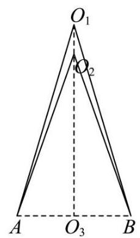

图3

12. 已知集合 $M = \left\{  {{P}_{0},{P}_{1},{P}_{2},\cdots ,{P}_{n}}\right\}  , n \geq  2, n \in  \mathbf{N}$ 是由函数 $y = \cos x, x \in  \left\lbrack  {0,{2\pi }}\right\rbrack$ 的图象上两两不相同的点构成的点集,集合 $S = \left\{  {a\left| {\;a = \overrightarrow{O{P}_{0}} \cdot  \overrightarrow{O{P}_{i}}}\right. , i = 0,1,2,\cdots , n, n \geq  2, n \in  \mathbf{N}}\right\}$ ,其中 ${P}_{0}\left( {0,1}\right) \text{ 、 }{P}_{1}\left( {\pi , - 1}\right)$ . 若集合 $\mathrm{S}$ 中的元素按照从小到大的顺序排列能构成公差为 $d$ 的等差数列,当 $d \in  \left\{  {\frac{1}{2},1}\right\}$ 时,则符合条件的点集 $M$ 的个数为___.

16. 已知数列 $\left\{  {a}_{n}\right\}$ 不是常数列,前 $n$ 项和为 ${S}_{n},{a}_{n} > 0$ . 若对任意正整数 $n$ ,存在正整数 $m$ , 使得 $\left| {{S}_{n} - {a}_{m}}\right|  < {a}_{1}$ ,则称 $\left\{  {a}_{n}\right\}$ 是 “可控数列”. 现给出两个命题:

①若各项均为正整数的等差数列 $\left\{  {a}_{n}\right\}$ 满足公差 $d = 3$ ，则 $\left\{  {a}_{n}\right\}$ 是 “可控数列”；

②若等比数列 $\left\{  {a}_{n}\right\}$ 是 “可控数列”,则其公比 $q \in  \left( {0,\frac{1}{2}}\right\rbrack$ .

则下列判断正确的是( )

A. ①与②均为真命题 B. ①与②均为假命题

C. ①为假命题，②为真命题 D. ①为真命题，②为假命题

四. 虹口区:

11. 2024 年 10 月 30 日 “神舟十九号” 载人飞船发射成功, 标志着中国空间站建设进入新阶段. 在飞船竖直升空过程中，某位记者用照相机在同一位置以同一姿势连续拍照两次. 已知 “神舟十九号” 飞船船体实际长度为 $H$ ,且在照片上飞船船体长度为 $h$ ,比较两张照片, 相对于照片中的同一固定参照物飞船上升了 $m$ . 假设该记者连按拍照键间的反应时间为 $t$ , 并忽略相机曝光时长, 若用平均速度估算瞬时速度, 则拍照时飞船的瞬时速度为 ___. (用含有 $H\text{ 、 }h\text{ 、 }m\text{ 、 }t$ 的式子表示)

12. 已知项数为 10 的数列 $\left\{  {a}_{n}\right\}$ 中任一项均为集合 $\{ x \mid  1 \leq  x \leq  {10}, x \in  \mathbf{N}\}$ 中的元素,且相邻两项满足 ${a}_{n} < {a}_{n + 1} + 3, n = 1,2,\cdots ,9$ . 若 $\left\{  {a}_{n}\right\}$ 中任意两项都不相等,则满足条件的数列 $\left\{  {a}_{n}\right\}$ 有___个.

16. 设数列 $\left\{  {a}_{n}\right\}$ 的前四项分别为 ${a}_{1}\text{ 、 }{a}_{2}\text{ 、 }{a}_{3}\text{ 、 }{a}_{4}$ ,对于以下两个命题,说法正确的是 ( ).

① 存在等比数列 $\left\{  {a}_{n}\right\}$ 以及锐角 $\alpha$ ，使 $\left\{  {\sin \alpha ,\cos \alpha ,\tan \alpha }\right\}   = \left\{  {{a}_{1},{a}_{2},{a}_{3}}\right\}$ 成立.

② 对任意等差数列 $\left\{  {a}_{n}\right\}$ 以及锐角 $\alpha$ ，均不能使 $\{ \sin \alpha ,\cos \alpha ,\tan \alpha ,\cot \alpha \}  = \left\{  {{a}_{1},{a}_{2},{a}_{3},{a}_{4}}\right\}$ 成立.

A. ①是真命题，②是真命题 B. ①是真命题，②是假命题

C. ①是假命题，②是真命题 D. ①是假命题，②是假命题

## 五. 黄浦区:

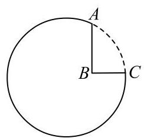

第 11 题

11. 一个机器零件的形状是有缺口的圆形铁片, 如图中实线部分为裁剪后的形状. 已知这个圆的半径是 ${13}\mathrm{\;{cm}},{AB} = 8\mathrm{\;{cm}},{BC} = 6\mathrm{\;{cm}}$ ,且 ${AB} \bot  {BC}$ ,则圆心到点 $B$ 的距离约为 cm.(结果精确到 ${0.1}\mathrm{\;{cm}}$ )

12. 设常数 $b$ 为整数,数列 $\left\{  {a}_{n}\right\}$ 的通项公式为 ${a}_{n} = {\left( n + b\right) }^{2} + \frac{b}{2}$ ,若 ${a}_{m} + {a}_{m + 1} + {a}_{m + 2}$ ( $m \geq  1$ ， $m \in  \mathbf{Z}$ ) 的最小值为 -7 ，则 $b =$ ___.

16. 设函数 $y = f\left( x\right)$ 在区间 $I$ 上有导函数 $y = {f}^{\prime }\left( x\right)$ ,且 ${f}^{\prime }\left( x\right)  < 0$ 在区间 $I$ 上恒成立,对任意的 $x \in  I$ ,有 $f\left( x\right)  \in  I$ . 对于各项均不相同的数列 $\left\{  {a}_{n}\right\}  ,{a}_{1} \in  I,{a}_{n + 1} = f\left( {a}_{n}\right)$ ,下列结论正确的是 ( ).

A. 数列 $\left\{  {a}_{{2n} - 1}\right\}$ 与 $\left\{  {a}_{2n}\right\}$ 均是严格增数列

B. 数列 $\left\{  {a}_{{2n} - 1}\right\}$ 与 $\left\{  {a}_{2n}\right\}$ 均是严格减数列

C. 数列 $\left\{  {a}_{{2n} - 1}\right\}$ 与 $\left\{  {a}_{2n}\right\}$ 中的一个是严格增数列,另一个是严格减数列

D. 数列 $\left\{  {a}_{{2n} - 1}\right\}$ 与 $\left\{  {a}_{2n}\right\}$ 均既不是严格增数列也不是严格减数列

## 六. 嘉定区:

11. 某公园为了美化环境，计划建造一座拱桥 ${DACBE}$ ， 已知该桥的剖面如图所示, 共包括一段圆弧形桥面 $\overset{\text{ ⏜ }}{ACB}$ 和两段长度相等的直线型桥面 ${AD}\text{ 、 }{BE}$ ,圆弧形桥面 $\overset{\text{ ⏜ }}{ACB}$ 所在圆的半径为 4 米,圆心 $O$ 在 ${DE}$ 上,且 ${AD}$ 和 ${BE}$ 所在直线与圆 $O$ 分别在连结点 $A$ 和 $B$ 处相切. 已知直线型桥面的修建费用是每米 0.4 万元,弧形桥面 $\overset{\text{ ⏜ }}{ACB}$ 的修建费用是每米 2.5 万元,设 $\angle {ADO} = \theta$ ,根据空间限制及桥面坡度的限制, $\theta$ 的范围为 $\arcsin \frac{1}{3} \leq  \theta  \leq  \frac{\pi }{6}$ ,则当桥面修建总费用最低时 $\theta$ 的值为 ___.

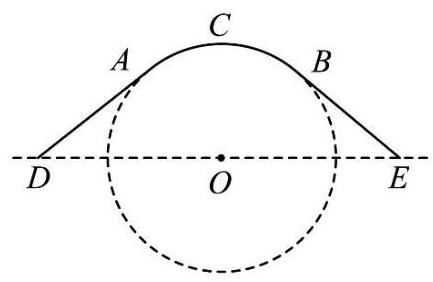

12. 已知实数 ${x}_{1}\text{ 、 }{x}_{2}\text{ 、 }{y}_{1}\text{ 、 }{y}_{2}$ 满足: ${x}_{1}{}^{2} + {y}_{1}{}^{2} = 1,{x}_{2}{}^{2} + {y}_{2}{}^{2} = 1,{x}_{1}{x}_{2} + {y}_{1}{y}_{2} = \frac{1}{2}$ ,则 $\frac{\left| {x}_{1} + {y}_{1} - 1\right| }{\sqrt{2}} + \frac{\left| {x}_{2} + {y}_{2} - 1\right| }{\sqrt{2}}$ 的最小值为___.

16. 已知数列 $\left\{  {a}_{n}\right\}$ 满足 ${a}_{n + 1} = r{a}_{n}\left( {1 - {a}_{n}}\right) \left( {n = 1,2,3,\cdots }\right) ,{a}_{1} \in  \left( {0,1}\right)$ ,给出以下四个结论:

① 当 $r = 2$ 时，只存在有限个 ${a}_{1}$ ，使得对任意正整数 $n$ ，都有 ${a}_{n + 1} > {a}_{n}$

② 当 $r = 2$ 时,存在 ${a}_{1}$ 和正整数 $P$ ,当 $n > P$ 时, ${a}_{n + 1} - {a}_{n} < \frac{1}{2025}$

③ 当 $r = 3$ 时,存在 ${a}_{1}$ 和正整数 $P$ ,当 $n > P$ 时, ${a}_{n + 1} = {a}_{n}$

④ 当 $r =  - 3$ 时,不存在 ${a}_{1}$ ,使得对任意正整数 $n$ ,且 $n \geq  3$ ,都有 ${a}_{n} > 0$ 其中正确结论是( ).

A. ① ② B. ②③ C. ③④ D. ②④

七. 金山区:

11. 抛掷一枚质地均匀的硬币 $n$ 次 (其中 $n$ 为大于等于 2 的整数),设事件 $A : n$ 次中既有正面朝上又有反面朝上，事件 $B : n$ 次中至多有一次正面朝上，若事件 $A$ 与事件 $B$ 是独立的，则 $n$ 的值为___.

12. 已知 $O$ 为坐标原点，向量 $\overrightarrow{OA}\text{ 、 }\overrightarrow{OB}$ 满足 $\left| \overrightarrow{OA}\right|  + \left| \overrightarrow{OB}\right|  = 8$ ，将 $\overrightarrow{OA}$ 绕点 $O$ 按逆时针方向旋转 ${90}^{ \circ  }$ ，得到向量 $\overrightarrow{OC}$ . 若 $\overrightarrow{OB} + \overrightarrow{OC} = \left( {-3,3}\right)$ ， $\overrightarrow{i} = \left( {1,0}\right)$ ，则( $\overrightarrow{OA} + \overrightarrow{OB}) \cdot  \overrightarrow{i}$ 的最大值为___.

16. 已知三棱锥 ${A}_{1} - {A}_{2}{A}_{3}{A}_{4}$ 的侧棱长相等,且侧棱两两垂直. 设 $P$ 为该三棱锥表面 (含棱) 上异于顶点 ${A}_{1}\text{ 、 }{A}_{2}\text{ 、 }{A}_{3}\text{ 、 }{A}_{4}$ 的点,记 $D = \left\{  {d\left| {d = }\right| P{A}_{i}\mid , i = 1,2,3,4}\right\}$ . 若集合 $D$ 中有且只有 2 个元素，则符合条件的点 $P$ 有( )个.

(A) 3 (B) 6 (C) 7 (D) 10

## 八. 静安区:

11. 记 $f\left( x\right)  = {x}^{2} + \left( {{a}^{2} + {b}^{2} - 1}\right) x + {a}^{2} + {2ab} - {b}^{2}$ . 若函数 $y = f\left( x\right)$ 是偶函数，则该函数图像与 $y$ 轴交点的纵坐标的最大值为___.

12. 已知 $\lg {x}_{1}\text{ 、 }\lg {x}_{2}\text{ 、 }\lg {x}_{3}\text{ 、 }\lg {x}_{4}\text{ 、 }\lg {x}_{5}$ 是从大到小连续的正整数,且 ${\left( \lg {x}_{4}\right) }^{2} < \lg {x}_{1} \cdot  \lg {x}_{5}$ ，则 ${x}_{1}$ 的最小值为___.

16. 在四棱锥 $P - {ABCD}$ 中, $\overrightarrow{AB} = \left( {4, - 2,3}\right) \text{ 、 }\overrightarrow{AD} = \left( {-4,1,0}\right) ,\overrightarrow{AP} = \left( {-6,2, - 8}\right)$ ,则该四棱锥的高为 ( )

A. 4; B. 3; C. 2; D. 1.

九. 闵行区:

11. 如图,某小区内有一块矩形区域 ${ABCD}$ ,其中 ${AB} = {40}$ 米, ${AD} = {20}$ 米,点 $E\text{ 、 }F$ 分别为 ${AB}\text{ 、 }{CD}$ 的中点,左右两个扇形区域为花坛 (两个扇形的圆心分别为 $A\text{ 、 }B$ ,半径均为 20 米),其余区域为草坪.现规划在草坪上修建一个三角形的儿童游乐区，且三角形的一个顶点在线段 ${EF}$ 上，另外两个顶点在线段 ${CD}$ 上，则该游乐区面积的最大值为___ 平方米. (结果保留整数)

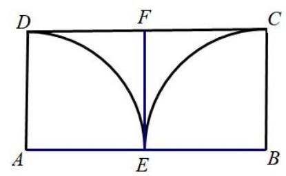

12. 已知 $f\left( x\right)  = \left| {\sin {\omega x}}\right|$ ,若存在 ${x}_{1}\text{ 、 }{x}_{2} \in  \left\lbrack  {{\omega \pi },{2\omega \pi }}\right\rbrack$ ,且 ${x}_{1} \neq  {x}_{2}$ ,使得 $\frac{1}{f\left( {x}_{1}\right)  + 1} + \frac{1}{f\left( {x}_{2}\right)  + 1} = 1$ 成立，则 $\omega$ 的取值范围是___.

16. 已知数列 $\left\{  {a}_{n}\right\}$ 满足 ${a}_{n + 1} = \left| {{a}_{n} + 1}\right|  + \lambda \left| {{a}_{n} - 1}\right|$ ,其中 $\lambda$ 为常数. 对于下述两个命题: ①对于任意的 $\lambda  > 0$ ，任意的 ${a}_{1} \in  \mathbf{R}$ ，都有 $\left\{  {a}_{n}\right\}$ 是严格增数列；

②对于任意的 $\lambda  < 0$ ,存在 ${a}_{1} \in  \mathbf{R}$ ,使得 $\left\{  {a}_{n}\right\}$ 是严格减数列.

以下说法正确的为( ).

(A) ①真命题; ②假命题 (B) ①假命题; ②真命题

(C) ①真命题; ②真命题 (D)①假命题；②假命题

## 十. 浦东区:

11. 已知空间中三个单位向量 $\overrightarrow{O{A}_{1}}$ 、 $\overrightarrow{O{A}_{2}}$ 、 $\overrightarrow{O{A}_{3}}$ ， $\overrightarrow{O{A}_{1}} \cdot  \overrightarrow{O{A}_{2}} = \overrightarrow{O{A}_{2}} \cdot  \overrightarrow{O{A}_{3}} = \overrightarrow{O{A}_{3}} \cdot  \overrightarrow{O{A}_{1}} = 0$ ， $P$ 为空间中一点,且满足 $\left| {\overrightarrow{OP} \cdot  \overrightarrow{O{A}_{1}}}\right|  = 1,\left| {\overrightarrow{OP} \cdot  \overrightarrow{O{A}_{2}}}\right|  = 2,\left| {\overrightarrow{OP} \cdot  \overrightarrow{O{A}_{3}}}\right|  = 3$ ,则点 $P$ 个数的最大值为___.

12. 已知在复数集中,等式 ${x}^{4} + {a}_{3}{x}^{3} + {a}_{2}{x}^{2} + {a}_{1}x + {a}_{0} = \left( {x - {z}_{1}}\right) \left( {x - {z}_{2}}\right) \left( {x - {z}_{3}}\right) \left( {x - {z}_{4}}\right)$ 对任意复数 $x$ 恒成立,复数 ${z}_{1},{z}_{2},{z}_{3},{z}_{4}$ 在复平面上对应的 4 个点为某个单位圆内接正方形的 4 个顶点, $\left\{  {{a}_{0},{a}_{1},{a}_{2},{a}_{3}}\right\}   \subset  \{ n \mid  1 \leq  n \leq  {2024}, n \in  \mathbf{Z}\}$ ,则满足条件的不同集合 $\left\{  {{a}_{0},{a}_{1},{a}_{2},{a}_{3}}\right\}$ 个数为___.

16. 设函数 $y = F\left( x\right) , y = G\left( x\right)$ 的定义域均为 $\mathbf{R}$ ,值域分别为 $A\text{ 、 }B$ ,且 $A \cap  B = \varnothing$ . 若集合 $S$ 满足以下两个条件:

(1) $A \cup  B \subseteq  S$ ；(2) ${\complement }_{S}\left( {A \cup  B}\right)$ 是有限集，

则称 $y = F\left( x\right)$ 和 $y = G\left( x\right)$ 是 $S$ -互补函数. 给出以下两个命题:

①存在函数 $y = f\left( x\right)$ ，使得 $y = {2}^{f\left( x\right) }$ 和 $y = {\log }_{2}f\left( x\right)$ 是 $\left\lbrack  {0,{16}}\right\rbrack$ -互补函数；

②存在函数 $y = g\left( x\right)$ ，使得 $y = \sin g\left( x\right)$ 和 $y = \tan g\left( x\right)$ 是 $\lbrack 0, + \infty )$ -互补函数.

则 ( )

A. ①②都是真命题 B. ①是真命题，②是假命题

C. ①是假命题，②是真命题 D. ①②都是假命题

十一. 普陀区:

11. 设 $t \in  \mathbf{R}$ ,直线 $l : x + y - t = 0$ 与曲线 ${C}_{1} : y = \frac{1}{4}{x}^{2}\left( {0 \leq  x \leq  4}\right)$ 和曲线 ${C}_{2} : y = 2{x}^{\frac{1}{2}}$ 分别交于 $P\text{ 、 }Q$ 两点，则 $\left| {PQ}\right|$ 的最大值是___.

12. 设 $a > b > 0$ ,函数 $y = f\left( x\right)$ 的表达式为 $f\left( x\right)  = \left| {x - \frac{1}{x} + \ln x}\right|$ ,若 $f\left( a\right)  = f\left( b\right)$ ,且关于 $x$ 的方程 $\left| {{x}^{2} + {ax} + {2ab}}\right|  + \left| {{x}^{2} - {ax} + {2ab}}\right|  = {2a}\left| x\right|$ 的整数解有且仅有 4 个，则 $a$ 的取值范围是___.

16. 在平面直角坐标系中,将函数 $y = f\left( x\right)$ 的图像绕坐标原点 $O$ 逆时针旋转 $\frac{\pi }{4}$ 后,所得曲线仍然是某个函数的图像,则称函数 $y = f\left( x\right)$ 为 “ $R$ 函数”. 对于命题:

① 设 $m \in  \mathbf{R}$ ,若函数 $g\left( x\right)  = \left( {m - 1}\right) x + \frac{1}{x}$ 为 “ $R$ 函数”，则 $m > 1$ ；

② 设 $k \in  \mathbf{R}$ ,若函数 $h\left( x\right)  = \frac{k\left( {x + 1}\right) }{{\mathrm{e}}^{x}}$ 为 “ $R$ 函数”，则满足条件的 $k$ 的整数值至少有 4 个. 则下列结论中正确的是 ( )

A. ①为真②为真 B. ①为真②为假 C. ①为假②为真 D. ①为假②为假

## 十二. 青浦区:

11. 若函数 $y = {\log }_{\frac{1}{2}}\left( {a{x}^{3} - {8x} + {15}}\right)$ 在区间 $\left( {1,2}\right)$ 上严格增,则实数 $a$ 的取值范围是___.

12. 已知 $A, B, C$ 是单位圆上任意不同三点，则 $\frac{\overrightarrow{AB} \cdot  \overrightarrow{AC}}{\left| \overrightarrow{AB}\right| }$ 的取值范围是___.

16. 对于数列 $\left\{  {a}_{n}\right\}$ ,设数列 $\left\{  {a}_{n}\right\}$ 的前 $n$ 项和为 ${S}_{n}$ ,给出下列两个命题: ①存在函数 $y = f\left( x\right)$ ，使得 ${S}_{n} = f\left( {a}_{n}\right)$ ；②存在函数 $y = g\left( x\right)$ ，使得 $n = g\left( {a}_{n}\right)$ . 则①是②的( ).

A. 充分不必要条件 B. 必要不充分条件

C. 充要条件 D. 既不充分也不必要条件

## 十三. 松江区:

11. 已知平面向量 $\overrightarrow{a}$ 与 $\overrightarrow{b}$ 的夹角为 $\theta ,\overrightarrow{b} - \overrightarrow{a}$ 与 $\overrightarrow{a}$ 的夹角为 ${3\theta },\theta  \in  \left( {0,\frac{\pi }{3}}\right) ,\left| \overrightarrow{a}\right|  = 1,\overrightarrow{a}$ 和 $\overrightarrow{b} - \overrightarrow{a}$ 在 $\overrightarrow{b}$ 上的数量投影分别为 $x\text{ 、 }y$ ,则 $x\left( {y + \sin \theta }\right)$ 的取值范围是___.

12. 交通信号灯由红灯、绿灯、黄灯组成. 黄灯设置的时长与路口宽度、限定速度、停车距离有关.根据路况不同，道路的限定速度一般在 30 千米/小时至 70 千米/小时之间. 由相关数据,驾驶员反应距离 ${S}_{1}$ (单位: 米) 关于车速 $v$ (单位: 米/秒) 的函数模型为: ${s}_{1} = {0.7584v}$ ; 刹车距离 ${s}_{2}$ (单位: 米) 关于车速 $v$ (单位: 米/秒) 的函数模型为: ${s}_{2} = {0.072}{v}^{2}$ ,反应距离与刹车距离之和称为停车距离. 已知某个十字路口宽度为 30 米, 为保证通行安全, 黄灯亮的时间是允许限速车辆离停车线距离小于停车距离的汽车通过十字路口, 则该路口黄灯亮的时间最多为___秒 (结果精确到 0.01 秒).

16. 设函数 $y = f\left( x\right)$ 与 $y = g\left( x\right)$ 均是定义在 $\mathbf{R}$ 上的函数,有以下两个命题:

①若 $y = f\left( x\right)$ 是周期函数,且是 $\mathbf{R}$ 上的减函数,则函数 $y = f\left( x\right)$ 必为常值函数;

②若对任意的 $a, b \in  \mathbf{R}$ ，有 $\left| {f\left( a\right)  - f\left( b\right) }\right|  \leq  \left| {g\left( a\right)  - g\left( b\right) }\right|$ 成立，且 $y = g\left( x\right)$ 是 $\mathbf{R}$ 上的增函数,则 $y = f\left( x\right)  - g\left( x\right)$ 是 $\mathbf{R}$ 上的增函数. 则以下选项正确的是 ( )

A. ①是真命题，②是假命题 B. 两个都是真命题

C. ①是假命题，②是真命题 D. 两个都是假命题

## 十四. 徐汇区:

11. 徐汇滨江作为 2024 年上海国际鲜花展的三个主会场之一，吸引了广大市民前往观展并拍照留念. 图中的花盆是种植鲜花的常见容器, 它可视作两个圆台的组合体, 上面圆台的上`下底面直径分别为 ${30}\mathrm{\;{cm}}$ 和 ${26}\mathrm{\;{cm}}$ ，下面圆台的上 `下底面直径分别为 ${24}\mathrm{\;{cm}}$ 和 ${18}\mathrm{\;{cm}}$ ，且两个圆台侧面展开图的圆弧所对的圆心角相等. 若上面圆台的高为 $8\mathrm{\;{cm}}$ ，则该花盆上、下两部分母线长的总和为___ ${cm}$ .

12. 已知定义域为 $A = \{ 1,2,3\}$ 的函数 $y = f\left( x\right)$ 的值域也是 $A$ ,所有这样的函数 $y = f\left( x\right)$ 形成全集 $B$ . 设非空集合 $C \subseteq  B$ 且 $\bar{C}$ 中的每一个函数都是 $C$ 中的两个函数 (可以相同) 的复合函数，则集合 $C$ 的元素个数的最小值为___.

16. 已知数列 $\left\{  {a}_{n}\right\}$ 的前 $n$ 项和为 ${S}_{n}$ ,设 ${t}_{n} = \frac{{S}_{n}}{n}$ ( $n$ 为正整数). 若存在常数 $c$ ,使得任意两两不相等的正整数 $i, j, k$ ,都有 $\left( {i - j}\right) {t}_{k} + \left( {j - k}\right) {t}_{i} + \left( {k - i}\right) {t}_{j} = c$ ,则称数列 $\left\{  {a}_{n}\right\}$ 为 “轮换均值数列”. 现有下列两个命题:

①任意等差数列 $\left\{  {a}_{n}\right\}$ 都是 “轮换均值数列”.

②存在公比不为 1 的等比数列 $\left\{  {b}_{n}\right\}$ 是 “轮换均值数列”.

则下列说法正确的是( )

A. ①是真命题，②是假命题 B. ①是假命题，②是真命题

C. ①、②都是真命题 D. ①、②都是假命题

## 十五. 杨浦区:

11. 中国探月工程又称 “嫦娥工程”, 是中国航天活动的第三个里程碑. 在探月过程中, 月球探测器需要进行变轨，即从一条椭圆轨道变到另一条不同的椭圆轨道上. 若变轨前后的两条椭圆轨道均以月球中心为一个焦点, 变轨后椭圆轨道上的点与月球中心的距离最小值保持不变, 而距离最大值扩大为变轨前的 4 倍, 椭圆轨道的离心率扩大为变轨前的 2.5 倍, 则变轨前的椭圆轨道的离心率为___. (精确到 0.01 )

12. 已知实数 $a > 0$ , $\mathrm{i}$ 是虚数单位,设集合 $A = \left\{  {z\left| {z = w + \frac{1}{w},}\right| w \mid   > 1, w \in  \mathbf{C}, z \in  \mathbf{C}}\right\}$ ,集合 $B = \{ z\left| \right| z - 1 + \mathrm{i} \mid   = a, z \in  \mathbf{C}\}$ ,如果 $B \subseteq  A$ ,则 $a$ 的取值范围为___.

16. 设无穷数列 $\left\{  {a}_{n}\right\}$ 的前 $n$ 项和为 ${S}_{n}$ ,且对任意的正整数 $n,{a}_{n + 1} = \frac{{S}_{n}}{{a}_{n}}$ ,则 $\mathop{\sum }\limits_{{i = 1}}^{5}{a}_{2i} - \mathop{\sum }\limits_{{i = 1}}^{6}{a}_{{2i} - 1}$ 的值可能为( )

A. -6 B. 0 C. 6 D. 12

## 十六. 长宁区:

11. 设 $O$ 为坐标原点,从集合 $\{ 1,2,3,4,5,6,7,8,9\}$ 中任取两个不同的元素 $x\text{ 、 }y$ , 组成 $A\text{ 、 }B$ 两点的坐标 $\left( {x, y}\right) \text{ 、 }\left( {y, x}\right)$ ,则 ${S}_{\bigtriangleup {AOB}} \leq  {10}$ 的概率为___.

12. 点 $P\text{ 、 }M\text{ 、 }N$ 分别位于正方体 ${ABCD} - {A}^{\prime }{B}^{\prime }{C}^{\prime }{D}^{\prime }$ 的面上, ${AB} = 1$ ,则 $\overrightarrow{PM} \cdot  \overrightarrow{PN}$ 的最小值是___.

16. 数列 $\left\{  {a}_{n}\right\}$ 为严格增数列,且对任意的正整数 $n$ ,都有 $\frac{{a}_{n + 1}}{n + 1} \geq  \frac{{a}_{n}}{n}$ ,则称数列 $\left\{  {a}_{n}\right\}$ 满足 “性质 $\Omega$ ”.

①存在等差数列 $\left\{  {a}_{n}\right\}$ 满足 “性质 $\Omega$ ”；

② 任意等比数列 $\left\{  {a}_{n}\right\}$ ，若首项 ${a}_{1} > 0$ ，则 $\left\{  {a}_{n}\right\}$ 满足 “性质 $\Omega$ ”；

下列选项中正确的是 ( )

A. ①是真命题，②是真命题； B. ①是真命题，②是假命题；

C. ①是假命题，②是真命题； D. ①是假命题，②是假命题.

## 2025 届高三一模客观题难题解析(解析版)

## 一. 宝山区

11、【答案】 $\left( {0,\frac{2}{3}}\right)$

【详解】若仓库前面墙体的长为 $x$ 米 $\left( {4 \leq  x \leq  6}\right)$ ,则左右两面墙宽度为 $\frac{24}{x}$ ,

则甲工程整体报价为 ${400} \times  {6x} + {300} \times  6 \times  \frac{24}{x} \times  2 + {28800} = {2400x} + \frac{86400}{x} + {28800}$ ,

若乙队要确保竞标成功则 $\left( {1 + \frac{2}{x}}\right)  \times  {6k} \times  {10}^{4} < {2400x} + \frac{86400}{x} + {28800}$ ,

所以 ${6k} \times  {10}^{4} < \frac{{2400x} + \frac{86400}{x} + {28800}}{1 + \frac{2}{x}} = \frac{{24}{x}^{2} + {288x} + {864}}{x + 2} \times  {10}^{2}$ ,则

${6k} \times  {10}^{2} < \frac{{24}{x}^{2} + {288x} + {864}}{x + 2} = \frac{{24x}\left( {x + 2}\right)  + {240}\left( {x + 2}\right)  + {384}}{x + 2} = {24x} + {240} + \frac{384}{x + 2}$ ,

因为 $4 \leq  x \leq  6$ ,所以函数 $y = {24x} + {240} + \frac{384}{x + 2} = {24}\left( {x + 2}\right)  + \frac{384}{x + 2} + {192}$ ,

当且仅当 ${24}\left( {x + 2}\right)  = \frac{384}{x + 2}$ 时,即 $x = 2$ 时,函数有最小值,

所以函数 $y = {24}\left( {x + 2}\right)  + \frac{384}{x + 2} + {192}$ 在 $\left\lbrack  {4,6}\right\rbrack$ 上单调递增,故

${y}_{\min } = {24} \times  6 + \frac{384}{6} + {192} = {400},$

故 ${6k} \times  {10}^{2} < {400}$ ,则 $k < \frac{2}{3}$ ,所以实数 $k$ 的取值范围是 $\left( {0,\frac{2}{3}}\right)$ .

12、【答案】 $\left\{  \begin{array}{l} m,1 < m < \sqrt{6} - 1 \\  \frac{5 - {m}^{2}}{2},\sqrt{6} - 1 \leq  m < 2 \end{array}\right.$ 或 $\left\{  \begin{array}{l} m,1 < m \leq  \sqrt{6} - 1 \\  \frac{5 - {m}^{2}}{2},\sqrt{6} - 1 < m < 2 \end{array}\right.$

【详解】由题意有: 当 $\overrightarrow{a},\overrightarrow{b} = 0$ 时,可得当 $\overrightarrow{c}$ 与 $\overrightarrow{a},\overrightarrow{b}$ 同向时, $\left| {\overrightarrow{a} \cdot  \overrightarrow{c}}\right|  + \left| {\overrightarrow{b} \cdot  \overrightarrow{c}}\right|$ 取到最大值,

即此时 $\left( {\left| {\overrightarrow{a} \cdot  c}\right|  + \left| {\overrightarrow{b} \cdot  \overrightarrow{c}}\right| }\right)  = 1 + m \leq  \sqrt{6}$ 恒成立,结合 $m \in  \left( {1,2}\right)$ ,即 $1 < m \leq  \sqrt{6} - 1$ ,

此时 ${\left( \overrightarrow{a} \cdot  \overrightarrow{b}\right) }_{\max } = m$ ;

由于 $\left| {\left( {\overrightarrow{a} + \overrightarrow{b}}\right)  \cdot  \overrightarrow{c}}\right|  \leq  \left| {\overrightarrow{a} \cdot  \overrightarrow{c}}\right|  + \left| {\overrightarrow{b} \cdot  \overrightarrow{c}}\right|  \leq  \sqrt{6} \Rightarrow  \left| {\left( {\overrightarrow{a} + \overrightarrow{b}}\right)  \cdot  \overrightarrow{c}}\right|  = \left| {\overrightarrow{a} + \overrightarrow{b}}\right| \left| \overrightarrow{c}\right|  = \left| {\overrightarrow{a} + \overrightarrow{b}}\right|  \leq  6$ ,

所以假设 $\overrightarrow{a},\overrightarrow{b} \geq  \frac{\pi }{2}$ ，此时 $\left| {\overrightarrow{a} + \overrightarrow{b}}\right|  \leq  \sqrt{1 + {m}^{2}} < \sqrt{5}$ ，不符合题意；

故 $\overrightarrow{a},\overrightarrow{b} = \theta  \in  \left( {0,\frac{\pi }{2}}\right)$ 时,不妨设当 $\overrightarrow{a},\overrightarrow{c} = \alpha ,\alpha$ 为锐角, $\left| {\overrightarrow{a} \cdot  \overrightarrow{c}}\right|  + \left| {\overrightarrow{b} \cdot  \overrightarrow{c}}\right|$ 取到最大值,

此时 $\overrightarrow{b},\overrightarrow{c} = \theta  - \alpha$ 也为锐角,

此时 ${\left( \left| \overrightarrow{a} \cdot  \overrightarrow{c}\right|  + \left| \overrightarrow{b} \cdot  \overrightarrow{c}\right| \right) }_{\max } = \left| {\cos \alpha }\right|  + m\left| {\cos \left( {\theta  - \alpha }\right) }\right|  = \left| {\cos \alpha  + m\cos \left( {\theta  - \alpha }\right) }\right|$ ,

$=  \mid  m\sin \theta \sin \alpha  + \left( {m\cos \theta  + 1}\right) \cos \alpha  \mid$

$= \sqrt{{m}^{2}{\sin }^{2}\theta  + {\left( m\cos \theta  + 1\right) }^{2}}\sin \left( {\alpha  + \varphi }\right)$ ,(其中 $\varphi$ 为辅助角)

而 $\sqrt{{m}^{2}{\sin }^{2}\theta  + {\left( m\cos \theta  + 1\right) }^{2}}\sin \left( {\alpha  + \varphi }\right)  \leq  \sqrt{{m}^{2}{\sin }^{2}\theta  + {\left( m\cos \theta  + 1\right) }^{2}}$ ,

当 $\sin \left( {\alpha  + \varphi }\right)  = 1$ 时等号成立,

依题意可得 $\sqrt{{m}^{2}{\sin }^{2}\theta  + {\left( m\cos \theta  + 1\right) }^{2}} \leq  \sqrt{6}$ 恒成立,解得 $\cos \theta  \leq  \frac{5 - {m}^{2}}{2m}$ ,

由于 $\frac{5 - {m}^{2}}{2m} = \frac{5}{2m} - \frac{m}{2}$ 在 $m \in  \left( {1,2}\right)$ 时单调递减,故 $\frac{5 - {m}^{2}}{2m} \in  \left( {\frac{1}{4},2}\right)$ ,

故令 $\frac{5 - {m}^{2}}{2m} \leq  1$ ,结合 $m \in  \left( {1,2}\right)$ 解得 $\sqrt{6} - 1 \leq  m < 2$

即得 ${\left( \overrightarrow{a} \cdot  \overrightarrow{b}\right) }_{\max } = \frac{5 - {m}^{2}}{2},\sqrt{6} - 1 \leq  m < 2$ ;

由于 $m = \sqrt{6} - 1$ 时, $\frac{5 - {m}^{2}}{2} = m$ ,

所以 $\overrightarrow{a} \cdot  \overrightarrow{b}$ 的最大值为 $\left\{  \begin{array}{l} m,1 < m < \sqrt{6} - 1 \\  \frac{5 - {m}^{2}}{2},\sqrt{6} - 1 \leq  m < 2 \end{array}\right.$ 或 $\left\{  \begin{array}{l} m,1 < m \leq  \sqrt{6} - 1 \\  \frac{5 - {m}^{2}}{2},\sqrt{6} - 1 < m < 2 \end{array}\right.$ .

16、【答案】B

【详解】

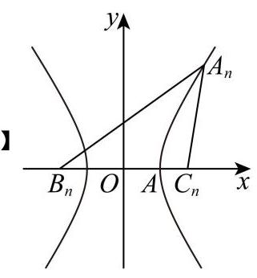

由已知 ${a}_{n + 1} = {a}_{n}$ ,即 $\bigtriangleup  {A}_{n}{B}_{n}{C}_{n}$ 的边 $\left| {{B}_{n}{C}_{n}}\right|$ 为定值,不妨设 ${B}_{n},{C}_{n}$ 为定点,如图所示,

又 ${b}_{n + 1} = {c}_{n} + \frac{1}{4}{a}_{n},{c}_{n + 1} = {b}_{n} + \frac{1}{4}{a}_{n}$ ,

则 ${b}_{n + 1} - {c}_{n + 1} = {c}_{n} - {b}_{n} =  - \left( {{b}_{n} - {c}_{n}}\right)$ ,

即 $\left| {{b}_{n} - {c}_{n}}\right|$ 为定值,

又 ${b}_{1} - {c}_{1} = \frac{1}{2}{a}_{1}$ ,

所以 $\left| {{b}_{n} - {c}_{n}}\right|  = \frac{1}{2}{a}_{1}$ 为定值,

即 $\begin{Vmatrix}{{A}_{n}{B}_{n}\left| -\right| {A}_{n}{C}_{n}}\end{Vmatrix} = \frac{1}{2}{a}_{1}$ ,

所以动点 ${A}_{n}$ 到定点 ${B}_{n},{C}_{n}$ 的距离之差的绝对值为定值,

满足双曲线定义,

所以动点 ${A}_{n}$ 的轨迹为以 ${B}_{n},{C}_{n}$ 为焦点的双曲线,

如图所示，

所以 ${S}_{n} = \frac{1}{2}\left| {{B}_{n}{C}_{n}}\right|  \cdot  \left| {y}_{{A}_{n}}\right|  = \frac{1}{2}{a}_{1}\left| {y}_{{A}_{n}}\right|$ ,

又 ${b}_{n + 1} + {c}_{n + 1} = {b}_{n} + {c}_{n} + \frac{1}{2}{a}_{n} = {b}_{n} + {c}_{n} + \frac{1}{2}{a}_{1}$ ,

所以数列 $\left\{  {{b}_{n} + {c}_{n}}\right\}$ 是以 ${b}_{1} + {c}_{1}$ 为首项, $\frac{1}{2}{a}_{1}$ 为公差的等差数列,

则数列 $\left\{  {{b}_{n} + {c}_{n}}\right\}$ 为递增数列,

所以当 $n$ 增大时, ${b}_{n} + {c}_{n}$ 变大,即 $\left| {{A}_{n}{C}_{n}}\right|  + \left| {{A}_{n}{B}_{n}}\right|$ 变大,

此时 ${A}_{n}$ 向远离 $\mathrm{A}$ 处运动,即 $\left| {y}_{{A}_{n}}\right|$ 变大,

所以 ${S}_{n} = \frac{1}{2}{a}_{1}\left| {y}_{{A}_{n}}\right|$ 变大,

即数列 $\left\{  {S}_{n}\right\}$ 为严格增数列,且 $\left\{  {S}_{{2n} - 1}\right\}  ,\left\{  {S}_{2n}\right\}$ 均为严格增数列, 故选: B.

二. 崇明区:

11、【答案】 $\left\lbrack  {\frac{17}{12},\frac{5}{3}}\right\rbrack$

【详解】当 $x \in  \left\lbrack  {0,{2\pi }}\right\rbrack$ 时, ${\omega x} + \frac{\pi }{6} \in  \left\lbrack  {\frac{\pi }{6},{2\omega \pi } + \frac{\pi }{6}}\right\rbrack$ ,

因为函数 $y = f\left( x\right)$ 在区间 $\left\lbrack  {0,{2\pi }}\right\rbrack$ 上有且仅有 3 个零点和 1 个极小值点, 所以 ${3\pi } \leq  {2\omega \pi } + \frac{\pi }{6} < \frac{7\pi }{2}$ ,故 $\omega  \in  \left\lbrack  {\frac{17}{12},\frac{5}{3}}\right)$ .

12、【答案】 $\frac{1}{12}$

【详解】若函数 $y = f\left( x\right)$ 的定义域为 $\{ 1,2,3,4\}$ ,值域为 $\{ 5,6,7\}$ ,

则不同的函数的个数为 ${\mathrm{C}}_{4}^{2}{\mathrm{P}}_{3}^{3} = {36}$ ,

其中增函数共有 3 个:

(1) $f\left( 1\right)  = f\left( 2\right)  = 5, f\left( 3\right)  = 6, f\left( 4\right)  = 7$ ;

(2) $f\left( 1\right)  = 5, f\left( 2\right)  = f\left( 3\right)  = 6, f\left( 4\right)  = 7$ ；

(3) $f\left( 1\right)  = 5, f\left( 2\right)  = 6, f\left( 3\right)  = f\left( 4\right)  = 7$ ;

故所求概率为 $\frac{3}{36} = \frac{1}{12}$ .

16、【答案】A

【详解】对于①:因为数列 $\left\{  {a}_{n}\right\}$ 、 $\left\{  {b}_{n}\right\}$ 均为等差数列，

设 ${a}_{n} = {kn} + m,{b}_{n} = {cn} + d$ ,则 ${a}_{n} - {b}_{n} = \left( {k - c}\right) n + m - d$ ,

若 $k - c > 0$ ,可知当 $n >  - \frac{m - d}{k - c}$ 时, ${a}_{n} - {b}_{n} > 0$ 恒成立,不满足交错数列;

若 $k - c = 0$ ,可知 ${a}_{n} - {b}_{n}$ 的符号不变,不满足交错数列;

若 $k - c < 0$ ,可知当 $n >  - \frac{m - d}{k - c}$ 时, ${a}_{n} - {b}_{n} < 0$ 恒成立,不满足交错数列;

综上所述: 对任意等差数列 $\left\{  {a}_{n}\right\}  \text{ 、 }\left\{  {b}_{n}\right\}  ,\left\{  {b}_{n}\right\}$ 均不是 $\left\{  {a}_{n}\right\}$ 的交错数列,故①正确;

对于②: 因为数列 $\left\{  {a}_{n}\right\}$ 为等比数列,设 ${a}_{n} = a{q}^{n},{aq} \neq  0$ ,等比数列 $\left\{  {a}_{n}\right\}$ 的公比为 $q$

不妨假设 $a > 0, q > 0,{b}_{n} = a{\left( -2q\right) }^{n}$ ,此时等比数列 $\left\{  {b}_{n}\right\}$ 的公比为 $- {2q} < 0$

当 $n$ 为奇数,则 ${b}_{n} =  - a{q}^{n} \cdot  {2}^{n} < a{q}^{n} = {a}_{n}$ ;

当 $n$ 为偶数,则 ${b}_{n} = a{q}^{n} \cdot  {2}^{n} > a{q}^{n} = {a}_{n}$ ;

满足 $\left\{  {b}_{n}\right\}$ 是 $\left\{  {a}_{n}\right\}$ 的交错数列,

若等比数列 $\left\{  {a}_{n}\right\}$ 的公比为 $q < 0$ ,根据对称结构,上述结论依然成立,

同理若 $a < 0, q > 0,{b}_{n} = a{\left( -2q\right) }^{n}$ ,此时等比数列 $\left\{  {b}_{n}\right\}$ 的公比为 $- {2q} < 0$

当 $n$ 为奇数,则 ${b}_{n} =  - a{q}^{n} \cdot  {2}^{n} > a{q}^{n} = {a}_{n}$ ;

当 $n$ 为偶数,则 ${b}_{n} = a{q}^{n} \cdot  {2}^{n} < a{q}^{n} = {a}_{n}$ ;

满足 $\left\{  {b}_{n}\right\}$ 是 $\left\{  {a}_{n}\right\}$ 的交错数列,

若等比数列 $\left\{  {a}_{n}\right\}$ 的公比为 $q < 0$ ,根据对称结构,上述结论依然成立,

综上所述: 对任意给定的等比数列 $\left\{  {a}_{n}\right\}$ ,都存在等比数列 $\left\{  {b}_{n}\right\}$ ,使得 $\left\{  {b}_{n}\right\}$ 是 $\left\{  {a}_{n}\right\}$ 的交错数列, 故②正确；

故选: A.

## 三. 奉贤区:

11、【答案】120

【详解】由题意可知,圆锥 ${O}_{1}{O}_{3}$ 的底面半径为 $8\mathrm{\;{cm}}$ ,高为 ${20}\mathrm{\;{cm}}$ ,

圆锥 ${O}_{2}{O}_{3}$ 的底面半径为 $8\mathrm{\;{cm}}$ ,高为 ${18}\mathrm{\;{cm}}$ ,

因为 ${100} \times  \frac{1}{3} \times  \pi  \times  {8}^{2} \times  \left( {{20} - {18}}\right)  \times  {8.9} \div  {1000} \approx  {119.236}$ ,

所以, 制作 100 个这样的惊鸟铃的铃身至少需要 120 千克铜.

12、【答案】 60

【详解】由已知 ${a}_{0} = \overrightarrow{O{P}_{0}} \cdot  \overrightarrow{O{P}_{0}} = 1,{a}_{1} = \overrightarrow{O{P}_{0}} \cdot  \overrightarrow{O{P}_{1}} =  - 1$ ,

设 ${P}_{i}\left( {{x}_{i},{y}_{i}}\right)$ ,则 ${a}_{i} = \overrightarrow{O{P}_{0}} \cdot  \overrightarrow{O{P}_{i}} = {y}_{i}$ ,显然 $- 1 \leq  {y}_{i} \leq  1$ ,

若 $d = 1$ ,则 $S = \{  - 1,0,1\}$ ,因此有 ${y}_{i} = 0$ ,

由 $\cos {x}_{i} = 0,{x}_{i} \in  \left\lbrack  {0,{2\pi }}\right\rbrack$ 得 ${x}_{i} = \frac{\pi }{2}$ 或 $\frac{3\pi }{2}$ ,对应 ${Q}_{1}\left( {\frac{\pi }{2},0}\right) ,{Q}_{2}\left( {\frac{3\pi }{2},0}\right)$ ,

同理 ${Q}_{3}\left( {{2\pi },1}\right)$ 对应 ${P}_{0}$ ,

集合 $M$ 中已经含有点 ${P}_{0},{P}_{1}$ ,

因此产生 $S = \{  - 1,0,1\}$ 的集合 $M$ 中,点 ${Q}_{3}$ 可有也可没有, ${Q}_{1},{Q}_{2}$ 至少有一个, 所以 $M$ 的个数为 $2 \times  3 = 6$ ,

若 $d = \frac{1}{2}$ ,则 $S = \left\{  {-1, - \frac{1}{2},0,\frac{1}{2},1}\right\}$ ,

$\cos {x}_{i} =  - \frac{1}{2},{x}_{i} = \frac{2\pi }{3}$ 或 $\frac{4\pi }{3},\cos {x}_{i} = \frac{1}{2},{x}_{i} = \frac{\pi }{3}$ 或 $\frac{5\pi }{3}$ ,

对应点 ${Q}_{4}\left( {\frac{\pi }{3},\frac{1}{2}}\right) ,{Q}_{5}\left( {\frac{5\pi }{3},\frac{1}{2}}\right) ,{Q}_{6}\left( {\frac{2\pi }{3}, - \frac{1}{2}}\right) ,{Q}_{7}\left( {\frac{4\pi }{3}, - \frac{1}{2}}\right)$ ,

产生 $\left\{  {-1, - \frac{1}{2},0,\frac{1}{2},1}\right\}$ 的集合 $M$ 中,点 ${Q}_{3}$ 可有也可没有, ${Q}_{1},{Q}_{2}$ 至少有一个,

${Q}_{4},{Q}_{5}$ 中至少有一个, ${Q}_{6},{Q}_{7}$ 中至少有一个, $M$ 的个数为 $2 \times  3 \times  3 \times  3 = {54}$ , 综上,集合 $M$ 的个数为 $6 + {54} = {60}$ .

16、【答案】C

【详解】对于①,由于数列 ${a}_{n} = {3n} - 2$ 的各项均为正整数,且公差 $d = 3$ ,

但对 ${S}_{2} = 1 + 4 = 5$ ,有 $\left| {7 - {3m}}\right|  \neq  0$ 对任意正整数 $m$ 恒成立 (否则 $m = \frac{7}{3}$ ,矛盾),

故对 $n = 2$ 时有 $\left| {{S}_{2} - {a}_{m}}\right|  = \left| {5 - \left( {{3m} - 2}\right) }\right|  = \left| {7 - {3m}}\right|  \geq  1 = {a}_{1}$ .

这表明 $\left\{  {a}_{n}\right\}$ 不是 “可控数列”,故①错误；

对于②，若等比数列 $\left\{  {a}_{n}\right\}$ 是 “可控数列”，由于数列 $\left\{  {a}_{n}\right\}$ 不是常数列， ${a}_{n} > 0$ ，故公比 $q \neq  1$ .

所以 ${S}_{n} = \frac{{a}_{1}\left( {{q}^{n} - 1}\right) }{q - 1}$ ,

从而 $\left| {{S}_{n} - {a}_{m}}\right|  < {a}_{1} \Leftrightarrow  \left| {\frac{{a}_{1}\left( {{q}^{n} - 1}\right) }{q - 1} - {a}_{1}{q}^{m - 1}}\right|  < {a}_{1} \Leftrightarrow  \left| {\frac{1 - {q}^{n}}{1 - q} - {q}^{m - 1}}\right|  < 1$ ,

则 ${q}^{m - 1} - 1 < \frac{1 - {q}^{n}}{1 - q} < {q}^{m - 1} + 1, m \in  {\mathrm{N}}^{ * }$ ,

当 $q > 1$ 时,则 ${q}^{m - 1} - 1 < \frac{1 - {q}^{n}}{1 - q} < {q}^{m - 1} + 1, m \in  {\mathrm{N}}^{ * } \Leftrightarrow  {q}^{n} < 1 + \left( {q - 1}\right) \left( {{q}^{m - 1} + 1}\right) ,\left( *\right)$ ,

令 ${q}^{n} \geq  1 + \left( {q - 1}\right) \left( {{q}^{m - 1} + 1}\right)$ ,则可知当 $n \geq  {\log }_{q}\left\lbrack  {1 + \left( {q - 1}\right) \left( {{q}^{m - 1} + 1}\right) }\right\rbrack$ 时, $\left( *\right)$ 不成立;

当 $0 < q < 1$ 时, ${q}^{m - 1} - 1 \leq  0 < \frac{1 - {q}^{n}}{1 - q}$ 显然成立,而对于 $\frac{1 - {q}^{n}}{1 - q} < {q}^{m - 1} + 1$ 恒成立,

由于 $f\left( n\right)  = \frac{1 - {q}^{n}}{1 - q}$ 为严格增数列,且 $n \rightarrow   + \infty$ 时, $f\left( n\right)  = \frac{1 - {q}^{n}}{1 - q} \rightarrow  \frac{1}{1 - q}$ , 故问题等价于存在 $m \in  {\mathrm{N}}^{ * }$ ,使得 $\frac{1 - {q}^{n}}{1 - q} < {q}^{m - 1} + 1$ ,

记 $g\left( m\right)  = {q}^{m - 1} + 1$ ,随 $m$ 的增大, $g\left( m\right)$ 减小,故 $g{\left( m\right) }_{\max } = g\left( 1\right)  = 2$ ,

故只需 $\frac{1}{1 - q} \leq  2$ ,解得 $0 < q \leq  \frac{1}{2}$ ,故②正确.

综上, ①是假命题, ②是真命题.

故选: C.

四. 虹口区:

11、【答案】 $\frac{Hm}{ht}$

【详解】设第二次拍照飞船的实际上升了 $x$ ,

所以 $\frac{H}{h} = \frac{x}{m}$ ,解得: $x = \frac{Hm}{h}$ ,

所以拍照时飞船的瞬时速度为: $v = \frac{x}{t} = \frac{Hm}{ht}$ .

12、【答案】 13122

【详解】由于 ${a}_{n} < {a}_{n + 1} + 3, n = 1,2,\cdots ,9$ ,可以先将1,2,3任意排列, 再将 4 插入该数列，但不能在 1 的左边且与 1 相邻，共有 $3{\mathrm{\;A}}_{3}^{3} = 2 \times  {3}^{2}$ 种， 再将 5 插入该数列，同样 5 不能在 1 和 2 的左边且与 1,2 相邻，共有 $2 \times  {3}^{3}$ 种， 再将 6 插入该数列，同样 6 不能在 1，2 和 3 的左边且与 1，2，3 相邻，共有 $2 \times  {3}^{4}$ 种， 以此类推,将 10 插入该数列,共有 $2 \times  {3}^{8} = {13122}$ 种.

16、【答案】A

【详解】对于①,若 $\sin \alpha ,\tan \alpha ,\cos \alpha$ 成等比数列,即 ${\tan }^{2}\alpha  = \sin \alpha \cos \alpha ,\alpha  \in  \left( {0,\frac{\pi }{2}}\right)$ , 则 $\frac{{\sin }^{2}\alpha }{{\cos }^{2}\alpha } = \sin \alpha \cos \alpha$ ,即 $\frac{\sin \alpha }{{\cos }^{2}\alpha } = \cos \alpha$ ,得 $\tan \alpha  = \frac{1 + \cos {2\alpha }}{2}$ ,

在同一坐标系内作 $y = \tan x$ 和 $y = \frac{1 + \cos {2x}}{2}$ 的图象:

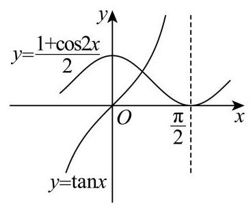

可知方程 $\tan \alpha  = \frac{1 + \cos {2\alpha }}{2},\alpha  \in  \left( {0,\frac{\pi }{2}}\right)$ 有且只有一解,

所以存在等比数列 $\left\{  {a}_{n}\right\}$ 以及锐角 $\alpha$ ,使 $\left\{  {\sin \alpha ,\cos \alpha ,\tan \alpha }\right\}   = \left\{  {{a}_{1},{a}_{2},{a}_{3}}\right\}$ 成立,①是真命题; 对于②，假设存在等差数列 $\left\{  {a}_{n}\right\}$ 以及锐角 $\alpha$ ，

使 $\{ \sin \alpha ,\cos \alpha ,\tan \alpha ,\cot \alpha \}  = \left\{  {{a}_{1},{a}_{2},{a}_{3},{a}_{4}}\right\}$ 成立，则必有 ${a}_{1} + {a}_{4} = {a}_{2} + {a}_{3}$ ，

当 $\alpha  = \frac{\pi }{4}$ 时,显然不成立;

当 $\alpha  \in  \left( {0,\frac{\pi }{4}}\right)$ 时, $\min \{ \sin \alpha ,\cos \alpha ,\tan \alpha ,\cot \alpha \}  = \sin \alpha$ ,

$\max \{ \sin \alpha ,\cos \alpha ,\tan \alpha ,\cot \alpha \}  = \cot \alpha ,$

所以 ${a}_{1} + {a}_{4} = \sin \alpha  + \cot \alpha ,{a}_{2} + {a}_{3} = \cos \alpha  + \tan \alpha$ ,

所以 $\sin \alpha  + \cot \alpha  = \cos \alpha  + \tan \alpha$ ,

则 $\sin \alpha  - \cos \alpha  = \frac{\sin \alpha }{\cos \alpha } - \frac{\cos \alpha }{\sin \alpha } = \frac{{\sin }^{2}\alpha  - {\cos }^{2}\alpha }{\cos \alpha  \cdot  \sin \alpha }$ ,

$1 = \frac{\sin \alpha  + \cos \alpha }{\cos \alpha  \cdot  \sin \alpha }$ ,即 $\sin \alpha \cos \alpha  - \sin \alpha  - \cos \alpha  = 0$ ,即 $\left( {1 - \cos \alpha }\right) \left( {1 - \sin \alpha }\right)  = 1$ ,

因为 $\alpha  \in  \left( {0,\frac{\pi }{4}}\right)$ ,所以 $0 < 1 - \cos \alpha  < 1,0 < 1 - \sin \alpha  < 1$ ,

不存在这样的 $\alpha  \in  \left( {0,\frac{\pi }{4}}\right)$ 使得等式成立;

当 $\alpha  \in  \left( {\frac{\pi }{4},\frac{\pi }{2}}\right)$ 时, $\min \{ \sin \alpha ,\cos \alpha ,\tan \alpha ,\cot \alpha \}  = \cos \alpha$ ,

$\max \{ \sin \alpha ,\cos \alpha ,\tan \alpha ,\cot \alpha \}  = \tan \alpha ,$

所以 ${a}_{1} + {a}_{4} = \cos \alpha  + \tan \alpha ,{a}_{2} + {a}_{3} = \sin \alpha  + \cot \alpha$ ,

所以 $\sin \alpha  + \cot \alpha  = \cos \alpha  + \tan \alpha$ ,

同理 $\left( {1 - \cos \alpha }\right) \left( {1 - \sin \alpha }\right)  = 1$ ,

因为 $\alpha  \in  \left( {\frac{\pi }{4},\frac{\pi }{2}}\right)$ ,所以 $0 < 1 - \cos \alpha  < 1,0 < 1 - \sin \alpha  < 1$ ,

不存在这样的 $\alpha  \in  \left( {0,\frac{\pi }{4}}\right)$ 使得等式成立;

所以②是真命题.

故选: A.

五. 黄浦区:

11、【答案】 7.3

【详解】如图所示,设圆心为 $D,{AC}$ 的中点为 $E$ ,则 ${AD} = {13}$ ,

由题意易知 ${AC} = \sqrt{A{B}^{2} + B{C}^{2}} = {10} = {2AE}$ ,

则 $\cos \angle {DAC} = \frac{AE}{AD} = \frac{5}{13},\cos \angle {BAC} = \frac{AB}{AC} = \frac{4}{5}$ ， $\therefore \sin \angle {DAC} = \frac{12}{13}$ ， $\sin \angle {BAC} = \frac{3}{5}$ ，

所以 $\cos \angle {BAD} = \cos \left( {\angle {DAC} - \angle {BAC}}\right)  = \frac{5}{13} \times  \frac{4}{5} + \frac{12}{13} \times  \frac{3}{5} = \frac{56}{65}$ ，

由余弦定理知 $B{D}^{2} = A{D}^{2} + A{B}^{2} - {2AD} \cdot  {AB} \cdot  \cos \angle {BAD} = {53.8}$ ,

所以 ${BD} \approx  {7.3}\mathrm{\;{cm}}$ .

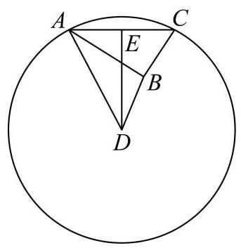

12、【答案】-6

【详解】由题意知 $b \in  \mathrm{Z}$ ,

当 $- b \leq  1$ ,即 $b \geq   - 1$ 时,根据二次函数的性质可知,数列 $\left\{  {a}_{n}\right\}$ 在 $\left\lbrack  {1, + \infty }\right)$ 上单调递增,

此时 ${a}_{m} + {a}_{m + 1} + {a}_{m + 2}$ 的最小值为 ${a}_{1} + {a}_{2} + {a}_{3}$ ,故 ${a}_{1} + {a}_{2} + {a}_{3} =  - 7$ ,

可得 ${\left( 1 + b\right) }^{2} + \frac{b}{2} + {\left( 2 + b\right) }^{2} + \frac{b}{2} + {\left( 3 + b\right) }^{2} + \frac{b}{2} =  - 7$ ,化简得 $2{b}^{2} + {9b} + {14} = 0$ ,

因为 $\Delta  = {9}^{2} - 4 \times  2 \times  {14} =  - {31} < 0$ ,所以方程无解,故 $- b \leq  1$ 不符合题意;

当 $- b \geq  2$ ,即 $b \leq   - 2$ 时,根据二次函数的性质可知,

${a}_{m} + {a}_{m + 1} + {a}_{m + 2}$ 的最小值为 ${a}_{-b - 1} + {a}_{-b} + {a}_{-b + 1}$ ,故 ${a}_{-b - 1} + {a}_{-b} + {a}_{-b + 1} =  - 7$ ,

即 ${\left( -1\right) }^{2} + \frac{b}{2} + \frac{b}{2} + {1}^{2} + \frac{b}{2} =  - 7$ ,解得 $b =  - 6$ ;

综上所述， $b =  - 6$ .

16、【答案】C

【详解】依题意,因 ${f}^{\prime }\left( x\right)  < 0$ 在区间 $I$ 上恒成立,则函数 $y = f\left( x\right)$ 在 $I$ 上严格递减, 由 ${a}_{{2n} + 2} - {a}_{2n} = f\left( {a}_{{2n} + 1}\right)  - f\left( {a}_{{2n} - 1}\right) , n \in  {\mathrm{N}}^{ * }$ ,因数列 $\left\{  {a}_{n}\right\}$ 的各项均不相同,且 ${a}_{1} \in  I$ , 若 ${a}_{{2n} + 1} > {a}_{{2n} - 1}$ ,则 $f\left( {a}_{{2n} + 1}\right)  < f\left( {a}_{{2n} - 1}\right)$ ,即 ${a}_{{2n} + 2} < {a}_{2n}$ ,即此时数列 $\left\{  {a}_{{2n} - 1}\right\}$ 严格递增,数列 $\left\{  {a}_{2n}\right\}$ 严格递减;

若 ${a}_{{2n} + 1} < {a}_{{2n} - 1}$ ,则 $f\left( {a}_{{2n} + 1}\right)  > f\left( {a}_{{2n} - 1}\right)$ ,即 ${a}_{{2n} + 2} > {a}_{2n}$ ,即此时数列 $\left\{  {a}_{{2n} - 1}\right\}$ 严格递减,数列 $\left\{  {a}_{2n}\right\}$ 严格递增.

综上所述,数列 $\left\{  {a}_{{2n} - 1}\right\}$ 与 $\left\{  {a}_{2n}\right\}$ 中的一个是严格增数列,另一个是严格减数列.

故选: C.

六. 嘉定区:

11、【答案】 $\arcsin \frac{2}{5}$

【详解】连接 ${OA},{OB}$ ,依题意, ${OA} \bot  {AD},{OB} \bot  {BE}$ ,则 ${BE} = {AD} = \frac{OA}{\tan \theta } = \frac{4}{\tan \theta }$ , $\angle {AOB} = \pi  - \left( {\angle {AOD} + \angle {BOE}}\right)  = \pi  - 2\left( {\frac{\pi }{2} - \theta }\right)  = {2\theta },\overset{\text{ ⏜ }}{ACB}$ 的长度为 ${8\theta }$ , 则桥面修建总费用 $f\left( \theta \right)  = {0.4} \times  \frac{8}{\tan \theta } + {2.5} \times  {8\theta } = \frac{3.2}{\tan \theta } + {20\theta }$ , $\arcsin \frac{1}{3} \leq  \theta  \leq  \frac{\pi }{6}$ , 而 $f\left( \theta \right)  = \frac{{3.2}\cos \theta }{\sin \theta } + {20\theta }$ ,求导得 ${f}^{\prime }\left( \theta \right)  = \frac{{3.2}\left( {-{\sin }^{2}\theta  - {\cos }^{2}\theta }\right) }{{\sin }^{2}\theta } + {20} = {20} - \frac{3.2}{{\sin }^{2}\theta }$ , 由 $\arcsin \frac{1}{3} \leq  \theta  \leq  \frac{\pi }{6}$ ,得 $\frac{1}{3} \leq  \sin \theta  \leq  \frac{1}{2}$ ,则 $\frac{1}{9} \leq  {\sin }^{2}\theta  \leq  \frac{1}{4}$ ,由 ${f}^{\prime }\left( \theta \right)  = 0$ ,得 $\sin \theta  = \frac{2}{5}$ , 当 $\frac{1}{3} \leq  \sin \theta  < \frac{2}{5}$ ,即 $\arcsin \frac{1}{3} \leq  \theta  < \arcsin \frac{2}{5}$ 时, ${f}^{\prime }\left( \theta \right)  < 0$ ; 当 $\frac{2}{5} < \sin \theta  \leq  \frac{1}{2}$ ,即 $\arcsin \frac{2}{5} < \theta  \leq  \frac{\pi }{6}$ 时, ${f}^{\prime }\left( \theta \right)  > 0$ , 因此函数 $f\left( \theta \right)$ 在 $\left\lbrack  {\arcsin \frac{1}{3},\arcsin \frac{2}{5}}\right)$ 上单调递减,在 $\left( {\arcsin \frac{2}{5},\frac{\pi }{6}}\right\rbrack$ 上单调递增, 所以当且仅当 $\theta  = \arcsin \frac{2}{5}$ 时, $f\left( \theta \right)$ 取得最小值,即桥面修建总费用最低.

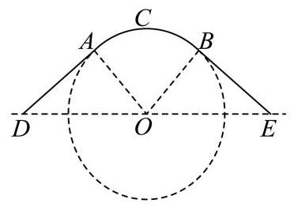

12、【答案】 $\frac{\sqrt{6} - \sqrt{2}}{4}$

【详解】设 $A\left( {{x}_{1},{y}_{1}}\right) , B\left( {{x}_{2},{y}_{2}}\right)$ ,则 $\overrightarrow{OA} = \left( {{x}_{1},{y}_{1}}\right) ,\overrightarrow{OB} = \left( {{x}_{2},{y}_{2}}\right)$ ,由 ${x}_{1}^{2} + {y}_{1}^{2} = 1,{x}_{2}^{2} + {y}_{2}^{2} = 1$ , ${x}_{1}{x}_{2} + {y}_{1}{y}_{2} = \frac{1}{2},$

得点 $A, B$ 在单位圆 ${x}^{2} + {y}^{2} = 1$ 上,且 $\overrightarrow{OA} \cdot  \overrightarrow{OB} = {x}_{1}{x}_{2} + {y}_{1}{y}_{2} = 1 \times  1 \times  \cos \angle {AOB} = \frac{1}{2}$ ,

即 $\angle {AOB} = {60}^{ \circ  }$ ,则 $\bigtriangleup {AOB}$ 为等边三角形, $\left| {AB}\right|  = 1$ ,

$\frac{\left| {x}_{1} + {y}_{1} - 1\right| }{\sqrt{2}} + \frac{\left| {x}_{2} + {y}_{2} - 1\right| }{\sqrt{2}}$ 可视为点 $A, B$ 到直线 $l : x + y - 1 = 0$ 的距离 ${d}_{1}$ 与 ${d}_{2}$ 之和,

当点 $A, B$ 在直线 $l$ 同侧时,

设 $A\left( {\cos \alpha ,\sin \alpha }\right) , B\left( {\cos \left( {\alpha  + \frac{\pi }{3}}\right) ,\sin \left( {\alpha  + \frac{\pi }{3}}\right) }\right) ,0 < \alpha  < \frac{\pi }{6}$ 或 $\frac{\pi }{2} < \alpha  < \frac{5\pi }{3}$ , 当 $0 < \alpha  < \frac{\pi }{6}$ 时, $\frac{\pi }{4} < \alpha  + \frac{\pi }{4} < \frac{5\pi }{12}$ ,则 $\sin \alpha  + \cos \alpha  = \sqrt{2}\sin \left( {\alpha  + \frac{\pi }{4}}\right)  > 1$ , $\frac{7\pi }{12} < \alpha  + \frac{\pi }{3} + \frac{\pi }{4} < \frac{3\pi }{4},\sin \left( {\alpha  + \frac{\pi }{3}}\right)  + \cos \left( {\alpha  + \frac{\pi }{3}}\right)  = \sqrt{2}\sin \left( {\alpha  + \frac{\pi }{3} + \frac{\pi }{4}}\right)  > 1, \; \cos \frac{5\pi }{12} = \sin \frac{\pi }{12} = \sin \left( {\frac{\pi }{3} - \frac{\pi }{4}}\right)  = \sin \frac{\pi }{3}\cos \frac{\pi }{4} - \cos \frac{\pi }{3}\sin \frac{\pi }{4} = \frac{\sqrt{6}}{4} - \frac{\sqrt{2}}{4} = \frac{\sqrt{6} - \sqrt{2}}{4}$ , $\sin \frac{5\pi }{12} = \cos \frac{\pi }{12} = \cos \left( {\frac{\pi }{3} - \frac{\pi }{4}}\right)  = \cos \frac{\pi }{3}\cos \frac{\pi }{4} + \sin \frac{\pi }{3}\sin \frac{\pi }{4} = \frac{\sqrt{2}}{4} + \frac{\sqrt{6}}{4} = \frac{\sqrt{6} + \sqrt{2}}{4}$ , 于是 ${d}_{1} + {d}_{2} = \frac{\left| \sin \alpha  + \cos \alpha  - 1\right| }{\sqrt{2}} + \frac{\left| \sin \left( \alpha  + \frac{\pi }{3}\right)  + \cos \left( \alpha  + \frac{\pi }{3}\right)  - 1\right| }{\sqrt{2}} \; = \frac{1}{\sqrt{2}}\left\lbrack  {\sin \alpha  + \cos \alpha  + \sin \left( {\alpha  + \frac{\pi }{3}}\right)  + \cos \left( {\alpha  + \frac{\pi }{3}}\right)  - 2}\right\rbrack   = \frac{1}{\sqrt{2}}\left( {\frac{3 - \sqrt{3}}{2}\sin \alpha  + \frac{3 + \sqrt{3}}{2}\cos \alpha }\right)  - \sqrt{2}$

$= \frac{\sqrt{6}}{\sqrt{2}}\left( {\frac{\sqrt{6} - \sqrt{2}}{4}\sin \alpha  + \frac{\sqrt{6} + \sqrt{2}}{4}\cos \alpha }\right)  - \sqrt{2} = \sqrt{3}\sin \left( {\alpha  + \frac{5\pi }{12}}\right)  - \sqrt{2}$ ,

由 $0 < \alpha  < \frac{\pi }{6}$ ,得 $\frac{5\pi }{12} < \alpha  + \frac{5\pi }{12} < \frac{7\pi }{12},\frac{\sqrt{6} + \sqrt{2}}{4} < \sin \left( {\alpha  + \frac{5\pi }{12}}\right)  \leq  1,{d}_{1} + {d}_{2} > \frac{\sqrt{6} - \sqrt{2}}{4}$ ;

当 $\frac{\pi }{2} < \alpha  < \frac{5\pi }{3}$ 时, $\frac{3\pi }{4} < \alpha  + \frac{\pi }{4} < \frac{23\pi }{12}$ ,则 $\sin \alpha  + \cos \alpha  = \sqrt{2}\sin \left( {\alpha  + \frac{\pi }{4}}\right)  < 1$ ,

$\frac{13\pi }{12} < \alpha  + \frac{\pi }{3} + \frac{\pi }{4} < \frac{9\pi }{4},\sin \left( {\alpha  + \frac{\pi }{3}}\right)  + \cos \left( {\alpha  + \frac{\pi }{3}}\right)  = \sqrt{2}\sin \left( {\alpha  + \frac{\pi }{3} + \frac{\pi }{4}}\right)  < 1,$

${d}_{1} + {d}_{2} = \frac{1}{\sqrt{2}}\left\lbrack  {2 - \sin \alpha  - \cos \alpha  - \sin \left( {\alpha  + \frac{\pi }{3}}\right)  - \cos \left( {\alpha  + \frac{\pi }{3}}\right) }\right\rbrack$

$= \sqrt{2} - \frac{1}{\sqrt{2}}\left( {\frac{3 - \sqrt{3}}{2}\sin \alpha  + \frac{3 + \sqrt{3}}{2}\cos \alpha }\right)  = \sqrt{2} - \sqrt{3}\sin \left( {\alpha  + \frac{5\pi }{12}}\right) ,$

$\frac{11\pi }{12} < \alpha  + \frac{5\pi }{12} < \frac{25\pi }{12}, - 1 \leq  \sin \left( {\alpha  + \frac{5\pi }{12}}\right)  < \frac{\sqrt{6} - \sqrt{2}}{4},{d}_{1} + {d}_{2} > \frac{\sqrt{6} + \sqrt{2}}{4};$

当点 $A, B$ 在直线 $l$ 异侧时 (包括点 $A, B$ 之一在直线 $l$ 上),

过 $A, B$ 分别作 $A{A}^{\prime } \bot  l, B{B}^{\prime } \bot  l$ ,垂足为 ${A}^{\prime },{B}^{\prime }$ ,令直线 ${AB}$ 与直线 $l$ 的夹角为

$\theta \left( {\frac{\pi }{12} \leq  \theta  \leq  \frac{5\pi }{12}}\right)$

${d}_{1} + {d}_{2} = \left| {AB}\right| \sin \theta  = \sin \theta  \geq  \sin \frac{\pi }{12} = \frac{\sqrt{6} - \sqrt{2}}{4},$

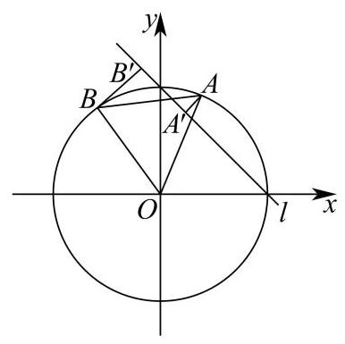

所以 $\frac{\left| {x}_{1} + {y}_{1} - 1\right| }{\sqrt{2}} + \frac{\left| {x}_{2} + {y}_{2} - 1\right| }{\sqrt{2}}$ 的最小值为 $\frac{\sqrt{6} - \sqrt{2}}{4}$ .

16、【答案】B

【详解】对于①,当 $r = 2$ 时, ${a}_{n + 1} = 2{a}_{n}\left( {1 - {a}_{n}}\right)$ ,

${a}_{n + 1} - {a}_{n} = 2{a}_{n}\left( {1 - {a}_{n}}\right)  - {a}_{n} = {a}_{n} - 2{a}_{n}^{2} > 0$ ,解得 $0 < {a}_{n} < \frac{1}{2}$ ,

当 $0 < {a}_{1} < \frac{1}{2}$ 时, ${a}_{n + 1} - {a}_{n} > 0\left( {n \in  {\mathrm{N}}^{ * }}\right)$ 恒成立,故①错误;

对于②,当 $r = 2$ 时, ${a}_{n + 1} = 2{a}_{n}\left( {1 - {a}_{n}}\right) ,{a}_{n + 1} - {a}_{n} = {a}_{n} - 2{a}_{n}^{2} < \frac{1}{2025}$ ,

解得 ${a}_{n} < \frac{1 - \sqrt{\frac{2017}{2025}}}{4}$ 或 ${a}_{n} > \frac{1 + \sqrt{\frac{2017}{2025}}}{4}$ ,

易知 $0 < \frac{1 - \sqrt{\frac{2017}{2025}}}{4} < \frac{1 + \sqrt{\frac{2017}{2025}}}{4} < \frac{1}{2}$ ,由①可知,

当 $0 < {a}_{1} < \frac{1}{2}$ 时,数列 $\left\{  {a}_{n}\right\}$ 单调递增, $0 < {a}_{n} < \frac{1}{2}$ ,

所以一定存在 $P \in  {\mathrm{N}}^{ * }$ ,当 $n > P$ 时, $\frac{1 + \sqrt{\frac{2017}{2025}}}{4} < {a}_{n} < \frac{1}{2}$ ,故②正确;

对于③，当 $r = 3$ 时， ${a}_{n + 1} = 3{a}_{n}\left( {1 - {a}_{n}}\right)$ ，令 ${a}_{n + 1} = {a}_{n} = x$ ，可得 $x = {3x}\left( {1 - x}\right)$ ，

解得 $x = 0$ 或 $\frac{2}{3}$ ,

令 $3{a}_{1}\left( {1 - {a}_{1}}\right)  = \frac{2}{3}$ ,解得 ${a}_{1} = \frac{1}{3}$ 或 $\frac{2}{3}$ ,

当 ${a}_{1} = \frac{1}{3}$ 时,可得当 $n > 1$ 时, ${a}_{n} = \frac{2}{3}$ ,故③正确;

对于④,当 $r =  - 3$ 时, ${a}_{n + 1} =  - 3{a}_{n}\left( {1 - {a}_{n}}\right)$ ,令 ${a}_{n + 1} = {a}_{n} = x$ ,则 $x =  - {3x}\left( {1 - x}\right)$ , 解得 $x = 0$ 或 $\frac{4}{3}$ ,

令 ${a}_{3} = \frac{2}{3}$ ,可得 $- 3{a}_{2}\left( {1 - {a}_{2}}\right)  = \frac{4}{3}$ ,解得 ${a}_{2} =  - \frac{1}{3}$ 或 $\frac{4}{3}$ ,

令 ${a}_{2} =  - \frac{1}{3}$ ,可得 $- 3{a}_{1}\left( {1 - {a}_{1}}\right)  =  - \frac{1}{3}$ ,解得 ${a}_{1} = \frac{3 \pm  \sqrt{5}}{6}$ ,

当 ${a}_{1} = \frac{3 - \sqrt{5}}{6} \in  \left( {0,1}\right)$ 时,当 $n \geq  3$ 时, ${a}_{n} = \frac{4}{3} > 0$ ,故④错误.

故选: B.

七. 金山区:

11、【答案】3

【详解】由题意可知: $P\left( A\right)  = \frac{{2}^{n} - 2}{{2}^{n}}, P\left( B\right)  = \frac{1 + n}{{2}^{n}}, P\left( {AB}\right)  = \frac{n}{{2}^{n}}$ , 因为 $A, B$ 独立,所以 $P\left( A\right)  \cdot  P\left( B\right)  = P\left( {AB}\right)$ , 即 $\frac{{2}^{n} - 2}{{2}^{n}} \cdot  \frac{1 + n}{{2}^{n}} = \frac{n}{{2}^{n}} \Rightarrow  {2}^{n - 1} = n + 1$ ,结合 ${2}^{n - 1}, n + 1$ 均随 $n$ 的增大而增大, 故 $n = 3$ .

12、【答案】 $4\sqrt{2}$

【详解】设 $A\left( {x, y}\right)$ ,则 $C\left( {-y, x}\right)$ ,故 $\overrightarrow{OB} + \overrightarrow{OC} = \left( {{x}_{B} - y,{y}_{B} + x}\right)  = \left( {-3,3}\right)$ , 所以 $\left\{  \begin{array}{l} {x}_{B} - y =  - 3 \\  {y}_{B} + x = 3 \end{array}\right.$ ,则 $\left\{  \begin{array}{l} {x}_{B} = y - 3 \\  {y}_{B} = 3 - x \end{array}\right.$ ,故 $B\left( {y - 3,3 - x}\right)$ ,

由 $\left| \overrightarrow{OA}\right|  + \left| \overrightarrow{OB}\right|  = \sqrt{{x}^{2} + {y}^{2}} + \sqrt{{\left( x - 3\right) }^{2} + {\left( y - 3\right) }^{2}} = 8$ ,

即 $A\left( {x, y}\right)$ 到原点距离与 $A\left( {x, y}\right)$ 到 $\left( {3,3}\right)$ 的距离之和为 8,

易知 $\mathrm{A}$ 的轨迹为一个椭圆,且 ${2a} = 8 \Rightarrow  a = 4,{2c} = 2\sqrt{3} \Rightarrow  c = \sqrt{3}$ ,如下图,

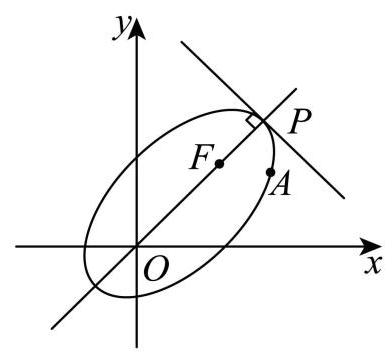

若 $P$ 为椭圆的右顶点,则 $\left| {OP}\right|  = \frac{8 - 3\sqrt{2}}{2} + 3\sqrt{2} = \frac{8 + 3\sqrt{2}}{2}$ ,且直线 ${OP} : y = x$ , 易知 ${x}_{P} = {y}_{P} = \frac{\left| OP\right| }{\sqrt{2}} = \frac{4\sqrt{2} + 3}{2}$ ,即 $P\left( {\frac{4\sqrt{2} + 3}{2},\frac{4\sqrt{2} + 3}{2}}\right)$ ,

由 $\left( {\overrightarrow{OA} + \overrightarrow{OB}}\right)  \cdot  \overrightarrow{i} = \left( {x + y - 3, y - x + 3}\right)  \cdot  \left( {1,0}\right)  = x + y - 3$ ,令 $m = x + y - 3$ ①,

所以,要使 $\left( {\overrightarrow{OA} + \overrightarrow{OB}}\right)  \cdot  \overrightarrow{i}$ 最大,只需 $y =  - x + m + 3$ 的截距最大,即 $m$ 最大, 结合图知,该直线过 $P$ 点即可,将 $P$ 代入 ①,有 $m = \frac{4\sqrt{2} + 3}{2} + \frac{4\sqrt{2} + 3}{2} - 3 = 4\sqrt{2}$ .

16、【答案】D

【详解】设 ${d}_{i} = \left| {P{A}_{i}}\right|$ ,情况如下:

① $P$ 到两个顶点的距离 $a$ 一样，到另外两个顶点的距离 $b$ 一样，且 $a \neq  b$ ，

由 ${A}_{1},{A}_{2},{A}_{3},{A}_{4}$ 具有对称性,不妨讨论 ${d}_{1} = {d}_{4},{d}_{2} = {d}_{3}$ ,

满足题意的 $P$ 应同时在线段 ${A}_{1}{A}_{4},{A}_{2}{A}_{3}$ 的中垂线面和三棱锥表面上,

即为其中垂面交线与三棱锥表面的交点,如图 ${P}_{1},{P}_{2}$ 两点,

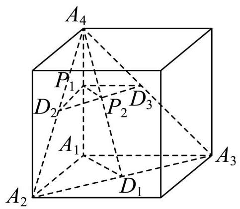

同理, ${d}_{1} = {d}_{2},{d}_{3} = {d}_{4}$ 和 ${d}_{1} = {d}_{3},{d}_{2} = {d}_{4}$ 也各有 2 个满足题意的 $P$ 点,故共 6 个;

② $P$ 到其中三个顶点的距离 $c$ 一样，到另一个顶点的距离为 $e$ ，且 $c \neq  e$ ，

若 $P$ 到 ${A}_{2},{A}_{3},{A}_{4}$ 的距离一样,即 ${d}_{2} = {d}_{3} = {d}_{4}$ ,则 $P$ 为过 $\bigtriangleup {A}_{2}{A}_{3}{A}_{4}$ 外心的垂线与三棱锥表面的交点，如图 ${P}_{3}$ 和 ${A}_{1}$ (舍)；

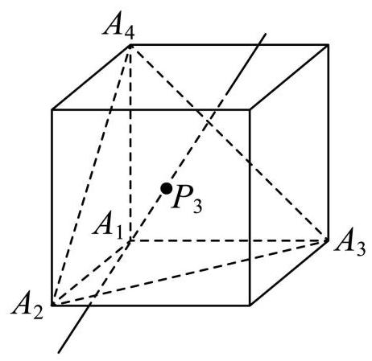

若 $P$ 到 ${A}_{1}$ 和 ${A}_{2},{A}_{3},{A}_{4}$ 中的两个距离一样,由 ${A}_{1},{A}_{2},{A}_{3},{A}_{4}$ 具有对称性, 不妨讨论 ${d}_{1} = {d}_{2} = {d}_{3}$ ,则 $P$ 为过 $\bigtriangleup {A}_{2}{A}_{3}{A}_{4}$ 外心的垂线与三棱锥表面的交点,如图 ${P}_{4}$ ,

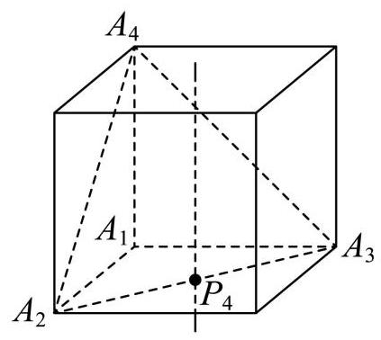

同理, ${d}_{1} = {d}_{3} = {d}_{4}$ 和 ${d}_{1} = {d}_{2} = {d}_{4}$ 也各有 1 个满足题意的 $P$ 点,共 4 个;

综上, 共有 10 个满足题意的点.

故选: D

## 八. 静安区:

11、【答案】 $\sqrt{2}$

【详解】因为二次函数 $f\left( x\right)  = {x}^{2} + \left( {{a}^{2} + {b}^{2} - 1}\right) x + {a}^{2} + {2ab} - {b}^{2}$ 为偶函数,

则该函数的对称轴为直线 $x =  - \frac{{a}^{2} + {b}^{2} - 1}{2} = 0$ ,可得 ${a}^{2} + {b}^{2} = 1$ ,

令 $a = \cos \theta , b = \sin \theta$ ,则

${a}^{2} + {2ab} - {b}^{2} = {\cos }^{2}\theta  + 2\sin \theta \cos \theta  - {\sin }^{2}\theta  = \sin {2\theta } + \cos {2\theta } = \sqrt{2}\sin \left( {{2\theta } + \frac{\pi }{4}}\right)  \in  \left\lbrack  {-\sqrt{2},\sqrt{2}}\right\rbrack$ ,

因此，该函数图象与 $y$ 轴交点的纵坐标 ${a}^{2} + {2ab} - {b}^{2}$ 的最大值为 $\sqrt{2}$ .

12、【答案】100000

【详解】设 $\lg {x}_{3} = k, k \in  {\mathrm{N}}^{ * }$ ,依题意, $\lg {x}_{1} = k + 2,\lg {x}_{4} = k - 1,\lg {x}_{5} = k - 2, k \geq  3$ , 由 ${\left( \lg {x}_{4}\right) }^{2} < \lg {x}_{1} \cdot  \lg {x}_{5}$ ,得 ${\left( k - 1\right) }^{2} < \left( {k + 2}\right) \left( {k - 2}\right)$ ,解得 $k > \frac{3}{2}$ ,因此 $k \geq  3$ , 则 $\lg {x}_{1} \geq  5,{x}_{1} \geq  {100000}$ ,所以 ${x}_{1}$ 的最小值为 100000 .

16、【答案】C

【详解】设平面 ${ABCD}$ 的一个法向量 $\overrightarrow{n} = \left( {x, y, z}\right)$ ,

则 $\left\{  \begin{array}{l} \overrightarrow{n} \cdot  \overrightarrow{AB} = {4x} - {2y} + {3z} = 0 \\  \overrightarrow{n} \cdot  \overrightarrow{AD} =  - {4x} + y = 0 \end{array}\right.$ ,令 $y = {12}$ ,则 $x = 3, z = 4$ ,即 $\overrightarrow{n} = \left( {3,{12},4}\right)$ ,

所以该四棱锥的高 $h = \frac{\left| \overrightarrow{AP} \cdot  \overrightarrow{n}\right| }{\left| \overrightarrow{n}\right| } = \frac{\left| -6 \times  3 + {12} \times  2 - 8 \times  4\right| }{\sqrt{{3}^{2} + {12}^{2} + {4}^{2}}} = 2$ .

故选: C.

九. 闵行区:

## 11、【答案】137

【解析】如图,设在线段 ${EF}$ 上的顶点为 $M$ ,在线段 ${CD}$ 上的一个顶点为 $N$ .

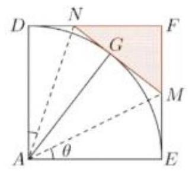

若游乐区面积要最大,则 ${MN}$ 与扇形弧边相切,由切线性质,易知 ${ND} = {NG},{ME} = {MG}$ , 所以 $\bigtriangleup {AND} \cong  \bigtriangleup {ANG},{\Delta AME} \cong  \bigtriangleup {AMG}$ ,所以 ${S}_{\bigtriangleup {MNF}} = {S}_{AEFD} - 2{S}_{AMN} = {400} - {20MN}$ , 设 $\angle {MAE} = \theta$ ，则 ${NAD} = {45}^{ \circ  } - \theta$ ，所以 ${ME} = {{20}\tan \theta },{ND} = {20}\tan \left( {{45}^{ \circ  } - \theta }\right)$ ，

$\therefore {MN} = {ME} + {ND} = {20}\left\lbrack  {\tan \theta  + \tan \left( {{45}^{ \circ  } - \theta }\right) }\right\rbrack   = {20} \cdot  \frac{{\tan }^{2}\theta  + 1}{1 + \tan \theta },\theta  \in  \left( {0,\frac{\pi }{4}}\right)$ ,

设 $t = 1 + \tan \theta  \in  \left( {1,2}\right)  \Rightarrow  \tan \theta  = t - 1,\therefore {MN} = {20}\left( {t + \frac{2}{t} - 2}\right)  \geq  {40}\sqrt{2} - {40}$ ,

当且仅当 $t = \sqrt{2} \Rightarrow  S = {800} - {40MN} \approx  {137}$ .

12、【答案】 $\left\lbrack  {\frac{\sqrt{5}}{2},\frac{\sqrt{6}}{2}}\right\rbrack   \cup  \left\lbrack  {\frac{\sqrt{7}}{2}, + \infty }\right)$ ;

【解析】因为 $f\left( x\right)  = \left| {\sin {\omega x}}\right|  \in  \left\lbrack  {0,1}\right\rbrack$ ,所以 $f\left( x\right)  + 1 \in  \left\lbrack  {1,2}\right\rbrack   \Rightarrow  \frac{1}{1 + f\left( x\right) } \in  \left\lbrack  {\frac{1}{2},1}\right\rbrack$ ,

$\therefore \frac{1}{1 + f\left( {x}_{1}\right) } + \frac{1}{1 + f\left( {x}_{2}\right) } \geq  1$ ,当且仅当 $f\left( {x}_{1}\right)  = f\left( {x}_{2}\right)  = 1$ 时等号成立,

即 $f\left( x\right)  = \left| {\sin {\omega x}}\right|$ 在 $\left\lbrack  {{\omega \pi },{2\omega \pi }}\right\rbrack$ 上至少有两个解,

换而言之即 $f\left( x\right)  = \left| {\sin x}\right|  = 1$ 在 $\left\lbrack  {{\omega }^{2}\pi ,2{\omega }^{2}\pi }\right\rbrack$ 上至少有两个解,由题意 $\omega  > 0$ ,

结合图像分析, $\left\lbrack  {{\omega }^{2}\pi ,2{\omega }^{2}\pi }\right\rbrack$ 的区间长度需要大于最小正周期,即 ${\omega }^{2}\pi  > \pi  \Rightarrow  \omega  > 1$ .

${1}^{ \circ  }$ 当 $2{\omega }^{2}\pi  \geq  \frac{5\pi }{2}$ 且 ${\omega }^{2}\pi  \leq  \frac{3\pi }{2}$ 时,符合题意,解得 $\omega  \in  \left\lbrack  {\frac{\sqrt{5}}{2},\frac{\sqrt{6}}{2}}\right\rbrack$ ;

${2}^{ \circ  }$ 当 $2{\omega }^{2}\pi  \geq  \frac{7\pi }{2}$ 且 ${\omega }^{2}\pi  \leq  \frac{5\pi }{2}$ 时,符合题意,解得 $\omega  \in  \left\lbrack  {\frac{\sqrt{7}}{2},\frac{\sqrt{10}}{2}}\right\rbrack$ ; 而当 ${\omega }^{2}\pi  > \frac{5\pi }{2}$ 时, $\left\lbrack  {{\omega }^{2}\pi ,2{\omega }^{2}\pi }\right\rbrack$ 的区间长度 ${\omega }^{2}\pi  > {2\pi }$ ,符合题意.

综上, $\omega$ 的取值范围是 $\left\lbrack  {\frac{\sqrt{5}}{2},\frac{\sqrt{6}}{2}}\right\rbrack   \cup  \left\lbrack  {\frac{\sqrt{7}}{2}, + \infty }\right)$ .

## 16、【答案】A；

【解析】① $\because \lambda  > 0,\therefore {a}_{n + 1} = \left| {{a}_{n} + 1}\right|  + \lambda \left| {{a}_{n} - 1}\right|  > 0$ ,即当 $n \geq  2$ 时, ${a}_{n} > 0$ ,

此时 ${a}_{n + 1} = {a}_{n} + 1 + \lambda \left| {{a}_{n} - 1}\right|  > {a}_{n}$ ,若 ${a}_{1} \leq  0$ ,则 ${a}_{2} > {a}_{1}$ ;

若 ${a}_{1} > 0$ ,则 ${a}_{2} = {a}_{1} + 1 + \lambda \left| {{a}_{n} - 1}\right|  > {a}_{1},\therefore$ 对任意的 ${a}_{1} \in  R,{\left\{  {a}_{n}\right\}  }^{\text{ 正公 }}$ 将增,①是真命题；

② 当 $\lambda  =  - 1$ 时， ${a}_{n + 1} = \left| {{a}_{n} + 1}\right|  - \left| {{a}_{n} - 1}\right|$ ，结合函数 $f\left( x\right)  = \left| {x + 1}\right|  - \left| {x - 1}\right|$ 的图像分析.

当 ${a}_{1} \geq  1$ 时, ${a}_{2} = 2$ ,推出 ${a}_{n} = 2$ ,不是严格减数列;

当 $0 \leq  {a}_{1} < 1$ 时, ${a}_{2} = 2{a}_{1} \geq  {a}_{1}$ ,不是严格减数列;

当 $- 1 < {a}_{1} < 0$ 时, ${a}_{2} = 2{a}_{1} < {a}_{1}$ ,逐项变小,小到某项 ${a}_{m} \leq   - 1\left( {m \geq  2}\right)$ 时, ${a}_{m + 1} =  - 2$ ,

推出 $n \geq  m + 1$ 时, ${a}_{n} =  - 2$ ,不是严格减数列; 当 ${a}_{1} \leq   - 1$ 时, ${a}_{n} =  - 2$ ,不是严格减数列;

综上,当 $\lambda  =  - 1$ 时,不存在 ${a}_{1} \in  R$ 使得 $\left\{  {a}_{n}\right\}$ 是严格减数列,② 是假命题;

故答案选: A

## 十. 浦东区:

## 11、【答案】8；

【解析】由题意,三个单位向量 $\overrightarrow{O{A}_{1}},\overrightarrow{O{A}_{2}},\overrightarrow{O{A}_{3}}$ 两两垂直,

所以不妨设 ${A}_{1}\left( {1,0,0}\right) ,{A}_{2}\left( {0,1,0}\right) ,{A}_{3}\left( {0,0,1}\right) , P\left( {x, y, z}\right)$ ,

$\therefore \left| {\overrightarrow{OP} \cdot  \overrightarrow{O{A}_{1}}}\right|  = \left| x\right|  = 1,\left| {\overrightarrow{OP} \cdot  \overrightarrow{O{A}_{2}}}\right|  = \left| y\right|  = 2,\left| {\overrightarrow{OP} \cdot  \overrightarrow{O{A}_{3}}}\right|  = \left| z\right|  = 3$ ,

所以 $x =  \pm  1, y =  \pm  2, z =  \pm  3,\therefore$ 点 $P$ 的可能有 ${C}_{2}^{1} \times  {C}_{2}^{1} \times  {C}_{2}^{1} = 8$ 个,即八个卦限各有 1 个.

## 12、【答案】 10；

【解析】 $\because \left( {x - {z}_{1}}\right) \left( {x - {z}_{2}}\right) \left( {x - {z}_{3}}\right) \left( {x - {z}_{4}}\right)  = {x}^{4} + {a}_{3}{x}^{3} + {a}_{2}{x}^{2} + {a}_{1}x + {a}_{0}$ ,

可得: $\left\{  \begin{array}{l} {a}_{0} = {z}_{1}{z}_{2}{z}_{3}{z}_{4} \\  {a}_{1} =  - \left( {{z}_{1}{z}_{2}{z}_{3} + {z}_{1}{z}_{2}{z}_{4} + {z}_{1}{z}_{3}{z}_{4} + {z}_{2}{z}_{3}{z}_{4}}\right) \\  {a}_{2} = {z}_{1}{z}_{2} + {z}_{1}{z}_{3} + {z}_{1}{z}_{4} + {z}_{2}{z}_{3} + {z}_{2}{z}_{4} + {z}_{3}{z}_{4} \\  {a}_{3} =  - \left( {{z}_{1} + {z}_{2} + {z}_{3} + {z}_{4}}\right)  \end{array}\right.$ ,

由题意, ${z}_{1},{z}_{2},{z}_{3},{z}_{4}$ 是方程 ${x}^{4} + {a}_{3}{x}^{3} + {a}_{2}{x}^{2} + {a}_{1}x + {a}_{0} = 0$ 的根,

一元四次方程可分解为两个一元二次方程 $\left\{  \begin{array}{l} {f}_{1}\left( x\right)  = 0 \\  {f}_{2}\left( x\right)  = 0 \end{array}\right.$ ,若这两个方程均有实数解,

则 ${z}_{1},{z}_{2},{z}_{3},{z}_{4}$ 对应点均在 $x$ 轴上,不符合题意,故两个方程中至少有一个方程有共轭虚根.

由共轭复数对应点关于 $x$ 轴对称,可知,题中单位圆关于 $x$ 轴对称,圆心在 $x$ 轴上,

设圆心为 $\left( {a,0}\right)$ :

① 若方程 ${f}_{1}\left( x\right)  = 0$ 有两个实数根 ${z}_{1},{z}_{2},{f}_{2}\left( x\right)  = 0$ 有两个共轭虚根 ${z}_{3},{z}_{4}$ ，

$\therefore \left\{  \begin{array}{l} {z}_{1} = a + 1 \\  {z}_{2} = a - 1 \\  {z}_{3} = a + 1 \\  {z}_{4} = a - i \end{array}\right.$ ,解得 $\left\{  {\begin{array}{l} {a}_{0} = {a}^{4} - 1 \\  {a}_{1} =  - 4{a}^{3} \\  {a}_{2} = 6{a}^{2} \\  {a}_{3} =  - {4a} \end{array} \Rightarrow  \left\{  {{a}^{4} - 1, - 4{a}^{3},6{a}^{2}, - {4a}}\right\}   \subset  \{ n \mid  1 \leq  n \leq  {2024}, n \in  Z\} ,}\right.$

易知 $a < 0\left( {a \in  Z}\right)$ ,由 ${a}^{4} - 1 \leq  {2024} \Rightarrow  \left| a\right|  \leq  6,\because a =  - 1$ 时不满足集合互异性,

所以 $a =  - 6, - 5, - 4, - 3, - 2$ ,此时满足条件的集合 $\left\{  {{a}_{0},{a}_{1},{a}_{2},{a}_{3}}\right\}$ 有 5 个.

②若方程 ${f}_{1}\left( x\right)  = 0$ 有共轭虚根 ${z}_{1},{z}_{2},{f}_{2}\left( x\right)  = 0$ 有两个共轭虚根 ${z}_{3},{z}_{4}$ ，解得:

$$
\left\{  {\begin{array}{l} {z}_{1} = a + \frac{\sqrt{2}}{2} + \frac{\sqrt{2}}{2}i \\  {z}_{2} = a + \frac{\sqrt{2}}{2} - \frac{\sqrt{2}}{2}i \\  {z}_{3} = a - \frac{\sqrt{2}}{2} + \frac{\sqrt{2}}{2}i \\  {z}_{4} = a - \frac{\sqrt{2}}{2} - \frac{\sqrt{2}}{2}i \end{array} \Rightarrow  \left\{  {\begin{array}{l} {a}_{0} = {a}^{4} + 1 \\  {a}_{1} =  - 4{a}^{3} \\  {a}_{2} = 6{a}^{2} \\  {a}_{3} =  - {4a} \end{array} \Rightarrow  \left\{  {{a}^{4} + 1, - 4{a}^{3},6{a}^{2}, - {4a}}\right\}   \subset  \{ n \mid  1 \leq  n \leq  {2024}, n \in  Z\} }\right. }\right.
$$

易知 $a < 0\left( {a \in  Z}\right)$ ,由 ${a}^{4} + 1 \leq  {2024} \Rightarrow  \left| a\right|  \leq  6,\because a =  - 1$ 时不满足集合互异性, $\therefore a =  - 6, - 5, - 4, - 3, - 2$ ,此时满足条件的集合 $\left\{  {{a}_{0},{a}_{1},{a}_{2},{a}_{3}}\right\}$ 有 5 个. 综上两种情况，满足条件的集合共有 10 个.

## 16、【答案】A；

【解析】① $\because {2}^{4} = {16},{\log }_{2}1 = 0,{2}^{1} = {\log }_{2}4 = 2$ , $\therefore$ 存在 $f\left( x\right)  \in  \lbrack 1,4)$ ,

使得 $y = {2}^{f\left( x\right) }$ 的值域 $A = \left\lbrack  {2,{16}}\right) , y = {\log }_{2}f\left( x\right)$ 的值域 $B = \left\lbrack  {0,2}\right)$ ,满足 $A \cap  B = \varnothing$ ,

$A \cup  B = \left\lbrack  {0,{16}) \subseteq  \left\lbrack  {0,{16}}\right\rbrack  ,{C}_{S}\left( {A \cup  B}\right)  = \{ {16}}\right\rbrack$ 为有限集, $\therefore$ 命题①为真命题;

② 当 $g\left( x\right)  \in  \left\lbrack  {\frac{\pi }{4},\frac{\pi }{2}}\right)$ 时， $y = \sin g\left( x\right)  \in  \left\lbrack  {{y}_{1},1}\right) , y = \tan g\left( x\right)  \in  \left\lbrack  {1, + \infty }\right) ,\left\lbrack  {{y}_{1},1}\right)  \cap  \lbrack 1, + \infty ) = \varnothing$ ， $\left\lbrack  {{y}_{1},1}\right)  \cup  \lbrack 1, + \infty )$ ,由 ${y}_{1} = \tan {x}_{1}$ 确定 ${x}_{1}$ ,由 ${y}_{2} = \sin {x}_{1}$ 确定 ${y}_{2}$ ,依次确定 ${x}_{2},{y}_{3},{x}_{3},{y}_{4},\cdots$ , 当 $g\left( x\right)  \in  \left\lbrack  {{x}_{2},{x}_{1}}\right)$ 时, $y = \sin g\left( x\right)  \in  \left\lbrack  {{y}_{3},{y}_{2}}\right) , y = \tan g\left( x\right)  \in  \left\lbrack  {{y}_{2},{y}_{1}}\right) ,\left\lbrack  {{y}_{3},{y}_{2}}\right)  \cap  \left\lbrack  {{y}_{2},{y}_{1}}\right)  = \varnothing \; \left\lbrack  {{y}_{3},{y}_{2}}\right)  \cup  \left\lbrack  {{y}_{2},{y}_{1}}\right)  = \left\lbrack  {{y}_{3},{y}_{1}}\right) ,$

同样依次操作下去,则当 $g\left( x\right)  \in  \left\lbrack  {\frac{\pi }{4},\frac{\pi }{2}}\right)  \cup  \left\lbrack  {{x}_{2},{x}_{1}}\right)  \cup  \left\lbrack  {{x}_{4},{x}_{3}}\right)  \cup  \cdots$ 时,

$y = \sin g\left( x\right)$ 的值域 $A = \left\lbrack  {{y}_{1},1}\right)  \cup  \left\lbrack  {{y}_{3},{y}_{2}}\right)  \cup  \left\lbrack  {{y}_{3},{y}_{4}}\right)  \cup  \cdots$ ,

$y = \tan g\left( x\right)$ 值域 $B = \left\lbrack  {1, + \infty }\right) \bigcup \left\lbrack  {{y}_{2},{y}_{1}}\right) \bigcup \left\lbrack  {{y}_{4},{y}_{3}}\right) \bigcup \cdots ,$

满足 $A \cap  B = \varnothing , A \cup  B \subseteq  \lbrack 0, + \infty ),{C}_{S}\left( {A \cup  B}\right)$ ,为有限集, $\therefore$ 命题②为真题;

综上,答案选: $A$ .

十一. 普陀区:

11、【答案】 $\sqrt{2}$ ；

【解析】当 $0 \leq  x \leq  4$ 时, ${C}_{1} : y = \frac{1}{4}{x}^{2} \Rightarrow  {x}^{2} = {4y} \Rightarrow  x = 2{y}^{\frac{1}{2}}, x, y$ 互换后即曲线 ${C}_{2}$ , 所以 ${C}_{1}$ 与 ${C}_{2}$ 在 $\left\lbrack  {0,4}\right\rbrack$ 上关于直线 $y = x$ 对称,如图, $l$ 与 ${C}_{1}\text{ 、 }{C}_{2}$ 交于 $P, Q$ 两点,

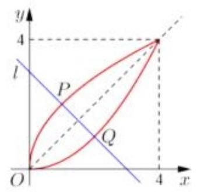

且直线 $l$ 与直线 $y = x$ 垂直,所以 $P, Q$ 两点关于直线 $y = x$ 对称,

设点 $Q\left( {x,\frac{1}{4}{x}^{2}}\right)$ (易知 $x \geq  \frac{1}{4}{x}^{2}$ ) 到直线 $y = x$ 的距离为 $d$ , 所以由点到直线距离公式, $d = \frac{1}{\sqrt{2}}\left( {x - \frac{1}{4}{x}^{2}}\right)  =  - \frac{\sqrt{2}}{4}\left\lbrack  {{\left( x - 2\right) }^{2} - 4}\right\rbrack   \leq  \frac{\sqrt{2}}{2}$ , 当且仅当 $x = 2$ 时等号成立,此时 ${PQ} = {2d} \leq  \sqrt{2}$ .

12、【答案】 $\left\lbrack  {3,\frac{11}{3}}\right)$ ；

【解析】设 $g\left( x\right)  = x - \frac{1}{x} + \ln x\left( {x > 0}\right)$ ,因为 $y = x - \frac{1}{x}$ 与 $y = \ln x$ 在 $x > 0$ 时均严格增, 所以 $g\left( x\right)  = x - \frac{1}{x} + \ln x\left( {x > 0}\right)$ 严格增,由 $g\left( \frac{1}{x}\right)  = \frac{1}{x} - x + \ln \frac{1}{x} = \frac{1}{x} - x - \ln x$ , 所以 $g\left( x\right)  + g\left( \frac{1}{x}\right)  = 0$ ,由 $f\left( a\right)  = f\left( b\right)$ , 所以 $\left| {g\left( a\right) }\right|  = \left| {g\left( b\right) }\right| ,\therefore g\left( a\right)  =  - g\left( b\right) ,\therefore g\left( a\right)  + g\left( b\right)  = 0,\therefore {ab} = 1$ . 方程 $\left| {{x}^{2} + {ax} + {2ab}}\right|  + \left| {{x}^{2} - {ax} + {2ax}}\right|  = {2a}\left| x\right|$ 两边同除 $\left| x\right|$ ,得到 $\left| {x + \frac{2}{x} + a}\right|  + \left| {x + \frac{2}{x} - a}\right|  = {2a}$ 由函数 $y = \left| {t + a}\right|  + \left| {t - a}\right|$ 的图像特征可知, $t \in  \left\lbrack  {-a, a}\right\rbrack$ 时, $\left| {t + a}\right|  + \left| {t - a}\right|  = {2a}$ , $- a \leq  x + \frac{2}{x} \leq  a$ 的整数解有且仅有 4 个,由对称性, $0 < x + \frac{2}{x} \leq  a$ 的整数解有且仅有 2 个, 设 $h\left( x\right)  = x + \frac{2}{x}$ ,由图像可知, $h\left( 1\right)  = h\left( 2\right)  = 3, h\left( 3\right)  = \frac{11}{3}$ ,当 $h\left( 2\right)  \leq  a < h\left( 3\right)$ ,符合题意, $\therefore a$ 的取值范围是 $\left\lbrack  {3,\frac{11}{3}}\right)$ .

## 12、【答案】B；

【解析】① 函数 $g\left( x\right)  = \left( {m - 1}\right) x + \frac{1}{x}$ 的图像为双曲线,两条渐近线为 $y = \left( {m - 1}\right) x$ 和 $x = 0$ , 要为 “ $R$ 函数”,需满足 $m - 1 > 0$ 且两条渐近线的夹角等于 $\frac{\pi }{4}$ ,即 $m - 1 = 1 \Rightarrow  m = 2 > 1$ , 故①是真命题；

② 函数 $h\left( x\right)  = \frac{k\left( {x + 1}\right) }{{e}^{x}}$ 的导函数 ${h}^{\prime }\left( x\right)  = \left\lbrack  {k\left( {x + 1}\right)  \cdot  {e}^{-x}}\right\rbrack   = k{e}^{-x} - {kk}\left( {x + 1}\right)  \cdot  {e}^{-x} =  - {kx}{e}^{-x}$ ， 当 $k > 0$ 时,由 ${h}^{\prime }\left( x\right)  =  - {kx}{e}^{-x} > 0 \Rightarrow  x < 0,{h}^{\prime }\left( x\right)  < 0 \Rightarrow  x > 0$ , 即函数在 $\left( {-\infty ,0}\right)$ 上严格增,在 $\left( {0, + \infty }\right)$ 上严格减,通过图像,可知不满足 “ $R$ 函数”. 当 $k = 0$ 时， $h\left( x\right)  = 0$ ，易知为“ $R$ 函数”.

当 $k < 0$ 时,由 ${h}^{\prime }\left( x\right)  =  - {kx}{e}^{-x} > 0 \Rightarrow  x > 0,{h}^{\prime }\left( x\right)  < 0 \Rightarrow  x < 0$ ,

即函数在 $\left( {-\infty ,0}\right)$ 上严格减,在 $\left( {0, + \infty }\right)$ 上严格增,通过图像,要成为 “ $R$ 函数”,需满足 ${h}^{\prime }\left( x\right)  \leq  1$ 在 $\left( {0, + \infty }\right)$ 上恒成立, $\therefore {h}^{\prime }\left( x\right)  =  - {kx}{e}^{-x} \leq  1 \Rightarrow   - k \leq  \frac{{e}^{x}}{x}$ ,设 $p\left( x\right)  = \frac{{e}^{x}}{x}, x > 0$ , 导函数 ${p}^{\prime }\left( x\right)  = {e}^{x}\left( {\frac{1}{x} - \frac{1}{{x}^{2}}}\right)$ ,由 ${p}^{\prime }\left( x\right)  > 0 \Rightarrow  1 - \frac{1}{x} > 0 \Rightarrow  x > 1,{p}^{\prime }\left( x\right)  < 0 \Rightarrow  0 < x < 1$ ,

$\therefore p\left( x\right)$ 在 $\left( {0,1}\right)$ 上严格减,在 $\left( {1, + \infty }\right)$ 严格增, $\therefore p{\left( x\right) }_{\max } = p\left( 1\right)  = e \Rightarrow   - k \leq  e \Rightarrow  k \in  \lbrack  - e,0)$ , 此时 $k$ 的整数值为 $0, - 1, - 2,\therefore$ ②为假命题.

综上,答案选: $B$ .

## 十二. 青浦区:

11、【答案】 $\left\lbrack  {\frac{1}{4},2}\right\rbrack$

【详解】函数 $y = {\log }_{\frac{1}{2}}\left( {a{x}^{2} - {8x} + {15}}\right)$ ,令 $t = a{x}^{2} - {8x} + {15}$ ,则 $y = {\log }_{\frac{1}{2}}t$ ,

函数 $y = {\log }_{\frac{1}{2}}\left( {a{x}^{2} - {8x} + {15}}\right)$ 在区间 $\left( {1,2}\right)$ 上严格增,

由函数 $y = {\log }_{\frac{1}{2}}t$ 在定义域上严格减,则函数 $t = a{x}^{2} - {8x} + {15}$ 在区间 $\left( {1,2}\right)$ 上严格减,

有 ${t}^{\prime } = {2ax} - 8 \leq  0$ 在区间 $\left( {1,2}\right)$ 上恒成立,即 $a \leq  \frac{4}{x}$ 在 $\left( {1,2}\right)$ 上恒成立,得 $a \leq  2$ ,

又 $a{x}^{2} - {8x} + {15} > 0$ 在区间 $\left( {1,2}\right)$ 上恒成立,则 $a > \frac{8}{x} - \frac{15}{{x}^{2}}$ 在 $\left( {1,2}\right)$ 上恒成立,

令 $s = \frac{1}{x}$ ,则 $a > {8s} - {15}{s}^{2}$ 在 $\left( {\frac{1}{2},1}\right)$ 上恒成立,

由二次函数的性质可得 $a \geq  \frac{8}{2} - \frac{15}{4} = \frac{1}{4}$ ,

所以实数 $a$ 的取值范围为 $\left\lbrack  {\frac{1}{4},2}\right\rbrack$ .

12、【答案】 $\left( {-1,2}\right)$

【详解】 $\frac{\overrightarrow{AB} \cdot  \overrightarrow{AC}}{\left| \overrightarrow{AB}\right| }$ 等价于 $\overrightarrow{AC}$ 在 $\overrightarrow{AB}$ 上的投影,

如图 1,在单位圆圆 $O$ 上任取两点 $\mathrm{A}\text{ 、 }B$ ,

则对任意的 ${AB}$ ,当 $\overrightarrow{OC}$ 与 $\overrightarrow{AB}$ 反向共线时, $\overrightarrow{AC}$ 在 $\overrightarrow{AB}$ 上的投影取最小,

作 ${CM} \bot  {AP}$ 于点 $M$ ,设 ${AB} = {2x}$ ,取 ${AB}$ 中点 $P$ ,有 ${OC} = {PM} = 1$ ,

则 ${AP} = x,{AM} = 1 - x$ ,则 $\frac{\overrightarrow{AB} \cdot  \overrightarrow{AC}}{\left| \overrightarrow{AB}\right| } =  - 1 \cdot  \left( {1 - x}\right)  = x - 1$ ,

由 $0 < x < 1$ ,故 $\frac{\overrightarrow{AB} \cdot  \overrightarrow{AC}}{\left| \overrightarrow{AB}\right| } = x - 1 >  - 1$ ;

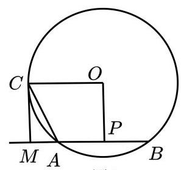

图 1

如图 2,在单位圆圆 $O$ 上任取两点 $\mathrm{A}\text{ 、 }B$ ,

则对任意的 ${AB}$ ，当 $\overrightarrow{OC}$ 与 $\overrightarrow{AB}$ 同向共线时， $\overrightarrow{AC}$ 在 $\overrightarrow{AB}$ 上的投影取最大，

作 ${CM} \bot  {AP}$ 于点 $M$ ,设 ${AB} = {2x}$ ,取 ${AB}$ 中点 $P$ ,有 ${OC} = {PM} = 1$ ,

则 ${AP} = x,{AM} = 1 + x$ ,则 $\frac{\overrightarrow{AB} \cdot  \overrightarrow{AC}}{\left| \overrightarrow{AB}\right| } = 1 + x$ ,

由 $0 < x < 1$ ,故 $\frac{\overrightarrow{AB} \cdot  \overrightarrow{AC}}{\left| \overrightarrow{AB}\right| } = 1 + x < 2$ ;

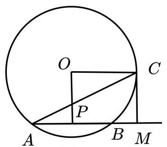

图2

综上所述， $\frac{\overrightarrow{AB} \cdot  \overrightarrow{AC}}{\left| \overrightarrow{AB}\right| } \in  \left( {-1,2}\right)$ .

16、【答案】B

【详解】取 ${S}_{n} = {a}_{n} = 0$ ,存在 $y = f\left( x\right)  = 0$ ,使得 ${S}_{n} = f\left( {a}_{n}\right)$ 成立, 此时由函数定义知,不存在函数 $y = g\left( x\right)$ ,使得 $n = g\left( {a}_{n}\right)$ , 当存在函数 $y = g\left( x\right)$ ,使得 $n = g\left( {a}_{n}\right)$ 成立时,

由于 $n$ 与 ${a}_{n}$ 为一一对应关系,所以 ${a}_{n}$ 就可以写成 $y = g\left( x\right)$ 的反函数,

即 ${a}_{n}$ 可以用 $n$ 表示,即存在函数 ${a}_{n} = {g}^{-1}\left( n\right)$ ,

所以存在 ${S}_{n} = h\left( n\right)  = f\left( {a}_{n}\right)  = f\left\{  {{g}^{-1}\left( n\right) }\right\}$ ,

综上可知, ①是②的必要不充分条件.

故选: B

十三. 松江区:

11、【答案】 $\left\lbrack  {\frac{\sqrt{3} - 1}{4},\frac{\sqrt{2}}{2}}\right\rbrack$

【详解】因为平面向量 $\overrightarrow{a},\overrightarrow{b}$ 的夹角为 $\theta ,\overrightarrow{b} - \overrightarrow{a}$ 与 $\overrightarrow{a}$ 的夹角为 ${3\theta }$ ,

所以 $\overrightarrow{b} - \overrightarrow{a}$ 与 $\overrightarrow{b}$ 的夹角为 ${2\theta }$ ,

所以根据正弦定理可得 $\frac{\left| \overrightarrow{b} - \overrightarrow{a}\right| }{\sin \theta } = \frac{\left| \overrightarrow{a}\right| }{\sin {2\theta }},\left| \overrightarrow{a}\right|  = 1$ ,

所以 $\frac{\left| \overrightarrow{b} - \overrightarrow{a}\right| }{\sin \theta } = \frac{\left| \overrightarrow{a}\right| }{\sin {2\theta }} = \frac{1}{2\sin \theta \cos \theta }$ ,所以 $\left| {\overrightarrow{b} - \overrightarrow{a}}\right|  = \frac{1}{2\cos \theta }$ ,

因为 $\left\{  \begin{array}{l} 0 \leq  \theta  \leq  \pi \\  0 \leq  {2\theta } \leq  \pi \\  0 \leq  {3\theta } \leq  \pi  \end{array}\right.$ ,所以 $0 \leq  \theta  \leq  \frac{\pi }{3}$ ,

所以 $\overrightarrow{a}$ 在 $\overrightarrow{b}$ 上的投影为 $x = \left| \overrightarrow{a}\right| \cos \theta  = \cos \theta$ ,

$\overrightarrow{b} - \overrightarrow{a}$ 在 $\overrightarrow{b}$ 上的投影为 $y = \left| {\overrightarrow{b} - \overrightarrow{a}}\right| \cos {2\theta } = \frac{\cos {2\theta }}{2\cos \theta }$ ,

所以 $x\left( {y + \sin \theta }\right)  = \cos \theta \left( {\frac{\cos {2\theta }}{2\cos \theta } + \sin \theta }\right)$

$= \frac{1}{2}\cos {2\theta } + \frac{1}{2}\sin {2\theta }$

$= \frac{\sqrt{2}}{2}\sin \left( {{2\theta } + \frac{\pi }{4}}\right)$

因为 $0 \leq  \theta  \leq  \frac{\pi }{3}$ ,所以 $0 \leq  {2\theta } \leq  \frac{2\pi }{3}$ ,所以 $\frac{\pi }{4} \leq  {2\theta } + \frac{\pi }{4} \leq  \frac{11\pi }{12}$ ,

所以当 ${2\theta } + \frac{\pi }{4} = \frac{11\pi }{12}$ 时, $x\left( {y + \sin \theta }\right)$ 取得最小值,

且最小值为 $\frac{\sqrt{2}}{2}\sin \frac{11\pi }{12} = \frac{\sqrt{2}}{2}\sin \frac{2\pi }{3}\cos \frac{\pi }{4} + \frac{\sqrt{2}}{2}\cos \frac{2\pi }{3}\sin \frac{\pi }{4} = \frac{\sqrt{3} - 1}{4}$ ,

当 ${2\theta } + \frac{\pi }{4} = \frac{\pi }{2}$ 时, $x\left( {y + \sin \theta }\right)$ 取得最大值,且最大值为 $\frac{\sqrt{2}}{2}$ ,

所以 $x\left( {y + \sin \theta }\right)$ 的取值范围为 $\left\lbrack  {\frac{\sqrt{3} - 1}{4},\frac{\sqrt{2}}{2}}\right\rbrack$ .

12、【答案】 3.70

【详解】解: 依题意当小汽车最大限速 $v = {70}\mathrm{\;{km}}/\mathrm{h}$ (约 ${19.44}\mathrm{\;m}/\mathrm{s}$ ) 时,

反应距离 ${S}_{1} = {0.7584} \times  {19.44} \approx  {14.7432}\mathrm{\;m}$ ,刹车距离 ${S}_{2} = {0.072} \times  {19.44}^{2} \approx  {20}\mathrm{\;m}$ , 所以停车距离为 ${14.7432} + {27.2098} = {41.953}\mathrm{\;m}$ ,

又路口宽度为 ${30}\mathrm{\;m}$ ,所以 $s = {41.953} + {30} = {71.953}\mathrm{\;m}$ ,

所以时间 $t = \frac{s}{v} = \frac{71.953}{19.44} \approx  {3.70}\mathrm{\;s}$ ;

16、【答案】A

【详解】① 若 $\mathbf{y} = f\left( x\right)$ 是周期函数,设 $T$ 是它的正周期,即 $f\left( x\right)  = f\left( {x + T}\right)$ ,

假设函数 $y = f\left( x\right)$ 不是常值函数,设 ${x}_{1} < {x}_{2}$ ,且 $f\left( {x}_{1}\right)  \neq  f\left( {x}_{2}\right)$ ,又 $f\left( {x}_{1}\right)  \geq  f\left( {x}_{2}\right)$ 恒成立,

因此 $f\left( {x}_{1}\right)  > f\left( {x}_{2}\right)$ ,

取 $n = \left\lbrack  \frac{{x}_{2} - {x}_{1}}{T}\right\rbrack   + 1$ ，其中 $\left\lbrack  \frac{{x}_{2} - {x}_{1}}{T}\right\rbrack$ 是不大于 $\frac{{x}_{2} - {x}_{1}}{T}$ 的最大整数，则 ${x}_{1} + {nT} > {x}_{2}$ ，

而 $f\left( {x}_{1}\right)  = f\left( {{x}_{1} + {nT}}\right)$ ,

所以 $f\left( {{x}_{1} + {nT}}\right)  > f\left( {x}_{2}\right)$ ,这是 $f\left( x\right)$ 是减函数矛盾,所以 $f\left( {x}_{1}\right)  \neq  f\left( {x}_{2}\right)$ 不成立,

所以 $f\left( {x}_{1}\right)  = f\left( {x}_{2}\right)$ ,即 $f\left( x\right)$ 是常值函数,①是真命题;

②取 $f\left( x\right)  = x, g\left( x\right)  = {2x}$ ，则对任意的 $a, b,\left| {f\left( a\right)  - f\left( b\right) }\right|  = \left| {a - b}\right|$ ，

$\left| {g\left( a\right)  - g\left( b\right) }\right|  = 2\left| {a - b}\right|$ ,满足 $\left| {f\left( a\right)  - f\left( b\right) }\right|  \leq  \left| {g\left( a\right)  - g\left( b\right) }\right|$ ,

但 $f\left( x\right)  - g\left( x\right)  =  - x$ 是减函数,②是假命题.

故选: A.

十四. 徐汇区:

11、【答案】 $5\sqrt{17}$

【详解】设上面圆台的母线长为 ${l}_{1}$ ,上面半径为 ${r}_{1} = {15}\mathrm{\;{cm}}$ ,下半圆半径为 ${r}_{2} = {13}\mathrm{\;{cm}}$ ,高为 $h = 8\mathrm{\;{cm}}$ ,

根据圆台的母线长公式 $l = \sqrt{{h}^{2} + {\left( {r}_{1} - {r}_{2}\right) }^{2}}$ ,带入数值计算得到

${l}_{1} = \sqrt{{8}^{2} + {\left( {15} - {13}\right) }^{2}} = \sqrt{68} = 2\sqrt{17}\mathrm{\;{cm}};$

设下面圆台的母线长为 ${l}_{2}$ ,上面半径为 ${r}_{3} = {12}\mathrm{\;{cm}}$ ,下半圆半径为 ${r}_{4} = 9\mathrm{\;{cm}}$ ,

由于两个圆台侧面展开图的圆弧所对的圆心角相等,可以得到 $\frac{{r}_{1} - {r}_{2}}{{l}_{1}} = \frac{{r}_{3} - {r}_{4}}{{l}_{2}}$ ,带入数值计算得到 ${l}_{2} = \frac{\left( {{r}_{3} - {r}_{4}}\right) {l}_{1}}{{r}_{1} - {r}_{2}} = \frac{\left( {{12} - 9}\right)  \times  2\sqrt{17}}{{15} - {13}} = 3\sqrt{17}\mathrm{\;{cm}}$ ; 所以该花盆上、下两部分母线长的总和为 $2\sqrt{17} + 3\sqrt{17} = 5\sqrt{17}\mathrm{\;{cm}}$ .

12、【答案】2

【详解】因为定义域为 $A = \{ 1,2,3\}$ 的函数 $y = f\left( x\right)$ 的值域也是 $\mathrm{A}$ ,

所以这样的不同的函数有 ${\mathrm{A}}_{3}^{3} = 6$ 个,所以集合 $B$ 有 6 个不同的元素,

又非空集合 $C \subseteq  B,\bar{C} \subseteq  B$ 且 $\bar{C} \cup  C = B$ ,

又 $\bar{C}$ 中的每一个函数都是 $C$ 中的两个函数(可以相同)的复合函数，

若 $C$ 中只有 1 个函数,则 $\bar{C}$ 中有 5 个函数,

又 $C$ 中函数与自身的复合函数只能表示一个函数,故不能得到 $\bar{C}$ 中 5 个函数,不符合题意, 若 $C$ 中只有 2 个函数,则 $\bar{C}$ 中有 4 个函数,

若 $C$ 中 2 个函数的复合函数有 $2 \times  2 = 4$ ,如果这 4 个函数是 $\bar{C}$ 中 4 个函数时,符合题意, 此时只需验证即可.

6 个不同函数为 ${f}_{1}\left( x\right)  : 1 \rightarrow  1,2 \rightarrow  2,3 \rightarrow  3,{f}_{2}\left( x\right)  : 1 \rightarrow  1,2 \rightarrow  3,3 \rightarrow  2$ ,

${f}_{3}\left( x\right)  : 1 \rightarrow  2,2 \rightarrow  1,3 \rightarrow  3,{f}_{4}\left( x\right)  : 1 \rightarrow  2,2 \rightarrow  3,3 \rightarrow  1,$

${f}_{5}\left( x\right)  : 1 \rightarrow  3,2 \rightarrow  1,3 \rightarrow  2,{f}_{6}\left( x\right)  : 1 \rightarrow  3,2 \rightarrow  2,3 \rightarrow  1,$

若 $C = \left\{  {{f}_{4}\left( x\right) ,{f}_{6}\left( x\right) }\right\}$ ,此时 $\bar{C} = \left\{  {{f}_{1}\left( x\right) ,{f}_{2}\left( x\right) ,{f}_{3}\left( x\right) ,{f}_{5}\left( x\right) }\right\}$ ,

${f}_{6}\left( {{f}_{6}\left( x\right) }\right)  = {f}_{1}\left( x\right) ,\;{f}_{4}\left( {{f}_{6}\left( x\right) }\right)  = {f}_{2}\left( x\right) ,$

${f}_{6}\left( {{f}_{4}\left( x\right) }\right)  = {f}_{3}\left( x\right) ,\;{f}_{4}\left( {{f}_{4}\left( x\right) }\right)  = {f}_{5}\left( x\right) ,$ 所以集合 $C$ 的元素个数的最小值为 2 .

16、【答案】A

【详解】对于 ①,设等差数列 $\left\{  {a}_{n}\right\}$ 的公差为 $d$ ,则 ${t}_{n} = \frac{{S}_{n}}{n} = \frac{n{a}_{1} + \frac{n\left( {n - 1}\right) }{2}d}{n} = {a}_{1} + \frac{n - 1}{2}d$ , 代入 $\left( {i - j}\right) {t}_{k} + \left( {j - k}\right) {t}_{i} + \left( {k - i}\right) {t}_{j} = c$

可得

$$
\left( {i - j}\right) {a}_{1} + \frac{\left( {i - j}\right) \left( {k - 1}\right) }{2}d + \left( {j - k}\right) {a}_{1} + \frac{\left( {j - k}\right) \left( {i - 1}\right) }{2}d + \left( {k - i}\right) {a}_{1} + \frac{\left( {k - i}\right) \left( {j - 1}\right) }{2}d
$$

$$
\left( {i - j}\right) \left\lbrack  {{a}_{1} + \frac{\left( k - 1\right) }{2}d}\right\rbrack   + \left( {j - k}\right) \left\lbrack  {{a}_{1} + \frac{\left( i - 1\right) }{2}d}\right\rbrack   + \left( {k - i}\right) \left\lbrack  {{a}_{1} + \frac{\left( j - 1\right) }{2}d}\right\rbrack
$$

$$
= {a}_{1}\left\lbrack  {\left( {i - j}\right)  + \left( {j - k}\right)  + \left( {k - i}\right) }\right\rbrack   + \frac{d}{2}\left\lbrack  {\left( {i - j}\right) \left( {k - 1}\right)  + \left( {j - k}\right) \left( {i - 1}\right)  + \left( {k - i}\right) \left( {j - 1}\right) }\right\rbrack
$$

$$
= {a}_{1} \times  0 + \frac{d}{2}\left\lbrack  {{ik} - i - {jk} + j + {ji} - j - {ki} + k + {kj} - k - {ij} + i}\right\rbrack
$$

$= \frac{d}{2} \times  0 = 0$ ,即可得到 $c = 0$ ,①正确;

对于②,设等比数列 $\left\{  {b}_{n}\right\}$ 的公比为 $q$ ,则 ${t}_{n} = \frac{{S}_{n}}{n} = \frac{{b}_{1}\left( {1 - {q}^{n}}\right) }{n\left( {1 - q}\right) }$ ,

代入 $\left( {i - j}\right) {t}_{k} + \left( {j - k}\right) {t}_{i} + \left( {k - i}\right) {t}_{j} = c$ ,

可得

$$
\left( {i - j}\right)  \times  \frac{{b}_{1}\left( {1 - {q}^{k}}\right) }{k\left( {1 - q}\right) } + \left( {j - k}\right)  \times  \frac{{b}_{1}\left( {1 - {q}^{i}}\right) }{i\left( {1 - q}\right) } + \left( {k - i}\right)  \times  \frac{{b}_{1}\left( {1 - {q}^{j}}\right) }{j\left( {1 - q}\right) }
$$

$$
= \frac{{b}_{1}}{1 - q}\left\lbrack  {\left( {i - j}\right)  \times  \frac{\left( 1 - {q}^{k}\right) }{k} + \left( {j - k}\right)  \times  \frac{\left( 1 - {q}^{i}\right) }{i} + \left( {k - i}\right)  \times  \frac{\left( 1 - {q}^{j}\right) }{j}}\right\rbrack
$$

要使其为常数,化简后会发现很难对于任意的 $i, j, k$ 都满足为常数 (因为公比 $q \neq  1$ ), 故不存在公比不为 1 的等比数列 $\left\{  {b}_{n}\right\}$ 是“轮换均值数列. ②不正确.

故选: A

十五. 杨浦区:

11、【答案】0.31

【详解】设变轨前的椭圆的长半轴长为 ${a}_{1}$ ,短半轴长为 ${b}_{1}$ ,半焦距为 ${c}_{1}$ ,离心率为 ${e}_{1}$ ,

变轨后的椭圆的长半轴长为 ${a}_{2}$ ,短半轴长为 ${b}_{2}$ ,半焦距为 ${c}_{2}$ ,离心率为 ${e}_{2}$ , 由题意可得 $\left\{  \begin{array}{l} {a}_{1} - {c}_{1} = {a}_{2} - {c}_{2} \\  4\left( {{a}_{1} + {c}_{1}}\right)  = {a}_{2} + {c}_{2}, \\  {2.5}\frac{{c}_{1}}{{a}_{1}} = \frac{{c}_{2}}{{a}_{2}} \end{array}\right.$ 化简得 $\frac{5}{2} \cdot  \frac{{c}_{1}}{{a}_{1}} = \frac{3{a}_{1} + 5{c}_{1}}{5{a}_{1} + 3{c}_{1}}$ , 即 $\frac{5}{2}{e}_{1} = \frac{3 + 5{e}_{1}}{5 + 3{e}_{1}}$ ,解得 ${e}_{1} = \frac{-5 + \sqrt{65}}{10} \approx  {0.31}$ (负值舍去).

12、【答案】 $\left( {0,1}\right)  \cup  \left( {\sqrt{10}, + \infty }\right)$

【详解】由于 $\left| w\right|  > 1$ ,设 $w = r\left( {\cos \theta  + \mathrm{i}\sin \theta }\right) , r > 1$ ,

则 $w + \frac{1}{w} = r\left( {\cos \theta  + \mathrm{i}\sin \theta }\right)  + \frac{1}{r\left( {\cos \theta  + \mathrm{i}\sin \theta }\right) }$

$= r\left( {\cos \theta  + \mathrm{i}\sin \theta }\right)  + \frac{\cos \theta  - \mathrm{i}\sin \theta }{r} = \left( {r + \frac{1}{r}}\right) \cos \alpha  + \mathrm{i}\left( {r - \frac{1}{r}}\right) \sin \alpha$ ,

设 $z$ 对应点 $\left( {x, y}\right)$ ,则 $x = \left( {r + \frac{1}{r}}\right) \cos \alpha , y = \left( {r - \frac{1}{r}}\right) \sin \alpha$ ,

所以 $\frac{{x}^{2}}{{\left( r + \frac{1}{r}\right) }^{2}} + \frac{{y}^{2}}{{\left( r - \frac{1}{r}\right) }^{2}} = 1$ ,其中 $r + \frac{1}{r} > 2, r - \frac{1}{r} > 0$ ,

当 $r > 1$ 时,该方程的几何意义为表示所有椭圆的并集,

即平面上除去线段 ${A}_{1}{A}_{2}$ 的点的集合,其中 ${A}_{1}\left( {-2,0}\right) ,{A}_{2}\left( {2,0}\right)$ ,

集合 $B = \{ z\left| \right| z - 1 + \mathrm{i} \mid   = a, z \in  \mathbf{C}\}$ 表示复平面上的圆,圆心为 $\left( {1, - 1}\right)$ ,半径为 $a$ ,

如果 $B \subseteq  A$ ,则该圆与线段 ${A}_{1}{A}_{2}$ 无公共点, 结合图形可知 $a$ 的取值范围为 $\left( {0,1}\right)  \cup  \left( {\sqrt{10}, + \infty }\right)$ ;

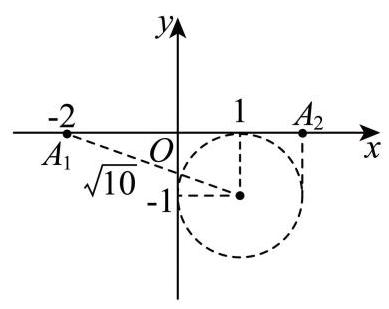

16、【答案】A

【详解】当 $n = 1$ 时, ${a}_{2} = \frac{{S}_{1}}{{a}_{1}} = 1$ .

当 $n \geq  2$ 时, ${S}_{n} = {a}_{n}{a}_{n + 1}$ ,所以 ${S}_{n - 1} = {a}_{n - 1}{a}_{n}$ ,

两式相减得: ${a}_{n} = {a}_{n}\left( {{a}_{n + 1} - {a}_{n - 1}}\right)$ ,因为 ${a}_{n} \neq  0$ ,所以 ${a}_{n + 1} - {a}_{n - 1} = 1$ .

所以数列 $\left\{  {a}_{n}\right\}$ 的奇数项是以 ${a}_{1}$ 为首项,1 为公差的等差数列,且 ${a}_{1} \neq  0$ .

所以 $\mathop{\sum }\limits_{{i = 1}}^{6}{a}_{{2i} - 1} = 6{a}_{1} + \frac{6 \times  5}{2} \times  1 = 6{a}_{1} + {15}$ .

同理,数列 $\left\{  {a}_{n}\right\}$ 的偶数项是以 1 为首项,1 为公差的等差数列,

所以 $\mathop{\sum }\limits_{{i = 1}}^{5}{a}_{2i} = 5 \times  1 + \frac{5 \times  4}{2} \times  1 = {15}$ .

所以 $\mathop{\sum }\limits_{{i = 1}}^{5}{a}_{2i} - \mathop{\sum }\limits_{{i = 1}}^{6}{a}_{{2i} - 1} = {15} - 6{a}_{1} - {15} =  - 6{a}_{1}$ .

若 $- 6{a}_{1} =  - 6 \Rightarrow  {a}_{1} = 1$ ,则数列 $\left\{  {a}_{n}\right\}$ 各项均不为 0,数列 $\left\{  {a}_{n}\right\}$ 是无穷数列,故 $\mathrm{A}$ 正确;

若 $- 6{a}_{1} = 0 \Rightarrow  {a}_{1} = 0$ ,这与 ${a}_{1} \neq  0$ 矛盾,故 B 错误;

若 $- 6{a}_{1} = 6 \Rightarrow  {a}_{1} =  - 1$ ,根据奇数项成公差为 1 的等差数列,则 ${a}_{3} = 0$ ,则 ${a}_{4}$ 无法求出, 这与数列 $\left\{  {a}_{n}\right\}$ 是无穷数列矛盾,故 $\mathrm{C}$ 错误;

若 $- 6{a}_{1} = {12} \Rightarrow  {a}_{1} =  - 2$ ,根据奇数项成公差为 1 的等差数列,则 ${a}_{5} = 0$ ,则 ${a}_{6}$ 无法求出, 这与数列 $\left\{  {a}_{n}\right\}$ 是无穷数列矛盾,故 $\mathrm{D}$ 错误.

故选: A

十六. 长宁区:

11、【答案】 $\frac{13}{36}$

【详解】设 ${AB}$ 与直线 $y = x$ 的交点为 $C$ ,由题意知 $A, B$ 关于 $y = x$ 对称,

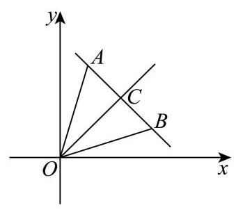

可知 $C$ 为线段 ${AB}$ 的中点,且 ${OC} \bot  {AB}$ ,则 $C\left( {\frac{x + y}{2},\frac{x + y}{2}}\right)$ ,

可得 $\left| {AB}\right|  = \sqrt{{\left( x - y\right) }^{2} + {\left( y - x\right) }^{2}} = \sqrt{2}\left| {x - y}\right|$ ,

$\left| {OC}\right|  = \sqrt{{\left( \frac{x + y}{2}\right) }^{2} + {\left( \frac{x + y}{2}\right) }^{2}} = \frac{\sqrt{2}}{2}\left| {x + y}\right| ,$

则 ${S}_{\bigtriangleup {AOB}} = \frac{1}{2}\left| {AB}\right|  \cdot  \left| {OC}\right|  = \frac{1}{2}\left| {{x}^{2} - {y}^{2}}\right|  \leq  {10}$ ,即 $\left| {{x}^{2} - {y}^{2}}\right|  \leq  {20}$ ,

列表可得:

<table><tr><td>$x$   $y$</td><td>1</td><td>2</td><td>3</td><td>4</td><td>5</td><td>6</td><td>7</td><td>8</td><td>9</td></tr><tr><td>1</td><td>/</td><td>3</td><td>8</td><td>15</td><td>24</td><td>35</td><td>48</td><td>63</td><td>80</td></tr><tr><td>2</td><td>3</td><td>片</td><td>5</td><td>12</td><td>21</td><td>32</td><td>45</td><td>60</td><td>77</td></tr><tr><td>3</td><td>8</td><td>5</td><td>- -</td><td>7</td><td>16</td><td>27</td><td>40</td><td>55</td><td>72</td></tr><tr><td>4</td><td>15</td><td>12</td><td>7</td><td>✓</td><td>9</td><td>20</td><td>33</td><td>48</td><td>65</td></tr><tr><td>5</td><td>24</td><td>21</td><td>16</td><td>9</td><td>✓</td><td>11</td><td>24</td><td>39</td><td>56</td></tr><tr><td>6</td><td>35</td><td>32</td><td>27</td><td>20</td><td>11</td><td>✓</td><td>13</td><td>28</td><td>45</td></tr><tr><td>7</td><td>48</td><td>45</td><td>40</td><td>33</td><td>24</td><td>13</td><td>✓</td><td>15</td><td>32</td></tr><tr><td>8</td><td>63</td><td>60</td><td>55</td><td>48</td><td>39</td><td>28</td><td>15</td><td>✓</td><td>17</td></tr><tr><td>9</td><td>80</td><td>77</td><td>72</td><td>65</td><td>56</td><td>45</td><td>32</td><td>17</td><td>✓</td></tr></table>

设样本空间为 $\Omega ,{S}_{\bigtriangleup {AOB}} \leq  {10}$ 为事件 $A$ ,

可得 $n\left( \Omega \right)  = {72}, n\left( A\right)  = {26}$ , 所以所求概率为 $P = \frac{n\left( A\right) }{n\left( \Omega \right) } = \frac{26}{72} = \frac{13}{36}$ .

12、【答案】 $- \frac{1}{2}\# \#  - {0.5}$

【详解】如图建立以 $D$ 为原点的空间直角坐标系,

设 $P\left( {{x}_{0},{y}_{0},{z}_{0}}\right) , M\left( {{x}_{1},{y}_{1},{z}_{1}}\right) , N\left( {{x}_{2},{y}_{2},{z}_{2}}\right)$ ,其中 ${x}_{i},{y}_{i},{z}_{i}\left( {i = 0,1,2}\right)  \in  \left\lbrack  {0,1}\right\rbrack$ .

则 $\overrightarrow{PM} = \left( {{x}_{1} - {x}_{0},{y}_{1} - {y}_{0},{z}_{1} - {z}_{0}}\right) ,\overrightarrow{PN} = \left( {{x}_{2} - {x}_{0},{y}_{2} - {y}_{0},{z}_{2} - {z}_{0}}\right)$ .

则 $\overrightarrow{PM} \cdot  \overrightarrow{PN} = \left( {{x}_{1} - {x}_{0}}\right) \left( {{x}_{2} - {x}_{0}}\right)  + \left( {{y}_{1} - {y}_{0}}\right) \left( {{y}_{2} - {y}_{0}}\right)  + \left( {{z}_{1} - {z}_{0}}\right) \left( {{z}_{2} - {z}_{0}}\right)$

$= {x}_{0}^{2} - \left( {{x}_{1} + {x}_{2}}\right) {x}_{0} + {x}_{1}{x}_{2} + {y}_{0}^{2} - \left( {{y}_{1} + {y}_{2}}\right) {y}_{0} + {y}_{1}{y}_{2} + {z}_{0}^{2} - \left( {{z}_{1} + {z}_{2}}\right) {z}_{0} + {z}_{1}{z}_{2}$

$= {\left( {x}_{0} - \frac{{x}_{1} + {x}_{2}}{2}\right) }^{2} + {\left( {y}_{0} - \frac{{y}_{1} + {y}_{2}}{2}\right) }^{2} + {\left( {z}_{0} - \frac{{z}_{1} + {z}_{2}}{2}\right) }^{2}$

$+ {x}_{1}{x}_{2} - \frac{{\left( {x}_{1} + {x}_{2}\right) }^{2}}{4} + {y}_{1}{y}_{2} - \frac{{\left( {y}_{1} + {y}_{2}\right) }^{2}}{4}$

$+ {z}_{1}{z}_{2} - \frac{{\left( {z}_{1} + {z}_{2}\right) }^{2}}{4} \geq  {x}_{1}{x}_{2} - \frac{{\left( {x}_{1} + {x}_{2}\right) }^{2}}{4} + {y}_{1}{y}_{2} - \frac{{\left( {y}_{1} + {y}_{2}\right) }^{2}}{4} + {z}_{1}{z}_{2} - \frac{{\left( {z}_{1} + {z}_{2}\right) }^{2}}{4}$

$=  - \frac{{\left( {x}_{1} - {x}_{2}\right) }^{2}}{4} - \frac{{\left( {y}_{1} - {y}_{2}\right) }^{2}}{4} - \frac{{\left( {z}_{1} - {z}_{2}\right) }^{2}}{4} =  - \frac{1}{4}\left\lbrack  {{\left( {x}_{1} - {x}_{2}\right) }^{2} + {\left( {y}_{1} - {y}_{2}\right) }^{2} + {\left( {z}_{1} - {z}_{2}\right) }^{2}}\right\rbrack$

$=  - \frac{1}{4}{\left| \overrightarrow{MN}\right| }^{2}$ ,当且仅当 ${x}_{0} = \frac{{x}_{1} + {x}_{2}}{2},{y}_{0} = \frac{{y}_{1} + {y}_{2}}{2},{z}_{0} = \frac{{z}_{1} + {z}_{2}}{2}$ 时取等号.

则为使 $\overrightarrow{PM} \cdot  \overrightarrow{PN}$ 最小,则应使 $\left| \overrightarrow{MN}\right|$ 尽量的大,且 $P$ 为 ${MN}$ 中点.

又点 $P\text{ 、 }M\text{ 、 }N$ 均位于正方体表面上,则 $P\text{ 、 }M\text{ 、 }N$ 在正方体同一面上,

则当 $\left| \overrightarrow{MN}\right|$ 为正方体一面的对角线， $P$ 为对角线中点时，满足题意，

此时 $\left| \overrightarrow{MN}\right|  = \sqrt{2}$ ,则 $- \frac{1}{4}{\left| \overrightarrow{MN}\right| }^{2} \geq   - \frac{1}{2}$ .

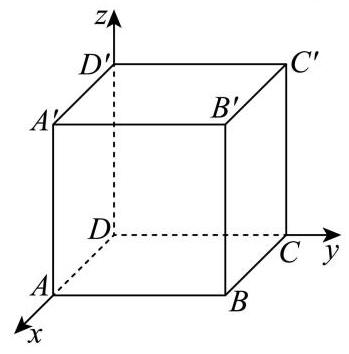

16、【答案】B

【详解】设等差数列的首项和公差分别为 ${a}_{1}, d$ ,

若等差数列 $\left\{  {a}_{n}\right\}$ 满足 “性质 $\Omega$ ” ;

由 $\frac{{a}_{n + 1}}{n + 1} \geq  \frac{{a}_{n}}{n}$ 可得 $\frac{{a}_{n} + d}{n + 1} \geq  \frac{{a}_{n}}{n}$ ,故 $n{a}_{n} + {nd} \geq  n{a}_{n} + {a}_{n}$ ,即 ${nd} \geq  {a}_{1} + \left( {n - 1}\right) d \Rightarrow  d \geq  {a}_{1}$ ,

故只需要 $d \geq  {a}_{1}$ 即可满足 “性质 $\Omega$ ”; 故①是真命题，

设等比数列 $\left\{  {a}_{n}\right\}$ 的首项和公比分别为 ${a}_{1}, q$ ,若 $q = 1,{a}_{1} > 0$ ,则

$\frac{{a}_{n + 1}}{n + 1} \geq  \frac{{a}_{n}}{n} \Rightarrow  \frac{{a}_{1}}{n + 1} \geq  \frac{{a}_{1}}{n} \Rightarrow  \frac{1}{n + 1} \geq  \frac{1}{n}$ 显然不成立,

因此存在等比数列 $\left\{  {a}_{n}\right\}$ 不满足 “性质 $\Omega$ ” ; 故②是假命题

故选: B