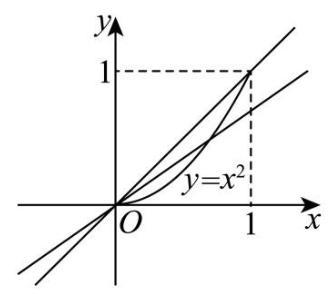
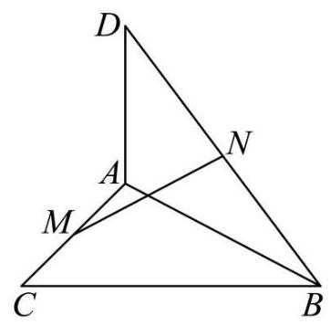
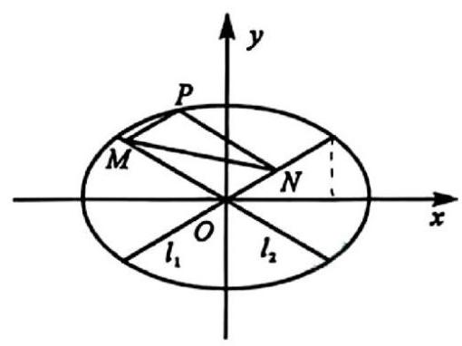
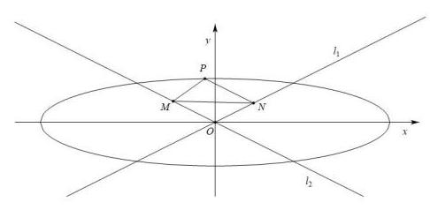

## 2026 届嘉定区高三下二模数学试卷

## 一、填空题

1. 已知集合 $A = \left\{  {a,{a}^{2}}\right\}$ ，且 $1 \in  A$ ，则 $a =$ ___.

【答案】 -1

【解析】由题意可知, $a = 1$ 或 ${a}^{2} = 1$ ,即 $a = 1$ 或 $a =  - 1$ ,

当 $a = 1$ 时,集合 $A = \{ 1,1\}$ ,不满足集合元素互异性,舍去;

当 $a =  - 1$ 时,集合 $A = \{  - 1,1\}$ ,符合题意,所以 $a =  - 1$ .

2. 解不等式 $\frac{1}{x} > 1$ ,则不等式的解集是___

【答案】 $\left( {0,1}\right)$

【解析】根据题意,由 $\frac{1}{x} > 1$ ,得 $\frac{1 - x}{x} > 0$ ,即 $x\left( {1 - x}\right)  > 0$ ,解得 $0 < x < 1$ ,故解集为 $\left( {0,1}\right)$ .

3. 已知角 $\alpha$ 的终边经过点 $P\left( {1, - 2}\right)$ ，则 $\sin \alpha  =$ ___.

【答案】 $- \frac{2\sqrt{5}}{5}$

【解析】设坐标原点为 $O$ ,

由题意可得: $x = 1$ ， $y =  - 2$ ， $\left| {OP}\right|  = \sqrt{{1}^{2} + {\left( -2\right) }^{2}} = \sqrt{5}$ ，

故 $\sin \alpha  = \frac{y}{\left| OP\right| } = \frac{-2}{\sqrt{5}} =  - \frac{2\sqrt{5}}{5}$ .

4. 已知 $\left\{  {a}_{n}\right\}$ 是等差数列， ${a}_{6} = 1,{a}_{26} = {11}$ ，则 ${a}_{2026} =$ ___.

【答案】 1011

【解析】设等差数列 $\left\{  {a}_{n}\right\}$ 的公差为 $d$ ,依题意, $d = \frac{{a}_{26} - {a}_{6}}{{26} - 6} = \frac{{11} - 1}{20} = \frac{1}{2}$ ,

则 ${a}_{2026} = {a}_{6} + \left( {{2026} - 6}\right)  \times  d = 1 + {2020} \times  \frac{1}{2} = {1011}$ .

5. 双曲线 $\frac{{x}^{2}}{9} - \frac{{y}^{2}}{16} = 1$ 的渐近线方程是___.

【答案】 $y =  \pm  \frac{4}{3}x$

【解析】因为双曲线方程为 $\frac{{x}^{2}}{9} - \frac{{y}^{2}}{16} = 1$ , 所以双曲线的渐近线方程为 $\frac{{x}^{2}}{9} - \frac{{y}^{2}}{16} = 0$ ,即 $y =  \pm  \frac{4}{3}x$ ,

6. 由0,1,2,3,4组成没有重复数字的三位数的个数是___

【答案】48

【解析】第一步先从非零的四个数中选择一个作为百位数字,有 4 种选法,

再从剩余的四个数中选择两个排在十位和个位上,有 ${\mathrm{A}}_{4}^{2} = {12}$ 种选法,

由0,1,2,3,4组成没有重复数字的三位数的个数是 $4 \times  {12} = {48}$ .

7. 函数 $y = {\sin }^{4}x + {\cos }^{4}x$ 的最小正周期是___.

【答案】 $\frac{\pi }{2}$

【解析】 $\because y = {\sin }^{4}x + {\cos }^{4}x = {\left( {\sin }^{2}x + {\cos }^{2}x\right) }^{2} - 2{\sin }^{2}x \cdot  {\cos }^{2}x$

$=  - \frac{1}{2}{\sin }^{2}{2x} + 1 =  - \frac{1 - \cos {4x}}{4} + 1 = \frac{1}{4}\cos {4x} + \frac{3}{4}$

$\therefore y = {\sin }^{4}x + {\cos }^{4}x$ 的最小正周期是 $T = \frac{2\pi }{4} = \frac{\pi }{2}$ .

8. 已知函数 $y = {x}^{3} + {x}^{2} + {ax}$ 有三个不同的零点,则实数 $a$ 的取值范围是___

【答案】 $\left( {-\infty ,0}\right)  \cup  \left( {0,\frac{1}{4}}\right)$

【解析】由 ${x}^{3} + {x}^{2} + {ax} = 0$ ,得 $x = 0$ 或 ${x}^{2} + x + a = 0$ ,

由函数 $y = {x}^{3} + {x}^{2} + {ax}$ 有三个不同的零点,得方程 ${x}^{2} + x + a = 0$ 有两个不等的非零根,

则 $\left\{  \begin{array}{l} \Delta  = 1 - {4a} > 0 \\  a \neq  0 \end{array}\right.$ ,解得 $a < \frac{1}{4}$ 且 $a \neq  0$ ,

所以实数 $a$ 的取值范围是 $\left( {-\infty ,0}\right)  \cup  \left( {0,\frac{1}{4}}\right)$ .

9. 已知向量 $\overrightarrow{a} = \left( {\cos x,\sin x}\right) ,\overrightarrow{b} = \left( {3,\sqrt{3}}\right)$ ，且 $x \in  \left\lbrack  {0,\frac{\pi }{2}}\right\rbrack$ ，则 $\overrightarrow{a}$ 在 $\overrightarrow{b}$ 方向上的数量投影的取值范围为 ___

【答案】 $\left\lbrack  {\frac{1}{2},1}\right\rbrack$

【解析】 $\overrightarrow{a}$ 在 $\overrightarrow{b}$ 方向上的数量投影为 $\frac{\overrightarrow{a} \cdot  \overrightarrow{b}}{\left| \overrightarrow{b}\right| } = \frac{3\cos x + \sqrt{3}\sin x}{2\sqrt{3}} = \frac{2\sqrt{3}\cos \left( {x - \frac{\pi }{6}}\right) }{2\sqrt{3}} = \cos \left( {x - \frac{\pi }{6}}\right)$ , $x \in  \left\lbrack  {0,\frac{\pi }{2}}\right\rbrack  ,\;x - \frac{\pi }{6} \in  \left\lbrack  {-\frac{\pi }{6},\frac{\pi }{3}}\right\rbrack  ,\;\cos \left( {x - \frac{\pi }{6}}\right)  \in  \left\lbrack  {\frac{1}{2},1}\right\rbrack  .$

10. 已知正四面体上的四个面上分别写有 1、2、3、4，游戏中甲、乙轮流抛掷该四面体，谁抛出底面数字等于 4 则获胜且游戏结束. 甲先开始，则甲获胜的概率为___.

【答案】 $\frac{4}{7}$

【解析】由题意,甲抛掷一次获胜的概率为 $\frac{1}{4}$ ,失败的概率为 $\frac{3}{4}$ ,

甲胜的概率分为无数种情况:第1次掷获胜，第3次掷获胜，...，第 ${2n} + 1$ 次获胜，...，

概率分别为 ${p}_{1} = \frac{1}{4},{p}_{3} = {\left( \frac{3}{4}\right) }^{2} \times  \frac{1}{4},{p}_{5} = {\left( \frac{3}{4}\right) }^{4} \times  \frac{1}{4},\cdots$ ,

故 $\left\{  {p}_{n}\right\}  \left( {n = {2k} - 1, k \in  {\mathrm{N}}^{ * }}\right)$ 为以 $\frac{1}{4}$ 为首项, $\frac{9}{16}$ 为公比的等比数列,

故甲获胜的概率 $P = \frac{\frac{1}{4}}{1 - \frac{9}{16}} = \frac{4}{7}$ .

11. 将函数 $y = {x}^{2}, x \in  \left\lbrack  {0,1}\right\rbrack$ 的图象绕坐标原点逆时针方向旋转角 $\theta \left( {0 \leq  \theta  \leq  \alpha }\right)$ 得到曲线 $C$ . 若对于每一个角 $\theta$ ，曲线 $C$ 都是一个函数的图象，则 $\alpha$ 的最大值为___.

【答案】 $\arctan \frac{1}{2}$

【解析】由函数 $y = {x}^{2}, x \in  \left\lbrack  {0,1}\right\rbrack$ ,知 ${y}^{\prime } = {2x}, x \in  \left\lbrack  {0,1}\right\rbrack$ .

因为 ${y}^{\prime } = {2x}$ 在 $\left\lbrack  {0,1}\right\rbrack$ 上单调递增,所以 ${y}^{\prime } \in  \left\lbrack  {0,2}\right\rbrack$ .

由题可知,当函数 $y = {x}^{2}$ 旋转后得到的函数在点 $\left( {1,1}\right)$ 处的导数小于零,

即曲线 $C$ 在 $x = 1$ 处的切线的斜率小于零,

即曲线 $C$ 在 $x = 1$ 处的切线的倾斜角大于 $\frac{\pi }{2}$ 时,曲线 $C$ 上存在某点处的切线的倾斜角等于 $\frac{\pi }{2}$ .

此时,会出现一个 $x$ 对应两个 $y$ 值的情形,曲线 $C$ 不再是一个函数的图象.

所以 $\alpha$ 的最大值为 $\frac{\pi }{2} - \arctan 2 = \arctan \frac{1}{2}$ .

12. 在包装设计中,常用长度和宽度描述物体体型. 长度 $l\left( V\right)$ 定义为物体上最远两点间的距离,宽度 $t\left( V\right)$ 定义为能夹住物体的两平行平面间的最小距离, 即存在一对平行平面, 使得物体上的所有点均位于两平面之间 (包括平面上). 现有一圆柱,其底面半径 $R$ 与高 $h$ 可任意调节,则 $\frac{l\left( V\right) }{t\left( V\right) }$ 的最小值为___

【答案】 $\sqrt{2}$

【解析】圆柱体中,最远两点间的距离为 $l\left( V\right)  = \sqrt{{\left( 2R\right) }^{2} + {h}^{2}}$ ,

当 $h \geq  {2R}$ ,即 $\frac{h}{2R} \geq  1$ 时, $t\left( V\right)  = {2R},\frac{l\left( V\right) }{t\left( V\right) } = \frac{\sqrt{{\left( 2R\right) }^{2} + {h}^{2}}}{2R} = \sqrt{1 + {\left( \frac{h}{2R}\right) }^{2}} \geq  \sqrt{2}$ ,

当且仅当 $h = {2R}$ 时,等号成立;

当 $h < {2R}$ ,即 $\frac{2R}{h} > 1$ 时, $t\left( V\right)  = h,\frac{l\left( V\right) }{t\left( V\right) } = \frac{\sqrt{{\left( 2R\right) }^{2} + {h}^{2}}}{h} = \sqrt{1 + {\left( \frac{2R}{h}\right) }^{2}} > \sqrt{2}$ .

所以 $\frac{l\left( V\right) }{t\left( V\right) }$ 的最小值为 $\sqrt{2}$ .

## 二、单选题

13. 已知陈述句 $\alpha$ 是 $\beta$ 的充分非必要条件. 若集合 $M = \{ x \mid  x$ 满足 $\alpha \} , N = \{ x \mid  x$ 满足 $\beta \}$ ,则 $M$ 与 $N$ 的关系为 ( )

A. $M \subset  N$ B. $M \supset  N$ C. $M = N$ D. $M \cap  N = \varnothing$

【答案】A

【解析】因为 $\alpha$ 是 $\beta$ 的充分非必要条件,所以 $\alpha$ 成立时 $\beta$ 一定成立

所以 $x$ 满足 $\alpha$ 时, $x$ 一定满足 $\beta$ ,所以 $M \subset  N$ ,

又 $\beta$ 成立时推不出 $\alpha$ 成立,即 $x$ 满足 $\beta$ 时 $x$ 不一定满足 $\alpha$ ,所以 $N$ 不是 $M$ 的子集.

故选: A

14. 生物学家在研究动物体重 $W$ (单位: $\mathrm{g}$ ) 与脉搏率 $f$ (单位: 次 $\cdot  {\mathrm{{min}}}^{-1}$ ) 的关系时,获得了右表的数据, 令 $x = \ln W,\;y = \ln f$ ,并拟合线性回归方程 $\widehat{y} = \widehat{a}x + \widehat{b}$ . 根据已知数据,下列说法正确的是 ( )

<table><tr><td>动物名</td><td>体重 $W/\mathrm{g}$</td><td>脉搏率 $f/\left( {\text{ 次 } \cdot  {\mathrm{{min}}}^{-1}}\right)$</td></tr><tr><td>鼠</td><td>25</td><td>670</td></tr><tr><td>豚鼠</td><td>300</td><td>300</td></tr><tr><td>兔</td><td>2000</td><td>205</td></tr><tr><td>小狗</td><td>5000</td><td>120</td></tr><tr><td>大狗</td><td>30000</td><td>85</td></tr><tr><td>羊</td><td>50000</td><td>70</td></tr></table>

<table><tr><td>马</td><td>450000</td><td>38</td></tr></table>

A. 变量 $x$ 与 $y$ 成正相关,且 $\widehat{b} > 0$ B. 变量 $x$ 与 $y$ 成负相关,且 $\widehat{b} < 0$

C. 变量 $x$ 与 $y$ 成正相关,且 $\widehat{b} < 0$ D. 变量 $x$ 与 $y$ 成负相关,且 $\widehat{b} > 0$

【答案】D

【解析】由表格数据可得随着动物体重增加,脉搏率逐渐减小,即随着 $W$ 增加, $f$ 逐渐减小. 又函数 $y = \ln x$ 在 $\left( {0, + \infty }\right)$ 上单调递增,则随着 $x = \ln W$ 增加, $y = \ln f$ 逐渐减小, 从而 $x$ 与 $y$ 负相关， $\widehat{a} < 0$ . 注意到 $\widehat{b} = \bar{y} - \widehat{a}\bar{x}$ ,

又由题可得 $\bar{y} > 0,\bar{x} > 0$ ,结合 $\widehat{a} < 0$ ,

可得 $\widehat{b} > 0$ .

15. 设数列 $\left\{  {a}_{n}\right\}$ 满足 ${a}_{1} = 1$ ,且 ${a}_{n + 1} = \frac{\left( {{\lambda n} - 2}\right)  \cdot  {a}_{n}}{{n}^{2} + 1}$ ,其中 $\lambda  \in  \mathbf{R}$ . 下列选项中错误的是 ( )

A. 存在 $\lambda$ ,使得存在正整数 $\mathbf{N}$ ,当 $n \geq  \mathbf{N}$ 时,总有 ${a}_{n + 1} < {a}_{n}$

B. 存在 $\lambda$ ,使得不存在正整数 $\mathbf{N}$ ,当 $n \geq  \mathbf{N}$ 时,总有 ${a}_{n + 1} > {a}_{n}$

C. 对任意 $\lambda$ ，都不存在正整数 $\mathbf{N}$ ，使得当 $n \geq  \mathbf{N}$ 时，总有 ${a}_{n + 1} > {a}_{n}$

D. 存在 $\lambda$ ,使得不存在正整数 $\mathbf{N}$ ,当 $n \geq  \mathbf{N}$ 时,总有 ${a}_{n + 1} < {a}_{n}$

【答案】C

【解析】对于 $\mathrm{A}$ ,令 $\lambda  = 3$ ,则 ${a}_{n + 1} = \frac{\left( {{3n} - 2}\right) {a}_{n}}{{n}^{2} + 1} \Rightarrow  \frac{{a}_{n + 1}}{{a}_{n}} = \frac{{3n} - 2}{{n}^{2} + 1}$ ,

存在 $\mathbf{N} = 3$ ,当 $n \geq  \mathbf{N} = 3$ 时,有 ${3n} - 2 > 0$ 且 $\frac{{3n} - 2}{{n}^{2} + 1} < 1$ ,所以 ${a}_{n + 1} < {a}_{n}$ ,故 $\mathrm{A}$ 正确;

对于 $\mathrm{B}$ ,令 $\lambda  = 3$ ,则 ${a}_{n + 1} = \frac{\left( {{3n} - 2}\right) {a}_{n}}{{n}^{2} + 1} \Rightarrow  \frac{{a}_{n + 1}}{{a}_{n}} = \frac{{3n} - 2}{{n}^{2} + 1}$ ,

当 $n = 1$ 时， ${a}_{2} = \frac{\left( {3 - 2}\right) {a}_{1}}{{1}^{2} + 1} \Rightarrow  \frac{{a}_{2}}{{a}_{1}} = \frac{1}{2} \Rightarrow  {a}_{2} < {a}_{1}$ ,

当 $n = 2$ 时， ${a}_{3} = \frac{\left( {3 \times  2 - 2}\right) {a}_{2}}{{2}^{2} + 1} \Rightarrow  \frac{{a}_{3}}{{a}_{2}} = \frac{4}{5} \Rightarrow  {a}_{3} < {a}_{2}$ ,

由 $\mathrm{A}$ 当 $n \geq  3$ 时,总有 ${a}_{n + 1} < {a}_{n}$ ,

因此不存在正整数 $\mathbf{N}$ ,对所有的 $n \geq  \mathbf{N}$ ,总有 ${a}_{n + 1} > {a}_{n}$ ,故 $\mathrm{B}$ 正确;

对于 $\mathrm{C}$ ,令 $\lambda  = \frac{3}{2}$ ,则 ${a}_{n + 1} = \frac{\left( {\frac{3}{2}n - 2}\right) {a}_{n}}{{n}^{2} + 1} \Rightarrow  \frac{{a}_{n + 1}}{{a}_{n}} = \frac{\frac{3}{2}n - 2}{{n}^{2} + 1}$ ,

当 $n \geq  2$ 时,有 $0 < \frac{\frac{3}{2}n - 2}{{n}^{2} + 1} < 1$ ,

又因为 ${a}_{1} = 1,{a}_{2} = \frac{\left( \frac{3}{2} - 2\right) }{2} \times  1 =  - \frac{1}{4} < 0$ ,而 $\frac{{a}_{3}}{{a}_{2}} < 1$ ,所以 ${a}_{2} < {a}_{3} < 0$ ,

则 $n \geq  2$ 时,总有 ${a}_{n} < \frac{\frac{3}{2}n - 2}{{n}^{2} + 1}{a}_{n} = {a}_{n + 1} < 0$ ,

因此当 $\lambda  = \frac{3}{2}$ 时,存在 $N = 2$ ,当 $n \geq  N = 2$ 时,有 ${a}_{n + 1} > {a}_{n}$ ,故 $\mathrm{C}$ 错误;

对于 $\mathrm{D}$ ,令 $\lambda  = 0$ ,则 ${a}_{n + 1} = \frac{-2{a}_{n}}{{n}^{2} + 1} \Rightarrow  \frac{{a}_{n + 1}}{{a}_{n}} = \frac{-2}{{n}^{2} + 1}$ ,数列 $\left\{  {a}_{n}\right\}$ 正负交替出现,

因此不存在正整数 $N$ ,对所有的 $n \geq  N$ ,总有 ${a}_{n + 1} < {a}_{n}$ ,故 D 正确;

16. 对任意平面向量 $\overrightarrow{a}\text{ 、 }\overrightarrow{b}\text{ 、 }\overrightarrow{c}$ 及任意实数 $\lambda$ ,已知运算 $\odot$ 满足以下三条性质: (I) $\overrightarrow{a} \odot  \overrightarrow{b} = \overrightarrow{b} \odot  \overrightarrow{a}$ ; (II) $\left( {\overrightarrow{a} + \overrightarrow{b}}\right)  \odot  \overrightarrow{c} = \overrightarrow{a} \odot  \overrightarrow{c} + \overrightarrow{b} \odot  \overrightarrow{c}$ ; (III) $\left( {\lambda \overrightarrow{a}}\right)  \odot  \overrightarrow{b} = \lambda \left( {\overrightarrow{a} \odot  \overrightarrow{b}}\right)$ . 则下列选项中一定成立的是 ( )

A. 若 $\overrightarrow{a} \odot  \overrightarrow{b} = 0$ ,则 $\overrightarrow{a} = \overrightarrow{0}$ 或 $\overrightarrow{b} = \overrightarrow{0}$ B. $\left| {\overrightarrow{a} \odot  \overrightarrow{b}}\right|  = \left| \overrightarrow{a}\right|  \cdot  \left| \overrightarrow{b}\right|$

C. $\left( {\overrightarrow{a} - \overrightarrow{b}}\right)  \odot  \left( {\overrightarrow{a} - \overrightarrow{b}}\right)  = \overrightarrow{a} \odot  \overrightarrow{a} - 2\overrightarrow{a} \odot  \overrightarrow{b} + \overrightarrow{b} \odot  \overrightarrow{b}\;$ D. $\overrightarrow{a} \odot  \overrightarrow{a} \geq$

【答案】C

【解析】设 $\overrightarrow{a}\text{ 、 }\overrightarrow{b}\text{ 、 }\overrightarrow{c}$ 的坐标分别为 $\overrightarrow{a} = \left( {{a}_{1},{a}_{2}}\right) ,\overrightarrow{b} = \left( {{b}_{1},{b}_{2}}\right) ,\overrightarrow{c} = \left( {{c}_{1},{c}_{2}}\right)$ ,

对于 $\mathrm{A}$ ,若定义 $\overrightarrow{a} \odot  \overrightarrow{b} = {a}_{1}{b}_{1} - {a}_{2}{b}_{2}$ ,运算 $\odot$ 显然满足 (I);

因 $\left( {\overrightarrow{a} + \overrightarrow{b}}\right)  \odot  \overrightarrow{c} = \left( {{a}_{1} + {b}_{1}}\right) {c}_{1} - \left( {{a}_{2} + {b}_{2}}\right) {c}_{2} = {a}_{1}{c}_{1} + {b}_{1}{c}_{1} - {a}_{2}{c}_{2} - {b}_{2}{c}_{2}$ ,

而 $\overrightarrow{a} \odot  \overrightarrow{c} + \overrightarrow{b} \odot  \overrightarrow{c} = {a}_{1}{c}_{1} - {a}_{2}{c}_{2} + {b}_{1}{c}_{1} - {b}_{2}{c}_{2}$ ,即满足 (II);

又 $\left( {\lambda \overrightarrow{a}}\right)  \odot  \overrightarrow{b} = \left( {\lambda {a}_{1},\lambda {a}_{2}}\right)  \odot  \left( {{b}_{1},{b}_{2}}\right)  = \lambda {a}_{1}{b}_{1} - \lambda {a}_{2}{b}_{2}$ ,而 $\lambda \left( {\overrightarrow{a} \odot  \overrightarrow{b}}\right)  = \lambda \left( {{a}_{1}{b}_{1} - {a}_{2}{b}_{2}}\right)$ ,即满足 (III)

若取 $\overrightarrow{a} = \overrightarrow{b} = \left( {1,1}\right) ,\overrightarrow{a} \odot  \overrightarrow{b} = 1 \times  1 - 1 \times  1 = 0$ ,但 $\overrightarrow{a},\overrightarrow{b}$ 都不是零向量,故 $\mathrm{A}$ 错误;

对于 $\mathrm{B}$ ,若定义 $\overrightarrow{a} \odot  \overrightarrow{b} = \overrightarrow{a} \cdot  \overrightarrow{b} = {a}_{1}{b}_{1} + {a}_{2}{b}_{2}$ ,显然满足三条性质.

若取 $\overrightarrow{a} = \left( {0,1}\right) ,\overrightarrow{b} = \left( {1,0}\right)$ ,则 $\left| {\overrightarrow{a} \odot  \overrightarrow{b}}\right|  = \left| {0 \times  1 + 1 \times  0}\right|  = 0$ 而 $\left| \overrightarrow{a}\right|  \cdot  \left| \overrightarrow{b}\right|  = 1 \times  1 = 1$ ,故 B 错误;

对于 $\mathrm{C}$ ,利用以上三条性质,可得: $\left( {\overrightarrow{a} - \overrightarrow{b}}\right)  \odot  \left( {\overrightarrow{a} - \overrightarrow{b}}\right)  = \left( {\left( {\overrightarrow{a} + \left( {-\overrightarrow{b}}\right) }\right)  \odot  (\overrightarrow{a} - \overrightarrow{b}}\right)$

$= \overrightarrow{a} \odot  \left( {\overrightarrow{a} - \overrightarrow{b}}\right)  + \left( {-\overrightarrow{b}}\right)  \odot  \left( {\overrightarrow{a} - \overrightarrow{b}}\right)  = \overrightarrow{a} \odot  \overrightarrow{a} - \overrightarrow{a} \odot  \overrightarrow{b} + \left( {-1}\right) \left( {\overrightarrow{b} \odot  \overrightarrow{a} - \overrightarrow{b} \odot  \overrightarrow{b}}\right)$

$= \overrightarrow{a} \odot  \overrightarrow{a} - \overrightarrow{a} \odot  \overrightarrow{b} - \overrightarrow{a} \odot  \overrightarrow{b} + \overrightarrow{b} \odot  \overrightarrow{b} = \overrightarrow{a} \odot  \overrightarrow{a} - 2\overrightarrow{a} \odot  \overrightarrow{b} + \overrightarrow{b} \odot  \overrightarrow{b}$ ,故 C 正确;

对于 $\mathrm{D}$ ,若定义 $\overrightarrow{a} \odot  \overrightarrow{b} =  - \overrightarrow{a} \cdot  \overrightarrow{b} =  - {a}_{1}{b}_{1} - {a}_{2}{b}_{2}$ ,显然满足三条性质,

但 $\overrightarrow{a} \odot  \overrightarrow{a} =  - {a}_{1}^{2} - {a}_{2}^{2} =  - \left( {{a}_{1}^{2} + {a}_{2}^{2}}\right)  \leq  0$ ,当 $\overrightarrow{a} \neq  \overrightarrow{0}$ 时, $\overrightarrow{a} \odot  \overrightarrow{a} < 0$ ,故 D 错误.

## 三、解答题

17. 在复平面内,已知点 $A\text{ 、 }B\text{ 、 }C$ 对应的复数分别为 ${z}_{A} = 0\text{ 、 }{z}_{B} = 6\text{ 、 }{z}_{C} = 4 + 3\mathrm{i}$ ,其中 $i$ 是虚数单位.

(1)求 $\cos \angle {ACB}$ 的值；

(2)若复数 $z$ 满足 $\left| {z - {z}_{A}}\right|  = \left| {z - {z}_{B}}\right|  = \left| {{z}_{B} - {z}_{C}}\right|$ ，求 $z$ .

【答案】 $\left( 1\right) \frac{\sqrt{13}}{65};\left( 2\right) z = 3 + 2\mathrm{i}$ 或 $z = 3 - 2\mathrm{i}$ .

【解析】(1) 由已知可得, $A\left( {0,0}\right) , B\left( {6,0}\right) , C\left( {4,3}\right)$ ,所以 $\overrightarrow{CA} = \left( {-4, - 3}\right) ,\overrightarrow{CB} = \left( {2, - 3}\right)$ , 所以 $\cos \angle {ACB} = \frac{\overrightarrow{CA} \cdot  \overrightarrow{CB}}{\left| \overrightarrow{CA}\right|  \cdot  \left| \overrightarrow{CB}\right| } = \frac{-4 \times  2 + \left( {-3}\right)  \times  \left( {-3}\right) }{\sqrt{{\left( -4\right) }^{2} + {\left( -3\right) }^{2}} \cdot  \sqrt{{2}^{2} + {\left( -3\right) }^{2}}} = \frac{\sqrt{13}}{65}$ ；

(2)因为 $\left| {z - {z}_{A}}\right|  = \left| {z - {z}_{B}}\right| ,{z}_{A} = 0,{z}_{B} = 6$ ，所以 $\left| {z - 0}\right|  = \left| {z - 6}\right|$ ，

所以复数 $z$ 对应的点到点 $A\left( {0,0}\right)$ 到和点 $B\left( {6,0}\right)$ 距离相等,

所以这两点的中垂线是直线 $x = 3$ ,即复数 $z$ 的实部为 3,设 $z = 3 + y\mathrm{i},\;y \in  \mathbf{R}$ .

所以 $\left| {z - {z}_{A}}\right|  = \left| z\right|  = \left| {6 - \left( {4 + 3\mathrm{i}}\right) }\right|  = \left| {2 - 3\mathrm{i}}\right|  = \sqrt{13}$ ,

所以 $\left| z\right|  = \sqrt{{3}^{2} + {y}^{2}} = \sqrt{13}$ ,解得 $y =  \pm  2$ ,

所以 $z = 3 + 2\mathrm{i}$ 或 $z = 3 - 2\mathrm{i}$ .

18. 如图，在 $\bigtriangleup  {ABC}$ 中， $\angle {ACB} = {90}^{ \circ  }$ ， ${DA}\bot$ 平面 ${ABC}$ ， $M$ ， $N$ 分别是线段 ${AC}$ 、 ${DB}$ 的中点.

(1)求证: ${MN}\bot {AC}$ ；

(2)若 ${AC} = {BC} = {AD} = 2$ ，求直线 ${MN}$ 与平面 ${ABD}$ 所成角的大小.

【答案】(1)见解析; (2) $\frac{\pi }{6}$

【解析】(1) 由题可建立如图所示的空间直角坐标系. 设 ${AC} = a,{BC} = b,{AD} = c.$

则 $C\left( {0,0,0}\right) , A\left( {-a,0,0}\right) , B\left( {0, b,0}\right) , D\left( {-a,0, c}\right) , M\left( {-\frac{a}{2},0,0}\right) , N\left( {-\frac{a}{2},\frac{b}{2},\frac{c}{2}}\right)$ .

所以 $\overrightarrow{MN} = \left( {0,\frac{b}{2},\frac{c}{2}}\right) ,\overrightarrow{AC} = \left( {a,0,0}\right)$

所以 $\overrightarrow{MN} \cdot  \overrightarrow{AC} = 0 \times  a + \frac{b}{2} \times  0 + \frac{c}{2} \times  0 = 0,\therefore {MN} \bot  {AC}$ ;

(2) $\because {AC} = {BC} = {AD} = 2$ ， $\therefore C\left( {0,0,0}\right) , A\left( {-2,0,0}\right) , B\left( {0,2,0}\right) , D\left( {-2,0,2}\right) , M\left( {-1,0,0}\right) , N\left( {-1,1,1}\right)$ .

$\therefore \overrightarrow{MN} = \left( {0,1,1}\right) ,\left| \overrightarrow{MN}\right|  = \sqrt{{0}^{2} + {1}^{2} + {1}^{2}} = \sqrt{2},\overrightarrow{AB} = \left( {2,2,0}\right) ,\overrightarrow{AD} = \left( {0,0,2}\right)$ .

记平面 ${ABD}$ 的一个法向量为 $\overrightarrow{n} = \left( {x, y, z}\right)$ ,

则 $\left\{  \begin{matrix} \overrightarrow{n} \cdot  \overrightarrow{AD} = {2z} = 0 \\  \overrightarrow{n} \cdot  \overrightarrow{AB} = {2x} + {2y} = 0 \end{matrix}\right.$ ,令 $x = 1$ ,则 $y =  - 1, z = 0$ .

$\therefore \overrightarrow{n} = \left( {1, - 1,0}\right) ,\left| \overrightarrow{n}\right|  = \sqrt{{1}^{2} + {\left( -1\right) }^{2} + {0}^{2}} = \sqrt{2}$ .

记直线 ${MN}$ 与平面 ${ABD}$ 所成角为 $\theta$ .

则 $\sin \theta  = \left| {\cos \langle \overrightarrow{MN},\overrightarrow{n}\rangle }\right|  = \frac{\left| \overrightarrow{MN} \cdot  \overrightarrow{n}\right| }{\left| \overrightarrow{MN}\right| \left| \overrightarrow{n}\right| } = \frac{\left| 0 \times  1 + 1 \times  \left( -1\right)  + 1 \times  0\right| }{\sqrt{2} \times  \sqrt{2}} = \frac{1}{2}$ .

又 $\because \theta  \in  \left\lbrack  {0,\frac{\pi }{2}}\right\rbrack  ,\therefore \theta  = \frac{\pi }{6}$ .

19. 某款足球机器人射点球时，射门点与球门中心的水平偏差(单位:cm)服从正态分布. 在正常状态下,偏差 $X \sim  N\left( {0,{20}^{2}}\right)$ ,规定 $\left| X\right|  > {60}$ 为“严重失误”.

(1)求一次射门出现严重失误的概率 $p$ (精确到 0.0001)；

(2)假设每次射门相互独立，每次测试让机器人射门 16 次，若至少出现一次严重失误，则判定需要校准. 在正常状态下，求一次测试被判定需要校准的概率 $\alpha$ (精确到 0.01 )，并说明该判定规则是否合理；

(3)因机械磨损，机器人射门精度下降，一次射门出现严重失误的概率增加到 5%. 此时每次测试仍射门 16 次, 但判定规则改为: 若至少出现 2 次严重失误, 才需要校准. 在磨损状态下, 求被判定需要校准的概率 $\beta$ (精确到 0.01 ). 此时,若一次校准的成本为 1 万元,且每天测试 3 次,求日均校准成本的期望值 (精确到百元).

参考公式与数据:

①若 $X \sim  N\left( {\mu ,{\sigma }^{2}}\right)$ ,则 $Z = \frac{X - \mu }{\sigma } \sim  N\left( {0,1}\right)$ .

②若 $Z \sim  N\left( {0,1}\right)$ ,则 $P\left( {Z > 3}\right)  \approx  {0.00135}$ , $P\left( {Z > 2}\right)  \approx  {0.0228}$ .

参考数据: $\ln \left( {0.9973}\right)  \approx   - {0.002704},\;{0.95}^{16} \approx  {0.440},{0.95}^{15} \approx  {0.463}$ .

【答案】(1)0.0027; $\left( 2\right) \alpha  = {0.04}$ ，判定规则在正常状态下误判率约 4.2%，虽偏低但仍存在误报，基本合理但略偏保守；(3) $\beta  = {0.19},{5700}$ 元

【解析】(1) 令 $Z = \frac{X - \mu }{\sigma } = \frac{X}{20} \sim  N\left( {0,1}\right)$ ,

则 $P\left( {\left| X\right|  > {60}}\right)  = P\left( {X > {60}}\right)  + P\left( {X <  - {60}}\right)  = P\left( {Z > 3}\right)  + P\left( {Z <  - 3}\right)  = {2P}\left( {Z > 3}\right)$ ,

因为 $P\left( {Z > 3}\right)  \approx  {0.00135}$ ,

所以 $P\left( {\left| X\right|  > {60}}\right)  \approx  2 \times  {0.00135} = {0.0027}$ ,

即 $p = {0.0027}$ .

(2)设 $Y$ 为 16 次射门中出现严重失误的次数，

则 $Y \sim  B\left( {{16},{0.0027}}\right)$ ,

则需要校准的概率 $\alpha  = P\left( {Y \geq  1}\right)  = 1 - P\left( {Y = 0}\right)  = 1 - {\left( 1 - {0.0027}\right) }^{16} = 1 - {0.9973}^{16}$ ,

因为 $\ln \left( {0.9973}\right)  \approx   - {0.002704}$ ,

所以 ${16}\ln \left( {0.9973}\right)  \approx   - {0.04327},{\mathrm{e}}^{-{0.04327}} \approx  {0.9577}$ ,

所以 ${0.9973}^{16} \approx  {0.9577},\alpha  = 1 - {0.9577} = {0.0423} \approx  {0.04}$

在正常状态下(无故障)，仍有约 4.2%的概率被误判为“需要校准”，

即存在约 4.2%的假阳性率.虽然不高, 但每天多次测试会累积误判次数,

可能造成不必要的校准成本. 若追求高可靠性，此规则略显敏感；

若容忍少量误判以确保及时发现故障, 则尚可接受.

综合来看, 该规则偏保守, 有一定合理性, 但可优化.

(3)机器人因机械磨损，单次失误概率 ${p}^{\prime } = 5\%  = {0.05}$ ，测试次数为 16 次，

设 ${Y}^{\prime }$ 为 16 次射门中出现严重失误的次数,则 ${Y}^{\prime } \sim  B\left( {{16},{0.05}}\right)$ ,

则 $\beta  = P\left( {{Y}^{\prime } \geq  2}\right)  = 1 - P\left( {{Y}^{\prime } = 0}\right)  - P\left( {{Y}^{\prime } = 1}\right)$ ,

因为 $P\left( {{Y}^{\prime } = 0}\right)  = {\left( 1 - {0.05}\right) }^{16} = {0.95}^{16} \approx  {0.440}$ ,

$P\left( {{Y}^{\prime } = 1}\right)  = {\mathrm{C}}_{16}^{1}{0.05} \times  {0.95}^{15} = {16} \times  {0.05} \times  {0.463} \approx  {0.3704},$

所以 $\beta  = 1 - {0.440} - {0.3704} = {0.1896} \approx  {0.19}$ ,

设每天校准次数为随机变量 $\xi$ ,则 $\xi  \sim  B\left( {3,{0.19}}\right)$ ,

则每天校准次数的期望为 $E\left( \xi \right)  = 3 \times  {0.19} = {0.57}$ 次,

所以日均校准成本的期望 ${0.57} \times  {10000} = {5700}$ 元,即 57 百元.

20. 已知椭圆 $\Gamma  : \frac{{x}^{2}}{{a}^{2}} + \frac{{y}^{2}}{4} = 1\left( {a > 2}\right)$ 与直线 ${l}_{1} : y = \frac{x}{2}\text{ 、 }{l}_{2} : y =  - \frac{x}{2}$ . 过椭圆上一点 $P$ 作 ${l}_{1}$ 的平行线交 ${l}_{2}$ 于点 $M$ , 作 ${l}_{2}$ 的平行线交 ${l}_{1}$ 于点 $N$ .

(1)当 $P$ 为椭圆的上顶点时,求 $\left| {MN}\right|$ 的大小;

( 2 )若椭圆的离心率 $e = \frac{\sqrt{3}}{2}$ ，求椭圆 $\Gamma$ 的方程，并求 $\left| {\overrightarrow{OM} + \overrightarrow{ON}}\right|$ 的最大值与最小值;

(3)若 $\left| {MN}\right|$ 为定值(与点 $P$ 的位置无关)，求 $a$ 的值，并求此时四边形 ${ONPM}$ 面积的最大值.

【答案】(1)4; (2)最大值为 4，最小值为 2; (3) $a = 8$ ，四边形 ${ONPM}$ 面积的最大值为 16

【解析】(1) 当点 $P$ 在椭圆的上顶点时, $P\left( {0,2}\right) ,{l}_{PM} : y = \frac{x}{2} + 2,{l}_{PN} : y =  - \frac{x}{2} + 2$ ,

联立 $\left\{  \begin{array}{l} y = \frac{x}{2} + 2 \\  y =  - \frac{x}{2} \end{array}\right.$ ,得 $\left\{  \begin{array}{l} x =  - 2 \\  y = 1 \end{array}\right.$ ,即 $M\left( {-2,1}\right)$ ,

联立 $\left\{  \begin{array}{l} y =  - \frac{x}{2} + 2 \\  y = \frac{x}{2} \end{array}\right.$ ,得 $\left\{  \begin{array}{l} x = 2 \\  y = 1 \end{array}\right.$ ,即 $N\left( {2,1}\right)$ ,

所以 $\left| {MN}\right|  = \left| {2 - \left( {-2}\right) }\right|  = 4$ ;

(2)椭圆的离心率 $e = \frac{\sqrt{{a}^{2} - 4}}{a} = \frac{\sqrt{3}}{2}$ ,得 ${a}^{2} = {16}$ ,

所以椭圆方程为 $\frac{{x}^{2}}{16} + \frac{{y}^{2}}{4} = 1$ ;

由条件可知四边形 ${ONPM}$ 是平行四边形,所以 $\overrightarrow{OM} + \overrightarrow{ON} = \overrightarrow{OP}$ ,

设 $P\left( {{x}_{0},{y}_{0}}\right) ,\; - 4 \leq  {x}_{0} \leq  4$ ,

所以 $\left| {\overrightarrow{OM} + \overrightarrow{ON}}\right|  = \left| \overrightarrow{OP}\right|  = \sqrt{{x}_{0}^{2} + {y}_{0}^{2}} = \sqrt{\frac{3}{4}{x}_{0}^{2} + 4} \in  \left\lbrack  {2,4}\right\rbrack$ ,

所以 $\left| {\overrightarrow{OM} + \overrightarrow{ON}}\right|$ 的最大值为 4,最小值为 2 ;

(3) 设 $P\left( {{x}_{0},{y}_{0}}\right)$ ,则 ${l}_{PM} : y - {y}_{0} = \frac{1}{2}\left( {x - {x}_{0}}\right) ,{l}_{PN} : y - {y}_{0} =  - \frac{1}{2}\left( {x - {x}_{0}}\right)$ ,

联立 $\left\{  \begin{array}{l} y - {y}_{0} = \frac{1}{2}\left( {x - {x}_{0}}\right) \\  y =  - \frac{1}{2}x \end{array}\right.$ ,解得: $x = \frac{{x}_{0}}{2} - {y}_{0}, y =  - \frac{{x}_{0}}{4} + \frac{{y}_{0}}{2}$ ,

即 $M\left( {\frac{{x}_{0}}{2} - {y}_{0}, - \frac{{x}_{0}}{4} + \frac{{y}_{0}}{2}}\right)$ ,

联立 $\left\{  \begin{array}{l} y - {y}_{0} =  - \frac{1}{2}\left( {x - {x}_{0}}\right) \\  y = \frac{1}{2}x \end{array}\right.$ ,解得: $x = \frac{{x}_{0}}{2} + {y}_{0}, y = \frac{{x}_{0}}{4} + \frac{{y}_{0}}{2}$ ,

即 $N\left( {\frac{{x}_{0}}{2} + {y}_{0},\frac{{x}_{0}}{4} + \frac{{y}_{0}}{2}}\right)$ ,

因为点 $P$ 在椭圆上,满足 $\frac{{x}_{0}^{2}}{{a}^{2}} + \frac{{y}_{0}^{2}}{4} = 1$ ,

所以 $\left| {MN}\right|  = \sqrt{4{y}_{0}^{2} + \frac{{x}_{0}^{2}}{4}} = \sqrt{4 \times  4 \times  \left( {1 - \frac{{x}_{0}^{2}}{{a}^{2}}}\right)  + \frac{{x}_{0}^{2}}{4}} = \sqrt{{16} + \left( {\frac{1}{4} - \frac{16}{{a}^{2}}}\right) {x}_{0}^{2}}$

因为 $\left| {MN}\right|$ 为定值,所以与 ${x}_{0}$ 无关,所以 $\frac{1}{4} - \frac{16}{{a}^{2}} = 0$ ,得 ${a}^{2} = {64}$ ,则 $a = 8$ ;

此时 $\left| {MN}\right|  = 4$ ,

如图: 由条件可知, $\tan \angle {NOx} = \frac{1}{2}$ ,则 $\cos \angle {NOx} = \frac{2}{\sqrt{5}} = \frac{2\sqrt{5}}{5}$ ,

$\cos \angle {MON} = \cos \left( {\pi  - 2\angle {NOx}}\right)  =  - \cos 2\angle {NOx} = 1 - 2{\cos }^{2}\angle {NOx} =  - \frac{3}{5}$ ,

则 $\sin \angle {MON} = \frac{4}{5}$ ，且 $\left| {MN}\right|$ 为定值 4,

$\bigtriangleup {MON}$ 中根据余弦定理, ${\left| MN\right| }^{2} = {\left| OM\right| }^{2} + {\left| ON\right| }^{2} - 2\left| {OM}\right| \left| {ON}\right| \cos \angle {MON}$ ,

$= {\left| OM\right| }^{2} + {\left| ON\right| }^{2} + \frac{6}{5}\left| {OM}\right| \left| {ON}\right|  \geq  \frac{16}{5}\left| {OM}\right| \left| {ON}\right| ,$

即 $\left| {OM}\right| \left| {ON}\right|  \leq  5$ ,所以 ${S}_{\bigtriangleup {MON}} = \frac{1}{2}\left| {OM}\right| \left| {ON}\right| \sin \angle {MON} \leq  2$ ,

而四边形 ${ONPM}$ 是平行四边形， ${S}_{\square {ONPM}} = 2{S}_{\bigtriangleup {MON}} \leq  4$ ，当 $\left| {OM}\right|  = \left| {ON}\right|$ 时等号成立，

此时, 四边形 ONPM 的最大值为 4 ,

如下图: 由以上可知, $\cos \angle {MON} = \frac{3}{5},\left| {MN}\right|  = 4$ ,

$\bigtriangleup {MON}$ 中根据余弦定理, ${\left| MN\right| }^{2} = {\left| OM\right| }^{2} + {\left| ON\right| }^{2} - 2\left| {OM}\right| \left| {ON}\right| \cos \angle {MON}$ , $= {\left| OM\right| }^{2} + {\left| ON\right| }^{2} - \frac{6}{5}\left| {OM}\right| \left| {ON}\right|  \geq  \frac{4}{5}\left| {OM}\right| \left| {ON}\right|$ ,

即 $\left| {OM}\right| \left| {ON}\right|  \leq  {20}$ ,所以 ${S}_{\bigtriangleup {MON}} = \frac{1}{2}\left| {OM}\right| \left| {ON}\right| \sin \angle {MON} \leq  8$ , 而四边形 ${ONPM}$ 是平行四边形, ${S}_{\square {ONPM}} = 2{S}_{\bigtriangleup {MON}} \leq  {16}$ , 当 $\left| {OM}\right|  = \left| {ON}\right|$ 时等号成立,

综上两种情况可知,四边形 ${ONPM}$ 的最大值为 16 .

21. 已知在神经网络中, $\sigma \left( x\right)  = \frac{1}{1 + {\mathrm{e}}^{-x}}$ 常作为神经元激活函数.

(1)证明:对任意实数 $x$ ，有 $\sigma \left( {-x}\right)  + \sigma \left( x\right)  = 1$ ，并由此写出 $y = \sigma \left( x\right)$ 图像的对称中心；

(2)设交叉熵损失函数 ${L}_{t}\left( \widehat{y}\right)  =  - \left\lbrack  {t\ln \widehat{y} + \left( {1 - t}\right) \ln \left( {1 - y}\right) }\right\rbrack$ ，用于衡量预测值 $\widehat{y}$ 与真实标签 $t$ 之间的差异，其中 $t \in  \{ 0,1\}$ . 试确定 $t$ 的值,使得 $z = {L}_{t}\left( {\sigma \left( x\right) }\right)$ 在 $\left( {-\infty , + \infty }\right)$ 上是减函数;

(3)在深度神经网络中，信号经过多层传播可抽象为一个迭代过程. 设数列 $\left\{  {x}_{n}\right\}$ 满足 ${x}_{n + 1} = \sigma \left( {x}_{n}\right)$ ，其中 $n$ 为正整数. 证明: 存在唯一实数 $A \in  \left( {0,1}\right)$ ,使得 $\sigma \left( A\right)  = A$ ,且对任意实数 ${X}_{1}$ 和任意正整数 $n$ ,都有 $\left| {{x}_{n + 2} - A}\right|  \leq  {\left( \frac{1}{4}\right) }^{n}.$

【答案】(1)见解析, $\left( {0,\frac{1}{2}}\right) ;\left( 2\right) t = 1$ ; (3)见解析.

【解析】(1) 由 $\sigma \left( x\right)  = \frac{1}{1 + {\mathrm{e}}^{-x}}$ ,得 $\sigma \left( {-x}\right)  = \frac{1}{1 + {\mathrm{e}}^{x}}$ ,求和可得:

$\sigma \left( x\right)  + \sigma \left( {-x}\right)  = \frac{1}{1 + {\mathrm{e}}^{-x}} + \frac{1}{1 + {\mathrm{e}}^{x}} = \frac{{\mathrm{e}}^{x}}{{\mathrm{e}}^{x} + 1} + \frac{1}{1 + {\mathrm{e}}^{x}} = \frac{{\mathrm{e}}^{x} + 1}{{\mathrm{e}}^{x} + 1} = 1,$

则对任意实数 $x$ ,有 $\sigma \left( {-x}\right)  + \sigma \left( x\right)  = 1$ ,

即 $y = \sigma \left( x\right)$ 图像的对称中心为: $\;\left( {0,\frac{1}{2}}\right)$ ;

(2)由题意可得: $z = {L}_{t}\left( {\sigma \left( x\right) }\right)  =  - \left\lbrack  {t\ln \frac{1}{1 + {\mathrm{e}}^{-x}} + \left( {1 - t}\right) \ln \left( {1 - \frac{1}{1 + {\mathrm{e}}^{-x}}}\right) }\right\rbrack   =  - \left\lbrack  {t\ln \frac{{\mathrm{e}}^{x}}{{\mathrm{e}}^{x} + 1} + \left( {1 - t}\right) \ln \frac{1}{{\mathrm{e}}^{x} + 1}}\right\rbrack \; =  - \left\lbrack  {{tx} - t\ln \left( {{\mathrm{e}}^{x} + 1}\right)  - \left( {1 - t}\right) \ln \left( {{\mathrm{e}}^{x} + 1}\right) }\right\rbrack   =  - \left\lbrack  {{tx} - \ln \left( {{\mathrm{e}}^{x} + 1}\right) }\right\rbrack$ ,

求导得: ${z}^{\prime } =  - \left( {t - \frac{{\mathrm{e}}^{x}}{{\mathrm{e}}^{x} + 1}}\right)  =  - t + \frac{{\mathrm{e}}^{x}}{{\mathrm{e}}^{x} + 1} = 1 - t - \frac{1}{{\mathrm{e}}^{x} + 1}$ ,

要使得 $z = {L}_{t}\left( {\sigma \left( x\right) }\right)$ 在 $\left( {-\infty , + \infty }\right)$ 上是减函数,则 ${z}^{\prime } = 1 - t - \frac{1}{{\mathrm{e}}^{x} + 1} \leq  0 \Rightarrow  1 - t \leq  \frac{1}{{\mathrm{e}}^{x} + 1}$ ,

因为 ${\mathrm{e}}^{x} \in  \left( {0, + \infty }\right)$ ,所以 $\frac{1}{{\mathrm{e}}^{x} + 1} \in  \left( {0,1}\right)$ ,即 $1 - t \leq  0 \Rightarrow  t \geq  1$ ,

又因为 $t \in  \{ 0,1\}$ ,所以 $t = 1$ ;

(3)构造 $f\left( x\right)  = \sigma \left( x\right)  - x = \frac{1}{1 + {\mathrm{e}}^{-x}} - x, x \in  \left\lbrack  {0,1}\right\rbrack$ ，

则 ${f}^{\prime }\left( x\right)  = \frac{{\mathrm{e}}^{x}\left( {{\mathrm{e}}^{x} + 1}\right)  - {\mathrm{e}}^{2x}}{{\left( {\mathrm{e}}^{x} + 1\right) }^{2}} - 1 = \frac{{\mathrm{e}}^{x}}{{\left( {\mathrm{e}}^{x} + 1\right) }^{2}} - 1 = \frac{-{\mathrm{e}}^{2x} - {\mathrm{e}}^{x} - 1}{{\left( {\mathrm{e}}^{x} + 1\right) }^{2}} < 0$ ,

所以 $f\left( x\right)  = \frac{1}{1 + {\mathrm{e}}^{-x}} - x$ 在 $x \in  \left\lbrack  {0,1}\right\rbrack$ 上单调递减,

又因为 $f\left( 0\right)  = \frac{1}{2} > 0, f\left( 1\right)  = \frac{1}{1 + {\mathrm{e}}^{-1}} - 1 = \frac{\mathrm{e}}{\mathrm{e} + 1} - 1 = \frac{-1}{\mathrm{e} + 1} < 0$ ,

且 $f\left( x\right)$ 在 $x \in  \left\lbrack  {0,1}\right\rbrack$ 上连续递减，结合零点存在定理，

可知存在唯一实数 $A \in  \left( {0,1}\right)$ ,使得 $\sigma \left( A\right)  = A$ ,

再由 ${\sigma }^{\prime }\left( x\right)  = \frac{{\mathrm{e}}^{x}\left( {{\mathrm{e}}^{x} + 1}\right)  - {\mathrm{e}}^{2x}}{{\left( {\mathrm{e}}^{x} + 1\right) }^{2}} = \frac{{\mathrm{e}}^{x}}{{\left( {\mathrm{e}}^{x} + 1\right) }^{2}} = \frac{1}{{\mathrm{e}}^{x} + \frac{1}{{\mathrm{e}}^{x}} + 2} \leq  \frac{1}{2 + 2} = \frac{1}{4}$ ,当且仅当 $x = 0$ 时取等号,

根据拉格朗日中值定理,对任意 $x$ 有: $\left| {\sigma \left( x\right)  - \sigma \left( A\right) }\right|  = \left| {{\sigma }^{\prime }\left( \xi \right) }\right| \left| {x - A}\right|  \leq  \frac{1}{4}\left| {x - A}\right|$ ,

又因为 ${x}_{n + 1} = \sigma \left( {x}_{n}\right) ,\sigma \left( A\right)  = A$ ,所以对任意 $n$ ,恒有不等式 $\left| {{x}_{n + 1} - A}\right|  \leq  \frac{1}{4}\left| {{x}_{n} - A}\right|$ 成立,

则由迭代法, 结合不等式性质可得:

$\left| {{x}_{n + 2} - A}\right|  \leq  \frac{1}{4}\left| {{x}_{n + 1} - A}\right|  \leq  {\left( \frac{1}{4}\right) }^{2}\left| {{x}_{n} - A}\right|  \leq  {\left( \frac{1}{4}\right) }^{3}\left| {{x}_{n - 1} - A}\right|  < \cdots  \leq  {\left( \frac{1}{4}\right) }^{n}\left| {{x}_{2} - A}\right| ,$

因为 $\sigma \left( x\right)  = \frac{1}{1 + {\mathrm{e}}^{-x}} = \frac{{\mathrm{e}}^{x}}{{\mathrm{e}}^{x} + 1} \in  \left( {0,1}\right)$ ,即 ${x}_{2} = \sigma \left( {x}_{1}\right)  \in  \left( {0,1}\right) , A \in  \left( {0,1}\right)$ ,

所以 ${x}_{2} - A \in  \left( {-1,1}\right)  \Rightarrow  \left| {{x}_{2} - A}\right|  < 1$ ,

因此 $\left| {{x}_{n + 2} - A}\right|  \leq  {\left( \frac{1}{4}\right) }^{n}\left| {{x}_{2} - A}\right|  \leq  {\left( \frac{1}{4}\right) }^{n}$ ,即问题得证.