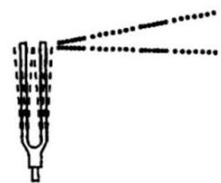
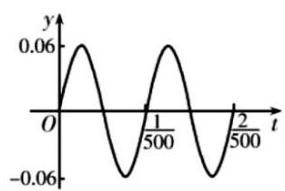
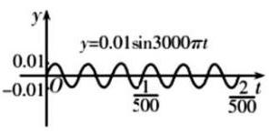
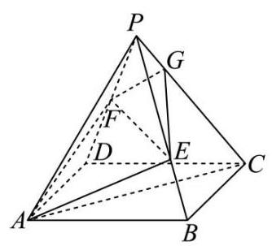
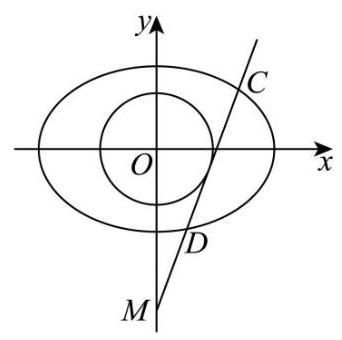

## 2026 届奉贤区高三下二模数学试卷

## 一、填空题

1. 已知集合 $A = \{ {3a}\} , B = \left\{  {9,{a}^{2}}\right\}$ ，若 $A \subseteq  B$ ，则实数 $a =$ ___.

【答案】0

【解析】因为 $A \subseteq  B$ ,所以 ${3a} = 9$ 或 ${3a} = {a}^{2}$ ,

解得 $a = 3$ ,或 $a = 0$ ,

当 $a = 3$ 时， ${a}^{2} = 9$ ，集合 $B$ 中的元素不满足互异性，舍去；

当 $a = 0$ 时， $B = \{ 9,0\}$ ，满足题意，故 $a = 0$

2. 不等式 $\left| {x - 2}\right|  > 1$ 的解集为___.

【答案】 $\left( {-\infty ,1}\right)  \cup  \left( {3, + \infty }\right)$

【解析】 $\left| {x - 2}\right|  > 1 \Rightarrow  x - 2 > 1$ 或 $x - 2 <  - 1$ ,

解得 $x > 3$ 或 $x < 1$ ,

所以不等式 $\left| {x - 2}\right|  > 1$ 的解集为 $\left( {-\infty ,1}\right)  \cup  \left( {3, + \infty }\right)$ .

3. 在 ${\left( x + \frac{1}{x}\right) }^{5}$ 的展开式中， $x$ 的系数为___.

【答案】 10

【解析】由题设,展开式通项公式为 ${T}_{r + 1} = {C}_{5}^{r}{x}^{5 - {2r}}$ ,

当 $r = 2$ 时， ${T}_{3} = {C}_{5}^{2}x = {10x}$ ，

$\therefore x$ 的系数为 10 .

4. 若直线 $\left( {a - 1}\right) x + y - 1 = 0$ 与直线 ${3x} - y = 0$ 平行,则实数 $a$ 的值为___.

【答案】 -2

【解析】已知直线 $\left( {a - 1}\right) x + y - 1 = 0$ 与直线 ${3x} - y = 0$ 平行,

$\therefore$ 两直线斜率相等,即 $1 - a = 3$ ,解得 $a =  - 2$ ,

$\because$ 直线 $\left( {a - 1}\right) x + y - 1 = 0$ 的截距为 1,直线 ${3x} - y = 0$ 的截距为 0,不相等, $\therefore a =  - 2$ .

5. 已知圆锥的高为 8，底面半径为 6，则该圆锥的侧面积为___.

【答案】 ${60\pi }$

【解析】因为圆锥的高为 8,底面半径为 $r = 6$ ,

所以圆锥的母线长为 $l = \sqrt{{8}^{2} + {6}^{2}} = {10}$ ,

则圆锥的侧面积 $S = {\pi rl} = \pi  \times  6 \times  {10} = {60\pi }$ .

6. 已知函数 $y = \left\{  \begin{array}{l} x\left( {x - b}\right) , x \geq  0 \\  x\left( {{bx} + 1}\right) , x < 0 \end{array}\right.$ 是奇函数,则 $b =$ ___.

【答案】 -1

【解析】设 $f\left( x\right)  = \left\{  \begin{array}{l} x\left( {x - b}\right) , x \geq  0 \\  x\left( {{bx} + 1}\right) , x < 0 \end{array}\right.$ ,

$f\left( {-x}\right)  = \left\{  {\begin{array}{l}  - x\left( {-{bx} + 1}\right) , x \geq  0 \\   - x\left( {-x - b}\right) , x < 0 \end{array},}\right.$

又函数是奇函数,

$\therefore f\left( {-x}\right)  =  - f\left( x\right)$ ,即 $- x\left( {-{bx} + 1}\right)  =  - x\left( {x - b}\right) , - x\left( {-x - b}\right)  =  - x\left( {{bx} + 1}\right)$ ,

$b{x}^{2} - x =  - {x}^{2} + {bx},\;{x}^{2} + {bx} =  - b{x}^{2} - x,$

解得 $b =  - 1$ .

7. 某食品厂生产一种零食，该种零食每袋的质量 $X$ (单位: $\mathrm{g}$ ) 服从正态分布 $N\left( {{65},{2.2}^{2}}\right)$ ,记作 $X \sim  N\left( {{65},{2.2}^{2}}\right)$ . 规定: 这种零食的质量在 ${62.8} \sim  {69.4}\mathrm{\;g}$ 之间的为合格品; 则这种零食的合格率为 ___. (结果精确到 0.001 );

参考数据: 若 $X \sim  N\left( {\mu ,{\sigma }^{2}}\right)$ ,则 $P\left( {\mu  - \sigma  \leq  X \leq  \mu  + \sigma }\right)  \approx  {0.6827}, P\left( {\mu  - {2\sigma } \leq  X \leq  \mu  + {2\sigma }}\right)  \approx  {0.9545}$ , $P\left( {\mu  - {3\sigma } \leq  X \leq  \mu  + {3\sigma }}\right)  \approx  {0.9973}.$

【答案】0.819

【解析】因为零食每袋的质量 $X$ (单位: $\mathrm{g}$ ) 服从正态分布 $N\left( {65}^{{}^{\prime }}\right)$ 。

所以 $P\left( {{62.8} \leq  X \leq  {69.4}}\right)  = P\left( {{65} - {2.2} \leq  X \leq  {65} + 2 \times  {2.2}}\right)$

$= \frac{1}{2}P\left( {{65} - {2.2} \leq  X \leq  {65} + {2.2}}\right)  + \frac{1}{2}P\left( {{65} - 2 \times  {2.2} \leq  X \leq  {65} + 2 \times  {2.2}}\right) \; = \frac{1}{2} \times  {0.6827} + \frac{1}{2} \times  {0.9545} = {0.8186} \approx  {0.819}$ .

8. 点 $F$ 为抛物线 $C : {y}^{2} = {8x}$ 的焦点， $P$ 为 $C$ 上一点，若 $\bigtriangleup  {POF}$ 的面积为 $4\sqrt{2}$ ( $O$ 为坐标原点)，则 $\left| {PF}\right|  =$ ___.

【答案】 6

【解析】抛物线 $C : {y}^{2} = {8x}$ 的焦点为 $F\left( {2,0}\right)$ ,准线方程为 $x =  - 2$ ,

则 ${S}_{\bigtriangleup {POF}} = \frac{1}{2}\left| {OF}\right| \left| {y}_{P}\right|  = 4\sqrt{2}$ ,

所以 $\left| {y}_{P}\right|  = 4\sqrt{2}$ ,则 ${y}_{P}^{2} = 8{x}_{P}$ ,所以 ${x}_{P} = 4$ ,

所以 $\left| {PF}\right|  = {x}_{P} - \left( {-2}\right)  = 6$ .

9. 从 6 名男生和 4 名女生中选出 3 人参加人工智能技能培训. 设事件 $A$ :至少抽到一名女生，事件 $B$ :恰好抽到一名男生,则 $P\left( {B \mid  A}\right)  =$ ___.

【答案】 $\frac{9}{25}/{0.36}$

【解析】依题意可得 $P\left( A\right)  = \frac{{\mathrm{C}}_{10}^{3} - {\mathrm{C}}_{6}^{3}}{{\mathrm{C}}_{10}^{3}} = \frac{5}{6},\;P\left( {AB}\right)  = \frac{{\mathrm{C}}_{4}^{2}{\mathrm{C}}_{6}^{1}}{{\mathrm{C}}_{10}^{3}} = \frac{3}{10}$ ,

所以 $P\left( {B \mid  A}\right)  = \frac{P\left( {AB}\right) }{P\left( A\right) } = \frac{\frac{3}{10}}{\frac{5}{6}} = \frac{9}{25}$ .

10. 已知复数 $z = \cos \theta  + \mathrm{i}\sin \theta ,\theta  \in  \lbrack 0,{2\pi })$ ， $\mathrm{i}$ 是虚数单位，则 ${\left| z + 6\right| }^{2} + {\left| z - 8\mathrm{i}\right| }^{2}$ 的取值范围是___.

【答案】[82,122]

【解析】 $\because {\mathrm{i}}^{2} =  - 1$ ,

$\therefore {\left| z + 6\right| }^{2} + {\left| z - 8\mathrm{i}\right| }^{2} = {\left| \left( \cos \theta  + 6\right)  + \mathrm{i}\sin \theta \right| }^{2} + {\left| \cos \theta  + \mathrm{i}\left( \sin \theta  - 8\right) \right| }^{2}$

$= \left( {{\cos }^{2}\theta  + {12}\cos \theta  + {36} + {\sin }^{2}\theta }\right)  + \left( {{\cos }^{2}\theta  + {\sin }^{2}\theta  - {16}\sin \theta  + {64}}\right)$

$= {37} + {12}\cos \theta  + {65} - {16}\sin \theta  = {102} + {12}\cos \theta  - {16}\sin \theta$ ,

$= {102} + {20}\left( {\frac{3}{5}\cos \theta  - \frac{4}{5}\sin \theta }\right)$ ,设 $\cos \varphi  = \frac{3}{5},\sin \varphi  = \frac{4}{5}$ ,

则 ${\left| z + 6\right| }^{2} + {\left| z - 8\mathrm{i}\right| }^{2} = {102} + {20}\cos \left( {\theta  + \varphi }\right)$ ,

当 $\theta  + \varphi  = {2k\pi }, k \in  \mathbf{Z}$ ,即 $\cos \theta  = \frac{3}{5},\sin \theta  =  - \frac{4}{5}$ 时, $\cos \left( {\theta  + \varphi }\right)  = 1$ ,

此时 ${\left| z + 6\right| }^{2} + {\left| z - 8\mathrm{i}\right| }^{2}$ 取最大值 122,

当 $\theta  + \varphi  = {2k\pi } + \pi , k \in  \mathbf{Z}$ ,即 $\cos \theta  =  - \frac{3}{5},\sin \theta  = \frac{4}{5}$ 时, $\cos \left( {\theta  + \varphi }\right)  =  - 1$ ,

此时 ${\left| z + 6\right| }^{2} + {\left| z - 8\mathrm{i}\right| }^{2}$ 取最小值 82 ,

$\therefore {\left| z + 6\right| }^{2} + {\left| z - 8\mathrm{i}\right| }^{2} = {102} + {12}\cos \theta  - {16}\sin \theta  \in  \left\lbrack  {{82},{122}}\right\rbrack$ .

11. 如图所示, $A, B, C$ 为山脚两侧共线的三点,在山顶 $P$ 处测得三点的俯角分别为 $\alpha  = {29.3}^{ \circ  },\beta  = {38.2}^{ \circ  }$ , $\gamma  = {25.1}^{ \circ  }$ . 计划沿直线 ${AC}$ 开通穿山隧道,为了求出隧道 ${DE}$ 的长度,还测得 ${AD} = {277}$ 米, ${BE} = {49}$ 米, ${BC} = {320}$ 米,则根据以上数据，隧道 ${DE}$ 的长度约为___米.(结果精确到 1 米)

【答案】 804

【解析】在 $\bigtriangleup {PBC}$ 中, $\angle {BPC} = \beta  - \gamma  = {38.2}^{ \circ  } - {25.1}^{ \circ  } = {13.1}^{ \circ  }$ ,

$\angle {PBC} = {180}^{ \circ  } - \beta ,\angle {PCB} = \gamma ;$

由正弦定理可得 $\frac{BC}{\sin \angle {BPC}} = \frac{PC}{\sin \angle {PBC}}$ ,整理可得 ${PC} = \frac{{320} \times  \sin {38.2}^{ \circ  }}{\sin {13.1}^{ \circ  }}$ .

在 $\bigtriangleup  {PAC}$ 中， $\angle {PAC} = \alpha ,\angle {APC} = {180}^{ \circ  } - \alpha  - \gamma$ ，

由正弦定理 $\frac{AC}{\sin \angle {APC}} = \frac{PC}{\sin \angle {PAC}}$ ,

整理可得 ${AC} = \frac{{PC} \times  \sin \left( {{29.3}^{ \circ  } + {25.1}^{ \circ  }}\right) }{\sin {29.3}^{ \circ  }} = \frac{{320} \times  \sin {38.2}^{ \circ  } \times  \sin {54.4}^{ \circ  }}{\sin {29.3}^{ \circ  }\sin {13.1}^{ \circ  }}$ .

所以 ${DE} = {AC} - {AD} - {EB} - {CB} = \frac{{320} \times  \sin {38.2}^{ \circ  } \times  \sin {54.4}^{ \circ  }}{\sin {13.1}^{ \circ  }\sin {29.3}^{ \circ  }} - {277} - {49} - {320}$

$= \frac{{320} \times  \sin {38.2}^{ \circ  } \times  \sin {54.4}^{ \circ  }}{\sin {13.1}^{ \circ  }\sin {29.3}^{ \circ  }} - {277} - {49} - {320} = {804}$ .

12. 在平面直角坐标系 ${xOy}$ 中,点 $A\left( {\cos \theta ,\sin \theta }\right) , B\left( {-\sin \theta ,\cos \theta }\right) ,\theta  \in  \lbrack 0,{2\pi })$ . 若点 $P\left( {x, y}\right)$ 满足: $\overrightarrow{OP} \cdot  \overrightarrow{OA} = 1$ , $\overrightarrow{OP} \cdot  \overrightarrow{OB} = 2$ ，则 $y$ 的最大值是___.

【答案】 $\sqrt{5}$

【解析】 $\overrightarrow{OP} = \left( {x, y}\right) ,\overrightarrow{OA} = \left( {\cos \theta ,\sin \theta }\right) ,\overrightarrow{OB} = \left( {-\sin \theta ,\cos \theta }\right)$ ,

由题意得 $\left\{  \begin{array}{l} \overrightarrow{OP} \cdot  \overrightarrow{OA} = x\cos \theta  + y\sin \theta  = 1 \\  \overrightarrow{OP} \cdot  \overrightarrow{OB} =  - x\sin \theta  + y\cos \theta  = 2 \end{array}\right.$ 解得 $\left\{  \begin{array}{l} x = \cos \theta  - 2\sin \theta \\  y = \sin \theta  + 2\cos \theta  \end{array}\right.$ ,

$y = \sin \theta  + 2\cos \theta  = \sqrt{5}\sin \left( {\theta  + \varphi }\right)$ ,其中 $\tan \varphi  = 2,\theta  \in  \lbrack 0,{2\pi })$ ,

当 $\sin \left( {\theta  + \varphi }\right)  = 1$ 时， $y$ 取最大值为 $\sqrt{5}$ ，

所以 $y$ 的最大值是 $\sqrt{5}$ .

## 二、单选题

13. 已知 $a > b > 0 > c$ ,则下列不等式成立的是( )

A. $\frac{c}{a} < \frac{c}{b}$ B. $\frac{b}{a} > \frac{a}{b}$

C. $\frac{b - c}{a - c} < \frac{b}{a}$ D. $\frac{2}{a} + b < \frac{2}{b} + a$

【答案】D

【解析】由 $a > b > 0$ ,可得 $\frac{1}{a} < \frac{1}{b}$ ,又 $c < 0$ ,所以 $\frac{c}{a} > \frac{c}{b}$ ,故 A 错误;

由 $a > b > 0$ ,所以 $\frac{b}{a} < 1 < \frac{a}{b}$ ,故 $\frac{b}{a} < \frac{a}{b}$ ,故 $\mathrm{B}$ 错误;

$\frac{b - c}{a - c} - \frac{b}{a} = \frac{a\left( {b - c}\right)  - b\left( {a - c}\right) }{a\left( {a - c}\right) } = \frac{c\left( {b - a}\right) }{a\left( {a - c}\right) },$

因为 $a > 0, c < 0, b - a < 0, a - c > 0$ ,所以 $\frac{c\left( {b - a}\right) }{a\left( {a - c}\right) } > 0$ ,则 $\frac{b - c}{a - c} > \frac{b}{a}$ ,故 C 错误;

由 $\frac{1}{a} < \frac{1}{b}$ ,可得 $\frac{2}{a} < \frac{2}{b}$ ,又 $b < a$ ,所以 $\frac{2}{a} + b < \frac{2}{b} + a$ ,故 $\mathrm{D}$ 正确.

故选: D

14. 已知双曲线的方程为 ${x}^{2} - \frac{{y}^{2}}{4} = \lambda$ ,则( )

A. 渐近线与 $\lambda$ 无关 B. 实轴长与 $\lambda$ 无关 C. 焦距与 $\lambda$ 无关

【答案】A

【解析】已知双曲线的方程为 ${x}^{2} - \frac{{y}^{2}}{4} = \lambda$ ,则 $\lambda  \neq  0$ ,

当 $\lambda  > 0$ 时, $\frac{{x}^{2}}{\lambda } - \frac{{y}^{2}}{4\lambda } = 1$ ,焦点在 $x$ 轴, ${a}^{2} = \lambda ,{b}^{2} = {4\lambda },{c}^{2} = {a}^{2} + {b}^{2} = {5\lambda }$ ,

当 $\lambda  < 0$ 时, $\frac{{y}^{2}}{-{4\lambda }} - \frac{{x}^{2}}{-\lambda } = 1$ ,焦点在 $y$ 轴, ${a}^{2} =  - {4\lambda },{b}^{2} =  - \lambda ,{c}^{2} = {a}^{2} + {b}^{2} =  - {5\lambda }$ ,

当 $\lambda  > 0$ 时,渐近线方程为 $y =  \pm  \sqrt{\frac{{b}^{2}}{{a}^{2}}}x =  \pm  {2x}$ ,实轴长为 ${2a} = 2\sqrt{\lambda }$ ,

焦距为 ${2c} = 2\sqrt{5\lambda }$ ,焦点为 $\left( {\pm \sqrt{5\lambda },0}\right)$ ;

当 $\lambda  < 0$ 时,渐近线方程为 $y =  \pm  \sqrt{\frac{{a}^{2}}{{b}^{2}}}x =  \pm  \sqrt{\frac{-{4\lambda }}{-\lambda }}x =  \pm  {2x}$ ,实轴长为 ${2a} = 4\sqrt{-\lambda }$ , 焦距为 ${2c} = 2\sqrt{-{5\lambda }}$ ,焦点为 $\left( {0, \pm  \sqrt{-{5\lambda }}}\right)$ ;

$\therefore$ 渐近线与 $\lambda$ 无关,实轴长、焦距、焦点均与 $\lambda$ 有关.

15. 音乐，是人类精神通过无意识计算而获得的愉悦享受，1807 年法国数学家傅里叶发现代表任何周期性声音的公式是形如 $y = A\sin {wx}$ 的简单正弦型函数之和,而且这些正弦型函数的频率都是其中一个最小频率的整数倍,比如用小提琴演奏的某音叉的声音图象是由下图1,2,3三个函数图象组成的,则小提琴演奏的该音叉的声音函数可以为( )

音叉

图1

图2

图3

A. $f\left( t\right)  = {0.06}\sin {1000\pi t} + {0.02}\sin {1500\pi t} + {0.01}\sin {3000\pi t}$

B. $f\left( t\right)  = {0.06}\sin {500\pi t} + {0.02}\sin {2000\pi t} + {0.01}\sin {300\pi t}$

C. $f\left( t\right)  = {0.06}\sin {1000\pi t} + {0.02}\sin {2000\pi t} + {0.01}\sin {3000\pi t}$

D. $f\left( t\right)  = {0.06}\sin {1000\pi t} + {0.02}\sin {2500\pi t} + {0.01}\sin {3000\pi t}$

【答案】C

【解析】由图 1 知, $A = {0.06}, T = \frac{2}{500} - \frac{1}{500} = \frac{1}{500}$ ,

所以 $\omega  = \frac{2\pi }{T} = {1000\pi }$ ,所以 $y = {0.06}\sin {1000\pi t}$ ;

结合题意知,函数 $f\left( t\right)  = {0.06}\sin {1000\pi t} + {0.02}\sin {2000\pi t} + {0.01}\sin {3000\pi t}$ .

故选: $C$ .

16. 已知函数 $y = f\left( x\right)$ 的表达式为 $f\left( x\right)  = \left( {x - 1}\right) \left( {x - a}\right) \left( {x - b}\right)$ ， $x \in  \mathbf{R}$ ，则下列命题正确的是( )

A. 函数 $y = f\left( x\right)$ 的零点的个数一定是 3 个

B. 若集合 $A = \{ x \mid  f\left( x\right)  \geq  0\}$ 的解集是 $\lbrack 0, + \infty )$ ,则实数对 $\left( {a, b}\right)$ 有 2 对

C. 函数 $y = f\left( x\right)$ 必存在极值

D. 函数 $y = f\left( x\right)$ 在 $\left( {b,0}\right)$ 处的切线方程为 $y = 0$ ,则 $b = 1$

【答案】B

【解析】A: 当 $f\left( x\right)  = 0$ 时, $x = 1, x = a, x = b$ ,若当 $a = 1$ 或 $b = 1$ 时,零点个数不为 3,所以 $\mathrm{A}$ 错.

B: 若满足条件,则 $f\left( x\right)$ 在 $x = 0$ 处为零,且在 $x < 0$ 时 $f\left( x\right)  < 0$ ,

由 $f\left( 0\right)  = 0$ ,得 ${ab} = 0$ ,即 $a = 0$ 或 $b = 0$ ,

当 $a = 0$ 时, $f\left( x\right)  = \left( {x - 1}\right) x\left( {x - b}\right)$ ,为满足条件, $b = 1$ ,

当 $b = 0$ 时,同理可得 $a = 1$ ,

当 $a = b = 0$ 时不满足题意,

所以实数对 $\left( {a, b}\right)$ 有 2 对: $\left( {0,1}\right)$ 和 $\left( {1,0}\right)$ , B 对.

C: 求导 ${f}^{\prime }\left( x\right)  = 3{x}^{2} - 2\left( {a + b + 1}\right) x + {ab} + a + b,\Delta  = 4\left( {{a}^{2} + {b}^{2} - {ab} - a - b + 1}\right)$ ,接着判断 $\Delta$ ,

把判别式看作关于 $a$ 的函数,则 $g\left( a\right)  = {a}^{2} - \left( {b + 1}\right) a + \left( {{b}^{2} - b + 1}\right) ,{\Delta }^{\prime } = {\left( -b - 1\right) }^{2} - 4\left( {{b}^{2} - b + 1}\right)  =  - 3{\left( b - 1\right) }^{2}$ ,

当 $b \neq  1$ 时, ${\Delta }^{\prime } < 0, g\left( a\right)  > 0$ ,所以 ${f}^{\prime }\left( x\right)$ 有两个零点,有极值,

当 $b = 1$ 时， $g\left( a\right)  = {\left( a - 1\right) }^{2}$ ，

此时当 $a \neq  1, g\left( a\right)  > 0,{f}^{\prime }\left( x\right)$ 有两个零点,有极值,

当 $a = 1, g\left( a\right)  = 0,{f}^{\prime }\left( x\right)  \geq  0$ 恒成立,函数在定义域上单调递增,

所以当取值 $a = b = 1$ 时, $f\left( x\right)  = {\left( x - 1\right) }^{3}$ ,无极值,所以 $\mathrm{C}$ 错.

D: 在 $\left( {b,0}\right)$ 处的切线方程为 $y = {f}^{\prime }\left( b\right) \left( {x - b}\right)$ ,

求导 ${f}^{\prime }\left( x\right)  = 3{x}^{2} - 2\left( {a + b + 1}\right) x + {ab} + a + b$ ,得 ${f}^{\prime }\left( b\right)  = \left( {b - 1}\right) \left( {b - a}\right)  = 0$ ,

得 $b = 1$ 或 $b = a$ ，D 错.

## 三、解答题

17. 已知函数 $y = f\left( x\right)$ 的表达式为 $f\left( x\right)  = \sin \left( {{\pi x} + \varphi }\right) ,\left( {-\frac{\pi }{2} < \varphi  < \frac{\pi }{2}}\right)$ .

(1) $f\left( 0\right)  = \frac{3}{5}$ ，求 $f\left( \frac{1}{4}\right)$ 的值；

( 2 )若 $f\left( \frac{1}{2}\right)$ ， $f\left( 1\right)$ ， $f\left( 2\right)$ 依次成等比数列，求 $\varphi$ 的值.

【答案】(1) $\frac{7\sqrt{2}}{10};\left( 2\right) \frac{\pi }{4}$

【解析】(1) 由 $f\left( 0\right)  = \sin \varphi  = \frac{3}{5}, - \frac{\pi }{2} < \varphi  < \frac{\pi }{2}$ ,得 $\cos \varphi  = \frac{4}{5}$ ,

则 $f\left( \frac{1}{4}\right)  = \sin \left( {\frac{\pi }{4} + \varphi }\right)  = \sin \frac{\pi }{4}\cos \varphi  + \cos \frac{\pi }{4}\sin \varphi  = \frac{\sqrt{2}}{2} \times  \frac{4}{5} + \frac{\sqrt{2}}{2} \times  \frac{3}{5} = \frac{7\sqrt{2}}{10}$ .

(2)由 $f\left( \frac{1}{2}\right)  = \sin \left( {\frac{\pi }{2} + \varphi }\right)  = \cos \varphi , f\left( 1\right)  = \sin \left( {\pi  + \varphi }\right)  =  - \sin \varphi , f\left( 2\right)  = \sin \left( {{2\pi } + \varphi }\right)  = \sin \varphi$ ， 因 $f\left( \frac{1}{2}\right) , f\left( 1\right) , f\left( 2\right)$ 成等比数列,故 ${\left\lbrack  f\left( 1\right) \right\rbrack  }^{2} = f\left( \frac{1}{2}\right) f\left( 2\right)$ ,

即 ${\sin }^{2}\varphi  = \cos \varphi  \cdot  \sin \varphi$ ,得 $\sin \varphi \left( {\sin \varphi  - \cos \varphi }\right)  = 0$ ;

若 $f\left( \frac{1}{2}\right) , f\left( 1\right) , f\left( 2\right)$ 依次成等比数列,则 $\sin \varphi  \neq  0$ ;

所以 $\sin \varphi  = \cos \varphi ,\tan \varphi  = 1$ ,又 $- \frac{\pi }{2} < \varphi  < \frac{\pi }{2}$ ,故 $\varphi  = \frac{\pi }{4}$ ,此时 $f\left( \frac{1}{2}\right) , f\left( 1\right) , f\left( 2\right)$ 依次为 $\frac{\sqrt{2}}{2}, - \frac{\sqrt{2}}{2},\frac{\sqrt{2}}{2}$ ,符合题意;

综上， $\varphi  = \frac{\pi }{4}$ .

18. 某工厂生产的某种产品的月产量(单位:千件)与单位成本(单位:元/件)的数据如下:

<table><tr><td>月份</td><td>产量 $x$ (千件)</td><td>单位成本 $y$ (元/件)</td></tr><tr><td>1</td><td>2</td><td>73</td></tr><tr><td>2</td><td>3</td><td>72</td></tr><tr><td>3</td><td>4</td><td>71</td></tr><tr><td>4</td><td>3</td><td>73</td></tr><tr><td>5</td><td>4</td><td>69</td></tr><tr><td>6</td><td>5</td><td>68</td></tr></table>

(1)计算产量与单位成本的相关系数(无需过程);

(2)建立产量与单位成本的回归方程 (写出必要的过程):

(3)若该工厂计划 7 月份生产 7 千件该产品，则单位成本预计是多少？

附:相关系数 $r$ 的计算公式: $r = \frac{\mathop{\sum }\limits_{{i = 1}}^{n}\left( {{x}_{i} - \overline{x}}\right) \left( {{y}_{i} - \overline{y}}\right) }{\sqrt{\mathop{\sum }\limits_{{i = 1}}^{n}{\left( {x}_{i} - \overline{x}\right) }^{2}\mathop{\sum }\limits_{{i = 1}}^{n}{\left( {y}_{i} - \overline{y}\right) }^{2}}}$ ;

回归系数计算公式: $\widehat{b} = \frac{\mathop{\sum }\limits_{{i = 1}}^{n}\left( {{x}_{i} - \bar{x}}\right) \left( {{y}_{i} - \bar{y}}\right) }{\mathop{\sum }\limits_{{i = 1}}^{n}{\left( {x}_{i} - \bar{x}\right) }^{2}} = \frac{\mathop{\sum }\limits_{{i = 1}}^{n}{x}_{i}{y}_{i} - n\bar{x}\bar{y}}{\mathop{\sum }\limits_{{i = 1}}^{n}{x}_{i}^{2} - n{\bar{x}}^{2}},\widehat{a} = \bar{y} - \widehat{b}\bar{x} = \frac{\mathop{\sum }\limits_{{i = 1}}^{n}{y}_{i} - \widehat{b}\mathop{\sum }\limits_{{i = 1}}^{n}{x}_{i}}{n}$

【答案】 $\left( 1\right)  - \frac{10}{11};\left( 2\right) \widehat{y} =  - {1.82x} + {77.36};\left( 3\right) {64.62}$ 元/件

【解析】(1) 根据相关系数的公式 $r = \frac{\mathop{\sum }\limits_{{i = 1}}^{6}{x}_{i}{y}_{i} - 6\bar{x} \cdot  \bar{y}}{\sqrt{\mathop{\sum }\limits_{{i = 1}}^{6}{x}_{i}^{2} - 6{\bar{x}}^{2}}\sqrt{\mathop{\sum }\limits_{{i = 1}}^{6}{y}_{i}^{2} - 6{\bar{y}}^{2}}}$ ,

由表格数据可得 $\mathop{\sum }\limits_{{i = 1}}^{6}{x}_{i}{y}_{i} = {1481},\bar{x} = \frac{1}{6}\left( {2 + 3 + 4 + 3 + 4 + 5}\right)  = {3.5},\bar{y} = \frac{1}{6}\left( {{73} + {72} + {71} + {73} + {69} + {68}}\right)  = {71}$ ,

$\mathop{\sum }\limits_{{i = 1}}^{6}{x}_{i}^{2} - 6{\bar{x}}^{2} = {79} - 6 \times  {3.5}^{2} = {5.5},\;\mathop{\sum }\limits_{{i = 1}}^{6}{y}_{i}^{2} - 6{\bar{y}}^{2} = {30268} - 6 \times  {71}^{2} = {22},$

于是 $r = \frac{\mathop{\sum }\limits_{{i = 1}}^{6}{x}_{i}{y}_{i} - 6\overline{xy}}{\sqrt{\mathop{\sum }\limits_{{i = 1}}^{6}{x}_{i}^{2} - 6{\bar{x}}^{2}}\sqrt{\mathop{\sum }\limits_{{i = 1}}^{6}{y}_{i}^{2} - 6{\bar{y}}^{2}}} = \frac{{1481} - 6 \times  {3.5} \times  {71}}{\sqrt{5.5} \times  \sqrt{22}} =  - \frac{10}{11}$ .

(2)设回归直线方程为 $\widehat{y} = \widehat{bx} + \widehat{a}$ ，

根据公式可得 $\widehat{b} = \frac{\mathop{\sum }\limits_{{i = 1}}^{6}{x}_{i}{y}_{i} - 6\overline{xy}}{\mathop{\sum }\limits_{{i = 1}}^{6}{x}_{i}^{2} - 6{\bar{x}}^{2}} = \frac{{1481} - 6 \times  {3.5} \times  {71}}{5.5} =  - \frac{10}{5.5} =  - \frac{20}{11} \approx   - {1.82}$ ,

$\widehat{a} = \bar{y} - \widehat{b}\bar{x} = {71} - \left( {-\frac{20}{11}}\right)  \times  \frac{7}{2} = {71} + \frac{70}{11} \approx  {77.36},$

故回归直线方程为 $\widehat{y} =  - {1.82x} + {77.36}$ ;

(3)根据(2)可知， $\widehat{y} =  - {1.82x} + {77.36}$ ，

当 $x = 7$ 时, $\widehat{y} =  - {1.82} \times  7 + {77.36} = {64.62}$ ,

所以预计成本是 64.62 元/件.

19. 在四棱锥 $P - {ABCD}$ 中，四边形 ${ABCD}$ 是菱形， ${PA} = {PC} = 5$ ， ${PB} = {PD} = 2\sqrt{5}$ ， ${AC} = 6$ ，点 $F$ 为 ${PD}$ 的中点,点 $E$ 为 ${PB}$ 上的点, $\overrightarrow{PE} = \lambda \overrightarrow{PB},\lambda  \in  \left( {0,1}\right)$ ,平面 ${AFE}$ 与棱 ${PC}$ 交于点 $G$ .

图1

图2

(1)求证:异面直线 ${EF}$ 与 ${AC}$ 垂直；

(2)当 $\lambda  = \frac{2}{3}$ 时，求 ${AG}$ 与底面 ${ABCD}$ 所成的线面角大小.

【答案】(1)见解析: (2) $\arcsin \frac{4\sqrt{65}}{65}$

【解析】(1) 已知四边形 ${ABCD}$ 是菱形,则 ${AC} \bot  {BD}$ ,设 ${AC} \cap  {BD} = O$ ,则 $O$ 是 ${AC},{BD}$ 的中点, $\because {PA} = {PC} = 5,{PB} = {PD} = 2\sqrt{5}$ ,

$\therefore {PO} \bot  {AC},{PO} \bot  {BD}$ ,

$\because {AC} \cap  {BD} = O$ ，且 ${AC},{BD} \subset$ 平面 ${ABCD}$ ，

$\therefore {PO} \bot$ 平面 ${ABCD}$ ,

以 $O$ 为坐标原点, ${OA}$ 为 $x$ 轴, ${OB}$ 为 $y$ 轴, ${OP}$ 为 $z$ 轴,建立下图所示空间直角坐标系,

$\because {AC} = 6,\therefore {OA} = 3,{OP} = \sqrt{A{P}^{2} - O{A}^{2}} = \sqrt{{5}^{2} - {3}^{2}} = 4$ ,

${OB} = \sqrt{P{B}^{2} - O{P}^{2}} = \sqrt{{\left( 2\sqrt{5}\right) }^{2} - {4}^{2}} = 2,$

$\therefore A\left( {3,0,0}\right) , B\left( {0,2,0}\right) , C\left( {-3,0,0}\right) , D\left( {0, - 2,0}\right) , P\left( {0,0,4}\right)$ ,

$\because F$ 为 ${PD}$ 的中点,

$\therefore F\left( {0, - 1,2}\right)$ ,

$\because$ 点 $E$ 为 ${PB}$ 上的点， $\overrightarrow{PE} = \lambda \overrightarrow{PB},\overrightarrow{PB} = \left( {0,2, - 4}\right)$ ，

$\therefore \overrightarrow{PE} = \left( {0,{2\lambda }, - {4\lambda }}\right)$ ,则 $E\left( {0,{2\lambda },4 - {4\lambda }}\right)$ ,

$\therefore \overrightarrow{EF} = \left( {0, - 1 - {2\lambda }, - 2 + {4\lambda }}\right)$ ,

$\because \overrightarrow{AC} = \left( {-6,0,0}\right)$ ,

$\therefore \overrightarrow{EF} \cdot  \overrightarrow{AC} = 0 \times  \left( {-6}\right)  + \left( {-1 - {2\lambda }}\right)  \times  0 + \left( {-2 + {4\lambda }}\right)  \times  0 = 0$ ,故 $\overrightarrow{EF} \bot  \overrightarrow{AC}$ ,

$\therefore$ 异面直线 ${EF}$ 与 ${AC}$ 垂直.

(2)当 $\lambda  = \frac{2}{3}$ 时， $E\left( {0,\frac{4}{3},\frac{4}{3}}\right) ,\overrightarrow{AE} = \left( {-3,\frac{4}{3},\frac{4}{3}}\right) ,\overrightarrow{AF} = \left( {-3, - 1,2}\right)$ ， 设 $\overrightarrow{n} = \left( {a, b, c}\right)$ 为平面 ${AEF}$ 的法向量,则 $\left\{  \begin{array}{l}  - {3a} + \frac{4}{3}b + \frac{4}{3}c = 0 \\   - {3a} - b + {2c} = 0 \end{array}\right.$ ,令 $a =  - 4$ , 则 $\overrightarrow{n} = \left( {-4, - 2, - 7}\right) ,\because A\left( {3,0,0}\right)$ ,

$\therefore$ 平面 ${AEF}$ 方程为: $- 4\left( {x - 3}\right)  - {2y} - {7z} = 0$ ,即 ${4x} + {2y} + {7z} = {12}$ , $\because P\left( {0,0,4}\right) , C\left( {-3,0,0}\right)$ ,

$\therefore \overrightarrow{PC} = \left( {-3,0, - 4}\right)$ ,直线 ${PC}$ 参数方程为: $\left\{  {\begin{array}{l} x =  - {3t} \\  y = 0 \\  z = 4 - {4t} \end{array}, t \in  \left\lbrack  {0,1}\right\rbrack  }\right.$ ,

参数方程代入平面方程得 $4\left( {-{3t}}\right)  + 2 \times  0 + 7\left( {4 - {4t}}\right)  = {12}$ ,解得 $t = \frac{2}{5}$ ,

$\therefore G\left( {-\frac{6}{5},0,\frac{12}{5}}\right)$ ,故 $\overrightarrow{AG} = \left( {-\frac{21}{5},0,\frac{12}{5}}\right)$ ,

底面 ${ABCD}$ 的法向量为 $\overrightarrow{m} = \left( {0,0,1}\right)$ ,

设 ${AG}$ 与底面 ${ABCD}$ 所成角为 $\theta$ ,则

$\sin \theta  = \left| {\cos \overrightarrow{AG},\overrightarrow{m}}\right|  = \frac{\left| \overrightarrow{AG} \cdot  \overrightarrow{m}\right| }{\left| \overrightarrow{AG}\right|  \cdot  \left| \overrightarrow{m}\right| } = \frac{\frac{12}{5}}{\sqrt{{\left( -\frac{21}{5}\right) }^{2} + {\left( \frac{12}{5}\right) }^{2}} \times  1} = \frac{4\sqrt{65}}{65},$

$\therefore {AG}$ 与底面 ${ABCD}$ 所成的线面角为 $\arcsin \frac{4\sqrt{65}}{65}$ .

20. 已知椭圆 $\Gamma  : \frac{{x}^{2}}{{a}^{2}} + \frac{{y}^{2}}{{b}^{2}} = 1\left( {a > b > 0}\right)$ 经过点 $\left( {0,1}\right)$ ,离心率为 $\frac{\sqrt{2}}{2}$ . 过点 $M\left( {0, - m}\right) , m > 0$ 的动直线 $l$ 交椭圆 $\Gamma$ 于 $C, D$ 两点.

(1)求椭圆 $\Gamma$ 的方程；

(2)若直线 $l$ 与 ${x}^{2} + {y}^{2} = \frac{2}{3}$ 相切,求当 $m = 2$ 时, ${CD}$ 的长;

(3)若以 ${CD}$ 为直径的圆经过 $x$ 轴上方的定点 $P$ ,求点 $P$ 的坐标.

【答案】 $\left( 1\right) \frac{{x}^{2}}{2} + {y}^{2} = 1;\left( 2\right) \frac{4\sqrt{21}}{11};\left( 3\right) P\left( {0,1}\right)$

【解析】(1) 由题意可得 $\left\{  \begin{array}{l} \frac{c}{a} = \frac{\sqrt{2}}{2} \\  \frac{1}{{b}^{2}} = 1 \\  {a}^{2} = {b}^{2} + {c}^{2} \end{array}\right.$ ,解得 $\left\{  \begin{array}{l} a = \sqrt{2} \\  b = 1 \\  c = 1 \end{array}\right.$ ,

故椭圆 $\Gamma$ 的方程为 $\frac{{x}^{2}}{2} + {y}^{2} = 1$ ;

(2)由 $m = 2$ ，则 $M\left( {0, - 2}\right)$ ，可设 $l : y = {kx} - 2$ ， $C\left( {{x}_{1},{y}_{1}}\right)$ ， $D\left( {{x}_{2},{y}_{2}}\right)$ ，

则由直线 $l$ 与 ${x}^{2} + {y}^{2} = \frac{2}{3}$ 相切,可得 $\frac{\left| -2\right| }{\sqrt{{k}^{2} + 1}} = \sqrt{\frac{2}{3}}$ ,化简得 ${k}^{2} = 5$ ,

联立 $\left\{  \begin{array}{l} y = {kx} - 2 \\  \frac{{x}^{2}}{2} + {y}^{2} = 1 \end{array}\right.$ ,消去 $y$ 可得 $\left( {2{k}^{2} + 1}\right) {x}^{2} - {8kx} + 6 = 0$ ,

$\Delta  = {\left( -8k\right) }^{2} - 4\left( {2{k}^{2} + 1}\right)  \times  6 = {16}{k}^{2} - {24} = {16} \times  5 - {24} = {56} > 0,$

则 ${x}_{1} + {x}_{2} = \frac{8k}{2{k}^{2} + 1},{x}_{1}{x}_{2} = \frac{6}{2{k}^{2} + 1}$ ,

则 $\left| {CD}\right|  = \sqrt{{k}^{2} + 1} \cdot  \sqrt{{\left( {x}_{1} + {x}_{2}\right) }^{2} - 4{x}_{1}{x}_{2}} = \sqrt{{k}^{2} + 1} \cdot  \sqrt{{\left( \frac{8k}{2{k}^{2} + 1}\right) }^{2} - 4 \times  \frac{6}{2{k}^{2} + 1}} \; = \frac{\sqrt{{k}^{2} + 1}}{2{k}^{2} + 1} \cdot  \sqrt{{16}{k}^{2} - {24}} = \frac{2\sqrt{2} \cdot  \sqrt{{k}^{2} + 1} \cdot  \sqrt{2{k}^{2} - 3}}{2{k}^{2} + 1} \; = \frac{2\sqrt{2} \times  \sqrt{5 + 1} \times  \sqrt{2 \times  5 - 3}}{2 \times  5 + 1} = \frac{4\sqrt{21}}{11};$

(3) 设 $l : y = {kx} - m, C\left( {{x}_{1},{y}_{1}}\right) \text{ 、 }D\left( {{x}_{2},{y}_{2}}\right) , P\left( {s, t}\right) \left( {t > 0}\right)$ ,

联立 $\left\{  \begin{array}{l} y = {kx} - m \\  \frac{{x}^{2}}{2} + {y}^{2} = 1 \end{array}\right.$ ,消去 $y$ 可得 $\left( {2{k}^{2} + 1}\right) {x}^{2} - {4kmx} + 2{m}^{2} - 2 = 0$ ,

$\Delta  = {\left( -4km\right) }^{2} - 4\left( {2{k}^{2} + 1}\right) \left( {2{m}^{2} - 2}\right)  = {16}{m}^{2}{k}^{2} - {16}{m}^{2}{k}^{2} + 8 - 8{m}^{2} + {16}{k}^{2}$

$= 8 - 8{m}^{2} + {16}{k}^{2} > 0$ ,即 $2{k}^{2} - {m}^{2} + 1 > 0$ ,

${x}_{1} + {x}_{2} = \frac{4km}{2{k}^{2} + 1},\;{x}_{1}{x}_{2} = \frac{2{m}^{2} - 2}{2{k}^{2} + 1},$

由点 $P$ 在以 ${CD}$ 为直径的圆上,则 $\overrightarrow{PC} \cdot  \overrightarrow{PD} = 0$ ,

由 $\overrightarrow{PC} = \left( {{x}_{1} - s,{y}_{1} - t}\right) ,\overrightarrow{PD} = \left( {{x}_{2} - s,{y}_{2} - t}\right)$ ,

则 $\overrightarrow{PC} \cdot  \overrightarrow{PD} = \left( {{x}_{1} - s}\right) \left( {{x}_{2} - s}\right)  + \left( {{y}_{1} - t}\right) \left( {{y}_{2} - t}\right)$

$$
= {x}_{1}{x}_{2} - s\left( {{x}_{1} + {x}_{2}}\right)  + {s}^{2} + {y}_{1}{y}_{2} - t\left( {{y}_{1} + {y}_{2}}\right)  + {t}^{2}
$$

$$
= {x}_{1}{x}_{2} - s\left( {{x}_{1} + {x}_{2}}\right)  + {s}^{2} + \left( {k{x}_{1} - m}\right) \left( {k{x}_{2} - m}\right)  - t\left( {k{x}_{1} - m + k{x}_{2} - m}\right)  + {t}^{2}
$$

$$
= \left( {{k}^{2} + 1}\right) {x}_{1}{x}_{2} - \left( {s + {km} + {tk}}\right) \left( {{x}_{1} + {x}_{2}}\right)  + {s}^{2} + {t}^{2} + {m}^{2} + {2tm}
$$

$$
= \frac{\left( {2{m}^{2} - 2}\right) \left( {{k}^{2} + 1}\right) }{2{k}^{2} + 1} - \frac{{4km}\left( {s + {km} + {tk}}\right) }{2{k}^{2} + 1} + \frac{\left( {{s}^{2} + {t}^{2} + {m}^{2} + {2tm}}\right) \left( {2{k}^{2} + 1}\right) }{2{k}^{2} + 1}
$$

$$
= \frac{-2{k}^{2} + 3{m}^{2} - 2 - {4kms} + 2{k}^{2}{s}^{2} + 2{k}^{2}{t}^{2} + {s}^{2} + {t}^{2} + {2tm}}{2{k}^{2} + 1}
$$

$$
= \frac{\left( {2{t}^{2} + 2{s}^{2} - 2}\right) {k}^{2} - {4msk} + 3{m}^{2} + {s}^{2} + {t}^{2} + {2tm} - 2}{2{k}^{2} + 1} = 0,
$$

即 $\left( {2{t}^{2} + 2{s}^{2} - 2}\right) {k}^{2} - {4msk} + 3{m}^{2} + {s}^{2} + {t}^{2} + {2tm} - 2 = 0$

故 $\left\{  \begin{array}{l} 2{t}^{2} + 2{s}^{2} - 2 = 0 \\   - {4s} = 0 \\  3{m}^{2} + {s}^{2} + {t}^{2} + {2tm} - 2 = 0 \end{array}\right.$ ,则有 $\left\{  \begin{array}{l} s = 0 \\  {t}^{2} = 1 \\  3{m}^{2} + {2tm} - 1 = 0 \end{array}\right.$ ,

由 $t > 0$ ,故 $t = 1$ ,则有 $3{m}^{2} + {2m} - 1 = \left( {{3m} - 1}\right) \left( {m + 1}\right)  = 0$ ,

即 $m = \frac{1}{3}$ 或 $m =  - 1$ ,由 $m > 0$ ,故 $m = \frac{1}{3}$ ,

即当且仅当 $m = \frac{1}{3}$ 时,以 ${CD}$ 为直径的圆经过 $x$ 轴上方的定点 $P$ ,

且 $P$ 点坐标为 $\left( {0,1}\right)$ .

21. 设定义域为 $\left( {0, + \infty }\right)$ 的函数 $y = f\left( x\right)$ 的表达式为 $f\left( x\right)  = {\mathrm{e}}^{x} - a\left( {a > 0}\right)$ ,我们可以证明函数 $y = f\left( x\right)$ 存在唯一的零点,设该零点为 $r$ . 如图,过点 ${A}_{1}\left( {{x}_{1}, f\left( {x}_{1}\right) }\right)$ 作函数 $y = f\left( x\right)$ 的切线 ${l}_{1}$ 与 $x$ 轴的交点为 ${B}_{2}$ ,设横坐标为 ${x}_{2}$ ,若 ${x}_{2} > r$ ,则过点 ${A}_{2}\left( {{x}_{2}, f\left( {x}_{2}\right) }\right)$ 作函数 $y = f\left( x\right)$ 的切线 ${l}_{2}$ 与 $x$ 轴的交点为 ${B}_{3}$ ,设横坐标为 ${x}_{3}$ ; 若 ${x}_{2} \leq  r$ ,则停止作切线. ...依次类推,得到数列 $\left\{  {x}_{n}\right\}  \left( {n \geq  1, n \in  \mathbf{N}}\right)$ ,记 ${x}_{1} = t, t > r$ .

(1)若 $a = \mathrm{e}, t = 2$ ,求 ${x}_{2}$ ;

(2)求证:数列 $\left\{  {x}_{n}\right\}$ 是严格递减数列；

(3)若 $a = 1$ ,比较 ${x}_{n + 1} + 1$ 与 ${x}_{n} - \ln {x}_{n}$ 的大小,并说明理由.

【答案】 $\left( 1\right) 1 + \frac{1}{\mathrm{e}}\left( 2\right)$ 见解析；(3)对于 ${x}_{0} \in  \left( {\frac{1}{2},1}\right)$ ，当 ${x}_{n} > {x}_{0}$ ， ${x}_{n + 1} + 1 > {x}_{n} - \ln {x}_{n}$ ； 当 ${x}_{n} = {x}_{0},{x}_{n + 1} + 1 = {x}_{n} - \ln {x}_{n}$ ; 当 $0 < {x}_{n} < {x}_{0},{x}_{n + 1} + 1 < {x}_{n} - \ln {x}_{n}$

【解析】(1) 已知 $f\left( x\right)  = {\mathrm{e}}^{x} - \mathrm{e},{f}^{\prime }\left( x\right)  = {\mathrm{e}}^{x}$ ,

当 ${x}_{1} = 2,{A}_{1}\left( {2,{\mathrm{e}}^{2} - \mathrm{e}}\right)$ ,设切线斜率为 ${k}_{1} = {f}^{\prime }\left( {x}_{1}\right)$ ,

则 ${k}_{1} = {\mathrm{e}}^{2}$ ,直线 ${l}_{1}$ 为 $y = {\mathrm{e}}^{2}\left( {x - 2}\right)  + {\mathrm{e}}^{2} - \mathrm{e} \Rightarrow  y = {\mathrm{e}}^{2}x - {\mathrm{e}}^{2} - \mathrm{e}$ ,

令 ${y}_{2} = 0,\;{x}_{2} = 1 + \frac{1}{\mathrm{e}}$ .

(2)设 ${x}_{n - 1} = m, m \in  \left( {0, + \infty }\right) , n \geq  2, f\left( {x}_{n - 1}\right)  = f\left( m\right)  = {\mathrm{e}}^{m} - a$ ，所以 ${A}_{n - 1}\left( {m,{\mathrm{e}}^{m} - a}\right)$ ， ${f}^{\prime }\left( {x}_{n - 1}\right)  = {f}^{\prime }\left( m\right)  = {\mathrm{e}}^{m},$

则直线 ${l}_{n - 1}$ 为 $y = {\mathrm{e}}^{m}\left( {x - m}\right)  + {\mathrm{e}}^{m} - a \Rightarrow  y = {\mathrm{e}}^{m}x + \left( {1 - m}\right) {\mathrm{e}}^{m} - a$ .

令 ${y}_{n} = 0$ ,则 ${x}_{n} = \frac{a}{{\mathrm{e}}^{m}} + m - 1$ .

${x}_{n} - {x}_{n - 1} = \frac{a}{{\mathrm{e}}^{m}} + m - 1 - m = \frac{a}{{\mathrm{e}}^{m}} - 1,$

因为 $m > r \Rightarrow  {\mathrm{e}}^{m} > {\mathrm{e}}^{r}$ ,且 ${\mathrm{e}}^{r} - a = 0 \Rightarrow  {\mathrm{e}}^{r} = a$ ,

所以 ${x}_{n} - {x}_{n - 1} = \frac{{\mathrm{e}}^{r}}{{\mathrm{e}}^{m}} - 1 < 0 \Rightarrow  {x}_{n} < {x}_{n - 1}$ ,

所以数列 $\left\{  {x}_{n}\right\}$ 是严格递减数列.

(3)当 $a = 1$ 时， $f\left( x\right)  = {\mathrm{e}}^{x} - 1,{f}^{\prime }\left( x\right)  = {\mathrm{e}}^{x}$ ，令 $x = {x}_{n},{A}_{n}\left( {{x}_{n},{\mathrm{e}}^{{x}_{n}} - 1}\right)$

则 $y = {\mathrm{e}}^{{x}_{n}}\left( {x - {x}_{n}}\right)  + {\mathrm{e}}^{{x}_{n}} - 1 \Rightarrow  y = {\mathrm{e}}^{{x}_{n}}x + \left( {1 - {x}_{n}}\right) {\mathrm{e}}^{{x}_{n}} - 1$ ,

令 ${y}_{n + 1} = 0 \Rightarrow  0 = {\mathrm{e}}^{{x}_{n}}{x}_{n + 1} + {\mathrm{e}}^{{x}_{n}} - {\mathrm{e}}^{{x}_{n}}{x}_{n} - 1 \Rightarrow  {x}_{n + 1} - {x}_{n} = \frac{1}{{\mathrm{e}}^{{x}_{n}}} - 1$ .

所以 ${x}_{n + 1} + 1 - {x}_{n} + \ln {x}_{n} = \frac{1}{{\mathrm{e}}^{{x}_{n}}} - 1 + 1 + \ln {x}_{n} = \frac{1}{{\mathrm{e}}^{{x}_{n}}} + \ln {x}_{n}$ .

构造函数,令 $g\left( x\right)  = \frac{1}{{\mathrm{e}}^{x}} + \ln x, x > 0$ ,

求导 ${g}^{\prime }\left( x\right)  =  - \frac{1}{{\mathrm{e}}^{x}} + \frac{1}{x} = \frac{{\mathrm{e}}^{x} - x}{x{\mathrm{e}}^{x}}$ ,

构造函数 $m\left( x\right)  = {\mathrm{e}}^{x} - x,\left( {x > 0}\right) ,{m}^{\prime }\left( x\right)  = {\mathrm{e}}^{x} - 1 > 0$ ,所以 $m\left( x\right)$ 单调递增,且 $m\left( x\right)  > 0$ ,

所以 ${g}^{\prime }\left( x\right)  > 0$ ,所以函数 $g\left( x\right)$ 在 $\left( {0, + \infty }\right)$ 上单调递增,

当 $g\left( \frac{1}{2}\right)  = {\mathrm{e}}^{\frac{1}{2}} - \ln 2 = \frac{1}{\sqrt{\mathrm{e}}} - \ln 2 < 0, g\left( 1\right)  = {\mathrm{e}}^{-1} + 0 > 0$ ,

根据零点存在定理,存在唯一的 ${x}_{0} \in  \left( {\frac{1}{2},1}\right)$ 使得 $g\left( {x}_{0}\right)  = 0$ ,

所以结合数列 $\left\{  {x}_{n}\right\}$ 的单调递减性,

当 ${x}_{n} > {x}_{0}, g\left( {x}_{n}\right)  > 0$ ,此时 ${x}_{n + 1} + 1 > {x}_{n} - \ln {x}_{n}$ ;

当 ${x}_{n} = {x}_{0}, g\left( {x}_{n}\right)  = 0$ ,此时 ${x}_{n + 1} + 1 = {x}_{n} - \ln {x}_{n}$ ;

当 $0 < {x}_{n} < {x}_{0}, g\left( {x}_{n}\right)  < 0$ ,此时 ${x}_{n + 1} + 1 < {x}_{n} - \ln {x}_{n}$ .