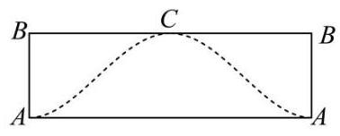

2026 届崇明区高三下二模数学试卷

## 一、填空题

1. 集合 $A = \{ 2,4,6,8,{10}\} , B = \left( {-1,6}\right)$ ，则 $A \cap  B =$ ___.

【答案】 $\{ 2,4\}$

【解析】由题意得, $A \cap  B = \{ 2,4\}$ .

2. 不等式 $\left| {x - 1}\right|  < 2$ 的解为___.

【答案】 $\{ x \mid   - 1 < x < 3\}$

【解析】 $\because \left| {x - 1}\right|  < 2$ ,

$\therefore  - 2 < x - 1 < 2$ ,解得 $- 1 < x < 3$ ,

故不等式 $\left| {x - 1}\right|  < 2$ 的解为 $\{ x \mid   - 1 < x < 3\}$ .

3. 若复数 $z$ 满足 $\frac{z}{1 + \mathrm{i}} = \mathrm{i}$ ( $\mathrm{i}$ 为虚数单位),则 $z =$ ___.

【答案】 $- 1 + \mathrm{i}$

【解析】因为 $\frac{z}{1 + \mathrm{i}} = \mathrm{i}$ ,所以 $z = \left( {1 + \mathrm{i}}\right) \mathrm{i} = \mathrm{i} + {\mathrm{i}}^{2} = \mathrm{i} - 1$ ,

所以 $z =  - 1 + \mathrm{i}$

4. 已知向量 $\overrightarrow{a} = \left( {k,2}\right)$ ， $\overrightarrow{b} = \left( {2,1}\right)$ ，若 $\overrightarrow{a}\bot \overrightarrow{b}$ ，则实数 $k =$ ___.

【答案】 -1

【解析】由 $\overrightarrow{a} \bot  \overrightarrow{b}$ 得 $\overrightarrow{a} \cdot  \overrightarrow{b} = 0$ ,

$\therefore {2k} + 2 = 0,\therefore k =  - 1$ .

5. 若 $x > 0, y > 0$ ，且 ${xy} = 1$ ，则 $x + {2y}$ 的最小值为___.

【答案】 $2\sqrt{2}$

【解析】由基本不等式可得 $x + {2y} \geq  2\sqrt{2xy} = 2\sqrt{2}$ ,

当且仅当 $x = {2y}$ ,即 $x = \sqrt{2}, y = \frac{\sqrt{2}}{2}$ 时等号成立,

所以 $x + {2y}$ 的最小值为 $2\sqrt{2}$ .

6. 已知 $\cos \theta  =  - \frac{3}{5}$ ，则 $\cos {2\theta }$ 的值为___.

【答案】 $- \frac{7}{25}$

【解析】由 $\cos \theta  =  - \frac{3}{5}$ ,则 $\cos {2\theta } = 2{\cos }^{2}\theta  - 1 = 2 \times  \frac{9}{25} - 1 =  - \frac{7}{25}$ .

7. 从一副去掉大小王的 52 张扑克牌中随机抽取一张牌,事件 $A$ 表示 “取得的牌面是 $A$ ”,事件 $B$ 表示“取得的牌的花色是黑桃”，则 $P\left( {B \mid  A}\right)$ 为___.

【答案】 $\frac{1}{4}$

【解析】 $P\left( A\right)  = \frac{4}{52} = \frac{1}{13}, P\left( {AB}\right)  = \frac{1}{52}$ ,故 $P\left( {B \mid  A}\right)  = \frac{P\left( {AB}\right) }{P\left( A\right) } = \frac{\frac{1}{52}}{\frac{1}{13}} = \frac{1}{4}$ .

8. 在 $\bigtriangleup  {ABC}$ 中，角 $A$ 、 $B$ 、 $C$ 所对的边长分别为 $a$ 、 $b$ 、 $c$ . 若 $A = {45}^{ \circ  }$ ， $C = {30}^{ \circ  }$ ， $c = \sqrt{2}$ ，则 $a =$ ___.

【答案】 2

【解析】由正弦定理得 $\frac{a}{\sin {45}^{ \circ  }} = \frac{\sqrt{2}}{\sin {30}^{ \circ  }}$ ,解得 $a = \frac{\sqrt{2}\sin {45}^{ \circ  }}{\sin {30}^{ \circ  }} = 2$ .

9. 已知 ${\left( x - 1\right) }^{3} + {\left( x + 1\right) }^{4} = {x}^{4} + {a}_{1}{x}^{3} + {a}_{2}{x}^{2} + {a}_{3}x + {a}_{4}$ ,则 ${a}_{1} =$ ___.

【答案】 5

【解析】由题意, ${a}_{1}$ 为 ${x}^{3}$ 的系数, ${\left( x - 1\right) }^{3}$ 和 ${\left( x + 1\right) }^{4}$ 的展开式中都包含 ${x}^{3}$ 项,

故 ${a}_{1}{x}^{3} = {\mathrm{C}}_{3}^{0}{x}^{3} + {\mathrm{C}}_{4}^{1}{x}^{3} \times  1 = 5{x}^{3}$ ,

故 ${a}_{1} = 5$

10. 如图,已知圆柱的一个截面边界是椭圆 $\Gamma$ ,其中 $\Gamma$ 的长轴 ${AC}$ 为该圆柱轴截面的对角线,短轴长等于圆柱底面直径的长. 将圆柱侧面沿母线 ${AB}$ 展开,则椭圆 $\Gamma$ 在展开图中恰好为一个周期的三角函数图像. 若该段曲线是函数 $y = 1 - \sqrt{3}\sin \frac{x}{2}$ 的图像的一部分,则椭圆 $\Gamma$ 的离心率为

C

【答案】 $\frac{\sqrt{21}}{7}$

【解析】函数 $y = 1 - \sqrt{3}\sin \frac{x}{2}$ 的值域为 $\left\lbrack  {1 - \sqrt{3},1 + \sqrt{3}}\right\rbrack$ ,最小正周期 $T = \frac{2\pi }{\frac{1}{2}} = {4\pi }$ ,

依题意,圆柱的高 $h = \left| {AB}\right|  = 2\sqrt{3}$ ,设圆柱的底面半径为 $r$ ,则 ${2\pi r} = {4\pi }$ ,解得 $r = 2$ ,

椭圆短轴长 ${2b} = {2r} = 4$ ,即 $b = 2$ ,长轴长 ${2a} = \sqrt{{h}^{2} + {\left( 2r\right) }^{2}} = 2\sqrt{7}$ ,即 $a = \sqrt{7}$ ,

所以椭圆的离心率 $e = \frac{\sqrt{{a}^{2} - {b}^{2}}}{a} = \sqrt{1 - \frac{{b}^{2}}{{a}^{2}}} = \frac{\sqrt{21}}{7}$ .

11. 设 ${f}_{1}\left( x\right)  = \sin x,{f}_{2}\left( x\right)  = \cos \left( {x + \frac{\pi }{6}}\right)$ . 若对任意 $t \in  \mathbf{R}$ ,存在 $i \in  \{ 1,2\}$ 使得函数 $y = {f}_{i}\left( x\right)$ 在区间 $\left\lbrack  {t, t + a}\right\rbrack  \left( {a > 0}\right)$ 上是单调函数，则实数 $a$ 的取值范围是___.

【答案】 $(0,\frac{\pi }{3}\rbrack$

【解析】 ${f}_{1}\left( x\right)  = \sin x$ ,由正弦函数的性质得到单调区间的分界点 $x = \frac{\pi }{2} + {k\pi }, k \in  \mathrm{Z}$ ,

相邻分界点间隔为 $\pi$ ,因此每个单调区间的长度为 $\pi$ ;

${f}_{2}\left( x\right)  = \cos \left( {x + \frac{\pi }{6}}\right)$ ,令 $x + \frac{\pi }{6} = {l\pi }, l \in  \mathrm{Z}$ ,则 $x = {l\pi } - \frac{\pi }{6}, l \in  \mathrm{Z}$ ,

故单调区间的分界点 $x = {k\pi } - \frac{\pi }{6},\;k \in  \mathrm{Z}$ ,

相邻分界点间隔为 $\pi$ ,因此每个单调区间的长度为 $\pi$ .

两类分界点合并排序,可发现它们交替排列,相邻两个不同类型的分界点的间隔交替为 $\frac{\pi }{3}$ 和 $\frac{2\pi }{3}$ ,

所以两类分界点之间的最小距离为 $\frac{\pi }{3}$ ,所以 $a \leq  \frac{\pi }{3}$ ,又 $a > 0$ ,所以 $a$ 的取值范围是 $\left( {0,\frac{\pi }{3}}\right\rbrack$ .

12. 已知首项为 1 的等比数列 $\left\{  {a}_{n}\right\}$ 满足对任意的正整数 $m, n$ 都有 $\left| {{a}_{m} - {a}_{n}}\right|  \leq  \frac{1}{3}\left| {m - n}\right|$ ,则等比数列 $\left\{  {a}_{n}\right\}$ 的公比 $q$ 的取值范围是___.

【答案】 $\frac{2}{3} \leq  q \leq  1$

【解析】由题意可得 ${a}_{n} = {a}_{1}{q}^{n - 1} = {q}^{n - 1}$ ,取 $k = m - 1 \in  \mathbf{N}$ ,

当 $n = 1$ 时,有 $\left| {{a}_{m} - {a}_{n}}\right|  = \left| {{q}^{k} - 1}\right|  \leq  \frac{1}{3}k$ ,

当 $k = 1$ 时,有 $\left| {q - 1}\right|  \leq  \frac{1}{3}$ ,故 $\frac{2}{3} \leq  q \leq  \frac{4}{3}$ ;

若 $\left| q\right|  > 1$ ,则当 $k \rightarrow   + \infty$ 时,指数函数增速会大于一次函数,

故 $\left| {{q}^{k} - 1}\right|  \leq  \frac{1}{3}k$ 不可能恒成立,故 $\left| q\right|  \leq  1$ ;

综上可得 $\frac{2}{3} \leq  q \leq  1$ ;

下证充分性: 当 $\frac{2}{3} \leq  q \leq  1$ 时,不妨设 $m \geq  n$ ,则 ${a}_{m} \leq  {a}_{n}$ ,

故需满足 ${a}_{n} - {a}_{m} \leq  \frac{1}{3}\left( {m - n}\right)$ ,即 ${a}_{n} + \frac{1}{3}n \leq  {a}_{m} + \frac{1}{3}m$ ,

令 ${b}_{n} = {q}^{n - 1} + \frac{1}{3}n$ ,则只需满足数列 $\left\{  {b}_{n}\right\}$ 为非递减数列即可,

${b}_{n + 1} - {b}_{n} = {q}^{n} + \frac{1}{3}n + \frac{1}{3} - {q}^{n - 1} - \frac{1}{3}n = {q}^{n} - {q}^{n - 1} + \frac{1}{3} = {q}^{n - 1}\left( {q - 1}\right)  + \frac{1}{3},$

由 $\frac{2}{3} \leq  q \leq  1$ ,则 $q - 1 \in  \left\lbrack  {-\frac{1}{3},0}\right\rbrack  ,{q}^{n - 1} \leq  1$ ,

则 ${b}_{n + 1} - {b}_{n} = {q}^{n - 1}\left( {q - 1}\right)  + \frac{1}{3} \geq   - \frac{1}{3} + \frac{1}{3} = 0$ ,

故数列 $\left\{  {b}_{n}\right\}$ 为非递减数列,

即 $\frac{2}{3} \leq  q \leq  1$ 时符合题意.

## 二、单选题

13. 在空间内, 异面直线所成角的取值范围是( )

A. $\left( {0,\frac{\pi }{2}}\right)$ B. $\left( {0,\frac{\pi }{2}}\right\rbrack$ C. $\left\lbrack  {0,\frac{\pi }{2}}\right)$ D. $\left\lbrack  {0,\frac{\pi }{2}}\right\rbrack$

【答案】B

【解析】由异面直线所成角的定义可知,过空间一点分别作相应直线的平行线,两条相交直线所成的直角或锐角为异面直线所成角,所以两条异面直线所成角的取值范围是 $\left( {0,\frac{\pi }{2}}\right\rbrack$ ,

故选 B.

14. 下列函数中,在 $\mathbf{R}$ 上为严格增函数的是( )

A. $y = {x}^{2}$ B. $y = \left| x\right|$ C. $y = \sin x$ D. $y = {x}^{3}$

【答案】D

【解析】对于 $\mathrm{A}, y = {x}^{2}$ 是定义在 $\mathbf{R}$ 上的偶函数,

在区间 $\left( {-\infty ,0}\right)$ 上单调递减,在区间 $\left( {0, + \infty }\right)$ 上单调递增,故 $\mathrm{A}$ 不符合题意;

对于 $\mathrm{B}, y = \left| x\right|$ 是定义在 $\mathbf{R}$ 上的偶函数,

在区间 $\left( {-\infty ,0}\right)$ 上单调递减,在区间 $\left( {0, + \infty }\right)$ 上单调递增,故 $\mathrm{B}$ 不符合题意;

对于 $\mathrm{C}, y = \sin x$ 是定义在 $\mathbf{R}$ 上的周期函数,

在区间 $\left\lbrack  {-\frac{\pi }{2} + {2k\pi },\frac{\pi }{2} + {2k\pi }}\right\rbrack  , k \in  \mathbf{Z}$ 上单调递增,在区间 $\left\lbrack  {\frac{\pi }{2} + {2k\pi },\frac{3\pi }{2} + {2k\pi }}\right\rbrack  , k \in  \mathbf{Z}$ 上单调递减,故 $\mathrm{C}$ 不符合题意;

对于 $\mathrm{D},\;y = {x}^{3}$ 在 $\mathbf{R}$ 上为严格增函数,故 $\mathrm{D}$ 符合题意.

15. 已知 $A\left( {-a,0}\right) , B\left( {a,0}\right) ,{l}_{1} : {ax} - y = 0,{l}_{2} : {ax} + y = 0$ ,其中 $a > 1$ ,点 $P$ 为平面内一点,记点 $P$ 到 ${l}_{1}$ , ${l}_{2}$ 的距离分别为 ${d}_{1},{d}_{2}$ ,则下列条件中能使点 $P$ 的轨迹为椭圆的是 ( )

A. $\left| {PA}\right|  + \left| {PB}\right|  = {2a}$ B. ${\left| PA\right| }^{2} + {\left| PB\right| }^{2} = 4{a}^{2}$

C. ${d}_{1}^{2} + {d}_{2}^{2} = 4{a}^{2}$ D. ${d}_{1} + {d}_{2} = {4a}$

【答案】C

【解析】对于 $\mathrm{A}$ ,因为 $\left| {PA}\right|  + \left| {PB}\right|  = {2a} = \left| {AB}\right|$ ,所以 $P$ 点轨迹为线段 ${AB}$ ,故 $\mathrm{A}$ 错误;

对于 $\mathrm{B}$ ,设 $P\left( {x, y}\right)$ ,则由 ${\left( x + a\right) }^{2} + {y}^{2} + {\left( x - a\right) }^{2} + {y}^{2} = 4{a}^{2} \Rightarrow  {x}^{2} + {y}^{2} = {a}^{2}$ ,所以 $P$ 点轨迹为圆,故 $\mathrm{B}$ 错误;

对于 $\mathrm{C}$ ,由 ${\left( \frac{\left| ax - y\right| }{\sqrt{{a}^{2} + 1}}\right) }^{2} + {\left( \frac{\left| ax + y\right| }{\sqrt{{a}^{2} + 1}}\right) }^{2} = 4{a}^{2} \Rightarrow  {a}^{2}{x}^{2} + {y}^{2} = 2{a}^{2}\left( {{a}^{2} + 1}\right)$ ,

因为 $a > 1$ ,方程可化为 $\frac{{x}^{2}}{2\left( {{a}^{2} + 1}\right) } + \frac{{y}^{2}}{2{a}^{2}\left( {{a}^{2} + 1}\right) } = 1$ ,所以 $P$ 点轨迹为椭圆,故 $\mathrm{C}$ 正确;

对于 $\mathrm{D}$ ,由 $\frac{\left| ax - y\right| }{\sqrt{{a}^{2} + 1}} + \frac{\left| ax + y\right| }{\sqrt{{a}^{2} + 1}} = {4a} \Rightarrow  \left| {{ax} - y}\right|  + \left| {{ax} + y}\right|  = {4a}\sqrt{{a}^{2} + 1}$ ,

① 当 ${ax} - y \geq  0$ 且 ${ax} + y \geq  0$ ,即 $- {ax} \leq  y \leq  {ax}$ 时,

去绝对值可得 ${ax} - y + {ax} + y = {4a}\sqrt{{a}^{2} + 1}$ ,即 $x = 2\sqrt{{a}^{2} + 1}$ ,

此时结合约束条件 $- {2a}\sqrt{{a}^{2} + 1} \leq  y \leq  {2a}\sqrt{{a}^{2} + 1}$ 可知点 $P$ 的轨迹为垂直于 $x$ 轴的线段;

② 当 ${ax} - y \geq  0$ 且 ${ax} + y < 0$ ,即 $y <  - {ax}$ 且 $y \leq  {ax}$ ,

去绝对值可得 ${ax} - y - {ax} - y = {4a}\sqrt{{a}^{2} + 1}$ ,即 $y =  - {2a}\sqrt{{a}^{2} + 1}$ ,

此时结合约束条件 $- 2\sqrt{{a}^{2} + 1} \leq  x < 2\sqrt{{a}^{2} + 1}$ 可知点 $P$ 的轨迹为垂直于 $y$ 轴的线段;

③ 当 ${ax} - y < 0$ 且 ${ax} + y < 0$ ，即 $y <  - {ax}$ 且 $y > {ax}$ ，

去绝对值可得 $- {ax} + y - {ax} - y = {4a}\sqrt{{a}^{2} + 1}$ ,即 $x =  - 2\sqrt{{a}^{2} + 1}$ ,

此时结合约束条件 $- {2a}\sqrt{{a}^{2} + 1} < y < {2a}\sqrt{{a}^{2} + 1}$ 可知点 $P$ 的轨迹为垂直于 $x$ 轴的线段;

④ 当 ${ax} - y < 0$ 且 ${ax} + y \geq  0$ ,即 $y > {ax}$ 且 $- {ax} \leq  y$ ,

去绝对值可得 $- {ax} + y + {ax} + y = {4a}\sqrt{{a}^{2} + 1}$ ,即 $y = {2a}\sqrt{{a}^{2} + 1}$ ,

此时结合约束条件 $- 2\sqrt{{a}^{2} + 1} \leq  x < 2\sqrt{{a}^{2} + 1}$ 可知点 $P$ 的轨迹为垂直于 $y$ 轴的线段;

综上可知 $P$ 点轨迹为四条线段,故 $\mathrm{D}$ 错误.

16. 已知函数 $y = f\left( x\right) , x \in  \mathbf{R}$ . 定义集合 $M = \left\{  {{x}_{0} \mid  \text{ 对任意的 }x > {x}_{0}\text{ ,都有 }f\left( x\right)  \leq  f\left( {x}_{0}\right) }\right\}$ . 对于所有使得 $M = \left\lbrack  {-1,2}\right\rbrack$ 的函数 $y = f\left( x\right)$ ,有以下两个命题: ①存在函数 $y = f\left( x\right)$ 在 $x =  - 2$ 处取极小值; ②存在函数 $y = f\left( x\right)$ 图像是连续曲线. 下列判断正确的是( )

A. ①②都真 B. ①真②假 C. ①假②真 D. ①②都假

【答案】A

【解析】根据题意可知集合 $M$ 为函数 $y = f\left( x\right)$ 的非严格单调递增区间,

不妨令函数 $f\left( x\right)  =  - \frac{1}{3}{x}^{3} - \frac{3}{2}{x}^{2} - {2x}$ ,易知 ${f}^{\prime }\left( x\right)  =  - {x}^{2} - {3x} - 2 =  - \left( {x + 1}\right) \left( {x + 2}\right)$ ,

因此当 $x \in  \left( {-2, - 1}\right)$ 时， ${f}^{\prime }\left( x\right)  > 0$ ，当 $x \in  \left( {-\infty , - 2}\right)$ 或 $\left( {-1, + \infty }\right)$ 时， ${f}^{\prime }\left( x\right)  < 0$ ，

可知 $f\left( x\right)$ 在 $\left( {-2, - 1}\right)$ 上单调递增,在 $\left( {-\infty , - 2}\right)$ 和 $\left( {-1, + \infty }\right)$ 上单调递减,

此时函数 $f\left( x\right)  =  - \frac{1}{3}{x}^{3} - \frac{3}{2}{x}^{2} - {2x}$ 满足在 $M = \left\lbrack  {-1,2}\right\rbrack$ 上单调递减，满足题意，

即存在函数 $y = f\left( x\right)$ 在 $x =  - 2$ 处取极小值,且是连续曲线,因此①②都真.

## 三、解答题

17. 如图，在直三棱柱 ${ABC} - {A}_{1}{B}_{1}{C}_{1}$ 中， ${AB} = {BC} = \sqrt{2},{AC} = {A{A}_{1}} = 2$ ，且 $D, E$ 分别是 ${AC},{A}_{1}{C}_{1}$ 的中点.

(1)证明: $D{C}_{1}//$ 平面 ${ABE}$ ；

(2)求三棱锥 ${C}_{1} - {ABE}$ 的体积.

【答案】(1)见解析; (2) $\frac{1}{3}$

【解析】(1) 由直三棱柱性质可得 ${A}_{1}{C}_{1} = {AC},{A}_{1}{C}_{1}//{AC}$ ,

由 $D, E$ 分别是 ${AC},{A}_{1}{C}_{1}$ 的中点,则 ${C}_{1}E = {AD},{C}_{1}E//{AD}$ ,

则四边形 ${AD}{C}_{1}E$ 是平行四边形,故 $D{C}_{1}//{AE}$ ,

又 ${AE} \subset$ 平面 ${ABE}, D{C}_{1} \text{ ⊄ }$ 平面 ${ABE}$ ,故 $D{C}_{1}//$ 平面 ${ABE}$ ;

(2)由 ${AB} = {BC} = \sqrt{2},{AC} = 2$ ，则 ${A{B}^{2}} + {B{C}^{2}} = {A{C}^{2}}$ ，

故 $\bigtriangleup  {ABC}$ 为等腰直角三角形，则点 $D$ 到 ${AB}$ 的距离为 $\frac{1}{2}{BC} = \frac{\sqrt{2}}{2}$ ，

则点 $E$ 到 ${A}_{1}{B}_{1}$ 的距离为 $d = \frac{\sqrt{2}}{2}$ ,

由 $E$ 为 ${A}_{1}{C}_{1}$ 的中点,则点 ${A}_{1}$ 与点 ${C}_{1}$ 到平面 ${ABE}$ 的距离相等,

故 ${V}_{{C}_{1} - {ABE}} = {V}_{{A}_{1} - {ABE}} = {V}_{E - {A}_{1}{BA}} = \frac{1}{3}{S}_{\bigtriangleup {A}_{1}{BA}} \cdot  d = \frac{1}{3} \times  \frac{1}{2} \times  2 \times  \sqrt{2} \times  \frac{\sqrt{2}}{2} = \frac{1}{3}$ .

18. 2025 年 11 月, 教育部等五部门联合印发《关于实施学生体质强健计划的意见》, 明确要求“中小学生每天综合体育活动时间不少于 2 小时”. 某学校为了解政策落实情况及其对学生视力的影响，随机抽取了 100 名学生进行每周累计体育活动时长的调查, 得到如下频率分布表:

<table><tr><td>每周活动总时长 (单位:时)</td><td>$\lbrack 0,7)$</td><td>$\lbrack 7,{14})$</td><td>$\lbrack {14},{21})$</td><td>$\lbrack {21},{28})$</td><td>[28,35]</td></tr><tr><td>频率</td><td>0.15</td><td>0.25</td><td>0.35</td><td>0.15</td><td>0.1</td></tr></table>

同时，对这 100 名学生的视力进行了检查，将视力达到 5.0 及以上定为“视力良好”，低于 5.0 定为“视力一般”，得到如下 $2 \times  2$ 列联表 (部分数据缺失):

<table><tr><td></td><td>视力良好</td><td>视力一般</td><td>合计</td></tr><tr><td>活动时间达标 (不少于 14 小时)</td><td>40</td><td></td><td></td></tr><tr><td>活动时间未达标 (低于 14 小时)</td><td></td><td>30</td><td></td></tr><tr><td>合计</td><td></td><td></td><td>100</td></tr></table>

(1)从活动时长在 $\left\lbrack  {0,7}\right)$ 和 $\left\lbrack  {{28},{35}}\right\rbrack$ 的学生中，按比例分层随机抽样抽取 5 人进行座谈. 若从文 5 人中随机抽取 2 人，设 $X$ 为抽取的 2 人中活动时长在 $\left\lbrack  {{28},{35}}\right\rbrack$ 的人数，求 $X$ 的分布列和数学期望 $E\left\lbrack  X\right\rbrack$ ；

(2)依据 $\alpha  = {0.05}$ 的独立性检验，判断是否有 95%的把握认为“视力情况”与“体育活动时长是否达标”有关. 参考公式及数据:

① ${\chi }^{2} = \frac{n{\left( ad - bc\right) }^{2}}{\left( {a + b}\right) \left( {c + d}\right) \left( {a + c}\right) \left( {b + d}\right) }$ ，其中 $n = a + b + c + d$ .

② $P\left( {{\chi }^{2} \geq  {6.635}}\right)  \approx  {0.01}$ ， $P\left( {{\chi }^{2} \geq  {5.024}}\right)  \approx  {0.025}$ ， $P\left( {{\chi }^{2} \geq  {3.841}}\right)  \approx  {0.05}$ ， $P\left( {{\chi }^{2} \geq  {2.706}}\right)  \approx  {0.1}$ .

【答案】(1)

<table><tr><td>$X$</td><td>0</td><td>1</td><td>2</td></tr><tr><td>$P$</td><td>$\frac{3}{10}$</td><td>3 5</td><td>$\frac{1}{10}$</td></tr></table>

$E\left( X\right)  = {0.8}$ ; (2)有 95%的把握认为“视力情况”与“体育活动时长是否达标”有关.

【解析】(1) 由于 $\left\lbrack  {0,7}\right)$ 和 $\left\lbrack  {{28},{35}}\right\rbrack$ 频率分别为 ${0.15},{0.1},\frac{0.15}{0.1} = \frac{3}{2}$ ,

则按比例分层随机抽样,抽取 5 人进行座谈,有 3 人来自 $\lbrack 0,7),2$ 人来自 $\lbrack {28},{35}\rbrack$ ,

由题意 $X$ 的可能取值为0,1,2,

$P\left( {X = 0}\right)  = \frac{{\mathrm{C}}_{3}^{2}}{{\mathrm{C}}_{5}^{2}} = \frac{3}{10},$

$P\left( {X = 1}\right)  = \frac{{\mathrm{C}}_{3}^{1}{\mathrm{C}}_{2}^{1}}{{\mathrm{C}}_{5}^{2}} = \frac{3}{5},$

$P\left( {X = 2}\right)  = \frac{{\mathrm{C}}_{2}^{2}}{{\mathrm{C}}_{5}^{2}} = \frac{1}{10},$

所以 $X$ 的分布列是:

<table><tr><td>$X$</td><td>0</td><td>1</td><td>2</td></tr><tr><td>$P$</td><td>3</td><td>3 5</td><td>$\frac{1}{10}$</td></tr></table>

$E\left( X\right)  = 0 \times  \frac{3}{10} + 1 \times  \frac{3}{5} + 2 \times  \frac{1}{10} = {0.8}.$

(2)由题意活动时间达标人数为 ${100} \times  \left( {{0.35} + {0.15} + {0.1}}\right)  = {60}$ ,

活动时间未达标人数为 ${100} \times  \left( {{0.15} + {0.25}}\right)  = {40}$ ,

故列联表如下:

<table id="cross-table-1"><tr><td></td><td>视力良好</td><td>视力一般</td><td>合计</td></tr><tr><td>活动时间达标 (不少</td><td>40</td><td>20</td><td>60</td></tr><tr><td>于 14 小时)</td><td></td><td></td><td></td></tr><tr><td>活动时间未达标 (低于 14 小时)</td><td>10</td><td>30</td><td>40</td></tr><tr><td>合计</td><td>50</td><td>50</td><td>100</td></tr></table>

零假设 ${H}_{0}$ : “视力情况”与“体育活动时长是否达标”无关.

根据列联表数据,计算 ${\chi }^{2} = \frac{{100}{\left( {40} \times  {30} - {20} \times  {10}\right) }^{2}}{\left( {{40} + {20}}\right) \left( {{10} + {30}}\right) \left( {{40} + {10}}\right) \left( {{20} + {30}}\right) } = \frac{100}{6} \approx  {16.667} > {3.841}$ ,

根据小概率值 $\alpha  = {0.05}$ 的独立性检验,判断 ${H}_{0}$ 不成立,

所以有 95%的把握认为“视力情况”与“体育活动时长是否达标”有关.

19. 设函数 $f\left( x\right)  = {x}^{2} - x + a\ln x, a \in  \mathbf{R}$ .

(1)若 $a = 1$ ，求 $f\left( x\right)$ 的图象在 $x = 1$ 处的切线方程；

(2)若 $f\left( x\right)  \geq  0$ 在 $\lbrack 1, + \infty )$ 上恒成立，求 $a$ 的取值范围；

【答案】(1) ${2x} - y - 2 = 0$ ; (2) $\lbrack  - 1, + \infty )$

【解析】(1) $a = 1$ 时, $f\left( x\right)  = {x}^{2} - x + \ln x$ ,对函数求导得 ${f}^{\prime }\left( x\right)  = {2x} - 1 + \frac{1}{x}$ .

所以 ${f}^{\prime }\left( 1\right)  = 2 - 1 + \frac{1}{1} = 2, f\left( 1\right)  = 0$ .

所以 $f\left( x\right)$ 的图象在 $x = 1$ 处的切线方程为 $y - 0 = 2\left( {x - 1}\right)$ ,即 ${2x} - y - 2 = 0$ .

(2)由 $f\left( x\right)  = {x}^{2} - x + a\ln x$ 得 ${f}^{\prime }\left( x\right)  = {2x} - 1 + \frac{a}{x} = \frac{2{x}^{2} - x + a}{x}$ .

因为 $2{x}^{2} - x + a = 2{\left( x - \frac{1}{4}\right) }^{2} - \frac{1}{8} + a$ 在 $\lbrack 1, + \infty )$ 上单调递增,所以 ${\left( 2{x}^{2} - x + a\right) }_{\text{ min }} = 1 + a$ .

若 $a \geq   - 1$ ,则 ${f}^{\prime }\left( x\right)  \geq  0$ 在 $\lbrack 1, + \infty )$ 上恒成立,所以 $f\left( x\right)$ 在 $\lbrack 1, + \infty )$ 上单调递增,

又 $f\left( 1\right)  = 0$ ,所以 $f\left( x\right)  \geq  0$ 在 $\lbrack 1, + \infty )$ 上恒成立,

若 $a <  - 1$ ,令 ${f}^{\prime }\left( x\right)  = 0$ 得 $x = \frac{1 - \sqrt{1 - {8a}}}{4}$ 或 $x = \frac{1 + \sqrt{1 - {8a}}}{4}$ ,且 $\frac{1 - \sqrt{1 - {8a}}}{4} < 0,\frac{1 + \sqrt{1 - {8a}}}{4} > 1$ .

当 $x \in  \left( {1,\frac{1 + \sqrt{1 - {8a}}}{4}}\right)$ 时, ${f}^{\prime }\left( x\right)  < 0, f\left( x\right)$ 单调递减,

所以 $f\left( x\right)  < f\left( 1\right)  = 0$ ,与 $f\left( x\right)  \geq  0$ 在 $\lbrack 1, + \infty )$ 上恒成立矛盾,

综上所述, $a$ 的取值范围是 $\lbrack  - 1, + \infty )$ .

20. 已知椭圆 $C : \frac{{x}^{2}}{4} + \frac{{y}^{2}}{3} = 1$ .

(1)求椭圆 $C$ 的离心率 $e$ ；

(2)已知椭圆右顶点为 $A$ ，设点 $M$ 为 $y$ 轴正半轴上一点，点 $P$ 为椭圆 $C$ 上的一点. 若 $\overrightarrow{AP} = 2\overrightarrow{PM}$ ，求点 $M$ 的坐标;

(3)已知 $G\left( {\frac{5}{2},0}\right)$ ,过点 $R\left( {4,0}\right)$ 的直线交椭圆 $C$ 于 $D, E$ 两点,直线 ${DG}$ 交直线 $x = 1$ 于点 $H$ ,证明: ${EH} \bot  y$ 轴.

【答案】 $\left( 1\right) \frac{1}{2};\left( 2\right) \left( {0,\sqrt{6}}\right) ;\left( 3\right)$ 见解析.

【解析】(1) 记椭圆 $C : \frac{{x}^{2}}{4} + \frac{{y}^{2}}{3} = 1$ 的长轴长为 ${2a}$ ,短轴长为 ${2b}$ ,焦距为 ${2c}$ ,

则 $a = 2, b = \sqrt{3}, c = \sqrt{{a}^{2} - {b}^{2}} = 1$ ,所以离心率 $e = \frac{c}{a} = \frac{1}{2}$ .

(2)由题知， $A\left( {2,0}\right)$ ，设 $M\left( {0, m}\right) , m > 0$ ， $P\left( {{x}_{P},{y}_{P}}\right)$ ，

因为 $\overrightarrow{AP} = \left( {{x}_{P} - 2,{y}_{P}}\right) ,\overrightarrow{PM} = \left( {-{x}_{P}, m - {y}_{P}}\right) ,\overrightarrow{AP} = 2\overrightarrow{PM}$ ,

所以 $\left( {{x}_{P} - 2,{y}_{P}}\right)  = 2\left( {-{x}_{P}, m - {y}_{P}}\right)$ ,得 ${x}_{P} = \frac{2}{3},{y}_{P} = \frac{2m}{3}$ ,

代入椭圆方程得 $\frac{1}{9} + \frac{4{m}^{2}}{27} = 1$ ，解得 $m = \sqrt{6}$ (负根舍去)

(3)易知，当直线 ${DE}$ 斜率为 0 时， $D, E$ 为长轴端点， $H$ 与右焦点重合，满足题意；

设直线 ${DE}$ 的方程为 $x = {ny} + 4, D\left( {{x}_{1},{y}_{1}}\right) , E\left( {{x}_{2},{y}_{2}}\right)$ ,

联立 $\left\{  \begin{array}{l} \frac{{x}^{2}}{4} + \frac{{y}^{2}}{3} = 1 \\  x = {ny} + 4 \end{array}\right.$ 得: $\left( {3{n}^{2} + 4}\right) {y}^{2} + {24ny} + {36} = 0$ ,

由 $\Delta  = {\left( {24}n\right) }^{2} - 4\left( {3{n}^{2} + 4}\right)  \times  {36} = {144}\left( {{n}^{2} - 4}\right)  > 0$ 得 $n <  - 2$ 或 $n > 2$ ,

则 ${y}_{1} + {y}_{2} = \frac{-{24n}}{3{n}^{2} + 4},{y}_{1}{y}_{2} = \frac{36}{3{n}^{2} + 4}$ ,

所以 $3\left( {{y}_{1} + {y}_{2}}\right)  =  - {2n}{y}_{1}{y}_{2}$ ,则 ${y}_{2} = \frac{-3{y}_{1}}{3 + {2n}{y}_{1}}$ ,

设 $H\left( {1, h}\right)$ ,因为 $D, H, G$ 三点共线,则 $\overrightarrow{DH}//\overrightarrow{HG},\overrightarrow{DH} = \left( {1 - {x}_{1}, h - {y}_{1}}\right) ,\overrightarrow{HG} = \left( {\frac{3}{2}, - h}\right)$ ,

所以 $- h\left( {1 - {x}_{1}}\right)  = \frac{3}{2}\left( {h - {y}_{1}}\right)$ ,则 $h = \frac{3{y}_{1}}{5 - 2{x}_{1}} = \frac{3{y}_{1}}{5 - 2\left( {n{y}_{1} + 4}\right) } = \frac{-3{y}_{1}}{3 + {2n}{y}_{1}}$ ,

所以 $h = {y}_{2}$ ,所以 ${EH} \bot  y$ 轴.

21. 函数 $y = f\left( x\right) , x \in  \mathbf{R}$ 是减函数,即对于任意的 ${x}_{1},{x}_{2} \in  \mathbf{R}$ ,当 ${x}_{1} < {x}_{2}$ 时,均有 $f\left( {x}_{1}\right)  \geq  f\left( {x}_{2}\right)$ .

(1)若 $f\left( x\right)  =  - {x}^{3} + {ax}$ ，求实数 $a$ 的取值范围；

( 2 )是否存在函数 $y = f\left( x\right)$ 是偶函数，且满足 $f\left( {f\left( x\right) }\right)  = x$ 对所有 $x \in  \mathbf{R}$ 成立？若存在，请举出一个满足条件的函数, 若不存在, 请说明理由;

(3) 设 $g\left( x\right)  = \sin x$ ，已知函数 $h\left( x\right)  = f\left( x\right)  + g\left( x\right)$ 是周期函数，求证: $f\left( x\right)$ 为常值函数.

【答案】( 1 ) $\left( {-\infty ,0\rbrack \text{ ; (2)不存在，见解析；(3)见解析 }}\right)$

【解析】(1) $f\left( x\right)$ 为减函数,则 ${f}^{\prime }\left( x\right)  =  - 3{x}^{2} + a \leq  0$ 即 $a \leq  3{x}^{2}$ 恒成立,所以 $a \leq  0$ .

(2)因为 $f\left( x\right)$ 为减函数，取任意实数 ${x}_{1}$ ， ${x}_{2}$ ，设 ${x}_{1} < {x}_{2}$ ，则有 $f\left( {x}_{1}\right)  \geq  f\left( {x}_{2}\right)$ ，

又 $f\left( x\right)$ 为偶函数即有 $f\left( x\right)  = f\left( {-x}\right)$ ,可得 $f\left( {-{x}_{1}}\right)  \geq  f\left( {-{x}_{2}}\right)$ ,

同时根据单调性由 $- {x}_{1} >  - {x}_{2}$ 可得 $f\left( {-{x}_{1}}\right)  \leq  f\left( {-{x}_{2}}\right)$ ,所以 $f\left( {-{x}_{1}}\right)  = f\left( {-{x}_{2}}\right)$

即 $f\left( {x}_{1}\right)  = f\left( {x}_{2}\right)$ 对任意实数 ${x}_{1},{x}_{2}$ 成立,所以 $f\left( x\right)$ 为常值函数,设 $f\left( x\right)  = C$ ,

则 $f\left( {f\left( x\right) }\right)  = f\left( C\right)  = C$ ,

当 $x \neq  C$ 时, $f\left( {f\left( x\right) }\right)  = x$ 不成立,所以不存在满足条件的函数.

(3)设函数 $h\left( x\right)$ 的正周期为 $T$ 即对任意 $x \in  \mathbf{R}$ 都有 $f\left( x\right)  + g\left( x\right)  = f\left( {x + T}\right)  + g\left( {x + T}\right)$ ，

因为 $x < x + T$ ,根据 $f\left( x\right)$ 为减函数可知 $f\left( x\right)  \geq  f\left( {x + T}\right)$ ,所以 $g\left( x\right)  \leq  g\left( {x + T}\right)$ ,

那么有 $g\left( {x + \pi }\right)  \leq  g\left( {x + \pi  + T}\right)$ ,因为 $g\left( {x + \pi }\right)  = \sin \left( {x + \pi }\right)  =  - \sin x =  - g\left( x\right)$ ,

所以 $- g\left( x\right)  \leq   - g\left( {x + T}\right)$ 即 $g\left( x\right)  \geq  g\left( {x + T}\right)$ ,于是可得 $g\left( x\right)  = g\left( {x + T}\right)$ ,从而 $f\left( x\right)  = f\left( {x + T}\right)$ ,

而 $f\left( x\right)$ 为减函数,所以 $f\left( x\right)$ 在 $\left\lbrack  {a, a + T}\right\rbrack$ 上为常值函数,其中 $a$ 为任意实数,

所以 $f\left( x\right)$ 在 $\mathbf{R}$ 上为常值函数.