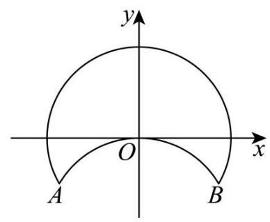
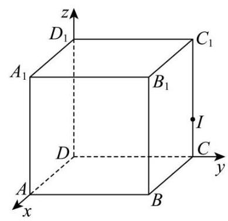
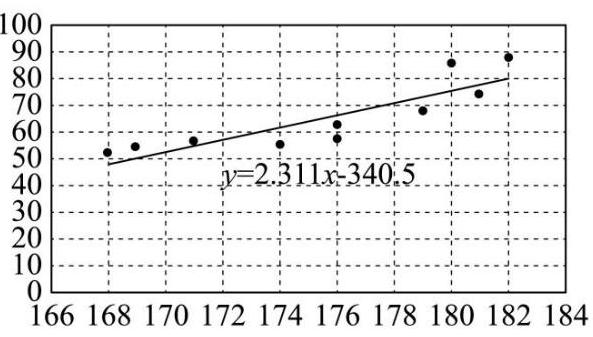
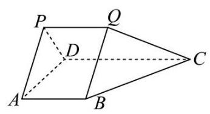
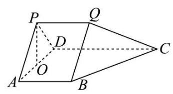
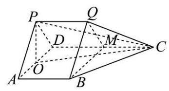

2026 届浦东新区高三下二模数学试卷

## 一、填空题

1. 已知全集 $U = \left( {0, + \infty }\right)$ ，集合 $A = \lbrack 2, + \infty )$ ，则 ${\complement }_{U}A =$ ___.

【答案】 $\left( {0,2}\right)$

【解析】 $U = \left( {0, + \infty }\right) , A = \lbrack 2, + \infty ),{\complement }_{U}A = \left( {0,2}\right)$ .

2. 若复数 $z$ 满足 $\left( {1 + \mathrm{i}}\right) z = {2\mathrm{i}}$ ，则复数 $z =$ ___.

【答案】 $1 + \mathrm{i}$

【解析】 $\because \left( {1 + \mathrm{i}}\right) z = 2\mathrm{i},\therefore z = \frac{2\mathrm{i}}{1 + \mathrm{i}} = \frac{2\mathrm{i}\left( {1 - \mathrm{i}}\right) }{\left( {1 + \mathrm{i}}\right) \left( {1 - \mathrm{i}}\right) } = 1 + \mathrm{i}$ ,

3. 已知 $f\left( x\right)  = \left\{  \begin{array}{l} \frac{1}{{x}^{3}}, x < 0 \\  x + 1, x \geq  0 \end{array}\right.$ ,若 $f\left( a\right)  =  - 2$ ，则实数 $a$ 的值为___.

【答案】-8

【解析】若 $a < 0$ ,则 ${a}^{\frac{1}{3}} =  - 2$ ,解得 $a =  - 8$

若 $a \geq  0$ ,则 $a + 1 =  - 2$ ,解得 $a =  - 3$ ,不满足 $a \geq  0$

综上 $a =  - 8$

4. 在 $\bigtriangleup  {ABC}$ 中，若 $a = 7$ ， $b = 8$ ， $\cos C = \frac{13}{14}$ ，则 $c =$ ___.

【答案】 3

【解析】由余弦定理 ${c}^{2} = {a}^{2} + {b}^{2} - {2ab}\cos C$ 得: ${c}^{2} = {49} + {64} - {104} = 9$ ,

所以 $c = 3$

5. 某校高中三年级 600 名学生参加了区质量检测,已知数学检测成绩 $X$ 服从正态分布 $N\left( {{100},{\sigma }^{2}}\right)$ (试卷满分为 150 分). 统计结果显示, 数学检测成绩介于 80 分到 120 分之间的人数为 450 名, 则此次检测中成绩不低于 120 分的学生人数约为总人数的___(精确到 0.1%).

【答案】12.5%

【解析】由 $X \sim  N\left( {{100},{\sigma }^{2}}\right)$ 可知,正态分布曲线对称轴为 $X = {100}$ ,

可知 $P\left( {{80} < x < {120}}\right)  = \frac{450}{600} = \frac{3}{4}$ ,

所以 $P\left( {{100} < X < {120}}\right)  = \frac{3}{8}$ ,可得 $P\left( {X \geq  {120}}\right)  = \frac{1}{2} - \frac{3}{8} = \frac{1}{8}$ ,即成绩不低于 120 分的学生人数约为总人数的 12.5%.

6. 已知直线 $l$ 是曲线 $y = \frac{3}{x + 1} + \ln x$ 在 $x = 2$ 处的切线,则 $l$ 的斜率为___.

【答案】 $\frac{1}{6}$

【解析】由 $y = \frac{3}{x + 1} + \ln x$ ,所以 ${y}^{\prime } =  - \frac{3}{{\left( x + 1\right) }^{2}} + \frac{1}{x}$ ,

所以曲线在 $x = 2$ 处的切线斜率为: $k = {\left. {y}^{\prime }\right| }_{x = 2} =  - \frac{3}{{\left( 2 + 1\right) }^{2}} + \frac{1}{2} =  - \frac{1}{3} + \frac{1}{2} = \frac{1}{6}$ .

7. 从 4 名男生 3 名女生中选取 3 人，依次进行面试，其中恰好有 1 名女生，则有___种不同的面试方法.

【答案】108

【解析】第一步: 从 3 名女生中选取 1 名,有 ${\mathrm{C}}_{3}^{1} = 3$ 种选法,

第二步: 从 4 名男生中选取 2 名,有 ${\mathrm{C}}_{4}^{2} = 6$ 种选法,

第三步:选取的 3 人依次进行面试，则有 ${\mathrm{A}}_{3}^{3} = 6$ 种排法，

所以一共有 ${\mathrm{C}}_{3}^{1}{\mathrm{C}}_{4}^{2}{\mathrm{\;A}}_{3}^{3} = 3 \times  6 \times  6 = {108}$ 种不同的面试方法.

8. 一个家庭有两个孩子，生肖均为十二生肖之一(等可能). 已知其中一个孩子属马，则另一个孩子也属马的概率为___.

【答案】 $\frac{1}{23}$

【解析】两个孩子的生肖组合有 ${12} \times  {12} = {144}$ 种,

记事件 A “其中一个孩子属马”, 事件 B “两个孩子都属马”,

则 $\mathrm{P}\left( A\right)  = 1 - \frac{{11} \times  {11}}{144} = \frac{23}{144},\mathrm{P}\left( {AB}\right)  = \frac{1 \times  1}{144} = \frac{1}{144}$ ,

所以 $P\left( {B \mid  A}\right)  = \frac{P\left( {AB}\right) }{P\left( A\right) } = \frac{\frac{1}{144}}{\frac{23}{144}} = \frac{1}{23}$ .

9. 已知数列 $\left\{  {a}_{n}\right\}$ 的通项公式是 ${a}_{n} = {2}^{n - 1} + 1,{S}_{n}$ 为数列 $\left\{  {a}_{n}\right\}$ 的前 $n$ 项和,则使得不等式 ${S}_{n} > {2026}$ 成立的最小正整数 $n$ 的值为___.

【答案】11

【解析】令 ${b}_{n} = {2}^{n - 1}$ ,则 $\frac{{b}_{n + 1}}{{b}_{n}} = \frac{{2}^{n}}{{2}^{n - 1}} = 2$ ,

所以数列 $\left\{  {b}_{n}\right\}$ 是以 ${b}_{1} = 1$ 为首项,2 为公比的等比数列,

设数列 $\left\{  {b}_{n}\right\}$ 的前 $n$ 项和为 ${T}_{n}$ ,则 ${T}_{n} = \frac{1 \times  \left( {1 - {2}^{n}}\right) }{1 - 2} = {2}^{n} - 1$ ,

所以 ${S}_{n} = {}_{1} + {}_{2} + \cdots  + {}_{n} = {}_{1} + 1 + {}_{2} + 1 + \cdots  + {}_{n} + 1 = 2{}^{n} - 1 + n$ ,

因为 $y = {2}^{n} - 1 + n$ 单调递增,

又 ${S}_{10} = {1024} - 1 + {10} = {1033} < {2026},{S}_{11} = {2048} - 1 + {11} = {2058} > {2026}$ ,

所以使得不等式 ${S}_{n} > {2026}$ 成立的最小正整数 $n$ 的值为 11 .

10. 已知,圆 $O$ 是圆心在原点的单位圆,弦 ${AB}$ 平行于 $x$ 轴,并将圆分为两段弧. 将其中一段劣弧 $\overset{\text{ ⏜ }}{AB}$ 沿弦 ${AB}$ 翻折后恰好经过圆心. 若直线 $y = x + m$ 与翻折后得到的两段弧有四个不同的交点,则实数 $m$ 的取值范围为___.

【答案】 $\left( {\frac{\sqrt{3} - 1}{2},\sqrt{2} - 1}\right)$

【解析】根据题意可知优弧 ${AB}$ 所在的圆方程为 ${x}^{2} + {y}^{2} = 1$ ,

劣弧 ${AB}$ 所在的圆方程为 ${x}^{2} + {\left( y + 1\right) }^{2} = 1$ ,

因为直线 $y = x + m$ 与翻折后得到的两段弧有四个不同的交点,

所以直线 $y = x + m$ 与优弧 ${AB}$ 和劣弧 ${AB}$ 各有两个不同的交点,

所以 $\left\{  \begin{array}{l} \frac{\left| m\right| }{\sqrt{2}} < 1 \\  \frac{\left| 1 + m\right| }{\sqrt{2}} < 1 \end{array}\right.$ ,解得 $- \sqrt{2} < m < \sqrt{2} - 1$ ,

又直线 $y = x + m$ 经过点 $A\left( {-\frac{\sqrt{3}}{2}, - \frac{1}{2}}\right)$ 时, $m =  - \frac{1}{2} - \left( {-\frac{\sqrt{3}}{2}}\right)  = \frac{\sqrt{3} - 1}{2}$ ,

所以要使直线 $y = x + m$ 与翻折后得到的两段弧有四个不同的交点,

$m$ 的取值范围为 $\left( {\frac{\sqrt{3} - 1}{2},\sqrt{2} - 1}\right)$

11. 某光影科技实验室为长方体空间, 底面是边长为 4 米的正方形, 高为 3 米. 为营造动态光影效果, 在底面一个顶点处安装射灯 $A$ ,在与该顶点相对的侧棱上、距底面 1 米处安装射灯 $I$ ,两盖射灯的光束方向由智能系统自动控制，始终使两束光线相互垂直，且它们的交汇点 $G$ 始终落在实验室天花板上，则交汇点 $G$ 形成的轨迹长度为___米.

【答案】 $2\sqrt{2}\pi$

【解析】如图建立空间直角坐标系:

则 $A\left( {4,0,0}\right) , I\left( {0,4,1}\right)$ ,设交点 $G\left( {x, y,3}\right)$ ,

所以 $\overrightarrow{AG} = \left( {x - 4, y,3}\right) ,\overrightarrow{IG} = \left( {x, y - 4,2}\right)$ ,

因为 ${AG} \bot  {IG}$ ,所以 $\overrightarrow{AG} \cdot  \overrightarrow{IG} = \left( {x - 4}\right) x + \left( {y - 4}\right) y + 3 \times  2 = 0$ ,

整理得 ${\left( x - 2\right) }^{2} + {\left( y - 2\right) }^{2} = 2$ ,

所以交点 $G$ 在天花板上的轨迹是以 $\left( {2,2,3}\right)$ 为圆心,半径为 $\sqrt{2}$ 的圆,

所以交汇点 $G$ 形成的轨迹长度为 $2\sqrt{2}\pi$ .

12. 已知集合 $M$ 的元素均为正整数，定义集合 $M$ 的“变项和”为:将 $M$ 中每个元素 $m$ 都乘以 ${\left( -1\right) }^{m}$ 后再求和. 若集合 $A = \{ n \mid  1 \leq  n \leq  {2026}, n \in  \mathbf{N}\}$ ，则集合 $A$ 的所有非空子集的“变项和”的总和为___.

【答案】 ${1013} \times  {2}^{2025}$

【解析】: $A = \left\{  {n \mid  1 \leq  n \leq  {2026}, n \in  \mathbf{N}}\right\}   = \{ 1,2,\cdots ,{2026}\}$ ,

$\therefore A$ 中所有非空子集含有 1 的有 2026 类:

单元素集合只有 $\{ 1\}$ 含有 1,即 1 出现了 ${\mathrm{C}}_{2025}^{0}$ 次;

双元素集合含有 1 的有 $\{ 1,2\} ,\{ 1,3\} ,\ldots \{ 1,{2026}\}$ ,即 1 出现了 ${\mathrm{C}}_{2025}^{1}$ 次;

三元素集合中含有 1 的有 $\{ 1,2,3\} ,\{ 1,2,4\} ,\cdots ,\{ 1,{2025},{2026}\}$ ,即 1 出现了 ${\mathrm{C}}_{2025}^{2}$ 次,

......

有 2026 个元素的集合中含有 1 的有 $\{ 1,2,\cdots ,{2026}\}$ ，1 出现了 ${\mathrm{C}}_{2025}^{2025}$ 次；

$\therefore 1$ 共出现 ${\mathrm{C}}_{2025}^{0} + {\mathrm{C}}_{2025}^{1} + \ldots  + {\mathrm{C}}_{2025}^{2025} = {2}^{2025}$ ,

同理 $2,3,4,\cdots {2026}$ 都出现 ${2}^{2025}$ 次,

$\therefore M$ 的所有非空子集中,这些和的总和是

$$
{2}^{2025} \times  \left\lbrack  {1 \times  {\left( -1\right) }^{1} + 2 \times  {\left( -1\right) }^{2} + \cdots  + {2026} \times  {\left( -1\right) }^{2026}}\right\rbrack
$$

$= {2}^{2025} \cdot  \left\{  {\left\lbrack  {1 \times  {\left( -1\right) }^{1} + 2 \times  {\left( -1\right) }^{2}}\right\rbrack   + \left\lbrack  {3 \times  {\left( -1\right) }^{3} + 4 \times  {\left( -1\right) }^{4}}\right\rbrack   + \cdots  + \left\lbrack  {{2025} \times  {\left( -1\right) }^{2025} + {2026} \times  {\left( -1\right) }^{2026}}\right\rbrack  }\right\}$

$$
= {2}^{2025} \times  \left( {1 + 1\overrightarrow{\underset{{1013}\text{ 个 }}{ \bullet  }} + 1}\right)  = {2}^{2025} \times  {1013}.
$$

## 二、单选题

13. 某校学生会体育部长依据本校高三男生的身高(单位:cm)与体重(单位:kg)的抽样数据，运用电子办公软件求出了“体重”(y)关于“身高”(x)的回归方程，则该回归方程()

身高体重

174 55

176 58

176 62

181 74

182 88

179 68

169 54

168 52

171 56

180 86

A. 表示 $x$ 与 $y$ 之间的函数关系 B. 表示 $x$ 与 $y$ 之间的不确定关系

C. 反映 $x$ 与 $y$ 之间的真实关系 D. 反映 $x$ 与 $y$ 之间的真实关系的一种最佳拟合

【答案】D

【解析】根据线性回归方程的概念可知,回归方程反映 $x$ 与 $y$ 之间的真实关系的一种最佳拟合.

14. 已知实数 $a, b, c$ 满足 $a > b > 1 > c$ ,则下列结论一定正确的是( )

A. ${ac} > {bc}$ B. ${b}^{c} < 1$

C. ${\log }_{a}b + {\log }_{b}a > 2$ D. $a + c > b$

【答案】C

【解析】对于选项 $\mathrm{A}$ ,可知 $1 > c$ ,无法判断正负,所以选项 $\mathrm{A}$ 错误;

对于选项 $\mathrm{B}$ ,可知 $0 < c < 1 < b$ 时,所以 ${b}^{c} > 1$ ,所以选项 $\mathrm{B}$ 错误;

对于选项 $\mathrm{C}$ ,因为 $a > b > 1$ ,所以 $\ln a > \ln b > 0$ ,

可知 ${\log }_{a}b + {\log }_{b}a = \frac{\ln b}{\ln a} + \frac{\ln a}{\ln b} \geq  2\sqrt{\frac{\ln b}{\ln a}\frac{\ln a}{\ln b}} = 2$ ,当且仅当 $\frac{\ln b}{\ln a} = \frac{\ln a}{\ln b}$ ,即 $a = b$ 时取等号,所以等号取不到, 所以 ${\log }_{a}b + {\log }_{b}a > 2$ ,选项 $\mathrm{C}$ 正确;

对于选项 $\mathrm{D}$ ,当 $c < 0$ 时,无法判断不等式是否成立,所以选项 $\mathrm{D}$ 错误;

15. 已知 $\overrightarrow{{e}_{1}},\overrightarrow{{e}_{2}}$ 与 $\overrightarrow{{e}_{3}}$ 是不共面的向量,则以下向量组中,一定不共面的是 ( )

A. $\overrightarrow{{e}_{1}} + \overrightarrow{{e}_{2}}\text{ 、 }\overrightarrow{{e}_{3}}\text{ 、 }\overrightarrow{{e}_{1}} + \overrightarrow{{e}_{2}} + \overrightarrow{{e}_{3}}$

B. $\overrightarrow{{e}_{1}}\text{ 、 }\overrightarrow{{e}_{2}} + \overrightarrow{{e}_{3}}\text{ 、 }3\overrightarrow{{e}_{1}} + 4\overrightarrow{{e}_{2}} + 3\overrightarrow{{e}_{3}}$

C. $\overrightarrow{{e}_{1}}\text{ 、 }2\overrightarrow{{e}_{2}} - \overrightarrow{{e}_{3}}\text{ 、 }\overrightarrow{{e}_{1}} - 2\overrightarrow{{e}_{2}} + \overrightarrow{{e}_{3}}$

D. $\overrightarrow{{e}_{1}} + \overrightarrow{{e}_{2}}\text{ 、 }\overrightarrow{{e}_{2}} + \overrightarrow{{e}_{3}}\text{ 、 }\overrightarrow{{e}_{1}} + k\overrightarrow{{e}_{3}}$ (其中 $k$ 为实数)

【答案】B

【解析】对于 $\mathrm{A}$ ,设 $\overrightarrow{{e}_{1}} + \overrightarrow{{e}_{2}} = x\overrightarrow{{e}_{3}} + y\left( {\overrightarrow{{e}_{1}} + \overrightarrow{{e}_{2}} + \overrightarrow{{e}_{3}}}\right)  = y\overrightarrow{{e}_{1}} + y\overrightarrow{{e}_{2}} + \left( {x + y}\right) \overrightarrow{{e}_{3}}$ ,

由 $\overrightarrow{{e}_{1}},\overrightarrow{{e}_{2}}$ 与 $\overrightarrow{{e}_{3}}$ 是不共面的向量,则 $\left\{  {\begin{array}{l} y = 1 \\  x + y = 0 \end{array} \Rightarrow  \left\{  \begin{array}{l} y = 1 \\  x =  - 1 \end{array}\right. }\right.$ ,即方程组有解,

所以向量 $\overrightarrow{{e}_{1}} + \overrightarrow{{e}_{2}}\text{ 、 }\overrightarrow{{e}_{3}}\text{ 、 }\overrightarrow{{e}_{1}} + \overrightarrow{{e}_{2}} + \overrightarrow{{e}_{3}}$ 共面,故 A 错误;

对于 $\mathrm{B}$ ,设 $\overrightarrow{{e}_{1}} = x\left( {\overrightarrow{{e}_{2}} + \overrightarrow{{e}_{3}}}\right)  + y\left( {3\overrightarrow{{e}_{1}} + 4\overrightarrow{{e}_{2}} + 3\overrightarrow{{e}_{3}}}\right)  = {3y}\overrightarrow{{e}_{1}} + \left( {x + {4y}}\right) \overrightarrow{{e}_{2}} + \left( {x + {3y}}\right) \overrightarrow{e}$ , 由 $\overrightarrow{{e}_{1}},\overrightarrow{{e}_{2}}$ 与 $\overrightarrow{{e}_{3}}$ 是不共面的向量,则 $\left\{  \begin{array}{l} {3y} = 1 \\  x + {4y} = 0 \\  x + {3y} = 0 \end{array}\right.$ ,方程组无解, 所以向量 $\overrightarrow{{e}_{1}}\text{ 、 }\overrightarrow{{e}_{2}} + \overrightarrow{{e}_{3}}\text{ 、 }3\overrightarrow{{e}_{1}} + 4\overrightarrow{{e}_{2}} + 3\overrightarrow{{e}_{3}}$ 不共面,故 B 正确;

对于 $\mathrm{C}$ ,设 $\overrightarrow{{e}_{1}} = x\left( {2\overrightarrow{{e}_{2}} - \overrightarrow{{e}_{3}}}\right)  + y\left( {\overrightarrow{{e}_{1}} - 2\overrightarrow{{e}_{2}} + \overrightarrow{{e}_{3}}}\right)  = y\overrightarrow{{e}_{1}} + \left( {{2x} - {2y}}\right) \overrightarrow{{e}_{2}} + \left( {-x + y}\right) \overrightarrow{{e}_{3}}$ ,

由 $\overrightarrow{{e}_{1}},\overrightarrow{{e}_{2}}$ 与 $\overrightarrow{{e}_{3}}$ 是不共面的向量,则 $\left\{  {\begin{array}{l} y = 1 \\  {2x} - {2y} = 0 \\   - x + y = 0 \end{array} \Rightarrow  \left\{  \begin{array}{l} y = 1 \\  x = 1 \end{array}\right. }\right.$ ,即方程组有解,

所以向量 $\overrightarrow{{e}_{1}}\text{ 、 }2\overrightarrow{{e}_{2}} - \overrightarrow{{e}_{3}}\text{ 、 }\overrightarrow{{e}_{1}} - 2\overrightarrow{{e}_{2}} + \overrightarrow{{e}_{3}}$ 共面,故 $\mathrm{C}$ 错误;

对于 $\mathrm{D}$ ,设 $\overrightarrow{{e}_{1}} + \overrightarrow{{e}_{2}} = x\left( {\overrightarrow{{e}_{2}} + \overrightarrow{{e}_{3}}}\right)  + y\left( {\overrightarrow{{e}_{1}} + k\overrightarrow{{e}_{3}}}\right)  = y\overrightarrow{{e}_{1}} + x\overrightarrow{{e}_{2}} + \left( {x + {ky}}\right) \overrightarrow{{e}_{3}}$ ,

由 $\overrightarrow{{e}_{1}},\overrightarrow{{e}_{2}}$ 与 $\overrightarrow{{e}_{3}}$ 是不共面的向量,则 $\left\{  \begin{array}{l} y = 1 \\  x = 1 \\  x + {ky} = 0 \end{array}\right.$ ,

当 $k =  - 1$ 时,方程组有解为 $\left\{  \begin{array}{l} y = 1 \\  x = 1 \end{array}\right.$ ,此时向量 $\overrightarrow{{e}_{1}} + \overrightarrow{{e}_{2}}\text{ 、 }\overrightarrow{{e}_{2}} + \overrightarrow{{e}_{3}}\text{ 、 }\overrightarrow{{e}_{1}} + k\overrightarrow{{e}_{3}}$ 共面,

当 $k \neq   - 1$ 时,方程组无解,此时向量 $\overrightarrow{{e}_{1}} + \overrightarrow{{e}_{2}}\text{ 、 }\overrightarrow{{e}_{2}} + \overrightarrow{{e}_{3}}\text{ 、 }\overrightarrow{{e}_{1}} + k\overrightarrow{{e}_{3}}$ 不共面,

所以向量 $\overrightarrow{{e}_{1}} + \overrightarrow{{e}_{2}}\text{ 、 }\overrightarrow{{e}_{2}} + \overrightarrow{{e}_{3}}\text{ 、 }\overrightarrow{{e}_{1}} + k\overrightarrow{{e}_{3}}$ 不一定共面，故 D 错误.

16. 定义在 $\mathbf{R}$ 上的非常值函数 $y = f\left( x\right)$ ,若存在一个非零常数 $T$ ,使得对任意 $x \in  \mathbf{R}$ ,都有 $f\left( {x + T}\right)  = T \cdot  f\left( x\right)$ 成立,那么称函数 $y = f\left( x\right)$ 为 $T$ 函数. 则下列说法正确的是( )

A. 存在函数 $y = {kx} + b\left( {k \neq  0}\right)$ 为 $T$ 函数

B. 若函数 $y = f\left( x\right)$ 为 $T$ 函数,且当 $T > 1$ 时函数在 $\lbrack 0, T)$ 上是严格增函数,则函数 $y = f\left( x\right)$ 在 $\lbrack 0, + \infty )$ 上是严格增函数

C. 若函数 $y = f\left( x\right)$ 为 $T$ 函数,且在 $x = 0$ 处取得最小值,则 $0 < T < 1$

D. 若函数 $y = f\left( x\right)$ 为 $T$ 函数,且 $\left| {f\left( x\right) }\right|  \leq  1$ 恒成立,则 $y = f\left( x\right)$ 为周期函数

【答案】D

【解析】对 $\mathrm{A}$ : 存在一个非零常数 $T$ ,使得对任意 $x \in  \mathbf{R}$ ,都有 $f\left( {x + T}\right)  = T \cdot  f\left( x\right)$ 成立,

则 $k\left( {x + T}\right)  + b = T\left( {{kx} + b}\right)$ ,整理得 ${kx} + {kT} + b = {kTx} + {Tb}$ ,

则有 $k = {kT}$ 且 ${kT} + b = {Tb}$ 恒成立,由 $k \neq  0$ ,则由 $k = {kT}$ 可得 $T = 1$ ,

此时有 $k + b = b$ ,则 $k = 0$ ,矛盾,故不存在这样的非零常数 $T$ ,故 A 错误;

对 B: 假设 $T = 2$ ,当 $x \in  \lbrack 0,2)$ 时, $f\left( x\right)  = x - 1$ ,

且函数 $y = f\left( x\right)$ 为定义在 $\mathbf{R}$ 上的 $T$ 函数,则 $y = f\left( x\right)$ 在 $\lbrack 0,2)$ 上是严格增函数,

但 $f\left( 2\right)  = f\left( {0 + 2}\right)  = 2 \cdot  f\left( 0\right)  =  - 2$ ,不满足在 $\lbrack 0, + \infty )$ 上严格递增,故 $\mathrm{B}$ 错误;

对 $\mathrm{C}$ : 假设 $T = 2$ ,当 $x \in  \lbrack 0,2)$ 时, $f\left( x\right)  = x$ ,

且函数 $y = f\left( x\right)$ 为定义在 $\mathbf{R}$ 上的 $T$ 函数,则 $f\left( {x + 2}\right)  = 2 \cdot  f\left( x\right)$ ,

当 $x = {2k}\left( {k \in  \mathbf{Z}}\right)$ 时， $f\left( {{2k} + 2}\right)  = {2f}\left( {2k}\right)  = {2}^{2}f\left( {{2k} - 2}\right)  = \cdots  = {2}^{k + 1}f(0 = 0$ ,

即对任意整数 $k$ ,都有 $f\left( {2k}\right)  = 0$ ,

当 $x = {2k} + t, k \in  \mathbf{Z}, t \in  \left( {0,2}\right)$ 时,

$f\left( {{2k} + t}\right)  = {2f}\left( {{2k} - 2 + t}\right)  = \cdots  = {2}^{k}f\left( t\right)  > 0,$

故当 $x \neq  {2k}\left( {k \in  \mathbf{Z}}\right)$ 时, $f\left( x\right)  > 0$ ,

故满足 $y = f\left( x\right)$ 在 $x = 0$ 处取得最小值,但 $T = 2$ ,故 $\mathrm{C}$ 错误;

对 $\mathrm{D}$ : 由题意可得 $f\left( {x + {nT}}\right)  = {Tf}\left( {x + \left( {n - 1}\right) T}\right)  = \cdots  = {T}^{n}f\left( x\right)$ ,

$f\left( {x - {nT}}\right)  = \frac{f\left( {x - \left( {n - 1}\right) T}\right) }{T} = \cdots  = \frac{1}{{T}^{n}}f\left( x\right) ,$

因为 $f\left( x\right)$ 为非常值函数,所以存在 ${x}_{0}$ 使得 $f\left( {x}_{0}\right)  \neq  0$ ,

由 $\left| {f\left( x\right) }\right|  \leq  1$ 恒成立,可得 $\left| {{T}^{n}f\left( {x}_{0}\right) }\right|  \leq  1$ 和 $\left| {\frac{1}{{T}^{n}}f\left( {x}_{0}\right) }\right|  \leq  1$ 对任意正整数 $n$ 成立,

若 $\left| T\right|  > 1$ 或 $\left| T\right|  < 1$ ,则当 $n$ 足够大时,上述不等式至少有一个不成立,

故必有 $\left| T\right|  = 1$ ,即 $T = 1$ 或 $T =  - 1$ ,

若 $T = 1$ ,则 $f\left( {x + 1}\right)  = f\left( x\right)$ ,则 $y = f\left( x\right)$ 为周期函数,且周期为 1 ;

若 $T =  - 1$ ,则 $f\left( {x - 1}\right)  =  - f\left( x\right)$ ,故 $f\left( {x - 2}\right)  =  - f\left( {x - 1}\right)  = f\left( x\right)$ ,

则 $y = f\left( x\right)$ 为周期函数,且周期为 2 ;

综上可得 $y = f\left( x\right)$ 为周期函数,故 $\mathrm{D}$ 正确.

## 三、解答题

17. 如图,在多面体 ${PQABCD}$ 中,平面 ${PAD} \bot$ 平面 ${ABCD},{AB}//{CD}//{PQ},{PD} \bot  {CD},\bigtriangleup {PAD}$ 是边长为 $\sqrt{2}$ 的等边三角形, ${AB} = {PQ} = \frac{1}{2}{CD}$ .

(1)求证: ${AB}\bot$ 平面 ${PAD}$ ；

(2)若 ${PC}$ 与平面 ${ABCD}$ 所成的角为 $\frac{\pi }{6}$ ，求多面体 ${PQABCD}$ 的体积.

【答案】(1)见解析; (2) $\frac{2\sqrt{3}}{3}$

【解析】(1) 证明: 取 ${AD}$ 的中点 $O$ ,连接 ${PO}$ ,

因为 $\bigtriangleup {PAD}$ 为等边三角形,且 $O$ 为 ${AD}$ 中点,

所以 ${PO} \bot  {AD}$

又平面 ${PAD} \bot$ 平面 ${ABCD}$ ,

平面 ${PAD} \cap$ 平面 ${ABCD} = {AD},{PO} \subset$ 平面 ${PAD}$ ,

所以 ${PO} \bot$ 平面 ${ABCD}$ .

又 ${AB} \subset$ 平面 ${ABCD}$ ,因而 ${PO} \bot  {AB}$

因为 ${AB}//{CD},{PD} \bot  {CD}$ ,所以 ${PD} \bot  {AB}$

由 ${PO} \subset$ 平面 ${PAD},{PD} \subset$ 平面 ${PAD},{PO} \cap  {PD} = P$ ,

所以 ${AB} \bot$ 平面 ${PAD}$ .

(2)连接 ${PC}\text{ 、 }{OC}$ ,由题(1)可知, ${PO} \bot$ 平面 ${ABCD}$ ,

所以 ${PC}$ 在平面 ${ABCD}$ 内的投影为 ${OC}$ ,

故 $\angle {PCO}$ 是 ${PC}$ 与平面 ${ABCD}$ 所成的角,即 $\angle {PCO} = \frac{\pi }{6}$

$\tan \angle {PCO} = \frac{PO}{CO} = \frac{\sqrt{3}}{3}$ ,由题得, ${PO} = \frac{\sqrt{6}}{2},{CO} = \frac{3\sqrt{2}}{2}$

因为 ${AB} \bot$ 平面 ${PAD},{AB}//{CD}$ ,所以 ${CD} \bot$ 平面 ${PAD}$ ,所以 ${CD} \bot  {AD}$ .

因此, ${CD} = \sqrt{C{O}^{2} - O{D}^{2}} = 2,{PQ} = \frac{1}{2}{CD} = 1$

取 ${CD}$ 的中点 $M$ ,连接 ${BM}\text{ 、 }{QM}$ ,

则 ${V}_{PQABCD} = {V}_{{PAD} - {QBM}} + {V}_{Q - {MBC}}$

$= {AB} \cdot  {S}_{\bigtriangleup {PAD}} + \frac{1}{3}{CM} \cdot  {S}_{\bigtriangleup {QMB}} = \frac{\sqrt{3}}{2} + \frac{\sqrt{3}}{6} = \frac{2\sqrt{3}}{3}$

所以多面体 ${PQABCD}$ 的体积是 $\frac{2\sqrt{3}}{3}$ .

18. 已知 $f\left( x\right)  = \sqrt{3}\sin x + 2\cos \left( {x + \varphi }\right) ,\varphi  \in  \left\lbrack  {0,\pi }\right\rbrack$ .

(1)若函数 $y = f\left( x\right)$ 是定义在 $\mathrm{R}$ 上的奇函数，求常数 $\varphi$ 的值；

(2)若 $\varphi  = \frac{\pi }{3}$ ，若关于 $x$ 的不等式 $f\left( x\right)  + \frac{x}{2} - a > 0$ 对任意 $x \in  \left\lbrack  {0,\pi }\right\rbrack$ 恒成立，求实数 $a$ 的取值范围.

【答案】 $\left( 1\right) \frac{\pi }{2};\left( 2\right) \left( {-\infty ,\frac{5\pi }{12} - \frac{\sqrt{3}}{2}}\right)$

【解析】(1) 若函数 $y = f\left( x\right)$ 是定义在 $\mathbf{R}$ 上的奇函数,

则 $f\left( {-x}\right)  =  - f\left( x\right)$ 对任意 $x \in  \mathbf{R}$ 恒成立,

即 $\sqrt{3}\sin x + 2\cos \left( {x + \varphi }\right)  =  - \sqrt{3}\sin \left( {-x}\right)  - 2\cos \left( {-x + \varphi }\right)$

即 $\cos \left( {x + \varphi }\right)  + \cos \left( {-x + \varphi }\right)  = 0$ 对 $x \in  \mathbf{R}$ 恒成立.

即 $2\cos x \cdot  \cos \varphi  = 0$ 对 $x \in  \mathbf{R}$ 恒成立.

因此 $\varphi  = {k\pi } + \frac{\pi }{2}\left( {k \in  \mathbf{Z}}\right)$ . 又 $\varphi  \in  \left\lbrack  {0,\pi }\right\rbrack$ ,故 $\varphi  = \frac{\pi }{2}$ .

因此,若函数 $y = f\left( x\right)$ 是定义在 $\mathbf{R}$ 上的奇函数,常数 $\varphi$ 的值为 $\frac{\pi }{2}$ ;

(2)若 $\varphi  = \frac{\pi }{3}$ ，则 $f\left( x\right)  = \cos x$ ，

由题意,即 $a < \cos x + \frac{1}{2}x$ 对任意 $x \in  \left\lbrack  {0,\pi }\right\rbrack$ 恒成立.

令 $g\left( x\right)  = \cos x + \frac{1}{2}x$ ,即 $a < g{\left( x\right) }_{\min }$ ,

由 ${g}^{\prime }\left( x\right)  = \frac{1}{2} - \sin x$ ,

可知函数 $y = g\left( x\right)$ 在 $x \in  \left\lbrack  {0,\pi }\right\rbrack$ 内的两个驻点为 ${x}_{1} = \frac{\pi }{6},{x}_{2} = \frac{5\pi }{6}$ ,

比较 $g\left( 0\right)  = 1, g\left( \frac{\pi }{6}\right)  = \frac{\pi }{12} + \frac{\sqrt{3}}{2}, g\left( \frac{5\pi }{6}\right)  = \frac{5\pi }{12} - \frac{\sqrt{3}}{2}, g\left( \pi \right)  = \frac{\pi }{2} - 1$ 的大小,

可知函数 $y = g\left( x\right)$ 在 $x \in  \left\lbrack  {0,\pi }\right\rbrack$ 上的最小值为 $g\left( \frac{5\pi }{6}\right)  = \frac{5\pi }{12} - \frac{\sqrt{3}}{2}$ .

因此,实数 $a$ 的取值范围为 $\left( {-\infty ,\frac{5\pi }{12} - \frac{\sqrt{3}}{2}}\right)$ .

19. 某奶茶品牌为了解消费者对奶茶甜度的偏好情况, 随机抽取了 100 名顾客进行甜度测试 (分数越高表示越偏好甜味)、统计结果显示, 所有顾客的甜度偏好分数均分布在区间 $\left\lbrack  {4,{10}}\right\rbrack$ 内,具体数据见下表:

<table><tr><td>甜度偏好分数</td><td>$\lbrack 4,5)$</td><td>$\lbrack 5,6)$</td><td>[6,7)</td><td>[7,8)</td><td>[8,9)</td><td>[9,10]</td></tr><tr><td>人数</td><td>10</td><td>25</td><td>20</td><td>30</td><td>10</td><td>5</td></tr></table>

(1)估计该品牌奶茶消费者的平均甜度偏好分数(同一组数据用该区间的中点值作代表)；

(2)在这 100 名顾客中，用分层抽样的方法从甜度偏好分数在 $\left\lbrack  {6,7}\right)$ 、 $\left\lbrack  {7,8}\right)$ 这两组中共抽取 5 人. 再从这 5 人中随机抽取 3 人，记 $X$ 为 3 人中甜度偏好分数在 $\lbrack 7,8)$ 的人数，求 $X$ 的分布、期望和方差；

(3)该奶茶品牌把甜度偏好分数在 $\lbrack 7,9)$ 的消费者称“七分糖爱好者”. 以样本估计总体、用频率代替概率，该品牌从某日消费人群中随机抽取 12 名消费者作为样本,记抽到 $k$ 个“七分糖爱好者”的概率为 ${P}_{k}$ ,问当 $k$ 为何值时 ${P}_{k}$ 最大?

【答案】(1)6.7

(2)

<table id="cross-table-1"><tr><td>$X \; P$</td><td>1 $\frac{3}{10}$</td><td>2 3 5</td><td>3 $\frac{1}{10}$</td></tr></table>

$E\left( X\right)  = \frac{9}{5},\;D\left( X\right)  = \frac{9}{25}$

(3) $k = 5$

【解析】(1) 由题意, 随机抽取的 100 名顾客的甜度偏好分数的平均数为

$$
\bar{x} = \frac{{10} \times  {4.5} + {25} \times  {5.5} + {20} \times  {6.5} + {30} \times  {7.5} + {10} \times  {8.5} + 5 \times  {9.5}}{100} = {6.7}
$$

估计该品牌奶茶消费者的平均甜度偏好分数为 6.7

(2)用分层抽样的方法, 从甜度偏好分数在 [6,7) 这组中抽取 2 人，甜度偏好分数在 [7,8) 这组中抽取 3 人. 故 $P\left( {X = 1}\right)  = \frac{{\mathrm{C}}_{2}^{2} \cdot  {\mathrm{C}}_{3}^{1}}{{\mathrm{C}}_{5}^{3}} = \frac{3}{10}, P\left( {X = 2}\right)  = \frac{{\mathrm{C}}_{2}^{1} \cdot  {\mathrm{C}}_{3}^{2}}{{\mathrm{C}}_{5}^{3}} = \frac{3}{5}, P\left( {X = 3}\right)  = \frac{{\mathrm{C}}_{3}^{3}}{{\mathrm{C}}_{5}^{3}} = \frac{1}{10}$

因此, $X$ 的分布列为

<table><tr><td>$X$</td><td>1</td><td>2</td><td>3</td></tr><tr><td>$P$</td><td>$\frac{3}{10}$</td><td>3 5</td><td>$\frac{1}{10}$</td></tr></table>

故 $E\left( X\right)  = \frac{9}{5}, D\left( X\right)  = E\left( {X}^{2}\right)  - {\left\lbrack  E\left( X\right) \right\rbrack  }^{2} = \frac{9}{25}$ .

(3)由题, 抽到“七分糖爱好者”的概率是 0.4 ,

抽到“七分糖爱好者”的人数服从二项分布,即 $k \sim  B\left( {{12},{0.4}}\right) ,{P}_{k} = {\mathrm{C}}_{12}^{k}{0.4}^{k}{0.6}^{{12} - k}$ ,

则 $\frac{{P}_{k + 1}}{{P}_{k}} = \frac{{\mathrm{C}}_{12}^{k + 1}{0.4}^{k + 1}{0.6}^{{12} - \left( {k + 1}\right) }}{{\mathrm{C}}_{12}^{k}{0.4}^{k}{0.6}^{{12} - k}} = \frac{2\left( {{12} - k}\right) }{3\left( {k + 1}\right) }$

当 $\frac{2\left( {{12} - k}\right) }{3\left( {k + 1}\right) } > 1$ ,即 $k < {4.2}$ 时 ${P}_{k + 1} > {P}_{k}$

当 $\frac{2\left( {{12} - k}\right) }{3\left( {k + 1}\right) } < 1$ ,即 $k > {4.2}$ 时 ${P}_{k + 1} < {P}_{k}$

因此, ${P}_{1} < {P}_{2} < {P}_{3} < {P}_{4} < {P}_{5}$ ,且 ${P}_{5} > {P}_{6} > {P}_{7} > {P}_{8} > {P}_{9} > {P}_{10} > {P}_{11} > {P}_{12}$ ,

所以,当 $k = 5$ 时, ${P}_{k}$ 最大.

20. 已知双曲线 $C : {x}^{2} - \frac{{y}^{2}}{{b}^{2}} = 1\left( {b > 0}\right)$ 的左顶点为 $A$ ,过点 $D\left( {2,0}\right)$ 的直线 $l$ 交双曲线 $C$ 于 $M\text{ 、 }N$ 两点,点 $M$ 在第一象限.

(1)若双曲线 $C$ 的焦距为 $2\sqrt{5}$ ，求该双曲线 $C$ 的离心率 $e$ ；

(2)若 $b = \sqrt{3}$ ， $\bigtriangleup  {MAD}$ 为直角三角形，求点 $M$ 的坐标；

(3)若双曲线 $C$ 的一条渐近线方程为 $x + \sqrt{2}y = 0$ ，点 $M$ 、 $N$ 均在双曲线 $C$ 的右支，且存在实数 $\lambda \left( {\lambda  < \frac{4}{3}}\right)$ ， 使得 $\overrightarrow{MN} = \lambda \overrightarrow{MD}$ 成立,求直线 $l$ 的倾斜角的取值范围.

【答案】 $\left( 1\right) \sqrt{5};\left( 2\right) \left( {2,3}\right)$ 或 $\left( {\frac{5}{4},\frac{3\sqrt{3}}{4}}\right) ;\left( 3\right) \left( {\arctan \frac{\sqrt{2}}{2},\arctan \frac{\sqrt{10}}{2}}\right)$

【解析】(1) 由题, ${2c} = 2\sqrt{5}$ ,得 $c = \sqrt{5}$

故 $e = \frac{c}{a} = \sqrt{5}$

(2)因为点 $M$ 在第一象限，故 $\angle {MAD}$ 不可能为直角；

若 $\angle {ADM} = \frac{\pi }{2}$ ，将 $x = 2$ 代入曲线 $C : {x}^{2} - \frac{{y}^{2}}{3} = 1$ ，得 $M\left( {2,3}\right)$ ；

若 $\angle {DMA} = \frac{\pi }{2}$ ，设点 $M\left( {{x}_{0},{y}_{0}}\right)$ ，则 $\overrightarrow{MD} = \left( {2 - {x}_{0}, - {y}_{0}}\right) ,\overrightarrow{MA} = \left( {-1 - {x}_{0}, - {y}_{0}}\right)$ ，

则 $\overrightarrow{MD} \cdot  \overrightarrow{MA} = {x}_{0}^{2} - {x}_{0} - 2 + {y}_{0}^{2} = 0$

又因为点 $M$ 满足 ${x}_{0}^{2} - \frac{{y}_{0}^{2}}{3} = 1$ ,可得 $M\left( {\frac{5}{4},\frac{3\sqrt{3}}{4}}\right)$ .

综上,点 $M$ 的坐标 $\left( {2,3}\right)$ 或 $\left( {\frac{5}{4},\frac{3\sqrt{3}}{4}}\right)$ ;

(3)由题可得，双曲线 $C : {x}^{2} - 2{y}^{2} = 1$ ，

当直线 $l$ 的斜率不存在时,

根据双曲线的对称性, $\overrightarrow{MN} = 2\overrightarrow{MD}$ ,不满足 $\lambda  < \frac{4}{3}$ ,

所以直线 $l$ 的斜率一定存在,

又 $\overrightarrow{MN} = \lambda \overrightarrow{MD}$ ,说明 $M, D, N$ 三点共线,且 $M, N$ 都在双曲线的右支上,

所以直线 $l$ 的斜率不为 $0,1 < \lambda  < \frac{4}{3}$ ,

设直线 $l$ 的方程为 $x = {my} + 2, M\left( {{x}_{1},{y}_{1}}\right) \text{ 、 }N\left( {{x}_{2},{y}_{2}}\right)$ ,且 ${y}_{1} > 0,{y}_{2} < 0$ ,

联立方程 $\left\{  \begin{array}{l} x = {my} + 2 \\  {x}^{2} - 2{y}^{2} = 1 \end{array}\right.$ ,可得 $\left( {{m}^{2} - 2}\right) {y}^{2} + {4my} + 3 = 0$

显然 ${m}^{2} - 2 \neq  0,\Delta  = {\left( 4m\right) }^{2} - 4\left( {{m}^{2} - 2}\right)  \times  3 = 4{m}^{2} + {24} > 0$ ,

${y}_{1} + {y}_{2} = \frac{-{4m}}{{m}^{2} - 2} > 0,\;{y}_{1}{y}_{2} = \frac{3}{{m}^{2} - 2} < 0$ ,故 $0 < m < \sqrt{2}$

由 $\overrightarrow{MN} = \lambda \overrightarrow{MD}$ ,可得 ${y}_{2} - {y}_{1} =  - \lambda {y}_{1}$ ,且 $1 < \lambda  < \frac{4}{3}$ .

故 $\frac{{y}_{2}}{{y}_{1}} = 1 - \lambda  \in  \left( {-\frac{1}{3},0}\right)$

因此 $\frac{{\left( {y}_{1} + {y}_{2}\right) }^{2}}{{y}_{1}{y}_{2}} = \frac{{y}_{2}}{{y}_{1}} + \frac{{y}_{1}}{{y}_{2}} + 2$ ,

根据对勾函数 $\mathrm{y} = \mathrm{x} + \frac{1}{\mathrm{x}}$ 的性质: $y$ 在 $\left( {-1,0}\right)$ 上单调递减,

可知 $\frac{{\left( {y}_{1} + {y}_{2}\right) }^{2}}{{y}_{1}{y}_{2}} = \frac{{y}_{2}}{{y}_{1}} + \frac{{y}_{1}}{{y}_{2}} + 2 <  - \frac{1}{3} + \left( {-3}\right)  + 2 =  - \frac{4}{3}$ ,

又 $\frac{{\left( {y}_{1} + {y}_{2}\right) }^{2}}{{y}_{1}{y}_{2}} = {\left( -\frac{4m}{{m}^{2} - 2}\right) }^{2} \cdot  \frac{{m}^{2} - 2}{3} = \frac{16}{3} \cdot  \frac{{m}^{2}}{{m}^{2} - 2}$ ,

故 $\frac{16}{3} \cdot  \frac{{m}^{2}}{{m}^{2} - 2} <  - \frac{4}{3}$ ,可得 $\frac{2}{\sqrt{10}} < m < \sqrt{2}$ .

所以,直线 $l$ 斜率的取值范围为 $\left( {\frac{\sqrt{2}}{2},\frac{\sqrt{10}}{2}}\right)$ ,

直线 $l$ 倾斜角的取值范围为 $\left( {\arctan \frac{\sqrt{2}}{2},\arctan \frac{\sqrt{10}}{2}}\right)$ .

21. 对于定义在区间 $D$ 上的函数 $y = f\left( x\right)$ ,定义集合 $\Omega  = \left\{  {f\left( x\right) \begin{Vmatrix}{f\left( {x}_{1}\right)  - f\left( {x}_{2}\right) }\end{Vmatrix} \leq  \left| {{x}_{1} - {x}_{2}}\right| ,\forall {x}_{1},{x}_{2} \in  D}\right\}$ . 对任意闭区间 $I \subseteq  D$ ,设函数 $y = f\left( x\right)$ 在区间 $I$ 上的最大值为 ${M}_{1}$ ,最小值为 ${M}_{2}$ ,记 $M\left( {f, I}\right)  = {M}_{1} - {M}_{2}$ .

(1)若 $f\left( x\right)  = {x}^{2} - x, D = \left\lbrack  {0,1}\right\rbrack$ ,判断函数 $y = f\left( x\right)$ 是否属于集合 $\Omega$ ,并求 $M\left( {f,\left\lbrack  {0,1}\right\rbrack  }\right)$ 的值;

(2)若 $D = \left\lbrack  {0,1}\right\rbrack  , f\left( x\right)  \in  \Omega$ ,且 $f\left( 0\right)  = 0, M\left( {f,\left\lbrack  {0,1}\right\rbrack  }\right)  = 1$ . 求 $f\left( 1\right)$ 的值及函数 $y = f\left( x\right)$ 的解析式;

(3)若 $D = \lbrack 0, + \infty ), f\left( x\right)  \in  \Omega$ ,令 $g\left( x\right)  = M\left( {f,\left\lbrack  {0, x}\right\rbrack  }\right)$ . 证明: $y = f\left( x\right)$ 是单调函数的充要条件是: 对任意 $0 < {x}_{1} < {x}_{2},\;g\left( {x}_{2}\right)  - g\left( {x}_{1}\right)  = M\left( {f,\left\lbrack  {{x}_{1},{x}_{2}}\right\rbrack  }\right)$ 恒成立.

【答案】(1)是, $M\left( {f,\left\lbrack  {0,1}\right\rbrack  }\right)  = \frac{1}{4}$ ; (2)当 $f\left( 1\right)  = 1$ 时, $f\left( x\right)  = x$ ,当 $f\left( 1\right)  =  - 1$ 时; $f\left( x\right)  =  - x$ ; (3)见解析

【解析】(1) 对任意 ${x}_{1},{x}_{2} \in  \left\lbrack  {0,1}\right\rbrack$ ,所以 $0 \leq  {x}_{1} + {x}_{2} \leq  2, - 1 \leq  {x}_{1} + {x}_{2} - 1 \leq  1$ , 又因为 $\left| {f\left( {x}_{1}\right)  - f\left( {x}_{2}\right) }\right|  = \left| {\left( {{x}_{1}^{2} - {x}_{1}}\right)  - \left( {{x}_{2}^{2} - {x}_{2}}\right) }\right|  = \left| {\left( {{x}_{1}^{2} - {x}_{2}^{2}}\right)  - \left( {{x}_{1} - {x}_{2}}\right) }\right|  = \left| {{x}_{1} - {x}_{2}}\right|  \cdot  \left| {{x}_{1} + {x}_{2} - 1}\right|$ ,且 ${x}_{1} + {x}_{2} - 1 \in  \left\lbrack  {-1,1}\right\rbrack$ , 所以 $\left| {f\left( {x}_{1}\right)  - f\left( {x}_{2}\right) }\right|  \leq  \left| {{x}_{1} - {x}_{2}}\right|$ ,故函数 $y = f\left( x\right)$ 属于集合 $\Omega$ .

由 $f\left( x\right)  = {x}^{2} - x = {\left( x - \frac{1}{2}\right) }^{2} - \frac{1}{4}, x \in  \left\lbrack  {0,1}\right\rbrack$ ,由二次函数的性质可知 ${M}_{1} = f\left( 0\right)  = f\left( 1\right)  = 0,{M}_{2} = f\left( \frac{1}{2}\right)  =  - \frac{1}{4}$ . 故 $M\left( {f,\left\lbrack  {0,1}\right\rbrack  }\right)  = \frac{1}{4}$ .

(2)由 $M\left( {f,\left\lbrack  {0,1}\right\rbrack  }\right)  = 1$ 可知，存在 $u, v \in  \left\lbrack  {0,1}\right\rbrack$ 满足 $\left| {f\left( u\right)  - f\left( v\right) }\right|  = 1$ .

又 $f\left( x\right)  \in  \Omega$ ,故必有 $\left| {f\left( u\right)  - f\left( v\right) }\right|  \leq  \left| {u - v}\right|  \leq  1$ .

因此必有 $\left| {u - v}\right|  = 1$ ,且 $u, v \in  \left\lbrack  {0,1}\right\rbrack$ ,所以 $\{ u, v\}  = \{ 0,1\}$ ,

又 $f\left( 0\right)  = 0,\left| {f\left( 1\right)  - f\left( 0\right) }\right|  = 1$ ,所以 $f\left( 1\right)  = 1$ 或 $f\left( 1\right)  =  - 1$

当 $f\left( 1\right)  = 1$ 时,由题意,对任意 $x \in  \left\lbrack  {0,1}\right\rbrack  ,\left| {f\left( x\right)  - f\left( 0\right) }\right|  \leq  x,\left| {f\left( x\right) }\right|  \leq  x$ ,即 $f\left( x\right)  \leq  x$ .

又因为 $\left| {f\left( 1\right)  - f\left( x\right) }\right|  \leq  1 - x$ ,即 $1 - f\left( x\right)  \leq  1 - x$ ,故 $f\left( \mathrm{x}\right)  \geq  \mathrm{x}$ .

故 $f\left( x\right)  = x$ .

当 $f\left( 1\right)  =  - 1$ 时,由题意,对任意 $x \in  \left\lbrack  {0,1}\right\rbrack  ,\left| {f\left( x\right)  - f\left( 0\right) }\right|  \leq  x,\left| {f\left( x\right) }\right|  \leq  x$ ,即 $f\left( x\right)  \geq   - x$ ,

又因为 $\left| {f\left( x\right)  - f\left( 1\right) }\right|  \leq  1 - x,\left| {f\left( x\right)  + 1}\right|  \leq  1 - x$ ,即 $f\left( x\right)  + 1 \leq  1 - x$ ,故 $f\left( x\right)  \leq   - x$

$f\left( x\right)  =  - x.$

综上,当 $f\left( 1\right)  = 1$ 时, $f\left( x\right)  = x$ ; 当 $f\left( 1\right)  =  - 1$ 时; $f\left( x\right)  =  - x$ .

(3)先证必要性:若 $y = f\left( x\right)$ 是定义在 $\lbrack 0, + \infty )$ 上的增函数，

设任意正实数 ${X}_{1}\text{ 、 }{X}_{2}$ 满足 $0 < {x}_{1} < {x}_{2}$ ,

则 $g\left( {x}_{2}\right)  = M\left( {f,\left\lbrack  {0,{x}_{2}}\right\rbrack  }\right)  = f\left( {x}_{2}\right)  - f\left( 0\right) , g\left( {x}_{1}\right)  = f\left( {x}_{1}\right)  - f\left( 0\right) , M\left( {f,\left\lbrack  {{x}_{1},{x}_{2}}\right\rbrack  }\right)  = f\left( {x}_{2}\right)  - f\left( {x}_{1}\right)$ .

因此 $g\left( {x}_{2}\right)  - g\left( {x}_{1}\right)  = f\left( {x}_{2}\right)  - f\left( {x}_{1}\right)  = M\left( {f,\left\lbrack  {{x}_{1},{x}_{2}}\right\rbrack  }\right)$ ,得证.

若 $y = f\left( x\right)$ 是定义在 $\lbrack 0, + \infty )$ 上的减函数,

设任意正实数 ${X}_{1}\text{ 、 }{X}_{2}$ 满足 $0 < {x}_{1} < {x}_{2}$ ,

则 $g\left( {x}_{2}\right)  = M\left( {f,\left\lbrack  {0,{x}_{2}}\right\rbrack  }\right)  = f\left( 0\right)  - f\left( {x}_{2}\right) , g\left( {x}_{1}\right)  = f\left( 0\right)  - f\left( {x}_{1}\right) , M\left( {f,\left\lbrack  {{x}_{1},{x}_{2}}\right\rbrack  }\right)  = f\left( {x}_{1}\right)  - f\left( {x}_{2}\right)$ .

因此 $g\left( {x}_{2}\right)  - g\left( {x}_{1}\right)  = \left\lbrack  {f\left( 0\right)  - f\left( {x}_{2}\right) }\right\rbrack   - \left\lbrack  {f\left( 0\right)  - f\left( {x}_{1}\right) }\right\rbrack   = f\left( {x}_{1}\right)  - f\left( {x}_{2}\right)  = M\left( {f,\left\lbrack  {{x}_{1},{x}_{2}}\right\rbrack  }\right)$ ,得证.

综上, 必要性得证.

再证充分性: (反证法) 假设函数 $y = f\left( x\right)$ 在 $\lbrack 0, + \infty )$ 上不单调,

则必存在 ${x}_{1} < {x}_{0} < {x}_{2}$ ,使得 $f\left( {x}_{1}\right) \left\langle  {f\left( {x}_{0}\right) }\right\rangle  f\left( {x}_{2}\right)$ 或 $f\left( {x}_{1}\right)  > f\left( {x}_{0}\right)  < f\left( {x}_{2}\right)$ .

不妨设 $f\left( {x}_{1}\right) \left\langle  {f\left( {x}_{0}\right) }\right\rangle  f\left( {x}_{2}\right)$ ,且 $f\left( {x}_{0}\right)$ 是函数 $y = f\left( x\right)$ 在区间 $\left\lbrack  {{x}_{1},{x}_{2}}\right\rbrack$ 上的最大值.

设函数 $y = f\left( x\right)$ 在区间 $\left\lbrack  {{x}_{1},{x}_{0}}\right\rbrack$ 上的最小值为 ${L}_{1}$ ,在区间 $\left\lbrack  {{x}_{0},{x}_{2}}\right\rbrack$ 上的最小值为 ${L}_{2}$

由题, $M\left( {f,\left\lbrack  {{x}_{1},{x}_{0}}\right\rbrack  }\right)  = g\left( {x}_{0}\right)  - g\left( {x}_{1}\right) , M\left( {f,\left\lbrack  {{x}_{0},{x}_{2}}\right\rbrack  }\right)  = g\left( {x}_{2}\right)  - g\left( {x}_{0}\right)$ ,

故 $M\left( {f,\left\lbrack  {{x}_{1},{x}_{0}}\right\rbrack  }\right)  + M\left( {f,\left\lbrack  {{x}_{0},{x}_{2}}\right\rbrack  }\right)  = g\left( {x}_{2}\right)  - g\left( {x}_{1}\right)$ ,又 $g\left( {x}_{2}\right)  - g\left( {x}_{1}\right)  = M\left( {f,\left\lbrack  {{x}_{1},{x}_{2}}\right\rbrack  }\right)$ ,

故 $M\left( {f,\left\lbrack  {{x}_{1},{x}_{0}}\right\rbrack  }\right)  + M\left( {f,\left\lbrack  {{x}_{0},{x}_{2}}\right\rbrack  }\right)  = M\left( {f,\left\lbrack  {{x}_{1},{x}_{2}}\right\rbrack  }\right)$

即 $f\left( {x}_{0}\right)  - {L}_{1} + f\left( {x}_{0}\right)  - {L}_{2} = f\left( {x}_{0}\right)  - \min \left\{  {{L}_{1},{L}_{2}}\right\}$ ,

即 $f\left( {x}_{0}\right)  = {L}_{1} + {L}_{2} - \min \left\{  {{L}_{1},{L}_{2}}\right\}$ ,即 $f\left( {x}_{0}\right)  = \max \left\{  {{L}_{1},{L}_{2}}\right\}$ ,

$\max \left\{  {{L}_{1},{L}_{2}}\right\}   \leq  \max \left\{  {f\left( {x}_{1}\right) , f\left( {x}_{2}\right) }\right\}   < f\left( {x}_{0}\right)$ ,矛盾.

因此假设不成立. $f\left( x\right)$ 是 $\lbrack 0, + \infty )$ 上的单调函数.

因此, $y = f\left( x\right)$ 是单调函数的充要条件是: 对任意正实数 $0 < {x}_{1} < {x}_{2}$ ,

$g\left( {x}_{2}\right)  - g\left( {x}_{1}\right)  = M\left( {f,\left\lbrack  {{x}_{1},{x}_{2}}\right\rbrack  }\right)$ 恒成立