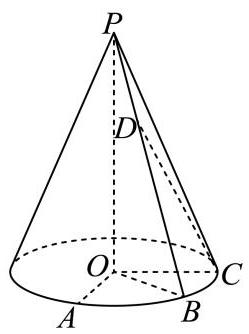
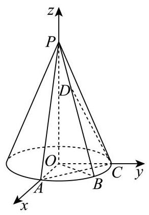

# 2025-2026学年虹口区高三二模数学试卷
## 三、基础解答题
(立体几何·概率统计·函数基础)

**考试时间：120分钟  满分：150分**

17. 如图,在底面半径为 2,侧面积为 $4\sqrt{5}\pi$ 的圆锥

$\mathrm{P} - \mathrm{O}$ 中, $A\text{ 、 }B\text{ 、 }C$ 为底面圆周上不同的三个点, $\angle {AOB} = \angle {BOC} = {45}^{ \circ  }$ .

(1)求直线 ${OB}$ 与平面 ${PAC}$ 所成角的正弦值

(2)设点 $D$ 为线段 ${PB}$ 上的动点(不含端点 $P$ 和 $B$ )，求证直线 ${OA}$ 与 ${CD}$ 不垂直

        

---

**【参考答案与解析】**

【考点】：圆锥的侧面积、空间向量、线面角、线线垂直

【答案】(1) $\frac{2\sqrt{2}}{3}$

(2)证明见解析

【解析】

【分析】(1) 利用侧面积求解出圆锥的高,再利用建系的方法,求出直线 ${OB}$ 与平面 ${PAC}$ 所成角的正弦值.

(2)利用向量的方法，将点 $D$ 在线段 ${PB}$ 上刻画为 $\overrightarrow{PD} = \lambda \overrightarrow{PB}$ . 接着证明直线 $\overrightarrow{OA}$ 与 $\overrightarrow{CD}$ 的数量积不为零.

【小问 1 详解】

$\because \angle {AOB} = \angle {BOC} = {45}^{ \circ  }$ ,

$\therefore \angle {AOC} = {90}^{ \circ  }$ ,

所以可以建立如右图所示的空间直角坐标系,

所以 $B\left( {\sqrt{2},\sqrt{2},0}\right) ,\overrightarrow{OB} = \left( {\sqrt{2},\sqrt{2},0}\right)$ ,设 ${OP} = a$ ,

则母线长为 $\sqrt{4 + {a}^{2}}$

则侧面积为 $\frac{1}{2}\sqrt{4 + {a}^{2}} \times  {2\pi } \times  2 = 2\sqrt{4 + {a}^{2}}\pi  = 4\sqrt{5}\pi$ ,

解得: $a = 4$ ，

所以 $P\left( {0,0,4}\right)$ ,

$A\left( {2,0,0}\right) , C\left( {0,2,0}\right) ,\overrightarrow{AC} = \left( {-2,2,0}\right) ,\overrightarrow{PA} = \left( {2,0, - 4}\right)$

设面 ${PAC}$ 的法向量为 $\overrightarrow{m} = \left( {{x}_{1},{y}_{1},{z}_{1}}\right)$

所以 $\overrightarrow{m} \cdot  \overrightarrow{AC} =  - 2{x}_{1} + 2{y}_{1} = 0,\overrightarrow{m} \cdot  \overrightarrow{PA} = 2{x}_{1} - 4{z}_{1} = 0$ ,

不妨令 ${x}_{1} = {y}_{1} = 1$ ,则 ${z}_{1} = \frac{1}{2}$ ,

所以 $\overrightarrow{m} = \left( {1,1,\frac{1}{2}}\right)$ ,设直线 ${OB}$ 与平面 ${PAC}$ 所成角为 $\theta$ ,

所以 $\sin \theta  = \left| {\cos \langle \overrightarrow{OB},\overrightarrow{m}\rangle }\right|  = \frac{\left| \overrightarrow{OB} \cdot  \overrightarrow{m}\right| }{\left| \overrightarrow{OB}\right|  \cdot  \left| \overrightarrow{m}\right| } = \frac{2\sqrt{2}}{2 \times  \sqrt{{1}^{2} + {1}^{2} + {\left( \frac{1}{2}\right) }^{2}}} = \frac{2\sqrt{2}}{3}$ .

【小问 2 详解】

因为 $D$ 为线段 ${PB}$ 上的动点,所以设 $\overrightarrow{PD} = \lambda \overrightarrow{PB},\lambda  \in  \left( {0,1}\right)$ ,

$\overrightarrow{CD} = \overrightarrow{CP} + \overrightarrow{PD}$ ,由 (1) 知 $\overrightarrow{PD} = \lambda \overrightarrow{PB} = \lambda \left( {\sqrt{2},\sqrt{2}, - 4}\right)  = \left( {\sqrt{2}\lambda ,\sqrt{2}\lambda , - {4\lambda }}\right)$ ,

$\overrightarrow{CP} = \left( {0, - 2,4}\right) ,\overrightarrow{CD} = \overrightarrow{CP} + \overrightarrow{PD} = \left( {\sqrt{2}\lambda ,\sqrt{2}\lambda  - 2,4 - {4\lambda }}\right) ,$

$\overrightarrow{OA} = \left( {2,0,0}\right) ,$

$\overrightarrow{OA} \cdot  \overrightarrow{CD} = 2\sqrt{2}\lambda  \neq  0,$

所以直线 ${OA}$ 与 ${CD}$ 不垂直.

18. 班主任小明查阅了某大学发表的一项本市高三学生手机使用情况的研究报告. 报告指出, 高三学生每周手机使用时长 $X$ (单位:小时) 总体上服从正态分布 $N\left( {{12},{4}^{2}}\right)$ .

(1)小明老师将自己所带班级(共 50 名学生)视为从本市高三学生总体中随机抽取的一个样本，能以此正态分布模型估算出全班每周平均手机使用时长超过 16 小时的人数，在此估

算基础上若在全班任选 3 位同学，则至少有 2 位同学的每周手机使用时长超过 16 小时的概率是多少? (结果用最简分数表示)

参考数据: 若 $X \sim  N\left( {\mu ,{\sigma }^{2}}\right)$ ,则 $P\left( {\left| {X - \mu }\right|  \leq  \sigma }\right)  \approx  {68}\%$ .

(2)小明老师发现小虹同学每周手机使用时长超过 16 小时，对其进行疏导劝解，并跟进统计出之后 5 周小虹每周手机使用时长 $x$ 与该周数学练习得分 $y$ (每周练习的难度相同且满分均为 150 分),制成表 1.以这 5 组数据建立回归方程 $y =  - {3.3x} + {146}$ . 请求出实数 $m$ 的值表 1

<table><tr><td></td><td>第 1 周</td><td>第 2 周</td><td>第 3 周</td><td>第 4 周</td><td>第 5 周</td></tr><tr><td>手机使用时长 $x$</td><td>20</td><td>18</td><td>22</td><td>16</td><td>14</td></tr><tr><td>练习得分 $y$</td><td>80</td><td>88</td><td>73</td><td>92</td><td>$m$</td></tr></table>

(3)受到鼓励的小虹制定了寒假复习计划表递交给小明老师，严格控制手机使用时长.小明老师统计发现该计划表中若第 $n$ 天能复习时长超过 5 小时 (记为“高效复习”),则第 $n + 1$ 天也能“高效复习”的概率为 $\frac{3}{4}$ ; 若第 $n$ 天不能“高效复习”,则第 $n + 1$ 天还能“高效复习”的概率为 $\frac{5}{7}$ . 设 ${P}_{n}\left( {1 \leq  n \leq  {28}}\right.$ , $n$ 为正整数) 表示第 $n$ 天能 “高效复习”的概率, ${P}_{1} = 1$ ,若 ${P}_{n} > {0.7}$ 表示复习计划表第 $n$ 天有效. 求证: 数列 $\left\{  {{P}_{n} - \frac{20}{27}}\right\}$ 是等比数列,并说明小虹的该复习计划表是否在寒假每一天均有效.

        

---

**【参考答案与解析】**

【考点】：正态分布、古典概型、线性回归、数列递推

【答案】(1) $\frac{11}{175}$

(2) 100 (3)答案见解析

【解析】

【分析】(1) 根据正态分布的性质和概率相关知识计算即可.

(2)先求出 $x, y$ 的平均值，然后代入回归方程即可求出结果.

(3)先根据题意列出递推式,然后证明数列 $\left\{  {{P}_{n} - \frac{20}{27}}\right\}$ 是以 $\frac{1}{28}$ 为公比的等比数列,进而可根据等比数列的通项公式求出 ${P}_{n}$ ,并根据 $n$ 的范围证明结论即可.

【小问 1 详解】

由题意知,因为 $P\left( {\left| {X - {12}}\right|  \leq  4}\right)  = P\left( {8 \leq  X \leq  {16}}\right)  = {68}\%$ .

所以任取 1 人使用手机超过 16 小时的概率为 $P = \frac{1 - {68}\% }{2} = {0.16}$ ,

50 名同学中有 ${50} \times  {0.16} = 8$ 位超过 16 小时,

那么至少 2 位同学使用手机超过 16 小时的概率为 $P = \frac{{\mathrm{C}}_{8}^{2} \cdot  {\mathrm{C}}_{42}^{1} + {\mathrm{C}}_{8}^{3}}{{\mathrm{C}}_{50}^{3}} = \frac{11}{175}$ .

【小问 2 详解】

由题意得 $\bar{x} = \frac{1}{5}\left( {{20} + {18} + {22} + {16} + {14}}\right)  = {18},\bar{y} = \frac{1}{5}\left( {{80} + {88} + {73} + {92} + m}\right)  = \frac{{333} + m}{5}$ . 代入回归方程有 $\frac{{333} + m}{5} =  - {3.3} \times  {18} + {146}$ ,解得 $m = {100}$ .

【小问 3 详解】

证明: 由题意知 ${P}_{n + 1} = \frac{3}{4}{P}_{n} + \frac{5}{7}\left( {1 - {P}_{n}}\right)  = \frac{1}{28}{P}_{n} + \frac{5}{7}$ ,

所以 ${P}_{n + 1} - \frac{20}{27} = \frac{1}{28}{P}_{n} + \frac{5}{7} - \frac{20}{27} = \frac{1}{28}{P}_{n} - \frac{5}{189} = \frac{1}{28}\left( {{P}_{n} - \frac{20}{27}}\right)$

所以 $\left\{  {{P}_{n} - \frac{20}{27}}\right\}$ 是以 $\frac{1}{28}$ 为公比的等比数列.

所以 ${P}_{n} - \frac{20}{27} = \left( {{P}_{1} - \frac{20}{27}}\right) {\left( \frac{1}{28}\right) }^{n - 1} \Rightarrow  {P}_{n} = \frac{7}{27}{\left( \frac{1}{28}\right) }^{n - 1} + \frac{20}{27}$ .

因为 $n \in  \left\lbrack  {1,{28}}\right\rbrack$ 时, ${\left( \frac{1}{28}\right) }^{n - 1} > 0$ 恒成立,所以 ${P}_{n} > \frac{20}{27} > {0.7}$ .

所以小虹的该复习计划表在寒假每一天均有效.

19. 设 $f\left( x\right)  = {\mathrm{e}}^{x} - {\mathrm{e}}^{-x}$ .

(1)解不等式: $f\left( {\ln x}\right)  < 2$ ；

(2)设 $g\left( x\right)  = f\left( x\right)  + \sin {2x}$ ，若存在 $x \in  \left\lbrack  {-2,2}\right\rbrack$ ，使得 $g\left( x\right)  + g\left( {{x}^{2} + a}\right)  > 0$ ，求实数 $a$ 的取值范围.

        

---

**【参考答案与解析】**

【考点】：指数函数、不等式求解、函数奇偶性与单调性

【答案】(1) $\left\{  {x\left| {\;0 < x < \sqrt{2} + 1}\right. }\right\}$

(2) $\left( {-6, + \infty }\right)$

【解析】

【分析】(1) 化简 $f\left( {\ln x}\right)  < 2$ ,解一元二次不等式即可;

(2)先求证 $g\left( x\right)$ 的奇偶性和单调性,将问题转化为存在 $x \in  \left\lbrack  {-2,2}\right\rbrack$ ,使得 $a >  - {x}^{2} - x$ ,求一元二次函数的最小值即可.

【小问 1 详解】

因为 $f\left( {\ln x}\right)  = {\mathrm{e}}^{\ln x} - {\mathrm{e}}^{-\ln x} = x - \frac{1}{x} < 2, x > 0$ ,

所以 ${x}^{2} - {2x} - 1 < 0$ ,得 $0 < x < \sqrt{2} + 1$ , 故 $f\left( {\ln x}\right)  < 2$ 的解集为 $\left\{  {x\left| {\;0 < x < \sqrt{2} + 1}\right. }\right\}$ ;

【小问 2 详解】

$g\left( x\right)  = f\left( x\right)  + \sin {2x} = {\mathrm{e}}^{x} - {\mathrm{e}}^{-x} + \sin {2x}$ ,则 $g\left( {-x}\right)  = {\mathrm{e}}^{-x} - {\mathrm{e}}^{x} - \sin {2x} =  - g\left( x\right)$ ,

因为 $x \in  \left\lbrack  {-2,2}\right\rbrack$ 关于原点对称,所以 $g\left( x\right)$ 在 $x \in  \left\lbrack  {-2,2}\right\rbrack$ 上为奇函数,

易得 ${g}^{\prime }\left( x\right)  = {\mathrm{e}}^{x} + {\mathrm{e}}^{-x} + 2\cos {2x}$ ,

因为 ${\mathrm{e}}^{x} + {\mathrm{e}}^{-x} \geq  2\sqrt{{\mathrm{e}}^{x} \cdot  {\mathrm{e}}^{-x}} = 2$ ,等号成立时 $x = 0$ ,所以 ${g}^{\prime }\left( x\right)  \geq  2\left( {1 + \cos {2x}}\right)  \geq  0$ , 则 $g\left( x\right)$ 在 $x \in  \left\lbrack  {-2,2}\right\rbrack$ 上单调递增,

若存在 $x \in  \left\lbrack  {-2,2}\right\rbrack$ ,使得 $g\left( x\right)  + g\left( {{x}^{2} + a}\right)  > 0$ ,

则存在 $x \in  \left\lbrack  {-2,2}\right\rbrack$ ,使得 $g\left( {{x}^{2} + a}\right)  >  - g\left( x\right)  = g\left( {-x}\right)$ ,

则存在 $x \in  \left\lbrack  {-2,2}\right\rbrack$ ,使得 ${x}^{2} + a >  - x$ ,即 $a >  - {x}^{2} - x$ ,

因为 $y =  - {x}^{2} - x$ 函数图象关于 $x =  - \frac{1}{2}$ 对称,其在 $\left\lbrack  {-2,2}\right\rbrack$ 上的最小值为 ${y}_{\min } =  - 6$ ,则 $a >  - 6$ ,

故实数 $a$ 的取值范围为 $\left( {-6, + \infty }\right)$ .

