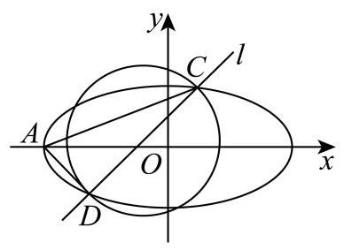

# 2025-2026学年虹口区高三二模数学试卷
## 四、解析几何
(椭圆综合)

**考试时间：120分钟  满分：150分**

20. 设椭圆 $\Gamma  : \frac{{x}^{2}}{4} + {y}^{2} = 1$ 的左顶点为 $A$ .

(1)求 $\Gamma$ 的离心率；

(2)设 $\Gamma$ 的左焦点为 $F$ ，上顶点为 $B$ ，若点 $P$ 在 $\Gamma$ 上且位于 $y$ 轴右侧. $\overrightarrow{AB}//\overrightarrow{FP}$ ，求点 $P$ 的横坐标;

(3)设直线 $l : x - y + m = 0$ ， $l$ 与 $\Gamma$ 交于不同的两点 $C$ 和 $D$ ，若点 $A$ 在以 ${CD}$ 为直径的圆外,求实数 $m$ 的取值范围.

        

---

**【参考答案与解析】**

【考点】：椭圆离心率、向量平行、直线与椭圆位置关系、圆

【答案】(1) $\frac{\sqrt{3}}{2}$

(2) $x = \frac{\sqrt{5} - \sqrt{3}}{2}$

(3) $m \in  \left( {-\sqrt{5},\frac{6}{5}}\right)  \cup  \left( {2,\sqrt{5}}\right)$

【解析】

【解析】

【小问 1 详解】

由椭圆方程可得 $a = 2, b = 1, c = \sqrt{{a}^{2} - {b}^{2}} = \sqrt{3}$ ,所以 $e = \frac{c}{a} = \frac{\sqrt{3}}{2}$ .

【小问 2 详解】

由条件可知 $A\left( {-2,0}\right) , B\left( {0,1}\right) , F\left( {-\sqrt{3},0}\right)$ ,

设直线 ${AB}$ 的斜率为 ${k}_{AB}$ ,直线 ${FP}$ 的斜率为 ${k}_{FP}$ ,

${k}_{AB} = \frac{1 - 0}{0 + 2} = \frac{1}{2}$ ,因为 $\overrightarrow{AB}//\overrightarrow{FP}$ ,所以 ${k}_{FP} = \frac{1}{2}$ ,

所以直线 ${FP}$ 的方程为 $y = \frac{1}{2}\left( {x + \sqrt{3}}\right)$ ,

联立椭圆: $\left\{  {\begin{matrix} \frac{{x}^{2}}{4} + {y}^{2} = 1 \\  y = \frac{1}{2}\left( {x + \sqrt{3}}\right)  \end{matrix} \Rightarrow  {x}^{2} + {\left( x + \sqrt{3}\right) }^{2} = 4 \Rightarrow  2{x}^{2} + 2\sqrt{3}x - 1 = 0}\right.$ ,

所以 $x = \frac{\sqrt{5} - \sqrt{3}}{2}$ 或 $x = \frac{-\sqrt{3} - \sqrt{5}}{2}$ ,

又因为点 $P$ 位于 $y$ 轴右侧,所以 $P$ 的横坐标为 $x = \frac{\sqrt{5} - \sqrt{3}}{2}$ .

【小问 3 详解】

设 $C\left( {{x}_{1},{y}_{1}}\right) , D\left( {{x}_{2},{y}_{2}}\right)$ ,联立椭圆

$\left\{  {\begin{array}{l} x - y + m = 0 \\  \frac{{x}^{2}}{4} + {y}^{2} = 1 \end{array} \Rightarrow  \frac{{\left( y - m\right) }^{2}}{4} + {y}^{2} = 1 \Rightarrow  5{y}^{2} - {2my} + {m}^{2} - 4 = 0,}\right.$

先确定有两个交点,即 $\Delta  = {\left( -2m\right) }^{2} - 4 \times  5 \times  \left( {{m}^{2} - 4}\right)  > 0$ ,

即 $4{m}^{2} - {20}{m}^{2} + {80} > 0 \Rightarrow   - {16}{m}^{2} + {80} > 0 \Rightarrow  {m}^{2} < 5$ ,

所以 $- \sqrt{5} < m < \sqrt{5}$ .

因为圆上任意一点与直径两端点连线所成的角为直角,

而点 $A$ 在以 ${CD}$ 为直径的圆外,所以 $\angle {CAD} < {90}^{ \circ  }$ ,等价于 $\overrightarrow{AC} \cdot  \overrightarrow{AD} > 0$ ,

由 $\overrightarrow{AC} = \left( {{x}_{1} + 2,{y}_{1}}\right) ,\overrightarrow{AD} = \left( {{x}_{2} + 2,{y}_{2}}\right)$ ,

所以 $\overrightarrow{AC} \cdot  \overrightarrow{AD} = \left( {{x}_{1} + 2}\right) \left( {{x}_{2} + 2}\right)  + {y}_{1}{y}_{2} > 0$ ,

即 $2{y}_{1}{y}_{2} - \left( {m - 2}\right) \left( {{y}_{1} + {y}_{2}}\right)  + {\left( m - 2\right) }^{2} > 0$ .

将 ${y}_{1} + {y}_{2} = \frac{2m}{5},{y}_{1}{y}_{2} = \frac{{m}^{2} - 4}{5}$ 代入可得,

$2 \cdot  \frac{{m}^{2} - 4}{5} - \left( {m - 2}\right)  \cdot  \frac{2m}{5} + {\left( m - 2\right) }^{2} > 0 \Rightarrow  2\left( {{m}^{2} - 4}\right)  - {2m}\left( {m - 2}\right)  + 5{\left( m - 2\right) }^{2} > 0$ ,

$2{m}^{2} - 8 - 2{m}^{2} + {4m} + 5\left( {{m}^{2} - {4m} + 4}\right)  > 0 \Rightarrow  5{m}^{2} - {16m} + {12} > 0 \Rightarrow  \left( {{5m} - 6}\right) \left( {m - 2}\right)  > 0$ ,

解得 $m < \frac{6}{5}$ 或 $m > 2$ ,结合 $- \sqrt{5} < m < \sqrt{5}$ ,

所以 $m \in  \left( {-\sqrt{5},\frac{6}{5}}\right)  \cup  \left( {2,\sqrt{5}}\right)$ .

