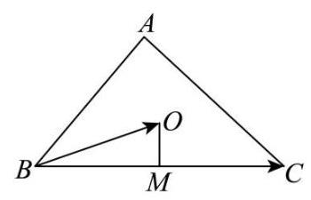
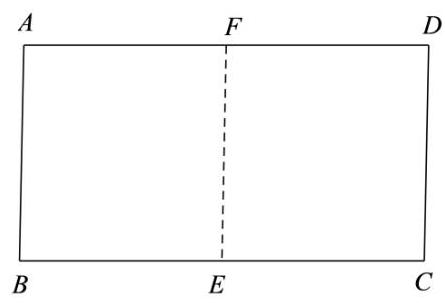
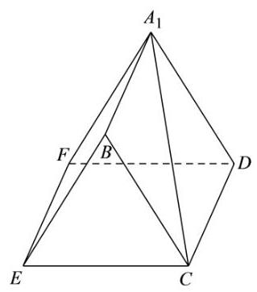
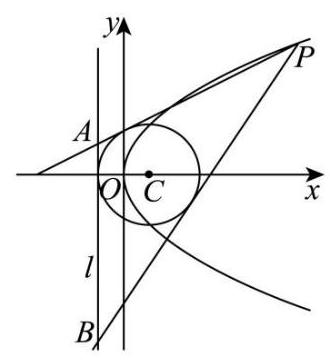

## 2026 届金山区高三下二模数学试卷

## 一、填空题

1. 不等式 $\left| {x - 1}\right|  < 1$ 的解集为___.

【答案】 $\left( {0,2}\right)$

【解析】由 $\left| {x - 1}\right|  < 1 \Rightarrow   - 1 < x - 1 < 1 \Rightarrow  0 < x < 2$ .

所以原不等式的解集为 $\left( {0,2}\right)$ .

2. 已知复数 $z = \left( {m + 2}\right)  + \left( {m - 1}\right) \mathrm{i}$ ( $\mathrm{i}$ 为虚数单位)为纯虚数，则实数 $m =$ ___.

【答案】 -2

【解析】由复数 $z = \left( {m + 2}\right)  + \left( {m - 1}\right) \mathrm{i}$ 为纯虚数,

则 $\left\{  \begin{array}{l} m + 2 = 0 \\  m - 1 \neq  0 \end{array}\right.$ ,解得 $m =  - 2$ .

3. 将 $\sqrt{a\sqrt{a}}\left( {a > 0}\right)$ 化成有理数指数幂的形式为___.

【答案】 ${a}^{\frac{3}{4}}$

【解析】 $\sqrt{a\sqrt{a}} = {\left( a \cdot  {a}^{\frac{1}{2}}\right) }^{\frac{1}{2}} = {\left( {a}^{\frac{3}{2}}\right) }^{\frac{1}{2}} = {a}^{\frac{3}{4}}$ .

4. 设 $\alpha  : 1 \leq  x \leq  4,\beta  : x \leq  m$ ，若 $\alpha$ 是 $\beta$ 的充分条件，则实数 $m$ 的取值范围是___.

【答案】 $\lbrack 4, + \infty )$

【解析】 $\because \alpha  : 1 \leq  x \leq  4,\beta  : x \leq  m$ ,若 $\alpha$ 是 $\beta$ 的充分条件, $\left\lbrack  {1,4}\right\rbrack   \subseteq  ( - \infty , m\rbrack$ ,则 $m \geq  4$ . 因此,实数 $m$ 的取值范围是 $\lbrack 4, + \infty )$ .

5. 已知角 $\alpha$ 为第四象限角，且 $\sin \alpha  =  - \frac{4}{5}$ ，则 $\cos \alpha  =$ ___.

【答案】 $\frac{3}{5}$

【解析】 $\because \sin \alpha  =  - \frac{4}{5},{\sin }^{2}\alpha  + {\cos }^{2}\alpha  = 1,\therefore {\left( -\frac{4}{5}\right) }^{2} + {\cos }^{2}\alpha  = 1,\therefore \cos \alpha  =  \pm  \frac{3}{5}$ ,

$\because \alpha$ 为第四象限角, $\therefore \cos \alpha  > 0,\therefore \cos \alpha  = \frac{3}{5}$ .

6. 已知等差数列 $- 3, - 1,1,\ldots$ ，则该数列的第 20 项为___.

【答案】35

【解析】不妨取 ${a}_{1} =  - 3,{a}_{2} =  - 1,{a}_{3} = 1$ ,

所以,等差数列公差 $d = {a}_{2} - {a}_{1} = 2$ ,

等差数列通项 ${a}_{n} = {a}_{1} + \left( {n - 1}\right) d = {2n} - 5$ ,则 ${a}_{20} = 2 \times  {20} - 5 = {35}$ ,

则该数列的第 20 项为 35 .

7. 已知随机变量 $X$ 的分布为 $\left( \begin{matrix} 1 & 2 & 3 \\  {0.4} & {0.2} & a \end{matrix}\right)$ ,则期望 $E\left\lbrack  X\right\rbrack   =$ ___.

【答案】 2

【解析】由 ${0.4} + {0.2} + a = 1$ ,解得 $a = {0.4}$ ,

所以 $E\left\lbrack  X\right\rbrack   = 1 \times  {0.4} + 2 \times  {0.2} + 3 \times  {0.4} = 2$ .

8. 若甲乙丙丁四人组成接力队参加 $4 \times  {100}$ 米接力赛，则甲不跑中间两棒的排法共有___种。

【答案】 12

【解析】先安排甲的位置,有 ${\mathrm{A}}_{2}^{1} = 2$ 种排法;

再安排其余 3 人的位置,有 ${\mathrm{A}}_{3}^{3} = 6$ 种排法.

根据分步乘法计数原理,满足条件的排法有 $2 \times  6 = {12}$ 种.

9. 已知关于 $x$ 的一元二次方程 ${x}^{2} - x + a = 0$ 有两个不相等的正根 $m\text{ 、 }n$ ，则 $\frac{1}{m} + \frac{9}{n}$ 的最小值为___.

【答案】16

【解析】关于 $x$ 的一元二次方程 ${x}^{2} - x + a = 0$ 有两个不相等的正根 $m\text{ 、 }n$ ,

则 $\left\{  \begin{array}{l} \Delta  = 1 - {4a} > 0 \\  {mn} = a > 0 \\  m + n = 1 > 0 \end{array}\right.$ ,所以 $0 < a < \frac{1}{4}$ ,

因为 $m > 0, n > 0, m + n = 1$ ,

所以 $\frac{1}{m} + \frac{9}{n} = \left( {\frac{1}{m} + \frac{9}{n}}\right) \left( {m + n}\right)$

$= 1 + \frac{n}{m} + \frac{9m}{n} + 9 \geq  2\sqrt{\frac{n}{m} \times  \frac{9m}{n}} + {10} = {16}$ ,

当且仅当 $\frac{n}{m} = \frac{9m}{n}$ ,即 $n = \frac{3}{4}, m = \frac{1}{4}$ 时,此时 ${mn} = a = \frac{3}{16} \in  \left( {0,\frac{1}{4}}\right)$ ,符合题意,

所以当 $n = \frac{3}{4}, m = \frac{1}{4}$ 时,取 $\frac{1}{m} + \frac{9}{n}$ 的最小值 16 .

10. 已知在 $\bigtriangleup  {ABC}$ 中， ${AB} = 2,{AC} = 3,{\angle {BAC}} = {60}^{ \circ  }$ . 若点 $O$ 为 $\bigtriangleup  {ABC}$ 外接圆的圆心，则 $\overrightarrow{BC} \cdot  \overrightarrow{BO} =$ ___.

【答案】 $\frac{7}{2}$

【解析】 $\because {AB} = 2,{AC} = 3,\angle {BAC} = {60}^{ \circ  }$ ,

$\therefore B{C}^{2} = A{B}^{2} + A{C}^{2} - {2AB} \cdot  {AC} \cdot  \cos \angle {BAC} = {2}^{2} + {3}^{2} - 2 \times  2 \times  3\cos {60}^{ \circ  } = 7$ ,

$\therefore {BC} = \sqrt{7}$ ,

取 ${BC}$ 的中点 $M$ ,连接 ${OM}$ ,

$\because$ 点 $O$ 为 $\bigtriangleup {ABC}$ 外接圆的圆心,

$\therefore {OM} \bot  {BC}$ ,

$\therefore \overrightarrow{BC} \cdot  \overrightarrow{BO} = \left| \overrightarrow{BC}\right|  \cdot  \left| \overrightarrow{BO}\right| \cos \angle {CBO} = \left| \overrightarrow{BC}\right|  \cdot  \left| \overrightarrow{BM}\right|  = \frac{1}{2}{\left| \overrightarrow{BC}\right| }^{2} = \frac{1}{2} \times  7 = \frac{7}{2}$ .

11. 已知 ${S}_{n}$ 是数列 $\left\{  {a}_{n}\right\}$ 的前 $n$ 项和,且 ${S}_{n} = {2}^{n - 1} - 1, n \geq  1$ 且 $n \in  \mathrm{N}$ . 若 $f\left( x\right)  = \left( {\sin x + {a}_{1}}\right) \left( {\sin x + {a}_{2}}\right) \cdots \left( {\sin x + {a}_{5}}\right)$ ，则 ${f}^{\prime }\left( \pi \right)  =$ ___.

【答案】-64

【解析】因为 ${a}_{1} = {S}_{1} = {2}^{0} - 1 = 0$ ,

${a}_{2} = {S}_{2} - {S}_{1} = \left( {{2}^{1} - 1}\right)  - \left( {{2}^{0} - 1}\right)  = 1,$

${a}_{3} = {S}_{3} - {S}_{2} = \left( {{2}^{2} - 1}\right)  - \left( {{2}^{1} - 1}\right)  = 2,$

${a}_{4} = {S}_{4} - {S}_{3} = \left( {{2}^{3} - 1}\right)  - \left( {{2}^{2} - 1}\right)  = 4,$

${a}_{5} = {S}_{5} - {S}_{4} = \left( {{2}^{4} - 1}\right)  - \left( {{2}^{3} - 1}\right)  = 8.$

所以 $f\left( x\right)  = \sin x\left( {\sin x + 1}\right) \left( {\sin x + 2}\right) \left( {\sin x + 4}\right) \left( {\sin x + 8}\right)$ .

设 $h\left( x\right)  = \left( {\sin x + 1}\right) \left( {\sin x + 2}\right) \left( {\sin x + 4}\right) \left( {\sin x + 8}\right)$ ,

则 $f\left( x\right)  = \sin x \cdot  h\left( x\right)$ .

所以 ${f}^{\prime }\left( x\right)  = {\left( \sin x\right) }^{\prime } \cdot  h\left( x\right)  + \sin x \cdot  {h}^{\prime }\left( x\right)  = \cos x \cdot  h\left( x\right)  + \sin x \cdot  {h}^{\prime }\left( x\right)$ , 所以 ${f}^{\prime }\left( \pi \right)  = \cos \pi  \cdot  h\left( \pi \right)  + \sin \pi  \cdot  {h}^{\prime }\left( \pi \right)  =  - h\left( \pi \right)  =  - \left( {1 \times  2 \times  4 \times  8}\right)  =  - {64}$ .

12. 申辉中学某个数学建模小组发现: 人走路时, 启动或者停下的瞬间, 手中水平拿着的杯子里的水可能会被晃动得溢出杯口. 查询资料后发现: 液面和水平面的夹角 $\theta \left( {0 \leq  \theta  < \frac{\pi }{2}}\right)$ 与人走路的加速度 $a$ 以及重力加速度 $g$ 有关,满足关系: $\tan \theta  = \frac{a}{g}$ ,其中 $g = {10}\left( {\mathrm{\;m}/{\mathrm{s}}^{2}}\right)$ . 若甲同学走路启动瞬间的加速度为 $3\left( {\mathrm{\;m}/{\mathrm{s}}^{2}}\right)$ ,手中水平拿着一个底面边长为 $4\mathrm{\;{cm}}$ 和 $6\mathrm{\;{cm}}$ ，高为 ${14}\mathrm{\;{cm}}$ 的长方体形状的杯子，则杯中最多装___ ${\mathrm{{cm}}}^{3}$ 的水，存在甲同学走路启动的瞬间杯中水不溢出的可能.

【答案】321.6

【解析】当沿着最短的朝向也就是当人沿着杯子底面 $4\mathrm{\;{cm}}$ 长的边所在方向加速时,杯内液面的高度差为 $4 \times  \frac{3}{10} = {1.2}\mathrm{\;{cm}},$

此时杯中不溢出的最大水量为 $4 \times  6 \times  {14} - \frac{1}{2} \times  4 \times  {1.2} \times  6 = {321.6}{\mathrm{\;{cm}}}^{3}$ ;

当沿着其他方向加速时, 因为水面要向更远的地方 “爬”, 在同样的倾斜角度下上升的高度会更高,

比如当沿着 $6\mathrm{\;{cm}}$ 长的边所在的方向加速时,杯内液面的高度差为 $6 \times  \frac{3}{10} = {1.8}\mathrm{\;{cm}}$ ,

此时杯中不溢出的最大水量为 $4 \times  6 \times  {14} - \frac{1}{2} \times  6 \times  {1.8} \times  4 = {314.4}{\mathrm{\;{cm}}}^{3}$ ,

所以杯中最多装 ${321.6}{\mathrm{\;{cm}}}^{3}$ 的水.

## 二、单选题

13. 为了了解申辉中学所有学生的每天平均体育运动时间，随机调查了该校 100 名学生，发现他们每天平均体育运动时间为 ${1.5}\mathrm{\;h}$ . 这里的总体是( )

A. 该校所有学生 B. 该校所有学生的每天平均体育运动时间

C. 所调查的 100 名学生 D. 所调查的 100 名学生的每天平均体育运动时间

【答案】B

【解析】根据总体的概念可得, 这里的总体是该校所有学生的每天平均体育运动时间. 故选项 B 正确.

14. 函数 $y = \cos \left( {\frac{\pi }{2} - {2x}}\right)$ 是( )

A. 最小正周期为 $\pi$ 的奇函数 B. 最小正周期为 $\pi$ 的偶函数

C. 最小正周期为 $\frac{\pi }{2}$ 的奇函数 D. 最小正周期为 $\frac{\pi }{2}$ 的偶函数

【答案】A

【解析】 $y = \cos \left( {\frac{\pi }{2} - {2x}}\right)  = \sin {2x}$ , $T = \frac{2\pi }{2} = \pi$ ,故最小正周期为 $\pi$ ,

设 $y = f\left( x\right)  = \sin {2x}, f\left( {-x}\right)  = \sin \left( {-{2x}}\right)  =  - \sin {2x} =  - f\left( x\right)$ ,

故 $y = f\left( x\right)  = \sin {2x}$ 为奇函数,故选项 $\mathrm{A}$ 正确.

15. 已知椭圆 ${\Gamma }_{1} : \frac{{x}^{2}}{{a}^{2}} + \frac{{y}^{2}}{{b}^{2}} = 1$ ,双曲线 ${\Gamma }_{2} : \frac{{y}^{2}}{{b}^{2}} - \frac{{x}^{2}}{{a}^{2}} = 1$ ,其中 $\left( {a > b > 0}\right)$ ,点 ${F}_{1}\text{ 、 }{F}_{2}$ 为椭圆 ${\Gamma }_{1}$ 的两个焦点, 点 $P$ 是双曲线 ${\Gamma }_{2}$ 上一动点. 若双曲线 ${\Gamma }_{2}$ 的两条渐近线夹角的余弦值等于 $\frac{1}{3}$ ,则使得 $\bigtriangleup P{F}_{1}{F}_{2}$ 为直角三角形的点 $P$ 有( )个

A. 3 B. 4 C. 6 D. 8

【答案】C

【解析】双曲线 ${\Gamma }_{2} : \frac{{y}^{2}}{{b}^{2}} - \frac{{x}^{2}}{{a}^{2}} = 1$ 的渐近线方程为 $y =  \pm  \frac{b}{a}x$ ,

设渐近线 $y = \frac{b}{a}x$ 的倾斜角为 $\theta$ ,则 $\tan \theta  = \frac{b}{a}$ ,

$\because a > b > 0,\therefore 0 < \frac{b}{a} < 1,\therefore 0 < \tan \theta  < 1,\therefore 0 < \theta  < \frac{\pi }{4}$ ,

$\therefore$ 两条渐近线的夹角为 ${2\theta },\therefore \cos {2\theta } = \frac{1}{3}$ ,

$\because \cos {2\theta } = {\cos }^{2}\theta  - {\sin }^{2}\theta  = \frac{{\cos }^{2}\theta  - {\sin }^{2}\theta }{{\cos }^{2}\theta  + {\sin }^{2}\theta } = \frac{1 - {\tan }^{2}\theta }{1 + {\tan }^{2}\theta }$ ,

$\therefore \frac{1 - {\tan }^{2}\theta }{1 + {\tan }^{2}\theta } = \frac{1}{3},\therefore \frac{1 - {\left( \frac{b}{a}\right) }^{2}}{1 + {\left( \frac{b}{a}\right) }^{2}} = \frac{1}{3},\therefore \frac{b}{a} = \frac{\sqrt{2}}{2},\therefore a = \sqrt{2}b$ ,

椭圆 ${\Gamma }_{1} : \frac{{x}^{2}}{{a}^{2}} + \frac{{y}^{2}}{{b}^{2}} = 1,\;c = \sqrt{{a}^{2} - {b}^{2}} = \sqrt{{\left( \sqrt{2}b\right) }^{2} - {b}^{2}} = b$ ,

$\because$ 点 ${F}_{1}\text{ 、 }{F}_{2}$ 为椭圆 ${\Gamma }_{1}$ 的两个焦点, $\therefore {F}_{1}\left( {-b,0}\right) ,{F}_{2}\left( {b,0}\right)$ ,

当 $\angle {F}_{1}P{F}_{2} = {90}^{ \circ  }$ 时,以 ${F}_{1}{F}_{2}$ 为直径的圆的方程为 ${x}^{2} + {y}^{2} = {c}^{2} = {b}^{2}$ ,

双曲线 ${\Gamma }_{2} : \frac{{y}^{2}}{{b}^{2}} - \frac{{x}^{2}}{{a}^{2}} = 1$ ,将 $a = \sqrt{2}b$ 代入 ${\Gamma }_{2} : \frac{{y}^{2}}{{b}^{2}} - \frac{{x}^{2}}{{a}^{2}} = 1$ ,

得到 $\frac{{y}^{2}}{{b}^{2}} - \frac{{x}^{2}}{2{b}^{2}} = 1$ ,解得 ${y}^{2} = {b}^{2} + \frac{{x}^{2}}{2}$ ,

联立 $\left\{  \begin{array}{l} {x}^{2} + {y}^{2} = {b}^{2} \\  {y}^{2} = {b}^{2} + \frac{{x}^{2}}{2} \end{array}\right.$ ,将 ${y}^{2} = {b}^{2} + \frac{{x}^{2}}{2}$ 代入 ${x}^{2} + {y}^{2} = {b}^{2}$ ,

得到 ${x}^{2} + {b}^{2} + \frac{{x}^{2}}{2} = {b}^{2}$ ,解得 $x = 0$ ,

将 $x = 0$ 代入 ${y}^{2} = {b}^{2} + \frac{{x}^{2}}{2}$ ，解得 $y =  \pm  b$ ，

则有 2 个点 $P$ 满足 $\angle {F}_{1}P{F}_{2} = {90}^{ \circ  }$ ;

当 $\angle P{F}_{1}{F}_{2} = {90}^{ \circ  }$ 时,

过 ${F}_{1}$ 的直线为 $x =  - b$ ,将 $x =  - b$ 代入双曲线 $\frac{{y}^{2}}{{b}^{2}} - \frac{{x}^{2}}{2{b}^{2}} = 1$ ,

得到 $\frac{{y}^{2}}{{b}^{2}} - \frac{{\left( -b\right) }^{2}}{2{b}^{2}} = 1$ ,解得 $y =  \pm  \frac{\sqrt{6}}{2}b$ ,故有 2 个点 $P$ 满足 $\angle P{F}_{1}{F}_{2} = {90}^{ \circ  }$ ;

当 $\angle P{F}_{2}{F}_{1} = {90}^{ \circ  }$ 时,

过 ${F}_{2}$ 的直线为 $\mathrm{x} = \mathrm{b}$ ,将 $\mathrm{x} = \mathrm{b}$ 代入双曲线 $\frac{{y}^{2}}{{b}^{2}} - \frac{{x}^{2}}{2{b}^{2}} = 1$ ,

得到 $\frac{{y}^{2}}{{b}^{2}} - \frac{{b}^{2}}{2{b}^{2}} = 1$ ,解得 $y =  \pm  \frac{\sqrt{6}}{2}b$ ,故有 2 个点 $P$ 满足 $\angle P{F}_{2}{F}_{1} = {90}^{ \circ  }$ ;

综上可知,使得 $\bigtriangleup P{F}_{1}{F}_{2}$ 为直角三角形的点 $P$ 有 6 个,故选项 $\mathrm{C}$ 正确.

16. 已知全集 $U$ 是一个六元集合,任取 $U$ 的两个子集 $A\text{ 、 }B\left( {A\text{ 、 }B}\right.$ 可以相等),记事件 $M : B \subseteq  A$ ; 记事件 $N : B \subseteq  \bar{A}$ . 则 $P\left( {M \cup  N}\right)  =$ (   )

A. $\frac{95}{{2}^{11}}$ B. $\frac{665}{{2}^{11}}$ C. $\frac{697}{{2}^{11}}$ D. $\frac{729}{{2}^{11}}$

【答案】C

【解析】因为全集 $U$ 是一个六元集合,所以任取 $U$ 的两个子集 $A\text{ 、 }B$ ,能形成 ${2}^{6} \times  {2}^{6} = {2}^{12}$ 对集合 $\left( {A, B}\right)$ , 即基本事件总数为 ${2}^{12}$ .

$U$ 中任一元素 $x$ ,满足事件 $M : B \subseteq  A$ ,有以下三种情况, $x \in  A, x \in  B;x \in  A, x \notin  B;x \notin  A$ 且 $x \notin  B$ ; 所以 $M$ 所含基本事件个数 ${3}^{6}$ ；

$U$ 中任一元素 $x$ 满足事件 $N : B \subseteq  \bar{A}$ ,有以下三种情况,

$x \notin  A, x \in  B;x \notin  A, x \notin  B;x \in  A$ 且 $x \notin  B$ ; 所以 $N$ 所含基本事件个数为 ${3}^{6}$ ,

事件 $M \cap  N$ 表示 $B \subseteq  A$ 且 $B \subseteq  \bar{A}$ 同时成立,所以 $B = \varnothing$ ,此时 $A$ 可以是 $U$ 的任意子集,有 ${2}^{6}$ 个,即事件 $M \cap  N$ 所含基本事件有 ${2}^{6}$ 个,

所以 $P\left( {M \cup  N}\right)  = P\left( M\right)  + P\left( N\right)  - P\left( {M \cap  N}\right)  = \frac{{3}^{6}}{{2}^{12}} + \frac{{3}^{6}}{{2}^{12}} - \frac{{2}^{6}}{{2}^{12}} = \frac{697}{{2}^{11}}$ .

## 三、解答题

17. 绝对零度 ( ${}^{ \circ  }\mathrm{C}$ ) 是一个只能逼近而不能达到的最低温度,那么这个数据是如何测得的? 吕同学通过查询资料,知道: ①气体温度和气体压强存在线性关系; ②当气体压强为 $0\left( {kPa}\right)$ 时,气体温度达到绝对零度. 以下是吕同学在一次模拟实验时, 测得某种气体温度和气体压强的相关数据:

<table><tr><td>数据</td><td>1</td><td>2</td><td>3</td><td>4</td><td>5</td><td>6</td></tr><tr><td>温度 $\left( {{}^{ \circ  }\mathrm{C}}\right)$</td><td>4.07</td><td>16.69</td><td>29.42</td><td>45.67</td><td>57.06</td><td>73.05</td></tr><tr><td>压强 (kPa)</td><td>103.095</td><td>107.734</td><td>112.461</td><td>118.469</td><td>122.706</td><td>128.758</td></tr></table>

(1)求该模拟实验中，该气体温度的平均值和方差；何精确到 0.01

(2)若该次实验下气体压强 $y$ 关于气体温度 $x$ 的回归方程为 $y = {0.372x} + \widehat{b}$ ，预估该次实验下绝对零度的数值； (精确到 ${0.01}^{ \circ  }\mathrm{C}$ )

(3)为了验证实验的普适性，吕同学利用不同气体预估绝对零度，得到如下的一组数据. 若任取其中的 2 个数据,求该两个数据与绝对零度 $\left( {-{273.15}^{ \circ  }\mathrm{C}}\right)$ 的误差均小于 ${1}^{ \circ  }\mathrm{C}$ 的概率.

<table><tr><td>绝对零度 (℃)</td><td>-275.13</td><td>-274.56</td><td>-274.28</td><td>-273.57</td><td>-272.45</td><td>-271.67</td></tr></table>

【答案】(1) ${37.66}^{ \circ  }\mathrm{C},{554.83};\left( 2\right)  - {272.92}^{ \circ  }\mathrm{C};\left( 3\right) \frac{1}{15}$

【解析】(1) $\bar{x} = \frac{{4.07} + {16.69} + {29.42} + {45.67} + {57.06} + {73.05}}{6} = \frac{225.96}{6} \Rightarrow  {7.66}\left( {{}^{ \circ  }\mathrm{C}}\right)$ , ${s}^{2} = \frac{{\left( {4.07} - {37.66}\right) }^{2} + {\left( {16.69} - {37.66}\right) }^{2} + {\left( {29.42} - {37.66}\right) }^{2} + {\left( {45.67} - {3.66}\right) }^{2} + {\left( {57.06} - {37.66}\right) }^{2}}{6} \; + \frac{{\left( {73.05} - {37.66}\right) }^{2}}{6} = \frac{3328.8988}{6} \approx  {554.82}.$

(2) $\bar{y} = \frac{{103.095} + {107.734} + {112.461} + {118.469} + {122.706} + {128.758}}{6} = \frac{693.223}{6} \approx  {115.5372}$ , 将 $\left( {\bar{x},\bar{y}}\right)$ ,即 $\left( {{37.66},{115.5372}}\right)$ 代入 $y = {0.372x} + \widehat{b}$ ,

解得 $\widehat{b} = {115.5372} - {14.00952} \approx  {101.5277}$ ,所以回归方程为 $y = {0.372x} + {101.5277}$ ,

令 $y = 0$ ,解得 $x =  - \frac{101.5277}{0.372} \approx   - {272.92}\left( {{}^{ \circ  }\mathrm{C}}\right)$ ,

预估该次实验下绝对零度的数值为 $- {272.92}{}^{ \circ  }\mathrm{C}$ .

(3)因为 $\left| {-{275.13} + {273.15}}\right|  = {1.98} \geq  1,\left| {-{274.56} + {273.15}}\right|  = {1.41} \geq  1$ ,

$\left| {-{274.28} + {273.15}}\right|  = {1.13} \geq  1,\left| {-{273.57} + {273.15}}\right|  = {0.42} < 1$ ,

$\left| {-{272.45} + {273.15}}\right|  = {0.70} < 1,\;\left| {-{271.67} + {273.15}}\right|  = {1.48} \geq  1,$

所以只有 -273.57, -272.45 两个数据与绝对零度 (-273.15°C) 的误差小于 1°C,

所以 $P = \frac{{\mathrm{C}}_{2}^{2}}{{\mathrm{C}}_{6}^{2}} = \frac{1}{15}$

18. 已知长方形 ${ABCD}$ 中， ${AB} = 2,{BC} = 4$ ，点 $E$ 、 $F$ 分别为边 ${BC}$ 、 ${AD}$ 的中点 (如图 1). 若将长方形 ${ABEF}$ 沿着边 ${EF}$ 翻折,得到二面角 ${A}_{1} - {EF} - D$ (如图 2). 已知二面角 ${A}_{1} - {EF} - D$ 的大小为 ${60}^{ \circ  }$ .

图1

图2

(1)求证:平面 ${A}_{1}{FD}//$ 平面 ${BEC}$ ；

(2)求直线 $C{A}_{1}$ 与平面 ${A}_{1}{BEF}$ 所成角的大小.(结果用反三角表示)

【答案】(1)见解析; (2) $\arctan \frac{\sqrt{15}}{5}$

【解析】(1) 因为长方形 ${ABCD}$ 中, ${EC}//{FD}$ ,折叠过程中, ${A}_{1}F//{BE}$ ,

又 ${EC} \subset$ 平面 ${BEC},{FD} \text{ ⊄ }$ 平面 ${BEC}$ ,故 ${FD}//$ 平面 ${BEC}$ ,

同理可得 ${A}_{1}F//$ 平面 ${BEC}$ ,

又 ${FD} \cap  {A}_{1}F = F,{FD},{A}_{1}F \subset$ 平面 ${A}_{1}{FD}$ ,所以平面 ${A}_{1}{FD}//$ 平面 ${BEC}$ ;

(2)因为长方形 ${ABCD}$ 中，点 $E$ 、 $F$ 分别为边 ${BC}$ 、 ${AD}$ 的中点，

故 ${EF} \bot  {A}_{1}F,{EF} \bot  {DF}$ ,二面角 ${A}_{1} - {EF} - D$ 的平面角为 $\angle {A}_{1}{FD}$ ,即 $\angle {A}_{1}{FD} = {60}^{ \circ  }$ ,

又 ${AB} = 2,{BC} = 4$ ,所以 ${A}_{1}F = {DF} = 2,\bigtriangleup {A}_{1}{FD}$ 为等边三角形,

同理可得 $\bigtriangleup  {BCE}$ 为等边三角形，

取 ${BE}$ 的中点 $H$ ，连接 ${CH},{A}_{1}H$ ，则 ${CH} \bot  {BE}$ ，

又 ${EF} \bot$ 平面 ${BEC}$ ， ${CH} \subset$ 平面 ${BEC}$ ，故 ${EF} \bot  {CH}$ ，

因为 ${BE} \cap  {EF} = E,{BE},{EF} \subset$ 平面 ${A}_{1}{BEF}$ ,故 ${CH} \bot$ 平面 ${A}_{1}{BEF}$ ,

故直线 $C{A}_{1}$ 与平面 ${A}_{1}{BEF}$ 所成角为 $\angle H{A}_{1}C$ ,

${EH} = {BH} = 1,\angle {BEC} = {60}^{ \circ  }$ ,故 ${CH} = \sqrt{3}$ ,由勾股定理得 ${A}_{1}H = \sqrt{{A}_{1}{B}^{2} + B{H}^{2}} = \sqrt{5}$ ,

则 $\tan \angle H{A}_{1}C = \frac{HC}{{A}_{1}H} = \frac{\sqrt{3}}{\sqrt{5}} = \frac{\sqrt{15}}{5}$ ,

直线 $C{A}_{1}$ 与平面 ${A}_{1}{BEF}$ 所成角的大小为 $\arctan \frac{\sqrt{15}}{5}$ .

19. 已知函数 $y = f\left( x\right)$ ,其中 $f\left( x\right)  = \ln x$ .

(1)若 $f\left( {1 - m}\right)  - f\left( {3 - m}\right)  < 0$ ，求实数 $m$ 的取值范围；

(2)若 $g\left( x\right)  = {ax} - \frac{1}{x} - a + 1 - \left( {a + 1}\right) f\left( x\right)$ ,其中 $a > 0$ ,若存在 $b < 0$ ,使得直线 $y = b$ 与函数 $y = g\left( x\right)$ 的图像有 3 个不同的交点,求实数 $a$ 的取值范围.

【答案】 $\left( 1\right) \left( {-\infty ,1}\right) ;\left( 2\right) \left( {0,1}\right)$

【解析】(1) 由 $f\left( {1 - m}\right)  - f\left( {3 - m}\right)  < 0$ 可得 $f\left( {1 - m}\right)  < f\left( {3 - m}\right)$ ,

又 $f\left( x\right)  = \ln x$ 为严格单调递增函数,且 $x > 0$ ,

所以 $\left\{  \begin{array}{l} 1 - m > 0 \\  3 - m > 0 \\  1 - m < 3 - m \end{array}\right.$ ,解得 $m < 1$ ,

所以实数 $m$ 的取值范围为 $\left( {-\infty ,1}\right)$ .

(2)因为 $g\left( x\right)  = {ax} - \frac{1}{x} - a + 1 - \left( {a + 1}\right) \ln x$ ，

所以 ${g}^{\prime }\left( x\right)  = a + \frac{1}{{x}^{2}} - \frac{a + 1}{x} = \frac{a{x}^{2} - \left( {a + 1}\right) x + 1}{{x}^{2}} = \frac{\left( {x - 1}\right) \left( {{ax} - 1}\right) }{{x}^{2}},\left( {x > 0}\right)$ ,

由 ${g}^{\prime }\left( x\right)  = 0$ 可得 ${x}_{1} = \frac{1}{a},{x}_{2} = 1, a > 0$ ,

当 $a = 1$ 时, ${g}^{\prime }\left( x\right)  = \frac{{\left( x - 1\right) }^{2}}{{x}^{2}} \geq  0, g\left( x\right)$ 在 $\left( {0, + \infty }\right)$ 上单调递增,不合题意;

当 $a > 1$ 时, $\frac{1}{a} < 1$ ,故当 $0 < x < \frac{1}{a}$ 或 $x > 1$ 时, ${g}^{\prime }\left( x\right)  > 0$ ,

当 $\frac{1}{a} < x < 1$ 时, ${g}^{\prime }\left( x\right)  < 0$ ,

$g\left( x\right)$ 在 $\left( {0,\frac{1}{a}}\right) ,\left( {1, + \infty }\right)$ 上单调递增,在 $\left( {\frac{1}{a},1}\right)$ 上单调递减,所以 $g\left( x\right)$ 的极小值 $g\left( 1\right)  = 0$ ,

此时,不存在 $b < 0$ ,使得直线 $y = b$ 与函数 $y = g\left( x\right)$ 的图像有 3 个不同的交点;

当 $0 < a < 1$ 时, $\frac{1}{a} > 1$ ,故当 $0 < x < 1$ 或 $x > \frac{1}{a}$ 时, ${g}^{\prime }\left( x\right)  > 0$ ,

当 $1 < x < \frac{1}{a}$ 时, ${g}^{\prime }\left( x\right)  < 0$ ,

$g\left( x\right)$ 在 $\left( {0,1}\right) ,\left( {\frac{1}{a}, + \infty }\right)$ 上单调递增,在 $\left( {1,\frac{1}{a}}\right)$ 上单调递减,所以 $g\left( x\right)$ 的极大值 $g\left( 1\right)  = 0$ ,

故 $g\left( x\right)$ 的极小值 $g\left( \frac{1}{a}\right)  < g\left( 1\right)  = 0$ ,又当 $x \rightarrow  0$ 时, $g\left( x\right)  \rightarrow   - \infty$ ,

所以存在 $b < 0$ ,使得直线 $y = b$ 与函数 $y = g\left( x\right)$ 的图像有 3 个不同的交点.

综上,实数 $a$ 的取值范围 $\left( {0,1}\right)$ .

20. 已知抛物线 $\Gamma  : {y}^{2} = {4x}$ 的焦点为 $F$ ，准线为 $l$ ，点 $P\left( {{x}_{0},{y}_{0}}\right)$ 为抛物线上一动点，点 $O$ 为坐标原点. (1)若 $\left| {OP}\right|  = \left| {PF}\right|$ ，求点 $P$ 的坐标；

(2)若直线 ${l}_{0} : y = {kx} + 4$ 与抛物线 $\Gamma$ 只有一个交点，求直线 ${l}_{0}$ 的方程；

(3)若 ${x}_{0} > 3$ ,过点 $P$ 作圆 $C : {\left( x - 1\right) }^{2} + {y}^{2} = 4$ 的两条切线,交准线 $l$ 于 $A\text{ 、 }B$ 两点,求 $\left| {AB}\right|$ 的取值范围.

【答案】 $\left( 1\right) \left( {\frac{1}{2},\sqrt{2}}\right)$ 或 $\left( {\frac{1}{2}, - \sqrt{2}}\right) ;\left( 2\right) y = \frac{1}{4}x + 4$ 和 $y = 4;\left( 3\right) \left( {4, + \infty }\right)$

【解析】(1) 由 ${y}^{2} = {4x}$ 可知 $F\left( {1,0}\right)$ ,

因为 $\left| {OP}\right|  = \left| {PF}\right|$ ,所以 ${x}_{0}^{2} + {y}_{0}^{2} = {\left( {x}_{0} - 1\right) }^{2} + {y}_{0}^{2}$ ,

即 ${x}_{0}^{2} = {\left( {x}_{0} - 1\right) }^{2} = {x}_{0}^{2} - 2{x}_{0} + 1$ ,解得 ${x}_{0} = \frac{1}{2}$ ,

代入抛物线方程， ${y}_{0}^{2} = 4{x}_{0} = 2 \Rightarrow  {y}_{0} =  \pm  \sqrt{2}$ ，

所以点 $P$ 的坐标为 $\left( {\frac{1}{2},\sqrt{2}}\right)$ 或 $\left( {\frac{1}{2}, - \sqrt{2}}\right)$ .

(2)联立方程 $\left\{  \begin{array}{l} y = {kx} + 4 \\  {y}^{2} = {4x} \end{array}\right.$ ，可得 ${\left( kx + 4\right) }^{2} = {4x}$ ，即 ${k}^{2}{x}^{2} + \left( {{8k} - 4}\right) x + {16} = 0$ ， 因为只有一个交点,

所以 ${k}^{2} = 0$ ,即 $k = 0$ 时,方程只有一解,满足题意,此时 ${l}_{0} : y = 4$ ;

当 ${k}^{2} \neq  0$ 时,则需 $\Delta  = {\left( 8k - 4\right) }^{2} - 4 \times  {16}{k}^{2} = 0$ ,解得 $k = \frac{1}{4}$ ,

此时 ${l}_{0} : y = \frac{1}{4}x + 4$ .

综上,直线 ${l}_{0}$ 的方程为 $y = \frac{1}{4}x + 4$ 和 $y = 4$ .

(3) 设 $P\left( {{t}^{2},{2t}}\right) ,{t}^{2} > 3$ ,

由题意,切线与准线相交,故切线的斜率存在,设切线方程为 $y - {2t} = k\left( {x - {t}^{2}}\right)$ , 即 $y = {kx} - k{t}^{2} + {2t}$ ,

由圆 $C : {\left( x - 1\right) }^{2} + {y}^{2} = 4$ 知,圆心 $C\left( {1,0}\right)$ ,半径 $r = 2$ ,

所以 $\frac{\left| k \cdot  1 - k{t}^{2} + 2t - 0\right| }{\sqrt{{k}^{2} + 1}} = 2$ ,即 ${k}^{2}\left\lbrack  {{\left( 1 - {t}^{2}\right) }^{2} - 4}\right\rbrack   + k\left\lbrack  {{4t}\left( {1 - {t}^{2}}\right) }\right\rbrack   + 4{t}^{2} - 4 = 0$ ,

设 $A\left( {-1,{y}_{1}}\right) , B\left( {-1,{y}_{2}}\right)$ ,

$x =  - 1$ 代入切线方程可得, $y = k\left( {-1}\right)  - k{t}^{2} + {2t} =  - k\left( {{t}^{2} + 1}\right)  + {2t}$ ,

所以 ${y}_{1} =  - {k}_{1}\left( {{t}^{2} + 1}\right)  + {2t},{y}_{2} =  - {k}_{2}\left( {{t}^{2} + 1}\right)  + {2t}$ ,(其中 ${k}_{1},{k}_{2}$ 分别是 ${PA},{PB}$ 的斜率)

所以 $\left| {AB}\right|  = \left| {{y}_{1} - {y}_{2}}\right|  = \left| {{k}_{1} - {k}_{2}}\right|  \cdot  \left( {{t}^{2} + 1}\right)$ ,

又 ${k}_{1} + {k}_{2} =  - \frac{{4t}\left( {1 - {t}^{2}}\right) }{{\left( 1 - {t}^{2}\right) }^{2} - 4},{k}_{1} \cdot  {k}_{2} = \frac{4{t}^{2} - 4}{{\left( 1 - {t}^{2}\right) }^{2} - 4}$ ,

令 $u = {t}^{2} > 3$ ,则 $\left| {AB}\right|  = \sqrt{{\left( {k}_{1} + {k}_{2}\right) }^{2} - 4{k}_{1}{k2}} \cdot  \left( {u + 1}\right)  = \frac{\sqrt{{16}\left( {u - 1}\right) \left( {u + 3}\right) }}{\left| \left( u - 3\right) \left( u + 1\right) \right| }\left( {u + 1}\right)  = \frac{\sqrt{{16}\left( {u - 1}\right) \left( {u + 3}\right) }}{u - 3}$ ,

令 $s = u - 3 > 0$ ,则 $u = s + 3$ ,

所以 $\left| {AB}\right|  = \frac{4\sqrt{\left( {s + 2}\right) \left( {s + 6}\right) }}{s} = 4\sqrt{\frac{\left( {s + 2}\right) \left( {s + 6}\right) }{{s}^{2}}} = 4\sqrt{1 + \frac{8}{s} + \frac{12}{{s}^{2}}} = 4\sqrt{{12}{\left( \frac{1}{s} + \frac{1}{3}\right) }^{2} - \frac{1}{3}}$ ,

因为 $\frac{1}{s} > 0$ ,所以 ${12}{\left( \frac{1}{s} + \frac{1}{3}\right) }^{2} - \frac{1}{3} > {12} \times  \frac{1}{9} - \frac{1}{3} = 1$ ,所以 $\left| {AB}\right|  > 4$ ,

故求 $\left| {AB}\right|$ 的取值范围为 $\left( {4, + \infty }\right)$ .

21. 若函数 $y = f\left( x\right) , x \in  D$ ,其值域为 $A$ . 若 $A \subseteq  D$ ,则称函数 $y = f\left( x\right)$ 在区间 $D$ 上为封闭函数.

(1)已知 $f\left( x\right)  = \frac{{2x} + 3}{x + 1}$ ，判断函数 $y = f\left( x\right)$ 是否在区间 $\left\lbrack  {2,8}\right\rbrack$ 上为封闭函数，并说明理由；

(2)已知 $g\left( x\right)  = {x}^{2} + {2x}$ ,若函数 $y = g\left( x\right)$ 在区间 $\left\lbrack  {a, b}\right\rbrack$ 上不为单调函数,但在区间 $\left\lbrack  {a, b}\right\rbrack$ 上为封闭函数,求 $b - a$ 的最大值;

(3)已知函数 $y = h\left( x\right)$ 在区间 $\left\lbrack  {a, b}\right\rbrack$ 上连续且为封闭函数,且对于任意的 $x\text{ 、 }y \in  \left\lbrack  {a, b}\right\rbrack$ ,都有

$\left| {h\left( x\right)  - h\left( y\right) }\right|  = L\left| {x - y}\right| \left( {0 \leq  L < 1}\right)$ 成立. 若数列 $\left\{  {x}_{n}\right\}$ 满足 ${x}_{n + 1} = h\left( {x}_{n}\right) , n \geq  1$ 且 $n \in  N$ ,证明: 存在唯一常数 $c \in  \left\lbrack  {a, b}\right\rbrack$ ,使得 $h\left( c\right)  = c$ ,且对于任意的 ${x}_{1} \in  \left\lbrack  {a, b}\right\rbrack$ ,都有 $\mathop{\lim }\limits_{{n \rightarrow   + \infty }}{x}_{n} = c$ .

【答案】(1)是, 见解析; (2)2; (3)见解析.

【解析】(1) 由 $f\left( x\right)  = \frac{{2x} + 3}{x + 1} = 2 + \frac{1}{x + 1}, x \in  \left\lbrack  {2,8}\right\rbrack$

由 $2 \leq  x \leq  8$ ,得 $3 \leq  x + 1 \leq  9$ ,从而有 $\frac{1}{9} \leq  \frac{1}{x + 1} \leq  \frac{1}{3}$ ,即得 $\frac{19}{9} \leq  2 + \frac{1}{x + 1} \leq  \frac{7}{3}$ ,

即 $f\left( x\right)  = \frac{{2x} + 3}{x + 1} = 2 + \frac{1}{x + 1} \in  \left\lbrack  {\frac{19}{9},\frac{7}{3}}\right\rbrack   \subseteq  \left\lbrack  {2,8}\right\rbrack$ ,

从而函数 $y = f\left( x\right)$ 在区间 $\left\lbrack  {2,8}\right\rbrack$ 上为封闭函数;

(2)由 $g\left( x\right)  = {x}^{2} + {2x} = {\left( x + 1\right) }^{2} - 1, x \in  \left\lbrack  {a, b}\right\rbrack$ ，

函数 $y = g\left( x\right)$ 的图象为开口向上的抛物线,其对称轴为直线 $x =  - 1$ ,

根据题意 $y = g\left( x\right)$ 在区间 $\left\lbrack  {a, b}\right\rbrack$ 上不为单调函数,得 $a <  - 1 < b$ ,

从而函数 $y = g\left( x\right)$ 在区间 $\left\lbrack  {a, - 1}\right\rbrack$ 单调递减,在区间 $\left\lbrack  {-1, b}\right\rbrack$ 单调递增,

从而 $g{\left( x\right) }_{\min } = g\left( {-1}\right)  =  - 1, g{\left( x\right) }_{\max } = \max \{ g\left( a\right) , g\left( b\right) \}  = \max \left\{  {{a}^{2} + {2a},{b}^{2} + {2b}}\right\}$ ,

由函数 $y = g\left( x\right)$ 在区间 $\left\lbrack  {a, b}\right\rbrack$ 上为封闭函数,即有 $\left\{  \begin{array}{l} a <  - 1 \\  b \geq  {a}^{2} + {2a}, \\  b \geq  {b}^{2} + {2b} \end{array}\right.$

从而 $a <  - 1, - 1 < b \leq  0,{a}^{2} + {2a} \leq  b \leq  0$ ,即 $- 2 \leq  a <  - 1, - 1 < b \leq  0$ ,

那么 $1 <  - a \leq  2, - 1 < b \leq  0$ ,即得 $0 < b - a \leq  2$ ,

即 $b - a$ 的最大值为 2 ;

(3)由函数 $y = h\left( x\right)$ 在区间 $\left\lbrack  {a, b}\right\rbrack$ 上连续且为封闭函数，令 $F\left( x\right)  = h\left( x\right)  - x$ ， 从而函数 $F\left( x\right)$ 在区间 $\left\lbrack  {a, b}\right\rbrack$ 上连续,

函数 $y = h\left( x\right)$ 在区间 $\left\lbrack  {a, b}\right\rbrack$ 上为封闭函数,

从而 $h\left( a\right)  \geq  a, h\left( b\right)  \leq  b$ ,即有 $F\left( a\right)  = h\left( a\right)  - a \geq  0, F\left( b\right)  = h\left( b\right)  - b \leq  0$ ,

由函数 $F\left( x\right)$ 在区间 $\left\lbrack  {a, b}\right\rbrack$ 上连续,且 $F\left( a\right)  \cdot  F\left( b\right)  \leq  0$ ,

故存在 $c \in  \left\lbrack  {a, b}\right\rbrack$ ,使得 $F\left( c\right)  = h\left( c\right)  - c = 0$ ,即 $h\left( c\right)  = c$ ,

假设存在 ${c}_{1},{c}_{2} \in  \left\lbrack  {a, b}\right\rbrack$ ,且 ${c}_{1} \neq  {c}_{2}$ ,使得 $h\left( {c}_{1}\right)  = {c}_{1}, h\left( {c}_{2}\right)  = {c}_{2}$ ,

则 $\left| {h\left( {c}_{1}\right)  - h\left( {c}_{2}\right) }\right|  = \left| {{c}_{1} - {c}_{2}}\right|$ ,

又因为任意的 $x\text{ 、 }y \in  \left\lbrack  {a, b}\right\rbrack$ ,都有 $\left| {h\left( x\right)  - h\left( y\right) }\right|  = L\left| {x - y}\right| \left( {0 \leq  L < 1}\right)$ 成立,

所以 $\left| {h\left( {c}_{1}\right)  - h\left( {c}_{2}\right) }\right|  = L\left| {{c}_{1} - {c}_{2}}\right|  < \left| {{c}_{1} - {c}_{2}}\right|$ 矛盾,

所以存在唯一的常数 $c \in  \left\lbrack  {a, b}\right\rbrack$ ,使得 $h\left( c\right)  = c$ ,

数列 $\left\{  {x}_{n}\right\}$ 满足 ${x}_{n + 1} = h\left( {x}_{n}\right) , n \geq  1$ 且 $n \in  \mathbf{N}$ ,

当 ${x}_{1} \in  \left\lbrack  {a, b}\right\rbrack$ ,那么 ${x}_{2} = h\left( {x}_{1}\right)  \in  \left\lbrack  {a, b}\right\rbrack$ ,那么 ${x}_{3} = h\left( {x}_{2}\right)  \in  \left\lbrack  {a, b}\right\rbrack  ,\cdots$ ,

可知数列 $\left\{  {x}_{n}\right\}$ 中的 ${x}_{n} \in  \left\lbrack  {a, b}\right\rbrack  , n \geq  1$ 且 $n \in  \mathbf{N}$ ,

那么由 ${x}_{n}, c \in  \left\lbrack  {a, b}\right\rbrack$ ,则 $\left| {{x}_{n + 1} - c}\right|  = \left| {h\left( {x}_{n}\right)  - h\left( c\right) }\right|  = L\left| {{x}_{n} - c}\right| ,\left( {0 \leq  L < 1}\right)$ ,

$\left| {{x}_{n + 1} - c}\right|  = L\left| {{x}_{n} - c}\right|  = {L}^{2}\left| {{x}_{n - 1} - c}\right|  = \cdots  = {L}^{n}\left| {{x}_{1} - c}\right| ,\left( {0 \leq  L < 1}\right) ,$

由 $0 \leq  L < 1$ ,所以 $\mathop{\lim }\limits_{{n \rightarrow   + \infty }}{L}^{n} = 0$ ,

则 $\mathop{\lim }\limits_{{n \rightarrow   + \infty }}\left| {{x}_{n} - c}\right|  = \mathop{\lim }\limits_{{n \rightarrow   + \infty }}{L}^{n - 1}\left| {{x}_{1} - c}\right|  = 0$ ,即有 $\mathop{\lim }\limits_{{n \rightarrow   + \infty }}{x}_{n} = c$ .

故存在唯一常数 $c \in  \left\lbrack  {a, b}\right\rbrack$ ,使得 $h\left( c\right)  = c$ ,且对于任意的 ${x}_{1} \in  \left\lbrack  {a, b}\right\rbrack$ ,都有 $\mathop{\lim }\limits_{{n \rightarrow   + \infty }}{x}_{n} = c$ .