## 第 16 节 建模

1. (虹口 11) 2024 年 10 月 30 日 “神舟十九号” 载人飞船发射成功，标志着中国空间站建设进入新阶段. 在飞船竖直升空过程中，某位记者用照相机在同一位置以同一姿势连续拍照两次. 已知 “神舟十九号” 飞船船体实际长度为 $H$ ,且在照片上飞船船体长度为 $h$ ,比较两张照片，相对于照片中的同一固定参照物飞船上升了 $m$ . 假设该记者连按拍照键间的反应时间为 $t$ ,并忽略相机曝光时长,若用平均速度估算瞬时速度,则拍照时飞船的瞬时速度为___(用含有 $H\text{ 、 }h\text{ 、 }m\text{ 、 }t$ 的式子表示).

【解析】设飞船实际上升距离为 $x$ ,则 $\frac{m}{x} = \frac{h}{H}$ ,得 $x = \frac{mH}{h}$ ,

所以拍照时飞船的瞬时速度为 $v = \frac{x}{t} = \frac{mH}{ht}$ .

2. (松江 12) 交通信号灯由红灯、绿灯、黄灯组成. 黄灯设置的时长与路口宽度、限定速度、 停车距离有关. 根据路况不同，道路的限定速度一般在 30 千米/小时至 70 千米/小时之间. 由相关数据,驾驶员反应距离 ${s}_{1}$ (单位: 米) 关于车速 $v$ (单位: 米/秒) 的函数模型为: ${s}_{1} = {0.7584v}$ ; 刹车距离 ${s}_{2}$ (单位: 米)关于车速 $v$ (单位: 米/秒)的函数模型为: ${s}_{2} = {0.072}{v}^{2}$ ,反应距离与刹车距离之和称为停车距离. 已知某个十字路口宽度为 30 米, 为保证通行安全, 黄灯亮的时间是允许限速车辆离停车线距离小于停车距离的汽车通过十字路口, 则该路口黄灯亮的时间最多为___秒(结果精确到 0.01 秒).

【解析】由题意得限速车辆离停车线距离小于停车距离的汽车通过十字路口的所需时间,

$t \leq  \frac{{s}_{1} + {s}_{2} + {30}}{v} = {0.7584} + {0.072v} + \frac{30}{v}$ ,且 $\frac{30}{3.6} \leq  v \leq  \frac{70}{3.6}$ ,即 $\frac{25}{3} \leq  v \leq  \frac{175}{9}$ , 由对勾函数性质得 $v = \frac{25}{3}$ 时, ${t}_{\max } \approx  {4.96}$ 秒.

3.(杨浦 15)小李研究数学建模 “雨中行” 问题，在作出 “降雨强度保持不变”、“行走速度保持不变”、“将人体视作一个长方体”等合理假设的前提下，他设了变量:

<table><tr><td>人的身高</td><td>人体宽度</td><td>人体厚度</td><td>降雨速度</td><td>雨滴密度</td><td>行走速度</td><td>风速</td><td>行走速度</td></tr><tr><td>$h$</td><td>w</td><td>$d$</td><td>${v}_{r}$</td><td>$\rho$</td><td>$D$</td><td>${v}_{w}$</td><td>$v$</td></tr></table>

并构建模型如下:

当人迎风行走时,人体总的淋雨量为 $T = \frac{pwD}{v}\left\lbrack  {d{v}_{r} + h\left( {{v}_{w} + v}\right) }\right\rbrack$ .

根据模型, 小李对 “雨中行” 作出如下解释:

①若两人结伴迎风行走，则体型较高大魁梧的人淋雨量较大；

②若某人迎风行走，则走得越快淋雨量越小，若背风行走，则走得越慢淋雨量越小；

③若某人迎风行走了 10 秒，则行走距离越长淋雨些越大.

这些解释合理的个数为( )

A. 0 B. 1 C. 2 D. 3

【解析】①③正确，②错误，故选 $C$ .

## 第 15 节 数列

【基本量运算】

1. (黄浦 12) 设常数 $b$ 为整数,数列 $\left\{  {a}_{n}\right\}$ 的通项公式为 ${a}_{n} = {\left( n + b\right) }^{2} + \frac{b}{2}$ ,若 ${a}_{m} + {a}_{m + 1} + {a}_{m + 2}\left( {m \geq  1, m \in  \mathbf{Z}}\right)$ 的最小值为 -7,则 $b =$ ___.

【解析】 ${a}_{m} + {a}_{m + 1} + {a}_{m + 2} = {\left( m + b\right) }^{2} + \frac{b}{2} + {\left( m + 1 + b\right) }^{2} + \frac{b}{2} + {\left( m + 2 + b\right) }^{2} + \frac{b}{2}$

$= 3{m}^{2} + \left( {{6b} + 6}\right) m + 3{b}^{2} + \frac{15}{2}b + 5$ ,对称轴 $m =  - b - 1 \in  Z$ ;

① 当 $- b - 1 \leq  \frac{3}{2}$ ，即 $b \geq   - \frac{5}{2}$ 时， $m = 1$ 时取最小值，

则 $3 + {6b} + 6 + 3{b}^{2} + \frac{15}{2}b + 5 =  - 7$ ，无解；

② 当 $- b - 1 > \frac{3}{2}$ ，即 $b <  - \frac{5}{2}$ 时， $m =  - b - 1$ 时取最小值，

则 $3{\left( -b - 1\right) }^{2} + \left( {{6b} + 6}\right) \left( {-b - 1}\right)  + 3{b}^{2} + \frac{15}{2}b + 5$ ，解得 $b =  - 6$ ；

所以 $b =  - 6$ .

2. (嘉定 8) 已知数列 $\left\{  {a}_{n}\right\}$ 的通项公式为 ${a}_{n} =  - n + c$ ,其中 $c$ 为常数,设数列 $\left\{  {a}_{n}\right\}$ 的前 $n$ 项和为 ${S}_{n}$ ,若 ${S}_{6} > {S}_{5}$ 且 ${S}_{6} > {S}_{7}$ ,则 $c$ 的取值范围为___.

【解析】若 ${S}_{6} > {S}_{5}$ 且 ${S}_{6} > {S}_{7}$ ,则 $\left\{  \begin{array}{l} {a}_{6} > 0 \\  {a}_{7} < 0 \end{array}\right.$ ,即 $\left\{  \begin{array}{l}  - 6 + c > 0 \\   - 7 + c < 0 \end{array}\right.$ ,所以 $c \in  \left( {6,7}\right)$ .

3. (金山 8) 已知 ${S}_{n}$ 是等差数列 $\left\{  {a}_{n}\right\}$ 的前 $n$ 项和,若 $2{a}_{1} + 3{a}_{11} = {20}$ ,则 ${S}_{13}$ 的值为___.

【解析】设公差为 $d$ ,由 $2{a}_{1} + 3{a}_{11} = {20}$ 得 $2{a}_{1} + 3\left( {{a}_{1} + {10d}}\right)  = 5{a}_{1} + {30d}$

$= 5\left( {{a}_{1} + {6d}}\right)  = {20}$ ,所以 ${a}_{1} + {6d} = 4$ ,

所以 ${S}_{13} = \frac{{13}\left( {{a}_{1} + {a}_{13}}\right) }{2} = \frac{{13} \times  2{a}_{7}}{2} = {13}{a}_{7} = {13}\left( {{a}_{1} + {6d}}\right)  = {13} \times  4 = {52}$ .

4. (静安 4) 设 $\left\{  {a}_{n}\right\}$ 是等差数列, ${a}_{1} =  - 6,{a}_{3} = 0$ ,则该数列的前 8 项的和 ${S}_{8}$ 的值为___.

【解析】由题意得等差数列 $\left\{  {a}_{n}\right\}$ 的公差 $d = 3$ ,则 ${S}_{8} = 8{a}_{1} + \frac{8 \times  7}{2}d = {36}$ .

5.(浦东 6)若等差数列 $\left\{  {a}_{n}\right\}$ 满足 ${a}_{7} + {a}_{8} + {a}_{9} = 0,{a}_{7} + {a}_{10} = 1$ ，则 ${a}_{1} =$ ___.

【解析】由等差数列的性质得 $3{a}_{8} = 0,{a}_{8} + {a}_{9} = 1$ ,所以 ${a}_{8} = 0,{a}_{9} = 1$ ,从而 ${a}_{1} =  - 7$ .

6. (普陀 5) 设 $n \geq  1, m \geq  1, m, n \in  \mathbf{N}$ ,等差数列 $\left\{  {a}_{n}\right\}$ 的首项 ${a}_{1} = 0$ ,公差 $d \neq  0$ ,若 ${a}_{m} = \mathop{\sum }\limits_{{i = 1}}^{{11}}{a}_{i}$ , 则 $m$ 的值为___.

【解析】因为首项 ${a}_{1} = 0$ ,公差 $d \neq  0$ ,所以 ${a}_{m} = \mathop{\sum }\limits_{{i = 1}}^{{11}}{a}_{i} = \frac{{11}\left( {{a}_{1} + {a}_{11}}\right) }{2} = \frac{11}{2}{a}_{11}$ , 所以 $\left( {m - 1}\right) d = \frac{11}{2} \cdot  {10d}$ ,所以 $m - 1 = {55}$ ,所以 $m = {56}$ .

7. (普陀 15 ) 设 $a > 0$ 且 $a \neq  1, k, m, n$ 都是正整数,数列 $\left\{  {a}_{n}\right\}$ 的通项公式为 ${a}_{n} = \left\{  \begin{matrix} \left( {a - 6}\right) n + {21}\left( {1 \leq  n \leq  m}\right) \\  {a}^{n - 3}\left( {n > m}\right)  \end{matrix}\right.$ ,记数列 $\left\{  {a}_{n}\right\}$ 中前 $k$ 项的最小值为 ${h}_{k}$ ,由所有 ${h}_{k}$ 的值所组成的集合记为 $A$ ,若集合 $A$ 中仅有四个元素,则下列说法中错误的是 ( )

A. 当 $m = 3$ 时, $a$ 的取值范围是 $\left( {1,6}\right)$ B. 不存在 $a$ 和 $m$ 的值,使得 ${a}_{4} \notin  A$

C. 当 $m = 4$ 时, $a$ 的取值范围是 $\left( {3,6}\right)$ D. 存在 $a$ 和 $m$ 的值,使得 ${a}_{5} \in  A$

【解析】当 $m = 3$ 时,若集合 $A$ 中仅有四个元素,则 $A = \left\{  {{a}_{1},{a}_{2},{a}_{3},{a}_{4}}\right\}$ ,

所以 $\left\{  \begin{array}{l} a - 6 < 0 \\  a > 1 \\  \left( {a - 6}\right)  \cdot  3 + {21} > a \end{array}\right.$ ,所以 $1 < a < 6$ ,故 $A$ 正确;

若存在 $a$ 和 $m$ 的值,使得 ${a}_{4} \notin  A$ ,则 ${a}_{4} > {a}_{3},{a}_{4} > {a}_{5}$ ,

所以 $a > \left( {a - 6}\right)  \cdot  3 + {21}$ ,所以 $a <  - \frac{3}{2}$ ,矛盾,故不存在,故 $B$ 正确;

当 $m = 4$ 时,若集合 $A$ 中仅有四个元素,则 $A = \left\{  {{a}_{1},{a}_{2},{a}_{3},{a}_{4}}\right\}$ ,

所以 $\left\{  \begin{array}{l} a - 6 < 0 \\  a > 1 \\  \left( {a - 6}\right)  \cdot  4 + {21} \leq  {a}^{2} \end{array}\right.$ ,所以 $3 \leq  a < 6$ ,故 $C$ 错误;

若存在 $a$ 和 $m$ 的值,使得 ${a}_{5} \in  A$ ,考虑 ${a}_{4} = {a}_{5}$ ,

则 $m = 4$ 且 $\left( {a - 6}\right)  \cdot  4 + {21} = {a}^{2}$ ,所以 $m = 4, a = 3$ ,故 $D$ 正确;

故选 $C$ .

8.(青浦 6)已知数列 $\left\{  {a}_{n}\right\}$ 满足 ${a}_{1} + 2{a}_{2} + 3{a}_{3} + \cdots  + n{a}_{n} = n\left( {n + 2}\right)$ ，则 ${a}_{66} =$ ___.

【解析】当 $n \geq  2$ 时, ${a}_{1} + 2{a}_{1} + 3{a}_{3} + \cdots  + \left( {n - 1}\right) {a}_{n - 1} = \left( {n - 1}\right) \left( {n + 1}\right)$ ,

所以 $n{a}_{n} = n\left( {n + 2}\right)  - \left( {n - 1}\right) \left( {n + 1}\right)$ ,所以 ${a}_{n} = \frac{{2n} + 1}{n}$ ,所以 ${a}_{66} = \frac{133}{66}$ .

9. (松江 8) 已知数列 $\left\{  {a}_{n}\right\}$ 是等比数列,若 ${\log }_{2}{a}_{1} + {\log }_{2}{a}_{4} = 3,{2}^{{a}_{2}} \cdot  {2}^{{a}_{3}} = {64}$ ,则 ${a}_{10} =$ ___.

【解析】因为 ${\log }_{2}{a}_{1} + {\log }_{2}{a}_{4} = {\log }_{2}\left( {{a}_{1} \cdot  {a}_{4}}\right)  = 3$ ,所以 ${a}_{1} \cdot  {a}_{4} = {a}_{2} \cdot  {a}_{3} = 8$ ,

因为 ${2}^{{a}_{2}} \cdot  {2}^{{a}_{3}} = {2}^{{a}_{2} + {a}_{3}} = {64}$ ,所以 ${a}_{2} + {a}_{3} = 6$ ,

解得 ${a}_{2} = 2,{a}_{3} = 4$ 或 ${a}_{2} = 4,{a}_{3} = 2$ .

当 ${a}_{2} = 2,{a}_{3} = 4$ 时, $q = 2$ ,所以 ${a}_{10} = 2 \times  {2}^{8} = {512}$ ;

当 ${a}_{2} = 4,{a}_{3} = 2$ 时, $q = \frac{1}{2}$ ,所以 ${a}_{10} = 4 \times  {\left( \frac{1}{2}\right) }^{8} = \frac{1}{64}$ .

故 ${a}_{10} = {512}$ 或 $\frac{1}{64}$ .

10. (松江 14) 渐进式延迟退休方案是指采取较缓而稳妥的方式逐步延长退休年龄. 对于男职工, 新方案将延迟法定退休年龄每 4 个月延迟 1 个月, 逐步将男职工的法定退休年龄从原六十周岁延迟至六十三周岁. 如果男职工延迟法定退休年龄部分对照表如下表所示:

<table><tr><td>出生时间</td><td>1965 年 1 月-4 月</td><td>1965 年 5 月-8 月</td><td>1965 年 9 月-12 月</td><td>1966 年 1 月-4 月</td><td>...</td></tr><tr><td>改革后法定退休年龄</td><td>60 岁+1 个月</td><td>60 岁+2 个月</td><td>60 岁 +3 个月</td><td>60 岁+4 个月</td><td></td></tr></table>

那么 1974 年 5 月出生的男职工退休年龄为( )

A. 62 岁 3 个月 B. 62 岁 4 个月 C. 62 岁 5 个月 D. 63 岁

【解析】设 1965 年 5 月出生的男职工退休年龄为 ${a}_{1} = {60}\frac{1}{6}$ 岁,

则 1966 年 5 月出生的男职工退休年龄为 ${a}_{2} = {60}\frac{1}{6} + \frac{1}{4}$ 岁，所以公差为 $\frac{1}{4}$ ,

设 5 月出生的男职工退休年龄为 $\left\{  {a}_{n}\right\}  ,\left\{  {a}_{n}\right\}$ 是首项为 ${60}\frac{1}{6}$ ,公差为 $\frac{1}{4}$ 的等差数列,

1974 年 5 月出生的男职工退休年龄为 ${a}_{10} = {60}\frac{1}{6} + 9 \times  \frac{1}{4} = {62}\frac{5}{12}$ ,

故 1974 年 5 月出生的男职工退休年龄为 62 岁 5 个月. 故选 $C$ .

11. (杨浦 16) 设无穷数列 $\left\{  {a}_{n}\right\}$ 的前 $n$ 项和为 ${S}_{n}$ ,且对任意的正整数 $n,{a}_{n + 1} = \frac{{S}_{n}}{{a}_{n}}$ ,则 $\mathop{\sum }\limits_{{i = 1}}^{5}{a}_{2i} - \mathop{\sum }\limits_{{i = 1}}^{6}{a}_{{2i} - 1}$ 的值可能为(   )

A. -6 B. 0 C. 6 D. 12

【解析】由题意得 ${S}_{n} = {a}_{n}{a}_{n + 1}$ ,所以 ${S}_{n + 1} = {a}_{n + 1}{a}_{n + 2}$ ,两式相减得 ${a}_{n + 1} = {a}_{n + 1}\left( {{a}_{n + 2} - {a}_{n}}\right)$ ,

因为 ${a}_{n} \neq  0$ (分母),所以 ${a}_{n + 2} - {a}_{n} = 1$ ,

即数列 $\left\{  {a}_{n}\right\}$ 的奇数项和偶数项分别为等差数列,

当 $n = 1$ 时, ${a}_{2} = \frac{{S}_{1}}{{a}_{1}} = 1$ ,所以 $\left\{  \begin{array}{l} {a}_{2n} = 1 + \left( {n - 1}\right)  \times  1 = n, n \in  {N}^{ * } \\  {a}_{{2n} - 1} = {a}_{1} + n - 1, n \in  {N}^{ * } \end{array}\right.$ ,

所以 $\mathop{\sum }\limits_{{i = 1}}^{5}{a}_{2i} - \mathop{\sum }\limits_{{i = 1}}^{6}{a}_{{2i} - 1} = {a}_{2} + {a}_{4} + \cdots  + {a}_{10} - \left( {{a}_{1} + {a}_{3} + \cdots  + {a}_{11}}\right)$

$= 5 \times  1 + \frac{5 \times  4}{2} \times  1 - \left( {6{a}_{1} + \frac{6 \times  5}{2} \times  1}\right)  =  - 6{a}_{1}$ ,

若 $\mathop{\sum }\limits_{{i = 1}}^{5}{a}_{2i} - \mathop{\sum }\limits_{{i = 1}}^{6}{a}_{{2i} - 1} =  - 6$ ,则 ${a}_{1} = 1$ ,满足题意;

若 $\mathop{\sum }\limits_{{i = 1}}^{5}{a}_{2i} - \mathop{\sum }\limits_{{i = 1}}^{6}{a}_{{2i} - 1} = 0$ ,则 ${a}_{1} = 0$ ,不合题意;

若 $\mathop{\sum }\limits_{{i = 1}}^{5}{a}_{2i} - \mathop{\sum }\limits_{{i = 1}}^{6}{a}_{{2i} - 1} = 6$ ,则 ${a}_{1} =  - 1$ ,则 ${a}_{3} = 0$ ,不合题意;

若 $\mathop{\sum }\limits_{{i = 1}}^{5}{a}_{2i} - \mathop{\sum }\limits_{{i = 1}}^{6}{a}_{{2i} - 1} = {12}$ ,则 ${a}_{1} =  - 2$ ,则 ${a}_{5} = 0$ ,不合题意;

故选 $A$ .

【新定义】

1. (崇明 16) 已知无穷数列 $\left\{  {a}_{n}\right\}$ ,若存在数列 $\left\{  {b}_{n}\right\}$ 满足对任意正整数 $n$ ,都有 $\left( {{a}_{n} - {b}_{n}}\right) \left( {{a}_{n + 1} - {b}_{n + 1}}\right)  < 0$ ,则称数列 $\left\{  {b}_{n}\right\}$ 是 $\left\{  {a}_{n}\right\}$ 的交错数列. 有下列两个命题: ①对任意给定的等差数列 $\left\{  {a}_{n}\right\}$ ,不存在等差数列 $\left\{  {b}_{n}\right\}$ ,使得 $\left\{  {b}_{n}\right\}$ 是 $\left\{  {a}_{n}\right\}$ 的交错数列; ②对任意给定的等比数列 $\left\{  {a}_{n}\right\}$ ,都存在等比数列 $\left\{  {b}_{n}\right\}$ ,使得 $\left\{  {b}_{n}\right\}$ 是 $\left\{  {a}_{n}\right\}$ 的交错数列. 下列结论正确的是 ( )

A. ①是真命题，②是假命题 B. ①是假命题，②是真命题

C. ①、②都是真命题 D. ①、②都是假命题

【解析】对于①: 因为数列 $\left\{  {a}_{n}\right\}  ,\left\{  {b}_{n}\right\}$ 均为等差数列,

设 ${a}_{n} = {kn} + m,{b}_{n} = {cn} + d$ ,则 ${a}_{n} - {b}_{n} = \left( {k - c}\right) n + m - d$ ,

若 $k - c > 0$ ,则当 $n >  - \frac{m - d}{k - c}$ 时, ${a}_{n} - {b}_{n} > 0$ 恒成立,不满足交错数列;

若 $k - c = 0$ ,则 ${a}_{n} - {b}_{n}$ 的符号不变,不满足交错数列;

若 $k - c < 0$ ,则当 $n >  - \frac{m - d}{k - c}$ 时, ${a}_{n} - {b}_{n} < 0$ 恒成立,不满足交错数列;

综上所述,对任意等差数列 $\left\{  {a}_{n}\right\}  ,\left\{  {b}_{n}\right\}  ,\left\{  {b}_{n}\right\}$ 均不是 $\left\{  {a}_{n}\right\}$ 的交错数列,故①正确；

对于②:因为数列 $\left\{  {a}_{n}\right\}$ 为等比数列，设 ${a}_{n} = a{q}^{n},{aq} \neq  0$ ，

等比数列 $\left\{  {a}_{n}\right\}$ 的公比为 $q$ ,

不妨假设 $a > 0, q > 0,{b}_{n} = a{\left( -2q\right) }^{n}$ ,此时等比数列 $\left\{  {b}_{n}\right\}$ 的公比为 $- {2q} < 0$ ,

当 $n$ 为奇数,则 ${b}_{n} =  - a{q}^{n} \cdot  {2}^{n} < a{q}^{n} = {a}_{n}$ ;

当 $n$ 为偶数,则 ${b}_{n} = a{q}^{n} \cdot  {2}^{n} > a{q}^{n} = {a}_{n}$ ;

满足 $\left\{  {b}_{n}\right\}$ 是 $\left\{  {a}_{n}\right\}$ 的交错数列,

若等比数列 $\left\{  {a}_{n}\right\}$ 的公比为 $q < 0$ ,由对称结构,上述结论依然成立,

同理若 $a < 0$ ,根据对称结构,上述结论依然成立;

综上所述，对任意给定的等比数列 $\left\{  {a}_{n}\right\}$ ，都存在等比数列 $\left\{  {b}_{n}\right\}$ ，

使得 $\left\{  {b}_{n}\right\}$ 是 $\left\{  {a}_{n}\right\}$ 的交错数列,故②正确；

故选 $C$ .

2. (奉贤 12) 已知集合 $M = \left\{  {{P}_{0},{P}_{1},{P}_{2},\cdots ,{P}_{n}}\right\}  , n \geq  2, n \in  \mathbf{N}$ 是由函数 $y = \cos x, x \in  \left\lbrack  {0,{2\pi }}\right\rbrack$ 的图 像 上 两 两 不 相 同 的 点 构 成 的 点 集 ， 集 合 $S = \left\{  {a\left| {\;a = \overrightarrow{O{P}_{0}} \cdot  \overrightarrow{O{P}_{i}}}\right. , i = 0,1,2,\cdots , n, n \geq  2, n \in  \mathbf{N}}\right\}$ ,其中 ${P}_{0}\left( {0,1}\right) ,{P}_{1}\left( {\pi , - 1}\right)$ . 若集合 $S$ 中的元素按照从小到大的顺序排列能构成公差为 $d$ 的等差数列,当 $d \in  \left\{  {\frac{1}{2},1}\right\}$ 时,计算符合条件的点集 $M$ 的个数为___.

【解析】因为 ${P}_{0}\left( {0,1}\right)$ ,所以 $a = \overrightarrow{O{P}_{0}} \cdot  \overrightarrow{O{P}_{i}} = {y}_{i}\left( {P}_{i}\right.$ 的纵坐标),且 $\overrightarrow{O{P}_{0}} \cdot  \overrightarrow{O{P}_{1}} =  - 1$ ,

注意到 $a = \overrightarrow{O{P}_{0}} \cdot  \overrightarrow{O{P}_{i}} = {y}_{i} \in  \left\lbrack  {-1,1}\right\rbrack$ ,当 $d \in  \left\{  {\frac{1}{2},1}\right\}$ 时,

①若 $d = 1$ ，则 $S = \{  - 1,0,1\}$ ， ${y}_{i} =  - 1$ 对应 ${x}_{i} = \pi$ (必须选)，

${y}_{i} = 0$ 对应 ${x}_{i} = \frac{\pi }{2}$ 或 ${x}_{i} = \frac{3\pi }{2}$ (至少有一个),

${y}_{i} = 1$ 对应 ${x}_{i} = 0$ 或 ${x}_{i} = {2\pi }$ (已经有了 0,只需要考虑 ${2\pi }$ 有没有),

则符合条件的点集 $M$ 的个数为 $1 \times  3 \times  2 = 6$ 个;

②若 $d = \frac{1}{2}$ ，则 $S = \left\{  {-1, - \frac{1}{2},0,\frac{1}{2},1}\right\}  ,{y}_{i} =  - 1$ 对应 ${x}_{i} = \pi$ (必须选)，

${y}_{i} =  - \frac{1}{2}$ 对应 ${x}_{i} = \frac{2\pi }{3}$ 或 ${x}_{i} = \frac{4\pi }{3}$ (至少有一个),

${y}_{i} = 0$ 对应 ${x}_{i} = \frac{\pi }{2}$ 或 ${x}_{i} = \frac{3\pi }{2}$ (至少有一个),

${y}_{i} = \frac{1}{2}$ 对应 ${x}_{i} = \frac{\pi }{3}$ 或 ${x}_{i} = \frac{5\pi }{3}$ (至少有一个),

${y}_{i} = 1$ 对应 ${x}_{i} = 0$ 或 ${x}_{i} = {2\pi }$ (已经有了 0,只需要考虑 ${2\pi }$ 有没有),

则符合条件的点集 $M$ 的个数为 $1 \times  3 \times  3 \times  3 \times  2 = {54}$ 个;

综上,符合条件的点集 $M$ 的个数为 60 个.

3. (奉贤 16) 已知数列 $\left\{  {a}_{n}\right\}$ 不是常数列,前 $n$ 项和为 ${S}_{n},{a}_{n} > 0$ . 若对任意正整数 $n$ ,存在正整数 $m$ ,使得 $\left| {{S}_{n} - {a}_{m}}\right|  < {a}_{1}$ ,则称 $\left\{  {a}_{n}\right\}$ 是 “可控数列”. 现给出两个命题:

①若各项均为正整数的等差数列 $\left\{  {a}_{n}\right\}$ 满足: $d = 3$ ，则 $\left\{  {a}_{n}\right\}$ 是 “可控数列”；

②若等比数列 $\left\{  {a}_{n}\right\}$ 是 “可控数列”，则其公比为 $q \in  \left( {0,1}\right)$ . 则下列判断正确的是 ( )

A. ①与②均为真命题 B. ①与②均为假命题

C. ①为假命题，②为真命题 D. ①为真命题，②为假命题

【解析】 $\left| {{S}_{n} - {a}_{m}}\right|  < {a}_{1} \Leftrightarrow  {a}_{m} - {a}_{1} < {S}_{n} < {a}_{m} + {a}_{1}$ ,

对于①, $d = 3$ ,则 ${a}_{1} + 3\left( {m - 1}\right)  - {a}_{1} < n{a}_{1} + \frac{n\left( {n - 1}\right) }{2} \times  3 < {a}_{1} + 3\left( {m - 1}\right)  + {a}_{1}$ ,

即 $3\left( {m - 1}\right)  < \frac{3}{2}{n}^{2} + \left( {{a}_{1} - \frac{3}{2}}\right) n < 2{a}_{1} + 3\left( {m - 1}\right)$ ,从图像上直观理解,

就是一个二次函数图像上的整数点始终要被两条距离相等的平行线所夹,

显然错误；

对于②，由题意得公比 $q \neq  1$ ，则 ${a}_{1}{q}^{m - 1} - {a}_{1} < \frac{{a}_{1}\left( {1 - {q}^{n}}\right) }{1 - q} < {a}_{1}{q}^{m - 1} + {a}_{1}$ ，

所以 ${q}^{m - 1} - 1 < \frac{{q}^{n} - 1}{q - 1} < {q}^{m - 1} + 1$ ,

法一: 当 $q > 1$ 时, $\left( {q - 1}\right) \left( {{q}^{m - 1} - 1}\right)  < {q}^{n} - 1 < \left( {q - 1}\right) \left( {{q}^{m - 1} + 1}\right)$ ,

则 ${q}^{m - 1}\left( {q - 1}\right)  + 2 - q < {q}^{n} < {q}^{m - 1}\left( {q - 1}\right)  + q$ ,

令 $n \rightarrow   + \infty$ ,很小的常数可以忽略不计,

则需要有 ${q}^{m - 1}\left( {q - 1}\right)  < {q}^{n} < {q}^{m - 1}\left( {q - 1}\right)$ ,只能取 $m = n$ ,此时初始值就不成立, 故 $q > 1$ 不成立;

法二: 当 $q > 1$ 时, $\left| {{a}_{1} + {a}_{2} + \cdots  + {a}_{n} - {a}_{m}}\right|  < {a}_{1}$ ,

若 $m \leq  n$ ,则 $\left| {{a}_{1} + {a}_{2} + \cdots  + {a}_{n} - {a}_{m}}\right|  = \left| {{a}_{1} + \text{ 正数 }}\right|  > {a}_{1}$ ,矛盾;

若 $m > n$ ,不妨设 $m = n + t$ ,

则 $\left| {{a}_{1} + {a}_{2} + \cdots  + {a}_{n} - {a}_{m}}\right|  = \left| {{a}_{1} + {a}_{2} + \cdots  + \left( {1 - {q}^{t}}\right) {a}_{n}}\right|$ ,

令 $n \rightarrow   + \infty$ ,则 $\left| {{a}_{1} + {a}_{2} + \cdots  + \left( {1 - {q}^{t}}\right) {a}_{n}}\right|  \rightarrow  \infty$ ,矛盾;

当 $0 < q < 1$ 时,则 $\left| {{a}_{1} + {a}_{2} + \cdots  + {a}_{n} - {a}_{m}}\right|  < {a}_{1}$ ,只能取 $m = 1$ ,

否则 $\left| {{a}_{1} + {a}_{2} + \cdots  + {a}_{n} - {a}_{m}}\right|  = \left| {{a}_{1} + \text{ 正数 }}\right|  > {a}_{1}$ ,

此时 ${q}^{m - 1} - 1 < \frac{{q}^{n} - 1}{q - 1} < {q}^{m - 1} + 1$ 可化为 $0 < \frac{{q}^{n} - 1}{q - 1} < 2$ ,所以 ${q}^{n} - 1 > {2q} - 2$ ,

所以 ${q}^{n} > {2q} - 1$ ,令 $n \rightarrow   + \infty$ ,则 ${2q} - 1 < 0$ ,所以 $q \in  \left( {0,\frac{1}{2}}\right)$ ,故②正确；

故选 $C$ .

4. (虹口16) 设数列 $\left\{  {a}_{n}\right\}$ 的前四项分别为 ${a}_{1},{a}_{2},{a}_{3},{a}_{4}$ ,对于以下两个命题,说法正确的是 ( )

①存在等比数列 $\left\{  {a}_{n}\right\}$ 以及锐角 $\alpha$ ,使 $\left\{  {\sin \alpha ,\cos \alpha ,\tan \alpha }\right\}   = \left\{  {{a}_{1},{a}_{2},{a}_{3}}\right\}$ 成立.

②对任意等差数列 $\left\{  {a}_{n}\right\}$ 以及锐角 $\alpha$ ，均不能使 $\{ \sin \alpha ,\cos \alpha ,\tan \alpha ,\cot \alpha \}  = \left\{  {{a}_{1},{a}_{2},{a}_{3},{a}_{4}}\right\}$ 成立.

A. ①是真命题，②是真命题 B. ①是真命题，②是假命题

C. ①是假命题，②是真命题 D. ①是假命题，②是假命题

【解析】对于①,不妨设 ${a}_{1} = \sin \alpha ,{a}_{2} = \cos \alpha ,{a}_{3} = \tan \alpha$ ,因为 ${a}_{2}^{2} = {a}_{1}{a}_{3}$ ,

所以 ${\cos }^{2}\alpha  = \sin \alpha  \cdot  \tan \alpha  = \frac{{\sin }^{2}\alpha }{\cos \alpha }$ ,所以 ${\cos }^{3}\alpha  = {\sin }^{2}\alpha  = 1 - {\cos }^{2}\alpha$ ,

即 ${\cos }^{3}\alpha  + {\cos }^{2}\alpha  - 1 = 0\left( *\right)$ ,

令 $f\left( x\right)  = {x}^{3} + {x}^{2} - 1$ ,则 $f\left( 0\right)  =  - 1 < 0, f\left( 1\right)  = 1 > 0$ ,

所以 $f\left( x\right)$ 在 $\left( {0,1}\right)$ 上有解,则 (*) 式在锐角范围内有解,故①是真命题;

对于②，

若 $x \in  \left( {0,\frac{\pi }{4}}\right)$ ，则 $\sin x\text{ 、 }\cos x\text{ 、 }\tan x\text{ 、 }\cot x$ 中 $\sin x$ 最小， $\cot x$ 最大；

故若成等差数列,则 $\sin x + \cot x = \cos x + \tan x$ ,

即 ${\sin }^{2}x\cos x + {\cos }^{2}x = \sin x{\cos }^{2}x + {\sin }^{2}x$ ,

$\sin x\cos x\left( {\sin x - \cos x}\right)  = \left( {\sin x - \cos x}\right) \left( {\sin x + \cos x}\right)$ ,

即 $\sin x\cos x = \sin x + \cos x$ ,因为 $\sin x\cos x < 1,\sin x + \cos x > 1$ ;

故不成立;

同理,若 $x \in  \left( {\frac{\pi }{4},\frac{\pi }{2}}\right)$ 时也不成立; $x = \frac{\pi }{4}$ 显然不成立,故②是真命题.

故选 $A$ .

5. (黄浦 16) 设函数 $y = f\left( x\right)$ 在区间 $I$ 上有导函数 $y = {f}^{\prime }\left( x\right)$ ,且 ${f}^{\prime }\left( x\right)  < 0$ 在区间 $I$ 上恒成立,对任意的 $x \in  I$ ,有 $f\left( x\right)  \in  I$ . 对于各项均不相同的数列 $\left\{  {a}_{n}\right\}  ,{a}_{1} \in  I,{a}_{n + 1} = f\left( {a}_{n}\right)$ , 下列结论正确的是 ( )

A. 数列 $\left\{  {a}_{{2n} - 1}\right\}$ 与 $\left\{  {a}_{2n}\right\}$ 均是严格增数列

B. 数列 $\left\{  {a}_{{2n} - 1}\right\}$ 与 $\left\{  {a}_{2n}\right\}$ 均是严格减数列

C. 数列 $\left\{  {a}_{{2n} - 1}\right\}$ 与 $\left\{  {a}_{2n}\right\}$ 中的一个是严格增数列,另一个是严格减数列

D. 数列 $\left\{  {a}_{{2n} - 1}\right\}$ 与 $\left\{  {a}_{2n}\right\}$ 均既不是严格增数列也不是严格减数列

【解析】法一: 作为选择题,取一个严格减函数和 ${a}_{1}$ 代入,故选 $C$ .

法二: 若 ${a}_{1} > {a}_{3}$ ,那么当 ${a}_{{2k} - 1} > {a}_{{2k} + 1}$ 时, $f\left( {a}_{{2k} - 1}\right)  < f\left( {a}_{{2k} + 1}\right)$ ,

即 ${a}_{2k} < {a}_{{2k} + 2}$ ,所以 $f\left( {a}_{2k}\right)  > f\left( {a}_{{2k} + 2}\right)$ ,即 ${a}_{{2k} + 1} > {a}_{{2k} + 3}$ ,即 $n = k + 1$ 时成立;

归纳可证 ${a}_{{2n} - 1} > {a}_{{2n} + 1}$ ,所以 $f\left( {a}_{{2n} - 1}\right)  > f\left( {a}_{{2n} + 1}\right)$ ,即 ${a}_{2n} < {a}_{{2n} + 2}$ ;

若 ${a}_{1} < {a}_{3}$ ,同理可证, ${a}_{{2n} - 1} < {a}_{{2n} + 1},{a}_{2n} > {a}_{{2n} + 2}$ ;

故选 $C$ .

法三: 蛛网法迭代

6. (嘉定 16) 已知数列 $\left\{  {a}_{n}\right\}$ 满足 ${a}_{n + 1} = r{a}_{n}\left( {1 - {a}_{n}}\right) \left( {n = 1,2,3,\cdots }\right) ,{a}_{1} \in  \left( {0,1}\right)$ ,给出以下四个结论:

① 当 $r = 2$ 时，存在有限个 ${a}_{1}$ ，使得对任意正整数 $n$ ，都有 ${a}_{n + 1} > {a}_{n}$

② 当 $r = 2$ 时，存在 ${a}_{1}$ 和正整数 $P$ ，当 $n > P$ 时， ${a}_{n + 1} - {a}_{n} < \frac{1}{2025}$

③ 当 $r = 3$ 时，存在 ${a}_{1}$ 和正整数 $P$ ，当 $n > P$ 时， ${a}_{n + 1} = {a}_{n}$

④ 当 $r =  - 3$ 时，不存在 ${a}_{1}$ ，使得对任意正整数 $n$ ，且 $n \geq  3$ ，都有 ${a}_{n} > 0$ ； 其中正确结论是( )

A. ①② B. ②③ C. ③④ D. ②④

【解析】对于①, ${a}_{n + 1} = 2{a}_{n}\left( {1 - {a}_{n}}\right) \left( {n = 1,2,3,\cdots }\right) ,{a}_{1} \in  \left( {0,1}\right)$ ,显然 ${a}_{n} > 0$ 恒成立,

所以 ${a}_{n + 1} > {a}_{n} \Leftrightarrow  \frac{{a}_{n + 1}}{{a}_{n}} = 2\left( {1 - {a}_{n}}\right)  > 1 \Leftrightarrow  {a}_{1} \in  \left( {0,\frac{1}{2}}\right)$ ,有无数个 ${a}_{1}$ ,故①错误;

对于②， ${a}_{n + 1} = 2{a}_{n}\left( {1 - {a}_{n}}\right) \left( {n = 1,2,3,\cdots }\right) ,{a}_{1} \in  \left( {0,1}\right)$ ，

取 ${a}_{1} = \frac{1}{2}$ ，则 ${a}_{2} = \frac{1}{2}$ ，数学归纳法易证 ${a}_{n} = \frac{1}{2}$ ，

故存在 ${a}_{1}$ 和正整数 $P$ ,当 $n > P$ 时, ${a}_{n + 1} - {a}_{n} = 0 < \frac{1}{2025}$ ,故②正确；

对于③， ${a}_{n + 1} = 3{a}_{n}\left( {1 - {a}_{n}}\right) \left( {n = 1,2,3,\cdots }\right)$ ， ${a}_{1} \in  \left( {0,1}\right)$ ，显然 ${a}_{n} > 0$ 恒成立，

所以 ${a}_{n + 1} = {a}_{n} \Leftrightarrow  3\left( {1 - {a}_{n}}\right)  = 1 \Leftrightarrow  {a}_{n} = \frac{2}{3}$ ，取 ${a}_{1} = \frac{2}{3}$ ，数学归纳法易证 ${a}_{n} = \frac{2}{3}$ ，

故存在 ${a}_{1}$ 和正整数 $P$ ,当 $n > P$ 时, ${a}_{n + 1} = {a}_{n}$ ,故③正确；

此时已经可以选出答案;

对于④， ${a}_{n + 1} =  - 3{a}_{n}\left( {1 - {a}_{n}}\right) \left( {n = 1,2,3,\cdots }\right)$ ， ${a}_{1} \in  \left( {0,1}\right)$ ，

对任意正整数 $n$ ，且 $n \geq  3$ ，都有 ${a}_{n} > 0$ ，则 $- 3{a}_{n - 1}\left( {1 - {a}_{n - 1}}\right)  > 0$ ，

所以 ${a}_{n - 1} < 0$ 或 ${a}_{n - 1} > 1$ 即可,

取 ${a}_{1} = \frac{1}{2}$ ,则 ${a}_{2} =  - \frac{3}{4},{a}_{3} = \frac{63}{16}$ ,可以用数学归纳法证明满足题意,故④错误;

故选 $B$ .

7. (闵行 16) 已知数列 $\left\{  {a}_{n}\right\}$ 满足 ${a}_{n + 1} = \left| {{a}_{n} + 1}\right|  + \lambda \left| {{a}_{n} - 1}\right|$ ,其中 $\lambda$ 为常数. 对于下述两个命题:

①对于任意的 $\lambda  > 0$ ，任意的 ${a}_{1} \in  \mathbf{R}$ ，都有 $\left\{  {a}_{n}\right\}$ 是严格增数列；

②对于任意的 $\lambda  < 0$ ，存在 ${a}_{1} \in  \mathbf{R}$ ，使得 $\left\{  {a}_{n}\right\}$ 是严格减数列.

以下说法正确的为( )

A. ①真命题；②假命题 B. ①假命题；②真命题

C. ①真命题；②真命题 D. ①假命题；②假命题

【解析】对于①,对于任意的 $\lambda  > 0,{a}_{n + 1} = \left| {{a}_{n} + 1}\right|  + \lambda \left| {{a}_{n} - 1}\right|  \geq  \left| {{a}_{n} + 1}\right|  > {a}_{n}$ , 故任意的 ${a}_{1} \in  \mathbf{R}$ ,都有 $\left\{  {a}_{n}\right\}$ 是严格增数列,故①正确；

对于②，取 $\lambda  =  - 1$ ，则 ${a}_{n + 1} = \left| {{a}_{n} + 1}\right|  - \left| {{a}_{n} - 1}\right|  = \left\{  \begin{array}{l} 2,{a}_{n} \geq  1 \\  2{a}_{n}, - 1 < {a}_{n} < 1 \\   - 2,{a}_{n} \leq   - 1 \end{array}\right.$ ，

此时不存在 ${a}_{1} \in  \mathbf{R}$ ,使得 $\left\{  {a}_{n}\right\}$ 是严格减数列,故②错误;

故选 $A$ .

8. (青浦 16) 对于数列 $\left\{  {a}_{n}\right\}$ ,设数列 $\left\{  {a}_{n}\right\}$ 的前 $n$ 项和为 ${S}_{n}$ ,给出下列两个命题:

①存在函数 $y = f\left( x\right)$ ，使得 ${S}_{n} = f\left( {a}_{n}\right)$ ；②存在函数 $y = g\left( x\right)$ ，使得 $n = g\left( {a}_{n}\right)$ . 则①是②的( )

A. 充分不必要条件 B. 必要不充分条件

C. 充要条件 D. 既不充分也不必要条件

【解析】由①推②不成立,例如取 $y = f\left( x\right)  = 0$ ,则 ${S}_{n} = f\left( {a}_{n}\right)  = 0$ ,所以 ${a}_{n} = 0$ , 若存在函数 $y = g\left( x\right)$ ,使得 $n = g\left( {a}_{n}\right)$ ,则 $1 = g\left( {a}_{1}\right)  = g\left( 0\right) ,2 = g\left( {a}_{2}\right)  = g\left( 0\right)$ , 与函数定义矛盾; 由②推①成立,若存在函数 $y = g\left( x\right)$ ,使得 $n = g\left( {a}_{n}\right)$ ,则该函数为一一对应, 所以 ${a}_{n} = {g}^{-1}\left( n\right)$ ,定义 $f\left( {a}_{n}\right)  = {S}_{n} = {a}_{1} + {a}_{2} + \cdots  + {a}_{n}$ 即可; 故①是②的必要不充分条件，故选 $B$ .

9. (徐汇 16) 已知数列 $\left\{  {a}_{n}\right\}$ 的前 $n$ 项和为 ${S}_{n}$ ,设 ${t}_{n} = \frac{{S}_{n}}{n}$ ( $n$ 为正整数). 若存在常数 $c$ ,使得任意两两不相等的正整数 $i, j, k$ ，都有 $\left( {i - j}\right) {t}_{k} + \left( {j - k}\right) {t}_{i} + \left( {k - i}\right) {t}_{j} = c$ ，则称数列 $\left\{  {a}_{n}\right\}$ 为 “轮换均值数列”. 现有下列两个命题:

①任意等差数列 $\left\{  {a}_{n}\right\}$ 都是 “轮换均值数列”.

②存在公比不为 1 的等比数列 $\left\{  {b}_{n}\right\}$ 是 “轮换均值数列”.

则下列说法正确的是( )

A. ①是真命题，②是假命题 B. ①是假命题，②是真命题

C. ①、②都是真命题 D. ①、②都是假命题

【解析】因为 $\left( {i - j}\right) {m}_{k} + \left( {j - k}\right) {m}_{i} + \left( {k - i}\right) {m}_{j} = c,\left( {j - i}\right) {m}_{k} + \left( {i - k}\right) {m}_{j} + \left( {k - j}\right) {m}_{i} = c$ , 所以 $c = 0$ ;

令 $i = 1, j = 2, k = 3$ ,得 $\left( {1 - 2}\right) \frac{{a}_{1} + {a}_{2} + {a}_{3}}{3} + \left( {2 - 3}\right) \frac{{a}_{1}}{1} + \left( {3 - 1}\right) \frac{{a}_{1} + {a}_{2}}{2} = 0$ ,

所以 ${a}_{1} + {a}_{3} = 2{a}_{2}$ ,即 ${a}_{1},{a}_{2},{a}_{3}$ 成等差数列;

令 $i = 1, j = 2, k = n\left( {n \geq  3}\right)$ ,得 $\left( {1 - 2}\right) \frac{{S}_{n}}{n} + \left( {2 - n}\right) {a}_{1} + \left( {n - 1}\right) \frac{{S}_{2}}{2} = 0$ ,

化简得 $2{S}_{n} + \left( {{n}^{2} - {3n}}\right) {a}_{1} - n\left( {n - 1}\right) {a}_{2} = 0$ ,

所以 $2{S}_{n + 1} + \left( {{n}^{2} - n - 2}\right) {a}_{1} - n\left( {n + 1}\right) {a}_{2} = 0$ ,

两式相减得 $2{a}_{n + 1} + {2n}{a}_{1} - 2{a}_{1} - {2n}{a}_{2} = 0 \Rightarrow  {a}_{n + 1} = {a}_{1} + {nd}$ ,

所以 ${a}_{n} = {a}_{1} + \left( {n - 1}\right) d\left( {n \geq  4}\right)$ ,当 $n = 1,2,3$ 时也成立,

故①是真命题，②是假命题，故选 $A$ .

10. (长宁 16)数列 $\left\{  {a}_{n}\right\}$ 为严格增数列,且对任意的正整数 $n$ ，都有 $\frac{{a}_{n + 1}}{n + 1} \geq  \frac{{a}_{n}}{n}$ ，则称数列 $\left\{  {a}_{n}\right\}$ 满足 “性质 $\Omega$ ”.

①存在等差数列 $\left\{  {a}_{n}\right\}$ 满足 “性质 $\Omega$ ”；

②任意等比数列 $\left\{  {a}_{n}\right\}$ ，若首项 ${a}_{1} > 0$ ，则 $\left\{  {a}_{n}\right\}$ 满足 “性质 $\Omega$ ”； 下列选项中正确的是 ( )

A. ①是真命题，②是真命题 B. ①是真命题，②是假命题

C. ①是假命题，②是真命题 D. ①是假命题，②是假命题

【解析】对于①,设等差数列 $\left\{  {a}_{n}\right\}$ 的公差为 $d > 0$ ,则 $\frac{{a}_{n + 1}}{n + 1} \geq  \frac{{a}_{n}}{n} \Leftrightarrow  n{a}_{n + 1} \geq  n{a}_{n} + {a}_{n} \; \Leftrightarrow  {nd} \geq  {a}_{1} + \left( {n - 1}\right) d \Leftrightarrow  d \geq  {a}_{1}$ 即可,故①是真命题; 对于②，注意到首项 ${a}_{1} > 0$ ，数列 $\left\{  {a}_{n}\right\}$ 为严格增数列，则公比 $q > 1$ ， 则 $\frac{{a}_{n + 1}}{n + 1} \geq  \frac{{a}_{n}}{n} \Leftrightarrow  q \geq  \frac{n + 1}{n} = 1 + \frac{1}{n}$ 恒成立,显然不一定,故②是假命题; 故选 $B$ .

## 第 14 节 平面向量

【简单运算】

1. (崇明 7) 已知 $\overrightarrow{a} = \left( {1,2}\right) ,\overrightarrow{b} = \left( {2, k}\right)$ ，如果 $\overrightarrow{a}//\overrightarrow{b}$ ，则实数 $k$ 的值为___.

【答案】 4

2. (金山 2) 已知向量 $\overrightarrow{a} = \left( {1,2}\right) ,\overrightarrow{b} = \left( {3, k}\right)$ ，若 $\overrightarrow{a}//\overrightarrow{b}$ ，则实数 $k =$ ___.

【解析】若 $\overrightarrow{a}//\overrightarrow{b}$ ,则 $k = 2 \times  3 = 6$ .

3. (徐汇 3) 已知向量 $\overrightarrow{a} = \left( {2,5,1}\right) ,\overrightarrow{b} = \left( {4, m,5}\right)$ ，若 $\overrightarrow{a} \cdot  \overrightarrow{b} = 3$ ，则实数 $m$ 的值为___.

【解析】 $\overrightarrow{a} \cdot  \overrightarrow{b} = 2 \times  4 + {5m} + 5 = {5m} + {13} = 3, m =  - 2$ .

4. (杨浦 6) 已知 $\left| \overrightarrow{a}\right|  = \left| \overrightarrow{b}\right|  = 1$ ，若 $\left( {2\overrightarrow{a} - \overrightarrow{b}}\right)  \bot  \overrightarrow{b}$ ，则向量 $\overrightarrow{a}$ 与 $\overrightarrow{b}$ 的夹角的余弦值为___.

【解析】设 $\overrightarrow{a}$ 与 $\overrightarrow{b}$ 的夹角为 $\theta$ ,因为 $\left| \overrightarrow{a}\right|  = \left| \overrightarrow{b}\right|  = 1,\left( {2\overrightarrow{a} - \overrightarrow{b}}\right)  \bot  \overrightarrow{b}$ ,

所以 $\left( {2\overrightarrow{a} - \overrightarrow{b}}\right)  \cdot  \overrightarrow{b} = 2\cos \theta  - 1 = 0$ ,所以 $\cos \theta  = \frac{1}{2}$ .

5. (长宁 8) 已知向量 $\overrightarrow{a} = \left( {1,2}\right) ,\overrightarrow{b} = \left( {3, - 1}\right)$ ，则向量 $\overrightarrow{b}$ 在 $\overrightarrow{a}$ 方向上的投影的坐标是___. 【解析】向量 $\overrightarrow{b}$ 在 $\overrightarrow{a}$ 方向上的投影的坐标是 $\frac{\overrightarrow{b} \cdot  \overrightarrow{a}}{\left| \overrightarrow{a}\right| } \cdot  \frac{\overrightarrow{a}}{\left| \overrightarrow{a}\right| } = \left( {\frac{1}{5},\frac{2}{5}}\right)$ .

6. (长宁 14) 已知非零空间向量 $\overrightarrow{a},\overrightarrow{b}$ 和 $\overrightarrow{c}$ ,则下列说法正确的是 ( )

A. 若 $\overrightarrow{a} \bot  \overrightarrow{b},\overrightarrow{a} \bot  \overrightarrow{c}$ ,则 $\overrightarrow{b}//\overrightarrow{c}$ B. 若 $\overrightarrow{a} \bot  \overrightarrow{b},\overrightarrow{a} \bot  \overrightarrow{c}$ ,则 $\overrightarrow{b} \bot  \overrightarrow{c}$

C. 若 $\overrightarrow{a} \bot  \overrightarrow{b},\overrightarrow{a}//\overrightarrow{c}$ ,则 $\overrightarrow{b}//\overrightarrow{c}$ D. 若 $\overrightarrow{a} \bot  \overrightarrow{b},\overrightarrow{a}//\overrightarrow{c}$ ,则 $\overrightarrow{b} \bot  \overrightarrow{c}$

【解析】ABC 显然错误,可以由墙角看出,故选 $D$ .

【极化恒等式】

1. (松江 10) 已知点 $P$ 为椭圆 $\frac{{x}^{2}}{4} + \frac{{y}^{2}}{3} = 1$ 上任意一点, ${EF}$ 为圆 $N : {\left( x - 1\right) }^{2} + {y}^{2} = 4$ 的任意一条直径,则 $\overrightarrow{PE} \cdot  \overrightarrow{PF}$ 的取值范围是___.

【解析】圆 $N$ 的圆心为 $N\left( {1,0}\right)$ 同时为椭圆的右焦点,半径为 2,

则 ${PN} \in  \left\lbrack  {a - c, a + c}\right\rbrack   = \left\lbrack  {1,3}\right\rbrack$ ,

所以 $\overrightarrow{PE} \cdot  \overrightarrow{PF} = P{N}^{2} - E{N}^{2} = P{N}^{2} - 4 \in  \left\lbrack  {-3,5}\right\rbrack$ .

【综合问题】

1. (宝山 12) 已知平面向量 $\overrightarrow{a},\overrightarrow{b}$ 满足: $\left| \overrightarrow{a}\right|  = 1,\left| \overrightarrow{b}\right|  = m \in  \left( {1,2}\right)$ ,且对任意的单位向量 $\overrightarrow{c}$ 满足 $\left| {\overrightarrow{a} \cdot  \overrightarrow{c}}\right|  + \left| {\overrightarrow{b} \cdot  \overrightarrow{c}}\right|  \leq  \sqrt{6}$ ，则 $\overrightarrow{a} \cdot  \overrightarrow{b}$ 的最大值为___(用含 $m$ 的式子表示).

【解析】首先, $\overrightarrow{a} \cdot  \overrightarrow{b} \leq  \left| \overrightarrow{a}\right| \left| \overrightarrow{b}\right|  = m$ ;

其次,对任意的单位向量 $\overrightarrow{c}$ 满足 $\left| {\overrightarrow{a} \cdot  \overrightarrow{c}}\right|  + \left| {\overrightarrow{b} \cdot  \overrightarrow{c}}\right|  \leq  \sqrt{6}$ ,则 $\left| {\overrightarrow{a} \cdot  \overrightarrow{c}}\right|  + {\left| \overrightarrow{b} \cdot  \overrightarrow{c}\right| }_{\max } \leq  \sqrt{6}$ , 所以 $\left| {\overrightarrow{a} + \overrightarrow{b}}\right|  \cdot  {\left| \overrightarrow{c}\right| }_{\max } \leq  \sqrt{6}$ ,所以 $\left| {\overrightarrow{a} + \overrightarrow{b}}\right|  \leq  \sqrt{6}$ ,平方得 $1 + {m}^{2} + 2\overrightarrow{a} \cdot  \overrightarrow{b} \leq  6$ , 所以 $\overrightarrow{a} \cdot  \overrightarrow{b} \leq  \frac{5 - {m}^{2}}{2}$ ; 综上, $\overrightarrow{a} \cdot  \overrightarrow{b} \leq  \min \left\{  {\frac{5 - {m}^{2}}{2}, m}\right\}$ ,则 $\overrightarrow{a} \cdot  \overrightarrow{b}$ 的最大值为 $\left\{  \begin{matrix} m,\;m \in  \left( {1,\sqrt{6} - 1}\right) \\  \frac{5 - {m}^{2}}{2}, m \in  \left\lbrack  {\sqrt{6} - 1,2}\right)  \end{matrix}\right.$ .

2. (金山 12) 已知 $O$ 为坐标原点,向量 $\overrightarrow{OA}\text{ 、 }\overrightarrow{OB}$ 满足 $\left| \overrightarrow{OA}\right|  + \left| \overrightarrow{OB}\right|  = 8$ ,将 $\overrightarrow{OA}$ 绕点 $O$ 按逆时针方向旋转 ${90}^{ \circ  }$ ,得到向量 $\overrightarrow{OC}$ . 若 $\overrightarrow{OB} + \overrightarrow{OC} = \left( {-3,3}\right) ,\overrightarrow{i} = \left( {1,0}\right)$ ,则 $\left( {\overrightarrow{OA} + \overrightarrow{OB}}\right)  \cdot  \overrightarrow{i}$ 的最大值为___.

【解析】设 $A\left( {x, y}\right)$ ,则 $C\left( {-y, x}\right)$ ,因为 $\overrightarrow{OB} + \overrightarrow{OC} = \left( {-3,3}\right)$ ,所以 $B\left( {y - 3,3 - x}\right)$ , 因为 $\left| \overrightarrow{OA}\right|  + \left| \overrightarrow{OB}\right|  = 8$ ,所以 $\sqrt{{x}^{2} + {y}^{2}} + \sqrt{{\left( x - 3\right) }^{2} + {\left( y - 3\right) }^{2}} = 8$ ,表示斜椭圆, 其中焦点分别为 $O\left( {0,0}\right)$ ， $F\left( {3,3}\right)$ ，所以 ${2c} = {3\sqrt{2}}$ 且 ${2a} = 8$ ， 则 $a = 4, c = \frac{3\sqrt{2}}{2}$ ,设椭圆的右顶点为 $P$ ,则 ${OP} = a + c = 4 + \frac{3\sqrt{2}}{2}$ , 所以 ${x}_{p} = {y}_{p} = \frac{OP}{\sqrt{2}} = \frac{4\sqrt{2} + 3}{2}$ ,即 $P\left( {\frac{4\sqrt{2} + 3}{2},\frac{4\sqrt{2} + 3}{2}}\right)$ , 则 $\left( {\overrightarrow{OA} + \overrightarrow{OB}}\right)  \cdot  \overrightarrow{i} = x + y - 3$ ,显然 $x$ 和 $y$ 越大, $\left( {\overrightarrow{OA} + \overrightarrow{OB}}\right)  \cdot  \overrightarrow{i}$ 越大, 结合图形, $\left( {\overrightarrow{OA} + \overrightarrow{OB}}\right)  \cdot  \overrightarrow{i}$ 的最大值为 $\frac{4\sqrt{2} + 3}{2} + \frac{4\sqrt{2} + 3}{2} - 3 = 4\sqrt{2}$ .

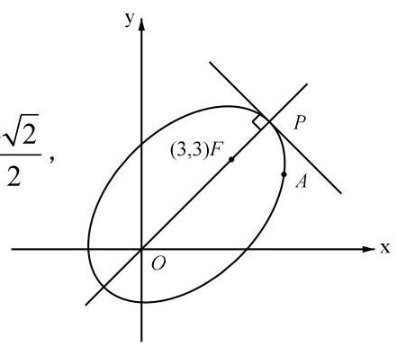

3. (普陀 10) 设平面上四点 $P, Q, M, N$ 满足: $\left| {PM}\right|  = \left| {PN}\right|  = 4,\left| {PQ}\right|  = 2$ ,若 $\overrightarrow{QM} \cdot  \overrightarrow{QN} = 0$ , 则 $\left| {MN}\right|$ 的最小值为___.

【解析】法一: 矩形大法,以 ${MQB}$ 顺次为矩形的三个顶点构造矩形 ${MQNR}$ ,

由矩形大法的结论得 $P{M}^{2} + P{N}^{2} = P{Q}^{2} + P{R}^{2}$ ,得 ${PR} = 2\sqrt{7}$ ,

由矩形性质得 ${MN} = {QR} \geq  {PR} - {PQ} = 2\sqrt{7} - 2$ (两边之差小于第三边),

则 $\left| {MN}\right|$ 的最小值为 $2\sqrt{7} - 2$ .

法二: 点 $Q$ 在半径为 2 的圆上,点 $M, N$ 在半径为 4 的圆上,且 $\overrightarrow{QM} \cdot  \overrightarrow{QN} = 0$ ,

则 $Q$ 在以 ${MN}$ 为直径的圆上,当且仅当两圆外切时, $\left| {MN}\right|$ 最短,

设 ${MN} = {2r}$ ,在 Rt ${\Delta AOE}$ 中,由勾股定理得 ${4}^{2} = {\left( 2 + r\right) }^{2} + {r}^{2}$ ,

解得 $r = \sqrt{7} - 1$ ,则 $\left| {MN}\right|$ 的最小值为 $2\sqrt{7} - 2$ .

4. (青浦 12) 已知 $A, B, C$ 是单位圆上任意不同三点,则 $\frac{\overrightarrow{AB} \cdot  \overrightarrow{AC}}{\left| \overrightarrow{AB}\right| }$ 的取值范围是___.

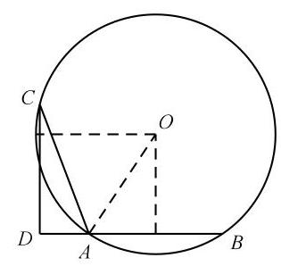

【解析】 $\frac{\overrightarrow{AB} \cdot  \overrightarrow{AC}}{\left| \overrightarrow{AB}\right| }$ 表示 $\overrightarrow{AC}$ 在 $\overrightarrow{AB}$ 上的数量投影,

当 ${AC} \rightarrow$ 直径, $B, C$ 趋于重合时, $\frac{\overrightarrow{AB} \cdot  \overrightarrow{AC}}{\left| \overrightarrow{AB}\right| }$ 趋于最大值 2 (取不到), 考虑 $\overrightarrow{AC}$ 和 $\overrightarrow{AB}$ 夹角为钝角,过点 $C$ 作 ${CD} \bot  {AB}$ 的反向延长线于 $D$ , 则 $\frac{\overrightarrow{AB} \cdot  \overrightarrow{AC}}{\left| \overrightarrow{AB}\right| } =  - {AD} =  - \left( {1 - \frac{1}{2}{AB}}\right)  = \frac{1}{2}{AB} - 1 \rightarrow   - 1$ , 综上, $\frac{\overrightarrow{AB} \cdot  \overrightarrow{AC}}{\left| \overrightarrow{AB}\right| }$ 的取值范围是 $\left( {-1,2}\right)$ .

5. (松江 11) 已知平面向量 $\overrightarrow{a}$ 与 $\overrightarrow{b}$ 的夹角为 $\theta ,\overrightarrow{b} - \overrightarrow{a}$ 与 $\overrightarrow{a}$ 的夹角为 ${3\theta },\theta  \in  \left( {0,\frac{\pi }{3}}\right) ,\left| \overrightarrow{a}\right|  = 1,\overrightarrow{a}$ 和 $\overrightarrow{b} - \overrightarrow{a}$ 在 $\overrightarrow{b}$ 上的数量投影分别为 $x, y$ ,则 $x\left( {y + \sin \theta }\right)$ 的取值范围是___.

【解析】因为平面向量 $\overrightarrow{a},\overrightarrow{b}$ 的夹角为 $\theta ,\overrightarrow{b} - \overrightarrow{a}$ 与 $\overrightarrow{a}$ 的夹角为 ${3\theta }$ ,

所以 $\overrightarrow{b} - \overrightarrow{a}$ 与 $\overrightarrow{b}$ 的夹角为 ${2\theta }$ ,由正弦定理得 $\frac{\left| \overrightarrow{b} - \overrightarrow{a}\right| }{\sin \theta } = \frac{\left| \overrightarrow{a}\right| }{\sin {2\theta }},\left| \overrightarrow{a}\right|  = 1$ ,

所以 $\frac{\left| \overrightarrow{b} - \overrightarrow{a}\right| }{\sin \theta } = \frac{\left| \overrightarrow{a}\right| }{\sin {2\theta }} = \frac{1}{2\sin \theta \cos \theta }$ ,所以 $\left| {\overrightarrow{b} - \overrightarrow{a}}\right|  = \frac{1}{2\cos \theta }$ ,

$\overrightarrow{b} - \overrightarrow{a}$ 在 $\overrightarrow{b}$ 上的数量投影为 $y = \left| {\overrightarrow{b} - \overrightarrow{a}}\right| \cos {2\theta } = \frac{\cos {2\theta }}{2\cos \theta }$ ,

所以 $x\left( {y + \sin \theta }\right)  = \cos \theta \left( {\frac{\cos {2\theta }}{2\cos \theta } + \sin \theta }\right)  = \frac{1}{2}\cos {2\theta } + \frac{1}{2}\sin {2\theta }$

$= \frac{\sqrt{2}}{2}\sin \left( {{2\theta } + \frac{\pi }{4}}\right) ,$

因为 $\theta  \in  \left( {0,\frac{\pi }{3}}\right)$ ,所以 $0 < {2\theta } < \frac{2\pi }{3}$ ,所以 $\frac{\pi }{4} < {2\theta } + \frac{\pi }{4} < \frac{11\pi }{12}$ ,

所以当 ${2\theta } + \frac{\pi }{4} \rightarrow  \frac{11\pi }{12}$ 时, $x\left( {y + \sin \theta }\right)$ 趋于最小值,

且最小值为 $\frac{\sqrt{2}}{2}\sin \frac{11\pi }{12} = \frac{\sqrt{2}}{2}\sin \frac{2\pi }{3}\cos \frac{\pi }{4} + \frac{\sqrt{2}}{2}\cos \frac{2\pi }{3}\sin \frac{\pi }{4} = \frac{\sqrt{3} - 1}{4}$ ,

当 ${2\theta } + \frac{\pi }{4} = \frac{\pi }{2}$ 时, $x\left( {y + \sin \theta }\right)$ 取得最大值,且最大值为 $\frac{\sqrt{2}}{2}$ ,

所以 $x\left( {y + \sin \theta }\right)$ 的取值范围为 $\left( {\frac{\sqrt{3} - 1}{4},\frac{\sqrt{2}}{2}}\right\rbrack$ .

## 第 13 节 立体几何

【表面积、体积计算】

1.(宝山 10)将棱长为 2 的正四面体绕着它的某一条棱旋转一周所得的几何体的体积为___.

【解析】将棱长为 2 的正四面体绕着它的某一条棱旋转一周,

得到的几何体是两个底面重合的圆锥底面相对组合而成的组合体,

正四面体的棱长为 2,设正四面体 ${ABCD}$ ,绕 ${AB}$ 棱旋转,取 ${AB}$ 中点 $E$ ,

连接 ${CE},{DE}$ ,在正四面体中 ${CE} = {DE}$ ,

由勾股定理,在等边三角形 ${ABC}$ 中, ${CE} = \sqrt{{2}^{2} - {1}^{2}} = \sqrt{3}$ ,

圆锥的底面半径 $r = \sqrt{3}$ ,圆锥的高 $h = 1$ ,

由圆锥体积公式 $V = \frac{1}{3}\pi {r}^{2}h$ ,这里组合体体积 $V = 2 \times  \frac{1}{3}\pi {r}^{2}h$ ,

将 $r = \sqrt{3}, h = 1$ 代入得 $V = 2 \times  \frac{1}{3}\pi  \times  {\left( \sqrt{3}\right) }^{2} \times  1 = {2\pi }$ .

2. (奉贤 11) 上海市奉贤区奉城镇的古建筑万佛阁(左图 1)的屋檐下常系挂风铃(中间图 2)，风吹铃动，悦耳清脆，亦称惊鸟铃. 一般一个惊鸟铃由铜铸造而成，由铃身和铃舌组成. 为了知道一个惊鸟铃的质量，可以通过计算该惊鸟铃的体积，然后由物理学知识计算出该惊鸟铃的质量. 因此我们需要作出一些合理的假设:

假设1: 铃身且可近似看作由一个较大的圆锥挖去一个较小的圆锥;

假设 2: 两圆锥的轴在同一条直线上;

假设 3: 铃身内部有一个挂铃舌的部位的体积忽略不计.

截面图如下 (右图 3),其中 ${O}_{1}{O}_{3} = {20}\mathrm{\;{cm}},{O}_{2}{O}_{3} = {18}\mathrm{\;{cm}},{AB} = {16}\mathrm{\;{cm}}$ ,则制作 100 个这样的惊鸟铃的铃身至少需要___千克铜(铜的密度为 ${8.9}\mathrm{\;g}/{\mathrm{{cm}}}^{3}$ ) (结果精确到个位).

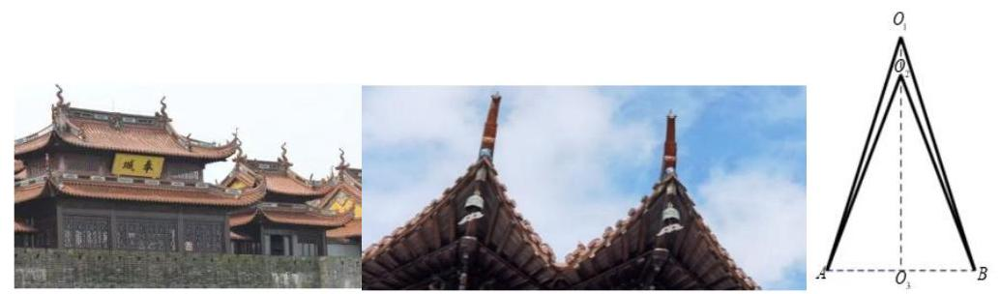

【解析】 ${V}_{{O}_{1}{O}_{3}} = \frac{1}{3}\pi  \cdot  {8}^{2} \cdot  {20} = \frac{64}{3}\pi  \cdot  {20},{V}_{{O}_{2}{O}_{3}} = \frac{1}{3} \cdot  \pi  \cdot  {8}^{2} \cdot  {18} = \frac{64}{3}\pi  \cdot  {18}$ ,

$V = {V}_{{O}_{1}{O}_{3}} - {V}_{{O}_{2}{O}_{3}} = \frac{64}{3}\pi  \cdot  \left( {{20} - {18}}\right)  = \frac{128}{3}\pi {\mathrm{{cm}}}^{3},$

$m = {\rho V} = {8.99}/{\mathrm{{cm}}}^{3} \cdot  \frac{128}{3}\pi {\mathrm{{cm}}}^{3} \times  {100} \times  {10}^{-3} \approx  {119.3}\mathrm{\;{kg}},$

所以制作 100 个这样的惊鸟铃的铃身至少需要 120 千克铜(119 也可以).

3. (虹口 6) 若某圆锥的底面半径为 1 , 高为 1 , 则该圆锥的侧面积为___ (结果保留 $\pi$ ).

【解析】圆锥的母线 $l = \sqrt{2}$ ,则该圆锥的侧面积为 ${\pi rl} = \sqrt{2}\pi$ .

4. (黄浦 4)若圆柱的底面半径与高均为 1 ，则其侧面积为___.

【解析】其侧面积为 ${2\pi rh} = {2\pi }$ .

5. (嘉定 6) 某圆锥的母线长为 2, 底面半径为 1, 则该圆锥的侧面积为___.

【解析】圆锥的侧面积为 ${\pi rl} = {2\pi }$ .

6. (金山 7) 已知某圆锥的侧面展开图是圆心角为 $\sqrt{2}\pi$ ,半径为 2 的扇形,则该圆锥的母线与底面所成角的大小为___.

【解析】设底面半径为 $r$ ,则 $2\sqrt{2}\pi  = {2\pi r}$ ,得 $r = \sqrt{2}$ ,母线为 2,

则母线与底面所成角的余弦值为 $\frac{\sqrt{2}}{2}$ ,所以母线与底面所成角的大小为 $\frac{\pi }{4}$ .

7. (闵行 5) 已知圆锥的高为 8，底面半径为 6，则该圆锥的侧面积为___.

【解析】圆锥的母线为 10,该圆锥的侧面积为 ${\pi rl} = {60\pi }$ .

8. (普陀 8) 若圆锥 ${PO}$ 的体积为 $\frac{2\sqrt{2}\pi }{3}$ ，它的母线与底面所成的角的余弦值为 $\frac{1}{3}$ ，则圆锥 ${PO}$ 的表面积为___.

【解析】设底面半径为 $r$ ,高为 $h$ ,母线为 $l$ ,则 $\frac{1}{3}\pi {r}^{2}h = \frac{2\sqrt{2}\pi }{3},\frac{r}{l} = \frac{1}{3},{r}^{2} + {h}^{2} = {l}^{2}$ ,

解得 $r = 1, h = 2\sqrt{2}, l = 3$ ,则圆锥 ${PO}$ 的表面积为 $\pi {r}^{2} + {\pi rl} = {4\pi }$ .

9. (青浦 8) 已知圆柱 $M$ 的底面半径为 3,高为 $\sqrt{3}$ ,圆锥 $N$ 的底面直径和母线长相等. 若圆柱 $M$ 和圆锥 $N$ 的体积相同,则圆锥 $N$ 的底面半径为 ___.

【解析】设圆锥 $N$ 的底面半径为 $r$ ,则圆锥的母线为 ${2r}$ ,高为 $\sqrt{3}r$ ,

由题意得 $\pi  \times  {3}^{2} \times  \sqrt{3} = 9\sqrt{3}\pi  = \frac{1}{3}\pi {r}^{2} \cdot  \sqrt{3}r$ ,所以 $r = 3$ .

10. (松江 6)已知一个圆锥的底面半径为 3，其侧面积为 ${15\pi }$ ，则该圆锥的高为___.

【解析】圆锥的底面半径 $r = 3$ ,设其母线长为 $l$ ,则 ${\pi rl} = {15\pi }$ ,解得 $l = 5$ ,

所以该圆锥的高 $h = \sqrt{{l}^{2} - {r}^{2}} = \sqrt{{5}^{2} - {3}^{2}} = 4$ .

11. (徐汇 11) 徐汇滨江作为 2024 年上海国际鲜花展的三个主会场之一, 吸引了广大市民前往观展并拍照留念. 图中的花盆是种植鲜花的常见容器, 它可视作两个圆台的组合体，上面圆台的上，下底面直径分别为 30cm 和 26cm，下面圆台的上，下底面直径分别为 ${24}\mathrm{\;{cm}}$ 和 ${18}\mathrm{\;{cm}}$ ,且两个圆台侧面展开图的圆弧所对的圆心角相等. 若上面圆台的高为 $8\mathrm{\;{cm}}$ ，则该花盆上、下两部分母线长的总和为___cm.

【解析】两个圆台侧面展开放在同一个扇形中,设扇形的圆心角为 $\theta$ ,

在弧度制下, 由于弧长等于半径乘圆心角的弧度,

则上下两个圆台的母线分别为 $\frac{30}{\theta } - \frac{26}{\theta } = \frac{4}{\theta },\frac{24}{\theta } - \frac{18}{\theta } = \frac{6}{\theta }$ ,

因为上面圆台的上，下底面直径分别为 ${30}\mathrm{\;{cm}}$ 和 ${26}\mathrm{\;{cm}}$ ，上面圆台的高为 $8\mathrm{\;{cm}}$ ，

所以 $\frac{4}{\theta } = \sqrt{{\left( {15} - {13}\right) }^{2} + {8}^{2}} = 2\sqrt{17}$ ,

则该花盆上、下两部分母线长的总和为 $\frac{4}{\theta } + \frac{6}{\theta } = \frac{10}{\theta } = 5\sqrt{17}\mathrm{\;{cm}}$ .

12. (杨浦 7) 已知一个正四棱锥的每一条棱长都为 2,则该四棱锥的体积为___.

【解析】正四棱锥的高为 $\sqrt{2}$ ,体积 $V = \frac{1}{3}{Sh} = \frac{1}{3} \times  2 \times  2 \times  \sqrt{2} = \frac{4\sqrt{2}}{3}$ .

13. (长宁 2) 已知圆锥的底面半径为 1,母线长为 2,则该圆锥的体积是___(结果保留 $\pi$ ).

【解析】圆锥的高 $h = \sqrt{3}$ ,则该圆锥的体积是 $\frac{1}{3}\pi {r}^{2}h = \frac{\sqrt{3}}{3}\pi$ .

【位置关系】

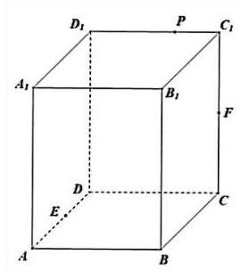

1. (宝山 15)如图，正四棱柱 ${ABCD} - {A}_{1}{B}_{1}{C}_{1}{D}_{1}$ 的底面 ${ABCD}$ 边长为___. 上任意一点, $F$ 为 $C{C}_{1}$ 中点,若棱 ${C}_{1}{D}_{1}$ 上至少存在一点 $P$ 使得 ${PE} \bot  {PF}$ ,则棱长 $A{A}_{1}$ 的最大值为( )

A. $\frac{\sqrt{2}}{2}$ B. 1 C. $\sqrt{2}$ D. 2

【解析】建系,设 $A{A}_{1} = h$ ,设 $P\left( {0, a, h}\right) \left( {0 \leq  a \leq  1}\right) , E\left( {b,0,0}\right) \left( {0 \leq  b \leq  1}\right) , F\left( {0,1,\frac{h}{2}}\right)$ ,

所以 $\overrightarrow{PE} = \left( {b, - a, - h}\right) ,\overrightarrow{PF} = \left( {0,1 - a, - \frac{h}{2}}\right)$ ,

因为 ${PE} \bot  {PF}$ ,所以 $\overrightarrow{PE} \cdot  \overrightarrow{PF} = a\left( {a - 1}\right)  + \frac{{h}^{2}}{2} = 0$ ,

所以 $\frac{{h}^{2}}{2} = a\left( {1 - a}\right)  \leq  {\left( \frac{a + 1 - a}{2}\right) }^{2} = \frac{1}{4}$ ,所以 $h \leq  \frac{\sqrt{2}}{2}$ ,故选 $A$ .

2. (崇明 14)已知直线 $l$ 和平面 $\alpha$ ，则 “ $l$ 垂直于平面 $\alpha$ 内的两条直线” 是 “ $l \bot  \alpha$ ” 的( )

A. 充分非必要条件 B. 必要非充分条件

C. 充要条件 D. 既非充分也非必要条件

【解析】“ $l$ 垂直于平面 $\alpha$ 内的两条直线” 缺少两直线相交的条件,推不出 “ $l \bot  \alpha$ ”, “ $l \bot  \alpha$ ” 能推出 “ $l$ 垂直于平面 $\alpha$ 内的两条直线”, 故为必要非充分条件,故选 $B$ .

3.(黄浦 14)若从正方体八个顶点中任取四个顶点分别记为 $A, B, C, D$ ，则直线 ${AB}$ 与 ${CD}$ 所成角的大小不可能为( )

A. ${30}^{ \circ  }$ B. ${45}^{ \circ  }$ C. ${60}^{ \circ  }$ D. ${90}^{ \circ  }$

【解析】 ${45}^{ \circ  }$ 取同一个面上等腰直角三角形三个顶点即可,

${60}^{ \circ  }$ 取两条异面的面对角线即可,

${90}^{ \circ  }$ 取平行面的两条垂直的面对角线即可,

故选 $A$ .

4. (金山 16) 已知三棱锥 ${A}_{1} - {A}_{2}{A}_{3}{A}_{4}$ 的侧棱长相等,且侧棱两两垂直. 设 $P$ 为该三棱锥表面 (含棱) 上异于顶点 ${A}_{1},{A}_{2},{A}_{3},{A}_{4}$ 的点,记 $D = \left\{  {d\left| {d = }\right| P{A}_{i}\mid , i = 1,2,3,4}\right\}$ . 若集合 $D$ 中有且只有 2 个元素,则符合条件的点 $P$ 有(   )个.

A. 3 B. 6 C. 7 D. 10

【解析】设 ${d}_{i} = P{A}_{i}$ ,

①若 $P$ 到其中两个顶点的距离相等，

若 ${d}_{1} = {d}_{2},{d}_{3} = {d}_{4}$ ,则 $P$ 同时在 ${A}_{1}{A}_{2}$ 的中垂面和 ${A}_{3}{A}_{4}$ 的中垂面上,

两个中垂面有一条交线,则 $P$ 为该交线和三棱锥 ${A}_{1} - {A}_{2}{A}_{3}{A}_{4}$ 的交点,

此时点 $P$ 有两个,

其他情况同理,故符合条件的点 $P$ 有 $3 \times  2 = 6$ 个 (3 是平均分组);

②若 $P$ 到其中三个顶点的距离相等，

若 ${d}_{1} \neq  {d}_{2} = {d}_{3} = {d}_{4}$ ,则 $P$ 在经过 $\Delta {A}_{2}{A}_{3}{A}_{4}$ 的外心且垂直于 $\Delta {A}_{2}{A}_{3}{A}_{4}$ 的直线上, 该直线和三棱锥 ${A}_{1} - {A}_{2}{A}_{3}{A}_{4}$ 有 2 个交点,但是要舍去一个 ${A}_{1}$ ,故点 $P$ 有 1 个; 若 ${d}_{1} = {d}_{2} = {d}_{3} \neq  {d}_{4}$ ,同上讨论,但是 $\Delta {A}_{2}{A}_{3}{A}_{4}$ 的外心为 ${A}_{2}{A}_{3}$ 中点,

$P$ 在经过 $\Delta {A}_{2}{A}_{3}{A}_{4}$ 的外心且垂直于 $\Delta {A}_{2}{A}_{3}{A}_{4}$ 的直线上,

该直线和三棱锥 ${A}_{1} - {A}_{2}{A}_{3}{A}_{4}$ 有 1 个交点,故点 $P$ 有 1 个,

同理,若 ${d}_{1} = {d}_{2} \neq  {d}_{3} = {d}_{4}$ 或 ${d}_{1} = {d}_{3} = {d}_{4} \neq  {d}_{2}$ 时,点 $P$ 有 1 个;

故符合条件的点 $P$ 有 4 个;

综上,符合条件的点 $P$ 有 10 个,故选 $D$ .

5. (静安 15) 我国古代数学著作《九章算术》中将四个面都是直角三角形的空间四面体叫做

“鳖臑”. 如图是一个水平放置的 $\bigtriangleup {ABC},{CD} \bot  {AB},\angle A = {30}^{ \circ  },\angle B = {45}^{ \circ  }$ . 现将 $\operatorname{Rt}\bigtriangleup {ACD}$ 沿 ${CD}$ 折起,使点 $A$ 移动到点 ${A}^{\prime }$ ,使得空间四面体 ${A}^{\prime }{BCD}$ 恰好是一个 “鳖臑”,则二面角 ${A}^{\prime } - {CD} - B$ 的大小为( )

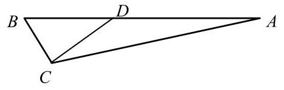

A. ${60}^{ \circ  }$ B. ${90}^{ \circ  }$ C. arctan 2

D. $\arccos \frac{\sqrt{3}}{3}$

【解析】在空间四面体 ${A}^{\prime }{BCD}$ 中, ${A}^{\prime }D \bot  {CD}$ ,不妨设 ${CD} = 1$ ,则 ${BD} = 1,{AD} = \sqrt{3}$ , 由勾股定理得 ${AC} = 2,{BC} = \sqrt{2},{A}^{\prime }B = \sqrt{2}$ , 二面角 ${A}^{\prime } - {CD} - B$ 的平面角为 $\angle {A}^{\prime }{DB}$ ， $\cos \angle {A}^{\prime }{DB} = \frac{BD}{{A}^{\prime }D} = \frac{\sqrt{3}}{3}$ ， 则二面角 ${A}^{\prime } - {CD} - B$ 的大小为 $\arccos \frac{\sqrt{3}}{3}$ ，故选 $D$ .

6. (闵行 13)在空间中，“直线 $a, b$ 为异面直线” 是 “直线 $a, b$ 不相交” 的()

A. 充分非必要条件 B. 必要非充分条件

C. 充要条件 D. 既非充分又非必要条件

【解析】充分性显然成立; 直线直线 $a, b$ 不相交,也可以平行,必要性不成立; 故选 $A$ .

7. (浦东 14) 设 $m, n$ 为两条直线, $\alpha ,\beta$ 为两个平面,且 $\alpha  \cap  \beta  = n$ . 下述四个命题中为假命题的是( )

A. 若 $m \bot  \alpha$ ,则 $m \bot  n$ B. 若 $m//\alpha$ ,则 $m//n$

C. 若 $m//\alpha$ 且 $m//\beta$ ,则 $m//n$ D. 若 $m//n$ ,则 $m//\alpha$ 或 $m//\beta$

【解析】若 $m//\alpha$ ,则 $m//n$ 不一定成立,故选 $B$ .

8. (徐汇 6 ) 已知 $m, n$ 为空间中两条不同的直线， $\alpha ,\beta$ 为两个不同的平面，若 $m \subset  \alpha ,\alpha  \cap  \beta  = n$ ，则 $m//n$ 是 $m//\beta$ 的___条件(填: “充分非必要”、“必要非充分”、“充要”、“既非充分又非必要”中的一个).

【答案】充要

【空间向量小题】

1. (崇明 9) 在空间直角坐标系中,点 $\left( {1,2,3}\right)$ 关于 ${xOy}$ 平面的对称点的坐标是___.

【答案】 $\left( {1,2, - 3}\right)$

2. (奉贤 15) 在四棱锥 $S - {ABCD}$ 中，若 $\overrightarrow{SA} = x\overrightarrow{SB} + y\overrightarrow{SC} + z\overrightarrow{SD}$ ，则实数组 $\left( {x, y, z}\right)$ 可能是 ( )

A. $\left( {1, - 1,1}\right)$ B. $\left( {1,0, - 1}\right)$ C. $\left( {1,0,0}\right)$ D. $\left( {1, - 1, - 1}\right)$

【解析】本题考查共面向量定理,因为 $A, B, C, D$ 四点共面,所以 $x + y + z = 1$ , 则 $\mathrm{B}$ 和 $\mathrm{D}$ 直接排除,又 $\mathrm{C}$ 显然不可能,故实数组 $\left( {x, y, z}\right)$ 可能是 $\left( {1, - 1,1}\right)$ , 故选 $A$ .

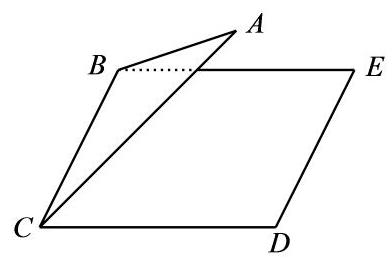

3. (虹口 9) 如图,已知正三角形 ${ABC}$ 和正方形 ${BCDE}$ 的边长均为 2,且二面角 $A - {BC} - D$ 的大小为 $\frac{\pi }{6}$ ,则 $\overrightarrow{AC} \cdot  \overrightarrow{BD} =$ ___.

【解析】法一: 取 ${BC}$ 中点 $O,{DE}$ 中点 $M$ ,则 ${OM} \bot  {BC},{OA} \bot  {BC}$ , 所以 $\angle {AOM}$ 是二面角 $A - {BC} - D$ 的平面角,则 $\angle {AOM} = \frac{\pi }{6}$ , $\overrightarrow{AC} \cdot  \overrightarrow{BD} = \left( {\overrightarrow{OC} - \overrightarrow{OA}}\right)  \cdot  \left( {\overrightarrow{BC} + \overrightarrow{CD}}\right)  = \left( {\overrightarrow{OC} - \overrightarrow{OA}}\right)  \cdot  \left( {2\overrightarrow{OC} + \overrightarrow{OM}}\right) \; = 2{\overrightarrow{OC}}^{2} + \overrightarrow{OC} \cdot  \overrightarrow{OM} - 2\overrightarrow{OA} \cdot  \overrightarrow{OC} - \overrightarrow{OA} \cdot  \overrightarrow{OM} = 2 + 0 - 0 - \sqrt{3} \times  2\cos \frac{\pi }{6} =  - 1$ .

法二: 取 ${BC}$ 中点 $O$ ,连接 ${OA}$ ,过 $O$ 作 ${BC}$ 的垂线,交 ${DE}$ 于点 $F$ ,

因为正三角形 ${ABC}$ 边长均为 2,二面角 $A - {BC} - D$ 的大小为 $\frac{\pi }{6}$ ,

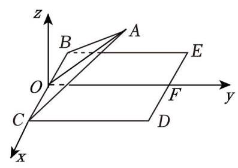

则 ${OA} \bot  {BC},{OF} \bot  {BC}$ ,

则 $\angle {AOF}$ 为二面角 $A - {BC} - D$ 的平面角,即 $\angle {AOF} = \frac{\pi }{6}$ , 且 $2 \times  \frac{\sqrt{3}}{2} \times  \sin \frac{\pi }{6} = \frac{\sqrt{3}}{2},2 \times  \frac{\sqrt{3}}{2} \times  \cos \frac{\pi }{6} = \frac{3}{2}$ ,

建立如图所示的空间直角坐标系,

则 $A\left( {0,\frac{3}{2},\frac{\sqrt{3}}{2}}\right) , B\left( {-1,0,0}\right) , C\left( {1,0,0}\right) , D\left( {1,2,0}\right)$ ,

故 $\overrightarrow{AC} = \left( {1, - \frac{3}{2}, - \frac{\sqrt{3}}{2}}\right) ,\overrightarrow{BD} = \left( {2,2,0}\right)$ ,故 $\overrightarrow{AC} \cdot  \overrightarrow{BD} =  - 1$ .

4. (虹口 15) 已知边长为 2 的正四面体 $A - {BCD}$ 的内切球(球面与四面体四个面都相切的球) 的球心为 $O$ ,若空间中的动点 $P$ 满足 $\overrightarrow{OP} = x\overrightarrow{OC} + y\overrightarrow{OB} + z\overrightarrow{OD}, x, y, z \in  \left\lbrack  {0,1}\right\rbrack$ ,则点 $P$ 的轨迹所形成的几何体的体积为( )

A. $\sqrt{2}$

B. $\frac{\sqrt{2}}{3}$ C. $2\sqrt{3}$

D. $\frac{\sqrt{3}}{3}$

【解析】若空间中的动点 $P$ 满足 $\overrightarrow{OP} = x\overrightarrow{OC} + y\overrightarrow{OB} + z\overrightarrow{OD}, x, y, z \in  \left\lbrack  {0,1}\right\rbrack$ ,

则点 $P$ 的轨迹所形成的几何体为以 ${OB},{OC},{OD}$ 为邻边的平行六面体,

$V = 2{S}_{\bigtriangleup {COD}} \cdot  {h}_{B - {COD}} = 6 \cdot  \frac{1}{3}{S}_{\bigtriangleup {COD}} \cdot  {h}_{B - {COD}} = 6{V}_{B - {COD}} = 6{V}_{O - {BCD}},$

正四面体 $A - {BCD}$ 的高 $h = \sqrt{{2}^{2} - {\left( \frac{2\sqrt{3}}{3}\right) }^{2}} = \frac{2\sqrt{6}}{3}$ ,

则 ${V}_{A - {BCD}} = \frac{1}{3} \times  \left( {\frac{\sqrt{3}}{4} \times  {2}^{2}}\right)  \times  \frac{2\sqrt{6}}{3} = \frac{2\sqrt{18}}{9} = \frac{2\sqrt{2}}{3}$ ,

${S}_{A - {BCD}} = 4 \times  \frac{\sqrt{3}}{4} \times  {2}^{2} = 4\sqrt{3},$

所以内切圆半径 $r = \frac{3{V}_{A - {BCD}}}{{S}_{A - {BCD}}} = \frac{2\sqrt{2}}{4\sqrt{3}} = \frac{\sqrt{6}}{6}$ ,

则 ${V}_{O - {BCD}} = \frac{1}{3} \times  \left( {\frac{\sqrt{3}}{4} \times  {2}^{2}}\right)  \times  \frac{\sqrt{6}}{6} = \frac{\sqrt{2}}{6}$ ,故 $V = 6{V}_{O - {BCD}} = \sqrt{2}$ ,故选 $A$ .

5.(黄浦 8)在正四面体 ${ABCD}$ 中，点 $N$ 是 $\bigtriangleup  {ABC}$ 的中心，若

$\overrightarrow{DN} = \lambda \overrightarrow{DA} + \mu \overrightarrow{DB} + v\overrightarrow{BC}\left( {\lambda ,\mu , v \in  \mathbf{R}}\right)$ ,则 $\lambda  + \mu  + v =$ ___.

【解析】 $\overrightarrow{DN} = \lambda \overrightarrow{DA} + \mu \overrightarrow{DB} + v\left( {\overrightarrow{DC} - \overrightarrow{DB}}\right)  = \lambda \overrightarrow{DA} + \left( {\mu  - v}\right) \overrightarrow{DB} + v\overrightarrow{DC}$ ,

又 $\overrightarrow{DN} = \overrightarrow{DC} + \overrightarrow{CN} = \overrightarrow{DC} + \frac{1}{3}\left( {\overrightarrow{CA} + \overrightarrow{CB}}\right)  = \overrightarrow{DC} + \frac{1}{3}\left( {\overrightarrow{DA} - \overrightarrow{DC} + \overrightarrow{DB} - \overrightarrow{DC}}\right)$

$= \frac{1}{3}\overrightarrow{DA} + \frac{1}{3}\overrightarrow{DB} + \frac{1}{3}\overrightarrow{DC}$ ,所以 $\lambda  = \mu  - v = v = \frac{1}{3}$ ,所以 $\lambda  + \mu  + v = \frac{4}{3}$ .

6. (嘉定 10 ) 已知空间向量 $\overrightarrow{O{B}_{1}},\overrightarrow{O{B}_{2}},\overrightarrow{O{B}_{3}}$ 两两垂直,若空间点 $A$ 满足 $\left| \overrightarrow{A{B}_{1}}\right|  = \left| \overrightarrow{A{B}_{2}}\right|  = \left| \overrightarrow{A{B}_{3}}\right|  = 1$ ,记 $\overrightarrow{OP} = \overrightarrow{O{B}_{1}} + \overrightarrow{O{B}_{2}} + \overrightarrow{O{B}_{3}}$ ,且 $\left| \overrightarrow{AP}\right|  \leq  1$ ,则 $\left| \overrightarrow{OA}\right|$ 的取值范围为___.

【解析】法一: 设 ${B}_{1}\left( {a,0,0}\right) ,{B}_{2}\left( {0, b,0}\right) ,{B}_{3}\left( {0,0, c}\right) , A\left( {m, n, p}\right) , P\left( {a, b, c}\right)$ ,

由题意得 $\left\{  \begin{array}{l} {\left( m - a\right) }^{2} + {n}^{2} + {p}^{2} = 1 \\  {m}^{2} + {\left( n - b\right) }^{2} + {p}^{2} = 1 \\  {m}^{2} + {n}^{2} + {\left( p - c\right) }^{2} = 1 \end{array}\right.$ ,且 ${\left( m - a\right) }^{2} + {\left( n - b\right) }^{2} + {\left( p - c\right) }^{2} \leq  1$ ,

所以 $1 - {n}^{2} - {p}^{2} + 1 - {m}^{2} - {p}^{2} + 1 - {m}^{2} - {n}^{2} \leq  1$ ,所以 $2\left( {{m}^{2} + {n}^{2} + {p}^{2}}\right)  \geq  2$ ,

所以 ${m}^{2} + {n}^{2} + {p}^{2} \geq  1$ ,且 ${m}^{2} + {n}^{2} + {p}^{2} = \frac{1}{2}\left( {{n}^{2} + {p}^{2} + {m}^{2} + {p}^{2} + {m}^{2} + {n}^{2}}\right)  \leq  \frac{3}{2}$ ,

所以 $\left| \overrightarrow{OA}\right|  = \sqrt{{m}^{2} + {n}^{2} + {p}^{2}} \in  \left\lbrack  {1,\frac{\sqrt{6}}{2}}\right\rbrack$ .

法二: $3 = \left| \overrightarrow{A{B}_{1}}\right|  + \left| \overrightarrow{A{B}_{2}}\right|  + \left| \overrightarrow{A{B}_{3}}\right|  = {\left( \overrightarrow{O{B}_{1}} - \overrightarrow{OA}\right) }^{2} + {\left( \overrightarrow{O{B}_{2}} - \overrightarrow{OA}\right) }^{2} + {\left( \overrightarrow{O{B}_{3}} - \overrightarrow{OA}\right) }^{2}$

$= 3{\left| \overrightarrow{OA}\right| }^{2} - 2\overrightarrow{OA} \cdot  \left( {\overrightarrow{O{B}_{1}} + \overrightarrow{O{B}_{2}} + \overrightarrow{O{B}_{3}}}\right)  + \left( {{\left| \overrightarrow{O{B}_{1}}\right| }^{2} + {\left| \overrightarrow{O{B}_{2}}\right| }^{2} + {\left| \overrightarrow{O{B}_{3}}\right| }^{2}}\right)$

$= 3{\left| \overrightarrow{OA}\right| }^{2} - 2\overrightarrow{OA} \cdot  \overrightarrow{OP} + {\left( \overrightarrow{O{B}_{1}} + \overrightarrow{O{B}_{2}} + \overrightarrow{O{B}_{3}}\right) }^{2} - 2\left( {\overrightarrow{O{B}_{1}} \cdot  \overrightarrow{O{B}_{2}} + \overrightarrow{O{B}_{2}} \cdot  \overrightarrow{O{B}_{3}} + \overrightarrow{O{B}_{1}} \cdot  \overrightarrow{O{B}_{3}}}\right)$

因为 $\overrightarrow{O{B}_{1}},\overrightarrow{O{B}_{2}},\overrightarrow{O{B}_{3}}$ 两两垂直，所以 $\overrightarrow{O{B}_{1}} \cdot  \overrightarrow{O{B}_{2}} + \overrightarrow{O{B}_{2}} \cdot  \overrightarrow{O{B}_{3}} + \overrightarrow{O{B}_{1}} \cdot  \overrightarrow{O{B}_{3}} = 0$ ,

所以 $3 = 2{\left| \overrightarrow{OA}\right| }^{2} + {\left| \overrightarrow{OA}\right| }^{2} - 2\overrightarrow{OA} \cdot  \overrightarrow{OP} + {\left| \overrightarrow{OP}\right| }^{2} = 2{\left| \overrightarrow{OA}\right| }^{2} + {\left( \overrightarrow{OA} - \overrightarrow{OP}\right) }^{2}$

$= 2{\left| \overrightarrow{OA}\right| }^{2} + {\left| \overrightarrow{AP}\right| }^{2}$ ,所以 ${\left| \overrightarrow{OA}\right| }^{2} = \frac{3 - {\left| \overrightarrow{AP}\right| }^{2}}{2}$ ,

因为 $\left| \overrightarrow{AP}\right|  \in  \left\lbrack  {0,1}\right\rbrack$ ,所以 $\overrightarrow{OA} \in  \left\lbrack  {1,\frac{\sqrt{6}}{2}}\right\rbrack$ .

7. (静安 16) 在四棱锥 $P - {ABCD}$ 中， $\overrightarrow{AB} = \left( {4, - 2,3}\right) ,\overrightarrow{AD} = \left( {-4,1,0}\right) ,\overrightarrow{AP} = \left( {-6,2, - 8}\right)$ ， 则该四棱锥的高为( )

A. 4 B. 3 C. 2 D. 1

【解析】法一: 设平面 ${ABCD}$ 的法向量为 $\overrightarrow{n} = \left( {x, y, z}\right)$ ,

则 $\overrightarrow{n} \cdot  \overrightarrow{AB} = {4x} - {2y} + {3z} = 0,\overrightarrow{n} \cdot  \overrightarrow{AD} =  - {4x} + y = 0$ ,取 $x = 3$ ,得 $\overrightarrow{n} = \left( {3,{12},4}\right)$ , 所以该四棱锥的高为 $\frac{\left| \overrightarrow{AP} \cdot  \overrightarrow{n}\right| }{\left| \overrightarrow{n}\right| } = \frac{\left| -{18} + {24} - {32}\right| }{\sqrt{169}} = 2$ ,故选 $C$ .

法二: 设高为 ${PH},\overrightarrow{PH} = \left( {x, y, z}\right)$ ,

则 $\overrightarrow{PH} \cdot  \overrightarrow{AB} = {4x} - {2y} + {3z},\overrightarrow{PH} \cdot  \overrightarrow{AD} =  - {4x} + y$ ,解得 $\overrightarrow{PH} = \left( {x,{4x},\frac{4}{3}x}\right)$ ,

此时有 $\left( {\overrightarrow{AP} - \overrightarrow{PH}}\right)  \cdot  \overrightarrow{PH} = \overrightarrow{AP} \cdot  \overrightarrow{PH} - {\left| \overrightarrow{PH}\right| }^{2} = 0$ ,

由于 $\overrightarrow{AP} \cdot  \overrightarrow{PH} =  - {6x} + {8x} - \frac{32}{3}x =  - \frac{26}{3}x,{\left| \overrightarrow{PH}\right| }^{2} = {x}^{2} + {16}{x}^{2} + \frac{16}{9}{x}^{2} = \frac{169}{9}{x}^{2}$ ,

解得 $x = 0$ (舍), $x =  - \frac{6}{13}$ ,因此 $h = \left| \overrightarrow{PH}\right|  = 2$ ,故选 $C$ .

8. ( 浦东 11 ) 已知 空间中三个单位向量 $\overrightarrow{O{A}_{1}},\overrightarrow{O{A}_{2}},\overrightarrow{O{A}_{3}},\overrightarrow{O{A}_{1}} \cdot  \overrightarrow{O{A}_{2}} = \overrightarrow{O{A}_{2}} \cdot  \overrightarrow{O{A}_{3}} = \overrightarrow{O{A}_{3}} \cdot  \overrightarrow{O{A}_{1}} = 0, P$ 为空间中一点，且满足 $\left| {\overrightarrow{OP} \cdot  \overrightarrow{O{A}_{1}}}\right|  = 1,\left| {\overrightarrow{OP} \cdot  \overrightarrow{O{A}_{2}}}\right|  = 2,\left| {\overrightarrow{OP} \cdot  \overrightarrow{O{A}_{3}}}\right|  = 3$ ，则点 $P$ 个数的最大值为___.

【解析】设 ${A}_{1}\left( {1,0,0}\right) ,{B}_{1}\left( {0,1,0}\right) ,{C}_{1}\left( {0,0,1}\right) , P\left( {x, y, z}\right)$ ,则 $\left| x\right|  = 1,\left| y\right|  = 2,\left| z\right|  = 3$ , 所以 $x =  \pm  1, y =  \pm  2, z =  \pm  3$ ,则点 $P$ 个数的最大值为 $2 \times  2 \times  2 = 8$ 个.

9. (普陀 9) 设 $\lambda  \in  \mathbf{R}$ ,在如图所示的平行六面体 ${ABCD} - {A}_{1}{B}_{1}{C}_{1}{D}_{1}$ 中, $\angle {A}_{1}{AB} = \angle {A}_{1}{AD} = \angle {BAD} = \frac{\pi }{3}, A{A}_{1} = 2,{AB} = {AD} = 1$ ,点 $M$ 是棱 ${C}_{1}{D}_{1}$ 的中点， $\overrightarrow{{A}_{1}N} = \lambda \overrightarrow{{A}_{1}{D}_{1}}$ ，若 $\overrightarrow{AM} \cdot  \overrightarrow{CN} = 2$ ，则 $\lambda$ 的值为___.

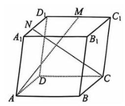

【解析】因为 $\angle {A}_{1}{AB} = \angle {A}_{1}{AD} = \angle {BAD} = \frac{\pi }{3}, A{A}_{1} = 2,{AB} = {AD} = 1$ , 所以 $\overrightarrow{AD} \cdot  \overrightarrow{A{A}_{1}} = 1,\overrightarrow{AD} \cdot  \overrightarrow{AB} = \frac{1}{2},\overrightarrow{A{A}_{1}} \cdot  \overrightarrow{AB} = 1$ , 因为 $\overrightarrow{AM} = \overrightarrow{AD} + \overrightarrow{AM} + \frac{1}{2}\overrightarrow{AB},\overrightarrow{CN} = \overrightarrow{A{A}_{1}} - \overrightarrow{AB} - \left( {1 - \lambda }\right)  \cdot  \overrightarrow{AD}$ , 所以 $\overrightarrow{AM} \cdot  \overrightarrow{CN} = 2 = 1 - \frac{1}{2} - \left( {1 - \lambda }\right)  \cdot  1 + 4 - 1 - \left( {1 - \lambda }\right)  \cdot  1 + \frac{1}{2} \cdot  1 - \frac{1}{2} - \frac{1}{2}\left( {1 - \lambda }\right)  \cdot  \frac{1}{2}$ , 解得 $\lambda  = \frac{1}{3}$ .

10. (青浦 14) 若点 $P\left( {a, b, c}\right) \left( {{abc} \neq  0}\right)$ 关于平面 ${xOy}$ 的对称点为 $A$ ,关于 $z$ 轴的对称点为 $B$ , 则 $A\text{ 、 }B$ 两点(   )

A. 关于坐标原点 $O$ 对称 B. 关于 $x$ 轴对称

C. 关于 $y$ 轴对称 D. 关于平面 ${xOz}$ 对称

【解析】 $A\left( {a, b, - c}\right) , B\left( {-a, - b, c}\right)$ ,则 $A\text{ 、 }B$ 两点关于坐标原点 $O$ 对称,故选 $A$ .

11. (长宁 12) 点 $P, M, N$ 分别位于正方体 ${ABCD} - {A}^{\prime }{B}^{\prime }{C}^{\prime }{D}^{\prime }$ 的面上, ${AB} = 1$ ,则 $\overrightarrow{PM} \cdot  \overrightarrow{PN}$ 的最小值是___.

【解析】取 ${MN}$ 中点 $O$ ,则 $\overrightarrow{PM} \cdot  \overrightarrow{PN} = O{P}^{2} - \frac{1}{4}M{N}^{2}$ ,

考虑 ${OP}$ 尽可能小, ${MN}$ 尽可能大即可,

情况①， ${MN}$ 取体对角线 $\sqrt{3}$ ，此时 $O{P}_{\min } = \frac{1}{2}$ ， $\overrightarrow{PM} \cdot  \overrightarrow{PN} \geq  \frac{1}{4} - \frac{3}{4} =  - \frac{1}{2}$ ；

情况②， ${MN}$ 取面对角线 $\sqrt{2}$ ，此时 $O{P}_{\min } = 0$ ， $\overrightarrow{PM} \cdot  \overrightarrow{PN} \geq  0 - \frac{2}{4} =  - \frac{1}{2}$ ；

综上, $\overrightarrow{PM} \cdot  \overrightarrow{PN}$ 的最小值是 $- \frac{1}{2}$ .

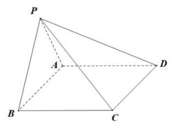

【大题】

1. (宝山 17 ) 如图,则棱锥 $P - {ABCD}$ 中,底面 ${ABCD}$ 为矩形, ${PA} = {PB} = {AD} = 3,\;{AB} = 4$ ，且该四棱锥的体积为 $4\sqrt{5}$ .

(1)证明:平面 ${PAB} \bot$ 底面 ${ABCD}$ ；

(2)求异面直线 ${PC}$ 和 ${AB}$ 所成角的余弦值.

【解析】(1) 设该四棱锥的高为 $h$ ,则体积 $V = \frac{1}{3}{S}_{\text{ 底 }} \times  h = \frac{1}{3} \times  3 \times  {4h} = 4\sqrt{5}\ldots$ . 1 分从而 $h = \sqrt{5}$ . .2 分

等腰 $\bigtriangleup {PAB}$ 中,设边 ${AB}$ 的中点为 $E$ ,易得 ${PE} \bot  {AB}$ ,

在 $R\mathrm{t}{\Delta PAE}$ 中, ${PA} = 3,{AE} = 2$ ,所以 ${PE} = \sqrt{5}$ 4 分

所以该四棱锥的高为 $h$ 即为 ${PE} = \sqrt{5}$ . .5 分

即 ${PE} \bot$ 底面 ${ABCD}$ ,又 ${PE} \subseteq$ 面 ${PAB}$ ,

所以面 ${PAB} \bot$ 底面 ${ABCD}$ . .7 分

(2)法一:因为 ${AB}//{CD}$ ，

所以 $\angle {PCD}$ 即为异面直线 ${PC}$ 和 ${AB}$ 所成的角或其补角; .9 分由( 1 )得平面 ${PAB} \bot$ 底面 ${ABCD}$ ，且平面 ${PAB} \bigcap$ 底面 ${ABCD} = {AB}$ ，

矩形 ${ABCD}$ 中, ${CB} \bot  {AB}$ ,所以 ${CB} \bot$ 面 ${PAB}$ ,从而 ${CB} \bot  {PB}$ .10 分

在 $R\mathrm{t}{\Delta PBC}$ 中, ${PB} = {BC} = 3$ ,所以 ${PC} = 3\sqrt{2}$ . .11 分

同理可得 ${PD} = 3\sqrt{2}$ .12 分

在 ${\Delta PCD}$ 中, ${PC} = {PD} = 3\sqrt{2},{CD} = 4$ ,

由余弦定理得 $\cos \angle {PCD} = \frac{P{C}^{2} + C{D}^{2} - P{D}^{2}}{{2PC} \cdot  {CD}} = \frac{{18} + {16} - {18}}{2 \times  3\sqrt{2} \times  4} = \frac{\sqrt{2}}{3}$ ......13 分

所以异面直线 ${PC}$ 和 ${AB}$ 所成角的余弦值为 $\frac{\sqrt{2}}{3}$ .14 分

法二: (空间向量法)以 ${AB}$ 的中点为 $E$ 为原点, ${EB}\text{ 、 }{EP}$ 为 $x\text{ 、 }z$ 轴, 建立空间坐标系,则 $P\left( {0,0,\sqrt{5}}\right) , B\left( {2,0,0}\right) , A\left( {-2,0,0}\right) , C\left( {2,3,0}\right)$ ,

所以 $\overrightarrow{AB} = \left( {4,0,0}\right) ,\overrightarrow{PC} = \left( {2,3, - \sqrt{5}}\right)$ .9 分

$\cos \langle {PC},{AB}\rangle  = \left| \frac{\overrightarrow{PC} \cdot  \overrightarrow{AB}}{\left| \overrightarrow{PC}\right|  \cdot  \left| \overrightarrow{AB}\right| }\right|  = \frac{8}{\sqrt{4 + 9 + 5 \cdot  4}} = \frac{\sqrt{2}}{3}\ldots \ldots {13}$ 分

(公式 2 分, 数值 2 分)

所以异面直线 ${PC}$ 和 ${AB}$ 所成角的余弦值为 $\frac{\sqrt{2}}{3}$ .14 分

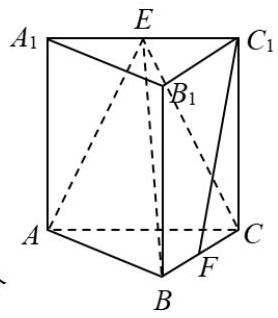

2. (崇明 17) 如图,在直三棱柱 ${ABC} - {A}_{1}{B}_{1}{C}_{1}$ 中， $E, F$ 分别为 ${A}_{1}{C}_{1},{BC}$ 的中点， $A{A}_{1} = {AB} = {BC} = 2,{C}_{1}F \bot  {AB}.$

(1)求证: ${C}_{1}F//$ 平面 ${ABE}$ ；

(2)求点 $C$ 到平面 ${ABE}$ 的距离.

【解析】(1) 取 ${AB}$ 中点 $G$ ,连接 ${FG}$ ,则 ${FG}//D$ 代 $D$ .2 分

又 ${C}_{1}E//$ 为 $C$ ,所以 ${FG}//{C}_{1}E$ , .4 分

所以四边形 ${FGE}{C}_{1}$ 是平行四边形,所以 ${C}_{1}F//{EG}$ , .5 分

又 ${EG}$ 在平面 ${ABE}$ 内， ${C}_{1}F$ 不在平面 ${ABE}$ 内，

所以 ${C}_{1}F//$ 平面 ${ABE}$ ; .7 分

(2)取 ${AC}$ 中点 $H$ ，连接 ${EH},{BH}$ ，则 ${EH} \bot$ 平面 ${ABC}$ ，所以 ${EH} \bot  {BH}$ ， 由题意得 ${EB} = \sqrt{6}$ ，同理 ${EA} = \sqrt{6}$ ，又 ${AB} = 2$ ，所以 ${S}_{\bigtriangleup {ABC}} = \sqrt{5}$ ， 2 分因为 ${C}_{1}C \bot$ 平面 ${ABC},{C}_{1}F \bot  {AB}$ ,由三垂线定理得 ${CB} \bot  {AB}$ ,

所以 ${S}_{\bigtriangleup {ABC}} = 2$ , $\ldots {.4}$ 分

设点 $C$ 到平面 ${ABE}$ 的距离为 $h$ ,

由 ${V}_{C - {ABE}} = {V}_{E - {ABC}}$ 得 $\frac{1}{3}{S}_{\bigtriangleup {ABE}} \cdot  h = \frac{1}{3}{S}_{\bigtriangleup {ABC}} \cdot  {EH}$ ,所以 $h = \frac{4\sqrt{5}}{5}$ ,

即点 $C$ 到平面 ${ABE}$ 的距离为 $\frac{4\sqrt{5}}{5}$ .7 分

3. (奉贤 19) 如图为正四棱锥 $P - {ABCD}, O$ 为底面 ${ABCD}$ 的中心.

(1)求证: ${CD}//$ 面 ${PAB}$ ，平面 ${PAC}\bot$ 平面 ${PBD}$ ；

(2)设 $E$ 为 ${PB}$ 上的一点， $\overrightarrow{BE} = \frac{2}{3}\overrightarrow{BP}$ .

在下面两问中选一个，若都选，只按第①问阅卷，第①问满分 5 分，第②问满分 7 分

①若 ${AD} = {AP} = 3\sqrt{2}$ ，求直线 ${EC}$ 与平面 ${BED}$ 所成角的大小；

②已知平面 ${ECD}$ 与平面 ${ABCD}$ 所成锐二面角的大小为 $\arctan \frac{\sqrt{2}}{2}$ ，若 ${AD} = {3\sqrt{2}}$ ，求 ${AP}$ 的长.

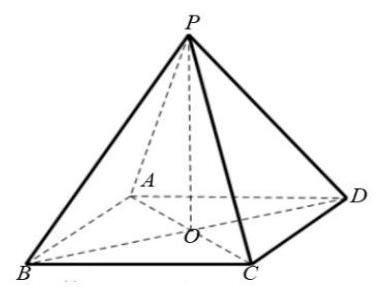

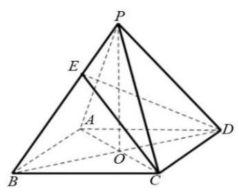

【解析】(1) ${CD}//{AB},{AB} \subset$ 平面 ${PAB},{CD}$ 不在平面 ${PAB}$ 内， .2 分由线面平行判定定理得 ${CD}//$ 面 ${PAB}$ ; 1 分由题意得四棱锥 $P - {ABCD}$ 为正四棱锥， $O$ 为底面 ${ABCD}$ 的中心， 所以 ${PO} \bot$ 底面 ${ABCD}$ ,所以 ${PO} \bot  {AC}$ , 1 分 ${AC} \bot  {BD}$ ,又因为 ${BD} \cap  {PO} = O$ (这一步必需有) 1 分由线面垂直的判定定理得 ${AC} \bot$ 平面 ${PBD}$ , .1 分又因为 ${AC} \subset$ 平面 ${PAC}$ , 所以由面面垂直的判定定理得平面 ${PAC} \bot$ 平面 ${PBD}$ . 1 分

(2)法一:

选 ①，若 ${AD} = {AP} = 3\sqrt{2}$ ，求直线 ${EC}$ 与面 ${BED}$ 所成角的大小；

由(1)得 ${AC} \bot$ 平面 ${PBD}$ ， $E$ 点在 ${PB}$ 上，

所以面 ${BED}$ 与面 ${PBD}$ 是同一个平面,

连接 ${EO}$ ,则 $\angle {OEC}$ 是直线 ${EC}$ 与面 ${EBD}$ 所成角 1 分

${AD} = 3\sqrt{2}$ ,可以计算 ${AO} = {OC} = {BO} = {DO} = 3,{AP} = 3\sqrt{2}$ ,

可以计算 ${OP} = 3\overrightarrow{BE} = \frac{2}{3}\overrightarrow{BP}$ ,可以得到 ${BE} = \frac{2}{3}{BP} = \frac{2}{3}{AP} = 2\sqrt{2}$ ,

$\tan \angle {PBO} = \frac{OP}{OB} = \frac{3}{3} = 1$ ，所以 $\angle {PBO} = \frac{\pi }{4}$ ，

利用余弦定理得 $O{E}^{2} = B{E}^{2} + B{O}^{2} - {2BE} \cdot  {BO}\cos \angle {EBO} \; = 8 + 9 - 2 \cdot  2\sqrt{2} \cdot  3 \cdot  \frac{\sqrt{2}}{2} = 5$ .3 分

所以 $\tan \angle {OEC} = \frac{OC}{OE} = \frac{3}{OE} = \frac{3\sqrt{5}}{5}$

所以直线 ${EC}$ 与面 ${BED}$ 所成角的大小为 $\arctan \frac{3\sqrt{5}}{5}$ .1 分选②，已知平面 ${ECD}$ 与平面 ${ABCD}$ 所成锐二面角的大小为 $\arctan \frac{\sqrt{2}}{2}$ ，

${AD} = 3\sqrt{2}$ ,可以计算 ${AO} = {OC} = {BO} = {DO} = 3$ 1 分

在平面 ${PBD}$ 内过 $E$ 点作 ${EF} \bot  {BD}$ 交于点 $F$ ，

由 ${PO} \bot$ 底面 ${ABCD}$ 得 ${PO} \bot  {BD}$ ,所以 ${EF}//{PO}$ 1 分

所以 ${EF} \bot$ 底面 ${ABCD}$ 1 分

过 $F$ 点作 ${FH} \bot  {CD}$ 交 ${CD}$ 于点 $H$ ，

连接 ${HE}$ ，由三垂线定理得 ${EH} \bot  {CD}$ ， 1 分

$\angle {EHF}$ 是平面 ${ECD}$ 与平面 ${ABCD}$ 所成的二面角的平面角,

$\overrightarrow{BE} = \frac{2}{3}\overrightarrow{BP}$ ,可以得到 $\overrightarrow{FH} = \frac{2}{3}\overrightarrow{BC},{FH} = \frac{2}{3}{BC} = \frac{2}{3}{AD} = 2\sqrt{2}$ ,

所以 $\tan \angle {EHF} = \frac{EF}{HF} = \frac{EF}{2\sqrt{2}} = \frac{\sqrt{2}}{2}$ ,所以 ${EF} = 2,{OP} = 3$ .1 分

${PA} = \sqrt{A{O}^{2} + P{O}^{2}} = 3\sqrt{2}$ 1 分

${AD} = 3\sqrt{2}$ ,可以计算 ${AO} = {OC} = {BO} = {DO} = 3$ .1 分

在平面 ${PBD}$ 内过 $E$ 点作 ${EF} \bot  {BD}$ 交于点 $F$ ，

由 ${PO} \bot$ 底面 ${ABCD}$ 得 ${PO} \bot  {BD}$ ,所以 ${EF}//{PO}$ 1 分

所以 ${EF} \bot$ 底面 ${ABCD}$ ,

过 $F$ 点作 ${FH} \bot  {CD}$ 交 ${CD}$ 于点 $H$ ，

连接 ${HE}$ ,由三垂线定理得 ${EH} \bot  {CD}$ 1 分

$\angle {EHF}$ 是平面 ${ECD}$ 与平面 ${ABCD}$ 所成的二面角的平面角 1 分 $\overrightarrow{BE} = \frac{2}{3}\overrightarrow{BP}$ ,可以得到 $\overrightarrow{FH} = \frac{2}{3}\overrightarrow{BC},{FH} = \frac{2}{3}{BC} = \frac{2}{3}{AD} = 2\sqrt{2}$ ,

所以 $\tan \angle {EHF} = \frac{EF}{HF} = \frac{EF}{2\sqrt{2}} = \frac{\sqrt{2}}{2}$ ,

所以 ${EF} = 2,{OP} = 3$ 1 分

${PA} = \sqrt{A{O}^{2} + P{O}^{2}} = 3\sqrt{2}$ .1 分

法二:

以 $O$ 为原点， ${OB},{OC},{OP}$ 所在直线分别为 $x, y, z$ 轴建立空间直角坐标系，

选①，若 ${AD} = {AP} = 3\sqrt{2}$ ，求直线 ${EC}$ 与面 ${BED}$ 所成角的大小；

点 $P\left( {0,0,3}\right)$ ,点 $B\left( {3,0,0}\right)$ ,

因为 $\overrightarrow{BE} = \frac{2}{3}\overrightarrow{BP}$ ,所以 $E\left( {1,0,2}\right)$ .1 分

由( 1 )得 ${AC}\bot$ 平面 ${PBD}$ ，

所以平面 ${BED}$ 的一个法向量 $\overrightarrow{n} = \overrightarrow{OC} = \left( {0,1,0}\right)$ . 1 分所以 $\cos  < \overrightarrow{EC},\overrightarrow{n} >  = \frac{3\sqrt{14}}{14}$ . .2 分

所以直线 ${EC}$ 与面 ${BED}$ 所成角的大小 $\arcsin \frac{3\sqrt{14}}{14}$ 1 分若选②，已知平面 ${ECD}$ 与平面 ${ABCD}$ 所成二面角的大小为 $\arctan \frac{\sqrt{2}}{2}$ ，

点 $C\left( {0,3,0}\right)$ ,点 $B\left( {3,0,0}\right) , D\left( {-3,0,0}\right)$ ,设 $P\left( {0,0, h}\right)$ ,

因为 $\overrightarrow{BE} = \frac{2}{3}\overrightarrow{BP}$ ,所以 $E\left( {1,0,\frac{2}{3}h}\right)$ ,

易得 $\overrightarrow{CE} = \left( {1, - 3,\frac{2}{3}h}\right) ,\overrightarrow{CD} = \left( {-3, - 3,0}\right)$ ,

设平面 ${ECD}$ 的一个法向量为 $\overrightarrow{{n}_{1}} = \left( {x, y, z}\right)$ ,得 $\left\{  \begin{array}{l} x - {3y} + \frac{2}{3}h = 0 \\   - {3x} - {3y} = 0 \end{array}\right.$ ,

求得 $\overrightarrow{{n}_{1}} = \left( {h, - h, - 6}\right)$ .2 分

又平面 ${ABCD}$ 的一个法向量为 $\overrightarrow{{n}_{2}} = \left( {0,0,1}\right)$ ,

所以 $\cos \left\langle  {\overrightarrow{{n}_{1}},\overrightarrow{{n}_{2}}}\right\rangle   =  - \frac{6}{\sqrt{2{h}^{2} + {36}}}$ , .2 分

又因为平面 ${ECD}$ 与平面 ${ABCD}$ 所成二面角的大小为 $\arctan \frac{\sqrt{2}}{2}$ ,

所以 $\left| {-\frac{6}{\sqrt{2{h}^{2} + {36}}}}\right|  = \frac{\sqrt{6}}{3}$ ,解得 $h = 3$ , .1 分

${PA} = \sqrt{A{O}^{2} + P{O}^{2}} = 3\sqrt{2}$ 1 分

4. (虹口 18) 如图,已知在四棱柱 ${ABCD} - {EFGH}$ 中， ${EA}\bot$ 平面 ${ABCD}$ ， $N$ ， $M$ 分别是 ${EF},{HD}$ 的中点.

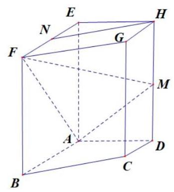

(1)求证: ${HN}//$ 平面 ${AFM}$ ；

(2)若底面 ${ABCD}$ 为梯形， ${AB}//{CD},{AB} = {EA} = 2$ ， ${AD} = {DC} = 1$ ， 异面直线 ${AB}$ 与 ${EH}$ 所成角为 $\frac{\pi }{2}$ . 求直线 ${AN}$ 与平面 ${AFM}$ 所成角的正弦值.

【解析】(1) 连接 ${BE}$ 交 ${AF}$ 于点 $P$ ,连接 ${MP}$ .

由于 ${ABCD} - {EFGH}$ 是四棱柱且 ${EA} \bot$ 平面 ${ABCD}$ ,

故四边形 ${AEFB}$ 为矩形,所以点 $P$ 为 ${AF}$ 的中点,

即 ${NP}$ 与 ${AE}$ 平行,且 ${NP} = \frac{1}{2}{AE}$ . 2 分

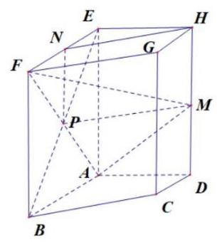

由于 ${HM}$ 与 ${AE}$ 平行,且 ${HM} = \frac{1}{2}{AE}$ ,故 ${NP}$ 与 ${HM}$ 平行且相等,

故四边形 ${NPMH}$ 为平行四边形,

所以 ${HN}$ 与 ${MP}$ 平行. 4 分

因为 ${HN}$ 不在平面 ${AFM}$ 上, ${MP}$ 在平面 ${AFM}$ 上, 6 分所以 ${HN}//$ 平面 ${AFM}$ .

(2)由于异面直线 ${AB}$ 与 ${EH}$ 所成角为 $\frac{\pi }{2}$ 且 ${AD}$ 与 ${EH}$ 平行，

$\angle {BAD}$ 为 ${AB}$ 与 ${EH}$ 所成角(或其补角),所以 $\angle {BAD} = \frac{\pi }{2}$ ,

即 ${AB} \bot  {AD}$ . 8 分

以点 $A$ 为原点,分别以 $\overrightarrow{AB},\overrightarrow{AD},\overrightarrow{AE}$ 为 $x, y, z$ 轴正方向,建立空间直角坐标系,

则 $\overrightarrow{AN} = \left( {1,0,2}\right) ,\overrightarrow{AF} = \left( {2,0,2}\right) ,\overrightarrow{AM} = \left( {0,1,1}\right)$ . 10 分

设 $\overrightarrow{n} = \left( {x, y, z}\right)$ 为平面 ${AFM}$ 的一个法向量,则 $\left\{  \begin{array}{l} {2x} + {2z} = 0 \\  y + z = 0 \end{array}\right.$ ,

令 $z =  - 1$ ,得 $\overrightarrow{n} = \left( {1,1, - 1}\right)$ . 12 分

设直线 ${AN}$ 与平面 ${AFM}$ 所成角为 $\theta$ ,则 $\sin \theta  = \frac{\left| \overrightarrow{n} \cdot  \overrightarrow{AN}\right| }{\left| \overrightarrow{n}\right|  \cdot  \left| \overrightarrow{AN}\right| } = \frac{\sqrt{15}}{15}$ , 所以直线 ${AN}$ 与平面 ${AFM}$ 所成角的正弦值为 $\frac{\sqrt{15}}{15}$ . 14 分

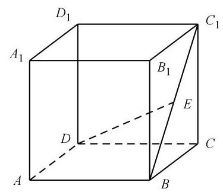

5.(黄浦 17)如图，在正方体 ${ABCD} - {A}_{1}{B}_{1}{C}_{1}{D}_{1}$ 中， $E$ 是 $B{C}_{1}$ 的中点.

(1)求证: $B{C}_{1} \bot$ 平面 ${CDE}$ ；

(2)求直线 ${DE}$ 与平面 ${ABCD}$ 所成角的大小.

【解析】(1) 连接 ${B}_{1}C$ ,易得 $E$ 是 ${B}_{1}C$ 的中点.

正方体 ${ABCD} - {A}_{1}{B}_{1}{C}_{1}{D}_{1}$ 中,由 ${DC} \bot$ 平面 ${BC}{C}_{1}{B}_{1}$ 得 ${DC} \bot  B{C}_{1}\cdots \cdots 3$ 分

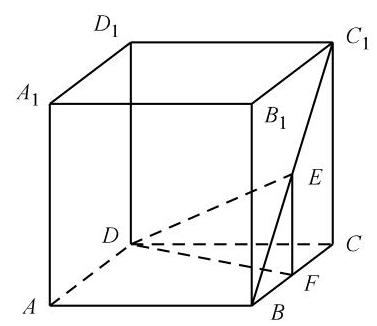

又 ${B}_{1}C \bot  B{C}_{1}$ ,故 $B{C}_{1} \bot$ 平面 ${CDE}\cdots \cdots 6$ 分

(2)过 $E$ 作 ${EF} \bot  {BC}$ ，交 ${BC}$ 于 $F$ ，连接 ${DF}$ . 由平面 ${B}_{1}{BC}{C}_{1} \bot$ 平面 ${ABCD}$ ,得 ${EF} \bot$ 平面 ${ABCD}$ , 故 $\angle {EDF}$ 是直线 ${DE}$ 与平面 ${ABCD}$ 所成的角 $\cdots \cdots 8$ 分设正方体 ${ABCD} - {A}_{1}{B}_{1}{C}_{1}{D}_{1}$ 的棱长为 2 . 由题意得 ${EF} = \frac{1}{2}C{C}_{1} = 1$ . 由 ${CF} = \frac{1}{2}{CB} = 1$ ,得 ${DF} = \sqrt{5}$ . 因为 ${EF} \bot  {DF}$ ,所以 $\tan \angle {EDF} = \frac{EF}{DF} = \frac{\sqrt{5}}{5}$ . 12 分故直线 ${DE}$ 与平面 ${ABCD}$ 所成角的大小是 $\arctan \frac{\sqrt{5}}{5}$ . 14 分

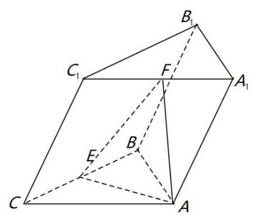

6. (嘉定 17) 如图所示,在三棱柱 ${ABC} - {A}_{1}{B}_{1}{C}_{1}$ 中, ${AB} = {AC}$ ，侧面 $B{B}_{1}{C}_{1}C \bot$ 底面 ${ABC}$ . 点 $E, F$ 分别为棱 ${BC}$ 和 ${A}_{1}{C}_{1}$ 的中点.

(1)若底面 $\bigtriangleup {ABC}$ 为边长为 2 的正三角形,且 $C{C}_{1} = {BC}$ ,则棱 $C{C}_{1}$ 与底面 ${ABC}$ 所成的角为 ${60}^{ \circ  }$ ,求三棱柱 ${ABC} - {A}_{1}{B}_{1}{C}_{1}$ 的体积;

(2)求证: ${EF}//$ 平面 $A{A}_{1}{BB}$ .

【解析】(1) 由题意直线 ${BC}$ 为直线 $C{C}_{1}$ 在平面 ${ABC}$ 上的射影,所以 $\angle {C}_{1}{CB} = {60}^{ \circ  }$ ,

连接 ${C}_{1}E$ ,因为 $C{C}_{1} = 2,{CE} = 1$ ,所以 ${C}_{1}E = \sqrt{3}$ .2 分由勾股定理得 $\angle {C}_{1}{EC} = \frac{\pi }{2}$ ,则 ${C}_{1}E \bot  {BC}$ ,

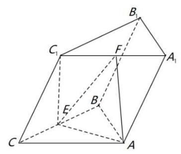

又因为 ${BC} =$ 平面 ${ABC} \cap$ 平面 ${CB}{B}_{1}{C}_{1}$ ,

所以 ${C}_{1}E \bot$ 平面 ${ABC}$ .4 分

${V}_{{ABC} - {A}_{1}{B}_{1}{C}_{1}} = {S}_{\Delta ABC} \cdot  {C}_{1}E = \frac{\sqrt{3}}{4} \times  {2}^{2} \times  \sqrt{3} = 3$ .6 分

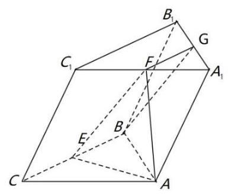

(2)如图，取 ${A}_{1}{B}_{1}$ 的中点 $G$ ，连接 ${BG},{FG}$ ，

在 $\Delta {A}_{1}{B}_{1}{C}_{1}$ 中,因为 $F$ 是 ${A}_{1}{C}_{1}$ 的中点,

所以 ${FG}//{B}_{1}{C}_{1}$ ,且 ${FG} = \frac{1}{2}{B}_{1}{C}_{1}$ .8 分

在三棱柱 ${ABC} - {A}_{1}{B}_{1}{C}_{1}$ 中， ${BC}//{B}_{1}{C}_{1}$ 且 ${BC} = {B}_{1}{C}_{1}$ ，

又 $E$ 为棱 ${BC}$ 的中点,故 ${FG}//{BE}$ ,且 ${FG} = {BE}$ ,

故 ${BEFG}$ 为平行四边形,则 ${EF}//{BG}$ .12 分

又因为 ${BG} \subset$ 平面 ${AB}{B}_{1}A,{EF}$ 不在平面 ${AB}{B}_{1}{A}_{1}$ 内,

所以 ${EF}//$ 平面 ${AB}{B}_{1}{A}_{1}\ldots {14}$ 分

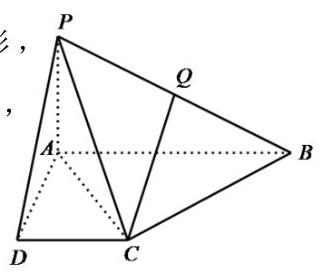

7. (金山 18 ) 如图,在四棱锥 $P - {ABCD}$ 中,底面 ${ABCD}$ 是直角梯形, $\angle {BAD} = \angle {CDA} = {90}^{ \circ  }$ ， ${PA} \bot$ 平面 ${ABCD}$ ， $Q$ 是 ${PB}$ 的中点， ${PA} = {AD} = {DC} = 1,{AB} = 2.$

(1)证明: ${CQ}//$ 平面 ${PAD}$ ;

(2)求点 $D$ 到平面 ${PAC}$ 的距离.

【解析】(1) 取 ${PA}$ 的中点 $T$ ,连接 ${DT},{TQ}$ ,

因为 $\angle {BAD} = \angle {CDA} = {90}^{ \circ  }$ ，所以 ${AB}//{DC}$ ，

因为 $T, Q$ 分别是 ${PA},{PB}$ 中点,得出 ${TQ}//{AB},{TQ} = \frac{1}{2}{AB} = {DC} = 1$ ,

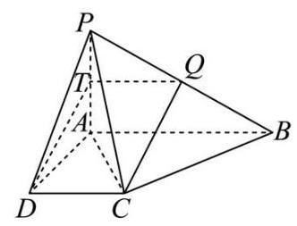

所以四边形 ${DCQT}$ 是平行四边形, $\cdots \cdots 3$ 分

所以 ${DT}//{CQ},{DT} \subset$ 平面 ${PAD},{CQ}$ 不在平面 ${PAD}$ 内,

所以 ${CQ}//$ 平面 ${PAD}.\cdots \cdots 6$ 分

(2)法一:过点 $D$ 作 ${DE}$ 垂直 ${AC}$ ，

因为 ${PA} \bot$ 平面 ${ABCD}$ , ${DE} \subset$ 平面 ${ABCD}$ ,所以 ${DE} \bot  {PA}$ ,

又 ${DE} \bot  {AC},{AC} \subset$ 平面 ${PAC},{PA} \subset$ 平面 ${PAC},{AC} \cap  {PA} = A$ ,

所以 ${DE} \bot$ 平面 ${PAC}$ ,即线段 ${DE}$ 的长为点 $D$ 到平面 ${PAC}$ 的距离 $\cdots \cdots {10}$ 在直角三角形 ${ADC}$ 中, ${AD} = 1,{AC} = 1,{DE} = \frac{\sqrt{2}}{2}$ ,

所以点 $D$ 到平面 ${PAC}$ 的距离为 $\frac{\sqrt{2}}{2}$ . 14 分

法二: 因为 ${PA} \bot$ 平 ${ABCD}$ ,又 ${PA}$ 为三棱锥 $P - {ADC}$ 底面 ${ADC}$ 上的高,

所以 ${V}_{P \cdot  {ADC}} = \frac{1}{3} \cdot  {S}_{\bigtriangleup {ADC}} \cdot  {PA} = \frac{1}{3} \times  \frac{1}{2} \times  1 = \frac{1}{6}$ , 10 分

设点 $D$ 到平面 ${PAC}$ 的距离为 $d,{V}_{D \cdot  {PAC}} = \frac{1}{3} \cdot  {S}_{\bigtriangleup {APC}} \cdot  d = \frac{1}{3} \cdot  \frac{\sqrt{2}}{2} \cdot  d = \frac{\sqrt{2}}{6}d$ ,

因为 ${V}_{P - {ADC}} = {V}_{D \cdot  {PAC}}$ ,所以 $\frac{1}{6} = \frac{\sqrt{2}}{6}d, d = \frac{\sqrt{2}}{2}$ ,

所以点 $D$ 到平面 ${PAC}$ 的距离为 $\frac{\sqrt{2}}{2}$ . 14 分

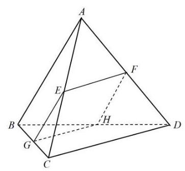

8. (静安 19) 如图所示,正三棱锥 $A - {BCD}$ 的侧面是边长为 2 的正三角形.

(1)求正三棱锥 $A - {BCD}$ 的体积 $V$ ；

(2)设 $E, F, G$ 分别是线段 ${AC},{AD},{BC}$ 的中点.

求证: ① ${CD}//$ 平面 ${EFG}$ ；②若平面 ${EFG}$ 交 ${BD}$ 于点 $H$ ，则四边形 ${EFGH}$ 是正方形.

【解析】(1) 因为三棱锥 $A - {BCD}$ 是一个正三棱锥,

所以,点 $A$ 在底面 ${BCD}$ 上的射影点 $O$ 必是 ${\Delta BCD}$ 的中心.

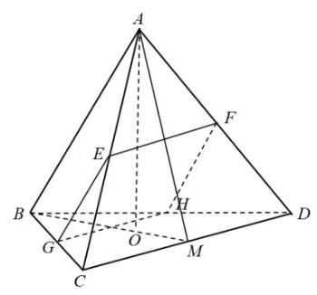

连接 ${BO}$ 且延长与 ${CD}$ 交于点 $M$ ,得 ${AM} = \sqrt{3},{OM} = \frac{\sqrt{3}}{3}$ ,

所以 ${OA} = \sqrt{A{M}^{2} - O{M}^{2}} = \frac{2\sqrt{6}}{3}$ 2 分

得 $\bigtriangleup  {BCD}$ 的面积为 $\sqrt{3}$ ，

所以，正三棱锥 $A - {BCD}$ 的体积 $V = \frac{1}{3} \times  \sqrt{3} \times  \frac{2\sqrt{6}}{3} = \frac{2\sqrt{2}}{3}$ 4 分

(2)①由已知有 ${CD}//{EF}$ ，且 ${EF} \subset$ 平面 ${EFG}$ ，

所以， ${CD}//$ 平面 ${EFG}$ 3 分

②设 ${BD}$ 与平面 ${EFG}$ 交于点 $H$ ，则平面 ${EFG} \cap$ 平面 ${BCD} = {GH}$ ，

所以, ${GH}//{CD}$ ,点 $H$ 是 ${BD}$ 的中点,所以 ${EF}//{GH}$ ,同理,有 ${EG}//{FH}$ , 由三角形中位线的性质,得四边形 ${EFGH}$ 是菱形 3 分因为 ${OD}\bot {BC}$ ,又 ${OD}$ 为 ${AD}$ 在底面 ${BCD}$ 内的射影,

所以, ${AB} \bot  {CD}$ ,得 ${HG} \bot  {EH}$ ,故四边形 ${EFGH}$ 是正方形. 2 分

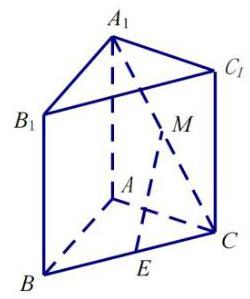

9. (闵行 17) 在直三棱柱 ${ABC} - {A}_{1}{B}_{1}{C}_{1}$ 中， ${AB} = {AC} = 2,{A{A}_{1}} = 3,\angle {BAC} = {90}^{ \circ  }$ ， 连接 ${A}_{1}C, M, E$ 分别为 ${A}_{1}C$ 和 ${BC}$ 的中点.

(1)证明:直线 ${EM}//$ 平面 ${A}_{1}{AB}{B}_{1}$ ；

(2)求二面角 ${A}_{1} - {BC} - A$ 的大小.

【解析】(1) 连接 ${A}_{1}B$ ,因为 $M$ 为 ${A}_{1}C$ 中点, $E$ 为 ${BC}$ 中点,所以 ${ME}//{A}_{1}B\cdots \cdots 2$ 2 分又因为 ${A}_{1}B \subset$ 平面 ${A}_{1}{AB}{B}_{1},{ME}$ 不在平面 ${A}_{1}{AB}{B}_{1}$ 上, 所以 ${EM}//$ 平面 ${A}_{1}{AB}{B}_{1}$ ; 6 分

(2)连接 ${AE}$ ，因为 ${AB} = {AC}, E$ 为 ${BC}$ 中点，所以 ${AE}\bot {BC}$ ， 又因为 $A{A}_{1} \bot$ 平面 ${ABC}$ ,所以 ${A}_{1}E \bot  {BC}$ , 8 分所以 $\angle {A}_{1}{EA}$ 即为所求二面角的平面角. 10 分 $\tan \angle {A}_{1}{EA} = \frac{{A}_{1}A}{AE} = \frac{3}{\sqrt{2}} = \frac{3\sqrt{2}}{2}$ ,所以 $\angle {A}_{1}{EA} = \arctan \frac{3\sqrt{2}}{2}$ 12 分所以二面角 ${A}_{1} - {BC} - A$ 的大小为 $\arctan \frac{3\sqrt{2}}{2}$ . 14 分

10. (浦东 18) 如图,已知 ${AB}$ 为圆柱 $O{O}_{1}$ 底面圆 $O$ 的直径, ${OA} = 2$ ，母线 $A{A}_{1}$ 长为 3,点 $P$ 为底面圆 $O$ 的圆周上一点.

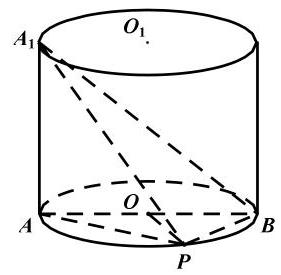

(1)若 $\angle {BOP} = {90}^{ \circ  }$ ，求三棱锥 $A - {PB}{A}_{1}$ 的体积；

(2)若 $\angle {BOP} = {60}^{ \circ  }$ ，求异面直线 ${A}_{1}B$ 与 ${AP}$ 所成的角的余弦值.

【解析】(1) 三棱锥 $A - {PB}{A}_{1}$ 的体积等于三棱锥 ${A}_{1} - {PBA}$ 的体积, 2 分三角形 ${PBA}$ 面积为 ${S}_{\bigtriangleup {PBA}} = \frac{1}{2} \times  4 \times  2 = 4$ , 2 分三棱锥 ${A}_{1} - {PBA}$ 的体积 ${V}_{{A}_{1} - {PBA}} = \frac{1}{3}{S}_{{\Delta P}{BA}} \times  3 = 4$ 2 分所以,三棱锥 $A - {PB}{A}_{1}$ 的体积为 4 ;

(2)作 ${A}_{1}{P}_{1}//{AP}$ ，连接 $B{P}_{1}$ ，

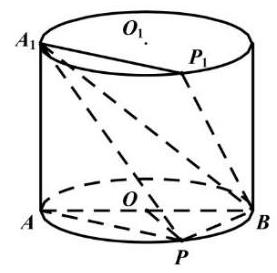

则 $\angle {P}_{1}{A}_{1}B$ 是异面直线 ${A}_{1}B$ 与 ${AP}$ 所成的角, 3 分

${A}_{1}{P}_{1} = {AP} = 2\sqrt{3},{A}_{1}B = \sqrt{{A}_{1}{A}^{2} + A{B}^{2}} = 5,$

${P}_{1}B = \sqrt{{P}_{1}{P}^{2} + P{B}^{2}} = \sqrt{13},$

则 $\cos \angle {P}_{1}{A}_{1}B = \frac{{12} + {25} - {13}}{2 \times  5 \times  2\sqrt{3}} = \frac{2\sqrt{3}}{5}$ , 4 分

所以异面直线 ${A}_{1}B$ 与 ${AP}$ 所成的角的余弦值为 $\frac{2\sqrt{3}}{5}$ . 1 分

11. (普陀 17) 图 1 所示的平行四边形 ${ABCD}$ 中, ${CA} = {CB} = 1,{CD} = \sqrt{2}$ ,现将 ${\Delta DAC}$ 沿 ${AC}$ 折起,得到如图 2 所示的三棱锥 $P - {ABC}$ ,记棱 ${PC}$ 的中点为 $M$ ,且 ${PB} = \sqrt{3}$ .

(1)求证: ${AM}\bot {BC}$ ；

(2)记棱 ${AB}$ 的中点为 $E$ ，在直线 ${CE}$ 上作出点 $N$ ，使得 ${PN}//$ 平面 ${MAB}$ ，请说明理由； 并求出二面角 $P - {NB} - A$ 的大小.

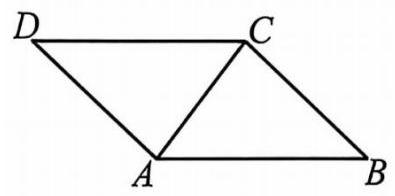

第 17 题图 1

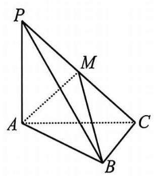

第 17 题图 2

【解析】(1) 由平行四边形 ${ABCD},{CA} = {CB} = 1,{CD} = \sqrt{2}$ ,

得 $C{A}^{2} + C{B}^{2} = A{B}^{2}, C{A}^{2} + D{A}^{2} = C{D}^{2}$ ,即 $\angle {ACB} = \angle {CAD} = \frac{\pi }{2}$ ,

则 ${BC} \bot  {AC},{DA} \bot  {AC}$ ,

在三棱锥 $P - {ABC}$ 中, ${PB} = \sqrt{3}$ . 由 $P{A}^{2} + A{B}^{2} = P{B}^{2}$ 得 $\angle {PAB} = \frac{\pi }{2}$ ,

即 ${PA} \bot  {AB}$ ,则 ${PA}$ 垂直于平面 ${ABC}$ 内的两条相交直线,

故 ${PA} \bot$ 平面 ${ABC}$ , 4 分

又 ${BC} \subset$ 平面 ${ABC}$ ,则 ${BC} \bot  {PA}$ ,

又 ${BC} \bot  {AC}$ ,即 ${BC}$ 垂直于平面 ${PAC}$ 内的两条相交直线,

${AM} \subset$ 平面 ${PAC}$ ,则 ${AM} \bot  {BC}$ . 6 分

(2)在直线 ${CE}$ 上作出 $\overrightarrow{CN} = 2\overrightarrow{CE}$ ，连接 $P, N$ ，即得所作 3 分

因为 $M, E$ 分别是棱 ${PC}$ 与棱 ${AB}$ 的中点,所以 ${PN}//{ME}$ ,

又 ${PN}$ 在平面 ${MAB}$ 外,且 ${ME} \subset$ 平面 ${MAB}$ ,则 ${PN}//$ 平面 ${MAB}\cdots$ 5 分

连接 ${NA}$ ,连接 ${NB}$ ,此时四边形 ${ANBC}$ 为正方形,即 ${BN} \bot  {NA}$ ,

在( 1 )中已证得 ${PA} \bot$ 平面 ${ABC}$ ,由三垂线定理得 ${BN} \bot  {NP}$ ,

即 $\angle {PNA}$ 是二面角 $P - {NB} - A$ 的平面角, 6 分

在 Rt $\bigtriangleup {PAN}$ 中, ${PA} = {AN}$ ,则 $\angle {PNA} = \frac{\pi }{4}$ ,

故二面角 $P - {NB} - A$ 的大小为 $\frac{\pi }{4}$ . 8 分

12. (青浦 18) 如图，在三棱锥 $P - {ABC}$ 中，平面 ${PAB} \bot$ 平面 ${ABC},{AB} = 6$ ，

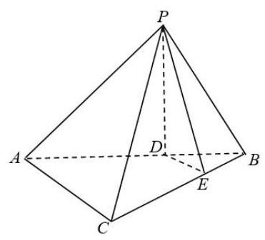

${BC} = 2\sqrt{3},{AC} = 2\sqrt{6}, D, E$ 分别为线段 ${AB},{BC}$ 上的点，且 ${AD} = {2DB}$ ，

${CE} = {2EB},{PD} \bot  {AC}$ .

(1)求证: ${DE}//$ 平面 ${PAC}$ ；

(2)求证: ${PD}\bot$ 平面 ${ABC}$ .

【解析】(1) 在 $\bigtriangleup {ABC}$ 中,已知 $D, E$ 分别为线段 ${AB},{BC}$ 上的点,

且 ${AD} = {2DB},{CE} = {2EB}$ ,即 $\frac{BD}{AB} = \frac{BE}{BC} = \frac{1}{3}$ ,

所以 ${DE}//{AC}$ ,

又 ${AC} \subset$ 平面 ${PAC},{DE} \text{ ⊄ }$ 平面 ${PAC}$ ,所以 ${DE}//$ 平面 ${PAC}$ ;

(2)连接 ${DC}$ ，由题意得 ${AD} = 4,{BD} = 2$ ，

因为 $A{C}^{2} + B{C}^{2} = A{B}^{2},\angle {ACB} = {90}^{ \circ  },\cos \angle {ABC} = \frac{2\sqrt{3}}{6} = \frac{\sqrt{3}}{3}$ ,

所以 $C{D}^{2} = {2}^{2} + {\left( 2\sqrt{3}\right) }^{2} - 2 \times  2 \times  2\sqrt{3} \times  \cos \angle {ABC} = 8$ ,

所以 ${CD} = {2\sqrt{2}}$ ，所以 $C{D}^{2} + A{D}^{2} = A{C}^{2}$ ，所以 ${CD}\bot {AB}$ ，

又因为平面 ${PAB} \bot$ 平面 ${ABC}$ ,平面 ${PAB} \cap$ 平面 ${ABC} = {AB}$ , 所以 ${CD} \bot$ 平面 ${PAB}$ ,所以 ${CD} \bot  {PD}$ ,

因为 ${PD} \bot  {AC},{AC} \cap  {CD} = C,{CD} \subset$ 平面 ${ABC},{AC} \subset$ 平面 ${ABC}$ ,

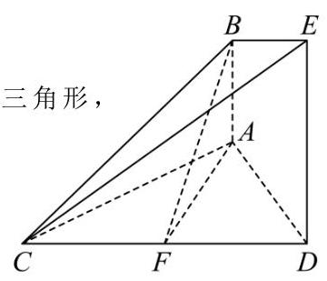

所以 ${PD} \bot$ 平面 ${ABC}$ .

13. (松江 18) 如图,已知 ${AB} \bot$ 平面 ${ACD},{AB}//{DE},{\Delta ACD}$ 为等边三角形, ${AD} = {DE} = {2AB}$ ,点 $F$ 为 ${CD}$ 的中点.

(1)求证: ${AF}//$ 平面 ${BCE}$ ；

(2)求直线 ${BF}$ 和平面 ${ABC}$ 所成角的正弦值.

【解析】(1) 法一: 取 ${CE}$ 的中点 $H$ ,连接 ${BH},{FH}$ . 因为 $H, F$ 分别为 ${CE},{CD}$ 的中点,所以 ${HF}//{DE},{HF} = \frac{1}{2}{DE}$ . -2 分

又因为 ${AB}//{DE},{AB} = \frac{1}{2}{DE}$ ，所以 ${AB}//{HF},{AB} = {HF}$ ， 所以四边形 ${ABHF}$ 是平行四边形,所以 ${AF}//{BH}$ -4 分又因为 ${AF}$ 不在平面 ${BCE}$ 上, ${BH} \subset$ 平面 ${BCE}$ , 所以 ${AF}//$ 平面 ${BCE}$ -6 分

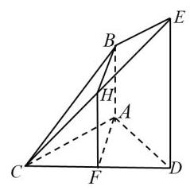

法二: 取 ${DE}$ 的中点 $P$ ,连接 ${PA},{PF}$ ,由条件得 ${PE} = {AB}$ ,且 ${PE}//{AB}$ ,

故四边形 ${PABE}$ 为平行四边形, -2 分

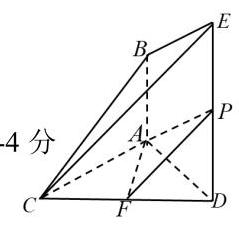

则 ${PA}//{BE}$ ,又 ${PA} \text{ ⊄ }$ 面 ${BCE},{BE} \subset$ 面 ${BCE}$ ,故 ${PA}//$ 面 ${BCE}$ .

同理, ${PF}//{CE},{PF} \text{ ⊄ }$ 面 ${BCE},{CE} \subset$ 面 ${BCE}$ ,故 ${PF}//$ 面 ${BCE}$

而 ${PA},{PF} \subset$ 面 ${PAF}$ ,且 ${PA} \cap  {PF} = P$ ,所以面 ${PAF}//$ 面 ${BCE}$ ,

且 ${AF} \subset$ 面 ${PAF}$ ,故 ${AF}//$ 面 ${BCE}$ . -6 分

法三: 因为 ${AF} \bot  {CD}$ ,所以建立如图所示的空间直角坐标系,

则 $B\left( {-\sqrt{3},0,1}\right) , C\left( {0, - 1,0}\right) , E\left( {0,1,2}\right)$ , -2 分

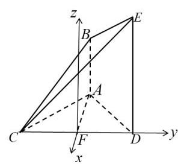

设平面 ${BCE}$ 的一个法向量为 $\overrightarrow{m} = \left( {u, v, w}\right)$ ,

因为 $\overrightarrow{CE} = \left( {0,2,2}\right) ,\overrightarrow{CB} = \left( {-\sqrt{3},1,1}\right)$ ,所以 $\left\{  \begin{array}{l} \overrightarrow{CE} \cdot  \overrightarrow{m} = 0 \\  \overrightarrow{CB} \cdot  \overrightarrow{m} = 0 \end{array}\right.$ ,

即 $\left\{  \begin{array}{l} {2v} + {2w} = 0 \\   - \sqrt{3}u + v + w = 0 \end{array}\right.$ ,不妨设 $v = 1$ ,则 $w =  - 1, u = 0$ ,

所以 $\overrightarrow{m} = \left( {0,1, - 1}\right)$ , -4 分

因为 $\overrightarrow{AF} = \left( {\sqrt{3},0,0}\right) ,\overrightarrow{AF} \cdot  \overrightarrow{m} = 0$ ,而 ${AF} \text{ ⊄ }$ 面 ${BCE}$ ,

所以 ${AF}//$ 面 ${BCE}$ -6 分

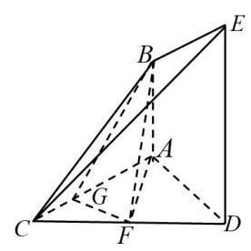

(2)法一:因为 ${AB}\bot$ 平面 ${ACD}$ ， ${AB} \subset$ 平面 ${ABC}$ ，

所以平面 ${ABC} \bot$ 平面 ${ACD}$ . -8 分

过点 $F$ 作 ${FG} \bot  {AC}$ ,垂足为 $G$ ,连接 ${BG}$ ,

因为平面 ${ABC} \bot$ 平面 ${ACD}$ ,平面 ${ABC} \cap$ 平面 ${ACD} = {AC}$ ,

所以 ${FG} \bot$ 平面 ${ABC}$ ,故直线 ${BF}$ 在平面 ${ABC}$ 上的射影为 ${BG}$ ,

所以 $\angle {FBG}$ 即为直线 ${BF}$ 和平面 ${ABC}$ 所成角. -12 分

不妨设 ${AB} = 1$ ，则 ${DE} = {AD} = {AC} = {CD} = 2$ ，因为 ${AF} = \sqrt{3}$ ，所以 ${BF} = 2$ ，

又因为 ${FG} = \frac{\sqrt{3}}{2}$ ,在直角三角形 ${BFG}$ 中, $\sin \angle {FBG} = \frac{\sqrt{3}}{4}$ , 故直线 ${BF}$ 和平面 ${ABC}$ 所成角的正弦值是 $\frac{\sqrt{3}}{4}$ . -14 分

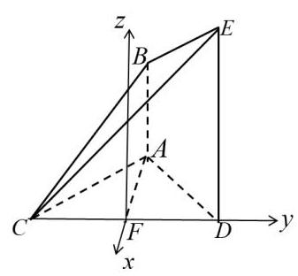

法二: 因为 ${AF} \bot  {CD}$ ,所以建立如图所示的空间直角坐标系.

不妨设 ${AB} = 1,{DE} = {AD} = {AC} = {CD} = 2$ ，

则 $A\left( {-\sqrt{3},0,0}\right) , C\left( {0, - 1,0}\right) , B\left( {-\sqrt{3},0,1}\right)$ . -8 分

设平面 ${ABC}$ 的一个法向量为 $\overrightarrow{n} = \left( {x, y, z}\right)$ ,

因为 $\overrightarrow{AB} = \left( {0,0,1}\right) ,\overrightarrow{AC} = \left( {\sqrt{3}, - 1,0}\right)$ ,所以 $\left\{  \begin{array}{l} z = 0 \\  \sqrt{3}x - y = 0 \end{array}\right.$ ,

不妨设 $x = 1$ ,则 $y = \sqrt{3}$ ,所以 $\overrightarrow{n} = \left( {1,\sqrt{3},0}\right)$ . -12 分

因为 $\overrightarrow{FB} = \left( {-\sqrt{3},0,1}\right)$ ,所以 $\sin \angle {FBG} = \left| {\cos \theta }\right|  = \frac{\left| -\sqrt{3}\right| }{2 \times  2} = \frac{\sqrt{3}}{4}$ . -14 分

14. (徐汇 18) 如图,在四棱锥 $P - {ABCD}$ 中, ${AD}//{BC},\angle {ADC} = \angle {PAB} = \frac{\pi }{2}$ , ${BC} = {CD} = \frac{1}{2}{AD}$ . $E$ 为棱 ${AD}$ 的中点，异面直线 ${PA}$ 与 ${CD}$ 所成角的大小为 $\frac{\pi }{2}$ .

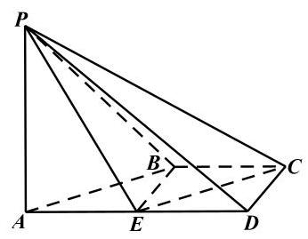

(1)求证: ${CD}//$ 平面 ${PBE}$ ；

(2)若二面角 $P - {CD} - A$ 的大小为 $\frac{\pi }{4}$ ，求直线 ${PA}$ 与平面 ${PCE}$ 所成角的正弦值.

【解析】(1) 因为 ${AD}//{BC},{BC} = \frac{1}{2}{AD}, E$ 为棱 ${AD}$ 的中点，

所以 ${BC}//{ED}$ 且 ${BC} = {ED}$ ,所以四边形 ${BCDE}$ 是平行四边形.

所以 ${CD}//{BE}$ ,又 ${BE} \subset$ 平面 ${PBE},{CD}$ 不在平面 ${PBE}$ 上,

由线面平行的判定定理得 ${CD}//$ 平面 ${PBE}$ ;

(2)法一:因为 $\angle {PAB} = \frac{\pi }{2}$ ，即 ${PA}\bot {AB}$ ，

且异面直线 ${PA}$ 与 ${CD}$ 所成的角为 $\frac{\pi }{2}$ ，即 ${PA} \bot  {CD}$ ，

又 ${AB} \cap  {CD} = M,{AB},{CD} \subset$ 平面 ${ABCD}$ ,所以 ${AP} \bot$ 平面 ${ABCD}$ .

又 ${CD} \bot  {AD}$ ,由三垂线定理,所以 ${CD} \bot  {PD}$ .

因此 $\angle {PDA}$ 是二面角 $P - {CD} - A$ 的平面角, $\angle {PDA} = \frac{\pi }{4}$ ,所以 ${PA} = {AD}$ ,

不妨设 ${AD} = {2a}$ ,则 ${BC} = {CD} = \frac{1}{2}{AD} = a$ .

以 $A$ 为坐标原点,平行于 ${CD}$ 的直线为 $x$ 轴, ${AD}$ 所在直线为 $y$ 轴,

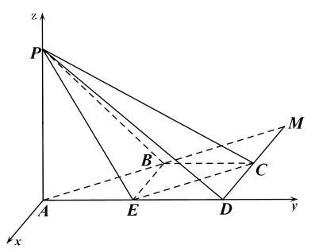

${AP}$ 所在直线为 $z$ 轴,建立空间直角坐标系,

所以 $P\left( {0,0,{2a}}\right) , E\left( {0, a,0}\right) , C\left( {-a,{2a},0}\right)$ (其中 $a > 0$ ),

则 $\overrightarrow{EC} = \left( {-a, a,0}\right) ,\overrightarrow{PE} = \left( {0, a, - {2a}}\right) ,\overrightarrow{AP} = \left( {0,0,{2a}}\right)$ ,

设平面 ${PCE}$ 的一个法向量为 $\overrightarrow{n} = \left( {x, y, z}\right)$ ,则 $\left\{  \begin{array}{l} \overrightarrow{n} \cdot  \overrightarrow{PE} = 0 \\  \overrightarrow{n} \cdot  \overrightarrow{EC} = 0 \end{array}\right.$ ,

得 $\left\{  \begin{array}{l} y - {2z} = 0 \\   - x + y = 0 \end{array}\right.$ ,令 $y = 2$ ,则 $x = 2, z = 1$ ,所以 $\overrightarrow{n} = \left( {2,2,1}\right)$ .

设直线 ${PA}$ 与平面 ${PCE}$ 所成角为 $\theta$ ,

则 $\sin \theta  = \left| {\cos  < \overrightarrow{AP},\overrightarrow{n} > }\right|  = \frac{\left| \overrightarrow{AP} \cdot  \overrightarrow{n}\right| }{\left| \overrightarrow{AP}\right| \left| \overrightarrow{n}\right| } = \frac{2}{3 \times  2} = \frac{1}{3}$ .

法二: 过 $A$ 作 ${AH} \bot  {CE}$ ,交 ${CE}$ 的延长线于 $H$ ,连接 ${PH}$ ,

由(1)得 ${CD}//{BE}$ ，因为 ${PA}\bot {CD}$ ，所以 ${PA}\bot {BE}$ ，

因为 $\angle {ADC} = \angle {PAB} = \frac{\pi }{2}$ ，即 ${PA}\bot {AB}$ ，

又 ${AB} \cap  {BE} = B,{AB},{BE} \subset$ 平面 ${ABCD}$ ,所以 ${PA} \bot$ 平面 ${ABCD}$ .

因为 ${CE} \subset$ 平面 ${ABCD}$ ,所以 ${PA} \bot  {CE}$ ,

又 ${AH}$ 是 ${PH}$ 在平面 ${ABCD}$ 上的射影,由三垂线定理得 ${PH} \bot  {CE}$ ,

又 ${PA} \cap  {PH} = P$ ,所以 ${CE} \bot$ 平面 ${PAH}$ .

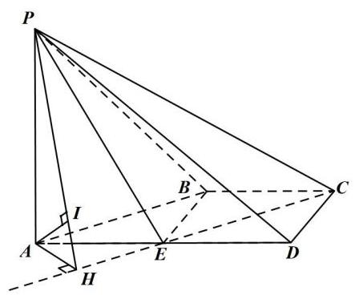

再过 $A$ 作 ${AI} \bot  {PH}$ ,交 ${PH}$ 于 $I$ ,

因为 ${CE} \bot$ 平面 ${PAH},{AI} \subset$ 平面 ${PAH}$ ,所以 ${AI} \bot  {CE}$ ,

又 ${PH} \cap  {CE} = H$ ,所以 ${AI} \bot$ 平面 ${PCE}$ ,

所以 $\angle {API}$ 即为直线 ${PA}$ 与平面 ${PCE}$ 的所成角.

因为 ${CD} \bot  {AD},{PA} \bot$ 平面 ${ABCD}$ .

由三垂线定理,所以 ${CD} \bot  {PD}$ .

因此 $\angle {PDA}$ 是二面角 $P - {CD} - A$ 的平面角, $\angle {PDA} = \frac{\pi }{4}$ . 设 ${BC} = {CD} = \frac{1}{2}{AD} = x\left( {x > 0}\right)$ ,则 ${AD} = {PA} = {2x}$ ,

因为 ${BC} = {CD},{CD}\bot {AD}$ ，所以四边形 ${BCDE}$ 为正方形，

所以 $\angle {CED} = \angle {AEH} = \frac{\pi }{4}$ ，所以 ${AH} = \frac{\sqrt{2}}{2}x$ ，

所以 $\tan \angle {API} = \tan \angle {APH} = \frac{AH}{PA} = \frac{\frac{\sqrt{2}}{2}x}{2x} = \frac{\sqrt{2}}{4}$ ,所以 $\sin \angle {API} = \frac{1}{3}$ ,

所以直线 ${PA}$ 与平面 ${PCE}$ 所成角的正弦值为 $\frac{1}{3}$ .

15. (杨浦 17) 如图,在正方体 ${ABCD} - {A}_{1}{B}_{1}{C}_{1}{D}_{1}$ 中,点 $E\text{ 、 }F$ 分别是棱 ${AB}\text{ 、 }{BC}$ 的中点.

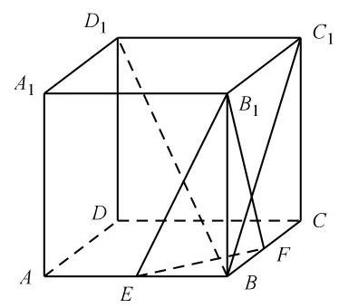

(1)求证: ${EF}\bot {B{D}_{1}}$ ；

(2)求二面角 ${B}_{1} - {EF} - B$ 的大小.

【解析】(1) 法一:连结 ${AC},{BD}$ ,因为点 $E\text{ 、 }F$ 分别是 ${AB}\text{ 、 }{BC}$ 的中点,

所以 ${EF}//{AC}$ ,因为 ${AC} \bot  {BD}$ ,所以 ${EF} \bot  {BD}$ ,

因为 $D{D}_{1}$ 上面 ${ABCD}$ ,所以 ${BD}$ 是 $B{D}_{1}$ 在面 ${ABCD}$ 的射影,

所以 ${EF} \bot  B{D}_{1}$ .

法二: 以点 $D$ 为坐标原点,射线 ${DA},{DC}, D{D}_{1}$ 为 $x$ 轴、 $y$ 轴、 $z$ 轴的正半轴,

建立空间直角坐标系. 设正方体的棱长为 $a$ .

$B\left( {a, a,0}\right) ,{D}_{1}\left( {0,0, a}\right) , E\left( {a,\frac{a}{2},0}\right) , F\left( {\frac{a}{2}, a,0}\right) ,$

$\overrightarrow{B{D}_{1}} = \left( {-a, - a, a}\right) ,\overrightarrow{EF} = \left( {-\frac{a}{2},\frac{a}{2},0}\right)$ ,

因为 $\overrightarrow{B{D}_{1}} \cdot  \overrightarrow{EF} = 0$ ,所以 ${EF} \bot  B{D}_{1}$ .

(2)法一:取 ${EF}$ 中点 $M$ ，连结 ${BM},{B}_{1}M$ .

在 $\bigtriangleup  {BEF}$ 中，因为 ${BE} = {BF}$ ，所以 ${BM}\bot {EF}$ .

同理, ${B}_{1}M \bot  {EF}$ ,所以 $\angle {B}_{1}{MB}$ 是二面角 ${B}_{1} - {EF} - B$ 的平面角.

设正方体的棱长为 $a$ .

在直角三角形 ${B}_{1}{MB}$ 中, ${BM}\frac{\sqrt{2}}{4}a,\tan \angle {B}_{1}{MB} = \frac{B{B}_{1}}{BM} = \frac{a}{\frac{\sqrt{2}}{4}a} = 2\sqrt{2}$ ,

$\angle {B}_{1}{MB} = \arctan 2\sqrt{2}$ ，二面角 ${B}_{1} - {EF} - B$ 的大小是 $\arctan 2\sqrt{2}$ .

法二: 设平面 ${B}_{1}{EF}$ 的法向量 $\overrightarrow{{n}_{1}} = \left( {u, v, w}\right)$ ,

$\overrightarrow{E{B}_{1}} = \left( {0,\frac{a}{2}, a}\right) ,\overrightarrow{EF} = \left( {-\frac{a}{2},\frac{a}{2},0}\right) ,$

由 $\overrightarrow{E{B}_{1}} \cdot  {\overrightarrow{n}}_{1} = 0$ 且 $\overrightarrow{EF} \cdot  {\overrightarrow{n}}_{1} = 0$ ,得 $\left\{  \begin{array}{l} v + {2w} = 0 \\   - u + v = 0 \end{array}\right.$ ,取 $\overrightarrow{{n}_{1}} = \left( {2, - 2,1}\right)$ ,

同理可得平面 ${BEF}$ 的法向量 $\overrightarrow{{n}_{2}} = \left( {0,0,1}\right)$ ，

设二面角 ${B}_{1} - {EF} - B$ 为 $\theta$ ,则 $\cos \theta  = \frac{\left| {n}_{1} \cdot  \overrightarrow{{n}_{2}}\right| }{\left| \overrightarrow{{n}_{1}}\right|  \cdot  \left| \overrightarrow{{n}_{2}}\right| } = \frac{1}{3}$ ,

二面角 ${B}_{1} - {EF} - B$ 的大小是 $\arccos \frac{1}{3}$ .

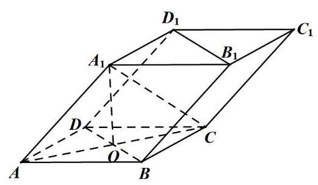

16.(长宁 18)如图所示，四棱柱 ${ABCD} - {A}_{1}{B}_{1}{C}_{1}{D}_{1}$ 的底面 ${ABCD}$ 是正方形, $O$ 是底面的中心, ${A}_{1}O \bot$ 平面 ${ABCD},{AB} = A{A}_{1} = \sqrt{2}$ .

(1)求证: ${A}_{1}C \bot$ 平面 ${BD}{D}_{1}{B}_{1}$ ；

(2)求直线 $O{A}_{1}$ 与平面 $A{A}_{1}B$ 所成角的正弦值.

【解析】(1) 因为 ${ABCD}$ 是正方形,所以 ${AC}\bot {BD},{OA} = {OC} = 1$ ,

因为 ${A}_{1}O \bot$ 底面 ${ABCD}$ ,所以 ${OC}$ 是 ${A}_{1}C$ 在平面 ${ABCD}$ 上的投影,

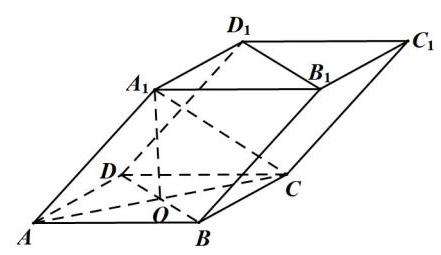

所以 ${A}_{1}C \bot  {BD}$ 2 分

由 $A{A}_{1} = \sqrt{2},{OA} = {OC} = 1,{A}_{1}O \bot$ 底面 ${ABCD}$ ,

得 ${A}_{1}O = 1,{A}_{1}C = \sqrt{2}$ ,

所以 $A{A}_{1}^{2} + {A}_{1}{C}^{2} = A{C}^{2}$ ,即有 $A{A}_{1} \bot  {A}_{1}C$ 2 分

因为 $A{A}_{1}//B{B}_{1}$ ,所以 $B{B}_{1} \bot  {A}_{1}C$ ,所以 ${A}_{1}C \bot$ 平面 ${BD}{D}_{1}{B}_{1}$ . 2 分

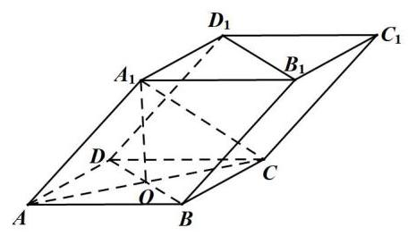

(2)法一:设点 $O$ 到平面 $A{A}_{1}B$ 的距离为 $h$ ，

${V}_{O - {A}_{1}{AB}} = \frac{1}{3} \cdot  {S}_{AOB} \cdot  O{A}_{1} = \frac{1}{3} \cdot  {S}_{A{A}_{1}B} \cdot  h$ 2 分所以 $h = \frac{1 \times  1}{\sqrt{3}} = \frac{\sqrt{3}}{3}$ 4 分

得直线 $O{A}_{1}$ 与平面 $A{A}_{1}B$ 所成角 $\theta$ 的正弦值 $\sin \theta  = \frac{\sqrt{3}}{3}$ 2 分

法二: (建系) 以 $O$ 为原点,射线 ${OA}\text{ 、 }{OB}\text{ 、 }O{A}_{1}$ 为 $x$ 轴、 $y$ 轴、 $z$ 轴的正半轴,建立空间直角坐标系,得 $A\left( {1,0,0}\right) , B\left( {0,1,0}\right) ,{A}_{1}\left( {0,0,1}\right)$ ,

则 $\overrightarrow{O{A}_{1}} = \left( {0,0,1}\right) ,\overrightarrow{A{A}_{1}} = \left( {-1,0,1}\right) ,\overrightarrow{AB} = \left( {-1,1,0}\right)$ 2 分

从而平面 $A{A}_{1}B$ 的一个法向量为 $\overrightarrow{n} = \left( {1,1,1}\right)$ 2 分

所以直线 $O{A}_{1}$ 与平面 $A{A}_{1}B$ 所成角 $\theta$ 的正弦值

$\sin \theta  = \cos \left( {\frac{\pi }{2} - \theta }\right)  = \frac{\overrightarrow{n} \cdot  \overrightarrow{O{A}_{1}}}{\left| \overrightarrow{n}\right|  \cdot  \left| \overrightarrow{O{A}_{1}}\right| } = \frac{1}{\sqrt{3}} = \frac{\sqrt{3}}{3}$ 4 分

## 第 12 节 圆锥曲线

【几何性质】

1. (宝山 9) 过双曲线 $\frac{{x}^{2}}{9} - \frac{{y}^{2}}{16} = 1$ 的左焦点 $F$ 作圆 ${x}^{2} + {y}^{2} = 9$ 的切线,切点为 $M$ . 延长切线交双曲线的右支于点 $P, O$ 为坐标原点,点 $T$ 为线段 ${FP}$ 的中点,则 $\left| {OT}\right|  =$ ___.

【解析】设双曲线右焦点为 ${F}^{\prime }$ ,这 $P{F}^{\prime } = x$ ,则 ${PF} = x + 6$ ,

因为 ${PF}$ 与圆 ${x}^{2} + {y}^{2} = 9$ 相切,所以 $\sin \angle {PF}{F}^{\prime } = \frac{OM}{OF} = \frac{3}{5}$ ,

所以 $\cos \angle {PF}{F}^{\prime } = \frac{4}{5}$ ,

在 ${\Delta PF}{F}^{\prime }$ 中, $\cos \angle {PF}{F}^{\prime } = \frac{4}{5} = \frac{{\left( x + 6\right) }^{2} + {10}^{2} - {x}^{2}}{2\left( {x + 6}\right)  \cdot  {10}}$ ,解得 $x = {10}$ ,

又点 $T$ 为线段 ${FP}$ 的中点,则 $\left| {OT}\right|  = \frac{1}{2}P{F}^{\prime } = 5$ .

2. (崇明 5) 双曲线 ${x}^{2} - \frac{{y}^{2}}{4} = 1$ 的渐近线方程是___.

【答案】 $y =  \pm  {2x}$

3. (奉贤 7) 已知抛物线 ${x}^{2} = {ay}\left( {a > 0}\right)$ 上有一点 $P$ 到准线的距离为 6,点 $P$ 到 $x$ 轴的距离为 4，则抛物线的焦点坐标为___.

【解析】由题意得 $x$ 轴到准线的距离为 2,所以 $\frac{a}{2} = 2$ ,所以 $a = 4$ ,

则抛物线的焦点坐标为 $\left( {0,2}\right)$ .

4. (虹口 10) 双曲线 ${C}_{1} : \frac{{x}^{2}}{{a}^{2}} - \frac{{y}^{2}}{{b}^{2}} = 1$ 的左、右焦点分别为 ${F}_{1}$ 和 ${F}_{2}$ ,若以点 ${F}_{2}$ 为焦点的抛物线 ${C}_{2} : {y}^{2} = {2px}\left( {p > 0}\right)$ 与 ${C}_{1}$ 在第一象限交于点 $P$ ,且 $\angle P{F}_{1}{F}_{2} = \frac{\pi }{4}$ ,则 ${C}_{1}$ 的离心率为___.

【解析】法一: 由于抛物线 ${C}_{2} : {y}^{2} = {2px}\left( {p > 0}\right)$ 的焦点为 ${F}_{2}$ ,则抛物线的准线过点 ${F}_{1}$ , 过点 $P$ 作 ${PH} \bot$ 抛物线的准线于点 $H$ ,则 ${PH} = P{F}_{2}$ ,

因为 $\angle P{F}_{1}{F}_{2} = \frac{\pi }{4}$ ,所以 $\angle {F}_{1}{PH} = \frac{\pi }{4}$ ,所以 $\frac{P{F}_{2}}{P{F}_{1}} = \frac{PH}{P{F}_{1}} = \cos \frac{\pi }{4} = \frac{1}{\sqrt{2}}$ ,

所以 $P{F}_{1} = \sqrt{2}P{F}_{2}$ ,由双曲线定义得 $P{F}_{1} - P{F}_{2} = {2a}$ ,

所以 $P{F}_{2} = \frac{2a}{\sqrt{2} - 1} = 2\left( {\sqrt{2} + 1}\right) a, P{F}_{1} = 2\left( {2 + \sqrt{2}}\right) a$ ,

在 ${\Delta P}{F}_{1}{F}_{2}$ 中,由余弦定理得 $P{F}_{2}^{2} = P{F}_{1}^{2} + {F}_{1}{F}_{2}^{2} - {2P}{F}_{1} \cdot  {F}_{1}{F}_{2}\cos \frac{\pi }{4}$ ,

所以 $4\left( {3 + 2\sqrt{2}}\right) {a}^{2} = 4\left( {6 + 4\sqrt{2}}\right) {a}^{2} + 4{c}^{2} - \sqrt{2} \cdot  4\left( {2 + \sqrt{2}}\right) {ac}$ ,

所以 $\left( {3 + 2\sqrt{2}}\right) {a}^{2} + {c}^{2} - \left( {2\sqrt{2} + 2}\right) {ac} = 0$ ,两边同时除以 ${a}^{2}$ ,

得 ${e}^{2} - \left( {2\sqrt{2} + 2}\right) e + {\left( \sqrt{2} + 1\right) }^{2} = 0$ ,所以离心率 $e = \sqrt{2} + 1$ .

法二: 设 ${F}_{1}\left( {-c,0}\right) ,{F}_{2}\left( {c,0}\right)$ ,得 $\frac{p}{2} = c$ ,即 $p = {2c}$ ,

直线 $P{F}_{1}$ 的方程为 $y = x + c$ ,

由 $\left\{  \begin{array}{l} {y}^{2} = {4cx} \\  y = x + c \end{array}\right.$ 得 ${\left( x + c\right) }^{2} = {4cx}$ ,解得 $x = c, y = {2c}$ ,即 $P\left( {c,{2c}}\right)$ ,

代入双曲线的方程，得 $\frac{{c}^{2}}{{a}^{2}} - \frac{4{c}^{2}}{{b}^{2}} = 1$ ，即 $\frac{{c}^{2}}{{a}^{2}} - \frac{4{c}^{2}}{{c}^{2} - {a}^{2}} = 1$ ，

所以 ${e}^{2} - \frac{4{e}^{2}}{{e}^{2} - 1} = 1$ ,化为 ${e}^{4} - 6{e}^{2} + 1 = 0$ ,由 $e > 1$ ,得 ${e}^{2} = 3 + 2\sqrt{2}$ ,

解得 $e = \sqrt{2} + 1$ .

5.(黄浦 3)椭圆 $\frac{{x}^{2}}{4} + \frac{{y}^{2}}{3} = 1$ 的焦距为___.

【答案】 2

6. (嘉定 5) 已知双曲线 $C : \frac{{x}^{2}}{3} - \frac{{y}^{2}}{2} = 1$ ,则双曲线 $C$ 的离心率为___.

【解析】 $e = \frac{c}{a} = \frac{\sqrt{5}}{\sqrt{3}} = \frac{\sqrt{15}}{3}$ .

7. (金山 15) 古希腊数学家阿波罗尼奥斯用不同的平面截同一圆锥, 得到了圆锥曲线, 其中的一种如图所示. 用过 $M$ 点且垂直于圆锥底面的平面截两个全等的对顶圆锥得到双曲线的一部分,已知高 ${PO} = 2$ ,底面圆的半径为 $4, M$ 为母线 ${PB}$ 的中点,平面与底面的交线 ${EF}\bot {AB}$ ，则双曲线的两条渐近线所成角的余弦值为( )

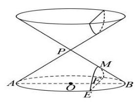

A. $\frac{5}{6}$ B. $\frac{4}{5}$ C. $\frac{3}{4}$ D. $\frac{3}{5}$

【解析】把该双曲线焦点放在 $x$ 轴上,设标准方程为 $\frac{{x}^{2}}{{a}^{2}} - \frac{{y}^{2}}{{b}^{2}} = 1$ ,

因为 ${OP} = 2$ ,所以 $a = 1$ ,易得 ${FE} = 2\sqrt{3}$ ,所以双曲线经过点 $\left( {2,2\sqrt{3}}\right)$ ,

所以 $4 - \frac{12}{{b}^{2}} = 1$ ,所以 ${b}^{2} = 4$ ,故双曲线方程为 ${x}^{2} - \frac{{y}^{2}}{4} = 1$ ,

渐近线方程为 ${2x} \pm  y = 0$ ,

所以双曲线的两条渐近线所成角的余弦值为 $\frac{\left| 2 \times  2 + 1 \times  \left( -1\right) \right| }{\sqrt{5} \cdot  \sqrt{5}} = \frac{3}{5}$ ,故选 $D$ .

8. (静安 5) 到点 ${F}_{1}\left( {-3,0}\right) ,{F}_{2}\left( {3,0}\right)$ 距离之和为 10 的动点 $P$ 的轨迹方程为___.

【解析】动点 $P$ 的轨迹是椭圆, ${2a} = {10}, c = 3$ ,则 $a = 5, b = 4$ ,

所以动点 $P$ 的轨迹方程为 $\frac{{x}^{2}}{25} + \frac{{y}^{2}}{16} = 1$ .

9. (静安 9) 以双曲线 $\frac{{x}^{2}}{4} - \frac{{y}^{2}}{m} = 1$ 的离心率为半径,以右焦点为圆心的圆与双曲线的渐近线相切,则 $m$ 的值为___.

【解析】双曲线的右焦点到渐近线的距离为 $b$ ,由题意得 $\sqrt{1 + \frac{m}{4}} = \sqrt{m}$ ,所以 $m = \frac{4}{3}$ .

10. (闵行 10) 已知 ${F}_{1},{F}_{2}$ 分别为椭圆 $\frac{{x}^{2}}{4} + \frac{{y}^{2}}{2} = 1$ 的左、右焦点,过 ${F}_{1}$ 的直线交椭圆于 $A, B$ 两点. 若 $\overrightarrow{A{F}_{1}} \cdot  \overrightarrow{A{F}_{2}} = 0$ ，则 $\overrightarrow{A{F}_{2}} \cdot  \overrightarrow{B{F}_{2}} =$ ___.

【解析】 ${F}_{1}\left( {-\sqrt{2},0}\right) ,{F}_{2}\left( {\sqrt{2},0}\right)$ ,设 $A\left( {x, y}\right)$ ,

因为 $\overrightarrow{A{F}_{1}} \cdot  \overrightarrow{A{F}_{2}} = 0$ ,所以 $\left( {-\sqrt{2} - x}\right) \left( {\sqrt{2} - x}\right)  + \left( {-y}\right) \left( {-y}\right)  = 0$ ,即 ${x}^{2} + {y}^{2} = 2$ , 又 $\frac{{x}^{2}}{4} + \frac{{y}^{2}}{2} = 1$ ,所以 $x = 0, y =  \pm  \sqrt{2}$ ,不妨设 $A\left( {0,\sqrt{2}}\right)$ ,

法一: $\overrightarrow{A{F}_{2}} \cdot  \overrightarrow{B{F}_{2}} = \overrightarrow{A{F}_{2}} \cdot  \left( {\overrightarrow{A{F}_{2}} - \overrightarrow{AB}}\right)  = A{F}_{2}^{2} = 4$ .

法二: 直线 $A{F}_{1}$ 的方程为 $y = x + \sqrt{2}$ ,由 $\left\{  \begin{array}{l} y = x + \sqrt{2} \\  \frac{{x}^{2}}{4} + \frac{{y}^{2}}{2} = 1 \end{array}\right.$ 得 $B\left( {-\frac{4\sqrt{2}}{3}, - \frac{\sqrt{2}}{3}}\right)$ ,

从而 $\overrightarrow{A{F}_{2}} = \left( {\sqrt{2}, - \sqrt{2}}\right) ,\overrightarrow{B{F}_{2}} = \left( {\frac{7\sqrt{2}}{3},\frac{\sqrt{2}}{3}}\right)$ ，所以 $\overrightarrow{A{F}_{2}} \cdot  \overrightarrow{B{F}_{2}} = 4$ .

11. (浦东 9) 已知双曲线 ${x}^{2} - \frac{{y}^{2}}{3} = 1$ 的左、右焦点分别为 ${F}_{1},{F}_{2}$ ,双曲线上的点 $P$ 在第一象限，且 $P{F}_{2}$ 与双曲线的一条渐近线平行，则 ${\Delta P}{F}_{1}{F}_{2}$ 的面积为___.

【解析】 ${F}_{1}\left( {-2,0}\right) ,{F}_{2}\left( {2,0}\right)$ ,渐近线为 $y =  \pm  \sqrt{3}x$ ,

由题意得直线 $P{F}_{2}$ 的方程为 $y =  - \sqrt{3}\left( {x - 2}\right)$ ,

由 $\left\{  \begin{array}{l} {x}^{2} - \frac{{y}^{2}}{3} = 1 \\  y =  - \sqrt{3}\left( {x - 2}\right)  \end{array}\right.$ 得 ${x}^{2} - {\left( x - 2\right) }^{2} = {4x} - 4 = 1$ ,所以 $x = \frac{5}{4}, y = \frac{3\sqrt{3}}{4}$ ,

即 $P\left( {\frac{5}{4},\frac{3\sqrt{3}}{4}}\right)$ ,所以 ${\Delta P}{F}_{1}{F}_{2}$ 的面积为 $\frac{1}{2} \times  4 \times  \frac{3\sqrt{3}}{4} = \frac{3\sqrt{3}}{2}$ .

12. (普陀 2)若抛物线的准线方程为 $y = 1$ ，则该抛物线的标准方程为___.

【答案】 ${x}^{2} =  - {4y}$

13. (普陀 7) 设椭圆 $C : \frac{{x}^{2}}{{a}^{2}} + \frac{{y}^{2}}{{b}^{2}} = 1\left( {a > b > 0}\right)$ 的左、右焦点分别为 ${F}_{1},{F}_{2}$ ,左顶点为 $A$ , 若椭圆 $C$ 的离心率为 $\frac{1}{3}$ ，则 $\frac{\left| {F}_{2}A\right| }{\left| A{F}_{1}\right| }$ 的值为___.

【解析】因为椭圆 $C$ 的离心率为 $\frac{c}{a} = \frac{1}{3}$ ,所以 $a = {3c}$ ,左顶点为 $A$ ,所以 $\frac{\left| {F}_{2}A\right| }{\left| A{F}_{1}\right| } = \frac{a + c}{a - c} = 2$ .

14.(青浦 5)两条渐近线互相垂直的双曲线的离心率为___.

【解析】由题意得 $a = b, c = \sqrt{2}$ ,则离心率 $e = \frac{c}{a} = \sqrt{2}$ .

15. (徐汇 10) 已知椭圆 $\frac{{x}^{2}}{{a}^{2}} + \frac{{y}^{2}}{{b}^{2}} = 1\left( {a > b > 0}\right)$ 的左、右焦点分别为 ${F}_{1},{F}_{2}, P$ 为椭圆上一点, 且 $\angle P{F}_{2}{F}_{1} = \frac{\pi }{3}$ ,若此椭圆的离心率为 $\sqrt{3} - 1$ ,则 $\angle P{F}_{1}{F}_{2}$ 的大小为___.

【解析】因为离心率 $e = \frac{c}{a} = \sqrt{3} - 1,\angle P{F}_{2}{F}_{1} = \frac{\pi }{3}$ ,所以 $c = \left( {\sqrt{3} - 1}\right) a,{b}^{2} = \left( {2\sqrt{3} - 3}\right) {a}^{2}$ ,

在 ${\Delta P}{F}_{2}{F}_{1}$ 中,由余弦定理得 $P{F}_{1}^{2} = P{F}_{2}^{2} + {F}_{1}{F}_{2}^{2} - {2P}{F}_{2} \cdot  {F}_{1}{F}_{2}\cos \frac{\pi }{3}$ ,

即 ${\left( 2a - P{F}_{2}\right) }^{2} = P{F}_{2}^{2} + 4{c}^{2} - {2cP}{F}_{2}$ ,所以 $4{a}^{2} - {4aP}{F}_{2} = 4{c}^{2} - {2cP}{F}_{2}$ ,

所以 $P{F}_{2} = \frac{2{b}^{2}}{{2a} - c} = \frac{\left( {4\sqrt{3} - 6}\right) {a}^{2}}{\left( {3 - \sqrt{3}}\right) a} = \left( {\sqrt{3} - 1}\right) a$ ,所以 $P{F}_{1} = {2a} - P{F}_{2} = \left( {3 - \sqrt{3}}\right) a$ ,

所以 $P{F}_{1} : P{F}_{2} : {F}_{1}{F}_{2} = \left( {3 - \sqrt{3}}\right) a : \left( {\sqrt{3} - 1}\right) a : 2\left( {\sqrt{3} - 1}\right) a = \sqrt{3} : 1 : 2$ ,

所以 $\angle P{F}_{1}{F}_{2} = \frac{\pi }{6}$ .

16.(徐汇 13)下列抛物线中，焦点坐标为 $\left( {0,\frac{1}{8}}\right)$ 的是( C )

A. ${y}^{2} = \frac{1}{2}x$ B. ${y}^{2} = \frac{1}{4}x$ C. ${x}^{2} = \frac{1}{2}y$ D. ${x}^{2} = \frac{1}{4}y$

17. (杨浦 11) 中国探月工程又称 “嫦娥工程”, 是中国航天活动的第三个里程碑. 在探月过程中, 月球探测器需要进行变轨, 即从一条椭圆轨道变到另一条不同的椭圆轨道上. 若变轨前后的两条椭圆轨道均以月球中心为一个焦点, 变轨后椭圆轨道上的点与月球中心的距离最小值保持不变，而距离最大值扩大为变轨前的 4 倍，椭圆轨道的离心率扩大为变轨前的 2.5 倍, 则变轨前的椭圆轨道的离心率为___(精确到 0.01).

【解析】不妨设 $\left\{  \begin{array}{l} {a}_{1} - {c}_{1} = {a}_{2} - {c}_{2} \\  4\left( {{a}_{1} + {c}_{1}}\right)  = {a}_{2} + {c}_{2} \end{array}\right.$ ,两式相除得 $\frac{{a}_{1} - {c}_{1}}{4\left( {{a}_{1} + {c}_{1}}\right) } = \frac{{a}_{2} - {c}_{2}}{{a}_{2} + {c}_{2}}$ ,

所以 $\frac{1 - {e}_{1}}{4\left( {1 + {e}_{1}}\right) } = \frac{1 - {e}_{2}}{1 + {e}_{2}}$ 且 ${e}_{2} = 2,5{e}_{1}$ ,即 $\frac{1 - {e}_{1}}{4\left( {1 + {e}_{1}}\right) } = \frac{1 - {2.5}{e}_{1}}{1 + {2.5}{e}_{1}}$ ,解得 ${e}_{1} \approx  {0.31}$ .

【综合小题】

1. (宝山 16)设 $\Delta {A}_{n}{B}_{n}{C}_{n}$ 的三边长分别为 ${a}_{n},{b}_{n},{c}_{n}$ ，面积为 ${S}_{n}$ ( $n$ 为正整数). 若 ${b}_{1} - {c}_{1} = \frac{1}{2}{a}_{1}$ ， 其中 ${c}_{1} > \frac{1}{4}{a}_{1},{a}_{n + 1} = {a}_{n},{b}_{n + 1} = {c}_{n} + \frac{1}{4}{a}_{n},{c}_{n + 1} = {b}_{n} + \frac{1}{4}{a}_{n}$ ,则(   )

A. $\left\{  {S}_{n}\right\}$ 为严格减数列

B. $\left\{  {S}_{n}\right\}$ 为严格增数列

C. $\left\{  {S}_{{2n} - 1}\right\}$ 为严格增数列, $\left\{  {S}_{2n}\right\}$ 为严格减数列

D. $\left\{  {S}_{{2n} - 1}\right\}$ 为严格减数列, $\left\{  {S}_{2n}\right\}$ 为严格增数列

【解析】易得 ${a}_{n} = {a}_{1}$ ,所以 ${b}_{n + 1} + {c}_{n + 1} = {b}_{n} + {c}_{n} + \frac{1}{2}{a}_{1}$ ,且 ${b}_{n + 1} - {c}_{n + 1} = {c}_{n} - {b}_{n}$ ,

所以 ${b}_{n} + {c}_{n} = {b}_{1} + {c}_{1} + \frac{n - 1}{2}{a}_{1},{b}_{n} - {c}_{n} = \left( {{b}_{1} - {c}_{1}}\right) {\left( -1\right) }^{n - 1} = \frac{{\left( -1\right) }^{n - 1}}{2}{a}_{1}$ ,

所以 $\left\{  \begin{array}{l} {b}_{n} = \frac{{b}_{1} + {c}_{1}}{2} + \frac{n}{4}{a}_{1} \\  {c}_{n} = \frac{{b}_{1} + {c}_{1}}{2} + \frac{n - 2}{4}{a}_{1} \end{array}\right.$ , $n$ 为奇数; $\left\{  \begin{array}{l} {b}_{n} = \frac{{b}_{1} + {c}_{1}}{2} + \frac{n - 2}{4}{a}_{1} \\  {c}_{n} = \frac{{b}_{1} + {c}_{1}}{2} + \frac{n}{4}{a}_{1} \end{array}\right.$ , $n$ 为偶数,

法一: 记 ${p}_{n} = \frac{1}{2}\left( {{a}_{n} + {b}_{n} + {c}_{n}}\right)  = \frac{1}{2}\left( {{a}_{1} + {b}_{1} + {c}_{1} + \frac{n - 1}{2}{a}_{1}}\right)$

$= \frac{1}{2}\left( {\frac{n + 1}{2}{a}_{1} + {b}_{1} + {c}_{1}}\right) ,$

${p}_{n} - {a}_{n} = \frac{1}{2}\left( {\frac{n - 1}{2}{a}_{1} + {b}_{1} + {c}_{1}}\right) ,$

$\left( {{p}_{n} - {b}_{n}}\right) \left( {{p}_{n} - {c}_{n}}\right)  = \frac{3}{4}{a}_{1} \cdot  \frac{1}{4}{a}_{1} = \frac{3}{16}{a}_{1}^{2},$

由海伦公式得 ${S}_{n} = \sqrt{{p}_{n}\left( {{p}_{n} - {a}_{n}}\right) \left( {{p}_{n} - {b}_{n}}\right) \left( {{p}_{n} - {c}_{n}}\right) }$

$= \sqrt{\frac{1}{4}\left( {\frac{n + 1}{2}{a}_{1} + {b}_{1} + {c}_{1}}\right) \left( {\frac{n - 1}{2}{a}_{1} + {b}_{1} + {c}_{1}}\right)  \cdot  \frac{3}{16}{a}_{1}^{2}}$

$= \sqrt{\frac{3}{64}{a}_{1}^{2}\left\lbrack  {{\left( {b}_{1} + {c}_{1}\right) }^{2} + n\left( {{b}_{1} + {c}_{1}}\right)  + \frac{{n}^{2} - 1}{4}{a}_{1}^{2}}\right\rbrack  }$ ,

则 $\left\{  {S}_{n}\right\}$ 为严格增数列,故选 $B$ .

法二: 注意到 $\left| {{b}_{n} - {c}_{n}}\right|  = \frac{1}{2}{a}_{1} < {a}_{1} = {a}_{n}$ 为定值,以 ${a}_{1}$ 作为底边,对称建系,

设 $B\left( {-\frac{1}{2}{a}_{1},0}\right) , C\left( {\frac{1}{2}{a}_{1},0}\right) , A\left( {x, y}\right)$ ,则 $\left| {{AB} - {AC}}\right|  = \frac{1}{2}{BC}$ 为定值,

所以 $A$ 点轨迹是以 $B, C$ 为焦点的双曲线,但由通项公式得 ${AB},{AC}$ 都在变大,

为了保持 $\left| {{AB} - {AC}}\right|  = \frac{1}{2}{BC}$ 为定值,则点 $A$ 只能远离 $x$ 轴,

则 $\Delta {A}_{n}{B}_{n}{C}_{n}$ 的底边不变,高越来越大,所以 $\left\{  {S}_{n}\right\}$ 为严格增数列,故选 $B$ .

2. (嘉定 12) 已知实数 ${x}_{1},{x}_{2},{y}_{1},{y}_{2}$ 满足: ${x}_{1}^{2} + {y}_{1}^{2} = 1,{x}_{2}^{2} + {y}_{2}^{2} = 1,{x}_{1}{x}_{2} + {y}_{1}{y}_{2} = \frac{1}{2}$ ,则 $\frac{\left| {x}_{1} + {y}_{1} - 1\right| }{\sqrt{5}} + \frac{\left| {x}_{2} + {y}_{2} - 1\right| }{\sqrt{2}}$ 的最小值为___.

【解析】设 $A\left( {{x}_{1},{y}_{1}}\right) , B\left( {{x}_{2},{y}_{2}}\right)$ ,

所以 $\overrightarrow{OA} \cdot  \overrightarrow{OB} = {x}_{1}{x}_{2} + {y}_{1}{y}_{2} = \frac{1}{2} \Rightarrow  \left| \overrightarrow{OA}\right|  \cdot  \left| \overrightarrow{OB}\right| \cos \angle {AOB} = \frac{1}{2} \Rightarrow  \angle {AOB} = \frac{\pi }{3}$ ，

$\frac{\left| {x}_{1} + {y}_{1} - 1\right| }{\sqrt{2}} + \frac{\left| {x}_{2} + {y}_{2} - 1\right| }{\sqrt{2}}$ 可以转化为 $A, B$ 到 $l : x + y - 1 = 0$ 的距离之和,

即 $\frac{\left| {x}_{1} + {y}_{1} - 1\right| }{\sqrt{2}} + \frac{\left| {x}_{2} + {y}_{2} - 1\right| }{\sqrt{2}} = {d}_{1} + {d}_{2}$ ,

若 $A, B$ 在 $l : x + y - 1 = 0$ 同侧时, ${d}_{1} + {d}_{2} = {2MN}$ ,

${d}_{1} + {d}_{2}$ 为 ${AB}$ 中点为 $M$ 到 $l : x + y - 1 = 0$ 的距离的 2 倍;

${OM} = \frac{\sqrt{3}}{2},{d}_{O - l} = \frac{\sqrt{2}}{2}$ ,所以 ${\left( {d}_{1} + {d}_{2}\right) }_{\min } = 2 \times  \left( {\frac{\sqrt{3}}{2} - \frac{\sqrt{2}}{2}}\right)  = \sqrt{3} - \sqrt{2}$ ;

法一: 若 $A, B$ 在 $l : x + y - 1 = 0$ 异侧时

(包括 $A, B$ 中有一点落在直线 $l : x + y - 1 = 0$ 上),

设 $A\left( {\cos \theta ,\sin \theta }\right) , B\left( {\cos \left( {\theta  + \frac{\pi }{3}}\right) ,\sin \left( {\theta  + \frac{\pi }{3}}\right) }\right)$ ,

不妨设 $\left\{  \begin{array}{l} 0 \leq  \theta  \leq  \frac{\pi }{2} \\  \frac{\pi }{2} \leq  \theta  + \frac{\pi }{3} \leq  {2\pi } \end{array}\right.$ ,即取 $\theta  \in  \left\lbrack  {\frac{\pi }{6},\frac{\pi }{2}}\right\rbrack$ ,

${d}_{1} + {d}_{2} = \frac{1}{\sqrt{2}}\left( {\left| {\cos \theta  + \sin \theta  - 1}\right|  + \left| {\cos \left( {\theta  + \frac{\pi }{3}}\right)  + \sin \left( {\theta  + \frac{\pi }{3}}\right)  - 1}\right| }\right)$

$= \frac{1}{\sqrt{2}}\left( {\cos \theta  + \sin \theta  - 1 - \cos \left( {\theta  + \frac{\pi }{3}}\right)  - \sin \left( {\theta  + \frac{\pi }{3}}\right)  + 1}\right)$

$= \frac{1}{\sqrt{2}}\left( {\cos \theta  + \sin \theta  - \frac{1}{2}\cos \theta  + \frac{\sqrt{3}}{2}\sin \theta  - \frac{1}{2}\sin \theta  - \frac{\sqrt{3}}{2}\cos \theta }\right)$

$= \frac{1}{\sqrt{2}}\left( {\frac{\sqrt{3} + 1}{2}\sin \theta  + \frac{1 - \sqrt{3}}{2}\cos \theta }\right)  = \sin \left( {\theta  + \varphi }\right) ,$

其中 $\tan \varphi  = \frac{1 - \sqrt{3}}{\sqrt{3} + 1} =  - \tan \frac{\pi }{12} = \tan \left( {-\frac{\pi }{12}}\right)$ ,取 $\varphi  =  - \frac{\pi }{12}$ ,

则 $\theta  + \varphi  \in  \left\lbrack  {\frac{\pi }{12},\frac{5\pi }{12}}\right\rbrack$ ,最小值为 $\sin \frac{\pi }{12} = \frac{\sqrt{6} - \sqrt{2}}{4}$ ;

综上, $\frac{\left| {x}_{1} + {y}_{1} - 1\right| }{\sqrt{2}} + \frac{\left| {x}_{2} + {y}_{2} - 1\right| }{\sqrt{2}}$ 最小值为 $\frac{\sqrt{6} - \sqrt{2}}{4}$ .

法二: 若 $A, B$ 在 $l : x + y - 1 = 0$ 异侧时

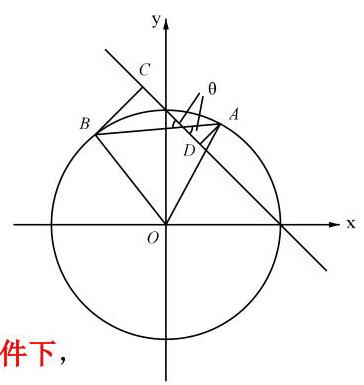

(包括 $A, B$ 中有一点落在直线 $l : x + y - 1 = 0$ 上),

${d}_{1} + {d}_{2} = {AB}\sin \theta$ ,其中 $\theta  \in  \left\lbrack  {\frac{\pi }{12},\frac{5\pi }{12}}\right\rbrack$ (即 $\frac{\pi }{4} \pm  \frac{\pi }{6}$ ),

所以 $\frac{\left| {x}_{1} + {y}_{1} - 1\right| }{\sqrt{2}} + \frac{\left| {x}_{2} + {y}_{2} - 1\right| }{\sqrt{2}}$ 最小值为 $1\sin \frac{\pi }{12} = \frac{\sqrt{6} - \sqrt{2}}{4}$ .

法三:开天眼操作，为了使得运算简便，在不改变原图形位置关系的条件下，

把直线 $l : x + y - 1 = 0$ 改为直线 $x = \frac{\sqrt{2}}{2}$ ,以下计算同上述法一,更简单.

【大题】

1. (宝山 20) 已知椭圆 $\Gamma  : \frac{{x}^{2}}{9} + \frac{{y}^{2}}{3} = 1$ ，直线 $l$ 经过椭圆 $\Gamma$ 的右顶点 $P$ 且与椭圆交于另一点 $A$ ,设线段 ${AP}$ 的中点为 $M$ .

(1)求椭圆 $\Gamma$ 的焦距和离心率；

(2)若 ${k}_{OM} =  - \frac{1}{3}$ ，求直线 ${AP}$ 的方程；

(3)过点 $P$ 再作一条直线与椭圆 $\Gamma$ 交于点 $B$ ，线段 ${BP}$ 的中点为 $N$ . 若 ${OM}\bot {ON}$ ，则直线 ${AB}$ 是否经过定点,若经过定点,求出定点坐标; 若不经过定点,请说明理由.

【解析】(1) 由 $a = 3, b = \sqrt{3}$ 得 $c = \sqrt{{a}^{2} - {b}^{2}} = \sqrt{6}$ .2 分

所以焦距 ${2c} = 2\sqrt{6}$ , .3 分

离心率 $e = \frac{c}{a} = \frac{\sqrt{6}}{3}$ .4 分

(2)法一: $P\left( {3,0}\right)$ ，设直线 ${AP}$ 的方程 $x = {ty} + 3$ ，

由 $\left\{  \begin{array}{l} \frac{{x}^{2}}{9} + \frac{{y}^{2}}{3} = 1 \\  x = {ty} + 3 \end{array}\right.$ 得 $\left( {{t}^{2} + 3}\right) {y}^{2} + {6ty} = 0$ . .5 分

因为点 $M$ 与点 $P$ 不重合,所以点 $M\left( {\frac{9}{{t}^{2} + 3},\frac{-{3t}}{{t}^{2} + 3}}\right)$ .6 分

于是由 ${k}_{OM} = \frac{-{3t}}{9} =  - \frac{1}{3}$ 得 $t = 1$ .7 分

直线 ${AP}$ 的方程为 $x - y - 3 = 0$ .8 分

法二: 由点差法得 ${k}_{AP}{k}_{OM} =  - \frac{3}{9} =  - \frac{1}{3}$ ,所以 ${k}_{AP} = 1$ ,

则直线 ${AP}$ 的方程为 $x - y - 3 = 0$ ;

(3)法一:①当直线 ${AB}$ 斜率存在时，设方程为 $y = {kx} + m$ ，

由 $\left\{  \begin{array}{l} \frac{{x}^{2}}{9} + \frac{{y}^{2}}{3} = 1 \\  y = {kx} + m \end{array}\right.$ 得 $\left( {3{k}^{2} + 1}\right) {x}^{2} + {6kmx} + 3{m}^{2} - 9 = 0$ .9 分

设 $A\left( {{x}_{1},{y}_{1}}\right) , B\left( {{x}_{2},{y}_{2}}\right)$ ,由韦达定理得 $\left\{  \begin{array}{l} {x}_{1} + {x}_{2} = \frac{-{6km}}{3{k}^{2} + 1} \\  {x}_{1}{x}_{2} = \frac{3{m}^{2} - 9}{3{k}^{2} + 1} \end{array}\right.$ .10 分由 $\Delta  = {36}{k}^{2}{m}^{2} - 4\left( {3{k}^{2} + 1}\right) \left( {3{m}^{2} - 9}\right)  > 0$ ,化简得 ${m}^{2} - 9{k}^{2} - 3 < 0$ ,

又 $P\left( {3,0}\right)$ ,从而 $M\left( {\frac{{x}_{1} + 3}{2},\frac{{y}_{1}}{2}}\right) , N\left( {\frac{{x}_{2} + 3}{2},\frac{{y}_{2}}{2}}\right)$ ,

由 ${OM} \bot  {ON}$ 得 $\overrightarrow{OM} \cdot  \overrightarrow{ON} = 0$ ,从而 $\left( {{x}_{1} + 3}\right) \left( {{x}_{2} + 3}\right)  + {y}_{1}{y}_{2} = 0$ ,

将 $y = {kx} + m$ 代换,得 $\left( {{x}_{1} + 3}\right) \left( {{x}_{2} + 3}\right)  + \left( {k{x}_{1} + m}\right) \left( {k{x}_{2} + m}\right)  = 0$ ,

整理得 $\left( {{k}^{2} + 1}\right) {x}_{1}{x}_{2} + \left( {{km} + 3}\right) \left( {{x}_{1} + {x}_{2}}\right)  + {m}^{2} + 9 = 0$ ,

韦达定理代入化简得 $9{k}^{2} - {9km} + 2{m}^{2} = 0$ .

$\left( {{3k} - {2m}}\right) \left( {{3k} - m}\right)  = 0$ ,所以 $m = {3k}$ 或 $m = \frac{3}{2}k$ .12 分

当 $m = {3k}$ 时,直线 ${AB}$ 经过点 $\left( {-3,0}\right)$ ,舍;

当 $m = \frac{3}{2}k$ 时,此时 $\frac{9}{4}{k}^{2} - 9{k}^{2} - 3 < 0$ 成立,

直线 ${AB}$ 经过定点 $\left( {-\frac{3}{2},0}\right) \ldots \ldots {14}$ 分

②当直线 ${AB}$ 斜率不存在时，

设 $A\left( {m, n}\right) , B\left( {m, - n}\right)$ ,则 $M\left( {\frac{m + 3}{2},\frac{n}{2}}\right) , N\left( {\frac{m + 3}{2},\frac{-n}{2}}\right)$ ,

代入 $\overrightarrow{OM} \cdot  \overrightarrow{ON} = 0$ 得 ${n}^{2} = {\left( m + 3\right) }^{2}$ ，

与 $\frac{{m}^{2}}{9} + \frac{{n}^{2}}{3} = 1$ 联立得 $2{m}^{2} + {9m} + 9 = 0$ 解得 $m =  - \frac{3}{2}$ ,

此时直线 ${AB}$ 也经过定点 $\left( {-\frac{3}{2},0}\right)$ . .16 分

综上,直线 ${AB}$ 经过定点 $\left( {-\frac{3}{2},0}\right)$ .

法二: 由点差法得 ${k}_{AP} \cdot  {k}_{OM} =  - \frac{1}{3},{k}_{BP} \cdot  {k}_{ON} =  - \frac{1}{3}$ (斜率不存在单独讨论),

因为 ${OM} \bot  {ON}$ ,所以 ${k}_{OM} \cdot  {k}_{ON} =  - 1$ ,所以 ${k}_{AP} \cdot  {k}_{BP} =  - \frac{1}{9}$ ,

沿用法一数据进行计算,

① 当直线 ${AB}$ 斜率存在时,设方程为 $y = {kx} + m$ ,

由 $\left\{  \begin{array}{l} \frac{{x}^{2}}{9} + \frac{{y}^{2}}{3} = 1 \\  y = {kx} + m \end{array}\right.$ 得 $\left( {3{k}^{2} + 1}\right) {x}^{2} + {6kmx} + 3{m}^{2} - 9 = 0$ . .9 分

设 $A\left( {{x}_{1},{y}_{1}}\right) , B\left( {{x}_{2},{y}_{2}}\right)$ ,由韦达定理得 $\left\{  \begin{array}{l} {x}_{1} + {x}_{2} = \frac{-{6km}}{3{k}^{2} + 1} \\  {x}_{1}{x}_{2} = \frac{3{m}^{2} - 9}{3{k}^{2} + 1} \end{array}\right.$ .10 分由 $\Delta  = {36}{k}^{2}{m}^{2} - 4\left( {3{k}^{2} + 1}\right) \left( {3{m}^{2} - 9}\right)  > 0$ ,化简得 ${m}^{2} - 9{k}^{2} - 3 < 0$ ,

又 $P\left( {3,0}\right)$ ,所以 ${k}_{AP} \cdot  {k}_{BP} = \frac{{y}_{1}}{{x}_{1} - 3} \cdot  \frac{{y}_{2}}{{x}_{2} - 3} =  - \frac{1}{9}$ ,

所以 $\left( {{x}_{1} - 3}\right) \left( {{x}_{2} - 3}\right)  + 9{y}_{1}{y}_{2} = 0$ ,

即 $\left( {{x}_{1} - 3}\right) \left( {{x}_{2} - 3}\right)  + 9\left( {k{x}_{1} + m}\right) \left( {k{x}_{2} + m}\right)  = 0$ ,

所以 $\left( {9{k}^{2} + 1}\right) {x}_{1}{x}_{2} + \left( {{9km} - 3}\right) \left( {{x}_{1} + {x}_{2}}\right)  + 9{m}^{2} + 9 = 0$ ,

韦达定理代入化简得 $2{m}^{2} + {3km} - 9{k}^{2} = 0$ ,即 $\left( {{2m} - {3k}}\right) \left( {m + {3k}}\right)  = 0$ ,

当 $m =  - {3k}$ 时,直线 ${AB}$ 经过点 $\left( {3,0}\right)$ ,舍;

当 $m = \frac{3}{2}k$ 时,此时 $\frac{9}{4}{k}^{2} - 9{k}^{2} - 3 < 0$ 成立,

直线 ${AB}$ 经过定点 $\left( {-\frac{3}{2},0}\right) \ldots \ldots {14}$ 分

②当直线 ${AB}$ 斜率不存在时,设 $A\left( {m, n}\right) , B\left( {m, - n}\right)$ ,

则 $\frac{n}{m - 3} \cdot  \frac{-n}{m - 3} =  - \frac{1}{9}$ 且 $\frac{{m}^{2}}{9} + \frac{{n}^{2}}{3} = 1$ ,所以 ${\left( m - 3\right) }^{2} = 9{n}^{2} = {27} - 3{m}^{2}$ ,

所以 $m =  - \frac{3}{2}$ ,此时直线 ${AB}$ 也经过定点 $\left( {-\frac{3}{2},0}\right)$ .16 分

综上,直线 ${AB}$ 经过定点 $\left( {-\frac{3}{2},0}\right)$ .

法三: 由点差法得 ${k}_{AP} \cdot  {k}_{OM} =  - \frac{1}{3},{k}_{BP} \cdot  {k}_{ON} =  - \frac{1}{3}$ (斜率不存在单独讨论),

因为 ${OM} \bot  {ON}$ ,所以 ${k}_{OM} \cdot  {k}_{ON} =  - 1$ ,所以 ${k}_{AP} \cdot  {k}_{BP} =  - \frac{1}{9}$ ,

显然直线 ${AP}$ 斜率存在且不为 0,设直线 ${AB}$ 的方程为 $y = k\left( {x - 3}\right)$ ,

由 $\left\{  \begin{array}{l} \frac{{x}^{2}}{9} + \frac{{y}^{2}}{3} = 1 \\  y = k\left( {x - 3}\right)  \end{array}\right.$ 得 $\left( {3{k}^{2} + 1}\right) {x}^{2} - {18}{k}^{2}x + {27}{k}^{2} - 9 = 0$ ,

由韦达定理得 $3{x}_{A} = \frac{{27}{k}^{2} - 9}{3{k}^{2} + 1}$ ,所以 ${x}_{A} = \frac{9{k}^{2} - 3}{3{k}^{2} + 1},{y}_{A} = k\left( {{x}_{A} - 3}\right)  = \frac{-{6k}}{3{k}^{2} + 1}$ ,

以 $- \frac{1}{9k}$ 代替 $k$ ,得 ${x}_{B} = \frac{9{\left( -\frac{1}{9}k\right) }^{2} - 3}{3{\left( -\frac{1}{9}k\right) }^{2} + 1} = \frac{3 - {81}{k}^{2}}{1 + {27}{k}^{2}}$ ,

${y}_{B} = \frac{-6\left( {-\frac{1}{9}k}\right) }{3{\left( -\frac{1}{9}k\right) }^{2} + 1} = \frac{18k}{1 + {27}{k}^{2}},$

由对称性得直线 ${AB}$ 所过的定点在 $x$ 轴上,设为 $T\left( {t,0}\right)$ ,

当直线 ${AB}$ 斜率不存在时, $\frac{9{k}^{2} - 3}{3{k}^{2} + 1} = \frac{3 - {81}{k}^{2}}{1 + {27}{k}^{2}}$ ,解得 ${k}^{2} = \frac{1}{9}$ ,

此时 $t = \frac{9{k}^{2} - 3}{3{k}^{2} + 1} =  - \frac{3}{2}$ ,所以 $T\left( {-\frac{3}{2},0}\right)$ ;

当直线 ${AB}$ 斜率存在时, ${k}_{AT} = \frac{\frac{-{6k}}{3{k}^{2} + 1}}{\frac{9{k}^{2} - 3}{3{k}^{2} + 1} + \frac{3}{2}} = \frac{-{4k}}{9{k}^{2} - 1}$ ,

${k}_{BT} = \frac{\frac{18k}{1 + {27}{k}^{2}}}{\frac{3 - {81}{k}^{2}}{1 + {27}{k}^{2}} + \frac{3}{2}} = \frac{-{4k}}{9{k}^{2} - 1}$ ,所以 ${k}_{AT} = {k}_{BT}$ ,又 ${AT}$ 和 ${BT}$ 有公共点 $T$ ,

所以直线 ${AB}$ 经过定点 $\left( {-\frac{3}{2},0}\right)$ .

法四:在法三的基础上，最后转化为向量共线，可以减少讨论，

$\overrightarrow{TA} = \left( {\frac{9{k}^{2} - 3}{3{k}^{2} + 1} - t,\frac{-{6k}}{3{k}^{2} + 1}}\right) ,\overrightarrow{TB} = \left( {\frac{3 - {81}{k}^{2}}{1 + {27}{k}^{2}} - t,\frac{18k}{1 + {27}{k}^{2}}}\right) ,$

所以 $\left( {\frac{9{k}^{2} - 3}{3{k}^{2} + 1} - t}\right) \frac{18k}{1 + {27}{k}^{2}} = \left( {\frac{3 - {81}{k}^{2}}{1 + {27}{k}^{2}} - t}\right) \frac{-{6k}}{3{k}^{2} + 1}$ ,

所以 $\left\lbrack  {9{k}^{2} - 3 - t\left( {3{k}^{2} + 1}\right) }\right\rbrack   \cdot  \left( {-3}\right)  = 3 - {81}{k}^{2} - t\left( {1 + {27}{k}^{2}}\right)$ ,

所以 $- {27}{k}^{2} + 9 + t\left( {9{k}^{2} + 3}\right)  = 3 - {81}{k}^{2} - t\left( {1 + {27}{k}^{2}}\right)$ ,

所以 ${54}{k}^{2} + 6 + t\left( {{36}{k}^{2} + 4}\right)  = 0$ ,所以 $t =  - \frac{3}{2}$ ,

所以直线 ${AB}$ 经过定点 $\left( {-\frac{3}{2},0}\right)$ .

法五: 不妨设直线 ${AB}$ 的方程为 ${mx} + {ny} = 1$ ,

下面考虑椭圆 $\Gamma  : \frac{{\left( x + 3\right) }^{2}}{9} + \frac{{y}^{2}}{3} = 1$ ,展开后得到 ${x}^{2} + {6x} + 3{y}^{2} = 0$ ,

将直线方程代入，得到 ${x}^{2} + 6\left( {{mx} + {ny}}\right) x + 3{y}^{2} = 0$ ，

两边同时除以 ${x}^{2}$ ,得到 $3{\left( \frac{y}{x}\right) }^{2} + 6\left( \frac{y}{x}\right)  + \left( {{6m} + 1}\right)  = 0$ ,

不难知道此时 $A$ 点和 $B$ 点坐标都满足上述方程,

由于 ${OM} \bot  {ON}$ ,所以 ${AE} \bot  {BE}$ ,因此 $\frac{{y}_{1}}{{x}_{1}} \times  \frac{{y}_{2}}{{x}_{2}} =  - 1$ ,

由韦达定理得 $\frac{{y}_{1}}{{x}_{1}} \times  \frac{{y}_{2}}{{x}_{2}} = \frac{{6m} + 1}{3} =  - 1$ ,解得 $m =  - \frac{2}{3}$ ,所以定点为 $\left( {-\frac{3}{2},0}\right)$ .

2. (崇明 20) 已知椭圆 $\Gamma  : \frac{{y}^{2}}{4} + \frac{{x}^{2}}{3} = 1$ ，点 ${F}_{1}$ 、 ${F}_{2}$ 分别是椭圆的下焦点和上焦点，过点 ${F}_{2}$ 的直线 $l$ 知椭圆交于 $A$ 、 $B$ 两点.

(1)若直线 $l$ 平行于 $x$ 轴,求线段 ${AB}$ 的长；

(2)若点 $A$ 在 $y$ 轴左侧,且 $\overrightarrow{{F}_{1}A} \cdot  \overrightarrow{{F}_{2}A} = \frac{9}{4}$ ，求直线 $l$ 的方程；

(3)已知椭圆上的点 $C$ 满足 $\left| {CA}\right|  = \left| {CB}\right|$ ，是否存在直线 $l$ 使得 $\bigtriangleup  {ABC}$ 的重心在 $x$ 轴上？若存在,请求出直线 $l$ 的方程,若不存在,请说明理由.

【解析】(1) 由题意得 ${F}_{1}\left( {0, - 1}\right) ,{F}_{2}\left( {1,0}\right)$ ,所以直线 $l$ 的方程是 $y = 1$ ,

代入 $\frac{{y}^{2}}{4} + \frac{{x}^{2}}{3} = 1$ 中，得 $x =  \pm  \frac{3}{2}$ ，所以 $\left| {AB}\right|  = 3$ . .4 分

(2)设 $A\left( {{x}_{0},{y}_{0}}\right) \left( {{x}_{0} < 0}\right)$ ，则 $\overrightarrow{{F}_{1}A} = \left( {{x}_{0},{y}_{0} + 1}\right) ,\overrightarrow{{F}_{2}A} = \left( {{x}_{0},{y}_{0} - 1}\right)$ ，

所以 $\overrightarrow{{F}_{1}A} \cdot  \overrightarrow{{F}_{2}A} = {x}_{0}{}^{2} + \left( {{y}_{0} + 1}\right) \left( {{y}_{0} - 1}\right)  = \frac{9}{4}$ ,又 $\frac{{y}_{0}^{2}}{4} + \frac{{x}_{0}{}^{2}}{3} = 1$ ,所以 $\left\{  \begin{array}{l} {x}_{0} =  - \frac{3}{2} \\  {y}_{0} =  \pm  1 \end{array}\right.$ ,

所以 $A$ 点坐标是 $\left( {-\frac{3}{2},1}\right)$ 或 $\left( {-\frac{3}{2}, - 1}\right)$ .4 分

所以直线 $l$ 的方程是 $y = 1$ 或 $y = \frac{4}{3}x + 1$ .6 分

(3)当直线 $l$ 的斜率存在时,设直线 $l$ 的方程为 $y = {kx} + 1$ ，

由 $\left\{  \begin{array}{l} \frac{{y}^{2}}{4} + \frac{{x}^{2}}{3} = 1 \\  y = {kx} + 1 \end{array}\right.$ ,得 $\left( {3 + 4{k}^{2}}\right)  + {6kx} - 9 = 0$ ,

设 $A\left( {{x}_{1},{y}_{1}}\right) , B{x}_{2},{y}_{2}, C\left( {{x}_{3},{y}_{3}}\right)$ ,则 ${x}_{1} + {x}_{2} = \frac{-{6k}}{3{k}^{2} + 4}$ ,

所以 ${AB}$ 中点 $M\left( {\frac{-{3k}}{3{k}^{2} + 4},\frac{4}{3{k}^{2} + 4}}\right)$ ,

又 $\bigtriangleup  {ABC}$ 的重心在 $x$ 轴上，所以 ${y}_{1} + {y}_{2} + {y}_{3} = 0$ ，

即 $k\left( {{x}_{1} + {x}_{2}}\right)  + 2 + {y}_{3} = 0$ ,故 ${y}_{3} =  - \frac{8}{3{k}^{2} + 4}$ , .4 分

因为 $\left| {CA}\right|  = \left| {CB}\right|$ ,所以 ${MC} \bot  {AB}$ ,

所以 $\overrightarrow{MC} \cdot  \overrightarrow{AB} = \left( {{x}_{3} + \frac{3k}{3{k}^{2} + 4},{y}_{3} - \frac{4}{3{k}^{2} + 4}}\right)  \cdot  \left( {{x}_{1} - {x}_{2},{y}_{1} - {y}_{2}}\right)$

$= \left( {{x}_{3} + \frac{3k}{3{k}^{2} + 4},{y}_{3} - \frac{4}{3{k}^{2} + 4}}\right)  \cdot  \left( {{x}_{1} - {x}_{2}}\right) \left( {1, k}\right)  = 0,$

因为 ${x}_{1} - {x}_{2} \neq  0$ ,所以 ${x}_{3} = \frac{9k}{3 + 4{k}^{2}}$ ,所以 $C\left( {\frac{9k}{3 + 4{k}^{2}}, - \frac{8}{3{k}^{2} + 4}}\right)$ ,

因为点 $C$ 在椭圆上,所以 $\frac{{\left( -\frac{8}{3{k}^{2} + 4}\right) }^{2}}{4} + \frac{{\left( \frac{9k}{3 + 4{k}^{2}}\right) }^{2}}{3} = 1$ ,

解得 $k = 0$ 或 $k =  \pm  \frac{\sqrt{3}}{3}$ . .6 分

当直线 $l$ 的斜率不存在时,直线 $l$ 的方程为 $x = 0$ ,此时 $A, B$ 恰为长轴顶点,

点 $C$ 为短轴顶点,满足题意.

综上所述,存在直线 $l$ 使得 $\bigtriangleup {ABC}$ 的重心在 $x$ 轴上,

其方程为 $y =  \pm  \frac{\sqrt{3}}{3}x + 1$ 或 $y = 1$ 或 $x = 0$ . .8 分

3. (奉贤 20) 椭圆 $\Gamma  : \frac{{x}^{2}}{{a}^{2}} + {y}^{2} = 1\left( {a > 1}\right)$ 的左右焦点分别为 ${F}_{1},{F}_{2}$ ,设 $P\left( {{x}_{0},{y}_{0}}\right)$ 是第一象限内椭圆上的一点， $P{F}_{1}$ 的延长线分别交椭圆于点 $Q\left( {{x}_{1},{y}_{1}}\right)$ .

(1)若椭圆的离心率 $\frac{\sqrt{2}}{2}$ ，求 $a$ 的值；

(2)若 $a = \sqrt{2},\overrightarrow{PQ} \cdot  \overrightarrow{O{F}_{1}} = \frac{12}{5}$ ，求 ${x}_{0}$ :

(3)若 $a = 2$ ，过点 $T\left( {0, t}\right)$ 的直线 $L$ 与椭圆 $\Gamma$ 交于 $M, N$ 两点，且 $\left| {MN}\right|  = 2$ ，则当 $t \geq  0$ 时， 判断符合要求的直线有几条, 说明理由?

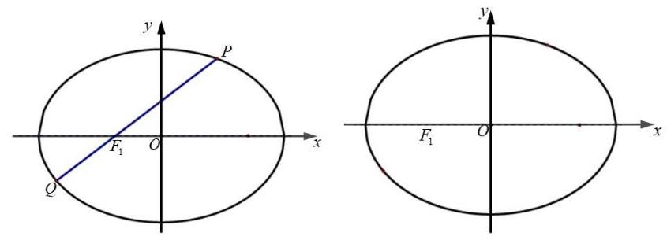

【解析】(1) 椭圆的离心率 $e = \frac{\sqrt{{a}^{2} - 1}}{a} = \frac{\sqrt{2}}{2}$ .2 分所以 $a = \sqrt{2}$ .2 分

(2)显然直线 $P{F}_{1}$ 的斜率是存在的，

$a = \sqrt{2}, b = 1$ ,所以 $c = \sqrt{2 - 1} = 1$ ,所以 ${F}_{1}\left( {-1,0}\right)$ .1 分

$\overrightarrow{PQ} = \left( {{x}_{1} - {x}_{0},{y}_{1} - {y}_{0}}\right) ,\overrightarrow{O{F}_{1}} = \left( {-1,0}\right) ,\overrightarrow{PQ} \cdot  \overrightarrow{O{F}_{1}} = {x}_{0} - {x}_{1}$ .1 分

直线 ${k}_{P{F}_{1}} = \frac{{y}_{0}}{{x}_{0} + 1}$ ,过点 ${F}_{1}$ 的直线方程为 $y = \frac{{y}_{0}}{{x}_{0} + 1}\left( {x + 1}\right)$ , .1 分

由 $\left\{  \begin{array}{l} \frac{{x}^{2}}{2} + {y}^{2} = 1 \\  y = \frac{{y}_{0}}{{x}_{0} + 1}\left( {x + 1}\right)  \end{array}\right.$ 得 ${\left\lbrack  {\left( {x}_{1} + 1\right) }^{2} + 2{y}_{0}\right\rbrack  }^{2}{y}^{2} - 2{y}_{0}\left( {{x}_{0} + 1}\right) y - {y}_{0}^{2} = 1$ ,

所以 ${y}_{1}{y}_{0} = \frac{-{y}_{0}^{2}}{{\left( {x}_{1} + 1\right) }^{2} + 2{y}_{0}^{2}}$ ,

因为 ${x}_{0}{}^{2} + 2{y}_{0}{}^{2} = 2$ ,所以 ${y}_{1} =  - \frac{{y}_{0}}{2{x}_{0} + 3}$ 1 分

所以 ${x}_{1} = \frac{\left( {{x}_{0} + 1}\right) {y}_{1}}{{y}_{0}} - 1 =  - \frac{{y}_{0}}{2{x}_{0} + 3}\left( \frac{{x}_{0} + 1}{{y}_{0}}\right)  - 1 =  - \frac{{x}_{0} + 1}{2{x}_{0} + 3} - 1$ 1 分

$\overrightarrow{PQ} \cdot  \overrightarrow{O{F}_{1}} = {x}_{0} + \frac{{x}_{0} + 1}{2{x}_{0} + 3} + 1 = \frac{12}{5}$ ，因为 ${x}_{0} > 0$ ，所以 ${x}_{0} = 1$ .1 分

(3) $a = 2$ 时，椭圆方程为 $\frac{{x}^{2}}{4} + {y}^{2} = 1$ ，

斜率不存在时,过任意点 $T\left( {0, t}\right)$ 的唯一的直线 $L : x = 0$ 与椭圆交于 $M, N$ , 两点坐标 $\left( {0,1}\right) ,\left( {0, - 1}\right)$ ,此时 $\left| {MN}\right|  = 2$ 恒成立 .2 分

斜率存在时,设过任意点 $T\left( {0, t}\right)$ 的直线 $L$ 的方程为 $y = {kx} + t$ ,

由 $\left\{  \begin{array}{l} \frac{{x}^{2}}{4} + {y}^{2} = 1 \\  y = {kx} + t \end{array}\right.$ 得 ${\left( 1 + 4k\right) }^{2}{x}^{2} + {8ktx} + 4{t}^{2} - 4 = 0$ ,

$\Delta  = {64}{k}^{2}{t}^{2} - 4{\left( 1 + 4k\right) }^{2}\left( {4{t}^{2} - 4}\right)  = {64}{k}^{2} + {16} - {16}{t}^{2} > 0$ .1 分

$\left| {MN}\right|  = \sqrt{1 + {k}^{2}}\frac{\sqrt{{64}{k}^{2} + {16} - {16}{t}^{2}}}{1 + 4{k}^{2}} = 2$ .1 分

${12}{k}^{2} + 3 - 4{t}^{2} - 4{k}^{2}{t}^{2} = 0,$

$t = \sqrt{3}$ 时,方程 ${12}{k}^{2} + 3 - 4{t}^{2} - 4{k}^{2}{t}^{2} = 0$ 方程无解. .1 分

$t \neq  \sqrt{3}$ 时, ${k}^{2} = \frac{4{t}^{2} - 3}{{12} - 4{t}^{2}} \geq  0$ ,

当 $t = \frac{\sqrt{3}}{2}$ 时,存在直线斜率为 0 的直线 $y = \frac{\sqrt{3}}{2}$ ,使得 $\left| {MN}\right|  = 2$ .1 分当 $\frac{3}{4} < {t}^{2} < 3$ 时,即 $\frac{\sqrt{3}}{2} < t < \sqrt{3}$ ,

存在 $k =  \pm  \sqrt{\frac{4{t}^{2} - 3}{{12} - 4{t}^{2}}}$ 的两条直线,使得 $\left| {MN}\right|  = 2$ .1 分

所以 $\frac{\sqrt{3}}{2} < t < \sqrt{3}$ 存在 3 条直线,使得 $\left| {MN}\right|  = 2$ ,

$t = \frac{\sqrt{3}}{2}$ 存在 2 条直线,使得 $\left| {MN}\right|  = 2$ ,

$t \geq  \sqrt{3}$ 或 $0 \leq  t < \frac{\sqrt{3}}{2}$ 存在 1 条直线,使得 $\left| {MN}\right|  = 2$ 1 分

4. (虹口 20) 已知椭圆 $\Gamma  : \frac{{x}^{2}}{4} + {y}^{2} = 1$ 的左、右焦点分别为 ${F}_{1},{F}_{2}$ ,右顶点为 $A$ ,上顶点为 $B$ ,设 $P$ 为 $\Gamma$ 上的一点.

(1)当 $P{F}_{1} \bot  {F}_{1}{F}_{2}$ 时，求 $\left| {P{F}_{2}}\right|$ 的值；

(2)若 $P$ 点坐标为 $\left( {1,\frac{\sqrt{3}}{2}}\right)$ ，则在 $\Gamma$ 上是否存在点 $Q$ 使 ${\Delta APQ}$ 的面积为 $\frac{\sqrt{3} + 1}{2}$ ，若存在， 请求出所有满足条件的点 $Q$ 的坐标；若不存在，请说明理由；

(3)已知 $D$ 点坐标为 $\left( {0, m}\right)$ ，过点 $P$ 和点 $D$ 的直线 $l$ 与椭圆 $\Gamma$ 交于另一点 $T$ ，当直线 $l$ 与 $x$ 轴和 $y$ 轴均不平行时,有 $\overrightarrow{PT} \cdot  \left( {\overrightarrow{BP} + \overrightarrow{BT}}\right)  = 0$ ,求实数 $m$ 的取值范围.

【解析】(1) 当 $P{F}_{1} \bot  {F}_{1}{F}_{2}$ 时, $\left| {P{F}_{1}}\right|  = \frac{1}{2}$ . 2 分

故 $\left| {P{F}_{2}}\right|  = 4 - \left| {P{F}_{1}}\right|  = \frac{7}{2}$ . 4 分

(2)若存在这样的点 $Q$ ，

由题意得点 $Q$ 到直线 ${AP}$ 的距离 $d = \frac{2\left( {\sqrt{3} + 1}\right) }{\sqrt{7}}$ . 6 分

故点 $Q$ 为与直线 ${AP}$ 相距 $\frac{2\left( {\sqrt{3} + 1}\right) }{\sqrt{7}}$ 且与直线 ${AP}$ 平行的直线 $l$ 与椭圆的交点.

直线 ${AP} : \frac{\sqrt{3}}{2}x + y - \sqrt{3} = 0$ ,设 $l : \frac{\sqrt{3}}{2}x + y + c = 0$ ,

则 $\frac{2\left( {\sqrt{3} + 1}\right) }{\sqrt{7}} = \frac{\left| -\sqrt{3} - c\right| }{\sqrt{\frac{3}{4} + 1}}$ ,解得 $c = 1$ 或 $- 2\sqrt{3} - 1$ . 8 分

当 $c = 1$ 时, $\left\{  \begin{array}{l} \frac{\sqrt{3}}{2}x + y + 1 = 0 \\  {x}^{2} + 4{y}^{2} = 4 \end{array}\right.$ ,解得 $\left\{  \begin{array}{l} x = 0 \\  y =  - 1 \end{array}\right.$ 或 $\left\{  \begin{array}{l} x =  - \sqrt{3} \\  y = \frac{1}{2} \end{array}\right.$ ;

当 $c =  - 2\sqrt{3} - 1$ 时, $\left\{  \begin{array}{l} \frac{\sqrt{3}}{2}x + y - 2\sqrt{3} - 1 = 0 \\  {x}^{2} + 4{y}^{2} = 4 \end{array}\right.$ ,方程组无解,

所以存在这样的点 $Q$ ,且坐标为 $\left( {0, - 1}\right)$ 或 $\left( {-\sqrt{3},\frac{1}{2}}\right)$ . 10 分

(3)由题意得直线 $l$ 的斜率必存在且不为零,设 $l : y = {kx} + m$ .

由 $\left\{  \begin{array}{l} y = {kx} + m \\  {x}^{2} + 4{y}^{2} = 4 \end{array}\right.$ 得 $\left( {1 + 4{k}^{2}}\right) {x}^{2} + {8kmx} + 4{m}^{2} - 4 = 0\left( *\right)$ ,

设 $P\left( {{x}_{1},{y}_{1}}\right) , T\left( {{x}_{2},{y}_{2}}\right)$ ,故 ${x}_{1} + {x}_{2} =  - \frac{8km}{1 + 4{k}^{2}},{x}_{1}{x}_{2} = \frac{4{m}^{2} - 4}{1 + 4{k}^{2}}$ 12 分

因为 $\overrightarrow{PT} \cdot  \left( {\overrightarrow{BP} + \overrightarrow{BT}}\right)  = \left( {\overrightarrow{PB} + \overrightarrow{BT}}\right)  \cdot  \left( {\overrightarrow{BP} + \overrightarrow{BT}}\right)  = \left( {-\overrightarrow{BP} + \overrightarrow{BT}}\right)  \cdot  \left( {\overrightarrow{BP} + \overrightarrow{BT}}\right)$

$= {\left| \overrightarrow{BP}\right| }^{2} - {\left| \overrightarrow{BT}\right| }^{2}$ ,由于 $\overrightarrow{PT} \cdot  \left( {\overrightarrow{BP} + \overrightarrow{BT}}\right)  = 0$ ,得 $\left| \overrightarrow{BP}\right|  = \left| \overrightarrow{BT}\right|$ . 14 分

取线段 ${PT}$ 的中点 $M$ ，有 ${BM} \bot  {PT}$ ，

所以点 $M$ 的坐标为 $\left( {-\frac{4km}{1 + 4{k}^{2}},\frac{m}{1 + 4{k}^{2}}}\right)$ ,

故 ${k}_{BM} \cdot  k =  - 1$ ,化简得 $- {3m} = 4{k}^{2} + 1 > 1$ . 16 分

由于方程(*)有两个不同的解,故 $\Delta  = {16}\left( {4{k}^{2} - {m}^{2} + 1}\right)  > 0$ ,

代入化简得 $m \in  \left( {-3,0}\right)$ ，即 $m \in  \left( {-3, - \frac{1}{3}}\right)$ . 18 分

5. (黄浦 20 ) 双曲线 $\Gamma  : \frac{{x}^{2}}{{a}^{2}} - \frac{{y}^{2}}{{b}^{2}} = 1\left( {a > 0, b > 0}\right)$ 的左、右焦点分别为 ${F}_{1}\left( {-c,0}\right) ,{F}_{2}\left( {c,0}\right) \left( {c > 0}\right)$ ,过点 ${F}_{1}$ 的直线 $l$ 与 $\Gamma$ 右支在 $x$ 轴上方交于点 $A$ .

(1)若 $a = \sqrt{5}$ ，点 $A$ 的坐标为 $\left( {3,4}\right)$ ，求 $c$ 的值；

(2)若 $A{F}_{2} \bot  {F}_{1}{F}_{2}$ ，且 $a, b, c$ 是等比数列，求证:直线 $l$ 的斜率为定值；

(3)设直线 $l$ 与 $\Gamma$ 左支的交点为 $B, c = 3$ ，当且仅当 $a$ 满足什么条件时，存在直线 $l$ ，使得 $\left| {AB}\right|  = \left| {A{F}_{2}}\right|$ 成立.

【解析】(1) 将 $x = 3, y = 4$ 代入 $\Gamma$ 的方程 $\frac{{x}^{2}}{5} - \frac{{y}^{2}}{{b}^{2}} = 1$ ,解得 ${b}^{2} = {20}$ . 2 分因此 $c = \sqrt{{a}^{2} + {b}^{2}} = 5$ . 4 分

(2)将 $x = c$ 代入 $\Gamma$ 的方程 $\frac{{x}^{2}}{{a}^{2}} - \frac{{y}^{2}}{{b}^{2}} = 1$ ，解得 $y =  \pm  \frac{{b}^{2}}{a}$ ，进而 $\left| {A{F}_{2}}\right|  = \frac{{b}^{2}}{a}\cdots 6$ 分在 Rt ${\Delta A}{F}_{1}{F}_{2}$ 中, $\tan \angle A{F}_{1}{F}_{2} = \frac{\left| A{F}_{2}\right| }{\left| {F}_{1}{F}_{2}\right| } = \frac{{b}^{2}}{2ac}$ . 8 分将 ${b}^{2} = {ac}$ 代入上式,得 $\tan \angle A{F}_{1}{F}_{2} = \frac{1}{2}$ ,即直线 $l$ 的斜率为定值 $\frac{1}{2}\cdots {10}$ 分

(3)由双曲线的定义，得 $\left| {A{F}_{1}}\right|  - \left| {A{F}_{2}}\right|  = {2a}$ ，

又 $\left| {AB}\right|  = \left| {A{F}_{2}}\right|$ ,得 $\left| {A{F}_{1}}\right|  - \left| {AB}\right|  = \left| {B{F}_{1}}\right|  = {2a}$ .

设点 $B$ 的坐标为 $\left( {{x}_{0},{y}_{0}}\right)$ ,

于是由 $\left\{  \begin{array}{l} {\left( {x}_{0} + 3\right) }^{2} + {y}_{0}^{2} = 4{a}^{2} \\  \frac{{x}_{0}^{2}}{{a}^{2}} - \frac{{y}_{0}^{2}}{{b}^{2}} = 1 \end{array}\right.$ 解得 ${x}_{0} =  - {a}^{2},{y}_{0} = b\sqrt{{a}^{2} - 1}\left( {a > 1}\right)$ , 14 分

又 $\Gamma$ 的渐近线方程为 $y =  \pm  \frac{b}{a}x$ .

若存在满足条件的直线 $l$ ,则 $0 < k < \frac{b}{a}$ ,

即 $0 < \frac{b\sqrt{{a}^{2} - 1}}{-{a}^{2} + 3} < \frac{b}{a}$ 且 $a > 1$ , 16 分

解得 $1 < a < \frac{3\sqrt{5}}{5}$ . 18 分

因此,当且仅当 $a$ 满足 $1 < a < \frac{3\sqrt{5}}{5}$ 时,存在满足条件的直线 $l$ .

6. (嘉定 20) 在平面直角坐标系 ${xOy}$ 中,已知椭圆 $\Gamma  : \frac{{x}^{2}}{5} + \frac{{y}^{2}}{4} = 1,{F}_{1}\text{ 、 }{F}_{2}$ 是其左、右焦点, 过椭圆 $\Gamma$ 右焦点 ${F}_{2}$ 的直线 ${PQ}$ 交椭圆于 $P\text{ 、 }Q$ 两点.

(1)若 $\overrightarrow{P{F}_{1}} \cdot  \overrightarrow{P{F}_{2}} = 3$ ，求点 $P$ 的坐标；

(2)若 $\Delta {F}_{1}{PQ}$ 的面积为 $\frac{40}{21}$ ，求直线 ${PQ}$ 的方程；

(3)设直线 $l$ 与椭圆 $\Gamma$ 交于 $A, B$ 两点， $M$ 为线段 ${AB}$ 的中点. 当 ${k}_{OM} \cdot  {k}_{AB} = {k}_{OA} \cdot  {k}_{OB}$ 时， ${\Delta OAB}$ 的面积是否为定值？如果是，请求出这个定值:如果不是，请说明理由.

【解析】(1) 由题意得 ${F}_{1}\left( {-1,0}\right) ,{F}_{2}\left( {1,0}\right)$ ,设点 $P\left( {{x}_{1},{y}_{1}}\right)$ ,

则有 $\overrightarrow{P{F}_{1}} \cdot  \overrightarrow{P{F}_{2}} = \left( {-1 - {x}_{1}, - {y}_{1}}\right)  \cdot  \left( {1 - {x}_{1}, - {y}_{1}}\right)  = {x}_{1}^{2} + {y}_{1}^{2} - 1 = 3$ ,

即 ${x}_{1}^{2} + {y}_{1}^{2} = 4\ldots 2$ 分

显然点 $P\left( {{x}_{1},{y}_{1}}\right)$ 既在圆上又在椭圆上. $\left\{  \begin{array}{l} \frac{{x}^{2}}{5} + \frac{{y}^{2}}{4} = 1 \\  {x}^{2} + {y}^{2} = 4 \end{array}\right.$ ,由题意点 $P$ 的坐标为 $P\left( {0, \pm  2}\right)$ . .4 分

(2)由题意 ${F}_{1}\left( {-1,0}\right) ,{F}_{2}\left( {1,0}\right)$ ,设 $P\left( {{x}_{1},{y}_{1}}\right) , Q\left( {{x}_{2},{y}_{2}}\right)$ ,

直线 ${PQ}$ 的方程为 $x = {my} + 1$ ,

由 $\left\{  \begin{array}{l} \frac{{x}^{2}}{5} + \frac{{y}^{2}}{4} = 1 \\  x = {my} + 1 \end{array}\right.$ 得 $\left( {4{m}^{2} + 5}\right) {y}^{2} + {8my} - {16} = 0$ ，___ $6 \neq  0$

所以 ${y}_{1} + {y}_{2} =  - \frac{8m}{4{m}^{2} + 5},{y}_{1}{y}_{2} =  - \frac{16}{4{m}^{2} + 5}$ ,

所以 $\left| {{y}_{1} - {y}_{2}}\right|  = \sqrt{{\left( {y}_{1} + {y}_{2}\right) }^{2} - 4{y}_{1}{y}_{2}} = 8\sqrt{5}\frac{\sqrt{{m}^{2} + 1}}{4{m}^{2} + 5}$ , .8 分

面积 $S = \frac{1}{2} \times  2 \times  \left| {{y}_{1} - {y}_{2}}\right|  = 8\sqrt{5}\frac{\sqrt{{m}^{2} + 1}}{4{m}^{2} + 5} = \frac{40}{21}$ ,解得 ${m}^{2} = 4$ ,

即 $m =  \pm  2\ldots \ldots \ldots 9$ 分

所以满足条件的直线方程为 $x + {2y} - 1 = 0$ 和 $x - {2y} - 1 = 0$ .10 分

(3)设 $A\left( {{x}_{3},{y}_{3}}\right)$ ， $B\left( {{x}_{4},{y}_{4}}\right)$ ，因为 $A$ ， $B$ 两点在椭圆上，

所以 $4{x}_{3}{}^{2} + 5{y}_{3}{}^{2} = {20}$ ①， $4{x}_{4}{}^{2} + 5{y}_{4}{}^{2} = {20}$ ②，

由①-②得 $4\left( {{x}_{3}{}^{2} - {x}_{4}{}^{2}}\right)  + 5\left( {{y}_{3}{}^{2} - {y}_{4}{}^{2}}\right)  = 0$ ,即 $4 + 5\frac{{y}_{M}}{{x}_{M}} \cdot  \frac{{y}_{3} - {y}_{4}}{{x}_{3} - {x}_{4}} = 0$ ,

即 ${k}_{OM} \cdot  {k}_{AB} =  - \frac{4}{5}$ ，所以 ${k}_{OA} \cdot  {k}_{OB} =  - \frac{4}{5}$ .12 分

法一: 所以 $\frac{{y}_{3}{y}_{4}}{{x}_{3}{x}_{4}} =  - \frac{4}{5}$ ,得 ${\left( 4{x}_{3}{x}_{4} + 5{y}_{3}{y}_{4}\right) }^{2} = 0$ ,

即 ${16}{x}_{3}{}^{2}{x}_{4}{}^{2} + {25}{y}_{3}{}^{2}{y}_{4}{}^{2} + {40}{x}_{3}{x}_{4}{y}_{3}{y}_{4} = 0$ ③,

由①乘②得 ${16}{x}_{3}{}^{2}{x}_{4}^{2} + {25}{y}_{3}{}^{2}{y}_{4}^{2} + {20}\left( {{x}_{3}{}^{2}{y}_{4}{}^{2} + {x}_{4}{}^{2}{y}_{3}^{2}}\right)  = {400}$ ④,

由③④得 ${x}_{3}{}^{2}{y}_{4}{}^{2} + {x}_{4}{}^{2}{y}_{3}{}^{2} - 2{x}_{3}{x}_{4}{y}_{3}{y}_{4} = {20}$ 即 ${\left( {x}_{3}{y}_{4} - {x}_{4}{y}_{3}\right) }^{2} = {20}$ , .14 分因为直线 ${OA}$ 的方程为 $y = \frac{{y}_{3}}{{x}_{3}}x$ ,即 ${y}_{3}x - {x}_{3}y = 0$ ,

点 $B$ 到直线 ${OA}$ 的距离为 $d = \frac{\left| {y}_{3}{x}_{4} - {x}_{3}{y}_{4}\right| }{\sqrt{{x}_{3}{}^{2} + {y}_{3}{}^{2}}}$ ,

所以 $\bigtriangleup {OAB}$ 的面积 $S = \frac{1}{2}\left| {OA}\right| d = \frac{1}{2}\left| {{x}_{3}{y}_{4} - {x}_{4}{y}_{3}}\right|$ .16 分

所以 $\bigtriangleup {OAB}$ 的面积为定值 $\sqrt{5}$ . .18 分

法二: 设直线 ${AB}$ 的方程为 $y = {kx} + m$ ,

由 $\left\{  \begin{array}{l} \frac{{x}^{2}}{5} + \frac{{y}^{2}}{4} = 1 \\  y = {kx} + m \end{array}\right.$ 得 $\left( {4 + 5{k}^{2}}\right) {x}^{2} + {10kmx} + 5{m}^{2} - {20} = 0$ ,

所以 ${x}_{3} + {x}_{4} = \frac{-{10km}}{4 + 5{k}^{2}},{x}_{3}{x}_{4} = \frac{5{m}^{2} - {20}}{4 + 5{k}^{2}}$ ,

因为 $\frac{{y}_{3}{y}_{4}}{{x}_{3}{x}_{4}} =  - \frac{4}{5}$ ,所以 $\frac{{k}^{2}{x}_{3}{x}_{4} + {km}\left( {{x}_{3} + {x}_{4}}\right)  + {m}^{2}}{{x}_{3}{x}_{4}} =  - \frac{4}{5}$ ,

整理得 $2{m}^{2} = 5{k}^{2} + 4$ ，

${AB} = \sqrt{1 + {k}^{2}}\sqrt{{\left( {x}_{1} + {x}_{2}\right) }^{2} - 4{x}_{1}{x}_{2}} = \frac{4\sqrt{5}\sqrt{\left( {1 + {k}^{2}}\right) \left( {4 + 5{k}^{2} - {m}^{2}}\right) }}{4 + 5{k}^{2}},$

原点到 ${AB}$ 的距离 $d = \frac{\left| m\right| }{\sqrt{1 + {k}^{2}}}$ ,

所以 $\bigtriangleup {OAB}$ 的面积 $S = \frac{1}{2}{AB} \cdot  d$

$= \frac{1}{2} \times  \frac{4\sqrt{5}\sqrt{\left( {1 + {k}^{2}}\right) \left( {4 + 5{k}^{2} - {m}^{2}}\right) }}{4 + 5{k}^{2}} \times  \frac{\left| m\right| }{\sqrt{1 + {k}^{2}}} = \frac{1}{2} \times  \frac{4\sqrt{5}\sqrt{\left( 2{m}^{2} - {m}^{2}\right) }}{2{m}^{2}} \times  \left| m\right|$

$= \sqrt{5}$ 为定值 $\sqrt{5}$ .

7. (金山 20) 已知椭圆 ${\Gamma }_{1} : \frac{{x}^{2}}{4} + \frac{{y}^{2}}{3} = 1$ ,抛物线 ${\Gamma }_{2} : {y}^{2} = {2px}\left( {p > 0}\right)$ 与 ${\Gamma }_{1}$ 有一个相同的焦点 $F$ . 点点 $F$ 作互相垂直的两条直线 $l$ 与 ${l}^{\prime }$ ,直线 $l$ 与 ${\Gamma }_{1}$ 交于点 $A, B$ ,直线 ${l}^{\prime }$ 与 ${\Gamma }_{2}$ 交于点 $C, D$ .

(1)求椭圆 ${\Gamma }_{1}$ 的离心率及抛物线 ${\Gamma }_{2}$ 的方程；

(2)若直线 $l$ 的倾斜角为 $\frac{3\pi }{4}$ ，求 ${AB}$ 中点 $M$ 的坐标；

(3)四边形 ${ACBD}$ 的面积是否存在最小值，若存在，求出最小值；若不存在，请说明理由.

【解析】(1) $c = \sqrt{{a}^{2} - {b}^{2}} = 1, a = 2$ ,所以离心率为 $e = \frac{c}{a} = \frac{1}{2};\cdots \cdots 2$ 分

因为右焦点 $F\left( {1,0}\right)$ ,所以抛物线 ${\Gamma }_{2} : {y}^{2} = {4x}$ . 4 分

(2)因为直线 $l$ 的倾斜角为 $\frac{3\pi }{4}$ ，所以直线 $l$ 的方程为 $y =  - x + 1$ ， 6 分由 $\left\{  \begin{array}{l} y =  - x + 1 \\  \frac{{x}^{2}}{4} + \frac{{y}^{2}}{3} = 1 \end{array}\right.$ 得 $7{x}^{2} - {8x} - 8 = 0,\cdots \cdots 8$ 设 $A\left( {{x}_{1},{y}_{1}}\right) , B{x}_{2},{y}_{2}, M\left( {{x}_{0},{y}_{0}}\right)$ , 因为 ${x}_{0} = \frac{{x}_{1} + {x}_{2}}{2} = \frac{4}{7},{y}_{0} = \frac{{y}_{1} + {y}_{2}}{2} = \frac{3}{7}$ ,所以 $M\left( {\frac{4}{7},\frac{3}{7}}\right)$ . 10 分

(3)因为 $l : x = 1,{l}^{\prime } : y = 0$ 与 ${\Gamma }_{2} : {y}^{2} = {4x}$ 只有 1 个交点，所以不合题意；

若 $l : y = 0$ ,则 ${l}^{\prime } : x = 1,\left| {AB}\right|  = 4,\left| {CD}\right|  = 4, S = \frac{1}{2}\left| {AB}\right| \left| {CD}\right|  = 8$ ; 11 分若设 $l : x = {my} + 1,\left( {m \neq  0}\right)$ ,

由 $\left\{  \begin{array}{l} x = {my} + 1,\left( {m \neq  0}\right) \\  \frac{{x}^{2}}{4} + \frac{{y}^{2}}{3} = 1 \end{array}\right.$ 得 $\left( {3{m}^{2} + 4}\right) {y}^{2} + {6my} - 9 = 0$ ,

$\Delta  = {36}{m}^{2} + {36}\left( {3{m}^{2} + 4}\right)  = {144}\left( {{m}^{2} + 1}\right) ,{y}_{1} + {y}_{2} = \frac{-{6m}}{3{m}^{2} + 4},{y}_{1}{y}_{2} = \frac{-9}{3{m}^{2} + 4}$ ,

$\left| {AB}\right|  = \sqrt{1 + {m}^{2}}\left| {{y}_{1} - {y}_{2}}\right|  = \frac{\sqrt{1 + {m}^{2}} \cdot  {12}\sqrt{{m}^{2} + 1}}{3{m}^{2} + 4} = \frac{{12}\left( {{m}^{2} + 1}\right) }{3{m}^{2} + 4},$ 13 分

由 $\left\{  \begin{array}{l} y =  - m\left( {x - 1}\right) \\  {y}^{2} = {4x} \end{array}\right.$ 得 ${m}^{2}{x}^{2} - \left( {2{m}^{2} + 4}\right) x + {m}^{2} = 0,{x}_{C} + {x}_{D} = \frac{2{m}^{2} + 4}{{m}^{2}}$ ,

$\left| {CD}\right|  = {x}_{C} + {x}_{D} + p = \frac{4\left( {{m}^{2} + 1}\right) }{{m}^{2}},$ 15 分

$S = \frac{1}{2}\left| {{AB}\parallel {CD}}\right|  = \frac{{24}{\left( {m}^{2} + 1\right) }^{2}}{\left( {3{m}^{2} + 4}\right) {m}^{2}},$ 令 $t = {m}^{2} + 1 > 1,$

则 $S = \frac{{24}{t}^{2}}{\left( {{3t} + 1}\right) \left( {t - 1}\right) } = \frac{{24}{t}^{2}}{3{t}^{2} - {2t} - 1} = \frac{24}{3 - \left( {\frac{2}{t} + \frac{1}{{t}^{2}}}\right) } > 8$ 17 分

综上,四边形 ${ACBD}$ 的面积最小值为 8 . .... 18 分

8. (静安 20) 如图的封闭图形的边缘由抛物线 $\Gamma$ 和垂直于抛物线对称轴的线段 ${AB}$ 组成. 已知 ${AB} = 4$ ，抛物线的顶点到线段 ${AB}$ 所在直线的距离为 2 .

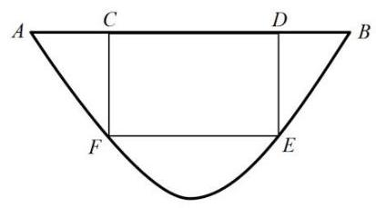

(1)请用数学语言表达这个封闭图形的边缘;

(2)在该封闭图形上截取一个矩形 ${CDEF}$ ，其中点 $C, D$ 在线段 ${AB}$ 上， 点 $E, F$ 在抛物线 $\Gamma$ 上. 求以矩形 ${CDEF}$ 为侧面， ${CF}$ 为母线的圆柱的体积的最大值;

(3)求证:抛物线 $\Gamma$ 的任何两条相互垂直的切线的交点都在同一条直线上.

【解析】(1) 如图建立平面直角坐标系 ${xOy}$ , 1 分

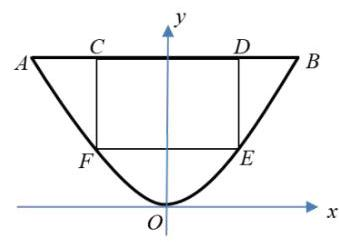

于是,抛物线 $\Gamma$ 过点 $\left( {2,2}\right)$ ,

所以,抛物线 $\Gamma$ 的方程为 $y = \frac{1}{2}{x}^{2}, x \in  \left\lbrack  {-2,2}\right\rbrack  . \cdot  4$ 分

线段 ${AB}$ 的方程为 $y = 2, x \in  \left\lbrack  {-2,2}\right\rbrack$ 1 分

(2)设 $E\left( {x, y}\right)$ ，则 ${DE} = 2 - \frac{1}{2}{x}^{2}$ 1 分

以 ${DE}$ 为母线的圆柱的底面半径 ${r}_{1}$ 满足 ${2x} = {2\pi }{r}_{1}$ ,

所以其体积 ${V}_{1} = \frac{1}{\pi }\left( {2{x}^{2} - \frac{1}{2}{x}^{4}}\right)$ .

法一: ${V}_{1} =  - \frac{1}{2\pi }{\left( {x}^{2} - 2\right) }^{2} + \frac{2}{\pi }$ 4 分

所以,当 $x = \sqrt{2}$ 时,其体积取得最大值 $\frac{2}{\pi }$ 1 分

法二: ${V}_{1}^{\prime } = \frac{1}{\pi }\left( {{4x} - 2{x}^{3}}\right)$ ,解得有实际意义的驻点 $x = \sqrt{2}\cdots 3$ 分列表如下:

<table><tr><td>$x$</td><td>$\left( {0,\sqrt{2}}\right)$</td><td>✓2</td><td>(√2,2)</td></tr><tr><td>${V}_{1}^{\prime }$</td><td>+</td><td>0</td><td>-</td></tr><tr><td>${V}_{1}$</td><td>↑</td><td>极大值 -4</td><td>↓</td></tr></table>

所以，该函数在区间 $\left( {0,\sqrt{2}}\right)$ 为严格单调增函数，

在区间 $\left( {\sqrt{2},2}\right)$ 为严格单调减函数. .4 分

所以,当 $x = \sqrt{2}$ 时,其体积取得最大值 $\frac{2}{\pi }$ 1 分

(3)因为 ${y}^{\prime } = x$ ，所以抛物线 $\Gamma$ 上任意一点 $\left( {x, y}\right)$ 的切线斜率为 $x$ ，

设 ${l}_{1},{l}_{2}$ 是抛物线 $\Gamma$ 上两条相互垂直的切线,切点分别为 $\left( {{x}_{1},{y}_{1}}\right) ,\left( {{x}_{2},{y}_{2}}\right)$ ,

则其方程分别为 ${l}_{1} : y - {y}_{1} = {x}_{1}\left( {x - {x}_{1},{l}_{2} : y - {y}_{2} = {x}_{2}\left( {x - {x}_{2}}\right) }\right.$ ,

且 ${x}_{1}{x}_{2} =  - 1$ 4 分

消去 $x$ ,解得 $\left( {{x}_{1} - {x}_{2}}\right) y = \frac{1}{2}{x}_{1}{x}_{2}\left( {{x}_{1} - {x}_{2}}\right)$ ,因为 ${x}_{1} \neq  {x}_{2}$ ,所以 $y =  - \frac{1}{2}$ .

故抛物线 $\Gamma$ 的任何两条相互垂直的切线的交点都在直线 $y =  - \frac{1}{2}$ 上....2分

9. (闵行 20 ) 已知圆 $O : {x}^{2} + {y}^{2} = 1$ ,双曲线 $\Gamma  : {x}^{2} - \frac{{y}^{2}}{{b}^{2}} = 1$ ,直线 $l : y = {kx} + b$ ,其中 $k \in  \mathbf{R}, b > 0$ .

(1)当 $b = 2$ 时,求双曲线 $\Gamma$ 的离心率;

(2)若 $l$ 与圆 $O$ 相切，证明: $l$ 与双曲线 $\Gamma$ 的左右两支各有一个公共点；

(3)设 $l$ 与 $y$ 轴交于点 $P$ ，与圆 $O$ 交于点 $A$ 、 $B$ ，与双曲线 $\Gamma$ 的左右两支分别交于点 $C$ 、

$D$ ,四个点从左至右依次为 $C\text{ 、 }A\text{ 、 }B\text{ 、 }D$ . 当 $k = \frac{\sqrt{2}}{2}$ 时,是否存在实数 $b$ ,使得 $\overrightarrow{PA} \cdot  \overrightarrow{PC} = \overrightarrow{PB} \cdot  \overrightarrow{PD}$ 成立? 若存在,求出 $b$ 的值; 若不存在,说明理由.

【解析】(1) 由题意得 ${a}^{2} = 1,{b}^{2} = 4$ ,所以 ${c}^{2} = {a}^{2} + {b}^{2} = 5$ , 2 分因此双曲线 $\Gamma$ 的离心率 $e = \frac{c}{a} = \sqrt{5}$ ; 4 分

(2)由直线 $l$ 与圆 $O$ 相切,得 $\frac{\left| b\right| }{\sqrt{{k}^{2} + 1}} = 1$ ,即 ${b}^{2} = {k}^{2} + 1$ , 6 分

由 $\left\{  \begin{array}{l} {x}^{2} - \frac{{y}^{2}}{{b}^{2}} = 1 \\  y = {kx} + b \end{array}\right.$ ,得 $\left( {{b}^{2} - {k}^{2}}\right) {x}^{2} - {2kbx} - 2{b}^{2} = 0$ ,

即 ${x}^{2} - {2kbx} - 2{b}^{2} = 0$ , 8 分

该一元二次方程的判别式 $\Delta  = 4{k}^{2}{b}^{2} + 8{b}^{2} > 0$ ,因此有两个不相等的实数根,

且两根之积为 $- 2{b}^{2} < 0$ ,因此两根一正一负,

即 $l$ 与双曲线 $\Gamma$ 的左右两支各有一个公共点; 10 分

(3)设 $A{x}_{1},{y}_{1}, B\left( {{x}_{2},{y}_{2}, C\left( {{x}_{3},{y}_{3}, D{x}_{4},{y}_{4}}\right) }\right.$ ，

由 $\left\{  \begin{array}{l} {x}^{2} + {y}^{2} = 1 \\  y = {kx} + b \end{array}\right.$ 得 $\left( {1 + {k}^{2}}\right) {x}^{2} + {2kbx} + {b}^{2} - 1 = 0$ ,得 $\left\{  \begin{array}{l} {x}_{1} + {x}_{2} = \frac{-{2kb}}{1 + {k}^{2}} \\  {x}_{1}{x}_{2} = \frac{{b}^{2} - 1}{1 + {k}^{2}} \end{array}\right.$ ,

由 ${\Delta }_{1} > 0$ 得 ${b}^{2} - {k}^{2} < 1$ .

由 $\left\{  \begin{array}{l} {x}^{2} - \frac{{y}^{2}}{{b}^{2}} = 1 \\  y = {kx} + b \end{array}\right.$ 得 $\left( {{b}^{2} - {k}^{2}}\right) {x}^{2} - {2kbx} - 2{b}^{2} = 0$ ,得 $\left\{  \begin{array}{l} {x}_{3} + {x}_{4} = \frac{2kb}{{b}^{2} - {k}^{2}} \\  {x}_{3}{x}_{4} = \frac{-2{b}^{2}}{{b}^{2} - {k}^{2}} \end{array}\right.$ ,

由 ${\Delta }_{2} > 0$ 且分别交于左右两支得 $\left\{  \begin{array}{l} 2{b}^{2} - {k}^{2} > 0 \\  {b}^{2} - {k}^{2} > 0 \end{array}\right.$ 12 分

又因为 $\overrightarrow{PA} \cdot  \overrightarrow{PC} = \overrightarrow{PB} \cdot  \overrightarrow{PD}, C, A, B, D$ 四个点在同一直线上,

所以 $\left| \overrightarrow{PA}\right|  \cdot  \left| \overrightarrow{PC}\right|  = \left| \overrightarrow{PB}\right|  \cdot  \left| \overrightarrow{PD}\right|$ ,所以 $\frac{\left| PA\right| }{\left| PB\right| } = \frac{\left| PD\right| }{\left| PC\right| }$ ,

所以 $\frac{\left| {x}_{1}\right| }{\left| {x}_{2}\right| } = \frac{\left| {x}_{4}\right| }{\left| {x}_{3}\right| }$ 14 分

所以 $\frac{{x}_{1}}{{x}_{2}} = \frac{{x}_{4}}{{x}_{3}}$ 且 $\frac{{x}_{2}}{{x}_{1}} = \frac{{x}_{3}}{{x}_{4}}$ ,所以 $\frac{{x}_{1}}{{x}_{2}} + \frac{{x}_{2}}{{x}_{1}} = \frac{{x}_{4}}{{x}_{3}} + \frac{{x}_{3}}{{x}_{4}},\frac{{x}_{1}^{2} + {x}_{2}^{2}}{{x}_{1}{x}_{2}} = \frac{{x}_{3}^{2} + {x}_{4}^{2}}{{x}_{3}{x}_{4}}$ ,

$\frac{{\left( {x}_{1} + {x}_{2}\right) }^{2}}{{x}_{1}{x}_{2}} = \frac{{\left( {x}_{3} + {x}_{4}\right) }^{2}}{{x}_{3}{x}_{4}}$ ,化简得 $\frac{2{b}^{2}}{{k}^{2} + 1} = \frac{{b}^{2} - 1}{{k}^{2} - {b}^{2}}$ 16 分

把 $k = \frac{\sqrt{2}}{2}$ 代入后化简得 $4{b}^{4} + {b}^{2} - 3 = 0$ ,解得 $b =  \pm  \frac{\sqrt{3}}{2}$ ,

由 $b > 0$ ,得 $b = \frac{\sqrt{3}}{2}$ .

经检验,此时 $l$ 与 $\Gamma$ 两支分别有交点,

所以 $b = \frac{\sqrt{3}}{2}$ 为唯一满足条件的实数 $b$ . 18 分

10. (浦东 20) 已知椭圆 $\frac{{x}^{2}}{8} + \frac{{y}^{2}}{4} = 1$ 的左、右焦点分别为 ${F}_{1},{F}_{2}$ ,过坐标原点的直线交椭圆于 $A, B$ 两点,点 $A$ 在第一象限.

(1)若 $\left| {OA}\right|  = \sqrt{6}$ ，求点 $A$ 的坐标；

(2)求 $\left| {\overrightarrow{A{F}_{1}} + 3\overrightarrow{A{F}_{2}}}\right|$ 的取值范围；

(3)若 ${AE}\bot x$ 轴，垂足为 $E$ ，连结 ${BE}$ 并延长交椭圆于点 $C$ ，求 $\bigtriangleup  {ABC}$ 面积的最大值.

【解析】(1) 联立 $\frac{{x}^{2}}{8} + \frac{{y}^{2}}{4} = 1$ 与 ${x}^{2} + {y}^{2} = 6$ ,得 $A\left( {2,\sqrt{2}}\right)$ 4 分

(2)设 $A\left( {{x}_{0},{y}_{0}}\right) ,{F}_{1}\left( {-2,0}\right) ,{F}_{2}\left( {2,0}\right) ,\frac{{x}_{0}{}^{2}}{8} + \frac{{y}_{0}{}^{2}}{4} = 1 \Rightarrow  {y}_{0}{}^{2} = 4 - \frac{{x}_{0}{}^{2}}{2}$ ， $\overrightarrow{A{F}_{1}} = \left( {-2 - {x}_{0}, - {y}_{0}}\right) ,\overrightarrow{A{F}_{2}} = \left( {2 - {x}_{0}, - {y}_{0}}\right) , \; \overrightarrow{A{F}_{1}} + 3\overrightarrow{A{F}_{2}} = \left( {-2 - {x}_{0}, - {y}_{0}}\right)  + \left( {6 - 3{x}_{0}, - 3{y}_{0}}\right)  = \left( {4 - 4{x}_{0}, - 4{y}_{0}}\right)$ 6 分 $\left| {\overrightarrow{A{F}_{1}} + 3\overrightarrow{A{F}_{2}}}\right|  = \sqrt{{\left( 4 - 4{x}_{0}\right) }^{2} + {\left( -4{y}_{0}\right) }^{2}} = 4\sqrt{1 - 2{x}_{0} + {x}_{0}{}^{2} + {y}_{0}^{2}} \; = 4\sqrt{\frac{{x}_{0}^{2}}{2} - 2{x}_{0} + 5} = 4\sqrt{\frac{1}{2}{\left( {x}_{0} - 2\right) }^{2} + 3}$ 8 分因为 $0 < {x}_{0} < 2\sqrt{2}$ ,所以当 ${x}_{0} = 2$ 时, $\left| {\overrightarrow{A{F}_{1}} + 3\overrightarrow{A{F}_{2}}}\right|$ 的最小值为 $4\sqrt{3}$ , 当 ${x}_{0} = 0$ 时， $\left| {\overrightarrow{A{F}_{1}} + 3\overrightarrow{A{F}_{2}}}\right|  = 4\sqrt{5}$ ， 所以 $\left| {\overrightarrow{A{F}_{1}} + 3\overrightarrow{A{F}_{2}}}\right|$ 的取值范围为 $\lbrack 4\sqrt{3},4\sqrt{5})$ 10 分

(3) 设 $A\left( {{x}_{0},{y}_{0}}\right) , B\left( {-{x}_{0}, - {y}_{0}}\right) , E\left( {{x}_{0},0}\right) ,{k}_{AB} = \frac{{y}_{0}}{{x}_{0}}$ ,

设直线 ${AB}$ 的斜率为 $k$ ,所以 ${k}_{BE} = \frac{0 + {y}_{0}}{{x}_{0} + {x}_{0}} = \frac{k}{2}$ ,

直线 ${AB}$ 方程为 $y = {kx}\left( {k > 0}\right)$ .

由 $\left\{  \begin{array}{l} y = {kx} \\  \frac{{x}^{2}}{8} + \frac{{y}^{2}}{4} = 1 \end{array}\right.$ 得 ${x}^{2} = \frac{8}{1 + 2{k}^{2}}$ . 11 分

设直线 ${BC} : y = \frac{k}{2}\left( {x - {x}_{0}}\right)$ ,

由 $\left\{  \begin{array}{l} y = \frac{k}{2}\left( {x - {x}_{0}}\right) \\  \frac{{x}^{2}}{8} + \frac{{y}^{2}}{4} = 1 \end{array}\right.$ 得 $\left( {2 + {k}^{2}}\right) {x}^{2} - 2{x}_{0}{k}^{2}x + {x}_{0}^{2}{k}^{2} - {16} = 0$ ①,

设 $C\left( {{x}_{C},{y}_{C}}\right)$ ,则 $- {x}_{0}$ 和 ${x}_{C}$ 是方程①的解,

则 ${x}_{C} = \frac{{x}_{0}\left( {3{k}^{2} + 2}\right) }{2 + {k}^{2}}$ ,由此得 ${y}_{C} = \frac{{x}_{0}{k}^{3}}{2 + {k}^{2}}$ . 13 分

${d}_{C - {AB}} = \frac{\left| {k\frac{{x}_{0}\left( {3{k}^{2} + 2}\right) }{2 + {k}^{2}} - \frac{{x}_{0}{k}^{3}}{2 + {k}^{2}}}\right| \left| \frac{k{x}_{0}\left( {2{k}^{2} + 2}\right) }{2 + {k}^{2}}\right| }{\sqrt{1 + {k}^{2}}}$ 14 分

$\left| {AB}\right|  = \sqrt{1 + {k}^{2}}\left| {{x}_{0} + {x}_{0}}\right|  = 2\sqrt{1 + {k}^{2}}\left| {x}_{0}\right| ,$

$S = \frac{1}{2}\left| {AB}\right| {d}_{C - {AB}} = \frac{1}{2} \times  2\sqrt{1 + {k}^{2}}\left| {x}_{0}\right|  \times  \frac{\left| \frac{k{x}_{0}\left( {2{k}^{2} + 2}\right) }{2 + {k}^{2}}\right| }{\sqrt{1 + {k}^{2}}}$

$= \frac{k{x}_{0}^{2}\left( {2{k}^{2} + 2}\right) }{2 + {k}^{2}} = \frac{k\left( {2{k}^{2} + 2}\right) }{2 + {k}^{2}} \times  \frac{8}{1 + 2{k}^{2}} = \frac{{16k}\left( {{k}^{2} + 1}\right) }{\left( {2 + {k}^{2}}\right) \left( {1 + 2{k}^{2}}\right) }$ 16 分

法一: $S = \frac{{16}\left( {k + \frac{1}{k}}\right) }{\left( {\frac{2}{k} + k}\right) \left( {\frac{1}{k} + {2k}}\right) } = \frac{{16}\left( {k + \frac{1}{k}}\right) }{2{\left( k + \frac{1}{k}\right) }^{2} + 1}$ ,

设 $t = k + \frac{1}{k}$ ,由 $k > 0$ 得 $t \geq  2$ ,当且仅当 $k = 1$ 时取等号.

因为 $S = \frac{16t}{2{t}^{2} + 1}$ 在 $\lbrack 2, + \infty )$ 为严格减函数,所以当 $t = 2$ ,

即 $k = 1$ 时, $s$ 取得最大值,最大值为 $\frac{32}{9}$ .

因此， $\bigtriangleup {ABC}$ 面积的最大值为 $\frac{32}{9}$ . 18 分

法二: $f\left( k\right)  = \frac{k\left( {{k}^{2} + 1}\right) }{\left( {2 + {k}^{2}}\right) \left( {1 + 2{k}^{2}}\right) } = \frac{{k}^{3} + k}{2{k}^{4} + 5{k}^{2} + 2}$ ,

${f}^{\prime }\left( k\right)  = \frac{\left( {1 - {k}^{2}}\right) \left( {2{k}^{4} + 3{k}^{2} + 2}\right) }{{\left( 2{k}^{4} + 5{k}^{2} + 2\right) }^{2}},$

$y = f\left( k\right)$ 在 $(0,1\rbrack$ 上是严格增函数,在 $\lbrack 1, + \infty )$ 上是严格减函数,

$k = 1$ 时, $s$ 取得最大值,最大值为 $\frac{32}{9}$ .

因此, $\bigtriangleup {ABC}$ 面积的最大值为 $\frac{32}{9}$ . 18 分

法三: 中位线+共线向量转化面积,

取 ${BC}$ 中点 $R$ ,则 ${OQ}//{AC},{OR} = \frac{1}{2}{AC}$ ,所以 ${S}_{\bigtriangleup {ABC}} = 4{S}_{\bigtriangleup {OBR}}$ ,

设 $A\left( {{x}_{0},{y}_{0}}\right) , B\left( {-{x}_{0}, - {y}_{0}}\right)$ ,则 $E\left( {{x}_{0},0}\right)$ ,所以 $\overrightarrow{BR} = \lambda \overrightarrow{BE} = \left( {{2\lambda }{x}_{0},\lambda {y}_{0}}\right)$ ,

则 $\overrightarrow{OR} = \overrightarrow{OB} + \overrightarrow{BR} = \left( {\left( {{2\lambda } - 1}\right) {x}_{0},\left( {\lambda  - 1}\right) {y}_{0}}\right)$ ,

由常见结论 (椭圆第三定义) 得 ${k}_{AC} \cdot  {k}_{BC} =  - \frac{{b}^{2}}{{a}^{2}} =  - \frac{1}{2}$ (设点很简单证明), 由上述过程得 ${k}_{AB} = 2{k}_{BE} = 2{k}_{BC}$ ,所以 ${k}_{AC} \cdot  {k}_{AB} =  - 1$ ,所以 ${AB} \bot  {AC}$ , 由中位线的性质得 ${OB} \bot  {OR}$ ,所以 $\overrightarrow{OB} \cdot  \overrightarrow{OR} = 0$ ,

所以 $\left( {{2\lambda } - 1}\right) {x}_{0}^{2} + \left( {\lambda  - 1}\right) {y}_{0}^{2} = 0$ ,所以 $\lambda  = \frac{{x}_{0}^{2} + {y}_{0}^{2}}{2{x}_{0}^{2} + {y}_{0}^{2}}$ ,

因为 $\overrightarrow{BR} = \lambda \overrightarrow{BE}$ ,所以 ${S}_{\bigtriangleup {ABC}} = 4{S}_{\bigtriangleup {OBR}} = {4\lambda }{S}_{\bigtriangleup {OBE}} = {4\lambda } \cdot  \frac{1}{2} \cdot  {x}_{0}{y}_{0}$

$= 2{x}_{0}{y}_{0} \cdot  \frac{{x}_{0}^{2} + {y}_{0}^{2}}{2{x}_{0}^{2} + {y}_{0}^{2}}$ ,注意到 $\frac{{x}_{0}^{2}}{8} + \frac{{y}_{0}^{2}}{4} = 1$ ,所以 ${x}_{0}^{2} + 2{y}_{0}^{2} = 8$ ,

所以 ${S}_{\bigtriangleup {ABC}} = \frac{{16}{x}_{0}{y}_{0}\left( {{x}_{0}^{2} + {y}_{0}^{2}}\right) }{\left( {{x}_{0}^{2} + 2{y}_{0}^{2}}\right) \left( {2{x}_{0}^{2} + {y}_{0}^{2}}\right) } = \frac{{16k}\left( {1 + {k}^{2}}\right) }{\left( {1 + 2{k}^{2}}\right) \left( {2 + {k}^{2}}\right) }$ ,以下同法一或法二.

法四: 由常见结论 (椭圆第三定义) 得 ${k}_{AC} \cdot  {k}_{BC} =  - \frac{{b}^{2}}{{a}^{2}} =  - \frac{1}{2}$ ,

由上述过程得 ${k}_{AB} = 2{k}_{BE} = 2{k}_{BC}$ ,所以 ${k}_{AC} \cdot  {k}_{AB} =  - 1$ ,所以 ${AB} \bot  {AC}$ ,

设 $A\left( {{x}_{0},{y}_{0}}\right) ,\angle {ABC} = \angle {AOE} - \angle {OEB} = \angle {AOE} - \angle {GEx}$ ,

则 $\tan \angle {AOE} = {k}_{AE} = \frac{{y}_{0}}{{x}_{0}},\tan \angle {GEx} = {k}_{BE} = \frac{{y}_{0}}{2{x}_{0}}$ ,

所以 $\tan \angle {ABC} = \frac{\frac{{y}_{0}}{{x}_{0}} - \frac{{y}_{0}}{2{x}_{0}}}{1 + \frac{{y}_{0}}{{x}_{0}} \cdot  \frac{{y}_{0}}{2{x}_{0}}} = \frac{{x}_{0}{y}_{0}}{2{x}_{0}^{2} + {y}_{0}^{2}}$ ,

所以 ${S}_{\bigtriangleup {ABC}} = \frac{1}{2}{AB} \cdot  {AC} = \frac{1}{2}A{B}^{2}\tan \angle {ABC} = \frac{1}{2} \cdot  \left( {4{x}_{0}^{2} + 4{y}_{0}^{2}}\right)  \cdot  \frac{{x}_{0}{y}_{0}}{2{x}_{0}^{2} + {y}_{0}^{2}}$

$= 2{x}_{0}{y}_{0} \cdot  \frac{{x}_{0}^{2} + {y}_{0}^{2}}{2{x}_{0}^{2} + {y}_{0}^{2}}$ ,注意到 $\frac{{x}_{0}^{2}}{8} + \frac{{y}_{0}^{2}}{4} = 1$ ,所以 ${x}_{0}^{2} + 2{y}_{0}^{2} = 8$ ,

所以 ${S}_{\bigtriangleup {ABC}} = \frac{{16}{x}_{0}{y}_{0}\left( {{x}_{0}^{2} + {y}_{0}^{2}}\right) }{\left( {{x}_{0}^{2} + 2{y}_{0}^{2}}\right) \left( {2{x}_{0}^{2} + {y}_{0}^{2}}\right) } = \frac{{16k}\left( {1 + {k}^{2}}\right) }{\left( {1 + 2{k}^{2}}\right) \left( {2 + {k}^{2}}\right) }$ ,以下同法一或法二.

11. (普陀 20 ) 设 $a > 0, m > 0,{F}_{1},{F}_{2}$ 分别是双曲线 $\Gamma  : \frac{{x}^{2}}{{a}^{2}} - {y}^{2} = 1$ 的左、右焦点,直线 $l : x - {my} - 2 = 0$ 经过点 ${F}_{2}$ 与 $\Gamma$ 的右支交于 $A\text{ 、 }B$ 两点,点 $O$ 是坐标原点.

(1)若点 $M$ 是 $\Gamma$ 上的一点， $\left| {M{F}_{1}}\right|  = 2$ ，求 $\left| {M{F}_{2}}\right|$ 的值；

(2)设 $\lambda ,\mu  \in  \mathbf{R}$ . 点 $P$ 在直线 $x = 6$ 上，若点 $O, A, P, B$ 满足: $\overrightarrow{OA} = \lambda \overrightarrow{BP},\overrightarrow{OB} = \mu \overrightarrow{AP}$ ， 求点 $P$ 的坐标:

(3)设 ${AO}$ 的延长线与 $\Gamma$ 交于 $G$ 点，若向量 $\overrightarrow{OA}$ 与 $\overrightarrow{OB}$ 满足: $\overrightarrow{OA} \cdot  \overrightarrow{OB} \geq  {17}$ ，求 $\bigtriangleup  {GAB}$ 的面积 $S$ 的取值范围.

【解析】(1) 由直线 $l : x - {my} - 2 = 0$ 经过右焦点 ${F}_{2}$ ,得,点 ${F}_{2}$ 的坐标为 $\left( {2,0}\right)$ ,

则 $a = \sqrt{3}$ , 2 分

由双曲线的定义得 $\begin{Vmatrix}{M{F}_{2}}\end{Vmatrix} - \left| {M{F}_{1}}\right|  = {2a} = 2\sqrt{3}$ ,则 $\left| {M{F}_{2}}\right|  = 2 + 2\sqrt{3}$ 4 分

(2)设 $P\left( {6, t}\right) , A\left( {{x}_{1},{y}_{1}}\right) , B\left( {{x}_{2},{y}_{2}}\right)$ ，

由 $\left\{  \begin{array}{l} \frac{{x}^{2}}{3} - {y}^{2} = 1 \\  x - {my} - 2 = 0 \end{array}\right.$ 得 $\left( {{m}^{2} - 3}\right) {y}^{2} + {4my} + 1 = 0$ ,

则 ${y}_{1} + {y}_{2} = \frac{4m}{3 - {m}^{2}},{y}_{1}{y}_{2} = \frac{1}{{m}^{2} - 3}$ , 3 分

由于 $A\text{ 、 }B$ 两点在双曲线的右支,且 $m > 0$ ,

由双曲线的性质得 $\frac{1}{m} > \frac{\sqrt{3}}{3}$ ,即 $0 < m < \sqrt{3}$ ,

由 $\overrightarrow{OA} = \lambda \overrightarrow{BP},\overrightarrow{OB} = \mu \overrightarrow{AP}$ 得四边形 ${OAPB}$ 为平行四边形,则 $\overrightarrow{OP} = \overrightarrow{OA} + \overrightarrow{OB}$ , 即 $\left( {6, t}\right)  = \left( {{x}_{1} + {x}_{2},{y}_{1} + {y}_{2}}\right)$ ,即 $\left\{  \begin{array}{l} {x}_{1} + {x}_{2} = 6 \\  {y}_{1} + {y}_{2} = t \end{array}\right.$ , 6 分则 ${x}_{1} + {x}_{2} = m\left( {{y}_{1} + {y}_{2}}\right)  + 4 = \frac{4{m}^{2}}{3 - {m}^{2}} + 4$ ,即 $\frac{4{m}^{2}}{3 - {m}^{2}} = 2$ ,即 $m = 1$ ,则 $t = 2$ , 所求的点 $P$ 的坐标为 $\left( {6,2}\right)$ . 8 分

(3)因为 $\overrightarrow{OA} \cdot  \overrightarrow{OB} = {x}_{1}{x}_{2} + {y}_{1}{y}_{2} = \left( {1 + {m}^{2}}\right) {y}_{1}{y}_{2} + {2m}\left( {{y}_{1} + {y}_{2}}\right)  + 4$ ，

所以由 (2) 得 $\overrightarrow{OA} \cdot  \overrightarrow{OB} = \frac{1 + {m}^{2}}{{m}^{2} - 3} - \frac{8{m}^{2}}{{m}^{2} - 3} + 4 = \frac{{11} + 3{m}^{2}}{3 - {m}^{2}}$ ,

由 $\overrightarrow{OA} \cdot  \overrightarrow{OB} \geq  {17}$ 得 $\frac{{11} + 3{m}^{2}}{3 - {m}^{2}} \geq  {17}$ ,

又由(2)得 $0 < m < \sqrt{3}$ ，则 $\sqrt{2} \leq  m < \sqrt{3}$ ， 3 分由双曲线的性质得,点 $A$ 与点 $G$ 关于原点 $O$ 对称,则 ${S}_{\Delta GAB} = 2{S}_{\Delta OAB}$ ,

即 $S = 2 \times  \frac{1}{2}\left| {O{F}_{2}}\right| \left| {{y}_{1} - {y}_{2}}\right|  = 2\left| {{y}_{1} - {y}_{2}}\right|  = \frac{2\sqrt{{16}{m}^{2} - 4\left( {{m}^{2} - 3}\right) }}{\left| {m}^{2} - 3\right| }$ ,

即 $S = \frac{2\sqrt{{12}{m}^{2} + {12}}}{\left| {m}^{2} - 3\right| } = \sqrt{\frac{{12}\left( {{m}^{2} + 1}\right) }{{\left( {m}^{2} - 3\right) }^{2}}}$ , 6 分

令 $h = {m}^{2} + 1$ ,又 $\sqrt{2} \leq  m < \sqrt{3}$ ,则 $h \in  \lbrack 3,4)$ ,

则 $S = 2\sqrt{\frac{12h}{{h}^{2} - {8h} + {16}}} = \frac{4\sqrt{3}}{\sqrt{h + \frac{16}{h} - 8}}$ ,

令 $g\left( h\right)  = h + \frac{16}{h}$ ,则 ${g}^{\prime }\left( h\right)  = 1 - \frac{16}{{h}^{2}}$ ,

当 $h \in  \lbrack 3,4)$ 时, $g\left( h\right)  < 0$ ,则 $g\left( h\right)  = h + \frac{16}{h}$ 在区间 $\lbrack 3,4)$ 内为严格减函数,

即 $g\left( h\right)  \in  \left( {8,\frac{25}{3}}\right\rbrack$ ,则 $S \in  \lbrack {12}, + \infty )$ . 8 分

12. (青浦 20) 已知椭圆 $C : \frac{{x}^{2}}{4} + \frac{{y}^{2}}{3} = 1, F$ 为椭圆 $C$ 的右焦点,过点 $F$ 的直线 $l$ 交椭圆 $C$ 于

$A\text{ 、 }B$ 两点.

(1)若直线 $l$ 垂直于 $x$ 轴,求椭圆 $C$ 的弦 ${AB}$ 的长度；

(2)设点 $P\left( {-3,0}\right)$ ，当 $\angle {PAB} = {90}^{ \circ  }$ 时，求点 $A$ 的坐标；

(3)设点 $M\left( {3,0}\right)$ ，记 ${MA}$ 、 ${MB}$ 的斜率分别为 ${k}_{1}$ 和 ${k}_{2}$ ，求 ${k}_{1} + {k}_{2}$ 的取值范围.

【解析】(1) 因为 $F$ 为椭圆 $C$ 的右焦点,过点 $F$ 的直线 $l$ 交椭圆 $C$ 于 $A\text{ 、 }B$ 两点, 直线 $l$ 垂直于 $x$ 轴,所以 ${x}_{F} = {x}_{A} = {x}_{B} = c$ , 代入椭圆的方程得 ${y}_{A} =  - {y}_{B} = \frac{{b}^{2}}{a}$ ，所以 $\left| {AB}\right|  = \frac{2{b}^{2}}{a} = \frac{2 \times  3}{2} = 3$ ； 若直线 $l$ 垂直于 $x$ 轴,椭圆 $C$ 的弦 ${AB}$ 的长度为 3 ;

(2)若点 $P\left( {-3,0}\right)$ ，当 $\angle {PAB} = {90}^{ \circ  }$ 时，因为弦 ${AB}$ 过右焦点，

则 ${PA} \bot  {FA}$ ,即点 $A$ 在以 ${PF}$ 为直径的圆上,

则点 $A$ 的轨迹方程为 ${\left( x + 1\right) }^{2} + {y}^{2} = 4$ ;

又因为点 $A$ 在椭圆上,所以 $\left\{  \begin{array}{l} \frac{{x}^{2}}{4} + \frac{{y}^{2}}{3} = 1 \\  {\left( x + 1\right) }^{2} + {y}^{2} = 4 \end{array}\right.$ 解得 $x = 0, y =  \pm  \sqrt{3}$ ,

即点 $A$ 的坐标为 $\left( {0,\sqrt{3}}\right)$ 或 $\left( {0, - \sqrt{3}}\right)$ ;

(3)设 ${AB} : x = {ty} + 1, A\left( {{x}_{1},{y}_{1}}\right) , B\left( {{x}_{2},{y}_{2}}\right)$ ，

由 $\left\{  \begin{matrix} x = {ty} + 1 \\  3{x}^{2} + 4{y}^{2} = {12} \end{matrix}\right.$ 得 $\left( {3{t}^{2} + 4}\right) {y}^{2} + {6ty} - 9 = 0$ ,

所以 ${y}_{1} + {y}_{2} = \frac{-{6t}}{3{t}^{2} + 4},{y}_{1}{y}_{2} = \frac{-9}{3{t}^{2} + 4}$ ,

所以 ${k}_{1} + {k}_{2} = \frac{{y}_{1}}{{x}_{1} - 3} + \frac{{y}_{2}}{{x}_{2} - 3} = \frac{{y}_{1}}{t{y}_{1} - 2} + \frac{{y}_{2}}{t{y}_{2} - 2}$

$= \frac{{2t}{y}_{1}{y}_{2} - 2\left( {{y}_{1} + {y}_{2}}\right) }{{t}^{2}{y}_{1}{y}_{2} - {2t}\left( {{y}_{1} + {y}_{2}}\right)  + 4} = \frac{-{6t}}{{15}{t}^{2} + {16}}$ ,

当 $t = 0$ 时, ${k}_{1} + {k}_{2} = 0$ ,

当 $t \neq  0$ 时, ${k}_{1} + {k}_{2} = \frac{-6}{{15t} + \frac{16}{t}} \in  \left\lbrack  {-\frac{\sqrt{15}}{20},0}\right)  \cup  \left( {0,\frac{\sqrt{15}}{20}}\right\rbrack$ ,

所以 ${k}_{1} + {k}_{2}$ 的取值范围是 $\left\lbrack  {-\frac{\sqrt{15}}{20},\frac{\sqrt{15}}{20}}\right\rbrack$ .

13. (松江 20) 如果一条双曲线的实轴和虚轴分别是一个椭圆的长轴和短轴, 则称它们为 “共轴” 曲线. 若双曲线 ${C}_{1}$ 与椭圆 ${C}_{2}$ 是 “共轴” 曲线,且椭圆 ${C}_{2} : \frac{{x}^{2}}{9} + \frac{{y}^{2}}{{b}^{2}} = 1\left( {0 < b < 3}\right)$ , ${e}_{1}{e}_{2} = \frac{4\sqrt{5}}{9}\left( {{e}_{1},{e}_{2}}\right.$ 分别为曲线 ${C}_{1},{C}_{2}$ 的离心率 $)$ . 已知点 $M\left( {1,0}\right)$ ,点 $P$ 为双曲线 ${C}_{1}$ 上任意一点.

(1)求双曲线 ${C}_{1}$ 的方程；

(2)延长线段 ${PM}$ 到点 $Q$ ，且 $\left| {PM}\right|  = 2\left| {MQ}\right|$ ，若点 $Q$ 在椭圆 ${C}_{2}$ 上，试求点 $P$ 的坐标；

(3)若点 $P$ 在双曲线 ${C}_{1}$ 的右支上，点 $A, B$ 分别为双曲线 ${C}_{1}$ 的左、右顶点，直线 ${PM}$ 交双曲线的左支于点 $R$ ，直线 ${AP},{BR}$ 的斜率分别为 ${k}_{AP},{k}_{BR}$ . 是否存在实数 $\lambda$ ，使得 ${k}_{AP} = \lambda {k}_{BR}$ ? 若存在,求出 $\lambda$ 的值; 若不存在,请说明理由.

【解析】(1) 由题意得双曲线 ${C}_{2} : \frac{{x}^{2}}{9} - \frac{{y}^{2}}{{b}^{2}} = 1\left( {0 < b < 3}\right)$ ,

因为 ${e}_{1}{e}_{2} = \frac{\sqrt{9 - {b}^{2}}}{3} \times  \frac{\sqrt{9 + {b}^{2}}}{3} = \frac{4\sqrt{5}}{9}$ ,解得 $b = 1$ ,

所以双曲线 ${C}_{2}$ 的方程为 $\frac{{x}^{2}}{9} - {y}^{2} = 1$ . -4 分

(2)设 $P\left( {{x}_{1},{y}_{1}}\right) , Q\left( {{x}_{2},{y}_{2}}\right)$ ，又 $\overrightarrow{PM} = 2\overrightarrow{MQ}, M\left( {1,0}\right)$ ，

则 $\left( {1 - {x}_{1}, - {y}_{1}}\right)  = 2\left( {{x}_{2} - 1,{y}_{2}}\right)$ ，

得 $\left\{  {\begin{array}{l} 1 - {x}_{1} = 2{x}_{2} - 2 \\   - {y}_{1} = 2{y}_{2} \end{array} \Rightarrow  \left\{  \begin{array}{l} {x}_{2} = \frac{3}{2} - \frac{1}{2}{x}_{1} \\  {y}_{2} =  - \frac{1}{2}{y}_{1} \end{array}\right. }\right.$ ,

分别将点 $P, Q$ 的坐标代入曲线方程,则 $\left\{  \begin{array}{l} \frac{{x}_{1}^{2}}{9} - {y}_{1}^{2} = 1 \\  \frac{{\left( \frac{3}{2} - \frac{1}{2}{x}_{1}\right) }^{2}}{9} + \frac{1}{4}{y}_{1}^{2} = 1 \end{array}\right.$ ,

解得 $\left\{  \begin{array}{l} {x}_{1} =  - 3 \\  {y}_{1} = 0 \end{array}\right.$ 或 $\left\{  \begin{array}{l} {x}_{1} = 6 \\  {y}_{1} =  \pm  \sqrt{3} \end{array}\right.$ , -8 分

故所求点 $P$ 的坐标为 $\left( {-3,0}\right) ,\left( {6,\sqrt{3}}\right) ,\left( {6, - \sqrt{3}}\right)$ . -10 分

(3)假设存在实数 $\lambda$ ，使得 ${k}_{AP} = \lambda {k}_{BR}$ ，

设直线 ${PM}$ 的方程为 $x = {ty} + 1, P\left( {{x}_{1},{y}_{1}}\right) , R\left( {{x}_{3},{y}_{3}}\right)$ ,

由 $\left\{  \begin{array}{l} x = {ty} + 1 \\  {x}^{2} - 9{y}^{2} = 9 \end{array}\right.$ ,得 $\left( {{t}^{2} - 9}\right) {y}^{2} + {2ty} - 8 = 0$ , -12 分

又 ${y}_{1} + {y}_{3} = \frac{-{2t}}{{t}^{2} - 9},{y}_{1}{y}_{3} = \frac{-8}{{t}^{2} - 9}$ , -14 分

${k}_{AP} = \frac{{y}_{1}}{{x}_{1} + 3} = \frac{{y}_{1}}{t{y}_{1} + 4},{k}_{BR} = \frac{{y}_{3}}{{x}_{3} - 3} = \frac{{y}_{3}}{t{y}_{3} - 2},$

法一: $\frac{{k}_{AP}}{{k}_{BR}} = \frac{{y}_{1}}{t{y}_{1} + 4}\frac{t{y}_{3} - 2}{{y}_{3}} = \frac{t{y}_{1}{y}_{3} - 2{y}_{1}}{t{y}_{1}{y}_{3} + 4{y}_{3}} = \frac{t\frac{-8}{{t}^{2} - 9} - 2\left( {\frac{-{2t}}{{t}^{2} - 9} - {y}_{3}}\right) }{t\frac{-8}{{t}^{2} - 9} + 4{y}_{3}}$

$= \frac{\frac{-{4t}}{{t}^{2} - 9} + 2{y}_{3}}{\frac{-{8t}}{{t}^{2} - 9} + 4{y}_{3}} = \frac{1}{2}$ ,故存在实数 $\lambda  = \frac{1}{2}$ ,使得 ${k}_{AP} = \frac{1}{2}{k}_{BR}$ . -18 分

法二: $t{y}_{1}{y}_{3} = 4\left( {{y}_{1} + {y}_{3}}\right)$ ,

则 $\frac{{k}_{AP}}{{k}_{BR}} = \frac{{y}_{1}}{t{y}_{1} + 4}\frac{t{y}_{3} - 2}{{y}_{3}} = \frac{t{y}_{1}{y}_{3} - 2{y}_{1}}{t{y}_{1}{y}_{3} + 4{y}_{3}} = \frac{4\left( {{y}_{1} + {y}_{3}}\right)  - 2{y}_{1}}{4\left( {{y}_{1} + {y}_{3}}\right)  + 4{y}_{3}} = \frac{1}{2}$ ,

故存在实数 $\lambda  = \frac{1}{2}$ ,使得 ${k}_{AP} = \frac{1}{2}{k}_{BR}$ .

法三: 注意到 ${x}^{2} - 9{y}^{2} = 9$ ,则 $\frac{{k}_{AP}}{{k}_{BR}} = \frac{\frac{{y}_{1}}{{x}_{1} + 3}}{\frac{{y}_{3}}{{x}_{3} - 3}} = \frac{{y}_{1}\left( {{x}_{3} - 3}\right) }{{y}_{3}\left( {{x}_{1} + 3}\right) }$ ,

所以 ${\left( \frac{{k}_{AP}}{{k}_{BR}}\right) }^{2} = \frac{{y}_{1}^{2}{\left( {x}_{3} - 3\right) }^{2}}{{y}_{3}^{2}{\left( {x}_{1} + 3\right) }^{2}} = \frac{\left( {{x}_{1}^{2} - 9}\right) {\left( {x}_{3} - 3\right) }^{2}}{\left( {{x}_{3}^{2} - 9}\right) {\left( {x}_{1} + 3\right) }^{2}} = \frac{\left( {{x}_{1} - 3}\right) \left( {{x}_{3} - 3}\right) }{\left( {{x}_{3} + 3}\right) \left( {{x}_{1} + 3}\right) }$ ,

到此转化为对称韦达, 正设直线计算即可.

14. (徐汇 20) 已知过点 $P\left( {3,\sqrt{2}}\right)$ 的双曲线 $C$ 的渐近线方程为 $x \pm  \sqrt{3}y = 0$ . 如图所示,过双曲线 $C$ 的右焦点 $F$ 作与坐标轴都不垂直的直线 $l$ 交 $C$ 的右支于 $A, B$ 两点.

(1)求双曲线 $C$ 的标准方程；

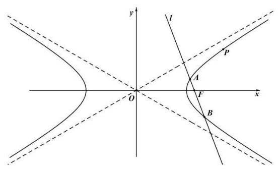

(2)已知点 $Q\left( {\frac{3}{2},0}\right)$ ，求证: $\angle {AQF} = \angle {BQF}$ ；

(3)若以 ${AB}$ 为直径的圆被直线 $x = \frac{3}{2}$ 截得的劣弧为 $\overset{\text{ ⏜ }}{MN}$ ， 则 $\overset{\text{ ⏜ }}{MN}$ 所对圆心角的大小是否为定值？若是，求出该定值； 若不是, 请说明理由.

【解析】(1) 因为双曲线 $C$ 的渐近线方程为 $x \pm  \sqrt{3}y = 0$ , 所以设双曲线方程为 ${x}^{2} - 3{y}^{2} = \lambda \left( {\lambda  \neq  0}\right)$ , 又双曲线过点 $P\left( {3,\sqrt{2}}\right)$ ,则 $\lambda  = 9 - 3 \times  2 = 3$ , 所以双曲线的方程为 ${x}^{2} - 3{y}^{2} = 3$ ,即 $\frac{{x}^{2}}{3} - {y}^{2} = 1$ .

(2)由(1)得 $F\left( {2,0}\right)$ ， $l$ 的斜率存在且不为 0，设 $l$ 的方程为 $y = k\left( {x - 2}\right)$ ，

由 $\left\{  \begin{array}{l} y = k\left( {x - 2}\right) \\  {x}^{2} - 3{y}^{2} = 3 \end{array}\right.$ 得 $\left( {1 - 3{k}^{2}}\right) {x}^{2} + {12}{k}^{2}x - {12}{k}^{2} - 3 = 0$ ,

设 $A\left( {{x}_{1},{y}_{1}}\right) , B\left( {{x}_{2},{y}_{2}}\right)$ ,

由题意得 $\left\{  {\begin{array}{l} 1 - 3{k}^{2} \neq  0 \\  \Delta  > 0 \\  {x}_{1} + {x}_{2} > 0 \\  {x}_{1} \cdot  {x}_{2} > 0 \end{array} \Rightarrow  k \in  \left( {-\infty , - \frac{\sqrt{3}}{3}}\right)  \cup  \left( {\frac{\sqrt{3}}{3}, + \infty }\right) }\right.$ ,

则 $\left\{  \begin{array}{l} {x}_{1} + {x}_{2} = \frac{-{12}{k}^{2}}{1 - 3{k}^{2}} \\  {x}_{1} \cdot  {x}_{2} = \frac{-{12}{k}^{2} - 3}{1 - 3{k}^{2}} \end{array}\right.$ ,

所以 ${k}_{AQ} + {k}_{BQ} = \frac{{y}_{1}}{{x}_{1} - \frac{3}{2}} + \frac{{y}_{2}}{{x}_{2} - \frac{3}{2}} = \frac{k\left( {{x}_{1} - 2}\right) }{{x}_{1} - \frac{3}{2}} + \frac{k\left( {{x}_{2} - 2}\right) }{{x}_{2} - \frac{3}{2}}$

$= \frac{k\left\lbrack  {2{x}_{1}{x}_{2} - \frac{7}{2}\left( {{x}_{1} + {x}_{2}}\right)  + 6}\right\rbrack  }{{x}_{1}{x}_{2} - \frac{3}{2}\left( {{x}_{1} + {x}_{2}}\right)  + \frac{9}{4}} \; = \frac{k\left\lbrack  {2\left( {-{12}{k}^{2} - 3}\right)  + \frac{7}{2} \times  {12}{k}^{2} + 6\left( {1 - 3{k}^{2}}\right) }\right\rbrack  }{-{12}{k}^{2} - 3 + \frac{3}{2} \times  {12}{k}^{2} + \frac{9}{4}\left( {1 - 3{k}^{2}}\right) } = 0$ ,

所以 ${k}_{AQ} =  - {k}_{BQ},\angle {AQF} = \angle {BQF}$ 得证.

(3)由 $\left\{  \begin{array}{l} y = k\left( {x - 2}\right) \\  {x}^{2} - 3{y}^{2} = 3 \end{array}\right.$ 得 $\left( {1 - 3{k}^{2}}\right) {x}^{2} + {12}{k}^{2}x - \left( {{12}{k}^{2} + 3}\right)  = 0$ ，

$\Delta  = {12}{k}^{2} + {12} > 0$ 恒成立, ${x}_{1} + {x}_{2} = \frac{-{12}{k}^{2}}{1 - 3{k}^{2}}$ ,

所以圆心到 $x = \frac{3}{2}$ 的距离 $d = \left| {\frac{6{k}^{2}}{3{k}^{2} - 1} - \frac{3}{2}}\right|  = \left| \frac{3{k}^{2} + 3}{2\left( {3{k}^{2} - 1}\right) }\right|$ ,

半径 $r = \frac{\left| AB\right| }{2} = \frac{1}{2}\sqrt{1 + {k}^{2}}\frac{\sqrt{{12}{k}^{2} + {12}}}{\left| 1 - 3{k}^{2}\right| } = \frac{\sqrt{3}\left( {1 + {k}^{2}}\right) }{\left| 3{k}^{2} - 1\right| }$ ,

设 $\overset{\text{ ⏜ }}{MN}$ 所对圆心角为 $\theta$ ,则 $\cos \frac{\theta }{2} = \frac{d}{r} = \left| \frac{3\left( {{k}^{2} + 1}\right) }{2\left( {3{k}^{2} - 1}\right) }\right|  \cdot  \left| \frac{3{k}^{2} - 1}{\sqrt{3}\left( {1 + {k}^{2}}\right) }\right|  = \frac{\sqrt{3}}{2}$ ,

$\frac{\theta }{2} = \frac{\pi }{6}$ ,所以 $\theta  = \frac{\pi }{3}$ ,即 $\overset{\text{ ⏜ }}{MN}$ 所对圆心角的大小为定值 $\frac{\pi }{3}$ .

15. (杨浦 20) 如图所示,已知抛物线 $\Gamma  : {y}^{2} = x$ ,点 $A\text{ 、 }B\text{ 、 }C\text{ 、 }D$ 是抛物线上的四个点, 其中 $A\text{ 、 }D$ 在第一象限, $B\text{ 、 }C$ 在第四象限,满足 ${AB}//{CD}$ ,线段 ${AC}$ 与 ${BD}$ 交于点 $H$ . 记线段 ${AB}$ 与 ${CD}$ 的中点分别为 $M\text{ 、 }N$ .

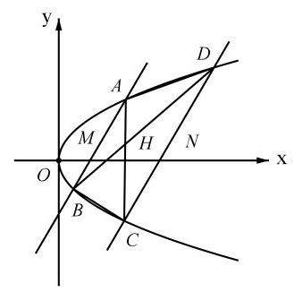

(1)求抛物线 $\Gamma$ 的焦点坐标；

(2)求证:点 $M\text{ 、 }H\text{ 、 }N$ 三点共线；

(3)若 $2\left| {HM}\right|  = \left| {HN}\right|  = 2$ ，求四边形 ${ABCD}$ 的面积.

【解析】(1) $\left( {\frac{1}{4},0}\right)$ ;

(2)法一:由 ${AB}//{CD}$ 得 $\bigtriangleup {ABH} \sim  \bigtriangleup {CDH}$ , $\frac{\left| HA\right| }{\left| HC\right| } = \frac{\left| HB\right| }{\left| HD\right| } = k\left( {k \neq  0}\right)$ ，

可设 $\overrightarrow{HA} = \left( {-k}\right)  \cdot  \overrightarrow{HC},\overrightarrow{HB} = \left( {-k}\right)  \cdot  \overrightarrow{HD}$ ,

由线段 ${AB}$ 的中点是 $M$ ,得 $\overrightarrow{HM} = \frac{\overrightarrow{HA} + \overrightarrow{HB}}{2} = \left( {-k}\right)  \cdot  \frac{\overrightarrow{HC} + \overrightarrow{HD}}{2}$ ,

同理, $\overrightarrow{HN} = \frac{\overrightarrow{HC} + \overrightarrow{HD}}{2}$ ,则 $\overrightarrow{HM} = \left( {-k}\right)  \cdot  \overrightarrow{HN}$ ,

所以点 $M\text{ 、 }H\text{ 、 }N$ 三点共线.

法二: 设直线 ${AB}$ 的方程为 $x = {my} + b$ ,

由 $\left\{  \begin{array}{l} x = {my} + b \\  {y}^{2} = x \end{array}\right.$ 得 ${y}^{2} - {my} - b = 0$ ,则 ${y}_{A} + {y}_{B} = m$ ,

由 $M$ 是线段 ${AB}$ 的中点,得 ${y}_{M} = \frac{{y}_{A} + {y}_{B}}{2} = \frac{m}{2}$ .

同理可得 ${y}_{N} = \frac{{y}_{C} + {y}_{D}}{2} = \frac{m}{2}$ ,所以 ${y}_{M} = {y}_{N} = \frac{m}{2}$ .

设直线 ${AC}$ 的方程为 $x = {ny} + d$ ,同理可得 ${y}_{A} + {y}_{C} = n,{y}_{A} \cdot  {y}_{C} =  - d$ ,

即直线 ${AC}$ 的方程可写成 $x = \left( {{y}_{A} + {y}_{C}}\right) y - {y}_{A} \cdot  {y}_{C}$ .

同理可得直线 ${BD}$ 的方程可写成 $x = \left( {{y}_{B} + {y}_{D}}\right) y - {y}_{B} \cdot  {y}_{D}$ .

由 $\left\{  \begin{array}{l} x = \left( {{y}_{A} + {y}_{C}}\right) y - {y}_{A} \cdot  {y}_{C}, \\  x = \left( {{y}_{B} + {y}_{D}}\right) y - {y}_{B} \cdot  {y}_{D} \end{array}\right.$ ,

消去 $x$ 得 $\left\lbrack  {\left( {{y}_{A} + {y}_{C}}\right)  - \left( {{y}_{B} + {y}_{D}}\right) }\right\rbrack  y = {y}_{A} \cdot  {y}_{C} - {y}_{B} \cdot  {y}_{D}$ ,

即 ${y}_{H} = \frac{{y}_{A} \cdot  {y}_{C} - {y}_{B} \cdot  {y}_{D}}{{y}_{A} + {y}_{C} - {y}_{B} - {y}_{D}}$ .

由 ${y}_{A} + {y}_{B} = {y}_{C} + {y}_{D}$ 得 ${y}_{A} - {y}_{D} = {y}_{C} - {y}_{B},{y}_{D} = {y}_{A} + {y}_{B} - {y}_{C}$ ,

${y}_{H} = \frac{{y}_{A} \cdot  {y}_{C} - {y}_{B}\cdot ({y}_{A} + {y}_{B} - {y}_{C}}{2\left( {{y}_{C} - {y}_{B}}\right) } = \frac{\left( {{y}_{C} - {y}_{B}}\right) \cdot ({y}_{A} + {y}_{B}}{2\left( {{y}_{C} - {y}_{B}}\right) } = \frac{{y}_{A} + {y}_{B}}{2} = \frac{m}{2}$ ,

所以 ${y}_{M} = {y}_{N} = {y}_{H}$ ,得点 $M\text{ 、 }H\text{ 、 }N$ 三点共线.

(3)法一:设直线 ${AB}$ 的方程为 $x = {my} + b$ ，

由 $\left\{  \begin{array}{l} x = {my} + b \\  {y}^{2} = x \end{array}\right.$ 得 ${y}^{2} - {my} - b = 0$ ,则 ${y}_{A} + {y}_{B} = m,{y}_{A} \cdot  {y}_{B} =  - b$ ,

所以 ${y}_{M} = \frac{{y}_{A} + {y}_{B}}{2} = \frac{m}{2},\left| {{y}_{A} - {y}_{B}}\right|  = \sqrt{{m}^{2} + {4b}}$ ,

同理可得 ${y}_{N} = \frac{{y}_{C} + {y}_{D}}{2} = \frac{m}{2}$ ,由 ${y}_{M} = {y}_{N}$ ,得直线 ${MN}$ 平行于 $x$ 轴.

由 $2\left| {HM}\right|  = \left| {HN}\right|  = 2$ ,得 $\left| {MN}\right|  = 3$ ,则直线 ${CD}$ 的方程为 $x = {my} + b + 3$ ,

同理可得 $\left| {{y}_{C} - {y}_{D}}\right|  = \sqrt{{m}^{2} + {4b} + {12}}$ ,

由 ${AB}//{CD}$ ,得 $\bigtriangleup {AHM} \backsim  \bigtriangleup {CHN}$ ,则 $\frac{\left| AB\right| }{\left| CD\right| } = \frac{\left| HM\right| }{\left| HN\right| } = \frac{1}{2}$ ,

则 $\frac{\left| {y}_{A} - {y}_{B}\right| }{\left| {y}_{C} - {y}_{D}\right| } = \frac{1}{2}$ ,即 $\sqrt{{m}^{2} + {4b} + {12}} = 2\sqrt{{m}^{2} + {4b}}$ ,整理得 ${m}^{2} + {4b} = 4$ ,

所以 $\left| {{y}_{A} - {y}_{B}}\right|  = 2,\left| {{y}_{C} - {y}_{D}}\right|  = 4$ .

${S}_{\bigtriangleup {ABH}} = \frac{1}{2} \cdot  \left| {MN}\right|  \cdot  \left| {{y}_{A} - {y}_{B}}\right|  = \frac{1}{2}\sqrt{{\left( {y}_{A} + {y}_{B}\right) }^{2} - 4{y}_{A} \cdot  {y}_{B}} = \frac{1}{2}\sqrt{{m}^{2} + {4b}} = 1$ ,

由 $\bigtriangleup {ABH} \sim  \bigtriangleup {CDH}$ 且 $2\left| {HA}\right|  = \left| {HC}\right|$ ,得 ${S}_{\bigtriangleup {CDH}} = 4{S}_{\bigtriangleup {ABH}} = 4$ ,

由 $2\left| {HA}\right|  = \left| {HC}\right|$ 得 ${S}_{\Delta BHC} = 2{S}_{\Delta ABH} = 2$ ,同理 ${S}_{\Delta ADH} = 2{S}_{\Delta ABH} = 2$ ,

${S}_{\text{ 四边形 }}{}_{ABCD} = 1 + 2 + 2 + 4 = 9.$

法二: 由(2)得,设直线 ${AB}$ 的方程为 $x = {my} + b$ ,

由 ${y}^{2} - {my} - b = 0$ 可解得 ${y}_{A} = \frac{m + \sqrt{{m}^{2} + {4b}}}{2},{y}_{B} = \frac{m - \sqrt{{m}^{2} + {4b}}}{2}$ .

由 $2\left| {HM}\right|  = \left| {HN}\right|  = 2$ ,得 $\left| {MN}\right|  = 3$ ,则直 ${CD}$ 的方程为 $x = {my} + b + 3$ ,

同理可得 ${y}_{C} = \frac{m - \sqrt{{m}^{2} + {4b} + {12}}}{2},{y}_{D} = \frac{m + \sqrt{{m}^{2} + {4b} + {12}}}{2}$ ,

由 ${AB}//{CD}$ ，得 ${\Delta AHM} \sim  {\Delta CHN}$ ，

由 $2\left| {HM}\right|  = \left| {HN}\right|$ ，得 $2\left| {HA}\right|  = \left| {HC}\right|$ ，

则 ${y}_{H} = \frac{{y}_{C} + 2{y}_{A}}{3} = \frac{m}{2} + \frac{\sqrt{{m}^{2} + {4b}} - \frac{1}{2}\sqrt{{m}^{2} + {4b} + {12}}}{3}$ .

由 (2) 得 ${y}_{H} = \frac{m}{2}$ ,得 $\sqrt{{m}^{2} + {4b}} - \frac{1}{2}\sqrt{{m}^{2} + {4b} + {12}} = 0$ ,整理得 ${m}^{2} + {4b} = 4$ .

${S}_{\bigtriangleup {ABH}} = \frac{1}{2} \cdot  \left| {MN}\right|  \cdot  \left| {{y}_{A} - {y}_{B}}\right|  = \frac{1}{2}\sqrt{{\left( {y}_{A} + {y}_{B}\right) }^{2} - 4{y}_{A} \cdot  {y}_{B}} = \frac{1}{2}\sqrt{{m}^{2} + {4b}} = 1$ ,

由 $\bigtriangleup {ABH} \sim  \bigtriangleup {CDH}$ 且 $2\left| {HA}\right|  = \left| {HC}\right|$ ,得 ${S}_{\bigtriangleup {CDH}} = 4{S}_{\bigtriangleup {ABH}} = 4$ ,

由 $2\left| {HA}\right|  = \left| {HC}\right|$ 得 ${S}_{\bigtriangleup {BHC}} = 2{S}_{\bigtriangleup {ABH}} = 2$ ,同理 ${S}_{\bigtriangleup {ADH}} = 2{S}_{\bigtriangleup {ABH}} = 2$ ,

${S}_{\text{ 四边形 }{ABCD}} = 1 + 2 + 2 + 4 = 9.$

16.(长宁 20 )已知椭圆的左、右焦点分别为 ${F}_{1}\left( {-1,0}\right)$ ， ${F}_{2}\left( {1,0}\right)$ ，且经过点 $P\left( {-1,\frac{3}{2}}\right)$ .

(1)求该椭圆的离心率；

(2)点 $Q$ 为椭圆上一点，且位于第三象限，若 ${\Delta PQ}{F}_{2}$ 的面积为 3，求点 $Q$ 的坐标；

(3) $A, B, C, D$ 是椭圆上不重合的四个点， ${AB}$ 与 ${CD}$ 相交于点 ${F}_{1}$ ，且 $\overrightarrow{AB} \cdot  \overrightarrow{CD} = 0$ ，求 $\left| {AB}\right|  + \left| {CD}\right|$ 的取值范围.

【解析】(1) 椭圆方程为 $\frac{{x}^{2}}{4} + \frac{{y}^{2}}{3} = 1$ 2 分所以 $e = \frac{c}{a} = \frac{1}{2}$ 2 分

(2) $P{F}_{2} = \frac{5}{2}$ ，直线 $P{F}_{2}$ 的解析式为 $y =  - \frac{3}{4}x + \frac{3}{4}$ 2 分

因为 ${\Delta PQ}{F}_{2}$ 的面积为 3,所以 $P{F}_{2}$ 边上的高为 $\frac{12}{5}$ ,

过 $Q$ 作 $P{F}_{2}$ 的平行线,则直线 ${QR}$ 的解析式为 $y =  - \frac{3}{4}x - \frac{9}{4}$ 2 分

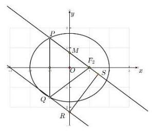

由 $\left\{  \begin{array}{l} \frac{{x}^{2}}{4} + \frac{{y}^{2}}{3} = 1 \\  y =  - \frac{3}{4}x - \frac{9}{4} \end{array}\right.$ ,解得 $\left\{  \begin{array}{l} {x}_{1} =  - 1 \\  {y}_{1} =  - \frac{3}{2} \end{array}\right.$ , $\left\{  \begin{array}{l} {x}_{1} =  - \frac{11}{7} \\  {y}_{1} =  - \frac{15}{14} \end{array}\right.$ ,

所以点 $Q$ 的坐标为 $\left( {-1,\frac{3}{2}}\right) ,\left( {-\frac{11}{7}, - \frac{15}{14}}\right)$ 2 分

(3)法一:①若 ${AB}$ 或 ${CD}$ 垂直于 $x$ 轴,则 $\left| {AB}\right|  + \left| {CD}\right|  = 7$ 1 分

② 若 ${AB}$ 和 ${CD}$ 不垂直于 $x$ 轴，

设直线 ${AB}$ 的解析式为 $y = k\left( {x + 1}\right)$ ,点 $A\left( {{x}_{1},{y}_{1}}\right) , B\left( {{x}_{2},{y}_{2}}\right)$ ,

从而 ${x}_{1} + {x}_{2} = \frac{-8{k}^{2}}{3 + 4{k}^{2}},{x}_{1}{x}_{2} = \frac{4{k}^{2} - {12}}{3 + 4{k}^{2}}$ . 4 分

${AB} = \sqrt{1 + {k}^{2}} \cdot  \sqrt{\left( \frac{-8{k}^{2}}{3 + 4{k}^{2}}\right)  - 4 \cdot  \frac{4{k}^{2} - {12}}{3 + 4{k}^{2}}} = \frac{{12}\left( {{k}^{2} + 1}\right) }{3 + 4{k}^{2}},$

同理 ${CD} = \frac{{12}\left( {{k}^{2} + 1}\right) }{4 + 3{k}^{2}}$ ,

$\left| {AB}\right|  + \left| {CD}\right|  = \frac{{12}\left( {{k}^{2} + 1}\right) }{3 + 4{k}^{2}} + \frac{{12}\left( {{k}^{2} + 1}\right) }{4 + 3{k}^{2}}$

$= \frac{{84}\left( {{k}^{4} + 2{k}^{2} + 1}\right) }{{12}{k}^{4} + {25}{k}^{2} + {12}} = 7 \cdot  \left( {1 - \frac{1}{{12}{k}^{2} + \frac{12}{{k}^{2}} + {25}}}\right)$ ,

因为 ${12}{k}^{2} + \frac{12}{{k}^{2}} + {25} \geq  {49}$ ,所以 $\frac{48}{7} \leq  \left| {AB}\right|  + \left| {CD}\right|  < 7$ 3 分

综上, $\left| {AB}\right|  + \left| {CD}\right|$ 的取值范围是 $\left\lbrack  {\frac{48}{7},7}\right\rbrack$ .

法二: 不妨设 $A, D, B, C$ 四个点顺时针排列,其中 $D$ 在右上方, 设 $\angle D{F}_{1}{F}_{2} = \theta$ ,

在 ${\Delta D}{F}_{1}{F}_{2}$ 中,由余弦定理得 $D{F}_{2}^{2} = D{F}_{1}^{2} + {F}_{1}{F}_{2}^{2} - {2D}{F}_{1} \cdot  {F}_{1}{F}_{2}\cos \theta$ ,

即 ${\left( 4 - D{F}_{1}\right) }^{2} = D{F}_{1}^{2} + 4 - {4D}{F}_{1}\cos \theta$ ,所以 ${16} - {8D}{F}_{1} = 4 - {4D}{F}_{1}\cos \theta$ ,

所以 $D{F}_{1} = \frac{12}{8 - 4\cos \theta } = \frac{3}{2 - \cos \theta }$ ,

同理可得 $A{F}_{1} = \frac{3}{2 - \cos \left( {\theta  + \frac{\pi }{2}}\right) } = \frac{3}{2 + \sin \theta }$ ,

$C{F}_{1} = \frac{3}{2 - \cos \left( {\theta  + \pi }\right) } = \frac{3}{2 + \cos \theta },\;B{F}_{1} = \frac{3}{2 - \cos \left( {\theta  + \frac{3\pi }{2}}\right) } = \frac{3}{2 - \sin \theta },$

所以 $\left| {AB}\right|  + \left| {CD}\right|  = \frac{3}{2 - \cos \theta } + \frac{3}{2 + \cos \theta } + \frac{3}{2 + \sin \theta } + \frac{3}{2 - \sin \theta }$

$= \frac{12}{4 - {\cos }^{2}\theta } + \frac{12}{4 - {\sin }^{2}\theta } = \frac{{12}\left( {8 - {\cos }^{2}\theta  - {\sin }^{2}\theta }\right) }{\left( {4 - {\cos }^{2}\theta }\right) \left( {4 - {\sin }^{2}\theta }\right) } = \frac{84}{{12} + {\cos }^{2}\theta {\sin }^{2}\theta }$ ,

因为 ${\cos }^{2}\theta {\sin }^{2}\theta  = \frac{1}{4}{\sin }^{2}{2\theta } \in  \left\lbrack  {0,\frac{1}{4}}\right\rbrack$ ,

所以 $\left| {AB}\right|  + \left| {CD}\right|$ 的取值范围是 $\left\lbrack  {\frac{48}{7},7}\right\rbrack$ .

## 第 11 节 直线和圆

1. (奉贤 2) 若直线 ${l}_{1} : x + {ay} - 2 = 0$ 与直线 ${l}_{2} : {ax} + y - 2 = 0$ 互相垂直，则 $a =$ ___.

【解析】由题意得 $a + a = 0$ ,所以 $a = 0$ .

2. (嘉定 2) 直线 ${3x} - y + 1 = 0$ 的倾斜角为___(用反三角函数表示).

【答案】arctan 3

3. (金山 6) 以 $C\left( {3,4}\right)$ 为圆心且过点 $\left( {1, - 3}\right)$ 的圆的标准方程是___.

【答案】 ${\left( x - 3\right) }^{2} + {\left( y - 4\right) }^{2} = {53}$

4. (闵行 3) 直线 $\sqrt{3}x - y + 1 = 0$ 的倾斜角为___.

【答案】 $\frac{\pi }{3}$

5.(浦东 2)直线 $x - y + 1 = 0$ 的倾斜角的大小是___.

【答案】 $\frac{\pi }{4}$

6. (青浦 4) 已知直线 ${l}_{1} : x + \left( {1 + m}\right) y + m - 2 = 0$ 与直线 ${l}_{2} : {mx} + {2y} + 8 = 0$ 平行,则 $m =$ ___.

【解析】由题意得 $\frac{1}{m} = \frac{1 + m}{2} \neq  \frac{m - 2}{8}$ ,所以 $m = 1$ .

7. (长宁 4) 以 $C\left( {3,4}\right)$ 为圆心, $\sqrt{3}$ 为半径的圆的标准方程是___.

【答案】 ${\left( x - 3\right) }^{2} + {\left( y - 4\right) }^{2} = 3$

## 第 10 节 概率

【简单小题】

1. (奉贤 9) $A, B$ 两人下棋，每局两人获胜的可能性一样. 某一天两人要进行一场三局两胜的比赛, 最终胜者赢得 100 元奖金. 第一局比赛 $A$ 胜, 后因为有其他要事中止比赛. 为求公平，则 $A$ 应该分得___元奖金.

【解析】甲获胜的概率 $P = \frac{1}{2} + \frac{1}{2} \times  \frac{1}{2} = \frac{3}{4},{100} \times  \frac{3}{4} = {75}$ ,

故为求公平,则 $A$ 应该分得 75 元奖金.

2. (嘉定 15) 假定生男生女是等可能的,设事件 $A$ : 一个家庭中既有男孩又有女孩: 事件 $B$ : 一个家庭中最多有一个女孩. 针对下列两种情形:①家庭中有 2 个小孩；②家庭中有 3 个小孩，下面说法正确是( )

A. ①中事件 $A$ 与事件 $B$ 相互独立、②中的事件 $A$ 与事件 $B$ 相互独立

B. ①中事件 $A$ 与事件 $B$ 不相互独立、②中的事件 $A$ 与事件 $B$ 相互独立

C. ①中事件 $A$ 与事件 $B$ 相互独立、②中的事件 $A$ 与事件 $B$ 不相互独立

D. ①中事件 $A$ 与事件 $B$ 不相互独立、②中的事件 $A$ 与事件 $B$ 不相互独立

【解析】对于①,样本大小为 $2 \times  2 = 4, P\left( A\right)  = \frac{2}{4} = \frac{1}{2}, P\left( B\right)  = \frac{3}{4}, P\left( {A \cap  B}\right)  = \frac{2}{4} = \frac{1}{2}$ ,

所以 $P\left( {A \cap  B}\right)  \neq  P\left( A\right)  \cdot  P\left( B\right)$ ,故①中事件 $A$ 与事件 $B$ 不相互独立;

对于②，样本大小为 $2 \times  2 \times  2 = 8$ ，

$P\left( A\right)  = 1 - \frac{1}{8} - \frac{1}{8} = \frac{3}{4}$ (减去全是男孩和全是女孩),

$P\left( B\right)  = \frac{3}{8} + \frac{1}{8} = \frac{1}{2}$ (只有 1 个男孩和全是女孩),

$P\left( {A \cap  B}\right)  = \frac{3}{8}$ (1 个男孩和两个女孩),

所以 $P\left( {A \cap  B}\right)  = P\left( A\right)  \cdot  P\left( B\right)$ ,故②中的事件 $A$ 与事件 $B$ 相互独立;

故选 $B$ .

3. (金山 11) 抛掷一枚质地均匀的硬币 $n$ 次 (其中 $n$ 为大于等于 2 的整数),设事件 $A : n$ 次中既有正面朝上又有反面朝上，事件 $B : n$ 次中至多有一次正面朝上，若事件 $A$ 与事件 $B$ 是独立的,则 $n$ 的值为___.

【解析】 $P\left( A\right)  = 1 - 2 \times  {\left( \frac{1}{2}\right) }^{n} = 1 - \frac{1}{{2}^{n - 1}} = \frac{{2}^{n - 1} - 1}{{2}^{n - 1}}$ (减去全部正面和全部反面),

$P\left( B\right)  = {\left( \frac{1}{2}\right) }^{n} + {C}_{n}^{1}\left( \frac{1}{2}\right)  \cdot  {\left( \frac{1}{2}\right) }^{n - 1} = \frac{n + 1}{{2}^{n}}$ (全部反面或者有 1 次正面),

$P\left( {A \cap  B}\right)  = {C}_{n}^{1}\left( \frac{1}{2}\right)  \cdot  {\left( \frac{1}{2}\right) }^{n - 1} = n \cdot  {\left( \frac{1}{2}\right) }^{n},$

若事件 $A$ 与事件 $B$ 是独立的,则 $P\left( {A \cap  B}\right)  = P\left( A\right) P\left( B\right)$ ,

所以 $\frac{n}{{2}^{n}} = \frac{{2}^{n - 1} - 1}{{2}^{n - 1}} \cdot  \frac{n + 1}{{2}^{n}}$ ,所以 $n \cdot  {2}^{n - 1} = \left( {{2}^{n - 1} - 1}\right) \left( {n + 1}\right)$ ,整理得 ${2}^{n - 1} = n + 1$ ,

即 $\frac{n + 1}{{2}^{n - 1}} = 1$ ,令 ${a}_{n} = \frac{n + 1}{{2}^{n - 1}}$ ,则 ${a}_{n + 1} - {a}_{n} = \frac{n + 2}{{2}^{n}} - \frac{n + 1}{{2}^{n - 1}} = \frac{-n}{{2}^{n}} < 0$ ,

所以 $\left\{  {a}_{n}\right\}$ 严格减,又 ${a}_{3} = 1$ ,所以 $n = 3$ .

4.(松江 15)抛掷三枚硬币，若记“出现三个正面”、“两个正面一个反面”和“两个反面一个正面” 分别为事件 $A\text{ 、 }B$ 和 $C$ ,则下列说法错误的是 ( )

A. 事件 $A\text{ 、 }B$ 和 $C$ 两两互斥

B. $P\left( A\right)  + P\left( B\right)  + P\left( C\right)  = \frac{7}{8}$

C. 事件 $A$ 与事件 $B \cup  C$ 是对立事件 D. 事件 $A \cup  B$ 与 $B \cup  C$ 相互独立

【解析】 $P\left( A\right)  = \frac{1}{2} \times  \frac{1}{2} \times  \frac{1}{2} = \frac{1}{8}, P\left( B\right)  = {C}_{3}^{2}{\left( \frac{1}{2}\right) }^{2} \cdot  \frac{1}{2} = \frac{3}{8}, P\left( C\right)  = {C}_{3}^{2}{\left( \frac{1}{2}\right) }^{2} \cdot  \frac{1}{2} = \frac{3}{8}$ ,

对于 $\mathrm{A}$ ,事件 $A\text{ 、 }B\text{ 、 }C$ 中任何两个事件都不能同时发生,

事件 $A\text{ 、 }B\text{ 、 }C$ 两两互斥, $\mathrm{A}$ 正确;

对于 $\mathrm{B}, P\left( A\right)  + P\left( B\right)  + P\left( C\right)  = \frac{1}{8} + \frac{3}{8} + \frac{3}{8} = \frac{7}{8},\mathrm{\;B}$ 正确;

对于 $\mathrm{C}$ ,事件 $A$ 与 $B \cup  C$ 可以同时不发生,事件 $A$ 与事件 $B \cup  C$ 不是对立事件, C 错误;

对于 $\mathrm{D}, P\left( {A \cup  B}\right)  = P\left( A\right)  + P\left( B\right)  = \frac{1}{8} + \frac{3}{8} = \frac{1}{2}$ ,

$P\left( {B \cup  C}\right)  = P\left( B\right)  + P\left( C\right)  = \frac{3}{8} + \frac{3}{8} = \frac{3}{4},$

$P\left\lbrack  {\left( {A \cup  B}\right)  \cap  \left( {B \cup  C}\right) }\right\rbrack   = P\left( B\right)  = \frac{3}{8} = P\left( {A \cup  B}\right) P\left( {B \cup  C}\right) ,$

则事件 $A \cup  B$ 与 $B \cup  C$ 相互独立, $\mathrm{D}$ 正确.

故选 $C$ .

5. (杨浦 14) 如果 $A, B$ 是独立事件, $\bar{A},\bar{B}$ 分别是 $A, B$ 的对立事件,那么以下等式不一定成立的是( )

A. $P\left( {A \cap  B}\right)  = P\left( A\right) P\left( B\right)$ B. $P\left( {\bar{A} \cap  B}\right)  = P\left( \bar{A}\right) P\left( B\right)$

C. $P\left( {A \cup  B}\right)  = P\left( A\right)  + P\left( B\right)$ D. $P\left( {\bar{A} \cap  \bar{B}}\right)  = \left\lbrack  {1 - P\left( A\right) }\right\rbrack  \left\lbrack  {1 - P\left( B\right) }\right\rbrack$

【解析】 $P\left( {A \cup  B}\right)  = P\left( A\right)  + P\left( B\right)  - P\left( {A \cap  B}\right)  = P\left( A\right)  + P\left( B\right)  - P\left( A\right) P\left( B\right)$ ,故选 $C$ .

6. (长宁 5) 投掷两枚质地均匀的骰子, 观察掷得的点数, 则掷得的点数之和为 7 的概率是___.

【解析】掷得的点数之和为 7 的情况有 $\left( {1,6}\right) ,\left( {2,5}\right) ,\left( {3,4}\right) ,\left( {4,3}\right) ,\left( {5,2}\right) ,\left( {6,1}\right)$ ,共 6 种情况, 则掷得的点数之和为 7 的概率是 $\frac{6}{6 \times  6} = \frac{1}{6}$ .

【复杂小题】

1. (宝山 12) 已知函数 $y = f\left( x\right)$ 的定义域 $D = \{ 1,2,3,4\}$ ,值域 $A = \{ 5,6,7\}$ ,则函数 $y = f\left( x\right)$ 为增函数的概率是___.

【解析】先考虑能构成多少个函数, 即把定义域分成三部分, 对应值域中三个数,

有 ${C}_{4}^{2}{P}_{3}^{3} = {36}$ 个函数,

再考虑增函数, 用隔板法处理, 把定义域四个数中间的三个空挡插入两块板,

从小到大对应值域中三个数,有 ${C}_{3}^{2} = 3$ 种,

则函数 $y = f\left( x\right)$ 为增函数的概率是 $\frac{3}{36} = \frac{1}{12}$ .

2. (长宁 11) 设 $O$ 为坐标原点,从集合 $\{ 1,2,3,4,5,6,7,8,9\}$ 中任取两个不同的元素 $x, y$ , 组成 $A, B$ 两点的坐标 $\left( {x, y}\right) ,\left( {y, x}\right)$ ，则 ${S}_{\Delta AOB} \leq  {10}$ 的概率为___.

【解析】 ${S}_{\bigtriangleup {AOB}} = \frac{1}{2}\left| {x \cdot  x - y \cdot  y}\right|  \leq  {10}$ ,则 $\left| {{x}^{2} - {y}^{2}}\right|  \leq  {20}$ ,枚举 $\left( {x, y}\right)$ 即可, $\left( {1,2}\right) ,\left( {1,3}\right) ,\left( {1,4}\right) ,\left( {2,1}\right) ,\left( {2,3}\right) ,\left( {2,4}\right) ,\left( {3,1}\right) ,\left( {3,2}\right) ,\left( {3,4}\right) ,\left( {3,5}\right) , \; \left( {4,1}\right) ,\left( {4,2}\right) ,\left( {4,3}\right) ,\left( {4,5}\right) ,\left( {4,6}\right) ,\left( {5,3}\right) ,\left( {5,4}\right) ,\left( {5,6}\right) ,\left( {6,4}\right) ,\left( {6,5}\right) , \; \left( {6,7}\right) ,\left( {7,6}\right) ,\left( {7,8}\right) ,\left( {8,7}\right) ,\left( {8,9}\right) ,\left( {9,8}\right)$ ,共 26 种, 则 ${S}_{\bigtriangleup {AOB}} \leq  {10}$ 的概率为 $\frac{26}{{C}_{9}^{2}} = \frac{13}{36}$ .

【大题】

1. (宝山 19) 甲乙两人轮流掷质地均匀的骰子, 每人每次掷两颗.

(1)甲掷一次，求两颗骰子点数不同的概率；

(2)甲乙各掷一次，求甲的点数和恰好比乙的点数和大 7 的概率；

(3)若第一次掷出点数之和大于 6 的人为胜者，同时比赛结束；否则，由另一人继续投掷， 直到比赛结束. 例如, 甲乙先后轮流掷出的点数之和为: 5、4、3、7, 此时乙为胜者. 设甲先投掷, 求甲最终获胜的概率.

【解析】(1) 甲掷一次,两颗骰子点数相等的概率为 $\frac{6}{6 \times  6} = \frac{1}{6}$ .2 分

所以两颗骰子点数不同的概率为 $1 - \frac{1}{6} = \frac{5}{6}$ ; .4 分

(2)法一:甲的点数和恰好比乙的点数和大 7 点的情形如下表:

<table><tr><td>甲的点数</td><td>乙的点数</td><td>甲的点数和</td><td>乙的点数和</td></tr><tr><td>$\left( {3,6}\right) ,\left( {4,5}\right) ,\left( {5,4}\right) ,\left( {6,3}\right)$</td><td>(1,1)</td><td>9</td><td>2</td></tr><tr><td>$\left( {4,6}\right) ,\left( {5,5}\right) ,\left( {6,4}\right)$</td><td>$\left( {1,2}\right) ,\left( {2,1}\right)$</td><td>10</td><td>3</td></tr><tr><td>$\left( {5,6}\right) ,\left( {6,5}\right)$</td><td>$\left( {1,3}\right) ,\left( {2,2}\right) ,\left( {3,1}\right)$</td><td>11</td><td>4</td></tr><tr><td>(6,6)</td><td>$\left( {1,4}\right) ,\left( {2,3}\right) ,\left( {3,2}\right) ,\left( {4,1}\right)$</td><td>12</td><td>5</td></tr></table>

.8 分

所以 $P = \frac{4 \times  1 + 3 \times  2 + 2 \times  3 + 1 \times  4}{{6}^{4}} = \frac{5}{324}$ ; .10 分

法二: 设掷一次两颗骰子的点数和为 $X$ ,则 $X = 2,3,4,\cdots ,{12}$ ,

则 $P\left( {X = 2}\right)  = P\left( {X = {12}}\right)  = \frac{1 \times  1}{6 \times  6} = \frac{1}{36}$ ,

$P\left( {X = 3}\right)  = P\left( {X = {11}}\right)  = \frac{2}{6 \times  6} = \frac{1}{18},$

$P\left( {X = 4}\right)  = P\left( {X = {10}}\right)  = \frac{3}{6 \times  6} = \frac{1}{12},$

$P\left( {X = 5}\right)  = P\left( {X = 9}\right)  = \frac{4}{6 \times  6} = \frac{1}{9},$

$P\left( {X = 6}\right)  = P\left( {X = 8}\right)  = \frac{5}{6 \times  6} = \frac{5}{36},$

$P\left( {X = 7}\right)  = \frac{6}{6 \times  6} = \frac{1}{6}.$ .8 分

所以甲的点数和恰好比乙的点数和大 7 点的概率为

$\frac{1}{36} \times  \frac{1}{9} + \frac{1}{18} \times  \frac{1}{12} + \frac{1}{12} \times  \frac{1}{18} + \frac{1}{9} \times  \frac{1}{36} = \frac{5}{324}$ .10 分

(3)由(2)得掷两颗骰子点数和大于 6 的概率为

$\mathop{\sum }\limits_{{i = 7}}^{{12}}P\left( {X = i}\right)  = \frac{1}{6} + \frac{5}{36} + \frac{1}{9} + \frac{1}{12} + \frac{1}{18} + \frac{1}{36} = \frac{7}{12},$ .12 分

若甲第一轮获胜,概率为 ${P}_{1} = \frac{7}{12}$ ,

若甲第二轮获胜, 即第一轮投掷后两人的点数和都不大于 6 ,

概率为 ${P}_{2} = {\left( \frac{5}{12}\right) }^{2} \times  \frac{7}{12}$ ;

若甲第三轮获胜, 即前两轮投掷后两人的点数和都不大于 6,

概率为 ${P}_{3} = {\left( \frac{5}{12}\right) }^{4} \times  \frac{7}{12}$ ;

由以上得若甲第 $n\left( {n \geq  1}\right)$ 轮获胜,即前 $n - 1$ 轮投掷后两人的点数和都不大于 6,

概率为 ${P}_{n} = {\left\lbrack  {\left( \frac{5}{12}\right) }^{2}\right\rbrack  }^{n - 1} \times  \frac{7}{12} = {\left( \frac{5}{12}\right) }^{{2n} - 2} \times  \frac{7}{12}$ .14 分

于是, ${P}_{1},{P}_{2},{P}_{3},\cdots ,{P}_{n}$ 组成一个以 $\frac{7}{12}$ 为首项, ${\left( \frac{5}{12}\right) }^{2}$ 为公比的无穷等比数列,

所以甲最终获胜的总概率为 ${P}_{1} + {P}_{2} + {P}_{3} + \cdots  + {P}_{n} + \cdots$

$= \frac{\frac{7}{12}}{1 - {\left( \frac{5}{12}\right) }^{2}} = \frac{12}{17}\ldots \ldots {.16}$ 分

2. (奉贤 18) 某芯片代工厂生产甲、乙两种型号的芯片，为了解芯片的某项指标，从这两种芯片中各抽取 100 件进行检测, 获得该项指标的频率分布直方图, 如图所示:

甲型芯片

乙型芯片

假设数据在组内均匀分布, 以样本估计总体, 以事件发生的频率作为相应事件发生的概率.

(1)求频率分布直方图中 $x$ 的值并估计乙型芯片该项指标的平均值(同一组中的数据用该组区间的中点值为代表);

(2)已知甲型芯片指标在 $\lbrack {80},{100})$ 为航天级芯片，乙型芯片指标在标在 $\lbrack {60},{70})$ 为航天为航天级芯片. 现分别采用分层抽样的方式,从甲型芯片指标在 $\lbrack {70},{90})$ 内取 2 件,乙型芯片指标在 $\lbrack {50},{70})$ 内取 4 件,再从这 6 件中任取 2 件,求至少有一件为航天级芯片的概率.

【解析】(1) 由题意得 ${10} \times  \left( {{0.002} + {0.005} + {0.023} + {0.025} + {0.025} + x}\right)  = 1$ ,

解得 $x = {0.020}$ . .3 分

乙型芯片该项指标的平均值为

$\left( {{25} \times  {0.002} + {35} \times  {0.026} + {45} \times  {0.032} + {55} \times  {0.030} + {65} \times  {0.010}}\right)  \times  {10} \; = {47}\ldots \ldots \ldots 3$ 分

(2)由题意得甲型芯片根据分层抽样 $\lbrack {70},{80})$ 取 1 件, $\lbrack {80},{90})$ 取 1 件; .2 分乙型芯片根据分层抽样 $\lbrack {50},{60})$ 取 3 件, $\lbrack {60},{70})$ 取 1 件. .2 分从 6 件中任取 2 件的情况有 ${C}_{6}^{2} = {15}$ .2 分则至少有一件为航天级芯片的概率为 $\frac{{C}_{2}^{1} \cdot  {C}_{4}^{1} + {C}_{2}^{2}}{{C}_{6}^{2}} = \frac{3}{5}$ . .2 分

3. (嘉定 19) 在一场盛大的电竞比赛中, 有两支实力强钦的队伍甲和乙进行对决. 比赛采用 5 局 3 甲队每局获胜概率为 0.4 ，乙队每局获胜概率为 0.6 .

比赛开始后, 甲队先连胜两局, 此时, 主办方记录了两队队员在这两局比赛中的一些数据. 甲队队员的击杀数(单位:个)数据如下:24，31，31，36，36，37，39，44，49，50； 乙队队员的击杀数(单位:个)数据如下: 8，13，14，16，23，26，28，33，38，39. 然而此时比赛场地突发技术故障, 比赛不得不中止. 请回答以下问题:

(1)根据目前情况(甲队已连胜两局)，写出甲、乙两队 “采用 5 局 3 胜制” 的比赛结果的样本空间;

(2)根据所给数据，绘制甲、乙两队队员的击杀数分布的茎叶图；

(3)在目前情况下(甲队已连胜两局)，估算甲乙两队获胜概率，并据此分配 10 万元奖金.

【解析】(1) 设 $W$ 表示 $A$ 队胜, $L$ 表示 $A$ 队负,

$$
\text{ 样本空间为 }\Omega  = \{ {WWW},{WWLW},{WWLLW},{WWLLL}\}
$$

.4 分

(2)

.8 分

(3)甲已经连胜两局，接下来甲获胜的情况有以下几种:

第三局甲胜,此时比赛结束,甲获胜,这种情况的概率为 $\frac{2}{5}$ .9 分第三局乙胜,第四局甲胜,此时甲获胜,概率为 $\frac{2}{5} \times  \frac{3}{5} = \frac{6}{25}$ .10 分第三局乙胜,第四局乙胜,第五局甲胜,概率为 $\frac{3}{5} \times  \frac{3}{5} \times  \frac{2}{5} = \frac{18}{125}$ .11 分所以甲获胜的总概率为 $\frac{2}{5} + \frac{6}{25} + \frac{18}{125} = \frac{98}{125} = {0.784}$ ,

乙获胜的总概率为 $1 - \frac{98}{125} = \frac{27}{125} = {0.216}$ .12 分

奖金共 10 万元,甲应得奖金为 ${10} \times  \frac{98}{125} = \frac{196}{25} = {7.84}$ 万元,

乙应得奖金为 ${10} - {7.84} = {2.16}$ 万元. .14 分

3.(闵行 19)为了解某市高三学生的睡眠时长，从该市 6.6 万名高三学生中随机抽取 600 人， 统计他们的日均睡眠时长及分布人数如下表所示:

<table><tr><td>睡眠时长(小时)</td><td>[4,6)</td><td>[6,8)</td><td>[8,10]</td></tr><tr><td>人数</td><td>150</td><td>270</td><td>180</td></tr></table>

注: 睡眠时长在 $\left\lbrack  {8,{10}}\right\rbrack$ 的为睡眠充足,在 $\lbrack 6,8)$ 的为睡眠良好,在 $\lbrack 4,6)$ 的为睡眠不足.

(1)估计该市 6.6 万名高三学生中日均睡眠时长大于等于 6 小时的人数约为多少？

(2)估计该市高三学生日均睡眠时长；

(3)若从这 600 名学生中利用分层抽样的方法抽取 20 人，再从这 20 人中随机抽取 4 人做进一步访谈调查, 求这 4 人中既有睡眠充足, 又有睡眠良好, 也有睡眠不足学生的概率.

【解析】(1) 600 名样本中睡眠时长大于等于 6 小时的人数为 450 人，频率为 $\frac{3}{4}\cdots \cdots 2$ 分该市所有高三学生日均睡眠时长大于等于 6 小时的人数约为 $\frac{3}{4} \times  {66000} = {49500}$ 人. 4 分

(2)先求出各区间的中点值分别为5、7、9. 6 分估计该市所有高三学生日均睡眠时长

为 $\frac{{150} \times  5 + {270} \times  7 + {180} \times  9}{600} = {7.1}$ 小时 8 分

(3)按照分层抽样方法，在睡眠充足中抽取的人数为 6 人，

在睡眠良好中抽取的人数为 9 人，在睡眠不足中抽取的人数为 5 人. ...10 分再从这 20 人中随机抽取 4 人，可能的情况有 ${C}_{20}^{4} = {4845}$ 种，

设 $A$ 表示事件 “这 4 人中既有睡眠充足,又有睡眠良好,也有睡眠不足学生”,

$A$ 所包含的样本点有 ${C}_{5}^{1} \times  {C}_{9}^{1} \times  {C}_{6}^{2} + {C}_{5}^{1} \times  {C}_{6}^{1} \times  {C}_{9}^{2} + {C}_{9}^{1} \times  {C}_{6}^{1} \times  {C}_{5}^{2} = {2295}$ 个,

12 分

因此事件 $A$ 的概率是 $P\left( A\right)  = \frac{{C}_{5}^{1} \times  {C}_{9}^{1} \times  {C}_{6}^{2} + {C}_{5}^{1} \times  {C}_{6}^{1} \times  {C}_{9}^{2} + {C}_{9}^{1} \times  {C}_{6}^{1} \times  {C}_{5}^{2}}{{C}_{20}^{4}}$

$= \frac{2295}{4845} = \frac{9}{19}$ 14 分.

4.(浦东 19)申辉中学为期两周的高一、高二年级校园篮球赛告一段落. 高一小 $A$ 、高二小 $B$ 分别荣获了高一年级和高二年级比赛的年级 MVP (最有价值球员). 以下是他们在各自 8 场比赛的二分球和三分球出手次数及其命中率.

<table><tr><td></td><td>二分球出手</td><td>二分球命中率</td><td>三分球出手</td><td>三分球命中率</td></tr><tr><td>小 $A$</td><td>100 次</td><td>80%</td><td>100 次</td><td>40%</td></tr><tr><td>小 $B$</td><td>190 次</td><td>70%</td><td>10 次</td><td>30%</td></tr></table>

现以两人的总投篮命中率 (二分球+三分球) 较高者评为校 MVP(总投篮命中率=总命中次数÷总出手次数)

(1)小 C 认为，目测小 A 的二分球命中率和三分球命中率均高于小 B，此次必定能评为校 MVP,试通过计算判断小 $C$ 的想法是否准确?

(2)小 D 是游戏爱好者，设置了一款由游戏人物小 a、小 b 轮流投篮对战游戏. 游戏规则如下:①游戏中小 a 的命中率始终为 0.4 ，小 b 的命中率始终为 0.3 . ②游戏中投篮总次数最多为 $k\left( {3 \leq  k \leq  {20}, k \in  Z}\right)$ 次,且同一个游戏人物不允许连续投篮. ③游戏中若投篮命中， 则游戏结束，投中者获得胜利; 若直至第 $k$ 次投篮都没有命中，则规定第二次投篮者获胜. 若每次游戏对战前必须设置 “第一次投篮人物” 和 “ $k$ ” 的值,请解答以下两个问题.

(i)若小 $a$ 第一次投篮，请证明小 $a$ 获胜概率大；

(ii)若小 $b$ 第一次投篮，试问谁的获胜概率大？并说明理由.

【解析】(1) 小 $A$ 总命中率为 $\frac{{100} \times  {80}\%  + {100} \times  {40}\% }{{100} + {100}} = {60}\%$ 2 分

小 $B$ 总命中率为 $\frac{{190} \times  {70}\%  + {10} \times  {30}\% }{{190} + {10}} = {68}\%$ 4 分

60% < 68% 5 分

综上,小 $C$ 想法错误,小 $B$ 为校 MVP

(2)(i)若“第一次投篮人物”为小 $a, k\left( {3 \leq  k \leq  {20}, k \in  Z}\right)$ ，

小 $a$ 获胜的概率为 ${P}_{a}$ ,小 $b$ 的获胜的概率为 $1 - {P}_{a}$ ,

${P}_{a} \geq  {0.4} + {0.7} \cdot  {0.6} \cdot  {0.4} = {0.568} > {0.5} > 1 - {P}_{a},$

得 “小 $a$ 第一次投篮，小 $a$ 获胜概率大” 9 分

(ii)若 “第一次投篮人物” 为小 $b, k\left( {3 \leq  k \leq  {20}, k \in  \mathrm{Z}}\right)$ ,

小 $b$ 获胜的概率为 ${P}_{b}$ ,小 $a$ 的获胜的概率为 $1 - {P}_{b}$ ,

${P}_{b} = {0.3} + {0.3}\left( {{0.7} \cdot  {0.6}}\right)  + \cdots  + {0.3}{\left( {0.7} \cdot  {0.6}\right) }^{m}$

$= \frac{{0.3}\left\lbrack  {1 - {0.42}^{m + 1}}\right\rbrack  }{0.58} = \frac{15}{29}\left( {1 - {0.42}^{m + 1}}\right)$ 12 分

其中 $m = \left\{  \begin{array}{l} \frac{k - 2}{2}, k \in  \{ 4,6,8,{10},{12},{14},{16},{18},{20}\} \\  \frac{k - 1}{2}, k \in  \{ 3,5,7,9,{11},{13},{15},{17},{19}\}  \end{array}\right.$ ,

易证 ${P}_{b} = f\left( m\right)  = \frac{15}{29}\left( {1 - {0.42}^{m + 1}}\right)$ 随着 $m$ 的增大而增大, $f\left( 2\right)  < {0.5} < f\left( 3\right)$ ,

所以当 $m \geq  3$ 也就是 $7 \leq  k \leq  {20}$ 时, ${P}_{b} > {0.5} > 1 - {P}_{b}$ ;

综上,若小 $b$ 第一次投篮, $k \in  \{ 3,4,5,6\}$ 时小 $a$ 获胜概率大;

$k \in  \{ k \mid  7 \leq  k \leq  {20}, k \in  Z\}$ 时小 $b$ 获胜概率大. 14 分

5. (普陀 19) 机器人竞技是继电子竞技之后热门的科技竞技项目, 某区为了参加市机器人竞技总决赛,开展了区内选行场比赛互相独立下表统计的是 $A$ 在近期热身中分别与 $B, C, D$ 三人比赛的情况.

<table><tr><td></td><td>$B$</td><td>$C$</td><td>$D$</td></tr><tr><td>比赛的次数</td><td>12</td><td>10</td><td>15</td></tr><tr><td>$A$ 获胜的次数</td><td>4</td><td>5</td><td>12</td></tr></table>

(1)根据表格中的数据，试估计在区内决赛中 $A$ 至少获胜一场的概率；

(2)根据表格中的数据，请给 $B, C, D$ 三人设计一个出场顺序，使得 $A$ 在这三场比赛中连胜两场的概率最大, 并说明理由.

【解析】(1) 由热身赛统计情况,估计 $A$ 与 $B, A$ 与 $C, A$ 与 $D$ 比赛时获胜的概率

分别记为 ${P}_{1},{P}_{2},{P}_{3}$ ,

依据表格中的数据得 ${P}_{1} = \frac{4}{12} = \frac{1}{3},{P}_{2} = \frac{5}{10} = \frac{1}{2},{P}_{3} = \frac{12}{15} = \frac{4}{5}$ , 3 分

记“在区内决赛中 $A$ 至少获胜一场” 为事件 $M$ ，

则 $P\left( M\right)  = 1 - P\left( \bar{M}\right)  = 1 - \left( {1 - {P}_{1}}\right) \left( {1 - {P}_{2}}\right) \left( {1 - {P}_{3}}\right)  = 1 - \frac{2}{3} \times  \frac{1}{2} \times  \frac{1}{5} = \frac{14}{15}$ ,

则估计在区内决赛中 $A$ 至少获胜一场的概率为 $\frac{14}{15}$ . 6 分

(2)若 $B$ 在第二位出场，即出场顺序为 ${CBD}$ 或 ${DBC}$ ，

则 $A$ 在这三场比赛中连胜两场的概率为 $\frac{1}{2} \times  \frac{1}{3} \times  \left( {1 - \frac{4}{5}}\right)  + \left( {1 - \frac{1}{2}}\right)  \times  \frac{1}{3} \times  \frac{4}{5} = \frac{1}{6}$ 或 $\frac{4}{5} \times  \frac{1}{3} \times  \left( {1 - \frac{1}{2}}\right)  + \left( {1 - \frac{4}{5}}\right)  \times  \frac{1}{3} \times  \frac{1}{2} = \frac{1}{6}$ 2 分

若 $C$ 在第二位出场,即出场顺序为 ${BCD}$ 或 ${DCB}$ ,

则 $A$ 在这三场比赛中连胜两场的概率为

$\frac{1}{3} \times  \frac{1}{2} \times  \left( {1 - \frac{4}{5}}\right)  + \left( {1 - \frac{1}{3}}\right)  \times  \frac{1}{2} \times  \frac{4}{5} = \frac{3}{10}$

或 $\frac{4}{5} \times  \frac{1}{2} \times  \left( {1 - \frac{1}{3}}\right)  + \left( {1 - \frac{4}{5}}\right)  \times  \frac{1}{2} \times  \frac{1}{3} = \frac{3}{10}$ 4 分

若 $D$ 在第二位出场,即出场顺序为 ${BDC}$ 或 ${CDB}$ ,

则 $A$ 在这三场比赛中连胜两场的概率为 $\frac{1}{3} \times  \frac{4}{5} \times  \left( {1 - \frac{1}{2}}\right)  + \left( {1 - \frac{1}{3}}\right)  \times  \frac{1}{2} \times  \frac{4}{5} = \frac{2}{5}$ 或 $\frac{1}{2} \times  \frac{4}{5} \times  \left( {1 - \frac{1}{3}}\right)  + \left( {1 - \frac{1}{2}}\right)  \times  \frac{4}{5} \times  \frac{1}{2} = \frac{2}{5}$ 6 分

则当 $B, C, D$ 三人的出场顺序为 ${BDC}$ 或 ${CDB}$ 时, $A$ 在这三场比赛中连胜两场的概率最大. 8 分

6. (松江 17) 某日用品按行业质量标准分成五个等级,等级系数 $X$ 依次为1,2,3,4,5, 现从一批该日用品中随机抽取 20 件, 对其等级系数进行统计分析, 得到频率分布表如下:

<table><tr><td>$X$</td><td>1</td><td>2</td><td>3</td><td>4</td><td>5</td></tr><tr><td>$f$</td><td>$a$</td><td>0.2</td><td>0.45</td><td>$b$</td><td>$C$</td></tr></table>

(1)若所抽取的 20 件日用品中，等级系数为 4 的恰有 3 件，等级系数为 5 的恰有 2 件，求 $a, b, c$ 的值;

(2)在(1)的条件下，将等级系数为 4 的 3 件日用品记为 ${x}_{1},{x}_{2},{x}_{3}$ ，等级系数为 5 的 2 件日用品记为 ${y}_{1},{y}_{2}$ ,现从 ${x}_{1},{x}_{2},{x}_{3},{y}_{1},{y}_{2}$ 这 5 件日用品中任取两件(假定每件日用品被取出的可能性相同), 写出所有可能的结果, 并求这两件日用品的等级系数恰好相等的概率.

【解析】(1) 由频率分布表得 $a + {0.2} + {0.45} + b + c = 1$ ,即 $a + b + c = {0.35} - \cdots  - 2$ 分因为抽取的 20 件日用品中，等级系数为 4 的恰有 3 件,

所以 $b = \frac{3}{20} = {0.15} - \cdots  - 4$ 分

等级系数为 5 的恰有 2 件,所以 $c = \frac{2}{20} = {0.1}$ ,从而 $a = {0.35} - b - c = {0.1}$ ,

所以 $a = {0.1}, b = {0.15}, c = {0.1}$ . ----6 分

(2)从日用品 ${x}_{1},{x}_{2},{x}_{3},{y}_{1},{y}_{2}$ 中任取两件,所有可能的结果为 $\left( {{x}_{1},{x}_{2}}\right) ,\left( {{x}_{1},{x}_{3}}\right)$ ,

$\left( \begin{array}{lllllllllll} {x}_{1} & {y}_{1} & {x}_{1} & {y}_{2} & {x}_{2} & {x}_{3} & {x}_{2} & {y}_{1},{x}_{2} & {y}_{2} & {x}_{3} & {y}_{1} \end{array}\right) \left( \begin{array}{l} {x}_{1},{y}_{2} \end{array}\right) ,$

这个样本空间一共有 10 个样本点. 一-10 分

设事件 $A$ 表示 “从日用品 ${x}_{1},{x}_{2},{x}_{3},{y}_{1},{y}_{2}$ 中任取两件,其等级系数相等”,

则事件 $A$ 包含以下样本点: $\left( {{x}_{1},{x}_{2}}\right) ,\left( {{x}_{1},{x}_{3}}\right) ,\left( {{x}_{2},{x}_{3}}\right) ,\left( {{y}_{1},{y}_{2}}\right)$ ,

事件 $A$ 有 4 个样本点，___12 分

故所求的概率 $P\left( A\right)  = \frac{4}{10} = {0.4}$ .

7.(徐汇 19)某企业招聘员工，指定“英语听说”、“信息技术”、“逻辑推理”作为三门考试课程，有两种考试方案.

方案一:参加三门课程的考试，至少有两门及格为通过；

方案二:在三门课程中，随机选取两门，并参加这两门课程的考试，两门都及格为通过.

假设某应聘者参加三门指定课程考试及格的概率分别是 ${p}_{1},{p}_{2},{p}_{3}\left( {{p}_{i} \in  \left( {0,1}\right) , i = 1,2,3}\right)$ ,且三门课程考试是否及格相互之间没有影响.

(1)分别求该应聘者选方案一考试通过的概率 ${T}_{1}$ 和选方案二考试通过的概率 ${T}_{2}$ ；

(2)试比较该应聘者在上述两种方案下考试通过的概率的大小，并说明理由.

【解析】记该应聘者对三门指定课程考试及格的事件分别为 $A, B, C$ ,

则 $P\left( A\right)  = {p}_{1}, P\left( B\right)  = {p}_{2}, P\left( C\right)  = {p}_{3}$ .

(1)应聘者选方案一考试通过的概率

$$
{T}_{1} = P\left( {A \cap  B \cap  \bar{C}}\right)  + P\left( {\bar{A} \cap  B \cap  C}\right)  + P\left( {A \cap  \bar{B} \cap  C}\right)  + P\left( {A \cap  B \cap  C}\right)
$$

$$
= {p}_{1}{p}_{2}\left( {1 - {p}_{3}}\right)  + {p}_{2}{p}_{3}\left( {1 - {p}_{1}}\right)  + {p}_{1}{p}_{3}\left( {1 - {p}_{2}}\right)  + {p}_{1}{p}_{2}{p}_{3}
$$

$$
= {p}_{1}{p}_{2} + {p}_{2}{p}_{3} + {p}_{3}{p}_{1} - 2{p}_{1}{p}_{2}{p}_{3},
$$

应聘者选方案二考试通过的概率

$$
{T}_{2} = \frac{1}{3}P\left( {A \cap  B}\right)  + \frac{1}{3}P\left( {B \cap  C}\right)  + \frac{1}{3}P\left( {A \cap  C}\right)  = \frac{1}{3}\left( {{p}_{1}{p}_{2} + {p}_{2}{p}_{3} + {p}_{3}{p}_{1}}\right) ;
$$

(2)因为 ${p}_{1},{p}_{2},{p}_{3} \in  \left( {0,1}\right)$ ，所以 ${T}_{1} - {T}_{2} = \frac{2}{3}\left( {{p}_{1}{p}_{2} + {p}_{2}{p}_{3} + {p}_{3}{p}_{1}}\right)  - 2{p}_{1}{p}_{2}{p}_{3}$

$$
= \frac{2}{3}\left\lbrack  {{p}_{1}{p}_{2}\left( {1 - {p}_{3}}\right)  + {p}_{2}{p}_{3}\left( {1 - {p}_{1}}\right)  + {p}_{3}{p}_{1}\left( {1 - {p}_{2}}\right) }\right\rbrack   > 0,
$$

故 ${T}_{1} > {T}_{2}$ ,即选方案一,该应聘者考试通过的概率较大.

8. (杨浦 19) 为加强学生睡眠监测督导, 学校对高中三个年级学生的日均睡眠时间进行调查. 根据分层随机抽样法, 学校在高一、高二和高三年级中共抽取了 100 名学生的日均睡眠时间作为样本，其中高一 35 人，高二 33 人. 已知该校高三年级一共 512 人.

(1)学校高中三个年级一共有多少个学生？

(2)若抽取 100 名学生的样本极差为 2,数据如下表所示(其中 $x < {10}, n$ 是正整数)

<table><tr><td>日均睡眠时间(小时)</td><td>$x$</td><td>8.5</td><td>9</td><td>9.5</td><td>10</td></tr><tr><td>学生数量</td><td>$n$</td><td>32</td><td>13</td><td>11</td><td>4</td></tr></table>

求该样本的第 40 百分位数.

(3)从这 100 名学生的样本中随机抽取三个学生的日均睡眠时间，求其中至少有 1 个数据来自高三学生的概率.

【解析】(1) 样本中高三人数为 ${100} - {35} - {33} = {32}$ 人, $\frac{512}{32} \times  {100} = {1600}$ 人, 学校高中三个年级一共 1600 人.

(2)由 ${10} - x = 2$ 得 $x = 8, n = {100} - {32} - {13} - {11} - 4 = {40}$ ，

第 40 百分位数为 $\frac{8 + {8.5}}{2} = {8.25}$ .

(3)设 $A$ :至少有 1 各个数据来自高三学生，则 $\overline{A}$ :没有数据来自高三学生，

$$
P\left( A\right)  = 1 - P\left( \bar{A}\right)  = 1 - \frac{{C}_{68}^{3}}{{C}_{100}^{3}} = \frac{2536}{3675}.
$$

9. (长宁 19) 2024 年第七届中国国际进口博览会 (简称进博会) 于 11 月 5 日至 10 日在上海国家会展中心举行. 为了解进博会参会者的年龄结构, 某机构随机抽取了年龄在 15-75 岁之间的 200 名参会者进行调查, 并按年龄绘制了频率分布直方图, 分组区间为 $\lbrack {15},{25}),\lbrack {25},{35}),\lbrack {35},{45}),\lbrack {45},{55}),\lbrack {55},{65}),\left\lbrack  {{65},{75}}\right\rbrack$ . 把年龄落在区间 $\lbrack {15},{35})$ 内的人称为 “青年人”，把年龄落在区间[35,65) 内的人称为“中年人”，把年龄落在[65,75] 内的人称

为 “老年人”.

(1)求所抽取的“青年人”的人数；

(2)以分层抽样的方式从 “青年人” “中年人” “老年人” 中抽取 10 名参会者做进一步访谈, 发现其中女性共 4 人，这 4 人中有 3 人是 “中年人”. 再用抽签法从所抽取的 10 名参会者中任选 2 人.

①简述如何采用抽签法任选 2 人；

②设事件 $A : 2$ 人均为“中年人”，事件 $B : 2$ 人中至少有 1 人为男性， 判断事件 $A$ 与事件 $B$ 是否独立,并说明理由.

【解析】(1) $\left( {{2a} + {0.01} \times  2 + {0.015} \times  2}\right)  \times  {10} = 1$ ,解得 $a = {0.025}$ 2 分

${200} \times  {0.4} = {80}$ ,所以所抽取的 “青年人” 人数为 80 2 分

(2)先将 10 名参会者进行编号:1、2、······10，

并将 10 个号码写在完全相同的纸片上, 放入某容器中充分混合均匀,

再取出 2 张, 2 张纸片上所对应的参会者就是要选取的人. 4 分 (知道要编码 2 分，充分混合均匀随机抽 2 张或者依次抽两张 2 分)

(3)“青年人” “中年人” “老年人” 的人数之比为 ${0.04} : {0.05} : {0.01} = 4 : 5 : 1$ , 所以 10 人中“中年人”共有 5 人，

2 人均为“中年人”的概率 $P\left( A\right)  = \frac{{C}_{5}^{2}}{{C}_{10}^{2}} = \frac{2}{9}$ ,

2 人中至少有 1 人为男性的概率 $P\left( B\right)  = 1 - \frac{{C}_{4}^{2}}{{C}_{10}^{2}} = \frac{13}{15}$ 2 分

2 人均为“中年人” 且至少有 1 人为男性的概率 $P\left( {A \cap  B}\right)  = \frac{{C}_{2}^{2} + {C}_{2}^{1}{C}_{3}^{1}}{{C}_{10}^{2}} = \frac{7}{45}$

2 分

因为 $P\left( {A \cap  B}\right)  \neq  P\left( A\right)  \cdot  P\left( B\right)$ ,所以事件 $A$ 与事件 $B$ 不独立. 2 分

## 第 9 节 统计

【填选】

1. (宝山 6)某运动员在某次男子 10 米气手枪射击比赛中的得分数据(单位:环)为:9.6， 9.9, 9.2, 9.4, 9.9, 10.1, 10.2, 9.7, 9.6, 9.3, 10.0, 10.4, 则这组数据的第 25 百分位数为___.

【解析】 ${12} \times  {0.25} = 3$ ,

故这组数据的第 25 百分位数为从小到大排列的第 3 个数和第 4 个数的平均数,

即 $\frac{{9.4} + {9.6}}{2} = {9.5}$ .

2. (崇明 10) 某校四个植树小队,在植树节这天种下柏树的棵数分别为 ${10}, x,{10},8$ ,若这组数据的中位数和平均数相等,那么 $x =$ _____.

【解析】若四个数的排列为 $x,8,{10},{10}$ ,则 $\frac{x + {28}}{4} = 9$ ,所以 $x = 8$ ;

若四个数的排列为 $8, x,{10},{10}$ ,则 $\frac{x + {28}}{4} = \frac{x + {10}}{2}$ ,所以 $x = 8$ ;

若四个数的排列为 $8,{10},{10}, x$ ,则 $\frac{x + {28}}{4} = {10}$ ,所以 $x = {12}$ ;

综上， $x = 8$ 或 $x = {12}$ .

3. (崇明 15) 抛掷一红一绿两颗质地均匀的骰子,记录骰子朝上面的点数,若用 $x$ 表示红色骰子的点数,用 $y$ 表示绿色骰子的点数,用 $\left( {x, y}\right)$ 表示一次试验结果,设事件 $E : x + y = 8$ ; 事件 $F$ : 至少有一颗点数为 6 ; 事件 $G : x > 4$ ; 事件 $H : y < 4$ . 则下列说法正确的是 ( )

A. 事件 $E$ 与事件 $F$ 为互斥事件 B. 事件 $F$ 与事件 $G$ 为互斥事件

C. 事件 $E$ 与事件 $G$ 相互独立 D. 事件 $G$ 与事件 $H$ 相互独立

【解析】事件 $E$ 与事件 $F$ 可以同时发生,不互斥,错误;

事件 $F$ 与事件 $G$ 可以同时发生,不互斥,错误;

$P\left( E\right)  = \frac{5}{36}, P\left( G\right)  = \frac{12}{36}, P\left( {E \cap  G}\right)  = \frac{2}{36}, P\left( {E \cap  G}\right)  \neq  P\left( E\right) P\left( G\right)$ ,

则事件 $E$ 与事件 $G$ 不相互独立,错误;

$P\left( G\right)  = \frac{12}{36}, P\left( H\right)  = \frac{18}{36}, P\left( {G \cap  H}\right)  = \frac{6}{36}, P\left( {G \cap  H}\right)  = P\left( G\right) P\left( H\right) ,$

则事件 $G$ 与事件 $H$ 相互独立,正确;

故选 $D$ .

4. (虹口 14) 已知事件 $A$ 和事件 $B$ 满足 $A \cap  B = \varnothing$ ,则下列说法正确的是 $\left( \begin{array}{ll} \mathrm{B} &  \end{array}\right)$

A. 事件 $A$ 和事件 $B$ 独立 B. 事件 $A$ 和事件 $B$ 互斥

C. 事件 $A$ 和事件 $B$ 对立 D. 事件 $\bar{A}$ 和事件 $\bar{B}$ 互斥

5. (黄浦 7) 从 $A$ 校高一年级学生中抽取 66 名学生测量他们的身高,其中最大值为 ${184}\mathrm{\;{cm}}$ , 最小值 ${152}\mathrm{\;{cm}}$ ,绘制身高频率分布直方图,若组距为 3,且第一组下限为151.5,则组数为___.

【解析】组数为 $\left\lbrack  \frac{{184} - {151.5}}{3}\right\rbrack   + 1 = {11}$ .

6.(黄浦 13)掷一颗质地均匀的骰子，观察朝上面的点数. 设事件 $E$ :点数是奇数，事件 $F$ : 点数是偶数,事件 $G$ : 点数是 3 的倍数,事件 $H$ : 点数是 4 . 下列每对事件中,不是互斥事件的为(B)

A. $E$ 与 $F$ B. $F$ 与 $G$ C. $E$ 与 $H$ D. $G$ 与 $H$

7. (浦东 15) 对一组数据3,3,3,1,1,5,5,2,4,若任意去掉其中一个数据,剩余数据的统计量一定会发生变化的为( )

A. 中位数 B. 众数 C. 平均数 D. 方差

【解析】若任意去掉其中一个数据, 剩余数据的波动性发生变化, 方差一定变化, 故选 $D$ .

8. (普陀 14) 某机构对 2014 年至 2023 年的中国新能源汽车的年销售量进行了统计，结果如图所示 (单位:万辆)，则下列结论中正确的是 ( )

A. 这十年中国新能源汽车年销售量的中位数为 123

B. 这十年中国新能源汽车年销售量的极差为 721

C. 这十年中国新能源汽车年销售量的第 70 百分位数为 136.6

D. 这十年中的前五年的年销售量的方差小于后五年的年销售量的方差

【解析】中位数为 $\frac{{125.6} + {120.6}}{2} = {123.1}$ ,故 $A$ 错误;

极差为 ${728} - {7.5} = {720.5}$ ,故 $B$ 错误;

${10} \times  {0.7} = 7$ ,故第 70 百分位数为 $\frac{{136.6} + {352.1}}{2} = {244.35}$ ,故 $C$ 错误;

这十年中的前五年的年销售量的方差小于后五年的年销售量的方差,故 $D$ 正确;

故选 $D$ .

9. (徐汇 7)某景点对 30 天内每天的游客人数(单位:万人)进行统计，得到样本的茎叶图(如右图所示)，则该样本的第 75 百分位数是___.

【解析】 ${30} \times  {0.75} = {22.5}$ ,则该样本的第 75 百分位数是第 23 个数,即 51 .

10. (徐汇 14) 一个不透明的盒子中装有若干个红球和 5 个黑球, 这些球除颜色外均相同. 每次将球充分搅匀后, 任意摸出 1 个球记下颜色后再放回盒子. 经过重复摸球足够多次试验后发现, 摸到黑球的频率稳定在 0.1 左右, 则据此估计盒子中红球的个数约为( )

A. 40 个 B. 45 个 C. 50 个 D. 55 个

【解析】据此估计盒子中红球的个数约为 $5 \div  {0.1} - 5 = {45}$ 个,故选 $B$ .

11. (杨浦 8) 某次杨浦区高三质检调研数学试卷中的填空题第八题, 答对得 5 分, 答错或不答得 0 分, 全区共 4000 人参加调研, 该题的答题正确率是 60% ，则该次调研中全区同学该题得分的方差为___.

【解析】平均数 $\bar{x} = {60}\%  \times  5 + 0 \times  {40}\%  = 3$ ,

方差 ${s}^{2} = \frac{{x}_{1}^{2} + {x}_{2}^{2} + \cdots  + {x}_{n}^{2}}{n} - {\bar{x}}^{2} = {25} \times  {60}\%  - 9 = 6$ .

【大题】

1.(崇明 19)王老师将全班 40 名学生的高一数学期中考试(满分 100 分)成绩分成 5 组， 绘制成如图所示的频率分布直方图,现将 $\lbrack {50},{60})$ 记作第一组, $\lbrack {60},{70})\text{ 、 }\lbrack {70},{80})\text{ 、 }\lbrack {80},{90})$ 、

[90,100] 分别记作第二、三、四、五组. 已知第一组、第二组的频率之和为 0.3 ，第一组和第五组的频率相同.

(1)估计此次考试成绩的平均值 (同一组数据用该组数据的中点值代替);

(2)王老师将测试成绩在 $\lbrack {80},{90})$ 和 $\left\lbrack  {{90},{100}}\right\rbrack$ 内的试卷进行分析,再从中选2A频率/组距的试卷进行优秀答卷展示, 求被选中进行优秀答卷展示的这 2 人的测试成绩至少 1 个在 $\left\lbrack  {{90},{100}}\right\rbrack$ 内的概率;

(3)已知第二组考生成绩的平均数和方差分别为 65 和 40，第四组考生成绩的平均数和方差分别为 83 和 70，据此计算第二组和第四组所有学生成绩的方差.

【解析】(1) 由题意得 $\left\{  \begin{array}{l} {10a} + {10b} = {0.3} \\  {10}\left( {{0.045} + {0.020} + a}\right)  = {0.7} \end{array}\right.$ ,解得 $\left\{  \begin{array}{l} a = {0.005} \\  b = {0.025} \end{array}\right.$ 所以平均数等于 ${55} \times  {0.05} + {65} \times  {0.25} + {75} \times  {0.45} + {85} \times  {0.2} + {95} \times  {0.05} \; = {74.5}\ldots \ldots \ldots {.4}$ 分

(2)由题意得 $\lbrack {80},{90})$ 内有 8 人， $\left\lbrack  {{90},{100}}\right\rbrack$ 内有 2 人

所以被选中进行优秀答卷展示的这 2 人的测试成绩至少 1 个在 $\left\lbrack  {{90},{100}}\right\rbrack$ 内的

概率为 $1 - \frac{{C}_{8}^{2}}{{C}_{10}^{2}} = \frac{17}{45}$ .4 分

(3)设第二组、第四组的平均数与方差分别为 $\overline{{x}_{1}},\overline{{x}_{2}},{s}_{1}^{2},{s}_{2}^{2}$ ,

由题意, 第二组、第四组分别有 10 人和 8 人,

所以成绩在第二组、第四组的平均数 $\bar{x} = \frac{{65} \times  {10} + {83} \times  8}{{10} + 8} = {73}$ ,

成绩在第二组、第四组的方差 ${s}^{2} = \frac{1}{18}\left\lbrack  {\mathop{\sum }\limits_{{i = 1}}^{{10}}{\left( {x}_{i} - \bar{x}\right) }^{2} + \mathop{\sum }\limits_{{j = 1}}^{8}{\left( {y}_{j} - \bar{x}\right) }^{2}}\right\rbrack$

$= \frac{1}{18}\left\{  \left\{  {\mathop{\sum }\limits_{{i = 1}}^{{10}}{\left\lbrack  \left( {x}_{i} - \overline{{x}_{1}}\right)  + \left( \overline{{x}_{1}} - \bar{x}\right) \right\rbrack  }^{2} + \mathop{\sum }\limits_{{j = 1}}^{8}{\left\lbrack  \left( {y}_{j} - \overline{{x}_{2}}\right)  + \left( \overline{{x}_{2}} - \bar{x}\right) \right\rbrack  }^{2}}\right. \right\}$

$$
= \frac{5}{9}\left\lbrack  {{s}_{1}^{2} + {\left( \overline{{x}_{1}} - \bar{x}\right) }^{2}}\right\rbrack   + \frac{4}{9}\left\lbrack  {{s}_{2}^{2} + {\left( \overline{{x}_{2}} - \bar{x}\right) }^{2}}\right\rbrack
$$

$$
= \frac{5}{9} \times  \left\lbrack  {{40} + {\left( {65} - {73}\right) }^{2}}\right\rbrack   + \frac{4}{9} \times  \left\lbrack  {{70} + {\left( {83} - {73}\right) }^{2}}\right\rbrack   = \frac{400}{3}
$$

.6 分

故估计成绩在第二组、第四组的方差是 $\frac{400}{3}$ .6 分

2. (虹口 19) 2024 年法国奥运会落下帷幕, 某平台为了解观众对本次奥运会的意度, 随机调查了本市 1000 名观众, 得到他们对本届奥运会的满意度评分(满分 100 分), 平台将评分分为 $\lbrack {50},{60})\text{ 、 }\lbrack {60},{70})\text{ 、 }\lbrack {70},{80})\text{ 、 }\lbrack {80},{90})\text{ 、 }\left\lbrack  {{90},{100}}\right\rbrack$ 共 5 层,绘制成频率分布直方图(如图 1 所示). 并在这些评分中以分层抽样的方式从这 5 层中再抽取了共 20 名观众的评分, 绘制成茎叶图, 但由于某种原因茎叶图受到了污损, 可见部分信息如图 2 所示.

(1)求图 2 中这 20 名观众的满意度评分的第 35 百分位数；

(2)若从图 2 中的 20 名观众中再任选取 3 人做深度采访，求其中至少有 1 名观众的评分大于等于 90 分的概率;

(3)已知这 1000 名观众的评分位于 $\left\lbrack  {{50},{80}}\right)$ 上的均值为 67，方差为 64.7，位于 $\left\lbrack  {{50},{100}}\right\rbrack$ 上的均值为 73 , 方差为 134.6 , 求这 1000 名观众的评分位于[80,100] 上的均值与方差.

【解析】(1) 指标 $i = {20} \times  {0.35} = 7$ , 2 分

所以第 35 百分位数为第 7 位和第 8 位数的平均数, 故为 68 . 4 分

(2)这 20 名观众有 2 名的评分大于等于 90 分，18 名的评分小于 90 分. 6 分所以至少有 1 人的评分大于等于 90 分的概率为 $1 - \frac{{C}_{18}^{3}}{{C}_{20}^{3}} = \frac{27}{95}$ . 8 分

(3)由于分层抽样，故 $\lbrack {50},{80})$ 上的频率为 $\frac{7}{10},\left\lbrack  {{80},{100}}\right\rbrack$ 上的频率为 $\frac{3}{10}$ .

故评分位于 $\lbrack {50},{80})$ 上的频数为 700,位于 $\left\lbrack  {{80},{100}}\right\rbrack$ 上的频数为 300. $\cdots {10}$ 分

所以设这 1000 名观众的评分位于 $\lbrack {50},{80})$ 上的均值为 $\overline{{x}_{1}} = {67}$ ,

方差为 ${s}_{1}^{2} = {64.7}$ ,每个评分设为 ${x}_{i}, i = 1,2,\cdots ,{700}$ ;

位于 $\left\lbrack  {{50},{100}}\right\rbrack$ 上的均值为 $\bar{x} = {73}$ ,方差为 ${s}^{2} = {134.6}$ ,

位于 $\left\lbrack  {{80},{100}}\right\rbrack$ 上的均值为 $\overline{{x}_{2}}$ 与方差 ${s}_{2}^{2}$ ,每个评分设为 ${x}_{i}, i = 1,2,\cdots ,{300}$ .

所以 $\bar{x} = \frac{\overline{{x}_{1}} \times  {700} + \overline{{x}_{2}} \times  {300}}{1000}$ ,解得 $\overline{{x}_{2}} = {87}$ . 12 分

${1000}{s}^{2} = \mathop{\sum }\limits_{{i = 1}}^{{700}}{\left( {x}_{i} - \bar{x}\right) }^{2} + \mathop{\sum }\limits_{{i = 1}}^{{300}}{\left( {x}_{i} - \bar{x}\right) }^{2}$

$= \mathop{\sum }\limits_{{i = 1}}^{{700}}{\left\lbrack  \left( {x}_{i} - \overline{{x}_{1}}\right)  + \left( \overline{{x}_{1}} - \bar{x}\right) \right\rbrack  }^{2} + \mathop{\sum }\limits_{{i = 1}}^{{300}}{\left\lbrack  \left( {x}_{i} - \overline{{x}_{2}}\right)  + \left( \overline{{x}_{2}} - \bar{x}\right) \right\rbrack  }^{2},$

即 ${1000}{s}^{2} = {700}{s}_{1}^{2} + {700}{\left( \overline{{x}_{1}} - \bar{x}\right) }^{2} + {300}{s}_{2}^{2} + {300}{\left( \overline{{x}_{2}} - \bar{x}\right) }^{2}$ ,

解得 ${s}_{2}^{2} = {17.7}$ 14 分

所以位于 $\left\lbrack  {{80},{100}}\right\rbrack$ 上的均值为 87 ; 方差为 17.7 .

3. (黄浦 19) $A$ 校高一年级共有学生 330 名,为了解该校高一年级学生的身高情况,学校采用分层随机抽样的方法抽取 66 名学生, 其中女生 32 名, 男生 34 名, 测量他们的身高.

(1)该校高一学生中男、女生各有多少名？

(2)若从这 66 名学生中随机抽取两名，求这两名都是男生的概率；

(3)在 32 名女生身高的数据中，其中一个数据记录有误，错将 ${165}\mathrm{\;{cm}}$ 记录为 ${156}\mathrm{\;{cm}}$ ，由错误数据求得这 32 个数据的平均数为 ${161}\mathrm{\;{cm}}$ ,方差为 23.6875,求原始数据的平均数及方差 (平均数结果保留精确值,方差结果精确到 0.01 ).

【解析】(1) 该校高一学生中,男生共有 $\frac{34}{66} \times  {330} = {170}$ 名,

女生共有 $\frac{32}{66} \times  {330} = {160}$ 名.

(2)从这 66 名学生中随机抽取两名都是男生的概率为 $\frac{{C}_{34}^{2}}{{C}_{66}^{2}} = \frac{17}{65}$ . 8 分

(3)设原始的 32 个数据为 ${x}_{1},{x}_{2},\cdots ,{x}_{31},{x}_{32}$ ,其中 ${x}_{32} = {165},{x}_{32}{}^{\prime } = {156}$ ,

由错误数据的平均数 $\overline{{x}^{\prime }} = \frac{1}{32}\left( {{31} \times  \mathop{\sum }\limits_{{i = 1}}^{{31}}{x}_{i} + {156}}\right)  = {161}$ ,

得原始数据的平均数 $\bar{x} = \frac{1}{32}\left( {{31} \times  \mathop{\sum }\limits_{{i = 1}}^{{31}}{x}_{i} + {165}}\right)$

$= \overline{{x}^{\prime }} + \frac{9}{32} = \frac{5161}{32} = {161.28125}\left( \mathrm{\;{cm}}\right) .$ 10 分

由 ${s}^{\prime 2} = \frac{1}{32}\left\lbrack  {\mathop{\sum }\limits_{{i = 1}}^{{31}}{\left( {x}_{i} - \overline{{x}^{\prime }}\right) }^{2} + {\left( {x}_{32}{}^{\prime } - \overline{{x}^{\prime }}\right) }^{2}}\right\rbrack   = \frac{1}{32}\mathop{\sum }\limits_{{i = 1}}^{{31}}{x}_{i}^{2} + \frac{{x}_{32}{}^{\prime 2}}{32} - \overline{{x}^{\prime 2}} = {23.6875}$ ,

得 $\frac{1}{32}\mathop{\sum }\limits_{{i = 1}}^{{31}}{x}_{i}^{2} = {23.6875} + \overline{{x}^{\prime 2}} - \frac{{x}_{32}^{\prime 2}}{32} = {25184.1875}$ ,

故 ${s}^{2} = \frac{1}{32}\mathop{\sum }\limits_{{i = 1}}^{{32}}{\left( {x}_{i} - \bar{x}\right) }^{2} = \frac{1}{32}\mathop{\sum }\limits_{{i = 1}}^{{31}}{x}_{i}^{2} + \frac{{x}_{32}{}^{2}}{32} - {\bar{x}}^{2} \approx  {23.33}$ . 14 分

4. (金山 19) 某高中举行了一次知识竞赛. 为了了解本次竞赛成绩情况, 从中抽取了部分学生的成绩作为样本进行统计. 将成绩进行整理后, 依次分为五组 ( $\lbrack {50},{60})$ 、 $\lbrack {60},{70})$ 、 $\lbrack {70},{80})\text{ 、 }\lbrack {80},{90})\text{ 、 }\left\lbrack  {{90},{100}}\right\rbrack$ ,其中第 1 组的频率为第 2 组和第 4 组频率的等比中项. 请根据下面的频率分布直方图(如图所示)解决下列问题:

(1)求 $a\text{ 、 }b$ 的值；

(2)从样本数据在 $\lbrack {50},{60}),\lbrack {70},{80})$ 两个小组内的学生中，用分层抽样的方法抽取 7 名学生，再从这 7 名学生中随机选出 2 人，求选出的两人恰好来自不同小组的概率;

(3) 某老师在此次竞赛成绩中抽取了 10 名学生的分数: ${x}_{1},{x}_{2},{x}_{3},\cdots ,{x}_{10}$ ,已知这 10 个分数的平均数 $\bar{x} = {88}$ ,方差 ${s}^{2} = {25}$ , 若剔除其中的 95 和 81 两个分数, 求剩余 8 个分数的平均数与方差.

【解析】(1) 由 ${0.16}^{2} = {0.08}\left( {10a}\right)$ ,解得 $a = {0.032},\cdots \cdots 2$ 分

又 $\left( {{0.008} + {0.016} + {0.032} + {0.04} + b}\right)  \times  {10} = 1$ ,解得 $b = {0.004}$ ,

所以 $a = {0.032}, b = {0.004}$ .

(2)按分层抽样法，两层应分别抽取 2 人和 5 人， $\cdots \cdots 6$ 分事件 $A$ : “抽到的两位同学来自不同小组”,所以 $P\left( A\right)  = \frac{{C}_{2}^{1}{C}_{5}^{1}}{{C}_{7}^{2}} = \frac{10}{21}\cdots \cdots 8$ 分

(3)因为 $\bar{x} = {88},{x}_{1} + {x}_{2} + \cdots  + {x}_{10} = {10} \times  {88} = {880}$ ，

所以 ${s}^{2} = \frac{1}{10}\left\lbrack  {{\left( {x}_{1} - \bar{x}\right) }^{2} + {\left( {x}_{2} - \bar{x}\right) }^{2} + \cdots  + {\left( {x}_{10} - \bar{x}\right) }^{2}}\right\rbrack \; = \frac{1}{10}\left\lbrack  {{x}_{1}^{2} + {x}_{2}^{2} + \cdots  + {x}_{10}^{2} - 2\left( {{x}_{1} + {x}_{2} + \cdots  + {x}_{10}\bar{x} + {10}{\bar{x}}^{2}}\right. }\right\rbrack \; = \frac{1}{10}\left( {{x}_{1}^{2} + {x}_{2}^{2} + \cdots  + {x}_{10}^{2}{}^{2} - {20}{\bar{x}}^{2} + {10}\bar{x}}\right)  = \frac{1}{10}\left( {{x}_{1}^{2} + {x}_{2}^{2} + \cdots  + {x}_{10}^{2}}\right)  - {\bar{x}}^{2} \; = \frac{1}{10}\left( {{x}_{1}^{2} + {x}_{2}^{2} + \cdots  + {x}_{10}^{2}}\right)  - {88}^{2} = {5}^{2}$ ,

所以 ${x}_{1}^{2} + {x}_{2}^{2} + \cdots  + {x}_{10}^{2} = {77690}$ ,

剔除其中的 95 和 81 两个数,设剩余 8 个数为 ${x}_{1},{x}_{2},{x}_{3},\cdots ,{x}_{8}$ ,

平均数与标准差分别为 $\overline{{x}_{0}},{s}_{0}$ ,

则剩余 8 个数的平均数 $\overline{{x}_{0}} = \frac{{x}_{1} + {x}_{2} + {x}_{3} + \cdots  + {x}_{8}}{8}$

$= \frac{{880} - {95} - {81}}{8} = {88}$ , 12 分

方差 ${s}_{0}^{2} = \frac{1}{8}\left\lbrack  {{\left( {x}_{1} - \overline{{x}_{0}}\right) }^{2} + {\left( {x}_{2} - \overline{{x}_{0}}\right) }^{2} + \cdots  + {\left( {x}_{8} - \overline{{x}_{0}}\right) }^{2}}\right\rbrack$

$= \frac{1}{8}\left( {{x}_{1}^{2} + {x}_{2}^{2} + \cdots  + {x}_{8}^{2}}\right)  - {88}^{2} = \frac{1}{8}\left( {{77690} - {95}^{2} - {81}^{2}}\right)  - {88}^{2} = {19}$

5. (青浦 19) 第七届中国国际进口博览会于 2024 年 11 月 5 日至 10 日在上海举办，某公司生产的 $A\text{ 、 }B\text{ 、 }C$ 三款产品在博览会上亮相,每一种产品均有普通装和精品装两种款式, 该公司每天产量如下表:(单位:个)

<table><tr><td></td><td>产品 $A$</td><td>产品 $B$</td><td>产品 $C$</td></tr><tr><td>普通装</td><td>$n$</td><td>180</td><td>400</td></tr><tr><td>精品装</td><td>300</td><td>420</td><td>600</td></tr></table>

现采用分层抽样的方法在某一天生产的产品中抽取 100 个,其中 $B$ 款产品有 30 个.

(1)求 $n$ 的值；

(2)用分层抽样的方法在 $C$ 款产品中抽取一个容量为 5 的样本，从样本中任取 2 个产品， 求其中至少有一个精品装产品的概率;

(3)对抽取到的 $B$ 款产品样本中某种指标进行统计，普通装产品的平均数为 10，方差为 2， 精品装产品的平均数为 12，方差为 1.8，试估计这天生产的 $B$ 款产品的某种指标的总体方差.

【解析】(1) 该工厂一天所生产的产品总数为 $n + {300} + {180} + {420} + {400} + {600} = n + {1900}$ , 现采用分层抽样的方法在这一天生产的产品中抽取 100 个,

其中 $B$ 款产品有 30 个,则有 $\frac{100}{n + {1900}} = \frac{30}{600}$ ,解得 $n = {100}$ ;

( 2 )设所抽取的样本中有 $p$ 个精品装产品，则 $\frac{p}{5} = \frac{600}{1000}$ ，解得 $p = 3$ ，

所以，容量为 5 的样本中，有 3 个精品装产品，2 个普通装产品，

则至少有一个精品装产品的概率为 $\frac{{C}_{2}^{1}{C}_{3}^{1} + {C}_{3}^{2}}{{C}_{5}^{2}} = \frac{6 + 3}{10} = \frac{9}{10}$ ;

(3)由题意得在 $B$ 款产品 30 个数据的样本中，

有 21 个精品装产品,9 个普通装产品,其均值为 $\bar{x} = \frac{9 \times  {10} + {21} \times  {12}}{30} = {11.4}$ ,

$$
{s}^{2} = \frac{1}{30}\left\lbrack  {\mathop{\sum }\limits_{{i = 1}}^{9}{\left( {x}_{i} - \bar{x}\right) }^{2} + \mathop{\sum }\limits_{{j = 1}}^{{21}}{\left( {y}_{j} - \bar{x}\right) }^{2}}\right\rbrack
$$

$$
= \frac{1}{30}\left\{  {\mathop{\sum }\limits_{{i = 1}}^{9}{\left\lbrack  \left( {x}_{i} - \overline{{x}_{\text{ 普 }}}\right)  + \left( \overline{{x}_{\text{ 普 }}} - \bar{x}\right) \right\rbrack  }^{2} + \mathop{\sum }\limits_{{j = 1}}^{{21}}{\left\lbrack  \left( {y}_{j} - \overline{{y}_{\text{ 精 }}}\right)  + \left( \overline{{y}_{\text{ 精 }}} - \bar{x}\right) \right\rbrack  }^{2}}\right\}
$$

$$
= \frac{1}{30}\left\lbrack  {\mathop{\sum }\limits_{{i = 1}}^{9}{\left( {x}_{i} - \overline{{x}_{\text{ 普 }}}\right) }^{2} + \mathop{\sum }\limits_{{i = 1}}^{9}{\left( \overline{{x}_{\text{ 普 }}} - \bar{x}\right) }^{2} + \mathop{\sum }\limits_{{j = 1}}^{{21}}{\left( {y}_{j} - \overline{{y}_{\text{ 精 }}}\right) }^{2} + \mathop{\sum }\limits_{{j = 1}}^{{21}}{\left( \overline{{y}_{\text{ 精 }}} - \bar{x}\right) }^{2}}\right\rbrack
$$

$$
= \frac{1}{30}\left\lbrack  {9{S}_{\text{ 普 }}^{2} + 9{\left( \overline{{x}_{\text{ 普 }}} - \bar{x}\right) }^{2} + {21}{S}_{\text{ 精 }}^{2} + {21}{\left( \overline{{y}_{\text{ 精 }}} - \bar{x}\right) }^{2}}\right\rbrack
$$

$$
= \frac{1}{30}\left\lbrack  {9 \times  2 + 9{\left( {10} - {11.4}\right) }^{2} + {21} \times  {1.8} + {21}{\left( {12} - {11.4}\right) }^{2}}\right\rbrack   = \frac{27}{10} = {2.7}\text{ . }
$$

## 第 8 节 导数

【填选】

1. (静安 7) 已知物体的位移 $d$ (单位: $\mathrm{m}$ )与时间 $t$ (单位: $\mathrm{s}$ )满足函数关系 $d = 5\sin t - 2\cos t$ , 则该物体在 $t = \frac{\pi }{2}$ (s) 时刻的瞬时速度为 $\; - \left( {\mathrm{m}/\mathrm{s}}\right)$ .

【解析】 ${d}^{\prime } = 5\cos t + 2\sin t$ ,则 ${\left. {d}^{\prime }\right| }_{t = \frac{\pi }{2}} = 2$ ,

则该物体在 $t = \frac{\pi }{2}$ (s) 时刻的瞬时速度为 $2\mathrm{\;m}/\mathrm{s}$ .

2. (普陀 11 ) 设 $t \in  \mathbf{R}$ ,直线 $l : x + y - t = 0$ 与曲线 ${C}_{1} : y = \frac{1}{4}{x}^{2}\left( {0 \leq  x \leq  4}\right)$ 和曲线 ${C}_{2} : y = 2{x}^{\frac{1}{2}}$ 分别交于 $P, Q$ 两点,则 $\left| {PQ}\right|$ 的最大值是___.

【解析】注意到曲线 ${C}_{1} : y = \frac{1}{4}{x}^{2}\left( {0 \leq  x \leq  4}\right)$ 和曲线 ${C}_{2} : y = 2{x}^{\frac{1}{2}}$ 对应的函数互为反函数,则 $\left| {PQ}\right|$ 可转化为曲线 ${C}_{2} : y = 2{x}^{\frac{1}{2}}$ 到 $y = x$ 距离的两倍, 由 ${C}_{2} : y = 2{x}^{\frac{1}{2}}$ 得 ${y}^{\prime } = {x}^{-\frac{1}{2}} = 1$ 得 $x = 1$ ,取切点 $\left( {1,2}\right)$ , 则 $\left| {PQ}\right|$ 的最大值是 $2\frac{1}{\sqrt{2}} = \sqrt{2}$ .

3. (普陀 16) 在平面直角坐标系中,将函数 $y = f\left( x\right)$ 的图像绕坐标原点 $O$ 逆时针旋转 $\frac{\pi }{4}$ 后, 所得曲线仍然是某个函数的图像,则称函数 $y = f\left( x\right)$ 为 “ $R$ 函数”. 对于命题:

① 设 $m \in  \mathbf{R}$ ，若函数 $g\left( x\right)  = \left( {m - 1}\right) x + \frac{1}{x}$ 为 “ $R$ 函数”，则 $m > 1$ :

② 设 $k \in  \mathbf{R}$ ,若函数 $h\left( x\right)  = \frac{k\left( {x + 1}\right) }{{e}^{x}}$ 为 “ $R$ 函数”，则满足条件的 $k$ 的整数值至少有 4 个. 则下列结论中正确的是 ( )

A. ①为真②为真 B. ①为真②为假 C. ①为假②当真 D. ①为假②为假

【解析】对于①,若 $m < 1$ ,则 $g\left( x\right)  = \left( {m - 1}\right) x + \frac{1}{x}$ 的图像为 “河流”，不合题意；

若 $m = 1$ ,则 $g\left( x\right)  = \frac{1}{x}$ ,也不合题意;

若 $m > 1$ ,则 $g\left( x\right)  = \left( {m - 1}\right) x + \frac{1}{x}$ 为对勾函数,图像被两条渐近线夹住,

两条渐近线分别为 $y = \left( {m - 1}\right) x$ 和 $y$ 轴,

存在某个 $m$ 的范围,使得函数 $g\left( x\right)  = \left( {m - 1}\right) x + \frac{1}{x}$ 为 “ $R$ 函数”,

注意，此时不需要求出 $m$ 的精确范围，因为 $m$ 的精确范围一定满足 $m > 1$ ，

故①正确；

对于②,若 $k = 0$ ,显然满足题意;

若 $k$ 为正整数, $h\left( x\right)  = \frac{k\left( {x + 1}\right) }{{e}^{x}},{h}^{\prime }\left( x\right)  = \frac{-{kx}}{{e}^{x}}$ ,

$h\left( x\right)$ 在 $\left( {-\infty ,0}\right)$ 严格增, $\left( {0, + \infty }\right)$ 严格减,图像如图,

注意到 $x < 0$ 时, $\frac{x}{{e}^{x}}$ 严格增,故 $\frac{x}{{e}^{x}} < 0,{h}^{\prime }\left( x\right)  = \frac{-{kx}}{{e}^{x}} \in  \left( {0, + \infty }\right)$ ,

从而 $h\left( x\right)  = \frac{k\left( {x + 1}\right) }{{e}^{x}}$ 在 $x < 0$ 时有一根斜率为 1 的切线,这条切线旋转后,

会变成竖直状态, 此时新的图像不为函数, 舍去;

若 $k$ 为负整数, $h\left( x\right)  = \frac{k\left( {x + 1}\right) }{{e}^{x}},{h}^{\prime }\left( x\right)  = \frac{-{kx}}{{e}^{x}}$ ,

$h\left( x\right)$ 在 $\left( {-\infty ,0}\right)$ 严格减, $\left( {0, + \infty }\right)$ 严格增,图像如图,

同上讨论, $h\left( x\right)  = \frac{k\left( {x + 1}\right) }{{e}^{x}}$ 在 $x > 0$ 时,不能有斜率为 1 的切线,

则 ${h}^{\prime }\left( x\right)  = \frac{-{kx}}{{e}^{x}} < 1$ ,所以 $- k < \frac{{e}^{x}}{x}$ 恒成立,所以 $- k < e$ (求导易证),

所以 $- e < k \leq   - 1$ ,则 $k =  - 1$ 或-2;

综上,满足条件的 $k$ 的整数值有 3 个,故②错误;

故选 $B$ .

4. (青浦 11) 若函数 $y = {\log }_{\frac{1}{2}}\left( {a{x}^{3} - {8x} + {15}}\right)$ 在区间 $\left( {1,2}\right)$ 上严格增,则实数 $a$ 的取值范围是___.

【解析】由题意得 $y = a{x}^{3} - {8x} + {15}$ 在区间 $\left( {1,2}\right)$ 上严格减且恒正,

所以当 $x = 2$ 时, ${8a} - 1 \geq  0$ ,所以 $a \geq  \frac{1}{8}$ ,

且 $y = {3a}{x}^{2} - 8 \leq  0$ ,即 $a \leq  \frac{8}{3{x}^{2}}$ 在区间 $\left( {1,2}\right)$ 上恒成立,所以 $a \leq  \frac{2}{3}$ ;

综上,实数 $a$ 的取值范围是 $\left\lbrack  {\frac{1}{8},\frac{2}{3}}\right\rbrack$ .

5. (徐汇 9) 设 $a \in  R, f\left( x\right)  = {x}^{2} + {ax} + \ln x$ ,若函数 $y = f\left( x\right)$ 存在两个不同的极值点,则 $a$ 的取值范围为___.

【解析】由题意得 ${f}^{\prime }\left( x\right)  = {2x} + a + \frac{1}{x} = \frac{2{x}^{2} + {ax} + 1}{x} = 0$ ,

即 $2{x}^{2} + {ax} + 1 = 0$ 有两个不相等的正根,

法一: $\Delta  = {a}^{2} - 8 > 0, - \frac{a}{2} > 0$ ,所以 $a <  - 2\sqrt{2}$ .

法二: $a =  - 2\left( {x + \frac{\frac{1}{2}}{x}}\right)$ 有两个不相等的正根,所以 $a <  - 2\sqrt{2}$ .

6. (长宁 3) 曲线 $y = \ln x$ 在点 $\left( {1,0}\right)$ 处的切线方程是___.

【解析】 ${y}^{\prime } = {\left. \frac{1}{x},{y}^{\prime }\right| }_{x = 1} = 1$ ,则曲线 $y = \ln x$ 在点 $\left( {1,0}\right)$ 处的切线方程是 $y = x - 1$ .

【大题】

1. (宝山 21) 已知 $y = f\left( x\right) , y = g\left( x\right)$ 都是定义在实数集上的可导函数. 对于正整数 $k$ ,当 $m, n$ 分别是 $y = f\left( x\right)$ 和 $y = g\left( x\right)$ 的驻点时,记 ${\Delta x} = \left| {m - n}\right|$ ,若 ${\Delta x} \leq  k$ ,则称 $f\left( x\right)$ 和 $g\left( x\right)$ 满足 $P\left( k\right)$ 性质; 当 ${x}_{1},{x}_{2} \in  R$ ,且 $g\left( {x}_{1}\right)  \neq  g\left( {x}_{2}\right)$ 时,记 ${\Delta y} = \left| \frac{f\left( {x}_{1}\right)  - f\left( {x}_{2}\right) }{g\left( {x}_{1}\right)  - g\left( {x}_{2}\right) }\right|$ ,若 ${\Delta y} \geq  k$ , 则称 $f\left( x\right)$ 和 $g\left( x\right)$ 满足 $Q\left( k\right)$ 性质.

(1)若 $f\left( x\right)  = {2x} + 1, g\left( x\right)  = x$ ，判断 $f\left( x\right)$ 和 $g\left( x\right)$ 是否满足 $Q\left( 2\right)$ 性质，并说明理由；

(2)若 $f\left( x\right)  = {\left( x - 1\right) }^{2}, g\left( x\right)  = \frac{{ax} + 1}{{e}^{x}}$ ，且 $f\left( x\right)$ 和 $g\left( x\right)$ 满足 $P\left( 1\right)$ 性质，求实数 $a$ 的取值范围;

(3)若 $y = f\left( x\right)$ 的最小正周期为 4，且 $g\left( {-1}\right)  = f\left( {-1}\right) , g\left( 1\right)  = f\left( 1\right)$ . 当 $x \in  \left\lbrack  {-1,3}\right\rbrack$ 时， $y = f\left( x\right)$ 的驻点与其两侧区间的部分数据如下表所示:

<table><tr><td>$x$</td><td>-1</td><td>(-1,1)</td><td>1</td><td>(1,3)</td><td>3</td></tr><tr><td>${f}^{\prime }\left( x\right)$</td><td>0</td><td>+</td><td></td><td>-</td><td>0</td></tr><tr><td>$f\left( x\right)$</td><td>极小值 -1</td><td></td><td>极大值 1</td><td></td><td>极小值 -1</td></tr></table>

已知 $f\left( x\right)$ 和 $g\left( x\right)$ 满足 $Q\left( k\right)$ 性质,请写出 $f\left( x\right)  = g\left( x\right)$ 的充要条件,并说明理由.

【解析】(1) ${\Delta y} = \left| \frac{\left( {2{x}_{1} + 1}\right)  - \left( {2{x}_{2} + 1}\right) }{{x}_{2} - {x}_{1}}\right|  = \left| \frac{2\left( {{x}_{1} - {x}_{2}}\right) }{{x}_{2} - {x}_{1}}\right|  = 2 \geq  2$ . .2 分

所以 $f\left( x\right)$ 和 $g\left( x\right)$ 满足 $Q\left( 2\right)$ 性质. .4 分

(2)由 ${f}^{\prime }\left( x\right)  = 2\left( {x - 1}\right)$ 得驻点 $m = 1$ . .5 分

又 ${g}^{\prime }\left( x\right)  = \frac{a - 1 - {ax}}{{e}^{x}}$ ,

当 $a = 0$ 时, $g\left( x\right)$ 不存在驻点;

当 $a \neq  0$ 时, $g\left( x\right)$ 的驻点 $n = \frac{a - 1}{a}$ .7 分

由题意得 $\left| {\frac{a - 1}{a} - 1}\right|  \leq  1$ , .8 分

解得 $a \in  \left( {-\infty , - 1\rbrack \cup \lbrack 1, + \infty }\right)$ .10 分

(3) $f\left( x\right)  = g\left( x\right)$ 的充要条件是 $k = 1$ . .11 分

首先证明必要性:

当 $f\left( x\right)  = g\left( x\right)$ 时,由题意得 $f\left( x\right)$ 不是常函数,

所以 ${\Delta y} = \left| \frac{f\left( {x}_{1}\right)  - f\left( {x}_{2}\right) }{g\left( {x}_{1}\right)  - g\left( {x}_{2}\right) }\right|  = 1$ ,

因为 $f\left( x\right)$ 和 $g\left( x\right)$ 满足 $Q\left( k\right)$ 性质,所以 ${\Delta y} \geq  k$ ,所以 $k \leq  1$ , 又 $k$ 是正整数,故 $k = 1$ .12 分

其次证明充分性:

由题意得 $- 1 \leq  f\left( x\right)  \leq  1, g\left( {-1}\right)  = f\left( {-1}\right)  =  - 1, g\left( 1\right)  = f\left( 1\right)  = 1$ , 且 $\left| \frac{f\left( {x}_{1}\right)  - f\left( {x}_{2}\right) }{g\left( {x}_{1}\right)  - g\left( {x}_{2}\right) }\right|  \geq  1$ ,

① 当 $x \neq  {4k} \pm  1\left( {k \in  Z}\right)$ 时,得 $g\left( x\right)  \neq  g\left( {-1}\right)$ .

否则,若存在 ${x}_{0} \neq  {4k} \pm  1\left( {k \in  Z}\right)$ ,有 $g\left( {x}_{0}\right)  = g\left( {-1}\right)$ ,

因为 $- 1 < f\left( {x}_{0}\right)  < 1$ ,所以 $\left| \frac{f\left( {x}_{0}\right)  - f\left( 1\right) }{g\left( {x}_{0}\right)  - g\left( 1\right) }\right|  = \frac{\left| f\left( {x}_{0}\right)  - 1\right| }{2} < 1$ 与已知矛盾.

同理, $g\left( x\right)  \neq  g\left( 1\right)$ .14 分

故 $\left| \frac{f\left( x\right)  - f\left( {-1}\right) }{g\left( x\right)  - g\left( {-1}\right) }\right|  = \left| \frac{f\left( x\right)  + 1}{g\left( x\right)  + 1}\right|  = \frac{f\left( x\right)  + 1}{\left| g\left( x\right)  + 1\right| } \geq  1$ ,

所以 $\left| {g\left( x\right)  + 1}\right|  \leq  f\left( x\right)  + 1$ ,即 $- f\left( x\right)  - 2 \leq  g\left( x\right)  \leq  f\left( x\right)$ ,

同理, $\left| \frac{f\left( x\right)  - f\left( 1\right) }{g\left( x\right)  - g\left( 1\right) }\right|  = \left| \frac{f\left( x\right)  - 1}{g\left( x\right)  - 1}\right|  = \frac{1 - f\left( x\right) }{\left| g\left( x\right)  - 1\right| } \geq  1$ ,得 $f\left( x\right)  \leq  g\left( x\right)  \leq  2 - f\left( x\right)$ ,

所以 $f\left( x\right)  = g\left( x\right)$ .16 分

② 当 $x = {4k} - 1\left( {k \in  Z}\right)$ 时， $f\left( {{4k} - 1}\right)  =  - 1$ ，

任意 $t \in  \left( {-1,1}\right)$ ,有 $- 1 < f\left( t\right)  < 1$ ,又由①得 $f\left( t\right)  = g\left( t\right)$ ,

若存在 $k \in  Z,{t}_{0} \in  \left( {-1,1}\right)$ 有 $g\left( {{4k} - 1}\right)  = g\left( {t}_{0}\right)$ ,则 $g\left( {{4k} - 1}\right)  \in  \left( {-1,1}\right)$ ,

所以 $g\left( {{4k} - 1}\right)  \neq  g\left( {-1}\right)$ ,

由已知 $\left| \frac{f\left( {{4k} - 1}\right)  - f\left( {-1}\right) }{g\left( {{4k} - 1}\right)  - g\left( {-1}\right) }\right|  \geq  1$ ,其中 $f\left( {{4k} - 1}\right)  = f\left( {-1}\right)  =  - 1$ ,

于是有 $0 \geq  1$ ,矛盾,所以 $g\left( {{4k} - 1}\right)  \neq  g\left( t\right)$ ,

所以 $\left| \frac{f\left( {{4k} - 1}\right)  - f\left( t\right) }{g\left( {{4k} - 1}\right)  - g\left( t\right) }\right|  = \left| \frac{-1 - f\left( t\right) }{g\left( {{4k} - 1}\right)  - g\left( t\right) }\right|  = \frac{1 + f\left( t\right) }{\left| g\left( 4k - 1\right)  - f\left( t\right) \right| } \geq  1$ ,

得 $- 1 \leq  g\left( {{4k} - 1}\right)  \leq  1 + {2f}\left( t\right)$ ,

因为 $- 1 < f\left( t\right)  < 1$ ,所以 $- 1 < 1 + {2f}\left( t\right)  < 3$ ,从而 $g\left( {{4k} - 1}\right)  =  - 1$ ,

即 $g\left( {{4k} - 1}\right)  = f\left( {{4k} - 1}\right)$ .

③ 当 $x = {4k} + 1\left( {k \in  Z}\right)$ 时， $f\left( {{4k} + 1}\right)  = 1$ ，

任意 $t \in  \left( {-1,1}\right)$ ,有 $- 1 < f\left( t\right)  < 1$ ,同理可得 $g\left( {{4k} + 1}\right)  \neq  g\left( t\right)$ ,

所以 $\left| \frac{f\left( {{4k} + 1}\right)  - f\left( t\right) }{g\left( {{4k} + 1}\right)  - g\left( t\right) }\right|  = \left| \frac{1 - f\left( t\right) }{g\left( {{4k} + 1}\right)  - g\left( t\right) }\right|  = \frac{1 - f\left( t\right) }{\left| g\left( 4k + 1\right)  - f\left( t\right) \right| } \geq  1$ ,

得 $- 1 + {2f}\left( t\right)  \leq  g\left( {{4k} + 1}\right)  \leq  1$ ,

因为 $- 1 < f\left( t\right)  < 1$ ,所以 $- 3 < 1 + {2f}\left( t\right)  < 1$ ,从而 $g\left( {{4k} + 1}\right)  =  - 1$ , 即 $g\left( {{4k} + 1}\right)  = f\left( {{4k} + 1}\right)$ .

综上, $f\left( x\right)  = g\left( x\right)$ .18 分

法二: (反证法)

由题意得 $- 1 \leq  f\left( x\right)  \leq  1, g\left( {-1}\right)  = f\left( {-1}\right)  =  - 1, g\left( 1\right)  = f\left( 1\right)  = 1$ , 且 $\left| \frac{f\left( {x}_{1}\right)  - f\left( {x}_{2}\right) }{g\left( {x}_{1}\right)  - g\left( {x}_{2}\right) }\right|  \geq  1$ .

①任意 $x \in  \left( {-1,1}\right)$ 时，得 $g\left( x\right)  \neq  g\left( {-1}\right)$ .

否则,若存在 ${x}_{0} \in  \left( {-1,1}\right)$ ,使 $g\left( {x}_{0}\right)  = g\left( {-1}\right)  =  - 1$ ,

因为 $- 1 < f\left( {x}_{0}\right)  < 1$ ,所以 $\left| \frac{f\left( {x}_{0}\right)  - f\left( 1\right) }{g\left( {x}_{0}\right)  - g\left( 1\right) }\right|  = \frac{\left| f\left( {x}_{0}\right)  - 1\right| }{2} < 1$ 与已知矛盾.

同理, $g\left( x\right)  \neq  g\left( 1\right)$ .14 分

②先证任意 $x \in  \left( {-1,1}\right)$ 时，有 $f\left( x\right)  = g\left( x\right)$ .

反证,若存在 ${x}_{0} \in  \left( {-1,1}\right)$ ,使 $f\left( {x}_{0}\right)  \neq  g\left( {x}_{0}\right)$ .

若 $1 > f\left( {x}_{0}\right)  > g\left( {x}_{0}\right)$ 时,则 $\left| \frac{f\left( {x}_{0}\right)  - f\left( 1\right) }{g\left( {x}_{0}\right)  - g\left( 1\right) }\right|  = \left| \frac{f\left( {x}_{0}\right)  - 1}{g\left( {x}_{0}\right)  - 1}\right|  < 1$ 与已知矛盾.

若 $- 1 < f\left( {x}_{0}\right)  < g\left( {x}_{0}\right)$ 时,则 $\left| \frac{f\left( {x}_{0}\right)  - f\left( {-1}\right) }{g\left( {x}_{0}\right)  - g\left( {-1}\right) }\right|  = \left| \frac{f\left( {x}_{0}\right)  + 1}{g\left( {x}_{0}\right)  + 1}\right|  < 1$ 与已知矛盾.

由于 $g\left( {-1}\right)  = f\left( {-1}\right)  =  - 1, g\left( 1\right)  = f\left( 1\right)  = 1$ ,

得任意 $x \in  \left\lbrack  {-1,1}\right\rbrack$ 时,有 $f\left( x\right)  = g\left( x\right)$ .16 分

③ 下证任意 $x \in  \left( {-\infty , - 1}\right)  \cup  \left( {1, + \infty }\right)$ 时,有 $f\left( x\right)  = g\left( x\right)$ .

反证,若存在 ${x}_{0} \in  \left( {-\infty , - 1}\right)  \cup  \left( {1, + \infty }\right)$ ,使 $f\left( {x}_{0}\right)  \neq  g\left( {x}_{0}\right)$ .

由于 $- 1 \leq  f\left( x\right)  \leq  1$ ,得存在 $m \in  \left\lbrack  {-1,1}\right\rbrack$ 满足 $f\left( {x}_{0}\right)  = f\left( m\right)  = g\left( m\right)$ .

则 $\left| \frac{f\left( {x}_{0}\right)  - f\left( m\right) }{g\left( {x}_{0}\right)  - g\left( m\right) }\right|  = \left| \frac{0}{g\left( {x}_{0}\right)  - f\left( {x}_{0}\right) }\right|  < 1$ 与已知矛盾.

综上, $f\left( x\right)  = g\left( x\right)$ . 18 分

2. (崇明 21) 定义: 若曲线 ${C}_{1}$ 和曲线 ${C}_{2}$ 有公共点 $P$ ,且曲线 ${C}_{1}$ 在点 $P$ 处的切线与曲线 ${C}_{2}$ 在点 $P$ 处的切线重合,则称 ${C}_{1}$ 与 ${C}_{2}$ 在点 $P$ 处 “一线切”.

(1)已知圆 ${\left( x - a\right) }^{2} + {y}^{2} = {r}^{2}\left( {r > 0}\right)$ 与曲线 $y = {x}^{2}$ 在点 $\left( {1,1}\right)$ 处 “一线切”,求实数 $a$ 的值；

(2)设 $f\left( x\right)  = {x}^{2} + {2x} + a, g\left( x\right)  = \ln \left( {x + 1}\right)$ ，若曲线 $y = f\left( x\right)$ 与曲线 $y = g\left( x\right)$ 在点 $P$ 处 “一线切”, 求实数 $a$ 的值;

(3)定义在 $\mathbf{R}$ 上的函数 $y = f\left( x\right)$ 的图像为连续曲线，函数 $y = f\left( x\right)$ 的导函数为 $y = {f}^{\prime }\left( x\right)$ ， 对任意的 $x \in  \mathbf{R}$ ,都有 $\left\{  \begin{array}{l} \left| {{f}^{\prime }\left( x\right) }\right|  \geq  \left| {f\left( x\right) }\right| \\  \left| {f\left( x\right) }\right|  < \sqrt{2} \end{array}\right.$ 成立. 是否存在点 $P$ 使得曲线 $y = f\left( x\right) \sin x$ 和曲线 $y = 1$ 在点 $P$ 处 “一线切”? 若存在,请求出点 $P$ 的坐标,若不存在,请说明理由.

【解析】(1) ${y}^{\prime } = {2x}$ ,所以曲线 $y = {x}^{2}$ 在点 $\left( {1,1}\right)$ 处的切线方程为 $y - 1 = 2\left( {x - 1}\right)$ , 即 ${2x} - y - 1 = 0$ , 因为圆 ${\left( x - a\right) }^{2} + {y}^{2} = {r}^{2}\left( {r > 0}\right)$ 与曲线 $y = {x}^{2}$ 在点 $\left( {1,1}\right)$ 处 “一线切”, 所以直线 ${2x} - y - 1 = 0$ 与圆 ${\left( x - a\right) }^{2} + {y}^{2} = {r}^{2}\left( {r > 0}\right)$ 在点 $\left( {1,1}\right)$ 处相切, 所以 $\left\{  \begin{array}{l} {\left( 1 - a\right) }^{2} + 1 = {r}^{2} \\  \frac{\left| 2a - 1\right| }{\sqrt{5}} = r \end{array}\right.$ ,所以 $a = 3$ .4 分

(2)设 $P\left( {{x}_{0},{y}_{0}}\right) ,{f}^{\prime }\left( x\right)  = {2x} + 2,{g}^{\prime }\left( x\right)  = \frac{1}{x + 1}$

由题意得 $\left\{  \begin{array}{l} f\left( {x}_{0}\right)  = g\left( {x}_{0}\right) \\  {f}^{\prime }\left( {x}_{0}\right)  = {g}^{\prime }\left( {x}_{0}\right)  \end{array}\right.$ ,所以 $\left\{  \begin{array}{l} {x}_{0}^{2} + 2{x}_{0} + a = \ln \left( {{x}_{0} + 1}\right) \\  2{x}_{0} + 2 = \frac{1}{{x}_{0} + 1} \end{array}\right.$ ,

解得 $a = \frac{1}{2} - \frac{1}{2}\ln 2$ . .6 分

(3)假设存在 $P\left( {{x}_{0},1}\right)$ 满足题意，则有 $f\left( {x}_{0}\right) \sin {x}_{0} = 1$ ，

对函数 $y = f\left( x\right) \sin x$ 求导得 ${y}^{\prime } = {f}^{\prime }\left( x\right) \sin x + f\left( x\right) \cos x$ ,

于是 ${f}^{\prime }\left( {x}_{0}\right) \sin {x}_{0} + f\left( {x}_{0}\right) \cos {x}_{0} = 0$ ,即 ${f}^{\prime }\left( {x}_{0}\right) \sin {x}_{0} =  - f\left( {x}_{0}\right) \cos {x}_{0}$ ,

平方得 ${\left\lbrack  {f}^{\prime }\left( {x}_{0}\right) \right\rbrack  }^{2}{\sin }^{2}{x}_{0} = {\left\lbrack  f\left( {x}_{0}\right) \right\rbrack  }^{2}{\cos }^{2}{x}_{0} = {\left\lbrack  f\left( {x}_{0}\right) \right\rbrack  }^{2}\left( {1 - {\sin }^{2}{x}_{0}}\right)$ ,

即有 ${\left\lbrack  {f}^{\prime }\left( {x}_{0}\right) \right\rbrack  }^{2}{\sin }^{2}{x}_{0} + {\left\lbrack  f\left( {x}_{0}\right) \right\rbrack  }^{2}{\sin }^{2}{x}_{0} = {\left\lbrack  f\left( {x}_{0}\right) \right\rbrack  }^{2}$ ,

因此 ${\left\lbrack  {f}^{\prime }\left( {x}_{0}\right) \right\rbrack  }^{2} \cdot  \frac{1}{{\left\lbrack  f\left( {x}_{0}\right) \right\rbrack  }^{2}} + 1 = {\left\lbrack  f\left( {x}_{0}\right) \right\rbrack  }^{2}$ ,

整理得 ${\left\lbrack  {f}^{\prime }\left( {x}_{0}\right) \right\rbrack  }^{2} + {\left\lbrack  f\left( {x}_{0}\right) \right\rbrack  }^{2} = {\left\lbrack  f\left( {x}_{0}\right) \right\rbrack  }^{4}$ ,

而恒有 $\left| {{f}^{\prime }\left( x\right) }\right|  \geq  \left| {f\left( x\right) }\right|$ 成立,则有 ${\left\lbrack  {f}^{\prime }\left( {x}_{0}\right) \right\rbrack  }^{2} \geq  {\left\lbrack  f\left( {x}_{0}\right) \right\rbrack  }^{2}$ ,

从而 ${\left\lbrack  f\left( {x}_{0}\right) \right\rbrack  }^{4} \geq  2{\left\lbrack  f\left( {x}_{0}\right) \right\rbrack  }^{2}$ ,显然 $f\left( {x}_{0}\right)  \neq  0$ ,于是 ${\left\lbrack  f\left( {x}_{0}\right) \right\rbrack  }^{2} \geq  2$ ,

即 $\left| {f\left( {x}_{0}\right) }\right|  \geq  \sqrt{2}$ 与 $\left| {f\left( x\right) }\right|  < \sqrt{2}$ 恒成立矛盾,

所以假设不成立,即不存在点 $P$ 满足条件. .8 分

3. (奉贤 21) 若函数 $y = f\left( x\right)$ 的图像上存在 $k$ 个不同点 ${P}_{1}\text{ 、 }{P}_{2}\text{ 、 }\cdots \text{ 、 }{P}_{k}\left( {k \geq  2, k \in  \mathbf{N}}\right)$ 处的切线重合,则称该切线为函数 $y = f\left( x\right)$ 的一条 $k$ 点切线,该函数具有 $k$ 点切线性质.

(1)判断函数 $y = {x}^{2} - 2\left| x\right| , x \in  \mathbf{R}$ 的奇偶性并写出它的一条 2 点切线方程(无需理由);

(2)设 $f\left( x\right)  = {e}^{x} - \ln x$ ，判断函数 $y = f\left( x\right)$ 是否具有 $k$ 点切线性质，并说明理由；

(3)设 $g\left( x\right)  = \cos x + {2x}$ ，证明:对任意的 $m \geq  3, m \in  \mathbf{N}$ ，函数 $y = g\left( x\right)$ 具有 $m$ 点切线性质, 并求出所有相应的切线方程.

【解析】(1) 函数 $y = {x}^{2} - 2\left| x\right| , x \in  \mathbf{R}$ 是偶函数 .2 分

其一条 2 点切线方程为 $y =  - 1$ . .2 分

(2)因为 $f\left( x\right)  = {e}^{x} - \ln x$ ,所以 ${f}^{\prime }\left( x\right)  = {e}^{x} - \frac{1}{x}$ . .2 分

记 $h\left( x\right)  = {e}^{x} - \frac{1}{x}$ ,则 ${h}^{\prime }\left( x\right)  = {e}^{x} + \frac{1}{{x}^{2}}$ ,

则 ${h}^{\prime }\left( x\right)  = {e}^{x} + \frac{1}{{x}^{2}} > 0$ ,得函数 $y = {f}^{\prime }\left( x\right)$ 在 $\left( {0, + \infty }\right)$ 上为严格增函数. ... 2 分

因此,对于函数 $y = f\left( x\right)$ 的图像上任意两点, ${P}_{1}\left( {{x}_{1}, f\left( {x}_{1}\right) }\right) ,{P}_{2}\left( {{x}_{2}, f\left( {x}_{2}\right) }\right)$ ,

${f}^{\prime }\left( {x}_{1}\right)  \neq  {f}^{\prime }\left( {x}_{2}\right)$ ,所以其切线斜率不相等,切线不可能重合,

因此函数 $y = f\left( x\right)$ 不具有 $k$ 点切线性质. .2 分

(3) $g\left( x\right)  = \cos x + {2x},{g}^{\prime }\left( x\right)  = 2 - \sin x$ , .1 分故函数在 $x = {x}_{0}$ 处的切线方程为 $y - \cos {x}_{0} - 2{x}_{0} = \left( {2 - \sin {x}_{0}}\right) \left( {x - {x}_{0}}\right)$ , 即 $y = \left( {2 - \sin {x}_{0}}\right) x + {x}_{0}\sin {x}_{0} + \cos {x}_{0}$ 1 分一方面取 $m$ 个点 $\left( {0,1}\right) ,\left( {{2\pi },{4\pi } + 1}\right) ,\left( {{4\pi },{8\pi } + 1}\right) ,\cdots$ ,

$\left( {{2m\pi } - {2\pi },{4m\pi } - {4\pi } + 1}\right)$ ,在该 $m$ 个点处的切线方程均为 $y = {2x} + 1$ ,

所以该函数具有 $m$ 点切线性质. .2 分

另一方面,若在点 ${P}_{i}\left( {{a}_{i}, f\left( {a}_{i}\right) }\right) \left( {i = 1,2,\cdots , m}\right)$ 处的切线重合,

则 $\left\{  \begin{array}{l} 2 - \sin {a}_{1} = 2 - \sin {a}_{2} = 2 - \sin {a}_{3} = \cdots  = 2 - \sin {a}_{m} \\  {a}_{1}\sin {a}_{1} + \cos {a}_{1} = {a}_{2}\sin {a}_{2} + \cos {a}_{2} = {a}_{3}\sin {a}_{3} + \cos {a}_{3} = \cdots  = {a}_{m}\sin {a}_{m} + \cos {a}_{m} \end{array}\right.$ ,

由 $\sin {a}_{1} = \sin {a}_{2} = \sin {a}_{3}$ 可以知道角 ${a}_{1}$ 与 ${a}_{2}$ 终边相同或关于 $y$ 轴对称、

角 ${a}_{1}$ 与 ${a}_{3}$ 终边相同或关于 $y$ 轴对称、角 ${a}_{2}$ 与 ${a}_{3}$ 终边相同或关于 $y$ 轴对称,

因此 ${a}_{1},{a}_{2},{a}_{3}$ 中至少 2 个角终边相同,不妨设角 ${a}_{1}$ 与 ${a}_{2}$ 终边相同,

则 ${a}_{2} = {a}_{1} + {2t\pi }\left( {t \neq  0}\right)$ ,此时 $\cos {a}_{2} = \cos {a}_{1}$ ,

且 ${a}_{1}\sin {a}_{1} = {a}_{2}\sin {a}_{2} = \left( {{a}_{1} + {2t\pi }}\right) \sin \left( {{a}_{1} + {2t\pi }}\right)  = \left( {{a}_{1} + {2t\pi }}\right) \sin {a}_{1}$ ,

则 ${2t\pi }\sin {a}_{1} = 0$ ,故 $\sin {a}_{1} = 0$ ,则 ${a}_{1} = {2n\pi }$ 或 ${a}_{1} = {2n\pi } + \pi$ .2 分

此时切线方程为 $y = {2x} + 1$ 或 $y = {2x} - 1$ . .2 分

4. (虹口 21) 设 $a \in  \mathbf{R},{F}_{a}\left( x\right)  = \frac{f\left( x\right)  - f\left( a\right) }{x - a}, x \in  \left( {a - 1, a}\right)  \cup  \left( {a, a + 1}\right)$ . 若函数 $y = f\left( x\right)$ 满足 ${F}_{a}\left( x\right)  > 0$ 恒成立,则称函数 $y = f\left( x\right)$ 具有性质 $P\left( a\right)$ .

(1)判断 $y = \sin x$ 是否具有性质 $P\left( 0\right)$ ，并说明理由;

(2)设 $f\left( x\right)  = {e}^{x} - x$ ，若函数 $y = f\left( x\right)$ 具有性质 $P\left( a\right)$ ，求实数 $a$ 的取值范围；

( 3 ) 设函数 $y = f\left( x\right)$ 的定义域为 $\mathbf{R}$ ,且对任意 $a \in  \mathbf{R}$ 以及 $t \in  \left( {0,1}\right)$ ,都有 ${F}_{a}\left( {a - t}\right)  < {F}_{a}\left( {a + t}\right)$ . 若当 $x < 0$ 时,恒有 $f\left( x\right)  < 0$ . 求证: 函数 $y = f\left( x\right)$ 对任意实数 $a$ 均具有性质 $P\left( a\right)$ .

【解析】(1) 记 ${F}_{0}\left( x\right)  = \frac{\sin x - \sin 0}{x - 0} = \frac{\sin x}{x}, x \in  \left( {-1,0}\right)  \cup  \left( {0,1}\right)$ 显然是偶函数. 当 $x \in  \left( {0,1}\right)$ 时， $\sin x > 0$ ，故 ${F}_{0}\left( x\right)  > 0$ ， 2 分所以 ${F}_{0}\left( x\right)  > 0$ 对 $x \in  \left( {-1,0}\right)  \cup  \left( {0,1}\right)$ 恒成立, $y = \sin x$ 具有性质 $P\left( 0\right)$ . 4 分

(2) ${f}^{\prime }\left( x\right)  = {e}^{x} - 1$ ,

当 $x > 0$ 时 ${f}^{\prime }\left( x\right)  > 0, y = f\left( x\right)$ 严格增,

当 $x < 0$ 时 ${f}^{\prime }\left( x\right)  < 0, y = f\left( x\right)$ 严格减. 6 分

若 $a \geq  1$ ,则 $a - 1 \geq  0$ ,函数 $y = f\left( x\right)$ 在 $\left( {a - 1, + \infty }\right)$ 上严格增,

${F}_{a}\left( x\right)  > 0$ 恒成立,此时函数 $y = f\left( x\right)$ 具有性质 $P\left( a\right)$ .

若 $a \leq  0$ ,则函数 $y = f\left( x\right)$ 在 $\left\lbrack  {a - 1, a}\right\rbrack$ 上严格减,

${F}_{a}\left( {a - \frac{1}{2}}\right)  = \frac{f\left( {a - \frac{1}{2}}\right)  - f\left( a\right) }{-\frac{1}{2}} < 0,$

故函数 $y = f\left( x\right)$ 不具有性质 $P\left( a\right)$ . 8 分

若 $0 < a < 1$ ,则函数 $y = f\left( x\right)$ 在 $\left\lbrack  {a, a + 1}\right\rbrack$ 上严格增,

“ ${F}_{a}\left( x\right)  > 0$ 对 $x \in  \left( {a - 1, a}\right)  \cup  \left( {a, a + 1}\right)$ 恒成立”

等价于 “ $f\left( x\right)  < f\left( a\right)$ 对 $x \in  \left( {a - 1, a}\right)$ 恒成立”,

而 $y = f\left( x\right)$ 在 $\left\lbrack  {a - 1,0}\right\rbrack$ 上严格减,在 $\left\lbrack  {0, a}\right\rbrack$ 上严格增,故 $f\left( {a - 1}\right)  \leq  f\left( a\right)$ ,

即 ${e}^{a - 1} - \left( {a - 1}\right)  \leq  {e}^{a} - a \Leftrightarrow  {e}^{a} \geq  \frac{e}{e - 1} \Leftrightarrow  a \geq  \ln \frac{e}{e - 1}$ ,即 $\ln \frac{e}{e - 1} \leq  a < 1$ .

综上, $a$ 的取值范围是 $\left\lbrack  {\ln \frac{e}{e - 1}, + \infty }\right)$ . 10 分

(3)对任意 $a \in  \mathbf{R}$ 及 $t \in  \left( {0,1}\right)$ ，

都有 ${F}_{a}\left( {a - t}\right)  < {F}_{a}\left( {a + t}\right)  \Leftrightarrow  \frac{f\left( {a - t}\right)  - f\left( a\right) }{-t} < \frac{f\left( {a + t}\right)  - f\left( a\right) }{t}$ ,

即对任意 $t \in  \left( {0,1}\right) , x \in  \mathbf{R}$ 都有 $f\left( x\right)  - f\left( {x - t}\right)  < f\left( {x + t}\right)  - f\left( x\right) \left( *\right) .\cdots {12}$ 分假设存在 $b \in  \mathbf{R}$ 使得 $y = f\left( x\right)$ 不具有性质 $P\left( b\right)$ ,

则存在 ${x}_{0} \in  \left( {b - 1, b}\right)  \cup  \left( {b, b + 1}\right)$ 使得 ${F}_{b}\left( {x}_{0}\right)  \leq  0$ .

若 ${x}_{0} \in  \left( {b - 1, b}\right)$ ,则 $b - {x}_{0} \in  \left( {0,1}\right) , f\left( {x}_{0}\right)  \geq  f\left( b\right)$ .

当 $f\left( {x}_{0}\right)  > f\left( b\right)$ 时,则在 $\left( *\right)$ 中取 $t = b - {x}_{0} \in  \left( {0,1}\right)$ ,

对任意 $n \geq  1, n \in  \mathrm{N}$ 有 $f\left( {b - \left( {n - 1}\right) t}\right)  - f\left( {b - {nt}}\right)  < \cdots$

$< f\left( {b - t}\right)  - f\left( {b - {2t}}\right)  < f\left( b\right)  - f\left( {x}_{0}\right) ,$

于是 $f\left( b\right)  - f\left( {b - {nt}}\right)  < n\left\lbrack  {f\left( b\right)  - f\left( {x}_{0}\right) }\right\rbrack$ ,

即 $f\left( {b - {nt}}\right)  - f\left( b\right)  > n\left\lbrack  {f\left( {x}_{0}\right)  - f\left( b\right) }\right\rbrack$ . 14 分

而当 $n > \max \left\{  {\frac{b}{t},\frac{-f\left( b\right) }{f\left( {x}_{0}\right)  - f\left( b\right) }}\right\}$ 时, $b - {nt} < 0, f\left( {b - {nt}}\right)  < 0$ ,

故有 $f\left( {b - {nt}}\right)  - f\left( b\right)  <  - f\left( b\right)  < n\left\lbrack  {f\left( {x}_{0}\right)  - f\left( b\right) }\right\rbrack$ ,矛盾. 16 分

当 $f\left( {x}_{0}\right)  = f\left( b\right)$ 时,记 ${x}_{1} = \frac{{x}_{0} + b}{2} > {x}_{0}$ ,则 ${x}_{1} - {x}_{0} = b - {x}_{1} \in  \left( {0,1}\right)$ ,

由 $\left( *\right)$ 得 $f\left( {{x}_{1} - f\left( {x}_{0}\right)  < f\left( b\right)  - f\left( {x}_{1}\right. }\right.$ ,

得 $f\left( {x}_{1}\right)  - f\left( {x}_{0}\right)  < \frac{\left\lbrack  {f\left( {x}_{1}\right)  - f\left( {x}_{0}\right) }\right\rbrack   + \left\lbrack  {f\left( b\right)  - f\left( {x}_{1}\right) }\right\rbrack  }{2} = 0$ ,

故 $f\left( {x}_{0}\right)  > f\left( {x}_{1}\right) ,{x}_{1} - {x}_{0} \in  \left( {0,1}\right)$ . 18 分

与当 $f\left( {x}_{0}\right)  > f\left( b\right)$ 时同理可得矛盾.

若 ${x}_{0} \in  \left( {b, b + 1}\right)$ ,则 ${x}_{0} - b \in  \left( {0,1}\right) , f\left( b\right)  \geq  f\left( {x}_{0}\right)$ ,

与 ${x}_{0} \in  \left( {b - 1, b}\right)$ 时同理可得矛盾.

综上,假设不成立,即函数 $y = f\left( x\right)$ 对任意实数 $a$ 均具有性质 $P\left( a\right)$ .

5. (黄浦 21) 函数 $y = f\left( x\right)$ 的定义域为 $D$ ,在 $D$ 上仅有一个极值点 ${x}_{0}$ ,方程 $f\left( x\right)  = 0$ 在 $D$ 上仅有两解,分别为 ${x}_{1}\text{ 、 }{x}_{2}$ ,且 ${x}_{1} < {x}_{0} < {x}_{2}$ . 若 $\frac{{x}_{1} + {x}_{2}}{2} > {x}_{0}$ ,则称函数 $y = f\left( x\right)$ 在 $D$ 上的极值点左偏移; 若 $\frac{{x}_{1} + {x}_{2}}{2} < {x}_{0}$ ,则称函数 $y = f\left( x\right)$ 在 $D$ 上的极值点右偏移.

(1)设 $f\left( x\right)  = {x}^{2} - 1, D = \mathbf{R}$ ，判断函数 $y = f\left( x\right)$ 在 $D$ 上的极值点是否左偏移或右偏移？

(2)设 $m > 0$ 且 $m \neq  1$ ， $f\left( x\right)  = {x}^{3} - m{x}^{2} - x + m, D = \left( {0, + \infty }\right)$ ，求证:函数 $y = f\left( x\right)$ 在 $D$ 上的极值点右偏移;

(3)设 $a \in  \mathbf{R}, f\left( x\right)  = \ln x - {ax}, D = \left( {0, + \infty }\right)$ ，求证:当 $0 < a < {e}^{-1}$ 时，函数 $y = f\left( x\right)$ 在 $D$

上的极值点左偏移.

【解析】(1) 方程 $f\left( x\right)  = 0$ 有两解,设为 ${x}_{1},{x}_{2}$ ,且 ${x}_{1} + {x}_{2} = 0$ , 又函数 $y = f\left( x\right)$ 在 $\mathbf{R}$ 上的极值点 ${x}_{0} = 0$ . 因为 $\frac{{x}_{1} + {x}_{2}}{2} = {x}_{0}$ ,

所以函数 $y = f\left( x\right)$ 在 $D$ 上的极值点既不左偏移也不右偏移. 4 分

(2) $f\left( x\right)  = {x}^{3} - m{x}^{2} - x + m = \left( {x + 1}\right) \left( {x - 1}\right) \left( {x - m}\right)$ ,

由 $m > 0$ 且 $m \neq  1$ ,得方程 $f\left( x\right)  = 0$ 的两个正根为 ${x}_{1} = 1,{x}_{2} = m$ ,

于是 $\frac{{x}_{1} + {x}_{2}}{2} = \frac{1 + m}{2}$ . 6 分

$f\left( x\right)  = {x}^{3} - m{x}^{2} - x + m$ ,求导得 ${f}^{\prime }\left( x\right)  = 3{x}^{2} - {2mx} - 1$ ,

法一: 令 ${f}^{\prime \prime }\left( x\right)  = 0$ ,解得 $x = \frac{m + \sqrt{{m}^{2} + 3}}{3}$ (负根减).

当 $0 < x < \frac{m + \sqrt{{m}^{2} + 3}}{2}$ 时, ${f}^{\prime }\left( x\right)  < 0$ ,函数 $y = f\left( x\right)$ 严格减;

当 $x > \frac{m + \sqrt{{m}^{2} + 3}}{2}$ 时, ${f}^{\prime }\left( x\right)  > 0$ ,函数 $y = f\left( x\right)$ 严格增,

故函数 $y = f\left( x\right)$ 在 $D$ 上的极小值点 ${x}_{0} = \frac{m + \sqrt{{m}^{2} + 3}}{3}$ . 8 分

$\frac{m + \sqrt{{m}^{2} + 3}}{3} - \frac{1 + m}{2} = \frac{2\sqrt{{m}^{2} + 3} - \left( {m + 3}\right) }{6} = \frac{\sqrt{4{m}^{2} + {12}} - \sqrt{{m}^{2} + {6m} + 9}}{6}$ ,

其中 $4{m}^{2} + {12} - \left( {{m}^{2} + {6m} + 9}\right)  = 3{\left( m - 1\right) }^{2}$ ,

由 $m > 0$ 且 $m \neq  1$ ,得 $3{\left( m - 1\right) }^{2} > 0$ ,故 $\frac{m + \sqrt{{m}^{2} + 3}}{3} - \frac{1 + m}{2} > 0$ ,

即 $\frac{{x}_{1} + {x}_{2}}{2} < {x}_{0}$ .

因此,函数 $y = f\left( x\right)$ 在 $D$ 上的极值点右偏移.

法二: ${f}^{\prime }\left( x\right)  = 3{x}^{2} - {2mx} - 1,\Delta  = 4{m}^{2} + {12} > 0$ ,

则 ${f}^{\prime }\left( x\right)  = 3{x}^{2} - {2mx} - 1 = 0$ 有两根,

不妨设为 ${t}_{1},{t}_{2}$ ,且 ${t}_{1} < {t}_{2}$ ,又 ${t}_{1} + {t}_{2} = \frac{2m}{3} > 0,{t}_{1}{t}_{2} =  - \frac{1}{3} < 0$ ,所以 ${t}_{1} < 0 < {t}_{2}$ ,

又 $x \in  \left( {0,{t}_{2}}\right)$ 时, ${f}^{\prime }\left( x\right)  < 0, x \in  \left( {{t}_{2}, + \infty }\right)$ 时, ${f}^{\prime }\left( x\right)  > 0$ ,

所以函数 $y = f\left( x\right)$ 在 $D$ 上只有一个极值点 ${x}_{0}$ ，且 ${x}_{0} = {t}_{2}$ ，

又 ${f}^{\prime }\left( \frac{{x}_{1} + {x}_{2}}{2}\right)  = f\left( \frac{m + 1}{2}\right)  = 3{\left( \frac{m + 1}{2}\right) }^{2} - {2m}\left( \frac{m + 1}{2}\right)  - 1$

$=  - \frac{1}{4}{m}^{2} + \frac{1}{2}m - \frac{1}{4} =  - \frac{1}{4}{\left( m - 1\right) }^{2} < 0$ ,所以 $\frac{{x}_{1} + {x}_{2}}{2} < {t}_{2} = {x}_{0}$ ,

故函数 $y = f\left( x\right)$ 在 $D$ 上的极值点右偏移.

(3)对 $f\left( x\right)  = \ln x - {ax}$ 求导，得 ${f}^{\prime }\left( x\right)  = \frac{1}{x} - a\left( {x > 0}\right)$ .

令 ${f}^{\prime }\left( x\right)  = 0$ ,解得 $x = \frac{1}{a}$ 为函数 $y = f\left( x\right)$ 的唯一驻点.

当 $0 < x < \frac{1}{a}$ 时, ${f}^{\prime }\left( x\right)  > 0$ ,函数 $y = f\left( x\right)$ 严格增;

当 $x > \frac{1}{a}$ 时, ${f}^{\prime }\left( x\right)  < 0$ ,函数 $y = f\left( x\right)$ 严格减,

故函数 $y = f\left( x\right)$ 有唯一极大值点 ${x}_{0} = \frac{1}{a}$ .

由于曲线 $y = \ln x$ 在点 $\left( {e,1}\right)$ 处的切线方程为 $y = \frac{1}{e}x$ ,

因此当 $a = \frac{1}{e}$ 时,方程 $\ln x - \frac{1}{e}x = 0$ 仅有一解,

故当 $0 < a < \frac{1}{e}$ 时,方程 $\ln x - {ax} = 0$ 仅有两解,设为 ${x}_{1},{x}_{2}$ .

法一: $0 < {x}_{1} < \frac{1}{a} < {x}_{2}$ .

令 $g\left( x\right)  = f\left( {\frac{1}{a} + x}\right)  - f\left( {\frac{1}{a} - x}\right) , - \frac{1}{a} < x < \frac{1}{a}$ .

$g\left( x\right)  = \ln \left( {\frac{1}{a} + x}\right)  - \ln \left( {\frac{1}{a} - x}\right)  - {2ax},$

求导,得 ${g}^{\prime }\left( x\right)  = \frac{a}{1 + {ax}} + \frac{a}{1 - {ax}} - {2a} = \frac{2a}{1 - {a}^{2}{x}^{2}} - {2a} = \frac{2{a}^{3}{x}^{2}}{1 - {a}^{2}{x}^{2}}$ .

当 $0 < x < \frac{1}{a}$ 时, ${g}^{\prime }\left( x\right)  > 0$ ,得函数 $y = g\left( x\right)$ 在区间 $\left\lbrack  {0,\frac{1}{a}}\right)$ 上是严格增函数.

由 $g\left( 0\right)  = 0$ 及 $\frac{1}{a} - {x}_{1} \in  \left( {0,\frac{1}{a}}\right)$ ,得 $g\left( {\frac{1}{a} - {x}_{1}}\right)  > 0$ ,

即 $f\left( {\frac{2}{a} - {x}_{1}}\right)  - f\left( {x}_{1}\right)  > 0$ ,又 $f\left( {x}_{2}\right)  = 0$ ,故 $f\left( {\frac{2}{a} - {x}_{1}}\right)  > f\left( {x}_{2}\right)$ .

函数 $y = f\left( x\right)$ 在区间 $\left( {\frac{1}{a}, + \infty }\right)$ 上严格减,

由 $\frac{2}{a} - {x}_{1},{x}_{2} \in  \left( {\frac{1}{a}, + \infty }\right)$ ,得 $\frac{2}{a} - {x}_{1} < {x}_{2}$ ,即 $\frac{{x}_{1} + {x}_{2}}{2} > {x}_{0}$ ,得证. 18 分

法二: 由 $f\left( {x}_{1}\right)  = f\left( {x}_{2}\right)  = 0$ ,即 $\ln {x}_{1} - a{x}_{1} = 0,\ln {x}_{2} - a{x}_{2} = 0$ ,

得 ${x}_{1} + {x}_{2} = \frac{\ln {x}_{1} + \ln {x}_{2}}{a}$ . 要证 $\frac{{x}_{1} + {x}_{2}}{2} > \frac{1}{a}$ ,即证 $\frac{\ln {x}_{1} + \ln {x}_{2}}{2a} > \frac{1}{a}$ ,

亦即证 $\ln {x}_{1} + \ln {x}_{2} > 2 \cdot  \ln {x}_{1} + \ln {x}_{2} = \frac{\ln {x}_{2} - \ln {x}_{1}}{{x}_{2} - {x}_{1}}\left( {{x}_{1} + {x}_{2}}\right)$ ,

不妨设 $0 < {x}_{1} < {x}_{2}$ ,令 $t = \frac{{x}_{2}}{{x}_{1}}$ ,于是 $\ln {x}_{1} + \ln {x}_{2} = \frac{t + 1}{t - 1}\ln t\left( {t > 1}\right)$ ,

此时即证当 $t > 1$ 时, $\frac{t + 1}{t - 1}\ln t > 2$ .

令 $g\left( t\right)  = \ln t - \frac{2\left( {t - 1}\right) }{t + 1}\left( {t > 1}\right)$ ,求导并整理得 ${g}^{\prime }\left( t\right)  = \frac{{\left( t - 1\right) }^{2}}{t\left( {t + 1}\right) }$ ,显然 ${g}^{\prime }\left( t\right)  > 0$ ,

进而函数 $y = g\left( t\right)$ 在区间 $\left( {1, + \infty }\right)$ 上严格增,其值域为 $\left( {\ln 1, + \infty }\right)$ ,其中 $\ln 1 > 0$ .

因此,当 $t > 1$ 时, $g\left( t\right)  > 0$ ,即 $\frac{t + 1}{t - 1}\ln t > 2$ ,得证. 18 分

6. (嘉定 21) 设 $A$ 为非空集合,函数 $f\left( x\right)$ 的定义域为 $D$ . 若存在 ${x}_{0} \in  D$ 使得对任意的 $x \in  D$ 均有 $f\left( x\right)  - f\left( {x}_{0}\right)  \in  A$ ,则称 $f\left( {x}_{0}\right)$ 为函数 $f\left( x\right)$ 的一个 $A$ 值, ${x}_{0}$ 为相应的 $A$ 值点.

(1)若 $A = \left\lbrack  {-2,0}\right\rbrack  , f\left( x\right)  = \sin x$ . 证明: ${x}_{0} = {2k\pi } + \frac{1}{2}\pi , k \in  \mathbf{Z}$ 是函数 $f\left( x\right)$ 的一个 $A$ 值点,并写出相应的 $A$ 值;

(2)若 $A = \lbrack 0, + \infty ), f\left( x\right)  =  - x, g\left( x\right)  = {x}^{2} + x + 1$ . 分别判断函数 $f\left( x\right) , g\left( x\right)$ 是否存在 $A$ 值? 若存在,求出相应的 $A$ 值点; 若不存在,说明理由;

(3)若 $A = ( - \infty ,0\rbrack$ ，且函数 $f\left( x\right)  = \ln x + a{x}^{2}\left( {a \in  \mathbf{R}}\right)$ 存在 $A$ 值，求函数 $f\left( x\right)$ 的 $A$ 值， 并指出相应的 $A$ 值点.

【解析】(1) 函数 $f\left( x\right)  = \sin x$ 的定义域为 $\mathbf{R}$ .

对 ${x}_{0} = {2k\pi } + \frac{1}{2}\pi , k \in  \mathbf{Z}$ ,以及任意 $x \in  \mathbf{R}$ ,

由 $f\left( x\right)  - f\left( {x}_{0}\right)  = \sin x - 1$ 及 $- 1 \leq  \sin x \leq  1$ 得 $f\left( x\right)  - f\left( {x}_{0}\right)  \in  \left\lbrack  {-2,0}\right\rbrack  \ldots \ldots 2$ ; 即 $f\left( x\right)  - f\left( {x}_{0}\right)  \in  A$ ,所以 ${x}_{0} = {2k\pi } + \frac{1}{2}\pi , k \in  \mathbf{Z}$ 是函数 $f\left( x\right)$ 的一个 $A$ 值点, $f\left( {x}_{0}\right)  = 1$ 为相应的 $A$ 值. .4 分

( 2 )函数 $f\left( x\right)  =  - x$ 的定义域为 $\mathbf{R}$ .

对任意 ${x}_{0} \in  \mathbf{R}$ ,取 $x = {x}_{0} + 2$ ,仍有 $x = {x}_{0} + 2 \in  \mathbf{R}$ ,

但 $f\left( x\right)  - f\left( {x}_{0}\right)  =  - \left( {{x}_{0} + 2}\right)  - \left( {-{x}_{0}}\right)  =  - 2 \notin  A$ ,

所以函数 $f\left( x\right)$ 不存在 $A$ 值......6 分

函数 $g\left( x\right)  = {x}^{2} + x + 1$ 的定义域为 $\mathbf{R}$ .

$g\left( x\right)  = {x}^{2} + x + 1 = {\left( x + \frac{1}{2}\right) }^{2} + \frac{3}{4},$

当 ${x}_{0} =  - \frac{1}{2}$ 时,对任意 $x \in  \mathbf{R}$ ,均有 $g\left( x\right)  - g\left( {x}_{0}\right)  = {\left( x + \frac{1}{2}\right) }^{2} \geq  0$ ,

即 $g\left( x\right)  - g\left( {x}_{0}\right)  \in  A$ , .7 分

又对任意 ${x}_{0} \neq   - \frac{1}{2}$ ,取 $x =  - \frac{1}{2}$ ,则 $g\left( x\right)  - g\left( {x}_{0}\right)  = 0 - {\left( {x}_{0} + \frac{1}{2}\right) }^{2} < 0$ ,

即 $g\left( x\right)  - g\left( {x}_{0}\right)  \notin  A$ ,所以 $g\left( {x}_{0}\right)  = \frac{3}{4}$ 是函数 $g\left( x\right)$ 仅有的一个 $A$ 值. .9 分 ${x}_{0} =  - \frac{1}{2}$ 是相应的 $A$ 值点. .10 分

(3)函数 $f\left( x\right)  = \ln x + a{x}^{2}\left( {a \in  \mathbf{R}}\right)$ 的定义域为 $\left( {0, + \infty }\right)$ ，

由题意得该函数存在 $A$ 值,设相应 $A$ 值点为 ${x}_{0} \in  \left( {0, + \infty }\right)$ ,

则 $f\left( x\right)  - f\left( {x}_{0}\right)  \in  A$ 即 $f\left( x\right)  \leq  f\left( {x}_{0}\right)$ 对任意 $x \in  \left( {0, + \infty }\right)$ 成立, .12 分

故函数 $f\left( x\right)$ 的 $A$ 值即为最大值, $A$ 值点即最大值点 .13 分

${f}^{\prime }\left( x\right)  = \frac{1}{x} + {2ax}$ ,令 ${f}^{\prime }\left( x\right)  = 0$ 得 ${2a}{x}^{2} + 1 = 0$ ,所以 $a < 0$ , 解得驻点 ${x}_{0} = \sqrt{-\frac{1}{2a}}$ ,

<table><tr><td>$x$</td><td>$\left( {0,\sqrt{-\frac{1}{2a}}}\right)$</td><td>$\sqrt{-\frac{1}{2a}}$</td><td>$\left( {\sqrt{-\frac{1}{2a}}, + \infty }\right)$</td></tr><tr><td>${h}^{\prime }\left( x\right)$</td><td>+</td><td>0</td><td>-</td></tr><tr><td>$h\left( x\right)$</td><td>↗</td><td>$\ln \sqrt{-\frac{1}{2a}} - \frac{1}{2}$</td><td>↘</td></tr></table>

.16 分

所以若函数 $f\left( x\right)  = \ln x + a{x}^{2}$ 存在 $A$ 值,则 $a < 0, A$ 值为 $\ln \sqrt{-\frac{1}{2a}} - \frac{1}{2}$ ,

$A$ 值点为 $\sqrt{-\frac{1}{2a}}$ .18 分

7. (金山 21) 对于函数 $y = f\left( x\right)$ 图像上不同的三点 $A\left( {{x}_{1},{y}_{1}}\right) , B{x}_{2},{y}_{2}, M\left( {{x}_{0},{y}_{0}}\right)$ (其中 $\left. {{x}_{0} \in  \left( {{x}_{1},{x}_{2}}\right) }\right)$ ,记点 $M$ 处的切线为 $l$ ,若 $l//{AB}$ ,则称 $M$ 为函数 $y = f\left( x\right)$ 在区间 $\left( {{x}_{1},{x}_{2}}\right)$ 上的 “ $T$ 点”. 特别地,当 ${x}_{0} = \frac{{x}_{1} + {x}_{2}}{2}$ ,则称 $M$ 为函数 $y = f\left( x\right)$ 在区间 $\left( {{x}_{1},{x}_{2}}\right)$ 上的 “和谐 $T$ 点”.

(1)设 $f\left( x\right)  = {x}^{2}, M\left( {{x}_{0},{y}_{0}}\right)$ 是函数 $y = f\left( x\right)$ 在区间 $\left( {0, n}\right)$ 上的 “ $T$ 点”，若 ${f}^{\prime }\left( {x}_{0}\right)  = 1$ ， 求实数 $n$ 的值;

(2)设 $f\left( x\right)  = a\sin {2x} + \cos x + x - 1$ ，若函数 $y = f\left( x\right)$ 在区间 $\left( {0,{2\pi }}\right)$ 上恰有 3 个“ $T$ 点”， 求所有满足条件的实数 $a$ 的值组成的集合;

(3)设 $f\left( x\right)  = \ln x + b{x}^{2}\left( {b \in  \mathbf{R}}\right)$ ，试探究函数 $y = f\left( x\right)$ 的定义域内是否存在一个包含 “和谐 $T$ 点” 的区间 $\left( {{x}_{1},{x}_{2}}\right)$ ,若存在,求出该区间 $\left( {{x}_{1},{x}_{2}}\right)$ ; 若不存在,请说明理由.

【解析】(1) 由题意得 ${f}^{\prime }\left( {x}_{0}\right)  = 1 = \frac{{n}^{2} - 0}{n - 0}$ , 2 分

解得 $n = 1.\cdots \cdots 2$ 分

(2)法一:因为 $f\left( x\right)  = a\sin {2x} + \cos x + x - 1, A\left( {0,0}\right) , B\left( {{2\pi },{2\pi }}\right)$ ，

所以 ${f}^{\prime }\left( x\right)  = {2a}\cos {2x} - \sin x + 1$ ,设 $M\left( {{x}_{0},{y}_{0}}\right) ,{x}_{0} \in  \left( {0,{2\pi }}\right)$ , 5 分

${k}_{AB} = 1 = {2a}\cos 2{x}_{0} - \sin {x}_{0} + 1 = {2a}\left( {1 - 2{\sin }^{2}{x}_{0}}\right)  - \sin {x}_{0} + 1,$

化简得 ${4a}{\sin }^{2}{x}_{0} + \sin {x}_{0} - {2a} = 0$ 在 ${x}_{0} \in  \left( {0,{2\pi }}\right)$ 上有且只有 3 个解……6 分令 $t = \sin {x}_{0},{x}_{0} \in  \left( {0,{2\pi }}\right)$ ,则 ${4a}{t}^{2} + t - {2a} = 0, t \in  \left\lbrack  {-1,1}\right\rbrack$ ,

① 当 $a = 0$ 时， $t = 0$ ，得 ${x}_{0} = \pi$ (舍)，

②当 $a \neq  0$ 时，

设关于 $t$ 的方程 ${4a}{t}^{2} + t - {2a} = 0, t \in  \left\lbrack  {-1,1}\right\rbrack$ 有两个不同的根 ${t}_{1},{t}_{2}$ , 由韦达定理,得 $\Delta  = 1 + {32}{a}^{2} > 0,{t}_{1} + {t}_{2} = \frac{-1}{4a},{t}_{1}{t}_{2} = \frac{-1}{2}$ ,不妨设 ${t}_{1} < 0 < {t}_{2}$ , 若 ${t}_{2} > 1$ ,则 ${t}_{1} =  - \frac{1}{2{t}_{2}} \in  \left( {-\frac{1}{2},0}\right) ,{t}_{1} = \sin {x}_{0}$ 在 ${x}_{0} \in  \left( {0,{2\pi }}\right)$ 内有两解, ${t}_{2} = \sin {x}_{0}$ 无解;

若 ${t}_{2} = 1$ ,则 ${t}_{1} =  - \frac{1}{2},{x}_{0} = \frac{\pi }{2},\frac{7\pi }{6},\frac{11\pi }{6}$ ,满足题意,此时 $a =  - \frac{1}{2};\cdots \cdots 8$ 分若 $0 < {t}_{2} < 1$ ,则 ${t}_{1} =  - \frac{1}{2{t}_{2}} \in  \left( {-\infty , - \frac{1}{2}}\right) ,{t}_{2} = \sin {x}_{0}$ 在 ${x}_{0} \in  \left( {0,{2\pi }}\right)$ 内有两解, 则 ${t}_{1} = \sin {x}_{0}$ 在 ${x}_{0} \in  \left( {0,{2\pi }}\right)$ 内有且只有 1 解,故 ${t}_{1} =  - 1$ ,此时 $a = \frac{1}{2}$ ,

综上, $a$ 的值组成的集合为 $\left\{  {-\frac{1}{2},\frac{1}{2}}\right\}$ . 10 分

法二: $A\left( {0,0}\right) , B\left( {{2\pi },{2\pi }}\right) ,{f}^{\prime }\left( x\right)  = {2a}\cos {2x} - \sin x + 1$ ,

直线 ${AB}$ 斜率 $k = 1$ ，由题意方程 ${f}^{\prime }\left( x\right)  = 1$ 在区间 $\left( {0,{2\pi }}\right)$ 上有 3 个不同的解，

${2a}\left( {1 - 2{\sin }^{2}x}\right)  - \sin x = 0$ ①在区间 $\left( {0,{2\pi }}\right)$ 上有 3 个不同的解 $\cdots \cdots 6$ 分

当 $a = 0$ 时,方程①只有一个解 $x = \pi$ ,不满足题意,

当 $a \neq  0$ 时,设 $t = \sin x$ ,则 $\frac{1}{2a} = \frac{1}{t} - {2t}$ ② $\left( {t \in  \left\lbrack  {-1,0)\bigcup (0,1}\right\rbrack  }\right)$ ，

函数 $y = \frac{1}{x} - {2x}\left( {x \in  \left\lbrack  {-1,0)\cup (0,1}\right\rbrack  }\right)$ 的图像如图,

当 $\frac{1}{2a} > 1$ 时,方程②有 1 个根 $0 < {t}_{1} < \frac{1}{2}$ ,方程①有 2 个根；

当 $\frac{1}{2a} = 1$ 时,方程②有 2 个根 ${t}_{1} =  - 1,{t}_{2} = \frac{1}{2}$ ,方程①有 3 个根； 8 分

当 $- 1 < \frac{1}{2a} < 1$ 时,方程②有 2 个根 $- 1 < {t}_{1} <  - \frac{1}{2},\frac{1}{2} < {t}_{2} < 1$ ,

方程①有 4 个根;

当 $\frac{1}{2a} =  - 1$ 时,方程②有 2 个根 ${t}_{1} = 1,{t}_{2} =  - \frac{1}{2}$ ,方程①有 3 个根; 10 分当 $\frac{1}{2a} <  - 1$ 时,方程②有 1 个根 $- \frac{1}{2} < t < 0$ ,方程①有 2 个根;

综上, $a$ 的值组成的集合为 $\left\{  {-\frac{1}{2},\frac{1}{2}}\right\}$ .

(3)不存在， $f\left( x\right)  = \ln x + b{x}^{2},{f}^{\prime }\left( x\right)  = \frac{1}{x} + {2bx}$ ， 11 分

假设存在 $A\left( {{x}_{1},{y}_{1}}\right) , B\left( {{x}_{2},{y}_{2}}\right) , M\left( {\frac{{x}_{1} + {x}_{2}}{2}, f\left( \frac{{x}_{1} + {x}_{2}}{2}\right) }\right) \left( {0 < {x}_{1} < {x}_{2}}\right)$

符合题意,

则 ${k}_{AB} = \frac{{y}_{2} - {y}_{1}}{{x}_{2} - {x}_{1}} = \frac{\ln {x}_{2} - \ln {x}_{1} + b\left( {{x}_{2}{}^{2} - {x}_{1}^{2}}\right) }{{x}_{2} - {x}_{1}} = \frac{2}{{x}_{1} + {x}_{2}} + b\left( {{x}_{1} + {x}_{2}}\right)$ ,

化简得 $\frac{\ln {x}_{2} - \ln {x}_{1}}{{x}_{2} - {x}_{1}} = \frac{2}{{x}_{1} + {x}_{2}},\ln \frac{{x}_{2}}{{x}_{1}} = \frac{2\left( {{x}_{2} - {x}_{1}}\right) }{{x}_{1} + {x}_{2}} = \frac{2\left( {\frac{{x}_{2}}{{x}_{1}} - 1}\right) }{1 + \frac{{x}_{2}}{{x}_{1}}}$ , 13 分

令 $t = \frac{{x}_{2}}{{x}_{1}} > 1,\ln t = \frac{2\left( {t - 1}\right) }{t + 1} = \frac{2\left( {t + 1}\right)  - 4}{t + 1} = 2 - \frac{4}{t + 1}$ ,

令 $g\left( t\right)  = \ln t + \frac{4}{t + 1} - 2,\left( {t > 1}\right)$ ,

${g}^{\prime }\left( t\right)  = \frac{1}{t} - \frac{4}{{\left( t + 1\right) }^{2}} = \frac{{\left( t + 1\right) }^{2} - {4t}}{t{\left( t + 1\right) }^{2}} = \frac{{\left( t - 1\right) }^{2}}{t{\left( t + 1\right) }^{2}} > 0,$ 16 分

因为 $g\left( t\right)$ 在 $\left( {1, + \infty }\right)$ 上严格增,又 $g\left( 1\right)  = 0$ ,所以 $g\left( t\right)  > g\left( 1\right)  = 0$ ,

所以方程 $\ln t = 2 - \frac{4}{t + 1}$ 在 $\left( {1, + \infty }\right)$ 上无解,

即函数在区间 $\left( {{x}_{1},{x}_{2}}\right)$ 上不存在 “和谐 $T$ 点”.

8. (闵行 21) 设函数 $y = f\left( x\right)$ 的定义域为 $\mathbf{R}$ ,集合 $M = \{ x \mid  f\left( x\right)  = a, x \in  \mathbf{R}\}$ . 若 $M$ 中有且仅有一个元素,则称 $a$ 为函数 $y = f\left( x\right)$ 的一个 “ $S$ 值”.

(1)设 $f\left( x\right)  = {x}^{2} - {2x}$ ，求 $y = f\left( x\right)$ 的 $S$ 值；

(2)设 $g\left( x\right)  = 3{x}^{4} - \left( {{4k} + 4}\right) {x}^{3} + {6k}{x}^{2} + 1$ ，且 $0 < k \leq  1$ ，若 $y = g\left( x\right)$ 的函数值中不存在 $S$ 值,求实数 $k$ 取值的集合;

(3)已知定义域为 $\mathbf{R}$ 的函数 $y = h\left( x\right)$ 的图像是一条连续曲线，且函数 $y = h\left( x\right)$ 的所有函数值均为 $S$ 值,若 $m < n$ ,证明: $y = h\left( x\right)$ 在 $\left\lbrack  {m, n}\right\rbrack$ 上为严格增函数的一个充要条件是 $h\left( m\right)  < h\left( n\right) .$

【解析】(1) 设 $a$ 为函数 $y = f\left( x\right)$ 的 $S$ 值,

则方程 ${x}^{2} - {2x} = a$ 有唯一实数解,即 ${x}^{2} - {2x} - a = 0$ 有唯一解, 2 分由 $\Delta  = 0$ 得 $a =  - 1$ ,所以 $y = f\left( x\right)$ 的 $S$ 值为 -1 ; 4 分

(2)由题意得 ${g}^{\prime }\left( x\right)  = {12}{x}^{3} - \left( {{12k} + {12}}\right) {x}^{2} + {12kx} = {12x}\left( {x - 1}\right) \left( {x - k}\right)$ , 6 分当 $0 < k < 1$ 时,函数 $y = g\left( x\right)$ 在 $( - \infty ,0\rbrack$ 上严格减,在 $\left\lbrack  {0, k}\right\rbrack$ 上严格增,

在 $\left\lbrack  {k,1}\right\rbrack$ 上严格减,在 $\lbrack 1, + \infty )$ 上严格增,

若 $y = g\left( x\right)$ 的函数值中不存在 $S$ 值,则 $g\left( 0\right)  = g\left( 1\right)$ ,

即 $1 = {2k}$ ,解得 $k = \frac{1}{2}$ . 8 分

当 $k = 1$ 时,函数 $y = g\left( x\right)$ 在 $\left( {-\infty ,0\rbrack \text{ 上严格减,在 }\lbrack 0, + \infty }\right)$ 上严格增,

显然 $g\left( 0\right)$ 是 $S$ 值,舍,

因此，实数 $k$ 的取值集合为 $\left\{  \frac{1}{2}\right\}$ ； 10 分

(3)必要性:因为 $m < n, y = h\left( x\right)$ 是 $\left\lbrack  {m, n}\right\rbrack$ 上的严格增函数，

所以 $h\left( m\right)  < h\left( n\right)$ 12 分

充分性: 假设 $y = h\left( x\right)$ 不是区间 $\left\lbrack  {m, n}\right\rbrack$ 上的严格增函数,

则存在 $m \leq  {x}_{1} < {x}_{2} \leq  n$ ,使得 $h\left( {x}_{1}\right)  \geq  h\left( {x}_{2}\right)$ ,

因为 $y = h\left( x\right)$ 的所有函数值均为 $S$ 值,显然 $h\left( {x}_{1}\right)  \neq  h\left( {x}_{2}\right)$ ,

所以 $h\left( {x}_{1}\right)  > h\left( {x}_{2}\right)$ ; 14 分

① 若 ${x}_{1} = m$ ，因为 $h\left( m\right)  < h\left( n\right)$ 即 $h\left( {x}_{1}\right)  < h\left( n\right)$ ，又因为 $h\left( {x}_{1}\right)  > h\left( {x}_{2}\right)$ ， 构造函数 $H\left( x\right)  = h\left( x\right)  - h\left( {x}_{1}\right)$ ,则 $H\left( {x}_{2}\right)  < 0, H\left( n\right)  > 0$ ,

且函数 $y = H\left( x\right)$ 的图像是一连续曲线,

由零点存在性定理得存在 ${x}_{0} \in  \left( {{x}_{2}, n}\right)$ 使得 $H\left( {x}_{0}\right)  = 0$ ,即 $h\left( {x}_{0}\right)  = h\left( {x}_{1}\right)$ .

这与 $y = h\left( x\right)$ 所有函数值都是 $S$ 值矛盾. 16 分

② 若 $m < {x}_{1} < n$ ，

(i)若 $h\left( {x}_{1}\right)  = h\left( m\right)$ ,这与 $y = h\left( x\right)$ 所有函数值都是 $S$ 值,矛盾;

(ii)若 $h\left( {x}_{1}\right)  > h\left( m\right)$ :

a. 若 $h\left( {x}_{2}\right)  > h\left( m\right)$ ,构造函数 $H\left( x\right)  = h\left( x\right)  - h\left( {x}_{2}\right)$ ,

则 $H\left( m\right)  < 0, H\left( {x}_{1}\right)  > 0$ 且函数 $y = H\left( x\right)$ 的图像是一条连续曲线,

由零点存在性定理得存在 ${x}_{0} \in  \left( {m,{x}_{1}}\right)$ ,使得 $H\left( {x}_{0}\right)  = 0$ ,即 $h\left( {x}_{0}\right)  = h\left( {x}_{2}\right)$ , 这与 $y = h\left( x\right)$ 所有函数值都是 $S$ 值矛盾.

b. 若 $h\left( {x}_{2}\right)  = h\left( m\right)$ ,这与 $y = h\left( x\right)$ 所有函数值都是 $S$ 值矛盾.

c. 若 $h\left( {x}_{2}\right)  < h\left( m\right)$ ,同理可证矛盾.

(iii)若 $h\left( {x}_{1}\right)  < h\left( m\right)$ ,同理可证矛盾.

综上假设不成立,所以 $y = h\left( x\right)$ 是 $\left\lbrack  {m, n}\right\rbrack$ 上的严格增函数. 18 分

9. (浦东 21) 过曲线 $y = f\left( x\right)$ 上一点 $P$ 作其切线,若恰有两条,则称 $P$ 为 $f\left( x\right)$ 的 “ $A$ 类点”; 过曲线 $y = f\left( x\right)$ 外一点 $Q$ 作其切线,若恰有三条,则称 $Q$ 为 $f\left( x\right)$ 的 “ $B$ 类点”; 若点 $R$ 为 $f\left( x\right)$ 的 “ $A$ 类点” 或 “ $B$ 类点”，且过 $R$ 存在两条相互垂直的切线，则称 $R$ 为 $f\left( x\right)$ 的 “ $C$ 类点”.

(1)设 $f\left( x\right)  = \frac{1}{{x}^{2}}$ ，判断点 $P\left( {1,1}\right)$ 是否为 $f\left( x\right)$ 的 “ $A$ 类点”，并说明理由；

(2)设 $f\left( x\right)  = {x}^{3} - {mx}$ ，若点 $Q\left( {2,0}\right)$ 为 $f\left( x\right)$ 的 “ $B$ 类点”，且过点 $Q$ 的三条切线的切点横坐标可构成等差数列,求实数 $m$ 的值;

(3)设 $f\left( x\right)  = \frac{x + 1}{{e}^{x}}$ ，证明: $y$ 轴上不存在 $f\left( x\right)$ 的 “ $C$ 类点”.

【解析】(1) $f\left( 1\right)  = 1$ ,点 $P$ 在 $f\left( x\right)$ 上, ${f}^{\prime }\left( x\right)  =  - \frac{2}{{x}^{3}}$ ,设切点为 $\left( {t, f\left( t\right) }\right)$ ,

切线方程为 $y - \frac{1}{{t}^{2}} =  - \frac{2}{{t}^{3}}\left( {x - t}\right)$ ,即 $y =  - \frac{2}{{t}^{3}}x + \frac{3}{{t}^{2}}$ , -2 分

切线过 $P\left( {1,1}\right)$ ,解得 $t = 1$ 或 $t =  - 2$ ,

故切线方程为 $y =  - {2x} + 3, y = \frac{1}{4}x + \frac{3}{4}$ ,点 $P$ 为 $f\left( x\right)$ 的“ $A$ 类点”. -4 分

(2) ${f}^{\prime }\left( x\right)  = 3{x}^{2} - m$ ，设切点为 $\left( {t, f\left( t\right) }\right)$ ，

切线方程为 $y - \left( {{t}^{3} - {mt}}\right)  = \left( {3{t}^{2} - m}\right) \left( {x - t}\right)$ ,即 $y = \left( {3{t}^{2} - m}\right) x - 2{t}^{3}$ ,

切线过 $Q\left( {2,0}\right)$ ,则 $2{t}^{3} - 6{t}^{2} + {2m} = 0$ , -6 分

由题意,以上方程有三个不同解,且成等差数列,设为 ${t}_{1},{t}_{2},{t}_{3}$ ,公差为 $d$ ,

$2{t}^{3} - 6{t}^{2} + {2m} = 2\left( {t - {t}_{1}}\right) \left( {t - {t}_{2}}\right) \left( {t - {t}_{3}}\right)$

$= 2{t}^{3} - 2\left( {{t}_{1} + {t}_{2} + {t}_{3}}\right) {t}^{2} + 2\left( {{t}_{1}{t}_{2} + {t}_{1}{t}_{3} + {t}_{2}{t}_{3}}\right) t - 2{t}_{1}{t}_{2}{t}_{3},$

比较等式两边系数得 $\left\{  \begin{array}{l} {t}_{1} + {t}_{2} + {t}_{3} = 3 \\  {t}_{1}{t}_{2} + {t}_{1}{t}_{3} + {t}_{2}{t}_{3} = 0 \\  {t}_{1}{t}_{2}{t}_{3} =  - m \end{array}\right.  \Rightarrow  \left\{  \begin{array}{l} {t}_{2} = 1 \\  {d}^{2} = 3 \\  m = 2 \end{array}\right.$ -9 分

经检验,当 $m = 2$ 时, $f\left( x\right)  = {x}^{3} - {2x}$ ,不过 $Q\left( {2,0}\right)$ ,满足条件, -10 分

故 $m$ 的值为 2 .

(3)法一:假设 $y$ 轴上存在 $f\left( x\right)$ 的“ $C$ 类点”，记为 $R$ ，设坐标为 $\left( {0, a}\right)$ ， ${f}^{\prime }\left( x\right)  =  - \frac{x}{{e}^{x}}$ ,设切点为 $\left( {t, f\left( t\right) }\right)$ ,

切线方程为 $y - \frac{t + 1}{{e}^{t}} =  - \frac{t}{{e}^{t}}\left( {x - t}\right)$ ,即 $y =  - \frac{t}{{e}^{t}}x + \frac{{t}^{2} + t + 1}{{e}^{t}}$ ,

过 $R\left( {0, a}\right)$ ,得 $a = \frac{{t}^{2} + t + 1}{{e}^{t}}$ ,方程至少有两个不同解, -11 分

设 $g\left( t\right)  = \frac{{t}^{2} + t + 1}{{e}^{t}}$ ,则 ${g}^{\prime }\left( t\right)  = \frac{t - {t}^{2}}{{e}^{t}}$ ,

令 ${g}^{\prime }\left( t\right)  = 0$ ,得 $t = 0$ 或 $t = 1$ ,

当 $t$ 在 $\left( {-\infty ,0}\right) ,\left( {1, + \infty }\right)$ 上, ${g}^{\prime }\left( t\right)  < 0, g\left( t\right)$ 为严格减函数,

当 $t$ 在 $\left( {0,1}\right)$ 上, ${g}^{\prime }\left( t\right)  > 0, g\left( t\right)$ 为严格增函数, -13 分

极小值 $g\left( 0\right)  = 1$ ,极大值 $g\left( 1\right)  = \frac{3}{e}$ ,又 $g\left( {-1}\right)  = e > \frac{3}{e}, g\left( 2\right)  = \frac{6}{{e}^{2}} < 1$ ,

由函数图像得,当 $a = 1$ 或 $\frac{3}{e}$ 时,方程有两个不同解,

当 $a \in  \left( {1,\frac{3}{e}}\right)$ 时,方程有三个不同解,

因为 $a = 1$ 时, $R\left( {0,1}\right)$ 在 $f\left( x\right)$ 上,其余情况下 $R$ 在 $f\left( x\right)$ 外,

所以 $a \in  \left\lbrack  {1,\frac{3}{e}}\right)$ ,

设两垂直切线的斜率为 ${k}_{1},{k}_{2}$ ,对应方程的两根为 ${t}_{1},{t}_{2}$ ,

则 ${k}_{1}{k}_{2} = \left( {-\frac{{t}_{1}}{{e}^{{t}_{1}}}}\right)  \cdot  \left( {-\frac{{t}_{2}}{{e}^{{t}_{2}}}}\right)  = \frac{{t}_{1}{t}_{2}}{{e}^{{t}_{1} + {t}_{2}}} =  - 1$ ,

由 $a = \frac{{t}^{2} + t + 1}{{e}^{t}}$ 得 ${e}^{{t}_{1} + {t}_{2}} = {e}^{{t}_{1}} \cdot  {e}^{{t}_{2}} = \frac{\left( {{t}_{1}^{2} + {t}_{1} + 1}\right) \left( {{t}_{2}^{2} + {t}_{2} + 1}\right) }{{a}^{2}}$ ,代入上式, 有 ${a}^{2} = \frac{\left( {{t}_{1}^{2} + {t}_{1} + 1}\right) \left( {{t}_{2}^{2} + {t}_{2} + 1}\right) }{-{t}_{1}{t}_{2}}$ ,

因为 ${t}_{1}{t}_{2} =  - {e}^{{t}_{1} + {t}_{2}} < 0$ ,所以 ${t}_{1},{t}_{2}$ 异号,不妨设 ${t}_{1} < 0 < {t}_{2}$ ,

由均值不等式得 $\frac{{t}_{1}^{2} + {t}_{1} + 1}{-{t}_{1}} \geq  1,\frac{{t}_{2}^{2} + {t}_{2} + 1}{{t}_{2}} \geq  3$ ,则 ${a}^{2} \geq  3$ ,

而 ${a}^{2} \in  \left\lbrack  {1,\frac{9}{{e}^{2}}}\right)$ ,等式无法成立, ${t}_{1},{t}_{2}$ 不存在. -18 分

故假设不成立,命题得证!

法二: 假设 $y$ 轴上存在 $f\left( x\right)$ 的 “ $C$ 类点”,记为 $R$ ,

设坐标为 $\left( {0, a}\right) ,{f}^{\prime }\left( x\right)  =  - \frac{x}{{e}^{x}}$ ,设切点为 $\left( {t, f\left( t\right) }\right)$ ,

切线方程为 $y - \frac{t + 1}{{e}^{t}} =  - \frac{t}{{e}^{t}}\left( {x - t}\right)$ ,即 $y =  - \frac{t}{{e}^{t}}x + \frac{{t}^{2} + t + 1}{{e}^{t}}$ ,

过 $R\left( {0, a}\right)$ ,得 $a = \frac{{t}^{2} + t + 1}{{e}^{t}}$ ,方程至少有两个不同解,

设 $g\left( t\right)  = \frac{{t}^{2} + t + 1}{{e}^{t}}$ ,则 ${g}^{\prime }\left( t\right)  = \frac{t - {t}^{2}}{{e}^{t}}$ ,令 ${g}^{\prime }\left( t\right)  = 0$ ,得 $t = 0$ 或 $t = 1$ ,

当 $t$ 在 $\left( {-\infty ,0}\right) ,\left( {1, + \infty }\right)$ 上, ${g}^{\prime }\left( t\right)  < 0, g\left( t\right)$ 为严格减函数,

当 $t$ 在 $\left( {0,1}\right)$ 上, ${g}^{\prime }\left( t\right)  > 0, g\left( t\right)$ 为严格增函数,

极小值 $g\left( 0\right)  = 1$ ,极大值 $g\left( 1\right)  = \frac{3}{e}$ ,又 $g\left( {-1}\right)  = e > \frac{3}{e}, g\left( 2\right)  = \frac{6}{{e}^{2}} < 1$ ,

设两垂直切线的斜率为 ${k}_{1},{k}_{2}$ ,对应方程的两根为 ${t}_{1},{t}_{2}$ ,不妨设 ${t}_{1} < {t}_{2}$ ,

由函数图像得 $- 1 < {t}_{1} < {t}_{2} < 2$ ,

设 $h\left( x\right)  =  - \frac{x}{{e}^{x}}, - 1 < x < 2$ ,则 ${h}^{\prime }\left( x\right)  = \frac{x - 1}{{e}^{x}}$ ,令 ${h}^{\prime }\left( x\right)  = 0$ ,得 $x = 1$ ,

当 $x$ 在 $\left( {-1,1}\right)$ 上, ${h}^{\prime }\left( x\right)  < 0, g\left( t\right)$ 为严格减函数,

当 $x$ 在 $\left( {1,2}\right)$ 上, ${h}^{\prime }\left( x\right)  > 0, g\left( t\right)$ 为严格增函数,

$h\left( {-1}\right)  = e, h{\left( x\right) }_{\min } = h\left( 1\right)  =  - \frac{1}{e}, h\left( 2\right)  = \frac{1}{e}$ ,因此 $h\left( x\right)  \in  \left\lbrack  {-\frac{1}{e}, e}\right)$ ,

则 ${k}_{1}{k}_{2} = \left( {-\frac{{t}_{1}}{{e}^{{t}_{1}}}}\right)  \cdot  \left( {-\frac{{t}_{2}}{{e}^{{t}_{2}}}}\right)  >  - \frac{1}{e} \cdot  e =  - 1$ ,矛盾!故假设不成立,命题得证!

10. (普陀 21) 设 $t > 1, n \geq  1, n \in  \mathbf{N}$ ,若正项数列 $\left\{  {a}_{n}\right\}$ 满足 $\frac{1}{t}{a}_{n} < {a}_{n + 1} < {a}_{n}$ ,则称数列 $\left\{  {a}_{n}\right\}$ 具有性质 “ $P\left( t\right)$ ”.

(1)设 $m \geq  1, m \in  \mathbf{N}$ ，若数列 ${10},7, m,4,3$ 具有性质 “ $P\left( 2\right)$ ”，求满足条件的 $m$ 的值:

(2)设数列 $\left\{  {a}_{n}\right\}$ 的通项公式为 ${a}_{n} = \left( {n + 1}\right) {\left( \frac{t}{9}\right) }^{n}$ ，问是否存在 $t$ 使得数列 $\left\{  {a}_{n}\right\}$ 具有性质 “ $P\left( t\right)$ ”?若存在,求出满足条件的 $t$ 的取值范围,若不存在,请说明理由;

(3)设函数 $y = f\left( x\right)$ 的表达式为 $f\left( x\right)  = \ln \left( {{e}^{x} - 1}\right)  - \ln x$ ，数列 $\left\{  {a}_{n}\right\}$ 的前 $n$ 项和为 ${S}_{n}$ ，且满足 ${a}_{1} = \frac{2}{3},{a}_{n + 1} = f\left( {a}_{n}\right)$ ,证明: 数列 $\left\{  {a}_{n}\right\}$ 具有性质 “ $P\left( 3\right)$ ”,并比较 ${S}_{n}$ 与 $1 - \frac{1}{{3}^{n}}$ 的大小.

【解析】(1) 由数列 ${10},7, m,4,3$ 具有性质 “ $P\left( 2\right)$ ” 得 $\left\{  \begin{array}{l} \frac{7}{2} < m < 7 \\  \frac{m}{2} < 4 < m \end{array}\right.$ 2 分即 $4 < m < 7$ ,又 $m \in  \mathbf{N}$ ,则 $m = 5$ 或 6 . 4 分

(2)假设存在满足条件的 $t$ ，使得数列 $\left\{  {a}_{n}\right\}$ 具有性质 “ $P\left( t\right)$ ”.

则 $\frac{1}{t}\left( {n + 1}\right) {\left( \frac{t}{9}\right) }^{n} < \left( {n + 2}\right) {\left( \frac{t}{9}\right) }^{n + 1} < \left( {n + 1}\right) {\left( \frac{t}{9}\right) }^{n}$ 对 $n \geq  1, n \in  \mathbf{N}$ 恒成立, $\cdots 2$ 分即 $\left\{  \begin{array}{l} {t}^{2} > 9\left( {1 - \frac{1}{n + 2}}\right) \\  t < 9\left( {1 - \frac{1}{n + 2}}\right)  \end{array}\right.$ ,对 $n \geq  1, n \in  \mathbf{N}$ 恒成立, 4 分则 $\left\{  \begin{array}{l} {t}^{2} \geq  9 \\  t < 9\left( {1 - \frac{1}{3}}\right)  \end{array}\right.$ ,即 $3 \leq  t < 6$ ,

则存在 $3 \leq  t < 6$ ,使得数列 $\left\{  {a}_{n}\right\}$ 具有性质 “ $P\left( t\right)$ ”. 6 分

(3)由 ${a}_{n + 1} = f\left( {a}_{n}\right)$ 得 ${a}_{n + 1} = \ln \left( {{e}^{{a}_{n}} - 1}\right)  - \ln {a}_{n} = \ln \frac{{e}^{{a}_{n}} - 1}{{a}_{n}}$ ，即 ${e}^{{a}_{n + 1}} = \frac{{e}^{{a}_{n}} - 1}{{a}_{n}}$ ，

即证 $\frac{{e}^{{a}_{n}} - 1}{{a}_{n}} < {e}^{{a}_{n}}$ ,即证 $\left( {1 - {a}_{n}}\right) {e}^{{a}_{n}} - 1 < 0$ .

令 $g\left( x\right)  = \left( {1 - x}\right) {e}^{x} - 1, x \in  \left( {0, + \infty }\right)$ ,

又 ${g}^{\prime }\left( x\right)  =  - x{e}^{x}$ ,当 $x \in  \left( {0, + \infty }\right)$ 时, $g\left( x\right)  < 0$ ,

则函数 $g\left( x\right)  = \left( {1 - x}\right) {e}^{x} - 1$ 在区间 $\left( {0, + \infty }\right)$ 上是严格减函数,

又 ${a}_{n} > 0$ ,则 $g\left( {a}_{n}\right)  < g\left( 0\right)  = 0$ ,即 $\left( {1 - {a}_{n}}\right) {e}^{{a}_{n}} - 1 < 0$ ,

则 ${a}_{n + 1} < {a}_{n}$ . 3 分

再证明 ${a}_{n + 1} > \frac{1}{3}{a}_{n}$ ,即证 $\ln \frac{{e}^{{a}_{n}} - 1}{{a}_{n}} < \frac{1}{3}{a}_{n}$ ,即证 $\frac{{e}^{{a}_{n}} - 1}{{a}_{n}} < {e}^{\frac{1}{3}{a}_{n}}$ ,

也即证 ${e}^{{a}_{n}} - 1 - {a}_{n}{e}^{\frac{1}{3}{a}_{n}} > 0$ .

令 $h\left( x\right)  = {e}^{3x} - 1 - {3x}{e}^{x}, x \in  \left( {0, + \infty }\right)$ ,

则 ${h}^{\prime }\left( x\right)  = 3{e}^{3x} - 3\left( {1 + x}\right) {e}^{x} = 3{e}^{x}\left( {{e}^{2x} - x - 1}\right)$ ,

令 $t\left( x\right)  = {e}^{2x} - x - 1$ ,当 $x > 0$ 时, ${t}^{\prime }\left( x\right)  = 2{e}^{2x} - 1 > 0$ ,且 $t\left( 0\right)  = {e}^{2x} - x - 1 = 0$ ,

则当 $x > 0$ 时, ${e}^{2x} - x - 1 > 0$ ,即 ${h}^{\prime }\left( x\right)  > 0$ ,

则函数 $h\left( x\right)  = {e}^{3x} - 1 - {3x}{e}^{x}$ 在区间 $\left( {0, + \infty }\right)$ 上是严格增函数,

因为 $\frac{1}{3}{a}_{n} > 0$ ,所以 $h\left( {\frac{1}{3}{a}_{n}}\right)  > h\left( 0\right)  = 0$ ,

则 ${e}^{{a}_{n}} - 1 - {a}_{n}{e}^{\frac{1}{3}{a}_{n}} > 0$ ,即 ${a}_{n + 1} > \frac{1}{3}{a}_{n}$ ,

故数列 $\left\{  {a}_{n}\right\}$ 具有性质 “ $P\left( 3\right)$ ” 6 分

由 ${a}_{n + 1} > \frac{1}{3}{a}_{n}$ 得 ${a}_{n} > \frac{1}{3}{a}_{n - 1} > \frac{1}{{3}^{2}}{a}_{n - 2} > \frac{1}{{3}^{3}}{a}_{n - 3} > \cdots  > \frac{1}{{3}^{n - 1}}{a}_{1}$ ,

${S}_{n} = {a}_{1} + {a}_{2} + {a}_{3} + \cdots  + {a}_{n}$

$\geq  {a}_{1} + \frac{1}{3}{a}_{1} + \frac{1}{{3}^{2}}{a}_{1} + \cdots  + \frac{1}{{3}^{n - 1}}{a}_{1} = {a}_{1}\left( {1 + \frac{1}{3} + \frac{1}{{3}^{2}} + \cdots  + \frac{1}{{3}^{n - 1}}}\right)$

$= \frac{2}{3} \times  \frac{1 - {\left( \frac{1}{3}\right) }^{n}}{1 - \frac{1}{3}} = 1 - {\left( \frac{1}{3}\right) }^{n}$ ,则 ${S}_{n} \geq  1 - {\left( \frac{1}{3}\right) }^{n}$ . .8 分

11. (青浦 21) 已知函数 $y = f\left( x\right)$ ,其中 $f\left( x\right)  = {e}^{x - 1} - 2\ln x + x$ .

(1)求函数 $y = f\left( x\right)$ 的单调区间；

(2)设函数 $g\left( x\right)  = f\left( x\right)  + 2\ln x$ ，问:函数 $y = g\left( x\right)$ 的图像上是否存在三点 $A, B, C$ ，使得它们的横坐标成等差数列,且直线 ${AC}$ 的斜率等于 $y = g\left( x\right)$ 在点 $B$ 处的切线的斜率? 若存在,求出所有满足条件的点 $B$ 的坐标; 若不存在,说明理由;

(3)证明:函数 $y = f\left( x\right)$ 图像上任意一点都不落在函数 $y = {\left( x - 2\right) }^{3} - 3\left( {x - 2}\right)$ 图像的下方.

【解析】(1) $f\left( x\right)$ 定义域为 $\left( {0, + \infty }\right) ,{f}^{\prime }\left( x\right)  = {e}^{x - 1} - \frac{2}{x} + 1$ ,

显然 ${f}^{\prime }\left( x\right)$ 在 $\left( {0, + \infty }\right)$ 上严格增,且 ${f}^{\prime }\left( 1\right)  = 0$ .

所以当 $x \in  \left( {0,1}\right)$ 时, ${f}^{\prime }\left( x\right)  < 0$ ; 当 $x \in  \left( {1, + \infty }\right)$ 时, ${f}^{\prime }\left( x\right)  > 0$ .

所以 $f\left( x\right)$ 的单调减区间为 $\left( {0,1}\right)$ ,单调增区间为 $\left( {1, + \infty }\right)$ .

(说明: 边界 1 的地方可开可闭)

(2) $g\left( x\right)  = f\left( x\right)  + 2\ln x = {e}^{x - 1} + x$ ，假设存在 $A, B, C$ 三点满足条件，

设 $A, B, C$ 三点的横坐标分别为 $s - t, s, s + t\left( {t \neq  0}\right)$ ,

则 ${g}^{\prime }\left( s\right)  = \frac{g\left( {s + t}\right)  - g\left( {s - t}\right) }{2t}$ ,所以 ${e}^{s - 1} + 1 = \frac{{e}^{s - 1 + t} - {e}^{s - 1 - t}}{2t} + 1$ ,

即 $\frac{{e}^{t} - {e}^{-t}}{2t} = 1$ ,即 ${e}^{t} - {e}^{-t} = {2t}$ ,

令 $h\left( t\right)  = {e}^{t} - {e}^{-t} - {2t}$ ,则 ${h}^{\prime }\left( t\right)  = {e}^{t} + {e}^{-t} - 2 \geq  0$ ,当且仅当 $t = 0$ 时取等号,

所以 $h\left( t\right)$ 严格增,只有 $t = 0$ 一个零点,矛盾,

所以不存在满足条件的 $A, B, C$ 三点.

(3)令 $F\left( x\right)  = {e}^{x - 1} - 2\ln x + {4x} - 6 - {\left( x - 2\right) }^{3}$ ，

只需证明当 $x > 0$ 时， $F\left( x\right)  \geq  0$ 恒成立.

$F\left( 1\right)  = 0,{F}^{\prime }\left( x\right)  = {e}^{x - 1} - \frac{2}{x} + 4 - 3{\left( x - 2\right) }^{2},{F}^{\prime }\left( 1\right)  = 0.$

当 $x \in  \left( {0,1}\right)$ 时,显然 ${F}^{\prime }\left( x\right)$ 严格增,所以 ${F}^{\prime }\left( x\right)  < 0$ .

当 $x \in  \left( {1, + \infty }\right)$ 时,分两段.

① 当 $x \in  (1,3\rbrack$ 时， ${\left( x - 2\right) }^{2} \leq  1$ ，

所以 ${F}^{\prime }\left( x\right)  = {e}^{x - 1} - \frac{2}{x} + 4 - 3{\left( x - 2\right) }^{2} > 1 - 2 + 4 - 3 = 0$ ;

② 当 $x \in  \left( {3, + \infty }\right)$ 时， ${F}^{\prime }\left( x\right)  = {e}^{x - 1} - \frac{2}{x} + 4 - 3{\left( x - 2\right) }^{2} > {e}^{x - 1} - 3{\left( x - 2\right) }^{2}$ ，

因为 $\frac{{e}^{3}}{4} > 3$ ,由 (2) 得 ${e}^{x - 1} > 3{\left( x - 2\right) }^{2}$ ,所以 ${F}^{\prime }\left( x\right)  > 0$ .

综上, $F{\left( x\right) }_{\min } = F\left( 1\right)  = 0$ ,

所以 $f\left( x\right)$ 图像上任何点都不落在 $y = {\left( x - 2\right) }^{3} - 3\left( {x - 2}\right)$ 下方.

12. (松江 21 ) 定义在 $D$ 上的函数 $y = f\left( x\right)$ ,若对任意不同的两点 $A\left( {{x}_{1}, f\left( {x}_{1}\right) }\right) , B\left( {{x}_{2}, f\left( {x}_{2}\right) }\right) \left( {{x}_{1} < {x}_{2}}\right)$ ,都存在 ${x}_{0} \in  \left( {{x}_{1},{x}_{2}}\right)$ ,使得函数 $y = f\left( x\right)$ 在 ${x}_{0}$ 处的切

线 $l$ 与直线 ${AB}$ 平行,则称函数 $y = f\left( x\right)$ 在 $D$ 上处处相依,其中 $l$ 称为直线 ${AB}$ 的相依切线, $\left( {{x}_{1},{x}_{2}}\right)$ 为函数 $y = f\left( x\right)$ 在 ${x}_{0}$ 的相依区间. 已知 $f\left( x\right)  =  - \left( {a + 1}\right) {x}^{2} + {ax}$ .

(1)当 $a = 2$ 时，函数 $F\left( x\right)  = {x}^{3} + f\left( x\right)$ 在 $\mathbf{R}$ 上处处相依，证明:导函数 $y = {F}^{\prime }\left( x\right)$ 在 $\left( {0,1}\right)$ 上有零点;

(2)若函数 $G\left( x\right)  = \ln x + \frac{f\left( x\right) }{{x}^{2}}$ 在 $\left( {0, + \infty }\right)$ 上处处相依,且对任意实数 $m, n, m > n > 0$ ，都有 $\frac{G\left( m\right)  - G\left( n\right) }{m - n} \leq  1$ 恒成立,求实数 $a$ 的取值范围;

(3)当 $a = 0$ 时， $H\left( x\right)  = \frac{{e}^{x}}{\sqrt{-f\left( x\right) }}\left( {x > 0}\right) ,\left( {{x}_{1},{x}_{2}}\right)$ 为函数 $y = H\left( x\right)$ 在 ${x}_{0} = 1$ 的相依区间, 证明: ${x}_{1} + {x}_{2} > 2$ .

【解析】(1) 法一: $F\left( x\right)  = {x}^{3} - 3{x}^{2} + {2x}$ ,在 $R$ 上处处相依,则对于 $A\left( {0,0}\right) , B\left( {1,0}\right)$ ,

存在 ${x}_{0} \in  \left( {0,1}\right)$ ,使得 $F$ 在 ${x}_{0}$ 处的切线 $l$ 与直线 ${AB}$ 平行,

即 ${F}^{\prime }\left( {x}_{0}\right)  = {k}_{AB} = 0$ ,则 ${F}^{\prime }\left( x\right)$ 在 $\left( {0,1}\right)$ 上有零点. -4 分

法二: ${F}^{\prime }\left( x\right)  = 3{x}^{2} - {6x} + 2$ ,有 $\left\{  \begin{array}{l} {F}^{\prime }\left( 0\right)  = 2 > 0 \\  {F}^{\prime }\left( 1\right)  =  - 1 < 0 \end{array}\right. ,{F}^{\prime }\left( x\right)$ 连续,

所以 ${F}^{\prime }\left( x\right)$ 在 $\left( {0,1}\right)$ 上有零点.

法三: ${F}^{\prime }\left( x\right)  = 3{x}^{2} - {6x} + 2$ ,由求根公式得 $x = \frac{3 - \sqrt{3}}{3} \in  \left( {0,1}\right)$ 或 $x = \frac{3 + \sqrt{3}}{3}$ ,

所以 ${F}^{\prime }\left( x\right)$ 在 $\left( {0,1}\right)$ 上有零点. 4 分

(2)法一: $G\left( x\right)  = \ln x + \frac{a}{x} - \left( {a + 1}\right) ,{G}^{\prime }\left( x\right)  = \frac{1}{x} - \frac{a}{{x}^{2}}$ ,

由于 $G\left( x\right)$ 在 $\left( {0, + \infty }\right)$ 上处处相依,则存在 ${x}_{0} \in  \left( {n, m}\right)$ ,

使得 ${G}^{\prime }\left( {x}_{0}\right)  = \frac{G\left( m\right)  - G\left( n\right) }{m - n} \leq  1$ ,即 ${G}^{\prime }\left( x\right)  \leq  1$ 在 $x \in  \left( {0, + \infty }\right)$ 上恒成立,

即 $\frac{1}{x} - \frac{a}{{x}^{2}} \leq  1$ 在 $x \in  \left( {0, + \infty }\right)$ 上恒成立,

整理得 $a \geq  x - {x}^{2}$ 在 $x \in  \left( {0, + \infty }\right)$ 上恒成立,

函数 $y = x - {x}^{2}$ 在 $\left( {0, + \infty }\right)$ 上的最大值为 $\frac{1}{4}$ ,故 $a \geq  \frac{1}{4}$ . -10 分

法二: $G\left( x\right)  = \ln x + \frac{a}{x} - \left( {a + 1}\right)$ ,由于 $m > n > 0$ ,

则 $\frac{G\left( m\right)  - G\left( n\right) }{m - n} \leq  1$ 变形为 $G\left( m\right)  - m \leq  G\left( n\right)  - n$ ,

令 $P\left( x\right)  = G\left( x\right)  - x = \ln x + \frac{a}{x} - x - \left( {a + 1}\right)$ ,

则条件等价为函数 $y = P\left( x\right)$ 在 $\left( {0, + \infty }\right)$ 上是减函数. -6 分

由于 ${P}^{\prime }\left( x\right)  = \frac{1}{x} - \frac{a}{{x}^{2}} - 1$ ,则 $\frac{1}{x} - \frac{a}{{x}^{2}} - 1 \leq  0$ 在 $\left( {0, + \infty }\right)$ 上恒成立,

整理得 $a \geq  x - {x}^{2}$ 在 $x \in  \left( {0, + \infty }\right)$ 上恒成立,

函数 $y = x - {x}^{2}$ 在 $\left( {0, + \infty }\right)$ 上的最大值为 $\frac{1}{4}$ ,故 $a \geq  \frac{1}{4}$ . -10 分

(3)当 $a = 0$ 时， $H\left( x\right)  = \frac{{e}^{x}}{x},{H}^{\prime }\left( x\right)  = \frac{{e}^{x}\left( {x - 1}\right) }{{x}^{2}}$ ，

则 $H\left( x\right)$ 在 $\left( {0,1}\right)$ 上严格减,在 $\left( {1, + \infty }\right)$ 上严格增,且 ${H}^{\prime }\left( 1\right)  = 0$ -12 分由题意得 $\frac{{e}^{{x}_{1}}}{{x}_{1}} = \frac{{e}^{{x}_{2}}}{{x}_{2}} \Rightarrow  \frac{{e}^{{x}_{1}}}{{e}^{{x}_{2}}} = \frac{{x}_{1}}{{x}_{2}}$ ,

法一: 令 $\frac{{x}_{1}}{{x}_{2}} = t \in  \left( {0,1}\right)$ ,则 $\left\{  {\begin{array}{l} {x}_{1} = t{x}_{2} \\  {e}^{{x}_{1}} = t{e}^{{x}_{2}} \end{array} \Rightarrow  \left\{  {\begin{array}{l} {x}_{1} = t{x}_{2} \\  {x}_{1} = {x}_{2} + \ln t \end{array} \Rightarrow  \left\{  \begin{array}{l} {x}_{1} = \frac{t\ln t}{t - 1} \\  {x}_{2} = \frac{\ln t}{t - 1} \end{array}\right. }\right. }\right.$ ,

则 ${x}_{1} + {x}_{2} = \frac{\left( {t + 1}\right) \ln t}{t - 1} - {14}$ 分

要证 ${x}_{1} + {x}_{2} > 2$ ,即证 $\frac{\left( {t + 1}\right) \ln t}{t - 1} > 2$ ,因为 $0 < t < 1$ ,所以 $- 1 < t - 1 < 0$ , 即证 $\ln t < \frac{2\left( {t - 1}\right) }{t + 1}$ ,令 $Q\left( t\right)  = \ln t - \frac{2\left( {t - 1}\right) }{t + 1}$ ,

则 ${Q}^{\prime }\left( t\right)  = \frac{1}{t} - \frac{4}{{\left( t + 1\right) }^{2}} = \frac{{\left( t - 1\right) }^{2}}{t{\left( t + 1\right) }^{2}} > 0$ ,

所以函数 $y = Q\left( t\right)$ 在 $\left( {0,1}\right)$ 上为严格增函数;

所以 $Q\left( t\right)  < Q\left( 1\right)  = 0$ ,即 $\ln t < \frac{2\left( {t - 1}\right) }{t + 1}$ ,所以 ${x}_{1} + {x}_{2} > 2$ . -18 分

法二: 要证 ${x}_{1} + {x}_{2} > 2$ ,只要证 ${x}_{2}{}^{2} - {x}_{1}{}^{2} > 2\left( {{x}_{2} - {x}_{1}}\right)$ ,

只要证 ${x}_{2}{}^{2} - 2{x}_{2} > {x}_{1}{}^{2} - 2{x}_{1}$ ,

只要证 ${x}_{2}{}^{2} - 2{x}_{2} + {2e}\frac{{x}_{2}}{{e}^{{x}_{2}}} > {x}_{1}{}^{2} - 2{x}_{1} + {2e}\frac{{x}_{1}}{{e}^{{x}_{1}}}$ (因为 $\frac{{e}^{{x}_{1}}}{{x}_{1}} = \frac{{e}^{{x}_{2}}}{{x}_{2}}$ ),

令 $r\left( x\right)  = {x}^{2} - {2x} + {2e}\frac{x}{{e}^{x}}$ ,则 ${r}^{\prime }\left( x\right)  = {2x} - 2 + {2e}\frac{1 - x}{{e}^{x}} = \left( {x - 1}\right) \left( {2 - \frac{2e}{{e}^{x}}}\right) \; = \frac{2\left( {x - 1}\right) \left( {{e}^{x} - e}\right) }{{e}^{x}} \geq  0$ ,所以 $r\left( x\right)$ 严格增,所以 $r\left( {x}_{2}\right)  > r\left( {x}_{1}\right)$ ,证毕.

13. (徐汇 21) 已知定义域为 $D$ 的函数 $y = f\left( x\right)$ ,其导函数为 $y = {f}^{\prime }\left( x\right)$ ,若点 $\left( {{x}_{0},{y}_{0}}\right)$ 在导函数 $y = {f}^{\prime }\left( x\right)$ 图像上,且满足 ${f}^{\prime }\left( {x}_{0}\right)  \cdot  {f}^{\prime }\left( {y}_{0}\right)  \geq  0$ ,则称 ${x}_{0}$ 为函数 $y = f\left( x\right)$ 的一个 “ $T$ 类数”,函数 $y = f\left( x\right)$ 的所有 “ $T$ 类数” 构成的集合称为 “ $T$ 类集”.

(1)若 $f\left( x\right)  = \sin x$ ，分别判断 $\frac{\pi }{2}$ 和 $\frac{3\pi }{4}$ 是否为函数 $y = f\left( x\right)$ 的 “ $T$ 类数”，并说明理由；

(2)设 $y = {f}^{\prime }\left( x\right)$ 的图像在 $R$ 上连续不断，集合 $M = \left\{  {x \mid  {f}^{\prime }\left( x\right)  = 0}\right\}$ . 记函数 $y = f\left( x\right)$ 的 “ $T$ 类集” 为集合 $S$ ，若 $S \subset  R$ ，求证: $M \neq  \varnothing$ ；

(3)已知 $f\left( x\right)  =  - \frac{1}{\omega }\cos \left( {{\omega x} + \varphi }\right) \left( {\omega  > 0}\right)$ ，若函数 $y = f\left( x\right)$ 的 “ $T$ 类集”为 $R$ 时 $\varphi$ 的取值构成集合 $A$ ,求当 $\varphi  \in  A$ 时 $\omega$ 的最大值.

【解析】(1) 因为 ${f}^{\prime }\left( x\right)  = \cos x$ ,所以 ${y}_{0} = {f}^{\prime }\left( \frac{\pi }{2}\right)  = 0,{f}^{\prime }\left( {y}_{0}\right)  = \cos 0 = 1$ ,

所以 ${f}^{\prime }\left( {x}_{0}\right)  \cdot  {f}^{\prime }\left( {y}_{0}\right)  = {f}^{\prime }\left( \frac{\pi }{2}\right)  \cdot  {f}^{\prime }\left( 0\right)  = 0 \geq  0$ ,

所以 $\frac{\pi }{2}$ 是函数 $f\left( x\right)  = \sin x$ 的 “ $T$ 类数”;

因为 ${f}^{\prime }\left( x\right)  = \cos x$ ,所以 ${y}_{1} = {f}^{\prime }\left( \frac{3\pi }{4}\right)  =  - \frac{\sqrt{2}}{2},{f}^{\prime }\left( {y}_{1}\right)  = \cos \left( {-\frac{\sqrt{2}}{2}}\right)  > 0$ ,

所以 ${f}^{\prime }\left( {x}_{1}\right)  \cdot  {f}^{\prime }\left( {y}_{1}\right)  < 0$ ,所以 $\frac{3\pi }{4}$ 不是函数 $f\left( x\right)  = \sin x$ 的 “ $T$ 类数”.

(2)因为函数 $y = f\left( x\right)$ 的 “ $T$ 类集” 为集合 $S$ ，且 $S \subset  R$ ，

所以存在 ${x}_{0} \in  R$ ,使得 ${y}_{0} = {f}^{\prime }\left( {x}_{0}\right)$ 且 ${f}^{\prime }\left( {x}_{0}\right)  \cdot  {f}^{\prime }\left( {y}_{0}\right)  < 0$ ,

若 ${x}_{0} = {y}_{0}$ ,则 ${f}^{\prime }\left( {x}_{0}\right)  \cdot  {f}^{\prime }\left( {y}_{0}\right)  = {\left\lbrack  {f}^{\prime }\left( {y}_{0}\right) \right\rbrack  }^{2} \geq  0$ ,所以 ${x}_{0} \neq  {y}_{0}$ ,

因为函数 $y = {f}^{\prime }\left( x\right)$ 的图像是连续不断的,

不妨设 ${x}_{0} < {y}_{0}$ ,由零点存在定理得,必存在 ${x}_{1} \in  \left( {{x}_{0},{y}_{0}}\right)$ 使得 ${f}^{\prime }\left( {x}_{1}\right)  = 0$ ,

所以 $y = {f}^{\prime }\left( x\right)$ 存在零点,即 $M \neq  \varnothing$ .

(3) $f\left( x\right)  =  - \frac{1}{\omega }\cos \left( {{\omega x} + \varphi }\right) \left( {\omega  > 0}\right)$ ,

${f}^{\prime }\left( x\right)  =  - \frac{1}{\omega }{\left( \omega x + \varphi \right) }^{\prime }{\left\lbrack  \cos \left( \omega x + \varphi \right) \right\rbrack  }^{\prime } = \sin \left( {{\omega x} + \varphi }\right) ,$

先证明 $\omega  \leq  \pi$ :

因为函数 $f\left( x\right)  =  - \frac{1}{\omega }\cos \left( {{\omega x} + \varphi }\right) \left( {\omega  > 0}\right)$ 的 “ $T$ 类数” 为 $R$ ,

所以对任意 ${x}_{0} \in  R$ ,令 ${y}_{0} = {f}^{\prime }\left( {x}_{0}\right)$ ,则 ${y}_{0} \cdot  {f}^{\prime }\left( {y}_{0}\right)  \geq  0$ ,

因为函数 ${f}^{\prime }\left( x\right)  = \sin \left( {{\omega x} + \varphi }\right) \left( {\omega  > 0}\right)$ 的值域为 $\left\lbrack  {-1,1}\right\rbrack$ ,

所以当 ${y}_{0} \in  (0,1\rbrack$ 时,必有 ${f}^{\prime }\left( {y}_{0}\right)  \geq  0$ ,

即 ${f}^{\prime }\left( x\right)  = \sin \left( {{\omega x} + \varphi }\right)  \geq  0\left( {\omega  > 0}\right)$ 对于 $x \in  (0,1\rbrack$ 恒成立,

所以函数 $y = {f}^{\prime }\left( x\right)$ 的最小正周期 $T$ 应有 $\frac{T}{2} \geq  1 - 0$ ,即 $T = \frac{2\pi }{\omega } \geq  2$ ,

则 $\omega  \leq  \pi$ .

再证明 $0 \in  A$ ,

此时 ${f}^{\prime }\left( x\right)  = \sin \left( {\omega x}\right)$ ,对于任意 ${x}_{0} \in  R,{f}^{\prime }\left( {x}_{0}\right) {f}^{\prime }\left( {y}_{0}\right)  = {y}_{0}\sin \left( {\omega {y}_{0}}\right)$ .

当 ${y}_{0} = {f}^{\prime }\left( {x}_{0}\right)  \in  \left\lbrack  {0,1}\right\rbrack$ 时, $0 \leq  \omega {y}_{0} \leq  \omega  \leq  \pi$ ,

则 ${f}^{\prime }\left( {y}_{0}\right)  \in  \left\lbrack  {0,1}\right\rbrack  ,{f}^{\prime }\left( {x}_{0}\right)  \cdot  {f}^{\prime }\left( {y}_{0}\right)  \geq  0$ ;

当 ${y}_{0} = {f}^{\prime }\left( {x}_{0}\right)  \in  \left\lbrack  {-1,0}\right\rbrack$ 时, $- \pi  \leq   - \omega  \leq  \omega {y}_{0} \leq  0$ ,

则 ${f}^{\prime }\left( {y}_{0}\right)  \in  \left\lbrack  {-1,0}\right\rbrack  ,{f}^{\prime }\left( {x}_{0}\right)  \cdot  {f}^{\prime }\left( {y}_{0}\right)  \geq  0$ ,

所以 $\varphi  = 0$ 时函数 $f\left( x\right)  =  - \frac{1}{\omega }\cos \left( {{\omega x} + \varphi }\right) \left( {\omega  > 0}\right)$ 的 “ $T$ 类集” 为 $R$ ,

即 $0 \in  A$ .

我们不难发现,上述过程中令 $\omega  = \pi$ 也成立. 因此, $\omega$ 的最大值是 $\pi$ .

14. (杨浦 21) 已知 $y = f\left( x\right)$ 是定义域为 $\left\lbrack  {0,1}\right\rbrack$ 的函数,实数 $p \in  \left( {0,1}\right)$ ,称函数 $y = \left( {1 - p}\right) f\left( 0\right)  + {pf}\left( x\right)  - f\left( {px}\right) , x \in  \left\lbrack  {0,1}\right\rbrack$ 为函数 $y = f\left( x\right)$ 的 “ $p$ - 生成函数”,记作 $y = {F}_{p}\left( x\right) , x \in  \left\lbrack  {0,1}\right\rbrack  .$

(1)若 $f\left( x\right)  = \cos {2\pi x}$ ，求函数 $y = {F}_{\frac{1}{2}}\left( x\right)$ 的值域；

(2)若 $f\left( x\right)  = a{x}^{2} + \ln \left( {1 + x}\right)$ ，函数 $y = {F}_{\frac{1}{3}}\left( x\right)$ 满足 ${F}_{\frac{1}{3}}\left( x\right)  \geq  0$ 对任意的 $0 \leq  x \leq  1$ 恒成立， 求实数 $a$ 的取值范围;

(3)若 $y = f\left( x\right)$ 满足:① $f\left( 0\right)  = 0$ ; ② $y = f\left( x\right)$ 在 $\left( {0,1}\right)$ 上存在导函数 $y = {f}^{\prime }\left( x\right)$ ，且 $y = {f}^{\prime }\left( x\right)$ 在 $\left( {0,1}\right)$ 上是严格增函数; ③对于任意 $p \in  \left( {0,1}\right) , y = f\left( x\right)$ 的 “ $p$ -生成函数” $y = {F}_{p}\left( x\right) , x \in  \left\lbrack  {0,1}\right\rbrack$ 的图像是一段连续曲线,求证: 函数 $y = \frac{f\left( x\right) }{x}$ 在 $\left( {0,1}\right)$ 上是严格增函数.

【解析】(1) 由已知得 $f\left( 0\right)  = 1$ ,

则 ${F}_{\frac{1}{2}}\left( x\right)  = \frac{1}{2} + \frac{1}{2}\cos {2\pi x} - \cos {\pi x} = {\cos }^{2}{\pi x} - \cos {\pi x} = {\left( \cos \pi x - \frac{1}{2}\right) }^{2} - \frac{1}{4}$ . 当 $x \in  \left\lbrack  {0,1}\right\rbrack$ 时, $\cos {\pi x} \in  \left\lbrack  {-1,1}\right\rbrack$ ,因此 $y = {F}_{\frac{1}{2}}\left( x\right)$ 的值域为 $\left\lbrack  {-\frac{1}{4},2}\right\rbrack$ .

( 2 )由已知得 $f\left( 0\right)  = 0$ ，则 ${F}_{\frac{1}{3}}\left( x\right)  = \frac{2}{9}a{x}^{2} + \frac{1}{3}\ln \left( {1 + x}\right)  - \ln \left( {1 + \frac{1}{3}x}\right)$ ，

得 ${F}_{\frac{1}{3}}\left( 0\right)  = 0$ ,

则 ${F}_{\frac{1}{3}}\left( x\right)  = \frac{4a}{9}x + \frac{1}{3}\left( {\frac{1}{1 + x} - \frac{3}{3 + x}}\right)  = \frac{2x}{3}\left\lbrack  {\frac{2}{3}a - \frac{1}{\left( {1 + x}\right) \left( {3 + x}\right) }}\right\rbrack$ .

令 $\frac{2}{3}a - \frac{1}{\left( {1 + x}\right) \left( {3 + x}\right) } > 0$ ,即 $a > \frac{3}{2} \cdot  \frac{1}{\left( {1 + x}\right) \left( {3 + x}\right) }$ ,

$x \in  \left( {0,1}\right)$ 时, $\frac{3}{2} \cdot  \frac{1}{\left( {1 + x}\right) \left( {3 + x}\right) } \in  \left( {\frac{3}{16},\frac{1}{2}}\right)$ .

当 $a \geq  \frac{1}{2}$ 时, $\frac{2}{3}a - \frac{1}{\left( {1 + x}\right) \left( {3 + x}\right) } > 0$ ,得 ${F}_{\frac{1}{3}}\left( x\right)  > 0$ ,

$y = {F}_{\frac{1}{3}}\left( x\right)$ 在 $x \in  \left( {0,1}\right)$ 是严格增函数,

由 ${F}_{\frac{1}{3}}\left( 0\right)  = 0,{F}_{\frac{1}{3}}\left( x\right)  < {F}_{\frac{1}{3}}\left( 1\right)$ ,得此时 ${F}_{\frac{1}{3}}\left( x\right)  \geq  0$ 对任意的 $0 \leq  x \leq  1$ 恒成立.

当 $a < \frac{1}{2}$ 时,令 $g\left( x\right)  = \frac{2}{3}a - \frac{1}{\left( {1 + x}\right) \left( {3 + x}\right) }$ ,得 $g\left( 0\right)  = \frac{2}{3}a - \frac{1}{3} < 0$ ,

若 $a \leq  \frac{3}{16}$ ,则 $\frac{2}{3}a \leq  \frac{1}{8}$ ,当 $x \in  \left( {0,1}\right)$ 时, $g\left( x\right)  < 0$ ,得 ${F}_{\frac{1}{3}}\left( x\right)  < 0$ ,

所以 $y = {F}_{\frac{1}{3}}\left( x\right)$ 在 $x \in  \left( {0,1}\right)$ 是严格减函数,

由 ${F}_{\frac{1}{3}}\left( 0\right)  = 0,{F}_{\frac{1}{3}}\left( x\right)  > {F}_{\frac{1}{3}}\left( 1\right)$ 得 ${F}_{\frac{1}{3}}\left( x\right)  \leq  0$ ,不符合题意.

若 $\frac{3}{16} < a < \frac{1}{2}$ ,则 $g\left( 1\right)  = \frac{2}{3}a - \frac{1}{8} > 0$ ,

由 $g\left( 0\right)  \cdot  g\left( 1\right)  < 0$ 得 $\left( {0,1}\right)$ 至少存在一个零点,

不妨设 ${x}_{0}$ 是 $\left( {0,1}\right)$ 上最小的一个零点,

则 $x \in  \left( {0,{x}_{0}}\right)$ 时, $g\left( x\right)  < 0,{F}_{\frac{1}{3}}\left( x\right)  < 0, y = {F}_{\frac{1}{3}}\left( x\right)$ 在 $\left( {0,{x}_{0}}\right)$ 是严格减函数,

由 ${F}_{\frac{1}{3}}\left( 0\right)  = 0$ 得此时 ${F}_{\frac{1}{3}}\left( x\right)  < 0$ ,不符合题意.

综上所述,当 $a \geq  \frac{1}{2}$ 时, ${F}_{\frac{1}{3}}\left( x\right)  \geq  0$ 对任意的 $0 \leq  x \leq  1$ 恒成立.

(3)法一: ${F}_{p}\left( x\right)  = \left( {1 - p}\right) f\left( 0\right)  + {pf}\left( x\right)  - f\left( {px}\right)$ ，

由 $f\left( 0\right)  = 0$ 得 ${F}_{p}\left( x\right)  = {pf}\left( x\right)  - f\left( {px}\right)$ .

由已知对任意的 $p \in  \left( {0,1}\right)$ 及 $x \in  \left( {0,1}\right)$ ,得 $x > {px}$ ,

由 $y = {f}^{\prime }\left( x\right)$ 在 $\left( {0,1}\right)$ 是严格增函数,故 ${f}^{\prime }\left( x\right)  > {f}^{\prime }\left( {px}\right)$ ,

所以 ${F}_{p}{}^{\prime }\left( x\right)  = p{f}^{\prime }\left( x\right)  - p{f}^{\prime }\left( {px}\right)  > 0$ 在 $x \in  \left( {0,1}\right)$ 成立,

所以函数 $y = {F}_{p}\left( x\right)$ 在 $\left( {0,1}\right)$ 是严格增函数,

又 ${F}_{p}\left( 0\right)  = 0$ ,且 $y = {F}_{p}\left( x\right)$ 的图像是一段连续曲线,

得当 $0 < x < 1$ 时 ${F}_{p}\left( x\right)  > {F}_{p}\left( 0\right)  = 0$ ,所以 ${pf}\left( x\right)  - f\left( {px}\right)  > 0$ ,

即 $f\left( {px}\right)  < {pf}\left( x\right)$ .

任取 ${x}_{1},{x}_{2} \in  \left( {0,1}\right)$ 且 ${x}_{1} < {x}_{2}$ ,令 $p = \frac{{x}_{1}}{{x}_{2}} \in  \left( {0,1}\right) , x = {x}_{2}$ ,

得 $f\left( {x}_{1}\right)  = f\left( {\frac{{x}_{1}}{{x}_{2}}{x}_{2}}\right)  < \frac{{x}_{1}}{{x}_{2}}f\left( {x}_{2}\right)$ ,即 $\frac{f\left( {x}_{1}\right) }{{x}_{1}} < \frac{f\left( {x}_{2}\right) }{{x}_{2}}$ ,

所以 $y = \frac{f\left( x\right) }{x}$ 在 $\left( {0,1}\right)$ 上是严格增函数.

法二: 首先证明 $f\left( x\right)$ 在 $x = 0$ 处连续 (可以先承认它,并直接跳到后面一段),

取 $p = \frac{1}{2}$ ,假设 $f\left( x\right)$ 在 $x = 0$ 处不连续,

则 $\exists \varepsilon  > 0,\forall \delta  > 0$ ,都存在一个 $x \in  \left( {0,\delta }\right)$ 使得 $\left| {f\left( x\right) }\right|  > \varepsilon$ .

对上述的 $\varepsilon$ ,由于 ${F}_{p}\left( x\right)$ 在 $\left\lbrack  {0,1}\right\rbrack$ 上连续,故存在一个 ${\delta }^{\prime } > 0$ ,

使得当 $x \in  \left( {0,{\delta }^{\prime }}\right)$ 有 $\left| {{F}_{p}\left( x\right) }\right|  < \frac{\varepsilon }{4}$ ,

也就是 $\forall x \in  \left( {0,{\delta }^{\prime }}\right)$ 有 $\left| {\frac{1}{2}f\left( x\right)  - f\left( {\frac{1}{2}x}\right) }\right|  < \frac{\varepsilon }{2}$ ,即 $\left| {f\left( {2x}\right) }\right|  > 2\left| {f\left( x\right) }\right|  - \varepsilon$ ,

由于 $f$ 在 $\left\lbrack  {\frac{{\delta }^{\prime }}{2},{\delta }^{\prime }}\right\rbrack$ 上可导,故在 $\left\lbrack  {\frac{{\delta }^{\prime }}{2},{\delta }^{\prime }}\right\rbrack$ 上连续,故有界,

不妨设 $\left| {f\left( x\right) }\right|  \leq  M$ ,其中 $x \in  \left\lbrack  {\frac{{\delta }^{\prime }}{2},{\delta }^{\prime }}\right\rbrack$ .

注意到存在一个 $n$ 使得 $\left( {{2}^{n} - \frac{n}{2}}\right) \varepsilon  > M$ ,故取 $\delta  = \frac{{\delta }^{\prime }}{{2}^{n}}$ ,

由假设,存在 ${x}_{0} \in  \left( {0,\frac{{\delta }^{\prime }}{{2}^{n}}}\right)$ 有 $\left| {f\left( {x}_{0}\right) }\right|  > \varepsilon$ ,

容易知道 $\exists k \in  N$ 使得 ${2}^{n + k}{x}_{0} \in  \left\lbrack  {\frac{{\delta }^{\prime }}{2},{\delta }^{\prime }}\right\rbrack$ ,

不妨设 $k = 0$ (如果 $k > 0$ ,则后面的不等式更加满足了),

从而 $\left| {f\left( {{2}^{n}{x}_{0}}\right) }\right|  > {2}^{n}\left| {f\left( {x}_{0}\right) }\right|  - n \cdot  \frac{\varepsilon }{2} > \left( {{2}^{n} - n}\right) \varepsilon  > M$ ,矛盾!

故 $f\left( x\right)$ 在 $x = 0$ 处连续.

任取一个 $x \in  \left( {0,1}\right)$ ,此时 $f$ 在 $\left\lbrack  {0, x}\right\rbrack$ 上满足拉格朗日中值定理的条件,

故 $f\left( x\right)  - f\left( 0\right)  = {f}^{\prime }\left( \xi \right) \left( {x - 0}\right)$ ,其中 $\xi  \in  \left( {0, x}\right)$ ,即 $f\left( x\right)  < {f}^{\prime }\left( \xi \right) x$ ,

注意到 ${f}^{\prime }\left( x\right)$ 严格增,故 ${f}^{\prime }\left( x\right)  > {f}^{\prime }\left( \xi \right)$ ,从而 $f\left( x\right)  < x{f}^{\prime }\left( x\right)$ ,

因此 ${\left( \frac{f\left( x\right) }{x}\right) }^{\prime } = \frac{x{f}^{\prime }\left( x\right)  - f\left( x\right) }{{x}^{2}} > 0$ ,故 $\frac{f\left( x\right) }{x}$ 严格增.

15. (长宁 21) 双曲余弦函数 $\cosh x = \frac{{e}^{x} + {e}^{-x}}{2}$ ,双曲正弦函数 $\sinh x = \frac{{e}^{x} - {e}^{-x}}{2}$ .

(1)求函数 $\cosh x = \frac{{e}^{x} + {e}^{-x}}{2}$ 的单调增区间；

(2)若函数 $y = \cosh {2x} - a\sinh x$ 在 $\lbrack 0, + \infty )$ 上的最小值是 $\frac{1}{4}$ ，求实数 $a$ 的值；

(3)对任意 $x \in  \mathbf{R},\cosh \left( x\right)  \geq  \cos x + m{x}^{2}$ 恒成立，求实数 $m$ 的取值范围.

【解析】(1) ${\left( \cosh x\right) }^{\prime } = \frac{{e}^{x} - {e}^{-x}}{2}$ ,

令 ${\left( \cosh x\right) }^{\prime } = 0$ ,解得 $x = 0$ 2 分

当 $x > 0$ 时, ${\left( \cosh x\right) }^{\prime } = \frac{{e}^{x} - {e}^{-x}}{2} > 0$ ,

所以函数 $\cosh x = \frac{{e}^{x} + {e}^{-x}}{2}$ 的单调增区间是 $\left( {0, + \infty }\right)$ 2 分

(2) $y = \cosh {2x} - a\sinh x = \frac{{e}^{2x} + {e}^{-{2x}}}{2} - a\frac{{e}^{x} - {e}^{-x}}{2}$

$= \frac{1}{2}{\left( {e}^{x} - {e}^{-x}\right) }^{2} - \frac{a}{2}\left( {{e}^{x} - {e}^{-x}}\right)  + 1,$

令 $t = {e}^{x} - {e}^{-x},{t}^{\prime } = {e}^{x} + {e}^{-x} > 0$ ,所以 $t = {e}^{x} - {e}^{-x}$ 在 $\lbrack 0, + \infty )$ 上是严格增函数, 得当 $x \in  \lbrack 0, + \infty )$ 时， $t \in  \lbrack 0, + \infty )$ ，

$y = \frac{1}{2}{t}^{2} - \frac{a}{2}t + 1 = \frac{1}{2}{\left( t - \frac{a}{2}\right) }^{2} - \frac{1}{8}{a}^{2} + 1$ 2 分

$a < 0$ 时, $y = \frac{1}{2}{t}^{2} - \frac{a}{2}t + 1$ 严格增, ${y}_{\min } = 1$ ,舍去, 2 分

$a > 0$ 时, ${y}_{\min } =  - \frac{1}{8}{a}^{2} + 1 = \frac{1}{4}$ ,所以 $a = \sqrt{6}$ 2 分

(3)①证明 $\sinh \left( x\right)  \geq  x\left( {x \in  \left\lbrack  {0, + \infty }\right\rbrack  }\right)$ ，

令 $t\left( x\right)  = \sinh \left( x\right)  - x,{t}^{\prime }\left( x\right)  = \cosh \left( x\right)  - 1 = \frac{{e}^{x} + {e}^{-x}}{2} - 1 \geq  0$ ,

所以 $t\left( x\right)  = \sinh \left( x\right)  - x$ 在 $\left\lbrack  {0, + \infty }\right\rbrack$ 上单调增,则 $t\left( x\right)  \geq  t\left( 0\right)  = 0$ 2 分

② 证明 $\cosh \left( x\right)  - \cos x - {x}^{2} \geq  0$ ，

令 $g\left( x\right)  = \cosh \left( x\right)  - \cos x - {x}^{2}, g\left( 0\right)  = 0$ ,

${g}^{\prime }\left( x\right)  = \sinh \left( x\right)  + \sin x - {2x},{g}^{\prime }\left( 0\right)  = 0,$

令 $h\left( x\right)  = {g}^{\prime }\left( x\right)  = \sinh \left( x\right)  + \sin x - {2x},{h}^{\prime }\left( x\right)  = \cosh \left( x\right)  + \cos x - 2$ 为偶函数, 令 $c\left( x\right)  = {h}^{\prime }\left( x\right)  = \cosh \left( x\right)  + \cos x - 2$ ,

则当 $x \in  \left\lbrack  {0, + \infty }\right\rbrack$ 时, ${c}^{\prime }\left( x\right)  = \sinh \left( x\right)  - \sin x \geq  x - \sin x \geq  0$ ,

所以 ${h}^{\prime }\left( x\right)  \geq  0$ ,从而 ${g}^{\prime }\left( x\right)  = \sinh \left( x\right)  + \sin x - {2x}$ 单调增,

又 ${g}^{\prime }\left( 0\right)  = 0$ ,所以 $x \in  \left( {-\infty ,0}\right)$ 时, ${g}^{\prime }\left( x\right)  \leq  0;x \in  \lbrack 0, + \infty )$ 时, ${g}^{\prime }\left( x\right)  \geq  0$ , 所以 $g\left( x\right)  = \cosh \left( x\right)  - \cos x - {x}^{2}$ 在 $\left( {-\infty ,0}\right)$ 单调减,在 $\lbrack 0, + \infty )$ 单调增,

从而 $g\left( x\right)  \geq  g\left( 0\right)  = 0$ ,即有 $\cosh \left( x\right)  - \cos x - {x}^{2} \geq  0$ 4 分 ③ 再证明对任意的 $m > 1$ ，都存在 ${x}_{0}$ ，

使得 $f\left( {x}_{0}\right)  = \cosh \left( {x}_{0}\right)  - \cos {x}_{0} - m{x}_{0}^{2} < 0$ ,

令 ${g}_{1}\left( x\right)  = \cosh \left( x\right)  - \cos x - m{x}^{2},{g}_{1}\left( 0\right)  = 0$ ,

${g}_{1}{}^{\prime }\left( x\right)  = \sinh \left( x\right)  + \sin x - {2mx},{g}_{1}{}^{\prime }\left( 0\right)  = 0,$

令 ${h}_{1}\left( x\right)  = {g}_{1}{}^{\prime }\left( x\right)  = \sinh \left( x\right)  + \sin x - {2mx}$ ,

${h}_{1}{}^{\prime }\left( x\right)  = \cosh \left( x\right)  + \cos x - {2m}$ 为偶函数,

令 ${c}_{1}\left( x\right)  = {h}_{1}{}^{\prime }\left( x\right)  = \cosh \left( x\right)  + \cos x - {2m}$ ,

则当 $x \in  \lbrack 0, + \infty )$ 时, ${c}_{1}{}^{\prime }\left( x\right)  = \sinh \left( x\right)  - \sin x \geq  x - \sin x \geq  0$ ,

所以 ${c}_{1}\left( x\right)  = {h}_{1}{}^{\prime }\left( x\right)  = \cosh \left( x\right)  + \cos x - {2m}$ 单调增,

由于 $m > 1$ ,所以 ${c}_{1}\left( 0\right)  = {h}_{1}{}^{\prime }\left( 0\right)  = 2 - {2m} < 0$ ,

(由于 ${c}_{1}\left( x\right)  = \cosh \left( x\right)  + \cos x - {2m}$ 是偶函数,以下只考虑 $x \geq  0$ 时)

所以存在 ${x}_{0} > 0$ ,使得 ${c}_{1}\left( {x}_{0}\right)  = {h}_{1}{}^{\prime }\left( {x}_{0}\right)  = {c}_{1}\left( {-{x}_{0}}\right)  = 0$ ,

从而当 $x \in  \left\lbrack  {0,{x}_{0}}\right\rbrack$ 时, ${c}_{1}\left( x\right)  \leq  0;x \in  \left( {{x}_{0}, + \infty }\right)$ 时, ${c}_{1}\left( x\right)  \geq  0$ ;

所以 $x \in  \left\lbrack  {0,{x}_{0}}\right\rbrack$ 时, ${h}_{1}\left( x\right)$ 单调减; $x \in  \left( {{x}_{0}, + \infty }\right)$ 时, ${h}_{1}\left( x\right)$ 单调增;

又 ${h}_{1}\left( 0\right)  = 0, x \rightarrow   + \infty$ 时, ${h}_{1}\left( x\right)  \rightarrow   + \infty$ ,所以存在 ${x}_{0} > 0$ ,使得 ${h}_{1}\left( {x}_{1}\right)  = 0$ ,

即有当 $x \in  \left\lbrack  {0,{x}_{1}}\right\rbrack$ 时， ${h}_{1}\left( x\right)  \leq  0;x \in  \left( {{x}_{1}, + \infty }\right)$ 时， ${h}_{1}\left( x\right)  \geq  0$ ；

所以 $x \in  \left\lbrack  {0,{x}_{1}}\right\rbrack$ 时, ${g}_{1}\left( x\right)$ 单调减; $x \in  \left( {{x}_{1}, + \infty }\right)$ 时, ${g}_{1}\left( x\right)$ 单调增;

又 ${g}_{1}\left( 0\right)  = 0, x \rightarrow   + \infty$ 时, ${g}_{1}\left( x\right)  \rightarrow   + \infty$ ,

所以存在 ${x}_{2} > 0$ ,使得 ${g}_{1}\left( {x}_{2}\right)  = 0$ ,则当 $x \in  \left( {0,{x}_{2}}\right)$ 时, ${g}_{1}\left( {x}_{2}\right)  < 0$ ,

综上 $m \leq  1$ . 2 分

(注:1. 直接写出答案 2 分)

【注】本题背景分析,由泰勒展开式得 ${e}^{x} \geq  1 + x + \frac{1}{2}{x}^{2},{e}^{-x} \geq  1 - x + \frac{1}{2}{x}^{2},\cos x \leq  1 - \frac{1}{2}{x}^{2}$ , 所以 $\cosh \left( x\right)  - \cos x = \frac{{e}^{x} + {e}^{-x}}{2} - \cos x \geq  \frac{2 + {x}^{2}}{2} - 1 + \frac{1}{2}{x}^{2} = {x}^{2}$ ,则 $m \leq  1$ 时,满足题意, $m > 1$ 时,找矛盾区间即可.

## 第 7 节 函数

## 【函数性质】

1. (宝山 5) 已知 $a, b$ 为实数，且函数 $y = {x}^{2} + {ax} + 1, x \in  \left\lbrack  {b,4}\right\rbrack$ 是偶函数，则 $a - b =$ ___. 【解析】由题意得 $a = 0, b =  - 4$ ,则 $a - b = 4$ .

2. (宝山 14) 下列函数中,在区间 $\left( {0, + \infty }\right)$ 上是严格增函数且存在零点的是 ( )

A. $y = {e}^{x}$ B. $y = \sqrt{x} + 2$ C. $y =  - {\log }_{\frac{1}{2}}x$ D. $y = {\left( x - 2\right) }^{2}$

【解析】 $y = {e}^{x}, y = \sqrt{x} + 2$ 无零点, $y = {\left( x - 2\right) }^{2}$ 在区间 $\left( {0, + \infty }\right)$ 上不是严格增函数, 故选 $C$ .

3. (崇明 13) 下列函数中, 在其定义域上既是奇函数又是严格增函数的是 ( )

A. $y = {x}^{3}$ B. $y = {e}^{x}$ C. $y = \lg x$ D. $y = \sin x$

【解析】 $y = {e}^{x}$ 和 $y = \lg x$ 非奇非偶, $y = \sin x$ 在其定义域上不是严格增函数,故选 $A$ .

4. (闵行 7) 已知函数 $y = \left\{  \begin{array}{ll} {\log }_{2}x, & x > 0 \\  f\left( x\right) , & x < 0 \end{array}\right.$ 为奇函数,则 $f\left( {-8}\right)  =$

【解析】 $f\left( {-8}\right)  =  - {\log }_{2}8 =  - 3$ .

5. (闵行 14) 下列函数中,在区间 $\left( {0, + \infty }\right)$ 上是严格减函数的为 ( )

A. $y = {x}^{\frac{1}{2}}$ B. $y = \frac{1}{{x}^{2} + 1}$ C. $y = {2}^{x}$ D. $y = \lg \left| x\right|$

【解析】 $y = {x}^{\frac{1}{2}}, y = {2}^{x}, y = \lg \left| x\right|$ 在区间 $\left( {0, + \infty }\right)$ 上严格增,故选 $B$ .

6. (青浦 15) 已知函数 $y = f\left( x\right)$ 是定义在 $\mathbf{R}$ 上的奇函数,且当 $x > 0$ 时, $f\left( x\right)  = \left( {x - 1}\right) \left( {x - 3}\right)  + {0.01}$ ,则关于函数 $y = f\left( x\right)$ 在 $\mathbf{R}$ 上的零点的说法正确的是 ( )

A. 有 4 个零点,其中只有一个零点在区间 $\left( {-3, - 1}\right)$ 上

B. 有 4 个零点,其中两个零点在区间 $\left( {-3, - 1}\right)$ 上,另外两个零点在区间 $\left( {1,3}\right)$ 上

C. 有 5 个零点,两个正零点中一个在区间 $\left( {0,1}\right)$ 上,一个在区间 $\left( {3, + \infty }\right)$ 上

D. 有 5 个零点,都不在区间 $\left( {0,1}\right)$ 上

【解析】特别提醒, $f\left( 0\right)  = 0$ ;

当 $x > 0$ 时, $f\left( x\right)  = \left( {x - 1}\right) \left( {x - 3}\right)  + {0.01}$ 有两个零点, $f\left( 1\right)  > 0, f\left( 0\right)  > 0$ , 故正数部分的零点不在区间 $\left( {0,1}\right)$ 上; 由奇函数的性质,当 $x < 0$ 时, $y = f\left( x\right)$ 也有两个零点, 故选 $D$ .

7. (松江 10) 已知函数 $y = f\left( x\right)$ 的表达式为 $f\left( x\right)  = \left\{  \begin{array}{l} {3}^{x}, x \geq  0 \\  \frac{1}{{3}^{x}}, x < 0 \end{array}\right.$ ,则满足 $f\left( m\right)  \geq  f\left( {m + 2}\right)$ 的实数 $m$ 的最大值为___.

【解析】当 $x > 0$ 时,有 $f\left( {-x}\right)  = \frac{1}{{3}^{-x}} = {3}^{x} = f\left( x\right)$ ,

又 $f\left( x\right)$ 定义域为 $\mathbf{R}$ ,故 $f\left( x\right)$ 为偶函数,

又当 $x > 0$ 时, $f\left( x\right)$ 严格增,故对 $f\left( m\right)  \geq  f\left( {m + 2}\right)$ 有 $\left| m\right|  \geq  \left| {m + 2}\right|$ ,

即 ${m}^{2} \geq  {\left( m + 2\right) }^{2}$ ,即有 ${4m} + 4 \leq  0$ ,解得 $m \leq   - 1$ ,故 $m$ 的最大值为 -1 .

8. (松江 16) 设函数 $y = f\left( x\right)$ 与 $y = g\left( x\right)$ 均是定义在 $\mathbf{R}$ 上的函数,有以下两个命题:

①若 $y = f\left( x\right)$ 是周期函数，且是 $\mathbf{R}$ 上的减函数，则函数 $y = f\left( x\right)$ 必为常值函数；

②若对任意的 $a, b \in  \mathbf{R}$ ，有 $\left| {f\left( a\right)  - f\left( b\right) }\right|  \leq  \left| {g\left( a\right)  - g\left( b\right) }\right|$ 成立，且 $y = g\left( x\right)$ 是 $\mathbf{R}$ 上的增函数,则 $y = f\left( x\right)  - g\left( x\right)$ 是 $\mathbf{R}$ 上的增函数.

则以下选项正确的是 ( )

A. ①是真命题，②是假命题 B. 两个都是真命题

C. ①是假命题，②是真命题 D. 两个都是假命题

【解析】①若 $y = f\left( x\right)$ 是周期函数,设 $T$ 是它的正周期,即 $f\left( x\right)  = f\left( {x + T}\right)$ ,

假设函数 $y = f\left( x\right)$ 不是常值函数,设 ${x}_{1} < {x}_{2}$ ,且 $f\left( {x}_{1}\right)  \neq  f\left( {x}_{2}\right)$ ,

又 $f\left( {x}_{1}\right)  \geq  f\left( {x}_{2}\right)$ 恒成立,因此 $f\left( {x}_{1}\right)  > f\left( {x}_{2}\right)$ ,取 $n = \left\lbrack  \frac{{x}_{2} - {x}_{1}}{T}\right\rbrack   + 1$ ,

其中 $\left\lbrack  \frac{{x}_{2} - {x}_{1}}{T}\right\rbrack$ 是不大于 $\frac{{x}_{2} - {x}_{1}}{T}$ 的最大整数,则 ${x}_{1} + {nT} > {x}_{2}$ ,

而 $f\left( {x}_{1}\right)  = f\left( {{x}_{1} + {nT}}\right)$ ,所以 $f\left( {{x}_{1} + {nT}}\right)  > f\left( {x}_{2}\right)$ ,这是 $f\left( x\right)$ 是减函数矛盾,

所以 $f\left( {x}_{1}\right)  \neq  f\left( {x}_{2}\right)$ 不成立,所以 $f\left( {x}_{1}\right)  = f\left( {x}_{2}\right)$ ,即 $f\left( x\right)$ 是常值函数,

故①是真命题；

② 设 $a > b$ ,则 $\left| {f\left( a\right)  - f\left( b\right) }\right|  \leq  g\left( a\right)  - g\left( b\right)$ ,

所以 $g\left( b\right)  - g\left( a\right)  \leq  f\left( a\right)  - f\left( b\right)  \leq  g\left( a\right)  - g\left( b\right)$ ,故 $f\left( a\right)  - g\left( a\right)  \leq  f\left( b\right)  - g\left( b\right)$ , 于是函数 $y = f\left( x\right)  - g\left( x\right)$ 是 $R$ 的减函数,故②是假命题.

故选 $A$ .

9. (徐汇 5) 设 $a, b \in  R, f\left( x\right)  = {x}^{3} + 3\sin x + b$ . 若函数 $y = f\left( x\right)$ 是定义在 $\left\lbrack  {-a,{2a} - 1}\right\rbrack$ 上的奇函数，则 $a + b =$ ___.

【解析】由题意得 $b = 0, - a + {2a} - 1 = 0$ ,所以 $a = 1$ ,所以 $a + b = 1$ .

10. (徐汇 15) 已知函数 $y = f\left( x\right)$ 与它的导函数 $y = {f}^{\prime }\left( x\right)$ 的定义域均为 $R$ . 若函数 $y = f\left( x\right)$ 是偶函数且 $y = {f}^{\prime }\left( x\right)$ 在 $\left( {-\infty ,0}\right)$ 上是严格增函数,则下列各表中,可能成为 $y = f\left( x\right)$ 取值的是( )

<table><tr><td colspan="3">D.</td></tr><tr><td rowspan="5"></td><td>$x$</td><td>$f\left( x\right)$</td></tr><tr><td>1</td><td>0.8664</td></tr><tr><td>2</td><td>1.0000</td></tr><tr><td>3</td><td>1.1188</td></tr><tr><td>4</td><td>1.2240</td></tr></table>

<table><tr><td colspan="2">A.</td></tr><tr><td>$x$</td><td>$f\left( x\right)$</td></tr><tr><td>1</td><td>2.8188</td></tr><tr><td>2</td><td>1.0000</td></tr><tr><td>3</td><td>0.3644</td></tr><tr><td>4</td><td>0.2468</td></tr></table>

B. C.

<table><tr><td colspan="2">D.</td></tr><tr><td>$x$</td><td>$f\left( x\right)$</td></tr><tr><td>1</td><td>0.7580</td></tr><tr><td>2</td><td>1.0000</td></tr><tr><td>3</td><td>1.3188</td></tr><tr><td>4</td><td>1.7979</td></tr></table>

<table><tr><td>$x$</td><td>$f\left( x\right)$</td></tr><tr><td>1</td><td>2.4132</td></tr><tr><td>2</td><td>1.0000</td></tr><tr><td>3</td><td>1.5885</td></tr><tr><td>4</td><td>4.1116</td></tr></table>

【解析】因为函数 $y = f\left( x\right)$ 是偶函数,所以 $y = {f}^{\prime }\left( x\right)$ 为奇函数,

又 $y = {f}^{\prime }\left( x\right)$ 在 $\left( {-\infty ,0}\right)$ 上是严格增函数,

则 $y = {f}^{\prime }\left( x\right)$ 在 $\left( {0, + \infty }\right)$ 上严格增 (先不考虑分段),

则 $y = f\left( x\right)$ 严格增的速度越来越快满足题意,故选 $B$ .

11. (杨浦 4)已知函数 $y = {x}^{2} + {ax} + 1$ 是偶函数，则实数 $a$ 的值为___.

【答案】0

【指对幂运算】

1. (宝山 8) 若 ${9}^{a} = {4}^{b} = m$ ,且 $\frac{1}{a} + \frac{1}{b} = 2$ ,则 $m =$ ___.

【解析】因为 ${9}^{a} = {4}^{b} = m$ ,所以 $a = {\log }_{9}m, b = {\log }_{4}m$ ,

所以 $\frac{1}{a} + \frac{1}{b} = {\log }_{m}9 + {\log }_{m}4 = {\log }_{m}{36} = 2$ ,所以 ${m}^{2} = {36}\left( {m > 0}\right)$ ,所以 $m = 6$ .

2. (崇明 8) 已知 $f\left( x\right)  = \left\{  \begin{array}{l} {2}^{x} - 1, x > 1 \\  x - 1, x \leq  1 \end{array}\right.$ ,关于 $x$ 的方程 $f\left( x\right)  = 2$ 的解 $x =$ ___.

【解析】由题意得 ${2}^{x} - 1 = 2, x > 1$ 或 $x - 1 = 2, x \leq  1$ ,所以 $x = {\log }_{2}3$ .

3. (奉贤 4) 设 $f\left( x\right)  = \left\{  \begin{array}{l} \ln x + 1, x > 0 \\  {2}^{x} + 1, x \leq  0 \end{array}\right.$ ,若 $f\left( {x}_{0}\right)  = 1$ ,则 ${x}_{0} =$ _____.

【解析】若 ${x}_{0} > 0$ ,则 $\ln {x}_{0} + 1 = 1,{x}_{0} = 1$ ; 若 ${x}_{0} \leq  0$ ,则 ${2}^{{x}_{0}} + 1 = 1,{x}_{0} \in  \varnothing$ ; 所以 ${x}_{0} = 1$ .

4. (虹口 5) 设 $a > 0$ 且 $a \neq  1$ ，则函数 $y = 2 + {\log }_{a}x$ 的图像恒过的定点坐标为___.

【答案】 $\left( {1,2}\right)$

5. (金山 3) 已知函数 $y = f\left( x\right)$ 的表达式为 $f\left( x\right)  = \left\{  \begin{array}{l} {2}^{x}, x \leq  2 \\  {\log }_{2}x, x > 2 \end{array}\right.$ ，则 $f\left( 4\right)$ 的值为___.

【答案】 2

6. (静安 14) 污水处理厂通过清除污水中的污染物获得清洁用水并生产肥料. 该厂的污水处理装置每小时从处理池清除掉 12% 的污染残留物. 要使处理池中的污染物水平降到最初的 10%，大约需要的时间为( )

A. 14 小时 B. 18 小时 C. 20 小时 D. 24 小时

【解析】设大约需要的时间为 $t$ ,由题意得 ${\left( 1 - {0.12}\right) }^{t} \leq  {0.1}$ ,则 $t \geq  {\log }_{0.88}{0.1} \approx  {18.01}$ , 故选 $B$ .

7. (浦东 1) 若对数函数 $y = {\log }_{a}x\left( {a > 0, a \neq  1}\right)$ 的图像经过点 $\left( {4,2}\right)$ ，则 $a$ 的值为___. 【解析】由题意得 ${\log }_{a}4 = 2$ ,所以 ${a}^{2} = 4, a = 2$ .

8.(浦东 8)已知函数 $y = f\left( x\right)$ 的表达式为 $f\left( x\right)  = \left\{  \begin{matrix} {\left( \frac{1}{2}\right) }^{x} - 3, & x \leq  0 \\  {x}^{2}, & x > 0 \end{matrix}\right.$ ，则不等式 $f\left( x\right)  \leq  1$ 的解为___.

【解析】当 $x \leq  0$ 时, ${\left( \frac{1}{2}\right) }^{x} - 3 \leq  1$ ,所以 ${\left( \frac{1}{2}\right) }^{x} \leq  4 = {\left( \frac{1}{2}\right) }^{-2}$ ,所以 $- 2 \leq  x \leq  0$ ,

当 $x > 0$ 时, ${x}^{2} \leq  1$ ,所以 $0 < x \leq  1$ ,

则不等式 $f\left( x\right)  \leq  1$ 的解为 $\left\lbrack  {-2,1}\right\rbrack$ .

9. (徐汇 2) 已知函数 $y = f\left( x\right)$ ,其中 $f\left( x\right)  = \left\{  \begin{array}{l} \ln x, x > 0 \\   - 1, x \leq  0 \end{array}\right.$ ,则 $f\left( 1\right)  =$

【答案】0

10. (杨浦 10) 已知 $f\left( x\right)  = \left\{  \begin{matrix} \frac{1}{{x}^{3}}, & 0 \leq  x \leq  a \\  {\log }_{3}x, & x > a \end{matrix}\right.$ ,其中实数 $a > 0$ . 若函数 $y = f\left( x\right)  - 2$ 有且仅有 2 个零点,则 $a$ 的取值范围为___.

【解析】若函数 $y = f\left( x\right)  - 2$ 有且仅有 2 个零点,则 2 个零点 8 和 9 必须都取到,

所以 $8 \leq  a < 9$ .

11. (长宁 7) 已知 $a \in  \left\{  {-1, - \frac{2}{3}, - \frac{1}{3},\frac{1}{3},\frac{2}{3},1,2,3}\right\}$ ,函数 $y = {x}^{a}$ 的大致图像如图所示,则 $a =$ ___.

【解析】因为 $y = {x}^{a}$ 在第一象限严格减,所以 $a < 0$ ,

又 $y = {x}^{a}$ 是偶函数,所以 $a =  - \frac{2}{3}$ .

【新定义小题】

1. (浦东 16 ) 设函数 $y = F\left( x\right) , y = G\left( x\right)$ 的定义域均为 $\mathbf{R}$ ,值域分别为 $A, B$ ,且 $A \cap  B = \varnothing$ . 若集合 $S$ 满足以下两个条件:(1) $A \cup  B \subseteq  S$ ；12. ${C}_{S}\left( {A \cup  B}\right)$ 是有限集， 则称 $y = F\left( x\right)$ 和 $y = G\left( x\right)$ 是 $S -$ 互补函数. 给出以下两个命题:

①存在函数 $y = f\left( x\right)$ ，使得 $y = {2}^{f\left( x\right) }$ 和 $y = {\log }_{2}f\left( x\right)$ 是 $\left\lbrack  {0,{16}}\right\rbrack   -$ 互补函数；

②存在函数 $y = g\left( x\right)$ ，使得 $y = \sin g\left( x\right)$ 和 $y = \tan g\left( x\right)$ 是 $\lbrack 0, + \infty ) -$ 互补函数. 则 ( )

B. ①是真命题，②是假命题

【解析】对于①,取 $y = f\left( x\right)$ 的值域为 $\left( {1,4}\right)$ ,

则 $y = {}^{f\left( x\right) } \in  \left( {2,{16}}\right) , y = {}_{2}f\left( x\right)  \in  2$ ,

从而 $y = {2}^{f\left( x\right) }$ 和 $y = {\log }_{2}f\left( x\right)$ 是 $\left\lbrack  {0,{16}}\right\rbrack$ - 互补函数,故①正确；

对于②,取 $y = g\left( x\right)$ 是增函数, $t = g\left( x\right)$ ,由复合函数的性质,

则只需考虑 $y = \sin t$ 和 $y = \tan t$ 即可,

先让 $y = g\left( x\right)$ 的值域包含 $\left\lbrack  {\frac{\pi }{4},\frac{\pi }{2}}\right)$ ,则 $y = \tan t > 1, y = \sin t \in  \left\lbrack  {\frac{\sqrt{2}}{2},1}\right)$ ,

那么接下来考虑让 $\left( {0,\frac{\sqrt{2}}{2}}\right)$ 的部分被 $y = \sin t$ 和 $y = \tan t$ 取得,

因为 $y = \tan t$ 的值域没有 $\left\lbrack  {\frac{\sqrt{2}}{2},1}\right)$ ,所以 $t$ 的值域没有 $\left\lbrack  {\arctan \frac{\sqrt{2}}{2},\frac{\pi }{4}}\right)$ ,

所以 $y = \sin t$ 的值域没有 $\left\lbrack  {\sin \left( {\arctan \frac{\sqrt{2}}{2}}\right) ,\frac{\sqrt{2}}{2}}\right)$ ,

所以考虑让 $y = \tan t$ 的值域有 $\left\lbrack  {\sin \left( {\arctan \frac{\sqrt{2}}{2}}\right) ,\frac{\sqrt{2}}{2}}\right)$ ,

则 $t$ 的值域有 $\left\lbrack  {\arctan \left\lbrack  {\sin \left( {\arctan \frac{\sqrt{2}}{2}}\right) }\right\rbrack  ,\arctan \frac{\sqrt{2}}{2}}\right\rbrack  ,\cdots$ ,

按照这样的方式构造下去,可以构造出满足题意的函数 $y = g\left( x\right)$ ,故②正确；

故选 $A$ .

【简单大题】

1. (奉贤 17) 已知函数 $y = f\left( x\right)$ ,其中 $f\left( x\right)  = {a}^{x}$ (常数 $a > 0$ 且 $a \neq  1$ ).

(1)若函数 $y = f\left( x\right)$ 的图像过点 $\left( {2,9}\right)$ ，求关于 $x$ 的不等式 $f\left( \left| {{2x} - 1}\right| \right)  > 3$ 的解集；

( 2 )存在 $x \in  (0,1\rbrack$ ，使得数列 $f\left( 1\right) , f\left( {tx}\right) , f\left( {{x}^{2} + 2}\right)$ 是等比数列，求实数 $t$ 的取值范围.

【解析】(1) 将点 $\left( {2,9}\right)$ 代入函数解析式，得 $9 = {a}^{2}$ ，

因为 $a > 0$ 且 $a \neq  1$ ，所以 $a = 3$ . .2 分

因为 $f\left( x\right)  = {3}^{x}$ 在 $\mathbf{R}$ 上是严格增函数,

$f\left( \left| {{2x} - 1}\right| \right)  > 3$ ,所以 ${3}^{\left| 2x - 1\right| } > 3,\left| {{2x} - 1}\right|  > 1$ 3 分

解得 $x < 0$ 或 $x > 1$ ,所以原不等式的解集为 $\left( {-\infty ,0}\right)  \cup  \left( {1, + \infty }\right)$ . 2 分

(2)由数列 $f\left( 1\right) , f\left( {tx}\right) , f\left( {{x}^{2} + 2}\right)$ 是等比数列,

得 ${\left\lbrack  f\left( tx\right) \right\rbrack  }^{2} = f\left( 1\right)  \cdot  f\left( {{x}^{2} + 2}\right)$ , .2 分

则 ${\left( {a}^{tx}\right) }^{2} = {a}^{1} \cdot  {a}^{{x}^{2} + 2}$ ,化简得 ${2tx} = {x}^{2} + 3$ .1 分

因为 $x \in  (0,1\rbrack$ ,所以 ${2t} = x + \frac{3}{x}$ .1 分

因为 $y = x + \frac{3}{x}$ 在 $(0,1\rbrack$ 上是严格减函数, 1 分

所以 $x + \frac{3}{x} \in  \lbrack 4, + \infty )$ ,所以 $t$ 的取值范围是 $\lbrack 2, + \infty )$ . .2 分

若 ${\left( {3}^{tx}\right) }^{2} = {3}^{1} \cdot  {3}^{{x}^{2} + 2}$ ,化简得 ${2tx} = {x}^{2} + 3$ 的解法最多扣一分 1 分

2. (金山 17) 已知常数 $a > 1$ ,函数 $y = f\left( x\right)$ 的表达式为 $f\left( x\right)  = {\log }_{a}\left( {x + 2}\right)  - {\log }_{a}\left( {2 - x}\right)$ .

(1)证明:函数 $y = f\left( x\right)$ 是奇函数；

(2)若函数 $y = f\left( x\right)$ 在区间 $\left\lbrack  {0,1}\right\rbrack$ 上的最大值为 2，求实数 $a$ 的值.

【解析】(1) 由 $\left\{  \begin{array}{l} x + 2 > 0 \\  2 - x > 0 \end{array}\right.$ ,解得 $- 2 < x < 2$ , 3 分

所以 $y = f\left( x\right)$ 的 $D = \left( {-2,2}\right)$ ,任取 $x \in  D$ ,则 $- x \in  D$ ,

因为 $f\left( {-x}\right)  = {\log }_{a}\left( {-x + 2}\right)  - {\log }_{a}\left( {2 + x}\right)  =  - f\left( x\right)$ ,

所以 $y = f\left( x\right)$ 是奇函数. 6 分

(2)法一:当 $a > 1, y = {\log }_{a}\left( {x + 2}\right) , y =  - {\log }_{a}\left( {2 - x}\right)$ 在 $\left\lbrack  {0,1}\right\rbrack$ 上严格增,

所以 $y = f\left( x\right)$ 在 $\left\lbrack  {0,1}\right\rbrack$ 上严格增,

因此, $f{\left( x\right) }_{\max } = f\left( 1\right)  = 2$ ,

即 ${\log }_{a}3 = 2,{a}^{2} = 3$ ,所以 $a = \sqrt{3}$ . 14 分

法二: $f\left( x\right)  = {\log }_{a}\left( {x + 2}\right)  - {\log }_{a}\left( {2 - x}\right)  = {\log }_{a}\left( \frac{x + 2}{2 - x}\right) , a > 1$ ,

因为 $x \in  \left\lbrack  {0,1}\right\rbrack$ ,令 $t = \frac{x + 2}{2 - x} = \frac{-\left( {2 - x}\right)  + 4}{2 - x} =  - 1 + \frac{4}{2 - x} \in  \left\lbrack  {1,3}\right\rbrack$ ,

又 $a > 1$ ，所以 $y = {\log }_{a}t$ 在 $\left\lbrack  {1,3}\right\rbrack$ 上严格增，

因而 $f{\left( x\right) }_{\max } = {\log }_{a}3 = 2$ 10 分

所以 ${a}^{2} = 3, a = \sqrt{3}.\cdots \cdots {14}$ 分

3. (静安 17) 设函数 $f\left( x\right)  = x + \frac{4}{x}, x \in  \left( {-\infty ,0}\right)  \cup  \left( {0, + \infty }\right)$ .

(1)求函数 $y = f\left( x\right)$ 的单调区间；

(2)求不等式 $f\left( x\right)  < {2x}$ 的解集.

【解析】(1) ${y}^{\prime } = 1 - \frac{4}{{x}^{2}}$ ,由 $1 - \frac{4}{{x}^{2}} = 0$ ,解得 $x =  - 2, x = 2$ .

得原函数的驻点为 $x =  - 2, x = 2$ 3 分列表如下:

<table><tr><td>$x$</td><td>(−∞,-2)</td><td>-2</td><td>(-2,0)</td><td>(0,2)</td><td>2</td><td>$\left( {2, + \infty }\right)$</td></tr><tr><td>${f}^{\prime }\left( x\right)$</td><td>+</td><td>0</td><td>-</td><td>-</td><td>0</td><td>+</td></tr><tr><td>$f\left( x\right)$</td><td>↑</td><td>极大值 -4</td><td>↓</td><td>↓</td><td>极小值 4</td><td>↑</td></tr></table>

所以，该函数的严格单调增区间为 $\left( {-\infty , - 2}\right)$ 和 $\left( {2, + \infty }\right)$ ， 2 分严格单调减区间为 $\left( {-2,0}\right)$ 和 $\left( {0,2}\right)$ 2 分

(2) $f\left( x\right)  < {2x}, x - \frac{4}{x} > 0$ 3 分

$\frac{{x}^{2} - 4}{x} > 0$ ,故 $x \in  \left( {-2,0}\right)  \cup  \left( {2, + \infty }\right)$ 4 分

4. (静安 21) 如果函数 $y = f\left( x\right)$ 满足以下两个条件,我们就称函数 $y = f\left( x\right)$ 为 $U$ 型函数.

①对任意的 $x \in  \left\lbrack  {0,1}\right\rbrack$ ，有 $f\left( x\right)  \geq  1$ ， $f\left( 1\right)  = 3$ ；

②对于任意的 $x, y \in  \left\lbrack  {0,1}\right\rbrack$ ,若 $x + y \leq  1$ ，则 $f\left( {x + y}\right)  \geq  f\left( x\right)  + f\left( y\right)  - 1$ .

求证: (1) $y = {3}^{x}$ 是 $U$ 型函数;

(2) $U$ 型函数 $y = f\left( x\right)$ 在 $\left\lbrack  {0,1}\right\rbrack$ 上为增函数；

(3)对于 $U$ 型函数 $y = f\left( x\right)$ ,有 $f\left( \frac{1}{{3}^{n}}\right)  \leq  \frac{2}{{3}^{n}} + 1$ ( $n$ 为正整数).

【解析】(1) 记 $f\left( x\right)  = {3}^{x}$ ;

对任意的 $x \in  \left\lbrack  {0,1}\right\rbrack$ ,有 $f\left( x\right)  = {3}^{x} \geq  1, f\left( 1\right)  = {3}^{1} = 3$ ; 2 分

对于任意的 $x, y \in  \left\lbrack  {0,1}\right\rbrack$ ,若 $x + y \leq  1$ ,则 $f\left( {x + y}\right)  \geq  f\left( x\right)  + f\left( y\right)  - 1$ .

$f\left( {x + y}\right)  - f\left( x\right)  + f\left( y\right)  + 1 = {3}^{x + y} - {3}^{x} - {3}^{y} + 1 = \left( {{3}^{x} - 1}\right) \left( {{3}^{y} - 1}\right)  \geq  0,$

即 $f\left( {x + y}\right)  \geq  f\left( x\right)  + f\left( y\right)  - 1$ ,故函数 $y = {3}^{x}$ 是 $U$ 型函数.

(2)设 ${x}_{1},{x}_{2} \in  \left\lbrack  {0,1}\right\rbrack$ ，且 ${x}_{1} < {x}_{2}$ ，则 ${x}_{2} - {x}_{1} \in  \left\lbrack  {0,1}\right\rbrack  .$

因此 $f\left( {x}_{2}\right)  - f\left( {x}_{1}\right)  = f\left\lbrack  {{x}_{1} + \left( {{x}_{2} - {x}_{1}}\right) }\right\rbrack   - f\left( {x}_{1}\right)$

$\geq  f\left( {x}_{1}\right)  + f\left( {{x}_{2} - {x}_{1}}\right)  - 1 - f\left( {x}_{1}\right)  = f\left( {{x}_{2} - {x}_{1}}\right)  - 1 \geq  0$ ,

得 $y = f\left( x\right)$ 在 $\left\lbrack  {0,1}\right\rbrack$ 上为增函数;

(3)因为 $f\left( \frac{1}{{3}^{n - 1}}\right)  = f\left( {\frac{1}{{3}^{n}} + \frac{1}{{3}^{n}} + \frac{1}{{3}^{n}}}\right)  \geq  f\left( {\frac{1}{{3}^{n}} + \frac{1}{{3}^{n}}}\right)  + f\left( \frac{1}{{3}^{n}}\right)  - 1 \; \geq  {3f}\left( \frac{1}{{3}^{n}}\right)  - 2$ ,所以 $f\left( \frac{1}{{3}^{n}}\right)  \leq  \frac{1}{3}f\left( \frac{1}{{3}^{n - 1}}\right)  + \frac{2}{3} \; \leq  \frac{1}{{3}^{2}}f\left( \frac{1}{{3}^{n - 2}}\right)  + \frac{2}{{3}^{2}} + \frac{2}{3}$ 2 分 ... $\leq  \frac{1}{{3}^{n}}f\left( \frac{1}{{3}^{n - n}}\right)  + \frac{2}{{3}^{n}} + \cdots  + \frac{2}{{3}^{2}} + \frac{2}{3} = \frac{1}{{3}^{n - 1}} + 1 - \frac{1}{{3}^{n}} = \frac{2}{{3}^{n}} + 1.$

2 分

5.(闵行 18)已知 $f\left( x\right)  = \left\{  \begin{array}{ll} {x}^{2} - {ax}, & x \geq  0 \\  x + \frac{1}{x}, & x < 0 \end{array}\right.$ .

(1)若 $a = 1$ ，求函数 $y = f\left( x\right)$ 的值域；

(2)若存在 $\varphi  \in  \left( {0,\frac{\pi }{4}}\right)$ ,使得 $f\left( {\sin \varphi }\right)  = f\left( {\cos \varphi }\right)$ ,求实数 $a$ 的取值范围.

【解析】(1) 若 $a = 1$ ,当 $x \geq  0$ 时, $f\left( x\right)  = {x}^{2} - x = {\left( x - \frac{1}{2}\right) }^{2} - \frac{1}{4} \geq   - \frac{1}{4}$ ,

当且仅当 $x = \frac{1}{2}$ 时取等号, 2 分

当 $x < 0$ 时, $f\left( x\right)  = x + \frac{1}{x} \leq   - 2$ ,当且仅当 $x =  - 1$ 时取等号, 4 分

所以函数 $y = f\left( x\right)$ 的值域为 $( - \infty , - 2\rbrack  \cup  \left\lbrack  {-\frac{1}{4}, + \infty }\right)$ ; 6 分

(2) $f\left( x\right)  = {x}^{2} - {ax}$ 的对称轴为 $x = \frac{a}{2}$ ，因为 $\varphi  \in  \left( {0,\frac{\pi }{4}}\right)$ ，所以 $\cos \varphi  > \sin \varphi  > 0$ ， 所以 $\frac{a}{2} = \frac{\sin \varphi  + \cos \varphi }{2}$ ,即 $a = \sqrt{2}\sin \left( {\varphi  + \frac{\pi }{4}}\right)$ , 10 分又因为 $\varphi  + \frac{\pi }{4} \in  \left( {\frac{\pi }{4},\frac{\pi }{2}}\right)$ ,所以 $\sin \left( {\varphi  + \frac{\pi }{4}}\right)  \in  \left( {\frac{\sqrt{2}}{2},1}\right)$ ,

所以 $a \in  \left( {1,\sqrt{2}}\right)$ . 14 分

## 第 6 节 二项式

1. (宝山 4) 在 ${\left( x + 2\right) }^{5}$ 的展开式中 ${x}^{3}$ 的系数为___.

【解析】 ${x}^{3}$ 的系数为 ${C}_{5}^{2}{2}^{2} = {40}$ .

2. (崇明 4) ${\left( x - 1\right) }^{7}$ 的二项展开式中 ${x}^{3}$ 的系数为___.

【解析】 ${x}^{3}$ 的系数为 ${C}_{7}^{4}{\left( -1\right) }^{4} = {35}$ .

3. (奉贤 6) ${\left( {x}^{6} + \frac{1}{x\sqrt{x}}\right) }^{5}$ 的二项展开式中的常数项为___(用数字作答).

【解析】二项展开式中的常数项为 ${C}_{5}^{4} = 5$ .

4. (虹口 4) 在 ${\left( x - 2\right) }^{6}$ 的二项展开式中, ${x}^{3}$ 项的系数为___.

【解析】 ${x}^{3}$ 项的系数为 ${C}_{6}^{3}{\left( -2\right) }^{3} =  - {160}$ .

5. (黄浦 5) 在 ${\left( x + \frac{1}{x}\right) }^{6}$ 的二项展开式中,常数项为___.

【解析】常数项为 ${C}_{6}^{3} = {20}$ .

6. (嘉定 7) 在 ${\left( x - \frac{1}{x}\right) }^{9}$ 的二项展开式中 ${x}^{3}$ 项的系数为___.

【解析】 ${x}^{3}$ 项的系数为 ${C}_{9}^{3}{\left( -1\right) }^{3} =  - {84}$ .

7. (金山 5) ${\left( 3x - 1\right) }^{6}$ 的二项展开式中, ${x}^{2}$ 项的系数为___.

【解析】 ${x}^{2}$ 项的系数为 ${C}_{6}^{4}{3}^{2}{\left( -1\right) }^{4} = {135}$ .

8. (闵行 6) ${\left( x + \frac{1}{x}\right) }^{8}$ 的二项展开式中, ${x}^{4}$ 项的系数为___.

【解析】 ${x}^{4}$ 项的系数为 ${C}_{8}^{2} = {28}$ .

9. (浦东 4) 在 ${\left( {x}^{2} + \frac{1}{x}\right) }^{6}$ 的展开式中, ${x}^{3}$ 项的系数是___(用数字作答).

【解析】 ${x}^{3}$ 项的系数是 ${C}_{6}^{3} = {20}$ .

10. (普陀 4)若 ${\left( x + {x}^{2}\right) }^{5} = {a}_{0}{x}^{5} + {a}_{1}{x}^{6} + {a}_{2}{x}^{2} + {a}_{3}{x}^{8} + {a}_{4}{x}^{9} + {a}_{5}{x}^{18}$ ，则 ${a}_{3}$ 的值为___.

【解析】展开式的通项为 ${T}_{r + 1} = {C}_{5}^{r}{x}^{5 - r}{\left( {x}^{2}\right) }^{r} = {C}_{5}^{r}{x}^{5 + r}$ ,令 $5 + r = 8$ ,得 $r = 3$ , 所以 ${a}_{3}$ 的值为 ${C}_{5}^{3} = {10}$ .

11. (青浦 9) $\left( {x + y}\right) {\left( x - y\right) }^{6}$ 的展开式中, ${x}^{4}{y}^{3}$ 项的系数为___.

【解析】 $\left( {x + y}\right) {\left( x - y\right) }^{6} = x{\left( x - y\right) }^{6} + y{\left( x - y\right) }^{6}$ ,

故展开式中, ${x}^{4}{y}^{3}$ 项的系数为 ${C}_{6}^{3}{\left( -1\right) }^{3} + {C}_{6}^{2}{\left( -1\right) }^{2} =  - 5$ .

12. (松江 7) 已知 ${\left( x + 2\right) }^{4} = {a}_{0} + {a}_{1}x + {a}_{2}{x}^{2} + {a}_{3}{x}^{3} + {a}_{4}{x}^{4}$ ,则 ${a}_{1} + {a}_{2} + {a}_{3} + {a}_{4} =$ ___.

【解析】令 $x = 0$ ,则有 ${a}_{0} = {2}^{4} = {16}$ ,再令 $x = 1$ ,则有 ${a}_{0} + {a}_{1} + {a}_{2} + {a}_{3} + {a}_{4} = {3}^{4} = {81}$ ,

所以 ${a}_{1} + {a}_{2} + {a}_{3} + {a}_{4} = {81} - {16} = {65}$ .

13. (徐汇 3) 在 ${\left( 1 + x\right) }^{n}$ 的二项展开式中,若各项系数和为 32,则正整数 $n$ 的值为___.

【解析】令 $x = 1$ ,得 ${2}^{n} = {32}, n = 5$ .

14. (长宁 6) ${\left( x - \frac{1}{x}\right) }^{6}$ 的二项展开式中的常数项是___.

【解析】二项展开式中的常数项是 ${C}_{6}^{3}{\left( -1\right) }^{3} =  - {20}$ .

## 第 5 节 排列组合

1. (宝山 7) 已知关于正整数 $x$ 的方程 ${C}_{12}^{x - 1} = {C}_{12}^{{5x} - 5}$ ，则该方程的解为___.

【解析】由题意得 $x - 1 = {5x} - 5$ 或 $x - 1 + {5x} - 5 = {12}$ ,所以 $x = 1$ 或 3 .

2. (崇明 5) 若 $A, B, C, D, E$ 五人站成一排,如果 $A, B$ 必须相邻,那么排法共___种.

【解析】排法共 ${P}_{2}^{2}{P}_{4}^{4} = {48}$ 种.

3. (虹口 12) 已知项数为 10 的数列 $\left\{  {a}_{n}\right\}$ 中任一项均为集合 $\{ x \mid  1 \leq  x \leq  {10}, x \in  N\}$ 中的元素, 且相邻两项满足 ${a}_{n} < {a}_{n + 1} + 3, n = 1,2,\cdots ,9$ . 若 $\left\{  {a}_{n}\right\}$ 中任意两项都不相等,则满足条件的数列 $\left\{  {a}_{n}\right\}$ 有___个.

【解析】考虑数字1,2,3,可以随便放置,有 ${P}_{3}^{3} = 6$ 种,

考虑数字 4 , 不能放在 1 前面, 其余位置都可以放置, 有 3 种,

考虑数字 5 ，不能放在 1 和 2 前面，其余位置都可以放置，有 3 种，

以此类推, 直到数字 10 , 不能放在 1 到 7 前面, 其余位置都可以放置, 有 3 种,

则满足条件的数列 $\left\{  {a}_{n}\right\}$ 有 $6 \times  {3}^{7} = {13122}$ 个.

4. (闵行 8)从 10 名数学老师中选出 3 人安排在 3 天的假期中值班，每天有且只有一人值班. 若老师甲必须参加且不安排在假期第一天值班，则不同的值班安排方法种数为___.

【解析】不同的值班安排方法种数为 ${C}_{2}^{1}{P}_{9}^{2} = {144}$ .

5. (青浦 10) 已知函数 $y = f\left( x\right)$ 的定义域为 $\{  - 2, - 1,1,2\}$ ,值域为 $\{  - 2,2\}$ ,则满足条件的函数 $y = f\left( x\right)$ 最多有___个.

【解析】定义域中 4 个元素每个都可以对应 -2 和 2 中的一个, 减去都对应 -2 和 2 的, 则满足条件的函数 $y = f\left( x\right)$ 最多有 ${2}^{4} - 2 = {14}$ .

6. (徐汇 12) 已知定义域为 $A = \{ 1,2,3\}$ 的函数 $y = f\left( x\right)$ 的值域也是 $A$ ,所有这样的函数 $y = f\left( x\right)$ 形成全集 $B$ . 设非空集合 $C \subseteq  B$ 且 $\bar{C}$ 中的每一个函数都是 $C$ 中的两个函数 (可以相同)的复合函数，则集合 $C$ 的元素个数的最小值为___.

【解析】全集 $B$ 中共有 ${P}_{3}^{3} = 6$ 个函数,

若集合 $C$ 中只有一个函数 $f\left( x\right)$ ，则 $\bar{C}$ 中只有一个函数 $f\left( {f\left( x\right) }\right)$ ，不合题意；

若集合 $C$ 中有两个函数，则 $\bar{C}$ 中可能有 $2 \times  2 = 4$ 个函数，可以满足题意，

则集合 $C$ 的元素个数的最小值为 2 .

【注】下面给出具体符合题意的函数构造

<table><tr><td>$x$</td><td>${f}_{1}\left( x\right)$</td><td>${f}_{2}\left( x\right)$</td><td>${f}_{3}\left( x\right)$</td><td>${f}_{4}\left( x\right)$</td><td>${f}_{5}\left( x\right)$</td><td>${f}_{6}\left( x\right)$</td></tr><tr><td>1</td><td>1</td><td>1</td><td>2</td><td>2</td><td>3</td><td>3</td></tr><tr><td>2</td><td>2</td><td>3</td><td>1</td><td>3</td><td>1</td><td>2</td></tr><tr><td>3</td><td>3</td><td>2</td><td>3</td><td>1</td><td>2</td><td>1</td></tr></table>

取 $C = \left\{  {{f}_{2}\left( x\right) ,{f}_{4}\left( x\right) }\right\}  ,\bar{C} = \left\{  {{f}_{1}\left( x\right) ,{f}_{3}\left( x\right) ,{f}_{5}\left( x\right) ,{f}_{6}\left( x\right) }\right\}$ ,

因为 ${f}_{1}\left( x\right)  = {f}_{2}\left( {{f}_{2}\left( x\right) }\right) ,{f}_{3}\left( x\right)  = {f}_{4}\left( {{f}_{2}\left( x\right) }\right) ,{f}_{5}\left( x\right)  = {f}_{4}\left( {{f}_{4}\left( x\right) }\right) ,{f}_{6}\left( x\right)  = {f}_{2}\left( {{f}_{4}\left( x\right) }\right)$ .

## 第 4 节 三角

【简单小题】

1. (宝山 2)函数 $y = \cos {2x} + 1$ 的最小正周期为___.

【答案】 $\pi$

2. (奉贤 13) 在 ${\Delta ABC}$ 中，“ $C = \frac{\pi }{2}$ ” 是 “ ${\sin }^{2}A + {\sin }^{2}B = 1$ ” 的( )

A. 充分非必要条件 B. 必要非充分条件

C. 充要条件 D. 既非充分又非必要条件

【解析】充分性显然成立; 取 $A = \frac{\pi }{6}, B = \frac{2\pi }{3}$ ,则必要性不成立; 故选 $A$ .

3. (奉贤 14) 函数 $y = {\log }_{2}\sin x + {\log }_{2}\cos x$ ,则下列命题正确的是 ( )

A. 函数是偶函数

B. 函数定义域是 $\left( {0,\frac{\pi }{2}}\right)$

C. 函数最大值 -1 D. 函数的最小正周期为 $\pi$

【解析】 $y = {\log }_{2}\sin x\cos x = {\log }_{2}\left( {\frac{1}{2}\sin {2x}}\right)$ ,

其中 $\sin x > 0,\cos x > 0, x \in  \left( {{2k\pi },\frac{\pi }{2} + {2k\pi }}\right) \left( {k \in  Z}\right)$ ,

定义域不关于原点对称，故 A 错误；B 显然错误；

函数最大值为 ${\log }_{2}\frac{1}{2} =  - 1$ ,故 $\mathrm{C}$ 正确; 函数的最小正周期为 ${2\pi }$ ,故 $\mathrm{D}$ 错误;

故选 $C$ .

4.(虹口 3)若 $\tan \alpha  = 5$ ，则 $\tan {2\alpha } =$ ___.

【解析】 $\tan {2\alpha } = \frac{2\tan \alpha }{1 - {\tan }^{2}\alpha } = \frac{2 \times  5}{1 - {5}^{2}} =  - \frac{5}{12}$ .

5. (虹口 13) 已知 $\alpha  \in  \left( {0,\pi }\right)$ ,则 “ $\sin \left( {\pi  - \alpha }\right)  = \frac{1}{2}$ ” 是 “ $\cos \alpha  = \frac{\sqrt{3}}{2}$ ” 的(   )条件.

A. 充要 B. 充分非必要

C. 必要非充分 D. 既非充分又非必要

【解析】因为 $\alpha  \in  \left( {0,\pi }\right)$ ,所以 $\sin \left( {\pi  - \alpha }\right)  = \frac{1}{2} \Leftrightarrow  \sin \alpha  = \frac{1}{2} \Leftrightarrow  \cos \alpha  =  \pm  \frac{\sqrt{3}}{2}$ , 故为必要非充分条件,故选 $C$ .

6. (黄浦 15) 设 $0 \leq  x < {2\pi }$ ,满足 $\sin \left( {x + \frac{\pi }{6}}\right)  = \sin x + \sin \frac{\pi }{6}$ 的 $x$ 的个数为 ( )

A. 0 个 B. 1 个 C. 2 个 D. 无数个

【解析】法一: $\sin \left( {x + \frac{\pi }{6}}\right)  = \frac{\sqrt{3}}{2}\sin x + \frac{1}{2}\cos x = \sin x + \sin \frac{\pi }{6}$ ,

则 $\left( {\sqrt{3} - 2}\right) \sin x + \cos x = 1$ ,所以 $\sqrt{8 - 4\sqrt{3}}\sin \left( {x + \varphi }\right)  = 1$ ,

其中 $\tan \varphi  = \frac{1}{\sqrt{3} - 2} =  - \left( {2 + \sqrt{3}}\right)$ ,取 $\varphi  = \frac{7\pi }{12}$ ,

则 $\sqrt{2} \cdot  \left( {\sqrt{3} - 1}\right) \sin \left( {x + \frac{7\pi }{12}}\right)  = 1$ ,所以 $\sin \left( {x + \frac{7\pi }{12}}\right)  = \frac{\sqrt{6} + \sqrt{2}}{4} = \sin \frac{7\pi }{12}$ ,

因为 $0 \leq  x < {2\pi }$ ,所以 $x + \frac{7\pi }{12} = \frac{7\pi }{12}$ 或 $x + \frac{7\pi }{12} = \frac{5\pi }{12} + {2\pi }$ ,

即 $x = 0$ 或 $x = \frac{11\pi }{6}$ ,故选 $C$ .

法二: 由 $\sin \left( {x + \frac{\pi }{6}}\right)  = \sin x + \sin \frac{\pi }{6}$ 和差化积得 $2\cos \left( {x + \frac{\pi }{12}}\right) \sin \frac{\pi }{12} = \sin \frac{\pi }{6}$ ,

所以 $\cos \left( {x + \frac{\pi }{12}}\right)  = \cos \frac{\pi }{12}$ ,因为 $0 \leq  x < {2\pi }$ ,

所以 $x + \frac{\pi }{12} = \frac{\pi }{12}$ 或 $x + \frac{\pi }{12} =  - \frac{\pi }{12} + {2\pi }$ ,即 $x = 0$ 或 $x = \frac{11\pi }{6}$ ,故选 $C$ .

7. (嘉定 4) 在 $\bigtriangleup  {ABC}$ ，若 ${AB} = 5,{BC} = \sqrt{21},{CA} = 4$ ，则 ${\angle A} = \_ 2$ .

【解析】由余弦定理得 $\cos A = \frac{{b}^{2} + {c}^{2} - {a}^{2}}{2bc} = \frac{{4}^{2} + {5}^{2} - {21}}{2 \times  4 \times  5} = \frac{1}{2}$ ,所以 $\angle A = \frac{\pi }{3}$ .

8. (金山 8) 在 $\left( {0,{2\pi }}\right)$ 内,使 $\sin x > \cos x$ 成立的 $x$ 的取值范围是___.

【解析】在 $\left( {0,{2\pi }}\right)$ 内, $\sin x > \cos x$ 即 $\sqrt{2}\sin \left( {x - \frac{\pi }{4}}\right)  > 0$ ,所以 $x - \frac{\pi }{4} \in  \left( {0,\pi }\right)$ , 故 $x \in  \left( {\frac{\pi }{4},\frac{5\pi }{4}}\right)$ .

9. (静安 6) 在 $\bigtriangleup  {ABC}$ 中，已知 ${BC} = 5,{AC} = 4, A = {2B}$ ，则 $\cos B$ 的值为___.

【解析】由正弦定理得 $\frac{BC}{\sin A} = \frac{AC}{\sin B}$ ,所以 $\frac{5}{\sin A} = \frac{4}{\sin B} = \frac{5}{\sin {2B}} = \frac{5}{2\sin B\cos B}$ , 所以 $\cos B = \frac{5}{8}$ .

10. (闵行 15) 设 $f\left( x\right)  = \left( {\sin x - \cos x}\right) \left( {\cos x - \tan x}\right) \left( {\tan x - \sin x}\right)$ ,若 $\alpha ,\beta$ 为同一象限的角,且不存在 $\alpha ,\beta$ ,使得 $f\left( \alpha \right) f\left( \beta \right)  < 0$ ,则 $\alpha ,\beta$ 所在的象限为(   )

A. 第一象限 B. 第二象限 C. 第三象限 D. 第四象限

【解析】当 $\alpha ,\beta$ 在第四象限时, $\sin x - \cos x < 0,\cos x - \tan x > 0,\tan x - \sin x < 0$ , 所以 $f\left( \alpha \right) f\left( \beta \right)  > 0$ ,满足题意,故选 $D$ .

11.(浦东 5)在 $\bigtriangleup  {ABC}$ 中， ${BC} = 5,\angle B = {45}^{ \circ  },\angle C = {105}^{ \circ  }$ ，则 ${AC} =$ ___.

【解析】 $\angle A = {30}^{ \circ  }$ ,由正弦定理得 ${AC} = \frac{{BC}\sin B}{\sin A} = 5\sqrt{2}$ .

12. (普陀 6) 设 $\bigtriangleup {ABC}$ 的内角 $A, B, C$ 的对边分别为 $a, b, c$ ,若 $b = 4,\sin \left( {A + \frac{\pi }{3}}\right)  = 0,\bigtriangleup {ABC}$ 的面积为 $\sqrt{3}$ ,则 $a$ 的值为___.

【解析】因为 $\sin \left( {A + \frac{\pi }{3}}\right)  = 0, A \in  \left( {0,\pi }\right)$ ,所以 $A = \frac{2\pi }{3}$ ,

所以 $\bigtriangleup {ABC}$ 的面积为 $\frac{1}{2}{bc}\sin A = \sqrt{3}$ ,得 $c = 1$ ,

由余弦定理得 $a = \sqrt{{b}^{2} + {c}^{2} - {2bc}\cos A} = \sqrt{21}$ .

13. (普陀 13) 设 $\alpha  \in  \mathbf{R}$ ,则 “ $\cos {2\alpha } = \frac{1}{3}$ ” 是 “ $\sin \alpha  = \frac{\sqrt{3}}{3}$ ” 的( )

A. 充分非必要条件 B. 必要非充分条件

C. 充要条件 D. 既非充分又非必要条件

【解析】由 $\cos {2\alpha } = 1 - 2{\sin }^{2}\alpha  = \frac{1}{3}$ 得 $\sin \alpha  =  \pm  \frac{\sqrt{3}}{3}$ ,故为必要非充分条件,故选 $B$ .

14. (青浦 7) 在 $\bigtriangleup {ABC}$ 中,已知 $\angle {ACB} = {120}^{ \circ  },{AB} = 2\sqrt{7}$ ,若 ${BC} = {2AC}$ ,则 $\bigtriangleup {ABC}$ 的面积为___.

【解析】 $a = {BC} = {2AC} = {2b}, c = {AB} = 2\sqrt{7}$ ,

由余弦定理得 ${c}^{2} = {a}^{2} + {b}^{2} - {2ab}\cos C$ ,即 ${28} = 4{b}^{2} + {b}^{2} + 2{b}^{2}$ ,所以 $b = 2$ ,

则 $a = 4$ ,所以 $\bigtriangleup {ABC}$ 的面积为 $\frac{1}{2}{ab}\sin C = 2\sqrt{3}$ .

15.(松江 2)若 $\sin \alpha  = \frac{4}{5}$ ，则 $\cos {2\alpha } =$ ___.

【解析】 $\cos {2\alpha } = 1 - 2{\sin }^{2}\alpha  = 1 - 2 \times  {\left( \frac{4}{5}\right) }^{2} =  - \frac{7}{25}$ .

16. (松江 4) 在 $\bigtriangleup {ABC}$ 中,设角 $A, B$ 及 $C$ 所对边的边长分别为 $a, b$ 及 $c$ ,若 $a = 4, b = \sqrt{3}, C = \frac{5}{6}\pi$ ,则边长 $c =$ ___.

【解析】由余弦定理得 ${c}^{2} = {a}^{2} + {b}^{2} - {2ab}\cos C = {16} + 3 - 2 \times  4 \times  \sqrt{3} \times  \left( {-\frac{\sqrt{3}}{2}}\right)  = {31}$ , 所以 $c = \sqrt{31}$ .

17. (金山 13) 函数 $y = 1 - 2{\sin }^{2}x$ 是(   )

A. 最小正周期为 $\pi$ 的奇函数 B. 最小正周期为 $\pi$ 的偶函数

C. 最小正周期为 $\frac{\pi }{2}$ 的奇函数 D. 最小正周期为 $\frac{\pi }{2}$ 的偶函数

【解析】 $y = 1 - 2{\sin }^{2}x = \cos {2x}$ 是最小正周期为 $\pi$ 的偶函数,故选 $B$ .

18.(杨浦 2)函数 $y = \sin {2x}$ 的最小正周期为___.

【答案】 $\pi$

【 $\omega$ 的取值范围】

1. (崇明 11) 已知 $f\left( x\right)  = A\sin \left( {{\omega x} + \frac{\pi }{6}}\right) \left( {A > 0,\omega  > 0}\right)$ ,若函数 $y = f\left( x\right)$ 在区间 $\left\lbrack  {0,{2\pi }}\right\rbrack$ 上有且仅有 3 个零点和 1 个极小值点，则 $\omega$ 的取值范围是___.

【解析】因为 $f\left( x\right)  = A\sin \left( {{\omega x} + \frac{\pi }{6}}\right) \left( {A > 0,\omega  > 0}\right) , x \in  \left\lbrack  {0,{2\pi }}\right\rbrack$ ,

所以 ${\omega x} + \frac{\pi }{6} \in  \left\lbrack  {\frac{\pi }{6},{2\omega \pi } + \frac{\pi }{6}}\right\rbrack$ ,

因为有且仅有 3 个零点和 1 个极小值点,所以 ${3\pi } \leq  {2\omega \pi } + \frac{\pi }{6} < \frac{7\pi }{2}$ ,

所以 $\omega  \in  \left\lbrack  {\frac{17}{12},\frac{5}{3}}\right)$ .

2. (闵行 12) 已知 $f\left( x\right)  = \left| {\sin {\omega x}}\right|$ ,若存在 ${x}_{1},{x}_{2} \in  \left\lbrack  {{\omega \pi },{2\omega \pi }}\right\rbrack$ ,且 ${x}_{1} \neq  {x}_{2}$ ,使得 $\frac{1}{f\left( {x}_{1}\right)  + 1} + \frac{1}{f\left( {x}_{2}\right)  + 1} = 1$ 成立，则 $\omega$ 的取值范围是___.

【解析】因为 $f\left( x\right)  = \left| {\sin {\omega x}}\right|  \in  \left\lbrack  {0,1}\right\rbrack$ ,所以 $\frac{1}{f\left( x\right)  + 1} \in  \left\lbrack  {\frac{1}{2},1}\right\rbrack$ ,

又 $\frac{1}{f\left( {x}_{1}\right)  + 1} + \frac{1}{f\left( {x}_{2}\right)  + 1} = 1$ ,所以 $\frac{1}{f\left( {x}_{1}\right)  + 1} = \frac{1}{f\left( {x}_{2}\right)  + 1} = \frac{1}{2}$ ,

所以 $f\left( {x}_{1}\right)  = f\left( {x}_{2}\right)  = 1$ ,所以存在 ${x}_{1},{x}_{2} \in  \left\lbrack  {{\omega \pi },{2\omega \pi }}\right\rbrack$ ,且 ${x}_{1} \neq  {x}_{2}$ ,

使得函数 $f\left( x\right)  = \left| {\sin {\omega x}}\right|$ 至少两次取得最大值 1,

因为 $x \in  \left\lbrack  {{\omega \pi },{2\omega \pi }}\right\rbrack$ (由区间存在关系得 $\omega  > 0$ ),所以 ${\omega x} \in  \left\lbrack  {{\omega }^{2}\pi ,2{\omega }^{2}\pi }\right\rbrack$ ,

注意到 $f\left( x\right)  = \left| {\sin {\omega x}}\right|$ 的周期 $T = \frac{\pi }{\omega }$ ,所以 ${2\omega \pi } - {\omega \pi } \geq  \frac{\pi }{\omega }$ ,得 $\omega  \geq  1$ ;

令 $f\left( x\right)  = \left| {\sin {\omega x}}\right|  = 1$ ,得 ${\omega x} = {k\pi } + \frac{\pi }{2}$ ,又 ${\omega x} \in  \left\lbrack  {{\omega }^{2}\pi ,2{\omega }^{2}\pi }\right\rbrack$ ,

不妨设 ${\omega }^{2}\pi  \leq  {k}_{1}\pi  + \frac{\pi }{2} < {k}_{2}\pi  + \frac{\pi }{2} \leq  2{\omega }^{2}\pi$ ,其中 ${k}_{2} \geq  {k}_{1} + 1$ ,

则 $\frac{{k}_{2} + \frac{1}{2}}{2} \leq  {\omega }^{2} \leq  {k}_{1} + \frac{1}{2}$ ,所以 $\frac{{k}_{2} + \frac{1}{2}}{2} \leq  {k}_{1} + \frac{1}{2}$ ,得 ${k}_{2} \leq  2{k}_{1} + \frac{1}{2}$ ,

即 ${k}_{1} + 1 \leq  {k}_{2} \leq  2{k}_{1}$ ,所以 ${k}_{1} + 1 \leq  2{k}_{1}$ ,得 ${k}_{1} \geq  1$ ;

当 ${k}_{1} = 1$ 时, ${k}_{2}$ 只能等于 2,此时 $\frac{5}{4} \leq  {\omega }^{2} \leq  \frac{3}{2}$ ,

当 ${k}_{1} \geq  2$ 时， ${k}_{1} + 1 \leq  {k}_{2} \leq  2{k}_{1},{\omega }^{2} \in  \left\lbrack  {\frac{7}{4},\frac{5}{2}}\right\rbrack   \cup  \left\lbrack  {\frac{9}{4},\frac{7}{2}}\right\rbrack   \cup  \cdots  = \left\lbrack  {\frac{7}{4}, + \infty }\right\rbrack$ ;

综上, ${\omega }^{2} \in  \left\lbrack  {\frac{5}{4},\frac{3}{2}}\right\rbrack   \cup  \left\lbrack  {\frac{7}{4}, + \infty }\right)$ ,所以 $\omega$ 的取值范围是 $\left\lbrack  {\frac{\sqrt{5}}{2},\frac{\sqrt{6}}{2}}\right\rbrack   \cup  \left\lbrack  {\frac{\sqrt{7}}{2}, + \infty }\right)$ .

3. (长宁 15) 已知函数 $y = \sin \left( {{\omega x} + \frac{\pi }{6}}\right) \left( {\omega  > 0}\right)$ 在区间 $\left( {-\frac{\pi }{2},\frac{\pi }{3}}\right)$ 上单调递增,则 $\omega$ 的取值范围是( )

A. $(0,1\rbrack$ B. $\left( {0,1}\right)$

C. $\left( {1,\frac{4}{3}}\right\rbrack$ D. $\left( {0,\frac{6}{5}}\right\rbrack$

【解析】因为 $x \in  \left( {-\frac{\pi }{2},\frac{\pi }{3}}\right)$ ,所以 ${\omega x} + \frac{\pi }{6} \in  \left( {-\frac{\omega \pi }{2} + \frac{\pi }{6},\frac{\omega \pi }{3} + \frac{\pi }{6}}\right)$ ,

因为在区间 $\left( {-\frac{\pi }{2},\frac{\pi }{3}}\right)$ 上单调递增,所以 $\left\{  \begin{array}{l}  - \frac{\omega \pi }{2} + \frac{\pi }{6} \geq  {2k\pi } - \frac{\pi }{2} \\  \frac{\omega \pi }{3} + \frac{\pi }{6} \leq  {2k\pi } + \frac{\pi }{2} \end{array}\right.$ , $k \in  Z$ ,

解得 $\left\{  \begin{array}{l} \omega  \leq   - {4k} + \frac{8}{3} \\  \omega  \leq  {6k} + 1 \end{array}\right.$ ,因为 $\omega  > 0$ ,所以 $k$ 只能取 0,则 $\omega  \in  (0,1\rbrack$ ,故选 $A$ .

【几何图形】

1. (奉贤 10) 申辉中学高一 (8) 班设计了一个 “水滴状” 班徽的平面图 (如图), 徽章由等腰三角形 ${ABC}$ 及以弦 ${BC}$ 和劣弧 ${BC}$ 所围成的弓形所组成,其中 ${AB} = {AC}$ ,劣弧 ${BC}$ 所在的圆为三角形的外接圆,圆心为 $O$ . 已知 $\angle {BAC} = \theta ,\theta  \in  \left( {0,\frac{\pi }{2}}\right)$ ,外接圆的半径是 2,则该图形的面积为___(用含 $\theta$ 的表达式表示).

【解析】 $\angle {BOC} = {2\theta },{S}_{\text{ 扇形 }{BOC}} = \frac{1}{2} \cdot  {2\theta } \cdot  {2}^{2} = {4\theta },\angle {AOB} = \frac{{2\pi } - {2\theta }}{2} = \pi  - \theta$ ，

$2{S}_{\bigtriangleup {AOB}} = 2 \times  \frac{1}{2} \times  2 \times  2\sin \left( {\pi  - \theta }\right)  = 4\sin \theta ,$

则该图形的面积为 $S = 2{S}_{\bigtriangleup {AOB}} + {S}_{\text{ 扇形 }{BOC}} = 4\sin \theta  + {4\theta }$ .

2.(黄浦 11)一个机器零件的形状是有缺口的圆形铁片，如图中实线部分为裁剪后的形状. 已

知这个圆的半径是 ${13}\mathrm{\;{cm}},{AB} = 8\mathrm{\;{cm}},{BC} = 6\mathrm{\;{cm}}$ ，且 ${AB}\bot {BC}$ ，则圆心到点 $B$ 的距离约为___cm(结果精确到 0.1cm).

【解析】法一: 以圆心为原点建系,设圆方程为 ${x}^{2} + {y}^{2} = {169}$ ,设 $B\left( {a, b}\right)$ ,

则 ${a}^{2} + {\left( b + 8\right) }^{2} = {169},{\left( a + 6\right) }^{2} + {b}^{2} = {169}$ ,解得 $a = \frac{33}{5}, b = \frac{16}{5}$ ,

所以 ${OB} = \sqrt{{a}^{2} + {b}^{2}} = \frac{\sqrt{1345}}{5} \approx  {7.3}$ ，则圆心到点 $B$ 的距离约为 ${7.3}\mathrm{\;{cm}}$ .

法二: 如图所示,设圆心为 $D,{AC}$ 的中点为 $E$ ,则 ${AD} = {13}$ ,

易得 ${AC} = \sqrt{A{B}^{2} + B{C}^{2}} = {10} = {2AE}$ ,

则 $\cos \angle {DAC} = \frac{AE}{AD} = \frac{5}{13},\cos \angle {BAC} = \frac{AB}{AC} = \frac{4}{5}$ ，

所以 $\sin \angle {DAC} = \frac{12}{13},\sin \angle {BAC} = \frac{3}{5}$ ,

所以 $\cos \angle {BAD} = \cos \left( {\angle {DAC} - \angle {BAC}}\right)  = \frac{5}{13} \times  \frac{4}{5} + \frac{12}{13} \times  \frac{3}{5} = \frac{56}{65}$ ，

由余弦定理得 $B{D}^{2} = A{D}^{2} + A{B}^{2} - {2AD} \cdot  {AB} \cdot  \cos \angle {BAD} = {53.8}$ ,

所以 ${BD} \approx  {7.3}\mathrm{\;{cm}}$ .

法三: 不妨设 $\left| {BE}\right|  = x,\angle {ABE} = \theta$ ,

在 $\bigtriangleup  {ABE}$ 中，由余弦定理得 $A{E}^{2} = {x}^{2} + A{B}^{2} - {2x} \cdot  {AB} \cdot  \cos \theta$ ，

在 ${\Delta CBE}$ 中,由余弦定理得 $C{E}^{2} = {x}^{2} + B{C}^{2} - {2x} \cdot  {BC}\cos \left( {\frac{3\pi }{2} - \theta }\right)$ ,

联立上述两个方程,解得 ${x}^{2} = {284.2}$ (舍)或 ${x}^{2} = {53.8}$ ,即 $x \approx  {7.3}$ ,

所以 ${BD} \approx  {7.3}\mathrm{\;{cm}}$ .

3. (嘉定 11) 某公园为了美化环境，计划建造一座拱桥 ${DACBE}$ ，已知该桥的剖面如图所示,共包括一段圆弧形桥面 ${ACB}$ 和两段长度相等的直线型桥面 ${AD},{BE}$ ,圆弧形桥面 ${ACB}$ 所在圆的半径为 4 米,圆心 $O$ 在 ${DE}$ 上, 且 ${AD}$ 和 ${BE}$ 所在直线与圆 $O$ 分别在连结点 $A$ 和 $B$ 处相切. 已知直线型桥面的修建费用是每米 0.4 万元，弧形桥面 ${ACB}$ 的修建费用是每米 2.5 万元,设 $\angle {ADO} = \theta$ ,根据空间限制及桥面坡度的限制, $\theta$ 的范围为 $\arcsin \frac{1}{3} \leq  \theta  \leq  \frac{\pi }{6}$ ,则当桥面修建总费用最低时 $\theta$ 的值为___.

【解析】设 $C$ 为 $\overset{\text{ ⏜ }}{AB}$ 的中点,连结 ${OA},{OC},{OB}$ ,则 ${OA} \bot  {AD}$ ,

在 Rt $\bigtriangleup {OAD}$ 中, $\tan \theta  = \frac{4}{AD} \Rightarrow  {AD} = \frac{4}{\tan \theta }$ ,

又 $\angle {AOB} = {2\theta }$ ,所以 $\overset{\text{ ⏜ }}{AOB} = 4 \times  {2\theta } = {8\theta }$ ,

总长 $= {2AD} + \overset{\text{ ⏜ }}{AOB} = \frac{8}{\tan \theta } + {8\theta }$ ,

设费用为 $f\left( \theta \right)  = {0.4} \times  \frac{8}{\tan \theta } + {2.5} \times  {8\theta } = \frac{{3.2}\cos \theta }{\sin \theta } + {20\theta }$ ,

${f}^{\prime }\left( \theta \right)  = \frac{-{3.2}{\sin }^{2}\theta  - {3.2}{\cos }^{2}\theta }{{\sin }^{2}\theta } + {20} = \frac{-{3.2}}{{\sin }^{2}\theta } + {20}$ ,

${f}^{\prime }\left( \theta \right)  = \frac{-{3.2}}{{\sin }^{2}\theta } + {20} > 0 \Rightarrow  \theta  \in  \left( {\arcsin \frac{2}{5},\frac{\pi }{6}}\right) ,$

${f}^{\prime }\left( \theta \right)  = \frac{-{3.2}}{{\sin }^{2}\theta } + {20} < 0 \Rightarrow  \theta  \in  \left( {\arcsin \frac{1}{3},\arcsin \frac{2}{5}}\right) ,$

所以 $f\left( \theta \right)$ 在 $\theta  \in  \left( {\arcsin \frac{1}{3},\arcsin \frac{2}{5}}\right)$ 严格减,在 $\theta  \in  \left( {\arcsin \frac{2}{5},\frac{\pi }{6}}\right)$ 严格增,

在 $\theta  = \arcsin \frac{2}{5}$ 时 $f\left( \theta \right)$ 最小.

4. (金山 10) 某海滨浴场平面图是如图所示的半圆,其中 $O$ 是圆心,直径 ${MN}$ 为 400 米, $P$ 是弧 ${MN}$ 的中点. 一个急救中心 $A$ 在栈桥 ${OP}$ 中点上，计划在弧 ${NP}$ 上设置一个瞭望台 $B$ ， 并在 ${AB}$ 间修建浮桥. 已知 $\angle {ABO}$ 越大，瞭望台 $B$ 处的视线范围越大，则 $B$ 处的视线范围最大时， ${AB}$ 的长度为___米(结果精确到 1 米).

【解析】设 ${AB} = x$ ,易得 ${OA} = {100},{OB} = {200}$ ,

在 $\bigtriangleup {ABO}$ 中,由余弦定理得 $\cos \angle {ABO} = \frac{{x}^{2} + {200}^{2} - {100}^{2}}{{2x} \cdot  {200}} = \frac{1}{400} \times  \frac{{x}^{2} + 3 \times  {10}^{4}}{x}$

$= \frac{1}{400}\left( {x + \frac{3 \times  {10}^{4}}{x}}\right)$ ,当 $x = {100}\sqrt{3}$ 时, $\cos \angle {ABO}$ 最小, $\angle {ABO}$ 最大,

所以 ${AB} = {100}\sqrt{3} \approx  {173}$ .

5. (静安 10)如图所示，小明和小宁家都住在东方明珠塔附近的同一幢楼上，小明家在 $A$ 层， 小宁家位于小明家正上方的 $B$ 层,已知 ${AB} = a$ . 小明在家测得东方明珠塔尖的仰角为 $\alpha$

小宁在家测得东方明珠塔尖的仰角为 $\beta$ ,则他俩所住的这幢楼与东方明珠塔之间的距离 $d =$ ___.

【解析】由题意得 $d\tan \alpha  - d\tan \beta  = a$ ,所以 $d = \frac{a}{\tan \alpha  - \tan \beta }$ .

6. (闵行 11) 如图,某小区内有一块矩形区域 ${ABCD}$ ,其中 ${AB} = {40}$ 米, ${AD} = {20}$ 米,点 $E, F$ 分别为 ${AB},{CD}$ 的中点,左右两个扇形区域为花坛 (两个扇形的圆心分别为 $A, B$ ,半径均为 20 米),其余区域为草坪. 现规划在草坪上修建一个三角形的儿童游乐区，且三角形的一个顶点在线段 ${EF}$ 上，另外两个顶点在线段 ${CD}$ 上则该游乐区面积的最大值为___平方米(结果保留整数).

【解析】法一: 以 $E$ 为原点, ${EB}$ 为 $x$ 轴正方向, ${EF}$ 为 $y$ 轴正方形,建立平面直角坐标系,

不妨设三角形的儿童游乐区为 ${\Delta PMN}$ ,其中 $P$ 在线段 ${EF}$ 上,

$M, N$ 为线段 ${CD}$ 上,且 $N$ 在右边,要使得该游乐区面积最大,

则 ${PM},{PN}$ 应该与两个扇形依次相切,由对称性,考虑一半即可,

设 $P\left( {0, a}\right)$ ,直线 ${PM}$ 的方程为 $y = {kx} + a$ ,扇形 $A$ 的方程为 ${\left( x + {20}\right) }^{2} + {y}^{2} = {400}$ ,

则 $\frac{\left| -{20}k + a\right| }{\sqrt{{k}^{2} + 1}} = {20}$ ,解得 $k = \frac{1}{40}a - \frac{10}{a}$ ,

在 $y = {kx} + a$ 中,令 $y = {20}$ ,得 $x = \frac{{20} - a}{k} =  - \frac{40a}{a + {20}}$ ,所以 ${MN} = \frac{80a}{a + {20}}$ ,

所以该游乐区面积 $S = \frac{1}{2} \cdot  \frac{80a}{a + {20}} \cdot  \left( {{20} - a}\right)  = \frac{{40a}\left( {{20} - a}\right) }{a + {20}}$ ,

设 $t = a + {20} \in  \left( {{20},{40}}\right)$ ,则 $S = \frac{{40}\left( {t - {20}}\right) \left( {{40} - t}\right) }{t} = {40}\left( {{60} - t - \frac{800}{t}}\right)$

$\leq  {40}\left( {{60} - 2\sqrt{800}}\right)  = {2400} - {1600}\sqrt{2} \approx  {137}$ ,

则该游乐区面积的最大值为 137 平方米.

法二: 不妨设三角形的儿童游乐区为 ${\Delta PMN}$ ,其中 $P$ 在线段 ${EF}$ 上,

$M, N$ 为线段 ${CD}$ 上,且 $N$ 在右边,要使得该游乐区面积最大,

则 ${PM},{PN}$ 应该与两个扇形依次相切,由对称性,考虑一半即可,

设 $\angle {PAE} = \theta ,\theta  \in  \left( {0,\frac{\pi }{4}}\right)$ ,则 ${PE} = {20}\tan \theta$ ,

由相切和几何图形得 ${MD} = {20}\tan \left( {\frac{\pi }{4} - \theta }\right)$ ,所以 ${MN} = {40} - {40}\tan \left( {\frac{\pi }{4} - \theta }\right)$ ,

所以该游乐区面积 $S = \frac{1}{2} \cdot  \left( {{20} - {20}\tan \theta }\right) \left( {{40} - {40}\tan \left( {\frac{\pi }{4} - \theta }\right) }\right)$

$= {400}\left( {1 - \tan \theta }\right) \left( {1 - \frac{1 - \tan \theta }{1 + \tan \theta }}\right)  = {800}\frac{\left( {1 - \tan \theta }\right) \tan \theta }{1 + \tan \theta }$ ,

设 $t = 1 + \tan \theta  \in  \left( {1,2}\right)$ ,则 $S = \frac{{800}\left( {2 - t}\right) \left( {t - 1}\right) }{t} = {800}\left( {3 - t - \frac{2}{t}}\right)$

$\leq  {800}\left( {3 - 2\sqrt{2}}\right)  = {2400} - {1600}\sqrt{2} \approx  {137}$ ,

则该游乐区面积的最大值为 137 平方米.

7. (浦东 10) 某地要建造一个市民休闲公园长方形 ${ABCD}$ ,如图,边 ${AB} = 2\mathrm{\;{km}}$ ,边 ${AD} = 1\mathrm{\;{km}}$ ,其中区域 ${ADE}$ 开挖成一个人工湖,其他区域为绿化风景区. 经测算,人工湖

在公园内的边界是一段圆弧,且 $A, D$ 位于圆心 $O$ 的正北方向, $E$ 位于圆心 $O$ 的北偏东 ${60}^{ \circ  }$ 方向. 拟定在圆弧 $P$ 处修建一座渔人码头,供游客湖中泛舟,并在公园的边 ${DC},{CB}$ 开设两个门 $M, N$ ，修建步行道 ${PM},{PN}$ 通往渔人码头，且 ${PM} \bot  {CD},{PN} \bot  {CB}$ ，则步行道 ${PM},{PN}$ 长度之和的最小值是___km(精确到 0.001).

【解析】连接 ${OE}$ ,以 $O$ 为原点建系,设圆 $O$ 的半径为 $r$ ,由题意得 $\cos {60}^{ \circ  } = \frac{r - 1}{r}$ ,

所以 $r = 2$ ,设 $P\left( {2\cos \theta ,2\sin \theta }\right) ,\theta  \in  \left\lbrack  {\frac{\pi }{6},\frac{\pi }{2}}\right\rbrack$ ,

则 ${PM} + {PN} = 2 - 2\sin \theta  + 2 - 2\cos \theta  = 4 - 2\sqrt{2}\sin \left( {\theta  + \frac{\pi }{4}}\right)  \geq  4 - 2\sqrt{2}$ ,

当且仅当 $\theta  = \frac{\pi }{4}$ 时取等号,故步行道 ${PM},{PN}$ 长度之和的最小值约为 ${1.172}\mathrm{\;{km}}$ .

【大题】

1. (宝山 18) 在 $\bigtriangleup {ABC}$ 中,已知 ${b}^{2} + {c}^{2} = {a}^{2} + {bc}$ .

(1)若 $\sin C = 2\sin B$ ，且 $b = 2$ ，求 $\bigtriangleup  {ABC}$ 的面积；

(2)若 $b + c = 1$ ，求 $a$ 的取值范围.

【解析】(1) 由正弦定理得 $\frac{c}{b} = \frac{\sin C}{\sin B} = 2$ ,又 $b = 2$ ,从而 $c = 4$ . .2 分

由 ${b}^{2} + {c}^{2} = {a}^{2} + {bc}$ 得 $\cos A = \frac{{b}^{2} + {c}^{2} - {a}^{2}}{2bc} = \frac{bc}{2bc} = \frac{1}{2}$ .4 分

从而 $A = \frac{\pi }{3}$ .5 分

所以 $\bigtriangleup {ABC}$ 的面积 $S = \frac{1}{2}{bc}\sin A = \frac{1}{2} \times  2 \times  4 \times  \sin \frac{\pi }{3} = 2\sqrt{3}$ .8 分

(公式 2 分, 结果 1 分)

(2) ${a}^{2} = {b}^{2} + {c}^{2} - {bc} = {\left( b + c\right) }^{2} - {3bc} = 1 - {3bc}$ .9 分由平均值不等式 ${bc} \leq  {\left( \frac{b + c}{2}\right) }^{2} = \frac{1}{4}$ ,当且仅当 $b = c = \frac{1}{2}$ 时取等号 .11 分从而 ${a}^{2} \geq  1 - \frac{3}{4} = \frac{1}{4}$ ,所以 $a \geq  \frac{1}{2}$ .12 分又因为 $\bigtriangleup {ABC}$ 中, $b + c > a$ ,从而 $a < 1$ , .13 分所以 $a$ 的范围是 $\left\lbrack  {\frac{1}{2},1}\right)$ .14 分

2. (崇明 18) 在 $\bigtriangleup {ABC}$ 中,已知点 $D$ 是 ${BC}$ 边上一点,且 ${BD} = 1,{CD} = 3$ .

(1)若 ${AD}\bot {BC}$ ，且 $\angle {ABD} = 2\angle {ACD}$ ，求 ${AD}$ 的长；

(2)若 $\angle {ABD} = {55}^{ \circ  },\angle {ACD} = {32}^{ \circ  }$ ，求 ${AD}$ 的长(结果精确到 0.01).

【解析】(1) 因为 ${AD}\bot {BC}$ ,所以 ${\tan \angle {ABD}} = \frac{AD}{1},{\tan \angle {ACD}} = \frac{AD}{3}$ ,

又 $\angle {ABD} = 2\angle {ACD}$ ,所以 $\tan \angle {ABD} = \frac{2\tan \angle {ACD}}{1 - {\tan }^{2}\angle {ACD}}$ .4 分

即 ${AD} = \frac{2 \times  \frac{AD}{3}}{1 - {\left( \frac{AD}{3}\right) }^{2}}$ ,解得 ${AD} = \sqrt{3}$ .6 分

(2)在 $\bigtriangleup  {ABC}$ 中，由正弦定理得 $\frac{BC}{\sin \angle {BAC}} = \frac{AC}{\sin \angle {ABC}}$ ，

所以 ${AC} = \frac{{BC} \cdot  \sin \angle {ABC}}{\sin \angle {BAC}} \approx  {3.281}$ ， .4 分

在 $\bigtriangleup {ACD}$ 中,由余弦定理得

${AD} = \sqrt{A{C}^{2} + D{C}^{2} - {2AC} \cdot  {DC} \cdot  \cos \angle {ACD}} \approx  {1.75}$ ..8 分

3. (虹口 17) 设 $f\left( x\right)  = \sin {\omega x}\left( {\omega  > 0}\right)$ .

(1)当函数 $y = f\left( x\right)$ 的最小正周期为 ${2\pi }$ 时,求 $y = f\left( x\right)  + \cos x$ 在 $\left\lbrack  {0,\frac{\pi }{2}}\right\rbrack$ 上的最大值;

(2)若 $\omega  = 2$ ，且在 $\bigtriangleup  {ABC}$ 中，角 $A, B, C$ 所对的边长为 $a, b, c$ ，锐角 $A$ 满足 $f\left( {A + \frac{\pi }{6}}\right)  = 0,\overrightarrow{AB} \cdot  \overrightarrow{AC} = 4$ ，求 $a$ 的最小值.

【解析】(1) 因为函数 $y = f\left( x\right)$ 的最小正周期为 ${2\pi }$ ,所以 $\omega  = 1$ . 2 分故 $y = f\left( x\right)  + \cos x = \sin x + \cos x = \sqrt{2}\sin \left( {x + \frac{\pi }{4}}\right)$ . 4 分由于 $x \in  \left\lbrack  {0,\frac{\pi }{2}}\right\rbrack$ ,所以 $x + \frac{\pi }{4} \in  \left\lbrack  {\frac{\pi }{4},\frac{3\pi }{4}}\right\rbrack$ , 故当 $x + \frac{\pi }{4} = \frac{\pi }{2}$ ,即 $x = \frac{\pi }{4}$ 时,取到最大值 $\sqrt{2}$ . 6 分

(2)当 $\omega  = 2$ 时， $f\left( x\right)  = \sin {2x}$ .

故当 $f\left( {A + \frac{\pi }{6}}\right)  = 0$ 时, $\sin \left( {{2A} + \frac{\pi }{3}}\right)  = 0$ ,即 ${2A} + \frac{\pi }{3} = {k\pi }, k \in  \mathbf{Z}$ ,

由于 $A$ 为锐角,解得 $A = \frac{\pi }{3}$ . 8 分

因为 $\overrightarrow{AB} \cdot  \overrightarrow{AC} = 4$ ,所以 ${bc} = 8$ . 10 分

所以 ${a}^{2} = {b}^{2} + {c}^{2} - {2bc}\cos A \geq  {2bc} - {2bc}\cos A = 8$ . 12 分

等号当且仅当 $b = c = 2\sqrt{2}$ 时成立,此时 $a$ 的最小值为 $2\sqrt{2}$ . 14 分

4.(黄浦 18)已知 $f\left( x\right)  = \sin x$ .

(1)求函数 $y = f\left( x\right)  \cdot  f\left( {\frac{\pi }{2} - x}\right)$ 的最小正周期；

(2)求函数 $y = f\left( {{2x} + \frac{\pi }{3}}\right) , x \in  \left\lbrack  {0,\frac{\pi }{2}}\right\rbrack$ 的单调减区间.

【解析】(1) $y = f\left( x\right)  \cdot  f\left( {\frac{\pi }{2} - x}\right)  = \sin x\cos x = \frac{1}{2}\sin {2x}$ . 4 分故该函数的最小正周期为 $\pi$ . 6 分

(2) $f\left( {{2x} + \frac{\pi }{3}}\right)  = \sin \left( {{2x} + \frac{\pi }{3}}\right)$ .

由 ${2k\pi } + \frac{\pi }{2} \leq  {2x} + \frac{\pi }{3} \leq  {2k\pi } + \frac{3\pi }{2}\left( {k \in  Z}\right)$ ,

解得 ${k\pi } + \frac{\pi }{12} \leq  x \leq  {k\pi } + \frac{7\pi }{12}\left( {k \in  Z}\right)$ . 10 分

又因为 $x \in  \left\lbrack  {0,\frac{\pi }{2}}\right\rbrack$ ,

考虑区间 $\left\lbrack  {0,\frac{\pi }{2}}\right\rbrack$ 与 $\left\lbrack  {{k\pi } + \frac{\pi }{12},{k\pi } + \frac{7\pi }{12}}\right\rbrack  \left( {k \in  Z}\right)$ 的交集. 12 分

只有当 $k = 0$ 时,上述两个集合的交集才非空且其交集为 $\left\lbrack  {\frac{\pi }{12},\frac{\pi }{2}}\right\rbrack$ 14 分因此,函数的单调减区间为 $\left\lbrack  {\frac{\pi }{12},\frac{\pi }{2}}\right\rbrack$ .

5. (嘉定 18) 已知 $f\left( x\right)  = 2\cos \left( {{\omega x} + \frac{3\pi }{4}}\right)$ ,其中 $\omega  > 0$ .

(1)若 $\omega  = 2$ ，求函数 $y = f\left( x\right) , x \in  \left\lbrack  {-\frac{\pi }{4},\frac{\pi }{4}}\right\rbrack$ 的值域；

( 2 )若 $f\left( \frac{\pi }{4}\right)  = 0$ ，且函数 $y = f\left( x\right)$ 在 $\left( {\frac{\pi }{4},\frac{\pi }{3}}\right)$ 内有极小值，但无极大值，求 $\omega$ 的值.

【解析】(1) $\omega  = 2, f\left( x\right)  = 2\cos \left( {{2x} + \frac{3\pi }{4}}\right)$ ,

因为 $x \in  \left\lbrack  {-\frac{\pi }{4},\frac{\pi }{4}}\right\rbrack$ ,所以 ${2x} + \frac{3\pi }{4} \in  \left\lbrack  {\frac{\pi }{4},\frac{5\pi }{4}}\right\rbrack$ .2 分

所以 $\cos \left( {{2x} + \frac{3\pi }{4}}\right)  \in  \left\lbrack  {-1,\frac{\sqrt{2}}{2}}\right\rbrack$ .4 分

因此函数 $y = f\left( x\right) , x \in  \left\lbrack  {-\frac{\pi }{4},\frac{\pi }{4}}\right\rbrack$ 的值域为 $\left\lbrack  {-2,\sqrt{2}}\right\rbrack$ .6 分

(2)因为 $f\left( \frac{\pi }{4}\right)  = 0, f\left( x\right)$ 在 $\left( {\frac{\pi }{4},\frac{\pi }{3}}\right)$ 内有极小值，无极大值，

所以 $\omega \frac{\pi }{4} + \frac{3\pi }{4} = {2k\pi } + \frac{\pi }{2}, k \in  Z$ ,得 $\omega  = {8k} - 1, k \in  Z$ ①, .9 分

且 $\left\{  \begin{array}{l} \frac{\pi }{4} + \frac{1}{4}T < \frac{\pi }{3} \\  \frac{\pi }{4} + \frac{3}{4}T \geq  \frac{\pi }{3} \end{array}\right.$ ,所以 $\left\{  \begin{array}{l} \frac{\pi }{4} + \frac{1}{4} \cdot  \frac{2\pi }{\omega } < \frac{\pi }{3} \\  \frac{\pi }{4} + \frac{3}{4} \cdot  \frac{2\pi }{\omega } \geq  \frac{\pi }{3} \end{array}\right.$ ,即 $6 < \omega  \leq  {18}$ ②, .12 分

由①②得 $\omega  = 7$ 或 15. .14 分

6. (静安 18) 已知向量 $\overrightarrow{a} = \left( {\cos \frac{3x}{2},\sin \frac{3x}{2}}\right) ,\overrightarrow{b} = \left( {\cos \frac{x}{2}, - \sin \frac{x}{2}}\right)$ ，且 $x \in  \left\lbrack  {0,\frac{\pi }{2}}\right\rbrack$ .

(1)求 $\overrightarrow{a} \cdot  \overrightarrow{b}$ 及 $\left| {\overrightarrow{a} + \overrightarrow{b}}\right|$ ；

(2)记 $f\left( x\right)  = \overrightarrow{a} \cdot  \overrightarrow{b} - \left| {\overrightarrow{a} + \overrightarrow{b}}\right|$ ，求函数 $y = f\left( x\right)$ 的最小值.

【解析】(1) $\overrightarrow{a} \cdot  \overrightarrow{b} = \cos \frac{3x}{2}\cos \frac{x}{2} - \sin \frac{3x}{2}\sin \frac{x}{2} = \cos {2x}$ 3 分

${\left| \overrightarrow{a} + \overrightarrow{b}\right| }^{2} = {\left( \cos \frac{3x}{2} + \cos \frac{x}{2}\right) }^{2} + {\left( \sin \frac{3x}{2} - \sin \frac{x}{2}\right) }^{2} = 2 + 2\cos {2x} = 4{\cos }^{2}x.$

因为 $x \in  \left\lbrack  {0,\frac{\pi }{2}}\right\rbrack$ ,所以 $\left| {\overrightarrow{a} + \overrightarrow{b}}\right|  = 2\cos x$ . 4 分

(2) $f\left( x\right)  = \overrightarrow{a} \cdot  \overrightarrow{b} - \left| {\overrightarrow{a} + \overrightarrow{b}}\right|  = 2{\cos }^{2}x - 2\cos x - 1 = 2{\left( \cos x - \frac{1}{2}\right) }^{2} - \frac{3}{2}\cdots$ 3 分

当 $\cos x = \frac{1}{2}$ ,即 $x = \frac{\pi }{3}$ 时,该函数取得最小值 $- \frac{3}{2}$ . 4 分

7. (浦东 17) 已知函数 $y = f\left( x\right)$ 的表达式为 $f\left( x\right)  = \sin {\omega x},\omega  > 0$ .

(1)若函数 $y = f\left( x\right)$ 的最小正周期为 $\frac{\pi }{2}$ ，求 $\omega$ 的值及 $y = f\left( x\right)$ 的单调增区间；

(2)若 $\omega  = 2$ ，设函数 $y = g\left( x\right)$ 的表达式为 $g\left( x\right)  = f\left( x\right)  + \sqrt{3}\cos {2x}$ ，求当 $x \in  \left\lbrack  {0,\frac{\pi }{2}}\right\rbrack$ 时， $y = g\left( x\right)$ 的值域.

【解析】(1) 由 $\frac{2\pi }{\omega } = \frac{\pi }{2}$ ,得 $\omega  = 4$ , 3 分

由 ${4x} \in  \left\lbrack  {{2k\pi } - \frac{\pi }{2},{2k\pi } - \frac{\pi }{2}}\right\rbrack$ ,

得单调增区间为 $\left\lbrack  {\frac{k\pi }{2} - \frac{\pi }{8},\frac{k\pi }{2} + \frac{\pi }{8}}\right\rbrack  \left( {k \in  Z}\right)$ ; 6 分

(2) $g\left( x\right)  = \sin {2x} + \sqrt{3}\cos {2x} = 2\sin \left( {{2x} + \frac{\pi }{3}}\right)$ , 9 分

由 $x \in  \left\lbrack  {0,\frac{\pi }{2}}\right\rbrack$ ,得 ${2x} + \frac{\pi }{3} \in  \left\lbrack  {\frac{\pi }{3},\frac{4\pi }{3}}\right\rbrack$ ,

于是 $\sin \left( {{2x} + \frac{\pi }{3}}\right)  \in  \left\lbrack  {-\frac{\sqrt{3}}{2},1}\right\rbrack$ , 12 分

从而 $g\left( x\right)  \in  \left\lbrack  {-\sqrt{3},2}\right\rbrack$ ,即 $y = g\left( x\right)$ 的值域为 $\left\lbrack  {-\sqrt{3},2}\right\rbrack$ . 14 分

8. (普陀 18) 设函数 $y = f\left( x\right)$ 的表达式为 $f\left( x\right)  = \sin \left( {\omega x}\right)$ ,其中 $\omega  > 0$ .

(1)设 $\omega  = 1, m \in  \mathbf{R}$ ，若有且只有一个 ${x}_{0} \in  \left( {0, m}\right)$ ，使得函数 $y = f\left( {x + \frac{\pi }{4}}\right)$ 取得最小值， 求 $m$ 的取值范围:

(2)若对任意的 $x \in  \mathbf{R}$ ，皆有 $f\left( x\right)  + f\left( {\frac{2\pi }{3} - x}\right)  = 0$ 成立，且函数 $y = f\left( x\right)$ 在区间 $\left( {-\frac{\pi }{8},0}\right)$ 上是严格增函数,求函数 $y = f\left( x\right)$ 的最小正周期.

【解析】(1) 由条件得 $y = f\left( {x + \frac{\pi }{4}}\right)  = \sin \left( {x + \frac{\pi }{4}}\right)$ ,

由 ${x}_{0} \in  \left( {0, m}\right)$ 得 $x + \frac{\pi }{4} \in  \left( {\frac{\pi }{4}, m + \frac{\pi }{4}}\right)$ , 2 分

要使得函数 $y = \sin \left( {x + \frac{\pi }{4}}\right)$ 在区间 $\left( {\frac{\pi }{4}, m + \frac{\pi }{4}}\right)$ 仅有一个唯一的最小值, 则 $\frac{3\pi }{2} < m + \frac{\pi }{4} \leq  \frac{7\pi }{2}$ , 4 分即 $\frac{5\pi }{4} < m \leq  \frac{13\pi }{4}$ . 6 分

(2)对任意的 $x \in  \mathbf{R}$ ,皆有 $f\left( x\right)  + f\left( {\frac{2\pi }{3} - x}\right)  = 0$ 成立,

则点 $\left( {\frac{\pi }{3},0}\right)$ 是函数 $f\left( x\right)  = \sin \left( {\omega x}\right)$ 图像的对称中心, 2 分

即 $\sin \frac{\omega \pi }{3} = 0$ ,则 $\frac{\omega \pi }{3} = {k\pi }$ ,其中 $k$ 是整数,即 $\omega  = {3k}$ , 4 分

又函数 $f\left( x\right)  = \sin \left( {\omega x}\right)$ 区间 $\left( {-\frac{\pi }{8},0}\right)$ 上是严格增函数,则 $- \frac{\omega \pi }{8} \geq   - \frac{\pi }{2}\cdots 6$ 分

即 $0 < \omega  \leq  4$ ,又 $\omega  = {3k}$ ,其中 $k$ 是整数,则 $\omega  = 3$ ,

则所求函数的最小正周期为 $\frac{2\pi }{3}$ . 8 分

9. (青浦 17) 已知函数 $y = f\left( x\right)$ ,其中 $f\left( x\right)  = \left( {2{\cos }^{2}x - 1}\right) \sin {2x} + \frac{1}{2}\cos {4x}$ .

(1)求函数 $y = f\left( x\right)$ 的最小正周期及最大值;

(2)若 $\alpha  \in  \left( {\frac{\pi }{2},\pi }\right)$ ，且 $f\left( \alpha \right)  = \frac{\sqrt{2}}{2}$ ，求 $\alpha$ 的值.

【解析】(1) 因为 $f\left( x\right)  = \left( {2{\cos }^{2}x - 1}\right) \sin {2x} + \frac{1}{2}\cos {4x} = \frac{1}{2}\sin {4x} + \frac{1}{2}\cos {4x} \; = \frac{\sqrt{2}}{2}\sin \left( {{4x} + \frac{\pi }{4}}\right)$ ,所以 $T = \frac{2\pi }{4} = \frac{\pi }{2}$ ,函数的最大值为 $\frac{\sqrt{2}}{2}$ .

(2)因为 $f\left( x\right)  = \frac{\sqrt{2}}{2}\sin \left( {{4x} + \frac{\pi }{4}}\right)$ ，

当 $f\left( \alpha \right)  = \frac{\sqrt{2}}{2}$ ,即 $\sin \left( {{4\alpha } + \frac{\pi }{4}}\right)  = 1$ 时, ${4\alpha } + \frac{\pi }{4} = \frac{\pi }{2} + {2k\pi }, k \in  \mathbf{Z}$ ,

所以 $\alpha  = \frac{\pi }{16} + \frac{k\pi }{2}$ ,又因为 $\alpha  \in  \left( {\frac{\pi }{2},\pi }\right)$ ,所以 $\alpha  = \frac{9}{16}\pi$ .

10. (松江 19) 为了打造美丽社区, 某小区准备将一块由一个半圆和长方形组成的空地进行美化,如图,长方形的边 ${AB}$ 为半圆的直径, $O$ 为半圆的圆心, ${AB} = {2AD} = {200}\mathrm{\;m}$ ,现要将此空地规划出一个等腰三角形区域 ${PMN}$ (底边 ${MN} \bot  {CD}$ )种植观赏树木，其余区域

种植花卉. 设 $\angle {MOB} = \theta ,\theta  \in  \left( {0,\frac{\pi }{2}}\right\rbrack$ .

(1)当 $\theta  = \frac{\pi }{3}$ 时，求 $\bigtriangleup  {PMN}$ 的面积；

(2)求三角形区域 ${PMN}$ 面积的最大值.

【解析】(1) 设 ${MN}$ 与 ${AB}$ 相交于点 $E$ ,则 ${ME} = {OM} \cdot  \sin \frac{\pi }{3} = {100} \times  \frac{\sqrt{3}}{2} = {50}\sqrt{3}$ ,

${OE} = {OM} \cdot  \cos \frac{\pi }{3} = {100} \times  \frac{1}{2} = {50},$ -2 分

则 ${MN} = {ME} + {EN} = {50}\sqrt{3} + {100},{AE} = {AO} + {OE} = {150}$ ,

故 ${S}_{\bigtriangleup {PMN}} = \frac{1}{2} \cdot  {MN} \cdot  {AE} = {3750}\sqrt{3} + {7500}\left( {m}^{2}\right)$ . -6 分

(2)过点 $P$ 作 ${PF} \bot  {MN}$ 于点 $F$ ，则 ${PF} = {AE} = {100} + {100}\cos \theta$ ， 而 ${MN} = {ME} + {EN} = {100} + {100}\sin \theta$ ,

则三角形区域 ${PMN}$ 面积为 $S = \frac{1}{2}\left| {MN}\right|  \cdot  \left| {PF}\right|  = {5000}\left( {1 + \sin \theta }\right) \left( {1 + \cos \theta }\right)$

$= {5000}\left( {1 + \sin \theta  + \cos \theta  + \sin \theta \cos \theta }\right)$ , -8 分

设 $\sin \theta  + \cos \theta  = t$ ,因为 $\theta  \in  \left( {0,\frac{\pi }{2}}\right\rbrack$ ,所以 $\theta  + \frac{\pi }{4} \in  \left( {\frac{\pi }{4},\frac{3\pi }{4}}\right\rbrack$ ,

故 $t = \sin \theta  + \cos \theta  = \sqrt{2}\sin \left( {\theta  + \frac{\pi }{4}}\right)  \in  \left\lbrack  {1,\sqrt{2}}\right\rbrack$ ,

而 $\sin \theta \cos \theta  = \frac{{t}^{2} - 1}{2}$ , -10 分

则 $S = {5000}\left( {1 + t + \frac{{t}^{2} - 1}{2}}\right)  = {2500}{\left( t + 1\right) }^{2}$ ,故当 $t = \sqrt{2}$ 时, $S$ 取得最大值,

${S}_{\max } = {2500}{\left( \sqrt{2} + 1\right) }^{2} = {7500} + {5000}\sqrt{2}\left( {m}^{2}\right) ,$

故三角形区域 ${PMN}$ 面积的最大值为 $\left( {{7500} + {5000}\sqrt{2}}\right) {\mathrm{m}}^{2}$ -14 分

11. (徐汇 17) 已知 $f\left( x\right)  = a\sin {\omega x} + b\cos {\omega x}\left( {\omega  > 0}\right)$ ,若定义在 $R$ 上的函数 $y = f\left( x\right)$ 的最小正周期为 $\pi$ ,且对任意的 $x \in  R$ ,都有 $f\left( x\right)  \leq  f\left( \frac{\pi }{12}\right)  = 4$ .

(1)求实数 $a, b$ 的值；

(2)设 ${x}_{1},{x}_{2} \in  \left( {0,\pi }\right)$ ，当 ${x}_{1} \neq  {x}_{2}$ 时， $f\left( {x}_{1}\right)  = f\left( {x}_{2}\right)  =  - 2$ ，求 ${x}_{1} + {x}_{2}$ 的值.

【解析】(1) 由 $f\left( x\right)$ 的最小正周期为 $\pi$ 得 $\omega  = 2$ ,

因为 $f\left( \frac{\pi }{12}\right)  = a\sin \frac{\pi }{6} + b\cos \frac{\pi }{6} = 4, f\left( x\right)  \leq  4$ ,

所以 $\left\{  \begin{array}{l} \frac{1}{2}a + \frac{\sqrt{3}}{2}b = 4 \\  {a}^{2} + {b}^{2} = {16} \end{array}\right.$ ,解得 $\left\{  \begin{array}{l} a = 2 \\  b = 2\sqrt{3} \end{array}\right.$ ;

(2)由(1)得 $f\left( x\right)  = 2\sin {2x} + 2\sqrt{3}\cos {2x} = 4\sin \left( {{2x} + \frac{\pi }{3}}\right)$ ，

因为 $4\sin \left( {{2x} + \frac{\pi }{3}}\right)  =  - 2 \Rightarrow  \sin \left( {{2x} + \frac{\pi }{3}}\right)  =  - \frac{1}{2}$ ,

所以 ${2x} + \frac{\pi }{3} = {2k\pi } - \frac{\pi }{6}$ 或 ${2x} + \frac{\pi }{3} = {2k\pi } + \frac{7}{6}\pi$ ,

又因为 ${x}_{1},{x}_{2} \in  \left( {0,\pi }\right)$ ,所以 ${x}_{1} = \frac{3}{4}\pi ,{x}_{2} = \frac{5}{12}\pi$ ,所以 ${x}_{1} + {x}_{2} = \frac{7}{6}\pi$ .

12. (杨浦 18) 已知 $\bigtriangleup {ABC}$ 的内角 $A\text{ 、 }B\text{ 、 }C$ 所对边的长度分别为 $a\text{ 、 }b\text{ 、 }c$ .

(1)若 ${\left( a + b\right) }^{2} - {c}^{2} = 4, C = {60}^{ \circ  }$ ，求 $\bigtriangleup  {ABC}$ 的面积；

(2)若 $\frac{\cos C}{c} = \frac{\cos A}{{3b} - a}$ ，求 $\sin C$ 的值.

【解析】(1) 因为 ${\left( a + b\right) }^{2} - {c}^{2} = 4$ ,所以 ${a}^{2} + {b}^{2} - {c}^{2} = 4 - {2ab}$ ,

因为 $C = {60}^{ \circ  }$ ,所以 $\cos {60}^{ \circ  } = \frac{{a}^{2} + {b}^{2} - {c}^{2}}{2ab}$ ,即 ${a}^{2} + {b}^{2} - {c}^{2} = {ab}$ ,

所以 ${ab} = \frac{4}{3}, S = \frac{1}{2}{ab}\sin C = \frac{1}{2} \cdot  \frac{4}{3} \cdot  \sin {60}^{ \circ  } = \frac{\sqrt{3}}{3}$ .

(2)由 $\frac{\cos C}{c} = \frac{\cos A}{{3b} - a}$ ，得 $\left( {{3b} - a}\right) \cos C = c\cos A$ ，

$3\sin B\cos C - \sin A\cos C = \sin C\cos A$ ,

$3\sin B\cos C = \sin C\cos A + \sin A\cos C,3\sin B\cos C = \sin \left( {A + C}\right)$ ,

即 $3\sin B\cos C = \sin B$ ,因为 $\sin B \neq  0$ ,所以 $\cos C = \frac{1}{3}$ ,所以 $\sin C = \frac{2\sqrt{2}}{3}$ .

13. (长宁 17) 在 ${\Delta ABC}$ 中,角 $A, B, C$ 所对的边分别为 $a, b, c$ ,且 $b\sin A - \sqrt{3}a\cos B = 0$ .

(1)求角 $B$ 的大小；

(2)若 $b = 2,{\Delta ABC}$ 的面积为 $\sqrt{3}$ ，请判断 ${\Delta ABC}$ 的形状，并说明理由.

【解析】(1) 由正弦定理得 $\sin B\sin A - \sqrt{3}\sin A\cos B = 0$ 2 分因为 $\sin A \neq  0$ ,所以 $\tan B = \sqrt{3}$ 2 分所以 $B = \frac{\pi }{3}$ 2 分

(2) ${S}_{\bigtriangleup {ABC}} = \frac{1}{2}{ac}\sin B = \sqrt{3}$ ，所以 ${ac} = 4$ 2 分由余弦定理 ${b}^{2} = {a}^{2} + {c}^{2} - {2ac}\cos B = 4$ ,得 ${a}^{2} + {c}^{2} = 8$ 2 分即 $\frac{16}{{c}^{2}} + {c}^{2} = 8$ ,解得 $c = 2, a = 2$ ,

所以 $\bigtriangleup {ABC}$ 是等边三角形 4 分

## 第 3 节 复数

1. (宝山 3) 设 $\mathrm{i}$ 为虚数单位,若 $\left( {a - 2}\right)  + \left( {{2a} - 1}\right) \mathrm{i}$ 为纯虚数,则实数 $a =$ ___.

【解析】由题意得 $a - 2 = 0,{2a} - 1 \neq  0$ ,所以 $a = 2$ .

2. (崇明 3) 若复数 $z$ 满足 ${2z} + \bar{z} = 1 + \mathrm{i}$ ，其中 $\mathrm{i}$ 是虚数单位，则 $z =$ ___.

【解析】设 $z = a + {bi}$ ,则 $2\left( {a + {bi}}\right)  + a - {bi} = 1 + i$ ,所以 ${3a} + {bi} = 1 + i$ ,

所以 $a = \frac{1}{3}, b = 1$ ,所以 $z = \frac{1}{3} + i$ .

3. (奉贤 8) 在复平面内, $O$ 为坐标原点,复数 ${z}_{1} = \mathrm{i}\left( {-4 - 3\mathrm{i}}\right) ,{z}_{2} = {12} + 5\mathrm{i}$ 对应的点分别为 ${Z}_{1},{Z}_{2}$ ,其中 $\mathrm{i}$ 为虚数单位,则 $\left\langle  {\overrightarrow{O{Z}_{1}},\overrightarrow{O{Z}_{2}}}\right\rangle$ 的大小为___.

【解析】 ${z}_{1} =  - {4i} - 3{i}^{2} = 3 - {4i},{\overrightarrow{OZ}}_{1} = \left( {3, - 4}\right) ,\overrightarrow{O{Z}_{2}} = \left( {{12},5}\right)$ ,

所以 $\cos  < \overrightarrow{O{Z}_{1}},\overrightarrow{O{Z}_{2}} >  = \frac{\overrightarrow{O{Z}_{1}} \cdot  \overrightarrow{O{Z}_{2}}}{\left| \overrightarrow{O{Z}_{1}}\right| \left| \overrightarrow{O{Z}_{2}}\right| } = \frac{3 \times  {12} - 4 \times  5}{5 \times  {13}} = \frac{16}{65}$ ,

所以 $\left\langle  {\overrightarrow{O{Z}_{1}},\overrightarrow{O{Z}_{2}}}\right\rangle   >  = \arccos \frac{16}{65}$ .

4. (虹口 7) 已知非零复数 $z$ 满足 $\left| {z - 1}\right|  = 1,\left| {\bar{z} - \mathrm{i}}\right|  = 1$ ，则 $z$ 的虚部为___.

【解析】设 $z = a + {bi}, a, b \in  R$ ,

则 $\left| {z - 1}\right|  = \left| {a - 1 + {bi}}\right|  = \sqrt{{\left( a - 1\right) }^{2} + {b}^{2}} = 1,\left| {\bar{z} - i}\right|  = \left| {a - {bi} - i}\right|  = \sqrt{{a}^{2} + {\left( b + 1\right) }^{2}} = 1$ ,

解得 $a = 1, b =  - 1$ ,所以 $z$ 的虚部为 -1 .

5. (黄浦 10) $\mathrm{i}$ 为虚数单位,若复数 ${z}_{1}$ 满足 $\left| {{z}_{1} - 1 + \mathrm{i}}\right|  \leq  \sqrt{2}$ ,复数 ${z}_{2}$ 满足 $\left| {z}_{2}\right|  = \left| {{z}_{2} + 1 - \mathrm{i}}\right|$ , 则 $\left| {{z}_{1} - {z}_{2}}\right|$ 的最小值为___.

【解析】 ${z}_{1}$ 的轨迹为圆盘,圆心为 $\left( {1, - 1}\right)$ ,半径为 $\sqrt{2}$ ;

${z}_{2}$ 的轨迹为 $\left( {0,0}\right)$ 和 $\left( {-1,1}\right)$ 连线的中垂线,即直线 $x - y + 1 = 0$ ;

所以 $\left| {{z}_{1} - {z}_{2}}\right|$ 的最小值为圆心到直线的距离减半径,即 $\left| \frac{1 - \left( {-1}\right)  + 1}{\sqrt{2}}\right|  - \sqrt{2} = \frac{\sqrt{2}}{2}$ .

6. (嘉定 3) 如果复数 $z$ 满足 $\mathrm{i} \cdot  \bar{z} = 1 + 2\mathrm{i}$ ( $\mathrm{i}$ 为虚数单位),则 $z =$ ___.

【解析】因为 $\bar{z} = \frac{1 + {2i}}{i} = 2 - i$ ,所以 $z = 2 + i$ .

7. (金山 4) 已知复数 $z = 2 + \mathrm{i}$ ，其中 $\mathrm{i}$ 为虚数单位，则 $\left| {\mathrm{i}z}\right|$ 的值为___.

【解析】 $\left| {\mathrm{i}z}\right|  = \left| z\right|  = \sqrt{5}$ .

8. (静安 3) 已知 $\mathrm{i}$ 是虚数单位, $\left( {m + \mathrm{i}}\right) \left( {1 - 2\mathrm{i}}\right)$ 是纯虚数,则实数 $m$ 的值为___.

【解析】 $\left( {m + \mathrm{i}}\right) \left( {1 - 2\mathrm{i}}\right)  = m + 2 + \left( {1 - {2m}}\right) \mathrm{i}$ 是纯虚数,则 $m + 2 = 0,1 - {2m} \neq  0$ , 所以 $m =  - 2$ .

9. (闵行 9) 已知 $f\left( n\right)  = {\mathrm{i}}^{n + 1} + {\mathrm{i}}^{n + 2} + {\mathrm{i}}^{n + 3} + {\mathrm{i}}^{n + 4} + {\mathrm{i}}^{n + 5}$ ( $\mathrm{i}$ 为虚数单位, $n$ 为正整数),当 ${n}_{1},{n}_{2}$ 取遍所有正整数时, $f\left( {n}_{1}\right)  + f\left( {n}_{2}\right)$ 的值中不同虚数的个数为___.

【解析】注意到 ${\mathrm{i}}^{n}$ 的周期为 $4,{i}^{4k} = 1,{i}^{{4k} + 1} = i,{i}^{{4k} + 2} =  - 1,{i}^{{4k} + 3} =  - i$ ,

所以 $f\left( n\right)  = {\mathrm{i}}^{n + 1} + {\mathrm{i}}^{n + 2} + {\mathrm{i}}^{n + 3} + {\mathrm{i}}^{n + 4} + {\mathrm{i}}^{n + 5} = {\mathrm{i}}^{n + 1} = 1$ 或 $i$ 或 -1 或 $- i$ ,

所以当 ${n}_{1},{n}_{2}$ 取遍所有正整数时, $f\left( {n}_{1}\right)  + f\left( {n}_{2}\right)$ 的值中不同虚数为 $1 \pm  i, \pm  {2i}, - 1 \pm  i$ , 所以不同虚数的个数为 6 .

10. (浦东 3) 已知复数 ${z}_{1} = 3 + i,{z}_{2} = a + {4i}, a \in  R$ ,若 ${z}_{1} - {z}_{2}$ 为纯虚数,则 $\left| {z}_{2}\right|  =$ ___.

【解析】若 ${z}_{1} - {z}_{2} = \left( {3 - a}\right)  - {3i}$ 为纯虚数,所以 $a = 3$ ,则 $\left| {z}_{2}\right|  = 5$ .

11. ( 浦 东 12 ) 已 知 在 复 数 集 中 , 等 式 ${x}^{4} + {a}_{3}{x}^{3} + {a}_{2}{x}^{2} + {a}_{1}x + {a}_{0} = \left( {x - {z}_{1}}\right) \left( {x - {z}_{2}}\right) \left( {x - {z}_{3}}\right) \left( {x - {z}_{4}}\right)$ 对任意复数 $x$ 恒成立,复数 ${z}_{1},{z}_{2},{z}_{3},{z}_{4}$ 在复平面上对应的 4 个点为某个单位圆内接正方形的 4 个顶点, $\left\{  {{a}_{0},{a}_{1},{a}_{2},{a}_{3}}\right\}   \subset  \{ n \mid  1 \leq  n \leq  {2024}, n \in  \mathbf{Z}\}$ ,则满足条件的不同集合 $\left\{  {{a}_{0},{a}_{1},{a}_{2},{a}_{3}}\right\}$ 个数为___.

【解析】注意, 沪教版单位圆指的是半径为 1 的圆, 这点很容易搞错 (圆心不要求在原点), 类比实系数一元二次方程, 一元四次方程可以分解为两个一元二次方程,

那么四个根应该两两互为共轭复数 (或为实数根),那么圆心必然在 $x$ 轴上,

且 ${x}^{4} + {a}_{3}{x}^{3} + {a}_{2}{x}^{2} + {a}_{1}x + {a}_{0} = \left( {x - {z}_{1}}\right) \left( {x - {z}_{2}}\right) \left( {x - {z}_{3}}\right) \left( {x - {z}_{4}}\right) \; = {x}^{4} - \left( {{z}_{1} + {z}_{2} + {z}_{3} + {z}_{4}}\right) {x}^{3} + \left( {{z}_{1}{z}_{2} + {z}_{1}{z}_{3} + {z}_{1}{z}_{4} + {z}_{2}{z}_{3} + {z}_{2}{z}_{4} + {z}_{3}{z}_{4}}\right) {x}^{2} \; - \left( {{z}_{1}{z}_{2}{z}_{3} + {z}_{1}{z}_{2}{z}_{4} + {z}_{2}{z}_{3}{z}_{4}}\right) x + {z}_{1}{z}_{2}{z}_{3}{z}_{4}$ 所以 ${a}_{0} = {z}_{1}{z}_{2}{z}_{3}{z}_{4},{a}_{1} =  - \left( {{z}_{1}{z}_{2}{z}_{3} + {z}_{1}{z}_{2}{z}_{4} + {z}_{2}{z}_{3}{z}_{4}}\right)$ , ${a}_{2} = {z}_{1}{z}_{2} + {z}_{1}{z}_{3} + {z}_{1}{z}_{4} + {z}_{2}{z}_{3} + {z}_{2}{z}_{4} + {z}_{3}{z}_{4},{a}_{3} =  - \left( {{z}_{1} + {z}_{2} + {z}_{3} + {z}_{4}}\right) ,$

情况①，四个根应该两两互为共轭复数，设圆心为 $\left( {a,0}\right)$ ，

不妨设 ${z}_{1} = a + \frac{\sqrt{2}}{2} + \frac{\sqrt{2}}{2}i,{z}_{2} = a - \frac{\sqrt{2}}{2} + \frac{\sqrt{2}}{2}i,{z}_{3} = a - \frac{\sqrt{2}}{2} - \frac{\sqrt{2}}{2}i$ ,

${z}_{4} = a + \frac{\sqrt{2}}{2} - \frac{\sqrt{2}}{2}i$

计算得 ${a}_{0} = {z}_{1}{z}_{2}{z}_{3}{z}_{4} = {a}^{4} + 1,{a}_{1} =  - \left( {{z}_{1}{z}_{2}{z}_{3} + {z}_{1}{z}_{2}{z}_{4} + {z}_{2}{z}_{3}{z}_{4}}\right)  =  - 4{a}^{3}$ ,

${a}_{2} = {z}_{1}{z}_{2} + {z}_{1}{z}_{3} + {z}_{1}{z}_{4} + {z}_{2}{z}_{3} + {z}_{2}{z}_{4} + {z}_{3}{z}_{4} = 6{a}^{2},{a}_{3} =  - \left( {{z}_{1} + {z}_{2} + {z}_{3} + {z}_{4}}\right)  =  - {4a}$ ,

因为 $\left\{  {{a}_{0},{a}_{1},{a}_{2},{a}_{3}}\right\}   \subset  \left\{  {n \mid  1 \leq  n \leq  {2024}, n \in  \mathbf{Z}}\right\}$ ,所以 $a$ 只能为负整数,

由 $\left\{  {{a}_{0},{a}_{1},{a}_{2},{a}_{3}}\right\}   \subset  \left\{  {n\left| {\;1 \leq  n \leq  {2024}, n \in  {\mathbf{Z}}_{l}}\right. }\right.$ 且考虑集合互异性,

得 $a =  - 2, - 3, - 4, - 5, - 6$ ,此时集合 $\left\{  {{a}_{0},{a}_{1},{a}_{2},{a}_{3}}\right\}$ 个数为 5 个;

情况②，四个根有两个为实数，另外两个互为共轭复数，设圆心为 $\left( {a,0}\right)$ ，

不妨设 ${z}_{1} = a - 1,{z}_{2} = a + i,{z}_{3} = a + 1,{z}_{4} = a - i$ ,

计算得 ${a}_{0} = {z}_{1}{z}_{2}{z}_{3}{z}_{4} = {a}^{4} - 1,{a}_{1} =  - \left( {{z}_{1}{z}_{2}{z}_{3} + {z}_{1}{z}_{2}{z}_{4} + {z}_{2}{z}_{3}{z}_{4}}\right)  =  - 4{a}^{3}$ ,

${a}_{2} = {z}_{1}{z}_{2} + {z}_{1}{z}_{3} + {z}_{1}{z}_{4} + {z}_{2}{z}_{3} + {z}_{2}{z}_{4} + {z}_{3}{z}_{4} = 6{a}^{2},{a}_{3} =  - \left( {{z}_{1} + {z}_{2} + {z}_{3} + {z}_{4}}\right)  =  - {4a}$ ,

由 $\left\{  {{a}_{0},{a}_{1},{a}_{2},{a}_{3}}\right\}   \subset  \left\{  {n \mid  1 \leq  n \leq  {2024}, n \in  \mathbf{Z}}\right\}$ 且考虑集合互异性,

得 $a =  - 2, - 3, - 4, - 5, - 6$ ,此时集合 $\left\{  {{a}_{0},{a}_{1},{a}_{2},{a}_{3}}\right\}$ 个数为 5 个;

综上,满足条件的不同集合 $\left\{  {{a}_{0},{a}_{1},{a}_{2},{a}_{3}}\right\}$ 个数为 10 .

12. (普陀 3) 设 $\mathrm{i}$ 为虚数单位,若复数 $z$ 满足 $z \cdot  \bar{z} + z - \bar{z} = 4 + 2\mathrm{i}$ ,则 $\left| z\right|  =$

【解析】设 $z = a + {bi}, a, b \in  R$ ,则 ${a}^{2} + {b}^{2} + {2bi} = 4 + {2i}$ ,所以 ${a}^{2} + {b}^{2} = 4,{2b} = 2$ ,

则 $\left| z\right|  = \sqrt{{a}^{2} + {b}^{2}} = 2$ .

13. (青浦 1) 在复平面内,复数 $z = 1 + \frac{1}{2}\mathrm{i}$ ( $\mathrm{i}$ 是虚数单位)的共轭复数对应的点位于第___象限.

【解析】共轭复数 $\bar{z} = 1 - \frac{1}{2}\mathrm{i}$ 对应的点 $\left( {1, - \frac{1}{2}}\right)$ 对应的点位于第四象限.

14. (松江 5) 若复数 $z$ 满足 $\mathrm{i} \cdot  z = 2 + 3\mathrm{i}$ (其中 $\mathrm{i}$ 是虚数单位),则复数 $z$ 的共轭复数 $\bar{z} =$ ___. 【解析】由题意得 $z = \frac{2 + 3\mathrm{i}}{\mathrm{i}} = \frac{\left( {2 + 3\mathrm{i}}\right) \mathrm{i}}{{\mathrm{i}}^{2}} = \frac{-3 + 2\mathrm{i}}{-1} = 3 - 2\mathrm{i}$ ,所以 $\bar{z} = 3 + 2\mathrm{i}$ .

15. (徐汇 8) 已知复数 ${z}_{1}$ 和复数 ${z}_{2}$ 满足 ${z}_{1} + {z}_{2} = 3 + 4\mathrm{i},\overline{{z}_{1}} - \overline{{z}_{2}} =  - 2 + \mathrm{i}$ (i 为虚数单位),则 $\left| {{z}_{1}^{2} - {z}_{2}^{2}}\right|  =$ _____.

【解析】法一: ${z}_{1} = a + {bi},{z}_{2} = c + {di}$ ,则 $\left\{  \begin{array}{l} a + c + \left( {b + d}\right) i = 3 + {4i} \\  a - {bi} - \left( {c - {di}}\right)  = a - c + \left( {d - b}\right) i =  - 2 + i \end{array}\right.$ ,

所以 $\left\{  {\begin{array}{l} a + c = 3 \\  a - c =  - 2 \end{array},\left\{  \begin{array}{l} b + d = 4 \\  d - b = 1 \end{array}\right. }\right.$ ,解得 $a = \frac{1}{2}, b = \frac{3}{2}, c = \frac{5}{2}, d = \frac{5}{2}$ ,

所以 ${z}_{1}^{2} - {z}_{2}^{2} = {\left( \frac{1}{2} + \frac{3}{2}i\right) }^{2} - {\left( \frac{5}{2} + \frac{5}{2}i\right) }^{2} =  - 2 - {11i}$ ,

所以 $\left| {{z}_{1}^{2} - {z}_{2}^{2}}\right|  = \sqrt{4 + {121}} = 5\sqrt{5}$ .

法二: $\left| {{z}_{1}^{2} - {z}_{2}^{2}}\right|  = \left| {{z}_{1} + {z}_{2}}\right| \left| {{z}_{1} - {z}_{2}}\right|  = \left| {{z}_{1} + {z}_{2}}\right| \left| {\overline{{z}_{1}} - \overline{{z}_{2}}}\right|  = 5\sqrt{5}$ .

16. (杨浦 12) 已知实数 $a > 0,\mathrm{i}$ 是虚数单位,设集合 $A = \left\{  {z\left| {\;z = w + \frac{1}{w}}\right. ,\left| w\right|  > 1}\right. , w \in  \mathbf{C}, z \in  \mathbf{C}\}$ , 集合 $B = \{ z\parallel z - 1 + \mathrm{i} \mid   = a, z \in  \mathbf{C}\}$ ，如果 $B \subset  A$ ，则 $a$ 的取值范围为___.

【解析】法一: $z = w + \frac{\bar{w}}{{\left| w\right| }^{2}},\left| w\right|  > 1$ ,设 $w = a + {bi},\bar{w} = a - {bi}$ ,

因为 $\left| w\right|  > 1$ ,考虑 $\left| w\right|  = 1$ 的临界条件,此时 $z = {2a} \in  \left\lbrack  {-2,2}\right\rbrack$ ,

结合图形得 $\left| w\right|  > 1$ 时, $A$ 表示除了 $\left\lbrack  {-2,2}\right\rbrack$ 以外的复数 (这块需要仔细);

法二: 设 $w = r\left( {\cos \theta  + \mathrm{i}\sin \theta }\right) , r > 1$ ,则 $\frac{1}{w} = \frac{1}{r}\left( {\cos \theta  - i\sin \theta }\right)$ ,

所以 $z = \left( {r + \frac{1}{r}}\right) \cos \theta  + \mathrm{i}\left( {r - \frac{1}{r}}\right) \sin \theta$ ,

注意到 ${\left( r + \frac{1}{r}\right) }^{2} - {\left( r - \frac{1}{r}\right) }^{2} = 4$ ,

所以点 $\left( {r + \frac{1}{r}, r - \frac{1}{r}}\right)$ 在 ${x}^{2} - {y}^{2} = 4, x > 2, y > 0$ 上,

$\left( {\cos \theta ,\sin \theta }\right)$ 类似于单位圆的变换, $A$ 表示除了 $\left\lbrack  {-2,2}\right\rbrack$ 以外的复数 (这块需要仔细);

法三: 将 $z = w + \frac{1}{w}$ 改写为 ${w}^{2} - {zw} + 1 = 0$ ,利用复系数韦达定理,两根 ${w}_{1}{w}_{2} = 1$ , 显然 ${w}_{1},{w}_{2}$ 同时为实数或虚数,

若同时为实数,则 $z \in  R$ ,且 $\Delta  > 0$ ,即 $z > 2$ 或 $z <  - 2$ ;

若同时为虚数,当且仅当 $z$ 为复数,

故 $A$ 表示除了 $\left\lbrack  {-2,2}\right\rbrack$ 以外的复数 (这块需要仔细);

法四: 注意 $w,\frac{1}{w}$ 的模互为倒数,所以 $w$ 可以改为 $\left| w\right|  \neq  0,1$ ,

当 $w$ 不为实数时,易得 $w + \frac{1}{w} \in  R$ 当且仅当 $\left| w\right|  = 1$ ,

左侧还可以改为 $w + \frac{1}{w} \in  \left( {-2,2}\right)$ ; 当 $w$ 为实数时, $w + \frac{1}{w} =  \pm  2$ 当且仅当 $\left| w\right|  = 1$ , 故 $A$ 表示除了 $\left\lbrack  {-2,2}\right\rbrack$ 以外的复数 (这块需要仔细);

对于 $B$ ,设 $z = x + {yi}$ ,则 $\left| {x - 1 + \left( {y + 1}\right) i}\right|  = a$ ,所以 $M : {\left( x - 1\right) }^{2} + {\left( y + 1\right) }^{2} = {a}^{2}$ , 表示以 $\left( {1, - 1}\right)$ 为圆心, $a$ 为半径的圆,

因为 $B \subset  A$ ,所以圆 $M : {\left( x - 1\right) }^{2} + {\left( y + 1\right) }^{2} = {a}^{2}$ 和线段 $x \in  \left\lbrack  {-2,2}\right\rbrack  , y = 0$ 无交点, 所以 $a \in  \left( {0,1}\right)  \cup  \left( {\sqrt{10}, + \infty }\right)$ .

17. (长宁 13) 已知复数 $z$ 和 $\bar{z}$ ,则下列说法正确的是 ( )

A. $z + \bar{z}$ 一定是实数 B. $z - \bar{z}$ 一定是虚数

C. 若 $z + \bar{z} = 0$ ,则 $z$ 是纯虚数 D. 若 $z - \bar{z} = 0$ ,则 $z$ 是纯虚数

【解析】设 $z = a + {bi},\bar{z} = a - {bi}, a, b \in  R$ ,

则 $z + \bar{z} = {2a}$ 一定是实数,正确;

$z - \bar{z} = {2bi}$ 不一定是虚数,如 $b = 0$ ,错误;

若 $z + \bar{z} = {2a} = 0$ ,则 $z$ 不一定是纯虚数,如 $z = 0$ ,错误;

若 $z - \bar{z} = {2bi} = 0$ ,则 $z$ 不一定是纯虚数,如 $z = 0$ ,错误;

故选 $A$ .

## 第 2 节 不等式

【简单不等式】

1. (宝山 13) 设 ${ab} > 0$ ，则 “ $a > b$ ” 是 “ $\frac{1}{a} < \frac{1}{b}$ ” 的( )

A. 充分非必要条件 B. 必要非充分条件

C. 充要条件 D. 既非充分也非必要条件

【解析】因为 ${ab} > 0$ ,所以 $a > b \Leftrightarrow  \frac{1}{a} < \frac{1}{b}$ ,故选 $C$ .

2. (崇明 2) 不等式 $\frac{x - 1}{{2x} + 1} < 0$ 的解为___.

【答案】 $\left( {-\frac{1}{2},1}\right)$

3. (崇明 3) 已知 $x \in  \mathbf{R}$ ，则不等式 ${x}^{2} - x + 2 > 0$ 的解集为___.

【答案】 $\left( {-\infty , + \infty }\right)  = \mathbf{R}$

4. (虹口 2) 函数 $y = \ln \frac{x}{x - 1}$ 的定义域是___.

【解析】由题意得 $\frac{x}{x - 1} > 0$ ,故定义域是 $\left( {-\infty ,0}\right)  \cup  \left( {1, + \infty }\right)$ .

5. (虹口 8) 已知 $f\left( x\right)  = \left\{  \begin{array}{l} {x}^{2} - x, x \geq  0 \\  f\left( {-x}\right) , x < 0 \end{array}\right.$ ,则 $f\left( x\right)  \leq  6$ 的解集是___.

【解析】当 $x < 0$ 时, $- x > 0$ ,所以 $f\left( x\right)  = f\left( {-x}\right)  = {x}^{2} + x$ ,则 $y = f\left( x\right)$ 为偶函数,

法一: 令 ${x}^{2} - x = 6$ ,得 ${x}_{1} =  - 2$ (舍) 或 ${x}_{2} = 3$ ,

结合图像,得 $f\left( x\right)  \leq  6$ 的解集是 $\left\lbrack  {-3,3}\right\rbrack$ .

法二: 当 $x < 0$ 时, $f\left( x\right)  = {x}^{2} + x \leq  6$ ,得 $x \in  \lbrack  - 3,0)$ ;

当 $x \geq  0$ 时， $f\left( x\right)  = {x}^{2} - x \leq  6$ ，得 $x \in  \left\lbrack  {0,3}\right\rbrack$ ；

综上， $f\left( x\right)  \leq  6$ 的解集是 $\left\lbrack  {-3,3}\right\rbrack$ .

6. (黄浦 2) 不等式 ${x}^{2} - {3x} + 2 < 0$ 的解集为___.

【答案】 $\left( {1,2}\right)$

7. (黄浦 9) 若 $f\left( x\right)  = {x}^{3}, g\left( x\right)  = \left\{  \begin{array}{l} f\left( x\right) , x \geq  0 \\  f\left( {-x}\right) , x < 0 \end{array}\right.$ ,则不等式 $g\left( x\right)  <  - x$ 的解集为___.

【解析】若 $x \geq  0$ ,则 $g\left( x\right)  = {x}^{3} \geq   - x$ ,无解;

若 $x < 0$ ,则 $g\left( x\right)  =  - {x}^{3} <  - x$ ,所以 $- 1 < x < 0$ ;

故解集为 $\left( {-1,0}\right)$ .

8. (嘉定 1) 函数 $y = {\log }_{2}\left( {{x}^{2} - 1}\right)$ 的定义域为___.

【解析】由题意得 ${x}^{2} - 1 > 0$ ,故定义域为 $\left( {-\infty , - 1}\right)  \cup  \left( {1, + \infty }\right)$ .

9. (嘉定 9) 已知 $f\left( x\right)  = \ln \left( {x + 1}\right) , g\left( x\right)  = \left\{  \begin{array}{l} f\left( x\right) , x \geq  0 \\  f\left( {-x}\right) , x < 0 \end{array}\right.$ ,则 $g\left( x\right)  > x + 2 - e$ 的解集为___.

【解析】 $g\left( x\right)$ 为偶函数,作出图像,当 $x \geq  0$ 时,令 $\ln \left( {x + 1}\right)  = x + 2 - e$ ,得 $x = e - 1$ , 结合图像得 $g\left( x\right)  > x + 2 - e$ 的解集为 $\left( {-\infty , e - 1}\right)$ .

10. (嘉定 13) 已知 $a$ 为正数,则 “ $a > 3$ ” 是 “ ${a}^{a} > {a}^{3}$ ” 的 ( )

A. 充分非必要条件 B. 必要非充分条件

C. 充要条件 D. 既非充分也非必要条件

【解析】 ${a}^{a} > {a}^{3} \Leftrightarrow  a > 3$ 或 $0 < a < 1$ ,故为充分非必要条件,故选 $A$ .

11. (嘉定 14) 已知 $\alpha ,\beta$ 是两个不同的平面, $a, b$ 是两条不同的直线,下列条件中,一定得到直线 $l \bot  \alpha$ 的是 ( )

A. $\alpha  \bot  \beta , l//\beta$ B. $l \bot  a, a//\alpha$

C. $l//a, a \bot  \alpha$ D. $l \bot  a, l \bot  b, a \subset  \alpha , b \subset  \alpha$

【解析】若 $\alpha  \bot  \beta , l//\beta$ ,则 $l//\alpha$ 或 $l \subset  \alpha$ ,错误;

若 $l \bot  a, a//\alpha$ ,则 $l$ 与 $\alpha$ 平行,相交,或 $l \subset  \alpha$ ; 错误;

若 $l//a, a \bot  \alpha$ ,则 $l \bot  \alpha$ ,正确;

若 $l \bot  a, l \bot  b, a \subset  \alpha , b \subset  \alpha$ ,缺少 $a, b$ 相交的条件,错误;

故选 $C$ .

12. (金山 14) 若 “ $x > a$ ” 是 “ ${x}^{2} - {2x} - 3 < 0$ ” 的必要不充分条件,则实数 $a$ 的取值范围是( )

A. $\left( {-\infty , - 1}\right)$ B. $\left( {-1, + \infty }\right)$ C. $( - \infty , - 1\rbrack$ D. $\lbrack  - 1, + \infty )$

【解析】 ${x}^{2} - {2x} - 3 < 0 \Leftrightarrow   - 1 < x < 3$ ,由题意得 $\left( {-1,3}\right)  \subset  \left( {a, + \infty }\right)$ ,所以 $a \leq   - 1$ , 故选 $C$ .

13. (静安 2) 不等式 $\left| {{2x} - 1}\right|  < 3$ 的解集为___.

【解析】 $\left| {{2x} - 1}\right|  < 3 \Leftrightarrow   - 3 < {2x} - 1 < 3 \Leftrightarrow   - 1 < x < 2$ ,解集为 $\left( {-1,2}\right)$ .

14. (静安 8) 若用 $t$ 替换命题 “对于任意实数 $d$ ,有 ${d}^{2} \geq  0$ ,且等号当且仅当 $d = 0$ 时成立” 中的 $d$ ,即可推出平均值不等式 “任意两个正数的算术平均值不小于它们的几何平均值,且等号当且仅当这两个正数相等时成立”,则 $t =$ ___.

【答案】 $\sqrt{a} - \sqrt{b}$

15. (静安 13) 设 $a, b \in  \mathbf{R}$ ,则 “ $a + b > 0$ ” 是 “ $a > 0$ 且 $b > 0$ ” 的 $\left( {\mathrm{\;B} }\right)$

A. 充分非必要条件 B. 必要非充分条件

C. 充要条件 D. 既非充分又非必要条件

16.(闵行 2)不等式 $\frac{{2x} - 1}{x - 1} < 0$ 的解集为___.

【答案】 $\left( {\frac{1}{2},1}\right)$

17. (浦东 13) 若实数 $a, b$ 满足 ${a}^{2} > {b}^{2}$ ，下列不等式中恒成立的是 ( )

A. $a > b$

B. $\frac{1}{a} < \frac{1}{b}$ C. ${a}^{2} + {b}^{2} > {2ab}$ D. $a > \left| b\right|$

【解析】由 ${a}^{2} > {b}^{2}$ 得 $\left| a\right|  > \left| b\right|$ ,则 $a \neq  b$ ,所以 ${a}^{2} + {b}^{2} > {2ab}$ ,故选 $C$ .

18.(青浦 3)不等式 $\frac{x - 3}{x + 1} \geq  2$ 的解集为___.

【解析】由 $\frac{x - 3}{x + 1} \geq  2$ 得 $\frac{x - 3}{x + 1} - 2 \geq  0$ ,即 $\frac{-x - 5}{x + 1} \geq  0$ ,解集为 $\lbrack  - 5, - 1)$ .

19. (青浦 13) 已知 $x, y \in  \mathbf{R}$ 且满足 $x > y$ ,则下列关系式恒成立的是 $\left( \begin{array}{ll} \mathrm{D} &  \end{array}\right)$

A. $\frac{1}{{x}^{2} + 1} < \frac{1}{{y}^{2} + 1}$ B. $\ln \left( {{x}^{2} + 1}\right)  > \ln \left( {{y}^{2} + 1}\right)$

C. $\sin x > \sin y$ D. ${x}^{3} > {y}^{3}$

20. (松江 3) 函数 $y = \lg \left( {{3x} + 1}\right)  + \sqrt{1 - x}$ 的定义域是___.

【解析】要使函数 $y = \lg \left( {{3x} + 1}\right)  + \sqrt{1 - x}$ 有意义,则 $\left\{  \begin{array}{l} {3x} + 1 > 0 \\  1 - x \geq  0 \end{array}\right.$ ,解得 $- \frac{1}{3} < x \leq  1$ , 故函数 $y = \lg \left( {{3x} + 1}\right)  + \sqrt{1 - x}$ 的定义域为 $\left( {-\frac{1}{3},1}\right\rbrack$ .

21. (松江 13) 已知 $a > b > 0$ ，以下四个数中最大的是 ( )

A. $b$ B. $\sqrt{ab}$ C. $\frac{a + b}{2}$ D. $\sqrt{\frac{{a}^{2} + {b}^{2}}{2}}$

【解析】因为 $a > b > 0$ ,所以 $b < \sqrt{ab} < \frac{a + b}{2} < \sqrt{\frac{{a}^{2} + {b}^{2}}{2}}$ ,故选 $D$ .

22.(徐汇 1)不等式 ${x}^{2} - {4x} + 3 < 0$ 的解集为___.

【答案】(1,3)

23. (杨浦 3) 不等式 $\frac{x + 2}{x - 1} < 0$ 的解集为___.

【答案】(-2,1)

24. (杨浦 13) 已知实数 $a \neq  0$ ，则 “ $a > 2$ ” 是 “ $\frac{1}{a} < \frac{1}{2}$ ” 的 $\left( {\text{ A }  }\right)$ 条件.

A. 充分非必要 B. 必要非充分

C. 充分必要 D. 既非充分也非必要

25. (长宁 10) 已知 $\alpha  : {2}^{x} + {\log }_{2}x \leq  2,\beta  : x < m$ ,若 $\alpha$ 是 $\beta$ 的充分条件,则实数 $m$ 的取值范围是___.

【解析】注意到 $y = {2}^{x} + {\log }_{2}x$ 严格增,故 $\alpha  : 0 < x \leq  1,\beta  : x < m$ , 若 $\alpha$ 是 $\beta$ 的充分条件,则 $m > 1$ .

【恒成立、有解问题】

1. (宝山 11) 某物流公司为了扩大业务量，计划改造一间高为 6 米，底面积为 24 平方米， 且背面靠墙的长方体形状的仓库. 因仓库的背面靠墙, 无须建造费用, 设仓库前面墙体的长为 $x$ 米 $\left( {4 \leq  x \leq  6}\right)$ . 现有甲、乙两支工程队参加竞标，甲队的报价方案为:仓库前面新建墙体每平方米 400 元，左右两面新建墙体每平方米 300 元，屋顶和地面以及其他共计 28800 元; 乙队给出的整体报价为 $\left( {1 + \frac{2}{x}}\right)  \times  {6k} \times  {10}^{4}$ 元 $\left( {k > 0}\right)$ . 不考虑其他因素,若乙队要确保竞标成功，则实数 $k$ 的取值范围是___.

【解析】甲队总造价为 ${400} \cdot  {6x} + {300} \cdot  6 \cdot  \frac{24}{x} \cdot  2 + {28800} = {2400x} + \frac{86400}{x} + {28800}$ ,

由题意得 $\left( {1 + \frac{2}{x}}\right)  \times  {6k} \times  {10}^{4} < {2400x} + \frac{86400}{x} + {28800}$ 恒成立,

整理得 ${6k} < {0.24}\left( {x + 2 + \frac{16}{x + 2} + 8}\right)$ 恒成立,因为 $4 \leq  x \leq  6$ ,

由对勾函数单调性得 ${0.24}\left( {x + 2 + \frac{16}{x + 2} + 8}\right)  \geq  \frac{6}{25} \times  \left( {6 + \frac{16}{6} + 8}\right)  = 4$ ,

所以 ${6k} < 4$ ，又 $k > 0$ ，则实数 $k$ 的取值范围是 $\left( {0,\frac{2}{3}}\right)$ .

2. (静安 11) 记 $f\left( x\right)  = {x}^{2} + \left( {{a}^{2} + {b}^{2} - 1}\right) x + {a}^{2} + {2ab} - {b}^{2}$ . 若函数 $y = f\left( x\right)$ 是偶函数,则该函数图像与 $y$ 轴交点的纵坐标的最大值为___.

【解析】若函数 $y = f\left( x\right)$ 是偶函数,则 ${a}^{2} + {b}^{2} - 1 = 0$ ,

法一: 设 $a = \cos \alpha , b = \sin \alpha$ ,则 ${a}^{2} + {2ab} - {b}^{2} = {\cos }^{2}\alpha  + 2\sin \alpha \cos \alpha  - {\sin }^{2}\alpha \; = \cos {2\alpha } + \sin {2\alpha } = \sqrt{2}\sin \left( {{2\alpha } + \frac{\pi }{4}}\right)  \leq  \sqrt{2},$

所以该函数图像与 $y$ 轴交点的纵坐标的最大值为 $\sqrt{2}$ .

法二: 令 ${a}^{2} + {2ab} - {b}^{2} \leq  {a}^{2} + \lambda {a}^{2} + \frac{1}{\lambda }{b}^{2} - {b}^{2} = \left( {1 + \lambda }\right) {a}^{2} + \left( {\frac{1}{\lambda } - 1}\right) {b}^{2}$ , 令 $1 + \lambda  = \frac{1}{\lambda } - 1$ ,解得 $\lambda  = \sqrt{2} - 1$ ,所以 ${a}^{2} + {2ab} - {b}^{2} \leq  \sqrt{2}{a}^{2} + \sqrt{2}{b}^{2} = \sqrt{2}$ , 所以该函数图像与 $y$ 轴交点的纵坐标的最大值为 $\sqrt{2}$ .

3. (静安 12 ) 已知 $\lg {x}_{1},\lg {x}_{2},\lg {x}_{3},\lg {x}_{4},\lg {x}_{5}$ 是从大到小连续的正整数,且 ${\left( \lg {x}_{4}\right) }^{2} < \lg {x}_{1} \cdot  \lg {x}_{5}$ ，则 ${x}_{1}$ 的最小值为___.

【解析】设 $k = \lg {x}_{1} \geq  5$ ,则 ${\left( k - 3\right) }^{2} < k\left( {k - 4}\right)$ ,所以 $- {6k} + 9 <  - {4k}$ ,所以 $k > \frac{9}{2}$ ,

又 $k$ 为正整数,所以 $k = \lg {x}_{1} \geq  5$ ,则 ${x}_{1}$ 的最小值为 ${10}^{5} = {100000}$ .

【基本不等式】

1. (崇明 6) 已知 $x, y$ 为正实数，且满足 ${4x} + y = {40}$ ，则 $x \cdot  y$ 的最大值是___.

【解析】 ${4x} + y = {40} \geq  2\sqrt{4xy} = 4\sqrt{xy}$ ,得 $x \cdot  y \leq  {100}$ ,所以 $x \cdot  y$ 的最大值是 100 .

2. (黄浦 6) 若正数 $x, y$ 满足 $x + {4y} = 1$ ，则 ${xy}$ 的最大值为___.

【解析】由 $x + {4y} = 1 \geq  2\sqrt{4xy}$ 得 ${xy} \leq  \frac{1}{16}$ ,所以 ${xy}$ 的最大值为 $\frac{1}{16}$ .

3. (闵行 4) 已知正实数 $a, b$ 满足 ${ab} = 1$ ，则 $\frac{1}{a} + \frac{1}{b}$ 的最小值为___.

【解析】 $\frac{1}{a} + \frac{1}{b} \geq  2\sqrt{\frac{1}{ab}} = 2$ ,则 $\frac{1}{a} + \frac{1}{b}$ 的最小值为 2 .

4.(浦东 6)已知实数 $a, b$ 满足 $a + {2b} = 1$ ，则 ${3}^{a} + {9}^{b}$ 的最小值为___.

【解析】 ${3}^{a} + {9}^{b} = {3}^{a} + {3}^{2b} \geq  2\sqrt{{3}^{a + {2b}}} = 2\sqrt{3}$ ,则 ${3}^{a} + {9}^{b}$ 的最小值为 $2\sqrt{3}$ .

5. (杨浦 9) 将一个半径为 1 的球形石材加工成一个圆柱形摆件，则该圆柱形摆件侧面积的最大值为___.

【解析】设圆柱形摆件底面半径为 $r$ ,高为 $h$ ,则 ${r}^{2} + \frac{1}{4}{h}^{2} = 1 \geq  2\sqrt{\frac{1}{4}{rh}} = \sqrt{rh}$ ,

得 ${rh} \leq  1$ ,所以该圆柱形摆件侧面积 $S = {2\pi rh} \leq  {2\pi }$ ,最大值为 ${2\pi }$ .

6. (长宁 10) 若正实数 $a, b$ 满足 ${ab} = {2a} + b$ ,则 $a + {2b}$ 的最小值是___.

【解析】法一: 若正实数 $a, b$ 满足 ${ab} = {2a} + b$ ,则 $\frac{1}{a} + \frac{2}{b} = 1$ ,

所以 $a + {2b} = \left( {a + {2b}}\right) \left( {\frac{1}{a} + \frac{2}{b}}\right)  = 5 + \frac{2a}{b} + \frac{2b}{a} \geq  9$ ,当且仅当 $a = b = 3$ 时取等号,

则 $a + {2b}$ 的最小值是 9 .

法二: 若正实数 $a, b$ 满足 ${ab} = {2a} + b$ ,则 $\left( {a - 1}\right) \left( {b - 2}\right)  = 2$ ,易证 $a > 1, b > 2$ ,

则 $a + {2b} = a - 1 + 2\left( {b - 2}\right)  + 5 \geq  2\sqrt{2\left( {a - 1}\right) \left( {b - 2}\right) } + 5 = 9$ ,

当且仅当 $a = b = 3$ 时取等号,则 $a + {2b}$ 的最小值是 9 .

【三角不等式】

1. (普陀 12) 设 $a > b > 0$ ,函数 $y = f\left( x\right)$ 的表达式为 $f\left( x\right)  = \left| {x - \frac{1}{x} + \ln x}\right|$ . 若 $f\left( a\right)  = f\left( b\right)$ , 且关量 $x$ 的方程 $\left| {{x}^{2} + {ax} + {2ab}}\right|  + \left| {{x}^{2} - {ax} + {2ab}}\right|  = {2a}\left| x\right|$ 的整数解有且仅有 4 个,则 $a$ 的取值范围是___.

【解析】令 $g\left( x\right)  = x - \frac{1}{x} + \ln x$ ,则 ${g}^{\prime }\left( x\right)  = 1 + \frac{1}{{x}^{2}} + \frac{1}{x} > 0$ ,所以 $g\left( x\right)$ 严格增,

又 $g\left( 1\right)  = 0$ ,所以 $f\left( x\right)  = \left| {x - \frac{1}{x} + \ln x}\right|  = \left\{  \begin{array}{l} g\left( x\right) , x \geq  1 \\   - g\left( x\right) ,0 < x < 1 \end{array}\right.$ ,

因为 $f\left( a\right)  = f\left( b\right) , a > b > 0$ ,所以 $g\left( a\right)  =  - g\left( b\right)$ ,所以 $g\left( a\right)  + g\left( b\right)  = 0$ ,

因为 $g\left( x\right)$ 严格增,且 $g\left( x\right)  + g\left( \frac{1}{x}\right)  = x - \frac{1}{x} + \ln x + \frac{1}{x} - x + \ln \frac{1}{x} = 0$ ,所以 ${ab} = 1$ ,

由三角不等式得 $\left| {{x}^{2} + {ax} + {2ab}}\right|  + \left| {{x}^{2} - {ax} + {2ab}}\right|  \geq  {2a}\left| x\right|$ ,

又 $\left| {{x}^{2} + {ax} + {2ab}}\right|  + \left| {{x}^{2} - {ax} + {2ab}}\right|  = {2a}\left| x\right|$ ,

所以 $\left( {{x}^{2} + {ax} + {2ab}}\right) \left( {{x}^{2} - {ax} + {2ab}}\right)  \leq  0$ ,即 $\left( {{x}^{2} + {ax} + 2}\right) \left( {{x}^{2} - {ax} + 2}\right)  \leq  0$ ,

显然 $x \neq  0$ ,则 $\left( {x + \frac{2}{x} + a}\right) \left( {x + \frac{2}{x} - a}\right)  \leq  0$ ,因为 $a > 0$ ,

所以 $- a \leq  x + \frac{2}{x} \leq  a$ ,由题意得此不等式的整数解有且仅有 4 个,

令 $h\left( x\right)  = x + \frac{2}{x}$ ,则 $h\left( x\right)$ 为奇函数, $h\left( 1\right)  = h\left( 2\right)  = 3, h\left( 3\right)  = \frac{11}{3}$ ,

结合对勾函数图像得整数解为 $\pm  1, \pm  2$ ,所以 $3 \leq  a < \frac{11}{3}$ .

2.(杨浦 5)已知 $\left| {x + 3}\right|  + \left| {x - 5}\right|  = 8$ ，则实数 $x$ 的取值范围为___.

【答案】 $\left\lbrack  {-3,5}\right\rbrack$

## 第 1 节 集合

1. (宝山 1) 集合 $A = \left( {-1,1}\right) , B = \mathbf{Z}$ ,则 $A \cap  B =$ ___.

【答案】 $\{ 0\}$

2. (崇明 1) 已知集合 $A = \{ 1,2,3,4,5\} , B = \{ x \mid  x > \sqrt{5}\}$ ，则 $A \cap  B =$ ___.

【答案】 $\{ 3,4,5\}$

3. (奉贤 1) 设全集 $U = \{ 1,2,3,4\}$ ,集合 $A = \{ 2,4\}$ ，则 $\bar{A} =$ ___.

【答案】 $\{ 1,3\}$

4. (虹口 1) 已知集合 $A = \{ x\parallel x \mid   < 2\} , B = \{ 1,2,3\}$ ，则 $A \cap  B =$ ___.

【解析】 $A = \left( {-2,2}\right) , A \cap  B = \{ 1\}$ .

5.(黄浦 1)若集合 $A = \{ 1,2\} , B = \{ 1,3\}$ ，则 $A \cup  B =$ ___.

【答案】 $\{ 1,2,3\}$

6. (金山 1) 已知全集 $U = \{  - 1,0,1,2\}$ ，集合 $A = \{ x \mid   - 1 \leq  x \leq  1, x \in  \mathrm{N}\}$ ，则 $\bar{A} =$ ___.

【解析】 $A = \{ x \mid   - 1 \leq  x \leq  1, x \in  \mathrm{N}\}  = \{ 0,1\}$ ,则 $\bar{A} = \{  - 1,2\}$ .

7. (静安 1) 设集合 $A = \{ 1,3,5,7\} , B = \{ 2,3,4,5\}$ ，则 $A \cap  B =$ ___.

【答案】 $\{ 3,5\}$

8.(闵行 1)设集合 $A = \{ 0,1,2,3,4\} , B = \{ x \mid  0 < x < 3\}$ ，则 $A \cap  B =$ ___.

【答案】 $\{ 1,2\}$

9. (普陀 1) 设全集 $U = \{  - 1,0,1,2,4\}$ ,若集合 $A = \{  - 1,2,4\}$ ,则 $\bar{A} =$ ___.

【答案】 $\{ 0,1\}$

10. (青浦 2) 已知集合 $A = \{ x \mid  x = {2k} - 1, k \in  \mathbf{N}\} , B = \{  - 1,0,1,2,3\}$ ，则 $A \cap  B =$ ___.

【答案】 $\{  - 1,1,3\}$

11. (松江 1) 已知集合 $A = \lbrack 4, + \infty ), B = \{ 2,4,6,8\}$ ，则 $A \cap  B =$ ___.

【答案】 $\{ 4,6,8\}$

12. (杨浦 1) 已知集合 $A = \{ a, b\}$ ，则 $A$ 的子集个数为___.

【解析】 $A$ 的子集个数为 ${2}^{2} = 4$ .

13.(长宁 1)设全集为 $\mathbf{R}$ ，集合 $A = \left\{  {x \mid  {x}^{2} - {2x} - 3 \geq  0}\right\}$ ，则 $\overline{A} =$ ___.

【解析】 $A = \left\{  {x \mid  {x}^{2} - {2x} - 3 \geq  0}\right\}   = \left( {-\infty , - 1\rbrack \cup \lbrack 3, + \infty }\right)$ ,则 $\bar{A} = \left( {-1,3}\right)$ .