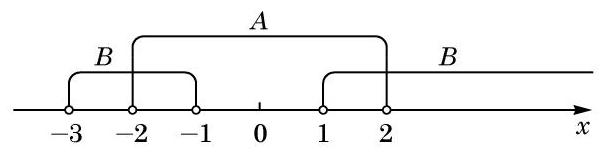

# 例题卡：例 10 已知集合

例 10 已知集合

$$
A = \left( {-2,2}\right) , B = \left( {-3, - 1}\right)  \cup  \left( {1, + \infty }\right) .
$$

求 $A \cap  B$ 及 $A \cup  B$ .

解 在数轴上标出集合 $A$ 与 $B$ ,如图 1-1-6 所示.

于是 $A \cap  B = \left( {-2, - 1}\right)  \cup  \left( {1,2}\right) , A \cup  B = \left( {-3, + \infty }\right)$ .
