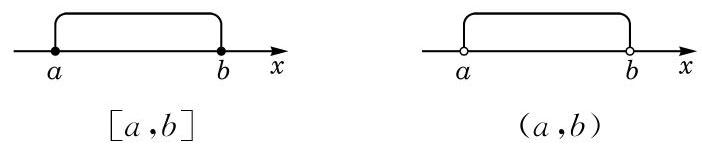
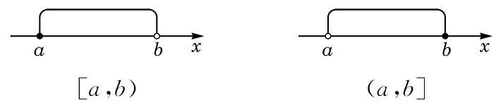

# 例题卡：例 4 选择适当的方法表示下列集合:

例 4 选择适当的方法表示下列集合:

(1)大于 0 且小于 10 的全体偶数组成的集合 $A$ ；

(2)被 3 除余 2 的所有自然数组成的集合 $B$ ；

(3)直角坐标平面上由第二象限与第四象限中的所有点组成的集合 $C$ .

解 (1) 用列举法: $A = \{ 2,4,6,8\}$ .

(2)用描述法: $B = \{ n \mid  n = {3k} + 2, k \in  \mathbf{N}\}$ .

(3)因为第二象限中所有点 $\left( {x, y}\right)$ 具有的特征是 $x < 0$ 且 $y > 0$ ,而第四象限中所有点具有的特征是 $x > 0$ 且 $y < 0$ ,所以第二象限与第四象限中所有点具有的特征可统一地写为 ${xy} < 0$ ,于是可用描述法表示该集合:

$$
C = \{ \left( {x, y}\right)  \mid  {xy} < 0\} .
$$

数学中, 常常需要表示满足一些不等式的全体实数所组成的集合. 为了方便起见, 我们引入区间 (interval) 的概念.

当 $a\text{ 、 }b \in  \mathbf{R}$ 且 $a < b$ 时,规定:

满足不等式 $a \leq  x \leq  b$ 的全体实数 $x$ 组成的集合称为一个闭区间,记作 $\left\lbrack  {a, b}\right\rbrack$ .

满足不等式 $a < x < b$ 的全体实数 $x$ 组成的集合称为一个开区间,记作 $\left( {a, b}\right)$ .

闭区间与开区间在数轴上的表示,如图 1-1-1 所示.

满足不等式 $a \leq  x < b$ 或 $a < x \leq  b$ 的全体实数 $x$ 所组成的集合称为一个半开半闭区间,分别记作 $\left\lbrack  {a, b)\text{ 或 }(a, b}\right\rbrack$ .

半开半闭区间在数轴上的表示, 如图 1-1-2 所示.

这里的实数 $a\text{ 、 }b$ 统称为这些区间的端点.

此外,满足不等式 $x \geq  a, x > a, x \leq  b$ 或 $x < b$ 的全体实数 $x$ 所组成的集合可分别用区间表示为 $\lbrack a, + \infty ),\left( {a, + \infty }\right)$ , $( - \infty , b\rbrack$ 或 $\left( {-\infty , b}\right)$ .

实数集 $\mathbf{R}$ 可用区间表示为 $\left( {-\infty , + \infty }\right)$ .

---

符号“ $\infty$ ” 读作“无穷大”.

---
