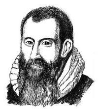

# 概念卡：1 对数的定义

纳皮尔(J. Napier, 1550 - 1617), 苏格兰数学家, 对数的发明者.

想象这样一个场景, 某人在银行存入 1 万元, 若年利率为 5%，且按年计复利，经过多少年 1 万元存款才能连本带利超过 5 万元呢?

年利率为 5% 的意思是一年之后 1 万元变成 $1 \times  \left( {1 + 5\% }\right)  =$ 1.05 万元. 按年计复利的意思是每过一年自动将连本带利作为本金再次存入银行生息. 这样,经过 $n$ 年后,存款连本带利的总数应达到 ${1.05}^{n}$ 万元. 根据题意,我们要回答,当 $n$ 是多少时,

$$
{1.05}^{n} > 5\text{ ? }
$$

实际上,如果能够找到一个数 $x$ ,使得 ${1.05}^{x} = 5$ ,那么 $n$ 就是大于 $x$ 的最小整数.

抽象一下上面的问题: 设 $a > 0, N > 0$ ,要找 $x$ ,使得

$$
{a}^{x} = N\text{ . }
$$

①

要讨论这个问题,首先要假设 $a > 0$ ,以保证对所有的 $x$ , ${a}^{x}$ 都有定义. 还要假设 $a \neq  1$ ,因为如果 $a = 1,{a}^{x}$ 就恒等于 1, 在 $N > 0$ 且 $N \neq  1$ 时,方程①无解; 而在 $N = 1$ 时,方程①有解但不唯一.

此外,在 $a > 0$ ,且 $a \neq  1$ 时,只要 $N > 0$ ,方程 ${a}^{x} = N$ 总有唯一的解.

**定义** 在 $a > 0, a \neq  1$ ,且 $N > 0$ 的条件下,唯一满足 ${a}^{x} = N$ 的数 $x$ ,称为 $N$ 以 $a$ 为底的对数 (logarithm),并用符号 ${\log }_{a}N$ 表示,而 $N$ 称为真数.

> 对数的底是不等于 1 的正数.

> "log"是拉丁文 logarithmus 的缩写.

这样, 在讨论对数的时候, 我们总是假设底是不等于 1 的正数,并且假设真数是正数. 另外,由定义,对数 ${\log }_{a}N$ 这个记号表示满足方程 ${a}^{x} = N$ 的唯一确定的数 $x$ . 因此

$$
{a}^{{\log }_{a}N} = N.
$$

②

这个式子看起来很玄妙, 但不过是对数定义的另一个表达方式而已, 也充分说明对数运算是指数运算的逆运算.

由此恒等式可以推出,若两个正数 $M\text{ 、 }N$ 的对数 ${\log }_{a}M$ 与 ${\log }_{a}N$ 相等,则 $M = N$ ,即若同一个底的两个对数相等,则其真数必相等. 这是因为

$$
M = {a}^{{\log }_{a}M} = {a}^{{\log }_{a}N} = N.
$$

此外,因为 ${a}^{0} = 1,{a}^{1} = a$ ,易见

$$
{\log }_{a}1 = 0,{\log }_{a}a = 1.
$$

在一些特殊情况下, 可以写出对数的具体数值, 而在一般情况下, 估算对数的精确值极为困难, 需要查阅有关的对数表或利用计算器来得到对数的近似值.

**例 1** 求下列各式的值:

(1)log ${}_{2}8$ ；

(2)lo ${\text{ g }}_{2}\sqrt{2}$ ;

(3) ${\log }_{10}{0.000}$ 01.

解 (1) 因为 ${2}^{3} = 8$ ,即 3 是方程 ${2}^{x} = 8$ 的唯一解,所以由定义得 ${\log }_{2}8 = 3$ .

(2)因为 ${2}^{\frac{1}{2}} = \sqrt{2}$ ，所以 ${\log }_{2}\sqrt{2} = \frac{1}{2}$ .

(3)因为 ${10}^{-5} = {0.00001}$ ，所以 ${\log }_{10}{0.00001} =  - 5$ .

对数的底 $a\left( {a > 0\text{ 且 }a \neq  1}\right)$ 原则上可以任意选取,数学上常用两个特殊的底构成的对数.

以 10 为底的对数称为常用对数 (common logarithm). ${\log }_{10}N$ 通常记为 $\lg N$ . 在中学阶段,我们主要采用常用对数, 因为在日常生活中用的数字是十进制表示的.

以无理数 e(e的值约为 ${2.71828}\cdots$ ) 为底的对数称为自然对数 (natural logarithm). ${\log }_{\mathrm{e}}N$ 通常记为 $\ln N$ . 虽然自然对数在日常生活中不常使用，但在高等数学和其他科学领域中却十分有用， 大家将来学到高等数学时, 会很容易地看到这一点.

**例 2** 求下列各式中 $x$ 的值:

(1) ${\log }_{2}x =  - 1$ ；

(2) ${\log }_{\frac{1}{2}}x = 3$ ；

(3) $\ln x =  - 1$ .

解 (1) 由 ${\log }_{2}x =  - 1$ ,得 $x = {2}^{-1} = \frac{1}{2}$ .

(2)由 ${\log }_{\frac{1}{2}}x = 3$ ,得 $x = {\left( \frac{1}{2}\right) }^{3} = \frac{1}{{2}^{3}} = \frac{1}{8}$ .

(3)由 $\ln x =  - 1$ ，得 $x = {\mathrm{e}}^{-1} = \frac{1}{\mathrm{e}}$ .
