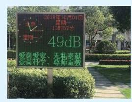

# 概念卡：2 对数的运算性质

引进对数的初衷是为了处理多位数的乘除及开方. 在本节中可以看到, 对数可以把乘除运算转变为加减运算, 并把乘方开方运算转化为乘除运算. 这为多位数的乘除及开方运算提供了一条简便的途径.

我们知道指数的运算性质: 对任意给定的正数 $a$ 及实数 $s$ 、 $t$ ,有

$$
{a}^{s + t} = {a}^{s}{a}^{t},
$$

通俗地说, 指数可以把加减转化为乘除. 这个性质在对数中怎么体现呢?

在本节中,我们总假设 $a > 0$ ,且 $a \neq  1$ .

设 $M > 0, N > 0$ ,令 $b = {\log }_{a}M, c = {\log }_{a}N$ ,就有 ${a}^{b} = M$ , ${a}^{c} = N$ ,因此

$$
{MN} = {a}^{b}{a}^{c} = {a}^{b + c}.
$$

从而, 由对数的定义, 有

$$
{\log }_{a}\left( {MN}\right)  = b + c = {\log }_{a}M + {\log }_{a}N.
$$

由此可得下述对数运算的基本性质.

**对数性质 1** 当 $M > 0, N > 0$ 时,

$$
{\log }_{a}\left( {MN}\right)  = {\log }_{a}M + {\log }_{a}N.
$$

由性质 1 可以推出

$$
{\log }_{a}M = {\log }_{a}\left( {\frac{M}{N} \cdot  N}\right)  = {\log }_{a}\frac{M}{N} + {\log }_{a}N,
$$

从而得到

**对数性质 2** 当 $M > 0, N > 0$ 时,

$$
{\log }_{a}\frac{M}{N} = {\log }_{a}M - {\log }_{a}N.
$$

对数性质 1 与 2 可以通俗地解释为: 对数把乘除运算转化为加减运算.

设 $N > 0$ ,令 $b = {\log }_{a}N$ ,则 $N = {a}^{b}$ . 由 ${\left( {a}^{b}\right) }^{c} = {a}^{bc}$ ,得 ${a}^{bc} = {N}^{c}$ ,从而由对数的定义, ${bc} = {\log }_{a}{N}^{c}$ . 所以,我们有

**对数性质 3** 当 $N > 0$ 时,对任何给定的实数 $c$ ,

$$
{\log }_{a}{N}^{c} = c{\log }_{a}N.
$$

特别地,当 $c$ 为大于 1 的正整数 $n$ 时,乘方转化为乘; 当 $c = \frac{1}{n}$ 时,开方转化为除. 这说明: 对数把乘方及开方分别转化为乘与除.

**例 3** 求下列各式的值:

(1)lo ${g}_{3}\left( {{9}^{4} \times  {3}^{2}}\right)$ ;

(2) ${\log }_{3}\sqrt[5]{9}$ ；

(3) $2{\log }_{5}{10} + {\log }_{5}3 - {\log }_{5}{12}$ .

解 反复应用上述对数性质, 可得

(1) ${\log }_{3}\left( {{9}^{4} \times  {3}^{2}}\right)  = {\log }_{3}{9}^{4} + {\log }_{3}{3}^{2}$

$$
= 4{\log }_{3}9 + 2{\log }_{3}3
$$

$$
= 4{\log }_{3}{3}^{2} + 2
$$

$$
= 4 \times  2{\log }_{3}3 + 2
$$

$$
= 4 \times  2 + 2
$$

$$
= {10}\text{ . }
$$

(2) ${\log }_{3}\sqrt[5]{9} = {\log }_{3}{3}^{\frac{2}{5}} = \frac{2}{5}{\log }_{3}3 = \frac{2}{5}$ .

(3) $2{\log }_{5}{10} + {\log }_{5}3 - {\log }_{5}{12}$

$= {\log }_{5}\frac{{10}^{2} \times  3}{12}$

$= {\log }_{5}{25} = 2$ .

> 对数化乘为加、 化除为减.
>
> 对数化乘方为乘、 化开方为除.

**例 4** 已知 ${\log }_{5}2 = a,{5}^{b} = 3$ ,用 $a$ 及 $b$ 表示 ${\log }_{5}{12}$ .

解 因为 ${5}^{b} = 3$ ,所以 ${\log }_{5}3 = b$ .

因此 ${\log }_{5}{12} = {\log }_{5}\left( {{2}^{2} \times  3}\right)  = 2{\log }_{5}2 + {\log }_{5}3 = {2a} + b$ .

**例 5** 在有声世界, 声强级是表示声强度相对大小的指标. 其值 $y$ [单位: $\mathrm{{dB}}$ (分贝)] 定义为

$$
y = {10}\lg \frac{I}{{I}_{0}}.
$$

其中, $I$ 为声场中某点的声强度,其单位为 $\mathrm{W}/{\mathrm{m}}^{2}$ (瓦/平方米), ${I}_{0} = {10}^{-{12}}\mathrm{\;W}/{\mathrm{m}}^{2}$ 为基准值.

(1)如果 $I = {10}\mathrm{\;W}/{\mathrm{m}}^{2}$ ，求相应的声强级；

(2)声强级为 ${60}\mathrm{\;{dB}}$ 时的声强度 ${I}_{60}$ 是声强级为 ${50}\mathrm{\;{dB}}$ 时的声强度 ${I}_{50}$ 的多少倍?

> 一般地，正常交谈的声音是 ${60}\mathrm{{dB}}$ ,闹市区的声音是 ${80}\mathrm{\;{dB}}$ , 飞机起飞时的声音大约是 ${120}\mathrm{{dB}}$ .

解(1)当 $I = {10}\mathrm{W}/{\mathrm{m}}^{2}$ 时，

$$
y = {10}\lg \frac{I}{{I}_{0}} = {10}\lg \frac{10}{{10}^{-{12}}} = {10}\lg {10}^{13} = {130}\left( \mathrm{\;{dB}}\right) .
$$

因此,当 $I = {10}\mathrm{\;W}/{\mathrm{m}}^{2}$ 时,相应的声强级为 ${130}\mathrm{\;{dB}}$ .

(2)由题意，得

$$
\left\{  \begin{array}{l} {60} = {10}\lg \frac{{I}_{60}}{{I}_{0}}, \\  {50} = {10}\lg \frac{{I}_{50}}{{I}_{0}}. \end{array}\right.
$$

两式相减, 得

$$
{10} = {10}\left( {\lg \frac{{I}_{60}}{{I}_{0}} - \lg \frac{{I}_{50}}{{I}_{0}}}\right)  = {10}\lg \frac{{I}_{60}}{{I}_{50}},
$$

即 $\lg \frac{{I}_{60}}{{I}_{50}} = 1$ ,所以 $\frac{{I}_{60}}{{I}_{50}} = {10}$ .

因此，声强级为 ${60}\mathrm{\;{dB}}$ 时的声强度 ${I}_{60}$ 是声强级为 ${50}\mathrm{\;{dB}}$ 时的声强度 ${I}_{50}$ 的 10 倍.
