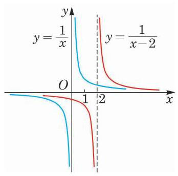

# 例题卡：例 5 已知函数 $y = \frac{1}{x}$ 和 $y = \frac{1}{x - 2}$ ,说明这两个函数图像之间的关系, 并在同一平面直角坐标系中作出它们的大致图像.

例 5 已知函数 $y = \frac{1}{x}$ 和 $y = \frac{1}{x - 2}$ ,说明这两个函数图像之间的关系, 并在同一平面直角坐标系中作出它们的大致图像.

解 在幂函数 $y = \frac{1}{x}$ 的图像上任取一点 $P\left( {a,\frac{1}{a}}\right)$ ,易得点 ${P}^{\prime }\left( {a + 2,\frac{1}{a}}\right)$ 一定在函数 $y = \frac{1}{x - 2}$ 的图像上,而将点 $P$ 向右平移 2 个单位就与点 ${P}^{\prime }$ 重合. 反之亦然. 因此,将函数 $y = \frac{1}{x}$ 的图像向右平移 2 个单位就得到函数 $y = \frac{1}{x - 2}$ 的图像. 反之,将函数 $y = \frac{1}{x - 2}$ 的图像向左平移 2 个单位就得到函数 $y = \frac{1}{x}$ 的图像,如图 4-1-6 所示.

