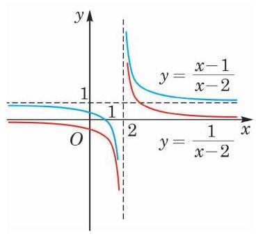

# 例题卡：例 6 已知函数 $y = \frac{1}{x - 2}$ 和 $y = \frac{x - 1}{x - 2}$ ,说明这两个函数图像之间的关系, 并在同一平面直角坐标系中作出它们的大致图像.

例 6 已知函数 $y = \frac{1}{x - 2}$ 和 $y = \frac{x - 1}{x - 2}$ ,说明这两个函数图像之间的关系, 并在同一平面直角坐标系中作出它们的大致图像.

解 将 $y = \frac{x - 1}{x - 2}$ 整理变形,得 $y = 1 + \frac{1}{x - 2}$ . 若点 $Q\left( {a,\frac{1}{a - 2}}\right)$ 在函数 $y = \frac{1}{x - 2}$ 的图像上,则点 ${Q}^{\prime }\left( {a,1 + \frac{1}{a - 2}}\right)$ 就一定在函数 $y = 1 + \frac{1}{x - 2}$ 的图像上,即将点 $Q$ 向上平移 1 个单位就与点 ${Q}^{\prime }$ 重合. 反之亦然. 因此,将函数 $y = \frac{1}{x - 2}$ 的图像向上平移 1 个单位就得到函数 $y = \frac{x - 1}{x - 2}$ 的图像. 反之,将函数 $y = \frac{x - 1}{x - 2}$ 的图像向下平移 1 个单位就得到函数 $y = \frac{1}{x - 2}$ 的图像,如图 4-1-7 所示.

