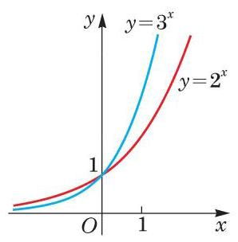

# 例题卡：例 2 分别作出指数函数 $y = {2}^{x}$ 及 $y = {3}^{x}$ 的大致图像.

例 2 分别作出指数函数 $y = {2}^{x}$ 及 $y = {3}^{x}$ 的大致图像.

解 先在相应的图像上取一些特殊的点.

由 ${2}^{-2} = \frac{1}{4},{2}^{-1} = \frac{1}{2},{2}^{0} = 1,{2}^{1} = 2,{2}^{2} = 4$ ,可知指数函数 $y = {2}^{x}$ 的图像必经过下面的点:

$$
\left( {-2,\frac{1}{4}}\right) \text{ 、 }\left( {-1,\frac{1}{2}}\right) \text{ 、 }\left( {0,1}\right) \text{ 、 }\left( {1,2}\right) \text{ 、 }\left( {2,4}\right) .
$$

---

规定指数函数底 $a > 0$ 且 $a \neq  1$ .

---

再使用计算器多采集一些点, 可以粗略地作出其图像.

由 ${3}^{-2} = \frac{1}{9},{3}^{-1} = \frac{1}{3},{3}^{0} = 1,{3}^{1} = 3,{3}^{2} = 9$ ,可知指数函数 $y = {3}^{x}$ 的图像必经过下面的点:

$$
\left( {-2,\frac{1}{9}}\right) \text{ 、 }\left( {-1,\frac{1}{3}}\right) \text{ 、 }\left( {0,1}\right) \text{ 、 }\left( {1,3}\right) \text{ 、 }\left( {2,9}\right) .
$$

再使用计算器多采集一些点, 可以粗略地作出其图像.

我们把这两个图像放在同一个平面直角坐标系中以便观察比较, 如图4-2-1所示.
