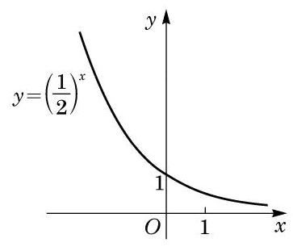

# 例题卡：例 3 作出指数函数 $y = {\left( \frac{1}{2}\right) }^{x}$ 的大致图像.

例 3 作出指数函数 $y = {\left( \frac{1}{2}\right) }^{x}$ 的大致图像.

解 由 ${\left( \frac{1}{2}\right) }^{-2} = 4,{\left( \frac{1}{2}\right) }^{-1} = 2,{\left( \frac{1}{2}\right) }^{0} = 1,{\left( \frac{1}{2}\right) }^{1} = \frac{1}{2}$ , ${\left( \frac{1}{2}\right) }^{2} = \frac{1}{4}$ ,可知指数函数 $y = {\left( \frac{1}{2}\right) }^{x}$ 的图像必经过下面的点:

$$
\left( {-2,4}\right) \text{ 、 }\left( {-1,2}\right) \text{ 、 }\left( {0,1}\right) \text{ 、 }\left( {1,\frac{1}{2}}\right) \text{ 、 }\left( {2,\frac{1}{4}}\right) .
$$

类似地, 可以粗略作出其相应的图像, 如图 4-2-2 所示.
