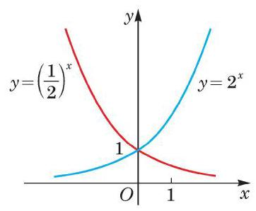

# 概念卡：2 指数函数的性质

由前述两种指数函数的图像可见,它们的图像均在 $x$ 轴的上方. 这是因为当 $a > 0$ 时,对一切实数 $x,{a}^{x}$ 均大于 0 . 因此,我们有如下的性质:

指数函数 $y = {a}^{x}\left( {a > 0\text{ 且 }a \neq  1}\right)$ 的函数值恒大于 0 .

因为 ${a}^{0} = 1$ ,所以指数函数 $y = {a}^{x}$ 的图像均经过点 $\left( {0,1}\right)$ . 因此，我们有如下的性质:

指数函数 $y = {a}^{x}\left( {a > 0\text{ 且 }a \neq  1}\right)$ 的图像都经过定点 $\left( {0,1}\right)$ .

由例 2 和例 3 可见,指数函数 $y = {a}^{x}$ 的图像可分为两种情况.

(1) $a > 1$ 的情况. 此时指数函数 $y = {a}^{x}$ 的图像类似图4-2-1 中 $y = {2}^{x}$ 的图像,当 $x > 0$ 时,函数值大于 1,其图像在直线 $y = 1$ 的上方; 而当 $x < 0$ 时,函数值小于 1 且大于 0,其图像在直线 $y = 1$ 的下方,且位于 $x$ 轴的上方.

(2) $0 < a < 1$ 的情况. 此时指数函数 $y = {a}^{x}$ 的图像类似图 4-2-2中 $y = {\left( \frac{1}{2}\right) }^{x}$ 的图像,当 $x > 0$ 时,函数值小于 1 且大于 0, 其图像在直线 $y = 1$ 的下方,且位于 $x$ 轴的上方; 而当 $x < 0$ 时, 函数值大于 1,其图像在直线 $y = 1$ 的上方.

这两种情况在同一平面直角坐标系中的图像如图 4-2-3 所示. 易见这两个指数函数 $y = {2}^{x}$ 与 $y = {\left( \frac{1}{2}\right) }^{x}$ 的图像关于 $y$ 轴对称.

一般地说, 由指数幂的运算性质

$$
{a}^{{x}_{0}} = {\left( {a}^{-1}\right) }^{-{x}_{0}},
$$

容易看到: 若 $\left( {{x}_{0},{y}_{0}}\right)$ 为指数函数 $y = {a}^{x}$ 图像上的一点,则 $\left( {-{x}_{0},{y}_{0}}\right)$ 必为指数函数 $y = {\left( {a}^{-1}\right) }^{x}$ 图像上的点,反之亦然. 由于 $\left( {{x}_{0},{y}_{0}}\right)$ 及 $\left( {-{x}_{0},{y}_{0}}\right)$ 两点关于 $y$ 轴对称,因此指数函数 $y = {a}^{x}$ 及 $y = {\left( {a}^{-1}\right) }^{x}$ 的图像必关于 $y$ 轴对称.

---

指数函数 $y = {a}^{x}$ 的图像与指数函数 $y = {\left( {a}^{-1}\right) }^{x}$ 的图像关于 $y$ 轴对称.

---

观察图 4-2-1 中两个指数函数的图像, 它们的底都大于 1, 图像由左至右是上升的,也就是说,随着自变量 $x$ 的不断增大, 函数值 $y$ 也不断增大,这点也可以证明如下:

当 $a > 1$ 时,若 ${x}_{2} > {x}_{1}$ ,则 ${x}_{2} - {x}_{1} > 0$ ,由幂的基本不等式有

$$
{a}^{{x}_{2} - {x}_{1}} > 1,
$$

即 ${a}^{{x}_{2}} > {a}^{{x}_{1}}$ . 此时,称指数函数 $y = {a}^{x}\left( {a > 1}\right)$ 在 $\mathbf{R}$ 上是严格增函数,即函数值 $y$ 随着 $x$ 的 (严格) 增大而 (严格) 增大.

同理可证: 当 $0 < a < 1$ 时,指数函数 $y = {a}^{x}$ 在 $\mathbf{R}$ 上是严格减函数.

因此,我们有

指数函数的单调性 当 $a > 1$ 时,指数函数 $y = {a}^{x}$ 在 $\mathbf{R}$ 上是严格增函数; 当 $0 < a < 1$ 时,指数函数 $y = {a}^{x}$ 在 $\mathbf{R}$ 上是严格减函数.

指数函数的图像与性质可总结见下表 4-1:

表 4-1
